<!-- post_id: x:2095468849508598032 | ts: 1788433680 -->
## [X] 駿HaYaO · 2026-09-03 19:08

光寶科宣布投資1.76億美元（約新台幣56億元）策略入股波蘭液冷散熱廠DCX LiquidCooling Systems，預計取得約25%股權，強化AI資料中心散熱布局。

DCX總部華沙，專攻AI與高效能運算資料中心液冷方案，產品涵蓋入門至16MW機櫃級FDU、水冷板、分歧管及浸沒式系統，已打入全球前十大AI資料中心營運商中的3家。

光寶科憑藉AI伺服器電源、機櫃級供電與800 VDC技術，結合DCX的in-row CDU、Facility CDU、冷板與浸沒式冷卻能力，雙方將共同開發整合式電源與液冷平台，深化產品、工程、製造與市場合作，滿足超大規模資料中心對運算效能與能源效率的需求。

董事長宋明峰表示，將持續透過策略投資與合作，打造更完整的AI基礎設施生態系。DCX技術長則看好光寶科的電力電子實力、全球製造規模與雲端客戶關係。

https://t.co/Apxp4iR5fK

---

<!-- post_id: x:2095456163794194486 | ts: 1788430655 -->
## [X] 駿HaYaO · 2026-09-03 18:17

美光正在研究開發高耐久性 NAND 閃存模組，這些模組的設計目標是部署在更靠近 GPU 的位置，而不是像傳統做法那樣，位於經過多層協議隔離的遠端儲存池中。

該公司據稱正在探索如何把 NAND 閃存拉得更近，用來處理那些並不需要傳統 HBM 或一般 DRAM 那種延遲與頻寬的工作負載。這種架構目前被稱為「近 GPU NAND」（near-GPU NAND），旨在在儲存密度與耐久性之間取得折中。

這個構想能讓 GPU 直接存取一池 NAND 閃存。與傳統 TLC 或 QLC NAND 相比，這類顆粒密度較低，重點改放在提升 I/O 速度、頻寬與讀取時間。

例如，GPU 將能直接在 GPU 封裝內部或 PCB 上存取潛在數百 GB 的儲存池，做法類似 HBM、GDDR7 或 LPDDR6 這類 DRAM。這一層會落在 GPU 顯存與一般系統儲存之間，充當極快的緩衝層，特別適合大規模 LLM 推理。

到那時，LLM 將不再受顯存容量綁死，可在 GPU 數量較少、但儲存與記憶體層級更豐富的系統上運行，以補足推理所需規模。此外，這種 NAND 會比 HBM 或一般 DRAM 便宜許多，容量也可依系統規格調整。

美光並非唯一在探索這個方向的公司。
例如，SK hynix 與 Sandisk 已將高頻寬閃存（HBF）標準化，概念是把 NAND 拉近 GPU，用來擴展 HBM 空間，並提供更高耐久的 NAND。

任何投入這個方向的廠商，都必須縮小頻寬與耐久性落差，才能讓 HBF 或近 GPU NAND 成為標準 HBM 的有效補充。

https://t.co/htEl22FLIk

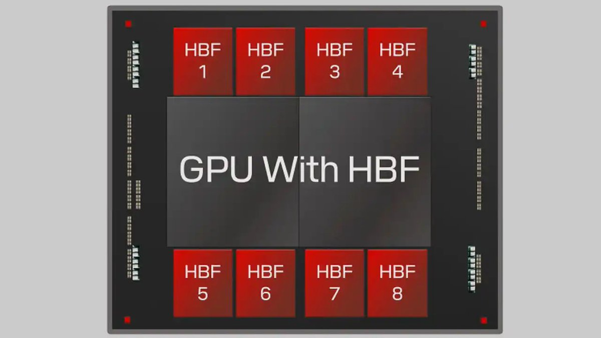
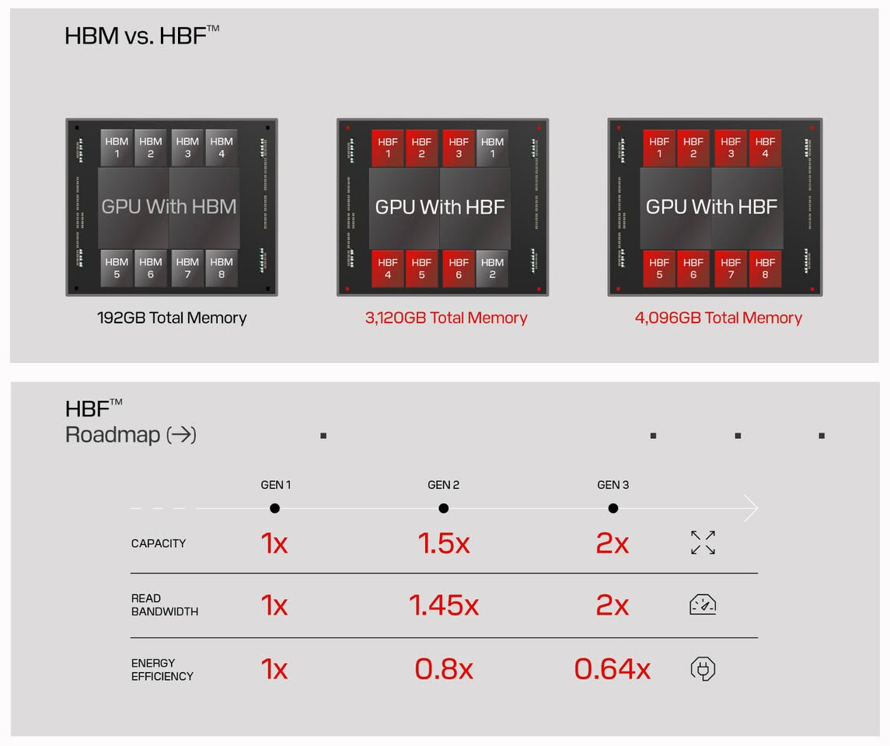

---

<!-- post_id: x:2095453588633845943 | ts: 1788430041 -->
## [X] 駿HaYaO · 2026-09-03 18:07

Apple 2026年起改分秋、春兩波發表。秋季先推 iPhone 18 Pro、Pro Max 與首款折疊機 18 Fold（暫名）；基本款延至2027年Q1。

Fold具品牌拉力，但出貨偏晚、初期產能有限，2026年全球折疊機滲透率仍約2%。

硬體屬實用優化：
- 全面導入台積電2nm A20 Pro，強化端側AI並降功耗；
- 記憶體封裝改WMCM，改善高負載發燙；
- 螢幕升LTPO+更省電；
- Pro主鏡頭首配機械可變光圈；
- 電池容量與續航提升，Pro Max較明顯。
Fold為求纖薄，採雙鏡頭與電容指紋。

記憶體自2025下半年進入超級上行，Pro 256GB機型2026 Q3記憶體成本年增近400%，BOM壓力難完全消化。
預估新機售價溫和上調10–20%。
Fold起始價約2,099–2,299美元，頂規不排除破3,000美元。硬體成本高漲下，Apple Intelligence雲端與訂閱服務將成獲利關鍵。規格與售價最終以官方為準。

https://t.co/ftig8an6kA

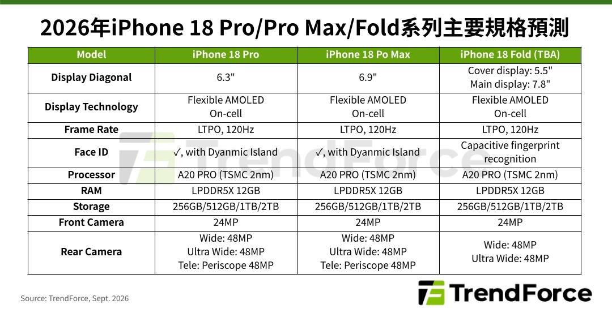

---

<!-- post_id: x:2095452313137906067 | ts: 1788429737 -->
## [X] 駿HaYaO · 2026-09-03 18:02

$AVGO 
營收能見度很高，但毛利率與落地風險也被放大。

風險
- 新世代 XPU 的 HBM 含量更高，毛利率可能持續被壓縮。RayJ 預估毛利率從 FY26 約 75% 降到 FY28 約 63%。
- 第3季毛利率 75%，第4季指引降至 73%；客製化矽晶片 + HBM 等成本是稀釋主因。
- 與 OpenAI、Anthropic 的訂單多以「整櫃／機架部署」為結構，若土地、電力、審批跟不上，可能出現 NIMBY（鄰避）／無法如期落地。
- 認為這是 Broadcom FY28 AI 營收 2,300 億美元預測的關鍵弱點。
- 盤後走勢顯示市場對這些數字解讀分歧，傾向「失望可能大於對 FY28 以後的興奮」。

正面
- 管理層上修 AI 營收：FY26 580 億、FY27 1,150 億、FY28 2,300 億（高於市場約 1,770 億共識）。
- Anthropic 料成 FY27 最大 XPU 客戶；OpenAI 料成 FY28 第二大。
- 已開始出貨 TPU v8i，早於 MediaTek v8t，並自稱仍能維持 Google TPU 多數市占。
- Meta 的 MTIA 加速器至 FY27 出貨展望穩健。
- 商用網路業務與後續成本下降，可能部分抵消毛利率稀釋；公司預期營業利益率可因營收槓桿維持。

---

<!-- post_id: x:2095450496936878483 | ts: 1788429304 -->
## [X] 駿HaYaO · 2026-09-03 17:55

Nvidia 為何把 Rubin Ultra 的 HBM 砍半？記憶體短缺正在改寫機架級系統設計

Nvidia 已下修 Rubin Ultra 的 HBM 規格：從原本規劃的 HBM4E 12-Hi（384GB），改為 HBM4 8-Hi（192GB）。這不是小幅微調，而是直接把旗艦機架級系統的記憶體容量砍半。
為什麼要這麼做？答案很直接：在最新一輪 HBM 與 DRAM 漲價後，記憶體已悄悄成為總資本持有成本（TCO）裡最大的一塊，約佔 40%。對連 Nvidia 這種議價能力最強的買家來說，這個比例已經高到必須重新設計。

從漲價到降規格：成本結構怎麼變

SemiAnalysis 以 Rubin Ultra 機架物料清單（BOM）演變來說明這件事。漲價發生後，若仍維持 HBM4E 12-Hi、384GB 規格，整機資本成本會明顯被記憶體推高。降規格之後，HBM 成本可減少超過 50%（即使已把 2026 年 HBM 漲價算進去），記憶體佔總資本成本的比重也從約 40% 降到約 28%。

以他們比較的兩款 SKU 來看：
- HBM4E 12-Hi NVL72：記憶體成本約每 GPU 小時 1.41 美元，佔整體 41%。
- HBM4 8-Hi NVL572：記憶體成本降到約 0.84 美元，佔比 28%。
整機 all-in 資本成本也從約 3.48 美元／GPU／小時，降到約 3.01 美元／GPU／小時。
但省下來的錢並沒有消失，而是被重新配置。

省下的記憶體預算，轉進 scale-up 網路

在 NVL576 NPO SKU 上，scale-up 網路支出從機架成本的 4% 升到 12%。原因是光通訊開始主導機架對機架互連，光學元件與相關網路成本明顯增加。
換句話說，Nvidia 不是單純「少放記憶體」，而是在記憶體價格與供貨雙雙承壓的情況下，把系統設計重心從「堆更多 HBM」轉向「用更多 scale-up 網路把運算節點連起來」。

這代表需求變弱了嗎？剛好相反
SemiAnalysis 的結論很明確：這次降規格是供應短缺的症狀，不是需求減弱。
當產業裡規模最大、處境最好的買家，都必須削減記憶體含量來管控成本與供貨，定價權顯然仍掌握在記憶體供應商手中。短缺沒有緩解，反而正在擴大。

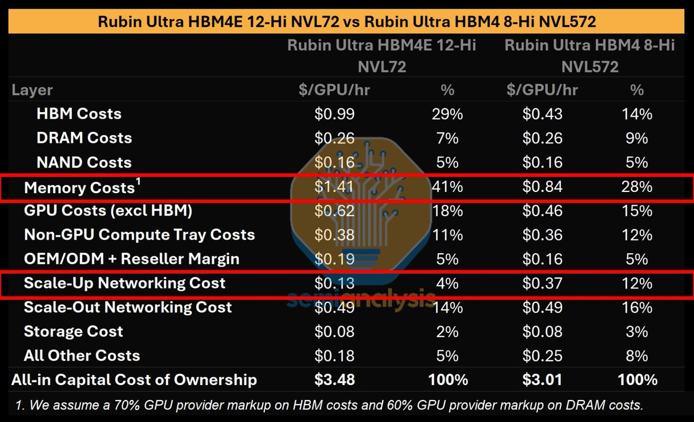

---

<!-- post_id: x:2095448562217947562 | ts: 1788428843 -->
## [X] 駿HaYaO · 2026-09-03 17:47

南電（8046）今天跌停，欣興、景碩同步重挫。
市場主因有二：

一是第四季載板暫無漲價計畫。
法人原期待ABF、BT載板續漲、獲利逐季明顯走升，但公司考量原物料漲勢趨緩，BT暫不調價，量價齊揚預期落空，後續獲利成長幅度遭質疑。

二是大客戶博通(Broadcom)法說確認，2027財年將啟用新加坡載板廠。
博通已投資日本TOPPAN在新加坡設廠，因有出資將優先供貨博通，市場憂南電市佔下滑；若該廠未來也做玻璃載板，更衝擊南電後續布局。

https://t.co/loOtaCk4i5

---

<!-- post_id: threads:3977932706369670945 | ts: 1788426553 -->
## [Threads] Kok Yu · 2026-09-03 17:09

Toppan蠻早就是Broadcom的載板廠了...他一直都是載板生產體系的一環，技術是A段班，但產能都是偏少的...

...又是看到財報會議自己嚇自己的範例

---

<!-- post_id: threads:3977855402075393262 | ts: 1788417338 -->
## [Threads] Kok Yu · 2026-09-03 14:35

博通要自己做載板... 那座廠就是跟Toppan合資的那座，Toppan全球產能市佔率少的可憐，很多都是優先做客戶最先進的那部分產品...

博通自己的載板 還是要仰賴那幾家載板廠之供應....

---

<!-- post_id: x:2095386447188750439 | ts: 1788414034 -->
## [X] 駿HaYaO · 2026-09-03 13:40

青瓦台：盧特尼克半導體關稅言論後，具體內容尚未敲定

韓聯社首爾9月3日電——美國商務部長盧特尼克表示美國政府正在考慮對半導體採取「有針對性」的關稅政策後，青瓦台周四（3日）表示，任何新的美國半導體關稅具體細節目前尚未最終確定。

盧特尼克周三（美國時間）接受CNBC採訪時表示，美國政府正在考慮對半導體採取「有針對性（targeted）且審慎（thoughtful）」的關稅政策。

青瓦台一名官員表示：「據我們了解，與美國半導體關稅相關的具體事項尚未確定。」

該官員並稱：「政府將密切監測相關動向，同時與美方保持緊密合作，以防止對我國企業產生不利影響。」

https://t.co/beNzQucv5q

---

<!-- post_id: threads:3977825649352152268 | ts: 1788413791 -->
## [Threads] Kok Yu · 2026-09-03 13:36

一跌 一堆擔心就跑出來
去看漲價的基礎有沒有變...
如果都只靠AI 不動腦..
神仙也難救

---

<!-- post_id: x:2095348149653237947 | ts: 1788404903 -->
## [X] 駿HaYaO · 2026-09-03 11:08

南電受惠AI需求，大陸PCB廠稼動率逐步滿載，先前因無長約已調漲報價反映成本。

BT載板原物料漲勢趨緩，第4季無意再漲，但報價仍處季節高檔；ABF載板因T-glass等材料持續吃緊，仍有漲價空間。法人看好昆山廠Q4稼動率有望達100%、良率提升，加上PCB與ABF價格上揚，下半年獲利與毛利率可望持續改善。

南電因未簽LTA，調價彈性優於同業，先前漲幅已較高。

https://t.co/kfy0Pqq4HM

---

<!-- post_id: x:2095330990701068461 | ts: 1788400812 -->
## [X] 駿HaYaO · 2026-09-03 10:00

NVL576 交換機托盤將用 PTFE，但高速 CCL 升級路線圖不變

市場追問 Rubin Ultra 會不會全面改 PTFE。JPM 認為輝達在測很多材料，目標是 Df≤0.0004；PTFE 低損耗夠好，所以在候選名單裡。但材料配方、層壓、鑽孔、機械強度仍有多條路可走，技術風險沒消除。因此結論不是「路線翻盤」，而是：高速 CCL 升級路徑仍在，PTFE 只是其中一種可能；這些不確定性未來幾年仍可能讓 CCL、PCB、上游材料股的情緒和估值倍數來回擺。

- 一切圍繞電氣性能：Rubin Ultra 可能導入新技術。
Rubin Ultra 要的是極限互連（背板、NVL576 交換機板）。廠商送了很多 M10，多數 Df 在 0.00043–0.00045，仍略高於 0.0004。唯一接近目標的，是去掉玻纖的「glass-less」層壓樣品，損耗更好，但板子變軟、結構變差。

JPM 判斷開發已轉向混成：PTFE（Df 可到 0.0003–0.0004）加上去玻纖 M10。
不用全 PTFE，主因兩條：純 PTFE 堆疊缺高溫層壓機產能；混進 M10 後鑽孔比較好做。重點是「達標電氣性能」，不是押單一樹脂品牌。

- 去玻纖是新做法，Rubin Ultra 上可能與 M10 搭配。
理論上玻纖會拖累訊號，去掉玻璃電氣最好。但玻璃是機械骨架，交換機板又大，全面去玻纖很難量產。JPM 較看好的 NVL576 解法是：去玻纖 M10 負責損耗，帶玻璃的 PTFE 負責支撐。
軟板、載板已有全去玻纖案例，那些可以另加結構件；交換機板不行，還會碰到金屬附著、供應鏈經驗、耐高壓、鑽孔等問題。電氣再好，現在不能當成已定案。長期極端互連才可能再往「全去玻纖 PTFE」走。

- 市場規模與採用前景。
若機械和加工過關，M10／PTFE 混成最可能先上 Rubin Ultra 的 NVL576（8 櫃叢集）交換機托盤，不是整機所有板。單櫃規格即使到 Rubin Ultra，JPM 仍預期維持 M8。更激進的全 PTFE，要等到 Feynman，且前提是鑽孔與 PTFE 層壓產能解開，才可能出現在多叢集 NVLink 交換機板等位置。

---

<!-- post_id: x:2095302723990356089 | ts: 1788394072 -->
## [X] 駿HaYaO · 2026-09-03 08:07

早安！9/3 外電綜合整理

- Semicon Taiwan: 
美系大行參加CEO 爐邊對談，券商擷取鴻海與欣興的談話，表示AI 需求無論在速度或規模上都是前所未見的，鴻海透過在地夥伴及在地生產，將產品輸往客戶；欣興的部份：AI正在推升 ABF 載板的需求與複雜度，上游關鍵材料的供應，例如 ABR 與 T-glass仍然吃緊。

- 解讀Credo財報：
美系大行表示Credo 對於 AEC 持續擴張到更多hyperscalers and neoclouds，以及ALC 有機會後年放量。另外下半年主要將由光學業務營收帶動出現成長轉折。券商認為上述都對貿聯正面解讀，對3665貿聯重申正向。

 #下次會考

---

<!-- post_id: x:2095196329068970134 | ts: 1788368706 -->
## [X] 駿HaYaO · 2026-09-03 01:05

路透社

美國商務部長 Howard Lutnick 表示，AI 公司 Anthropic 已與川普政府「回到正確的一邊」。路透轉述 Axios 當天文章，稱雙方此前緊張的關係出現緩和。

Lutnick 發表上述言論幾天前，美國一名法官在 Anthropic 與軍方的訴訟中站在公司一邊。國防部長 Pete Hegseth 此前因 Anthropic 拒絕讓美軍將 Claude 模型用於國內監控或自主武器，而將其排除在部分軍方合約之外。Anthropic 隨後在加州法院起訴。

路透社聯繫 Anthropic 和商務部，雙方均未立即置評。

https://t.co/ckRec3YR5J

---

<!-- post_id: x:2095151731936313508 | ts: 1788358073 -->
## [X] 駿HaYaO · 2026-09-02 22:07

SEMICON Taiwan上，台積電副共同營運長侯永清指出，AI需求成長幅度與變化速度為近30年未見。

公司設備採購預估去年底以「1倍」規劃，第一季升至1.25至1.5倍，7月再拉到1.9倍，半年幾乎翻倍。即使擴產史無前例，客戶仍感供應吃緊。

台積電目前台灣同步建13座廠、海外5至6座，全球近20座同時推進，速度約為過去4至5倍，仍追不上需求。2026年資本支出已由520至560億美元上修至600至640億美元，美國投資再加1,000億、總規模達2,650億美元。

真正瓶頸不只資金，而是廠房、設備安裝、無塵室、氣體與施工人力；設備需求半年近翻倍，「已是極限」。需求一季可變，業者須同時承擔提前擴產與缺貨風險。

技術上，先進製程、封裝與系統性能要求更高；合作也從順向交貨改為跨段整合。瓶頸已從晶片設計轉向晶圓廠與供應鏈。

https://t.co/jZiosBEY7z

---

<!-- post_id: x:2095137140279787564 | ts: 1788354594 -->
## [X] 駿HaYaO · 2026-09-02 21:09

彭博社

美國商務部長盧特尼克表示，特朗普政府正考慮對進口半導體加徵新一輪關稅，以提高外國芯片稅負，推動製造業回流美國。政策預計採「針對性、深思熟慮」方式：在美建廠可獲關稅豁免或減免，不在美設廠則需繳稅才能進入美國市場。此做法類似製藥業政策，關稅可能與投資減免配套推出。

目前已有約1.2萬億美元投資承諾用於美國半導體產能建設，台積電、美光等已在投資本土設施。盧特尼克透露，台灣下周將宣布新一輪投資，規模約200億至300億美元。企業均已知悉政策方向，並已開始因應。整體目標是透過關稅槓桿，加速半導體產業回流美國。

---

<!-- post_id: x:2095129263402070462 | ts: 1788352716 -->
## [X] 駿HaYaO · 2026-09-02 20:38

違約率觀察
8月高收益債券（HY）與槓桿貸款（LL）違約率走勢相反，但 HY 違約率已連續第3個月高於 LL。

資金與倉位變化（上週）
- 投資人大幅縮短久期：ETF 從中期／廣泛政府債券流出，轉入前端。

- 期貨：美債被大量買入（375億美元），前端（2年／5年期）佔大宗；資產管理公司明顯減持超長期美債多頭。

- 股票風險偏好回升：期貨（NDX／RTY 淨買入約2個標準差）+ ETF 流入350億美元。

- 股票內部輪動：從金融／工業／能源 → 科技／醫療；從「新AI」（記憶體／韓國流出）→「舊AI」（半導體流入）。

- 加密貨幣與黃金 ETF 仍有買盤，但流入較前一週明顯放緩（貨幣貶值擔憂持續）。

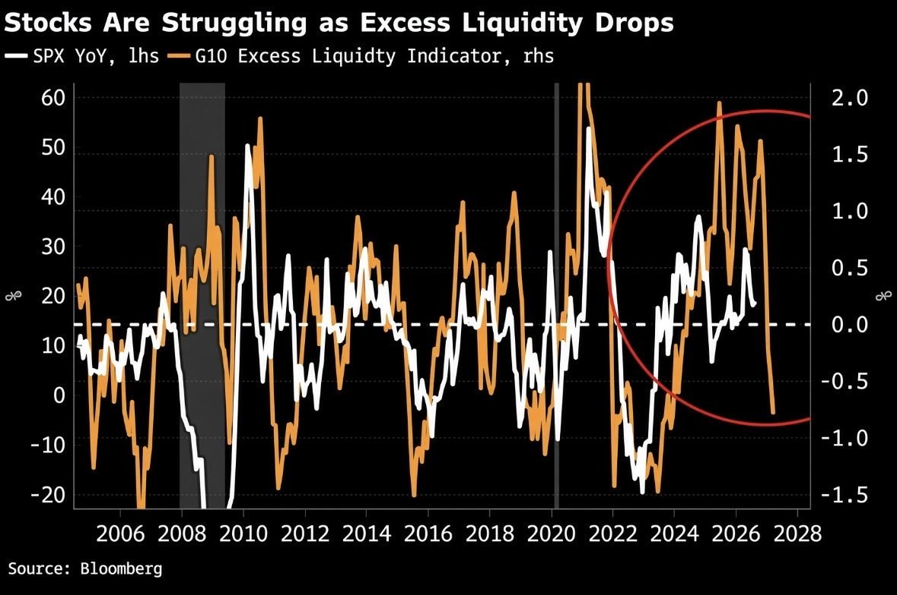

---

<!-- post_id: x:2095128760542790121 | ts: 1788352596 -->
## [X] 駿HaYaO · 2026-09-02 20:36

AI 瓶頸已從「算力不夠」轉成「記憶體不夠」。
Google 認為現在是記憶體頻寬與容量在限制擴展，記憶體也成為 AI 伺服器總持有成本（TCO）的主要成本來源。

記憶體需求暴增的三個原因
1. MoE 架構：Gemini 等模型把大模型拆成數百個專家，各專家權重仍要常駐記憶體。
2. Agentic AI：互動從一次性問答變成可連續數天、數月的多輪推理，大量上下文必須留在記憶體。
3. KV Cache 膨脹：為避免重複計算 Token 而快取結果，但會和模型權重搶記憶體；高併發時處理器常在等記憶體，昂貴算力被閒置。

Google 的三路解法

硬體分流（今年首次同年推出兩款 TPU v8）
- 訓練用 TPU v8t：9600 顆晶片組成 Superpod，121 ExaFLOPS、共享 2PB 記憶體。
- 推論用 TPU v8i：片上 SRAM 提高到 384MB，HBM 每顆 288GB，讓活躍 KV Cache 盡量留在晶片內，減少對外搬資料。
- 業界預估 2027 年約 80% 算力會用在推論，訓練只剩約 20%，所以硬體要分開設計。

軟體壓縮
- 用 ICLR 發表的 TurboQuant 把 KV Cache 記憶體需求壓到約 1/6，準確度仍維持。
- Cherian 自己說：就算壓了 6 倍，「對 Google 的企圖來說還是不夠」。

供應鏈與回收
- 與記憶體廠長期合作、共同投資產能。
- 翻新退役伺服器、回收零件。
- 開發專用硬體轉接器，把 DDR4 等舊世代記憶體接到新一代 AI 伺服器裡重複使用。

需求規模
- Google Cloud 上季營收約 248 億美元，年增 80%。
- 已簽約、待部署訂單積壓（backlog）達 5140 億美元。
- 即使軟體壓縮、硬體分流、舊件回收都做了，記憶體需求仍持續上升，因此公開呼籲供應商加速擴產。

https://t.co/xBDPx0wbHw

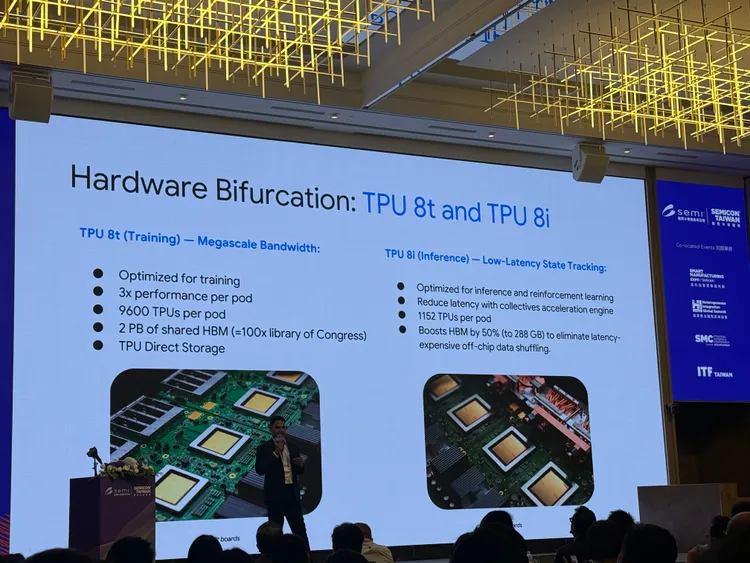

---

<!-- post_id: x:2095108254837944381 | ts: 1788347707 -->
## [X] 駿HaYaO · 2026-09-02 19:15

市場流傳台達電（2308）某批次電源供應器電容器，長期未上電存放後可能漏電流增大，恐造成電壓不平衡、過熱甚至故障，盤中股價重挫。公司不評論傳聞，強調若零組件有問題會協助客戶換貨，確保需求與營運不受影響。

據了解，問題出在試產階段的VR 18.4 kW產品，台達主動通知並啟動更換。業界指出此非設計瑕疵、高階產品領先、備料充足，更換供應商即可解決，預期實質影響有限。

https://t.co/H2KZvMxGGS

---

<!-- post_id: x:2095104655869272481 | ts: 1788346849 -->
## [X] 駿HaYaO · 2026-09-02 19:00

AI 基礎設施每 100 美元支出流向

半導體：$50（最大塊）
加速器：$25
主要受益：NVIDIA（GPU 為核心）
記憶體 IC：$15
受益公司：Micron、SK Hynix、Samsung
涵蓋 HBM（高效能加速器）、DRAM（系統記憶體）、NAND/企業級 SSD（儲存）
CPU、其他晶片與伺服器生產：$10

電力：$20（第二大）
受益公司：Constellation Energy、Vistra、Talen Energy（核能與發電）
設備與基礎設施：GE Vernova、Eaton、Quanta Services（渦輪、變壓器、電網、輸電）

網路設備：$15
網路處理器：Broadcom、Marvell
交換器與資料中心網路：Arista、Cisco

另含光收發器供應商（GPU 之間高速互連需求）
冷卻：$7.50
受益公司：Vertiv、Modine、Johnson Controls
內容：冷卻系統、冰水主機、冷卻塔、熱管理設備

設施與建設：$7.50
受益對象：資料中心開發商、建築公司、材料供應商
內容：土地、建築外殼、結構工程、內部裝修、設施支援

總結
半導體吃掉一半，電力與網路各占不小比例，冷卻與建設各約 7.5%。整體反映 AI 資料中心不只買晶片，還大量需要電力、散熱、網路與實體建設。

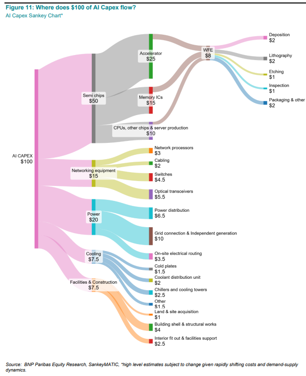

---

<!-- post_id: x:2095103962064286160 | ts: 1788346684 -->
## [X] 駿HaYaO · 2026-09-02 18:58

Credo F1Q27 摘要

營收 4.79 億美元（年增 115%、季增 10%），大致符合預期；每股盈餘 1.20 美元，略優於市場共識。

- F2Q27 展望：營收 5.25–5.35 億美元；毛利率 67–69%，兩者皆符合預期。
- FY27E 成長：管理層預期營收年增超過 85%，受惠於 AI 互連需求強勁成長。

- AEC 仍是近期成長引擎，採用範圍擴大至超大規模業者與新興雲端客戶；200G/lane 與 PCIe 6.0 平台正逐步獲得採用。
- 長期來看，Credo 預期 AEC 與光學產品營收比重將接近 50/50。
- 光學 FY27E 營收維持超過 6 億美元，明顯放量將集中在下半年（F2H27）。
- ZeroFlap 可插拔光收發模組預期將成為光學營收最大貢獻來源，受惠於較高平均售價與強調可靠性的設計。
- 光學比重提高會造成毛利率稀釋，但絕對獲利能力仍維持健康。
- NPO OE 採用 DustPhotonics 矽光子技術，目標於 FY27E 末期開始送樣；實質營收預期在 FY28E 顯現。

- 維持目標價 227 美元，基於 FY28E 每股盈餘 20 倍本益比；FY27E／FY28E 每股盈餘預估為 6.5／11.4 美元。

---

<!-- post_id: x:2095028447361765521 | ts: 1788328680 -->
## [X] 駿HaYaO · 2026-09-02 13:58

台積電啟動AI「冷革命」，將微流道（Microchannel）散熱納入研發藍圖，因應晶片功耗可能突破4,000W、傳統水冷板不足的問題。輝達傳將在下世代Feynman平台導入此技術，台積電配合大客戶升級而跟進。

健策已具備微通道散熱蓋（MC Lid）與均熱板散熱蓋技術，針對功耗破1,000W的AI／HPC晶片提供直接液冷，降低熱阻。
一詮憑精密加工與電鍍技術轉型，投入微流道封裝蓋板開發並送樣，產品已進Google、亞馬遜供應鏈。雙鴻、奇鋐亦投入研發與送樣。

微流道採微米級流道，比表面積大、熱對流係數高，能在小空間帶走高熱密度，單價為一般水冷板3至5倍、毛利更高，成為散熱廠兵家必爭之地，但技術門檻極高，目前仍處研發階段。
https://t.co/GcPcrexcJH

---

<!-- post_id: x:2095024695682941379 | ts: 1788327785 -->
## [X] 駿HaYaO · 2026-09-02 13:43

台達 18.3kW 電源「燒機」召回事件：先把事實和傳聞拆開，再看誰真正被影響
發布時間：2026-09-01
事件背景

8月31日夜裡，產業端消息在小紅書、微博流傳：輝達 Vera Rubin 平台配套的台達 18.3kW 大功率 PSU 出現燒機故障，存在召回風險。傳聞歸因是 NCC 牛角電容漏電流異常。台達此前剛因財報新高、擴產、大單傳聞處於風口。
這不是普通 ATX 電源，而是機櫃後側供電架上的 3U 熱插拔大功率模組，配套 Rubin 平台（7月官宣量產，Q3 首批、Q4 爬坡）。

文章把資訊分成三堆

多信源較一致的部分
台達緊急把電容供應商切到 TDK-EPCOS；輝達要求相關產品移除 NCC 電容。
尚未官宣的部分
截至 9月1日，台達和輝達都沒有正式公告。卖方追蹤口徑認為：確有其事，偏研發／導入階段的品質整改，集中在特定電容料號，處理方式是更換電容並 rework，預計約一個月。更接近廠端返工，而不是用戶端大規模召回。也有觀點認為過熱是正常現象，並非近兩天突發。
被輿論放大的部分
從「特定料號出事」直接跳到「台達電源不行了」，目前沒有證據支持。電容是安全件，出問題可能造成資料中心損失，所以輿情發酵很快。

技術原因簡述
牛角鋁電解電容用於母線濾波。在 AI 伺服器高溫、大紋波、7×24 工況下，漏電流異常會持續發熱，最終燒毀電源。新一代 18.3kW PSU 功率大幅提升，濾波電容可靠性權重更高。台達這款還搭配了超級電容應對 GPU 負載突變，但問題仍出在基礎物料驗證上。

對各方的影響判斷
對台達：正處在 AI 敘事高點（營收、EPS 新高，東莞新廠、碳化矽長約等），導入驗證環節出事對品控形象有衝擊，但文章認為這不是「電源之王塌房」。

供應鏈：可能強化大陸供應商份額提升邏輯，牛角電容環節被重估；TDK 補位。國產替代、日系漲價等仍屬二手資訊。
普通裝機用戶：家用機工況完全不同，不必恐慌拆機。NCC 也沒從主流品牌名單裡除名。「全日系電容」是賣點不是護身符，更該看保修、保護和口碑。

玩伺服器電源／拆機的人：注意料號和日期碼，對應整改批次即使理論上不會外流，低價貨也建議繞行。
接下來建議盯的點
台達官方口徑是「導入階段整改」還是「召回」。
Rubin Q4 爬坡是否延期。
換 TDK 後的驗證和 rework 進度（追蹤口徑約一個月）。

輝達對 PSU 補位產能的正式評估。

文章結論：這是「一顆電容震動一條供應鏈」的事件，不是台達電源技術整體崩盤。對技術能力，拆解帖還在驗證用料；對品控管理，要等 9 月官方回應再判斷。建議先觀察，等官宣再動倉位或購物車。
https://t.co/IcHFhNREl0

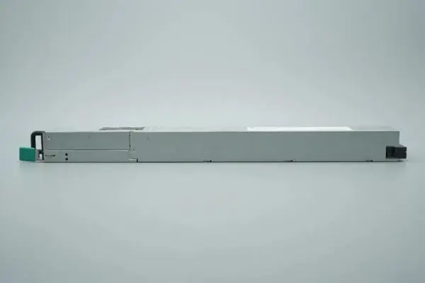
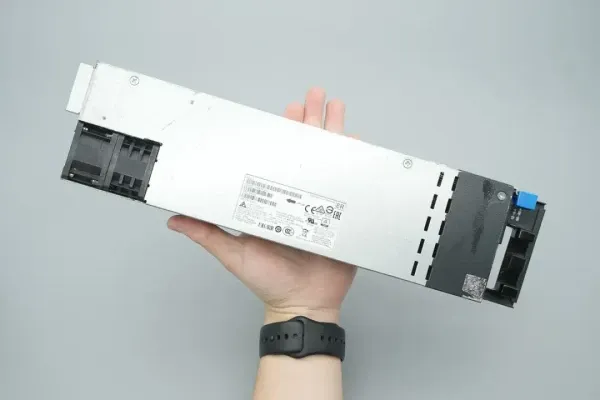
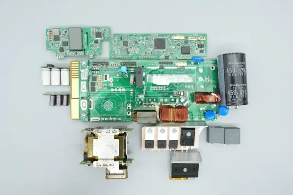
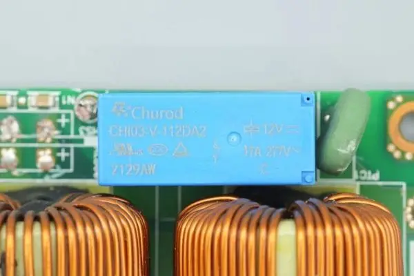

---

<!-- post_id: x:2095000982250004703 | ts: 1788322132 -->
## [X] 駿HaYaO · 2026-09-02 12:08

村田製作所投資62億日圓，在泰國興建EMI濾波器新生產棟

村田製作所（Murata Manufacturing）於2026年9月1日宣布，將由泰國製造子公司 Murata Electronics (Thailand), Ltd. 在南奔府（Lamphun）北部工業區既有廠區內，興建一座專門生產EMI除去濾波器的新生產棟。總投資約62億日圓，含建物與生產設備。工程同月動工，預計2027年11月竣工。

新棟為4層鋼構，建築面積2,834平方公尺，延床面積約寫為1萬平方公尺。用途為生產EMI（電磁妨害）除去濾波器，這類零件用來降低電子設備產生與傳播的電磁干擾，避免智慧型手機、電腦與工業設備因雜訊誤動作。

公司指出，電子設備日益高功能、複雜化，雜訊對策零件需求隨之上升。此次投資旨在擴大泰國產能、強化當地生產與供應體系，以因應中長期需求並維持穩定供貨。

https://t.co/XLz6oAOIEz

---

<!-- post_id: x:2094830460379779295 | ts: 1788281476 -->
## [X] 駿HaYaO · 2026-09-02 00:51

中國東莞法院凍結Nexperia及ITEC約21.4億元人民幣（3.18億美元）資產，至2029年8月。凍結標的為Nexperia五家中國子公司股權（含無錫、上海等）及ITEC無錫設備子公司全部股權，禁止出售、轉讓或重組。

此為聞泰科技2026年5月對Nexperia、ITEC及三名高管提起80億元損害賠償訴訟的保全措施，案件尚未開庭。聞泰指控高管協助執行荷蘭2025年限制措施。荷蘭曾短暫接管Nexperia後暫停干預。

這五家中國實體自2025年10月起已脫離荷蘭總部控制，Nexperia稱其拒付晶圓款並開設未經授權帳戶。因此任何涉及中國資產的和解，2029年8月前難以完成。

聞泰上半年營收僅15.1億元、淨虧4.06億元，處於*ST退市風險。Nexperia表示凍結僅限已脫離治理的中國實體，不影響日常營運。

---

<!-- post_id: x:2094824381436641571 | ts: 1788280027 -->
## [X] 駿HaYaO · 2026-09-02 00:27

Nomura 
Kansai Electric Power（關西電力，9503.T）

核心觀點
- 重申 Buy 評級，預期 28/3 期燃料調整後經常利益成長。
- 關西電力是日本第二大電力公司（僅次於東京電力 9501），擁有最多運轉中核電廠（7 座反應爐），24/3–26/3 調整後經常利益維持在 5,000 億日圓以上。
- 2026 年 4 月發布的集團經營計畫顯示，27/3–29/3 平均經常利益約 2,700 億日圓，主要因核電利用率下降與通膨、利率上升導致成本增加。
- 預期從 28/3 起，因輸配電費用（wheeling charges）修訂及企業客戶標準電價調整，調整後經常利益可回升至 5,000 億日圓以上。
- 目標價 3,120 日圓仍以 Russell/Nomura Large Cap（不含金融）28/3 預測平均本益比打約 5 折計算（目前使用 P/E 8.2x）。

電價調漲不易流失客戶的理由
1. 輸配電費用對所有使用輸配電網的零售電力業者一視同仁，關西電力調漲不會特別吃虧。
2. 目前 JEPX 電價偏高，其他電力公司向批發市場採購成本也不划算，因此企業客戶較不容易轉投其他業者。

---

<!-- post_id: x:2094823798361276515 | ts: 1788279888 -->
## [X] 駿HaYaO · 2026-09-02 00:24

財報狗( StatementDog )追蹤 AI 建置背後的公司與技術。我們解釋正在發生什麼變化、為何重要，以及接下來該關注什麼。

營運台灣最大的基本面股票分析平台，也是領先的投資媒體品牌之一，擁有廣泛追蹤的 Podcast 與電子報。

我們集團也投資公開與私募市場。創投投資組合中的數家新創公司，是 NVIDIA $NVDA 與台積電 $TSM 的合作夥伴或供應商。

這些角色讓我們能透過媒體訪談、投資人會議與實地參訪與公司接觸，同時也能運用股票研究員與產業專家網絡。

我們結合這些觀點，再加上公開財報、法說會與產業數據，分析半導體、AI 硬體、產能、定價與供應鏈。

追蹤 @statementdog 以取得持續分析。

---

<!-- post_id: x:2094766134272868431 | ts: 1788266139 -->
## [X] 駿HaYaO · 2026-09-01 20:35

財報狗 — 549.【台股美股提款機】玻璃基板產業展望與競爭格局

玻璃基板不是面板級封裝（PLP）的專屬材料。
玻璃在封裝有兩種用途：一是暫時載具，封裝後移除，已廣泛使用；二是真正成為基板或中介層，留在成品裡。
本集談的是後者。

為何需要中介層與載板
晶片線路是奈米級、PCB 是微米級，中間必須靠中介層與載板過渡，否則訊號無法穩定傳輸。NVIDIA 曾嘗試跳過載板直接接 PCB，目前技術仍做不到。

玻璃的優點、缺點
玻璃三大優勢：CTE 可客製、剛性強、表面極平整，能降低大面積封裝翹曲，並支援更細線路與更高層數。
三大難關則是易脆裂（尤其 TGV 孔壁）、銅層附著差、透明玻璃難以用傳統光學檢測。

量產時間表
2027 年可望小量商業化，初期或先用於光通訊；2028–2029 年較大規模量產。
三星電機、Absolics 較積極喊 2027；IBIDEN、大日本印刷較保守，看 2028–2030。
真正放量關鍵仍是台積電是否把玻璃載板導入 CoWoS，預估約 2028 年底至 2029 年初。玻璃中介層更晚，多看 2030 年後。

玻璃廠、面板供應鏈、傳統載板廠
供應鏈分三段：玻璃材料、TGV／金屬化、上層疊層。
對應三類業者：康寧、肖特、AGC、NEG 掌握材料；
大日本印刷、凸版、京東方等面板鏈切入大面積加工；
欣興、景碩、南電、IBIDEN 強在後段疊層。
TGV 加工目前最擁擠。

長期護城河在上游玻璃配方與下游高階多層疊層，高階市場仍較可能由傳統載板龍頭與台積電主導。

對投資人而言，2027–2029 年是觀察產業是否真正起飛的關鍵窗口。

https://t.co/WXjj4xoUWp

---

<!-- post_id: x:2094751875254063557 | ts: 1788262740 -->
## [X] 駿HaYaO · 2026-09-01 19:39

6770 力積電（20260715）

記憶體與成熟製程漲價、產能利用率提升、3D AI／先進封裝放量，短期有產線調整干擾，但中期展望正向。

1. 2Q26 財報重點
- 營收約 172.9～173 億元，QoQ +27.4%。
- 12 吋出貨約 42.2 萬片（1Q26 約 41.5 萬片），稼動率約 87～88%。
- 毛利率升至 28.3%（1Q26 約 10～12%；排除 P5／銅鑼廠後約 35%）。
- 稅後淨利約 32.9 億元，EPS 0.70～0.76 元（優於市場共識約 0.52 元）。
- 產品組合：記憶體相關約 52%（DRAM 約 46%、Flash 6%），邏輯／特殊應用其餘。DRAM 占比大幅上升主因 ASP 急升。
- 3D AI Foundry 占比由 1Q 約 3.2% 升至 5.4%。
- 地區：台灣約 51%、歐美 26%、亞洲 23%（亞洲因記憶體拉貨增加）。

1Q26 若排除美光（Micron）交易利益，獲利大致持平；2Q 已明顯轉強。

2. 漲價與營運展望
記憶體
- DRAM 代工 2026/3 已結構性大漲，7 月再漲約 45%；因生產週期，明顯貢獻約在 4Q26（11～12 月）。
- CSP 鎖定長期產能，供需缺口預期延續至 2027。
- 自有 1X DRAM 2026/6 小量產，良率爬升中；與美光合作先進製程預計 2028 年中量產，晶圓價值可望提升約 2.5 倍。
- SLC NAND、NOR Flash 亦調漲，NOR 因非中系代工地位受惠 AI Server／5G。

邏輯代工
- 供給緊，3Q26 訂單／產能比約 1.4 倍。
- 7 月起 8／12 吋邏輯投片價普遍再漲 10～15%，後續仍有調漲空間。
- 車用、工規、AI 相關 PMIC 需求強，排擠部分消費性產能，有利 ASP。

短期干擾
- 7 月因銅鑼廠設備搬遷至新竹＋年度歲修，營收成長暫緩；8 月起動能恢復，年底預期達高峰。
- P5（銅鑼）廠已售予美光，不再貢獻該產線營收，但現金回收、資產去風險，下檔風險降低；折舊下降有利毛利率。

3. 中長期成長動能：3D AI Foundry 與先進封裝
管理層目標三年內營收占比達 20%。
- 矽電容／IPD：已獲 Intel EMIB 認證並出貨，體積更小、電源效率更好。12 吋規劃 2027 年月產能逾 1 萬片；8 吋光通模組亦在量產。
- Interposer（矽中介層）：受惠台積電 CoWoS 溢單，產線已復線量產。
- W2W（晶圓對晶圓）：4 層堆疊已通過客戶驗證待放量；8 層良率逾 90%，朝 12 層開發。定位為低功耗、高頻寬 HBM 替代方案。
- PWF：與美光合作試產線預計 2026 年底設立，目標 4Q27 量產。

其他：切入 NVIDIA 供應鏈（PMIC、GaN via Navitas）、印度建廠技術費、財務結構改善後未來有機會配息。

---

<!-- post_id: x:2094732762746134698 | ts: 1788258183 -->
## [X] 駿HaYaO · 2026-09-01 18:23

TrendForce: 價量齊升助攻，2Q26前五大Enterprise SSD品牌營收翻倍至近375.9億美元

TrendForce指出，NAND原廠為衝高毛利、優化產品組合，全面擴大高毛利Enterprise SSD供應。在出貨量與合約價齊升下，2026年Q2全球前五大Enterprise SSD品牌合計營收近375.9億美元，季增103.6%。

展望Q3，生成式AI agent普及、CSP穩健建置資料中心，加上NVIDIA GB系列AI server大量出貨，需求可望維持高檔、營收再上層樓。惟中系供應商增產與中國本土雲端市場崛起，後續市占格局恐生變。

Q2排名：
- Samsung（約143.5億美元）：
176層QLC放量、PCIe 5.0比重提升；憑DRAM+NAND整合能力，成北美CSP從PCIe 4.0轉5.0的首選。

- SK hynix集團（逾86.3億美元）：
母公司321層TLC擴大出貨，Solidigm超高容量QLC持續放量。

- Micron（約69.8億美元，季增126.3%，增幅最大）：
集中產能於Enterprise SSD與HBM，232層QLC大容量產品大增，PCIe 6.0開發驗證領先。

- Kioxia（46.4億美元，翻倍）：
218層產品通過北美頂級雲端認證並放量，server品牌市占提升。

- SanDisk（近29.8億美元，季增102.9%）：
大容量QLC進入規模放量，位元出貨增加。

https://t.co/1z9w4DxkNv

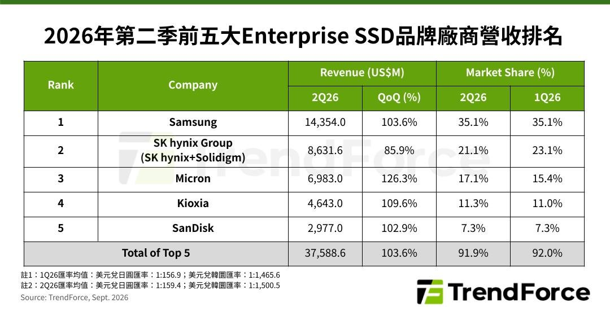

---

<!-- post_id: x:2094715240902803869 | ts: 1788254006 -->
## [X] 駿HaYaO · 2026-09-01 17:13

從中國巨石預計的九月報價來看，他們正推動7628產品上調15%，以及2116/1080產品上調20%。
業界同行普遍預期將跟進。 https://t.co/kS3gi1VPmq

---

<!-- post_id: x:2094696765844799893 | ts: 1788249601 -->
## [X] 駿HaYaO · 2026-09-01 16:00

SambaNova SN50
針對 agentic 推論做資料流架構，強調算子融合與資料區域性，並用 SRAM＋HBM＋CXL DDR 三層記憶體提高頻寬利用率。全風冷機架對企業機房較友善。技術之外，公司稱新雲與企業客戶開始有牽引，部署便利與現有機房相容，可能跟峰值效能一樣重要。

CPU 場次
Agentic AI 讓 CPU 要扛的工作突然變多。ARM 打低延遲與效率，但單機核心數／吞吐仍受限；Intel 續走高核心數 x86；NVIDIA Vera 則按每個 agent 的每瓦效能與 LPDDR 來設計。結論是 CPU 不再只是配角，但各家取捨不同：擴核、相容，或專為 agent 延遲優化。

AMD FPGA／Versal
Versal 往實體 AI、資料中心與 RF／邊緣延伸，提高 DSP、安全、先進互連與板上記憶體。RF 版把轉換器、DSP、AI 引擎做進單晶片，瞄準國防、通訊與新興控制場景。這條線補的是 GPU／ASIC 不太管的低延遲、可適配與異質加速。

記憶體／PIM／CXL
運算正在往記憶體裡搬。Samsung LPDDR5X-PIM 在 DRAM bank 做 MAC，頻寬與小模型 token 效率明顯提升，走比 HBM 便宜的推論。CXL 池化與近記憶體核心則服務超長上下文解碼、RAG、KV cache。共同訊息：HBM 不是唯一解，容量＋就近計算同樣關鍵。

網路與互連
AI 叢集要的是專用 Ethernet scale-in／scale-out。NVIDIA Spectrum-X 與 BlueField 走垂直整合、更大扇出與故障韌性；Broadcom 用開放 Ethernet、多路徑與高線路速率集體頻寬對打。競爭焦點已從「誰算得快」轉成「誰能把成千上萬顆加速器穩定、高效率連在一起」。

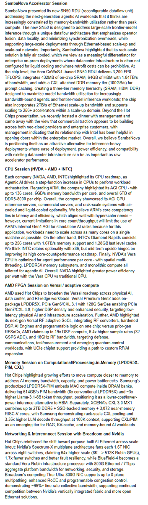

---

<!-- post_id: x:2094693906374144507 | ts: 1788248919 -->
## [X] 駿HaYaO · 2026-09-01 15:48

RT @fxkurumi_info: 📈2026年10月1日放送開始📈

TVアニメ
「#FX戦士くるみちゃん」
メインPVを公開💴

ほんわかゆるふわＪＤによる ちょっとアブナイ（！？）ＦＸのおはなしの始まりです！

▼YouTube▼
https://t.co/pik4Cpx5Km https://t.co/qNh3G03gm1

---

<!-- post_id: x:2094688130364555646 | ts: 1788247542 -->
## [X] 駿HaYaO · 2026-09-01 15:25

Soitec 正趁 AI 資料中心矽光子需求暴增，與客戶簽多年期產能預留協議：固定價格、依承諾量收訂金。執行長 Laurent Remont 向路透表示，超過 10 份協議中約 80% 將於未來 1～2 週簽署，其餘一個月內完成。

訂金尚未支付，將隨客戶拉貨分階段到位；達標退還、未達標沒收，超量須重新議價。客戶也須提供庫存資料，避免超訂排擠對手。

上月公司預估本會計年度 Photonics-SOI 營收將由略高於 1 億美元「超過一倍」。Remont 現稱逾 2 億美元「絕對只是底線」。Soitec 供應幾乎所有矽光子晶片基板，瑞銀估市占約 95%；今年股價近翻四倍。

產能方面，現有法國與新加坡廠足以應付今明兩年，預計約 2029 年才需新廠。

短期三槓桿：
- 調配共用未滿載產線
- 既有潔淨室加機台
- 必要時把新加坡未裝機廠房裝機（決策約 6～12 個月）。

原先為碳化矽興建的法國廠部分空間已轉用，該資產去年減損 4,100 萬歐元。五個月前光子 SOI 僅法國生產，現新加坡已完成客戶認證。Remont 稱現階段不必蓋美國廠，客戶更急著拿貨而非挑剔產地。

https://t.co/Pmyiu8ByLB

---

<!-- post_id: x:2094686695384080637 | ts: 1788247200 -->
## [X] 駿HaYaO · 2026-09-01 15:20

Google TPU 8
重點不是規格，而是訓練與推論該分開做。TPU 8i 是記憶體頻寬晶片：大 SRAM、大 HBM、超高晶片間頻寬，服務推理、MoE、agentic 解碼。TPU 8t 則衝 Superpod 規模與訓練算力。Google 明確說：下一道牆是搬資料，不是堆 FLOPS。

LPX（Groq／NVIDIA）
不是再講機架規格，而是異質推論：高吞吐 GPU 負責一批工作，超低延遲 SRAM 引擎負責解碼與長上下文互動。LPX 無 HBM、全 SRAM，與 Rubin 搭配號稱長上下文 agentic 可快 3–5 倍。NVIDIA 接受訓練／推論加速器分工，用分解降低每 token 成本。d-Matrix 3D-DRAM
把運算與 3D DRAM 垂直整合，追求接近 SRAM 的頻寬、又比 HBM 更有容量與功耗優勢，並把百萬 token 上下文放進機架。現場還有 Meta 工程師站台，顯示超大規模業者在看非 HBM 路線。核心判斷：長上下文推理裡，記憶體頻寬才是主瓶頸。

Cerebras CS-6
延續晶圓級架構，把通訊留在片上，減少多 GPU 結構開銷，並稱推論相對傳統 GPU 有大幅提升。真正新意是往 3D 堆疊 DRAM 走，讓大模型塞進更小足跡、同時保住低延遲。CS-6 時程指向約 2028，是少數把「更大模型 + 高頻寬」綁在同一套晶圓方案裡的路線。

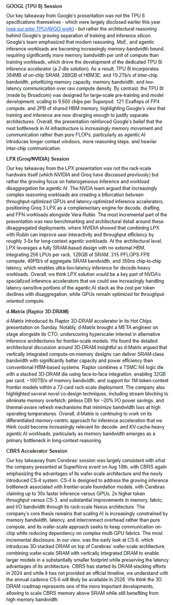

---

<!-- post_id: x:2094681410502324287 | ts: 1788245940 -->
## [X] 駿HaYaO · 2026-09-01 14:59

OpenAI Jalapeño
Jalapeño 是推論專用 ASIC，追求延遲、互動性與每瓦效率，功耗低於 GB200，並針對 KV cache 做記憶體切片。OAI 與 AVGO 九個月就做出初始 RTL，顯示客製晶片時程被壓縮。它證明 ASIC 在穩定、大規模推論上有成本優勢，但模型與硬體綁定深、軟體複雜，GPU 仍因彈性與生態占大多數場景。

Microsoft 加速器
Maia 200 把大 SRAM、HBM 與高頻寬做成超大規模訓練／推論堆疊，重點其實是 Unified Ethernet Scale-Up：用高後端頻寬把大量加速器連起來，壓低同步開銷。Microsoft 要垂直整合矽、封裝、記憶體與網路，但成效仍取決於軟體與叢集調度能否跟上硬體擴展。

Meta 加速器
從推論晶片走到更大的 MTIA-400，用多 chiplet、大 HBM 與機架級交換，同時顧推薦模型與訓練。Meta 強調高頻寬 scale-up／scale-out，因為通訊已比裸算力更常成為瓶頸。出貨與對 AVGO 的貢獻會增加，但不代表 Meta 會減少對 GPU 的依賴。

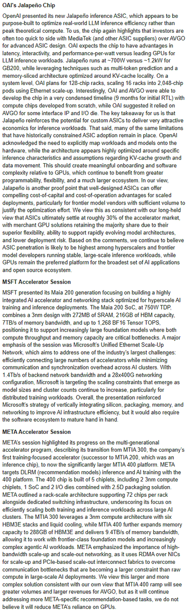

---

<!-- post_id: x:2094665807725056185 | ts: 1788242220 -->
## [X] 駿HaYaO · 2026-09-01 13:57

Hot Chips 2026 核心不是峰值 FLOPS，而是模型變大、KV cache 變長後，記憶體容量、頻寬與 scale-up 互連成為真正瓶頸。NVDA 轉向全棧 AI 工廠，AMD 硬體追近，OpenAI 與 AVGO 的客製 ASIC 時程加快。訓練與推論矽晶已明顯分流：訓練要規模與算力，推論更吃記憶體移動。PIM、CXL、3D-DRAM、純 SRAM 解碼都在回應同一問題。

NVDA GPU
NVDA 不再只賣單顆 GPU，而賣針對 tokens/MW、首 token 延遲與可靠度優化的約 100MW 資料中心系統。Rubin 宣稱每 MW 可有 10–30 倍 token 吞吐量，並靠稀疏、NVLink 6 與機架電源管理提升每瓦效能。護城河從晶片延伸到網路、冷卻、電力與機架生態系，鎖定加深，但資本支出與執行風險也同步上升。

AMD GPU
MI455X 用先進製程、大容量 HBM4 與高頻寬鎖定記憶體密集推論。Helios 把 CPU、GPU、AI NIC 做成液冷全棧系統，強調 Ethernet 開放架構，降低超大規模業者被 NVLink 鎖定的疑慮。硬體規格已接近 NVDA 系統願景，但市占能否擴大，仍看 ROCm 與軟體生態能否真正進入生產環境。

Intel GPU
Crescent Island 走低功耗、風冷 PCIe、超大 LPDDR 記憶體，主打標準機房就能部署的推論，而非機架級訓練工廠。賣點是容量、每瓦 tokens、長上下文與 MoE，TCO 導向。策略清楚，但未揭露完整算力與頻寬數據，相對 Rubin、MI455X 的實戰競爭力仍難評估，且要到 2026 下半年才上市。

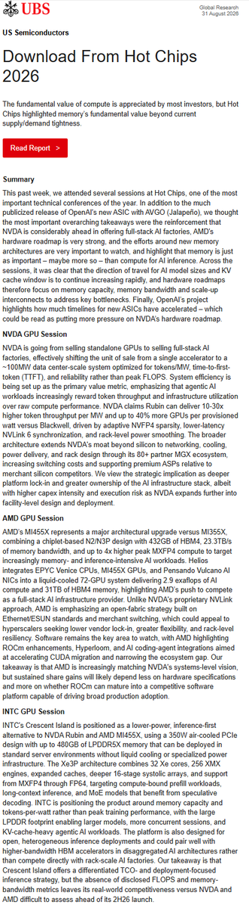

---

<!-- post_id: x:2094647107777175735 | ts: 1788237761 -->
## [X] 駿HaYaO · 2026-09-01 12:42

聯發科（2454 TT）摘要：輝達 35 億美元投資 + TPU 進展仍完整

輝達將透過聯發科 39 億美元可轉換債券，投資 35 億美元。
Alphabet 也參與這次可轉債。

- 這是輝達首次投資台灣上市櫃公司。
- 輝達／聯發科將擴大在 AI 基礎設施、地端 AI 與車用領域的合作。
- 聯發科將採用 NVLink Fusion，用於客製 XPU 整合。
- 合作範圍涵蓋 NVLink／NVLink-C2C、NVHBM、先進封裝與 SerDes。
- 聯發科／輝達目標是提供從晶片到「機櫃級基礎設施」，而不只是晶片本身。

Humufish 的 EMIB 進展優於先前擔憂。

- 日本基板供應商良率，從近期測試載具的 20–25% 提升至約 45%。
- 良率仍朝第一階段 55–60% 目標推進。
- Humufish 生命週期出貨量看起來是上修，而非下修。
- 目前維持 2028 年 Humufish／Triggerfish 合計 460 萬顆的預估。
- Triggerfish 的大容量 SRAM，應有助聯發科切入 AI 推論。
- 預期聯發科將在出貨量、產值與工作負載上，提升 TPU 市占。

輝達 + Alphabet 的背書，強化市場對聯發科資料中心發展路徑的信心。

維持正面看法

---

<!-- post_id: x:2094633842455859685 | ts: 1788234599 -->
## [X] 駿HaYaO · 2026-09-01 11:49

高通（Qualcomm）宣布自2026年9月1日起調漲晶片價格，漲幅達兩位數。公司7月已通知客戶，之後出貨的晶片將調價。執行長Amon表示，供應商成本持續上升，高通無法再自行吸收，必須轉嫁給客戶。漲幅將依個別客戶協商，涵蓋賣給蘋果、三星及其他手機廠的產品。

蘋果目前仍為iPhone 17系列採購高通數據機。部分後續機型（iPhone 17e、iPhone Air，以及傳聞中的部分iPhone 18 Pro／摺疊機）預計改用蘋果自研C1X或C2晶片。不過外洩文件顯示，部分iPhone 18 Pro在美國市場可能仍會使用高通數據機。
高通預期來自蘋果的營收，從9月季到12月季將下降約50%，降幅快於先前預期，主因是供應受限，以及iPhone 18使用高通零件比例減少。

這次漲價處於整體成本上升背景下：DRAM、儲存因供應問題漲價，台積電調升晶圓價格，蘋果已在6月調漲Mac與iPad售價，外界也預期iPhone 18 Pro會比前代更貴。

https://t.co/DKDgdmQpCW

---

<!-- post_id: x:2094618875971416106 | ts: 1788231030 -->
## [X] 駿HaYaO · 2026-09-01 10:50

聯發科內部已將 AI 事業的策略定位，從「IC / ASIC 設計」提升至「系統級別設計」。 https://t.co/G6FbwR8v4X

---

<!-- post_id: x:2094585894103847152 | ts: 1788223167 -->
## [X] 駿HaYaO · 2026-09-01 08:39

Good morning! 9/1 Foreign Media Summary

- 2454 MediaTek: U.S. houses reiterate Positive
NVIDIA and Alphabet invested in MediaTek convertible bonds; two U.S. brokerages both gave it a thumbs-up. The brokerages said this confirms MediaTek’s transformation from a smartphone SoC company into an AI compute-platform company. Through NVLink Fusion, MediaTek can compete for more ASIC customers going forward and allow non-NVIDIA XPUs to participate in NVIDIA’s rack-scale ecosystem. A major U.S. house expects further upside to 2028 ASIC revenue estimates, because the closer tie with Google also meaningfully raises the odds of winning a second and third CSP customer, and because the company will be well-stocked on materials (brokerages expect the proceeds to go into key components such as HBM and ABF purchases, plus foundry prepayments). Reiterate Positive.

---

<!-- post_id: x:2094585016881930348 | ts: 1788222958 -->
## [X] 駿HaYaO · 2026-09-01 08:35

經濟部投資審議會8月31日第34次會議核准6件重大投資案。僑外投資2件、金額約新台幣128.35億元；對外投資4件、約3.58億美元。

最受關注的是美商科林研發（Lam Research）以約98.35億元等值外幣增資台灣科林技術，投入先進半導體晶片製程關鍵設備的技術研發與設計。這是該公司對台子公司的加碼投資，凸顯台灣在半導體設備供應鏈中的重要性。

另一件僑外投資為臻鼎科技控股以30億元增資先豐通訊，從事多層印刷電路板研發、製造與銷售。

對外投資方面：
- 源川國際以6000萬美元在美國設立YMA（TX），生產固態電池及無人機配件。
- 利億國際以約5700萬美元投資日本三菱扶桑巴士製造公司。
- 新唐科技以約9436萬美元增資日本子公司，強化IC設計、開發與製造。
- 宏康控股以1.47億美元取得開曼公司股權，間接布局百略集團，拓展醫材通路與智慧醫療市場。

---

<!-- post_id: x:2094579733438902407 | ts: 1788221698 -->
## [X] 駿HaYaO · 2026-09-01 08:14

早安！9/1 外電綜合整理

- 2454聯發科: 美系重申正向
NVIDIA 與 Alphabet 投資聯發科可轉債，兩家美系券商都按讚。券商表示這證明聯發科從智慧型手機 SoC 公司轉型為 AI 運算平台公司，藉由NVLink Fusion 可以讓聯發科未來爭取更多ASIC 訂單的客戶，讓非 NVIDIA 的 XPU 能夠參與 NVIDIA 的機架級生態系統。美系大行預期2028年ASIC營收還有上修空間；因不僅與Google更緊密，也大幅提高贏得第二、第三家CSP客戶機率，而且會備料充足（～券商預期募得金額會投入關鍵零組件如HBM, ABF採購及晶圓代工預付款），重申正向。

 #下次會考

---

<!-- post_id: x:2094439043539083766 | ts: 1788188155 -->
## [X] 駿HaYaO · 2026-08-31 22:55

Nvidia 已重啟 Rubin CPX https://t.co/oq9HPFicAp

---

<!-- post_id: x:2094435048720421327 | ts: 1788187202 -->
## [X] 駿HaYaO · 2026-08-31 22:40

The Information

長鑫存儲已開始小規模生產先進高帶寬內存 HBM3E，被視為中國在國產 AI 芯片上突破關鍵瓶頸的重要進展。知情人士指出，該產品仍落後三星、SK 海力士、美光目前量產一代；公司計劃 2027 年擴大產能。

寒武紀、阿里巴巴平頭哥等中國芯片設計公司已在測試這款內存，若進展順利，最早明年可導入自家產品。
訂單有助長鑫累積量產經驗與客戶反饋。美國出口管制限制中國採購最先進 HBM 與部分升級設備，因此國產替代意義重大，但良率仍偏低，技術仍落後國際領先廠約三至四年。

長鑫 2016 年在地方政府支持下成立，已是全球第四大 DRAM 廠。HBM 需將多層 DRAM 堆疊封裝，製程遠比傳統內存複雜。該公司近日上市募資約 86 億美元，股價首日大漲；上半年營收約 1503 億元人民幣、淨利約 776 億元，扭虧為盈，但財報未提 HBM 進展。

目前長鑫量產的是 HBM3E。英偉達 H100 用 HBM3，H200 與 Blackwell 用 HBM3E，下一代 Rubin 將用 HBM4。SK 海力士、三星、美光已在推進 HBM4／HBM4E，預計更快版本明年推出。

---

<!-- post_id: x:2094414879654613490 | ts: 1788182394 -->
## [X] 駿HaYaO · 2026-08-31 21:19

力積電(PSMC) 是 EMIB 所用 SiCap 的合格供應商。

其 12 吋 SiCap 產能規劃已從 2026 年底的 3K wpm 上修至 2027 年下半年的 8-10K wpm，且產能已就位。該產線是建立在成熟 DRAM 製程上，目標是 EMIB 封裝。

同時，8 吋 SiCap 目前出貨量為 1-2K wpm，正朝向 5K 邁進。 https://t.co/qvsNPzewoG

---

<!-- post_id: x:2094414118895931803 | ts: 1788182212 -->
## [X] 駿HaYaO · 2026-08-31 21:16

NVIDIA 與 MediaTek 深化長期合作，打造從邊緣到雲端的 AI 運算平台

兩家公司擴大合作範圍，涵蓋多代雲端 AI 工廠、本地 AI 運算與汽車領域。MediaTek 將採用 NVIDIA 新推出的 NVLink Fusion 平台，協助客戶將客製化 XPU 導入 NVIDIA NVLink 連接的機架級 AI 工廠。

NVIDIA 也投資 MediaTek 發行的 35 億美元可轉換債券。

三大合作領域
1. AI 基礎設施：MediaTek 加入 NVIDIA NVLink Fusion 生態系，讓客戶開發可與 NVIDIA 機架級系統及 AI 工廠整合的客製化 AI 基礎設施。
2. 本地 AI 運算：持續合作多代 NVIDIA RTX Spark 與 DGX Spark PC 晶片，結合 NVIDIA GPU 與 MediaTek SoC，應用於消費級 PC、AI 開發者超級電腦與企業工作站。
3. 汽車：持續開發 AI 驅動、軟體定義車輛平台，因應實體 AI 時代。

NVLink Fusion 平台重點
MediaTek 將提供此平台作為客製化 AI 加速器的設計基礎，包含：
- NVIDIA NVLink Fusion chiplet（連接 XPU 至 NVLink 擴展架構）
- NVIDIA NVLink-C2C（高頻寬、高能效連接）
- NVIDIA NVHBM（客製化記憶體，提升頻寬與能效）

客戶可將 XPU 設計交給 MediaTek，依工作負載調整連接、記憶體、封裝、效能與功耗，並借助 NVIDIA 的 MGX 機架級架構加速上市。

本地運算與汽車
- 先前合作包含 GB10 Grace Blackwell Superchip（用於 DGX Spark），現延伸至 RTX Spark，重新定義 AI 時代的消費級 PC。
- 汽車方面，MediaTek Dimensity Auto 平台整合 NVIDIA 技術，提供先進 AI 與 RTX 圖形，並可與 NVIDIA DRIVE AGX 搭配使用。

---

<!-- post_id: x:2094413456539869552 | ts: 1788182055 -->
## [X] 駿HaYaO · 2026-08-31 21:14

伊頓（Eaton）將於 SEMICON Taiwan 2026展出 AI 資料中心與半導體高功率供電、配電及散熱方案，主打「電力＋算力」一次到位，並首度在台展出併購事業 Boyd Thermal 液冷技術。

四大展區包括：
一、高效率 UPS 與鋰電：亞洲已近千台案例的 9395XR UPS，單機最高 2.5MW，適合超大規模資料中心與半導體廠，可減少設備與佔地。全新 93PR 緊湊型 UPS 僅 3U 模組即可達單機 600kW，功率密度每平方公尺約 1MW，既有機房不必擴建就能提升供電。另有 93Li 鋰電池，以及台北廠製造的 New Castle G2、93ETX 中小型 UPS。

二、中壓固態變壓器（MV SST）：中壓直接輸入轉 800VDC，減少轉換層級，效率可達 98.5%。亞洲大型網路公司已穩定運行逾一年。

三、配電與散熱：XAP-Track Pro 導軌型匯流排可全點位插接，縮短安裝時間。Boyd Thermal 液冷方案對應 NVIDIA Vera Rubin NVL72、GB300 NVL72 與 MGX 平台，支援高密度全液冷 AI 機櫃。

四、電路保護與電子元件：交流／直流斷路器支援微電網、儲能與新世代 GPU；電子元件強化可靠度、安全與能效。

整體布局從供電、配電、保護延伸到晶片散熱，回應 AI 工廠高功率密度與熱管理挑戰。
https://t.co/6MgbuoyV0U

---

<!-- post_id: x:2094411611473625570 | ts: 1788181615 -->
## [X] 駿HaYaO · 2026-08-31 21:06

SK 海力士考慮英特爾供應 HBM4E 基底晶片

SK 海力士正規劃分散 HBM 基底晶片（base die／邏輯晶片）代工來源。HBM 採垂直堆疊結構，基底晶片位於最底層，負責控制與高速介面，連接 GPU、CPU 等處理器。

過去至 HBM3E，該公司以自有製程生產基底晶片。從 HBM4 起改與台積電合作，目前量產品採用台積電 12 奈米級製程。據報導，HBM4E（第七代）起可能同時採用台積電與英特爾晶圓代工，不再單一依賴台積電。

主因是成本與供應風險。業界估計，台積電製基底晶片成本約為 SK 海力士自製核心 DRAM 晶粒（10 奈米級 1b 製程）的三至四倍，HBM4E 負擔還會加重。HBM 多受長期供貨協議（LTA）約束，難以立即轉嫁漲價。引入英特爾可增加議價空間、降低對台積電集中度，並提升供應穩定。

此外，客製化 HBM 趨勢興起，基底晶片須依個別 AI 加速器架構調整。分散代工有助接觸更多客戶。外界亦推測合作未來可能延伸至先進封裝，SK 海力士已在評估台積電 CoWoS 與英特爾 EMIB。

---

<!-- post_id: x:2094411068483436673 | ts: 1788181485 -->
## [X] 駿HaYaO · 2026-08-31 21:04

台積電於 SEMICON Taiwan 2026 揭露 COUPE 下一步藍圖。AI 算力約每兩年成長 3 倍，I/O 僅約 1.4 倍，形成「I/O 牆」；銅線高頻長距受限，需轉向光傳輸以支援資料中心 Scale-up／Scale-out。

光學整合分兩路：CPO（光引擎在基板）與 OOI（光學中介層，光引擎貼近 XPU），功耗效率可提升約 4–10 倍、延遲降約 10–20 倍。COUPE 以 SoIC-X 將 EIC 與 PIC 鍵合，支援光柵／邊緣耦合，並提供波導、調變器、光偵測器等 PDK。

頻寬擴展採雙策略：
「Fast and Narrow」把單通道從 200G 推向 400G 以上、通道數由 64 增至 128 以上，總頻寬從 3.2T 往 12.8T 以上；
「Slow and Wide」則靠 WDM 把波長從 1 增至 4／8／16 甚至更多。

下一階段重點是異質整合：調變器、SOA、光源可望直接放上 COUPE 背面，提高光電整合度。
COUPE 亦可當光學中介層，尺寸最大約 3.3 倍 reticle，未來再與 CoWoS 結合，並支援 CWDM／DWDM。完整生態仍需代工、產業鏈與 OSAT 密切合作。

https://t.co/C2UExMs8wA

---

<!-- post_id: x:2094409675878072669 | ts: 1788181153 -->
## [X] 駿HaYaO · 2026-08-31 20:59

台積電先進封裝技術發展副總經理徐國晉表示，光收發器架構正經歷結構性轉變，矽光子已成主流，預估2027年市占率將逾50%。矽光子最終形態為共同封裝光學（CPO），今年下半年將有廠商量產。

他指出，AI呈指數成長，網路逼近物理極限，計算單元已從單一伺服器擴至整個資料中心，光學成為資料中心「神經系統」。2025年光收發器銷售額較2024年增25%，2026年預估再增50%；100G以上高階市場2024年倍增、2025年再成長60%。2028年AI規模化將帶動更大成長。

台灣晶圓代工生態系可實現光引擎大規模、高精度生產。CPO可靠性疑慮正被實績與市場驗證消除。晶圓代工能放大光學引擎規模，但大規模部署瓶頸在雷射、光纖、連接器與測試等供應鏈環節。

徐國晉強調，台灣不只是代工中心，更是全球領先的整合生態系。矽光子產業聯盟將串連設計與製造、本地產能與全球需求、電子運算與光學效能，把供應鏈瓶頸轉為合作機會，推動從銅與電子時代邁向矽與光時代。

https://t.co/vZQaGTFVQf

---

<!-- post_id: x:2094408694222254479 | ts: 1788180919 -->
## [X] 駿HaYaO · 2026-08-31 20:55

長鑫存儲（CXMT）宣布已為小米一款手機量產 LPDDR6，成為業界首批公開進入量產的廠商之一，時程約與三星、SK 海力士、美光相當，甚至略早於西方業者的公開宣布。這距離長鑫量產 LPDDR5 不到一年，顯示中國 DRAM 與國際龍頭的世代落差已明顯縮小。

LPDDR6 升級幅度大：改用 PAM3 訊號、速率上看 43.2 GT/s，I/O 由 32 位元改為 24 位元，硬體與軟體都需配合調整。

量產宣布雖具指標意義，但目前僅涵蓋一家品牌、一個機型，效能規格未揭露，尚未通過其他手機廠驗證。能否高良率、大規模供貨，仍是關鍵。若後續能擴及全市場，產業格局可能改寫；以現況來看，尚不能斷言長鑫已成新龍頭。

---

<!-- post_id: x:2094407889079406879 | ts: 1788180727 -->
## [X] 駿HaYaO · 2026-08-31 20:52

TrendForce: 二手市場、維修需求支撐，預估2026年全球智慧手機面板出貨量年減幅度收斂至2.5%

TrendForce指出，雖記憶體短缺推升成本、壓抑品牌2026年備貨，但二手機與維修需求仍具支撐，預估全年全球智慧手機面板出貨約22.5億片，年減僅2.5%，優於先前預期。

需求持續向兩端集中：AMOLED加速滲透中高階；a-Si LCD憑成本優勢，加上中低階、二手與維修市場，維持規模。LTPS LCD空間受擠壓，產能轉向車用、IT。2026年預估LCD（含a-Si與LTPS）約13.3億片、占59%；AMOLED約9.2億片、占41%。

2026年第二季全球出貨約5.6億片，季減。
BOE以1.46億片、市占26.1%居冠，產品涵蓋a-Si、LTPS與AMOLED，a-Si亦供應二手／維修。SDC約9,000萬片、16.1%居次，以AMOLED供應三星與iPhone為主。TCL CSOT約8,400萬片、市占首破15%升至第三，T19線LCD放量為主因。HKC約13%第四（主力a-Si）；Tianma約12.4%第五，a-Si比重上升。
https://t.co/QLd8JLp0fG

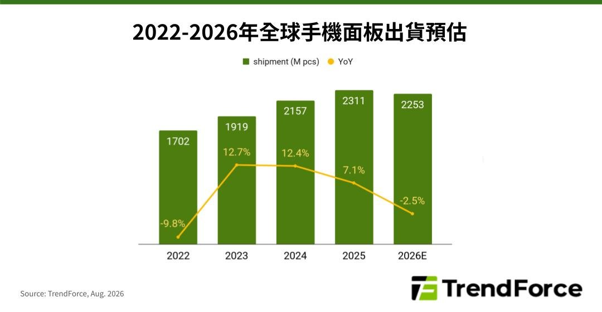

---

<!-- post_id: x:2094216036363145270 | ts: 1788134986 -->
## [X] 駿HaYaO · 2026-08-31 08:09

早安！8/31 外電綜合整理

3037欣興: 美系重申正向
美系大忙表示調查事件影響的是營收占比36%（～獲利佔比更低）的PCB含HDI，不是ABF。管理層申明對公司的財務狀況或業務營運並無重大影響，券商亦表示認同，重申正向。

- 從 JMTBA 7月看工具機產業：
美系大行看到海外訂單年增率維持強勁成長，顯示上升週期仍在延續；而逐月／逐季的環比波動，大致符合主要地區的季節性變化。券商重申對上銀、亞德客正向評等不變。

- 6415矽力：美系重申UW
美系大行表示2Q毛利率不如預期，主要來自成本壓力。但資料中心 PMIC 營收開始放量，有望抵掉消費性疲弱，券商預期3Q營收有望季增。儘管如此，券商以毛利率未達預期為由，重申UW。

 #下次會考

---

<!-- post_id: x:2094075808021381403 | ts: 1788101553 -->
## [X] 駿HaYaO · 2026-08-30 22:52

IREN Ltd. ( $IREN )
2026財年第四季回顧：重申2026日曆年ARR，2027財年資本支出展望

IREN 2026財年第四季 EBITDA 為 1,900 萬美元，低於高盛／市場共識（Visible Alpha）的 3,300 萬／5,700 萬美元。
AI 雲服務營收 7,100 萬美元，高於高盛預估的 5,600 萬美元，但低於市場共識的 8,800 萬美元。

- IREN 的營運執行大致符合預期。新簽多年合約推動公司 2026 年已簽約 ARR 達到 40 億美元。公司正與多家新客戶進行後期洽談，討論 2027 年產能，目前活躍討論價格約為每 MW-IT 2,500 萬美元，並重申預計在 2026 日曆年底前交付 Horizon 2-4。

- IREN 現在披露目標交付產能：2026 年 0.3 GW-IT、2027 年 0.8 GW-IT（年增 500 MW），這比先前以總 IT 產能為目標的披露更有用。IREN 透露其中一位新客戶是 Prometheus。

- 認為股價可能會受到營運費用上升（2027 財年第一季現金 SG&A 環比增加 4,000–5,000 萬美元）以及高於預期的 2027 財年資本支出展望（250–300 億美元）壓力，這需要額外融資，且在我們看來支持了相當一部分尚未簽約的產能。

在 250–300 億美元（中位數 275 億美元）中：
‧ 140 億美元將由手頭現金以及已承諾的 Microsoft GPU 融資額度、財報時公布的新增 28 億美元 GPU 融資、未償還的 Microsoft 預付款來資助；
‧ 另外 80 億美元預計由與 GPU 掛鉤的融資（預付款及 GPU 擔保債務）資助；
‧ 中位數還剩約 55 億美元，將透過公司債、數據中心擔保債務以及與股權掛鉤的融資來籌集。

---

<!-- post_id: x:2094066641789460759 | ts: 1788099367 -->
## [X] 駿HaYaO · 2026-08-30 22:16

川普宣布美國取得委內瑞拉逾 650 億桶石油多數控制權

川普宣布，美國已與委內瑞拉達成協議，取得該國超過 650 億桶探明原油儲量的「多數控制權」，且「美國納稅人零成本」。
稱這是「世界史上最大石油交易」，將讓美國石油儲量「增加一倍以上」，大幅增加供應、長期壓低油價，並有助委內瑞拉走向繁榮、強化雙邊關係。
-----

美國目前探明原油儲量約 460 億桶，加上協議涵蓋的 650 億桶後，美國將控制約 1,110 億桶。
全球探明原油儲量約 1.57 兆桶，美國因此將掌握全球約 7.1%，規模接近阿聯酋（1,130 億桶）、超過科威特（1,020 億桶）。若協議屬實，對全球能源市場影響巨大。

---

<!-- post_id: x:2094045212893167884 | ts: 1788094258 -->
## [X] 駿HaYaO · 2026-08-30 20:50

The Information
SpaceX正於德州巴斯特羅普籌建鑄造廠，專門生產大型燃氣輪機的葉片與導葉，以突破數據中心電力供應瓶頸。馬斯克2月播客指出，葉片與導葉是加快渦輪機交貨、進而建成數據中心的「限制因素」；AI負載波動也易使葉片產生應力開裂，備件需求增加。
他直言按目前速度，「不確定是否有足夠電力啟動所有正在製造的AI晶片」。

公司已發布鑄造工程師與鑄造廠經理職缺，明確指向大型燃氣輪機部件生產。此舉延續SpaceX自建大型渦輪泵與發動機零件的策略，並考慮自建燃氣輪機：自建500兆瓦機組估約10億美元，外購則約20億美元。

AI熱潮使數據中心用電急增，電網擴容跟不上，科技巨頭轉向天然氣發電。葉片製造工藝複雜、供應商稀少，SpaceX若自建產能，可縮短週期、降低成本，並可能對外供應電力或部件。電力已成AI落地最大瓶頸，此舉是SpaceX最新對策。

---

<!-- post_id: x:2094044292935545278 | ts: 1788094039 -->
## [X] 駿HaYaO · 2026-08-30 20:47

世界半導體相關焦點基金｜2026年5–7月季報

1. 近期操作情況
2026年5月至7月，基金基準價上漲 10.1%，同期全球股票約 +4.4%，基金表現較好。
市場背景：
- SpaceX 大型 IPO、Alphabet 大型增資等，市場關注 AI 基礎設施資金需求
- Meta 傳出計畫外售多餘 AI 基礎設施，市場開始擔心設備投資過熱
- 後半段半導體股因漲多後獲利了結而回檔

2. 主要持股說明
- Micron（記憶體）
DRAM、NAND 廠，強化 HBM。2026年3–5月期指出已與客戶簽長期供貨約，展望 3–5 年需求。
- AMD（CPU／GPU）
同時做 CPU 與 GPU，資料中心需求擴大。2025年10月與 OpenAI 簽戰略合作。
- Astera Labs（互連方案）
提供半導體級高速互連，解決 AI 資料中心裡晶片、記憶體、網路之間的「交通整理」。

3. 半導體環境：記憶體供需仍緊
中國 CXMT 2026年7月27日在上海 IPO，募約 579 億元人民幣（約 86 億美元），用於擴產與研發。YMTC（NAND）也傳出準備上市。市場擔心中國增產破壞供需。

基金方看法：
即使考慮中國增產，記憶體緊缺可能延續到 2028 年，理由有三：
1) Agent AI 推升記憶體需求
從對話型 AI 轉向能自主規劃、呼叫工具、完成任務的 Agent AI，所需記憶體大幅增加。
資料中心用途占比預估：
- DRAM：2025年 32% → 2028年 59%
- NAND：2025年 24.5% → 2028年 55%

2) 技術差距
CXMT 2026 年「目標」量產舊世代 HBM3；全球大廠已開始量產 HBM4。先進品差距仍大。NAND 方面 YMTC 在追趕，需持續觀察。

3) 美國制裁
美國國防部把 CXMT、YMTC 列為中國軍事相關企業；商務部把 YMTC 列入實體清單。Apple 雖傳出因記憶體漲價洽談採購，但國會與 MATCH 等法案可能提高中國產品出海難度，尤其 AI 資料中心涉及國安。

另：記憶體合約從過去約 1 年，轉向 3–5 年長期供貨約（LTA），顯示客戶對結構性短缺的危機感。

4. 後市與操作方針
6 月下旬後半導體股短期調整，主因：
- 美中大型科技 IPO 影響資金
- 韓國個股連動 ETF 先解禁再受管制
中期成長預期仍高。4–6 月業績支持「AI 基礎設施半導體需求仍旺」的判斷。Alphabet、Amazon、Microsoft 維持積極資本支出；Meta 預估至 2028 年仍擴大投資。Anthropic、OpenAI 等後續 IPO 資金也可能流入資料中心。

操作方針：
- 維持高比重 AI 相關
- 用由下而上研究挑成長、估值相對便宜的標的
- 波動大時更要看基本面與股價，機動買賣

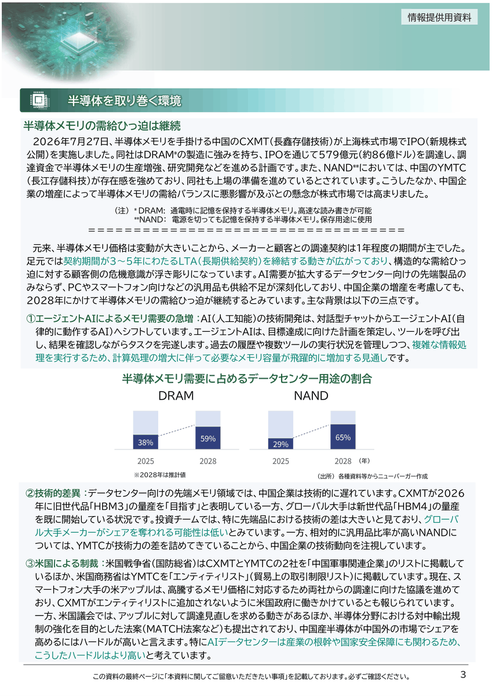

---

<!-- post_id: threads:3975136505500942386 | ts: 1788093220 -->
## [Threads] Kok Yu · 2026-08-30 20:33

果然認真分析還是放X上面就好了..
假日看欣興有感， 一堆拿去問AI 的有趣答案
笑爛

---

<!-- post_id: x:2094040450252619804 | ts: 1788093123 -->
## [X] 駿HaYaO · 2026-08-30 20:32

記憶體產業(20260810)
- DRAM 結構：主流型約 80%（高容量 DDR4／DDR5，Data Center、PC）；利基型約 20%（DDR3、低容量 DDR4，工控、醫療）。供給高度集中：三星、美光、SK 海力士約 95%；長鑫 2–3%；南亞科約 1%。

- AI 帶動結構性需求：美光預估 HBM 市場由 2025 年 350 億美元成長至 2028 年 1,000 億美元。此波強度（營收與毛利）已超越 2000 年網路泡沫，屬結構性而非單純供給收縮。

- DDR4 仍關鍵：資料中心擴建推升 SSD，每顆 SSD 控制器仍需一顆 DDR4 當 buffer，故 DDR4 未因 HBM／DDR5 而退出。南亞科同時受惠大廠退出 DDR4 的轉單與 AI 需求。

- NAND：預期 2026 年供需接近平衡、至少出現 2% 缺口；2027 年約 3%。主因庫存已調整、CSP 提前大量下單。

- Nvidia SOCAMM 容量減半：Vera Rubin LPDDR5 SOCAMM 由 1536GB 調至 768GB，研判是產能吃緊下的出貨權衡，非需求放緩；供應商 LPDDR5x／SOCAMM 供給預估由 180 億 Gb 升至 2027 年 290 億 Gb。

-7 月營收（記憶體相關）：南亞科 438.7 億（MoM +49.3%、YoY +720%）、華邦電 267.7 億（+30%、+292%）、晶豪科 67.8 億（+40%、+491%）、威剛 183.8 億、群聯 271.6 億，普遍受產能排擠與漲價驅動。

3006 晶豪科（20260311）

- 定位
無晶圓廠的利基型記憶體 IC 設計公司。產品約：DRAM（以 DDR3 為主）約 55%、NAND／NOR／eMCP 約 35%、類比約 10%。主要代工為力積電。客戶多為通路與模組廠，產品多用於 IP Cam、HDD、消費與工控，占客戶 BOM 比重低，轉嫁能力相對較佳。

核心邏輯
- AI 產能排擠從 HBM／DDR5 蔓延至 DDR4，再至 DDR3／DDR2；同業轉向更高階產品，利基型訂單轉向晶豪科。

- 1H26 仍吃低價庫存，合約價已鎖定且漲幅可觀（部分預估 2Q26 營收 QoQ 大增、ASP 再大幅上漲）。

- 管理層預期 1H26 獲利有機會接近或優於 2021 年高峰（當年全年 EPS 約 17.6 元）。

- 2H26 風險：力積電代工價顯著上漲、新成本顆粒自 3Q26 起出貨；但多數認為缺貨格局下可轉嫁，毛利率未必立刻大幅回落。

AI 產能排擠讓利基型 DRAM／Flash 缺貨與漲價延續，晶豪科因產品組合與轉單受惠最大；1H26 獲利跳升幾乎無爭議，分歧主要在 2H26 成本轉嫁能力，以及該給多少本益比。8 月產業數據顯示漲價與營收動能仍強，較 3 月預估更樂觀。

---

<!-- post_id: x:2093871866922651964 | ts: 1788052929 -->
## [X] 駿HaYaO · 2026-08-30 09:22

$ON 安森美半導體（ON Semiconductor）執行長 Hassane El Khoury：「汽車業務方面，我們談到了穩定性。我們尚未看到補貨週期，也沒有看到需求回升……在汽車領域，正如所說，我認為我們正在回到自然需求的出貨水準。因此我們已經度過了庫存消化階段。在某些情況下，汽車領域的庫存仍然低得危險。」 https://t.co/44vcKh3DWc

---

<!-- post_id: x:2093861730690699510 | ts: 1788050513 -->
## [X] 駿HaYaO · 2026-08-30 08:41

高明鐵(4573)將與光循科技於SEMICON聯合展示新一代FAU-PIC量產級自動化對位組裝與測試方案，展出120通道FAU與PIC晶片奈米級高精度主動對準成果。
該平台除封裝組裝外，亦支援晶圓級多通道自動對準與量測，可於封裝前篩選Known-Good-Die（KGD），降低單一通道失效導致整批報廢風險。公司1.6T耦光設備已獲多家矽光模組廠驗證並正式交機，未來可作為CPO對位組裝標準工站（AA Cell）。

高明鐵兩大核心為精密定位平台（光纖/波導耦合、高精度對位）及傳動自動化模組。隨著PIC通道數升至百條以上、光學介面轉為二維陣列，超高通道數FAU-PIC精密對位已成量產良率與成本最大瓶頸。此次平台整合自研六軸高精度平台、位姿誤差補償與AI主動對準演算法，搭配光循Perfect Vertical Grating Coupler（PVGC）優化光場轉換。

光耦合分表面光柵耦合（GC）與邊緣耦合（EC），量產皆需高精度定位、主動耦光與光學量測。過去設備由歐美日壟斷，高明鐵憑精密運動控制與AI演算法，結合光循高密度2D陣列技術，展現台灣從晶片設計到自動化封裝的完整實力。本次另展出矽光子奈米級主動耦光、CPO/NPO光引擎耦合測試、晶圓級光學檢測、FAU+MLA精密組裝等方案。

https://t.co/YSTarBcAD9

---

<!-- post_id: x:2093691253661876602 | ts: 1788009868 -->
## [X] 駿HaYaO · 2026-08-29 21:24

POLITICO：
拉特克利夫週二突訪莫斯科，知情人士稱主旨是警告俄方勿因烏戰膠著而升級對北約的衝突，尤其不要動波羅的海三國。

他同時要求俄減少對伊朗的軍經支援，停止輸出武器與防務技術，並勸俄若遭美擴大制裁「勿過度反應」。此行是川普任內中情局局長首次已知訪俄，C-17經拉脫維亞入境。川普否認是為勸普京勿試探北約或打英國，稱「半例行」，但承認與結束烏戰有關。白宮、中情局少評論。

背景是俄烏遠程互打加劇、俄對援烏北約國放話，外界憂混合戰或有限軍事行動。北約有第五條，但俄慣用破壞、網攻等低於戰爭手段。

拉特克利夫被視為對俄鷹派；他今年五月也曾密訪古巴施壓。議員多事先不知情。
https://t.co/Tdn5TU0NlV

---

<!-- post_id: x:2093688129425392088 | ts: 1788009123 -->
## [X] 駿HaYaO · 2026-08-29 21:12

三星在 Hot Chips 提出 HBM 基底晶片（B-die）三階段路線圖：先用先進邏輯製程改造 B-die，再把它從「資料中轉站」升級成 AI 系統的智慧夥伴，最終以 zHBM 把記憶體直接垂直堆疊在 GPU／TPU 等 XPU 上，取消 2.5D 中介層。

現況瓶頸是頻寬每代倍增（HBM4 每堆疊已逾 3TB/s，HBM4E 約 4TB/s，HBM5 再翻倍、容量超 60GB），但受 TSV 密度、PHY I/O 功耗與面積限制。三星已在 HBM4 導入 D1c DRAM 與 4nm 邏輯製程，主打降功耗、縮小有效面積。

第一階段：回收 XPU 面積
以先進邏輯做緊湊 D2D／T2D 介面取代傳統 PHY，導入 Heat Path Block，峰值溫度可降逾 35%。同時把記憶體控制器與 SRAM 細粒度修復卸載到 B-die，預估回收 XPU 5–10% 面積，換得 10–20% 效能提升。

第二階段：功能擴充（cHBM／AHBM）
在閒置空間加入遙測、晶粒上測試、近記憶體容量擴充，以及選擇性處理元件，減少資料搬移與熱功耗。

第三階段：zHBM 3D 整合
採分散式 I/O、晶圓對晶圓與混合接合，縮短傳輸距離並移除 SerDes。對比 HBM4e，三星宣稱功耗效率提升約 70%、頻寬增加約 230%、每模組最高省 100W，並可多給 XPU 約 8.3% 電力；I/O 功耗目標約 0.5 pJ/bit。

核心邏輯就是：先壓縮面積、再塞進更多功能，最後用真正 3D 堆疊重構系統。

https://t.co/JBr2MZP3bq

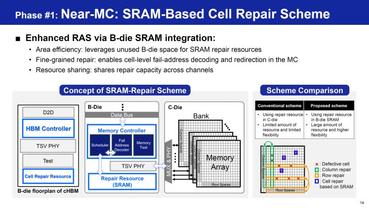
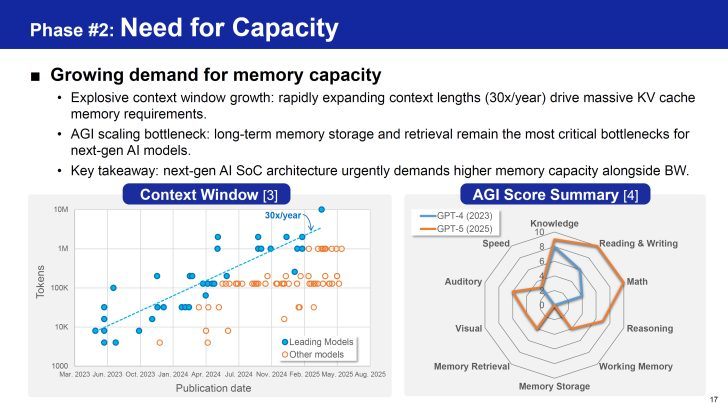
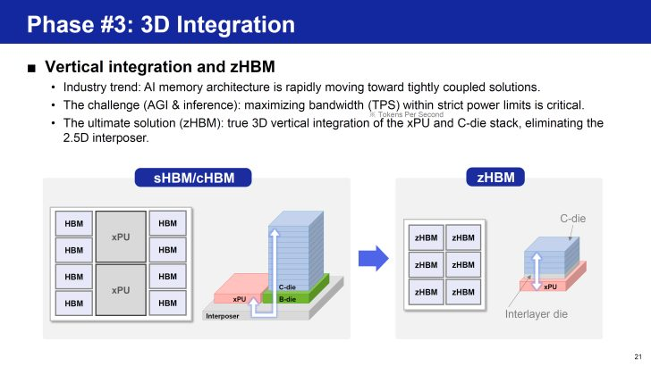

---

<!-- post_id: x:2093686539935195537 | ts: 1788008744 -->
## [X] 駿HaYaO · 2026-08-29 21:05

華星光（4979）法說會看好AI資料中心高速傳輸需求升溫。
2026年Q2合併營收12.89億元，季增8%、年增18.5%；稅後純益1.84億元年增93.7%，EPS 1.29元，上半年EPS 2.91元。

下半年動能由DCI新品、CW Laser及EML放量帶動，表現可望明顯優於上半年。100G／400G／800G DCI已量產，800G今年批量出貨、明年需求顯著放大；1.6T預計2027年Q2前完成開發，目標下半年量產、2028年放量。
持續布局NPO（中期過渡架構）與CPO（約2030年成主流）。LightCounting將2031年相關市場規模由520億美元上修至800億美元，以Scale-out為主。

美國對中光模組限制帶動非中供應鏈需求，公司自2024年起受惠並挹注毛利率。產能：今年晶圓約3,000片、明年近6,000片，晶粒上看近3,000萬顆；後段封裝月產能今年底600萬顆、明年底1,200萬顆。
現以2／3吋為主，將導入4～6吋全自動產線，設備自明年Q4陸續到位。八德廠無塵室擴建中，2027年底總面積估約1.3萬平方公尺，2027年資本支出初估逾30億元。訂單能見度已看到2028年底，2027年隨新品與產能開出，營收有機會跳躍式增長。

https://t.co/4px7RZVCa5

---

<!-- post_id: x:2093662962233851994 | ts: 1788003123 -->
## [X] 駿HaYaO · 2026-08-29 19:32

台股從「研究公司」變成「研究對手」

1. 舊時代（約 2018 年前）的市場結構
- 資金層級清楚：主力約 1 億就算大戶；投信單檔約 60–100 億；外資動輒千億以上。
- 中小股看主力（公司派消息 + 日線洗盤），大型股看法人。
- 投信／外資用 TWAP、VWAP 分批低接，盡量不影響價格。買盤有持續性，所以「投信買賣超」過去是有效籌碼因子。

2. 2021 年後資金結構變化
- 傳統大型 Long Fund 外資持續賣超、匯出。
- 地方資金「過水」變外資：中小型股出現不合理的大量外資買賣，本質是主力透過境外架構進出。
- 市場中性量化資金進場：期現套利、套匯等，不看漲跌，只賺價差與波動。指數越高，期貨淨空單常越大。

3. 最大變數：新生代交易者崛起
- 新生代交易者們，單一資金可達數十億（A10+），交易室合計可破百億，常態使用 2–3 倍槓桿。
- 主動式 ETF 最大檔約 3,000 億，但這些非三大法人資金的可動用火力已不輸投信。
- 他們彼此認識、交流，影響力已不能再用傳統「大戶」理解。

4. 交易風格的本質差異
- 不是完全不看基本面，但對情緒、小作文、關鍵字的反應更快、更直接。
- AI 掃描新聞與社群，關鍵字一出現就能下單。消息真假與市場反應開始脫鉤。
- 手法偏向短線：鎖漲停、隔日沖、當沖空、族群配對、處置股、量化策略。
- 核心邏輯不是「公司值多少」，而是「價格今天會怎麼走、誰比我更快」。

5. 德州撲克比喻
- 基本面＝你的手牌（可能拿著一對 A）。
- 新資訊（新聞、小作文、報告、關鍵字）＝每輪發牌。
- 對手籌碼更大、更敢加注，可以逼你懷疑自己、最後砍倉。
- 事後發現對方根本沒好牌，只是資金多、膽子大。
- 過去：研究「這家公司值多少」→ 賺估值修正。
- 現在：研究「其他人現在相信什麼」→ 賺價格、波動、情緒與對手犯錯。

6. 對盤勢的影響
- 盤中急殺急拉、今天大漲明天大跌，經常沒有對應的重大基本面變化，只是策略被觸發、資金上下掃。
- 市場不一定需要「為什麼」就能產生巨大波動。
- 未來做台股，除了研究公司，還要研究對面坐著誰：他們的籌碼、槓桿、策略，以及他們怎麼解讀資訊。

https://t.co/hH1k533Xud

---

<!-- post_id: x:2093578044732821946 | ts: 1787982877 -->
## [X] 駿HaYaO · 2026-08-29 13:54

Lambda於2026年8月27日完成9.26億美元高級擔保定期貸款B，為已簽約投資級客戶部署GPU基礎設施。

此為該公司今年第二筆大型債務融資，也是私人neocloud首筆廣泛銀團、獲Moody’s Baa2評等的Term Loan B。定價SOFR+3.00%，發行價99.5%，2030年12月31日到期並完全攤還，時程對齊合約現金流與GPU壽命。擔保品為本次資助的GPU伺服器、相關基礎設施及其現金流。

Morgan Stanley擔任主辦行。此筆貸款與翌日傳出、由摩根大通安排、供微軟租賃NVIDIA晶片的約10億美元私募短債並非同一交易。

整體顯示Lambda正把已簽約算力合約包裝成可重複使用的資產擔保融資。
@LambdaAPI

---

<!-- post_id: threads:3974170147967614488 | ts: 1787978021 -->
## [Threads] Kok Yu · 2026-08-29 12:33

載板其實沒事情，真出問題，AI就結束了，直接斷鏈給你看（不用在那想轉單. .）就算轉 優先也是給日本 韓國 歐洲這些技術比台廠強的...

這次源頭是PCB，就剛好是公司技術來說比較後面的..對客戶來說，可能當初就是加減幫忙一下..也不是太重要的供應這樣...

---

<!-- post_id: x:2093498074333343809 | ts: 1787963810 -->
## [X] 駿HaYaO · 2026-08-29 08:36

聯準會主席凱文・沃什（Kevin Warsh）最新表態顯示，央行對抗通膨的行動可能尚未結束。他認為當前融資條件並不算緊縮，近期較佳的物價數據也不足以證明潛在通膨趨勢已有實質改善。

沃什指出：「我很難把廣泛的金融條件描述為緊縮。」他強調，政策制定者必須有信心，潛在通膨正朝目標「明確且足夠快地」靠近，否則「我們還有工作要做」。

他同時對夏季數據持保留態度：「雖然今年夏天的 PCE 和 CPI 讀數優於預期，但這並沒有告訴我，潛在趨勢已有意義地改善。」

反映在債市
兩年期美國公債殖利率單日上漲 0.118 個百分點，升至 4.348%，創下今年第二高水準，也是自 3 月 12 日以來最大單日漲幅。

期貨市場隨之調整預期：目前定價聯準會 9 月升息機率約 60%，今年內至少再升息一次的機率約 90%。

---

<!-- post_id: x:2093493168146973013 | ts: 1787962641 -->
## [X] 駿HaYaO · 2026-08-29 08:17

BofA 對 Warsh Jackson Hole 演講

- 可信度提升：Warsh 明確鎖定 2% PCE 通膨，比 7 月記者會清楚許多，市場認為 Fed 更可信。

- 偏鷹訊號：PCE 籃子中 54% 項目年增仍高於 3%（疫情前明顯較低），潛在通膨未明顯改善，結論偏鷹。

- 經濟看法樂觀：成長穩健、金融條件不算緊、勞動市場接近充分就業；失業率降至 4.1%，政策意涵偏鷹。

- 工具選擇：短期利率是實現雙重職責的主要工具；工作小組建議「對近期政策無影響」，不把縮表當升息替代方案，仍偏資產負債表鷹派。

- 市場反應：短端殖利率大漲，9 月升息定價超過 60%，曲線趨平；30 年期大致持平，風險資產與美元上漲。

- BofA 立場：仍預期 9 月升息。現在球在 Warsh 手上，若 8 月就業與通膨數據不是非常疲弱，卻沒升息，剛建立的可信度可能流失。

---

<!-- post_id: x:2093306231985443052 | ts: 1787918072 -->
## [X] 駿HaYaO · 2026-08-28 19:54

天津亞東隆興國際 貿易有限公司T
調價函 

自即日起，H酸停止報價。 

天津亞東隆興國際貿易有限公司 2026年8月27日
-----

H酸（H-acid）是一種重要的染料中間體，不是日常說的無機酸。 https://t.co/GTzpU5Alhk

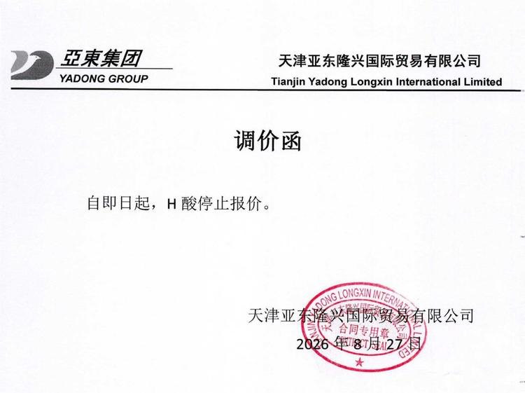

---

<!-- post_id: x:2093305211972665702 | ts: 1787917828 -->
## [X] 駿HaYaO · 2026-08-28 19:50

晶圓級系統的老弱點，CS-4 終於開始拆牆

晶圓級處理器最耀眼的地方，從來都不是「離開晶圓之後」。Cerebras 的 WSE-3 在晶圓上擁有極為驚人的 SRAM 頻寬，資料只要還待在那片巨大的矽上，就能以遠超 HBM 的速度流動。但一旦資料必須離開晶圓，整套系統立刻露出短板：off-chip 頻寬長期是晶圓級架構最弱的一環。

這件事之所以致命，是因為單片晶圓只有 44GB SRAM。容量由晶圓上的 SRAM bit cell 數量決定，不會因為時脈加倍而變大。大型模型因此必須切到多片晶圓上；每多一片，就多一段必須穿過那條「飢餓 I/O」的流量。長上下文更糟：KV cache 膨脹會直接把所需晶圓數量往上推，跨晶圓交通也跟著失控。

CS-4 沒有假裝這個物理限制消失，而是先把出口做寬、再把出口做活。

因為 CS-4 用同一顆 5nm WSE-3，靠更高功耗與更好的供電、冷卻把時脈拉高一倍，晶圓上的平行 I/O 也跟著倍增。晶圓外 I/O 從 CS-3 的 1.2Tb/s 升到 2.4Tb/s。單看數字仍遠不及 GPU 生態裡的 scale-up 互連密度，但對 Cerebras 來說，這已經是同一代矽能擠出的直接倍增。

更有意思的是新的 Wafer I/O 模組：一塊可現場升級的 FPGA NIC，把 Cerebras 專有 I/O 轉成標準乙太網路。聽起來像小改款，實際影響很大。網路標準可以跟機箱脫鉤，不必為了換交換協定就重做整套系統；晶圓也能直接講客戶現有 fabric 的語言，而不是強迫整座資料中心遷就專有介面。模組掛在晶圓南北兩側，並支援現場升級。

真正的戰略意義，不在「頻寬從 1.2 變 2.4」，而在它解鎖了異質解耦推論。

晶圓本質上是 decode 機器：SRAM 頻寬極高，很適合一個 token 接著一個 token 往外吐。但它的 roofline 對計算密集的 prefill 並不友善。有了新 I/O 模組，Cerebras 可以把 prefill 丟給基於 HBM 的 XPU，自己專心做 decode；也可以做成 attention 與 FFN 的解耦部署。已宣布的合作對象包括 AMD 與 Trainium。這等於承認 44GB SRAM 天花板短期內拆不掉，於是改用外部 HBM 系統去裝晶圓裝不下的狀態。

路徑很清楚：晶圓負責「快」，HBM 負責「裝得下」。CS-4 沒有讓晶圓級架構變成通用全能機，而是把它更明確地定位成高速 decode 引擎，再用可升級的標準網路，把其他加速器接進來補記憶體與 prefill。對大模型與長上下文來說，這比再多擠一點 on-wafer 頻寬更關鍵。

https://t.co/455qgfamBz

---

<!-- post_id: x:2093303375744143806 | ts: 1787917391 -->
## [X] 駿HaYaO · 2026-08-28 19:43

TrendForce: NVIDIA AI機櫃產品世代交替，預估2027年NVL72產值貢獻可突破7,100億美元

TrendForce指出，NVIDIA AI機櫃正進行世代交替。GB300整櫃方案為2026年出貨主力，需求延續至2027上半年；其後VR200將成為2027年出貨占比最高產品。Rubin Ultra（VR300）因HBM與架構細節未定，占比仍低。

預估2027年GB、VR等NVL72機櫃出貨量年增逾50%。因Vera Rubin系統ASP較GB300翻倍，加上晶圓與HBM醞釀漲價，GB300、VR200及VR300等NVL72系統合計產值將突破7,100億美元，年增214%，帶動ODM、供電與散熱供應鏈成長。

客群結構轉變：北美五大CSP採購比重由2025年約70%降至2026年60%，Tesla（含xAI、SpaceX）與CoreWeave需求上升。NVIDIA資料中心營收占比朝93%邁進，Neocloud與主權雲亦成成長來源。

競爭已擴大至資料中心基礎設施。NVIDIA在俄亥俄PORTS-Pike園區取得全站獨家算力供應，並對初始4.25 IT-GW提供殘值擔保，累計義務上限1,050億美元，涵蓋土地、電力與廠房。Google則為Anthropic擔保租金達440億美元，換取約20%股權並綁定TPU客戶；Broadcom亦承諾滯銷回購。兩家皆從晶片與系統延伸至基礎建設，透過融資條款鎖定後續需求。

https://t.co/9f3VNhJxHe

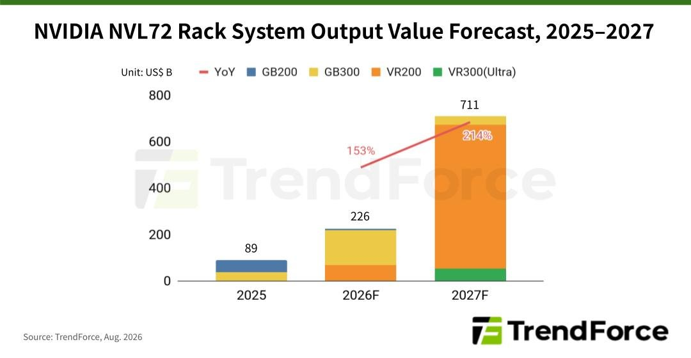

---

<!-- post_id: x:2093289956731232485 | ts: 1787914191 -->
## [X] 駿HaYaO · 2026-08-28 18:49

欣興電子（3037）今（8/28）早盤創歷史新高1,230元後急殺收黑，下午爆出桃園地檢署與調查局同步搜索。檢調帶回2名副總、1名會計及工程師，扣押4台筆電與大批文件。

案源為內部具名舉報，指高層涉嫌做假帳美化財報，並利用未公開重大訊息進行內線交易。股價先衝高再急殺，市場質疑有知情賣壓提前出貨。

更震撼的是「洗產地」指控：欣興據傳採購中國大陸基板與半成品，經台灣約12道製程「洗身分」後，違規貼上Made in Taiwan標籤出口，藉此規避美國對中高關稅與貿易限制。相關工程師亦被帶回調查。

此事正撞上美方近期打擊「影子轉運網絡」的重點。白宮日前發布《偉大的洗產地騙局》報告，指中國透過逾40個國家地區轉運詐欺，規避關稅規模估400億至3,030億美元；台灣與加拿大、日本、墨西哥、歐盟同列「第一級高風險」觀察名單。美方已宣示將用AI系統嚴查真實產地。

https://t.co/EcijjELPcw

---

<!-- post_id: x:2093288325440581887 | ts: 1787913802 -->
## [X] 駿HaYaO · 2026-08-28 18:43

Panasonic INDUSTRY
尊敬的客戶
2026年8月
松下機電株式會社
電子材料事業部 營業統括部

關於電子線路板材料價格調整的通知
敬啟 謹祝貴司生意興隆昌盛，由衷感謝貴司長期以來的支持與信任。

目前，我司基板材料的主要原材料銅箔、玻璃布等材料的供需環境正發生顯著變化，銅箔加工費、玻璃布價格持續上漲。與此同時，相關輔材、能源、物流等費用也在不斷攀升，對整體的製造成本帶來了重大影響。

為吸收成本上漲的影響，我司盡最大努力實施了生產效率提升、合理化活動推進、調達業務改善等措施。然而，當前原材料價格上漲的影響極大，僅靠我司的自主努力難以吸收。

謹此呈上萬分艱難的請求，鑒於當前情況，我司擬將相關費用反映至產品價格中。
懇請貴司體察，對本次價格調整予以理解與支持。
敬上

■對象工廠
郡山據點、四日市南工廠、廣州工廠、蘇州工廠、台灣工廠、大城府工廠

■價格調整對象產品與當前價格的調整幅度
(1) 一般多層基板材料（環氧玻璃基板材料）
・覆銅板　+30%
・玻璃布樹脂夾層　+30%
(2) 低傳輸損失多層基板材料（MEGTRON / XPEDION）
・覆銅板　+15%
・玻璃布樹脂夾層　+15%
(3) 半導體載板材料（LEXCM GX）※R-1515V 及 R-G635 不適用本次價格調整
・覆銅板　+30%
・玻璃布樹脂夾層　+30%
(4) 玻璃複合基板材料（CEM-3）：　+30%
(5) 柔性電路板材料（FCCL）　+15%

■實施日期： 自 2026 年 9 月 1 日出貨開始實施（Ex-Factory basis）
以上

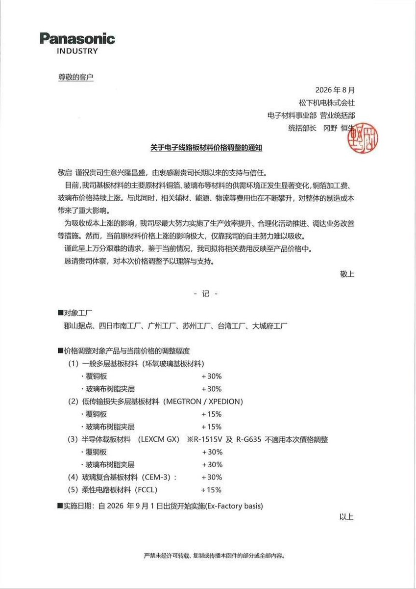

---

<!-- post_id: threads:3973495170620626115 | ts: 1787897558 -->
## [Threads] Kok Yu · 2026-08-28 14:12

看來看去，大家最重視的那塊黑板 沒受影響

---

<!-- post_id: x:2093179339080675516 | ts: 1787887818 -->
## [X] 駿HaYaO · 2026-08-28 11:30

廣東建滔積層板銷售有限公司
GUANGDONG KINGBOARD LAMINATES TRADING CO LTD
建滔集團成員

漲價通知

尊敬的各位客戶：
衷心感謝您長期以來對建滔的支持！
近期由於上游物料玻璃布、銅箔等核心主材供應日趨緊缺、價格大幅上漲。因此，自即日接單起，我司將對以下材料價格調整如下：

產品（所有厚度）  調整幅度
FR-4  +10%
PP：
7628（含）以上厚布  +10%
7628以下薄布  +20%

敬請各位客戶知悉並理解，謝謝！
忠信積層板（澳門）有限公司
廣東建滔積層板銷售有限公司
2026年8月28日

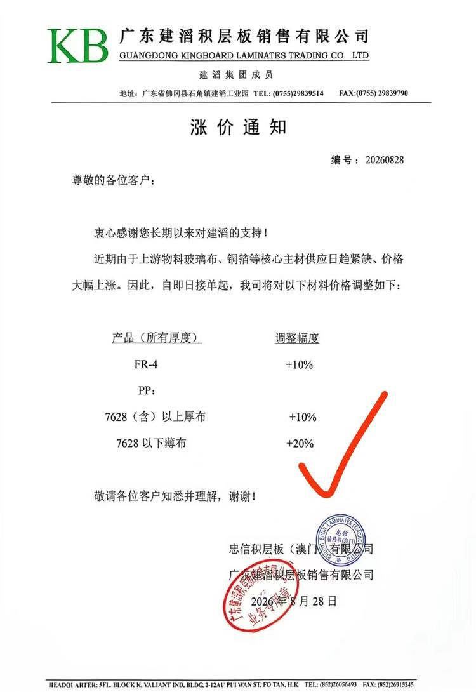

---

<!-- post_id: x:2093133168845197419 | ts: 1787876810 -->
## [X] 駿HaYaO · 2026-08-28 08:26

早安！8/28 外電綜合整理

- 3211順達: 美系重申正向
美系券商預期8月營收有機會月增50%，通路訪查結果一項 5kW BBU 專案在 8 月上半月恢復出貨，8kW/12kW 提前至10月出貨。同時大廠Samsung SDI 與 Azure 所給出的正向展望，更進一步驗證了強勁的需求環境，券商對順達重申正向。

- 1319東陽: 美系重申正向
亞系券商預期4Q的季節性表現將更為強勁，在補庫存需求、市占率成長以及美國 AM 滲透率提升的帶動下，營收動能自7 月起開始復甦，尤其客戶端目前庫存竟低於1個月。券商重申正向。

- 解讀Nvidia財報：
法說會上揭示Vera Rubin 已進入全面量產階段，Vera CPU 銷售額預計在 FY28 成長至兩倍以上。美系大行從台積電通路訪查的確CoWoS-R 有強勁的訂單預訂量。另家美系券商則表示，AI 基礎設施支出的供應鏈將受惠，如：機架 ODM、電源管理供應商、液冷供應商、網路及光學元件公司，以及資料中心電力基礎設施供應商等。

 #下次會考

---

<!-- post_id: threads:3973302044756984966 | ts: 1787874535 -->
## [Threads] Kok Yu · 2026-08-28 07:48

這是場共存的遊戲，而不是零和遊戲.
材料上的應用 跟客戶的初衷去理解 會有一個比較全面的了解

---

<!-- post_id: x:2093009013160182083 | ts: 1787847209 -->
## [X] 駿HaYaO · 2026-08-28 00:13

松下（Panasonic）發表：以 AI 判定異物與品質差異，專為特殊相機設計

松下宣布，將於10月上旬推出一款檢驗軟體：由人工智慧（AI）分析特殊相機取得的數據。該軟體可判定以往影像檢驗難以偵測的異物，以及品質差異。

系統會分析「高光譜相機」（hyperspectral camera）拍攝的數據。此類相機能捕捉人眼看不見的波長差異。松下將向食品加工業、製造業與研究機構等推廣，以推動檢驗的高度化與效率化。價格採個別報價。

一般使用 AI 檢驗軟體時，需大量影像數據讓 AI 學習良品與不良品的差異。松下以獨家技術，將單張影像細分以增加學習數據，即使影像數量較少也能在短時間完成學習。據稱，所需數據容量較一般 AI 檢驗軟體減少至約 1/30。

為提升品質與節省人力，採用影像分析的自動檢驗正逐步普及。高光譜相機能分辨一般相機無法辨識的物體材質與狀態差異，但過去分析拍攝數據需要專業知識。新軟體透過 AI 提升學習與判定效率，降低導入高光譜相機的門檻。

https://t.co/M8PRiF0BaN

---

<!-- post_id: x:2093007534152176073 | ts: 1787846856 -->
## [X] 駿HaYaO · 2026-08-28 00:07

阿里巴巴 ( Alibaba ) 周一以112.70港元發行7.1億股新股，籌資80億港元（約10.3億美元），較上週五收盤折讓8.4%、較現有股份折讓3.7%。港股當日跌8.5%，騰訊跌2.2%，恒生科技跌2.1%。摩根士丹利認為股價僅跌0.3%只是折價發行的算術結果，現有股東異常重定價約190億美元，約為籌資額兩倍，拋售幅度相對實際股東成本過大。

市場將此次股權融資視為中國AI資本開支周期經濟上已變得危險的證據。更準確結論應更窄：阿里AI投資周期可能長於預期，但底層計算經濟仍具吸引力。三家CSP融資風險差異很大。維持阿里、騰訊、百度超配，建議9月季報前逢低買入阿里。

- 周期解讀變化，而非開支或回報預估
改變的是對AI投資周期持續時間的判斷，而非FY27資本開支預估或計算回報看法。FY27E資本開支維持2000億元人民幣，6月季度270億元運行速率視為壓力測試。在此開支下，年度內部資金缺口約1000億元，但公司有約1500億元可用流動性及充足債務能力，流動性與償付能力並非關鍵風險。

四項測試框定交易：老模型中計算部分NPV為正（項目IRR 22%對比資本成本約10%）；若至少80%募集資金用於基礎設施，EPS從第二年起增厚，60%基礎組合下仍僅溫和稀釋約3個百分點；債務對EPS更有利；低於205港元公允價值發行使現有股份內在價值減少約1%。配售並非免費，但也不像周一市場定價的價值毀滅。

- 行業三種融資模式
全行業可見三種融資路徑。阿里在重新評級後用母公司股權加債務為資本開支融資。騰訊以經營現金流、債券及875億元投資組合融資。百度借款並通過崑崙芯尋求子公司股權。

每條路徑均有股東成本：阿里直接稀釋、騰訊放棄投資組合回報與稅收洩漏、百度AI資產稀釋。將阿里此次配售簡單解讀到騰訊和百度身上被誇大。三種模式股東成本結構不同，不可一概而論。

- 論點關鍵風險
論點關鍵風險可觀察。若已部署資金成熟ROIC低於約15%、基礎設施占AI支出份額接近40%、三年資本開支承諾升至3800億元以上且外部雲增長無相應提升，或計算定價因供應寬鬆而下跌，則阿里案例將減弱。
這些指標將決定投資周期是否真正拉長、回報是否仍具吸引力。

---

<!-- post_id: x:2092982147112206844 | ts: 1787840804 -->
## [X] 駿HaYaO · 2026-08-27 22:26

POLITICO

特朗普政府正研議新一輪半導體全面關稅。知情人士稱，課稅範圍可能不只芯片，還涵蓋筆電、遊戲機、數據中心伺服器等「用芯片的產品」。商務部長盧特尼克傾向把外國企業的關稅減免，和其在美設廠投資掛鉤，並考慮分階段實施；細節數週至數月內仍可能大改。

科技業已因 AI 數據中心狂潮面臨高端芯片短缺，台灣一家就生產全球九成以上最先進製程。業界不反對回流美國，但先進晶圓廠要數年、甚至更久才有產能。關稅若先上路，等於對 AI 最依賴的進口芯片加稅，可能拖延或取消部分數據中心計畫。

遊說團體希望沿用今年 1 月較寬的豁免（數據中心、研發、新創、消費與公共用途等），但近期官員態度趨嚴，傾向更廣課稅以逼產能落地。盧特尼克構想是「免稅配額＝承諾在美產量」，恐拉大免稅供應與實際需求落差；也可能依國家設不同稅率與配額。

支持者強調供應鏈去風險、降低對台依賴；批評者則指關稅不會自動培養人才、縮短審批或補齊水電與供應商。台積電亞利桑那投資雖創紀錄，滿產後最先進產能也僅約三成在美，且仍需多年。業界估算：免稅額度連超大規模雲端業者都可能不夠，國內短期根本買不到同等芯片。

---

<!-- post_id: x:2092982014811222034 | ts: 1787840772 -->
## [X] 駿HaYaO · 2026-08-27 22:26

三菱化學集團開發半導體封裝用「負膨脹填料」（M-Filleris NTE）。該填料受熱會收縮，混入環氧樹脂後可抑制封裝翹曲與尺寸變化。因chiplet、3D堆疊使發熱增加，傳統二氧化矽高填充已近極限，新填料比重相近、易混用。

2026年度試銷並供客戶評估，2027年度下半年量產；可單售或與樹脂預混，製造委外。公司同步強化半導體材料布局。

---

<!-- post_id: x:2092940551981269467 | ts: 1787830887 -->
## [X] 駿HaYaO · 2026-08-27 19:41

Synopsys 2026年7月季度（QJul26）

- EDA 與 IP 已重回正軌；IP 仍較前高點低 10%
- EDA 營收 12.8 億美元，創歷史新高，較 FY25 第三季前高 11.8 億美元高出 8%
- 關於 AI 顛覆，公司認為客戶模型仍需要其物理與簽核（sign-off）工具；AI 原生設計是需求驅動因素，而非替代風險（SNPS 觀點）
- 硬體營收再次創紀錄；本季新增 12 家、重複 66 家硬體客戶
- IP 營收 4.74 億美元，年增 11%、季增 4%；連續三季下滑後首次年增，連續第二季季增，預期第四季將繼續季增
-----

- IP 毛利率從第一季的 16.2% 回升至 26.5%，但仍遠低於 FY24 的 38% 水準
- 長期中位數十幾（mid-teens）的 IP 成長指引目前維持不變
- Factory Two（客製矽晶）將模式從授權+NRE 轉向授權+權利金
- Agent 的變現方式正在協商為訂閱+用量計費
- 指引 EDA 將在第四季及 FY26 加速至雙位數有機成長
- 驅動因素包括設計複雜度、3DIC 與先進封裝、AI 對設計工作流程的重新工程，以及硬體

- 中國營收 2.56 億美元，佔總營收 10%，年增 3%、季增 6%；韓國營收 3.26 億美元，年增 61%，現已超過中國；FY26 預計成長約 20%
- Ansys 營收 7.11 億美元，季增 9%；FY26 Ansys 貢獻上調 2,000 萬美元至 29.8 億美元
-----

- 非 AI 設計案已趨於穩定
- Agentic AI 目前已有超過 30 個活躍客戶合作
- Die-to-Die 預計年增一倍，累計設計贏得已超過 100 個
- 營收 24.8 億美元，年增 42%、季增 8.8%，高於指引上限；非 GAAP 營業利益率 41.6% 也超出上限
- FY26 營收指引中位數上調 5,000 萬美元至 96.9–97.4 億美元；營業利益率上調 50 個基點至 41.5%
- 第四季指引營收 25.3–25.8 億美元，意味著全年年增 13% 收官
- 積壓訂單 109 億美元，因 ARC 業務剝離而季減幅度不大

---

<!-- post_id: x:2092939976216568214 | ts: 1787830749 -->
## [X] 駿HaYaO · 2026-08-27 19:39

株式会社フェローテック( Ferrotec Corporation，6890)

取得背景與目的
本公司作為「回歸日本」策略的一環，於2025年7月在同工業團地內啟動石川第3工廠，強化半導體製造裝置相關產品（精密陶瓷）的增產體制。但因需求進一步擴大，金屬加工等中國及馬來西亞各據點已處於滿載狀態，為因應國內需求而確保產能成為課題。

基於上述情況，本公司將在國內建設陶瓷及金屬加工新工廠列為經營上的重要課題。此外，2026年7月21日，日本政府在「地域未來戰略」中閣議決定將北陸地區定位為繼九州、北海道之後的AI・半導體產業聚集地。本公司判斷此為強化該地區生產基盤的良機，因而決定取得本土地。

https://t.co/YRG1m0J6eP

---

<!-- post_id: x:2092937435458265375 | ts: 1787830144 -->
## [X] 駿HaYaO · 2026-08-27 19:29

Intel 在 DB 會議上的重點：
- 對晶圓代工與製程節點發展看法樂觀；18A 良率優於目標；稱 14A 缺陷密度曲線是自 22nm 以來最佳

- 內部對 14A 需求強勁；對外 14A 合作信心提升；0.9 PDK 將於 10 月推出

- EMIB-T 將從 2027 年下半年開始放量；每位客戶可達數十億美元規模的 EMIB 業務；相較晶圓業務，資本支出較低、ROIC 較高

- 先進封裝目標毛利率 40%、營業利益率 30%；晶圓業務也有機會達到類似水準，關鍵取決於 14A 執行，業界最佳目前已接近 70%

- CPU 需求極強；出貨量再次成長，單位成長達雙位數；核心數持續增加，每核心 ASP 趨於穩定

- 愛爾蘭廠產能明年將翻倍；Fab 62 明年開始裝機；俄勒岡將從純試產線轉為 14A 試產＋高量產廠

-亞利桑那將成為 18A 中心；俄亥俄 Mod 1 目前是重點；認為 Intel 3 也適合作為外部客戶的 base die 節點

- 為了伺服器 CPU 產能而犧牲部分客戶端市佔，因伺服器產能已成為市佔關鍵；預期桌機將隨 Nova Lake 迎頭趕上
-----

Intel 財務長 David Zinsner 的發言摘錄
- EMIB-T 預計 2027 年下半年開始貢獻營收，2028 年進入較穩定的 run-rate 階段，2029 年進入成熟期；
- 該業務規模可達「每位客戶每年數十億美元」；
- 先進封裝毛利率有望達到約 40%。

---

<!-- post_id: x:2092904450809852348 | ts: 1787822280 -->
## [X] 駿HaYaO · 2026-08-27 17:18 _(接續 2 則)_

Navitas（ $NVTS ）於 2026 年 8 月 24 日宣布簽署最終協議，擬收購 Claros，交易價值最高約 2.328 億美元（依 8 月 21 日收盤價 12.97 美元計算）。交割時支付約 2.16 億美元（現金加股票），其餘視交割後兩年業務里程碑以股票支付；另有約 2,890 萬美元員工績效股票。雙方董事會已通過，預計年底前完成，須經監管核准。

Claros 成立於 2024 年，專注 AI 資料中心的垂直電源傳輸（VPD）與集成電壓調節器（IVR）。收購目的是補齊「電網到 xPU」最後一環：Navitas 的 GaN 與高壓／超高壓 SiC 已支撐 800V HVDC 架構，但傳統 VRM 橫向供電無法滿足次世代加速器數千安培、近即時響應需求，形成「電源牆」。Claros 將轉換、驅動、控制與被動元件堆疊進緊湊封裝，置於晶片附近，電力僅行進毫米，可提升暫態響應、降低阻抗與發熱、提高亞伏特效率與功率密度。

完成後，Navitas 預估 2030 年可服務市場由現有約 45 億美元（GaN／SiC 35 億＋新 JFET 約 10 億）倍增至逾 80 億美元，VPD／IVR 至少再貢獻 35 億。技術上可補強數位控制、被動整合、混合訊號與 2D／3D 封裝。短中期財務模型與獲利時程不變，Claros 預計自 2028／2029 年起成為額外成長動能。CEO 強調此舉延續 Navitas 2.0，深化與超大規模雲端及 AI 電源平台合作。

https://t.co/Cgz108JwBg

---

<!-- post_id: x:2092898496789770607 | ts: 1787820860 -->
## [X] 駿HaYaO · 2026-08-27 16:54

國喬石化（1312）於2026年8月25日宣布，與日本工業氣體大廠エア・ウォーター（AWI）共同參與台灣半導體特殊氣體廠宏廣新技增資，雙方各持股35%，並列兩大股東，象徵國喬正式跨入半導體特用材料。雙方高層已於8月18日在大阪會面，確立策略合作。

國喬強調，此舉不是離開石化本業，而是以既有化學技術與產業整合能力延伸布局。AWI則將半導體視為未來成長重點，可提供超高純度大宗氣體、特殊氣體、自有VSU氣體工廠與現場供氣技術。宏廣新技具備電子級特氣在地生產、銷售、分析與技術支援能力，產品包括氟碳類、N₂O、CO₂及F₂/N₂等製程用氣體，主要供應晶圓廠，並涵蓋太陽能與面板。國喬另取得危化品物流商愛豐通運23.4%股權，補足運輸、倉儲與配送。

日經指出，AWI早於2022年入股宏廣，並曾持股50.1%；此次增資後持股降至35%。

https://t.co/HVqTPZX0Xi

---

<!-- post_id: x:2092896224441741465 | ts: 1787820318 -->
## [X] 駿HaYaO · 2026-08-27 16:45

TrendForce指出，SEMCO率先對OEM／ODM調漲2026年第四季報價，結束過去僅對代理商調價的做法，標誌MLCC產業進入上升循環。

消費規X5R平均漲25%–30%，目的在抑制低階訂單、騰出產能轉往高階產線；AI server用高階X6S則依議價漲10%–20%。日廠Murata、太陽誘電、京瓷目前觀望、報價持平，後續是否跟進將決定漲勢能否擴大。

受消費規中高容訂單外溢，台、陸系廠Q4平均漲幅估10%–20%，稼動率同步提升，部分已近九成。AI資料中心與光通訊模組需求強勁，加劇MLCC供不應求，相關廠商轉向台、陸系尋求支援。相對地，傳統ICT與車用展望保守，中美經濟動能趨緩，下半年恐「旺季不旺」。

整體而言，SEMCO帶頭漲價、中高容訂單外溢與稼動率攀升，使產業正式邁入漲價循環；日廠動向將是下一波漲幅關鍵，預期Q4供需缺口持續擴大、價格走升。
https://t.co/ka1NHNlFV8

---

<!-- post_id: x:2092895574723027206 | ts: 1787820163 -->
## [X] 駿HaYaO · 2026-08-27 16:42

台系供應鏈認為先進封裝必須「多元化」。Google TPU已導入英特爾EMIB，首款良率達標，後續幾代續用機率大增。

在台積電CoWoS產能長期吃緊下，只要EMIB技術、良率、成本與產能持續達標，Google就會繼續採用；聯發科作為TPU ASIC夥伴，也將深化與英特爾合作。

聯發科仍以台積電為主力，但美國ASIC團隊多具英特爾背景，讓雙方合作更順暢。首案突破後，後續合作門檻降低，也有助爭取Google更多專案，並向CSP客戶提供多元封裝方案，強化ASIC接單競爭力。

台積電法說會呼籲更多廠商投入先進封裝分擔壓力，業界普遍認為台積電自身擴產不會無上限，因此供應鏈必須向英特爾等體系布局。除Google TPU外，英特爾自有CPU也是潛在商機，測試與介面業者尤其值得爭取。

---

<!-- post_id: threads:3972828650349396062 | ts: 1787818102 -->
## [Threads] Kok Yu · 2026-08-27 16:08

矽微球的組成是二氧化矽..
二氧化矽在填料中是降低CTE用的
（如果大家記得 Q布 最大的組成就是二氧化矽）
而這樣也會也會讓大家以為的軟變硬..
然後板廠鑽孔的鑽針壽命就縮短了..

---

<!-- post_id: x:2092868229312197088 | ts: 1787813644 -->
## [X] 駿HaYaO · 2026-08-27 14:54

- ABF基板產能全滿、交期拉長至14個月：供應鏈瓶頸已從晶圓轉向封裝材料

2026年，先進封裝供應鏈的關鍵瓶頸正從晶圓產能，明顯轉向ABF基板與上游材料。

根據SemiAnalysis最新觀察，目前六家主要ABF基板供應商的2026年產能幾乎已全部預訂完畢，整體交期普遍落在12至14個月。隨著新一代ASIC與GPU平台演進，封裝體積持續放大（最高可達9,000至14,000平方毫米），層數也拉高至20至24層，單顆產品占用的產線時間明顯增加，進一步壓縮可用產能。

在這種供需結構下，基板廠的定價能力正在上升。由於交期已超過一年，客戶開始尋求延伸至2029年以後的長期產能承諾。更值得注意的是，部分二線供應商已開始以競標方式拍賣剩餘產能，這通常意味著現貨市場價格環境對供應商有利，毛利率展望也隨之改善。

- 上游材料同樣吃緊：T-glass與基板CCL成新焦點

瓶頸不只發生在基板廠本身，上游材料同樣緊張。

T-glass（T玻璃布）無論是用在ABF基板的厚製品，或BT基板的薄製品，需求都非常強勁。台積電也特別指出，玻璃布來源不一致，會直接影響CoWoS良率、可靠度與共面性。過去T-glass高度依賴單一供應商Nittobo，如今中國廠商積極進入，供應來源已從一家擴展到五家以上，為材料端帶來一些紓緩空間。

不過，材料問題並未因此解除。基板級CCL幾乎仍由Resonac獨家供應，形成另一個明顯瓶頸。目前EMC也在基板CCL上持續推進，產品最早可能於2026年第四季開始出貨，並計劃在2027年將相關產能擴大一倍，成為市場上新的替代方案。

- 真正決定出貨量的，可能不是晶圓

這波訊號的含義很直接：在AI加速器供應鏈中，能夠實際出貨的數量，越來越取決於基板與CoWoS/OSAT封裝測試產能，而不只是前段晶圓。

也因此，市場開始討論一個延伸問題：基板廠正在獲得的定價權，是否會進一步傳導到OSAT測試產能，還是會主要停留在基板供應商手上。從目前交期、長約鎖定與產能拍賣同時出現的情況來看，先進封裝材料與組裝環節，已成為2026至2027年最值得持續追蹤的供應鏈核心。

---

<!-- post_id: x:2092867028571025786 | ts: 1787813357 -->
## [X] 駿HaYaO · 2026-08-27 14:49

保障美國大容量電力系統
特朗普簽署行政令，保護電網大容量設備安全，防外國干預。依IEEPA與國家緊急狀態法，宣布外國產設備構成「不尋常且非同尋常威脅」。

原則禁止有網絡安全或運行風險的外國設備及關鍵軟件在美採購安裝，或附加條件。針對可能破壞、遠端操控、衝擊關鍵基礎設施的交易。不適用地方配電。

能源部長可對既有設備設條件（隔離、更換等），並須兼顧可靠與連續供電；120天內出規則，並向國安顧問提建議。

防止外國癱瘓關鍵基礎設施
先進製造、AI、國防推高電力需求，美國更依賴外國零部件。限制不足讓外國更易在設備中埋伏門或遠端控制。持續依賴外國供應也構成貿易中斷風險，威脅國防、緊急服務與經濟。

保障關鍵供應鏈
延續第一任期232條款做法，重返後持續以關稅與行政令重建鋼鐵、鋁、半導體、藥品等產業。
2025年4月電網行政令保住1.7萬兆瓦機組；其後還有AI、國防供應鏈、無人機等相關措施，目標是降低外國依賴、強化本土產能。

https://t.co/fCsGFEJVny

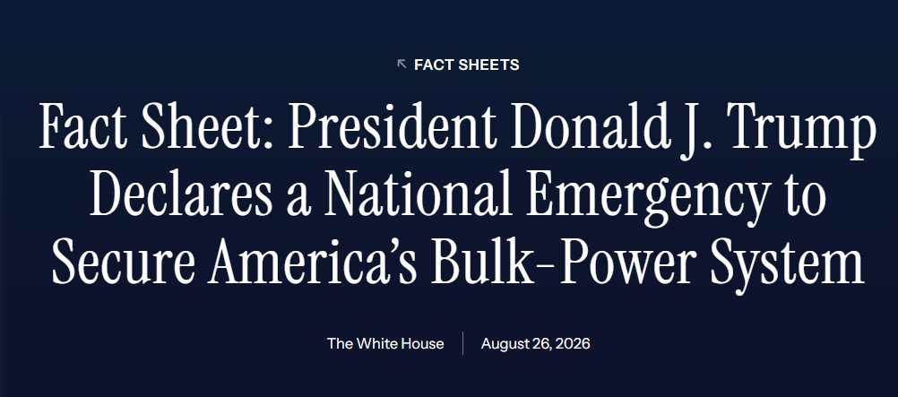

---

<!-- post_id: x:2092865790186066303 | ts: 1787813062 -->
## [X] 駿HaYaO · 2026-08-27 14:44 _(接續 2 則)_

Nokia 與 Nscale 宣布合作，加速全球 AI 基礎設施建設。Nscale 選定 Nokia 為全球 AI 就緒資料中心的首選網路夥伴；Nokia 同時參與 Nscale 的 B 輪融資，協助打造可擴展、安全且具競爭力的 AI 基礎設施。

Nscale 為英國總部、全球營運的原生 AI 基礎設施平台，提供運算、網路、儲存、託管軟體與 AI 服務。Nokia 將以其資料中心交換、IP 路由與光纖網路產品，為大規模 AI 叢集提供高效、安全連線，協助客戶更經濟地擴展雲端容量，並提升資料中心速度與能源效率。

雙方將共同創新 AI 叢集網路堆疊，並在全球合作部署。Nokia 執行長 Justin Hotard 與 Nscale 執行長 Josh Payne 均強調，此合作結合網路專業與基礎設施平台，可因應歐美及全球對安全、可擴展 AI 基礎設施的急速需求。

https://t.co/mbFELYiuS6

---

<!-- post_id: x:2092831211811135978 | ts: 1787804818 -->
## [X] 駿HaYaO · 2026-08-27 12:26

$LRCX

GAA奈米片電晶體推進次5奈米製程，但堆疊通道的機械應力並不均勻。
應力改變矽能帶與載子遷移率，微小差異就會讓某層通道電流偏高、Vt與漏電失控。單看幾何難以預測，必須用能模擬完整製程與三維應力的工具提前找出問題。

解決方向
堆疊通道像三條車道，本應均勻分流；若一層應力較高、遷移率較佳，電流就會過度集中。
Lam以SEMulator3D加上應力建模，模擬整段製程，找出通道厚度、鰭寬與側向蝕刻如何造成不均，並發現頂層通道略加厚可明顯改善均勻性。

為何均勻應力關鍵
GAA由垂直堆疊、閘極全包覆的矽通道組成。
應力直接影響遷移率、飽和電流、關閉電流與Vt。理想是各層應力相同；實務上製程變異讓高應力通道主導電流與漏電，造成Vt分散與異常開啟特性。
均勻應力是設計目標，模擬不可或缺。

SEMulator3D如何模擬應力
輸入佈局、步驟與材料建立3D製程模型，再對結構做應力分析。應力來自源／汲磊晶與矽的晶格不匹配：pFET源汲晶格較大、nFET較小。RMG後通道懸空，壓縮源汲膨脹把pFET壓成壓縮，拉伸源汲收縮把nFET拉成拉伸。模型在磊晶、鰭蝕刻、閘極、源汲成長與RMG各階段都求解應力。

通道厚度對均勻性的影響
DOE改變各層通道厚度與鰭寬，因截面積是應力主因。沿垂直剖面看縱向應力，三層各有峰值，nFET不均比pFET大。應力差對頂層（通道3）厚度最敏感：由4nm增至7nm，等高線由高差轉低差。結論是頂層需略厚於下方，才能縮小層間應力差。

鰭寬與側向蝕刻的影響
側向蝕刻比高時，鰭錐度變大，頂層通道明顯變窄。低蝕刻比時鰭寬變化對應力差影響小；高蝕刻比（0.1）時，窄鰭加薄頂層會讓nFET應力差高達約900MPa，頂層加厚可降到約500MPa。pFET影響較弱，但過度側向蝕刻時仍可見。

https://t.co/cW2zmiDr76

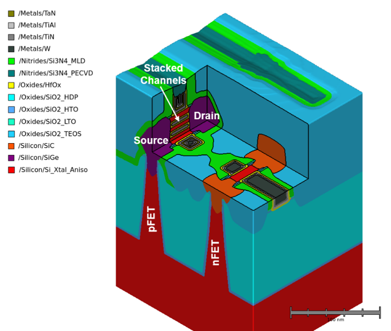
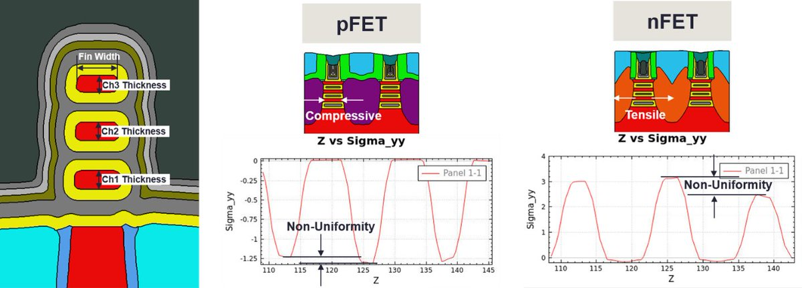

---

<!-- post_id: x:2092806305043865665 | ts: 1787798880 -->
## [X] 駿HaYaO · 2026-08-27 10:48

Nvidia（$NVDA）財務長談「循環融資」：

Nvidia 已在前沿 AI 實驗室投資近 500 億美元。
OpenAI 現有及計劃中的承諾相當於約 12 GW 的 Nvidia 運算能力，而 Nvidia 將為另一家前沿 AI 實驗室提供近 2 GW 的選擇性信用支持。

「我們預期，那些我們打算動用資產負債表支持的 AI 實驗室需求，將貢獻我們明年大約四分之一的業務。」
-----

我們認識到這項支持的規模，也知道有些人會稱之為循環融資。我們有不同的看法。我們正經歷一場重大的運算平台轉型。這是人類歷史上最重要的技術之一的誕生。而這些公司是百年一遇的，它們的技術領導地位已得到證明，客戶採用率和使用量正在飆升。我們預期它們將成為歷史上最大的科技公司。

我們相信，這些投資以它們的需求強度來衡量——它們為我們創造的業務、它們所建立的生態系統、Nvidia平台以及我們投資資本的股權回報——都會非常出色。而且我們的風險有限。Nvidia運算平台具有可互換性和耐久性，可以重新部署來支持其他客戶。

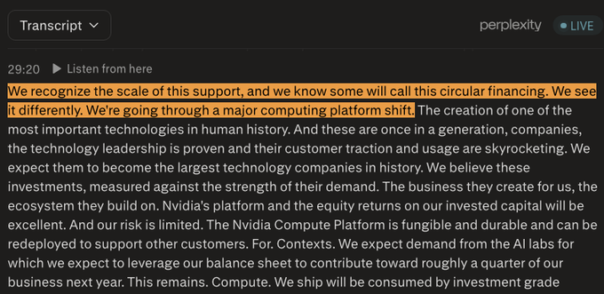

---

<!-- post_id: x:2092801777603060004 | ts: 1787797800 -->
## [X] 駿HaYaO · 2026-08-27 10:30

NVIDIA 宣布開發客製化高頻寬記憶體 NVHBM，專為 AI 設計，並與 Amazon Annapurna Labs 合作。

核心技術：
將記憶體控制器從 XPU 移至 HBM 基底晶粒，取代傳統 HBM4E 架構。

主要優勢（相較標準 HBM4E）：
- 頻寬提升最高 30%
- 功耗降低最高 15%
- XPU 運算晶粒面積節省最高 25%（可轉作更多運算單元）
- PHY 與支援電路面積減少最高 67%，中介層佈線更簡化，可用矽面積增加最高 80%

應用與生態：
NVIDIA 將制定標準 NVHBM 規格，由多家記憶體廠商供應，方便 NVLink Fusion 生態系統夥伴快速整合，降低跨供應商驗證成本。

合作與時程：
Amazon Annapurna Labs 為首家合作夥伴，將在下一代 Trainium4 晶片採用，並與 NVIDIA GPU 透過 NVLink Fusion 組成共同機架級架構。
預期 NVIDIA 自身將在 2028 年左右的 Feynman 世代 GPU 首次導入。
此技術針對兆參數級 AI、代理式與實體 AI 工作負載，解決記憶體頻寬與功耗瓶頸，同時提升整體系統效率。

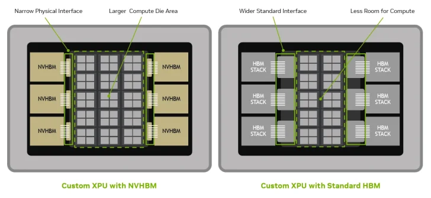

---

<!-- post_id: x:2092794370571587928 | ts: 1787796034 -->
## [X] 駿HaYaO · 2026-08-27 10:00

英偉達( $NVDA )周三財報披露，截至7月26日的季度首次向中國出售少量H200芯片，但僅占數據中心收入不到1%，遠低於特朗普1月批准的許可量。因北京異議未能足額出貨，過去半年因需求疲軟計提4億美元庫存減值。

中國整體銷售額達78.8億美元，近乎翻倍，主因非AI產品（含遊戲硬件）帶動，公司未公布H200具體數量與收入。

此為自2025年初約6000萬美元H20出貨後，首次對華銷售AI芯片。H20原為規避早期出口限制設計，特朗普4月曾禁售後又解禁，但中方已勸企業勿買。

去年黃仁勛遊說特朗普獲准向獲批中國買家銷售Hopper系列H200，條件含向美政府支付25%費用。7月美商務部官員稱對華H200出貨量「微不足道」。

整體營收貢獻極小，重返中國市場仍充滿政策與需求風險。

---

<!-- post_id: x:2092793239665606946 | ts: 1787795765 -->
## [X] 駿HaYaO · 2026-08-27 09:56

傳
Ptfe台虹ccl台光台耀，散熱奇鴻，abf欣興，純吹的大立光，漢測、創意，全部大漲新高

PTFE進展加速，重點關注矽微粉和PTFE樹脂 20260826 CCL專家交流要點
1. PTFE 十幾億訂單，剛下，終端給 NV 的，樂觀 1-2 月，慢的話 6 個月形成 PCB成品  
2. NV 內部基本確認，除了高階 HDI 用不了，後面像 switch、midplane、LPU 的板子，都有較大概率陸續會換

---

<!-- post_id: x:2092788379587051569 | ts: 1787794606 -->
## [X] 駿HaYaO · 2026-08-27 09:36

鎧俠控股（Kioxia）將在岩手縣北上工廠新建第3座製造棟，以因應AI熱潮帶動的記憶體需求。新棟將生產第10代高密度3D NAND快閃記憶體（7月已開始樣品出貨），主要供應AI資料中心。投資額預估超過1兆日圓。

多名知情人士透露，公司預計於8月27日傍晚正式宣布此增產計畫。消息傳出後，鎧俠股價一度大漲6.9%。日本經濟新聞已率先報導此事。

儘管AI帶動NAND需求上升，鎧俠過去因顧慮市況風險，對大型設備投資較為謹慎。本會計年度設備投資約4,500億日圓（年增60%），未來三年平均約4,700億日圓。市場認為此舉有助於追上中國與韓國競爭對手，是向前邁進的重要一步。

https://t.co/vnJbAne0vQ

---

<!-- post_id: x:2092786304971047178 | ts: 1787794111 -->
## [X] 駿HaYaO · 2026-08-27 09:28

英偉達 (NVDA) F2Q27 業績會摘要

F2Q 業績略超預期
- 收入：USD 96.2bn（+18% QoQ，+106% YoY），廣發 94.5bn、彭博 92.3bn、買方 94.6bn
- 資料中心收入：USD 89bn
- 毛利率：75%，廣發 75.1%、彭博 75%
- EPS：$2.22，廣發 $2.15、彭博 $2.09、買方 $2.18

F3Q 指引收入與我們完全相符但略高於市場，GM 略低於預期
- 收入指引：USD 108±2%bn，廣發 108bn、彭博 104bn、買方 109bn
- 毛利率指引：73.5-74.5%（官方為 74.0% ±50bps），廣發 75.1%、彭博 74.8%
- Vera Rubin 已出貨，F3Q 預計貢獻約 20% DC 收入
- 儲存成本超預期，F4Q 毛利率指引 71-72%，隨 F1Q28 漲價回升至 FY28 72-73%
- 全年 OPEX low-50s 增長

FY28 營收指引超預期
- FY28 營收預計 +70% YoY
- 70% 增長為供給約束，客戶給出的預測需求 100% 增長

Data Center
- Hyperscale F2Q 收入 $49bn（+13% QoQ），F4Q 及 FY28 重新加速
- AWS 合作擴大，新增 2m GPU 至 F2Q29
- ACI&E F2Q 收入 $40bn（+25% QoQ），Neoclouds 擴產驅動（預計 26 年底 8GW）
- Sovereign AI F2Q 收入 +35% QoQ，通過 Regional NeoCloud 實現

CPU
- Vera CPU 已全面量產，向 OCI、SpaceX、AWS 出貨
- $20bn Server CPU 需求，FY28 CPU 收入同比翻倍以上

Neoclouds
- Revenue-sharing 模式，NeoCloud 收入高於保障水平時 Nvidia 分享部分 Upside Revenue
- Nvidia 能「Get paid twice」：硬體銷售 + Rental Revenue Sharing
- 驅動 TAM 擴張，中長期帶來數十億美元級收入

資本回報
- F2Q 回購 20bn、季度股利 6bn
- YTD 達 FCF 的約 60%（原計劃 ≥50%）

其他摘要
- Nvidia AI Factory 單 GW 收入提升：Hopper 約 $18bn/GW → Blackwell $25bn/GW → Vera Rubin $40bn/GW
- Networking 收入 F2Q +18% QoQ，Spectrum-X Ethernet 同比增長 2.6x
- Frontier AI Labs 增長速度超自身 B/S 能支持的投資規模，Nvidia 已投資約 $50bn
- OpenAI 承諾至 2030 年部署 12GW
- 與 SoftBank Energy 合作，在 Portsmouth Campus 部署算力（初始部署 4.25GW）
- 庫存升至 $32bn，Vera Rubin 備貨
- DSO 升至 60 天，部分大客戶大額採購獲延長付款週期
- F2Q 向中國銷售的 H200 佔總 DC 收入 <1%，指引不計入中國收入
- Groq 3 LPX full production，Nebius 最早採用

股價表現
- 盤後股價漲逾 4%，受公司 FY28 營收 +70% YoY 指引、Vera Rubin 爬坡快、CPU 樂觀展望驅動。

---

<!-- post_id: x:2092769856827576520 | ts: 1787790190 -->
## [X] 駿HaYaO · 2026-08-27 08:23

早安！8/27 外電綜合整理

- 6223 旺矽：美系重申正向
美系券商重申Probe Card訂單能見度正向且已延伸至明年，涵蓋 CPU、AI ASIC、SoC 與網通晶片。CPO: INS3有3-4個客戶，4Q26開始貢獻，明年放量、INS2在認證階段。VPC、MEMS 產能目標維持不變，明年MEMS 月產能可能達到 600 萬，而且先進的 VPC 技術同樣可以支援高 Pin Count（高針數）以及相對 Fine Pitch（細間距）的應用。綜上，儘管預估下半年低個位數季增幅營收表現，但因產品組合轉佳，毛利率表現仍有上行空間。券商預期明年成長幅度高於今年，重申正向。

 #下次會考

---

<!-- post_id: x:2092655629001429483 | ts: 1787762956 -->
## [X] 駿HaYaO · 2026-08-27 00:49

Intel 18A-P 製程
英特爾在 Hot Chips 公布 18A-P 製程細節，採用 GAA（全包圍閘極）電晶體 + 背側供電（PowerVia）+ Power Boost 技術，並增加金屬層。

核心數據（量產矽片實測）  
- 在 0.5V 低電壓下，頻率比 FinFET 提升 30%  
- 相較 18A：相同功耗性能提升 >9%，或相同性能功耗降低 >18%  
- 高電壓也有雙位數頻率增益  
- NMOS 外部電阻降 20%、PMOS 降 12%  
- 熱阻改善 20-40%（鍵合堆疊熱導率提升 50%）

主要技術
- Power Boost：新型雙接觸架構，驅動電流提升，匹配電容下頻率更高  
- 背側供電：大幅降低壓降，高電壓效果特別明顯  
- 新增兩個粗金屬層：減少互連延遲，1.1V 頻率 +3%、0.65V +2%  
- 擴展 RibbonFET 選項，針對低功耗與高性能分別優化

應用產品  
Diamond Rapids（Xeon，最高 256 P-Core）與 Nova Lake（Core 系列）將率先採用，預計明年上市。
這是英特爾邁向多代核心性能領先的第一步，後續還有釕互連與 3D 堆疊邏輯。

https://t.co/CAFpuwz4po

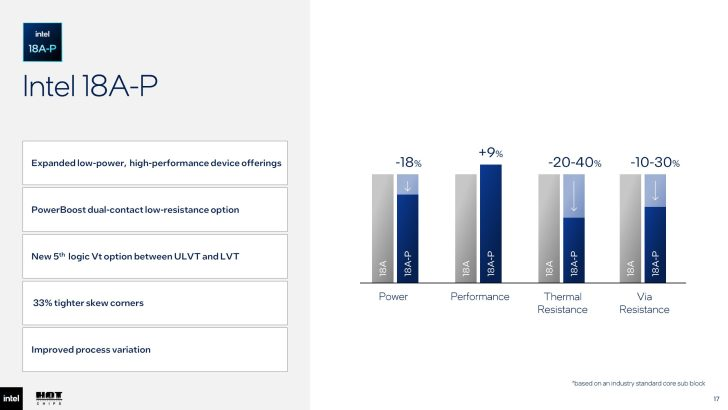
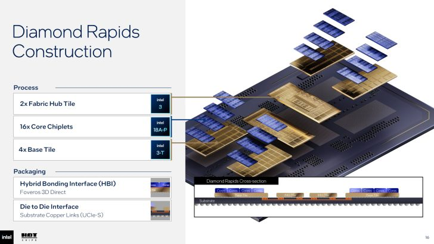

---

<!-- post_id: x:2092654275520581897 | ts: 1787762633 -->
## [X] 駿HaYaO · 2026-08-27 00:43

Amino
調 價 函

尊敬的客戶：
受純苯、硫酸等基礎化工原料價格持續上漲影響，間氨基苯酚生產成本持續增加，鑒於此，自2026年8月25日起，間氨基苯酚價格上調至10萬元/噸。
特此函告，希冀理解並支持為感！

浙江鴻盛化工有限公司
2026年8月25日 https://t.co/gJ3BLwtSPZ

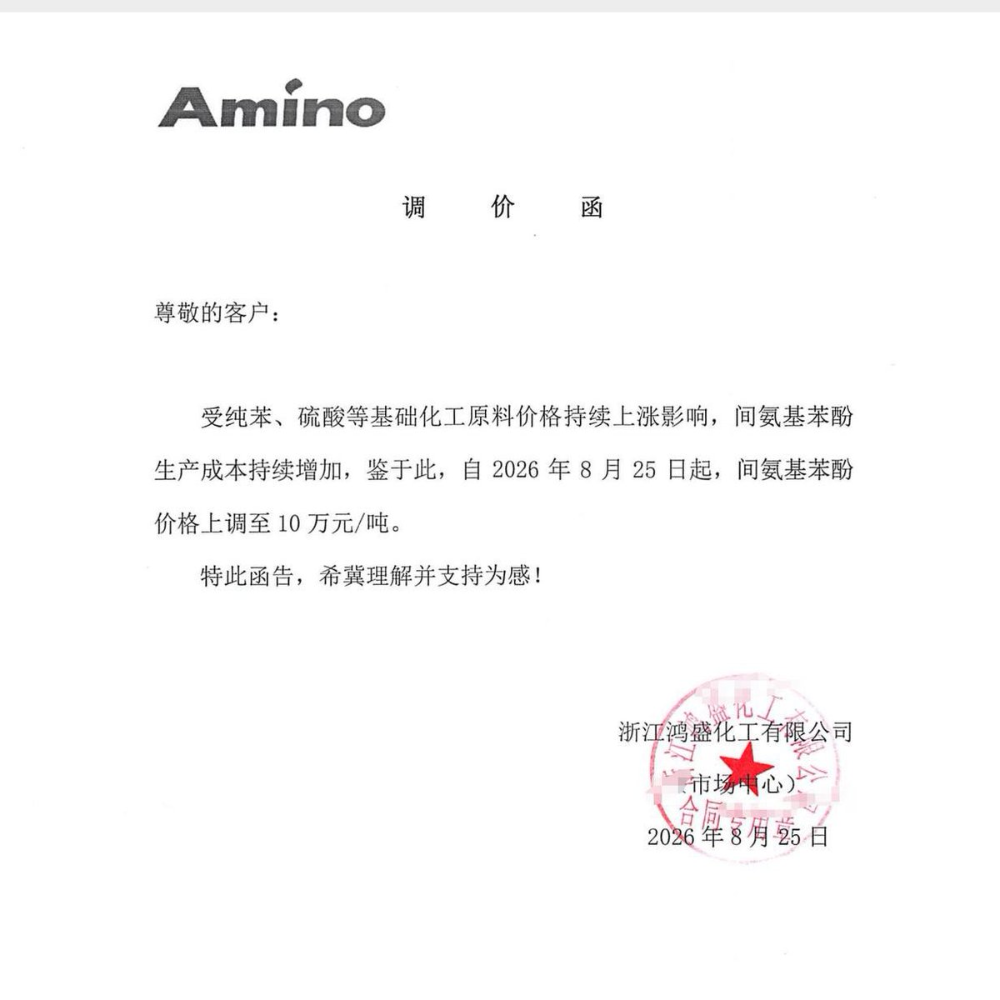

---

<!-- post_id: x:2092653569828880557 | ts: 1787762465 -->
## [X] 駿HaYaO · 2026-08-27 00:41

軟銀正與投行討論發行100–200億美元（或歐元）債券，最早9月完成，部分用於償還今年為投資OpenAI所借的400億美元過橋貸款。

軟銀預計到10月對OpenAI投資／承諾近650億美元，資金部分來自貸款。公司考慮採144A結構，首次十多年來開放給美國機構投資人，以擴大資金來源。若達200億上限，將成今年亞洲企業最大規模離岸債券發行。

此舉疊加已規劃的63億美元日本零售債券及近期以OpenAI持股擔保的100億美元保證金貸款。軟銀發言人表示「正考慮各種再融資選項，細節尚未決定」。

市場反應：軟銀8.5%美元債下跌約2.3美分，信用違約交換（CDS）擴大10.7基點，反映投資人對其債務負擔的擔憂。

---

<!-- post_id: x:2092608127640445079 | ts: 1787751631 -->
## [X] 駿HaYaO · 2026-08-26 21:40

OpenAI晶片業務負責人Richard Ho近日受訪時表示，該司自主研發的人工智慧（AI）晶片Jalapeño在每單位功耗的 AI 工作負載處理能力和響應速度等指標上已超越 NVIDIA “GB300”。作為建構自有AI基礎設施戰略的一部分，OpenAI計劃從今年年底起小規模部署該晶片用於驅動AI模型。 

Richard Ho稱，Jalapeño在公開基準測試體系中與英偉達旗艦產品GB300進行了對比評測。此晶片由OpenAI與博通共同開發，專為AI推理階段設計。雙方在去年宣布合作，並在今年6月透露該晶片在非常短的周期內完成了開發。

他表示，與通常只在處理能力或響應速度方面表現突出的普通人工智慧晶片不同，Jalapeño 兼具兩者優勢。 OpenAI 會決定在 Jalapeño 晶片上運行哪些人工智慧模型，使客戶能夠將該晶片用於特定用途，例如降低成本或提升效能。有消息稱，Jalapeño配備頻寬為 15.4TB/s 的 HBM4內存，配備6顆HBM4，總容量216GB。

據悉，OpenAI正利用自主研發的AI模型縮短晶片開發週期，第二代晶片的開發工作已進展順利，最終設計階段預計在未來幾個月內完成。

他同時表示，由於算力需求旺盛，與多家供應商的合作在短期內仍將持續。英偉達仍是核心合作夥伴，未來仍會大量使用英偉達的產品。
https://t.co/JdMgQHxwgz

---

<!-- post_id: x:2092593941648707827 | ts: 1787748248 -->
## [X] 駿HaYaO · 2026-08-26 20:44

惠普（HP）與華為周三（8/26）宣布簽署多年期全球專利交叉授權協議，惠普取得華為部分Wi-Fi專利（含Wi-Fi 7）授權，華為也獲得惠普對等專利權利。雙方未透露財務細節。

惠普強調這只是「標準必要專利（SEP）的常規授權」，屬業界例行公事，不代表雙方建立更廣泛的戰略或商業合作關係。

此協議是在2025年雙方Wi-Fi 6專利爭議後進一步擴大授權範圍。當時華為曾在歐洲統一專利法院起訴惠普，惠普於同年11月加入Sisvel Wi-Fi 6專利池（含約2,000項專利）後，糾紛才告終。華為為該專利池創始成員之一。

儘管美國2019年將華為列入實體清單（黑名單），限制其與美國供應商合作，但此次交易顯示華為Wi-Fi技術仍持續獲得中國以外市場採用。截至2025年底，全球已有超過16億台非手機消費電子產品使用華為Wi-Fi相關發明。

https://t.co/9p5s7zL1Sw

---

<!-- post_id: x:2092593156873482679 | ts: 1787748061 -->
## [X] 駿HaYaO · 2026-08-26 20:41

鈺邦（6449）總經理林翰淵指出，AI伺服器功率持續提升，導致高容MLCC供給吃緊，CAP取代部分高容MLCC的機會明顯增加。公司預計到明年上半年，CAP產能將再擴充近7成。

目前觀察到GPU與ASIC架構皆朝「CAP＋MLCC搭配使用」發展，因MLCC較適合高頻應用，CAP則具備大容量優勢，兩者搭配更穩健。高容MLCC缺貨也排擠中間容量產品，相關需求有機會轉向AP CAP。

SMLC方面，目標取代鉭電容，應用涵蓋伺服器、筆電、電源、固態硬碟及車用等。目前筆電已導入出貨，企業級SSD進入認證階段。SMLC採用鋁材料，相較鉭（衝突金屬）成本更低、供應鏈更穩定。

產能規劃：目前CAP月產約7000萬顆，11月提升至8000萬顆，明年1月達1億顆、上半年達1.2億顆。明年資本支出預估6-8億元（低於今年10億元），因V-Chip擴產告一段落，投資重心轉向CAP及SMLC。

https://t.co/leXdzZKggm

---

<!-- post_id: x:2092592899540082755 | ts: 1787748000 -->
## [X] 駿HaYaO · 2026-08-26 20:40

力成（6239）舉辦先進封裝成果與產業趨勢分享會，董事長蔡篤恭與副總經理林基正說明次世代矽光子與共封裝光學（CPO）最新布局。

旗下採Micro-Bump技術的光引擎，有機會於今年底前少量出貨，供終端客戶驗證，力拚明年進入產能建置與量產階段。目前已產出工程樣品交付驗證。

蔡篤恭指出，AI運算架構擴展至高頻寬記憶體與大型加速晶片，資料傳輸量暴增。傳統PCB與銅線傳輸面臨散熱與功耗瓶頸，將光纖直接整合進晶片封裝的CPO技術，成為解決高耗能與訊號延遲的關鍵趨勢。

林基正表示，力成核心聚焦整合光學與電學晶片的光引擎模組。相較同業Hybrid Bonding，力成選擇成本較低、利於量產的Micro-Bump垂直堆疊技術。

蔡篤恭強調，CPO技術門檻極高，全球真正具備完整光引擎與CPO實體封裝能力的業者，目前僅台積電與力成兩家。

應用方面，力成已針對網路交換器與高效能運算開發四種封裝模式。除晶圓級架構外，也積極投入面板級（B-Panel）整合技術，結合Micro-LED與接收模組，以提升傳輸效率並降低成本。

https://t.co/DWzmO2EhTu

---

<!-- post_id: x:2092591423397003654 | ts: 1787747648 -->
## [X] 駿HaYaO · 2026-08-26 20:34

統新(6426)法說會指出AI連接可分四大區塊：Scale-in（晶片對晶片）、Scale-up（機櫃內部）、Scale-out（機櫃對機櫃）及Scale-across（資料中心對資料中心）。

本次焦點為Scale-across，因長距離大頻寬傳輸需大量WDM濾光片。

受電力、空間與散熱限制，未來單一資料中心將轉向「分散式資料中心」，需透過大量串接連結多個小叢集，才不影響訓練速度。此時需要大量DWDM，正是統新專長，公司將成主要受惠者，Scale-across為主要戰場。

據LightCounting研究，受惠分散式AI數據中心需求，DWDM市場2026～2031年預估年複合成長率達13%。

https://t.co/ewfwBcl0Yb

---

<!-- post_id: x:2092590589418365307 | ts: 1787747449 -->
## [X] 駿HaYaO · 2026-08-26 20:30

聯亞光電（3081），三五族光通訊廠，於2026年8月26日發布五項重大訊息，聚焦AI與資料中心需求：

1. 擴大資本支出：
董事會通過斥資不超過新台幣22.7億元增購生產設備，資金來自自有營運資金與外部融資，分期執行，以因應AI產品產能擴充。

2. 美系客戶長約：
與美國大廠簽訂為期4年（2027-2030）的資料中心用CW Laser長期供貨合約，延續雙方合作，協助客戶在AI、高效能運算與資料中心領域成長，並為聯亞帶來正面營運動能。

3. 磷化銦（InP）基板長約：與美商簽訂2027-2030年共4年供料合約。
‧ 與日本供應商及其台灣子公司簽訂2026-2029年長期採購合約。
‧2027年將再與美國磷化銦供應商簽約，確保關鍵原料供應穩定。
‧2027年將再與美國磷化銦供應商簽約，確保關鍵原料供應穩定。

聯亞目前矽光產品以CW Laser為主力，預計2027年產能將達今年的2.5倍。業界認為此舉反映公司看好光通訊產業後市，積極為產能擴充與中長期營運佈局。

https://t.co/vHVSuXxrmO

---

<!-- post_id: x:2092545486486175893 | ts: 1787736696 -->
## [X] 駿HaYaO · 2026-08-26 17:31

日本空調大廠大金工業傳在墨西哥提華納工業園區興建第3座工廠，生產資料中心（DC）用空調箱（AHU），投資額約100億日圓。新廠預計2027年1月試產、6月全面量產，以因應北美、歐洲、印度等地hyperscaler持續擴建DC的需求，提升全球供應能力。

大金目標2030年度DC冷卻事業營收達8000億日圓（為2025年度5倍以上）：北美由1500億增至5000億、歐洲／中東2000億、印度等亞洲1000億。目前該事業主要供應北美市場。

全球DC冷卻市場預估2034年達544億美元，約為2025年188億美元的近3倍。消息傳出後，大金股價上漲約1.13%。
https://t.co/XZ4wOePZWt

---

<!-- post_id: x:2092538787507384719 | ts: 1787735099 -->
## [X] 駿HaYaO · 2026-08-26 17:04

Semtech ($SMTC  US) 

- 評級：維持買入，目標價 162 美元（基於 FY28E EPS 的 22 倍本益比）

- F2Q 營收 3.419 億美元（年增 33%，季增 17%），優於市場共識。非 GAAP EPS 0.71 美元（共識預期 0.61 美元）

- 非 GAAP 毛利率創紀錄達 54.5%（季增 150 個基點），主要由資料中心業務驅動

- F3Q 指引高於市場預期：營收 4.10 億美元；非 GAAP 毛利率 58.3%；EPS 1.02–1.08 美元

- AI 相關需求約為目前供應產能的 3 倍；成長瓶頸：SiGe / InP 晶圓及 OSAT 封裝產能限制

- 1.6T CopperEdge ACC 已於 F2Q 開始對主要雲端服務商大量出貨（從樣品階段轉為實質營收）

- 1.6T FiberEdge TIA‑driver 已開始初期出貨；目標於 FY27E 年底前在目標 1.6T 市場佔有率超過 50%

- 完成 HieFo InP 雷射收購後：推進 TIA、driver 與雷射晶片的垂直整合，以提升供應韌性

- 深化 LPO / NPO 的 MSA 標準化工作；已取得多項設計導入（design wins），擴大長期可觸及市場（TAM）

- 因供應不確定性而撤回明確的各業務部門年增成長指引，但多年期雲端服務商 AI 需求展望仍穩健

- 預估 FY27E / FY28E / FY29E EPS：3.60 / 7.40 / 11 美元

---

<!-- post_id: x:2092527971395576126 | ts: 1787732520 -->
## [X] 駿HaYaO · 2026-08-26 16:22

ASML：EUV需求高漲，大幅增產並考慮漲價

ASML正積極擴充半導體曝光機產能。邏輯與記憶體大廠都在加速先端製程增產，微細製程所需的EUV與ArFi曝光機需求持續攀升，公司因此也考慮調漲價格。

2026年4至6月期，ASML營收達93億歐元（前一季為88億歐元），純益29億歐元（前一季28億歐元），表現穩健。扣除服務後的系統營收為66億歐元，其中獨占供應的EUV曝光機貢獻38億歐元，並包含1台高NA機台。

新品曝光機銷售86台（前一季67台），中古機5台。邏輯與記憶體營收占比約各半。全年預期邏輯Foundry營收將成長25%以上；記憶體方面，因DDR與HBM供需緊張，加上製程持續微細化，客戶正從深紫外線（DUV）轉向成本效益更高的低NA（開口度0.33）EUV，預期記憶體營收將大幅成長75%以上。

低NA EUV今年出貨預估約65台，EUV整體營收預期年增超過45%。為因應強勁需求，ASML計畫在2027年將低NA機產能提升約30%，2028年還可能再增30%。高NA（開口度0.55）機方面，美國英特爾Foundry已導入光源輸出與疊對精度提升的TWINSCAN EXE:5200B，並開始以「18A製程」生產先端晶片。

DUV需求同樣強勁，今年ArFi機預計出貨約130台，非EUV機淨營收可望成長約25%。ArFi產能也計畫在2027年與2028年各提升30%。

4至6月期光源別營收占比為：EUV 57%、ArFi 29%、ArF 4%、KrF 6%、量測與檢測3%。銷售台數方面，EUV 16台、ArFi 23台、ArF 8台、KrF 35台、i線9台。地區營收以韓國43%、台灣30%為前兩大市場，中國14%、美國9%、日本4%。

尼康( Nikon )：營業利益轉黑，ArF乾式新產品開始認列營收

尼康4至6月期全社營收受惠日圓貶值，較前年增加60億日圓，但營業利益仍出現9億日圓赤字。主因是相機等產品銷售下滑，以及精機事業提列41億日圓存貨評價損失。

負責半導體曝光機的精機事業，同期營收382億日圓（年增44億日圓），但因存貨評價損失，營業利益由前年18億日圓黑字轉為26億日圓赤字。FPD曝光裝置因交貨期延至7至9月，銷售台數減少2台至5台，但高單價ArF乾式機銷售增加，整體仍實現增收。新產品ArF乾式「NSR-S333F」首台也已認列營收。

半導體曝光機銷售台數為5台（前年2台），其中ArF乾式2台、KrF 1台、i線2台。2027年3月期全年預期銷售29台（含中古，前年度27台），光源別預估為ArF液浸3台、ArF 7台、KrF 2台、i線17台。

通期營收預期1,880億日圓（年增12.4%），營業利益由前年度45億日圓赤字大幅改善至120億日圓黑字。公司將把全社研發預算735億日圓的28%投入精機事業，持續推進ArFi與無掩模曝光機開發。地區營收方面，中國仍居首位（172億日圓），日本市場則大幅成長超過90%，達約66.5億日圓。

佳能( Canon )：KrF銷售目標倍增，NIL接近量產應用

佳能半導體曝光機事業1至6月期受惠記憶體與先端封裝旺盛需求，實現增收增益。7至12月期更計畫將KrF曝光機銷售台數較前年倍增。

光學機器部門4至6月期營收619億日圓（年增1.0%），通期預期上修21億日圓至2,622億日圓（年增2.3%）。相較於包含FPD的工業事業整體預期減收減益，半導體曝光機的穩健表現格外突出。公司重點發展的奈米壓印（NIL）曝光機，已於6月對評估中客戶追加出貨，距離量產應用更近一步。

光源別銷售方面，4至6月期KrF 17台（前年14台），通期預期70台（前年46台）；i線31台，通期預期157台（較年初預估下修，反映功率與類比半導體需求趨緩）。成膜裝置在HBM需求帶動下訂單也增加。相對地，FPD曝光機預期大幅減少。

---

<!-- post_id: x:2092517881820897704 | ts: 1787730114 -->
## [X] 駿HaYaO · 2026-08-26 15:41

以下是聯亞（ LandMark，3081 ）於2026/08/26發布的相關重大訊息內文

1. 公告本公司董事會決議通過與客戶簽訂長期供貨合約

事實發生日：115/08/26
契約或承諾相對人：某美國客戶
與公司關係：無
契約或承諾起迄日期：116年至119年（為期四年）
主要內容：該客戶為確保後續數據中心用CW雷射產品之足量供應，與本公司簽訂為期四年之長期採購合約。
對公司財務、業務之影響：預計對本公司未來財務及業務發展具正面效益。
具體目的：持續雙方長期合作架構，挹注公司中長期營運成長動能，並協助該客戶落實於AI、高效能運算與資料中心應用服務等領域的成長需求。

2. 公告本公司董事會決議簽訂磷化銦基板長期採購合約

事實發生日：115/08/26
契約或承諾相對人：某日本供應商及其台灣子公司
與公司關係：無
契約或承諾起迄日期：預計115年至118年（為期4年）
主要內容：為確保關鍵原料磷化銦基板之穩定供應，本公司擬與某日本供應商及其台灣子公司簽訂為期4年之長期採購合約。
對公司財務、業務之影響：確保主要原料供應來源穩定，對本公司未來財務及業務發展具正面效益。
具體目的：支應公司中長期營運發展需求。

3. 公告本公司董事會決議簽訂磷化銦基板採購合約

事實發生日：115/08/26
契約或承諾相對人：某美國供應商
與公司關係：無
契約或承諾起迄日期：116/01/01–116/12/31
主要內容：為確保關鍵原料磷化銦基板之穩定供應，本公司擬與某美國供應商簽訂採購合約。
對公司財務、業務之影響：確保主要原料供應來源穩定，對本公司未來財務及業務發展具正面效益。
具體目的：支應公司營運發展需求。

4. 公告本公司董事會通過購置機器設備投資案

董事會或股東會決議日期：115/08/26
投資計畫內容：增購生產設備以提升產能
預計投資金額：總金額不超過新台幣22.7億元
預計投資日期：依各項設備採購合約約定之期程分期執行
資金來源：自有營運資金及外部融資等
具體目的：因應客戶訂單需求，維持公司未來營運持續成長的動能

5. 公告本公司取得機器設備

標的物之名稱及性質：機器設備
事實發生日：115/8/26～115/8/26
董事會通過日期：民國115年8月26日
交易數量：一批
交易總金額：折合新台幣約9.9億元
交易相對人：AIXTRON SE（與公司關係：無）
交易之決定方式：議價
決策單位：依本公司董事會核決辦理
取得或處分之具體目的或用途：供生產用
本次交易為關係人交易：否
監察人承認或審計委員會同意日期：民國115年8月26日

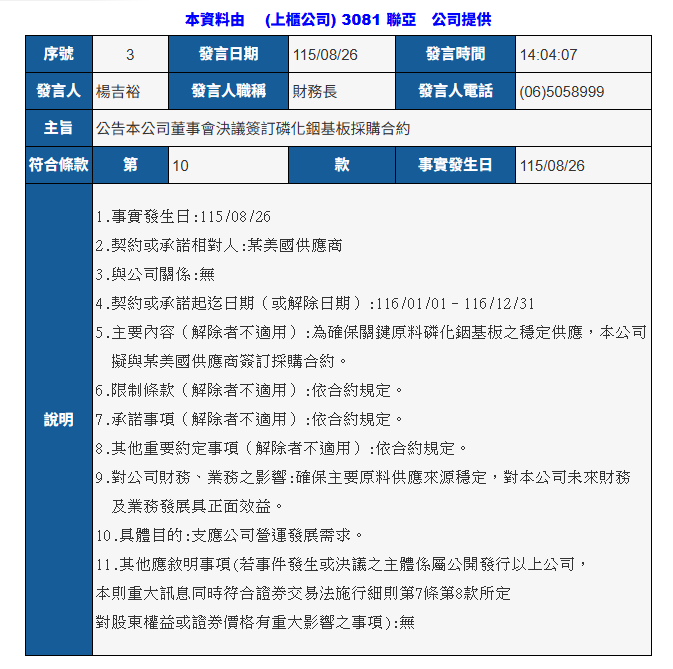
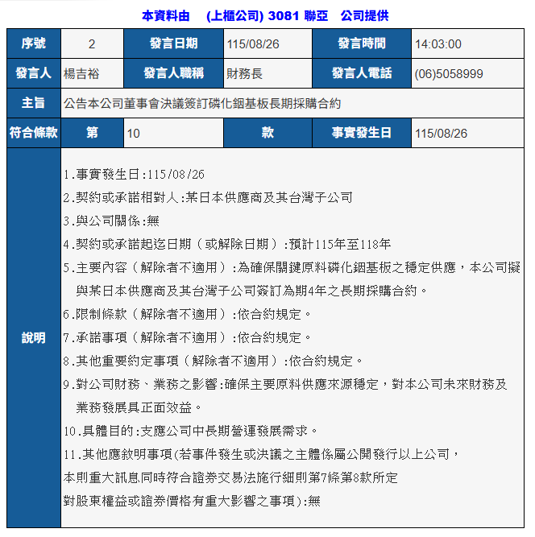
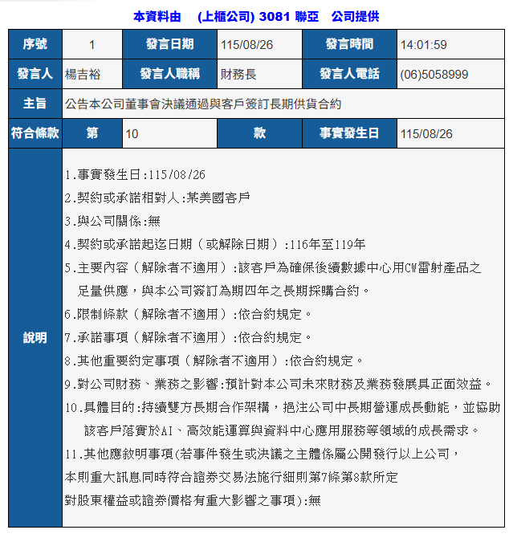
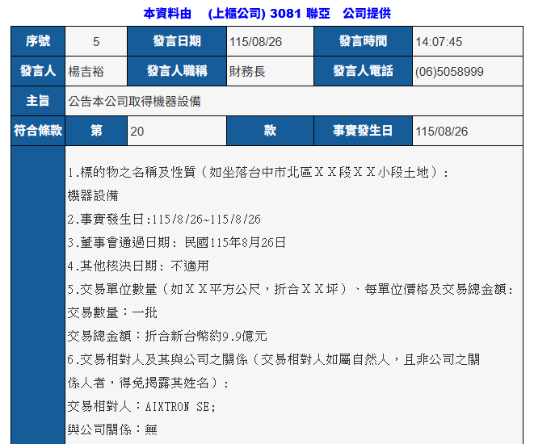

---

<!-- post_id: x:2092513860368699742 | ts: 1787729155 -->
## [X] 駿HaYaO · 2026-08-26 15:25 _(接續 2 則)_

AI伺服器與高速運算需求帶動M8、M9等高階CCL材料升級，矽微球（球形矽微粉，主要成份SiO₂）成為關鍵無機填料新寵。

相較傳統角形矽微粉，球形矽微球流動性佳、比表面積低、堆積密度高，可在維持加工性同時提高填充率，滿足低Dk/Df、低CTE等高性能要求。隨著CCL朝M7→M8→M9演進，無機填料添加比例上升，矽微球逐漸成為高速高頻CCL重要材料。

全球高階電子級球形矽微粉技術門檻高，過去由日本廠商主導（如Admatechs、Tatsumori、Denka、Tokuyama），掌握高純度、微細粒徑、高球形度及表面改質技術。

化學法球矽上游需高純度有機矽前驅物。台廠長興（1717）已布局相關有機矽球材料。法人預期，M8、M9對亞微米粒徑、窄分布、高球形度及低介電損耗需求提升，將增加化學法球矽使用比重，並帶動上游前驅物需求。

https://t.co/lL8RgE4Nsj

---

<!-- post_id: x:2092512146391519669 | ts: 1787728747 -->
## [X] 駿HaYaO · 2026-08-26 15:19

Mizuho: Memory, CPO, 800VDC

1. 記憶體瓶頸與降規格風險  
記憶體仍是關鍵瓶頸，但存在顯著DRAM降規格風險。GPU/ASIC OEM可能將未來HBM限制在4-8Hi，使12Hi吸引力下降，16/20Hi及混合鍵合技術對後續世代仍高度不確定。
供應鏈與MU執行長查核顯示，Google已將TPUv8的HBM3e降至8Hi，投資人對此高度關注。

2. 對出貨與需求的影響  
HBM「交易比率」約束減弱，將增加平面DDR5/LPDDR5供應。較低的DRAM/GPU內容可讓GPU/ASIC出貨量增加約20-30%，進而推升訓練、推論與KVCache的整體DRAM位元需求，並改善GPU/ASIC利潤率。對WFE影響雖有不確定性，但Terafab與多座綠地晶圓廠可提供抵銷上檔空間。

3. 連接性與硬體上檔空間  
記憶體壓力減輕將帶動GPU/ASIC出貨增加，進而利好銅互連、NPO SiPho與InP技術。CRDO與LITE具明顯上檔空間；CPO則仍需約2-3年才成熟。具體包括2027年CRDO AEC銅線對agentic AI機架的潛力，以及LITE的NPO機架擴充連接需求。

4. 800V量產延遲  
800V可能延遲，使量產節奏更平穩。資料中心安裝商因電力空間變更與人員再培訓需求而推遲。機架正轉向OCP ORv3 Diablo雙極雙軌400V方案，可沿用既有400V佈局，減少SiC與sidecar需求。較慢的800V推進可由更多VRM模組抵銷，進而支持更多GPU/ASIC出貨。

---

<!-- post_id: x:2092510573712101465 | ts: 1787728372 -->
## [X] 駿HaYaO · 2026-08-26 15:12

長江存儲（YMTC）目標最早於2027年底超越三星與SK海力士，成為全球最大NAND閃存生產商。公司已申請上海IPO，擬募資330億元人民幣（約50億美元），主要用於升級產能與研發。

2025年第一季營收470億元、淨利330億元（逾2025全年兩倍）。上市後市值預估逾1萬億元，有望成今年中國第二大IPO；市場估值約2000–3000億元。

受長鑫存儲（CXMT）成功上市（募資90億美元、市值達5800億美元）激勵，長江存儲加速推進IPO。NAND為非揮發性存儲，常見於手機平板；DRAM為揮發性，用於電腦與AI。中國業者憑藉堆疊架構、工藝優化、國家補貼與供應鏈優勢，快速縮小差距，不依賴先進光刻。

集邦咨詢顯示，YMTC全球NAND市占第三、中國第一。全球NAND市場2025年710億美元，2026年料超3000億、2030年約4900億美元。投資人憂產能擴張致價格下滑，但AI需求成長更快，供應增加仍不足以平衡市場。長江存儲未予置評。

---

<!-- post_id: x:2092510149927952588 | ts: 1787728271 -->
## [X] 駿HaYaO · 2026-08-26 15:11 _(接續 2 則)_

軟板材料廠亞電（4939）董事長李建輝指出，公司以M10等級PTFE混搭材料切入輝達AI伺服器與半導體先進封裝供應鏈，新材料正送客戶認證，通過後2027年營運可望成長，並擺脫傳統軟板受消費性電子景氣牽制的競爭。

AI伺服器帶動高頻材料需求，但M9高頻玻纖布產能吃緊。同業嘗試純PTFE無玻纖方案，卻因材料過軟導致多層板結構強度不足而認證失敗。亞電採混合策略，以自家M10 PTFE基板搭配現有M9預浸布，克服過軟問題，硬板廠無需更改設備與製程即可使用。

另鎖定CoWoS與未來CoPoS關鍵抗翹曲材料，進軍半導體先進封裝。相關新材料正密集認證，下半年可望有初步結果；2026年聚焦設備建置與小量試產，顯著營收成長期落在2027-2028年。

https://t.co/cwPA99oCoP
https://t.co/ONu5kW5M7j

---

<!-- post_id: x:2092407136399823344 | ts: 1787703711 -->
## [X] 駿HaYaO · 2026-08-26 08:21

早安！8/26 外電綜合整理

- 2360致茂: 美系重申正向
宣布發行GDR，美系大行表示股權稀釋3%，屬可控範圍。券商認為資金將用於海外營運以及營運資金需求，電力測試維持高檔，也預期半導體與光的業務下半年表現優於上半年，重申正向。

 #下次會考

---

<!-- post_id: x:2092404406859776064 | ts: 1787703060 -->
## [X] 駿HaYaO · 2026-08-26 08:11

Raymond James 將 $AMD 上調至「強力買進」，並將目標價上調至 $641，認為Agentic AI將成為下一波潛在的 CPU 需求主要驅動力。

RayJ 現在預估伺服器 CPU 市場到 2030 年將達到約 2010 億美元，5 年複合成長率為 44%。其中最大的新區塊來自代理式 CPU（約 850 億美元），另有約 830 億美元來自協調加速器的 AI 前端 CPU。他們的核心觀點是：GPU 負責模型運算，但 CPU 越來越負責圍繞每次模型呼叫的編排、檢索、資料庫、安全、沙箱和工具等工作負載。

因此 RayJ 認為 AMD 是最明確的贏家，擁有最直接的 CPU 槓桿與市佔率提升優勢；他們預期 AMD 將在 2027 年超越 $INTC 的伺服器 CPU 營收，並認為 CPU 在 AMD 資料中心營收佔比中，會比先前模型預估的時間更長。

---

<!-- post_id: threads:3971850190730720787 | ts: 1787701461 -->
## [Threads] Kok Yu · 2026-08-26 07:44

矽微球粉末 蠻重要的...

---

<!-- post_id: x:2092254566955766165 | ts: 1787667335 -->
## [X] 駿HaYaO · 2026-08-25 22:15 _(接續 2 則)_

TrendForce：記憶體合約價持續飆升，預估2027年占主要CSP資本支出比重將高達68%

TrendForce最新研究指出，全球主要CSP為加速AI基礎設施建置，2026年資本支出預估年增98%，2027年再增50%。DRAM與NAND Flash合計占比，將從2026年的47%升至2027年的68%。

主因是記憶體合約價飆升與採購需求強勁。Server DRAM合約價2025下半年累計漲約64%，2026年預估再漲約270%；Enterprise SSD同期漲約35%，2026年預估累計漲235%。2027年HBM合約價仍可能上漲70-140%，整體價格將維持高檔。

同時，CSP記憶體位元需求大增，原廠優先供應Server應用。2026年HBM與RDIMM合計占DRAM供給位元51%；2027年因製程轉進與新廠放量，Server DRAM與HBM供給位元成長率達27%。

此趨勢對AI生態影響兩大層面：一是高成本讓NVIDIA等AI晶片商有合理理由調漲產品價格，CSP可能再提高資本支出以維持採購量；二是CSP將更積極調整記憶體架構（如降低搭載容量、調整RDIMM／HBM規格，或改採模型固化於晶片的AI ASIC），以因應高價或配額不足，確保出貨目標。

https://t.co/kWEx9jt07S

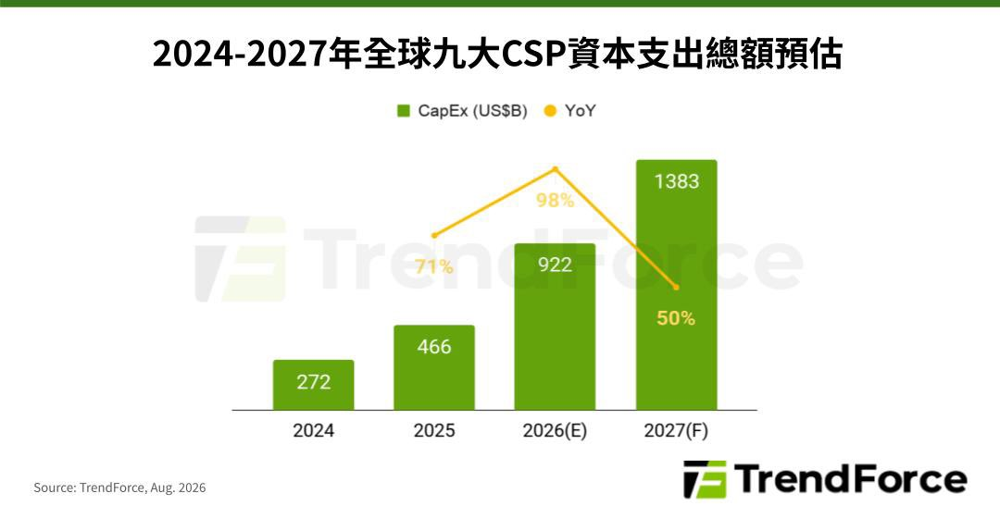
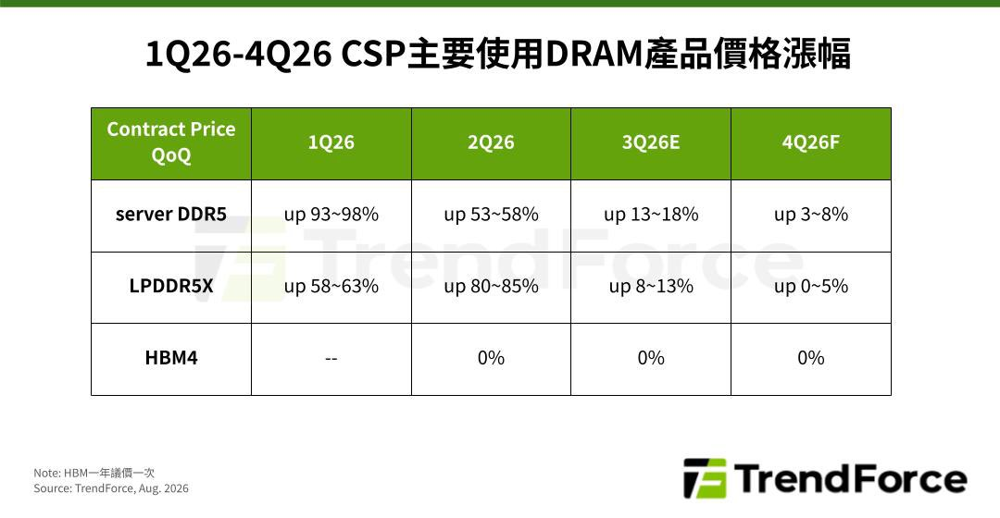

---

<!-- post_id: x:2092238312723587323 | ts: 1787663460 -->
## [X] 駿HaYaO · 2026-08-25 21:11

Alcoa（美鋁）在西澳 Wagerup 氧化鋁精煉廠建設新鎵生產廠，目標年產約100噸，相當於全球供應量的約10%。鎵從現有鋁土礦精煉成氧化鋁的過程中作為副產品提取，無需額外開採。

該項目獲澳洲、日本、美國三國政府及產業夥伴支持，旨在強化關鍵礦物供應鏈、降低對中國（目前佔全球約80-98%）的依賴。鎵用於半導體、國防等高科技領域。

2026年7月達成最終投資決定（FID），8月24日正式動工。預計創造約200個建設工作與20個常設職位。工廠規模小，僅佔精煉廠不到2%面積，採離子交換技術提取。
https://t.co/U3XVzShRXG

---

<!-- post_id: x:2092236803017429019 | ts: 1787663100 -->
## [X] 駿HaYaO · 2026-08-25 21:05

高盛論鈾

1. Kazatomprom（全球最大U₃O₈生產商）8/21發布2026上半年業績。
公司重申2026年產量與銷售指引，儘管上半年產量同比強勁增長。業績受惠較高鈾價，但盈利受礦產開採稅、硫酸成本及外匯壓力影響。

2. 2026年指引重申
產量指引維持不變：100%基準71.49–75.39百萬磅，可歸屬37.70–40.30百萬磅；銷售指引亦不變。
財務指引下調：收入降至2.1–2.2萬億KZT；C1成本上調至25.5–27.0美元/磅；AISC上調至39.0–40.5美元/磅，主因KZT升值、硫酸漲價及井場開發增加。

3. 成本壓力與硫酸關注
C1成本同比+37%至24.48美元/磅，AISC+25%至38.45美元/磅，受MET稅、硫酸通脹（+39%）及KZT升值影響。
材料、設備、鑽探服務持續通脹。TQZ硫酸廠投產延至2027Q3–2028Q1，管理層預期不影響2026產量與硫酸供應。

4. 項目進展
Inkai、Budenovskoye、KATCO合資持續爬坡。Zhalpak新處理廠7月投產，初始產能500 tU/年，2027年擬擴至900 tU/年。

6. 臨時股東大會與新合約
召開臨時股東會，尋求批准與SNURDC的現貨鈾濃縮物合約，以及與Uranium One的U₃O₈供應合約。均為新簽未披露交易，金額超獨立賬面價值1/4。細節因保密未公開。

---

<!-- post_id: x:2092235292648312914 | ts: 1787662740 -->
## [X] 駿HaYaO · 2026-08-25 20:59

高盛韓國供應鏈調查整體看多，涵蓋WFE（晶圓廠設備）、基板/CCL、測試及HBM，正面影響最強者為三星、SK海力士（$SKHY）與SEMCO。

WFE部分：
韓國設備商積壓訂單快速增加、交期提前、訂單強勁，客戶加速DRAM/HBM產能時程。
高盛預估三星／SK海力士今年資本支出年增+59%／+75%；記憶體WFE於2026／27／28年分別成長+47%／+47%／+38%。

基板／CCL部分：
追蹤的基板公司積壓訂單均成長三位數，供應商陸續漲價。
高盛預期ABF短缺將從2026年8%擴大至2027／28年34%／51%。SEMCO基板營收年增+51%，營業利益率由6%升至16%。Simmtech上調SOCAMM營收展望逾50%，高盛預估今年SOCAMM需求年增+420%。

HBM部分：
高盛預估HBM TAM 2026年+67%、2027年+108%。
三星相關指標顯示大幅擴產：7月與三星HBM相關塑膠薄膜進口年增+134%，預期三星HBM營收今年+234%。

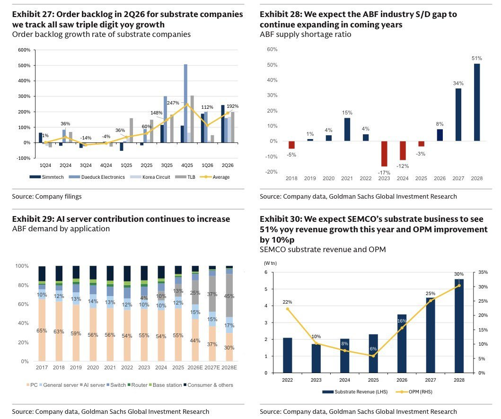

---

<!-- post_id: x:2092227491092181300 | ts: 1787660880 -->
## [X] 駿HaYaO · 2026-08-25 20:28

瀚荃(8103)法說會指出，AI應用超乎預期，法人將2026年全年營收成長目標由兩成上修至三成，毛利率亦有望隨產品組合優化而改善，下半年營運仍具高峰。

產品結構加速轉型：伺服器與網通占比由2020年22%逐年升至2025年37%，2026上半年再達46%，相關營收年增73%。筆電占比由去年同期23%降至19%，其他產品由19%降至13%；工業電子占18%、車用占4%。AI已取代傳統應用成成長主軸。

AI產品占比快速提升：2023年5%、2024年8%、2025年18%，2026上半年達24%。公司持續擴大AI資料中心電力產品布局，涵蓋HVDC Bus Bar、PDU、PSU、CBU及BBU等，受惠AI伺服器功耗提升，電力連接器滲透率同步增加。

2026上半年營收20.08億元（年增26%）、稅後淨利2.14億元（年增100%）、EPS 2.75元。

https://t.co/h73GfNEKpT

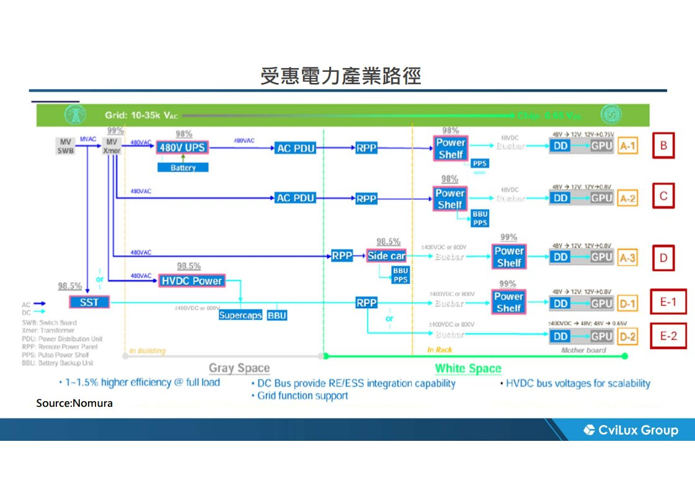

---

<!-- post_id: x:2092220681681522747 | ts: 1787659256 -->
## [X] 駿HaYaO · 2026-08-25 20:00

https://t.co/yzkDfpkXsx

---

<!-- post_id: x:2092220613691953350 | ts: 1787659240 -->
## [X] 駿HaYaO · 2026-08-25 20:00 _(接續 2 則)_

精確(3162)取得Cooler Master供應商代碼 切入AI液冷供應鏈

上櫃公司精確實業（3162）8月25日證實，旗下持股55%的浙江精諾智流已取得全球散熱大廠Cooler Master供應商代碼，正式成為合格供應商，打入AI伺服器液冷散熱供應鏈。財務長張俊成指出，此舉代表公司在技術、製造與品質管理已獲國際一線認證，為爭取後續訂單奠基。

精確過去以新能源車零組件為主，近年透過子公司布局液冷，產品線已擴至五大項目：浸沒式液冷櫃（TANK）、不鏽鋼分歧管（Manifold）、水冷板（Cold Plate）、冷卻液分配裝置（CDU）及電池備援模組（BBU）。

目前分歧管出貨量最大、進入穩定出貨，客戶含台系散熱廠；液冷櫃已小量出貨予台系ODM，終端為IC設計公司資料中心；水冷板具備量產能力，持續送樣認證；CDU與BBU則進入送樣驗證階段。

CDU是液冷核心設備，負責循環、熱交換與流量控制，預期將成重要營收來源。產業估算NVIDIA GB300機櫃中，冷板、CDU、快接頭價值占比約34%、28%、15%，CDU毛利率約40-60%，高於冷板20-30%。

液冷業務目前營收占比仍為個位數，但毛利率高於車用業務。後續分歧管持續放量，加上水冷板、CDU、BBU量產，有望帶動營收成長並優化獲利結構。

https://t.co/yzkDfpkXsx

---

<!-- post_id: x:2092217424984920417 | ts: 1787658480 -->
## [X] 駿HaYaO · 2026-08-25 19:48

日本唯一以東京為據點的高頻交易（HFT）業者ダルマ・キャピタル（Dharmacapital），已於2026年8月初將全部員工遷至新加坡。此舉使東京再無本地營運的HFT公司，今後日本市場相關HFT將全數改由海外進行。

知情人士指出，日本稅率高於新加坡、香港等亞洲金融中心，是遷出主因之一。公司CEO塩谷明達則強調，主要是為提升全球市場與人員交流的可及性，並重申日本市場仍是最重要市場，將持續提供流動性與效率貢獻。

目前金融廳登記的53家HFT業者中，僅ダルマ原以東京為基地；Citadel、Virtu、Jane Street等多從新加坡或香港交易。金融廳數據顯示，自2024年起，東證買賣金額中HFT佔比已超過30%。

新加坡正研議對高收益基金給予部分免稅優惠，香港則擴大carried interest免稅，兩地競爭加劇。日本雖推動「資產運用立國」與東京國際金融中心化，但所得稅率偏高與語言障礙，仍成吸引金融人才的重大挑戰。
https://t.co/18NKt7Xko6

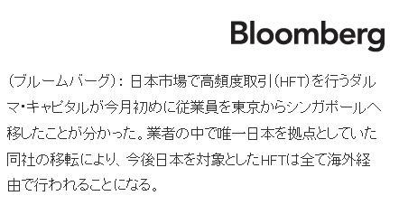

---

<!-- post_id: x:2092210126816256175 | ts: 1787656740 -->
## [X] 駿HaYaO · 2026-08-25 19:19

NB供應鏈傳出，惠普、華碩、宏碁等三大品牌近期明顯縮減東南亞產能，將筆電生產重心轉回中國重慶、昆山，甚至提高中系ODM／EMS代工與貼牌比重。主因是美國對等關稅被最高法院判定違憲後，替代關稅衝擊有限，品牌重新比較成本，發現東南亞筆電供應鏈多年仍未成熟，每台成本平均比中國高出9美元。

對毛利率僅3～10%的品牌而言，以售價300美元的低價機為例，9美元幾乎等於全部獲利，甚至倒賠，成為無法承受的負擔。加上中國地方政府因稅收銳減，要求廠商提高產量，否則追回過往補助，形成強大「拉力」。

此波移轉恐影響廣達、英業達泰國廠，以及仁寶、緯創越南廠的筆電產線；ODM表示會改做伺服器或網通產品。聯想、戴爾、蘋果則相對穩定：聯想分散布局較謹慎、戴爾有較多美國政府訂單、蘋果走高價市場並積極自動化，且越南MacBook計畫因疫情斷鏈考量未變。

---

<!-- post_id: x:2092170624856920515 | ts: 1787647322 -->
## [X] 駿HaYaO · 2026-08-25 16:42

TrendForce: 2Q26全球新能源車銷量年增10.4%，海外市場經營成中系車廠競爭力核心

2026年Q2全球新能源車（BEV+PHEV+氫燃料電池車）銷量537萬輛，年增10.4%。若加計HEV，四類電動車佔全球汽車銷量33.2%，創歷史新高。

中國仍是最大單一市場，但全球占比從2025年同期66%降至56%。僅靠中國市場成長的品牌減少，海外銷售能力成為中系車廠核心競爭力指標。BYD上半年出口已佔總產量44%。

BYD重返BEV銷售冠軍（年減幅度收斂）；Tesla退居第二（年增25%）；Leapmotor首度奪得BEV第三名；Toyota年增143%進第七；Volkswagen首次掉出前十，轉型警訊浮現。

PHEV市場BYD穩居龍頭且差距擴大。因中國本土PHEV下滑、歐盟未加徵關稅，歐洲成中系重點市場。中系品牌（不含Volvo）西歐PHEV市占逼近30%，本土車廠優勢流失。

https://t.co/cLlo4JpCXp

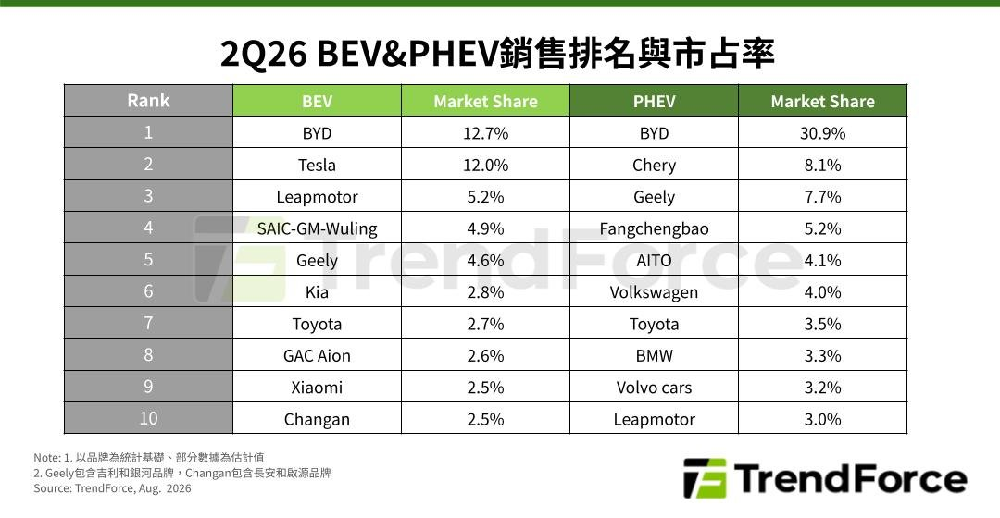

---

<!-- post_id: x:2092169779469824048 | ts: 1787647120 -->
## [X] 駿HaYaO · 2026-08-25 16:38

SpaceX 與 NVIDIA 合作，設計專為太空優化的 Vera Rubin NVL72 系統，預計明年第四季發射進入軌道，2028 年大規模部署。這是首款專為 AI 代理打造的 CPU，將大規模運作。

SpaceX 部署 NVIDIA Vera，加速下一代代理式 AI 的編排、程式碼執行與資料處理，確保 GPU 滿載、代理快速行動。從地面十億瓦級 AI 工廠延伸至太空軌道，同一套 NVIDIA 架構全面應用。

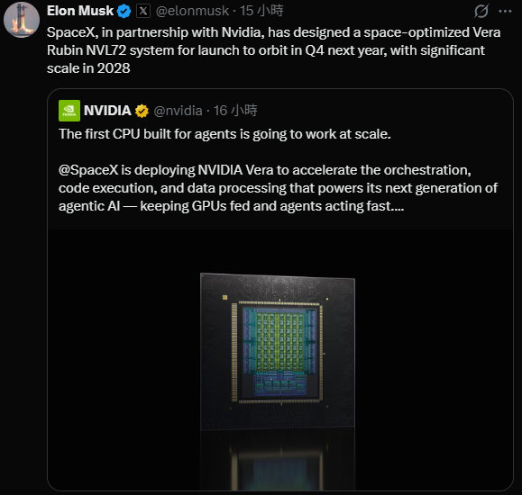

---

<!-- post_id: x:2092169106325725211 | ts: 1787646960 -->
## [X] 駿HaYaO · 2026-08-25 16:36

45°C 進水溫度提升效率 – 減少冷卻能耗，更多電力用於運算（Tokens）
無需冰水機、無水資源浪費、全效能運作

傳統設計（Traditional Design）
機械室（Grey Space）+ 資料大廳（White Space）

包含：冷卻器/蒸發器（Cooler / Evaporator）、冰水機（Chiller）、設施熱交換器（Facility Heat Exchanger）、CDU、機架（Rack）

溫度流程：
環境進水 40°C → 環境回水 50°C
冰水機供水 28°C → 冰水機回水 39°C
設施水（FWS）供水 30°C → 回水 41°C
TCS 供水 35°C → 回水 45°C
-----

Vera-Rubin 優化設計（Vera-Rubin Optimized Design）
僅資料大廳（White Space）
使用乾式冷卻器（Dry Cooler），直接連接機架
溫度流程：
環境進水 40°C → 環境回水 50°C
TCS 供水 45°C → 回水 55°C

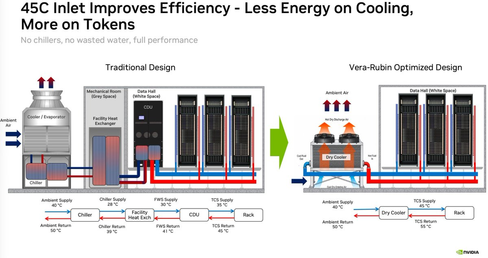

---

<!-- post_id: x:2092165080079012335 | ts: 1787646000 -->
## [X] 駿HaYaO · 2026-08-25 16:20

儘管AI需求加劇DRAM短缺，三星電子今年下半年增產速度預計低於市場預期。主要因優先從1b（10nm第五代）轉向1c（第六代）製程，重心放在提升良率與生產性，而非單純擴大產量。

據Omdia資料，三星DRAM產能2025年約769.5萬片，2026年增至817.5萬片（僅增約6%），2027年再增至828萬片（增1.3%）。製程轉換過程中可能出現產量損失。平澤園區以既有產線改造（retrofit）為主，產能占比從2025年49.5%升至2027年55.4%，但實際供應擴大感覺較慢。華城部分舊產線則停滯或轉型。

相對地，SK海力士產能預計2025–2027年分別增9.9%與9.5%，兩家差距將從27%縮至13.6%。三星延續全永鉉副會長方針，優先穩定良率而非量產擴張。此策略在短缺局面下可能削弱短期供應因應力，但新製程位元密度較高，以位元計算的實質供應仍在成長，市場景氣有望更長期。
https://t.co/OBOI5Cx3T2

---

<!-- post_id: x:2092153194474520841 | ts: 1787643166 -->
## [X] 駿HaYaO · 2026-08-25 15:32

https://t.co/PrPlVBLWtx

---

<!-- post_id: x:2092152783680262588 | ts: 1787643068 -->
## [X] 駿HaYaO · 2026-08-25 15:31 _(接續 2 則)_

Stanley F. Druckenmiller 在《華爾街日報》發表《Let the Bond Market Speak》，強烈批評財政部加倍長期國債回購（從20億增至40億美元）的做法。

他指出，此舉發生在30年期收益率觸及19年高點後，市場短暫回落後迅速反彈，證明這是「價格管理」而非真正的流動性支持。當時市場運作正常，無拍賣失敗或流動性危機，收益率上升只是基本面的自然反應：通膨3-4%、失業率4.1%充分就業、赤字近GDP 6%（和平時期罕見）、國債破40兆、淨利息超1.1兆已超國防預算。

長期收益率是美國僅存的財政紀律機制。人為壓制每一個基點，都是對拖延改革的補貼，會扭曲成本認知、降低緊迫感。一旦市場認定官方在防衛價格，操作規模必被迫不斷擴大。

他建議回購應回歸小規模、定期、非當期債券的流動性操作；接受市場定價（如30年期需5.5%就讓它到5.5%，這是帳單而非危機）；真正壓低長期利率的唯一辦法是削減基本赤字並改革社保。政府對抗基本面防衛價格，最終必敗，差別只在於花多少錢才認輸。讓債券市場說話。

https://t.co/PrPlVBLWtx

---

<!-- post_id: x:2092149529328120294 | ts: 1787642292 -->
## [X] 駿HaYaO · 2026-08-25 15:18 _(接續 2 則)_

上銀集團（上銀科技2049、大銀微系統4576）參加2026自動化展，主題「驅動實體AI時代」。

人形機器人：
行星滾柱螺桿（下肢用）已可量產；新一代八軸機器人預計11月送樣，最快2027年小量生產。展出核心驅動人形機器人，整合滾珠螺桿、行星滾柱螺桿、諧波減速機、馬達、驅動器及控制系統。另展示與工研院合作的AI智慧夾爪。

CPO／矽光子：
CPO光耦合用微小型滾珠螺桿與單軸機器人已送樣，有數家潛在客戶。與大銀共同展出PLP面板級封裝整合方案及CPO精密定位技術，包括奈米級定位平台、Wafer Robot、Wafer Aligner、EFEM等，協助提升良率與效能。

其他亮點：
雙臂物流機器人、智慧焊接系統；高精度雲台、RCH-150分度系統、微小型線性滑軌、大型中空諧波減速機等，應用於衛星通訊、光學、醫療、國防等領域。

https://t.co/SYS4DTu21E

---

<!-- post_id: x:2092147997387973026 | ts: 1787641927 -->
## [X] 駿HaYaO · 2026-08-25 15:12

Spectrum-X CPO 交換器模組 https://t.co/ZAXClvT6Jb https://t.co/Y4FVgO1mki

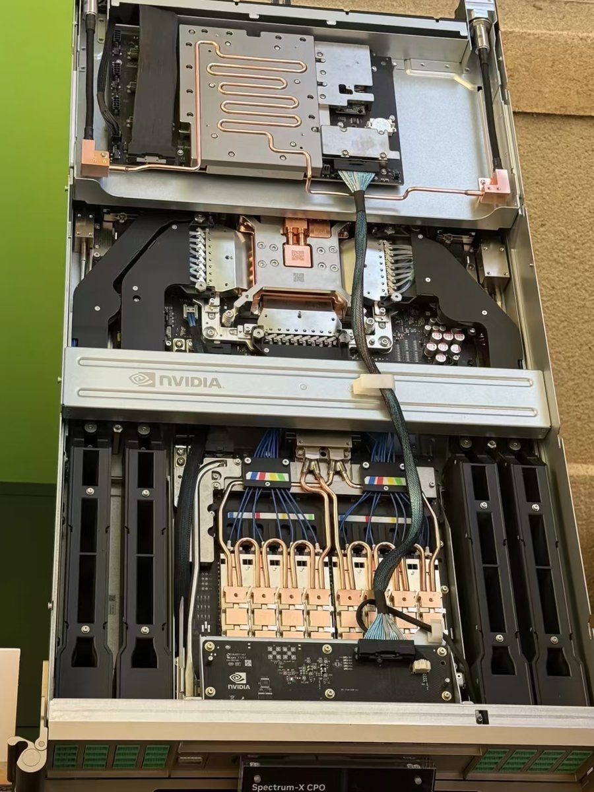
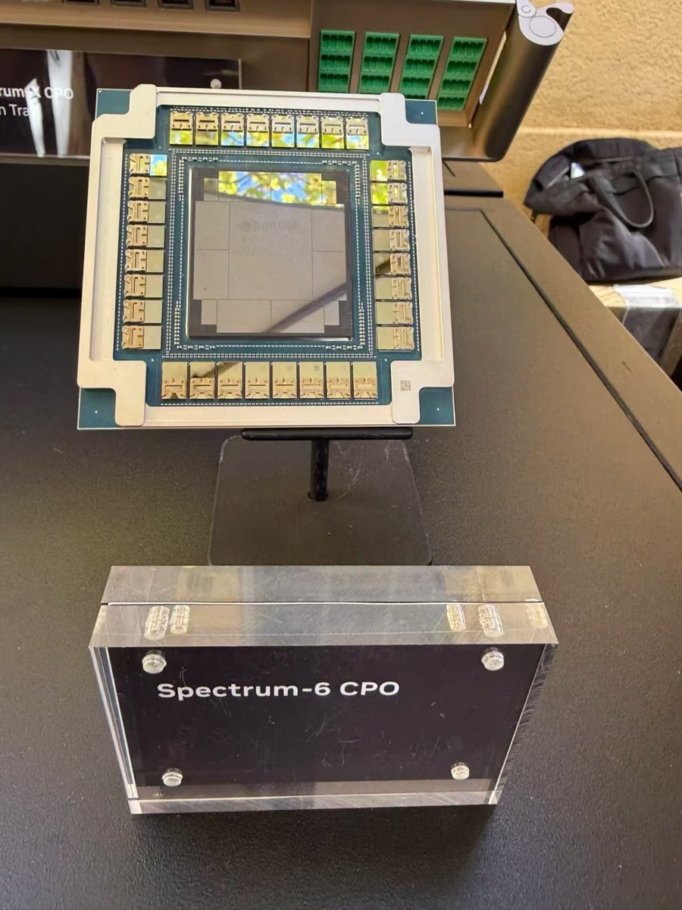
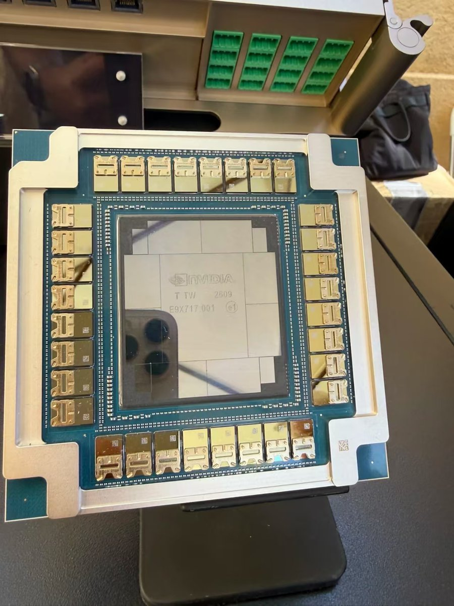

---

<!-- post_id: x:2092132859603779594 | ts: 1787638318 -->
## [X] 駿HaYaO · 2026-08-25 14:11

聯電（2303 TT, UMC）PIC/TFLN（薄膜鈮酸鋰 Thin-Film Lithium-Niobate）摘要

買進 | 目標價上調至 NT$160 - PIC/TFLN 上行空間解鎖更高利潤週期
• 高利潤 PIC 業務加速主要受以下驅動：
– Hyperlight（可能已與 Google 取得重大進展）
– TeraHop（主要客戶：Nvidia、GOOG）

• TFLN 8” 晶圓出貨預期：
– 2027 年第四季達到每月 2 萬片
– 2028 年第四季達到每月 4 萬片

• PIC 經濟效益遠優於公司平均水準，毛利率 >70%，每片 8” 晶圓 ASP 約 2,500 美元（一般 8” ASP 低於 1,000 美元），預期 2027 年 EPS 貢獻 NT$0.7、2028 年 NT$1.5

• 此外，TFLN 將幫助 UMC 將產品組合轉向更高價值的 AI 領域（包括光學）

• 中長期仍有可能將 PIC 晶圓業務延伸至封裝領域

除了 PIC/TFLN 之外，
• UTR 預期持續上升，主要受以下驅動：AI（含光學）、CIS / ISP，以及 DDIC（受惠於 Apple 將 Mac 從 8” 轉至 55nm）

• 雖然市場對漲價題材興趣較低，但能見度已延伸至 2027 年下半年

• 與 Intel 的合作：管理層稍早重申合作仍按計畫進行，目標於 2027 年在 Intel 12 製程完成 Tape-out，目前預期產能將超過一個階段

---

<!-- post_id: x:2092119832502391276 | ts: 1787635212 -->
## [X] 駿HaYaO · 2026-08-25 13:20

美光 Hot Chips 2026 演講
（Wccftech 對 Raghu Sreeramaneni 演講的報導）

核心問題：記憶體牆持續惡化
- AI 算力大約每兩年提升 3 倍。
- HBM 頻寬同期僅成長 不到 2 倍。
- 兩者增速差距擴大，記憶體牆不僅未緩解，反而可能加劇。AI 工作負載多半是「記憶體受限」，處理器常因等待資料而閒置。

HBM 現況與關鍵數據
- HBM 是目前領先 AI 加速器的主流記憶體。
- 典型 GPU 系統級封裝（四個 12 層 HBM 堆疊）中，記憶體矽晶片約佔總面積 90%（相當於 GPU 矽晶片的 8 倍）。
- Meta Llama 3 訓練中，約 17% 的意外中斷歸因於 HBM 故障。
- 堆疊高度已從早期 4 層發展到 16 層，通往 20 層的路徑存在，但熱與機械挑戰很大。

HBM4 與技術優勢
- 美光 HBM4：頻寬高達 2800 GB/s，I/O 與通道數皆為 HBM3E 的兩倍。
- 每代持續提升資料速率、偽通道、密度與堆疊高度。
- 相較傳統 DDR5，HBM 在頻寬上可達約 15–17 倍優勢，每晶粒頻寬更高、平行度更強，能源效率也較佳（尤其適合序列式 AI 存取）。

主要挑戰
- 熱問題：主要是功率密度（而非總功耗），基底晶粒受影響最嚴重。堆疊越高，熱管理越困難。
- 密度提升時，單位位元效率（pJ/bit）會下降。
- HBM 是跨功能最複雜的記憶體方案（製程 + 封裝 + 設計），尺寸僅如郵票大小。

未來方向
- 需要顛覆性製程與先進封裝（如融合鍵合、混合鍵合、液冷）。
- 透過先進 D2D PHY 實現從 GPU 卸載，並支援客製化功能。
- 研究更高堆疊（超越 16 層）與更優化的高速 I/O（記憶體專用 SerDes）。
- 長期來看，運算與記憶體界線將持續模糊，產業需跨領域合作才能持續突破。

https://t.co/UeMLMa9Hl9

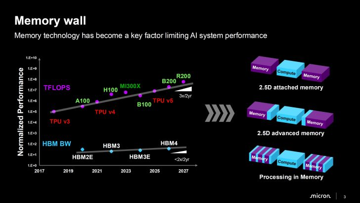
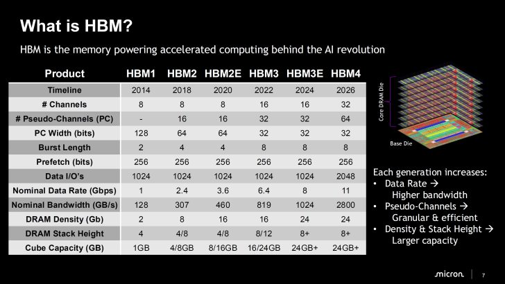
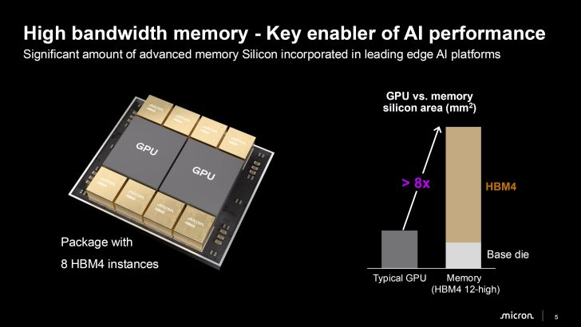
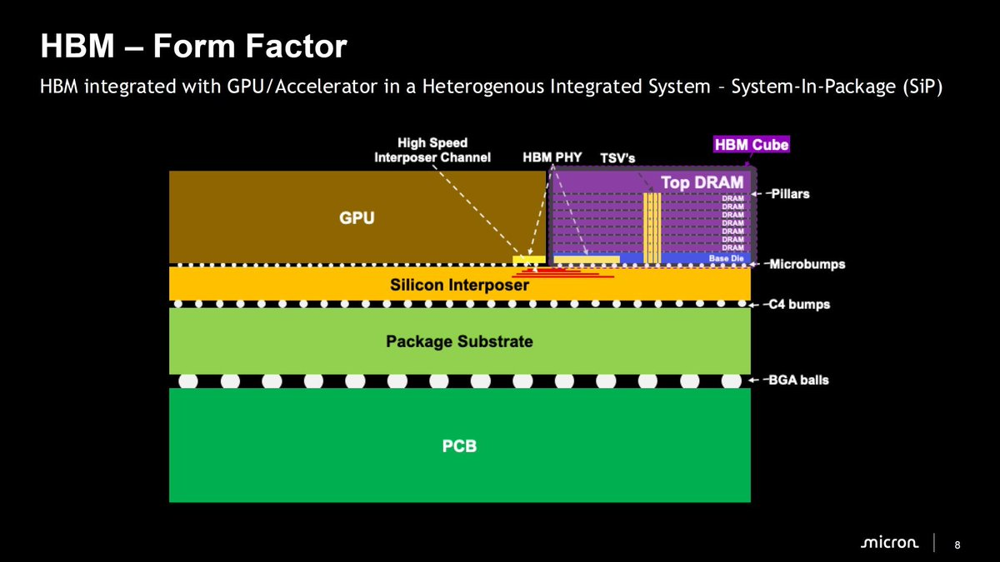

---

<!-- post_id: x:2092047555563798732 | ts: 1787617980 -->
## [X] 駿HaYaO · 2026-08-25 08:33

Nvidia Rubin Ultra 將搭載 192GB 的 HBM4 8-hi。  
這不僅是從原本預告的 Rubin Ultra（1TB HBM）大幅降規，甚至比一般版 Rubin 的 288GB 還要低。  

Rubin Ultra 的 HBM 容量為什麼會被砍到只剩原本的 1/5？  
1. 原本的 4-die Rubin Ultra 方案被取消後，HBM 顆數砍到只剩 8 顆。  
2. 堆疊高度從 16-hi 降為 8-hi。  
3. 最後改用 HBM4（24Gb dies），而不是採用更高密度的 HBM4E（32Gb dies）。不過未來仍有可能推出 8-hi HBM4E 升級版。

---

<!-- post_id: x:2092044032289484887 | ts: 1787617140 -->
## [X] 駿HaYaO · 2026-08-25 08:19

據知情人士透露，美國計劃在9月習近平與特朗普會晤前，以「產能過剩」為由對中國商品加征7.5%關稅。此舉將使特朗普第二任期對華關稅總體恢復至約20%，符合北京此前認可的貿易休戰上限。

這是疊加在第一任期及拜登時期既有關稅之上的新稅。今年3月，特朗普政府已依《1974年貿易法》第301條，對包括中國在內的十多個貿易伙伴啟動產能過剩調查，作為以更持久關稅取代舊關稅的手段之一。

美國貿易代表Greer表示，產能過剩調查因複雜性耗時較長，與維持中美休戰無關。白宮強調任何官方公告前相關消息均屬猜測。

此外，7月美方已以強迫勞動為由對中國加征12.5%關稅，中方雖批評但未報復，並重申美方承諾額外關稅不超20%。中國商務部5月聲明要求美方信守吉隆坡磋商確定的關稅上限。

目前美國多州及企業已就301條款關稅合法性向法院提起訴訟，特朗普政府則堅稱合法。

---

<!-- post_id: x:2092041580060479621 | ts: 1787616555 -->
## [X] 駿HaYaO · 2026-08-25 08:09

早安！8/25 外電綜合整理

- AI供應鏈追蹤報導：
*調升目標：3443 創意
美系大行表示隨著 TPU v10 複雜度提高，券商認為有更多空間讓多家設計服務供應商提供不同的「功能區塊（blocks）」，再由聯發科整合打造 v10 晶片。券商對聯發科明後年ASIC營收展望不變，預估到2029年v9: 400萬顆、v10: 100萬顆，推升聯發科 TPU 營收達700億美元。

至於創意，券商預估明年可望取得更多台積電 3nm 產能配額，以及成功拿下 Meta／Microsoft 專案；同時也有信心參與 Google TPU 。上修26-28年EPS至$49.97/$138/$210，以明年45xPE評價，券商認為創意值得被re-rate。

 #下次會考

---

<!-- post_id: threads:3971133198017142788 | ts: 1787615989 -->
## [Threads] Kok Yu · 2026-08-25 07:59

每次專家會議的東西出來，頭都很痛...
有的是你根本沒有這張訂單，因為你是二三線CCL廠，沒那資格評論
再來就是你對自家的上游根本不清楚

一堆錯誤....然後市場又拿來用

就一堆誤會跑出來

---

<!-- post_id: x:2092031445737021470 | ts: 1787614139 -->
## [X] 駿HaYaO · 2026-08-25 07:28

英飛凌科技(Infineon)宣布收購印度班加羅爾的C2i Semiconductors。該公司專注軟體定義多相控制器與智慧功率級，專為AI資料中心應用設計。

此次收購強化英飛凌在AI資料中心電源解決方案的領導地位，加速「從電網到核心」的軟體定義電源架構發展，並擴展垂直電源傳輸技術（含基板整合電壓調節器SIVR）。

同時擴大英飛凌在印度的創新與研發能力，該地目前約有2,800名員工。

交易預計於2026年第三季完成。
雙方結合後，將以C2i的數位電源專業搭配英飛凌的矽、SiC、GaN等功率半導體產品，優化即時電源轉換效率，因應AI處理器高度動態的負載需求，協助資料中心提升效率、降低損耗並支援更高功率密度。
https://t.co/Mm0uxMkSOU

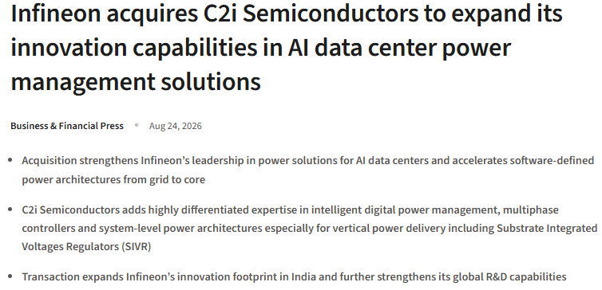

---

<!-- post_id: x:2091893385582010499 | ts: 1787581223 -->
## [X] 駿HaYaO · 2026-08-24 22:20

Nancy Pelosi 申報了價值高達約 1350 萬美元的新股票交易。

主要買入： 
• 買入 15,000 股 Bloom Energy（$BE） 
• 買入 10,000 股 Intel（$INTC）

購買新的看漲期權： 
• 買入高達 500 萬美元的 $BE 長期期權（LEAPS） 
• 買入高達 50 萬美元的 $INTC 長期期權（LEAPS） https://t.co/rFJ9fMYaO0

---

<!-- post_id: x:2091887288204575119 | ts: 1787579769 -->
## [X] 駿HaYaO · 2026-08-24 21:56

仁寶（2324）AI伺服器業務傳捷報，據傳拿下Google兩款TPU（代號Zebrafish、Sunfish）的L10／L11伺服器組裝大單，預估明年開始量產。後續還有其他北美CSP的ASIC伺服器新單有望入袋，迎來出貨爆發期。

董事長陳瑞聰先前預告，年底將有超大型雲端與企業客戶量產L10／L11新產品，明年AI伺服器營收可望顯著成長，占比上看整體營收30%～40%。公司對訂單消息不予評論。

Google積極擴建自有TPU伺服器，強化AI訓練與推論，並委外聯發科、博通、邁威爾等設計代工。仁寶雖起步較晚，但積極布局，產能涵蓋台灣（研發生產）、越南（SMT）、美國德州（L6／L10／L11），今年資本支出大增至180億元，主要擴建AI伺服器產能，力拚彎道超車。

https://t.co/XT6uAgZ1yE

---

<!-- post_id: x:2091877208013070618 | ts: 1787577366 -->
## [X] 駿HaYaO · 2026-08-24 21:16

CNBC：兩位財政部高級官員消息指出，財政部長斯科特·貝森特可能動用近1萬億美元的財政部一般帳戶（TGA）資金，進行大規模政府債券回購。

目前貝森特已將TGA餘額提升至約9500億美元。上週財政部突然將債券回購規模擴大一倍，令市場措手不及，但因投資人對其實際可動用資金持懷疑態度，對美債收益率的壓制效果僅短暫出現後迅速消退。

官員強調，TGA作為財政部持有的現金帳戶，可直接為債券回購提供資金支持，無需依賴聯準會協助，也無需額外大量發行短期票據籌資，大幅提升操作彈性。

若貝森特真的大規模動用接近1萬億美元TGA資金持續回購，分析師認為將對美債收益率形成更明顯的下行壓力，成為近年來對債券市場最直接的支持措施之一。

不過，市場目前仍持觀望態度，主要擔憂實際執行規模與持續時間仍不明朗。

---

<!-- post_id: x:2091838176281440493 | ts: 1787568060 -->
## [X] 駿HaYaO · 2026-08-24 18:41

1. AVGO財報預覽與AI營收下修
對FQ3（7月）營收與AI指引採審慎態度，FQ4（10月）預期-3至+3億美元。估計FQ3 AI營收16億美元，FQ4升至21-22億，客製化計算將超越networking。FQ3為Anthropic有意義TPU出貨首季，貢獻約2.5億，CY26達33億。GCP相關營收持續強勁。

針對市場雜音，UBS認為AVGO與MediaTek在Google TPU的COT合作不會被蠶食。新客戶OpenAI與AAPL進展緩慢但持續。

關鍵行動：下修F2027 AI營收約50億至約1300億美元，因TPU出貨過於樂觀；更新框架至>1000億，並將焦點轉向F2028（約2000億範圍）。目標價從485美元降至470美元，維持買入。強調AI斜坡受供電殼基礎設施限制大於矽片供應。

2. NVIDIA新計算部署模型訊號
Jensen Huang部落格揭示NVIDIA業務模式轉向深度介入土地、電力、殼層（LPS）採購與融資。多數AI容量現由超大規模或雲端供應，但AI實驗室日益希望掌控長期基礎設施。PORTS-Pike安排中，OpenAI為租戶，NVIDIA透過投資SB Energy（15億）及最高100億剩餘價值信用支持，協助確保資源。初始2.5GW，可擴至約8GW，每座工廠約1500萬GPU、1500-2000億營收潛力。NVIDIA在SB Energy、Lancium、Cloverdale的投資被視為打造「容量走廊」，從開發商進一步成為垂直整合營運商。電力、土地、殼層成為AI供應鏈戰略投入，NVIDIA憑規模與財務優勢提升未來需求能見度。

3. NVIDIA與Poolside交易看法
NVIDIA支付60億美元取得Poolside新Model Factory平台非排他授權並聘用109名員工，另投資5億於剩餘公司、10億支持潛在IPO。交易重點不在收購模型本身，而在獲取「構建模型的機器」——核心開發基礎設施、軟體、訓練系統與工程流程，用於開源權重模型（Lagunas）並可微調。

此舉加速NVIDIA開源基礎模型努力，同時將人才內部化，避免完整收購。技術邏輯在於強化美國與開源生態，改善在NVIDIA硬體上訓練與推理的開源模型，形成良性循環。授權金額龐大，顯示NVIDIA將顯著價值分配給模型開發平台與人員，與剩餘公司切割。

5. AVGO宣布更多融資
報導指出AVGO可能安排最高約1000億美元融資套件，支持Anthropic及其他客戶AI基礎設施部署。結構含300-700億資深擔保融資（部分由AVGO擔保）及約60億次級債務，Blackstone與Apollo預期參與。換算約當20GW尖峰容量。首波可能連結2026年AI XPU框架，目標至2028年部署超過20GW，初期資助Anthropic首個1GW。

此驗證AVGO協助客戶確保電力進行大規模XPU部署的能力，屬增量正面，但規模相對整體20GW+機會仍適中，已部分反映在買方模型中。

6. Terafab進入建設模式
SpaceX的Terafab持續推進矽供應鏈垂直整合。UBS Evidence Lab數據顯示Grimes County, TX園區相關招聘與建設活動上升。

TSLA企業門戶Terafab職缺7月中達41個，涵蓋微影、沉積、乾蝕刻、磊晶等全製程，顯示建立全面工程組織而非少數模組。部分職位在奧斯汀與台灣新竹重複，疑似從TSMC挖角。招聘已納入設計工程師與記憶整合工程師，確認內部記憶製造意圖，但IP來源（自研或授權）仍不明。

建設方面，8月6日公告後無塵室建設職缺顯著增加，成為最大類別；衛星影像顯示場地清理與砍伐已開始，處於非常早期階段。整體顯示SpaceX正認真打造自有半導體製造能力。

---

<!-- post_id: x:2091821066901684561 | ts: 1787563981 -->
## [X] 駿HaYaO · 2026-08-24 17:33

YMTC 1Q26 營收已達 65 億美元以上，已超過其 CY25 全年營收的 82%。規模已超越美光（Micron）、鎧俠（Kioxia）、閃迪（SanDisk）的 NAND 業務。

產能利用率達 98%。
資本支出強度從 2023 年佔營收的 114% 大幅降至 1Q26 的 17%。 https://t.co/Yvw5C3k9gv

---

<!-- post_id: x:2091820712323695069 | ts: 1787563896 -->
## [X] 駿HaYaO · 2026-08-24 17:31

SK海力士先進封裝技術摘要（Hot Chips 2026）

目前HBM現況
- 採用3D堆疊結構，透過TSV連接多層DRAM核心晶粒至基底晶粒
- 最高可達16-Hi堆疊
- 與GPU以2.5D矽中介層連接，每模組提供1024個IO
- 相比GDDR6大幅節省空間、功耗與成本（例：4堆疊HBM3E可達144 GB、4 TB/s）

HBM4主要規格
- 最高容量48 GB（12-Hi已量產、16-Hi驗證中）
- 頻寬超過2 TB/s
- 功耗效率提升超過40%
- 熱阻改善超過14%
- 封裝高度775 μm、尺寸12.8×11 mm²
- 超過20,000個TSV、16,148個微凸塊

現行封裝技術
- TC+NCF：抗翹曲較佳，但熱阻高、生產力較低
- MR+MUF：生產力高、熱阻低，但較易翹曲且有填縫問題

- SK海力士已在16-Hi HBM3E採用先進MR-MUF，並加入翹曲控制與細間距/窄間隙填充技術

未來主要挑戰
- 頻寬每兩代近乎加倍，熱負擔增加至2.2倍
- TSV數量增加導致面積擴大
- 功耗與熱管理問題日益嚴重

關鍵未來技術
1. 混合鍵合（Hybrid Bonding）：
- 可突破16-Hi限制
- TSV間距小於18 μm
- 熱阻降低35%，核心晶粒可加厚24%

2. I-HBM熱點緩解技術：
- 在D2D PHY區域嵌入高導熱絕緣冷卻元件
- 額外降低熱阻超過30%（類似三星HPB）

3. 其他優化
- 加倍TSV數量 + 提高IO速度（結合邏輯製程）
- 全面佈局電源TSV以改善PDN
- 朝向真正3D整合發展（未來可將HBM直接堆疊在加速器上方）

其他重點
- 投影片中已出現英特爾EMIB封裝技術（與CoWoS系列並列）
- 外界關注SK海力士與英特爾的記憶體合作傳聞
- 成功關鍵在於設計、材料、製程與中介層的緊密共同優化
https://t.co/CZv4bOjUG1

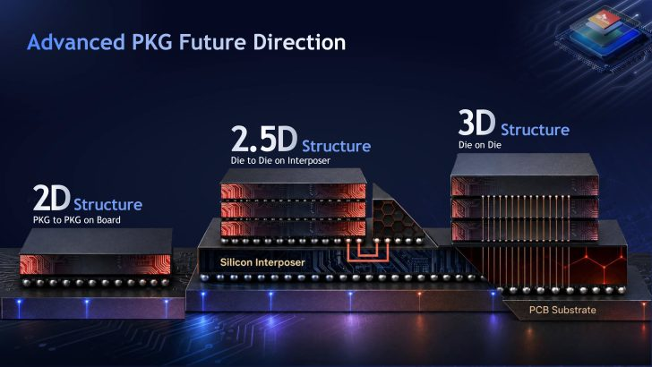
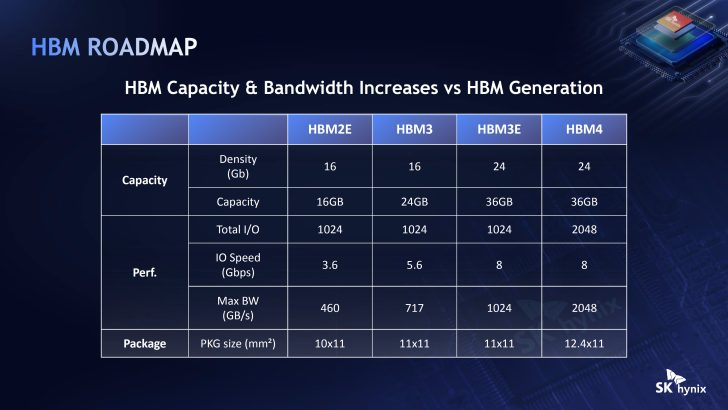
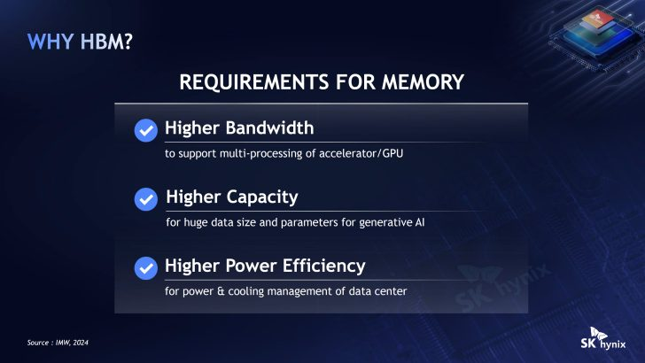
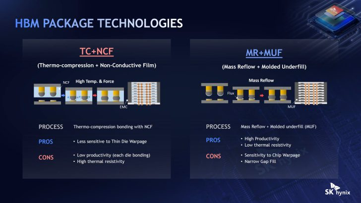

---

<!-- post_id: x:2091819288734933106 | ts: 1787563557 -->
## [X] 駿HaYaO · 2026-08-24 17:25

TrendForce: 1H26全球電視出貨量年增1.3%，品牌兩極化加劇、RGB Mini LED商業化邁步

根據TrendForce研究，2026上半年全球電視出貨量年增1.3%至9,374萬台，為疫情後同期新高；惟Q2受記憶體漲價影響季減1.1%。品牌兩極化加劇，二線與白牌受成本擠壓，大廠憑規模優勢穩固。

Samsung出貨1,760萬台（+6.3%），Mini LED年增逾200%；TCL 1,508萬台（+7.1%）成長最快；Hisense 1,423萬台（+3%）、LGE 1,130萬台（+3.9%），皆強化Mini LED布局。

TrendForce預估全年全球出貨衰退0.8%至1.9465億台。短期靠QLED、Mini LED與RGB Mini LED提升價值；長期則轉向「硬體＋平台＋內容」模式。2026年為RGB Mini LED商業化關鍵年，出貨上看170–200萬台，由超高階滲透主流高階市場。
https://t.co/8d7cU7YxMI

---

<!-- post_id: x:2091762174922260864 | ts: 1787549940 -->
## [X] 駿HaYaO · 2026-08-24 13:39

大立光CPO一條龍布局達陣，市場臆測可能供貨輝達Rubin Ultra平台

大立光切入共同封裝光學（CPO）業務大突破，成功延伸至下游光纖陣列模組（FAU），完成從零組件到模組一條龍布局，在輝達光通訊角色從間接供應商晉升直接供應商。

供應鏈指出，大立光與上詮、天孚通信躋身輝達FAU供應鏈，最快2027年下半年量產，市場臆測將供貨Rubin Ultra平台。FAU平均售價與毛利率較高，有望提升獲利。大立光不評論傳聞，強調目前仍以發展光纖陣列（FA）為主，並已獲台積電納入COUPE製程生態系。

AI資料中心傳輸量暴增，傳統光模組面臨瓶頸，CPO成為升級關鍵。輝達Spectrum-X等交換器帶動需求，FAU需求從今年約數十萬個，2027年將達數百萬個，現有產能不足。

FAU多通道對位技術門檻高，大立光憑精密光學量測與自動化優勢，最有望突破量產良率。董事長林恩平先前表示FA已取得量產訂單，FAU則「Open mind」，精度已達0.3微米以下，優於業界。

---

<!-- post_id: x:2091760917998383182 | ts: 1787549640 -->
## [X] 駿HaYaO · 2026-08-24 13:34

半導體矽晶圓出現新冠疫情後首度大漲價，涵蓋6吋、8吋、12吋全系列規格，漲幅一成起跳，為三年多來首次調升。台灣三大供應商環球晶（6488）、台勝科（3532）、合晶（6182）將受惠，營收與獲利看俏。

環球晶表示，終端需求逐步改善、庫存調整較健康，市場訊號較去年正向，但價格視產品與客戶而定。台勝科已與客戶溝通調價，下半年營運可望優於上半年。合晶正積極洽談報價調整，並聚焦先進封裝與光傳輸等領域。

業界分析，漲價主因AI帶動晶片強勁需求，推升矽晶圓用量；先進製程與成熟製程周邊晶片同步受惠，上游矽晶圓產業已感受回春。

目前各廠與客戶洽談進度不一，但方向一致朝漲價前進。部分12吋拋光片已適用雙位數漲幅；8吋預計第4季談明年報價，亦朝雙位數目標；6吋約一成左右。

---

<!-- post_id: x:2091705370314256482 | ts: 1787536396 -->
## [X] 駿HaYaO · 2026-08-24 09:53

ASIC 總結

股票選擇：在近期財報、供應鏈查核與我們近期報告之後，維持對 MRVL、MTK 與 Intel 的正面看法。

- Nvidia vs. ASIC：
Nvidia 在台積電（TSM）的 CoWoS 市占率在 2027 年將保持穩定；Nvidia Vera Rubin 在性能／總擁有成本（TCO）／供應鏈方面優於競爭對手。

- TPU 動態：
在 6 月 14 日的報告中，我們因封裝重新設計而下調 Broadcom 的 Sunfish 在 2026／27 年的出貨量，並將 2027 年 CoWoS（ASIC）設定為 46 萬片；MTK Humufish（在 N2 製程上領先 Whalefish）有望在 2027 年第四季推出，顯示 Broadcom 的 CoWoS 重回 TPU 的窗口可能僅限於 2026 年上半年。預期 Humufish 將在 2026 年 11 月左右完成 tape-out，通過率不會太高。

- Google 客製化矽晶片：
MRVL 預期來自 Google CXL 與 DPU 的貢獻將相當可觀（到 2028 年各約 30 億美元），並在台積電 N2 製程上啟動 MPU，預計 2028 年營收可達 30 億美元以上。

- AWS Trainium：
重申 MRVL T3 在 2026／27 年分別為 10 億／20 億美元，T4 在 2028 年很可能超過 30 億美元，且平均售價更高、NPO 擴展規模更好。

- Intel 後端封裝：
重申 Intel 2027／2028 財年後端營收預測為 11 億／70 億美元，受惠於 AWS T3 EMIB-T 以及 Google Humufish／Triggerfish 在 2027 年下半年至 2028 年的出貨量。
預期美國無晶圓廠（fabless）將有更多訂單，包括 MSFT、QCOM、MRVL，產品涵蓋 ASIC、CPU 與 CPO。
ABF 基板將大幅受惠於 EMIB。

---

<!-- post_id: x:2091692744737689947 | ts: 1787533386 -->
## [X] 駿HaYaO · 2026-08-24 09:03

早安！8/24 外電綜合整理

- 3665貿聯：美系重申正向
美系大行表示2H26 毛利率重回 30% 以上，因HPC推升電源互連、資料互連成長。semi cap也在成長中，券商預期毛利率逐級改善，重申正向。

- 6187萬潤: 美系重申正向
美系大行表示萬潤在 CPO 耦合設備以及下一代 GPU 散熱片貼合設備的市占率仍然維持完整，並未流失；CoW 點膠設備在4Q會有更多進展，目前在認證階段。券商也對他與一家美國先進封裝供應商的合作進展深具信心，重申正向。8/27法說會。

- 1815富喬：
亞系表示隨著規格升級與產能受限，LDK2 的營收貢獻持續提高，也計劃明年開始，逐步將中國工廠由 E-glass 轉向 LDK 產品（～LDK2 玻纖布價格是 LDK1 的 2.5 倍，而 LDK1 又是 E-glass 的 5 倍）；E-glass 漲價趨勢將延續至 2H26；預期玻纖紗產能利用率將上升。

 #下次會考

---

<!-- post_id: x:2091503508897878441 | ts: 1787488269 -->
## [X] 駿HaYaO · 2026-08-23 20:31

倍利科技（$7822.TW）已悄然成為 #CoWoS 熱潮的受益者與推動者，因為檢測正是先進封裝經濟效益的關鍵決定因素。隨著 #AI 加速器堆疊更多晶片與 #HBM 層數，在維持良率的同時捕捉細微缺陷，已成為晶圓廠與封測廠（OSAT）的核心痛點，使檢測設備成為供應鏈中最熱門的利基之一。

倍利科技的貢獻在於其 V530 Pro 平台，該平台以 AI 驅動的光學檢測，能偵測先進封裝上的污染、刮傷與殘留物，結合專有的 AI 影像辨識與高速成像硬體。成果相當顯著：2025 年營收暴增約 188%，達新台幣 20.8 億元，EPS 為 14.04 元，且記錄月營收持續至 2026 年中，因客戶不斷擴充 CoWoS、3D 與面板級產能。

事實上，倍利科技從每增加一份 CoWoS 產能中獲利，其客戶基礎也從台灣晶圓廠擴展至日月光、矽品等封測廠——這顯示 AI 光學檢測已成為產業標準。

公司認為 #CoPoS 是更大的機會：它處於起步階段，且檢測需求強度更高。倍利科技已出現在台積電初期 CoPoS 供應商名單的檢測與自動化類別中，由於 CoPoS 是全新製程，檢測與量測工具會率先進入產線，以驗證每個製程步驟，之後才進入量產——這意味著倍利科技的設備是領先而非跟隨產能建設。

面板的技術挑戰正是護城河：大型方形面板在尺寸控制、穩定性與精度上比晶圓更難，且面板翹曲對景深有限的光學工具是嚴重問題——因此倍利科技開發了 V5P310 Pro，採用多點真空吸盤與專有高速成像技術來解決。

商業上，這代表每條產線有更多內容且價格更高：倍利科技提供四種 CoPoS 機型（相較 CoWoS 的兩種），因處理翹曲的機制而定價明顯更高；已有一台示範機交付客戶，三家面板級封裝客戶正在接觸，CoPoS 檢測需求預估約為 CoWoS 的兩倍。預計最快 2026 年第四季完成驗證，2027 年開始量產出貨，CoPoS 有望在 CoWoS 週期成熟之際，成為倍利科技的下一個成長動能。

---

<!-- post_id: x:2091450051759378459 | ts: 1787475524 -->
## [X] 駿HaYaO · 2026-08-23 16:58

本週華爾街主要券商全面上調SK海力士評等。花旗給予高信心目標價2,237美元，樂觀情境上看2,742美元，並維持買進評等。

核心催化劑是約40兆韓元（289億美元）大規模庫藏股買回與註銷，永久減少3.3%流通股，同時將2025～2027年累計自由現金流（FCF）配發比率指引從「50%以內」提升至「超過50%」。花旗認為此舉能有意義支撐近期因記憶體產業擔憂而受壓的股價下檔。

管理層更明確表示，併購支出不會影響股東回饋的現金流計算。這顯示公司對中長期記憶體產業復甦具高度信心，也意味AI記憶體長期榮景正帶來穩定、可持續的現金流，徹底打破過去「景氣好壞循環」的舊印象。

---

<!-- post_id: x:2091448020894425503 | ts: 1787475040 -->
## [X] 駿HaYaO · 2026-08-23 16:50

2026Q2晶圓代工營收創紀錄545億美元（年增28%，連續第10季成長），幾乎全靠定價與產品組合，而非新增產能（供給僅年增6%）。

領先製程靠N2與先進封裝，成熟製程則出現COVID後首次廣泛漲價。需求向AI傾斜，HPC佔台積電營收達66%紀錄高，智慧型手機降至22%。利用率從85%升至90%。台積電仍拿走毛利池90%（營收市佔73.8%），但非台積電成長翻倍至+14%。Q3預估加速至614億美元（年增34%），為本週期最快。

台積電創下營收402億美元、毛利率67.7%、營業利益率首度破60%的歷史新高，因唯一能大規模變現AI。N3仍是AI供給瓶頸（台灣、亞利桑那、日本將新增三座廠，加上N5轉換），N2以溢價進入組合，ASP年增14%。Agentic AI帶動x86、Arm、RISC-V伺服器CPU需求轉向N2，推升資本支出直線上升。

台積電亞利桑那承諾增至2650億美元，因美國客戶願為本土領先製程付費。第一期已獲利，再追加1000億美元再建四座2nm及以下與先進封裝廠，台灣再增13座。A14按進度（2027預量產、2028量產）。

三星2nm訂單翻倍（台積電售罄），HBM4 base die支撐SF4，美國CSP簽約，Tesla AI5等專案年增超一倍，Broadcom洽談至2030年2000億美元MoU。Taylor Fab 1今年營運，Fab 2年底動工。

成熟節點轉折確認，屬供給故事。
三星與台積電退出8吋產能，AI拉動PMIC、BCD電源、矽電容需求。三年價格侵蝕結束：DB HiTek營業利益率跳升6pp、PSMC受惠DRAM晶圓漲45%、UMC自7月漲約10%、華虹與台積電續漲至2027。

非台積電毛利季增30%。矽光子成另一驅動，Tower上調2028模型（營收36億、淨利12億，SiPh年化6.8億、季增2倍），UMC投入近50億美元於SiPh與先進封裝。

Intel Foundry執行轉折：
Intel 4/3/18A良率與規模改善，營業虧損季減3.48億美元，外部營收季增68%至2.93億。
200億美元股票發行解決資本問題，支援2026年資本支出超200億及2028年14A量產。

新進者靠主權資本與垂直整合砸錢：
Rapidus（2nm試產線運行）、Tata加入，核心產業資本支出創紀錄1000億美元（年增41%）。VSMC首批良率99%。Tesla-SpaceX德州Terafab計畫1190億美元。

產業現分三大市場：AI領先製程、中國在地化、其餘成熟製程。

---

<!-- post_id: x:2091422301971693677 | ts: 1787468908 -->
## [X] 駿HaYaO · 2026-08-23 15:08

Edgewater Research 8月20日報告指出，NVIDIA很可能已與SK hynix及Micron簽署多年期DRAM與HBM供應協議。報告連結Micron未公布客戶的16份策略客戶協議（SCAs），以及其已量產的HBM4與SOCAMM2。SK Group與NVIDIA7月已宣布長期HBM合作，但Micron尚未公開任何多年期合約。雙方均未披露合約細節，需區分已確認量產關係與未確認的報告階段合約。

- 已確認的SK hynix合作 vs. 報告階段的Micron合約
NVIDIA與SK hynix已正式宣布長期AI記憶體合作，共同開發HBM並確保穩定供應，但屬意向書框架，供應量、價格與期限未公開。
NVIDIA與Micron則僅處於Edgewater報告階段，可能簽署多年期DRAM/HBM協議，但合約是否存在、細節全未知。
Edgewater用「likely signed」單數表述，不清楚是否與SK hynix協議相同或另有合約。

- Micron在16份SCA中隱瞞客戶名稱
Micron財報披露簽署16份SCA，多為2026-2030年五年期take-or-pay協議（汽車約三年），涵蓋DRAM（可含HBM）與NAND。
這16份約佔DRAM產量20%、NAND三分之一，其中14份最低營收約1000億美元，押金等承諾220億美元。僅說明有四家大客戶、三家中型與汽車客戶，未點名任何人。
NVIDIA是否在內、涵蓋哪些產品仍未知，Edgewater報告才將匿名SCA與NVIDIA連結，但財報無法確認。

- 從HBM到CPU端記憶體：為何採購分散
Micron 3月已量產NVIDIA Vera Rubin用HBM4 36GB 12-High（頻寬超2.8TB/s），並量產192GB SOCAMM2（支援每CPU最高2TB、1.2TB/s）。
HBM服務GPU運算，SOCAMM/LPDRAM/DDR5服務CPU主記憶體。TrendForce估三大廠僅能滿足NVIDIA約60% LPDRAM需求，SOCAMM減量因供應限制而非需求下降。
AI記憶體角色多元，多供應商採購合理，但不能證明特定合約細節，也不代表出貨或HBM需求減弱。

- 2028年是供應改善起點，而非供需平衡
Edgewater將NVIDIA 2027年HBM需求從310-330億單位下修至高200億區間，因Rubin Ultra配置減少，但僅針對HBM，不代表整體出貨或DRAM需求下降。
Micron預期供應緊張延續至2027年後，2028年才逐漸改善，但無法預測何時達平衡。
其ID1廠2027年中首批晶圓、ID2 2028年底，桃園廠2027年中有意義出貨；新廠需時間、人才與基礎設施，HBM世代轉換也壓縮非HBM供應。
多年期合約提升能見度，但不保證全量或立即緩解緊張。

- 驗證合約時需關注的三個條件
需確認：
一、Micron是否承認NVIDIA為SCA交易對手；
二、協議僅涵蓋HBM，或延伸至SOCAMM、標準DRAM與NAND（產品範圍影響供應鏈）；
三、交易條款細節，包括供應量、定價、期限與押金。Micron披露的1000億與220億美元是整體SCA合計，非NVIDIA專屬。
細節公開前，報告僅暗示可能建立長期關係，無法確定供應優先權或定價結果。

https://t.co/hfLr6jzTca

---

<!-- post_id: x:2091396432481898910 | ts: 1787462740 -->
## [X] 駿HaYaO · 2026-08-23 13:25

Nvidia 與 AI 新創 Poolside 達成協議：
- 支付 60 億美元 授權其技術（Model Factory），並聘用超過 100 名工程師。
- 另投資 10 億美元，以 120 億美元募資前估值入股。
- 多數工程師將加入 Nvidia 的 Nemotron 開源權重模型專案，目標打造全球最強大開源模型之一。

目的：
對抗中國 DeepSeek、Kimi 等開源模型，同時挑戰 OpenAI、Anthropic 等封閉模型。開源模型成本低、易客製，有助建立美國開放 AI 生態。

Poolside 創辦人（含前 GitHub 技術長）不加入 Nvidia，公司繼續獨立營運。此舉反映黃仁勳希望 Nvidia 在硬體與開源模型雙線布局，確保市場主導地位。

協議源於 Poolside 先前募資失敗、運算資源不足，Nvidia 成為理想合作對象。

---

<!-- post_id: x:2091327057808748769 | ts: 1787446200 -->
## [X] 駿HaYaO · 2026-08-23 08:50

總統川普最新的政府申報文件列出6月共有1,051筆證券交易，涵蓋股票、ETF與債券。

披露的交易總值介於7,810萬至2億6,310萬美元之間。

6月18日主要買入（每筆皆為100萬至500萬美元）：
波克夏海瑟威 $BRK.B
Visa $V
萬事達卡 $MA
Cintas $CTAS

主要賣出：
Meta $META：100萬至500萬美元
Motorola Solutions $MSI：100萬至500萬美元
Palantir $PLTR：50萬零1至100萬美元

單筆最大交易是6月22日賣出先鋒集團的Dividend Appreciation ETF，金額介於500萬至2,500萬美元。

同一天，帳戶分別買入Fidelity National Information Services $FIS 與 Home Depot $HD 各100萬至500萬美元。

Nvidia $NVDA 交易活動：
6月12日：賣出10萬零1至25萬美元
6月15日：買入10萬零1至25萬美元
6月16日：買入1,001至15,000美元
6月23日：賣出15,001至50,000美元
6月24日：賣出15,001至50,000美元

---

<!-- post_id: x:2091326806117007774 | ts: 1787446140 -->
## [X] 駿HaYaO · 2026-08-23 08:49

NAND 製造正從鎢（Tungsten）轉向鉬（Molybdenum, Mo）

3D NAND 十年前就已經停止橫向微縮，改以堆疊層數來擴展。但當層數超過約 300 層時，連接每個記憶體單元的鎢字線（word lines）就碰到瓶頸：電阻過高、含氟化學製程造成漏電，以及在超深孔洞中無法完整填隙。

解決方案是改用鉬（Mo）。它電阻更低（讀寫速度更快）、不含氟，且能更好地填充高深寬比結構。Mo 不是單純的優化，而是 300 層以上 NAND 必須採用的材料。

產業現況
目前量產仍以 2xx 層為主：
- 鎧俠／閃迪（Kioxia/SanDisk）：218 層
- 美光（Micron）：276 層
- 三星（Samsung）：286 層
- SK 海力士（SK Hynix）：321 層（領先）

向 3xx–4xx 層的轉型現在開始。預估 Mo 在 2025 年僅佔 NAND 產能個位數百分比中段，到 2027 年將提升至約 30%。

各大廠商承諾
- 三星：先行者，2024 年起已量產採用 Mo 字線
- 美光：2025 年以 Lam 的 ALTUS Halo 設備進入量產
- SK 海力士：2026 年底推出 375 層 Mo NAND（3/4）

設備市場影響
每一次從鎢轉鉬的轉換，都需要新的沉積設備。預估 2027 年僅 NAND 用 Mo 沉積設備銷售額就超過 10 億美元，到 2030 年隨著 DRAM 與邏輯製程跟進，年銷售額將成長至約 20 億美元。

Lam 率先受惠，TEL 也會受益。AMAT、ASMI 與 Naura 則會搭上後續 DRAM／邏輯浪潮。

---

<!-- post_id: x:2091311140756419065 | ts: 1787442405 -->
## [X] 駿HaYaO · 2026-08-23 07:46

根據彭博新聞報導，部分 Nvidia（ $NVDA ）最大客戶已被告知，搭載其人工智慧晶片的伺服器價格在許多情況下將於明年年初上漲超過 15%，原因是記憶體晶片成本大幅攀升。

報導指出，這波價格上漲將適用於明年年初出貨的系統，並會影響包括旗艦產品 Vera Rubin 與 Grace Blackwell 晶片在內的系統。知情人士表示，漲幅將依 Nvidia 晶片世代與記憶體配置而有所不同。

報導還提到，為微軟（ $MSFT ）、Alphabet 旗下 Google（ $GOOGL ）以及甲骨文（ $ORCL ）等大型資料中心營運商代工組裝伺服器的公司，近期已通知其客戶即將調漲價格。

Nvidia 的晶片支撐了大部分 AI 基礎設施建設，該公司將於 8 月 26 日公布第二季財報。

這家公司已成為更廣泛 AI 生態系統的代表，涵蓋晶片製造商與為資料中心快速擴建提供資金的企業。

https://t.co/lNFRCYN0eD

---

<!-- post_id: x:2091119839691862144 | ts: 1787396795 -->
## [X] 駿HaYaO · 2026-08-22 19:06 _(接續 2 則)_

艦長J快訊  進入垃圾時間？
2026/8/22

雖然過去績效不能做未來獲利之參考，但歷史經驗的確不太樂觀。

據統計，自 1990 年以來的歷屆期中選舉年中，標普 500 指數在 8 月中至 10 月中期間出現至少 -7% 回撤的機率高達近 90%（除 2006 年為少數平穩例外）。這段區間的平均波段最大跌幅（Max Intra-period Drawdown）約為 -10% 至 -14%。

一般來說，選舉造成的政策不確定性是讓市場趨向保守的主要原因，夏末流動性枯竭也是下跌的主要助力。以今年的狀況來看，似乎也不會太樂觀：反ai（反對建置資料中心或加強審查）的公投與議員聲勢越來越高，對明年的蓋廠進度造成更大不確定性；國債與企業債持續發行並在市場吸金，加上故作神秘不知道在想啥的聯準會，眼看殖利率就要持續創高；再加上股市從七月底的谷底也反彈了不少，似乎今年的選前修正很難不發生？

最近整理了一些統計資料也不禁讓我更加擔心。

Epoch 用空拍圖統計的美國明年大型資料中心完工只有5.x GW，比今年的8GW+ 大幅減少；Google & Meta 公布的 "asset not in service"顯示，今年資本支出買的料件有40%+ 沒有使用（也就是庫存）。在我們討論長短料問題一陣子後，發現明年最短的料可能是“電”🤔。

其實這些不是新議題，在美國也討論了一陣子，只是越接近選舉，被再次拿來討論的機會就增加不少。歷史經驗也提醒我們 .... 這些疑慮大概選前就會在股價上反應大半，選後不確定性解除利空出盡的機率反而增加。

在操作上，原本缺貨漲價的產業不確定性會增加不少；但CSP 以及BTM (表後供電）卻可能是最大受惠族群。

投資總有風險，本人過去績效不做未來獲利之保證。最近詐騙猖獗，本人不收會員、不用追蹤、不騙流量、不需粉絲、更不必按讚分享開啟小鈴鐺。快訊僅供好友交流之用，有股票推薦就是準備倒貨；如果你與我看法不同，你肯定是對的千萬不要被我影響。

 #下次會考

https://t.co/wRPbnYhZ3H

---

<!-- post_id: x:2091086024843939992 | ts: 1787388733 -->
## [X] 駿HaYaO · 2026-08-22 16:52

彭博報導，美日計劃在日本南鳥島外海約6公里深海底開採稀土，以建立從礦產到稀土磁鐵的完整供應鏈，削弱中國主導地位。

日本首相高市早苗今年3月訪美與川普會談經濟安全合作，峰會後聲明指該礦藏足以滿足數個世紀工業需求。日本內閣府公布測試樣本顯示釔、釓、鏑等重稀土含量高（中國為主要產國），目標2028年底前擬定商業化方案，並將進一步試鑽。

華府智庫哈德遜研究所研究員威廉‧周指出，此計畫極具野心，成功將有助兩國降低對中依賴。若干北美業者（如Deep Reach Technology）已表興趣，但接洽仍早期；目前主要由日本執行探勘，美國油氣鑽探經驗可成助力。中國亦多次派調查船至附近海域，美方支持更顯重要。

外界普遍懷疑：全球海底開採尚未達商業規模，國際指引仍在商議中，南鳥島屬最深礦藏之一。
挑戰包括水壓約海平面600倍（深度為現有離岸石油鑽探約兩倍）、環境影響未知。民間預估需逾十年、數十億美元投資，成本約中國陸地開採3倍。
東京大學教授中村謙太郎認為，深度非主要技術障礙，關鍵在政治意願與應對中國挑戰。

https://t.co/chpVkyYu7E

---

<!-- post_id: x:2091026514254934364 | ts: 1787374545 -->
## [X] 駿HaYaO · 2026-08-22 12:55

PTFE基材PCB良率挑戰嚴峻。

但切勿低估此客戶，他們不走標準研發邏輯。  
觀其Hopper/Blackwell運算托盤：以30-50%初始良率強推複雜HDI設計，競爭對手則採成熟高層數架構以求穩健。

新PTFE板策略相同：即使初期良率僅20-30%，亦足以進入量產。透過出貨累積經驗，良率非主要障礙，時程才是關鍵。

#NVIDIA

---

<!-- post_id: x:2091014498681544811 | ts: 1787371680 -->
## [X] 駿HaYaO · 2026-08-22 12:08

倍利科(7822)_2026-08-19
這份檔案由 https://t.co/Qxm4GT9SSM 製作，歡迎到網站了解更多：https://t.co/q61LE3Vj4m。

Memo
亮點
•今年第二季單季營收達 7 億 3500 萬，年增率 68%，季增率 7%，毛利率維持在 59%。本季 EPS 達歷史新高 5.18，上半年 EPS 達 10.12，創歷史新高。兩年前（2014 年上半年，推估為 2024 年上半年，估算自 2026-08-19）營收僅 1 億 3 千萬，現已成長 10 倍達 14 億。 [IR - 00:01:36]
•公司第二季董事會通過最高 20 億資金投資台灣投資等級貨幣基金，第二季底已投資 12 億，目前已滿額 20 億。 [IR - 00:03:21]
•倍利科 8 月上旬公告收購優顯科技股權及設立境外子公司 TDU Corp，屬策略性投資，持股 62%，主導該公司，目的是取得 IP 與技術，並與該公司共同開發未來產品，預計最快 2028 年有 Demo 機台出現。 [董事長 - 00:10:36]
•先進封裝需求強勁，AI 晶片帶動封測廠及代工廠資本支出提升，倍利科訂單及成長延續性優於過去三個月，預計今年每月營收均會持續成長。 [董事長 - 00:13:16]

訂單
•根據目前接單情況，後半段成長率逐漸提升，正向趨勢值得期待。 [IR - 00:02:39]
•先進封裝產能及外溢效應明顯，封測廠及代工廠均提高資本支出，對訂單及成長延續性有正面影響。 [董事長 - 00:13:16]

公司展望、未來成長動能
•公司持續投入研發，2024 年上半年投入約 7000 萬，至今持續翻倍成長，2026 年上半年研發費用已達 1 億 5 千多萬。公司聚焦於 PoP、矽光子、3D 量測檢測等高科技領域，並積極導入 AI 提升研發生產力與品質。 [IR - 00:04:59] [CEO - 00:24:38]
•收購優顯科技及設立 TDU Corp 主要為取得新一代產品所需 IP 與技術，預計最快
2028 年有 Demo 機台出現，目標將公司產品提升至全新層級。 [董事長 - 00:10:36]

新產品／新技術
•公司聚焦於 PoP 的檢測與量測、矽光子的檢測與量測，以及 3D 的量測與檢測。PoP 部分已於今年 6 月交付多台 Demo 機給客戶，待客戶量產後將貢獻營收。矽光子部分因無法用傳統吸附方式，需採用夾持方式，光學及機構設計面臨重大挑戰，仍在開發進展中。 [IR - 00:06:07] [CEO - 00:21:04]
•收購優顯科技及設立 TDU Corp 主要為取得未來世代產品所需 IP 與技術，預計最快 2028 年有 Demo 機台出現，未來產品將偏向紅外光或 X 光檢測方向，與現有技術完全不同。 [董事長 - 00:10:36]

產品組合
•V5300 不是單一產品，而是一個產品系列，應用於不同領域。核心架構相同，但用於 Coax、CPU 等有多項改進，並以 V5300 加後綴區分不同設備，實際上有多款不同設備。 [董事長 - 00:15:30]
•PLP 和 CoWoS 最大差別在於晶圓的變方，變方帶來翹曲和 warpage 問題更嚴重，因此需特殊設計。此次在 PLP 方面，客戶一次給四個產品、四項檢測需求，過去沒有拿到的玻璃檢測和鐵礦檢測，現在在 CoWoS 也都進入了。 [CEO - 00:20:07]

---

<!-- post_id: x:2090998171778621810 | ts: 1787367787 -->
## [X] 駿HaYaO · 2026-08-22 11:03

《PTFE Pushing Copper Further》

一、核心要點
英偉達計劃在 Rubin Ultra 的 NVSwitch 板（Portia / NVSwitch 7）上採用 PTFE（聚四氟乙烯）材料的混合方案，以延長銅互連在 scale-up 網路中的生命週期。但最終設計與是否採用，取決於 PTFE 技術和 PCB 供應商在 Rubin Ultra 量產時的成熟度。

二、背景
- SemiAnalysis 早在 GTC 2025 就提到英偉達有意導入 PTFE，替代目前的玻纖布基 CCL（覆銅板）。
- 原本預期採用 PTFE 的 Kyber 產品被推遲後，英偉達轉向在 Rubin Ultra Oberon 部署中引入 PTFE。

三、樹脂技術演進（為什麼需要 PTFE）
優秀的電氣性能要求樹脂低極性、分子結構對稱。樹脂發展路徑：
1.環氧樹脂（FR-4 至 M4）：含大量環氧基團，性能有限。
2.PPO/PPE（低損耗時代）：苯環結構帶來更好的對稱性。
3.碳氫樹脂（M7 超低損耗時代引入，M9 已以碳氫為主）：C-H 鍵低極性 + 鋸齒形分子鏈構象，介電性能優異。

PTFE 是下一步唯一方案：
- 氟原子均勻分佈在碳主鏈周圍，分子幾乎無淨極性 → Dk ≈ 2.1，Df ≈ 0.0003（10 GHz），是 CCL 中損耗最低的常用聚合物。
- C-F 鍵能高達約 460.5 kJ/mol（高於 C-H 和 C-C 鍵），且氟原子對碳主鏈的屏蔽更強 → 極佳的化學穩定性、耐腐蝕、耐熱與抗氧化性能。

各等級 CCL 電氣性能對比（10 GHz）：

四、PTFE 的製造挑戰
1. 樹脂鑽污難去除：分子量增大、流動性下降，鑽孔後殘留鑽污極難清除——極性越低，PCB 加工越難。
2. 熱塑性而非熱固性：環氧/PPO/碳氫樹脂加熱交聯後不可逆，可承受多次壓合與 PCBA 製程；PTFE 不會不可逆交聯，難以承受多次層壓和組裝週期。
3. 機械性能差：滑、軟、機械強度不足，鑽孔時易產生毛刺、孔壁質量差，尺寸穩定性難以維持。

五、當前解決方案：混合方案
PTFE 作為核心層 + M9 級 prepreg（半固化片）：PTFE 提供信號性能優勢，玻纖布層提供機械支撐，比純 PTFE 方案更易製造。

六、產業鏈關鍵玩家
- 生益科技：與英偉達合作開發 PTFE 超過 12 個月，處於領先地位，已向多家 PCB 廠交付 PTFE 材料送樣。
- 健鼎：最近成功產出 PTFE 材料 PCB 樣品。
- 台光電子 + 台虹：結成夥伴——EMC 擅長 Megtron 級 CCL/prepreg（M9 級玻纖布基），TaiFlex 專長 PFA（全氟烷氧基樹脂，兼具 PTFE 的耐化學/熱穩定性與常規熱塑性塑料的可熔融加工性），共同為英偉達提供混合方案。

七、結論
PTFE 憑藉極致的低介電常數與低損耗，是銅互連邁向下一代高速網路的關鍵材料，但製造難度大；混合方案（PTFE 核心 + M9 玻纖布支撐）是當前務實的折中路徑。英偉達能否在 Rubin Ultra 上實際採用，仍取決於屆時供應鏈的成熟度。
https://t.co/698xuljo8n

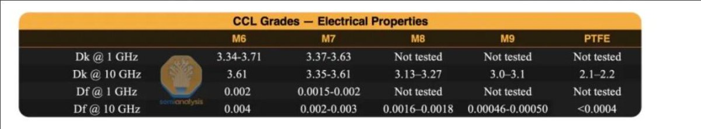

---

<!-- post_id: x:2090982789667578000 | ts: 1787364120 -->
## [X] 駿HaYaO · 2026-08-22 10:02

Applied Optoelectronics（ $AAOI ）簽署了一份股權分銷協議，透過 Raymond James & Associates 和 Needham & Company 進行最高 6 億美元普通股的「隨市發行」（ATM）。

股票可在納斯達克全球市場或其他交易場所出售，公司可透過發行通知控制發行時機、數量與最低價格。銷售代理將收取總銷售額 2% 的佣金，且該計劃可隨時暫停或終止。此安排旨在提供彈性取得資金的管道，以支持公司需求。

---

<!-- post_id: x:2090970554174226811 | ts: 1787361203 -->
## [X] 駿HaYaO · 2026-08-22 09:13

煉油廠停工對開工率與利差的影響

- 利差與開工率出現分歧
全球煉油開工率與成品油利差原本會同步變動，但因供應限制嚴重脫鉤。開工率同比大降7百萬桶/日，利差卻接近歷史高點。報告分析兩者關係，並重申對遠期產品利差的樂觀看法。

- 產能停工限制開工上限
儘管利差創紀錄、美國利用率達97%，全球開工仍受三大因素壓抑：中東與俄羅斯因襲擊僅以約60%產能運作（全球近10百萬桶/日離線），中國出口配額限制，以及高油價抑制管制市場買興。
停工直接對應開工率下降幅度。

- 利差與開工率通常同向移動
短期內，較高開工率反映煉廠對強需求與高利潤的預期，與利差同步；高利差又激勵增產，最終推高庫存並壓低利差。

從利差到開工、從開工到利差的量化關係
歷史數據顯示，美國汽油與柴油平均利差每漲10美元/桶，下個月全球開工傾向增加0.6–0.8百萬桶/日。反之，開工持續減少1百萬桶/日，短期使美國柴油利差降約0.7美元/桶，但12個月後因庫存下降，利差反而升約6美元/桶。

- 持續停工風險支持建設性遠期利差看法
估計持續增加1百萬桶/日停工，會使開工快速降0.6百萬桶/日，12個月後美國柴油利差公允價值升約3美元/桶（歷史約14%）。目前備用產能有限與低庫存使效應更大。印度與中東新增產能僅能小幅緩解。

- 柴油作為地緣政治避險
自7月底建議以來，歐洲柴油（2026年12月–2027年3月）價差已漲逾30%。在持續停工情境下，預估仍有50–60%上漲空間。報告繼續看好遠期柴油價差與歐洲天然氣多頭部位，作為有效的地緣政治對沖工具。

#oil

---

<!-- post_id: x:2090966974373515308 | ts: 1787360349 -->
## [X] 駿HaYaO · 2026-08-22 08:59

貴金屬評論：黃金：看漲期權需求再度升溫，推高波動性與上行價格風險

黃金看漲期權需求因全球宏觀政策對沖需求重新升溫而急劇增加，形成價格雙向機械放大器。當金價接近關鍵執行價時，賣出期權的交易商被迫買入黃金對沖，加速上漲；若金價回調，交易商則解除對沖，增加賣壓並放大下跌風險。
這種期權相關的對沖行為，使金價波動性明顯上升，無論上漲或下跌都會被強化，成為當前市場重要特徵。

市場對聯準會進一步升息的信念（自3月以來黃金主要逆風）在7月FOMC按兵不動及美國就業、CPI數據偏軟後明顯減弱。這推動COMEX淨投機持倉與利率敏感型黃金ETF需求部分復甦，幫助金價從7月中旬低點上漲約15%，接近每盎司4,600美元。同時，上升的看漲期權需求進一步放大這波反彈行情，顯示宏觀預期轉變正與期權對沖效應相互強化。

高盛經濟學家預期通膨將走低，使聯準會維持按兵不動，為西方投資需求復甦創造空間。若西方投資者需求進一步回升，加上央行持續強勁買盤，金價可能被推向關鍵執行價水準。屆時交易商為對沖看漲期權而買入黃金，可能形成機械式加速上漲，進一步推升價格動能。

高盛維持2026年底金價4,900美元的公允價值預測，但認為存在顯著上行風險，同時波動性將加大。該預測假設央行需求持續強勁、私營ETF需求在聯準會按兵不動下復甦，但未充分計入期權對沖需求。若ETF資金流入超預期且看漲期權持倉維持高檔，交易商對沖可能將金價推升遠超預測；反之，若升息預期再起，則可能觸發更劇烈修正，雙向風險均需關注。

#gold

---

<!-- post_id: x:2090848577333735883 | ts: 1787332121 -->
## [X] 駿HaYaO · 2026-08-22 01:08

摩根士丹利：美財政部擴大回購後的利率展望

摩根士丹利將此次美國財政部擴大國債回購，評估為緩解長期債賣壓與供給壓力的「緩衝裝置」。
核心重點不在於回購本身，而是未來長期債發行可能不再持續增加，而是縮小或按期限重新調整的可能性已明顯提高。

- 擴大回購 ≠ QE
預期財政部將透過發行短期國債（T-bill）來為擴大後的回購資金進行融資。這項計劃並非旨在大幅改變國債加權平均到期日（WAM）的政策，也應與QE明確區分。

- 11月季度再融資很重要
此次措施預計將在11月再融資前，降低長期國債的供給與賣壓負擔。之後，財政部有可能下調長期債發行規模，或釋出其他發行調整訊號。

- 從「發行增加」轉向「發行變更」
市場過去一直聚焦未來國債拍賣規模會增加多少，但現在也必須把發行減少或按期限重新調整供給的可能性納入定價。

- 2027年發行擴大也預期溫和
仍預期從2027年2月起開始增發，但：
• 以約10億美元為單位逐步擴大
• 集中在7年以下期限
• 約分4個季度進行
不預期採取在2個季度內大幅提高發行規模的激進方式。

- 利率展望：利率下降 + 曲線陡峭化維持
摩根士丹利認為，支持美國國債利率下降與收益率曲線陡峭化的基本面依然強勁。方向上較接近中短期利率比長期利率更快下降的「牛市陡峭化」（Bull Steepening）。

- 美元進一步走弱的可能性
市場對此次意外回購宣布的反應，再次凸顯了弱勢美元政策邏輯與敘事，摩根士丹利特別提到美元對歐元（EUR）與瑞士法郎（CHF）進一步走弱的可能性。

結論：
此次擴大回購更接近於緩解長期債供給負擔、並為未來國債發行結構保留靈活調整空間的訊號，而非QE。摩根士丹利同時維持「美國國債利率下降 + 收益率曲線陡峭化」的既有展望。

---

<!-- post_id: x:2090846271259217927 | ts: 1787331571 -->
## [X] 駿HaYaO · 2026-08-22 00:59

RT @pcbanalysis: 可能市場會覺得不需要布了...但事實不會如大家所想的

用PTFE 是因為特定目的，僅僅是為了傳輸用途...他可以不考量到CTE等因素，用布會使PTFE極佳的性能受到影響

但如果你的板子要放晶片，有布方案的設計是必須的，有些可能因為傳輸會混壓PTFE，但脫離不了布的方案，因此不影響低介電布、Q布的升級使用

共存會是最佳解...

---

<!-- post_id: x:2090837015113998635 | ts: 1787329364 -->
## [X] 駿HaYaO · 2026-08-22 00:22

台虹_2026-05-29
這份檔案由 https://t.co/Qxm4GT9SSM 製作，歡迎到網站了解更多：https://t.co/q61LE3Vj4m。

Memo

產業供需
•Fine Pitch 及高頻材料需求量大，且供應商較少，市場供給 M9 以上等級材料遠遠不足，未來仍是有多少產能賣多少。 [CFO - 00:08:44] [CFO - 00:24:29]
•玻纖布目前嚴重缺貨，推動無玻纖布材料（如 PTFE）成為產業趨勢。 [CFO - 00:11:09]

公司展望、未來成長動能
•未來重點將放在產品結構優化，篩選訂單，營收絕對成長非首要目標。 [CFO - 00:01:44]
•Fine Pitch 材料、PTFE 高頻高速板、半導體封裝材料等新產品為未來成長動能。 [CFO - 00:07:28]
•半導體材料驗證進度延遲，2026 年訂單不會出現，2027 年起若驗證順利將有成績展現（推估為 2027 年，依據音檔日期推算）。 [CFO - 00:14:35]
•董事會改組後，預期與元太、長華電材等合作案將推動新市場應用與半導體材料推廣。 [CFO - 00:43:20]

市場競爭策略
•台虹在軟性印刷電路板材料行業為龍頭，美系客戶為主要網路商，喜採新技術，板材附加價值較高。 [CFO - 00:37:44]
•Fine Pitch 及高頻材料供應商較少，台虹在傳統軟板材料發展上積極投入，表現優於部分競爭對手。 [CFO - 00:08:44] [CFO - 00:30:32]

新產品／新技術
•Fine Pitch 材料出貨量倍數成長，製造工藝較高，利潤率不錯。 [CFO - 00:08:44]
•高頻高速板材料採用 PTFE 惰性材料，無玻纖布限制，技術開發困難在於高溫熱處理設備不足，預計兩三年後無玻纖布 PTFE 將成重要趨勢。 [CFO - 00:10:03]
•半導體封裝材料 Temporal Bonding FIN 已取得客戶 RD 認證，但驗證進度延遲，預計 2027 年起若驗證順利將有成績展現。 [CFO - 00:13:39]

---

<!-- post_id: threads:3968620966284765831 | ts: 1787316507 -->
## [Threads] Kok Yu · 2026-08-21 20:48 _(接續 2 則)_

NV 板廠供應都這麼多年了，板廠就只有那幾家，HDI給誰，HLC給誰 很明顯就放在那...
這次PTFE 高多層因為製程上比較特別，所以會有兩家新的... 所以才是以三家陸資 一家技術最強的台資（滬電）為主...

SA寫的東西會變成這樣殺盤，真的是笑到爛....

---

<!-- post_id: x:2090782656661495953 | ts: 1787316404 -->
## [X] 駿HaYaO · 2026-08-21 20:46

市場人士指出，歐洲貨櫃航線近期因天災人禍導致供給吃緊，航運行情由單一事件驅動轉向「事件型＋結構型」雙行情。全球海空運受地緣政治、氣候變遷及需求回溫支撐，表現不錯。

中東風險升高形成「雙線危機」：紅海危機未解、船舶繞行好望角拉長航程，壓縮運力；荷莫茲海峽封鎖風險及美以伊衝突升溫，進一步干擾供應鏈。另巴拿馬運河缺水、歐洲內河水位低、罷工及塞港，造成船期延誤、貨櫃滯留與空櫃回流不暢，加劇運力緊縮，市場維持高波動。

雖今年全球貨櫃船供給仍高於需求，但若地緣政治（紅海、中東）與氣候變遷（運河河川水位異常）同步發酵，疊加港口問題，供給將進一步收縮。貨量回溫下，「事件型＋結構型」雙行情可望支撐下半年航運市場。

https://t.co/SHYQNEJLJ8

---

<!-- post_id: threads:3968536197647708216 | ts: 1787306402 -->
## [Threads] Kok Yu · 2026-08-21 18:00

今天載板血流成河事件..嗎...
T glass缺都沒見到慌張...ABF 膜就嚇成這樣...
中系晶片的設計本身就蠻耗材料的...現在優先轉給國外大廠載板使用... 對這些出海外的 是比較正向拉...

---

<!-- post_id: x:2090734694858207455 | ts: 1787304969 -->
## [X] 駿HaYaO · 2026-08-21 17:36

蘋果Vision產品組近期裁員，凸顯空間運算進展緩慢。消息人士獨家透露，公司已裁掉整個VR開發團隊，至少影響60名員工，與即將上任執行長John Ternus將該品類「暫時擱置」的策略一致。

Apple Vision Pro 當初以高價、沉重設計與有限開發者支援問世，主要是為了公開開發visionOS，最終目標是發展成輕薄的全AR智慧眼鏡（Apple Glass）。然而，元件成本持續上漲，迫使售價進一步提高；消費者目前更看好智慧眼鏡，而非笨重的VR頭戴裝置。技術與成本限制，讓更薄、更輕、更平價的機型短期內難以實現。

因此，蘋果近幾個月進行重組，優先聚焦Siri AI與智慧眼鏡，而非目前無法實際量產的頭戴裝置。

VR專責團隊雖已縮減，但並未完全解散。公司仍會繼續推進Vision Pro未來迭代版本，以及運行visionOS的智慧眼鏡開發。近期已推出的visionOS 27更新，也證明這條產品線尚未被放棄。

https://t.co/p6h7EgfwdO

---

<!-- post_id: x:2090732631742918750 | ts: 1787304477 -->
## [X] 駿HaYaO · 2026-08-21 17:27

Nvidia 正積極驗證 PTFE材料，目標在 Rubin Ultra 的 Portia（NVSwitch 7）板上導入，以延長銅互連在 AI scale-up 網路中的生命週期。最終是否採用，仍取決於材料與 PCB 供應商成熟度。

目前採混合式架構：PTFE 作為 core 核心層，搭配 M9 等級 prepreg。此方案兼具 PTFE 優異訊號性能與玻纖布機械強度，較純 PTFE 更易量產。Shengyi 已主導開發逾一年並領先；近期 WUS 成功交付 PTFE PCB 樣品。EMC 則與 TaiFlex 合作，結合雙方在 M9 CCL 與 PFA 氟聚合物的專長。

PTFE 優勢來自對稱分子結構與低極性，10 GHz 下 Dk 僅 2.1–2.2、Df <0.0004，遠優於現行 M9 等級。樹脂演進從 epoxy、PPO 到 hydrocarbon，最終走向 PTFE，才能進一步降低損耗。

挑戰在於 PTFE 屬熱塑性、表面滑且柔軟，鑽孔易留殘膠、毛邊，尺寸穩定性差，製程難度高。混合方案有效降低這些問題。

---

<!-- post_id: x:2090730098056110096 | ts: 1787303873 -->
## [X] 駿HaYaO · 2026-08-21 17:17

TrendForce: 1H26全球電視出貨量年增1.3%，品牌兩極化加劇、RGB Mini LED商業化邁步

根據TrendForce最新研究，2026上半年全球電視出貨量達9,374萬台，年增1.3%，創疫情後同期新高；第二季雖季減1.1%。全年預估出貨1億9,465萬台，年減0.8%。

品牌兩極化加劇：主流大廠憑規模與成本優勢擴張，二線、白牌則受記憶體漲價擠壓獲利。

Samsung上半年出貨1,760萬台（+6.3%），Mini LED年增逾200%；TCL 1,508萬台（+7.1%，前四大最高）；Hisense 1,423萬台（+3%），聚焦大尺寸與RGB Mini LED；LGE 1,130萬台（+3.9%），加大Mini LED布局。

2026年為RGB Mini LED商業化關鍵年，產品線擴充、價格下探，出貨預估上修至170萬台，有望挑戰200萬台。短期品牌靠QLED、Mini LED提升價值；長期則轉向「硬體＋平台＋內容」整合模式競爭。
https://t.co/8d7cU7YxMI

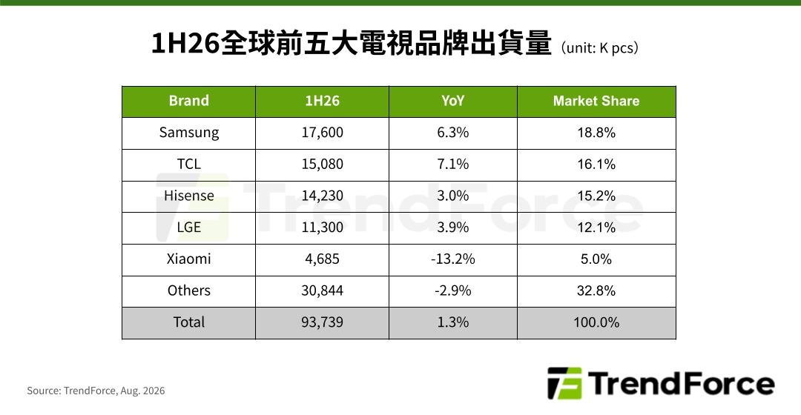

---

<!-- post_id: x:2090678031115239845 | ts: 1787291460 -->
## [X] 駿HaYaO · 2026-08-21 13:51

《韓民族日報》獨家報導：SK海力士正規劃在日本宮城縣（東北地方）投資數十兆韓元，興建記憶體半導體晶圓廠，這是韓國半導體企業首次在日本進行大規模本地生產投資。

宮城縣為日本政府重點培育的三大半導體據點之一。SK集團會長崔泰源近期曾親自考察當地。此廠為國內龍仁、湖南半導體集群之外的額外海外產能，旨在因應全球記憶體供應緊張，提前擴大生產。

如果落實，SK海力士將成為繼美光、台積電後，第三家在日本設廠的外國半導體企業（三星目前僅在橫濱設有封裝研究所）。

---

<!-- post_id: x:2090641987099558098 | ts: 1787282866 -->
## [X] 駿HaYaO · 2026-08-21 11:27 _(接續 2 則)_

Primemas 正與美光科技深化合作，計畫今年下半年量產 JBOM（Just a Bunch of Memory）。此系統將多張 CXL 記憶卡組成更大共享記憶池，協助 AI 資料中心更靈活運用昂貴記憶體。

雙方另合作 Abaco 專案，為美國能源部太平洋西北國家實驗室打造機架級共享記憶系統，採用美光 DDR5，目標提供超過 100TB 的 CXL 共享／池化記憶。Primemas 的 CXL 附加卡將於 9 月交美光進行測試與認證。

公司成立於 2023 年，總部在加州聖克拉拉、研發中心在韓國城南。執行長 Park Il 表示與美光是戰略與技術深度合作，而非單純買賣。技術策略副總 Jeon Duk-ho 指出合作已進入量產階段。

除 JBOM 外，Primemas 也開發無需獨立 CXL 交換器的 SLiM（無交換器池化記憶）架構，鎖定 AI 推理與鍵值快取卸載等應用。

Park 預期第四季開始產生營收，2027 年底前累計銷售額至少達 2 億美元。公司不只賣控制器晶片，也賣卡、板與系統級產品，目標成為 AI 資料基礎設施供應商，讓池化記憶成為 DRAM 與儲存之間的新一層，市場規模未來有望媲美現今 DRAM。

https://t.co/iXIuD7r9dL

---

<!-- post_id: x:2090633103333380314 | ts: 1787280748 -->
## [X] 駿HaYaO · 2026-08-21 10:52

MATCH Act（《硬體技術管制多邊協調法案》，S. 4281）是兩黨法案，由參議員 Pete Ricketts（共和黨）與 Andy Kim（民主黨）於2026年4月提出。核心目標是堵住美國半導體出口管制漏洞，要求盟國跟進美國限制，禁止向中國等對手出售先進晶片製造設備（如關鍵光刻與蝕刻工具）。

目前美國對設備的管制比荷蘭、日本等盟友更嚴，造成美國企業競爭劣勢，卻仍無法有效阻止中國取得先進工具。法案推動多邊統一管制框架，而非單靠美國單邊清單，並處理空殼公司規避實體清單的問題。

眾議院已有對應版本（H.R. 8170）。該法案預計納入參議院2026財年NDAA經理修正案，與AI Overwatch Act、Chip Security Act一併推進，藉由「必須通過」的國防法案提高過關機會。國會已連續60多年通過NDAA，納入後幾乎保證有表決機會。

推動力量包括AI Policy Network等聯盟，強調這是維持美國半導體與AI領導地位的關鍵。若通過，將強化對中國先進製程的封鎖，減少盟友政策落差帶來的套利空間。

https://t.co/ROBGqCxrEN

---

<!-- post_id: x:2090604570909307145 | ts: 1787273945 -->
## [X] 駿HaYaO · 2026-08-21 08:59

《國家太空運輸政策》重點整理
（2026年8月20日 總統備忘錄 / NSPM-17）

核心目標
- 確保美國在太空運輸領域持續領先。
- 到2030年，美國本土發射與再入場地每年能支援超過1,000次發射與再入（目前約178次）。
- 支援從次軌道、近地軌道到月球、拉格朗日點及深空的全範圍進入能力。

四大主要方向
1. 發射與再入基礎設施現代化
- 聯邦發射/再入場地必須透明開放，容納政府與商業用戶。
- 鼓勵商業共同投資、公私合夥，升級老舊基礎設施（多數可追溯至1960年代）。
- 加速許可與環境審查。
- 90天內指定額外聯邦土地再入場地。
- 180天內制定透明場地排程標準，並定期公布。
- 指定優先空域走廊，將太空發射納入空管現代化。
- 確保頻譜可靠供應。

2. 強化太空運輸產業基礎
- 180天內制定產業基礎策略，打造充滿活力、具競爭力且韌性的產業。
- 提升能力、可負擔性、安全性。
- 加強勞動力培育、軍職轉業、政府-產業人才交流。

3. 市場准入與國際合作
- 更新出口政策與出口管制，推廣美國太空運輸能力至海外，同時保護智慧財產。
- 逐案審查外國載具在美國發射/再入申請（60天內提出建議），優先考量國家安全、產業競爭力與外國投資。

4. 美國政府太空運輸原則（商業優先）
- 原則上政府酬載必須使用美國製造載具（少數國際合作例外）。
- 優先使用商業服務，避免政府自行營運與商業競爭。
- 確保多種可靠發射途徑，強化共乘與搭載機會。
- NASA任務：
‧ 建立商業月球往返物流架構
‧探索商業機器人進入火星
‧探索商業載人往返火星架構

- 戰爭部任務：發展在軌服務、在軌物流、太空飛機等新型快速發射能力。
https://t.co/AVyX40yxBJ

---

<!-- post_id: x:2090597921544933769 | ts: 1787272360 -->
## [X] 駿HaYaO · 2026-08-21 08:32

Nvidia 於 8 月 20 日否認 The Information 報導，稱計劃年底前小批量出貨專為中國設計的 LPU（語言處理單元）AI 推理晶片。發言人明確表示：「報導不正確，目前中國市場無 LPU 銷售，路線圖上也沒有中國專用版本。」

原報導指出，該晶片採用 Groq 授權技術，符合美國出口管制，無需降規；Nvidia 修改軟體，使其可搭配中國市場現有處理器運作（因 Vera Rubin 系統受美方限制無法出口）。已有數家中國客戶下單，但北京是否批准採購仍是變數。

背景方面，路透社 3 月曾報導 Nvidia 準備中國相容版 AI 晶片以搶攻推理市場。5 月美國已批准 H200 晶片少量銷售給阿里巴巴、騰訊、字節跳動等，近期才開始交付；Nvidia 也向中國推銷 Vera CPU。黃仁勳此前表示，公司已大致讓出中國 AI 晶片市場給華為。

https://t.co/vnbwC7FQdu

---

<!-- post_id: x:2090597090623926296 | ts: 1787272162 -->
## [X] 駿HaYaO · 2026-08-21 08:29

關於 $AVGO（博通）據報的 AI 融資更多細節：
整筆融資規模可能接近 1000 億美元，包括 600–700 億美元 的優先擔保債務，再加上約 300 億美元 的次級債務。
Apollo 與 Blackstone 正在洽談參與，債務可能透過特殊目的載體（SPV）發行。
這筆融資將協助 Anthropic 及其他 AI 公司取得博通晶片與基礎設施，且可能分階段推出，而非一次到位。
-----

據知情人士透露，博通公司（Broadcom Inc.）正與一群貸款機構洽談，計畫為一項將使 Anthropic PBC 及其他公司受惠的 AI 晶片融資交易，募集超過 600 億美元 的債務。

部分知情人士表示，這筆仍在敲定中的融資，可能還會包含約 300 億美元 的次級債務層（這些人士要求匿名，因為資訊尚未公開）。

根據擬議計畫，博通將為部分優先擔保債務提供擔保，該層規模可能約在 600 億至 700 億美元 之間。部分人士表示，目前討論的數字有機會讓總規模達到 1000 億美元。

---

<!-- post_id: x:2090596536099262874 | ts: 1787272030 -->
## [X] 駿HaYaO · 2026-08-21 08:27

$MRVL ：AI 展望（Google、AWS）與預覽

評級與目標價：維持「買進」評級，目標價 290 美元，基於 FY29E EPS 14.50 美元的 20 倍本益比。

- 在客製化矽晶片領域具備強勢定位，主要美國超大規模雲端業者（Google、AWS、微軟）皆為客戶，且因短缺帶動 DSP ASP 上漲空間。

- 短期展望：F2Q27 營收預期季增 12%，非 GAAP 毛利率約 59%。

- 預期上調指引：F3Q27 與 FY27 營收成長預估季增 13%，全年營收指引很可能從 115 億美元上調。

- Google 矽晶片動能與 TPU V10（？）：鎖定 2028 年日曆年於 Google 約 100 億美元以上的商機，受惠於 CXL/DPU、MPU，以及股權合作關係，提升取得 2028 年 TPU V10（Merope）的可能性——與聯發科無關（Icefish 合作已確認）。

- AWS Trainium 4 與 NPO 擴展：Marvell 在 T4 具優勢（2028 年日曆年超過 30 億美元，ASP 較 T3 高出約 150%），受惠於收購 Celestial AI 後在 NPO 擴展光網路（UALink/NVLink Fusion）的較佳進度。

---

<!-- post_id: x:2090591532378448181 | ts: 1787270837 -->
## [X] 駿HaYaO · 2026-08-21 08:07

早安！8/21 外電綜合整理

- 2454聯發科: 美系重申正向
美系券商表示AMD 與 Marvell 都正在與 Google 合作開發 AI ASIC，這並不表示要取代，而是Google 正在擴大自身的客製化晶片生態系。券商重申聯發科兩個 ASIC 專案應可在未來幾年帶來強勁成長，重申正向不變。

- 6278台表科: 
亞系券商表示光收發模組展望更加明朗，新的光收發模組客戶（一線美國客戶）將於 4Q26 正式加入。券商也對低軌衛星、伺服器及機器人業務持正面看法，預期明年營收成長2成。

 #下次會考

---

<!-- post_id: x:2090482996885528666 | ts: 1787244960 -->
## [X] 駿HaYaO · 2026-08-21 00:56

中芯國際（SMIC）是中國唯一具備約7nm等級製程的晶圓代工廠。上季產能利用率達93.7%，大幅超越自家財測，並告知客戶將調整為更公平的定價。

- 中芯國際稍早公布單季營收首度突破30億美元（實際為30.1億美元），年增36.1%，淨利近乎成長三倍至4.792億美元。
- 共同執行長趙海軍（Zhao Haijun）在隔日分析師電話會議中表示，第一季完成價格談判後，第三季加工的晶圓將調漲價格。
- 產能利用率達93.7%，需求超出中芯國際能完全滿足的程度。主要動能來自中國AI資料中心建設，而美國出口管制已切斷中國在先進製程上取得台積電（TSMC）與三星（Samsung）產能的管道。
- 趙海軍表示：「由於業界領先的晶圓價格與中芯國際目前價格仍有很大差距，我們需要與客戶協商更公平的定價。」

財報表現全面超標：
- 原先預估季增營收14%–16%、毛利率20%–22%。
- 實際交出季增20%（營收30.1億美元）、毛利率25.3%（上一季為20.1%）。
- 晶圓出貨量季增14%，達290萬片8吋約當量；平均售價上升5.7%。
- 第三季毛利率指引為26%–28%。
- 中國市場佔營收比重達90%。

---

<!-- post_id: x:2090481767941812707 | ts: 1787244667 -->
## [X] 駿HaYaO · 2026-08-21 00:51

日經亞洲報導：中國正限制或延遲向台灣出口關鍵光學與航空航天材料，造成嚴重供應鏈瓶頸。

自去年起，光學製造商因中國海關檢查時間延長，獲取鍺基與石英基材料時出現明顯延遲。鍺是紅外透鏡、光纖與光子學的關鍵材料；石英則用於光學元件與半導體製造。中國為全球主導供應國，常以此作為地緣政治籌碼。

業界高管透露，這是全行業問題，交貨周期大幅延長，部分訂單已流失。芯片設備製造商表示，石英限制導致產品交貨期延長數月，且尚無中國以外的高品質替代來源。

航空航天領域同樣受衝擊，尤其是釹永磁體供應成為瓶頸，影響電機與先進機器人製造。替代品成本高、取得不易。

背景方面，北京歷來透過關鍵材料出口管制施壓貿易夥伴。2024年12月更新兩用物項清單，新增石英基材料；此前曾禁止對美出口鍺與鎵以報復美方芯片管制。北京視台灣為領土，不排除武力統一。

台灣經濟部正支持工研院開發本土稀土技術，目標三年內建成試生產線，強化自給能力。中國海關總署未予置評。

---

<!-- post_id: x:2090433175902462036 | ts: 1787233082 -->
## [X] 駿HaYaO · 2026-08-20 21:38

J.P. Morgan 重申 Broadcom（ $AVGO ）「優於大盤」評級。
儘管近期市場對其短期業務與 Google 地位有雜音，研究顯示：FY26 AI 營收有望突破 560 億美元（年增 180%），FY27 再成長 2–2.5 倍；下一代 TPU v8i 3nm 已量產，TPU v9 2nm 預計 2028 年初量產；2025 年 4 月簽訂的 5 年 Google 協議已生效，鎖定後四代 TPU 並承諾逐年增加營收。
Meta、OpenAI、Anthropic 等 XPU ASIC 專案均按計畫推進。競爭對手（Alchip、GUC、AMD、MRVL）僅支援 Google COT 與附加晶片，不影響 Broadcom 核心 TPU 訂單。三星協議更預示未來五年 AI 營收累計逾 1 兆美元。市場低估其 18 個月以上領先優勢與執行力，建議積極買入。

5 年協議
市場嚴重低估 2025 年 4 月簽署的 Google/Broadcom 5 年協議（至 2031 年）。該協議鎖定 TPU v8 至 v11 設計勝利路線圖，並要求 Google 每年增加 TPU 相關營收給 Broadcom，大幅提升長期能見度與穩定性。

FY26/FY27 營收展望
FY26 AI 營收有望達 560 億美元以上（年增 180%），FY27 再成長 2–2.5 倍。除 Google TPU 等強勁 AI 專案外，網路晶片 Tomahawk 5 需求持續強勁，Tomahawk 6 已售罄至明年，供應能力已跟不上需求。

TPU v8i / v9 進度
TPU v8i 正順利量產，TPU v9 2nm XPU ASIC（4 運算晶粒、16 HBM、400Gbps SerDes）預計 2028 年量產，無 CoWoS 削減、無延遲、無取消。Broadcom 去年上半年已啟動 v9 IP 設計、下半年啟動 SoC 設計，目前為最高優先專案之一，並已開始早期 v10 IP 設計。

競爭噪音影響
Alchip、GUC、AMD、MRVL 等競爭者主要被引入支援 Google 陷入困境的 COT 團隊（TPU v8t 受挫）及 TPU 附加支援晶片，完全不影響 Broadcom 核心 TPU 設計勝利與營收機會。

長期領先優勢
Broadcom 已領導 ASIC 市場逾 30 年，優勢不僅在於 SerDes，更涵蓋運算/網路/記憶體/儲存架構知識、完整 IP 組合、先進封裝設計與強大執行力。過去 12 年協助 Google 推出 14 款最先進晶片，領先優勢達 18 個月以上，將持續鞏固 AI 領域主導地位，重申「優於大盤」評級。

---

<!-- post_id: x:2090430259648963027 | ts: 1787232386 -->
## [X] 駿HaYaO · 2026-08-20 21:26

AVGO 通路研究摘要

XPUs（占比 35%）
- 聽聞 Google + Anthropic 對 TPU 的增量需求延伸至 2027 年，以支援推理（正面）
- Meta MTIA 正加速進入 2027 年，量能更大且 ASP 提升；OpenAI Jalapeno 進度符合預期（正面）
- TPU 的 Neocloud 機會被認為更可能在 2028 年及以後實現（正面）

AI Networking（占比 20%）
- 聽聞 400G、800G 與 1.6T 網路／光學產品組合的需求全面上升（正面）
- 通路認為網路刷新週期縮短，因為產能需求已超過新數據中心建設速度（正面）
- Scale-up Ethernet 預計在 FY27+ 擴大 TAM；合作夥伴預期 Ethernet 長期勝出（正面）

Software（占比 30%）
- 大型企業續約、價格實現與 VCF 消耗仍是順風（正面）
- 聽聞過去 90 天中小企業／中型市場有部分客戶流向 Nutanix（負面）
- 取消「方便終止」條款後，收入確認可能受益（正面）

Non-AI Semis（占比 15%）
- Apple 需求良好，但被其他 OEM 消費需求疲軟所抵銷（中性）
- 企業基礎設施刷新週期被認為未來 12 個月以上仍會持續（正面）
- 長期展望參差，Apple 與 Cisco 有部分內容流失（負面）

---

<!-- post_id: x:2090421632980644229 | ts: 1787230330 -->
## [X] 駿HaYaO · 2026-08-20 20:52

聯發科AI ASIC題材從成長想像進入競爭檢驗。外電引述SemiAnalysis報告指出，超微（AMD）傳與Google合作開發第10代TPU，若屬實將是超微首次大規模進入客製化AI ASIC市場，可能改變供應商版圖。

Google TPU過去主要由博通負責，後傳與聯發科合作；博通6月財報曾透露Google在找其他供應商。聯發科雖未公開證實Google為客戶，但市場長期視為其重要ASIC合作對象。超微加入後，聯發科未來訂單壓力上升。聯發科近期釋出正面訊號：已與美國大型CSP合作打造首款領先效能AI加速器ASIC，預計第4季量產；今年資料中心營收可望逾20億美元，2027年加速成長。7月營收484.74億元（年增12.1%），創同期新高；前7月累計年增0.8%。第3季營收估季增5%以內。

利多未變，但若超微確實切入Google TPU供應鏈，聯發科能否持續拿下大型CSP客製化AI晶片訂單，將成市場重新評價其AI成長行情的關鍵觀察點。

https://t.co/gAfn53rR4D

---

<!-- post_id: x:2090420835643498781 | ts: 1787230140 -->
## [X] 駿HaYaO · 2026-08-20 20:49

日經亞洲報導指出，中國正限制或延遲向台灣出口鍺、石英及部分永久磁鐵等關鍵材料，嚴重衝擊台灣光學、半導體製造與航太產業供應鏈。

知情人士透露，自去年起中國海關查驗時間明顯拉長，光學製造商取得鍺基、石英基材料時遭遇重大延誤。部分中國供應商甚至遭當局約談，要求交代客戶與出貨細節，導致台灣業者無法如期交貨並流失訂單。

鍺是紅外線鏡片與光纖關鍵原料，用於熱成像及國防工業；石英則為光學元件與半導體製程不可或缺材料。晶片設備廠主管指出，石英限制已使產品交期延長數月，且難找替代來源。

航太業同樣受影響，尤其是製造馬達與先進機器人所需的釹永久磁鐵供應受阻，其他地區難有具成本效益的替代品。

中國為全球主要供應國，過去曾多次以關鍵材料出口管制作為地緣政治施壓工具。台灣相關產業正面臨明顯供應瓶頸，凸顯對中依賴風險。

https://t.co/KBuP4WQfdq

---

<!-- post_id: x:2090385109736431958 | ts: 1787221622 -->
## [X] 駿HaYaO · 2026-08-20 18:27

SK hynix 提出 CPO 路線圖，用光學互連解決 AI 頻寬瓶頸，並擴展 AI 基礎設施規模。

內容
- CPO 是下一代 AI 基礎設施的關鍵技術。
- 論文超越 HBM 創新，提出解決機架與 pod 層級資料瓶頸的光學互連藍圖。
- 以光學為中心的協同設計架構，能透過光學鏈路連接記憶體與處理器，提升大規模 AI 系統的可擴展性。

HBM 與新瓶頸
- HBM 過去成功解決 AI 加速器封裝內的記憶體瓶頸。
- 現在超大規模 AI 集群（數千個 GPU + HBM）出現新問題——頻寬牆（bandwidth wall），限制系統間資料移動。

論文意義
- 全面提出記憶體、先進封裝與光學計算互連（OCI）如何共同演進的技術路線圖。
- 顯示 SK hynix 已從 HBM 創新，進一步走向定義系統層級的 AI 基礎設施架構。

「從晶片到系統」區塊
- 超大規模 AI 模型已在多個機架（Rack）與 Pod 組成的網路中運行。
- 系統整體效能取決於機架之間資料移動的效率，而不只是晶片內部連接。
- 計算吞吐量每兩年約成長 3 倍，互連頻寬卻只成長約 1.4 倍，形成「頻寬牆」。
- 傳統銅線電氣互連在長距離時信號損耗與功耗急劇上升，成為限制因素。

CPO 的核心概念
- CPO 把光學收發器直接整合到處理器同一封裝內，用光取代長距離銅線傳輸資料。
- 大幅縮短高速電氣信號的傳輸距離，剩下的路徑用光學鏈路完成。
- 優點：高頻寬密度、優異能源效率、低延遲、抗電磁干擾。

技術目標
- 提出從 2D／2.5D 中介層到 3D 異質堆疊的演進路徑與商業化挑戰。

「將光學互連擴展至記憶體」區塊
- 長期目標是把光學互連直接做到記憶體介面。
- 提出「以光學為中心」架構：用光子中介層直接連接計算資源與大型記憶體池。
- 好處：多個 AI 加速器可共享大型記憶體池，系統擴展更靈活、資料移動更有效率。

訪談重點
- 光學延伸至記憶體的優勢打破計算晶片周圍的物理限制，增加記憶體容量與連接彈性。
- 讓多個加速器共享大型記憶體池，系統更可擴展。
- CPO 為何重要與未來方向四大優勢：
高頻寬密度、優異能量－距離效率、可擴展並行連接、強信號完整性。
- 下一步將研究超薄光子材料整合與基於微 LED 的大規模並行光學互連，追求更高能源效率。

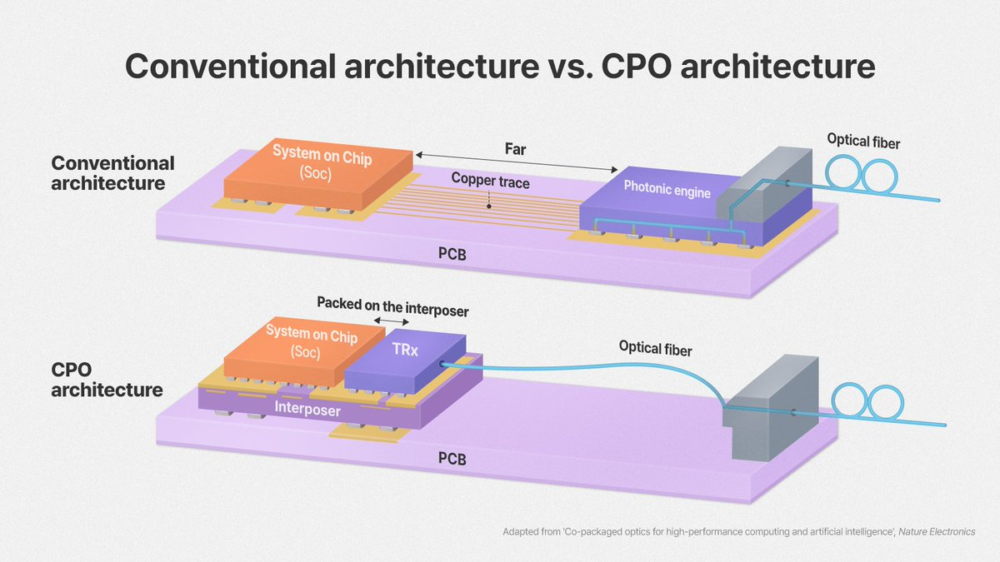

---

<!-- post_id: x:2090383540760482125 | ts: 1787221248 -->
## [X] 駿HaYaO · 2026-08-20 18:20

日本藏壽司宣布自2026年9月4日（五）起，全國門市調整壽司菜單價格。

因原材料與能源成本持續上漲，公司雖已透過系統化與AI努力控管，仍決定部分商品調價，以維持品質與穩定供應。

主要變更：
- 最低價格從115日圓降至110日圓（部分店鋪會再依原價級距下調：120→115、130→125、150→145日圓）。
- 原115日圓的33項商品（如鮭魚、生蝦、赤貝等）調升至120日圓。
- 小朋友人氣品項（熟成鮪魚、蔥鮪、玉子燒、漢堡、玉米等）調降至更親民的110日圓。
- 全新推出「相盛」商品（一盤兩種人氣配料組合），以110日圓販售，總計37項商品可享110日圓價位。
- 招牌「熟成鮪魚」維持120日圓不變，仍為業界最便宜水準。

https://t.co/2NSecqKwP8

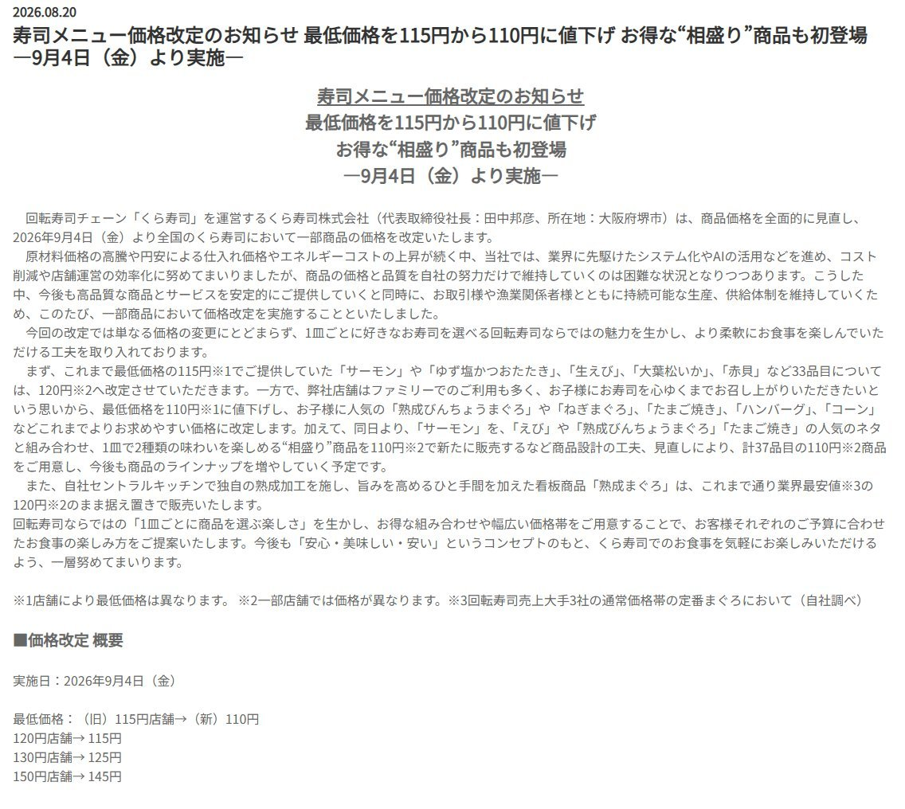

---

<!-- post_id: x:2090381033376297084 | ts: 1787220650 -->
## [X] 駿HaYaO · 2026-08-20 18:10 _(接續 2 則)_

富喬（1815）本土法人最新報告指出，玻纖紗布廠富喬受惠AI伺服器快速升級，高階玻纖材料需求大增，加上產品漲價與組合優化，2026至2027年獲利可望連續創高。法人給予「強力買進」評等。

AI伺服器平台快速迭代，推動銅箔基板及上游玻纖材料規格升級。2026年玻纖布產業供需結構明顯轉變，既有供給減少、新增需求成長，報價快速走高，漲價趨勢有望延續至2027年上半年。高階低介電（Low Dk）及低熱膨脹係數（Low CTE）玻纖布供給尤其吃緊，部分銅箔基板廠已出現料源不足，供需缺口持續擴大。

富喬2026年第2季受惠E級電子布價格調漲與出貨增加，毛利率明顯提升至40%，單季EPS達1.44元，下半年動能將進一步升溫。公司具備玻纖紗與布垂直整合能力，積極提高高附加價值電子布比重，以降低中國同業在工業級產品的削價競爭。

預估2026年工業紗與電子布比重約2：8，2027年電子布占比有望達九成以上。毛利率較高的第二代低介電玻纖布自2026年下半年起增加出貨，占比逐月攀升，第3季營收預估季增24%。

產能方面，全球織布設備供應吃緊，富喬已提前取得豐田織布機，規劃擴充泰國廠產能：2027年新增200台、2028年再增300台，為高階產品需求做準備。

法人預估富喬2026年稅後純益28.2億元、EPS 4.82元；2027年隨新產能加入，EPS可望達7.01元。

https://t.co/q9guaSRUqi

---

<!-- post_id: x:2090380230041190582 | ts: 1787220458 -->
## [X] 駿HaYaO · 2026-08-20 18:07

$NOK Nokia

J.P. Morgan 認為市場對 Nokia 在 AI 與雲端領域的營收潛力反應明顯過慢，這可從強勁訂單與光學同業的市場熱度看出。特別是 Nokia 已提升 IP Networks 市占率，2Q26 訂單中約 40% 以上（超過 11 億歐元）屬於此業務，為基礎設施帶來新的成長動能。雖然供應瓶頸仍在，但預期 2027 與 2028 年可大幅提升零組件供應以支持產能。

分析師維持增持評等，目標價上調至 18 歐元／21 美元，潛在上漲空間約 100%，且 2028 年 EPS 預估較共識高出 34.5%。核心觀點是 AI／雲端與 IP 網路雙引擎成長尚未被市場充分反映。

市場過於悲觀
目前市場對 Nokia Infrastructure 在 2027-2028 年銷售預估過於保守，僅預期同比分別增加 13.7 億與 12.8 億歐元。對照實際數據，過去兩季 AI／雲端訂單已累積 38 億歐元，其中 24 億為可在 12 個月內出貨的持續性訂單。

若後續 3Q、4Q 維持類似水準，FY26 持續性訂單可達 52 億歐元，進而帶動 FY27 銷售成長 28 億，遠超市場預期逾 100%。即使假設訂單回落至較低水準，FY27 AI／雲端銷售仍可比共識高出約 17%。此段強調市場明顯低估了訂單轉化與成長力道。

情境分析
透過「低」「高」情境量化上修空間：
低情境假設後續訂單各 9 億歐元，FY26 持續性訂單約 42 億，仍可讓 FY27 EBIT 超越共識 7.7%、2028 年逾 24%。高情境若訂單提升至 15-16 億歐元，FY26 可達 55 億，則 FY27 EBIT 超越逾 28%、FY28 逾 46%。

無論高低情境，皆指向相對目前共識有相當可觀的上修。「低」情境因假設訂單大幅下滑，與同業強勁表現不符，被認為可能性較低。整體凸顯 Nokia 獲利上修潛力。

---

<!-- post_id: x:2090378608241963119 | ts: 1787220072 -->
## [X] 駿HaYaO · 2026-08-20 18:01

三星電子將於本月底召開董事會，正式公布韓國企業史上最大規模的100兆韓元以上股東回饋政策，預計以現金股利為主。

在AI記憶體需求帶動半導體超景氣下，公司實績屢創新高，決定用自由現金流（FCF）的50%回饋股東。雖然市場曾傳200兆韓元，但考量設備投資龐大，100兆規模較為現實。

與SK海力士偏好庫藏股註銷不同，三星因金產法與集團持股結構（三星生命、三星火災），現金股利更有利於治理。

公司小額股東已近800萬人，股價仍被低估。此政策被視為提升股東價值的分水嶺，且明年實績更好，回饋金額有望再增加。三星也將持續視現金流情況追加回饋。

---

<!-- post_id: x:2090377725425164637 | ts: 1787219861 -->
## [X] 駿HaYaO · 2026-08-20 17:57

三菱電機（6503）PCI Energy Solutions 完全子公司化 

內容
三菱電機於2026年8月20日宣布，以14億美元（約2,200億日圓）取得美國PCI Energy Solutions（PCI）100%持分，使其成為完全子公司。預計2026年內完成（需監管核准）。

PCI簡介
- 1992年成立，總部位於美國奧克拉荷馬州，員工約370人
- 專精能源管理・優化軟體（電力交易、發電排程、需求預測、風險管理等）
- 美國約60%發電量使用其平台，為北美電力營運軟體事實標準
- 2025年銷售額約8,138萬美元，SaaS模式成長強勁

收購目的
強化「智慧能源」領域。結合PCI的優化技術與三菱電機的控制技術、BLEnDer®及Serendie®，提供從設備管理到市場電力交易的整體能源優化解決方案，加速全球展開。

時程
契約簽署：2026/8/20
完成預定：2026年內
https://t.co/gSKMpnlzyw

---

<!-- post_id: x:2090272219801018486 | ts: 1787194707 -->
## [X] 駿HaYaO · 2026-08-20 10:58

AMD 宣布朝 2030 年 AI 機架級能源效率目標邁進：預計僅需 2 台 2030 年 AI 機架，即可提供相當於 570 台 2024 年 MI300X 機架 的運算效能。

這將使相同工作負載的用電量降低 20 倍，碳強度降低 28 倍。
截至 2026 年中，AMD 已提前達成約 4 倍 AI 能源效率提升（原目標 3 倍）。

主要技術方向包括：
- 先進製程整合更多電晶體
- HBM 更靠近核心
- 高速內部網路（如 UALink）
- 軟體優化減少無效耗電
計算顯示，每台 2030 機架功耗可能達 570–1,781 kW（約為現行 MI300X 機架的 14 倍）。

AMD 已推出首款全堆疊 AI 機架 Helios（含 MI455X GPU、第 6 代 EPYC、Pensando 網路與 ROCm），作為密度提升的重要一步。

---

<!-- post_id: x:2090264202145644826 | ts: 1787192795 -->
## [X] 駿HaYaO · 2026-08-20 10:26

AI熱潮推升全球晶片產能擴張，連帶使沉積、蝕刻、測試等非微影設備出現嚴重短缺。歐美、日韓主要供應商交期已長達24個月，ASML先進光刻機更延至兩年。

中國本土設備商憑較短交期與國內需求成長，趁勢搶市。中芯國際、長鑫存儲等大舉擴產，並強制導入國產設備，使設備商角色從技術研發轉向大規模出貨。

集微網數據顯示，2026上半年多數中國主要設備商營收雙位數成長；部分沉積與蝕刻廠商利潤更暴增300%至逾400%。少數公司因加大研發而出現虧損。

這波供應中斷被視為長期產業重塑，而非短期現象，中國設備商有望在歷史性產能擴張期搶占更多市場份額。

---

<!-- post_id: x:2090255127118794975 | ts: 1787190632 -->
## [X] 駿HaYaO · 2026-08-20 09:50

RT @pequityresearch: Nomura: Server supply chain

$AMZN $NVDA $AMD $MSFT $META $GOOGL $DELL

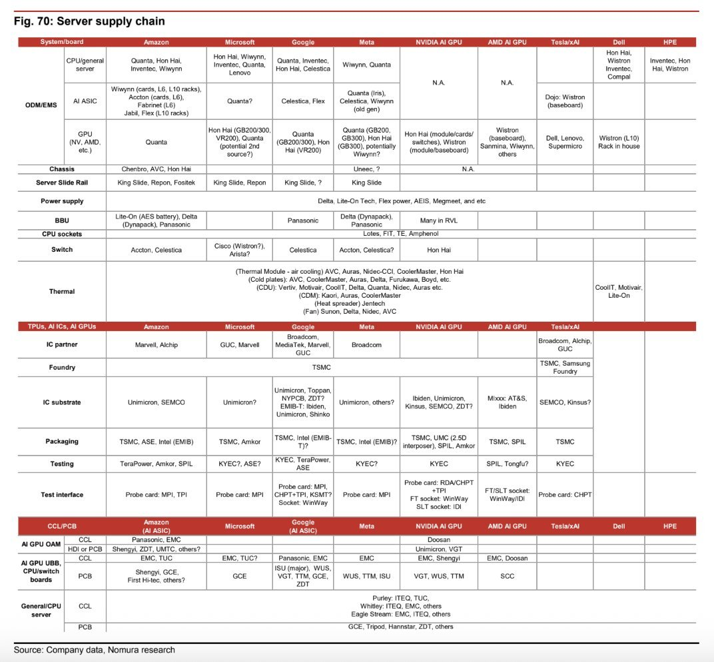

---

<!-- post_id: x:2090233384396304663 | ts: 1787185448 -->
## [X] 駿HaYaO · 2026-08-20 08:24

市場傳出，Intel下一代PC處理器將擴大採用台積電2奈米製程。桌上型Nova Lake優先導入bLLC大型末級快取，以對抗AMD的3D V-Cache；筆電版可能延至Razor Lake-HX。Razor Lake更傳將採用台積電高效能N2X製程，使雙方合作從N2P延伸至更廣泛的2奈米家族。

Intel雖持續推進自有18A製程，但為兼顧高階CPU時程、效能與產能，將部分運算晶粒交由台積電代工，降低單一製程風險。N2X屬N2平台高效能延伸版，鎖定高頻CPU、AI及HPC，技術由FinFET轉向奈米片，對薄膜沉積、蝕刻、清洗與CMP精度要求更高。
製程微縮至2奈米後，晶圓平坦度與缺陷控制門檻提升，CMP研磨次數及高階耗材價值同步增加。

頌勝為台灣少數具備自主CMP研磨墊量產能力的廠商，上半年半導體營收年增25%、占比達66%，Hard Pad與先進封裝需求強勁，Soft Pad新線預計Q3試產、Q4量產，並積極擴產。

中砂則掌握CMP鑽石碟與再生晶圓，2奈米及1.6奈米相關產品出貨快速增加，Q2營收年增17.9%、毛利率升至40.1%，持續擴充產能，成為台積電先進製程放量的直接受惠者。

---

<!-- post_id: x:2090232661457711391 | ts: 1787185275 -->
## [X] 駿HaYaO · 2026-08-20 08:21

創意(GUC，3443)通過兩大籌資案，規模上看655億元

ASIC設計服務商創意19日董事會決議通過兩項重要議案：一是與兆豐銀等銀行團簽署聯貸案，授信總額度新台幣400億元，並可在25%範圍內增減；二是擬發行海外第一次無擔保轉換公司債，發行總額上限8億美元（約新台幣255億元），每張面額至少20萬美元。

兩案合計籌資規模上限達約655億元，主要目的為充實中長期營運資金，並因應AI晶片需求大增、台積電先進封裝產能滿載，滿足外幣購料需求。

外界解讀此舉為提前卡位先進封裝產能，可能透過預付貨款鎖定明年度產能。創意日前亦表示，對明年取得產能相當樂觀，凸顯其與台積電的緊密合作關係。

https://t.co/PfoylmOHy9

---

<!-- post_id: x:2090225537956626574 | ts: 1787183577 -->
## [X] 駿HaYaO · 2026-08-20 07:52

早安！8/20 外電綜合整理

- 2357華碩: 美系維持中性
美系券商預期8–9 月營收將逐月成長；之後營收將逐月下滑，因為記憶體成本上升將壓抑 PC 終端需求，同時 AI 伺服器也將進入機種轉換期。維持中性。

 #下次會考

---

<!-- post_id: x:2090115329129386379 | ts: 1787157301 -->
## [X] 駿HaYaO · 2026-08-20 00:35

Cerebras CS-4 

亮點
- 相同晶圓、性能翻倍：沿用 CS-3 的 5nm WSE-3，透過提高功耗與時脈頻率 + 更好的電力輸送/冷卻，實現性能約 2 倍提升。
- 關鍵指標：每片晶圓 tokens/s/user 約翻倍，成本大致與上一代相當 → 客戶以相同硬體支出可獲雙倍 token 收入。
- 記憶體頻寬加倍（最重要指標），峰值 FLOPs 與晶圓外 I/O 也加倍（1.2 Tb/s → 2.4 Tb/s）。
- SRAM 容量不變：仍為每片 44GB（主要限制，需等下一代矽製程才能改善）。

系統與機架設計（Backpack）
- 機架改為模組化「背包」設計：前半電力、後半運算，每機架從 2 片晶圓升級至 3 片。
- 冷卻基礎設施外移（配合資料中心全液冷）。
- 部署更簡單：可先裝電力模組，現場再插入晶圓背包。
TDP 約 125–135kW（約為單片 CS-3 的接近 2 倍）。
- 性能/瓦特僅輕微改善，但 BOM 成本控制得宜，TCO 更具吸引力。
- 行銷數據：總晶片上記憶體頻寬 43 PB/s（約為 Nvidia Rubin 的 2,000 倍）；互動性號稱最高 30 倍於 GPU（分析認為實際約 20–40 倍）。

網路與 I/O 改進
- 全新可現場升級的 Wafer I/O 模組（FPGA 卡），支援標準乙太網，方便異質解耦推論。
- 延遲降低：交換網路 5µs → 3µs；直接晶圓對晶圓連結可達 2µs。
- 專為解耦設計（尤其考量 AWS EFA + Trainium），可搭配 HBM 系統克服記憶體容量不足。
- 限制：延遲與頻寬仍不足以支援跨多晶圓的專家並行（EP/ETP），主要仍依賴管線並行。

推論策略與限制
- 主力仍是管線並行：MoE 專家完整放在單一晶圓上。
- 適合低批次解碼（低算術強度核心）。
- 長上下文 + 高並發需求大量系統（例如大型模型 1M 上下文 + 256 並發可能需 40 套系統，CAPEX 超 2,000 萬美元 + 1MW 功耗）。
- 主打開放異質解耦推論（支援 AFD 與傳統 PDD），Cerebras 負責 Decode，搭配 AMD / AWS Trainium 等。

路線圖
- 已與下一代「Nexus」機架平台共同設計新晶圓引擎，CS-4 機箱可延續使用。
- 目標：每年約 2 倍性能提升，2027 年前達成 20 倍吞吐量。
- 持續強化可靠性（現場更換、錯誤恢復、冗餘、良率收穫）。

總結：CS-4 是「同晶圓、翻倍性能 + 大幅簡化部署」的升級，以相近成本提供雙倍互動性與 token 收入，並為未來解耦推論鋪路，但記憶體容量瓶頸仍在。

---

<!-- post_id: x:2090113019724615880 | ts: 1787156750 -->
## [X] 駿HaYaO · 2026-08-20 00:25

目前封裝「週期」進行到哪裡。 
而且根據這次週期驅動因素的不同，這次應該會比上一次更大。  
上一次週期主要是由主流產品的打線接合機（wire bonder）產能所驅動，COVID 期間 PC 是主要需求來源。  
但這次的產品組合非常不同。  

上一次封裝週期主要是在增加主流封裝的產能。  
打線接合機佔了資本支出的很大一部分。  
可以從設備供應商的相對表現中看出這一點：  
$BESI 是表現落後者。  
當時購買的工具很重要，但遠不如今天先進封裝所需設備那麼昂貴或技術複雜。  

這一次，支出正越來越多地流向真正的先進封裝工具：  Hybrid bonding、TC bonding、先進die attach，以及其他高端封裝設備。  
這些工具比驅動上一次週期的打線接合機貴得多。

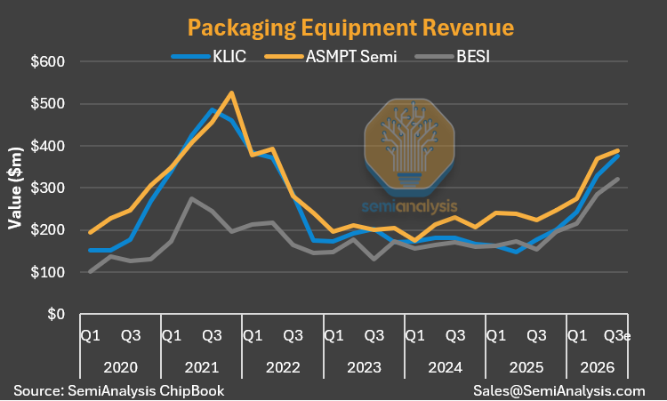
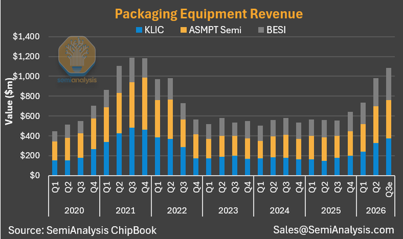

---

<!-- post_id: x:2086788330738577480 | ts: 1786364083 -->
## [X] 駿HaYaO · 2026-08-10 20:14

UBS 美光 ( $MU ) 報告

•  NAND 有些噪音（近期待估略下修），但 DRAM（尤其 HBM）比先前預期更緊俏。
•  維持 買進評等，目標價 1,625 美元 不變。

HBM / DRAM 
•  HBM 供需實際更緊，HBM4 與 HBM4E 定價強於預期。
•  2027 年產業混合 HBM ASP 上修至 年增約 79%（先前 +61%），HBM4E 可能突破 30 美元/GB。
•  MU 自身 HBM ASP 上修至 年增約 72%（先前 +61%），出貨量維持約 116.5 億 Gb。
•  NVIDIA 因供應緊俏調降 VR300 規格（第一版 384GB HBM4 → 後續 512GB HBM4E），但整體 2027 年 HBM 消耗量反而從 587 億 Gb 增加至 615 億 Gb。
•  HBM 相對 DDR 價格溢價重新擴大。
•  DDR 仍預期至少到 2028 年第二季供不應求；C3Q 合約價（含長期協議）預估季增約 20%。

NAND 
•  近期待估因定價不確定性略下修。
•  C3Q 合約價季增幅度低於先前預期（產業約 +20%，MU 約 +23%）。
•  但需求仍具建設性，將 2026/2027 年產業位元成長上修至 +23%/+26%。
•  定價預計 2027 年第四季見頂。

---

<!-- post_id: x:2086778998244376975 | ts: 1786361858 -->
## [X] 駿HaYaO · 2026-08-10 19:37 _(接續 2 則)_

印能科技（7734）卡位台積電與英特爾雙陣營，今年營收估倍增、產能再增約3成。

受惠台積電 CoWoS、SoIC 需求放量，並切入 SoIC 供應鏈（第三代設備下半年出貨）；英特爾 EMIB 平台今年上半年已少量出貨，後續可望放量。

兩大晶圓代工陣營同步推進先進封裝，營運可望逐季走高，法人估今年營收翻倍，明年動能更強。

現有設備月產能約40台，正擴產（三樓改建）增加10多台，整體產能提升約30-40%。

另積極布局 CPO、FOPLP 及翹曲控制（WSAS 產品驗證中，最快Q4有進展）。

台積電 SoIC 產能預估今年底月產約2萬片、明年倍增至4萬片、後年上看8萬片，將帶動相關設備需求。

https://t.co/0Jayxp6YDd

---

<!-- post_id: x:2086776236249157739 | ts: 1786361199 -->
## [X] 駿HaYaO · 2026-08-10 19:26

日經報導，索尼與台積電計畫合資約1兆日圓（約63.2億美元），生產下一代影像感測器用微晶片。合資公司由索尼持股約6成、台積電約4成，最快2029年於日本熊本縣開始量產。

雙方今年5月已簽不具約束力合作備忘錄，擬在索尼熊本合志市新廠建置研發與生產線，由索尼掌握多數股權與控制權。

集邦科技分析師喬安指出，此合作從純代工延伸至前段研發，讓索尼在掌控核心技術下導入台積電先進製程與3DFabric堆疊技術，深度結合雙方IP與研發資源，並利於爭取日本政府半導體補貼。

隨著AI轉向邊緣運算，車用、機器人等領域對影像感測器需求提升，需具備即時運算能力，先進製程（如FinFET）成關鍵。

此合資不影響JASM熊本廠（台積電主導，製程以28/22/16/12奈米及3奈米為主）；前期開發在索尼自有廠進行，視需求或可於JASM投片。

---

<!-- post_id: x:2086730252781592955 | ts: 1786350236 -->
## [X] 駿HaYaO · 2026-08-10 16:23

被動元件市場掀起追價搶料潮，華新科總經理曾明燦表示，近期接單動能顯著轉強，訂單出貨比（B/B值）已攀升至1.8，遠高於景氣擴張門檻，也超越非常壯觀的1.5水準，形容為「旺到不得了」，根本來不及出貨。

需求涵蓋積層陶瓷電容（MLCC）、電阻等，非集中單一應用：由AI伺服器帶頭，電腦、車用及部分消費性電子跟進。訂單能見度已超過六個月，整體產業處於向上趨勢。

國際大廠將高階產能轉向AI伺服器等高成長應用，排擠消費性電子產能，形成轉單效應。AI不僅帶動伺服器需求，更牽動全球供應鏈重新配置。價格已依成本與供需調整，需求強、產能有限時自然反映。
https://t.co/gx8zkUfKmc

---

<!-- post_id: x:2086711339595297212 | ts: 1786345727 -->
## [X] 駿HaYaO · 2026-08-10 15:08 _(接續 2 則)_

TrendForce指出，受記憶體價格大漲影響，iPhone 18系列整機成本明顯攀升。以iPhone 18 Pro 256GB版本為例，BOM cost預估年增約38%，2027年漲幅可能進一步擴大。記憶體在成本占比已從一年前約10%升至2026年Q3的34%，並預計2027上半年突破40%，取代AP與面板成為最大成本項目。

為避免售價大幅上調衝擊買氣，Apple可能參考近期MacBook策略，透過犧牲毛利率來壓低調價幅度，穩定出貨量；也可能在新機發表後同步調漲舊機售價，緩衝成本壓力。

Android陣營面臨更嚴峻考驗，中低階機種毛利空間有限，面對記憶體價格累計上漲5至7倍，只能大幅調價或停產負毛利產品。TrendForce預期，2026下半年至2027年全球智慧手機產出規模將持續下修。

https://t.co/WUG56gC0wd

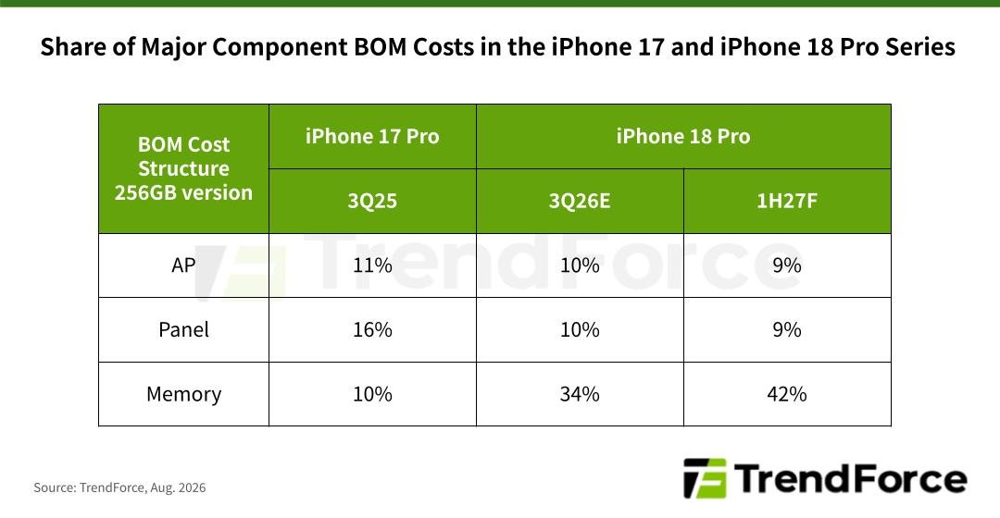

---

<!-- post_id: x:2086651134425571737 | ts: 1786331373 -->
## [X] 駿HaYaO · 2026-08-10 11:09

三井金屬宣布，2030年度前將投資合計420億日圓，增產AI資料中心等用途的高階銅箔，強化供應能力。

投資分配：
- MicroThin（超薄銅箔）：300億日圓
用於半導體封裝基板微細電路，全球市占近100%。產能較2025年度增六成，達月產800萬㎡，在埼玉上尾事業所與馬來西亞工廠擴產。
- VSP：70億日圓
用於印刷電路板，可降低傳輸損耗（伺服器、路由器等）。2030年前產能倍增至月產1,400噸，投資台灣與馬來西亞工廠。
- FaradFlex：50億日圓
用於電容器。產能提升4.7倍至月產35.5萬㎡，在馬來西亞、上尾擴產，並於台灣新建工廠。

公司預估2030年後需求持續成長，將進一步評估新工廠設立或透過併購（M&A）擴大產能。

https://t.co/heJnQSJbrX

---

<!-- post_id: x:2086634649317785681 | ts: 1786327442 -->
## [X] 駿HaYaO · 2026-08-10 10:04

PCB 產業摘要、開始覆蓋與更新

開始覆蓋與轉移 PCB 研究： 
• 開始覆蓋 金居（8358 TT／買進／目標價：NT$480）：股價自 6 月以來下跌 54%，4Q26 毛利率爬升、HVLP3/4 擴產，以及價格上漲。 
• 調升目標價：台光電（2383 TT／買進／目標價：NT$6,538）：Google 市占提升，產品組合升級至 M7+/M8+。 
• 調升目標價：建滔積層板（1888 HK／買進／目標價：HK$60.8）：電子玻璃布與 FR-4 漲價週期，高端銅箔產能擴張。 
• 調升目標價：臻鼎（4958 TT／買進／目標價：NT$729）：在 VR200 市占提升，藉助 MSAP 與 ABF 超級週期。

AI 伺服器 PCB： 
• Nvidia Vera Rubin：每顆 GPU 的 PCB 含量約 $750（對比 GB200 的 $400）。 
• Google TPU v8t/v8i：PCB 含量 $800–$1,000（對比 v7 約 $700）。 
• TAM 擴張：AI 伺服器 PCB 市場規模預計 2026 年達 $130 億，2027 年達 $290 億。 
• 臻鼎受惠於 Nvidia 平台市占提升 + mSAP 在光模組／CPO 的主導地位。 
• mSAP 短缺：2027 年因 800G 光交換與良率限制出現產能瓶頸。

CCL 動態： 
FR-4 價格自 2025 年中以來翻倍至約人民幣 300 元；上升週期延續至 2027 年底／2028 年。

上游供應短缺： 
• 電子玻璃布缺口：約 15% 短缺；需新增 3,000 台機器，但豐田年產僅 2,000 台（已排滿至 2028 年）。 
• HVLP4 銅箔：2026 年底產能約 1,200 噸／月，短缺超過 400 噸。

---

<!-- post_id: x:2086614916610588988 | ts: 1786322738 -->
## [X] 駿HaYaO · 2026-08-10 08:45

市場盛傳台積電擬買下鄰近中科廠區的友達L7廠（7.5代）與L5C廠（5代）兩座廠房，擴充先進封裝產能，交易估逾300億元，為近年本土面板廠舊世代廠房最高售價。雙方將比照「群創模式」，攜手發展先進封裝。

台積電與友達皆表示不回應市場傳聞。消息人士指出，洽談已進行中，台積電已派人實地稽核，但尚未簽約。

業界分析，先進封裝進入「以方代圓」時代，傳統圓形矽晶圓將被面板級玻璃基板取代。雙方聚焦扇出型面板級封裝（FOPLP）與CoPoS技術，結合友達玻璃基板優勢與中科地利，打造先進製程與封裝一條龍基地。

台積電規劃CoPoS為繼CoWoS後的下一代2.5D主力，解決超大型AI晶片在12吋晶圓的面積浪費、成本與翹曲問題。嘉義AP7首條產線已完工，初期以310mm×310mm面板切入，進入設備與材料測試驗證，預期約一年達技術與良率成熟。

面板舊廠因具備超大無塵室與穩定電力，成為先進封裝擴產搶手標的；面板廠亦可改造設備轉型生產半導體玻璃基板，切入高毛利AI供應鏈。

---

<!-- post_id: x:2086614543686684799 | ts: 1786322649 -->
## [X] 駿HaYaO · 2026-08-10 08:44

台積電積極推進CoPoS與COUPE矽光子技術，友達集團旗下富采、鼎元、環宇將扮演CPO助攻角色。

CoPoS以大面積玻璃基板取代傳統中介層，解決大尺寸AI晶片封裝限制，但高算力下電傳輸的散熱與能耗問題凸顯，CPO（共同封裝光學）成為關鍵剛需。台積電導入CPO進行光電融合，可突破熱能與頻寬瓶頸。

友達集團布局為「富采發光、環宇補強、鼎元感測、友達封裝」：富采主攻低功耗Micro LED近距離光源；環宇開發VCSEL與CW-DFB高功率長距離雷射；鼎元掌握高階PD與Micro PD，主攻800G/1.6T市場，具高響應與耐高溫特性。透過友達內部光電測試場域，在面板級玻璃中介層整合驗證，大幅縮短驗證時程，形成技術壁壘。

彭双浪處分非核心資產轉向光通訊模組。法人預期，隨台積電CoPoS與CPO生態推進，相關技術可轉化為量產，帶來新營收貢獻。

---

<!-- post_id: x:2086614127917814268 | ts: 1786322550 -->
## [X] 駿HaYaO · 2026-08-10 08:42

東芝公布2026年4-6月連結純利益4兆4673億日圓，年增約30倍。

主因AI需求推升鎧俠股價，認列再評價益＋出售益共6兆3294億日圓特別利益（大多為再評價）。鎧俠6月底股價較3月底大漲4.7倍，但8月已回落，下季可能認列評價損。持股由3月底17.59%降至7月中15.1%。

本業強勁：營收年增27%至9371億、營業利益年增2.8倍至1119億，雙創高。

AI資料中心帶動HDD與送配電設備需求，營業利益率升至12%。

公司表示已看到超越重建計畫（2027年3月期營業利益3800億）的水準，將加速能源與基礎設施成長投資。

https://t.co/IrRknFwuqM

---

<!-- post_id: x:2086607499504001376 | ts: 1786320969 -->
## [X] 駿HaYaO · 2026-08-10 08:16

早安！8/10 外電綜合整理

- 6213聯茂：亞系升評
兩家亞系升評，一家升目標。2Q毛利率優於預期。券商表示新擴產計畫帶來意外驚喜，加上中國及泰國的擴產計畫，今年底有望增6成產能。同時受惠於需求外溢與漲價效應傳導效應，預期3Q營收季增22%、毛利率升至25.2%，券商認為可持續轉嫁E-glass 漲價成本。M4／M6 等級 CCL 市占率持續提升中。後年鎖定CSP高階CCL。券商們評等現皆為正向。升評升目標。

- 9921巨大: 美系升目標
美系券商表示 2Q 獲利大幅優於預期，因來自毛利率改善幅度高於預期。其中包括新品上市帶動、OB（自有品牌）產品組合占比提高，以及歐洲與中國市場需求改善的支持，以及通路庫存健康。券商預期毛利率還有上行空間，2Q歐洲銷售恢復雙位數年增幅。最新預估26-28年EPS為$4.2/$6.2/$7.4，以18.5x NTM P/E評價，升評升目標。

- 6510精測：亞系首評正向
亞系表示供應鏈產能瓶頸迫使美國 AI GPU 巨頭將後段採購拆分（unbundle backend procurement），使中華精測得以解決交期限制。預期下一代GPU維持高市佔率，ASIC的TAM也在擴大，提供全棧式解決方案。券商考量all-in-house的商業模式，預估26-28年EPS為$61.2/$121/$152，初評給予正向評等。

- 2059川湖：美系升目標
美系直言羅馬不是一天造成的，券商預估3Q營收季增 81%／年增 348%。美國產能3Q投產，高雄新產能2H27上線。券商大幅上修26-28年EPS至$383/$502.8/$560，以明年30xPE評價，同步升目標。

- 3324雙鴻: 美系升目標
美系表示2Q26 毛利率反映了與新品爬坡相關的試產報廢損失以及存貨跌價準備。不過，預估3Q營收季增18%。加上液冷產品組合占比提高，預期將超過總營收6成。有望推升毛利率表現。預估26-28年EPS為$57.7/$78.5/$94，以明年20xPE評價，同步升目標。

- 6669緯穎：美系重申正向
2Q獲利超過美系預期，接下來觀察到AWS Trainium 3 伺服器開始爬坡，AMD放量及Google TPU潛在機會。重申正向。

- GB NVL72:
美系大行統計7月:
廣達出貨 2,200–2,250 櫃 GB200／GB300 機櫃、

緯創出貨 1,100–1,200 櫃 GB200／GB300 機櫃、

鴻海出貨約 3,600 櫃 GB200／300 機櫃。

全年預估為 8萬–8.5萬櫃。

- 2368金像電: 美系重申正向
營收QTD達成美系大行3Q預估數33%。券商預期專案（T3）開始爬坡，單月營收應維持高檔或持續月增，還有上修空間，重申正向。

 #下次會考

---

<!-- post_id: x:2086498447109341567 | ts: 1786294969 -->
## [X] 駿HaYaO · 2026-08-10 01:02

BofA最新全球記憶體更新：
1. SK海力士：2Q DRAM ASP僅+30% QoQ（同業45-70%），但3Q預期加速恢復至+25% QoQ，HBM4出貨增加。

2. 鎧俠（Kioxia）：3Q營收指引+35% QoQ，暗示NAND ASP近+20%（高於產業平均）。

3. 價格展望：預期4Q再有一輪臨時漲價；產業平均DRAM +8% QoQ、NAND +3%。之後至2027年價格穩定或輕微修正。2027年平均ASP仍高於2026年。2028年才開始下降（DRAM -8%、NAND -14%），但不會硬著陸，利潤率維持結構性高位。

4. 現貨價格：NAND現貨意外反彈5-6% WoW（傳統產品甚至+10%以上），DRAM現貨再+1-2%。供應偏緊，優於季節性。

5. 三星資本回饋：預期用2024-26 FCF的50%進行特別股息、回購及年底股息。SK海力士也預期返還50% FCF，更偏向回購。

---

<!-- post_id: x:2086497214277562631 | ts: 1786294675 -->
## [X] 駿HaYaO · 2026-08-10 00:57

1. AVGO 在訓練晶片具領先優勢
擁有最強的 TH6/Jericho SerDes + Switch，適合大規模（1,000–100 萬）XPU 全對全網路（200G/lane）。SerDes + ASIC + 先進封裝將主導 Google TPU「訓練」路線圖，ASP 約為 $15K（是一般的 2–3 倍）。

2. MediaTek (MTK) 可能拿下推理晶片
市場有人認為 MTK 會拿大 die 訓練晶片（EMIB 封裝），但 Mizuho 認為 MTK 更可能只拿推理晶片。MTK 的 SerDes 能力較弱，可能需要 Google/SMTC 支援，存在延遲風險。

3. TPU 出貨量大幅成長
- 基本情境：2028 年 Google TPU 總量達 18M+ 顆，AVGO 拿約 50% 份額（10–12M 顆），是目前的約 3 倍。
- 樂觀情境：可上看 35M 顆。
- v9/v10 預計會混合使用 AVGO 與 MTK，以平衡成本與性能。
- Google 採購承諾已大幅擴大至 $800B+。

其他重要驅動因素
- 先進封裝是關鍵：CoPoS（面板級封裝）與 EMIB-T 將解鎖更大光罩尺寸（10–14x 甚至更高），大幅提升產出與良率，同時降低功耗。
- 客戶管道擴大：除了 Google，還有 Anthropic、Meta、OpenAI、Apple 等，AVGO 在 AI ASIC 市場仍將保持領導地位。
- 財務影響：AI 營收高速成長（2027/28 年大幅上修），毛利率維持高檔（約 75%），支撐估值與獲利成長。

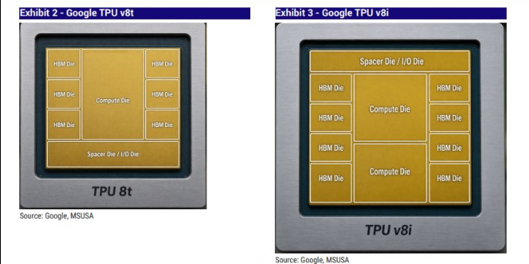
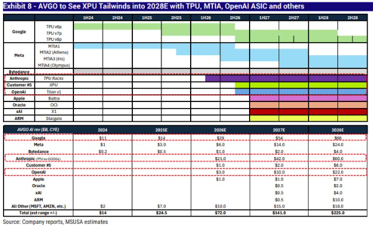

---

<!-- post_id: x:2086420821346844782 | ts: 1786276462 -->
## [X] 駿HaYaO · 2026-08-09 19:54

蘋果因AI熱潮導致內存芯片供應緊張，正測試中國長鑫存儲（CXMT）的DRAM芯片，涵蓋iPhone、MacBook等產品線。知情人士透露，蘋果已與長鑫初步洽談，擬用於中國市場部分設備，並尋求白宮許可。

蘋果全球漲價，因AI需求推高存儲成本。獲中國供應有助緩解壓力。惠普、宏碁已在美國以外設備採用長鑫芯片。

長鑫近期上海上市，市值約5200億美元，為大陸最高。美法規禁技術轉讓給長鑫（實體清單企業，涉軍關聯），阻定制芯片，但允許用現成組件並談價。蘋果或需特朗普政府批准，避政治風險。美方擔憂長鑫獲訂單將接觸美技術、助中國軍方，並衝擊美光在美建廠。

長鑫技術仍落後，產能今年已滿，難接新國際客戶。其價格與美光、SK海力士、三星持平或略高。Q2營收同比增逾7倍，市占約7%，優先供字節、騰訊、小米等。正建新廠，目標2028年產能翻倍以上。

---

<!-- post_id: x:2086405682904150489 | ts: 1786272853 -->
## [X] 駿HaYaO · 2026-08-09 18:54 _(接續 2 則)_

中國長鑫存儲（CXMT）DDR5晶片在AMD平台突破8800MT/s。

七彩虹iGame Shadow II記憶體（CXMT IC）於X870E主機板超頻：
2×16GB達DDR5-8812
2×24GB達DDR5-8817

亮點：
- 16GB模組也能跑到這麼高，難度高於常見的24GB（多用SK hynix M-die）。
- CXMT僅用16nm DUV製程（無EUV設備），技術落後三大廠數年，卻已快速追上高階超頻水準。
- CXMT 2025年底才推DDR5，現已被Asgard、Colorful、Gloway、KingBank等採用，Corsair也有使用；HP、Asus、Acer部分筆電/桌機也導入。

https://t.co/tbkmD873nS

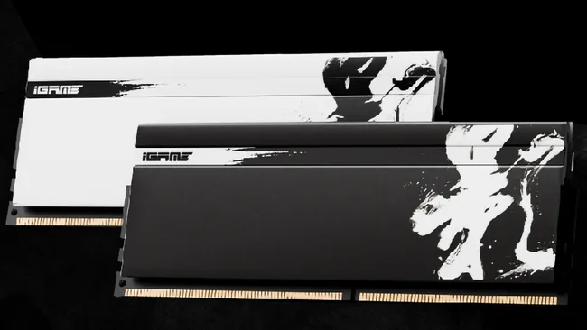

---

<!-- post_id: x:2086289290728964293 | ts: 1786245102 -->
## [X] 駿HaYaO · 2026-08-09 11:11 _(接續 2 則)_

ROHM 6963

FY2026 1Q 業績
（YoY）雖然因金價高企導致變動成本增加，但受銷售額成長及匯率日圓貶值效果影響，營業利益已從前一年度的損益兩平改善。
（QoQ）市場環境改善使需求旺盛，雖部分以庫存出貨因應，庫存影響呈現負面貢獻。但因銷售額增加及折舊負擔減輕，營業利益仍有所成長。

今後的庫存・稼動方針
產品庫存壓縮已完成。今後將配合需求增加提升稼動率。在製品及原材料的壓縮將持續推進。

SiC事業改善進度
以汽車用途為中心順利推進。雖然FY25期末發生的良率下降影響部分持續，但已於6月解除。預計2Q起收益性改善，全年計劃不變。

AI伺服器進度
雖以Si功率元件為中心表現良好，但因需求增加超出預期，出現超過生產產能的訂單狀況。將進行生產線切換、資源集中及增產投資，以因應未來進一步加速的需求。

事業・經營整合進度
正針對與東芝D&S半導體事業的整合進行盡職調查（DD）。與三菱電機功率元件事業的整合相關事宜也在並行協議中。

https://t.co/oPcfwX4arW

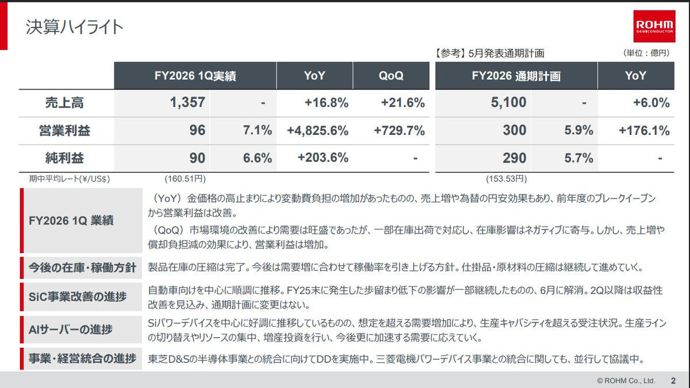

---

<!-- post_id: x:2086288458855895195 | ts: 1786244904 -->
## [X] 駿HaYaO · 2026-08-09 11:08

Intel 專利提出「雙層衛星網路」架構：
少數強大「軌道資料中心」衛星部署在較高軌道（MEO、GEO 或高橢圓軌道），負責路由、任務規劃、排程、頻譜分配與星座協調等重運算工作。下方數千顆簡易低地球軌道（LEO）衛星則專注通訊或感測任務，可大幅簡化設計、降低成本。

現行大型星座（如 Starlink、Kuiper）依賴地面資料中心計算指令再上傳，會產生延遲、增加地面站依賴，且星座越大管理越困難。Intel 方案把部分「大腦」移到太空，讓高軌道衛星能更持久俯瞰整個星座，減少往返地面的時間。

此構想與 SpaceX、Google 的軌道 AI 資料中心不同——後者是把 AI 運算本身放到太空；Intel 則是專為管理衛星網路本身。專利並未表示 Intel 已開始建造相關衛星。

優點：降低延遲、簡化 LEO 衛星、提升大規模星座可控性。
挑戰：維修困難、成本高、仍需部分地面站支援。

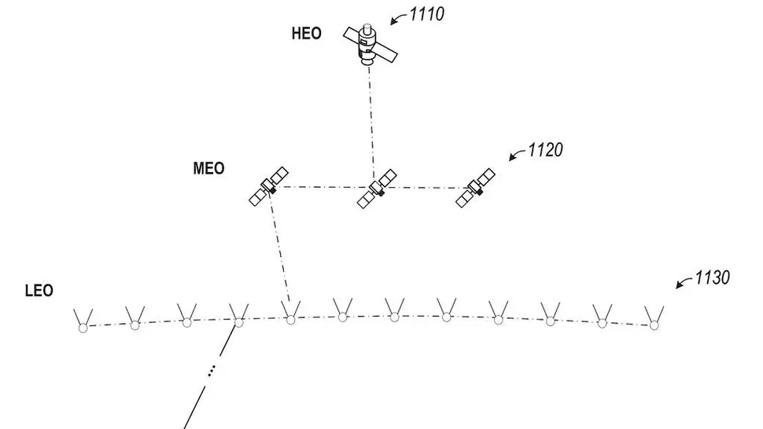

---

<!-- post_id: x:2086132344231166445 | ts: 1786207683 -->
## [X] 駿HaYaO · 2026-08-09 00:48

古河電工近日公布的業績預估修訂中，光解決方案與資訊元件兩大事業成為最大亮點。全年營業利益合計上修約280億日圓，光解決方案營業利益率目標提升至16%，展現出AI資料中心需求爆發下的強勁動能。

一、業績上修主因：價格、數量與產品結構
光解決方案全年營業額上修250億日圓、營業利益上修160億日圓。主要貢獻來自：
- 資料中心用產品銷售增加、產品構成改善與價格調整，上半期約35億日圓、下半期約55億日圓。
- 特殊光纖（含海底電纜）全年貢獻約45億日圓，幾乎全數來自數量增長。
- MT插芯增產效果全年約25億日圓。

資訊元件全年營業利益上修120億日圓，其中DFB與SOA等雷射晶片相關約55億日圓（主因增產）、銅箔約25億日圓（轉向高功能產品）。水冷冷卻零件本次並未額外上修，主因仍是DFB與銅箔。與前年第1季相比，光解決方案營業利益從負7億日圓翻轉為正92億日圓，改善約100億日圓，顯示公司已從虧損泥沼中完全走出。

二、產能投資與風險控管：1,000億日圓的「有保障」擴張
公司宣布1,000億日圓級的光纖・光纜產能投資，涵蓋從預製棒到拉絲的完整製程，目標將可捲式帶狀光纜產能（以光纖換算）提升至2倍。投資將集中在既有4個據點，並盡可能並行推進，預計2028年度下半期正式啟動。關鍵風險控管在於「採購承諾」機制。公司要求客戶對未來產品做出長期穩定採購的確約，雖未公開具體涵蓋率與契約細節，但強調已降低事業風險後才啟動投資。

目前光纖產能已接近需求上限，公司策略是抑制光纖外銷，專注加工成高功能光纜以提升附加價值。DFB產能則計畫較2023年度擴大超過5倍，並持續優化高收益產品組合。

三、水冷模組與價格策略：下半年加速
水冷冷卻零件已於6月正式投產，爬坡順利。本格利益貢獻預計從下半期開始，第3至第4季階段性擴大，全年約180億日圓的貢獻前提維持不變。公司明確表示「計畫無變更，客戶需求也無異動」，外界對啟動延遲的疑慮並不成立。價格方面，第4季仍持續談判，仍有進一步上調空間。目前預估僅反映第1季已可見的價格調整，未來追加漲價將在情況明朗後再納入，成為潛在上修。

四、市場展望與競爭態勢
海底網路市場預估未來3至5年仍將持續成長，特殊光纖增產效果將在2027年度起全年貢獻。針對中國可能增加光纖與晶片供給，以及美國潛在限制中國製收發器進口的風險，公司採取審慎態度：美國市場存在進入障礙，短期內中國產品不易大量流入；本公司則以光纜加工而非單純光纖外銷的策略降低風險。

---

<!-- post_id: x:2086106811137245574 | ts: 1786201596 -->
## [X] 駿HaYaO · 2026-08-08 23:06

$NET Cloudflare 2026 年第二季財報電話會議

Cloudflare 2026 Q2 營收年增36%，淨留存率120%，剩餘履約義務+38%，大型客戶+27%，新客戶與管道創5年最快增速。代理式AI正改變安全、雲端、開發者平台等競爭格局，需求廣泛涵蓋多領域與地區（美41%、EMEA30%、APAC32%）。企業重新評估Zero Trust、超大規模雲堆疊與傳統設備。

Cloudflare優勢在網路、安全、運算、身份與支付控制層，而非模型訓練。負面是基礎設施密集、消費驅動，毛利率年減320bp，全年Capex佔營收14-15%，波動增加。市場擴張正面，但傳統軟體高利潤與穩定訂閱假設受挑戰。

1. 代理優先安全重新開啟Zero Trust週期
AI代理成為SASE/Zero Trust新切入點。大型企業因需安全部署AI而接觸Cloudflare。英國政府機構重置第一代供應商採購，Fortune100以效能與整合取代兩家舊廠商。競爭從保護人類轉向自主身份、機器程式碼與代理通訊。Cloudflare可整合Workers等為單一架構，Zscaler若仍偏重人類存取將面臨市佔風險。近期看大型交易勝率變化；長期非人類身份可能超過人類，創造增量需求但改變產品架構。對NET正面高幅度，ZS負面中高幅度。

2. 雲端安全加速傳統設備取代
企業合約顯示平台整合擴至網路安全與開發者基礎。歐洲Global2000淘汰5-7個點解決方案；美國聯邦機構因中斷採用Magic Transit，規則變更從1週縮至30秒並關閉資料中心；Fortune100替換VPN與虛擬桌面。直接減少防火牆、VPN、負載平衡等設備需求與運維人力。F5最暴露（與全球前門重疊），Cisco與Fortinet部分受影響但有多元化。近期看續約與硬體更新；長期價值從硬體轉向全球政策執行，轉換成本上升。對CSCO/FFIV/FTNT負面中等。

3. 對Akamai與Fastly負面競爭解讀
Q2指標全面加速，企業與開發者雙輪驅動。應用安全作為入口，後擴Workers、Zero Trust等。競爭單位從CDN變為統一平台（交付+安全+運算+儲存），創造複合優勢。Fastly規模小、產品窄最暴露；Akamai有基礎但仍在關鍵領域被追趕。近期比較成長與預訂；長期獨立交付商品化，缺乏整合平台者定價權下降。對AKAM負面中、FSLY高幅度。

4. 零出口壓力超大規模雲經濟
多筆合約挑戰AI工作負載集中三大雲假設。生成式AI公司因出口費用選Cloudflare資金池；APAC與其他科技公司為延遲與選擇彈性選Workers。零出口使Cloudflare成為資料與編排層，即使推斷仍在超大規模雲。削弱資料重力與鎖定。影響目前小但策略大，可能導致市佔損失與定價壓力。近期看出口定價與多雲評論；長期GPU擁有與應用控制分離。對AMZN/MSFT/GOOGL負面近期低、長期中。

5. AI基礎設施價值在編排與利用率
管理層拒絕Capex軍備競賽，強調「營收不生而平等」，偏好共享基礎設施高利用率（宣稱可達10倍），而非為單一客戶買商品伺服器。對依賴大型take-or-pay但未披露利用率與現金轉換的模式負面。Oracle最相關；三大雲因多元而較低風險。近期看積壓品質（資本密集、折舊、現金流）；長期價值向排程、網路與編排遷移。對ORCL負面中、NET正面中。

6. 邊緣與AI平台利潤率更低波動更大
Workers與AI成長不同於傳統SaaS。毛利率73.1%年減320bp，因付費流量比例上升。全年Capex升至14-15%。營收轉向資金池與消費定價，波動增加。運算儲存重產品增量成本高，安全疊加則高利潤。近期看H2毛利與自由現金流；長期應以毛利、資本效率估值而非純SaaS倍數。對NET估值品質負面中，同業亦然。

7. AI輔助編碼創造開發者漏斗
Q2開發者超740萬，單季增近200萬（超全年2025）。歸因Lovable、Replit、Wix Base44等AI工具，非技術員工也能部署。對Wix正面（可交叉銷售），對Cloudflare高正面（低成本開發者變未來企業客戶）。近期看Wix Base44轉換與Cloudflare付費客戶+74%；長期軟體創作大眾化，利好簡單部署平台。對WIX中、NET高正面。

8. 安全代理部署利好系統整合商
合作夥伴佔營收31%，長期可超50-60%。大型SI對Cloudflare OS有興趣，重點在系統連接、權限、治理而非安裝。企業代理需大量整合（資料、身份、合規），利好Accenture、Capgemini等。近期看AI相關預訂；長期頂線正面但AI可能減少人力需求，利好轉型為加速器與結果定價者。對ACN/CAP中正面。

9. AI爬蟲改變網路經濟
超50%流量為非人類。5年3180萬美元媒體合約防刮取。推出Monetization Gateway與OpenAI試點。利好擁有差異化內容者（NYT、Reddit、News Corp、Thomson Reuters）可授權與計量。對依賴點擊與廣告者（搜尋廣告、Criteo）負面。近期看授權協議與流量；長期從隱性交換轉向明確授權，無差異內容者承壓。對內容方中正面、廣告依賴中長期負面。

10. 機器微支付需新軌道
Monetization Gateway支援代理支付網頁/API，單次可能低於一分錢。傳統卡網路（Visa/Mastercard峰值約2萬筆/秒）不適合高頻微交易，需錢包、預付或替代軌道。對卡網路近期低、長期低中負面；對Cloudflare長期選擇權正面但目前低。近期看產品採用；長期機器原生商業層出現，但主導權未定。

---

<!-- post_id: x:2086005915745231196 | ts: 1786177541 -->
## [X] 駿HaYaO · 2026-08-08 16:25

根據韓國媒體報導，韓國 PCB／基板製造商預計將把強勁的 Q2 業績延續至 Q3，進一步改善獲利。

例如：
- 大德電子（Daeduck Electronics） 營收 4,010 億韓元、營業利益 703 億韓元，分別年增 63% 與 3,599%。
- Simmtech 營收 5,146 億韓元、營業利益 629 億韓元，分別年增 51% 與 1,035%。
- TLB 營收 882 億韓元、營業利益 128 億韓元，分別年增 38% 與 86%。

各公司優勢：
- 大德電子：半導體封裝基板（FC-BGA／FC-CSP）及 AI 資料中心用多層印刷電路板（MLB）
- Simmtech：封裝基板與記憶體模組 PCB
- TLB：伺服器 DDR5 及企業級固態硬碟（SSD）用 PCB

值得注意的是，隨著包括台灣欣興電子（Unimicron）在內的主要廠商優先將產能分配給高附加價值的 ABF 基板，並縮減 BT 基板產能，市場推測部分訂單可能轉向生產記憶體與系統半導體用 BT 基板的大德電子與 Simmtech。

此外，SOCAMM 正成為另一個成長動能。隨著 NVIDIA 下一代 AI 平台（Vera Rubin GPU 與 Vera CPU）即將出貨，SOCAMM PCB 的需求前景強化，進一步提升供應相關產品的 Simmtech 與 TLB 的獲利預期。

---

<!-- post_id: x:2085986672475541539 | ts: 1786172953 -->
## [X] 駿HaYaO · 2026-08-08 15:09

J.P. Morgan《石油市場週報》
儘管2026年出現有紀錄以來最大規模的供應衝擊，尤其是與霍爾木茲海峽相關的中斷，油價卻僅呈現平均水準的上漲，這被J.P. Morgan形容為「奇蹟式復甦」。

報告指出，市場展現出遠超預期的適應能力，成功緩衝了巨大的供應缺口。主要原因並非單一因素，而是庫存、需求與供應三方面同時出現意外變化，共同抑制了價格失控上漲的可能。這顯示全球石油市場的彈性遠比傳統模型所假設的更高，也為未來油價走勢提供了新的觀察角度。

第一個關鍵抵銷因素是庫存消耗遠小於預期。
原本在供應大幅中斷時，庫存去化應成為推升油價最強力的來源，但實際數據顯示，庫存下降幅度明顯偏低。這讓市場少了原本預期的上漲動能。

第二個因素則是需求損失遠超預期，消費量約低於基線8億桶。
中國在此扮演重要角色，不僅大幅削減原油進口，還調整煉油操作至多數人難以想像的程度。其他地區也出現類似跡象，顯示全球需求彈性可能比傳統模型更高，能更快因應價格或供應變化而調整。

第三個也是最關鍵的因素，是非中東地區供應出現超預期大增。
三位數油價觸發了產量激增，遠超過J.P. Morgan模型原先假設的水準（原預期2026年布倫特均價約60美元）。2026上半年非OPEC供應同比增長達244萬桶/日，創下本十年最強步伐。主要貢獻來自美國增加90萬桶/日、巴西80萬桶/日、圭亞那30萬桶/日、加拿大20萬桶/日與挪威15萬桶/日，波斯灣以外整體超出預期約70萬桶/日，有效把桶油重新注入市場。
從3月至7月的具體數據來看，中東原油供應損失約達19億桶，相當於期間平均每天中斷1260萬桶。市場再平衡主要透過較弱需求吸收約8億桶，庫存消耗約6億桶（其中5億可直接追蹤），既有剩餘吸收約4億桶，其餘約1億桶則由非中東供應增加所填補。這些數字清楚說明，市場並非單純依賴單一機制，而是透過多管道同時運作，成功化解了史上最大供應衝擊的壓力。

展望未來，J.P. Morgan預期非OPEC供應增長在下半年及至2027年仍將維持穩固。美國方面，NGL與原油／凝析油持續貢獻，增長可能從峰值小幅降溫，但仍接近當前水準。巴西專案進度超前，Búzios系列提前啟動，動能強勁；圭亞那則有新產能（含FPSO）持續爬坡。

---

<!-- post_id: x:2085975868703400349 | ts: 1786170377 -->
## [X] 駿HaYaO · 2026-08-08 14:26

https://t.co/xVyIkchoVw

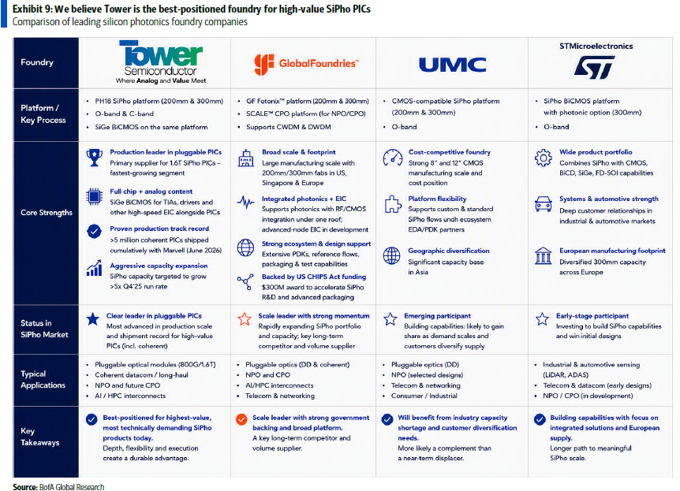

---

<!-- post_id: x:2085927802164162609 | ts: 1786158917 -->
## [X] 駿HaYaO · 2026-08-08 11:15 _(接續 2 則)_

台積電與國立陽明交通大學合作，在次1奈米電晶體技術上取得重大突破。

傳統FinFET／GaaFET電晶體在通道縮至3–5奈米時，閘極控制力下降、電阻上升。研究轉向二維單層電晶體，採用天然厚度僅0.7奈米的二硫化鉬（MoS₂）作為通道，可提升密度與控制力。

過去直接在MoS₂上沉積閘極介電層容易不均勻。台積電團隊改採新方法：先在MoS₂表面沉積超薄磊晶鋁，氧化形成0.42奈米氧化鋁緩衝層，再覆蓋高κ氧化鉿介電層。

此表面工程有效降低散射與電阻，使閘極控制能力達到相當於1奈米介電層的水準，為開發0.7奈米級以下通道厚度、推進次1奈米製程奠定重要基礎。

https://t.co/cWSFTm5K7D

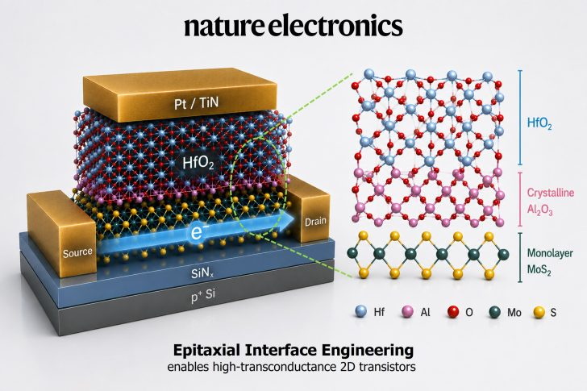

---

<!-- post_id: x:2085895815651107019 | ts: 1786151291 -->
## [X] 駿HaYaO · 2026-08-08 09:08

SemiAnalysis Weekly Ep.023

GPT-5回顧：早期版本（5與5.2）表現平庸，但5.6已達驚人水準。AI進步非線性，中間有漫長「平凡期」。提醒投資人與開發者勿對單一版本定論，持續迭代才是關鍵。

美國禁令悖論：Trump政府擴大對1.6T光收發器、人形機器人等禁令。過去針對落後競爭者，如今卻禁領先產品（機器人、無人機、太陽能、EV）。1.6T供應鏈幾乎全在中國，禁令可能傷美企更深。

記憶體短缺嚴重，Apple N2晶片因缺記憶體卡在倉庫；CXMT態度強勢，拒絕給Apple折扣。這也解釋Elon切入記憶體的邏輯——最快填補缺口變現。

Google人才逃亡：Jeff Dean（員工#30，MapReduce、TensorFlow、TPU關鍵人物）等人離開，Demis Hassabis轉董事長。Doug認為Google多靠收購（YouTube、Android等），像Bell Labs能發明卻不善商業化，恐錯失下一次技術變革。Jeff Dean被喻為「Google的Chuck Norris」，其全棧視角難取代，但Jon強調團隊結構比個人更重要。

Elon兆美元預測提前：SpaceX財報中，Elon將1T ARR目標從2031提前至2030；用電量2027年底從1GW衝至10GW，再至20GW。最快路徑是切入標準化、高毛利的記憶體市場。投資人相信他最終能做到。

https://t.co/VoEoLAkOpt

---

<!-- post_id: x:2085892689082618144 | ts: 1786150545 -->
## [X] 駿HaYaO · 2026-08-08 08:55 _(接續 2 則)_

美國商務部宣布，將禁止出口鎢廢料及電池廢料（即鋰離子電池粉碎後的「黑料」），自8月27日起生效，為期一年。此舉是川普政府推動國內回收產業與關鍵礦物生產的一部分，旨在減少對中國的依賴。

中國目前主導全球關鍵礦物加工，廣泛應用於電動車電池與武器系統。

此禁令源自川普上週簽署的行政命令，授權限制含有重要關鍵礦物的廢料出口至中國等地。豁免僅可個案申請，需證明「過度困難」或「無法彌補的損害」。

美國每月出口近3.3萬公噸電子廢料及其他廢料，內含可回收關鍵礦物。回收業界長期希望留在國內以提升產量，但美國回收產能不足，近期已有Li-Cycle、Ascend Elements等公司破產。

鎢回收業者Amermin讚揚禁令，但指出僅是「臨時措施」，需加速建設國內基礎設施。

https://t.co/8gy1rzoqJA

---

<!-- post_id: x:2085892137384862204 | ts: 1786150414 -->
## [X] 駿HaYaO · 2026-08-08 08:53 _(接續 2 則)_

川普總統與採礦業舉行會議，宣布超過20億美元關鍵採礦及相關項目投資，並投入超過1.8億美元於採礦學校，以振興產業並強化勞動力。

主要投資項目：
- 戰爭部：逾8,500萬美元投資Standard Bauxite（耐火級鋁土礦，支援戰鬥機高溫材料）
- 1.5億美元投資Niron Magnetics（明尼蘇達，100%國產無稀土永久磁鐵）
- 14億美元投資Sila Nanotechnologies（加州，擴建矽碳電池陽極與鋰離子電池廠，支援衛星、無人機、彈藥）
- 4億美元投資Sunrise Energy Metals（全球首座原生鈧礦，用於戰鬥機與太空船鋁合金）
- 進出口銀行：800萬美元給5E Advanced Materials（硼礦）；2,500萬美元給Westwater Resources（阿拉巴馬石墨）；2,500萬美元給Global Advanced Materials（鉭、鈮）
- 開發金融公司匹配480萬美元投資馬達加斯加稀土礦
- 能源部1億美元＋戰爭部逾8,000萬美元投入14所採礦學校與培訓中心

政策目標：
確保國內關鍵材料供應鏈安全，減少對敵對國家依賴，強化國防工業與經濟韌性。關鍵材料用於汽車、武器、手機等，必須從採礦到回收全面自主。這是120多年來最大規模採礦產業會議，川普政府自2025年以來已促成近400億美元礦產協議。

https://t.co/440ruvJ7OA

---

<!-- post_id: x:2085767898728165814 | ts: 1786120793 -->
## [X] 駿HaYaO · 2026-08-08 00:39

華為於2026年MWC巴塞羅那推出統一RAN Agent，透過A2A-T協議連接網路與業務代理，實現跨領域閉環優化。DTW 2026進一步以OpenAN開源專案佐證，匯集中國移動、Orange、華為等多家業者，加速AN L4自主網路落地。

演進路徑
- 2024：推出RAN智慧代理，結合電信基礎模型與RAN數位孿生（RDTS），協助規劃、故障診斷與參數優化。
- 2025：發展專用代理（如FaultSpirit、WattSpirit），實現單領域、單場景協同。
- 2026：統一RAN Agent整合Agentic MBB、Adaptive AI與A2A-T，支援全場景自主運作，邁向有限人工干預的L4級自主網路。

加速原因
AI流量改變網路模式（低延遲、互動性需求高），加上新頻譜與技術使營運複雜度大增，傳統規則自動化已不足。AI代理能感知、推論、決策並學習，建立真正閉環自優化系統。

產業意義與挑戰
焦點從概念驗證轉向規模部署與開源生態。A2A-T成為多供應商代理協作的關鍵協調層。挑戰在於標準化效益衡量、治理、安全與互通性。華為定位從自有技術展示轉向推動開放生態。

未來展望
下一波需求來自實體AI（自動駕駛、機器人、智慧城市）。自主網路將助業者從單純連線，升級為提供超低延遲、確定性效能的AI原生服務。開源與標準化將決定生態系能否從旗艦市場走向全面規模化。

---

<!-- post_id: x:2085767690187370518 | ts: 1786120743 -->
## [X] 駿HaYaO · 2026-08-08 00:39

AWS在2026年5月內部會議中，要求工程師全力節省計算資源，確保EC2雲伺服器能持續滿足所有客戶需求。節省範圍涵蓋傳統CPU伺服器容量，以及長期短缺的AI晶片容量。

目前工程師申請CPU資源需等待數天（過去僅數小時），可能延誤專案。公司已要求各團隊於今年晚些時候前削減用量，主要做法是關閉軟體開發後閒置的EC2虛擬伺服器實例，將容量重新分配給客戶。

背景是AI需求激增，算力緊張已從GPU蔓延至CPU、記憶體與資料中心空間。即使在AI開發中，CPU仍負責資料預處理等關鍵工作；企業使用AI智能體後，人均IT支出翻倍，進一步推高CPU需求。

AWS官方否認營運方式有重大改變，強調仍能滿足絕大多數客戶需求，並持續推廣高效使用EC2。建議若連續四周CPU與記憶體利用率低於40%，應切換至較小實例，並提供自動化掃描工具檢查閒置伺服器。

此現象反映AI熱潮下，雲端供應商普遍面臨的算力壓力，類似情況也出現在Google與Microsoft。

---

<!-- post_id: x:2085732618478502394 | ts: 1786112381 -->
## [X] 駿HaYaO · 2026-08-07 22:19

每個汽車與工業 IDM 現在都已轉向數據中心。
Microchip 的數據中心營收將在 CY26 年成長 69%，達到 10 億美元，已經超過汽車業務部門。在大多數這些 IDM 中，數據中心（DC）已經比汽車或工業部門更大。數據中心仍然是大多數這些 IDM 中成長最快的業務部門。想知道當汽車和工業週期達到高峰時會發生什麼，屆時將會有一場激烈的產能爭奪戰。像 TI 這樣的公司憑藉其內部晶圓廠和庫存處於有利位置。

---

<!-- post_id: x:2085704409359712654 | ts: 1786105656 -->
## [X] 駿HaYaO · 2026-08-07 20:27

Tower Semiconductor ( $TSEM )

BofA啟動Tower覆蓋，評級買入，目標價367美元（現價約225美元）。Tower為以色列高價值類比/混合訊號代工廠，主導AI資料中心SiPho PIC製造。

預估SiPho營收2026年翻倍，光學需求驅動2025-28年EBITDA複合增長62%，EPS高於共識。以20倍2028年EV/EBITDA定價，落在歷史區間。

需求大於供給
Tower在1.6T SiPho PIC擁有最清晰需求可見度與主導市佔。競爭對手加速擴產，但技術領先讓Tower可守住地位。產能擴張至本十年末，光學需求超供給。2028年指引有上修空間，受惠更高利用率與定價。

NPO與XPO加速內容
可插拔仍是主流，但NPO（2027年起）與XPO（2029年起）將放量，提升光學頻寬與TAM。NPO也可帶動Tower製造的SiGe EIC成長，進一步提高單機內容價值。

CPO隱憂被誇大
市場對TSMC COUPE搶佔CPO市佔的預期已大部分反映。Tower領先PIC平台與開放生態系定位，有機會在網路與ASIC客戶中贏得份額。NPO興起使CPO採用更為漸進。

---

<!-- post_id: x:2085701202243932372 | ts: 1786104891 -->
## [X] 駿HaYaO · 2026-08-07 20:14

Terafab （由 SpaceX 與 Tesla 共同推動）
地點：德州 Grimes 郡（SpaceX 擁有的土地）
規模：完成後總製造空間超過 1 億平方英尺（約 930 萬平方米），遠超現有半導體廠（例如三星平澤園區約 3110 萬平方英尺）
初始投資：第一階段約 168 億美元
製程技術：預計採用 Intel 14A 製程

主要用途
- 專門為 Elon Musk 旗下公司服務（不對外開放）
- 生產 AI 推論處理器，用於：
Tesla Optimus 人形機器人
Cybercab 自動駕駛車輛
SpaceX 太空數據中心的「高功率」處理器

- 目標滿足 SpaceX、Tesla、xAI 合計每年超過 1 太瓦（TW） 的運算需求（遠超目前全球供應）

特色設計
- 垂直整合園區：將邏輯晶片、記憶體、封裝、測試全部集中在同一地點
縮短生產週期
加快良率提升與迭代改進

- 預計由 4 座大型建築物 組成（用途是否分階段或分開尚不明確）
- 「1 億平方英尺製造空間」≠ 1 億平方英尺無塵室（實際潔淨室面積會小很多）

其他
- 就業：至少雇用 3,000 人，其中 60–80% 來自 Grimes 與鄰近 Brazos 郡
- 用水：使用 Gibbons Creek 水庫水源，不抽用當地地下水，並設有廢水處理與回收系統
- 前身：Tesla 已於 Giga Texas 北園區開工一座研究用半導體設施，作為 Terafab 的先行計畫

---

<!-- post_id: x:2085697326539288616 | ts: 1786103967 -->
## [X] 駿HaYaO · 2026-08-07 19:59

川湖Q2財報與7月營收亮眼，晉升「萬元股」。發言人王俊強表示，下半年營運優於上半年，能見度高，為台股最純AI股與IP股，具備堅實製造能力。2027~2029年產品創新性與技術門檻高，近1~2年專利佈局核心，毛利率持續正向，整體獲利可期待，看好程度高。

目前稼動率約7~8成，未來2~3年產能充足。美國新廠預計9月量產，明年下半年有川湖二廠。客戶全球超過百家、分散度高，能快速滿足AI伺服器半年至一年一變的新品需求。

Q2毛利率突破80%，源於1999年轉型後25年累積：從企業端→CSP→AI伺服器，技術領先。高毛利非一蹴可及，hyperscale資料中心仍以川湖產品為主，可靠度最高。

近月營收加速反映伺服器動能與新世代產品組合優化。導軌技術深但成本佔比低，川湖能提供高信賴度產品，2027~2029年贏面大。

川益三、五期總投資估達百億元、面積22萬平方米（前兩期11萬），將於今年底動工，較原規畫提前1.5~2年，資金以自有為主，下季法說會更新資本支出。

https://t.co/PZubmzFfPy

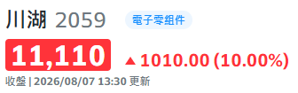

---

<!-- post_id: x:2085692511096607020 | ts: 1786102819 -->
## [X] 駿HaYaO · 2026-08-07 19:40

瑞銀預期：2027年上半年金價有望重返5000美元。

三大結構性支撐：
1. 實際利率下行
黃金不產生收益，實際利率下降會降低持有機會成本。瑞銀預期通膨逐步回落，聯準會2026年維持利率不變後，2027年重啟降息，有利黃金投資需求。

2. 美元走弱 + 多元化配置
美國龐大財政與經常帳赤字、投資者對美元資產已高配，中期美元存在走弱空間。歷史上美元走弱是黃金最強順風，去美元化趨勢也利好黃金。

3. 央行持續高位購金
今年第二季央行購金達289公噸，表現強勁。瑞銀維持全年購金量 750–1000公噸 預測。即便私人投資需求疲軟，央行需求仍提供穩固底部支撐。

BCA Research觀點
首席策略師 Noah Weisberger 表示：
- 金價上漲與金礦股走強，反映市場對通膨持續性及聯準會抗通膨能力的憂慮加深。
- 金價仍有進一步上行空間，甚至不排除再創歷史新高。
- 對聯準會主席提名人 Kevin Warsh 的公信力市場並不寬容，只要通膨持續，就會推升金價與金礦股。

金礦股機會
- VanEck Gold Miners ETF（GDX） 管理資產約254億美元，持有59只礦業股。
- 估值明顯偏低：滾動本益比14.1倍、遠期本益比10.4倍（對比標普500的28.1倍／20.2倍）。
- 許多金礦公司已改善利潤率與資產負債表，且與AI主題幾乎零相關，適合作為市場「壓艙石」分散風險。

https://t.co/VwVgrGqUM3

---

<!-- post_id: x:2085691368429510725 | ts: 1786102547 -->
## [X] 駿HaYaO · 2026-08-07 19:35

Nvidia 於2026年8月在FMS會議宣布，將cuFile API及完整儲存軟體堆疊開源，並交由Accelerated IO Special Interest Group管理，Google、Intel、Meta與Nvidia共同擔任創始維護者。

核心技術
cuFile讓GPU可直接讀寫儲存，無需經CPU中轉。原本GPUDirect Storage（2021）只移除資料路徑中的CPU，控制路徑仍由主機軟體負責。新框架SCADA（Scaled Accelerated Data Access）把控制權也交給GPU，讓GPU自行發出請求並處理完成，可同時維持數十萬操作，資料存取達微秒級。

實測數據
Micron測試顯示：一台伺服器搭配44顆Gen6 SSD、三顆H100 GPU，每秒可完成2.3億次512位元組隨機讀取（達硬碟額定性能95%），CPU幾乎閒置。小讀取最考驗系統，因固定開銷高，傳統CPU容易先成為瓶頸。

開源意義
官方理由是強化安全性與Linux互通性（使用標準權限機制）。策略上則是讓競爭對手也採用，使cuFile成為產業標準，而非Nvidia專有功能。同時推出Storage-Next倡議，聯合40多家儲存、控制器與標準機構，共同朝GPU主導的儲存架構發展。

此舉延續Nvidia一貫模式：找出晶片旁的瓶頸、寫出解決方案後開源給產業，類似當年CUDA的策略，強化其生態主導地位。
https://t.co/CXDHhxDPak

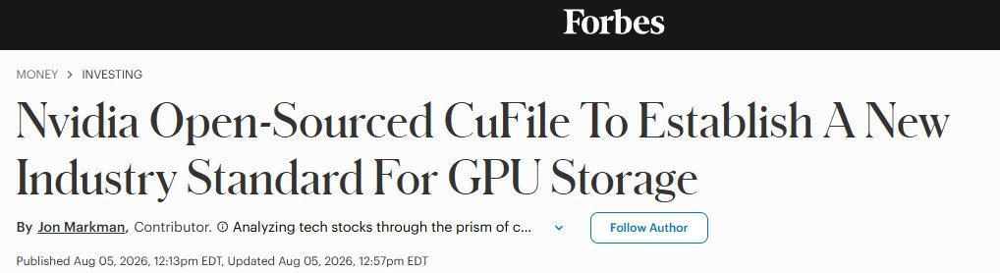

---

<!-- post_id: x:2085678716009726254 | ts: 1786099530 -->
## [X] 駿HaYaO · 2026-08-07 18:45

緯創2026下半年新增企業客戶HPE、聯想，CSP客戶外傳為甲骨文（Oracle），加上既有大客戶戴爾，客戶版圖擴大。新訂單含NVIDIA GB系列及新一代Vera Rubin，對營收獲利均有助益。

因記憶體與GPU價格上漲壓縮毛利，新客戶有機會將採購模式從Buy and Sell改為Consignment，爭取合理獲利率。

聯想AI伺服器手握210億美元訂單，需台廠協助，緯創成主要合作夥伴；甲骨文則從鴻海外擴至廣達、緯創等，加速資料中心建置。台灣ODM在AI伺服器代工優勢持續強化。

https://t.co/6e3S662cdV

---

<!-- post_id: x:2085663351246598172 | ts: 1786095867 -->
## [X] 駿HaYaO · 2026-08-07 17:44

瑞銀（UBS）開始覆蓋長鑫存儲（CXMT），給予「買入」評級，目標價人民幣70元，稱其為記憶體超級週期與中國半導體國產化雙重受益者。

分析師Jimmy Yu預期，這家中國最大的DRAM製造商，營收在2028年前將以75%的複合年增長率（CAGR）成長，受惠於產業至少到2028年第二季的供不應求，以及積極搶市佔。預估CXMT的DRAM位元供應市佔將從2025年約5.8%上升至2028年約10%，並日益轉向高價值的AI／數據中心記憶體，而非依賴消費性DRAM。

儘管CXMT快速擴產，瑞銀仍認為全球DRAM市場供應緊張。AI基礎設施、中國雲端需求以及更高的記憶體含量正在吸收新增產能，而CXMT本身預計將朝HBM發展，至2030年約佔其位元出貨量的7%。

因此中國國產化正成為更強大的競爭力量，但瑞銀目前尚未看到它會打破更廣泛的DRAM超級週期。

---

<!-- post_id: x:2085647456155713824 | ts: 1786092077 -->
## [X] 駿HaYaO · 2026-08-07 16:41

南亞科（2408）Q2法說

財報：Q2營收825.49億元（季增68.2%、年增684.2%），毛利率衝上79.5%新高（季增11.6個百分點），營益率73.7%。稅後淨利501.92億元（季增92.6%），EPS 14.66元；上半年累計EPS 23.07元。主因DRAM平均售價季增逾60%，銷售量與Q1持平。

AI伺服器進展：已切入伺服器供應鏈，上半年AI基礎設施及伺服器產品營收占比超過20%。持續供應DDR5、LPDDR5/5X等多元產品，並拓展客製化AI/WoW與高附加價值產品。

產能與技術展望：新廠第一階段月產能規劃3萬片，預計2028年開出；全產能4.5萬片，預估資本支出達新台幣4,800億元。第三至五代10奈米級製程（1C/1D/1E）及EUV研發按計畫進行。

https://t.co/934DjaOJqu

---

<!-- post_id: x:2085642853343232209 | ts: 1786090980 -->
## [X] 駿HaYaO · 2026-08-07 16:23

台灣測試耗材供應商追蹤指標持續發出相同訊號：需求強勁。真正的問題不是「今天夠不夠強」，而是「這股動能能否持續」。要判斷這點，必須往上多看一層——測試設備。

一個重要的細微差別：近期 ATE 營收加速，主要是由 SoC 驅動，而非記憶體。這很關鍵——如果記憶體測試需求增加，它不會只是疊加在已經健康的 SoC 市場上，而是會額外帶來第二條需求腿。探針卡以及其他耗材（如 load board、最終測試插座）將因此雙重受益。

Teradyne 也看到同樣的結構性轉變。他們指出：「在半導體設備（semicap）成長超過測試 TAM 長達十年後，這個趨勢在 2024 年逆轉——現在測試的成長速度已快於晶圓廠設備。」特別是記憶體的 book-to-bill 已超過 2，管理層預期 2026 年記憶體 TAM 將比 2025 年大逾 40%。

此外，Advantest 剛上修了 2026 年的 TAM 預估（相較於 4 月電話會議）：
- 記憶體：從 24.5 億美元上修至 27.5 億美元（+12%）
- SoC：從 91 億美元上修至 110 億美元（+21%）

觀察整體測試轉折最乾淨的方式之一，是看主要 OSAT 的測試資本支出。ASE 是很好的指標。第二季測試資本支出創下歷史新高，幾乎是前高的 2 倍。每月新增測試機安裝量也創下紀錄，大約是前高的 2 倍。

綜合來看：ASE 的測試機部署速度達前高的 2 倍、兩大 ATE 主要供應商都上修了記憶體與 SoC 的 TAM、Teradyne 記憶體 book-to-bill 超過 2。這一切都指向測試耗材將迎來另一波需求浪潮，而且是疊加在當前由 SoC 主導的週期之上。

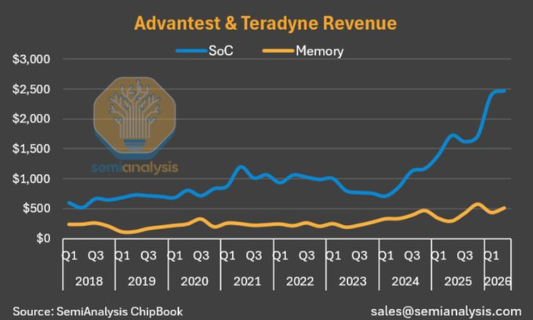

---

<!-- post_id: x:2085632659112501703 | ts: 1786088549 -->
## [X] 駿HaYaO · 2026-08-07 15:42

華邦電Module B投資

華邦電加速擴充高雄廠產能：既有Module A月產能由目前1.5萬片提升至年底2.4萬片；已啟動Module B計畫，預計2027年動工、2029年開始裝機，最終規劃月產能5萬～6萬片。投資金額龐大，將依客戶需求與長期合約分階段建置，目前已有客戶積極洽談2029、2030年產能。

Module B不會一次裝滿，參考同業4.5萬片約需3,500億元基準估算，實際金額視製程、設備及時程而定；EUV設備成本差異約5%，因交期長達3～3.5年，將於後續階段導入。初期先以一般設備建置，並視12/14奈米等先進製程進度擴充。

產能重心轉向高雄：台中廠DRAM月產能由約1.2萬片降至7,000片。高雄廠目前16奈米僅約2,000片，目標提升至約1.6萬片（占約三分之二），20奈米逐步下降，製程轉換配合客戶需求。16奈米利用率約80%，目標年底近90%；2027年Bit shipment可望倍增。

需求方面，AI、資料中心與Enterprise SSD持續升溫，2027年Enterprise SSD用DRAM業績占比預估由幾乎為零升至約10%。客戶對長期產能保障需求提高，已有策略客戶洽談2028年後LTA及Module B產能。公司預期2027年記憶體供需更緊，Module B將成未來承接AI需求的關鍵產能。

https://t.co/0IUqaLeDtP

---

<!-- post_id: x:2085626243794542784 | ts: 1786087020 -->
## [X] 駿HaYaO · 2026-08-07 15:17

SUMCO (3436)

3. 市場環境
■ 2026年第2季  
- 出貨量：300mm 晶圓出貨增加，受 AI 用領先製程邏輯與記憶體強勁需求帶動。200mm 晶圓出貨亦增加，受惠於 AI 資料中心相關需求。  
- 價格：長期合約價格獲遵守。現貨價格調整談判已開始。

■ 2026年第3季預測  
- 出貨量：AI 驅動的強勁需求將持續，300mm 晶圓以領先製程邏輯與記憶體為中心。非領先製程邏輯正隨著客戶庫存去化而步上復甦軌道。200mm 雖客戶與產品間有差異，但整體將逐漸復甦。  
- 價格：長期合約價格維持中。現貨價格調整動作正在進行。

■ 展望  
- 半導體市場預期將持續高成長，受持續強勁的 AI 相關需求驅動。  
- 矽晶圓市場方面，300mm 將因 AI 資料中心用領先製程產品而持續需求成長。200mm 及更小尺寸晶圓預期隨著庫存去化而逐漸需求復甦。

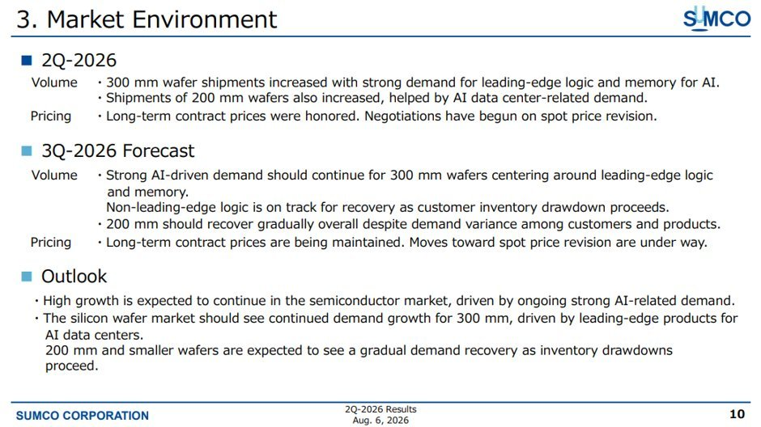
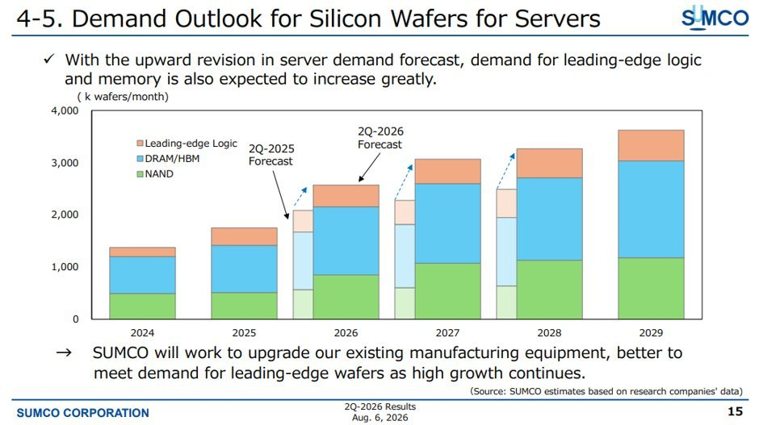

---

<!-- post_id: x:2085609886008901878 | ts: 1786083120 -->
## [X] 駿HaYaO · 2026-08-07 14:12

UBS：光纖

各代 GPU 的光纖連接
- Hopper 與 Blackwell：
兩者皆使用 100 Gb/s 的 SerDes 頻寬，每條通道需要 2 條光纖。然而，Blackwell 的 GPU 頻寬加倍（0.8 Tb/s），通道數也加倍（8 條通道），因此每顆 GPU 需要 16 條光纖，而 Hopper 僅需 8 條。

- Rubin 與 Feynman（2028）：
兩者皆升級至 200 Gb/s 的 SerDes 頻寬。Rubin 維持 8 條通道（每顆 GPU 16 條光纖），而 Feynman 則擴展至 16 條通道、每顆 GPU 32 條光纖，GPU 頻寬達 3.2 Tb/s。

Scale-Out 光纖需求展望
- 成長軌跡：
預估到 2028 年，整體 Scale-Out 光纖需求將以約 41% 的複合年成長率（CAGR）成長。

- 驅動因素拆解：
短期成長（至 Rubin 世代）主要來自整體 GPU 產量增加，而每顆 GPU 的光纖用量維持穩定。

2028 年隨著 Feynman 推出，將出現重大躍升，因每顆晶片光纖需求大增，加上其產量比重上升，帶動 Scale-Out 成長大幅加速。

Scale-Up 與 Scale-Out 網路
- 目前部署限制：
在現行 AI 架構中，光纖僅限用於 Scale-Out 網路（連接叢集內不同機架）。

- 銅線轉型：
機架內的連接（GPU 對 GPU）目前仍使用銅線。然而，當節點規模擴展至超過單一機架時，頻寬與距離需求增加，最終將促使這些銅線連結轉換為光纖。

$GLW

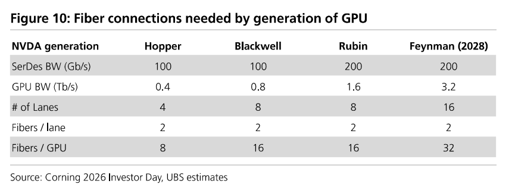

---

<!-- post_id: x:2085534609694196111 | ts: 1786065172 -->
## [X] 駿HaYaO · 2026-08-07 09:12

英偉達正權衡激進方案，考慮大幅削減新一代旗艦 Rubin Ultra GPU 的高帶寬記憶體（HBM）容量。原型機已出現記憶體配置明顯低於預期的版本，未來同一代產品可能推出多種不同記憶體規格。

減少記憶體可能影響單卡性能，但英偉達可透過提高時脈、優化封裝等方式彌補。對跑大型AI模型的客戶來說，可能需使用更多晶片才能達到原本效果，進而推高整體成本。記憶體供應商對此感到不安，擔心需求波動。

此舉並非首次：前代Blackwell B200最終記憶體也從更高規劃下修至192GB。目前相關決策尚未定案，內部仍在討論中，預計未來數月才會拍板。英偉達同時評估HBM3E與HBM4等不同封裝，並與三星、美光等供應商緊密合作，因應可能的供應瓶頸。

---

<!-- post_id: x:2085520193674211830 | ts: 1786061735 -->
## [X] 駿HaYaO · 2026-08-07 08:15

早安！8/7 外電綜合整理

- 2059川湖：歐系升目標
2Q毛利率刷新紀錄，亦公告7 月營收，QTD已達成歐系券商預估數65%，大幅優於預期。今日下午法說會，歐系大行已調升26-28年EPS至$301.4/$400/$470, 以後年的30xPE評價，同步升目標。

券商表示部分投資人一直擔心競爭，但從這幾個月來令人驚豔的上行表現來看，除了強勁拉貨高於預期外，顯著的技術差距與市場領先地位依然穩固。而且川湖還要持續擴產，券商表示強勁故事會延續下去。

- 6531愛普：美系升首選
美系大行將愛普升至首選「Top Pick 」，上修26-28年EPS至$17.7/$35.7/$65.2，同步升目標。

2Q財報優於預期，S-SiCap多項專案已展開，券商預期S-SiCap明年營收有望超越 IoTRAM。IPD進入量產，能見度看到後年。

- 2344華邦電: 美系重申正向
美系大行表示2Q獲利優於預期主要來自價格上漲，預期DRAM 與 SLC NAND/NOR 在下半年仍將持續具備定價能力，預期3Q OPM超過50%。同時還有擴產計劃，顯示    DRAM（16/14/12nm）、CUBE 與 SiCap 的需求依然強勁。

- 3363上詮：美系重申正向
美系券商表示7月營收年增率轉正，顯示高階patch cord 及光學元件已開始出貨，供應客戶的 CPO 交換器。券商更進一步預期9月營收會受惠CPO FAU出貨，營收月增率有望來到76%。更預估2H27再加速，同步推升毛利率表現，預估後年毛利率來到37.9%，重申正向。

- 2360致茂: 美系重申正向
營收QTD已達成美系3Q預估數的40%，表現優於預期。預期本季受惠SLT 與 CPO，券商認為還有上修空間，重申正向。

- 2345智邦: 美系升目標
美系表示2Q獲利優於預期，3Q成長動能來自 AWS T3 拉貨循環，營收有望季增超過25%。上修今明年EPS至$86/$113.5，同步升目標。

- 8046南電: 美系重申正向
2Q財報優於預期，美系表示2Q毛利率季增優於友廠，顯示的是以現貨價格為主的 ABF 廠商，其獲利擴張速度將優於以長約為主的業者。同時還有高階 CoPoS 載板新資本支出計劃，ASP佳將進一步穩定毛利率結構。預估3Q營收季增27%，重申正向。

- CCL: 月營收靚
美系表示台光電、台燿7月營收皆優於預期，主要受惠於高階 AI 產品需求遠優於預期及價格持續改善，重申正向。

- 2395研華: 美系升目標
美系大行預估3Q營收維持強勁，7月BB ratio上升至1.64，計畫下半年再漲價，上修26-28年EPS至$20.3/$23.8/$27，同步升目標。

- 3036文曄：美系升目標
美系認為AI 需求2H26轉強，4Q可望出現明顯季增，重申正向，並調高目標。

 #下次會考

---

<!-- post_id: x:2085519540600152314 | ts: 1786061580 -->
## [X] 駿HaYaO · 2026-08-07 08:13

Citi：光學
核心市場成長
- 市場機會：
全球光學互連市場預計到 2028 年將達到 920 億美元（3 年複合年增長率 65%），同時平均售價（ASP）複合年增長率為 18%。

光學晶片
- 光學晶片需求：
預計到 2028 年總需求量達 17.14 億顆（從 2025 年起複合年增長率約 62% 至 63%）。

- CW 雷射晶片：
預計到 2028 年將爆發性成長至 9.87 億顆（複合年增長率約 114%）。

- EML 晶片：
預計到 2028 年達到 7.18 億顆（複合年增長率約 34%）。

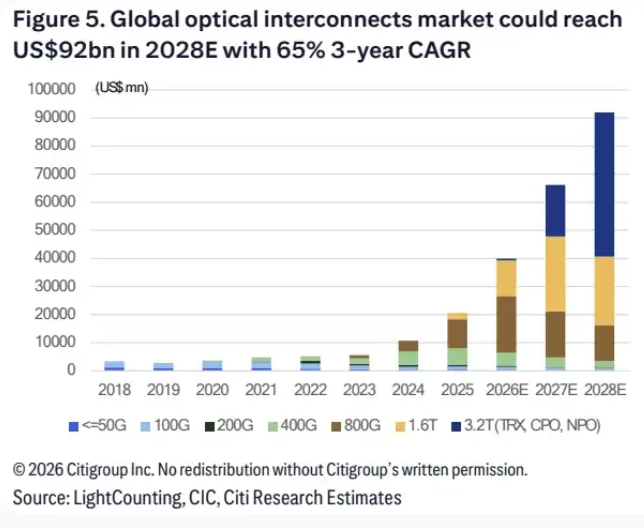

---

<!-- post_id: x:2085518282753261880 | ts: 1786061280 -->
## [X] 駿HaYaO · 2026-08-07 08:08

$AAOI | Applied Optoelectronics Q2 財報摘要
營收： 1.919 億美元（年增 86.4%）
GAAP 每股盈餘： ($0.28)
調整後每股盈餘： $0.06

業務重點：
- 連續第五季創下營收新高。
- Q2 恢復 non-GAAP 獲利。
- 800G 產品出貨量較上季增加一倍以上。
- 高速光學產品與 1.8 GHz CATV 產品需求強勁。
- 客戶對收發器與 1.6Tb 產品的興趣持續熱絡。
- 管理層預期需求將超過產能，直到 2027 年中。
- 製造產能已接近每月 20 萬件。
- 目標年底達到每月約 65 萬件 800G 與 1.6Tb 產品產能。
- 公司預期 2026 年營收將穩健逐季成長。
- 定位為 AI、雲端基礎設施與 CATV 市場的重要供應商。
- 報告中未提及任何庫藏股／回購計畫。

CEO 聲明：
「Q2 對 AOI 是關鍵的一季。我們連續第五季創下營收新高，並達成重要里程碑——恢復 non-GAAP 獲利。此外，800G 產品出貨量強勁成長，較上季增加一倍以上。高速光學產品與 1.8 GHz CATV 產品的大量採用，共同創造了本季優異的成績。我們持續看到客戶對 800G 收發器與 1.6 Tb 產品的強烈興趣，並預期需求將持續超越產能，直到 2027 年中。」
— Dr. Thompson Lin（創辦人、總裁暨執行長）

CFO 聲明：
「我們很高興交出符合或優於預期的第二季成績。Q2 期間，我們在產能擴張上持續取得良好進展，尤其是 800G 與 1.6Tb 產品。目前總製造產能已接近每月 20 萬件，並持續預期到年底可達到每月約 65 萬件 800G 與 1.6 Tb 產品的產能。我們仍預期今年營收將穩健逐季成長。」
— Dr. Stefan Murry（財務長暨策略長）

---

<!-- post_id: x:2085400825673965681 | ts: 1786033276 -->
## [X] 駿HaYaO · 2026-08-07 00:21

關於近期 LT 資本支出辯論與 NVDA 平台內容（遠離記憶體）的摘要

• 近期 CSP 財報資本支出回顧：Amazon 至 2,200 億美元、Google 1,950–2,050 億美元、Meta 1,300–1,450 億美元

• 美國 CSP 資本支出預測：2026/2027/2028 年分別為 0.8 兆 / 1.2 兆 / 1.4 兆美元（2027/28 年 YoY +45% / +20%），由健康的資產負債表支撐

• 預期資本支出增長將放緩至 2028/29 年 YoY +20% / +15%，因 CSP 優先考慮回報、自由現金流，以及 AI 模型競爭的不確定性

• 前五大債務發行額預估 2026/27 年為 2,570 億 / 4,190 億美元（佔資本支出 31–35%），仍屬可控

• 累計債務發行額至 2028 年可能達約 4,210 億美元，但仍有良好支撐

• 資產負債表保持非常健康（Oracle 除外）：至 2028/29 年淨槓桿僅約 0.5x（以 EBITDA 計）

• 淨債務權益比預估至 2029 年僅 18%，儘管資本支出沉重  

• 重申 7 月 2 日報告：Nvidia 削減記憶體——Vera CPU SOCAMM 從 192GB → 96GB → 選擇性 SKU 至 2027 年第一季降至 64GB

• Rubin Ultra HBM 從 384GB 下調至 192GB/256GB（HBM4/4E）；8-Hi 設計已定，但 12-Hi 仍在產品線上

• 競爭對手已採較低配置：AMD MI450 Custom 與 Google TPU Humufish 已是 8-Hi

• 透過 NVL576 搭配 NPO 光學擴大 scale-up，以抵消記憶體內容減少

• Nvidia 平台 OE 出貨量估計 2027/28 年為 580 萬 / 810 萬台

• 仍對 AI 趨勢正面；偏好 GPU / CPU / Optics，對記憶體大宗商品持謹慎態度  

推薦：
1. Nvidia GPU：NVDA（買進）、鴻海（2317 TT）、SMCI（買進）
2. CPU：INTC（買進）、AMD（買進）、日月光投控（3711 TT、ASX，買進）
3. Optics NPO：LITE（買進）、MRVL（買進）、SMTC（買進）、TSEM（買進）、貿聯-KY（3665 TT 買進）、波若威（3163 TT）

---

<!-- post_id: x:2085348691330875865 | ts: 1786020846 -->
## [X] 駿HaYaO · 2026-08-06 20:54

Viavi Solutions ( $VIAV ) Q4 FY2026 財報電話會議
核心結論
- AI 網路投資已從「半導體開發 + 超大規模架構設計」全面擴展到光學元件製造、生產測試、網路部署與現場監控。
- 排除 Spirent 後，資料中心業務年增超過一倍，是本次最重要訊號。
- 資料中心目前約佔 NSE 營收 50%（公司總營收約 40%），生產測試是增量成長最強來源。
- 實驗室 + 生產產品持續實現季對季絕對美元雙位數成長。
- 整體對光學元件、高速互連、800G/1.6T、CPO 相關供應鏈採建設性正面讀取。
- 週期比單一速度轉換更長（400G、800G、1.6T 將並存數年）。
- 主要風險：生產產能快速擴張，未來可能導致光學元件供應過剩與價格壓力。
- 無線業務仍無明顯復甦 → 通訊設備市場持續分化（AI 資料中心強、傳統無線疲弱）。

關鍵讀取（Read-Throughs）
1. AI 光學生產產能快速擴張（正面、高幅度）  
- 生產是最大成長動能，涵蓋光纖模組、光纖電纜、新興 CPO 測試。  
- 代表光學供應商正從「實驗室開發」進入「實際量產與產能安裝」。  
- 受惠公司：Coherent (COHR)、Lumentum (LITE)、Fabrinet (FN)、AAOI、Innolight/Eoptolink 供應鏈、Amphenol (APH)、Marvell (MRVL) 等。  
- 非共識點：最強成長在「生產」而非僅研發實驗室 → 更接近真實出貨與產能部署的領先指標。

2. 1.6T 快速爬坡，但 800G 不會突然斷崖（正面、中高幅度）  
- 目前 800G 仍是最大驅動，1.6T 正非常快速爬坡。  
- 預期 2027 年 1.6T 接近與 800G 平手，之後 1.6T 會更大。  
- 多個速度節點將長期並存（連 400G 也會持續一段時間）。  
- 有利同時暴露 800G + 1.6T 的公司，降低單一替換週期風險。  
- 受惠公司：COHR、LITE、FN、AAOI、MRVL、AVGO、CRDO、ALAB 等。

3. 光學模組產能擴張提高中長期供應過剩風險（負面、中等幅度、較長持續）  
- Viavi 生產測試強勁，直接反映「產能到位或產能被替換」。  
- 對測試設備是好事，但對光學元件/模組供應商而言，可能在 2027-2028 年出現過剩、利用率下降、價格壓力。  
- 近期仍偏正面（需求強、擴產積極），但需密切觀察交期、庫存、ASP、取消率等指標。  
- 受影響公司：COHR、LITE、AAOI、FN 及低成本亞洲模組廠。

4. 共封裝光學（CPO）進入早期商業部署（正面、高策略意義）  
- 管理層明確表示 CPO「正在進展」，已有 PO（採購訂單）證明，本季開始有初始營收，12 月季度預期加速。  
- 良率管理與測試複雜度上升（光學引擎、基板、整合組件）。  
- 受惠公司：AVGO（最直接）、MRVL、TSM、ASE、AMKR、COHR、LITE、TER 等。  
- 支持交換矽、光子學、先進封裝與測試需求。

---

<!-- post_id: x:2085342116503605668 | ts: 1786019279 -->
## [X] 駿HaYaO · 2026-08-06 20:27

Intel 下一代資料中心處理器 Diamond Rapids「Xeon 7」 首次現身。
在 SiSoftware 上被發現的早期工程樣品（搭載於 Johnson City 參考平台）規格如下：
- 32 核心
- 時脈僅 1.1 GHz（工程樣品）
- 64 MB L2 快取
- 240 MB L3 快取

這款 CPU 採用強化版 Intel 18A-P 製程（18A 的升級版），目前已進入風險量產。18A-P 相較 18A，在相同功耗下可提升約 9% 效能，或在相同效能下降低約 18% 功耗，並導入業界首創的 Power Boost 雙接觸電晶體技術。

Diamond Rapids 完整規格預計最高可達 192 核心，支援 PCIe Gen6、16 通道記憶體，並使用 LGA 9324 插座與 Oakstream 平台（支援最高 650W）。

對比競爭對手：
- AMD Zen 6 架構的 EPYC Venice / Verano 最高可達 256 核心，採用 TSMC 2nm，預計 2026 年底至 2027 年初放量，市佔有望突破 50%。
- Intel 目前 240 MB L3 快取已屬不錯水準（前代最高 288 MB），但整體效能與效率優勢仍偏向 AMD。

---

<!-- post_id: x:2085341374661243342 | ts: 1786019102 -->
## [X] 駿HaYaO · 2026-08-06 20:25

日東紡 Nittobo
2026年度第1季財報說明會
主要問答摘要
（舉辦日期：2026年8月5日）

Q：關於2026年度全年業績展望的上修。相較於5月時點的營業利益預估，「其他」項目的改善幅度較大，其內容為何？
A： 首先，原本未納入初期計畫的、以隔熱材料為中心的通用產品價格調整效果相當大。此外，也反映了複合材料擴大銷售的成效，以及中東情勢所造成的供應鏈混亂、導致生產與銷售減少的風險已有所緩和等因素。

Q：關於T玻璃，無論厚物或薄物，需求都進一步增強，供需已呈現緊俏。以目前至2028年的增產計畫來看，若供給仍不足，是否會考慮進一步設備投資？另外，若進行追加投資，是否會一併進行價格調整？
A： T玻璃的需求持續非常強勁。目前我們正穩健執行至2028年的產能增強計畫，只要需求持續，將持續優先把資源投入T玻璃。產能增強的方式包括產品置換、需要大規模投資等數種，我們會考量中長期需求展望，再決定今後的推進方式。若機會夠大，將毫不猶豫執行設備投資。至於價格調整，並不會與設備投資的決定連動，而是在設備投資完成、能夠增加供給量的時點再進行檢討。

Q：半導體封裝廠商開始採用日東紡以外的低熱膨脹玻璃，以及競爭對手正在增加產能，公司如何看待？請說明T玻璃的競爭環境。
A： T玻璃持續獲得強勁需求，但由於本公司增產效果尚未真正顯現，因此客戶開始嘗試使用其他公司的低熱膨脹玻璃，我們是有認知的。不過，在封裝基板所要求的高品質水準上，T玻璃的競爭優勢並未改變。今後我們會確實提升供給能力，以維持市場占有率。

Q：低介電玻璃的供需似乎逐漸緊俏，公司如何看待本期NER玻璃的銷售成長率？另外，供應鏈中似乎已有低介電玻璃布進行漲價，公司對價格調整的態度為何？
A： NER玻璃的需求以AI伺服器用途為中心持續成長，本期銷售數量預計將較前期大幅增加。關於NER玻璃的產能，由於無法直接切換至第2世代，將依照計畫階段性增加。至於價格調整，目前並無計畫在本期內實施。

https://t.co/efeFAQQd42

---

<!-- post_id: x:2085338697218863312 | ts: 1786018463 -->
## [X] 駿HaYaO · 2026-08-06 20:14

古河電工純利益上修，2027年3月期預估成長45%　光纜需求暢旺
古河電氣工業於6日宣布，2027年3月期合併純利益預估較前期成長45%，達1,050億日圓，較先前預期上修230億日圓。受生成式AI（人工智慧）市場擴大帶動，數據中心用光纖纜線等產品銷售優於預期。

純利益大幅高於事前市場預期平均（QUICK共識預估878億日圓）。股價在交易時段下午2時財報公布後一度急漲，最高達4,085日圓，較前日上漲166日圓（4%）；收盤則較前日下跌10日圓（0.3%），報3,909日圓。

營業收入預估成長17%，達1兆5,300億日圓；營業利益預估成長93%，達1,230億日圓。兩者分別較先前預期上修700億日圓及280億日圓。

依事業部門來看，包含光纜的光解決方案事業營業利益預估達430億日圓，較期初預期上修160億日圓。除光纜銷售增加及價格調整外，高獲利高性能產品銷售占比提升，進一步推升獲利。

最高財務責任人（CFO）青島弘治於當日財報說明會表示：「即使在光纖供給緊俏的情況下，仍有空間提高高性能產品的構成比。」

數據中心用光半導體相關產品等資訊元件事業的營業利益預估達510億日圓，較期初預期上修120億日圓，主要受數據中心用半導體雷射等產品銷售成長帶動。

該公司於4日宣布，將投入約1,000億日圓擴增光纖產能，投資據點包括美國、巴西及日本等地。以光纖量換算，產能將較2025年度末提高約2倍，預定自2028年度下半年起陸續開始量產。

數據中心用高性能光纜需將超過1萬條光纖束成一體製造。公司預期生成式AI普及將使需求持續擴大，青島CFO強調：「展望2028年度以後的光纜需求，光纖將出現不足」，因此有必要進行大型投資。

同日公布的2026年4至6月期合併財報顯示，營業收入較去年同期成長24%，達3,652億日圓；純利益成長至4.4倍，達222億日圓。

---

<!-- post_id: x:2085335058475622895 | ts: 1786017596 -->
## [X] 駿HaYaO · 2026-08-06 19:59

CoreWeave（Nasdaq: CRWV）於2026年8月5日宣布，與SK海力士旗下企業級儲存領導廠商Solidigm簽署多年戰略協議，取得企業級SSD優先供應權。

此舉旨在強化CoreWeave全棧AI雲端平台，確保存儲容量能與運算、網路等需求同步擴展。隨著AI工作負載爆發，儲存已成產能規劃關鍵瓶頸，產業供應趨緊。協議讓CoreWeave優先取得高容量企業級SSD，支援長期成長。

CoreWeave營運長Sachin Jain表示：「這讓客戶專注於創新，而非底層基礎設施。」Solidigm全球銷售高階主管Paul Palonsky則強調，長期供應承諾是超前應對需求的戰略優勢，並肯定CoreWeave的成長潛力。

雙方未揭露財務細節與具體數量，但延續既有合作基礎，有助CoreWeave在AI基礎設施競爭中穩固供應鏈優勢。

https://t.co/nGCP0jiT9u

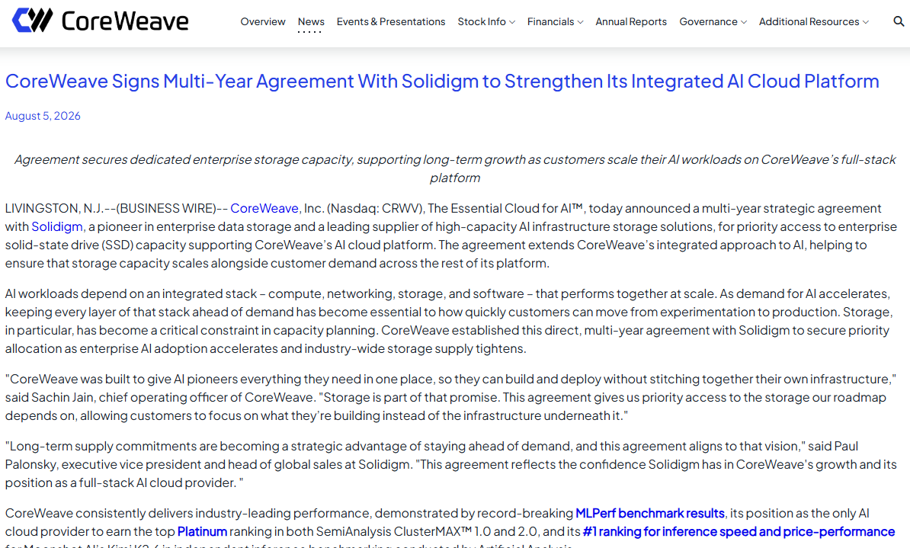

---

<!-- post_id: x:2085332002685747622 | ts: 1786016867 -->
## [X] 駿HaYaO · 2026-08-06 19:47 _(接續 2 則)_

TrendForce：中國在全球光模組代工製造市占率達56%，若受禁令限制短期供應鏈難脫鉤

TrendForce指出，美國FCC正研擬透過「受保護清單」限制中國製造的新型號光收發模組進口。草案尚未正式公開，「新型號」範圍、廠商認定標準及過渡期均待確認，現階段不宜解讀為全面禁用。

2026年中國光模組代工製造全球市占約56%，其中中際旭創、新易盛、劍橋科技等外銷型廠商合計約占46%。全球AI資料中心高度仰賴中國模組製造、封裝測試及磷化銦（InP）雷射產能，短期內美國客戶難以排除中國製造，供需缺口與成本壓力可能上升，甚至拖慢AI資料中心建置。

政策影響可能延伸至CPO、NPO光引擎及交換器供應鏈，關乎終端設備能否取得FCC授權及美系CSP是否移出中國供應商。美方或採「既有產品繼續使用、新型號加強審查」方式，長期將推動美國業者增加非中國代工廠，並加速採用新形態半導體光互連技術以分散風險。

中國廠商積極擴產，EML及CW Laser全球占比預估由2025年16.05%升至2028年27.58%，但在美政策壓力下，新增產能多只能服務內需，加劇價格競爭與過剩。一線代工廠須加速赴東南亞或美國設廠，並建立非中國關鍵零組件、可追溯原產地及獨立供應鏈體系，才能降低合規疑慮。

台灣半導體、封裝與系統廠商有機會憑藉矽光子、異質封裝及與美系ASIC/CSP整合優勢，成為串聯非中國光通訊元件的重要樞紐，協助降低對中國代工產能的依賴。

https://t.co/HdroNC33Mn

---

<!-- post_id: x:2085158594589479141 | ts: 1785975523 -->
## [X] 駿HaYaO · 2026-08-06 08:18

早安！8/6 外電綜合整理

- 5274信驊：美系重申正向
美系券商表示受惠於更佳的產品組合，以及 E-glass 與載板供應改善，2Q毛利率／營業利益率達72%／54%，優於券商及市場預期。隨著2H26的 AST2700 出貨提升、1H27的AST1040 新產品週期展開，以及年底進一步調漲價格，我們認為4Q26及之後仍有更多上行空間。也認為管理層之前給的3Q展望太保守，券商後續會有正面更新，重申正向。

- 半導體測試耗材 ：美系升旺矽目標、降穎崴目標
6223旺矽：
美系大行認為2Q強勁動能來自Trainium 3 與 Google TPU 快速放量，網通與 DDIC 亦有額外貢獻。預期3Q營收季增25-30%，加上全產品線漲價，預期3Q毛利率有望到達60%。上修26-28年EPS至$71.5/$160.5/$319.3，以明年50xPE評價，同步升目標。

6515穎崴：
券商表示儘管2Q初步營收符合預期，但毛利率可能低於 40%，原因可能是智慧手機產品比重較高；券商降持續關注低階機種需求、更高的 MEMS Probe Card 貢獻，以及新產能爬坡期間的不良品報廢。預估3Q營收季增超過2成，2H毛利率回升至43-45%，但考量毛利率不穩定影響（unstable GM impact），下修今年至$89.2，微幅上修明後年至$208/$439，以明年31xPE評價，同步降目標。

- 2345智邦: 美系重申正向
美系大行從Arista財報解讀：2Q財報優於預期，調高全年財測目標。券商表示 Arista 對 AI 與企業網路交換器需求持續增強的評論，對同業智邦具有正面意義，重申正向。

- 3665貿聯：月營收靚
美系大行表示營收QTD達成率38%，表現優於預期。重申資料互連、電源互連受益AI及一般性伺服器出貨增加，重申正向。

- 3324雙鴻: 7月營收新高
美系券商表示7月營收創歷史新高；預期3Q展望優於預期，仍有進一步上修空間。

- 3211 順達：美系重申正向
美系表示拆解7月營收裡BBU 營收約達新台幣6億元，較6月約2億元成長三倍，顯示恢復動能，下半年持續放量，重申正向。

- 全球PCB/ CCL: 美系上修
美系券商上修全球 PCB／CCL：2027年 TAM 預估分別上調38%／18%。反映反映 AI 伺服器機櫃帶動規格提升。，包括導入 M9 材料、7層／8層 HDI，以及30層以上 PCB。

 #下次會考

---

<!-- post_id: x:2085158411012878589 | ts: 1785975480 -->
## [X] 駿HaYaO · 2026-08-06 08:18

$SNDK 財報電話會議的指導意見評論：
- 「NAND 市場在 2026 日曆年的收入將超過 3000 億美元，同比增長 3 倍。」
- 「NAND 市場在 2027 日曆年的收入將接近 5000 億美元。」
- 「數據中心佔總收入的份額將從 2025 年的約 30% 擴大到 2026 年的約 50%，並在 2027 年繼續跑贏市場。」
- 「我們客戶的需求增長速度快於我們的供應。」

---

<!-- post_id: x:2085157656285630536 | ts: 1785975300 -->
## [X] 駿HaYaO · 2026-08-06 08:15

Infineon QJun26
- 營收季增 9%、年增 13%，達歷史新高 €4.172B，是 2.5 年來首次單季突破 €4B；QSep 指引 €4.7B，季增 13%、年增 19%
- FY27 AI 預估 EUR 2.5B+，將於 11 月「大幅」上修
- AI 資料中心營收上修至 FY26 >€1.6B（原 €1.5B），年增超過一倍；基準為 FY25 >EUR 700M、FY24 EUR 250M，三年成長超過 10 倍
- CPU 伺服器營收 €500M，使 FY26 達 €2.1B+

- 已進行兩輪漲價；FY26 資本支出：€2.7B
- AI 電源含量為每 kW USD 100-250，目前平均 USD 175/kW
- Infineon 在 AI 電源領域處於配額（allocation）狀態
積壓訂單季增 20% 至 €30B
- 與超過 10 家 AI 客戶簽訂多年產能預約協議，涵蓋累計高個位數十億歐元營收規模，並附帶預付款
- FY26 營收現指引約 €16.3B，約成長 11%

---

<!-- post_id: x:2085156901273419878 | ts: 1785975120 -->
## [X] 駿HaYaO · 2026-08-06 08:12

$SNDK | Sandisk Q4 財報：
營收：$8.97B（年增 372%） | GAAP EPS：$43.97 | 調整後 EPS：$39.25

 業務亮點：
- 簽署了 五份額外的 NBM 協議，其中包括三名新客戶。
- 自 4 月財報電話會議以來，NBM 協議總數達到 10 份。
- 董事會批准了額外的 $14B 股票回購。
- 剩餘回購授權額度增至 $15.5B。
- 2026 財年營收成長主要來自 更高的定價 與更高價值的客戶組合。
- 2026 財年 數據中心營收年增 437%。
- Q4 環比營收成長中，三分之一來自出貨量，三分之二來自定價。
- 公司在 2026 財年結束時擁有 領先的 NAND 技術組合。
- 數據中心已確立為 關鍵成長支柱。
- 管理層強調專注於 成長且可持續的自由現金流。
 
CEO 聲明：
「我們以領先的技術組合結束了 2026 財年，將數據中心確立為關鍵成長支柱，並深化了與客戶的合作關係。我們的技術與產品已準備好為客戶創造價值，並產生成長且可持續的自由現金流。」
— David Goeckeler，董事長兼首席執行官

---

<!-- post_id: x:2085051513949589822 | ts: 1785949993 -->
## [X] 駿HaYaO · 2026-08-06 01:13

摩根士丹利：通往 25-50% 生成式 AI 投資資本回報率（ROIC）的路徑

生成式 AI ROIC 框架與單位經濟學

儘管 AI 資本支出與模型訓練花費急劇上升，摩根士丹利仍對長期 ROIC 保持樂觀，並提出三個由下而上的框架，指向具吸引力的 25% 至 50% ROIC：

超大規模業者 GPU 租賃（IaaS）：估計可產生約 60–70% 的增量 EBIT 利潤率，以及 30% 以上的 ROIC。基準情境分析假設部署於 NVIDIA GB300 晶片、75% 利用率，以及每小時 8.50 美元的租賃價格。

模型驅動的 API（自有基礎設施）：估計可達到約 70% 以上的增量 EBIT 利潤率，以及 40% 以上的 ROIC。關鍵成功驅動因素包括代幣定價、代幣吞吐量（每 GPU 每秒代幣數），以及管理將運算容量投入訓練與產生營收的推論之間的取捨。

模型驅動的 API（第三方基礎設施）：估計可產生約 30% 的增量 EBIT 利潤率，以及約 25% 的 ROIC，已計入租用第三方運算容量所支付的「中間商利潤」。

生成式 AI 採用的關鍵結構性趨勢
成本效率 vs. 營收成長：摩根士丹利的全球 AI 股票地圖顯示，近八成的短期 AI 效益來自成本效率，而非立即的營收成長。AI 採用者的 EBIT 利潤率顯著擴大，成長速度約為整體 MSCI 世界指數的兩倍。

收益預期修正分歧：自 2023 年底以來，成功採用 AI 的全球公司（「AI 採用者」）的前瞻收益預期，已以約 2 倍的幅度超越受衝擊的同業，具體的生產力提升與利潤率擴張已反映在財報上。

「賦能者」分歧：與一般企業採用者不同，AI 賦能者（如基礎設施供應商與資料中心晶片製造商）更偏向營收成長，約 71% 的主要效益來自高需求硬體與雲端運算銷售所帶動的營收擴張。

---

<!-- post_id: x:2084993915623702600 | ts: 1785936261 -->
## [X] 駿HaYaO · 2026-08-05 21:24

鑑於純設計服務廠商（如創意電子 GUC、世芯 Alchip）近期釋出正面評論，市場上有些擔憂認為 TPU v10 會改採更先進的 CoT 模式，導致聯發科（MediaTek）每顆晶片的美元內容價值（$ content）相較於 v9 Humufish 大幅下滑。

首先，這個專案目前仍處於 RFQ（詢價）階段，意味著有多家競爭方案正在提出，預計要到 2026 年底才會有結論。
根據我們的查證，v10 Icefish 的商業模式很可能大致維持與 TPU v9 Humufish 相似：
- 高速 SerDes、I/O Die、Die-to-Die 互連 IP
- 封裝設計與全晶片實作

這些部分仍由聯發科負責，而 Compute die（運算核心晶粒）的設計則主要由 Google 內部設計團隊處理。
唯一可能的變數，是 Compute die 的後端設計（back-end design），某些特定 SKU 可能會外包給純設計服務廠商（如 Alchip / GUC），但根據我們目前的查證，這尚未定案。

綜合以上，我們認為聯發科在 v10 每顆晶片的美元內容價值仍有望溫和上升，並有機會拿下多數市占，意味著整體營收仍會較 v9 世代明顯成長。

---

<!-- post_id: x:2084993199215620440 | ts: 1785936090 -->
## [X] 駿HaYaO · 2026-08-05 21:21

特朗普政府正準備對多晶矽及相關產品設定「最低進口價＋關稅」混合制度，預計本月晚些時候公布，依據《1962年貿易擴展法》第232條國家安全調查結果。

此舉旨在保護美國本土多晶矽工廠（Hemlock Semiconductor、瓦克化學），對抗中國憑藉補貼與產能過剩主導全球市場的局面。Hemlock 在密歇根州運營工廠，是康寧與日本信越半導體（4063.T）的合資企業。

多晶矽是太陽能電池板與半導體晶片的上游關鍵原料，政策同時影響太陽能與人工智慧晶片供應鏈。

路透社報導後，康寧（GLW.N）、Toyo（TOYO.O）、T1 Energy（TE.N）以及包括第一太陽能（FSLR.O）等美股太陽能股大漲。中國大使館批評調查，敦促美方停止232關稅措施、透過對話解決。

政策設計上可能允許在美國投資硅片、電池片產能的進口商抵消部分成本。業界警告：雖有助國內生產商，但將推高太陽能開發商與晶片買家成本，恐導致項目擱淺或終端產品漲價，太陽能產業可能成「附帶損害」。

---

<!-- post_id: x:2084987342809690301 | ts: 1785934694 -->
## [X] 駿HaYaO · 2026-08-05 20:58

GF Securities：光學

強勁需求預測：
受 Nvidia、Google、AWS 及其他 ASIC 加速器需求拉升，以及 GPU/ASIC scale-out 頻寬與光模組比例上升帶動，預計 2027 年 800G/1.6T 總需求將分別達到 8000 萬顆。

CPO/NPO 採用時程：
CPO 與 NPO 在下一代基礎設施中並行發展。CPO 是長期設計方向，著重於更低功耗與延遲；NPO 則在短期內具備更好的可製造性與部署彈性，預計約 2027 年下半年開始導入。

Nvidia 架構轉變：
每顆 Rubin GPU 配備兩顆 CX9 NIC 晶片（相較 Blackwell，scale-out 頻寬倍增）；Rubin Ultra 估計每顆 GPU 採用四顆 CX9 晶片，使 1.6T 光模組比例從 1:2.5 提升至 1:5。

Google 的 Scale-Up 與 Scale-Out 轉型：
預計 Google 將在 2026 年全面轉向大規模叢集，其中 scale-up 層採用光學互連，整體 TPU 對光學比例約為 1:4（以 1.6T 等價計算）。

供應鏈與元件價值影響：
NPO 將訊號調節轉移至系統設計，使每顆 3.2T 光學引擎的 TIA 與雷射驅動器價值提升至數十美元，有利於 Marvell 與 SMTC 等供應鏈業者。

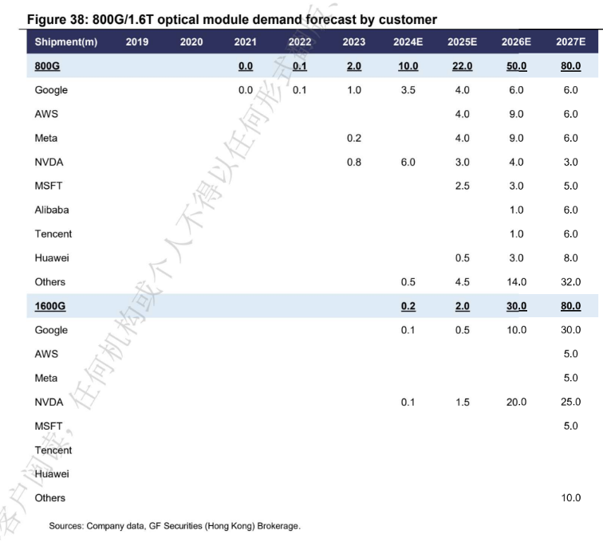

---

<!-- post_id: x:2084986909525180820 | ts: 1785934591 -->
## [X] 駿HaYaO · 2026-08-05 20:56

AI光學背後的InP（磷化銦）短缺情況開始緩解。聯亞光電（3081 TT）與全新光電（2455 TT）這兩家為800G與1.6T光模組內部雷射層進行磊晶成長的磊晶代工廠，7月均創下營收紀錄。

聯亞光電營收年增176.5%，前七個月累計成長120.9%。公司剛與住友電工簽訂五年期InP基板供應協議，並投入4,400萬美元擴充新產能。

全新光電營收成長45.1%，並表示已鎖定來自AXT的基板供應。

AXT本身在第二季報告InP營收創下3,070萬美元紀錄，並計劃到年底將季度產能提升至約6,000萬美元（三倍），到2027年底再翻倍至約1.3億美元。

Lumentum與Coherent都曾表示雷射供應限制了其成長。磊晶廠預期下半年旺季到來時，InP基板與磊晶價格將再一波上漲。

---

<!-- post_id: x:2084972981558894603 | ts: 1785931270 -->
## [X] 駿HaYaO · 2026-08-05 20:01

太陽誘電（ Taiyo Yuden ）因AI數據中心對高端MLCC需求激增，將全年營業利潤預期上調50%至450億日元，遠超分析師平均預估的413億日元。

公司同步加快產能擴張：今年資本支出上調至420億日元（原計劃400億），並提前啟動馬來西亞工廠新廠房建設，預計2028年完工。

其產品高度集中於高端MLCC，訂單勢頭強勁，顯示全球雲服務商需求將進一步擴大。村田製作所同期MLCC訂單出貨比達1.47，印證行業熱度。

即使大型客戶可能因供應擔憂而提前囤貨，公司仍預期AI相關MLCC需求至少持續強勁至下一財年。

---

<!-- post_id: x:2084972590884647342 | ts: 1785931177 -->
## [X] 駿HaYaO · 2026-08-05 19:59

Ayar Labs 執行長 Mark Wade 向 DIGITIMES 表示，AI scale-up 互連中的共封裝光學（CPO）將在 2028 年至 2029 年初達到大規模採用。

$NVDA 的 CPO 交換器今年開始出貨，但那些是用於 scale-out。

機架內的 scale-up 流量目前仍使用銅線。Wade 表示，2026 年和 2027 年是製造業基礎建設期，重點在生產部署、現場可靠性數據、良率，以及合格的組裝與測試產能。到 2030 年，他預期基於 CPO 的光學互連將成為 scale-up 系統的標準基礎。

該公司的光學引擎 TeraPHY 可接入目前成形的三大 scale-up 生態系統：NVLink Fusion、Ethernet 與 UALink。Wade 預期這三者都會大規模部署，沒有單一贏家。

他提到的製造鏈經過台積電 $TSM、ASIC 設計公司創意電子（Alchip，3661 TT）與世芯-KY（Global Unichip，3443 TT），以及伺服器製造商緯穎（Wiwynn，6669 TT）。Ayar Labs 正在擴編新竹團隊，以便更接近合作夥伴的生產線。

---

<!-- post_id: x:2084972114944393521 | ts: 1785931063 -->
## [X] 駿HaYaO · 2026-08-05 19:57

Marvell Bravera SC6 

Marvell $MRVL 於 2026 年 8 月 4 日 FMS 2026 發表 AI 記憶體基礎架構新品，核心為 Bravera SC6（MV-SF1410）PCIe Gen6 SSD 控制器。

核心亮點：
- 專為 AI 推論優化，讓更多 KV Cache 從昂貴 HBM 轉移至 SSD，提升基礎架構效率、降低寫入放大並延長 NAND 壽命。
- 效能為上一代 Bravera SC5（PCIe Gen5）的 2 倍。
支援 PCIe Gen6（向下相容 Gen1–5）、NVMe 2.2，單埠四通道。
- 採用 NAND-agnostic 架構，相容多家廠商 SLC/MLC/TLC/QLC，方便超大規模雲端與 OEM 彈性採購部署。
- 預計 2026 年第四季開始送樣。

同時發表 Structera X（機架級 CXL 記憶體擴充與池化）與 Photonic Fabric（Pod 級光學共享記憶體，跨機架最高 50 公尺、支援最高 32TB 暖 KV Cache 卸載，聲稱可提升 2–3 倍 token 吞吐量）。

整體目標是讓記憶體更獨立於運算擴展，減少 GPU 停滯、提高利用率與 token 效率，協助超大規模業者因應大型模型與長上下文需求。

https://t.co/ti9q5pdbWJ

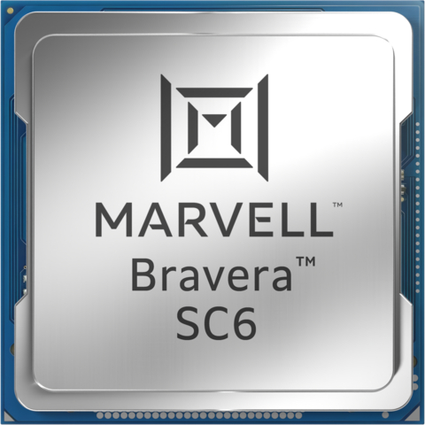

---

<!-- post_id: x:2084971410813022615 | ts: 1785930895 -->
## [X] 駿HaYaO · 2026-08-05 19:54

研華2026年Q2
研華法說會公布Q2合併營收261.26億元（季增28%、年增46%），毛利率37.7%，營業利益率19.6%，稅後淨利45.18億元（季增36%、年增127%），EPS 5.2元，營收與獲利均創同期新高。上半年營收465.12億元（年增32%）、淨利78.52億元（年增66%）、EPS 9.05元。

董事長劉克振指出，受惠全球客戶加速AI布局，上半年續創新高。
公司積極推動 IWS（Integrated WISE Solution & Station）軟硬整合平台，整合邊緣AI設備、軟體與產業應用，提供一站式解決方案，加速AI Agent在智慧工廠等場域規模化落地，縮短導入時程並降低複雜度。

財務長陳清熙表示，Q2 B/B值達1.44（北美1.92、歐洲1.25、中國1.21），日、韓、台市場也維持1以上，接單穩健。展望Q3，接單與Design win維持高檔，營收可望年、季雙增，毛利率與營業利益率持平上季。

事業群主管指出，半導體設備、AI資料中心、智能電網進入長期成長，持續深化智慧製造、醫療、能源、機器人等布局。美國加州ANA Tustin新總部預計10/20開幕，已取得ISO-9001，有助北美業績衝刺15億美元。
https://t.co/yUPjo6oLOi

---

<!-- post_id: x:2084970820087283743 | ts: 1785930755 -->
## [X] 駿HaYaO · 2026-08-05 19:52

TSEM 財報重點摘要
• 2Q26 營收 4.60 億美元（同比 +24%），毛利 +72%，營業利潤 +125%；EPS 0.79 美元超出預期，受更高產能利用率、更好產品組合及加速的矽光子需求驅動

• 3Q26 指引：創紀錄的 5.20 億美元（同比 +31%，環比 +13%），顯示強勁增長

• 公司目標 2026 年營收與利潤持續環比改善

• 上調 2026/27 年 EPS 至 4.5 / 10 美元；維持買入評級，目標價 260 美元（2027E 26 倍本益比）

• 來自超大規模客戶的 2027 年矽光子（SiPho）合同營收已鎖定 13 億美元

• 2028 年晶圓訂單承諾預期將超過 2027 年水平

• 額外新矽光子客戶認證正在進行中

• 近封裝光學（NPO）領先特殊工藝代工廠；共封裝光學（CPO）為更長期機會

• 產能擴張聚焦於日本 Fab 7；NPO 量產爬坡預期在 2027 年下半年

---

<!-- post_id: x:2084970401277644954 | ts: 1785930655 -->
## [X] 駿HaYaO · 2026-08-05 19:50

AMD 財報重點摘要

• 上調 2026/27 年 EPS 分別 +8%/+23%；目標價由 $640 上調至 $700（基於 2027E 的 45 倍本益比，或 2028E 的 31 倍）

• 盤後股價走弱，市場在消化高預期，儘管實際結果不錯

• 2026 年第二季營收 115 億美元（年增 50%），符合預期；EPS 1.66 美元，略高於市場共識

• 2026 年第三季指引：營收 130 億美元，高於共識；毛利率 56% 偏軟

• 管理層預期 2027 年資料中心業務年增超過 100%（CPU + GPU）

• MI450/MI455X 進度順利。Helios 將於 2026 年第三、四季開始放量，2027 年第一季進一步提升

• 我們認為 Helios 機架供應鏈建置計畫強勁（2026 下半年至 2027 年超過 2 萬台機架）

• 預期 MI500 在硬體效能上會優於 Nvidia 的 Rubin Ultra

• 業務進度遠優於長期模型（營收年複合成長率 >35%，EPS >20 美元）

• 成長動能來自 AI GPU（MI450/Helios/MI500）以及伺服器 CPU 的 TAM/市佔提升

• 毛利率方面，AI GPU 毛利率因大記憶體策略將低於公司平均，而 CPU 與嵌入式業務復甦則是正向驅動因素

---

<!-- post_id: x:2084848370682880352 | ts: 1785901560 -->
## [X] 駿HaYaO · 2026-08-05 11:46

路透社2026年8月5日報道：三星電子與SK海力士正評估中國中微半導體的刻蝕設備，考慮在中國工廠使用，以對沖美國出口管制收緊風險。

兩家公司約兩年前開始測試，當時華盛頓是否持續允許進口美國工具的不確定性加劇。這僅屬後備方案，並非擴大產能或全面採購。三星聲明中國工廠未採購也未考慮中國設備；SK海力士拒絕評論；中微公司未回覆。

美國2023年給予VEU資格，2025年撤銷後改發最多三年許可。企業仍擔心未來限制加劇，影響設備、零件供應。
中國設備在刻蝕、沉積等領域已縮小差距，成本更低。若獲三星或SK認可，將成有力背書，有助中國設備商拓展市場。目前中國廠商在中階製程市佔約20-30%。

---

<!-- post_id: x:2084798036409200703 | ts: 1785889560 -->
## [X] 駿HaYaO · 2026-08-05 08:26

Elon Musk 表示，SpaceX 將完全採用 $NVDA 的技術來建置：
「我們已決定完全採用 NVIDIA 來建置。我們認為 Vera 是最好的架構，也是最好的 AI 電腦。」

Musk 預期到今年年底，算力將超過 2 GW，到 2027 年底則會接近 10 GW（而非 5 GW）。 https://t.co/kDzScmbHFo

---

<!-- post_id: x:2084797533293805794 | ts: 1785889440 -->
## [X] 駿HaYaO · 2026-08-05 08:24

$SPCX SpaceX 2026年第二季財報營收：$78.1億（同比增長92%）GAAP每股收益：($0.09)
調整後EBITDA：$35.4億

業務亮點
- 90天內完成兩次成功的Starship V3飛行測試。
- 簽訂雲服務協議，累計合約積壓金額達141億美元。
- 宣布收購Cursor，以擴大AI企業服務，相關積壓金額達600億美元。
- 發布Grok 4.5，公司最先進的AI模型。
- Starlink訂戶同比翻倍，達到1200萬。
- 簽署包括美國航空在內的主要航空公司連網協議。
- 與SoftBank、NTT Docomo及Spark NZ達成新的移動合作夥伴關係。
- 獲得超過60億美元的多年期Starshield政府合約。
- AI計算產能從一年前的0.4 GW擴展至1.4 GW。
- AI業務實現正的調整後EBITDA，達11.5億美元。
- 完成歷史性IPO，淨籌資約857億美元。
- 發行250億美元首批投資級債券，以支持長期成長。

財務長聲明
「2026年迄今為止是意義重大的一年，第二季充分展現了SpaceX的真正實力。我們所有業務部門的營收成長都在加速，並實現了強勁的營運槓桿，尤其是新AI計算協議帶動了顯著的利潤率擴張。我們在發射領域無可匹敵的領導地位、Starlink訂戶成長、新的企業與政府合作夥伴關係，以及一流的AI基礎設施，凸顯了我們推動有意義規模並創造具吸引力回報的能力。作為新上市的公司，我們很高興歡迎廣大的股東與債券持有人。第二季末，我們擁有1000億美元的現金、現金等價物及有價證券，以及475億美元的積壓訂單。這份財務實力讓我們有充足能力投資Starship、Starlink寬頻與移動衛星，以及我們的AI平台，同時維持紀律嚴謹的長期資本配置框架。」

---

<!-- post_id: x:2084796778382033314 | ts: 1785889260 -->
## [X] 駿HaYaO · 2026-08-05 08:21

$AMD | AMD 2026 年第二季財報：
營收：$115 億美元（年增 50%） | GAAP 每股盈餘：$1.38 | 調整後每股盈餘：$1.66

業務亮點：
- 受 AI 與資料中心需求帶動，創下單季營收與獲利紀錄。
- 資料中心業務佔公司總營收 58%。
- EPYC 處理器需求在企業與雲端部署中加速成長。
- Instinct GPU 部署持續擴大規模，支援 AI 工作負載。
- Helios 機架級 AI 平台開始與領先雲端及 AI 客戶量產。
- 推出 Helios，號稱全球最強大的 AI 伺服器機架。
- 推出 Instinct MI400 系列 GPU，用於 AI 訓練與推論。
- 推出第 6 代 EPYC 伺服器處理器。
- 發布開發者平台，支援 AI 軟體開發。
- 宣布與 Anthropic 建立策略合作，提供最高 2 吉瓦的 MI450 GPU。
- 擴大與 Microsoft 合作，在 Azure 上部署 Helios 機架。
- 與 Cerebras 合作，實現超低延遲 AI 推論。
- 推出 Instinct MI350P GPU，適用於現有 AI 基礎設施。
- 收購 MEXT，強化 AI 驅動的預測記憶體技術。
- 推出 Ryzen AI Halo 系統，支援本地代理式 AI 開發。
- 擴展 Ryzen PRO 9000 系列，新增 3D V-Cache 工作站產品。
- 推出 Ryzen 7700X3D 處理器，並延長 AM5 平台支援至 2029 年。
- 與 Cisco 合作，推動企業混合式 AI 部署。
- 推出 Ryzen AI Embedded X100 處理器。
- 推出 Kria AI 嵌入式解決方案，適用於機器人與工業 AI。
- 推出 Versal Premium Gen 2 Memory on Package 自適應 SoC。
財報中並未宣布任何庫藏股授權或新的回購計畫。

執行長聲明：
「我們交出了優異的一季成績，創下營收與獲利紀錄，資料中心營收年增超過一倍。我們帶著強勁動能進入下半年，EPYC 需求加速、Instinct 部署規模擴大、Helios 開始放量。更廣泛來說，AI 正在大幅推升所有市場對運算的需求，我們領先的產品組合與日益清晰的客戶能見度，讓我們處於極佳位置，能掌握這波擴大的機會，並在未來幾年實現顯著的營收與獲利成長。」

財務長聲明：
「營收年增 50%，達創紀錄的 115 億美元，主要受資料中心業務持續強勁成長帶動，該業務佔本季公司營收 58%。我們預期 2026 年下半年資料中心銷售將進一步加速，推動整體營收成長與獲利持續擴張。」

---

<!-- post_id: x:2084795734541623493 | ts: 1785889011 -->
## [X] 駿HaYaO · 2026-08-05 08:16

Elon Musk 在 SpaceX 財報電話會議上說：
「目前的限制因素是記憶體。記憶體產量每年大約增加 20%。對任何大型成熟產業來說，這通常已經是極快、極驚人的速度。但你想想，需求是每年增加 20% 嗎？不是，需求每年增加 200%，甚至可能更高。所以如果需求增長速度遠快於供給，根據經濟學 101，價格應該會上漲，而不是下跌。」

---

<!-- post_id: x:2084795551909073394 | ts: 1785888967 -->
## [X] 駿HaYaO · 2026-08-05 08:16

RT @nvidia: AI compute is going to orbit. 🚀

@SpaceX’s Starmind AI1 satellite compute payload is powered by NVIDIA Vera Rubin NVL72, bringing AI factory compute closer to the stars.

The next chapter of AI infrastructure boldly goes where no AI compute has gone before. https://t.co/sJaY8Cg7b7

---

<!-- post_id: x:2084794578075541945 | ts: 1785888735 -->
## [X] 駿HaYaO · 2026-08-05 08:12

Astera Labs 談 NPO/CPO：

「一旦 NPO 部署完成並且資料庫持續增加，我們將開始看到 CPO 的部署。我們將 2027 年視為 NPO 部署的年份，然後 2028 年及之後是 CPO 部署的時期。」 https://t.co/vDoehMCjV6

---

<!-- post_id: x:2084794432902352955 | ts: 1785888701 -->
## [X] 駿HaYaO · 2026-08-05 08:11

早安！8/5 外電綜合整理

- 3231緯創: 美系升目標
美系上修緯創2026–2028 年機櫃（rack-equivalent）出貨預估分別上調至 1.79 萬台（+27%）、2.1 萬台（+43%）及 2.5 萬台（+42%）。同時    券商認為 AI 伺服器毛利率將持續擴張，與市場普遍預期不同，因券商觀察緯創與客戶協商成功，以「按售價比例」計算 ODM 附加價值，而非固定金額計價。客戶也有擴展，有平台擴充如AMD，也有新增CSP客戶。上修26-28年EPS至$16.7/$23.3/$28.3，以明年11.8xPE評價，重申正向。

- ABF: 解讀AT&S 財報
美系券商表示AT&S 強勁的財報與台廠相同，擴產投資同樣獲得長期客戶承諾支持，與所追蹤的 ABF 載板公司情況相似。同時AT&S也上修財測，包括大幅上修 EBITDA margin到32-37%。使券商對覆蓋裡的台廠同業接下來表現更具信心。重申對該產業正向不變。

- 2408南亞科: 美系重申正
7 月營收優於美系大行預期，券商表示主要來自價格調漲，同時認為即使 8 月與 9 月營收呈現月持平（M/M）走勢，3Q 營收仍可望季增約 60%，高於先前預估的季增 25%～30%。券商表示南亞科在DDR4議價能力強，重申正向。

- 5347世界：美系升目標
2Q財報符合美系預期，展望3Q：產能利用率有望提升至 90%，4Q再提高。預期3Q晶圓出貨量將季增 1%～3%，ASP將季增 2%～4%。明年持續擴產，明年晶圓漲幅不會小於今年。預期成熟製程晶圓代工市場正進入更廣泛的復甦階段。最新預估26-28年EPS為$5.9/$7.4/$9.1，同步升目標。

- 3131弘塑：美系降目標
美系券商表示2Q26 毛利率高於預期，管理層同時預期 3Q26 營收將呈現強勁的季增與年增，券商認為主要來自 CoWoS 擴產進一步加速。不過，券商下修27-28年營收與獲利，反映2Q營收及2.5D 封裝拉貨速度（3D IC/PLP 毛利率較低）。調降26-28年EPS至$62.1/$101.9/$154.3，以2H27-1H28的35xPE評價，同步降目標。

- 1590亞德客：美系重申正向
3Q營收QTD達成率35%，符合美系大行預期。券商重申    產業景氣循環向上、市占率提升，以及政府刺激政策支持。重申正向。

 #下次會考

---

<!-- post_id: x:2084675491404067053 | ts: 1785860343 -->
## [X] 駿HaYaO · 2026-08-05 00:19

世界先進（5347 TT），一家台積電支持的晶圓代工廠，專精於電源管理晶片，表示其2027年的漲價幅度不會低於今年。
電源晶片佔其晶圓產量的77%，而AI伺服器電源是成長最快的需求。本季產能利用率達90%，第四季將進一步提高。
第三季出貨量指引僅成長1-3%，公司表示這是設備瓶頸所致，而非需求問題。訂單能見度約四個月。
其位於新加坡的新建12吋晶圓廠於6月產出首批晶圓，良率超過99%。第一期產能在2027年第一季正式量產前已全部售罄。

---

<!-- post_id: x:2084675165263380591 | ts: 1785860265 -->
## [X] 駿HaYaO · 2026-08-05 00:17

部分投資者低估AI推理對內存擴展與存儲優化的需求。CXL內存池化可跨CPU/GPU等統一尋址、調度與訪問，支撐大規模高並發大模型訓練推理。現有架構受插槽與單條容量限制，參數與激活值需頻繁在HBM-DRAM-SSD間遷移，導致延遲放大、頻寬浪費與資源分配不均。CXL能拓展內存空間、提供靈活分配，提升訓練推理能力，並顯著降低數據中心TCO，有望重塑AI算力設施的內存硬件構成。

CXL相關軟硬件已逐步完善，頭部廠商加速布局。CXL 4.0（2025年11月）速率達128 GT/s，較3.0翻倍；NVIDIA收購Enfabrica團隊，Vera CPU支持CXL；阿里雲推出基於CXL 2.0 Switch的PolarDB專用服務器；浪潮推出元腦CXL內存擴展方案。Techinsight預測，CXL在服務器DRAM佔比將從2024年近零成長至2030年約15%，有望成為標配，產業生態加速成熟，滲透率快速提升。

廠商持續創新以適配AI推理。浪潮KOS推出MantaKV，利用CXL池化共享內存實現「存傳一體」KVCache管理，減少傳輸冗餘、提升效率。北京大學與阿里雲等將CXL內存池用於Engram並集成至SGLang，達接近本地DRAM效能，提供可擴展且具成本效益的方案。隨著AI推理需求提升，CXL內存池化空間持續打開，產業鏈有望深度受益。

---

<!-- post_id: x:2084673525986832596 | ts: 1785859874 -->
## [X] 駿HaYaO · 2026-08-05 00:11

Wells Fargo：Nvidia NVL72 物料清單

整體成本比較
- 每機架總成本：Vera Rubin NVL72 估計為 8,341,971 美元，相較於 GB300 NVL72（4,234,524 美元）增加了 97%（總變化約 4,234,524 美元）。
- 每 GW（IT 功耗）總成本：Vera Rubin 擴展至 61,895M 美元，相較於 GB300 的 50,101M 美元，增加了 24%。

按類別成本細分（每機架）
- 計算（Compute）：絕對金額成長最大，從 1,664,331 美元跳升至 3,593,237 美元（增加 116%）。
在 GB300 中佔總成本 39.3%，在 Vera Rubin 中提升至 43.1%。
- 記憶體（HBM + LPDDR）：暴增 128%，從 1,125,669 美元上升至 2,569,875 美元，佔總成本比例從 26.6% 提高至 30.8%。
- 儲存（Storage）：百分比成長最高，達 150%，從 59,024 美元增至 147,559 美元。
- 網路（Networking）：每機架僅溫和增加 37%（從 629,500 美元至 859,300 美元）。
但以每 GW 計算，網路成本反而下降 11%（從 9,297M 美元降至 8,263M 美元）。

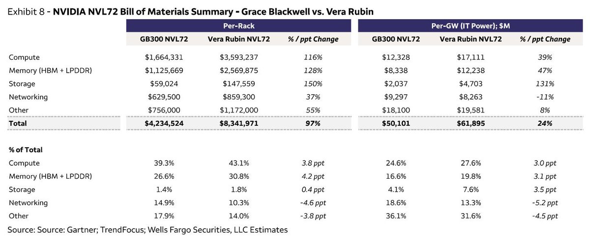

---

<!-- post_id: x:2084621083123327146 | ts: 1785847371 -->
## [X] 駿HaYaO · 2026-08-04 20:42

英特爾EMIB-T先進封裝技術傳出重大突破，良率突破九成，預計明年量產，成本約為台積電CoWoS的一半，已吸引聯發科下單，博通、Meta等大廠也在評估採用，訂單與良率同步大躍進。

台廠供應鏈中，力積電（PSMC）成為最大贏家。其以12吋IPD平台獨家供應英特爾關鍵「矽電容」，現有產能幾乎被客戶全數包下，內部形容「有多少就拉走多少」，正積極擴產因應AI晶片與高階封裝需求。矽電容相較傳統MLCC，可直接整合於封裝內，縮短供電路徑並改善電源完整性，是AI與高速運算晶片的重要元件。未來隨著高功耗晶片發展，矽電容需求可望持續放大，成為力積電特殊製程重要成長動能。

聯電則負責代工EMIB技術中埋設於基板的「矽橋」元件，以成熟12吋製程（台灣與新加坡廠）供應英特爾及合作夥伴，接單同樣火熱。EMIB採用小尺寸矽橋嵌入基板，作為晶片間高速互連橋梁，成本較大型矽中介層更低，同時能提供高頻寬傳輸，有助緩解CoWoS產能瓶頸，並配合Chiplet趨勢，未來需求仍具成長空間。

https://t.co/psL6brR8k9

---

<!-- post_id: x:2084620126989754511 | ts: 1785847143 -->
## [X] 駿HaYaO · 2026-08-04 20:39

AT&amp;S Q1，情況與Ibiden相同：
- 基板營收年增 +90%，部門EBITDA利潤率從 13% → 42%
- 每股盈餘從 €-1.55 轉為 €0.93
- 合約負債達 €9.07億 — 客戶正預付產能擴建費用
- 全年指引維持：成長 +45-55%，EBITDA利潤率 32-37%
兩家基板製造商、同一天、相同訊號。 https://t.co/wxnwaien3u

---

<!-- post_id: x:2084619700735021255 | ts: 1785847041 -->
## [X] 駿HaYaO · 2026-08-04 20:37

Ibiden 2026財年第一季財報：業績超預期並上調全年指引 
營收：1230億日圓（年增26%）
營業利益：269億日圓（年增52%）
ABF基板貢獻幾乎全部成長動能——電子事業營收年增38%，事業部營業利益率達27.6%。

如何判斷供不應求：預收款（Advances received）單季暴增740億日圓，達到1550億日圓。客戶為鎖定AI基板產能，提前預付數十億美元等級的款項。

全年營業利益指引上修至1270億日圓——是去年的兩倍以上。下半年產能將開始放量。
https://t.co/9bwOrgzHFx

---

<!-- post_id: x:2084612020750704862 | ts: 1785845210 -->
## [X] 駿HaYaO · 2026-08-04 20:06

$ON  Semi 2Q26 財報摘要

- 營收：1.60B 美元，季增 6%、年增 9%，非 GAAP 毛利率 39.3%（GAAP 38.4%）。這是連續第 2 季年增，結束過去連續 10 季年減。

- 9 月季（QSep）指引：1.65–1.75B 美元，毛利率升至 40–42%。

- 汽車 781M 美元（年增 7%），工業 423M 美元（年增 4%）；兩者都重新回到年增。

- AI 資料中心：2026 年展望上調為「超過翻倍」（上季為翻倍）。

- 產能利用率：從 77% 升至 83%；9 月季預期持平至小幅上升。

- 目前供應是瓶頸；本季優先出貨 AI 資料中心，而非汽車與工業。

- 交期從 27 週延長至 32 週；book-to-bill 明顯高於 1，部分客戶已下單到 2028 年。

- 庫存天數 192 天（減少 9 天）；通路庫存從 10.8 週降至 10.1 週。

- 中國是汽車與工業最強的區域；中國汽車 SiC 全年指引成長 60–70%。

- 2030 年 TAM 重新由下而上估算為 213B 美元，其中 AI 資料中心 47.5B 美元（CAGR 72%）、EV 63.5B 美元；每機架含量從目前約 15K 美元提升至 800V DC 時的 115K 美元。

---

<!-- post_id: x:2084610395525050659 | ts: 1785844823 -->
## [X] 駿HaYaO · 2026-08-04 20:00

在AI基礎設施帶動記憶體空前短缺下，惠普、華碩、宏碁等主要PC大廠已開始少量採用中國長鑫存儲（CXMT）的DRAM晶片。

多家知情人士透露，這些廠商於今年年中完成認證，並已在部分筆電中導入長鑫晶片，但數量與機型都極為有限，且主要銷往非美國市場。長鑫產能優先供應智慧手機客戶，因此PC端用量仍小。

業者態度謹慎，擔心惹惱三星、SK海力士、美光等主流供應商。長鑫雖被美國國防部列入限制名單，但尚未遭全面禁運。

此舉仍是重大轉變。長鑫近期在上海科創板上市，市值大幅攀升。目前記憶體與CPU短缺持續，PC出貨量預估全年將下滑逾11%。長鑫產品主要服務中國國內市場，價格並未明顯低於三星等大廠，供應仍供不應求。

---

<!-- post_id: x:2084610067043688854 | ts: 1785844744 -->
## [X] 駿HaYaO · 2026-08-04 19:59

華為首席半導體科學家廖恒罕見公開警告：以NVIDIA為首的西方晶片巨頭在追求更強大處理器時，正面臨迫在眉睫的物理極限。傳統持續縮小電晶體尺寸、提高密度的路徑即將走到盡頭，一旦突破將引發雪崩式變革。

他提出華為的「Tau Scaling Law」（Tau定律）作為替代方案，核心是從「縮小尺寸」轉向「提升系統內部件間的傳輸速度」。華為即將推出首款基於此框架、採用LogicFolding技術的智慧型手機晶片。今年晚些時候，當晶片被SemiAnalysis、TechInsights等機構拆解後，全球將清楚看到這條路徑如何幫助縮小與對手的差距。

廖恒指出，台積電、英特爾、三星等代工廠雖有依賴ASML先進光刻設備的長期路線圖，但華為因制裁無法取得，不得不走更具創造性的路。地緣政治緊張正把全球供應鏈撕裂成兩個獨立生態系，中美在半導體進步方式上分歧加大。他強調：「為了生存，即使沒有嚴重衝突，每一方都必須建立自己完整的製造與供應能力。」

同時，他高度讚賞DeepSeek創辦人梁文鋒，稱其在有限算力下透過架構創新實現突破，證明中國能以更少資源訓練高效AI模型。廖恒總結：「必須在設計上投入更多精力，以更高複雜性換取更少的計算資源消耗。」

---

<!-- post_id: x:2084609457091436795 | ts: 1785844599 -->
## [X] 駿HaYaO · 2026-08-04 19:56

路透社8月4日獨家報導指出，特朗普政府正起草一項針對中國數據中心設備的禁令。

核心內容：
聯邦通信委員會（FCC）擬禁止美國進口新型中國光收發器（光模塊）。此類設備負責數據中心內高速光纖傳輸，是訓練與運行AI模型的關鍵基礎設施。

禁令目的：
防止中國設備在美國數據中心「扎根」，避免潛在風險，包括數據竊取、植入惡意軟件或中斷服務。此舉延續美國限制中國技術滲透關鍵產業的政策，吸取過去華為設備難以清除的教訓。

時間與彈性：
官員希望今年內公布並生效，但知情人士強調措施仍可能被修改或搁置。

影響對象：
- 最大受影響企業為中際旭創（全球光模塊市佔約27%），該公司7月已被列入實體清單。
- 美國雲端業者（如亞馬遜AWS）可能因轉向Coherent、Lumentum等本土供應商而推高成本。
- 美國本土廠商有望受益，但目前規模仍不足以完全取代中國供應。

中方反應：
中國駐美使館表示，若措施實質損害中國利益，將採取一切必要反制；同時呼籲美方停止抹黑中國企業。

政策背景：
此禁令與FCC先前對人工關節、機器人、逆變器等中國產品的限制一致。特朗普第二任期在稀土等領域採取相對溫和策略，但對關鍵科技供應鏈仍持續收緊。

---

<!-- post_id: x:2084608816495423760 | ts: 1785844446 -->
## [X] 駿HaYaO · 2026-08-04 19:54

TrendForce: 2027年DRAM供給持續緊張，NVIDIA評估下調Rubin Ultra HBM配置

2027年DRAM持續供不應求，原廠HBM4e驗證進度存變數。NVIDIA自2026年Q3起，將Rubin Ultra的HBM配置從原定HBM4e 12hi，改為並行評估HBM4e 8hi、HBM4 12hi、HBM4 8hi等多方案，尚未定案。部分CSP也考慮調降下一代自研ASIC的HBM容量。

此因整體DRAM緊缺限制HBM晶圓分配，且HBM4e 12hi良率與量產不確定。若調降，傾向減少堆疊層數。HBM4e成敗將決定I/O速度能否從Rubin的8-11.7Gbps升至14-16Gbps，或僅以HBM4優化至11-12Gbps。

2027年HBM出貨位元年增50-60%仍不足，議價權在供應商，價格大漲成共識。AI晶片廠面臨供給緊縮與成本上升雙重壓力，採用較低容量HBM動機增強。此前已有RDIMM與SOCAMM容量調降先例。
https://t.co/Gq4yTCFB5y

---

<!-- post_id: x:2084437661868007743 | ts: 1785803640 -->
## [X] 駿HaYaO · 2026-08-04 08:34

Palantir CEO:
「本季度簡直超乎尋常：我們的美國商業收入同比增長149%，整體收入同比增長93%，Rule of 40得分攀升至155%。主權AI革命讓我們對未來非常樂觀。」 https://t.co/QeUZhwDayh https://t.co/5Hjx4amByw

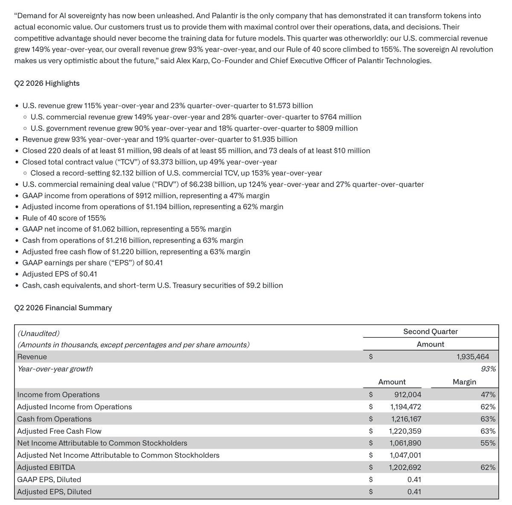

---

<!-- post_id: x:2084436906981392653 | ts: 1785803460 -->
## [X] 駿HaYaO · 2026-08-04 08:31

摩根士丹利關於 NPO/CPO 與 InP 的觀點：

「雖然我們不認為 CPO 的時程會延遲，正如我們在深度報告中所提到的，我們更擔心的是採用程度，因為 NPO 似乎正在獲得更多關注。」

AXTI 指出 InP 基板瓶頸正開始緩解，內部晶圓廠產能成為更重要的限制因素。

預期本季 NPO 將獲得更大的策略性重視，因為它是下一個接近商業可行性的光學架構。可插拔收發器以及相關的雷射、光子與被動元件內容，應仍是 LITE 與 COHR 近期間主要的成長動力，受惠於 800G 持續採用以及 1.6T 的放量。

CPO 仍是重要的長期機會，但 NPO 日益看起來更像是當前可插拔架構與最終共封裝架構之間更具體的橋樑。LITE 與 COHR 在這個過渡過程中都應保持良好定位，因為 NPO 與 CPO 之間有大量共用的底層雷射與光學元件堆疊。

---

<!-- post_id: x:2084435648451383609 | ts: 1785803160 -->
## [X] 駿HaYaO · 2026-08-04 08:26

ONSEMI $ON 2026年第二季財報亮點

- 「AI 數據中心仍然是我們增長最快的業務，我們現在預期 2026 年收入將成長超過一倍，這展現了我們智能電力產品組合的實力，以及客戶在整個電力樹（power tree）中的採用持續成長。」

- 「每股盈餘年增率成長速度是營收的四倍，主要受惠於毛利率擴張與嚴謹的成本管理。自由現金流利潤率年增從約 7% 擴大至 27%……」

---

<!-- post_id: x:2084432750246019399 | ts: 1785802469 -->
## [X] 駿HaYaO · 2026-08-04 08:14

早安！8/4 外電綜合整理

- 3189景碩: 美系升目標
美系券商預估3-4Q的ABF 與 BT 載板平均價格將季增約 8%，且 ABF 載板漲價速度將快於 BT 載板（～之前預估BT漲價速度快）。兩季度營收皆有機會季增10%、預估3Q毛利率升至27%、4Q 28-29%。

ABF業務動能方面：目標取得Vera CPU 載板 100%市佔率、AI GPU 載板市占率將由目前約 10% 提升至 20%、下半年取得 AMD、Meta、AWS AI 加速器載板市占。
BT: 除了記憶體外，光模組也是下個成長動能。綜上，最新預估26-28年EPS為$11.8/$35.1/$68.3，以16.5x 2028E評價，同步升目標。

- 2360致茂：美系重申正向美系大行表示Rubin Ultra GPU 主流規格只有 1,800W TDP 並不合理。目前 Rubin GPU 的 TDP 已達 1,800–2,300W。所以 Ultra 的主流規格應高於 Rubin，對應SLT設備也是，對致茂正向解讀。而且除了GPU，也正積極布局 CPU 市場，重申正向。

- 解讀CSP財報：
美系券商表示短期自由現金流壓力只是加速建置基礎設施所帶來的自然結果，而非基本面惡化。美系大行也表示，眾CSP業者管理層的評論一致正面：需求仍持續超過供給。尤其引用Amazon 形容 2028 年需求「非常驚人」（striking）。

大家的方向也正由大型 AI 訓練叢集擴展至企業 AI 與推論基礎設施，有利於CPU, 客製化 ASIC等。兩家券商對覆蓋裡的上下游供應商皆持正向看法。

 #下次會考

---

<!-- post_id: x:2084317764232351904 | ts: 1785775054 -->
## [X] 駿HaYaO · 2026-08-04 00:37

AI 推動光互連需求暴增，磷化銦（InP）成為算力擴張瓶頸。Lumentum 五座 InP 廠出貨仍低於需求逾30%，SemiAnalysis 指出 CPO 用 CW DFB 雷射特別短缺。

核心警告
Lumentum CEO Hurlston 在巴黎 RAISE 高峰會明確表示：InP 短缺將比記憶體危機更嚴重。即使與競爭對手合計，也無法滿足 Nvidia 與超大規模客戶的需求。

SemiAnalysis 觀點
CW DFB InP 雷射供應尤其緊俏，業界晶圓多停留在2–4吋，遠落後矽基12吋製程，產能擴張受結構性限制。

市場反應
Nvidia 3月各投資Lumentum與Coherent 20億美元鎖定供應，但近月相關股票大幅下跌（LITE -22%、COHR -38%、AXTI -40%、AAOI -36%），股價與基本面背離。

矽光子無法繞過 InP
矽無法自行發光，必須搭配直接能隙的 InP 雷射。CPO 只改變雷射位置，不移除需求，反而轉向高功率 CW 雷射與外部模組。

需求數量級成長
電信客戶只需數百顆雷射，Nvidia 與雲端巨頭需要數億顆。Lumentum Q3 營收年增90%，供需缺口擴大至逾30%，核心元件幾乎售罄。

Coherent 擴產進度
Coherent 資料中心業務占比升至75%，6吋產線良率已超越3吋，產能將提前翻倍，並於2027年底前再翻倍以上。

短缺持續時間差異
InP 受限於銦副產品供應與地緣政治。LightCounting 預期2026年底短缺可緩解，因可透過晶圓尺寸升級解決，無需從頭建廠（記憶體則需多年新廠）。
https://t.co/mSatDqOh8P

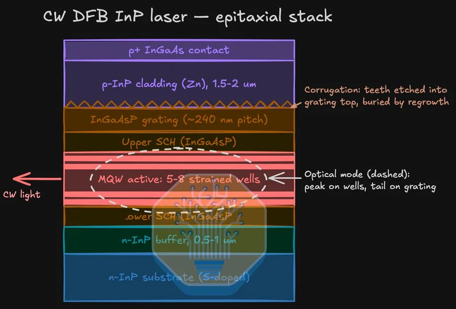

---

<!-- post_id: x:2084316097432719642 | ts: 1785774657 -->
## [X] 駿HaYaO · 2026-08-04 00:30

台積電2奈米製程受NVIDIA、AMD、Broadcom等AI客戶強勁需求推動，預計2026年底達每月10萬片晶圓產能里程碑。先前Fab 20僅2萬片，短短四個月內大幅提升。

同時，3奈米需求未減，已提前達成每月18萬片目標（原預估17.5萬片）。2奈米雖尚未有量產晶片，但已貢獻2026年Q3營收3%，且tape-out數量是3奈米的四倍。

蘋果A20 Pro（iPhone 18 Pro系列）將成主要貢獻者，高通、聯發科2027年旗艦SoC跟進；AMD MI455X則挑戰NVIDIA Rubin Ultra。供應恐緊張，蘋果據傳只採用兩代即轉1.4奈米。

---

<!-- post_id: x:2084315814178758992 | ts: 1785774589 -->
## [X] 駿HaYaO · 2026-08-04 00:29

去年底到今年初，AMD 與 Meta 和 OpenAI 達成協議，提供基於績效的認股權證（performance-based warrants）。這些認股權證會根據購買並部署最多 6 GW 的 AMD Instinct GPU 而歸屬（vest），同時也取決於 AMD 股價跨越不同門檻，最高可達 600 美元。

隨著 AMD 股價從 2026 年初約 200 美元區間快速上漲到目前約 500–600 美元區間，這意味著 Meta 和 OpenAI 的 GPU 資本擁有成本（假設股價門檻的歸屬大致呈線性，且完整部署 6GW 產能）已從約每 GPU 每小時 2.15 美元和 2.50 美元，分別降至僅約 1.60 美元和 1.75 美元！  

如果 AMD 股價進一步上升到 600–700 美元區間，那麼對雙方來說，GPU 本身的資本成本實際上將變為零！如果 AMD 持續改善軟體堆疊、贏得大型客戶訂單，並讓股價突破 1,000 美元，那麼整個叢集（cluster）的全包資本成本（包括其他伺服器設備、網路、CPU 等）對 Meta 和 OpenAI 來說也將是有效零成本！

---

<!-- post_id: x:2084315169677840650 | ts: 1785774435 -->
## [X] 駿HaYaO · 2026-08-04 00:27

Credo（ $CRDO ）於2026年8月3日宣布，將在FMS 2026（8月4-6日，聖塔克拉拉會議中心）展示最新AI記憶體與儲存互連產品（展位#1146）。

核心觀點：
在運算、記憶體與儲存之間可靠高效移動資料，已成AI基礎設施效能關鍵。Credo提供創新連線方案，協助克服記憶體與儲存瓶頸，實現更高頻寬、吞吐量與效率。

展示重點產品：
OmniConnect Weaver：AI記憶體與晶片對晶片互連，結合112G VSR SerDes與輕量AXI framer，相較HBM4可達最高25倍記憶體密度、5%頻寬提升，突破AI推論擴展瓶頸。

Toucan PCIe 6.0 Retimer：延長CPU/GPU/加速器與儲存之間PCIe距離，提升設計彈性，並支援PILOT診斷分析平台。

https://t.co/OVsPgZ3sV9

---

<!-- post_id: x:2084314781784375553 | ts: 1785774343 -->
## [X] 駿HaYaO · 2026-08-04 00:25

Marvell（ $MRVL ）於2026年8月3日宣布，將在FMS 2026（8月4-6日，聖塔克拉拉會議中心）展示完整AI記憶體與儲存解決方案（展位#805）。

核心觀點：
隨著代理式AI推論規模擴大，記憶體容量、頻寬與連線能力已與運算同等重要。更大模型、更長上下文與KV cache暴增，對記憶體需求空前。Marvell透過「資料更靠近運算、降低延遲」，協助客戶提升利用率、token效率，並在不犧牲效能、功耗與成本下擴展AI基礎設施。

展示重點產品：
PCIe 6.0企業級SSD控制器
CXL近記憶體加速
CXL記憶體擴展與壓縮
CXL交換（記憶體池化）與記憶體擴展附加卡
Octeon DPU（網路儲存）
Photonic Fabric光學scale-up技術

https://t.co/K4gW0jnkc6

---

<!-- post_id: x:2084313998162596201 | ts: 1785774156 -->
## [X] 駿HaYaO · 2026-08-04 00:22

$NVDA 與 $GOOGL 的 AI 封裝目前都在等待基板供應。聯發科（MediaTek）的第二個 Google TPU 專案，因基板良率與供應問題，時程延後一至兩季，預計至 2028 年第一季底。

台光電（2383 TT）是全球最大的CCL製造商，目前正在進行 IC 基板材料的客戶認證，預期下半年可通過。公司第四季將開出每月 30 萬張的基板產能，加上既有產線共達 60 萬張，目標在 2027 年底達到每月 120 萬張。初期基板訂單較少，因此這些產線可轉產 M 系列高速積層板。

M9 積層板將於下半年開始小量出貨，供應 HGX 通用底板。M10 自今年上半年起已開始送樣給客戶。M7 及以上產品在 2025 年底佔產品組合一半，上季達 60-65%，本季目標朝 70% 邁進。

M4 至 M6 價格率先上漲，M7 與 M8 上季跟進，下半年不排除再有一波漲價。低階產品漲幅較大，因為產能優先分配給高階 AI 材料。

總產能將從今年底的每月 615 萬張，提升至 2027 年底的 930 萬張，以及 2028 年的 1,110 萬張。

---

<!-- post_id: x:2084269018010231074 | ts: 1785763432 -->
## [X] 駿HaYaO · 2026-08-03 21:23 _(接續 2 則)_

瑞薩電子（Renesas）於2026年7月30日發表第3代DDR5伺服器用MRDIMM記憶體介面晶片組，最高支援16,000 MT/s資料傳輸速度，較第2代提升25%記憶體頻寬，專為AI資料中心、雲端與高效能運算（HPC）設計。

新品包含多路複用寄存時脈驅動器（MRCD RRG5013x）與多路複用資料緩衝器（MDB RRG5103x），沿用現有DDR5架構，無需大幅更動伺服器平台即可提升效能。晶片組亦整合電源管理IC、SPD集線器與溫度感測器，並新增裝置均衡自訓練模式（DESTM）功能，強化系統可視性與穩定性。

目前已向主要DRAM供應商等選定客戶提供樣品，預計2027年下半年量產。瑞薩強調與AMD等CPU合作夥伴緊密合作，因應AI訓練與推論對記憶體容量與頻寬的急遽需求。

https://t.co/7C33CDGyEj

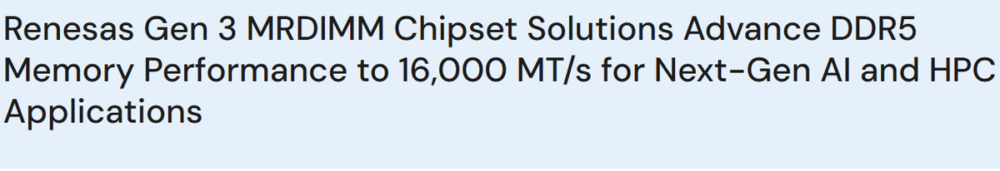
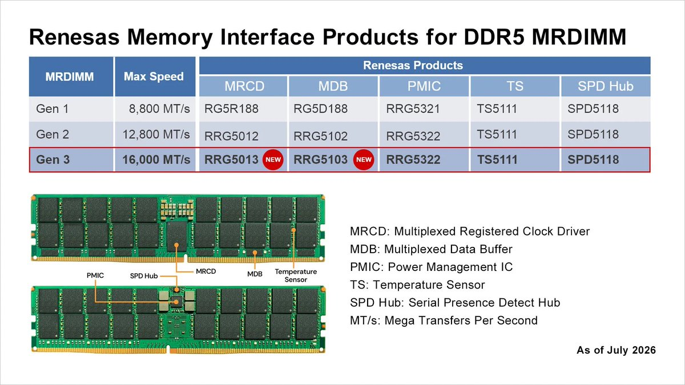

---

<!-- post_id: x:2084267367119671645 | ts: 1785763038 -->
## [X] 駿HaYaO · 2026-08-03 21:17

CFM：伺服器客戶對eSSD價格接受度出現分化，Q3不同原廠eSSD漲幅10%至30%不等

受出口管制的持續影響，中國先進算力卡短缺現象正進一步蔓延，導致伺服器面臨「長短料不齊套」困境。作為配套存儲的3.84TB eSSD目前在伺服器終端客戶處已形成較高的庫存積壓。

從需求端來看，中國與國外市場呈現出明顯的分化態勢。北美市場方面，除大型雲服務廠商外，新興算力租賃廠商對eSSD的需求同樣旺盛，其配套存儲採購量正隨GPU集群規模的擴張而持續攀升，未見放緩跡象。反觀中國市場，當前正處於「高庫存、弱新增、現貨和合約價格倒掛」的階段性調整期，同時，隨著雲廠商自研盤使用比例提高，短期內大規模補貨需求有限。且中國NAND供應渠道日益多元化，短期內抑制了中國伺服器市場對eSSD的拉貨動能。伺服器RDIMM缺口依然存在，因此不同客戶對伺服器存儲價格的接受度出現分化。

在需求差異的驅動下，中國與國外客戶對eSSD漲價展現出不同的態度：中國客戶對持續漲價的承接意願有限，而北美市場在強勁的需求支撐下對漲價的接受度更高。不同存儲原廠對三季度eSSD報價漲幅出現分化，CFM預計整體漲幅將在10%至30%不等。

https://t.co/0F0PnWWl7R

---

<!-- post_id: x:2084266575411224796 | ts: 1785762850 -->
## [X] 駿HaYaO · 2026-08-03 21:14

日本第三輪對華半導體出口管制8月1日生效，封鎖先進封裝核心設備

8月1日，日本經濟產業省修訂的第三輪對華半導體出口管制新規正式啟動實施，本輪管制打破此前聚焦晶圓前道製造的管控邏輯，將矛頭直指高端先進封裝核心設備，完成半導體全鏈條封鎖布局。

新規明確，適配 HBM 高帶寬內存、Chiplet 芯粒、3D 堆疊封裝工藝的高端固晶機、超薄晶圓減薄機、高精度芯片分選機、晶圓激光隱形切割機、3D 鍵合設備、TSV 硅通孔工藝設備等先進封測核心設備，全部納入管制目錄。
目錄內所有設備對華出口取消通用出口許可，強制執行逐案單獨許可審批制度，單筆交易需要獨立提交資質與用途審核，常規審批週期達到 3 - 6 個月，面向 AI 算力芯片配套設備的出口申請駁回率接近八成。

從產業實操層面來看，嚴苛的審批規則直接阻斷日系設備穩定供貨，國內新建高端先進封裝產線採購日系核心設備基本陷入停滯，存量產線的設備維保、備件補給難度大幅抬升；政策設置過渡期至 8 月底，既有存量訂單可完成收尾交付，緩衝期結束後管制力度將全面拉滿。

本輪管制是日本深度配合美國主導的美日荷三方半導體芯片聯盟的關鍵動作。此前日本對華半導體管制集中在刻蝕、塗膠顯影、清洗等晶圓前道製造設備，國內半導體產業依託成熟製程芯片搭配先進封裝異構集成技術，成為突破高端算力芯片封鎖的核心路徑。
日方此番將後道先進封裝關鍵設備納入管制，意圖十分明確：全方位堵死國內依靠「成熟製程 + 先進封裝」量產高性能 AI 算力芯片、高端存儲芯片的換道超車通道，配合美、荷形成從芯片設計、晶圓製造、封裝測試到半導體材料的閉環技術封鎖。

https://t.co/el0Rvw4t9I

---

<!-- post_id: x:2084253602760237528 | ts: 1785759757 -->
## [X] 駿HaYaO · 2026-08-03 20:22

RT @semivision_tw: 台股注意暨處置機制更新
-
✅ 處置天數大幅砍半
「一般處置」的處置期間由原本的 10 個營業日縮短為 5 個營業日，「當沖過熱處置」的處置期間則由原本的 12 個營業日縮短為 7 個營業日。
-
✅ 撮合時間統一縮短為「約 2 分鐘」
取消 5 分鐘與 20 分鐘分級，不論第一次或第二次處置，撮合作業時間一律調整為約每 2 分鐘撮合一次，讓處置股能保有基本交易流動性。
-
✅ 放寬警示門檻 (收盤價 6 個營業日起迄價差)
隨著千金股增加，過去高價股隨便大漲或大跌幾百元就容易觸及警示門檻，新制標準將股價 1,000-2,000 元的價差標準拉高至 300 元；若股價超過 2,000 元以上則以每 1,000 元為一個級距，價差標準再增加 150 元，比如：2,000-3,000 元的價差門檻拉高至 450 元。
-
(新制將於 2026 年 8 月 10 日正式上路)

---

<!-- post_id: x:2084253140333842699 | ts: 1785759646 -->
## [X] 駿HaYaO · 2026-08-03 20:20

TrendForce: 台系雙虎產能瘦身，2028年重塑TV、監視器、筆電三大面板供需版圖

TrendForce指出，台系面板雙虎（群創、友達）加速產能收斂與賣廠轉型，從規模戰轉向高附加價值「精兵政策」。

預估至2028年，兩廠合計液晶監視器面板供給占比將跌破10%、筆電面板降至近20%、電視面板維持約22%。

群創：規劃2027年底至2028年關閉以筆電液晶為主的Fab3，因8.6代OLED開出與需求轉向，舊廠區有望轉型先進封裝（FOPLP、CPO、TGV）。

友達：資金轉投Micro LED、AI/CPO等，已公告出售桃園華亞廠（L3D、L5D，2027上半年關閉）予廣達、高雄C5E予日月光。後續是否再釋出老舊筆電線（L5C/L6A，甚至L7A）成觀察重點。

三大應用影響：
- 電視：2026-2030供給健康偏緊；若L7A出售，全球供給面積再減約2.1%。
- 監視器：2026年陸系前三大市占達74%；若L6A關閉，全球減近500萬片。
- 筆電：品牌轉向OLED加速滲透，液晶供需更失衡，關閉相關產線勢在必行。

此波動作將重塑全球液晶面板供需版圖。

https://t.co/QG5OXodl1S

---

<!-- post_id: x:2084251363324862897 | ts: 1785759223 -->
## [X] 駿HaYaO · 2026-08-03 20:13

TrendForce: CSP提高資本支出90%催化， 2026年AI server出貨年增上看31%

TrendForce指出，受AI基礎設施需求強勁帶動，2026年全球九大CSP（Google、Amazon、Meta、Microsoft、Oracle、ByteDance、Tencent、Alibaba、Baidu）總資本支出將年增約90%，突破8,867億美元。北美五大業者占比近九成，多數支出翻倍成長，主因擴建AI資料中心、GPU叢集及液冷等基礎設施。

超大型CSP與Tier-2業者對NVIDIA GB/VR整櫃式AI server採購意願提升，加上Google、AWS新一代ASIC於2026下半年放量，中系業者擴大採用本地方案，促使TrendForce上調2026年AI server出貨年增幅至近31%（原估28%）。

美系業者重點：Google持續發展TPU；AWS以NVIDIA GB300為主力並擴大自研ASIC；Meta主採NVIDIA/AMD方案，自研ASIC布局加速。中系四大CSP合計資本支出年增逾80%，ByteDance投入最大。

展望2027年，九大CSP總資本支出估達1.3兆美元，年增近50%（高基期影響），AI投資未放緩。成長動能將從純GPU擴張，轉向AI server、液冷、先進封裝、高速互聯、電源與記憶體等全面基礎設施升級。

https://t.co/nzVt6PCpZr

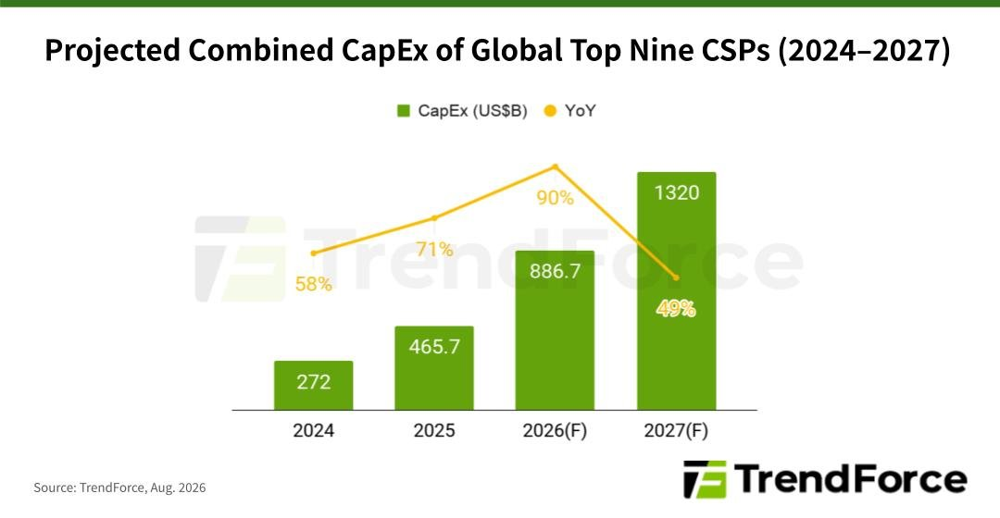

---

<!-- post_id: x:2084215805000962425 | ts: 1785750745 -->
## [X] 駿HaYaO · 2026-08-03 17:52

路透社報道
知情人士透露，中國市值最大的存儲芯片商長鑫存儲（CXMT）正計劃在北京亦莊建設第二座12英寸DRAM晶圓廠，選址就在現有北京工廠旁，並正與北京經濟技術開發區洽談融資。

該公司擬向開發區爭取至少6000萬元人民幣（約890萬美元）支持，其他國有科技企業也有意參投。談判仍處早期，細節可能調整。長鑫與北京市政府均未置評。此舉旨在擴大產能，因應AI基礎設施帶動的全球芯片短缺。長鑫上月完成創紀錄86億美元IPO（中國內地半導體史上最大），股價已漲13%。目前合肥有兩座、北京有一座12英寸廠，月產各約10萬片；加上上海、合肥新建及洽談中的項目，全面投產後總產能將翻倍至每月逾60萬片。

新廠規劃產能與總投資未明，尖端DRAM廠通常耗資超100億美元。長鑫已成中國自主芯片與AI領域縮小美中差距的關鍵支柱，雖全球市佔仍遠低於三星、SK海力士、美光（三家合計近90%），但在國內主導地位增強，已能對華為等客戶提價。北京、上海、合肥均積極以資金支持爭奪其產能布局。

---

<!-- post_id: x:2084215378465767553 | ts: 1785750643 -->
## [X] 駿HaYaO · 2026-08-03 17:50

1. AI資本支出展望上調
四大超大規模業者更新CY26/27資本支出展望，普遍更樂觀。CY26超大規模資本支出上看8600億美元以上（+80% YoY），並有望在CY27達1.2兆美元（+38% YoY）。客戶承諾增至約2.3兆美元，AI銷售成長80-100%+。供應仍受限，但投資意願強烈。FCF短期承壓，但預計CY27-28負利潤率見頂後回升。
主要受益半導體：運算、記憶體、設備、電源與光學。

2. 資本支出獲客戶承諾支持
資本支出獲多年期雲端承諾與積壓訂單支撐，前四大CSP積壓已超2.3兆美元（季增16%）。MSFT RPO 6780億、ORCL 6380億，確認週期長；ORCL預付硬體約750億減輕資金壓力。AWS與GOOGL積壓亦大幅成長。資本支出已計入記憶體、晶圓等上升成本，凸顯半導體定價能力與需求能見度提升。

3. FCF承壓但AI效益改善
超大規模業者FCF預計至CY28仍受壓，資本支出達營運現金流100-115%+，FCF利潤率將降至-1%至-5-6%。惟AI銷售近三位數成長，雲端/AI利潤率優於預期。AWS AI與晶片收入各破250億美元，投資回本期短於三年；MSFT與GOOGL亦指利用率與單位經濟改善，ROI提升。

4. 債務融資充足無壓力
2026年初以來前五大超大規模業者已募資約2700億美元，多為長期債務與股權。此舉屬資產負債表優化與流動性管理，非資金緊張跡象。資本市場仍暢通，債務到期遠超AI投資週期，未來FCF擴張足以覆蓋並償還資本，資本充足無虞。

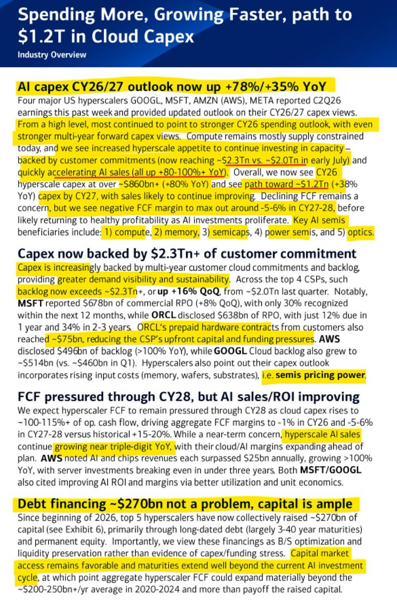

---

<!-- post_id: x:2084214657573867783 | ts: 1785750471 -->
## [X] 駿HaYaO · 2026-08-03 17:47

$NVDA 的 Vera Rubin 均熱板（vapor chambers）在 Q2 每月出貨量達 10–20 萬片。供應鏈查核顯示，到 Q4 將提升至每月 50–60 萬片，2026 年全年約 200 萬片。

這些產品來自健策精密（3653 TT），該公司負責製造位於 AI 晶片與冷板之間的蓋板與均熱板。熱管理零件佔其上一季營收的 77%。

Rubin Ultra 改採新設計：取消整合式散熱器（integrated heat spreader）與 TIM2，冷板直接以螺鎖框架安裝在裸晶上。每個封裝的機械件含量增加，且平均售價將高於目前的單蓋板產品。

同一供應商將在 Q4 開始供應 $AMD 的 MI450/455 均熱板，同時在 Trainium3 與 TPU v8 等 ASIC 專案中，加強件（stiffener）價格也正在上漲。

---

<!-- post_id: x:2084175508380758130 | ts: 1785741137 -->
## [X] 駿HaYaO · 2026-08-03 15:12

中際旭創（300308）野村報告

評級與目標價
維持買入，目標價上調至CNY1,375（前值1,325），較收盤價902元隱含+52%空間。估值基於21x 2027F EPS（65.47元），對應當前僅13.8x。

核心增長驅動（2026-28）
1. 1.6T + 矽光（SiPh）升級
2. 2027年起2.4T coherent-lite + NPO放量
3. 長期3.2T、XPO、CPO擴張
全球出貨預測：800G 40.8/57.8/78百萬只；1.6T 25.1/68.8/126百萬只；2.4T 3/8百萬只；NPO 8/25百萬只。公司維持全球AIDC光模組30-35%份額（高端40%+）。

財務上調
2026-28F營收/淨利分別上調2-5%/4-10%。營收：12.4萬億/26.6萬億/38.9萬億；淨利：358/763/1,142億；毛利率升至47.2%/48.2%/49.3%。上游短缺2026H2緩解，新品結構優化推動利潤率擴張。

競爭與機會
新技路線壁壘升高，領導地位穩固。NPO更利於現有產業鏈，商業化更快；CPO長期TAM巨大，公司已佈局。H股募資約530億港元，用於研發、擴產（至9,000萬只/年）及併購。

風險
需求不及預期、競爭加劇、升級進度慢、價格戰。

---

<!-- post_id: x:2084174302421938531 | ts: 1785740850 -->
## [X] 駿HaYaO · 2026-08-03 15:07

E玻璃纖維布價格上漲在8月加速：
7628 上漲人民幣1.5元/米至人民幣10.1元/米（+17.4%）
2116 上漲人民幣1.85元/米至人民幣12.7元/米（+17.1%）
1080 上漲人民幣2.0元/米至人民幣13.3元/米（+17.9%） https://t.co/E3gWUs9Rni

---

<!-- post_id: x:2084173240075981211 | ts: 1785740597 -->
## [X] 駿HaYaO · 2026-08-03 15:03

中國東方算芯（DFSX）以成熟14nm製程推出DF1000與即將登場的DF2000晶片，強調「記憶體頻寬」比製程微縮更重要，能有效突破AI運算瓶頸。

其核心技術為3D近記憶體運算架構：記憶體直接堆疊在運算層上方，透過晶圓級混合鍵合連接，完全省略微凸塊與導線，形成高速垂直通道。DF2000更進一步採用「3.5D Infinity Chiplet」佈局，將多個記憶體-運算塔並排組合，並導入客製化3D DRAM，大幅提升內部暫存數據容量。

性能數據顯示：
- 單顆DF2000提供15TB/s頻寬
- TY64超級節點總頻寬達960TB/s
- 對比NVIDIA GB200 NVL72僅576TB/s（約2倍）

雖然BF16運算力較弱（64 PFLOPS vs NVIDIA 360 PFLOPS），但DFSX認為AI工作負載常因等待數據而閒置，記憶體吞吐量才是關鍵指標。後續DF3000預計達20TB/s（TY64總計1,280TB/s），接近NVIDIA下一代Vera Rubin的1,580TB/s。

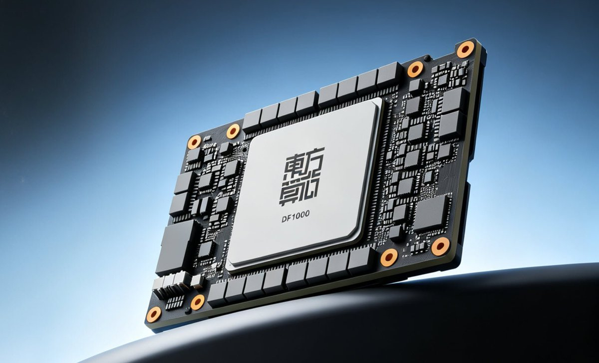

---

<!-- post_id: x:2084171754210287668 | ts: 1785740242 -->
## [X] 駿HaYaO · 2026-08-03 14:57

HBM

整體市場與需求成長
- 大規模擴張：總 HBM 需求預計將大幅成長，到 2027 年達到超過 600 萬 k GB（約 48,618 百萬 Gb）。
- 快速多年軌跡：從 2023 年到 2027 年的歷史與預測成長顯示出陡峭的上升曲線，主要受 AI GPU 與 AI ASIC 部署增加所驅動。

NVIDIA 的市場主導地位
- 最大消費者：NVIDIA 仍是 HBM 供應的最大單一消費者，在 2027 年需求堆疊中佔最大份額。
- 關鍵產品：高需求產品如 Rubin R200 特別突出，總 HBM 需求預計超過 170 萬 k GB，採用先進的 HBM4 12hi 配置。
- CoWoS 分配：NVIDIA 主導先進封裝分配，尤其是 Vera CPU 與 Rubin 系列等產品的大量晶圓分配。

主要競爭對手與生態系統參與者
- Google：Google 佔 AI ASIC HBM 需求的很大一部分，特別受 TPU 系列（如 TPU v8i (Sunfish)）驅動，該產品需求超過 110 萬 k GB 的 HBM。
- AMD：以 MI455 與 MI350 系列等先進產品強力競爭，主要使用來自三星與美光的 HBM3e 與 HBM4 配置。
- 雲端服務供應商 (ASICs)：其他主要科技巨頭如 AWS (Trainium 3) 與 Microsoft (Maia 300) 也佔總專門硬體需求的重要份額。

- NVIDIA 佔預計 2027 年 HBM 消耗的最大單一份額，達 36%。
- Google 佔需求的龐大部分，達 35%，因高度依賴自訂 TPU 部署而幾乎與 NVIDIA 持平。
- AMD 為第三大消費者，市場份額 16%。
- AWS 佔 5%，GUC 客戶佔 3%，Microsoft 與 Meta 各佔預計 2027 年消耗的 2%。

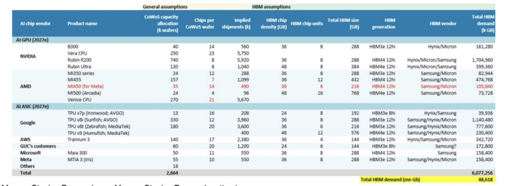

---

<!-- post_id: x:2084074412576583916 | ts: 1785717034 -->
## [X] 駿HaYaO · 2026-08-03 08:30

早安！8/3 外電綜合整理

- 2454聯發科: 美系升目標
美系券商表示3Q展望優於市場的擔憂，今年AI ASIC營收上修超過20億美元，明年上修至至 120～160 億美元。第一個專案跟第二個專案都有望於後年一同貢獻顯著營收，進一步擴大市佔率。上修26-28年EPS至$66.7/$185.3/$427.3，25x on 2H27-1H28E EPS評價，同步升目標。

- 6669緯穎: 美系升目標
美系給予市場最高目標，上修26-28年EPS至$363/$519/$611，給予20xPE評價，同步升目標。
主要理由在於Agentic AI 帶動的通用型伺服器需求、AI 伺服器 SKU 持續擴充、伴隨CSP資本支出同步成長。短期預估3Q營收季增28%。

- 3443創意: 美系重申正向
Google 下一代 CPU 仍按計畫將於今年底或明年初完成 Tape-out。同時券商認為已取得Tesla AI6 專案。預期今下半年出貨優於上半年，重申正向。

- 2455全新: 美系重申正向
美系預期3Q營收季增23%，主要受惠於產能擴充及 InP 基板供應改善，包括更多客戶自行備料、InP 基板供應商擴產，以及持續取得中國政府出口許可。再加上持續投資 MOCVD 再次強化券商對全新的正向看法。重申正向。

- 3189景碩: 美系重申正向
美系券商表示2Q核心業務優於市場共識，毛利率也大幅改善，顯示產品組合轉佳，及ABF貢獻提高。

- 2383台光電：澳系升目標
澳系認為2Q大幅漲價後，本季還有一波漲價，推升毛利率表現，同時AI 客戶與平台多元化，有助降低 Kyber 風險。上修26-28年EPS至$118/$238/$364，以明年25xPE評價，同步升目標。

- 6274台燿: 亞系升目標
亞系認為完善的擴產規劃可望推動 2027 財年獲利大幅成長，毛利率有望追上產業龍頭。券商預期3Q營收季增21%優於市場共識的17%。上修26-28年EPS至$40/$100/$163，以明年30xPE評價，同步升目標。

 #下次會考

---

<!-- post_id: x:2083876717261639977 | ts: 1785669900 -->
## [X] 駿HaYaO · 2026-08-02 19:25

雖然市場目前聚焦於 WFE（晶圓廠設備），但半導體設備公司的服務收入正在更快加速成長。

ASML、Lam、TEL 和 KLA 的合計服務收入在 6 月季度同比成長 33%，而設備收入僅成長 20%。服務業務是即時訊號，因為它的拐點會提前反映在產業利用率上，早於設備業務。服務業務幫助邏輯／記憶體客戶保持良率領先，並擠出更多晶圓產能，這在當前情況下非常有價值。

大多數半導體設備公司的服務業務增速超過了設備業務，並指引成長幅度在 12-17% 之間。長期服務目標目前從 Lam 的 10%+ 和 ASM 的 12%+，到 KLA 的 13-15% 以及 AMAT 的中十幾，最近兩次更新都上調了目標。

最後但同樣重要的是，服務業務為主要半導體設備公司提供了股息資金來源。

---

<!-- post_id: x:2083843226826383440 | ts: 1785661915 -->
## [X] 駿HaYaO · 2026-08-02 17:11

MediaTek 2Q營業利潤超出預期3–4%，主要受優於預期的營運槓桿帶動。3Q毛利率指引中位數46%略高於我們的預估，儘管面臨智慧型手機與消費需求疲弱帶來的毛利率逆風。近期間，公司正在調升價格，以緩解成本上升（晶圓、封裝、基板等）的影響，這應能部分抵銷至2026下半年至2027年初的毛利率壓力。

值得注意的是，MediaTek將2027年ASIC指引上修，從原本佔US$70–80bn TAM的10–15%市佔，上修至佔US$80bn TAM的15–20%，理由是需求更強且已確保元件供應。對於下一代ASIC（TPU v9），量產時程略晚於我們的預期（2028年初 vs. JPMe 2027年底）。

然而，管理層對EMIB-T執行以及MediaTek在此TPU系列中的市佔表達了更高的信心，我們視此為正面情緒。此外，管理層指出更強的ASIC營收將帶來可觀的營運槓桿。因此，我們認為共識FY27 EPS可能上修5–10%。

雖然對第二家ASIC客戶的能見度仍有限，但我們預期在2026年底前會有一些能見度浮現，這可能進一步推動未來數月的股價動能。

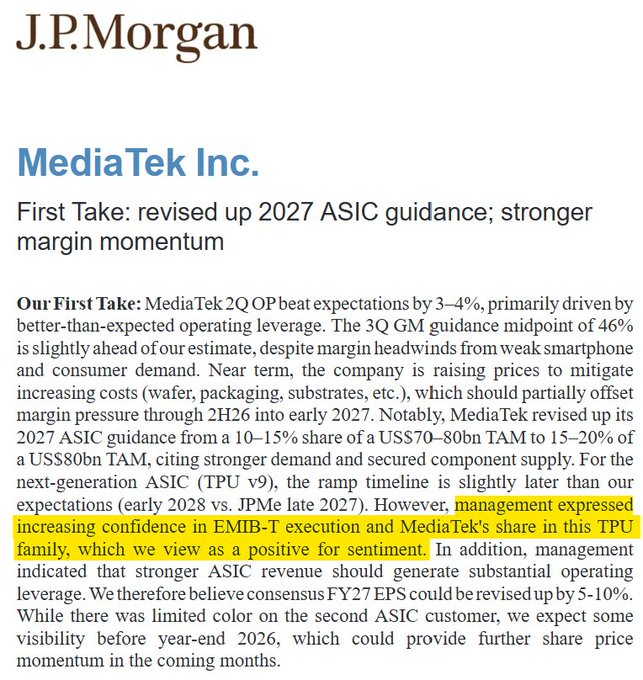

---

<!-- post_id: x:2083765499398353217 | ts: 1785643384 -->
## [X] 駿HaYaO · 2026-08-02 12:03

AMD 因記憶體短缺，計畫對板卡合作夥伴（如 PowerColor、Sapphire、XFX）的 GPU 核心與顯存捆綁價格上漲約 10%。

目前 Radeon RX 9000 系列定價明顯低於同級 GeForce：RX 9070 GRE 約 549 美元、RX 9070 約 640 美元、RX 9070 XT 約 689 美元，而 RTX 5070 約 630 美元、RTX 5070 Ti 約 950 美元。漲價後預期回歸與 NVIDIA 相近的市場定位。

AMD 自 6 月即規劃此舉，但因通路仍有庫存需消化、消費者價格敏感度高，以及 NVIDIA 尚未跟進最新漲價而延後。晶片廠轉向 B2B 高毛利業務，AI 熱潮推高元件價格，恐進一步衝擊 DIY 市場。
https://t.co/TohKMdVCrT

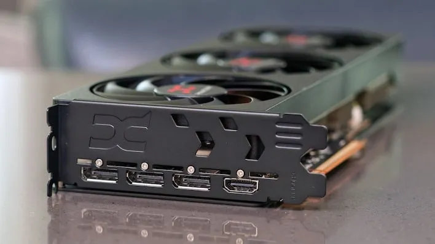

---

<!-- post_id: x:2083750888380965016 | ts: 1785639900 -->
## [X] 駿HaYaO · 2026-08-02 11:05

Panasonic  Q1。
最近因為資料中心用的材料與電池，出現大幅增益。

1. 供應體制強化
- 日本：模組新設產線增產；電芯已改用車載產線，2026年4月開始出貨，並持續改造大阪工廠。
- 北美：
‧ 墨西哥模組：第2工廠2026年度Q2量產、第3工廠2027年度量產。
‧美國電芯：2028年度於堪薩斯導入數據中心專用產線。
‧加速供應鏈在地化。

2. 新產品
- CBU（超級電容模組）：2026年度內量產。
- HVDC對應BBU（直流高電壓備用電池）：2026年度內完成量產準備。
https://t.co/OICa7wTbY6

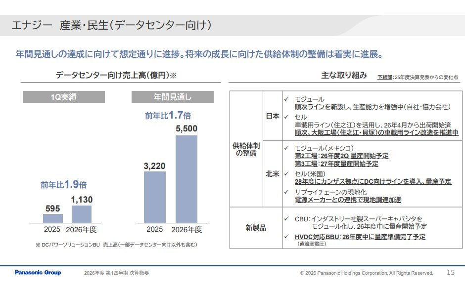

---

<!-- post_id: x:2083749965474508812 | ts: 1785639680 -->
## [X] 駿HaYaO · 2026-08-02 11:01 _(接續 2 則)_

盛群(6202)因應晶圓代工、封測及記憶體成本持續上揚，啟動疫情後首次全面性產品調價，漲幅約10%至20%。此次由專案性調價擴大為全面檢討，已將明年晶圓成本漲幅納入考量，避免多次調漲。因訂單交期約6至8個月，新價格多將於明年反映營收。

第二季營收9.83億元（季增19%），EPS 0.64元，毛利率45%（含一次性折讓）；上半年營收18.09億元（年增12%），EPS 0.94元，純益年增約92%。預期Q3營收高於Q2，下半年優於上半年。

安防產品為最大動能，Q2出貨1,900萬顆創單季新高，全年有望接近8,000萬顆（成長至少三成）。電熱產品出貨可望倍增，觸控MCU訂單回流，BLDC及AI伺服器風扇控制等亦具成長動能。

https://t.co/FmPtESkTgj

---

<!-- post_id: x:2083601863627419819 | ts: 1785604370 -->
## [X] 駿HaYaO · 2026-08-02 01:12

MTK Rick Tsai

「400G 或 448G SerDes IP 進展非常順利。我們確實預期它會在明年的某個時候準備好，可能是明年下半年。

我們現在已經有一款中規中矩、已充分驗證的 SerDes。我可以這麼說。在性能與功耗方面，我們確實擁有至少與業界領先水準相當的 D2D IP。

此外，我們也提供部分領先的先進封裝技術能力，適用於超大晶片尺寸的應用。

另外，我認為我們的團隊正與一些關鍵合作夥伴合作，把這些 IP 整合在一起。​​​​​​​​​​​​​​​​​​​​​​​​​​​​​​​​​​​​​​​​​​​​​​​​​​」

---

<!-- post_id: x:2083529910585586007 | ts: 1785587215 -->
## [X] 駿HaYaO · 2026-08-01 20:26 _(接續 2 則)_

台積電中科台中二期擴建園區1.4奈米先進製程新廠建設進度超前。中科管理局長許茂新7月29日視察時指出，整體進度「超乎想像的超前」，第一座廠房預計2027年4月前完工。中科管理局正同步加速園區公共工程，全力協助建廠。

目前廠房工程陸續發包，基樁工程完工，設備棟（CUP）及辦公室工程展開。四座廠房中前二座已由達欣工程、互助營造得標，進入鋼構施工。

供應鏈評估，若進度維持，最快2027年第三季初試產，有望2028年中量產。新廠成形後將擴大中科先進製程布局，帶動設備、廠務、無塵室等供應鏈進駐中部。

台積電導入AI影像辨識、智慧巡檢等科技工安系統，並以VR模擬訓練提升職安意識，展現世界級建廠水準。

https://t.co/PAmHbwR0HG

---

<!-- post_id: x:2083514633491759376 | ts: 1785583573 -->
## [X] 駿HaYaO · 2026-08-01 19:26

美國財政部（Bessent 致電紐約聯儲）正密切關注日本為防衛日圓而可能造成的美國長端公債收益率上揚壓力。這不是通膨問題，而是跨境資金流動與資產負債表機制問題。

主要重點
1.  日本賣美債防衛日圓
日本財務省是全球最大美國公債持有者。若為支撐日圓而出售美債，會直接增加市場供給，推高長端收益率。這是真實的「流量問題」，而非學術性的通膨預期辯論。

2.  市場真正在反應什麼
- 損益兩平通膨率（breakevens）仍穩定 → 並非通膨恐慌
- 信用市場也沒有亮紅燈
- 真正訊號是：全球久期與外匯管道的壓力，日本是核心

3.  兩大推升長端利率的力量
- 日本日圓防衛：儲備管理、美債出售、跨境久期流動
- 大型科技轉向：停止買美債 + AI 資本支出大增（資料中心、晶片、電力），增加融資需求，把更多久期推入市場

4.  長端收益率最容易快速收緊金融條件。一旦市場因「資金流動」而非「通膨」開始移動，就有超調風險。Bessent 顯然意識到這一點，才會致電紐約聯儲。

---

<!-- post_id: x:2083514200530501826 | ts: 1785583469 -->
## [X] 駿HaYaO · 2026-08-01 19:24

RT @DrJStrategy: Japan, Yen Defense, and the U.S. Long End

Bessent’s call to the New York Fed is the signal worth watching. It suggests Treasury sees Japan’s yen defence as a potential source of pressure on the long end of the U.S. curve, and possibly a move into dangerous territory.

That is the real story. If the Ministry of Finance (worlds largest holder of UST) is selling U.S. Treasuries to support the yen, the result is not a neat academic debate about inflation expectations. It is a live flow problem, with reserve shifts and duration sales capable of pushing long-end yields higher. In that sense, the market is not reacting to a fresh inflation regime so much as to cross-border balance-sheet mechanics.

The pundits inflation narrative is looking increasingly threadbare. Breakevens are anchored, which undercuts the claim that the bond market is suddenly pricing a new inflation scare. Credit markets are not flashing red on prices. What they are signalling is strain in global duration and FX plumbing, with Japan at the centre.

That matters because the steepening in U.S. yields is not happening in a vacuum. Japan is defending the yen, and that defense can create real pressure through reserve management, Treasury sales, and cross-border duration flows. 

At the same time, Large Tech stops buying UST, with its AI capex is pouring fuel on the demand for capital, data centers, chips, and power infrastructure, which raises funding needs and pushes more duration into the market. 

Those are powerful forces. They are more convincing than pundits waving their hands about Warsh communication Strategy and inflation when breakevens are stable.

That matters because long-end yields are where financial conditions tighten most quickly. Once the back end starts to move on flows rather than inflation, the risk is that the market overshoots. Bessent appears to understand that, which is why the New York Fed call matters.

This is not a story about pundit-friendly inflation angst. It is a story, about Big Tech Pivot and Japan yen defence, and a U.S. Treasury market that is now being forced to absorb the spillover.

---

<!-- post_id: x:2083500724743450664 | ts: 1785580257 -->
## [X] 駿HaYaO · 2026-08-01 18:30

Lorie Logan 對 FOMC 異議的看法
2026年7月31日

通膨似乎無法持續達到聯邦公開市場委員會（FOMC）2% 的目標。疫情後通膨飆升已超過五年，物價持續上漲過快。每個月高於目標的通膨，都加重了美國家庭與企業的預算負擔。

即使考慮生產力提升與暫時性供給衝擊後，通膨似乎仍朝向 2.5% 中段趨勢，而非完全回到 2%，且風險偏向上行。除了通膨目標外，FOMC 還有實現最大就業的使命；勞動市場穩健，甚至可能稍微走強。

勞動、消費與金融市場狀況顯示，貨幣政策並未對經濟產生抑制效果。若沒有任何政策約束，通膨很可能會持續高於目標，直到出現未預期的衝擊為止。FOMC 不能依賴未預期衝擊來達成目標，而且若真的發生未預期衝擊，隨時可以調整政策。近期採取溫和行動，可降低日後需要採取更激烈措施的可能性。

FOMC 的政策框架（如《長期目標與貨幣政策策略聲明》所述）也要求對國會賦予的物價穩定與最大就業雙重使命採取平衡方式。為了更好地平衡聯準會雙重使命目標的展望與風險，我本希望在本週會議上將利率上調四分之一個百分點。

---

<!-- post_id: x:2083451528493568140 | ts: 1785568527 -->
## [X] 駿HaYaO · 2026-08-01 15:15 _(接續 2 則)_

長鑫科技LPDDR6研發驗證已接近尾聲，商業化進度過半，距離量產更進一步。首款產品設計速率達12800 Mbps（與SoC協同基礎速率10667 Mbps），顆粒容量16Gb、晶片容量16GB，採用1295 Ball POP封裝，在低功耗與RAS功能上較LPDDR5X明顯優化。

從2023年底LPDDR5（6400 Mbps）到LPDDR5X（最高10667 Mbps），再到LPDDR6向核心客戶送樣，長鑫僅用不到3年完成兩代跨越。行業慣例需經顆粒驗證、研發驗證、小批量導入後正式量產；目前研發驗證（相容性、穩定性、性能功耗、可靠性測試）即將完成，有望2026年下半年實現全球首發量產導入。

客戶方面已進入小米、傳音、榮耀、OPPO、vivo供應鏈。蘋果正推動供應鏈多元化，已啟動內部測試，擬用於中國市場產品；庫克公開稱「評估所有選項」，更多供應商有利供應與定價。

競爭對手中，SK海力士進度最快（今年3月完成1c製程16Gb LPDDR6驗證，同計劃2026下半年量產）；三星、美光因重心轉向HBM與伺服器DRAM，投入相對克制，給長鑫留下窗口。長鑫全球份額約7.67%-10%，野村預測2028年底升至18%，並稱其為「中國皇冠上的明珠」。

研發投入持續加碼：2025年達95.93億元（同比+51%），三年累計超206億元，專利6972件。公司預計2026上半年營收1100-1200億元（同比大增），歸母淨利500-570億元。上市不到一週市值已破3.6萬億。

https://t.co/GGBpTxLapU

---

<!-- post_id: x:2083435716915405236 | ts: 1785564757 -->
## [X] 駿HaYaO · 2026-08-01 14:12

advantest
NVIDIA INTERNATIONAL, INC.
前一會計年度：
金額（百萬日圓）－
比例（%）－

本會計年度：
金額（百萬日圓）228,273
比例（%）20.2

各部門業績（測試系統事業部門）
本部門在本會計年度佔銷售額的90.3%。  

本部門中，SoC測試系統的高性能SoC半導體銷售大幅增加。主要因HPC裝置及AI相關半導體需求高漲，半導體的複雜化與性能提升等帶動了測試需求。另一方面，汽車與產業機器相關等成熟半導體的測試需求則維持平穩。記憶體測試系統方面，以高性能DRAM為中心，穩健的產品銷售加上非揮發性記憶體銷售也有所增加。  

針對如此旺盛的需求，產品供應能力的強化也對本部門的銷售擴大有所貢獻。  以上結果，本部門本會計年度的銷售額較前一會計年度增加336,571百萬日圓（49.3%），達到1,019,390百萬日圓；部門利益較前一會計年度增加256,640百萬日圓（97.9%），達到518,760百萬日圓。

https://t.co/WiuYuRvo31

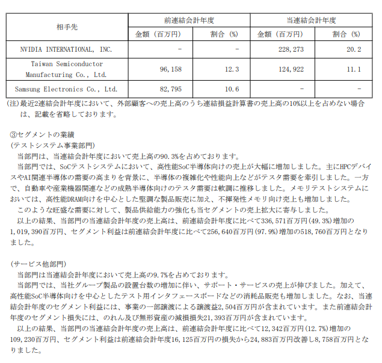

---

<!-- post_id: x:2083418873735393436 | ts: 1785560742 -->
## [X] 駿HaYaO · 2026-08-01 13:05

Rick Tsai
CEO, MediaTek
06:04

在資料中心領域，為追求優化的每 TCO 效能與每瓦效能的客製化解決方案需求依然強勁。透過與主要美國 CSP 客戶的緊密合作，我們已成功打造出第一款具備領先效能的 AI 加速器 ASIC。

此產品預計於今年第四季開始量產。我們預期 2026 年資料中心營收將超過 20 億美元，並在 2027 年持續大幅成長，主要動能來自客戶對我們優異 TCO 解決方案日益增加的需求。

因此，我們現在認為 2027 年的 SAM 將達 800 億美元，並將市占率目標從上季指引的 10%-15% 上調至 15%-20%。同時，我們的第二款 AI 加速器 ASIC 進展順利，在運算效能上有顯著升級，進一步優化了 TCO。
-----

Rick Tsai
CEO, MediaTek
07:38

此外，透過與先進封裝合作夥伴的緊密協作，第二款 ASIC 的良率與可靠性已步上軌道，預計於 2028 年進入高量產。我們有信心在此 ASIC 放量後能再搶下更多市占。再者，我們持續深化與多家客戶在資料中心 ASIC 機會上的合作。

憑藉業界領先的 IP、深厚的生態系統夥伴關係，以及已驗證的執行能力，我們相信能在資料中心市場爭取到更多設計案。以我們業界領先的 IP 產品組合為基礎，我們提供最佳的預驗證子系統解決方案，涵蓋記憶體、IO 與連接性。這大幅降低了設計複雜度，並縮短客戶從 AI ASIC 晶片擴展到完整系統與平台部署的上市時間。

另外，我們 448G SerDes 的開發進展順利，搭配共同封裝的銅系統解決方案，可提供最佳的效能與功耗表現。

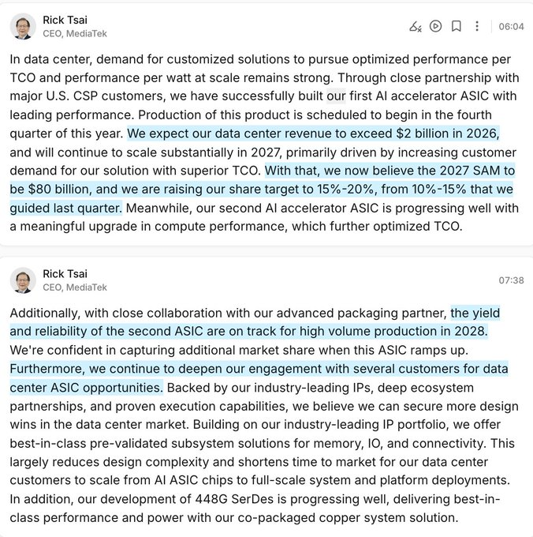

---

<!-- post_id: x:2083409398010200245 | ts: 1785558483 -->
## [X] 駿HaYaO · 2026-08-01 12:28

HDD 產業展望（Seagate & Western Digital）

- 近線 HDD 市場至 2027 年及之後持續緊俏（供不應求）。
- AI（尤其是推論 + 代理式 AI）大幅推升資料中心儲存需求，HDD 需求強勁。
- 成長主要來自 HAMR 技術提升容量，而非單位出貨量增加。
- Seagate（ $STX ）與 Western Digital（ $WDC ）是最大受惠者，業務已接近歷史高點。

1. AI 如何推升 HDD 需求
- 資料中心佔 HDD 需求近 90%。
- 代理式 AI 產生大量中間輸出、推理日誌、檢查點、RAG 知識庫資料。
- 圖像/影片推論檔案遠大於文字，儲存需求暴增。
- Seagate 與 WDC 皆上調長期展望：資料中心 HDD 艾位元組（EB）出貨量 CAGR 達 24–26%（至 2028/2029）。

2. HDD vs SSD
- 企業級 SSD 優先用於高效能推論（如 KV-cache）。
- NAND 價格上漲 → HDD 成本優勢擴大。
- 冷資料仍以 HDD 為主，SSD 替換近線 HDD 的速度放緩。
- 短期 SSD 搶購只是暫時現象，未來 5 年 HDD 仍是冷資料主力。

3. HAMR 技術加速（最大成長引擎）
- Mozaic 3（2024 量產）：每碟片 3TB，總容量 30–33TB，比現行 PMR 高出約 18.5%。
- Mozaic 4（2026 量產）：每碟片 4TB，總容量 36–44TB，比現行 PMR 高出約 33–63%。
- Mozaic 5（2028 量產）：每碟片 5TB，總容量 50–55TB，比現行 PMR 高出約 85–104%。

- Seagate：2026 年 7 月 HAMR 已佔近線 EB 出貨 40%，預計 2027 年 7 月達 70%。
- WDC：44TB HAMR 硬碟預計 2027 上半年量產。
- 預估 Seagate 未來 12 個月 EB 出貨成長 28–32%（即使總單位出貨量不增）。
- 低容量消費級產線可轉換為高容量近線產線。

4. 價格與獲利動能
供應緊俏 → 新合約開始重新定價。
WDC 預期 2026 下半年起，每 EB 價格可季增高個位數 %。
產業價值（營收）將因「量（EB）+ 價」雙升而加速成長。

5. 供應鏈受惠重點
- HDD 製造商：Seagate、Western Digital
→ 直接受惠容量提升與高定價。
- 濺鍍靶材：光洋科（1785 TT）、JX、Tosoh
→ HAMR 改用 FePt + 新增多層沉積，靶材需求增加。
- 懸臂組件：NHK Spring（5991 JP）、TDK
→ 高容量硬碟碟片數增加，懸臂需求上升。

---

<!-- post_id: x:2083404014075678977 | ts: 1785557199 -->
## [X] 駿HaYaO · 2026-08-01 12:06 _(接續 2 則)_

2026年7月30日（紐約時間），日本政府與日銀疑似在外匯市場進行大規模「買入日元、賣出美元」干預。日元短時間內從約162.80急升至157.80附近，升值約5日元，盤中漲幅達3.3%，創2023年12月以來最大單日升幅。

根據日本央行帳戶數據與貨幣經紀商預測推算，干預規模約8.45萬億日元（約528億美元），可能創單日干預新高。紐約聯儲同日進行「匯率詢價」（rate check），被視為干預前兆。美國財長貝森特公開表示日元「嚴重低估」，並暗示日方已採取行動，美方給予「超越精神層面」支持。

這是日本自4月底至5月初投入約11.7萬億日元創紀錄干預後，約三個月來再次出手。干預發生在日銀政策會議期間（次日會議結果維持利率1%不變），時機被視為「出其不意」。財務大臣片山皋月與相關官員均「不予置評」，正式數據預計8月底公布。

背景是日元跌至近40年低位（曾破163），疊加能源價格上漲推高進口成本與通膨壓力。干預後日元部分回吐，後續仍需觀察能否扭轉貶值趨勢，以及是否出現連續干預或美日進一步協調。

https://t.co/n1OOmIouIr

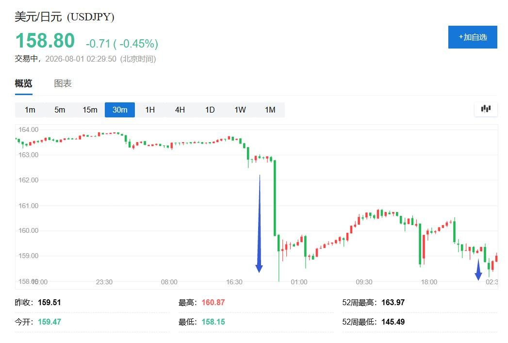

---

<!-- post_id: x:2083198174433529864 | ts: 1785508123 -->
## [X] 駿HaYaO · 2026-07-31 22:28

韓國將設立20兆韓元主權財富基金，用於人工智慧、國防和航太領域。

重點摘要
- 韓國政府將設立規模超過 20兆韓元 的戰略型主權財富基金（Korean-Style Strategic Sovereign Wealth Fund）。

- 資金來源：政府持有的產業銀行（KDB）、輸出入銀行（Eximbank）、企業銀行（IBK）等公營金融機構股票約 16兆韓元，加上繼承・贈與稅物納股票約 4兆韓元。

- 在韓國投資公社（KIC）內新設「戰略投資帳戶」，與既有外匯存底帳戶嚴格分離。

- 投資標的涵蓋 AI、機器人、半導體、國防、生技、核能、航太、量子、材料・零件・設備等戰略產業，以及資料中心、能源叢集等基礎設施，也可投資海外供應鏈關鍵企業。

- 採直接股權投資、無到期日的超長期耐心資本，並可接手既有政策基金（如國民成長基金）到期後的優質持股，進行「接力投資」（relay investment）。

- 預計2026年8月提交《韓國投資公社法》修正案，年底前國會通過，2027年正式啟動。

https://t.co/YM2kT7MdzQ

---

<!-- post_id: x:2083196974304727381 | ts: 1785507837 -->
## [X] 駿HaYaO · 2026-07-31 22:23

彭博社7月31日報道：月之暗面（Moonshot）與阿里巴巴達成算力協議，使用約2萬塊英偉達芯片，構成其Kimi模型算力主體。

知情人士稱，這些芯片為上一代Hopper架構的H200。阿里發言人否認提供基於H200的算力服務。

美國長期限制對華出口英偉達先進芯片。白宮官員指控月之暗面通過泰國某未具名方的算力租賃協議，非法獲取最先進的Blackwell芯片，用於訓練Kimi K3模型。

阿里是月之暗面最大投資方之一，雙方既合作又競爭（Kimi與通義千問性能接近）。月之暗面近期發布的Kimi K3已能與OpenAI、Anthropic等頂尖模型競爭。

美方對中國獲取高性能芯片高度敏感，相關指控涉及技術競爭與出口管制執行問題。阿里、月之暗面及英偉達均未對此合作置評。

---

<!-- post_id: x:2083176052181098724 | ts: 1785502849 -->
## [X] 駿HaYaO · 2026-07-31 21:00

Earnings Takeaways - MTK (2454 TT)

- 2Q26 營收 NT$1,522 億元（季增 +2%、年增 +1%），優於先前指引。

- 2Q26 毛利率／EPS 符合預期：毛利率 46.2%；EPS NT$15.28。

- Smart Edge 季增 +19%，抵銷智慧型手機的弱勢。

- 3Q26 指引：營收 NT$1,522–1,598 億元（季增持平至 +5%），優於近期券商預期的 -5%，但與我們預估一致。

- 3Q26 毛利率：46.0% ±1.5%，符合預期。

- 維持買進評等：目標價 NT$6,420

- ASIC 指引上修：2026 年從 20 億美元上修至 >20 億美元。

- 2027 年 ASIC 市佔目標：上修至 15–20%（原為 10–15%）。

- 我們估計 Zebrafish 出貨時程較 Sunfish 提早 2–3 個月。

- 聯發科的 Triggersfish 將在 2028 年憑藉更大的 SRAM（4x 250MB）帶動推論市佔提升。

- Reit SpaceX 很可能是第二家資料中心 ASIC 客戶。

- 我們估計聯發科的 Icefish 目前是唯一官方的 v10 專案。

- 智慧型手機表現優於先前擔憂；2nm SoC 將帶動 Android 旗艦機（Ultra 機型）市佔提升。

---

<!-- post_id: x:2083175090758500693 | ts: 1785502619 -->
## [X] 駿HaYaO · 2026-07-31 20:56

MOONSHOT 透過阿里巴巴取得 2 萬顆 $NVDA 晶片 — 彭博

多個消息來源確認這些晶片是 Nvidia 的 H200。阿里巴巴否認提供 H200 驅動的運算服務，但並未否認提供約 2 萬顆 Nvidia 晶片的存取權。具體晶片型號與實體位置仍不清楚。

另外，有消息來源證實 Moonshot 有管道可透過東南亞取得 Blackwell 處理器。目前尚不清楚這是一般允許的運算租賃，還是可能違反美國出口管制的直接晶片購買。

一位美國官員表示，這條路線涉及泰國，且很可能用於訓練 Kimi K3。Moonshot 據報也正在尋求更多 Blackwell 產能，以支援其下一個模型。

---

<!-- post_id: x:2083147557501554726 | ts: 1785496055 -->
## [X] 駿HaYaO · 2026-07-31 19:07

https://t.co/vJKguOiu25

---

<!-- post_id: x:2083147335433916667 | ts: 1785496002 -->
## [X] 駿HaYaO · 2026-07-31 19:06

FormFactor 財報重點摘要

- 2Q26 全面超預期：營收 2.582 億美元、毛利率 53.3%，均優於預期

- 3Q26 指引營收約 2.7 億美元，毛利率將擴張至 54%

- AI 復甦動能增強：AI 探針卡市佔持續提升，CPU 與 CPO 需求增強，支撐下一波成長

- Rubin 與 Intel 為關鍵催化劑：預期在 Nvidia Rubin 取得 10% 以上市佔，Rubin Ultra / Humusfish 將進一步提升；Intel 18A 製程放量帶動伺服器 CPU 探針卡需求，並因製程轉移帶來 20–30% 的價格上漲空間

- HBM 將再度加速：3Q26 記憶體產品組合轉向 DDR，但預期 4Q26 在下一代 AI 平台放量下，HBM 營收將創歷史新高

- CPO 動能加速：管理層預期 CPO 營收在 3Q26 即可達到 FY26 指引的高標，受 Triton 採用與插入領先優勢驅動

- 估值：股價已從高點回檔 38%，目前交易於 2027E 本益比 25 倍（相較 MPI 的 33 倍、Technoprobe 的 42 倍），風險報酬具吸引力

---

<!-- post_id: x:2083130340579893757 | ts: 1785491950 -->
## [X] 駿HaYaO · 2026-07-31 17:59

村田製作所 上修

銷售　+7.7%
營業利益　+12.2%
純利益　+15.4%

- 受數據中心相關需求進一步升溫及日圓貶值推進影響，銷售收益預計將超過前次預估

- 營業利益則因產量增加帶來的稼動率提升效益，以及日圓貶值等增益因素，預計將超過前次預估 https://t.co/C3yBcegwd6 https://t.co/dzwEYi1Jv2

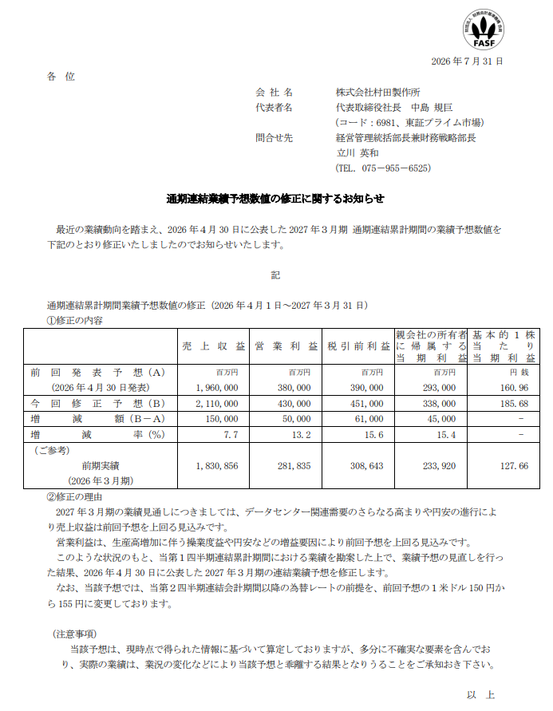

---

<!-- post_id: x:2083129489220096013 | ts: 1785491747 -->
## [X] 駿HaYaO · 2026-07-31 17:55

Kioxia $KXIAY 表示，目標在 2028 年與主要客戶達成 50% 的長期協議（LTA）出貨量覆蓋率，目前進度符合預期。

該公司曾在 6 月表示，從一年期合約轉向多年期合約，是為了降低獲利波動性。
-----
1. 由 AI 需求驅動的加速成長
- Q1 創下銷售營收與營業利益的紀錄，且此趨勢延續至 Q2
-  Agent AI的廣泛採用，正推動 NAND 需求強勁成長——目前仍處於早期階段
-  我們正朝向 CY28（2028 年）與主要客戶達成 50% LTA 出貨量覆蓋率的目標邁進，這將提供長期營收能見度，並確保與高價值客戶群體的深度合作
-  持續推進並擴充製造基礎設施，以掌握不斷擴大的 AI 需求  

2. 財務實力支持未來成長投資
-  創下核心自由現金流紀錄
-  達成淨現金部位，大幅提升財務彈性  

3. 由策略優先事項驅動的持續價值創造
-  評估涵蓋成長投資、資本效率、股東回報等多元方案
-  股票分割（分割比例 1:3，基準日：2026 年 9 月 30 日，生效日：2026 年 10 月 1 日）
-  庫藏股買回：上限 3,000 萬股、上限 8,000 億日圓，期間：2026 年 8 月 3 日至 2026 年 10 月 30 日

---

<!-- post_id: x:2083096544337953044 | ts: 1785483892 -->
## [X] 駿HaYaO · 2026-07-31 15:44

Amazon $AMZN 關於 AI 基礎設施回報：

伺服器和網路設備的運作週期較短。我們通常會在投入服務前幾個月才購買這些設備，因此在觸發支出之前，我們對客戶需求有很強的可見度。如果需求不存在，我們就不會為伺服器和網路設備投入資本。

平均來說，這項投資大約不到三年就能回本。目前伺服器的使用壽命至少有 5 到 6 年，而且我們現在大部分的 AI 產能都是以至少五年期合約簽訂的。

這意味著在回本後的 2 到 3 年裡，我們會從伺服器和網路設備上獲得可觀的自由現金流。另外值得注意的是，AWS 在提前達成伺服器設備回本方面有很好的紀錄，我們已經取得有意義的進展，並找到在不犧牲客戶體驗的情況下延長這些設備使用壽命的方法。因此，對於使用壽命超過 30 年的資料中心，我們應該可以獲得至少 5 到 6 代的伺服器經濟效益。

---

<!-- post_id: x:2083096195363475900 | ts: 1785483809 -->
## [X] 駿HaYaO · 2026-07-31 15:43

特朗普週四簽署行政命令，授權商務部制定規則，禁止舊電池及富含關鍵礦物的電子廢料（電子垃圾）出口海外。此舉旨在將鎢、電池「黑粉」等材料導向美國國內回收商，減少對中國關鍵礦產供應鏈的依賴，並提升國內礦產自給能力。

美國每月出口約3.3萬公噸電子廢料，富含鋰等可回收關鍵礦物。回收業長期不滿出口，稱國內企業難與高價收購的外國買家競爭，部分北美回收商（如Li-Cycle、Ascend Elements）已申請破產，另有公司在俄克拉荷馬州擴建回收設施。

中國掌控多數關鍵礦產產量，美國多種重要礦產高度依賴進口。新礦開發需時多年，截留廢料可更快達成目標。國防承包商須於2027年1月1日前停止從中國採購相關礦產，鎢尤為緊迫（美自2015年無商業開採）。

此令延續今年系列措施，包括貿易調查認定加工關鍵礦物進口威脅國安，以及限制國防承包商豁免採購。研究顯示多數美國人願意回收電子產品以降低對外依賴。

---

<!-- post_id: x:2083071912528527422 | ts: 1785478020 -->
## [X] 駿HaYaO · 2026-07-31 14:07

Arm 2026年6月季 (QJun26) 財報重點

Arm QJun26  
- 營收年增22%，達12.9億美元  
- 權利金年增22%，達7.15億美元；資料中心權利金年增超過一倍；行動端在Armv9加上CSS組合支撐下表現持穩，儘管智慧型手機終端市場因記憶體通膨而疲軟  
- 授權金年增23%，達5.74億美元（創下Q1紀錄）；其中SoftBank貢獻1.93億美元  
- 預期9月季營收年增22%，達13.8億美元；授權金年增30%，權利金年增低雙位數

- Arm AGI CPU需求目前已超過20億美元，高於90天前披露的20億美元pipeline  
- 已確保足夠製造產能，可支援FY27-FY28初期10億美元營收  
- 對FY31 150億美元預估（基於1000億美元TAM）存在上行風險  
- AGI CPU第一代毛利率將從高30%/低40%起跳，並在數年內擴張至50%  
- 資料中心CPU動能強勁；Neoverse核心數已突破15億（最後5億顆僅花9個月，而前10億顆花了6年）

---

<!-- post_id: x:2083071157839016132 | ts: 1785477840 -->
## [X] 駿HaYaO · 2026-07-31 14:04

HBM 封裝需要 X 光檢測才能找出埋藏缺陷。但檢測本身可能會損傷記憶體。

採訪了檢測設備製造商倍利科技（V5 Technologies，7822 TT）總裁黃建中（Michael Huang）。
可見光只能看到表面。紅外線能穿透矽，但會被金屬阻擋。因此需要 X 光才能檢測金屬層下方的缺陷。

黃建中表示，損傷可能不會立即顯現。HBM 堆疊可能通過檢測，卻在三到六個月後開始漏電流。

早期 DRAM 測試也發現，經過 X 光照射後，接面漏電流會提高，刷新時間會變短。高解析度掃描耗時較長。黃建中預期 X 光仍會維持抽樣檢測工具的角色，而非用於 100% 在線全檢。

---

<!-- post_id: x:2082985279842136317 | ts: 1785457365 -->
## [X] 駿HaYaO · 2026-07-31 08:22

早安！7/31 外電綜合整理

- 8046南電：6月自結靚
亞系券商表示6 月稅前利潤率 26.8%，明顯優於1Q26的 14.3%，也勝於之前預估2Q/ 3Q的22.0%／28.4%。這樣顯著的擴張，代表供需缺口（S-D gap）及產品尺寸持續放大。美系大行亦重申現在是AI 驅動的產業上升循環的初期階段，並預期自明年起將開始出現供給不足，而BT正處在超級循環。重申正向。

- 6147頎邦: 美系升目標
2Q26毛利率回升到30%，美系表示這是疫情後首次回到此水準。受惠產品漲價及更高的產能利用率。展望3Q, 旺季到來預估營收季增3%；展望明年，預期LPO 業務將於明年帶來實質貢獻，上修26-28年EPS至$5.6/$8.2/$9.7，以明年29xPE評價，同步升目標。

- 3711 日月光：美系升目標
2Q繳出亮眼成績單，美系表示主要反映 LEAP需求遠優於原先預期。ATM業務2Q毛利率已達27.3%，4Q26有望突破30%。其它動能：CPO 4Q初期量產、全自動面板級封裝產線1Q27投產。最新預估26-28年EPS為$20.3/$31.2/$41.3，以明年25xPE評價，同步升目標。

- 2360致茂：美系重申正向
美系認為2Q利率受投入成本拖累，但淨利受惠業外收益優於預期。預期2H動能優於1H。SLT：AI CPU、GPU、ASIC 測試需求強。另光收發模組需求強勁，CPO 營收可望自3Q26開始貢獻，且仍具上行空間。FT Handler 2H開始貢獻營收。

- 7769鴻勁：美系重申正向
美系大行表示上修今年總體產能至年增45%（from 40%)、明年維持年增5成。CPO需求超乎預期，預計4Q26開始出貨 Insertion 40E CPO FT Handler，自 10 月起每月出貨約 20–30 台，目前尚未看到競爭對手。其它產品出貨正向，重申正向。

- 6274台燿: 美系重申正向
美系券商於法說會後表示泰國廠進度優於預期，已於7月開始爬坡，優於之前預估的9月。M7／M8 等級 CCL 已占公司總營收 39%，觀察漲價趨勢不變。總的而言AI／LEO／交換器等領域高階客戶需求支撐長期產能擴充，重申正向。

- 2308台達電: 美系降目標
美系券商調降PEX反映產業估值，也調降26-28年EPS至$40.4/$75.3/$172，同步降目標。

不過券商表示2Q財報優於預期，±400VDC 與 800VDC 解決方案皆將於3Q26出貨，下半年營收優於上半年，同時調高資本支出。

 #下次會考

---

<!-- post_id: x:2082865829432242606 | ts: 1785428886 -->
## [X] 駿HaYaO · 2026-07-31 00:28 _(接續 2 則)_

Google 十年前率先開發客製 AI 處理器並持續擴大部署。分析師指出，公司對 2028 年 TPU v9 信心十足，計劃訂購 1,200–1,500 萬顆。若屬實，Google 產量可能超越或媲美 Nvidia，並需借助 Intel Foundry 產能達標。這對 Google 與 Intel 是利多，但對 Nvidia 未必構成威脅。

Fubon 報告數據
Fubon Research 報告稱，Google 2028 年計劃擁有 1,200–1,500 萬顆 TPU，V9 世代採四運算晶片設計，產能消耗將較 2027 年翻倍以上。這顯示 Google 對新一代 TPU 的規模與效能高度看好，並已準備大幅擴產。

與 Nvidia 產量比較
Fubon 估計 Nvidia 2026 年供應 820 萬顆資料中心 AI GPU，2028 年可達 1,240 萬顆。若 Google 真生產 1,200–1,500 萬顆第 9 代 TPU，其 AI 加速器產量將與 Nvidia 相當甚至更多，標誌硬體格局可能出現重大轉變。

TSMC 產能不足
Google v9 TPU 效能對比 Nvidia Rubin 系列仍待觀察，但採用四大型運算小晶片顯示公司對效能的高度押注。打造此架構是重大工程挑戰，Google 似乎已克服。僅靠 TSMC 難以達成目標，2028 年必須導入 Intel 供應。

Intel Foundry 必要性
Fubon 認為 Google 在 TSMC 的產能分配不足以滿足 1,200–1,500 萬顆需求，因此需使用 Intel Foundry。近期報導指出 Intel 已獲約 300 萬顆 TPU 訂單，Google 並測試其先進封裝技術。由於 Intel EMIB 與 TSMC CoWoS 不相容，晶片設計必須提前匹配封裝方案。

成為全球最大消費者
若 Google 2028 年部署量超過 Nvidia 全市場銷售，將成為全球最大 AI 加速器消費者，並擁有最強硬體機隊（同時仍可能續買 Nvidia 產品）。其龐大算力將主要自用或對外提供，目前仍不明朗，差距 20% 的估計也顯示變數仍大。

對競爭對手的影響
此里程碑凸顯垂直整合 AI 基礎設施的重要性：雲端業者設計專屬晶片，針對自家軟體、工作負載與資料中心優化，而非依賴現成 GPU。對手將感受到自家設計晶片的壓力日益升高。

Nvidia 地位未受根本動搖
Google 出貨量超越不會立即削弱 Nvidia 主導地位。AI 需求高速成長，兩家可同步擴產，Google 只是暫時成長更快。Nvidia 真正需關注的是 TPU 軟體堆疊對 CUDA 的挑戰，而非單純數量競爭；待 2029–2030 年 Feynman 系列量產後，局面可能再變。

https://t.co/eOmwm6MDF5

---

<!-- post_id: x:2082859741555065288 | ts: 1785427434 -->
## [X] 駿HaYaO · 2026-07-31 00:03 _(接續 2 則)_

艦長J快訊    利空出盡？
2026/7/30

好久沒有這麼頻繁寫文章...... 轉折點前後就是變化大啊。

前幾天破底停損，我自己設定的再次加碼時間是今天，當然盤中指數拉上去又跌下來頗為煎熬😅 

理由其實前幾天有提過
1) 韓國的爆倉應該會在731 保證金新制上路之前告一段落。今天跟朋友聊，幾個亞洲區看日韓股的經理人在過去兩周離開了這個市場.... 許多基金對日韓已經是淨空單狀態，賣壓應該宣洩的差不多了。台灣的融資餘額＆個股期本月也修正了近4000億 （感謝好友認真整理所有個股期的金額變化），籌碼終於變的乾淨？

2）FOMC會議結束，不管他怎麼明示暗示接下來的利率走勢，至少短期不確定性過去了。

3) CSP 財報也公布的差不多了，一些讓人“震驚？”的負面消息也消化了。 

打問號的理由是....其實我不懂為何市場前幾天對Google 現金流變成負的有那麼震驚.... 這不是去年就算出來的事情嗎？ 我甚至可以直接判斷明年現金流也大概率是負的；這不是什麼ai能不能賺錢的問題，而是不管賺多少錢，CSP在沒看到算力需求的極限之前，都會把手上的錢全部花掉。重點還是在關注算力需求是否依然快速成長吧？

4）另一個台灣比較沒人提的事情，是美國Situational Awareness 爆倉事件。這個幾百億美金資產又好幾倍槓桿的基金近期賠太多出事了，費半本周莫名的下殺有部分原因來自於此。今晚剛看到新聞它已經把所有股票部位清空..... 好吧變數又少了一些。

評價便宜、籌碼乾淨、第四季業績可期，希望是利空出盡了..... 吧？ 比較不好的是：這一波不少人重傷，短期要直接V轉也不容易，但至少希望有個反彈嘍～ 

投資總有風險，本人過去績效不做未來獲利之保證。最近詐騙猖獗，本人不收會員、不用追蹤、不騙流量、不需粉絲、更不必按讚分享開啟小鈴鐺。快訊僅供好友交流之用，有股票推薦就是準備倒貨；如果你與我看法不同，你肯定是對的千萬不要被我影響。

 #下次會考

https://t.co/Gwbukx6o92

---

<!-- post_id: x:2082835482715775079 | ts: 1785421650 -->
## [X] 駿HaYaO · 2026-07-30 22:27

日月光（ASX US、3711 TT）財報摘要

- 重申「買進」評級；目標價下調至新台幣 754 元。

- 2026 年第二季符合預期：營收新台幣 1,910 億元（季增 10%、年增 27%），每股盈餘新台幣 4.8 元（季增 48%、年增 177%）。

- 2026 年第三季指引強勁：營收季增 21–22%，主要由 EMS 季增 40% 與 ATM 季增 11–13% 帶動。 ATM 毛利率預計達 28–29%，受惠於 AI 驅動的 LEAP 需求、高稼動率與定價能力。

- LEAP（先進封裝）展望上修：管理層認為 LEAP 營收跑速已超前先前指引，並預期 2027 年將「翻倍」。

- 我們上調 2026/27 年 LEAP 營收預估至 38 億／77 億美元（先前為 36 億／64 億美元）。

- AMD Venice（約 500–550 萬顆 CPU 供應鏈建置）與 Nvidia Vera 將支撐 2027 年完整製程成長。

- 資本支出再上修 20 億美元。

- 我們維持 2.5D 產能預估：至 2026／27／28 年底分別達 1.5 萬／4.5 萬／5.5 萬片／月（WPM）。

---

<!-- post_id: x:2082831023671579056 | ts: 1785420587 -->
## [X] 駿HaYaO · 2026-07-30 22:09

台積電正開發類似英特爾EMIB的先進晶片封裝技術，以因應競爭威脅。據知情人士透露，內部稱為「類EMIB」專案，並與景碩科技合作開發相關基板。

晶片封裝已成AI時代最大瓶頸。AI需求暴增，促使設計商把更多處理器與高頻寬記憶體整合進複雜封裝。英特爾EMIB利用微型矽橋實現高速連接，能支援更大型多晶片設計，已吸引輝達評估用於四顆GPU封裝，以及谷歌下單2028年封裝逾300萬顆客製AI處理器。

台積電現有CoWoS封裝產能極度緊張，魏哲家坦言正限制客戶成長，這給英特爾爭取長期依賴台積電的客戶提供機會。即使客戶先只轉封裝業務，也能幫助英特爾展示技術、深化關係，進而爭取更多代工訂單。

台積電此舉是為遏制英特爾優勢、擴大封裝產線。專案仍處早期階段，商業化時程未明。此舉凸顯AI熱潮正迫使全球晶圓代工龍頭加速布局下一代封裝技術，以鞏固市場地位。

---

<!-- post_id: x:2082829301699993974 | ts: 1785420177 -->
## [X] 駿HaYaO · 2026-07-30 22:02

SEMI 2026年第2季全球矽晶圓出貨面積達35億7,300萬平方英寸，較去年同期（2025年Q2的33億2,700萬平方英寸）成長7.4%，較前一季（2026年Q1的32億7,500萬平方英寸）則增加9.1%。

成長主要受AI相關需求強勁帶動，不僅限於先進邏輯與記憶體，更擴及功率元件、光電子等領域。產業與車用市場亦出現復甦跡象，但記憶體價格上漲抑制了PC與智慧型手機需求。

SEMI SMG會長（SUMCO矢田銀次）指出，晶圓出貨持續穩健成長，裝置製造商積極投資擴充產能，預期矽晶圓需求成長將持續。

數據涵蓋拋光晶圓（含原生測試與磊晶晶圓）及非拋光晶圓出貨至最終用戶的數量。矽晶圓為半導體基本基板材料，直徑最大可達300mm。

https://t.co/A0lvmPqHJo

---

<!-- post_id: x:2082822669087748359 | ts: 1785418595 -->
## [X] 駿HaYaO · 2026-07-30 21:36

高通 ($QCOM) 財報要點

- 維持「持有」評級；目標價下調至 186 美元，主因手機業務疲軟，以及近中期數據中心能見度有限。

- 2026 財年第三季表現參差：營收 99 億美元（季減 6%、年減 4%）略優於預期；非 GAAP 每股盈餘 2.21 美元略低於共識。

- 2026 財年第四季指引：營收 97–105 億美元，每股盈餘 2.05–2.25 美元；低於近期買方私下討論的約 110 億美元營收水準。
- Android 逆風持續，晶圓庫存偏高，且 Apple 數據機營收下滑速度快於預期。

- 公司重申 2027／2029 財年數據中心營收目標為 50 億／150 億美元以上，與超大規模客戶的合作及客製化晶片專案持續推進。

- AI250 獲得四家主要美國雲端服務供應商採用，但高昂的 LPDDR5 價格仍是關鍵顧慮，限制成本競爭力。

- 客製化晶片進度正常；晶圓生產已開始，預期 AWS 將成為首個採用晶圓級方案的客戶。

- CPU 路線圖仍屬長期故事，距離實際貢獻仍需數年。

#QCOM

---

<!-- post_id: x:2082752752057532577 | ts: 1785401926 -->
## [X] 駿HaYaO · 2026-07-30 16:58

微軟 $MSFT 談 AI 產能過剩風險：
「如果需求環境改變，你只要放慢支出中最大的部分就好：CPU 和 GPU。」

「土地和資料中心建設在整體成本結構中佔比較小，而且這些投資的時機可以調整。」

「我們有龐大的第一方應用業務，也會使用我們正在建設的產能，不只是 Azure 平台。這讓我們在應對需求變化時有顯著更高的彈性。」

---

<!-- post_id: x:2082750661482213517 | ts: 1785401427 -->
## [X] 駿HaYaO · 2026-07-30 16:50

$FORM : HBM 和共封裝光學  

雙重利好加上上調預期。營收達到 2.582 億美元，高於 2.4 億美元的市場共識，同比增長 31.9%，每股盈餘（EPS）報 0.82 美元，高於 0.61 美元。  

第三季營收指引為 2.6 億至 2.8 億美元，每股盈餘為 0.77 至 0.95 美元，兩者均遠高於市場預期。  

實際推動本季業績的因素：   
HBM 和共封裝光學。這兩個部門——探針卡和系統——均因此而增長。Slessor 表示，在過去四個季度，他們的營收增長超過 30%，毛利率提升 1,500 個基點，每股盈餘增長三倍。先進封裝測試的押注現在已反映在損益表中，而不僅是路線圖上。  

重要的部分：CPO 在一家測試供應商的財報中被點名為需求驅動因素。這是 CPO 測試論點一直在等待的財報級別確認。

---

<!-- post_id: x:2082748632605114372 | ts: 1785400944 -->
## [X] 駿HaYaO · 2026-07-30 16:42

慧榮科技Q2營收創歷史新高，增長動能延續至下半年

慧榮科技公佈2026年Q2財報：營收4.51億美元，創歷史新高，環比+32%、同比+127%。Non-GAAP營業利潤1.04億美元（環比+67.6%、同比+311.2%），淨利潤8314萬美元（環比+54.4%、同比+261.4%），毛利率50.2%，營業利潤率23.1%，ADS每股盈餘2.43美元。

儘管NAND與DRAM持續短缺，三大產品線仍強勁成長：邊緣/企業級SSD主控環比+5%-10%、同比+50%-55%；eMMC/UFS主控環比+15%-20%、同比+95%-100%；Ferri與企業級啟動盤環比+110%-115%、同比暴增約1690%。

總經理苟嘉章指出，公司正從消費級NAND主控轉型為AI基礎設施與邊緣計算主控及儲存解決方案領導者。上半年連續兩季營收創新高，全年營收預期增長逾100%。

Q3展望營收5.19-5.41億美元（環比+15%-20%、同比+114%-124%），毛利率50%-51%，營業利潤率提升至27.5%-28.5%。新企業級/AI產品仍處初期，未來成長潛力顯著。
https://t.co/Hta3HpVr4Z

---

<!-- post_id: x:2082748494276911594 | ts: 1785400911 -->
## [X] 駿HaYaO · 2026-07-30 16:41

三星電子Q2財報電話會議

AI算力帶動伺服器儲存需求急升，明年供需缺口擴大；產品升級至HBM4與伺服器SSD，並以長期協議鎖定產能、加速美國泰勒廠布局，鞏固AI儲存領先地位。

AI拉動需求、明年供需失衡
手機與PC需求受漲價影響轉弱，但伺服器DRAM、SSD、HBM新增需求遠超於此。超大規模資料中心持續追加供貨，下半年需求強勁；智慧體AI普及加速通用與AI伺服器成長，產能擴張仍趕不上需求，明年缺口進一步擴大。

Q3出貨預期與產品組合
Q2 DRAM bit出貨成長10%-13%、NAND 1%-3%，均創歷史新高，伺服器佔比最高；DRAM ASP漲44%-46%、NAND漲67%-69%。Q3預計DRAM bit增4%-6%、NAND增7%-9%。明年將平衡HBM與通用DRAM，爭取相近市佔。

HBM4與SSD進展
HBM4客戶評估完成，Q3銷量環比增逾兩倍，下半年佔總HBM銷量超60%；已敲定2027年供貨協議，HBM4E領先出樣。伺服器SSD需求激增，今年銷量同比增超20%，佔NAND超60%；PCIe 6.0 SSD獲正面評價，搶攻初期市場。

LTA鎖定產能與泰勒廠
60%-70%產能以LTA（5年滾動協議）運營，已與五大資料中心客戶簽約，另五家洽談中；含預付款條款，採差異化定價。泰勒二期年底開工、2030年量產；現有設施推進2奈米投產，訂單倍增。

https://t.co/ske0f0PwGw

---

<!-- post_id: x:2082747390470263092 | ts: 1785400648 -->
## [X] 駿HaYaO · 2026-07-30 16:37

TrendForce: 2027年記憶體市況分化，DRAM供給持續吃緊、NAND Flash轉趨寬鬆

TrendForce指出，2027年記憶體市況明顯分化：DRAM因AI與HBM需求強勁、供給成長受限，持續緊縮且價格偏強；NAND Flash則因新產能釋放、消費需求疲弱，下半年轉趨寬鬆、價格恐修正。

DRAM方面
原廠雖提早擴產並加速製程升級，但多數新廠投片放量落在2027下半年，顯著產出至2028年才發酵。HBM製程耗用晶圓遠高於一般DRAM，新增投片無法等比例轉為位元產出，限制整體供給成長。需求端則受惠北美CSP資本支出、Intel／AMD新CPU平台、Agentic AI商業化，server出貨年增幅度將擴大，單機HBM與SOCAMM容量提升，推升DRAM位元需求維持高檔。消費型終端（手機、筆電）則因售價上調，出貨預期衰退。2026年供需缺口約-1%至-2%，2027年需求增速更快，缺口擴大；惟高價記憶體恐墊高CSP資本支出占比，是否影響採購仍待觀察。

NAND Flash方面
2026年以製程升級與提高enterprise SSD比重為主。2027年高層數產品加速導入、新廠產能釋出，位元供給成長將超越前一年。需求由AI server與高容量enterprise SSD（尤以QLC）支撐，消費性電子買氣仍受壓抑。產能開出後供需結構反轉，sufficiency ratio轉正、市場趨向寬鬆。若Agentic AI普及加速高速SSD需求，則有望趨近平衡。

https://t.co/Qq7AgRAPZt

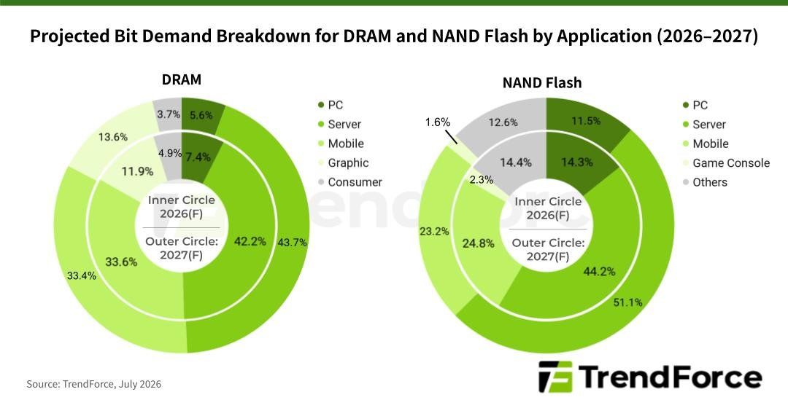

---

<!-- post_id: x:2082622870430306615 | ts: 1785370960 -->
## [X] 駿HaYaO · 2026-07-30 08:22

早安！7/30 外電綜合整理

- 2303聯電: 美系升目標
法說會後，美系券商調升26-28年EPS至$7.7/$8.2/$9.2，以明年15xPE評價，同步升目標。短期而言，3Q26晶圓出貨量將成長高個位數百分比，UTR 將提升至90% 初段，毛利率將改善至30% 中段區間。

券商表示接下來AI 成長將由矽光子與先進封裝帶動，三年內突破 10 億美元。其中矽光子將成為成長最快的領域之一，2Q26已完成首批 12 吋矽光子 IC 試產，並計畫於 2027 年開放平台供更多客戶採用。

在先進封裝方面，目前已有超過 10 個客戶專案同步進行，其中多項產品將於 2026-2027 年 Tape-out，並於 2028 年後開始帶來更大營收貢獻，在產品組合改善及需求前景強勁帶動下，預期EBITDA 將持續向上。

- 3037欣興：眾券商重申正向
一家美系券商直言，法說會後更加肯定ABF是賣方市場，且2Q毛利率大幅優於預期，正是 ABF 需求強勁的最佳證明，公司長期毛利率有望穩在50-60%。接下來楊梅/光復廠持續擴充ABF產能。至於EMIB-T，券商預期即便初期良率目標為 50%仍有獲利，因沒有interposer（中介層），更多附加價值將轉移至載板供應商，長期展望正向。

- 2327國巨: 美系降目標
2Q營收/獲利優於預期，BB ratio 升至2.2，展望3Q產能利用率將提升至 90% 以上，顯示供需環境正持續趨緊，且AI佔營收比也在提升中。一家美系調升26-28年EPS至$19.9/$35.4/$48，改給35xPE評價（from 40x) ，反映當前去槓桿化的投資環境，重申正向但降目標。

- CCL: 美系重申台光電、台燿正向
展望3Q，美系券商表示台光電營收有望季增21%、台燿季增23%伴隨毛利率擴張。Trainium 3、Rubin使用高階CCL持續放量。台光電也有、TPU v8專案，重申正向。

- 6488環球晶：美系升目標
儘管美系大行維持EW, 但調升26-28年EPS至$27.7/$35.8/$51，以明年25xPE評價，同步升目標。

券商表示未來如果漲價超過預期後，會再行升評考慮，目前觀察報價漲幅仍低於市場預期，僅有美光的折扣後仍可較目前 LTA 價格高出 20%～30%，因為反映成本因素，其它預期LTA 明年漲10%～30%，同時觀察Tier 2 foundry 客戶手上還有6-7個月庫存，使明年再談漲難度增加。

- 3211順達：美系重申正向
美系預期2H26持續成長，7 月中旬起，BBU 拉貨已恢復正常，加上8kW／12kW BBU 新品推出，以及4Q26起開始供貨給一家CSP。

 #下次會考

---

<!-- post_id: x:2082607431289557285 | ts: 1785367279 -->
## [X] 駿HaYaO · 2026-07-30 07:21

AXT 與 Lumentum 長期供應協議

2026年7月29日
協議雙方：AXT, Inc.（納斯達克： $AXTI ）與 Lumentum Operations, LLC（Lumentum 子公司）

協議內容：
AXT 為 Lumentum 提供磷化銦（InP）晶圓基板的供應，並預留產能。

產能承諾：
AXT 同意為 Lumentum 預留「最低年度磷化銦承諾量」，期限從協議生效日起至 2031年12月31日，並可支援額外產能需求。

訂金細節（共計最高 8,700萬美元）：第一筆：4,350萬美元，協議生效後 30個工作日內支付。
第二筆：4,350萬美元，支付時間與條件於 2028年另行確定。
訂金用途：作為後續產品出貨的抵扣額度，用完為止。

AXT 執行長 Morris Young 表示，很高興能成為 Lumentum 未來數年磷化銦需求的重要供應商。
https://t.co/oN4blL6soN

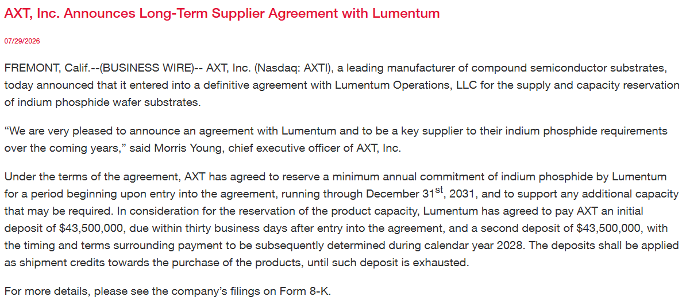

---

<!-- post_id: x:2082541968631202175 | ts: 1785351671 -->
## [X] 駿HaYaO · 2026-07-30 03:01

Kevin Warsh 領導的聯準會連續第二次維持利率不變，繼續將利率維持在 3.50%-3.75%。
投票結果從六月的 12-0 轉變為 9-3，Beth Hammack、Neel Kashkari 與 Lorie Logan 三人投下反對票，主張立刻升息 25 個基點。​​​​​​​​​​​​​​​​​​​​​​​​​​​​​​​​​​​​​​​​​​​​​​​​​​

——-
聯邦公開市場委員會以 9 – 3 票通過以下聲明：
委員會決定維持聯邦基金利率目標區間在 3-1/2 至 3-3/4 百分比，以支持聯準會的雙重使命。委員會持續維持銀行體系充足準備金的政策。
儘管中東衝突帶來部分不確定性，經濟活動仍以穩健步調擴張。生產力成長與資本投資強勁。就業成長與勞動力同步，失業率幾乎沒有變化。
相對於委員會 2% 的目標，通膨仍偏高，部分反映了包括能源在內的某些部門因供給衝擊而推升的價格。委員會將實現價格穩定。
反對此次貨幣政策行動的投票者為 Beth M. Hammack、Neel Kashkari 與 Lorie K. Logan，他們傾向在本次會議將聯邦基金利率目標區間上調 1/4 個百分點。

---

<!-- post_id: x:2082467214024937487 | ts: 1785333848 -->
## [X] 駿HaYaO · 2026-07-29 22:04

美國政府將向芯片製造商格芯（GlobalFoundries）撥款3億美元，用於加強硅光子學技術研發，以驅動更高效的AI數據中心。此舉是特朗普政府將《芯片法案》研究資金導向關鍵半導體技術的一部分，旨在鞏固美國在全球競爭中相對於中國的地位。

硅光子技術以光信號取代電信號在芯片間傳輸數據，可實現更高帶寬與更低功耗。資助同時推進共封裝光學（CPO）技術，將硅光子直接集成於AI處理器旁，進一步提升傳輸速度與能效。

格芯目標將數據傳輸速度提升至每秒400吉比特，能效達現行產品五倍以上。研究將在其紐約馬耳他與佛蒙特州伯靈頓設施進行。CEO蒂姆·布林表示，公司已積累十多年技術與生態優勢，具備美國規模化生產能力。此前美國已承諾1.5億美元支持半導体制造設備，並撥款20億美元推動量子計算。

---

<!-- post_id: x:2082445572364222871 | ts: 1785328689 -->
## [X] 駿HaYaO · 2026-07-29 20:38

親愛的寶貴銷售夥伴：
首先，我們想藉此機會感謝您對三星電機（Samsung Electro-Mechanics）的信任。

過去幾個月，全球電子產業經歷了需求的結構性大幅成長。
雖然我們持續投資以優化製造效率並擴充產線，以滿足市場需求，但激烈的供應鏈壓力已達到我們無法自行吸收的程度。

因此，為維持您所期望的高品質標準，我們將對產品實施價格調整：
•  受影響產品：多層陶瓷電容器（SEMSZ Markup Business code 下的所有 MLCC 品項）
•  價格調整幅度：在現行價格基礎上調漲 30%
•  生效日期：2026 年 8 月 1 日或之後出貨的所有產品

我們深切感謝您對此不可避免措施的理解與配合。
我們將繼續致力於以最高品質的產品支持您的業務。
此致
三星電機股份有限公司

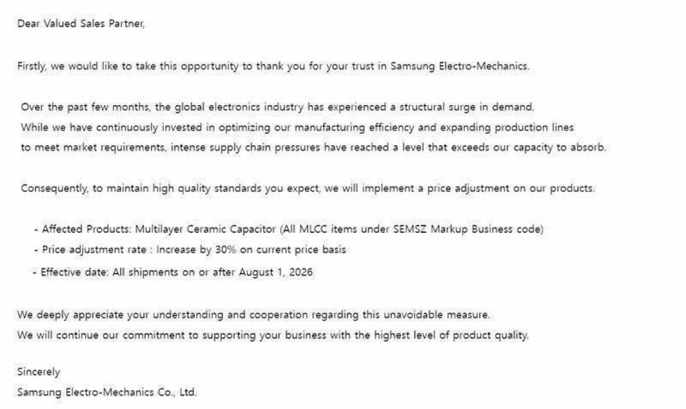

---

<!-- post_id: x:2082438992310514036 | ts: 1785327120 -->
## [X] 駿HaYaO · 2026-07-29 20:12

KLA 2026年6月季度（QJun26）業績摘要
- 營收季增7%、年增15%，創紀錄達36.6億美元，毛利率62.4%；9月季度指引為40億美元、毛利率62.5%
- 上調2026年全年WFE（晶圓廠設備）指引（含先進封裝）至低於1500億美元區間（先前為超過1400億美元），意味著年增約中段20%
- 2027年WFE共識約1900億美元；KLA正在為高於這個水平10-20%的情境做準備
- 上調2026年先進封裝製程控制營收至約11億美元，年增超過70%，高於先前高於50%成長的指引

- 自3月投資人日以來，需求明顯強化
- KLA仍受供應限制
- 預期2026下半年營收半年增約20%，並隨著供應產能上線，順序成長將延續至2027年
- 全公司交期約12個月，部分產品達18-24個月
- 部分工具的HBM製程控制強度已接近先進邏輯水準
- 預期2027年會有更多綠地DRAM投資與領先製程節點放量

- 維持60-65%的增量毛利率與40-50%的增量營業利益率目標
- 中國競爭仍可控
- 聲稱KLA規模約為最近製程控制競爭對手的6倍
- 長期2030年模型假設半導體營收CAGR 11%、WFE CAGR 12%，WFE達2150億美元
- 目標到2030年WFE市佔提升約150個基點；管理層承認2150億美元的WFE假設可能偏保守

---

<!-- post_id: x:2082437482390724920 | ts: 1785326760 -->
## [X] 駿HaYaO · 2026-07-29 20:06

SK Hynix 2Q26 重點摘要
- 營收：2Q26 營收 528 億美元（季增 51%、年增 257%），創歷史新高  
- 毛利率：83%（較 1Q 的 79% 上升）

需求展望  
- DRAM 需求預計 2026 年成長 mid-20%  
- NAND 需求預計 2026 年成長 high teens

定價與產品組合  
- 綜合 DRAM ASP 受部分高價值產品出貨延遲及產品組合變化影響

資本支出  
- 2026 年 CapEx 預期落在高 40 兆韓元區間（超過 300 億美元）  
- 增加主要來自 M15X 加速、龍仁 Phase 1 及先進封裝

長期協議  
- 已與約 10 家客戶完成 LTA  
- 典型合約期限約 5 年

HBM 最新進展  
- HBM4 量產出貨已於 2Q26 開始，2H26 計劃加速放量  
- HBM4 良率與品質已接近成熟的 HBM3E 水準  
- HBM4E 樣品已於 1H26 交付主要客戶  
- HBM4E 量產目標為 2027 年  
- 2027 年 HBM 數量與價格談判正與關鍵客戶進行中  
- 預期 HBM 獲利能力可透過技術領先、穩定製造與世代轉換維持穩健  
- 正在開發 hybrid bonding 與 IHBM 技術，用於未來產品（包含 HBM5）

DRAM 細節  
- 2Q bit 出貨量季增 high single-digit %（符合先前指引）  
- DRAM ASP 季增約 30%，主要由傳統 DRAM 價格上漲帶動  
- 3Q26 指引：bit 出貨量季增約 10%，主要由伺服器產品帶動  
- 預期 2H26 DRAM bit 成長將高於 1H26，受惠於 HBM4 與 1c-nm 傳統 DRAM 放量

NAND 細節  
- 2Q bit 出貨量季增 mid-teen %（符合先前指引）  
- NAND ASP 季增 mid-50%  
- 企業級 SSD 營收季增一倍

---

<!-- post_id: x:2082431979610427716 | ts: 1785325448 -->
## [X] 駿HaYaO · 2026-07-29 19:44

韓國市場自6月中旬起經歷劇烈去槓桿，KOSPI從6/22高點下跌近40%。最初由基本面與資金輪動觸發，後被槓桿ETF放大，近期呈現對沖基金平倉特徵。
根據上週估計（槓桿ETF平倉75%、對沖基金超50%），目前認為槓桿ETF平倉已完成、對沖基金約90%去槓桿達可接受水平。本週跌幅或有餘波，FOMC與財報期間需謹慎，但當前佈局已具吸引力，搭配低估值與強勁盈利。

去槓桿更新(1)：槓桿ETF
槓桿ETF規模6月下旬達500億美元（為美國4倍），導致高波動與強制去槓桿，引發其他投資者平倉。市場逆轉後規模降至170億美元，近期流入停滯。VKOSPI/VIX比率已開始下降，未來可能續降。

去槓桿更新(2)：高頻槓桿
掉期容量限制曾抑制高頻槓桿累積，JPM Prime L/S比率最高達5.7倍。目前已明顯正常化，7/27降至3.2倍。受7/28-29 Price Momentum平倉影響，預計進一步下降，接近2025年區間上限。

去槓桿更新(3)：零售保證金槓桿
保證金餘額從未過高也無快速增長，目前約200億美元並已回落。與槓桿ETF強制去槓桿不同，保證金有緩衝與自主權。韓散戶仍有充足股權收益、現金、收入與海外資產，可應對追繳並維持部位。

去槓桿更新(4)：海外資金外流
韓國（尤其記憶體股）表現不佳導致賣壓大減。兩大權重股在MSCI EM權重已從6月下旬的9.5%、8.3%降至6.5%、4.5%，外流壓力明顯放緩。

多元化交易建議段
繼續看好四方向：
(1)財富效應相關（百貨、化妝品、旅遊、經紀、建築）受強勁利好；
(2)生技製藥雖滯後，可受全球醫療情緒改善帶動；
(3)優先股折價近歷史高，高股息具吸引力；
(4)銀行具三重利好：資產質量改善、收入增長、BOK升息週期提升NIM，加上成交量放大帶動經紀收入。

---

<!-- post_id: x:2082430424236835273 | ts: 1785325077 -->
## [X] 駿HaYaO · 2026-07-29 19:37

Advantest 在公布 2Q26財報的同時，第二次上調了 CY26 測試機總可及市場預測。

最新展望已較 4Q25 時的初始預測高出 20%，其中邏輯TAM 上調 22%，記憶體TAM 上調 12%。

CY26 測試機 TAM 目前預期將較 CY25 年增 54%，主要由 SoC 領域帶動，該領域預估年增 61%。 https://t.co/6cHEHGmw8s

---

<!-- post_id: x:2082394808086302975 | ts: 1785316585 -->
## [X] 駿HaYaO · 2026-07-29 17:16

https://t.co/YOnJWMC7ey

---

<!-- post_id: x:2082394720719040794 | ts: 1785316565 -->
## [X] 駿HaYaO · 2026-07-29 17:16 _(接續 2 則)_

韓國17:00召開緊急會議，商討救市計畫

韓國KOSPI指數連續兩日觸發熔斷，自6月高點回撤約40%，周三盤中一度暴跌近12%，正式進入技術性熊市，市值蒸發數千億美元。主因是SK海力士財報指引不及預期：雖季度獲利大增，但宣布資本支出升至310億美元，且未明確股東回報與長期合約定價。

SK海力士與三星電子合計佔KOSPI權重超50%，兩巨頭同步重挫導致指數無處可躲；同時市場憂慮AI基建投資過熱，韓股與納斯達克相關性升至五年高點。

韓國財政部長具潤哲於北京時間17:00召開緊急會議，與金融監管高層商討救市方案。他先前在國會公開致歉，承認高風險「單股槓桿ETF」（5月推出）審批不嚴，並表示已準備一攬子穩定措施，必要時將追加。議員批評這些產品放大波動，使「國家淪為賭場」。

金融委員會正研議對個人投資者設更嚴格門檻。周三散戶淨賣出約1.7兆韓元（約12億美元），市場出現大量融資強平。

https://t.co/YOnJWMC7ey

---

<!-- post_id: x:2082375474928333168 | ts: 1785311976 -->
## [X] 駿HaYaO · 2026-07-29 15:59

KLA
我們將晶圓設備市場（包含先進封裝）的預期上調至 2026 年約 1,500 億美元的低端區間，高於先前預期的 1,400 億美元以上，以及相對 2025 年約 1,200 億美元水準的 mid-20% 成長。鑒於客戶前所未有的能見度，我們持續規劃 2027 年將有顯著成長。

先進封裝相關
現在預期先進封裝製程控制系統營收將在 2026 年成長至約 11 億美元，年增超過 70%。高於先前高 50% 成長的預期，且幾乎是先進封裝市場成長速度的兩倍。

Bloom Energy
今年，有數位原本已採用替代方案的客戶放棄原方案並轉向 Bloom。客戶一旦加入後，會看到我們解決方案的整體經濟價值，並下更多訂單。截至目前，我們已簽下多位去年年底報告積壓訂單中尚未包含的主要客戶，且將在今年出貨部分系統。這些客戶現在正在下更長期的訂單，導致我們的積壓訂單成長速度快於營收。

---

<!-- post_id: x:2082364029239210463 | ts: 1785309247 -->
## [X] 駿HaYaO · 2026-07-29 15:14

代理式 AI 正拉抬通用伺服器需求回升。信驊（5274 TT）約佔全球伺服器 BMC（每台伺服器內的管理晶片）市佔 70%，無論是 NVIDIA GPU 機架或 x86 伺服器皆然。

高盛上調今年出貨量預估至 3,260 萬顆，並預估 2028 年達 6,240 萬顆。營收今年預估成長 98%，2027 年再成長 85%。訂單能見度已延伸至 2027 年，部分訂單甚至已提前下單。

信驊預估 2026 年 AI 相關通用伺服器 BMC 出貨 850 萬顆、2027 年 1,230 萬顆。高盛認為這兩年數字都有上修空間，且公司還能在一家美國 AI ASIC 客戶端取得新市佔。

即便基板與 OSAT 成本上升，毛利率仍維持在近 70%。信驊透過調價將成本轉嫁出去。

與 Lattice（ $LSCC ）共同開發的 AST1840 預計 2027 下半年進入量產。管理層認為其長期出貨量有機會等同整個 BMC 市場規模。

---

<!-- post_id: x:2082362826275144054 | ts: 1785308960 -->
## [X] 駿HaYaO · 2026-07-29 15:09

市場對 hyperscalers（MSFT、GOOGL、AMZN、META 等）信用利差擴大 反應過度。
真正被忽略的是：GPU 現貨租賃價格至少是合約價格的 2 倍。

1. 超大規模業者目前「賺得不夠」（underearning）
- 現貨 GPU 價格遠高於舊合約價格
- 2024–2025 年簽合約的客戶在「賺過頭」
- 舊合約陸續到期後，價格會重新訂價 → 營收與現金流會加速成長

2. 營運現金流成長被嚴重低估
- 2026 Q1：約 31%
- 2026 Q2：預計加速到 50%
- 全年都會持續加速（共識預期錯誤地認為 Q3 會減速）

3. 資本支出資金缺口
- 會消失共識預估 2028 年新增 25–35 GW → 需 1.5–2.2 兆美元 capex
- 共識預估營運現金流只有 1.3–1.4 兆
- 但隨著合約重新訂價，現金流會大幅上修 → 原本可能需舉債的 1000–7000 億缺口會消失
- 即使真的要舉債，也只增加不到 1 倍 EBITDA 槓桿

其他觀察
- OpenAI、Cursor/Grok、開源推論雲過去兩個月成長明顯加速；Anthropic 持續高速成長且可能已轉正 FCF
- CDS 利差容易被操縱（做空股票 + 買 CDS），訊號價值有限
- 真正的風險不是信用，而是「電力上線與為 GPU 供電」的執行難度

Hyperscalers 目前被低估，合約重新訂價後現金流會大幅加速，信用利差有機會收窄。

---

<!-- post_id: x:2082258237806805069 | ts: 1785284025 -->
## [X] 駿HaYaO · 2026-07-29 08:13

早安！7/29 外電綜合整理

- 3037 欣興：亞系重申正向
2Q財報優於亞系券商預期，尤其受惠漲價，毛利率優於預期以及業外收益增加。預期載板報價持續調漲推升毛利率表現，資本支出調升至537億（from 370億），今日下午法說會，券商重申正向。

- 解讀Celestica財報：
2Q裡的通訊（networking）及        enterprise (server+storage) 業務分別年增 62% 與 167%，大幅高於公司原先指引的 50% 與 130%。3Q營收指引中位數季增 15%、年增 69%，也是高於市場預期。同時上修全年財測。

美系大行表示這對同業2345智邦也是正面解讀。意味行業內的400G交換器依舊強勁，而800G 需求持續增加+1.6T 放量，動能延續到明年，重申正向。

- 6669緯穎: 美系升目標
美系券商表示1）2H26一般伺服器需求持續；2）AWS Trainium 3 自3Q26起開始放量；3）AMD Helios 年底起陸續推出；4）明年取得TPU專案，預估市占率有10%。上修26-28年EPS至$369/$531.5/$610，以明年20xPE評價，同步升目標。

- 6831邁科：亞系重申正向
亞系券商表示公司與主要 CSP 客戶合作專案的進度優於先前預期，且2H26毛利率表現將更為樂觀。明年營收仍具上行空間，主要來自一位新的 CSP 客戶（～由氣冷產品轉向液冷產品）以及探針卡液冷產品。重申2026-2028 年營收展望維持不變：每年至少倍增。重申正向。

- 6239力成：美系重申正向
美系券商表示2Q 財報確認獲利穩健；對記憶體產業具正向意義。主要成長動能來自 NAND 封裝／測試（營收年增 69%），其次為 SiP 與模組業務。

展望2H26，AI 伺服器、HBM、SSD 等需求強勁，也看好 27-28 年先進封裝技術如 FC-BGA 與 FO-PLP 新訂單可望持續增加）。券商重申27-28年獲利將創新高的預估，重申正向。

 #下次會考

---

<!-- post_id: x:2082257864090149203 | ts: 1785283935 -->
## [X] 駿HaYaO · 2026-07-29 08:12

$SKHY 2026年第二季財報重點

2026年市場展望  
- DRAM 需求成長：年增中段 +20%  
- NAND 需求成長：年增高段十幾 %

業務亮點  
- 與 10 家客戶簽訂長期供貨協議  
- 智慧型手機與 PC 銷售因記憶體供貨困難而暫時調整；預期隨供應緊俏情況緩解後成長將恢復  
- 大型科技客戶因 AI 服務需求激增與運算產能短缺，持續擴大基礎設施投資與記憶體採購

---

<!-- post_id: x:2082096701419168036 | ts: 1785245511 -->
## [X] 駿HaYaO · 2026-07-28 21:31

AT&S 股價從歷史高點下跌 44%，部分內部人士已處於虧損狀態。

接受日經新聞（Nikkei）專訪時表示：
未來 24 個月或更長時間，需求將偏高，「我們將在未來兩年內看到產能不足」。

AT&S 宣布計劃追加投資 15 億至 20 億歐元（約 17 億至 23 億美元），擴建馬來西亞吉打州居林（Kulim）園區（毗鄰檳城）。此投資將新增第二座基板生產廠，以及一座生產基板核心與先進電路板的設施，並獲得 AMD 與另一家領先科技公司的長期客戶承諾支持。在宣布擴建後，AT&S 將 2026-2027 財年以固定匯率計算的營收成長預估，從原本的 30% 至 35% 上調至 45% 至 55%。

AT&S 執行長 Mertin 表示，半導體產業的技術瓶頸已從單純縮小電晶體尺寸（摩爾定律的做法）轉移。

他說：「現今的限制是通訊速度。誰在傳輸數據？我們用基板來做這件事。」
隨著 AI 晶片日益強大，處理器必須在中央處理器、圖形處理器與高頻寬記憶體之間傳輸龐大的數據量。因此，現代基板已從單純承載晶片的載體，演變為能決定運算速度、能源效率與系統性能的性能提升元件。

日益複雜的技術也意味著基板供應商正從傳統製造商轉變為開發合作夥伴。

Mertin 說：「這已不再只是供應商與客戶的關係。你必須合作、必須思考、必須擁有共同的路線圖。」

這意味著從晶片設計最早階段就與客戶並肩合作，共同開發封裝架構、精進製造流程並提升生產良率。

Mertin 否認科技產業正接近投資超級循環尾聲的說法，並主張 AI 才剛開始改變全球經濟。他說：「這不是超級循環結束後就結束了。我認為我們仍處於重大變革的開端。」

---

<!-- post_id: x:2082092199471362473 | ts: 1785244438 -->
## [X] 駿HaYaO · 2026-07-28 21:13

RT @statementdog: Testing is still only about 3% of what an AI GPU costs to make, but that share is climbing fast. Nomura has it at 1.9% for Hopper, 2.5% for Blackwell, 3.3% for Rubin, as chiplets and 3D stacking add test insertions and lengthen test time (SLT time on Rubin runs 2.5x Hopper's).

Nomura's chart below maps every vendor to its test stage:

$TER $ATEYY $COHU $FORM $KEYS $VIAV

---

<!-- post_id: x:2082080454799503819 | ts: 1785241638 -->
## [X] 駿HaYaO · 2026-07-28 20:27

SK海力士計畫於2026年下半年全面量產並出貨新一代低功耗行動記憶體LPDDR6，該產品已於今年3月完成全球首款開發認證。產品採用10奈米級第六代（1c）製程，相較前代LPDDR5X，資料處理速度與電力效率均有明顯提升。  

首批供應對象預計為中國小米，將搭載於其次世代旗艦智慧型手機。SK海力士自2013年起即與小米合作供應LPDDR系列產品。此次出貨後，預期將進一步擴大至vivo、OPPO等中國品牌旗艦機。  

LPDDR6不僅用於手機與平板，更被視為AI伺服器次世代低功耗模組SOCAMM的核心元件。隨著AI從訓練轉向推理，SOCAMM需求快速成長，三星、SK海力士與美光的競爭也將更激烈。  

目前行動DRAM市場由三星與SK海力士主導，中國長鑫存儲（CXMT）正積極追趕。因產能優先投入HBM與通用DRAM，LPDDR供應緊張、價格持續上漲，帶動今年第一季行動DRAM營收大增64.5%。SK海力士與三星已領先進入LPDDR6量產準備，掌握技術與市場先機。

---

<!-- post_id: x:2082076604813959657 | ts: 1785240720 -->
## [X] 駿HaYaO · 2026-07-28 20:12

SK海力士計畫於2026年下半年全面量產並出貨新一代低功耗行動記憶體LPDDR6，該產品已於今年3月完成全球首款開發認證。產品採用10奈米級第六代（1c）製程，相較前代LPDDR5X，資料處理速度與電力效率均有明顯提升。

首批供應對象預計為中國小米，將搭載於其次世代旗艦智慧型手機。SK海力士自2013年起即與小米合作供應LPDDR系列產品。此次出貨後，預期將進一步擴大至vivo、OPPO等中國品牌旗艦機。

LPDDR6不僅用於手機與平板，更被視為AI伺服器次世代低功耗模組SOCAMM的核心元件。隨著AI從訓練轉向推理，SOCAMM需求快速成長，三星、SK海力士與美光的競爭也將更激烈。

目前行動DRAM市場由三星與SK海力士主導，中國長鑫存儲（CXMT）正積極追趕。因產能優先投入HBM與通用DRAM，LPDDR供應緊張、價格持續上漲，帶動今年第一季行動DRAM營收大增64.5%。SK海力士與三星已領先進入LPDDR6量產準備，掌握技術與市場先機。

https://t.co/W9xcdcyZFF

---

<!-- post_id: x:2082073287308521748 | ts: 1785239929 -->
## [X] 駿HaYaO · 2026-07-28 19:58

台灣2027年半導體展望

1. 先進封裝、CoWoS預測調整
維持2027年底台積電CoWoS總產能18萬片／月預測，上修日月光FoCoS至5萬片／月以支援CPU與網通需求。2028年台積電產能預期22萬片／月，因優先擴大CoWoS而放緩SoIC，具上修空間；第四季擴產下修至7萬片。輝達仍佔逾50%最大客戶，2027年分配估達1.03億片；博通次之，聯發科、超微（估30萬片，多來自日月光）將獲更多產能，聯發科客製ASIC市佔有望提升。

2. 晶片產出、BOM成本調整
輝達取消／推遲Kyber與四晶粒Rubin Ultra後，調整產出預測：Rubin Ultra中介層僅小幅增加，每晶圓估10-12個。輝達2027年總產出上修至1,240萬片（2026年820萬片）。Rubin短期出貨下修至約100萬片，Blackwell第三季較高，2026年總產出大致不變，但Rubin高美元含量將衝擊供應鏈（如京元下修指引）。HBM4成本升至每GB31-32美元，Rubin GPU估7.8-8萬美元；其他專案HBM成本恐翻倍至35-36美元。仍看好AI需求，token成本為關鍵。

3. 輝達新機架架構設計
Kyber因頻寬問題取消／延遲後，輝達研發新架構，仍維持576運算晶粒。目前兩方案：一為保守型，四個Oberon機架以傳統scale-out連接；二為雙機架，每架144 GPU（各兩晶粒），機架間採NPO／CPO scale-out、內部用纜線scale-up。設計尚未定案，誰受惠難定，但輝達對NPO／CPO仍積極。

4. Google 2028積極目標
Google計劃2028年部署1,200-1,500萬顆自家TPU（V9四晶粒），產能消耗將倍增。僅靠台積電難達標，須英特爾供應。英特爾EMIB產能2026年底1-1.2萬片／月、2027年底倍增至2.4-2.5萬，並增資本支出強化先進封裝。供應商Ibiden財報與未來資本支出值得關注。

5. 選股建議
短期輝達供應鏈可能因Rubin出貨低於預期與機架設計不確定而落後。較看好CPU、SPE與TPU動能。CPU首選日月光（高曝險Vera／Venice）；TPU首選聯發科，回檔為進場機會；台灣SPE多集中先進封裝而非WFE。

---

<!-- post_id: x:2082071908326232400 | ts: 1785239600 -->
## [X] 駿HaYaO · 2026-07-28 19:53

$GLW 2026年第二季度財報亮點

-「我們正進入加速成長的新階段，我們預計從2026年第四季度至2030年第四季度，銷售年複合成長率將達19% – 同時盈餘成長將快於銷售，投資資本報酬率大幅提升，並產生更多自由現金流。」  

-「我們核心銷售成長17%至47.4億美元，核心每股盈餘成長30%至0.78美元。我們將核心毛利率擴大120個基點至39.6%，核心營業利潤率擴大190個基點至20.9%。」

---

<!-- post_id: x:2082068664422220024 | ts: 1785238827 -->
## [X] 駿HaYaO · 2026-07-28 19:40 _(接續 2 則)_

艦長J快訊    破底了😭～ 
2026/7/28
上周期待修正接近尾聲，但看來籌碼比想像中的還亂，再加上近期華麗的財報對股價完全沒有激勵效果，利多不漲就是要更小心一些。總之，上周加碼的部位到了停損點就先出場觀望一下🥲。
如果只看技術分析，目前這種破底量縮的狀況很難樂觀；距離下一個支撐點還有一段距離，除非有明確底部訊號出現，不然暫時不宜增加持股。
講幾個觀察點
1）韓國的融資政策：731之後保證金大幅提高，而且可能研擬個人投資上限，市場當然不會等到731才開始反應，這幾天的修正就是在反應這件事。屆時觀察融資餘額，也許會修正到合理的水準？

2）台灣的融資餘額（含不限用途信貸、個股期等）..... 這一波應該已經把一些高波動個股的融資清的差不多了，但整體餘額仍有清理空間，看看過兩天會不會有什麼變化。

3）CSP 財報與聯準會政策.... 把這兩件事放在一起，是因為csp 持續的舉債需求已經成為市場的主要擔憂，如果聯準會突如其來的降息，當然這件事就可以暫時解決..... 但機會應該不大 😅。如果反向升息（或是升息機率增高），那短線這些科技股債券的流動性可能會更糟。 除此之外，本周msft / aws/ meta 都可能繼續宣布增加capex.... 當前的市場氛圍對這一點不是很樂觀，當然如果忽然宣布調降，那對供應鏈來說就更糟糕了。
總之，本周接下來有一堆重大事件＆ 變數，操作難度大幅增加，還是多些避險吧。

投資總有風險，本人過去績效不做未來獲利之保證。最近詐騙猖獗，本人不收會員、不用追蹤、不騙流量、不需粉絲、更不必按讚分享開啟小鈴鐺。快訊僅供好友交流之用，有股票推薦就是準備倒貨；如果你與我看法不同，你肯定是對的千萬不要被我影響。 顯示較少
#下次會考

https://t.co/qRxJ8TsIbA

---

<!-- post_id: x:2082045829138063597 | ts: 1785233382 -->
## [X] 駿HaYaO · 2026-07-28 18:09 _(接續 2 則)_

日本熊本縣28日下午發生規模7.1強震，震央位於熊本地方，震源深度約10公里，最大震度達7級（宇城市、冰川町），並對有明海、八代海發布海嘯注意報。

台積電位於熊本縣菊陽町的JASM廠區震度達疏散標準。公司回應指出，以人員安全為第一優先，已依緊急應變程序進行室內外疏散與人員清點，後續將持續確認廠房、設備及生產線影響。目前尚未說明機台或晶圓生產是否受損。

半導體廠遇強震通常會啟動人員疏散、機台安全停機及廠務系統檢查，需逐項確認機台位移、化學品與氣體管線，以及在製晶圓狀況。

JASM為台積電日本晶圓製造基地，一廠已於2024年底量產（12/16奈米及22/28奈米特殊製程），二廠正興建中，規劃導入3奈米製程，因應AI與高效能運算需求。

https://t.co/zjaKQG5t3d

---

<!-- post_id: x:2082045378065789043 | ts: 1785233275 -->
## [X] 駿HaYaO · 2026-07-28 18:07

TrendForce: AI需求催出日韓MLCC廠單月出貨新高，消費級訂單外溢效應續熱

TrendForce指出，受AI強勁需求拉動，2026年6月村田（Murata）、三星電機（SEMCO）、太陽誘電（Taiyo Yuden）三大日韓MLCC廠單月出貨同步創近五年新高，分別達1,400億、980億、400億顆，且動能延續至7月。Google TPU、AWS Trainium等自研ASIC持續拉貨，高容值、低電壓、小尺寸MLCC需求不墜，成為逆風中的亮點。

相對地，消費性電子需求低迷。美伊地緣衝突推升油價與通膨疑慮，抵銷美國CPI降溫利多；Apple調漲MacBook、iPad售價也反映成本壓力，第三季傳統旺季效應恐難完全顯現。

日韓廠加速將消費規X5R產能轉向AI用高階X6S/X7R，導致消費性中高容（1μF～22μF）產能受擠壓，主流料號庫存普遍低於30天。

通路與Tier 2/3客戶急單湧現，訂單外溢效應擴大，台系與陸系製造商接單能見度改善、報價走揚。代理商平均漲價20-25%，現貨市場更達2～3倍，呈現「終端需求偏弱、通路價格偏強」的錯位格局。

https://t.co/5WkH0uxNR3

---

<!-- post_id: x:2082043480248139826 | ts: 1785232822 -->
## [X] 駿HaYaO · 2026-07-28 18:00

力成（6239）法說會，董事長蔡篤恭指出：

與AMD的FOPLP（扇出型面板級封裝）合作依計畫推進，設備已進駐友達廠區並安裝驗證中，有信心2027年中前量產，成為全球首家量產FOPLP AI應用產品的公司，並持續爭取更多AMD AI晶片業務。

與博通於新加坡成立合資公司，共同開發FOPLP重布線層（RDL）技術，力成成其策略性優先夥伴。合資專服務博通，不影響其他客戶。

正式切入CPO領域：負責生產光學引擎（Optical Engine）。今年初已開發，完成部分工程品送樣；年底開始小量生產OBO及OSFP版本，貢獻小量營收。預計2027下半年先整合至交換器出貨；直接整合至AI晶片的CPO產品最快2028年底後才可能量產。

FOPLP產能初期約2,000片設備已準備；設備交期約一年。力成自2015年投入，具先行優勢，已開發超5倍Reticle Size大尺寸AI封裝能力，朝9倍甚至14倍發展，面板級封裝在大尺寸AI晶片產出效率更具競爭力。

https://t.co/jZuK9ASiIT

---

<!-- post_id: x:2082043227126092191 | ts: 1785232762 -->
## [X] 駿HaYaO · 2026-07-28 17:59

https://t.co/ycrMvZ3qzS

---

<!-- post_id: x:2082043193147945296 | ts: 1785232754 -->
## [X] 駿HaYaO · 2026-07-28 17:59

基隆地檢署持續偵辦國內業者違法出口高階AI晶片至中國案，28日公布最新進度：24日偵訊輝達（NVIDIA）張姓客戶經理後聲請羈押，法官裁准。全案至今已有7人遭收押。

本案源於海巡署查緝，發現游姓等人以不實文件，經轉口貿易將搭載輝達高階晶片的伺服器出口至美方禁售的中港澳地區。5月20日首波搜索，游、王、陳3人遭羈押。

6月底第二波行動，搜索美超微台灣分公司、青雲國際科技及是方電訊，帶回6人。其後美超微王姓經理、林姓業務，以及青雲呂姓總經理遭羈押。

檢方指出，張男明知美超微組裝、搭載輝達B300晶片的AI伺服器屬美方限制出口至中國產品，仍於客戶資格審查中出具同意文件，協助違規出口。24日第三波搜索其辦公處與住處後帶回偵訊，認定涉案重大且有滅證、串證之虞，當庭逮捕並聲押獲准。全案持續擴大偵辦中。

---

<!-- post_id: threads:3951084913919457173 | ts: 1785226047 -->
## [Threads] Kok Yu · 2026-07-28 16:07

蠻多說不用布的誤導.... 

CCL不用布，不代表膠片沒有用布

以前不太提膠片...是因為市場大多比較關注銅箔基板的發展

但隨著PTFE Core CCL這種方案 太軟，膠片的重要性變得很重要(提供支撐)

膠片 就是 用電子級玻纖布/石英布 去加上 樹酯等配方製作而成

做多層板和HDI都會碰到....

---

<!-- post_id: x:2081962674766917716 | ts: 1785213557 -->
## [X] 駿HaYaO · 2026-07-28 12:39

三星電子正將華城園區H1一座約20年歷史的潔淨室，改造為「通用DRAM專用端晶圓廠（end-fab）」。此舉旨在把原先分散於華城H2與天安的後端產線集中一處，並在剩餘空間增建設備，快速擴大通用DRAM供應。

背景是上半年通用DRAM價格暴漲：DDR4漲逾80%、DDR5漲190%，遠超HBM。通用DRAM可即時反映市況、利潤更高，而HBM受長期合約限制且耗用晶圓量約4倍。蘋果等客戶已開始評估中國長鑫（CXMT）等替代供應商，三星需短期最大化出貨以鞏固客戶。

華城H1為最佳地點：原生產2D NAND，近年已停產；天花板較低，不適合主晶圓廠大型設備，但端晶圓廠設備較小、環境要求低。利用現有水電等基礎設施，只需改裝與裝機即可快速投產，遠比新建廠節省時間與成本。

同時可與華城主晶圓廠同址搭配，減少晶圓運輸與等待，複製平澤「前後端一體」高效模式。

業界預期年底前通用DRAM產能較年初提升約15%。此舉不僅短期提升出貨與獲利，長期也能防禦中國業者追趕，穩固與NVIDIA、Google、Apple等大客戶的合作關係。

https://t.co/NGDxdJTbs6

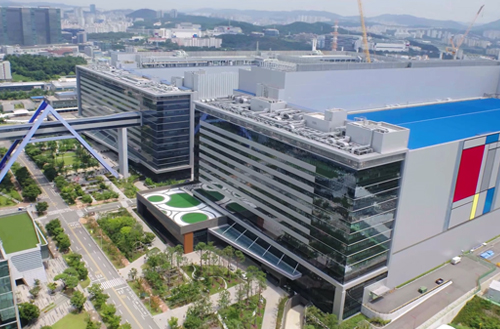

---

<!-- post_id: x:2081960790127747310 | ts: 1785213107 -->
## [X] 駿HaYaO · 2026-07-28 12:31

美國半導體產業協會（SIA）2026年報告指出，全球半導體市場正迎來歷史性成長。2025年全球銷售額創下7956億美元新高，WSTS預測2026年將達1.5兆美元。成長主因是AI加速部署，以及先進運算、5G/6G、醫療與國防系統的持續發展。

美國持續領先：
2025年美商銷售額4250億美元，市佔53.4%，創1984年來新高。美企研發投入創紀錄768億美元。自2020年起，私部門已宣布逾7700億美元投資，涵蓋30州160專案，強化國內製造與供應鏈韌性。

AI是核心動力：
單一AI伺服器機櫃含超過4500顆半導體，晶片佔機櫃價值逾95%、資料中心資本支出一半以上。預計至2028年全球AI資料中心投資逾4兆美元，其中高達2.8兆美元用於半導體。

然而全球競爭加劇，各國積極投資製造與研發，產業也面臨供應鏈中斷、地緣政治與市場扭曲挑戰。SIA呼籲政策持續支持研究、製造、人力與供應鏈，以確保美國技術領導地位。

https://t.co/aFaY4LGxOX

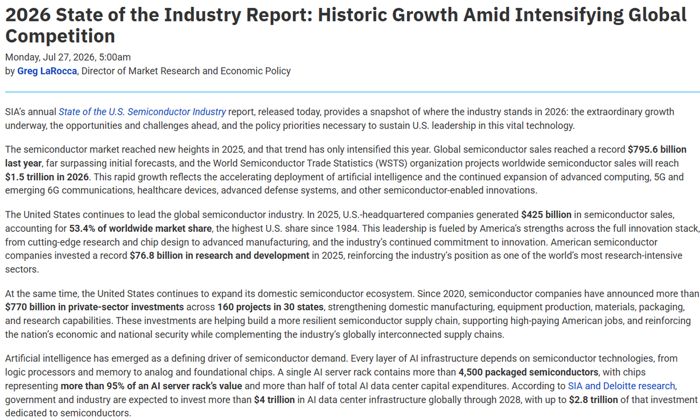

---

<!-- post_id: x:2081934906918420865 | ts: 1785206936 -->
## [X] 駿HaYaO · 2026-07-28 10:48

$NVTS 2026年第二季度財報亮點

- 「我們強勁的第二季業績，以及對下半年持續雙位數季度成長的預期，顯示出我們策略轉向 Navitas 2.0，並專注於高功率市場的日益成功。」

- 「隨著人工智慧的快速採用，我們看到市場需求加速，以克服人工智慧基礎設施中關鍵的電力瓶頸……到今年年底，Navitas 將完成轉型，來自行動裝置與低階消費性產品的營收將變得微不足道，幾乎所有銷售都來自高功率市場。」

---

<!-- post_id: x:2081897365548757424 | ts: 1785197986 -->
## [X] 駿HaYaO · 2026-07-28 08:19

早安！
7/28 外電綜合整理✈️

- 6669緯穎: 亞系升目標
亞系券商表示新的 CSP、AWS及 AMD AI 伺服器有望帶動明年營收上修。其中AWS T3 導入時程優於預期，並上修明年出貨量至3.2m from 2.6m，而且10-15% 機櫃將採用液冷版本。AMD Helios券商也上修出貨量，明後年升至4k (from 2k)/7.2k (from 3.7k)。上修26-28年EPS至$396/$594/$823.5，以18xPE評價，同步升目標。

- 6274台燿：亞系升目標
亞系券商預期2Q大幅漲價會帶動毛利率明顯擴張，預估升至29.5%。展望2H, 預期3Q營收季增22%、4Q季增10%。同樣的，AWS T3也添營運柴火，預期台燿取得20-30% 市占率。伴隨著產能及ASP擴張，券商上修26-28年EPS至$36/$80/$129.5，以26Q4-27Q3的35xPE評價，同步升目標。

- 記憶體產業：
美系大行表示DDR4 漲價力道更強，每月漲幅可超過 20%，整季有望至少漲3成。SLC/MLC NAND 3Q漲5-6成、NOR Flash 3Q漲3-4成。券商認為相關廠商如旺宏、南亞科、華邦電在1.0x 2028E BVPS 具有良好的下檔支撐。重申正向評等不變。

- 3665貿聯: 美系重申正向
6月自結優於美系大行預估，認為2Q毛利率會維持在30%以上。展望2H，電源互連、資料互連動能明確，重申正向。

- 5904寶雅：美系升目標
2Q26 同店銷售與營運槓桿表現強勁，大幅優於美系券商預期。預期市占率持續提升，2H營收及獲利預期成長，上修26-28年EPS至$37.4/$41/$44，以未來1年19xPE評價，同步升目標。

- 6223旺矽：美系降目標
儘管美系券商上修26-27年EPS至$67.6/$149.5，但下修28年至$224.8。以28年40xPE評價，同步降目標。

 #下次會考

---

<!-- post_id: x:2081755288353546747 | ts: 1785164112 -->
## [X] 駿HaYaO · 2026-07-27 22:55

英偉達正推進總值或超7500億美元的AI基礎設施交易。上周五與SK海力士母公司公布逾5000億美元合作，將在韓國建超2吉瓦AI數據中心；同時洽談向OpenAI提供最高2500億美元擔保，助其租用美國數據中心算力，並為3500億美元芯片採購融資。

此類交易引發「循環融資」質疑：英偉達出資並持股的公司往往回頭購買其芯片，可能人為推高行業需求與估值，一旦AI需求不及預期，恐放大損失並造成系統性衝擊。類似安排已蔓延至谷歌為Anthropic擔保等。

黃仁勳強調這只是資金需求的一小部分，反駁循環融資說法「荒謬」，並稱韓國是AI基建黃金時代。英偉達今年已宣布超5400億美元相關交易，持續加碼OpenAI、CoreWeave等。投資者與分析師仍警示債務上升與激勵扭曲風險。

---

<!-- post_id: x:2081753527760646221 | ts: 1785163692 -->
## [X] 駿HaYaO · 2026-07-27 22:48

據The Information獨家報道，一家上海國資背景企業已開始量產浸沒式深紫外（DUV）光刻機，這是中國降低晶片製造對外依賴的重大突破。知情人士稱，該公司整合多家國內研發團隊（含上海宇量昇科技），今年目標生產約5台，2027年達20台，計劃交付中芯國際、華虹半導體及長鑫存儲等本土廠商。

此舉有望逐步替代荷蘭阿斯麥的DUV設備。美國目前禁止中國採購最先進的極紫外（EUV）光刻機，迫使依賴老款DUV；國會審議中的法案或進一步收緊限制。中國EUV項目仍處原型階段，尚需數年。

儘管DUV技術複雜度低於EUV，國產機仍面臨挑戰：性能與質量落後阿斯麥，部分關鍵零部件依賴日本導致交貨延遲，客戶需數月測試精度與兼容性。產量遠低於阿斯麥去年交付的131台，短期難構成直接威脅，但若西方限制加碼，將加速中國轉向本土設備。

在全球AI熱潮推高晶片需求下，國產DUV可助力擴大成熟製程產能（如電源管理晶片），並通過多重圖案化支持先進晶片生產。這標誌著自2022年美國全面管控後，中國光刻研發從科研轉向商業化路徑的重要進展。

---

<!-- post_id: x:2081740885616705957 | ts: 1785160678 -->
## [X] 駿HaYaO · 2026-07-27 21:57

摩根士丹利現在預期2027年一般伺服器出貨量將再成長20-30%。這波成長是由供給端驅動。

主要ODM的伺服器CPU交貨率約在80-90%。英特爾預期第4季將再次低於需求出貨。推論用的CPU對GPU比例目前接近1:1，相較於英特爾上季提到的1:3-4。

Intel（$INTC）稱此為「其歷史上最嚴重的供應限制之一」：晶圓、記憶體、載板。封裝端最大的瓶頸是載板。

Intel首次預付載板供應商款項。

摩根士丹利認為這是賣方市場，載板廠商將調漲價格：欣興電子（3037 TT，CPU ABF）、南電（8046 TT，網通ABF）、金像電（2368 TT，伺服器PCB）。

---

<!-- post_id: x:2081740093665243598 | ts: 1785160489 -->
## [X] 駿HaYaO · 2026-07-27 21:54

Google正開發「Frozen v2」專用晶片，針對Gemini模型優化推論效率。不同於通用TPU，它將Gemini架構直接硬體化至矽晶，提升速度與功耗表現。

該晶片採用晶片上SRAM，無需CoWoS封裝。有限量產預計2027年啟動，2028年擴大出貨。

業界查核顯示Marvell很可能是開發合作夥伴（尚未正式確認）。此計畫呼應推論負載朝SRAM方案發展的趨勢。

雖然初期量能有限，但仍可支撐Marvell客製化矽晶業務，配合管理層2027年成長逾100%的展望。

---

<!-- post_id: threads:3950508688909930628 | ts: 1785157355 -->
## [Threads] Kok Yu · 2026-07-27 21:02

這年頭連漲價函都要看一下是不是真的了...

---

<!-- post_id: x:2081674874418852288 | ts: 1785144940 -->
## [X] 駿HaYaO · 2026-07-27 17:35

TrendForce指出，NVIDIA Spectrum-X CPO交換器已開始小量出貨給合作夥伴，Broadcom 51.2T Bailly CPO交換器亦持續小量出貨，象徵共同封裝光學（CPO）正式進入量產階段。

NVIDIA與台積電合作的Spectrum-X採COUPE先進封裝，處理能力達400 Tb/s，2026下半年產能將擴大。Broadcom則由台達電、Micas協助量產，較傳統可插拔模組功耗降低70%，Meta等業者已完成驗證。

CPO雖能有效降低功耗，成為下一代高頻寬交換器核心方向，但面臨三大供給瓶頸：光引擎製程複雜、良率與熱管理要求高，僅少數供應商能量產；矽光子晶圓代工與後段封裝精度要求高、產能建置週期長；CPO高度依賴COUPE等先進封裝，卻與AI、HPC晶片爭搶產能，供應鏈資源受擠壓。

因應策略上，雲端巨頭多透過長期採購與投資上游矽光子廠鎖定供給；NVIDIA深化與台積電合作達垂直整合；Google則加速自研光學元件。

TrendForce預期，垂直整合將成新常態，能自主掌握矽光子、光引擎與先進封裝的廠商，將在2027-2028年CPO放量週期中取得領先優勢。

https://t.co/AtnW212Acl

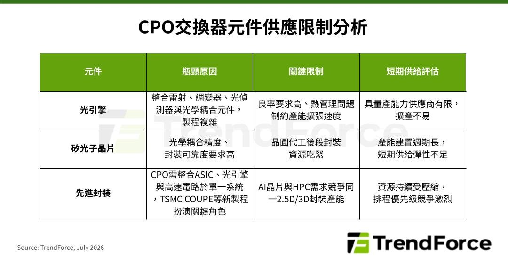

---

<!-- post_id: x:2081672715858264346 | ts: 1785144425 -->
## [X] 駿HaYaO · 2026-07-27 17:27

MLCC價格改定之請求（追加改定要請）
2026年7月23日
太陽誘電股份有限公司

平素承蒙格外關照，深表謝意。

茲就本公司產品「積層陶瓷電容器（MLCC）」實施價格改定一事，謹此通知。針對近期資材及材料價格高漲，本公司迄今已盡最大努力進行成本削減，惟目前情況已達僅靠本公司自助努力無法完全吸收之水準。

上個月曾提出一次改定要請，但仍未能完全吸收，故再次請求自2026年9月1日本公司出貨分起實施價格改定。

關於供給方面，目前全公司仍無法完全因應，交期無法如期對應的情況持續中。即使此次價格改定獲得同意，仍無法保證交期如期對應，但本公司將盡可能努力調整。

Taiyo Yuden

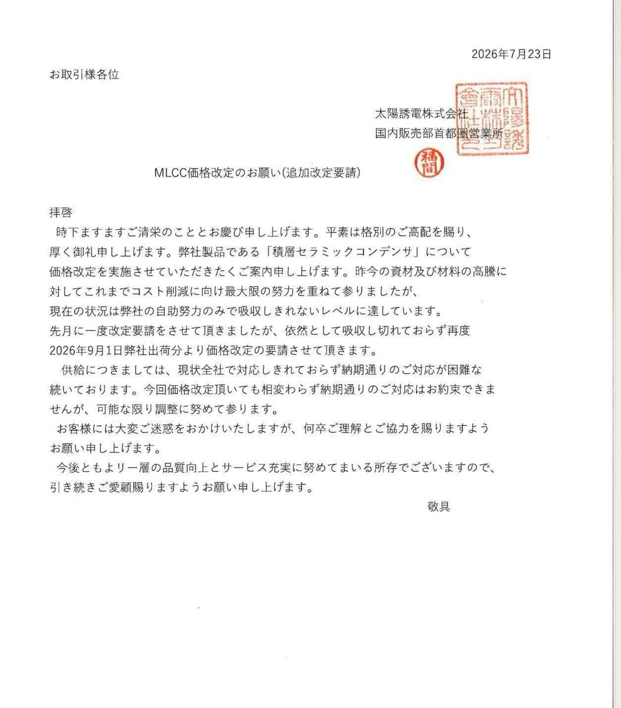

---

<!-- post_id: x:2081646521314119969 | ts: 1785138180 -->
## [X] 駿HaYaO · 2026-07-27 15:43

SemiAnalysis 持續在大型運算集群上進行基準測試（超過 8000 萬美元的運算資源：包括 Nvidia GPU、AMD GPU、Google TPU、Amazon Trainium），使用最新的推理引擎、驅動程式與 PyTorch 版本。
他們每天透過自動化 CI 測試最新的中國模型（GLM/智譜、Moonshot/Kimi、阿里巴巴等）。

過去他們使用固定上下文長度進行測試。現在分析了超過 500 萬美元價值的真實生產環境 Claude Code 追蹤資料（Agent X 工作負載，來自捐贈與內部生成）後，情況已有所改變。

GPU 本身仍然重要，但對於真實的代理（agent）工作負載來說，記憶體卸載、儲存解決方案以及相關系統變得更加關鍵。

在大多數情況下，Nvidia GPU 比 AMD GPU 更快，但擁有更多記憶體的 AMD GPU 在某些情境下反而能超越 Nvidia。

一顆「較差」的 GPU 搭配更優秀的儲存解決方案，可以擊敗缺乏這些解決方案的最佳 GPU。單純購買最新、最先進的 GPU 已不再能保證最佳的推理經濟效益——你需要完整的技術堆疊（儲存、記憶體、前端網路等）。

要評比整體頂尖玩家是個困難的多變量問題。一般來說，你需要最好的 GPU（例如 GB300），同時還要搭配最佳的儲存與記憶體解決方案。Patel 拒絕透露他們目前排行榜上的領導者，但強調儲存與記憶體非常重要。

---

<!-- post_id: x:2081646520462438518 | ts: 1785138180 -->
## [X] 駿HaYaO · 2026-07-27 15:43

AI伺服器引發的記憶體供應短缺正蔓延至汽車產業。隨著自動駕駛與軟體定義汽車（SDV）普及，每輛車所需記憶體容量較以往增加2至4倍，主要用於ADAS、數位儀表、車用AI、自動駕駛電腦及OTA更新等。

三星、SK海力士、美光等業者優先提高HBM與企業用DRAM產能，導致通用DRAM與NAND供應緊俏，恐進一步影響車用記憶體供需。全球車用記憶體市場預估從2025年的75億美元成長至2034年的192億美元，增幅逾2.5倍，成為繼AI伺服器後的另一大成長動力。

為確保貨源，美光已與高通、哈曼、電裝、現代摩比斯等簽訂策略協議，並與福特、GM達成長期供應合約。現代汽車集團與雷諾韓國也加強與半導體業者合作及全球採購。三星正擴大LPDDR5X與車用UFS，年底將量產UFS 5.0；SK海力士則加速高可靠性車用DRAM與低功耗記憶體開發。

業界指出，AI伺服器與汽車同時競逐記憶體，德國、日本等整車廠也積極搶簽長期合約，供應鏈爭奪戰將更加激烈。

https://t.co/Jh1iqGE1tA

---

<!-- post_id: x:2081645420544139301 | ts: 1785137918 -->
## [X] 駿HaYaO · 2026-07-27 15:38

受AI資料中心熱潮推升記憶體價格，全球出現「晶片通膨」，中國智慧型手機市場明顯萎縮。小米、OPPO、vivo、榮耀等中低階品牌因難以轉嫁成本，自願減產15-20%。

三星電子正逆向思考，考慮採用價格低廉的中國製行動DRAM，大幅降低Galaxy A系列等平價機成本，藉此搶攻中國市場空缺。目前三星在中國市占僅約0.6%，此舉有望提升市占並帶動MX事業部營收。

券商已大幅下修MX事業部獲利預估，部分甚至預估第二季出現數千億至1兆韓元營業虧損。專家認為，在本土品牌減產之際，三星導入中國DRAM是現實且具潛力的策略選項。三星官方則表示「無法確認」此事。

---

<!-- post_id: x:2081644655582847364 | ts: 1785137735 -->
## [X] 駿HaYaO · 2026-07-27 15:35

野村證券開始覆蓋中國最大DRAM製造商長存儲存技術（CXMT，688825），給予「買入」評級，目標價116人民幣，潛在上漲空間逾12倍。  

看好理由：全球內存供需持續緊張。2026-2030年比特需求增長約7倍（年複合成長逾60%），即使考慮密度提升，產能擴張僅能達30-40% CAGR，供給仍不足。CXMT有望受惠，比特成長30-40%，全球DRAM市佔從約10%升至2028年末約16%。在審慎假設下，預計2026-28年銷售/淨利年複合成長率達63%、64%、58%。  

目標價對應2028年EPS約5.8元，估值與美光等同業相當。  

主要風險：美國MATCH法案及制裁可能限制先進設備、材料取得，影響12-16nm製程推進及上海產能擴張（占總產能30-40%）；終端需求疲軟、地緣政治緊張、國產供應鏈不足。

---

<!-- post_id: x:2081623367749337242 | ts: 1785132660 -->
## [X] 駿HaYaO · 2026-07-27 14:11

蘋果正面臨二十年來最大轉折：過去靠龐大採購量與預付款，以強勢談判鎖定低價記憶體，如今卻要與AI巨頭競爭同一批LPDDR記憶體，而且對手願意支付更高利潤、下單量更大。

LPDDR5X SOCAMM2因功耗僅為DDR5的三分之一、吞吐量更高，成為AI資料中心首選。單一伺服器機架常配備2TB這類記憶體，是iPhone 17 Pro的170倍，資料中心規模更讓蘋果難以匹敵。

執行長庫克已警告DRAM庫存告急，公司也宣布產品漲價轉嫁成本，而未自行吸收。行動裝置DRAM與NAND需求持續萎縮，伺服器應用已佔整體供應一半，進一步削弱蘋果議價力。昔日讓美光等供應商吃盡苦頭的主導地位已不復存在。

蘋果轉而寄望中國記憶體廠商（如長鑫、長江），但這些業者對國內客戶尚且嚴苛，能否給蘋果優惠仍存疑。

---

<!-- post_id: x:2081620851456414082 | ts: 1785132060 -->
## [X] 駿HaYaO · 2026-07-27 14:01

IBS Global I/O Semiconductors

Intel能否挑戰台積電先進封裝領導地位？
Intel的EMIB-T vs 台積電的CoPoS——競賽開始
先進封裝是提升雲端AI效能並改善功耗的關鍵。其總市場規模預估從2026年190億美元成長至2030年1220億美元，年複合成長率達59%。台積電CoWoS目前為主流，但封裝日益複雜，產業需新方案。Intel的EMIB-T因台積電供應受限及供應鏈多元化需求而崛起，台積電則推進CoPoS。本報告分析兩者競爭優勢與供應鏈機會。

EMIB-T適合可擴展性與成本；CoPoS提供更佳效能
EMIB-T模組化與成本優勢，使其成為大型AI加速器首選。核心價值在於簡單橋接架構、取消中介層降低成本，以及超大封裝可擴展性。台積電CoPoS則以更緊密互連、訊號完整性、3D堆疊選項與執行往績取勝。挑戰包括Intel需提升良率，台積電需解決翹曲與製程均勻性。EMIB-T良率約50%，但產能擴張可支援特定產品。

台積電仍具良好定位，未來成長穩健
EMIB-T可成特定超大規模ASIC第二來源，但追求高效能的客戶仍偏好CoPoS。EMIB-T目標2027下半年至2028量產，略早於台積電2028年。預期台積電維持高市佔。壓力測試下，若Intel取得13%市佔，台積電先進封裝營收2026-30年仍可達50%成長，2030年市佔約70%，佔總營收18%。較低情境下成長放緩至47%，市佔62%。

股票影響
台積電在雲端AI機會中定位良好，可維持技術領導。EMIB-T成功放量雖利Intel營收，但估值考量下維持中立。
看好聯發科TPU機會，執行風險可控。CoPoS與EMIB-T將帶動新一輪資本支出，有利設備商。
首次給予萬潤買進評等，目標價1550元。亦看好ASM Pacific，首選Ibiden與欣興。

---

<!-- post_id: x:2081597488981852329 | ts: 1785126490 -->
## [X] 駿HaYaO · 2026-07-27 12:28

野村證券開始覆蓋中國最大DRAM製造商長存儲存技術（CXMT，886885 CH），給予「買入」評級，目標價116人民幣。  

看好理由：全球內存供需持續緊張。2026-2030年比特需求增長約7倍（年複合成長逾60%），即使考慮密度提升，產能擴張僅能達30-40% CAGR，供給仍不足。CXMT有望受惠，比特成長30-40%，全球DRAM市佔從約10%升至2028年末約16%。在審慎假設下，預計2026-28年銷售/淨利年複合成長率達63%、64%、58%。 

 目標價對應2028年EPS約5.8元，估值與美光等同業相當。

主要風險：美國MATCH法案及制裁可能限制先進設備、材料取得，影響12-16nm製程推進及上海產能擴張（占總產能30-40%）；終端需求疲軟、地緣政治緊張、國產供應鏈不足。

---

<!-- post_id: x:2081559543948234866 | ts: 1785117443 -->
## [X] 駿HaYaO · 2026-07-27 09:57

Synopsys 與 NVIDIA 攜手打造自主工程新時代

Synopsys 於 2026 年 DAC 大會宣布，與 NVIDIA 合作推出從矽晶到系統的完全自主代理式工程工作流程。核心亮點為完全自主設計驗證代理，可協調整個晶片驗證生命週期，將達到經驗證 RTL 的時間最高加速 50 倍，並額外提升 20% 覆蓋率，把原本需數週的人工流程壓縮至數小時。

同時展示首個完全自主 CAE 熱管理與電子冷卻工作流程，以及自主類比混合訊號（AMS）流程，生產力最高提升 3 倍。Synopsys 也擴展超過 20 項 GPU 加速產品，包括 PrimeSim SPICE 最高 18 倍加速。

這些技術結合 Synopsys AgentEngineer 與 NVIDIA Nemotron、Agent Toolkit 等，正推動工程從輔助走向完全自主，預計 2026 下半年供應，大幅提升研發效率與創新速度。

https://t.co/HBscXjU5t2

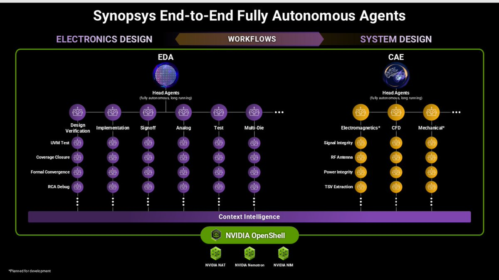

---

<!-- post_id: x:2081535643084378511 | ts: 1785111745 -->
## [X] 駿HaYaO · 2026-07-27 08:22

輝達正與OpenAI洽談，為俄亥俄州南部一個10吉瓦超大型數據中心提供約2500億美元融資擔保。該項目由軟銀旗下SB Energy開發，總成本恐超5000億美元（含晶片），為迄今最大規模AI數據中心。

電力由美國政府控制，日本依貿易協議出資330億美元興建天然氣電廠。商務部長盧特尼克參與電力分配。輝達擔保可讓軟銀以更優惠條件發債，因OpenAI無投資級信用評級。OpenAI已深入談判租用，Anthropic、微軟、谷歌亦表興趣。

擔保涵蓋租賃與建設債務，不含晶片。輝達另洽談最高3500億美元晶片融資，形成循環融資，引發風險疑慮。第一期2028年完工（約800兆瓦），全區需多年建設。

項目位於聯邦土地（退役鈾濃縮場），可避開許可難題。美日分享電力收益，日本收回投資後美國拿90%。此屬「信用增級」模式，類似谷歌為Anthropic背書。OpenAI首次以租戶身份掌控基礎設施，並上調至2030年算力支出至約7500億美元。輝達市值約5兆美元，年報警告此類安排恐影響現金流與信用風險。條款未定，交易仍可能破局。

---

<!-- post_id: x:2081534478158352688 | ts: 1785111467 -->
## [X] 駿HaYaO · 2026-07-27 08:17

早安！7/27外電綜合整理

- 2454聯發科: 美系重申正向
美系大行在本週即將到來的法說會前表示3Q將是轉型至 Cloud AI ASIC 營收週期的谷底(~預估營收季減5%，手機市場需求不振）。預期自4Q26起 TPU 營收將開始強勁放量，並預估至明年底，TPU 將占公司營收超過一半。而且，3 奈米 TPU 出貨量於明年可能接近 Broadcom（AVGO）。券商重申正向，並重申首選。

- 3105穩懋: 亞系升評
儘管多數券商於法說會後仍維持較保守的評等。然一家亞系升評正向評等，主要理由有：2Q財報優於預期，3Q展望高於市場預期：因手機旺季將到、AI光通訊業務今年佔營收比會到高個位數，明年提升至雙位數（～預期PD明年放量）。最新預估26-28年EPS為$7.3/$10/$14，以明年50xPE評價。

- 玻璃於先進封裝的最新進展：
藍思科技宣布與 Intel 合作開發玻璃核心基板（glass core substrates），美系大行調研2H27有機會有較具規模的量產出貨，認為對該產業是正面解讀。其它友廠的狀況：
群創：正與台積電及 Ibiden合作，預期量產時程預估將落在 2028 年下半年或 2029 年。
BOE：與中國及北美無晶圓廠（Fabless）客戶合作開發，券商預期2028年量產，希望能完成整套玻璃核心 ABF 載板製程。

- Intel財報解讀：
CPU業務2H26增加產能，產能由 PC 客戶端業務轉移至伺服器業務，其訂單能見度已由原先看到 2027 年延長至 2028 年。且提高資本支出，券商預期帶動設備需求。券商對覆蓋裡的台積電外，也正面解讀致茂、日月光、萬潤。

 #下次會考

---

<!-- post_id: x:2081532738436534628 | ts: 1785111052 -->
## [X] 駿HaYaO · 2026-07-27 08:10

市場傳出台達電（2308）與德商英飛凌簽訂總額約20億美元（新台幣650億元）碳化矽（SiC）供貨長約，為疫情後首度簽訂此類長約。

SiC是輝達「AI電力大革命」關鍵，支援400VDC、800VDC架構，尤其800VDC需求大增。此舉顯示台達電在輝達訂單有突破，積極備料。此前市場傳800VDC遞延致股價回檔，此長約有助澄清悲觀預期。台達電不回應，將於30日法說會說明進度。

總裁張訓海指出，公司早規劃800VDC，以碳化矽結合高頻技術的固態變壓器（SST）取代傳統矽基變壓器，最晚2027年需求爆發。SST可調可控，適應AI資料中心負載波動，提升效率。AI機櫃功耗四年從20kW飆至500kW甚至1MW，傳統矽元件受限，SiC成必要方案。此約確保關鍵元件供應，因應全球擴產與AI電力趨勢。

---

<!-- post_id: x:2081353627957153924 | ts: 1785068349 -->
## [X] 駿HaYaO · 2026-07-26 20:19

Nomura 報告
- 測試角色大轉變：從過去「生產末端的低價值篩選步驟」，迅速演變成 AI 硬體供應鏈中最關鍵的增值與良率保護流程。
- 原因：晶片複雜度爆炸（Chiplet、堆疊 HBM、先進封裝、矽光子、共封裝光學 CPO），故障經濟成本不成比例上升，晚發現缺陷的損失遠超以往。

測試內容大幅提升（以 Hopper 為基準）
- 最終測試時間：Blackwell 約 4 倍、Rubin 約 7 倍
- 系統級測試：Blackwell 約 1.5 倍、Rubin 約 2.5 倍
- 燒機測試：約 2 倍
- 測試佔 GPU 總成本比例：Hopper 1.9% → Blackwell 2.5% → Rubin 約 3.3%
- 雖然百分比看起來不大，但套用在售價持續大幅上漲的 AI 系統上，絕對金額非常可觀。

測試流程結構性改變
- 從「最後一次檢驗」變成全製程連續驗證：
晶圓探測 → 已知良好裸晶（KGD）驗證 → 混合鍵合驗證 → 封裝測試 → 燒機 → 系統級測試
- 多重品質關卡，而非單一最終檢查。

對供應鏈的影響
- 每一次額外測試插入，都帶動專用設備、探針卡、插座、處理器、MEMS 探針、熱管理系統等需求。
- 機會已遠超傳統 OSAT，擴及介面供應商與測試硬體製造商。
- 先進封裝產能（如 CoWoS）再大，若測試產能跟不上，仍會成為瓶頸。
- 共封裝光學（CPO）更創造出全新測試類別（光學＋電氣＋熱的極嚴苛驗證）。

結論
- AI 基礎設施週期比市場想像的更早，測試內容成長速度遠快於晶片出貨量。
- 下一波主要受益者，不一定是設計晶片的公司，而是確保這些超貴 AI 系統可靠運作的測試相關業者。
- 測試正成為繼 HBM、先進封裝、晶圓代工之後，下一個具定價能力的策略性瓶頸。

測試價值鏈
- 日月光 ASE（3711 TT）：最高信念 OSAT，規模大、先進封裝＋測試雙強。
- 鴻勁精密（7769 TT）：最終測試＋系統級測試純受惠者，AI 複雜度擴張最快的領域。
- 穎崴（6515 TT）：插座＋探針卡，受惠於電氣／熱需求上升。
- 旺矽（6223 TT）：晶圓探測，直接受益於早期測試插入。
- 京元電（2449 TT）：第二檔 OSAT 曝險。
- 致茂（2360 TT）：自動化測試設備（ATE）。

---

<!-- post_id: x:2081217694712693170 | ts: 1785035940 -->
## [X] 駿HaYaO · 2026-07-26 11:19

三星電子與美國博通於2026年7月25日簽署MOU，擴大記憶體晶片、晶圓代工與先進封裝合作，預估至2030年規模超過2000億美元。

合作重點包括：供應高頻寬記憶體（HBM）支援博通下一代AI加速器；以三星亞2奈米製程為博通製造高速通訊晶片；並延伸至2.3D/2.5D先進封裝技術。

此協議有助提升三星先進產能利用率，強化其AI半導體與晶圓代工地位，縮小與台積電差距。背景是全球科技廠商加速開發客製化AI加速器（ASIC），帶動特殊製程與記憶體需求。

三星強調將提供端到端半導體解決方案，服務多元AI與高效能運算應用。此前三星已與輝達討論下一代HBM合作，並曾獲特斯拉165億美元代工訂單。

$Samsung   $AVGO 
https://t.co/Ak1th1Kb4Q

---

<!-- post_id: x:2081202846859747731 | ts: 1785032400 -->
## [X] 駿HaYaO · 2026-07-26 10:20

Nvidia與SK Group本週簽署意向書，確立價值超過5000億美元的戰略合作關係。合作涵蓋多面向：包括6月公布的與SK hynix多年期記憶體供應及共同開發協議，以及SK Telecom計畫在韓國打造2吉瓦（GW）AI資料中心。

該資料中心將採用Nvidia DSX AI工廠平台，部署配備SK hynix HBM4記憶體的Vera Rubin加速運算系統，預計2027年啟用。雙方將以此支援韓國及亞太地區的主權AI、企業AI、實體AI與代理式AI部署，並共同擴建SK未來AI基礎設施。

5000億美元數字為未來數年商業活動總估值，涵蓋：
- SK Telecom採購Nvidia GPU、網路設備等硬體；
- SK hynix向Nvidia供應記憶體；
- Nvidia生態系統夥伴（OEM、ODM、冷卻、電力等）營收；
- 超越初始2GW的潛在擴建。

該中心預計使用數千個NVL72 VR200機架，以及數十萬顆Vera CPU與Rubin GPU。公告細節模糊，因機架配置與PUE未知，無法精確估算數量。Nvidia稱DSX為整合硬體、網路、軟體的完整AI工廠藍圖，目標實現最低成本token生成與最高能源效率。

---

<!-- post_id: x:2081184727479021963 | ts: 1785028080 -->
## [X] 駿HaYaO · 2026-07-26 09:08

野村研究：台積電 CoWoS

台積電 CoWoS 產能擴張趨勢
- 積極上修：根據野村估計，相較於先前目標（2025 年 12 月基準），台積電對 CoWoS 產能擴張已明顯變得更積極。
- 成長軌跡：季度產能預計將大幅擴張，從 2025 年底／2026 年初約 20 萬片（kpcs），增至 2027 年底接近每季 60 萬片。
- 與舊預測的分歧：先前估計在 2026 與 2027 年會持平於每季約 33 萬片，但目前預測顯示自 2026 年中起將持續逐季擴張。

CoWoS 產出明細（產量成長）
- 總產量大幅成長：總產出產量將倍數擴張，從 2023 年水準快速成長，預估至 2027F 年產量高峰接近 200 萬片。
- NVIDIA 在產量中的主導地位：NVIDIA 仍是台積電 CoWoS 產能的最大單一客戶，差距明顯，從 2023 年的少數份額成長至 2027F 超過 100 萬片。
- 超大規模業者的多元化：產量日益支援主要雲端服務供應商的客製化加速器與 ASIC，尤其是 Google 與 AWS，以及 AMD+Xilinx 與 Meta。

CoWoS 產出配置占比（%）
- NVIDIA 占比趨穩：NVIDIA 在總 CoWoS 配置中的相對占比，從 2025F 至 2027F 穩定在 55% 至 58% 區間，此前相對於 2023 年基準曾達到更高峰值。
- Google 足跡擴大：Google 取得第二大配置占比，在預測期間內維持約 24% 至 26% 的穩定份額。
- 其他參與者：AMD+Xilinx、AWS、Meta 以及其他網路／FPGA 應用瓜分剩餘配置，超大規模業者的客製化矽晶片在先進封裝產線中整體占比保持穩定。

---

<!-- post_id: x:2080996741877584017 | ts: 1784983260 -->
## [X] 駿HaYaO · 2026-07-25 20:41

MI450 and Compute/networking tray for Helios. https://t.co/LQ09t0oOgm

---

<!-- post_id: x:2080996280554377529 | ts: 1784983150 -->
## [X] 駿HaYaO · 2026-07-25 20:39

馬斯克旗下隧道新創公司The Boring Company正尋求以約200億美元估值進行新一輪融資，擬募資約40億美元——較2022年上輪融資後57億美元的估值躍升逾兩倍。

華爾街日報引述知情人士消息稱，本輪融資尚未交割，條款仍有變動可能。 2022年那輪融資籌集了6.75億美元，投資者包括Vy Capital、紅杉資本及Founders Fund。

---

<!-- post_id: x:2080993985410236513 | ts: 1784982603 -->
## [X] 駿HaYaO · 2026-07-25 20:30

AMD 能打破 CUDA 護城河嗎？AMD Advancing AI 2026

核心觀點更新
- 先前評估：從「0% 機會」→「有意義機會」（AMD 2.0）。
- 現在評估：有很大成功機會，前提是解決兩大風險。
市場餅快速擴大，即使 AMD 搶市佔，Nvidia 營收仍會大幅成長。
- AMD 在代理時代（Agentic AI）因開源編譯器與核心而具優勢。
- Anthropic 已宣布部署 2GW AMD 晶片；Microsoft 回頭採用 MI455X Helios（主要終端客戶可能是 OpenAI）；與 Cerebras 合作 PD disagg。

兩大風險
1. Helios 機架量產爬坡困難
- 未採用無纜線設計（Nvidia Rubin Oberon 已採用）。
- SerDes 較弱，高達 85% 背板需重定時（每機架超過 550 顆 Broadcom 重定時器）。
- 背板可靠性問題，生產爬坡緩慢。
 
2. 內部 GPU 叢集嚴重不足
- 內部軟體開發與 CI 自動化測試缺乏穩定 GPU 叢集。
- 阻礙進展，尤其代理式編碼時代每個代理都需要 GPU。
- 容量遠低於 Nvidia，且 MI455X（gfx1250）與前代 ISA 完全不同，測試壓力更大。
- vLLM gating 進度因叢集被抽走而大幅倒退；Kubernetes Pollara NIC CI 仍為 0% 對等。

硬體亮點（MI455X + Helios）
- 矽晶領先：首家出貨 2nm（N2）資料中心晶片；最大 CoWoS-L 封裝（5.5x 光罩）；唯一採用 SoIC-X 混合鍵合；總邏輯矽晶 3,470mm²。
- 規格優勢：20 PF FP8（vs Rubin 17.5）；12 堆 HBM4、432GB、23.3 TB/s 頻寬。
- 弱點：缺乏 Rubin 的 3-bit LUT tensor core；微架構仍落後 Nvidia；需積極用矽晶數量彌補。
- Helios 機架：72 GPU + 18 Venice CPU；使用 Broadcom Tomahawk 6 做 scale-up（非自研）；大量飛線纜線導致製造與可靠性挑戰；scale-out 用 Pensando Vulcano 800G NIC。
- Meta 客製版被砍半（4 die + 6 堆 HBM），不利 LLM，可能影響 AMD 在 Meta 的量。

軟體進展（ROCm）
- 明顯改善：上游 vLLM/SGLang 支援加速、單節點效能大幅提升（部分案例 18×）、文件與配方變好、day-0 模型支援速度加快。
- 代理式優勢：開源特性 + https://t.co/qJox2DWUZg / GEAK / Hyperloom，可讓 AI 代理自動生成與調校核心，有助縮小與 Nvidia 工程人力差距。
- 仍落後的地方：競爭前沿已移至多節點 disaggregated 推理 + WideEP + 可組合性。
- MoRI（中國團隊打造）是亮點，但整體分散式堆疊、準確性、Helios（gfx1250）完整啟用仍不足。
- CI 與穩定測試環境不足是最大瓶頸。

經濟誘因
- AMD 透過股權結構給 OpenAI / Meta 接近 105% 股權回扣（股價達 $600 + 足夠採購後觸發）。
- 搭配 Helios 效能，理論上每百萬 token 成本可接近「負成本」。

---

<!-- post_id: x:2080925817593635165 | ts: 1784966351 -->
## [X] 駿HaYaO · 2026-07-25 15:59

蘋果與美光 $MU 目前正就記憶體晶片展開一場重大遊說戰，據《華爾街日報》報導。

$AAPL 正在向白宮施壓，要求允許其在美國以外銷售的產品中使用來自中國 CXMT 和 YMTC 的晶片，主張這將緩解全球短缺並降低成本。

美光作為美國唯一一家規模可觀的記憶體製造商，正在反擊，警告中國供應商可能破壞國內產業。

蘋果表示，美光的毛利率超過 80% 是價格過高的證據，並聲稱過多的新產能正被保留給 AI 客戶。美光則反駁，蘋果和其他買家在過去的低迷期擠壓供應商，助長了如今的短缺。據報導，記憶體價格在過去一年已上漲四倍。

這其中的諷刺令人難以忽視。蘋果多年來對 RAM 和儲存升級向客戶收取巨額溢價，但現在記憶體供應商掌握定價權時，蘋果卻開始叫囂不公。

《華爾街日報》表示，這段惡劣關係根深蒂固。美光執行長 Sanjay Mehrotra 對蘋果的敵意據說可追溯到他在 SanDisk 時期，當時談判如此激烈，以至於他很少與該公司會面。

https://t.co/IXFJ1NOUSN

---

<!-- post_id: x:2080889665541058603 | ts: 1784957731 -->
## [X] 駿HaYaO · 2026-07-25 13:35

高通計畫將產品價格上調兩位數百分比，9月1日後出貨適用新價。原因是無法消化供應商成本上漲，並面臨歷史性晶片供應短缺，影響記憶體與其他半導體生產。

作為全球最大智慧手機處理器製造商、台積電最大客戶，高通漲價可能波及整個科技產業，包括手機、汽車、AI數據中心等。其客戶包括三星、小米、Meta等。
此舉反映AI需求激增導致的供應鏈壓力，台積電已成全球電子產業瓶頸。

---

<!-- post_id: x:2080813961860264004 | ts: 1784939682 -->
## [X] 駿HaYaO · 2026-07-25 08:34

摩根士丹利：Soitec

財務表現與預估
- F1Q27 優於預期：營收達 1.13 億歐元，高出市場預估 6%，年增 23%（優於公司原先指引的 15%）。

- 強勁指引：F2Q27 營收年增指引超過 30%，遠高於市場共識的 4%。

- 大幅上調獲利預估：摩根士丹利將 FY27–FY29 營收預估上調 8–19%，並將 FY28 與 FY29 的每股盈餘（EPS）分別上調 43% 與 32%，預估至 FY29 時 EPS 將接近 8 歐元。💡

核心投資驅動因素（Photonics-SOI）
- 成長引擎：優異表現與指引主要受惠於 AI 資料中心高速光互連對 Photonics-SOI 的強勁需求。

- 營收倍增：管理層明確表示，Photonics-SOI 在 FY27 的營收預期將成長超過一倍，成為市場期待已久的催化劑。

- 長期趨勢契合：Soitec 的強勁展望呼應了產業大趨勢，包括 Tower Semiconductor、意法半導體（STMicroelectronics）與台積電（TSMC）等主要業者擴大矽光子（SiPho）產能。Photonics 佔 Soitec 營收比重預計從 FY25 約 8% 提升至本財年約三分之一。

情境分析（目標價案例）
- 樂觀情境（€300.00）：假設 RF-SOI 復甦更強勁，同時 Photonics-SOI 成長更積極加速，支撐約 10 歐元的獲利能力。

- 基本情境（€200.00）：假設 Photonics-SOI 持續多年成長，RF-SOI 逐步正常化，並以 25 倍本益比應用於 CY28（FY29）EPS。

- 悲觀情境（€80.00）：假設 RF-SOI 復甦較慢、Photonics 成長較弱，並以 20 倍本益比應用於折現後的悲觀獲利預估。

---

<!-- post_id: x:2080813626257191302 | ts: 1784939602 -->
## [X] 駿HaYaO · 2026-07-25 08:33

Intel 實際上把「託管股份的按市值計價損失」（mark to market losses on Escrowed Shares）單獨列示給美國商務部。
解讀方式就是：這是川普（Trump）對 Intel 投資的按市值計價結果。上季只是區區 10 億美元，現在已經變成 130 億美元。向財務（以及政府關係）團隊致敬，這份揭露很有意思。
$INTC

Foundry動能真實存在，因為 18A-P 已進入客戶風險試產。這是關鍵轉折點，可觀察 Intel 製程是否能被外部客戶採用。

有趣的是，儘管 18A-P 正在爬坡，Intel 仍宣布追加 50 億歐元投資於採用 Intel 3 的 Xeon 6。這顯示產能明顯短缺，而 Intel 是「搖擺供應商」（swing producer）。

另外還有 Bowers 園區新增的 Intel Mask Operations（光罩營運）。我們解讀為：這是首次為外部客戶量產光罩。
Zinser 暗示還會進一步加碼：「我們正大幅增加設備、無塵室空間與基板的投資」。

最後一點：Intel 已額外簽下更多長期協議（LTAs），從新聞稿暗示來看，可能是 Google Cloud。

Intel，旅程還沒結束。Foundry 正站在成為美國第一個本土製程的邊緣。

---

<!-- post_id: x:2080689940342702094 | ts: 1784910113 -->
## [X] 駿HaYaO · 2026-07-25 00:21

開放權重與美國AI領導地位
1980年代開源軟體打破封閉控制，奠定美國科技基礎。如今美國在AI同樣面臨選擇：領導力不取決於單一前沿模型，而在於建立開放生態系統，讓AI擴散至各產業。

開放權重模型（可自由下載、修改、部署）是關鍵。它降低門檻，讓新創、企業、大學與機構能依需求選擇模型，避免高昂費用，並將前沿能力保留給真正難題，促進工廠、醫院、農場等日常應用，實現經濟永續。開放權重強化競爭，避免收益集中少數人手中；同時賦予組織資料掌控與模型自適應能力，累積知識、強化美國主權。

雖有失控風險，但禁止並非正解。在攻擊者使用先進AI的時代，防禦者更需同等能力模型。開放反而促進透明、紅隊測試與漏洞修復，比封閉系統更安全，避免單點故障。

政策應擴大運算資源、投資共享資料與工具，避免過早限制開放模型，並區分合法「蒸餾」技術與非法盜用。

正確選擇下，開放權重AI將擴大機會、強化競爭、延續美國領導，並讓益處普及全國。美國應主導建設此未來。

https://t.co/KYo973Gafm

---

<!-- post_id: x:2080631220065685763 | ts: 1784896113 -->
## [X] 駿HaYaO · 2026-07-24 20:28

RT @statementdog: https://t.co/aAUWgQdVAA

---

<!-- post_id: x:2080631022853775376 | ts: 1784896066 -->
## [X] 駿HaYaO · 2026-07-24 20:27

開頭與衝突事件
- 長鑫存儲近數月持續對華為提價，態度強硬。
- 6月衝突升溫：長鑫存儲突然要求與華為關聯的設備供應商（新凱來）工程師立即離開合肥研發區潔淨室。
- 知情人士指這是雙方權力鬥爭的結果；目前仍有業務往來，但工程師尚未獲准返回。
- 長鑫、華為、新凱來均未回應。

市場地位轉變
- 長鑫已成全球第四大存儲芯片製造商（主要做DRAM）。
- 過往低利潤、長期依賴政府資金並虧損；AI數據中心浪潮使其成為熱門產品。
- 中國廠商現已掌握定價權，部分報價甚至高於三星、SK海力士。
- 長鑫本月與字節跳動簽下逾70億美元、為期5年的供應協議。

報導依據與美國壓力
- 報導基於10多位知情人士訪談及50份政策/企業文件。
- 長鑫與長江存儲被美國五角大樓列為「中國軍事實體」；長江存儲已在實體清單。
- 美國國會討論進一步限制設備取得；特朗普政府內部有分歧。
- 蘋果曾表示不需中國存儲芯片，並爭取長鑫不被列入黑名單（去年已獲批但暫緩執行）。
- 美光遊說進一步限制；相關方均未回應。

上市與產能擴張
- 地緣政治未阻礙上市：長鑫週一在上海啟動86億美元IPO，已扭虧為盈（Q1營收75億美元，同比+719%）。
- 長江存儲籌備IPO，內部有人推1萬億人民幣估值。
- 均獲國家大基金及地方政府支持，被視為技術自主關鍵基礎設施。
- 長江存儲已進韓國消費級市場；長鑫長期目標是美國市場，但產能優先國內。
- 政府要求優先供應國內企業；兩家均擴產，預計2027年新廠可同時服務內外市場。
- 長鑫在上海、合肥建新廠，並洽談第三座，目標月產能60萬片晶圓以上，2030年前可能超越美光。
- 長江存儲除今年完工工廠外，還計劃再建兩座。

技術限制
- 兩家仍依賴ASML深紫外光刻機；無法取得更先進的極紫外光刻機（2019年起被禁）。
- 長鑫已做出高帶寬內存，但仍落後競爭對手約兩代。
- SemiAnalysis分析師Ray Wang：光刻設備限制是最大挑戰，中國在此環節仍落後。
- 長江存儲因早被列入實體清單，已用國產設備替換約一半，並開發較不先進工具的堆疊技術。

價格與市場反應
- 中國存儲芯片不再是「廉價替代品」；長鑫近期64GB DDR5報價已高於三星約1240美元/單元。
- 多家中國電子/科技企業向工信部投訴漲價導致產品延遲發布。
- 工信部4月曾表態打擊囤積推高價格行為；同時引導國企優先採購國產。
- 長鑫6月已與騰訊簽逾30億美元協議（在字節跳動協議之前）。

---

<!-- post_id: x:2080625017017303469 | ts: 1784894634 -->
## [X] 駿HaYaO · 2026-07-24 20:03

隨著長江存儲（YMTC）準備進行首次公開募股（IPO），部分高管正內部推動以1兆元人民幣（約1480億美元）作為估值目標，兩位知情人士透露。

這兩家公司均獲得「大基金」（中國國家支持的半導體投資機構）的支持。它們也獲得地方政府與省級政府的援助，包括安徽省支持長鑫存儲（CXMT），以及湖北省支持長江存儲。省級當局與該投資基金均未回覆置評請求。

中國官員將這些公司視為北京推動科技自立自強的關鍵戰略基礎設施，企業申報文件與政策文件顯示。

如今，這些晶片製造商正將戰火燒到對手的家門口。

長江存儲於6月進入南韓市場，推出消費級記憶體儲存品牌，並利用三星、SK海力士以及美國美光已轉向更高階晶片、因而留下的市場空缺。

長鑫存儲則計畫長期進軍美國市場，三位消息來源表示，但其產能因國內強勁需求而吃緊。

中國當局已要求長鑫存儲與長江存儲優先供應國內企業，另外三位知情人士告訴路透社。但這些晶片製造商也計畫擴大產能，預計最早在2027年新晶圓廠上線後，就能同時服務中國與海外市場。

長鑫存儲正在上海與合肥興建兩座新廠，並與其他地方當局洽談第三座廠的可能性，三位消息來源指出。這些計畫將使產能增加一倍以上，達到每月超過60萬片晶圓。若一切順利，長鑫存儲的產能將在2030年前超越美光，其中一位知情人士表示。

---

<!-- post_id: x:2080623350112821554 | ts: 1784894237 -->
## [X] 駿HaYaO · 2026-07-24 19:57

Intel ( $INTC ) 2Q26 財報重點摘要

• 目標價上調至 136 美元（2027E 每股帳面價值的 5 倍／2028E EPS 的 34 倍）
• 2Q26 營收 161 億美元，為 15 年多來最強勁的營收成長，並超越預期（市場共識 143 億美元、GFe 148 億美元）
• 3Q 指引強勁：營收 163 億美元（市場共識 151 億美元、GFe 162 億美元）。毛利率指引 42%（市場共識 40%、GFe 42.2%）

晶圓代工加速發展：
• 晶圓代工業務正獲得強勁動能，執行力良好
• 18A 良率超越內部目標；Panther Lake 符合我們約 80% 的看法
• Intel 18A-P 已進入風險生產 — 對外部客戶具競爭力的製程節點（例如 2025 年 12 月提到的 Apple M 系列）
• 14A 時程明確：PDK 0.9 於 10 月完成，風險生產與外部客戶量產於 2028 下半年
• 客戶管道穩健，尤其是 Apple 智慧型手機與伺服器 CPU
• 積極上調 2026 年資本支出至超過 200 億美元，2027 年資本支出將顯著更高 — 為 14A／18A／Intel 3 進行大規模產能建置，符合我們稍早「產能大幅提升」的看法
• 受良率提升與規模經濟帶動，預計 2027 下半年達成獲利

其他重點：
• EPS 上調（2026E +3%／2027E +11%）

🆚 根據我們稍早於 7 月 16 日對台積電（2330 TT）的降評報告，我們指出台積電在此 AI 週期中的資本支出加速較晚，這為 Intel 留下空間，而 Intel 也受惠於「美國製造」政策與執行力改善。

---

<!-- post_id: x:2080595610110165437 | ts: 1784887623 -->
## [X] 駿HaYaO · 2026-07-24 18:07

AMD AI 重點摘要筆記

• AI 加速器市場現預估至 2030 年達 1.4 兆美元（先前為 1 兆美元）。我們亦上調 2028 年預測至 1 兆美元，依據我們的由下而上分析支持。

• 伺服器 CPU TAM 亦上調至 2030 年超過 2,200 億美元。代理式 AI（Agentic AI）預期佔 TAM 約 50%，CPU:GPU 比例趨向 1:1。

• MI455X 是重大飛躍：相較 MI355X，吞吐量提升 34 倍，token 成本降低 18 倍。已在某些 LLM 推論中超越 Nvidia B200。

• MI500 引入光學互連，在關鍵領域（HBM、4 晶粒封裝、scale-up 領域）領先 Nvidia Rubin Ultra。

• Venice CPU 在 AI 工作負載上最強：相較競爭對手，吞吐量高出 2.2 倍／2.0 倍。

我們估計 2027 年約有 30 萬個 CoWoS 構建 → 大幅 ASP 提升。

📈 估計值與目標價（TP）無變動

---

<!-- post_id: x:2080477550846091496 | ts: 1784859476 -->
## [X] 駿HaYaO · 2026-07-24 10:17

Navitas（Nasdaq: $NVTS）與 Magnachip（NYSE: $MX）於2026年7月23日宣布策略性合作，加速高電壓（HV）與超高電壓（UHV）碳化矽（SiC）技術採用。

根據協議，Magnachip 將授權使用 Navitas 的 GeneSiC™ 第四代與第五代 Trench-Assisted Planar（TAP）技術，涵蓋1200V、2300V、3300V及更高電壓產品。同時取得 Navitas 的 SiC 供應鏈與材料生態系統支援，並計畫將技術移植、驗證後，內部化於南韓晶圓廠生產，以加速進入市場。

合作目標應用包括能源與電網基礎設施、儲能、工業電氣化、汽車及其他高功率系統，初期聚焦韓國市場。雙方也表示，協議涵蓋 SiC 以外的更廣泛合作，細節將另行公布。

Navitas 執行長 Chris Allexandre 指出，此合作有助擴大 GeneSiC 在高電壓市場的普及，並建立長期協作。Magnachip 執行長 Chae Lee 則強調，GeneSiC 技術可補強其現有 MOSFET 與功率半導體產品線，提供更高效率、更高電壓與更可靠的解決方案。​​​​​​​​​​​​​​​​​​​​​​​​​​​​​​​​​​​​​​​​​​​​​​​​​​
https://t.co/4OcLjGnri1

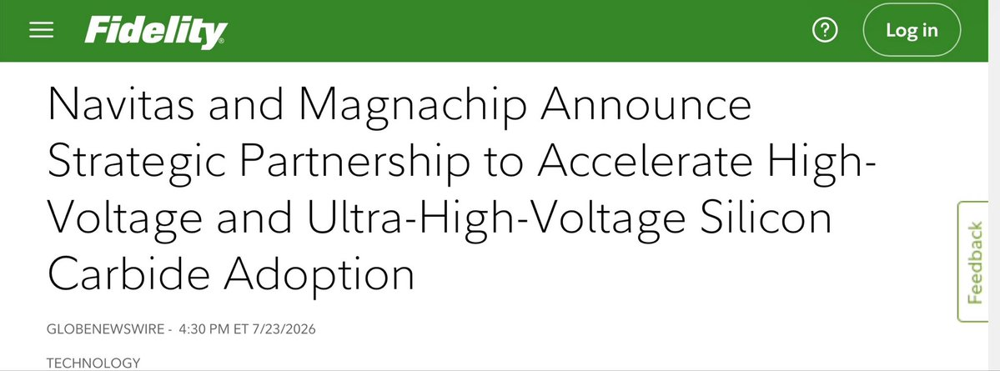

---

<!-- post_id: x:2080448123823157648 | ts: 1784852460 -->
## [X] 駿HaYaO · 2026-07-24 08:21

NVIDIA 預付 15 億美元助 Amkor 擴建美國先進封裝產能

Amkor Technology（ $AMKR ）於 2026 年 7 月 23 日宣布與 NVIDIA 建立多年戰略合作夥伴關係，共同開發次世代 AI 與加速運算平台的先進半導體封裝與測試技術。

根據協議，NVIDIA 將提供預付款，支持 Amkor 在亞利桑那州工廠擴建美國先進封裝產能，這是 15 億美元多年開發協議的一部分。此舉旨在建立完整交鑰匙先進封裝與測試能力，強化美國半導體供應鏈韌性，並補充 Amkor 既有亞洲製造足跡。

先進封裝可提升 AI 基礎設施的效能、能源效率與系統整合。雙方將對齊長期技術路線圖，推進高密度互連與異質整合技術。Amkor 已長期為 NVIDIA 資料中心處理器、網路晶片組等產品提供封裝服務。

NVIDIA 營運執行副總裁 Debora Shoquist 表示，此合作有助重振美國製造與供應鏈；Amkor 執行長 Kevin Engel 則強調，協議加速公司長期發展，支持關鍵 AI 基礎設施。

https://t.co/RaZwSFqH02

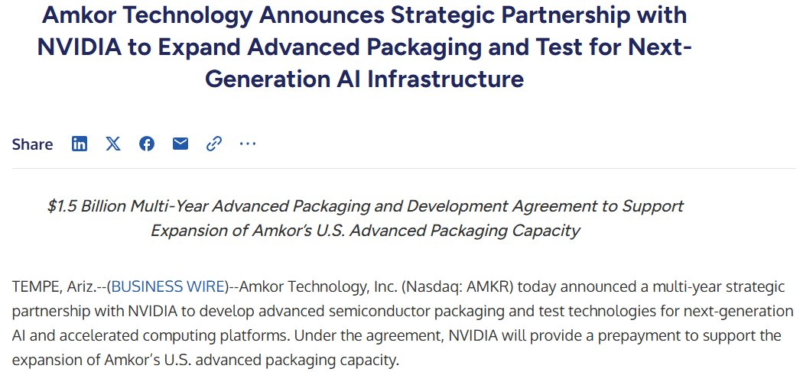

---

<!-- post_id: x:2080447368940650766 | ts: 1784852280 -->
## [X] 駿HaYaO · 2026-07-24 08:18

$AMD 和 Cerebras $CBRS 聯手打造超低延遲 AI 推理新平台

AMD 與 Cerebras 於 2026 年 7 月 23 日宣布技術合作，推出分散式 AI 推理解決方案。系統將工作負載拆分：AMD Helios rackscale 平台負責高吞吐量的提示處理與長上下文窗口，Cerebras 晶圓級引擎則專注超低延遲令牌生成。

兩家公司指出，此組合預計可比單獨使用 Cerebras 實現高達 5 倍的每瓦每秒令牌數，兼顧效能與能源效率。解決方案專為即時代理、即時副駕駛等對延遲敏感的應用設計。

Cerebras 將在其資料中心部署 AMD Helios，聯合方案預計 2026 年下半年首先透過 Cerebras Cloud 上線。AMD 執行長蘇姿丰與 Cerebras 執行長 Andrew Feldman 均表示，此合作將加速即時代理式 AI 的落地。

https://t.co/ucAvSJAlxj

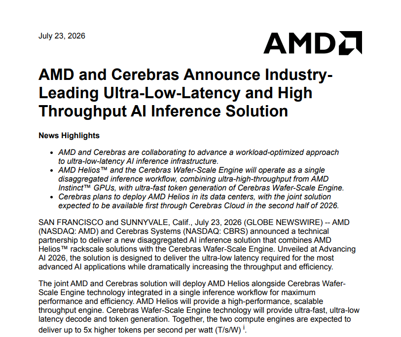

---

<!-- post_id: x:2080446421426491901 | ts: 1784852054 -->
## [X] 駿HaYaO · 2026-07-24 08:14

早安！7/24 外電綜合整理

- 2327國巨: 美系重申正向
美系券商重申基本面正向的邏輯不變。認為2Q營收除了超越公司指引外，預期毛利率/營業利益率也有進一步上調的空間，因為反映了價格調漲的遞延效果，以及產能利用率提高所帶來更佳的營運槓桿。與此同時，7 月初實施的全面性電容漲價，也將開始反映在3Q26的ASP上，預期將支持毛利率進一步提升。重申正向。

- 2360致茂：亞系重申正向
亞系券商恢復覆蓋，並給予正向評等不變。預期 AI／HPC 晶片將採用更多 SLT 測試。券商預估半導體／光子事業 2025–2028 年營收 CAGR 可達 68%。另外，電源HVDC長期導入趨勢不變，預估 ATS（自動測試系統）業務於 2025–2028 年營收 CAGR 可達 43%。最新預估26-28年EPS為$43.4/$65.3/$83.9，以27-28年平均EPS的38xPE評價，同步升目標。

- 解讀Google 財報：
美系大行認為法說會對TPU 與 Axion CPU 發展是正面解讀，也有利於整體 AI 供應鏈，重申覆蓋裡正向的有：台積電、聯發科、日月光、京元電、信驊、旺矽、穎崴、鴻勁等。

 #下次會考

---

<!-- post_id: x:2080446282511044855 | ts: 1784852021 -->
## [X] 駿HaYaO · 2026-07-24 08:13

「隨著大家爭相投入機架級 PCB 製造，無止盡的失誤正迫使終端客戶小心謹慎。預期在 HDI 與高層板量產前夕，將出現重大的市占率變動。」

但重點來了：這一切混亂實際上是上游材料與耗材的巨大催化劑。低良率意味著極高的報廢率，讓原本就緊繃的供應鏈陷入更嚴重的瓶頸。 https://t.co/y15M8JrQoN

---

<!-- post_id: x:2080446062435954693 | ts: 1784851968 -->
## [X] 駿HaYaO · 2026-07-24 08:12

Nvidia 800V HVDC 將於2027年第一季末量產，台達電預計第二季起拉升出貨

SemiAnalysis警告Nvidia 800V HVDC大規模採用恐從2027年延至2028年後。
但供應鏈人士指出，這是市場誤解。延遲主因是第一代產品設計驗證，而非技術路線改變。初期系統驗證發現潛在短路風險，美國客戶要求追加測試，導致重新設計與認證時程延長，台達電、新普及上游供應商因此調整交期。

目前電源機櫃、BBU與電池組已重新送驗，進展順利。台達電可望於1Q27末小量生產，2Q27配合客戶需求逐步放量。供應鏈強調，問題不在能否製造，而在驗證完成度，長期朝向800V成為AI資料中心主流架構的趨勢不變。

外界誤以為Rubin平台仍用50V就降低800V必要性，實則50V負責機架內部配電，800V則從機房向機架供電。隨著Rubin Ultra功耗上看600kW至1MW，傳統低壓架構將面臨電流過大、損耗與散熱瓶頸。初期±400V與800V將並存，隨驗證完成，800V滲透率會逐步提升。

這僅是出貨時點微調，並非需求減弱。2027年起雲端大廠加速投資與機房升級，將帶動台灣電源與相關零組件進入新一輪成長週期。

---

<!-- post_id: x:2080445355397611535 | ts: 1784851800 -->
## [X] 駿HaYaO · 2026-07-24 08:10

INTEL $INTC :「轉向資本支出：由於強烈的客戶需求訊號，我們上調了 2026 年的展望，目前預期資本支出將超過 200 億美元，這比年初預期大幅提高。

我們也積極鎖定來自供應商的設備採購訂單、加速無塵室建設，並積極確保基板與記憶體供應。因此，我們預測 2027 年資本支出將大幅高於 2026 年水準，絕大部分將投入在我們的美國網絡。」

---

<!-- post_id: x:2080326529792590220 | ts: 1784823469 -->
## [X] 駿HaYaO · 2026-07-24 00:17

STMicro 2026 年第二季
- 復甦加速 / AI 資料中心故事持續推進，本季資料中心目標較上季翻倍；過去 6 季中有 5 季實現年成長。

- 營收季增 +12.7%、年增 +26.0% 至 34.9 億美元，毛利率 34.8%（季增 100 個基點）。

- 第三季指引 37 億美元（季增 +6.2%、年增 +16.2%），毛利率 37%（季增 220 個基點）。

- 第四季指引超過 40 億美元，成長加速，主要受 AI 資料中心與 LEO 衛星通訊推動；下半年較上半年成長高於正常 15% 的季節性水準；第四季結束時年化營收跑率超過 160 億美元。

- 仍遠低於歷史高峰：本季 34.9 億美元較 2023 年高峰 44 億美元低約 20%；2026 財年預估超過 140 億美元，相較 2023 年高峰 173 億美元仍有距離，但較 2025 年 118 億美元年增約 +20%。

- AI 資料中心營收 2026 年已超過 10 億美元（上季還只是超過 5 億），2027 年預估超過 20 億美元（上季預估僅 10 億+）。

- 庫存持續緊縮，庫存天數降至 126 天（上季 140 天、去年同期 166 天）；通路庫存已低於標準目標水準。

---

<!-- post_id: x:2080295254096498722 | ts: 1784816013 -->
## [X] 駿HaYaO · 2026-07-23 22:13

洛克希德馬丁公司（NYSE: $LMT ）公布2026年第二季度銷售額達201億美元，較2025年第二季度的182億美元成長11%。

第二季度淨利為18億美元，每股盈餘7.94美元，包含16億美元的計畫損失與1.69億美元的其他費用；2025年第二季度每股盈餘為1.46美元。

第二季度營運現金流為32億美元，較2025年第二季度的20.1億美元增加。自由現金流為29億美元，較2025年第二季度的15億美元增加。

「我們交出了強勁的第二季度業績，銷售額超過200億美元，年增11%，自由現金流29億美元，並新增650億美元新訂單，使積壓訂單達到2,300億美元的紀錄。這持續的優異表現不僅反映客戶需求增加，更證明我們21世紀安全策略、整合夥伴關係與營運卓越的成果。我們正積極拓展國際業務，並專注於滿足國家與盟友的安全需求。我們正按計畫執行策略，並對全年財務表現充滿信心，預期全年銷售額成長約8%，部門營業利潤率與自由現金流也將進一步提升。」洛克希德馬丁公司董事長、總裁兼執行長吉姆·泰克萊特（Jim Taiclet）表示。

「這些成果得益於我們對承諾的堅定履行，以及對客戶使命的全力支持。本季度，我們在轉型彈藥生產方面邁出重大步伐，簽署了與美國國防部導彈防禦局價值350億美元的多年期THAAD合約。我們持續創新以滿足客戶對快速精準火力系統的需求，例如在短短45天內完成桑塔姆反無人機系統的發射器、雷達與戰鬥證明導彈一體化整合。此外，我們正透過與美國通用動力以及與萊茵金屬在歐洲共同生產ATACMS的合作，策略性強化全球國防製造能力。」

---

<!-- post_id: x:2080294404238246167 | ts: 1784815810 -->
## [X] 駿HaYaO · 2026-07-23 22:10

RT @nokia: Today we announced our Q2 2026 financial results, demonstrating solid performance and clear momentum, particularly in AI & Cloud. As AI evolves, trusted connectivity becomes even more critical and we are delivering market leading innovation that helps customers differentiate and capture value in this new era.

Read full report: https://t.co/rwBSx9L6QZ  

#QComms #TeamNokia

---

<!-- post_id: x:2080255697145761820 | ts: 1784806582 -->
## [X] 駿HaYaO · 2026-07-23 19:36

ＪＸ金屬宣布在韓國強化半導體濺射靶材加工能力

ＪＸ金屬株式会社於2026年7月23日宣布，旗下韓國ＪＸ金屬將投資約400億日圓，強化半導體用濺射靶材的加工能力。該產品用於最先進邏輯晶片、HBM及3D-NAND等高階半導體，擁有全球頂級市占率。

韓國據點負責下游加工工程，結合營業與技術支援，能近距離提供機動服務。因AI資料中心帶動最先進記憶體需求激增，韓國半導體市場快速成長，此次投資將導入自動加工設備，預計2027年度下半期逐步稼動，使加工能力提升至2025年度的約2倍。

此外，集團同步在台灣推進加工線自動化、美國亞利桑那擴大產能，日本常陸那珂市 (ひたちなか市)新工場也進行大規模增產，強化從原料到回收的一貫供應鏈。

https://t.co/7nLo4b7pQQ

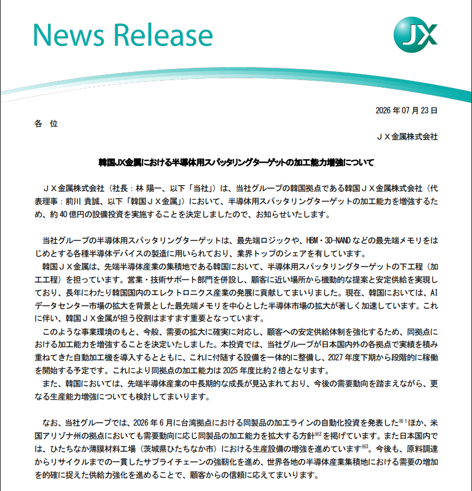

---

<!-- post_id: x:2080254808951279641 | ts: 1784806370 -->
## [X] 駿HaYaO · 2026-07-23 19:32

SpaceX（ $SPCX ）向一家台灣公司購買所有 Starlink 網路交換器：友訊科技（D-Link，2332 TT）。

正式出貨將於九月開始，目前 SpaceX 已每週拉貨約 500 台。第一批 2 萬台交換器合約將延續至 2027 年，所有產品均在台灣製造，以符合 NDAA 與 TAA 規範。

SpaceX 已向 FCC 申請 Gen3 星鏈星座計畫：最多 10 萬顆衛星（相較 Gen1 已獲准 4,425 顆、Gen2 目前 7,500 顆）。Gen3 還包含首個大規模 VLEO（極低地球軌道）殼層，高度約 325 公里。Starship V3 將使每發衛星搭載量從 29 顆提升至 60 顆，預計 2026 年下半年實現。

衛星用 PCB：華通電腦（Compeq，2313 TT） 是衛星本身的主要供應商，從東南亞廠出貨。地面設備板則來自日本 Meiko 與台灣 志超科技（Unitech，2367 TT）。

馬斯克正在德州建立自家 PCB 產線，據報良率低於 60%，台灣供應商在三年內未感受到競爭威脅。德州產線的真正目標是美國國防業務。

D-Link 執行長在談到訂單持續時間時表示：「只要他繼續發射衛星，我們就繼續出貨。」

---

<!-- post_id: x:2080231538369991149 | ts: 1784800822 -->
## [X] 駿HaYaO · 2026-07-23 18:00

臻鼎駁斥Vera Rubin PCB異常傳聞

PCB龍頭臻鼎-KY（4958）23日盤中股價重挫，市場傳聞輝達新一代Vera Rubin平台PCB板出現問題，引發賣壓。

公司迅速嚴正否認，強調客戶產品進程完全按預期推進，傳聞並非事實。

https://t.co/gLaaUNfB01

---

<!-- post_id: x:2080205541142397023 | ts: 1784794624 -->
## [X] 駿HaYaO · 2026-07-23 16:17

J.P. Morgan：Nokia $NOK
- Q2 展望與指引潛力：J.P. Morgan 預期 2026 年第二季雲端與 AI 訂單強勁，管理層面臨的核心問題是供應能否到位，讓他們得以調升 2026 全年指引。

- 營收與指引上修空間：若供應可取得，網路基礎設施（NI）營收成長可能上修至高達 28%（目前指引中值為 19%）。

- 獲利能力與季節性：Q2 EBIT 預計小幅優於共識預期 5.7%（約 €393m）。但受正常季節性影響，最強的銷售與 EBIT 改善預計落在下半年（2H）。

分項動能與 AI 驅動因素
- IP 網路動能：IP Networks 預計透過國際新興雲端業者與超大型雲端商的資料中心交換器訂單，成為主要營收與訂單貢獻者。AI 與推論/代理架構的前端 DCI 強度提升，將進一步強化成長。

- AI 與雲端訂單動能：繼 Q1 取得約 €10 億 AI 與雲端訂單（主要由光纖產品驅動）後，Q2 訂單預計進一步攀升，由光纖產品與 IP 網路需求共同支撐。OFC 展會推出之新光纖產品雖交期長，仍獲得市場青睞。

- 供應與毛利率現實：元件（例如雷射）供應緊俏，加上產品交期延長，導致營收爬坡需要更長時間。NI 毛利率擴張將部分被持續的業務投資所抵銷。

估計修正（2026 Q2 及後續）
- 2026 Q2 調整：J.P. Morgan 將 2026 Q2 營收預估上調 1.2%（至 €4,778m，年增 5.0%），EBIT 預估上調 16.9%（至 €393m），主要受 IP 網路營收加速及營運槓桿帶動。

- 多年期估計：對 2026–2028 財年 EBIT 預估小幅上修（分別 +2.5%、+0.9%、+0.5%），EPS 預估則上修 +2.3%、+0.8%、+0.5%。

估值與投資論點
- 多年複合成長敘事：在 AI 相關光纖與 IP Networks 占營收 30%（指引成長 10–12%），加上營運槓桿與 Infinera 交易綜效帶來的獲利複合成長潛力下，J.P. Morgan 認為 Nokia 有機會重新評價至高十幾倍的本益比。

---

<!-- post_id: x:2080175196997296561 | ts: 1784787389 -->
## [X] 駿HaYaO · 2026-07-23 14:16

環球晶義大利Novara廠8吋產線火災

半導體矽晶圓大廠環球晶（6488）22日公告，義大利Novara廠8吋產線21日發生火災，無塵室機台燃燒導致產線停工，幸無人員傷亡，12吋產線不受影響。 

Novara廠為環球晶最大8吋矽晶圓生產基地，公司正評估災後復原計畫、設備損失及復工時程，影響待確認。為降低對客戶供貨衝擊，已透過全球生產據點調度產能因應。

https://t.co/1Rqn0EijA7

---

<!-- post_id: x:2080174319506997510 | ts: 1784787180 -->
## [X] 駿HaYaO · 2026-07-23 14:13

$TXN 再次超出預期，營收和每股盈餘（EPS）皆高於市場預期，同時第三季指引也優於華爾街共識。

更重要的是，管理層的展望顯示，工業和汽車類比晶片的復甦正在持續，而非放緩。

高盛預期德州儀器明天股價將上漲，對 $MCHP 和 $ADI 也會帶來正面連動效應。
----

關鍵股票要點： 
我們預期該股票在公布優於華爾街預期的季度財報與指引後，將溫和上漲。我們認為市場預期原本已有些偏高，這是基於管理層在季內的評論所提及的基本面復甦，以及該股票過去一季的相對強勢表現。根據我們的對話，我們相信本次財報結果與這些預期一致。

我們預期投資人將關注管理層在電話會議上的關鍵評論，包括：(1) 毛利率走勢；(2) 對資產負債表與通路庫存的前瞻性評論；(3) 工業與汽車垂直領域的客戶訂單行為及訂單趨勢。

---

<!-- post_id: x:2080169976061915403 | ts: 1784786144 -->
## [X] 駿HaYaO · 2026-07-23 13:55

路透社報導，隨著中國市場CPU價格大幅上漲，英特爾（Intel）與AMD正積極與中國伺服器客戶簽署長期採購協議。協議主要鎖定採購量而非價格，多數涵蓋一年供應期，部分已談至兩年或更長。

受AI熱潮影響，數據中心除GPU外，對CPU、記憶體、網路設備的需求同步激增，促使供應商爭取長期合約以確保供應穩定。消息人士透露，今年以來中國伺服器CPU價格已上漲逾40%，部分產品單月漲幅超過10%。

此趨勢反映AI基礎設施擴張已從GPU延伸至整個伺服器生態。英特爾執行長Pat Gelsinger曾表示需求「持續超出供應」，AMD也預期AI相關工作負載將大幅成長。

中國作為全球最大伺服器市場，受數據中心、AI計算集群及國家基礎設施建設推動，CPU需求強勁。儘管先進GPU受美方限制，但CPU領域仍成英特爾與AMD重要競爭戰場。

---

<!-- post_id: x:2080089176096338048 | ts: 1784766880 -->
## [X] 駿HaYaO · 2026-07-23 08:34

$TSLA
Robotaxi 與 FSD：
🔹 無人監督 Robotaxi 已在奧斯汀、達拉斯、休士頓、邁阿密、奧蘭多與坦帕擴大營運
🔹 舊金山灣區持續以安全駕駛員模式進行營運
🔹 北美新交付車輛中，超過 55% 包含 FSD 訂閱
🔹 Tesla 創下 FSD 淨新增訂閱數新高紀錄
🔹 FSD v14 Lite 已開始向 AI3 車輛推送

製造與 AI：
🔹 Tesla Semi 仍按計劃於 2026 年開始生產
🔹 Megapack 3 與 Megablock 按計劃於今年投產
🔹 2026 年上半年，Tesla 位於德州的現場 AI 運算容量已增加一倍以上
🔹 Cortex 1 已安裝容量：超過 90 MW
🔹 Cortex 2 已安裝容量：超過 115 MW
🔹 Tesla 奧斯汀半導體廠的工程建設與設備採購持續進行
🔹 Model YL 已於 7 月在美國正式推出

---

<!-- post_id: x:2080088382668149083 | ts: 1784766691 -->
## [X] 駿HaYaO · 2026-07-23 08:31

特斯拉執行長馬斯克表示，美光提供了非常大量的記憶體晶片，並以合理條件供應 - $TSLA $MU https://t.co/WbpsaSdyA5

---

<!-- post_id: x:2080085484601004107 | ts: 1784766000 -->
## [X] 駿HaYaO · 2026-07-23 08:20

SK hynix 洽談收購 Intel 俄亥俄州晶片園區

根據《中央日報》2026年7月22日獨家報導，SK hynix 正與 Intel 談判，擬收購位於俄亥俄州新奧爾巴尼（New Albany）的「Ohio One」大型半導體園區，用於美國本土前端記憶體晶片生產，目標5年內投產。交易價格與時程仍在協商中，SK hynix 同步進行內部審查與政府審批。

該園區2022年動工，Intel 原計劃首階段投資280億美元興建兩座先進晶圓廠（Fab 27、28），全面開發總投資可達1000億美元。
但因晶圓代工業務面臨良率問題、客戶流失（Nvidia、Apple、AMD 多轉向台積電），Intel 去年大裁員並延後量產至2030-2031年，代工部門去年虧損22億美元、今年Q1再虧24億美元。

此交易對雙方互利：Intel 可獲得資金流動性，重組代工業務；SK hynix 則能滿足美國政府（川普政府）對本土生產的要求，取得已大致完工的廠區。SK 集團會長崔泰源日前也公開表示，正尋找美國建廠地點。

SK hynix 回應稱，正在尋找各類收購與投資機會，但「尚未決定或推動」收購該園區。分析指出，這有助美國打造完整 AI 半導體供應鏈（設計、代工、記憶體、封裝全本土化）。

https://t.co/bKouZkdKgM

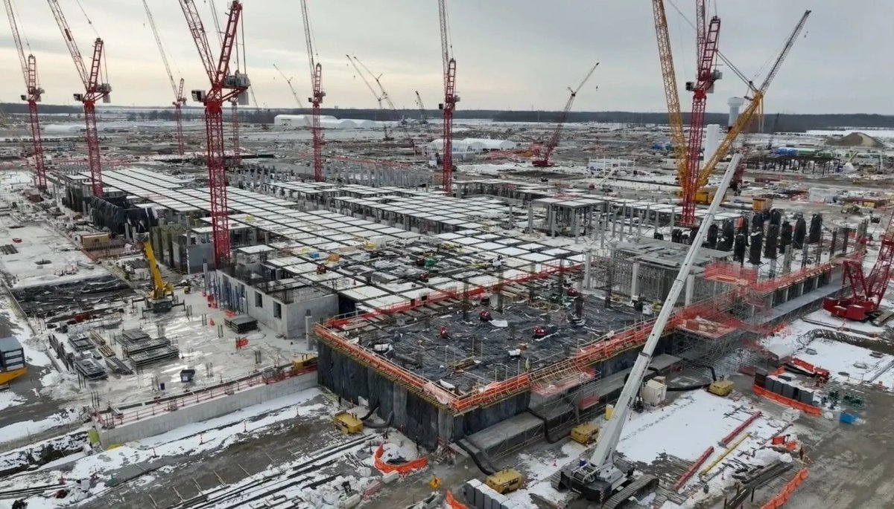

---

<!-- post_id: x:2080082715903439060 | ts: 1784765340 -->
## [X] 駿HaYaO · 2026-07-23 08:09

$GOOGL 更新 2026 財年資本支出指引：上調至 1,950 億至 2,050 億美元，高於先前的 1,800 億至 1,900 億美元。Google 預計 2027 年資本支出也將大幅增加。

這可能是目前 hyperscaler對上游半導體最看好的訊號。 https://t.co/EhU9ia7a72

---

<!-- post_id: x:2080081960995619145 | ts: 1784765160 -->
## [X] 駿HaYaO · 2026-07-23 08:06

Google 將 2026 財年資本支出指引上調至 1,950 億至 2,050 億美元，高於先前的 1,800 億至 1,900 億美元，主要原因是為因應更強勁的需求而加速交付運算容量。

$GOOGL 預計，現有 TPU 系統銷售合約的收入僅有少部分會在 2026 年認列，絕大部分將遞延至 2027 年認列。

由於供應受限，公司將在第三季暫時擴大使用第三方容量作為過渡，這預計將對近期毛利率造成輕微壓力。

---

<!-- post_id: x:2080081363735302222 | ts: 1784765017 -->
## [X] 駿HaYaO · 2026-07-23 08:03

早安！7/23 外電綜合整理

- 6831邁科: 亞系升目標
亞系最新預估26-28年EPS為$15.1/$37.5/$86.6，其中明年EPS預估高於市場共識，因在主要美國 CSP 客戶的氣冷產品市占率已超過 40%，券商預期明年將受惠由氣冷升級至液冷所帶來的 ASP提升。預估明年毛利率升至28%。以40xPE評價，同步升目標。

- 2327國巨: 美系降目標
美系大行微幅下調26-28年EPS至$20.1/$34.2/$46.8。以後年31xPE評價，同步降目標。

展望3Q, 券商預期營收季增8%，毛利率增至40.3%，營業利益率增至28.9%。反映下半年直接客戶平均售價可望上漲約 30–40%。重申AI需求排擠中/低階供給，且鉭質電容報價持續看漲，稼動率持續提升中。券商認為下週法說會除了聚焦漲價策略外，也要討論與上一波循環的異同，以及對明年中低階 MLCC 產能吃緊的看法。

- 2308台達電: 美系降目標
美系認為2-3季會受到零組件成本上升影響毛利率表現。不過，AI 帶來的產品內容價值提升及產品組合改善，將有助於明年恢復毛利率。而800V 的導入時程可能較為漸進式，HVDC預估於2H26如期放量。最新預估26-28年EPS為$35.9/$57.2/$90.3，以明年40xPE評價，同步降目標。

 #下次會考

---

<!-- post_id: x:2079968344317538600 | ts: 1784738071 -->
## [X] 駿HaYaO · 2026-07-23 00:34

BofA：台灣出口

「台灣6月出口訂單年增59.4%（5月為+47.2%），達到歷史新高953億美元。年增率高於彭博調查的所有預測值。強勁成長主要集中在科技相關產品，年增76.9%（前月61.1%），貢獻了整體59.4%增幅中的55.7個百分點。非科技訂單則年增13.5%。」

「在科技出口中，資訊與通訊產品（含伺服器）和電子零組件（主要是半導體）仍是主要驅動力，年增率分別達82%和80%。地理分布上，美國需求是首要驅動因素，6月訂單年增83.6%（5月為63.95%），其次是歐洲年增53.9%（5月48.7%）。美國訂單持續加速，凸顯AI投資循環仍為台灣出口部門提供強大支撐。非科技訂單年增13.5%，主要受機械類年增17.8%帶動。」

---

<!-- post_id: x:2079960966809432082 | ts: 1784736312 -->
## [X] 駿HaYaO · 2026-07-23 00:05

BofA：Anthropic 與 AMD 合作案Anthropic 合作夥伴關係的主要重點

- 合作細節：AMD 宣布與 Anthropic 合作，將從 2027 年上半年開始部署高達 2GW 的 AMD MI450 系列 AI GPU。

- 財務承諾：AMD 承諾進行 50 億美元的策略性股權投資，並將在研發（R&D）項目中使用 Anthropic 的 Claude。

- 擴大合作：此交易將 AMD 的 MI 合作夥伴擴大至四大主要客戶：Anthropic、OpenAI（可能透過 Microsoft 雲端）、Oracle 以及 Meta。

- 財務上行空間：此合作顯示 CY27 MI 銷售至少有 100 億至 150 億美元的上行空間，高於目前共識預期的 350 億至 400 億美元。

分析師活動與產品展望
- AI 進展活動：Microsoft 與 Anthropic 的預先公告，為 AMD 分析師活動前帶來額外的正面消息。

- 伺服器 CPU 路線圖：該活動預計將重點介紹伺服器 CPU 路線圖（特別是即將推出的 Venice CPU），以及在代理式 AI 時代如何與 NVIDIA 的 Vera 競爭。

- CoWoS 供應與銷售潛力：最新的 TSMC CoWoS 供應估計顯示，CY27 MI450 系列 GPU 單元數量約為 140 萬個，假設平均銷售價格為 3 萬美元，銷售額可能超過 400 億美元。

---

<!-- post_id: x:2079920723737641237 | ts: 1784726718 -->
## [X] 駿HaYaO · 2026-07-22 21:25

OpenAI 佐治亞州超大型資料中心

OpenAI 計畫在喬治亞州薩凡納附近興建超大型資料中心，預計總投資超過300億美元。該公司已與喬治亞電力公司簽約，為埃芬漢縣園區鎖定3.2吉瓦電力，專案2028年起逐步供電，2032年完工，將成為OpenAI目前最大資料中心之一。

作為「星際之門」計畫一部分，OpenAI已在德州阿比林投入200億美元興建首個Stargate資料中心。若喬治亞專案達滿載，總成本將突破300億美元。公司正積極尋找合作夥伴共同融資開發，並可能自行承擔部分營運。

近期OpenAI已縮減英國、挪威部分專案，並決定不擴大阿比林旗艦園區規模，同時調整策略，親自主導設施設計與規劃，未來將把資料中心設計標準化並開源，供業界參考。

面對當地社區對電價與環境影響的反對聲浪，OpenAI承諾全額承擔電力基礎設施及供電費用，採用高峰時段主動降載與閉環冷卻系統減少耗水，同時繳納數億美元稅款並設立社區基金。公司將於週四啟動居民對話會，並進行獨立審計確保各項承諾落實。

---

<!-- post_id: x:2079911798686515667 | ts: 1784724590 -->
## [X] 駿HaYaO · 2026-07-22 20:49

AMD Ryzen 7 7700X3D 評測

AMD Ryzen 7 7700X3D 已於 2026 年 7 月 16 日正式上市，建議售價 329 美元，定位中高端遊戲市場。

它是 Ryzen 7 7800X3D 的平價版，採用 Zen 4 架構、單 CCD 8 核心 16 緒，搭配 96MB 3D V-Cache（總快取 104MB），TDP 120W，基礎時脈 4.0 GHz、最高 Boost 4.5 GHz（比 7800X3D 低 200/500 MHz）。

核心優勢：
- 保留 3D V-Cache 大容量快取，遊戲效能強悍，能將資料保留在核心附近，大幅降低延遲。
- AM5 平台相容性佳，支援 DDR5 最高 128GB，並可升級未來 Zen 6 處理器（AM5 支援至 2029 年）。
- 功耗低、散熱容易，適合遊戲玩家追求高 FPS 又不想花大錢。

與 7800X3D 比較：兩者核心、快取、TDP 幾乎相同，僅時脈調降，輕執行緒與遊戲效能略低，但多執行緒差距較小，性價比更高。

外觀與 AM5 主機板、散熱器完全相容，只需更新 BIOS 即可使用。

https://t.co/daUmGZkugq

---

<!-- post_id: x:2079909553303605261 | ts: 1784724055 -->
## [X] 駿HaYaO · 2026-07-22 20:40

根據華爾街日報：AMD與Anthropic簽署重大晶片與投資協議，Anthropic將於2027年上半年開始購買多達2吉瓦的AMD最新一代晶片（名為Instinct MI450）；AMD將投資50億美元於Anthropic，作為晶片交易的一部分。
https://t.co/cb25FhdePL

---

<!-- post_id: x:2079849309596770592 | ts: 1784709691 -->
## [X] 駿HaYaO · 2026-07-22 16:41

緯創德州新廠開幕
緯創（3231-TW）美國德州達拉斯 D1 AI 智慧工廠於美國中部時間7月21日（台灣時間22日）正式開幕，全球首片NVIDIA GB300運算基板在此誕生並進入量產，消息激勵緯創股價22日爆量漲停，鎖在164元，買單超過3.1萬張。

該廠斥資近7億美元，面積約32.4萬平方公尺，全面採用NVIDIA加速運算技術，整合Nemotron、Cosmos等前沿模型及Omniverse、Metropolis平台，透過數位孿生技術大幅優化廠房設計、生產流程與營運效率。

董事長林憲銘表示，這不是傳統製造，而是高度整合的先進智慧製造。目前已開始量產NVIDIA GB300 Grace Blackwell Superchip，未來還將生產Vera Rubin Superchip，成為美國AI基礎設施的重要據點。

NVIDIA執行長黃仁勳親自出席開幕典禮，他強調全球正迎來史上最大規模的AI基礎建設浪潮，AI工廠將是下一波工業革命核心。NVIDIA與緯創合作，將數位孿生與AI驅動的先進製造導入美國，不僅培育高技能人才，更為AI時代的智慧製造樹立全新典範。

https://t.co/naHPEnjCoY

---

<!-- post_id: x:2079809164113498167 | ts: 1784700120 -->
## [X] 駿HaYaO · 2026-07-22 14:02

1. Kyber 機櫃延後
- NVIDIA Kyber（刀鋒式高密度 AI 機櫃）面臨重大工程挑戰，很可能延遲或取消。
- 分析師自 2025 年 GTC 起就持保留態度，預期 2027 年不會進入量產。
- 對 NVIDIA 整體財務與營運影響有限（原本模型就假設貢獻不高）。
- 下游 ODM 幾乎不受影響，CSP 會繼續採購 Oberon 架構機櫃。

2. Kyber 設計核心
- 將運算刀鋒從水平改為垂直插入，大幅提高運算密度。
- 單機櫃目標容納 144~288 顆 GPU（Feynman 時代可達 576 個 die）。
- 最大難題集中在散熱、供電與系統整合。

3. 主要技術挑戰
- 散熱：每顆 GPU 功耗可能高達 6kW，加上密度倍增，成為最困難的部分。需採用 MCL 或兩相液冷（TPLC）等先進技術。
- 背板與 PCB：採用極複雜的 78 層 HLC 背板、CCL 升級至 M10，製造難度高但利潤吸引力大。
- 供電：單機櫃功耗接近 600kW，需導入 800V HVDC 電源。
- 機械結構：每支刀鋒重量超過 20kg，垂直抽取導致非對稱負載，對滑軌設計要求極高。

4. 受影響供應商
- 長期受惠：台達電（HVDC 貢獻 2027 年營收 5-10%）、光寶（中個位數百分比）、貿聯 （3665，MCL 領先）、奇鋐 （3017）與 Cooler Master（TPLC）、川湖 （2059，高階滑軌）。
- 短期可能受壓：專為 Kyber 升規的零組件供應商，量產時程延後，影響大致在中低個位數百分比。

5. MS 補充觀點
- NVIDIA 承認 Kyber 將被「更好的解決方案」取代，有望支援更大單機櫃規模。
- Rubin Ultra 出貨時程不變，800V 與光學擴展仍按原計劃進行，整體產品路線圖維持正面。

---

<!-- post_id: x:2079808408535044280 | ts: 1784699940 -->
## [X] 駿HaYaO · 2026-07-22 13:59

AMD Helios 機櫃定價
AMD 據報將推出 Helios AI 機櫃級解決方案，定價高達每機櫃 500 萬至 550 萬美元，比 NVIDIA 第二代 Rubin 機櫃（預估 350 萬至 400 萬美元）高出約 40%。儘管價格明顯溢價，AMD 仍自信客戶願意支付，Microsoft 已成為首位確認客戶，用於 Azure AI 服務。

Helios 是 AMD 首款完整堆疊的機櫃解決方案，包含：
- AMD Instinct MI455X GPU（CDNA 5 架構）：提供 40 PFLOPs FP4、20 PFLOPs FP8 運算，搭載 432 GB HBM4（19.6 TB/s 頻寬）。
- 第 6 代 EPYC CPU（Venice，Zen 6 架構、TSMC 2nm）：最高 256 核心 / 512 執行緒。
- Pensando Vulcano 800 AI NIC：支援 800 Gbps 網路，每 GPU 最高 2.4 Tbps 擴展頻寬。
- Pensando DPU：負責網路、安全與儲存卸載，提升整體效率。
- 搭配 AMD Infinity Fabric 與 ROCm 軟體堆疊。

相較之下，NVIDIA Rubin GPU 在 FP4 效能略勝（50 PFLOPs），但 FP8 較低（17.5 PFLOPs），HBM4 容量也較少（288 GB）。

AMD 除 Microsoft 外，還爭取到 OpenAI、META、Oracle、HPE、TCS、Celestica、Nutanix 及美國能源部等客戶，顯示 Helios 在高效能 AI 訓練與推理上具備競爭力。

分析指出，雖然 BOM 估算未必精準，但 AMD 此次主動採取高溢價策略，試圖擺脫「追隨者」形象，強調全端整合優勢。未來 Helios 是否能成功挑戰 NVIDIA 主導地位，仍待市場驗證。

---

<!-- post_id: x:2079806647011320140 | ts: 1784699520 -->
## [X] 駿HaYaO · 2026-07-22 13:52

AI 吞噬晶圓，DRAM 供應短缺預計將持續至 2030 年

德意志銀行以晶圓為基準，分析 2025 年至 2030 年 DRAM 供需情況，結果顯示每年供應都無法跟上需求。

這段期間 DRAM 晶圓需求將從 192 萬 WSPM 成長至 378 萬 WSPM，增幅約 96%；但供應僅從 192 萬 WSPM 增加至 340 萬 WSPM，增幅約 77%。
伺服器、PC、行動裝置所使用的一般 DRAM 晶圓需求，從 157 萬 WSPM 增至 246 萬 WSPM，增幅約 56%，成長相對溫和。

位元（bit）需求每年以雙位數成長，但因製程微縮與良率提升，同一片晶圓能產出更多位元，因此實際晶圓負擔增加幅度較小。

真正主因是 HBM。HBM 所需晶圓從 2023 年的 7 萬 WSPM，暴增至 2030 年的 132 萬 WSPM，增幅約 19 倍。
HBM 需經過矽穿孔（TSV）、堆疊、測試、良品晶粒確保等複雜製程，相同位元下消耗的晶圓遠高於一般 DRAM。
因此 HBM 在整體 DRAM 晶圓中的占比，將從 2023 年的 5% 上升至 2030 年的 35%，生產晶圓的三分之一以上將被 HBM 占用。

供應能力將從 2025 年的 192 萬 WSPM，逐步增至 2026 年 205 萬、2027 年 236 萬、2028 年 277 萬、2029 年 315 萬，至 2030 年達到 340 萬 WSPM，但仍無法追上需求增速。
供應短缺量預計 2026 年達 21 萬、2027 年 51 萬、2028 年 80 萬 WSPM（短缺最嚴重），之後於 2029 年降至 58 萬、2030 年 38 萬 WSPM，短缺雖縮小但不會消失。
需求除以供應的比值將在 2028 年升至 129%，該年短缺情況最為嚴峻。
2025 至 2030 年新增晶圓需求中，超過一半（96.7 萬 WSPM）來自 HBM。

整體需求年增 14%，供應年增 12%，兩者差距看似僅 2 個百分點，但累積下來便形成數十萬 WSPM 規模的短缺。
HBM 占比上升，將導致同一產能下一般 DRAM 產量減少，有助抑制價格下跌，讓三星電子、SK 海力士、美光等廠商得以長期維持高獲利能力。

上述預測建立在「AI 需求維持目前水準、廠商不進行大規模擴產」的前提之下。若 AI 投資放緩、新廠提前量產，或中國快速擴產，短缺規模有可能縮小。

---

<!-- post_id: x:2079805891868836067 | ts: 1784699340 -->
## [X] 駿HaYaO · 2026-07-22 13:49

SemiAnalysis:
Meta 的客製化 AMD MI400 系列晶片，將只有一般 MI455X 晶片一半的大小。它是針對「推薦系統（recsys）工作負載」和「美元/記憶體頻寬」進行優化的。將使用約 144GB HBM，而非 432GB。

與一般 MI455X 封裝相比，它將使用 6 組 HBM4 8i 堆疊，而非 12 組 HBM4 12Hi 堆疊。原因是 Meta 的推薦系統基礎架構策略，希望 CPU 運算與 GPU 運算的比例能針對 recsys 進行調整，並優化記憶體的美元/頻寬比。

但問題在於，Meta 這款客製化 MI400 系列 SKU 並不適合 LLM 推論與訓練。這個決定是在 TBD Lab 成立或有發言權之前做出的。由於運算能力和 HBM 大幅減少，對
@alexandr_wang 的 TBD Lab 工程師來說吸引力會降低。

這又是 Meta 推薦系統基礎架構團隊的另一個例子：他們想透過奇怪的微優化來「展現價值」，卻損害了 Meta 其他重要部門。

Meta 過度工程化的另一個例子是 GB200 NVL72 Ariel，由於對 Grace CPU 與 GPU 堅持 1:1 比例，導致跨機架 NVLink ACC 纜線出現嚴重的訊號完整性問題。這條路顯然走錯了，Meta 後來在 GB300 和 VR200 NVL72 回歸標準 Oberon 設計。

Meta 這款客製化半尺寸封裝設計還會造成另一個問題：Zuck 想跟隨 @elonmusk 的 neocloud 策略出租這些晶片時，會變得更困難。

我們認為，只要 @AnushElangovan 在軟體和自動化測試上投入足夠資源，修復 AMD 長期軟體品質不佳的問題，MI455X 仍會是一款很棒的晶片。但 Meta 的過度工程化，會讓 Alexandr 和 Zuck 整體策略的彈性變小。

---

<!-- post_id: x:2079748444202426633 | ts: 1784685643 -->
## [X] 駿HaYaO · 2026-07-22 10:00

RT @labubu_trader: Will be back to the US next week.

Talked to a few PMs during my trip in the last two weeks. I’d like to share some interesting findings:

Sentiment: Overall very panicked and confused.

Positioning:
1. Shanghai HFs are extremely long on memory names, partly due to the TRS restriction I mentioned a few weeks ago. They are quickly selling CN semis across the board and buying DRAM ETFs to lower margin pressure.
2. HK HFs are mixed and divided; bulls and bears are balanced.
3. US LOs are waiting—not about stock prices but still don’t believe LTAs can turn memory names from cyclical to growth valuations.
4. Macro HFs sold all of their memory/semi positions.

Interesting points from both sides:

Bulls:
1. Supply chain checks suggest prices and margins will remain higher for longer.
2. AI capex in 27/28 will grow much higher than most expected.
3. OAI/ATH’s ARR shows no signs of plateauing. Codex’s WAU is growing crazily right now.
4. Kimi K3’s tech report literally suggests every semi component is a bottleneck 😂
5. No macro risks; CPI/PPI much cooler.
6. Even if memory spot prices can’t go higher, these memory companies can do large buybacks or dividends to support the stock price.
7. OAI/ATH is hiring a large team of solution engineers to quickly build vertical solutions (finance/healthcare/legal) to find the next S-curve beyond coding.
8. Even if memory names fade, the entire semi sector will remain intact.

Bears:
1. Higher memory prices are not sustainable and will be demand destructive. Clients will push back on further price hikes, and even the government may step in to force massive production expansion.
2. Memory prices will peak in Q4.
3. No doubt on 27 capex, but 28 capex budgets are clouded.
4. Even if fundamentals are solid, the position is extremely crowded and Korean retailers’ leverage is a huge concern.
5. Even though CSPs’ capex planning is aggressive for 27, a large portion of deliveries will be delayed due to power supply constraints.
6. No intermediate story of fast AI application adoption like AI coding.
7. Higher prices and more LTAs during the upcycle can’t prove memory names aren’t cyclical anymore. We need to see resilience during the downcycle to prove that, like memory names keeping the lower bound of margins in a downturn.
8. Memory is the core of AI: if traded memory dies, then everything dies.
9. Memory has no difference vs. other commodities such as silver, oil, or lithium carbonate. When they peak, their narrative and fundamentals all look fucking good 😄

---

<!-- post_id: x:2079728114431910302 | ts: 1784680796 -->
## [X] 駿HaYaO · 2026-07-22 08:39

#每日導讀 #20260722 #經濟日報

美國122條款關稅24日到期，將改以301條款對台課10%關稅
川普簽署公告，對加拿大葡萄酒、曲棍球桿、水泥等商品加徵50%關稅
台積電先進與成熟製程明年起漲價5%至10%甚至更多

📷 完整導讀 →https://t.co/wfymDd78dM

---

<!-- post_id: x:2079719416225546274 | ts: 1784678722 -->
## [X] 駿HaYaO · 2026-07-22 08:05

早安！7/22 外電綜合整理

- 6669緯穎: 亞系升目標
亞系券商認為2Q產品組合有改善，包括一般伺服器占比提高，以及自 4 月起導入的採購代理，預期毛利率較1Q進步。展望3Q，券商預期營收季增21%，因AWS的 Trainium 3 本季開始明顯放量，隨後於年底出貨液冷機櫃。新一代 Trainium 4 伺服器架構目前正開發中，預期將採用比目前每櫃 72 顆晶片設計更複雜的液冷方案及更高晶片密度架構。

AMD 的 Helios 平台自4Q26起成為另一個重要成長引擎。預估明年 ASIC／GPU 伺服器營收占比分別約為 54%／25%。上修明後年EPS至$600/764，以明年14xPE評價，同步升目標。

 #下次會考

---

<!-- post_id: x:2079522483984814517 | ts: 1784631770 -->
## [X] 駿HaYaO · 2026-07-21 19:02

台積電2027年芯片代工價格最高擬漲10%

根據《日經亞洲》獨家報導，台積電計劃自2027年起，將先進及成熟制程芯片代工價格最高上調10%，以反映材料、設備成本上漲及海外建廠支出。

基礎漲幅介於5%~10%，視客戶與產品而定；高性能運算（HPC）額外訂單可再加收10%~15%溢價，部分訂單總漲幅可能超過10%。先進制程貢獻台積電約77%營收，成熟制程占23%。

談判已於6月啟動，7月敲定，新價格2027年初生效。台積電採取「溫和策略」，提前告知客戶以利調整，並強調定價具戰略性、非投機性。

主要客戶包含英偉達、蘋果、谷歌、亞馬遜、高通等。董事長魏哲家表示，不會像存儲芯片業那樣大幅漲價，強調透過創造價值維持合理利潤與毛利率，符合客戶與公司長期利益。

此波漲價背景包括AI需求爆發、供應鏈通脹、地緣政治風險及海外擴廠成本。台積電近期已宣布在美追加巨額投資，資本支出持續提升。

---

<!-- post_id: threads:3946081060148875315 | ts: 1784629541 -->
## [Threads] Kok Yu · 2026-07-21 18:25

不缺 漲價

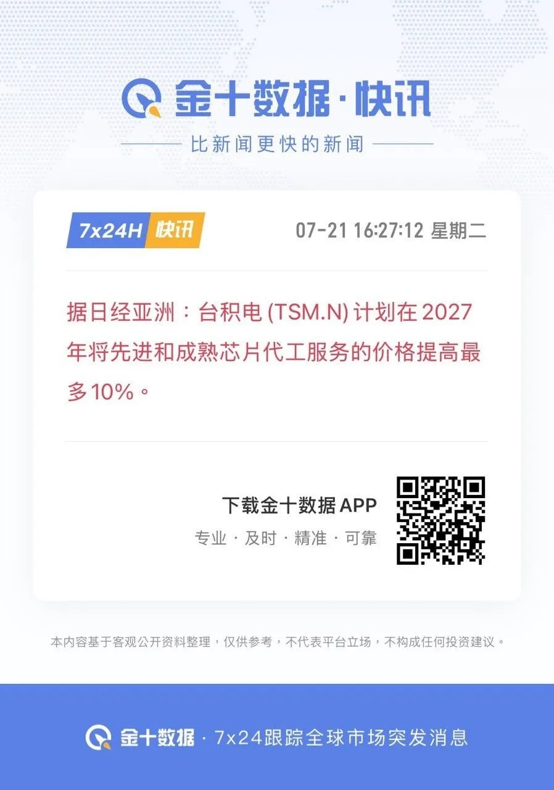

---

<!-- post_id: x:2079504908781305999 | ts: 1784627580 -->
## [X] 駿HaYaO · 2026-07-21 17:53

資產追蹤市場轉型：非車輛應用將於2032年超越車輛追蹤
根據Counterpoint Research最新報告，全球資產追蹤裝置出貨量預計從2025年至2032年以7%的複合年成長率穩健成長。過去由車輛遠端資訊處理主導的市場，正迎來重大轉型，非車輛應用將成為主要成長動能。

2025年，車輛追蹤仍佔整體市場68%的最大份額，但受惠於乘用車與二輪車內建連線功能普及，其成長趨於平緩，預計2032年市占率將下滑至42%。取而代之的是工業智慧標籤、消費性追蹤與工業資產追蹤等新興領域，特別是工業智慧標籤成長最快。

企業對物品級供應鏈可視性的需求大幅提升，推動追蹤範圍從車輛延伸至可重複使用包材、工業設備、零售庫存、高價值資產乃至畜牧等個別物品。這些應用需要更長電池壽命、更低部署成本與即時追蹤能力，加速市場結構轉變。

技術面則呈現多元化，4G Cat 1 bis仍將佔約40%市占率，LTE-M、NB-IoT、LoRa、衛星連線及未來5G eRedCap各有定位。產業正走向整合，企業偏好整合硬體、連線、雲端平台與AI的端到端解決方案。AI應用可實現預測性維護、路線最佳化與自動化決策，具備完整平台能力的廠商將在競爭中勝出。

Counterpoint首席分析師指出，資產追蹤市場正從「車隊可視性」邁向「完整資產可視性」，這波轉型將定義產業未來十年格局。

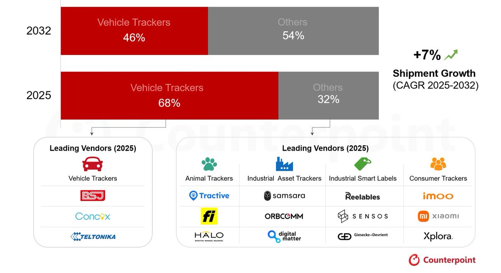

---

<!-- post_id: x:2079494806108311664 | ts: 1784625171 -->
## [X] 駿HaYaO · 2026-07-21 17:12

SpaceX 與智慧經濟：i = er²

以「i = er²」（智慧等於能量×效率平方）為核心概念，深刻剖析 SpaceX 的商業本質。分析師 Adam Jonas 認為，SpaceX 不僅是火箭公司，更是將能量（e）高效轉化為智慧（i）的垂直整合平台，透過太空基礎設施，同時達成三項目標：最小化每公斤發射成本、最大化每瓦特收益，以及最大化每瓦特智慧產出。

報告指出，生命的終極意義就是能量轉化為智慧的過程。從40億年前地球原始湯中出現第一個細胞，到現代資料中心、iPhone、甚至人類大腦（僅20瓦特即可運作860億神經元），所有生命與文明皆遵循此法則。SpaceX 正是這條道路上的關鍵推手，運用第一性原理、Elon’s Algorithm 與 DVFS 技術，在太空領域建立獨特競爭優勢。

財務面上，給予 SpaceX Overweight（增持） 評級，目標價 300 美元（目前股價約135美元）。分析師看好公司長期在 AI 時代的基礎設施地位，預期未來數年 EPS 將顯著成長。

這份報告將 SpaceX 提升至哲學與經濟的高度：它不只是運輸工具，更是人類文明將太陽能量轉化為集體智慧的關鍵基礎建設。未來，誰能在「智慧每瓦特」上領先，誰就將主宰下一世代經濟。

?????

---

<!-- post_id: x:2079487420832289087 | ts: 1784623410 -->
## [X] 駿HaYaO · 2026-07-21 16:43 _(接續 2 則)_

中國半導體逆境突圍：SMIC N+3 製程拆解分析——麒麟 9030 能否挑戰 Intel 18A？

前言：EUV 禁令下的中國半導體
全球半導體製造如今分成「擁有 EUV 極紫外光刻機」與「沒有」的兩大陣營。中國因出口管制失去最先進的 EUV 設備，表面上看似嚴重落後。但現實究竟如何？SemiAnalysis 團隊透過全新 STEEL（SemiAnalysis Teardown Engineering and Evaluation Lab）實驗室，首次公開拆解華為最新旗艦晶片 Kirin 9030，給出了最直觀的答案。Kirin 9030 是華為 Mate 80 系列手機的核心 SoC，採用中芯國際（SMIC）第三代 7nm 製程——內部代號 N+3。這也是目前中國最先進的量產製程。

震撼發現：最小金屬間距 32.5nm，比 Intel 18A 還緊
SemiAnalysis 將 Kirin 9030 物理切開，用電子顯微鏡測量晶片內最細的金屬線路（metal pitch）：Kirin 9030（SMIC N+3）的最小金屬間距（M0）僅 32.5 nm，而 Intel Panther Lake（18A 製程）實際出貨版本為 36 nm（雖然 18A 理論可達 32 nm）。這意味著中國工廠在沒有 EUV 的情況下，金屬線路密度比 Intel 最新 EUV 製程還緊約 10%。標題級的「中國反超 Intel」就此誕生。

與 TSMC N6 全面對比
為公平評估，STEEL 同時拆解了 TSMC N6 製程的 MediaTek Helio G99（中低階手機 SoC）作為對照。結果顯示，SMIC N+3 的最小金屬間距明顯更緊（32.5 nm 對 40 nm），晶體管密度也略勝一籌（113.4 MTr/mm² 對 107.7 MTr/mm²）。整體而言，SMIC N+3 在純密度上已超越 TSMC 成熟的 EUV 製程 N6。

如何在沒有 EUV 下達成高密度？兩大關鍵技術
SMIC 主要依靠兩種方法達成這一成果。首先是多重圖案化（Multi-Patterning）。EUV 可一次印出細線路，DUV 則需「自對準四重圖案化（SAQP）」等複雜工序。代價是更多光罩、更多對準步驟、更高錯誤風險、更低良率以及更高成本。顯微鏡下可看到 N+3 的 M0 溝槽呈現明顯倒梯形輪廓，這是多重圖案化的典型痕跡。其次是DTCO（Design Technology Co-Optimization），即晶片設計與製程深度整合，包括減少鰭片數、閘極接觸直接落在主動區、縮小單元間隔等。每項優化都能省面積，但也讓電晶體更難控制，功耗與效能曲線變差。

密度之外的真實落差
雖然密度亮眼，但效能與功耗才是關鍵。Kirin 9030 的頂級核心效能大約等同 2021 年的 Arm Cortex-X2。與 Apple M1（2020 年）相比，每時脈效能仍落後約 35%。效率差距更大：Apple 小型效率核心只需 1W，就能勝過 Kirin 9030 大核 4.5W 的整數運算。整體表現大致落在 2022–2023 年 Android 旗艦水準，遠不及 2026 年的 Apple、Qualcomm Snapdragon 8 Elite 等。Intel 18A 雖然 M0 間距較鬆（36nm），但憑藉背面供電（PowerVia）等先進技術，在整體晶體管密度與效能上仍大幅領先 N+3（估計領先約 38%）。

未來展望：中國半導體的「非 EUV 生存法則」
SMIC 仍有優化空間，例如繼續壓縮更低金屬層、閘極間距，並可能導入背面供電。N+4 有望接近 TSMC N5 密度，N+5 理論上可達 Intel 18A 等級（但仍限於密度）。然而，每一代進步的難度與成本都在累積——沒有 EUV，製程複雜度像「愈爬愈陡的牆」。出口管制沒有完全鎖死中國，而是改變了中國要解決的問題。知識正在外溢，SMIC 已開始將 N+2 / N+3 技術授權給其他國內晶圓廠，逐步形成完整生態。

https://t.co/RoenIQIc9s

---

<!-- post_id: x:2079486650980368547 | ts: 1784623227 -->
## [X] 駿HaYaO · 2026-07-21 16:40

UBS CIO 黃金觀點
UBS 首席投資辦公室指出，目前金價雖錨定在4,000 美元/盎司附近，但面臨實質投資需求疲弱的壓力。中東軍事緊張與高油價雖帶來避險買盤，央行購金也回升至全年預估 750-1,000 公噸，卻仍不足以大幅推升價格。

短期來看，聯準會對高利率的預期、強勁就業數據及油價上漲，將持續對金價構成壓力。UBS 認為，投資活動低迷是暫時現象，3,850 美元/盎司 以下應視為加碼良機，而非看空訊號。要明顯推升金價，每季需接近 500 公噸 的實質投資需求。

長期而言，美國經濟成長放緩、AI 支出放緩與未來降息（預期 2027 年 3 月）將有利於黃金。即便短期陷入膠著，12 個月後的敘事依然看好。全球投資者尤其應在美元高位時配置黃金，以作為實物資產與多世代配置的選擇。
-----
UBS CIO 白銀觀點
UBS 首席投資辦公室表示，白銀價格自 6 月初 76 美元/盎司 大幅回落至目前 56 美元/盎司，主要受中東地緣緊張升級、高油價及市場對更高利率的擔憂所壓制，導致包括白銀在內的貴金屬普遍承壓。

全年投資需求低迷，ETF 持倉年初至今減少超過 3,800 萬盎司，目前約剩 7.84 億盎司。不過近期出現穩定跡象：本月 ETF 持倉增加 186 萬盎司，顯示投資人已開始在低位進場，期貨非商業部位也從高點溫和回落。金銀比目前高於 70 倍，使白銀相對價值更具吸引力。

短期來看，白銀仍面臨壓力，聯準會溝通偏謹慎、美元堅挺及機會成本上升，將限制反彈空間。但 UBS 認為此波疲弱應屬短期現象。賣出下檔風險、換取收益 是目前最優策略，未來三個月選擇權波動率已明顯收斂，預期將進一步下降。

長期而言，若金銀比擴大至 80 倍 以上，白銀吸引力將更為顯著。UBS 持續看好白銀明年有機會重返 65 美元/盎司 以上，建議在 65 美元 或更低位置維持多頭曝險。
#gold #silver

---

<!-- post_id: x:2079483630964125856 | ts: 1784622507 -->
## [X] 駿HaYaO · 2026-07-21 16:28

TrendForce: 供給增速將超前需求成長，2H27 NAND Flash緊缺壓力可望獲得紓解

根據TrendForce最新2026年7月NAND Flash市場報告，2026年因AI需求爆發性成長，NAND Flash整體供給增速明顯落後需求，市場呈現供不應求局面。展望2027年，雖然伺服器需求持續強勁，但供應商透過製程升級與新產能開出，供給位元成長有望超越需求，預計下半年緊缺壓力可望獲得明顯紓解。

供給面：製程升級為主，中系業者貢獻提升
2026年受現有廠房空間限制，供應商優先將資源投入DRAM，NAND Flash主要仰賴先進製程升級來增加產出。2027年廠房吃緊情況仍未完全緩解，韓、美、日系業者將持續優化現有產線，並局部擴產；中國業者則因新設備陸續到位，產能大幅提升，預計在全球NAND Flash位元產出中的占比將提高至近19%。

需求面：伺服器強勁，消費性電子持續疲軟
伺服器仍是主要成長動能。2026年受Intel、AMD新平台帶動，全年伺服器出貨量年增約17%。2027年Agentic AI應用落地，通用型伺服器建置需求不減，加上CPU供應瓶頸改善與長期協議（LTA）穩定供貨，預期伺服器出貨年增幅度將進一步擴大。目前伺服器對NAND Flash位元需求占比已超過40%。相較之下，智慧手機與筆電需求持續低迷。TrendForce預估2026年手機產量年減15%至20%，2027年雖高階AI手機提供部分支撐，但因終端復甦有限與消費者價格敏感度提高，全年仍將維持年減態勢，降幅略為收斂。筆電方面，2026年出貨年減約10%，2027年受記憶體及CPU成本高漲影響，出貨量預計小幅衰退，合計消費性產品需求占比仍接近40%。

庫存與供需平衡
目前原廠庫存水位偏低，雖然模組廠因消費市場疲弱而庫存上升，但整體買家庫存仍屬可控。TrendForce預估2026年NAND Flash供給位元較需求短缺約4%至5%，全年維持缺貨格局。進入2027下半年，供給成長加速，供需位元差距有望轉為正值，市場緊繃情況將逐步緩解。

綜上，AI伺服器需求成為支撐NAND Flash市場的核心力量，但消費性電子復甦緩慢將使整體需求成長趨緩，供應商產能擴張進度將決定2027年市場是否真正回穩。
https://t.co/bsshmOk0ER

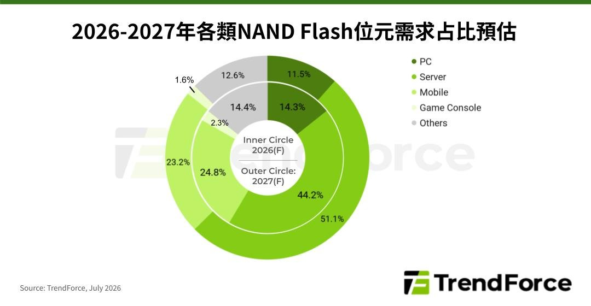

---

<!-- post_id: x:2079456338971697493 | ts: 1784616000 -->
## [X] 駿HaYaO · 2026-07-21 14:40

BofA 
Nebuis Group N.V.
2026 年第 2 季預覽：重點關注容量、資本支出與毛利率軌跡

容量加速擴張下，需求依然強勁
Nebius 預計將於 7 月底公布 2026 年上半年財報。需求能見度依然強勁，近期與 Meta 達成 11 億美元的 Reflection AI 交易也支持這一點。報告提及 Meta 計劃出售多餘運算力，顯示市場競爭加劇。我們重點關注三大領域：
1. 持續的容量啟用與資料中心執行情況
2. 公司基礎設施建置相關的資本支出需求
3. EBITDA 毛利率軌跡
我們重申買入評級與 280 美元目標價，並更新估計，以反映 2026 年下半年較為顯著的資料中心容量擴張（相較於上半年）。

容量啟用仍是首要指標
Nebius 今年開始時擁有 220MW 已連接電力，並計劃在 2026 年底前達到 800MW–1GW 已連接電力，外加 4GW+ 合約電力。這些容量何時轉化為實際營收，將決定收入實現的速度。我們預期連接電力將大幅加權（尤其是第 4 季），2026 年第 2 季前分別達到 435%、516% 與 550% YoY；第 2、3、4 季則分別為 458%、550% 與 518% YoY。 
我們認為，任何建置延遲都代表收入確認時機的轉移，而非基本需求改變，但可能對短期營收與毛利率造成壓力。

資本支出軌跡與毛利率轉折點是重點關注領域
Nebius 最近推出更注重資產輕化的商業模式，擴大至合作營運設施的高階軟體與服務收入。這有助於加速擴張，同時降低資本密集度。儘管如此，我們預期資本支出仍將持續，2026 財年資本支出約 23 億美元，重點在於因應上升的組件與基礎設施成本對獲利的影響。 
在獲利能力方面，我們預期 EBITDA 毛利率將從第 1 季的 32.5% 季減至第 2 季的 29.9%（因初期擴張與資料中心啟用成本），接著在第 3 季回升至 42.1%，第 4 季進一步升至 45.7%。
最後，雖然 SpaceX 與 Meta 等競爭對手帶來壓力導致股價承壓，但我們不認為運算市場的結構性競爭是主要問題，需求遠大於供給，關鍵在於誰能提供容量與存取權。

---

<!-- post_id: x:2079364986783363151 | ts: 1784594220 -->
## [X] 駿HaYaO · 2026-07-21 08:37

Cantor Fitzgerald：Intel 與 AMD

Intel ($INTC)
- 展望：Cantor 維持「中性」評級，目標價 150 美元，並指出即將公布的財報風險/報酬比偏向正面。

- 驅動因素：公司預計在即將公布的財報中將出現「小幅優於預期並上調指引」，主要受惠於代理式 AI需求強勁，以及 Client 部門平均售價擴張。

- 重點關注：分析師正密切觀察 Intel 在供應受限環境下的超額表現能力，以及下半年 Client 單位出貨量可能下滑對公司的影響。

- 晶圓代工進展：市場對 18A-P 與 14A 製程的進展持樂觀態度，同時現有與新客戶都有進展，預計將帶動 2027 年資本支出大幅增加。

AMD ($AMD)
- 即將舉行活動：AMD 將於 7 月 22–23 日在舊金山舉辦第三屆「Advancing AI 2026」活動。

- 新技術：預計推出新一代 Instinct MI450 系列 GPU，以及基於 Zen 6 的 EPYC「Venice」處理器。

- 基礎設施成長：AMD 預計將更新第三季「Helios」機架規模平台的量產進度，並提供更多關於「快速擴張的大型 AI 基礎設施機會管道」資訊。

- 市場預測：
‧ AMD 預計將 2030 年伺服器 CPU 總可及市場（TAM）預測上調至超過 1500 億美元（先前為 1200 億美元）。
‧ 市場也期待 AI 加速器 TAM 的更新預測，2029/2030 年可能上修至 6000–8000 億美元。

- 財務展望：Cantor 認為 AMD 有望在 2027 年指引資料中心營收至少成長一倍。AMD 仍為「最優先推薦」股票，維持「增持」評級，目標價 700 美元。

---

<!-- post_id: x:2079357849470390647 | ts: 1784592518 -->
## [X] 駿HaYaO · 2026-07-21 08:08

#每日導讀 #20260721 #經濟日報

台積電財務長：無意把生意拱手讓人，加碼美國1,000億美元
美伊雙方釋和談意願，油價震盪走跌
台積電回應日本氣體供應商停產疑慮：不預期影響營運

📷 完整導讀 → https://t.co/JsYBrgdlJQ

---

<!-- post_id: x:2079356946369724539 | ts: 1784592303 -->
## [X] 駿HaYaO · 2026-07-21 08:05

早安！7/21 外電綜合整理

- 2059川湖：美系升目標
美系大行直言數字會說話，因2Q營收好表現，券商預估毛利率進一步擴張至78.1%、營業利益率升至 71.6%。同時看到動能延續至下半年，長期而言，除了 AI 伺服器之外，也看到 AI Cluster 機櫃中的各類硬體設備，例如 CPU 機櫃、交換器機櫃、電源機櫃等，採用滑軌的比例持續提升中。預期今年營收／淨利分別成長 134%／143%。大幅上修26-28年EPS至$251/$329/$391，以明年30xPE評價，同步升目標。

 #下次會考

---

<!-- post_id: x:2079191922485408093 | ts: 1784552958 -->
## [X] 駿HaYaO · 2026-07-20 21:09

IREN 與領先 AI 開發商簽署 28 億美元新客戶合約，並將 2026 年 ARR 目標上調至超過 40 億美元

紐約，2026 年 7 月 20 日（GLOBE NEWSWIRE）—— IREN Limited（納斯達克：IREN）（「IREN」）今日宣布，已將年底 AI Cloud 年化合約收入（「ARR」）¹ 目標從 37 億美元上調至超過 40 億美元²，其中約 85% 已簽訂合約，來自與領先 AI 開發商簽署的多年度雲端服務新合約，總合約價值達 28 億美元。

IREN 的客戶群目前已包含 Microsoft、NVIDIA、Perplexity、Figure AI、Together AI、Fluidstack、Fireworks AI、Fal AI、Hume AI，以及一家新的領先 AI 開發商，涵蓋裸金屬（bare metal）和託管雲端服務。

IREN 在投產前仍會選擇性地分配容量，優先考慮客戶群和平台層面的多元化和成長。來自超大規模業者（hyperscalers）、企業、AI 開發商及前沿實驗室的強勁需求，持續超過 IREN 現有及規劃的容量，而 IREN 正在與客戶合作，涵蓋其整個 2026 年和 2027 年擴張計畫。

https://t.co/EQrGBEuTjS

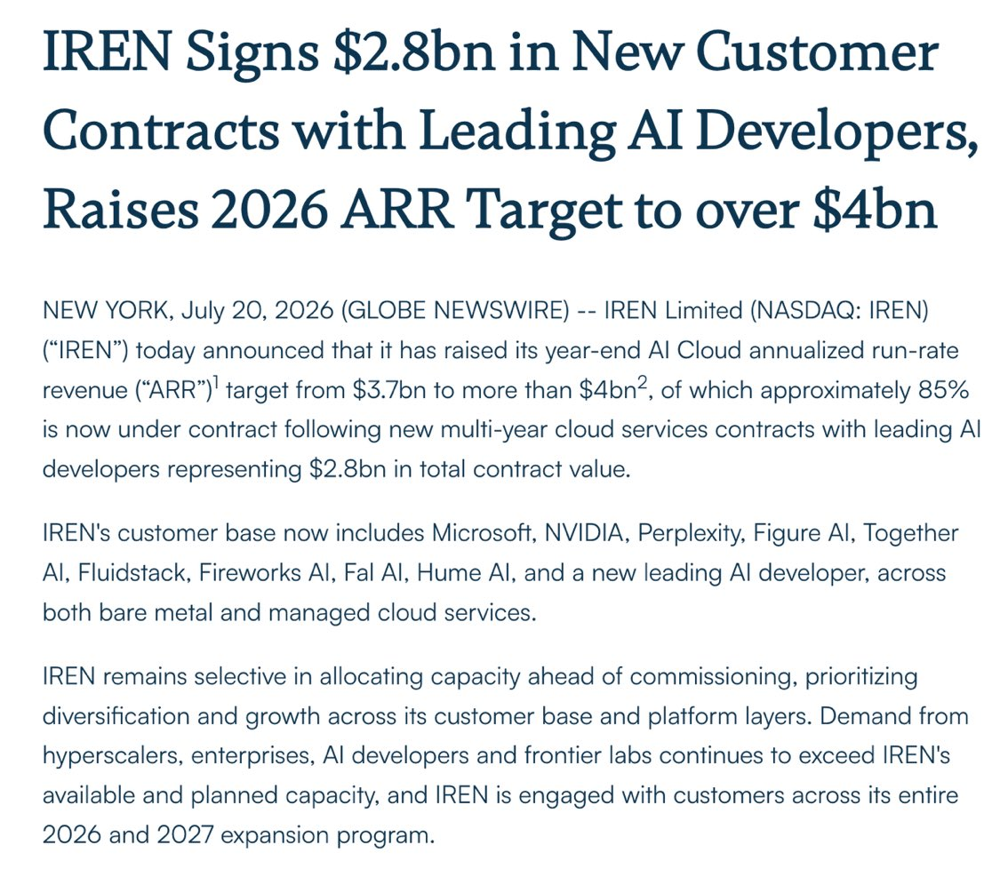

---

<!-- post_id: x:2079184375263219982 | ts: 1784551159 -->
## [X] 駿HaYaO · 2026-07-20 20:39

BofA《Global Metals Weekly》
（銅市觀點）

1. 整體核心
•  銅需求堅韌，供應端問題同樣嚴峻，價格支撐力道仍強。

2. 硫酸救命，但風險高
•  銅礦供應緊俏 → 精煉產量受限 → 價格維持堅韌。
•  中國銅精礦進口年減1%，進一步壓低精煉量。
•  冶煉廠目前靠伊朗戰爭推升的硫酸價格（副產品）勉強獲利。
•  風險：若中東局勢正常化，硫酸價格回落，冶煉廠將面臨更嚴重虧損與擠壓。

3. 資本支出（Capex）與成本持續惡化
•  礦石品位結構性下降。
•  平均每噸營運支出（opex）已從約1,500美元上升至3,700美元。
•  資本支出強度大幅提升，導致新礦場投資意願極低。

4. AI賣壓不改長期基本面
•  三大電氣化需求（電網、電動車、資料中心）到2030年，銅需求成長預計超過過去20年總和。
•  資料中心僅佔電氣化相關需求的10%左右。
•  結論：短期AI相關股市賣壓不會改變銅的長期多頭結構。

5. 歐盟電氣化計畫提供長期支撐
•  歐盟將於本週公布Electrification Action Plan，目標至2030年將電力在總能源需求中的占比每年提升1個百分點至32%。
•  中國銅需求在2025H2雖有短期「空中氣泡」，但電纜/電線開工率回升、庫存下降，顯示結構性需求仍在。

---

<!-- post_id: x:2079149587110183406 | ts: 1784542864 -->
## [X] 駿HaYaO · 2026-07-20 18:21

三星與輝達深化NAND合作，V10開始出貨

三星電子擴大與輝達的聯盟，將NAND快閃記憶體納入供應範圍。目前三星已將約60%產能轉向第九代V-NAND（V9），良率超過80%，並開始量產第十代V-NAND（V10），儲存密度比V9高逾50%。同時加速開發500層級的V11。

因應輝達下半年推出的CMX儲存系統（搭載576顆SSD，總容量9,600TB），AI推論所需的KV cache對NAND需求暴增。預計相關需求將從今年3,500萬TB，激增至明年1億TB以上。三星今年NAND總產出約2.5億TB，將憑藉全球最大產能，成為輝達CMX關鍵供應商。

三星平澤廠仍有充裕潔淨室空間可擴產，並從V10起大規模採用「鉬」，降低配線厚度30-40%。

李在鎔將與黃仁勳會面，討論HBM、NAND供應及韓國資料中心合作。

---

<!-- post_id: x:2079115384108798147 | ts: 1784534710 -->
## [X] 駿HaYaO · 2026-07-20 16:05

https://t.co/PmK4ytcVXG https://t.co/rMqrgpkXiZ

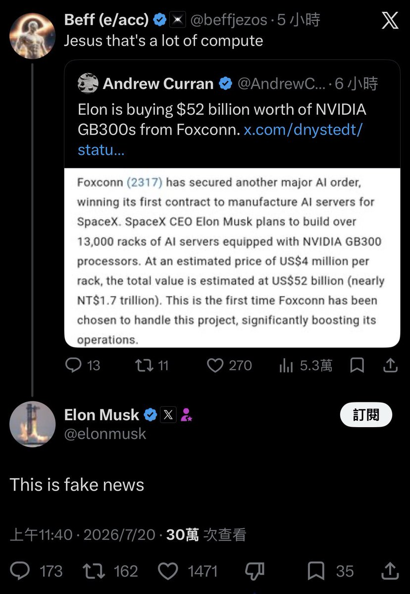

---

<!-- post_id: threads:3945264807763161259 | ts: 1784532236 -->
## [Threads] Kok Yu · 2026-07-20 15:23

那些說用PTFE 不需要用布的...要不要去看一下PCB 多層板的設計規則是什麼（？

---

<!-- post_id: x:2079085394537152700 | ts: 1784527560 -->
## [X] 駿HaYaO · 2026-07-20 14:06

華立_2026-06-16

Memo

亮點
•2024 年營收已突破 800 億元，長期營收年複合成長率約 12-13%，2025 年 EPS 約 8.84 元，現金股息 5.3 元，配發率近 60%。今年第一季營收成長 17%-20%，毛利率較去年同期提升 0.6%。公司已突破 10 億美元規模，獲多家大型外資基金納入投資標的。 

•半導體產業營收比重從四五年前的 25% 提升至今年前五個月的 35%，PCB 材料成長率達雙位數百分比，半導體成長率也達兩位數。 

•公司 cost-plus 模式可將材料漲價效應完全反映至客戶端，產品價格上漲時毛利金額同步提升。
https://t.co/OJfjLVtkOl

---

<!-- post_id: x:2079081619479294034 | ts: 1784526660 -->
## [X] 駿HaYaO · 2026-07-20 13:51 _(接續 2 則)_

鴻海奪 SpaceX AI 伺服器大單 相關業務動能將比預期強

鴻海（2317）再傳AI重大利多，首度拿下SpaceX AI伺服器代工大單，打破過去由戴爾、美超微等美系廠商寡占的局面，正式補齊全球主要雲端服務供應商（CSP）訂單的最後一塊拼圖。據了解，SpaceX執行長馬斯克計劃新建超過1.3萬櫃搭載輝達GB300的AI伺服器，以單櫃400萬美元估算，總規模高達520億美元（約新台幣1.7兆元），出貨時程預計落在今年下旬至2027年第1季。

這筆訂單不僅讓鴻海與全球首富馬斯克正式搭上線，也大幅提升其在AI伺服器領域的能見度。鴻海董事長劉揚偉先前已預告，2026年集團在全球AI伺服器市場市占率將超過四成，全年AI機櫃出貨可望倍數成長，年底前出貨逐季增加。目前AI伺服器為主的雲端網路產品，已成為鴻海四大產品線中比重最大的一塊，未來占比預計持續提升。法人指出，劉揚偉先前給出的AI事業營收指引尚未包含SpaceX訂單，隨著這筆520億美元大單到手，鴻海AI業務動能將明顯優於預期，規模也會更大。SpaceX除自身擴增算力外，還積極開展算力租借服務，已與Anthropic、Google簽署協議，並洽談提供AI運算給美國國防部，顯示其雲端運算事業正大幅擴張。

鴻海首季稅後純益達499.19億元、年增19%，每股純益3.56元，已創同期新高。旗下工業富聯（FII）更公告2026年上半年淨利預增86%至101%，提前預告鴻海第2季業績亮眼。法人看好，伴隨SpaceX大單挹注，下半年鴻海業績將持續衝高，全年成長動能優於預期。此外，鴻海憑藉全球分散產能，以及在光通訊、散熱、共同封裝光學（CPO）等關鍵技術的一條龍服務優勢，將持續在AI伺服器領域開疆闢土，長期成長可期。

https://t.co/o5pRnL7I1e

---

<!-- post_id: x:2079021492042678587 | ts: 1784512324 -->
## [X] 駿HaYaO · 2026-07-20 09:52

早安！7/20 外電綜合整理

- Kimi K3: 美系評又一個Jevon 悖論效應
美系券商評論似乎採用了與 DeepSeek 類似的模型蒸餾技術。Kimi K3 的訓練效率看起來相當優異，但其推論效率應與其他最先進模型相近，甚至可能因 KV Cache 佔用空間增加而略為落後。總體而言，即使 Kimi K3 被廣泛採用，預期包括伺服器 DDR5 與企業級 SSD（eSSD）在內的標準型記憶體需求將進一步增加。因是開源，預期會有大量AI Agent建立於該模型上推出，重申對於記憶體供應商是正面訊號，重申此發布又是一個經濟學上講的「Jevons 悖論效應」。

- 2395研華: 歐系升目標
歐系認為因2Q營收優於預期，認為獲利也會優於預期。不過由於透過加班生產等方式加快產品交付，預期BB ratio 不會再創新高。但券商並不認為這是負面訊號。相反地，更關注專案 Design-win 的動能，因為這是未來六個月訂單積壓的領先指標。上修26-28年EPS至$18.9/$23.3/$27.9，以明年27xPE評價，同步升目標。

- CCL: 美系升台光電、台燿目標
美系券商認為CCL廠毛利率進入下半年後會進一步擴大，預估第二波漲價將啟動，預估 M7+ 等級 CCL 價格將再季增 10～15%。，再加上 HVLP4 銅箔及 Low DK 2 玻纖布成本可能提高，未來幾年仍有進一步漲價空間。短期而言，預估台光電/ 台燿 3Q毛利率36.5%／32.3%。包含AWS Trainium 3 出貨等。上修台光電26-28年EPS至$118/$250/$457，上修台燿至$38.8/$93.5/$168.7，同步升目標。

- 緯創、緯穎：歐系升目標
緯穎是歐系在ODM的首選，預期毛利率自4月DRAM 寄售模式後獲得改善，搭配下半年AWS放量，Helios 機櫃出貨等。上修今明年EPS至$356.7/$500。以明年14xPE評價，同步升目標。

緯創：歐系上修緯創下半年 NVL72 機櫃出貨將由 8,200 櫃提高至約 10,000 櫃，並將第四季 VR200 出貨預估由 500 台上調至 1,000 台。全年NVL72上修至 18,500 櫃。上修26-27年EPS至$16.9/$25，同步升目標。

- 3706神達：美系重申正向
宣布買新設備，今年累計支出已較 2025 年全年資本支出新台幣 19 億元高出 257%，美系券商認為反映神達積極擴充產能，以及客戶對 AI 基礎建設需求強勁。預期3Q營收季增10%，4Q再增32%。重申正向。

 #下次會考

---

<!-- post_id: x:2079003102196179162 | ts: 1784507940 -->
## [X] 駿HaYaO · 2026-07-20 08:39

摩根士丹利對味之素 ABF 的看法：
「對於 ABF，我們預期其出貨量與ASP同步提升，以加速成長。全年新廠貢獻（去年 10 月已投產）加上高規格 ABF 在 AI 等應用上的銷售比重提高，將帶動成長。隨著 CPU 與 GPU 朝向更大尺寸、更高層數的 ABF 產品發展，ABF 的銷售量與 ASP 均持續上升。

在 Flip Chip 封裝基板應用方面，味之素的產品已用於 NVIDIA Blackwell GPU（自 2024 年左右開始量產出貨）。在 F3/27 財年，我們預期 Rubin GPU（Blackwell 後繼機種）的 Flip Chip 封裝生產將全面展開，ABF 出貨量與價格的成長動能將進一步加快。

我們預估功能性材料子部門的銷售額將較上年成長 24% 至 1,247 億日圓（公司指引為 1,116 億日圓），F3/28 年成長 26% 至 1,567 億日圓，F3/29 年成長 27% 至 1,995 億日圓。」

---

<!-- post_id: x:2079002347108463012 | ts: 1784507760 -->
## [X] 駿HaYaO · 2026-07-20 08:36

SK證券認為，半導體高點爭議源自於對LTA的誤讀。

LTA並非壓低價格的機制，而是客戶與供應商互相綁定的供應鎖定合約。
每份合約的確切數量、期限、預付款等條件各不相同，價格區間也不同，因此無法僅憑部分合約就判斷整體。
如果AI大廠已透過LTA完全確保所需供應，就不會出現目前這種記憶體價格急漲的情況。

SK證券估計，以三星電子與SK海力士的供應量基準，LTA占比約在40%至50%之間。
剩餘供應量則由AI需求與傳統設備需求共同瓜分。
LTA正式化後，非LTA市場的價格反而會更加堅挺。
供應商因合約違約罰則，必須優先履行LTA供應，剩餘產能才開放給其他需求者競爭。

目前的記憶體現貨價、溢價、GPU租賃費上漲，都是在這種背景下出現的合理上漲。

CoreWeave討論以Put option因應記憶體價格下跌的報導，反而證明LTA的強勁力道。
客戶簽訂LTA後，實質上持有Call option，因此Put option更接近價格下跌的避險，而非單純看空。
若需求方能將價格風險轉移至金融市場，將能簽訂更大規模的LTA。

SK證券認為，目前正是記憶體評價方式改變的轉折點。
過去僅看動能投資，但AI時代則以獲利持續性與可見度為基準。
LTA改變的不是Peak EPS的高度，而是Trough EPS與獲利持續性，記憶體評價也將轉向以P/E為中心。
SK證券呼籲不要被過時公式搞混方向，維持低價買進、增加持股的意見。

---

<!-- post_id: x:2078159724537856491 | ts: 1784306863 -->
## [X] 駿HaYaO · 2026-07-18 00:47

RT @mingchikuo: 簡要評論台積電 Q2 2026 法說中關於 CoPoS 的部分（截圖自逐字稿），魔鬼都在細節中：

1. 「alternative to try to lower down the cost」指的就是 glass carrier（玻璃載具），也就是 CoP 的部分。

2. 「work with substrate vendor」指的就是 glass core substrate（GCS；玻璃核心載版），也就是 oS 的部分。

3. 「takes about another 1 year to be mature」這句話要非常注意，這是指延續上面提到的試產線。對新技術來說，試產線的成熟，跟量產線的成熟，是完全不同的兩回事。

4. 台積電提到試產線 1 年後成熟，完全驗證我先前提到「2H27 採用 510x515mm（玻璃尺寸）做量產前模擬」的預測。這裡的「成熟」，對 oS / GCS 來說，指的是能在試產線上，開始模擬使用 510x515mm 的最終玻璃規格，而非現在的 250x250mm。

5. 延續4，這意味著現在大部分參與 oS / GCS 的供應鏈，不一定是最終的供應商們（更別提只是純粹敘事、沒實質參與的供應商們）。這是現階段想找投資機會（特別是設備與材料商）時要注意的地方。

6. 台積電的回應很簡短，但已涵蓋了 CoP 與 oS。這之中完全沒有提到 glass interposer（玻璃中介層），也呼應了我先前提到 CoPoS 不使用 glass interposer 這件事。

7. 與台積電在 6 月份的日本研討會內容相比，Q2 2026 法說新增的資訊就是「2H27 試產線成熟」這件事。不過，我認為市場應該多少已經對這時程有預期。而既然台積電已經提了，接下來 Ibiden 與群創的法說，可能也會提及此時程。

---

<!-- post_id: x:2078078736017326450 | ts: 1784287554 -->
## [X] 駿HaYaO · 2026-07-17 19:25

岡本硝子株式会社

熱傳導率 200W/m·K 氮化鋁散熱基板量產認定完成之通知
本公司與 U-MAP 株式会社（愛知縣名古屋市）共同推進開發的氮化鋁散熱基板，其中熱傳導率 200W/m·K 產品，已獲得國內半導體基板製造商的量產認定，並即將開始首次出貨，特此通知。

詳細內容：
本次獲得量產認定的產品，為具備 200W/m·K 高熱傳導率的基板，主要用於資料中心的雷射二極體（LD）子安裝基板。

資料中心因龐大資料處理所伴隨的伺服器發熱，已成為嚴重課題。為解決此問題，光通訊（光電融合技術）的導入正快速推進，而作為發熱源的 LD 要穩定運作，雷射子安裝座（散熱基板）的重要性正急速提升。

本次獲得認定的產品是熱傳導率 200W/m·K 的陶瓷基板。今後，針對快速擴大的資料中心 LD 子安裝市場，我們將繼續開發更高熱傳導率的 230W/m·K 產品以及 0.1mm 超薄型散熱基板，致力於透過本公司產品解決全球熱管理課題。

此外，作為因應上述課題的進一步發熱對策，我們已開始提供 230W/m·K 產品及 0.1mm 超薄基板的試作品，客戶端的初期產品評估正順利進行中。
https://t.co/UZVfLkdSYD

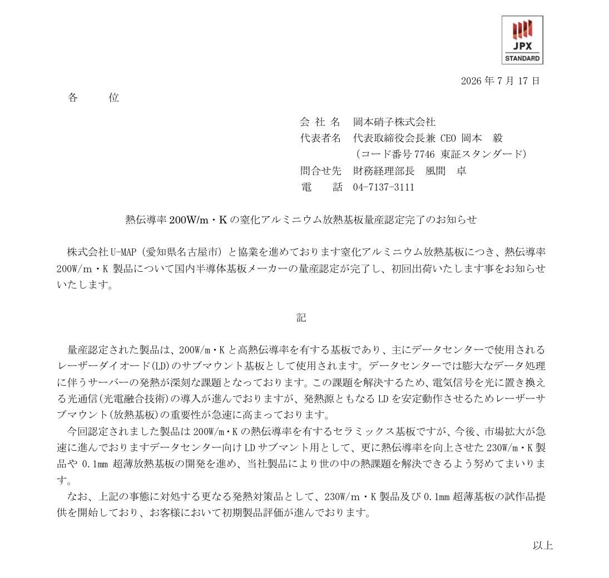

---

<!-- post_id: x:2078057444723589390 | ts: 1784282477 -->
## [X] 駿HaYaO · 2026-07-17 18:01

$MRVL（買進）財報前瞻摘要、 $QCOM （持有）報告

MRVL（買進）財報前瞻 
• 維持買進評級，目標價 $280
• F2Q27E：預期營收季增 +12%，非 GAAP 毛利率約 59%（街機預估 58.8%）
• F3Q27E：營收季增 +13%（共識預估 +11%），毛利率 58.9%（共識 58.3%）
• 極有可能上調 FY27 全年指引；FY28 營收與 FY29 自有 ASIC 目標均具上檔空間
• FY27E / FY28E / FY29E EPS：$4.2 / $7.6 / $14
• FY29 ASIC 營收：$150 億以上（公司指引 $100 億以上），主要由 Google CXL/DPU、Trainium 4 其中一版本及 Maia 300 驅動

QCOM（持有）
• 啟動持有評級：資料中心業務自投資人日以來已部分反映在股價中
• 管理層目標 FY27 / FY29 資料中心營收 $50 億 / $150 億；我們模型為 FY27 / FY28 分別 $47 億 / $88 億
• AI250 與 GPU 競爭力受限於 LPDDR5 高定價及較弱的 scale-up 能力
• CPU 量產爬坡（2028 年）仍相當遙遠
• 自有晶片可善用高晶圓分配額度
• 手機業務仍是拖累；Android 復甦預期過度樂觀，高晶圓庫存與弱賣出情況仍存
• 智慧型手機市占持續面臨壓力，同業積極爭取 OPPO / vivo Ultra 機種訂單
• FY26E / FY27E EPS：$10.7 / $11.3 → 目標價 $203（18 倍本益比）

---

<!-- post_id: x:2078048111604248796 | ts: 1784280252 -->
## [X] 駿HaYaO · 2026-07-17 17:24

AI推升台積電先進製程強勁接單，帶動電子級化學品需求爆發，加上中東衝突導致原料大漲，台塑（1301）反映市況與成本，第3季對電子級氫氟酸（HF）及電子級異丙醇（IPA）同步調漲價格，創下罕見「雙漲」。

台塑領漲後，國內另一指標廠商勝一（1773）也跟進表態，第3季不排除持續調升IPA價格。台塑指出，HF主要原料硫酸、螢石價格走揚，IPA則受丙烯上漲影響，市場已進入價格調整階段。

電子級HF用於晶圓蝕刻、表面處理與清洗，直接影響良率；電子級IPA則廣泛用於晶圓、光罩及設備清洗，是維持先進製程潔淨度的關鍵耗材。兩者皆為2奈米以下先進製程及AI GPU、HBM不可或缺的材料。

目前台塑大金電子級HF市占率約55%，穩居龍頭；台塑德山電子級IPA市占率超過五成。隨著台積電擴產2奈米及先進封裝，AI、高效能運算需求持續成長，台塑電子化學品事業可望價量齊揚。

法人預期，下半年成長可期，明年新產能陸續投產，在AI需求、價格調升、新產能三大利多下，電子化學品將成為台塑高值化布局中最具成長動能的事業。

https://t.co/blTHCnFpGl

---

<!-- post_id: x:2078044468033536181 | ts: 1784279384 -->
## [X] 駿HaYaO · 2026-07-17 17:09

HSBC 將 $AAPL 評級從 Hold 升至 Buy，目標價由 260 美元上調至 366 美元

分析師評論：
「在此之前，我們對 Apple 一直採取謹慎態度，維持 Hold 評級。我們更偏好人工智慧價值鏈中其他能更好地利用運算力瓶頸的環節，包括超大型資料中心業者與記憶體製造商。

我們認為 Apple 現正處於營運轉捩點。公司不僅能避開資本支出過高的爭議——其資本支出僅占預估 2026 年銷售額的 2.5%，相較之下超大型資料中心業者高達 39%——同時也憑藉即將推出的全新 Apple Intelligence，完美定位於利用其 25 億台安裝裝置基礎。這波人工智慧升級來得正是時候，我們認為 Apple 正擁有其近年來最具創新力的產品線。

Apple 的新一代 agentic Siri 人工智慧將於今年部署。Siri 將具備視覺智慧、跨應用程式存取資訊以進行情境感知對話，並支援更豐富的互動。提醒一下，Apple 至今尚未完全兌現 2024 年 6 月首次發表 Apple Intelligence 平台中最具吸引力的使用情境。現在 Apple 將仰賴其基礎模型，這些模型已蒸餾自 Gemini 模型，並可在裝置端與私有雲端伺服器上運行。

硬體產品線也非常強勁，包括今年秋季推出的 iPhone 18 Pro 與 Pro Max、2027 年 4 月的 iPhone Air，以及最重要的是書本式可折疊手機。2027 年我們預期將有 20 週年紀念特別版 iPhone 與智慧眼鏡。搭配更強大的人工智慧，這可能引發 iPhone 15 與 16 系列（2023-2024 年機型）用戶的強勁換機潮。

我們將 2027-2028 年集團營收預測上調 7%-9%，其中 iPhone 銷售額上調 11%-13%。我們預計 2027 年 iPhone 銷售成長 11.6%，高於 Visible Alpha 共識的 8.3%（2026 年成長約 21% 之後）。我們也將 2027 年服務營收預估上調 5.4%。2027 年每股盈餘預估上調約 8% 至 10.26 美元，比共識高出 7.5%。」

---

<!-- post_id: x:2077994654751154595 | ts: 1784267507 -->
## [X] 駿HaYaO · 2026-07-17 13:51

昇達科15日宣布，董事會決議以不超過17億元取得巨頻科技股權，交易完成後加計原持股，將持有逾51%股權，使巨頻正式成為子公司，預計8月完成交割。資金來源為自有資金及銀行融資，不影響營運資金與財務結構。

巨頻科技為高頻高速互連產品專業廠商，產品涵蓋RF、微波、毫米波連接方案及高速訊號模組，廣泛應用於資料中心、航太、低軌衛星、行動通訊及半導體領域。隨著AI資料中心、高速運算及衛星通訊需求激增，高頻高速解決方案重要性提升。

此次併購將整合雙方技術與產品線，強化昇達科在低軌衛星、毫米波通訊及高速互連領域的布局，擴大客戶基礎，提升整體競爭力與營運韌性。

法人指出，AI伺服器、HPC及低軌衛星市場持續成長，昇達科透過此策略併購，可延伸產品版圖至高速互連解決方案，加速切入市場，為中長期營運增添強勁成長動能。
https://t.co/8TjFMBNohJ

---

<!-- post_id: x:2077994064826507448 | ts: 1784267366 -->
## [X] 駿HaYaO · 2026-07-17 13:49

台積電董事長魏哲家在最新發言中指出，目前成熟及特殊製程供應最吃緊的領域，主要集中在電源管理 IC（PMIC）與感測器兩大類別，顯示 AI 已成為成熟製程成長的最強動能。

隨著 AI 資料中心運算力與功耗同步攀升，PMIC 需求急劇增加。從 GPU、CPU、高頻寬記憶體（HBM），到 Power Rack 與高壓直流（HVDC）供電系統，都需要大量 PMIC 進行電壓轉換與功率管理。這些產品多採用 40/55/90 奈米等成熟製程，成為現階段需求最旺的應用。國內電源管理廠商如矽力-KY、力智、致新、茂達等，均直接受惠於 AI 伺服器電源市場的爆發性成長。

除了 PMIC，感測器需求也因 AI 全面滲透而大幅提升。工業自動化、機器人、智慧製造與邊緣 AI 裝置，都高度依賴各類感測器收集環境數據，再交由 AI 模型進行即時分析與決策，使感測器成為成熟與特殊製程的另一重點領域。

然而，台積電強調不能以偏概全。雖然 AI 相關應用供應吃緊，但受全球經濟不確定性影響，手機、PC 等一般消費性電子產品的標準化成熟製程需求依然疲弱，市場呈現明顯分化現象。復甦力道遠不及 AI 領域。

面對此結構性變化，台積電維持既定策略：不全面擴張標準化成熟製程，而是聚焦高附加價值與策略性應用。其中，日本熊本廠將支援 CMOS 影像感測器，德國廠則鎖定車用與工業領域，透過區域化布局就近服務客戶。

台積電預計 2026 年資本支出中，約 10% 投入特殊製程，成熟製程擴產將優先布局 PMIC、感測器、車用及工業等具長期差異化需求的市場。
https://t.co/vwsWs2AsQh

---

<!-- post_id: x:2077910018343723106 | ts: 1784247328 -->
## [X] 駿HaYaO · 2026-07-17 08:15

早安！7/17 外電綜合整理

- 2330台積電: 眾券商上修
昨日法說會後，眾券商皆上修26-28年獲利預估及目標，模型反映上修後的今年營收展望（～年增超過4成）及優於市場預期的資本支出增加。美系大行表示新增的 80 億美元資本支出裡30億為成本通膨，50億為設備預付款。

關於3Q毛利率，大行表示指引中點為 66%，低於預估的 67.5%，主要反映 2 奈米初期稀釋效應。並直言法說前市場盛傳的70%毛利率是不切實際的預估（unrealistic 70% Street forecasts）。因為券商有一再提醒投資人，2 奈米與海外晶圓廠都會帶來毛利率稀釋效應。澳系也表示毛利率稀釋看來仍屬可控。A14按計劃進行，明年試產，後年投產，規模會比2奈米更大。

- 3491昇達科: 美系重申正向
重訊公告收購巨頻科技股權成為子公司，美系券商給予肯定，因正開發 THz（太赫茲），收購案有助於取得新客戶並加速切入 AI 資料中心市場與6G應用，以產生綜效。券商表示目前正與多家客戶進行 THz 產品驗證，重申正向不變。

- BBU: 美系重申正向
美系邀集日、台業者舉辦法說，券商重申該產業正向觀察不變，因BBU 已逐漸成為 AI 資料中心電力基礎建設不可或缺的一環。認為台灣供應商將持續提升模組市占，而 Panasonic 則仍維持整合方案領導者地位。

- 8069元太：美系重申正向
從Pricer財報解讀，零售數位化仍持續推進，零售商對 ESL 的接受度亦持續改善，這對產業具有正面意義。重申正向。

#下次會考

---

<!-- post_id: x:2077793111376613841 | ts: 1784219455 -->
## [X] 駿HaYaO · 2026-07-17 00:30

RT @mingchikuo: 在瞬息萬變的科技產業，有沒有什麼產業調查數據，即便經過半年不更新，仍能比市場共識更貼近公司展望？這很少見，但以下是一個經得起考驗、且多少帶點運氣成分的例子。

ASML 最新的 Q2 2026 財報，進一步驗證我半年前（1 月）的多項預測；其中最關鍵、也最能被量化檢驗的，是 EUV 出貨展望。

EUV 與變動頻繁的消費電子不同。AI 的強勁需求與上游擴產的難度，讓我藉由關鍵供應商 Carl Zeiss SMT 的產能變動所推估之 EUV 出貨量，即便沒更新，在過去半年仍能比市場共識更符合公司展望。

關於 ASML 在 2026 / 2027 年的 EUV 出貨量：

1. 我在 1 月預測 2026 / 2027 年出貨量為 67 / 80‒85 台，並指出 2027 年的 EUV 已銷售一空。當時市場對 2026 年出貨量共識為 53‒55 台。

2. ASML 在 4 月的 Q1 2026 財報中預估 2026 / 2027 年出貨量至少為 60 / 80 台。值得注意的是，公司首度公布更遠的 2027 年出貨展望，便已落在我 1 月預估的區間。

3. ASML 在最新的 7 月 Q2 2026 的財報中，將 2026 / 2027 年出貨量調升至約 65 台（不含 High-NA）/ 85 台（依公司展望推論），並指出 2027 年訂單已接近收滿，這與我 1 月時預測 2026 年的 67 台與 2027 年的「銷售一空」進一步吻合。值得一提的是，即便 Q2 2026 法說前一度傳出 2027 年出貨量約 90 台或以上的更樂觀預期，公司最終公告的展望（約 85 台），仍落在我 1 月預測的區間上緣。

---

<!-- post_id: threads:3942591016271461306 | ts: 1784213495 -->
## [Threads] 誠實豆沙包 · 2026-07-16 22:51

1.首先在電容方面，RUBIN系列的設計因為機櫃跟TRAY的設計，部分的鉭電會被換成MLCC。
2.電容的高中低階壁壘還是很分明，日韓還是高階，台灣中低階，但目前真的是高階最缺，不過確實有外溢現象。
3.市場有在講第三季部分產品要大漲50-100%，很大的機率是看到中國一些通路商在瘋狂屯貨，但高階的完全屯不到，主要還是屯中低階的產品，不過那些品項相對不缺。
4.RUBIN DELAY確實也讓第三季被動元件業務氣焰沒那麼盛了，現在屯就是賭4Q26 RUBIN零組件拉貨可以重拾漲勢。
5.日本廠商確實停止接單，但不是要漲價，是要去查哪些廠商在故意囤貨，日本人做生意還是很有良心的。
6.另外還有一些鄉野奇談，有某些被動元件製造廠商去買日本廠商的產品去貼牌賣給下游，讓日本廠商以為貨是足夠的，後來就減產了，但台灣跟中國廠商自己做產品良率又太低，導致現在想要買貨去貼牌買不到。
7.鬼故事中的鬼故事就是，有被動元件廠商去跟組裝廠談漲價，結果被打槍....這個筆者就沒辦法證實了.....

如果你覺得我故事是唬爛的，那你相信你自己就對了！

---

<!-- post_id: x:2077766276026663108 | ts: 1784213057 -->
## [X] 駿HaYaO · 2026-07-16 22:44

台積電（ $TSM ）、ASML 財報摘要

台積電評級維持 Hold，AI 週期中走高路
•  財報與指引：台積電 Q2 財報大致符合預期（毛利率略低於樂觀預期），但公司上調全年營收與資本支出預測。

•  主要亮點：在毛利率管理上採取保守路線（不積極調漲價格）、地理擴張（進一步增加亞利桑那州資本支出），以及後端彈性（透過 EMIB 支持客戶後端）。

•  如7 月 7 日預覽報告所述，台積電的資本支出加速從 2025 年開始，也就是 AI 週期啟動後 1.5–2 年，這意味著市占率流失或需求溢出給競爭對手；不過 2026-2027 年會追趕資本支出，加上謹慎的定價策略，台積電可能是少數在未來幾季不會看到毛利率擴張的 AI 半導體公司，這將導致估值倍數降低。

ASML 財報亮眼，上調全年指引
•  Q2 表現：ASML 交出強勁超預期成績，Q2 營收 93 億歐元，毛利率 54%，大幅超越指引。

•  指引上調：公司將 2026 全年營收展望提高至 430–450 億歐元（先前為 360–400 億歐元）。

•  成長動能：來自邏輯與記憶體客戶的強勁需求。
•  產能擴張：ASML 宣布至 2027 年，EUV 與 DUV 浸潤式系統產能每年增加約 30%，2028 年可能進一步擴大。維持正面看法。

---

<!-- post_id: x:2077753418865942841 | ts: 1784209992 -->
## [X] 駿HaYaO · 2026-07-16 21:53

美國記憶體大廠 Micron Technology（美光）宣布，已與 Qualcomm、Visteon、HARMAN、JOYNEXT、DENSO、Astemo 及 Hyundai Mobis 等七家汽車產業重要 Tier 1 供應商與生態系統夥伴，完成多項策略性客戶協議（SCAs）。

這些長期協議聚焦供應先進記憶體與儲存解決方案，支援下一代 ADAS、先進駕駛輔助系統、軟體定義車輛及智慧座艙等應用。協議將提供長期供應保障、價格穩定性，並提升雙方生產規劃能見度，同時加強未來技術開發與製造產能合作。

Micron 執行長 Sanjay Mehrotra 表示：「汽車創新的下一步取決於生態系統的強度，這些 SCA 將確保先進車輛平台具備更豐富、更安全且更智慧的體驗。」

Qualcomm、Hyundai Mobis、HARMAN、Visteon 及 DENSO 高層也分別強調，合作將為軟體定義車輛與智慧移動奠定堅實基礎。

$MU 
https://t.co/c7r7q2wC4B

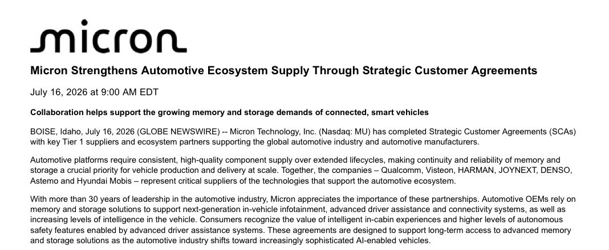

---

<!-- post_id: x:2077722031400030418 | ts: 1784202509 -->
## [X] 駿HaYaO · 2026-07-16 19:48 _(接續 2 則)_

力成攜手博通 斥資4億美元新加坡設PLP合資廠

封測大廠力成（6239）16日宣布，董事會決議與美國IC設計巨頭博通（Broadcom）在新加坡共同成立面板級先進封裝（Panel Level Packaging, PLP）製造合資公司，總投資金額高達4億美元，將分階段投入，以自有資金支應。

此合作旨在深化力成先進封裝布局，貼近全球客戶供應鏈，強化在AI、高效能運算（HPC）及高速網路晶片領域的製造能力。面板級封裝因採用大尺寸基板，具有成本與產能優勢，被視為下一代先進封裝主流技術，吸引國際大廠積極投入。

力成指出，合資案仍需主管機關核准及相關條件完成，後續將依規定公告。業界分析，此舉不僅深化雙方技術合作，更可借助新加坡完善半導體生態系，提升供貨彈性與全球競爭力。

https://t.co/bQL3pC1Fgq

---

<!-- post_id: x:2077689807715889379 | ts: 1784194826 -->
## [X] 駿HaYaO · 2026-07-16 17:40

USITC 對特定動態隨機存取記憶體（DRAM）設備、包含該設備的產品及其組件（II）展開337調查
日期：2026年7月15日
新聞發布編號：26-101
調查編號：337-TA-1511

美國國際貿易委員會（以下簡稱委員會或USITC）投票決定，對特定動態隨機存取記憶體（DRAM）設備、包含該設備的產品及其組件展開調查。調查所涉產品詳見委員會的《調查通知》。

本調查依據加州爾灣市Netlist, https://t.co/eFISbElWj4於2026年6月16日提出的投訴立案。投訴補充材料於2026年6月24日及25日提交。經補充後的投訴主張，在將特定動態隨機存取記憶體（DRAM）設備、包含該設備的產品及其組件進口至美國及在美國銷售的過程中，存在違反1930年《關稅法》第337條的行為，原因是這些產品侵害了投訴人所主張專利的若干項權利要求。投訴人請求USITC發布有限排除令及禁止令。

USITC已確認本調查的下列被告：
Samsung Electronics Co., Ltd.（韓國水原市）
Samsung Electronics America, Inc.（美國德州Plano市）
Samsung Semiconductor, Inc.（美國德州Plano市）
Google LLC（美國加州Mountain View市）
Super Micro Computer, Inc.（美國加州San Jose市）
NVIDIA Corp.（美國加州Santa Clara市）
Broadcom Inc.（美國加州Palo Alto市）

透過啟動本調查（337-TA-1511），USITC尚未對案件實質作出任何決定。USITC首席行政法法官將把案件指派給一位行政法法官（ALJ），由其安排並舉行證據聽證會。行政法法官將就是否違反第337條作出初步裁定，該初步裁定可由委員會審查。

USITC將在可行最短時間內對調查作出最終裁定。在調查啟動後45天內，USITC將設定完成調查的目標日期。在第337條案件中，USITC的救濟令於發布時即生效，並在發布後60天成為最終決定，除非美國貿易代表在該60天期間基於政策理由予以否決。
https://t.co/R3EsiStJ9Q

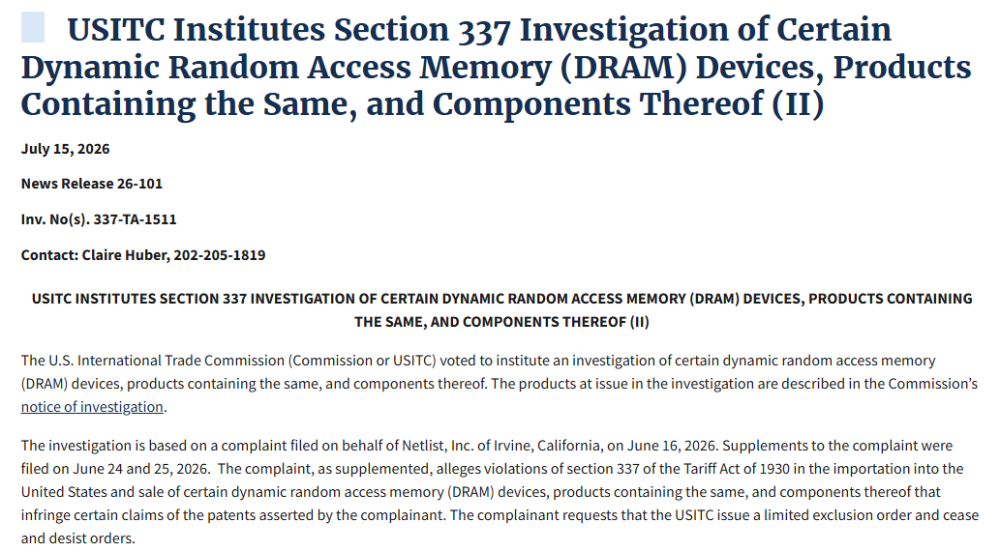

---

<!-- post_id: x:2077685189543866615 | ts: 1784193725 -->
## [X] 駿HaYaO · 2026-07-16 17:22

韓國收緊單一股票槓桿ETF監管　禁止新品上市、保證金提高至3000萬韓元
韓國金融服務委員會7月16日宣布，針對單一股票槓桿ETF推出多項嚴格新措施，以抑制投機並穩定市場。

主要內容包括：
- 立即禁止新單一股票槓桿ETF上市。
- 現有產品最低保證金從1000萬韓元提高至3000萬韓元，且僅接受現金。
- 投資者培訓時長由2小時延長至3小時。
- 最低交易單位從1份提高至20份。

此波監管背景是5月底三星電子、SK海力士等2倍槓桿ETF上市後，散戶資金快速湧入，導致每日再平衡交易規模高達7000億至2.1萬億韓元，嚴重加劇尾盤波動與市場不穩定。

韓國金融服務委員會、財政部與央行聯合會議後做出決定。金融投資協會先前已召開緊急會議討論自律措施。業界人士認為，新規雖降低散戶參與便利性，但有助緩解短期市場波動。若波動持續，監管部門不排除進一步加碼。
https://t.co/SEQRG8sGPz

---

<!-- post_id: x:2077661912448262584 | ts: 1784188175 -->
## [X] 駿HaYaO · 2026-07-16 15:49

檢方突擊搜查半導體企業涉嫌串通行為
檢方突擊搜查蒙太奇（Montage）、瑞薩（Renesas）、Rambus，涉嫌與三星、SK
檢方對向三星電子和SK海力士供應半導體零組件的全球企業進行了突擊搜查。

據法律界人士透露，首爾中央地方檢察廳公平交易調查部（部長羅熙錫）當天對中國無晶圓廠半導體設計公司瀾起科技（Montage Technology）、日本綜合半導體企業瑞薩電子（Renesas Electronics），以及美國半導體設計公司Rambus的韓國辦公室，執行了搜查扣押行動。此次行動是基於涉嫌違反《公平交易法》的指控。檢方預計將根據搜查中扣押的手機和公司文件，調查具體的串通時間表和手法。

瀾起科技等公司涉嫌在向三星電子、SK海力士，以及美國全球記憶體半導體企業美光（Micron）供應半導體零組件時，進行價格串通操縱。這些企業是全球主要記憶體半導體製造商的寡頭供應商。

https://t.co/mMX48zqkLf

---

<!-- post_id: x:2077660467091423354 | ts: 1784187831 -->
## [X] 駿HaYaO · 2026-07-16 15:43

CXMT 資本雄厚 瞄準記憶體「大三巨頭」
2026年7月16日，CXMT（https://t.co/s1fqlNVR9x）在上海科創板上市，募資人民幣579億元（約85.5億美元），每股8.66元，市值約800-850億美元，較SK海力士、美光等一線廠商有明顯折價。

目前CXMT全球DRAM位元出貨市佔約9%，預計2028年升至11%。Counterpoint Research指出，長期生存至少需達15%市佔，目標是打入「大三巨頭」俱樂部。憑藉本次募資，CXMT計劃2027年將月產能從32萬片擴至42萬片，2030年翻倍、2035年再翻倍，產品逐步轉向LPDDR5與DDR5高階領域，已進入全球PC與伺服器供應鏈。

面對美國設備管制，CXMT積極開發垂直通道電晶體（VCT）與晶圓對晶圓（WoW）等創新架構，有望反向加速超越同業。HBM3方面，12高堆疊技術已進入量產準備階段，2028年有望貢獻20億美元營收，主要供應華為Ascend等客戶。

Counterpoint Research強調，關鍵觀察指標包括：HBM大規模良率、非中國OEM大單、市佔成長軌跡，以及美中貿易風險。基準情境預估2028年位元市佔11%、2035年突破20%，若能穩健執行，將成為中國記憶體產業戰略要角。
https://t.co/qyck8mbRCA

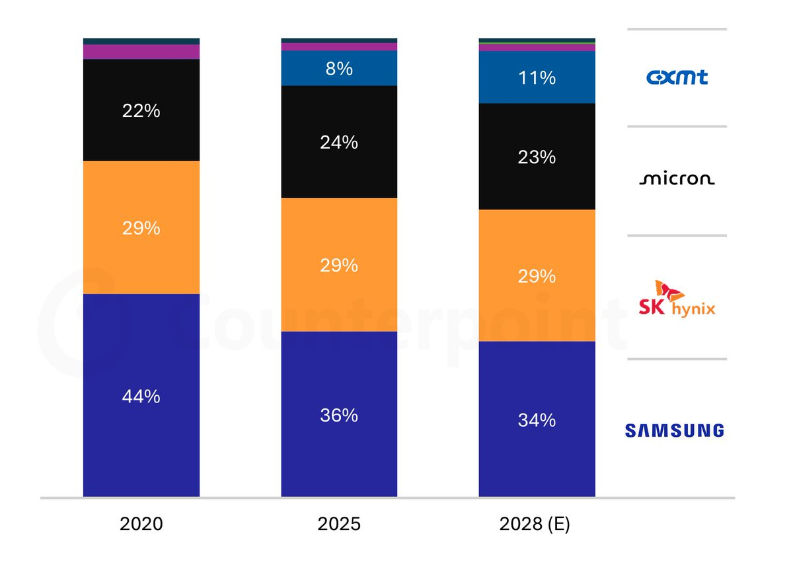

---

<!-- post_id: x:2077659669989069168 | ts: 1784187641 -->
## [X] 駿HaYaO · 2026-07-16 15:40

TSMC 2026年第二季財報

主要財務數據
- 營收：402億美元（季增12%、年增34%），達到指引高標。
- 毛利率：67.7%（去年同期58.6%），超出指引高標。
- 營業利益率：60.3%（去年同期49.6%），同樣超出高標。
- 晶圓出貨量：436.6萬片（年增17%）。
- 晶圓平均售價（ASP）：7,881美元（年增13%）。
- 上半年資本支出：268億美元（年增36%）。

技術節點與業務亮點
- 2nm 正式貢獻：第二季 2nm 晶圓營收已超過 10 億美元。
- N3 節點強勁：儘管智慧手機與 PC 季節性下滑，N3 晶圓營收仍季增 33%。
- HPC（高效能運算）再創高：單季增加 46 億美元營收，抵銷智慧手機業務下滑。
- 毛利率歷史新高：主要來自價格調漲、產品組合優化，以及先進製程高利用率。

第三季指引（3Q Guidance）
- 營收：446～458 億美元（季增 12%、年增 37%）。
- 毛利率：65%～67%。
- 營業利益率：56%～58%。
- 毛利率預計下滑，主因 2nm 大量爬坡，將稀釋 3～4 個百分點。

全年展望與資本支出
- 2026 年營收成長：預期超過 40%（先前預估至少 30%），AI 需求加速推動。
- 2026 年資本支出：600～640 億美元（先前 560 億美元）。
- 2nm 影響：下半年毛利率將受 2nm 稀釋 3～4pp；海外晶圓廠初期稀釋 2～3pp，後續 3～4pp。
- 美國亞利桑那州投資：額外增加 1,000 億美元（總投資達 2,650 億美元），將興建 10 座晶圓廠 + 2 座先進封裝廠 + 1 座 R&D 中心。目前已確認新增 4 座晶圓/封裝廠。
- 其他先進製程：
‧ 3nm 綠地廠（Arizona、日本、台灣）進度如期。
‧5nm 轉換持續進行。
‧A14 預計 2028 年下半年量產，比 N2 密度提升 20%，預期成為更大、更長壽的節點。

其他重要發言
- TSMC 仍維持對 AI 的長期 CAGR 看法（先前高 50% 區間），尚未上修。
- 封裝產能吃緊，歡迎 Intel EMIB-T 等技術緩解市場壓力；競爭對手的先進封裝短期有助 TSMC 前段晶圓業務。
- 不會採取記憶體產業那種機會主義定價，但價格確實在調漲並反映在毛利率上。
- 亞利桑那廠建置速度取決於客戶需求，目標盡快興建。
- 對未來幾年前景非常樂觀，但尚未上修長期 25% CAGR 指引。
- 競爭格局：2nm 以下已有 5～6 家玩家（含中國），但 TSMC 仍靠信任、技術與產能領先。

總結：
- 第二季強勁、第三季指引樂觀。
- 上調全年營收與資本支出預期。
- 2026 年營收成長軌跡超過 40%，資本支出大幅提升。
- 2nm 爬坡將短期壓低毛利率，但長期成長動能強勁。
- 大舉加碼美國投資，展現對全球布局的信心。

---

<!-- post_id: x:2077643392809378223 | ts: 1784183760 -->
## [X] 駿HaYaO · 2026-07-16 14:36

SEMI：全球半導體設備銷售預測
1.  破紀錄成長與核心驅動因素
- 歷史新高銷售額：全球半導體製造設備銷售額預計在2026年達到創紀錄的1,659億美元（年增23.2%）。

- 五年擴張浪潮：這波上漲動能預計將延續至2028年，達到前所未有的2,295億美元。

- AI催化劑：AI基礎設施的加速需求正推動這一歷史性循環——特別是迫使在先進邏輯製程、高頻寬記憶體（HBM）、先進封裝以及高度複雜的裝置架構上進行大規模資本投資。

2. 主要細分市場 breakdown
- 晶圓廠設備（WFE）
2026年預測：預計成長23.1% 至1,439億美元，較先前預測大幅上修。
長期軌跡：WFE支出預計2027年成長21.8%、2028年成長14.1%，將突破2,000億美元大關。

- 後段設備（測試與封裝）
測試設備：2026年激增31.0% 至153億美元（繼2025年暴增55.3%之後），預計2028年達到208億美元。
組裝與封裝：2026年成長9.6% 至67億美元，2028年攀升至86億美元。這主要受惠於複雜AI裝置所需的高階與異質整合封裝需求。

3. 各地區支出趨勢
- 中國、台灣與韓國至2028年仍將維持全球設備支出的前三大目的地地位。

- 中國將穩居第一，但2026年成長速度預計較前幾年放緩（先前已歷經多年重度、破紀錄投資）。

- 台灣與韓國正針對先進晶圓代工製程節點與高階HBM記憶體產能進行大規模投資。

- 其他地區預計在2027與2028年加速支出，受惠於供應鏈區域化、政府激勵措施以及特殊產能擴張。

---

<!-- post_id: x:2077637352940519448 | ts: 1784182320 -->
## [X] 駿HaYaO · 2026-07-16 14:12

報告指出，美國股市目前呈現「股票波動率飆升、指數波動率低迷」的極端背離，情況已接近 90 年代網路泡沫後期。

核心現象：
受 AI 泡沫推動，半導體股（如 MU、AMD）波動率大幅上升，個股已實現波動率達歷史高點；但因半導體與其他權重股去相關，指數波動率反而被壓低，相關性降至近紀錄低位。若估值持續泡沫化，指數波動率恐進一步爆發，尤其財報季與季節性弱勢期即將到來。

主要建議：
1. 對沖指數波動率衝擊：推薦買進 VIX 看漲價差，最大報酬可達 15 倍以上。
2. 歐洲景氣循環股：SX5E 隱含波動率已低於已實現水準，建議執行 SX5E-vs-SXXP 賣權轉換，以低成本對沖科技、消費與工業等循環板塊下行風險。
3. TSMC 財報策略：看好基本面，建議轉換為上限下跌 1.3% 卻保留大量上檔凸性的選擇權結構，同時可參與上漲。
4. 日經避險：利用高波動率將日經對沖成本降低高達 74%，適合防範 10-20% 修正。

---

<!-- post_id: x:2077548769164583016 | ts: 1784161200 -->
## [X] 駿HaYaO · 2026-07-16 08:20

日本AI業者正面臨Nvidia GPU伺服器高昂成本與「記憶體牆」問題，市場正積極發展低成本、高效率替代方案。

Penguin Solutions（ $PENG ）MemoryAI KV快取伺服器
美國AI基礎設施公司Penguin Solutions將於2026年第四季在日本推出MemoryAI KV快取伺服器。該伺服器專門儲存大型語言模型（LLM）的短期記憶（KV cache），將運算結果存放在GPU外部，避免重複計算。 此做法可大幅擴充記憶體容量、減少所需GPU數量。根據Penguin Solutions日本子公司社長正田三四郎表示，每GB記憶體成本可降至新增GPU的1/7至1/3，有效解決記憶體瓶頸並提升GPU利用率。

Rebellions NPU伺服器低功耗方案
日本Tomen Devices與AI開發商Tomorrow Net正合作測試南韓Rebellions的NPU伺服器。NPU專為AI推論設計，與GPU相比價格較低、功耗更少，已在南韓SK Telecom等企業獲得採用。Tomen Devices社長中尾清隆認為，NPU是建構AI基礎設施的 promising 選擇。

市場背景
Nvidia在資料中心GPU市場占有率超過90%，高階AI伺服器成本高達數百萬美元。日本企業為降低成本與能耗，轉向CXL記憶體技術與NPU等替代方案，加速AI基礎設施本土化部署。

---

<!-- post_id: x:2077545663085383961 | ts: 1784160459 -->
## [X] 駿HaYaO · 2026-07-16 08:07

#每日導讀 #20260716 #經濟日報

台積電今日法說登場，美銀維持買進、目標價調升至3,100元
艾司摩爾財報報喜並三度上修全年展望，最新預估營收430億至450億歐元
台股昨日報復性反彈893點，收45,631點，一舉收復45K關卡與5日線

📷 完整導讀 → https://t.co/avvMQL35NO

---

<!-- post_id: x:2077545549860048925 | ts: 1784160432 -->
## [X] 駿HaYaO · 2026-07-16 08:07

早安！7/16 外電綜合整理

- 2308台達電: 歐系升目標
歐系券商考量資料中心專案延後，以及 IGBT／MOSFET 交期拉長所致，下調2Q營收/獲利預估以符合市場的最新預期，同時下調2Q毛利率/營業利益率至36.0%／18.0%。

但券商上修3Q營收季增15%高於市場預期的13%。4Q營收預估季增8%，首波Rubin將放量。至於Rubin Ultra，券商認為升級版 Open NVL72 機櫃比 Kyber 架構更有可能被採用。券商上修25-29年NVIDIA 機櫃電源CAGR至65%。接下來還有新品如固態氧化物燃料電池、固態變壓器等。上修明後年EPS至$67.5/$90，以35x 27-28E平均EPS評價，同步升目標。

- 8150南茂: 歐系升目標
歐系券商認為2Q營收符合預期，同時認為動能能延續至2H26，因記憶體業務持續走強（～DDR4／DDR5 產量提升、Flash 需求增強，以及外包需求增加）；Driver IC 業務受惠於急單及價格調漲，季增幅優於預期；最後，SiPh／光學凸塊業務與客戶合作持續推進，有望於明年貢獻營收。且還在新增邏輯測試設備，未來可用於智慧手機／ASIC 測試。最新預估26-28年EPS為$4.2/$6.2/$7.4，以23x 2027-28E平均EPS評價，同步升目標。

- 6515穎崴：美系降目標
公告6月EPS後，美系券商認為總2Q EPS低於預估，反映毛利率低於公司平均的MEMS 探針卡出貨佔比較高。不過券商認為2Q會是全年毛利率的低點。預估3、4季回升至至 39.3%／40.8%。明後年43.2%／45.2%。認為在AI GPU/AI ASIC, 還有x86 and Arm-based CPUs.都有著墨。券商下調26-28年EPS至$95.9/$197.7/$369.2，以後年40xPE評價，同步降目標。

 #下次會考

---

<!-- post_id: x:2077544308333490611 | ts: 1784160136 -->
## [X] 駿HaYaO · 2026-07-16 08:02

ASML 計劃上調芯片設備價格，台積電反對

據《The Information》報導，全球光刻機巨頭阿斯麥（ASML）計劃提高芯片製造設備價格，引發其最大客戶台積電強烈抵制，雙方衝突一觸即發。

四位知情人士透露，ASML 近期已與台積電就極紫外光刻（EUV）系統提價進行商討，並通知部分客戶將深紫外光刻（DUV）系統價格上調約10%。台積電認為定價過高，已開始明確反對。此舉凸顯芯片產業在AI需求爆發與成本控制之間的尖銳矛盾。

需求強勁推升擴產與漲價
在人工智慧與高效能運算晶片需求激增下，ASML 周三上調2026年銷售額預測至430億至450億歐元（約492-515億美元），較2025年成長35%。公司同時宣布，今年將兩大主力設備年產能提升30%，2028年再擴30%。

ASML 是全球唯一能量產EUV光刻機的廠商，其設備負責將電路圖案精準投射到矽晶圓上，是先進製程不可或缺的核心。最新EUV機型單價已逼近4億美元，低NA EUV仍有明顯提價空間。首席財務官Roger Dassen在法說會上坦言，訂單交付期長，漲價效應將逐步顯現。

台積電與中國客戶態度分歧
台積電正積極擴大先進封裝（CoWoS）產能以滿足英偉達等AI大廠需求，因此對設備漲價極度敏感。反觀部分中國芯片廠商已接受DUV漲價，但對EUV仍持保留態度。2025年中國占ASML銷售額33%，預計2026年將降至20%，主要受前期大量採購後需求趨緩及美荷出口管制影響。

產業影響深遠
光刻機是晶圓廠最昂貴設備，採購延遲可能導致整條生產線投產受阻。埃隆·馬斯克的Terafab巨型半導體廠計畫，也將成為ASML重要合作對象，可能進一步強化其議價能力。

分析指出，ASML此番提價既反映強勁市況，也考驗其與台積電、三星等龍頭客戶的長期合作關係。在AI熱潮持續下，設備供應鏈的價格博弈將成為2026年半導體產業最受關注的焦點之一。

---

<!-- post_id: x:2077445595980308726 | ts: 1784136601 -->
## [X] 駿HaYaO · 2026-07-16 01:30

RT @mingchikuo: 我較少公開預測股價趨勢（產業研究與股價預測是完全不同的兩回事），一個近期少見的例子是我在 WWDC26 前指出正向看待 Apple 在 2H26 股價趨勢，且「...無論 Apple 在 WWDC26 上講什麼，只要這個多頭核心敘事沒有被破壞，Apple 2H26 的股價正向趨勢就不易改變。」

在經歷 WWDC 26 後的利多出盡、調漲 Apple 產品售價所導致的股價回檔後，加上面臨近期股市動盪，但 Apple 股價仍在盤中創了歷史新高，這與我在一個月前預測的趨勢一致。

---

<!-- post_id: x:2077385597921227142 | ts: 1784122297 -->
## [X] 駿HaYaO · 2026-07-15 21:31

晶圓代工廠力積電（PSMC，6770）7月14日召開法說會，總經理朱憲國表示，8吋及12吋晶圓代工價格自7月起全面調漲10%至15%。雖然7月因銅鑼廠設備遷移及新竹廠歲修影響，營收暫緩，但漲價效益持續發酵，預期8月起營運重返正軌，並一路增溫至第四季，全年高峰落在年底。

受惠DRAM價格走揚，第二季記憶體營收占比已升至52%，7月再結構性調漲DRAM投片價約45%，效益自11月顯現。1X奈米DRAM製程已於6月小量生產，1P奈米則預計2028年中量產。SLC NAND Flash因網通、工控需求，價格自第二季走揚，公司轉進24奈米製程並開發MLC新品；NOR Flash受AI伺服器、5G、智慧車帶動，投片量突破5000片進入放量。

晶圓代工業務供不應求，第三季Book-to-Bill達1.4倍。AI伺服器PMIC需求強勁，車用及工控回溫，預期下半年價格仍有續漲空間。3D AI Foundry代工成為成長引擎，12吋矽電容已獲EMIB認證穩定出貨，矽中介層復線量產，WoW及HBM後段PWF亦積極推進，目標3年內營收占比由5%提升至20%。

資本支出審慎，2026年約4.88億美元。未來兩年聚焦提升3D AI Foundry占比、提高AI與車用晶片比重、新竹廠升級及DRAM新製程開發，優化產品組合以強化獲利能力。
https://t.co/6NUOoiEI6w

---

<!-- post_id: x:2077384817126334925 | ts: 1784122111 -->
## [X] 駿HaYaO · 2026-07-15 21:28

$ASML

關鍵要點
- 2026 年銷售額指引 €43-45bn，高於共識中值 11.2%。
- 2026 年毛利率指引 54-55%，也高於共識的 52.4%。
- EUV 產能將增加約 30%（2027 年 27 套系統 → 2028 年 另一 30% 增加 → 共 78-110 套系統）。
- 2027 年也目標增加 30% EUV 產能。
- High-NA EUV 已進入英特爾量產階段。
- 公司預測 2026 年邏輯成長 25%、記憶體成長 75%。
- 中國銷售額預計佔比約 20%，高於先前預期。

「針對 3Q26，ASML 預期銷售額 €11,500mn（高於共識 €10,367mn），毛利率 56.0%（高於共識 52.1%）。R&D + SG&A 費用預計 €1,600mn，營運費用線內 VA 成本 €1,588mn，意味著 3Q26 EBIT 約 €4,840mn（高於共識 €3,831mn）。該指引意味 4Q26 營收約 €10,900mn 至 €13,400mn（高於共識 €10,150mn 至 €13,400mn），毛利率 54-55% 至 53.42%。高於先前指引 €36-40bn 的 17% 毛利成長。

ASML 計畫將 EUV 產能從「26 列中的 65 套系統」提升至 2027 年的 85 套，並在 2028 年再增加 30% 產能（總計 110 套系統）。同樣地，2028 年 c10 系統出貨預計 88 套（2027 年 105 套）。另外，管理層強調 High-NA EUV 已進入英特爾量產階段（Intel Core Ultra 3 處理器）。ASML 也強調強勁的 2nm 需求與 14nm 拉貨（正面），加上 2026 年邏輯成長 25%、記憶體成長 75%，由於強勁的 2nm 需求與 1.4nm 拉貨所帶動。中國佔比預估約 20%，高於先前預期，由更強勁的邏輯相關需求所驅動。」

---

<!-- post_id: x:2077384348245123350 | ts: 1784121999 -->
## [X] 駿HaYaO · 2026-07-15 21:26

$SPCX（SpaceX）

關鍵要點
- Grok 4.5 是首款專為程式碼撰寫與 Agentic 工作設計的 AI 模型，獲得強烈正面評價。
- AI 計畫在 3 月遭遇挫折後已「重回正軌」。
- Starship 第 13 次飛行預計於 7 月 16 日執行，將搭載 20 枚 Starlink V3 測試單元。
- AI 模型表現與 Starship 成功是擴大總可及市場的關鍵催化劑。
- 因對執行力的信心提升，目標價隨之上調。

事件焦點
- 7 月 8 日發布 Grok 4.5 AI 模型，訓練資料來自 Cursor 開發者數據。
- Starship 第 13 次飛行預計最早於 7 月 16 日進行。

「7 月 8 日，SPCX 發布 Grok 4.5，這是公司首款專為程式碼撰寫與 Agentic 工作打造的 AI 模型，訓練資料來自 Cursor 開發者數據。該模型在第三方 AI 基準測試中獲得強烈正面評價，雖然尚未達到 Anthropic 或 OpenAI 等領先模型的水準，但已讓 SpaceX AI 在 3 月 Elon Musk 表示需全面重建 AI 計畫後，重回正軌。SPCX 同時宣布 Starship 第 13 次飛行將最早於 7 月 16 日升空，將搭載 20 枚全尺寸 Starlink V3 測試單元進入軌道，並進一步推進 Ship 與 Booster 的重複使用能力。我們認為 AI 模型的表現與 Starship 成功進入軌道，是公司總可及市場（TAM）的關鍵解鎖因素，因此基於對執行力信心的提升，將目標價上調至 $250。」

---

<!-- post_id: x:2077324520260870300 | ts: 1784107735 -->
## [X] 駿HaYaO · 2026-07-15 17:28

諾基亞 $NOK 宣布，與Nvidia共同開發的首款商用AI驅動無線接入網路（RAN）平台，將從2027年開始銷售。

這項新設備可讓電信業者在相同頻譜下大幅提升資料傳輸量：2027年頻譜效率提升50%，到2028年可傳輸2倍資料量（目前已達成20%提升）。平台提供三種新硬體解決方案與軟體元件，支援軟體升級至6G，並完全相容Open RAN標準，可與其他廠商設備混用。

諾基亞執行長Justin Hotard表示，此技術將提高昂貴頻譜的使用效率，為業者帶來更好回報與更快升級。未來除硬體銷售外，還將推出軟體訂閱模式，持續提供強化功能。Nvidia執行長黃仁勳強調，這是將CUDA與AI導入基頻的世代轉變，讓RAN成為全球規模的AI電腦，為新AI服務與6G時代奠基。

此合作源自2025年10月宣布的戰略夥伴關係（Nvidia投資諾基亞10億美元），目標是將行動網路從傳統硬體轉向軟體定義架構，讓資料在邊緣更接近使用者處理，降低延遲並增加Nvidia晶片應用。

目前歐洲5G升級進度緩慢，新平台有望透過更高效率與AI新服務，改變市場格局。諾基亞也藉此轉型，擴大在AI基礎設施的布局，與愛立信等對手形成差異化競爭。
https://t.co/tfL2YWavI1

---

<!-- post_id: x:2077314565101236519 | ts: 1784105361 -->
## [X] 駿HaYaO · 2026-07-15 16:49

Intel 因良率改善，將「Nova Lake」生產大多數移至自家工廠
Intel 即將推出的「Nova Lake-S」處理器世代已進入量產前階段。原本 Intel 計劃將 Nova Lake 生產中 60% 至 70% 外包給台積電（TSMC），自家僅負責剩餘部分。但根據最新報導，由於 Intel 18A 製程良率大幅提升，現在「大多數」Nova Lake 生產將轉移至自家工廠進行，預計 Intel Foundry 將負責 80% 至 90% 的晶片（tile）生產。

這一轉變反映出 Intel 對自家 18A 製程的信心大幅增加。近期 18A 良率已達到足以避免產品延遲的可靠水準，不僅生產速度與能效符合預期，廢棄晶片（die）的數量也明顯減少。目前 Intel 在亞利桑那州鳳凰城 Fab 52 廠與奧勒岡州 Hillsboro 廠的 18A 產能約為每月 30,000 片晶圓，這已足以支應內部需求。

原本 Nova Lake 部分 SKU 仍可能繼續使用外部（TSMC）製程，但絕大多數產品及額外 tile 已回歸自家生產。這不僅能提升 Intel 的利潤率，也顯示其「將晶圓帶回家」的策略正在穩步執行。
https://t.co/HlvzVKqQw2

---

<!-- post_id: x:2077313182146953482 | ts: 1784105031 -->
## [X] 駿HaYaO · 2026-07-15 16:43

根據TrendForce最新報告，陪伴型機器人從日本早期主導的長照療癒設計，近年快速轉向真人化互動與情感陪伴。中國優必選（UBTECH）近日發表超仿生人型機器人U1，搭載高擬真矽膠皮膚、88個自由度與養成系情感大模型，能辨識多種情緒，正式象徵此類產品進入「真人化時代」。

全球高齡化、少子化與獨居人口增加，催生「陪伴經濟」。TrendForce預估，陪伴型人型機器人市場產值將於2030年達到11億美元。日本最早驗證市場可行性，GROOVE X的LOVOT以情感互動與療癒為核心，完全捨棄生產力功能；AIST開發的海豹型PARO療癒機器人則廣泛用於失智症照護，均採可愛卡通化設計提升接受度。

相較日本強調親和力，中國廠商更追求仿生體驗。松延動力「小月」強調聲形同步陪伴，春水堂則注重高擬真人體外觀、觸覺與體溫回饋。優必選U1結合人型機器人硬體優勢與情感AI，鎖定家庭互動與心理支持市場，展現中國在供應鏈、AI模型與製造技術的快速累積。

TrendForce指出，U1問世意味人型機器人供應鏈從工業延伸至消費端。高擬真材料、多模態感測器、微表情驅動器、本地端AI推論等新零組件需求同步提升。然而，產品仍面臨續航力、情感自然度、人格記憶、隱私安全及成本平衡等挑戰。雖然U1已獲上萬筆訂單，顯示市場初步熱烈迴響，但如何將嘗新轉為長期動能，仍待產業持續觀察。
https://t.co/JPAj3CC0xw

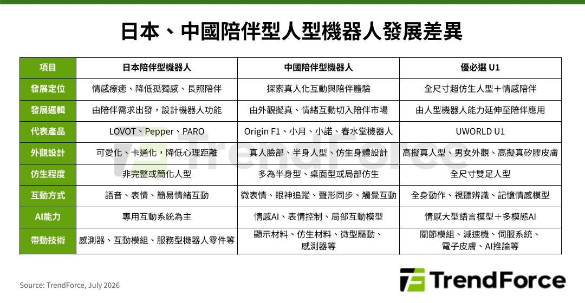

---

<!-- post_id: x:2077276474768552042 | ts: 1784096280 -->
## [X] 駿HaYaO · 2026-07-15 14:18

ASML 2026 年第二季
- 營收季增 6.4%、年增 21.3% 達 €93.3 億，毛利率 54%；雙雙超出指引高標，主要受惠於安裝基礎（Installed Base）業務強勁表現。

- 2026 全年營收指引上調至 €430-450 億，毛利率 54-56%（今年第二次上調，原指引為 €360-400 億、毛利率 52%）。

- 將於 2027 年與 2028 年將低 NA EUV 及 DUV 浸潤式產能各提升 30%。

- AI 需求為主要成長動能；客戶持續加速邏輯與 DRAM 產能及資本支出計畫，並獲得終端客戶強勁能見度與長期合約支持。

- 第三季營收指引 €110-120 億，安裝基礎業務約 €29 億，毛利率 55-57%。

- 2026 下半年隱含營收 €249.1-269.1 億，季增 37.7% 至 48.7%；中位數 €259.1 億，季增約 43.2%。

- 產品出貨數量：16 台 EUV、23 台 ArFi、8 台 ArF dry、35 台 KrF、9 台 I-line。

- 第二季認列 16 台 EUV 系統收入。

- EUV 占系統銷售 €65.6 億的 57%，平均售價約 €2.34 億/台。

- 2026 上半年共認列 32 台 EUV 系統：29 台 NXE Low-NA + 3 台 EXE High-NA。

- 預計全年出貨約 65 台 Low-NA EUV 系統，EUV 整體營收年增約 45%。以 2025 年 EUV 基期約 €116 億計算，2026 年 EUV 營收預估約 €168 億。

- 下半年隱含 Low-NA 出貨約 36 台（上半年 29 台），季增約 24%。未包含額外 High-NA 出貨（公司未提供全年 High-NA 完整目標）。

- 下半年隱含 EUV 營收約 €89 億（上半年 €79 億），季增約 €10 億 / 13%。EUV 將占下半年總營收 €249-269 億的約 33-36%。

- Intel 已將 High-NA EUV 用於 Intel 18A 部分產品層的量產。

- 3nm/4nm/5nm 產能持續擴張，客戶已開始考慮 1.4nm 製程。

- 2026 年邏輯業務營收預計成長 25%，記憶體業務成長 75%。

- DUV 加上量測與檢測業務 2026 年預計成長約 25%。

- 2026 年毛利率上檔空間來自：升級業務組合更優、更高產量帶來的固定成本吸收改善，以及 EUV/浸潤式產品組合有利。

---

<!-- post_id: x:2077222772816953458 | ts: 1784083476 -->
## [X] 駿HaYaO · 2026-07-15 10:44

科技月報總結
- 市場：從「火熱」→「解套」→「盤整」。

- SOX 指數與科技股修正後，估值已重新調整，波動率 likely 已趨穩，市場由「解套」階段轉入「盤整」階段。

- 本季至今（QTD），市場正從第二季的強勢族群輪動出來（例如記憶體、MLCC、PCB 上游）。

- 近期重點事件：台積電（TSMC）與 ASML 財報預期為溫和正面，投資人更關注 CSP 大型雲端服務商的 AI 資本支出（capex）動向。

- 持續預期 AI 支出將加速成長。前五大 CSP 資本支出至 2027 年有望達到約 1.2 兆美元（YoY +43%）。前五大 Neocloud 2027 年資本支出則有望較今年翻倍。

- 開源模型正快速崛起，但第三方數據仍顯示 Anthropic 的 ARR（年度經常性收入）強勁，顯示 AI 支出份額仍維持高檔。

- 在「漲價」主題上，偏好 CPU、ABF 載板、成熟製程晶圓代工、OSAT 以及晶圓等領域，因為市場焦點可能轉向「利率」相關議題。

---

<!-- post_id: x:2077184734027981286 | ts: 1784074407 -->
## [X] 駿HaYaO · 2026-07-15 08:13

#每日導讀 #20260715 #經濟日報

台積電法說前夕，大摩推演三情境，樂觀情況股價可漲5%
美伊衝突升級，川普恢復海上封鎖並揚言收20%「保護費」
美國6月CPI月減0.4%、核心CPI年增2.6%，均優於預期

📷 完整導讀 → https://t.co/mzoY085SPt

---

<!-- post_id: x:2077184211963035707 | ts: 1784074283 -->
## [X] 駿HaYaO · 2026-07-15 08:11

早安！7/15 外電綜合整理

- iPhone: 
美系大行調研2Q26 iPhone 組裝量符合預期，為 5,200 萬支（～季減 7%、年增 12%），優於過往季節性表現。預估3Q iPhone 組裝量5,400 萬支不變（～季增 4%、年減 2%）。年減是因為新機SKU高階產品先上，包括 iPhone 18 Pro、iPhone 18 Pro Max 及 摺疊機iPhone Fold，而標準版 iPhone 18 則預計於1H27推出。摺疊機的大行預估組裝量落在700-800萬支不變。

 #下次會考

---

<!-- post_id: x:2077178990759150047 | ts: 1784073038 -->
## [X] 駿HaYaO · 2026-07-15 07:50

矽光子無晶圓廠公司 SILITH Technology 與聯電（UMC）共同宣布，UMC 新加坡 12 吋晶圓廠已成功交付首批量產矽光子積體電路晶圓，標誌著雙方合作正式從開發階段進入高量產製造階段。

此次合作僅花 18 個月，便將 SILITH 的 1.6T 矽光子平台推進至量產準備階段。該平台已展現高良率與可靠性，並獲得全球領先雲端基礎設施客戶認證，用於 AI 資料中心高速光學互聯。

SILITH 技術長 Jason Zhang 表示，AI 對光學頻寬需求暴增，矽光子是關鍵技術。UMC 資深副總裁洪國智則強調，新加坡不僅是製造基地，更是技術發展樞紐，可快速支援複雜光電整合技術。

未來雙方將延伸技術藍圖，2027 年開放 UMC 自家 12 吋矽光子平台，並共同開發 400G/lane 純矽光子解決方案，同時布局薄膜鉭酸鋰（TFLN）技術，結合先進封裝，支援共封裝光學（CPO）與光學 I/O 等下一代 AI 架構。

https://t.co/G7arK4La0E

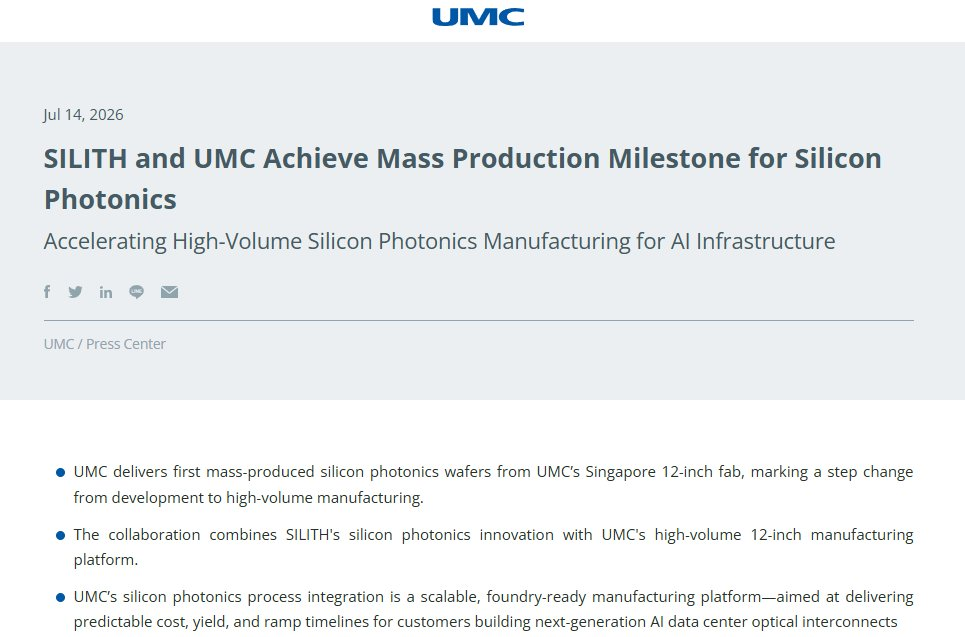

---

<!-- post_id: x:2077062145372774572 | ts: 1784045180 -->
## [X] 駿HaYaO · 2026-07-15 00:06

物理AI時代已來臨，QNX是關鍵安全基礎
- 物理AI定義：AI從螢幕上的文字/影像，進化到控制真實物理世界的機器（自動駕駛、機器人、工業自動化、人形機器人、軍用無人機、智慧基礎設施），需要即時、零容錯的軟體。
- NVIDIA的選擇：NVIDIA將QNX作為其Halo平台所有物理AI系統的認證安全層，這是架構級決策，而非單純合作。
- BlackBerry執行長發言：QNX將成為物理AI安全堆疊的標準化平台。
- Micron呼應：物理AI將是雲端AI訓練之後的下一個重大基礎設施週期。

營收結構被嚴重低估
- 華爾街只看到「QNX汽車 + Cylance網路安全」兩個來源。
- 實際有至少17個獨立營收垂直領域，多數未被分析師模型涵蓋。
- QNX非汽車嵌入式系統（GEM）已貢獻約20%營收（FY2026約5,360萬美元），涵蓋：機器人、醫療裝置、工業自動化、航太、國防、鐵路等。
- 最強證明：Johnson & Johnson的AI心臟泵在QNX上運行（安全關鍵、無容錯空間），證明QNX的認證優勢可直接延伸至醫療領域。

汽車策略合作圖表
- 與Vector策略合作，轉型傳統汽車價值鏈。
- 從「元件銷售」轉向「解決方案價值擷取」。
- 明日核心為 Alloy Kore（輕量、可靠、最佳化應用程式開發核心）。
—--

QNX的護城河極深，難以複製
- 市場規模與成長：
‧ 核心SAM（可服務市場）從2024年的17億美元，成長至2028年的29億美元。
‧ 總SAM（含策略投資）2028年達59億美元。
‧ 預估2024-2028年QNX總CAGR約34%。
‧ 策略投資（基礎車輛平台、QNX Everywhere、QNX Cabin）可進一步大幅擴大市場。

為何競爭者難以追趕？
- 無法簡單複製：不能在Linux上「加裝」即時功能。Real-Time Linux只是修補，無法保證確定性，仍有核心空間驅動程式阻斷系統的風險。
- 產業現況：91%機器人開發者仍用通用OS，66%因安全認證失敗導致專案延遲。
- 真正護城河 = 認證障礙：
‧ 需通過 ISO 26262 ASIL D（最高汽車安全標準）與 IEC 62304（醫療裝置）。
‧ 必須證明每一行程式碼在所有條件下都確定性運作，需多年形式驗證、窮盡測試與文件。
‧ QNX已在汽車、醫療、航太、國防、核能、鐵路等多領域累積數十年認證證據，新創或開源專案幾乎不可能快速複製。

$BB

---

<!-- post_id: x:2077025514569732459 | ts: 1784036446 -->
## [X] 駿HaYaO · 2026-07-14 21:40

BM 第二季初步財報預警：營收成長放緩，大型主機銷售受挫

2026年7月14日，IBM執行長Arvind Krishna發布致投資人信函，公布2026年第二季（FY2Q26）初步財務結果。營收達172億美元，年增1%，但低於內部預期。其中，軟體業務成長5%，顧問業務持平（固定匯率下增1%），基礎設施業務則下滑7%。

每股盈餘（GAAP）為2.27美元，年減2%；營運（非GAAP）EPS為2.93美元，年增5%。毛利率下滑，稅前利潤率GAAP為14.4%（降90基點）。今年至今自由現金流達48億美元。

Krishna指出，本季表現不如預期，主因z17大型主機推出期間，客戶因供應鏈緊俏與預期漲價，將資本支出轉向伺服器、儲存與記憶體產品，導致Z系統及其交易處理軟體銷售大幅短缺。加上產業網路安全疑慮，多筆大型交易未能如期結案。

儘管如此，多項業務仍展現韌性：Red Hat營收加速成長11%，HashiCorp與Confluent收購表現強勁；分散式基礎設施成長37%，創歷史新高；z17計劃表現達前一代130%，客戶容量維持或成長。Lightwell開放原始碼安全平台已於7月8日上市，量子運算投資加速，預計2029年推出首部大型容錯量子電腦。

Krishna強調，雖然本季令人失望，但對產品組合與策略轉型充滿信心，將加速措施改善未來成果。完整財報與全年展望將於7月22日電話會議公布。
https://t.co/egINgnIPB1

---

<!-- post_id: x:2077012460788474110 | ts: 1784033334 -->
## [X] 駿HaYaO · 2026-07-14 20:48

台灣塑膠與日本Daicel合資成立精密化學公司

Daicel（4202）於2026年7月10日宣布，將與台灣塑膠工業股份有限公司（FPC，1301）各出資50%，共同在台灣設立「台塑大賽璐精密化學股份有限公司」，資本額新台幣8億元，預計2026年10月完成設立。

此合資案背景為全球半導體需求強勁，台灣更是投資熱點。雙方希望結合Daicel的精密化學技術與FPC的產業優勢，強化製造、銷售及客戶服務，打造日台戰略合作基地，加速拓展半導體相關化學品事業。

合資公司董事長由FPC現任董事長郭文彬擔任，預計2029年1月正式投入營運。Daicel評估，此案短期對2027年3月期業績影響輕微，但中長期將顯著提升公司競爭力與企業價值。

https://t.co/dZ1lofngBO
https://t.co/0kmUKaA1v6

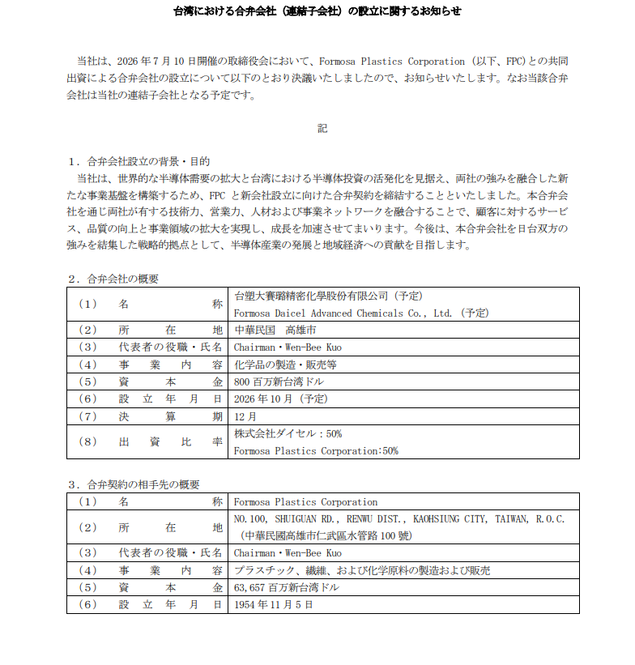

---

<!-- post_id: x:2077010475678908801 | ts: 1784032861 -->
## [X] 駿HaYaO · 2026-07-14 20:41

Tower Semiconductor 斥資30億美元擴大日本產能，獲政府10億美元補助

Tower Semiconductor（TSEM）於2026年7月14日宣布，在日本啟動雙軌策略性擴張計畫，將大幅提升300mm矽光子（SiPho）、矽鍺（SiGe）及先進封裝產能，以滿足AI資料中心快速成長的需求。

公司將自行投資約30億美元，日本政府（METI）提供約10億美元補助金。第一軌將重新利用Arai工廠（前Fab 6），並最大化Uozu Fab 7產出，預計2027年第四季達到生產就緒；第二軌則在Fab 7旁新建一座300mm廠，預計2029年起貢獻顯著獲利。

此擴張讓Tower同步上調2028年財務目標：營收36億美元、淨利12億美元。執行長Russell Ellwanger表示，結合Tower技術領導力與日本製造優勢，將打造全球先進光學半導體卓越中心，強化供應鏈韌性並創造高品質就業。

https://t.co/geTVobKaND

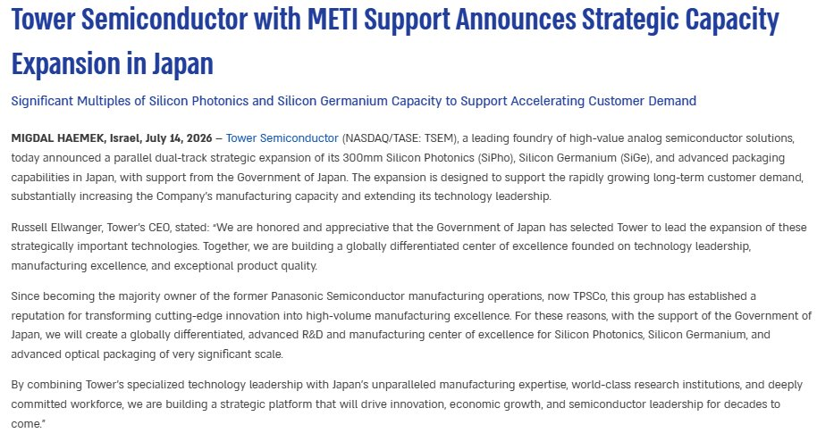

---

<!-- post_id: x:2077003806169329836 | ts: 1784031270 -->
## [X] 駿HaYaO · 2026-07-14 20:14

根據 Bloomberg 報導，韓國近期推出的追蹤三星電子與 SK 海力士的單一股槓桿 ETF 自 5 月下旬上市後，遭受嚴重反噬。其中規模最大、資產達 34 億美元的 SAMSUNG KODEX SK 海力士單一股槓桿 ETF，自上市以來已下跌約 45%，較 6 月高點更重挫逾 60%，目前交易價格已跌破發行價。

這些高槓桿產品原本是為了讓散戶放大半導體漲勢而設計，但因韓國股市急轉直下，導致散戶投資者面臨巨額虧損。分析指出，槓桿 ETF 需在股價上漲時買入、下跌時賣出以維持槓桿比率，反而加劇市場波動。Fibonacci Asset Management 執行長 Jung In Yun 警告，許多散戶誤將此類短期工具當成長期投資，恐削弱其未來投資半導體的意願，市場復甦將更依賴外資。

儘管虧損嚴重，過去一個月韓國槓桿及反向 ETF 仍吸引 38 億美元資金流入，顯示散戶熱情尚未完全消退。韓國監管機構雖表達遺憾，但預計不會全面禁止，而是將加強投資者保護、風險披露與適當性要求。

---

<!-- post_id: x:2077002877877514670 | ts: 1784031049 -->
## [X] 駿HaYaO · 2026-07-14 20:10

AOI 啟動 Pearland 製造擴建 強化 AI 光模組產能
Applied Optoelectronics, Inc.（NASDAQ: $AAOI）於2026年7月14日宣布，已在德州 Pearland 正式啟動製造園區擴建計畫，新增近40萬平方英尺產能。

公司將在14621 Kirby Drive及11555 N. Spectrum Boulevard兩處物業進行建置，重點擴大800G及1.6T高速光收發器生產，以滿足AI資料中心及雲端網路的強勁需求。這些光收發器是AI基礎設施關鍵元件，可實現高速、長距離光纖資料傳輸。

AOI財務長兼首席策略長Stefan Murry博士表示：「感謝Pearland市府支持，該擴建將強化公司長期成長策略，鞏固AOI在AI及雲端市場的供應商地位。」

https://t.co/2hSysvo5Tu

---

<!-- post_id: x:2076998357600350684 | ts: 1784029971 -->
## [X] 駿HaYaO · 2026-07-14 19:52

摘要 - Semtech (SMTC) 以 1.6T 與 NPO 為核心啟動買入評級

- 啟動買入評級，目標價 180 美元（25x FY28E 本益比）。

- 從傳統類比晶片公司轉型為 AI 互聯受益者，產品組合涵蓋 ACC、TIA、驅動器、雷射以及 NPO 類比解決方案。

- 公司指引 FY27 AI 營收超過 3.5 億美元；我們預估 FY27E 為 4.66 億美元 → FY28E 達 12.2 億美元，主要由 1.6T 驅動。

- Google TPU 擴張將成為 CopperEdge ACC 的重要催化劑。

- NPO 採用預期成為 2027 年後的下一個主要成長動能，因為移除 DSP 將大幅提升類比元件含量。

- 相信 NVIDIA 與各大雲端服務供應商（CSP）正在評估 NPO 部署。

- NPO 市場規模：我們預測 2028 年將有 3,800 萬個 NPO 光引擎，意味著 TIA/驅動器 TAM 將達到數十億美元規模。

- 收購 HieFo 強化其雷射產品組合，並擴大光學元件商機。

---

<!-- post_id: x:2076997798877384913 | ts: 1784029838 -->
## [X] 駿HaYaO · 2026-07-14 19:50

Rosenblatt 光學報告
1. 整體市場現況
- 光學股過去1-2個月表現疲弱。
- 主要賣壓來自兩大疑慮：
‧ 中國磷化銦（InP）產能過剩，可能壓低雷射價格（影響LITE、COHR、AAOI）。
‧ CPO規模化時程可能延後一年（原預期2027建廠、2028出貨）。

2. 空頭真實想法
- 空頭多利用「中國產能恐慌」在季中發動攻勢。
- 多數空頭並不真正相信中國會大幅衝擊市場。
- 空頭計畫：7月底～8月初（2QCY26財報後）平倉，並準備在2027年重新買入光學股，布局2028-2030年CPO機會。

3. 2026年獲利展望（最重要結論）
- 明顯正面的公司：COHR、AAOI、FN、VIAV、CIEN、ANET。
- LITE 雖然獲利展望相對最具挑戰性（已給最多前瞻指引），但目前約700美元股價仍非常吸引人。

4. 中國InP產能分析
- 中國廠商可能讓全球2030年InP雷射總產能增加20%～40%（原預估262億美元）。
- 中國目標：主導中國及非美國AI基礎設施供應鏈。
- 短期：雷射及光學元件價格仍會上漲（中國尚未擁有200G EML及CPO雷射）。
- 長期：美中供應鏈將走向脫鉤。

5. 投資建議
- 近期股價疲弱是買入機會。
- 需求極強、供應受限，CPO規模化將帶來多年成長機會。

6. 中國產能威脅評估
- 看空論點缺乏實際數據支持（誰在擴產？擴多少？）。
- 已知主要中國廠商：
‧ 東山精密（Dongshan Precision）：收購Source Photonics，常州12億美元擴產計畫。
‧ Sanan IC：6吋晶圓產能從2,750片提升至6,000片/月。
‧ 其他：HiSense Optoelectronics、Accelink

---

<!-- post_id: x:2076823388665036937 | ts: 1783988256 -->
## [X] 駿HaYaO · 2026-07-14 08:17

市場資本存在一個有趣的盲點：許多人曾認為 PTFE 相關設計會完全淘汰玻璃纖維布。然而現實情況是，我們看到越來越多新一代設計反而回歸到以織物為主的解決方案。

目前，高層數 AI 架構的致勝策略是「共存方案」：將 Q-glass 搭配 CH 樹脂 Prepregs（PP）一起使用。
這並非暫時的權宜之計，而是下一波超大規模網路基礎建設的藍圖。

---

<!-- post_id: x:2076823063061234111 | ts: 1783988178 -->
## [X] 駿HaYaO · 2026-07-14 08:16

早安！7/14 外電綜合整理

- 8046 南電：亞系升目標
亞系券商認為載板是記憶體後漲幅第二大的零組件，在目前的成本環境下，預估今年BT／ABF 載板價格漲幅將超過 70%／50%，且漲價趨勢仍持續擴大。尤其BT在主要亞洲競爭對手逐步退出後，對於像南電這樣願意深耕 BT 市場的載板廠形成重大利多。券商預期BT 在2H26漲價季增幅度會有20-30%以上。

鑑於報價與稼動率改善，券商上修南電2Q/ 3Q 毛利率至24.3%/ 30.6%。上修明後年毛利率至44.9%/ 53.2%。上修26-28年EPS至$19.7/$62/$112.6，以4Q26-3Q27E EPS的49xPE評價，同步升目標。同時也是亞系券商在載板的「首選」（Top Pick)。

- 2330台積電：美系法說會preview 
美系大行重申基本情境預估：
3Q26美元營收季增 10%–15%，全年營收成長目標提高至年增 30% +或接近 40%；第三季毛利率約 67%–68%（與前一季大致持平）。今年全年資本支出更新為 560 億美元；2024–2029 年 AI 半導體營收五年 CAGR 由目前的 50% 中後段提高至 70%，主要反映記憶體成本增加。

另外匯集意見法說會問題如：1）如何面對與三星、Intel的競爭。2） 明年是否調高價格與毛利率展望 3）記憶體成本對需求影響。另外也彙整北美投資人好奇台積電的客戶是否可以自由更改晶圓應用。

- 3008大立光: 美系升目標
美系券商考量新鏡頭的良率持續改善，3Q26的毛利率可能會有所提升。明年鏡頭將持續受益於規格升級，例如潛望式鏡頭採用更多片鏡片、具備內變焦功能的潛望式鏡頭，以及可變光圈鏡頭迎來更高解析度等。加上在CPO打開另一個市場。券商上修明後年EPS至$217/$239，以明年29.2xPE評價，同步升目標。

 #下次會考

---

<!-- post_id: x:2076678771843973253 | ts: 1783953776 -->
## [X] 駿HaYaO · 2026-07-13 22:42

LS Electric與Infineon合作開發AI資料中心DC電力解決方案

韓國LS Electric與全球功率半導體龍頭德國Infineon Technologies於7月10日在安養市R&D園區簽署MOU，共同開發AI資料中心及次世代電力網專用直流（DC）電力核心技術。

雙方將聚焦三大關鍵產品：
能源儲存系統（ESS）用電力轉換系統（PCS）、半導體變壓器（SST）及半導體斷路器（SSCB）。

傳統交流（AC）系統需多次轉換導致能量損失，DC方案可大幅減少轉換階段，提升整體效率，並透過功率半導體技術同時強化穩定性與可靠性，滿足AI資料中心超高密度用電需求。

LS Electric負責系統設計、整合與商用化，Infineon則提供世界頂尖功率半導體及電力控制技術，發揮互補優勢。LS Electric生產・事業化聯動技術開發總括副社長安吉龍表示，此合作將強化次世代DC電力基礎設施競爭力，目標成為全球AI資料中心與未來電力市場的總體解決方案領導者。

Infineon產業・基礎設施部門CSO Andreas Weis指出，高效率DC架構能同時滿足能源需求成長與永續發展，雙方結合技術實力將加速產品開發與商用化。
https://t.co/KcksUhmD3L

---

<!-- post_id: x:2076677952302149913 | ts: 1783953581 -->
## [X] 駿HaYaO · 2026-07-13 22:39

- Scale-Up 市場大幅擴張
4 倍市場激增：
AI Scale-Up 網路市場預計到 2030 年將達到超過 700 億美元的機會，這是僅一年前預估（2029 年 170 億美元）的四倍以上。

Scale-Up 護城河：
Scale-Up 網路至關重要，因為它能讓數千個 GPU／加速器無縫地作為單一超級電腦系統運作，徹底消除現代前沿 AI 模型訓練時的通訊瓶頸。

更大叢集：
叢集規模正快速擴大。例如，NVIDIA 的路線圖已從單一機架 72 個 GPU（Blackwell）進展到 144 個 GPU（Vera Rubin）、576 個 GPU（Rubin Ultra），未來 Feynman 世代更可能超過 1,000 個 GPU。

- 「銅牆」vs. 光學轉型
銅線將持續更久：
銅線仍是短距離首選技術，因為其具備較低延遲、較低功耗與較低成本。PAM4／PAM6、先進 SerDes 與 retimer 等創新，正讓銅線的使用壽命遠超產業先前的預期。

光學必然但後置：
當叢集範圍超越單一機架後，以高速管理電訊號衰減將變得極度低效。摩根士丹利預期，共封裝光學（Co-Packaged Optics，CPO）將從 NVIDIA Feynman 世代（約 2028–2029 年）開始看到有意義的採用。最近市場因 CPO 採用延遲而出現的拋售，被視為過度反應。

- Fabric 與生態系統協議之爭
NVIDIA 主導地位：
NVLink 仍是主流的專有 Fabric。NVIDIA 同時推出 NVLink Fusion，讓第三方 CPU 與客製化 ASIC 能直接接入 NVLink 生態系統。

開放替代方案崛起：
Broadcom 正主導 Scale-Up Ethernet（SUE），而 AMD 領導的聯盟則支持 UALink 作為開放替代方案。摩根士丹利認為，PCIe（例如透過 Astera Labs）在超大規模雲端業者轉向原生 AI Fabric 之前，將扮演重要的過渡橋樑角色。

AWS 與 Google 的特殊做法：
Google 依賴光學電路交換（OCS）環面（Torus）拓樸；AWS 則轉向更平坦、高效率的網狀網路——Resilient Network Graphs（RNG），利用被動光學元件大幅減少路由器數量與功耗。

---

<!-- post_id: x:2076647460269666422 | ts: 1783946311 -->
## [X] 駿HaYaO · 2026-07-13 20:38

Intel 投資 50 億歐元擴建愛爾蘭 Leixlip 廠區

Intel 3 日宣布，將斥資 50 億歐元（約 57 億美元） 升級愛爾蘭 Leixlip 校園現有晶圓廠，擴大 Xeon 6 及基於 Intel 3 製程的下一代 Xeon 處理器產能。

此擴建計畫已於今年啟動，預計明年年底完成，主要用於滿足全球 AI 與高效能運算的強勁需求，同時強化歐洲半導體供應鏈韌性。該計畫不新建廠房，而是升級設備與提升產線效率。

預計將創造 數百個永久職位 及數千個營建工作機會。Intel 目前在愛爾蘭僱用約 4,900 人，自 1989 年以來累計投資已超過 300 億歐元。

Intel Foundry 技術與營運長 Naga Chandrasekaran 表示，這是對 Leixlip 校園最大化產能的明確承諾，將確保愛爾蘭在全球先進製造生態中保持領先地位。

https://t.co/CG4k57WCcc

---

<!-- post_id: x:2076639302365192570 | ts: 1783944366 -->
## [X] 駿HaYaO · 2026-07-13 20:06

TSMC 2026年6月與第2季業績
- 6月打破季節性規律，月增+6%、年增+57.4% 達140億美元，創歷史新高；過去4年6月皆月減（平均-11%），這是2021年以來首次6月月增。

- 要達到402億美元指引上限需月增+4.9%，TSMC實際達成+5.8%。

- 連續第4個月歷史新高，今年6個月內第5次；較5月增加7.69億美元，打破我們5月指出的成長放緩趨勢（1月+6.0%、3月+2.4%、4月+0.5%、5月+1.1%，如今+5.8%）。

- 第2季營收403億美元，超越指引區間390-402億美元的高端約1億美元；季增+12.3%、年增+34.1%，創單季歷史新高，較第1季增加45億美元（先前紀錄為2022年第1季的36億美元）。

-上半年營收761億美元，年增+36.7%；上半年已超過2022全年營收（759億美元）；連續30個月年成長。

-下半年只需年增+33.6%，即可達成2026全年+35%的成長目標；若按今年至今的成長速度推估，2026全年約1670億美元，年增約37%。

過去9季中有8季創歷史新高。需求強勁，先進製程滿載。

---

<!-- post_id: x:2076634285201870991 | ts: 1783943170 -->
## [X] 駿HaYaO · 2026-07-13 19:46

TrendForce: 利基需求升溫加乘MLC轉單效應，預估2H26 SLC NAND價格將上漲120-170%

根據TrendForce最新報告，由於高層數3D NAND等高附加價值產品大幅排擠成熟製程產能，導致MLC NAND供給極度短缺。工控、車用與網通客戶因認證與規格要求嚴格，無法輕易轉單，只能轉向可靠度更高、壽命更長（10萬次P/E）的SLC NAND（4Gb、8Gb），進一步加劇SLC原本已吃緊的供應狀況。

同時，AI邊緣運算、資料中心、汽車電子等領域對SLC的需求持續爆發，形成強勁剛性需求。TrendForce指出，SLC四大利基應用全面成長：
1. AI邊緣與高階網通：智慧工廠、自主移動設備、新世代交換器需SLC作為即時作業系統引導與高速緩衝；
2. 資料中心與基礎建設：大量用於開機碟（Boot Drive）及高頻寫入緩衝區；
3. 汽車電子與智慧家庭：支援不間斷、零錯誤運作；
4. 醫療影像、航太防衛：在極端環境下提供唯一可長期保存資料的可靠方案。

MLC合約價已在2026上半年創下歷史高點，部分買方雖轉為謹慎拉貨，但工控、車用客戶仍有補庫存需求。在「買不到貨」與高成本壓力下，轉用SLC已成必然趨勢。

TrendForce強調，全球主要SLC NAND供應商短期內均無新增產能計畫，僅透過製程微縮、提升良率與優化單位產出因應。面對MLC轉單效應與利基需求爆發，2026下半年SLC市場將出現結構性短缺。第三季適逢傳統備貨旺季，第四季原廠成熟製程供給持續減少、庫存見底，預估SLC合約價格較上半年大漲120-170%，且不排除進一步上修的可能。
https://t.co/Rkihnkb0CU

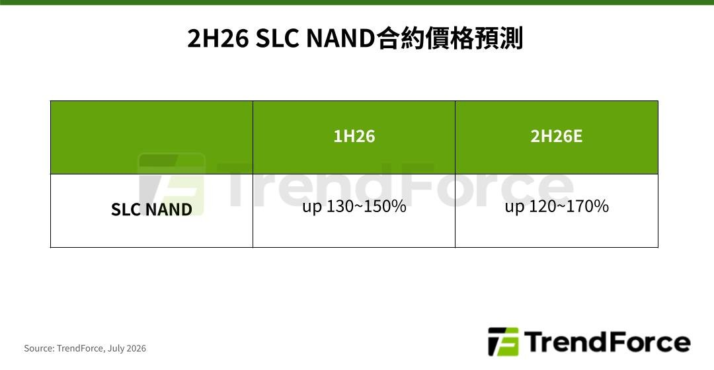

---

<!-- post_id: x:2076633645968982084 | ts: 1783943017 -->
## [X] 駿HaYaO · 2026-07-13 19:43

記憶體與推論

AI 基礎設施 TAM：訓練 vs. 推論
- 龐大市場成長：AI 基礎設施的總可及市場（TAM）預計到 2030 年將達到近 1,0000 億美元（1 兆美元）。
- 推論崛起：雖然早期 AI 基礎設施支出以「訓練」為主，但「推論」預計在 2025 至 2030 年間將以驚人的 42% 複合年成長率（CAGR） 高速成長。
- 2030 年轉變：到 2030 年，市場份額預計將翻轉，推論 將占據多數份額達 56%，訓練則為 44%。

前所未有的合約與現貨價格脫鉤
- DDR5 價格暴漲：歷經 2025 年底前長期持平後，DDR5 價格在進入 2026 年時出現前所未有的飆漲。現貨價格衝破 45.00 美元，而合約價格緊隨其後，約 37.50 美元。
- SSD（NAND）價格嚴重背離：512GB PCIe 4.0 SSD 方面，2026 年出現巨大價差。OEM 合約價格大幅飆升至 118 美元，而通路現貨價格卻回落至 84 美元。
- 庫存正常化：供應鏈總庫存週數（涵蓋供應商、PC OEM、伺服器與智慧型手機）在 2024 年中至 2025 年初達到高峰後，已在 2026 年持續下降並逐步正常化。

記憶體的週期特性（「重複循環」）
- 可預測的 4 年週期：歷史資料顯示，供應驅動的記憶體週期大約每 4 年重複一次（例如 2010–2014、2014–2018、2018–2022 年的高峰與低谷）。
- 2026 年異常暴漲：目前進入 2026 年的週期出現明顯異常，幾乎呈現垂直暴漲。DRAM 合約價格年增率（YoY）飆升至歷史新高的 820%，遠遠超越過去 15 年所有週期高峰。

---

<!-- post_id: x:2076561739584585835 | ts: 1783925874 -->
## [X] 駿HaYaO · 2026-07-13 14:57

Q-glass 與 PTFE 的爭論仍在持續，但事實很清楚：超高層數 AI 板卡已確定採用 M9 + Q-glass 配置。
PTFE 材料在鑽孔與壓合製程會造成嚴重瓶頸，問題非常棘手，甚至連勝益科技（Shengyi Tech）都必須調整其 PP 配方。
展望 2027 年，下一代 LPU（具備高達 52 層設計）量產爬坡，將帶來 Q-glass 需求的爆炸性成長。PTFE 則將嚴格限制在低層數拓樸中。
——-

Q-Glass：2026 年客戶進入庫存建立期
•目前供應鏈的良率約在 55~60%，26H2 進入 Nvidia LPU 產品的備貨期，將帶動銅箔基板廠商的備貨需求。


•後續主要 Nvidia 在正交背板 M10 的應用（二代 Q Df<3.5）、CoWoP 需要更高階的材料下，單一客戶潛在需求有望達到 400 萬米/月。


•ASIC 陣營態度：目前 Meta 選用 M9Q 進行打樣，Amazon/MSFT 選用 M9（K2）進行主板打樣，Google TPU V9 至少選用 M9（K2）以上材料。

---

<!-- post_id: x:2076460654488330443 | ts: 1783901773 -->
## [X] 駿HaYaO · 2026-07-13 08:16

早安！7/13 外電綜合整理

- 2408南亞科：美系升目標
法說會後美系大行上調明後年獲利預估。2Q財報符合券商預期但超過市場預期。預期2H26報價持續走揚，預期3Q營收季增25%，到後年都不用擔心供過於求，即便2027-29 年間投入 160 億美元資本支出用於 4.5 萬片（45kwpm）月產能擴充，結構性轉變正在加劇記憶體短缺，並促進多樣化的 AI 創新需求，重申正向。

- 3008大立光: 美系升評
法說會後美系大行升評至OW, 上修26-28年EPS至$175/$182.5/$182.9，以明年27xPE評價，同步升目標。

券商認為手機將回到季節性拉貨循環，同時主要客戶的新摺疊機由8m上修至10m。CPO方面，FAU仍是主流，預期大立光將取得20%的市佔率，有望推升後年之後獲利+40%以上，成為新的潛在價值提升。

- ABF三雄：美系升目標
美系券商調升南電、景碩、欣興的目標，同時升評景碩至OW。反映2H26-2028E陷入供不應求，且將帶來更大且更具持續性的漲價。

券商看到供需缺口在 2026-2028 年持續擴大，原因在於CPU 與 GPU 配比提升、EMIB-T 和 CPO 趨勢下對載板面積擴大的新增需求。報價方面，看到 2H26 提高到每季 +6-8%，1H27 可能更高。

至於升評景碩理由在於，預期取得Nvida CPU 3-4成市佔率。明年出貨翻倍，規模與GPU出貨量相當。

- 2455全新: 澳系升目標
澳系預期多個laser專案將於 明年投入量產，預期明年營收將大於PD，100mW 連續波（CW）雷射已進入量產（MP），而 EML 專案正於 7 月進行送樣，並預計在 2026 年底前放量。
為明年營收和毛利率帶來上行空間。基板危機將會緩解，因為多家海外基板供應商正積極擴產。上修26-28年EPS至$5.6/$11/$17，以後年35xPE評價，同步升目標。

- 2351順德: 亞系重申正向
2Q營收歷史新高，且高於亞系及市場預期。預期下半年營收續增，AI用導線架預期到年底前達到雙位數營收佔比貢獻。還有50-60款與AI相關專案進行。報價部分，不排除下半年漲價，重申正向。

 #下次會考

---

<!-- post_id: x:2075201630023405941 | ts: 1783601598 -->
## [X] 駿HaYaO · 2026-07-09 20:53

公司名稱：環球晶（6488）

主旨：本公司與客戶美光科技簽訂合作意向書

契約或承諾相對人：Micron Technology, Inc.（美光科技）

主要內容：
此次合作預計包含由美光科技提供5億美元之策略性資金支持，藉以推動本公司美國業務之發展及供應能力提升，以支援雙方長期合作。
雙方規劃透過10年期長期供應協議（Long-Term Agreement, LTA），建立長期合作架構，相關合作內容將依雙方後續協議及相關程序推動。

對公司財務、業務之影響：
深化長期策略合作關係，並就長期供應合作及相關合作架構達成合作意向，進一步提升先進半導體晶圓供應韌性，支援AI、高效能運算與資料中心應用帶動之先進記憶體需求成長，以及未來世代記憶體技術發展所需之關鍵材料供應。

具體目的：
共同強化美國半導體製造生態系與在地關鍵材料供應能力。

https://t.co/xNQnWn9kuR

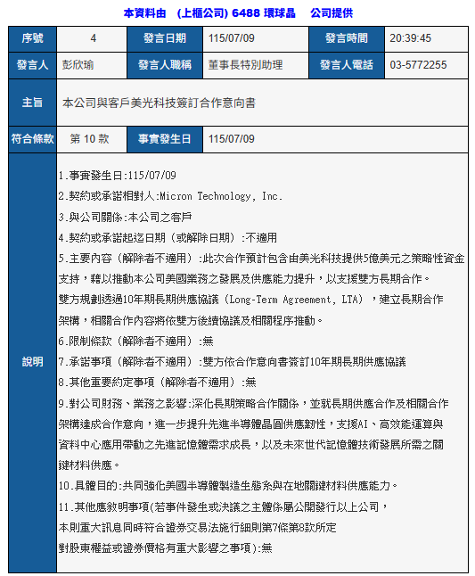

---

<!-- post_id: x:2075196641632821612 | ts: 1783600409 -->
## [X] 駿HaYaO · 2026-07-09 20:33

路透社報導，Meta Platforms 計劃於今年9月開始量產代號「Iris」的自研AI芯片，這是該公司加速降低對英偉達與AMD依賴的重要一步。

根據內部備忘錄，「Iris」是Meta Training & Inference Accelerator（MTIA）第四代產品，由Meta與博通共同設計、台積電製造。測試階段僅花費6週即未發現重大問題，顯示開發進度大幅加快。Meta同時還發布了另外三款AI處理器，預計2027年前每6個月推出一款新芯片，遠高於業界一年一版的常規週期。

Meta今年目標部署7吉瓦（GW）計算基礎設施，明年將擴大至14吉瓦。為支撐這一雄心，該公司已鎖定與三星電子、閃迪及住友電工的長期供應協議，涵蓋內存、閃存與光纖設備。今年AI基礎設施預算高達1450億美元，佔整體技術支出重大比例。

此舉核心目標是大幅降低巨額GPU採購成本，並強化對自家Facebook與Instagram平台AI功能的掌控。備忘錄坦言，採用最新GPU對Meta而言一直是一項艱巨任務。

---

<!-- post_id: x:2075194449341337755 | ts: 1783599886 -->
## [X] 駿HaYaO · 2026-07-09 20:24

德意志銀行近日再次大幅上調晶圓廠設備（WFE）長期展望，預估2026年WFE市場規模將達1450億美元、2027年1930億美元、2028年更高達2200億美元，顯示AI投資正加速推動記憶體與代工領域資本支出。

面對這波強勁成長，半導體設備族群是否即將迎來估值重估？市場已高度關注。
- AMAT（應用材料）為首選，受益於高量DRAM及先進代工投資，目標價由550美元大幅上調至680美元。
- LRCX（泛林半導體）同樣維持買入，強力槓桿多年度晶圓廠擴張，目標價由325美元上調至385美元。
- KLAC（科磊）雖同樣受惠更高WFE，但因製程控制業務槓桿較低，維持持有評級，目標價由175美元上調至220美元。

報告指出，隨著晶片製造產能在AI時代的重要性快速上升，半導體設備股應持續向上重估。此趨勢同時反映記憶體在AI系統中地位提升，有助降低產業整體週期性。

AMAT相較同業仍存明顯折價，預期將逐步收斂；LRCX目前雖以溢價交易，但反映其優異執行力；KLAC則被視為高品質龍頭，其估值已充分反映EPS上檔潛力。

---

<!-- post_id: x:2075192400675577945 | ts: 1783599398 -->
## [X] 駿HaYaO · 2026-07-09 20:16

TrendForce: 長約定下漲幅天花板，預估3Q26 server DRAM合約價將季增13-18%

根據TrendForce最新報告，2026年第三季server DRAM合約價預計季增13-18%。雖然部分原廠已在第二季提前反映部分漲幅，但多家美系雲端服務供應商（CSP）已簽署複數年長約（LTA），大幅限制原廠對這類客戶的漲價空間。隨著供不應求格局延續，後續仍可能出現原廠競相上修報價的情況。

第二季因CPU供給短缺，影響server整機組裝進度，導致美系CSP的DRAM庫存水位上升。然而，考量2026下半年至2027年CPU供應將逐步釋放，server整機出貨規模擴大，加上2027年server DRAM供不應求態勢已確立，CSP仍積極追加採購。

TrendForce初步試算顯示，各原廠2027年RDIMM位元供給年增幅僅約15-20%，遠低於server CPU顆數成長幅度。即使已鎖定2026下半年用量，買方仍有強烈誘因為2027年短缺情勢提前儲備庫存。

在長約框架下，TrendForce指出，自2026年第三季起，原廠server DRAM漲價動能將逐步轉移至非長約客戶，以及長約客戶的追加非長約供給。預期2026下半年至2027下半年，整體server DRAM合約價將維持逐季上漲，但漲幅將逐漸收斂。

此外，為控管採購成本並配合CPU供給，各CSP與OEM自2026上半年開始調整RDIMM容量組合，部分從96/128GB高容量模組轉向32/64GB低容量模組。此規格下調預計自第三季起反映在原廠出貨組合上，低容量模組出貨條數將季增，高容量模組的位元比重下降趨勢也將趨緩。
https://t.co/MxcjqY6X6F

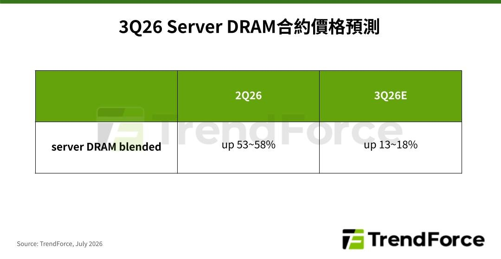

---

<!-- post_id: x:2075190760258064493 | ts: 1783599007 -->
## [X] 駿HaYaO · 2026-07-09 20:10

https://t.co/c8mA2pSjdt

---

<!-- post_id: x:2075190725202026896 | ts: 1783598998 -->
## [X] 駿HaYaO · 2026-07-09 20:09 _(接續 2 則)_

「2026 年下半年，您自己會看好哪三大產業？」
艦長：其實只有一個大方向 —— AI，但在 AI 裡面，他會再細分成三個次產業：

1. 光通訊（最看好，景氣展望最好）
理由
- 原本光通訊主要用在 Scale-out（跨機櫃之間的連接）。
- NVIDIA 接下來的 Scale-up 會大幅改變：未來可能是 8 個 Rack 直接用光的方式連接（跨機櫃的 Scale-up）。
- 這會讓 每一個 GPU 對應的光機引擎需求倍數增加。
- 除了原本 AI 晶片成長帶來的需求之外，還會有額外的倍數成長。

2. 高速傳輸界面（PCB、CCL、ABF 等）
理由
- 上游供應鏈有明顯瓶頸：從玻璃紗（Nitto，日本擴產緩慢）→ 玻璃布 → 銅箔 → CCL → PCB，整條鏈很多環節都吃緊。
- 產品規格持續升級：需要 Low DK（低介電常數）材料，讓訊號衰減更慢，因此必須使用更高階的板材。
- 產品組合（Product Mix）改善：高階產品占比提升，有助於獲利。
- ABF 特別吃緊：T-glass 從去年就缺貨，現在連 E-glass 也開始缺。
- AI 伺服器中，IC 尺寸越來越大、層數越來越多，加上 Agentic AI 興起，CPU 成為目前最缺的零件之一，進一步推升對 ABF 的需求。

3. Commodity（大宗商品類）
- 前兩個是成長型題材，第三個他建議找 Commodity（大宗商品） 族群。
- 可選擇的包括：DRAM、NAND、Wafer 等。
- 這些族群目前「眾說紛紜」，每一個都有聽起來不錯的理由。

https://t.co/c8mA2pSjdt

---

<!-- post_id: x:2075122220222054458 | ts: 1783582665 -->
## [X] 駿HaYaO · 2026-07-09 15:37

廣微集成技術（深圳）有限公司
 Guang Wei Integration Technology (Shen Zhen) Co., LTD.

產品調價聯絡函

尊敬的各位合作夥伴：
首先，衷心感謝您長期以來對廣微集成技術（深圳）有限公司的信任與支持！

 在您的緊密合作下，我們得以在激烈的市場競爭中不斷成長與發展。我們始終珍視與您建立的合作夥伴關係，並致力於為您提供最優質的產品與服務。

秉承長期合作、互利共贏的原則，我們一直努力透過內部優化來消化持續上漲的成本壓力。然而，近期全球半導體行業供應鏈波動劇烈，與此同時，AI、新能源等需求爆發，帶來產能的持續緊張，且趨勢未見緩和。儘管我們已全力優化，但巨大的成本壓力與持續的產能缺口已遠超我司的承受能力。

為保障長期合作的健康發展，我們不得不對部分產品價格進行審慎調整。對於此次價格調整可能給您帶來的不便，我們深表歉意，懇請您的諒解！經公司慎重決定，產品漲幅為15%~20%。

調價自2026年7月9日開始執行，具體調整與我司業務窗口進行溝通，最終以實際報價單為準，以便您做好相應的計劃和準備。

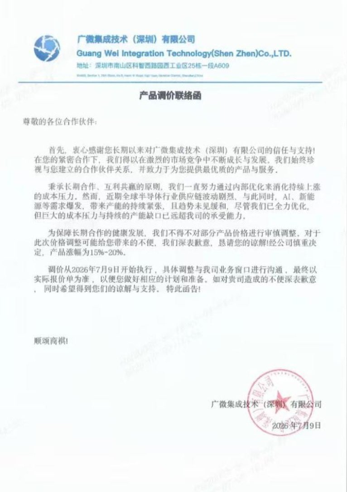

---

<!-- post_id: x:2075094094867521782 | ts: 1783575960 -->
## [X] 駿HaYaO · 2026-07-09 13:46

Wolfspeed 對 Navitas 提起專利侵權訴訟

Wolfspeed（ $WOLF ）宣布，已在特拉華州聯邦地區法院對 Navitas Semiconductor （ $NVTS ）提起專利侵權訴訟。

Wolfspeed 指控 Navitas 多項主力產品侵害其五項核心專利（US 8,169,005；10,998,418；10,886,396；10,749,443；11,888,392），包括 GaNFast®、GaNSlim™、GaNSafe® 等 GaN FET 系列，以及 GeneSiC™ MOSFET 與 SiCPAK® 模組。

Wolfspeed 擁有數十年 SiC 材料與 GaN 技術的領導地位，其基礎專利支撐整個寬能隙產業。
執行長 Robert Feurle 表示：「這是保護數十年研發投資的策略行動，我們尊重他人智慧財產，也期待同等尊重。」
https://t.co/Fia0zKzXFn

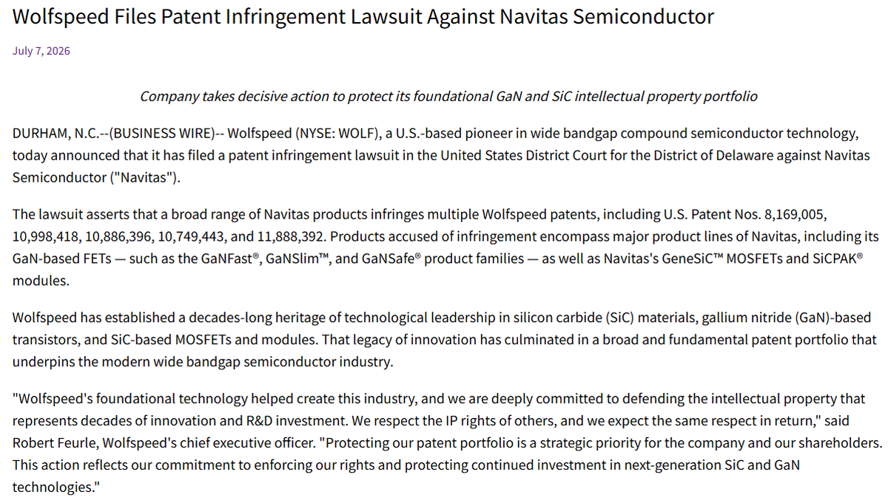

---

<!-- post_id: x:2075013815725682732 | ts: 1783556820 -->
## [X] 駿HaYaO · 2026-07-09 08:27

在 ECTC 大會上，創意(GUC) 展示了針對 CoWoS-R 型態 UCIe-A 整合的實用 STCO 流程，從前佈局 2D EM 探索，一路推進到後佈局 3D EM 萃取、瞬態眼圖模擬、PDN 阻抗分析，最終完成電源感知的 SI 簽核。

- 關鍵重點在於，RDL 不再只是「導線與聚合物」。在 16 到 36 GT/s 的高速下，幾何結構本身已成為通道的一部分。GUC 採用 GSG 交錯式傳輸線，由接地屏蔽跡線環繞訊號線，以提升隔離度並協助偏移補償。整個佈局橫跨多達 8 層 RDL，訊號、VDD、VSS、虛擬結構、導孔以及各層轉換皆需共同調校，以達成更高頻寬。

- 最大的挑戰是同時共同最佳化 SI（訊號完整性）與 PI（電源完整性）。線寬、間距、接地位置、導孔位置、PDN 平面形狀以及佈線密度，都會直接影響插入損耗、回波損耗、串擾、阻抗峰值與電源噪聲。

---

<!-- post_id: x:2075011790526902275 | ts: 1783556337 -->
## [X] 駿HaYaO · 2026-07-09 08:18

#每日導讀 #20260709 #經濟日報

川普宣告美伊停火終結，油價單日飆漲近8%
央行總裁楊金龍緊盯股市信用擴張
台股尾盤國家隊護盤，主力單押台積電法說行情

📖 完整導讀 → https://t.co/SrYclkPjYf

 #經濟日報

---

<!-- post_id: x:2075011600923378068 | ts: 1783556292 -->
## [X] 駿HaYaO · 2026-07-09 08:18

早安！7/9 外電綜合整理

- GB NVL72:
美系大行調研6月GB系列NVL72出貨狀況：
 *廣達：出貨約 2,300–2,400 櫃。
* 緯創：出貨約 1,200–1,300 櫃 。
* 鴻海：出貨約 3,300 櫃 。
總共6月約8,000櫃，券商維持今年7–8 萬櫃預估。

- 6669緯穎：亞系升目標
亞系券商認為2Q營收優於預估，Trainium3 自 6 月開始已量產，預估T3今明年的量為220 萬台／300 萬台。AMD MI450 Helios預估4Q放量。此外針對一般型伺服器，記憶體採購轉型為採購代理（procurement agency）模式，大幅降低記憶體價格波動。所以券商預估2Q毛利率也望來到8.5%。上修26-28年EPS為$363.6/$485/$546，以明年16xPE評價，同步升目標。

- 6187萬潤: 美系重申正向
總結2Q營收優於美系券商預期，券商同步調高毛利率至54%，預估3Q 54.4%。認為市場對CPO負面疑慮已反映，且券商先前上修明年CoWoS產出，認為萬潤會受惠於產能擴張。重申正向。

- 7769鴻勁：季營收新高
2Q營收達到歷史新高，也優於美系券商預期。認為因    Cold Plates表現強勁，加上    ATC Handler銷售穩健。預計新產能4Q放量後進一步推升營收表現。此外，CPO Insertion 4 業務發展也強勁，券商重申正向評等不變。

- 2327國巨: 季營收優於預期
總結2Q營收優於公司指引，也優於美系券商預估。券商表示標準產品與特殊產品的全面成長，凸顯本波景氣上行循環的需求範圍更加廣泛，而非僅集中於單一產品線。預期2H26漲價加速及AI 平台放量，券商不排除進一步上修，重申正向。

- AI供應鏈追蹤報導：
美系大行更新AMD進度：    MI455：100 萬顆、MI450：50 萬顆。明年AMD的CoWoS 24 萬片不變。更新Google ：券商調研 Sunfish 專案略有延後，會集中在4Q，全年出貨不變維持在96 萬顆。Zebrafish維持在4Q放量不變。

 #下次會考

---

<!-- post_id: x:2074851522442113517 | ts: 1783518126 -->
## [X] 駿HaYaO · 2026-07-08 21:42

更好的 HY3，成長中的 WorkBuddy

- 騰訊 旗艦模型混元 3（Hunyuan 3，簡稱 HY3）已於 7 月 6 日正式推出，此前曾在 4 月 22 日進行預覽發布。最新版本在模型能力與成本效率上均帶來顯著提升，基準測試結果顯示其性能與同參數規模的其他領先模型大致處於同一水準。此外，WorkBuddy 持續獲得關注，據 Analysys 數據顯示，其日活躍用戶（DAU）已達到約 1,600 萬至 1,700 萬。

為何重要
- 此次發布為何更具意義？ 
這一次，實際世界部署正變得越來越清晰可見。HY3 已深度整合至騰訊的 AI 生態系統——包括 WorkBuddy/CodeBuddy、元寶、Marvis、ima 以及 QC Law 等產品——自 HY3 預覽版推出以來，每日 token 消耗量大幅成長約 20 倍。用戶參與度的提升正在產生寶貴的後訓練數據，有助於進一步加速模型迭代週期，並支持持續的性能優化。

- 定價機制如何運作？ 
騰訊對 HY3 的定價為每百萬 input token（快取命中）0.25 元、input token（快取未命中）1 元、output token 4 元。HY3 Token 方案每月起價為人民幣 28 元。為加速採用，騰訊同時推出多項促銷優惠，包括 WorkBuddy 用戶享有兩週免費 token 使用，以及為 AI 小程序開發者提供 10 億免費 token。此策略能否打造自我強化的數據-產品回饋循環，值得持續觀察。

- 主要疑慮有哪些？
首要關注點仍是貨幣化能見度。中國 IT 服務與企業軟體市場的潛在規模仍相對不成熟，大規模 AI 採用與貨幣化的成功案例有限。雖然 WorkBuddy 已從早期階段就推出付費訂閱方案，但付費用戶滲透率與使用強度等關鍵指標仍不明朗。此外，我們認為 WorkBuddy 的 token 消耗中仍有相當比例屬於補貼，用以加速用戶採用，這很可能對短期獲利能力造成壓力。因此，投資人仍聚焦於成長中的使用量最終能否轉化為可持續的商業回報。

- 這對騰訊的 AI 敘事有何改變？
雖然投資人目前主要關注騰訊不斷擴大的 AI 產品組合——包括 HY3、微信小微（Weixin XiaoWei）與 WorkBuddy——期待能看到企業採用與產業認可的早期跡象，但騰訊仍持續增加 AI 相關投資，以支持這些計畫的開發與規模化。討論焦點正逐漸從技術競爭力轉向財務成果。
核心問題在於：騰訊能多快將採用轉化為有意義的營收來源，以及公司能否在日益增加的基礎設施與 AI 投資需求，與其長期堅持的獲利紀律之間取得平衡。

---

<!-- post_id: x:2074849986337231150 | ts: 1783517760 -->
## [X] 駿HaYaO · 2026-07-08 21:36

ABF 基板
- 更強勁且提早到來的循環：
基板價格循環比原先預期更強勁且更早到來。在產能緊俏與強勁需求驅動下，產業整體毛利率正在擴張。

- 供應短缺持續擴大：
更新後的自下而上供需模型顯示，到 2030 年供應缺口將達到 25%（先前估計約 22%），這大幅提升了長期價格與毛利率上檔空間的信心。

- 主要風險因素：
主要下行風險包括 PC/伺服器需求疲弱、意外的產能擴張計畫、T-glass 玻璃纖維供應限制，以及 ABF 基板可能被 CoWoP 技術取代。

- PC 市場的衰退：
2015 年個人電腦曾主導市場，約占全球 ABF 基板價值 70%。到了 2025 年已降至約 23%，預計 2030 年將進一步跌破 10%。

- AI 與基礎設施的崛起：
伺服器、AI GPU、AI ASIC 與網路應用合計市占率，從 2015 年的約 10% 上升至 2025 年的約 60%，預計 2030 年將占總市場價值超過 80%。

- ASIC 需求軌跡：
超大型資料中心客戶正推動龐大量能。修正後的預測顯示，亞馬遜 Trainium 處理器（2027–2030 年）、Google TPU 產品組合未來 5 年，以及中國 AI 晶片 2030 年總可及市場較先前上調 36%。

- 2026 年第二季價格暴漲：
供應鏈調查顯示，2026 年第二季南電 BT 基板價格上漲約 20–30%，而 ABF 基板價格則上漲約 10%。

- 未來價格預測：成本通膨與結構性短缺預計將推動 ABF 基板價格在 2026 年（CY26）年增 20–25%、2027 年（CY27）年增 25%以上，2028 年（CY28）則視客戶類型不同，可達年增 25–40%。

---

<!-- post_id: x:2074834427889500525 | ts: 1783514050 -->
## [X] 駿HaYaO · 2026-07-08 20:34

三菱化學・日本製鋼所　次世代功率半導體材料生產能力增5成

兩家公司共同開發的氮化鎵（GaN）基板及種晶，生產能力將大幅提升。

目前客戶評估中的4吋基板需求正增加，同時也將加速推進6吋及8吋大尺寸基板的開發。

https://t.co/sIsjV7QQBb https://t.co/oMEidR5dFy

---

<!-- post_id: x:2074833924417851696 | ts: 1783513930 -->
## [X] 駿HaYaO · 2026-07-08 20:32

- 三星記憶體業務表現：2026 年第二季估計達到 80% 營業利益率，主要受惠於 AI 需求。

- AI 需求擴散：原本從高頻寬記憶體（HBM）開始的 AI 需求，已擴大至一般 DRAM 與 NAND，形成全產業的繁榮。

- 價格趨勢：過去兩個季度記憶體價格上漲近 50%，本月已再出現 20% 的跳漲。

- 供給限制：目前進行的投資要到 2028 年 才會帶來新產能，因此供給短缺預計將持續到 2027 年。

- 競爭態勢：
‧ 三星在 HBM 領域正逐漸縮小與 SK Hynix 的差距。
‧ 隨著 HBM4E 推出，三星有望成為強勁的冠軍挑戰者。
‧ 中國記憶體廠商也開始獲利，加大投資，並加劇半導體人才的競爭。

https://t.co/bXBA46qtPN

---

<!-- post_id: x:2074831708315378034 | ts: 1783513402 -->
## [X] 駿HaYaO · 2026-07-08 20:23

市場傳出，受AI需求強勁及上游原料價格大漲影響，兩岸電源供應器龍頭同步啟動漲價。

台達電（2308）已展開第二波漲價，幅度約5%~20%，將依產品線與客戶逐一議價，無統一時間表。公司昨日不評論傳聞。中國電源大廠麥格米特（MEGMEET）也向客戶發出漲價通知，全產品線漲幅約10%~20%，同屬輝達供應鏈。

主要推力來自原料成本暴漲：銅價（含變壓器、PCB銅箔、線材）今年已上漲10%~20%，占材料成本逾兩成；MOSFET、功率半導體、被動元件（電阻、電容）等漲幅普遍達10%~30%。市場預期，電源供應器漲價已成趨勢，尚未動作的廠商僅是時機問題。

光寶（2301）表示，將依各產品成本結構、客戶需求個別評估，維持與客戶溝通。台達電董事長鄭平日前指出，因AI成長快速、缺料嚴重，客戶急於擴廠，公司正規劃美國、中國、泰國及台灣的產能布局。

---

<!-- post_id: x:2074733945158295654 | ts: 1783490093 -->
## [X] 駿HaYaO · 2026-07-08 13:54

在目前產能受限的環境下，業界最不需要的就是因堆疊良率降低而導致每座晶圓廠的位元產出減少。Kioxia 與三星皆在 VLSI 2026 發表了多陣列混合鍵合（hybrid bonded）NAND 架構，作為邁向 1000+ 層以實現最高密度的途徑。

Kioxia 的多堆疊單元陣列（Multi-Stacked cell Array，MSA）樣品包含用來解決對準與翹曲等機械整合挑戰的雙 218 層（2-deck）堆疊，以及用於電性驗證與 QLC 可靠度測試的雙 17 層堆疊。

三星的單元多鍵合（Cell Multi-Bonding，CMB）樣品則更進一步，包含機械樣品的雙 450 層（3-deck）堆疊，以及電性樣品的雙 155 層（1-deck）堆疊。

雖然這種設計讓兩個單元陣列得以共用同一塊基底周邊邏輯晶圓，從而提升封裝內的位元密度，但額外增加的一道混合鍵合步驟所帶來的良率損失，以及必須讓上下兩個單元陣列達到電性匹配的要求，其成本代價遠高於共用周邊晶圓所節省的費用。

在多鍵合良率提升到足以讓 3 個或更多單元陣列共用單一周邊層之前，業界應將主要焦點放在提升橫向密度與垂直密度（每個蝕刻 deck 的字元線層數），以增加 NAND 晶圓廠的整體位元產出。

---

<!-- post_id: x:2074727370737758697 | ts: 1783488526 -->
## [X] 駿HaYaO · 2026-07-08 13:28

英國《金融時報》7月8日報導，知情人士透露，蘋果公司已啟動長鑫存儲（CXMT）Dram芯片的測試，用於中國市場銷售的iPhone及其他設備。這是蘋果首次大規模測試中國本土Dram產品。

蘋果正牽頭美國科技企業展開遊說活動，推動美國政府放寬對長鑫存儲產品的使用限制。知情人士指出，蘋果認為此舉不會損害美國國家安全利益，希望在更多設備中採用長鑫芯片，以降低對三星、SK海力士等韓國供應商的依賴。

長鑫存儲作為中國最大Dram廠商，目前產能已大幅擴張，計劃未來數年內產能提升數倍。儘管美國將其列入實體清單並限制先進設備出口，長鑫仍成功量產LPDDR4X等成熟製程產品，並持續朝更先進技術推進。

---

<!-- post_id: x:2074724582339318214 | ts: 1783487861 -->
## [X] 駿HaYaO · 2026-07-08 13:17

台積電（2330 TT）財報前瞻摘要

AI 驅動前景穩健，短期略偏正面
財報前瞻
•  2026 年第 2 季營收：季增 11%（相較指導中值約 10%）
•  2026 年第 2 季毛利率：約 68%（相較指導範圍 65.5-67.5%，彭博共識 67%，市場傳聞 69-70%）
•  2026 年第 3 季營收：季增 13%（相較共識預期 +9%）
•  預期全年指導將上調，目前指導為 YoY 成長超過 30%，此上調已在市場預期之中

加速擴產追趕 AI 需求：
•  2026 年資本支出：560 億美元（指導區間高點，符合市場預期）
•  2026-2027 年積極擴充 N2 / N3 / CoWoS 產能
•  2027 年資本支出估計：730 億美元（低於市場共識 800-850 億美元），主要受 EUV 設備供給限制

關鍵觀點
•  先進製程利用率（UTR）持續維持高檔，主要受惠於 AI 加速器與 CPU 需求，加上晶片上記憶體面積增大（無法有效縮小）以及策略性訂價的支撐。
•  台積電的資本支出加速從 2025 年才開始，較 AI 循環啟動晚了 1.5–2 年，這意味著部分市占率流失或需求溢出在所難免。
•  目標價上調至新台幣 2,900 元，基於 24 倍 2026E / 2027E EPS。

---

<!-- post_id: x:2074650772399382978 | ts: 1783470263 -->
## [X] 駿HaYaO · 2026-07-08 08:24

TSMC 的護城河遠大於 PPA、EUV 或良率。它是圍繞晶圓廠的 EDA/IP 生態系統。

TSMC 的開放創新平台（Open Innovation Platform）已將 Synopsys、Cadence、Arm、Rambus、Alphawave 以及數十家 IP 供應商，轉變成一個預先驗證的 tape-out 網路。而這個護城河是可以量化的。

TSMC 認證的矽智財（Silicon IP）庫從 2010 年的 3,000 項，成長到 2025 年的 93,000 項，成長了 31 倍。

每多一個經過預先認證的 SerDes、HBM、PCIe、UCIe、記憶體與 chiplet 介面 IP 區塊，就會進一步降低在 TSMC 進行 tape-out 的風險，同時大幅提高把旗艦級 ASIC 轉移到三星代工或英特爾代工的成本。

客戶不會僅僅因為競爭對手宣稱更好的 PPA 就更換代工廠。他們只有在整個設計風險堆疊都能一起轉移時，才會考慮切換。這才是真正的晶圓代工護城河。

這種機制是雙向的。晶圓代工廠利用 EDA/IP 生態系統加深平台鎖定；EDA 公司則透過獲得晶圓廠認證，得以與設計團隊建立最前線的關係，之後再順勢拉動後續的工具、驗證與實作軟體。

三星與英特爾不僅在追趕 TSMC 的製程路標，他們更在追趕 TSMC 與 EDA/IP 之間的正向回饋循環。

---

<!-- post_id: x:2074650570330386916 | ts: 1783470215 -->
## [X] 駿HaYaO · 2026-07-08 08:23

#每日導讀 #20260708 #經濟日報

台股開高走低大跌1,077點，失守月線收45,479點
新台幣重貶1.18角收32.143元創一年新低
6月CPI年增2.6%寫17個月新高，連二月踩2%警戒線

📖 完整導讀 → https://t.co/7qDxxmZijh

---

<!-- post_id: x:2074648347852612084 | ts: 1783469685 -->
## [X] 駿HaYaO · 2026-07-08 08:14

早安！7/8 外電綜合整理

- 3211順達: 美系初評正向
產業趨勢上，美系券商看到BBU滲透率逐年提高：去年為40-45%、今年60-65%，明年超過85%。單機價值也在提升中：在GB300 NVL72為1.5～1.6 萬美元、Rubin 世代提升至 1.7～1.8 萬美元、在Rubin Ultra 則超過3.3萬美元。券商同時觀察順達商業模式是與PSU 合作為主，可接觸更廣泛的CSP及AIDC，最終客戶有AWS也有Meta等。預估26-28年EPS為$15/$25/$37.4，以明年32xPE評價，評等正向。

- 3017奇鋐: 美系重申正向美系大行表示2Q營收反映Blackwell 轉換至 Rubin 世代的過渡期。展望下半年，券商預期表現優於上半年，同步帶動毛利率趨勢，因多項ASIC於下半年推出，重申正向。

- 8210勤誠：美系重申正向
2Q營收優於美系大行預估，券商對下半年展望維持樂觀，除了AI與一般性伺服器出貨增加外，看到也切入AI Cluster 。重申正向。

 #下次會考

---

<!-- post_id: threads:3936333577889959862 | ts: 1783467550 -->
## [Threads] Kok Yu · 2026-07-08 07:39

感謝能參與這場盛會；）

---

<!-- post_id: x:2074497857152033111 | ts: 1783433806 -->
## [X] 駿HaYaO · 2026-07-07 22:16

Terafab 的核心目標是打造一座垂直整合的半導體複合體，涵蓋光罩廠、前沿晶圓代工、邏輯與記憶體製程、封裝測試等全流程，全部集中於單一園區，實現快速「設計－建造－測試－迭代」循環。報告 將其與特斯拉當年自建 Gigafactory 的策略相比，當時產業無法滿足電池需求，特斯拉便自行打造完整供應鏈；如今馬斯克打算在 AI 晶片領域複製相同模式，以因應terawatt-scaleAI 運算的巨大需求。

根據分析師 John Hodulik 預測，SpaceX AI 業務未來 5 年資本支出高達 1.1 兆美元，其中約 20%（2,250 億美元）將投入 Terafab。若以典型 60% 資本支出用於 WFE計算，5 年內 WFE 支出將達 1,350 億美元。報告推估，Terafab 將從 2027 年約 50 億美元的試產線起步，2028 年擴大至 100 億美元，2030–2031 年後每年 WFE 支出有望超過 500 億美元，規模直逼當前台積電水準。這意味著全球 WFE 市場在 2029 年有望突破 3,000 億美元 大關。

德州 Grimes County 公開文件顯示，SpaceX 初始投資規模達 550 億美元，若全數階段完成可擴張至 1,190 億美元。預估初期將建置約 80k wsm 記憶體廠、兩個 20k wsm 邏輯／代工廠，以及配套光罩與後段產能。報告指出，Terafab 初期將優先聚焦記憶體，並已與 INTC 接觸，可能以技術授權方式合作，類似歷史上 IBM 與 AMD 的模式。

報告認為，儘管計畫規模龐大且具挑戰性，但供應鏈訂單、人才招募與地方政府文件均顯示計畫正積極推進。若 Terafab 部分實現，將徹底改變全球半導體設備與材料供應鏈生態，對台積電、英特爾、記憶體三雄（三星、SK 海力士、美光）及設備商帶來深遠影響。

---

<!-- post_id: x:2074480981743218971 | ts: 1783429782 -->
## [X] 駿HaYaO · 2026-07-07 21:09

日本特化化工報告，將 Nittobo 評級由 Neutral 上調至 Buy，並重申對 SUMCO、信越化學、JX Advanced Metals 的 Buy 評級，同時上修四家公司獲利預測與目標價。

針對 Nittobo，報告指出 T-glass 供需平衡將比預期更緊俏，預期公司近期將宣布新資本投資計畫，帶動 FY3/29 再一波價格上漲；加上 AI 伺服器 PCB 及 CCL 所需的低介電玻璃需求強勁成長，因此大幅調升獲利預測。

在矽晶圓產業方面，維持正面展望。AI 推論基礎設施加速投資，將帶動 CPU、LPDDR 記憶體、3D NAND（企業 SSD）及雙晶圓技術（CBA）等需求快速成長，連帶傳統電源半導體、電源管理 IC、retimer 等需求亦穩健增加。預期 300mm 晶圓供需將於 2027 年下半年至 2028 年轉為明顯緊俏。

儘管晶圓廠近年因高固定成本與低稼動率導致獲利疲弱，但在價格大幅上漲的通膨環境下，報告認為製造商無意再大幅擴產。因此自 2028 年起，晶圓價格上漲約 10% 已可預期，參考 2017–2019 年歷史循環，前兩年年漲約 20%（三年累計約 50%），後續仍有進一步上漲空間。

---

<!-- post_id: x:2074467091915448697 | ts: 1783426471 -->
## [X] 駿HaYaO · 2026-07-07 20:14

Intel XBM 記憶體架構

Intel於2026年7月2日公開一項專利，提出全新「跨批次記憶體」（XBM）架構，旨在解決傳統HBM高成本與封裝瓶頸。

主要創新：
- 捨棄昂貴矽中介層：不再使用寬達1,024位元的平行介面，改以後端製程（BEOL）薄膜電晶體製作1T1C DRAM，每片晶片約1.5GB，可堆疊8~16層。
- 採用UCIe序列化連結：資料以32 GT/s透過UCIe束輸出，由底層晶片處理序列化/解序列化，實現晶片原生（chiplet-native）設計，大幅降低封裝成本與複雜度。
- 內建修復機制：底層晶片搭載BISR（內建自修復）、備用通道與冗餘記憶體陣列，提升高堆疊良率。
- 優化封裝結構：使用Memory-on-Package（MoP）與反向懸臂設計，減少Z軸高度，移除加強件，並直接供電，實現更小、更便宜的封裝。

與傳統HBM比較
傳統HBM依賴前端製程DRAM與矽中介層，導致成本高、擴展難。XBM將記憶體移至後端，改用標準UCIe互聯，直接針對AI「記憶體牆」問題，提供高頻寬且更具成本效益的解決方案。

注意事項
此專利申請於2024年底提出，目前無產品路標。UCIe已達速率上限，後端電晶體DRAM量產成熟度仍待驗證。英特爾同時推進ZAM（與SAIMEMORY合作），顯示正多管齊下開發HBM替代技術。
XBM若能實現，將有效緩解AI加速器記憶體瓶頸，為下一代高性能運算帶來更經濟的記憶體選擇。

---

<!-- post_id: x:2074465431931257151 | ts: 1783426075 -->
## [X] 駿HaYaO · 2026-07-07 20:07

山東聖泉電子材料有限公司

產品價格調整通知

致　各位尊貴客戶
PPO/PPE/OPE/MPPO 低聚物產品價格調整通知

2026年7月13日起

尊敬的客戶，衷心感謝您長期以來對山東聖泉電子材料有限公司的信任與支持。

一、調價背景
受國際地緣政治衝突影響，全球原材料市場劇烈波動，核心原材料採購成本大幅攀升。我司此前透過戰略性提前備貨及主動吸收成本上漲，維持了價格穩定。隨著戰略庫存耗盡、成本持續高企，實施適度調價已成為維持穩定供應的必要之舉。

二、調價幅度
本次調價幅度為 15%～20%，具體以合約簽訂時雙方確認價格為準。

三、供貨保障承諾
- 優先供貨：戰略客戶訂單列最高優先級，確保生產計畫不受影響；
- 價格鎖定：可簽中長期協議鎖定價格，規避後續波動；
- 柔性排產：靈活協商交期，最大程度降低過渡期影響。

四、生效說明
新價格自本通知發出之日起 7日後生效，此前已簽訂的訂單仍按原價執行。感謝貴司的理解與支持！

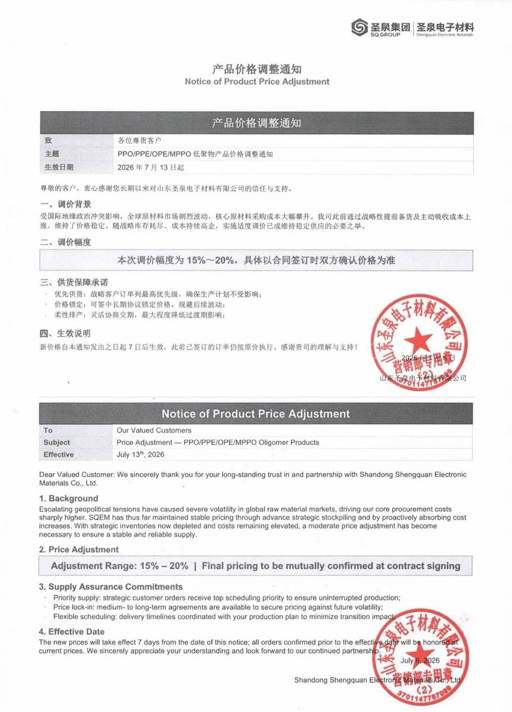

---

<!-- post_id: x:2074455702333161812 | ts: 1783423755 -->
## [X] 駿HaYaO · 2026-07-07 19:29

ASML High-NA EUV 分析

營收與 EPS 預測：
受前所未有的人工智慧擴張驅動，Bernstein 預測 ASML 2030 年總營收將達到 800 億歐元（CAGR 20%）。2028 年 EPS 預估上調至 €67.44（較市場共識高 35%），2030 年更進一步攀升至 €96.86。

出貨量擴張：
EUV 系統出貨預測上調，2027 年預計 91 台、2028 年 113 台，到 2030 年將達到 125 台。

DRAM 率先採用：
記憶體廠商預計比邏輯廠商更早採用 High-NA EUV。由於 DRAM 晶片面積較小，只需 1 道光罩（無需拼接），預計在 2027–2028 年於 1d 製程節點開始導入，由 SK hynix 與三星領先。

邏輯晶片隨後跟進：
大型邏輯晶片（如 GPU / CPU）因面積大，需使用兩道光罩進行「拼接」（AB stitching），目前會使產能降低約 23%。預估：
- Intel 將於 2028 年（A14 製程）率先採用
- Samsung Logic 於 2029 年跟進
- TSMC 則較保守，預計 2030 年（A10 製程）導入

工具可用率提升：
High-NA 初期工具可用率較低（2025 年約 80%，相較 Low-NA 的 95%），一直是主要挑戰。但成熟度正快速改善，目標到 2030 年機台群可用率提升至 95%。

成本通縮：
隨著工具可用率達到 95% 且各世代產能持續提升，High-NA 每曝光的設備成本預計在 2025–2030 年間下降 23%。High-NA 邏輯曝光與 Low-NA 的成本差距，將從原本超過 3 倍，逐步縮小至 2030 年的約 2 倍。

---

<!-- post_id: x:2074436243233149159 | ts: 1783419116 -->
## [X] 駿HaYaO · 2026-07-07 18:11

- CPO 快速規模化成長
CPO 交換器出貨量預計從 2026 年的 23,000 台（主要為 NVIDIA Spectrum 主導的 100T 交換器）成長至 2027 年的 59,000 台，並於 2030 年達到 200,000 台，2024–2030 年複合年成長率（CAGR）達 144%。

- 主流耦合技術
光柵耦合（Grating Coupling）仍是台積電 $TSM COUPE 平台及主要客戶（NVIDIA、AMD、Ayar Labs）的主流選擇，預計於 2026 年下半年開始量產。

- PIC 產能擴張
台積電計劃將光子積體電路（PIC）產能從 2026 年的每月 10,000 片晶圓（10kwpm）提升至 2026 年第四季的 15kwpm，並在 2028 年前達到至少 25kwpm。

- 客戶導入時程
由於初期產能有限，2026–2027 年主要量產客戶預計為 NVIDIA $NVDA、Broadcom $AVGO 與 AMD $AMD。2028 年起，聯發科、Marvell 及 Ayar Labs 將陸續擴大規模。

- 測試瓶頸緩解
晶圓級測試（Insertion 2）時間已從 2025 年下半年的每片晶圓需花費一整天，大幅改善至目前的 6 小時，預計未來 6–12 個月內可進一步縮短至 3–4 小時。技術焦點：GlassBridge 與傳統 FAU 比較GlassBridge 潛力
康寧 $GLW 的 GlassBridge（基於晶圓級玻璃中介層，使用波導技術）具備優異的擴展性、高密度及可拆卸特性，但距離量產仍有一段距離。

- FAU 穩固地位
傳統光纖陣列單元（Fiber Array Unit, FAU）仍是高度客製化、低損耗的主流選擇。分析師認為 GlassBridge 短期內不會衝擊 TFC 等高端廠商，更可能先與低階邊緣耦合 FAU 競爭。

---

<!-- post_id: x:2074436206172229898 | ts: 1783419107 -->
## [X] 駿HaYaO · 2026-07-07 18:11

高盛對 Nittobo 升評至「買入」的化學品報告後續。

高盛認為，玻璃核心 ABF 基板的採用不太可能在 2030 年之前 發生，商業化生產也預計要到 2030 年之後。現有的 T-glass 基板至少在 Rubin Ultra 世代之前仍將是主流解決方案。

報告同時強調多項技術障礙，包括微裂紋、TGV 良率、處理難度以及漫長的認證週期，這些都將延緩廣泛採用。
低 DK 玻璃的需求依然強勁。

雖然 PTFE 基板的設計可能會降低對超高端石英布的需求，但報告預期 NER 低介電玻璃仍將是 Rubin Ultra 運算托盤與 NVLink 交換器板的主要首選方案。他們再次上調 NER 玻璃的營收預測，需求來自於更大的板子、更多的層數以及更多的運算托盤。
-----
2) ABF core substrates
關於 ABF 核心基板的替代方案，這是考量潛在 T-glass 布替代時的關鍵議題。來自 Ibiden 等 ABF 基板製造商的產業看法顯示，採用不太可能在 2030 年之前發生。TSMC 玻璃核心基板的商業規模生產，也普遍預計要到 2030 年之後 才會開始。
我們相信現有的玻璃布最有可能會繼續使用，至少直到 Rubin Ultra 世代。在此期間，Nittobo 應能持續受益於封裝基板尺寸增大、核心厚度增加（導致 T-glass 含量更高，以及額外層數以減輕翹曲）所帶來的量產成長。

---

<!-- post_id: x:2074435963644961153 | ts: 1783419049 -->
## [X] 駿HaYaO · 2026-07-07 18:10

RT @mingchikuo: Goldman Sachs 在 7 月 6 日發布調升 Nittobo 評等到買進的報告，其中一個核心理由是保守看待台積電的玻璃核心載板（glass core substrate；GCS）發展。我先不多做評論，這邊單純分享訊息。

不過，我的結論是，從該報告其他的調升評等理由看，其實跟未來數年內正向看待 GCS 是不衝突的。

要注意的是，從過去歷史經驗看，台積電在接下來的 7 月法說，對 GCS / CoPoS 提供重大更新的機會可能不高，特別是才剛在 6 月份的日本研討會中，提供過關鍵研發成果且罕見提到合作供應商。如果我上述推論是對的，那更後面 8 月的群創與 Ibiden 法說，提供 GCS 重大更新訊息的機會也會連帶偏低。

---

<!-- post_id: x:2074369598322000051 | ts: 1783403226 -->
## [X] 駿HaYaO · 2026-07-07 13:47

日月光投控（3711 TT）更新摘要

•  目標價上調
•  毛利率提升主要由LEAP（先進封裝）業務成長，以及2026年下半年全面性漲價所驅動

•  LEAP營收：2026E/2027E 分別達 36億美元 / 64億美元，成長動能來自 AMD Venice CPU（2027年總封裝需求約500-550萬顆，其中日月光預估1百萬顆）、Nvidia Vera（2027年）、以及台積電 oS/CP 委外訂單

•  漲價策略：先進封裝漲價 10-20%、中低階產品漲價約 10%、部分低階產品漲幅達多倍

•  EPS上調：2026E / 2027E 分別上修 +4% / +21%

---

<!-- post_id: x:2074288540108910911 | ts: 1783383901 -->
## [X] 駿HaYaO · 2026-07-07 08:25

早安！7/7 外電綜合整理

- 3363上詮：美系初評正向
美系券商初評給予正向評等，肯定FAU在CPO的應用。市場討論的    GlassBridge是否取代FAU, 券商的回應是 GlassBridge 約 24+ 通道，但FAU朝 100+ 通道發展，且更小的線距、2D 架構及耐高溫。即便GlassBridge發展起來也是互補不是替代。再者，一項技術要成為主流也要有穩定的產品性能、大量生產及成熟供應鏈互相配合。綜上，預估明年後EPS$17.8/$50，以明年48xPE評價，同步升目標。

- 科技產業觀察：
無獨有偶，美系大行最新產業調研GlassBridge 主要適用於 Edge Coupling（邊緣耦合），且目前僅能支援一維（1D）光纖排列，然台積電主流 COUPE 平台以及主要客戶的方案未來幾年仍將採用 Grating Coupling（光柵耦合）技術，因為其較容易達成量產，台積電也調高28年PIC產能。即便GlassBridge 是相當理想的技術方案，然認為距離真正的大規模量產仍有一段距離，實際導入時間有待觀察，券商重申對CPO產業正向看法不變。

另一項調研是關於CoPoS，券商重申2029才是大規模導入的時間。預期主要的 CoPoS 生產廠將是台南AP7廠，鄰近群創。CoPoS 有可能於 2029 年的 Feynman Ultra 採用；而後年第一代 Feynman 則將採用台積電 3D Stack（Die-to-Wafer） 技術進行 GPU 堆疊，並搭配 SiC載體，以協助晶片散熱管理。

- 5289宜鼎：月營收新高
亞系券商認為此次強勁的營收成長主要來自 Flash價格上漲，券商預期動能延續至2H26，同時預估AI占營收比來到3成，重申正向。

- 2345智邦: 月營收新高
2Q總營收優於美系券商預期。券商重申AI 加速器生產將開始加速，網通也維持良好動能，預期2H26營收持續季增，重申正向。

- 8210勤誠：美系降評
美系券商認同公司隨CSP業者資本支出增加而成長，上修明年至$73.4，預估後年$106.8，唯考量評價面，上修目標的同時，降評至Neutral。

- 6515穎崴 ：月營收新高
2Q總營收優於美系券商預期。預期3Q新產能開出後持續放大營收規模，同時也在推動下一代產品價格。券商重申正向。

- 2317鴻海: 2Q營收優於預期
美系大行表示PC、零組件與其他、雲端與網通，以及消費性電子四大業務皆呈現強勁的年增成長，預期3Q也是同步季增、年增好表現，重申正向。

- 3665貿聯: 2Q營收優於預期
2Q營收優於美系券商預期。券商預期2Q毛利率應已回升至 30% 以上。重申正向。

 #下次會考

---

<!-- post_id: x:2074171765597823187 | ts: 1783356059 -->
## [X] 駿HaYaO · 2026-07-07 00:40

Micron 與 Ford 簽署長期策略合作協議

Micron Technology 與 Ford Motor Company 於 2026 年 7 月 6 日宣布簽署長期策略客戶協議（SCA），強化下一代車輛記憶體與儲存解決方案的供應。Micron 將擴大汽車記憶體產能，特別在美國維吉尼亞州 Manassas 廠投資先進 DRAM 生產，以確保長期供應穩定並提升產業韌性。

Ford 執行長 Jim Farley 強調美國製造供應鏈的重要性；Micron 執行長 Sanjay Mehrotra 表示，此合作將支援智慧車輛的資料密集需求。

此協議為 Micron 近期宣布的 16 項 SCA 之一，有助雙方深化技術合作並強化美國關鍵基礎設施。

https://t.co/MjUuINfPld

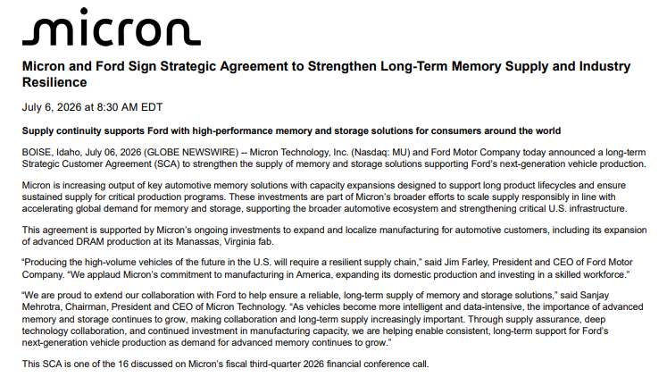

---

<!-- post_id: x:2074169378342584719 | ts: 1783355490 -->
## [X] 駿HaYaO · 2026-07-07 00:31

Broadcom 與 Apple 擴大晶片合作至 2031 年

Broadcom（ $AVGO ）宣布與 Apple（ $AAPL ）簽訂新多年長期協議，將雙方技術合作延長至 2031 年。Broadcom 將為 Apple 多代產品開發並供應客製化 ASIC 矽晶片。

此合作延續雙方長期夥伴關係，Broadcom 長期為 Apple 提供 Wi-Fi、Bluetooth、5G 及射頻等關鍵晶片，目前 Apple 約占 Broadcom 年度營收的 20%。2023 年 Apple 已與 Broadcom 簽署數十億美元擴大協議，強調美國本土製造與投資。

除了 Apple，Broadcom 近期也與 Meta 簽署 AI 晶片合作至 2029 年，並與 OpenAI 共同推出 Jalapeño 推論晶片，顯示其客製化 ASIC 業務強勁成長。最新財報顯示，半導體解決方案成長達 79%，AI 營收更成長 143%，動能強勁。

分析師指出，Broadcom 在客製化晶片領域的領先地位，將持續受惠 AI 與消費電子需求。

https://t.co/HRAsT67cWI

---

<!-- post_id: x:2074168272225013816 | ts: 1783355226 -->
## [X] 駿HaYaO · 2026-07-07 00:27

電子終端產品漲價趨勢已蔓延至消費性網通市場。日本大廠NEC於2026年7月5日宣布，即日起調漲旗下消費性網通產品報價，漲幅介於4.4%至65.5%，幾乎涵蓋所有產品線，正式開出漲價第一槍。

NEC此次鎖定經典「Aterm」系列，包括家用WiFi無線路由器、Mesh網狀網路系統，以及5G/4G行動基地台與隨身WiFi分享器等。該公司指出，漲價主因來自零組件、勞動力及物流運輸等三重成本壓力。日本市場為NEC主力，雖非全球前五大消費性網通品牌，但此舉仍備受業界關注，凸顯科技產品「萬物皆漲」態勢持續擴大。

NEC宣布後，台灣網通品牌大廠友訊（2332）率先表態，將「適當調整價格」。友訊表示，近期關鍵零組件價格出現波動，將依不同產品、市場需求及成本結構，審慎評估價格策略，並透過供應鏈管理、產品組合優化及成本控管，兼顧市場競爭力。法人看好，合勤控（3704）旗下合勤科技、華碩（2357）等台灣網通品牌後續也有望跟進，共同分享漲價紅利。

網通製造廠商透露，對客戶報價已排除記憶體等關鍵零組件成本，漲價壓力轉由品牌商吸收，最終勢必反映在終端售價上。過去消費性網通產品常被戲稱「萬年不漲價」，如今也加入漲價行列，顯示產業成本壓力已難以再吸收。華碩目前尚未正式回應，但其路由器業務雖具知名度，占整體營收比重較低。

https://t.co/WGwn1Eja4W

https://t.co/e77hLLmZvZ

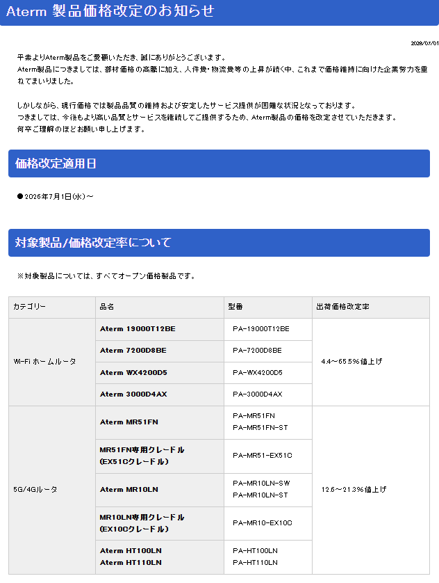

---

<!-- post_id: x:2074166894668697913 | ts: 1783354898 -->
## [X] 駿HaYaO · 2026-07-07 00:21

深圳麥格米特電氣股份有限公司
SHENZHEN MEGMEET ELECTRICAL CO.,
產品調價告知函
尊敬的客戶：您好！
首先，衷心感謝貴司長期以來對麥格米特的信賴與支持。正是得益於與您的緊密攜手，我們才得以穩健發展，共創佳績。
我司一直竭盡全力為客戶提供優質可靠的產品和服務，近期，受全球市場環境影響，上游原材料價格持續大幅上漲，且核心物料供應趨於緊張。儘管我司一直在內部優化生產流程、壓縮利潤空間來全力消化成本壓力，但面對持續攀升的成本，原有價格體系已難以維繫供應鏈的穩定與產品的可持續交付。
為確保向貴司一如既往地提供高品質的產品與服務，經公司慎重研究決定：

自即日起，我司產品價格將進行適度上調，具體的調整型號及幅度，將由我司專屬銷售團隊進行一對一溝通對接。
—--

麥格米特更新：全產品線漲價重塑定價權，18.5kW/HVDC打開成長空間 - 260706
———————————
公司近期發出全系列產品漲價函，有望在順價的同時提升盈利能力；重點看好公司盈利拐點 + 新品第二成長曲線共振，2026年下半年海外將加速兌現利潤；橫向對比AI全產業鏈（PCB/光模組/液冷/電源），電源板塊當前性價比高，通脹邏輯順暢。

一、全產品線強制漲價具備中長期持續性，盈利中樞迎來拐點。 1、公司全產品漲價10%~20%；調價幅度領先行業，屬於主動戰略調價，戰略性提升毛利率：
① 核心戰略目標：規劃2028年港股上市需滿足硬性財務要求，漲價是中長期修復盈利結構的核心手段，並非一次性短期調價。
② 主動出清低毛利傳統中小客戶，完成業務結構洗牌，整體毛利率將實現顯著抬升。

二、技術壁壘顯著領先，18.5kW+HVDC打造第二成長曲線，電源通脹邏輯逐步兌現。
 1、存量5.5kW產品：已批量供給海內外頭部雲廠商（NV+X AI+阿里等），現金流穩定。其中NV體系份額逐步提升，深度綁定XAI（份額約50%），谷歌等其他頭部客戶送測進展順利。
 2、18.5kW高功率電源：送測性能優於台達、光寶（競品出現炸機故障）、公司產品零缺陷，鎖定客戶第一供應商順位，2027年批量出貨，單瓦價值（30%~50%增幅）與毛利率顯著高於現有產品。
 3、HVDC高壓直流方案：單瓦價值量翻倍（2+元/瓦），配套超級電容將成為行業標配，可降低機櫃電源配置數量、節省空間與散熱成本，行業滲透率持續上行；目前已啟動多客戶送樣，2027年~2028年大規模產業化落地，打開中長期增量空間。

三、行業格局穩定、客戶壁壘深厚，長期份額穩步提升。 全球AI伺服器電源維持台達、麥米、光寶三供應商穩態格局，公司長期目標穩態份額20%~30%。 2027年推行精簡分銷模式，中小客戶轉交ODM承接，集中產能供給高價值頭部訂單；湖南+泰國雙工廠供貨，同步規劃美國達拉斯產能，匹配海外客戶在地化需求，交付效率優於台達、光寶。

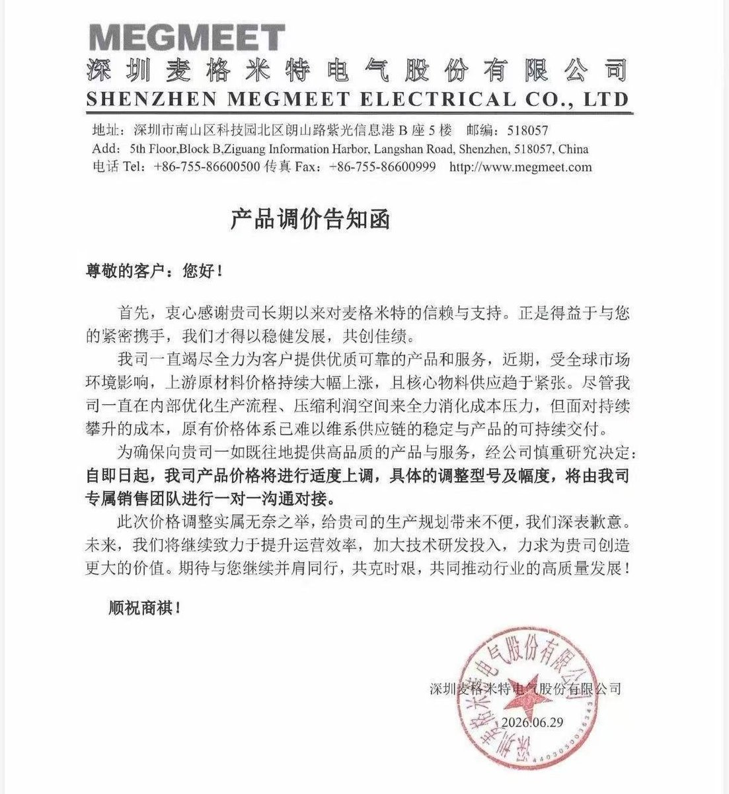

---

<!-- post_id: x:2074133264135045274 | ts: 1783346880 -->
## [X] 駿HaYaO · 2026-07-06 22:08

蘋果 A20 Pro 打破 13 年慣例：首用 96 位 LPDDR6，卻在大容量機型降級 NAND 省成本

蘋果即將在 2026 年 iPhone 18 Pro 系列上推出 A20 Pro 晶片，將打破自 2012 年 A6 晶片以來沿用約 13 年的 64 位記憶體介面，改採用 96 位 LPDDR6，這是重大硬體革新。

根據多位爆料者（Reptalica、INIYSA 等）指出，A20 Pro 可能搭載 96 位 8533 LPDDR6，總頻寬高達 102GB/s，比現行 LPDDR5X 提升明顯。LPDDR6 不僅維持相似尺寸，還提供更高資料傳輸效率與更好能效，尤其適合 Apple Intelligence 框架下的大規模裝置端 AI 運算、神經網路引擎與影像處理等高負載任務。

這次記憶體升級也導致成本大幅增加。預估 iPhone 18 Pro 系列每機記憶體成本將從 iPhone 17 Pro 的 39 美元暴漲至 145 美元，若確認採用 LPDDR6，費用還會更高。為平衡整體 BOM成本，蘋果在 NAND 快閃記憶體上採取節約策略：256GB 與 512GB 版本 維持較快的 TLC NAND；而 1TB 與 2TB 大容量版本 則改用速度較慢、成本更低的 QLC NAND。

此一「一升一降」的硬體配置，清楚反映蘋果的產品策略：優先保障 AI 核心效能，同時透過儲存端壓縮成本來控制定價。

雖然 QLC 在日常讀取與 App 切換影響有限，但長時間寫入或大量檔案存取時可能有速度差異，需待真機測試驗證。
https://t.co/VHTdCPywao

---

<!-- post_id: x:2074110748050231420 | ts: 1783341512 -->
## [X] 駿HaYaO · 2026-07-06 20:38

長久以來，NAND 儲存裝置（也就是 SSD）的價格只有一個方向：持續下跌。十五年前，SSD 還非常昂貴，但價格一路穩步下降，讓高速儲存成為幾乎所有筆電的標準配備。

這種情況一直持續到 2026 年的大型 AI 泡沫為止。隨著 AI 資料中心大量吞噬 RAM、SSD 甚至 HDD 的市場供應，記憶體價格大幅上漲，連帶筆電價格也跟著水漲船高。就連大型筆電 OEM 廠商都為零件短缺而焦頭爛額。

對於儲存市場的新進業者來說，幾乎找不到比這更好的環境了。而這波機會果然來自中國：長江存儲科技（Yangtze Memory Technologies，簡稱 YMTC）。這家僅成立十年的中國企業，過去在筆電 SSD 市場幾乎默默無聞，但如今情勢正在快速改變，因為三星、鎧俠（Kioxia）等既有大廠的 SSD 供應正日益枯竭。

我們這次首次在聯想筆電中測試了 YMTC 的固態硬碟。最近評測的 Lenovo ThinkBook 14 G9 IPL 就搭載了這款硬碟。這顆 512 GB M.2 2242 SSD 為 NVMe PCIe 4.0 規格。在我們的測試中，其速度對於辦公型筆電來說屬於中下水準，循序讀寫速度最高分別為 3950 MB/s 與 2514 MB/s，4K 隨機存取表現也平平無奇。

儘管如此，這仍是中國 SSD 首次被全球出貨量最大的 PC OEM 廠商採用。看來 2026 年將成為 YMTC SSD 正式突破進入主流市場的一年。
https://t.co/YVAh7kX0jX

---

<!-- post_id: x:2074109236569833740 | ts: 1783341151 -->
## [X] 駿HaYaO · 2026-07-06 20:32

TrendForce: AI高階MLCC激勵日韓大廠訂單出貨比創疫情後新高，2H26缺貨風險提升

根據TrendForce最新MLCC產業報告，在AI伺服器加速換代與雲端服務供應商（CSP）自研ASIC晶片持續放量的雙重推動下，日韓三大龍頭Murata、Samsung Electro-Mechanics、Taiyo Yuden於2026年6月下旬的BB Ratio（訂單出貨比）分別達到1.30、1.31與1.25，創下COVID-19疫情後新高，整體MLCC市場BB Ratio亦同步升至1.04。

Murata第一季財報更顯示，其Orders/Backlog Ratio（訂單/積案比）已達1.27，超越2018年MLCC史上最嚴重缺貨期的1.25峰值，訂單積壓壓力快速累積，供給短缺風險顯著升高。

MLCC需求呈現明顯結構分化。美國5月CPI年增率升至4.2%，高利率環境持續壓抑消費力，手機、筆電等終端需求疲弱。Intel與AMD將CPU產能優先供給AI應用，導致傳統PC備貨受阻，ODM只能以急單追料，材料成本上升。反觀AI伺服器端，Google TPU、AWS Trainium、Meta MTIA等自研ASIC平台放量，強力帶動高容值、低電壓、小尺寸MLCC需求快速成長。

供給面則出現明顯排擠效應。高階AI MLCC訂單大量佔用產能，外溢影響車用與消費規市場。Apple供應鏈備料較往年提前1-2個月，車用ODM也從7月提前至5月展開備料，顯示市場對下半年供貨短缺的擔憂加劇。中國大陸通路市場自6月起對主流X5R消費規MLCC啟動調漲，平均漲幅15%-25%，進一步推升恐慌情緒。

TrendForce指出，由於日韓廠商專注高階MLCC訂單，預估第三季台系國巨、華新科與陸系微容科技等廠商，有機會承接外溢的中高容X5R消費規訂單。

展望2026下半年，隨著NVIDIA、Google、AMD新款AI晶片平台第三季陸續量產，AI訂單持續排擠產能，加上超前備貨需求，下半年交期延長、高階MLCC價格走揚的機率大幅上升。TrendForce預測，第四季將是觀察高階MLCC市場是否正式進入缺貨的關鍵時期。
https://t.co/Yh2oMXnARq

---

<!-- post_id: x:2074108272404230269 | ts: 1783340921 -->
## [X] 駿HaYaO · 2026-07-06 20:28

三星SDI 向台灣新普科技供應 AI 資料中心電池芯

三星SDI 已向台灣新普科技供應數億顆高功率圓柱型電池芯，用於Meta、Amazon等AI資料中心的電池備援單元（BBU）。隨著AI伺服器功率大幅提升，BBU需求急遽增加，三星SDI的NCA高功率電池芯產量同步大幅上升。

新普科技旗下太普動力負責將三星SDI電池芯組裝成BBU模組，供應北美大型雲端業者。雙方長期合作關係，加上美國排除中國製電池的政策，使三星SDI成為首選供應商。松下（Panasonic）作為三星SDI在BBU市場的主要競爭對手，資料中心電池芯銷售同樣強勁成長，但兩家公司均面臨BBU電池芯嚴重供應短缺。

AI伺服器需瞬間高功率輸出，BBU能快速穩定電壓並防止斷電資料遺失，成為高密度機櫃的關鍵配備。相較傳統UPS，BBU體積更小、反應更快，NCA電池在能量密度與峰值功率上優於LFP，特別適合此應用。三星SDI除擴大BBU業務外，也強化UPS及容器式能源儲存系統（SBB），預計AI需求將帶動公司今年重返季度獲利。業界預期，AI基礎設施投資將持續推升非中國電池供應鏈需求。

https://t.co/Tip31clIzc

---

<!-- post_id: x:2074047640787153281 | ts: 1783326466 -->
## [X] 駿HaYaO · 2026-07-06 16:27

要直白地說，有些分析師太早把實驗性技術塞進他們的模型裡，動作實在太快了。現實情況是，正交背板（orthogonal backplanes）目前正撞上銅牆鐵壁——無論是 M9 還是 PTFE，都還無法通過驗證測試。

從實際地面真相來看，M9 等級的規格正在 GPU 和 ASIC 伺服器中穩步提升。為了 Kyber 這個高度實驗性的專案，而忽略整片森林，完全沒有道理。Kyber 極不可能在短期內跨越終點線。

---

<!-- post_id: threads:3935123391783276801 | ts: 1783323285 -->
## [Threads] Kok Yu · 2026-07-06 15:34

其實就是中系券商太快把實驗性的東西打進去預期...正交背板這東西 M9驗不過 PTFE也驗不過..都中系券商自己喊..哈

回歸現實面 M9這等級 GPU 和Qsic陸續在導入，沒必要為了Kyber這不太能成的草放
放棄整片森林~

---

<!-- post_id: x:2074029728626065588 | ts: 1783322195 -->
## [X] 駿HaYaO · 2026-07-06 15:16

就在 Jensen 在 GTC 大會上展示 Kyber NVL144 僅僅三個月後，該架構就遭遇重大挫折，被延遲超過 12 個月，推遲至 2028 年。下面SemiAnalysis將說明 Kyber 遭遇大幅延遲的原因，以及為何 NVIDIA 的 NVL72x2 背靠背機架架構也被取消，導致 Rubin Ultra 的規模擴展能力受限。

Kyber NVL144 機架架構已延遲至 2028 年，因為 PCB 中平面（Midplane）在製造可行性上仍面臨重大挑戰。NVL576（透過 CPO 連接 8 個 Oberon 機架之間的 NVSwitch）也可能遭遇延遲，或僅限小量出貨，因為目前 CPO 技術仍存在諸多挑戰。

NVL72x2 背靠背機架架構是 NVIDIA 原本開發用來替代 Kyber 的新方案。它透過將兩個 Oberon 機架背靠背放置，來擴大純銅 NVLink 的規模擴展世界大小。然而，由於雲端服務提供商（CSP）和超大規模業者（hyperscalers）強烈反對其怪異設計以及沉重的運營負擔，該架構已被取消。

根據 NVIDIA 的路線圖，CPO NVSwitch 要到 Feynman 世代才會推出。因此，NVIDIA 目前沒有經過驗證的解決方案來擴大 Rubin Ultra 的規模擴展能力，這讓 AMD MI500X 或 Google TPUv8i Broadfly 等競爭對手有機會在規模擴展優勢上超越 Rubin Ultra。

此外，這則消息也伴隨著 4 計算晶片（4-compute-die）版本的 Rubin Ultra 被取消，只剩下較小的 2 計算晶片版本，其實際效能大約只有 4 晶片版本的一半。
NVIDIA 將銷售更多 Oberon Rubin 機架和 Oberon Rubin「Ultra」機架，以彌補這一缺口。

SemiAnalysis將在《核心研究與 AI 加速器供應鏈模型》中，討論這些 NVIDIA 大規模延遲與取消對記憶體、PCB 和 ODM 供應鏈的影響。

---

<!-- post_id: x:2074010739917062581 | ts: 1783317668 -->
## [X] 駿HaYaO · 2026-07-06 14:01

Kyber/Backplane 延遲對 AI PCB/CCL 供應鏈影響

報告指出，NVIDIA Rubin Ultra（2027 年）原規劃導入的 Kyber/Backplane 因 PCB 結構極度複雜，導致延遲風險大幅升高。供應鏈自五月即察覺此可能性，最近幾週已確認 2027 年 Kyber 極可能缺席，Rubin Ultra 將繼續沿用 Oberon 架構（NVL72）。

此延遲將使 2027 年 AI PCB/CCL 總市場規模（TAM）較原預估下滑約 5%，若 2028 年仍未導入，降幅將擴大至 11%~16%。主要原因為 Kyber 需實現軌道間高速連接，但 2 奈米製程、18 層板等挑戰大，結晶化問題仍存，最壞情況可能完全取消。

儘管如此，AI 伺服器升級（M6/M7→PTE/Oberon）仍在進行，PCB 供應鏈整體仍可維持超優表現。上游廠商受近期價格調漲帶動，獲利能力優於下游；
銅纜製造商則因 PCB 挑戰而成為明顯受益者，在市場中表現可望突出。

---

<!-- post_id: x:2074008480227455052 | ts: 1783317129 -->
## [X] 駿HaYaO · 2026-07-06 13:52

廣東建滔積層板銷售有限公司
 GUANGDONG KINGBOARD LAMINATES TRADING CO LTD

漲價通知

尊敬的各位客戶：
衷心感謝您長期以來對建滔的支持！
近期由於市場需求持續攀升，帶動上游玻璃布、銅箔等核心主材供應日趨緊缺、價格大幅上漲。
因此，自即日起接單起，我司將對以下材料價格調整如下：

產品（所有厚度）：
 FR-4（1.3mm 以上厚度）　調整幅度 +15%
 CEM-1/22F　調整幅度 +10%
 PP　調整幅度 +15%
 銅箔加工費　1.5oz 以下 +5 元/KG，2oz 以上 +8 元/KG

---

<!-- post_id: threads:3935038443034436034 | ts: 1783313158 -->
## [Threads] Kok Yu · 2026-07-06 12:45

報告和社群有時間落差....Semi這次寫的東西老早之前就有了，而且出報告時就反應過一次..
現在又反應一次 只能笑笑的

---

<!-- post_id: x:2073927810016825670 | ts: 1783297896 -->
## [X] 駿HaYaO · 2026-07-06 08:31

早安！7/6 外電綜合整理

- 2330台積電: 美系升目標
兩家美系券商不約而同調升台積電獲利預估及目標。所持理由不外乎CoWoS產能增加、N3/N2需求暢旺，尤其N2放量速度優於預期，以及調高資本支出預估等。其中一家美系預告CoPoS 將於 2029 年之後接棒 CoWoS 與 SoIC，Glass Core及 CoPoS 將代表下一世代封裝技術的演進方向。

- 2327國巨: 美系升目標
美系券商預估國巨的MLCC明年漲價93%，後年再漲84%。預估毛利率明年46%，後年51%。觀察越來越多的MLCC 產能正轉向 AI ，去年僅佔9%，今年上升至15%，明年24%、後年32%。非 AI MLCC 出貨量 CAGR 也有9%。券商上修26-28年EPS至$21.2/$37.6/$57.3，以2H27-1H28的26xPB/ROE  （～與過去 20 年歷史高峰估值一致）評價。同步升目標。

- 2344華邦電: 美系升目標
美系券商預估利基型 DRAM 漲價趨勢將延續至明年。同時AI 帶動 NOR Flash 需求更加穩健，預估華邦 NOR Flash 營收將年增 70%。券商最新預估26-28年EPS為$18.9/$30.8/$29.6，改用2027–2028 年平均 EPS的8xPE評價，不同於先前採用 P/B評價，同步升目標。

-2345智邦: 美系升目標
美系大行預期2H26網通交換器與 AI 加速器模組出貨動能強勁。認為2Q營收有機會超過之前的預估來到季增25-30%。預期1.6T switch 明年提早導入。另調研AI加速器已於2Q底提早導入。上修26-27年EPS至$85.8/$115.8，以明年33xPE評價，同步升目標。

 #下次會考

---

<!-- post_id: x:2073898019641331826 | ts: 1783290793 -->
## [X] 駿HaYaO · 2026-07-06 06:33

RT @mingchikuo: 在本訪談中，Amazon 硬體主管 Panos Panay 提到該公司正在為部分自家裝置設計自研晶片（end-to-end silicon），且目前仍向其他公司外購晶片（如 Qualcomm）。

這呼應了我先前預測的「Amazon 裝置走向自研晶片」趨勢。另一個重點是，Panay 也提到這是為了裝置端 AI，代表自研晶片除了我先前提及的成本考量外，也是未來 AI 裝置的重要布局。

https://t.co/OKtctYPmmp

---

<!-- post_id: x:2073730998576247241 | ts: 1783250972 -->
## [X] 駿HaYaO · 2026-07-05 19:29

每週主題：Meta/CXMT/韓國風險、日本出差要點、三星第2季營運表現

- Meta 的記憶體晶片訂單削減
記憶體晶片廠商相信，Meta 將更積極使用 HBM、LPDDR5、eSSD 等產品，用於其 AI 資料中心。因此，市場上關於「Meta 出租其 AI 伺服器或雲端基礎設施」的猜測並無根據。事實上，部分 AI 供應鏈公司（例如 NAND 控制器 IC 供應商、基板材料廠商等）表示，Meta 的長約/元件訂單正變得更強勁。晶片廠商指出，Meta 將其自有資料中心與外部客戶共享作為雲端服務提供者，但這並不代表產能過剩，而是業務目標的多元化，需要使用更多先進記憶體晶片。

- CXMT 的 DRAM 用於 iPhone
我們不預期蘋果會有意義地採用 CXMT 的 DRAM。
主要有三個原因：
(1) 美國對中國半導體的限制；
(2) DRAM 品質需達到蘋果規格（10Gbps+ 速度、1.1V 功耗、ECC 功能）；
(3) DRAM IP 主要由韓國/美國晶片廠商擁有（訴訟風險也較高）。
即使 CXMT 針對低階 iPhone 18e 推出實際 DRAM 產品，銷售量也不會顯著。蘋果可能會試用 CXMT 的 DRAM 來增加與韓國/美國大廠議價的籌碼，尤其在 2027 年合約價格談判時，但實際採購量仍將由 CXMT 維持小規模。

- 韓國叢集建廠計畫引發的最高關注
部分投資人表示，韓國政府主導的新記憶體晶圓廠叢集建設計畫（例如光州地區），預計投資 800 億美元，顯示記憶體週期即將達到峰值。然而，我們不預期 2033 年前會有意義的晶片產量增加。這是一項長期的國家計畫，重點在於龍仁/平澤廠區以外的新叢集。目前尚未看到資本支出驅動的記憶體週期峰值，加上企業端多元化的強勁需求（HBM、SOCAMM、eSSD 等），整體影響有限。

- 日本出差學到的重點
本週我們與日本投資人及 NAND/記憶體供應鏈公司會面。投資人普遍看好記憶體，但經常詢問目前強勁產業成長下是否會出現下行風險。
事實上，公司管理層提供了更為看好的指引，包括：
(1) 第2季營運表現（特別是 NAND）優於第2季；
(2) 2027 年仍存在供應短缺（DRAM、NAND）；
(3) LTA（長期協議）比重上升（但仍以量為主）；
(4) 受控資本支出與晶片產量（主要針對日本 NAND）。

- 三星第2季初步營運表現
三星電子第2季初步營運表現（7月7日公布）預計將略低於市場普遍看好的預期，主要因第1季特別獎金（含一次性因素）及智慧型手機毛利率壓力。僅記憶體部分的營運表現預計優於市場共識，符合韓國強勁出口趨勢。DRAM 現貨/合約價格在6月進一步反彈。

---

<!-- post_id: x:2073600413186871506 | ts: 1783219838 -->
## [X] 駿HaYaO · 2026-07-05 10:50

住友電工 硬質合金貿易（上海）有限公司
Sumitomo Electric Hardmetal Trading (Shanghai) Co., Ltd.

價格調整通知
各位尊敬的客戶：

本公司決定於 2026 年 8 月 1 日 起，對部分產品進行價格調整。

近年來，受全球通脹及原材料、人力、物流等綜合成本持續上漲的影響，產業鏈各環節均面臨較大經營壓力。雖經內部生產優化與成本管控等多項努力，仍難以完全消化成本上漲帶來的影響。
為保障產品質量穩定與供應體系可持續運轉，經慎重研究，現對部分產品實施價格調整。

---

<!-- post_id: x:2073599305022398474 | ts: 1783219574 -->
## [X] 駿HaYaO · 2026-07-05 10:46

中國AI運算

中國國家算力網絡是「六大基礎設施網絡」項目的一部分，預計2026年將吸引人民幣7兆元投資。彭博報導，未來5年數據中心投資規模將達到約人民幣2兆元（約3000億美元）。

資本與技術正大幅轉向中國西部樞紐。與此同時，一線城市數據中心正轉型聚焦超低延遲熱運算、邊緣節點與AI推理服務。

與美國相比，中國已投入營運的吉瓦（GW）級大型叢集（具10萬片以上晶片規模）仍相對稀缺。不過，Range Intelligence已在今年內成功投運一座200MW、10萬片晶片規模的機房，作為更大GW級叢集布局的一部分。

典型GW級園區的工作負載分布為：Inference佔50%以上、Training佔20–30%、Full-stack R&D佔10–20%。

預計2026年國產AI加速晶片出貨量市佔率將超過50%，其中華為（20%）與T-Head(7%)領先國產陣營（儘管Nvidia整體仍佔55%市佔）。

國產晶片的每IT功率資本支出較進口晶片低40–50%。然而性能差距顯著：每單位運算力的資本支出高出2–4倍，而每IT功率的運算力僅為進口晶片的10–30%。

華為910B/910C伺服器平均每日token輸出量僅為Nvidia H800伺服器的1/6至1/3。因此，基於華為910B硬體的API服務利潤率大幅落後於Nvidia方案。

---

<!-- post_id: x:2073591258954489993 | ts: 1783217656 -->
## [X] 駿HaYaO · 2026-07-05 10:14

CXMT 的 DRAM 用於 iPhone

不預期蘋果會有意義地採用 CXMT 的 DRAM。
主要有三個原因：
(1) 美國對中國半導體的限制
(2) DRAM 品質需達到蘋果的規格要求（10Gbps+ 速度、1.1V 功耗、ECC 功能）
(3) DRAM IP 由韓國/美國主要晶片廠商擁有（若蘋果使用專利較少的晶片，可能引發訴訟）。

雖然 CXMT 可以鎖定低階 iPhone 18e，但實際 DRAM 訂單量不會太顯著，因為中國低階 iPhone 的銷售量較弱（高階機型更受歡迎）。蘋果可能會嘗試使用 CXMT 的 DRAM，來增加與韓國/美國三大 DRAM 廠商談判 2026 年下半年或 2027 年合約價格時的議價能力，但實際向 CXMT 採購的數量仍會很小。

---

<!-- post_id: x:2073396688254091607 | ts: 1783171266 -->
## [X] 駿HaYaO · 2026-07-04 21:21

軟銀成立「SB Neo」進軍美國Neocloud市場

軟銀公司與軟銀集團公司於2026年7月宣布，在美國共同成立SB Neo, Inc.（暫定名），由軟銀公司持股51%、軟銀集團持股49%，成為軟銀公司的合併子公司。

SB Neo將利用軟銀集團開發中的10吉瓦級能源與AI基礎設施，預計2028年3月（FY2027）正式推出neocloud服務，為美國大型企業及超大規模雲端業者提供大規模AI模型訓練與推論所需的運算資源。未來將分階段擴大規模，目標達到10吉瓦級AI基礎設施。

軟銀公司已在日本自2026年5月提供「Infrinia AI Cloud OS」驅動的GPU雲端測試版服務，將把累積的技術與經驗應用於美國市場。軟銀集團則負責提供美國現有的大型AI基礎設施支援。

孫正義表示，集團將共同打造世界級AI基礎設施，推動AI革命；宮川潤一則強調，將加速在美發展neocloud業務，並計畫在日本興建吉瓦級AI資料中心。
https://t.co/1JAH5ptIVa

---

<!-- post_id: x:2073390796343234713 | ts: 1783169862 -->
## [X] 駿HaYaO · 2026-07-04 20:57

台積電 ( $TSM )

- N3 (3nm) 產能：2027年底預估上修至每月20萬片晶圓（先前預估19萬片），因N3已成為AI GPU與ASIC的主要產能瓶頸，隨著客戶陸續轉進先進製程所致。

- N2 (2nm) 產能：2027年底預估上修至每月14萬片晶圓（先前預估13萬片）。N2首年產出預計較N3首年高出45%。

- 先進封裝 (CoWoS)：2027年CoWoS季產能上調至每月28萬片晶圓（先前25萬片）。2027全年CoWoS總產能上修至273萬片晶圓（先前249萬片）。

- 資本支出上調：2027年資本支出上調至780億美元（先前700億美元），2028年上調至820億美元（先前740億美元），以確保AI建置需求。2026年資本支出維持560億美元不變。

- 毛利率上檔空間：2026~2028年毛利率預估分別上修至66.9% / 66.8% / 67.3%（先前64.9% / 64.7% / 66.5%）。更好的產品組合與定價能力，預計將輕鬆抵銷海外設廠帶來的稀釋效應。

---

<!-- post_id: x:2073284294852956527 | ts: 1783144470 -->
## [X] 駿HaYaO · 2026-07-04 13:54

Sivers Semiconductors 貸方 Bootstrap Europe 行使現有可轉換貸款之轉換權

Kista，2026 年 7 月 3 日Bootstrap Europe IV SCSp（「Bootstrap」） 將把 1,200 萬美元的可轉換貸款轉換為 Sivers Semiconductors AB (publ)（「Sivers」或「本公司」）的股份。董事會因此決議向 Bootstrap 發行 22,847,044 股新普通股。

背景
如 2026 年 2 月 24 日所公告，Sivers Semiconductors 已對所有現有外部債務設施進行再融資，與 Bootstrap 取得總額 1,700 萬美元的貸款設施。其中包括固定利率擔保可轉換貸款 1,200 萬美元。根據可轉換貸款的條款與條件，Bootstrap 有權將全部或部分未償還本金轉換為本公司普通股，轉換價格為每股 SEK 4.77。

轉換
Bootstrap 已行使其權利，將可轉換貸款全部未償還本金 1,200 萬美元轉換完畢。此次轉換將發行 22,847,044 股新普通股予 Bootstrap。新股付款方式為以 Bootstrap 對本公司之可轉換貸款債權進行抵銷。董事會已根據轉換通知決議發行該等股份。Sivers Semiconductors 財務長 Heine Thorsgaard 表示：「Bootstrap Europe 是極佳的策略性貸款夥伴，他們的轉換大幅減少了 Sivers 的未償還債務。這符合我們既定策略，持續強化資產負債表，並將投資重點放在把握三個快速成長的重點市場領域的重大商業機會。」

股本與股份數量
轉換後，本公司股份總數增加 22,847,044 股普通股，由 332,234,273 股增至 355,081,317 股普通股，對現有股東造成約 6.4% 的稀釋。本公司股本增加 SEK 11,423,522，由 SEK 166,117,136.50 增至 SEK 177,540,658.50。
$SIVE
https://t.co/MSX2XKvvgL

---

<!-- post_id: x:2073254975225184561 | ts: 1783137479 -->
## [X] 駿HaYaO · 2026-07-04 11:57

英飛凌( $IFNNY )德勒斯登新廠

德國半導體大廠英飛凌（Infineon）提前數月在德勒斯登正式啟用「Smart Power Fab」新廠，投資高達50億歐元（約9000億元台幣），為公司史上最大單一投資案。該廠將使德勒斯登基地產能倍增，成為全球最大的智慧功率半導體及類比/混合訊號技術工廠，並直接創造1000個新職位。

新廠聚焦功率半導體，應用於AI資料中心電源供應、電動車、再生能源（風力/太陽能）、電網及軟體定義車輛等領域。透過數位孿生、AI演算法及與奧地利Villach廠的「One Virtual Fab」整合，產能擴張速度可達過去兩倍，能快速因應市場需求。

英飛凌執行長Jochen Hanebeck強調，此舉強化全球領先地位，並為AI革命與關鍵供應鏈提供保障。德國總理Merz、部長Wildberger及薩克森州州長Kretschmer均表示，這是德國與歐洲技術主權及產業競爭力的重大里程碑。
https://t.co/M5zMpV2UUF

---

<!-- post_id: x:2073237793694945697 | ts: 1783133383 -->
## [X] 駿HaYaO · 2026-07-04 10:49

電子級氫氟酸產業
1. 產業背景：電子級氫氟酸在晶圓製造中的角色
電子級氫氟酸是半導體晶圓製造過程中關鍵的濕式電子化學品，主要用於清洗與蝕刻兩大核心工序，是單位晶圓耗量最大的濕式電子化學品之一。

清洗環節：氫氟酸用於去除晶圓表面的自然氧化層、金屬離子污染及顆粒殘留。隨著製程從 28nm 向 7nm 及以下演進，清洗步驟數從約 100 步增加至 200 步以上。在 3nm 製程中，由於極紫外光刻（EUV）對光刻膠表面缺陷的敏感度更高，清洗步驟進一步增至 300 步以上。每一步清洗均需使用稀釋氫氟酸（DHF）或緩衝氧化蝕刻液（BOE）。單片 12 吋晶圓在先進製程廠的耗酸量較 28nm 廠高出約 2-3 倍。

蝕刻環節：氫氟酸用於二氧化矽及氮化矽的選擇性蝕刻。在 3D NAND 快閃記憶體中，隨著堆疊層數從 128 層向 176 層、232 層乃至 300 層以上邁進，高深寬比蝕刻（High Aspect Ratio etch，簡稱 HAR etch）的次數呈指數級增長。更高的堆疊層數意味著更深的溝槽與孔洞，對氫氟酸的純度、蝕刻速率及蝕刻選擇比提出更嚴格的要求。

AI 算力拉動方面：AI 訓練與推理晶片（如 H100、B200、MI300 系列）採用先進製程與大尺寸晶片設計，單片晶圓面積較通用邏輯晶片更大，等效耗酸量相應提升。隨著 AI 資料中心資本開支持續擴張，台積電、三星、英特爾等頭部晶圓廠的先進製程產能利用率維持高位，直接拉動濕式電子化學品的消耗量成長。
根據 SEMI 數據，2025 年全球半導體設備支出約 1255 億美元，中國區占比持續提升，晶圓廠擴產是濕式電子化學品需求成長的底層驅動。

2. 邊際變化：價格、供給與認證
2.1 價格端
根據百川盈孚數據，2026 年 6 月 29 日相較年初，UP 級（對應 G3-G4）電子級氫氟酸價格上漲約 19%，UPS 級（對應 G5）上漲約 17%。價格上漲來自兩端：成本端螢石、硫酸價格上行形成支撐；需求端晶圓廠擴產帶動耗酸量提升，而日系供應商擴產節奏緩慢，供需邊際趨緊。

2.2 供給端事件
據韓媒 The Elec 報導（2026.5.14），韓國半導體材料企業所需無水氫氟酸約 90% 從中國進口，2026 年 5 月以來出現高價搶貨現象。該事件雖未構成「斷供」，但反映出日系產能瓶頸下，中國已通過認證的 G5 級供應商在供給端地位的提升。

2.3 認證進展
中國企業中，多氟多 G5 級電子級氫氟酸已向台積電、三星電子、華虹半導體、長鑫存儲等主流晶圓廠批量供貨。

3. 產業格局：日系主導與中國國內突破
日系主導格局：高端電子級氫氟酸（G5 級及以上）長期由日本企業主導，Stella Chemifa 是全球少數具備 G6 級電子級氫氟酸量產能力的企業，森田化學在 G5 級市場佔據主要份額。兩家日系企業均無在華規模化產能，中國下游廠商的電子級氫氟酸採購依賴進口或貿易商轉口。

中國突破難點體現在三個面向：
一、純度控制：根據 SEMI G5/G6 標準，G5 級要求金屬離子含量低於 10ppt，G6 級進一步要求低於 1ppt，對原料選型、設備材質、潔淨環境的要求極為嚴苛。

二、設備材質：電子級氫氟酸具有強腐蝕性，儲罐、管道、泵閥等接觸部件需採用 PFA（全氟烷氧基樹脂）等高純氟材料，以防止金屬離子析出造成二次污染。

三、批次一致性：半導體廠要求批次間的金屬離子含量、顆粒度、蝕刻速率等指標波動控制在極小範圍內，認證週期通常為 12-24 個月，新進入者從送樣到批量供貨需要較長時間的工藝磨合。
https://t.co/b2honkHLOF

---

<!-- post_id: x:2073231760398451118 | ts: 1783131945 -->
## [X] 駿HaYaO · 2026-07-04 10:25

華潤微電子有限公司
價格調整通知函
尊敬的各位客戶、合作夥伴：
衷心感謝您的信賴與鼎力支持，一路攜手同行、互利共贏！
當前全球半導體上游原材料、貴金屬、輔材、物流成本等持續攀升，晶圓製造、封測全鏈路成本大幅上漲。現供應鏈保供壓力巨大，斷料風險提高。我司仍持續推行精益生產、工藝優化、內部降本等舉措消化成本壓力，奈何本輪漲價週期久、漲幅高，內部降本空間已觸頂；疊加市場供需因素，綜合經營壓力難以獨自承擔。為保障穩定供貨、堅守產品與服務品質，經公司管理層審慎研究，決定對全系列產品上調價格，具體事宜通知如下：

本次價格調整相關事宜通知如下：
調整範圍：華潤微電子全品類業務。
調整幅度：上調幅度 15% 起。
執行時間：本次價格調整自 2026 年 7 月 1 日 起正式生效。

---

<!-- post_id: x:2073229944029913108 | ts: 1783131512 -->
## [X] 駿HaYaO · 2026-07-04 10:18

Analog Devices, Inc.
2026年7月3日
尊敬的客戶，
希望此信件到達時您一切安好。我在此與您聯繫，說明目前半導體供應正因需求全面增加而持續緊縮。此供應緊縮現已影響ADI部分產品組合，導致交期延長至最長六個月。

我們的目標是在此情況下繼續作為您值得信賴的類比夥伴，並提供最佳的客戶體驗。為達成此目標，我們懇請您至少提前六個月向您偏好的通路夥伴下單，並相應延長您的訂單積壓覆蓋範圍。訂單將依據交期執行。

及早延長訂單積壓覆蓋的客戶，將能最有利地確保供應並避免中斷。若延遲提前六個月下單，可能因需求持續超過近期供應，而導致更長的履行時間。
—-
Analog Devices是全球領先的高性能模擬、混合訊號與數位訊號處理（DSP） 半導體公司

---

<!-- post_id: x:2073047930462671178 | ts: 1783088116 -->
## [X] 駿HaYaO · 2026-07-03 22:15

Intel Crescent Island AI GPU

Intel 在 Computex 2026 詳細揭露代號「Crescent Island」的下一代資料中心 AI GPU，基於 Xe3P 架構打造，專為agentic AI優化。

主要規格與特色：
- 採用 LPDDR5X 記憶體（非 GDDR/HBM），參考設計 160GB，最高可達 480GB，有效緩解 HBM 記憶體短缺問題。
- 預估使用 640-bit 匯流排，搭配 24GB LPDDR5X 模組，提供約 684 GB/s 頻寬。
- 功耗 350W，PCIe 擴充卡形式，氣冷設計，適合傳統 4U/5U 伺服器。
- 支援 FP4 至 FP64 多種資料類型，兼顧高效能推論與科學運算。
- 八張卡可提供 3.8TB 本地 GPU 記憶體，適合大型模型或多 AI 代理部署。

優勢分析：
使用 LPDDR5X 可讓更多 AI 資料靠近運算單元，減少資料搬移，提升推論效率；同時降低先進封裝壓力，更易大規模生產。搭配 Intel oneAPI 軟體堆疊，提供開放且 Day 0 就緒的開發環境。
Intel 表示 Crescent Island 將於 2026 年下半年推出，預計成為企業本地 AI 推論的重要解決方案。
https://t.co/7IdXNdpFtn

---

<!-- post_id: x:2073046591120826648 | ts: 1783087797 -->
## [X] 駿HaYaO · 2026-07-03 22:09

上週 JEDEC 宣布了 SPHBM4 的新標準：Standard Package High Bandwidth Memory（JESD330-4）。它使用與 HBM4 相同的 DRAM 堆疊，但換上不同的緩衝晶片（buffer die）。目標是讓 HBM 能夠在標準封裝中組裝，打破 AI 先進封裝的瓶頸。

概念很簡單：在維持 HBM4 效能的同時，大幅降低對昂貴且供應受限的先進封裝的依賴。

具體做法是將針腳數量大幅減少至原本的 1/5，但將訊號速度提高四倍至 32 Gbps。這讓 HBM 等級的頻寬得以在標準基板上實現，同時將連接距離拉長至 20mm，大幅改善散熱管理。

為什麼 SPHBM4 對基板產業是巨大利多：

- 大幅增加基板物理尺寸
傳統 HBM 必須緊貼 GPU 幾毫米之內，因為寬度極大的並行訊號在距離稍遠就會快速劣化。SPHBM4 採用高速序列通道（serial lanes），讓記憶體可以放置在最遠 20mm 之外。這額外的空間意味著單一封裝內可以容納更多 HBM，晶片封裝整體尺寸大幅增大，所需基板材料的總面積也跟著劇增。

- 層數大幅增加
要在有機基板上直接傳輸 32 Gbps 訊號，在電氣上極具挑戰性。為了避免資料損壞與電磁干擾，不能使用一般的低層數 ABF 基板。SPHBM4 將迫使產業採用高階、高密度 ABF（以及即將到來的玻璃基板），層數需達到 20 至 28 層以上，才能應付複雜的佈線、電源與接地屏蔽。高層數基板耗材更多、單次生產良率更低，將大幅推升基板工廠的需求並帶動價格上漲。

- 「民主化」HBM
目前 HBM 被先進封裝技術嚴重卡住瓶頸，只有少數專業晶圓代工廠（如 TSMC CoWoS）能生產，導致 HBM 僅限於超高階 AI 加速器。

SPHBM4 徹底改變局面。它讓一般標準封裝廠也能封裝 HBM，中階 AI 晶片、網路晶片，甚至消費級遊戲顯示卡都能採用。HBM 需求將持續高於供應商擴產速度。

結論：SPHBM4 將 AI 晶片的複雜工程負擔轉移
晶片廠商不再需要購買極度昂貴、專屬的「矽中介層 + ABF 基板」組合，而是全面轉向購買超大型、高層數 ABF 基板，甚至加速採用玻璃基板，把效能需求直接推到基板層上。
基板產業的繁榮，才正要開始。

---

<!-- post_id: threads:3933123187402990522 | ts: 1783084842 -->
## [Threads] 誠實豆沙包 · 2026-07-03 21:20

不敢搶了郭大俠跟黃老師的鋒芒，等事件較為冷卻後才來跟大家分享小故事

1.其實從MS查理的報告就能看到，Amazon消費性電子產品處理器其實3661早就在出了，而且是出Kindle的處理器，而創意是出echo的處理器。
2.Kindle的處理器單價算高的，以一個最極端的假設，把3661的消費性電子營收比重去除以Kindle出貨量，可以得到一個很低的單價（更何況3661的消費性還有Sony)。
3.就算之後可能有Echo處理器的單，但從創意營收可以算出來，假設超過100m顆，但佔創意營收可能也不到10%。對照郭大俠說的4000萬顆以上應該會更多，但營收貢獻就是各位心裡都有一把尺。
4.筆者認為如果郭大俠說的是對的，也未必對3661的評價是好事，畢竟消費性電子產品的ic or處理器肯定是aws做完前段，3661只負責後段整合跟physical design，這樣的角色不覺得有點像巨有嗎？而且各方人馬都專注在AI ASIC研發，你回頭做消費性電子相關？
5.今天有在傳3661的六月跟3Q26營收好像有點少，但這就等開出來吧⋯⋯

如果你覺得我講的不對，那你肯定是對的！

---

<!-- post_id: x:2073010531502571600 | ts: 1783079200 -->
## [X] 駿HaYaO · 2026-07-03 19:46

Sandisk BiCS10 332 層 1Tb TLC 開始送樣　位元密度提升 59%
Sandisk Corporation 宣布，第 10 代 BiCS FLASH 3D NAND 快閃記憶體技術 BiCS10 1Tb TLC 已正式進入工程樣品送樣階段。該產品採用 332 層堆疊架構，結合先進橫向縮放與優化平面布局，位元密度較第 8 代（BiCS8）大幅提升 59%，達到業界領先的超過 29Gb/mm²。

BiCS10 延續 CBA（CMOS 直接鍵合至陣列）技術，並新增 Toggle DDR6.0、SCA 協議及 PI-LTT 技術，NAND 介面速度最高達 4.8Gb/s，較前一代提升 33%。在功耗表現上，輸入功耗降低 10%、輸出功耗降低 34%，讀取與寫入能效也同步優化，特別適合 AI 時代資料中心與企業級 SSD 對高容量、低功耗、高效能的需求。

Sandisk 首席技術長 Alper Ilkbahar 表示，BiCS10 在 BiCS8 成熟基礎上進一步突破，將為下一代資料密集型與 AI 工作負載提供更強大的儲存解決方案。該產品將由Kioxia日本岩手北上 Fab2 工廠生產，預計未來逐步量產。
https://t.co/WnEbUYEd0o

---

<!-- post_id: x:2073009030751224069 | ts: 1783078842 -->
## [X] 駿HaYaO · 2026-07-03 19:40

TrendForce: 3Q26記憶體價格持續受AI server需求支撐，惟因消費端壓力擴大、高基期影響，漲幅收斂

TrendForce最新報告，2026年第三季記憶體市場仍受AI server需求強力支撐，但消費端壓力擴大加上高基期影響，價格漲幅明顯縮減。

預估一般型DRAM合約價季增13-18%，NAND Flash合約價季增10-15%。雖然整體供需仍緊，但PC、智慧手機等消費客戶承受力已達極限，導致漲勢趨緩。

- PC DRAM：OEM庫存回補提供支撐，但高成本原料推升整機價格，衝擊全年出貨；原廠持續轉產能至server，供給受限。

- Server DRAM：AI應用與RDIMM需求強勁，供不應求延續，惟長約限制使漲幅收斂。

- 智慧手機LPDRAM：品牌調漲售價平衡成本，需求進一步衰退，但供給緊繃仍支撐價格上行。

- Graphics DRAM：GDDR6/7需求偏弱，然產能轉移使供給維持緊缺，價格隨主流DRAM上漲。

- Client SSD：OEM庫存偏高，買方抗漲，漲幅壓縮。

- Enterprise SSD：原廠擴產，但DRAM短缺導致小容量高速產品仍吃緊，價格維持上漲。

- eMMC/UFS：手機下半年備貨低迷，供給相對充足，漲勢趨緩。
https://t.co/DjoBgpZ1VR

---

<!-- post_id: x:2072963114992062523 | ts: 1783067895 -->
## [X] 駿HaYaO · 2026-07-03 16:38

MICROCHIP（ $MCHP ）
日期：2026年6月29日
主旨：價格調整通知

尊敬的客戶：
我們在此通知您，Microchip 將對其廣泛產品組合中的部分產品進行價格調整。這些調整將於 2026年8月14日 起適用於所有訂單和出貨。

此次調整反映了持續的市場壓力，包括原料、勞工、物流和能源成本的上漲。儘管我們持續致力於營運效率，但仍無法完全抵銷來自供應商、組裝廠及晶圓代工合作夥伴的製造成本大幅上升。

---

<!-- post_id: x:2072928687901794371 | ts: 1783059687 -->
## [X] 駿HaYaO · 2026-07-03 14:21

AXT-Tongmei 與 Coherent 簽署 3 年晶圓供應協議

2026 年 7 月 2 日 美國東部時間下午 5:13
AXT-Tongmei, Inc.（AXT, Inc. 之子公司）已與 Coherent Corp. 簽訂「開發與供應總協議」（Master Development and Supply Agreement），自 2026 年 6 月 25 日起生效，該協議已依 SEC 申報文件揭露。

本協議涵蓋開發與供應 6 英寸銦磷（InP）晶圓基板，初始期限為三年。根據協議條款，Coherent 將向 AXT-Tongmei 支付 22,288,500 美元的預付款，以換取承諾的供應產能。

AXT 已同意於 2026 年至 2028 年期間擴大其中國北京廠房的製造產能，以滿足此承諾。協議已訂定特定每片晶圓價格，且預付款將用於抵扣未來產品採購，直至全額使用完畢。

預付款若未全額使用，Coherent 有權單方面選擇全額退款（於協議到期或終止時）。若 Coherent 未達到最低訂購量要求，則剩餘未使用之預付款將成為不可退還，且 AXT 有權終止協議。若 AXT 連續超過六個曆月未能履行產能承諾，Coherent 可終止協議，並有權就未使用部分獲得退款。

超過承諾數量的任何額外產能，將以相同條件提供給 Coherent。

協議包含標準保密條款、不可抗力、賠償及保證等規定。完整協議預計將作為 AXT 截至 2026 年 6 月 30 日止期間 Form 10-Q 報告之附件提交。

---

<!-- post_id: x:2072843686493507912 | ts: 1783039421 -->
## [X] 駿HaYaO · 2026-07-03 08:43

#每日導讀 #20260703 #經濟日報

英特爾傳搶下Google下一代TPU先進封裝訂單，台積電CoWoS面臨分流壓力
台股外資單日倒貨890億元，內資撐盤收斂跌幅至274點
台積電200億美元增資美國亞利桑那廠獲投審會通過

📖 完整導讀 → https://t.co/akZc5AgZQV

---

<!-- post_id: x:2072837626151965126 | ts: 1783037976 -->
## [X] 駿HaYaO · 2026-07-03 08:19

早安！7/3 外電綜合整理

- 2330台積電: 美系升目標
美系券商上修到明年底N3／N2 晶圓產出產能為：200kwpm/ 140kwpm。上修明年CoWoS產能至280kwpm。上調明年資本支出至780 億美元。上修26-28年毛利率，尤其後年有望達到67.3%。N2需求暢旺，首年晶圓產出比N3的首年高出45%。預期N2／A16 產能於 2026–2028 年的CAGR有70% 。綜上，上修26-28年EPS至$103/$136/$175，以明年22xPE評價，同步升目標。

- 8299群聯: 美系升目標
美系大行認為2Q報價及出貨趨勢有望由於預期，因Kioxia 提供額外供貨。預估3Q營收季增2成，為全年最高，且毛利率有望優於市場擔憂。產業觀察上，明年依舊吃緊，不過後年的供給紀律列入觀察重點，券商的base case 先假設供給仍維持相當程度的紀律，不過預估供需缺口有縮小。再加上券商的house view 喜歡記憶體原廠，勝於模組廠，故對群聯評等上維持EW，但調升26-28年EPS，以明年19xPE評價，同步升目標。

- 載板產業觀察：
亞系券商強調高階載板需要更高產能，以及設備交期持續拉長，預期高階載板供需缺口至 2028 年將進一步擴大至 30%。AI 加速器目前已占 ABF 總需求的 40%，而且所需產能是一般 PC CPU 載板的 30 倍。而且僅有少數供應商能提供高階載板。券商認為2Q漲價高於預期，且稼動率回升，對該產業重申正向。

 #下次會考

---

<!-- post_id: x:2072735262288076880 | ts: 1783013570 -->
## [X] 駿HaYaO · 2026-07-03 01:32 _(接續 2 則)_

艦長J快訊   基本假設開始遇到挑戰？
2026/7/3

這波大多頭的基本前提是：模型商快速成長＆開始賺錢、因此可以積極購買算力讓CSP快速回收資金、CSP 藉此積極下單採購原物料搶產能、零件商供不應求天天喊漲價。

美好的循環奠基於AI實際賺錢的速度是否仍在高檔，但最近雜音變多了。

從一些市場統計資料來看，至少短期的算力需求略有不如預期、算力價格也略有下滑，再加上META 忽然開始要跟其他CSP一樣出租算力，怎麼看都不像好事。當然有各種論點說甚麼影響不大之類的，但通常遇到這種消息我都喜歡反過來看，如果今天是META宣布算力滿載要加碼投資... 市場會予以駁斥說這不算好消息...嗎？

至於短線籌碼混亂.... 這也好一陣子了，比如牛熊指標破9 進入市場極度貪婪狀態、融資餘額等槓桿工具使用率維持在高檔... 等等。基期已高評價不便宜，市場很容易出現大幅波動。

大方向我還是樂觀的，ARR成長趨緩也可能只是暫時的，但.... 短線上需要戒慎恐懼的地方變多了，持股比重也該做好控制。

投資總有風險，本人過去績效不做未來獲利之保證。最近詐騙猖獗，本人不收會員、不用追蹤、不騙流量、不需粉絲、更不必按讚分享開啟小鈴鐺。快訊僅供好友交流之用，有股票推薦就是準備倒貨；如果你與我看法不同，你肯定是對的千萬不要被我影響。
#下次會考

https://t.co/tO1El6TGpi

---

<!-- post_id: x:2072724121306484982 | ts: 1783010914 -->
## [X] 駿HaYaO · 2026-07-03 00:48

Intel |  $INTC

關鍵重點
- 首次將 Intel Foundry（Intel 代工）納入 SOTP（分部加總）估值，理由是外部客戶參與度持續成長。
- 將 2026 年伺服器 CPU 出貨量成長預估由 20% 提高至 25% 年增。
- 將 2027 年伺服器 CPU 出貨量成長預估由 20% 提高至 30% 年增。
- 2027 年 DCAI 營收預估 $33.0 億美元，較市場共識高出 20%。
- 指出Intel 18A 製程「進展超前內部預期」。

「在 4 月 21 日的升評「買入」報告中，強調未計價的伺服器 CPU 上漲潛力是主要催化劑，當時因外部客戶相關不確定性而未將 Intel Foundry 納入 SOTP 估值。自那之後，代工產能瓶頸（前端與後端）已廣為市場所認知，且Intel 與外部客戶的合作參與度持續增加，預期設計定案將自 2026 年下半年開始。因此，決定將 Intel Foundry 納入 SOTP 估值，這也是本次目標價大幅上調的主要驅動因素。

Intel 已做好準備，可在 2026/2027 年透過內部代工產能重新分配，為伺服器 CPU 出貨帶來顯著上漲空間。針對 2026 年，將伺服器 CPU 出貨成長預估由 20% 提高至 25% 年增，帶動 DCAI 營收預估來到 24.1 億美元（較共識高 4%）。雖然 2026 年的差距已縮小，但認為市場仍低估 2027 年的成長潛力（儘管自Intel 2026 年第一季財報後，共識已上修 23%）。將 2027 年伺服器 CPU 出貨成長預估由 20% 提高至 30% 年增，這得益於伺服器 CPU 產能擴張，以及 18A 製程超前內部預期的量產進展。 2027 年 DCAI 營收預估為 33.0 億美元，較市場共識高出 20%。」

---

<!-- post_id: x:2072720446295093736 | ts: 1783010038 -->
## [X] 駿HaYaO · 2026-07-03 00:33

Intel Core Ultra 200S Plus CPU 悄悄調漲價格

Intel 於 2026 年 7 月 2 日悄悄上調 Core Ultra 200S Plus 系列的官方建議零售價。原被譽為近年最佳性價比的 Arrow Lake Refresh 處理器因此魅力減弱。

- Core Ultra 7 270K Plus：原價 $299 → 現 $339–$349（漲約 $40–50）
- Core Ultra 5 250K Plus：原價 $199 → 現 $219–$229
- Core Ultra 5 250KF Plus：原價 $184 → 現 $214

目前 Amazon 等零售商實際售價尚未完全跟進，但預期將逐步調整。Plus 系列於 3 月推出，以親民價格提供強悍生產力與不錯遊戲效能，曾被視為 Intel 近年少見的亮點。如今漲價後，其對 AMD Ryzen 的競爭優勢可能受影響。Intel 正努力搶回市佔，此舉恐不利後續銷售。
https://t.co/HYNmWdSLMx

---

<!-- post_id: x:2072718306126311482 | ts: 1783009528 -->
## [X] 駿HaYaO · 2026-07-03 00:25

Anthropic 與三星洽談合作 自研 AI 晶片再添新進展

據《The Information》7月2日報導，AI 公司 Anthropic 已啟動自研 AI 晶片的早期工作，並正與三星電子就定制芯片製造展開深入洽談。這是 Anthropic 加強掌控高成本運算基礎設施的重要一步。

目前 Anthropic 處於定義處理器功能、性能指標與伺服器適配方案的階段，已與多家晶片設計公司接觸，但尚未進入詳細設計與量產階段。該公司近期更從 OpenAI 挖角定制晶片團隊早期成員 Clive Chan，顯示其決心加速布局。知情人士指出，自研晶片可望大幅降低模型推理成本，並在與 Google、Amazon、Microsoft 等巨頭的基礎設施競爭中取得優勢。

與其他 AI 廠商相比，Anthropic 入局較晚。Google、Amazon 早已推出自家晶片，OpenAI 也在 2024 年委託博通打造推理晶片 Jalapeño，並已於上月發表。而 Anthropic 目前仍以租用 AWS Trainium、Google TPU 及 Nvidia GPU 為主，並未完全依賴單一供應商，此策略使其在硬件選擇上更具彈性。

三星成為 Anthropic 的潛在合作夥伴並非偶然。今年 5 月，三星與 SK 海力士、美光共同參與 Anthropic 高達 650 億美元的融資。三星正積極擴大代工業務，計劃投入巨資興建先進製程工廠。若合作成功，將是三星在 2 奈米先進製程上的一次重大勝利，有助其追趕台積電在 AI 晶片領域的領先地位。Anthropic 考慮採用三星 2 奈米製程與先進封裝技術，以提升能效與記憶體整合效率

---

<!-- post_id: x:2072717764872352082 | ts: 1783009399 -->
## [X] 駿HaYaO · 2026-07-03 00:23

NVIDIA 擬從部分客戶雲收入中抽成

NVIDIA 正利用雄厚資金實力，推出「AI計算合作夥伴計劃」，協助新興雲端服務商採購昂貴GPU，並從中抽取部分雲端收入作為回報。該計劃核心為提供財務兜底：若雲端服務商無法將GPU租給AI開發者，NVIDIA 將以保底價格租回未使用算力。

據知情人士透露，此舉相當於NVIDIA 擔任「AI晶片中央銀行」，為信用評級較低的小型雲商提供融資便利。一位資料中心高階主管形容為「一石二鳥」——既解決GPU採購融資難題，也降低資料中心整體融資門檻。

目前亞馬遜、微軟、谷歌等巨頭主導NVIDIA 晶片採購，NVIDIA 希望藉此扶植CoreWeave、Lambda、Firmus、Sharon AI等新興雲端服務商，減少對大廠的依賴。此前NVIDIA 已向這些公司投資數十億美元，並承諾買斷CoreWeave至2032年未售出容量（價值63億美元），使其股價大漲近30%。

此模式為NVIDIA 全新業務領域，雖然尚未大規模承諾，但已釋放強烈訊號：NVIDIA 不僅賣晶片，更深度介入雲端生態與融資鏈條。分析認為，此舉可能引發監管關注，也將考驗NVIDIA 在AI需求波動時的財務風險承擔能力。

---

<!-- post_id: x:2072679682756301117 | ts: 1783000319 -->
## [X] 駿HaYaO · 2026-07-02 21:51

RT @pcbanalysis: 大概算了一下目前可供應HVLP4的廠商約略9-10家，CCL廠正加快驗證中，可以關注一下韓系樂天..中系銅冠德福 https://t.co/HpnKbSa5xA

---

<!-- post_id: x:2072651319698186515 | ts: 1782993557 -->
## [X] 駿HaYaO · 2026-07-02 19:59

住友電工 光通信半導體材料產能增至3倍　因AI需求上調原有計劃

住友電氣工業將擴大用於光通信零件的半導體材料生產。公司將投資180億日圓，在2028年度前把生產能力提升至2024年度的3.1倍。

此次增產規模高於原有計劃。為因應AI普及帶來的資料中心內光通信零件需求增加而做出調整。

此次增產的半導體材料為「磷化銦基板」（Indium Phosphide Substrate）。公司將強化位於兵庫縣伊丹市的伊丹製作所現有設備。

---

<!-- post_id: x:2072649990712050151 | ts: 1782993240 -->
## [X] 駿HaYaO · 2026-07-02 19:54 _(接續 2 則)_

三星電機 與住友化學子公司合資設立GlaSSEM玻璃芯基板公司

住友化學 宣布，其韓國全資子公司東友精細化工已與三星電機簽署正式合資協議，共同設立新公司GlaSSEM（暫定名），專注開發、製造與銷售先進半導體封裝用玻璃芯基板。新公司預計2026年完成設立，總資本額4821億韓元，三星電機持股66%、東友精細化工持股34%，總部位於韓國平澤。

因生成式AI、資料中心及高效能運算需求激增，半導體需更高積體度與低功耗，封裝基板也朝大型化、高密度化發展。玻璃芯基板具備高剛性、低翹曲、低熱膨脹等優點，能有效提升可靠度與配線密度，是次世代封裝的關鍵材料，特別適合AI晶片未來的大型化需求。

東友精細化工擁有豐富的玻璃處理技術、大面積基板自動化經驗及高潔淨度製程能力；三星電機則具備先進封裝基板設計、量產化專業與高性能領域的品質可靠度。雙方將整合技術與資源，目標2027年下半年建立供應體系，逐步擴大產能。

https://t.co/AcGpVmG8G5

---

<!-- post_id: x:2072631485090484555 | ts: 1782988828 -->
## [X] 駿HaYaO · 2026-07-02 18:40 _(接續 2 則)_

台積電200億美元投亞利桑那　經濟部投審會通過

主要核准案件
- 台積電：獲准以 200億美元 增資美國子公司 TSMC ARIZONA CORPORATION。
- 用途：用於建置 12吋晶圓廠 及 先進封裝廠，擴大亞利桑那州鳳凰城廠區先進製程與封裝產能。

其他同步通過的重要對外投資案
- 台塑：以約2.92億美元，將美國子公司股權轉增資。

- 南亞科：以10億美元增資海外公司，主要用於美元定存避險。

- 廣達：以6億美元投資美國，從事電腦及周邊設備組裝加工。

- 光寶科：以9.19億美元增資美國子公司，擴大光電產品與伺服器電源業務。

- 台燿：以約0.49億美元（16億泰銖）增資泰國廠，生產銅箔基板與黏合片。

- 富邦人壽：以約1.93億美元（英鎊1.43億）增資海外公司，從事不動產租賃。

僑外投資（外資來台）

- 荷蘭禮來公司：約35.77億元新台幣，用於西藥批發業務。

- 英商：約31.72億元新台幣，從事一般投資業務。

https://t.co/KOQZ1J2xPT

---

<!-- post_id: x:2072624321034596546 | ts: 1782987120 -->
## [X] 駿HaYaO · 2026-07-02 18:12

Tema 聯手 SemiAnalysis 推出兩檔 AI 基礎設施新 ETF
2026 年 6 月 30 日，Tema ETFs 正式推出 Tema 記憶體 ETF（ $DISK  ） 與 Tema 光子與光學 ETF（ $LAZR  ），這是與全球知名半導體研究機構 SemiAnalysis 首次合作的產品，專注解決 AI 發展的兩大關鍵瓶頸。

$DISK（記憶體 ETF） 聚焦全球記憶體晶片供應鏈，包括 HBM、高頻寬記憶體、DRAM、NAND 及重要亞洲企業。隨著 AI 運算需求暴增，全球記憶體晶片市場預計從 2025 年 2,160 億美元成長至 2027 年 7,580 億美元，增幅超過三倍。

$LAZR（光子與光學 ETF） 則鎖定光子學與光學技術企業，應對銅線傳輸極限，改以光技術加速資料傳輸。相關市場機會預計 2026 至 2028 年成長九倍。

兩檔 ETF 皆為主動管理型，費用率 0.75%，在 NYSE 上市。Tema 總裁 Steve Munroe 表示，此產品結合 Tema 的投資專業與 SemiAnalysis 的深度研究，提供機構級、純粹的 AI 基礎設施曝險，填補市場空白。

https://t.co/CNRVgvuh86

---

<!-- post_id: x:2072623068480979293 | ts: 1782986821 -->
## [X] 駿HaYaO · 2026-07-02 18:07

旭化成、台灣半導體基板用材料新工廠　當地加工能力提升4成
旭化成 將在台灣設立半導體封裝基板（package substrate）用材料的新工廠。將強化基板電路形成工程中所使用的感光性薄膜裁斷工序。

台灣當地的加工能力將提升約4成，加速因應人工智慧（AI）半導體的強勁需求。

感光性薄膜「SUNFORT（サンフォート）」的加工能力將獲得提升。SUNFORT 用於半導體封裝基板等電路描繪工序。
https://t.co/J5Lr5iEHOH

---

<!-- post_id: x:2072607087675531346 | ts: 1782983011 -->
## [X] 駿HaYaO · 2026-07-02 17:03

SiTime 完成收購 Renesas 時序業務
SiTime Corporation（Nasdaq: SITM）於2026年7月1日正式宣布，已完成收購 Renesas Electronics 的時序業務。此交易標誌 SiTime 成為全球領先的純正精密時序公司，加速邁向10億美元營收目標。

SiTime 董事長兼執行長 Rajesh Vashist 表示，這是公司發展的重大里程碑。收購後，SiTime 時脈產品組合將擴大10倍，強化在高成長 AI 資料中心市場的布局，並將毛利率提升至更高水準。未來 SiTime 不僅提供振盪器，更將成為時脈與諧振器的首選解決方案。

Renesas 時序業務擁有30年歷史，毛利率長期維持約70%，服務超過10,000家客戶，其中近75%營收來自 AI 資料中心與通訊領域，其餘來自工業與汽車。收購後12個月內，預計貢獻至少3億美元營收，在 SiTime 銷售通路加持下成長動能強勁。

Renesas 執行長 Hidetoshi Shibata 表示，雙方將展開策略合作，將 SiTime 的 MEMS 諧振器整合至 Renesas 嵌入式運算產品，共同開發下一代智慧裝置。Shibata 也預計加入 SiTime 董事會。兩家公司已於2026年2月簽署合作備忘錄（MOU）。
https://t.co/vPN6dsVZAK

---

<!-- post_id: x:2072604949872361767 | ts: 1782982501 -->
## [X] 駿HaYaO · 2026-07-02 16:55

SCI 定價更新（七月）：E-玻璃纖維布價格漲幅明顯加速
- Spec 7628：環比上漲 16%（+人民幣 1.2–1.3 元/米），高於六月的 +10%。
- Spec 2116：環比上漲 16%（+人民幣 1.5 元/米），高於六月的 +10%。
- Spec 1080：環比上漲 15%（+人民幣 1.5 元/米），高於六月的 +11%。 https://t.co/XNUuqypusg

---

<!-- post_id: x:2072602804661948831 | ts: 1782981990 -->
## [X] 駿HaYaO · 2026-07-02 16:46

Socionext 採用台積電 A14 製程 開發 AI 資料中心高效能運算晶片

日本客製化 SoC 領導廠商 Socionext 於 2026 年 7 月 1 日宣布，將採用台積電最先進的 A14 製程技術，開發高性能運算 chiplet，以滿足人工智慧資料中心對高階 SoC 的強勁需求。

根據計畫，Socionext 預計於 2026 年 9 月 完成多核心裝置的設計定案（tape-out）。此晶片將作為技術驗證平台，用以測試 CPU 與 xPU 架構的可擴展性，支援 AI 超大規模資料中心及其他運算密集型應用。

新裝置整合高性能、低功耗且具系統可擴展性的運算 chiplet，累積的設計經驗將加速後續量產型 AI/xPU SoC 的開發。Socionext 憑藉多年先進製程多核心設計經驗，與台積電深化合作，降低領先技術開發風險，並縮短客戶產品上市時間。

Socionext 社長兼營運長吉田壽人表示，受 AI 資料中心需求推動，此合作凸顯先進運算平台的重要性，公司將持續投入 A14 等領先技術，為客戶提供最高效能與最快上市解決方案。

https://t.co/Q3KiNjo8G2

---

<!-- post_id: x:2072589764918976759 | ts: 1782978881 -->
## [X] 駿HaYaO · 2026-07-02 15:54

與產業專家訪談：為何到2028年公共雲端達到80%的目標，對大多數企業（$MSFT、$AMZN、$GOOGL）來說雖然具野心，但仍可達成：

- 專家指出，目前基礎架構的比例大約是：40% 自有機房（on-prem）、40% 私有雲端、20% 公共雲端。隨著積極遷移，更多工作負載正移向公共雲端。自有機房預計在未來兩年內降至約20%，但專家認為不會再進一步下降，部分工作負載將永久留在自有機房。

- 根據專家，基礎架構策略是由企業整體層級決定，而非個別業務部門，明確目標是2027或2028年達到80%以上在公共雲端。唯一例外是敏感資料，某些團隊可能遷移較慢，若能提出合理的業務理由，可申請延期。

- 專家估計，約60-70% 的工作負載會受益於更快的查詢效能，主要瓶頸包括各業務單位間的資料佈局不一致、大規模運算與並行處理能力，以及即時資料新鮮度與成本之間的權衡。

- 專家解釋，對於客服中心等營運工作負載來說，支付3倍價格換取更快效能是顯而易見的決定，因為縮短通話處理時間和提升會員體驗，能快速回本。對於夜間分析工作負載，專家則較持懷疑態度，質疑若能透過更聰明的排程在無額外成本下達到相同效果，是否值得支付溢價。

- 專家認為，目前模型訓練與微調的工作負載尚可管理，但隨著各業務單位採用增加，預計未來一年內將出現效能瓶頸。到時效能會是首要問題，成本則緊隨其後。企業常低估持續性成本，初期對 upfront 投資有清楚認知，卻容易被長期維護實際成本嚇到。

---

<!-- post_id: x:2072589529622659522 | ts: 1782978825 -->
## [X] 駿HaYaO · 2026-07-02 15:53

台灣供應鏈查核顯示，超大型雲端業者自製 AI 加速器進入全面量產階段。微軟 Maia、亞馬遜 Trainium 3 與 Meta MTIA 三大計劃同步加速，打破以往單一主導局面，未來將與 Google TPU 共同形成多重並行需求引擎，強力支撐 AI 供應鏈成長。

其中，報告上調亞馬遜 Trainium 3 在 2026 及 2027 年的出貨預估至 180 萬 / 280 萬台，主因晶圓分配改善、良率提升，量產進度優於市場共識；若下半年晶圓廠再增加分配，還有額外上檔空間。Trainium 3 自五月起已貢獻世芯電子營收，六月急劇爬坡更帶動智邦科技加速器卡強勁銷售。

此外，Meta 已選定創意電子（GUC）負責下一代 MTIA ASIC，這是創意電子繼微軟 Maia 200 之後拿下的第二大超大型雲端 ASIC 專案，預計 2026 下半年量產，2027 年貢獻顯著營收，進一步強化其成長動能。

報告強調，未來不再依賴單一 hyperscaler 專案，而是 AMZN、MSFT、META、GOOGL 四強並進，為台灣 AI 供應鏈帶來多點開花的正面契機，尤其利多智邦科技、世芯電子、創意電子三大廠商

---

<!-- post_id: x:2072581005727432849 | ts: 1782976793 -->
## [X] 駿HaYaO · 2026-07-02 15:19

辰景半導體股份有限公司
漲價通知函
尊敬的客戶：
您好！衷心感謝貴司對我司的鼎力支持、厚愛！
近期受全球半導體產業鏈波動影響，Nor Flash芯片核心原材料及晶圓、封測等生產環節成本持續攀升，導致我司整體生產成本上浮。為保障Nor Flash 產品的穩定供應，經我司審慎評估，決定對Nor Flash全系列產品價格做適度調整，具體如下：
1. 調整產品範圍：全系列 Nor Flash。
2. 調整幅度：在現有價格基礎上調 25%。
3. 生效時間：2026 年 7 月 6 日起，所有新簽訂單及未交付訂單的未執行部分均按照新價格執行。

此次價格調整系原材料和生產成本持續上漲，為維持產品良性運轉的考量，供應價格波動可能對您的業務規劃帶來一定影響。

---

<!-- post_id: x:2072574744042537423 | ts: 1782975300 -->
## [X] 駿HaYaO · 2026-07-02 14:55

推理（Inference）不斷被切割，每一次切割都讓智能變得更便宜。

首先按階段分割：prefill 用一組晶片，decode 用另一組。

接著按層分割：attention 交給 HBM 豐富的 GPU，feed-forward network 則放到 SRAM 為主的矽晶片上。 現在甚至按時間本身分割：工作負載被切成執行時間窗，在叢集中交錯運行。

每一次分割都回收了原本浪費的利用率。回收的利用率降低了每 token 的成本。我們相信，更便宜的 token 不會縮減需求，反而會讓需求成長。

這就是 MLSys 2026 的真正主軸。

以下是這三種切割的快速對照：
- 階段（Phase）
每個請求其實要做兩件事。Prefill 讀取你的提示詞；decode 則一次生成一個 token 來寫出答案。這兩者對硬體的壓力完全不同，因此讓它們各自擁有專屬晶片，而不是共用同一組。

- 層（Layer）
Attention 讓 token 之間共享上下文，是極度耗記憶體的運算；Feed-forward Network 則是獨立精煉每個 token，是極度耗運算的運算。把 Attention 送去 HBM 豐富的 GPU，把 FFN 送去 SRAM 為主的矽晶片，就能讓各自都在最合適的硬體上跑得最快。

- 時間（Time）
最新的切割方式。「交錯（Interleave）」就是輪流執行：不用為每個工作分配獨立晶片，而是一組晶片先跑某個工作的一小段，接著切換跑下一個工作的一小段，切換速度夠快，就不會有任何晶片閒置。

這三種切割背後的共同模式就是：
找出閒置的運算資源，然後把它填滿。這正是讓智能成本不斷下降的真正驅動力。

---

<!-- post_id: x:2072570430771302532 | ts: 1782974271 -->
## [X] 駿HaYaO · 2026-07-02 14:37

RT @mingchikuo: 這個結構性的轉變，代表 Amazon 做好了為 AI 算力擴張的長期準備。意味著 Amazon 不認為有 AI 算力過剩的問題。 https://t.co/bVYPRnWc7X

---

<!-- post_id: x:2072566631721795930 | ts: 1782973366 -->
## [X] 駿HaYaO · 2026-07-02 14:22

「供應鏈採取行動管控記憶體成本」摘要

- 6月4日新聞報導，Nvidia VR200 NVL72 將預設 SOCAMM 降至 96GB 模組 → CPU 端 LPDDR5X 從每機櫃約 54-55TB 降至約 28TB
- Vera CPU 機櫃預計跟進採用 96GB SOCAMM，或每顆 CPU 768GB
- 一般伺服器轉向每 CPU 約降 50% 的 DDR5 規格，主要採用 96GB/64GB 模組
- 規格下調預計帶動伺服器出貨量成長（2Q-3Q 季增温和，4Q26 強勁成長 20-30%）
- VR200 NVL72 BOM 成本可降低約 10%，即使記憶體價格上漲，仍透過降低 LPDDR5X 容量達成

投資建議：
- 一般伺服器量能受惠股、CPU、CXL、NAND 的 XL-Flash / Z-NAND

---

<!-- post_id: x:2072566165751419018 | ts: 1782973254 -->
## [X] 駿HaYaO · 2026-07-02 14:20

SK海力士代表董事社長郭魯正於2日表示，針對忠清地區投資計畫，「清州是能最快速且有效率建設NAND晶圓廠的據點，將在此投資總額100兆韓元。」

SK海力士計畫在生產NAND的M17據點投資80兆韓元，並在強化先進封裝的P&T7等設施投資20兆韓元。郭社長進一步說明：「P&T7預計於2027年底完工，將擔負SK海力士先進封裝的角色。新建的M17晶圓廠將於明年動工，目標2029年上半年投產。」

他強調：「透過這次投資，將再次把清州定位為帶動韓國記憶體半導體產業競爭力的核心據點。」

此外，SK集團層面也計畫在忠清地區建設規模達1GW（十億瓦）的AI資料中心，與半導體生產基地產生綜效。

郭社長表示：「SK集團將以5GW規模為起點，逐步在全國建置達15GW規模的AI資料中心。在忠清地區則將打造1GW規模的AI資料中心，創造半導體生產與AI運算相互加乘的AI產業生態系統。」
https://t.co/mavWkxLWQh

---

<!-- post_id: x:2072563873765613593 | ts: 1782972708 -->
## [X] 駿HaYaO · 2026-07-02 14:11

Meta CEO 在五月表示，打造雲端業務來與 AWS 和 Azure 競爭「絕對仍在考慮之中」。他透露，許多公司經常主動聯繫 Meta，希望購買其 AI 運算能力，或使用 API 服務。
—--

Mark Zuckerberg：
「我在去年的某次財報電話會議上就提過，但幾乎每週都有不同的外部公司來找我們，要求我們建立 API 服務，或詢問我們是否有運算力可以賣給他們，價格比我們購入時還要高一些。

我們目前還沒有這麼做，因為我們認為自己有使用這些運算力的需求，但顯然如果我們到達覺得自己過度建置的地步，那麼這就是我們擁有的選項之一，這也是我們在投資建置這件事時，保有信心的一部分原因。」

---

<!-- post_id: x:2072562418979651721 | ts: 1782972361 -->
## [X] 駿HaYaO · 2026-07-02 14:06

美光科技與通用汽車簽署戰略客戶協議（SCA）

美光科技（Micron）與通用汽車（GM）於2026年7月1日宣布簽署戰略客戶協議（SCA），將為通用汽車下一代車輛平台提供長期、可靠的記憶體與儲存供應，支援大規模生產與交付。此協議旨在強化半導體與汽車供應鏈韌性，並推動美國本土製造創新。

根據協議，通用汽車將獲得美光LPDRAM、NOR Flash及UFS NAND等關鍵產品供應。雙方同時展開深度技術合作，涵蓋未來產品定義、系統級優化，以及先進記憶體技術的車規驗證，以滿足軟體定義汽車（SDV）、AI座艙與先進駕駛輔助系統（ADAS）的需求。

美光憑藉美國本土製造投資提供產能保障。其位於弗吉尼亞州馬納薩斯的DRAM工廠已完成20億美元現代化改造並投產，為長生命周期汽車產品提供穩定供應與可預測性。

美光執行長Sanjay Mehrotra表示，此合作將確保供應穩定並加速技術創新。通用汽車執行長Mary Barra強調，強韌供應鏈是實現下一代車輛的關鍵。
$MU $GM
https://t.co/tDjG0HhMqi

---

<!-- post_id: x:2072561478520201696 | ts: 1782972137 -->
## [X] 駿HaYaO · 2026-07-02 14:02

$META  Platforms 正積極規劃雲計算業務，準備對外出售剩餘 AI 算力與模型使用權，與亞馬遜 AWS、微軟 Azure 及谷歌雲展開正面競爭。

此計劃由 Meta 雲端基礎設施團隊主導，預計提供兩類服務：
一是類似 AWS Bedrock 的模型託管服務，包括 Meta 自研的 Muse Spark 等 AI 模型；
二是「原始算力」出租，類似 CoreWeave 的模式，讓客戶直接使用數據中心與 GPU 資源。

知情人士指出，該業務由 Meta Compute 團隊負責，核心領導人包括基礎設施主管 Santosh Janardhan、超級智能實驗室負責人 Daniel Gross 及總裁 Dina Powell McCormick。目前計劃仍處早期階段，尚未對外公開細節。Meta 希望藉此收回部分巨額 AI 基礎設施投資，預估雲業務未來每季可帶來逾百億美元收入。

此舉反映 Meta 在 AI 競賽中面臨算力短缺壓力。
祖克柏在 5 月份的股東電話會議上表示：「這仍在考慮範圍內。幾乎每週都有不同的外部公司找上門來，要求我們提供 AI 服務，要麼問我們是否有意按量付費轉售他們的 AI。」祖克柏當時表示：「我們還沒這麼做，是因為我們認為這些算力自有用途。但是當然，如果我們覺得建設過了，這就是一個備選方案，這也是我們敢於投資建設的部分信心所在。」

Meta 已承諾投入數千億美元興建數據中心，目標打造「超級智能」AI。

---

<!-- post_id: x:2072560383001330111 | ts: 1782971876 -->
## [X] 駿HaYaO · 2026-07-02 13:57 _(接續 2 則)_

京瓷 ( Kyocera )投資1,000億日圓擴大AI伺服器MLCC產能

因應AI資料中心建置熱潮推升MLCC需求，日本被動元件大廠京瓷（Kyocera）宣布將在2024至2030年度，投資約1,000億日圓擴充AI伺服器用積層陶瓷電容（MLCC）產能。

社長兼CEO作島史朗表示，投資重點為鹿兒島霧島工廠國分廠區，新廠房已投產，後續將逐步增設設備、提升產線。

每台AI伺服器約需搭載1.5萬至2.5萬顆MLCC，是確保穩定運作的關鍵零件，全球需求強勁。

MLCC龍頭村田製作所已規劃至2027年度投資800億日圓；太陽誘電則表示，中期計畫原訂每年擴產10%，視超大規模雲端客戶需求，有望加速至15%。

太陽誘電已針對原料（銀等）漲價調漲部分產品價格，但目前無因供需緊俏而全面漲價計畫。

https://t.co/hIlvwzvNzq

---

<!-- post_id: x:2072558528678740005 | ts: 1782971434 -->
## [X] 駿HaYaO · 2026-07-02 13:50

Good Morning! 7/2 Foreign Media Summary

- 2454 MediaTek : U.S. Broker Raises Price Target
U.S. brokerage firm upwardly revises MediaTek’s projected AISC revenue for next year and the year after to USD 20.3 billion / USD 52.5 billion (previously estimated at USD 12.3 billion / USD 48.0 billion). It forecasts that ASIC will account for 49% / 69% of total revenue this year and next year, respectively. The firm raises its EPS estimates for next year and the year after to TWD 182 / TWD 422.2. Valuation is based on 25x PE for 2H27–1H28E, with the target price raised accordingly.

- 3711 ASE : European Broker Raises Price Target
European brokerage firm estimates ASE’s CoWoS capacity will reach 20k wpm by the end of this year and upwardly revises next year’s forecast to 50k wpm (from 40k wpm). This is expected to contribute USD 0.3 billion in revenue this year and USD 2.0 billion next year, with further upside potential. In Final Test, Amazon Trainium 3 and MediaTek TPU v8 are projected to see significant volume ramp-up next year. The firm raises its EPS estimates for next year and the year after to TWD 28.5 / TWD 36.6. Valuation is based on 25x PE for 2027–2028, with the target price raised accordingly.

- 2327 Yageo : Asian Broker Raises Price Target
The Asian brokerage firm states that this business cycle will be healthier and longer-lasting than the previous 2017–2018 cycle. It is driven by AI, with faster platform update cycles (a new generation launched almost every year). It expects structural shortages in the MLCC industry that will crowd out non-AI applications. The firm upwardly revises its EPS estimates for 2026–2028 to TWD 20.9 / TWD 35.2 / TWD 45. Valuation is based on 30x PE for the year after next, with the target price raised accordingly.

- 2345 Accton : Asian Broker Raises Price Target
The Asian brokerage firm expects strong revenue growth from the ramp-up of Amazon Trainium 3. It also raises its forecast for Amazon Trainium shipments next year to 3.2 million units (from 2.6 million). Taiwan’s production capacity this year is expected to increase by 30–50%. The next-generation T4 Scale-up Switch will serve as the growth driver for 2H27–2028. The firm upwardly revises its EPS estimates for 2026–2028 to TWD 80.5 / TWD 111.9 / TWD 154. Valuation is based on 35x PE, with the target price raised accordingly.

- Memory Industry:
Major U.S. firms view GigaDevice’s announcement as a reminder of potential industry risks ahead. They do not see significant price declines in the short term and maintain their positive ratings on covered companies.

---

<!-- post_id: x:2072530991927951439 | ts: 1782964868 -->
## [X] 駿HaYaO · 2026-07-02 12:01

RT @mingchikuo: 我最新的產業調查顯示，Amazon 自有消費電子的處理器採購策略，20 年來將首次有重大轉向：捨棄外購並改採 COT（customer-owned tooling）模式，世芯-KY 獨家提供自研晶片的後段設計與測試。幾個重點：

1. 受 AI 算力快速擴張影響，Amazon 截至 1Q26 的過去 12 個月自由現金流年減 95%，降至約 12 億美元。為維持財務彈性並支撐 AI 投資週期，公司正同步精簡組織並優化非 AI 業務的成本結構。

2. Amazon 自有消費電子產品，包括：Kindle、Fire TV、Echo、Alexa 裝置、Blink、Ring 等，目前採用的處理器均為外購。為優化成本結構，Amazon 決定將逐步停止外購，改採與 AI 晶片 Trainium 類似的 COT 模式，自行主導處理器開發。

3. 在此轉型過程中，Amazon 選定的合作對象為世芯-KY，由其獨家負責後段設計與測試。世芯-KY 除了會就各項設計專案向 Amazon 收取一次性工程費用（NRE），也會隨處理器的出貨受惠。

4. 此策略預計自 2027 年起啟動，待全面轉換完成後，自研處理器的年出貨量預估將達到約 4,000 萬顆，預期將有效改善 Amazon 自有產品的成本結構，並顯著貢獻世芯-KY 的營運動能。

---

<!-- post_id: x:2072487217029951849 | ts: 1782954432 -->
## [X] 駿HaYaO · 2026-07-02 09:07

早安！7/2 外電綜合整理

- 2454聯發科: 美系升目標
美系券商上修明後年AISC營到203 億/525億美元（～之前預估123億/480億），預估ASIC今明年將佔總營收各為49%/ 69%。上修明後年EPS至$182/$422.2，以2H27-1H28E 的25xPE評價，同步升目標。

- 3711日月光：歐系升目標
歐系券商預估今年CoWoS產能到年底為20k wpm，明年上修至50k from 40k wpm 。等同於貢獻營收今年為3億美元，明年為20億且還有上修空間。Final Test：Amazon Trainium 3 與 聯發科 TPU v8 明年顯著放量。上修明後年EPS至$28.5/$36.6，以27-28年的25xPE評價，同步升目標。

- 2327國巨: 亞系升目標
亞系券商直言此次景氣循環會比上一輪2017-18年更健康維持更久。因由AI驅動且AI 平台更新速度更快（幾乎每年推出一個新世代）。預期MLCC產業結構性短缺，排擠非 AI 應用。上修26-28年EPS至$20.9/$35.2/$45，以後年30xPE評價，同步升目標。

- 2345智邦: 亞系升目標
亞系券商預期Amazon Trainium 3 放量，營收可望明顯增溫。同時上修Amazon Trainium明年至 320 萬顆from 260 萬顆。上修台灣今年產能增加30–50%。而下一代 T4 Scale-up Switch將成為2H27-28年成長引擎。上修26-28年EPS至$80.5/$111.9/$154，以35xPE評價，同步升目標。

- 記憶體產業：
美系大行評論兆易創新的公告是對未來可能面臨的產業風險提醒，短期內未看到報價明顯下滑。對覆蓋裡的公司重申正向評等不變。

 #下次會考

---

<!-- post_id: x:2072362242390323474 | ts: 1782924635 -->
## [X] 駿HaYaO · 2026-07-02 00:50

$MU 正投資 2.5 億美元於 Trump Accounts。

川普總統稱這是「同類中最大的企業投資」，並表示這將幫助「數百萬美國兒童與家庭在人生中獲得強而有力的起步」。 https://t.co/48AGHJcimC

---

<!-- post_id: x:2072361972331659354 | ts: 1782924571 -->
## [X] 駿HaYaO · 2026-07-02 00:49

首先，過剩產能只是一個「如果」。不過，這並非新消息，因為 Meta 很可能是在回應投資人的壓力，選擇出租部分其運算容量（若有的話），以在高租金價格的環境下改善股東權益報酬率。

請注意，轉型為 Neocloud 通常會導致更高的資本支出，我們先前在 6 月 22 日的報告《SpaceX 轉向 Neocloud》一文中已提及此點。

最新發展顯示，Meta 仍處於運算資源受限的狀態。有報導指出，Google 因需求過高而限制 Meta 使用 Gemini 的運算資源。與此同時，Meta 最近與 CoreWeave 簽署了一份新的 210 億美元 AI 運算協議，以取得 AI 運算容量。

---

<!-- post_id: threads:3930771088393564064 | ts: 1782804450 -->
## [Threads] Kok Yu · 2026-06-30 15:27

如果看生益科技現在在實驗室用的..
是用PTFE的 CCL 搭配碳氫樹酯的PP
因為他們發現..如果用PTFE的PP ，良率爆炸低
（雖然現在換新配方也是40-50%良率）

繼續看著他們陪打牌，但沒有胡的一天..

---

<!-- post_id: threads:3930735383650918550 | ts: 1782800194 -->
## [Threads] Kok Yu · 2026-06-30 14:16

當供應鏈也加入發函的行列...不缺這說法不攻自破..

---

<!-- post_id: x:2071832173578256809 | ts: 1782798257 -->
## [X] 駿HaYaO · 2026-06-30 13:44

富喬工業股份有限公司
FULLTECH FIBER GLASS CORP.

玻璃纖維布價格調整通知
敬啟者：
首先感謝貴公司長期以來的支持與愛護。
近期受玻璃纖維原紗成本持續上漲、能源價格增加、運輸費用波動及製造相關成本提升等因素影響，玻璃纖維布生產成本已大幅增加；儘管本公司持續透過製程優化與內部成本控管來降低影響，但依舊難以吸收持續攀升之成本壓力。

為持續維持品質、穩定供貨及永續經營，本公司經審慎評估後，將針對部分玻璃纖維布產品進行價格調整，相關內容如下：

一、調整產品：E-glass 與 FLD2 玻璃纖維布全系列產品

二、調整幅度：
(a) E-glass 玻璃纖維布調幅為 30%
(b) FLD2 玻璃纖維布調幅為 15%

三、生效日期：自 2026 年 7 月 1 日起，新訂單產品適用新價格

---

<!-- post_id: x:2071748120917266741 | ts: 1782778217 -->
## [X] 駿HaYaO · 2026-06-30 08:10

早安！6/30 外電綜合整理

- 2330台積電: 美系升目標
美系大行最新調研顯示近期台積電將其 3 奈米晶圓廠（Fab 18 P10/ 11/ 12） 的規劃改為 2 奈米（F2 P7/ 8/ 9），代表目前 2 奈米需求比一年前的規劃高出約 60kwpm。

換言之，到2028 年底，台積電 2 奈米＋3 奈米總產能 可能達 40 萬片/月，是 Intel 14A＋18A（約 4～5 萬片/月） 的 10 倍，也高於三星 SF2 此等比例規模。EUV機台明年也有40台+，高於Intel的9-11台、三星的5-7台。報價部分，先進製程明年有望漲5-7%。所以考量營運規模與先進製程領導地位，面對三星與Intel的競爭影響非常有限。甚至認為Intel還可能於後年將2 奈米伺服器 CPU 委外出來。

2Q營收：券商預期最終將落在季增11-12%，高於指引，預期2Q毛利率67.4%，在指引的上緣。3Q營收：券商預期在季增低雙位數至中雙位數百分比。資本支出：預期7月法說會會上調至560 億美元。綜上，券商上修26-28年EPS至$107.6/$143/$177，給予明年20xPE評價，同步升目標。

- 8046南電：5月自結靚
合計4+5月淨利已達成美系大行2Q預估數的84%、市場69%，表現優於預期。而且5月淨利率17.6%，較4月13.4%、1Q的11.7%皆大幅提升。券商重申現在還是上升循環的初始階段，重申明年供給不足狀況延續，維持正向。另一家美系也認為接下來會積極漲價，推升營收/毛利率表現。

- 6274台燿: 亞系升目標
亞系券商預期2Q營收將季增43%，3Q再季增19%。主要受惠於價格調漲，以及高階產品組合佔比升。預估AI ASIC 專案2Q營收佔比5-6%。網通400G＋800G 預期今年成長5成，明年成長4成。擴產不間斷，上修26-28年EPS至$34.4/$67.3/$111.8，以明年30xPE評價，同步升目標。

 #下次會考

---

<!-- post_id: x:2071652207179829476 | ts: 1782755350 -->
## [X] 駿HaYaO · 2026-06-30 01:49

SK Group 主席崔泰源於 Computex 2025 表示，SK Hynix 未來五年將晶圓產能翻倍，以因應 AI 爆發性需求。儘管面臨多項挑戰，公司仍將全力擴張。

他重申，全球記憶體供應瓶頸可能延續至 2030 年。SK Hynix 目前是 Nvidia 最大 HBM 供應商，第一季市占率達 58%，遠高於三星與美光（各 21%）。Nvidia 新一代 AI PC 及 Vera Rubin 系統都將帶來巨量 HBM 需求。面對三星積極推出 HBM5 與 HBM4E 樣品，競爭日益激烈。崔泰源指出，HBM4E 目前僅 Nvidia 單一客戶，未來擴產將視需求而定，並需深化與台灣夥伴合作。

他強調，雖然 HBM 與 DRAM 價格上漲，但產業應避免過度漲價，以確保 AI 生態系長期永續成長。金商上調 SK Hynix 2028 年獲利預估 24%，顯示市場對 AI 記憶體需求抱持長期樂觀。

https://t.co/VdzsLyNTvR

---

<!-- post_id: x:2071651808414744794 | ts: 1782755255 -->
## [X] 駿HaYaO · 2026-06-30 01:47

忠清地區81兆韓元投資HBM封裝　韓國半導體區域分工加速

韓國政府29日於「大躍進三大巨型計畫」國家報告會上，公布半導體「3S+1F策略」與「區域樞紐策略」。為構築全國供應鏈，將前端晶圓廠、後端封裝、材料零件設備分散布局，避免集中首都圈。

忠清地區定位為先進封裝中心，政府將投入81兆韓元，支援三星電子與SK海力士大規模HBM（高頻寬記憶體）封裝廠建設。

三星電子會長李在鎔明確表示，將聚焦天安、溫陽的HBM晶圓廠與後端製程投資；SK海力士則在清州擴大HBM封裝。

西南地區吸引新晶圓廠，打造第二半導體生產基地；釜山發展功率半導體（8吋碳化矽晶圓公用廠）；龜尾則聚焦國防系統半導體測試驗證，強化材料零件設備聚落。

此策略配合三星、SK海力士擴產，同步壯大供應鏈。因應AI半導體爆發性需求，政府除持續支援高階AI晶圓代工外，也擴大至汽車、家電用的中階代工，目標提升國家整體競爭力。
https://t.co/J0gjFSaVtD

---

<!-- post_id: x:2071643996561240479 | ts: 1782753392 -->
## [X] 駿HaYaO · 2026-06-30 01:16

電子元件
AI 伺服器加速器板隨著每一代新 GPU 的推出，需要大約兩倍的總電容。由於安裝空間有限，體積小、高電容的 MLCC 正看到需求激增。

- 村田製作所（Murata）
在 MLCC 總市場占有率達 40.8%（其次為 SEMCO 的 22.5% 及太陽誘電的 11.3%）。

村田目前是唯一能夠穩定量產 AI 伺服器所需所有超小型、高電容元件的公司。村田對 AI／資料中心的銷售預計在 F3/27 財年年增 85–90%，占其 MLCC 總銷售的 20–25%。其中包括約 40% 的出貨量成長，以及由更豐富產品組合帶動的約 50% ASP 成長。

與中國、韓國及台灣等地一些區域競爭對手不同，後者透過對商品化零件不加區別的漲價來最大化短期利潤，村田則靈活調整定價，以保護長期市場占有率並防止進入門檻降低。

- Ibiden
Ibiden已開始為 NVIDIA 的 Blackwell 與 Rubin 架構量產出貨 ABF 封裝基板。Rubin 的銷售預計在 F3/27 第 1 季超越 Blackwell。

儘管獲利成長明確，摩根士丹利指出 FactSet 共識預估過高。例如，在 F3/28，摩根士丹利預測營業利潤（OP）為 1,285 億日圓，而公司預測為 1,500 億日圓，共識為 1,515 億日圓。

EMIB-T 產品的實質利潤貢獻預計要到 F3/29 以後才會顯現，且達到與 NVIDIA 既有產品相當的利潤率可能有困難。

- 太陽誘電（Taiyo Yuden）
太陽誘電在 2024 年下半年凍結資本支出。因此，其 MLCC 產能成長在 F3/26 僅受限於約 5%。此產能限制已積極限制該公司抓住當前 AI 伺服器需求激增中新高量業務的能力。

雖然關鍵 AI 伺服器 MLCC 規格（如 1608 尺寸 100μF、1005 尺寸 47μF 以及 0603 尺寸 10μF）的需求正大幅上升，但太陽誘電穩定量產的時間表仍不明朗。

分析師指出，當太陽誘電追上村田目前的技術時，村田很可能已經在量產更小型、更高電容的型號。

---

<!-- post_id: x:2071634370897801531 | ts: 1782751097 -->
## [X] 駿HaYaO · 2026-06-30 00:38

1. 技術核心與優勢
- CoPoS（Chip-on-Panel-on-Substrate）是 TSMC 次世代面板級先進封裝技術。
- 核心差異：以大型方型玻璃面板取代傳統圓形晶圓作為基板。
- 產出效益：晶片產出數量較現行 12 吋圓形晶圓增加 5～6 倍。
- 主要應用：AI GPU 與高效能運算（HPC）晶片封裝，解決未來需求成長。
- 非單純放大 CoWoS，而是全新架構的生產線，技術門檻更高。

2. 目前進度
- 首批驗證用設備已搬入子公司采鈺（Visera）龍潭廠，試作線已啟動。
- 約 30 家 設備廠商（日本、美國、德國、台灣）名列初期評估名單。
- 涵蓋 6 大主要製程：曝光・塗佈、金屬化・銅電鍍、研磨・雷射加工、濕式製程・熱處理、模封・迴焊、計測・檢測。

3. 量產時程預估
- 最快 2029 年 量產（較市場先前預期的 2030 年提前）。
- 2026 年：重要驗證期。
- 2027 年：進入試產階段。
- 2028 年下半年：可能轉入正式量產。
- 魏哲家董事長表示，規模化仍需 2～3 年開發時間。

4. 供應鏈重點廠商（按製程分類）
- 曝光・塗佈：Canon、SUSS MicroTec、東京電子（TEL）、SCREEN、Scientech。
- 金屬化・銅電鍍：應材（Applied Materials）、科磊（KLA）、力鼎精密、泛林集團（Lam Research，新進亮點）。
- 研磨・雷射加工：DISCO（幾乎獨占）、日東電工、琳得科、庫利克索法（K&S）、ASMPT、芝浦機械、萬潤（All Ring）。
- 濕式製程・熱處理：弘塑（Grand Process Technology）、Scientech、印能（AblePrint）、國際電氣、志聖（Csun）、TOWA、APIC YAMADA、Heller。
- 檢測・計測（玻璃基板帶動需求）：倍利科（V5 Technologies，重點）、晶彩科（Favite）、威克半導體、大量（Mirle）、致茂、家登、均華、亞亞科技、佳宸、禾鏵。
- 新進受惠台廠：辛耘（濕製程）、倍利科、泛林集團等成功取得 Demo 機訂單。

5. 產業影響與機會
- 台灣廠商優勢：玻璃基板導入，大幅提升檢測需求，台灣設備廠商獲得新定位機會。
- 新舊廠商競爭：技術門檻高，讓過去未進入 CoWoS 供應鏈的廠商有重新挑戰機會。
- 投資亮點：玻璃基板、TGV（玻璃貫通孔）、RDL（再配線層）、先進封裝相關設備。
- 挑戰：大多數設備仍處 Demo 階段，從驗證到正式訂單約需 1.5 年，競爭激烈且結果不明朗。

https://t.co/rsltTrT792

---

<!-- post_id: x:2071581040268005503 | ts: 1782738382 -->
## [X] 駿HaYaO · 2026-06-29 21:06 _(接續 2 則)_

應用材料公司（Applied Materials）正式發表一系列全新晶片製造系統，聚焦解決AI時代的「記憶體牆」挑戰，加速DRAM與先進封裝技術發展。

面對AI模型對記憶體頻寬、容量與能效的急迫需求，HBM高頻寬記憶體與3D堆疊成為關鍵解決方案。應用材料此次推出橫跨DRAM、外延、先進封裝與製程控制的完整產品組合，助客戶提升良率並加快量產。

在DRAM領域，強化版Centura™ Prime™ Epi外延系統可在源極/汲極區域選擇性生長SiGe與SiP，提升電晶體驅動電流與效率，同時佔地面積縮小20%，大幅提高晶圓廠空間利用率，滿足HBM及下一代DDR的高頻寬需求。

先進封裝部分則推出三款核心設備：
- Opta™ Quad CMP即時監測並動態調整拋光過程，強化晶圓平坦度，支援混合鍵合（Hybrid Bonding）高良率需求。
- Nokota™ VMax™ 2 ECD導入自適應圖案調諧（APT）技術，提升TSV與微凸塊銅電鍍均勻性。
- Producer™ Avila™ 2 PECVD沉積應力平衡介電膜，有效抑制超薄HBM晶粒翹曲，支援12層、16層乃至更高層數堆疊。

此外，VeritySEM™ 7AP電子束量測系統與SEMVision™ G7AP缺陷檢測系統，將晶圓廠級精密控制導入先進封裝，能在厚基板、翹曲基板上達成優於10nm的檢測能力，防止微小缺陷導致整個堆疊失效。

應用材料半導體產品事業群總裁Prabu Raja表示，邏輯與記憶體製程正加速融合，該公司憑藉材料工程領導優勢，協助產業突破3D架構瓶頸。這些新設備已針對AI伺服器高性能需求優化，預計將成為HBM與Chiplet時代的重要推手。

https://t.co/euTqvsCWF7

---

<!-- post_id: x:2071572063970832682 | ts: 1782736242 -->
## [X] 駿HaYaO · 2026-06-29 20:30

2026 年全球折叠手機 ASP 預計年增 18%
根據 Counterpoint Research 最新報告，2026 年全球折叠智慧型手機加權平均批發價（ASP）將較 2025 年上漲 18%。主要驅動因素包括產品組合向超高階機型轉移，以及書本式折叠手機出貨占比大幅提升至 76%。

書本式機型持續強化大螢幕、優質鉸鏈、大電池、強大相機與生產力功能，定位高端；而翻蓋式機型因更多品牌進入、產能擴大，價格持續下滑，逐漸接近高階直板手機。價格結構明顯變化：2025 年超過一半折叠手機批發價低於 1,200 美元，高於 1,600 美元者占三分之一；2026 年高價機型（>1,600 美元）占比將升至 60%，低價機型（<1,200 美元）則降至 30% 以下。

大螢幕價值正從娛樂轉向生產力。隨著生成式 AI 進化至多任務處理與 Agent AI 工作流程，使用者需要更大空間檢視資訊、比較結果、追蹤指令並切換應用。蘋果預計於 2026 年下半年推出首款折叠 iPhone（書本式），將進一步聚焦高價區間，強化軟體連續性與生產力體驗。

Counterpoint 副總監 Liz Lee 表示，折叠手機吸引願意為生產力與優異體驗付費的高階用戶，大螢幕書本式機型將成為 AI 時代獨特的價值形態。

---

<!-- post_id: x:2071535238585454948 | ts: 1782727462 -->
## [X] 駿HaYaO · 2026-06-29 18:04

根據TrendForce最新報告，Apple計畫在MacBook Pro、iPad Pro與iMac等產品導入BT.2020色域覆蓋率達95%的OLED面板。相較現行DCI-P3，BT.2020對色純度、光譜控制、發光效率與功耗要求更高，OLED競爭重點將從亮度、對比、薄型化，轉向色彩純度與能效平衡。

Apple自2024年在iPad Pro首度導入OLED，預計2026年底至2027年初擴展至MacBook Pro，顯示OLED正快速從手機滲透至IT、高階筆電與專業顯示市場。

材料技術全面升級：OLED發光層正從傳統Host + Dopant主客體架構，演進為複雜能量傳遞系統。

主要新技術包括：
- MR-TADF：多重共振分子設計，實現窄光譜高色純度，滿足BT.2020需求。
- Hyperfluorescence（超螢光）：Host + TADF Sensitizer + Dopant單敏化，提升激子利用率、降低能量損失。
- pTSF：磷光輔助熱活化敏化螢光，導入磷光材料形成雙敏化架構，改善高亮度效率與壽命。

面板廠策略分化：Samsung Display採雙軌並行，一方面延續PSF磷光敏化系統，同時布局EL-QD電致發光量子點，打造「後OLED」架構；中國面板廠則積極導入MR-TADF、Hyperfluorescence、PSF與pTSF等新架構，擴大本土Host、TADF、Dopant等材料導入空間，降低專利依賴。

TrendForce指出，此波OLED材料體系重構，將改變面板廠與材料供應商關係。未來競爭核心不再僅是效率與壽命，而是成本、量產穩定性、專利風險的綜合平衡。近期Samsung Fine Chemicals與LG Chem的專利訴訟，更凸顯新一代發光材料與敏化架構的重要性。
https://t.co/HNKelf8lJ8

---

<!-- post_id: x:2071507504480329926 | ts: 1782720850 -->
## [X] 駿HaYaO · 2026-06-29 16:14 _(接續 2 則)_

路透社獨家報導，中國記憶體廠商長鑫存儲（CXMT） 已與騰訊控股 簽署一份價值超過200億人民幣（約30億美元） 的長期 DRAM 晶片供應協議。這是長鑫存儲即將在上海科創板 IPO 前的重要里程碑。

協議涵蓋數年期（最長3-5年）伺服器用 DRAM 供應。DRAM 是雲端運算、資料庫與 AI 應用的關鍵元件，在全球記憶體嚴重短缺、價格大漲的背景下，此類長期合約成為大廠鎖定貨源的重要手段。協議是否包含高頻寬記憶體（HBM）尚未明朗。

長鑫存儲成立於2016年，獲政府支持，是中國突破韓美主導的全球 DRAM 市場的代表企業。目前為全球第四大 DRAM 廠商，市占率約7.7%。2026年第一季營收暴增700%達508億人民幣，轉虧為盈獲利250億人民幣。

為抓住記憶體上漲週期，長鑫正積極擴產：除現有合肥、北京廠外，已在上海興建新 DRAM 廠，月產能將從30萬片晶圓翻倍至60萬片。公司也與阿里巴巴雲、字節跳動、聯想、小米等大廠有合作。

此交易顯示中國科技巨頭轉向本土供應鏈的趨勢。瑞銀預測，全球記憶體市場今年將達7,860億美元，2027年更達1.2兆美元。不過，長鑫在 DDR5 等先進產品良率上仍有待提升，技術差距仍存。

https://t.co/8Jc2f0m2Fc

---

<!-- post_id: x:2071481575330517000 | ts: 1782714668 -->
## [X] 駿HaYaO · 2026-06-29 14:31 _(接續 2 則)_

麥格理證券( Macquarie )最新報告大幅上修聯發科（2454）雲端 ASIC 業務展望，預估2028年 ASIC 營收將由原先180億美元跳升至400億美元，增幅超過一倍以上。受惠下一代 TPU 專案採用更先進製程，平均銷售單價（ASP）預期成長逾2倍，同時積極自博通手中搶奪市占率，推動整體營運動能強勁。

外資同步將2028年EPS年複合成長率預估上修至63%，目標價由5850元大幅調升至10,000元，調幅達71%，評價基礎維持2028年本益比35倍，給予「優於大盤」評級，成為法人圈最高目標價。

報告指出，雖然該 TPU 專案對毛利率略有稀釋，但可大幅提升營業利益率，成為獲利結構改善關鍵。此外，聯發科還有機會拿下另一家美國大型雲端服務供應商（CSP）的新 CPU 專案，進一步擴大在雲端客製化晶片市場的版圖。

然而智慧手機業務仍面臨逆風。由於記憶體價格上漲壓抑終端需求，麥格理預估2026至2028年全球智慧型手機出貨量將下滑，4G機種表現預期優於5G。儘管如此，外資仍看好聯發科旗艦晶片有高機率打入三星 Galaxy S 系列，有助緩解部分5G需求下修壓力。

整體而言，麥格理雖下修2026、2027年EPS預估（分別降16%、11%），但因 ASIC 表現大幅優於預期，2028年EPS仍上修71%。後續重點將觀察 TPU 專案里程碑、新 ASIC 設計案進展、低軌衛星晶片導入，以及手機需求復甦情況。

麥格理強調，即使手機業務短期承壓，雲端 ASIC 與 TPU 已成為聯發科中長期重估核心動能。

https://t.co/uFPRKXKN6O

---

<!-- post_id: x:2071479945071869961 | ts: 1782714279 -->
## [X] 駿HaYaO · 2026-06-29 14:24

全球記憶體嚴重缺貨之際，台積電積極建立本土DRAM供應鏈，華邦電子正式入列，雙方展開晶圓對晶圓堆疊（WoW）技術的深度合作。

根據消息人士指出，華邦將供應DRAM記憶體晶圓，與台積電的邏輯製程晶圓透過Hybrid Bonding混合鍵合技術進行垂直堆疊。此技術能建立數萬至數百萬個微型銅接點，大幅縮短資料傳輸距離，提供更高頻寬、更低延遲與更優能源效率，是下一代AI伺服器、高效能運算（HPC）及邊緣AI裝置的關鍵整合技術。

過去台積電WoW所需記憶體晶圓主要依賴三星、SK海力士、美光等國際大廠，但在全球AI需求爆發導致記憶體供不應求的背景下，台積電轉向扶植本土供應鏈。華邦憑藉長年在利基型DRAM與NOR Flash的深厚製程能力、高良率12吋晶圓量產經驗，成功獲得台積電認可。

此合作不僅讓台積電記憶體貨源更穩定，也協助華邦從傳統記憶體廠轉型，躍升為AI伺服器核心供應鏈成員。對台灣整體而言，象徵記憶體產業從AI周邊角色，正式進入全球高階晶片異質整合的核心供應鏈。
https://t.co/MpAbwhBK4x

---

<!-- post_id: x:2071479109801357325 | ts: 1782714080 -->
## [X] 駿HaYaO · 2026-06-29 14:21

時序進入2026年下半年，鋁質電容產業步入新一輪漲價潮。日本第三大鋁電廠Rubycon正式發出漲價通知，預計2026年8月1日起調漲價格，且後續不排除第二度調整。與此同時，陸資龍頭江海也同步宣布漲價，陸、日大廠相繼加入，有利台灣供應鏈向客戶轉嫁成本。

Rubycon在通知中指出，雖然中東局勢趨緩，但原油價格仍居高不下，導致石油相關原料、輔助材料及物流費用全面上漲。此外，鋁、銅、錫等金屬材料自去年以來持續攀升，目前處於歷史高位。Rubycon已盡力吸收成本，惟難以持續，為確保供貨穩定與企業永續經營，遺憾決定調整價格。調漲範圍涵蓋鋁電解電容、固態鋁電、薄膜電容三大類。

至此，日本前三大鋁電廠—佳美工（Nippon Chemicon）、尼吉康（Nichicon）、Rubycon—已全數啟動調漲。在AI伺服器基建需求強勁帶動下，日系廠商AI電源用量不小，加上上游導針、鋁殼等原材料成本遽增，推升這波罕見的全面漲價。

江海亦表示，鋁箔、化工原料、碳粉及電力成本大幅攀升，遠超原價格模型，調漲範圍包括鋁電、薄膜電容、超級電容三大類。
https://t.co/spemrNHpzo

---

<!-- post_id: x:2071422396276552124 | ts: 1782700559 -->
## [X] 駿HaYaO · 2026-06-29 10:35

https://t.co/v0zUsBs2kp
#每日導讀 #20260629 #經濟日報

台積電攜手華邦啟動WoW晶圓堆疊合作，建立本土DRAM供應鏈
美伊互攻軍事設施，停火協議瀕崩裂
台股跌破月線，法人看本周V轉、年底52K-55K

📷 完整導讀 →https://t.co/RXfA0KCLGS

---

<!-- post_id: x:2071421960735858954 | ts: 1782700455 -->
## [X] 駿HaYaO · 2026-06-29 10:34

Good Morning! 6/29 Foreign Media Summary

- 2454 MediaTek: Australian Brokerage Raises Target Price
The Australian brokerage has upwardly revised MediaTek’s ASIC revenue forecast, expecting it to reach US$40 billion in 2028 (previously US$18 billion). The next-generation TPU in 2028 will adopt a more advanced process node. The brokerage believes ASP could more than double, providing significant support to operating profit margin (OPM). MediaTek is also actively taking market share from Broadcom. In addition, the firm sees potential for a second CSP project in the future. On the smartphone side, the brokerage expects MediaTek’s flagship SoC to have a high chance of being adopted in the Samsung Galaxy S series. Although 2026–2027 EPS estimates have been lowered to US$54.7 / US$11.5 to reflect weak consumer demand, the 2028 EPS forecast has been raised to US$286. Using a 35x PE multiple, the brokerage has simultaneously upgraded its target price.

---

<!-- post_id: x:2071387296461656099 | ts: 1782692190 -->
## [X] 駿HaYaO · 2026-06-29 08:16

早安！6/29 外電綜合整理

- 2454聯發科: 澳系升目標
澳系券商上修ASIC營收在2028年可望達400億美元（原預估180億美元）。2028年新一代TPU將採用更先進製程，認為ASP可望提升超過2倍，對OPM有相當助益。也正積極從Broadcom搶走市占率。券商同時認為之後有望新增第二家CSP的專案。手機方面，券商預期旗艦SoC有很高機率打入Samsung Galaxy S系列。雖下修26-27年EPS至$54.7/$11.5反映消費性疲弱，但上修28年至$286，以35xPE評價，同步升目標。

 #下次會考

---

<!-- post_id: x:2071305593831501969 | ts: 1782672711 -->
## [X] 駿HaYaO · 2026-06-29 02:51

RT @mingchikuo: 2027 年記憶體供需缺口將持續擴大，這才是 Apple 遊說白宮「避免長鑫存儲未來被列入實體清單」的真相

▌先講我最新的產業調查：Apple 面對的壓力，已從記憶體成本大增，升級到供需缺口持續擴大。

1.  2026 年用於消費電子的記憶體產能中，預計 15–20% 將於 2027 年轉供資料中心，且後續不排除繼續擴大。

2.  受記憶體（LPDDR）供應緊張影響，Apple 在 2H26–1Q27 對 A20 處理器的實際拉貨量，可能比原目標少 10–20%（不過，這也可能部分是 Apple over-booking 的結果）。

▌長鑫在招股書中提到，該公司的產能遠低於國內需求；加上全球記憶體供需持續失衡，因此即便 Apple 遊說成功並向長鑫採購 DRAM，也不會顯著降低成本與改善供需缺口。但在供需失衡持續擴大下，Apple 仍有必要爭取新的供應來源。

▌這也解釋為何 Apple 這次會比 2022 年評估長江存儲更積極。當年的長江，是提供改善 NAND 成本的選項；而這次的長鑫，則是管理 DRAM 供需失衡風險的選項。

▌Tim Cook 是少數能同時與美中政府維持良好關係的科技領袖，故此事最好趕在他卸任 CEO 前完成。即便最終未果，透過媒體披露後，也能讓市場留下「Apple 已盡力、無奈仍受限於美方政策」的印象，或能緩和市場對漲價與交期拉長的不滿。

---

<!-- post_id: x:2071270765165769091 | ts: 1782664407 -->
## [X] 駿HaYaO · 2026-06-29 00:33

報告指出，AI 資料中心與工業應用正成為類比元件市場主要成長動能，帶動定價順風。

主要因素：
- AI DC 採用 800V 架構加速，超大規模資料中心與 NVIDIA 供應鏈電源需求大幅提升（18.5kW 至 25-30kW）。TXN、NXP、ALGM、IFX 等廠商受惠明顯，ALGM 風扇驅動器、電流感測器與 GaN 隔離閘極驅動器抽樣增加，IFX 預期 F26E AI DC 營收成長超過 2 倍。
- 多家類比供應商（含台灣與中國廠商）計畫自 2026 年 7 月起，對 HV PMIC、離散元件、閘極驅動器與 MLCC 等特定元件調漲 20-30% 價格，受 AI DC 與工業強勁需求、供應吃緊所支撐。
- 工業終端市場回暖，庫存已正常化，航太國防、電源與自動化訂單強勁。

目標價上調：
因此將 ALGM 目標價由 54 美元上調至 67 美元，維持正面看法至 2027 年。
風險提示：
汽車市場仍存逆風，中國 LVP 預估 2026 年下滑 2.6%，記憶體採購成本可能上升 1-3%，對 BoM 帶來壓力。

2026 年多家主要 OEM 實施第二波/第三波漲價
- NXP（5/1）：價格自 6 月 1 日生效，晶圓二廠與汽車/工業 pass-through 維持。
- TI（5/7）：新價格自 7 月 1 日生效，大致穩定，Q1 清單價僅在需求持續時調整。
- Infineon（5/26）：部分產品調整自 7 月生效，進一步確認 2026 年 7 月漲價。
- Molex（5/27）：5-30% 自 7 月 1 日生效，連接器透過金屬與樹脂轉嫁。
- ST（5/28）：部分產品自 6 月 28 日生效，選擇性：汽車/工業/高保持力，商品化較弱。
- 上海貝嶺（6/2）：6 月 9 日起 10-30%，中國本地：僅部分，受到國內晶圓價限制。

---

<!-- post_id: x:2071268918233280526 | ts: 1782663967 -->
## [X] 駿HaYaO · 2026-06-29 00:26

七月後的預測顯示，玻璃纖維布報價極具潛力刷新歷史高點，愈來愈呼應歷史記憶中經典的超級循環藍圖。

令人遺憾的是，台灣國內市場對玻璃纖維布產業普遍保持冷漠。然而，這種系統性的盲點，卻即將促使積極的外資機構投資人，大舉買進台灣主要玻璃布織造商的股份——即台玻、富喬、德宏，以及南亞塑膠。 https://t.co/hV7AeJje0I

---

<!-- post_id: threads:3929525011761739376 | ts: 1782655906 -->
## [Threads] Kok Yu · 2026-06-28 22:11

建滔 新的織布機要進來，他們自己評估缺口20%+ 就是會繼續開產能... 傳統E 會用...反正很多CCL 也拿不到貨，有就盡量拿

但開產能的同時...下半年報價報得更激進~ 有沒有記憶體的感覺?
不過台灣這邊對上游真心不熟..可能又是一堆奇怪的亂砍亂殺 哈

---

<!-- post_id: x:2071159121924227295 | ts: 1782637789 -->
## [X] 駿HaYaO · 2026-06-28 17:09

谷歌近日限制 Meta 使用其 Gemini 人工智慧模型，因 Meta 要求的算力已超出谷歌所能供應的範圍。這是 AI 產業基礎設施瓶頸的最新證據。

據知情人士透露，谷歌在今年 3 月告知 Meta，無法提供其希望購買的全部 Gemini 算力，導致 Meta 部分內部 AI 項目延遲。Meta 因需求特別龐大，受影響最嚴重。谷歌也對其他客戶實施一定限制，但程度較輕。面對市場對先進 AI 模型的爆炸性需求，即使是谷歌這類巨頭也難以應付。儘管已投入數百億美元興建晶片、數據中心與電力設施，供應仍嚴重不足。谷歌本月更與 SpaceX 簽署每月高達 9.2 億美元的算力租借協議，以緩解壓力。

谷歌 CEO 桑達爾·皮查伊在財報中坦言，公司雲業務雖首度突破 200 億美元，但因算力受限，收入本可更高。目前已簽未交付的雲合同積壓量超過 4600 億美元。

Meta 方面雖積極自建數據中心，並承諾 2028 年前在美國投資 6000 億美元，現階段仍高度依賴 Gemini 等外部模型，同時加速開發自家 Muse Spark 模型以降低依賴。

---

<!-- post_id: x:2071088943018459467 | ts: 1782621057 -->
## [X] 駿HaYaO · 2026-06-28 12:30

RT @FT: Google caps Meta’s Gemini use as AI demand strains capacity https://t.co/Zi4NBdUilZ

---

<!-- post_id: x:2071056292052148576 | ts: 1782613273 -->
## [X] 駿HaYaO · 2026-06-28 10:21 _(接續 2 則)_

高頻寬記憶體（HBM）
標準封裝高頻寬記憶體（SPHBM4）DRAM
JESD330-4 版本號：Version 1.0

發布日期：2026 年 6 月 SPHBM4 DRAM 採用與 HBM4 DRAM（JESD270-4）相同的 DRAM 堆疊，但使用不同的緩衝晶片，以便在標準封裝中進行組裝。

SPHBM4 DRAM 透過分散式介面與主運算晶片連接。該介面被劃分為多個獨立的通道（channels）。每個通道完全獨立於其他通道，通道之間不一定同步。

SPHBM4 DRAM 採用寬介面架構，以實現高速、低功耗的運作。每個通道介面維持 16-bit 資料匯流排，採用雙倍資料率（DDR） 運作，其速度為對應 HBM4 通道（64 data bits）的四倍。

https://t.co/fz7gGiIuKF

---

<!-- post_id: x:2071052078160728119 | ts: 1782612268 -->
## [X] 駿HaYaO · 2026-06-28 10:04

許多訪談過的neocloud高階主管認為，如果他們的叢集裡使用了非NVIDIA的網路設備，或是他們的雲端提供AMD GPU或TPU方案，NVIDIA就會進行報復。他們認為報復手段包括不給予早期分配，或是停止支持該公司的潛在IPO或VC募資。

請注意，這並不適用於hyperscalers，因為他們擁有更強大的採購力。但對新興雲端業者而言，高階主管們普遍感覺NVIDIA一直在使用高壓戰術，強迫他們維持「NVIDIA-only」的狀態。

部分新興雲端高階主管甚至開始考慮悄悄提供TPU或AMD GPU，一方面避免受到NVIDIA的壓力，另一方面也希望擺脫「NVIDIA可能報復」的疑慮。

---

<!-- post_id: x:2071049894106927157 | ts: 1782611747 -->
## [X] 駿HaYaO · 2026-06-28 09:55 _(接續 2 則)_

iPhone 18 Pro 主機板最新洩漏顯示，A20 Pro 已採用全新 WMCM封裝，正式取代 A19 Pro 所使用的 PoP技術。這是蘋果晶片封裝技術的重要轉變。DRAM 位置從晶片頂部移至側邊，可大幅改善熱傳導路徑，提升整體散熱效率，有助於解決先前 iPhone 17 Pro Max 在 A19 Pro 高負載下容易觸發熱牆的問題。

儘管 TSMC 2nm 製程量產成本高昂，A20 Pro 仍成功維持與 A19 Pro 相同的物理封裝尺寸，有效降低生產與組裝成本。Neural Engine（NPU）面積則明顯增大，強化裝置端 AI 運算能力，將完整支援 Siri AI 全套功能，卻未增加整體封裝體積，充分展現蘋果在晶片設計上的優異掌控力。

先前報導指出，即便配備蒸汽室散熱，A19 Pro 在超過一定功耗後仍易過熱。新 WMCM 封裝可更好控制熱能分布，讓 SoC 維持更長時間的高效能運作而不易節流。洩漏的原理圖雖非實機照片，但已清楚標示電路布局與關鍵變化。

此外，消息來源提及新晶片可能支援 LPDDR6 RAM 與 96-bit 匯流排寬度，不過考量蘋果向來謹慎的標準採用速度，此部分仍有待官方確認。

https://t.co/4mDbHV4TMv

---

<!-- post_id: x:2071048918889312476 | ts: 1782611515 -->
## [X] 駿HaYaO · 2026-06-28 09:51

全球記憶體市場展望
全球資料中心 (DC) 資本支出預計將從 2024 年的 6,680 億美元，暴增至 2030 年的 6.13 兆美元（61,270 億美元）。「Big 8」科技巨頭持續占據最大份額，從 2024 年的 2,820 億美元（占 42%），成長至 2030 年的 2.653 兆美元（占 43%）。

AI 資料中心資本支出預計從 2024 年的 2,060 億美元，成長至 2030 年的 3,379 億美元，到本年代末在總資料中心資本支出中的占比將達到 55%。

全球記憶體總營收預計將大幅激增，從 2024 年的 1,810 億美元 成長至 2030 年的 2,625 億美元。資料中心將成為記憶體消費的主力。來自資料中心資本支出的記憶體營收占比，從 2024 年的 33% 上升至 2029 年的高峰 56%（2030 年略降至 53%）。

雖然 AI 記憶體需求大幅成長（從 200 億美元增至 5,170 億美元），但一般用途資料中心的記憶體需求在絕對金額貢獻上成長更快，從 2024 年的 390 億美元 增加至 2030 年的 8,810 億美元。

硬體架構成本轉變（記憶體 vs. 邏輯晶片）
- Blackwell：記憶體/邏輯比為 200%。
- Blackwell Ultra：上升至 337%。
- Rubin：因 NAND 需求加入而大幅跳升至 677%（NAND 達 493.71 億美元）。
- Rubin Ultra：爆炸性成長至 1,190%，總記憶體 TAM 達到 1,899.77 億美元，而邏輯晶片的相對占比迅速縮減（僅剩 8%）。

---

<!-- post_id: x:2071048602672381999 | ts: 1782611439 -->
## [X] 駿HaYaO · 2026-06-28 09:50

功率半導體
1. Grid to Rack（20kV AC → 800V DC）
- Infineon 在此領域表現突出，為明顯領導者，擁有最廣泛的產品組合，是領先的 1.2–3.3kV SiC MOSFET 供應商，已通過 Nvidia 800V 架構認證。
- Navitas 提供最高電壓的 SiC（2.3–6.5kV），瞄準 SST 應用。
- STMicroelectronics 與 ON Semiconductor 在 SiC 產品組合上表現強勁，而 Monolithic Power Systems（MPS）目前在此階段尚未有布局。

2. 800V DC → 48V/12V/6V DC（Stage 1 - 機架內部）
- Infineon 與 Navitas 均展現極具競爭力的 GaN（氮化鎵）產品。
- Navitas 特別推出 10kW 全 GaN 800V-to-50V 平台，峰值效率達 98.5%。
- Monolithic Power Systems 正積極送樣 800V 解決方案，並擁有整合式 48V 直供負載模組。
- Rohm 在 AI 伺服器電源供應器中部署其 EcoGaN 650V HEMT，但 GaN 產品廣度相較 Navitas 或 Infineon 更有限。

3. 48V/12V/6V → AI 晶片（~1V DC）（Stage 2 - VRM / PoL）
此最終階段透過電壓調節模組（VRM）與負載點（PoL）直接向 AI 處理器（GPU/ASIC）提供低壓大電流電源。

- Infineon 仍居主導地位，是 sub-100V MOSFET 與功率級的主要供應商，供應所有主要 GPU 廠商與超大規模資料中心業者。
- Monolithic Power Systems 在此領域實力雄厚，在 VRM 插槽中大幅提升市占率，並在超大規模業者自訂 ASIC 電源交付上展現優勢。
- Analog Devices 扮演 VRM 周邊的「智慧層」，專注於多相位數位控制器與單晶片智慧功率級。
- Rohm 與 STMicroelectronics 在此最終 AI 晶片供電階段的布局有限或非重要參與者。

---

<!-- post_id: x:2070811944312058004 | ts: 1782555016 -->
## [X] 駿HaYaO · 2026-06-27 18:10

商業驗證、政策支持與供應鏈回饋，正加速中國人形機器人採用。報告將2026年出貨預測從28,000台上調至50,000台，預計2030年達446,000台。產業正從小型機轉向全尺寸人形機器人，2026-2028年出貨比例預計為30%/50%/70%，並開始出現自動化生產線。

2026上半年，國家電網已下單人民幣68億元用於人形、四足與雙臂機器人；順豐、中國郵政等企業在物流中心部署Roboterra人形機。MIT與SASAC倡議聚焦使用案例，目標年底前達成1萬級部署容量及超過100個高價值應用。地方政府與國企需準備充足營運據點（每省≥20、中央國企≥10）進行訓練。

催化劑方面，2026年第三季將熱鬧非凡，包括Tesla Optimus Gen3揭曉、人形整合商IPO、7月WAIC及8月WRC/世界機器人運動會。報告新增Kedali、Lens至價值鏈清單，首選Leaderdrive（諧波減速器市占領先，產能擴張、人形業務貢獻提升，目標價上調72%至人民幣269元）、Hengli Hydraulic（行星滾柱絲槓）與Shuanghuan（精密齒輪）。

---

<!-- post_id: x:2070808943602160030 | ts: 1782554300 -->
## [X] 駿HaYaO · 2026-06-27 17:58 _(接續 2 則)_

SK hynix 考慮擴建清州 NAND 廠　配合政府半導體集群計畫

SK hynix 預計宣布在中部地區新增投資，配合政府打造全國大型半導體集群的政策。據業界人士指出，6月29日官民會議將公布中部與東南地區主要企業投資計畫，其中包含 SK hynix 在清州興建新 NAND 快閃記憶體廠的提案。

SK hynix 已在清州設有 NAND 生產設施，此次擴建若確認，將是 2018 年 M15 廠完工後首次大規模擴產。過去國內記憶體廠商因 NAND 獲利較弱而謹慎投資，但近期供應吃緊促使重新評估計畫。三星電子也預計在平澤 P5 廠增設 NAND 生產線。

SK hynix 透過收購英特爾 NAND 事業（現為 Solidigm）等策略，已穩居全球第二大 NAND 供應商。外界同時關注三星電子是否在中部追加投資，其天安、溫陽廠區正全力生產 HBM4，累計銷售額四個月突破 10 億美元，預計年底將超過 100 億美元，急需擴大先進封裝產能。李在鎔近日親赴現場視察。

https://t.co/lgJLAfeo0G

---

<!-- post_id: threads:3928632978611240652 | ts: 1782549568 -->
## [Threads] 誠實豆沙包 · 2026-06-27 16:39 _(接續 2 則)_

1.先說講產業不踩一捧一，市面上有分析師說功率半導體漲價因為導線架漲，所以導線架才是源頭，只對一半，導線架漲價因為貴金屬漲價，大家都要扛成本不是嗎？
2.其實功率的需求就是電源，跟被動很像，差別在於台灣功率廠商都不是一線廠商，但故事很簡單，晶圓廠肯定比被動元件廠難擴且建廠更久，矽基功率半導體都是用八吋晶圓代工，根據研調機構的數據，八吋晶圓製程產能今明年都是縮減的。
3.國外大廠(IFNNY/ON/STM等等)都是去拓展SIC及GAN的產品，SI BASE產品基本上都不做更不用說擴產。
4.VSH及DIOD的二極體產品今年都漲價超過35%了，台灣的都大概漲5-10%而已，有機會慢慢會跟上漲幅。
5.Nexperia及揚傑的缺口開始出現，現在是連某中國品牌NB廠商都不敢用揚傑的產品了，因為組裝廠不知道NB或是桌機要出到哪個國家，歐盟給廠商到26年底的時間換供應商。
6.ON上周大跌因為併購SYNA，用70億美元併購，但SYNA市值才46.75億美元，不是產業出了甚麼問題。
7.100V MOS市場缺貨嚴重，台灣已經有功率半導體廠商切入了，除了CSP ASIC平台更有NVIDIA平台的機會。

8.富昌電子網站都有各種元件交期表跟價格趨勢，功率元件的交期比被動元件更長更誇張。

如果你對我講的看法有疑慮，那你肯定一定是對的，祝大家在資本市場都賺大錢。

---

<!-- post_id: x:2070752487204630742 | ts: 1782540840 -->
## [X] 駿HaYaO · 2026-06-27 14:14

美國商務部拒絕授予Polestar「聯網車輛規則」授權，導致該公司從2027車型年起無法在美國銷售新車。這是川普政府持續打擊中國相關電動車的最新行動。

Polestar為吉利控股多數持股的瑞典電動車品牌，第一季美國銷售僅占6%，歐洲則高達78%。公司表示不會上訴，將繼續銷售現有Polestar 3與4車款，並維持服務網路，但Polestar 3美國生產前景不明。

該規則因國家安全疑慮，限制搭載中國相關聯網技術的車輛進口與銷售。分析指出，這加速Polestar轉向歐洲市場，聚焦Polestar 7在歐洲生產。

此禁令延續拜登時期政策，顯示美中汽車產業對抗加劇。福特等車廠正積極申請授權以因應衝擊，中國車進口則面臨高關稅。

https://t.co/xDWeb1IfPe

---

<!-- post_id: x:2070718317082632225 | ts: 1782532693 -->
## [X] 駿HaYaO · 2026-06-27 11:58

金融時報6月27日報道，蘋果公司正積極游說特朗普政府，尋求批准從已被五角大樓列入黑名單的中國企業長鑫存儲（CXMT）採購存儲芯片，以緩解芯片價格暴漲帶來的壓力。

據六位知情人士透露，蘋果已在一個多月前與美國商務部接洽，並持續游說政府其他部門及華盛頓盟友。蘋果並未被直接禁止向CXMT或YMTC採購，但這兩家公司因涉解放軍關聯，已被納入「1260H中國軍事企業清單」。

本周四，蘋果罕見宣布上調MacBook與iPad售價，導致市值單日蒸發2630億美元，創下歷史第二大跌幅。公司將漲價歸因於「不可持續」的存儲芯片價格。分析指出，若能穩定從CXMT獲得供應，將大幅減輕成本壓力。

此舉面臨巨大政治風險。美國國會預計強烈反對，共和黨重量級人物馬爾科·魯比奧曾批評蘋果「玩火」。今年2月五角大樓曾短暫移除CXMT，旋即因白宮反對而恢復列入。目前美中正進行貿易與稀土談判，白宮對新增出口管制態度謹慎，但多位官員對批准此案持保留態度。

全球DRAM存儲芯片市場高度集中，蘋果主要依賴美、韓供應商。在AI需求推動下，先進HBM芯片短缺，傳統存儲芯片價格持續上漲。長鑫存儲作為中國國家隊企業，正積極挑戰國際龍頭。蘋果與白宮均拒絕對此置評。

---

<!-- post_id: x:2070703807135465879 | ts: 1782529234 -->
## [X] 駿HaYaO · 2026-06-27 11:00

歷經近兩年庫存調整後，矽晶圓產業景氣回升態勢已愈趨明朗。隨著成熟製程需求回暖、高階AI應用持續擴張，以及能源、運費與原材料成本居高不下，國內三大矽晶圓廠—合晶（6182）、台勝科（3532）及環球晶（6488）近期相繼釋出漲價訊號，預示產業將邁入新一波復甦循環。

合晶表示，今年初已完成6吋矽晶圓價格調整，目前市場呈現供不應求。6吋供給吃緊主因並非AI排擠成熟製程，而是國際大廠如SUMCO、Siltronic等陸續縮減或退出6吋產線，加上各家調整產能配置，使整體供給持續收斂。合晶憑藉大量功率元件、PMIC、MEMS等成熟製程客戶，6吋及8吋需求穩定，保留相關產線反而具備較高營運效益。公司進一步指出，8吋市場下半年仍有漲價空間，帶動需求回升的不僅是PMIC，而是車用電子、工控及電源管理等泛功率半導體應用全面改善。

台勝科同樣釋出正面訊息。目前8吋及12吋產線均維持滿載生產，8吋市場需求明顯增溫，不少客戶已提前洽談下半年追加訂單及明年需求，研判具備調漲價格空間。12吋產品方面，公司已開始與客戶協商下半年新價格調整機制，雖客戶可接受漲幅與公司期待仍有落差，但雙方持續溝通中。

環球晶則對2026年全球矽晶圓市場持審慎樂觀態度，認為呈現「不均衡但向上」的復甦態勢。高階AI與先進製程需求強勁，車用、工控等非AI市場也逐步回溫。公司正積極與客戶協商價格，以反映能源、運費及原材料成本增加。

法人分析，三家業者同步調價，反映矽晶圓市場供需結構已明顯改善。成熟製程與先進製程需求同步回升，將有助推升產業整體營收與獲利。下半年營運展望審慎樂觀。

---

<!-- post_id: x:2070702440803115391 | ts: 1782528908 -->
## [X] 駿HaYaO · 2026-06-27 10:55

SemiAnalysis 認為中國蝕刻設備在地化進展速度快於沉積。

前端設備進口數據顯示，蝕刻設備今年迄今（YTD）下滑 18%，而沉積設備則成長 3%。

全球蝕刻設備主要廠商的財報也傳達相同訊息：AMAT（應用材料）中國營收在 FY25 年比下滑 16%，TEL（東京電子）中國營收在 FY26 年比下滑 18%。

認為 Naura（北方華創）是關鍵推手：通路查核顯示其在 CXMT（長鑫存儲）的 ICP 蝕刻市佔率最高，隨著 CXMT 擴大產能，Naura 有望進一步搶佔更多市場份額。

---

<!-- post_id: x:2070700945068155266 | ts: 1782528551 -->
## [X] 駿HaYaO · 2026-06-27 10:49

Apple 正在遊說特朗普政府，尋求批准從 CXMT 購買記憶體晶片。CXMT 是一家中國公司，因涉嫌與中國人民解放軍有聯繫而被五角大廈列入黑名單，消息來自六位知情人士。

這家 iPhone 製造商已展開一場遊說行動，希望獲得白宮的首肯，以緩解記憶體晶片價格上漲對公司造成的財務壓力。

一位人士透露，Apple 一個多月前已接觸商務部，但這家科技公司同時也在針對政府內其他官員以及華盛頓的盟友進行遊說。

---

<!-- post_id: x:2070700754990694873 | ts: 1782528506 -->
## [X] 駿HaYaO · 2026-06-27 10:48

AI 電源半導體報告
1. 市場規模與成長預測
- 2025 年：約 27 億美元
- 2028 年：約 160 億美元
- 三年 CAGR ≈ 82%

2. 主要成長驅動因素
- 架構轉型：資料中心全面轉向 800V HVDC 高壓直流架構，大幅提升每 kW 半導體含量價值。
- 元件替換：以固態半導體全面取代傳統機電元件（從電網到機架）。
‧ SiC 每 kW 價值：30 → 60 美元
‧GaN 每 kW 價值：3 → 46 美元（15 倍成長）

3. 2028 年市場預估（依材料）
- 矽 (Si)：112 億美元（最大份額，但成長較慢）
- 碳化矽 (SiC)：31 億美元
- 氮化鎵 (GaN)：17 億美元
總新增容量：80 GW（63 GW 新建 + 18 GW 替換）

4. 效率痛點與解決方案
- 舊架構：多達 4-5 次轉換，端到端效率僅 85-88%（每 100kW 損失 12-15kW 廢熱）
- 800V HVDC 新架構：大幅減少轉換階段、降低損失，提升功率密度

轉型三階段：
- 2026-2027：傳統 AC 仍主導
- 2027 下半年-2028：NVIDIA Kyber 等原生 800V 機架量產
- 2028 後：固態變壓器（SST）大規模導入

5. 各材料定位
- SiC：高壓端主力（SST、SSCB、ESS、整流器），高壓、高溫特性不可取代。
Infineon 預測，到 2030 年全球 SST 市場將超過 10 億美元，SSCB 市場將超過 8 億美元。集中式 AC-DC 整流器也越來越採用高壓 SiC MOSFET 以最大化效率。

- GaN：中低壓降壓（Stage 1），高頻切換優勢明顯，功率密度極高。
Navitas 10kW 全 GaN 平台達 98.5% 效率，單階段 800V-to-6V 更達 96.5% 效率與 2,100 W/in³ 超高密度，預測其每 kW 價值將從 3 美元暴增至 46 美元。

- 傳統 Si：低壓 VRM / PoL 階段仍主導（Stage 2），但垂直電源模組（VPDM）推升單價。

6. 更廣泛影響
- 全球資料中心用電 2025 年 115 GW → 2030 年 240-280 GW
- ESS（能源儲存）成為關鍵，資料中心將占 BTM ESS 部署的 83%
- 半導體在 ESS 中的機會：約 7.5 億歐元

---

<!-- post_id: x:2070695865401090157 | ts: 1782527340 -->
## [X] 駿HaYaO · 2026-06-27 10:29

Elon Musk 獲 FTC 批准收購 Mesh Optical Technologies

Elon Musk 透過 SpaceX（$SPCX）獲得美國聯邦貿易委員會（FTC）快速批准，收購由前 SpaceX 工程師創立的初創公司 Mesh Optical Technologies。該公司專注開發光學收發器，利用光取代傳統銅線進行數據中心高速通訊，具有更低功耗與更低延遲的優勢，主要針對 AI 大規模 GPU 集群。

Mesh 由參與 Starlink 雷射通訊的前 SpaceX 團隊創立，2026 年 2 月完成由 Thrive Capital 領投的 5000 萬美元 A 輪融資，並計劃將技術應用至太空環境。SpaceX 未來名為 Starmind 的太空數據中心系統，將依賴衛星間雷射通訊，與 Mesh 技術高度契合。

此併購是 SpaceX 繼收購 AI 公司 Cursor 後的最新動作，顯示 Musk 正積極垂直整合 AI 基礎設施。SpaceX 近期 IPO 獲市場熱烈迴響，正是來自發射百萬顆衛星、建構軌道 AI 運算的願景。目前公司已與 Anthropic、Google 及 Reflection 等簽署運算合作，並在田納西與密西西比興建數據中心。

https://t.co/ifn3OVq6UH

---

<!-- post_id: x:2070687986292002856 | ts: 1782525462 -->
## [X] 駿HaYaO · 2026-06-27 09:57

RT @mingchikuo: iOS 27 將進一步深化與 Apple Intelligence 的系統級整合。我的最新產業調查顯示，為確保在 AI 負載下系統仍能順暢運作，1H27 新款配備 A20 處理器的較低階 iPhone 之 DRAM 規格將升級至 9GB（1.5GB × 6-die），高於目前 A19 機型的 8GB（2GB × 4-die）。2H26 配備 A20 Pro 處理器的三款高階機型（折疊機與兩款 18 Pro 機型）則維持 12GB（1.5GB x 8-die）。

---

<!-- post_id: x:2070399913423159715 | ts: 1782456780 -->
## [X] 駿HaYaO · 2026-06-26 14:53

【住友化學：7月1日起上調硝酸銨價格】財聯社6月26日電，住友化學發布通知，將於7月1日起上調硝酸銨價格。

https://t.co/FRYaurmU0q

---

<!-- post_id: x:2070398906878587339 | ts: 1782456540 -->
## [X] 駿HaYaO · 2026-06-26 14:49

歐士機（上海）精密工具有限公司
價格調整通知函
尊敬的客戶/授權經銷商：
感謝各位對歐士機（上海）精密工具有限公司的理解、支持與惠顧！
由於受全球原材料價格上漲，能源費、人工費、輔材費以及物流費等持續上漲。我司現行產品價格實在難以為繼。為了確保品質，我司將對以下產品的現行價格做出調整，由此而給各位經銷商同仁以及廣大用戶帶來困擾，敬請諒解！

第一類產品　開始時間：2026年7月1日起
日本產硬質合金刀具產品（包括非標品，含全球生產日本發貨的產品）
包含絲錐、鑽頭、銑刀及其他採用硬質合金母材的刀具

日本產高速鋼刀具產品（包括非標品，含全球生產日本發貨的產品）
包含除絲錐外的，鑽頭、銑刀及其他採用高速鋼母材的刀具 
日本產上述以外的其他產品（包括非標品，含全球生產日本發貨的產品）

第二類產品　開始時間：2026年12月1日起
日本產高速鋼絲錐（包括非標定制品，含全球生產日本發貨的產品）

以上兩類產品的具體調整幅度根據刀具種類和尺寸有所不同。

---

<!-- post_id: x:2070398152084009224 | ts: 1782456360 -->
## [X] 駿HaYaO · 2026-06-26 14:46

泰珂洛（Tungaloy）價格調整通知
致尊敬的合作夥伴：
您好！衷心感謝長期以來對Tungaloy泰珂洛公司的信賴與支持！
鑑於硬質合金原材料價格長期維持在高位水平，刀具生產成本並無緩解跡象。

為確保泰珂洛能持續、穩定地為客戶提供服務，我司經過審慎研究後決定，自2026年7月1日起對泰珂洛產品部分價格體系進行調整。具體產品線及調整幅度，請咨詢當地泰珂洛銷售人員。

泰珂洛鄭重承諾，將持續提供高度專業的刀具產品和最前沿的技術，並搭配優質的售後服務，通過AddForce全系列創新型產品，提升生產效率，賦能並實現「新質生產力」，與貴公司共同應對當前局勢。

自即日起至7月1日價格調整生效期間，不接受備貨訂單。

---

<!-- post_id: x:2070397648574546194 | ts: 1782456240 -->
## [X] 駿HaYaO · 2026-06-26 14:44

猫板® PCB HUNT
告知函
尊敬的客戶：
您好！ 衷心感謝您長期以來對猫板 PCB 的信任與支持。

近期 PCB 核心材料嚴重缺貨，目前建滔、生益、南亞等大廠訂單排滿，交期拉長到 2～3 個月，並已實行限購。近期部分層數和板厚的 PCB 交期不能確保如期交付，請知曉。

特別是 多層 PCB 材料缺貨和交期影響特別嚴重。請貴司合理備貨。由於原材料價格已經翻倍漲價，PCB 價格也會同步上漲，請貴司提前和客戶協商漲價。

緊張情況預估要 2027 年下半年 才會逐步緩解，期間如有變化我司會及時反饋。

---

<!-- post_id: x:2070397396987920414 | ts: 1782456180 -->
## [X] 駿HaYaO · 2026-06-26 14:43

深圳華科生數字科技有限公司
暫停接單暨未交訂單再次漲價的重要函件
尊敬的客戶：
再一次感謝貴司近期攜手與共的理解與信任！
因電容持續暴漲且貨源難求，PCB價格持續高漲且每天控量接單，導致我司接單備料困難，未交訂單物料已接近斷料無法排產，導致不能完成未交訂單。

目前，我司電容庫存生產只能維持到本月26日左右，新的物料單價比6月8日通知漲價時又翻了一倍。為妥善處理未交（已給出具體生產計劃）訂單，現將兩項非常重要且緊急的內容函告如下：

1. 即日起至6月30日止，暫時停止接受新訂單和新增貼片計劃，我司統計數據。（具體細節可與我司業務聯繫溝通）

2. 實屬萬般無奈，7月1日起我司將對所有未交訂單再次漲價（第二次漲價），具體漲幅以各業務通知為準。

因物料單價的不確定性，還請各位老闆、採購負責人務必做好未來隨時對所有未交訂單再次漲價的心理準備和預期，接單時一定要確認核算好最新單價，做好成本核算，控制風險，理性安全接單！

---

<!-- post_id: x:2070334321643376863 | ts: 1782441141 -->
## [X] 駿HaYaO · 2026-06-26 10:32

山東太陽紙業股份有限公司
尊敬的客戶：
衷心感謝貴公司長久以來的支持與信任！
目前，文化用紙各產品市場價格處於低位，已嚴重背離產品的實際價值。同時，受化工、能源、物流運輸等成本的影響，企業的綜合運營壓力持續加大。為保持企業的良性發展，同時能夠持續提供高品質的產品和穩定的服務，經我司研究決定：

自2026年7月1日起，我司生產的文化用紙全系列產品，在目前的價格基礎上恢復上調200元/噸。

同時，伴隨著出版用紙傳統旺季的到來，疊加公司機台轉產，整體產能供給將大幅縮減，在此溫馨提示廣大客戶提前做好用紙規劃。我們也將保持現有的產品品質，持續提供更加優質的服務，以滿足廣大客戶的需求，再次感謝您的理解與支持。順祝商祺！

---

<!-- post_id: x:2070333881539326134 | ts: 1782441036 -->
## [X] 駿HaYaO · 2026-06-26 10:30

博匯紙業漲價通知
受文者： 博匯紙業文化用紙各客戶
主旨： 博匯紙業文化用紙7月漲價通知
尊敬的客戶：
您好！衷心感謝貴司長久以來對博匯紙業的認可和支持！近期，由於市場多重複雜因素影響，紙品價格出現嚴重成本與售價倒掛的情況。經過博匯紙業董事會慎重研究，各生產基地成本持續大幅攀升，我司生產經營壓力持續加大。

為確保長期為各位合作伙伴提供優質、穩定的產品與服務，我公司經營層經過慎重研究決定：

自2026年7月1日起，我司所有文化用紙品類價格在2026年6月份價格基礎上上漲200元/噸（含稅）。

---

<!-- post_id: x:2070330688986055095 | ts: 1782440275 -->
## [X] 駿HaYaO · 2026-06-26 10:17

Good Morning! 6/26 Foreign Media Summary

- ABF: U.S. Brokerages Raise Price Targets
U.S. brokerages have raised profit estimates and price targets for Unimicron (3037), Nan Ya PCB (8046), and Kinsus (3189). The key update is that the ABF supply-demand gap is expected to widen further to 4%/10%/16% for 2026-2028, even as new supply is added. AI servers remain the largest source of demand. Brokerages have also revised upward the server CPU market share to 13%/14%/14%. Tight upstream material supply continues to favor leading manufacturers.

At the same time, Asian brokerages have also raised profit estimates and price targets for Nan Ya PCB (8046). They state that "more is yet to come — this is just the appetizer." Stronger pricing momentum lies ahead, with high single-digit ABF price increases in 2Q, expected to accelerate to double-digit QoQ in 3Q, plus additional price upside in the following years. Capacity is growing only 5%, so with rising prices and utilization rates, gross margins still have room for upward revisions.

They raised 2026/2027 EPS estimates to NT$14.7 / NT$32.8, valued at 40x PE.

- Memory Industry: U.S. Brokerages Raise Price Targets
U.S. brokerages raised price targets for Winbond (2344), Nanya Technology (NTC, 2408), Macronix (2337), and Powerchip Semiconductor Manufacturing (PSMC, 6770).

Brokerages expect DDR4 prices to keep rising through 4Q26. Channel inventory remains below two weeks, with ongoing shortages.

NAND: Expected 50-60% price increase in 3Q, continuing into 4Q26. Demand for high-density SLC NAND remains strong due to applications in data center eSSD.

NOR: Expected 30-40% price increase in 3Q, continuing into 4Q26. Vera Rubin rack production is set to ramp in the second half, with NOR usage over 50% higher than the GB platform.

---

<!-- post_id: x:2070325533506932780 | ts: 1782439046 -->
## [X] 駿HaYaO · 2026-06-26 09:57

QUALCOMM Incorporated ( $QCOM )  2026 IR Day 重點整理

- 資料中心加速多元化策略；這是高通史上最大的機會；目標在 5-7 年內取得 $1T 資料中心 TAM 中超過 5% 的市佔率

- 手機業務預計在 FY27 降至 QCT 營收的不到 50%，並在 FY29 降至三分之一

- FY27 資料中心營收目標 $50 億（至少 2 家超大型雲端業者各貢獻超過 $10 億）；FY29 達 $150 億以上；資料中心產品組合分階段建置（先連接性、客製化晶片、加速器，最後才是 CPU）
-----

- 已完全取得 FY27 資料中心 $50 億目標所需的晶圓產能與記憶體供應

- FY29 非手機營收上調至 $400 億（先前預估 $220 億，且不含資料中心）；2025-2029 年複合年成長率 40%

- 看到通往 $1,000 億營收的路徑

- 雖然資料中心營收對營業利益率有貢獻，但 QCT 長期營業利益率目標維持 30%；QTL 維持 70%
-----

- 客製化晶片於 2027 年第一季開始出貨；AI 加速器於 2027 年下半年爬坡；CPU 於 2028 年下半年爬坡

- 客製化晶片毛利率會略低於整體高通毛利率，但在營業利益率層面仍具貢獻

- 推出 C1000 CPU：主頻超過 5GHz、超過 250 核心；高頻寬運算（HBC）突破性技術：將 XPU 直接置於 DRAM 堆疊下方
-----

- 與 Meta 達成多代客製化 CPU 合作；Microsoft Azure 部署 HBC；Humain 部署完整堆疊方案

- 連接性產品（Alphawave）800G 電氣/光學 DSP 已進入量產；224G 年底前推出；448G 預計 2028 年推出

- FY29 汽車營收目標提前 2 年達成 $100 億；FY26 年化營收退出率 $60 億
-----

- 汽車訂單儲備管道達 $650 億（較 2 年前 $450 億大幅成長）；路上已有 5 億輛搭載 Snapdragon 的汽車；與超過 70 家車廠及超過 100 家 Tier 1/2 供應商合作

- 目標成為全球最大汽車半導體廠商

- 個人 AI / PC / 工業 / 機器人總營收目標 $140 億（2025-2029 年複合年成長率 20%）；其中工業與機器人 FY29 目標 $80 億
-----

- Android 手機營收預計溫和成長 5%

- 預測假設目前記憶體環境不會出現重大變化

- 暗示即將推出強調 Agentic AI 的裝置；存在上檔空間

- 重點強調智慧眼鏡將成為下一個主要產品形態；高通已在此領域建立強勢地位
-----

最重要的一點：高通強調其晶圓規模優勢作為打造資料中心業務的基礎。當然未來一定會有波折，因為 FY29 的預測很大程度仰賴尚未正式推出的產品。即使資料中心業務只達成預測的 50%，也足以彌補失去 Apple 的營收缺口。

這是一家長期面臨無數空頭論點的公司（包含失去 Apple、Samsung/中國競爭等）。如今任何達成都是上檔空間，當然還有很多東西需要證明——目前其有機成長的資料中心產品尚未被任何客戶實際採用。

---

<!-- post_id: x:2070315587239313442 | ts: 1782436675 -->
## [X] 駿HaYaO · 2026-06-26 09:17

#每日導讀 #20260626 #經濟日報

美光上季財報全面超預期，記憶體供不應求延續
OpenAI自研晶片「Jalapeño」完成設計，台積電3奈米代工
外資三日賣超台股逾2,500億元，台幣貶破31.8元

📷 完整導讀 →https://t.co/cD2q0aqTP0

---

<!-- post_id: x:2070304653284397108 | ts: 1782434068 -->
## [X] 駿HaYaO · 2026-06-26 08:34

早安！6/26 外電綜合整理

- ABF: 美系升目標
美系券商調升3037欣興、8046南電、3189景碩的獲利預估與目標。主要更新ABF 26-28年供需缺口進一步擴大至4%/ 10%/ 16%，即便供給也有在新增中。AI伺服器仍是最大需求來源，券商同時也上修伺服器CPU市場的需求佔比至13%/ 14%/ 14%。而上游材料供應仍有利龍頭廠商。

與此同時，亞系券商也上修南電獲利預估與目標。直言更多在後頭，現在僅是前菜而已，未來漲價力道更強，2Q ABF漲價高個位數，預期3Q漲價季增雙位數，明後年還有更多價格紅利。且產能僅增加5%，預估隨著漲價與稼動率提升，預期毛利率還有上修空間。
上修今明年EPS至$14.7/$32.8，以40xPE評價。

- 記憶體產業：美系升目標
美系調升2344華邦電、2408南亞科、2337旺宏、6770力積電目標。

券商預期DDR4價格將一路漲至4Q26，觀察通路庫存仍低於兩週，持續缺貨中。

NAND：預期3Q漲價50-60%，並延續至4Q26。高密度SLC NAND需求持續增強，因可應用於資料中心eSSD。

NOR：預期3Q漲價30-40%，並延續至4Q26。下半年Vera Rubin機櫃開始量產，其NOR用量將比GB平台高出50%以上。

 #下次會考

---

<!-- post_id: x:2070191934472380777 | ts: 1782407194 -->
## [X] 駿HaYaO · 2026-06-26 01:06

近期市場分析指出，伺服器 CPU 進入時程落在 2028 年中期（或下半年），時間點明顯偏晚，很可能與未來 CPU 供應過剩的時期重疊。目前 CPU 短缺主要來自供應大幅減少，Intel 第一季出貨量年減，即使 AMD 與客製化 ARM 成長強勁，整體供應仍僅個位數成長。

各大廠正積極擴產：NVIDIA 預估今年 CPU 營收達 200 億美元（其中 80-100 億為 head node）；Intel 表示克服供應挑戰後將大幅成長，並憑藉自有晶圓廠搶占市占；AMD 則堅決不讓步。同時，Amazon Graviton、Google Axion 加速擴產，兩年前退出市場的 Qualcomm 等 ARM 伺服器廠商也重新回歸。

Meta 證詞相對中性，但已量產至少 3 種其他 ARM 伺服器架構，時程均大幅領先 Qualcomm。

最受關注的是某公司 2027 財年 50 億美元營收預測中，完全沒有 CPU 貢獻，加速器也極少，絕大部分來自客製化矽晶片（custom silicon）。公司原先描述客製化晶片用於 CPU 或加速器，如今提前至明年就有兩個以上、單一規模超過 20 億美元的專案量產，其中至少一個極可能來自中國，帶來一定地緣政治風險。

儘管如此，分析師認為該公司管理團隊可信度高，若預測明年達 50 億美元，市場傾向接受。對 2029 財年則持保守態度，與多數半導體公司預測一致。相較之下，Qualcomm 今年股價表現雖強，但仍落後 AMD、MRVL 及新晉 AI 贏家 Intel。

---

<!-- post_id: x:2070187201825308900 | ts: 1782406065 -->
## [X] 駿HaYaO · 2026-06-26 00:47

報告指出，對於網路設備與光學領域的投資觀點獲得市場正面回饋，尤其看好 $ANET（Arista Networks） 的成長動能。分析師認為，ANET 與 CSO 相關的網路設備故事仍有強勁支撐，未來動能可期。

相較之下，光學領域雖然基本面數據尚不充足，但近期辯論明顯增多。最清晰的投資故事仍在 $GLW（Corning），而更強勁的催化劑則預期出現在 $LITE（Lumentum） 與 $COHR（Coherent） 的 2024 年第四季財報（F4Q EPS）。

主要觀點整理如下：
- 網路設備獲得關鍵支持，ANET/CSO 持續動能獲市場認同。
- 光學對話升溫，焦點集中在 CPO/NPO 時序、雷射競爭、訓練與推論的規模差異等議題。
- 目前最明確的布局方向轉向 GLW、LITE 與 COHR，預期這些個股收益故事將在近期逐漸發酵，且尚無明顯 CEN（中國風險）疑慮。

報告強調，近期網路設備的討論相對光學更為正面一致，而光學的「耐用性」辯論已逐漸轉向「增量性」討論。

---

<!-- post_id: x:2070178008250654868 | ts: 1782403873 -->
## [X] 駿HaYaO · 2026-06-26 00:11

PANASONIC $6752

Panasonic Holdings旗下的Panasonic Industry計劃大幅提高超級電容器的產量。

生成式 AI 資料中心需要能應對獨特功率波動與突然功率需求增加的產品（削峰填谷）。Panasonic 在電池備援系統（BBU）領域擁有約 80% 的全球市佔率（根據日經新聞），而超級電容器正是用來因應後者的需求。報告相信同時擁有 BBU 與超級電容器的公司，將進一步提升整體競爭力。報告預估，生成式 AI 相關產品（BBU/CBU、導電聚合物混合電容器 MEGTRON）的獲利權重將持續成長，到 FY3/28 年可能超過Panasonic 調整後營業利益的 30%。若報導中的產能提升計畫能進一步落實，Panasonic 作為 AI 概念股的認同度有望提升，並可能支持更多多角化擴張。

文章重點整理：
- 新產線將設置於北海道千歲工廠，目標啟用時間為 2027 年 2 月至 3 月。
- 產能提升後，預計到 FY3/31 年將使生產能力達到目前水準的 2 至 3 倍。
- Panasonic Industry的混合型超級電容器除了供應給Panasonic 能源（用於製造 BBU）外，也將對外銷售。千歲工廠的產品主要用於外部銷售。

---

<!-- post_id: x:2070176465027797497 | ts: 1782403505 -->
## [X] 駿HaYaO · 2026-06-26 00:05

摘要 - $Dell 從買入下調至持有：
• 估值過高：自財報以來已上漲 +200%（自我們 10 月升評以來 +200%），FY28E 本益比超過 20 倍，顯示上漲空間有限。
• SMCI（6月22日升評） 預計將拿下更多 NVL72 訂單，用於 SpaceX 2027 年 GW 級建置。
• ODM-Direct 風險：SpaceX 與 CoreWeave 正評估直接與廣達、鴻海、和碩等 ODM 廠商洽談合作。
• PC 業務趨緩：ODM 端訂單疲弱，預計 F3Q 出貨量將季減。

---

<!-- post_id: x:2070175397791322308 | ts: 1782403251 -->
## [X] 駿HaYaO · 2026-06-26 00:00

RT @AStockLink: 传统CPO vs 玻璃桥CPO对比 https://t.co/OZrmCB5A7b

---

<!-- post_id: threads:3927183269838324120 | ts: 1782376749 -->
## [Threads] Kok Yu · 2026-06-25 16:39

7月看起來又要開始忙碌了...新簡報、新的劇情?

---

<!-- post_id: x:2070063866789396704 | ts: 1782376660 -->
## [X] 駿HaYaO · 2026-06-25 16:37

JX金屬宣布，將針對高槻工場的銠鍍液進行增產投資。預計在2028年度前，將生產能力提升至2025年度的2倍以上。

銠鍍液具備優異耐蝕性、耐磨耗性與導電性，是半導體檢測用「探針卡」微細探針針（Probe Pin）的重要鍍層材料。目前JX金屬商事在該領域擁有高市場佔有率。

隨著AI資料中心快速擴張，需要大量半導體進行電性檢測，相關需求大幅成長。JX金屬集團將此視為重要商機，除主力半導體濺鍍靶材、銦磷基板外，也積極擴大前端材料供應。
https://t.co/OcvPhtCEvn

---

<!-- post_id: x:2070061353943835100 | ts: 1782376061 -->
## [X] 駿HaYaO · 2026-06-25 16:27

NVIDIA 800V Power Rack成Vera Rubin選用方案，預估至Rubin Ultra世代擴大採用

根據TrendForce最新AI伺服器供電架構研究，NVIDIA正積極推動自家800V HVDC Power Rack方案，預計2026年第三季完成備貨，將提供給有需求的Vera Rubin客戶選用，並非標準配備。

從功耗設計來看，VR200單機櫃功耗約225kW，較前一代GB200 NVL72的150kW增幅可控，仍可沿用In Rack PSU供電。進入Rubin Ultra世代，單櫃功耗將大幅提升至660kW，對應下一代氣冷產品更可能達到1.2MW–1.3MW水準。此時800V Power Rack單櫃預估可支援1–2個Rubin Ultra機櫃，實際數量將依客戶冗餘需求而定。TrendForce指出，該方案將於2027下半年Rubin Ultra系列推出後逐步擴大採用，大規模量產預計落在2028年。供應鏈也透露，NVIDIA正同步開發多種供電方案，以提供客戶更多彈性選擇。

另一方面，Hyperscaler資料中心建置進度仍面臨多重挑戰。雖然各大雲端業者已投入巨額資本，計畫2026年底前在北美推動多個GW級園區上線，但記憶體、CPU等關鍵伺服器料件仍處供需緊張狀態。此外，電力基礎設施成為最大瓶頸。

TrendForce觀察，目前美國多數電網發電容量充足，但輸電環節嚴重受限。以PJM Interconnection為例，新資料中心併網等待期可能長達五年以上。

目前各電網區域正與聯邦政府合作，研擬加速併網機制。同時，大型電力變壓器平均交期已延長至2.5年，高壓等級（345kV–765kV）更達4–5年，為2020年的兩倍；開關設備同樣面臨長交期風險。若關鍵電力設備無法及時備貨，將直接影響資料中心實際建置時程。
https://t.co/EsrDMduYZi

---

<!-- post_id: x:2070037809168261309 | ts: 1782370447 -->
## [X] 駿HaYaO · 2026-06-25 14:54

1. Hyperscalers 自訂晶片趨勢
- 目前（2026）：Hyperscalers（AWS、Google、Microsoft 等）與 Broadcom、Marvell 等廠商的關係，主要建立在產能分配而非 IP 設計能力。
- 未來方向：Hyperscalers 強烈傾向內部共同設計，若 TSMC 產能完全開放，他們很可能 100% 轉向自己做。
- 時間預測：
‧ 3 年後：內部設計比例大幅上升（共同設計能力提升，AI 工具讓小團隊即可完成）。
‧ 5 年後：外部依賴進一步減少，設計已非瓶頸，關鍵在於驗證與製造。
- 對 Broadcom / Marvell 的影響：這是「惡夢情境」，他們的競爭優勢正從 IP 轉向產能與供應鏈掌控。

2. Marvell / Broadcom 的價值與風險
- Marvell 希望把自訂 ASIC 營收從低個位數提升至 20%+，甚至做到 150-200 億美元，但專家認為偏樂觀。
- 他們仍有價值領域：
‧ Broadcom：記憶體 IP（HBM）、供應鏈管理。
‧ Marvell：SerDes、光學互聯、DSP、乙太網路交換、PCIe。
- 但這些優勢正在減弱，因為 hyperscalers 有錢能自己招募頂尖人才。

3. TSMC 產能是關鍵
- TSMC 已把未來 2 年產能 largely 分配完畢，hyperscalers 現在很難搶到足夠份額。
- 目前 Marvell/Broadcom 的穩固關係，主要來自他們手上的第二順位產能。
- 長期來看，hyperscalers 會直接與 TSMC 簽約，但受限於 TSMC 要維持客戶平衡。

4. 互聯（Interconnect）與銅 vs 光纖
- 趨勢：明顯走向更多光纖，但不會 100% 取代銅。
‧ 原因：GPU 密度大幅增加（同機架從 1 個 GPU → 8 個），連接需求暴增。
‧ <2 公尺：銅仍最划算。
‧ 2 公尺：光纖優勢明顯。
- 預測：未來 2-3 年可能從 100% 銅 → 60-70% 銅 + 30% 光纖。
- 銅線用量：整體會增加（而非減少），因為機架運算量上升，佈線需求跟著成長（例如從 100 美元 → 150 美元）。

---

<!-- post_id: x:2070022426218422432 | ts: 1782366780 -->
## [X] 駿HaYaO · 2026-06-25 13:53

AI 伺服器建置熱潮正快速推升高端 MLCC價格，中國電子元件市場出現明顯供需失衡。年初至今，部分熱門高容量、高耐溫 MLCC 現貨價格已上漲 3 至 5 倍，在深圳、上海等地甚至出現每日波動的投機交易。其中 22μF、47μF 等產品漲幅最為驚人，部分 AI 伺服器用料已從每千顆約 80 元人民幣飆升至超過 350 元。

與 2018 年全面性短缺不同，此波漲勢主要集中於高端產品。村田（Murata）、三星電機等國際大廠已將產能從智慧型手機、PC 等消費性電子轉向 AI 伺服器與汽車應用等高毛利領域。然而，高端 MLCC 技術門檻高、良率要求嚴格，新增產能需時 18 至 24 個月，短期內難以擴充。

原廠出貨管控趨嚴，數百萬至數千萬顆的大單常僅能滿足 10% 至 20% 需求，部分海外供應商甚至恢復搭售機制，強制搭配中低容量產品。AI 伺服器單機使用 MLCC 數量約為傳統伺服器的 8 至 12 倍，高盛預估 MLCC 已成為 AI 伺服器中僅次於 GPU 與記憶體的第三大成本項目，2025 至 2030 年相關需求將成長 4.3 倍。

消費性電子用低容量 MLCC 需求依然疲弱，顯示此波短缺具結構性特徵。市場預期緊俏情況將延續至 2027 年以後。中國本土廠商風華高科與潮州三環集團，有望因國際訂單轉移而受惠，迎來成長機會。

---

<!-- post_id: x:2070007456969937378 | ts: 1782363211 -->
## [X] 駿HaYaO · 2026-06-25 12:53 _(接續 2 則)_

康寧( $GLW )推出 GlassBridge™ 光纖至 PIC 連接器平台，加速下一代 AI 資料中心光互聯革命

康寧公司正式發表 GlassBridge™ 光纖連接器平台，這是一款基於玻璃的先進光纖至 PIC（光子積體電路）連接技術，專為CPO與近封裝光學（NPO）等下一代 AI 資料中心架構設計。

GlassBridge™ 採用晶圓級製造技術，利用康寧獨家的離子交換（IOX）波導工藝，在玻璃基材中形成精密光學路徑，成功解決光纖與 PIC 波導（數百奈米）之間尺寸差距達數十倍的耦合難題。它支援可拆卸式連接，提供超過 24 個光通道的高密度設計，並可依客戶需求客製化間距，耦合損耗目標控制在 2dB 以內。

與傳統光纖陣列單元（FAU）相比，GlassBridge™ 具有明顯優勢：透過被動對準實現高效組裝，大幅降低製造成本與複雜度；同時搭配標準化 TMT 物理接觸介面，確保可重複插拔與系統維護便利性，為系統設計人員提供高度靈活且可擴展的解決方案。

此技術特別適用於 CPO 架構，能讓光學元件直接與 ASIC 晶片緊密整合，滿足 AI 運算對極高頻寬與低延遲的需求。在 NPO 應用中，則可讓單一 PIC 連接多條高密度光纖，有效提升整體系統效能。

康寧 GlassBridge™ 不僅是單一連接器，更是完整 GlassWorks AI 平台 的一部分，涵蓋光纖、光纜、連接器與光耦合等全系列解決方案。目前已與 GlobalFoundries 等夥伴合作開發，預計將推動玻璃基板半導體封裝與光電整合的產業進展。

康寧表示，GlassBridge™ 將為 AI 資料中心提供更可靠、高密度且易於量產的光互聯路徑，助力超大型雲端業者因應爆炸性運算需求。

https://t.co/SoPdPqgYx6

https://t.co/sTkcVOL1A6

---

<!-- post_id: x:2069960466609394175 | ts: 1782352007 -->
## [X] 駿HaYaO · 2026-06-25 09:46

Anthropic 指控阿里巴巴集團透過數千個詐欺帳戶，大規模非法訪問其 Claude 人工智能模型，涉嫌進行「對抗性蒸餾」，以極低成本複製美國頂尖 AI 技術。根據 Anthropic 致美國參議員及白宮官員的信函，4 月至 6 月間，涉事方使用近 2.5 萬個假帳戶，與 Claude 進行高達 2,880 萬次互動，針對軟件工程與智能體推理等核心能力。

Anthropic 警告，這是中國公司迄今最大規模「搭便車」行為，已違反使用條款，並對美國 AI 實驗室構成系統性威脅。消息曝光後，阿里巴巴美國存託憑證股價一度下跌逾 3%。美國國會正研擬修正國防法案，將涉案中國企業列入黑名單或實施制裁；特朗普政府亦已採取初步行動。

然而，Anthropic 自身也面臨美國對其最先進模型的出口管制。事件凸顯美中 AI 科技競爭白熱化，以及智慧財產權保護的迫切性。OpenAI、谷歌等美國企業已聯合打擊類似蒸餾行為。

---

<!-- post_id: x:2069945302925361460 | ts: 1782348392 -->
## [X] 駿HaYaO · 2026-06-25 08:46

#每日導讀 #20260625 #經濟日報

外資出逃同步衝擊匯市，台幣重貶1.26角至31.751元
日月光投控營運長吳田玉：集團15座新廠同時動工，仍趕不上客戶需求
聯發科董事長蔡明介揭示多重物理量與太空運算新世代

📷 完整導讀 →https://t.co/kiXsl8ybMe

---

<!-- post_id: x:2069945092295839810 | ts: 1782348342 -->
## [X] 駿HaYaO · 2026-06-25 08:45

Good Morning! 6/25 Foreign Media Summary

- 3443 GUC: US Brokerage Upgrade and Target Price Increase
US-based major brokerages downgraded the stock last month but upgraded it back to Overweight (OW) this month. They also raised their 2027–2028 EPS estimates to $124.4 / $189.5, applied a 45x PE valuation for next year, and raised the target price accordingly.

According to the latest AI supply chain tracking report from brokerages, GUC has already reserved approximately 60,000 CoWoS wafers from TSMC for next year, signaling additional new projects. The firm expects 3–4 clients to each contribute up to $1 billion in revenue in the coming one to two years. These clients include Google, Tesla, Meta (or other new US cloud service providers), as well as Chinese ADAS customers.CPO is expected to be another growth highlight. The company has announced a partnership with Lightmatter, integrating Lightmatter’s Passage CPO platform into its ASIC designs. Brokerages also expect GUC to deepen collaboration with TSMC on the COUPE technology in the future, or potentially obtain licensing for optical design-related IP/PDK directly.

- 2345 Accton : US Brokerage Initiates Coverage with Positive View
A US brokerage initiated coverage for the first time and expects Accton to deliver approximately 50% profit CAGR from 2025 to 2028. The growth is mainly driven by the rapid upgrade cycle of 800G/1.6T switches, Accton’s increasing ToR market share at Meta, and the recovery of AWS ASIC momentum.
The brokerage estimates this year and next year’s EPS at $82.6 / $113.5. It applies a 26x PE multiple on the next 12-month EPS and assigns a positive rating.

---

<!-- post_id: x:2069943768334360783 | ts: 1782348026 -->
## [X] 駿HaYaO · 2026-06-25 08:40

$MU
關於供應方面，我們的客戶正認識到，記憶體與儲存供應短缺將需要相當長的時間才能改善。即使我們預期產業供應將在2028年逐步改善，但我們目前仍無法明確掌握記憶體供應何時能夠追上日益增加的需求。記憶體產業的供應成長取決於大規模的綠地晶圓廠擴建。這些綠地專案規模龐大、複雜且耗時。此外，其進度受到多項因素限制，包括全球晶圓廠建設的長前置時間、關鍵技藝勞工短缺、包括許可在內的複雜法規，以及強化能源基礎設施的需求。同時，記憶體製程技術作為半導體中開發與製造最先進的技術之一，每一新製程節點都變得更加複雜。技術轉型導致比特成長速度隨時間放緩，晶圓產能成長需求大幅增加潔淨室空間與綠地晶圓廠需求，而HBM的成長以及每新一代增加的權衡比例，更進一步對非HBM供應造成壓力。在NAND方面，產業供應商將潔淨室空間從NAND轉向DRAM，加上整體潔淨室空間有限，限制了NAND比特供應的成長。綜合上述因素，儘管我們已全面努力增加供應，但供應在其成長幅度與滿足產業需求的能力上，仍受到結構性限制。

AI系統由來自日益廣泛供應商的GPU、ASIC與CPU設計所驅動。然而，它們皆共享一個重要特徵——AI系統的效能架構上取決於記憶體子系統的效能與容量。這已催生出更為複雜的記憶體階層，為美光提供了比歷史上任何時刻都更大的差異化機會。它也將記憶體在AI領域中的角色，提升為一項策略性資產。

---

<!-- post_id: x:2069936886899163389 | ts: 1782346386 -->
## [X] 駿HaYaO · 2026-06-25 08:13

早安！6/25 外電綜合整理

- 3443創意: 美系升評升目標
美系大行上月降評後，本月又升評回到OW，同時上修27-28年EPS至$124.4/$189.5，給予明年45xPE評價，同步升目標。

券商最新的 AI 供應鏈追蹤報導顯示，創意已向台積電預訂明年約6萬片 CoWoS 晶圓產能，這隱含有更多的新專案。預期明後年有 3–4 家客戶可貢獻達到 10 億美元營收規模。其中包括Google、Tesla、Meta（或其他新的美國 CSP）以及中國 ADAS 客戶。

CPO會是另個成長亮點，宣布與 Lightmatter 合作，將 Lightmatter 的 Passage CPO 平台整合至其 ASIC 設計中。券商同時預期創意未來也可能在台積電 COUPE 技術上深化合作，或直接取得光學設計相關 IP/ PDK 授權。

- 2345智邦: 美系初評正向
美系券商首次覆蓋，預期智邦 2025–2028 年獲利CAGR約達 50%，主要受惠於 800G/ 1.6T 交換器快速升級、Meta ToR 市占率提升，以及 AWS ASIC 動能重新恢復。預估今明年EPS為$82.6/$113.5，以未來12個月EPS的26xPE評價，評等正向。

 #下次會考

---

<!-- post_id: x:2069830611540603379 | ts: 1782321048 -->
## [X] 駿HaYaO · 2026-06-25 01:10

RT @wallstengine: Rep. Nancy Pelosi just disclosed 2 new buys worth up to $6M:

$INTC: $5.0M
$UBER: $1.0M https://t.co/ZODWNzW0DB

---

<!-- post_id: x:2069830497078063137 | ts: 1782321020 -->
## [X] 駿HaYaO · 2026-06-25 01:10

南通江海電容器股份有限公司

關於公司產品價格調整的通知

尊敬的合作夥伴：
衷心感謝貴司長期以來對江海股份的信任與支持！多年來，我們視雙方的穩定合作為最寶貴的財富。

受國際地緣衝突、供應鏈波動影響，今年電容器核心原材料（如鋁箔、化工原料、碳粉等）及電力成本持續大幅攀升，且漲勢至今未見回落。鑒於當前成本結構已遠超原定價模型，為保障持續、穩定的供貨能力，我司經審慎評估，不得不對產品價格進行調整。

調整範圍包括鋁電解電容器、薄膜電容器、超級電容器三大品類。

具體調價細則及幅度，將由各區域業務負責人近期與貴司對接說明。

---

<!-- post_id: x:2069828309853282730 | ts: 1782320499 -->
## [X] 駿HaYaO · 2026-06-25 01:01

OpenAI 與博通公司( $AVGO )合作推出首款客製化 AI 晶片「Jalapeno」。該晶片已收到首批樣品，正在測試處理 AI 工作負載的能力，與典型 AI 圖形處理單元相比，成本可節省約 50%。

晶片專為LLMs推理設計，每瓦能耗效能大幅優於現有最先進水準。預計今年晚些時候起，整合至 OpenAI 及微軟等合作夥伴的資料中心。OpenAI 為因應 AI 服務激增需求，已與博通、超微半導體等廠商簽署數十億美元協議，逐步減少對英偉達晶片的依賴。

此舉標誌 OpenAI 開始掌控基礎設施各層面，有助降低成本並提升模型運行效率。未來晶片路線圖顯示，下一代版本計劃於 2028 年推出，此後將維持年度迭代節奏。博通執行長 Hock Tan 表示，前沿模型開發商最終都將打造最適合自己的客製化 AI 加速器與網路系統。

---

<!-- post_id: x:2069827772328136989 | ts: 1782320371 -->
## [X] 駿HaYaO · 2026-06-25 00:59

根據BofA最新分析，隨著資料中心機架功率從160kW以下快速擴大至600kW以上甚至1MW等級，類比半導體內容價值將呈指數級成長。每機架價值從約3.63萬美元大幅躍升至29.1萬美元，最終在1MW機架中超過91.7萬美元。其中1MW機架的GPU板貢獻最大，達27.2萬美元（占30%），48V匯流排轉換器與高壓IBC緊隨其後，貢獻21.6萬美元（占24%）。

AI電源類比半導體TAM預計從2025年的78.6億美元，快速成長至2030年的267.9億美元。德州儀器（TXN）將維持最大市佔，收入從15.5億美元增至56.6億美元，市佔率由19.7%升至21.1%。在低功率/電壓領域市佔更達22.1%，高功率/電壓領域也從2026年的16.9%成長至20.4%。TXN在6種主要半導體類型中布局4種，被市場視為「類比之王」。

英飛凌（IFNNY）成長最為亮眼，市佔從11.5%躍升至17.3%；ADI與onsemi分別達16.6%與8.6%。類比IC仍是最大單一領域，TAM從52億美元成長至159.2億美元，占總市場59%。碳化矽（SiC）與氮化鎵（GaN）則分別以63%及69% CAGR高速成長，2030年TAM分別達21億與16.1億美元。

---

<!-- post_id: x:2069714613202035180 | ts: 1782293391 -->
## [X] 駿HaYaO · 2026-06-24 17:29 _(接續 2 則)_

《The Elec》6月24日獨家報導，蘋果首款可折疊iPhone已確定主要規格，並進入量產準備階段。量產時程：7月下旬正式啟動，首批由鴻海（Foxconn）負責生產；4月已完成第一輪試產，目前各項驗證順利，9月發表會將按原計劃進行。
關鍵供應鏈：
- 顯示器：三星顯示（Samsung Display）提供可折疊OLED面板，已獲蘋果批准從越南工廠供應首批模組。
- 鉸鏈：由台灣新日興與美國安費諾（Amphenol）共同供應，採用3D列印技術製造。
- 其他：包含覆蓋玻璃與機構零件。

鉸鏈問題已解決：開發過程中曾出現「數百萬次折疊後輕微噪音」及「組裝公差導致不良率上升」的情況，但供應鏈人士確認「目前大多數問題已解決」，打消近期延遲傳聞。蘋果對首款折疊產品品質把關嚴格，試產結果是決定時程的關鍵。

發表策略調整：9月發表會重心將轉向iPhone 18 Pro、Pro Max與可折疊新機（暫稱Ultra或Fold），標準版iPhone可能分拆至2027年春季獨立發表。這是蘋果首次將折疊機納入產品線，預計將改變現有發表節奏。

整體而言，雖然鉸鏈等機構件挑戰較大，但供應鏈最新進展顯示蘋果仍維持既定路線。若一切順利，預計10月左右可開賣。作為蘋果首款折疊iPhone，初期產量可能受控，售價預估落在高階定位。

https://t.co/ycM6av7OdT

---

<!-- post_id: x:2069708619558559827 | ts: 1782291962 -->
## [X] 駿HaYaO · 2026-06-24 17:06

RT @Balder13946731: 美光的财报极有可能宣布1:10拆股。

$MU https://t.co/MTjqOJsNf5

---

<!-- post_id: x:2069700511121776755 | ts: 1782290029 -->
## [X] 駿HaYaO · 2026-06-24 16:33

三星電子將HBM產能一半轉向HBM4，力圖反攻市占

三星電子已將每月15萬片HBM晶圓產能的一半（約7.5萬片）分配給第六代HBM4，剩餘產能用於12層HBM3E，並暫停需求較弱的8層HBM3E生產，全力衝刺HBM4。

三星今年2月全球首度出貨HBM4，四個月內即創下10億美元營收，全年目標達100億美元。相較HBM3E因認證延遲而輸給SK海力士，三星選擇專注於已領先的HBM4，用於NVIDIA下一代Rubin加速器，同時瞄準Google、Amazon、Microsoft等雲端巨頭自研ASIC晶片市場。HBM4對客製化base die與先進封裝的要求，正好發揮三星記憶體、代工與封裝垂直整合優勢。

SK海力士則在HBM3E穩居NVIDIA最大供應商，無需急於轉移產能，可穩健接單並逐步推進HBM4。

市場預估，三星HBM市占率將由去年27%升至今年37%，SK海力士則由56%降至43%，明年三星有望超越SK海力士，兩強在HBM市場的競爭將更加激烈。

---

<!-- post_id: x:2069699863135334752 | ts: 1782289875 -->
## [X] 駿HaYaO · 2026-06-24 16:31

報告針對TSMC先進封裝CoWoS 2027年產能分配進行初步分析。報告指出，隨著ABF基板供應改善，TSMC CoWoS產能預計在2027年底達到約20萬片/月，年成長約60%。Nvidia的GPU與CPU仍是最大需求驅動者，預計拿下最大份額。

Nvidia CEO先前已確認取得充足2027年CoWoS產能。Blackwell與Rubin平台將大量採用CoWoS-L，預估消耗約91萬片；同時，3nm Vera CPU出貨量預計接近翻倍，達約575萬顆，顯示Nvidia在AI加速器與CPU領域持續擴張。

Google TPU則為第二大用戶。MediaTek預訂18萬片CoWoS-S，相當於約360萬顆TPU v8t（ZebraFish）；Broadcom預訂36.5萬片CoWoS-S，支援TPU v8i（SunFish）及Tomahawk交換器。新一代2nm TPU代號TriggerFish（HumuFish推理優化版）若量產，將進一步提升需求。

值得注意的是，CPU開始大規模採用2.5D先進封裝。AMD 2nm Venice CPU預估2027年出貨約675萬顆，Nvidia Vera CPU也同步跟進，顯示先進封裝技術已從GPU擴展至高性能CPU領域。

整體而言，Nvidia仍主導TSMC CoWoS產能，Google緊隨其後。ABF基板瓶頸緩解，加上GPU與CPU強勁需求，AI供應鏈至2027年成長動能依然強勁。報告認為，TSMC在先進封裝領域的領導地位將持續鞏固，相關供應鏈廠商有望受惠。

---

<!-- post_id: x:2069680362804953498 | ts: 1782285225 -->
## [X] 駿HaYaO · 2026-06-24 15:13

根據TrendForce最新《全球固態電池產業發展動態季報_2Q26》，日本正大力推動全固態電池（ASSB）研發與供應鏈建置，以鞏固下一代電池產業競爭力。經濟產業省（METI）自2023年起實施《電池供應保障計畫》，重點扶植全固態電池及雙極型低成本磷酸鐵鋰（LFP）電池。截至2026年第一季，該計畫已核准五大全固態電池相關項目，累計補助金額高達6.6億美元（約1,057億日圓）。

全固態電池因具備高能量密度、高安全性及長壽命等優勢，被視為超越傳統液態鋰電池的關鍵技術。日本目標在2030年左右實現商用化，目前Toyota、Honda、Nissan等車廠已建立小規模試生產線。2026年核心任務為提升電池良率與品質，同時擴大硫化物固態電解質及硫化鋰（Li₂S）等關鍵原料的生產能力，以降低成本。統計顯示，補助資金中約18%投入固態電解質及原料的生產技術開發。

TrendForce指出，日本目前是全球全固態電池最大技術來源國，專利申請量占全球37%，正積極透過供應鏈垂直整合搶占先機。然而，日本仍面臨嚴峻挑戰。以中國CATL、BYD為首的LFP電池，憑藉Cell to Pack（CTP）、閃充等技術大幅降低成本並提升性能，在電動車市場占比持續擴大，形成全固態電池的主要成本障礙。

國際競爭也日益激烈。韓國Samsung SDI量產進度緊追日本，中國則以半固態電池先行卡位市場，同時聯合材料、設備、電芯及整車業者加速全固態電池研發。歐美亦積極投入相關技術。

日本欲靠全固態電池突圍，需持續克服量產良率、成本控制及供應鏈完整性等難題，方能在全球電池產業競爭中維持領先地位。
https://t.co/zulhGCwUz9

---

<!-- post_id: x:2069679627195318435 | ts: 1782285050 -->
## [X] 駿HaYaO · 2026-06-24 15:10 _(接續 2 則)_

CSP加速自研晶片，ASIC快速崛起，半導體產業鏈出現新合作模式。市場傳聞聯發科正評估透過投資入股或策略聯盟方式，與台積電旗下IC設計服務廠創意深化合作，藉以補強AI ASIC布局及先進製程設計服務能力。

台積電近期資本布局調整頻繁，已於2026年4月底全數出清Arm持股，5月再宣布減持世界先進股權至19%。雖然台積電否認釋出創意持股傳聞，但供應鏈認為，若聯發科承接部分股權，有機會形成「台積先進製程與封裝、聯發科ASIC平台、創意Turnkey設計服務」三方合作架構，既有利聯發科擴大ASIC版圖，也符合台積聚焦專業代工、提升資本效率的策略方向。

創意是全球少數具先進製程Turnkey能力的設計服務廠，長期與台積共同推進3奈米、高速傳輸IP及CoWoS先進封裝。目前其最大引擎為Google 3奈米CPU專案，另有中國、歐美ADAS、矽光子、HBM等業務。隨著AI從訓練轉向推論，ASIC因能效與成本優勢，出貨成長率預計超越GPU。

對聯發科而言，此合作意義重大。聯發科已成功打入Google TPU供應鏈，手中握有TPU 8t（2026Q4量產）、v8e（2027Q4）、v9（2028）等多世代專案，合作從單一產品延伸至平台化長期關係。同時與Intel合作2奈米Humufish專案（採用EMIB封裝），並擴大與NVIDIA在車用、資料中心、AI PC等領域合作。

儘管CSP可能逐步內部化設計能力，但先進AI晶片從系統架構到量產，需長期累積的供應鏈整合與先進製程經驗，聯發科憑此成為重要ASIC夥伴。產業分析指出，三方合作將加速台灣半導體在AI時代的競爭優勢。

https://t.co/yz9A2jBlIG

---

<!-- post_id: x:2069677403064996097 | ts: 1782284520 -->
## [X] 駿HaYaO · 2026-06-24 15:02

英偉達AI晶片在中國黑市價格已上漲一倍，主因美國嚴打非法出口，與中國企業強勁需求碰撞。旗艦產品DGX B300伺服器過去半年從400萬元人民幣暴漲至800萬元以上；RTX 6000 Pro工作站晶片也從5萬元漲至13萬元。

儘管華盛頓加強管制、供應鏈受重創，中國買家仍積極透過香港中轉、走私等管道採購，包括A100、H200等舊款晶片。交易商指出，風險大幅提升，中間商需付訂金鎖貨，審查加嚴導致貨源不穩，部分甚至出現詐騙。

英偉達警告，用走私晶片拼湊資料中心是「死路」，不提供任何支援。中國則加速推動華為昇騰910PR等國產替代方案，但短期仍難滿足「推理」晶片需求。

黑市價格飆升也推高GPU租賃成本，部分已超過美國。專家預期，在美中科技管制持續下，今年對中國AI企業將是極具挑戰的一年。

---

<!-- post_id: x:2069670104737194370 | ts: 1782282780 -->
## [X] 駿HaYaO · 2026-06-24 14:33

根據科技分析師Tim Culpan在Culpium平台獨家報導，台積電正大規模展現市場定價能力，已陸續通知客戶，對所有領先的7nm及以下先進製程調漲價格，漲幅介於5%至10%。這些先進製程目前占台積電總收入約75%，影響範圍遠高於市場先前關注的3nm單一製程。

報導指出，今年年初以來，台積電高層已明確指示業務開發和銷售團隊，必須積極強化獲利能力，找到方法向客戶收取更多費用。即使在尚未正式實施漲價的地區，客戶也已被要求將更高的成本結構納入採購訂單中。部分客戶甚至收到明確通知，首代EUV的7nm製程也納入此次調漲名單，顯示這波調整規模遠超外界預期。

在全球AI算力需求持續爆炸性成長的強勁支撐下，台積電先進製程供不應求，為公司帶來強大的議價空間。4月北美技術論壇上，台積電高調展示A14後續的A13、A12製程藍圖，並與SK海力士共同分享HBM4記憶體布局，檯面下卻同步推動大規模價格調整計畫。

根據Culpium估計，若以平均5%漲幅計算，這波調漲預計將為台積電2026年毛利率額外挹注超過2個百分點。全年營收有望成長至少30%，突破1600億美元大關，其中下半年約850億美元將明顯受惠於價格上漲。預計至少80%的晶圓收入來自先進製程，若加上非晶圓業務按比例成長，價格調整將直接影響近700億美元的銷售額。

面對媒體詢問，台積電並未正面證實漲價細節，僅表示「定價策略是長期且具策略性的安排」。市場分析普遍認為，在AI驅動的結構性需求下，台積電技術領先優勢將持續轉化為獲利能力提升，成熟製程未來也可能跟進調整。

---

<!-- post_id: x:2069659786753319397 | ts: 1782280320 -->
## [X] 駿HaYaO · 2026-06-24 13:52

隨著AI基礎設施部署加速，二線晶圓代工族群正面臨重大轉機。研究機構先前在2025下半年至2026年第一季對該族群持保守態度，主因其AI曝光度低、非AI應用需求疲弱，導致利用率（UTR）展望偏弱、議價力下滑。2026年第一季雖有記憶體漲價帶動的拉貨，但消費性電子能見度仍低。

然而，AI伺服器對功率半導體的需求急增，促使主要IDM態度轉正，大量AI周邊需求開始外溢至成熟製程，顯著改善二線晶圓代工的整體供需環境。即使非AI需求依然平淡，台積電等龍頭廠加速從6/8吋向12吋晶圓的製程整併，也為二線廠創造更多產能轉移機會。

機構因此大幅上修預估：二線廠平均利用率將在2026下半年/2027上半年/2027下半年達到91%/87%/93%，2026與2027年ASP更可望分別成長11%與27%。此外，AI也為擁有獨特特色製程的二線廠開闢新藍海，包括矽中介層（silicon interposer）、記憶體、先進封裝與光學元件等高附加價值領域。

儘管自2026年第一季以來，二線晶圓代工股價已平均上漲102%（優於TAIEX的50%），機構仍認為市場尚未充分反映其營收與毛利率的上檔潛力。短期催化劑為漲價談判與財測上修，長期則仰賴AI新業務貢獻。

基於上述正面變化，機構全面提高目標價，並將聯電（UMC）與世界先進（VIS）自Hold升評至Buy，維持GFS為Hold、SMIC為Buy。其中最看好聯電，因其將成為台積電製程整併的最大受惠者，同時有望延伸與英特爾的合作，在TFLN及先進封裝領域扮演重要角色。

---

<!-- post_id: x:2069615135367569916 | ts: 1782269674 -->
## [X] 駿HaYaO · 2026-06-24 10:54

"Given CXMT’s expanding role in global DRAM capacity, as in past cycles, investors are concerning about potential supply-demand disruption from Chinese players. While these concerns are understandable, we believe they are likely overplayed at least for the next two years. We factor in incremental wafer capacity and bit shipments from CXMT and other memory suppliers—and assuming utilisation rates in the high-90% range—we continue to see DRAM as extremely supply constrained."

"DRAM is likely to remain undersupplied through potentially 2028"

鑑於CXMT在全球DRAM產能中的角色持續擴大，投資人如過去週期般，擔憂中國廠商可能帶來供需失衡的風險。雖然這些疑慮可以理解，但我們認為至少在未來兩年內，這些擔憂很可能被過度放大。在計入CXMT及其他記憶體供應商的增量晶圓產能與位元出貨量後，並假設稼動率維持在90%高檔水準，我們持續認為DRAM市場仍將處於極度供給緊俏的狀態。

DRAM很可能持續供不應求，直至2028年左右。

—--

僅就 CXMT 的晶圓新增產能來看，與其他供應商相比，我們確實看到有意義的產能擴張。我們預期 CXMT 在 2026 至 2028 年每年將分別新增約 85k wspm、70k wspm 及 80k wspm，而三星為 15k/50k/110k、SK 海力士為 60k/60k/90k、美光為 30k/90k/115k。

即使考慮這些晶圓新增產能，我們仍預期今年 DRAM 將維持高個位數百分比的供給短缺，明年位元供給短缺情況將擴大至低雙位數至中雙位數。我們在先前報告中已詳細說明，為何即使有這些新增的增量晶圓產能，DRAM 很可能仍將持續供給不足，直至 2028 年。

---

<!-- post_id: x:2069397307200864380 | ts: 1782217740 -->
## [X] 駿HaYaO · 2026-06-23 20:29

根據 Counterpoint Research 最新《2026 年 FOPLP 與玻璃基板報告》，全球扇出型面板級封裝（FOPLP）與玻璃基板封裝（GSP）合併市場規模，預計將從 2024 年的約 6.5 億美元，快速成長至 2030 年超過 81 億美元，年複合成長率極為強勁。

AI 與高效能運算（HPC）應用成為市場最大成長動能，預計 2030 年將占 FOPLP 總營收的 45.6%。隨著 AI 加速器與大型運算處理器需求激增，產業迫切需要更高互聯密度、優異散熱性能與更大封裝尺寸的先進解決方案。
玻璃基板正成為傳統有機基板的重要替代方案。

Counterpoint Research 副總裁田村良夫指出，玻璃基板在互聯密度、尺寸穩定性與翹曲控制上具有明顯優勢，特別適合下一代 Chiplet 架構與大型 AI 處理器。TSMC 積極開發 CoPoS（Chip-on-Panel-on-Substrate）平台，Intel、三星電機、ASE 與 PTI 等廠商也大力擴大玻璃基板與面板級封裝產能。

區域產能方面，東亞仍居主導地位。預計台灣、日本與中國大陸將於 2030 年占全球 FOPLP 面板產能的 84.8%，其中日本因玻璃基板投資增加，產能成長最為顯著。

儘管市場前景樂觀，但面板尺寸標準化、穿玻璃通孔（TGV）製程穩定性以及製造可擴展性等技術挑戰，仍需產業共同克服。未來透過生態系合作與技術突破，FOPLP 與玻璃基板有望加速商業化，成為支撐 AI 時代半導體發展的關鍵技術。

---

<!-- post_id: x:2069378433117716624 | ts: 1782213240 -->
## [X] 駿HaYaO · 2026-06-23 19:14

美國總統特朗普於2026年6月22日在白宮橢圓形辦公室簽署兩項行政令，強力推動量子計算技術發展，明確要求在2028年前打造一台用於科學研究的強大量子計算機，以鞏固美國在量子領域的全球領先地位。

根據白宮科技政策辦公室主任邁克爾·克拉齊奧斯的說法，量子計算機預計可在2028年前實現。這項技術利用量子物理原理，能以遠超現有超級電腦的速度解決複雜問題，將大幅推進人工智慧、材料科學與化學等領域的突破。

行政令同時強調國家安全面向。其中一項重點是保護政府系統免受量子電腦驅動的網路攻擊，目標在2030至2031年將關鍵系統全面遷移至「後量子密碼學」。另一項要求五角大樓在2028年前部署量子傳感器，用於戰區導航、地下活動探測及衛星監測。

特朗普政府此舉凸顯美中科技競爭下的戰略布局。上個月美國商務部已宣布投資20億美元，入股包括IBM在內的九家量子計算公司。Inflection公司執行長馬修·金塞拉出席簽署儀式時表示，量子傳感器等應用「時間表可行」。

此外，行政令還推動國際合作，強化知識產權與供應鏈安全，以因應中國等競爭對手的挑戰。

---

<!-- post_id: x:2069361823493783669 | ts: 1782209280 -->
## [X] 駿HaYaO · 2026-06-23 18:08

報告指出，持續看好記憶體產業資本支出動能，同步上調2026/2027年DRAM與NAND的WFE（晶圓廠設備支出）及位元供給預測。

- DRAM部分：WFE預測由原先446億/571億美元上修至486億/625億美元，位元供給成長率由26%/32%提升至29%/33%。主要修正來自Brownfield擴產升級，預期客戶將持續積極拉前支出，綠地新增產能亦小幅增加。

- NAND部分：WFE微幅調整至157億/241億美元，但位元供給成長率大幅上修至24%/31%。最大變化來自良率提升，使位元成長明顯優於WFE成長，綠地新增產能則由95k/145k wpm調整為90k/150k wpm。

報告強調，雖然未調整公司整體模型，但因DRAM設備採購提前及美光（ $MU ）可能上修資本支出指引，帶動整體WFE預測上檔。2026/2027年美國SPE覆蓋公司總WFE預測因此由1,490億/1,910億美元上修至1,530億/1,960億美元。

2026年DRAM WFE大幅成長將最有利於應用材料（ $AMAT ），而2027年NAND WFE成長預計高達53%，高於DRAM的29%。整體而言，外資維持對Lam Research（ $LAM ）相對優於AMAT的投資偏好。

---

<!-- post_id: x:2069351505581261176 | ts: 1782206820 -->
## [X] 駿HaYaO · 2026-06-23 17:27

江蘇宏微科技股份有限公司

漲價通知尊敬的客戶：
衷心感謝貴司長期以來對宏微科技的信任與支持！當前，全球半導體產業鏈上游核心資金屬價格持續劇烈波動，公司產品製造成本持續攀升。與此同時，下游需求不斷增長，我司產能趨緊，主流產品交貨周期被迫延長。

面對成本及供應層面的雙重壓力，為保障公司可持續運營及長期穩定供貨，經公司審慎評估，決定對部分產品實施漲價：

1. 漲價涉及產品範圍：IGBT 單管及模塊、整流橋和 MOSFET 器件
2. 生效日期：2026 年 7 月 1 日零時起執行

具體調整幅度及型號，由我司對口銷售人員與貴司逐一溝通對接。

---

<!-- post_id: x:2069341211354431537 | ts: 1782204365 -->
## [X] 駿HaYaO · 2026-06-23 16:46

SK Hynix 放緩 HBM4 生產，轉攻商品 DRAM 追求更高獲利

SK Hynix 決定調整策略，放緩第六代高頻寬記憶體（HBM4）的生產轉換速度，將更多資源投入供給短缺、獲利更高的商品 DRAM 市場。

根據業界人士指出，SK Hynix 原訂將部分 HBM3E 產線轉為 HBM4 的計畫將延後，目的是擴大 DDR5 等商品 DRAM 的供給能力。目前商品 DRAM 的營運獲利率已大幅超越 HBM，差距超過 15 個百分點，大信證券預估今年商品 DRAM 獲利率最高可達 90%。

SK Hynix HBM 營收占比已超過 40%，並在市場建立壓倒性領先，因此無需急於推進 HBM4 量產。HBM4 仍處於 NVIDIA 品質認證階段，且 NVIDIA 次世代 Rubin 晶片生產預測下修，加速轉換的必要性降低。

海外投行看法一致。高盛認為 SK Hynix 只要在 HBM3/HBM3E 維持 50% 以上市占率至 2026 年即可；摩根士丹利則上調獲利預估 56-63%，主因預期 2026 年 DRAM 平均售價將上漲 62%。

SK Hynix 第一季 DRAM 平均售價已較前季上漲中高 60%，並與 Microsoft 簽署三年 DDR5 供應合約，鎖定長期獲利。經營高層也注意到三星電子目前在商品 DRAM 獲取巨額利潤，因此跟進調整策略。

然而，此舉可能讓三星電子有機會追趕 HBM 市占率。Counterpoint Research 顯示，SK Hynix 去年第四季 HBM 市占率為 57%，若三星下半年順利量產 HBM4，SK Hynix 市占率可能下滑至 50-60% 區間。

---

<!-- post_id: x:2069336232275128677 | ts: 1782203178 -->
## [X] 駿HaYaO · 2026-06-23 16:26

根據TrendForce最新報告，2026年第一季雖為車市傳統淡季，全球牽引逆變器裝機量仍達約682萬台，較2025年同期669萬台成長1.9%，展現電動化市場強勁韌性。

全年趨勢來看，2025年全球裝機量達3,235萬台，年增18.9%；2026年預估將進一步攀升至3,640萬台，年成長12.5%。區域表現分化明顯，中國電動車銷量較去年同期衰退19%，但西歐市場強勁成長28%，成為全球成長主要動能。

在動力系統方面，純電動車（BEV）仍居主流，Q1裝機349萬台，占比約51%；插電式混合動力及增程式（PHEV+REEV）約165萬台，油電混合（HEV）約168萬台，多技術並存格局持續。

高壓化成為明確發展主軸。大於550V（對應800V平台）的逆變器Q1裝機達92萬台，年成長21%。SiC-MOSFET逆變器則成長至117萬台，年增7.4%，高壓平台與碳化矽材料滲透率同步提升，顯著改善整車能效與快充體驗。

價格方面，Q1逆變器平均單價為531美元，較前季546美元小幅下滑。儘管功率半導體面臨漲價壓力，但市場競爭激烈、淡季需求疲軟，加上供應商仍有低成本舊庫存，多數廠商選擇自行吸收成本以維持市占率。

TrendForce指出，短期價格雖暫穩，但長期成本壓力將逐漸浮現。部分車廠已於2026年第二季發布整車漲價通知，逆變器均價能否順利轉嫁，後續市場表現值得密切關注。
https://t.co/5bofyRdUJT

---

<!-- post_id: x:2069333637959483478 | ts: 1782202560 -->
## [X] 駿HaYaO · 2026-06-23 16:16

近期美國進一步收緊對中國海外實體的 AI 晶片出口管制，為中國本土 AI GPU 產業帶來全新成長動能。市場傳出美國商務部已堵住先前漏洞，禁止將 NVIDIA Blackwell 等最先進 GPU 透過海外子公司轉運中國。這一政策預期將促使中國雲端服務商（CSP）短期加大 GPU 租賃力度，中長期則可能加速海外採用中國 AI 晶片，形成「牛市情境」。

據此，分析師將中國 AI GPU AM預測由原先 140 億美元，大幅上調 36% 至 2030 年 190 億美元，2025–2030 年複合年成長率達 23%。主要上調驅動因素包括：新增 CSP 海外資本支出為新 TAM、字節跳動（ByteDance）2026–2027 年大幅增加資本支出、金山雲納入資料庫，以及政府大力推動 AI 基礎設施投資。

實地調查顯示，中國國內 AI 基礎設施正進入關鍵部署窗口。雖然各大 CSP 持續擴張，但運算資源仍嚴重短缺，2026 年將成為本土供應商進入 CSP 採購體系的重要年份。競爭核心將聚焦生態系統成熟度、軟體優化與叢集部署能力。取得 BIS CCATS 認證的廠商可使用台積電先進製程，擁有成本與功耗優勢；同時國產 7nm/6nm 製程持續爬坡，預計 2027–2028 年將形成更穩定的本土供應鏈。

看好 Cambrian（上調目標價至 RMB1,528 元）、CoreX（目標價 HK$688 元）、SMIC（https://t.co/NJ8KH8cF1r）、華虹（https://t.co/JNraj0fhLz），以及半導體設備股 Naura、AMEC、ACMR 與先進封裝廠 ASPMT。這些公司將直接受益於中國 AI 基礎設施加速本土化浪潮。

---

<!-- post_id: x:2069315561310548093 | ts: 1782198250 -->
## [X] 駿HaYaO · 2026-06-23 15:04

報告指出，NVIDIA Rubin Ultra伺服器所採用Kyber垂直式背板PCB若出現交付延遲，將對2027年全球AI領域PCB及CCL市場造成明顯衝擊。

根據預測，若Kyber項目延遲，2027年AI相關PCB市場規模將較原預期下滑5%，CCL下滑8%；若項目進一步延遲甚至取消，2028年更將分別再下降11%與16%。原預測2025~2028年PCB市場規模分別為60-70億、120億、250億、410億美元，CCL則為20-30億、50億、120億、210億美元。

主要原因在於Kyber背板結構技術複雜，旨在以垂直PCB取代傳統銅纜實現機架內部高速互聯，但目前開發進度落後。供應鏈已普遍預期2027年Rubin Ultra仍將沿用Oberon（NVL72）架構，即使2028年簡化版（每機架2容器）也面臨挑戰，最壞情況可能完全放棄Kyber方案。

對產業鏈影響方面：
- 下游PCB製造商需求成長放緩，市場情緒轉弱，每股盈餘預測可能下修。
- 上游玻璃纖維布、覆銅板等原材料因供應緊張、價格持續上漲，廠商易轉嫁成本，獲利能力較強，預期短期表現優於下游。
- 銅纜供應商：Oberon結構延長使用期，降低被PCB取代風險，屬明顯利好。

值得注意的是，M9/10級材料、聚四氟乙烯及CoWoP技術研發仍在推進，2027年交換機主板有望率先採用，長期AI基礎設施對高階PCB/CCL需求仍將持續成長，延遲僅為階段性調整，不會改變整體向上趨勢。

短期內可關注PCB/CCL上游原材料廠商，銅纜相關企業亦有支撐；下游PCB廠商則需留意股價波動風險。

---

<!-- post_id: x:2069311559609044995 | ts: 1782197296 -->
## [X] 駿HaYaO · 2026-06-23 14:48

NVIDIA Rubin 世代 AI 伺服器推出全球首款 100% 全液冷系統，冷卻液最高可運行在 45°C，徹底顛覆傳統資料中心思維。

這項突破性設計讓冷卻能源消耗大幅下降。傳統氣冷系統冷卻用電可佔資料中心總用電量的 40%，而 NVIDIA DSX AI 工廠參考設計採用封閉迴路液冷 + 乾式冷卻器，在適合氣候下可實現「零水耗」——傳統冷卻塔每 MW 每年耗水約 260 萬加侖，新系統幾乎降至零。50MW 規模設施每年可節省超過 400 萬美元的能源與水資源成本。

液冷直接在晶片層級帶走熱量，冷卻液從 45°C 進入、55°C 離開，仍能維持晶片全效能運作。系統完全無風扇、無冷熱通道，機櫃密度更高（原 6U 縮減至 2U），噪音大幅降低，空間利用率提升。

NVIDIA 表示，這不只是技術升級，更是產業新標準。未來雲端供應商建置 AI 工廠都將跟進全液冷架構。即便在較溫暖地區，冷卻液高溫設計也能讓冷水機啟用時間大幅減少，甚至實現廢熱回收再利用。

https://t.co/e3N7k5E6fc

---

<!-- post_id: x:2069220227469238761 | ts: 1782175521 -->
## [X] 駿HaYaO · 2026-06-23 08:45

Good Morning! 6/23 Foreign Media Summary

- MLCC: Super Cycle
U.S. major banks assess that the MLCC industry has entered a Super Cycle. Among Japanese, Taiwanese, and Korean players, they favor Murata, YAGEO, and Semco.

Broker observations indicate that AI-driven MLCC demand will grow more than 4 times between 2025 and 2030, while overall capacity is expected to increase only 10%-15% per year. This cycle has a stronger structural foundation than the 2017-2018 cycle due to sustained long-term AI demand.

Brokers also view the current MLCC industry situation as similar to the DDR4 DRAM market two years ago. Supply constraints are triggering structural price increases. New MLCC capacity requires approximately 2 years from investment to mass production, and equipment is mostly self-manufactured, making rapid efficiency improvements difficult. In summary, the key issue now is not just whether supply will tighten, but how long the supply constraints will persist.

- 2327 YAGEO: U.S. Bank Raises Target Price
Following the above, the latest U.S. major bank channel survey shows stronger price momentum in 2H26. Direct-customer price increases are estimated at 30-40%, higher than the previous forecast of 10%-20%. The bank has upwardly revised YAGEO’s overall MLCC ASP to rise 30% this year and 67% next year (higher than the prior estimates of 10% and 61%).

In addition to MLCC, other product categories including chip resistors are also expected to see price hikes in 2H26. Based on this, the bank raised EPS forecasts for 2026-2028 to $20.6 / $35.1 / $48, and set the target price using a 32x PE on 2028 earnings.

- 7828 Innostar Service: U.S. Bank Positive Initiation
The U.S. broker believes that, benefiting from the investment and cooperation with Technoprobe, growth momentum for 2026-2028 will come from multiple growth in high-spec probe assembly equipment orders, as well as market expansion into Material Kits and probe assembly/repair OEM services. The company will also enter the Glass Core Substrate (GCS) market via TGV technology, which will become another growth driver next year. EPS estimates for 2026-2028 are $14.5 / $64 / $162.3, valued at 25x PE on 2028 earnings, with a positive rating.

- 2449 KYEC : U.S. Bank Raises Target Price
The U.S. major bank stated that demand from its largest customer (CPU) will grow strongly next year. Additionally, the burn-in time for the next-generation XPU is longer than originally expected. Short-term forecast: 3Q revenue is expected to rise 15% QoQ. The broker maintains its full-year revenue growth forecast of 40% YoY and has raised 2026-2028 EPS estimates to $9.96 / $15.1 / $20, valued at 26x PE on next year’s earnings, with an upward target price adjustment.

- 8046 Nan Ya PCB : Asian Bank Raises Target Price
The Asian broker noted that the QTD price increase for ABF substrates exceeded previous estimates, leading to an upward revision in gross margin forecasts. 2Q26 gross margin is now estimated at 21.3%, higher than the market consensus of 18%-20%.

The broker also believes Nan Ya PCB’s ABF/BT price increases will outperform peers. The second wave of price hikes may be driven by ABF substrate capacity shortages in 2H26. Considering two consecutive waves of price increases in 2026, this cycle has the potential to break historical records (ABF/BT gross margins once reached approximately 50%/30%). EPS forecasts for 2026-2028 have been raised to $16.4 / $46.4 / $79.4, valued at 49x PE on forward 12-month earnings, with an upward target price.

- 4958 ZDT: U.S. Bank Reiterates Positive
May self-reported profit has already reached 38% of the U.S. major bank’s Q2 estimate, indicating room for slight upward revision of the forecast. The broker continues to favor the rising AI revenue contribution and reiterates positive stance.

---

<!-- post_id: x:2069214390256377881 | ts: 1782174129 -->
## [X] 駿HaYaO · 2026-06-23 08:22

早安！6/23 外電綜合整理

- MLCC: Super Cycle
美系大行評MLCC產業來到超級循環（Super Cycle)，在日台韓裡喜歡Murata、國巨、Semco。

券商觀察AI驅動的MLCC需求將於2025至2030年間成長超過4倍，而整體產能每年僅成長10%-15%。所以本週期的循環較2017-18具更強結構性，因背後有長期AI需求支撐。

同時券商也認為MLCC產業現況就像兩年前的DDR4 DRAM市場，因供給限制，進而引發結構性漲價。且新建MLCC產能從投資到量產約需2年，設備多為自製，因此難以快速提升效率。總結：券商點出現在的關鍵問題是：不再只觀察供給是否會吃緊，而是供給受限會持續多久。

- 2327國巨: 美系升目標
承上，美系大行最新通路訪查顯示，2H26的價格上漲動能更強。預估漲direct-customer 到30-40%，高於先前預估的10%-20%。上修國巨MLCC整體ASP將於今年上漲30%、明年上漲67%（～高於先前預估的10%與61%）。

除了MLCC外，也預期包括晶片電阻在內的其他產品類別也將於2H26漲價。綜上，上修26-28年EPS至$20.6/$35.1/$48，以後年32xPE評價，同步升目標。

- 7828創新服務：美系初評正向
美系券商認為受惠Technoprobe的投資與合作，2026-2028年成長動能來自包括高規格探針組裝設備訂單倍數成長，以及市場規模擴大至材料包（Material Kits）及探針組裝／維修OEM服務。同時將透過TGV切入玻璃核心基板（GCS）市場，也將成為明年成長動能之一。預估26-28年EPS為$14.5/$64/$162.3，以後年25xPE評價，評等正向。

- 2449京元電：美系升目標
美系大行表示最大客戶CPU需求將於明年強勁成長。同時下一代XPU 的Burn-in時間也比原先預期更長。短期預估：預期3Q營收有望季增15%，券商維持今年營收年增40%的預期，上修26-28年EPS至$9.96/$15.1/$20，以明年26xPE評價，同步升目標。

- 8046南電：亞系升目標
亞系券商表示ABF載板QTD的漲價幅度高於原先預估，因此同步上調毛利率預估。預估2Q26毛利率將達21.3%，高於市場預期的18%-20%。

券商同時認為南電在ABF/BT的漲幅將優於同業。且第二波漲價則可能由2H26載板產能短缺所驅動。考量2026年連續兩波漲價，本輪循環甚至有機會突破歷史紀錄(~ABF/ BT毛利率曾達約50%/ 30%)。上修26-28年EPS至$16.4/$46.4/$79.4，以未來一年49xPE評價，同步升目標。

- 4958臻鼎: 美系重申正向
5月自結獲利已達美系大行第二季預估的38%，顯示預估值有小幅上修空間，券商持續看好AI佔比提升，重申正向。

 #下次會考

---

<!-- post_id: x:2069116202975461652 | ts: 1782150719 -->
## [X] 駿HaYaO · 2026-06-23 01:51 _(接續 2 則)_

日本酸素控股公司子公司日本酸素於19日宣布，將全面調漲氦氣所有產品價格。以7月起國內出貨部分為對象，較目前價格平均上漲30%以上。這是反映中東情勢影響導致全球供需緊迫，調達費用上升所致。

氦氣除了用於晶圓冷卻等半導體製造製程外，也作為醫療用途於MRI（磁振造影）中使用。關於氦氣，在中東情勢緊張化之下，主要生產地之一的卡達供給受阻，供需緊迫的狀態持續中。

日本酸素主要從美國調達，目前供給並無問題。但氦氣供給國有限，受中東情勢影響，需求集中到美國等其他生產地。

因此，除了追加調達費用增加外，日圓貶值也持續進行，導致原料成本上升已超出公司自行努力可吸收的範圍，因而決定調漲價格。

這是自2月底美伊軍事衝突以來首次調漲。今後仍將致力於穩定供給，但視情況可能會向客戶要求調整供給量或交期。

https://t.co/gI8DNBrwTI

---

<!-- post_id: x:2069115390861709320 | ts: 1782150526 -->
## [X] 駿HaYaO · 2026-06-23 01:48

Sumitomo Electric Hardmetal Trading (Shanghai) Co., Ltd.
住友

日本產部分標準品停止銷售
各位尊敬的代理商：
自 2026 年 7 月 1 日起，本公司將停止部分日本產標準在庫品的銷售，後續該產品改為非標準製作，所有現有價格將不再適用，需重新詢價確認。

且此部分產品 6 月限定接單數量（數量為 2025 年 1-10 月的平均接單量） 

具體型號請參閱隨郵件一併發送的 Excel 表格。

---

<!-- post_id: x:2069103589830819947 | ts: 1782147712 -->
## [X] 駿HaYaO · 2026-06-23 01:01

Micron Technology 與 AI 領導公司 Anthropic 於 2026 年 6 月 22 日宣布達成全面戰略協議，共同打造下一代 AI 基礎設施。

此次合作涵蓋四大面向：
1. 記憶體與儲存 AI 架構共同設計：針對前沿 AI 模型的高效能需求，雙方將優化 HBM、DRAM 與 SSD 在訓練與推論 workload 中的表現，提升能源效率與 token economics（代幣經濟）。

2. 長期供應協議：Micron 將提供穩定且充足的資料中心級記憶體與儲存產品，確保 Anthropic Claude 模型能長期大規模擴展。

3. Micron 企業採用 Claude：美光已將 Claude 導入工程、製造與企業流程，用於加速編碼、開發代理式（agentic）應用，顯著提升生產力與創新能力。

4. 戰略投資：Micron 參與 Anthropic Series H 融資輪，展現雙方長期深度綁定的決心。

美光執行副總裁 Sumit Sadana 表示，AI 革命大幅提升記憶體與儲存的重要性，此合作結合雙方優勢，加速創新。
Anthropic 共同創辦人兼首席運算長 Tom Brown 則強調，記憶體與儲存是 Claude 高效運作的關鍵，與 Micron 合作能針對性優化系統並確保供應。

---

<!-- post_id: x:2069050921783525707 | ts: 1782135155 -->
## [X] 駿HaYaO · 2026-06-22 21:32 _(接續 2 則)_

尊敬的客戶：

感謝您一直以來與聯發科技的合作。我們非常重視您對我們的信任，以及對雙方業務關係的持續承諾。

本信函是為了通知您有關我們產品訂價結構的重要資訊。誠如您所知，全球半導體零組件供應鏈持續面臨重大挑戰。前所未有的零組件短缺、產能受限、供應商交期延長，以及原物料與物流成本上升，均導致我們供應成本大幅增加。這種情況是整個產業共同面臨的，也已影響到整體供應鏈。

為了應對成本上升，我們已採取多項措施——與供應商重新協商條件、優化營運、重新分配資源，以確保持續穩定向客戶供貨，並在力所能及的範圍內自行吸收成本。然而，現有成本上升的幅度與持續性，使我們必須重新檢視訂價結構，以確保產能、保障供應連續性並持續投入於關鍵技術研發，以支持您未來成長。

https://t.co/RKV7bNi1V6

---

<!-- post_id: x:2069047284227358732 | ts: 1782134288 -->
## [X] 駿HaYaO · 2026-06-22 21:18

Lip-Bu Tan： （約 16:20-17:40）
……另一個逐漸成為瓶頸的部分，就是封裝、先進封裝。大家都知道台積電的 CoWoS，我們現在也有一個非常好的技術叫做 EMIB，這是真正下一代的解決方案……

所以現在我也開始關注一些新材料。回到元素週期表，我投資了氮化鎵、碳化矽，還有磷化銦這三種材料。然後在思考這些新材料要如何真正推動發展時，在封裝方面，我也開始投資玻璃。玻璃是一種非常好的熱絕緣體，所以我投資了一家名叫 3DGS 的新創公司。

後來我發現，英特爾在模組方面擁有將近 1,000 項專利，關於如何將基板與模組結合在一起。我們最近也剛剛跟印度政府宣布了一項大型計畫，將在印度、美國以及新墨西哥州進行製造。我認為先進封裝非常重要。我也在開始研究人工金剛石（合成鑽石），這也是一種非常好的絕緣體。所以我也投資了一家金剛石晶圓廠（diamond foundry）。這是值得關注的下一代技術。

所以，新材料、新基板材料，加上新的設計方法學來推動發展。當我以工程師的角度思考時，你總是會碰到牆壁，然後你要找到方法跳過這面牆，或者繞過這面牆……

https://t.co/68nTwagV6x

---

<!-- post_id: x:2069040227331850260 | ts: 1782132605 -->
## [X] 駿HaYaO · 2026-06-22 20:50

最新研究報告指出，SpaceX 正快速轉型為「Neocloud」（新一代雲端運算）提供者，預計 2027-2028 年將建置規模達 4.5GW 至 9.5GW 的巨量運算容量，為全球 AI 供應鏈帶來重大利多。

報告顯示，SpaceX 不再僅是太空與星鏈公司，而是積極將 Colossus 超級電腦叢集轉化為營收來源。2026 年 5 月，SpaceX 與 Anthropic 簽署雲端協議，Anthropic 每月支付 12.5 億美元，獨佔 Colossus 1 全部運算容量（約 22 萬顆 GPU，超過 300MW）。同年 6 月，Google 也加入，每月支付約 9.2 億美元取得運算資源。兩筆交易已讓 SpaceX 2025 年 AI 業務收入達到 32.3 億美元，占整體公司收入 187.7 億美元的顯著比例。

SpaceX 的建置速度極具競爭力。Colossus 1/2 已達 1GW 容量，且僅花 122 天即上線，遠優於業界平均兩年建置期，成本也僅約每 MW 300 萬美元（業界平均 1000 萬美元）。報告預估，SpaceX 將主要採用 NVIDIA GPU，2027-2028 年需求高達 220 萬至 250 萬顆 Blackwell 等效 GPU。此外，SpaceX 計畫 2028 年第 4 季推出首款資料中心 ASIC，由 MTK 主導設計，搭配 Intel 14A 製程與 EMIB-T 技術，進一步強化自有運算能力。

投資建議方面：
- 將 Super Micro (SMCI) 升評至「買入」，看好其強勁 AI 伺服器訂單（含 Colossus 2 的 3100 個機櫃），並預期 SpaceX 可能自 2027 年起部分轉向 ODM 直銷模式，廣達與鴻海將直接受惠。

- 新納入 Credo (CRDO) 為買入推薦，理由是其 AEC（主動式電氣連接線）技術將受益於 SpaceX 升級至 200G/lane 架構，合作夥伴 Bizlink（3665 TT）同樣看多。

- NVIDIA（NVDA）、MTK（2454 TT）、Intel（INTC）亦為直接受益者。

---

<!-- post_id: x:2069038392231563712 | ts: 1782132168 -->
## [X] 駿HaYaO · 2026-06-22 20:42

《奔向無限勞動力：人形機器人假說》

1. 核心論點：人形機器人已從「想要」變成「必須」
- 人形機器人是下一波生產力革命，能消除勞動成本，讓資本與勞力密集產業重新全球配置。
- 想要：解放人類從事重複、無成就感的體力勞動，讓時間投入更高價值活動（科學、藝術、休閒）。
- 需要：因應美國高債務、人口老化、勞動力短缺、供應鏈回流（reshoring）與中美地緣政治競爭。
- 中國面臨更嚴峻的人口危機（生育率已降至1.01），人形機器人成為其維持經濟成長的關鍵戰略。

2. 中美「無限勞動力」軍備競賽
- 中國：舉國體制全力推進（AI+計畫、十五五規劃），R&D支出快速逼近美國，採「散彈」策略投資大量公司，追求速度與規模。
- 美國：私部門主導（Figure、Apptronik、Agility等獲巨額融資），輔以國家安全政策（川普政府多項行政命令），強調品質與突破創新。
- 國家安全考量將大幅去風險商業化路徑，降低泡沫風險，預期未來12-24個月有更多美國政策支持。

3. 商業化時程與挑戰
- 監管：西方市場最快2027-2028年取得廣泛核准。
- 可靠性：工業級需99.9% uptime、MTBF 20,000–60,000小時。目前中國早期致動器僅約10,000小時，實測表現更差。
- 人力監督比率：早期1:1~1:3 → 商業化目標1:5~1:10以上。
- 成功基準：>99% 成功率 + 循環時間超越或等於人類（BMW工廠已達99%準確率示範）。
- 訓練資料成本：2024年$340/小時 → 2030年代初降至$9/小時。

4. 供應鏈瓶頸（最大限制因素）
- 致動器/關節：占BOM成本約56%，中國高度主導。
- 關鍵零件：行星滾柱絲槓 — 100萬台機器人需1,500~2,000萬個（相當於目前全球年產量）。
- 能源效率：目前僅10%電能轉化為有用機械功（熱浪費90%）。
- 預期隨規模化，BOM成本將從今日約$100,000降至$20,000–$30,000。

5. 技術堆疊與投資機會
- 基礎設施層：電源半導體（MPS、TXN、IFNNY）、連接晶片（AVGO、MRVL、CRDO、ALAB）、時序裝置。
- 物理介面層：致動器（Nidec、Harmonic Drive、Yaskawa）、感測器（SONY、OUST）、馬達驅動器（TXN、IFNNY、ADI）、FPGA（AMD、INTC、LSCC）。
- 控制層：MCU/SoC（STM、NXPI、Renesas、TXN）、即時通訊、FPGA。
- 軟體層：ROS 2、Nvidia Isaac/Omniverse、Microsoft Azure Robotics。
- 智能層：AI SoC/GPU（NVDA Jetson、Qualcomm、AMBA）、記憶體（MU、Samsung、Hynix）、Arm/CEVA IP。

6. 總結
- 人形機器人不是單一產業，而是整個物理世界勞動的平台，市場規模極大。
- 短期（2026-2027）：技術與供應鏈瓶頸仍存，監管待解。
- 中長期（2028後）：規模化部署將帶來爆炸性成長，帶動整個技術堆疊上下游公司。
- 美國公司優勢在軟體、智能與創新；中國優勢在硬體規模與成本。

---

<!-- post_id: x:2069032225245683986 | ts: 1782130697 -->
## [X] 駿HaYaO · 2026-06-22 20:18

RT @mingchikuo: 與市場近期的傳言不同，我最新的產業調查指出，Google 目前並沒有任何明確向長鑫存儲採購記憶體晶片的計劃。

---

<!-- post_id: x:2068998483449884702 | ts: 1782122653 -->
## [X] 駿HaYaO · 2026-06-22 18:04

群聯（8299）執行長潘健成今（22）日表示，目前NAND Flash供給持續吃緊，市場缺貨「深不見底」。今年下半年供需緊張程度將高於上半年，明年情況恐比今年更嚴峻。他強調，Flash缺貨是長期且不可逆的趨勢，公司訂單已排至2027年第一、二季。

潘健成指出，AI產業瓶頸正從算力轉向儲存。AI模型訓練、推理與資料保存需大量Flash，隨著使用人口增加及內容從文字擴大至圖片、影音，資料量將呈倍數成長。Flash供給短期難擴張，供需失衡將成常態。

儘管群聯已取得充足供應來源，但客戶需求成長仍快於供給，目前第一季存貨已超700億元，仍持續積極建庫存。「現在不是有錢就能買到貨，而是要獲得原廠支持。」

在aiDAPTIV+業務方面，目前單季營收約2-3億元，仍處POC與市場導入階段，預期第三、四季可望出現明顯動能。潘健成表示，AI落地最大挑戰不在硬體，而是應用軟體生態不足，公司已投入資源自建軟體平台加速推廣。

此外，群聯與大型雲端服務商專案持續推進，新業務機會增加。內部則全面導入AI工具，今年5月已節省相當於75名工程師工作量，但公司不裁員，而是將人力轉向更高附加價值的工作。潘健成強調，AI產業仍需時間醞釀，下半年將是重要觀察期。
https://t.co/ZX1Xgt6F3E

---

<!-- post_id: x:2068998041080647865 | ts: 1782122547 -->
## [X] 駿HaYaO · 2026-06-22 18:02

TrendForce：Consumer DRAM緊缺態勢延伸DDR2產品，第三季合約價將持續上揚

根據TrendForce最新報告，由於成熟製程DRAM供給出現結構性緊縮，三大原廠持續將晶圓產能轉向AI驅動的HBM與Server DRAM等先進製程，導致DDR4等consumer DRAM供給大幅減少。需求端為確保供應配額，品牌廠與ODM廠紛紛下修規格，從DDR4轉用DDR3、甚至DDR2，缺貨壓力沿著世代逐級向下傳導，帶動舊世代consumer DRAM顆粒需求大幅回溫。

TrendForce預估，DDR2第二季合約價已上漲約55-60%，第三季將再上漲35-40%，漲勢強勁。DDR3等產品價格也同步受惠，延續2026年第一季的上漲動能。

供給端來看，台系廠商成為主要受惠者。Nanya、Winbond等因訂單遠超供應能力，議價力顯著提升，並策略性減少低毛利產品投片，優化獲利結構。其中，Winbond正逐步退出DDR2生產，將產能轉向DDR3、DDR4/LPDDR4等高毛利品項，進一步加劇DDR2市場緊俏程度。

相反地，ESMT則積極擴大DDR2投片，在PSMC既有產能配額內集中資源生產，以填補Winbond退出後的供給缺口，並極大化獲利。
https://t.co/is1BlIrDAf

---

<!-- post_id: x:2068973920833941565 | ts: 1782116797 -->
## [X] 駿HaYaO · 2026-06-22 16:26

高力（8996）板式熱交換器成功切入美國雲端服務供應商（CSP）供應鏈，預計下半年開始出貨，同時開拓Manifold與ODM新商業模式。法人預估，2026-2028年液冷營收占比將達51%、49%、46%，2025-2028年液冷營收年複合成長率高達96%，成為資料中心散熱最強成長引擎。

燃料電池方面，美系客戶Nebius、甲骨文等AI資料中心專案持續推進，SOFC具建置快、噪音低、無需用水優勢。法人預期2026年底產能翻倍達2GW，後續每6-9個月再增1GW，2025-2028年燃料電池營收年複合成長率達109%。

法人大幅上修2027、2028年獲利預估，年增率分別達76%、67%，目標價同步調升逾60%。
https://t.co/hc909nTi2d

---

<!-- post_id: x:2068939473124225260 | ts: 1782108584 -->
## [X] 駿HaYaO · 2026-06-22 14:09 _(接續 2 則)_

台積電積極推進CoPoS技術，將傳統圓形晶圓轉為矩形玻璃面板作為載體，大幅提升AI GPU與HPC晶片封裝效率。董事長魏哲家於2026年4月法說會首度公開提及，近期更申請「TSMC-COPOS」商標。

目前首波Demo機台已進駐采鈺龍潭廠，啟動試產線驗證。設備供應鏈橫跨曝光、鍍銅、研磨、模封到檢測等環節，國際大廠如Canon、Lam Research、DISCO、SUSS與TEL等主導關鍵設備，台廠則在檢測、濕製程與熱處理領域取得重要席次。

其中，倍利科的玻璃AXI與AOI檢測設備、辛耘、弘塑的濕製程、萬潤填膠設備，以及致茂、家登、均華、大量等台廠均已入列供應鏈名單。CoPoS並非單純放大CoWoS，而是全新面板級產線，強調大尺寸RDL、低翹曲控制與高精度檢測。

供應鏈預估，最快2029年進入量產。由於設備單價高、認證難度大，通過Demo與正式驗證的廠商，將有望隨著價量成長同步受惠。CoPoS為台灣設備廠提供重新卡位機會，尤其過去未切入CoWoS的廠商迎來新成長動能。

https://t.co/dUXk5tgcRf

---

<!-- post_id: x:2068938668585414671 | ts: 1782108392 -->
## [X] 駿HaYaO · 2026-06-22 14:06

為什麼選擇 CXL + Flash？
1. 資料中心記憶體經濟問題
- DRAM 成本極高：占 Azure 伺服器約 50%，機架總成本約 40%。
- 記憶體閒置（stranding）嚴重：CPU 使用率 85% 時已 >10%，高負載時可達 25-30%。
- 無法無限增加 DRAM：DDR5 通道、訊號完整性、功耗、成本 TCO 都已達極限。

2. 傳統 NVMe 的痛點
- 需經過 OS 核心中斷、驅動程式堆疊、DMA。
- 產生微秒級延遲，嚴重拖慢 AI、向量、圖形等 workloads。

3. CXL + Flash 的核心優勢
- 透過 CXL 控制器 + PCIe Gen5/6，直接接入 CPU 記憶體空間（CXL.mem）。
- CPU 以原生 load/store 指令、64 位元組 cache line 粒度存取，像存取主記憶體一樣。
- 不再是「發 I/O」，而是「解指標」（dereference pointer）。
- 控制器內建 DRAM/SRAM 緩衝區，吸收 Flash 頁面與 CPU cache line 的 mismatch。

4. 效能定位
- 微秒級記憶體階層（非奈秒）：
‧ 命中緩衝：接近 DRAM 延遲
‧ 未命中：SLC <5μs，MLC <10μs
- 提供的是高密度、低成本/GB，而非極致速度。

5. 記憶體階層架構
- 近端/快速階層：DDR5 + HBM（最熱資料、權重、cache）
- 遠端/容量階層：CXL-Flash（暖資料：LLM embedding tables、資料庫分片等 TB 級資料）

6. 自動管理機制
- 使用 Linux Kernel 已合併的 Meta Transparent Page Placement (TPP)。
- 核心自動追蹤熱度，冷熱頁面自動升降。
- 應用程式完全無需修改、無 I/O、無上下文切換。

7. 結論
CXL + Flash 是目前解決「記憶體最貴又最浪費」問題的最佳方案，以 Flash 的經濟成本提供接近 DRAM 的容量，實現記憶體解聚合（disaggregation）。

---

<!-- post_id: x:2068938360203465161 | ts: 1782108318 -->
## [X] 駿HaYaO · 2026-06-22 14:05 _(接續 2 則)_

晶圓代工供需緊俏，帶動IC設計端價格調整訊號浮現。供應鏈指出，網通晶片大廠瑞昱（2379）與手機晶片龍頭聯發科（2454），針對部分成熟製程產品展開調價，涵蓋網通、連接、消費性及特殊規格晶片，漲幅約逾1成（瑞昱7月起實施），反映晶圓代工、封測及關鍵材料成本上揚。

此波漲價屬結構性調整，非全面調升，主要針對供給吃緊、庫存偏低或規格升級的產品線。瑞昱受惠Wi-Fi、乙太網路、AI PC及企業網通需求回溫；聯發科則因新機備貨、新興市場手機及智慧裝置需求支撐，價格具調整空間。

法人分析，此舉具三重意義：終端庫存修正近尾聲、客戶接受更高價格確保供應；成熟製程產能利用率提升，供應端議價力增強；AI PC、Wi-Fi 7、邊緣AI等帶動規格升級，推升平均單價。

然而，低階消費性晶片仍受中國競爭壓力，漲價擴散仍需觀察第三季備貨、通路庫存及晶圓代工稼動率。若下半年需求持續回溫，台灣IC設計產業將迎來報價修復與營運受惠期。

https://t.co/3EEONcCF7C

---

<!-- post_id: x:2068924710738645300 | ts: 1782105064 -->
## [X] 駿HaYaO · 2026-06-22 13:11

RT @mingchikuo: Google 與聯發科深化 TPU v9 合作，開發升級版 Triggerfish，聚焦 AI 代理、強化學習與有效算力最大化

1. 我最新的產業調查顯示，Google 將在 TPU v9 / Humufish 的基礎上，開發代號可能是 Triggerfish 的升級版 v9 晶片，並由聯發科獨家取得此單價更高的新增訂單。

2. 此升級版晶片是以 Humufish 為基礎的延伸新案，定位為更強推論能力的 v9 改版，可同時緩解 CPU wall 與 memory wall。此案也進一步驗證聯發科是 Google 在 TPU v9 世代的合作首選廠商。

3. 此 v9 改版與 Humufish 的主要差異，在於：SRAM 容量顯著提升至 Humufish 的 2–3 倍、新增 simulation die、升級至 HBM4E（vs. Humufish 的 HBM4）。

4. 新增 simulation die 的可能功能除了本地 TPU 管理、訓練 / 推論模式切換等，關鍵聚焦在強化學習（RL）與 AI 代理協作。

5. 更大容量的 SRAM 可將更多 RL 與 AI 代理所需的活躍工作集（active working set）留在 TPU 本地，降低資料搬移成本，提升超低延遲 decode 階段的效率。

6. 在 Humufish 生命週期 400‒500 萬顆出貨預估不變下，Google 額外追加 100–200 萬顆 Triggerfish 訂單，預計 2027 年底開始生產、2028 年放量；因Triggerfish 單價較 Humufish 高約 30%，有望成為聯發科 2028 年營運動能的新增量。

---

<!-- post_id: x:2068854981902700987 | ts: 1782088439 -->
## [X] 駿HaYaO · 2026-06-22 08:33

Good Morning! 6/22 Foreign Media Summary

- 1303 Nan Ya: US Broker Raises Target Price
US brokerage firms noted that Nan Ya Plastics’ progress on M8-M10 CCL and T-glass is progressing well. AI-grade products could account for more than 50% of the product mix by the year after next. Brokerages expect the gap between Nan Ya Plastics and industry leaders such as EMC and Nittobo to gradually narrow in the coming years. They have revised upward their profit estimates to reflect price increases and a higher proportion of AI-related products, raising this year’s and next year’s EPS forecasts to $8.6 and $13.4, respectively. Using 23x/15x PE multiples for this year and next, they have simultaneously raised the target price.

- Power Semiconductor Industry Observation:
US brokerages indicated that although demand is differentiated—strong industrial demand, slowing growth in electric vehicles, and weak solar demand—new capacity additions remain limited. Capital expenditure has declined over the past two years and is expected to grow only modestly by 11% this year. The industry began recovering from 4Q last year. Given constrained supply, brokerages expect prices to have room for further increases in the second half of the year.

- MCU Industry Observation:
STMicroelectronics has recently notified customers that a new round of price increases will take effect on June 28. As mature-process wafer foundries allocate more capacity to AI power-related applications and new capacity additions remain limited, US brokerages expect the tight supply situation to continue into the second half of the year, accompanied by further rises in spot prices.

- Global Smartphone Industry Observation:
US brokerages have downgraded this year’s and next year’s global smartphone shipment forecasts by 4% and 3%, respectively, to 1.1 billion and 1.2 billion units. This corresponds to year-over-year growth rates of -10% and +3% (previously estimated at -6% and +2%). Nevertheless, they remain optimistic about the continued rise in foldable phone penetration. The downward revision is due to market saturation and rising memory costs, which are expected to suppress consumer purchasing willingness.

---

<!-- post_id: x:2068849210049667353 | ts: 1782087063 -->
## [X] 駿HaYaO · 2026-06-22 08:11

早安！6/22 外電綜合整理

- 1303南亞: 美系升目標
美系券商表示M8-M10 CCL及T-glass進展良好；AI等級產品至後年可能占產品組合超過50%。券商預期南亞與台光電及Nittobo等產業領導者之間的差距將在未來幾年逐漸縮小。上修獲利預估反映漲價及AI用產品佔比提升，上修今明年EPS至$8.6/$13.4，以今明年的23x/15x PE評價，同步升目標。

- 功率半導體產業觀察：
美系大行表示儘管需求呈現分化：工業需求強勁、電動車成長放緩、太陽能需求疲弱，不過由於新增產能有限，過去兩年資本支出還下滑，且今年僅增11%溫和成長。而產業自去年4Q開始恢復成長，券商預期在產能供給有限的情況下，下半年報價有機會再上揚。

- MCU產業觀察：
STMicro近期已通知客戶將於6/28新一波價格調漲生效。隨著成熟製程晶圓代工廠將更多產能配置給AI電源相關應用，而新增產能投放有限，美系大行預期供給吃緊狀態有機會延續至下半年，伴隨現貨價進一步走揚。

- 全球智慧手機產業觀察：
美系券商下修今明年全球智慧型手機出貨量4%及3%，至11億支及12億支，對應年增率分別為-10%及+3%（～前次預估為-6%及+2%）。不過仍看好摺疊手機滲透率持續提升。下修理由在於考量市場趨於飽和以及記憶體成本持續上升將壓抑消費者購買意願。

 #下次會考

---

<!-- post_id: x:2068179784836808868 | ts: 1781927460 -->
## [X] 駿HaYaO · 2026-06-20 11:51

JNTC 成功開發全球首創 2.0mmT TGV 玻璃基板

JNTC（KOSDAQ: 204270）於6月19日宣布，成功開發全球首創厚度達2.0mmT的高難度TGV（Through Glass Via）玻璃基板，目前已擁有從0.3mmT至2.0mmT的完整產品線，並同步開發下一代3.0mmT產品。

此玻璃基板在最關鍵的「微裂紋」（Micro-Crack）問題上，通過基板製造商嚴格的「無裂紋」（Crack-Free）可靠性測試，已完成台灣及韓國主要基板廠驗證，日本材料廠驗證也正在進行中。

JNTC正參與兩家「全球最大綜合半導體公司」的新專案。5月底已與一家主要韓國財閥簽署MOU，預計7月將與日本全球基板製造商簽訂追加合約，更多合約陸續推進，目標2027年量產。

公司已透過併購Comet完成垂直整合，並建立韓國首條TGV量產線，大幅提升品質與成本競爭力。代表趙南赫表示，TGV玻璃基板將成為公司中長期成長引擎，助其在AI半導體先進封裝領域確立全球領導地位。

---

<!-- post_id: x:2068166698532819411 | ts: 1781924340 -->
## [X] 駿HaYaO · 2026-06-20 10:59

Bain 全球資料中心預測（至 2030 年）

1. 整體趨勢
- 資料中心建設已從「初期混亂搶建」進入新階段：更紀律性、選擇性、受電力限制、注重執行。
- AI 採用加速，潛在需求底線持續上升，成長動能仍強勁。
- 勝負關鍵不再只是規模，而是精準應對複雜度的能力。

2. 五大核心趨勢
① 推論（Inference）成為重心
- AI 工作負載從訓練轉向大規模推論為主。
- 企業 AI 應用落地明確，測試時運算（Test-time compute）改變基礎設施策略、經濟模型與架構。
- 影響：共置 vs 自建、晶片選擇、電力規劃等。

② 新建設成長速度趨穩
- 超大規模業者（Hyperscaler）2025 年投資不減反增，未來仍持續成長。
- 但更注重資本效率，對新部署更具選擇性（尤其 AI 訓練）。

③ 成長集中但全球化
- 北美仍是最大市場（受 Hyperscaler 資本支出驅動）。
- 主權 AI 政策 + 企業採用帶動全球區域市場崛起。
- 企業需依延遲、資料主權、能源條件選擇最適合地點。

④ 資料中心更大，但更具彈性
- 1GW 以上超大型園區（mega-campuses） 將成為前沿模型訓練標準，但全球只需有限數量。
- 推論需求促使小型、分散式資料中心網路發展。
- 設計上強調訓練與推論切換彈性（多種冷卻方案），避免沉沒資產。
- 開始探索分散式訓練，改變訓練架構。

⑤ 電力可用性成為最大瓶頸
- GPU 與建設限制緩解後，電力成為最關鍵限制。
- Behind-the-Meter（BTM）自備發電興起（美國最普遍，主要用天然氣）。
- 公用事業、開發商、監管機構需加強協調。
https://t.co/0gykzs8V6d

---

<!-- post_id: x:2068154870411223298 | ts: 1781921520 -->
## [X] 駿HaYaO · 2026-06-20 10:12

隨著台系晶片電阻廠挑單生產、淘汰低利潤訂單，低價單大量流向陸資廠，導致陸資廠訂單爆增卻面臨嚴重虧損。全球第二大晶片電阻廠厚聲與陸資龍頭廣東風華高相繼通知代理商調漲價格，風華高漲幅高達20～30％，厚聲也針對0201～1206尺寸調漲，新價自6月21日起生效。長假前風華高大幅漲價，厚聲緊急撤回報價單重議，成為業界焦點。

此波漲價主因銀價較去年同期暴漲三倍，重創銀漿成本結構。台廠稼動率提升後挑單生產，陸資廠接單兩難，只能被迫轉嫁成本。中台價差收斂下，台廠可望跟進下一波調漲。

國巨及其關聯企業凱美已領先漲價，國巨新價2月生效，凱美旗下旺詮4月起調漲金屬板電阻20～30％，受惠AI、工控、儲能、新能源需求強勁。國巨為全球第一大廠，市占逾30％，更是輝達物料清單中少數入選供應商，NV BOM電阻價為一般規格二倍以上。

華新科晶片電阻占營收約20％，下半年將與直接客戶議價，特殊規格擴產效益顯現。供應鏈指出，直接客戶價格已同步上漲，挹注營收效果更勝代理商通道。

---

<!-- post_id: x:2068153863866388548 | ts: 1781921280 -->
## [X] 駿HaYaO · 2026-06-20 10:08

投資人愈來愈傾向將 AI 網路連接視為銅纜與光纖的二元對立，因此不斷思考並評估在這兩個主題之間的輪動。

SemiAnalysis認為，網路連接的格局其實可以用更簡單的視角來看待。隨著 GPU 叢集規模不斷擴大，有效連接它們的重要性也只會日益提升，這將帶動各類網路連接需求的全面成長。

銅纜與光纖扮演不同但互補的角色。銅纜在能夠滿足傳輸距離、功耗、成本與可靠度要求的情況下，仍是首選方案；而當頻寬與距離超出銅纜的實際極限時，光纖就成為必要選擇。Nvidia 的做法始終如一：在能用銅纜的地方就用銅纜，必須使用光纖時才用光纖。

換句話說，這並非一個「非此即彼」的市場。光纖互聯的成長並不代表銅纜會消失，而銅纜的持久性也不意味著光纖不會大幅成長。隨著 AI 系統在規模與複雜度上持續提升，銅纜與光纖連接都將因 GPU、交換器、機櫃與叢集之間資料傳輸重要性的增加而同時受益。

---

<!-- post_id: x:2068153109185188053 | ts: 1781921100 -->
## [X] 駿HaYaO · 2026-06-20 10:05

古河電氣 工業旗下的光通信零件製造商白山（總部位於金澤市）的米川達也社長等人，於19日拜訪石川縣知事山野之義。該公司計畫在同縣かほく市新建工廠，生產連接光纖用的小型零件「TMT ferrule」。

米川社長與かほく市市長油野和一郎一同前往石川縣廳，向知事說明TMT ferrule的角色及新工廠概要。

白山因應人工智慧需求增加，將投入約50億日圓在鹿北市興建新工廠，預計2028年4月開始運轉，同時將把本社機能也移轉至該工廠。

* TMT ferrule 是白山開發的超小型多芯光連接器（MMC Connector）的核心零件，屬於VSFF（Very Small Form Factor）規格，用於高密度光纖連接。
https://t.co/Y96N7CFvoG

---

<!-- post_id: x:2068005850573337085 | ts: 1781885991 -->
## [X] 駿HaYaO · 2026-06-20 00:19

藤倉上調業績展望緩解市場不安情緒，股價料將飆升

日本光纖電纜製造商藤倉株式会社的股價即將觸及漲停板，此前該公司出人意料地上調了利潤指引，且上調幅度超出市場預期。

藤倉的股票因大量買單湧入而暫無成交，但預計將上漲。該公司將全年營業利潤預期從 2110 億日元上調至 3100 億日元（合 19 億美元），理由是提價以及來自人工智慧超大規模客戶的強勁需求帶來了提振。該公司還表示，氫氣短缺的風險已經緩解。

截至東京時間上午 9 點 40 分，該股預計將上漲約 16%，至 5161 日元。藤倉的最新指引遠高於彭博社 2580 億日元的共識預期。此次反彈前，藤倉公司因上月發布的盈利展望不及投資者預期，股價在一周內蒸發近半。市場擔憂該公司產能無法跟上人工智慧基礎設施的旺盛需求，持續打壓其股票情緒。

SMBC 日興證券分析師山口敦與前田拓也在報告中指出，此次上調業績指引不僅令人安心，也有助於「消除對氫氣短缺的疑慮」。他們表示，上調指引反映出光器件訂單「超預期」的強勁增長。

不過分析師補充稱：「我們更希望藤倉能改變其最初指引過於保守的做法。」

藤倉的線纜製造商同行的古河電氣工業株式会社與住友電氣工業株式会社的股份在周五早盤亦雙雙錄得逾 15% 的盤中漲幅。

---

<!-- post_id: x:2068005344522162285 | ts: 1781885870 -->
## [X] 駿HaYaO · 2026-06-20 00:17

住友剛發布鎢棒減產通知，將自 7 月 1 日起縮減生產，主因是鎢原料全面停止進入日本。

這件事會衝擊 PCB 的切割與路由工具，但對 PCB 微型鑽頭的影響相對有限。 https://t.co/seGa4iLqHg

---

<!-- post_id: threads:3922948001177350797 | ts: 1781871865 -->
## [Threads] 誠實豆沙包 · 2026-06-19 20:24

1.近期比較多奇怪的東西就是說他營收會掉，設計服務廠商營收難免受NRE波動，但第二季數字已經遠超過公司說的了。
2.MS報告可是今年營收估800億（市場consensus 大概600-650億，⛵️說今年不到600億）然後中立，為什麼估成這樣還中立就請各位看官自行判斷。
3.公司參加凱基論壇有給大家一個方向，下半年營收Qoq增幅會比上半年大。
4.2026/2027 cpu貢獻會是最大，2028貢獻最大是特斯拉，至於為什麼2027貢獻最大不是特斯拉，因為cpu真的太大了。那另外新東西貢獻是2028 cpo+hbf，2029 Tpu。
5.這個外國人真的是GUC的cto，是個以色列人，這個有問過公司不會是假帳號。他寫的東西已經很清楚了，創意在cpo的進度真的是神速，創意是cpo概念股評價最便宜的個股。

---

<!-- post_id: x:2067937941372981719 | ts: 1781869800 -->
## [X] 駿HaYaO · 2026-06-19 19:50

矽電容（Silicon Capacitor）
1. 誕生背景與核心優勢
傳統鋁質電容與常規MLCC在HPC、AI伺服器、1.6T及以上高端光模組等高速、高發熱場景下，已無法滿足低熱敏、高穩定性、高頻濾波的需求。矽電容正是為此應運而生。核心優勢：
- 透過閾值優化大幅提升性能，能有效過濾高速電流雜波、降低發熱干擾、保護主晶片。
- 大幅提升高端模組整體運行穩定性。
- 非MLCC：無需陶瓷封裝，以裸晶形態存在，直接替代主晶片周邊的高頻MLCC及傳統鋁質電容，是高端算力與光通訊專用的無源器件。

2. 技術與工藝特點
- 製程要求：僅需8吋、12吋成熟晶圓製程，無需5nm/7nm等先進製程。
- 核心技術壁壘：不在晶圓工藝複雜度，而在於電容/電感設計能力以及電力基礎技術累積。
- 最大工藝難點：切割環節（需精準避免損壞晶片）。國內掌握成熟切割工藝的廠商極少，這是當前產業核心壁壘。
- MLCC廠商轉產難度：極高。缺乏專項設計經驗與電力技術累積，跨界嘗試進展緩慢。

3. 完整產業鏈分工
- 晶圓製造：目前主要依賴國外晶圓廠。
- 封測環節：
‧ CP測試
‧ 晶圓減薄
‧ 磨平
‧ 雷射切割（核心設備來自日本）
- 出貨形式：以裸晶晶圓形式交付下游。
- 成本結構：封裝成本約占單顆整體成本的30%。

4. 產能、良率與擴產
- 晶圓尺寸：8吋與12吋均已量產。
- 單片晶圓產量：少則數萬顆，多則二十多萬顆（高端模組單片可達20-30萬顆）。
- 產能壁壘：量產階段壁壘不高，可透過新增設備快速擴產。
- 擴產規劃：多家企業三期工廠建設中，同時規劃先進封裝產能擴建。

5. 下游應用場景與用量（核心驅動力）
主要應用領域：高速光模組與HPC/AI伺服器。高速光模組：
800G光模組已部分搭載矽電容商用；1.6T光模組已正式商用出貨，單顆1.6T光模組需用到近20顆矽電容；後續3.2T光模組的矽電容用量將大幅提升。
AI伺服器：
算力模組整體用量龐大，例如英偉達相關AI伺服器單顆可使用4-6萬顆矽電容。
貼裝方式：由下游光模組廠商自行負責MSAP貼裝。
使用邏輯：並非絕對必須，但隨著1.6T+國產化推進，傳統電容無法滿足高傳輸速率與穩定性需求，矽電容成為優先替代方案。

6. 市場空間
對標MLCC成熟市場，矽電容整體市場空間可達數十億美元級別。目前MLCC尚未被完全替代，成長空間充足。

7. 競爭格局
海外：Murata、ROHM等成熟龍頭，技術領先。
中國國內：優質設計廠商各具特色，其中蘇納光電進展最快，已實現小批量量產（月產數百萬顆），深度綁定國內頭部光模組廠商。
傳統封測大廠（如日月光、矽品）：短期內不會重點布局。原因在於矽電容屬於細分利基賽道，毛利低於HBM、CoWoS、2.5D/3D等主晶片高端封裝，非其策略重點。

8. 獲利水平
矽電容封測毛利率低於HBM、CoWoS等高端封裝，但因雷射切割等環節在中國國內稀缺性高，目前整體利潤水平較好。

https://t.co/MvcsE33q9K

---

<!-- post_id: x:2067909000297935202 | ts: 1781862900 -->
## [X] 駿HaYaO · 2026-06-19 17:55

$BESI

Hybrid Bonding在邏輯晶片的採用持續擴大，而記憶體端的資格驗證則朝向量產邁進：BESI 強調了多項匯聚的混合接合成長動能，隨著客戶路徑圖推進，預計採用率將在 2027-28 年加速。在邏輯晶片領域，管理階層認為該技術現已獲得驗證，AMD、Apple 及 Broadcom 的 ASIC 已開始生產部署，而 Nvidia 的 Feynman 平台則提供額外的未來需求驅動力。

在記憶體領域，所有主要的 HBM 製造商都在評估 BESI 的混合接合解決方案，其中 HBM4 預計將成為混合接合在 HBM 堆疊中的第一個重要導入點。管理階層持續預期首波高量產部署將在 2027 年發生，之後 HBM5 將帶來更廣泛的採用。雖然混合接合（HB）與熱壓接合（TCB）預計將共同存在，但 BESI 相信，憑藉其性能優勢（包括比 TCB 低達 30% 的熱阻），混合接合將在未來世代中取得越來越大的市佔率。

---

<!-- post_id: x:2067893354797695180 | ts: 1781859170 -->
## [X] 駿HaYaO · 2026-06-19 16:52 _(接續 2 則)_

1. $SIMO
VP：「零售 SSD 市場幾乎已經消失了，」Duann 在訪談中告訴我們。「我們賣給模組廠商的控制器，如今絕大部分都用在出貨給 PC OEM 廠商的 SSD 上。原因是 OEM 廠商無法直接從記憶體製造商那裡取得足夠的 NAND，因此越來越改向模組廠商採購 SSD。」

2. 「過去模組廠商大多專注於零售市場，」Duann 表示。「從去年下半年到今年情況已經改變，OEM 需求變得強勁許多，模組廠商現在將大量產能直接供應給 PC 製造商。因此，我們賣給模組廠商的控制器，最終絕大部分都用在 PC OEM 廠商所組裝的系統中。」

https://t.co/BYZRgV4ERq

---

<!-- post_id: x:2067892624032416105 | ts: 1781858995 -->
## [X] 駿HaYaO · 2026-06-19 16:49

Google 仿 Nvidia playbook 打造 TPU 競爭事業
Google 正積極利用雄厚資金與技術優勢，模仿 Nvidia 策略，拓展 AI 晶片（TPU）外部業務，挑戰 Nvidia 在 AI 運算市場的霸主地位。

Google 提供巨額財務保證，協助資料中心取得低成本融資，並透過「循環融資」模式，讓投資資金部分回流購買自家 TPU。在紐約州 Niagara Falls 附近的 Lake Mariner 資料中心，Google 提供 32 億美元保證，供 Anthropic 租用數千顆 TPU；另支持 Anthropic 的 River Bend（70 億美元）及德州 Colorado City（14 億美元）專案。近期更與 Blackstone 簽下 50 億美元交易，成立新雲端公司，直接競爭 Nvidia 支持的 CoreWeave 與 Nebius。

Google 自 2013 年起由 Jeff Dean 主導開發 TPU，初期僅內部使用，後透過 Google Cloud 對外開放，帶動雲端業務成長。2025 年 5 月起，Google 開始直接銷售 TPU，並推出首款專為 Inference（推論）優化的晶片，與 Nvidia 新品正面競爭。Citadel Securities 等客戶表示，使用 TPU 可降低 30% 成本、速度提升最高 4 倍。

儘管 Nvidia 市佔率逾 90%，Jensen Huang 淡化 TPU 威脅並強調 CUDA 生態優勢，但 Google 計畫募資 850 億美元用於 AI 基礎設施，利用資產負債表優勢打破客戶忠誠度。在 Amin Vahdat 領導下，團隊加速晶片設計與效能優化，視 Nvidia 為既競爭又合作的夥伴。

---

<!-- post_id: x:2067813571371631033 | ts: 1781840148 -->
## [X] 駿HaYaO · 2026-06-19 11:35

根據產業報告，類比半導體市場正從普遍供應緊張快速轉向早期短缺階段。2026年第二季，需求明顯加速，B2B訂單與出貨比率較上季成長1.4至1.6倍，較去年同期成長1.3倍。客戶端因供應吃緊而積極推單、增加庫存緩衝與供應保障活動，顯示需求強度已超越供應能力。交期大幅延長成為主要警訊。功率元件與分立元件交期已逼近52週，廣泛半導體產品交期也普遍超過30週。

供應限制主要來自後端（back-end）封裝環節，其中「T-glass」（玻璃基板）已成為關鍵瓶頸。由於有限的玻璃供應被優先分配給AI晶片，其他半導體應用嚴重受限，導致PCB與基板供應商產能捉襟見肘。這一瓶頸預計將持續影響2027年產業產出，成為重要的胃納因素（gating factor）。

面對供應緊張，多家龍頭廠商已展開第二輪廣泛定價行動。德州儀器（TXN）、英飛凌（IFX）與意法半導體（STM） 帶頭尋求10%至25%的漲價，自7月1日起生效。市場上也開始討論第三輪定價的可能性，預計最快於2026年第四季實施。此外，Microchip（MCHP）因通脹壓力，預計將在2026年第三季實施選擇性調價。

個股展望正面：
- $TXN：短期正面／長期正面。後端瓶頸雖造成供應短缺，但強勁定價與供應緊張環境，將帶動近期營收與毛利率同步上行。
- $MPWR：短期正面／長期正面。AI與CPU強勁需求持續超過供應，公司在營收成長與毛利率擴張上具顯著優勢。
- $VSH：短期正面／長期正面。透過優化高利潤業務組合，加上先前低迷期進行的策略性產能投資，未來上行空間值得期待。

---

<!-- post_id: x:2067805230667046912 | ts: 1781838159 -->
## [X] 駿HaYaO · 2026-06-19 11:02

Tower Semiconductor 與 Marvell 出貨突破 500 萬顆相干 PIC

以色列 Migdal HaEmek，2026 年 6 月 18 日 – Tower Semiconductor（NASDAQ/TASE: TSEM）今日宣布與 Marvell Technology 合作達成重大里程碑，雙方已向全球客戶出貨超過 500 萬顆相干光子積體電路（Coherent PIC）。

這項成就仰賴 Tower 先進的矽光子（SiPho）平台，提供高頻寬、低功耗的光學解決方案，精準滿足 AI 驅動資料中心互聯（DCI）網路急速成長的頻寬需求。相干 PIC 技術遠比傳統直接偵測晶片複雜，必須同時精準控制光的振幅、相位與偏振，對製程要求極高。

Tower Semiconductor RF 事業部副總裁暨總經理 Dr. Ed Preisler 表示：「光學收發器應用不斷演進，光子平台也必須同步升級。我們很榮幸能與 Marvell 長期合作，在相干光學領域維持領先地位。」

雙方目前正共同推進下一代相干技術，包括非矽材料整合、電子元件 3D 整合，以及 V-Grooves 等先進光學封裝技術，進一步提升效能與功能。

Marvell 光學工程資深副總裁暨首席技術官 Dr. Radha Nagarajan 指出：「這項 500 萬顆出貨里程碑，充分展現雙方合作的強大實力。Tower 是我們重要的生態系統夥伴，我們期待繼續深化合作，為大規模資料中心提供更節能、高效能的相干光子解決方案，支援客戶先進的 AI 工作負載。」

https://t.co/JGTSPExDl4

---

<!-- post_id: x:2067802188399980686 | ts: 1781837434 -->
## [X] 駿HaYaO · 2026-06-19 10:50

Google TPU 五代演進：從 v2 到 Ironwood 的超級電腦革命

Google 從 2016 年推出首款訓練用 TPU v2 至今，已發展至 Ironwood（TPU v7），完成五代訓練超級電腦的躍進。儘管深度學習模型快速演變（尤其是 Transformer 主導），TPU 核心架構卻維持驚人穩定性，僅透過規模擴展與元件優化，即實現大幅效能提升。

八年來，單 TPU 峰值運算效能提升約 100 倍，HBM 記憶體容量與頻寬提升 10 倍，整體超級電腦效能更暴增 3600 倍。可直接定址的共享記憶體從 4TB 擴展至 1.77 PB，創下 AI 超級電腦新紀錄。每瓦效能提升約 30 倍，碳排放強度也顯著下降，展現高度功耗效率與永續性。

關鍵成功因素包括：
脈動陣列（Systolic Array）、BF16/FP8 範圍優先浮點格式、HBM 主記憶體、自訂 ICI 高速互聯、DMA 控制的記憶體階層，平衡的 TensorCore 設計。
這些初始決策讓軟硬體共同設計得以延續，降低新世代開發難度。

在韌性方面，TPU 導入光學電路交換器（OCS）、硬體自測試（BIST）與重播機制，使大型 Pod（最高 8960 晶片）訓練 goodput 達到 93%，有效對抗 Silent Data Corruption。

---

<!-- post_id: x:2067800787267506559 | ts: 1781837100 -->
## [X] 駿HaYaO · 2026-06-19 10:45

Microsoft 儘管面對美中人工智慧競爭加劇，仍透過 Azure 雲端平台在中國建立龐大 AI 業務。字節跳動（ByteDance）近年成為 Microsoft 最大 AI 客戶，主要使用 OpenAI 模型，每年支出預計超過 10 億美元。螞蟻集團、美團、騰訊等中國科技巨頭亦是 Azure AI 重要客戶。

Microsoft 認為，在中國維持業務有助於掌握當地創新動態，並服務跨國企業。2024 年中國業務僅占整體營收 1.5%，規模相對有限。但此舉在美國引發爭議，多位高管與議員視中國 AI 發展為「生存威脅」。OpenAI 與 Anthropic 因智慧財產權及國家安全疑慮，拒絕直接向中國企業銷售模型；Microsoft 則採取不同策略。

2025 年 7 月內部銷售會議中，前首席商務官 Judson Althoff 表示：「世界上最頂尖的 AI 解決方案，正由美國西岸與中國東岸打造，而連結兩者的唯一公司就是 Microsoft。」他透露，Azure AI 營收在中國成長最快，2025 財年成長近三倍，前一年更暴增 400%。

---

<!-- post_id: x:2067791207791783939 | ts: 1781834816 -->
## [X] 駿HaYaO · 2026-06-19 10:06

互補共存：MLCC 與矽電容在 AI 伺服器電源完整性的角色

隨著 AI 伺服器功耗快速攀升，電源完整性（Power Integrity）需求已從 PCB 板端深入封裝內部。傳統多層陶瓷電容（MLCC）仍是系統級穩壓主力，而矽電容正成為封裝層級的高階互補解決方案。

三星電機於 2026 年 5 月宣布簽下約 10 億美元矽電容供應合約，顯示市場對此新元件的重視。AI GPU 採用 chiplet、HBM 與先進封裝後，單一封裝內包含多顆晶粒與多個電源域，瞬態電流變化極為劇烈。此時板端 MLCC 因電流路徑過長、寄生電感較高，已難以完全滿足超高速響應需求。

矽電容以半導體製程製造，具備極低等效串聯電感（ESL）、可緊貼晶粒放置，以及在高頻、高溫、高 DC 偏壓下優異的電容穩定性。其可置於晶片頂側、底側、矽中介層或嵌入基板，顯著抑制瞬態電壓漣波，確保高性能運算穩定性。

兩者職責分工明確：MLCC 負責板端大容量濾波與整體穩壓，單一 NVIDIA GB200 板約需 6,500 顆，下一代 Rubin 架構預計增至 12,000 顆；矽電容則專注封裝內近晶粒去耦，提供低 ESL 與高速響應。兩者互補而非競爭。

未來 AI 伺服器將形成「板端 MLCC + 封裝內矽電容」的雙軌結構。MLCC 受惠於高容值、高壓需求持續成長；矽電容則隨先進封裝滲透率提升，逐步成為 GPU、ASIC 與 HBM 封裝的標準配備。儘管矽電容面臨成本與驗證週期挑戰，但其在高性能運算電源完整性上的關鍵價值已不可忽視。

---

<!-- post_id: x:2067784496657973389 | ts: 1781833216 -->
## [X] 駿HaYaO · 2026-06-19 09:40

根據TrendForce最新報告，華星光電積極推動IJP OLED技術，正式挑戰韓系面板廠在OLED市場的長期主導地位。目前其G5.5世代IJP OLED產線已進入量產階段，成功量產醫療監視器面板，並同步推進品牌端監視器及筆電面板的驗證。

今年華星先以27吋UHD IJP OLED監視器試水溫，瞄準專業型與創作者市場。相較QD-OLED與WOLED，IJP OLED在高端商務顯示器具備明顯能耗優勢，已吸引韓系、陸系與台系品牌積極驗證，預計2026年第三季開始量產出貨。
監視器市場方面，目前仍由Samsung Display與LG Display寡占，今年OLED滲透率僅3%。隨著華星投資G8.6大世代產能，預估2030年滲透率將提升至6.2%並持續成長。

筆電領域則由Samsung Display獨大，今年滲透率6%。華星選擇14吋WUXGA IJP OLED切入中低階市場，以積極報價策略獲得陸系、台系品牌青睞，美系品牌亦同步驗證，有望提前於2026年第三季出貨。預期在華星、京東方、維信諾等陸系廠商擴產下，2030年OLED筆電滲透率將大幅躍升至22.4%。
https://t.co/szUB5yDGCO

---

<!-- post_id: x:2067784215031382282 | ts: 1781833149 -->
## [X] 駿HaYaO · 2026-06-19 09:39

https://t.co/op3nH5pJBG

---

<!-- post_id: x:2067784088786960814 | ts: 1781833118 -->
## [X] 駿HaYaO · 2026-06-19 09:38 _(接續 2 則)_

美國告知 ASML：擔心中國可能已取得最先進晶片設備
Bloomberg AI 摘要

- 美國商務部長 Howard Lutnick 向 ASML 高層表達關切，表示該公司其中一台頂級設備可能已違反美國主導的出口限制，流入中國。

- ASML 反駁 Lutnick 的說法，強調其極紫外光（EUV）微影設備目前沒有一台在中國，公司發言人表示：「ASML 從未 向中國出貨過任何 EUV 設備」。

- 美國政府高級官員則表示，他們握有證據顯示 ASML 並未善意行事，例如向中國出口與 EUV 設備直接相關的零件與器材，對此 ASML 予以否認。

https://t.co/op3nH5pJBG

---

<!-- post_id: x:2067650221132353887 | ts: 1781801202 -->
## [X] 駿HaYaO · 2026-06-19 00:46

全球機器人計程車領導者 2026

Counterpoint Research 最新報告《全球機器人計程車領導者 2026》，機器人計程車正加速從試點走向大規模商業化，預計至 2035 年，全球服務市場規模將達 1,680 億美元，車隊總數成長至 360 萬輛。

美國 Waymo 與 Tesla、中國 Baidu Apollo Go、WeRide 及 https://t.co/AVOz3WMuyt 憑藉技術、資金與早期布局優勢，成為全球領先者。這些企業積極推動端到端 AI 自主技術，並在北美、中國及歐洲等市場擴大部署。

傳統叫車平台 Uber、Lyft、Bolt 與 Grab 則加速與自主車企業合作，利用既有需求平台與車隊管理經驗，布局未來機器人計程車市場。例如 Uber 已與 Rivian、Wayve、Motional 等多家 OEM 及技術商結盟。

報告指出，產業成功關鍵在於技術執行力、商業策略與生態系合作。Counterpoint 推出「機器人計程車準備度指數」，評估各業者在策略、技術、商業化及夥伴關係的競爭力。雖然 Waymo 等企業垂直整合程度高，新興業者如 Wayve、Nuro 則專注 AI 駕駛軟體，顯示價值鏈分工趨勢明顯。

儘管前景看好，挑戰仍存，包括安全驗證、營運可靠度及各地監管協調。報告強調，機器人計程車將補充公共運輸、降低私人車依賴，重塑都市移動生態。

---

<!-- post_id: x:2067647993990492190 | ts: 1781800671 -->
## [X] 駿HaYaO · 2026-06-19 00:37

針對 12nm FinFET 平台，聯電（UMC）正與英特爾（Intel）合作開發，並在英特爾位於亞利桑那州的廠區進行製造。這項合作讓聯電得以將其技術能力從成熟製程延伸至 12nm 先進製程，且無需承擔龐大的晶圓廠資本支出。此製程節點將針對物聯網（IoT）、Wi-Fi 連接以及高速介面等應用，幫助聯電擺脫純成熟製程的價格戰泥沼。

目前合作進展順利；該合資計畫預計於 2026 年向客戶提供 PDK 及相關 IP，2027 年開始 tape-out，並在 2027 年底前啟動商業量產。

除了 12nm 之外，產業管道顯示聯電也正與英特爾在 3nm 製程上進行合作。延續 12nm 專案的結構模式，聯電同樣無需投入大量資本支出。此合作目標是開發出性能接近台積電（TSMC）3nm 的製程節點，讓英特爾得以向外部客戶提供 3nm 代工服務。

https://t.co/vRr1l8uY1h

---

<!-- post_id: x:legacy_1781772000 | ts: 1781772000 -->
## [X] 駿HaYaO · 2026-06-18 16:40

輝芒微電子（深圳）股份有限公司
Fremont Micro Devices Corporation
通知函
尊敬的客戶及合作夥伴：
感謝您長期以來對輝芒微電子的信任與支持，在此表示衷心感謝。
繼前期全球半導體上游原材料價格大幅攀升導致成本上升之後，近期上游產能緊張，導致成本進一步持續大幅攀升，故我司決定即日起對 8 位 MCU 產品 進行價格調整，漲價幅度為 5%。再次感謝貴公司長期以來的支持，也希望大家一起相互理解，共克時艱。

---

<!-- post_id: x:legacy_1781770080 | ts: 1781770080 -->
## [X] 駿HaYaO · 2026-06-18 16:08

被動元件、MLCC：NIKKO 報告

對 AI 驅動的需求週期抱持正面展望，認為本次循環與 2017-2018 年的 EV 週期、以及 2013-2015 年的智慧型手機週期有本質上的不同。

「假設目前的上升趨勢是由 AI 所驅動，那麼這一次的科技上行週期與過去由消費需求帶動的週期截然不同。報告認為當前這一輪循環是由各國政府因國家安全疑慮而加大對 AI 的投資所推動。雖然終端產品的數量較少，但每個終端產品所使用的電子元件數量更多，且這些元件通常毛利率較高。因此，單價上漲對獲利成長的貢獻度將高於過去週期，而資料中心（DC）的強勁需求也足以抵銷消費端需求的放緩。結果是，這些公司的營業利益率（OPM）正逼近 IT 泡沫時期所創下的高點。」

---

<!-- post_id: x:legacy_1781769600 | ts: 1781769600 -->
## [X] 駿HaYaO · 2026-06-18 16:00

BE半導體工業 N.V.（Besi）於2026投資人日提升長期財務目標

新聞稿

杜芬，荷蘭，2026年6月18日 — BE Semiconductor Industries N.V.（簡稱「本公司」或「Besi」）（Euronext Amsterdam: BESI；OTC市場：BESIY），作為半導體產業領先的組裝設備製造商，今天在荷蘭阿姆斯特丹舉辦2026投資人日，將討論市場趨勢、檢視業務與產品策略，並公布長期目標財務模型的更新。

Besi總裁暨執行長 Richard W. Blickman 表示：「自2025年第二季以來，整體市場環境與訂單動能已顯著改善。2.5D AI相關資料中心與光子學應用的需求增加，以及混合鍵合在邏輯、記憶體及共封裝光學的新應用案例，大幅提升了我們的業務展望。因此，我們調高Besi的長期營收與營業利益率目標，如下所示。」

投資人日目標模型摘要2025投資人日：
總營收　€15億 – €19億
營業利益率　40%–55%2026投資人日：
總營收　€17億 – €22億

營業利益率　45%–55%

---

<!-- post_id: x:legacy_1781764620 | ts: 1781764620 -->
## [X] 駿HaYaO · 2026-06-18 14:37

蘋果執行長蒂姆・庫克接受《華爾街日報》專訪表示，受AI伺服器大量需求影響，記憶體（DRAM）與儲存（NAND）晶片價格已暴漲四倍，導致供應吃緊，蘋果產品價格上調已「無法避免」。

庫克指出，儘管公司已盡力吸收成本，但情況已無法持續。TechInsights估計，下一代iPhone Pro機型可能因此漲價約270美元。Mac與iPad漲價可能更早出現，iPhone 18系列（含折疊機）9月發表時也恐受影響。

DRAM市場由三星、SK海力士、美光主導，供應商優先將產能分配給AI高頻寬記憶體，導致消費性產品晶圓短缺高達15%。蘋果每年採購金額達數百億美元，過去憑規模壓價，如今卻需排隊。

庫克表示，蘋果願意動用現金儲備協助增加供應，但不會自建晶片廠。他形容這波漲價是「百年一遇的洪水」，40年職業生涯首見。其他PC、手機品牌已跟進漲價，預估今年美國智慧型手機與PC價格將上漲15%。

---

<!-- post_id: x:legacy_1781764380 | ts: 1781764380 -->
## [X] 駿HaYaO · 2026-06-18 14:33

AI伺服器記憶體需求爆發，帶動NOR Flash用量與容量同步大幅提升。根據DIGITIMES獨家報導，台灣記憶體廠商華邦電（Winbond）將於2026年下半年正式打入NVIDIA新一代Vera Rubin平台供應鏈，這是華邦NOR Flash首度進入NVIDIA AI晶片供應體系，預期未來可望在該平台取得主要市佔率，甚至挑戰高達50%的份額。

NVIDIA Vera Rubin平台預計2026年下半年放量出貨，單一機櫃需搭載高達600顆以上NOR Flash，用於開機、系統初始化與韌體儲存等關鍵功能。過去NVIDIA主要採用美光（Micron）NOR Flash，但隨著AI伺服器建置數量倍增，以及單機NOR Flash用量激增，既有供應量已無法滿足需求。華邦電早從GB200時期即送樣驗證，GB300時期供貨吃緊後，正式切入Vera Rubin平台，供貨比重將持續提升。

AI資料中心與邊緣運算需求爆發，2026~2027年伺服器相關記憶體位元需求年複合成長率（CAGR）高達40%。推論型伺服器因通訊與網卡功能加強，NOR Flash單顆容量也從256Mb提升至512Mb甚至2Gb。儘管NOR Flash單價不高，但對伺服器穩定運作至關重要，雲端客戶重視供應穩定性，使其在AI機櫃的價值量大幅翻倍。

在地緣政治影響下，雲端服務大廠（CSP）減少採用中國供應商。美光將重心轉向HBM與高階DDR5，對NOR Flash產能擴充保守；旺宏則聚焦eMMC成長。華邦電因此有機會擴大市佔，預期2027年挑戰半數份額。華邦電對單一客戶傳聞不予評論，但強調AI資料中心、邊緣AI及智慧終端需求升溫，NOR Flash同樣面臨結構性供不應求。

市場預期，AI伺服器、汽車電子及邊緣AI裝置對高容量NOR Flash需求成長，2026年上半年合約價已因交期延長漲幅達100~120%，下半年仍將續漲60~65%以上。NOR Flash價格漲幅雖落後2D NAND，但華邦電此波切入NVIDIA供應鏈，將顯著提升其在高階AI市場的地位與獲利動能。

---

<!-- post_id: x:legacy_1781761860 | ts: 1781761860 -->
## [X] 駿HaYaO · 2026-06-18 13:51

珠海極海半導體有限公司
Geehy Semiconductor Co., Ltd.
價格調整通知函
尊敬的客戶及合作夥伴：

近幾個季度以來，受上游原材料成本大幅攀升、晶圓代工、封裝測試等成本遞增導致行業供應鏈承壓。為確保產品品質、穩定供貨及長期供應鏈安全，經公司審慎評估後，結合當前生產運營實際，決定對部分產品價格進行調整，新價格將於 2026 年 7 月 1 日 起生效。關於貴司正在進行的項目與訂單，極海銷售與技術支持人員將第一時間與您对接，盡最大努力保障交付。

---

<!-- post_id: x:legacy_1781750820 | ts: 1781750820 -->
## [X] 駿HaYaO · 2026-06-18 10:47 _(RT @mingchikuo)_

重點解讀台積電的玻璃核心載板投影片

台積電在 6 月 11 日的日本 JPCA Show 2026，進行主題為「AIの進化に不可欠な先端パッケージング技術」的簡報，該份簡報約40頁，當中某張標題為「Glass Substrate Development for CoWoS」的投影片流出，引發廣泛關注。

以下是對該投影片（見附圖）的重點解讀，能網路科普查到的技術細節就不多說了，要注意的是投影片上的 COP 不是 Chip-on-Package 的縮寫，而是 Coplanarity、也就是平整度 / 共面度。

▌重點結論：

1. 台積電正式宣布與 Ibiden 以及群創合作，開發玻璃核心載板（glass core substrate），結構為玻璃上下各黏合 ABF 的三層結構設計，該技術就是用於 CoPoS 的 oS。

2. 市場低估玻璃核心載板的重要性，該技術對台積電是「must have」，意即 CoPoS 中，oS 的重要性高於 CoP，這也是該技術進行測試時，先搭配既有的 CoW 而非 CoP 的原因。

3. 玻璃核心載板單價較既有 ABF 載板高出數倍，群創加工的玻璃單價非常高，為最核心的材料。除 Nvidia 外，目前已有兩家美系客戶同樣表達高度興趣。

▌與本投影片相關的產業調查：

1. 本投影片提及的玻璃核心載板由 250x250mm 切割而來，ABF 增層主要採用 Ajinomoto 的 GL107 並混搭 ABF-GCP，以 2027–2028 主流 AI 晶片 ABF 規格的 24-28 層進行測試

2. 台積電實驗時的 CoW 是測試載具（test vehicle），足以驗證採用複合材料時最具挑戰性的機械結構問題。測試結果良好意味著台積電、Ibiden 與群創已合作突破關鍵技術瓶頸。

3. 目前是由 Ibiden 負責切割 250x250mm 的玻璃核心載板。待 2H27 採用 510x515mm 做量產前模擬時，若 Ibiden 仍想降低生產複雜性以維持超高毛利率，可能會改交由更熟悉玻璃特性的群創切割。

▌流出的投影片內容是將 CoPoS 中的 oS、也就是玻璃核心載板（投影片中的 glass-SBT）與 CoW 搭配的技術驗證結果，這是為解決該投影片前一頁所提到的「Substrate mechanical and electrical Dilemma」，而這顯著凸顯了 CoPoS 中 oS 的重要性。

1. CoPoS 中，CoP 要解決的是生產效率 / 切割經濟性的問題，這與成本與售價有關；而 oS 要解決的是翹曲與耐用性問題，這牽涉到能否做出晶片，以及晶片能否運作。

2. CoP 與 oS 兩者整合相得益彰，但展望未來數年，兩者的技術定位還是有些差異。CoP 是可選的絕佳優化選項（very-nice-to-have），沒有它的代價就是晶片更貴；但 oS 是必需品（must-have）， 沒有它可能連能否做出可用晶片都是問題。

3. 比較定位差異不是為了捧 oS 貶 CoP，這牽涉到客戶願意為哪個技術環節付錢的現實問題，細節下面分析。

▌投影片中含金量最高的是電源完整性（power integrity；PI）改善，這對客戶意義重大，這也代表玻璃核心載板生產穩定後，台積電獲利能力與競爭優勢可望同步提升。

1. 技術說明：玻璃核心載板薄 → TGV（through glass via）垂直導通路徑短 → 導通路徑電阻（R）跟迴路電感（L）同降 → PI 改善

2. 對客戶意義重大原因：PI 改善 → 供電更穩 → 釋出功率餘裕（power headroom）→ 可整合更多電晶體、或拉高運作時脈 → AI 晶片算力提升

3. 對客戶而言，生產效率是台積電的基本責任，客戶不會為此多付錢；但 AI 算力提升能直接轉化為客戶的競爭力與獲利，故客戶願意為此買單。這也是 Nvidia 積極看待玻璃核心載板的原因。

4. 對台積電而言，玻璃核心載板可提升良率並降低成本，同時提高 AI 晶片的算力與售價，既是降本工具，也是漲價籌碼，對獲利與競爭力都是加分。

5. 目前載板成本佔 AI 晶片 BOM 約低個位數，封裝良率造成的損失約載板成本的 5-10 倍，故即便未來玻璃核心載板成本高於目前的數倍以上，但佔 BOM 比重仍低，且可改善封裝良率造成的損失，故預期玻璃核心載板的高單價不會影響客戶採用意願。

▌簡報後的問答環節，有聽眾提問關於玻璃核心載板的 TGV 細節，台積電當場拒絕回答，因為玻璃核心載板的關鍵技術就是 TGV，核心 know-how 目前掌握在台積電與群創手中。相較下，另一個提問者的問題是關於 IVR、eDTC、與 LSI 的整合，台積電就回答了不少。

▌根據產業調查，若一切順利，台積電的目標是在 4Q28-1Q29 開始量產玻璃核心載板，以符合 Nvidia AI 晶片迭代節奏。順帶一提，許多人在傳的 Ibiden 的法說投影片，上面將玻璃核心載板時程列為 CY30，我對此的解讀是：對外向來保守謹慎的 Ibiden 將玻璃核心載板正式列為發展路線，這更確定了該技術長期趨勢。但從 Ibiden 投影片的其他細節與市場資訊不完全一致來看，例如 reticle 時程與台積電公開宣稱的差約一個世代、Rubin Ultra 載板尺寸明顯大於其在 CY26-27 標示的 90x90 等，這說明了在預測未來時，需隨時多方交叉驗證。

---

<!-- post_id: x:legacy_1781744460 | ts: 1781744460 -->
## [X] 駿HaYaO · 2026-06-18 09:01

E-glass 的瓶頸極為嚴峻，以致部分 CCL 廠商無法取得足夠的原料，迫使客戶轉向其他供應商。
當然，某些大廠可能不會面臨 E-glass 短缺的問題，因為他們正往價值鏈上游移動，轉向更高階的產品。
但這也意味著，他們的觀點並不能很好地反映目前整個市場基層的實際情況。 https://t.co/kwgrdbQjvk

---

<!-- post_id: x:legacy_1781744280 | ts: 1781744280 -->
## [X] 駿HaYaO · 2026-06-18 08:58

#每日導讀 #20260618 #經濟日報

台積電與艾克爾簽署十年合作協議，打造美國先進封裝一條龍生態系
川普再嗆對晶片課徵超過200%關稅，行政院已爭取到232條款優惠待遇
蘋果明年將推三款重磅新品：20周年紀念機、新一代折疊機及配鏡頭AirPods

📷 完整導讀 →https://t.co/3AtEk54nLV

---

<!-- post_id: x:legacy_1781743740 | ts: 1781743740 -->
## [X] 駿HaYaO · 2026-06-18 08:49

Good Morning! 6/18 Foreign Media Summary

- 6274 Taiwan Union Technology (TUC): U.S. Brokerage Raises Target Price

Yesterday, 2383 Elite Material (EMC) announced its May self-reported results, which beat U.S. brokerage estimates. Brokers now project 2Q gross margin to reach 34–35%, significantly higher than the company’s guided range of 29.5–32.5%. Brokers believe TUC will benefit from the same pricing-uptrend as EMC.

Brokers note that CCL supply remains extremely tight. Capacity expansion is failing to keep pace with downstream PCB capacity growth. Even after converting mid-to-low-end lines to high-end production, the shortage cannot be resolved in the short term. Taking into account peak-season demand, another round of CCL price hikes is expected in 2H26, which will coincide with TUC’s new Thailand plant ramping up in 3Q26.

Brokers expect TUC to take a more aggressive pricing stance on non-AI products, while at least matching EMC’s pricing on AI-related products. Based on the above, the brokerage has raised its 2026–2028 EPS forecasts to NT$35.8 / NT$78.7 / NT$119. Applying a 25x PE multiple on next year’s earnings, the target price has also been upgraded.

- 2327 YAGEO: May Self-Reported Results Beat Expectations

YAGEO’s May self-reported figures exceeded U.S. major brokerage expectations. Net profit margin reached 21.7%, higher than 1Q’s 21%, mainly driven by successful price increases and improved capacity utilization. Brokers reiterate that the industry is in a supply-tight environment with extended lead times, which continues to support suppliers’ pricing power. Positive outlook reaffirmed.

---

<!-- post_id: threads:3917787670399610871 | ts: 1781256706 -->
## [Threads] Kok Yu · 2026-06-12 17:31 _(接續 2 則)_

有趣之處在於...當大家覺得Q很難加工用選擇降規成LK2 也沒有比較好，因為降成LK2會導致供需更為吃緊；留在Q取得比較好的性能 ，供應也是吃緊到爆

布廠雨露均霑..難得台玻願意登高一呼，後續觀察其他家有沒有這意願

之前終端只盯T布...現在LK2和Q也要盯
後兩者跟日東紡沒有太大關係他也供應不了多少（主要是他客戶都不是主供 Nez也不用太看重

搶料這事情是戰爭，大家防來防去說不缺真的是不缺嗎（笑）不缺的話漲價幹嘛呢？
T布之前也是老神在在，結果被良率搞到都得多備，然後缺了；高階其他布種也是一樣,板子越來越難製作，良率一直往下，什麼都得多準備..

隨便問一下高階產品的交期那麼長，如果不缺還要拖那麼久幹嘛呢..

---

<!-- post_id: threads:3917752111107040696 | ts: 1781252467 -->
## [Threads] Kok Yu · 2026-06-12 16:21

龍頭來喊拉

---

<!-- post_id: threads:3917714287427203732 | ts: 1781247958 -->
## [Threads] Kok Yu · 2026-06-12 15:05

LK3 就是我們說的Q glass

另外LPU換成有M8(k2)+M9(Q),...剛好這兩個都很缺喔..到時候整個供應環節就變得很有趣

中系廠商能給台廠的支援真的不多，只能說到這樣

---

<!-- post_id: threads:3917611322171344676 | ts: 1781235684 -->
## [Threads] Kok Yu · 2026-06-12 11:41 _(接續 2 則)_

廣發可以不要一直亂嗎 PTFE是在搞笑的..
不要一直單方面拿生益的講法來寫報告....

廣發同時推薦台光電和生益科技，這樣根本是是邏輯

---

<!-- post_id: threads:3911703784430065312 | ts: 1780531450 -->
## [Threads] 誠實豆沙包 · 2026-06-04 08:04 _(接續 2 則)_

Computex去湊一下熱鬧
以下都是抓著工程師請教了幾個故事

A.GUC and 6669
1.那顆應該是Ayarlab的eic and pic，創意做封裝，然後跟HBM and compute die封在一起。
2.現在已經有技術了，就看csp什麼時候要用。

筆者認為創意封裝能不能進階帶量產（營收差距非常大），我認為這個台積電可以決定，畢竟之後如果走到hbm 4e，肯定要有base die的技術，GUC也有，至於會不會有ASIC，走TK3好像也不是不行，反正一切台積會決定。

B.MTK
1.MTK果然是最強的啊（讚嘆），eic and pic都自己設計然後投片完自己設計封裝，不過現在的產品不是在台積封，但下一代會回台積。
2.WiFi 8雖然傳輸速度跟延遲性跟WiFi 7差不多，不過在訊號複雜的環境，WiFi 8的訊號連結性跟穩定度遠勝WiFi 7，所以工程師前輩認為在人形機器人運作的工廠，WiFi 8有望成為機器人無線傳輸的協定。
3.Chromebook雖然今年很慘，但他的Chromebook的筆電晶片已經做到可以多工處理（例如有ai程式在跑但還是可以繼續跑其他程式）

C.power ic
1.走進台達跟光寶，都有展了800v的解決方案，不過不一樣的是最前端800v打進來後兩家都有converter，但一家用Sic一家用Gan，然後一個converter用四顆。
2.電進到rack後，多數的功率半導體還是以矽製程為主，兩家工程師大概都是說主晶片的功率越高，單櫃用量越高，GB系列相對GH系列用量就是翻倍。
3.板上的mos用量以30-50v用量最多，其次為低壓，高壓100v用量較少，不過單價最高，總共一個tray上大概要100顆以上。

D.我爸背影真帥

結論：發哥跟創意這樣算不算台股評價最便宜的CPO概念股（誤）

如果我說的你不認同，那你一定是對的。

---

<!-- post_id: threads:3907775653814022604 | ts: 1780063181 -->
## [Threads] 誠實豆沙包 · 2026-05-29 21:59

關於一些創意的小故事

1.財務長早在上一次外資論壇就開始做多，並不是這次MS論壇才這麼用力（打臉），上次早就講了投片有增加，然後解釋前一次說車用佔比27年不會有市場估的這麼高因為cpu增加太多，更有講到AI 6.5 and Tpu v10後段的生意。

2.查理的線可能真的有看到什麼，但不是全面，然後他應該是也被台灣三星的人影響。

3.Rita寫的兩個cpu die封成一顆應該是對的，所以去拆創意turnkey的毛利率才覺得比公司講的高，但她上修主要是看到投片量增加。

4.如果cpu也被分食的話，創意不會一直去跟台積要投片量，且目前也只有創意在下半年有多的投片。

5.AI 5創意在四月底就tape out了，但三星還沒，如果市場從現在一台車兩個顆AI 5變成一顆AI4 一顆AI5，也是上創意的AI 5，對創意的貢獻不變。另外21年就有AI 4了，但為什麼AI 5等到27年呢，因為有人做不出來找到創意才幫特斯拉做好。

6.可以去看一下新董事長張麗絲的背景跟專長，他會是未來的關鍵人物。

---
