<!-- post_id: x:2074133264135045274 | ts: 1783346880 -->
## [X] 駿HaYaO · 2026-07-06 22:08

蘋果 A20 Pro 打破 13 年慣例：首用 96 位 LPDDR6，卻在大容量機型降級 NAND 省成本

蘋果即將在 2026 年 iPhone 18 Pro 系列上推出 A20 Pro 晶片，將打破自 2012 年 A6 晶片以來沿用約 13 年的 64 位記憶體介面，改採用 96 位 LPDDR6，這是重大硬體革新。

根據多位爆料者（Reptalica、INIYSA 等）指出，A20 Pro 可能搭載 96 位 8533 LPDDR6，總頻寬高達 102GB/s，比現行 LPDDR5X 提升明顯。LPDDR6 不僅維持相似尺寸，還提供更高資料傳輸效率與更好能效，尤其適合 Apple Intelligence 框架下的大規模裝置端 AI 運算、神經網路引擎與影像處理等高負載任務。

這次記憶體升級也導致成本大幅增加。預估 iPhone 18 Pro 系列每機記憶體成本將從 iPhone 17 Pro 的 39 美元暴漲至 145 美元，若確認採用 LPDDR6，費用還會更高。為平衡整體 BOM成本，蘋果在 NAND 快閃記憶體上採取節約策略：256GB 與 512GB 版本 維持較快的 TLC NAND；而 1TB 與 2TB 大容量版本 則改用速度較慢、成本更低的 QLC NAND。

此一「一升一降」的硬體配置，清楚反映蘋果的產品策略：優先保障 AI 核心效能，同時透過儲存端壓縮成本來控制定價。

雖然 QLC 在日常讀取與 App 切換影響有限，但長時間寫入或大量檔案存取時可能有速度差異，需待真機測試驗證。
https://t.co/VHTdCPywao

---

<!-- post_id: x:2074110748050231420 | ts: 1783341512 -->
## [X] 駿HaYaO · 2026-07-06 20:38

長久以來，NAND 儲存裝置（也就是 SSD）的價格只有一個方向：持續下跌。十五年前，SSD 還非常昂貴，但價格一路穩步下降，讓高速儲存成為幾乎所有筆電的標準配備。

這種情況一直持續到 2026 年的大型 AI 泡沫為止。隨著 AI 資料中心大量吞噬 RAM、SSD 甚至 HDD 的市場供應，記憶體價格大幅上漲，連帶筆電價格也跟著水漲船高。就連大型筆電 OEM 廠商都為零件短缺而焦頭爛額。

對於儲存市場的新進業者來說，幾乎找不到比這更好的環境了。而這波機會果然來自中國：長江存儲科技（Yangtze Memory Technologies，簡稱 YMTC）。這家僅成立十年的中國企業，過去在筆電 SSD 市場幾乎默默無聞，但如今情勢正在快速改變，因為三星、鎧俠（Kioxia）等既有大廠的 SSD 供應正日益枯竭。

我們這次首次在聯想筆電中測試了 YMTC 的固態硬碟。最近評測的 Lenovo ThinkBook 14 G9 IPL 就搭載了這款硬碟。這顆 512 GB M.2 2242 SSD 為 NVMe PCIe 4.0 規格。在我們的測試中，其速度對於辦公型筆電來說屬於中下水準，循序讀寫速度最高分別為 3950 MB/s 與 2514 MB/s，4K 隨機存取表現也平平無奇。

儘管如此，這仍是中國 SSD 首次被全球出貨量最大的 PC OEM 廠商採用。看來 2026 年將成為 YMTC SSD 正式突破進入主流市場的一年。
https://t.co/YVAh7kX0jX

---

<!-- post_id: x:2074109236569833740 | ts: 1783341151 -->
## [X] 駿HaYaO · 2026-07-06 20:32

TrendForce: AI高階MLCC激勵日韓大廠訂單出貨比創疫情後新高，2H26缺貨風險提升

根據TrendForce最新MLCC產業報告，在AI伺服器加速換代與雲端服務供應商（CSP）自研ASIC晶片持續放量的雙重推動下，日韓三大龍頭Murata、Samsung Electro-Mechanics、Taiyo Yuden於2026年6月下旬的BB Ratio（訂單出貨比）分別達到1.30、1.31與1.25，創下COVID-19疫情後新高，整體MLCC市場BB Ratio亦同步升至1.04。

Murata第一季財報更顯示，其Orders/Backlog Ratio（訂單/積案比）已達1.27，超越2018年MLCC史上最嚴重缺貨期的1.25峰值，訂單積壓壓力快速累積，供給短缺風險顯著升高。

MLCC需求呈現明顯結構分化。美國5月CPI年增率升至4.2%，高利率環境持續壓抑消費力，手機、筆電等終端需求疲弱。Intel與AMD將CPU產能優先供給AI應用，導致傳統PC備貨受阻，ODM只能以急單追料，材料成本上升。反觀AI伺服器端，Google TPU、AWS Trainium、Meta MTIA等自研ASIC平台放量，強力帶動高容值、低電壓、小尺寸MLCC需求快速成長。

供給面則出現明顯排擠效應。高階AI MLCC訂單大量佔用產能，外溢影響車用與消費規市場。Apple供應鏈備料較往年提前1-2個月，車用ODM也從7月提前至5月展開備料，顯示市場對下半年供貨短缺的擔憂加劇。中國大陸通路市場自6月起對主流X5R消費規MLCC啟動調漲，平均漲幅15%-25%，進一步推升恐慌情緒。

TrendForce指出，由於日韓廠商專注高階MLCC訂單，預估第三季台系國巨、華新科與陸系微容科技等廠商，有機會承接外溢的中高容X5R消費規訂單。

展望2026下半年，隨著NVIDIA、Google、AMD新款AI晶片平台第三季陸續量產，AI訂單持續排擠產能，加上超前備貨需求，下半年交期延長、高階MLCC價格走揚的機率大幅上升。TrendForce預測，第四季將是觀察高階MLCC市場是否正式進入缺貨的關鍵時期。
https://t.co/Yh2oMXnARq

---

<!-- post_id: x:2074108272404230269 | ts: 1783340921 -->
## [X] 駿HaYaO · 2026-07-06 20:28

三星SDI 向台灣新普科技供應 AI 資料中心電池芯

三星SDI 已向台灣新普科技供應數億顆高功率圓柱型電池芯，用於Meta、Amazon等AI資料中心的電池備援單元（BBU）。隨著AI伺服器功率大幅提升，BBU需求急遽增加，三星SDI的NCA高功率電池芯產量同步大幅上升。

新普科技旗下太普動力負責將三星SDI電池芯組裝成BBU模組，供應北美大型雲端業者。雙方長期合作關係，加上美國排除中國製電池的政策，使三星SDI成為首選供應商。松下（Panasonic）作為三星SDI在BBU市場的主要競爭對手，資料中心電池芯銷售同樣強勁成長，但兩家公司均面臨BBU電池芯嚴重供應短缺。

AI伺服器需瞬間高功率輸出，BBU能快速穩定電壓並防止斷電資料遺失，成為高密度機櫃的關鍵配備。相較傳統UPS，BBU體積更小、反應更快，NCA電池在能量密度與峰值功率上優於LFP，特別適合此應用。三星SDI除擴大BBU業務外，也強化UPS及容器式能源儲存系統（SBB），預計AI需求將帶動公司今年重返季度獲利。業界預期，AI基礎設施投資將持續推升非中國電池供應鏈需求。

https://t.co/Tip31clIzc

---

<!-- post_id: x:2074047640787153281 | ts: 1783326466 -->
## [X] 駿HaYaO · 2026-07-06 16:27

要直白地說，有些分析師太早把實驗性技術塞進他們的模型裡，動作實在太快了。現實情況是，正交背板（orthogonal backplanes）目前正撞上銅牆鐵壁——無論是 M9 還是 PTFE，都還無法通過驗證測試。

從實際地面真相來看，M9 等級的規格正在 GPU 和 ASIC 伺服器中穩步提升。為了 Kyber 這個高度實驗性的專案，而忽略整片森林，完全沒有道理。Kyber 極不可能在短期內跨越終點線。

---

<!-- post_id: threads:3935123391783276801 | ts: 1783323285 -->
## [Threads] Kok Yu · 2026-07-06 15:34

其實就是中系券商太快把實驗性的東西打進去預期...正交背板這東西 M9驗不過 PTFE也驗不過..都中系券商自己喊..哈

回歸現實面 M9這等級 GPU 和Qsic陸續在導入，沒必要為了Kyber這不太能成的草放
放棄整片森林~

---

<!-- post_id: x:2074029728626065588 | ts: 1783322195 -->
## [X] 駿HaYaO · 2026-07-06 15:16

就在 Jensen 在 GTC 大會上展示 Kyber NVL144 僅僅三個月後，該架構就遭遇重大挫折，被延遲超過 12 個月，推遲至 2028 年。下面SemiAnalysis將說明 Kyber 遭遇大幅延遲的原因，以及為何 NVIDIA 的 NVL72x2 背靠背機架架構也被取消，導致 Rubin Ultra 的規模擴展能力受限。

Kyber NVL144 機架架構已延遲至 2028 年，因為 PCB 中平面（Midplane）在製造可行性上仍面臨重大挑戰。NVL576（透過 CPO 連接 8 個 Oberon 機架之間的 NVSwitch）也可能遭遇延遲，或僅限小量出貨，因為目前 CPO 技術仍存在諸多挑戰。

NVL72x2 背靠背機架架構是 NVIDIA 原本開發用來替代 Kyber 的新方案。它透過將兩個 Oberon 機架背靠背放置，來擴大純銅 NVLink 的規模擴展世界大小。然而，由於雲端服務提供商（CSP）和超大規模業者（hyperscalers）強烈反對其怪異設計以及沉重的運營負擔，該架構已被取消。

根據 NVIDIA 的路線圖，CPO NVSwitch 要到 Feynman 世代才會推出。因此，NVIDIA 目前沒有經過驗證的解決方案來擴大 Rubin Ultra 的規模擴展能力，這讓 AMD MI500X 或 Google TPUv8i Broadfly 等競爭對手有機會在規模擴展優勢上超越 Rubin Ultra。

此外，這則消息也伴隨著 4 計算晶片（4-compute-die）版本的 Rubin Ultra 被取消，只剩下較小的 2 計算晶片版本，其實際效能大約只有 4 晶片版本的一半。
NVIDIA 將銷售更多 Oberon Rubin 機架和 Oberon Rubin「Ultra」機架，以彌補這一缺口。

SemiAnalysis將在《核心研究與 AI 加速器供應鏈模型》中，討論這些 NVIDIA 大規模延遲與取消對記憶體、PCB 和 ODM 供應鏈的影響。

---

<!-- post_id: x:2074010739917062581 | ts: 1783317668 -->
## [X] 駿HaYaO · 2026-07-06 14:01

Kyber/Backplane 延遲對 AI PCB/CCL 供應鏈影響

報告指出，NVIDIA Rubin Ultra（2027 年）原規劃導入的 Kyber/Backplane 因 PCB 結構極度複雜，導致延遲風險大幅升高。供應鏈自五月即察覺此可能性，最近幾週已確認 2027 年 Kyber 極可能缺席，Rubin Ultra 將繼續沿用 Oberon 架構（NVL72）。

此延遲將使 2027 年 AI PCB/CCL 總市場規模（TAM）較原預估下滑約 5%，若 2028 年仍未導入，降幅將擴大至 11%~16%。主要原因為 Kyber 需實現軌道間高速連接，但 2 奈米製程、18 層板等挑戰大，結晶化問題仍存，最壞情況可能完全取消。

儘管如此，AI 伺服器升級（M6/M7→PTE/Oberon）仍在進行，PCB 供應鏈整體仍可維持超優表現。上游廠商受近期價格調漲帶動，獲利能力優於下游；
銅纜製造商則因 PCB 挑戰而成為明顯受益者，在市場中表現可望突出。

---

<!-- post_id: x:2074008480227455052 | ts: 1783317129 -->
## [X] 駿HaYaO · 2026-07-06 13:52

廣東建滔積層板銷售有限公司
 GUANGDONG KINGBOARD LAMINATES TRADING CO LTD

漲價通知

尊敬的各位客戶：
衷心感謝您長期以來對建滔的支持！
近期由於市場需求持續攀升，帶動上游玻璃布、銅箔等核心主材供應日趨緊缺、價格大幅上漲。
因此，自即日起接單起，我司將對以下材料價格調整如下：

產品（所有厚度）：
 FR-4（1.3mm 以上厚度）　調整幅度 +15%
 CEM-1/22F　調整幅度 +10%
 PP　調整幅度 +15%
 銅箔加工費　1.5oz 以下 +5 元/KG，2oz 以上 +8 元/KG

---

<!-- post_id: threads:3935038443034436034 | ts: 1783313158 -->
## [Threads] Kok Yu · 2026-07-06 12:45

報告和社群有時間落差....Semi這次寫的東西老早之前就有了，而且出報告時就反應過一次..
現在又反應一次 只能笑笑的

---

<!-- post_id: x:2073927810016825670 | ts: 1783297896 -->
## [X] 駿HaYaO · 2026-07-06 08:31

早安！7/6 外電綜合整理

- 2330台積電: 美系升目標
兩家美系券商不約而同調升台積電獲利預估及目標。所持理由不外乎CoWoS產能增加、N3/N2需求暢旺，尤其N2放量速度優於預期，以及調高資本支出預估等。其中一家美系預告CoPoS 將於 2029 年之後接棒 CoWoS 與 SoIC，Glass Core及 CoPoS 將代表下一世代封裝技術的演進方向。

- 2327國巨: 美系升目標
美系券商預估國巨的MLCC明年漲價93%，後年再漲84%。預估毛利率明年46%，後年51%。觀察越來越多的MLCC 產能正轉向 AI ，去年僅佔9%，今年上升至15%，明年24%、後年32%。非 AI MLCC 出貨量 CAGR 也有9%。券商上修26-28年EPS至$21.2/$37.6/$57.3，以2H27-1H28的26xPB/ROE  （～與過去 20 年歷史高峰估值一致）評價。同步升目標。

- 2344華邦電: 美系升目標
美系券商預估利基型 DRAM 漲價趨勢將延續至明年。同時AI 帶動 NOR Flash 需求更加穩健，預估華邦 NOR Flash 營收將年增 70%。券商最新預估26-28年EPS為$18.9/$30.8/$29.6，改用2027–2028 年平均 EPS的8xPE評價，不同於先前採用 P/B評價，同步升目標。

-2345智邦: 美系升目標
美系大行預期2H26網通交換器與 AI 加速器模組出貨動能強勁。認為2Q營收有機會超過之前的預估來到季增25-30%。預期1.6T switch 明年提早導入。另調研AI加速器已於2Q底提早導入。上修26-27年EPS至$85.8/$115.8，以明年33xPE評價，同步升目標。

 #下次會考

---

<!-- post_id: x:2073898019641331826 | ts: 1783290793 -->
## [X] 駿HaYaO · 2026-07-06 06:33

RT @mingchikuo: 在本訪談中，Amazon 硬體主管 Panos Panay 提到該公司正在為部分自家裝置設計自研晶片（end-to-end silicon），且目前仍向其他公司外購晶片（如 Qualcomm）。

這呼應了我先前預測的「Amazon 裝置走向自研晶片」趨勢。另一個重點是，Panay 也提到這是為了裝置端 AI，代表自研晶片除了我先前提及的成本考量外，也是未來 AI 裝置的重要布局。

https://t.co/OKtctYPmmp

---

<!-- post_id: x:2073730998576247241 | ts: 1783250972 -->
## [X] 駿HaYaO · 2026-07-05 19:29

每週主題：Meta/CXMT/韓國風險、日本出差要點、三星第2季營運表現

- Meta 的記憶體晶片訂單削減
記憶體晶片廠商相信，Meta 將更積極使用 HBM、LPDDR5、eSSD 等產品，用於其 AI 資料中心。因此，市場上關於「Meta 出租其 AI 伺服器或雲端基礎設施」的猜測並無根據。事實上，部分 AI 供應鏈公司（例如 NAND 控制器 IC 供應商、基板材料廠商等）表示，Meta 的長約/元件訂單正變得更強勁。晶片廠商指出，Meta 將其自有資料中心與外部客戶共享作為雲端服務提供者，但這並不代表產能過剩，而是業務目標的多元化，需要使用更多先進記憶體晶片。

- CXMT 的 DRAM 用於 iPhone
我們不預期蘋果會有意義地採用 CXMT 的 DRAM。
主要有三個原因：
(1) 美國對中國半導體的限制；
(2) DRAM 品質需達到蘋果規格（10Gbps+ 速度、1.1V 功耗、ECC 功能）；
(3) DRAM IP 主要由韓國/美國晶片廠商擁有（訴訟風險也較高）。
即使 CXMT 針對低階 iPhone 18e 推出實際 DRAM 產品，銷售量也不會顯著。蘋果可能會試用 CXMT 的 DRAM 來增加與韓國/美國大廠議價的籌碼，尤其在 2027 年合約價格談判時，但實際採購量仍將由 CXMT 維持小規模。

- 韓國叢集建廠計畫引發的最高關注
部分投資人表示，韓國政府主導的新記憶體晶圓廠叢集建設計畫（例如光州地區），預計投資 800 億美元，顯示記憶體週期即將達到峰值。然而，我們不預期 2033 年前會有意義的晶片產量增加。這是一項長期的國家計畫，重點在於龍仁/平澤廠區以外的新叢集。目前尚未看到資本支出驅動的記憶體週期峰值，加上企業端多元化的強勁需求（HBM、SOCAMM、eSSD 等），整體影響有限。

- 日本出差學到的重點
本週我們與日本投資人及 NAND/記憶體供應鏈公司會面。投資人普遍看好記憶體，但經常詢問目前強勁產業成長下是否會出現下行風險。
事實上，公司管理層提供了更為看好的指引，包括：
(1) 第2季營運表現（特別是 NAND）優於第2季；
(2) 2027 年仍存在供應短缺（DRAM、NAND）；
(3) LTA（長期協議）比重上升（但仍以量為主）；
(4) 受控資本支出與晶片產量（主要針對日本 NAND）。

- 三星第2季初步營運表現
三星電子第2季初步營運表現（7月7日公布）預計將略低於市場普遍看好的預期，主要因第1季特別獎金（含一次性因素）及智慧型手機毛利率壓力。僅記憶體部分的營運表現預計優於市場共識，符合韓國強勁出口趨勢。DRAM 現貨/合約價格在6月進一步反彈。

---

<!-- post_id: x:2073600413186871506 | ts: 1783219838 -->
## [X] 駿HaYaO · 2026-07-05 10:50

住友電工 硬質合金貿易（上海）有限公司
Sumitomo Electric Hardmetal Trading (Shanghai) Co., Ltd.

價格調整通知
各位尊敬的客戶：

本公司決定於 2026 年 8 月 1 日 起，對部分產品進行價格調整。

近年來，受全球通脹及原材料、人力、物流等綜合成本持續上漲的影響，產業鏈各環節均面臨較大經營壓力。雖經內部生產優化與成本管控等多項努力，仍難以完全消化成本上漲帶來的影響。
為保障產品質量穩定與供應體系可持續運轉，經慎重研究，現對部分產品實施價格調整。

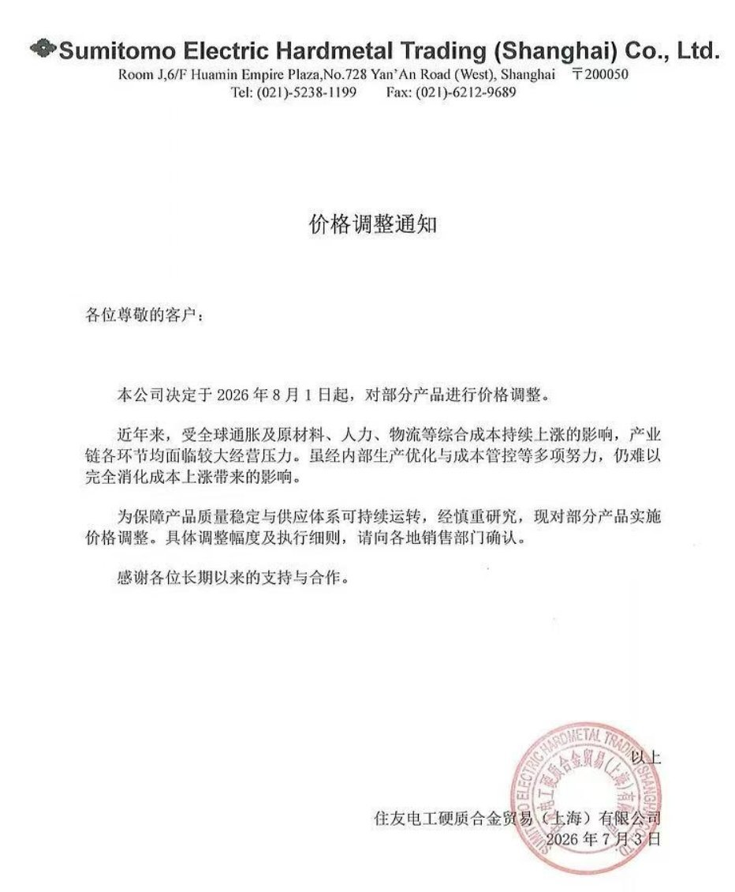

---

<!-- post_id: x:2073599305022398474 | ts: 1783219574 -->
## [X] 駿HaYaO · 2026-07-05 10:46

中國AI運算

中國國家算力網絡是「六大基礎設施網絡」項目的一部分，預計2026年將吸引人民幣7兆元投資。彭博報導，未來5年數據中心投資規模將達到約人民幣2兆元（約3000億美元）。

資本與技術正大幅轉向中國西部樞紐。與此同時，一線城市數據中心正轉型聚焦超低延遲熱運算、邊緣節點與AI推理服務。

與美國相比，中國已投入營運的吉瓦（GW）級大型叢集（具10萬片以上晶片規模）仍相對稀缺。不過，Range Intelligence已在今年內成功投運一座200MW、10萬片晶片規模的機房，作為更大GW級叢集布局的一部分。

典型GW級園區的工作負載分布為：Inference佔50%以上、Training佔20–30%、Full-stack R&D佔10–20%。

預計2026年國產AI加速晶片出貨量市佔率將超過50%，其中華為（20%）與T-Head(7%)領先國產陣營（儘管Nvidia整體仍佔55%市佔）。

國產晶片的每IT功率資本支出較進口晶片低40–50%。然而性能差距顯著：每單位運算力的資本支出高出2–4倍，而每IT功率的運算力僅為進口晶片的10–30%。

華為910B/910C伺服器平均每日token輸出量僅為Nvidia H800伺服器的1/6至1/3。因此，基於華為910B硬體的API服務利潤率大幅落後於Nvidia方案。

---

<!-- post_id: x:2073591258954489993 | ts: 1783217656 -->
## [X] 駿HaYaO · 2026-07-05 10:14

CXMT 的 DRAM 用於 iPhone

不預期蘋果會有意義地採用 CXMT 的 DRAM。
主要有三個原因：
(1) 美國對中國半導體的限制
(2) DRAM 品質需達到蘋果的規格要求（10Gbps+ 速度、1.1V 功耗、ECC 功能）
(3) DRAM IP 由韓國/美國主要晶片廠商擁有（若蘋果使用專利較少的晶片，可能引發訴訟）。

雖然 CXMT 可以鎖定低階 iPhone 18e，但實際 DRAM 訂單量不會太顯著，因為中國低階 iPhone 的銷售量較弱（高階機型更受歡迎）。蘋果可能會嘗試使用 CXMT 的 DRAM，來增加與韓國/美國三大 DRAM 廠商談判 2026 年下半年或 2027 年合約價格時的議價能力，但實際向 CXMT 採購的數量仍會很小。

---

<!-- post_id: x:2073396688254091607 | ts: 1783171266 -->
## [X] 駿HaYaO · 2026-07-04 21:21

軟銀成立「SB Neo」進軍美國Neocloud市場

軟銀公司與軟銀集團公司於2026年7月宣布，在美國共同成立SB Neo, Inc.（暫定名），由軟銀公司持股51%、軟銀集團持股49%，成為軟銀公司的合併子公司。

SB Neo將利用軟銀集團開發中的10吉瓦級能源與AI基礎設施，預計2028年3月（FY2027）正式推出neocloud服務，為美國大型企業及超大規模雲端業者提供大規模AI模型訓練與推論所需的運算資源。未來將分階段擴大規模，目標達到10吉瓦級AI基礎設施。

軟銀公司已在日本自2026年5月提供「Infrinia AI Cloud OS」驅動的GPU雲端測試版服務，將把累積的技術與經驗應用於美國市場。軟銀集團則負責提供美國現有的大型AI基礎設施支援。

孫正義表示，集團將共同打造世界級AI基礎設施，推動AI革命；宮川潤一則強調，將加速在美發展neocloud業務，並計畫在日本興建吉瓦級AI資料中心。
https://t.co/1JAH5ptIVa

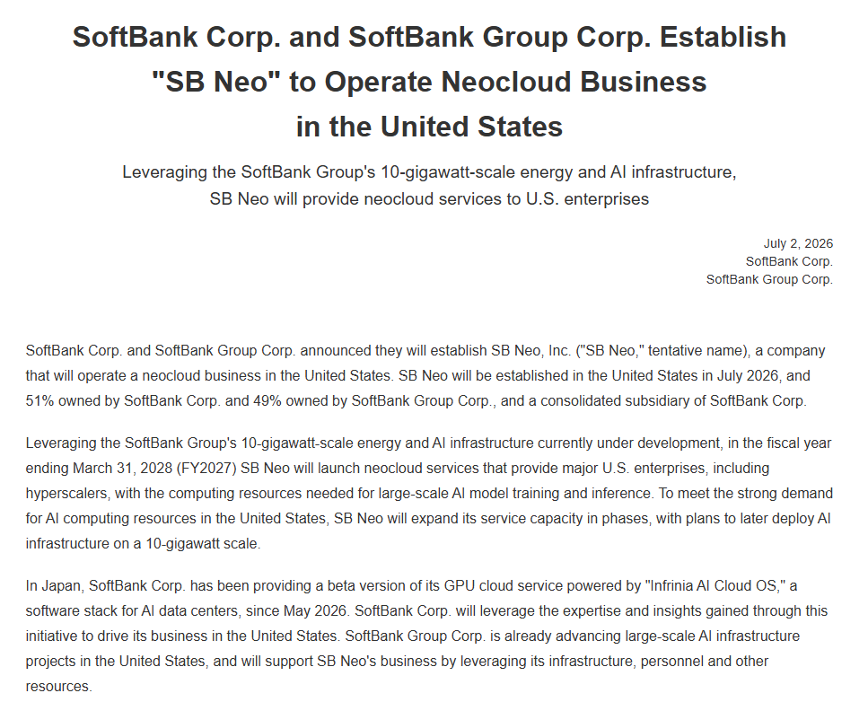

---

<!-- post_id: x:2073390796343234713 | ts: 1783169862 -->
## [X] 駿HaYaO · 2026-07-04 20:57

台積電 ( $TSM )

- N3 (3nm) 產能：2027年底預估上修至每月20萬片晶圓（先前預估19萬片），因N3已成為AI GPU與ASIC的主要產能瓶頸，隨著客戶陸續轉進先進製程所致。

- N2 (2nm) 產能：2027年底預估上修至每月14萬片晶圓（先前預估13萬片）。N2首年產出預計較N3首年高出45%。

- 先進封裝 (CoWoS)：2027年CoWoS季產能上調至每月28萬片晶圓（先前25萬片）。2027全年CoWoS總產能上修至273萬片晶圓（先前249萬片）。

- 資本支出上調：2027年資本支出上調至780億美元（先前700億美元），2028年上調至820億美元（先前740億美元），以確保AI建置需求。2026年資本支出維持560億美元不變。

- 毛利率上檔空間：2026~2028年毛利率預估分別上修至66.9% / 66.8% / 67.3%（先前64.9% / 64.7% / 66.5%）。更好的產品組合與定價能力，預計將輕鬆抵銷海外設廠帶來的稀釋效應。

---

<!-- post_id: x:2073284294852956527 | ts: 1783144470 -->
## [X] 駿HaYaO · 2026-07-04 13:54

Sivers Semiconductors 貸方 Bootstrap Europe 行使現有可轉換貸款之轉換權

Kista，2026 年 7 月 3 日Bootstrap Europe IV SCSp（「Bootstrap」） 將把 1,200 萬美元的可轉換貸款轉換為 Sivers Semiconductors AB (publ)（「Sivers」或「本公司」）的股份。董事會因此決議向 Bootstrap 發行 22,847,044 股新普通股。

背景
如 2026 年 2 月 24 日所公告，Sivers Semiconductors 已對所有現有外部債務設施進行再融資，與 Bootstrap 取得總額 1,700 萬美元的貸款設施。其中包括固定利率擔保可轉換貸款 1,200 萬美元。根據可轉換貸款的條款與條件，Bootstrap 有權將全部或部分未償還本金轉換為本公司普通股，轉換價格為每股 SEK 4.77。

轉換
Bootstrap 已行使其權利，將可轉換貸款全部未償還本金 1,200 萬美元轉換完畢。此次轉換將發行 22,847,044 股新普通股予 Bootstrap。新股付款方式為以 Bootstrap 對本公司之可轉換貸款債權進行抵銷。董事會已根據轉換通知決議發行該等股份。Sivers Semiconductors 財務長 Heine Thorsgaard 表示：「Bootstrap Europe 是極佳的策略性貸款夥伴，他們的轉換大幅減少了 Sivers 的未償還債務。這符合我們既定策略，持續強化資產負債表，並將投資重點放在把握三個快速成長的重點市場領域的重大商業機會。」

股本與股份數量
轉換後，本公司股份總數增加 22,847,044 股普通股，由 332,234,273 股增至 355,081,317 股普通股，對現有股東造成約 6.4% 的稀釋。本公司股本增加 SEK 11,423,522，由 SEK 166,117,136.50 增至 SEK 177,540,658.50。
$SIVE
https://t.co/MSX2XKvvgL

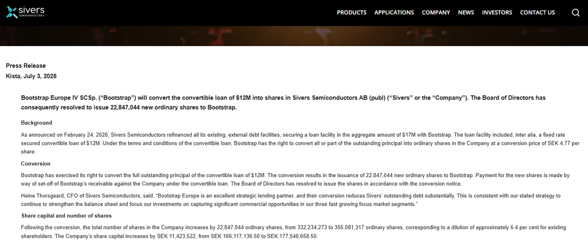

---

<!-- post_id: x:2073254975225184561 | ts: 1783137479 -->
## [X] 駿HaYaO · 2026-07-04 11:57

英飛凌( $IFNNY )德勒斯登新廠

德國半導體大廠英飛凌（Infineon）提前數月在德勒斯登正式啟用「Smart Power Fab」新廠，投資高達50億歐元（約9000億元台幣），為公司史上最大單一投資案。該廠將使德勒斯登基地產能倍增，成為全球最大的智慧功率半導體及類比/混合訊號技術工廠，並直接創造1000個新職位。

新廠聚焦功率半導體，應用於AI資料中心電源供應、電動車、再生能源（風力/太陽能）、電網及軟體定義車輛等領域。透過數位孿生、AI演算法及與奧地利Villach廠的「One Virtual Fab」整合，產能擴張速度可達過去兩倍，能快速因應市場需求。

英飛凌執行長Jochen Hanebeck強調，此舉強化全球領先地位，並為AI革命與關鍵供應鏈提供保障。德國總理Merz、部長Wildberger及薩克森州州長Kretschmer均表示，這是德國與歐洲技術主權及產業競爭力的重大里程碑。
https://t.co/M5zMpV2UUF

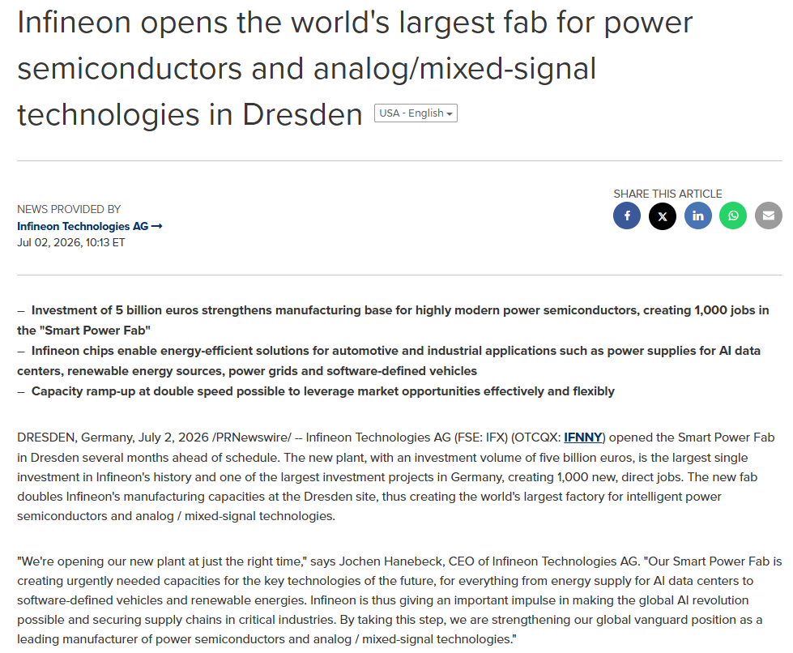

---

<!-- post_id: x:2073237793694945697 | ts: 1783133383 -->
## [X] 駿HaYaO · 2026-07-04 10:49

電子級氫氟酸產業
1. 產業背景：電子級氫氟酸在晶圓製造中的角色
電子級氫氟酸是半導體晶圓製造過程中關鍵的濕式電子化學品，主要用於清洗與蝕刻兩大核心工序，是單位晶圓耗量最大的濕式電子化學品之一。

清洗環節：氫氟酸用於去除晶圓表面的自然氧化層、金屬離子污染及顆粒殘留。隨著製程從 28nm 向 7nm 及以下演進，清洗步驟數從約 100 步增加至 200 步以上。在 3nm 製程中，由於極紫外光刻（EUV）對光刻膠表面缺陷的敏感度更高，清洗步驟進一步增至 300 步以上。每一步清洗均需使用稀釋氫氟酸（DHF）或緩衝氧化蝕刻液（BOE）。單片 12 吋晶圓在先進製程廠的耗酸量較 28nm 廠高出約 2-3 倍。

蝕刻環節：氫氟酸用於二氧化矽及氮化矽的選擇性蝕刻。在 3D NAND 快閃記憶體中，隨著堆疊層數從 128 層向 176 層、232 層乃至 300 層以上邁進，高深寬比蝕刻（High Aspect Ratio etch，簡稱 HAR etch）的次數呈指數級增長。更高的堆疊層數意味著更深的溝槽與孔洞，對氫氟酸的純度、蝕刻速率及蝕刻選擇比提出更嚴格的要求。

AI 算力拉動方面：AI 訓練與推理晶片（如 H100、B200、MI300 系列）採用先進製程與大尺寸晶片設計，單片晶圓面積較通用邏輯晶片更大，等效耗酸量相應提升。隨著 AI 資料中心資本開支持續擴張，台積電、三星、英特爾等頭部晶圓廠的先進製程產能利用率維持高位，直接拉動濕式電子化學品的消耗量成長。
根據 SEMI 數據，2025 年全球半導體設備支出約 1255 億美元，中國區占比持續提升，晶圓廠擴產是濕式電子化學品需求成長的底層驅動。

2. 邊際變化：價格、供給與認證
2.1 價格端
根據百川盈孚數據，2026 年 6 月 29 日相較年初，UP 級（對應 G3-G4）電子級氫氟酸價格上漲約 19%，UPS 級（對應 G5）上漲約 17%。價格上漲來自兩端：成本端螢石、硫酸價格上行形成支撐；需求端晶圓廠擴產帶動耗酸量提升，而日系供應商擴產節奏緩慢，供需邊際趨緊。

2.2 供給端事件
據韓媒 The Elec 報導（2026.5.14），韓國半導體材料企業所需無水氫氟酸約 90% 從中國進口，2026 年 5 月以來出現高價搶貨現象。該事件雖未構成「斷供」，但反映出日系產能瓶頸下，中國已通過認證的 G5 級供應商在供給端地位的提升。

2.3 認證進展
中國企業中，多氟多 G5 級電子級氫氟酸已向台積電、三星電子、華虹半導體、長鑫存儲等主流晶圓廠批量供貨。

3. 產業格局：日系主導與中國國內突破
日系主導格局：高端電子級氫氟酸（G5 級及以上）長期由日本企業主導，Stella Chemifa 是全球少數具備 G6 級電子級氫氟酸量產能力的企業，森田化學在 G5 級市場佔據主要份額。兩家日系企業均無在華規模化產能，中國下游廠商的電子級氫氟酸採購依賴進口或貿易商轉口。

中國突破難點體現在三個面向：
一、純度控制：根據 SEMI G5/G6 標準，G5 級要求金屬離子含量低於 10ppt，G6 級進一步要求低於 1ppt，對原料選型、設備材質、潔淨環境的要求極為嚴苛。

二、設備材質：電子級氫氟酸具有強腐蝕性，儲罐、管道、泵閥等接觸部件需採用 PFA（全氟烷氧基樹脂）等高純氟材料，以防止金屬離子析出造成二次污染。

三、批次一致性：半導體廠要求批次間的金屬離子含量、顆粒度、蝕刻速率等指標波動控制在極小範圍內，認證週期通常為 12-24 個月，新進入者從送樣到批量供貨需要較長時間的工藝磨合。
https://t.co/b2honkHLOF

---

<!-- post_id: x:2073231760398451118 | ts: 1783131945 -->
## [X] 駿HaYaO · 2026-07-04 10:25

華潤微電子有限公司
價格調整通知函
尊敬的各位客戶、合作夥伴：
衷心感謝您的信賴與鼎力支持，一路攜手同行、互利共贏！
當前全球半導體上游原材料、貴金屬、輔材、物流成本等持續攀升，晶圓製造、封測全鏈路成本大幅上漲。現供應鏈保供壓力巨大，斷料風險提高。我司仍持續推行精益生產、工藝優化、內部降本等舉措消化成本壓力，奈何本輪漲價週期久、漲幅高，內部降本空間已觸頂；疊加市場供需因素，綜合經營壓力難以獨自承擔。為保障穩定供貨、堅守產品與服務品質，經公司管理層審慎研究，決定對全系列產品上調價格，具體事宜通知如下：

本次價格調整相關事宜通知如下：
調整範圍：華潤微電子全品類業務。
調整幅度：上調幅度 15% 起。
執行時間：本次價格調整自 2026 年 7 月 1 日 起正式生效。

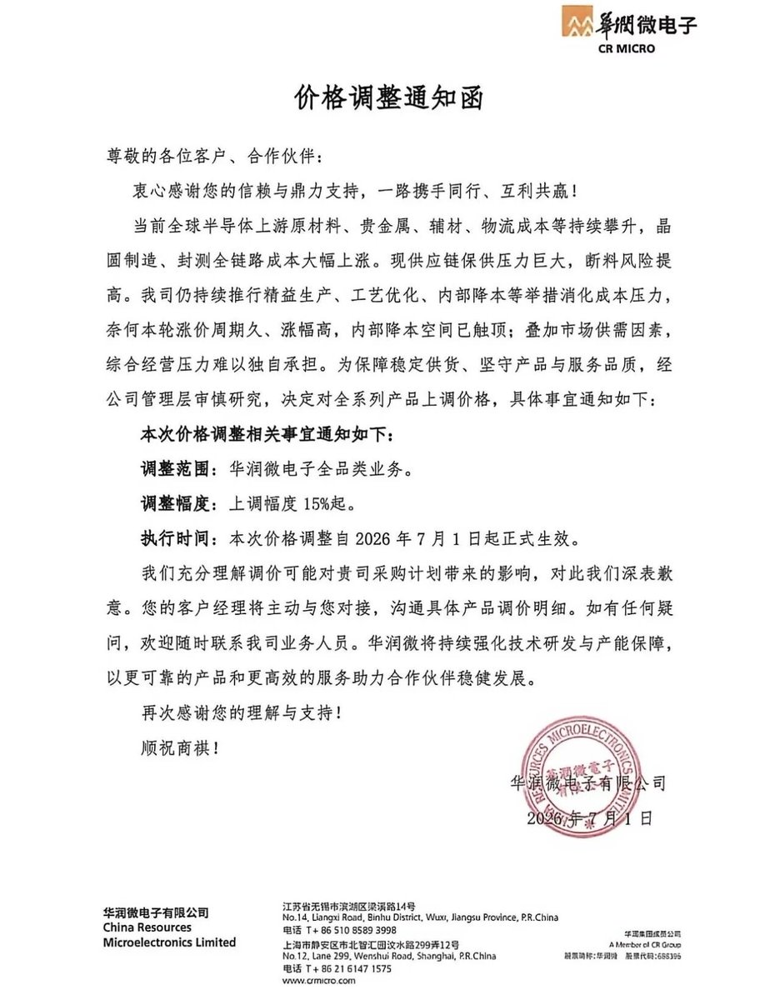

---

<!-- post_id: x:2073229944029913108 | ts: 1783131512 -->
## [X] 駿HaYaO · 2026-07-04 10:18

Analog Devices, Inc.
2026年7月3日
尊敬的客戶，
希望此信件到達時您一切安好。我在此與您聯繫，說明目前半導體供應正因需求全面增加而持續緊縮。此供應緊縮現已影響ADI部分產品組合，導致交期延長至最長六個月。

我們的目標是在此情況下繼續作為您值得信賴的類比夥伴，並提供最佳的客戶體驗。為達成此目標，我們懇請您至少提前六個月向您偏好的通路夥伴下單，並相應延長您的訂單積壓覆蓋範圍。訂單將依據交期執行。

及早延長訂單積壓覆蓋的客戶，將能最有利地確保供應並避免中斷。若延遲提前六個月下單，可能因需求持續超過近期供應，而導致更長的履行時間。
—-
Analog Devices是全球領先的高性能模擬、混合訊號與數位訊號處理（DSP） 半導體公司

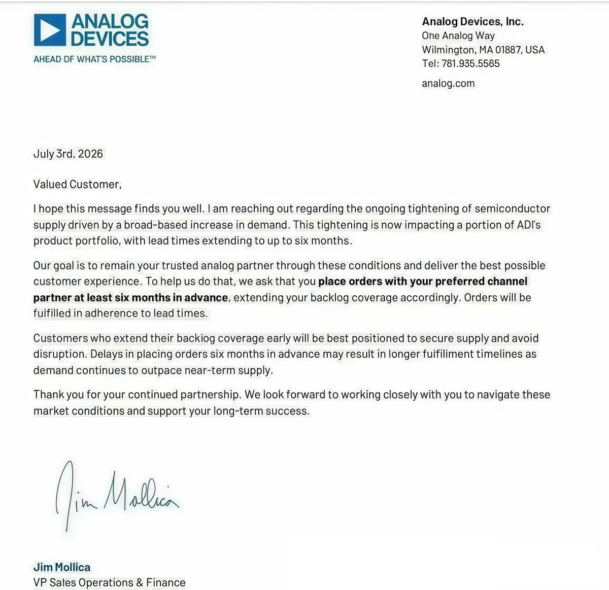

---

<!-- post_id: x:2073047930462671178 | ts: 1783088116 -->
## [X] 駿HaYaO · 2026-07-03 22:15

Intel Crescent Island AI GPU

Intel 在 Computex 2026 詳細揭露代號「Crescent Island」的下一代資料中心 AI GPU，基於 Xe3P 架構打造，專為agentic AI優化。

主要規格與特色：
- 採用 LPDDR5X 記憶體（非 GDDR/HBM），參考設計 160GB，最高可達 480GB，有效緩解 HBM 記憶體短缺問題。
- 預估使用 640-bit 匯流排，搭配 24GB LPDDR5X 模組，提供約 684 GB/s 頻寬。
- 功耗 350W，PCIe 擴充卡形式，氣冷設計，適合傳統 4U/5U 伺服器。
- 支援 FP4 至 FP64 多種資料類型，兼顧高效能推論與科學運算。
- 八張卡可提供 3.8TB 本地 GPU 記憶體，適合大型模型或多 AI 代理部署。

優勢分析：
使用 LPDDR5X 可讓更多 AI 資料靠近運算單元，減少資料搬移，提升推論效率；同時降低先進封裝壓力，更易大規模生產。搭配 Intel oneAPI 軟體堆疊，提供開放且 Day 0 就緒的開發環境。
Intel 表示 Crescent Island 將於 2026 年下半年推出，預計成為企業本地 AI 推論的重要解決方案。
https://t.co/7IdXNdpFtn

---

<!-- post_id: x:2073046591120826648 | ts: 1783087797 -->
## [X] 駿HaYaO · 2026-07-03 22:09

上週 JEDEC 宣布了 SPHBM4 的新標準：Standard Package High Bandwidth Memory（JESD330-4）。它使用與 HBM4 相同的 DRAM 堆疊，但換上不同的緩衝晶片（buffer die）。目標是讓 HBM 能夠在標準封裝中組裝，打破 AI 先進封裝的瓶頸。

概念很簡單：在維持 HBM4 效能的同時，大幅降低對昂貴且供應受限的先進封裝的依賴。

具體做法是將針腳數量大幅減少至原本的 1/5，但將訊號速度提高四倍至 32 Gbps。這讓 HBM 等級的頻寬得以在標準基板上實現，同時將連接距離拉長至 20mm，大幅改善散熱管理。

為什麼 SPHBM4 對基板產業是巨大利多：

- 大幅增加基板物理尺寸
傳統 HBM 必須緊貼 GPU 幾毫米之內，因為寬度極大的並行訊號在距離稍遠就會快速劣化。SPHBM4 採用高速序列通道（serial lanes），讓記憶體可以放置在最遠 20mm 之外。這額外的空間意味著單一封裝內可以容納更多 HBM，晶片封裝整體尺寸大幅增大，所需基板材料的總面積也跟著劇增。

- 層數大幅增加
要在有機基板上直接傳輸 32 Gbps 訊號，在電氣上極具挑戰性。為了避免資料損壞與電磁干擾，不能使用一般的低層數 ABF 基板。SPHBM4 將迫使產業採用高階、高密度 ABF（以及即將到來的玻璃基板），層數需達到 20 至 28 層以上，才能應付複雜的佈線、電源與接地屏蔽。高層數基板耗材更多、單次生產良率更低，將大幅推升基板工廠的需求並帶動價格上漲。

- 「民主化」HBM
目前 HBM 被先進封裝技術嚴重卡住瓶頸，只有少數專業晶圓代工廠（如 TSMC CoWoS）能生產，導致 HBM 僅限於超高階 AI 加速器。

SPHBM4 徹底改變局面。它讓一般標準封裝廠也能封裝 HBM，中階 AI 晶片、網路晶片，甚至消費級遊戲顯示卡都能採用。HBM 需求將持續高於供應商擴產速度。

結論：SPHBM4 將 AI 晶片的複雜工程負擔轉移
晶片廠商不再需要購買極度昂貴、專屬的「矽中介層 + ABF 基板」組合，而是全面轉向購買超大型、高層數 ABF 基板，甚至加速採用玻璃基板，把效能需求直接推到基板層上。
基板產業的繁榮，才正要開始。

---

<!-- post_id: threads:3933123187402990522 | ts: 1783084842 -->
## [Threads] 誠實豆沙包 · 2026-07-03 21:20

不敢搶了郭大俠跟黃老師的鋒芒，等事件較為冷卻後才來跟大家分享小故事

1.其實從MS查理的報告就能看到，Amazon消費性電子產品處理器其實3661早就在出了，而且是出Kindle的處理器，而創意是出echo的處理器。
2.Kindle的處理器單價算高的，以一個最極端的假設，把3661的消費性電子營收比重去除以Kindle出貨量，可以得到一個很低的單價（更何況3661的消費性還有Sony)。
3.就算之後可能有Echo處理器的單，但從創意營收可以算出來，假設超過100m顆，但佔創意營收可能也不到10%。對照郭大俠說的4000萬顆以上應該會更多，但營收貢獻就是各位心裡都有一把尺。
4.筆者認為如果郭大俠說的是對的，也未必對3661的評價是好事，畢竟消費性電子產品的ic or處理器肯定是aws做完前段，3661只負責後段整合跟physical design，這樣的角色不覺得有點像巨有嗎？而且各方人馬都專注在AI ASIC研發，你回頭做消費性電子相關？
5.今天有在傳3661的六月跟3Q26營收好像有點少，但這就等開出來吧⋯⋯

如果你覺得我講的不對，那你肯定是對的！

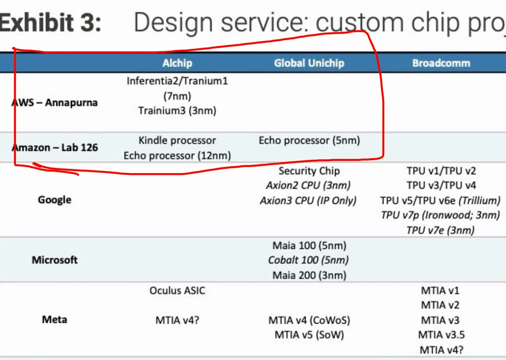
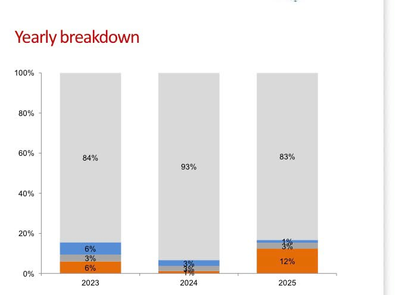

---

<!-- post_id: x:2073010531502571600 | ts: 1783079200 -->
## [X] 駿HaYaO · 2026-07-03 19:46

Sandisk BiCS10 332 層 1Tb TLC 開始送樣　位元密度提升 59%
Sandisk Corporation 宣布，第 10 代 BiCS FLASH 3D NAND 快閃記憶體技術 BiCS10 1Tb TLC 已正式進入工程樣品送樣階段。該產品採用 332 層堆疊架構，結合先進橫向縮放與優化平面布局，位元密度較第 8 代（BiCS8）大幅提升 59%，達到業界領先的超過 29Gb/mm²。

BiCS10 延續 CBA（CMOS 直接鍵合至陣列）技術，並新增 Toggle DDR6.0、SCA 協議及 PI-LTT 技術，NAND 介面速度最高達 4.8Gb/s，較前一代提升 33%。在功耗表現上，輸入功耗降低 10%、輸出功耗降低 34%，讀取與寫入能效也同步優化，特別適合 AI 時代資料中心與企業級 SSD 對高容量、低功耗、高效能的需求。

Sandisk 首席技術長 Alper Ilkbahar 表示，BiCS10 在 BiCS8 成熟基礎上進一步突破，將為下一代資料密集型與 AI 工作負載提供更強大的儲存解決方案。該產品將由Kioxia日本岩手北上 Fab2 工廠生產，預計未來逐步量產。
https://t.co/WnEbUYEd0o

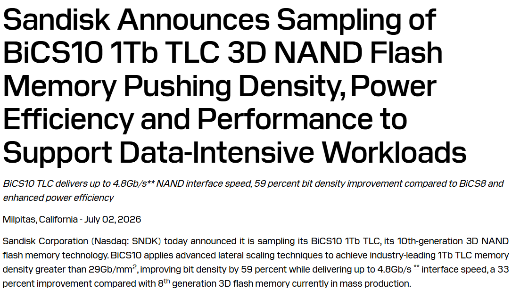

---

<!-- post_id: x:2073009030751224069 | ts: 1783078842 -->
## [X] 駿HaYaO · 2026-07-03 19:40

TrendForce: 3Q26記憶體價格持續受AI server需求支撐，惟因消費端壓力擴大、高基期影響，漲幅收斂

TrendForce最新報告，2026年第三季記憶體市場仍受AI server需求強力支撐，但消費端壓力擴大加上高基期影響，價格漲幅明顯縮減。

預估一般型DRAM合約價季增13-18%，NAND Flash合約價季增10-15%。雖然整體供需仍緊，但PC、智慧手機等消費客戶承受力已達極限，導致漲勢趨緩。

- PC DRAM：OEM庫存回補提供支撐，但高成本原料推升整機價格，衝擊全年出貨；原廠持續轉產能至server，供給受限。

- Server DRAM：AI應用與RDIMM需求強勁，供不應求延續，惟長約限制使漲幅收斂。

- 智慧手機LPDRAM：品牌調漲售價平衡成本，需求進一步衰退，但供給緊繃仍支撐價格上行。

- Graphics DRAM：GDDR6/7需求偏弱，然產能轉移使供給維持緊缺，價格隨主流DRAM上漲。

- Client SSD：OEM庫存偏高，買方抗漲，漲幅壓縮。

- Enterprise SSD：原廠擴產，但DRAM短缺導致小容量高速產品仍吃緊，價格維持上漲。

- eMMC/UFS：手機下半年備貨低迷，供給相對充足，漲勢趨緩。
https://t.co/DjoBgpZ1VR

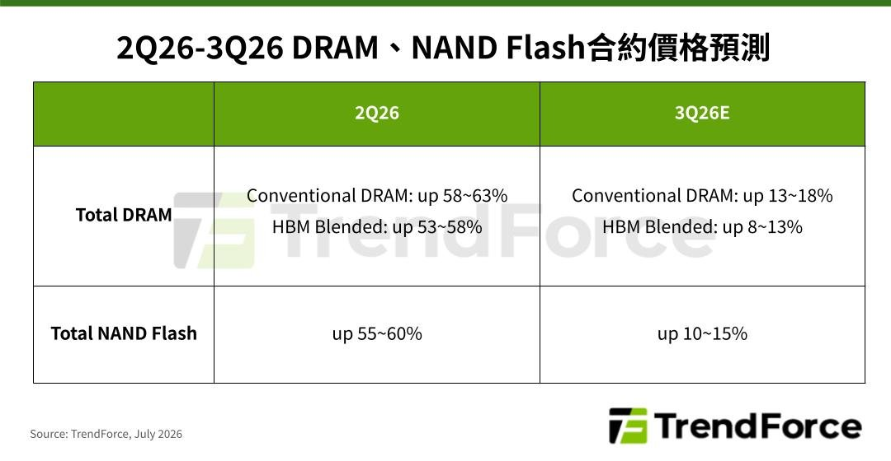

---

<!-- post_id: x:2072963114992062523 | ts: 1783067895 -->
## [X] 駿HaYaO · 2026-07-03 16:38

MICROCHIP（ $MCHP ）
日期：2026年6月29日
主旨：價格調整通知

尊敬的客戶：
我們在此通知您，Microchip 將對其廣泛產品組合中的部分產品進行價格調整。這些調整將於 2026年8月14日 起適用於所有訂單和出貨。

此次調整反映了持續的市場壓力，包括原料、勞工、物流和能源成本的上漲。儘管我們持續致力於營運效率，但仍無法完全抵銷來自供應商、組裝廠及晶圓代工合作夥伴的製造成本大幅上升。

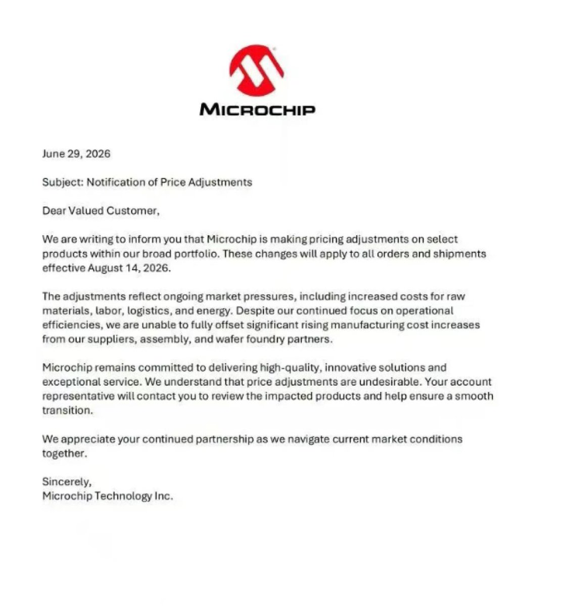

---

<!-- post_id: x:2072928687901794371 | ts: 1783059687 -->
## [X] 駿HaYaO · 2026-07-03 14:21

AXT-Tongmei 與 Coherent 簽署 3 年晶圓供應協議

2026 年 7 月 2 日 美國東部時間下午 5:13
AXT-Tongmei, Inc.（AXT, Inc. 之子公司）已與 Coherent Corp. 簽訂「開發與供應總協議」（Master Development and Supply Agreement），自 2026 年 6 月 25 日起生效，該協議已依 SEC 申報文件揭露。

本協議涵蓋開發與供應 6 英寸銦磷（InP）晶圓基板，初始期限為三年。根據協議條款，Coherent 將向 AXT-Tongmei 支付 22,288,500 美元的預付款，以換取承諾的供應產能。

AXT 已同意於 2026 年至 2028 年期間擴大其中國北京廠房的製造產能，以滿足此承諾。協議已訂定特定每片晶圓價格，且預付款將用於抵扣未來產品採購，直至全額使用完畢。

預付款若未全額使用，Coherent 有權單方面選擇全額退款（於協議到期或終止時）。若 Coherent 未達到最低訂購量要求，則剩餘未使用之預付款將成為不可退還，且 AXT 有權終止協議。若 AXT 連續超過六個曆月未能履行產能承諾，Coherent 可終止協議，並有權就未使用部分獲得退款。

超過承諾數量的任何額外產能，將以相同條件提供給 Coherent。

協議包含標準保密條款、不可抗力、賠償及保證等規定。完整協議預計將作為 AXT 截至 2026 年 6 月 30 日止期間 Form 10-Q 報告之附件提交。

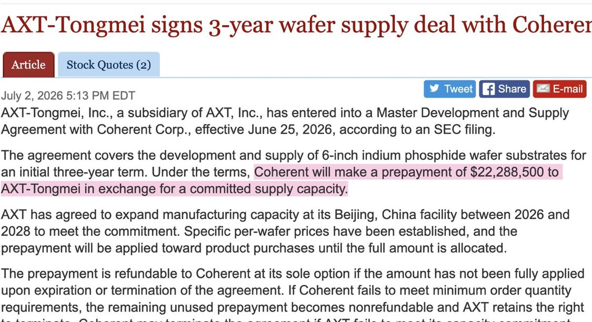

---

<!-- post_id: x:2072843686493507912 | ts: 1783039421 -->
## [X] 駿HaYaO · 2026-07-03 08:43

#每日導讀 #20260703 #經濟日報

英特爾傳搶下Google下一代TPU先進封裝訂單，台積電CoWoS面臨分流壓力
台股外資單日倒貨890億元，內資撐盤收斂跌幅至274點
台積電200億美元增資美國亞利桑那廠獲投審會通過

📖 完整導讀 → https://t.co/akZc5AgZQV

---

<!-- post_id: x:2072837626151965126 | ts: 1783037976 -->
## [X] 駿HaYaO · 2026-07-03 08:19

早安！7/3 外電綜合整理

- 2330台積電: 美系升目標
美系券商上修到明年底N3／N2 晶圓產出產能為：200kwpm/ 140kwpm。上修明年CoWoS產能至280kwpm。上調明年資本支出至780 億美元。上修26-28年毛利率，尤其後年有望達到67.3%。N2需求暢旺，首年晶圓產出比N3的首年高出45%。預期N2／A16 產能於 2026–2028 年的CAGR有70% 。綜上，上修26-28年EPS至$103/$136/$175，以明年22xPE評價，同步升目標。

- 8299群聯: 美系升目標
美系大行認為2Q報價及出貨趨勢有望由於預期，因Kioxia 提供額外供貨。預估3Q營收季增2成，為全年最高，且毛利率有望優於市場擔憂。產業觀察上，明年依舊吃緊，不過後年的供給紀律列入觀察重點，券商的base case 先假設供給仍維持相當程度的紀律，不過預估供需缺口有縮小。再加上券商的house view 喜歡記憶體原廠，勝於模組廠，故對群聯評等上維持EW，但調升26-28年EPS，以明年19xPE評價，同步升目標。

- 載板產業觀察：
亞系券商強調高階載板需要更高產能，以及設備交期持續拉長，預期高階載板供需缺口至 2028 年將進一步擴大至 30%。AI 加速器目前已占 ABF 總需求的 40%，而且所需產能是一般 PC CPU 載板的 30 倍。而且僅有少數供應商能提供高階載板。券商認為2Q漲價高於預期，且稼動率回升，對該產業重申正向。

 #下次會考

---

<!-- post_id: x:2072735262288076880 | ts: 1783013570 -->
## [X] 駿HaYaO · 2026-07-03 01:32 _(接續 2 則)_

艦長J快訊   基本假設開始遇到挑戰？
2026/7/3

這波大多頭的基本前提是：模型商快速成長＆開始賺錢、因此可以積極購買算力讓CSP快速回收資金、CSP 藉此積極下單採購原物料搶產能、零件商供不應求天天喊漲價。

美好的循環奠基於AI實際賺錢的速度是否仍在高檔，但最近雜音變多了。

從一些市場統計資料來看，至少短期的算力需求略有不如預期、算力價格也略有下滑，再加上META 忽然開始要跟其他CSP一樣出租算力，怎麼看都不像好事。當然有各種論點說甚麼影響不大之類的，但通常遇到這種消息我都喜歡反過來看，如果今天是META宣布算力滿載要加碼投資... 市場會予以駁斥說這不算好消息...嗎？

至於短線籌碼混亂.... 這也好一陣子了，比如牛熊指標破9 進入市場極度貪婪狀態、融資餘額等槓桿工具使用率維持在高檔... 等等。基期已高評價不便宜，市場很容易出現大幅波動。

大方向我還是樂觀的，ARR成長趨緩也可能只是暫時的，但.... 短線上需要戒慎恐懼的地方變多了，持股比重也該做好控制。

投資總有風險，本人過去績效不做未來獲利之保證。最近詐騙猖獗，本人不收會員、不用追蹤、不騙流量、不需粉絲、更不必按讚分享開啟小鈴鐺。快訊僅供好友交流之用，有股票推薦就是準備倒貨；如果你與我看法不同，你肯定是對的千萬不要被我影響。
#下次會考

https://t.co/tO1El6TGpi

---

<!-- post_id: x:2072724121306484982 | ts: 1783010914 -->
## [X] 駿HaYaO · 2026-07-03 00:48

Intel |  $INTC

關鍵重點
- 首次將 Intel Foundry（Intel 代工）納入 SOTP（分部加總）估值，理由是外部客戶參與度持續成長。
- 將 2026 年伺服器 CPU 出貨量成長預估由 20% 提高至 25% 年增。
- 將 2027 年伺服器 CPU 出貨量成長預估由 20% 提高至 30% 年增。
- 2027 年 DCAI 營收預估 $33.0 億美元，較市場共識高出 20%。
- 指出Intel 18A 製程「進展超前內部預期」。

「在 4 月 21 日的升評「買入」報告中，強調未計價的伺服器 CPU 上漲潛力是主要催化劑，當時因外部客戶相關不確定性而未將 Intel Foundry 納入 SOTP 估值。自那之後，代工產能瓶頸（前端與後端）已廣為市場所認知，且Intel 與外部客戶的合作參與度持續增加，預期設計定案將自 2026 年下半年開始。因此，決定將 Intel Foundry 納入 SOTP 估值，這也是本次目標價大幅上調的主要驅動因素。

Intel 已做好準備，可在 2026/2027 年透過內部代工產能重新分配，為伺服器 CPU 出貨帶來顯著上漲空間。針對 2026 年，將伺服器 CPU 出貨成長預估由 20% 提高至 25% 年增，帶動 DCAI 營收預估來到 24.1 億美元（較共識高 4%）。雖然 2026 年的差距已縮小，但認為市場仍低估 2027 年的成長潛力（儘管自Intel 2026 年第一季財報後，共識已上修 23%）。將 2027 年伺服器 CPU 出貨成長預估由 20% 提高至 30% 年增，這得益於伺服器 CPU 產能擴張，以及 18A 製程超前內部預期的量產進展。 2027 年 DCAI 營收預估為 33.0 億美元，較市場共識高出 20%。」

---

<!-- post_id: x:2072720446295093736 | ts: 1783010038 -->
## [X] 駿HaYaO · 2026-07-03 00:33

Intel Core Ultra 200S Plus CPU 悄悄調漲價格

Intel 於 2026 年 7 月 2 日悄悄上調 Core Ultra 200S Plus 系列的官方建議零售價。原被譽為近年最佳性價比的 Arrow Lake Refresh 處理器因此魅力減弱。

- Core Ultra 7 270K Plus：原價 $299 → 現 $339–$349（漲約 $40–50）
- Core Ultra 5 250K Plus：原價 $199 → 現 $219–$229
- Core Ultra 5 250KF Plus：原價 $184 → 現 $214

目前 Amazon 等零售商實際售價尚未完全跟進，但預期將逐步調整。Plus 系列於 3 月推出，以親民價格提供強悍生產力與不錯遊戲效能，曾被視為 Intel 近年少見的亮點。如今漲價後，其對 AMD Ryzen 的競爭優勢可能受影響。Intel 正努力搶回市佔，此舉恐不利後續銷售。
https://t.co/HYNmWdSLMx

---

<!-- post_id: x:2072718306126311482 | ts: 1783009528 -->
## [X] 駿HaYaO · 2026-07-03 00:25

Anthropic 與三星洽談合作 自研 AI 晶片再添新進展

據《The Information》7月2日報導，AI 公司 Anthropic 已啟動自研 AI 晶片的早期工作，並正與三星電子就定制芯片製造展開深入洽談。這是 Anthropic 加強掌控高成本運算基礎設施的重要一步。

目前 Anthropic 處於定義處理器功能、性能指標與伺服器適配方案的階段，已與多家晶片設計公司接觸，但尚未進入詳細設計與量產階段。該公司近期更從 OpenAI 挖角定制晶片團隊早期成員 Clive Chan，顯示其決心加速布局。知情人士指出，自研晶片可望大幅降低模型推理成本，並在與 Google、Amazon、Microsoft 等巨頭的基礎設施競爭中取得優勢。

與其他 AI 廠商相比，Anthropic 入局較晚。Google、Amazon 早已推出自家晶片，OpenAI 也在 2024 年委託博通打造推理晶片 Jalapeño，並已於上月發表。而 Anthropic 目前仍以租用 AWS Trainium、Google TPU 及 Nvidia GPU 為主，並未完全依賴單一供應商，此策略使其在硬件選擇上更具彈性。

三星成為 Anthropic 的潛在合作夥伴並非偶然。今年 5 月，三星與 SK 海力士、美光共同參與 Anthropic 高達 650 億美元的融資。三星正積極擴大代工業務，計劃投入巨資興建先進製程工廠。若合作成功，將是三星在 2 奈米先進製程上的一次重大勝利，有助其追趕台積電在 AI 晶片領域的領先地位。Anthropic 考慮採用三星 2 奈米製程與先進封裝技術，以提升能效與記憶體整合效率

---

<!-- post_id: x:2072717764872352082 | ts: 1783009399 -->
## [X] 駿HaYaO · 2026-07-03 00:23

NVIDIA 擬從部分客戶雲收入中抽成

NVIDIA 正利用雄厚資金實力，推出「AI計算合作夥伴計劃」，協助新興雲端服務商採購昂貴GPU，並從中抽取部分雲端收入作為回報。該計劃核心為提供財務兜底：若雲端服務商無法將GPU租給AI開發者，NVIDIA 將以保底價格租回未使用算力。

據知情人士透露，此舉相當於NVIDIA 擔任「AI晶片中央銀行」，為信用評級較低的小型雲商提供融資便利。一位資料中心高階主管形容為「一石二鳥」——既解決GPU採購融資難題，也降低資料中心整體融資門檻。

目前亞馬遜、微軟、谷歌等巨頭主導NVIDIA 晶片採購，NVIDIA 希望藉此扶植CoreWeave、Lambda、Firmus、Sharon AI等新興雲端服務商，減少對大廠的依賴。此前NVIDIA 已向這些公司投資數十億美元，並承諾買斷CoreWeave至2032年未售出容量（價值63億美元），使其股價大漲近30%。

此模式為NVIDIA 全新業務領域，雖然尚未大規模承諾，但已釋放強烈訊號：NVIDIA 不僅賣晶片，更深度介入雲端生態與融資鏈條。分析認為，此舉可能引發監管關注，也將考驗NVIDIA 在AI需求波動時的財務風險承擔能力。

---

<!-- post_id: x:2072679682756301117 | ts: 1783000319 -->
## [X] 駿HaYaO · 2026-07-02 21:51

RT @pcbanalysis: 大概算了一下目前可供應HVLP4的廠商約略9-10家，CCL廠正加快驗證中，可以關注一下韓系樂天..中系銅冠德福 https://t.co/HpnKbSa5xA

---

<!-- post_id: x:2072651319698186515 | ts: 1782993557 -->
## [X] 駿HaYaO · 2026-07-02 19:59

住友電工 光通信半導體材料產能增至3倍　因AI需求上調原有計劃

住友電氣工業將擴大用於光通信零件的半導體材料生產。公司將投資180億日圓，在2028年度前把生產能力提升至2024年度的3.1倍。

此次增產規模高於原有計劃。為因應AI普及帶來的資料中心內光通信零件需求增加而做出調整。

此次增產的半導體材料為「磷化銦基板」（Indium Phosphide Substrate）。公司將強化位於兵庫縣伊丹市的伊丹製作所現有設備。

---

<!-- post_id: x:2072649990712050151 | ts: 1782993240 -->
## [X] 駿HaYaO · 2026-07-02 19:54 _(接續 2 則)_

三星電機 與住友化學子公司合資設立GlaSSEM玻璃芯基板公司

住友化學 宣布，其韓國全資子公司東友精細化工已與三星電機簽署正式合資協議，共同設立新公司GlaSSEM（暫定名），專注開發、製造與銷售先進半導體封裝用玻璃芯基板。新公司預計2026年完成設立，總資本額4821億韓元，三星電機持股66%、東友精細化工持股34%，總部位於韓國平澤。

因生成式AI、資料中心及高效能運算需求激增，半導體需更高積體度與低功耗，封裝基板也朝大型化、高密度化發展。玻璃芯基板具備高剛性、低翹曲、低熱膨脹等優點，能有效提升可靠度與配線密度，是次世代封裝的關鍵材料，特別適合AI晶片未來的大型化需求。

東友精細化工擁有豐富的玻璃處理技術、大面積基板自動化經驗及高潔淨度製程能力；三星電機則具備先進封裝基板設計、量產化專業與高性能領域的品質可靠度。雙方將整合技術與資源，目標2027年下半年建立供應體系，逐步擴大產能。

https://t.co/AcGpVmG8G5

---

<!-- post_id: x:2072631485090484555 | ts: 1782988828 -->
## [X] 駿HaYaO · 2026-07-02 18:40 _(接續 2 則)_

台積電200億美元投亞利桑那　經濟部投審會通過

主要核准案件
- 台積電：獲准以 200億美元 增資美國子公司 TSMC ARIZONA CORPORATION。
- 用途：用於建置 12吋晶圓廠 及 先進封裝廠，擴大亞利桑那州鳳凰城廠區先進製程與封裝產能。

其他同步通過的重要對外投資案
- 台塑：以約2.92億美元，將美國子公司股權轉增資。

- 南亞科：以10億美元增資海外公司，主要用於美元定存避險。

- 廣達：以6億美元投資美國，從事電腦及周邊設備組裝加工。

- 光寶科：以9.19億美元增資美國子公司，擴大光電產品與伺服器電源業務。

- 台燿：以約0.49億美元（16億泰銖）增資泰國廠，生產銅箔基板與黏合片。

- 富邦人壽：以約1.93億美元（英鎊1.43億）增資海外公司，從事不動產租賃。

僑外投資（外資來台）

- 荷蘭禮來公司：約35.77億元新台幣，用於西藥批發業務。

- 英商：約31.72億元新台幣，從事一般投資業務。

https://t.co/KOQZ1J2xPT

---

<!-- post_id: x:2072624321034596546 | ts: 1782987120 -->
## [X] 駿HaYaO · 2026-07-02 18:12

Tema 聯手 SemiAnalysis 推出兩檔 AI 基礎設施新 ETF
2026 年 6 月 30 日，Tema ETFs 正式推出 Tema 記憶體 ETF（ $DISK  ） 與 Tema 光子與光學 ETF（ $LAZR  ），這是與全球知名半導體研究機構 SemiAnalysis 首次合作的產品，專注解決 AI 發展的兩大關鍵瓶頸。

$DISK（記憶體 ETF） 聚焦全球記憶體晶片供應鏈，包括 HBM、高頻寬記憶體、DRAM、NAND 及重要亞洲企業。隨著 AI 運算需求暴增，全球記憶體晶片市場預計從 2025 年 2,160 億美元成長至 2027 年 7,580 億美元，增幅超過三倍。

$LAZR（光子與光學 ETF） 則鎖定光子學與光學技術企業，應對銅線傳輸極限，改以光技術加速資料傳輸。相關市場機會預計 2026 至 2028 年成長九倍。

兩檔 ETF 皆為主動管理型，費用率 0.75%，在 NYSE 上市。Tema 總裁 Steve Munroe 表示，此產品結合 Tema 的投資專業與 SemiAnalysis 的深度研究，提供機構級、純粹的 AI 基礎設施曝險，填補市場空白。

https://t.co/CNRVgvuh86

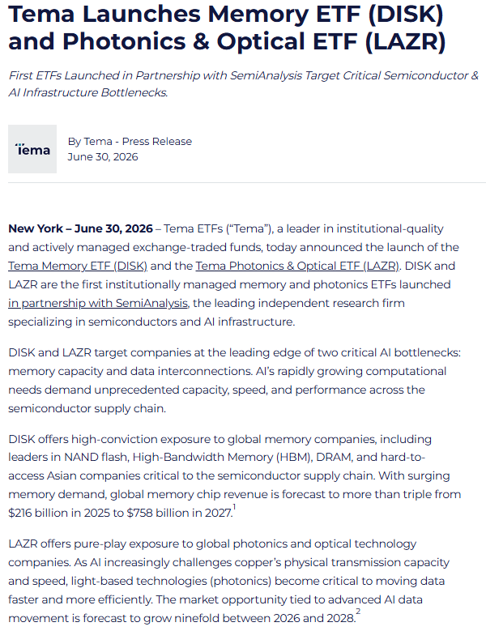
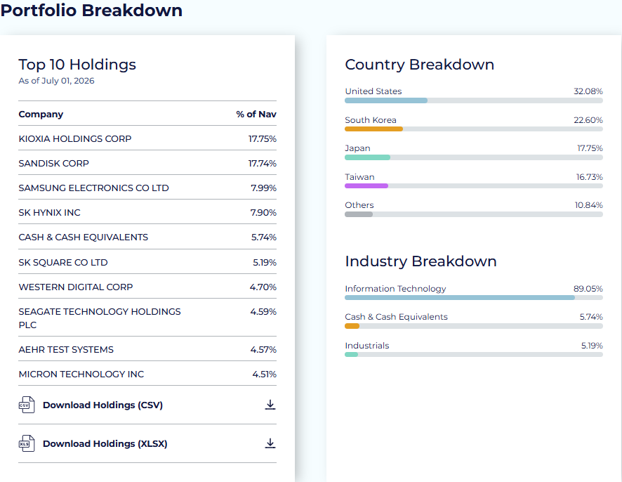
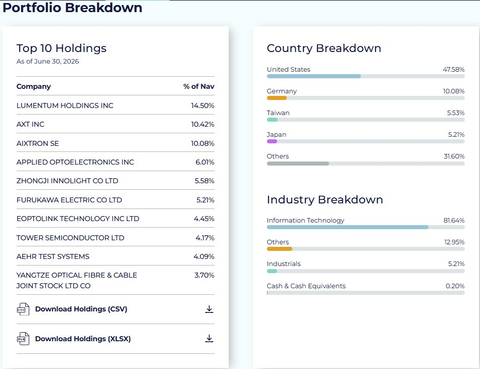

---

<!-- post_id: x:2072623068480979293 | ts: 1782986821 -->
## [X] 駿HaYaO · 2026-07-02 18:07

旭化成、台灣半導體基板用材料新工廠　當地加工能力提升4成
旭化成 將在台灣設立半導體封裝基板（package substrate）用材料的新工廠。將強化基板電路形成工程中所使用的感光性薄膜裁斷工序。

台灣當地的加工能力將提升約4成，加速因應人工智慧（AI）半導體的強勁需求。

感光性薄膜「SUNFORT（サンフォート）」的加工能力將獲得提升。SUNFORT 用於半導體封裝基板等電路描繪工序。
https://t.co/J5Lr5iEHOH

---

<!-- post_id: x:2072607087675531346 | ts: 1782983011 -->
## [X] 駿HaYaO · 2026-07-02 17:03

SiTime 完成收購 Renesas 時序業務
SiTime Corporation（Nasdaq: SITM）於2026年7月1日正式宣布，已完成收購 Renesas Electronics 的時序業務。此交易標誌 SiTime 成為全球領先的純正精密時序公司，加速邁向10億美元營收目標。

SiTime 董事長兼執行長 Rajesh Vashist 表示，這是公司發展的重大里程碑。收購後，SiTime 時脈產品組合將擴大10倍，強化在高成長 AI 資料中心市場的布局，並將毛利率提升至更高水準。未來 SiTime 不僅提供振盪器，更將成為時脈與諧振器的首選解決方案。

Renesas 時序業務擁有30年歷史，毛利率長期維持約70%，服務超過10,000家客戶，其中近75%營收來自 AI 資料中心與通訊領域，其餘來自工業與汽車。收購後12個月內，預計貢獻至少3億美元營收，在 SiTime 銷售通路加持下成長動能強勁。

Renesas 執行長 Hidetoshi Shibata 表示，雙方將展開策略合作，將 SiTime 的 MEMS 諧振器整合至 Renesas 嵌入式運算產品，共同開發下一代智慧裝置。Shibata 也預計加入 SiTime 董事會。兩家公司已於2026年2月簽署合作備忘錄（MOU）。
https://t.co/vPN6dsVZAK

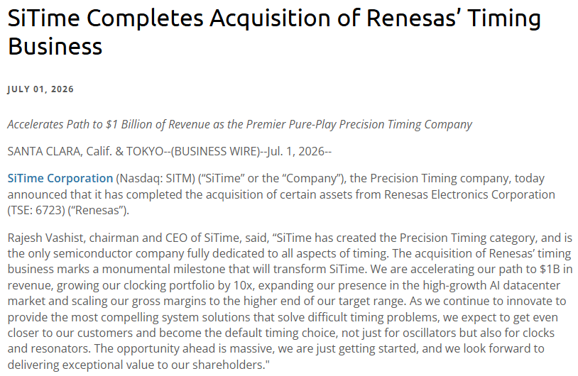

---

<!-- post_id: x:2072604949872361767 | ts: 1782982501 -->
## [X] 駿HaYaO · 2026-07-02 16:55

SCI 定價更新（七月）：E-玻璃纖維布價格漲幅明顯加速
- Spec 7628：環比上漲 16%（+人民幣 1.2–1.3 元/米），高於六月的 +10%。
- Spec 2116：環比上漲 16%（+人民幣 1.5 元/米），高於六月的 +10%。
- Spec 1080：環比上漲 15%（+人民幣 1.5 元/米），高於六月的 +11%。 https://t.co/XNUuqypusg

---

<!-- post_id: x:2072602804661948831 | ts: 1782981990 -->
## [X] 駿HaYaO · 2026-07-02 16:46

Socionext 採用台積電 A14 製程 開發 AI 資料中心高效能運算晶片

日本客製化 SoC 領導廠商 Socionext 於 2026 年 7 月 1 日宣布，將採用台積電最先進的 A14 製程技術，開發高性能運算 chiplet，以滿足人工智慧資料中心對高階 SoC 的強勁需求。

根據計畫，Socionext 預計於 2026 年 9 月 完成多核心裝置的設計定案（tape-out）。此晶片將作為技術驗證平台，用以測試 CPU 與 xPU 架構的可擴展性，支援 AI 超大規模資料中心及其他運算密集型應用。

新裝置整合高性能、低功耗且具系統可擴展性的運算 chiplet，累積的設計經驗將加速後續量產型 AI/xPU SoC 的開發。Socionext 憑藉多年先進製程多核心設計經驗，與台積電深化合作，降低領先技術開發風險，並縮短客戶產品上市時間。

Socionext 社長兼營運長吉田壽人表示，受 AI 資料中心需求推動，此合作凸顯先進運算平台的重要性，公司將持續投入 A14 等領先技術，為客戶提供最高效能與最快上市解決方案。

https://t.co/Q3KiNjo8G2

---

<!-- post_id: x:2072589764918976759 | ts: 1782978881 -->
## [X] 駿HaYaO · 2026-07-02 15:54

與產業專家訪談：為何到2028年公共雲端達到80%的目標，對大多數企業（$MSFT、$AMZN、$GOOGL）來說雖然具野心，但仍可達成：

- 專家指出，目前基礎架構的比例大約是：40% 自有機房（on-prem）、40% 私有雲端、20% 公共雲端。隨著積極遷移，更多工作負載正移向公共雲端。自有機房預計在未來兩年內降至約20%，但專家認為不會再進一步下降，部分工作負載將永久留在自有機房。

- 根據專家，基礎架構策略是由企業整體層級決定，而非個別業務部門，明確目標是2027或2028年達到80%以上在公共雲端。唯一例外是敏感資料，某些團隊可能遷移較慢，若能提出合理的業務理由，可申請延期。

- 專家估計，約60-70% 的工作負載會受益於更快的查詢效能，主要瓶頸包括各業務單位間的資料佈局不一致、大規模運算與並行處理能力，以及即時資料新鮮度與成本之間的權衡。

- 專家解釋，對於客服中心等營運工作負載來說，支付3倍價格換取更快效能是顯而易見的決定，因為縮短通話處理時間和提升會員體驗，能快速回本。對於夜間分析工作負載，專家則較持懷疑態度，質疑若能透過更聰明的排程在無額外成本下達到相同效果，是否值得支付溢價。

- 專家認為，目前模型訓練與微調的工作負載尚可管理，但隨著各業務單位採用增加，預計未來一年內將出現效能瓶頸。到時效能會是首要問題，成本則緊隨其後。企業常低估持續性成本，初期對 upfront 投資有清楚認知，卻容易被長期維護實際成本嚇到。

---

<!-- post_id: x:2072589529622659522 | ts: 1782978825 -->
## [X] 駿HaYaO · 2026-07-02 15:53

台灣供應鏈查核顯示，超大型雲端業者自製 AI 加速器進入全面量產階段。微軟 Maia、亞馬遜 Trainium 3 與 Meta MTIA 三大計劃同步加速，打破以往單一主導局面，未來將與 Google TPU 共同形成多重並行需求引擎，強力支撐 AI 供應鏈成長。

其中，報告上調亞馬遜 Trainium 3 在 2026 及 2027 年的出貨預估至 180 萬 / 280 萬台，主因晶圓分配改善、良率提升，量產進度優於市場共識；若下半年晶圓廠再增加分配，還有額外上檔空間。Trainium 3 自五月起已貢獻世芯電子營收，六月急劇爬坡更帶動智邦科技加速器卡強勁銷售。

此外，Meta 已選定創意電子（GUC）負責下一代 MTIA ASIC，這是創意電子繼微軟 Maia 200 之後拿下的第二大超大型雲端 ASIC 專案，預計 2026 下半年量產，2027 年貢獻顯著營收，進一步強化其成長動能。

報告強調，未來不再依賴單一 hyperscaler 專案，而是 AMZN、MSFT、META、GOOGL 四強並進，為台灣 AI 供應鏈帶來多點開花的正面契機，尤其利多智邦科技、世芯電子、創意電子三大廠商

---

<!-- post_id: x:2072581005727432849 | ts: 1782976793 -->
## [X] 駿HaYaO · 2026-07-02 15:19

辰景半導體股份有限公司
漲價通知函
尊敬的客戶：
您好！衷心感謝貴司對我司的鼎力支持、厚愛！
近期受全球半導體產業鏈波動影響，Nor Flash芯片核心原材料及晶圓、封測等生產環節成本持續攀升，導致我司整體生產成本上浮。為保障Nor Flash 產品的穩定供應，經我司審慎評估，決定對Nor Flash全系列產品價格做適度調整，具體如下：
1. 調整產品範圍：全系列 Nor Flash。
2. 調整幅度：在現有價格基礎上調 25%。
3. 生效時間：2026 年 7 月 6 日起，所有新簽訂單及未交付訂單的未執行部分均按照新價格執行。

此次價格調整系原材料和生產成本持續上漲，為維持產品良性運轉的考量，供應價格波動可能對您的業務規劃帶來一定影響。

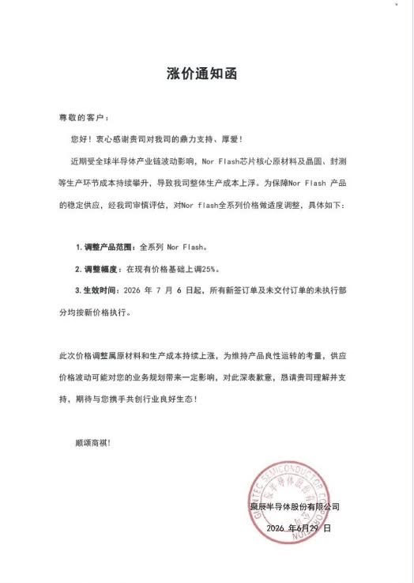

---

<!-- post_id: x:2072574744042537423 | ts: 1782975300 -->
## [X] 駿HaYaO · 2026-07-02 14:55

推理（Inference）不斷被切割，每一次切割都讓智能變得更便宜。

首先按階段分割：prefill 用一組晶片，decode 用另一組。

接著按層分割：attention 交給 HBM 豐富的 GPU，feed-forward network 則放到 SRAM 為主的矽晶片上。 現在甚至按時間本身分割：工作負載被切成執行時間窗，在叢集中交錯運行。

每一次分割都回收了原本浪費的利用率。回收的利用率降低了每 token 的成本。我們相信，更便宜的 token 不會縮減需求，反而會讓需求成長。

這就是 MLSys 2026 的真正主軸。

以下是這三種切割的快速對照：
- 階段（Phase）
每個請求其實要做兩件事。Prefill 讀取你的提示詞；decode 則一次生成一個 token 來寫出答案。這兩者對硬體的壓力完全不同，因此讓它們各自擁有專屬晶片，而不是共用同一組。

- 層（Layer）
Attention 讓 token 之間共享上下文，是極度耗記憶體的運算；Feed-forward Network 則是獨立精煉每個 token，是極度耗運算的運算。把 Attention 送去 HBM 豐富的 GPU，把 FFN 送去 SRAM 為主的矽晶片，就能讓各自都在最合適的硬體上跑得最快。

- 時間（Time）
最新的切割方式。「交錯（Interleave）」就是輪流執行：不用為每個工作分配獨立晶片，而是一組晶片先跑某個工作的一小段，接著切換跑下一個工作的一小段，切換速度夠快，就不會有任何晶片閒置。

這三種切割背後的共同模式就是：
找出閒置的運算資源，然後把它填滿。這正是讓智能成本不斷下降的真正驅動力。

---

<!-- post_id: x:2072570430771302532 | ts: 1782974271 -->
## [X] 駿HaYaO · 2026-07-02 14:37

RT @mingchikuo: 這個結構性的轉變，代表 Amazon 做好了為 AI 算力擴張的長期準備。意味著 Amazon 不認為有 AI 算力過剩的問題。 https://t.co/bVYPRnWc7X

---

<!-- post_id: x:2072566631721795930 | ts: 1782973366 -->
## [X] 駿HaYaO · 2026-07-02 14:22

「供應鏈採取行動管控記憶體成本」摘要

- 6月4日新聞報導，Nvidia VR200 NVL72 將預設 SOCAMM 降至 96GB 模組 → CPU 端 LPDDR5X 從每機櫃約 54-55TB 降至約 28TB
- Vera CPU 機櫃預計跟進採用 96GB SOCAMM，或每顆 CPU 768GB
- 一般伺服器轉向每 CPU 約降 50% 的 DDR5 規格，主要採用 96GB/64GB 模組
- 規格下調預計帶動伺服器出貨量成長（2Q-3Q 季增温和，4Q26 強勁成長 20-30%）
- VR200 NVL72 BOM 成本可降低約 10%，即使記憶體價格上漲，仍透過降低 LPDDR5X 容量達成

投資建議：
- 一般伺服器量能受惠股、CPU、CXL、NAND 的 XL-Flash / Z-NAND

---

<!-- post_id: x:2072566165751419018 | ts: 1782973254 -->
## [X] 駿HaYaO · 2026-07-02 14:20

SK海力士代表董事社長郭魯正於2日表示，針對忠清地區投資計畫，「清州是能最快速且有效率建設NAND晶圓廠的據點，將在此投資總額100兆韓元。」

SK海力士計畫在生產NAND的M17據點投資80兆韓元，並在強化先進封裝的P&T7等設施投資20兆韓元。郭社長進一步說明：「P&T7預計於2027年底完工，將擔負SK海力士先進封裝的角色。新建的M17晶圓廠將於明年動工，目標2029年上半年投產。」

他強調：「透過這次投資，將再次把清州定位為帶動韓國記憶體半導體產業競爭力的核心據點。」

此外，SK集團層面也計畫在忠清地區建設規模達1GW（十億瓦）的AI資料中心，與半導體生產基地產生綜效。

郭社長表示：「SK集團將以5GW規模為起點，逐步在全國建置達15GW規模的AI資料中心。在忠清地區則將打造1GW規模的AI資料中心，創造半導體生產與AI運算相互加乘的AI產業生態系統。」
https://t.co/mavWkxLWQh

---

<!-- post_id: x:2072563873765613593 | ts: 1782972708 -->
## [X] 駿HaYaO · 2026-07-02 14:11

Meta CEO 在五月表示，打造雲端業務來與 AWS 和 Azure 競爭「絕對仍在考慮之中」。他透露，許多公司經常主動聯繫 Meta，希望購買其 AI 運算能力，或使用 API 服務。
—--

Mark Zuckerberg：
「我在去年的某次財報電話會議上就提過，但幾乎每週都有不同的外部公司來找我們，要求我們建立 API 服務，或詢問我們是否有運算力可以賣給他們，價格比我們購入時還要高一些。

我們目前還沒有這麼做，因為我們認為自己有使用這些運算力的需求，但顯然如果我們到達覺得自己過度建置的地步，那麼這就是我們擁有的選項之一，這也是我們在投資建置這件事時，保有信心的一部分原因。」

---

<!-- post_id: x:2072562418979651721 | ts: 1782972361 -->
## [X] 駿HaYaO · 2026-07-02 14:06

美光科技與通用汽車簽署戰略客戶協議（SCA）

美光科技（Micron）與通用汽車（GM）於2026年7月1日宣布簽署戰略客戶協議（SCA），將為通用汽車下一代車輛平台提供長期、可靠的記憶體與儲存供應，支援大規模生產與交付。此協議旨在強化半導體與汽車供應鏈韌性，並推動美國本土製造創新。

根據協議，通用汽車將獲得美光LPDRAM、NOR Flash及UFS NAND等關鍵產品供應。雙方同時展開深度技術合作，涵蓋未來產品定義、系統級優化，以及先進記憶體技術的車規驗證，以滿足軟體定義汽車（SDV）、AI座艙與先進駕駛輔助系統（ADAS）的需求。

美光憑藉美國本土製造投資提供產能保障。其位於弗吉尼亞州馬納薩斯的DRAM工廠已完成20億美元現代化改造並投產，為長生命周期汽車產品提供穩定供應與可預測性。

美光執行長Sanjay Mehrotra表示，此合作將確保供應穩定並加速技術創新。通用汽車執行長Mary Barra強調，強韌供應鏈是實現下一代車輛的關鍵。
$MU $GM
https://t.co/tDjG0HhMqi

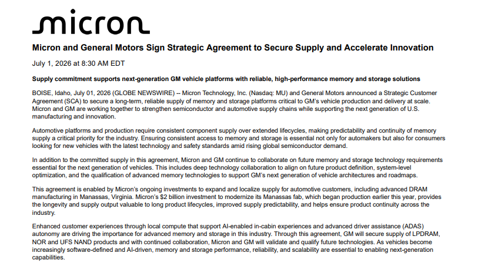

---

<!-- post_id: x:2072561478520201696 | ts: 1782972137 -->
## [X] 駿HaYaO · 2026-07-02 14:02

$META  Platforms 正積極規劃雲計算業務，準備對外出售剩餘 AI 算力與模型使用權，與亞馬遜 AWS、微軟 Azure 及谷歌雲展開正面競爭。

此計劃由 Meta 雲端基礎設施團隊主導，預計提供兩類服務：
一是類似 AWS Bedrock 的模型託管服務，包括 Meta 自研的 Muse Spark 等 AI 模型；
二是「原始算力」出租，類似 CoreWeave 的模式，讓客戶直接使用數據中心與 GPU 資源。

知情人士指出，該業務由 Meta Compute 團隊負責，核心領導人包括基礎設施主管 Santosh Janardhan、超級智能實驗室負責人 Daniel Gross 及總裁 Dina Powell McCormick。目前計劃仍處早期階段，尚未對外公開細節。Meta 希望藉此收回部分巨額 AI 基礎設施投資，預估雲業務未來每季可帶來逾百億美元收入。

此舉反映 Meta 在 AI 競賽中面臨算力短缺壓力。
祖克柏在 5 月份的股東電話會議上表示：「這仍在考慮範圍內。幾乎每週都有不同的外部公司找上門來，要求我們提供 AI 服務，要麼問我們是否有意按量付費轉售他們的 AI。」祖克柏當時表示：「我們還沒這麼做，是因為我們認為這些算力自有用途。但是當然，如果我們覺得建設過了，這就是一個備選方案，這也是我們敢於投資建設的部分信心所在。」

Meta 已承諾投入數千億美元興建數據中心，目標打造「超級智能」AI。

---

<!-- post_id: x:2072560383001330111 | ts: 1782971876 -->
## [X] 駿HaYaO · 2026-07-02 13:57 _(接續 2 則)_

京瓷 ( Kyocera )投資1,000億日圓擴大AI伺服器MLCC產能

因應AI資料中心建置熱潮推升MLCC需求，日本被動元件大廠京瓷（Kyocera）宣布將在2024至2030年度，投資約1,000億日圓擴充AI伺服器用積層陶瓷電容（MLCC）產能。

社長兼CEO作島史朗表示，投資重點為鹿兒島霧島工廠國分廠區，新廠房已投產，後續將逐步增設設備、提升產線。

每台AI伺服器約需搭載1.5萬至2.5萬顆MLCC，是確保穩定運作的關鍵零件，全球需求強勁。

MLCC龍頭村田製作所已規劃至2027年度投資800億日圓；太陽誘電則表示，中期計畫原訂每年擴產10%，視超大規模雲端客戶需求，有望加速至15%。

太陽誘電已針對原料（銀等）漲價調漲部分產品價格，但目前無因供需緊俏而全面漲價計畫。

https://t.co/hIlvwzvNzq

---

<!-- post_id: x:2072558528678740005 | ts: 1782971434 -->
## [X] 駿HaYaO · 2026-07-02 13:50

Good Morning! 7/2 Foreign Media Summary

- 2454 MediaTek : U.S. Broker Raises Price Target
U.S. brokerage firm upwardly revises MediaTek’s projected AISC revenue for next year and the year after to USD 20.3 billion / USD 52.5 billion (previously estimated at USD 12.3 billion / USD 48.0 billion). It forecasts that ASIC will account for 49% / 69% of total revenue this year and next year, respectively. The firm raises its EPS estimates for next year and the year after to TWD 182 / TWD 422.2. Valuation is based on 25x PE for 2H27–1H28E, with the target price raised accordingly.

- 3711 ASE : European Broker Raises Price Target
European brokerage firm estimates ASE’s CoWoS capacity will reach 20k wpm by the end of this year and upwardly revises next year’s forecast to 50k wpm (from 40k wpm). This is expected to contribute USD 0.3 billion in revenue this year and USD 2.0 billion next year, with further upside potential. In Final Test, Amazon Trainium 3 and MediaTek TPU v8 are projected to see significant volume ramp-up next year. The firm raises its EPS estimates for next year and the year after to TWD 28.5 / TWD 36.6. Valuation is based on 25x PE for 2027–2028, with the target price raised accordingly.

- 2327 Yageo : Asian Broker Raises Price Target
The Asian brokerage firm states that this business cycle will be healthier and longer-lasting than the previous 2017–2018 cycle. It is driven by AI, with faster platform update cycles (a new generation launched almost every year). It expects structural shortages in the MLCC industry that will crowd out non-AI applications. The firm upwardly revises its EPS estimates for 2026–2028 to TWD 20.9 / TWD 35.2 / TWD 45. Valuation is based on 30x PE for the year after next, with the target price raised accordingly.

- 2345 Accton : Asian Broker Raises Price Target
The Asian brokerage firm expects strong revenue growth from the ramp-up of Amazon Trainium 3. It also raises its forecast for Amazon Trainium shipments next year to 3.2 million units (from 2.6 million). Taiwan’s production capacity this year is expected to increase by 30–50%. The next-generation T4 Scale-up Switch will serve as the growth driver for 2H27–2028. The firm upwardly revises its EPS estimates for 2026–2028 to TWD 80.5 / TWD 111.9 / TWD 154. Valuation is based on 35x PE, with the target price raised accordingly.

- Memory Industry:
Major U.S. firms view GigaDevice’s announcement as a reminder of potential industry risks ahead. They do not see significant price declines in the short term and maintain their positive ratings on covered companies.

---

<!-- post_id: x:2072530991927951439 | ts: 1782964868 -->
## [X] 駿HaYaO · 2026-07-02 12:01

RT @mingchikuo: 我最新的產業調查顯示，Amazon 自有消費電子的處理器採購策略，20 年來將首次有重大轉向：捨棄外購並改採 COT（customer-owned tooling）模式，世芯-KY 獨家提供自研晶片的後段設計與測試。幾個重點：

1. 受 AI 算力快速擴張影響，Amazon 截至 1Q26 的過去 12 個月自由現金流年減 95%，降至約 12 億美元。為維持財務彈性並支撐 AI 投資週期，公司正同步精簡組織並優化非 AI 業務的成本結構。

2. Amazon 自有消費電子產品，包括：Kindle、Fire TV、Echo、Alexa 裝置、Blink、Ring 等，目前採用的處理器均為外購。為優化成本結構，Amazon 決定將逐步停止外購，改採與 AI 晶片 Trainium 類似的 COT 模式，自行主導處理器開發。

3. 在此轉型過程中，Amazon 選定的合作對象為世芯-KY，由其獨家負責後段設計與測試。世芯-KY 除了會就各項設計專案向 Amazon 收取一次性工程費用（NRE），也會隨處理器的出貨受惠。

4. 此策略預計自 2027 年起啟動，待全面轉換完成後，自研處理器的年出貨量預估將達到約 4,000 萬顆，預期將有效改善 Amazon 自有產品的成本結構，並顯著貢獻世芯-KY 的營運動能。

---

<!-- post_id: x:2072487217029951849 | ts: 1782954432 -->
## [X] 駿HaYaO · 2026-07-02 09:07

早安！7/2 外電綜合整理

- 2454聯發科: 美系升目標
美系券商上修明後年AISC營到203 億/525億美元（～之前預估123億/480億），預估ASIC今明年將佔總營收各為49%/ 69%。上修明後年EPS至$182/$422.2，以2H27-1H28E 的25xPE評價，同步升目標。

- 3711日月光：歐系升目標
歐系券商預估今年CoWoS產能到年底為20k wpm，明年上修至50k from 40k wpm 。等同於貢獻營收今年為3億美元，明年為20億且還有上修空間。Final Test：Amazon Trainium 3 與 聯發科 TPU v8 明年顯著放量。上修明後年EPS至$28.5/$36.6，以27-28年的25xPE評價，同步升目標。

- 2327國巨: 亞系升目標
亞系券商直言此次景氣循環會比上一輪2017-18年更健康維持更久。因由AI驅動且AI 平台更新速度更快（幾乎每年推出一個新世代）。預期MLCC產業結構性短缺，排擠非 AI 應用。上修26-28年EPS至$20.9/$35.2/$45，以後年30xPE評價，同步升目標。

- 2345智邦: 亞系升目標
亞系券商預期Amazon Trainium 3 放量，營收可望明顯增溫。同時上修Amazon Trainium明年至 320 萬顆from 260 萬顆。上修台灣今年產能增加30–50%。而下一代 T4 Scale-up Switch將成為2H27-28年成長引擎。上修26-28年EPS至$80.5/$111.9/$154，以35xPE評價，同步升目標。

- 記憶體產業：
美系大行評論兆易創新的公告是對未來可能面臨的產業風險提醒，短期內未看到報價明顯下滑。對覆蓋裡的公司重申正向評等不變。

 #下次會考

---

<!-- post_id: x:2072362242390323474 | ts: 1782924635 -->
## [X] 駿HaYaO · 2026-07-02 00:50

$MU 正投資 2.5 億美元於 Trump Accounts。

川普總統稱這是「同類中最大的企業投資」，並表示這將幫助「數百萬美國兒童與家庭在人生中獲得強而有力的起步」。 https://t.co/48AGHJcimC

---

<!-- post_id: x:2072361972331659354 | ts: 1782924571 -->
## [X] 駿HaYaO · 2026-07-02 00:49

首先，過剩產能只是一個「如果」。不過，這並非新消息，因為 Meta 很可能是在回應投資人的壓力，選擇出租部分其運算容量（若有的話），以在高租金價格的環境下改善股東權益報酬率。

請注意，轉型為 Neocloud 通常會導致更高的資本支出，我們先前在 6 月 22 日的報告《SpaceX 轉向 Neocloud》一文中已提及此點。

最新發展顯示，Meta 仍處於運算資源受限的狀態。有報導指出，Google 因需求過高而限制 Meta 使用 Gemini 的運算資源。與此同時，Meta 最近與 CoreWeave 簽署了一份新的 210 億美元 AI 運算協議，以取得 AI 運算容量。

---

<!-- post_id: threads:3930771088393564064 | ts: 1782804450 -->
## [Threads] Kok Yu · 2026-06-30 15:27

如果看生益科技現在在實驗室用的..
是用PTFE的 CCL 搭配碳氫樹酯的PP
因為他們發現..如果用PTFE的PP ，良率爆炸低
（雖然現在換新配方也是40-50%良率）

繼續看著他們陪打牌，但沒有胡的一天..

---

<!-- post_id: threads:3930735383650918550 | ts: 1782800194 -->
## [Threads] Kok Yu · 2026-06-30 14:16

當供應鏈也加入發函的行列...不缺這說法不攻自破..

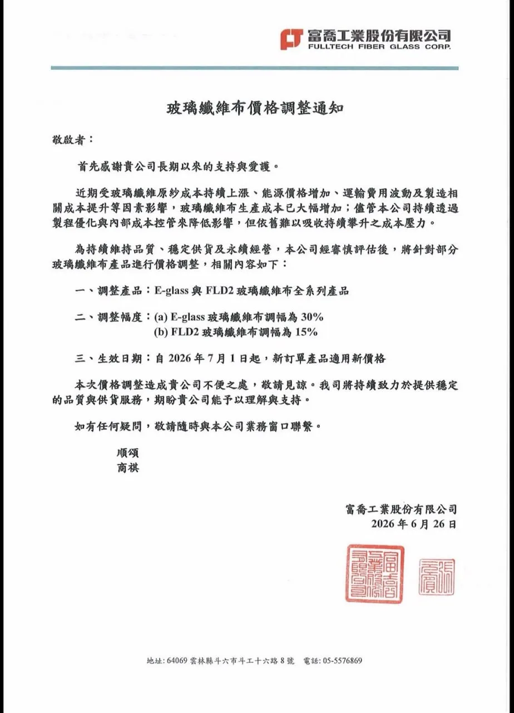

---

<!-- post_id: x:2071832173578256809 | ts: 1782798257 -->
## [X] 駿HaYaO · 2026-06-30 13:44

富喬工業股份有限公司
FULLTECH FIBER GLASS CORP.

玻璃纖維布價格調整通知
敬啟者：
首先感謝貴公司長期以來的支持與愛護。
近期受玻璃纖維原紗成本持續上漲、能源價格增加、運輸費用波動及製造相關成本提升等因素影響，玻璃纖維布生產成本已大幅增加；儘管本公司持續透過製程優化與內部成本控管來降低影響，但依舊難以吸收持續攀升之成本壓力。

為持續維持品質、穩定供貨及永續經營，本公司經審慎評估後，將針對部分玻璃纖維布產品進行價格調整，相關內容如下：

一、調整產品：E-glass 與 FLD2 玻璃纖維布全系列產品

二、調整幅度：
(a) E-glass 玻璃纖維布調幅為 30%
(b) FLD2 玻璃纖維布調幅為 15%

三、生效日期：自 2026 年 7 月 1 日起，新訂單產品適用新價格

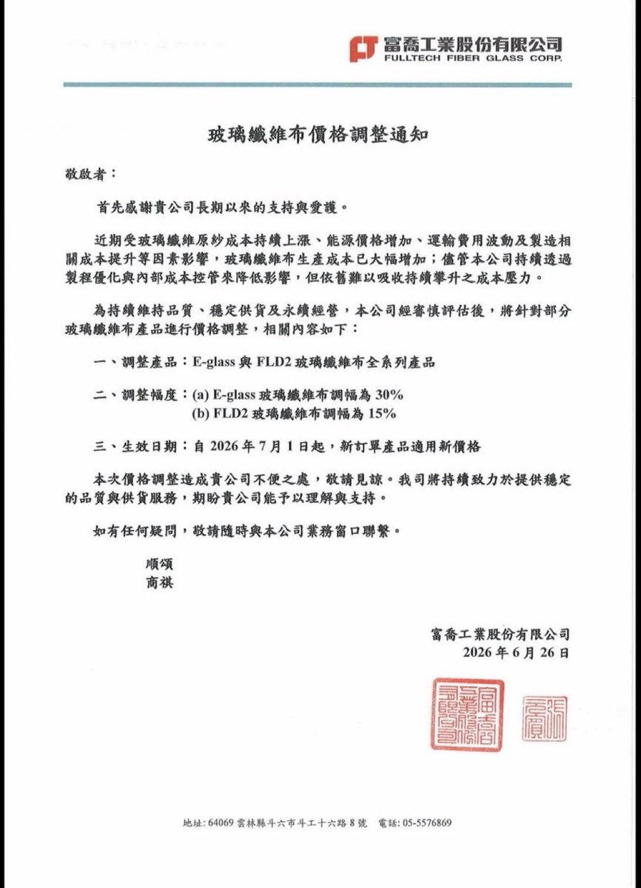

---

<!-- post_id: x:2071748120917266741 | ts: 1782778217 -->
## [X] 駿HaYaO · 2026-06-30 08:10

早安！6/30 外電綜合整理

- 2330台積電: 美系升目標
美系大行最新調研顯示近期台積電將其 3 奈米晶圓廠（Fab 18 P10/ 11/ 12） 的規劃改為 2 奈米（F2 P7/ 8/ 9），代表目前 2 奈米需求比一年前的規劃高出約 60kwpm。

換言之，到2028 年底，台積電 2 奈米＋3 奈米總產能 可能達 40 萬片/月，是 Intel 14A＋18A（約 4～5 萬片/月） 的 10 倍，也高於三星 SF2 此等比例規模。EUV機台明年也有40台+，高於Intel的9-11台、三星的5-7台。報價部分，先進製程明年有望漲5-7%。所以考量營運規模與先進製程領導地位，面對三星與Intel的競爭影響非常有限。甚至認為Intel還可能於後年將2 奈米伺服器 CPU 委外出來。

2Q營收：券商預期最終將落在季增11-12%，高於指引，預期2Q毛利率67.4%，在指引的上緣。3Q營收：券商預期在季增低雙位數至中雙位數百分比。資本支出：預期7月法說會會上調至560 億美元。綜上，券商上修26-28年EPS至$107.6/$143/$177，給予明年20xPE評價，同步升目標。

- 8046南電：5月自結靚
合計4+5月淨利已達成美系大行2Q預估數的84%、市場69%，表現優於預期。而且5月淨利率17.6%，較4月13.4%、1Q的11.7%皆大幅提升。券商重申現在還是上升循環的初始階段，重申明年供給不足狀況延續，維持正向。另一家美系也認為接下來會積極漲價，推升營收/毛利率表現。

- 6274台燿: 亞系升目標
亞系券商預期2Q營收將季增43%，3Q再季增19%。主要受惠於價格調漲，以及高階產品組合佔比升。預估AI ASIC 專案2Q營收佔比5-6%。網通400G＋800G 預期今年成長5成，明年成長4成。擴產不間斷，上修26-28年EPS至$34.4/$67.3/$111.8，以明年30xPE評價，同步升目標。

 #下次會考

---

<!-- post_id: x:2071652207179829476 | ts: 1782755350 -->
## [X] 駿HaYaO · 2026-06-30 01:49

SK Group 主席崔泰源於 Computex 2025 表示，SK Hynix 未來五年將晶圓產能翻倍，以因應 AI 爆發性需求。儘管面臨多項挑戰，公司仍將全力擴張。

他重申，全球記憶體供應瓶頸可能延續至 2030 年。SK Hynix 目前是 Nvidia 最大 HBM 供應商，第一季市占率達 58%，遠高於三星與美光（各 21%）。Nvidia 新一代 AI PC 及 Vera Rubin 系統都將帶來巨量 HBM 需求。面對三星積極推出 HBM5 與 HBM4E 樣品，競爭日益激烈。崔泰源指出，HBM4E 目前僅 Nvidia 單一客戶，未來擴產將視需求而定，並需深化與台灣夥伴合作。

他強調，雖然 HBM 與 DRAM 價格上漲，但產業應避免過度漲價，以確保 AI 生態系長期永續成長。金商上調 SK Hynix 2028 年獲利預估 24%，顯示市場對 AI 記憶體需求抱持長期樂觀。

https://t.co/VdzsLyNTvR

---

<!-- post_id: x:2071651808414744794 | ts: 1782755255 -->
## [X] 駿HaYaO · 2026-06-30 01:47

忠清地區81兆韓元投資HBM封裝　韓國半導體區域分工加速

韓國政府29日於「大躍進三大巨型計畫」國家報告會上，公布半導體「3S+1F策略」與「區域樞紐策略」。為構築全國供應鏈，將前端晶圓廠、後端封裝、材料零件設備分散布局，避免集中首都圈。

忠清地區定位為先進封裝中心，政府將投入81兆韓元，支援三星電子與SK海力士大規模HBM（高頻寬記憶體）封裝廠建設。

三星電子會長李在鎔明確表示，將聚焦天安、溫陽的HBM晶圓廠與後端製程投資；SK海力士則在清州擴大HBM封裝。

西南地區吸引新晶圓廠，打造第二半導體生產基地；釜山發展功率半導體（8吋碳化矽晶圓公用廠）；龜尾則聚焦國防系統半導體測試驗證，強化材料零件設備聚落。

此策略配合三星、SK海力士擴產，同步壯大供應鏈。因應AI半導體爆發性需求，政府除持續支援高階AI晶圓代工外，也擴大至汽車、家電用的中階代工，目標提升國家整體競爭力。
https://t.co/J0gjFSaVtD

---

<!-- post_id: x:2071643996561240479 | ts: 1782753392 -->
## [X] 駿HaYaO · 2026-06-30 01:16

電子元件
AI 伺服器加速器板隨著每一代新 GPU 的推出，需要大約兩倍的總電容。由於安裝空間有限，體積小、高電容的 MLCC 正看到需求激增。

- 村田製作所（Murata）
在 MLCC 總市場占有率達 40.8%（其次為 SEMCO 的 22.5% 及太陽誘電的 11.3%）。

村田目前是唯一能夠穩定量產 AI 伺服器所需所有超小型、高電容元件的公司。村田對 AI／資料中心的銷售預計在 F3/27 財年年增 85–90%，占其 MLCC 總銷售的 20–25%。其中包括約 40% 的出貨量成長，以及由更豐富產品組合帶動的約 50% ASP 成長。

與中國、韓國及台灣等地一些區域競爭對手不同，後者透過對商品化零件不加區別的漲價來最大化短期利潤，村田則靈活調整定價，以保護長期市場占有率並防止進入門檻降低。

- Ibiden
Ibiden已開始為 NVIDIA 的 Blackwell 與 Rubin 架構量產出貨 ABF 封裝基板。Rubin 的銷售預計在 F3/27 第 1 季超越 Blackwell。

儘管獲利成長明確，摩根士丹利指出 FactSet 共識預估過高。例如，在 F3/28，摩根士丹利預測營業利潤（OP）為 1,285 億日圓，而公司預測為 1,500 億日圓，共識為 1,515 億日圓。

EMIB-T 產品的實質利潤貢獻預計要到 F3/29 以後才會顯現，且達到與 NVIDIA 既有產品相當的利潤率可能有困難。

- 太陽誘電（Taiyo Yuden）
太陽誘電在 2024 年下半年凍結資本支出。因此，其 MLCC 產能成長在 F3/26 僅受限於約 5%。此產能限制已積極限制該公司抓住當前 AI 伺服器需求激增中新高量業務的能力。

雖然關鍵 AI 伺服器 MLCC 規格（如 1608 尺寸 100μF、1005 尺寸 47μF 以及 0603 尺寸 10μF）的需求正大幅上升，但太陽誘電穩定量產的時間表仍不明朗。

分析師指出，當太陽誘電追上村田目前的技術時，村田很可能已經在量產更小型、更高電容的型號。

---

<!-- post_id: x:2071634370897801531 | ts: 1782751097 -->
## [X] 駿HaYaO · 2026-06-30 00:38

1. 技術核心與優勢
- CoPoS（Chip-on-Panel-on-Substrate）是 TSMC 次世代面板級先進封裝技術。
- 核心差異：以大型方型玻璃面板取代傳統圓形晶圓作為基板。
- 產出效益：晶片產出數量較現行 12 吋圓形晶圓增加 5～6 倍。
- 主要應用：AI GPU 與高效能運算（HPC）晶片封裝，解決未來需求成長。
- 非單純放大 CoWoS，而是全新架構的生產線，技術門檻更高。

2. 目前進度
- 首批驗證用設備已搬入子公司采鈺（Visera）龍潭廠，試作線已啟動。
- 約 30 家 設備廠商（日本、美國、德國、台灣）名列初期評估名單。
- 涵蓋 6 大主要製程：曝光・塗佈、金屬化・銅電鍍、研磨・雷射加工、濕式製程・熱處理、模封・迴焊、計測・檢測。

3. 量產時程預估
- 最快 2029 年 量產（較市場先前預期的 2030 年提前）。
- 2026 年：重要驗證期。
- 2027 年：進入試產階段。
- 2028 年下半年：可能轉入正式量產。
- 魏哲家董事長表示，規模化仍需 2～3 年開發時間。

4. 供應鏈重點廠商（按製程分類）
- 曝光・塗佈：Canon、SUSS MicroTec、東京電子（TEL）、SCREEN、Scientech。
- 金屬化・銅電鍍：應材（Applied Materials）、科磊（KLA）、力鼎精密、泛林集團（Lam Research，新進亮點）。
- 研磨・雷射加工：DISCO（幾乎獨占）、日東電工、琳得科、庫利克索法（K&S）、ASMPT、芝浦機械、萬潤（All Ring）。
- 濕式製程・熱處理：弘塑（Grand Process Technology）、Scientech、印能（AblePrint）、國際電氣、志聖（Csun）、TOWA、APIC YAMADA、Heller。
- 檢測・計測（玻璃基板帶動需求）：倍利科（V5 Technologies，重點）、晶彩科（Favite）、威克半導體、大量（Mirle）、致茂、家登、均華、亞亞科技、佳宸、禾鏵。
- 新進受惠台廠：辛耘（濕製程）、倍利科、泛林集團等成功取得 Demo 機訂單。

5. 產業影響與機會
- 台灣廠商優勢：玻璃基板導入，大幅提升檢測需求，台灣設備廠商獲得新定位機會。
- 新舊廠商競爭：技術門檻高，讓過去未進入 CoWoS 供應鏈的廠商有重新挑戰機會。
- 投資亮點：玻璃基板、TGV（玻璃貫通孔）、RDL（再配線層）、先進封裝相關設備。
- 挑戰：大多數設備仍處 Demo 階段，從驗證到正式訂單約需 1.5 年，競爭激烈且結果不明朗。

https://t.co/rsltTrT792

---

<!-- post_id: x:2071581040268005503 | ts: 1782738382 -->
## [X] 駿HaYaO · 2026-06-29 21:06 _(接續 2 則)_

應用材料公司（Applied Materials）正式發表一系列全新晶片製造系統，聚焦解決AI時代的「記憶體牆」挑戰，加速DRAM與先進封裝技術發展。

面對AI模型對記憶體頻寬、容量與能效的急迫需求，HBM高頻寬記憶體與3D堆疊成為關鍵解決方案。應用材料此次推出橫跨DRAM、外延、先進封裝與製程控制的完整產品組合，助客戶提升良率並加快量產。

在DRAM領域，強化版Centura™ Prime™ Epi外延系統可在源極/汲極區域選擇性生長SiGe與SiP，提升電晶體驅動電流與效率，同時佔地面積縮小20%，大幅提高晶圓廠空間利用率，滿足HBM及下一代DDR的高頻寬需求。

先進封裝部分則推出三款核心設備：
- Opta™ Quad CMP即時監測並動態調整拋光過程，強化晶圓平坦度，支援混合鍵合（Hybrid Bonding）高良率需求。
- Nokota™ VMax™ 2 ECD導入自適應圖案調諧（APT）技術，提升TSV與微凸塊銅電鍍均勻性。
- Producer™ Avila™ 2 PECVD沉積應力平衡介電膜，有效抑制超薄HBM晶粒翹曲，支援12層、16層乃至更高層數堆疊。

此外，VeritySEM™ 7AP電子束量測系統與SEMVision™ G7AP缺陷檢測系統，將晶圓廠級精密控制導入先進封裝，能在厚基板、翹曲基板上達成優於10nm的檢測能力，防止微小缺陷導致整個堆疊失效。

應用材料半導體產品事業群總裁Prabu Raja表示，邏輯與記憶體製程正加速融合，該公司憑藉材料工程領導優勢，協助產業突破3D架構瓶頸。這些新設備已針對AI伺服器高性能需求優化，預計將成為HBM與Chiplet時代的重要推手。

https://t.co/euTqvsCWF7

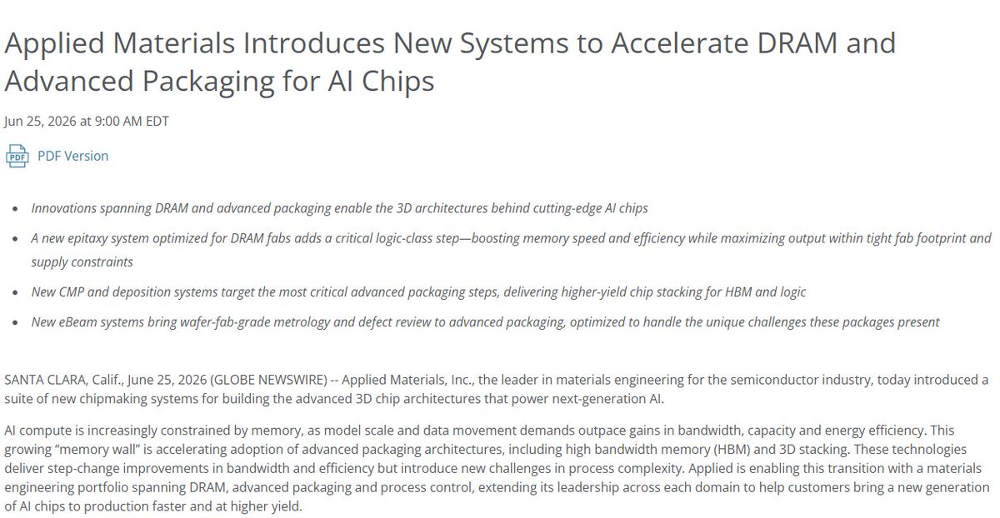

---

<!-- post_id: x:2071572063970832682 | ts: 1782736242 -->
## [X] 駿HaYaO · 2026-06-29 20:30

2026 年全球折叠手機 ASP 預計年增 18%
根據 Counterpoint Research 最新報告，2026 年全球折叠智慧型手機加權平均批發價（ASP）將較 2025 年上漲 18%。主要驅動因素包括產品組合向超高階機型轉移，以及書本式折叠手機出貨占比大幅提升至 76%。

書本式機型持續強化大螢幕、優質鉸鏈、大電池、強大相機與生產力功能，定位高端；而翻蓋式機型因更多品牌進入、產能擴大，價格持續下滑，逐漸接近高階直板手機。價格結構明顯變化：2025 年超過一半折叠手機批發價低於 1,200 美元，高於 1,600 美元者占三分之一；2026 年高價機型（>1,600 美元）占比將升至 60%，低價機型（<1,200 美元）則降至 30% 以下。

大螢幕價值正從娛樂轉向生產力。隨著生成式 AI 進化至多任務處理與 Agent AI 工作流程，使用者需要更大空間檢視資訊、比較結果、追蹤指令並切換應用。蘋果預計於 2026 年下半年推出首款折叠 iPhone（書本式），將進一步聚焦高價區間，強化軟體連續性與生產力體驗。

Counterpoint 副總監 Liz Lee 表示，折叠手機吸引願意為生產力與優異體驗付費的高階用戶，大螢幕書本式機型將成為 AI 時代獨特的價值形態。

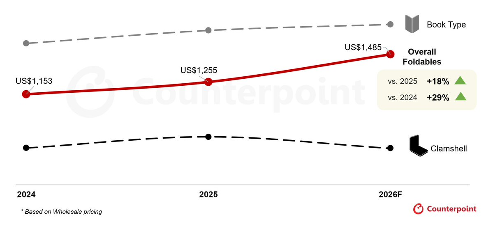

---

<!-- post_id: x:2071535238585454948 | ts: 1782727462 -->
## [X] 駿HaYaO · 2026-06-29 18:04

根據TrendForce最新報告，Apple計畫在MacBook Pro、iPad Pro與iMac等產品導入BT.2020色域覆蓋率達95%的OLED面板。相較現行DCI-P3，BT.2020對色純度、光譜控制、發光效率與功耗要求更高，OLED競爭重點將從亮度、對比、薄型化，轉向色彩純度與能效平衡。

Apple自2024年在iPad Pro首度導入OLED，預計2026年底至2027年初擴展至MacBook Pro，顯示OLED正快速從手機滲透至IT、高階筆電與專業顯示市場。

材料技術全面升級：OLED發光層正從傳統Host + Dopant主客體架構，演進為複雜能量傳遞系統。

主要新技術包括：
- MR-TADF：多重共振分子設計，實現窄光譜高色純度，滿足BT.2020需求。
- Hyperfluorescence（超螢光）：Host + TADF Sensitizer + Dopant單敏化，提升激子利用率、降低能量損失。
- pTSF：磷光輔助熱活化敏化螢光，導入磷光材料形成雙敏化架構，改善高亮度效率與壽命。

面板廠策略分化：Samsung Display採雙軌並行，一方面延續PSF磷光敏化系統，同時布局EL-QD電致發光量子點，打造「後OLED」架構；中國面板廠則積極導入MR-TADF、Hyperfluorescence、PSF與pTSF等新架構，擴大本土Host、TADF、Dopant等材料導入空間，降低專利依賴。

TrendForce指出，此波OLED材料體系重構，將改變面板廠與材料供應商關係。未來競爭核心不再僅是效率與壽命，而是成本、量產穩定性、專利風險的綜合平衡。近期Samsung Fine Chemicals與LG Chem的專利訴訟，更凸顯新一代發光材料與敏化架構的重要性。
https://t.co/HNKelf8lJ8

---

<!-- post_id: x:2071507504480329926 | ts: 1782720850 -->
## [X] 駿HaYaO · 2026-06-29 16:14 _(接續 2 則)_

路透社獨家報導，中國記憶體廠商長鑫存儲（CXMT） 已與騰訊控股 簽署一份價值超過200億人民幣（約30億美元） 的長期 DRAM 晶片供應協議。這是長鑫存儲即將在上海科創板 IPO 前的重要里程碑。

協議涵蓋數年期（最長3-5年）伺服器用 DRAM 供應。DRAM 是雲端運算、資料庫與 AI 應用的關鍵元件，在全球記憶體嚴重短缺、價格大漲的背景下，此類長期合約成為大廠鎖定貨源的重要手段。協議是否包含高頻寬記憶體（HBM）尚未明朗。

長鑫存儲成立於2016年，獲政府支持，是中國突破韓美主導的全球 DRAM 市場的代表企業。目前為全球第四大 DRAM 廠商，市占率約7.7%。2026年第一季營收暴增700%達508億人民幣，轉虧為盈獲利250億人民幣。

為抓住記憶體上漲週期，長鑫正積極擴產：除現有合肥、北京廠外，已在上海興建新 DRAM 廠，月產能將從30萬片晶圓翻倍至60萬片。公司也與阿里巴巴雲、字節跳動、聯想、小米等大廠有合作。

此交易顯示中國科技巨頭轉向本土供應鏈的趨勢。瑞銀預測，全球記憶體市場今年將達7,860億美元，2027年更達1.2兆美元。不過，長鑫在 DDR5 等先進產品良率上仍有待提升，技術差距仍存。

https://t.co/8Jc2f0m2Fc

---

<!-- post_id: x:2071481575330517000 | ts: 1782714668 -->
## [X] 駿HaYaO · 2026-06-29 14:31 _(接續 2 則)_

麥格理證券( Macquarie )最新報告大幅上修聯發科（2454）雲端 ASIC 業務展望，預估2028年 ASIC 營收將由原先180億美元跳升至400億美元，增幅超過一倍以上。受惠下一代 TPU 專案採用更先進製程，平均銷售單價（ASP）預期成長逾2倍，同時積極自博通手中搶奪市占率，推動整體營運動能強勁。

外資同步將2028年EPS年複合成長率預估上修至63%，目標價由5850元大幅調升至10,000元，調幅達71%，評價基礎維持2028年本益比35倍，給予「優於大盤」評級，成為法人圈最高目標價。

報告指出，雖然該 TPU 專案對毛利率略有稀釋，但可大幅提升營業利益率，成為獲利結構改善關鍵。此外，聯發科還有機會拿下另一家美國大型雲端服務供應商（CSP）的新 CPU 專案，進一步擴大在雲端客製化晶片市場的版圖。

然而智慧手機業務仍面臨逆風。由於記憶體價格上漲壓抑終端需求，麥格理預估2026至2028年全球智慧型手機出貨量將下滑，4G機種表現預期優於5G。儘管如此，外資仍看好聯發科旗艦晶片有高機率打入三星 Galaxy S 系列，有助緩解部分5G需求下修壓力。

整體而言，麥格理雖下修2026、2027年EPS預估（分別降16%、11%），但因 ASIC 表現大幅優於預期，2028年EPS仍上修71%。後續重點將觀察 TPU 專案里程碑、新 ASIC 設計案進展、低軌衛星晶片導入，以及手機需求復甦情況。

麥格理強調，即使手機業務短期承壓，雲端 ASIC 與 TPU 已成為聯發科中長期重估核心動能。

https://t.co/uFPRKXKN6O

---

<!-- post_id: x:2071479945071869961 | ts: 1782714279 -->
## [X] 駿HaYaO · 2026-06-29 14:24

全球記憶體嚴重缺貨之際，台積電積極建立本土DRAM供應鏈，華邦電子正式入列，雙方展開晶圓對晶圓堆疊（WoW）技術的深度合作。

根據消息人士指出，華邦將供應DRAM記憶體晶圓，與台積電的邏輯製程晶圓透過Hybrid Bonding混合鍵合技術進行垂直堆疊。此技術能建立數萬至數百萬個微型銅接點，大幅縮短資料傳輸距離，提供更高頻寬、更低延遲與更優能源效率，是下一代AI伺服器、高效能運算（HPC）及邊緣AI裝置的關鍵整合技術。

過去台積電WoW所需記憶體晶圓主要依賴三星、SK海力士、美光等國際大廠，但在全球AI需求爆發導致記憶體供不應求的背景下，台積電轉向扶植本土供應鏈。華邦憑藉長年在利基型DRAM與NOR Flash的深厚製程能力、高良率12吋晶圓量產經驗，成功獲得台積電認可。

此合作不僅讓台積電記憶體貨源更穩定，也協助華邦從傳統記憶體廠轉型，躍升為AI伺服器核心供應鏈成員。對台灣整體而言，象徵記憶體產業從AI周邊角色，正式進入全球高階晶片異質整合的核心供應鏈。
https://t.co/MpAbwhBK4x

---

<!-- post_id: x:2071479109801357325 | ts: 1782714080 -->
## [X] 駿HaYaO · 2026-06-29 14:21

時序進入2026年下半年，鋁質電容產業步入新一輪漲價潮。日本第三大鋁電廠Rubycon正式發出漲價通知，預計2026年8月1日起調漲價格，且後續不排除第二度調整。與此同時，陸資龍頭江海也同步宣布漲價，陸、日大廠相繼加入，有利台灣供應鏈向客戶轉嫁成本。

Rubycon在通知中指出，雖然中東局勢趨緩，但原油價格仍居高不下，導致石油相關原料、輔助材料及物流費用全面上漲。此外，鋁、銅、錫等金屬材料自去年以來持續攀升，目前處於歷史高位。Rubycon已盡力吸收成本，惟難以持續，為確保供貨穩定與企業永續經營，遺憾決定調整價格。調漲範圍涵蓋鋁電解電容、固態鋁電、薄膜電容三大類。

至此，日本前三大鋁電廠—佳美工（Nippon Chemicon）、尼吉康（Nichicon）、Rubycon—已全數啟動調漲。在AI伺服器基建需求強勁帶動下，日系廠商AI電源用量不小，加上上游導針、鋁殼等原材料成本遽增，推升這波罕見的全面漲價。

江海亦表示，鋁箔、化工原料、碳粉及電力成本大幅攀升，遠超原價格模型，調漲範圍包括鋁電、薄膜電容、超級電容三大類。
https://t.co/spemrNHpzo

---

<!-- post_id: x:2071422396276552124 | ts: 1782700559 -->
## [X] 駿HaYaO · 2026-06-29 10:35

https://t.co/v0zUsBs2kp
#每日導讀 #20260629 #經濟日報

台積電攜手華邦啟動WoW晶圓堆疊合作，建立本土DRAM供應鏈
美伊互攻軍事設施，停火協議瀕崩裂
台股跌破月線，法人看本周V轉、年底52K-55K

📷 完整導讀 →https://t.co/RXfA0KCLGS

---

<!-- post_id: x:2071421960735858954 | ts: 1782700455 -->
## [X] 駿HaYaO · 2026-06-29 10:34

Good Morning! 6/29 Foreign Media Summary

- 2454 MediaTek: Australian Brokerage Raises Target Price
The Australian brokerage has upwardly revised MediaTek’s ASIC revenue forecast, expecting it to reach US$40 billion in 2028 (previously US$18 billion). The next-generation TPU in 2028 will adopt a more advanced process node. The brokerage believes ASP could more than double, providing significant support to operating profit margin (OPM). MediaTek is also actively taking market share from Broadcom. In addition, the firm sees potential for a second CSP project in the future. On the smartphone side, the brokerage expects MediaTek’s flagship SoC to have a high chance of being adopted in the Samsung Galaxy S series. Although 2026–2027 EPS estimates have been lowered to US$54.7 / US$11.5 to reflect weak consumer demand, the 2028 EPS forecast has been raised to US$286. Using a 35x PE multiple, the brokerage has simultaneously upgraded its target price.

---

<!-- post_id: x:2071387296461656099 | ts: 1782692190 -->
## [X] 駿HaYaO · 2026-06-29 08:16

早安！6/29 外電綜合整理

- 2454聯發科: 澳系升目標
澳系券商上修ASIC營收在2028年可望達400億美元（原預估180億美元）。2028年新一代TPU將採用更先進製程，認為ASP可望提升超過2倍，對OPM有相當助益。也正積極從Broadcom搶走市占率。券商同時認為之後有望新增第二家CSP的專案。手機方面，券商預期旗艦SoC有很高機率打入Samsung Galaxy S系列。雖下修26-27年EPS至$54.7/$11.5反映消費性疲弱，但上修28年至$286，以35xPE評價，同步升目標。

 #下次會考

---

<!-- post_id: x:2071305593831501969 | ts: 1782672711 -->
## [X] 駿HaYaO · 2026-06-29 02:51

RT @mingchikuo: 2027 年記憶體供需缺口將持續擴大，這才是 Apple 遊說白宮「避免長鑫存儲未來被列入實體清單」的真相

▌先講我最新的產業調查：Apple 面對的壓力，已從記憶體成本大增，升級到供需缺口持續擴大。

1.  2026 年用於消費電子的記憶體產能中，預計 15–20% 將於 2027 年轉供資料中心，且後續不排除繼續擴大。

2.  受記憶體（LPDDR）供應緊張影響，Apple 在 2H26–1Q27 對 A20 處理器的實際拉貨量，可能比原目標少 10–20%（不過，這也可能部分是 Apple over-booking 的結果）。

▌長鑫在招股書中提到，該公司的產能遠低於國內需求；加上全球記憶體供需持續失衡，因此即便 Apple 遊說成功並向長鑫採購 DRAM，也不會顯著降低成本與改善供需缺口。但在供需失衡持續擴大下，Apple 仍有必要爭取新的供應來源。

▌這也解釋為何 Apple 這次會比 2022 年評估長江存儲更積極。當年的長江，是提供改善 NAND 成本的選項；而這次的長鑫，則是管理 DRAM 供需失衡風險的選項。

▌Tim Cook 是少數能同時與美中政府維持良好關係的科技領袖，故此事最好趕在他卸任 CEO 前完成。即便最終未果，透過媒體披露後，也能讓市場留下「Apple 已盡力、無奈仍受限於美方政策」的印象，或能緩和市場對漲價與交期拉長的不滿。

---

<!-- post_id: x:2071270765165769091 | ts: 1782664407 -->
## [X] 駿HaYaO · 2026-06-29 00:33

報告指出，AI 資料中心與工業應用正成為類比元件市場主要成長動能，帶動定價順風。

主要因素：
- AI DC 採用 800V 架構加速，超大規模資料中心與 NVIDIA 供應鏈電源需求大幅提升（18.5kW 至 25-30kW）。TXN、NXP、ALGM、IFX 等廠商受惠明顯，ALGM 風扇驅動器、電流感測器與 GaN 隔離閘極驅動器抽樣增加，IFX 預期 F26E AI DC 營收成長超過 2 倍。
- 多家類比供應商（含台灣與中國廠商）計畫自 2026 年 7 月起，對 HV PMIC、離散元件、閘極驅動器與 MLCC 等特定元件調漲 20-30% 價格，受 AI DC 與工業強勁需求、供應吃緊所支撐。
- 工業終端市場回暖，庫存已正常化，航太國防、電源與自動化訂單強勁。

目標價上調：
因此將 ALGM 目標價由 54 美元上調至 67 美元，維持正面看法至 2027 年。
風險提示：
汽車市場仍存逆風，中國 LVP 預估 2026 年下滑 2.6%，記憶體採購成本可能上升 1-3%，對 BoM 帶來壓力。

2026 年多家主要 OEM 實施第二波/第三波漲價
- NXP（5/1）：價格自 6 月 1 日生效，晶圓二廠與汽車/工業 pass-through 維持。
- TI（5/7）：新價格自 7 月 1 日生效，大致穩定，Q1 清單價僅在需求持續時調整。
- Infineon（5/26）：部分產品調整自 7 月生效，進一步確認 2026 年 7 月漲價。
- Molex（5/27）：5-30% 自 7 月 1 日生效，連接器透過金屬與樹脂轉嫁。
- ST（5/28）：部分產品自 6 月 28 日生效，選擇性：汽車/工業/高保持力，商品化較弱。
- 上海貝嶺（6/2）：6 月 9 日起 10-30%，中國本地：僅部分，受到國內晶圓價限制。

---

<!-- post_id: x:2071268918233280526 | ts: 1782663967 -->
## [X] 駿HaYaO · 2026-06-29 00:26

七月後的預測顯示，玻璃纖維布報價極具潛力刷新歷史高點，愈來愈呼應歷史記憶中經典的超級循環藍圖。

令人遺憾的是，台灣國內市場對玻璃纖維布產業普遍保持冷漠。然而，這種系統性的盲點，卻即將促使積極的外資機構投資人，大舉買進台灣主要玻璃布織造商的股份——即台玻、富喬、德宏，以及南亞塑膠。 https://t.co/hV7AeJje0I

---

<!-- post_id: threads:3929525011761739376 | ts: 1782655906 -->
## [Threads] Kok Yu · 2026-06-28 22:11

建滔 新的織布機要進來，他們自己評估缺口20%+ 就是會繼續開產能... 傳統E 會用...反正很多CCL 也拿不到貨，有就盡量拿

但開產能的同時...下半年報價報得更激進~ 有沒有記憶體的感覺?
不過台灣這邊對上游真心不熟..可能又是一堆奇怪的亂砍亂殺 哈

---

<!-- post_id: x:2071159121924227295 | ts: 1782637789 -->
## [X] 駿HaYaO · 2026-06-28 17:09

谷歌近日限制 Meta 使用其 Gemini 人工智慧模型，因 Meta 要求的算力已超出谷歌所能供應的範圍。這是 AI 產業基礎設施瓶頸的最新證據。

據知情人士透露，谷歌在今年 3 月告知 Meta，無法提供其希望購買的全部 Gemini 算力，導致 Meta 部分內部 AI 項目延遲。Meta 因需求特別龐大，受影響最嚴重。谷歌也對其他客戶實施一定限制，但程度較輕。面對市場對先進 AI 模型的爆炸性需求，即使是谷歌這類巨頭也難以應付。儘管已投入數百億美元興建晶片、數據中心與電力設施，供應仍嚴重不足。谷歌本月更與 SpaceX 簽署每月高達 9.2 億美元的算力租借協議，以緩解壓力。

谷歌 CEO 桑達爾·皮查伊在財報中坦言，公司雲業務雖首度突破 200 億美元，但因算力受限，收入本可更高。目前已簽未交付的雲合同積壓量超過 4600 億美元。

Meta 方面雖積極自建數據中心，並承諾 2028 年前在美國投資 6000 億美元，現階段仍高度依賴 Gemini 等外部模型，同時加速開發自家 Muse Spark 模型以降低依賴。

---

<!-- post_id: x:2071088943018459467 | ts: 1782621057 -->
## [X] 駿HaYaO · 2026-06-28 12:30

RT @FT: Google caps Meta’s Gemini use as AI demand strains capacity https://t.co/Zi4NBdUilZ

---

<!-- post_id: x:2071056292052148576 | ts: 1782613273 -->
## [X] 駿HaYaO · 2026-06-28 10:21 _(接續 2 則)_

高頻寬記憶體（HBM）
標準封裝高頻寬記憶體（SPHBM4）DRAM
JESD330-4 版本號：Version 1.0

發布日期：2026 年 6 月 SPHBM4 DRAM 採用與 HBM4 DRAM（JESD270-4）相同的 DRAM 堆疊，但使用不同的緩衝晶片，以便在標準封裝中進行組裝。

SPHBM4 DRAM 透過分散式介面與主運算晶片連接。該介面被劃分為多個獨立的通道（channels）。每個通道完全獨立於其他通道，通道之間不一定同步。

SPHBM4 DRAM 採用寬介面架構，以實現高速、低功耗的運作。每個通道介面維持 16-bit 資料匯流排，採用雙倍資料率（DDR） 運作，其速度為對應 HBM4 通道（64 data bits）的四倍。

https://t.co/fz7gGiIuKF

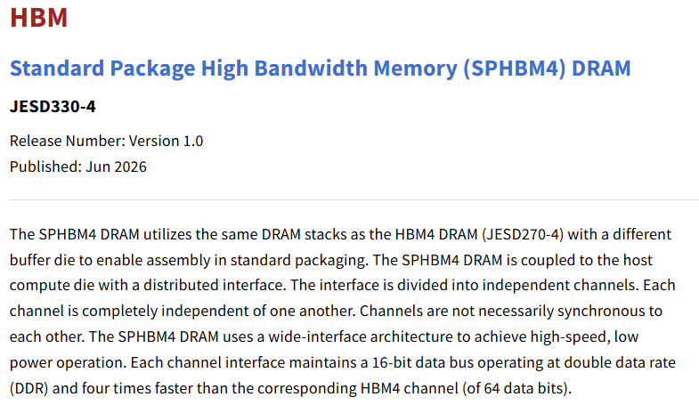

---

<!-- post_id: x:2071052078160728119 | ts: 1782612268 -->
## [X] 駿HaYaO · 2026-06-28 10:04

許多訪談過的neocloud高階主管認為，如果他們的叢集裡使用了非NVIDIA的網路設備，或是他們的雲端提供AMD GPU或TPU方案，NVIDIA就會進行報復。他們認為報復手段包括不給予早期分配，或是停止支持該公司的潛在IPO或VC募資。

請注意，這並不適用於hyperscalers，因為他們擁有更強大的採購力。但對新興雲端業者而言，高階主管們普遍感覺NVIDIA一直在使用高壓戰術，強迫他們維持「NVIDIA-only」的狀態。

部分新興雲端高階主管甚至開始考慮悄悄提供TPU或AMD GPU，一方面避免受到NVIDIA的壓力，另一方面也希望擺脫「NVIDIA可能報復」的疑慮。

---

<!-- post_id: x:2071049894106927157 | ts: 1782611747 -->
## [X] 駿HaYaO · 2026-06-28 09:55 _(接續 2 則)_

iPhone 18 Pro 主機板最新洩漏顯示，A20 Pro 已採用全新 WMCM封裝，正式取代 A19 Pro 所使用的 PoP技術。這是蘋果晶片封裝技術的重要轉變。DRAM 位置從晶片頂部移至側邊，可大幅改善熱傳導路徑，提升整體散熱效率，有助於解決先前 iPhone 17 Pro Max 在 A19 Pro 高負載下容易觸發熱牆的問題。

儘管 TSMC 2nm 製程量產成本高昂，A20 Pro 仍成功維持與 A19 Pro 相同的物理封裝尺寸，有效降低生產與組裝成本。Neural Engine（NPU）面積則明顯增大，強化裝置端 AI 運算能力，將完整支援 Siri AI 全套功能，卻未增加整體封裝體積，充分展現蘋果在晶片設計上的優異掌控力。

先前報導指出，即便配備蒸汽室散熱，A19 Pro 在超過一定功耗後仍易過熱。新 WMCM 封裝可更好控制熱能分布，讓 SoC 維持更長時間的高效能運作而不易節流。洩漏的原理圖雖非實機照片，但已清楚標示電路布局與關鍵變化。

此外，消息來源提及新晶片可能支援 LPDDR6 RAM 與 96-bit 匯流排寬度，不過考量蘋果向來謹慎的標準採用速度，此部分仍有待官方確認。

https://t.co/4mDbHV4TMv

---

<!-- post_id: x:2071048918889312476 | ts: 1782611515 -->
## [X] 駿HaYaO · 2026-06-28 09:51

全球記憶體市場展望
全球資料中心 (DC) 資本支出預計將從 2024 年的 6,680 億美元，暴增至 2030 年的 6.13 兆美元（61,270 億美元）。「Big 8」科技巨頭持續占據最大份額，從 2024 年的 2,820 億美元（占 42%），成長至 2030 年的 2.653 兆美元（占 43%）。

AI 資料中心資本支出預計從 2024 年的 2,060 億美元，成長至 2030 年的 3,379 億美元，到本年代末在總資料中心資本支出中的占比將達到 55%。

全球記憶體總營收預計將大幅激增，從 2024 年的 1,810 億美元 成長至 2030 年的 2,625 億美元。資料中心將成為記憶體消費的主力。來自資料中心資本支出的記憶體營收占比，從 2024 年的 33% 上升至 2029 年的高峰 56%（2030 年略降至 53%）。

雖然 AI 記憶體需求大幅成長（從 200 億美元增至 5,170 億美元），但一般用途資料中心的記憶體需求在絕對金額貢獻上成長更快，從 2024 年的 390 億美元 增加至 2030 年的 8,810 億美元。

硬體架構成本轉變（記憶體 vs. 邏輯晶片）
- Blackwell：記憶體/邏輯比為 200%。
- Blackwell Ultra：上升至 337%。
- Rubin：因 NAND 需求加入而大幅跳升至 677%（NAND 達 493.71 億美元）。
- Rubin Ultra：爆炸性成長至 1,190%，總記憶體 TAM 達到 1,899.77 億美元，而邏輯晶片的相對占比迅速縮減（僅剩 8%）。

---

<!-- post_id: x:2071048602672381999 | ts: 1782611439 -->
## [X] 駿HaYaO · 2026-06-28 09:50

功率半導體
1. Grid to Rack（20kV AC → 800V DC）
- Infineon 在此領域表現突出，為明顯領導者，擁有最廣泛的產品組合，是領先的 1.2–3.3kV SiC MOSFET 供應商，已通過 Nvidia 800V 架構認證。
- Navitas 提供最高電壓的 SiC（2.3–6.5kV），瞄準 SST 應用。
- STMicroelectronics 與 ON Semiconductor 在 SiC 產品組合上表現強勁，而 Monolithic Power Systems（MPS）目前在此階段尚未有布局。

2. 800V DC → 48V/12V/6V DC（Stage 1 - 機架內部）
- Infineon 與 Navitas 均展現極具競爭力的 GaN（氮化鎵）產品。
- Navitas 特別推出 10kW 全 GaN 800V-to-50V 平台，峰值效率達 98.5%。
- Monolithic Power Systems 正積極送樣 800V 解決方案，並擁有整合式 48V 直供負載模組。
- Rohm 在 AI 伺服器電源供應器中部署其 EcoGaN 650V HEMT，但 GaN 產品廣度相較 Navitas 或 Infineon 更有限。

3. 48V/12V/6V → AI 晶片（~1V DC）（Stage 2 - VRM / PoL）
此最終階段透過電壓調節模組（VRM）與負載點（PoL）直接向 AI 處理器（GPU/ASIC）提供低壓大電流電源。

- Infineon 仍居主導地位，是 sub-100V MOSFET 與功率級的主要供應商，供應所有主要 GPU 廠商與超大規模資料中心業者。
- Monolithic Power Systems 在此領域實力雄厚，在 VRM 插槽中大幅提升市占率，並在超大規模業者自訂 ASIC 電源交付上展現優勢。
- Analog Devices 扮演 VRM 周邊的「智慧層」，專注於多相位數位控制器與單晶片智慧功率級。
- Rohm 與 STMicroelectronics 在此最終 AI 晶片供電階段的布局有限或非重要參與者。

---

<!-- post_id: x:2070811944312058004 | ts: 1782555016 -->
## [X] 駿HaYaO · 2026-06-27 18:10

商業驗證、政策支持與供應鏈回饋，正加速中國人形機器人採用。報告將2026年出貨預測從28,000台上調至50,000台，預計2030年達446,000台。產業正從小型機轉向全尺寸人形機器人，2026-2028年出貨比例預計為30%/50%/70%，並開始出現自動化生產線。

2026上半年，國家電網已下單人民幣68億元用於人形、四足與雙臂機器人；順豐、中國郵政等企業在物流中心部署Roboterra人形機。MIT與SASAC倡議聚焦使用案例，目標年底前達成1萬級部署容量及超過100個高價值應用。地方政府與國企需準備充足營運據點（每省≥20、中央國企≥10）進行訓練。

催化劑方面，2026年第三季將熱鬧非凡，包括Tesla Optimus Gen3揭曉、人形整合商IPO、7月WAIC及8月WRC/世界機器人運動會。報告新增Kedali、Lens至價值鏈清單，首選Leaderdrive（諧波減速器市占領先，產能擴張、人形業務貢獻提升，目標價上調72%至人民幣269元）、Hengli Hydraulic（行星滾柱絲槓）與Shuanghuan（精密齒輪）。

---

<!-- post_id: x:2070808943602160030 | ts: 1782554300 -->
## [X] 駿HaYaO · 2026-06-27 17:58 _(接續 2 則)_

SK hynix 考慮擴建清州 NAND 廠　配合政府半導體集群計畫

SK hynix 預計宣布在中部地區新增投資，配合政府打造全國大型半導體集群的政策。據業界人士指出，6月29日官民會議將公布中部與東南地區主要企業投資計畫，其中包含 SK hynix 在清州興建新 NAND 快閃記憶體廠的提案。

SK hynix 已在清州設有 NAND 生產設施，此次擴建若確認，將是 2018 年 M15 廠完工後首次大規模擴產。過去國內記憶體廠商因 NAND 獲利較弱而謹慎投資，但近期供應吃緊促使重新評估計畫。三星電子也預計在平澤 P5 廠增設 NAND 生產線。

SK hynix 透過收購英特爾 NAND 事業（現為 Solidigm）等策略，已穩居全球第二大 NAND 供應商。外界同時關注三星電子是否在中部追加投資，其天安、溫陽廠區正全力生產 HBM4，累計銷售額四個月突破 10 億美元，預計年底將超過 100 億美元，急需擴大先進封裝產能。李在鎔近日親赴現場視察。

https://t.co/lgJLAfeo0G

---

<!-- post_id: threads:3928632978611240652 | ts: 1782549568 -->
## [Threads] 誠實豆沙包 · 2026-06-27 16:39 _(接續 2 則)_

1.先說講產業不踩一捧一，市面上有分析師說功率半導體漲價因為導線架漲，所以導線架才是源頭，只對一半，導線架漲價因為貴金屬漲價，大家都要扛成本不是嗎？
2.其實功率的需求就是電源，跟被動很像，差別在於台灣功率廠商都不是一線廠商，但故事很簡單，晶圓廠肯定比被動元件廠難擴且建廠更久，矽基功率半導體都是用八吋晶圓代工，根據研調機構的數據，八吋晶圓製程產能今明年都是縮減的。
3.國外大廠(IFNNY/ON/STM等等)都是去拓展SIC及GAN的產品，SI BASE產品基本上都不做更不用說擴產。
4.VSH及DIOD的二極體產品今年都漲價超過35%了，台灣的都大概漲5-10%而已，有機會慢慢會跟上漲幅。
5.Nexperia及揚傑的缺口開始出現，現在是連某中國品牌NB廠商都不敢用揚傑的產品了，因為組裝廠不知道NB或是桌機要出到哪個國家，歐盟給廠商到26年底的時間換供應商。
6.ON上周大跌因為併購SYNA，用70億美元併購，但SYNA市值才46.75億美元，不是產業出了甚麼問題。
7.100V MOS市場缺貨嚴重，台灣已經有功率半導體廠商切入了，除了CSP ASIC平台更有NVIDIA平台的機會。

8.富昌電子網站都有各種元件交期表跟價格趨勢，功率元件的交期比被動元件更長更誇張。

如果你對我講的看法有疑慮，那你肯定一定是對的，祝大家在資本市場都賺大錢。

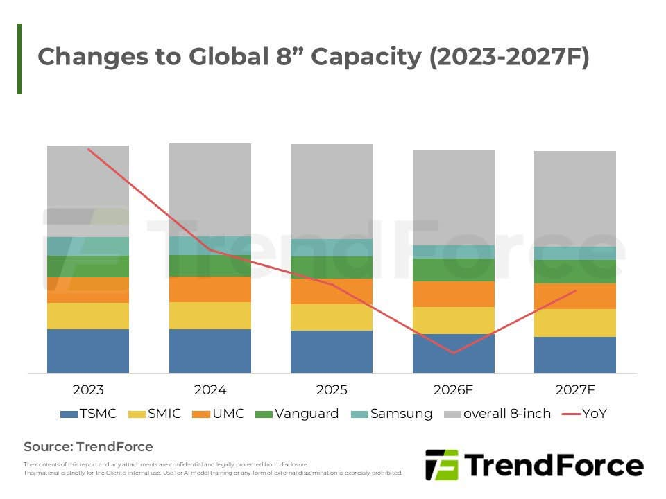
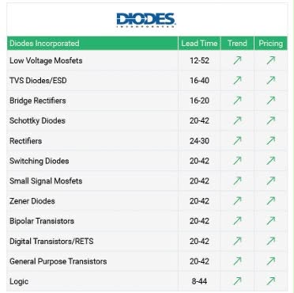
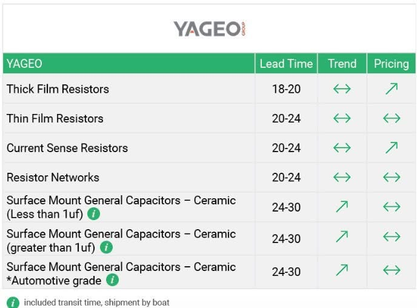

---

<!-- post_id: x:2070752487204630742 | ts: 1782540840 -->
## [X] 駿HaYaO · 2026-06-27 14:14

美國商務部拒絕授予Polestar「聯網車輛規則」授權，導致該公司從2027車型年起無法在美國銷售新車。這是川普政府持續打擊中國相關電動車的最新行動。

Polestar為吉利控股多數持股的瑞典電動車品牌，第一季美國銷售僅占6%，歐洲則高達78%。公司表示不會上訴，將繼續銷售現有Polestar 3與4車款，並維持服務網路，但Polestar 3美國生產前景不明。

該規則因國家安全疑慮，限制搭載中國相關聯網技術的車輛進口與銷售。分析指出，這加速Polestar轉向歐洲市場，聚焦Polestar 7在歐洲生產。

此禁令延續拜登時期政策，顯示美中汽車產業對抗加劇。福特等車廠正積極申請授權以因應衝擊，中國車進口則面臨高關稅。

https://t.co/xDWeb1IfPe

---

<!-- post_id: x:2070718317082632225 | ts: 1782532693 -->
## [X] 駿HaYaO · 2026-06-27 11:58

金融時報6月27日報道，蘋果公司正積極游說特朗普政府，尋求批准從已被五角大樓列入黑名單的中國企業長鑫存儲（CXMT）採購存儲芯片，以緩解芯片價格暴漲帶來的壓力。

據六位知情人士透露，蘋果已在一個多月前與美國商務部接洽，並持續游說政府其他部門及華盛頓盟友。蘋果並未被直接禁止向CXMT或YMTC採購，但這兩家公司因涉解放軍關聯，已被納入「1260H中國軍事企業清單」。

本周四，蘋果罕見宣布上調MacBook與iPad售價，導致市值單日蒸發2630億美元，創下歷史第二大跌幅。公司將漲價歸因於「不可持續」的存儲芯片價格。分析指出，若能穩定從CXMT獲得供應，將大幅減輕成本壓力。

此舉面臨巨大政治風險。美國國會預計強烈反對，共和黨重量級人物馬爾科·魯比奧曾批評蘋果「玩火」。今年2月五角大樓曾短暫移除CXMT，旋即因白宮反對而恢復列入。目前美中正進行貿易與稀土談判，白宮對新增出口管制態度謹慎，但多位官員對批准此案持保留態度。

全球DRAM存儲芯片市場高度集中，蘋果主要依賴美、韓供應商。在AI需求推動下，先進HBM芯片短缺，傳統存儲芯片價格持續上漲。長鑫存儲作為中國國家隊企業，正積極挑戰國際龍頭。蘋果與白宮均拒絕對此置評。

---

<!-- post_id: x:2070703807135465879 | ts: 1782529234 -->
## [X] 駿HaYaO · 2026-06-27 11:00

歷經近兩年庫存調整後，矽晶圓產業景氣回升態勢已愈趨明朗。隨著成熟製程需求回暖、高階AI應用持續擴張，以及能源、運費與原材料成本居高不下，國內三大矽晶圓廠—合晶（6182）、台勝科（3532）及環球晶（6488）近期相繼釋出漲價訊號，預示產業將邁入新一波復甦循環。

合晶表示，今年初已完成6吋矽晶圓價格調整，目前市場呈現供不應求。6吋供給吃緊主因並非AI排擠成熟製程，而是國際大廠如SUMCO、Siltronic等陸續縮減或退出6吋產線，加上各家調整產能配置，使整體供給持續收斂。合晶憑藉大量功率元件、PMIC、MEMS等成熟製程客戶，6吋及8吋需求穩定，保留相關產線反而具備較高營運效益。公司進一步指出，8吋市場下半年仍有漲價空間，帶動需求回升的不僅是PMIC，而是車用電子、工控及電源管理等泛功率半導體應用全面改善。

台勝科同樣釋出正面訊息。目前8吋及12吋產線均維持滿載生產，8吋市場需求明顯增溫，不少客戶已提前洽談下半年追加訂單及明年需求，研判具備調漲價格空間。12吋產品方面，公司已開始與客戶協商下半年新價格調整機制，雖客戶可接受漲幅與公司期待仍有落差，但雙方持續溝通中。

環球晶則對2026年全球矽晶圓市場持審慎樂觀態度，認為呈現「不均衡但向上」的復甦態勢。高階AI與先進製程需求強勁，車用、工控等非AI市場也逐步回溫。公司正積極與客戶協商價格，以反映能源、運費及原材料成本增加。

法人分析，三家業者同步調價，反映矽晶圓市場供需結構已明顯改善。成熟製程與先進製程需求同步回升，將有助推升產業整體營收與獲利。下半年營運展望審慎樂觀。

---

<!-- post_id: x:2070702440803115391 | ts: 1782528908 -->
## [X] 駿HaYaO · 2026-06-27 10:55

SemiAnalysis 認為中國蝕刻設備在地化進展速度快於沉積。

前端設備進口數據顯示，蝕刻設備今年迄今（YTD）下滑 18%，而沉積設備則成長 3%。

全球蝕刻設備主要廠商的財報也傳達相同訊息：AMAT（應用材料）中國營收在 FY25 年比下滑 16%，TEL（東京電子）中國營收在 FY26 年比下滑 18%。

認為 Naura（北方華創）是關鍵推手：通路查核顯示其在 CXMT（長鑫存儲）的 ICP 蝕刻市佔率最高，隨著 CXMT 擴大產能，Naura 有望進一步搶佔更多市場份額。

---

<!-- post_id: x:2070700945068155266 | ts: 1782528551 -->
## [X] 駿HaYaO · 2026-06-27 10:49

Apple 正在遊說特朗普政府，尋求批准從 CXMT 購買記憶體晶片。CXMT 是一家中國公司，因涉嫌與中國人民解放軍有聯繫而被五角大廈列入黑名單，消息來自六位知情人士。

這家 iPhone 製造商已展開一場遊說行動，希望獲得白宮的首肯，以緩解記憶體晶片價格上漲對公司造成的財務壓力。

一位人士透露，Apple 一個多月前已接觸商務部，但這家科技公司同時也在針對政府內其他官員以及華盛頓的盟友進行遊說。

---

<!-- post_id: x:2070700754990694873 | ts: 1782528506 -->
## [X] 駿HaYaO · 2026-06-27 10:48

AI 電源半導體報告
1. 市場規模與成長預測
- 2025 年：約 27 億美元
- 2028 年：約 160 億美元
- 三年 CAGR ≈ 82%

2. 主要成長驅動因素
- 架構轉型：資料中心全面轉向 800V HVDC 高壓直流架構，大幅提升每 kW 半導體含量價值。
- 元件替換：以固態半導體全面取代傳統機電元件（從電網到機架）。
‧ SiC 每 kW 價值：30 → 60 美元
‧GaN 每 kW 價值：3 → 46 美元（15 倍成長）

3. 2028 年市場預估（依材料）
- 矽 (Si)：112 億美元（最大份額，但成長較慢）
- 碳化矽 (SiC)：31 億美元
- 氮化鎵 (GaN)：17 億美元
總新增容量：80 GW（63 GW 新建 + 18 GW 替換）

4. 效率痛點與解決方案
- 舊架構：多達 4-5 次轉換，端到端效率僅 85-88%（每 100kW 損失 12-15kW 廢熱）
- 800V HVDC 新架構：大幅減少轉換階段、降低損失，提升功率密度

轉型三階段：
- 2026-2027：傳統 AC 仍主導
- 2027 下半年-2028：NVIDIA Kyber 等原生 800V 機架量產
- 2028 後：固態變壓器（SST）大規模導入

5. 各材料定位
- SiC：高壓端主力（SST、SSCB、ESS、整流器），高壓、高溫特性不可取代。
Infineon 預測，到 2030 年全球 SST 市場將超過 10 億美元，SSCB 市場將超過 8 億美元。集中式 AC-DC 整流器也越來越採用高壓 SiC MOSFET 以最大化效率。

- GaN：中低壓降壓（Stage 1），高頻切換優勢明顯，功率密度極高。
Navitas 10kW 全 GaN 平台達 98.5% 效率，單階段 800V-to-6V 更達 96.5% 效率與 2,100 W/in³ 超高密度，預測其每 kW 價值將從 3 美元暴增至 46 美元。

- 傳統 Si：低壓 VRM / PoL 階段仍主導（Stage 2），但垂直電源模組（VPDM）推升單價。

6. 更廣泛影響
- 全球資料中心用電 2025 年 115 GW → 2030 年 240-280 GW
- ESS（能源儲存）成為關鍵，資料中心將占 BTM ESS 部署的 83%
- 半導體在 ESS 中的機會：約 7.5 億歐元

---

<!-- post_id: x:2070695865401090157 | ts: 1782527340 -->
## [X] 駿HaYaO · 2026-06-27 10:29

Elon Musk 獲 FTC 批准收購 Mesh Optical Technologies

Elon Musk 透過 SpaceX（$SPCX）獲得美國聯邦貿易委員會（FTC）快速批准，收購由前 SpaceX 工程師創立的初創公司 Mesh Optical Technologies。該公司專注開發光學收發器，利用光取代傳統銅線進行數據中心高速通訊，具有更低功耗與更低延遲的優勢，主要針對 AI 大規模 GPU 集群。

Mesh 由參與 Starlink 雷射通訊的前 SpaceX 團隊創立，2026 年 2 月完成由 Thrive Capital 領投的 5000 萬美元 A 輪融資，並計劃將技術應用至太空環境。SpaceX 未來名為 Starmind 的太空數據中心系統，將依賴衛星間雷射通訊，與 Mesh 技術高度契合。

此併購是 SpaceX 繼收購 AI 公司 Cursor 後的最新動作，顯示 Musk 正積極垂直整合 AI 基礎設施。SpaceX 近期 IPO 獲市場熱烈迴響，正是來自發射百萬顆衛星、建構軌道 AI 運算的願景。目前公司已與 Anthropic、Google 及 Reflection 等簽署運算合作，並在田納西與密西西比興建數據中心。

https://t.co/ifn3OVq6UH

---

<!-- post_id: x:2070687986292002856 | ts: 1782525462 -->
## [X] 駿HaYaO · 2026-06-27 09:57

RT @mingchikuo: iOS 27 將進一步深化與 Apple Intelligence 的系統級整合。我的最新產業調查顯示，為確保在 AI 負載下系統仍能順暢運作，1H27 新款配備 A20 處理器的較低階 iPhone 之 DRAM 規格將升級至 9GB（1.5GB × 6-die），高於目前 A19 機型的 8GB（2GB × 4-die）。2H26 配備 A20 Pro 處理器的三款高階機型（折疊機與兩款 18 Pro 機型）則維持 12GB（1.5GB x 8-die）。

---

<!-- post_id: x:2070399913423159715 | ts: 1782456780 -->
## [X] 駿HaYaO · 2026-06-26 14:53

【住友化學：7月1日起上調硝酸銨價格】財聯社6月26日電，住友化學發布通知，將於7月1日起上調硝酸銨價格。

https://t.co/FRYaurmU0q

---

<!-- post_id: x:2070398906878587339 | ts: 1782456540 -->
## [X] 駿HaYaO · 2026-06-26 14:49

歐士機（上海）精密工具有限公司
價格調整通知函
尊敬的客戶/授權經銷商：
感謝各位對歐士機（上海）精密工具有限公司的理解、支持與惠顧！
由於受全球原材料價格上漲，能源費、人工費、輔材費以及物流費等持續上漲。我司現行產品價格實在難以為繼。為了確保品質，我司將對以下產品的現行價格做出調整，由此而給各位經銷商同仁以及廣大用戶帶來困擾，敬請諒解！

第一類產品　開始時間：2026年7月1日起
日本產硬質合金刀具產品（包括非標品，含全球生產日本發貨的產品）
包含絲錐、鑽頭、銑刀及其他採用硬質合金母材的刀具

日本產高速鋼刀具產品（包括非標品，含全球生產日本發貨的產品）
包含除絲錐外的，鑽頭、銑刀及其他採用高速鋼母材的刀具 
日本產上述以外的其他產品（包括非標品，含全球生產日本發貨的產品）

第二類產品　開始時間：2026年12月1日起
日本產高速鋼絲錐（包括非標定制品，含全球生產日本發貨的產品）

以上兩類產品的具體調整幅度根據刀具種類和尺寸有所不同。

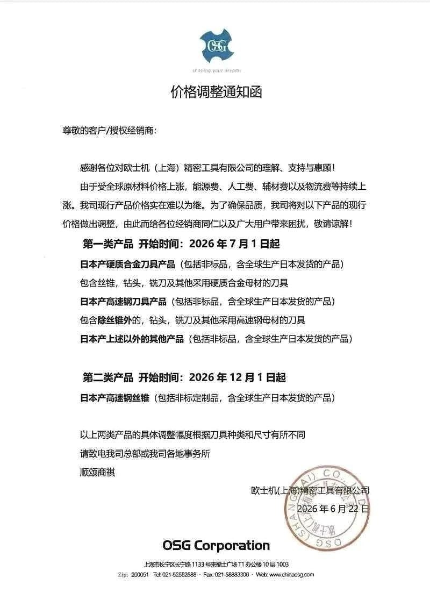

---

<!-- post_id: x:2070398152084009224 | ts: 1782456360 -->
## [X] 駿HaYaO · 2026-06-26 14:46

泰珂洛（Tungaloy）價格調整通知
致尊敬的合作夥伴：
您好！衷心感謝長期以來對Tungaloy泰珂洛公司的信賴與支持！
鑑於硬質合金原材料價格長期維持在高位水平，刀具生產成本並無緩解跡象。

為確保泰珂洛能持續、穩定地為客戶提供服務，我司經過審慎研究後決定，自2026年7月1日起對泰珂洛產品部分價格體系進行調整。具體產品線及調整幅度，請咨詢當地泰珂洛銷售人員。

泰珂洛鄭重承諾，將持續提供高度專業的刀具產品和最前沿的技術，並搭配優質的售後服務，通過AddForce全系列創新型產品，提升生產效率，賦能並實現「新質生產力」，與貴公司共同應對當前局勢。

自即日起至7月1日價格調整生效期間，不接受備貨訂單。

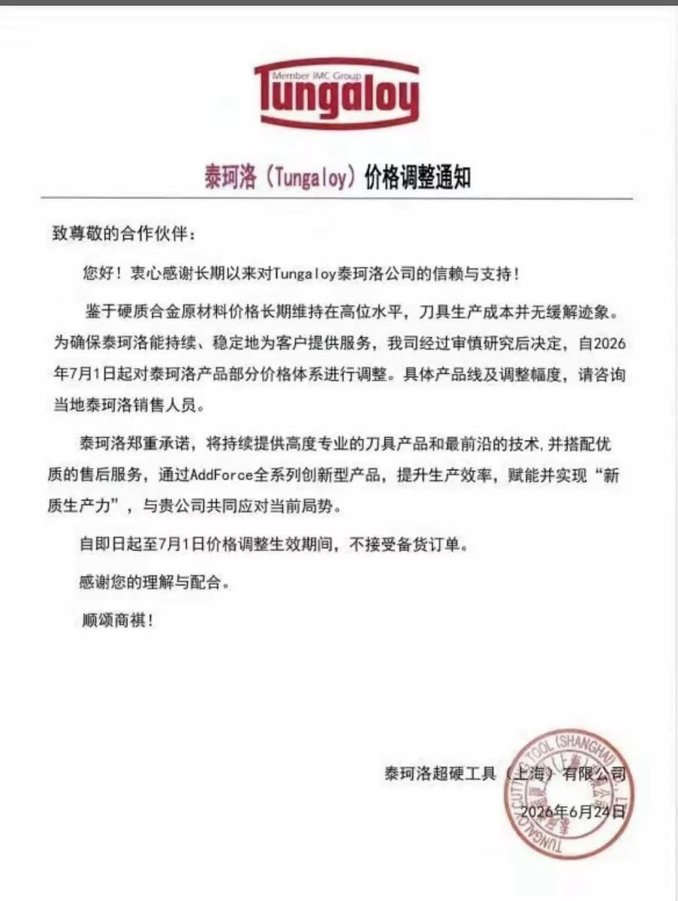

---

<!-- post_id: x:2070397648574546194 | ts: 1782456240 -->
## [X] 駿HaYaO · 2026-06-26 14:44

猫板® PCB HUNT
告知函
尊敬的客戶：
您好！ 衷心感謝您長期以來對猫板 PCB 的信任與支持。

近期 PCB 核心材料嚴重缺貨，目前建滔、生益、南亞等大廠訂單排滿，交期拉長到 2～3 個月，並已實行限購。近期部分層數和板厚的 PCB 交期不能確保如期交付，請知曉。

特別是 多層 PCB 材料缺貨和交期影響特別嚴重。請貴司合理備貨。由於原材料價格已經翻倍漲價，PCB 價格也會同步上漲，請貴司提前和客戶協商漲價。

緊張情況預估要 2027 年下半年 才會逐步緩解，期間如有變化我司會及時反饋。

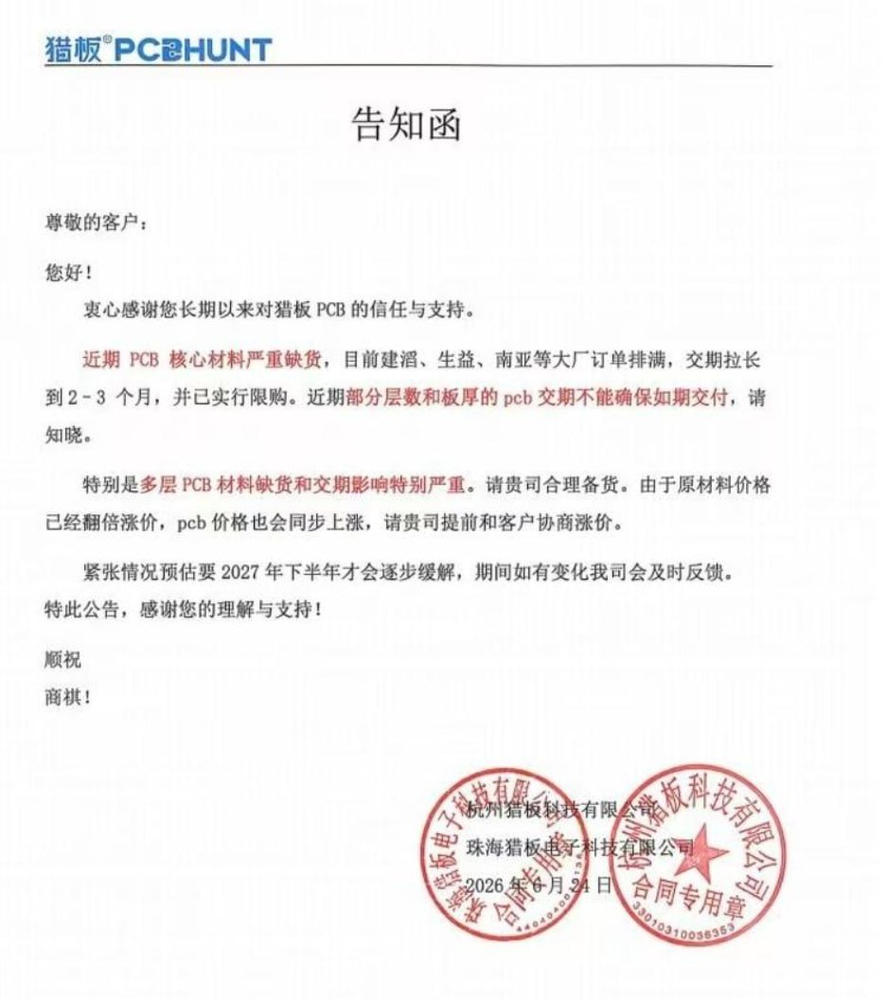

---

<!-- post_id: x:2070397396987920414 | ts: 1782456180 -->
## [X] 駿HaYaO · 2026-06-26 14:43

深圳華科生數字科技有限公司
暫停接單暨未交訂單再次漲價的重要函件
尊敬的客戶：
再一次感謝貴司近期攜手與共的理解與信任！
因電容持續暴漲且貨源難求，PCB價格持續高漲且每天控量接單，導致我司接單備料困難，未交訂單物料已接近斷料無法排產，導致不能完成未交訂單。

目前，我司電容庫存生產只能維持到本月26日左右，新的物料單價比6月8日通知漲價時又翻了一倍。為妥善處理未交（已給出具體生產計劃）訂單，現將兩項非常重要且緊急的內容函告如下：

1. 即日起至6月30日止，暫時停止接受新訂單和新增貼片計劃，我司統計數據。（具體細節可與我司業務聯繫溝通）

2. 實屬萬般無奈，7月1日起我司將對所有未交訂單再次漲價（第二次漲價），具體漲幅以各業務通知為準。

因物料單價的不確定性，還請各位老闆、採購負責人務必做好未來隨時對所有未交訂單再次漲價的心理準備和預期，接單時一定要確認核算好最新單價，做好成本核算，控制風險，理性安全接單！

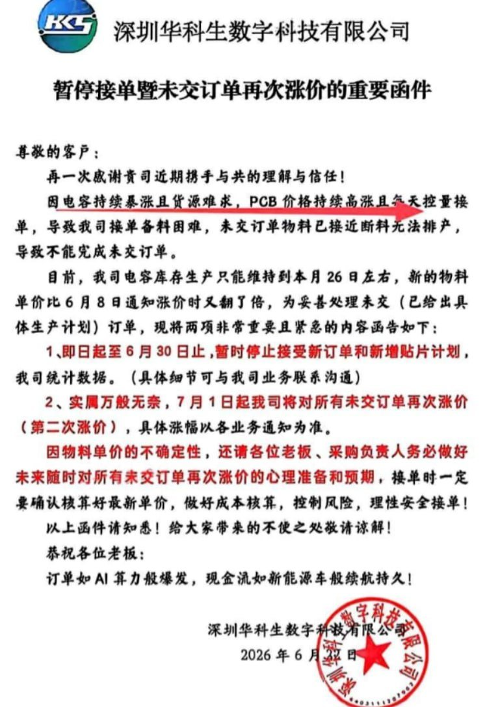

---

<!-- post_id: x:2070334321643376863 | ts: 1782441141 -->
## [X] 駿HaYaO · 2026-06-26 10:32

山東太陽紙業股份有限公司
尊敬的客戶：
衷心感謝貴公司長久以來的支持與信任！
目前，文化用紙各產品市場價格處於低位，已嚴重背離產品的實際價值。同時，受化工、能源、物流運輸等成本的影響，企業的綜合運營壓力持續加大。為保持企業的良性發展，同時能夠持續提供高品質的產品和穩定的服務，經我司研究決定：

自2026年7月1日起，我司生產的文化用紙全系列產品，在目前的價格基礎上恢復上調200元/噸。

同時，伴隨著出版用紙傳統旺季的到來，疊加公司機台轉產，整體產能供給將大幅縮減，在此溫馨提示廣大客戶提前做好用紙規劃。我們也將保持現有的產品品質，持續提供更加優質的服務，以滿足廣大客戶的需求，再次感謝您的理解與支持。順祝商祺！

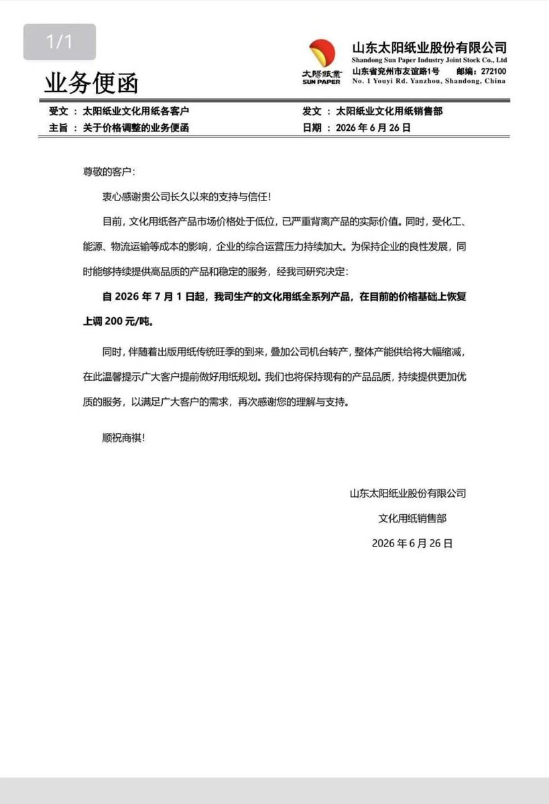

---

<!-- post_id: x:2070333881539326134 | ts: 1782441036 -->
## [X] 駿HaYaO · 2026-06-26 10:30

博匯紙業漲價通知
受文者： 博匯紙業文化用紙各客戶
主旨： 博匯紙業文化用紙7月漲價通知
尊敬的客戶：
您好！衷心感謝貴司長久以來對博匯紙業的認可和支持！近期，由於市場多重複雜因素影響，紙品價格出現嚴重成本與售價倒掛的情況。經過博匯紙業董事會慎重研究，各生產基地成本持續大幅攀升，我司生產經營壓力持續加大。

為確保長期為各位合作伙伴提供優質、穩定的產品與服務，我公司經營層經過慎重研究決定：

自2026年7月1日起，我司所有文化用紙品類價格在2026年6月份價格基礎上上漲200元/噸（含稅）。

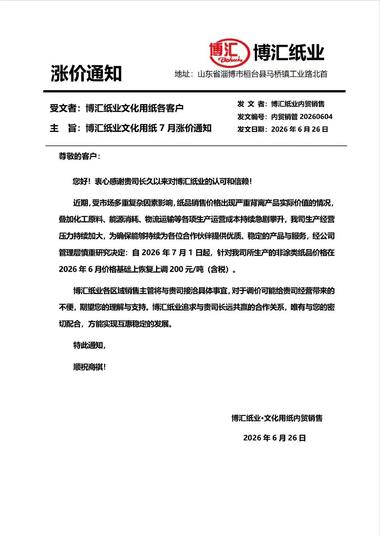

---

<!-- post_id: x:2070330688986055095 | ts: 1782440275 -->
## [X] 駿HaYaO · 2026-06-26 10:17

Good Morning! 6/26 Foreign Media Summary

- ABF: U.S. Brokerages Raise Price Targets
U.S. brokerages have raised profit estimates and price targets for Unimicron (3037), Nan Ya PCB (8046), and Kinsus (3189). The key update is that the ABF supply-demand gap is expected to widen further to 4%/10%/16% for 2026-2028, even as new supply is added. AI servers remain the largest source of demand. Brokerages have also revised upward the server CPU market share to 13%/14%/14%. Tight upstream material supply continues to favor leading manufacturers.

At the same time, Asian brokerages have also raised profit estimates and price targets for Nan Ya PCB (8046). They state that "more is yet to come — this is just the appetizer." Stronger pricing momentum lies ahead, with high single-digit ABF price increases in 2Q, expected to accelerate to double-digit QoQ in 3Q, plus additional price upside in the following years. Capacity is growing only 5%, so with rising prices and utilization rates, gross margins still have room for upward revisions.

They raised 2026/2027 EPS estimates to NT$14.7 / NT$32.8, valued at 40x PE.

- Memory Industry: U.S. Brokerages Raise Price Targets
U.S. brokerages raised price targets for Winbond (2344), Nanya Technology (NTC, 2408), Macronix (2337), and Powerchip Semiconductor Manufacturing (PSMC, 6770).

Brokerages expect DDR4 prices to keep rising through 4Q26. Channel inventory remains below two weeks, with ongoing shortages.

NAND: Expected 50-60% price increase in 3Q, continuing into 4Q26. Demand for high-density SLC NAND remains strong due to applications in data center eSSD.

NOR: Expected 30-40% price increase in 3Q, continuing into 4Q26. Vera Rubin rack production is set to ramp in the second half, with NOR usage over 50% higher than the GB platform.

---

<!-- post_id: x:2070325533506932780 | ts: 1782439046 -->
## [X] 駿HaYaO · 2026-06-26 09:57

QUALCOMM Incorporated ( $QCOM )  2026 IR Day 重點整理

- 資料中心加速多元化策略；這是高通史上最大的機會；目標在 5-7 年內取得 $1T 資料中心 TAM 中超過 5% 的市佔率

- 手機業務預計在 FY27 降至 QCT 營收的不到 50%，並在 FY29 降至三分之一

- FY27 資料中心營收目標 $50 億（至少 2 家超大型雲端業者各貢獻超過 $10 億）；FY29 達 $150 億以上；資料中心產品組合分階段建置（先連接性、客製化晶片、加速器，最後才是 CPU）
-----

- 已完全取得 FY27 資料中心 $50 億目標所需的晶圓產能與記憶體供應

- FY29 非手機營收上調至 $400 億（先前預估 $220 億，且不含資料中心）；2025-2029 年複合年成長率 40%

- 看到通往 $1,000 億營收的路徑

- 雖然資料中心營收對營業利益率有貢獻，但 QCT 長期營業利益率目標維持 30%；QTL 維持 70%
-----

- 客製化晶片於 2027 年第一季開始出貨；AI 加速器於 2027 年下半年爬坡；CPU 於 2028 年下半年爬坡

- 客製化晶片毛利率會略低於整體高通毛利率，但在營業利益率層面仍具貢獻

- 推出 C1000 CPU：主頻超過 5GHz、超過 250 核心；高頻寬運算（HBC）突破性技術：將 XPU 直接置於 DRAM 堆疊下方
-----

- 與 Meta 達成多代客製化 CPU 合作；Microsoft Azure 部署 HBC；Humain 部署完整堆疊方案

- 連接性產品（Alphawave）800G 電氣/光學 DSP 已進入量產；224G 年底前推出；448G 預計 2028 年推出

- FY29 汽車營收目標提前 2 年達成 $100 億；FY26 年化營收退出率 $60 億
-----

- 汽車訂單儲備管道達 $650 億（較 2 年前 $450 億大幅成長）；路上已有 5 億輛搭載 Snapdragon 的汽車；與超過 70 家車廠及超過 100 家 Tier 1/2 供應商合作

- 目標成為全球最大汽車半導體廠商

- 個人 AI / PC / 工業 / 機器人總營收目標 $140 億（2025-2029 年複合年成長率 20%）；其中工業與機器人 FY29 目標 $80 億
-----

- Android 手機營收預計溫和成長 5%

- 預測假設目前記憶體環境不會出現重大變化

- 暗示即將推出強調 Agentic AI 的裝置；存在上檔空間

- 重點強調智慧眼鏡將成為下一個主要產品形態；高通已在此領域建立強勢地位
-----

最重要的一點：高通強調其晶圓規模優勢作為打造資料中心業務的基礎。當然未來一定會有波折，因為 FY29 的預測很大程度仰賴尚未正式推出的產品。即使資料中心業務只達成預測的 50%，也足以彌補失去 Apple 的營收缺口。

這是一家長期面臨無數空頭論點的公司（包含失去 Apple、Samsung/中國競爭等）。如今任何達成都是上檔空間，當然還有很多東西需要證明——目前其有機成長的資料中心產品尚未被任何客戶實際採用。

---

<!-- post_id: x:2070315587239313442 | ts: 1782436675 -->
## [X] 駿HaYaO · 2026-06-26 09:17

#每日導讀 #20260626 #經濟日報

美光上季財報全面超預期，記憶體供不應求延續
OpenAI自研晶片「Jalapeño」完成設計，台積電3奈米代工
外資三日賣超台股逾2,500億元，台幣貶破31.8元

📷 完整導讀 →https://t.co/cD2q0aqTP0

---

<!-- post_id: x:2070304653284397108 | ts: 1782434068 -->
## [X] 駿HaYaO · 2026-06-26 08:34

早安！6/26 外電綜合整理

- ABF: 美系升目標
美系券商調升3037欣興、8046南電、3189景碩的獲利預估與目標。主要更新ABF 26-28年供需缺口進一步擴大至4%/ 10%/ 16%，即便供給也有在新增中。AI伺服器仍是最大需求來源，券商同時也上修伺服器CPU市場的需求佔比至13%/ 14%/ 14%。而上游材料供應仍有利龍頭廠商。

與此同時，亞系券商也上修南電獲利預估與目標。直言更多在後頭，現在僅是前菜而已，未來漲價力道更強，2Q ABF漲價高個位數，預期3Q漲價季增雙位數，明後年還有更多價格紅利。且產能僅增加5%，預估隨著漲價與稼動率提升，預期毛利率還有上修空間。
上修今明年EPS至$14.7/$32.8，以40xPE評價。

- 記憶體產業：美系升目標
美系調升2344華邦電、2408南亞科、2337旺宏、6770力積電目標。

券商預期DDR4價格將一路漲至4Q26，觀察通路庫存仍低於兩週，持續缺貨中。

NAND：預期3Q漲價50-60%，並延續至4Q26。高密度SLC NAND需求持續增強，因可應用於資料中心eSSD。

NOR：預期3Q漲價30-40%，並延續至4Q26。下半年Vera Rubin機櫃開始量產，其NOR用量將比GB平台高出50%以上。

 #下次會考

---

<!-- post_id: x:2070191934472380777 | ts: 1782407194 -->
## [X] 駿HaYaO · 2026-06-26 01:06

近期市場分析指出，伺服器 CPU 進入時程落在 2028 年中期（或下半年），時間點明顯偏晚，很可能與未來 CPU 供應過剩的時期重疊。目前 CPU 短缺主要來自供應大幅減少，Intel 第一季出貨量年減，即使 AMD 與客製化 ARM 成長強勁，整體供應仍僅個位數成長。

各大廠正積極擴產：NVIDIA 預估今年 CPU 營收達 200 億美元（其中 80-100 億為 head node）；Intel 表示克服供應挑戰後將大幅成長，並憑藉自有晶圓廠搶占市占；AMD 則堅決不讓步。同時，Amazon Graviton、Google Axion 加速擴產，兩年前退出市場的 Qualcomm 等 ARM 伺服器廠商也重新回歸。

Meta 證詞相對中性，但已量產至少 3 種其他 ARM 伺服器架構，時程均大幅領先 Qualcomm。

最受關注的是某公司 2027 財年 50 億美元營收預測中，完全沒有 CPU 貢獻，加速器也極少，絕大部分來自客製化矽晶片（custom silicon）。公司原先描述客製化晶片用於 CPU 或加速器，如今提前至明年就有兩個以上、單一規模超過 20 億美元的專案量產，其中至少一個極可能來自中國，帶來一定地緣政治風險。

儘管如此，分析師認為該公司管理團隊可信度高，若預測明年達 50 億美元，市場傾向接受。對 2029 財年則持保守態度，與多數半導體公司預測一致。相較之下，Qualcomm 今年股價表現雖強，但仍落後 AMD、MRVL 及新晉 AI 贏家 Intel。

---

<!-- post_id: x:2070187201825308900 | ts: 1782406065 -->
## [X] 駿HaYaO · 2026-06-26 00:47

報告指出，對於網路設備與光學領域的投資觀點獲得市場正面回饋，尤其看好 $ANET（Arista Networks） 的成長動能。分析師認為，ANET 與 CSO 相關的網路設備故事仍有強勁支撐，未來動能可期。

相較之下，光學領域雖然基本面數據尚不充足，但近期辯論明顯增多。最清晰的投資故事仍在 $GLW（Corning），而更強勁的催化劑則預期出現在 $LITE（Lumentum） 與 $COHR（Coherent） 的 2024 年第四季財報（F4Q EPS）。

主要觀點整理如下：
- 網路設備獲得關鍵支持，ANET/CSO 持續動能獲市場認同。
- 光學對話升溫，焦點集中在 CPO/NPO 時序、雷射競爭、訓練與推論的規模差異等議題。
- 目前最明確的布局方向轉向 GLW、LITE 與 COHR，預期這些個股收益故事將在近期逐漸發酵，且尚無明顯 CEN（中國風險）疑慮。

報告強調，近期網路設備的討論相對光學更為正面一致，而光學的「耐用性」辯論已逐漸轉向「增量性」討論。

---

<!-- post_id: x:2070178008250654868 | ts: 1782403873 -->
## [X] 駿HaYaO · 2026-06-26 00:11

PANASONIC $6752

Panasonic Holdings旗下的Panasonic Industry計劃大幅提高超級電容器的產量。

生成式 AI 資料中心需要能應對獨特功率波動與突然功率需求增加的產品（削峰填谷）。Panasonic 在電池備援系統（BBU）領域擁有約 80% 的全球市佔率（根據日經新聞），而超級電容器正是用來因應後者的需求。報告相信同時擁有 BBU 與超級電容器的公司，將進一步提升整體競爭力。報告預估，生成式 AI 相關產品（BBU/CBU、導電聚合物混合電容器 MEGTRON）的獲利權重將持續成長，到 FY3/28 年可能超過Panasonic 調整後營業利益的 30%。若報導中的產能提升計畫能進一步落實，Panasonic 作為 AI 概念股的認同度有望提升，並可能支持更多多角化擴張。

文章重點整理：
- 新產線將設置於北海道千歲工廠，目標啟用時間為 2027 年 2 月至 3 月。
- 產能提升後，預計到 FY3/31 年將使生產能力達到目前水準的 2 至 3 倍。
- Panasonic Industry的混合型超級電容器除了供應給Panasonic 能源（用於製造 BBU）外，也將對外銷售。千歲工廠的產品主要用於外部銷售。

---

<!-- post_id: x:2070176465027797497 | ts: 1782403505 -->
## [X] 駿HaYaO · 2026-06-26 00:05

摘要 - $Dell 從買入下調至持有：
• 估值過高：自財報以來已上漲 +200%（自我們 10 月升評以來 +200%），FY28E 本益比超過 20 倍，顯示上漲空間有限。
• SMCI（6月22日升評） 預計將拿下更多 NVL72 訂單，用於 SpaceX 2027 年 GW 級建置。
• ODM-Direct 風險：SpaceX 與 CoreWeave 正評估直接與廣達、鴻海、和碩等 ODM 廠商洽談合作。
• PC 業務趨緩：ODM 端訂單疲弱，預計 F3Q 出貨量將季減。

---

<!-- post_id: x:2070175397791322308 | ts: 1782403251 -->
## [X] 駿HaYaO · 2026-06-26 00:00

RT @AStockLink: 传统CPO vs 玻璃桥CPO对比 https://t.co/OZrmCB5A7b

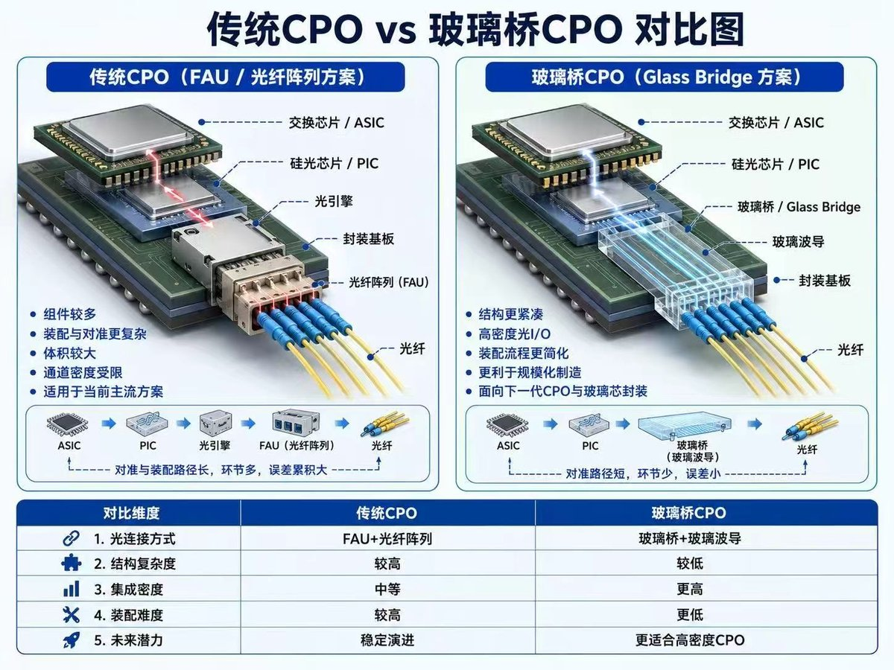

---

<!-- post_id: threads:3927183269838324120 | ts: 1782376749 -->
## [Threads] Kok Yu · 2026-06-25 16:39

7月看起來又要開始忙碌了...新簡報、新的劇情?

---

<!-- post_id: x:2070063866789396704 | ts: 1782376660 -->
## [X] 駿HaYaO · 2026-06-25 16:37

JX金屬宣布，將針對高槻工場的銠鍍液進行增產投資。預計在2028年度前，將生產能力提升至2025年度的2倍以上。

銠鍍液具備優異耐蝕性、耐磨耗性與導電性，是半導體檢測用「探針卡」微細探針針（Probe Pin）的重要鍍層材料。目前JX金屬商事在該領域擁有高市場佔有率。

隨著AI資料中心快速擴張，需要大量半導體進行電性檢測，相關需求大幅成長。JX金屬集團將此視為重要商機，除主力半導體濺鍍靶材、銦磷基板外，也積極擴大前端材料供應。
https://t.co/OcvPhtCEvn

---

<!-- post_id: x:2070061353943835100 | ts: 1782376061 -->
## [X] 駿HaYaO · 2026-06-25 16:27

NVIDIA 800V Power Rack成Vera Rubin選用方案，預估至Rubin Ultra世代擴大採用

根據TrendForce最新AI伺服器供電架構研究，NVIDIA正積極推動自家800V HVDC Power Rack方案，預計2026年第三季完成備貨，將提供給有需求的Vera Rubin客戶選用，並非標準配備。

從功耗設計來看，VR200單機櫃功耗約225kW，較前一代GB200 NVL72的150kW增幅可控，仍可沿用In Rack PSU供電。進入Rubin Ultra世代，單櫃功耗將大幅提升至660kW，對應下一代氣冷產品更可能達到1.2MW–1.3MW水準。此時800V Power Rack單櫃預估可支援1–2個Rubin Ultra機櫃，實際數量將依客戶冗餘需求而定。TrendForce指出，該方案將於2027下半年Rubin Ultra系列推出後逐步擴大採用，大規模量產預計落在2028年。供應鏈也透露，NVIDIA正同步開發多種供電方案，以提供客戶更多彈性選擇。

另一方面，Hyperscaler資料中心建置進度仍面臨多重挑戰。雖然各大雲端業者已投入巨額資本，計畫2026年底前在北美推動多個GW級園區上線，但記憶體、CPU等關鍵伺服器料件仍處供需緊張狀態。此外，電力基礎設施成為最大瓶頸。

TrendForce觀察，目前美國多數電網發電容量充足，但輸電環節嚴重受限。以PJM Interconnection為例，新資料中心併網等待期可能長達五年以上。

目前各電網區域正與聯邦政府合作，研擬加速併網機制。同時，大型電力變壓器平均交期已延長至2.5年，高壓等級（345kV–765kV）更達4–5年，為2020年的兩倍；開關設備同樣面臨長交期風險。若關鍵電力設備無法及時備貨，將直接影響資料中心實際建置時程。
https://t.co/EsrDMduYZi

---

<!-- post_id: x:2070037809168261309 | ts: 1782370447 -->
## [X] 駿HaYaO · 2026-06-25 14:54

1. Hyperscalers 自訂晶片趨勢
- 目前（2026）：Hyperscalers（AWS、Google、Microsoft 等）與 Broadcom、Marvell 等廠商的關係，主要建立在產能分配而非 IP 設計能力。
- 未來方向：Hyperscalers 強烈傾向內部共同設計，若 TSMC 產能完全開放，他們很可能 100% 轉向自己做。
- 時間預測：
‧ 3 年後：內部設計比例大幅上升（共同設計能力提升，AI 工具讓小團隊即可完成）。
‧ 5 年後：外部依賴進一步減少，設計已非瓶頸，關鍵在於驗證與製造。
- 對 Broadcom / Marvell 的影響：這是「惡夢情境」，他們的競爭優勢正從 IP 轉向產能與供應鏈掌控。

2. Marvell / Broadcom 的價值與風險
- Marvell 希望把自訂 ASIC 營收從低個位數提升至 20%+，甚至做到 150-200 億美元，但專家認為偏樂觀。
- 他們仍有價值領域：
‧ Broadcom：記憶體 IP（HBM）、供應鏈管理。
‧ Marvell：SerDes、光學互聯、DSP、乙太網路交換、PCIe。
- 但這些優勢正在減弱，因為 hyperscalers 有錢能自己招募頂尖人才。

3. TSMC 產能是關鍵
- TSMC 已把未來 2 年產能 largely 分配完畢，hyperscalers 現在很難搶到足夠份額。
- 目前 Marvell/Broadcom 的穩固關係，主要來自他們手上的第二順位產能。
- 長期來看，hyperscalers 會直接與 TSMC 簽約，但受限於 TSMC 要維持客戶平衡。

4. 互聯（Interconnect）與銅 vs 光纖
- 趨勢：明顯走向更多光纖，但不會 100% 取代銅。
‧ 原因：GPU 密度大幅增加（同機架從 1 個 GPU → 8 個），連接需求暴增。
‧ <2 公尺：銅仍最划算。
‧ 2 公尺：光纖優勢明顯。
- 預測：未來 2-3 年可能從 100% 銅 → 60-70% 銅 + 30% 光纖。
- 銅線用量：整體會增加（而非減少），因為機架運算量上升，佈線需求跟著成長（例如從 100 美元 → 150 美元）。

---

<!-- post_id: x:2070022426218422432 | ts: 1782366780 -->
## [X] 駿HaYaO · 2026-06-25 13:53

AI 伺服器建置熱潮正快速推升高端 MLCC價格，中國電子元件市場出現明顯供需失衡。年初至今，部分熱門高容量、高耐溫 MLCC 現貨價格已上漲 3 至 5 倍，在深圳、上海等地甚至出現每日波動的投機交易。其中 22μF、47μF 等產品漲幅最為驚人，部分 AI 伺服器用料已從每千顆約 80 元人民幣飆升至超過 350 元。

與 2018 年全面性短缺不同，此波漲勢主要集中於高端產品。村田（Murata）、三星電機等國際大廠已將產能從智慧型手機、PC 等消費性電子轉向 AI 伺服器與汽車應用等高毛利領域。然而，高端 MLCC 技術門檻高、良率要求嚴格，新增產能需時 18 至 24 個月，短期內難以擴充。

原廠出貨管控趨嚴，數百萬至數千萬顆的大單常僅能滿足 10% 至 20% 需求，部分海外供應商甚至恢復搭售機制，強制搭配中低容量產品。AI 伺服器單機使用 MLCC 數量約為傳統伺服器的 8 至 12 倍，高盛預估 MLCC 已成為 AI 伺服器中僅次於 GPU 與記憶體的第三大成本項目，2025 至 2030 年相關需求將成長 4.3 倍。

消費性電子用低容量 MLCC 需求依然疲弱，顯示此波短缺具結構性特徵。市場預期緊俏情況將延續至 2027 年以後。中國本土廠商風華高科與潮州三環集團，有望因國際訂單轉移而受惠，迎來成長機會。

---

<!-- post_id: x:2070007456969937378 | ts: 1782363211 -->
## [X] 駿HaYaO · 2026-06-25 12:53 _(接續 2 則)_

康寧( $GLW )推出 GlassBridge™ 光纖至 PIC 連接器平台，加速下一代 AI 資料中心光互聯革命

康寧公司正式發表 GlassBridge™ 光纖連接器平台，這是一款基於玻璃的先進光纖至 PIC（光子積體電路）連接技術，專為CPO與近封裝光學（NPO）等下一代 AI 資料中心架構設計。

GlassBridge™ 採用晶圓級製造技術，利用康寧獨家的離子交換（IOX）波導工藝，在玻璃基材中形成精密光學路徑，成功解決光纖與 PIC 波導（數百奈米）之間尺寸差距達數十倍的耦合難題。它支援可拆卸式連接，提供超過 24 個光通道的高密度設計，並可依客戶需求客製化間距，耦合損耗目標控制在 2dB 以內。

與傳統光纖陣列單元（FAU）相比，GlassBridge™ 具有明顯優勢：透過被動對準實現高效組裝，大幅降低製造成本與複雜度；同時搭配標準化 TMT 物理接觸介面，確保可重複插拔與系統維護便利性，為系統設計人員提供高度靈活且可擴展的解決方案。

此技術特別適用於 CPO 架構，能讓光學元件直接與 ASIC 晶片緊密整合，滿足 AI 運算對極高頻寬與低延遲的需求。在 NPO 應用中，則可讓單一 PIC 連接多條高密度光纖，有效提升整體系統效能。

康寧 GlassBridge™ 不僅是單一連接器，更是完整 GlassWorks AI 平台 的一部分，涵蓋光纖、光纜、連接器與光耦合等全系列解決方案。目前已與 GlobalFoundries 等夥伴合作開發，預計將推動玻璃基板半導體封裝與光電整合的產業進展。

康寧表示，GlassBridge™ 將為 AI 資料中心提供更可靠、高密度且易於量產的光互聯路徑，助力超大型雲端業者因應爆炸性運算需求。

https://t.co/SoPdPqgYx6

https://t.co/sTkcVOL1A6

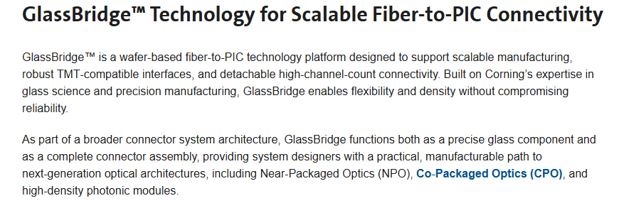

---

<!-- post_id: x:2069960466609394175 | ts: 1782352007 -->
## [X] 駿HaYaO · 2026-06-25 09:46

Anthropic 指控阿里巴巴集團透過數千個詐欺帳戶，大規模非法訪問其 Claude 人工智能模型，涉嫌進行「對抗性蒸餾」，以極低成本複製美國頂尖 AI 技術。根據 Anthropic 致美國參議員及白宮官員的信函，4 月至 6 月間，涉事方使用近 2.5 萬個假帳戶，與 Claude 進行高達 2,880 萬次互動，針對軟件工程與智能體推理等核心能力。

Anthropic 警告，這是中國公司迄今最大規模「搭便車」行為，已違反使用條款，並對美國 AI 實驗室構成系統性威脅。消息曝光後，阿里巴巴美國存託憑證股價一度下跌逾 3%。美國國會正研擬修正國防法案，將涉案中國企業列入黑名單或實施制裁；特朗普政府亦已採取初步行動。

然而，Anthropic 自身也面臨美國對其最先進模型的出口管制。事件凸顯美中 AI 科技競爭白熱化，以及智慧財產權保護的迫切性。OpenAI、谷歌等美國企業已聯合打擊類似蒸餾行為。

---

<!-- post_id: x:2069945302925361460 | ts: 1782348392 -->
## [X] 駿HaYaO · 2026-06-25 08:46

#每日導讀 #20260625 #經濟日報

外資出逃同步衝擊匯市，台幣重貶1.26角至31.751元
日月光投控營運長吳田玉：集團15座新廠同時動工，仍趕不上客戶需求
聯發科董事長蔡明介揭示多重物理量與太空運算新世代

📷 完整導讀 →https://t.co/kiXsl8ybMe

---

<!-- post_id: x:2069945092295839810 | ts: 1782348342 -->
## [X] 駿HaYaO · 2026-06-25 08:45

Good Morning! 6/25 Foreign Media Summary

- 3443 GUC: US Brokerage Upgrade and Target Price Increase
US-based major brokerages downgraded the stock last month but upgraded it back to Overweight (OW) this month. They also raised their 2027–2028 EPS estimates to $124.4 / $189.5, applied a 45x PE valuation for next year, and raised the target price accordingly.

According to the latest AI supply chain tracking report from brokerages, GUC has already reserved approximately 60,000 CoWoS wafers from TSMC for next year, signaling additional new projects. The firm expects 3–4 clients to each contribute up to $1 billion in revenue in the coming one to two years. These clients include Google, Tesla, Meta (or other new US cloud service providers), as well as Chinese ADAS customers.CPO is expected to be another growth highlight. The company has announced a partnership with Lightmatter, integrating Lightmatter’s Passage CPO platform into its ASIC designs. Brokerages also expect GUC to deepen collaboration with TSMC on the COUPE technology in the future, or potentially obtain licensing for optical design-related IP/PDK directly.

- 2345 Accton : US Brokerage Initiates Coverage with Positive View
A US brokerage initiated coverage for the first time and expects Accton to deliver approximately 50% profit CAGR from 2025 to 2028. The growth is mainly driven by the rapid upgrade cycle of 800G/1.6T switches, Accton’s increasing ToR market share at Meta, and the recovery of AWS ASIC momentum.
The brokerage estimates this year and next year’s EPS at $82.6 / $113.5. It applies a 26x PE multiple on the next 12-month EPS and assigns a positive rating.

---

<!-- post_id: x:2069943768334360783 | ts: 1782348026 -->
## [X] 駿HaYaO · 2026-06-25 08:40

$MU
關於供應方面，我們的客戶正認識到，記憶體與儲存供應短缺將需要相當長的時間才能改善。即使我們預期產業供應將在2028年逐步改善，但我們目前仍無法明確掌握記憶體供應何時能夠追上日益增加的需求。記憶體產業的供應成長取決於大規模的綠地晶圓廠擴建。這些綠地專案規模龐大、複雜且耗時。此外，其進度受到多項因素限制，包括全球晶圓廠建設的長前置時間、關鍵技藝勞工短缺、包括許可在內的複雜法規，以及強化能源基礎設施的需求。同時，記憶體製程技術作為半導體中開發與製造最先進的技術之一，每一新製程節點都變得更加複雜。技術轉型導致比特成長速度隨時間放緩，晶圓產能成長需求大幅增加潔淨室空間與綠地晶圓廠需求，而HBM的成長以及每新一代增加的權衡比例，更進一步對非HBM供應造成壓力。在NAND方面，產業供應商將潔淨室空間從NAND轉向DRAM，加上整體潔淨室空間有限，限制了NAND比特供應的成長。綜合上述因素，儘管我們已全面努力增加供應，但供應在其成長幅度與滿足產業需求的能力上，仍受到結構性限制。

AI系統由來自日益廣泛供應商的GPU、ASIC與CPU設計所驅動。然而，它們皆共享一個重要特徵——AI系統的效能架構上取決於記憶體子系統的效能與容量。這已催生出更為複雜的記憶體階層，為美光提供了比歷史上任何時刻都更大的差異化機會。它也將記憶體在AI領域中的角色，提升為一項策略性資產。

---

<!-- post_id: x:2069936886899163389 | ts: 1782346386 -->
## [X] 駿HaYaO · 2026-06-25 08:13

早安！6/25 外電綜合整理

- 3443創意: 美系升評升目標
美系大行上月降評後，本月又升評回到OW，同時上修27-28年EPS至$124.4/$189.5，給予明年45xPE評價，同步升目標。

券商最新的 AI 供應鏈追蹤報導顯示，創意已向台積電預訂明年約6萬片 CoWoS 晶圓產能，這隱含有更多的新專案。預期明後年有 3–4 家客戶可貢獻達到 10 億美元營收規模。其中包括Google、Tesla、Meta（或其他新的美國 CSP）以及中國 ADAS 客戶。

CPO會是另個成長亮點，宣布與 Lightmatter 合作，將 Lightmatter 的 Passage CPO 平台整合至其 ASIC 設計中。券商同時預期創意未來也可能在台積電 COUPE 技術上深化合作，或直接取得光學設計相關 IP/ PDK 授權。

- 2345智邦: 美系初評正向
美系券商首次覆蓋，預期智邦 2025–2028 年獲利CAGR約達 50%，主要受惠於 800G/ 1.6T 交換器快速升級、Meta ToR 市占率提升，以及 AWS ASIC 動能重新恢復。預估今明年EPS為$82.6/$113.5，以未來12個月EPS的26xPE評價，評等正向。

 #下次會考

---

<!-- post_id: x:2069830611540603379 | ts: 1782321048 -->
## [X] 駿HaYaO · 2026-06-25 01:10

RT @wallstengine: Rep. Nancy Pelosi just disclosed 2 new buys worth up to $6M:

$INTC: $5.0M
$UBER: $1.0M https://t.co/ZODWNzW0DB

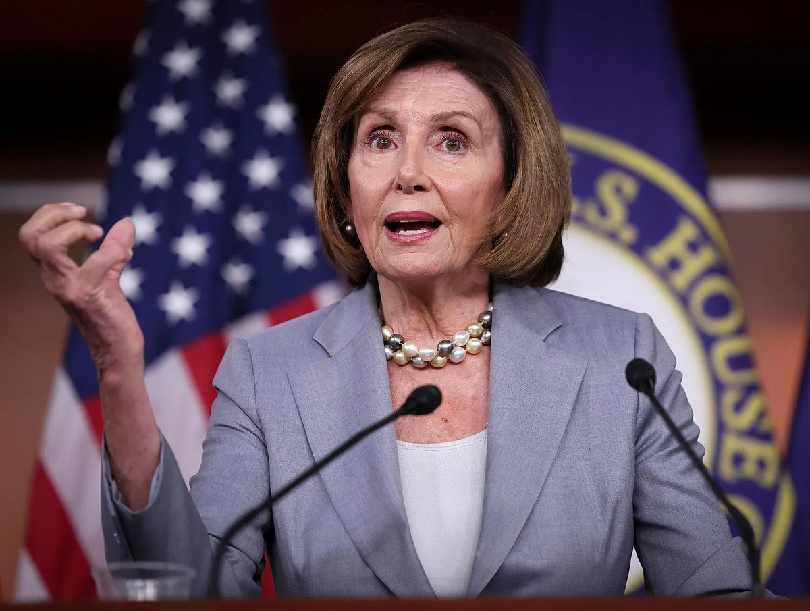

---

<!-- post_id: x:2069830497078063137 | ts: 1782321020 -->
## [X] 駿HaYaO · 2026-06-25 01:10

南通江海電容器股份有限公司

關於公司產品價格調整的通知

尊敬的合作夥伴：
衷心感謝貴司長期以來對江海股份的信任與支持！多年來，我們視雙方的穩定合作為最寶貴的財富。

受國際地緣衝突、供應鏈波動影響，今年電容器核心原材料（如鋁箔、化工原料、碳粉等）及電力成本持續大幅攀升，且漲勢至今未見回落。鑒於當前成本結構已遠超原定價模型，為保障持續、穩定的供貨能力，我司經審慎評估，不得不對產品價格進行調整。

調整範圍包括鋁電解電容器、薄膜電容器、超級電容器三大品類。

具體調價細則及幅度，將由各區域業務負責人近期與貴司對接說明。

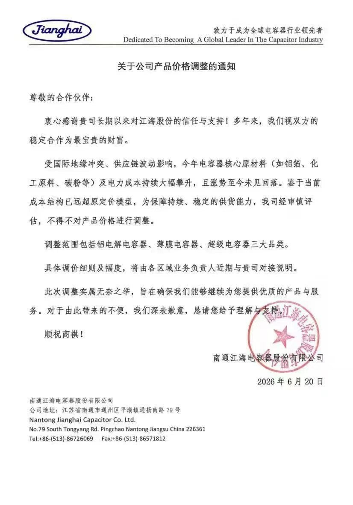

---

<!-- post_id: x:2069828309853282730 | ts: 1782320499 -->
## [X] 駿HaYaO · 2026-06-25 01:01

OpenAI 與博通公司( $AVGO )合作推出首款客製化 AI 晶片「Jalapeno」。該晶片已收到首批樣品，正在測試處理 AI 工作負載的能力，與典型 AI 圖形處理單元相比，成本可節省約 50%。

晶片專為LLMs推理設計，每瓦能耗效能大幅優於現有最先進水準。預計今年晚些時候起，整合至 OpenAI 及微軟等合作夥伴的資料中心。OpenAI 為因應 AI 服務激增需求，已與博通、超微半導體等廠商簽署數十億美元協議，逐步減少對英偉達晶片的依賴。

此舉標誌 OpenAI 開始掌控基礎設施各層面，有助降低成本並提升模型運行效率。未來晶片路線圖顯示，下一代版本計劃於 2028 年推出，此後將維持年度迭代節奏。博通執行長 Hock Tan 表示，前沿模型開發商最終都將打造最適合自己的客製化 AI 加速器與網路系統。

---

<!-- post_id: x:2069827772328136989 | ts: 1782320371 -->
## [X] 駿HaYaO · 2026-06-25 00:59

根據BofA最新分析，隨著資料中心機架功率從160kW以下快速擴大至600kW以上甚至1MW等級，類比半導體內容價值將呈指數級成長。每機架價值從約3.63萬美元大幅躍升至29.1萬美元，最終在1MW機架中超過91.7萬美元。其中1MW機架的GPU板貢獻最大，達27.2萬美元（占30%），48V匯流排轉換器與高壓IBC緊隨其後，貢獻21.6萬美元（占24%）。

AI電源類比半導體TAM預計從2025年的78.6億美元，快速成長至2030年的267.9億美元。德州儀器（TXN）將維持最大市佔，收入從15.5億美元增至56.6億美元，市佔率由19.7%升至21.1%。在低功率/電壓領域市佔更達22.1%，高功率/電壓領域也從2026年的16.9%成長至20.4%。TXN在6種主要半導體類型中布局4種，被市場視為「類比之王」。

英飛凌（IFNNY）成長最為亮眼，市佔從11.5%躍升至17.3%；ADI與onsemi分別達16.6%與8.6%。類比IC仍是最大單一領域，TAM從52億美元成長至159.2億美元，占總市場59%。碳化矽（SiC）與氮化鎵（GaN）則分別以63%及69% CAGR高速成長，2030年TAM分別達21億與16.1億美元。

---

<!-- post_id: x:2069714613202035180 | ts: 1782293391 -->
## [X] 駿HaYaO · 2026-06-24 17:29 _(接續 2 則)_

《The Elec》6月24日獨家報導，蘋果首款可折疊iPhone已確定主要規格，並進入量產準備階段。量產時程：7月下旬正式啟動，首批由鴻海（Foxconn）負責生產；4月已完成第一輪試產，目前各項驗證順利，9月發表會將按原計劃進行。
關鍵供應鏈：
- 顯示器：三星顯示（Samsung Display）提供可折疊OLED面板，已獲蘋果批准從越南工廠供應首批模組。
- 鉸鏈：由台灣新日興與美國安費諾（Amphenol）共同供應，採用3D列印技術製造。
- 其他：包含覆蓋玻璃與機構零件。

鉸鏈問題已解決：開發過程中曾出現「數百萬次折疊後輕微噪音」及「組裝公差導致不良率上升」的情況，但供應鏈人士確認「目前大多數問題已解決」，打消近期延遲傳聞。蘋果對首款折疊產品品質把關嚴格，試產結果是決定時程的關鍵。

發表策略調整：9月發表會重心將轉向iPhone 18 Pro、Pro Max與可折疊新機（暫稱Ultra或Fold），標準版iPhone可能分拆至2027年春季獨立發表。這是蘋果首次將折疊機納入產品線，預計將改變現有發表節奏。

整體而言，雖然鉸鏈等機構件挑戰較大，但供應鏈最新進展顯示蘋果仍維持既定路線。若一切順利，預計10月左右可開賣。作為蘋果首款折疊iPhone，初期產量可能受控，售價預估落在高階定位。

https://t.co/ycM6av7OdT

---

<!-- post_id: x:2069708619558559827 | ts: 1782291962 -->
## [X] 駿HaYaO · 2026-06-24 17:06

RT @Balder13946731: 美光的财报极有可能宣布1:10拆股。

$MU https://t.co/MTjqOJsNf5

---

<!-- post_id: x:2069700511121776755 | ts: 1782290029 -->
## [X] 駿HaYaO · 2026-06-24 16:33

三星電子將HBM產能一半轉向HBM4，力圖反攻市占

三星電子已將每月15萬片HBM晶圓產能的一半（約7.5萬片）分配給第六代HBM4，剩餘產能用於12層HBM3E，並暫停需求較弱的8層HBM3E生產，全力衝刺HBM4。

三星今年2月全球首度出貨HBM4，四個月內即創下10億美元營收，全年目標達100億美元。相較HBM3E因認證延遲而輸給SK海力士，三星選擇專注於已領先的HBM4，用於NVIDIA下一代Rubin加速器，同時瞄準Google、Amazon、Microsoft等雲端巨頭自研ASIC晶片市場。HBM4對客製化base die與先進封裝的要求，正好發揮三星記憶體、代工與封裝垂直整合優勢。

SK海力士則在HBM3E穩居NVIDIA最大供應商，無需急於轉移產能，可穩健接單並逐步推進HBM4。

市場預估，三星HBM市占率將由去年27%升至今年37%，SK海力士則由56%降至43%，明年三星有望超越SK海力士，兩強在HBM市場的競爭將更加激烈。

---

<!-- post_id: x:2069699863135334752 | ts: 1782289875 -->
## [X] 駿HaYaO · 2026-06-24 16:31

報告針對TSMC先進封裝CoWoS 2027年產能分配進行初步分析。報告指出，隨著ABF基板供應改善，TSMC CoWoS產能預計在2027年底達到約20萬片/月，年成長約60%。Nvidia的GPU與CPU仍是最大需求驅動者，預計拿下最大份額。

Nvidia CEO先前已確認取得充足2027年CoWoS產能。Blackwell與Rubin平台將大量採用CoWoS-L，預估消耗約91萬片；同時，3nm Vera CPU出貨量預計接近翻倍，達約575萬顆，顯示Nvidia在AI加速器與CPU領域持續擴張。

Google TPU則為第二大用戶。MediaTek預訂18萬片CoWoS-S，相當於約360萬顆TPU v8t（ZebraFish）；Broadcom預訂36.5萬片CoWoS-S，支援TPU v8i（SunFish）及Tomahawk交換器。新一代2nm TPU代號TriggerFish（HumuFish推理優化版）若量產，將進一步提升需求。

值得注意的是，CPU開始大規模採用2.5D先進封裝。AMD 2nm Venice CPU預估2027年出貨約675萬顆，Nvidia Vera CPU也同步跟進，顯示先進封裝技術已從GPU擴展至高性能CPU領域。

整體而言，Nvidia仍主導TSMC CoWoS產能，Google緊隨其後。ABF基板瓶頸緩解，加上GPU與CPU強勁需求，AI供應鏈至2027年成長動能依然強勁。報告認為，TSMC在先進封裝領域的領導地位將持續鞏固，相關供應鏈廠商有望受惠。

---

<!-- post_id: x:2069680362804953498 | ts: 1782285225 -->
## [X] 駿HaYaO · 2026-06-24 15:13

根據TrendForce最新《全球固態電池產業發展動態季報_2Q26》，日本正大力推動全固態電池（ASSB）研發與供應鏈建置，以鞏固下一代電池產業競爭力。經濟產業省（METI）自2023年起實施《電池供應保障計畫》，重點扶植全固態電池及雙極型低成本磷酸鐵鋰（LFP）電池。截至2026年第一季，該計畫已核准五大全固態電池相關項目，累計補助金額高達6.6億美元（約1,057億日圓）。

全固態電池因具備高能量密度、高安全性及長壽命等優勢，被視為超越傳統液態鋰電池的關鍵技術。日本目標在2030年左右實現商用化，目前Toyota、Honda、Nissan等車廠已建立小規模試生產線。2026年核心任務為提升電池良率與品質，同時擴大硫化物固態電解質及硫化鋰（Li₂S）等關鍵原料的生產能力，以降低成本。統計顯示，補助資金中約18%投入固態電解質及原料的生產技術開發。

TrendForce指出，日本目前是全球全固態電池最大技術來源國，專利申請量占全球37%，正積極透過供應鏈垂直整合搶占先機。然而，日本仍面臨嚴峻挑戰。以中國CATL、BYD為首的LFP電池，憑藉Cell to Pack（CTP）、閃充等技術大幅降低成本並提升性能，在電動車市場占比持續擴大，形成全固態電池的主要成本障礙。

國際競爭也日益激烈。韓國Samsung SDI量產進度緊追日本，中國則以半固態電池先行卡位市場，同時聯合材料、設備、電芯及整車業者加速全固態電池研發。歐美亦積極投入相關技術。

日本欲靠全固態電池突圍，需持續克服量產良率、成本控制及供應鏈完整性等難題，方能在全球電池產業競爭中維持領先地位。
https://t.co/zulhGCwUz9

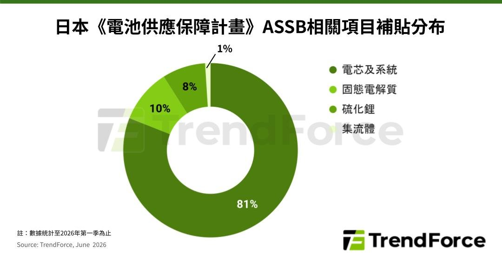

---

<!-- post_id: x:2069679627195318435 | ts: 1782285050 -->
## [X] 駿HaYaO · 2026-06-24 15:10 _(接續 2 則)_

CSP加速自研晶片，ASIC快速崛起，半導體產業鏈出現新合作模式。市場傳聞聯發科正評估透過投資入股或策略聯盟方式，與台積電旗下IC設計服務廠創意深化合作，藉以補強AI ASIC布局及先進製程設計服務能力。

台積電近期資本布局調整頻繁，已於2026年4月底全數出清Arm持股，5月再宣布減持世界先進股權至19%。雖然台積電否認釋出創意持股傳聞，但供應鏈認為，若聯發科承接部分股權，有機會形成「台積先進製程與封裝、聯發科ASIC平台、創意Turnkey設計服務」三方合作架構，既有利聯發科擴大ASIC版圖，也符合台積聚焦專業代工、提升資本效率的策略方向。

創意是全球少數具先進製程Turnkey能力的設計服務廠，長期與台積共同推進3奈米、高速傳輸IP及CoWoS先進封裝。目前其最大引擎為Google 3奈米CPU專案，另有中國、歐美ADAS、矽光子、HBM等業務。隨著AI從訓練轉向推論，ASIC因能效與成本優勢，出貨成長率預計超越GPU。

對聯發科而言，此合作意義重大。聯發科已成功打入Google TPU供應鏈，手中握有TPU 8t（2026Q4量產）、v8e（2027Q4）、v9（2028）等多世代專案，合作從單一產品延伸至平台化長期關係。同時與Intel合作2奈米Humufish專案（採用EMIB封裝），並擴大與NVIDIA在車用、資料中心、AI PC等領域合作。

儘管CSP可能逐步內部化設計能力，但先進AI晶片從系統架構到量產，需長期累積的供應鏈整合與先進製程經驗，聯發科憑此成為重要ASIC夥伴。產業分析指出，三方合作將加速台灣半導體在AI時代的競爭優勢。

https://t.co/yz9A2jBlIG

---

<!-- post_id: x:2069677403064996097 | ts: 1782284520 -->
## [X] 駿HaYaO · 2026-06-24 15:02

英偉達AI晶片在中國黑市價格已上漲一倍，主因美國嚴打非法出口，與中國企業強勁需求碰撞。旗艦產品DGX B300伺服器過去半年從400萬元人民幣暴漲至800萬元以上；RTX 6000 Pro工作站晶片也從5萬元漲至13萬元。

儘管華盛頓加強管制、供應鏈受重創，中國買家仍積極透過香港中轉、走私等管道採購，包括A100、H200等舊款晶片。交易商指出，風險大幅提升，中間商需付訂金鎖貨，審查加嚴導致貨源不穩，部分甚至出現詐騙。

英偉達警告，用走私晶片拼湊資料中心是「死路」，不提供任何支援。中國則加速推動華為昇騰910PR等國產替代方案，但短期仍難滿足「推理」晶片需求。

黑市價格飆升也推高GPU租賃成本，部分已超過美國。專家預期，在美中科技管制持續下，今年對中國AI企業將是極具挑戰的一年。

---

<!-- post_id: x:2069670104737194370 | ts: 1782282780 -->
## [X] 駿HaYaO · 2026-06-24 14:33

根據科技分析師Tim Culpan在Culpium平台獨家報導，台積電正大規模展現市場定價能力，已陸續通知客戶，對所有領先的7nm及以下先進製程調漲價格，漲幅介於5%至10%。這些先進製程目前占台積電總收入約75%，影響範圍遠高於市場先前關注的3nm單一製程。

報導指出，今年年初以來，台積電高層已明確指示業務開發和銷售團隊，必須積極強化獲利能力，找到方法向客戶收取更多費用。即使在尚未正式實施漲價的地區，客戶也已被要求將更高的成本結構納入採購訂單中。部分客戶甚至收到明確通知，首代EUV的7nm製程也納入此次調漲名單，顯示這波調整規模遠超外界預期。

在全球AI算力需求持續爆炸性成長的強勁支撐下，台積電先進製程供不應求，為公司帶來強大的議價空間。4月北美技術論壇上，台積電高調展示A14後續的A13、A12製程藍圖，並與SK海力士共同分享HBM4記憶體布局，檯面下卻同步推動大規模價格調整計畫。

根據Culpium估計，若以平均5%漲幅計算，這波調漲預計將為台積電2026年毛利率額外挹注超過2個百分點。全年營收有望成長至少30%，突破1600億美元大關，其中下半年約850億美元將明顯受惠於價格上漲。預計至少80%的晶圓收入來自先進製程，若加上非晶圓業務按比例成長，價格調整將直接影響近700億美元的銷售額。

面對媒體詢問，台積電並未正面證實漲價細節，僅表示「定價策略是長期且具策略性的安排」。市場分析普遍認為，在AI驅動的結構性需求下，台積電技術領先優勢將持續轉化為獲利能力提升，成熟製程未來也可能跟進調整。

---

<!-- post_id: x:2069659786753319397 | ts: 1782280320 -->
## [X] 駿HaYaO · 2026-06-24 13:52

隨著AI基礎設施部署加速，二線晶圓代工族群正面臨重大轉機。研究機構先前在2025下半年至2026年第一季對該族群持保守態度，主因其AI曝光度低、非AI應用需求疲弱，導致利用率（UTR）展望偏弱、議價力下滑。2026年第一季雖有記憶體漲價帶動的拉貨，但消費性電子能見度仍低。

然而，AI伺服器對功率半導體的需求急增，促使主要IDM態度轉正，大量AI周邊需求開始外溢至成熟製程，顯著改善二線晶圓代工的整體供需環境。即使非AI需求依然平淡，台積電等龍頭廠加速從6/8吋向12吋晶圓的製程整併，也為二線廠創造更多產能轉移機會。

機構因此大幅上修預估：二線廠平均利用率將在2026下半年/2027上半年/2027下半年達到91%/87%/93%，2026與2027年ASP更可望分別成長11%與27%。此外，AI也為擁有獨特特色製程的二線廠開闢新藍海，包括矽中介層（silicon interposer）、記憶體、先進封裝與光學元件等高附加價值領域。

儘管自2026年第一季以來，二線晶圓代工股價已平均上漲102%（優於TAIEX的50%），機構仍認為市場尚未充分反映其營收與毛利率的上檔潛力。短期催化劑為漲價談判與財測上修，長期則仰賴AI新業務貢獻。

基於上述正面變化，機構全面提高目標價，並將聯電（UMC）與世界先進（VIS）自Hold升評至Buy，維持GFS為Hold、SMIC為Buy。其中最看好聯電，因其將成為台積電製程整併的最大受惠者，同時有望延伸與英特爾的合作，在TFLN及先進封裝領域扮演重要角色。

---

<!-- post_id: x:2069615135367569916 | ts: 1782269674 -->
## [X] 駿HaYaO · 2026-06-24 10:54

"Given CXMT’s expanding role in global DRAM capacity, as in past cycles, investors are concerning about potential supply-demand disruption from Chinese players. While these concerns are understandable, we believe they are likely overplayed at least for the next two years. We factor in incremental wafer capacity and bit shipments from CXMT and other memory suppliers—and assuming utilisation rates in the high-90% range—we continue to see DRAM as extremely supply constrained."

"DRAM is likely to remain undersupplied through potentially 2028"

鑑於CXMT在全球DRAM產能中的角色持續擴大，投資人如過去週期般，擔憂中國廠商可能帶來供需失衡的風險。雖然這些疑慮可以理解，但我們認為至少在未來兩年內，這些擔憂很可能被過度放大。在計入CXMT及其他記憶體供應商的增量晶圓產能與位元出貨量後，並假設稼動率維持在90%高檔水準，我們持續認為DRAM市場仍將處於極度供給緊俏的狀態。

DRAM很可能持續供不應求，直至2028年左右。

—--

僅就 CXMT 的晶圓新增產能來看，與其他供應商相比，我們確實看到有意義的產能擴張。我們預期 CXMT 在 2026 至 2028 年每年將分別新增約 85k wspm、70k wspm 及 80k wspm，而三星為 15k/50k/110k、SK 海力士為 60k/60k/90k、美光為 30k/90k/115k。

即使考慮這些晶圓新增產能，我們仍預期今年 DRAM 將維持高個位數百分比的供給短缺，明年位元供給短缺情況將擴大至低雙位數至中雙位數。我們在先前報告中已詳細說明，為何即使有這些新增的增量晶圓產能，DRAM 很可能仍將持續供給不足，直至 2028 年。

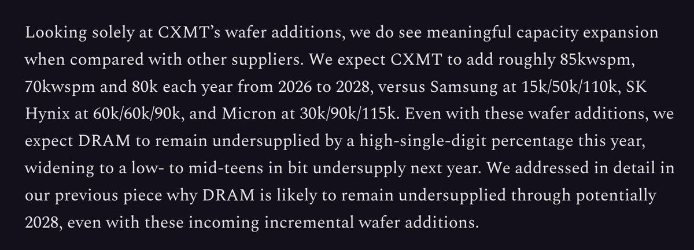

---

<!-- post_id: x:2069397307200864380 | ts: 1782217740 -->
## [X] 駿HaYaO · 2026-06-23 20:29

根據 Counterpoint Research 最新《2026 年 FOPLP 與玻璃基板報告》，全球扇出型面板級封裝（FOPLP）與玻璃基板封裝（GSP）合併市場規模，預計將從 2024 年的約 6.5 億美元，快速成長至 2030 年超過 81 億美元，年複合成長率極為強勁。

AI 與高效能運算（HPC）應用成為市場最大成長動能，預計 2030 年將占 FOPLP 總營收的 45.6%。隨著 AI 加速器與大型運算處理器需求激增，產業迫切需要更高互聯密度、優異散熱性能與更大封裝尺寸的先進解決方案。
玻璃基板正成為傳統有機基板的重要替代方案。

Counterpoint Research 副總裁田村良夫指出，玻璃基板在互聯密度、尺寸穩定性與翹曲控制上具有明顯優勢，特別適合下一代 Chiplet 架構與大型 AI 處理器。TSMC 積極開發 CoPoS（Chip-on-Panel-on-Substrate）平台，Intel、三星電機、ASE 與 PTI 等廠商也大力擴大玻璃基板與面板級封裝產能。

區域產能方面，東亞仍居主導地位。預計台灣、日本與中國大陸將於 2030 年占全球 FOPLP 面板產能的 84.8%，其中日本因玻璃基板投資增加，產能成長最為顯著。

儘管市場前景樂觀，但面板尺寸標準化、穿玻璃通孔（TGV）製程穩定性以及製造可擴展性等技術挑戰，仍需產業共同克服。未來透過生態系合作與技術突破，FOPLP 與玻璃基板有望加速商業化，成為支撐 AI 時代半導體發展的關鍵技術。

---

<!-- post_id: x:2069378433117716624 | ts: 1782213240 -->
## [X] 駿HaYaO · 2026-06-23 19:14

美國總統特朗普於2026年6月22日在白宮橢圓形辦公室簽署兩項行政令，強力推動量子計算技術發展，明確要求在2028年前打造一台用於科學研究的強大量子計算機，以鞏固美國在量子領域的全球領先地位。

根據白宮科技政策辦公室主任邁克爾·克拉齊奧斯的說法，量子計算機預計可在2028年前實現。這項技術利用量子物理原理，能以遠超現有超級電腦的速度解決複雜問題，將大幅推進人工智慧、材料科學與化學等領域的突破。

行政令同時強調國家安全面向。其中一項重點是保護政府系統免受量子電腦驅動的網路攻擊，目標在2030至2031年將關鍵系統全面遷移至「後量子密碼學」。另一項要求五角大樓在2028年前部署量子傳感器，用於戰區導航、地下活動探測及衛星監測。

特朗普政府此舉凸顯美中科技競爭下的戰略布局。上個月美國商務部已宣布投資20億美元，入股包括IBM在內的九家量子計算公司。Inflection公司執行長馬修·金塞拉出席簽署儀式時表示，量子傳感器等應用「時間表可行」。

此外，行政令還推動國際合作，強化知識產權與供應鏈安全，以因應中國等競爭對手的挑戰。

---

<!-- post_id: x:2069361823493783669 | ts: 1782209280 -->
## [X] 駿HaYaO · 2026-06-23 18:08

報告指出，持續看好記憶體產業資本支出動能，同步上調2026/2027年DRAM與NAND的WFE（晶圓廠設備支出）及位元供給預測。

- DRAM部分：WFE預測由原先446億/571億美元上修至486億/625億美元，位元供給成長率由26%/32%提升至29%/33%。主要修正來自Brownfield擴產升級，預期客戶將持續積極拉前支出，綠地新增產能亦小幅增加。

- NAND部分：WFE微幅調整至157億/241億美元，但位元供給成長率大幅上修至24%/31%。最大變化來自良率提升，使位元成長明顯優於WFE成長，綠地新增產能則由95k/145k wpm調整為90k/150k wpm。

報告強調，雖然未調整公司整體模型，但因DRAM設備採購提前及美光（ $MU ）可能上修資本支出指引，帶動整體WFE預測上檔。2026/2027年美國SPE覆蓋公司總WFE預測因此由1,490億/1,910億美元上修至1,530億/1,960億美元。

2026年DRAM WFE大幅成長將最有利於應用材料（ $AMAT ），而2027年NAND WFE成長預計高達53%，高於DRAM的29%。整體而言，外資維持對Lam Research（ $LAM ）相對優於AMAT的投資偏好。

---

<!-- post_id: x:2069351505581261176 | ts: 1782206820 -->
## [X] 駿HaYaO · 2026-06-23 17:27

江蘇宏微科技股份有限公司

漲價通知尊敬的客戶：
衷心感謝貴司長期以來對宏微科技的信任與支持！當前，全球半導體產業鏈上游核心資金屬價格持續劇烈波動，公司產品製造成本持續攀升。與此同時，下游需求不斷增長，我司產能趨緊，主流產品交貨周期被迫延長。

面對成本及供應層面的雙重壓力，為保障公司可持續運營及長期穩定供貨，經公司審慎評估，決定對部分產品實施漲價：

1. 漲價涉及產品範圍：IGBT 單管及模塊、整流橋和 MOSFET 器件
2. 生效日期：2026 年 7 月 1 日零時起執行

具體調整幅度及型號，由我司對口銷售人員與貴司逐一溝通對接。

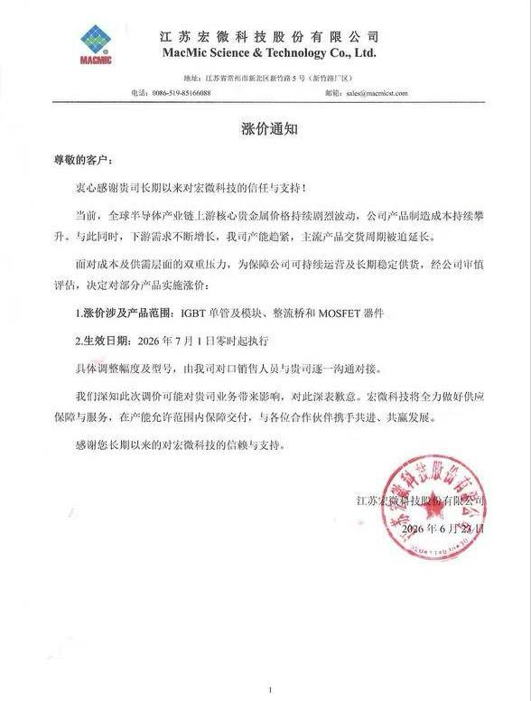

---

<!-- post_id: x:2069341211354431537 | ts: 1782204365 -->
## [X] 駿HaYaO · 2026-06-23 16:46

SK Hynix 放緩 HBM4 生產，轉攻商品 DRAM 追求更高獲利

SK Hynix 決定調整策略，放緩第六代高頻寬記憶體（HBM4）的生產轉換速度，將更多資源投入供給短缺、獲利更高的商品 DRAM 市場。

根據業界人士指出，SK Hynix 原訂將部分 HBM3E 產線轉為 HBM4 的計畫將延後，目的是擴大 DDR5 等商品 DRAM 的供給能力。目前商品 DRAM 的營運獲利率已大幅超越 HBM，差距超過 15 個百分點，大信證券預估今年商品 DRAM 獲利率最高可達 90%。

SK Hynix HBM 營收占比已超過 40%，並在市場建立壓倒性領先，因此無需急於推進 HBM4 量產。HBM4 仍處於 NVIDIA 品質認證階段，且 NVIDIA 次世代 Rubin 晶片生產預測下修，加速轉換的必要性降低。

海外投行看法一致。高盛認為 SK Hynix 只要在 HBM3/HBM3E 維持 50% 以上市占率至 2026 年即可；摩根士丹利則上調獲利預估 56-63%，主因預期 2026 年 DRAM 平均售價將上漲 62%。

SK Hynix 第一季 DRAM 平均售價已較前季上漲中高 60%，並與 Microsoft 簽署三年 DDR5 供應合約，鎖定長期獲利。經營高層也注意到三星電子目前在商品 DRAM 獲取巨額利潤，因此跟進調整策略。

然而，此舉可能讓三星電子有機會追趕 HBM 市占率。Counterpoint Research 顯示，SK Hynix 去年第四季 HBM 市占率為 57%，若三星下半年順利量產 HBM4，SK Hynix 市占率可能下滑至 50-60% 區間。

---

<!-- post_id: x:2069336232275128677 | ts: 1782203178 -->
## [X] 駿HaYaO · 2026-06-23 16:26

根據TrendForce最新報告，2026年第一季雖為車市傳統淡季，全球牽引逆變器裝機量仍達約682萬台，較2025年同期669萬台成長1.9%，展現電動化市場強勁韌性。

全年趨勢來看，2025年全球裝機量達3,235萬台，年增18.9%；2026年預估將進一步攀升至3,640萬台，年成長12.5%。區域表現分化明顯，中國電動車銷量較去年同期衰退19%，但西歐市場強勁成長28%，成為全球成長主要動能。

在動力系統方面，純電動車（BEV）仍居主流，Q1裝機349萬台，占比約51%；插電式混合動力及增程式（PHEV+REEV）約165萬台，油電混合（HEV）約168萬台，多技術並存格局持續。

高壓化成為明確發展主軸。大於550V（對應800V平台）的逆變器Q1裝機達92萬台，年成長21%。SiC-MOSFET逆變器則成長至117萬台，年增7.4%，高壓平台與碳化矽材料滲透率同步提升，顯著改善整車能效與快充體驗。

價格方面，Q1逆變器平均單價為531美元，較前季546美元小幅下滑。儘管功率半導體面臨漲價壓力，但市場競爭激烈、淡季需求疲軟，加上供應商仍有低成本舊庫存，多數廠商選擇自行吸收成本以維持市占率。

TrendForce指出，短期價格雖暫穩，但長期成本壓力將逐漸浮現。部分車廠已於2026年第二季發布整車漲價通知，逆變器均價能否順利轉嫁，後續市場表現值得密切關注。
https://t.co/5bofyRdUJT

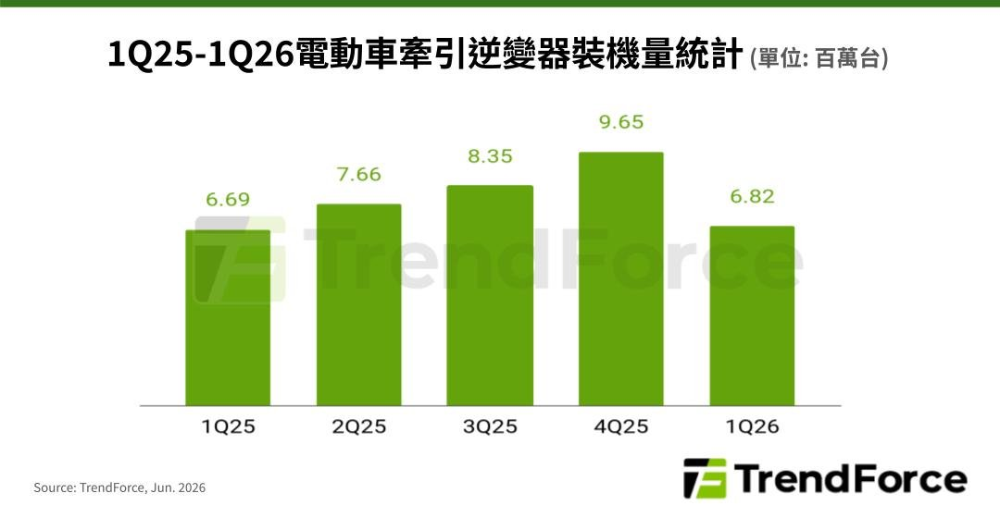

---

<!-- post_id: x:2069333637959483478 | ts: 1782202560 -->
## [X] 駿HaYaO · 2026-06-23 16:16

近期美國進一步收緊對中國海外實體的 AI 晶片出口管制，為中國本土 AI GPU 產業帶來全新成長動能。市場傳出美國商務部已堵住先前漏洞，禁止將 NVIDIA Blackwell 等最先進 GPU 透過海外子公司轉運中國。這一政策預期將促使中國雲端服務商（CSP）短期加大 GPU 租賃力度，中長期則可能加速海外採用中國 AI 晶片，形成「牛市情境」。

據此，分析師將中國 AI GPU AM預測由原先 140 億美元，大幅上調 36% 至 2030 年 190 億美元，2025–2030 年複合年成長率達 23%。主要上調驅動因素包括：新增 CSP 海外資本支出為新 TAM、字節跳動（ByteDance）2026–2027 年大幅增加資本支出、金山雲納入資料庫，以及政府大力推動 AI 基礎設施投資。

實地調查顯示，中國國內 AI 基礎設施正進入關鍵部署窗口。雖然各大 CSP 持續擴張，但運算資源仍嚴重短缺，2026 年將成為本土供應商進入 CSP 採購體系的重要年份。競爭核心將聚焦生態系統成熟度、軟體優化與叢集部署能力。取得 BIS CCATS 認證的廠商可使用台積電先進製程，擁有成本與功耗優勢；同時國產 7nm/6nm 製程持續爬坡，預計 2027–2028 年將形成更穩定的本土供應鏈。

看好 Cambrian（上調目標價至 RMB1,528 元）、CoreX（目標價 HK$688 元）、SMIC（https://t.co/NJ8KH8cF1r）、華虹（https://t.co/JNraj0fhLz），以及半導體設備股 Naura、AMEC、ACMR 與先進封裝廠 ASPMT。這些公司將直接受益於中國 AI 基礎設施加速本土化浪潮。

---

<!-- post_id: x:2069315561310548093 | ts: 1782198250 -->
## [X] 駿HaYaO · 2026-06-23 15:04

報告指出，NVIDIA Rubin Ultra伺服器所採用Kyber垂直式背板PCB若出現交付延遲，將對2027年全球AI領域PCB及CCL市場造成明顯衝擊。

根據預測，若Kyber項目延遲，2027年AI相關PCB市場規模將較原預期下滑5%，CCL下滑8%；若項目進一步延遲甚至取消，2028年更將分別再下降11%與16%。原預測2025~2028年PCB市場規模分別為60-70億、120億、250億、410億美元，CCL則為20-30億、50億、120億、210億美元。

主要原因在於Kyber背板結構技術複雜，旨在以垂直PCB取代傳統銅纜實現機架內部高速互聯，但目前開發進度落後。供應鏈已普遍預期2027年Rubin Ultra仍將沿用Oberon（NVL72）架構，即使2028年簡化版（每機架2容器）也面臨挑戰，最壞情況可能完全放棄Kyber方案。

對產業鏈影響方面：
- 下游PCB製造商需求成長放緩，市場情緒轉弱，每股盈餘預測可能下修。
- 上游玻璃纖維布、覆銅板等原材料因供應緊張、價格持續上漲，廠商易轉嫁成本，獲利能力較強，預期短期表現優於下游。
- 銅纜供應商：Oberon結構延長使用期，降低被PCB取代風險，屬明顯利好。

值得注意的是，M9/10級材料、聚四氟乙烯及CoWoP技術研發仍在推進，2027年交換機主板有望率先採用，長期AI基礎設施對高階PCB/CCL需求仍將持續成長，延遲僅為階段性調整，不會改變整體向上趨勢。

短期內可關注PCB/CCL上游原材料廠商，銅纜相關企業亦有支撐；下游PCB廠商則需留意股價波動風險。

---

<!-- post_id: x:2069311559609044995 | ts: 1782197296 -->
## [X] 駿HaYaO · 2026-06-23 14:48

NVIDIA Rubin 世代 AI 伺服器推出全球首款 100% 全液冷系統，冷卻液最高可運行在 45°C，徹底顛覆傳統資料中心思維。

這項突破性設計讓冷卻能源消耗大幅下降。傳統氣冷系統冷卻用電可佔資料中心總用電量的 40%，而 NVIDIA DSX AI 工廠參考設計採用封閉迴路液冷 + 乾式冷卻器，在適合氣候下可實現「零水耗」——傳統冷卻塔每 MW 每年耗水約 260 萬加侖，新系統幾乎降至零。50MW 規模設施每年可節省超過 400 萬美元的能源與水資源成本。

液冷直接在晶片層級帶走熱量，冷卻液從 45°C 進入、55°C 離開，仍能維持晶片全效能運作。系統完全無風扇、無冷熱通道，機櫃密度更高（原 6U 縮減至 2U），噪音大幅降低，空間利用率提升。

NVIDIA 表示，這不只是技術升級，更是產業新標準。未來雲端供應商建置 AI 工廠都將跟進全液冷架構。即便在較溫暖地區，冷卻液高溫設計也能讓冷水機啟用時間大幅減少，甚至實現廢熱回收再利用。

https://t.co/e3N7k5E6fc

---

<!-- post_id: x:2069220227469238761 | ts: 1782175521 -->
## [X] 駿HaYaO · 2026-06-23 08:45

Good Morning! 6/23 Foreign Media Summary

- MLCC: Super Cycle
U.S. major banks assess that the MLCC industry has entered a Super Cycle. Among Japanese, Taiwanese, and Korean players, they favor Murata, YAGEO, and Semco.

Broker observations indicate that AI-driven MLCC demand will grow more than 4 times between 2025 and 2030, while overall capacity is expected to increase only 10%-15% per year. This cycle has a stronger structural foundation than the 2017-2018 cycle due to sustained long-term AI demand.

Brokers also view the current MLCC industry situation as similar to the DDR4 DRAM market two years ago. Supply constraints are triggering structural price increases. New MLCC capacity requires approximately 2 years from investment to mass production, and equipment is mostly self-manufactured, making rapid efficiency improvements difficult. In summary, the key issue now is not just whether supply will tighten, but how long the supply constraints will persist.

- 2327 YAGEO: U.S. Bank Raises Target Price
Following the above, the latest U.S. major bank channel survey shows stronger price momentum in 2H26. Direct-customer price increases are estimated at 30-40%, higher than the previous forecast of 10%-20%. The bank has upwardly revised YAGEO’s overall MLCC ASP to rise 30% this year and 67% next year (higher than the prior estimates of 10% and 61%).

In addition to MLCC, other product categories including chip resistors are also expected to see price hikes in 2H26. Based on this, the bank raised EPS forecasts for 2026-2028 to $20.6 / $35.1 / $48, and set the target price using a 32x PE on 2028 earnings.

- 7828 Innostar Service: U.S. Bank Positive Initiation
The U.S. broker believes that, benefiting from the investment and cooperation with Technoprobe, growth momentum for 2026-2028 will come from multiple growth in high-spec probe assembly equipment orders, as well as market expansion into Material Kits and probe assembly/repair OEM services. The company will also enter the Glass Core Substrate (GCS) market via TGV technology, which will become another growth driver next year. EPS estimates for 2026-2028 are $14.5 / $64 / $162.3, valued at 25x PE on 2028 earnings, with a positive rating.

- 2449 KYEC : U.S. Bank Raises Target Price
The U.S. major bank stated that demand from its largest customer (CPU) will grow strongly next year. Additionally, the burn-in time for the next-generation XPU is longer than originally expected. Short-term forecast: 3Q revenue is expected to rise 15% QoQ. The broker maintains its full-year revenue growth forecast of 40% YoY and has raised 2026-2028 EPS estimates to $9.96 / $15.1 / $20, valued at 26x PE on next year’s earnings, with an upward target price adjustment.

- 8046 Nan Ya PCB : Asian Bank Raises Target Price
The Asian broker noted that the QTD price increase for ABF substrates exceeded previous estimates, leading to an upward revision in gross margin forecasts. 2Q26 gross margin is now estimated at 21.3%, higher than the market consensus of 18%-20%.

The broker also believes Nan Ya PCB’s ABF/BT price increases will outperform peers. The second wave of price hikes may be driven by ABF substrate capacity shortages in 2H26. Considering two consecutive waves of price increases in 2026, this cycle has the potential to break historical records (ABF/BT gross margins once reached approximately 50%/30%). EPS forecasts for 2026-2028 have been raised to $16.4 / $46.4 / $79.4, valued at 49x PE on forward 12-month earnings, with an upward target price.

- 4958 ZDT: U.S. Bank Reiterates Positive
May self-reported profit has already reached 38% of the U.S. major bank’s Q2 estimate, indicating room for slight upward revision of the forecast. The broker continues to favor the rising AI revenue contribution and reiterates positive stance.

---

<!-- post_id: x:2069214390256377881 | ts: 1782174129 -->
## [X] 駿HaYaO · 2026-06-23 08:22

早安！6/23 外電綜合整理

- MLCC: Super Cycle
美系大行評MLCC產業來到超級循環（Super Cycle)，在日台韓裡喜歡Murata、國巨、Semco。

券商觀察AI驅動的MLCC需求將於2025至2030年間成長超過4倍，而整體產能每年僅成長10%-15%。所以本週期的循環較2017-18具更強結構性，因背後有長期AI需求支撐。

同時券商也認為MLCC產業現況就像兩年前的DDR4 DRAM市場，因供給限制，進而引發結構性漲價。且新建MLCC產能從投資到量產約需2年，設備多為自製，因此難以快速提升效率。總結：券商點出現在的關鍵問題是：不再只觀察供給是否會吃緊，而是供給受限會持續多久。

- 2327國巨: 美系升目標
承上，美系大行最新通路訪查顯示，2H26的價格上漲動能更強。預估漲direct-customer 到30-40%，高於先前預估的10%-20%。上修國巨MLCC整體ASP將於今年上漲30%、明年上漲67%（～高於先前預估的10%與61%）。

除了MLCC外，也預期包括晶片電阻在內的其他產品類別也將於2H26漲價。綜上，上修26-28年EPS至$20.6/$35.1/$48，以後年32xPE評價，同步升目標。

- 7828創新服務：美系初評正向
美系券商認為受惠Technoprobe的投資與合作，2026-2028年成長動能來自包括高規格探針組裝設備訂單倍數成長，以及市場規模擴大至材料包（Material Kits）及探針組裝／維修OEM服務。同時將透過TGV切入玻璃核心基板（GCS）市場，也將成為明年成長動能之一。預估26-28年EPS為$14.5/$64/$162.3，以後年25xPE評價，評等正向。

- 2449京元電：美系升目標
美系大行表示最大客戶CPU需求將於明年強勁成長。同時下一代XPU 的Burn-in時間也比原先預期更長。短期預估：預期3Q營收有望季增15%，券商維持今年營收年增40%的預期，上修26-28年EPS至$9.96/$15.1/$20，以明年26xPE評價，同步升目標。

- 8046南電：亞系升目標
亞系券商表示ABF載板QTD的漲價幅度高於原先預估，因此同步上調毛利率預估。預估2Q26毛利率將達21.3%，高於市場預期的18%-20%。

券商同時認為南電在ABF/BT的漲幅將優於同業。且第二波漲價則可能由2H26載板產能短缺所驅動。考量2026年連續兩波漲價，本輪循環甚至有機會突破歷史紀錄(~ABF/ BT毛利率曾達約50%/ 30%)。上修26-28年EPS至$16.4/$46.4/$79.4，以未來一年49xPE評價，同步升目標。

- 4958臻鼎: 美系重申正向
5月自結獲利已達美系大行第二季預估的38%，顯示預估值有小幅上修空間，券商持續看好AI佔比提升，重申正向。

 #下次會考

---

<!-- post_id: x:2069116202975461652 | ts: 1782150719 -->
## [X] 駿HaYaO · 2026-06-23 01:51 _(接續 2 則)_

日本酸素控股公司子公司日本酸素於19日宣布，將全面調漲氦氣所有產品價格。以7月起國內出貨部分為對象，較目前價格平均上漲30%以上。這是反映中東情勢影響導致全球供需緊迫，調達費用上升所致。

氦氣除了用於晶圓冷卻等半導體製造製程外，也作為醫療用途於MRI（磁振造影）中使用。關於氦氣，在中東情勢緊張化之下，主要生產地之一的卡達供給受阻，供需緊迫的狀態持續中。

日本酸素主要從美國調達，目前供給並無問題。但氦氣供給國有限，受中東情勢影響，需求集中到美國等其他生產地。

因此，除了追加調達費用增加外，日圓貶值也持續進行，導致原料成本上升已超出公司自行努力可吸收的範圍，因而決定調漲價格。

這是自2月底美伊軍事衝突以來首次調漲。今後仍將致力於穩定供給，但視情況可能會向客戶要求調整供給量或交期。

https://t.co/gI8DNBrwTI

---

<!-- post_id: x:2069115390861709320 | ts: 1782150526 -->
## [X] 駿HaYaO · 2026-06-23 01:48

Sumitomo Electric Hardmetal Trading (Shanghai) Co., Ltd.
住友

日本產部分標準品停止銷售
各位尊敬的代理商：
自 2026 年 7 月 1 日起，本公司將停止部分日本產標準在庫品的銷售，後續該產品改為非標準製作，所有現有價格將不再適用，需重新詢價確認。

且此部分產品 6 月限定接單數量（數量為 2025 年 1-10 月的平均接單量） 

具體型號請參閱隨郵件一併發送的 Excel 表格。

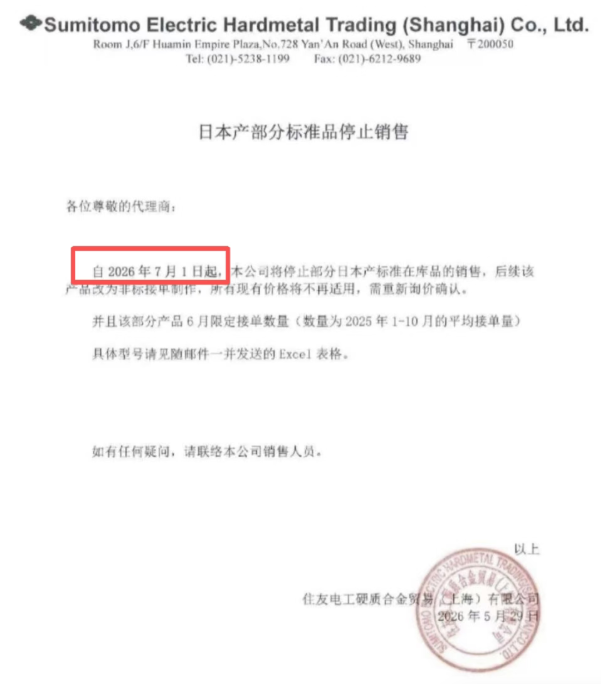

---

<!-- post_id: x:2069103589830819947 | ts: 1782147712 -->
## [X] 駿HaYaO · 2026-06-23 01:01

Micron Technology 與 AI 領導公司 Anthropic 於 2026 年 6 月 22 日宣布達成全面戰略協議，共同打造下一代 AI 基礎設施。

此次合作涵蓋四大面向：
1. 記憶體與儲存 AI 架構共同設計：針對前沿 AI 模型的高效能需求，雙方將優化 HBM、DRAM 與 SSD 在訓練與推論 workload 中的表現，提升能源效率與 token economics（代幣經濟）。

2. 長期供應協議：Micron 將提供穩定且充足的資料中心級記憶體與儲存產品，確保 Anthropic Claude 模型能長期大規模擴展。

3. Micron 企業採用 Claude：美光已將 Claude 導入工程、製造與企業流程，用於加速編碼、開發代理式（agentic）應用，顯著提升生產力與創新能力。

4. 戰略投資：Micron 參與 Anthropic Series H 融資輪，展現雙方長期深度綁定的決心。

美光執行副總裁 Sumit Sadana 表示，AI 革命大幅提升記憶體與儲存的重要性，此合作結合雙方優勢，加速創新。
Anthropic 共同創辦人兼首席運算長 Tom Brown 則強調，記憶體與儲存是 Claude 高效運作的關鍵，與 Micron 合作能針對性優化系統並確保供應。

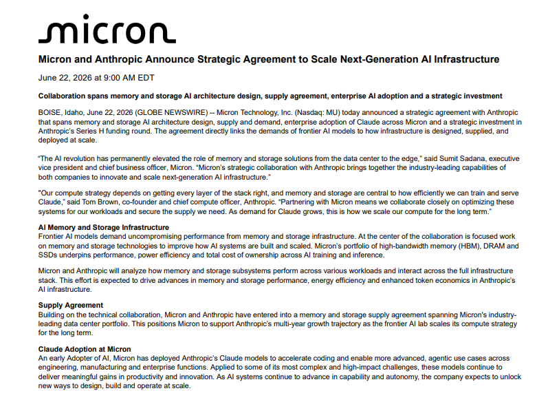

---

<!-- post_id: x:2069050921783525707 | ts: 1782135155 -->
## [X] 駿HaYaO · 2026-06-22 21:32 _(接續 2 則)_

尊敬的客戶：

感謝您一直以來與聯發科技的合作。我們非常重視您對我們的信任，以及對雙方業務關係的持續承諾。

本信函是為了通知您有關我們產品訂價結構的重要資訊。誠如您所知，全球半導體零組件供應鏈持續面臨重大挑戰。前所未有的零組件短缺、產能受限、供應商交期延長，以及原物料與物流成本上升，均導致我們供應成本大幅增加。這種情況是整個產業共同面臨的，也已影響到整體供應鏈。

為了應對成本上升，我們已採取多項措施——與供應商重新協商條件、優化營運、重新分配資源，以確保持續穩定向客戶供貨，並在力所能及的範圍內自行吸收成本。然而，現有成本上升的幅度與持續性，使我們必須重新檢視訂價結構，以確保產能、保障供應連續性並持續投入於關鍵技術研發，以支持您未來成長。

https://t.co/RKV7bNi1V6

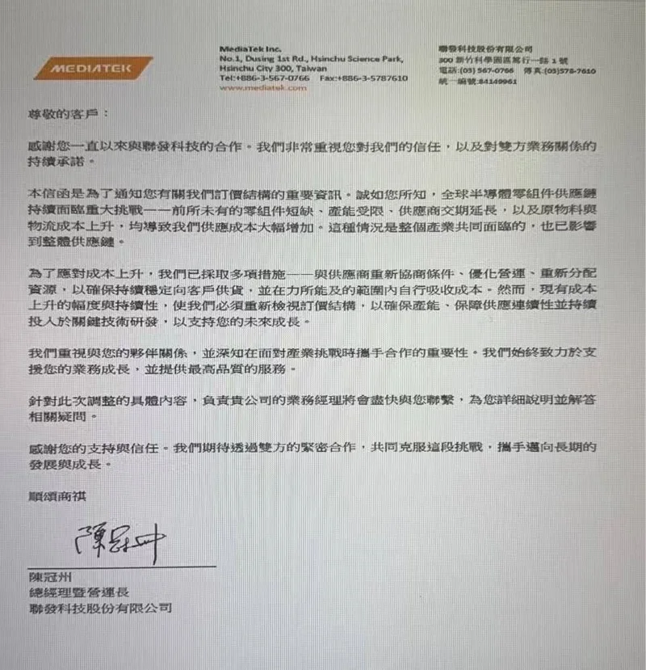

---

<!-- post_id: x:2069047284227358732 | ts: 1782134288 -->
## [X] 駿HaYaO · 2026-06-22 21:18

Lip-Bu Tan： （約 16:20-17:40）
……另一個逐漸成為瓶頸的部分，就是封裝、先進封裝。大家都知道台積電的 CoWoS，我們現在也有一個非常好的技術叫做 EMIB，這是真正下一代的解決方案……

所以現在我也開始關注一些新材料。回到元素週期表，我投資了氮化鎵、碳化矽，還有磷化銦這三種材料。然後在思考這些新材料要如何真正推動發展時，在封裝方面，我也開始投資玻璃。玻璃是一種非常好的熱絕緣體，所以我投資了一家名叫 3DGS 的新創公司。

後來我發現，英特爾在模組方面擁有將近 1,000 項專利，關於如何將基板與模組結合在一起。我們最近也剛剛跟印度政府宣布了一項大型計畫，將在印度、美國以及新墨西哥州進行製造。我認為先進封裝非常重要。我也在開始研究人工金剛石（合成鑽石），這也是一種非常好的絕緣體。所以我也投資了一家金剛石晶圓廠（diamond foundry）。這是值得關注的下一代技術。

所以，新材料、新基板材料，加上新的設計方法學來推動發展。當我以工程師的角度思考時，你總是會碰到牆壁，然後你要找到方法跳過這面牆，或者繞過這面牆……

https://t.co/68nTwagV6x

---

<!-- post_id: x:2069040227331850260 | ts: 1782132605 -->
## [X] 駿HaYaO · 2026-06-22 20:50

最新研究報告指出，SpaceX 正快速轉型為「Neocloud」（新一代雲端運算）提供者，預計 2027-2028 年將建置規模達 4.5GW 至 9.5GW 的巨量運算容量，為全球 AI 供應鏈帶來重大利多。

報告顯示，SpaceX 不再僅是太空與星鏈公司，而是積極將 Colossus 超級電腦叢集轉化為營收來源。2026 年 5 月，SpaceX 與 Anthropic 簽署雲端協議，Anthropic 每月支付 12.5 億美元，獨佔 Colossus 1 全部運算容量（約 22 萬顆 GPU，超過 300MW）。同年 6 月，Google 也加入，每月支付約 9.2 億美元取得運算資源。兩筆交易已讓 SpaceX 2025 年 AI 業務收入達到 32.3 億美元，占整體公司收入 187.7 億美元的顯著比例。

SpaceX 的建置速度極具競爭力。Colossus 1/2 已達 1GW 容量，且僅花 122 天即上線，遠優於業界平均兩年建置期，成本也僅約每 MW 300 萬美元（業界平均 1000 萬美元）。報告預估，SpaceX 將主要採用 NVIDIA GPU，2027-2028 年需求高達 220 萬至 250 萬顆 Blackwell 等效 GPU。此外，SpaceX 計畫 2028 年第 4 季推出首款資料中心 ASIC，由 MTK 主導設計，搭配 Intel 14A 製程與 EMIB-T 技術，進一步強化自有運算能力。

投資建議方面：
- 將 Super Micro (SMCI) 升評至「買入」，看好其強勁 AI 伺服器訂單（含 Colossus 2 的 3100 個機櫃），並預期 SpaceX 可能自 2027 年起部分轉向 ODM 直銷模式，廣達與鴻海將直接受惠。

- 新納入 Credo (CRDO) 為買入推薦，理由是其 AEC（主動式電氣連接線）技術將受益於 SpaceX 升級至 200G/lane 架構，合作夥伴 Bizlink（3665 TT）同樣看多。

- NVIDIA（NVDA）、MTK（2454 TT）、Intel（INTC）亦為直接受益者。

---

<!-- post_id: x:2069038392231563712 | ts: 1782132168 -->
## [X] 駿HaYaO · 2026-06-22 20:42

《奔向無限勞動力：人形機器人假說》

1. 核心論點：人形機器人已從「想要」變成「必須」
- 人形機器人是下一波生產力革命，能消除勞動成本，讓資本與勞力密集產業重新全球配置。
- 想要：解放人類從事重複、無成就感的體力勞動，讓時間投入更高價值活動（科學、藝術、休閒）。
- 需要：因應美國高債務、人口老化、勞動力短缺、供應鏈回流（reshoring）與中美地緣政治競爭。
- 中國面臨更嚴峻的人口危機（生育率已降至1.01），人形機器人成為其維持經濟成長的關鍵戰略。

2. 中美「無限勞動力」軍備競賽
- 中國：舉國體制全力推進（AI+計畫、十五五規劃），R&D支出快速逼近美國，採「散彈」策略投資大量公司，追求速度與規模。
- 美國：私部門主導（Figure、Apptronik、Agility等獲巨額融資），輔以國家安全政策（川普政府多項行政命令），強調品質與突破創新。
- 國家安全考量將大幅去風險商業化路徑，降低泡沫風險，預期未來12-24個月有更多美國政策支持。

3. 商業化時程與挑戰
- 監管：西方市場最快2027-2028年取得廣泛核准。
- 可靠性：工業級需99.9% uptime、MTBF 20,000–60,000小時。目前中國早期致動器僅約10,000小時，實測表現更差。
- 人力監督比率：早期1:1~1:3 → 商業化目標1:5~1:10以上。
- 成功基準：>99% 成功率 + 循環時間超越或等於人類（BMW工廠已達99%準確率示範）。
- 訓練資料成本：2024年$340/小時 → 2030年代初降至$9/小時。

4. 供應鏈瓶頸（最大限制因素）
- 致動器/關節：占BOM成本約56%，中國高度主導。
- 關鍵零件：行星滾柱絲槓 — 100萬台機器人需1,500~2,000萬個（相當於目前全球年產量）。
- 能源效率：目前僅10%電能轉化為有用機械功（熱浪費90%）。
- 預期隨規模化，BOM成本將從今日約$100,000降至$20,000–$30,000。

5. 技術堆疊與投資機會
- 基礎設施層：電源半導體（MPS、TXN、IFNNY）、連接晶片（AVGO、MRVL、CRDO、ALAB）、時序裝置。
- 物理介面層：致動器（Nidec、Harmonic Drive、Yaskawa）、感測器（SONY、OUST）、馬達驅動器（TXN、IFNNY、ADI）、FPGA（AMD、INTC、LSCC）。
- 控制層：MCU/SoC（STM、NXPI、Renesas、TXN）、即時通訊、FPGA。
- 軟體層：ROS 2、Nvidia Isaac/Omniverse、Microsoft Azure Robotics。
- 智能層：AI SoC/GPU（NVDA Jetson、Qualcomm、AMBA）、記憶體（MU、Samsung、Hynix）、Arm/CEVA IP。

6. 總結
- 人形機器人不是單一產業，而是整個物理世界勞動的平台，市場規模極大。
- 短期（2026-2027）：技術與供應鏈瓶頸仍存，監管待解。
- 中長期（2028後）：規模化部署將帶來爆炸性成長，帶動整個技術堆疊上下游公司。
- 美國公司優勢在軟體、智能與創新；中國優勢在硬體規模與成本。

---

<!-- post_id: x:2069032225245683986 | ts: 1782130697 -->
## [X] 駿HaYaO · 2026-06-22 20:18

RT @mingchikuo: 與市場近期的傳言不同，我最新的產業調查指出，Google 目前並沒有任何明確向長鑫存儲採購記憶體晶片的計劃。

---

<!-- post_id: x:2068998483449884702 | ts: 1782122653 -->
## [X] 駿HaYaO · 2026-06-22 18:04

群聯（8299）執行長潘健成今（22）日表示，目前NAND Flash供給持續吃緊，市場缺貨「深不見底」。今年下半年供需緊張程度將高於上半年，明年情況恐比今年更嚴峻。他強調，Flash缺貨是長期且不可逆的趨勢，公司訂單已排至2027年第一、二季。

潘健成指出，AI產業瓶頸正從算力轉向儲存。AI模型訓練、推理與資料保存需大量Flash，隨著使用人口增加及內容從文字擴大至圖片、影音，資料量將呈倍數成長。Flash供給短期難擴張，供需失衡將成常態。

儘管群聯已取得充足供應來源，但客戶需求成長仍快於供給，目前第一季存貨已超700億元，仍持續積極建庫存。「現在不是有錢就能買到貨，而是要獲得原廠支持。」

在aiDAPTIV+業務方面，目前單季營收約2-3億元，仍處POC與市場導入階段，預期第三、四季可望出現明顯動能。潘健成表示，AI落地最大挑戰不在硬體，而是應用軟體生態不足，公司已投入資源自建軟體平台加速推廣。

此外，群聯與大型雲端服務商專案持續推進，新業務機會增加。內部則全面導入AI工具，今年5月已節省相當於75名工程師工作量，但公司不裁員，而是將人力轉向更高附加價值的工作。潘健成強調，AI產業仍需時間醞釀，下半年將是重要觀察期。
https://t.co/ZX1Xgt6F3E

---

<!-- post_id: x:2068998041080647865 | ts: 1782122547 -->
## [X] 駿HaYaO · 2026-06-22 18:02

TrendForce：Consumer DRAM緊缺態勢延伸DDR2產品，第三季合約價將持續上揚

根據TrendForce最新報告，由於成熟製程DRAM供給出現結構性緊縮，三大原廠持續將晶圓產能轉向AI驅動的HBM與Server DRAM等先進製程，導致DDR4等consumer DRAM供給大幅減少。需求端為確保供應配額，品牌廠與ODM廠紛紛下修規格，從DDR4轉用DDR3、甚至DDR2，缺貨壓力沿著世代逐級向下傳導，帶動舊世代consumer DRAM顆粒需求大幅回溫。

TrendForce預估，DDR2第二季合約價已上漲約55-60%，第三季將再上漲35-40%，漲勢強勁。DDR3等產品價格也同步受惠，延續2026年第一季的上漲動能。

供給端來看，台系廠商成為主要受惠者。Nanya、Winbond等因訂單遠超供應能力，議價力顯著提升，並策略性減少低毛利產品投片，優化獲利結構。其中，Winbond正逐步退出DDR2生產，將產能轉向DDR3、DDR4/LPDDR4等高毛利品項，進一步加劇DDR2市場緊俏程度。

相反地，ESMT則積極擴大DDR2投片，在PSMC既有產能配額內集中資源生產，以填補Winbond退出後的供給缺口，並極大化獲利。
https://t.co/is1BlIrDAf

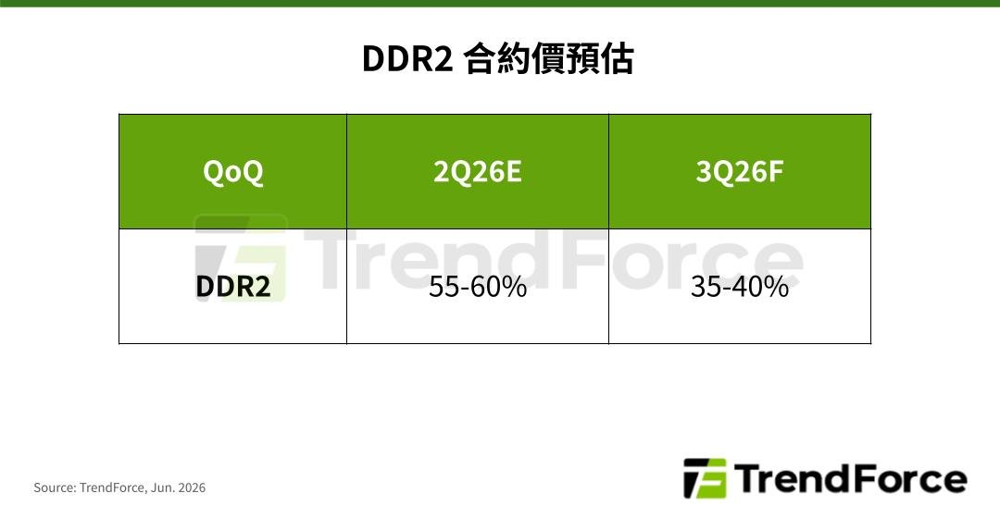

---

<!-- post_id: x:2068973920833941565 | ts: 1782116797 -->
## [X] 駿HaYaO · 2026-06-22 16:26

高力（8996）板式熱交換器成功切入美國雲端服務供應商（CSP）供應鏈，預計下半年開始出貨，同時開拓Manifold與ODM新商業模式。法人預估，2026-2028年液冷營收占比將達51%、49%、46%，2025-2028年液冷營收年複合成長率高達96%，成為資料中心散熱最強成長引擎。

燃料電池方面，美系客戶Nebius、甲骨文等AI資料中心專案持續推進，SOFC具建置快、噪音低、無需用水優勢。法人預期2026年底產能翻倍達2GW，後續每6-9個月再增1GW，2025-2028年燃料電池營收年複合成長率達109%。

法人大幅上修2027、2028年獲利預估，年增率分別達76%、67%，目標價同步調升逾60%。
https://t.co/hc909nTi2d

---

<!-- post_id: x:2068939473124225260 | ts: 1782108584 -->
## [X] 駿HaYaO · 2026-06-22 14:09 _(接續 2 則)_

台積電積極推進CoPoS技術，將傳統圓形晶圓轉為矩形玻璃面板作為載體，大幅提升AI GPU與HPC晶片封裝效率。董事長魏哲家於2026年4月法說會首度公開提及，近期更申請「TSMC-COPOS」商標。

目前首波Demo機台已進駐采鈺龍潭廠，啟動試產線驗證。設備供應鏈橫跨曝光、鍍銅、研磨、模封到檢測等環節，國際大廠如Canon、Lam Research、DISCO、SUSS與TEL等主導關鍵設備，台廠則在檢測、濕製程與熱處理領域取得重要席次。

其中，倍利科的玻璃AXI與AOI檢測設備、辛耘、弘塑的濕製程、萬潤填膠設備，以及致茂、家登、均華、大量等台廠均已入列供應鏈名單。CoPoS並非單純放大CoWoS，而是全新面板級產線，強調大尺寸RDL、低翹曲控制與高精度檢測。

供應鏈預估，最快2029年進入量產。由於設備單價高、認證難度大，通過Demo與正式驗證的廠商，將有望隨著價量成長同步受惠。CoPoS為台灣設備廠提供重新卡位機會，尤其過去未切入CoWoS的廠商迎來新成長動能。

https://t.co/dUXk5tgcRf

---

<!-- post_id: x:2068938668585414671 | ts: 1782108392 -->
## [X] 駿HaYaO · 2026-06-22 14:06

為什麼選擇 CXL + Flash？
1. 資料中心記憶體經濟問題
- DRAM 成本極高：占 Azure 伺服器約 50%，機架總成本約 40%。
- 記憶體閒置（stranding）嚴重：CPU 使用率 85% 時已 >10%，高負載時可達 25-30%。
- 無法無限增加 DRAM：DDR5 通道、訊號完整性、功耗、成本 TCO 都已達極限。

2. 傳統 NVMe 的痛點
- 需經過 OS 核心中斷、驅動程式堆疊、DMA。
- 產生微秒級延遲，嚴重拖慢 AI、向量、圖形等 workloads。

3. CXL + Flash 的核心優勢
- 透過 CXL 控制器 + PCIe Gen5/6，直接接入 CPU 記憶體空間（CXL.mem）。
- CPU 以原生 load/store 指令、64 位元組 cache line 粒度存取，像存取主記憶體一樣。
- 不再是「發 I/O」，而是「解指標」（dereference pointer）。
- 控制器內建 DRAM/SRAM 緩衝區，吸收 Flash 頁面與 CPU cache line 的 mismatch。

4. 效能定位
- 微秒級記憶體階層（非奈秒）：
‧ 命中緩衝：接近 DRAM 延遲
‧ 未命中：SLC <5μs，MLC <10μs
- 提供的是高密度、低成本/GB，而非極致速度。

5. 記憶體階層架構
- 近端/快速階層：DDR5 + HBM（最熱資料、權重、cache）
- 遠端/容量階層：CXL-Flash（暖資料：LLM embedding tables、資料庫分片等 TB 級資料）

6. 自動管理機制
- 使用 Linux Kernel 已合併的 Meta Transparent Page Placement (TPP)。
- 核心自動追蹤熱度，冷熱頁面自動升降。
- 應用程式完全無需修改、無 I/O、無上下文切換。

7. 結論
CXL + Flash 是目前解決「記憶體最貴又最浪費」問題的最佳方案，以 Flash 的經濟成本提供接近 DRAM 的容量，實現記憶體解聚合（disaggregation）。

---

<!-- post_id: x:2068938360203465161 | ts: 1782108318 -->
## [X] 駿HaYaO · 2026-06-22 14:05 _(接續 2 則)_

晶圓代工供需緊俏，帶動IC設計端價格調整訊號浮現。供應鏈指出，網通晶片大廠瑞昱（2379）與手機晶片龍頭聯發科（2454），針對部分成熟製程產品展開調價，涵蓋網通、連接、消費性及特殊規格晶片，漲幅約逾1成（瑞昱7月起實施），反映晶圓代工、封測及關鍵材料成本上揚。

此波漲價屬結構性調整，非全面調升，主要針對供給吃緊、庫存偏低或規格升級的產品線。瑞昱受惠Wi-Fi、乙太網路、AI PC及企業網通需求回溫；聯發科則因新機備貨、新興市場手機及智慧裝置需求支撐，價格具調整空間。

法人分析，此舉具三重意義：終端庫存修正近尾聲、客戶接受更高價格確保供應；成熟製程產能利用率提升，供應端議價力增強；AI PC、Wi-Fi 7、邊緣AI等帶動規格升級，推升平均單價。

然而，低階消費性晶片仍受中國競爭壓力，漲價擴散仍需觀察第三季備貨、通路庫存及晶圓代工稼動率。若下半年需求持續回溫，台灣IC設計產業將迎來報價修復與營運受惠期。

https://t.co/3EEONcCF7C

---

<!-- post_id: x:2068924710738645300 | ts: 1782105064 -->
## [X] 駿HaYaO · 2026-06-22 13:11

RT @mingchikuo: Google 與聯發科深化 TPU v9 合作，開發升級版 Triggerfish，聚焦 AI 代理、強化學習與有效算力最大化

1. 我最新的產業調查顯示，Google 將在 TPU v9 / Humufish 的基礎上，開發代號可能是 Triggerfish 的升級版 v9 晶片，並由聯發科獨家取得此單價更高的新增訂單。

2. 此升級版晶片是以 Humufish 為基礎的延伸新案，定位為更強推論能力的 v9 改版，可同時緩解 CPU wall 與 memory wall。此案也進一步驗證聯發科是 Google 在 TPU v9 世代的合作首選廠商。

3. 此 v9 改版與 Humufish 的主要差異，在於：SRAM 容量顯著提升至 Humufish 的 2–3 倍、新增 simulation die、升級至 HBM4E（vs. Humufish 的 HBM4）。

4. 新增 simulation die 的可能功能除了本地 TPU 管理、訓練 / 推論模式切換等，關鍵聚焦在強化學習（RL）與 AI 代理協作。

5. 更大容量的 SRAM 可將更多 RL 與 AI 代理所需的活躍工作集（active working set）留在 TPU 本地，降低資料搬移成本，提升超低延遲 decode 階段的效率。

6. 在 Humufish 生命週期 400‒500 萬顆出貨預估不變下，Google 額外追加 100–200 萬顆 Triggerfish 訂單，預計 2027 年底開始生產、2028 年放量；因Triggerfish 單價較 Humufish 高約 30%，有望成為聯發科 2028 年營運動能的新增量。

---

<!-- post_id: x:2068854981902700987 | ts: 1782088439 -->
## [X] 駿HaYaO · 2026-06-22 08:33

Good Morning! 6/22 Foreign Media Summary

- 1303 Nan Ya: US Broker Raises Target Price
US brokerage firms noted that Nan Ya Plastics’ progress on M8-M10 CCL and T-glass is progressing well. AI-grade products could account for more than 50% of the product mix by the year after next. Brokerages expect the gap between Nan Ya Plastics and industry leaders such as EMC and Nittobo to gradually narrow in the coming years. They have revised upward their profit estimates to reflect price increases and a higher proportion of AI-related products, raising this year’s and next year’s EPS forecasts to $8.6 and $13.4, respectively. Using 23x/15x PE multiples for this year and next, they have simultaneously raised the target price.

- Power Semiconductor Industry Observation:
US brokerages indicated that although demand is differentiated—strong industrial demand, slowing growth in electric vehicles, and weak solar demand—new capacity additions remain limited. Capital expenditure has declined over the past two years and is expected to grow only modestly by 11% this year. The industry began recovering from 4Q last year. Given constrained supply, brokerages expect prices to have room for further increases in the second half of the year.

- MCU Industry Observation:
STMicroelectronics has recently notified customers that a new round of price increases will take effect on June 28. As mature-process wafer foundries allocate more capacity to AI power-related applications and new capacity additions remain limited, US brokerages expect the tight supply situation to continue into the second half of the year, accompanied by further rises in spot prices.

- Global Smartphone Industry Observation:
US brokerages have downgraded this year’s and next year’s global smartphone shipment forecasts by 4% and 3%, respectively, to 1.1 billion and 1.2 billion units. This corresponds to year-over-year growth rates of -10% and +3% (previously estimated at -6% and +2%). Nevertheless, they remain optimistic about the continued rise in foldable phone penetration. The downward revision is due to market saturation and rising memory costs, which are expected to suppress consumer purchasing willingness.

---

<!-- post_id: x:2068849210049667353 | ts: 1782087063 -->
## [X] 駿HaYaO · 2026-06-22 08:11

早安！6/22 外電綜合整理

- 1303南亞: 美系升目標
美系券商表示M8-M10 CCL及T-glass進展良好；AI等級產品至後年可能占產品組合超過50%。券商預期南亞與台光電及Nittobo等產業領導者之間的差距將在未來幾年逐漸縮小。上修獲利預估反映漲價及AI用產品佔比提升，上修今明年EPS至$8.6/$13.4，以今明年的23x/15x PE評價，同步升目標。

- 功率半導體產業觀察：
美系大行表示儘管需求呈現分化：工業需求強勁、電動車成長放緩、太陽能需求疲弱，不過由於新增產能有限，過去兩年資本支出還下滑，且今年僅增11%溫和成長。而產業自去年4Q開始恢復成長，券商預期在產能供給有限的情況下，下半年報價有機會再上揚。

- MCU產業觀察：
STMicro近期已通知客戶將於6/28新一波價格調漲生效。隨著成熟製程晶圓代工廠將更多產能配置給AI電源相關應用，而新增產能投放有限，美系大行預期供給吃緊狀態有機會延續至下半年，伴隨現貨價進一步走揚。

- 全球智慧手機產業觀察：
美系券商下修今明年全球智慧型手機出貨量4%及3%，至11億支及12億支，對應年增率分別為-10%及+3%（～前次預估為-6%及+2%）。不過仍看好摺疊手機滲透率持續提升。下修理由在於考量市場趨於飽和以及記憶體成本持續上升將壓抑消費者購買意願。

 #下次會考

---

<!-- post_id: x:2068179784836808868 | ts: 1781927460 -->
## [X] 駿HaYaO · 2026-06-20 11:51

JNTC 成功開發全球首創 2.0mmT TGV 玻璃基板

JNTC（KOSDAQ: 204270）於6月19日宣布，成功開發全球首創厚度達2.0mmT的高難度TGV（Through Glass Via）玻璃基板，目前已擁有從0.3mmT至2.0mmT的完整產品線，並同步開發下一代3.0mmT產品。

此玻璃基板在最關鍵的「微裂紋」（Micro-Crack）問題上，通過基板製造商嚴格的「無裂紋」（Crack-Free）可靠性測試，已完成台灣及韓國主要基板廠驗證，日本材料廠驗證也正在進行中。

JNTC正參與兩家「全球最大綜合半導體公司」的新專案。5月底已與一家主要韓國財閥簽署MOU，預計7月將與日本全球基板製造商簽訂追加合約，更多合約陸續推進，目標2027年量產。

公司已透過併購Comet完成垂直整合，並建立韓國首條TGV量產線，大幅提升品質與成本競爭力。代表趙南赫表示，TGV玻璃基板將成為公司中長期成長引擎，助其在AI半導體先進封裝領域確立全球領導地位。

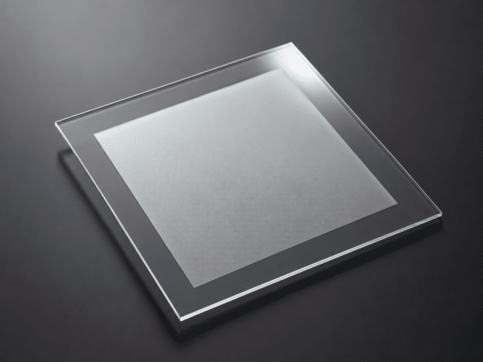

---

<!-- post_id: x:2068166698532819411 | ts: 1781924340 -->
## [X] 駿HaYaO · 2026-06-20 10:59

Bain 全球資料中心預測（至 2030 年）

1. 整體趨勢
- 資料中心建設已從「初期混亂搶建」進入新階段：更紀律性、選擇性、受電力限制、注重執行。
- AI 採用加速，潛在需求底線持續上升，成長動能仍強勁。
- 勝負關鍵不再只是規模，而是精準應對複雜度的能力。

2. 五大核心趨勢
① 推論（Inference）成為重心
- AI 工作負載從訓練轉向大規模推論為主。
- 企業 AI 應用落地明確，測試時運算（Test-time compute）改變基礎設施策略、經濟模型與架構。
- 影響：共置 vs 自建、晶片選擇、電力規劃等。

② 新建設成長速度趨穩
- 超大規模業者（Hyperscaler）2025 年投資不減反增，未來仍持續成長。
- 但更注重資本效率，對新部署更具選擇性（尤其 AI 訓練）。

③ 成長集中但全球化
- 北美仍是最大市場（受 Hyperscaler 資本支出驅動）。
- 主權 AI 政策 + 企業採用帶動全球區域市場崛起。
- 企業需依延遲、資料主權、能源條件選擇最適合地點。

④ 資料中心更大，但更具彈性
- 1GW 以上超大型園區（mega-campuses） 將成為前沿模型訓練標準，但全球只需有限數量。
- 推論需求促使小型、分散式資料中心網路發展。
- 設計上強調訓練與推論切換彈性（多種冷卻方案），避免沉沒資產。
- 開始探索分散式訓練，改變訓練架構。

⑤ 電力可用性成為最大瓶頸
- GPU 與建設限制緩解後，電力成為最關鍵限制。
- Behind-the-Meter（BTM）自備發電興起（美國最普遍，主要用天然氣）。
- 公用事業、開發商、監管機構需加強協調。
https://t.co/0gykzs8V6d

---

<!-- post_id: x:2068154870411223298 | ts: 1781921520 -->
## [X] 駿HaYaO · 2026-06-20 10:12

隨著台系晶片電阻廠挑單生產、淘汰低利潤訂單，低價單大量流向陸資廠，導致陸資廠訂單爆增卻面臨嚴重虧損。全球第二大晶片電阻廠厚聲與陸資龍頭廣東風華高相繼通知代理商調漲價格，風華高漲幅高達20～30％，厚聲也針對0201～1206尺寸調漲，新價自6月21日起生效。長假前風華高大幅漲價，厚聲緊急撤回報價單重議，成為業界焦點。

此波漲價主因銀價較去年同期暴漲三倍，重創銀漿成本結構。台廠稼動率提升後挑單生產，陸資廠接單兩難，只能被迫轉嫁成本。中台價差收斂下，台廠可望跟進下一波調漲。

國巨及其關聯企業凱美已領先漲價，國巨新價2月生效，凱美旗下旺詮4月起調漲金屬板電阻20～30％，受惠AI、工控、儲能、新能源需求強勁。國巨為全球第一大廠，市占逾30％，更是輝達物料清單中少數入選供應商，NV BOM電阻價為一般規格二倍以上。

華新科晶片電阻占營收約20％，下半年將與直接客戶議價，特殊規格擴產效益顯現。供應鏈指出，直接客戶價格已同步上漲，挹注營收效果更勝代理商通道。

---

<!-- post_id: x:2068153863866388548 | ts: 1781921280 -->
## [X] 駿HaYaO · 2026-06-20 10:08

投資人愈來愈傾向將 AI 網路連接視為銅纜與光纖的二元對立，因此不斷思考並評估在這兩個主題之間的輪動。

SemiAnalysis認為，網路連接的格局其實可以用更簡單的視角來看待。隨著 GPU 叢集規模不斷擴大，有效連接它們的重要性也只會日益提升，這將帶動各類網路連接需求的全面成長。

銅纜與光纖扮演不同但互補的角色。銅纜在能夠滿足傳輸距離、功耗、成本與可靠度要求的情況下，仍是首選方案；而當頻寬與距離超出銅纜的實際極限時，光纖就成為必要選擇。Nvidia 的做法始終如一：在能用銅纜的地方就用銅纜，必須使用光纖時才用光纖。

換句話說，這並非一個「非此即彼」的市場。光纖互聯的成長並不代表銅纜會消失，而銅纜的持久性也不意味著光纖不會大幅成長。隨著 AI 系統在規模與複雜度上持續提升，銅纜與光纖連接都將因 GPU、交換器、機櫃與叢集之間資料傳輸重要性的增加而同時受益。

---

<!-- post_id: x:2068153109185188053 | ts: 1781921100 -->
## [X] 駿HaYaO · 2026-06-20 10:05

古河電氣 工業旗下的光通信零件製造商白山（總部位於金澤市）的米川達也社長等人，於19日拜訪石川縣知事山野之義。該公司計畫在同縣かほく市新建工廠，生產連接光纖用的小型零件「TMT ferrule」。

米川社長與かほく市市長油野和一郎一同前往石川縣廳，向知事說明TMT ferrule的角色及新工廠概要。

白山因應人工智慧需求增加，將投入約50億日圓在鹿北市興建新工廠，預計2028年4月開始運轉，同時將把本社機能也移轉至該工廠。

* TMT ferrule 是白山開發的超小型多芯光連接器（MMC Connector）的核心零件，屬於VSFF（Very Small Form Factor）規格，用於高密度光纖連接。
https://t.co/Y96N7CFvoG

---

<!-- post_id: x:2068005850573337085 | ts: 1781885991 -->
## [X] 駿HaYaO · 2026-06-20 00:19

藤倉上調業績展望緩解市場不安情緒，股價料將飆升

日本光纖電纜製造商藤倉株式会社的股價即將觸及漲停板，此前該公司出人意料地上調了利潤指引，且上調幅度超出市場預期。

藤倉的股票因大量買單湧入而暫無成交，但預計將上漲。該公司將全年營業利潤預期從 2110 億日元上調至 3100 億日元（合 19 億美元），理由是提價以及來自人工智慧超大規模客戶的強勁需求帶來了提振。該公司還表示，氫氣短缺的風險已經緩解。

截至東京時間上午 9 點 40 分，該股預計將上漲約 16%，至 5161 日元。藤倉的最新指引遠高於彭博社 2580 億日元的共識預期。此次反彈前，藤倉公司因上月發布的盈利展望不及投資者預期，股價在一周內蒸發近半。市場擔憂該公司產能無法跟上人工智慧基礎設施的旺盛需求，持續打壓其股票情緒。

SMBC 日興證券分析師山口敦與前田拓也在報告中指出，此次上調業績指引不僅令人安心，也有助於「消除對氫氣短缺的疑慮」。他們表示，上調指引反映出光器件訂單「超預期」的強勁增長。

不過分析師補充稱：「我們更希望藤倉能改變其最初指引過於保守的做法。」

藤倉的線纜製造商同行的古河電氣工業株式会社與住友電氣工業株式会社的股份在周五早盤亦雙雙錄得逾 15% 的盤中漲幅。

---

<!-- post_id: x:2068005344522162285 | ts: 1781885870 -->
## [X] 駿HaYaO · 2026-06-20 00:17

住友剛發布鎢棒減產通知，將自 7 月 1 日起縮減生產，主因是鎢原料全面停止進入日本。

這件事會衝擊 PCB 的切割與路由工具，但對 PCB 微型鑽頭的影響相對有限。 https://t.co/seGa4iLqHg

---

<!-- post_id: threads:3922948001177350797 | ts: 1781871865 -->
## [Threads] 誠實豆沙包 · 2026-06-19 20:24

1.近期比較多奇怪的東西就是說他營收會掉，設計服務廠商營收難免受NRE波動，但第二季數字已經遠超過公司說的了。
2.MS報告可是今年營收估800億（市場consensus 大概600-650億，⛵️說今年不到600億）然後中立，為什麼估成這樣還中立就請各位看官自行判斷。
3.公司參加凱基論壇有給大家一個方向，下半年營收Qoq增幅會比上半年大。
4.2026/2027 cpu貢獻會是最大，2028貢獻最大是特斯拉，至於為什麼2027貢獻最大不是特斯拉，因為cpu真的太大了。那另外新東西貢獻是2028 cpo+hbf，2029 Tpu。
5.這個外國人真的是GUC的cto，是個以色列人，這個有問過公司不會是假帳號。他寫的東西已經很清楚了，創意在cpo的進度真的是神速，創意是cpo概念股評價最便宜的個股。

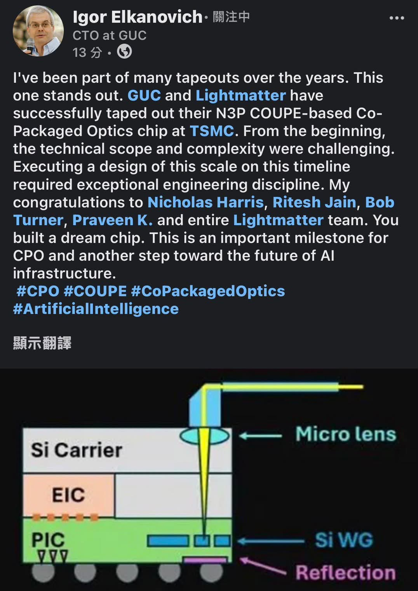

---

<!-- post_id: x:2067937941372981719 | ts: 1781869800 -->
## [X] 駿HaYaO · 2026-06-19 19:50

矽電容（Silicon Capacitor）
1. 誕生背景與核心優勢
傳統鋁質電容與常規MLCC在HPC、AI伺服器、1.6T及以上高端光模組等高速、高發熱場景下，已無法滿足低熱敏、高穩定性、高頻濾波的需求。矽電容正是為此應運而生。核心優勢：
- 透過閾值優化大幅提升性能，能有效過濾高速電流雜波、降低發熱干擾、保護主晶片。
- 大幅提升高端模組整體運行穩定性。
- 非MLCC：無需陶瓷封裝，以裸晶形態存在，直接替代主晶片周邊的高頻MLCC及傳統鋁質電容，是高端算力與光通訊專用的無源器件。

2. 技術與工藝特點
- 製程要求：僅需8吋、12吋成熟晶圓製程，無需5nm/7nm等先進製程。
- 核心技術壁壘：不在晶圓工藝複雜度，而在於電容/電感設計能力以及電力基礎技術累積。
- 最大工藝難點：切割環節（需精準避免損壞晶片）。國內掌握成熟切割工藝的廠商極少，這是當前產業核心壁壘。
- MLCC廠商轉產難度：極高。缺乏專項設計經驗與電力技術累積，跨界嘗試進展緩慢。

3. 完整產業鏈分工
- 晶圓製造：目前主要依賴國外晶圓廠。
- 封測環節：
‧ CP測試
‧ 晶圓減薄
‧ 磨平
‧ 雷射切割（核心設備來自日本）
- 出貨形式：以裸晶晶圓形式交付下游。
- 成本結構：封裝成本約占單顆整體成本的30%。

4. 產能、良率與擴產
- 晶圓尺寸：8吋與12吋均已量產。
- 單片晶圓產量：少則數萬顆，多則二十多萬顆（高端模組單片可達20-30萬顆）。
- 產能壁壘：量產階段壁壘不高，可透過新增設備快速擴產。
- 擴產規劃：多家企業三期工廠建設中，同時規劃先進封裝產能擴建。

5. 下游應用場景與用量（核心驅動力）
主要應用領域：高速光模組與HPC/AI伺服器。高速光模組：
800G光模組已部分搭載矽電容商用；1.6T光模組已正式商用出貨，單顆1.6T光模組需用到近20顆矽電容；後續3.2T光模組的矽電容用量將大幅提升。
AI伺服器：
算力模組整體用量龐大，例如英偉達相關AI伺服器單顆可使用4-6萬顆矽電容。
貼裝方式：由下游光模組廠商自行負責MSAP貼裝。
使用邏輯：並非絕對必須，但隨著1.6T+國產化推進，傳統電容無法滿足高傳輸速率與穩定性需求，矽電容成為優先替代方案。

6. 市場空間
對標MLCC成熟市場，矽電容整體市場空間可達數十億美元級別。目前MLCC尚未被完全替代，成長空間充足。

7. 競爭格局
海外：Murata、ROHM等成熟龍頭，技術領先。
中國國內：優質設計廠商各具特色，其中蘇納光電進展最快，已實現小批量量產（月產數百萬顆），深度綁定國內頭部光模組廠商。
傳統封測大廠（如日月光、矽品）：短期內不會重點布局。原因在於矽電容屬於細分利基賽道，毛利低於HBM、CoWoS、2.5D/3D等主晶片高端封裝，非其策略重點。

8. 獲利水平
矽電容封測毛利率低於HBM、CoWoS等高端封裝，但因雷射切割等環節在中國國內稀缺性高，目前整體利潤水平較好。

https://t.co/MvcsE33q9K

---

<!-- post_id: x:2067909000297935202 | ts: 1781862900 -->
## [X] 駿HaYaO · 2026-06-19 17:55

$BESI

Hybrid Bonding在邏輯晶片的採用持續擴大，而記憶體端的資格驗證則朝向量產邁進：BESI 強調了多項匯聚的混合接合成長動能，隨著客戶路徑圖推進，預計採用率將在 2027-28 年加速。在邏輯晶片領域，管理階層認為該技術現已獲得驗證，AMD、Apple 及 Broadcom 的 ASIC 已開始生產部署，而 Nvidia 的 Feynman 平台則提供額外的未來需求驅動力。

在記憶體領域，所有主要的 HBM 製造商都在評估 BESI 的混合接合解決方案，其中 HBM4 預計將成為混合接合在 HBM 堆疊中的第一個重要導入點。管理階層持續預期首波高量產部署將在 2027 年發生，之後 HBM5 將帶來更廣泛的採用。雖然混合接合（HB）與熱壓接合（TCB）預計將共同存在，但 BESI 相信，憑藉其性能優勢（包括比 TCB 低達 30% 的熱阻），混合接合將在未來世代中取得越來越大的市佔率。

---

<!-- post_id: x:2067893354797695180 | ts: 1781859170 -->
## [X] 駿HaYaO · 2026-06-19 16:52 _(接續 2 則)_

1. $SIMO
VP：「零售 SSD 市場幾乎已經消失了，」Duann 在訪談中告訴我們。「我們賣給模組廠商的控制器，如今絕大部分都用在出貨給 PC OEM 廠商的 SSD 上。原因是 OEM 廠商無法直接從記憶體製造商那裡取得足夠的 NAND，因此越來越改向模組廠商採購 SSD。」

2. 「過去模組廠商大多專注於零售市場，」Duann 表示。「從去年下半年到今年情況已經改變，OEM 需求變得強勁許多，模組廠商現在將大量產能直接供應給 PC 製造商。因此，我們賣給模組廠商的控制器，最終絕大部分都用在 PC OEM 廠商所組裝的系統中。」

https://t.co/BYZRgV4ERq

---

<!-- post_id: x:2067892624032416105 | ts: 1781858995 -->
## [X] 駿HaYaO · 2026-06-19 16:49

Google 仿 Nvidia playbook 打造 TPU 競爭事業
Google 正積極利用雄厚資金與技術優勢，模仿 Nvidia 策略，拓展 AI 晶片（TPU）外部業務，挑戰 Nvidia 在 AI 運算市場的霸主地位。

Google 提供巨額財務保證，協助資料中心取得低成本融資，並透過「循環融資」模式，讓投資資金部分回流購買自家 TPU。在紐約州 Niagara Falls 附近的 Lake Mariner 資料中心，Google 提供 32 億美元保證，供 Anthropic 租用數千顆 TPU；另支持 Anthropic 的 River Bend（70 億美元）及德州 Colorado City（14 億美元）專案。近期更與 Blackstone 簽下 50 億美元交易，成立新雲端公司，直接競爭 Nvidia 支持的 CoreWeave 與 Nebius。

Google 自 2013 年起由 Jeff Dean 主導開發 TPU，初期僅內部使用，後透過 Google Cloud 對外開放，帶動雲端業務成長。2025 年 5 月起，Google 開始直接銷售 TPU，並推出首款專為 Inference（推論）優化的晶片，與 Nvidia 新品正面競爭。Citadel Securities 等客戶表示，使用 TPU 可降低 30% 成本、速度提升最高 4 倍。

儘管 Nvidia 市佔率逾 90%，Jensen Huang 淡化 TPU 威脅並強調 CUDA 生態優勢，但 Google 計畫募資 850 億美元用於 AI 基礎設施，利用資產負債表優勢打破客戶忠誠度。在 Amin Vahdat 領導下，團隊加速晶片設計與效能優化，視 Nvidia 為既競爭又合作的夥伴。

---

<!-- post_id: x:2067813571371631033 | ts: 1781840148 -->
## [X] 駿HaYaO · 2026-06-19 11:35

根據產業報告，類比半導體市場正從普遍供應緊張快速轉向早期短缺階段。2026年第二季，需求明顯加速，B2B訂單與出貨比率較上季成長1.4至1.6倍，較去年同期成長1.3倍。客戶端因供應吃緊而積極推單、增加庫存緩衝與供應保障活動，顯示需求強度已超越供應能力。交期大幅延長成為主要警訊。功率元件與分立元件交期已逼近52週，廣泛半導體產品交期也普遍超過30週。

供應限制主要來自後端（back-end）封裝環節，其中「T-glass」（玻璃基板）已成為關鍵瓶頸。由於有限的玻璃供應被優先分配給AI晶片，其他半導體應用嚴重受限，導致PCB與基板供應商產能捉襟見肘。這一瓶頸預計將持續影響2027年產業產出，成為重要的胃納因素（gating factor）。

面對供應緊張，多家龍頭廠商已展開第二輪廣泛定價行動。德州儀器（TXN）、英飛凌（IFX）與意法半導體（STM） 帶頭尋求10%至25%的漲價，自7月1日起生效。市場上也開始討論第三輪定價的可能性，預計最快於2026年第四季實施。此外，Microchip（MCHP）因通脹壓力，預計將在2026年第三季實施選擇性調價。

個股展望正面：
- $TXN：短期正面／長期正面。後端瓶頸雖造成供應短缺，但強勁定價與供應緊張環境，將帶動近期營收與毛利率同步上行。
- $MPWR：短期正面／長期正面。AI與CPU強勁需求持續超過供應，公司在營收成長與毛利率擴張上具顯著優勢。
- $VSH：短期正面／長期正面。透過優化高利潤業務組合，加上先前低迷期進行的策略性產能投資，未來上行空間值得期待。

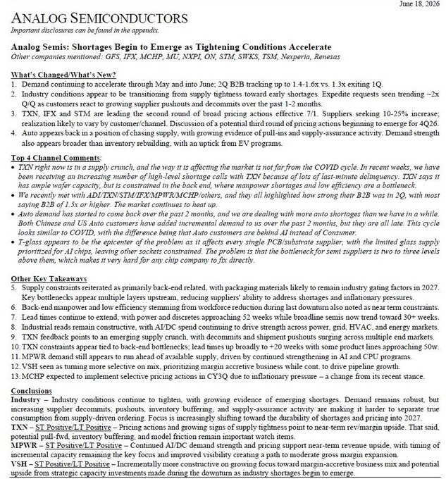

---

<!-- post_id: x:2067805230667046912 | ts: 1781838159 -->
## [X] 駿HaYaO · 2026-06-19 11:02

Tower Semiconductor 與 Marvell 出貨突破 500 萬顆相干 PIC

以色列 Migdal HaEmek，2026 年 6 月 18 日 – Tower Semiconductor（NASDAQ/TASE: TSEM）今日宣布與 Marvell Technology 合作達成重大里程碑，雙方已向全球客戶出貨超過 500 萬顆相干光子積體電路（Coherent PIC）。

這項成就仰賴 Tower 先進的矽光子（SiPho）平台，提供高頻寬、低功耗的光學解決方案，精準滿足 AI 驅動資料中心互聯（DCI）網路急速成長的頻寬需求。相干 PIC 技術遠比傳統直接偵測晶片複雜，必須同時精準控制光的振幅、相位與偏振，對製程要求極高。

Tower Semiconductor RF 事業部副總裁暨總經理 Dr. Ed Preisler 表示：「光學收發器應用不斷演進，光子平台也必須同步升級。我們很榮幸能與 Marvell 長期合作，在相干光學領域維持領先地位。」

雙方目前正共同推進下一代相干技術，包括非矽材料整合、電子元件 3D 整合，以及 V-Grooves 等先進光學封裝技術，進一步提升效能與功能。

Marvell 光學工程資深副總裁暨首席技術官 Dr. Radha Nagarajan 指出：「這項 500 萬顆出貨里程碑，充分展現雙方合作的強大實力。Tower 是我們重要的生態系統夥伴，我們期待繼續深化合作，為大規模資料中心提供更節能、高效能的相干光子解決方案，支援客戶先進的 AI 工作負載。」

https://t.co/JGTSPExDl4

---

<!-- post_id: x:2067802188399980686 | ts: 1781837434 -->
## [X] 駿HaYaO · 2026-06-19 10:50

Google TPU 五代演進：從 v2 到 Ironwood 的超級電腦革命

Google 從 2016 年推出首款訓練用 TPU v2 至今，已發展至 Ironwood（TPU v7），完成五代訓練超級電腦的躍進。儘管深度學習模型快速演變（尤其是 Transformer 主導），TPU 核心架構卻維持驚人穩定性，僅透過規模擴展與元件優化，即實現大幅效能提升。

八年來，單 TPU 峰值運算效能提升約 100 倍，HBM 記憶體容量與頻寬提升 10 倍，整體超級電腦效能更暴增 3600 倍。可直接定址的共享記憶體從 4TB 擴展至 1.77 PB，創下 AI 超級電腦新紀錄。每瓦效能提升約 30 倍，碳排放強度也顯著下降，展現高度功耗效率與永續性。

關鍵成功因素包括：
脈動陣列（Systolic Array）、BF16/FP8 範圍優先浮點格式、HBM 主記憶體、自訂 ICI 高速互聯、DMA 控制的記憶體階層，平衡的 TensorCore 設計。
這些初始決策讓軟硬體共同設計得以延續，降低新世代開發難度。

在韌性方面，TPU 導入光學電路交換器（OCS）、硬體自測試（BIST）與重播機制，使大型 Pod（最高 8960 晶片）訓練 goodput 達到 93%，有效對抗 Silent Data Corruption。

---

<!-- post_id: x:2067800787267506559 | ts: 1781837100 -->
## [X] 駿HaYaO · 2026-06-19 10:45

Microsoft 儘管面對美中人工智慧競爭加劇，仍透過 Azure 雲端平台在中國建立龐大 AI 業務。字節跳動（ByteDance）近年成為 Microsoft 最大 AI 客戶，主要使用 OpenAI 模型，每年支出預計超過 10 億美元。螞蟻集團、美團、騰訊等中國科技巨頭亦是 Azure AI 重要客戶。

Microsoft 認為，在中國維持業務有助於掌握當地創新動態，並服務跨國企業。2024 年中國業務僅占整體營收 1.5%，規模相對有限。但此舉在美國引發爭議，多位高管與議員視中國 AI 發展為「生存威脅」。OpenAI 與 Anthropic 因智慧財產權及國家安全疑慮，拒絕直接向中國企業銷售模型；Microsoft 則採取不同策略。

2025 年 7 月內部銷售會議中，前首席商務官 Judson Althoff 表示：「世界上最頂尖的 AI 解決方案，正由美國西岸與中國東岸打造，而連結兩者的唯一公司就是 Microsoft。」他透露，Azure AI 營收在中國成長最快，2025 財年成長近三倍，前一年更暴增 400%。

---

<!-- post_id: x:2067791207791783939 | ts: 1781834816 -->
## [X] 駿HaYaO · 2026-06-19 10:06

互補共存：MLCC 與矽電容在 AI 伺服器電源完整性的角色

隨著 AI 伺服器功耗快速攀升，電源完整性（Power Integrity）需求已從 PCB 板端深入封裝內部。傳統多層陶瓷電容（MLCC）仍是系統級穩壓主力，而矽電容正成為封裝層級的高階互補解決方案。

三星電機於 2026 年 5 月宣布簽下約 10 億美元矽電容供應合約，顯示市場對此新元件的重視。AI GPU 採用 chiplet、HBM 與先進封裝後，單一封裝內包含多顆晶粒與多個電源域，瞬態電流變化極為劇烈。此時板端 MLCC 因電流路徑過長、寄生電感較高，已難以完全滿足超高速響應需求。

矽電容以半導體製程製造，具備極低等效串聯電感（ESL）、可緊貼晶粒放置，以及在高頻、高溫、高 DC 偏壓下優異的電容穩定性。其可置於晶片頂側、底側、矽中介層或嵌入基板，顯著抑制瞬態電壓漣波，確保高性能運算穩定性。

兩者職責分工明確：MLCC 負責板端大容量濾波與整體穩壓，單一 NVIDIA GB200 板約需 6,500 顆，下一代 Rubin 架構預計增至 12,000 顆；矽電容則專注封裝內近晶粒去耦，提供低 ESL 與高速響應。兩者互補而非競爭。

未來 AI 伺服器將形成「板端 MLCC + 封裝內矽電容」的雙軌結構。MLCC 受惠於高容值、高壓需求持續成長；矽電容則隨先進封裝滲透率提升，逐步成為 GPU、ASIC 與 HBM 封裝的標準配備。儘管矽電容面臨成本與驗證週期挑戰，但其在高性能運算電源完整性上的關鍵價值已不可忽視。

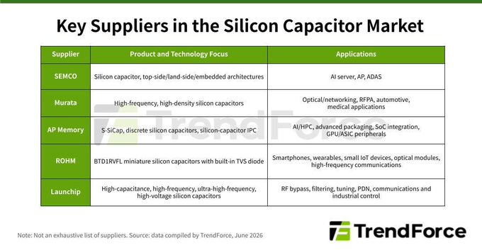

---

<!-- post_id: x:2067784496657973389 | ts: 1781833216 -->
## [X] 駿HaYaO · 2026-06-19 09:40

根據TrendForce最新報告，華星光電積極推動IJP OLED技術，正式挑戰韓系面板廠在OLED市場的長期主導地位。目前其G5.5世代IJP OLED產線已進入量產階段，成功量產醫療監視器面板，並同步推進品牌端監視器及筆電面板的驗證。

今年華星先以27吋UHD IJP OLED監視器試水溫，瞄準專業型與創作者市場。相較QD-OLED與WOLED，IJP OLED在高端商務顯示器具備明顯能耗優勢，已吸引韓系、陸系與台系品牌積極驗證，預計2026年第三季開始量產出貨。
監視器市場方面，目前仍由Samsung Display與LG Display寡占，今年OLED滲透率僅3%。隨著華星投資G8.6大世代產能，預估2030年滲透率將提升至6.2%並持續成長。

筆電領域則由Samsung Display獨大，今年滲透率6%。華星選擇14吋WUXGA IJP OLED切入中低階市場，以積極報價策略獲得陸系、台系品牌青睞，美系品牌亦同步驗證，有望提前於2026年第三季出貨。預期在華星、京東方、維信諾等陸系廠商擴產下，2030年OLED筆電滲透率將大幅躍升至22.4%。
https://t.co/szUB5yDGCO

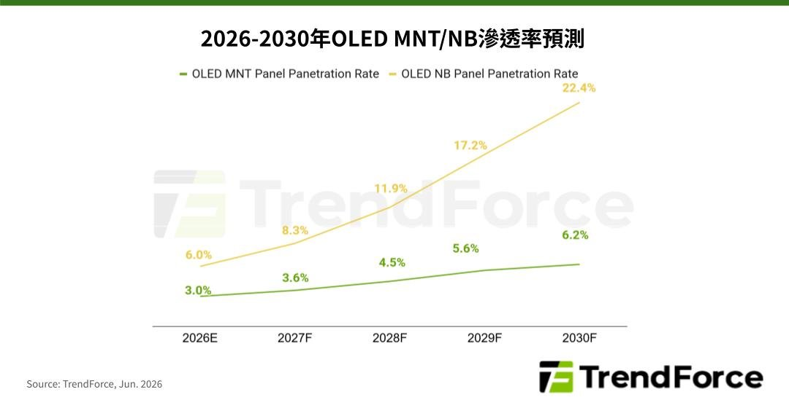

---

<!-- post_id: x:2067784215031382282 | ts: 1781833149 -->
## [X] 駿HaYaO · 2026-06-19 09:39

https://t.co/op3nH5pJBG

---

<!-- post_id: x:2067784088786960814 | ts: 1781833118 -->
## [X] 駿HaYaO · 2026-06-19 09:38 _(接續 2 則)_

美國告知 ASML：擔心中國可能已取得最先進晶片設備
Bloomberg AI 摘要

- 美國商務部長 Howard Lutnick 向 ASML 高層表達關切，表示該公司其中一台頂級設備可能已違反美國主導的出口限制，流入中國。

- ASML 反駁 Lutnick 的說法，強調其極紫外光（EUV）微影設備目前沒有一台在中國，公司發言人表示：「ASML 從未 向中國出貨過任何 EUV 設備」。

- 美國政府高級官員則表示，他們握有證據顯示 ASML 並未善意行事，例如向中國出口與 EUV 設備直接相關的零件與器材，對此 ASML 予以否認。

https://t.co/op3nH5pJBG

---

<!-- post_id: x:2067650221132353887 | ts: 1781801202 -->
## [X] 駿HaYaO · 2026-06-19 00:46

全球機器人計程車領導者 2026

Counterpoint Research 最新報告《全球機器人計程車領導者 2026》，機器人計程車正加速從試點走向大規模商業化，預計至 2035 年，全球服務市場規模將達 1,680 億美元，車隊總數成長至 360 萬輛。

美國 Waymo 與 Tesla、中國 Baidu Apollo Go、WeRide 及 https://t.co/AVOz3WMuyt 憑藉技術、資金與早期布局優勢，成為全球領先者。這些企業積極推動端到端 AI 自主技術，並在北美、中國及歐洲等市場擴大部署。

傳統叫車平台 Uber、Lyft、Bolt 與 Grab 則加速與自主車企業合作，利用既有需求平台與車隊管理經驗，布局未來機器人計程車市場。例如 Uber 已與 Rivian、Wayve、Motional 等多家 OEM 及技術商結盟。

報告指出，產業成功關鍵在於技術執行力、商業策略與生態系合作。Counterpoint 推出「機器人計程車準備度指數」，評估各業者在策略、技術、商業化及夥伴關係的競爭力。雖然 Waymo 等企業垂直整合程度高，新興業者如 Wayve、Nuro 則專注 AI 駕駛軟體，顯示價值鏈分工趨勢明顯。

儘管前景看好，挑戰仍存，包括安全驗證、營運可靠度及各地監管協調。報告強調，機器人計程車將補充公共運輸、降低私人車依賴，重塑都市移動生態。

---

<!-- post_id: x:2067647993990492190 | ts: 1781800671 -->
## [X] 駿HaYaO · 2026-06-19 00:37

針對 12nm FinFET 平台，聯電（UMC）正與英特爾（Intel）合作開發，並在英特爾位於亞利桑那州的廠區進行製造。這項合作讓聯電得以將其技術能力從成熟製程延伸至 12nm 先進製程，且無需承擔龐大的晶圓廠資本支出。此製程節點將針對物聯網（IoT）、Wi-Fi 連接以及高速介面等應用，幫助聯電擺脫純成熟製程的價格戰泥沼。

目前合作進展順利；該合資計畫預計於 2026 年向客戶提供 PDK 及相關 IP，2027 年開始 tape-out，並在 2027 年底前啟動商業量產。

除了 12nm 之外，產業管道顯示聯電也正與英特爾在 3nm 製程上進行合作。延續 12nm 專案的結構模式，聯電同樣無需投入大量資本支出。此合作目標是開發出性能接近台積電（TSMC）3nm 的製程節點，讓英特爾得以向外部客戶提供 3nm 代工服務。

https://t.co/vRr1l8uY1h

---

<!-- post_id: x:legacy_1781772000 | ts: 1781772000 -->
## [X] 駿HaYaO · 2026-06-18 16:40

輝芒微電子（深圳）股份有限公司
Fremont Micro Devices Corporation
通知函
尊敬的客戶及合作夥伴：
感謝您長期以來對輝芒微電子的信任與支持，在此表示衷心感謝。
繼前期全球半導體上游原材料價格大幅攀升導致成本上升之後，近期上游產能緊張，導致成本進一步持續大幅攀升，故我司決定即日起對 8 位 MCU 產品 進行價格調整，漲價幅度為 5%。再次感謝貴公司長期以來的支持，也希望大家一起相互理解，共克時艱。

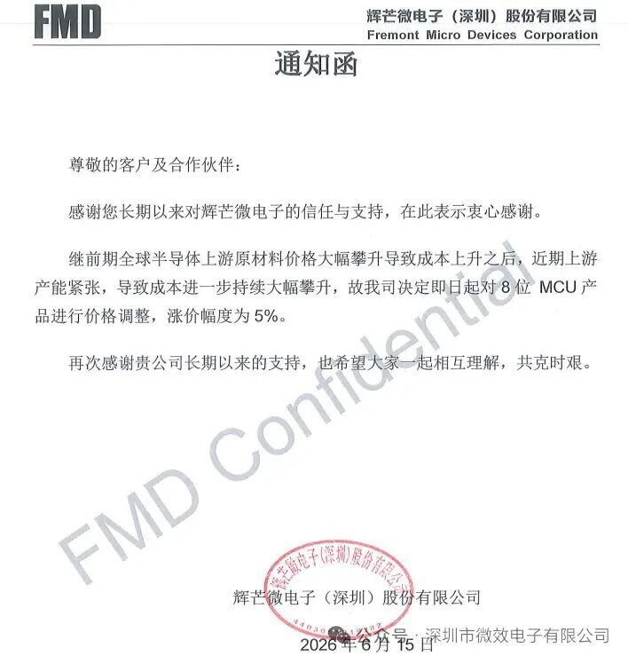

---

<!-- post_id: x:legacy_1781770080 | ts: 1781770080 -->
## [X] 駿HaYaO · 2026-06-18 16:08

被動元件、MLCC：NIKKO 報告

對 AI 驅動的需求週期抱持正面展望，認為本次循環與 2017-2018 年的 EV 週期、以及 2013-2015 年的智慧型手機週期有本質上的不同。

「假設目前的上升趨勢是由 AI 所驅動，那麼這一次的科技上行週期與過去由消費需求帶動的週期截然不同。報告認為當前這一輪循環是由各國政府因國家安全疑慮而加大對 AI 的投資所推動。雖然終端產品的數量較少，但每個終端產品所使用的電子元件數量更多，且這些元件通常毛利率較高。因此，單價上漲對獲利成長的貢獻度將高於過去週期，而資料中心（DC）的強勁需求也足以抵銷消費端需求的放緩。結果是，這些公司的營業利益率（OPM）正逼近 IT 泡沫時期所創下的高點。」

---

<!-- post_id: x:legacy_1781769600 | ts: 1781769600 -->
## [X] 駿HaYaO · 2026-06-18 16:00

BE半導體工業 N.V.（Besi）於2026投資人日提升長期財務目標

新聞稿

杜芬，荷蘭，2026年6月18日 — BE Semiconductor Industries N.V.（簡稱「本公司」或「Besi」）（Euronext Amsterdam: BESI；OTC市場：BESIY），作為半導體產業領先的組裝設備製造商，今天在荷蘭阿姆斯特丹舉辦2026投資人日，將討論市場趨勢、檢視業務與產品策略，並公布長期目標財務模型的更新。

Besi總裁暨執行長 Richard W. Blickman 表示：「自2025年第二季以來，整體市場環境與訂單動能已顯著改善。2.5D AI相關資料中心與光子學應用的需求增加，以及混合鍵合在邏輯、記憶體及共封裝光學的新應用案例，大幅提升了我們的業務展望。因此，我們調高Besi的長期營收與營業利益率目標，如下所示。」

投資人日目標模型摘要2025投資人日：
總營收　€15億 – €19億
營業利益率　40%–55%2026投資人日：
總營收　€17億 – €22億

營業利益率　45%–55%

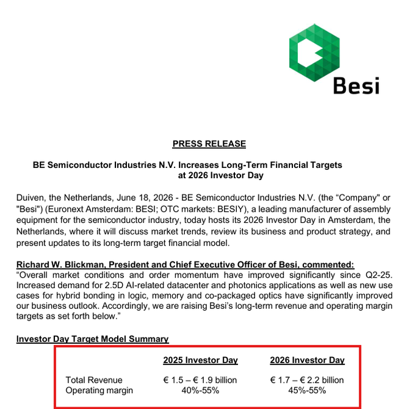

---

<!-- post_id: x:legacy_1781764620 | ts: 1781764620 -->
## [X] 駿HaYaO · 2026-06-18 14:37

蘋果執行長蒂姆・庫克接受《華爾街日報》專訪表示，受AI伺服器大量需求影響，記憶體（DRAM）與儲存（NAND）晶片價格已暴漲四倍，導致供應吃緊，蘋果產品價格上調已「無法避免」。

庫克指出，儘管公司已盡力吸收成本，但情況已無法持續。TechInsights估計，下一代iPhone Pro機型可能因此漲價約270美元。Mac與iPad漲價可能更早出現，iPhone 18系列（含折疊機）9月發表時也恐受影響。

DRAM市場由三星、SK海力士、美光主導，供應商優先將產能分配給AI高頻寬記憶體，導致消費性產品晶圓短缺高達15%。蘋果每年採購金額達數百億美元，過去憑規模壓價，如今卻需排隊。

庫克表示，蘋果願意動用現金儲備協助增加供應，但不會自建晶片廠。他形容這波漲價是「百年一遇的洪水」，40年職業生涯首見。其他PC、手機品牌已跟進漲價，預估今年美國智慧型手機與PC價格將上漲15%。

---

<!-- post_id: x:legacy_1781764380 | ts: 1781764380 -->
## [X] 駿HaYaO · 2026-06-18 14:33

AI伺服器記憶體需求爆發，帶動NOR Flash用量與容量同步大幅提升。根據DIGITIMES獨家報導，台灣記憶體廠商華邦電（Winbond）將於2026年下半年正式打入NVIDIA新一代Vera Rubin平台供應鏈，這是華邦NOR Flash首度進入NVIDIA AI晶片供應體系，預期未來可望在該平台取得主要市佔率，甚至挑戰高達50%的份額。

NVIDIA Vera Rubin平台預計2026年下半年放量出貨，單一機櫃需搭載高達600顆以上NOR Flash，用於開機、系統初始化與韌體儲存等關鍵功能。過去NVIDIA主要採用美光（Micron）NOR Flash，但隨著AI伺服器建置數量倍增，以及單機NOR Flash用量激增，既有供應量已無法滿足需求。華邦電早從GB200時期即送樣驗證，GB300時期供貨吃緊後，正式切入Vera Rubin平台，供貨比重將持續提升。

AI資料中心與邊緣運算需求爆發，2026~2027年伺服器相關記憶體位元需求年複合成長率（CAGR）高達40%。推論型伺服器因通訊與網卡功能加強，NOR Flash單顆容量也從256Mb提升至512Mb甚至2Gb。儘管NOR Flash單價不高，但對伺服器穩定運作至關重要，雲端客戶重視供應穩定性，使其在AI機櫃的價值量大幅翻倍。

在地緣政治影響下，雲端服務大廠（CSP）減少採用中國供應商。美光將重心轉向HBM與高階DDR5，對NOR Flash產能擴充保守；旺宏則聚焦eMMC成長。華邦電因此有機會擴大市佔，預期2027年挑戰半數份額。華邦電對單一客戶傳聞不予評論，但強調AI資料中心、邊緣AI及智慧終端需求升溫，NOR Flash同樣面臨結構性供不應求。

市場預期，AI伺服器、汽車電子及邊緣AI裝置對高容量NOR Flash需求成長，2026年上半年合約價已因交期延長漲幅達100~120%，下半年仍將續漲60~65%以上。NOR Flash價格漲幅雖落後2D NAND，但華邦電此波切入NVIDIA供應鏈，將顯著提升其在高階AI市場的地位與獲利動能。

---

<!-- post_id: x:legacy_1781761860 | ts: 1781761860 -->
## [X] 駿HaYaO · 2026-06-18 13:51

珠海極海半導體有限公司
Geehy Semiconductor Co., Ltd.
價格調整通知函
尊敬的客戶及合作夥伴：

近幾個季度以來，受上游原材料成本大幅攀升、晶圓代工、封裝測試等成本遞增導致行業供應鏈承壓。為確保產品品質、穩定供貨及長期供應鏈安全，經公司審慎評估後，結合當前生產運營實際，決定對部分產品價格進行調整，新價格將於 2026 年 7 月 1 日 起生效。關於貴司正在進行的項目與訂單，極海銷售與技術支持人員將第一時間與您对接，盡最大努力保障交付。

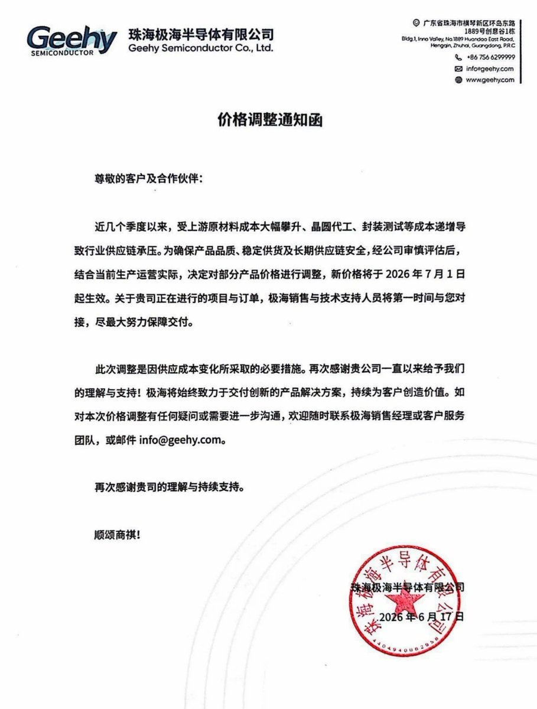

---

<!-- post_id: x:legacy_1781750820 | ts: 1781750820 -->
## [X] 駿HaYaO · 2026-06-18 10:47 _(RT @mingchikuo)_

重點解讀台積電的玻璃核心載板投影片

台積電在 6 月 11 日的日本 JPCA Show 2026，進行主題為「AIの進化に不可欠な先端パッケージング技術」的簡報，該份簡報約40頁，當中某張標題為「Glass Substrate Development for CoWoS」的投影片流出，引發廣泛關注。

以下是對該投影片（見附圖）的重點解讀，能網路科普查到的技術細節就不多說了，要注意的是投影片上的 COP 不是 Chip-on-Package 的縮寫，而是 Coplanarity、也就是平整度 / 共面度。

▌重點結論：

1. 台積電正式宣布與 Ibiden 以及群創合作，開發玻璃核心載板（glass core substrate），結構為玻璃上下各黏合 ABF 的三層結構設計，該技術就是用於 CoPoS 的 oS。

2. 市場低估玻璃核心載板的重要性，該技術對台積電是「must have」，意即 CoPoS 中，oS 的重要性高於 CoP，這也是該技術進行測試時，先搭配既有的 CoW 而非 CoP 的原因。

3. 玻璃核心載板單價較既有 ABF 載板高出數倍，群創加工的玻璃單價非常高，為最核心的材料。除 Nvidia 外，目前已有兩家美系客戶同樣表達高度興趣。

▌與本投影片相關的產業調查：

1. 本投影片提及的玻璃核心載板由 250x250mm 切割而來，ABF 增層主要採用 Ajinomoto 的 GL107 並混搭 ABF-GCP，以 2027–2028 主流 AI 晶片 ABF 規格的 24-28 層進行測試

2. 台積電實驗時的 CoW 是測試載具（test vehicle），足以驗證採用複合材料時最具挑戰性的機械結構問題。測試結果良好意味著台積電、Ibiden 與群創已合作突破關鍵技術瓶頸。

3. 目前是由 Ibiden 負責切割 250x250mm 的玻璃核心載板。待 2H27 採用 510x515mm 做量產前模擬時，若 Ibiden 仍想降低生產複雜性以維持超高毛利率，可能會改交由更熟悉玻璃特性的群創切割。

▌流出的投影片內容是將 CoPoS 中的 oS、也就是玻璃核心載板（投影片中的 glass-SBT）與 CoW 搭配的技術驗證結果，這是為解決該投影片前一頁所提到的「Substrate mechanical and electrical Dilemma」，而這顯著凸顯了 CoPoS 中 oS 的重要性。

1. CoPoS 中，CoP 要解決的是生產效率 / 切割經濟性的問題，這與成本與售價有關；而 oS 要解決的是翹曲與耐用性問題，這牽涉到能否做出晶片，以及晶片能否運作。

2. CoP 與 oS 兩者整合相得益彰，但展望未來數年，兩者的技術定位還是有些差異。CoP 是可選的絕佳優化選項（very-nice-to-have），沒有它的代價就是晶片更貴；但 oS 是必需品（must-have）， 沒有它可能連能否做出可用晶片都是問題。

3. 比較定位差異不是為了捧 oS 貶 CoP，這牽涉到客戶願意為哪個技術環節付錢的現實問題，細節下面分析。

▌投影片中含金量最高的是電源完整性（power integrity；PI）改善，這對客戶意義重大，這也代表玻璃核心載板生產穩定後，台積電獲利能力與競爭優勢可望同步提升。

1. 技術說明：玻璃核心載板薄 → TGV（through glass via）垂直導通路徑短 → 導通路徑電阻（R）跟迴路電感（L）同降 → PI 改善

2. 對客戶意義重大原因：PI 改善 → 供電更穩 → 釋出功率餘裕（power headroom）→ 可整合更多電晶體、或拉高運作時脈 → AI 晶片算力提升

3. 對客戶而言，生產效率是台積電的基本責任，客戶不會為此多付錢；但 AI 算力提升能直接轉化為客戶的競爭力與獲利，故客戶願意為此買單。這也是 Nvidia 積極看待玻璃核心載板的原因。

4. 對台積電而言，玻璃核心載板可提升良率並降低成本，同時提高 AI 晶片的算力與售價，既是降本工具，也是漲價籌碼，對獲利與競爭力都是加分。

5. 目前載板成本佔 AI 晶片 BOM 約低個位數，封裝良率造成的損失約載板成本的 5-10 倍，故即便未來玻璃核心載板成本高於目前的數倍以上，但佔 BOM 比重仍低，且可改善封裝良率造成的損失，故預期玻璃核心載板的高單價不會影響客戶採用意願。

▌簡報後的問答環節，有聽眾提問關於玻璃核心載板的 TGV 細節，台積電當場拒絕回答，因為玻璃核心載板的關鍵技術就是 TGV，核心 know-how 目前掌握在台積電與群創手中。相較下，另一個提問者的問題是關於 IVR、eDTC、與 LSI 的整合，台積電就回答了不少。

▌根據產業調查，若一切順利，台積電的目標是在 4Q28-1Q29 開始量產玻璃核心載板，以符合 Nvidia AI 晶片迭代節奏。順帶一提，許多人在傳的 Ibiden 的法說投影片，上面將玻璃核心載板時程列為 CY30，我對此的解讀是：對外向來保守謹慎的 Ibiden 將玻璃核心載板正式列為發展路線，這更確定了該技術長期趨勢。但從 Ibiden 投影片的其他細節與市場資訊不完全一致來看，例如 reticle 時程與台積電公開宣稱的差約一個世代、Rubin Ultra 載板尺寸明顯大於其在 CY26-27 標示的 90x90 等，這說明了在預測未來時，需隨時多方交叉驗證。

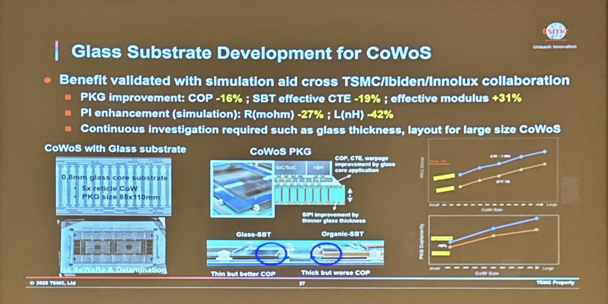

---

<!-- post_id: x:legacy_1781744460 | ts: 1781744460 -->
## [X] 駿HaYaO · 2026-06-18 09:01

E-glass 的瓶頸極為嚴峻，以致部分 CCL 廠商無法取得足夠的原料，迫使客戶轉向其他供應商。
當然，某些大廠可能不會面臨 E-glass 短缺的問題，因為他們正往價值鏈上游移動，轉向更高階的產品。
但這也意味著，他們的觀點並不能很好地反映目前整個市場基層的實際情況。 https://t.co/kwgrdbQjvk

---

<!-- post_id: x:legacy_1781744280 | ts: 1781744280 -->
## [X] 駿HaYaO · 2026-06-18 08:58

#每日導讀 #20260618 #經濟日報

台積電與艾克爾簽署十年合作協議，打造美國先進封裝一條龍生態系
川普再嗆對晶片課徵超過200%關稅，行政院已爭取到232條款優惠待遇
蘋果明年將推三款重磅新品：20周年紀念機、新一代折疊機及配鏡頭AirPods

📷 完整導讀 →https://t.co/3AtEk54nLV

---

<!-- post_id: x:legacy_1781743740 | ts: 1781743740 -->
## [X] 駿HaYaO · 2026-06-18 08:49

Good Morning! 6/18 Foreign Media Summary

- 6274 Taiwan Union Technology (TUC): U.S. Brokerage Raises Target Price

Yesterday, 2383 Elite Material (EMC) announced its May self-reported results, which beat U.S. brokerage estimates. Brokers now project 2Q gross margin to reach 34–35%, significantly higher than the company’s guided range of 29.5–32.5%. Brokers believe TUC will benefit from the same pricing-uptrend as EMC.

Brokers note that CCL supply remains extremely tight. Capacity expansion is failing to keep pace with downstream PCB capacity growth. Even after converting mid-to-low-end lines to high-end production, the shortage cannot be resolved in the short term. Taking into account peak-season demand, another round of CCL price hikes is expected in 2H26, which will coincide with TUC’s new Thailand plant ramping up in 3Q26.

Brokers expect TUC to take a more aggressive pricing stance on non-AI products, while at least matching EMC’s pricing on AI-related products. Based on the above, the brokerage has raised its 2026–2028 EPS forecasts to NT$35.8 / NT$78.7 / NT$119. Applying a 25x PE multiple on next year’s earnings, the target price has also been upgraded.

- 2327 YAGEO: May Self-Reported Results Beat Expectations

YAGEO’s May self-reported figures exceeded U.S. major brokerage expectations. Net profit margin reached 21.7%, higher than 1Q’s 21%, mainly driven by successful price increases and improved capacity utilization. Brokers reiterate that the industry is in a supply-tight environment with extended lead times, which continues to support suppliers’ pricing power. Positive outlook reaffirmed.

---

<!-- post_id: threads:3917787670399610871 | ts: 1781256706 -->
## [Threads] Kok Yu · 2026-06-12 17:31 _(接續 2 則)_

有趣之處在於...當大家覺得Q很難加工用選擇降規成LK2 也沒有比較好，因為降成LK2會導致供需更為吃緊；留在Q取得比較好的性能 ，供應也是吃緊到爆

布廠雨露均霑..難得台玻願意登高一呼，後續觀察其他家有沒有這意願

之前終端只盯T布...現在LK2和Q也要盯
後兩者跟日東紡沒有太大關係他也供應不了多少（主要是他客戶都不是主供 Nez也不用太看重

搶料這事情是戰爭，大家防來防去說不缺真的是不缺嗎（笑）不缺的話漲價幹嘛呢？
T布之前也是老神在在，結果被良率搞到都得多備，然後缺了；高階其他布種也是一樣,板子越來越難製作，良率一直往下，什麼都得多準備..

隨便問一下高階產品的交期那麼長，如果不缺還要拖那麼久幹嘛呢..

---

<!-- post_id: threads:3917752111107040696 | ts: 1781252467 -->
## [Threads] Kok Yu · 2026-06-12 16:21

龍頭來喊拉

---

<!-- post_id: threads:3917714287427203732 | ts: 1781247958 -->
## [Threads] Kok Yu · 2026-06-12 15:05

LK3 就是我們說的Q glass

另外LPU換成有M8(k2)+M9(Q),...剛好這兩個都很缺喔..到時候整個供應環節就變得很有趣

中系廠商能給台廠的支援真的不多，只能說到這樣

---

<!-- post_id: threads:3917611322171344676 | ts: 1781235684 -->
## [Threads] Kok Yu · 2026-06-12 11:41 _(接續 2 則)_

廣發可以不要一直亂嗎 PTFE是在搞笑的..
不要一直單方面拿生益的講法來寫報告....

廣發同時推薦台光電和生益科技，這樣根本是是邏輯

---

<!-- post_id: threads:3911703784430065312 | ts: 1780531450 -->
## [Threads] 誠實豆沙包 · 2026-06-04 08:04 _(接續 2 則)_

Computex去湊一下熱鬧
以下都是抓著工程師請教了幾個故事

A.GUC and 6669
1.那顆應該是Ayarlab的eic and pic，創意做封裝，然後跟HBM and compute die封在一起。
2.現在已經有技術了，就看csp什麼時候要用。

筆者認為創意封裝能不能進階帶量產（營收差距非常大），我認為這個台積電可以決定，畢竟之後如果走到hbm 4e，肯定要有base die的技術，GUC也有，至於會不會有ASIC，走TK3好像也不是不行，反正一切台積會決定。

B.MTK
1.MTK果然是最強的啊（讚嘆），eic and pic都自己設計然後投片完自己設計封裝，不過現在的產品不是在台積封，但下一代會回台積。
2.WiFi 8雖然傳輸速度跟延遲性跟WiFi 7差不多，不過在訊號複雜的環境，WiFi 8的訊號連結性跟穩定度遠勝WiFi 7，所以工程師前輩認為在人形機器人運作的工廠，WiFi 8有望成為機器人無線傳輸的協定。
3.Chromebook雖然今年很慘，但他的Chromebook的筆電晶片已經做到可以多工處理（例如有ai程式在跑但還是可以繼續跑其他程式）

C.power ic
1.走進台達跟光寶，都有展了800v的解決方案，不過不一樣的是最前端800v打進來後兩家都有converter，但一家用Sic一家用Gan，然後一個converter用四顆。
2.電進到rack後，多數的功率半導體還是以矽製程為主，兩家工程師大概都是說主晶片的功率越高，單櫃用量越高，GB系列相對GH系列用量就是翻倍。
3.板上的mos用量以30-50v用量最多，其次為低壓，高壓100v用量較少，不過單價最高，總共一個tray上大概要100顆以上。

D.我爸背影真帥

結論：發哥跟創意這樣算不算台股評價最便宜的CPO概念股（誤）

如果我說的你不認同，那你一定是對的。

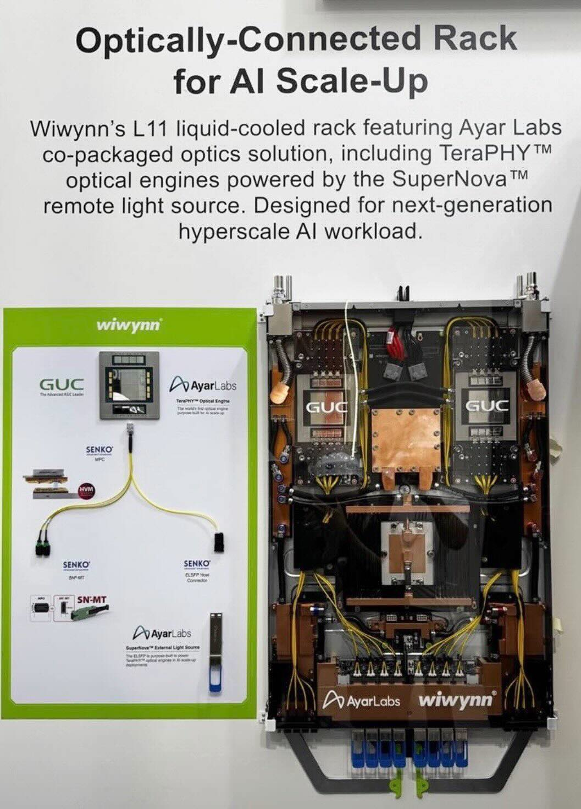
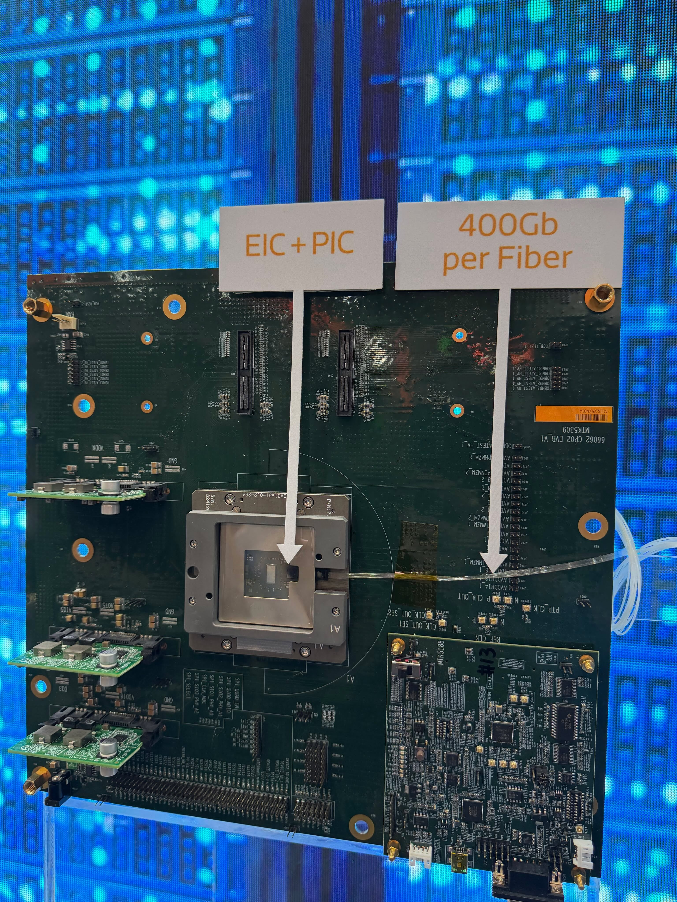
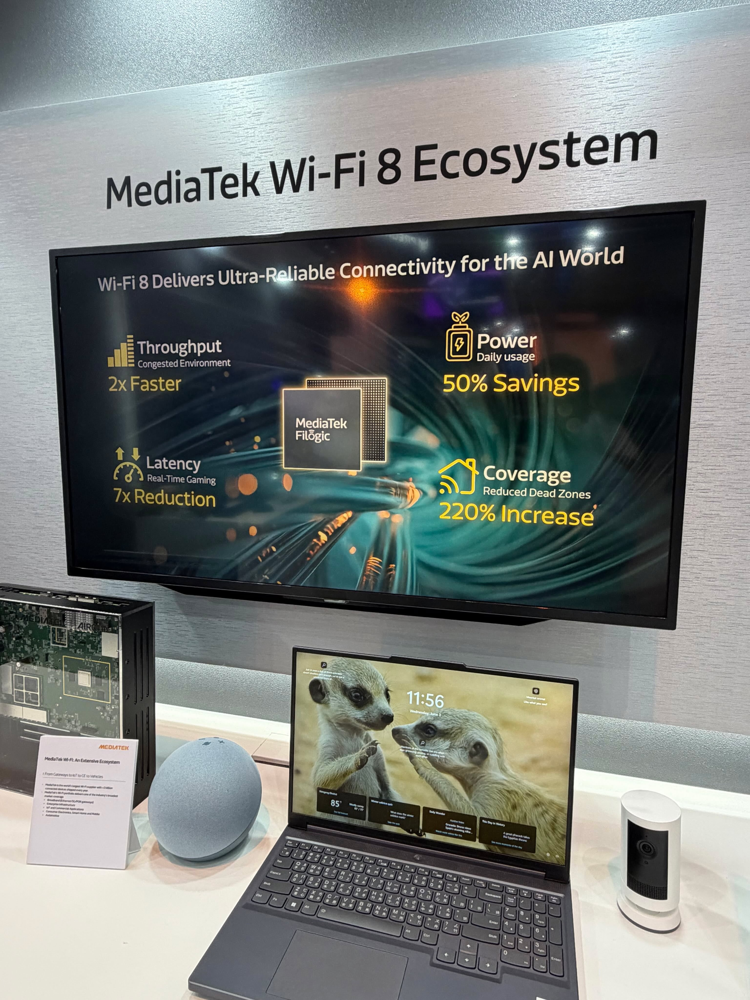
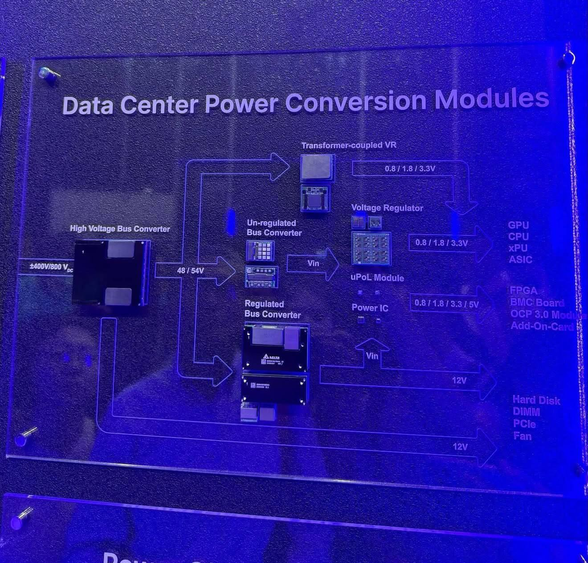
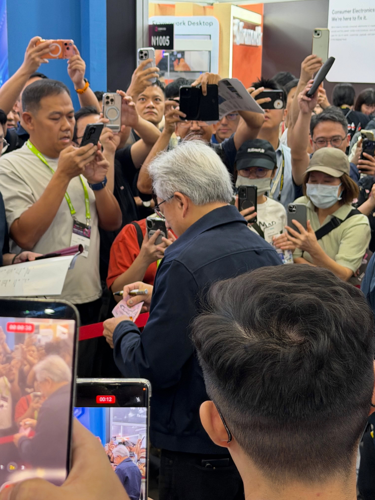

---

<!-- post_id: threads:3907775653814022604 | ts: 1780063181 -->
## [Threads] 誠實豆沙包 · 2026-05-29 21:59

關於一些創意的小故事

1.財務長早在上一次外資論壇就開始做多，並不是這次MS論壇才這麼用力（打臉），上次早就講了投片有增加，然後解釋前一次說車用佔比27年不會有市場估的這麼高因為cpu增加太多，更有講到AI 6.5 and Tpu v10後段的生意。

2.查理的線可能真的有看到什麼，但不是全面，然後他應該是也被台灣三星的人影響。

3.Rita寫的兩個cpu die封成一顆應該是對的，所以去拆創意turnkey的毛利率才覺得比公司講的高，但她上修主要是看到投片量增加。

4.如果cpu也被分食的話，創意不會一直去跟台積要投片量，且目前也只有創意在下半年有多的投片。

5.AI 5創意在四月底就tape out了，但三星還沒，如果市場從現在一台車兩個顆AI 5變成一顆AI4 一顆AI5，也是上創意的AI 5，對創意的貢獻不變。另外21年就有AI 4了，但為什麼AI 5等到27年呢，因為有人做不出來找到創意才幫特斯拉做好。

6.可以去看一下新董事長張麗絲的背景跟專長，他會是未來的關鍵人物。

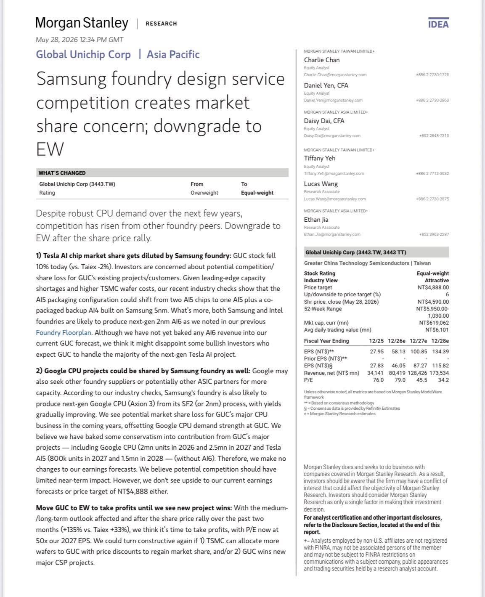
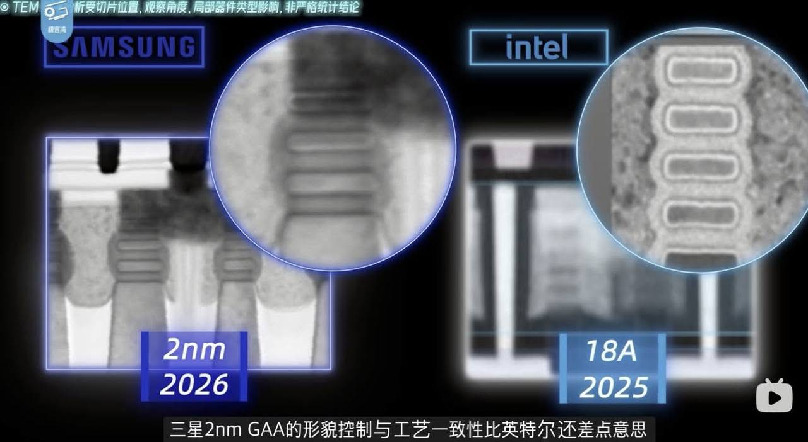

---
