# Goldman Sachs｜AI 基礎設施下一大主題：網路互連 — 9x TAM 解鎖，US\$154bn 機遇

**券商**：Goldman Sachs  
**分析師**：Allen Chang、Verena Jeng、James Schneider、Mark Delaney、Ryo Harada、Michael Ng, CFA、Chao Wang、Katherine Murphy、Atsushi Ikeda、Ting Song、Xuan Zhang、Anmol Makkar、Hiroki Muramatsu、Al Wang、Ryan Huang, CFA；Contributing: Zorayda Montemayor、Yifan Hu、Yuri Izumikawa（+多位歐洲/日本分析師）  
**日期**：2026-04-17  
**主題**：AI 網路互連深度分析（31 頁，原版 34 頁之節略版）：Scale-out 和 Scale-up 連接架構 BOM 拆解、CPO/NPO TAM 估算、Silicon Photonics vs EML 成本比較、OCS 技術路線圖  
**評級**：N/A（主題報告）  
<a href="https://layx.uk/dl?g=產業&b=GS&d=20260417&h=AI-Infrastructure-Networking">📎 下載 PDF</a>

---

## 報告總結

GS 以 2026 年 GTC 為催化劑，深入分析 GB300→Vera Rubin→Rubin Ultra 三代 GPU 平台的網路互連架構升級。核心結論：網路互連是 AI 基礎設施下一個最大題材，市場整體 TAM 從 GB300 時代的 US\$15bn 跳升至 Rubin Ultra（2H27-2028）時代的 US\$154bn（9x 成長）。每個 computing unit（NVL576 = 8 機架）的 dollar content 從 US\$315k（GB300 NVL72，每機架）增至 US\$9.4bn（Rubin Ultra NVL576，每 8 機架系統），增幅 29x。Scale-out 和 Scale-up 均呈強勁成長，不存在「互相取代」的問題——16x/45x 個別增長，CPO 在總 TAM US\$154bn 中佔 US\$91bn（59%），光源（ELS/CW Laser）供應緊張延續至 2027 年底。

---

## Goldman Sachs 完整投資邏輯鏈

| 論點層次 | Exhibit | 內容 |
|---|---|---|
| 架構升級路線 | 5, 16 | GB300（2H25）→ Vera Rubin（2H26）→ Rubin Ultra（2H27）：scale-out 從光模組 1.6T 升至 CPO 3.2T；scale-up 新增 PCB midplane（Rubin Ultra A）及 CPO optical engine（Rubin Ultra B） |
| Dollar content 爆炸式增長 | 6 | 每 computing unit 網路成本：GB300 US\$315k → Vera Rubin US\$489k → Rubin Ultra Spec A US\$1,113k → Rubin Ultra Spec B US\$1,169k；Scale-up 從 US\$140k（銅纜）升至 US\$803k（CPO dominant） |
| TAM 9x 解鎖 | 8 | Scale up + Scale out TAM：GB300 US\$15bn → Rubin Ultra Spec B US\$154bn；Scale-up 佔 69%（US\$106bn），CPO 佔 59%（US\$91bn） |
| CPO 量 TAM：2028E 110k 台 | 10, 11 | CPO TAM（高端）：2026E US\$1bn → 2027E US\$25bn → 2028E US\$71bn；2028E CPO switch 需求 110k 台（高端），CPO 主要受益方：optical engine & FAU |
| SiPh 結構性成本優勢 | 26, 28, 29 | SiPh 在 800G 有 26% BOM 優勢，1.6T 有 32% BOM 優勢；SiPh 滲透率從 6%（1Q24）→ 46%（4Q28E）；GM 優於 EML（800G：37% vs 28%；1.6T：57% vs 50%） |
| 光源供應：瓶頸至 2027 年底 | 34, 36 | CW laser（光源）供應 2025-2027Q2 全程「Very Tight」，2027Q3-Q4 改善為「Tight」，2028 才達 Balance；CPO laser 首選 SiPh + CW Laser（可靠度高、距離長） |
| OCS：下一波機遇 | 40-44, 46 | Google 引領 OCS（2015→2023），OCP 在 2025 年納入 Nvidia/Microsoft 等；OCS ASP US\$50k-200k vs 傳統交換機 US\$10k-100k；OCS 可消除交換機端光模組需求 |
| **結論** | 正文 | **網路互連所有配置均呈強增長，互不取代；CPO、SiPh、FAU、ELS、PCB midplane 均是受益賽道；光源緊張至 2027 年底是最大制約** |

> **報告最大邏輯缺口**：此報告的 TAM 計算是全週期 TAM（full lifecycle，按整代出貨量累加），不是年度 TAM——要與年度出貨量對照時需注意基礎。另外 Rubin Ultra NVL576 是 8 機架系統，其 dollar content US\$9.4bn 是整個 8 機架系統，非單機架數字。

---

## 報告核心觀點

| 主題 | GS 觀點 | 市場共識 | 是否 Contra-Consensus |
|---|---|---|---|
| Scale-out vs Scale-up 互取代 | 兩者均強增長，不互相取代 | 市場部分擔心 CPO scale-up 侵蝕 scale-out 光模組需求 | ✅ GS 更正面：scale-out 光模組從 GB300 216 個 → Rubin Ultra 2,500 個/computing unit（+10x） |
| CPO TAM | 2028E US\$71bn（高端）/ US\$12bn（低端）；CPO switch 2028E 需求 110k 台 | 市場共識更保守，缺乏按零件的細分 | ✅ GS 首次系統拆解 CPO BoM（Exhibit 22-23）和 TAM 時程 |
| SiPh vs EML | SiPh 結構性成本優勢（32% BoM），2028 滲透率 46% | 市場已知 SiPh 優勢，但量化程度不夠細 | ≈ 方向符合市場，但 GS 數字化更精確 |
| 光源供應 | 2025-2027Q2「Very Tight」，真正緩解到 2028 | 部分市場預期 2026 下半年緩解 | ✅ GS 更悲觀：認為整個 2026-2027 仍然緊張 |

**受益賽道優先排序**：CPO optical engine & FAU（佔 CPO BoM 43%）> 光源 ELS（9%）> PCB midplane（scale-up Rubin Ultra Spec A 主要驅動）> OCS（長線）

---

## Exhibit 5｜GPU 平台網路連接架構規格表（GS 推估）

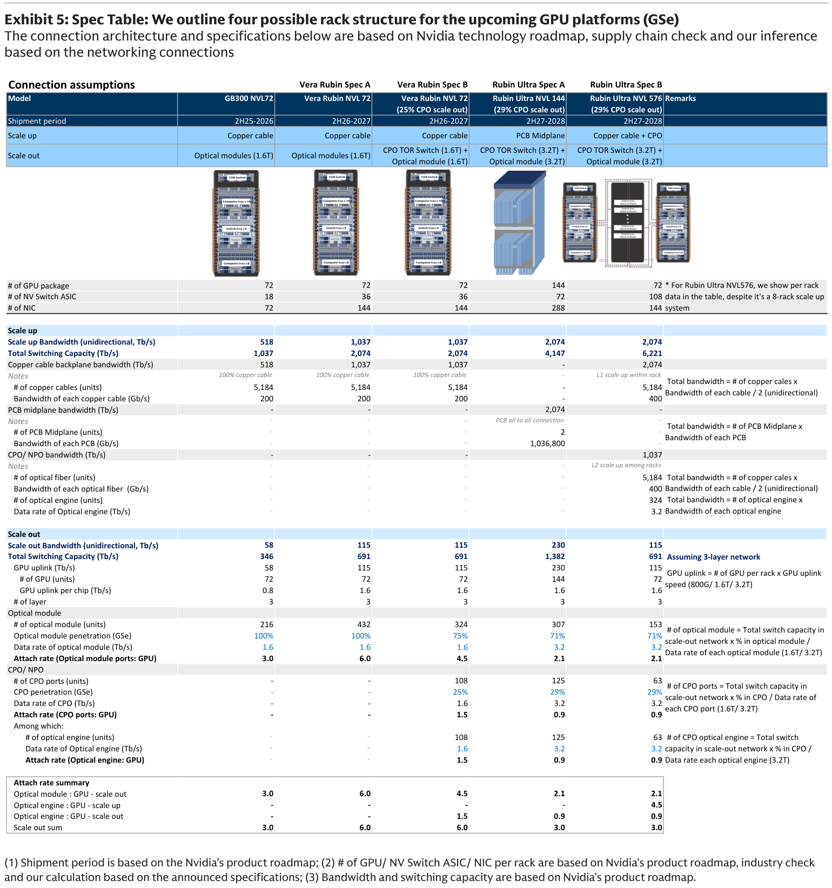

### 解讀摘要

此為 GS 依 Nvidia 技術路線圖與供應鏈調查推算的四種 GPU 平台網路連接架構規格，是整份報告的基礎技術文件。核心結論：Scale-up 在 Rubin Ultra Spec A 新增 PCB midplane（取代銅纜 backplane），Rubin Ultra Spec B 進一步引入 CPO/NPO 完成 L2 scale-up；Scale-out 則從 Vera Rubin 開始逐步導入 CPO TOR 交換機（Spec B 25%、Rubin Ultra 29% CPO 滲透）。光模組 attach rate：GB300/Vera Rubin Spec A 3.0 → Vera Rubin Spec B 4.5 → Rubin Ultra 2.1（CPO 稀釋後）。

### 表格

| 規格 | GB300 NVL72 | Vera Rubin Spec A | Vera Rubin Spec B | Rubin Ultra Spec A | Rubin Ultra Spec B |
|---|---|---|---|---|---|
| 出貨期 | 2H25-2026 | 2H26-2027 | 2H26-2027 | 2H27-2028 | 2H27-2028 |
| GPU 數量 | 72 | 72 | 72 | 144 | 72（8機架系統） |
| NV Switch ASIC | 18 | 36 | 36 | 72 | 108 |
| Scale-up 連接 | 銅纜 | 銅纜 | 銅纜 | PCB Midplane | 銅纜 + CPO |
| Scale-out 連接 | 光模組（1.6T） | 光模組（1.6T） | CPO TOR（1.6T）+ 光模組（1.6T） | CPO TOR（3.2T）+ 光模組（3.2T） | CPO TOR（3.2T）+ 光模組（3.2T） |
| CPO 滲透率 | 0% | 0% | 25% | 29% | 29% |
| 光模組 attach rate : GPU | 3.0 | 6.0 | 4.5 | 2.1 | 2.1 |
| CPO optical engine attach rate : GPU | - | - | 1.5 | 0.9 | 0.9 |

> **洞察一**：Vera Rubin 的光模組 attach rate 從 3.0 跳升至 6.0（Spec A），翻倍的原因是 NV Switch ASIC 從 18 增至 36、NIC 從 72 增至 144——networking complexity 大幅提升，scale-out 光模組需求在 CPO 導入前先大漲。這是「scale-out 光模組 10x 成長」論點的核心機制。

---

## Exhibit 6｜各代 GPU 機架網路 Dollar Content（US\$k/rack）

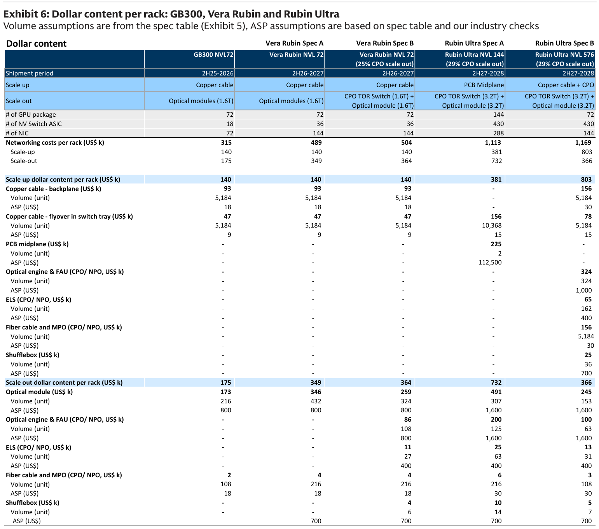

### 解讀摘要

每機架網路連接成本詳細拆解，揭示各零件貢獻。從 GB300 US\$315k 升至 Rubin Ultra Spec B US\$1,169k（+3.7x/rack），但 Rubin Ultra NVL576 是 8 機架系統，加總為 US\$9.4bn/computing unit（vs GB300 的 US\$315k）。Scale-up 從「純銅纜」升至「CPO + PCB midplane」是最大內容增量來源——Rubin Ultra Spec B 的 scale-up 達 US\$803k，其中 CPO optical engine & FAU US\$324k、ELS US\$65k、銅纜 US\$156k+US\$78k、fiber & MPO US\$156k。

### 表格

| 項目 | GB300 NVL72 | Vera Rubin Spec A | Vera Rubin Spec B | Rubin Ultra Spec A | Rubin Ultra Spec B |
|---|---|---|---|---|---|
| **總網路成本（US\$k）** | **315** | **489** | **504** | **1,113** | **1,169** |
| **Scale-up（US\$k）** | **140** | **140** | **140** | **381** | **803** |
| 銅纜 backplane | 93 | 93 | 93 | - | 156 |
| 銅纜 flyover switch tray | 47 | 47 | 47 | 156 | 78 |
| PCB midplane | - | - | - | 225 | - |
| CPO optical engine & FAU | - | - | - | - | 324 |
| ELS（CPO/NPO） | - | - | - | - | 65 |
| Fiber cable & MPO | - | - | - | - | 156 |
| Shufflebox | - | - | - | - | 25 |
| **Scale-out（US\$k）** | **175** | **349** | **364** | **732** | **366** |
| 光模組 | 173 | 346 | 259 | 491 | 245 |
| CPO optical engine & FAU | - | - | 86 | 200 | 100 |
| ELS | - | - | 11 | 25 | 13 |
| Fiber cable & MPO | 2 | 4 | 4 | 6 | 3 |
| Shufflebox | - | - | 4 | 10 | 5 |

> **洞察一**：Rubin Ultra Spec A 的 Scale-up PCB midplane（US\$225k）是整個表中最大的「新增項目」，貢獻 scale-up 內容增量的 ~65%（$225k / $241k）。PCB midplane 的出現代表機架內 GPU 間連接從「銅纜」升至「高端 PCB」，是 PCB 廠商（ABF/BT substrate 廠商）的直接受益點。

> **洞察二（配合 Exhibit 22-23）**：Rubin Ultra Spec B 的 CPO optical engine & FAU（scale-up + scale-out 合計 US\$324k + US\$100k = US\$424k/rack）佔 Rubin Ultra Spec B 總成本 36%，是最大單項。對比 CPO switch BoM 中 optical engine 佔 43%，兩者一致，確認 optical engine（含 FAU）是 CPO 生態系的核心受益零件。

---

## Exhibit 7｜CPO 交換機規格比較（Nvidia vs Broadcom）

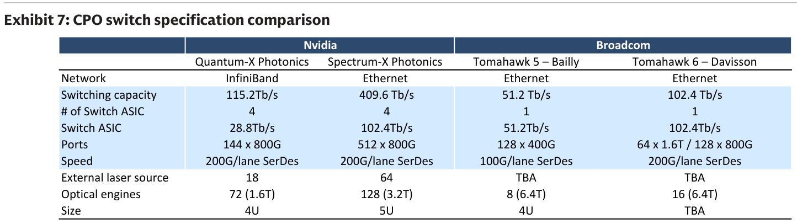

### 解讀摘要

四款 CPO 交換機規格對比：Nvidia Quantum-X（InfiniBand 115.2T，4×Switch ASIC，144×800G 埠）、Spectrum-X（Ethernet 409.6T，512×800G 埠）vs Broadcom Tomahawk 5（Ethernet 51.2T）、Tomahawk 6 Davisson（Ethernet 102.4T）。Nvidia 的兩款各配 72 或 128 個光學引擎；Broadcom 的更高頻寬（6.4T per engine）但僅 8-16 個引擎。

---

## Exhibit 8｜Scale-up / Scale-out TAM 機遇（全週期，US\$m）

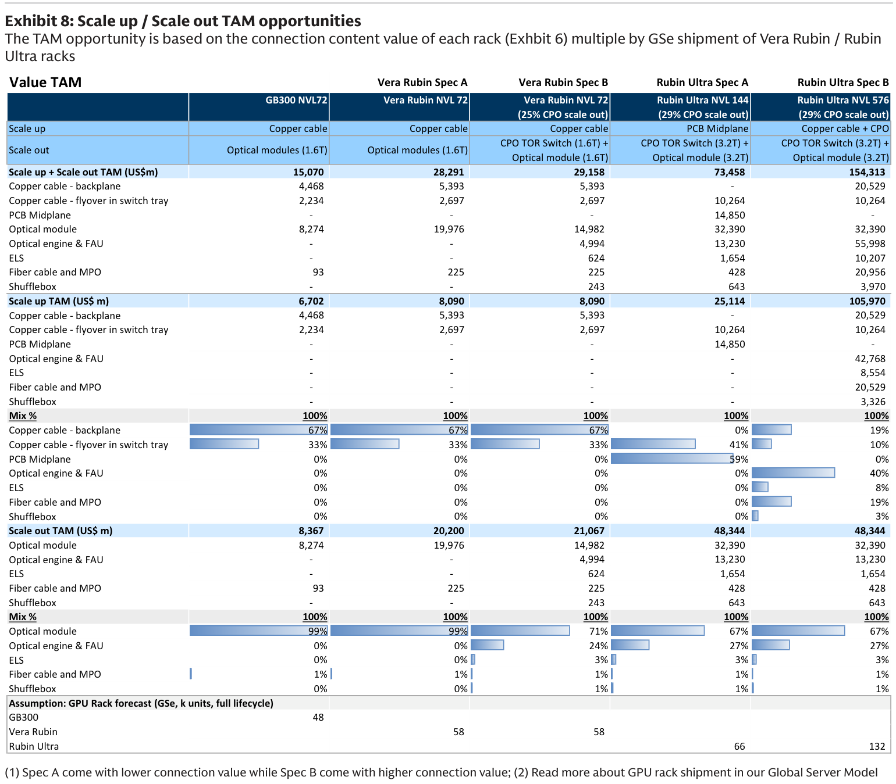

### 解讀摘要

這是報告最核心的 TAM 彙整表，以全週期出貨量（GB300 48k racks，Vera Rubin 58k racks，Rubin Ultra 66k/132k computing units）計算各代的累計 TAM。Rubin Ultra Spec B 帶來 US\$154bn 的全週期 TAM，Scale-up 佔 69%（US\$106bn）；Scale-out TAM 雖相對 scale-up 較小，但仍從 GB300 US\$8.4bn 升至 Rubin Ultra US\$48bn（5.8x）。

### 表格（全週期 TAM，US\$m）

| 項目 | GB300 NVL72 | Vera Rubin Spec A | Vera Rubin Spec B | Rubin Ultra Spec A | Rubin Ultra Spec B |
|---|---|---|---|---|---|
| **Scale-up + Scale-out TAM** | **15,070** | **28,291** | **29,158** | **73,458** | **154,313** |
| **Scale-up TAM** | **6,702** | **8,090** | **8,090** | **25,114** | **105,970** |
| 銅纜 backplane | 4,468 | 5,393 | 5,393 | - | 20,529 |
| 銅纜 flyover switch tray | 2,234 | 2,697 | 2,697 | 10,264 | 10,264 |
| PCB midplane | - | - | - | 14,850 | - |
| CPO optical engine & FAU | - | - | - | - | 42,768 |
| ELS | - | - | - | - | 8,554 |
| Fiber cable & MPO | - | - | - | - | 20,529 |
| Shufflebox | - | - | - | - | 3,326 |
| **Scale-out TAM** | **8,367** | **20,200** | **21,067** | **48,344** | **48,344** |
| 光模組 | 8,274 | 19,976 | 14,982 | 32,390 | 32,390 |
| CPO optical engine & FAU | - | - | 4,994 | 13,230 | 13,230 |
| ELS | - | - | 624 | 1,654 | 1,654 |
| **假設出貨量（k units/racks）** | 48k racks | 58k | 58k | 66k units | 132k units |

> **洞察一**：Scale-out 光模組從 GB300 US\$8.3bn → Rubin Ultra US\$32.4bn（+3.9x），這是在 CPO 以 29% 滲透率侵蝕下的數字。若 CPO 滲透率低於 29%，光模組 TAM 更高——說明即使在中等 CPO 普及率下，傳統光模組市場仍大幅成長。

> **洞察二**：Rubin Ultra 的 PCB midplane TAM 為 US\$14,850m（Spec A），但 Rubin Ultra Spec B 的 PCB midplane 為零（改用銅纜 + CPO）。PCB midplane 市場的實際大小取決於 Spec A vs Spec B 的市場份額，是 PCB 廠商（ZDT、Unimicron 等）最大的不確定性。

---

## Exhibit 9｜CPO 在數據傳輸中的工作原理

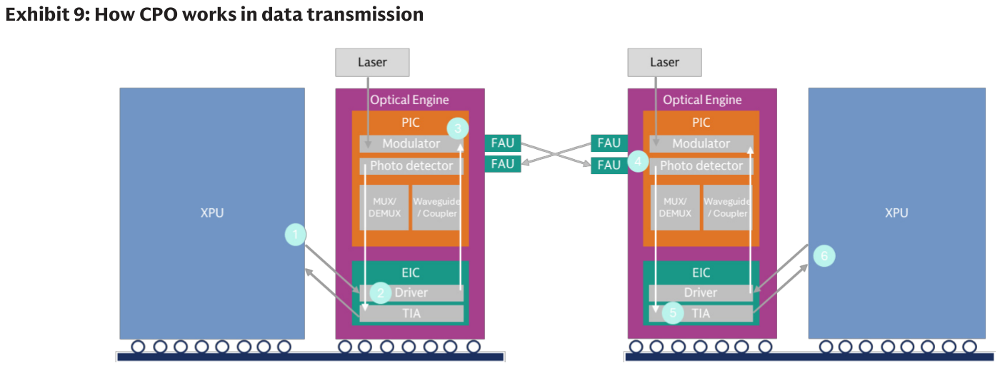

### 解讀摘要

CPO 架構圖示：XPU（GPU/TPU 等）→ EIC（Electronic Integrated Circuit，含 Driver + TIA）→ PIC（Photonic IC，含 Modulator + Photo detector + MUX/DEMUX + Waveguide/Coupler）→ FAU（Fiber Assembly Unit）→ 光纖傳輸。Laser 在外部。關鍵：CPO 把 optical engine 直接安裝在交換機/XPU 旁，省去 pluggable transceiver 的 CDR（Clock Data Recovery）重驅電路，降低延遲和功耗。

---

## Exhibit 10｜CPO TAM 預測（US\$bn，2026E-2028E）

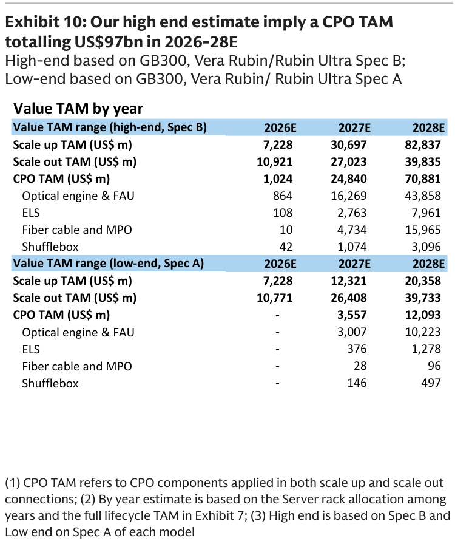

### 解讀摘要

按高端（Spec B）和低端（Spec A）情境，CPO TAM 高達 US\$97bn（2026E-2028E 累計高端）。2028E 高端情境下，Scale-up CPO TAM US\$82.8bn + Scale-out CPO TAM US\$39.8bn = 合計 US\$122.6bn，其中 2028 單年高端 CPO TAM 約 US\$70.9bn。關鍵拆解：Optical engine & FAU（US\$43.9bn，62%）> Fiber cable & MPO（US\$16.0bn，22%）> ELS（US\$8.0bn，11%）> Shufflebox（US\$3.1bn）。

### 表格（高端 Spec B 情境）

| | 2026E | 2027E | 2028E |
|---|---|---|---|
| Scale-up TAM（US\$m） | 7,228 | 30,697 | 82,837 |
| Scale-out TAM（US\$m） | 10,921 | 27,023 | 39,835 |
| **CPO TAM（US\$m）** | **1,024** | **24,840** | **70,881** |
| 　Optical engine & FAU | 864 | 16,269 | 43,858 |
| 　ELS（CW Laser） | 108 | 2,763 | 7,961 |
| 　Fiber cable & MPO | 10 | 4,734 | 15,965 |
| 　Shufflebox | 42 | 1,074 | 3,096 |

---

## Exhibit 11｜CPO 量 TAM（k units，2026E-2028E）

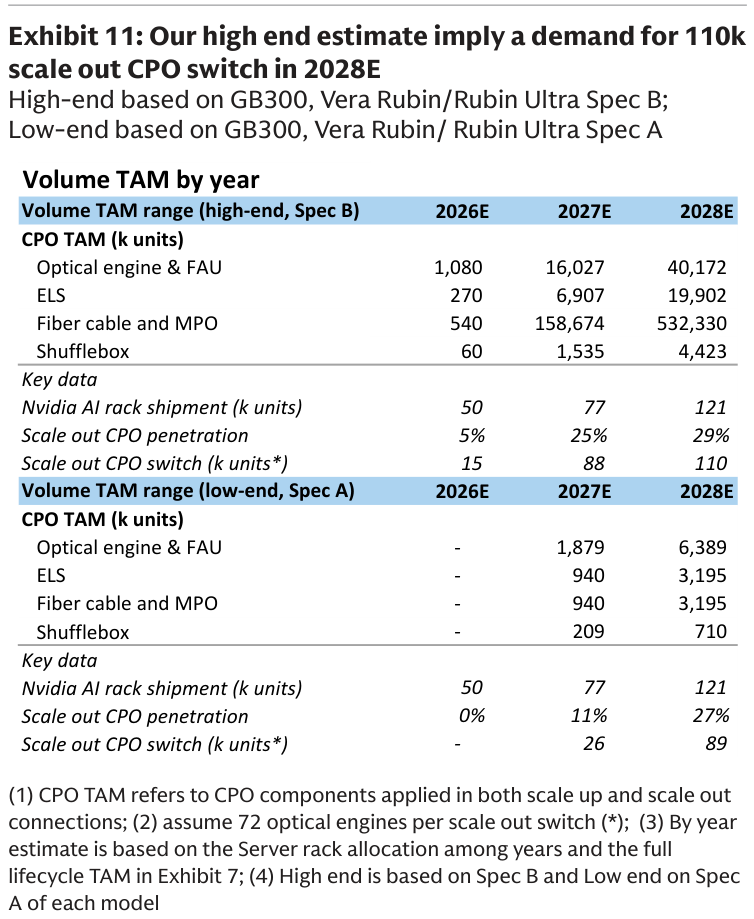

### 解讀摘要

高端情境下 2028E CPO switch 需求 110k 台（scale-out CPO 滲透率 29%）；CPO optical engine 需求 40,172k 個、ELS 需求 19,902k 個、Fiber cable & MPO 需求 532,330k 個（MPO 數量龐大）。低端情境 2028E CPO switch 僅 89k 台，差距主因是 scale-out CPO 滲透率 27% vs 高端 29%（相差只有 2ppt，但 TAM 差距很大）。

---

## Exhibit 12｜數據中心連接架構：Scale-up vs Scale-out

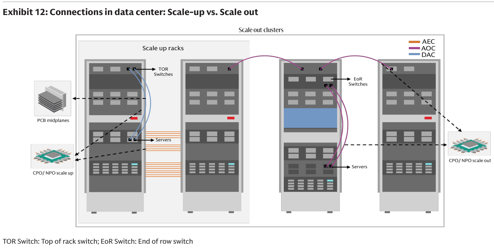

### 解讀摘要

視覺化區分兩種連接架構：Scale-up（機架內 GPU 間，使用銅纜 DAC/AEC 或 PCB midplane 或 CPO/NPO）和 Scale-out（機架間，通過 TOR Switch→EoR Switch 的 AOC 或 optical transceiver 傳輸）。OCS（Optical Circuit Switch）是 Scale-out 的長期趨勢（Google 已在 TPU v4/v7 採用）。

---

## Exhibit 14｜三種連接方式比較：PCB vs 銅纜 vs 光纖

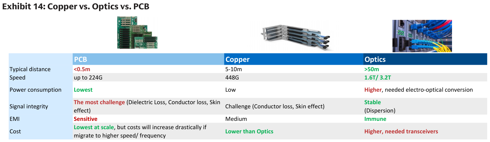

### 解讀摘要

三種介質的特性比較：PCB（<0.5m，最低功耗，信號完整性挑戰最大，低成本但高頻時成本急升）vs 銅纜（5-10m，適中）vs 光纖（>50m，1.6T/3.2T，高功耗需光電轉換，免疫 EMI，高成本但需 transceiver）。不同連接距離決定使用哪種介質——這是 scale-up vs scale-out 分別採用銅纜/PCB vs 光纖的根本邏輯。

---

## Exhibit 15｜不同距離對應的連接解決方案全圖

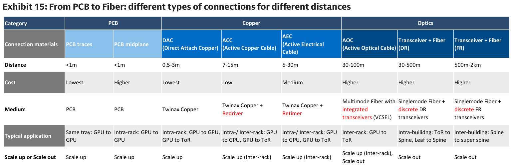

### 解讀摘要

從最短距離到最長：PCB traces（<1m）→ PCB midplane（<1m）→ DAC（0.5-3m）→ ACC/AEC（5-30m）→ AOC（30-100m）→ Transceiver + Fiber DR（30-500m）→ Transceiver + Fiber FR（500m-2km）。Scale-up 用 PCB/DAC/AEC；Scale-out 用 AOC/Transceiver+Fiber；Scale-across（跨數據中心）用 FR。

---

## Exhibit 16｜主流 AI 伺服器連接方案（各 CSP/廠商）

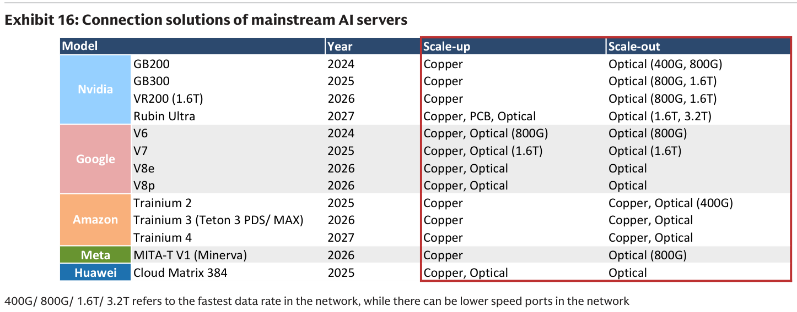

### 解讀摘要

各主流 AI 伺服器的 scale-up 和 scale-out 連接方案。Rubin Ultra（2027）是首款同時在 scale-up 採用 PCB midplane 和光纖（Copper + PCB + Optical）的 Nvidia 平台；Google V8e/V8p（2026）scale-up 開始用 Optical（1.6T）；Amazon Trainium 系列持續以銅纜為主。Meta MITA-T V1（Minerva，2026）scale-out 採用 800G（GS 估算）。

---

## Exhibit 17｜數據中心連接速度路線圖（2024Q1-2028Q4）

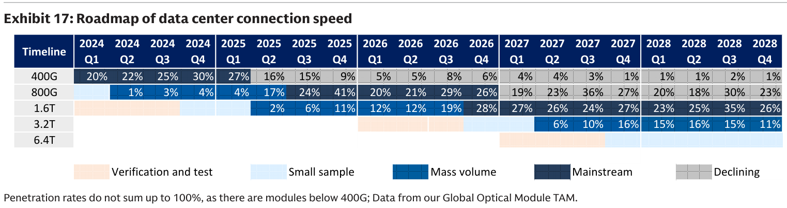

### 解讀摘要

速度路線圖：400G（2024 主流 20-30%，快速衰退至 2028E 僅 1-2%）→ 800G（2025 爬升主流，2026-2028 穩定 20-30%）→ 1.6T（2025Q2 開始，2026-2028 成為主力 12-28%）→ 3.2T（2027Q3 開始，2028 達 16%）→ 6.4T（2028 開始驗證）。這是光模組/SiPh 廠商產品升規的時程依據。

---

## Exhibit 18-19｜光纖技術遷移路線（Pluggable → CPO → OEIC）

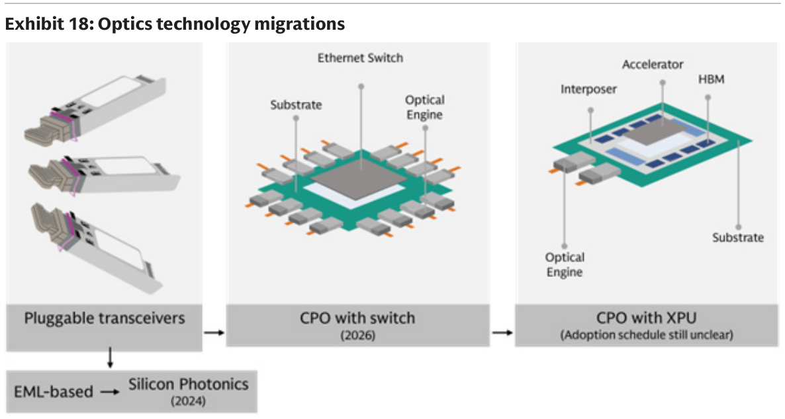
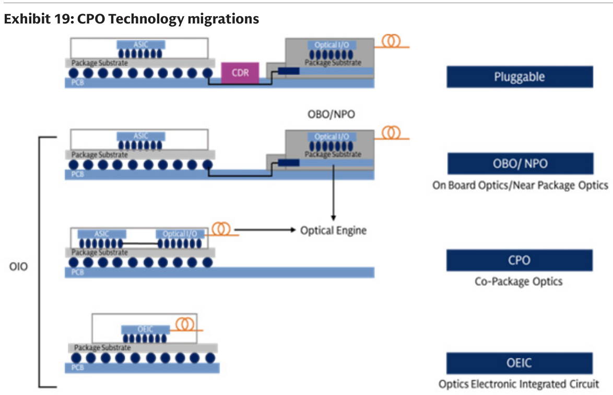

### 解讀摘要（Exhibit 18）
光纖技術三代演進：Pluggable transceivers（現行主流）→ CPO with switch（2026，光學引擎整合在交換機旁）→ CPO with XPU（時程不明，光學引擎整合在 GPU/TPU 旁）。EML-based 正在向 Silicon Photonics（2024 開始）遷移。

### 解讀摘要（Exhibit 19）
CPO 技術演進四層：Pluggable（CDR 分離，最成熟）→ OBO/NPO（Optical Engine 在 board 上，Near Package Optics）→ CPO（Optical Engine 緊鄰 ASIC package）→ OEIC（Optics Electronic Integrated Circuit，完全整合）。目前主流從 OBO/NPO 向 CPO 演進，OEIC 仍為遠期技術。

---

## Exhibit 20｜CPO 主要廠商進展

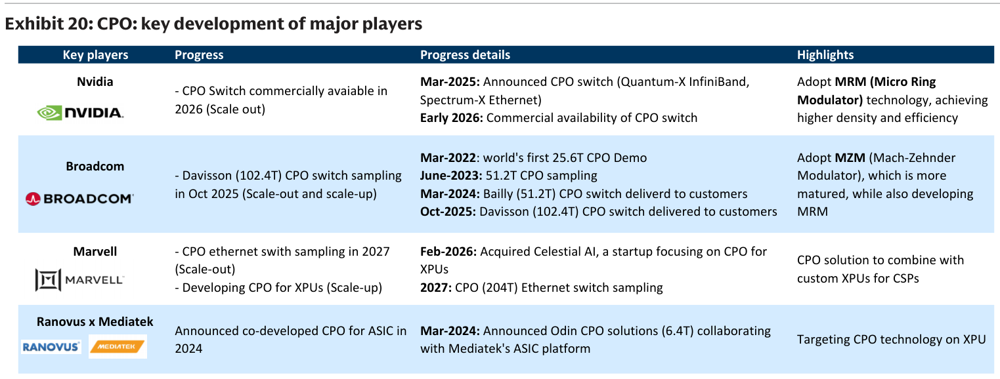

### 解讀摘要

Nvidia（MRM 技術）：CPO switch（Quantum-X InfiniBand + Spectrum-X Ethernet）2026 年初商業量產；Broadcom（MZM 技術，同時開發 MRM）：Tomahawk 5（51.2T）2024 交付、Davisson（102.4T）2025 10 月交付；Marvell：2026 2 月收購 Celestial AI，2027 年 CPO Ethernet switch 取樣；Ranovus × MediaTek：2024 年宣佈 Odin CPO 6.4T，針對 XPU（ASIC）CPO。

---

## Exhibit 22-23｜CPO Switch BoM 拆解（Nvidia Quantum-X Photonics）

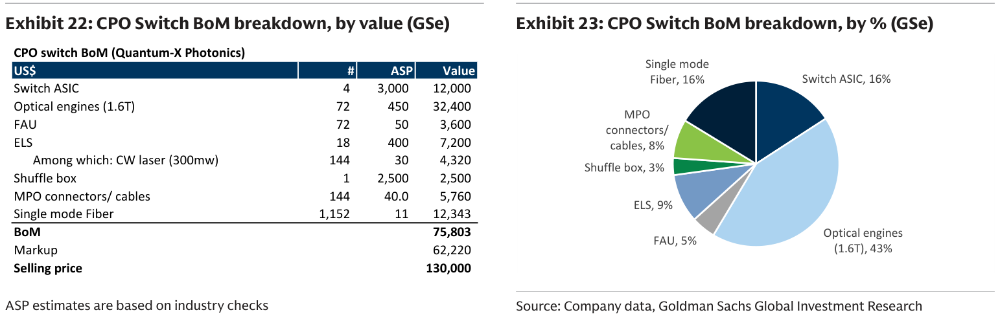

### 解讀摘要

Quantum-X Photonics CPO switch 的詳細 BoM 拆解（GS 估算）。BoM 合計 US\$75,803，加 Markup 後 Selling Price US\$130,000。Optical engine 是最大成本項（US\$32,400，佔 43%），遠高於 Switch ASIC（US\$12,000，16%）和 Single mode Fiber（US\$12,343，16%）。ELS（含 CW laser 300mW，144 個）佔 9%（US\$7,200，其中 laser 本身 US\$4,320）。

### 表格

| 零件 | 數量 | ASP（US\$） | 價值（US\$） | 佔 BoM % |
|---|---|---|---|---|
| Switch ASIC | 4 | 3,000 | 12,000 | 16% |
| Optical engines（1.6T） | 72 | 450 | 32,400 | **43%** |
| FAU | 72 | 50 | 3,600 | 5% |
| ELS（CW Laser 300mW × 144） | 18（ELS units） | 400 | 7,200 | 9% |
| 　其中：CW laser 300mW | 144 | 30 | 4,320 | — |
| Shuffle box | 1 | 2,500 | 2,500 | 3% |
| MPO connectors/cables | 144 | 40 | 5,760 | 8% |
| Single mode Fiber | 1,152 | 11 | 12,343 | 16% |
| **BoM 合計** | | | **75,803** | **100%** |
| Markup | | | 62,220 | |
| **Selling price** | | | **130,000** | |

> **洞察一**：CPO switch 的 BoM Markup 高達 82%（62,220/75,803），說明 CPO switch 製造商的定價能力極強——這部分溢價最終歸屬於交換機廠商（Nvidia、Broadcom），而非零件供應商。零件廠商的受益是成量，而非直接參與這 82% Markup。

> **洞察二**：CW laser 每個僅 US\$30（144 個 = US\$4,320），但高功率（300mW）版本（如 VPEC 供應的 InP）是瓶頸資源——若量産後 ASP 維持穩定，ELS 的最大受益是量增（2028E 19,902k 個），而非 ASP 提升。

---

## Exhibit 24-25｜Ruijie NPO 交換機（實物圖）

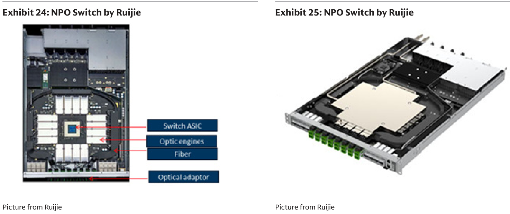

### 解讀摘要

Ruijie（锐捷）的 NPO（Near Package Optics）交換機實物圖，清晰標示 Switch ASIC、Optic engines（optical engine 陣列）、Fiber、Optical adaptor 的物理佈局，以及外部連接介面（右圖）。NPO 是介於 Pluggable 和 CPO 之間的過渡方案，光學引擎置於 PCB 板上（Near Package）而非 pluggable 外殼中。

---

## Exhibit 26｜SiPh 在數據通訊市場的滲透率（1Q24-4Q28E）

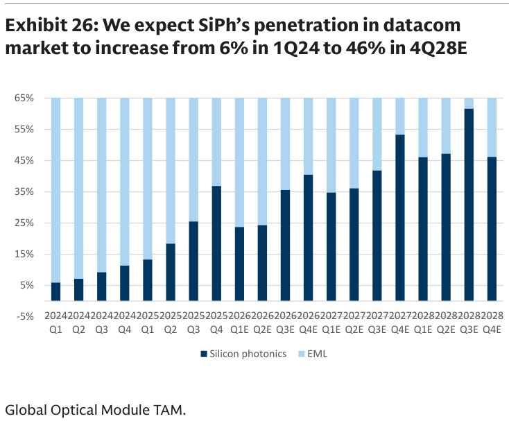

### 解讀摘要

Silicon Photonics 在數據通訊光模組市場的份額從 1Q24 的 6% 穩步上升至 4Q28E 的 46%，相對的 EML 份額從 94% 降至 54%。這代表 SiPh 在 4 年內市占接近翻倍，速度遠快於 EML；但 EML 仍佔半壁江山。這個趨勢的驅動力：SiPh 在 800G 有 26% BoM 優勢、在 1.6T 有 32% BoM 優勢（見 Exhibit 28-29）。

---

## Exhibit 27｜Silicon Photonics 晶片內部結構

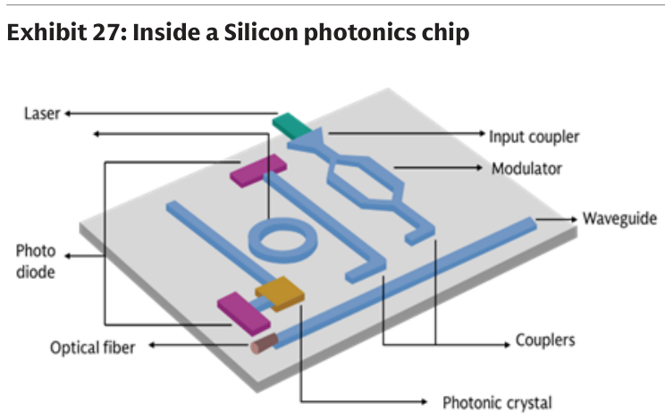

### 解讀摘要

SiPh 晶片的功能層示意圖：Laser 輸入 → Input coupler → Modulator（電光轉換）→ Waveguide（光波導）→ Couplers → Photonic crystal → Photo diode + Optical fiber 輸出。整合度遠高於 EML（EML 需要 TOSA/ROSA 模組分離）——這是 SiPh 成本優勢的根本來源。

---

## Exhibit 28｜800G：SiPh vs EML BoM 比較

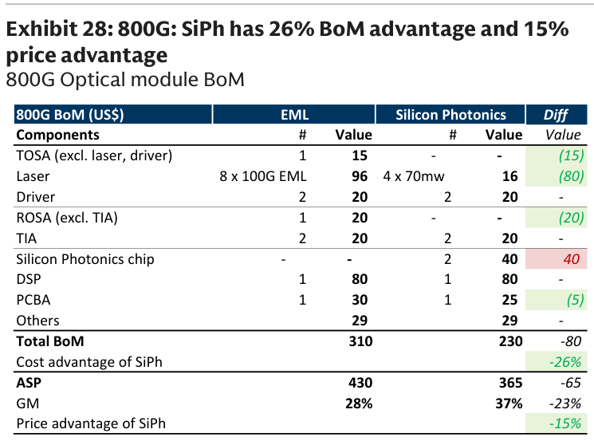

### 解讀摘要

800G 光模組 BoM 對比顯示 SiPh 在成本和毛利率方面均有結構性優勢。EML 需要 8 顆 100G EML laser（US\$96），SiPh 只需 4 顆 70mW CW laser（US\$16）——laser 成本差距 US\$80 是最大節省來源。SiPh 新增 2 顆 SiPh chip（US\$40），但整體仍有 US\$80（-26%）的 BoM 優勢。ASP 優勢傳導：SiPh ASP US\$365 vs EML US\$430（-15%），GM 更高（37% vs 28%）。

### 表格

| 零件 | EML 數量 | EML 值 | SiPh 數量 | SiPh 值 | 差額 |
|---|---|---|---|---|---|
| TOSA（excl. laser/driver） | 1 | 15 | - | - | **(15)** |
| Laser | 8×100G EML | 96 | 4×70mW | 16 | **(80)** |
| Driver | 2 | 20 | 2 | 20 | - |
| ROSA（excl. TIA） | 1 | 20 | - | - | **(20)** |
| TIA | 2 | 20 | 2 | 20 | - |
| Silicon Photonics chip | - | - | 2 | 40 | **+40** |
| DSP | 1 | 80 | 1 | 80 | - |
| PCBA | 1 | 30 | 1 | 25 | **(5)** |
| Others | — | 29 | — | 29 | - |
| **Total BoM** | | **310** | | **230** | **(80)，-26%** |
| ASP | | 430 | | 365 | -15% |
| GM | | 28% | | **37%** | +9ppt |

---

## Exhibit 29｜1.6T：SiPh vs EML BoM 比較

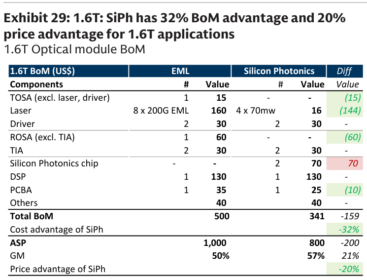

### 解讀摘要

1.6T 時 SiPh 優勢進一步擴大：BoM 從 EML US\$500 降至 SiPh US\$341（-32%，-US\$159）。Laser 差距拉大至 US\$144（8×200G EML US\$160 vs 4×70mW CW laser US\$16），ROSA 也更貴（US\$60 vs 無）。SiPh chip 成本上升（2顆 US\$70），但整體仍節省 US\$159。GM 達 57%（vs EML 50%）——SiPh 在更高速率的優勢更顯著，因為 EML 高速激光的成本增速快於 SiPh chip 成本增速。

---

## Exhibit 30-31｜EML vs SiPh 光收發器結構對比

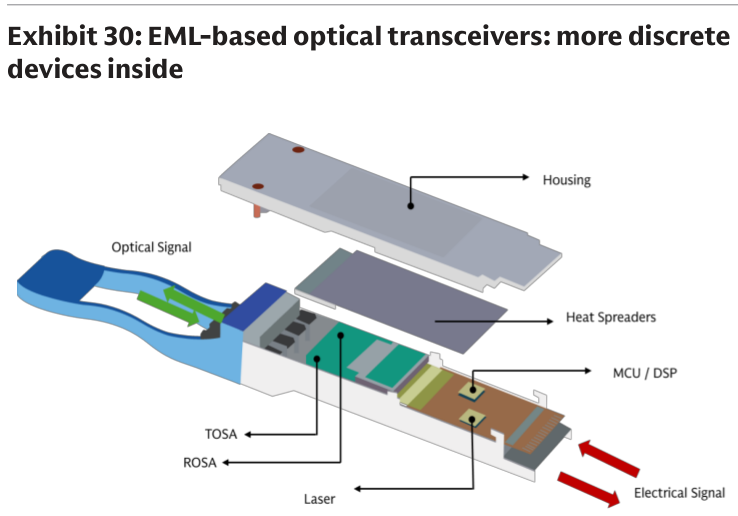
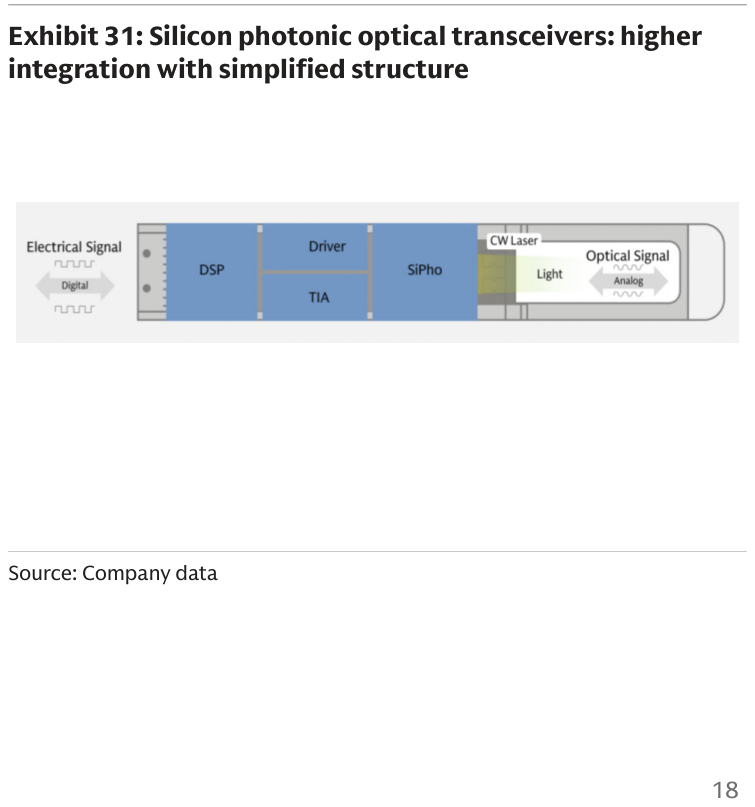

### 解讀摘要（Exhibit 30）
EML-based 光收發器：TOSA（含 Laser）+ ROSA + MCU/DSP + Heat Spreaders + Housing，零件離散度高，組裝複雜。

### 解讀摘要（Exhibit 31）
SiPh 光收發器：DSP → Driver → SiPho chip → CW Laser。高整合度（TOSA/ROSA 消失，合併入 SiPh chip），零件數大幅減少——這是 Exhibit 28-29 顯示的成本優勢的物理解釋。

---

## Exhibit 32｜SiPh 光收發器數據傳輸原理

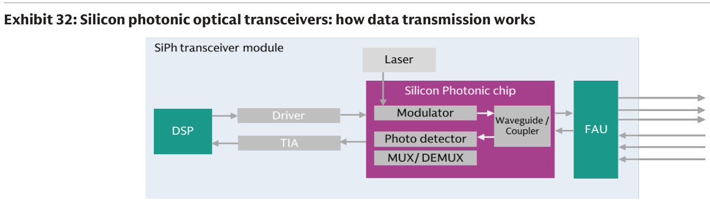

### 解讀摘要

SiPh 模組內部信號流程：電信號輸入 DSP（數字信號處理）→ Driver（驅動）→ Silicon Photonic chip（Modulator 電光轉換、Waveguide/Coupler、Photo detector 光電轉換、MUX/DEMUX 多工）→ FAU（Fiber Assembly Unit）→ 光纖輸出。信號流清晰顯示 FAU 是 SiPh 模組與外部光纖的「最後連接點」，也是整個 CPO/SiPh 生態中 FOCI 等 FAU 廠商的核心受益環節。

---

## Exhibit 34｜光源（CW Laser）供應狀況預測（2025-2028）

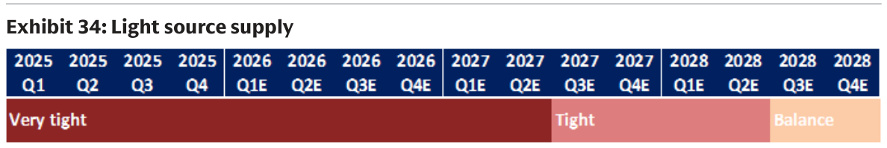

### 解讀摘要

光源供應時程表清晰揭示緊張程度：2025Q1-2027Q2 全程「Very Tight」（深紅），2027Q3-Q4 略緩為「Tight」（淺紅），2028 才達「Balance」（米色）。這代表即使 Vera Rubin（2H26）全面量産，光源仍將是整個 CPO 生態的最關鍵瓶頸，直到 2028 年才緩解。

> **洞察一**：光源「Very Tight」歷時超過 2.5 年（2025Q1-2027Q2），這是因為 InP（製作 CW laser 的關鍵材料）磊晶片生產週期長（客製化基板需 3-6 個月）。VPEC（台灣 InP 磊晶片廠）、Lumentum 等是供應瓶頸的直接受益者——稀缺意味著定價能力。

---

## Exhibit 36｜CPO 光源選擇比較（SiPh+CW vs VCSEL vs MicroLED）

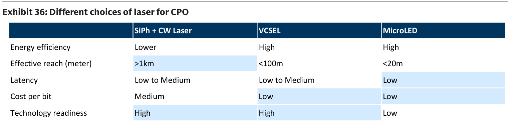

### 解讀摘要

三種 CPO 光源方案比較：SiPh + CW Laser（技術成熟度高、距離>1km、中等成本/位元）是現在主流；VCSEL（高能效、低成本/位元，但距離<100m，適合短距 scale-up）；MicroLED（低延遲但技術成熟度低，距離<20m）。對 CPO scale-out（長距）必須用 SiPh + CW Laser；scale-up 短距 VCSEL 有機會。

---

## Exhibit 38｜光收發器 Attach Rate（各 AI 伺服器型號）

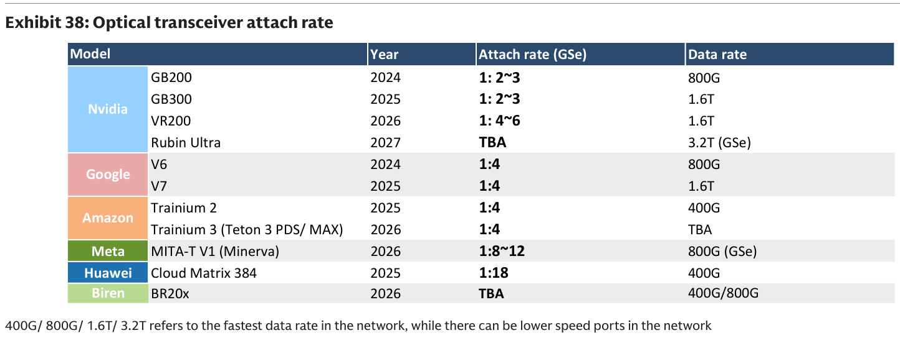

### 解讀摘要

不同 CSP 的光模組 attach rate（光模組：GPU 比例）：Nvidia GB300/GB200 均為 1:2~3（800G/1.6T）；Vera Rubin（VR200，2026）升至 1:4~6（1.6T）——這個跳升反映 Exhibit 5 中 NIC 數量翻倍。Google V6/V7 維持 1:4；Meta MITA-T V1 最少（1:8~12）；Huawei Cloud Matrix 384 為 1:18（較低attach rate，因其自有 scale-up 光纖架構消耗更多 optical budget）。

---

## Exhibit 39｜Ruijie 網路方案：2 層 vs 3 層光模組 Attach Rate

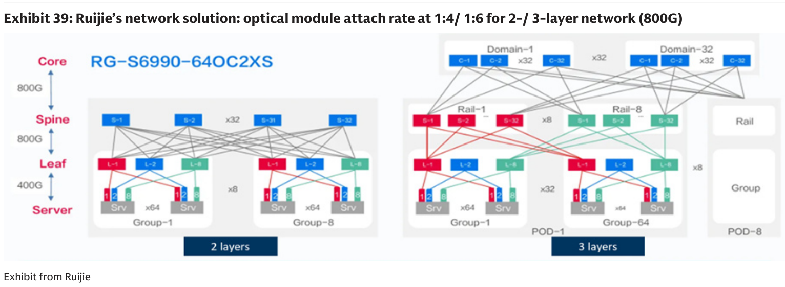

### 解讀摘要

Ruijie 的 NPO switch（RG-S6990-640C2XS）在 2 層網路中 attach rate 為 1:4，3 層網路為 1:6。這是中國 AI 數據中心（採用 NPO/CPO 而非 pluggable）的典型部署——Ruijie 的實際 attach rate 數字提供了 GS Exhibit 38「Chinese CSP 光模組滲透率」的具體案例佐證。

---

## Exhibit 40-41｜OCS（Optical Circuit Switch）原理

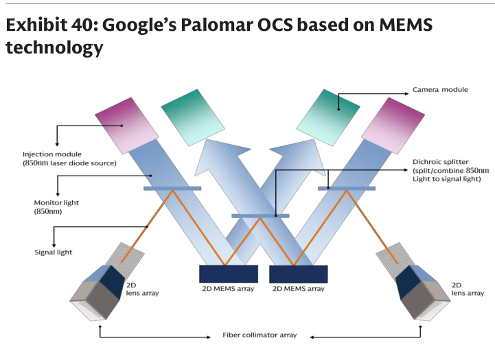
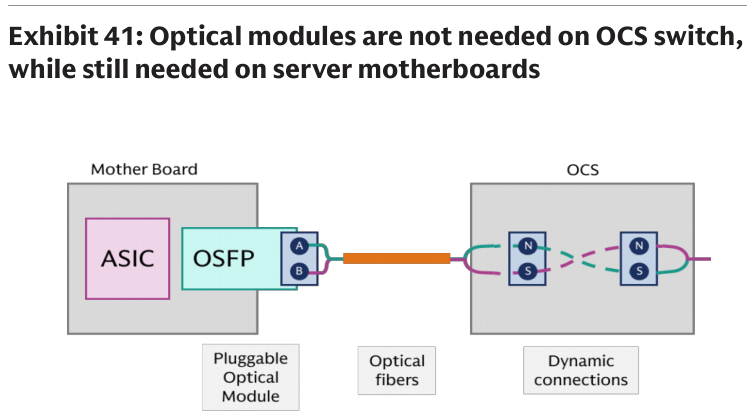

### 解讀摘要（Exhibit 40）
Google Palomar OCS 基於 MEMS 技術：2D MEMS 陣列 + 2D Lens Array + Fiber Collimator Array，以鏡面偏轉實現光路切換。850nm 注入模組（激光二極管）+ 分光鏡 + 攝像頭模組監控對齊。

### 解讀摘要（Exhibit 41）
OCS 的關鍵特性：伺服器側仍需 Pluggable Optical Module（OSFP）+ 光纖；OCS 端用 Dynamic Connections（動態光路切換）取代靜態 Ethernet switch 端口——OCS 本身不需要光模組，可省略交換機上的光模組，降低交換機側的光模組 TAM（對光模組廠是略負面的）。

---

## Exhibit 42｜OCS 技術發展時程

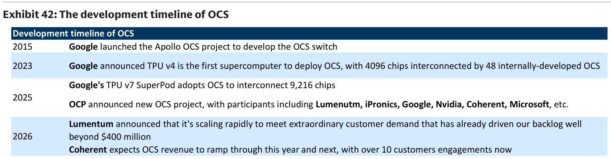

### 解讀摘要

OCS 發展時程（關鍵里程碑）：2015 Google Apollo 專案起步 → 2023 TPU v4（4,096 chips × 48 OCS）和 TPU v7 SuperPod（9,216 chips）→ 2025 OCP 宣佈 OCS 新專案（參與者含 Nvidia/Microsoft/Google/Coherent 等）→ 2026 Lumentum 積壓訂單超 US\$4 億、Coherent 指 OCS 收入本年及明年爬升（10 個客戶邀約）。OCS 正從 Google 內部技術轉變為行業標準。

---

## Exhibit 43-45｜OCS 技術選擇與 ASP

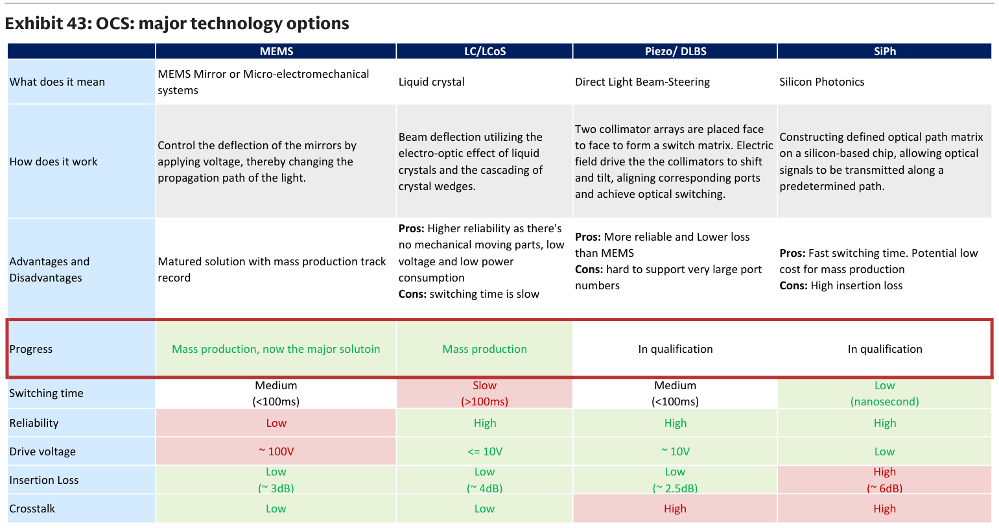
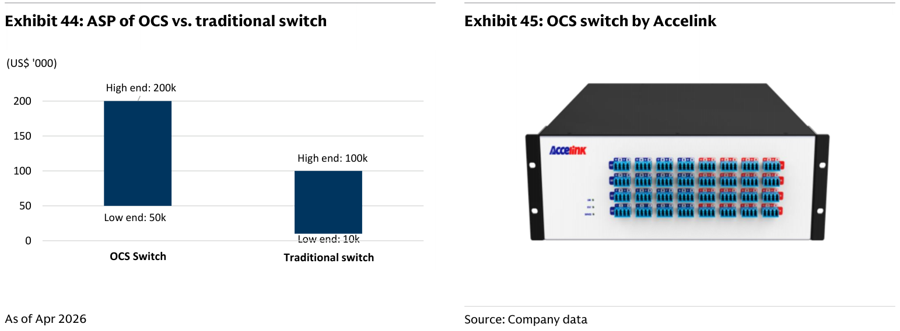

### 解讀摘要（Exhibit 43）
OCS 四種技術：MEMS（已量產，Google 主選）> LC/LCoS（量產，可靠性高但切換慢>100ms）> Piezo/DLBS（驗證中，可靠性佳但難支持大埠數）> SiPh（驗證中，nanosecond 切換但插入損耗大）。目前 MEMS 是主流，SiPh 是長期演進方向。

### 解讀摘要（Exhibit 44-45）
OCS switch ASP：US\$50k-200k（vs 傳統電子交換機 US\$10k-100k），幅度重疊但中位數更高。Accelink（武漢華光，中國 OCS 廠商）的 MEMS-based OCS 產品已商業量産。OCS 的高 ASP 反映其複雜的光學機械精度要求。

---

## Exhibit 46｜各 CSP 的網路連接技術採用狀況

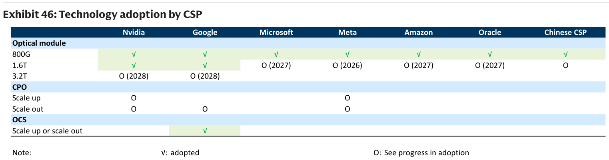

### 解讀摘要

截至報告日（2026 年 4 月），各 CSP 採用狀況：800G 光模組為全球 CSP 標準（均已採用）；1.6T 光模組 Nvidia/Google 已採用，其他 CSP 預計 2026-2027；3.2T 光模組僅 Nvidia/Google 預計 2028；CPO scale-out 目前僅 Nvidia/Google/Meta 在進行；OCS 僅 Google 已量産。這張圖是下一波采购節奏的「時程表」，顯示光模組廠商的潛在新客戶時程。

---

## Exhibit 47｜Scale-up、Scale-out、Scale-across 定義圖示

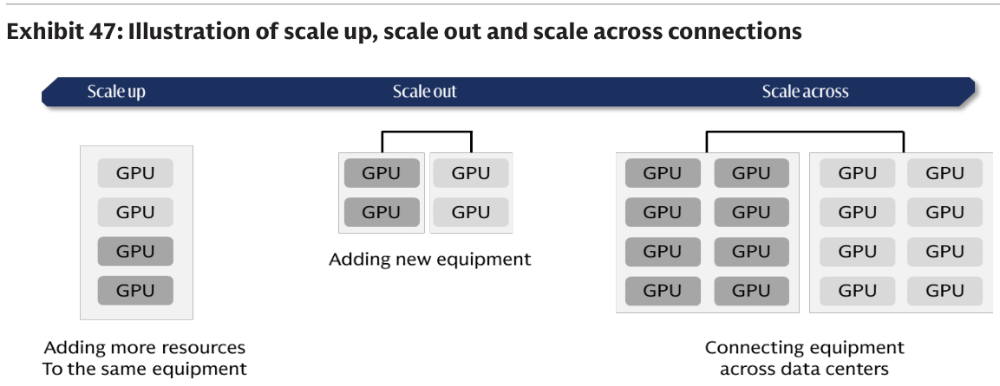

### 解讀摘要

三種 scaling 定義：Scale-up（在同一機架/系統增加更多 GPU，追求計算密度）→ Scale-out（增加新機架，橫向擴展）→ Scale-across（跨數據中心連接，多個 cluster 的橫向整合）。Scale-across 需要更長距離的光纖互連，空心光纖（Hollow Core Fiber）是其長期解決方案候選。

---

## Exhibit 50-51｜銅纜種類與空心光纖

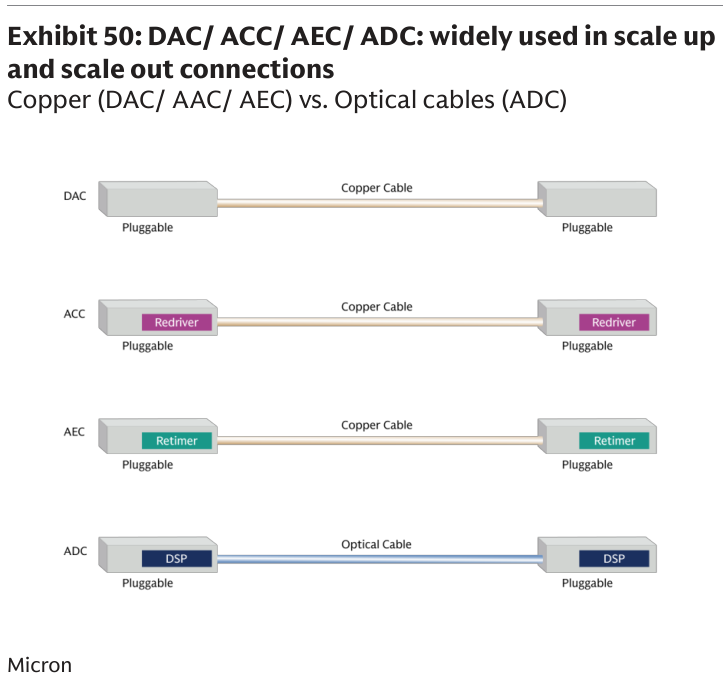
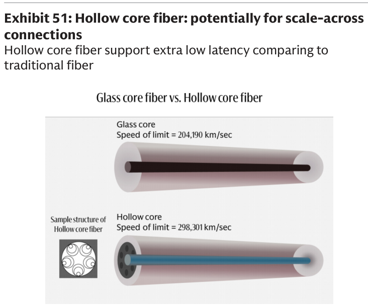

### 解讀摘要（Exhibit 50）
Scale-up 和 scale-out 廣泛使用的銅纜種類：DAC（Direct Attach Copper，無 DSP）→ ACC（Active Copper，加 Redriver）→ AEC（Active Electrical Cable，加 Retimer，5-30m）→ ADC（Active Direct Cable，加 DSP，用光纜）。越高等級 active 功能越多，成本越高，可傳輸距離越長。

### 解讀摘要（Exhibit 51）
空心光纖（Hollow Core Fiber）vs 傳統玻璃芯光纖：空心光纖光速極限 298,301 km/s（接近真空光速）vs 玻璃芯 204,190 km/s，延遲降低 32%。空心光纖適用於對延遲極敏感的 Scale-across 超長距連接（如跨數據中心 AI 集群互連），是超長距低延遲應用的未來技術方向。

---

## 跨 Exhibit 彙整：TAM 重點數據彙整

### 彙整 1｜各代 GPU 平台網路 TAM 對比（來源：Exhibit 6, 8）

| 指標 | GB300 NVL72 | Vera Rubin Spec A | Vera Rubin Spec B | Rubin Ultra Spec A | Rubin Ultra Spec B |
|---|---|---|---|---|---|
| Dollar content/computing unit | US\$315k | US\$489k | US\$504k | US\$1,113k | US\$9.4bn* |
| 全週期 TAM（US\$bn） | 15 | 28 | 29 | 73 | **154** |
| Scale-up 佔比 | 44% | 29% | 28% | 34% | **69%** |
| CPO 貢獻 | 0 | 0 | US\$4.9bn | US\$13bn | US\$91bn |
| 出貨假設 | 48k racks | 58k | 58k | 66k units | 132k units |

\* US\$9.4bn 為 8 機架系統（NVL576），非單機架

> **關鍵洞察**：Scale-up CPO 是主要 TAM 增量來源（Rubin Ultra Spec B Scale-up TAM = US\$106bn，其中 CPO = US\$43bn optical engine + US\$8.5bn ELS + US\$20.5bn fiber）。即使採用「低端」Spec A 假設，Rubin Ultra TAM 也達 US\$73bn，是 GB300 的 5 倍。

---

## 相關個股清單

| 類別 | 公司 | Ticker | 評等 | 核心角色 |
|---|---|---|---|---|
| 光學引擎 | 未具名廠商（FOCI 等） | — | — | CPO optical engine & FAU（佔 CPO BoM 43%，TAM 2028E US\$44bn） |
| InP 磊晶片/ELS | VPEC | 2455.TW | — | CW Laser InP 磊晶片供應；光源 Very Tight 至 2027 |
| 光源 | Lumentum | LITE.US | — | OCS 積壓 >US\$4 億，OCS 市場引爆點 |
| CPO switch | Nvidia | NVDA.US | — | Quantum-X Photonics、Spectrum-X CPO switch 量産 |
| CPO switch | Broadcom | AVGO.US | — | Davisson（102.4T）CPO switch；MZM 技術 |
| OCS | Coherent | COHR.US | — | OCS >10 個客戶邀約，2026-2027 收入爬升 |
| OCS | Accelink（华光）| — | — | 中國 MEMS OCS 廠商（商業量産） |
| NPO switch | Ruijie（锐捷）| — | — | RG-S6990 NPO switch；中國 AI 數據中心主要方案 |
| PCB midplane | ZDT（振鼎） | 4958.TW | Buy | Rubin Ultra Spec A PCB midplane US\$14.85bn TAM（若 Spec A 成主流） |
| FAU | FOCI | 3363.TWO | Buy | CPO FAU；GS 在其他報告中 Buy TP NT\$833 |
