# Daiwa｜南俊國際 6584 Initiation：a rising rail-kit challenger for high growth

**券商**：Daiwa Securities  
**分析師**：Allan Wang、Sheng Cheng  
**日期**：2026-04-17  
**主題**：南俊國際（6584 TT）首次覆蓋報告——server rail kit 新挑戰者  
**評級**：Buy (1)｜TP TWD1,000（目前價 TWD667，upside +49.9%）  
<a href="https://layx.uk/dl?g=產業&b=Daiwa&d=20260420&h=NanJuen-6584-Initiation">📎 下載 PDF</a>

---

## Daiwa 完整投資邏輯鏈

| 論點層次 | Exhibit | 內容 |
|---|---|---|
| 供應鏈瓶頸確認 | 01、19 | King Slide 4Q25 遭 Nvidia Vera Rubin RVL 暫時除名，1Q26 雖復名但 CSP 資格分散化急迫性已大幅提升 |
| 需求結構加速 | 06、07 | Top-4 CSP 2026E capex +66% YoY 至 USD582bn；AI 推理 buildout 把 regular server 需求推超傳統刷新週期 |
| 市場份額可見路徑 | 18、19 | Regular server 份額 14%→24%；AI server 份額 <1%→11%；overall 7%→17%（2025-28E） |
| 毛利率結構重評 | 05 | GM 35%(2025)→59%(2028E)，路徑參照 King Slide（2024 已達 69%），AI kit GM 60-80% vs regular 50-60% |
| 估值偏低 | — | 36x 1-year forward PER，PEG 0.6x（以 2026-28E EPS CAGR 57% 計）；Daiwa 2026E EPS 高於共識 10%、2027E 高 40% |
| 催化劑明確 | — | ① 共識 EPS 持續上修 ② AI server 硬體情緒改善 ③ 新 CSP 認證（第三家 CSP 已於 2026 進入供應鏈） |
| **結論** | 封面 | **Buy TP TWD1,000；雙引擎（regular +54% CAGR、AI +249% CAGR）驅動 EPS 2026-28E CAGR 57%** |

> **報告最大邏輯缺口**：AI server rail kit 市場份額預測（<1%→11%）高度依賴 CSP 持續深化採購，而非僅保留資格認證。Nan Juen 能否從「備選供應商」升級為「主力第二供應商」的確定性時間點仍不明確；若 CSP 採購分配比例低於預期，2026-27E EPS 高於共識 40% 的估計將面臨下修風險。

---

## 報告核心觀點

| 主題 | Daiwa 觀點 | 市場共識 | 是否 Contra-Consensus |
|---|---|---|---|
| Regular server 需求性質 | AI 推理 buildout 結構性擴大 regular server 需求，超出傳統週期 | 多數視 regular server 為週期性補貨 | 是 |
| AI server rail kit 收入貢獻時間 | 2026E 即顯著貢獻（TWD950m，+1,580% YoY） | 時間點較保守 | 是 |
| 毛利率軌跡 | 59% in 2028E，參照 King Slide 路徑 | Daiwa 2027E EPS 高共識 40% | 是（最大分歧點） |
| King Slide 競爭格局 | 市場正常化，Nan Juen 17%、King Slide 65-70%，共存而非取代 | 二選一敘事 | 否 |
| ASP 趨勢 | 高密度伺服器（>4U 佔比快速上升）結構性推升 regular ASP 至 USD25（2028E） | 多數預測 ASP 持平 | 是 |

**偏好排序**：Regular server rail kit（確定性高，已有兩大 CSP 主力供應商地位）> GPU server rail kit（已出貨 GB300，訂單可見）> ASIC server rail kit（2026E 才開始放量，依賴 AVC 合作）

---

## Exhibit 1｜Global: AI server rail kit TAM market share (2023-2028E)

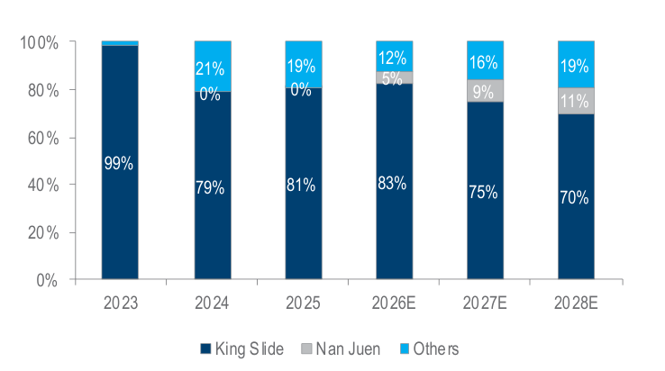

### 解讀摘要
AI server rail kit 市場在 2023 年被 King Slide 近乎壟斷（99%），這一格局因 4Q25 Nvidia RVL 事件開始瓦解：Nan Juen 從 2025 年的 5% 份額出發，Daiwa 預測至 2028E 達 11%，Others（含 Accuride、CIS）同步成長至 19%。這張圖的關鍵不是「Nan Juen 會奪多少份額」，而是確認市場正從「一家獨大」向「三方格局」演變——這意味著整個二線供應商族群都在受益，而非 Nan Juen 獨家搶食 King Slide 的餅。

> **原文補充**：King Slide 在 1Q26 已恢復 Nvidia RVL 資格，但 Daiwa 認為此事件已永久提升 CSP 維持第二供應商的動力，即使 King Slide 回歸，分散化採購的慣性已形成。

### 表格
*2023-2028E AI server rail kit TAM 市場份額*

| 年份 | King Slide | Nan Juen | Others |
|---|---|---|---|
| 2023 | 99% | 0% | 1% |
| 2024 | 79% | 0% | 21% |
| 2025 | 81% | 5% | 14% |
| 2026E | 83% | 9% | 8% |
| 2027E | 75% | 11% | 14% |
| 2028E | 70% | 11% | 19% |

### 洞察
> **洞察一**：Nan Juen 的 AI server 份額 11%（2028E）對應 USD77m 收入（TAM USD700m × 11%）；此數字與 Exhibits 24+27 的 GPU TWD879m + ASIC TWD1,534m ≈ USD73m（按 32 匯率）高度吻合，交叉驗證通過，估計結構內洽。

> **值得驗證**：2024→2025 King Slide 從 79% 反彈至 81%（期間 Others 從 21% 降至 14%）顯示 Others 份額波動大，並非穩定的第三極。若 CSP 供應鏈分散化進程慢於預期，Others 份額可能繼續壓縮，Nan Juen 的 11% 目標也面臨下修風險。

---

## Exhibit 2｜Nan Juen: revenue mix trend (2023-2028E)

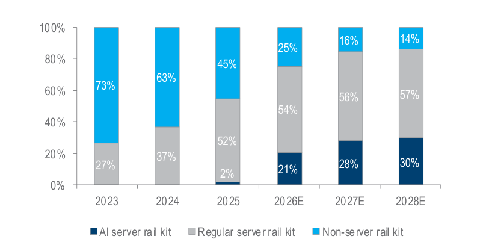

### 解讀摘要
Non-server rail kit（辦公家具、廚房）從 2023 年佔收入 73% 降至 2028E 僅 14%——這個數字的下降速度才是毛利率擴張最大的單一驅動力。Regular server kit（灰色）先從 27% 升至 52% 再略降至 57%，反映 AI server kit（深藍）在 2025 年後快速稀釋 regular 的份額。報告的邏輯核心在此：non-server 的退場 × AI kit 的進場 = 毛利率的雙重提升。

### 表格
*Nan Juen 收入結構轉型（2023-2028E）*

| 年份 | AI server | Regular server | Non-server |
|---|---|---|---|
| 2023 | 0% | 27% | 73% |
| 2024 | 0% | 37% | 63% |
| 2025 | 2% | 52% | 45% |
| 2026E | 21% | 54% | 25% |
| 2027E | 28% | 56% | 16% |
| 2028E | 30% | 57% | 14% |

### 洞察
> **洞察一**：Non-server 收入（TWD 固定在約 TWD1,106m）並沒有絕對萎縮，只是被 server 收入稀釋。換言之，毛利率的提升幾乎完全來自 server kit 收入的增量，而非低毛利品線的收縮——意義是若 server 成長不如預期，毛利率拉升的時間軸會大幅延後。

---

## Exhibit 3｜Global: regular server rail kit TAM market share (2023-2028E)

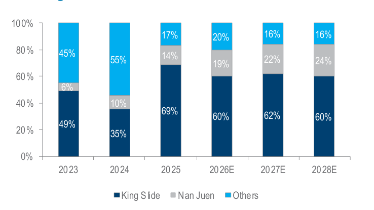

### 解讀摘要
Regular server 市場的份額格局更分散，Others 保持 16-17% 的穩定份額，King Slide 從 2024 年谷底 35% 快速反彈至 2025 年 69%（可能是份額搶回效應），Nan Juen 從 10% 穩健推進至 24%。Nan Juen 的 regular server 份額增長是雙因素驅動：既有 CSP 客戶加深（量），以及向 second CSP 擴展（新客）。

### 表格

| 年份 | King Slide | Nan Juen | Others |
|---|---|---|---|
| 2023 | 49% | 6% | 45% |
| 2024 | 35% | 10% | 55% |
| 2025 | 69% | 14% | 17% |
| 2026E | 60% | 19% | 20% |
| 2027E | 62% | 22% | 16% |
| 2028E | 60% | 24% | 16% |

---

## Exhibit 4｜Nan Juen: regular server rail kit revenue and ASP (2023-2028E)

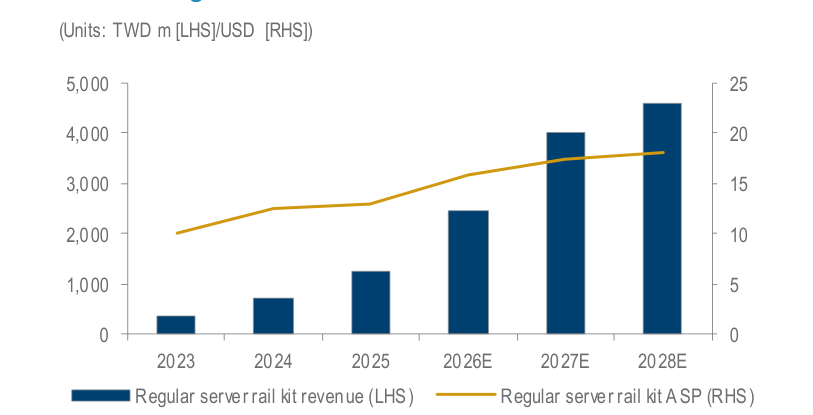

### 解讀摘要
Regular server 收入從 2023 年 TWD358m 增長至 2028E TWD4,609m（CAGR 67%），ASP 從 USD10 提升至 USD18（2028E USD18，按表格 exhibit 21 數據）。量（shipment）與價（ASP）雙升是此段最有力的基本面支撐——尤其 ASP 增長受益於伺服器 form factor 向 >4U 遷移，是結構性而非週期性。

### 表格

| 年份 | TWD m（LHS） | ASP USD（RHS） |
|---|---|---|
| 2023 | 358 | 10 |
| 2024 | 712 | 13 |
| 2025 | 1,271 | 13 |
| 2026E | 2,450 | 16 |
| 2027E | 4,010 | 18 |
| 2028E | 4,609 | 18 |

---

## Exhibit 5｜Nan Juen: margin trend (2019-2028E)

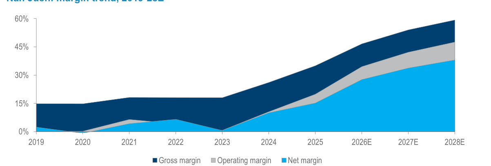

### 解讀摘要
毛利率的轉折點在 2023-2024 年之間：2023 年大幅下滑（因 server upcycle 消退與低毛利品線佔比回升），2024 年 26% 的 GM 確認反彈，2025 年 35% 開始加速。2026-2028E 預測的 GM 從 47% 到 59% 是此報告估值溢價的核心根基，因為這條軌跡直接模仿 King Slide 2020-24 年的 GM 擴張路徑。Operating margin 和 Net margin 在 2025 後也同步大幅改善，受益於 operating leverage 和 AI kit 的高單位毛利。

### 表格
*Nan Juen margin 趨勢（視覺估算 2019-2025，Daiwa 預測 2026-2028E）*

| 年份 | 毛利率 | 營益率 | 淨利率 |
|---|---|---|---|
| 2019 | 14% | 3% | 1% |
| 2023 | 18% | 1% | 1% |
| 2024 | 26% | 11% | 10% |
| 2025 | 35% | 20% | 15% |
| 2026E | 47% | 35% | 28% |
| 2027E | 54% | 42% | 34% |
| 2028E | 59% | 48% | 38% |

*2026-2028E 數據來自 raw_text 財務摘要*

### 洞察
> **洞察一**：24pp GM 擴張（35%→59%）若能實現，Net margin 將從 15% 提升至 38%——這是一個極為罕見的利潤率擴張幅度，代表每增加 TWD1 收入所帶來的淨利幾乎翻三倍。這也是 Daiwa 的 2026-28E EPS CAGR 57% 高於收入 CAGR 34% 的根本原因：pure operating leverage。

> **值得驗證**：King Slide 的 GM 擴張路徑能否被精確複製？King Slide 於成熟市場（已取得龍頭份額）擴張時毛利率提升有部分來自定價權，而 Nan Juen 作為二線供應商可能需以 5-10% 的價格折讓來維持 CSP 的採購動力，長期 GM 上限可能低於 King Slide。

---

## Exhibit 6｜Global: top-4 CSPs' capex (2014-2028E)

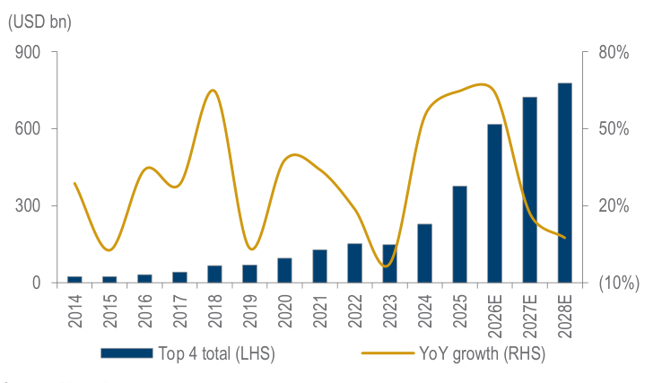

### 解讀摘要
Top-4 CSP（AWS/Azure/GCP/Meta）的總 capex 從 2023 年 USD100m 量級快速攀升至 2026E USD582bn、2027E USD628bn，YoY 成長率分別為 +66% 和 +8%。這不只是基數效應——2025 年 capex 就已達 USD330bn，而共識在 2023 年底的預測僅為約 USD200bn 水平。這條加速的 capex 曲線是本報告「regular server 需求超週期」論點最有力的外部佐證。

### 表格
*Top-4 CSP capex 關鍵節點（視覺估算，USD bn）*

| 年份 | Capex（LHS, USD bn） | YoY（RHS） |
|---|---|---|
| 2019 | 80 | 30% |
| 2023 | 120 | 5% |
| 2024 | 220 | 75% |
| 2025 | 330 | 50% |
| 2026E | 582 | +66% |
| 2027E | 628 | +8% |
| 2028E | 660 | 5% |

*Daiwa 引用 Bloomberg consensus，視覺估算*

---

## Exhibit 7｜Global: top-4 CSPs consensus 2026-27 capex revisions

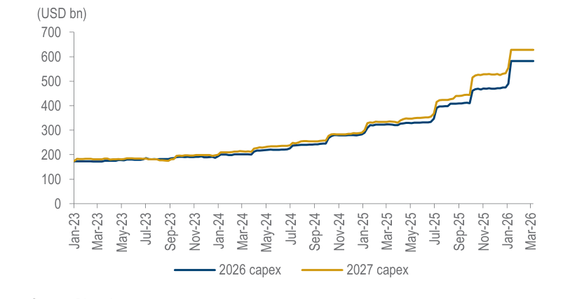

### 解讀摘要
這張「上修軌跡圖」顯示 Bloomberg consensus 對 2026/2027 capex 的預測從 2023 年 1 月的約 USD180bn 一路上修至 2026 年 3 月的 USD580-630bn——三年翻 3 倍以上。最關鍵的是上修速度在 2H25 再度加速（Jan-26 後的跳升），反映 4Q25 企業 earnings call 中 AI 支出承諾超預期。對 rail kit 供應商而言，這直接轉化為更高的硬體採購需求。

> **原文補充**：Daiwa 指出 capex 上修主要源自三個因素：robust cloud revenue、AI 需求激增、以及 efficiency-driven AI reinvestment（即 AI 的 ROI 正當化了更多 AI 投入的循環）。

---

## Exhibit 8｜Global: server shipment by rail kit U height (2020-1Q25)

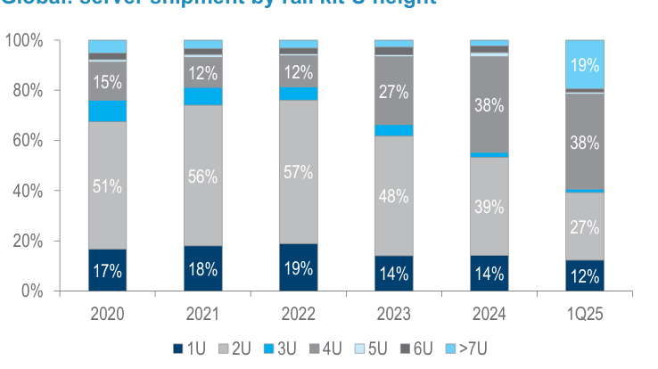

### 解讀摘要
伺服器 form factor 正在快速往高 U 遷移：>7U 的份額從 2020 年 0% 上升至 1Q25 年 19%，5-6U 合計從 2022 年的 12% 增至 1Q25 年的 57%（27%+27%+3%=57%）。1U-2U 的傳統低密度伺服器（曾佔 17-19%）正在快速消退至 12%。這是 ASP 結構性上升的直接佐證——更高 U 的伺服器需要更重、更長行程的 rail kit，直接推升售價。

### 表格

| 年份 | 1U | 2U | 3U | 4U | 5U | 6U | >7U |
|---|---|---|---|---|---|---|---|
| 2020 | 17% | 51% | 15% | — | — | — | 0% |
| 2022 | 19% | 57% | 12% | — | — | — | 0% |
| 2023 | 14% | 48% | — | — | 27% | — | — |
| 2024 | 14% | 39% | — | — | 38% | — | — |
| 1Q25 | 12% | 27% | — | — | 38% | — | 19% |

---

## Exhibit 9｜Nan Juen: ASP trend vs. global server U height trend (2020-2025)

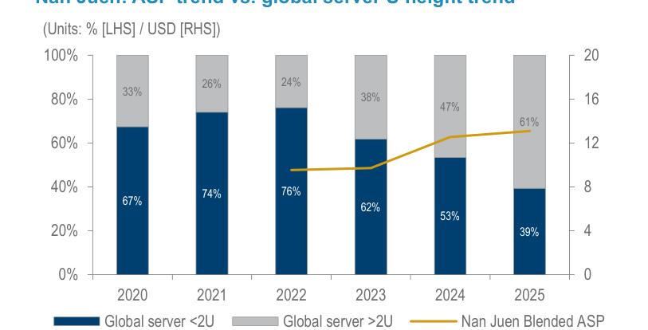

### 解讀摘要
<2U 伺服器（藍色）份額從 2020 年 67% 下降至 2025 年 39%，而 Nan Juen blended ASP（金線）從 2023 年約 USD8 攀升至 2025 年 USD13，且加速上升。這張圖的最重要訊息：server U height 的升級與 rail kit ASP 的提升之間存在強相關性，2023 年之後這種相關性明顯增強。Daiwa 將此視為未來 ASP 繼續提升至 USD25（2028E）的結構性依據。

### 表格

| 年份 | <2U 伺服器佔比（LHS） | >2U 伺服器佔比（LHS） | Nan Juen ASP（USD，RHS） |
|---|---|---|---|
| 2020 | 67% | 33% | — |
| 2021 | 74% | 26% | — |
| 2022 | 76% | 24% | — |
| 2023 | 62% | 38% | 8 |
| 2024 | 53% | 47% | 11 |
| 2025 | 39% | 61% | 13 |

---

## Exhibit 10｜Global: server rail kit TAM 2019-2028E

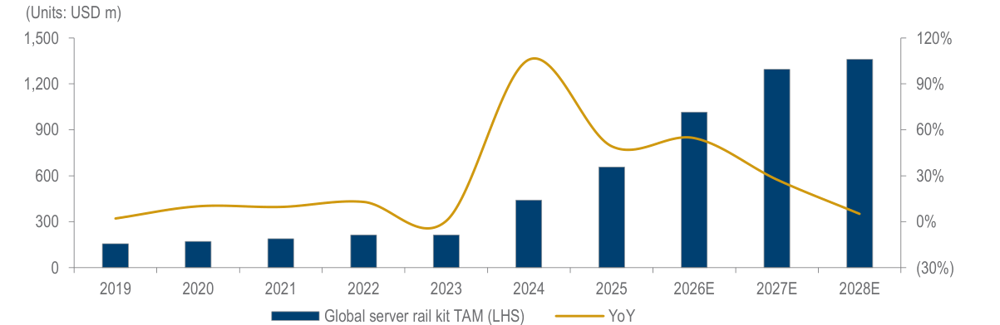

### 解讀摘要
整體 server rail kit TAM 從 2023 年的約 USD200m 加速至 2028E USD1,400m（CAGR 47%）。2024 年是關鍵轉折——TAM 從 USD220m 跳升至 USD500m，YoY 成長率達 120%，主要由 AI server rail kit 爆發貢獻。2025 年後雖然 YoY 走緩至 30-60%，但 absolute size 仍持續擴張。RHS 的 YoY 線在 2024 年峰值後下滑至 2028E 約 0-5%，暗示 TAM 在 2028E 之後趨於成熟。

### 表格

| 年份 | TAM（USD m） | YoY |
|---|---|---|
| 2019 | 180 | — |
| 2022 | 210 | 5% |
| 2023 | 200 | (5%) |
| 2024 | 500 | 120% |
| 2025 | 660 | 32% |
| 2026E | 1,000 | 52% |
| 2027E | 1,280 | 28% |
| 2028E | 1,400 | 9% |

*視覺估算*

---

## Exhibit 11｜Global: overall vs. regular server rail kit TAM (2019-2028E)

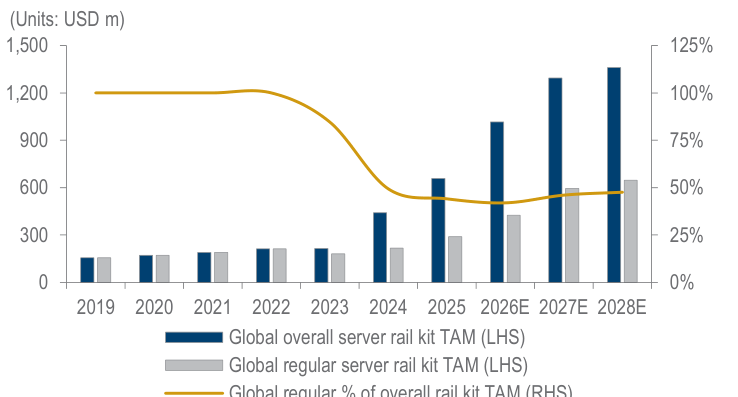

### 解讀摘要
Regular server rail kit TAM（灰色）長期保持穩定增長，在整體 TAM 中的比重從 2024 年的 50%+ 被 AI server kit 侵蝕至 2028E 約 50%（right axis）。這確認了 regular server 市場仍在以 31% CAGR 成長，只是相對份額被 AI 拉低——絕對規模從 USD290m（2025）成長至 USD650m（2028E）是紮實的基礎。

---

## Exhibit 12｜Global: regular server rail kit TAM vs. shipment/ASP YoY (2019-2028E)

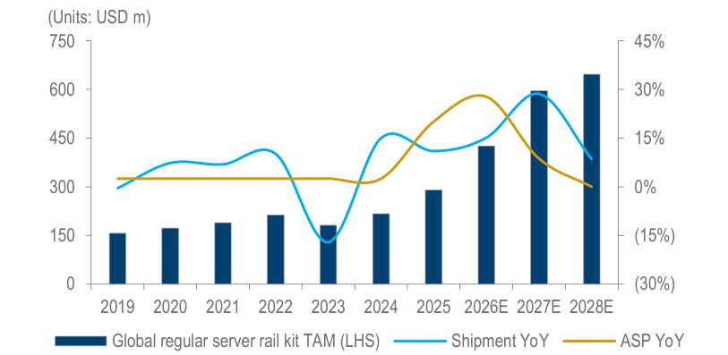

### 解讀摘要
Regular server rail kit TAM 的成長同時受量（Shipment YoY，藍線）與價（ASP YoY，金線）雙重驅動。2023 年兩者均跌破 0%（庫存修正期），2024 年量率先反彈（+40%），2025-27E 量成長維持 15-30%，而 ASP 成長在 2027E 後放緩——這符合 form factor 遷移的週期性：一旦 >4U 滲透率達高峰，ASP 的結構性推升效應就會減弱。

---

## Exhibit 13｜Global: overall vs. AI server rail kit TAM (2019-2028E)

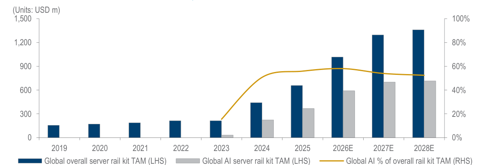

### 解讀摘要
AI server rail kit TAM（灰色）從 2023 年 USD50m 爆增至 2025 年 USD370m，2028E 達 USD700m。AI kit 佔整體 TAM（RHS 金線）從 2023 年接近 0% 躍升至 2025 年 50%+，此後維持在 50-55%。這確認了 Daiwa 的核心論點：AI server 不只是 regular server 的替代，更是獨立的增量 TAM，使整體市場從 2015-25 年的 USD700m 水平在三年內翻倍。

> **原文補充**：AI server rail kit TAM 的 25% CAGR（2025-28E）較 regular server 的 31% CAGR 略低，主要因為 GPU kit 的 ASP 受 HGX→NVL 世代切換而承壓（NVL ASP 不到 HGX 的 50%），但 NVL 的出貨量大幅彌補了單價下降。

### 洞察
> **洞察一（配合 Exhibit 10）**：AI kit TAM USD370m（2025）與 GPU TAM USD185m + ASIC TAM USD183m（exhibit 14+15）合計 USD368m，基本吻合——確認 Daiwa 在 GPU/ASIC 的細分拆解與整體 AI TAM 估計是一致的。

---

## Exhibit 14｜Global: GPU server rail kit TAM (2023-2028E)

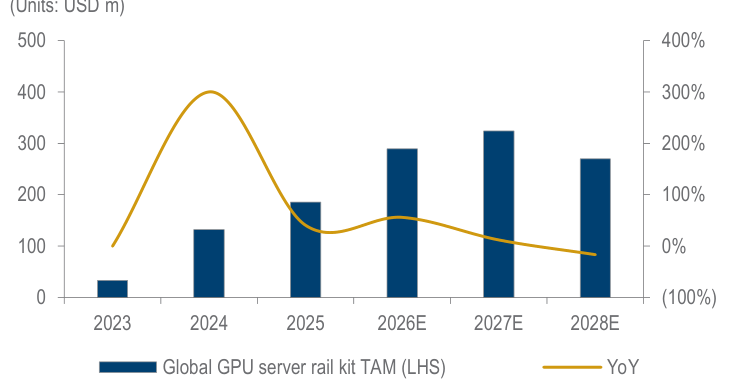

### 解讀摘要
GPU server rail kit TAM 在 2024 年因 HGX 平台需求爆發，YoY 達約 300%（USD33m→USD132m）。2025-26E 成長放緩，主要因 NVL 系列的 ASP 比 HGX 低 50%+，使收入成長趕不上出貨量成長。2027-28E 的 TAM 略微下降（USD320m→USD270m）反映 NVL ASP 壓力大於出貨量增加。

### 表格

| 年份 | GPU TAM（USD m） | YoY |
|---|---|---|
| 2023 | 33 | — |
| 2024 | 132 | 300% |
| 2025 | 185 | 40% |
| 2026E | 290 | 57% |
| 2027E | 320 | 10% |
| 2028E | 270 | (16%) |

*視覺估算*

---

## Exhibit 15｜Global: ASIC server rail kit TAM (2023-2028E)

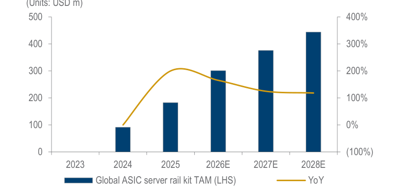

### 解讀摘要
ASIC server rail kit TAM 在 2026-27E 成為兩個 AI 子市場中較大者（2027E USD380m vs GPU USD320m），主要驅動力是量的增長而非 ASP。Amazon Trainium 和 Google TPU 是主力，其他 CSP 加碼 custom silicon 帶來增量。與 GPU 不同，ASIC ASP 相對穩定（不受類似 HGX→NVL 的 ASP 折讓衝擊）。

---

## Exhibit 16｜Nan Juen: patent count vs. peers (cases, 2020-2025)

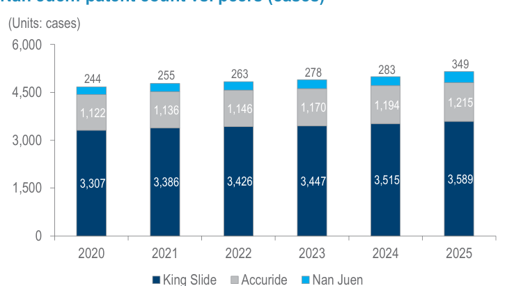

### 解讀摘要
King Slide 擁有約 3,589 件專利（2025），是 Nan Juen（349 件）的 10 倍。Accuride 約 1,215 件。數量差距是明顯的，但 Daiwa 的論點不是 Nan Juen 在趕上 King Slide 的專利數量，而是 Nan Juen 僅需足夠的專利儲備來「繞路設計」（design-around），並在 GB300 GPU server 的 CSP 資格認證中已驗證這一能力。

### 表格
*（千件）*

| 年份 | King Slide | Accuride | Nan Juen |
|---|---|---|---|
| 2020 | 3,307 | 1,122 | 244 |
| 2021 | 3,386 | 1,136 | 255 |
| 2022 | 3,426 | 1,146 | 263 |
| 2023 | 3,447 | 1,170 | 278 |
| 2024 | 3,515 | 1,194 | 283 |
| 2025 | 3,589 | 1,215 | 349 |

### 洞察
> **洞察一**：Nan Juen 的專利年增量約 20-25 件/年，King Slide 約 80 件/年——在可預見的未來 Nan Juen 不可能趕上 King Slide 的絕對數量。但 Nan Juen 的設計能力已被 CSP 驗證，投資論點的成立與否與專利數量追趕無關，關鍵在於「能否繞路設計」而非「擁有更多專利」。

---

## Exhibit 17｜Nan Juen: patent count vs. peers (percentage, 2020-2025)

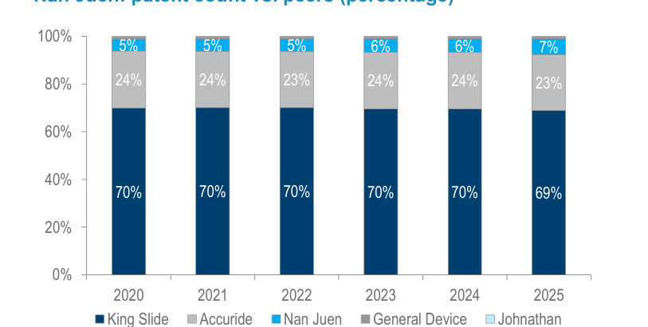

### 解讀摘要
Daiwa 估算 King Slide 持有全球 server rail kit 相關專利的約 70%（Accuride 24%，Nan Juen 5-7%，Others 3-5%）。這一比例自 2020 年以來幾乎沒有變化，顯示 King Slide 的 IP 護城河非常穩固。對 Nan Juen 而言，7% 的份額仍然足夠支撐其自主產品設計，重要的是 Nan Juen 在 2025 年的份額從 6% 提升至 7%，顯示其 R&D 投入正在加速。

---

## Exhibit 18｜Global: regular server rail kit market share (2020-2028E)

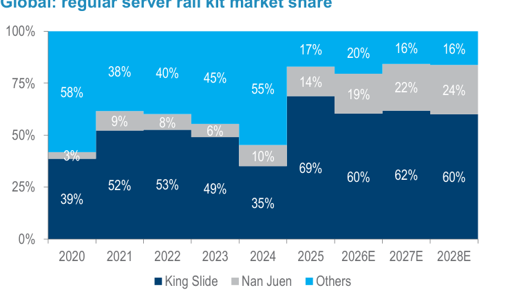

### 解讀摘要
Regular server 市場的最大驚喜是 King Slide 的份額大起大落：從 2020 年 39% 升至 2022 年 53%，再跌至 2024 年 35%，然後 2025 年反彈至 69%。這種劇烈波動暗示 CSP 對 King Slide 與次級供應商之間的分配比例調整是迅速且主動的，也意味著 Nan Juen 目前的 14% 份額並非鐵板一塊——在 CSP 加速採購時，King Slide 可能再次快速搶份額。

### 表格

| 年份 | King Slide | Nan Juen | Others |
|---|---|---|---|
| 2020 | 39% | 3% | 58% |
| 2021 | 52% | 9% | 38% |
| 2022 | 53% | 8% | 40% |
| 2023 | 49% | 6% | 45% |
| 2024 | 35% | 10% | 55% |
| 2025 | 69% | 14% | 17% |
| 2026E | 60% | 19% | 20% |
| 2027E | 62% | 22% | 16% |
| 2028E | 60% | 24% | 16% |

---

## Exhibit 19｜Global: AI server rail kit market share (2020-2028E)

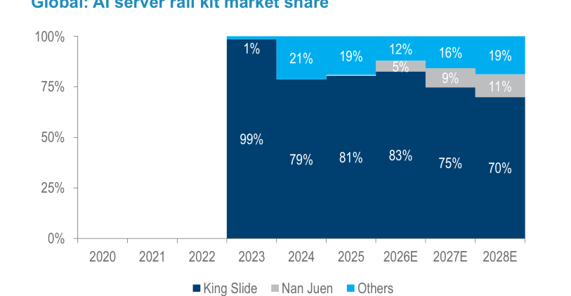

### 解讀摘要
AI server 市場顯示比 regular server 更極端的集中度：2022 年之前 King Slide 100% 壟斷，2023 年才開始出現 1% 的 Others。Nan Juen 從 2025 年的 5% 開始加速，預測至 2028E 達 11%。值得注意的是 2025→2026E King Slide 份額從 81% 微升至 83%——Nan Juen 的份額增加（5%→9%）主要來自 Others 減少（14%→8%），而非直接搶 King Slide。

### 洞察
> **洞察一（配合 Exhibit 01）**：Exhibits 01 與 19 呈現的是相同的 AI server 市場份額，但時間軸不同（01 從 2023 起，19 從 2020 起）。兩圖的數據完全一致，無矛盾。Exhibit 19 的額外價值：顯示 2022 之前 AI server kit 市場幾乎不存在，是全新創建的增量市場，King Slide 的 99% 份額代表的是一個 USD50m 小市場，而非 USD700m 的大市場。

---

## Exhibit 20｜Global: server rail kit market share 2020-2028E（overall）

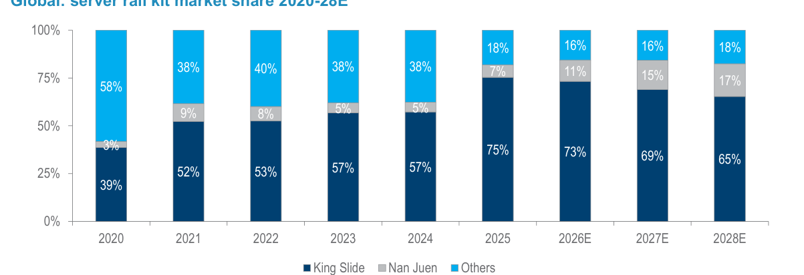

### 解讀摘要
整體市場份額（regular + AI 合計）顯示 Nan Juen 從 2025 年的 7% 提升至 2028E 的 17%，King Slide 從 75% 小幅下降至 65%，Others 相對穩定在 16-18%。整體格局是「一個市場在成長，前兩大玩家都在受益，Others 被稀釋」。

---

## Exhibit 21｜Nan Juen: regular server rail kit assumptions table

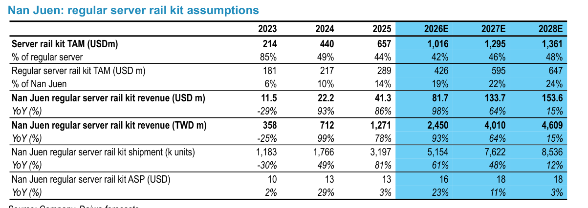

### 解讀摘要
Regular server kit 是 Daiwa 估計中確定性最高的業務——有真實的出貨數據（2023-2025 實績）和 CSP 合約基礎。2026E 收入 USD81.7m（TWD2,450m），YoY +98%，主要驅動力是出貨量從 3,197k 組增至 5,154k 組（+61%）和 ASP 從 USD13 提升至 USD16（+23%）。

### 表格

| 指標                             | 2023     | 2024     | 2025      | 2026E     | 2027E     | 2028E     |
| ------------------------------ | -------- | -------- | --------- | --------- | --------- | --------- |
| Server rail kit TAM（USD m）     | 214      | 440      | 657       | 1,016     | 1,295     | 1,361     |
| % of regular server            | 85%      | 49%      | 44%       | 42%       | 46%       | 48%       |
| Regular TAM（USD m）             | 181      | 217      | 289       | 426       | 595       | 647       |
| Nan Juen 份額                    | 6%       | 10%      | 14%       | 19%       | 22%       | 24%       |
| **Nan Juen regular 收入（USD m）** | **11.5** | **22.2** | **41.3**  | **81.7**  | **133.7** | **153.6** |
| YoY                            | -29%     | +93%     | +86%      | +98%      | +64%      | +15%      |
| **Nan Juen regular 收入（TWD m）** | **358**  | **712**  | **1,271** | **2,450** | **4,010** | **4,609** |
| 出貨量（k 組）                       | 1,183    | 1,766    | 3,197     | 5,154     | 7,622     | 8,536     |
| YoY                            | -30%     | +49%     | +81%      | +61%      | +48%      | +12%      |
| ASP（USD）                       | 10       | 13       | 13        | 16        | 18        | 18        |
| YoY                            | +2%      | +29%     | +3%       | +23%      | +11%      | +3%       |

### 洞察
> **洞察一**：2026E 的 98% 收入成長來自量（+61%）× 價（+23%）= 96% 複合，數值吻合。其中量的增長主要來自 second CSP 客戶的貢獻，這是與現有 primary CSP 的「關係深化」之外的新增動力，確定性略低。

> **值得驗證**：2028E ASP 維持 USD18（與 2027E 持平），假設 form factor 升級效應在 2027 之後趨於飽和。若 >4U 滲透繼續提升或儲存伺服器 kit 開始放量，ASP 有上行空間（Daiwa 在文字中已提到「storage server rail kits representing additional upside, not yet reflected in our estimates」）。

---

## Exhibit 22｜Nan Juen: regular server rail kit revenue vs. TAM

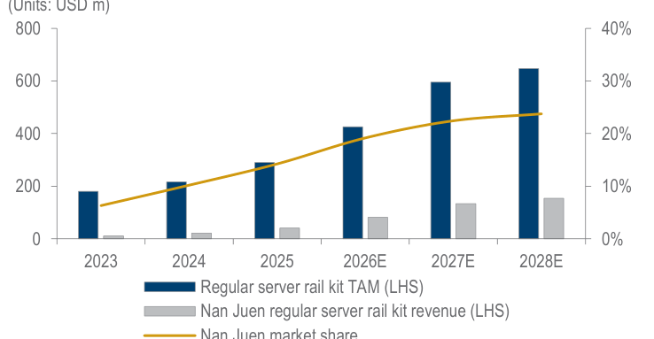

### 解讀摘要
Regular server TAM（深藍大柱）持續擴大，Nan Juen 的份額（灰色小柱）相對於整體 TAM 迅速縮小比例關係，最終在 2028E 接近 25%。右軸的市場份額線（Nan Juen market share）清楚顯示份額的提升軌跡。這圖最重要的數字：Nan Juen 的 regular 收入增長（TWD358→4,609m）幾乎完全由「整體 TAM 擴大」+「份額增加」共同驅動，並非零和競爭。

---

## Exhibit 23｜Nan Juen: regular server rail kit shipment/ASP YoY

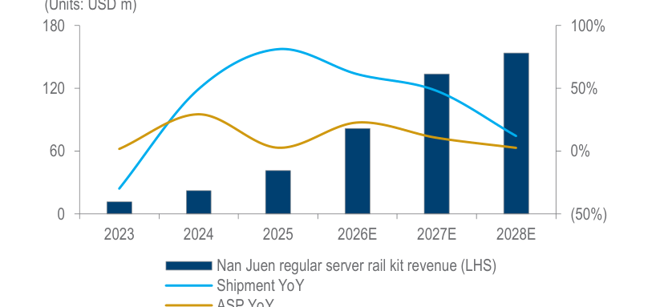

### 解讀摘要
出貨量 YoY（藍線）在 2024-25E 達到 70-80% 高峰後預計逐步走緩至 2028E 的 10-15%，ASP YoY（金線）在 2024 年約 30% 後走緩至 2027-28E 的 5-10%。兩條線交叉下降意味著 regular server 業務的高成長期（2024-26E）之後將過渡到更穩定的低成長期，屆時整體貢獻率取決於 AI server 能否如期接棒。

---

## Exhibit 24｜Nan Juen: GPU server rail kit forecasts

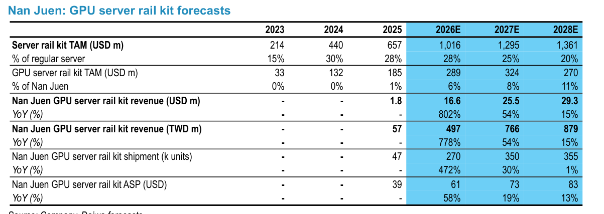

### 解讀摘要
GPU server kit 是 Daiwa 最樂觀的押注之一：2026E 收入從 TWD57m（2025）跳升至 TWD497m（YoY +778%）。驅動力是出貨量爆增（47k→270k 組，+472%）加上 ASP 大幅升級（USD39→USD61，+58%）。ASP 從 USD39 到 USD61 的跳升反映 GB300 平台（比傳統 regular server kit 貴 3-4x）開始放量。但 TWD 收入的快速成長與全球 GPU server rail kit TAM 的走平（2028E TAM 反而下降）形成張力。

### 表格

| 指標 | 2023 | 2024 | 2025 | 2026E | 2027E | 2028E |
|---|---|---|---|---|---|---|
| GPU server TAM（USD m） | 33 | 132 | 185 | 289 | 324 | 270 |
| Nan Juen 份額 | 0% | 0% | 1% | 6% | 8% | 11% |
| **Nan Juen GPU 收入（USD m）** | **—** | **—** | **1.8** | **16.6** | **25.5** | **29.3** |
| YoY | — | — | — | +802% | +54% | +15% |
| **Nan Juen GPU 收入（TWD m）** | **—** | **—** | **57** | **497** | **766** | **879** |
| 出貨量（k 組） | — | — | 47 | 270 | 350 | 355 |
| YoY | — | — | — | +472% | +30% | +1% |
| ASP（USD） | — | — | 39 | 61 | 73 | 83 |
| YoY | — | — | — | +58% | +19% | +13% |

### 洞察
> **洞察一**：2027E 出貨量 YoY 從 +472% 驟降至 +30%，而 ASP 仍在升（+19%），意味著 2027E 的收入增長主要靠定價，量成長已放緩——這與 NVL 平台轉換（單台出貨量大但 ASP 偏低）的預期有些矛盾。需確認 2026-27E 假設是以哪個 GPU 平台為基礎（Daiwa 文字未明確說明是 GB300 還是 NVL 系列）。

> **值得驗證**：2026E 出貨量 270k 組 × USD61 ASP ≒ USD16.5m ≒ TWD500m，與表格的 TWD497m 完全吻合。計算一致。但 270k 組相對全球 GPU server 出貨量的比例（若全球 GPU server 出貨量為約 3-5m 台）意味著約 5-9% 的市場滲透率，這與 exhibit 24 的「6% Nan Juen 份額」（TAM 份額，非出貨量份額）方向一致。

---

## Exhibit 25｜Nan Juen: GPU server rail kit revenue vs. TAM

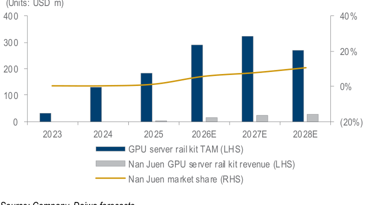

### 解讀摘要
GPU server TAM（大柱，藍色）在 2027E 達峰後 2028E 下降，主要因 HGX→NVL ASP 侵蝕。Nan Juen 的 GPU kit 收入（灰色小柱）則仍在增長，反映份額的持續擴大足以抵消 TAM 縮小。右軸的 market share 線清楚顯示 Nan Juen 的份額從 <1%（2025）快速提升至 11%（2028E）。

---

## Exhibit 26｜Nan Juen: GPU server rail kit shipment/ASP YoY

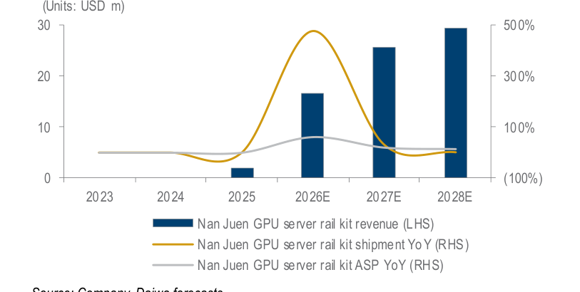

### 解讀摘要
2026E 出貨量 YoY 達約 500%（金線峰值），ASP YoY 約 100%（金線），兩者在 2027E 後均顯著降溫。這確認 GPU server kit 業務的成長高峰在 2026E，且成長結構從「量價雙升」轉向「量持平+價微升」。ASP 的 YoY 線在 2028E 接近 0%，顯示定價能力趨於平穩。

---

## Exhibit 27｜Nan Juen: ASIC server rail kit forecasts

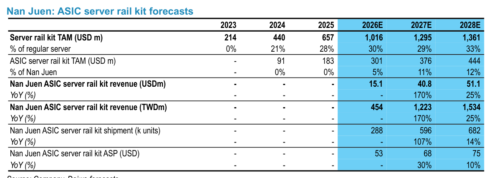

### 解讀摘要
ASIC server kit 是三個業務中**最晚啟動、增長最快**的部分：2026E 才開始有真實出貨，TWD454m → 2027E TWD1,223m（+170% YoY）→ 2028E TWD1,534m（+25%）。ASIC ASP（USD53-75）比 GPU ASP（USD39-83）低，但出貨量更大（2027E 596k 組 vs GPU 350k 組）。Nan Juen 的 ASIC 業務幾乎完全依賴與 AVC（ASIC 組裝廠）的合作關係，是集中度最高、也最難獨立驗證的部分。

### 表格

| 指標 | 2024 | 2025 | 2026E | 2027E | 2028E |
|---|---|---|---|---|---|
| ASIC TAM（USD m） | 91 | 183 | 301 | 376 | 444 |
| Nan Juen 份額 | 0% | 0% | 5% | 11% | 12% |
| **Nan Juen ASIC 收入（USD m）** | **—** | **—** | **15.1** | **40.8** | **51.1** |
| YoY | — | — | — | +170% | +25% |
| **Nan Juen ASIC 收入（TWD m）** | **—** | **—** | **454** | **1,223** | **1,534** |
| 出貨量（k 組） | — | — | 288 | 596 | 682 |
| YoY | — | — | — | +107% | +14% |
| ASP（USD） | — | — | 53 | 68 | 75 |
| YoY | — | — | — | +30% | +10% |

### 洞察
> **洞察一**：2027E ASIC 收入 TWD1,223m 是 GPU 收入 TWD766m 的 1.6x——ASIC 是南俊 AI server 業務的最大引擎，而非 GPU。這與市場普遍關注 Nvidia GPU 生態的敘事有落差；Daiwa 的 ASIC 假設依賴 Amazon/Google 的 custom silicon 持續採購，是此報告最大的不確定性來源。

> **值得驗證**：ASIC 業務完全通過 AVC 間接取得，若 AVC 與競爭對手的關係改變，或 Amazon/Google 更換 rail kit 供應商，Nan Juen 的 ASIC 份額可能瞬間歸零。Daiwa 在文字中未詳述 Nan Juen 與 AVC 合約的保護條款。

---

## Exhibit 28｜Nan Juen: ASIC server rail kit revenue vs. TAM

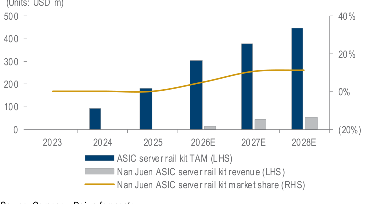

### 解讀摘要
ASIC TAM（大柱）持續增長至 2028E USD444m，Nan Juen 的 ASIC 收入份額（右軸）從 2026E 開始爬升。不同於 GPU 業務的 TAM 在 2028E 轉為下降，ASIC TAM 持續成長，提供更穩定的基礎。

---

## Exhibit 29｜Nan Juen: ASIC server rail kit shipment/ASP YoY

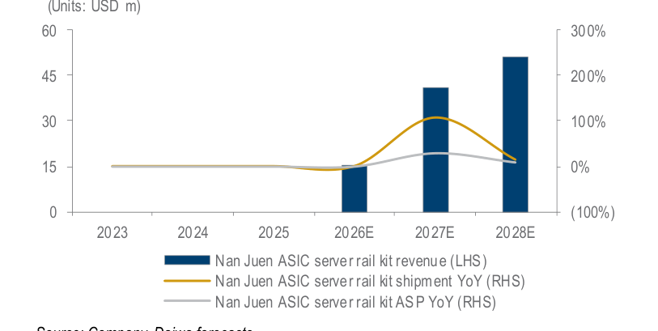

### 解讀摘要
ASIC 出貨量 YoY（金線）在 2027E 達約 100%，2028E 放緩至 14%；ASP YoY（灰線）保持相對平穩（30%→10%）。ASIC 業務的特點是「量驅動」，定價增長遜於 GPU kit，但量的持續性更強（因 ASIC 採購週期更規律）。

---

## Exhibit 30｜Nan Juen: revenue mix over 2019-2028E

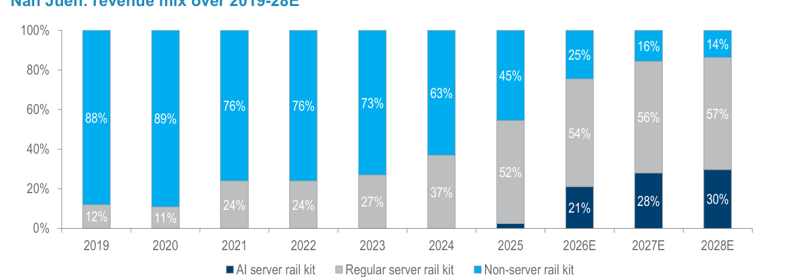

### 解讀摘要
這張長歷史圖補充了 exhibit 02 所缺少的 2019-2022 基底：Non-server（藍色）在 2019-2022 年佔 73-88%，Regular server（灰色）在 2021-2022 年短暫升至 24-27%，2023 年隨 server upcycle 消退跌回 27%。整個故事的起點是「2019-2022 年是家具/廚房公司，2023-2025 是轉型期，2026+ 才是真正的 server 公司」——沒有這段歷史背景，毛利率從 20% 起跳的意義就不完整。

---

## Exhibit 31｜Nan Juen: revenue trend over 2018-2028E

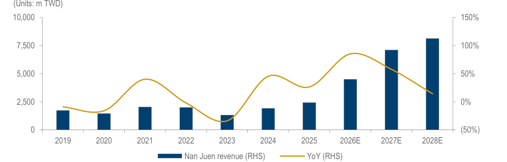

### 解讀摘要
從 2018-2023 年的收入停滯（約 TWD2,000m 上下）到 2026-28E 的快速成長，體現出業務結構轉變的時滯：公司在 2022-2023 年低谷後，因 server kit 佔比提升使整體收入獲得槓桿效應。2028E TWD8,128m 是 2023 年 TWD1,324m 的 6 倍，顯示這是一個全新量級的公司，而非舊業務的線性外推。

### 表格

| 年份 | 收入（TWD m） | YoY |
|---|---|---|
| 2019 | 2,000 | 5% |
| 2021 | 2,000 | +40% |
| 2023 | 1,324 | -34% |
| 2024 | 1,924 | +45% |
| 2025E | 2,433 | +26% |
| 2026E | 4,506 | +85% |
| 2027E | 7,105 | +58% |
| 2028E | 8,128 | +14% |

---

## Exhibit 33｜Nan Juen milestones & company background

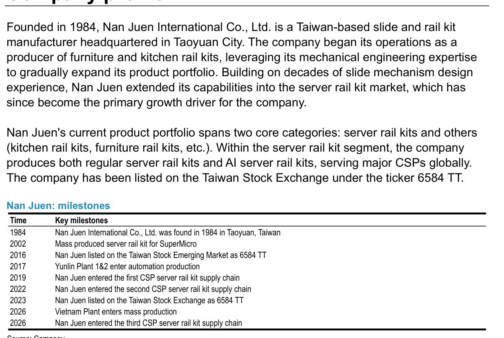

### 解讀摘要
里程碑表顯示 Nan Juen 的關鍵時間軸：2022 年才開始生產 regular server kit for SuperMicro；2024-2025 年快速擴展到第一家和第二家 CSP；2026 年才進入第三家 CSP 供應鏈。時間軸揭示一個重要事實：Nan Juen 的 server kit 業務歷史僅 3 年，所有的高成長預測都建立在一個非常短暫的執行紀錄上。Vietnam Plant 於 2026 年進入量產是產能擴張的關鍵里程碑。

### 表格

| 年份 | 關鍵里程碑 |
|---|---|
| 1984 | 成立，家具/廚房 rail kit 起家 |
| 2002 | Mass-produced rail kit for SuperMicro |
| 2019 | 在台股上市（6584 TT） |
| 2024 | 進入第一家 CSP server rail kit 供應鏈 |
| 2025 | 進入第二家 CSP server rail kit 供應鏈 |
| 2026 | Vietnam Plant 進入量產；進入第三家 CSP 供應鏈 |

---

## Exhibit 34｜Nan Juen: operation sites

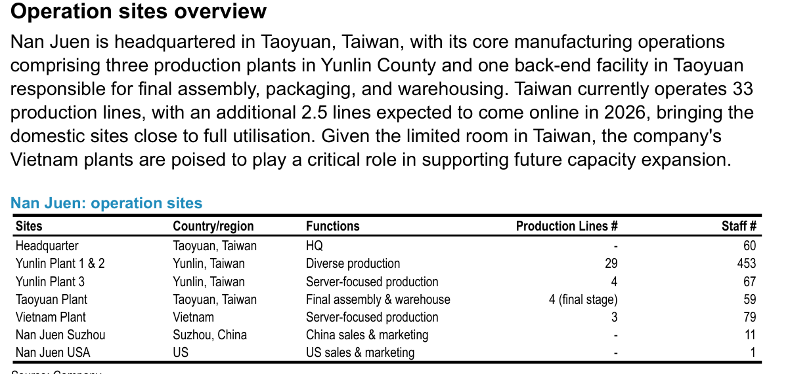

### 解讀摘要
台灣目前有 33 條產線（2026 年增加 2.5 條至約 35.5 條），台灣產能接近滿載。Vietnam Plant 有 3 條 server 專用產線，是未來擴產的主力。Suzhou 和 US 辦公室是純銷售型，無產能貢獻。總員工數約 730 人（台灣 638 + Vietnam 79 + 其他 13），以這樣規模的公司承接 TWD8bn+ 的 server 收入，人均效率要求極高。

### 表格

| 據點 | 地點 | 功能 | 產線數 | 員工數 |
|---|---|---|---|---|
| 總部 | 桃園 | HQ | — | 60 |
| 雲林廠 1&2 | 雲林 | 多元生產 | 29 | 453 |
| 雲林廠 3 | 雲林 | Server 專用 | 4 | 67 |
| 桃園廠 | 桃園 | 最終組裝/倉儲 | 4（最終階段） | 59 |
| 越南廠 | 越南 | Server 專用 | 3 | 79 |
| 南俊蘇州 | 蘇州 | 中國銷售 | — | 11 |
| 南俊美國 | 美國 | 美國銷售 | — | 1 |

> **原文補充**：台灣目前 33 條產線接近滿載，2026 年新增 2.5 條後剩餘空間有限；越南廠因此成為 2026E 後增量產能的關鍵。Daiwa 認為越南廠量產是一個潛在的正面催化劑。

---

## Exhibit 39｜Nan Juen: QFII holdings vs. share price (Apr-20 ~ Mar-26)

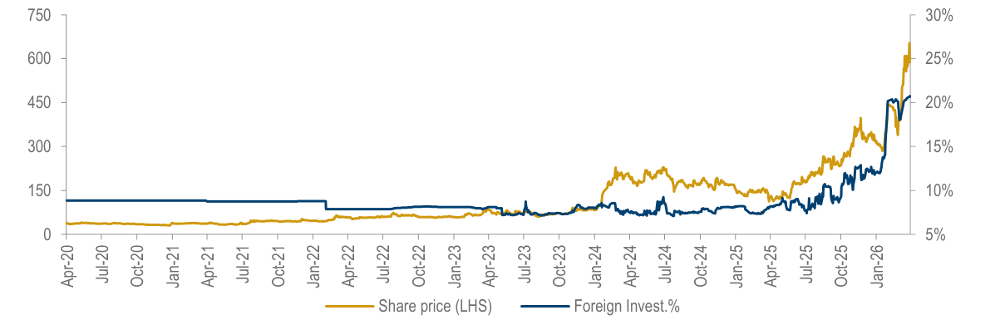

### 解讀摘要
外資持股比例（藍線）從 2020-2024 年的約 10% 緩慢爬升，在 2H25 開始加速提升至 2026 年 3 月的 25%+，與股價（金線）的快速升破 TWD400→600+ 同步。這張圖佐證了 Daiwa 的觀點：外資機構對 Nan Juen 的認識正在快速提升，但 25% 的 QFII 比例相比成熟科技股（通常 >40%）仍有顯著提升空間。QFII 加速進場也意味著若市場情緒逆轉，潛在的賣壓集中度較高。

### 洞察
> **洞察一**：股價從 TWD100（Apr-25）到 TWD667（Apr-26，報告日）漲了 6 倍，但 QFII 比例僅從 10% 升至 25%。這代表外資「跑得比股價慢」，仍存在「知道這個故事但倉位不足」的機構投資者。Daiwa 首次覆蓋本身也是一個催化劑——不少機構在沒有主要券商覆蓋的情況下不敢建倉。

---

## 跨 Exhibit 彙整表

### 彙整 1｜Nan Juen AI server 收入三引擎合計（來源：Exhibits 21、24、27）

| 業務 | 2025（TWD m） | 2026E | 2027E | 2028E | CAGR 2025-28E |
|---|---|---|---|---|---|
| Regular server kit | 1,271 | 2,450 | 4,010 | 4,609 | 54% |
| GPU server kit | 57 | 497 | 766 | 879 | 150% |
| ASIC server kit | — | 454 | 1,223 | 1,534 | — |
| **AI server 合計** | **57** | **950** | **1,989** | **2,413** | **249%** |
| **非 server** | 1,106 | 1,106 | 1,106 | 1,106 | 0% |
| **總收入** | **2,433** | **4,506** | **7,105** | **8,128** | **49%** |

> **彙整洞察**：2027E ASIC（TWD1,223m）首次超越 Regular server kit 成為 Nan Juen 最大的單一成長引擎，意味著 2027E 的估計高度集中在一個對外資機構最難獨立驗證的業務（AVC 合作依賴度高）。若 ASIC 低於預期 20%，2027E 整體收入將少約 TWD245m，EPS 下修幅度超過 10%。

---

## 相關個股清單

| 類別 | 公司 | Ticker | 評等 | 備註 |
|---|---|---|---|---|
| 主要競爭對手 | 川湖科技 King Slide | 2059 TT | Outperform (2) | 市場龍頭，Daiwa TP TWD3,640 |
| 同業 | 富士達 Fositek | 6805 TT | Buy (1) | AVC 合作夥伴，Daiwa Helen Chien 覆蓋，TWD1,900 |
| 標的本身 | 南俊國際 Nan Juen | 6584 TT | **Buy (1)** | **TP TWD1,000，upside +49.9%** |
