# Goldman Sachs｜解碼 Agentic 經濟：AI 使用量與利潤的即將轉折

**券商**：Goldman Sachs  
**分析師**：James Schneider PhD、Luya You、Anmol Makkar、Gabriela Borges CFA、Eric Sheridan、Noah Naparst、Emma Huang  
**日期**：2026-05-05  
**主題**：Decoding the Agentic Economy: The Coming Inflection in AI Usage and Margins  
**評級**：Americas Technology（產業主題）  
<button type="button" onclick="fetch('https://ti-lei.github.io/foreign-reports/static/downloads/產業/20260505_GS_Agentic-Economy.md').then(r=>r.text()).then(t=>{let a=document.createElement('a');a.href='data:text/plain;charset=utf-8,'+encodeURIComponent(t);a.download='20260505_GS_Agentic-Economy.md';a.click()})">⬇ 下載 MD</button>

---

## GS 完整投資邏輯鏈

| 論點層次 | Exhibit | 內容 |
|---|---|---|
| 邊際經濟轉折點確認 | 1, 4 | Token 定價止穩 \$0.75/1M tokens（降幅從 40%/年收斂至平穩），但 Nvidia/AMD/TPU/Trainium compute cost 持續大幅下降；1H26 首見 margin inflection——AI 從「成本負擔」轉向「利潤引擎」 |
| Consumer Agent 需求量化 | 2, 6-9 | AI queries 5B→23B/day by 2030，30% 導向 agents；consumer token 消費 12x by 2030；always-on 模型（>100K tokens/day）是最大單一跳升觸發器 |
| Enterprise Agent 需求量化 | 5, 24-28 | Coding agent \$13/day（vs \$300 human，96% 折扣）ROI 已正；call center \$92.90（vs \$90 human）尚未划算；37% knowledge worker 採用峰值 → 全球 token 55x by 2040 |
| 採用曲線框架 | 16-22 | S-curve 最可能；15 年達峰（vs 歷史中位 29 年）；以 email 普及為類比；企業技術歷史中位 40 年，但 agentic 具加速因素 |
| Software TAM 再定義 | 23 | Pricing 從 seat 轉向 work units；Agent TAM 從 2027 起快速崛起，2030 約與 SaaS TAM 相當；峰值總 TAM 估 \$5.4T |
| **結論** | 封面 | **Token 消費 24x by 2030、55x by 2040；1H26 margin inflection；AVGO/NVDA/AMD（Semis 首選）> AMZN/GOOGL/META > MSFT/NET/ACN** |

> **報告最大邏輯缺口**：S-curve 15 年達峰（37% knowledge worker）是 enterprise token 55x 預測的基礎假設；若 ROI 不均（voice-heavy 工作流程無法划算）使採用停在 15-20%，55x 預測將縮減至 10-15x，對 AI 基礎設施 CapEx 可持續性的論點大幅削弱。

---

## 報告核心觀點

| 主題 | GS 觀點 | 市場共識 | 是否 Contra-Consensus |
|---|---|---|---|
| Margin Inflection 時間 | 1H26 已至 | 「AI 是成本中心」敘事仍主流 | 是 |
| 2030 Token 消費 | 24x（120 quadrillion/月） | 無可比公開預測 | Contra-Consensus |
| Enterprise 採用 | S-curve，15 年達峰，37% 知識工作者 | 多數報告不給具體時間框架 | 是，具體但激進 |
| Call Center Agent ROI | 尚不划算（\$92.90 vs \$90 human） | 市場廣泛預期 voice AI 即將大量替代人工 | 是，比市場更謹慎 |
| Software TAM | Agent 打開新 ceiling，定價轉向 work units | SaaS 每席位定價模式主流 | 是 |

**偏好排序**：Semis > Hyperscalers > Software  
**個股偏好**：AVGO（\$480 PT）、NVDA（\$250）、AMD（\$450）、AMZN（\$325）、GOOGL（\$450）、META（\$830）、MSFT（\$610）、NET（\$250）、ACN（\$300）

---

## Exhibit 1｜Token 經濟學轉折：定價穩定，成本持續下降

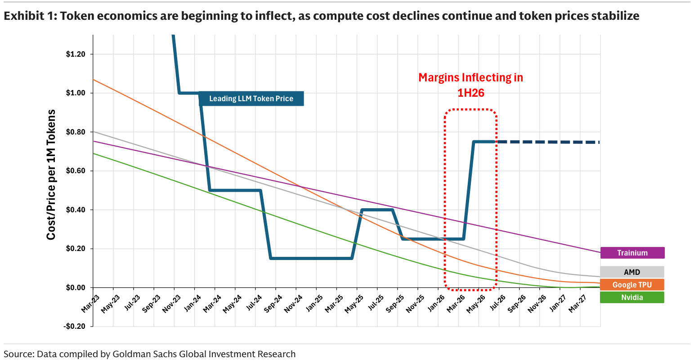

*（Form XObject；裁切範圍為全欄寬，已視覺確認）*

### 解讀摘要
這張圖是整份報告的投資核心：X 軸為時間（2023 年 5 月至 2027 年 1 月），Y 軸為每 100 萬 token 的成本/售價。Leading LLM token 定價（深藍色階梯線）從 2023 年初 ~\$1.10 歷經多次跳降，至 2026 年上半年止穩於 ~\$0.75；而 Nvidia、Google TPU、AMD、Trainium 四條 compute cost 曲線（直線持續下降）已在 2025 年末到 2026 年初陸續穿越並落在定價線之下——兩線交叉後的「正差距」即 margin inflection，GS 標注為「1H26」。舊世界的敘事是「定價跌得比成本快」（margin 被壓縮），新世界是「成本跌得比定價快」（margin 擴張）——這個轉折解鎖了 AI 基礎設施投資的可持續性。

> **原文補充**：Trainium（Marvell）和 AMD 的 compute cost 線在圖中落在 Nvidia 和 Google TPU 之間；Nvidia 的 cost 線下降斜率較 AMD 陡，可能反映 Blackwell 架構的效率提升速度。GS 強調即使定價出現少量再度下降，整體 margin 擴張趨勢依然成立，因 compute cost 降幅更大更穩定。

### 表格（視覺估算）

| 時間點 | LLM Token 定價（\$/1M） | Nvidia Compute Cost（\$/1M） | 差值（Margin 方向） |
|---|---|---|---|
| 2023 初 | \$1.10 | \$0.65 | 負（成本>定價后期才反轉） |
| 2024 初 | \$0.40 | \$0.30 | 小正 |
| 2025 初 | \$0.20 | \$0.10 | 正，擴大中 |
| 2026 H1 | \$0.75（止穩） | \$0.05 | **Margin Inflection** |
| 2027 初（預測） | \$0.75（穩定） | \$0.02 | 正差距持續擴大 |

視覺估算，交叉驗證：Exhibit 4 呈現相同數據，讀值一致。

> **洞察一**：LLM token 定價的「止穩」是這張圖最關鍵的反直覺訊號——過去三年市場都預期定價持續下跌，現在定價反而趨於穩定（甚至部分案例小幅回升），意味供給側（算力投資）仍跑在需求前面，但需求正快速追上。這是 AI 算力廠商（NVDA、AVGO）CapEx 可持續性論點的核心支柱。

---

## Exhibit 2｜Token 消費量：24x by 2030

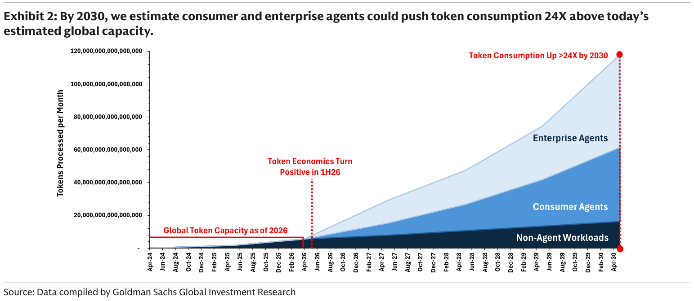

*（Exhibit 3 與此圖為相同數據，在 p6 重複出現，不另行分析。）*

### 解讀摘要
GS 展示全球 token 消費量的時序預測（月消費量，tokens processed per month）。2026 年全球 token 處理能力（Global Token Capacity）為基準線；之後三層堆疊：Non-Agent Workloads（深藍底層，平穩成長）、Consumer Agents（中藍，從 2026 中開始快速增長）、Enterprise Agents（淺藍頂層，從 2027 起加速，成為最大增量）。2030 年 4 月達到 >24x 的總消費量（~120 quadrillion tokens/月）。Token Economics Turn Positive 標注在 1H26 垂直線，說明 margin inflection 正是 agentic 消費量加速的起始條件。

> **原文補充**：Enterprise Agents 至 2030 年超過 Consumer Agents 成為最大層次（約各佔 ~60 and ~56 quadrillion tokens/月），但 Consumer Agents 啟動更早（2026 即可見）——這說明消費者市場的短期可見性更高，企業市場的長期規模更大。

### 表格

| 時間 | 估算月 Token 消費量 | 倍數（vs 2026 全球算力） |
|---|---|---|
| 2026（基準） | 5 quadrillion | 1x |
| 2027 | 15 quadrillion | 3x |
| 2028 | 30 quadrillion | 6x |
| 2029 | 65 quadrillion | 13x |
| 2030 | 120 quadrillion | **>24x** |

（視覺估算，基準值 ~5×10¹⁵ tokens/月）

> **洞察一**：Non-Agent Workloads（原有 chatbot 使用）在圖中幾乎是水平線，說明傳統 AI 查詢成長本身對 token 消費量的貢獻微乎其微——24x 的增量幾乎全來自 agent 架構帶來的 token 密度跳升（每個 agent 任務消費的 token 是單次對話的 100-1,000 倍）。

---

## Exhibit 4｜Token 經濟學詳解（Exhibit 1 詳述版）

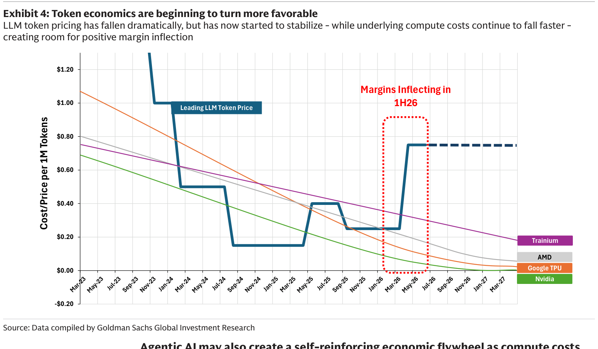

*（Form XObject；數據與 Exhibit 1 相同，為 p6 詳述版，解讀摘要請見 Exhibit 1。）*

---

## Exhibit 5｜Agent ROI vs 人力成本：不同工作流的分化

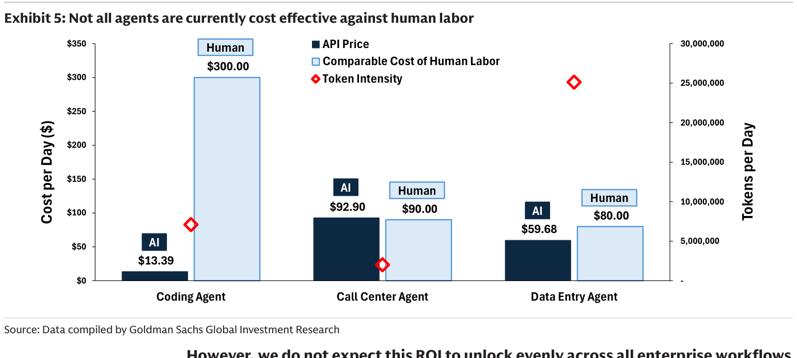

### 解讀摘要
三個 agent 類型的對比，展示 AI ROI 的極度分化。Coding agent：AI \$13.39/day vs 人工 \$300/day，節省 96%，同時消耗最少 token（~7.5M/day）；Data entry agent：AI \$59.68/day vs 人工 \$80/day，節省 25%，但 token 消耗最高（~25M/day）；Call center agent：AI \$92.90/day vs 人工 \$90/day，AI 反而貴 3%，因為語音處理需要實時、多模態輸入，成本結構根本不同。這個分化說明 agent ROI 不應該用統一框架衡量——workflow 特性（文字 vs 語音）才是決定性因素。

### 表格

| Agent 類型 | AI 日成本 | 人工日成本 | AI 節省 | Token/日 | ROI 狀態 |
|---|---|---|---|---|---|
| Coding Agent | \$13.39 | \$300.00 | 96% | 7.5M | 已正 ✓ |
| Data Entry Agent | \$59.68 | \$80.00 | 25% | 25M | 已正 ✓ |
| Call Center Agent | \$92.90 | \$90.00 | **-3%** | 2M | 未正 ✗ |

> **洞察一**：Call center agent 每日 token（~2M）遠少於 coding agent（~7.5M），但成本（\$92.90）卻比 coding agent（\$13.39）高 6.9x——這揭露了一個反直覺的成本結構：token 量不等於成本，「語音/實時/多模態」的額外計費是最大的成本驅動因素，而非 token 數量本身。
>
> **洞察二（配合 Exhibit 25）**：Customer service representatives 是全球第二大 AI 暴露職業（70M 人，70.1% 暴露度），但 call center agent ROI 尚未正轉——這意味全球最大潛在 token 消費市場之一（70M 工作者）的採用時間軸將顯著滯後，GS 55x enterprise token 預測的實現依賴此瓶頸被克服。

---

## Exhibits 6-7｜消費者 Query 市場結構與成長

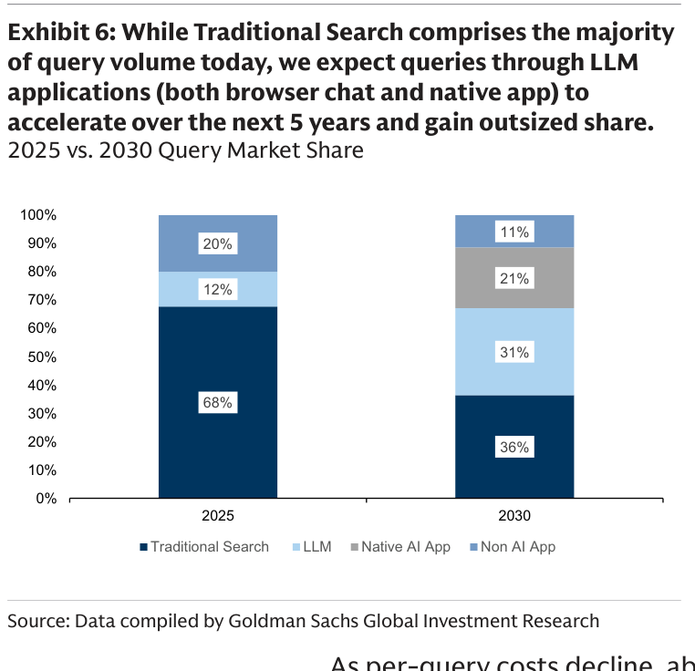
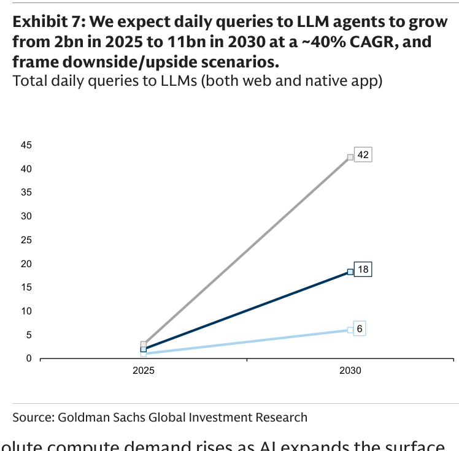

*（Form XObject；Exhibits 11-12 為這組圖在 p16 的重複，不另行分析。）*

### 解讀摘要
Exhibit 6 比較 2025 vs 2030 的消費者 query 市場份額：Traditional Search 從 68% 降至 36%，LLM 從 12% 升至 31%，Native AI App 從 0 升至 20%，Non AI App 從 21% 降至 11%。份額不只是替代，也是擴張——AI query 頻率高於傳統搜尋，總 query 量（Exhibit 7）從 2025: 42B/day 預估增至 2030: 18B/day LLM + 6B/day native = ~24B/day LLM/AI query（傳統搜尋減少部分被 AI 增量超額補足）。

> **原文補充**：GS 估算 2025 年 AI queries ~5B/day（所有 LLM，含 web 和 native app），2030 年 ~23B/day，其中 30% 為 agent 導向（~7B agent queries/day by 2030）。每個 agent query 消費的 token 是傳統搜尋的 100-1,000x，是 token 消費爆炸的關鍵乘數。

### 表格（Exhibit 6，查詢市場份額）

| 類別 | 2025 份額 | 2030 份額 |
|---|---|---|
| Traditional Search | 68% | 36% |
| LLM（web） | 12% | 31% |
| Native AI App | 0% | 20% |
| Non AI App | 21% | 11% |

Exhibit 7（Daily Queries to LLMs，B/day）：

| 年份 | LLM Queries（B/day） |
|---|---|
| 2025 | 2（視覺估算） |
| 2030 | 11（視覺估算） |

> **洞察一**：Traditional Search 從 68% → 36%（-32ppt），而 LLM+Native AI 從 12% → 51%（+39ppt）——消費者搜尋行為的重心移動幅度超過預期，LLM 不只是替代，還創造了原來不存在的「互動型查詢」需求（用戶問更複雜的問題，觸發更長的對話或 agent 任務）。

---

## Exhibit 8｜每次查詢成本下降預測

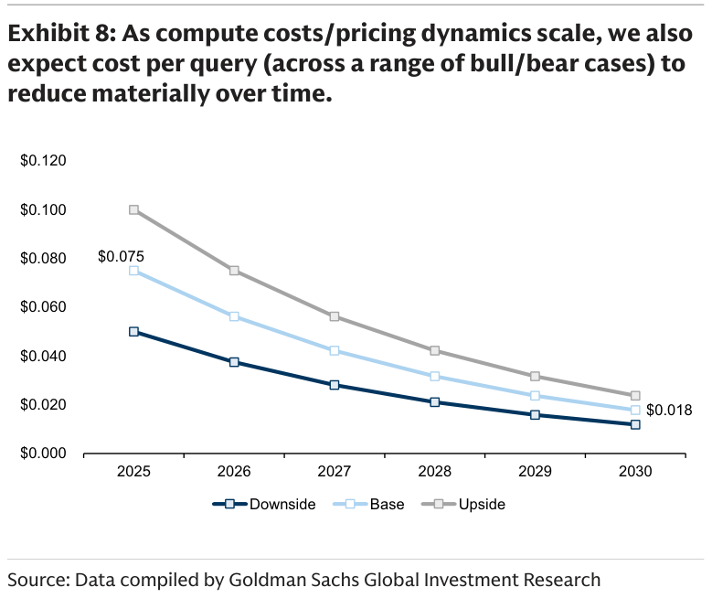

### 解讀摘要
圖表展示 2025-2030 的單次 query 成本（\$/query）在三種情境（Downside/Base/Upside）下的降幅。Base case：2025 ~\$0.075/query → 2030 ~\$0.018/query（-76%），成本下降 4.2x；Upside case 跌幅更深至接近 \$0.00（極端 token 成本壓縮）。成本下降是 consumer agent 普及的物質基礎——每次 agent 任務消費更多 token，但如果每個 token 更便宜，每次 query 的絕對費用可以同步下降，使 agent 對消費者定價可行。

### 表格（視覺估算）

| 年份 | Base Case（\$/query） | Downside | Upside |
|---|---|---|---|
| 2025 | \$0.075 | \$0.10 | \$0.05 |
| 2027 | \$0.040 | \$0.07 | \$0.02 |
| 2030 | \$0.018 | \$0.04 | \$0.00 |

> **洞察一**：Base case 的 per-query 成本下降（-76%，4.2x）必須對抗 agent 任務的 token 密度上升（每次 agent query 消費 10-1,000x 更多 token）。若兩者相乘，consumer 端的 AI query 實際總成本在 base case 下「先升後降」——2026-2027 可能出現成本高於預期的過渡期，這也是 compute capacity 仍然緊張的原因。

---

## Exhibit 9｜Consumer Token 成長：12x by 2030

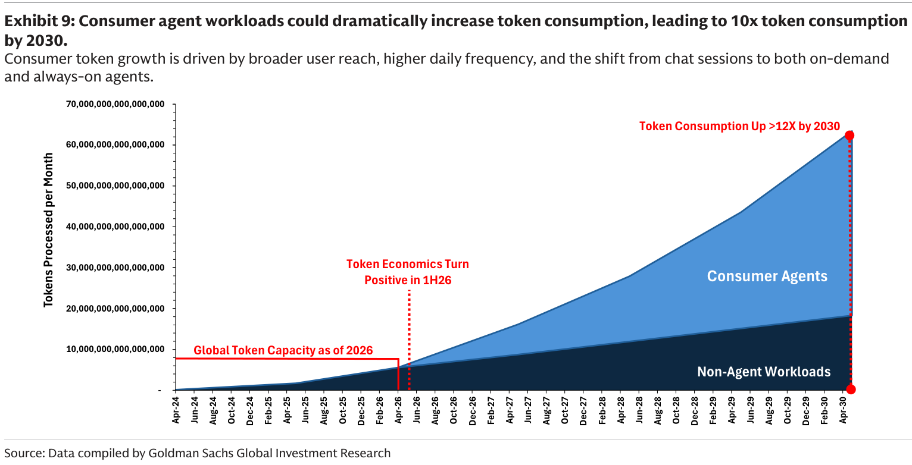

### 解讀摘要
此圖聚焦 consumer agent 層的 token 消費量（不含 enterprise），顯示 2026→2030 consumer token 成長 12x（約 ~60 quadrillion/月）。成長曲線在 2027-2028 呈加速態勢，與 Exhibit 8 的 per-query 成本下降速度對應——成本降到一定門檻後，consumer agent 使用頻率快速放量。GS 強調最大的單一跳升點是 chatbot 升級為 always-on 模型（token 密度 20x 跳升，\>5,000 → \>100,000 tokens/day/user）。

> **原文補充**：GS 估算 2025 年平均 tokens/query 為 1,715（約 3-5 分鐘 chatbot 對話），相較於 always-on agent 的 >100,000 tokens/day，兩者差距約 60x。整個 12x total 消費增長，按 GS 框架，有 8-10x 來自單位 token 密度提升（usage pattern shift），剩餘 2-3x 來自用戶數量和使用頻率增長。

---

## Exhibit 10｜Consumer Agent 架構：On-demand vs Always-on

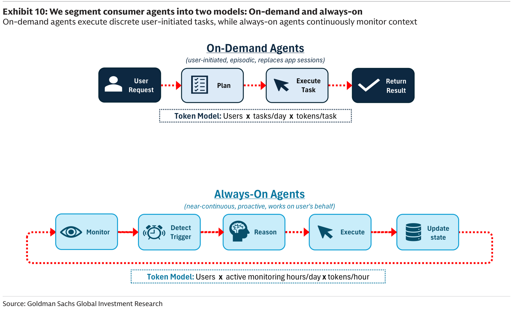

### 解讀摘要
GS 將 consumer agent 切為兩種架構：On-demand（用戶啟動型）和 Always-on（持續背景型）。On-demand 模型計費式為「用戶數 × 每日任務數 × 每任務 token 數」，適合旅遊預訂、購物等高互動任務；Always-on 模型計費式為「用戶數 × 每日活躍監控時數 × 每小時 token 數」，持續運行於背景（email 監控、生活助理、日程管理），幾乎無需用戶指令。Always-on 模型的 token 消費密度（>100K/day）是 on-demand（>10K/session）的 10x+，因此是 token 消費爆炸的關鍵觸發點。

> **洞察一**：Always-on agent 的商業模式與訂閱制軟體高度相似（持續扣費、低用戶感知）——這使得 MSFT、NET 等能夠嵌入 always-on agent 的平台，具備從「每席位」轉向「每活躍小時」計費的條件，單用戶 ARPU 提升潛力遠超 seat-based SaaS。

---

## Exhibits 11-12｜查詢份額與成本（頁面重複）

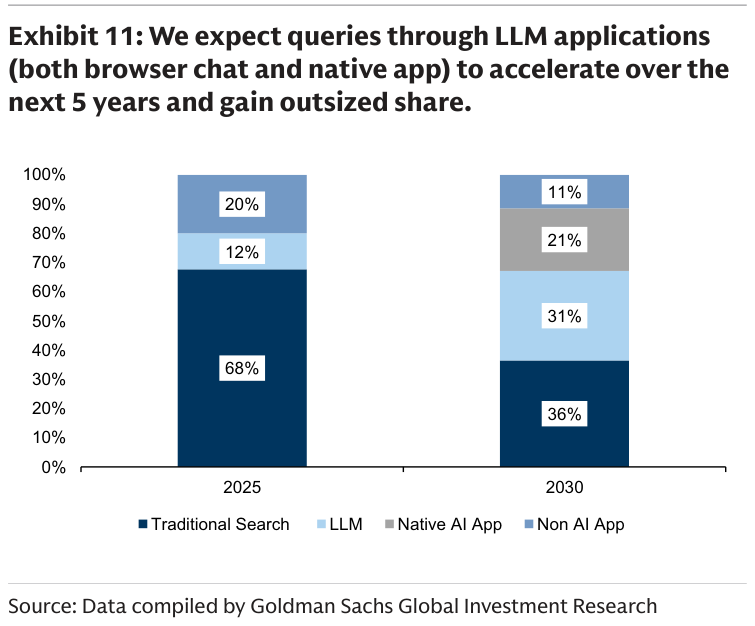
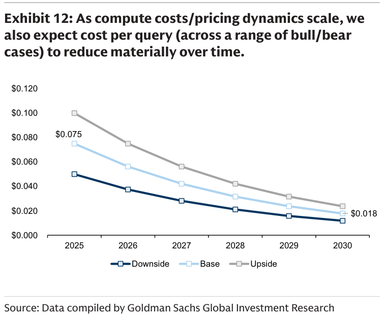

*（Form XObject；Exhibit 11 與 Exhibit 6 數據相同，Exhibit 12 與 Exhibit 8 相同，為 p16 重複摘要，不另行分析。）*

---

## Exhibit 13｜Token 密度光譜：LLM Chatbot → Always-On Agent

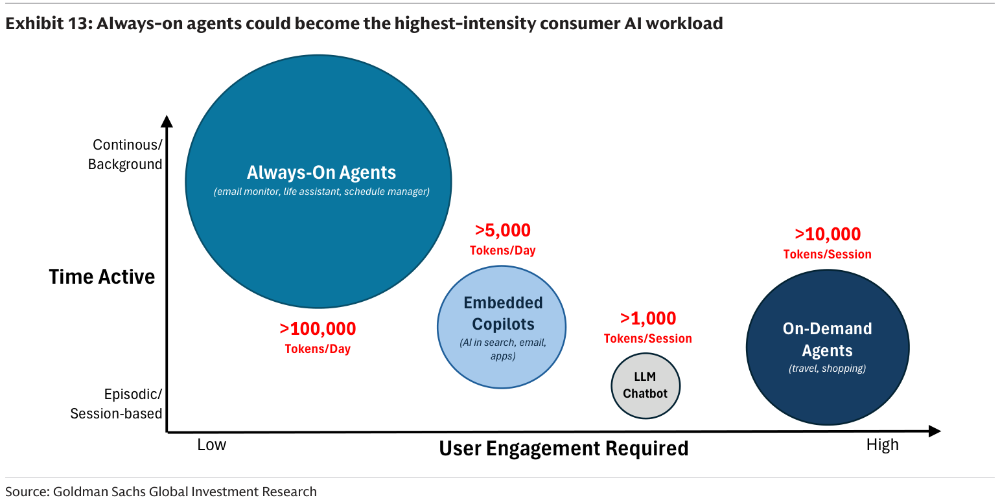

### 解讀摘要
此圖以「時間活躍度」（Y 軸）和「用戶互動需求」（X 軸）兩維度，定位四種 AI 產品形態。LLM Chatbot（低活躍、高互動）：>1,000 tokens/session；On-Demand Agents（低活躍、高互動，如旅遊、購物）：>10,000 tokens/session；Embedded Copilots（AI in search/email/apps，持續但需互動）：>5,000 tokens/day；Always-On Agents（持續背景、低互動，email monitor、生活助理）：>100,000 tokens/day。成長階梯清晰：每升一個類別，token 密度約 10-20x 提升。

### 表格

| 產品形態 | 特性 | Token 密度 |
|---|---|---|
| LLM Chatbot | 用戶啟動，回答問題，session-based | >1,000 tokens/session |
| On-Demand Agents | 用戶啟動，多步驟任務，session-based | >10,000 tokens/session |
| Embedded Copilots | AI 內嵌工具（search/email/app），daily continuous | >5,000 tokens/day |
| Always-On Agents | 背景持續運行，低用戶互動，near-continuous | **>100,000 tokens/day** |

> **洞察一（配合 Exhibit 2）**：Always-On Agents 的 >100,000 tokens/day per user，相當於 LLM Chatbot 的 100x 密度。若全球 23B queries/day 的 30%（~7B）轉為 always-on agent，每日消費量不是 7B × 1,000 tokens = 7T tokens，而是 7B users × 100,000 tokens = 700T tokens——這才是 Exhibit 2 的 120 quadrillion/月數字背後的數學邏輯。

---

## Exhibit 14｜旅遊預訂 Agent 工作流程圖

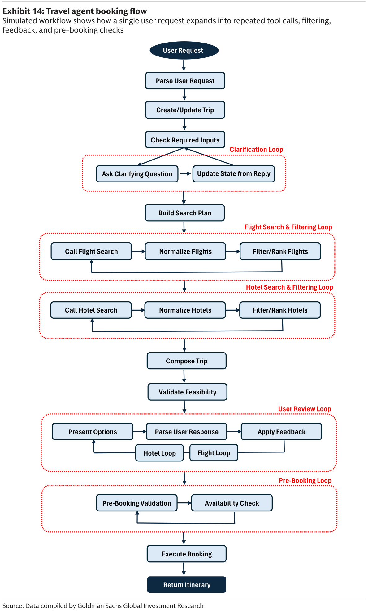

### 解讀摘要
GS 以旅遊預訂為案例，展示一個 on-demand agent 的完整執行路徑：User Request → 解析意圖 → 釐清缺失資訊（Clarification Loop）→ 搜尋航班與飯店（各含 Search & Filter Loop）→ 組合行程 → 用戶確認（Review Loop）→ 預訂驗證（Pre-Booking Loop）→ 執行預訂 → 回傳行程。每個環節都可能循環多次，大幅放大 token 消耗。這個流程圖的核心訊息是：一個「簡單的旅遊預訂」在 agent 架構下並不簡單——包含 6 個可能的 loop，每個 loop 觸發多次模型呼叫。

> **原文補充**：Travel Booking Agent 總 token 約 8,590 input + 1,980 output = ~10.6K tokens/次預訂，API cost ~\$0.016/次——相較人工訂票服務費（通常 \$15-25+），AI 已有明確成本優勢。這也解釋為何旅遊預訂是第一波商業化 agent 場景之一。

---

## Exhibit 15｜詳細 Agent Token 統計：Email Monitor 與旅遊預訂

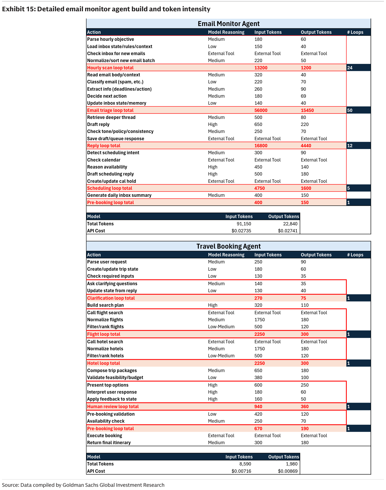

### 解讀摘要
兩個 agent 的逐步驟 token 統計。Email Monitor Agent（always-on）：掃描、分類、回覆、排程四個任務模組合計 ~114K tokens/天（input 91,150 + output 22,840），API cost ~\$0.055/day——這對應 Exhibit 13 的「>100,000 tokens/day」。旅遊預訂 Agent（on-demand）：10.6K tokens/次，\$0.016/次——是高性價比 agentic 任務的典型代表。兩者差異清楚展示 always-on vs on-demand 的 token 結構差異（相差約 10x）。

### 表格（Email Monitor Agent）

| 模組 | Input Tokens | Output Tokens | Loops | 小計 |
|---|---|---|---|---|
| Hourly scan | — | — | 24 | 13,200 + 1,200 |
| Email triage | — | — | 50 | 56,000 + 15,450 |
| Reply drafting | — | — | 12 | 16,800 + 4,440 |
| Scheduling | — | — | 5 | 4,750 + 1,600 |
| Daily summary | — | — | 1 | 400 + 150 |
| **合計** | **91,150** | **22,840** | | **114K tokens/day** |
| **API Cost** | | | | **\$0.055/day** |

### 表格（Travel Booking Agent）

| 指標 | 數值 |
|---|---|
| Total Input Tokens | 8,590 |
| Total Output Tokens | 1,980 |
| Total Tokens | 10.6K |
| API Cost | \$0.016/次 |

> **洞察一**：Email Monitor Agent 每日 \$0.055 的 API cost，若每用戶訂閱收費 \$2/月（~\$0.066/day），service provider 的毛利率約 17%——成本已降至可商業化門檻，但 margin 還偏薄。若 token 成本再下降 50%，相同定價下毛利率跳至 ~60%，這就是為什麼 GS 強調 token cost deflation 是 software 公司毛利改善的核心驅動。

---

## Exhibit 16｜歷史技術採用峰值：受真實世界約束 vs 不受約束

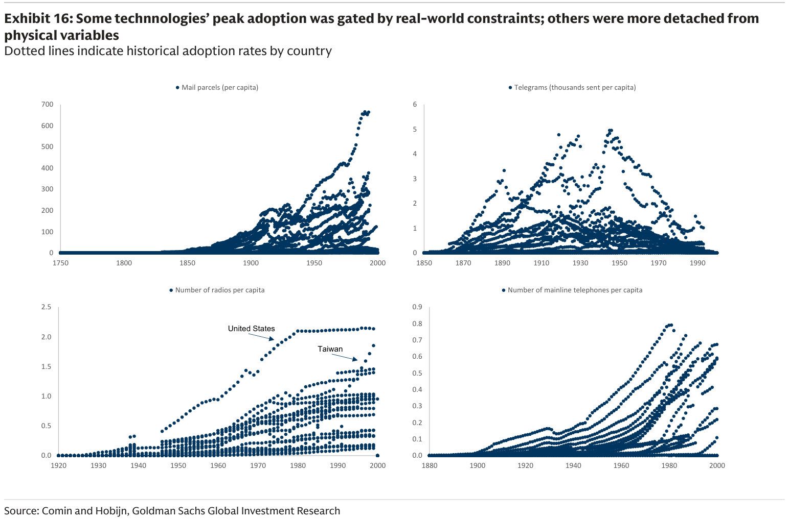

### 解讀摘要
GS 引用 Comin & Hobijn（2009）歷史技術擴散數據集（161 國、101 項技術，1800-2000 年）分析採用峰值的決定因素。圖中四個子圖：(1) 郵件包裹/人均（受家庭數量約束，峰值 0-700 件/人因國而異）；(2) 收音機/人均（上限 ~2 台，受物理空間約束）；(3) 電報（千份/人均，不受約束，由經濟發展水準決定）；(4) 固定電話/人均（上限 ~0.9，受住宅數量約束）。結論：受物理約束的技術有明確上限，不受約束的技術（如電報、郵件）則由財富/效用決定峰值。GS 認為 agentic AI 類似電報——沒有物理上限，採用量取決於 ROI。

> **原文補充**：GS 以電報類比 agentic AI 的核心邏輯是：電報需求在 1800-1900 年高速增長，但每個國家的最終峰值差異極大（1,000-5,000 份/人），取決於經濟發展程度——類似地，agentic AI 的峰值將由「多少知識工作量值得 agent 執行」決定，不存在物理天花板。

---

## Exhibit 17｜通訊技術擴張歷史：新技術不必然替代舊技術

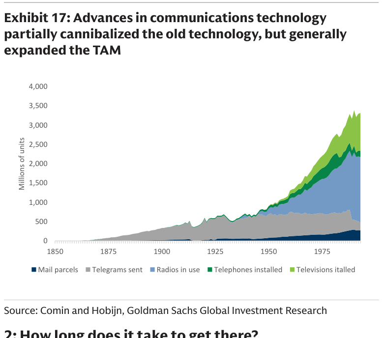

### 解讀摘要
圖表展示 1850-1975 年郵件包裹、電報、收音機、電話、電視五種通訊技術的總量（百萬單位）疊加走勢。關鍵觀察：每種新技術出現後，舊技術並未立即萎縮——各技術在相當長時間內共存並同步成長，說明新通訊形式往往擴大了「通訊的總 TAM」而非替代既有市場。GS 用此類比支持 agentic AI 不只是替代人力，而是擴大整體知識工作量——客服 agent 可以服務原本因等待時間過長放棄的客戶（增量需求），而非僅替代既有人工。

---

## Exhibit 18｜各技術到達採用峰值的時間分佈

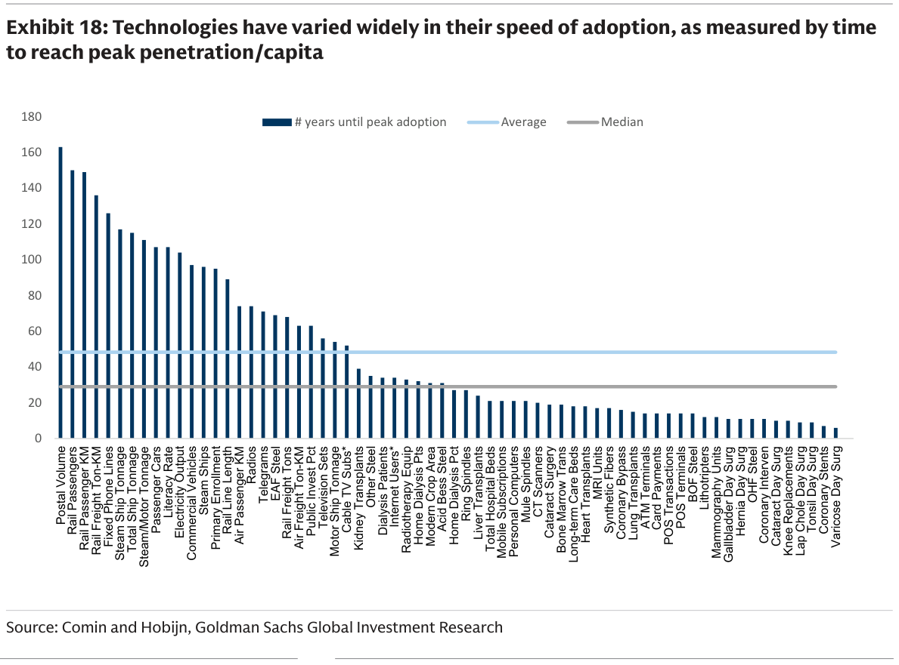

### 解讀摘要
橫向條形圖按「達峰年數」排序 70+ 技術，從最慢（郵件量 ~170 年、鐵路客運 ~160 年）到最快（手術日間護理 <5 年、ATM <10 年）。平均值 ~71 年，中位數 ~29 年；現代技術（Internet users、Mobile subscriptions、Personal computers）均落在 20-35 年範圍內。GS 以 15 年作為 agentic AI 的 time-to-peak 假設（快於中位數 29 年），理由：軟體擴散不受物理資本約束、企業意識到競爭壓力、成本曲線快速下降。

### 表格（代表性技術達峰年數）

| 技術 | 達峰年數（估算） |
|---|---|
| Postal Volume | 170 |
| Rail Passengers | 160 |
| 中位數（全 70+項） | 29 |
| Internet Users | 36 |
| Mobile Subscriptions | 25 |
| Cable TV Subscribers | 15 |
| ATM Terminals | 10 |
| GS agentic AI 假設 | **15** |

> **洞察一**：GS 的 15 年 time-to-peak 與 Cable TV 相當，快於 Internet。Cable TV 的快速普及依賴：有線基礎設施已存在、商業模式明確（月訂閱）、消費者效益立即可見。Agentic AI 的「基礎設施」（雲端算力）已存在，但「商業模式」（outcome-based pricing）仍在成形，「效益可見性」依工作流類型高度分化——這些因素使 15 年假設偏樂觀，但並非不合理。

---

## Exhibits 19-20｜技術採用曲線形態：J-curve vs S-curve vs 線性

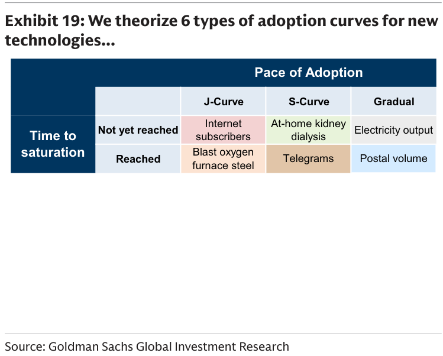
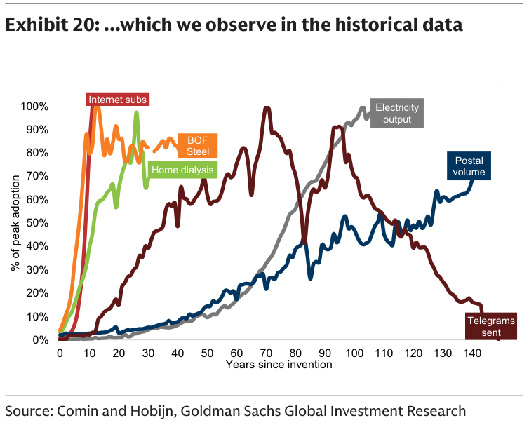

### 解讀摘要
Exhibit 19 以理論矩陣定義三種採用曲線：J-curve（爆發型，如網路）、S-curve（先慢後快再趨緩）、線性（穩定擴散）。Exhibit 20 用歷史數據驗證：電報（S-curve）、郵件量（線性）、Internet（J-curve/S-curve 混合）、家庭透析（S-curve，慢速）。GS 認為 agentic AI 具備三種曲線的元素：供給約束（線性）、網路/ROI 效應（S-curve）、早期快速試用（J-curve）；最終選擇 S-curve 作為基準，因企業採用有制度障礙和學習曲線。

---

## Exhibit 21｜Email 普及的 S-curve 類比

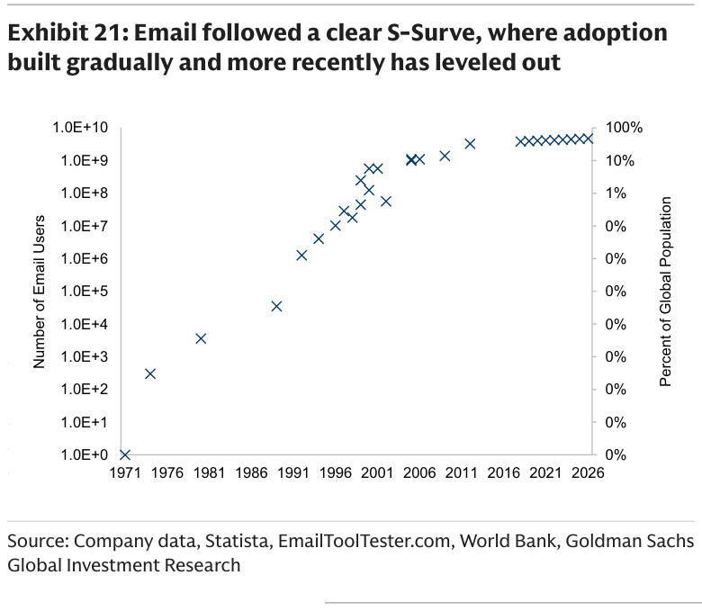

### 解讀摘要
Email 用戶數（1971-2026）在對數-線性圖表上呈現清晰的 S-curve：1971 年誕生，1990 年代快速加速，2000 年代中後期趨緩，2026 年約 40-50% 全球人口使用電子郵件（~40 億用戶）。GS 以 email 作為最貼近的 agentic AI 類比：兩者都是「知識工作者的生產力工具」，都需要企業採用 + 消費者接受，都在技術成熟（SMTP/LLM API 標準化）後才進入 S-curve 陡坡。不同的是 agentic AI 的成本曲線下降更快（token cost），可能縮短 slow initial phase。

---

## Exhibit 22｜消費者技術 vs 企業技術採用速度比較

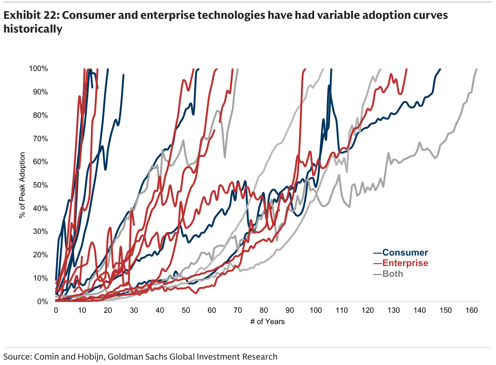

### 解讀摘要
圖表對比消費者技術（Consumer）與企業技術（Enterprise）在「採用年數」（x 軸）vs「佔峰值的 %」（y 軸）的歷史分佈。消費者技術曲線整體較陡峭（更快達峰）；企業技術曲線更平緩（中位數採用時間更長）。Agentic AI 橫跨兩者：consumer-facing（個人助理）偏消費者曲線，enterprise-embedded（工作流 agent）偏企業曲線。GS 的 15 年達峰假設相當於取消費者曲線的中位數、或企業曲線的快速端。

> **洞察一（配合 Exhibit 18）**：企業技術的歷史中位數達峰時間約 35-40 年（慢於全樣本 29 年的中位數）。若 enterprise agentic AI 遵循企業技術歷史，則達峰時間可能落在 30-40 年而非 GS 假設的 15 年——token 消費 55x 的時間軸可能延伸至 2055-2065 而非 2040。

---

## Exhibit 23｜Software TAM：SaaS 基盤 + 浮現中的 Agent TAM

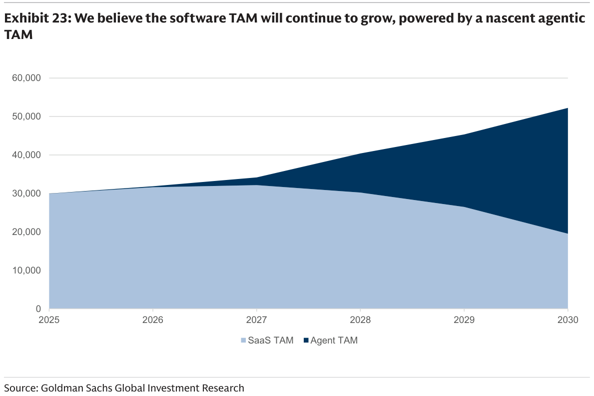

### 解讀摘要
圖表以面積圖展示 2025-2030 的 software TAM 組成：SaaS TAM（淡藍底層）在 2027 年後趨於平穩甚至略降；Agent TAM（深藍頂層）從 2027 年快速增長，至 2030 年約與 SaaS TAM 規模相當，兩者合計較 2025 成長約 70%。Y 軸未標示單位；依報告文字（峰值 ~\$5.4T 軟體 TAM），2030 年合計值約在 \$1.5-2T 量級（仍遠低於峰值，因峰值預計在 2040 左右）。GS 的核心論點：pricing 從「每席位」轉向「每工作單位」（outcome-based），打破了 SaaS 的 seat ceiling，使軟體公司能向企業收取遠高於傳統席位費的費用。

> **原文補充**：企業調查顯示願意為通用智慧 agent 支付 \$2,400/年（vs Microsoft 365 E5 ~\$680/年），ARPU 3.5x 的潛力已有調查支持。GS 還引用 ServiceNow AI ARR 目標升至 \$1.5B（from \$1B）及 Salesforce 的 AI 加速指引，作為 Agent TAM 開始貨幣化的早期訊號。

> **洞察一**：SaaS TAM 在圖中 2027 後呈略降趨勢，意味 Agent TAM 的增長部分來自替代 traditional SaaS 收入（用戶改為 outcome-based 而非按席位），而非純粹增量——對既有大型 SaaS 廠商（Salesforce、ServiceNow）意味著定價模式轉型帶來的陣痛期。

---

## Exhibit 24｜Enterprise Token 消費：55x by 2040（12% by 2030）

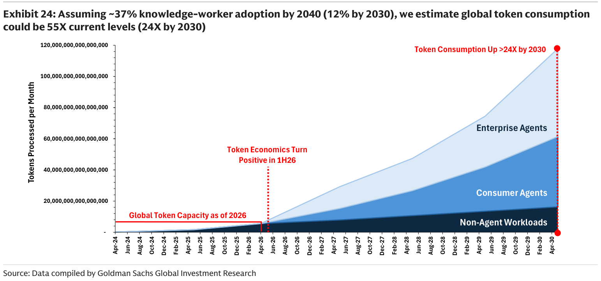

### 解讀摘要
此圖是 Exhibit 2 的詳細版，延伸至 2040 年，加入企業採用 S-curve 的長期路徑。Enterprise Agents（淺藍頂層）是 2030 後的主要增量，隨著更多知識工作者採用 agent（從 12% at 2030 → 37% at peak ~2040），token 消費從 24x（2030）繼續增長至 55x（2040）。Peak adoption 的 ~37% knowledge worker 假設驅動 ~278 quadrillion tokens/月的峰值消費（vs 2026 基準 ~5 quadrillion）。

> **洞察一（配合 Exhibit 5）**：55x by 2040 的前提是 Call Center Agent（70M 工作者）也在某時間點變得划算——但 Exhibit 5 顯示目前 ROI 尚未正轉（\$92.90 vs \$90 human）。若 token 成本再下降 50%，call center agent cost → ~\$46.45，届時 ROI 轉正。GS 的 token cost deflation 路徑（Exhibit 8 base case -76% by 2030）足以觸發這個門檻，使 call center 在 2027-2028 進入正 ROI——這是 55x 預測能否實現的關鍵 bridge。

---

## Exhibit 25｜AI 暴露度最高的職業（Anthropic 實際用量驗證）

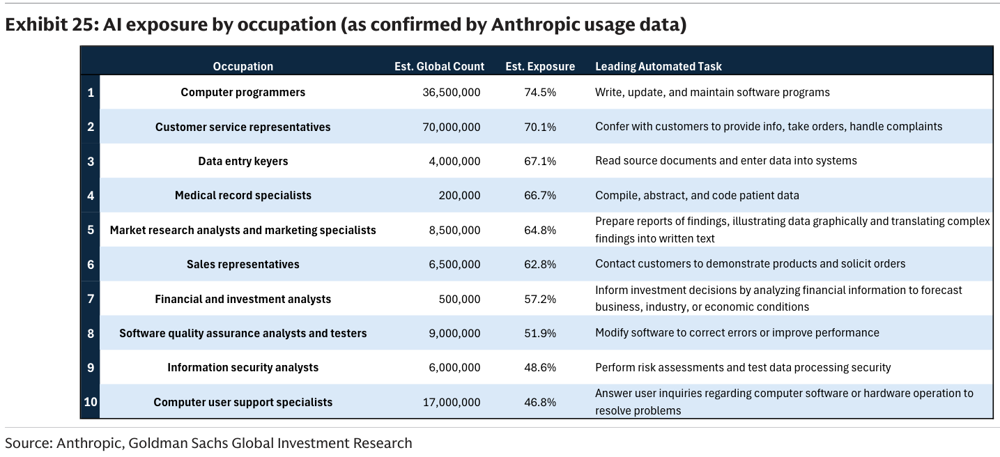

### 解讀摘要
GS 使用 Anthropic 基於實際 Claude 使用模式的職業暴露度數據（而非理論預測），前 10 大職業暴露度均在 46-74%。Computer programmers 以 74.5% 位居第一，且全球 3,650 萬人；Customer service reps 以 70.1% 暴露度位居第二，但人數更多（7,000 萬人）。這份清單既是 token 消費量的前瞻指標，也是 enterprise agent 採用速度的路線圖——高暴露、高人數、低成本 workflow 的職業最先商業化。

### 表格

| 排名 | 職業 | 全球人數 | AI 暴露度 | 主要自動化任務 |
|---|---|---|---|---|
| 1 | Computer programmers | 3,650 萬 | 74.5% | 撰寫/更新/維護程式 |
| 2 | Customer service reps | 7,000 萬 | 70.1% | 處理客戶查詢、訂單、投訴 |
| 3 | Data entry keyers | 400 萬 | 67.1% | 讀取文件並錄入系統 |
| 4 | Medical record specialists | 20 萬 | 66.7% | 編碼和摘要病患資料 |
| 5 | Market research analysts | 850 萬 | 64.8% | 分析與報告研究發現 |
| 6 | Sales representatives | 650 萬 | 62.8% | 接觸客戶並示範產品 |
| 7 | Financial/investment analysts | 50 萬 | 57.2% | 分析財務資訊以支援投資決策 |
| 8 | Software QA analysts | 900 萬 | 51.9% | 修改程式以改善效能 |
| 9 | Information security analysts | 600 萬 | 48.6% | 執行風險評估 |
| 10 | Computer user support | 1,700 萬 | 46.8% | 解答軟硬體操作問題 |

> **洞察一（配合 Exhibit 5）**：暴露度最高的兩大職業（程式設計師和客服）ROI 狀況截然不同：coding agent 已正（\$13 vs \$300），call center 尚未正轉（\$92.90 vs \$90）。但人數更多的是 customer service（7,000 萬 vs 3,650 萬）——這說明 token 消費的最大增量市場目前處於 ROI 障礙中，一旦 token 成本下降解鎖，貢獻的 token 消費量將超過 coding agent。

---

## Exhibit 26｜Token 密度 vs API 成本：職業間的分化

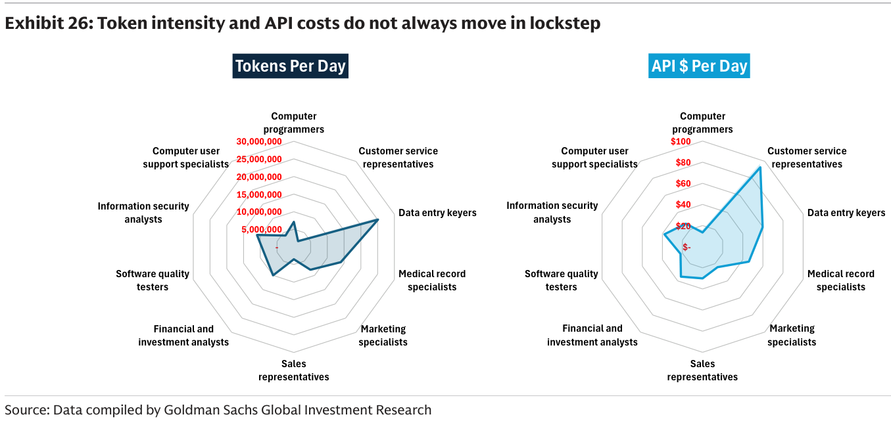

### 解讀摘要
兩個雷達圖（左：每日 token 量；右：每日 API 成本）展示 10 個職業的分佈。Data entry keyers 的 token 消費量遠超其他職業（~25M/day，在左圖遠超 computer programmers ~7M）；但 Customer service reps 的 API cost 最高（因實時語音處理），儘管 token 量並不是最多的。核心訊息：token 量 ≠ cost——modality（文字 vs 語音 vs 多模態）是決定 API 成本的關鍵變數。Text-heavy、tool-heavy（但無聲音）的 workflow 先行，voice-heavy 後行。

> **原文補充**：GS 指出 data entry agent 儘管 token 量是最高的（~25M/day），但因為幾乎純文字處理，API cost（~\$59.68）仍遠低於 customer service（~\$92.90）——這反映目前文字 token（input/output）計費遠低於實時語音 API 計費。隨著語音 API 成本下降，call center agent 的 \$92.90 有望降至 \$45-50，觸發 ROI 轉正。

---

## Exhibit 27｜Coding Agent 詳細 Token 建構：文字密集、Loop 密集、成本高效

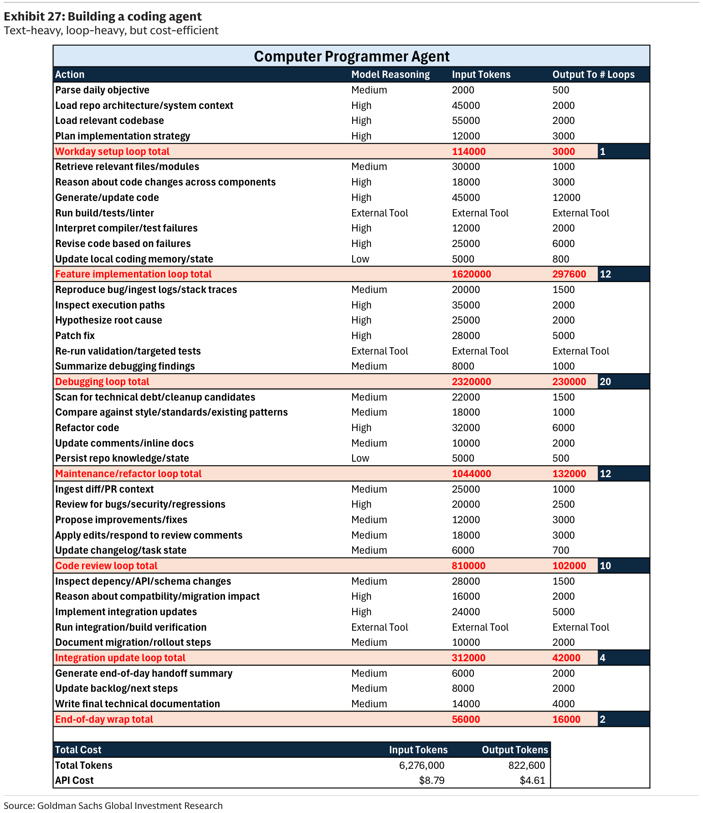

### 解讀摘要
GS 以逐步驟、逐模組的方式建構一個 coding agent 的每日 token 消費量。最大單一模組是「Debugging loop」（2.32M input + 230K output，20 個 loops）和「Feature implementation loop」（1.62M + 297.6K，12 個 loops）——兩者合計佔總 token 的 63%。「Load repo architecture/system context」是單步驟最高（45,000 input）；高品質推理需要大量 context 載入。Total：6,276,000 input + 822,600 output = ~7.1M tokens/day，API cost \$8.79 input + \$4.61 output = \$13.40/day。

### 表格（彙整）

| 工作流模組 | Input Tokens | Output Tokens | Loops | 佔總 Input % |
|---|---|---|---|---|
| Workday setup | 114,000 | 3,000 | 1 | 1.8% |
| Feature implementation | 1,620,000 | 297,600 | 12 | 25.8% |
| Debugging | 2,320,000 | 230,000 | 20 | **37.0%** |
| Maintenance/refactor | 1,044,000 | 132,000 | 12 | 16.6% |
| Code review | 810,000 | 102,000 | 10 | 12.9% |
| Integration update | 312,000 | 42,000 | 4 | 5.0% |
| End-of-day wrap | 56,000 | 16,000 | 2 | 0.9% |
| **合計** | **6,276,000** | **822,600** | | **100%** |
| **API Cost** | **\$8.79** | **\$4.61** | | **\$13.40/day** |

> **洞察一**：Debugging loop 是最大 token 消費模組（37% 總 input），且包含 20 個 loops——每增加一個 debugging 循環（因 code 品質不佳），token 消費線性增加。這意味 AI coding agent 的 token 消費量高度依賴被 agent 服務的 codebase 複雜度和初始代碼品質，實際部署的 token 成本方差可能很大。
>
> **洞察二**：Output tokens（822,600）只佔 input（6,276,000）的 13.1%——coding agent 的 token 消費是高度「輸入密集型」（大量 context 載入、文件讀取、代碼分析），output（生成的代碼）相對短小。這與 GS 的計費結構對應：input tokens 通常比 output tokens 便宜，\$8.79 input / \$4.61 output（\$1.91/output vs \$0.14/input per 1M tokens 等效），output 雖量少但成本佔比高。

---

## Exhibit 28｜Data Entry Agent 詳細 Token 建構：文字密集、Token 量最高

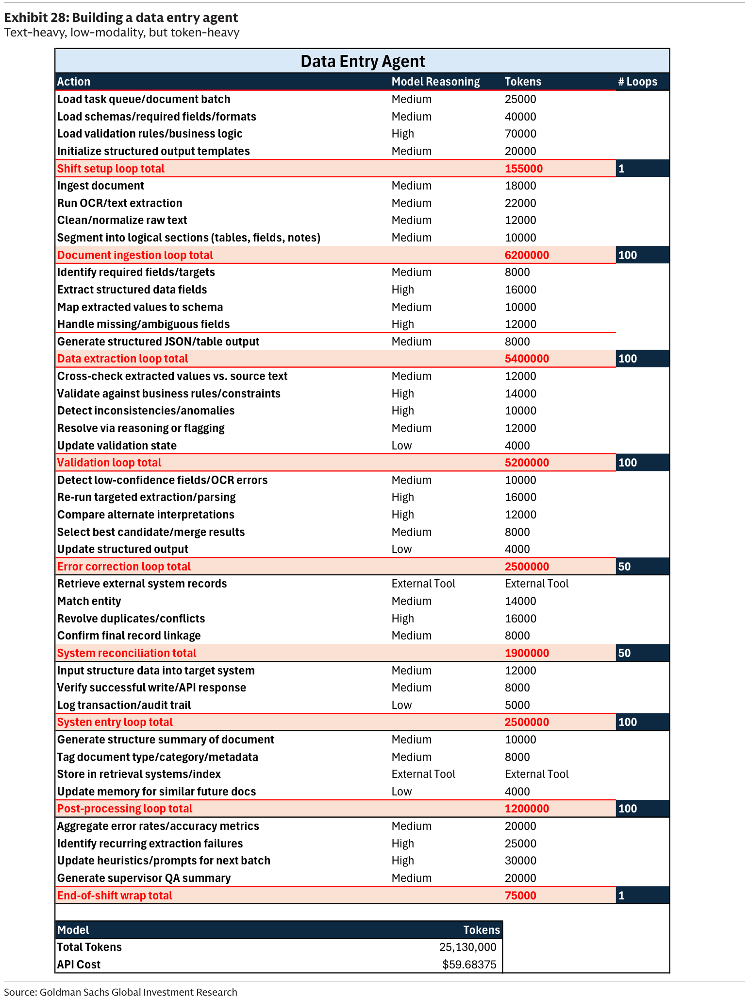

### 解讀摘要
Data entry agent 每日處理大批量文件（100 documents per shift），每份文件需四個處理步驟（ingestion、extraction、validation、output）各有 100 個 loops。Document ingestion（6.2M tokens）、Data extraction（5.4M tokens）、Validation（5.2M tokens）三個主要 loop 合計 ~16.8M tokens，加上 setup（155K）和 error handling，總計 ~25M tokens/day，API cost ~\$59.68/day。雖然 token 量最高，但純文字處理成本（\$59.68）遠低於 voice-based call center（\$92.90）。

### 表格（彙整，輸入 token 估算）

| 工作流模組 | Tokens | Loops | 佔總 % |
|---|---|---|---|
| Shift setup | 155,000 | 1 | 0.6% |
| Document ingestion | 6,200,000 | 100 | 24.8% |
| Data extraction | 5,400,000 | 100 | 21.6% |
| Validation | 5,200,000 | 100 | 20.8% |
| Error handling + reconciliation | 8,000,000（估算） | 多次 | 32.2% |
| **合計** | **25,000,000** | | **100%** |
| **API Cost/day** | **\$59.68** | | |

視覺估算，各模組之和需收斂至 ~25M 總 token（交叉驗證：Exhibit 5 標示 ~25M tokens/day）。

> **洞察一（配合 Exhibit 5）**：Data entry agent 每日 \$59.68，低於人工 \$80/day（-25%）——ROI 已正但節省幅度有限（25%）。隨 token 成本繼續降低（-50% → AI cost ~\$30），節省幅度升至 62%，採用加速。Data entry（400 萬全球工作者，67.1% 暴露度）是目前三個分析職業中 ROI 最接近「轉折後快速採用」階段的類別。

---

## 跨 Exhibit 彙整表

### 彙整 1｜三大 Agent ROI 總比較（Exhibits 5、25、26、27、28）

| Agent 類型 | 職業規模 | AI 暴露度 | Token/日 | API Cost/日 | 人工成本/日 | ROI 狀態 | 達正轉 ROI 所需 Token 成本降幅 |
|---|---|---|---|---|---|---|---|
| Coding | 3,650 萬人 | 74.5% | 7.5M | \$13.39 | \$300 | **已正** | 已達 |
| Data Entry | 400 萬人 | 67.1% | 25M | \$59.68 | \$80 | **已正** | 已達 |
| Call Center | 7,000 萬人 | 70.1% | 2M | \$92.90 | \$90 | **未正** | 約 -3%（極小降幅即可達到） |

> Call center agent 距 ROI 轉正僅差 3%（\$92.90 → \$90），但困難不在 cost 而在 modality：語音 API 的高成本使 token 降價無法直接平移到 call center，需語音 API 本身降價。若語音 API cost 降 30-50%，call center ROI 有望在 2027-2028 轉正，釋放全球最大 AI 暴露職業（7,000 萬人）的 token 需求。

### 彙整 2｜Token 消費量層次（Exhibits 9、13、24）

| 採用層次 | 時間範圍 | 月 Token 消費量 | 倍數（vs 2026 基準） |
|---|---|---|---|
| Non-Agent + Chatbot（基準） | 2026 | 5 quadrillion | 1x |
| Consumer Agents 12x | 2030 | 60 quadrillion | 12x |
| Consumer + Enterprise 24x | 2030 | 120 quadrillion | 24x |
| 峰值採用（37% KW）55x | 2040 | 278 quadrillion | 55x |

> Enterprise agents 的最終體量（~56 quadrillion/月 by 2030）與 Consumer agents（~60 quadrillion/月）相當，但 Enterprise 的長期成長更持久（因知識工作市場更大、token 密度更高）。

---

## 相關個股清單

| 類別 | 公司 | Ticker | 評等 | 目標價 | 備註 |
|---|---|---|---|---|---|
| 半導體（ASIC） | Broadcom | AVGO.O | Buy | \$480 | 客製晶片市場領導者；Google/LLM 廠商 XPU 首選 |
| 半導體（GPU） | NVIDIA | NVDA.O | Buy | \$250 | 高性能 merchant GPU 主導；token cost deflation 主要驅動者 |
| 半導體（CPU/GPU） | AMD | AMD.O | Buy | \$450 | CPU attach rate 受益 + MI450/MI5xx GPU 放量 |
| Hyperscaler | Amazon | AMZN.O | Buy | \$325 | AWS AI 工作負載 +28% YoY；\$364B revenue backlog |
| Hyperscaler | Alphabet | GOOGL.O | Buy | \$450 | Cloud +63% YoY；Search multi-modality；全棧 AI |
| Hyperscaler | Meta | META.O | Buy | \$830 | 廣告 AI 驅動 engagement；agentic commerce 佈局中 |
| 軟體 | Microsoft | MSFT.O | Buy | \$610 | Copilot 回饋改善；E7 升級週期；Cowork 生態協同 |
| 軟體（邊緣算力） | Cloudflare | NET.N | Buy | \$250 | AI inference 邊緣佈局；network architecture 護城河 |
| IT Services | Accenture | ACN.N | Buy | \$300 | Agent 部署整合需求；workflow redesign 顧問機會 |
