# UBS｜US Semiconductors：Agentic AI 對 CPU 市場的影響

**券商**：UBS Securities LLC  
**分析師**：Timothy Arcuri、Natalia Winkler CFA、Grant Joslin、Gianmarco Vella、Aaryan Wadhwa、Dino Weinstock  
**日期**：2026-05-05  
**主題**：Exploring the Impact of Agentic AI on the CPU Market  
**評級**：ARM Buy（\$245 PT ↑）｜AMD Buy（\$341.54）｜INTC Neutral（\$95.78）  
<button type="button" onclick="fetch('https://ti-lei.github.io/foreign-reports/static/downloads/產業/20260505_UBS_Agentic-CPU.md').then(r=>r.text()).then(t=>{let a=document.createElement('a');a.href='data:text/plain;charset=utf-8,'+encodeURIComponent(t);a.download='20260505_UBS_Agentic-CPU.md';a.click()})">⬇ 下載 MD</button>

---

## UBS 完整投資邏輯鏈

| 論點層次             | Figure     | 內容                                                                                                                            |
| ---------------- | ---------- | ----------------------------------------------------------------------------------------------------------------------------- |
| Agentic CPU 需求突變 | 封面         | Agentic 部署使每 GPU 所需 CPU cores 5x 跳升（訓練 8-12 → agentic 80-120），CPU attach rate 急升是被市場低估的隱性需求缺口                                 |
| 需求量化（bottom-up）  | 8, 9       | C2027 23MM XPU，Head Node CPU ratio 升至 43%（from 22%）；AI CPU 市場 2025 \$7B → 2027 \$39B → 2030 \$125B，CPU/GPU attach 0.32 → 0.83 |
| 需求量化（top-down）   | 17, 18, 19 | NVDA \$3.5T AI TAM 反推 C2030 41MM XPU；1:1 attach → 40MM CPU；搭配 \$3,769 ASP → \$120-200B AI CPU TAM；與 bottom-up 高度收斂            |
| ASP 加速確認         | 5-7        | 傳統 CPU ASP 僅 4% CAGR；AI CPU（x86 \$1,500-2,000，ARM Grace \$3,000-4,000）為傳統 2-3x，對整體 TAM 有乘數效應                                  |
| 格局轉移量化           | 2-3        | C2030E Revenue share：ARM 52%、AMD 24%、INTC 24%；ARM head node 75%+；unit share 40-45%，revenue share 50-55%                       |
| ARM 估值更新         | 36         | PT \$245（↑ from \$175）：1.8x PEG × 36.5% LT EPS CAGR = 67x P/E，applied to 2027/28E avg EPS \$3.68                              |
| **結論**           | 封面         | **Server CPU TAM \$31B（C2025）→ \$173B（C2030），5.6x；ARM 最大受益（52% rev share），AMD 次之，INTC 第三，三者均有順風**                             |

> **報告最大邏輯缺口**：ARM ASP（\$3,000-4,000）是 TAM 估算核心乘數但無公開定價可核實；cloud-to-edge 轉移可能壓縮 ~25% 雲端 CPU 需求，TAM 衝擊尚未完整量化。

---

## 報告核心觀點

| 主題 | UBS 觀點 | 市場共識 | 是否 Contra-Consensus |
|---|---|---|---|
| CPU TAM C2030 | \$173B（5.6x） | AMD Analyst Day \$60B（18% CAGR） | 是，UBS 估算為 AMD 預測 3x |
| ARM Revenue Share | 52%（C2030E） | 15% unit share（C2025 基準） | 是，份額跳升幅度激進 |
| CPU Attach Rate | 5x 成長（0.32 → 0.83 CPU/GPU） | 無公開共識 | Contra-Consensus |
| ARM 架構優勢 | 長期勝出（power、memory efficiency）；x86 近期仍全面受惠 | x86 主導地位穩固 | 是 |
| PC 升級 | Agentic 推論外溢至 PC 端，催化更換週期（INTC/AMD 受惠） | 未廣泛預期 | 是 |

**偏好排序**：ARM > AMD > INTC

---

## Figure 2 & 3｜CPU TAM 路徑 與 C2030E Revenue Share

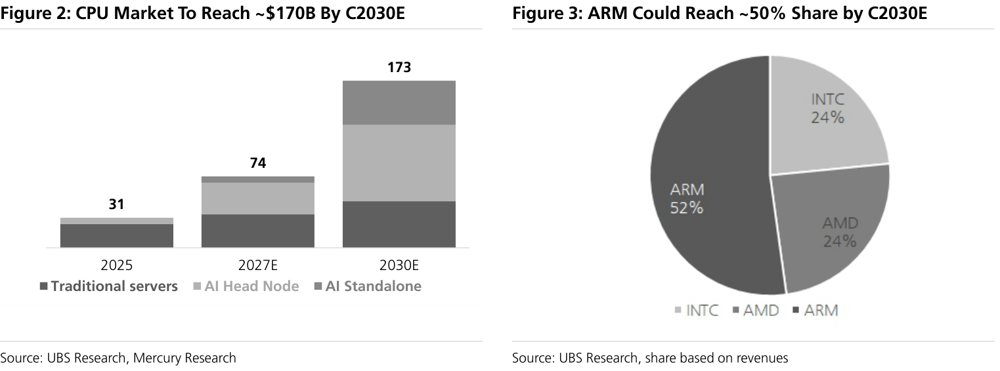

### 解讀摘要
UBS 將 CPU 市場分三層：Traditional servers（穩定基礎）、AI Head Node（GPU rack 控制節點）、AI Standalone（rack 外獨立 CPU 伺服器）。三層合計 2025: \$31B → 2027E: \$74B → 2030E: \$173B，增量幾乎全來自 AI 兩層。C2030E revenue share 方面，ARM 以 52% 取得絕對多數，超越 AMD（24%）與 INTC（24%）總和——這是 revenue share，高於 unit share（40-45%），因 ARM CPU ASP 顯著溢價於 x86。

> **原文補充**：Figure 3 資料來源標注「share based on revenues」，報告另提及排除中國市場的影響（中國對美系 CPU 的依賴可能使 TAM 偏保守），且中國自研加速器的 CPU 依然使用美系 CPU，是額外上行因子。

### 表格

| 年份 | CPU TAM（\$B） |
|---|---|
| C2025 | 31 |
| C2027E | 74 |
| C2030E | 173 |

C2030E Revenue Share（Figure 3）：

| 公司 | Revenue Share |
|---|---|
| ARM | 52% |
| AMD | 24% |
| INTC | 24% |

> **洞察一**：AI Standalone 是 C2027→C2030 增量最大的層次（2MM → ~13MM units）。Standalone CPU 設計用於工具呼叫、sandbox 執行等 agentic 任務，是從 GPU rack 分離出來的純增量需求——對 AMD 和 ARM 均是不侵蝕既有市占的新訂單結構。

> **洞察二**：ARM revenue share（52%）明顯高於 unit share（40-45%），差值 7-12ppt 完全由 ARM CPU ASP 溢價解釋（head node ARM Grace ~\$3,960 vs 傳統 x86 均價 ~\$2,000）。這意味 ARM 的財務表現將持續好於份額數字暗示的水準。

---

## Figure 4｜Pro-Forma C2030E EPS Power

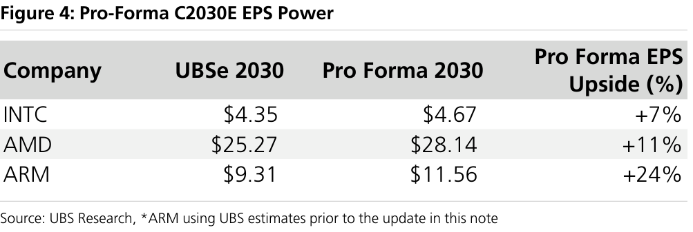

### 解讀摘要
此表為「若本報告 CPU TAM 假設成真」下的 C2030E EPS pro-forma 上調。ARM 受益最大：implied revenue 較目前 UBS 模型高 21%，推動 EPS 從 \$9.31 升至 \$11.56（+24%）；AMD +11%（\$25.27→\$28.14）；INTC +7%（\$4.35→\$4.67）。ARM EPS 上行幅度（+24%）高於 revenue 上行（+21%），因 ARM 授權收入（royalty）的高毛利特性使每增量 revenue 對 EPS 的貢獻高於 AMD/INTC。

### 表格

| 公司 | UBSe C2030E EPS | Pro-Forma C2030E EPS | EPS 上行空間 |
|---|---|---|---|
| INTC | \$4.35 | \$4.67 | +7% |
| AMD | \$25.27 | \$28.14 | +11% |
| ARM | \$9.31 | \$11.56 | +24% |

> **洞察一**：ARM C2030E pro-forma EPS \$11.56 × 67x P/E（base case multiple）= \$775 implied price，相當於目前 PT \$245 的 3.2x。UBS 選擇用「今日 EPS 估算」（\$3.68）而非 pro-forma EPS 定價，意味 CPU TAM 主題的上行期權幾乎全未反映在 PT 中——\$245 是保守目標，\$775 才是若主題兌現的 bull case。

---

## Figures 5-7｜傳統 CPU 市場基準（歷史 CAGR）

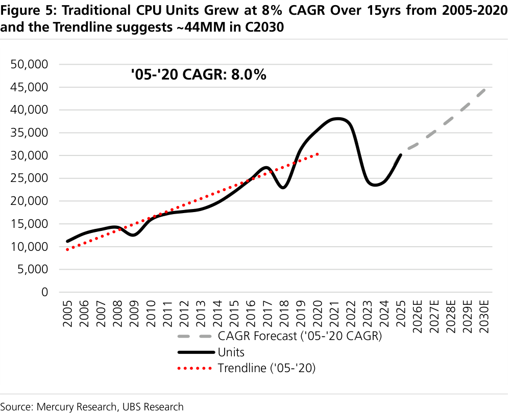
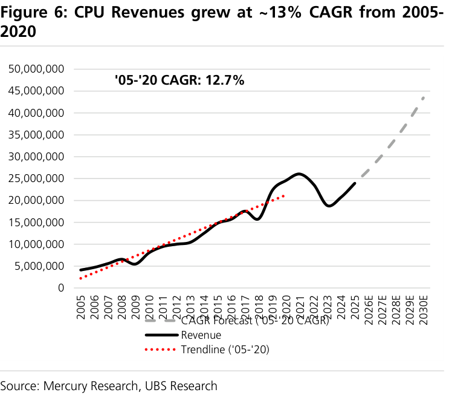
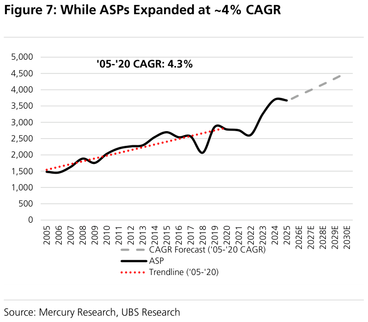

### 解讀摘要
UBS 以 2005-2020 作為 AI 前的正規化基準，剔除 WFH 拉貨（2020-2022）與 AI 伺服器替換效應（2023-2024）兩段干擾。傳統 CPU 市場：unit CAGR ~8%、revenue CAGR ~13%、ASP CAGR ~4%，外推至 C2030 unit 趨勢線約 44MM。這三個數字確立了「不含 AI 因素的自然基線」，AI 需求全部是額外增量。UBS 強調 AI CPU 時代 ASP 升速已遠超 4%：過去五年 x86 平均 core count 增 3x，每代 ~20% ASP step-up，agentic 推動的 core count 進一步激增將加速這個趨勢。

> **原文補充**：Revenue 歷史數據排除 ARM revenue（但包含 ARM 貢獻的 unit，因 AWS Graviton 早期出貨量可忽略）。這意味 13% CAGR 是純 x86 基準，ARM 加入後整體 revenue 池的成長率將更高。

### 表格

| 指標 | 基準 CAGR（2005-2020） | 趨勢外推 C2030 |
|---|---|---|
| CPU Units | 8% | 44MM |
| CPU Revenue | 13% | — |
| CPU ASP | 4% | — |

> **洞察一**：AI CPU ASP（Head Node \$2,420-3,960；Standalone \$2,850-3,480）相當於傳統均值的 3-5x。即便 unit 數量不超過傳統趨勢線（~44MM），僅 ASP 乘數效應就足以將整體 revenue 從傳統趨勢線的水準翻倍以上。

---

## Figure 8｜XPU Accelerator 路線圖與 Head Node CPU 估算

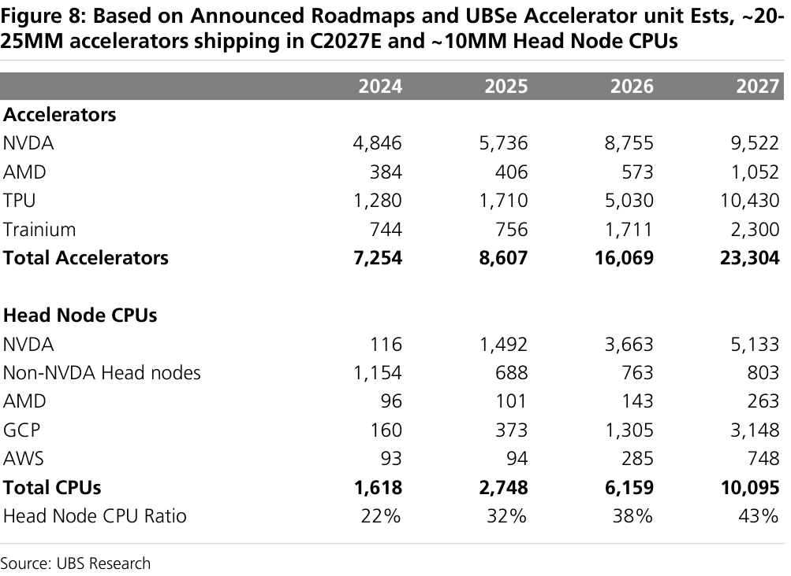

*（Form XObject；裁切範圍為全欄寬，已視覺確認）*

### 解讀摘要
此表整合各家 XPU（GPU/TPU/Trainium）roadmap，推算對應 Head Node CPU 需求。C2024→C2027 XPU 總量從 7.3MM 增至 23.3MM（+221%），Head Node CPU 同期從 1.6MM 增至 10.1MM（+524%）——CPU 增速為 XPU 的 2.4x，正是 attach ratio 從 22% 升至 43% 的體現。NVDA 系統帶動的 Head Node CPU（2024: 116K → 2027: 5,133K）是最大單一驅動力；TPU（Google）則是 XPU 增量最快的平台（+715%）。

### 表格（千個）

| 平台 | 2024 | 2025 | 2026 | 2027 |
|---|---|---|---|---|
| **加速器（XPU）** | | | | |
| NVDA | 4,846 | 5,736 | 8,755 | 9,522 |
| AMD | 384 | 406 | 573 | 1,052 |
| TPU（Google） | 1,280 | 1,710 | 5,030 | 10,430 |
| Trainium（AWS） | 744 | 756 | 1,711 | 2,300 |
| **Total Accelerators** | **7,254** | **8,607** | **16,069** | **23,304** |
| **Head Node CPUs** | | | | |
| NVDA 系統 | 116 | 1,492 | 3,663 | 5,133 |
| Non-NVDA Head nodes | 1,154 | 688 | 763 | 803 |
| AMD 系統 | 96 | 101 | 143 | 263 |
| GCP | 160 | 373 | 1,305 | 3,148 |
| AWS | 93 | 94 | 285 | 748 |
| **Total CPUs** | **1,618** | **2,748** | **6,159** | **10,095** |
| Head Node CPU Ratio | 22% | 32% | 38% | 43% |

> **洞察一**：TPU 是 C2026-2027 XPU 增速最快的平台（2024: 1,280K → 2027: 10,430K，+715%），其 Head Node CPU 幾乎全為 GCP ARM-based 系統（Google Axion），直接放大 ARM 在 head node 市場的份額。
>
> **洞察二**：Non-NVDA Head nodes（存量 x86 rack 的 orchestration CPU）C2025 後停止成長（1,154K→803K 微降），說明存量 x86 head node 無增量需求——幾乎所有新增 Head Node CPU 需求被 ARM-based NVDA/GCP/AWS 系統吸收，x86 在 head node 市場的份額結構性萎縮。

---

## Figure 9｜Bottom-up AI CPU TAM 估算

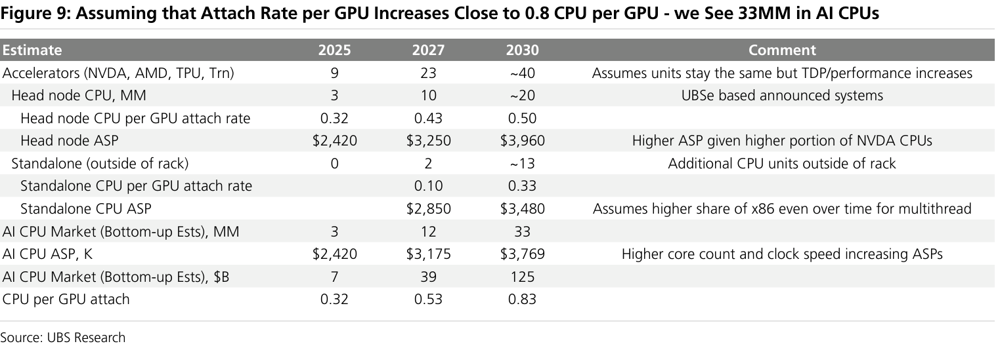

### 解讀摘要
UBS 的 bottom-up 路徑將 AI CPU 需求分為 Head Node 和 Standalone 兩類。Head Node per GPU attach 從 0.32（C2025）→ 0.50（C2030）反映 rack 架構深化；Standalone CPU（rack 外獨立伺服器）從無到有（C2027 2MM → C2030 ~13MM），是 agentic 工具呼叫卸載需求的直接體現。兩者合計 AI CPU 市場 \$7B（C2025）→ \$39B（C2027）→ \$125B（C2030），整體 attach ratio 0.32→0.83——比 Figure 17 top-down 的 1:1-2:1 scenario 保守，但兩者最終 TAM 收斂在 \$120-175B 區間。

> **原文補充**：Standalone CPU ASP（\$2,850-3,480）低於 Head Node（\$3,250-3,960），因 standalone 市場 x86 占比偏高（multithread 優勢），ARM 在 standalone 的 ASP 溢價效果弱於 head node。

### 表格

| 指標 | 2025 | 2027 | 2030 |
|---|---|---|---|
| 加速器（XPU），MM | 9 | 23 | 40 |
| Head Node CPU（MM） | 3 | 10 | 20 |
| 　per GPU attach | 0.32 | 0.43 | 0.50 |
| 　ASP | \$2,420 | \$3,250 | \$3,960 |
| Standalone CPU（MM） | 0 | 2 | 13 |
| 　per GPU attach | — | 0.10 | 0.33 |
| 　ASP | — | \$2,850 | \$3,480 |
| **AI CPU 合計（MM）** | **3** | **12** | **33** |
| **AI CPU ASP（\$K）** | \$2.42 | \$3.18 | \$3.77 |
| **AI CPU 市場（\$B）** | **7** | **39** | **125** |
| 整體 CPU/GPU attach | 0.32 | 0.53 | 0.83 |

> **洞察一**：Standalone CPU 是 C2027→C2030 增速最快的分類（2MM→13MM，+550%），且以 x86 多線程平台為主，AMD 而非 ARM 是 standalone 市場首要受益者——這為 AMD 提供了不依賴 ARM 主題的差異化論點。
>
> **值得驗證**：AI CPU ASP 上升（\$2.42K→\$3.77K，+56%）是 bottom-up TAM 的第二大驅動力（單位數量 11x，ASP 1.56x，兩者乘積 = 18x revenue）。ARM Grace CPU ASP（~\$3,000-4,000）尚無公開定價資料；若實際 ASP 偏低，\$125B bottom-up TAM 的誤差可能達 -30%+。

---

## Figures 10-16｜CPU 市場份額分析（圖片未渲染，內容來自文字層）

*圖片未能渲染；以下分析依據報告原文。*

### 解讀摘要
UBS 將整體 CPU 市場分三個細分市場估算份額：(1) Head Node CPU：ARM 75%+（NVDA Grace + GCP Axion + AWS Graviton 主導）；(2) AI Standalone CPU：~50/50 x86/ARM；(3) 傳統伺服器 CPU：x86 80-85%。加權三個細分市場得出 ARM C2030E 約 40-45% unit share、50-55% revenue share。Figure 16 呈現 NVDA 的 AI TAM \$3-4T 預估作為 top-down 基礎，確認 UBS 使用 \$3,500B 中值作為計算錨點。

### 表格（UBS 估算）

| 細分市場 | C2030E ARM Share | C2030E x86 Share |
|---|---|---|
| Head Node CPU | 75%+ | <25% |
| AI Standalone CPU | 50% | 50% |
| 傳統伺服器 CPU | 15-20% | 80-85% |
| **加權 Unit Share** | **40-45%** | **55-60%** |
| **加權 Revenue Share** | **50-55%** | **45-50%** |

C2030E Pro-Forma Revenue（Figures 22-25 資料）：

| 公司 | Revenue（\$B） | 構成 |
|---|---|---|
| AMD | 41 | CPU device（x86 AI + 傳統） |
| INTC | 39 | CPU device（x86，份額承壓） |
| ARM | 26 | \$16B device（Grace/Neoverse）+ \$10B royalty |

> **洞察一**：ARM \$26B revenue 中 \$10B（38%）為 royalty——不涉及製造成本，直接落地高毛利。即使 ARM 裝置出貨量預測出現偏差，royalty 基線提供高確定性下限，是 ARM business model 相較於 AMD/INTC 的防禦性優勢。
>
> **值得驗證**：Head Node CPU 75%+ ARM 份額依賴 NVDA Grace CPU 在 Rubin rack（C2026-2027）的高滲透率。Head Node 佔 AI CPU 市場 ~60%（20MM/33MM），若 NVDA Grace 滲透率不如預期，ARM head node 份額下滑將直接衝擊 C2030E unit share 估算，且槓桿效應顯著。

---

## Figure 17｜Top-Down XPU TAM 數學推導

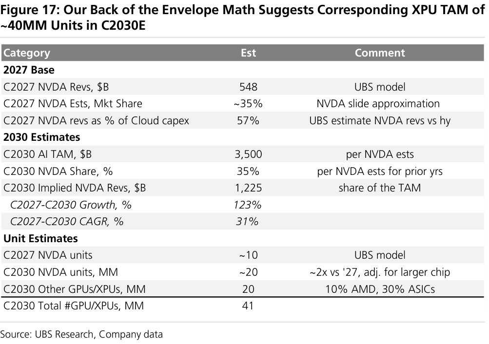

### 解讀摘要
UBS 以 NVDA 公開的 C2030 AI TAM \$3-4T 作為錨點，反推 XPU 單位需求。用 C2027 NVDA 收入（\$548B）÷ 市場份額（~35%）= 總 AI TAM，推算 C2030 NVDA 收入 \$1,225B（+123%，31% CAGR），再加上其他 GPU/XPU（AMD 10%+ASICs 30%）= 合計 ~41MM XPU units。此路徑與 bottom-up 的 ~40MM XPU 高度收斂，強化 TAM 估算的可靠性。

### 表格

| 項目 | 數值 | 說明 |
|---|---|---|
| **2027 Base** | | |
| C2027 NVDA Revenue（\$B） | 548 | UBS 模型 |
| C2027 NVDA Market Share | 35% | NVDA 官方估算 |
| C2027 NVDA Revs as % Cloud capex | 57% | UBS 估算 |
| **2030 Estimates** | | |
| C2030 AI TAM（\$B） | 3,500 | 依 NVDA \$3-4T 估算取中值 |
| C2030 NVDA Share | 35% | 維持不變假設 |
| C2030 Implied NVDA Revenue（\$B） | 1,225 | 35% × \$3,500B |
| C2027-2030 Growth | 123% | |
| C2027-2030 CAGR | 31% | |
| **Unit Estimates** | | |
| C2027 NVDA units（MM） | 10 | UBS 模型 |
| C2030 NVDA units（MM） | 20 | 2x，調整晶片性能提升 |
| C2030 Other GPUs/XPUs（MM） | 20 | AMD 10% + ASICs 30% |
| **C2030 Total XPUs（MM）** | **41** | |

> **洞察一**：UBS 假設 C2030 NVDA market share 維持 35%（不上升也不下降），這是全報告最大的單一假設之一。若 NVDA 份額提升（AMD/ASIC 競爭力不足），XPU 總量不變但 NVDA revenue 更高；若 ASIC 侵蝕 NVDA（Google/Amazon 自研加速），XPU 總量同樣不變，但 CPU 選擇可能向 ARM-based 自研更傾斜——對 CPU TAM 本身影響相對中性。

---

## Figures 18-19｜CPU TAM 敏感度矩陣

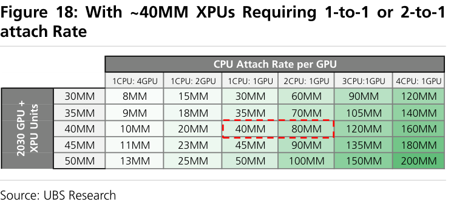
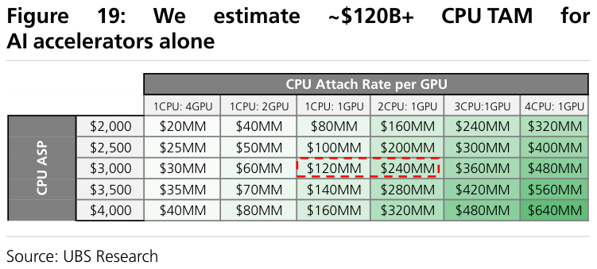

### 解讀摘要
Figure 18 為 XPU 數量（30-50MM）× CPU attach ratio（1:4 到 4:1）的矩陣，紅框高亮 UBS base case：40MM XPU × 1:1 至 2:1 attach → 40-80MM CPUs。Figure 19 將這些 CPU 單位乘以 ~\$3K ASP，得出 \$120B+ AI CPU TAM。兩圖展示 TAM 對 attach ratio 假設的高度敏感性，attach ratio 從 1:1 升至 2:1 就能讓 TAM 翻倍。

### 表格（Figure 18，CPU 需求量 MM）

| C2030 XPU（MM） | 1CPU:4GPU | 1CPU:2GPU | **1CPU:1GPU** | **2CPU:1GPU** | 3CPU:1GPU | 4CPU:1GPU |
|---|---|---|---|---|---|---|
| 30 | 8 | 15 | 30 | 60 | 90 | 120 |
| 35 | 9 | 18 | 35 | 70 | 105 | 140 |
| **40（base）** | **10** | **20** | **40** | **80** | 120 | 160 |
| 45 | 11 | 23 | 45 | 90 | 135 | 180 |
| 50 | 13 | 25 | 50 | 100 | 150 | 200 |

> **洞察一**：Expert 3 的 agentic 估算暗示最終 attach 可達 80-120 cores/GPU；以每顆 CPU ~32-64 cores 計，等效 CPU/GPU ratio 為 1.25-3.75。若實現 2-3 CPU:1 GPU，40MM XPU × 3:1 = 120MM CPUs × \$3.77K ASP = ~\$452B TAM——比 UBS base case \$173B 高 2.6x。這個上行情境是市場尚未討論的極端 bull case。

---

## Figures 20-25｜公司別市場份額與 EPS Power（圖片未渲染）

*圖片未能渲染；以下依據報告文字。*

C2025 server CPU unit share 仍由 x86 主導（INTC + AMD ~85%，ARM ~15%）。C2030E 預測：ARM 40-45% unit / 50-55% revenue；AMD 持續從 INTC 搶 x86 份額；INTC 份額下降但絕對 revenue 正成長。EPS power（若 TAM 實現）：ARM +24%（\$9.31→\$11.56）、AMD +11%（\$25.27→\$28.14）、INTC +7%（\$4.35→\$4.67）。

---

## Figures 26-32｜歷史伺服器 CPU 市場數據

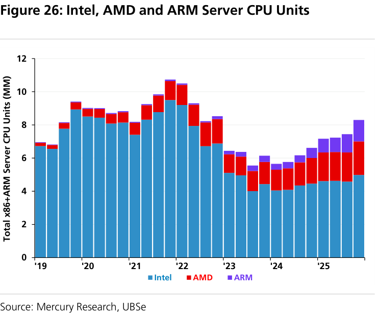
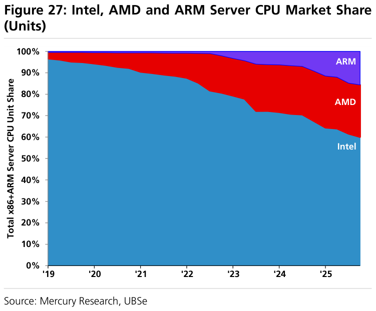
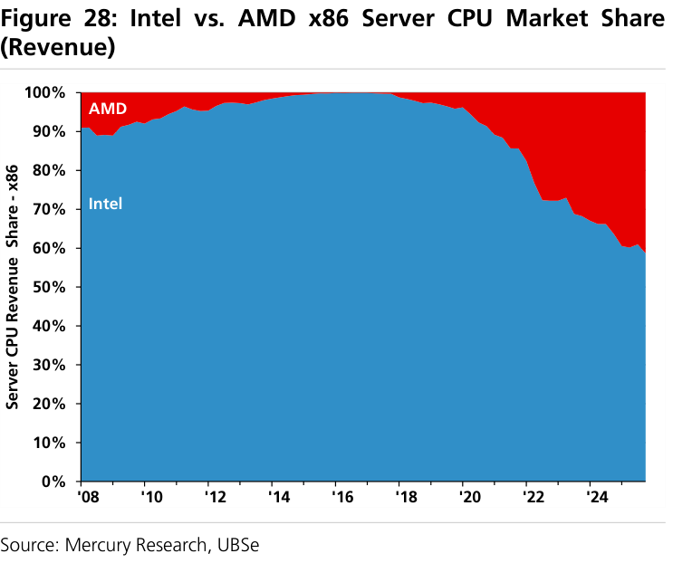
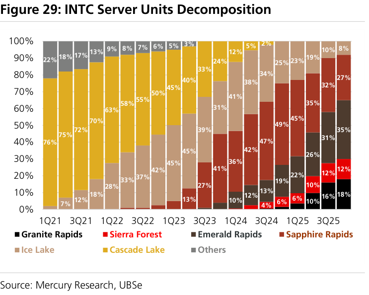
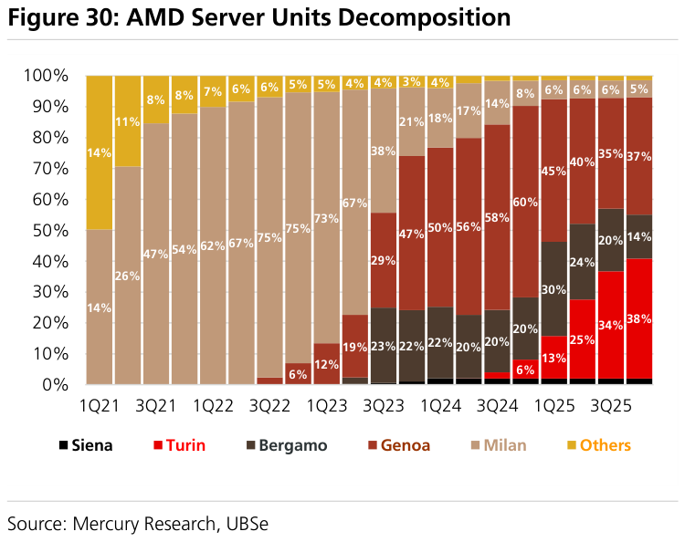
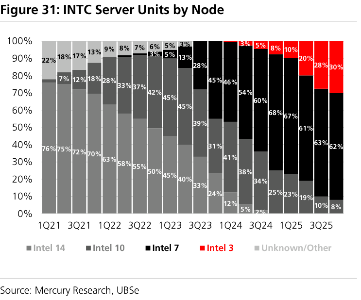
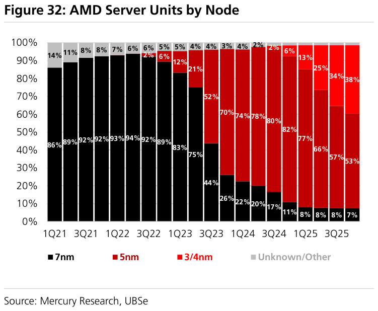

### 解讀摘要
七張圖表呈現歷史 Intel/AMD/ARM server CPU 的 unit、revenue share 及節點分解。核心訊號：AMD 持續從 INTC 搶佔 x86 server revenue share（連續多年），ARM server CPU 在 2022-2024 年進入數據但仍處早期微量規模。這組資料確立歷史基線：(1) AMD 搶份額的連續性支持其 C2030 24% revenue share 預測具可延伸性；(2) ARM 從低基數（~15% unit share, C2025）發展到 52% revenue share（C2030E）需每年 ~6ppt revenue share 跳升——歷史上沒有任何 CPU 廠商做到過。

> **洞察一（配合 Figure 3）**：ARM revenue 每年 +6ppt 跳升是本報告最激進的單一假設。NVDA Grace、GCP Axion、AWS Graviton 三條路線若都如期量產規模化，才有可能支撐此速度；任一主要 hyperscaler 轉向將直接拖累增速。

---

## Figure 33｜AMD Analyst Day 長期 Server CPU TAM 展望

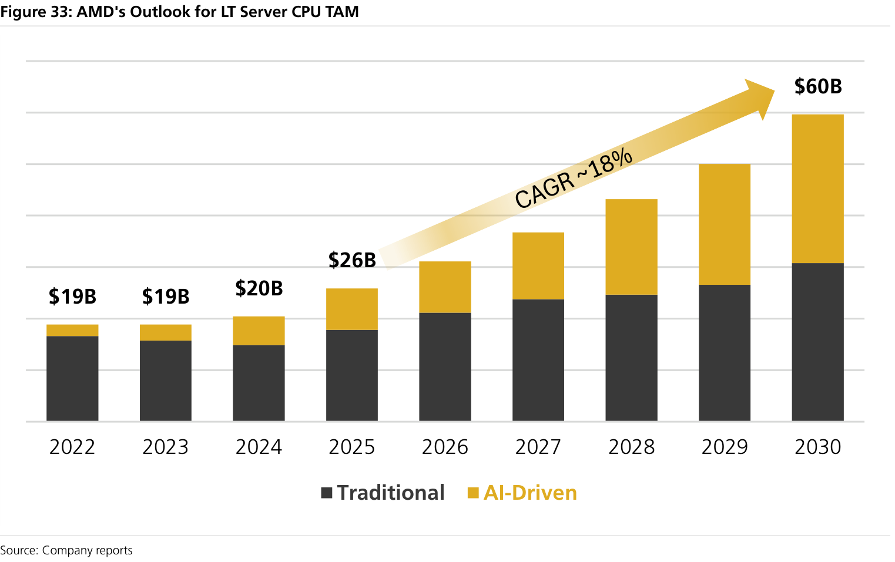

### 解讀摘要
AMD 在 2025 年 11 月 Analyst Day 預測 Server CPU TAM：\$26B（C2025）→ \$60B（C2030），18% CAGR，其中 ~50% 將由 AI-Driven CPUs 貢獻。UBS 展示此圖作為對比——AMD 預測是 UBS \$173B 估算的 35%，差距顯著。UBS 認為 AMD 的預測保守，原因包括：未充分計入 ARM head node 需求（ARM 不是 AMD，但拉高整體 TAM）；以及 standalone CPU rack 的激增效應。

### 表格（AMD Analyst Day 展望，\$B）

| 年份 | Server CPU TAM |
|---|---|
| 2022 | 19 |
| 2023 | 19 |
| 2024 | 20 |
| 2025 | 26 |
| 2030 | **60（18% CAGR）** |

> **洞察一**：AMD \$60B vs UBS \$173B 的差距並非矛盾——AMD 只在預測「自己能拿到的部分」，UBS 的 \$173B 含 ARM 的 \$90B（52% × \$173B）。AMD 若能拿到 24% = \$41B，低於其自身保守預測 \$60B × AMD share；這說明 AMD 自估 Server CPU revenue 甚至高於 UBS 給它的份額，兩者對 AMD 本身的估算其實差距不大。

---

## Figures 34-35｜ARM 財務模型與 UBS vs. Street 估算

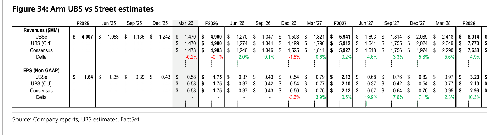
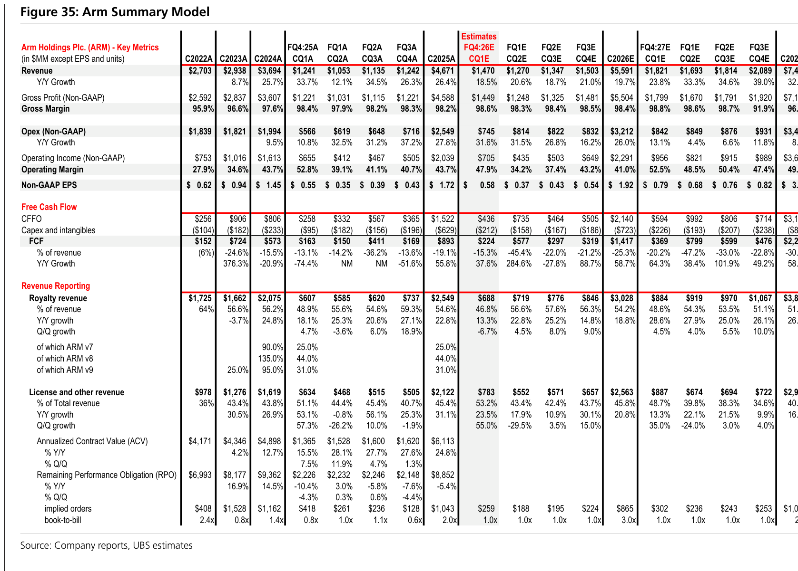

### 解讀摘要
Figure 34 呈現 UBS 相較 Street 共識的 ARM 估算差異，Figure 35 為完整 summary model（含 revenue、royalty、EPS 預測）。UBS C2027/2028 EPS 估算（\$3.04/\$4.32）已高於 Street 共識，反映 CPU TAM 主題的部分提前定價，但 pro-forma EPS（\$11.56）仍遠未反映。Figure 35 顯示 UBS 模型的 royalty revenue 隨 ARM architecture 在 hyperscaler 部署的深化而持續提升，授權收入具備高能見度。

---

## Figures 36-37｜ARM 估值框架（PEG）

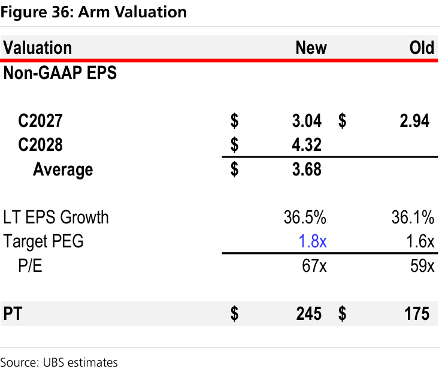
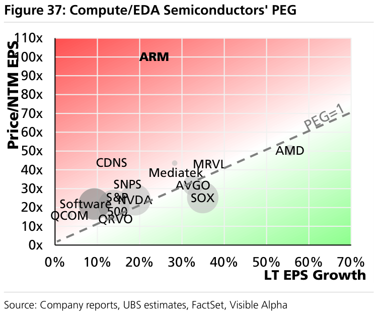

### 解讀摘要
UBS 採用 PEG 框架為 ARM 定價，核心論點是 ARM 36.5% LT EPS CAGR 使傳統 P/E 比較失真。1.8x 目標 PEG（peer 平均，up from 1.6x）× 36.5% = 67x P/E，applied to 2027/28E avg EPS \$3.68 → PT \$245。Figure 37 展示計算/EDA 半導體板塊 PEG 分佈確認 1.8x 的 peer 合理性。Upside case（\$325）使用 2.1x PEG × 43% CAGR = 79x P/E × avg EPS \$3.31；Downside（\$130）使用 1.6x PEG × 30% CAGR = 40x P/E × avg EPS \$2.80。

### 表格（Figure 36，ARM Valuation）

| 項目 | 新（本報告） | 舊 |
|---|---|---|
| C2027 Non-GAAP EPS | \$3.04 | \$2.94 |
| C2028 Non-GAAP EPS | \$4.32 | — |
| 2027/28 平均 EPS | **\$3.68** | \$2.94 |
| LT EPS CAGR | 36.5% | 36.1% |
| Target PEG | **1.8x** | 1.6x |
| P/E | **67x** | 59x |
| **Price Target** | **\$245** | \$175 |

**情境分析：**

| 情境 | C26/C27 Rev Growth | C26/C27 OM | C26/C27 EPS | PEG | P/E | PT |
|---|---|---|---|---|---|---|
| Upside | 23% / 37% | 42% / 51% | \$2.01 / \$3.31 | 2.1x | 79x | \$325 |
| Base | 20% / 33% | 41% / 50% | \$1.92 / \$3.04 | 1.8x | 67x | \$245 |
| Downside | 17% / 30% | 40% / 48% | \$1.83 / \$2.80 | 1.6x | 40x | \$130 |

> **洞察一**：Upside \$325（+60%）vs Downside \$130（-36%）對當前股價（\$203.26）是不對稱的，且 bull case 尚未納入 CPU TAM pro-forma EPS（\$11.56）。若 agentic CPU 主題在 C2027-2028 開始顯現於 ARM 財報，EPS 升至 \$7-11 區間，67x P/E 對應隱含 PT \$469-737——這才是本報告真正的 call。
>
> **值得驗證**：67x P/E 建立在 ARM 能維持 36.5% LT EPS CAGR 的假設上。若 ARM 授權收費（per chip royalty rate）受到 hyperscaler 客製晶片的壓力（AWS 自設 ISA、RISC-V 威脅），CAGR 可能降至 25-30%，對應 PEG = 1.8x → P/E = 45-54x，PT 回落至 \$165-199 range。

---

## 跨 Figure 彙整表

### 彙整 1｜Bottom-up vs Top-down TAM 收斂（Figures 9 & 17-19）

| 方法 | C2025 CPU TAM | C2027 CPU TAM | C2030 AI CPU TAM | 總 CPU TAM C2030 |
|---|---|---|---|---|
| Bottom-up（Figure 9） | \$7B | \$39B | \$125B | \$173B（含傳統） |
| Top-down（Figures 17-19） | — | — | \$120-200B | — |

> 兩方法均收斂在 \$120-200B AI CPU TAM 區間，上下誤差約 ±25%。核心共識：C2030 ~40MM XPU × 0.8-2.0 CPU/GPU attach × \$3,000-3,800 ASP = \$96-304B range，中值 ~\$150-170B。

### 彙整 2｜Head Node CPU 快速增長（Figures 8 & 9）

| 年份 | XPU（MM） | Head Node CPU（MM） | CPU/GPU Ratio | Head Node ASP |
|---|---|---|---|---|
| C2024 | 7.3 | 1.6 | 22% | — |
| C2025 | 8.6 | 2.7 | 32% | \$2,420 |
| C2026 | 16.1 | 6.2 | 38% | — |
| C2027 | 23.3 | 10.1 | 43% | \$3,250 |
| C2030E | 40 | 20 | 50% | \$3,960 |

> C2024→C2030 Head Node CPU 以 16% CAGR 計（1.6MM→20MM），而同期 XPU 僅 ~28% CAGR（考慮每代性能提升抵消部分 unit 成長需求）。Head Node CPU 的 revenue CAGR（含 ASP 提升）約 30-35%，顯著高於傳統市場的 13%。

---

## 相關個股清單

| 類別 | 公司 | Ticker | 評等 | 目標價 | 備註 |
|---|---|---|---|---|---|
| CPU Architecture IP | ARM Holdings | ARM.O | Buy ↑ | \$245 | PT +40%；agentic head node 最大受益者 |
| CPU（x86） | Advanced Micro Devices | AMD.O | Buy | \$341.54 | 高 core count 優勢；standalone CPU 主要受益 |
| CPU（x86） | Intel | INTC.O | Neutral | \$95.78 | 份額承壓；PC 升級週期短期受惠 |
