# GFHK｜貿聯-KY (Bizlink) Initiation — HVDC Upside & CPO Onboarding Define Bull Case

**券商**：GF Securities (Hong Kong) Brokerage  
**分析師**：Jeff Pu, CFA  
**日期**：2026-05-11  
**主題**：貿聯-KY (Bizlink, 3665 TT) 啟動覆蓋 — HVDC 電力升級 + CPO Shuffle Box 卡位，AEC 業務面臨長期估值天花板  
**評級**：Buy（啟動）｜TP NT\$3,400（28x 2027E EPS）  
<a href="https://layx.uk/dl?g=產業&b=GFHK&d=20260511&h=Bizlink-Initiation">📎 下載 PDF</a>

---

## 報告總結

GFHK 首次覆蓋貿聯-KY (3665 TT)，Buy／TP NT\$3,400（28x 2027E EPS）。核心論點是三條收入曲線疊加：Nvidia GPU/rack 功耗持續倍增迫使資料中心轉向 800VDC，帶動 power whip/busbar 單櫃含量躍升（+71%/+19%）；AEC 業務靠 Credo 獨家供應維持成長，但 3.2T 世代後傳輸距離受限、估值承壓；併購新復盛切入 Corning 供應鏈，卡位 CPO Shuffle Box（拿下 40% 配額）。報告時機緊扣 GTC 2026 CPO switch 發布與台南新廠 2H26 投產。

GFHK 預估 2026-28E EPS CAGR 約 54%、ROE 攀升至 ~30%。主要風險為 AI 需求、技術轉換節奏、光學業務延遲，以及 Credo 在 AWS Ethernet AEC 遭 ALAB 侵蝕份額的競爭格局變化。

---

## GFHK 完整投資邏輯鏈

| 論點層次 | Exhibit | 內容 |
|---|---|---|
| 產業結構轉變確認 | Fig.1/2/3 | GPU/rack TDP 倍增迫使資料中心轉向 800VDC |
| Power 含量價值躍升 | Fig.4/6/7 | Power whip/busbar 單機櫃 content 大增 |
| AEC 地位穩固但估值承壓 | Fig.8/9/10/11 | Credo 獨家供應驅動現有成長，3.2T 後距離受限 |
| CPO 新曲線確立 | Fig.13/14/15/19/20 | 併購新復盛切入 Corning 供應鏈，拿下 40% 配額 |
| 財務兌現路徑 | 封面/財測 | EPS CAGR ~54%（2026-28E），ROE →~30% |
| 估值有支撐 | Fig.30/31（原文） | 28x 2027E P/E，僅較 26x AI 題材均值高 8% |
| **結論** | 報告封面 | **Buy TP NT\$3,400；Power+AEC+CPO 三線疊加驅動 EPS 爆發** |

> **報告最大邏輯缺口**：CPO 營收 build 建立在「Corning 拿下 Nvidia CPO 供應鏈 40-45% 份額」×「貿聯拿下 Corning 供應鏈 40% 份額」的雙重乘數假設上，任一環節份額不如預期都會直接稀釋 2027/2028E CPO 營收；同時 Fig.18 顯示 Feynman 世代 within-rack scale-up 是否採用 CPO 業界仍無定論，但 Fig.20 已預設 NVL144 在 2028 年 CPO 滲透率達 50%，存在假設超前於產業共識的風險。

---

## 報告核心觀點

| 主題 | GFHK 觀點 | 市場共識 | 是否 Contra-Consensus |
|---|---|---|---|
| AEC 永續性 | 2026/2027 仍具韌性，但 3.2T 世代後受限於傳輸距離、估值應下修 | 市場擔憂 AEC 很快被 CPO/光學取代 | 部分是（時程判斷更具體） |
| HVDC 滲透節奏 | VR200 為起點，2H26 加速 | 市場預期普遍更保守 | 是 |
| CPO Shuffle Box 份額 | 新復盛併購使貿聯拿下 Corning 供應鏈 40% 配額 | 市場尚未充分定價此併購故事 | 是 |
| 估值方法 | 28x 2027E P/E，僅較 AI 題材期均值（26x）高 8% | — | 否（相對保守） |

**偏好排序**：Power whip/busbar（HVDC）> CPO Shuffle Box > AEC（估值承壓風險）
**個股/零件偏好**：貿聯-KY (3665, Buy) 為核心受益標的；生態系關注 Credo（AEC 夥伴，惟 AWS 份額面臨 ALAB 侵蝕）與 Corning（CPO Shuffle Box 主要供應商）

---

## Fig. 1｜Nvidia's GPU TDP (W)

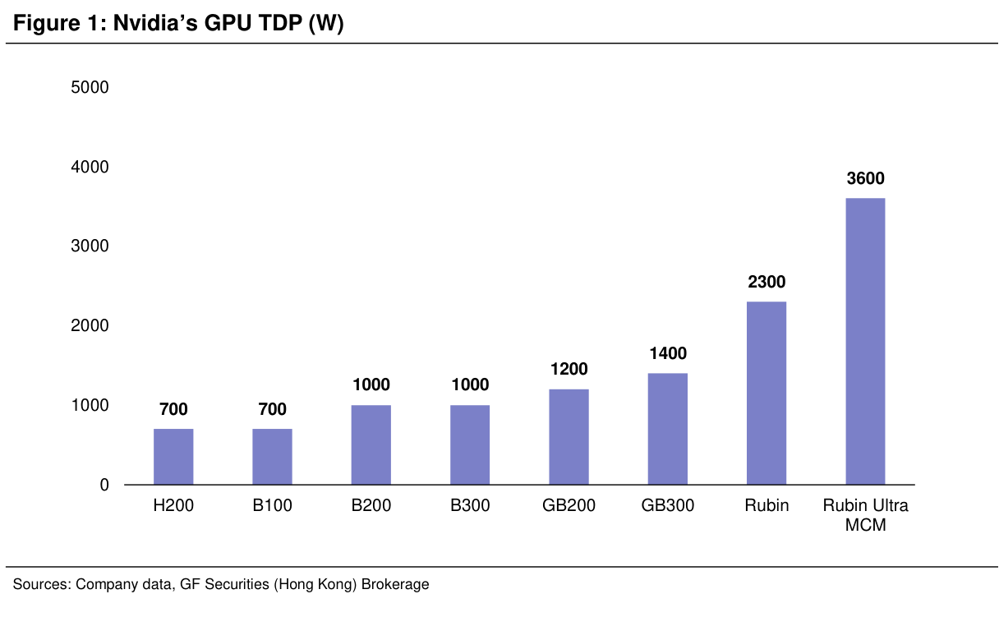

### 解讀摘要
H200 到 Rubin Ultra MCM，GPU TDP 從 700W 升至 3600W，五年間成長 5.1 倍。H200→GB200（1200W）已是首個明顯跳升（+71%），但真正加速在 Rubin（2300W，+64%）與 Rubin Ultra MCM（3600W，+57%）。GPU TDP 不是均勻爬升，而是離散跳躍，每次世代切換都對供電鏈提出重新設計要求——這正是 HVDC 轉換的根本驅動力。

### 表格
| GPU | TDP (W) |
|---|---|
| H200 | 700 |
| B100 | 700 |
| B200 | 1000 |
| B300 | 1000 |
| GB200 | 1200 |
| GB300 | 1400 |
| Rubin | 2300 |
| Rubin Ultra MCM | 3600 |

> **洞察一**：從 H200 到 Rubin Ultra MCM，TDP 五年內成長 5.1 倍（700→3600W），年化增速約 38%。貿聯的 power 相關 content 若與 TDP 同步擴張，其 HVDC 營收成長曲線理論上應與此曲線同向加速。

---

## Fig. 2｜Nvidia's rack platform's TDP (kW)

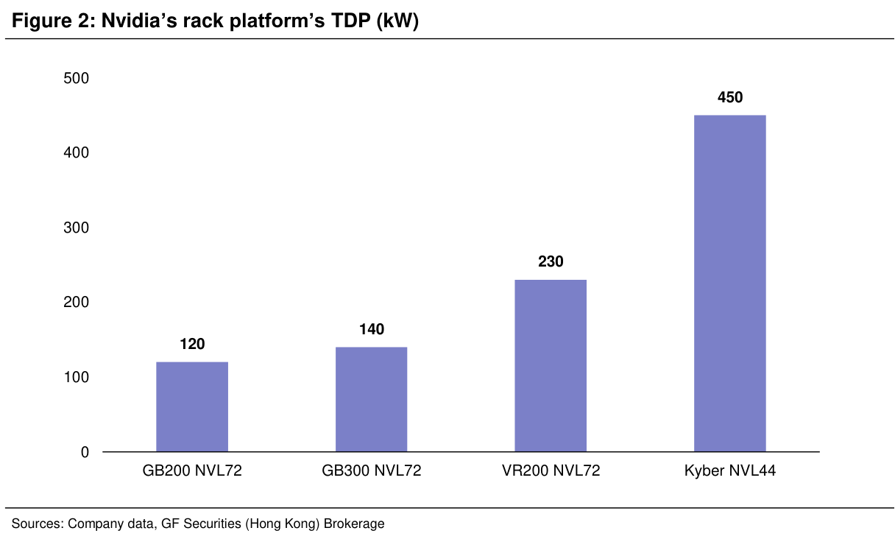

### 解讀摘要
Rack 層級 TDP 從 GB200 NVL72 的 120kW 到 Kyber NVL44 的 450kW，成長 3.75 倍，快於單顆 GPU 的成長速度（因機櫃內組件密度同步上升）。VR200 NVL72（230kW）較 GB200 NVL72（120kW）近乎倍增（+92%），這正是 Fig.4/Fig.7 power whip 與 busbar content 跳升（+71%/+19%）背後的物理成因。

### 表格
| Rack Platform | TDP (kW) |
|---|---|
| GB200 NVL72 | 120 |
| GB300 NVL72 | 140 |
| VR200 NVL72 | 230 |
| Kyber NVL44 | 450 |

> **洞察二（配合 Fig.1）**：rack TDP 成長（3.75x）與單 GPU TDP 成長並非簡單線性對應，顯示除了單顆 GPU 功耗上升外，機櫃內 GPU/組件密度同步提高才是 rack 總功耗跳升的複合驅動力，對電力傳輸元件（busbar/whip）的規格升級要求是「電流＋密度」雙重疊加。

---

## Fig. 3｜800 VDC power distribution

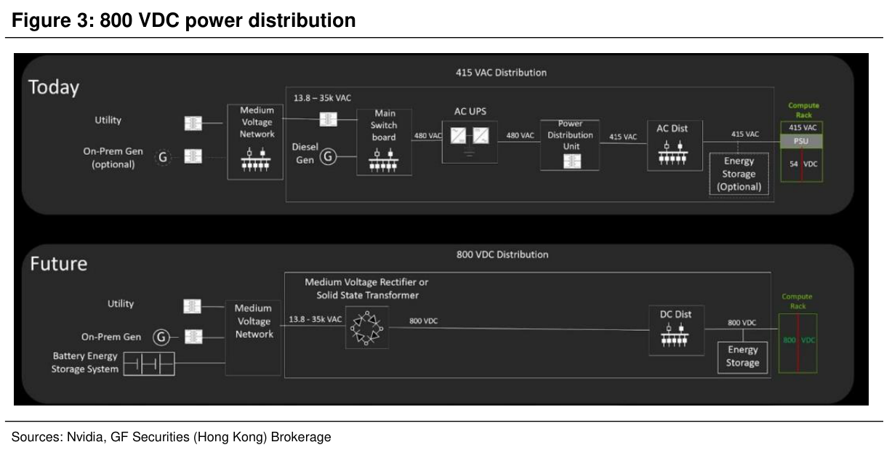

### 解讀摘要
圖示今日架構（415VAC 多階轉換：Utility→MV Network→Switchboard→AC UPS→PDU→AC Dist→415VAC PSU）vs. 未來架構（800VDC：Utility→MV Rectifier/Solid State Transformer→800VDC→DC Dist→800VDC 直達機櫃）。核心變化是消除多級 AC-DC 轉換（AC UPS/PDU 兩層被單一 MV Rectifier 取代），這正是原文「~45% 銅用量下降、~5% 能效提升」的物理來源——轉換級數減少直接降低銅導體用量與轉換損耗。

> **原文補充**：報告提到 Nvidia 在 4/22 與韓國電力供應商的合作新聞進一步驗證此趨勢，顯示 hyperscaler 供應鏈已在為 800VDC turnkey 整合方案佈局。

---

## Fig. 4｜Bizlink's power whip content forecast

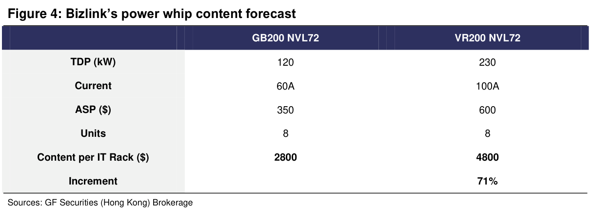

### 解讀摘要
GB200 NVL72 用 60A whip（ASP \$350×8 units=\$2,800/rack），升級至 VR200 NVL72 的 100A whip（ASP \$600×8 units=\$4,800/rack），content 增 71%。關鍵驅動是單價從 \$350→\$600（+71%）而非數量變化（維持 8 units）——即這是規格升級（ASP）驅動而非用量驅動的成長，代表含量成長的可預測性較高（規格由 Nvidia 平台定義，非市場競爭決定）。

### 表格
| | GB200 NVL72 | VR200 NVL72 |
|---|---|---|
| TDP (kW) | 120 | 230 |
| Current | 60A | 100A |
| ASP (\$) | 350 | 600 |
| Units | 8 | 8 |
| Content per IT Rack (\$) | 2,800 | 4,800 |
| Increment | — | 71% |

### 增量貢獻拆解
| 成長來源 | 貢獻金額 | 佔總增量 |
|---|---|---|
| ASP 由 \$350→\$600（規格升級 60A→100A） | +\$2,000 | 100% |
| 數量變化（維持 8 units） | \$0 | 0% |
| **淨增量** | **+\$2,000** | **100%** |

> **洞察一**：content 增量 100% 來自 ASP，代表貿聯不需靠機櫃架構改變（如插槽數增加）就能提高單機櫃營收，只要 Nvidia 持續往更高電流規格演進即可。

---

## Fig. 5｜HVDC power rack to start with VR200

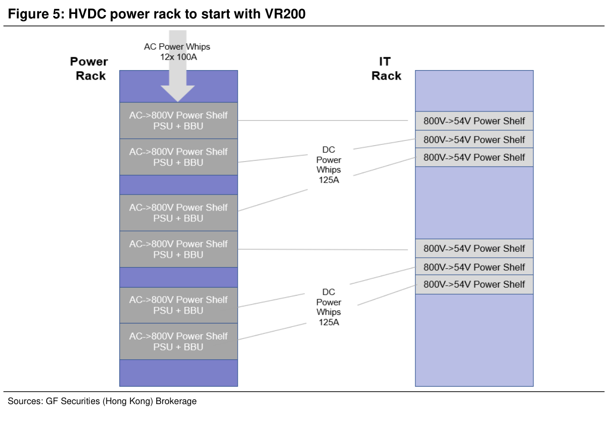

### 解讀摘要
圖示 1 個 Power Rack（6 組「AC→800V Power Shelf PSU+BBU」）透過 12x100A AC whip 接入電力，再以 125A DC whip 分兩組（各 3 條）輸出到 IT Rack 的 6 個「800V→54V Power Shelf」。這確認了 Fig.6 表格中「12 units 100A AC whip + 6x2 125A DC cross whip」的實體佈局來源，也顯示 HVDC 架構下每個 Power Rack 可同時服務多個 IT Rack 的 1 對多拓撲。

> **原文補充**：報告假設一個 Power Rack 支援 1 至 2 個 IT Rack，若為 1:2 比例則需 12 條 cross whip（而非 6 條）。

---

## Fig. 6｜Power whip content forecast between VR200 NVL72 and VR HVDC

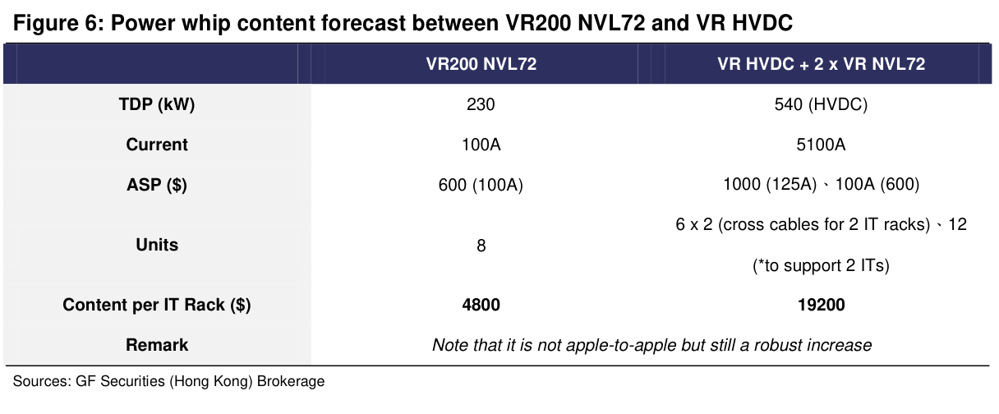

### 解讀摘要
從 VR200 NVL72（單一機櫃內建 100A whip，\$4,800/rack）演進到 VR HVDC + 2xVR NVL72（集中式 540kW HVDC power rack 服務兩個 IT rack），power whip content 躍升至 \$19,200（每對機組），是 VR200 NVL72 的 4 倍。但報告明確註記「not apple-to-apple」——\$19,200 是服務 2 個 IT rack 的 power rack 總 content，需除以 2 才可比，即每 IT rack 約 \$9,600，實際可比增量是 2 倍而非 4 倍。

### 表格
| | VR200 NVL72 | VR HVDC + 2 x VR NVL72 |
|---|---|---|
| TDP (kW) | 230 | 540 (HVDC) |
| Current | 100A | 5100A |
| ASP (\$) | 600 (100A) | 1000 (125A)、100A (600) |
| Units | 8 | 6x2（cross cables for 2 IT racks）、12 |
| Content per IT Rack (\$) | 4,800 | 19,200 |

### 增量貢獻拆解
> 計算過程：\$19,200 ÷ 2 IT racks = \$9,600/rack（可比基礎）；相較 VR200 NVL72 單機 \$4,800，增量 = \$9,600 - \$4,800 = \$4,800，增幅 100%。

> **值得驗證**：\$19,200 若不除以 2 直接與 VR200 NVL72 比較會得出 +300% 的錯誤增量印象；真實可比增量為 100%（\$4,800→\$9,600/rack）。這是報告本身刻意提示的常見誤讀陷阱，分析時需留意 HVDC content 數字「每機櫃」vs.「每對機櫃」的單位差異。

---

## Fig. 7｜Bizlink's busbar content forecast

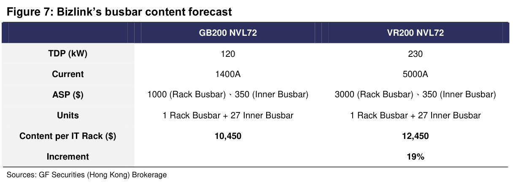

### 解讀摘要
Busbar content 從 GB200 NVL72 的 \$10,450（1 rack busbar \$1,000 + 27 inner busbar×\$350）增至 VR200 NVL72 的 \$12,450（rack busbar ASP 由 \$1,000→\$3,000，inner busbar 維持 \$350），增幅 19%。與 Fig.4 的 power whip 不同，busbar 的規格升級主要反映在 rack busbar 電流從 1,400A→5,000A（3.6 倍），但 ASP 僅增 3 倍，增量集中在單一 rack busbar 部件；inner busbar（占 27 個單位、貢獻 \$9,450，即 76% 的總 content）反而沒有漲價。

### 表格
| | GB200 NVL72 | VR200 NVL72 |
|---|---|---|
| TDP (kW) | 120 | 230 |
| Current | 1400A | 5000A |
| ASP (\$) | 1000（Rack Busbar）、350（Inner Busbar） | 3000（Rack Busbar）、350（Inner Busbar） |
| Units | 1 Rack Busbar + 27 Inner Busbar | 1 Rack Busbar + 27 Inner Busbar |
| Content per IT Rack (\$) | 10,450 | 12,450 |
| Increment | — | 19% |

> **洞察二**：inner busbar 佔總 busbar content 的 76%（\$9,450/\$12,450）卻價格沒有變化，代表這條產品線的成長曲線目前主要靠 rack busbar 的單一規格升級。若未來世代 inner busbar 也開始漲價，busbar content 的成長空間將遠大於目前預測。

---

## Fig. 8｜Performance Metrics of DAC / AEC / AOC

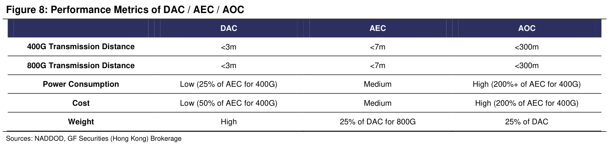

### 解讀摘要
DAC/AEC/AOC 三者在 400G 與 800G 世代的傳輸距離完全相同（DAC<3m、AEC<7m、AOC<300m）——顯示規格瓶頸不隨速度世代改變，是物理層（電訊號 vs. 光訊號）的根本差異，不是製程或世代問題。AEC 在功耗（Medium，為 AOC 的一半）與成本（Medium，為 AOC 的一半）上取得 DAC 與 AOC 之間的平衡點，量化佐證了原文「AEC 提供 DAC 與 AOC 之間最具吸引力的功耗/成本 profile」。

### 表格
| | DAC | AEC | AOC |
|---|---|---|---|
| 400G Transmission Distance | <3m | <7m | <300m |
| 800G Transmission Distance | <3m | <7m | <300m |
| Power Consumption | Low（25% of AEC for 400G） | Medium | High（200%+ of AEC for 400G） |
| Cost | Low（50% of AEC for 400G） | Medium | High（200% of AEC for 400G） |
| Weight | High | 25% of DAC for 800G | 25% of DAC |

> **洞察一**：AEC 的 7m 距離覆蓋了機櫃內（intra-rack）與部分機櫃間（inter-rack）連接需求，而 DAC 受限於 3m 只能做極短距離連接——這解釋了原文「AEC 取代部分 DAC 市場」的機制：AEC 用更高成本/功耗換取 2.3 倍距離覆蓋，在系統層面反而透過減少所需連接器數量節省整體成本。

---

## Fig. 9｜TAM of DAC / AEC / AOC (USD bn)

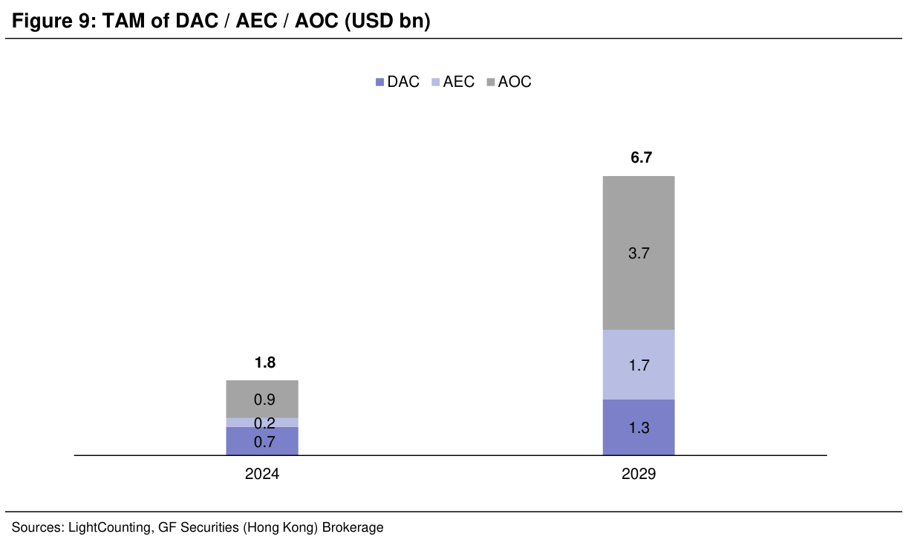

### 解讀摘要
總 TAM 從 2024 年 \$1.8bn 成長至 2029 年 \$6.7bn（3.7 倍，對應 43% CAGR），其中 AEC 從 \$0.2bn→\$1.7bn（8.5 倍）是三者中相對成長倍數最快的品類。但從絕對增量看，AOC 貢獻最大（\$2.8bn，佔總增量 57%），AEC 僅佔 31%。

### 表格
| | 2024 | 2029 |
|---|---|---|
| DAC | 0.7 | 1.3 |
| AEC | 0.2 | 1.7 |
| AOC | 0.9 | 3.7 |
| **總計** | **1.8** | **6.7** |

### 增量貢獻拆解
| 成長來源 | 貢獻金額 | 佔總增量 |
|---|---|---|
| AOC（\$0.9bn→\$3.7bn） | +\$2.8bn | 57% |
| AEC（\$0.2bn→\$1.7bn） | +\$1.5bn | 31% |
| DAC（\$0.7bn→\$1.3bn） | +\$0.6bn | 12% |
| **總計** | **+\$4.9bn** | **100%** |

> **值得驗證**：報告文字強調「AEC is expected to deliver the fastest growth among key categories at 43% CAGR」，但從絕對 TAM 增量看，AOC 才是貢獻最大的品類（57%）。報告全篇未提及貿聯在 AOC 的佈局，這是文字敘事與圖表數據之間的一個落差，也是潛在的敘事缺口。

---

## Fig. 10｜Credo's AEC revenue and contribution to total revenue forecast

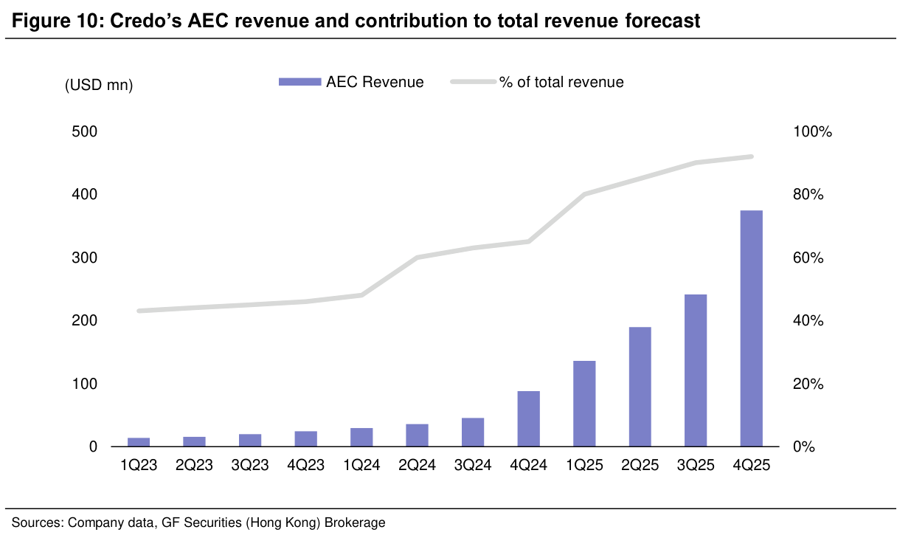

### 解讀摘要
Credo AEC 營收從 1Q23 的約 \$15mn 成長至 4Q25E 的約 \$375mn（约 25 倍），佔 Credo 總營收比重同步從約 45% 攀升至約 90%，顯示 Credo 已從多元化業務公司轉型為近乎純 AEC 標的。這對貿聯是雙面訊號：一方面驗證 AEC 下游需求持續強勁（貿聯是 Credo 唯一 AEC 供應商），另一方面意味著貿聯的 AEC 業務命運與 Credo 單一客戶的集中度風險高度綁定。

> **值得驗證**：Credo AEC 營收占比已升至約 90%，代表 Credo 自身業務集中度風險已經很高；若 ALAB 持續在 AWS Ethernet AEC 搶份額（見 Fig.10 後原文），Credo 這條近乎單一業務線的營收曲線一旦轉弱，會直接傳導至貿聯的 AEC 訂單，這是報告「AEC business could carry lower valuation」論點的具體風險傳導路徑。

---

## Fig. 11｜Current AEC transmission distance (meters)

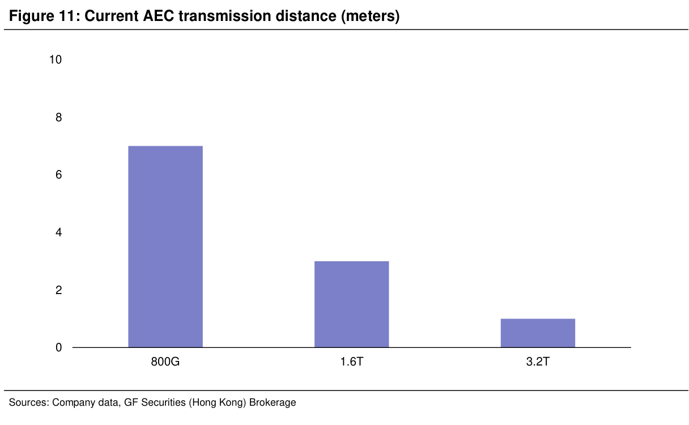

### 解讀摘要
AEC 可達距離隨速度世代呈近乎減半的規律：800G 約 7m、1.6T 約 3m、3.2T 約 1m，與原文「electrical reach roughly halves as lane speed doubles」相符（理論上 7→3.5→1.75m，實際 7→3→1m 略陡於理論值，反映 retimer 改善效果有限）。這條物理曲線就是報告「AEC likely to be capped into 3.2T era」論點的直接量化證據。

### 表格
| 世代 | 距離 (m，視覺估算) |
|---|---|
| 800G | ~7 |
| 1.6T | ~3 |
| 3.2T | ~1 |

*視覺估算，與原文「up to 7 meters on 800G」、「sub-3-meter reach」於 1.6T 交叉驗證通過

> **洞察一**：3.2T 世代 AEC 距離壓縮至約 1m，已低於多數 switch-to-switch 應用所需距離，意味著 AEC 在 3.2T 世代可能被迫退回僅支援機櫃內極短連接，把 switch-to-switch 與更長距離需求讓給 ALC 或光學方案——這正是報告後文提出 ALC（Active LED Cable）作為 Credo/貿聯下一階段成長曲線的邏輯起點。

---

## Fig. 12｜Credo's share price, vs. Bizlink

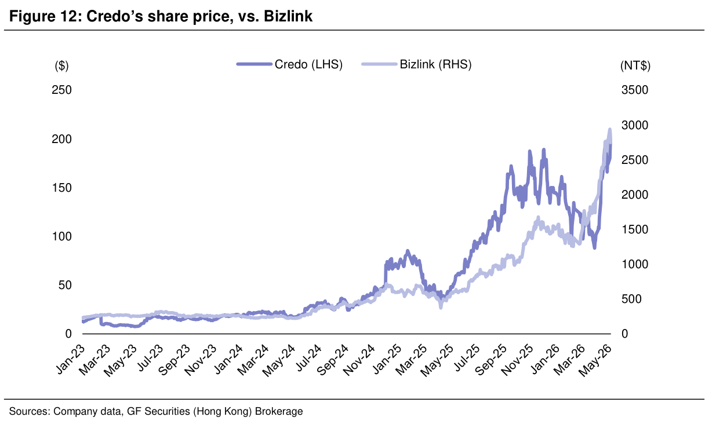

### 解讀摘要
Credo 與貿聯股價自 2023 年初起高度同步上漲（Credo 從約 \$15 漲到約 \$190，貿聯從約 NT\$300 漲到約 NT\$2,900），但自 2026 年 4 月中旬起出現脫鉤——貿聯持續創新高，Credo 則相對走弱。報告將此解讀為貿聯開始擺脫對 Credo/AEC 單一敘事的依賴，反映 power whip 與 optical shuffle box 兩條新成長曲線開始被市場定價。

> **洞察一**：兩檔股票自 2023 年初至 2026 年 4 月中相關性極高，市場長期把貿聯當作「Credo 的台灣代理標的」交易；一旦脫鉤趨勢延續，代表貿聯的估值敘事正從「AEC 供應商」轉向「AI 電力+光通訊多元供應商」，這為報告 28x P/E（高於過去 21x 歷史均值）的估值假設提供敘事支撐。

---

## Fig. 13｜Shuffle Box operating mechanism

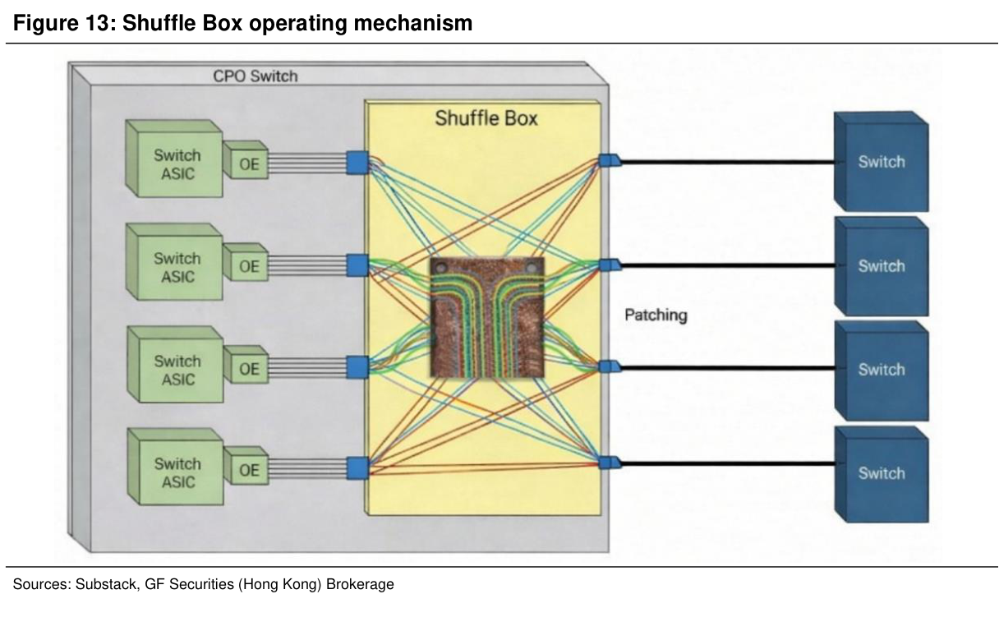

### 解讀摘要
圖示 4 組 Switch ASIC 各自透過 OE（光電轉換）連接進入 Shuffle Box，在 Shuffle Box 內部以交叉光纖重新排列連接順序，再依序連至 4 組外部 Switch（透過 Patching）。這視覺化了原文所述「shuffle」程序——解決 MPO 端口到各 OE 之間物理距離不一致、光纖長度不統一的問題，是 CPO 架構下光纖管理的核心元件。

> **原文補充**：報告說明 CPO 架構下 O/E 與 ASIC 的間距大幅縮小，傳統 connector 難以支撐密集互連需求，這是 Shuffle Box 需求產生的根本原因（而非單純的線材整理需求）。

---

## Fig. 14｜Nvidia's CPO switches

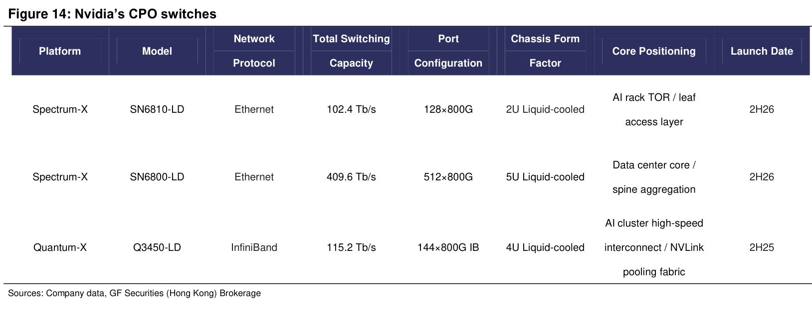

### 解讀摘要
Nvidia CPO switch 分三款：Spectrum-X SN6810-LD（2U，128×800G，AI rack TOR/leaf 層，102.4Tb/s）、SN6800-LD（5U，512×800G，資料中心核心/spine 層，409.6Tb/s，為 SN6810-LD 的 4 倍容量）、Quantum-X Q3450-LD（InfiniBand，4U，144×800G IB，115.2Tb/s，2H25 即已 launch，早於 Spectrum-X 系列的 2H26）。IB 版本（Quantum-X）提前一年上市，顯示 Nvidia 優先在高效能運算叢集（NVLink pooling）導入 CPO，再逐步擴展到乙太網路資料中心骨幹。

### 表格
| Platform | Model | Network Protocol | Total Switching Capacity | Port Configuration | Chassis Form Factor | Core Positioning | Launch Date |
|---|---|---|---|---|---|---|---|
| Spectrum-X | SN6810-LD | Ethernet | 102.4 Tb/s | 128×800G | 2U Liquid-cooled | AI rack TOR / leaf access layer | 2H26 |
| Spectrum-X | SN6800-LD | Ethernet | 409.6 Tb/s | 512×800G | 5U Liquid-cooled | Data center core / spine aggregation | 2H26 |
| Quantum-X | Q3450-LD | InfiniBand | 115.2 Tb/s | 144×800G IB | 4U Liquid-cooled | AI cluster high-speed interconnect / NVLink pooling fabric | 2H25 |

> **洞察一（配合 Fig.20）**：Quantum-X（IB）於 2H25 即上市，比 Spectrum-X（Ethernet）早一年（2H26），與 Fig.20 彙整表中「IB 在 2026 年占 CPO switch 市場 50% 份額、隨後逐年降至 40%（被 Spectrum 反超）」的假設互相印證——IB 是 CPO 的先行者，但長期 Ethernet（Spectrum）因資料中心規模更大而後來居上。

---

## Fig. 15｜Nvidia's Scale Out CPO Switch shipment forecast (k units)

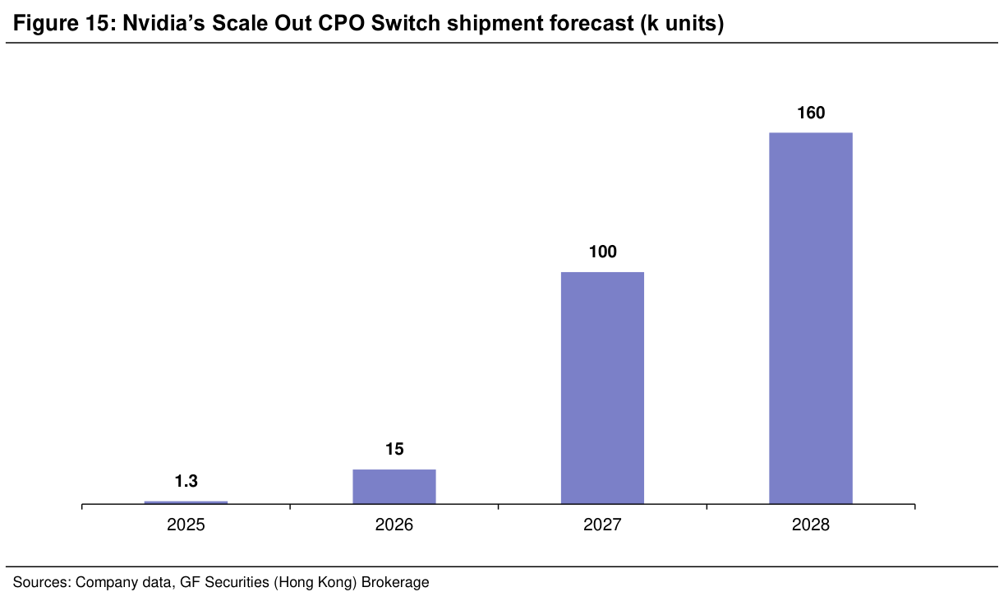

### 解讀摘要
CPO switch 出貨量從 2025 年 1.3k units 起步，2026 年跳增至 15k（11.5 倍），2027 年達 100k（6.7 倍），2028 年 160k（1.6 倍）。成長曲線呈典型技術導入 S 曲線的早期陡峭爬升特徵，2026-2027 兩年年均複合成長率高達約 158%，隨後 2028 年成長明顯放緩至 60%，暗示滲透率在 2028 年開始接近某個階段性天花板。

### 表格
| 年度 | 出貨量（k units） |
|---|---|
| 2025 | 1.3 |
| 2026 | 15 |
| 2027 | 100 |
| 2028 | 160 |

> **值得驗證**：2026 年僅 15k units 出貨（相對 Nvidia 總體 switch 出貨量仍是極小基數），Fig.20 彙整表中「貿聯 2026 年 CPO 營收僅 \$14mn」的極低基期正是此出貨預測的直接結果。若 2026 年 CPO switch 出貨不及 15k（例如受限於供應鏈或製程良率），2027/2028E 的高速成長預測則完全建立在出貨量如期於 2027 年跳增至 100k 的假設上。

---

## Fig. 16｜Nvidia's Scale Out and Scale Up chip to rack roadmap

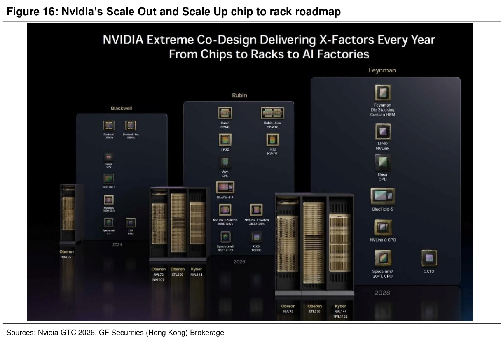

### 解讀摘要
Nvidia 官方 roadmap 圖顯示三個世代演進：Blackwell（2024，Oberon NVL72 單機櫃）→Rubin（2026，含 Oberon NVL72/ETL256/Kyber NVL144 三種機櫃形態並存）→Feynman（2028，新增 Kyber NVL144 組成的 NVL1152 超級機櫃，8 機櫃互聯）。各世代均標注對應 NVLink/Spectrum/CX 世代編號（NVLink6/7→NVLink8 CPO，Spectrum6→Spectrum7 204T CPO），顯示 CPO 明確從 Feynman 世代（2028）才開始成為標準配置的一部分。

> **原文補充**：圖片來自 Nvidia GTC 2026 官方發布資料（「NVIDIA Extreme Co-Design Delivering X-Factors Every Year」），為一手技術路線圖而非 GFHK 自行推算，可信度較高。

---

## Fig. 17｜Cross-rack scale up for NVL576

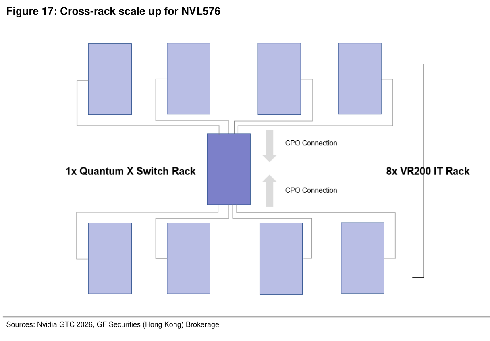

### 解讀摘要
圖示 NVL576 架構由 1 台 Quantum X Switch Rack 透過 CPO Connection（上下各一組）連接 8 台 VR200 IT Rack，形成「1 對 8」的跨機櫃 scale-up 拓撲。這是 CPO 首次應用於 scale-up（機櫃間互連）而非僅止於 scale-out（switch 間互連）的具體實現，呼應原文所述「NVL576 is Copper plus CPO」的混合架構。

> **洞察一（配合 Fig.14）**：NVL576 的核心互連仍是 Quantum-X（InfiniBand）家族，而非 Spectrum-X（Ethernet）——與 Fig.14 中 Quantum-X 更早商用化（2H25 vs. Spectrum-X 2H26）的時程相符，顯示 CPO 最先落地的場景是高效能運算導向的 scale-up 互連，而非通用資料中心乙太網路骨幹。

---

## Fig. 18｜Nvidia's CPO Roadmap by SemiAnalysis

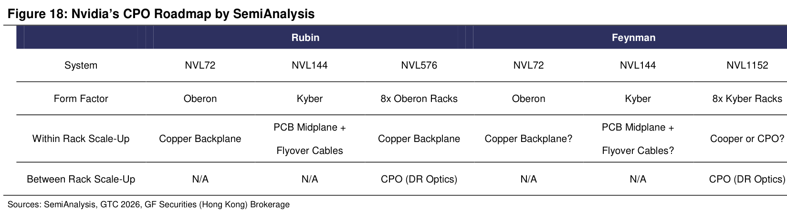

### 解讀摘要
SemiAnalysis 路線圖顯示 Rubin 世代（NVL72/144）的 within-rack scale-up 仍是 Copper Backplane 或 PCB Midplane + Flyover Cables，僅 NVL576 的 between-rack scale-up 才用 CPO（DR Optics）；到 Feynman 世代，NVL72/144 的 within-rack scale-up 已標註問號（「Copper Backplane?」、「Cooper or CPO?」），顯示連 SemiAnalysis 這樣的產業研究機構對 Feynman 世代機櫃內互連是否轉向 CPO 都尚未有定論。

### 表格
| | Rubin NVL72 | Rubin NVL144 | Rubin NVL576 | Feynman NVL72 | Feynman NVL144 | Feynman NVL1152 |
|---|---|---|---|---|---|---|
| Form Factor | Oberon | Kyber | 8x Oberon Racks | Oberon | Kyber | 8x Kyber Racks |
| Within Rack Scale-Up | Copper Backplane | PCB Midplane + Flyover Cables | Copper Backplane | Copper Backplane? | PCB Midplane + Flyover Cables? | Cooper or CPO? |
| Between Rack Scale-Up | N/A | N/A | CPO (DR Optics) | N/A | N/A | CPO (DR Optics) |

> **值得驗證**：表格中 Feynman 世代 NVL1152 的 within rack scale-up 標註為「Cooper or CPO?」——此不確定性直接影響 Fig.20 彙整表中「NVL144 CPO 滲透率 2028 年達 50%」的假設是否合理。若 Feynman 世代 within-rack 互連提前轉向 CPO（而非僅 between-rack），CPO 在 scale-up 的滲透速度與規模可能顯著快於報告目前的預測；反之若業界仍卡在問號狀態，滲透可能不如預期。

---

## Fig. 19｜CPO switch supply chain

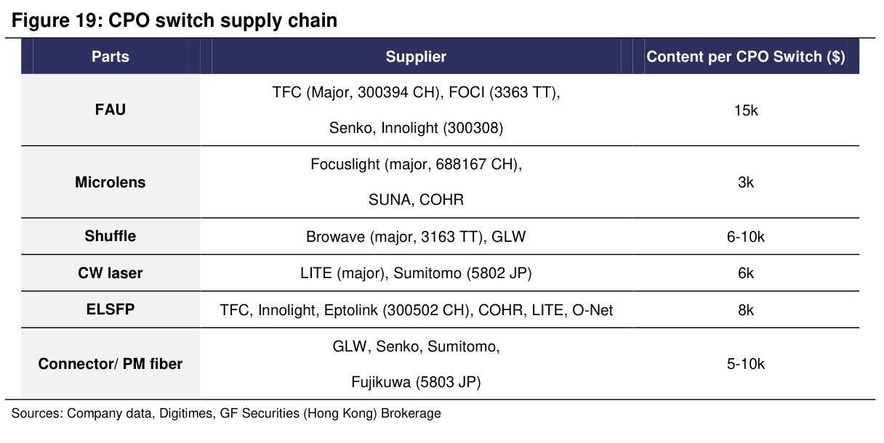

### 解讀摘要
單台 CPO switch 的 BOM content 總計約 \$43k-52k，其中 Shuffle（\$6-10k）由 Browave（主要）與 GLW 供應，貿聯透過收購新復盛切入的正是這塊。FAU 是單一最大 content 項目（\$15k），其次是 Shuffle box 與 Connector/PM fiber（各 \$5-10k），顯示貿聯在 CPO switch BOM 中卡位的是第三大 content 類別，而非最大的 FAU（由 TFC/FOCI 等供應）。

### 表格
| Parts | Supplier | Content per CPO Switch (\$) |
|---|---|---|
| FAU | TFC（Major, 300394 CH）、FOCI（3363 TT）、Senko、Innolight（300308） | 15k |
| Microlens | Focuslight（major, 688167 CH）、SUNA、COHR | 3k |
| Shuffle | Browave（major, 3163 TT）、GLW | 6-10k |
| CW laser | LITE（major）、Sumitomo（5802 JP） | 6k |
| ELSFP | TFC、Innolight、Eptolink（300502 CH）、COHR、LITE、O-Net | 8k |
| Connector/PM fiber | GLW、Senko、Sumitomo、Fujikuwa（5803 JP） | 5-10k |

> **洞察一**：Shuffle box 的 \$6-10k content 與 Connector/PM fiber 的 \$5-10k 合計最高可達 \$20k，若貿聯透過新復盛未來能同時切入這兩塊（目前僅明確拿下 Shuffle box 40% 配額），潛在 content 空間比報告 Fig.20 目前僅計入 Shuffle box 的假設更大——這是報告論點之外、值得留意的潛在上檔空間。

---

## Fig. 20｜CPO contribution analysis

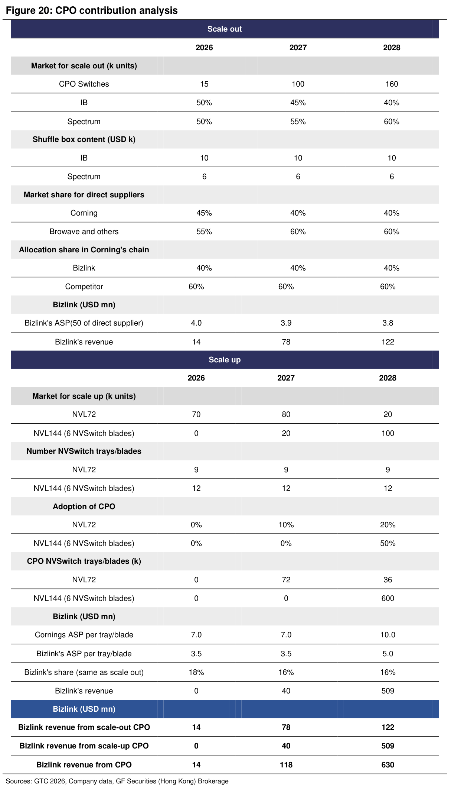

### 解讀摘要
這是全篇最核心的財務推導表，分 Scale out 與 Scale up 兩條線，將 Nvidia switch 出貨量一路拆解到貿聯最終營收。Scale out 線：CPO switch 出貨（15k/100k/160k）→Corning 拿下 40-45% 市占→貿聯拿下 Corning 供應鏈 40% 配額→貿聯營收 \$14mn/78mn/122mn（2026-28E）。Scale up 線：NVL72+NVL144 出貨量×CPO 滲透率（0-20%/0-50%）×NVSwitch tray 數×貿聯 ASP 份額→貿聯營收 \$0/40mn/509mn。兩線加總後貿聯 CPO 總營收為 \$14mn/118mn/630mn（2026-28E），2028 年 scale-up 貢獻（509mn，81%）已遠超 scale-out（122mn，19%），顯示 scale-up 才是 CPO 故事的長期主力。

### 表格
**Scale out**

| | 2026 | 2027 | 2028 |
|---|---|---|---|
| CPO Switches（k units） | 15 | 100 | 160 |
| 　IB 佔比 | 50% | 45% | 40% |
| 　Spectrum 佔比 | 50% | 55% | 60% |
| Shuffle box content — IB（USD k） | 10 | 10 | 10 |
| Shuffle box content — Spectrum（USD k） | 6 | 6 | 6 |
| Corning 市占 | 45% | 40% | 40% |
| Browave and others 市占 | 55% | 60% | 60% |
| 貿聯佔 Corning 供應鏈份額 | 40% | 40% | 40% |
| 貿聯 ASP（Corning 直供 50%，USD mn） | 4.0 | 3.9 | 3.8 |
| **貿聯 Scale-out 營收（USD mn）** | **14** | **78** | **122** |

**Scale up**

| | 2026 | 2027 | 2028 |
|---|---|---|---|
| NVL72 市場（k units） | 70 | 80 | 20 |
| NVL144 市場（k units，6 NVSwitch blades） | 0 | 20 | 100 |
| NVL72 CPO 滲透率 | 0% | 10% | 20% |
| NVL144 CPO 滲透率 | 0% | 0% | 50% |
| Corning ASP per tray/blade（USD mn） | 7.0 | 7.0 | 10.0 |
| 貿聯 ASP per tray/blade（USD mn） | 3.5 | 3.5 | 5.0 |
| 貿聯份額 | 18% | 16% | 16% |
| **貿聯 Scale-up 營收（USD mn）** | **0** | **40** | **509** |

**貿聯 CPO 總營收（USD mn）**：14／118／630（2026/2027/2028E）

### 增量貢獻拆解
| 成長來源（2026→2028E） | 貢獻金額 | 佔總增量 |
|---|---|---|
| Scale-out CPO（\$14mn→\$122mn） | +\$108mn | 17.5% |
| Scale-up CPO（\$0mn→\$509mn） | +\$509mn | 82.5% |
| **總計** | **+\$617mn** | **100%** |

> **值得驗證**：Scale-up 貢獻了 2026-28E 總增量的 82.5%，而 Scale-up 營收公式中最關鍵的單一假設是「NVL144 的 CPO 滲透率從 2027 年 0% 跳升至 2028 年 50%」——這是一個二元跳躍式假設而非漸進滲透，若此滲透率不及預期（例如 2028 年僅 20% 而非 50%），貿聯 2028 年 CPO 營收將從 \$630mn 大幅下修至約 \$400mn 量級，對 TP 的隱含貢獻會顯著減少。

> **洞察二（配合 Fig.18）**：Fig.18 顯示 Feynman 世代 within-rack scale-up 是否用 CPO 尚無定論（「Cooper or CPO?」），但 Fig.20 的 Scale-up 假設卻已對 NVL144 在 2028 年給出 50% 的明確 CPO 滲透率——兩者間存在一定的假設緊張關係，Fig.20 的樂觀假設某種程度上已領先於 Fig.18 所呈現的產業共識不確定性。

---

## Fig. 21｜Bizlink's Key milestone

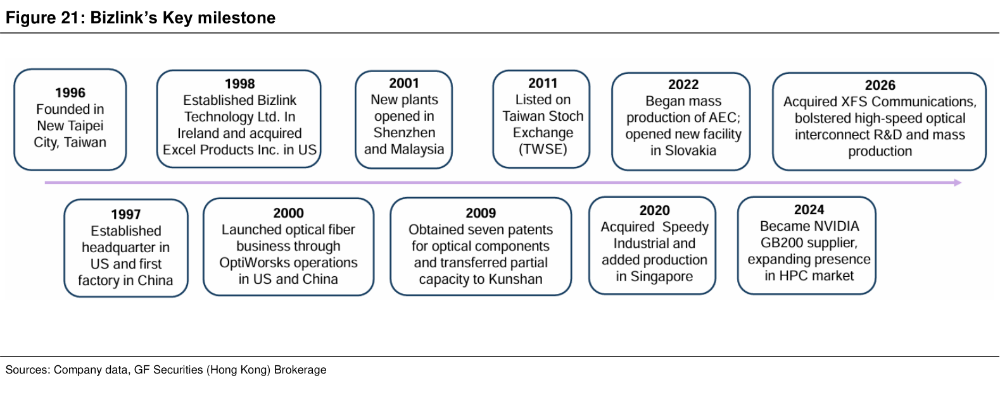

### 解讀摘要
貿聯自 1996 年於新北成立以來，每 2-3 年完成一次關鍵能力擴張：2001 併購 Excel Products 進軍美國、2009 取得光學元件專利、2020 併購 Speedy Industrial、2022 量產 AEC、2024 成為 Nvidia GB200 供應商、2026 併購新復盛切入 CPO。時程表顯示貿聯的成長模式是「併購驅動的能力堆疊」而非有機成長——過去約 30 年至少 7 次關鍵併購/資本支出事件。

> **洞察一**：2024 成為 Nvidia GB200 供應商到 2026 併購新復盛切入 CPO，間隔僅 2 年，顯示貿聯近年併購節奏明顯加快（相較於 2000 年代平均 4-5 年一次），反映公司正積極透過 M&A 追趕 Nvidia 平台迭代速度，而非依賴內部研發自然演進。

---

## Fig. 22｜Bizlink's Shareholder structure

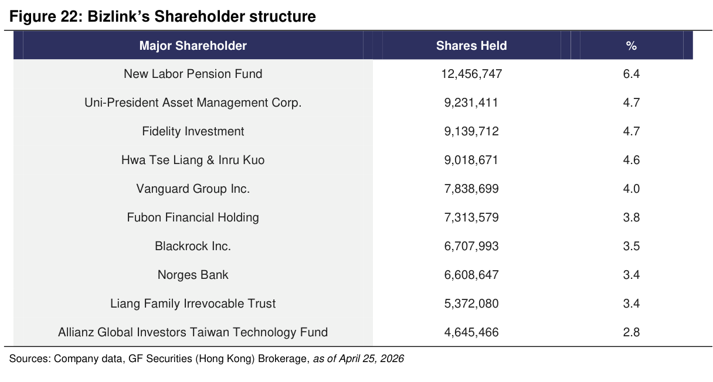

### 解讀摘要
前十大股東合計持股約 42.7%，以機構投資人為主（勞退基金 6.4%、統一投信 4.7%、Fidelity 4.7%、Vanguard 4.0%、Fubon 3.8%、Blackrock 3.5%、Norges Bank 3.4%），僅「Hwa Tse Liang & Inru Kuo」（4.6%）與「Liang Family Irrevocable Trust」（3.4%）明顯為創辦家族相關持股，合計約 8.0%。

### 表格
| Major Shareholder | Shares Held | % |
|---|---|---|
| New Labor Pension Fund | 12,456,747 | 6.4 |
| Uni-President Asset Management Corp. | 9,231,411 | 4.7 |
| Fidelity Investment | 9,139,712 | 4.7 |
| Hwa Tse Liang & Inru Kuo | 9,018,671 | 4.6 |
| Vanguard Group Inc. | 7,838,699 | 4.0 |
| Fubon Financial Holding | 7,313,579 | 3.8 |
| Blackrock Inc. | 6,707,993 | 3.5 |
| Norges Bank | 6,608,647 | 3.4 |
| Liang Family Irrevocable Trust | 5,372,080 | 3.4 |
| Allianz Global Investors Taiwan Technology Fund | 4,645,466 | 2.8 |

> **洞察一**：創辦家族持股僅約 8%，遠低於典型台灣家族企業；機構投資人（尤其外資如 Fidelity/Vanguard/Blackrock/Norges Bank 合計 15.6%）持股比重高，顯示貿聯的股東結構已高度機構化、國際化，股價對法人研究報告的敏感度可能較高，也較容易吸引更多國際外資關注。

---

## Fig. 23｜Bizlink's revenue by segment (bn NTD)

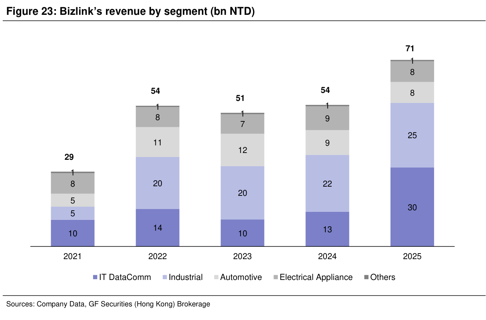

### 解讀摘要
總營收從 2021 年 NT\$29bn 成長至 2025 年 NT\$71bn（2.4 倍），其中 IT DataComm 從 NT\$10bn（占 34%）成長至 NT\$30bn（占 42%），是唯一佔比持續提升的分項；Automotive 與 Electrical Appliance 占比合計則從 2021 年 28% 萎縮至 2025 年約 19%。IT DataComm 在 2025 年單年就貢獻了 NT\$8bn 的 YoY 增量（NT\$22bn→NT\$30bn），佔當年總增量 NT\$17bn（54bn→71bn）的 47%。

### 表格
| 年度 | IT DataComm | Industrial | Automotive | Electrical Appliance | Others | 總計 |
|---|---|---|---|---|---|---|
| 2021 | 10 | 5 | 8 | 5 | 1 | 29 |
| 2022 | 14 | 20 | 9 | 11 | 1 | 54 |
| 2023 | 10 | 20 | 8 | 12 | 1 | 51 |
| 2024 | 13 | 22 | 8 | 9 | 1 | 54 |
| 2025 | 30 | 25 | 8 | 8 | 1 | 71 |

> **洞察一**：IT DataComm 佔比從 2021 年 34% 提升至 2025 年 42%，且報告財測段落預估 2026E/2027E 將進一步跳升至 56%/67%——這代表貿聯的營收結構正從「多元工業/汽車零組件供應商」快速轉型為「AI 伺服器/資料中心含量供應商」，這個結構轉型本身就是報告給予 28x 溢價 P/E（高於 21x 歷史均值）的核心依據。

---

## Fig. 24｜Bizlink's HPC revenue contribution

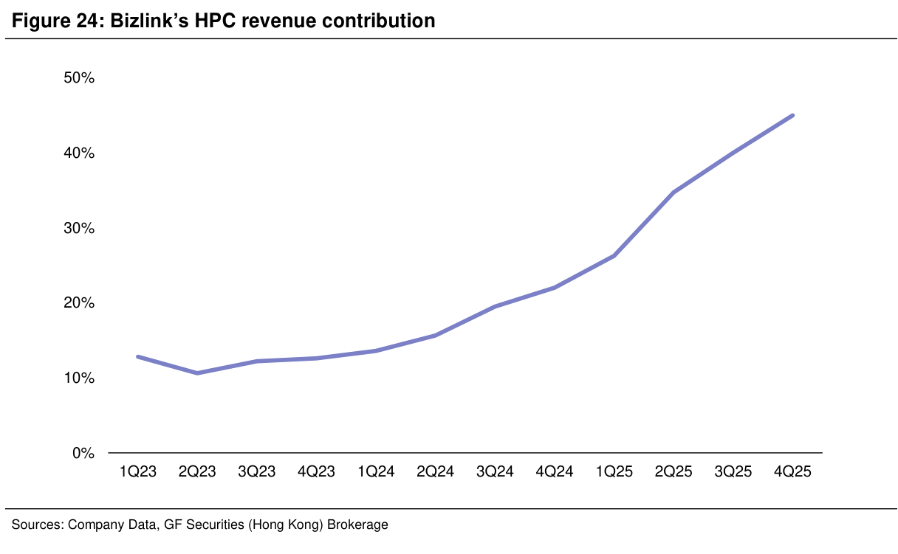

### 解讀摘要
HPC 營收占比從 1Q23 的約 13% 持續攀升至 4Q25E 的約 45%（3.5 倍），曲線在 1Q25 之後（26%→45%）明顯加速，斜率較 2023-2024 年間平緩爬升更陡峭。這條曲線與 Fig.23 的 IT DataComm 占比提升相互印證，顯示貿聯的「AI 化」轉型是從 2025 年起才真正加速，而非過去三年持續穩定的過程。

> **洞察一（配合 Fig.23）**：Fig.23 顯示 IT DataComm（含 HPC）2025 年全年占比 42%，Fig.24 顯示 HPC 單獨占比在 4Q25E 已達 45%——兩者看似矛盾，實因 Fig.23 是全年平均值而 Fig.24 是單季度數字（4Q25 通常是全年出貨高峰），反映貿聯的 HPC/AI 業務季度間波動大，全年占比會被前三季稀釋。

---

## Fig. 25｜Bizlink's global footprint

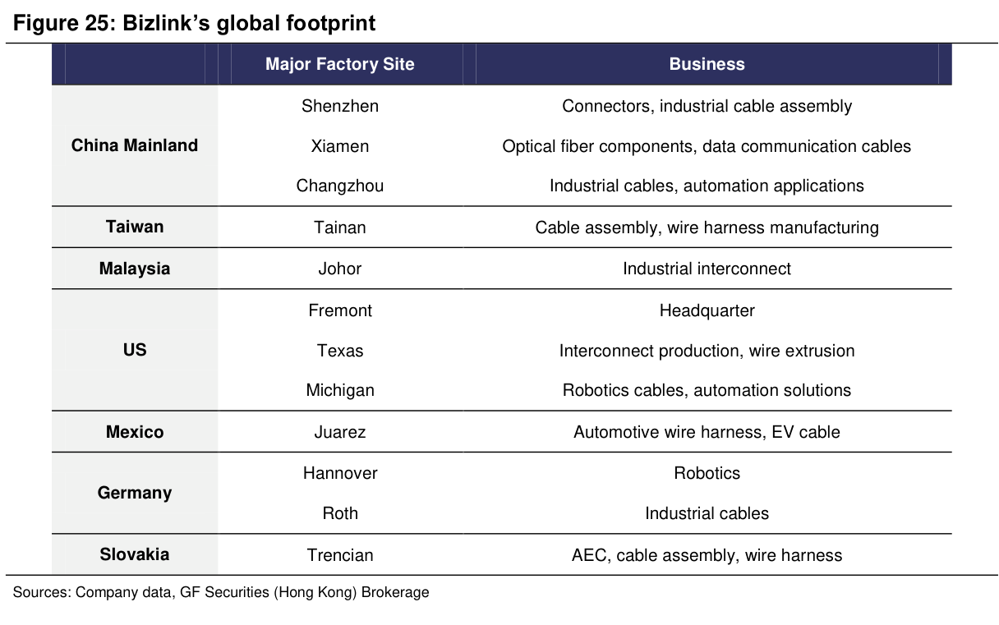

### 解讀摘要
貿聯全球 34 個生產基地橫跨 19 國，呈現明確的「功能分區」佈局：中國（深圳/廈門/常州）聚焦連接器與光纖元件量產、美國（Fremont 總部/Texas/Michigan）聚焦互連生產與機器人自動化、斯洛伐克聚焦 AEC 與線束生產、墨西哥聚焦車用線束。值得注意的是新復盛/CPO 相關新產能並未列入此清單的中國基地中，顯示原文提及的台南新廠（2H26 量產）是專門為新復盛/CPO 業務新增的產能節點，獨立於既有全球佈局之外。

### 表格
| 地區 | Major Factory Site | Business |
|---|---|---|
| China Mainland | Shenzhen | Connectors, industrial cable assembly |
| 　 | Xiamen | Optical fiber components, data communication cables |
| 　 | Changzhou | Industrial cables, automation applications |
| Taiwan | Tainan | Cable assembly, wire harness manufacturing |
| Malaysia | Johor | Industrial interconnect |
| US | Fremont | Headquarter |
| 　 | Texas | Interconnect production, wire extrusion |
| 　 | Michigan | Robotics cables, automation solutions |
| Mexico | Juarez | Automotive wire harness, EV cable |
| Germany | Hannover | Robotics |
| 　 | Roth | Industrial cables |
| Slovakia | Trencian | AEC, cable assembly, wire harness |

> **洞察一**：斯洛伐克基地明確標註「AEC, cable assembly, wire harness」，是全球佈局中唯一將 AEC 列為主要業務的生產基地，顯示貿聯的 AEC 產能可能存在地理集中風險（相較於其他業務線分散在多國）；若歐洲地緣政治或當地供應鏈出現問題，AEC 產能的替代彈性可能低於其他業務線。

---

## 跨 Exhibit 彙整表

### 彙整 1｜Power-related content per IT rack across generations（Fig.4 + Fig.7）

| 項目 | GB200 NVL72 | VR200 NVL72 | 增量 |
|---|---|---|---|
| Power whip | \$2,800 | \$4,800 | +71% |
| Busbar | \$10,450 | \$12,450 | +19% |
| **合計 Power-related content/rack** | **\$13,250** | **\$17,250** | **+30%** |

> 雖然 power whip 成長率（+71%）遠高於 busbar（+19%），但兩者對總增量的絕對貢獻其實相等（各 \$2,000，各佔 50%）——因為 busbar 基期規模（占 79%）遠大於 whip（21%）。這說明僅看成長率百分比會高估 whip 的重要性，實際上 busbar 才是決定貿聯機櫃電力 content 規模的主力產品線。

---

## 相關個股清單

| 類別 | 公司 | Ticker | 評等 | 備註 |
|---|---|---|---|---|
| 主要標的 | 貿聯-KY (Bizlink) | 3665 TT | Buy（啟動） | TP NT\$3,400，28x 2027E P/E |
| 生態系夥伴 | Credo | CRDO US | — | AEC 獨家夥伴；AWS Ethernet AEC 面臨 ALAB 競爭壓力 |
| 生態系夥伴 | Astera Labs (ALAB) | ALAB US | — | AWS Ethernet AEC 市占提升，Taurus 產品線 |
| 上游供應鏈 | Corning | GLW US | — | CPO Shuffle Box 主要供應商，貿聯拿下其供應鏈 40% 配額 |
| 上游供應鏈 | Browave 布沃 | 3163 TT | — | Shuffle Box 主要供應商之一 |
| 上游供應鏈 | FOCI 上詮 | 3363 TT | — | CPO switch FAU 供應商 |
