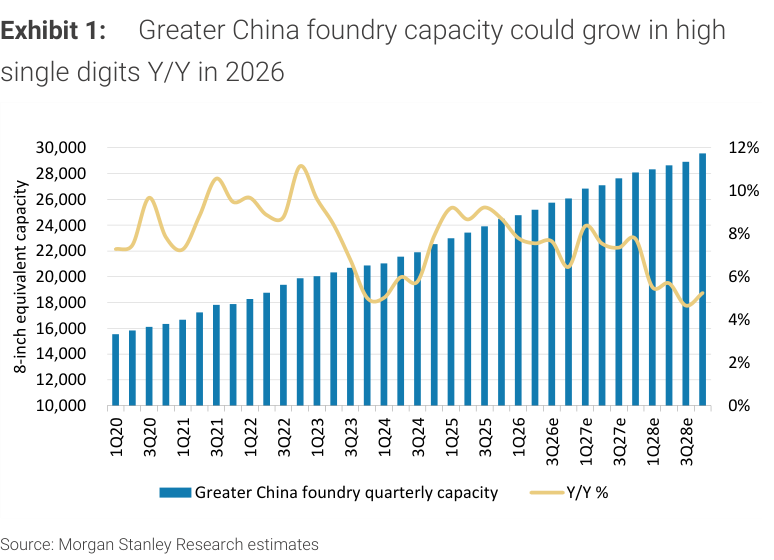
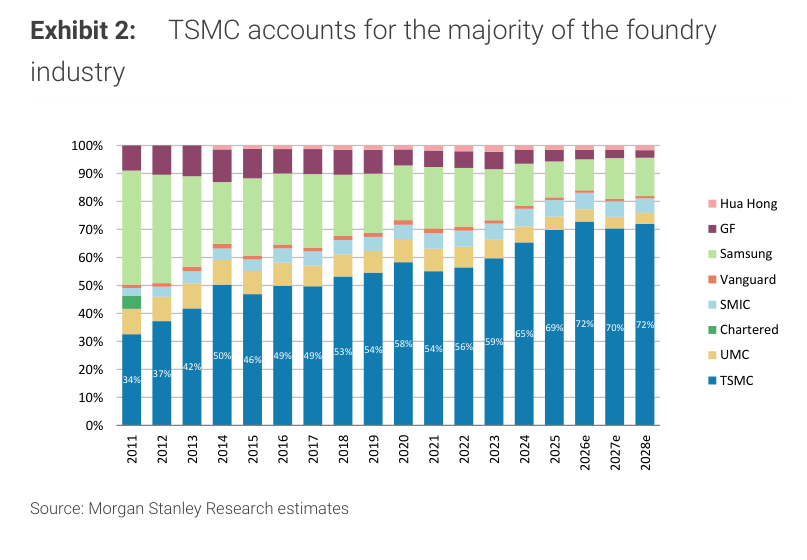
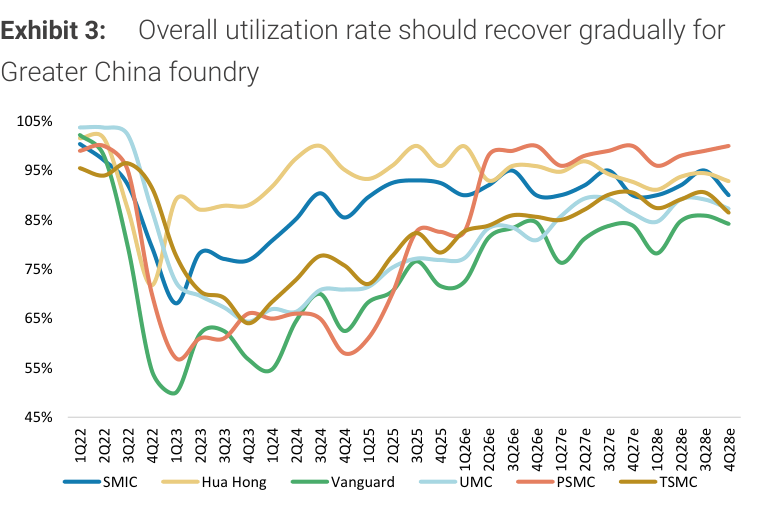
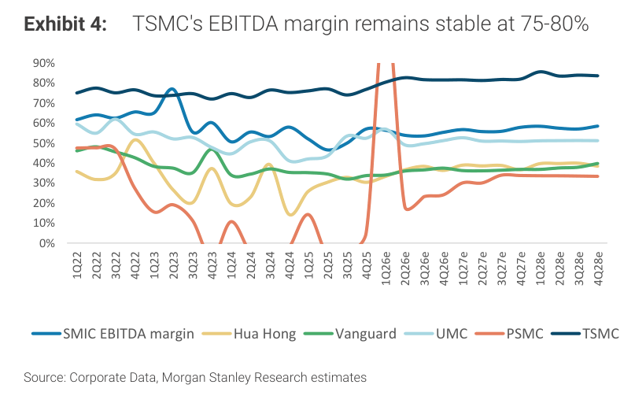
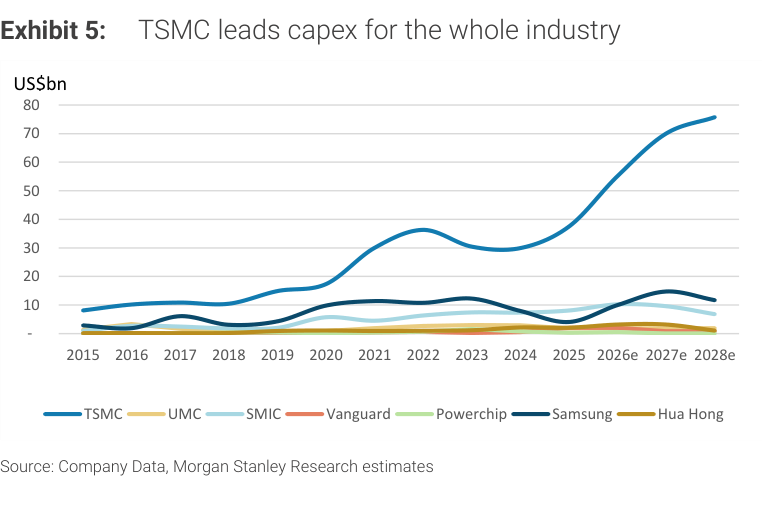
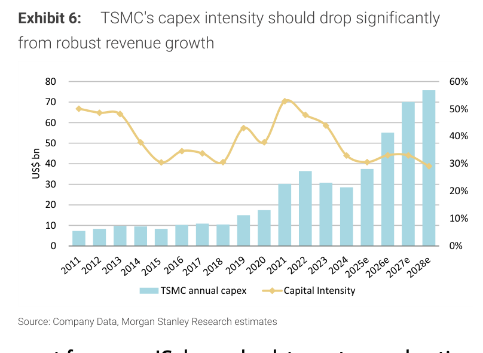
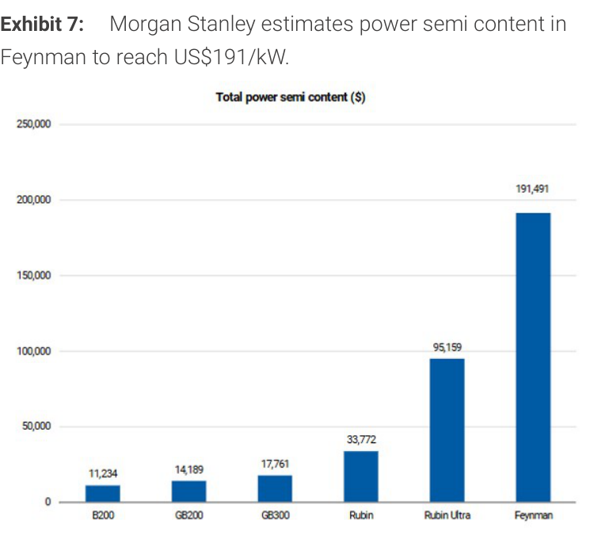
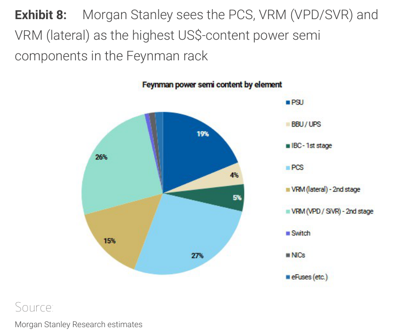
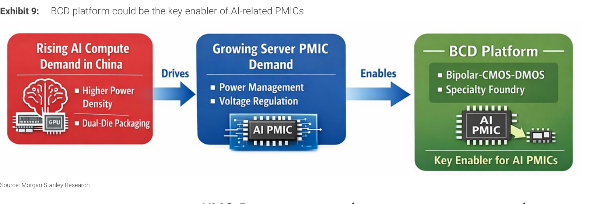

# MS｜大中華晶圓代工：成熟製程上行週期啟動

**券商**：Morgan Stanley  
**分析師**：Charlie Chan、Daniel Yen CFA、Daisy Dai CFA、Tiffany Yeh、Lucas Wang、Ethan Jia、Henry Zhao  
**日期**：2026-05-18  
**主題**：The Foundry Floorplan: All boats riding on the same tide – mature node up-cycle begins  
**評級**：Attractive（Greater China Semiconductors）  
<button type="button" onclick="fetch('https://ti-lei.github.io/foreign-reports/static/downloads/產業/20260518_MS_大中華晶圓代工-成熟製程上行週期啟動.md').then(r=>r.text()).then(t=>{let a=document.createElement('a');a.href='data:text/plain;charset=utf-8,'+encodeURIComponent(t);a.download='20260518_MS_大中華晶圓代工-成熟製程上行週期啟動.md';a.click()})">⬇ 下載 MD</button>

---

## MS 完整投資邏輯鏈

| 論點層次 | Exhibit | 內容 |
|---|---|---|
| 瓶頸確認：AI需求外溢至成熟製程 | 1, 3 | Greater China foundry capacity 2026年高個位數YoY成長；SMIC/PSMC利用率逼近或超過100% |
| 需求結構：Power IC為主要新增驅動 | 7, 8 | Feynman rack power semi content達\$191,491，為B200的17倍；PCS+VRM合計佔68% |
| 供給上限：先進製程資本排擠成熟製程 | 2, 5, 6 | TSMC市占率2028e升至72%，capex intensity降至30%，資本高度集中先進製程；二線廠受益overflow |
| BCD為AI PMIC的製程瓶頸 | 9 | 8吋BCD平台（Bipolar-CMOS-DMOS）已近滿載；全球頂級PMIC IDM加速採用foundry外包 |
| 受益排序 | 封面 | UMC升評OW（2027e P/E 20x vs Vanguard 27x）；SMIC維OW；Silergy降至UW（margin受foundry漲價擠壓） |
| **結論** | 封面 | **2H27成熟製程供給缺口確認；AI power IC TAM 2026約\$15bn，CAGR 50%；多家成熟代工廠目標價大幅上調** |

> **報告最大邏輯缺口**：MS估計AI rack power semi content成長17倍，但未明確說明成熟製程供給擴充的具體時間表——8吋BCD設備為二手市場主導、取得困難，若需求爆發速度快於MS預測，2H27的供給缺口可能提前且更嚴重。

---

## 報告核心觀點

| 主題 | MS 觀點 | 市場共識 | 是否 Contra-Consensus |
|---|---|---|---|
| 成熟製程景氣時間點 | 2H27出現供給缺口，現在開始布局 | 多數市場觀望，需更多訂單確認 | 是 |
| AI power IC需求規模 | TAM \$15bn in 2026，CAGR 50% | 市場低估power IC的AI exposure | 是 |
| UMC估值 | 2027e P/E 20x，相對Vanguard 27x便宜 | 62%市場給EW評級 | 是（MS為少數OW） |
| Silergy | 降至UW：foundry漲價侵蝕毛利，consumer曝險30%難以轉嫁 | 多數市場仍看好Silergy的AI exposure | 是 |
| TSMC成熟製程退出策略 | 逐步退出legacy capacity，帶來overflow機會 | 市場已知，但受益幅度被低估 | 否 |
| 8吋BCD供給緊俏 | SMIC/Hua Hong 8吋BCD接近滿載，漲價可期 | 市場尚未充分反映BCD tightness | 是 |

**偏好排序**：UMC > SMIC >> Hua Hong = Vanguard >> Silergy（UW）  
**零件/個股偏好**：成熟製程代工廠 > AI Power IC設計（Silergy已降評）；8吋BCD、interposer為關鍵增量來源

---

## Exhibit 1｜Greater China Foundry Capacity 季度追蹤

### 解讀摘要
大中華區晶圓代工總產能（8吋等效）從1Q20約15,000穩步擴張至3Q28e逾29,000，Y/Y成長率在2021年攀至10-12%高點後，歷經2023年庫存修正期間降至4-6%，目前以高個位數（7-9%）回升。這一輪成長的質量根本不同於2020-22年：驅動力由AI周邊需求（PMIC、BCD、特殊製程）主導，而非純粹的智慧型手機/消費電子擴充，意味著即使未來景氣有所波動，整體產能閒置風險也顯著低於2022-23年那次循環。

> **原文補充**：TSMC正逐步縮減Fab 2（6吋）和Fab 5（GaN），以優化土地利用與工程資源，但管理層強調成熟製程客戶的產能支援不會在短期內受到影響——這種「有紀律地退出legacy」策略，等同於為二線代工廠創造incremental overflow機會。

### 表格

以下為代表性時間點視覺估算，Y/Y%為右軸讀數

| 時間點 | 8吋等效產能（約） | Y/Y% |
|---|---|---|
| 1Q20 | 15,000 | 8% |
| 1Q22 | 20,000 | 10% |
| 1Q23 | 22,000 | 4% |
| 1Q25 | 25,000 | 6% |
| 1Q26e | 27,000 | 8% |
| 1Q27e | 28,000 | 6% |
| 3Q28e | 29,000+ | 4-5% |

*以上為視覺估算

> **洞察一**：Y/Y成長率在2027-28e趨近4-5%的平台期，代表大中華區成熟製程物理擴充已近極限；但AI需求仍以20-50% CAGR增長，供需缺口在2H27將比產能數字看起來的更顯著。

---

## Exhibit 2｜晶圓代工市占結構：TSMC持續集中

### 解讀摘要
TSMC市占從2011年34%直線升至2028e 72%，三星從高峰約20%縮減至單位數，UMC等長期廠商維持但無法擴張。這種高度集中反映的是資本與工程資源的極度傾斜：TSMC的每一個策略決定（如縮減legacy fab）都能直接影響整個成熟製程市場的供需平衡。對二線廠商而言，TSMC退出成熟製程所帶來的overflow，是比自身技術進步更確定的成長驅動力。

> **原文補充**：MS指出TSMC與Samsung都在"rationalizing mature node capacity"，對specialty和low-volume應用變得更具選擇性，預計此趨勢將在中長期創造overflow需求，使SMIC、Vanguard、UMC等廠商受益。

### 表格

| 年份 | TSMC | UMC+Chartered | Samsung | SMIC | Vanguard | Hua Hong | 其他 |
|---|---|---|---|---|---|---|---|
| 2011 | 34% | 15% | 19% | 4% | 2% | 1% | 25% |
| 2015 | 46% | 10% | 17% | 5% | 2% | 1% | 19% |
| 2020 | 58% | 7% | 12% | 6% | 2% | 2% | 13% |
| 2024 | 65% | 5% | 9% | 6% | 2% | 2% | 11% |
| 2026e | 72% | 4% | 7% | 5% | 3% | 2% | 7% |
| 2028e | 72% | 4% | 7% | 5% | 3% | 2% | 7% |

*非TSMC欄位為視覺估算

> **洞察一**：TSMC市占在2028e穩定於72%，後續幾乎不可能再提升——這個平台期意味著TSMC的資本已全數配置在先進製程與先進封裝，成熟製程的供給增量將幾乎完全留給其他廠商。對二線廠商而言，TSMC的「停止成長」就是自己的「開始成長」。

---

## Exhibit 3｜大中華區晶圓代工利用率回升路徑

### 解讀摘要
各廠利用率在2023年觸底（部分廠商低至55-65%）後V型反轉，進入2026年梯隊分明：TSMC與PSMC率先接近或突破100%；SMIC回升至85-90%；UMC/Vanguard回到80-88%；Hua Hong略為落後但趨勢向上。這個利用率梯隊揭示了需求傳導路徑：TSMC滿載→成熟製程需求轉向SMIC/PSMC→後者滿載→溢出至Hua Hong和Vanguard。驅動力是AI周邊需求（PMIC、BCD），而非傳統手機/PC週期回暖。

### 表格

以下為代表性時間點視覺估算

| 公司 | 2023底谷 | 2025末 | 2026e | 2027-28e |
|---|---|---|---|---|
| TSMC | 75% | 98% | 98% | 97% |
| PSMC | 65% | 98% | 98% | 97% |
| SMIC | 65% | 85% | 90% | 92% |
| UMC | 70% | 82% | 88% | 90% |
| Vanguard | 60% | 80% | 85% | 87% |
| Hua Hong | 55% | 80% | 85% | 88% |

*以上為視覺估算

> **洞察一**：Vanguard的利用率回升雖落後SMIC/TSMC，但MS仍維持EW——關鍵在於Vanguard未來的催化劑是interposer業務（2027年啟動），而非純foundry需求的追趕。Interposer的估值貢獻尚未出現在當前財務數字中。

> **洞察二（配合Exhibit 2）**：TSMC利用率接近100%且市占已達72%，代表整個產業的成熟製程實際閒置產能比例極低。即使利用率從97%降至93%，對整體供給的影響也微乎其微，使得MS的2H27供給缺口預測更有說服力。

---

## Exhibit 4｜大中華區晶圓代工 EBITDA Margin 比較

### 解讀摘要
TSMC的EBITDA margin長期穩定在75-80%，是其他廠商難以企及的護城河。SMIC維持在40-60%區間，但折舊壓力上升對未來margin構成威脅；Hua Hong受pricing cycle影響最大，波動最劇烈；Vanguard和UMC維持30-50%的中間帶，隨漲價逐步回升。PSMC在2H25-1Q26e出現接近90%的異常高點，這是記憶體代工漲價週期的極端讀數，非持久性競爭優勢，一旦價格回落將快速均值回歸至30-40%。

### 表格

以下為代表性時間點視覺估算

| 公司 | 2023底谷 | 2025末 | 2026e | 長期展望 |
|---|---|---|---|---|
| TSMC | 75% | 78% | 80% | 75-80%穩定 |
| SMIC | 40% | 55% | 60% | 受折舊壓力 |
| UMC | 38% | 45% | 50% | 漲價帶動回升 |
| Vanguard | 30% | 37% | 40% | interposer有上行空間 |
| Hua Hong | 20% | 35% | 40% | 仍低於歷史均值 |
| PSMC | 30% | 85%（高峰） | 30% | 記憶體正常化後回落 |

*以上為視覺估算

> **洞察一**：PSMC的EBITDA margin突破85%是一個重要的週期性訊號：記憶體代工的定價能力在供給缺口期間可遠超傳統邏輯代工，但此高點應視為極端值而非新均值；一旦記憶體價格正常化，PSMC margin將快速回到30-40%。

---

## Exhibit 5｜晶圓代工全產業 Capex：TSMC獨大

### 解讀摘要
TSMC的capex從2025年約\$37bn將攀升至2028e約\$75bn，幾乎是所有其他代工廠合計的兩倍以上，而Samsung從\$10-15bn逐步縮減，SMIC維持在\$7-10bn，UMC/Vanguard/Hua Hong均在\$1-3bn範圍。這種資本集中度的意義是雙重的：（1）先進製程的門檻越來越高，競爭格局將更加固化；（2）成熟製程廠商的capex保守意味著未來成熟製程供給增量有限，任何超額需求都將以漲價而非擴產回應。

> **原文補充**：MS指出Samsung正在"rationalizing mature node capacity"，capex重心移向HBM和先進封裝，對成熟製程投資意願大幅降低，等同於替二線廠商騰出市場空間。

### 表格

| 公司 | 2022高峰 | 2024 | 2026e | 2028e |
|---|---|---|---|---|
| TSMC | \$36bn | \$30bn | \$55bn | \$75bn |
| Samsung | \$15bn | \$11bn | \$9bn | \$10bn |
| SMIC | \$7bn | \$7bn | \$8bn | \$9bn |
| UMC | \$3bn | \$2bn | \$2bn | \$2bn |
| Vanguard | \$1bn | \$1bn | \$1bn | \$1bn |
| Hua Hong | \$1bn | \$1bn | \$1bn | \$1bn |

*非TSMC欄位為視覺估算

> **洞察一**：TSMC 2028e的\$75bn capex是SMIC的8倍以上，且全數集中在N2/A16/先進封裝。成熟製程廠商的\$1-3bn capex在AI需求浪潮下幾乎不帶來實質供給增量——這是MS認為2H27供給缺口不可避免的根本原因：需求成長速度遠超供給擴充能力。

---

## Exhibit 6｜TSMC Capex Intensity 趨勢

### 解讀摘要
TSMC的capex intensity（capex/revenue）在N5/N3大規模建廠的2021-22年曾飆至70%以上，但隨著先進製程量產成熟，revenue增速超越capex增速，intensity預計在2028e降至約30%。這個趨勢對投資人的意義：TSMC的資本效率正在改善，不是因為減少投資（capex絕對值仍大幅增加），而是因為每一代新製程的學習曲線帶來更高的wafer output和revenue，使capex intensity降低成為自由現金流大幅改善的先行指標。

### 表格

以下為視覺估算

| 年份 | TSMC年度Capex | Capex Intensity |
|---|---|---|
| 2011 | \$7bn | 50% |
| 2015 | \$8bn | 30% |
| 2021 | \$30bn | 55% |
| 2022 | \$36bn | 72% |
| 2024 | \$30bn | 45% |
| 2026e | \$55bn | 45% |
| 2027e | \$70bn | 35% |
| 2028e | \$75bn | 30% |

*以上為視覺估算

> **洞察一**：Capex intensity從2022年高峰72%降至2028e的30%，代表每美元revenue對應的capex需求從0.72降至0.30，FCF margin改善超過40個百分點。這是TSMC長期估值重新評級的核心依據之一：盈利能力改善的速度快於capex增長的速度。

---

## Exhibit 7｜AI Rack Power Semi Content：爆炸式增長

### 解讀摘要
AI rack的power semiconductor content從B200的\$11,234到Feynman的\$191,491，17.0倍的增長核心機制並非單純功耗提升，而是rack架構的根本性重構：Rubin Ultra開始引入PCS（Power Capacitor System）power sidecar，吸收傳統PSU、BBU和server內bulk capacitance的功能，帶來全新的功率管理半導體需求。Rubin→Rubin Ultra（\$33,772→\$95,159，+182%）的跳升主要是PCS導入帶來的純增量需求，並非線性外推，代表供應鏈受到的是離散式的「架構更換」衝擊，而非漸進式的功耗外推。

> **原文補充**：MS估計PCS per Rubin Ultra rack的power semi content超過\$20,000（佔總\$95,159的21%），Rubin Ultra對應\$159/kW、Feynman對應\$191/kW。Feynman rack功耗約1,000 kW（1 MW）；Rubin Ultra約600 kW，可據此反推各世代rack絕對功耗規模。

### 表格

| GPU世代 | Power Semi Content（\$） | vs B200 |
|---|---|---|
| B200 | 11,234 | 1.0x |
| GB200 | 14,189 | 1.3x |
| GB300 | 17,761 | 1.6x |
| Rubin | 33,772 | 3.0x |
| Rubin Ultra | 95,159 | 8.5x |
| Feynman | 191,491 | 17.0x |

### 增量貢獻拆解

| 世代躍升 | Content增量（\$） | 增幅 | 主要驅動機制 |
|---|---|---|---|
| B200 → Rubin | +22,538 | +201% | 功耗規模提升（純量變） |
| Rubin → Rubin Ultra | +61,387 | +182% | PCS power sidecar引入（質變，純增量需求） |
| Rubin Ultra → Feynman | +96,332 | +101% | 1MW規模效應（PCS+VRM同步擴大） |
| **B200 → Feynman總增量** | **+180,257** | **+1,605%** | **架構革命 + 規模效應複合驅動** |

計算過程：14,189-11,234=2,955（B200→GB200）；33,772-17,761=16,011（GB200→Rubin，略）；95,159-33,772=61,387（Rubin→Rubin Ultra）；191,491-95,159=96,332（Rubin Ultra→Feynman）；191,491-11,234=180,257（B200→Feynman，+1,605%）。

> **洞察一**：Rubin→Rubin Ultra的182%跳升是結構性而非週期性——PCS是rack架構新增元件，不是現有元件的量增，代表MOSFET/GaN/MLCC等PCS核心供應商面對的是「零基礎上的新訂單」，訂單能見度更高也更不受傳統庫存週期影響。

> **洞察二（配合Exhibit 8）**：Feynman的PCS佔整體content 26%（\$191,491 × 26% ≈ \$49,788/rack），是Rubin Ultra PCS \$20,000的2.5倍，成長速度快於整體rack content。這意味著PCS在架構演進中的重要性持續上升，受益廠商的market share具備高黏性。

---

## Exhibit 8｜Feynman Power Semi Content 結構分解

### 解讀摘要
Feynman rack的power semi content中，VRM (VPD/SiVR) 佔27%、PCS佔26%，兩者合計53%，加上VRM (lateral) 15%，整體電壓調節+電力緩衝相關元件佔68%，而傳統PSU僅佔19%。這個結構逆轉了傳統server的power觀念：過去PSU是最大的成本中心，現在VRM和PCS合計兩倍於PSU。對成熟代工廠的直接意義是：PCS和VRM所需的MOSFET、GaN等元件大量採用BCD和特殊製程，正是SMIC、Hua Hong的8吋BCD平台所服務的核心產品線。

### 表格

| 元件 | 佔比 | Feynman估算金額（\$） |
|---|---|---|
| VRM (VPD/SiVR) - 2nd stage | 27% | 51,702 |
| PCS | 26% | 49,788 |
| PSU | 19% | 36,383 |
| VRM (lateral) - 2nd stage | 15% | 28,724 |
| IBC - 1st stage | 5% | 9,575 |
| BBU/UPS | 4% | 7,660 |
| Switch + NICs + eFuses | 4% | 7,659 |
| **合計** | **100%** | **191,491** |

### 增量貢獻拆解

| 功能分類 | 合計佔比 | 合計估算金額（\$） |
|---|---|---|
| 電壓調節（PCS + VRM lateral + VRM VPD/SiVR） | 68% | 130,214 |
| 電力供應（PSU + BBU + IBC） | 28% | 53,618 |
| 其他（Switch/NICs/eFuses） | 4% | 7,659 |

計算過程：PCS（\$49,788）+ VRM lateral（\$28,724）+ VRM VPD/SiVR（\$51,702）= \$130,214，佔比 130,214/191,491 = 68%。

> **洞察一**：VRM (lateral) 和VRM (VPD/SiVR) 合計42%，分別代表板上VRM和Nvidia Scalable Power module兩種架構，都需要高電流、低RDS(on)的MOSFET，是BCD平台的核心產品。隨每個rack世代更迭，兩類VRM的合計絕對金額將同步以17倍的速率躍升，BCD foundry是直接受益人。

> **洞察二**：PCS是全新架構元件，原有server BOM中不存在此類組件，因此供應商面對的是純增量訂單而非替代競爭。26%的佔比 × Feynman的17倍內容放大，代表PCS供應商面對的需求曲線幾乎是垂直上升，定價能力極強。

---

## Exhibit 9｜BCD Platform：AI PMIC的製程瓶頸

### 解讀摘要
MS的論點鏈是：中國AI算力需求快速成長（更高功率密度、雙晶片封裝）→ 帶動Server PMIC需求（功率管理+電壓調節）→ BCD Platform（Bipolar-CMOS-DMOS + Specialty Foundry）是唯一製程選項。BCD不可替代的原因在於：AI PMIC需要同時整合高壓BJT（Bipolar，保護/開關）、低壓控制邏輯（CMOS，控制器/驅動器）和高效率功率開關（DMOS，DC-DC轉換），三者合一的製程只有BCD能做到，且主要集中在8吋55nm節點，而8吋設備已無法新購（二手市場主導）。

> **原文補充**：MS具體點名：（1）Hua Hong的一個主要美國PMIC客戶正在其55nm BCD平台上將wafer需求tripling；（2）MPS同時使用Hua Hong和Vanguard；（3）Infineon使用UMC。全球頂級analog/power IC IDM正在加速foundry外包，而這些訂單全數落在BCD specialty platform，屬於「結構性外包」而非週期性庫存調整，一旦產線移轉很難逆轉。

### 表格

| 製程組件 | 功能 | AI PMIC的需求對應 |
|---|---|---|
| Bipolar（B） | 高壓電晶體 | 高壓電源開關、保護電路 |
| CMOS（C） | 數位/類比控制邏輯 | 控制器、閘極驅動器 |
| DMOS（D） | 高效率功率MOSFET | 同步整流、DC-DC轉換核心 |
| BCD整合 | 三者合一於同一晶片 | AI PMIC的唯一可行製程選項 |

> **洞察一**：8吋BCD的稀缺性根植於設備不可取得性——BCD製程與先進12吋邏輯完全不相容，且8吋設備新購已無可能。即使有充足資金，BCD產能的實質增幅受限於設備取得困難度，這使MS的「2H27供給缺口」論述幾乎不依賴任何樂觀假設，而是一個設備週期的必然結果。

> **洞察二**：MPS（使用Hua Hong+Vanguard）、Infineon（使用UMC）等IDM的外包行為屬於「長期結構性轉移」。從IDM角度，在成熟節點自建fab的ROI已不及外包；從foundry角度，這些客戶的訂單黏性極高。AI power IC TAM \$15bn（2026）、CAGR 50%的假設，本質上就是這種結構性外包的數字化呈現。

---

## 跨 Exhibit 彙整表

### 彙整 1｜Power Semi 需求結構：從架構到BCD foundry的投資鏈

來源：Exhibit 7 × Exhibit 8 × Exhibit 9

| 層次 | 關鍵數字 | 意涵 |
|---|---|---|
| Rack總content增長 | B200→Feynman：\$11,234→\$191,491（+17x） | AI rack power semi需求整體爆發 |
| PCS佔Feynman的比重 | 26% = 約\$49,788/rack（純增量） | PCS是新架構元件，供應商面對零競爭增量 |
| VRM+PCS合計比重 | 68% = 約\$130,214/rack | 電壓調節是最大成本重心，傳統PSU退為次要 |
| BCD的不可替代性 | 8吋55nm，設備無法新購 | 即使需求爆發，供給增量受設備周期硬性限制 |
| 代表性客戶動態 | Hua Hong 55nm客戶wafer需求tripling | 結構性外包，非週期性訂單，訂單黏性極高 |

> 跨三張Exhibit整合可得出一個完整的因果鏈：AI功耗需求→rack架構重構（PCS引入）→VRM+PCS佔68%的power semi content→這些元件全部需要BCD製程→BCD平台受限於8吋設備無法快速擴充→供給缺口在2H27確認。這條鏈的每個環節都有具體數字支撐，是本報告論述的核心競爭力。

---

## 相關個股清單

| 類別 | 公司 | Ticker | 評等 | 備註 |
|---|---|---|---|---|
| 成熟製程代工（台灣） | UMC | 2303.TW | OW（升評）↑ | PT NT\$138（from NT\$68）；AI companion需求+bridge die+DTC optionality |
| 成熟製程代工（台灣） | Vanguard | 5347.TWO | EW | PT NT\$180（from NT\$148）；interposer production 2027年啟動 |
| 成熟製程代工（中國） | SMIC | 0981.HK | OW | PT HK\$85（from HK\$70）；8吋BCD最緊俏，BCD process優勢 |
| 成熟製程代工（中國） | Hua Hong | 1347.HK | EW | PT HK\$118（from HK\$88）；BCD/NOR受惠但估值已合理 |
| 記憶體代工 | PSMC | — | — | 記憶體代工漲價最大受益者；margin有均值回歸風險 |
| 原料晶圓 | GlobalWafers | 6488.TWO | EW（降評）↓ | PT NT\$750（from NT\$588）；2H26漲價預期已充分反映 |
| Power IC設計 | Silergy | 6415.TW | UW（降評）↓ | Foundry漲價侵蝕毛利；consumer曝險30%難以轉嫁成本 |
