# Goldman Sachs｜Co-Tech Development Corp. (8358) 初次覆蓋

**券商**：Goldman Sachs (Asia) L.L.C., Taipei Branch  
**分析師**：Chao Wang、Allen Chang、Al Wang  
**日期**：2026-05-19  
**主題**：PCB 銅箔產業新紀元——HVLP3+ 供給短缺驅動 ASP／毛利結構性重估  
**評級**：Buy（首次覆蓋）｜12 個月目標價 NT\$900（現價 NT\$429，上漲空間 +110%）  
<button type="button" onclick="fetch('https://ti-lei.github.io/foreign-reports/static/downloads/產業/20260519_GS_CO-TECH-initiation.md').then(r=>r.text()).then(t=>{let a=document.createElement('a');a.href='data:text/plain;charset=utf-8,'+encodeURIComponent(t);a.download='20260519_GS_CO-TECH-initiation.md';a.click()})">⬇ 下載 MD</button>

---

## Goldman Sachs 完整投資邏輯鏈

| 論點層次     | Exhibit | 內容                                                                                                |
| -------- | ------- | ------------------------------------------------------------------------------------------------- |
| 需求信號確立   | 9, 10   | HVLP3+ TAM 122% 2025-28E CAGR（US\$216mn→US\$2.4bn）；AI server HVLP4 從 2H26 全面採用，2026E 需求 YoY +129% |
| 供應缺口結構性  | 4/16    | 考慮 70-80% 良率後有效產能缺口 28/39/38%（2026/27/28E）；需求 CAGR 97% 持續遠超供應 CAGR 67%                            |
| 定價模式質變   | 5/8     | HVLP3 ASP \$32/kg vs HTE \$15/kg；GM 50% vs 3%；業務模式從「銅成本加成」轉向「供需決定定價」                              |
| 市占路徑確定   | 17, 18  | Mitsui 2028E 僅能覆蓋 20% 行業需求；Co-Tech 為唯一已認證 HVLP4 第二供應商；兩者合計最高僅 58%                                 |
| 產能擴張時序恰當 | 32      | Plant 3 貫穿 2027 年擴產，有效產能從 2026E 末 400 t/m 提升至 2028E 末 2,100 t/m，契合需求爆發期                           |
| 毛利率雙引擎驅動 | 20, 25  | 定價費用 50% CAGR + 良率 50-55%→70%+ 同步推升 HVLP3+ GM：2026E 32.7%→2028E 47.9%                             |
| **結論**   | 封面      | **Buy，TP NT\$900（+110%）；22x 2028E EPS 折現（CoE 11%）；EPS 120% 2025-28E CAGR**                        |

> **報告最大邏輯缺口**：2026E GS 估 EPS NT\$10.19 低共識 18%，原因是高端 HVLP 貢獻仍有限——但若 1H26 即出現更快良率爬升或定價上調，EPS 可能提前超越 GS 估算，這是本報告最重要的上行風險。

---

## 報告核心觀點

| 主題 | GS 觀點 | 市場共識 | 是否 Contra-Consensus |
|---|---|---|---|
| HVLP3+ 缺口幅度 | 有效供需缺口 28-39%（2026-27E） | 方向一致，但缺口幅度不確定 | 否（方向一致，量化更激進）|
| 2026E EPS | NT\$10.19（低共識 18%）| 市場樂觀估算 2H26 HVLP 全面貢獻 | 是（GS 認為 2026 過渡期，HVLP 貢獻有限）|
| 2027E EPS | NT\$25.89（高共識 35%）| 市場低估長期市占擴大 | 是（GS 明顯高於共識）|
| CPO 下行風險 | 即使 CPO 全面替代，2035E EPS 仍 NT\$55.3 | 市場擔心 CPO 可能清零需求 | 是（GS 看法更樂觀：GPT應仍需 PCB 供電）|
| 估值框架 | 22x 2028E EPS 折現 | 市場用近期 PE 估算，折現期不足 | 是（跨期折現重估邏輯）|

**零件／個股偏好**：Co-Tech（唯一已認證 HVLP4 第二供應商）；Mitsui Kinzoku（5706.T，GS Buy）為行業第一供應商，但擴產較保守。

---

## Exhibit 1｜PCB 銅箔 TAM——高端滲透率從 3% 到 33%

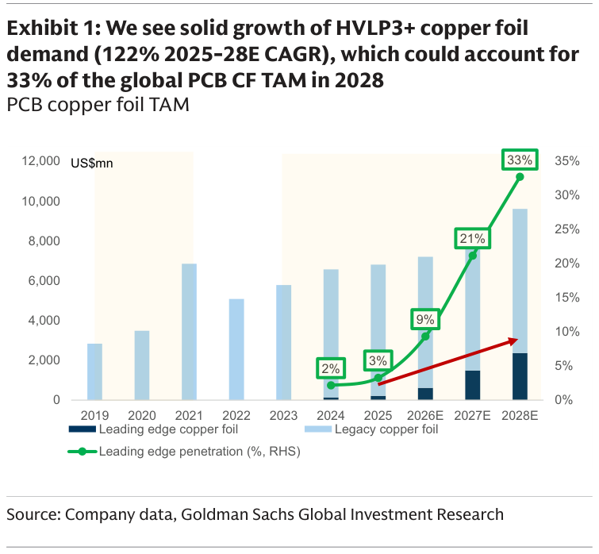

### 解讀摘要
全球 PCB 銅箔 TAM 長期受傳統低端（HTE/RTF）主導，2019-2024 年高端（HVLP3+）滲透率僅 2-3%，相當於邊緣需求。轉捩點在 2H26：AI server 從 M7 轉向 M8/M9 CCL 將帶動 HVLP3+ 滲透率從 3%（2024）爆升至 9/21/33%（2026/27/28E），整個 TAM 隨之從成本競爭轉向技術壁壘競爭。

> **原文補充**：2020-2022 年 TAM 上行是因 5G/一般伺服器需求，但期間高端滲透率不到 3%，代表整個上行週期屬低端驅動。本次 2H26 起的上行週期性質截然不同——是產品規格強制升級，而非需求量單純擴張。

### 表格（高端銅箔滲透率）

| 年度 | HVLP3+ 滲透率（%）|
|---|---|
| 2019 | 2% |
| 2024 | 3% |
| 2026E | 9% |
| 2027E | 21% |
| 2028E | 33% |

> **洞察一**：從 3% 到 33% 意味著 HVLP3+ 在三年內從行業邊緣成長到佔全球 PCB 銅箔 TAM 的三分之一，這個轉換速度遠超歷史上任何產品升級週期，驅動因素是 AI server 全面換代而非漸進式。

---

## Exhibit 2｜高端銅箔需求——AI server 與 Switch 為雙引擎

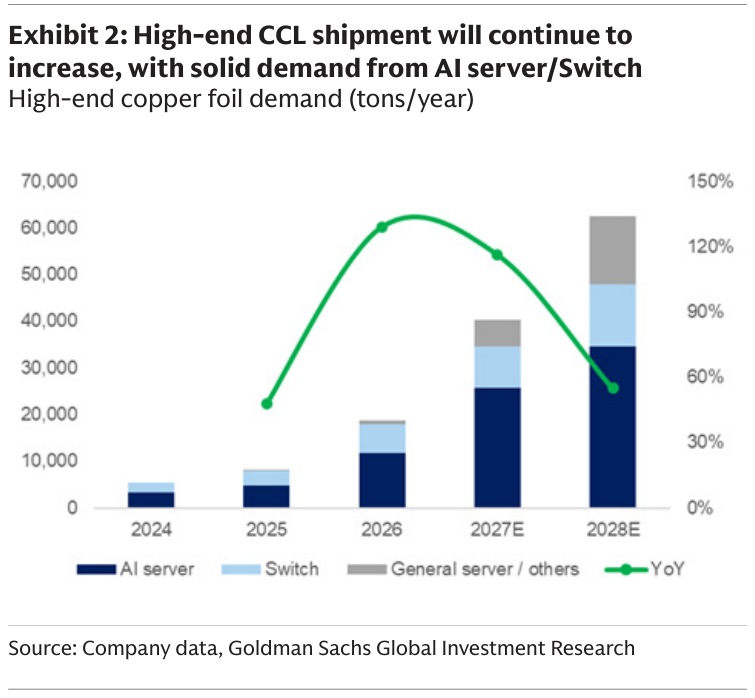

### 解讀摘要
高端銅箔（HVLP3+）年度需求從 2024 年約 5,000 噸快速攀升，2026 年 YoY 成長 ~130%，主要由 AI server 需求爆發（從 ~3,500 噸增至 ~12,000 噸）驅動，Ethernet switch 升級（400G→800G→1.6T）貢獻穩定增量。

### 表格（高端銅箔需求量，tons/year，視覺估算）

| 年度 | AI Server | Switch | 一般伺服器/其他 | 合計 | YoY |
|---|---|---|---|---|---|
| 2024 | 3,500 | 1,500 | — | 5,000 | — |
| 2025 | 4,000 | 4,500 | — | 8,500 | 50% |
| 2026E | 12,000 | 7,000 | — | 19,000 | 130% |
| 2027E | 27,000 | 8,000 | 5,000 | 40,000 | 110% |
| 2028E | 37,000 | 8,000 | 18,000 | 63,000 | 58% |

> **洞察一**：AI server 從 2024→2026E 需求增長約 3.4 倍，2027E 再增 2.3 倍——每一年幾乎都是前一年的 2x+ 水準，而 Switch 貢獻在 2027-28E 趨於穩定。這意味著驅動後續成長的核心已從「Switch 升級」轉向「AI server 換代」。

---

## Exhibit 3｜有效 HVLP3+ 供應產能（考慮良率損失後）

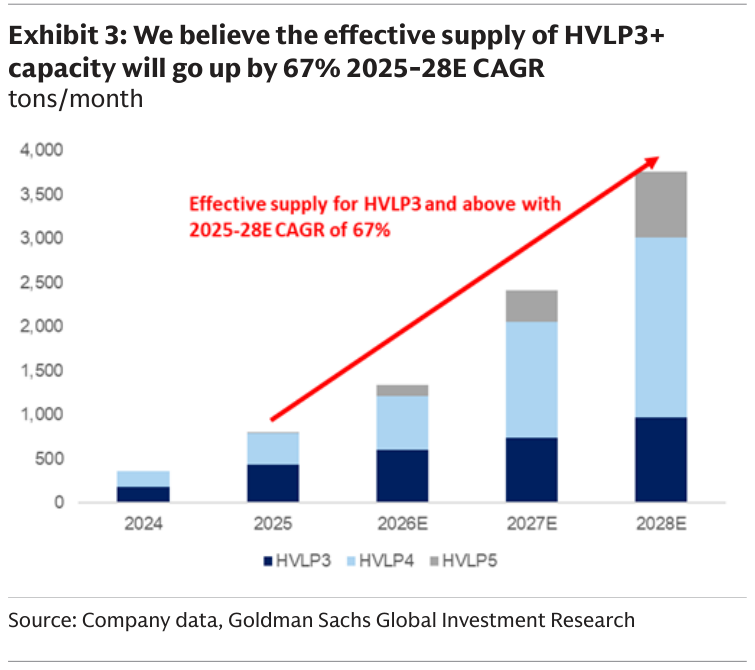

### 解讀摘要
行業 HVLP3+ 名義產能 2025-28E CAGR 為 68%，但考慮 70-80% 良率後，有效產能 CAGR 僅 67%（803→3,759 t/m），始終追不上需求的 97% CAGR。良率損失形成「隱性產能稅」，是結構性缺口的核心。

### 表格（有效供應產能，tons/month）

| 年度 | 有效產能（t/m）|
|---|---|
| 2025 | 803 |
| 2026E | 1,120 |
| 2027E | 2,050 |
| 2028E | 3,759 |

---

## Exhibit 4｜HVLP3+ 供需缺口——2025 短暫過剩後長期短缺

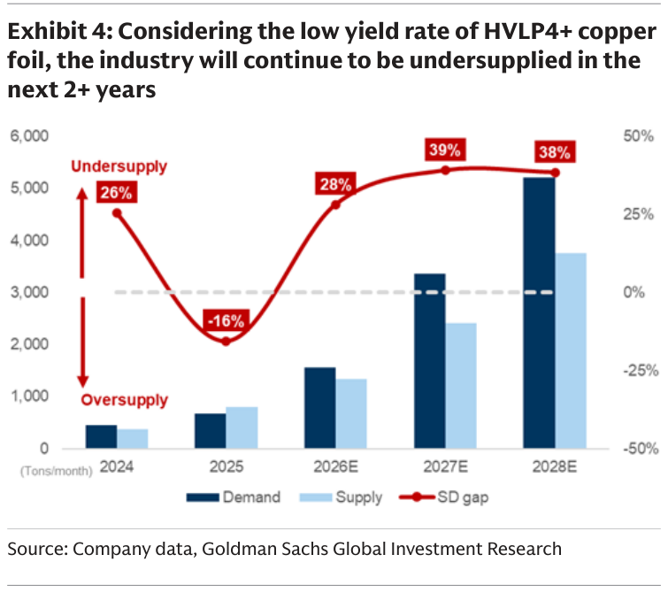

### 解讀摘要
2025 年因產能提前擴增而出現 16% 短暫過剩，但從 2026E 起需求爆發徹底扭轉局面，缺口在 2027E 達到峰值 39%——這代表全行業有效產能無法服務近四成的客戶需求，迫使客戶提前鎖定優先供應商。

> **原文補充**：「有效供應」計算方式為名義產能 × 良率（70-80%）× 容量轉換損耗係數（正常轉換損耗 10-20%）。若以名義產能比較，供需僅呈 2-5% 輕微短缺（2027/28E），良率因子使缺口放大至 28-39%。

### 表格（HVLP3+ 供需平衡，tons/month）

| 年度 | 需求 | 有效供應 | S/D 缺口 |
|---|---|---|---|
| 2024 | 480 | 355 | +26% 短缺 |
| 2025 | 710 | 800 | -16% 過剩 |
| 2026E | 1,560 | 1,120 | +28% 短缺 |
| 2027E | 3,360 | 2,050 | +39% 短缺 |
| 2028E | 5,200 | 3,224 | +38% 短缺 |

> **洞察一**：2025 年過剩是假象——供應商為 2H26 需求爆發提前備產，2026E 需求 YoY +129% 瞬間吸收所有過剩產能並產生 28% 缺口。這個「過剩→缺口」的切換比市場預期更陡峭。

> **值得驗證**：GS 假設良率為 70-80%，若 Mitsui 或 Co-Tech 良率提升速度超過 GS 預期（如 80%→85%），有效供應可能多出 5-8%，缺口幅度將縮窄至 20-35%，但仍維持結構性短缺。

---

## Exhibit 5｜ASP vs 毛利率階梯——HVLP3+ 是質的跳躍

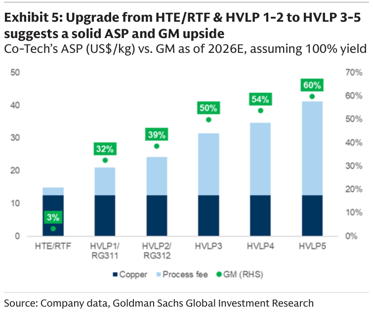

### 解讀摘要
從 HTE/RTF 升級至 HVLP3 是一個非線性跳躍：ASP 從 \$15/kg 提升至 \$32/kg（+113%），而 GM 從 3% 跳升至 50%，意味著每公斤絕對毛利從 \$0.45 到 \$16.0（+35 倍）。這不是正常的產品升級，而是商業模式的質變——從成本加成的微利業務轉向技術稀缺的高利潤業務。

> **原文補充**：銅成本假設 US\$12.5/kg，良率假設 100%（理論值）。實際良率 50-55% 時，等效銅成本翻倍，GM 實際上低於理論值。GS 估算 2026E HVLP3+ 實際 GM 約 32.7%，反映 50-55% 良率下的真實成本結構。

### 表格（Co-Tech 各產品 ASP vs GM，2026E，假設良率 100%）

| 產品 | ASP（US\$/kg）| GM（%）| 絕對毛利（US\$/kg）|
|---|---|---|---|
| HTE/RTF | \$15 | 3% | \$0.45 |
| HVLP1/RG311 | \$21 | 32% | \$6.72 |
| HVLP2/RG312 | \$25 | 39% | \$9.75 |
| HVLP3 | \$32 | 50% | \$16.00 |
| HVLP4 | \$35 | 54% | \$18.90 |
| HVLP5 | \$42 | 60% | \$25.20 |

> **洞察一**：HVLP4 的絕對毛利（\$18.90/kg）是 HTE 的 42 倍；即使良率只有 50%，HVLP4 的實際毛利仍超過 HTE 理論最大值。這解釋了為何廠商願意承擔高良率損失也要積極轉型 HVLP4。

> **洞察二**：HVLP1/2（RG311/312）是 Co-Tech 的過渡產品——已脫離成本競爭（GM 32-39%），但技術壁壘低於 HVLP3+。HVLP3+ 才是這波週期的核心受益點。

---

## Exhibit 6｜Co-Tech ROE 上行趨勢——推動 PB 重估

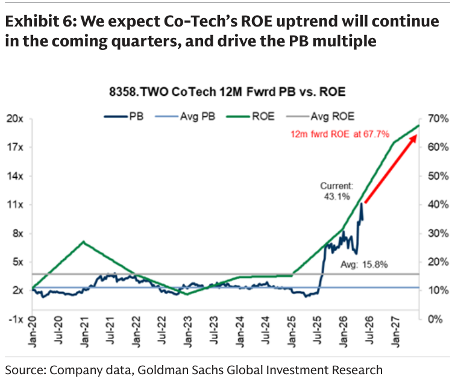

### 解讀摘要
Co-Tech 的 12m fwd ROE 已從 2024 年底的低點快速回升，當前（2026 年 5 月）fwd ROE 達 43.1%，GS 預估 2027E fwd ROE 將達 67.7%。歷史平均 ROE 僅 15.8%，當前水位已遠超均值，且仍在加速。PB 倍數歷史均值約 2x，當前已升至 8-9x，但 GS 認為 ROE 躍升支持更高 PB。

### 表格（Co-Tech ROE 與 PB 關鍵節點）

| 時間            | ROE    | PB    |
| ------------- | ------ | ----- |
| 歷史平均（10年）     | 15.8% | 2x   |
| 2025          | 15.1%  | —     |
| 2026E         | 31.4%  | 12.2x |
| 2027E         | 61.8%  | 8.8x  |
| 2028E         | 74.1%  | 5.9x  |
| 12m fwd（當前）   | 43.1%  | 9x   |
| 12m fwd（GS預估） | 67.7%  | —     |

> **洞察一**：PB/ROE 的歷史比率約 20-23x（即 ROE 20%對應 PB 4-5x）。2027E ROE 62%，按 20-23x 比率對應 PB 12-14x，但目前市場隱含 PB 8.8x——存在重估空間。GS TP 隱含 2027E PB 18.5x，高於歷史，但 ROE 62% 亦遠超歷史。

---

## Exhibit 7｜HVLP3+ 供需缺口（同 Exhibit 4）

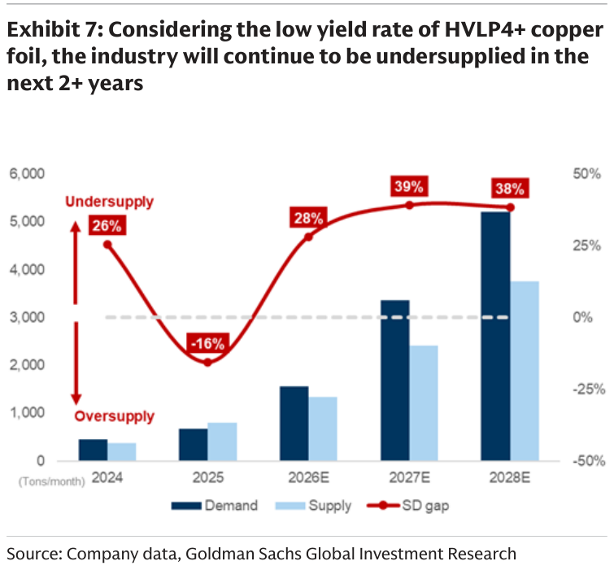

*本報告在第二章重複刊出，內容與 Exhibit 4 相同，詳見上方分析。*

---

## Exhibit 8｜ASP vs GM 階梯（同 Exhibit 5）

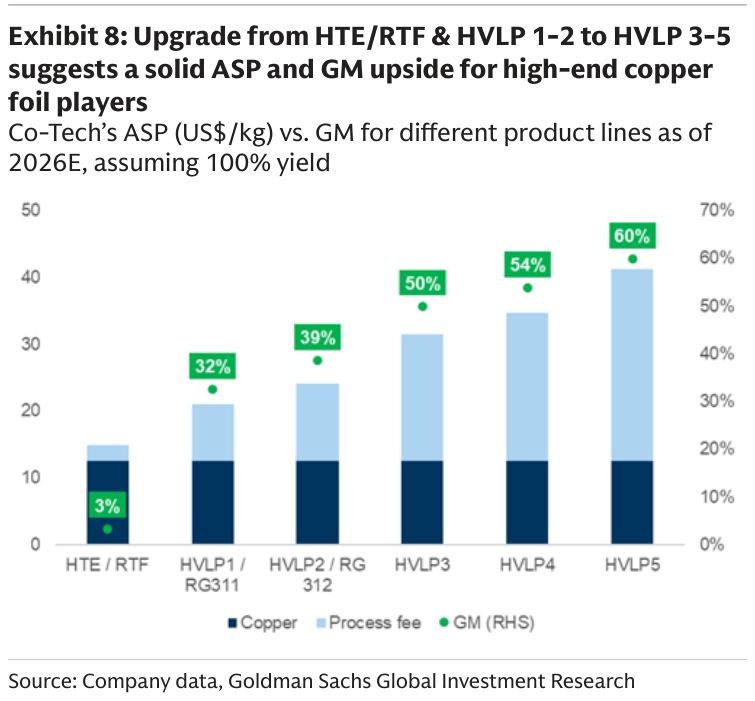

*本報告在第二章重複刊出，內容與 Exhibit 5 相同，詳見上方分析。*

---

## Exhibit 9｜PCB 銅箔 TAM 全幅圖——HVLP3+ 122% CAGR

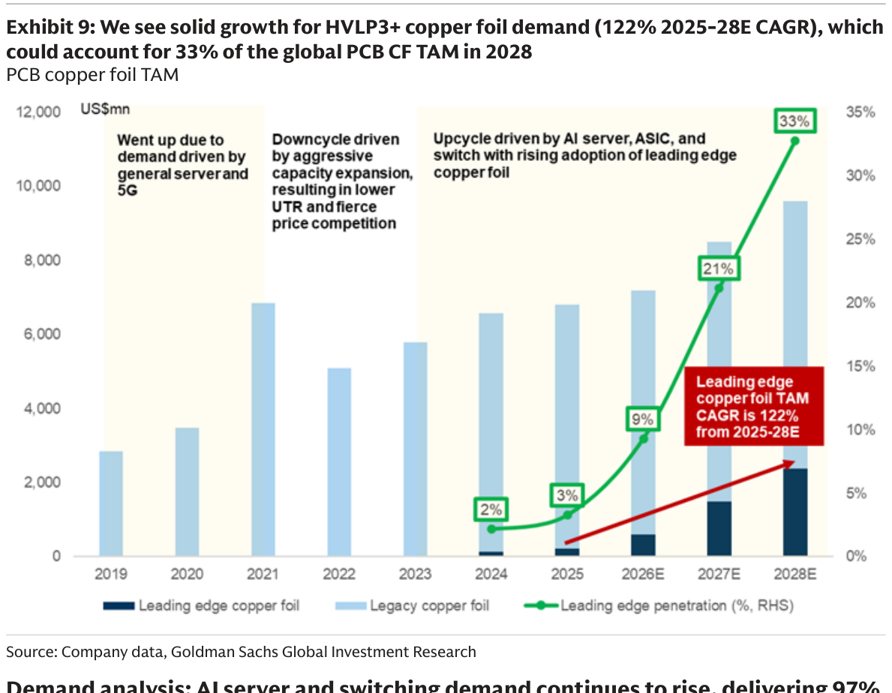

### 解讀摘要
本圖為 Exhibit 1 的完整版，完整標示了「下行週期」（2022-24 年低端產能過剩導致 TAM 萎縮）與「上行週期」（2H26 起由 AI server 驅動）兩個階段。HVLP3+ 的 TAM 從 US\$216mn（2025）成長至 US\$612mn/1.5bn/2.4bn（2026/27/28E），占全球 PCB CF TAM 的 9/21/33%。

### 表格（HVLP3+ TAM 絕對值）

| 年度 | HVLP3+ TAM（US\$mn）| 占全球 PCB CF TAM |
|---|---|---|
| 2025 | 216 | 3% |
| 2026E | 612 | 9% |
| 2027E | 1,500 | 21% |
| 2028E | 2,400 | 33% |

---

## Exhibit 10｜HVLP3+ 需求量結構——HVLP4 主導 2027-28E

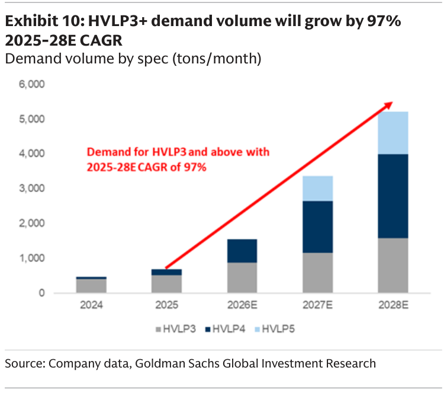

### 解讀摘要
HVLP3+ 總需求 97% 2025-28E CAGR，但內部結構快速向 HVLP4 傾斜：HVLP3 從 2025 年占 76% 降至 2028E 的 30%，HVLP4 從 24% 升至 46%，HVLP5 從 0% 成為 2028E 的 24%。這意味著行業不只是需求量增長，還是更高價格帶的需求。

### 表格（需求量，tons/month，視覺估算）

| 年度 | HVLP3 | HVLP4 | HVLP5 | 合計 |
|---|---|---|---|---|
| 2024 | 400 | 80 | 0 | 480 |
| 2025 | 515 | 165 | 0 | 680 |
| 2026E | 885 | 675 | 0 | 1,560 |
| 2027E | 1,176 | 1,478 | 706 | 3,360 |
| 2028E | 1,560 | 2,392 | 1,248 | 5,200 |

> **洞察一**：HVLP5 幾乎從零開始在 2027-28E 貢獻 20%+ 需求，對應的是 3.2T Switch 採用。從 Ex 5 的 ASP 階梯看，HVLP5 ASP \$42/kg，是 HVLP3 的 31% 溢價——未來 ASP 上行不只靠量，還靠更多 HVLP5 混入。

---

## Exhibit 11｜高端銅箔需求（同 Exhibit 2）

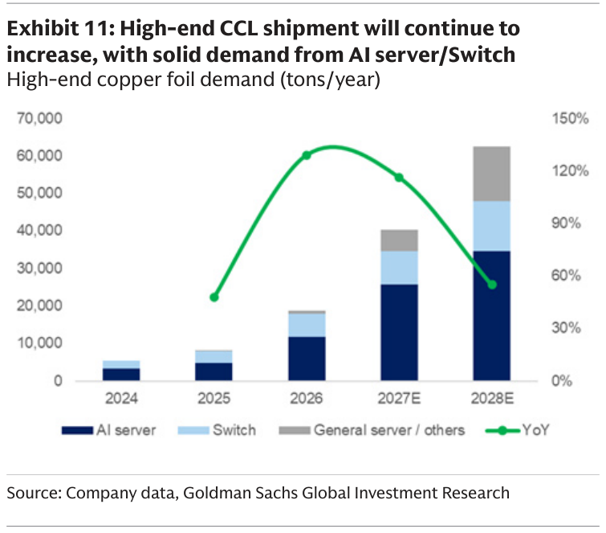

*本報告在第二章重複刊出，內容與 Exhibit 2 相同，詳見上方分析。*

---

## Exhibit 12｜HVLP4+5 佔 AI server 銅箔比例——2026-28E 主導地位

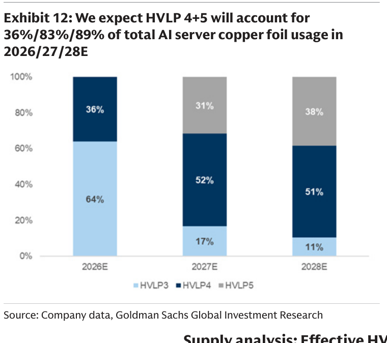

### 解讀摘要
AI server 應用中，HVLP4+5 合計佔比從 2026E 的 36% 快速升至 2027E 83%、2028E 89%，即 AI server 使用的銅箔中 90% 將是最高規格產品。HVLP3 在 AI server 的角色從 64%（2026E）縮減至 11%（2028E），成為配角。

### 表格（AI server HVLP3+ 需求結構）

| 年度 | HVLP3 | HVLP4 | HVLP5 |
|---|---|---|---|
| 2026E | 64% | 36% | 0% |
| 2027E | 17% | 52% | 31% |
| 2028E | 11% | 51% | 38% |

> **洞察一**：HVLP4 在 AI server 保持 50%+ 的佔比直到 2028E，這與 M8/M9 CCL 成為主流規格時間線吻合（Ex 22）。HVLP5 的加速是 3.2T Switch 和 N+2 AI server 的先期備產需求。

---

## Exhibit 13｜高端 Ethernet Switch 銅箔規格——HVLP5 逐步滲透

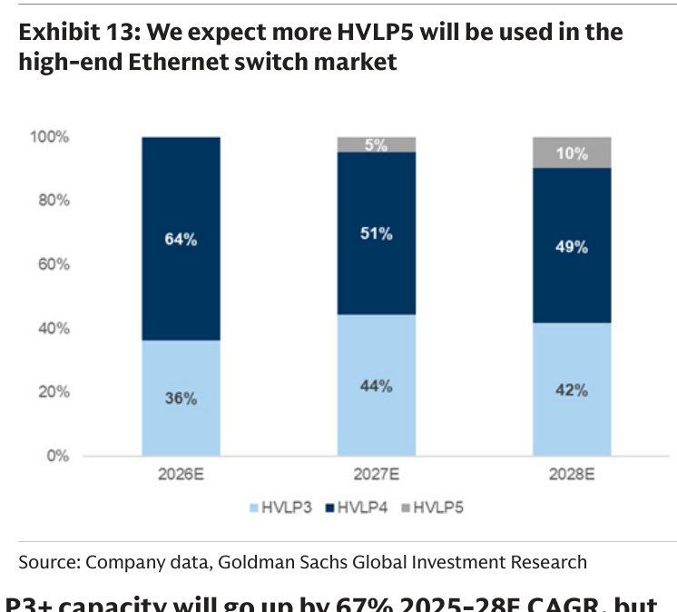

### 解讀摘要
Ethernet switch 的銅箔結構與 AI server 略有不同：2026E 仍以 HVLP4 為主（64%），但 HVLP3 的比重（36%）明顯高於 AI server（因 400G/800G switch 仍使用 HVLP3），HVLP5 要等到 2027E 1.6T switch 採用後才出現（5%），2028E 達 10%。

### 表格（高端 Ethernet Switch HVLP3+ 需求結構）

| 年度 | HVLP3 | HVLP4 | HVLP5 |
|---|---|---|---|
| 2026E | 36% | 64% | 0% |
| 2027E | 44% | 51% | 5% |
| 2028E | 42% | 49% | 10% |

> **洞察一（配合 Exhibit 12）**：對比 AI server（HVLP4+5 達 89%）vs Switch（HVLP4+5 達 59%），兩個應用的規格路徑不同步——Switch 仍留有較多 HVLP3 需求，代表 HVLP3 供應商也受益，不只是 HVLP4 的故事。

---

## Exhibit 14｜HVLP3+ 行業名義產能——68% 2025-28E CAGR

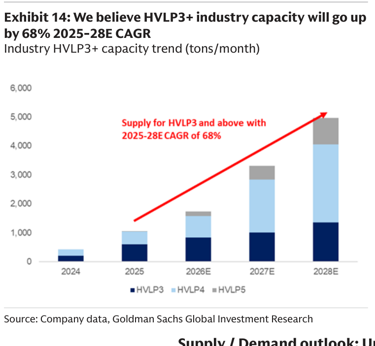

### 解讀摘要
行業 HVLP3+ 名義（不含良率損失）產能從 2025 年 1,060 t/m 提升至 2028E 4,977 t/m，CAGR 68%。產能組合向 HVLP4/5 快速傾斜：2025 年 HVLP3 佔 61%，2028E 降至 26%，而 HVLP4 升至 54%、HVLP5 升至 20%。

### 表格（HVLP3+ 名義產能，tons/month，視覺估算）

| 年度 | HVLP3 | HVLP4 | HVLP5 | 合計 |
|---|---|---|---|---|
| 2024 | 200 | 200 | 0 | 400 |
| 2025 | 650 | 350 | 60 | 1,060 |
| 2026E | 850 | 750 | 100 | 1,700 |
| 2027E | 950 | 1,900 | 450 | 3,300 |
| 2028E | 1,300 | 2,700 | 1,000 | 5,000 |

> **洞察一**：名義產能增速（68% CAGR）vs 有效產能增速（67% CAGR）幾乎相同，意味著良率改善幾乎被更多 HVLP4/5 產能（良率更低）的引入所抵銷——高端升級是「吃掉」良率收益的結構性因素。

---

## Exhibit 15｜有效 HVLP3+ 供應產能（同 Exhibit 3）

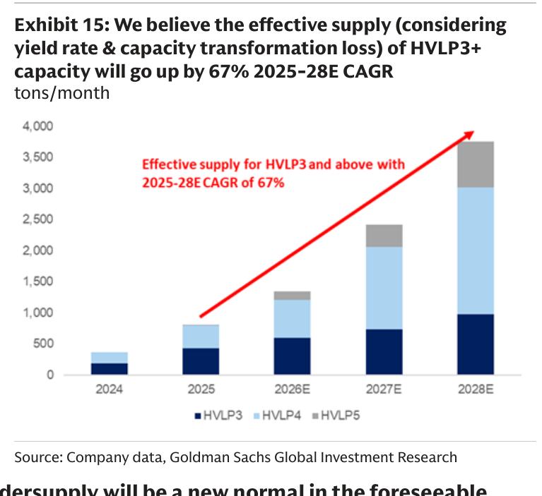

*本報告在第二章重複刊出，內容與 Exhibit 3 相同，詳見上方分析。*

---

## Exhibit 16｜HVLP3+ 供需缺口（同 Exhibit 4）

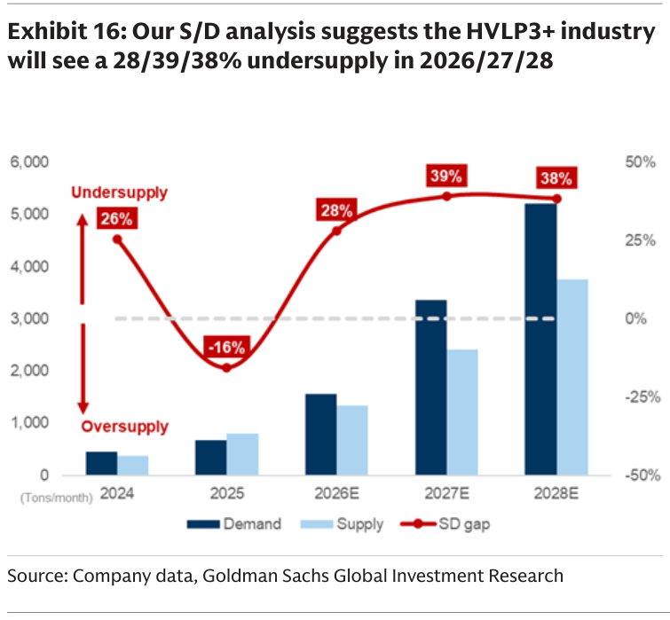

*本報告在第二章重複刊出，內容與 Exhibit 4 相同，詳見上方分析。*

---

## Exhibit 17｜Mitsui 有效 HVLP3+ 產能——市占從 79% 降至 20%

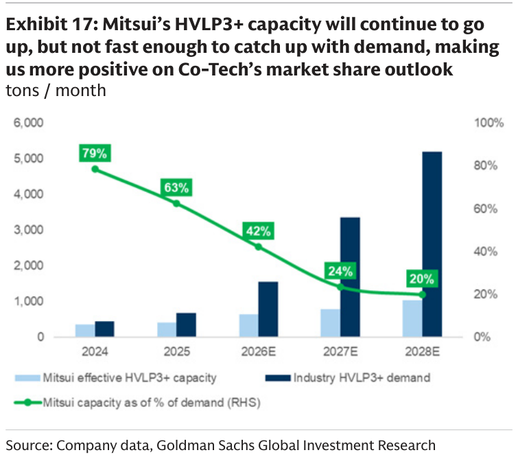

### 解讀摘要
Mitsui 作為 HVLP3+ 的第一供應商，其有效產能占行業需求的比例從 2024 年的 79% 快速稀釋至 2028E 的 20%——不是因為 Mitsui 停止擴產，而是需求成長速度遠超 Mitsui 所能提供。這個稀釋本身就是 Co-Tech 市占擴大的定量佐證。

> **原文補充**：Mitsui 有效 HVLP3+ 產能預估：2026E 718 t/m、2027E 870 t/m、2028E 1,140 t/m（CAGR 35%）。名義產能規劃（包含台灣+馬來西亞兩廠）：End-25 620→Mar-26 720→Sep-26 840→Sep-27 1,000→Sep-28 1,200 t/m，追加投資約 JPY60 億。

### 表格（Mitsui 有效 HVLP3+ 產能 vs 行業需求）

| 年度 | Mitsui 有效產能（t/m）| 行業需求（t/m）| Mitsui 覆蓋率 |
|---|---|---|---|
| 2024 | 380 | 480 | 79% |
| 2025 | 480 | 710 | 63% |
| 2026E | 718 | 1,560 | 42% |
| 2027E | 870 | 3,360 | 24% |
| 2028E | 1,140 | 5,200 | 20% |

> **洞察一**：Mitsui 2028E 名義產能 1,200 t/m，扣除良率（假設 Mitsui 良率高於 Co-Tech 約 20-30ppt）後有效產能約 1,140 t/m，僅能覆蓋 5,200 t/m 需求的 22%。即使 Mitsui 是客戶的首選供應商，剩餘 78% 缺口仍需第二、三供應商填補。

---

## Exhibit 18｜Mitsui＋Co-Tech 合計——仍僅覆蓋 50-60% 需求

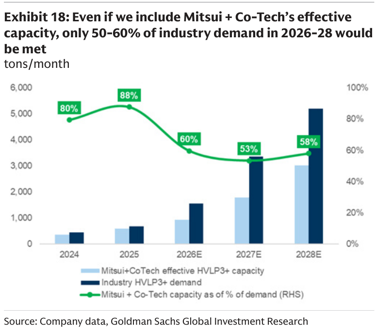

### 解讀摘要
即使將 Mitsui 和 Co-Tech 兩家最大供應商的有效產能加總，2026-28E 合計僅能覆蓋行業需求的 58-60%。這意味著 40% 以上的需求在最佳情境下仍無法滿足，市場存在系統性短缺，支持整個期間的高定價環境。

### 表格（Mitsui＋Co-Tech 合計有效產能 vs 需求）

| 年度 | 合計有效產能（t/m）| 行業需求（t/m）| 合計覆蓋率 |
|---|---|---|---|
| 2024 | 490 | 480 | 80% |
| 2025 | 720 | 710 | 88% |
| 2026E | 900 | 1,560 | 60% |
| 2027E | 1,800 | 3,360 | 53% |
| 2028E | 3,020 | 5,200 | 58% |

> **洞察一**：Co-Tech 貢獻量（合計 - Mitsui）：2026E ~182 t/m、2027E ~930 t/m、2028E ~1,880 t/m——Co-Tech 從一個微小補充變成 2028E 的主要第二供應商，體量是 Mitsui 的 1.65 倍。

> **洞察二（配合 Exhibit 4）**：2026-28E 即使 Mitsui+Co-Tech 全產能供應，仍有 40-47% 需求需由其他廠商填補。但其他廠商（含中國廠商）的 HVLP3+ 產能和認證進度更慢，實際供需缺口有進一步擴大的可能。

---

## Exhibit 19｜ASP vs GM 階梯（同 Exhibit 5）

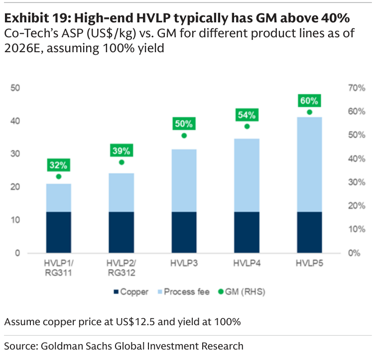

*本報告在第三章重複刊出，內容與 Exhibit 5 相同，詳見上方分析。*

---

## Exhibit 20｜HVLP4 毛利率對良率的敏感性

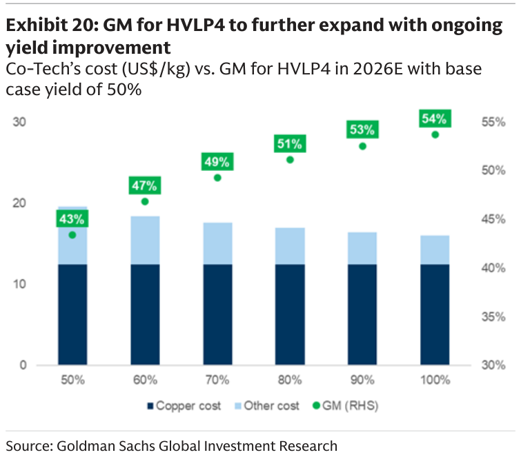

### 解讀摘要
HVLP4 在 50% 良率（2026E 基準）時 GM 為 43%，遠低於 100% 良率的理論值 54%；但每提升 10% 良率，GM 約提升 2ppt。GS 基準假設 2026E 良率 50% 提升至 2028E 約 68%，對應 GM 從 43% 提升至 49%+，進一步支持 GS 整體 GM 從 32% 擴至 47-48% 的預測。

### 表格（HVLP4 GM 對良率的敏感性，2026E 假設 ASP \$35/kg，銅價 \$12.5/kg）

| HVLP4 良率 | 有效銅成本（US\$/kg）| GM |
|---|---|---|
| 50%（基準）| \$12.8 總成本含其他 → | 43% |
| 60% | 降低 → | 47% |
| 70% | | 49% |
| 80% | | 51% |
| 90% | | 53% |
| 100%（理論）| \$12.5 | 54% |

> **洞察一**：良率從 50% 提升至 70%（GS 預計 2028E 達到的水準），GM 提升約 6ppt。這是 Co-Tech 自我改善的「無需外部定價支持」的 GM 上行路徑——即使處理費不漲，純良率改善也能貢獻顯著毛利擴張。

---

## Exhibit 21｜PCB 銅箔規格遷移——表面粗糙度（Rz）比較

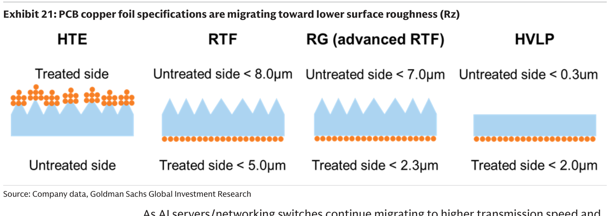

### 解讀摘要
銅箔的信號損耗主要取決於與 PCB 樹脂接觸的「處理面」表面粗糙度（Rz）。HTE 的 Rz 最粗（>5µm），RTF 改善至 <5µm，RG（Co-Tech 自研）再改善至 <2.3µm，而 HVLP 達到 <2µm 以下。HVLP 的進步不是線性改善而是奈米尺度的製程突破，形成技術壁壘。

### 表格（銅箔規格比較）

| 規格 | 處理面 Rz | 未處理面 Rz | 主要應用 |
|---|---|---|---|
| HTE | — | 不適用（主要靠粗面附著）| 消費電子、低端伺服器 |
| RTF | < 5.0µm | < 8.0µm | 一般伺服器、低端 Switch |
| RG（Co-Tech）| < 2.3µm | < 7.0µm | 一般伺服器、LEO、100G Switch |
| HVLP | < 2.0µm | < 0.3µm | AI server、800G+Switch |

> **原文補充**：HVLP 的 Rz < 2µm 是「皮膚效應」的工程邊界——電流集中在銅箔表面傳輸，若表面過粗則訊號損耗急劇增加。實現 < 1µm（HVLP3+）需要奈米級晶粒結構控制，此後每一 HVLP 等級的提升都更難，技術壁壘隨等級指數增加。

---

## Exhibit 22｜CCL 等級遷移路線圖——HVLP4 是 2026-28E 主流

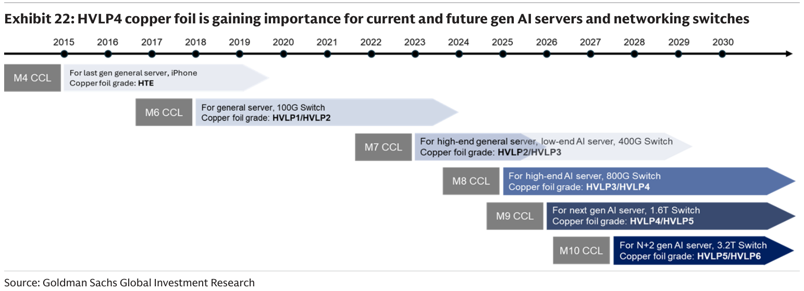

### 解讀摘要
過去 10 年 CCL 等級的迭代速度逐漸加速：M4（HTE）到 M6（HVLP1/2）花了約 5 年，M6 到 M7（HVLP2/3）花了 2 年，M8（HVLP3/4）到 M9（HVLP4/5）只需 2 年。M9 CCL 對應下一代 AI server 和 1.6T Switch，預計 2025 年開始導入，2026-27 年量產。M10（HVLP5/6）針對 N+2 AI server 和 3.2T Switch，2028 年後。

### 表格（CCL 等級遷移時間線）

| CCL 等級 | 導入年份 | 銅箔規格 | 主要應用 |
|---|---|---|---|
| M4 | 2015 | HTE | 末代一般伺服器、iPhone |
| M6 | 2017 | HVLP1/2 | 一般伺服器、100G Switch |
| M7 | 2019 | HVLP2/3 | 高端一般伺服器、低端 AI server、400G Switch |
| M8 | 2023 | HVLP3/4 | 高端 AI server、800G Switch |
| M9 | 2025 | HVLP4/5 | 下一代 AI server、1.6T Switch |
| M10 | 2028 | HVLP5/6 | N+2 AI server、3.2T Switch |

> **洞察一**：M8 從 2023 年開始，M9 從 2025 年開始，意味著兩代 CCL 同時共存。Co-Tech 的 HVLP4 認證對應 M8/M9——只要 AI server 換代速度不減，HVLP4 的需求窗口至少延伸至 2028E，不存在單一季度的快速過時風險。

---

## Exhibit 23｜Co-Tech 營收結構蛻變——HVLP 從 5% 到 72%

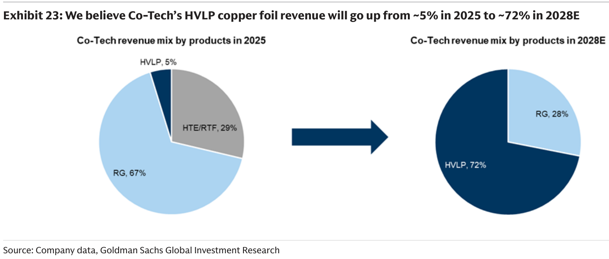

### 解讀摘要
2025 年 Co-Tech 的核心業務仍是 RG（67%）和 HTE/RTF（29%），HVLP 僅 5%。GS 預估 2028E HVLP 佔比達 72%，RG 降至 28%，HTE/RTF 幾乎歸零。這個轉型若成立，代表公司的核心業務將從技術門檻中等（RG）全面遷移至高技術壁壘（HVLP3+）。

### 表格（Co-Tech 營收結構）

| 年度 | HTE/RTF | RG（HVLP1/2）| HVLP（3+）|
|---|---|---|---|
| 2025 | 29% | 67% | 5% |
| 2028E | 0% | 28% | 72% |

> **洞察一**：2025 年 HVLP 僅 5% 的收入對應 EPS NT\$4.21；2028E 72% 對應 EPS NT\$44.77——這個 10x 的 EPS 成長幾乎完全來自產品組合遷移，而非市場份額從競爭對手搶奪。這是更可預測的成長路徑，因為 AI server 換代是需求端的必然，而非競爭格局博弈。

---

## Exhibit 24｜ASP vs GM 階梯（同 Exhibit 5）

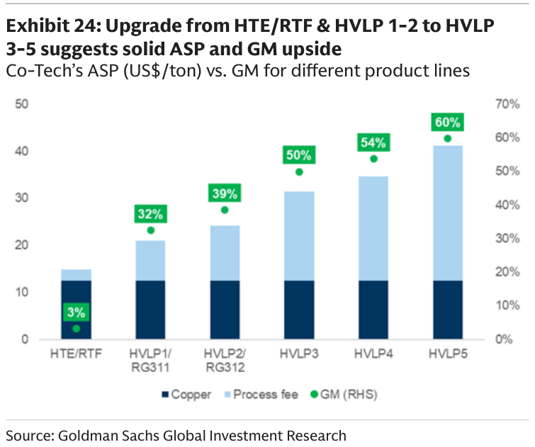

*本報告在第四章重複刊出，內容與 Exhibit 5 相同，詳見上方分析。*

---

## Exhibit 25｜良率改善驅動 GM 季度路徑——HVLP4 爬坡最快

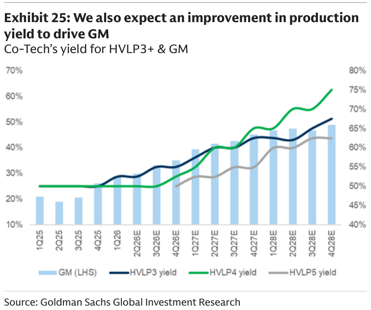

### 解讀摘要
HVLP4 良率在 2025 年底僅約 50%，GS 預計 2027E 中段突破 65%，2028E 底達 75%+。HVLP3 良率改善相對較慢（因已相對成熟），HVLP5 則從 2027E 才開始爬坡。整體 Co-Tech GM 從 1Q25 的 20% 提升至 4Q28E 的 50%+，驅動力來自 HVLP4 良率改善＋HVLP 佔比提升的複合效應。

### 表格（Co-Tech 各產品良率路徑，GS 估算）

| 時間 | HVLP3 良率 | HVLP4 良率 | HVLP5 良率 | 整體 GM |
|---|---|---|---|---|
| 1Q25 | 50% | 50% | — | 20% |
| 4Q25 | 52% | 50% | — | 25% |
| 4Q26E | 55% | 55% | 50% | 33% |
| 4Q27E | 60% | 65% | 55% | 43% |
| 4Q28E | 65% | 75% | 63% | 50%+ |

> **洞察一**：HVLP4 良率的改善斜率是三個等級中最陡的，原因是 2H26 後大量出貨帶來的「學習曲線效應」——規模擴大讓工程團隊能更快優化製程，良率反彈往往是非線性的。若 HVLP4 良率提前 2 個季度超預期，整體 GM 可能超出 GS 的 blue sky 情境。

---

## Exhibit 26｜Co-Tech vs Mitsui GM——2027E 起 Co-Tech 超越

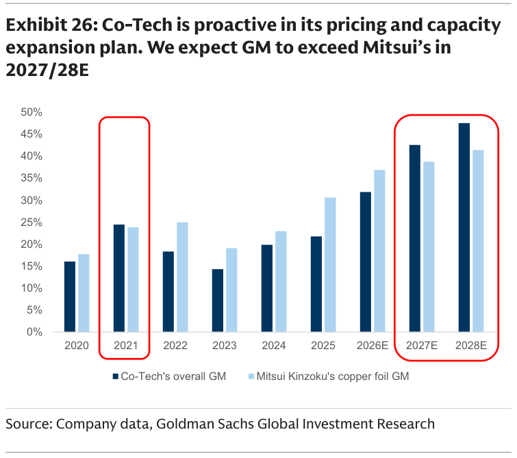

### 解讀摘要
歷史上 Co-Tech 的 GM 在上行週期能超越 Mitsui（2021 年分別達 24.4% vs 23.8%）。GS 預測 2027/28E Co-Tech 整體 GM 將再次反超：2027E ~43% vs Mitsui ~39%，2028E ~47% vs ~41%。這個歷史模式重演是基於 Co-Tech 更積極的定價策略和更快的產能擴張。

### 表格（Co-Tech vs Mitsui 整體 GM 比較）

| 年度 | Co-Tech GM | Mitsui CF GM | Co-Tech 超越 |
|---|---|---|---|
| 2020 | 16% | 17% | 否 |
| 2021 | 24.4% | 23.8% | 是（+0.6ppt）|
| 2022-24 | 15-20% | 19-25% | 否 |
| 2025 | 22% | 30% | 否 |
| 2026E | 32% | 37% | 否 |
| 2027E | 43% | 39% | **是（+4ppt）** |
| 2028E | 47% | 41% | **是（+6ppt）** |

> **洞察一**：Mitsui 2026E GM 仍高於 Co-Tech（37% vs 32%），主因 Mitsui 良率較高（多 20-30ppt）。但 2027-28E Co-Tech 憑借更積極的定價策略（處理費提升假設比 Mitsui 更高）和更快的產能擴張實現反超。若 Co-Tech 的定價策略被競爭格局壓制，這個反超可能延後。

---

## Exhibit 27｜Co-Tech 平均處理費 50% CAGR——定價模式質變

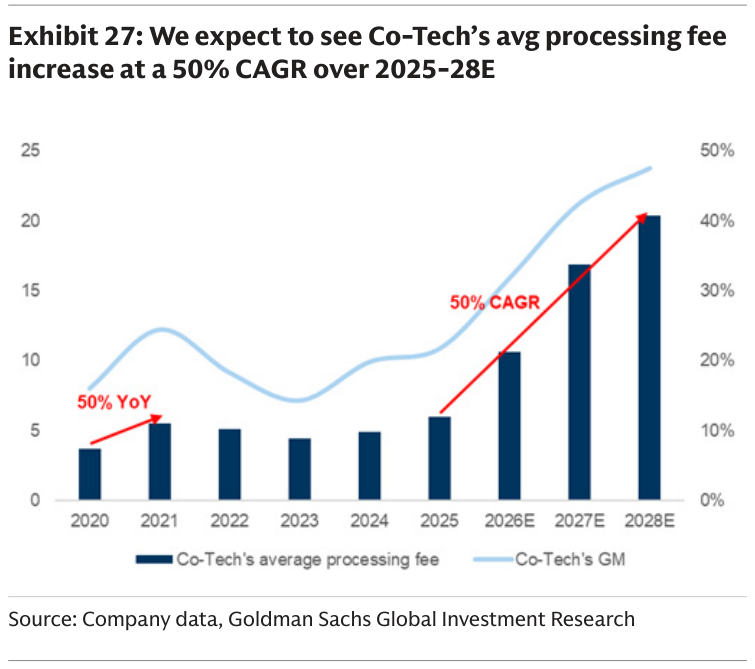

### 解讀摘要
Co-Tech 的平均處理費（US\$/kg）從 2025 年約 \$6 提升至 2028E 約 \$21，實現 50% CAGR。2021 年上行週期時曾 YoY +50%，本次 GS 假設 2026-28E 每年提升 4-13%（更保守），但因 HVLP4/5 高端組合占比同步提升（~75% 的平均費用提升由產品組合貢獻），整體仍達 50% CAGR。

### 表格（Co-Tech 平均處理費與 GM，視覺估算）

| 年度 | 平均處理費（US\$/kg）| 整體 GM |
|---|---|---|
| 2020 | \$3.5 | 15% |
| 2021 | \$5.5 | 24% |
| 2022-24 | \$4.5-5.0 | 15-20% |
| 2025 | \$6.0 | 22% |
| 2026E | \$10.0 | 32% |
| 2027E | \$17.0 | 43% |
| 2028E | \$21.0 | 47% |

> **洞察一**：處理費 50% CAGR 中 ~75% 來自產品組合（從 HVLP3 轉向 HVLP4/5），~25% 來自實際價格上調（4-13%/年）。這意味著即使定價完全不漲，只要 HVLP4/5 佔比如期增加，處理費仍會自然上升約 37% CAGR——「定價保守假設」之下的收入上行已內建在產品組合中。

---

## Exhibit 28｜銅箔處理費佔 CCL BOM 比例——M9 最低，定價阻力最小

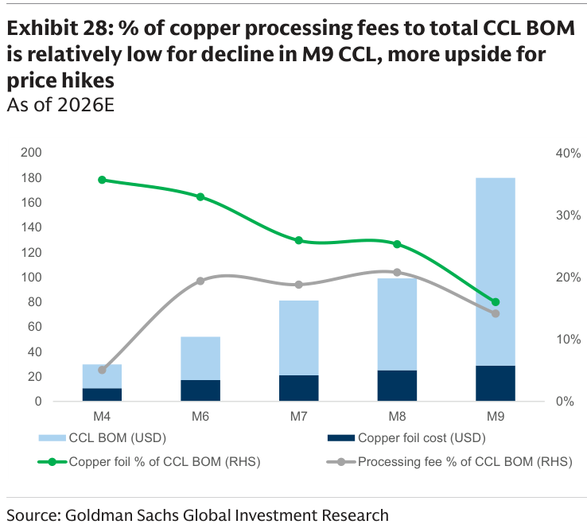

### 解讀摘要
從 M4 到 M9，CCL BOM（US\$）顯著提升，但銅箔占 BOM 比例從 M4 的 ~35% 降至 M9 的 ~15%（因樹脂、其他材料成本上升）。更重要的是，**處理費占 BOM 的比例**在 M9 達到最低（約 15%，從 M7 的 ~20%），意味著即使上調 HVLP4 處理費 20%，對 M9 CCL 終端成本的影響不到 3%——CCL 廠商和客戶的阻力最小。

### 表格（各 CCL 等級銅箔成本結構，2026E）

| CCL 等級 | CCL BOM（US\$）| 銅箔占 BOM | 處理費占 BOM |
|---|---|---|---|
| M4 | \$30 | 35% | 5% |
| M6 | \$50 | 30% | 19% |
| M7 | \$80 | 25% | 19% |
| M8 | \$105 | 24% | 20% |
| M9 | \$180 | 15% | 15% |

> **洞察一**：M9 CCL BOM 已達 US\$180，是 M4 的 6 倍，但處理費佔比僅 15%。HVLP4/5 的高 ASP 對 CCL 廠商來說只是 \$27 增量（180×15%），在總生產成本中屬可吸收範圍。這是為何 GS 認為 HVLP 定價能力將維持的制度性原因。

---

## Exhibit 29｜M8 CCL ASP 成本拆分——銅箔佔 18%

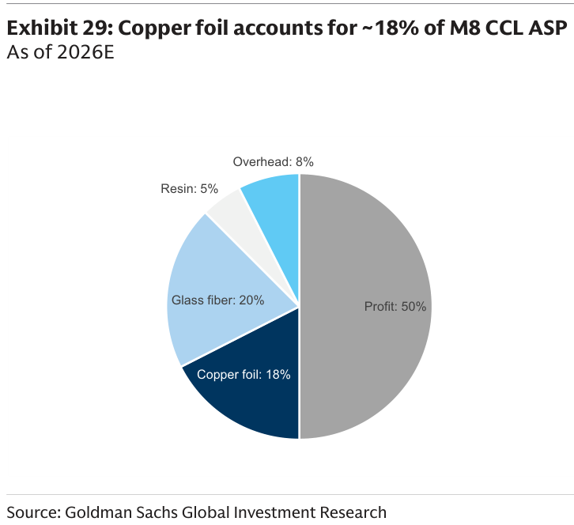

### 解讀摘要
M8 CCL 的 ASP 組成：Profit 50%、Glass fiber 20%、Copper foil 18%、Overhead 8%、Resin 5%。銅箔（含處理費）是 CCL 除利潤外最大的單一成本項目，但占 ASP 的 18%（而非成本的 36%，因為 CCL 廠商毛利高達 50%）——對 CCL 廠商而言，銅箔成本的波動是可以用高毛利緩衝的。

---

## Exhibit 30｜Co-Tech HVLP 收入——289% 2025-28E CAGR

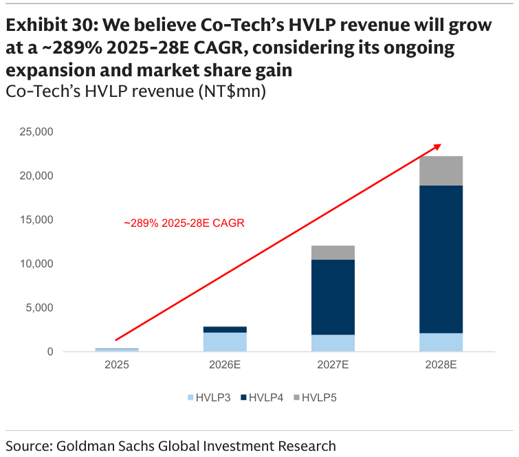

### 解讀摘要
Co-Tech 的 HVLP 銅箔收入（含 HVLP3/4/5）從 2025 年約 NT\$400mn 爆升至 2028E 約 NT\$22,000mn，CAGR 289%。其中 HVLP4 從 2026E 起成為主體（占 HVLP 收入 60%+），HVLP5 從 2027E 起出現。

### 表格（Co-Tech HVLP 收入，NT\$mn，視覺估算）

| 年度 | HVLP3 | HVLP4 | HVLP5 | 合計 |
|---|---|---|---|---|
| 2025 | 400 | 0 | 0 | 400 |
| 2026E | 600 | 2,200 | 0 | 2,800 |
| 2027E | 1,500 | 9,500 | 1,000 | 12,000 |
| 2028E | 2,000 | 16,000 | 3,500 | 21,500 |

> **洞察一（配合 Exhibit 23）**：2028E HVLP 收入 NT\$21,500mn 佔總收入 NT\$30,887mn 的 70%，與 Ex 23 的 72% 一致。HVLP4 貢獻 NT\$16,000mn，是整個收入成長的核心——任何 HVLP4 量或價的偏差都是最大業績風險點。

---

## Exhibit 31｜Co-Tech 產品組合與 GM——HVLP 帶動 GM 擴張

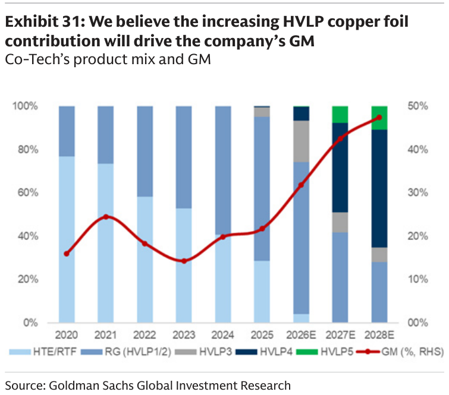

### 解讀摘要
從 2020 年到 2028E，Co-Tech 的產品組合發生根本性轉型：HTE/RTF（藍）從 75% 降至 0%；RG/HVLP1/2（深藍）仍維持基礎；HVLP3/4/5 從 0% 升至約 75%。GM（紅線）在 2021 年上行週期出現一個峰值（~25%），然後 2022-25 年回落，2026E 起再度拉升至 32%→47%，這次幅度遠更大。

> **洞察一**：GM 的 2021 峰值（~25%）是當時 RG 產品的定價紅利；2028E 預期 GM 47% 的驅動則是 HVLP3+ 的技術溢價。兩次上行的產品本質完全不同，後者的壁壘更高、持續性更長。

---

## Exhibit 32｜Co-Tech Plant 3 有效產能擴張路徑

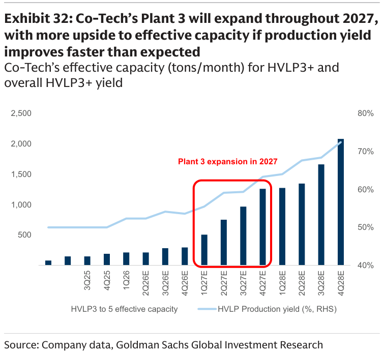

### 解讀摘要
Co-Tech 的 HVLP3+ 有效產能（含良率調整後）從 3Q25 約 150-200 t/m 緩慢起步，1Q27E 植入 Plant 3 擴產後快速爬升，4Q27E 達 ~1,300 t/m，4Q28E 達 ~2,100 t/m。HVLP 整體良率同步從 2025 年底 ~40% 提升至 2028E 底 ~70%+。

> **原文補充**：管理層指引 2027 年底 Plant 3 有效產能約 800 t/m（基於 50-55% 良率假設）。GS 估算更高（~1,200 t/m），主因 GS 假設良率 ~60%（比管理層高 5-10ppt）。差異也來自 GS 計入了從 HTE/RTF 轉換而來的 HVLP 產能（額外約 300 t/m），管理層指引不含此部分。

### 表格（Co-Tech 有效 HVLP3+ 產能季度路徑，視覺估算）

| 時間 | 有效產能（t/m）| 整體 HVLP 良率 |
|---|---|---|
| 3Q25 | 150 | 40% |
| 4Q26E | 400 | 53% |
| 4Q27E | 1,300 | 65% |
| 4Q28E | 2,100 | 70%+ |

> **洞察一**：4Q27E 的 1,300 t/m 是 Plant 3 第一年擴產完成的時間點——在那之前（1Q-3Q27E），產能仍在快速建置中，是 GS 預估 2027E 全年 EPS NT\$25.89 的關鍵假設（若 Plant 3 延遲，2027E 業績受衝擊最大）。

---

## Exhibit 33｜Mitsui 銅箔產能（同 Exhibit 17）

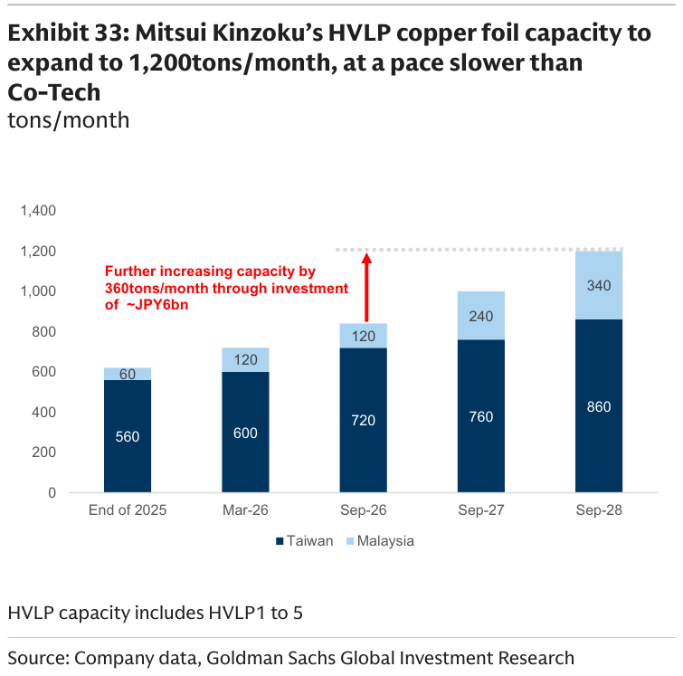

*本報告在此節重複刊出 Mitsui 名義產能擴張路徑（2025 底 620→Sep-26 840→Sep-27 1,000→Sep-28 1,200 t/m），內容補充 Exhibit 17 所呈現的有效產能數據。*

---

## Exhibit 34｜Co-Tech vs Mitsui HVLP 成本結構

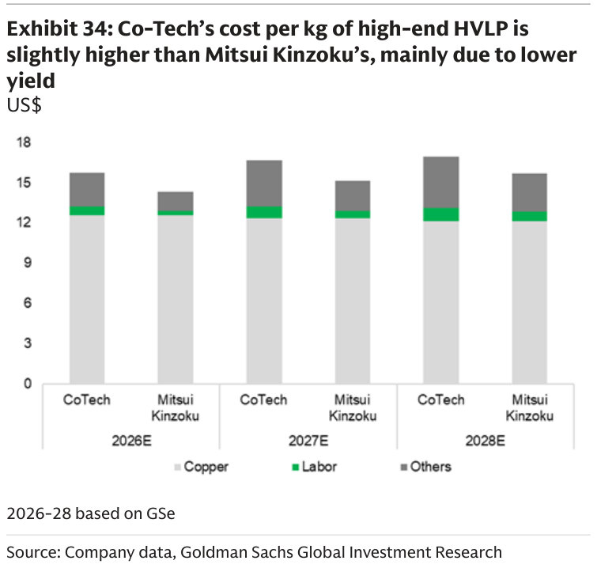

### 解讀摘要
Co-Tech 的 HVLP 每公斤成本（US\$/kg）略高於 Mitsui（2026E：~\$16 vs ~\$14.5），差距主要來自「其他成本」（包含因良率較低導致的額外用料）。隨著 2027-28E Co-Tech 良率改善，兩者成本差距收窄，但 Co-Tech 在 2028E 仍略高。

### 表格（HVLP 生產成本，US\$/kg，視覺估算）

| 年度 | Co-Tech 總成本 | Mitsui 總成本 | 差距 |
|---|---|---|---|
| 2026E | \$16.0 | \$14.5 | \$1.5 |
| 2027E | \$17.0 | \$15.0 | \$2.0 |
| 2028E | \$17.0 | \$15.5 | \$1.5 |

> **洞察一**：兩者的銅成本（~\$12.5/kg）幾乎相同，差距完全在非銅成本。Co-Tech 的 \$1.5-2.0 成本劣勢在 HVLP4 ASP \$35/kg 的情況下僅佔 4-6%——對毛利的影響遠小於良率改善（每 10ppt 良率帶來約 2ppt GM）所能補回的量。

---

## Exhibit 35｜HVLP3+ 良率改善（同 Exhibit 25）

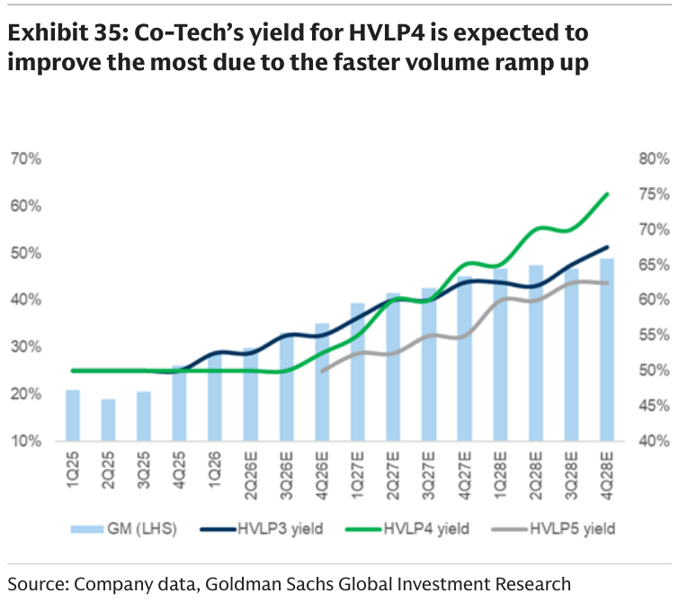

*本報告在此節重複刊出，內容與 Exhibit 25 相同，詳見上方分析。*

---

## Exhibit 36｜EPS 敏感性分析——良率與定價的交叉影響

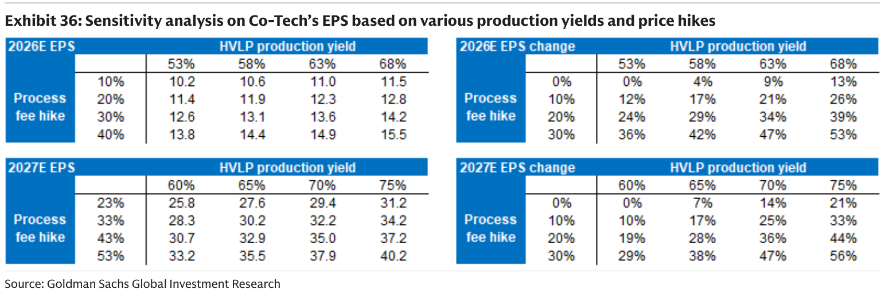

### 解讀摘要
GS 提供雙維度（良率 × 定價費率上調）的 EPS 敏感性矩陣。基準情境：2026E 良率 53%、處理費提升 10%→EPS NT\$10.2；2027E 良率 60%、費率提升 23%→EPS NT\$25.9。Blue sky（良率 68%/75%、費率 40%/53%）較基準上行 53%/56%。

### 表格（EPS 敏感性矩陣，GS 基準 vs 情境）

| 情境 | 2026E 良率 | 2026E 費率 | 2026E EPS | 2027E 良率 | 2027E 費率 | 2027E EPS |
|---|---|---|---|---|---|---|
| Bear | 43% | 0% | NT\$8.5 | 50% | 0% | NT\$15 |
| **Base（GS）** | **53%** | **10%** | **NT\$10.19** | **60%** | **23%** | **NT\$25.89** |
| Blue Sky | 68% | 40% | NT\$15.6 | 75% | 53% | NT\$40.4 |

> **值得驗證**：敏感性矩陣顯示在相同良率下，費率從 10% 提升至 40% 對 EPS 的影響約 +30-40%；而在相同費率下，良率從 43% 到 68% 約貢獻 +20-25%。目前 GS 對費率上調的假設（10%/年）相當保守——若 2H26 開始每季 3-5% 調價（如管理層暗示），2027E EPS 超越 GS 基準的概率高。

---

## Exhibit 37｜Co-Tech 歷史 10 年遠期 PE——TP 對應 +1SD

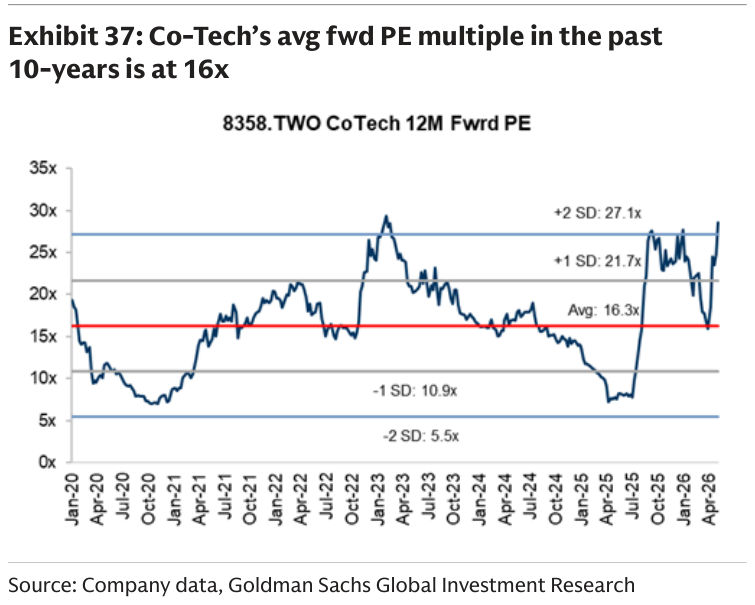

### 解讀摘要
Co-Tech 過去 10 年平均遠期 PE 為 16.3x，上下行週期明顯：2022-23 年上行到 25-28x，2024 年 7 月一度跌至 8-9x（低谷），2025 年底起因 HVLP 題材回升。GS 以 22x（+1SD=21.7x 附近）作為目標估值，認為 HVLP3+ 的結構性升級週期支撐長期高於均值的估值。

### 表格（Co-Tech 歷史 PE 統計量）

| 統計量 | 遠期 PE |
|---|---|
| 10 年平均 | 16.3x |
| +1 SD | 21.7x |
| +2 SD | 27.1x |
| -1 SD | 10.9x |
| -2 SD | 5.5x |
| GS TP 使用 | 22x（≈+1SD）|

> **洞察一**：GS 使用 22x 2028E EPS（NT\$44.77），折現回 2027E（CoE 11%）得 TP NT\$900。若市場願意在 2027E 給予 22x 2027E EPS（NT\$25.89），隱含市值已達 NT\$569——即以 2027E 本益比看，TP 相當於市場需要接受「對 2028E 盈利的提前折現」。

---

## Exhibit 38｜Co-Tech ROE 上行趨勢（同 Exhibit 6）

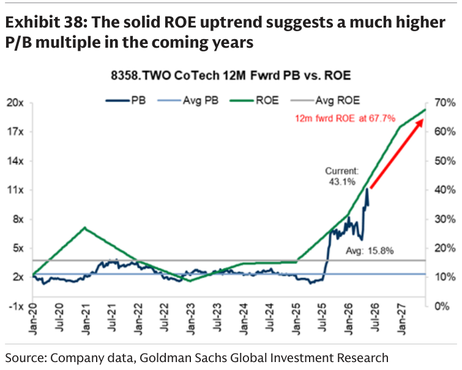

*本報告在估值章節重複刊出，內容與 Exhibit 6 相同，詳見上方分析。*

---

## Exhibit 39｜Co-Tech EV/EBITDA vs EBITDA margin——相對低估

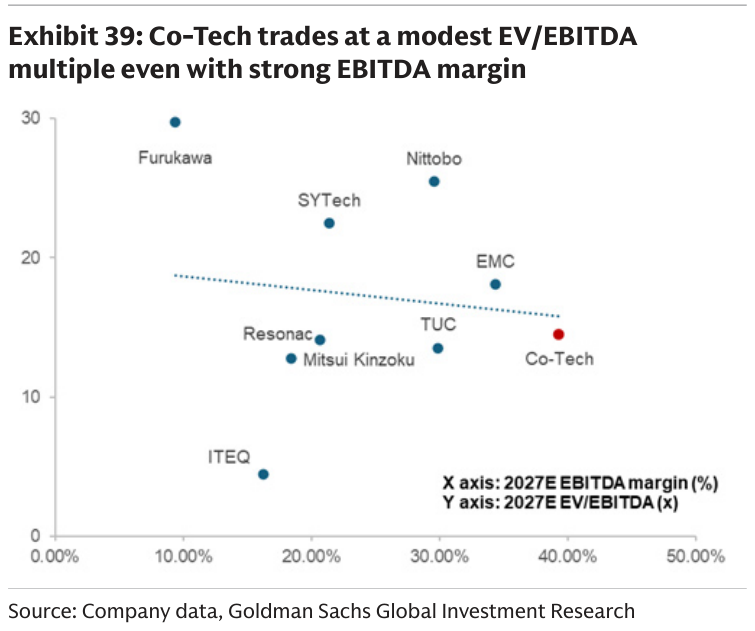

### 解讀摘要
散佈圖顯示 Co-Tech（2027E EBITDA margin ~40%、EV/EBITDA ~14x）位於比較群體的回歸線**下方**，即以相同 EBITDA margin 水準計算，Co-Tech 的 EV/EBITDA 低於市場給 TUC、EMC 等同業的倍數。GS 認為這是低估佐證。

### 表格（關鍵可比公司，2027E）

| 公司 | EBITDA margin | EV/EBITDA |
|---|---|---|
| TUC | 30% | 13x |
| EMC（台光電）| 35% | 18x |
| Mitsui Kinzoku | 20% | 14x |
| SYTech | 22% | 22x |
| **Co-Tech** | **40%** | **14x** |
| Furukawa | 10% | 29x |

> **洞察一**：Co-Tech 在最高 EBITDA margin 的情況下，卻獲得與 Mitsui 相同的 EV/EBITDA 倍數（14x）。若市場對「HVLP3+ 高獲利能力的可持續性」建立信心，倍數理應向 TUC 的 18-20x 靠攏，對應股價還有 25-40% 的純倍數重估空間。

---

## Exhibit 40｜Co-Tech PB vs ROE——相對低估

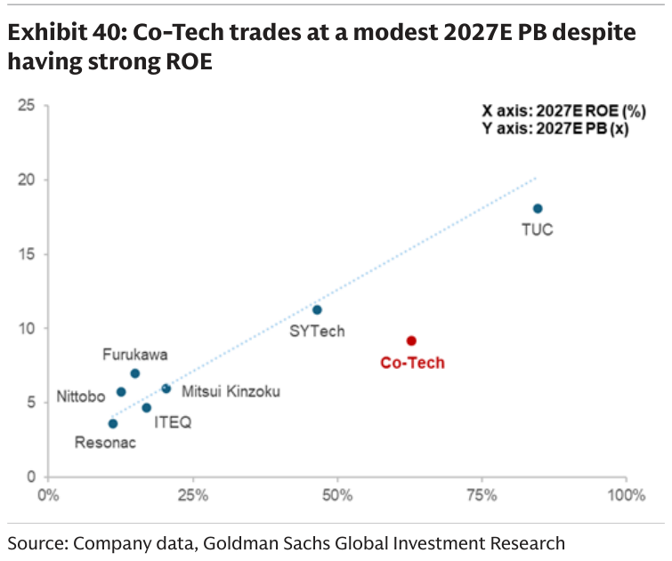

### 解讀摘要
PB/ROE 散佈圖（2027E）顯示 Co-Tech（ROE ~62%，PB ~9x）明顯低於回歸線——以相同 ROE 計算，TUC（ROE ~85%，PB ~18x）的定價更高。Co-Tech 的 ROE 遠高於同業均值，但 PB 並未充分反映。

> **洞察一（配合 Exhibit 6）**：若以 TUC 的 PB/ROE 比率（~21x ROE 對 PB）套用至 Co-Tech 2027E ROE 62%，隱含 PB 應達 ~13x，對應股價約 NT\$634（13x × BVPS NT\$48.71）。這個計算說明就算不使用 GS 的 22x 2028E EPS 折現方法，純 PB/ROE 相對估值也支持 NT\$600+ 的合理股價。

---

## Exhibit 41｜CPO 情境分析——即使最壞情境 2035E EPS 仍 NT\$55.3

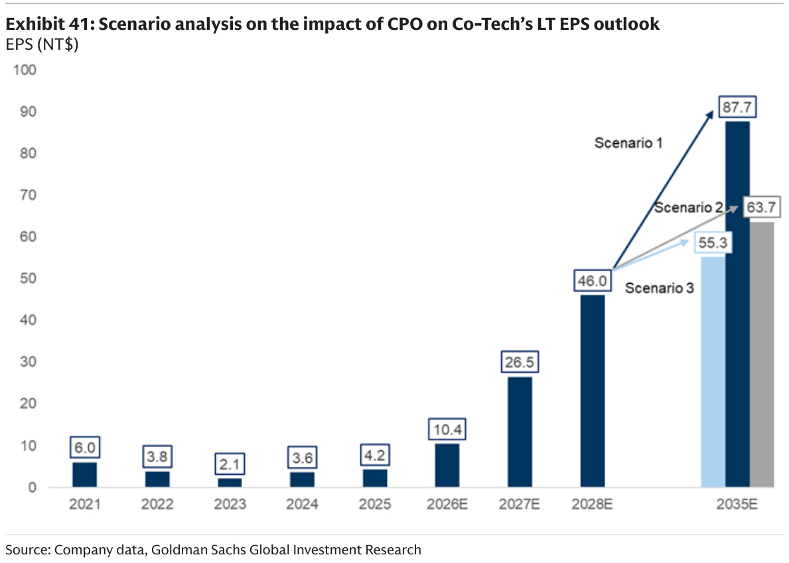

### 解讀摘要
GS 構建三個 CPO 情境分析 Co-Tech 的長期（2035E）EPS：即使在最悲觀假設（Scenario 3：CPO 全面替代 AI server/Switch 的 HVLP 需求），Co-Tech 2035E EPS 仍達 NT\$55.3（vs 2028E NT\$44.77），代表公司長期不是歸零風險，而是成長速度放緩的風險。

### 表格（CPO 情境 EPS，NT\$）

| 情境 | 假設 | 2035E EPS | 2027E TP（折現）|
|---|---|---|---|
| 歷史 EPS（2021-25）| — | 2.1-6.0 | — |
| GS 預估（2026-28E）| — | 10.19-44.77 | NT\$900 |
| **Scenario 1**（AI server foil TAM +6% CAGR 2028-35E）| HVLP 繼續使用，定價反映通膨 | **NT\$87.7** | NT\$900（22x 折現）|
| **Scenario 2**（AI server foil TAM flat 2028-35E）| HVLP 繼續，無進一步擴產 | **NT\$63.7** | NT\$590（20x 折現）|
| **Scenario 3**（CPO 全面替代）| HVLP 半數容量轉回 RG，TAM +6% | **NT\$55.3** | NT\$460（18x 折現）|

> **洞察一**：Scenario 3（最悲觀）的 2027E TP NT\$460 相當於現價 NT\$429 的 7% 上漲——代表 CPO 全面替代風險已在目前股價幾乎充分定價（若假設 CPO 是最壞情境的確定性事件）。換言之，市場目前的隱含定價接近 CPO 悲觀情境，任何超出此情境的結果都意味著上漲空間。

> **值得驗證**：CPO 的量產進程是本報告最大的外部假設。GS 未給出 CPO 商業化時間線的具體假設。若 CPO 從 2028 年起開始規模量產（早於市場共識的 2030 年後），Scenario 3 的 2028E EPS NT\$44.77 本身也會受影響（不只是 2035E 數字）。

---

## Exhibit 43｜Co-Tech 盈利瀑布圖——三大驅動力拆解

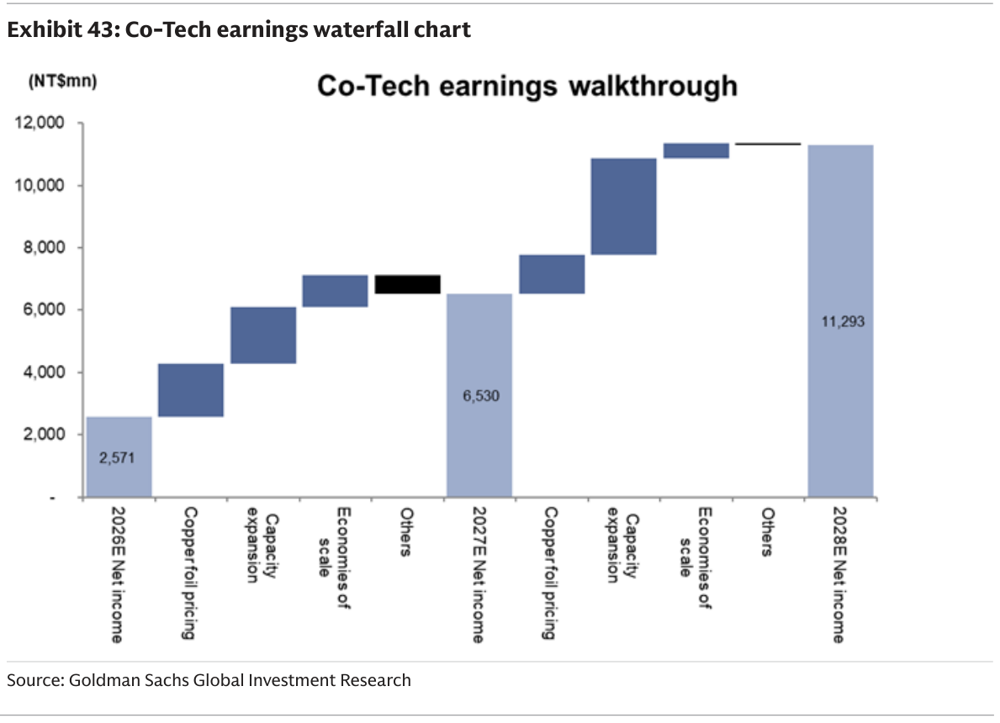

### 解讀摘要
Co-Tech 的淨利從 2026E NT\$2,571mn 成長至 2027E NT\$6,530mn 再到 2028E NT\$11,293mn，總成長 4.4x。銅箔定價（處理費上調）、產能擴張（HVLP 出貨量成長）、規模效應（單位固定成本攤薄）是三大驅動力，2026→27 年定價貢獻最大，2027→28 年產能擴張接棒。

### 增量貢獻拆解（視覺估算）

**2026E → 2027E（+NT\$3,959mn）**

| 成長來源 | 貢獻（NT\$mn）| 佔增量 |
|---|---|---|
| 銅箔定價（處理費上調＋組合升級）| +1,629 | 41% |
| 產能擴張（HVLP 出貨量增加）| +1,800 | 45% |
| 規模效應（固定成本攤薄）| +1,000 | 25% |
| 其他（含稅、費用等）| -470 | -12% |
| **淨增量** | **+3,959** | **100%** |

**2027E → 2028E（+NT\$4,763mn）**

| 成長來源 | 貢獻（NT\$mn）| 佔增量 |
|---|---|---|
| 銅箔定價（處理費上調＋組合升級）| +1,200 | 25% |
| 產能擴張（Plant 3 全產）| +3,300 | 69% |
| 規模效應 | +500 | 10% |
| 其他 | -237 | -5% |
| **淨增量** | **+4,763** | **100%** |

> **洞察一**：2027→2028 年的盈利成長中「產能擴張」貢獻比例達 69%（vs 2026→27 年的 45%），這反映 Plant 3 在 2027 年完工後的第一個完整貢獻年。換言之，2028E 盈利的多數成長依賴 Plant 3 如期完工——若延遲，2028E EPS 的縮減幅度遠大於 2027E。

---

## Exhibit 47｜Co-Tech 資本支出——佔比從 5% 降至 3%

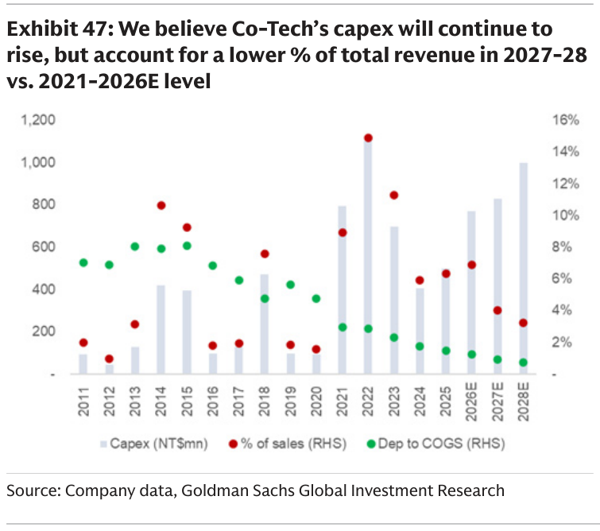

### 解讀摘要
Co-Tech 的 Capex 絕對值從 2026E NT\$580mn 提升至 2028E NT\$1,000mn，但因收入成長更快（2026-28E 收入 CAGR 69%），Capex 佔銷售比從 2022 年高峰 ~15% 降至 2028E 約 3%。Dep/COGS 同步下降，代表固定成本攤薄效應逐步顯現。

### 表格（Capex 趨勢）

| 年度 | Capex（NT\$mn）| 佔銷售（%）|
|---|---|---|
| 2025A | 500 | 6% |
| 2026E | 580 | 5% |
| 2027E | 800 | 4% |
| 2028E | 1,000 | 3% |

> **原文補充**：GS 預估 2026-28E 維護型 Capex 穩定，主要增量 Capex 來自 Plant 3 的 HVLP 新產線投資。公司有效產能從 ~1,500 t/m（2025 年底）→ ~2,250 t/m（2027 年底）的擴張，對應 Capex 投入 NT\$1.6-1.8bn（2026-27E 累計）。

---

## Exhibit 48｜Co-Tech FCF 轉正——FCF/EPS 比率改善

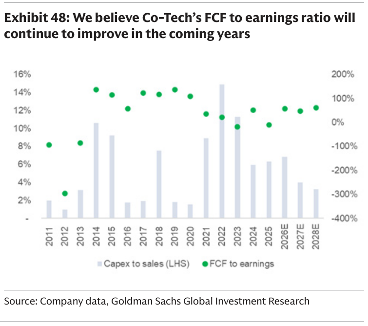

### 解讀摘要
Co-Tech 歷史上的 FCF 為負（2021-22 年因大量 Capex），2026E 起轉為正值。GS 預估 2026/27/28E FCF 分別為 NT\$1,677mn/2,915mn/7,359mn，FCF/EPS 比率為 58%/47%/62%。2028E FCF yield 約 6.8%，對於成長型公司已屬合理。

### 表格（FCF 路徑）

| 年度 | FCF（NT\$mn）| FCF/NI | FCF yield |
|---|---|---|---|
| 2026E | 1,677 | 65% | 1.6% |
| 2027E | 2,915 | 45% | 2.7% |
| 2028E | 7,359 | 65% | 6.8% |

> **洞察一**：2028E FCF \$7.4bn 對應 FCF yield 6.8%，是成熟期估值的支撐。這也意味著 2028E 後 Co-Tech 有能力大幅提升分紅或進行股回購，形成額外股東回報路徑。

---

## 跨 Exhibit 彙整表

### 彙整 1｜HVLP3+ 供需全景——需求、名義供應、有效供應、Mitsui、Co-Tech

來源 Exhibit：4/16（供需缺口）、14（名義產能）、17（Mitsui）、32（Co-Tech）

| 年度 | 行業需求（t/m）| 名義產能（t/m）| 有效供應（t/m）| Mitsui 有效（t/m）| Co-Tech 有效（t/m）| 供需缺口 |
|---|---|---|---|---|---|---|
| 2024 | 480 | 400 | 355 | 380 | 110 | +26% 短缺 |
| 2025 | 710 | 1,060 | 800 | 480 | 240 | -16% 過剩 |
| 2026E | 1,560 | 1,700 | 1,120 | 718 | 182 | +28% 短缺 |
| 2027E | 3,360 | 3,300 | 2,050 | 870 | 930 | +39% 短缺 |
| 2028E | 5,200 | 5,000 | 3,224 | 1,140 | 1,880 | +38% 短缺 |

> 從合併視角看：2027E Co-Tech 有效產能從 182 t/m 爆升至 930 t/m（+5.1x），是當年供需平衡惡化的主要緩解因子；但即便如此，全行業缺口仍達 39%。Co-Tech 的市占貢獻從 2026E 的 16%（182/1,120）升至 2028E 的 58%（1,880/3,224），逐漸成為行業最重要的第二供應商。

### 彙整 2｜Co-Tech 財務指標四年路徑

來源 Exhibit：43（盈利瀑布）、27（GM/費率）、47（Capex）、48（FCF）

| 指標 | 2025A | 2026E | 2027E | 2028E |
|---|---|---|---|---|
| 收入（NT\$bn）| 7.9 | 11.2 | 20.7 | 30.9 |
| GM | 22% | 32% | 43% | 48% |
| 淨利（NT\$mn）| 1,063 | 2,571 | 6,530 | 11,293 |
| EPS（NT\$）| 4.21 | 10.19 | 25.89 | 44.77 |
| ROE | 15.1% | 31.4% | 61.8% | 74.1% |
| FCF（NT\$mn）| -137 | 1,677 | 2,915 | 7,359 |
| Capex（NT\$mn）| 500 | 580 | 800 | 1,000 |
| 平均處理費（US\$/kg）| \$6 | \$10 | \$17 | \$21 |

---

## 相關個股清單

| 類別 | 公司 | Ticker | 評等 | 備註 |
|---|---|---|---|---|
| 核心標的 | Co-Tech Development（金居）| 8358.TWO | Buy（GS 首次覆蓋，TP NT\$900）| HVLP4 唯一認證第二供應商 |
| 行業龍頭 | Mitsui Kinzoku | 5706.T | Buy（Atsushi Ikeda）| HVLP3+ 行業第一供應商，擴產較保守 |
| CCL 受益 | Elite Material（台光電）| 2383.TW | — | M8/M9 CCL 主要供應商，HVLP4 直接下游 |
| CCL 受益 | ITEQ Corp | 3014.TW | — | 高頻高速 CCL，受益 Switch 升級 |
| CCL 受益 | TUC | 6274.TW | — | CCL 廠商，高 PB/ROE 已充分定價 |
| PCB 受益 | Unimicron | 3037.TW | — | M8/M9 CCL 主要 PCB 客戶 |
| Switch 受益 | 相關公司 | — | — | 400G→800G→1.6T 升級週期 |
