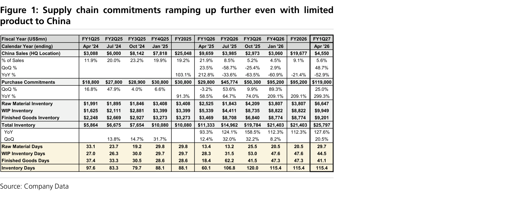
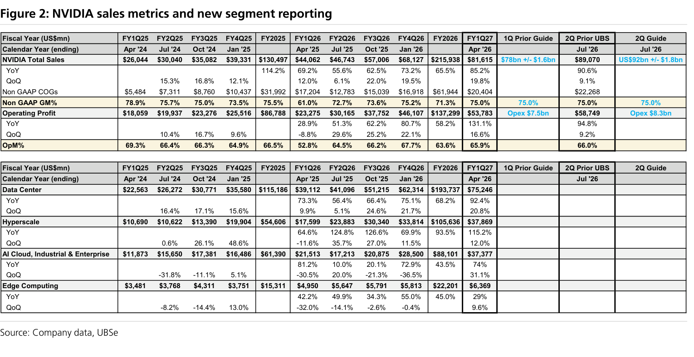
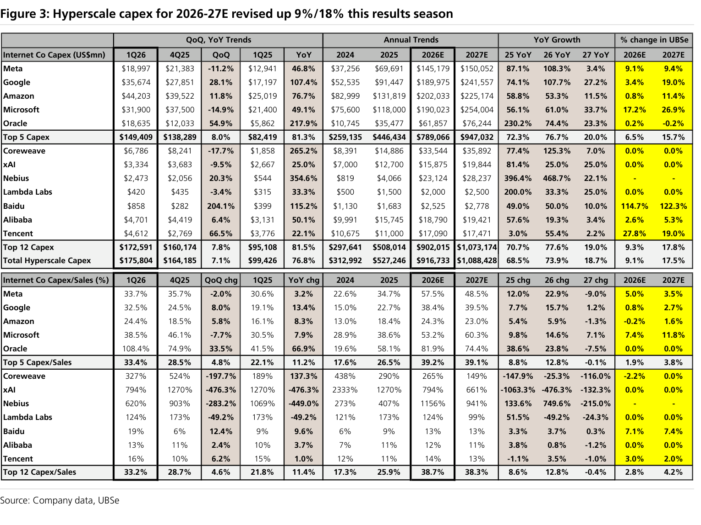
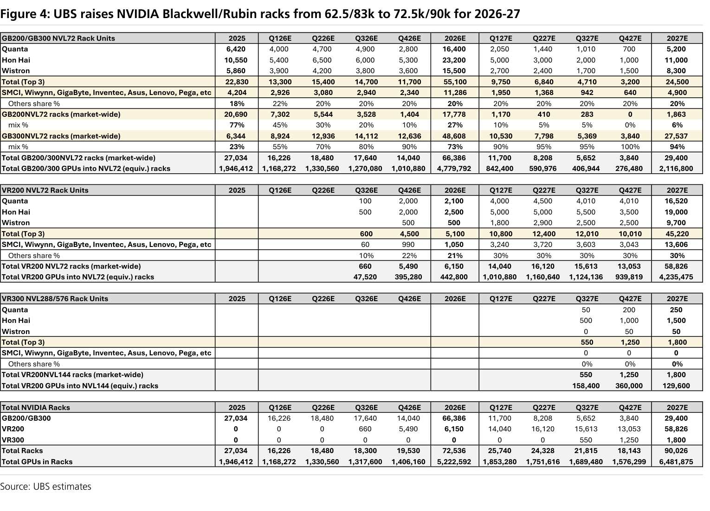
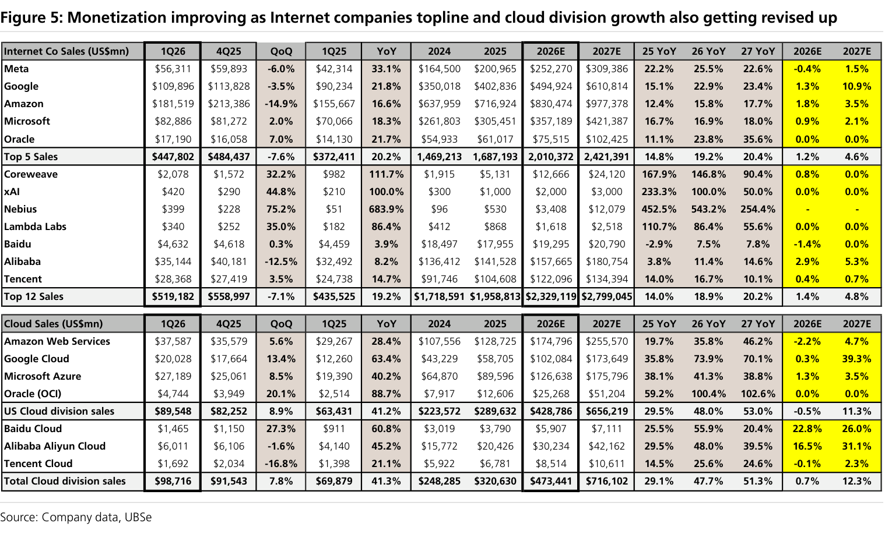

# UBS｜APAC Tech Views: Raising NVIDIA Rack Forecasts

**券商**：UBS Securities  
**分析師**：Randy Abrams、Nicolas Gaudois、Sunny Lin、Timothy Arcuri、Annie Chen  
**日期**：2026-05-21  
**主題**：UBS Tech Views: Raising NVIDIA rack forecasts following solid results and ODM sales upside  
**評級**：N/A（供應鏈主題報告）  
<button type="button" onclick="fetch('https://ti-lei.github.io/foreign-reports/static/downloads/產業/20260521_UBS_APAC-Tech-NVIDIA.md').then(r=>r.text()).then(t=>{let a=document.createElement('a');a.href='data:text/plain;charset=utf-8,'+encodeURIComponent(t);a.download='20260521_UBS_APAC-Tech-NVIDIA.md';a.click()})">⬇ 下載 MD</button>

---

## UBS 完整投資邏輯鏈

| 論點層次 | Exhibit | 內容 |
|---|---|---|
| 需求信號明確 | Figure 1 | FQ127 營收 US\$81.6bn beat 共識 US\$78.9bn；購買承諾 +299% YoY 至 US\$119bn，FY27 內交付 US\$95bn |
| 供給端鎖定 | Figure 1 | 庫存天數穩定於 115 天；中國業務從佔比 22% 降至 5.6%，需求缺口由西方市場填補 |
| 超大型雲端資本支出上修 | Figure 3 | 20 家超大型雲端資本支出 2026-27E 上調 9%/18%，總規模 US\$915bn/US\$1.087trn |
| 機架出貨預測直接上調 | Figure 4 | 2026E 72.5k（前：62.5k），2027E 90k（前：83k）；Rubin 量產延至 9 月，2026 仍以 Blackwell 為主 |
| 變現能力改善支撐持續性 | Figure 5 | 雲端收入增速逐年加快：2024-25 +24%/+29% → 2026-27 +47%/+51%，排除純景氣循環解讀 |
| **結論** | 報告封面 | **AI 供應鏈需求能見度清晰；Components/半導體優於 ODM；Wiwynn、Delta 為 ODM 中首選** |

> **報告最大邏輯缺口**：Rubin 散熱片調整延期對 2Q26 機架出貨量的實際影響尚未量化；若量產進一步延至 10 月，2026 全年 72.5k 預測存在下調風險。

---

## 報告核心觀點

| 主題 | UBS 觀點 | 市場共識 | 是否 Contra-Consensus |
|---|---|---|---|
| 供應鏈採購承諾 | +299% YoY 至 US\$119bn，強勁 | 市場預期放緩 | ✅ 是 |
| Rubin 量產時程 | 散熱片問題推遲至 9 月，但 4Q 仍啟動出貨 | 8 月量產 | 部分（延期但不取消） |
| 中國業務風險 | 佔比從 22% 降至 5.6%，已定價在內 | 中國限制影響持續 | ✅ 是 |
| 雲端資本支出持續性 | 變現收入加速支撐 capex，2027 前不依賴大量舉債 | 市場疑慮 2027 後能否持續 | ✅ 是 |
| ODM 估值 | 合理但落後半導體；11-15x 低端具支撐 | ODM 受 margin 壓縮 | 部分（保留but不是首選） |

**偏好排序（供應鏈）**：半導體/Components > ODM  
**個股偏好**：TSMC（雲端 AI 晶圓廠）、MediaTek（Google TPU 設計服務）、ASE（先進封裝）、Aspeed（BMC）、GUC（Google CPU）、Alchip（Amazon Trainium 3）；ODM 中 Wiwynn > Delta

---

## Figure 1｜Supply chain commitments ramping up further

### 解讀摘要
FQ127 購買承諾跳升至 US\$119bn（+299% YoY / +25% QoQ），是本季財報最關鍵的供應鏈信號——這代表 NVIDIA 已用現金鎖定未來 2-3 季的零組件，供需緊張程度超過市場預期。同時，中國業務佔比從 FQ225 高峰 22% 跌至 FQ127 的 5.6%，但購買承諾仍大幅上揚，代表西方市場需求已完全填補中國缺口甚至超過。

> **原文補充**：US\$95bn 的購買承諾集中在 FY27 內交付，US\$119bn 中的剩餘部分為 FY28+ 遠期鎖量。此外，NVIDIA 庫存天數維持 115 天，UBS 視為健康水位（非過度囤貨）。

### 表格

| 項目（US\$mn） | FY2025 | FQ125（Apr'25） | FQ226（Jul'25） | FQ326（Oct'25） | FQ426（Jan'26） | FY2026 | FQ127（Apr'26） |
|---|---|---|---|---|---|---|---|
| 中國（HQ）銷售額 | 25,048 | 9,659 | 3,985 | 2,973 | 3,060 | 19,677 | 4,550 |
| 　% 佔總銷售 | 19.2% | 21.9% | 8.5% | 5.2% | 4.5% | 9.1% | 5.6% |
| 　YoY | — | +212.8% | -33.6% | -63.5% | -60.9% | -21.4% | -52.9% |
| 購買承諾 | 30,800 | 29,800 | 45,774 | 50,300 | 95,200 | 95,200 | 119,000 |
| 　QoQ | — | -3.2% | +53.6% | +9.9% | +89.3% | — | +25.0% |
| 　YoY | +91.3% | +58.5% | +64.7% | +74.0% | +209.1% | +209.1% | +299.3% |
| 總庫存 | 10,080 | 11,333 | 14,962 | 19,784 | 21,403 | 21,403 | 25,797 |
| 庫存天數 | 88.1 | 60.1 | 106.8 | 120.0 | 115.4 | 115.4 | 115.4 |

> **洞察一**：購買承諾 US\$119bn 中，US\$95bn 在 FY27（截至 Jan'27）內交付，即未來 3 季的採購能見度已高度確定。這對基板、ABF、HBM 等長交期零組件的需求能見度有直接支撐。

> **洞察二**：中國業務絕對金額 FQ127 為 US\$4.55bn，雖比 FQ125（US\$9.66bn）縮水 53%，但購買承諾 QoQ 仍 +25%。表示非中國需求每季增量已達 US\$23bn+，足以覆蓋約 5 個中國季的損失。

---

## Figure 2｜NVIDIA sales metrics and new segment reporting

### 解讀摘要
NVIDIA 本季起新增段落拆分：資料中心細分為「Hyperscale」（US\$37.9bn）與「ACIE」（AI clouds、industrial、enterprise，US\$37.4bn），加上獨立的「Edge Computing」（US\$6.4bn）。Hyperscale 僅 +12% QoQ 但 ACIE +31% QoQ，代表企業 AI 採用正在加速追上超大型雲端，是結構性而非週期性信號。

> **原文補充**：ACIE（AI clouds / industrial / enterprise）包含 Anthropic 等 model builders、工業自動化與企業 GenAI 部署。管理層表示 NVIDIA 在 Anthropic 等模型建構商的佔有率持續提升，作為推動 ACIE 長期增長的核心動力。

### 表格

| 項目（US\$mn） | FQ127（Apr '26） | QoQ | YoY | 2Q 指引 |
|---|---|---|---|---|
| NVIDIA 總營收 | 81,620 | +20% | +85% | ~91,000 |
| 資料中心 | 75,200 | +21% | +92% | — |
| 　Hyperscale | 37,900 | +12% | +115% | — |
| 　ACIE | 37,400 | +31% | +74% | — |
| Edge Computing | 6,400 | +10% | +29% | — |
| 毛利率 | 75% | in-line | — | 維持 75% |
| 共識預估（營收） | 78,900 | — | — | 87,000 |

> **洞察三**：ACIE 季增 +31% QoQ 超越 Hyperscale 的 +12%，若趨勢持續，企業/工業 AI 將在 2-3 季後超越 Hyperscale 成為最大單一資料中心次分部。此訊號表示 AI 需求的客戶結構正在去集中化，降低超大型雲端資本支出週期波動的風險。

---

## Figure 3｜Hyperscale capex for 2026-27E revised up 9%/18%

### 解讀摘要
本財報季後，UBS 追蹤的 20 家超大型雲端與 neoclouds 合計資本支出上調 9%/18%，2026E 至 US\$915bn、2027E 至 US\$1.087trn（YoY +74%/+19%）。Meta、Google、Amazon 三家貢獻最大上修幅度，且 Coreweave、xAI、Nebius 等 neoclouds 的 YoY 增速均超過 100%，顯示新進者在補充傳統超大型的結構性缺口。

> **原文補充**：UBS 指出，超大型雲端在 2026 的淨現金總量維持 US\$436bn，且 FCF 預計在進入負值前仍能支撐 +40% YoY 的資本支出增長（至 2027 末）；因此資本支出的資金來源是現金流、不依賴大量舉債——這是 UBS 認為 2027 持續性比市場擔心的情況更好的核心依據。

### 表格

| 公司 | 1Q26 資本支出（US\$mn） | 2026E（US\$mn） | 2027E（US\$mn） | 26 YoY | 27 YoY | UBSe 變動 26E | UBSe 變動 27E |
|---|---|---|---|---|---|---|---|
| Meta | 12,941 | 69,691 | 145,179 | 87.1% | 108.3% | +9.1% | +9.4% |
| Google | 17,190 | 101,447 | 189,635 | 107.7% | 27.2% | +2.4% | +19.0% |
| Amazon | 30,606 | 82,999 | 103,174 | 58.8% | 24.3% | +2.4% | +11.4% |
| Microsoft | 21,400 | 75,600 | 118,000 | 56.1% | 61.0% | +17.2% | +26.9% |
| Oracle | 18,635 | 53,477 | 115,174 | 120.3% | 74.4% | +23.6% | +22.6% |
| **Top 5 合計** | **149,409** | **446,434** | **789,066** | **72.3%** | **76.7%** | **+6.5%** | **+15.7%** |
| Coreweave | 1,858 | 14,886 | 34,534 | 125.0% | 7.0% | +0.0% | +0.0% |
| xAI | 3,683 | 12,700 | 19,844 | 81.4% | 56.2% | +45.0% | +25.0% |
| Nebius | 473 | 3,408 | 11,071 | 542.5% | 424.5% | +254.4% | — |
| **Top 12 合計** | 172,591 | 660,174 | 902,733 | 70.7% | 77.8% | +10.0% | +19.0% |
| **全部 20 家合計** | 175,804 | 916,733 | 1,088,428 | 68.5% | 73.9% | +9.0% | +17.5% |
| **% of Sales（Top 5）** | 33.4% | 26.5% | 39.1% | — | — | +1.9% | +3.8% |

> **洞察四**：Coreweave、xAI、Nebius 等 neoclouds 2026E 資本支出合計約 US\$31bn，YoY 增速 80-900%+，雖絕對量仍小，但代表一批無歷史包袱的純 AI 算力採購方正在快速崛起，且其採購集中於 NVIDIA GPU，不參與 ASIC 自研競爭，對 NVIDIA 供應鏈是純增量。

---

## Figure 4｜UBS raises NVIDIA Blackwell/Rubin racks 62.5/83k→72.5k/90k for 2026-27

### 解讀摘要
UBS 在 ODM 財報後更新機架追蹤，2026E 從 62.5k 上調至 72.5k（+16%），2027E 從 83k 上調至 90k（+8%）。2026 的結構是 Rubin 66.3k + Blackwell 6.2k，加上另外 2.1mn 透過 HGX 平台出貨；Blackwell 庫存預計在 2027 年底前大致消化完畢，Rubin 結轉 3.2mn 支撐 2028 需求。散熱片調整使量產從 8 月推至 9 月，但 4Q 仍預計開始出貨。

> **原文補充**：ODM 在美國已額外增加 Blackwell 產線以消化年底前訂單積壓，同時啟動 Rubin 的初期量產準備。UBS 強調這是同步多線生產，不是替換，因此兩款產品的供應鏈零組件需求在 2H26 將同時存在。

### 表格

| 產品 | 2026E（千架） | 前次預測 | 變動 | 2027E（千架） | 前次預測 | 變動 |
|---|---|---|---|---|---|---|
| **GB/VR racks 合計** | **72.5** | **62.5** | **+16%** | **90** | **83** | **+8%** |
| 　Rubin racks | 66.3 | — | — | 61 | — | — |
| 　Blackwell racks | 6.2 | — | — | 29 | — | — |
| HGX 平台（mn 台） | 2.1 | — | — | — | — | — |
| AI GPU 總生產（mn 顆） | 10.3 | 8.7 | +18% | — | — | — |
| 　Blackwell | 6.3 | — | — | — | — | — |
| 　Rubin | 2.1 | — | — | — | — | — |
| 　Hopper | 0.75 | — | — | — | — | — |

> **洞察五**：AI GPU 生產從 8.7mn 上調至 10.3mn（+18%），但機架出貨從 62.5k 到 72.5k（+16%）。兩者增幅相近，代表每機架 GPU 密度基本維持，而非透過堆疊更多 GPU 來達成出貨目標——這對機架 BOM 中非 GPU 零組件（電源、散熱、機箱）的每架單價無明顯稀釋效應。

> **值得驗證**：Rubin 量產從 8 月延至 9 月，UBS 仍維持 4Q26 開始出貨的預測。若 Rubin 進一步延至 10 月或更晚，2026E 72.5k 的預測中有多少是 Rubin（66.3k）可能無法如期交付？依 UBS 的拆分，Rubin 佔 2026E 的 91%（66.3k/72.5k），延期 1-2 個月的下行風險相當大。

---

## Figure 5｜Monetization improving as Internet co. topline & cloud growth revised up

### 解讀摘要
雲端收入增速從 2024-25 的 +24%/+29% YoY 加速至 2026-27E 的 +47%/+51%，意味著超大型雲端的 AI 投入正在被實際收入增長所驗證——這是「錢已賺回來」而非「持續燒錢」的信號。UBS 特別強調，網際網路服務總收入 2026-27E 上調 +1%/+5%，預計在 2027 達到 US\$2.67trn，而主要超大型的 OCF 將在 2026-27 各成長 32% YoY 至 US\$1.155trn。

> **原文補充**：UBS 以 OCF 成長覆蓋資本支出增速作為判斷持續性的核心指標。US\$1.155trn OCF 可支撐 +40% YoY 的 capex 增長而不進入負 FCF。UBS 明確表示，超大型的需求是否能持續「推遲到依賴大量舉債」，是判斷供應鏈 2027 年後景氣的關鍵觀察點。

### 表格

| 指標 | 2024 | 2025 | 2026E | 2027E |
|---|---|---|---|---|
| 雲端部門收入 YoY | +24% | +29% | +47% | +51% |
| 網際網路服務總收入 YoY | — | — | +17% | +16% |
| 網際網路服務總收入規模 | — | — | — | US\$2.67trn |
| 超大型 OCF | — | — | 成長 +32% | 成長 +32% |
| 超大型 OCF 總規模 | — | — | US\$1.155trn | US\$1.155trn |
| 超大型淨現金 | — | — | US\$436bn（穩定） | — |

> **洞察六（配合 Figure 3）**：2026E 全部 20 家超大型資本支出 US\$915bn 相對 OCF US\$1.155trn，資本支出佔 OCF 約 79%——仍可以自由現金流覆蓋，無需借貸。2027E US\$1.087trn capex 若 OCF 同樣增長 32% 至 US\$1.52trn，覆蓋率約 72%，資本支出持續性仍具備財務基礎。

---

## 相關個股清單

| 類別 | 公司 | Ticker | 評等 | 備註 |
|---|---|---|---|---|
| GPU | NVIDIA | NVDA.O | Buy（US\$223.47） | 覆蓋分析師 Timothy Arcuri；Rubin 量產延期為主要風險 |
| 晶圓代工 | TSMC | 2330.TW | Buy | 最大 CoWoS 受益者；2026E 佔 CoWoS 需求 62% |
| 設計服務 | MediaTek | 2454.TW | Buy | Google TPU 設計服務 |
| 先進封裝 | ASE | 3711.TW | Buy | 先進封裝 & 測試 |
| 先進封裝 | ASMPT | 0522.HK | Buy | 封裝設備 |
| IC 設計服務 | GUC（創意） | 3443.TW | Buy | Google CPU 上行動能 |
| IC 設計服務 | Alchip（世芯） | 3661.TW | Buy | Amazon Trainium 3 機會 |
| 測試 | KYEC（京元電） | 2449.TW | — | 最終測試定位良好 |
| BMC | Aspeed（信驊） | 5274.TWO | Buy | BMC 前景強勁 |
| 設備 | Chroma（致茂） | 2360.TW | Buy | 先進封測設備 |
| 設備 | GPTC（弘塑） | 3131.TWO | Buy | 先進封測設備 |
| 記憶體 | SK Hynix | 000660.KS | Buy | HBM 主要受益者 |
| 記憶體 | Samsung | 005930.KS | Buy（APAC Key Call） | HBM 追趕中 |
| 記憶體 | Nanya Tech（南亞科） | 2408.TW | Buy | DRAM 供給偏緊至 Q228 |
| ODM | Wiwynn（緯穎） | 6669.TW | — | ASIC + Rubin/Helios 機會；ODM 首選 |
| ODM/電源 | Delta（台達電） | 2308.TW | — | 800V DC 電源供應商；Rubin 每架含量提升 |
| 封裝 | Amkor | AMKR.O | Neutral | Vera CPU CoWoS-R 潛在上行 |
