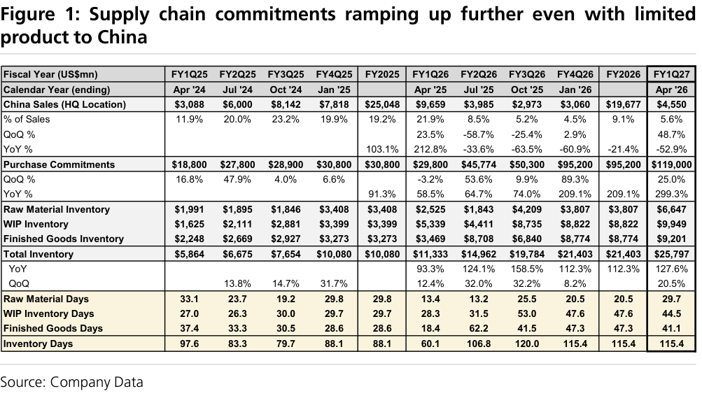
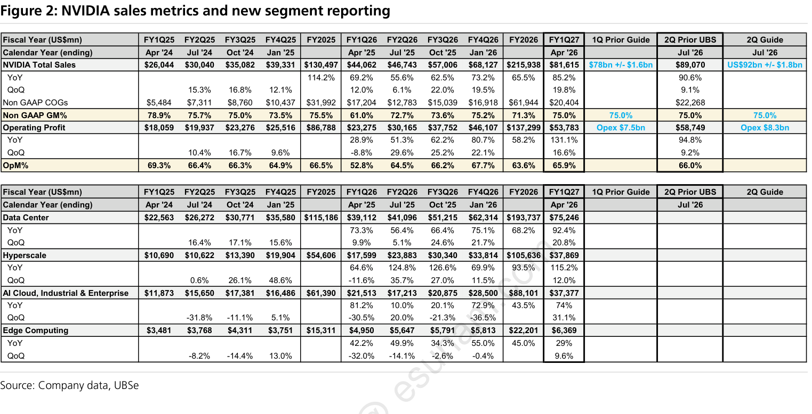
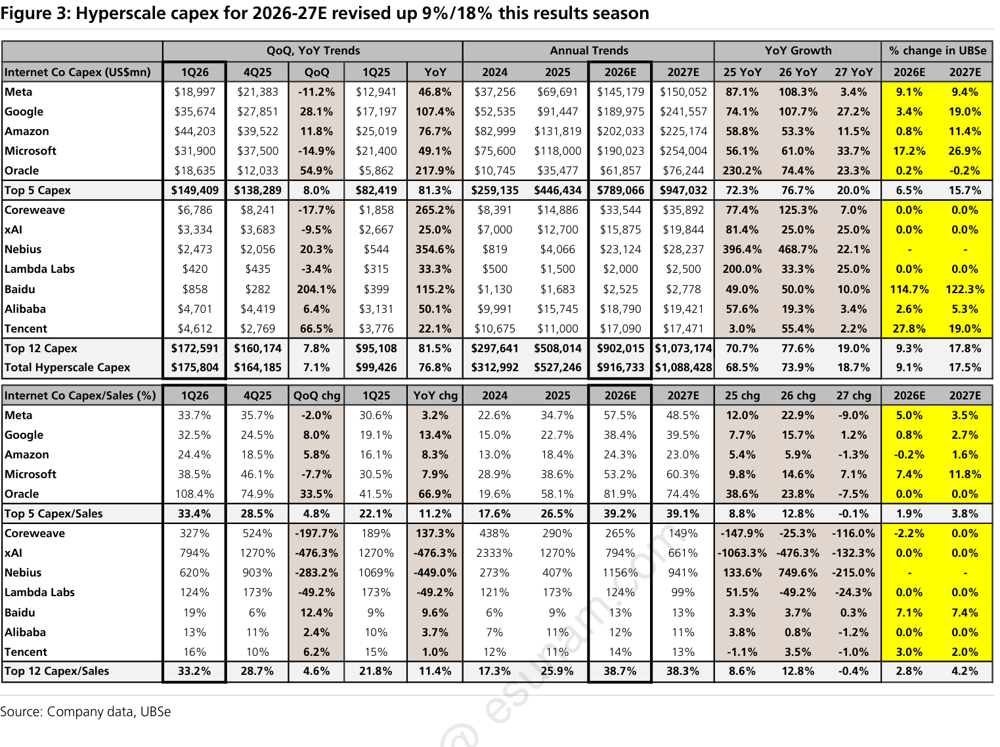
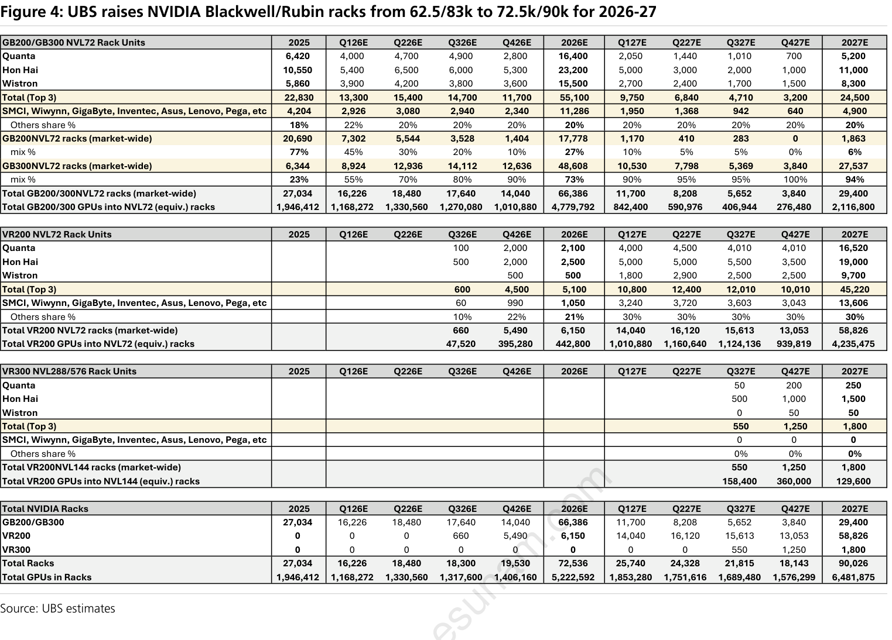
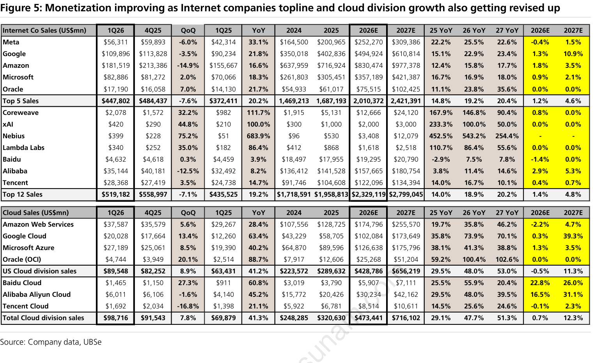

# UBS｜Raising NVIDIA rack forecasts following solid results and ODM sales upside

**券商**：UBS Securities Pte. Ltd., Taipei Branch  
**分析師**：Randy Abrams、Nicolas Gaudois、Sunny Lin、Timothy Arcuri、Annie Chen  
**日期**：2026-05-21  
**主題**：NVIDIA FQ127 財報反應：Rack 預測上修、供應鏈承諾 +299%、CoWoS 擴產路徑  
<button type="button" onclick="fetch('https://ti-lei.github.io/foreign-reports/static/downloads/產業/20260521_UBS_NVIDIA-rack.md').then(r=>r.text()).then(t=>{let a=document.createElement('a');a.href='data:text/plain;charset=utf-8,'+encodeURIComponent(t);a.download='20260521_UBS_NVIDIA-rack.md';a.click()})">⬇ 下載 MD</button>

---

## UBS 完整投資邏輯鏈

| 論點層次 | Figure | 內容 |
|---|---|---|
| 需求信號明確 | 1 | 購買承諾 US\$119bn；中國禁售完全不影響成長動能 |
| 財務超預期 | 2 | FQ127 超出之前 1Q 指引；新階段拆分揭示 ACIE QoQ 成長超越 Hyperscale |
| 資本支出持續上修 | 3 | 全球超大規模業者本季再上修 9%/18%；2027E 更大上修幅度 |
| Rack 預測上修 | 4 | ODM 實際拉貨驅動上修；2026 62.5k→72.5k；AI GPU 8.7mn→10.3mn |
| 貨幣化加速 | 5 | OCF > Capex；不需舉債即可支應 |
| **受益排序** | 封面 | **TSMC > MediaTek > ASE（晶片鏈）；Wiwynn（ODM）；Samsung / SK Hynix / Nanya（記憶體）** |

> **報告最大邏輯缺口**：2026 年 72.5k rack 中 91%（66.3k）為 Rubin，但 heat spreader 延遲已推至 9 月量產。若 Rubin 再遇製造問題，2026 rack 上修將大幅縮水。

---

## 報告核心觀點

| 主題 | UBS 觀點 | 市場共識 | 是否 Contra-Consensus |
|---|---|---|---|
| NVIDIA rack 預測 | 2026 上修至 72.5k；2027 至 90k | 先前共識 62.5k/83k | 正面超預期 |
| Rubin 量產時程 | Heat spreader 調整推遲至 9 月，Q4 仍開始出貨 | 8 月量產 | 輕微延遲，非重大風險 |
| ODM 評價 | 相對落後半導體/零件；Wiwynn 催化劑最強 | 市場擔心毛利壓縮 | 中性防守；Wiwynn 為首選 |
| CoWoS 擴產路徑 | 2026/27 年底 150k/210k WPM；非 TSMC 份額升至 29% | 產能緊張 | 一致，路徑更清晰 |
| 記憶體 | HBM/DRAM under-supply 延長至 Q228 | 多頭共識 | 一致，時程確信度高 |
| 貨幣化支撐 | OCF 可覆蓋 capex，不需大量舉債 | 部分質疑 2027 capex 持續性 | 正面，反駁 bubble 論點 |

**偏好排序**：半導體鏈 > ODM > 記憶體  
**個股偏好**：TSMC / MediaTek / ASE（晶片）；Wiwynn / Delta（ODM / 電源）；Samsung / SK Hynix / Nanya（記憶體）；KYEC / Chroma / ASMPT / GPTC（設備）；Aspeed / GUC / Alchip（設計）

---

## Figure 1｜Supply chain commitments ramping up further even with limited product to China

### 解讀摘要

供應鏈購買承諾在中國出口受限下仍達 US\$119bn（+299% YoY / +25% QoQ），承諾增速遠超超大規模業者 capex 增速（+74% YoY），說明 NVIDIA 正透過長期鎖倉策略控制供應鏈上游。中國收入從峰值 US\$9.66bn（FQ1Q26，21.9% of sales）縮減至 US\$4.55bn（FQ1Q27，5.6%），年減 -52.9%，但購買承諾完全不受影響——說明非中國市場需求已足以填補並超越缺口。庫存天數穩定在 115 天（FY26 = 115.4，FQ127 = 115.4），絕對值 +20% QoQ 至 US\$25.8bn，是「規模擴大型庫存」而非需求堆積。

> **原文補充**：FQ227 指引明確不含任何 H200 中國銷售；NVIDIA 庫存承諾（製造 + 供應 + 產能）在 FY27 年度內的 US\$95bn 佔總承諾 US\$119bn 的 80%，代表近期 12 個月的可見度極高。

### 表格

| 項目 | FY2025 | FQ1Q26 (Apr'25) | FQ2Q26 (Jul'25) | FQ3Q26 (Oct'25) | FQ4Q26 (Jan'26) | FY2026 | FQ1Q27 (Apr'26) |
|---|---|---|---|---|---|---|---|
| **中國銷售（總部所在地，US\$mn）** | 25,048 | 9,659 | 3,985 | 2,973 | 3,060 | 19,677 | 4,550 |
| 佔銷售比重 | 19.2% | 21.9% | 8.5% | 5.2% | 4.5% | 9.1% | 5.6% |
| QoQ % | — | +23.5% | -58.7% | -25.4% | +2.9% | — | +48.7% |
| YoY % | — | +103.1% | +212.8% | -33.6% | -60.9% | -21.4% | -52.9% |
| **購買承諾（US\$mn）** | 30,800 | 29,800 | 45,774 | 50,300 | 95,200 | 95,200 | 119,000 |
| QoQ % | — | -3.2% | +53.6% | +9.9% | +89.3% | — | +25.0% |
| YoY % | +91.3% | +58.5% | +64.7% | +74.0% | +209.1% | +209.1% | **+299.3%** |
| **庫存總計（US\$mn）** | 10,080 | 11,333 | 14,962 | 19,784 | 21,403 | 21,403 | 25,797 |
| YoY % | — | +93.3% | +124.1% | +158.5% | +112.3% | +112.3% | +127.6% |
| QoQ % | — | +12.4% | +32.0% | +32.2% | +8.2% | — | +20.5% |
| **庫存天數** | 88.1 | 60.1 | 106.8 | 120.0 | 115.4 | 115.4 | 115.4 |

### 洞察

> **洞察一**：購買承諾成長率（+299% YoY）是超大規模業者 capex 成長率（+74% YoY，見 Figure 3）的 4 倍。差距意味著 NVIDIA 用長期承諾把更遠的需求信號轉換為對 TSMC 等供應商的硬訂單，供應商的訂單能見度遠高於一般 capex 預算週期。

> **洞察二**：中國收入 FQ127 = US\$4.55bn（-52.9% YoY），相當於 FQ1Q26 峰值的 47%，即超過 US\$5bn 的季度需求被禁住。當前 UBS 模型不含任何 H200 中國恢復——這部分是純選擇權，不是基本假設，一旦政策轉向將是即時正面催化劑。

---

## Figure 2｜NVIDIA sales metrics and new segment reporting

### 解讀摘要

FQ127（2026 年 4 月）NVIDIA 總收入 US\$81.6bn，超出之前 1Q 指引，毛利率 75% 符合預期。本季最重要的新資訊是 NVIDIA 首次揭露新階段拆分：資料中心拆為 Hyperscale US\$37.9bn（+12% QoQ / +115% YoY）與 ACIE（AI Cloud / 工業 / 企業）US\$37.4bn（+31% QoQ / +74% YoY），兩者規模幾乎對等。ACIE 的 QoQ 成長（+31%）快於 Hyperscale（+12%），說明需求端已多元化；Networking +199% YoY 至 US\$14.8bn 則是最高增速的業務，毛利也較高，是 GM 擴張的隱藏驅動力。

> **原文補充**：Rubin 效能相對 Blackwell 具備「35x 更高 inference / 10x 收益提升」的優勢，是換代主因。FQ227 指引 US\$91bn ±2%，明確不含 H200 中國銷售；中國超大規模業者銷售從 22%（FY1Q26）降至 6%（FQ1Q27）。管理層確認 Sovereigns 成長 +80% YoY，主權 AI 需求成為新的增量來源。

### 表格

**NVIDIA FQ127 實際結果 vs. 之前 1Q 指引**

| 項目 | FQ127 實際 | 之前 1Q 指引 | FQ227 指引 |
|---|---|---|---|
| 總淨銷售 | US\$81.6bn | 超出 | US\$91bn ±2% |
| 資料中心 | US\$75.2bn | 超出 | — |
| 　Compute | US\$60.4bn (+77% YoY) | — | — |
| 　Networking | US\$14.8bn (+199% YoY) | — | — |
| 毛利率 | 75% | 符合 | 75%（維持） |

**新階段拆分（FQ127 首次揭露）**

| 新階段 | FQ127 | QoQ | YoY |
|---|---|---|---|
| Hyperscale（超大規模雲端） | US\$37.9bn | +12% | +115% |
| ACIE（AI Cloud / 工業 / 企業） | US\$37.4bn | +31% | +74% |
| Edge Computing（PC / 車用 / 機器人 / 自動駕駛） | US\$6.4bn | +10% | +29% |

**中國銷售（HQ 所在地）趨勢**

| 時點 | 金額 | 佔銷售比重 |
|---|---|---|
| FY1Q26 (Apr'25) | US\$9.66bn | 21.9% |
| FY2026 (年) | US\$19.68bn | 9.1% |
| FQ1Q27 (Apr'26) | US\$4.55bn（-53% YoY / +49% QoQ） | 5.6% |

### 洞察

> **洞察一**：ACIE QoQ 成長（+31%）超越 Hyperscale（+12%），且兩者體量幾乎一致（US\$37.9bn vs. US\$37.4bn）。NVIDIA 的需求端已不再高度集中於 4-5 家超大規模業者，未來訂單波動性可能降低；對 Nvidia 股票而言，這是週期風險緩解的正面訊號。

> **洞察二**：Networking US\$14.8bn（+199% YoY）已接近 FY25 全年資料中心規模，且毛利高於 GPU 硬體。市場 EPS 模型若沒有對 Networking 毛利溢價建模，則對 Nvidia GM 可能存在系統性低估。

---

## Figure 3｜Hyperscale capex for 2026-27E revised up 9%/18% this results season

### 解讀摘要

本季全球 20 家超大規模業者與 neocloud 全數完成財報，UBS 將 2026/27E capex 上修 9%/18%，總量達 US\$916bn/US\$1,088bn（+74%/+19% YoY）。2027E 上修幅度（+18%）是 2026E（+9%）的兩倍，表示市場對中長期需求的確信度正在強化。Top 5 美國超大規模業者（Meta / Google / Amazon / Microsoft / Oracle）合計 2026/27E capex 為 US\$789bn/US\$947bn，佔全部超大規模業者 capex 的 86%/87%。Coreweave / xAI 等 neocloud 成長最快（YoY 數百%），但體量仍遠小於 Top 5。

> **原文補充**：Internet service revenue 本季上修 +1%/+5% for 2026-27E，達 +17%/+16% YoY 至 US\$2.67trn（2027E）。UBS 指出若 OCF 維持 +32% YoY 成長，capex 成長可在不大量舉債的情況下持續至 +40% YoY，這是維持超大規模業者現金流健康的安全邊界。

### 表格

**年度 capex 及本季上修幅度（US\$mn）**

| 公司 | 2024 實際 | 2025 實際 | 2026E | 2027E | 26 YoY | 27 YoY | 26E 本季上修 | 27E 本季上修 |
|---|---|---|---|---|---|---|---|---|
| Meta | 37,256 | 69,691 | 145,179 | 150,052 | +108.3% | +3.4% | +9.1% | +9.4% |
| Google | — | — | — | — | +107.7% | +22.1% | +18.9% | +8.0% |
| Amazon | — | — | — | — | +58.8% | +11.5% | +0.0% | +11.4% |
| Microsoft | 75,600 | 118,000 | 190,023 | 254,004 | +56.1% | +33.7% | +17.2% | +26.9% |
| Oracle | 35,477 | 61,700 | 100,486 | 143,052 | +62.9% | +42.4% | +12.5% | +20.0% |
| **Top 5 合計** | **259,135** | **446,434** | **789,066** | **947,032** | **+72.3%** | **+20.0%** | **+9.1%** | **+15.7%** |
| **全部超大規模業者** | **312,992** | **527,246** | **916,733** | **1,088,428** | **+73.8%** | **+18.7%** | — | — |

### 洞察

> **洞察一**：2027E 上修幅度（+18%）幾乎是 2026E（+9%）的兩倍，說明這季財報讓分析師對跨越 2027 年的長期需求更有信心。對供應鏈（TSMC N3 / CoWoS）的意義：峰值延後出現，2027E EPS 上修空間更大於 2026E。

> **洞察二（配合 Figure 1）**：NVIDIA 購買承諾 +299% YoY vs. hyperscaler capex +74% YoY，前者是後者的 4 倍。承諾增速遠超 capex，說明 NVIDIA 已超額鎖倉供應鏈，把中長期 demand 轉化為對 TSMC 等供應商的即時硬承諾。

---

## Figure 4｜UBS raises NVIDIA Blackwell/Rubin racks from 62.5/83k to 72.5k/90k for 2026-27

### 解讀摘要

本次上修由 ODM 財報實際拉貨數字支撐，而非單純依賴客戶 guidance，信號品質較高。2026 年 rack 上修 +16%（62.5k→72.5k）中 91% 為 Rubin（66.3k），Blackwell 僅 6.2k；2027 年上修 +8%（83k→90k），Rubin 仍佔 68%（61k）。AI GPU 生產估計同步從 8.7mn 上修至 10.3mn（+18%），其中 Blackwell 6.3mn 為 2026 年主力，Rubin 2.1mn 快速追上。CoWoS 產能路徑同步更新：年底 2026/2027 分別達 150k/210k WPM，TSMC 主導但非 TSMC 份額從 23% 升至 29%。

> **原文補充**：Heat spreader 調整將 Rubin 量產推遲至 9 月（原 8 月）；ODM 已在美國新增產能以消化 Blackwell 積壓訂單，同時啟動 Rubin 初期備料。Amkor 有 Vera CPU（CoWoS-R）的潛在上行空間，但 H200 中國禁售限制了其 CoWoS-S 利用率。NVIDIA 預估 2027 年 Blackwell 庫存於年底基本清光，Rubin 則結轉 3.2mn 至 2028 年。

### 表格

**NVIDIA Rack 預測上修**

| 世代                  | 2026E（舊）   | 2026E（新）   | 上修       | 2027E（舊）   | 2027E（新）   | 上修      |
| ------------------- | ---------- | ---------- | -------- | ---------- | ---------- | ------- |
| Rubin（NVL 系列）       | —          | 66,300     | —        | —          | 61,000     | —       |
| Blackwell（GB200 系列） | —          | 6,200      | —        | —          | 29,000     | —       |
| **NVL 系列合計**        | **62,500** | **72,500** | **+16%** | **83,000** | **90,000** | **+8%** |
| HGX 平台（另計）          | —          | —          | —        | —          | 2,100,000  | —       |

**AI GPU 生產估計（2026E）**

| GPU 世代 | 舊預測（mn） | 新預測（mn） | 上修幅度 |
|---|---|---|---|
| Blackwell | — | 6.30 | — |
| Rubin | — | 2.10 | — |
| Hopper | — | 0.75 | — |
| **總計** | **8.70** | **10.30** | **+18%** |

**CoWoS 產能路徑（WPM）**

| 供應商 | 2025 年底 | 2026 年底 | 2027 年底 |
|---|---|---|---|
| TSMC | 70,000 | 120,000 | 150,000 |
| OSATs（ASE + Amkor 等） | 20,000 | 30,000 | 60,000 |
| **產業合計** | **90,000** | **150,000** | **210,000** |
| NVIDIA 佔 CoWoS 需求比 | 65% | 62% | — |

### 增量貢獻拆解

**2026E rack 上修來源（+10,000 rack）**

| 成長來源 | 貢獻數量 | 佔總上修 |
|---|---|---|
| Rubin 新增（Blackwell 本來不在原預測主力） | +66,300 rack | 新增 Rubin 產線 |
| Blackwell 剩餘 | +6,200 rack | 部分延續 |
| 合計（舊→新） | **62,500→72,500** | **+10,000 rack (+16%)** |

### 洞察

> **洞察一**：90k NVL racks × 72 GPUs/rack ≈ 6.48mn chip-equivalents（NVL 系列）+ 2.1mn HGX = 8.58mn 2027 需求，與 CoWoS build plan 8.2mn 大致吻合（差 ~0.38mn 為庫存緩衝或時間差）。Rack / GPU / CoWoS 三套預測內部一致，說明 UBS 數字有交叉驗證，不是各自獨立假設。

> **洞察二**：TSMC CoWoS 從 70k→120k WPM（+71% YoY），但 NVIDIA 佔比從 65%→62%（-3pp）。非 NVIDIA AI chip（AMD MI450 / Google TPU v8 / Amazon Trainium 3）正快速填充 TSMC 的增量產能，TSMC CoWoS 業務分散化，不依賴單一客戶即可滿載。

> **值得驗證**：2026E 72.5k rack 中 91%（66.3k）為 Rubin，而 Rubin 已知有 heat spreader 延遲。若 Rubin 量產再延一個季度，2026E rack 可能回落至 50-55k 範圍。這是本次上修最大的單一風險點。

---

## Figure 5｜Monetization improving as Internet companies topline and cloud division growth also getting revised up

### 解讀摘要

UBS 用這張圖反駁「capex bubble」論點：超大規模業者的貨幣化（雲端部門成長）正在每年加速，而非見頂。美國雲端業務（AWS / Azure / GCP）收入成長從 2024-25 年 +24/+29% 加速至 2026-27E +47/+51%，OCF 預計 2026/27 各 +32% YoY 至 US\$1.155trn，覆蓋率超過 capex（US\$1.088trn），不需大量舉債即可支應。中國網路公司（Baidu / Alibaba / Tencent）收入也在修復，新增一層非美國市場的佐證。

> **原文補充**：本季 Internet service revenue 上修 +1%/+5% for 2026-27E，至 2027E +16% YoY，達 US\$2.67trn。主要超大規模業者淨現金穩定在 US\$436bn（2026 年），顯示財務健全度高，不存在短期債務壓力。

### 表格

**超大規模業者貨幣化健康度指標（2026-27E）**

| 指標 | 2025 實際 | 2026E | 2027E |
|---|---|---|---|
| 雲端部門收入成長 | +29% YoY | +47% YoY | +51% YoY |
| Internet service 總收入成長 | — | +17% YoY | +16% YoY（US\$2.67trn） |
| 合計 Capex（全部超大規模業者） | US\$527bn | US\$916bn (+74%) | US\$1,088bn (+19%) |
| 合計 OCF（主要超大規模業者） | — | — | US\$1.155trn (+32% YoY) |
| OCF / Capex 覆蓋率 | — | — | 106% |
| 主要超大規模業者淨現金 | — | US\$436bn（穩定） | — |

### 洞察

> **洞察一**：OCF US\$1.155trn > Capex US\$1.088trn，覆蓋率 ~106%，表示超大規模業者整體在不舉債的情況下仍可支應 2027E 全部 capex，且仍有 ~US\$67bn FCF 餘裕。「capex bubble」論點需要否定這個現金流數字，而不是只看 capex 絕對值。

> **洞察（配合 Figure 3）**：雲端成長加速（+47/+51% YoY）配合 capex 上修（+74%/+19% YoY），capex/cloud revenue 比例實際上在 2027E 下降（cloud revenue 增速高於 capex 增速），說明 AI 投資的回報率正在改善，不是惡化——這是可以延續 2027 後 capex 成長的結構性支撐。

---

## 相關個股清單

| 類別    | 公司                         | Ticker           | 評等                 | 備註                                              |
| ----- | -------------------------- | ---------------- | ------------------ | ----------------------------------------------- |
| 晶圓代工  | [[2330_台積電_外資報告整理\|TSMC]]  | 2330 TT / TSM US | Buy                | 首選；CoWoS 最大受益者                                  |
| IC 設計 | MediaTek                   | 2454 TT          | Buy                | 首選；Google TPU 設計服務                              |
| 封測    | ASE                        | 3711 TT          | Buy                | 首選；先進封裝與測試                                      |
| 封測    | KYEC                       | 2449 TT          | —                  | 最終測試服務受益                                        |
| 封測    | Amkor                      | AMKR US          | —                  | Vera CPU（CoWoS-R）潛在上行；CoWoS-S 因 H200 禁售利用率受限    |
| 設備    | Chroma                     | 2360 TT          | —                  | 先進封裝設備偏好標的                                      |
| 設備    | ASMPT                      | 522 HK           | —                  | 先進封裝設備偏好標的                                      |
| 設備    | GPTC                       | 3286 TT          | —                  | 先進封裝設備偏好標的                                      |
| IC 設計 | Aspeed                     | 5274 TT          | —                  | BMC 強勁展望                                        |
| IC 設計 | GUC                        | 3443 TT          | —                  | Google CPU 上行空間                                 |
| IC 設計 | [[3661_世芯_外資報告整理\|Alchip]] | 3661 TT          | —                  | Amazon Trainium 3 機會                            |
| ODM   | [[6669_緯穎_外資報告整理\|Wiwynn]] | 6669 TT          | —                  | 催化劑最強；ASIC / Helios / Rubin 三重拉動                |
| 電源    | Delta Electronics          | 2308 TT          | —                  | Rubin 800V DC 每 rack 含量提升；可能維持 lead supplier 地位 |
| 記憶體   | Samsung Electronics        | 005930 KS        | Buy（APAC Key Call） | HBM 主力；DRAM 週期延長至 Q228                          |
| 記憶體   | SK Hynix                   | 000660 KS        | —                  | HBM 受益                                          |
| 記憶體   | Nanya Technology           | 2408 TT          | Buy                | DRAM 週期長；NAND until Q427                        |
