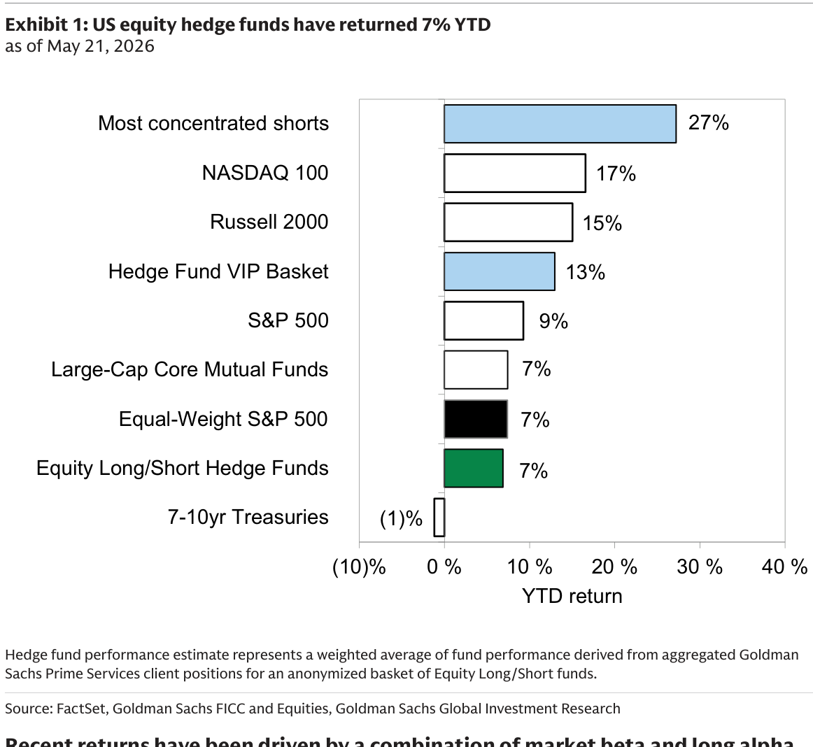
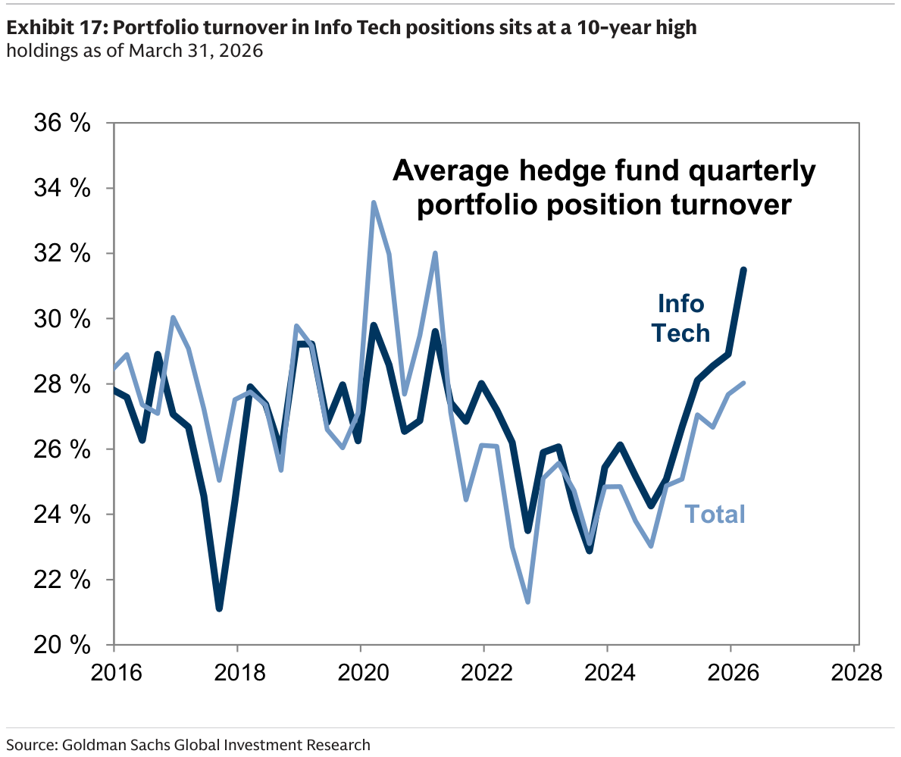
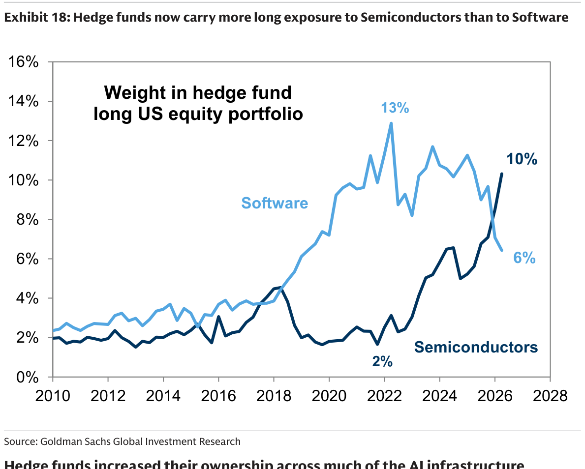
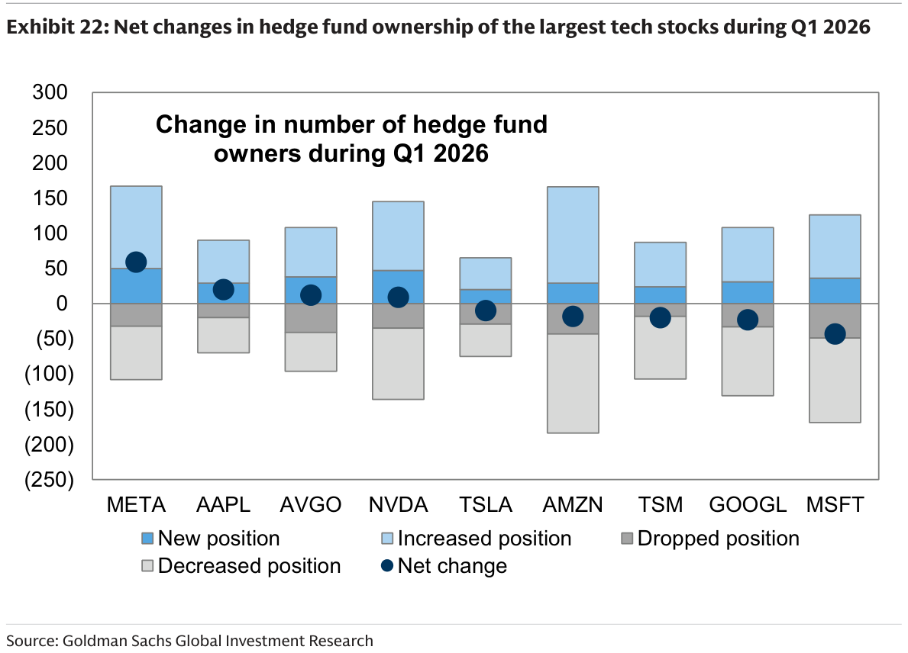
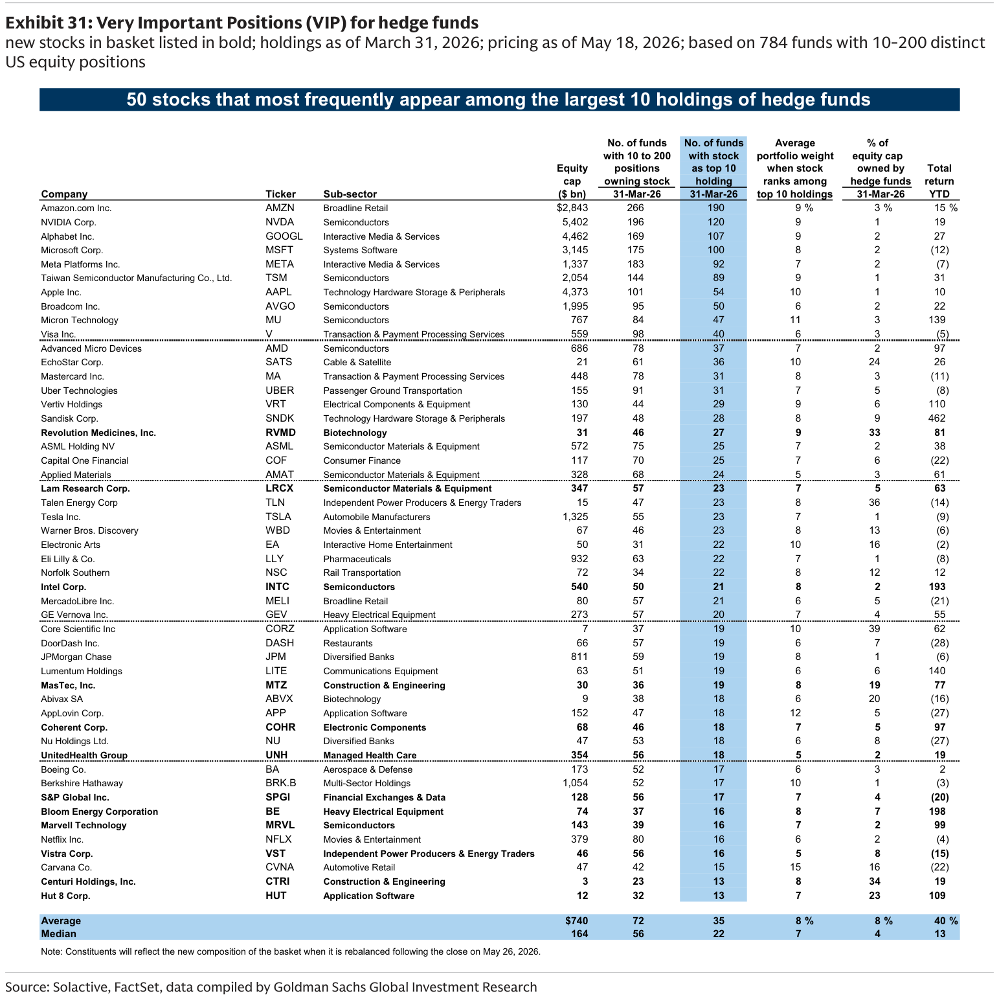
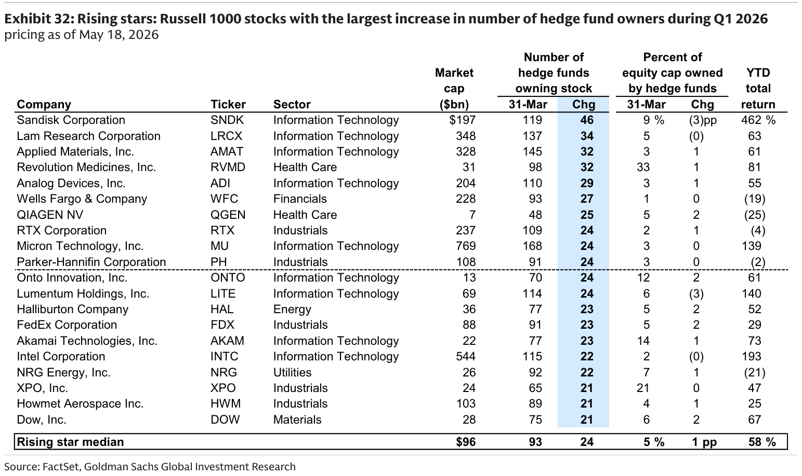
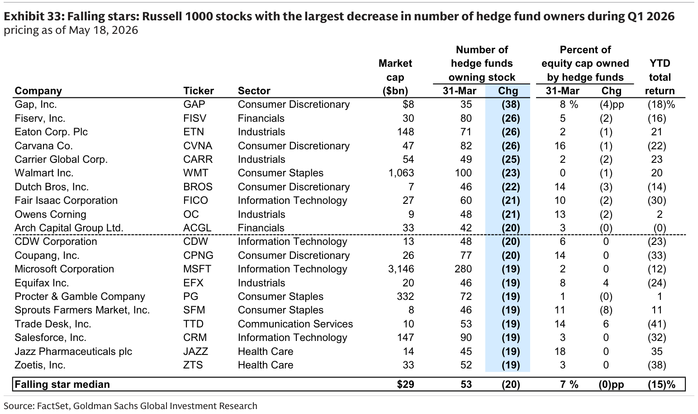

# GS｜Hedge Fund Trend Monitor：All In on AI

**券商**：Goldman Sachs  
**分析師**：Ben Snider、Jenny Ma、Ryan Hammond、Daniel Chavez、Kartik Jayachandran、Christophe Sung  
**日期**：2026-05-22  
**主題**：Q2 2026 Hedge Fund Trend Monitor — Q1 2026 13-F 持倉分析  
**資料截止**：2026-03-31（13-F），績效截至 2026-05-21  
<button type="button" onclick="fetch('https://ti-lei.github.io/foreign-reports/static/downloads/產業/20260522_GS_All-In-on-AI.md').then(r=>r.text()).then(t=>{let a=document.createElement('a');a.href='data:text/plain;charset=utf-8,'+encodeURIComponent(t);a.download='20260522_GS_All-In-on-AI.md';a.click()})">⬇ 下載 MD</button>

---

## GS 完整投資邏輯鏈

| 論點層次 | Exhibit | 內容 |
|---|---|---|
| AI 資金信號 | 封面 | IT 淨配置增加 +853 bp（Q1），為有紀錄以來最大單季增幅 |
| 板塊輪動方向 | Exhibit 18 | 半導體配置 10%（歷史最高）首度超越軟體 6%（2019 年以來最低） |
| 籌碼結構 | Exhibit 22 | META、NVDA 淨增倉；MSFT 淨減倉 -43 基金，GOOGL 亦減；AI 基礎設施內部輪動 |
| 信號股（Rising Stars） | Exhibit 32 | SNDK +46 / LRCX +34 / AMAT +32 / MU +24，半導體設備獲集中追進 |
| 「賣太多」警示 | Exhibit 21 | VRT/ETN/GEV/CARR 大幅減倉，電力基礎設施獲利了結 |
| **結論** | Exhibit 31 | **VIP 前 10 依序：AMZN、NVDA、GOOGL、MSFT、META、TSM、AAPL、AVGO、MU、V** |

> **報告最大邏輯缺口**：13-F 截止 3/31，公布日 5/22，時滯近 2 個月；持倉變化是落後指標，Rising Stars 的後續表現需搭配近期成交量確認。

---

## 報告核心觀點

| 主題 | GS 觀點 | 市場共識 | 是否 Contra-Consensus |
|---|---|---|---|
| AI 押注 | HF 全面加碼 AI，IT 單季 +853 bp 史上最大 | 市場擔心 AI 過度集中 | ✓ 量化顯示籌碼仍在加碼，非退潮 |
| 半導體 vs 軟體 | 半導體 10% 首超軟體 6%，是「硬體先行」的籌碼轉折 | 預期軟體估值終將回歸 | ✓ 資金已用腳投票站硬體 |
| 電力基礎設施 | VRT/ETN/GEV 遭大幅減倉，獲利了結明顯 | 電力主題仍被廣泛唱多 | ✓ HF 已在 Q1 系統性賣出 |
| MSFT | 淨減倉 -43 基金，Falling Stars 候選 | MSFT 被視為 AI 受益者 | ✓ HF 持倉數據顯示賣壓 |

**偏好排序**：AMZN > NVDA > GOOGL > MSFT（但 MSFT 持倉在減）  
**AI 基礎設施偏好**：半導體設備（LRCX/AMAT/ASML）優於電力基礎設施（VRT/ETN/GEV）

---

## Exhibit 1｜對沖基金 YTD 報酬

### 解讀摘要
對沖基金 L/S 策略 YTD +7%，大幅落後於最集中空倉籃子 +27%——代表 Q1 期間有顯著軋空事件，讓「做空者」反而賺到超額報酬。VIP 籃子 +13%，以科技多頭為主的 Alpha 是主要貢獻來源。

### 表格

| 標的 | YTD 報酬 |
|---|---|
| 最集中空倉（GSCBMSAL） | 27% |
| NASDAQ 100 | 17% |
| Russell 2000 | 15% |
| **HF VIP 籃子** | **13%** |
| S&P 500 | 9% |
| 大型股共同基金 | 7% |
| Equal-Weight S&P 500 | 7% |
| Equity L/S 對沖基金 | 7% |
| 7-10yr 美國公債 | -1% |

> **洞察一**：最集中空倉 +27% 遠超 HF L/S +7%，說明 Q1 軋空力道強，HF 整體因為 Short side 損失而拉低報酬，但多方科技 Alpha 仍正貢獻。

---

## Exhibit 17｜IT 持倉換手率達 10 年高點

### 解讀摘要
Q1 2026 對沖基金 IT 持倉季度換手率達 31%，是 2013 年以來最高，遠超整體組合換手率 28%。高換手率反映 HF 在 AI 個股間積極輪動——不是減倉 IT，而是從已漲的 AI 基礎設施（電力、散熱）換至半導體設備的「板塊內輪動」。

> **洞察一**：IT 換手率歷史新高，但 IT 配置同期達到記錄高位（+853 bp），兩者並存代表是「換人不換方向」的選股輪動，而非系統性撤出。

---

## Exhibit 18｜對沖基金持倉：半導體首度超越軟體

### 解讀摘要
這是 2026 Q1 最重要的籌碼結構轉變：半導體配置從 2020 年的 2% 爬升至 10%（歷史最高），同期軟體從高點 13% 下滑至 6%（2019 年以來最低），兩條線首度交叉。這不是軟體被放棄，而是 AI 硬體基礎建設驅動的重估次序——市場先給硬體，再等軟體 monetization。

### 表格

| | 軟體 | 半導體 |
|---|---|---|
| 2020 年 | ~7% | ~2% |
| 2022 年高點 | 13% | — |
| 2026 Q1 | 6% | **10%** |
| 10 年後推估 | — | — |

> **洞察一**：Semis 10% 是有紀錄以來最高點，且剛完成對軟體的黃金交叉。歷史上此類結構性資金位移通常持續 2-3 個季度，對 NVDA/AVGO/TSM/AMD 而言是正向的籌碼面支撐。

---

## Exhibit 21｜AI 相關籃子中持倉變化最大的個股（Q1 2026）

（此 Exhibit 為表格，圖像層為介紹文字；數據從原文提取）

### AI 持倉增加最多

| 公司 | Ticker | 子產業 | 市值（bn） | YTD | 淨增（增-減基金數） |
|---|---|---|---|---|---|
| Meta Platforms | META | 互動媒體 | \$1,536 | -7% | +59 |
| SS&C Technologies | SSNC | 資料處理 | \$16 | -23% | +45 |
| Lam Research | LRCX | 半導體設備 | \$365 | +63% | +39 |
| Applied Materials | AMAT | 半導體設備 | \$339 | +61% | +37 |
| ASML Holding | ASML | 半導體設備 | \$597 | +38% | +30 |
| NRG Energy | NRG | 電力公用事業 | \$28 | -21% | +30 |
| Analog Devices | ADI | 半導體 | \$194 | +55% | +28 |
| Nokia | NOK | 通訊設備 | \$76 | +114% | +28 |
| Intel | INTC | 半導體 | \$598 | +193% | +27 |
| DocuSign | DOCU | 應用軟體 | \$9 | -28% | +24 |

### AI 持倉減少最多

| 公司 | Ticker | 子產業 | 市值（bn） | YTD | 淨減（增-減基金數） |
|---|---|---|---|---|---|
| Vertiv Holdings | VRT | 電氣元件 | \$121 | +110% | -43 |
| Microsoft | MSFT | 系統軟體 | \$3,128 | -12% | -43 |
| Western Digital | WDC | 儲存設備 | \$158 | +166% | -42 |
| Eaton Corp | ETN | 電氣元件 | \$147 | +21% | -32 |
| Carrier Global | CARR | 建築產品 | \$53 | +23% | -31 |
| GE Vernova | GEV | 重型電氣 | \$275 | +55% | -29 |
| Alphabet | GOOGL | 互動媒體 | \$4,712 | +27% | -23 |

> **洞察一**：VRT/ETN/GEV/CARR 同屬「AI 電力基礎設施」主題，Q1 均遭 20-40 基金淨減倉，這四檔 YTD 均大漲（+21%～+110%），減倉是獲利了結行為，不代表基本面看法改變。
>
> **洞察二**：LRCX/AMAT/ASML 三家半導體設備同時淨增 +30 以上，顯示 HF 對「AI 帶動 WFE 資本支出週期」的共識在 Q1 大幅升溫。

---

## Exhibit 22｜大型科技股 HF 持倉淨變化（Q1 2026）

### 解讀摘要
從九大科技巨頭的 Q1 持倉變化來看，META 淨增 +59 基金是最大贏家，NVDA 大致持平，MSFT 與 GOOGL 均為淨減倉（-43/-23 基金）。AMZN 雖然 YTD 表現最好，但淨持倉變化接近零——代表 AMZN 持倉已高度飽和，邊際增倉空間有限。

### 表格

| Ticker | 估計淨增基金數 | YTD 報酬 |
|---|---|---|
| META | +59 | -7% |
| AAPL | +27 | +10% |
| AVGO | +15 | +22% |
| NVDA | ~0 | +19% |
| TSLA | -10 | -9% |
| AMZN | -20 | +15% |
| TSM | -30 | +31% |
| GOOGL | -23 | +27% |
| MSFT | -43 | -12% |

（視覺估算，Net change 點位讀值）

> **洞察一**：META 是 Q1 最大 HF 增倉目標（+59 基金），這與它在 AI 廣告 ROI 方面的快速貨幣化進度一致——比 NVDA 更直接的收益觀點。
>
> **洞察二**：MSFT -43、GOOGL -23 同時遭減倉，但兩者 YTD 表現截然相反（MSFT -12%、GOOGL +27%），說明 HF 減 GOOGL 是獲利了結，減 MSFT 則是對 AI 投資回報預期的修正。

---

## Exhibit 31｜HF VIP 清單（Q1 2026，50 檔最多出現在基金前 10 大持股）

### 解讀摘要
VIP 清單共 50 檔，由 784 個持有 10-200 個美股部位的基金構成，YTD 表現 +10.4%（vs S&P 500 +8.6%），歷史命中率 59%。Q1 新加入 12 檔，包括 LRCX、MRVL、COHR 等 AI 基礎設施，以及 BE、VST 等電力類股。

### 表格（前 20 名）

| 排名 | 公司 | Ticker | 市值（bn） | 持有基金數 | 列入前 10 基金數 | 平均佔組合 % | YTD |
|---|---|---|---|---|---|---|---|
| 1 | Amazon | AMZN | \$2,843 | 266 | 190 | 9% | +15% |
| 2 | NVIDIA | NVDA | \$5,402 | 196 | 120 | 9% | +19% |
| 3 | Alphabet | GOOGL | \$4,462 | 169 | 107 | 9% | +27% |
| 4 | Microsoft | MSFT | \$3,145 | 175 | 100 | 8% | -12% |
| 5 | Meta Platforms | META | \$1,337 | 183 | 92 | 7% | -7% |
| 6 | TSMC | TSM | \$2,054 | 144 | 89 | 9% | +31% |
| 7 | Apple | AAPL | \$4,373 | 101 | 54 | 10% | +10% |
| 8 | Broadcom | AVGO | \$1,995 | 95 | 50 | 6% | +22% |
| 9 | **Micron** | **MU** | \$767 | 84 | 47 | 11% | +139% |
| 10 | Visa | V | \$559 | 98 | 40 | 6% | -5% |
| 11 | AMD | AMD | \$686 | 78 | 37 | 7% | +97% |
| 12 | EchoStar | SATS | \$21 | 61 | 36 | 10% | +26% |
| 13 | Mastercard | MA | \$448 | 78 | 31 | 8% | -11% |
| 14 | Uber | UBER | \$155 | 91 | 31 | 7% | -8% |
| 15 | Vertiv | VRT | \$130 | 44 | 29 | — | +110% |
| 16 | Lam Research | **LRCX** | \$347 | 57 | 23 | 7% | +63% |
| 17 | ASML | ASML | \$572 | 75 | 25 | 7% | +38% |
| 18 | Capital One | COF | \$117 | 70 | 25 | 7% | -22% |
| 19 | **Applied Materials** | **AMAT** | \$328 | 68 | 24 | 5% | +61% |
| 20 | Tesla | TSLA | \$1,325 | 55 | 23 | 7% | -9% |

（新加入 Q1 標記：**LRCX**、**AMAT**、MRVL、COHR、BE、VST、SNDK、RVMD、MTZ、SPGI、UNH、HUT）

> **洞察一**：MU 以 11% 平均組合佔比位居第 9，且 YTD +139%——組合佔比高達 11% 代表 HF 對 MU 的 conviction 極高（通常大型股佔比 7-9%），這與 MU LTA 驅動的 EPS 上修論點高度吻合（參見同日 UBS MU 報告）。
>
> **洞察二（配合 Exhibit 22）**：MSFT 仍在 VIP 清單前 5（100 基金），但 Q1 淨減倉 -43 基金，意味著 MSFT 正在從「核心持倉」緩慢移向「觀望持倉」。

---

## Exhibit 32｜Rising Stars（Q1 2026 對沖基金持有人數增加最多）

### 解讀摘要
Rising Stars 歷史上在後續季度有超額報酬傾向。本季 Top 20 中有 10 檔屬 IT 類（含半導體設備、半導體、光通訊），三家半導體設備龍頭 LRCX/AMAT 與光通訊 LITE 同時上榜，與 Exhibit 21 的加倉趨勢高度吻合。SNDK 以 +46 名列第一，YTD +462%。

### 表格（IT 相關 + 金融）

| 公司 | Ticker | 市值（bn） | HF 持有數 | 新增 | HF 持有 % | YTD |
|---|---|---|---|---|---|---|
| SanDisk | SNDK | \$197 | 119 | +46 | 9% | +462% |
| Lam Research | LRCX | \$348 | 137 | +34 | 5% | +63% |
| Applied Materials | AMAT | \$328 | 145 | +32 | 3% | +61% |
| Analog Devices | ADI | \$204 | 110 | +29 | 3% | +55% |
| Wells Fargo | WFC | \$228 | 93 | +27 | 1% | -19% |
| Micron Technology | MU | \$769 | 168 | +24 | 3% | +139% |
| Onto Innovation | ONTO | \$13 | 70 | +24 | 12% | +61% |
| Lumentum | LITE | \$69 | 114 | +24 | 6% | +140% |
| Intel | INTC | \$544 | 115 | +22 | 2% | +193% |
| NRG Energy | NRG | \$26 | 92 | +22 | 7% | -21% |

> **洞察一**：LRCX（+34）、AMAT（+32）、ONTO（+24）三家 WFE 相關設備同時上 Rising Stars，代表 HF 對「AI 帶動 WFE 支出週期啟動」的共識已形成且持續強化。
>
> **洞察二**：LITE（Lumentum）+24，YTD +140%，光通訊主題 Rising Star；與同期 Optical Networking 籃子（GSXUOPTI）持倉增加（Exhibit 19-20）方向一致，顯示光互連為 HF 另一新興集中標的。

---

## Exhibit 33｜Falling Stars（Q1 2026 對沖基金持有人數減少最多）

### 解讀摘要
Falling Stars 歷史上後續季度傾向於跑輸板塊同儕。本季 ETN (-26)、FISV (-26)、CARR (-25) 榜上有名，其中 ETN/CARR 均屬電力基礎設施主題，與 Exhibit 21 的減倉趨勢一致。CRM（Salesforce）連續第 2 季為 Falling Star，軟體類股 HUBS、WDAY 等也出現在 Exhibit 12 的高空倉列表中。

### 表格

| 公司 | Ticker | 市值（bn） | HF 持有數 | 減少 | YTD |
|---|---|---|---|---|---|
| Gap | GAP | \$8 | 35 | -38 | -18% |
| Fiserv | FISV | \$30 | 80 | -26 | -16% |
| Eaton Corp | ETN | \$148 | 71 | -26 | +21% |
| Carvana | CVNA | \$47 | 82 | -26 | -22% |
| Carrier Global | CARR | \$54 | 49 | -25 | +23% |
| Walmart | WMT | \$1,063 | 100 | -23 | +20% |
| Fair Isaac（FICO） | FICO | — | — | — | — |
| Salesforce | CRM | — | — | — | — |

> **洞察一**：ETN (-26) 與 CARR (-25) 均因前期 AI 電力主題大漲後遭獲利了結；兩者 YTD 報酬（+21%/+23%）雖為正，但低於 VRT（+110%）——代表 HF 認為電力基礎設施內部已分化，VRT 仍被持有而週邊設備廠被賣出。

---

## 跨 Exhibit 彙整表

### 彙整 1｜AI 基礎設施子板塊：籌碼方向

來源：Exhibit 21（增減）、Exhibit 32（Rising Stars）、Exhibit 33（Falling Stars）

| 子板塊 | 代表股 | HF Q1 方向 | 信號強度 |
|---|---|---|---|
| 半導體設備 | LRCX/AMAT/ASML | ↑ 大幅增倉 | ★★★ |
| AI 半導體 | NVDA/TSM/AVGO/MU | → 持平或微增 | ★★ |
| 光通訊 | LITE/NOK | ↑ 增倉 | ★★ |
| AI 軟體 | META（廣告 AI） | ↑ 增倉；MSFT ↓ | ★★（分化） |
| 電力基礎設施 | VRT/ETN/GEV/CARR | ↓ 獲利了結 | ★★★ |
| 傳統軟體 | CRM/HUBS/WDAY | ↓ 連續減倉 | ★★★ |

> 半導體設備是 Q1 最集中的 HF 追進方向，VRT/ETN/GEV 電力主題則同步成為最明確的獲利了結標的——AI 基礎設施資金在「設備商層次」重新集中。

---

## 相關個股清單

| 類別 | 公司 | Ticker | 評等 | 備註 |
|---|---|---|---|---|
| VIP Top 10 | Amazon | AMZN | — | 連續 10 季第 1 |
| VIP Top 10 | NVIDIA | NVDA | — | 持倉穩定，不增不減 |
| VIP Top 10 | TSMC | TSM | — | YTD +31%，亞洲唯一前 10 |
| VIP Top 10 | Micron | MU | — | 11% 組合佔比，HF 高 conviction |
| Rising Stars | SanDisk | SNDK | — | +46 基金，YTD +462% |
| Rising Stars | Lam Research | LRCX | — | 新入 VIP 清單 |
| Rising Stars | Lumentum | LITE | — | 光通訊，YTD +140% |
| Falling Stars | Vertiv | VRT | — | 仍在 VIP 但被 Falling Stars 標記 |
| Falling Stars | Eaton Corp | ETN | — | 電力基礎設施獲利了結 |
| Falling Stars | Salesforce | CRM | — | 連續 2 季 Falling Star |
| 減倉警示 | Microsoft | MSFT | — | 淨減 -43 基金，最大科技減倉 |
