# UBS｜Taiwan PCB/Substrates — Multi-year AI Upcycle 早期

**券商**：UBS Securities Pte. Ltd., Taipei Branch  
**分析師**：Diana Chang、Randy Abrams  
**日期**：2026-05-22  
**主題**：Taiwan PCB/Substrates — Still at the early innings of a multi-year upcycle  
**評級**：Unimicron Buy (PT NT\$1,200↑)　Kinsus Buy (PT NT\$680↑)　NYPCB Neutral (PT NT\$875↑)  
<button type="button" onclick="fetch('https://ti-lei.github.io/foreign-reports/static/downloads/產業/20260522_UBS_TW-PCB-Substrate.md').then(r=>r.text()).then(t=>{let a=document.createElement('a');a.href='data:text/plain;charset=utf-8,'+encodeURIComponent(t);a.download='20260522_UBS_TW-PCB-Substrate.md';a.click()})">⬇ 下載 MD</button>

---

## UBS 完整投資邏輯鏈

| 論點層次 | Figure | 內容 |
|---|---|---|
| 瓶頸確認 | Fig 6–7 | Ibiden SAP 需求指數 100→220（+120%），主要廠商產能僅擴增 20–50%；t-glass 短缺持續至 2027E |
| 需求結構 | Fig 1–3 | 前五大 Hyperscaler 2026/27E capex +61%/+14% 至 US\$719/819bn；Google +93% 居冠，Oracle +74% 為純 AI infra 押注；CPU TAM 2030E 成長 5x 至 US\$170bn |
| 供給上限 | Fig 8–11 | Glass core、CoWoP、EMIB-T 等新封裝架構持續增加 substrate 面積需求，屬純增量而非替換 |
| 受益排序 | Fig 5, 12, 26–34 | Unimicron 技術覆蓋最完整（GPU/CPU/ASIC）；Kinsus margin re-rating 空間最大；NYPCB 現貨定價優但擴產受限 |
| 估值重估 | Fig 14–25 | P/BV → P/E 方法論轉換；三家均創歷史最高 P/B，但以 forward P/E 看仍低於台灣硬體均值 33x/26x |
| **結論** | 封面 | **Buy Unimicron + Kinsus；多年 AI 結構性上升週期早期，定價議價力尚未完整定價** |

> **報告最大邏輯缺口**：三家公司 margin 跳升的前提是「高 UTR + 持續定價上揚」，而 t-glass 擴產速度與客戶 LTA 重談節奏是主要不確定性；NVDA Rubin 正式量產時程若延後，Unimicron/Kinsus 的 H226E 加速假設將受壓。

---

## 報告核心觀點

| 主題 | UBS 觀點 | 市場共識 | 是否 Contra-Consensus |
|---|---|---|---|
| 週期性質 | 結構性 AI 驅動，定價/margin 向上持久 | 擔憂容量擴張導致供過於求 | ✓ Contra（UBS 認為市場錯估容量彈性） |
| Unimicron | 技術領先，ABF GPU/CPU/ASIC 三線齊爆，PT NT\$1,200 | 已 price in substrate 漲價 | ✓ Contra（UBS 認為 margin 擴張尚未完整定價） |
| Kinsus | NVDA CPU 份額提升 + ASIC，margin re-rating 催化劑 | YTD 漲幅已反映份額增益 | ✓ Contra（margin 倍增空間未定價） |
| NYPCB | 現貨定價優勢明顯，但 ABF 擴產 2028 前有限 | 定價受益最直接 | ✗ 中性（估值 fully priced，成長受制於容量） |
| 估值方法 | P/BV → P/E（ROE 改善、盈利能見度提升） | P/BV 為主流框架 | ✓ Contra（方法論切換帶來 re-rating） |

**偏好排序**：Unimicron > Kinsus > NYPCB  
**零件偏好**：ABF 高端基板（GPU/ASIC）> HDI OAM board > BT 基板

---

## Figure 1｜Capex revised up for hyperscalers

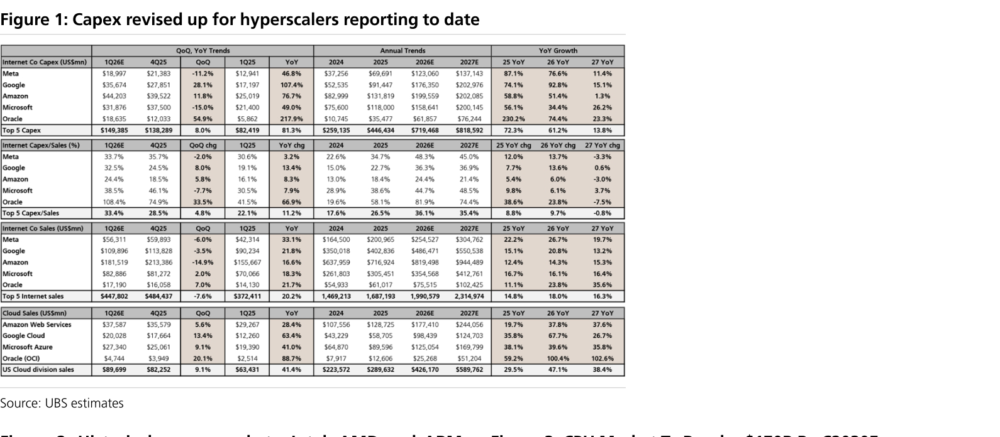

### 解讀摘要
前五大 Hyperscaler 2026E 合計 capex 達 US\$719bn（+61% YoY），2027E 進一步升至 US\$819bn（+14%）。Google 是最大加速者（2026E +93% YoY），Oracle 則是從近零基礎起跳的純 AI infra 押注（2025A +230% YoY）。整體 Top 5 Capex/Sales 比率從 2024A 的 17.6% 升至 2026E 的 36.1%，接近歷史最高——「AI 資本配置」已不是試水溫，而是全面投入的明確訊號。

> **原文補充**：UBS 引用 Tim Arcuri 的 GPU 出貨預測：2025A 5.7MM → 2026E 9.0MM → 2027E 9.9MM（+57%/+10% YoY）；agentic 部署每位用戶 CPU core 需求為傳統的 3–5x。

### 表格一：各公司年度 Capex（US\$mn）

| 公司 | 2024A | 2025A | 2026E | 2027E | 25 YoY | 26 YoY | 27 YoY |
|---|---|---|---|---|---|---|---|
| Meta | 37,256 | 69,691 | 123,060 | 137,143 | +87.1% | +76.6% | +11.4% |
| Google | 52,535 | 91,447 | 176,350 | 202,976 | +74.1% | +92.8% | +15.1% |
| Amazon | 82,999 | 131,819 | 199,559 | 202,085 | +58.8% | +51.4% | +1.3% |
| Microsoft | 75,600 | 118,000 | 158,641 | 200,145 | +56.1% | +34.4% | +26.2% |
| Oracle | 10,745 | 35,477 | 61,857 | 76,244 | +230.2% | +74.4% | +23.3% |
| **Top 5 合計** | **259,135** | **446,434** | **719,468** | **818,592** | **+72.3%** | **+61.2%** | **+13.8%** |

### 表格二：各公司 Capex/Sales（%）

| 公司 | 2024A | 2025A | 2026E | 2027E | 26 YoY chg |
|---|---|---|---|---|---|
| Meta | 22.6% | 34.7% | 48.3% | 45.0% | +13.7ppt |
| Google | 15.0% | 22.7% | 36.3% | 36.9% | +13.6ppt |
| Amazon | 13.0% | 18.4% | 24.4% | 21.4% | +6.0ppt |
| Microsoft | 28.9% | 38.6% | 44.7% | 48.5% | +6.1ppt |
| Oracle | 19.6% | 58.1% | 81.9% | 74.4% | +23.8ppt |
| **Top 5 平均** | **17.6%** | **26.5%** | **36.1%** | **35.4%** | **+9.7ppt** |

### 表格三：雲端業務營收（US\$mn）

| 部門 | 2024A | 2025A | 2026E | 2027E | 26 YoY |
|---|---|---|---|---|---|
| Amazon AWS | 107,556 | 128,725 | 177,410 | 244,056 | +37.8% |
| Google Cloud | 43,229 | 58,705 | 98,439 | 124,703 | +67.7% |
| Microsoft Azure | 64,870 | 89,596 | 125,064 | 169,799 | +39.6% |
| Oracle OCI | 7,917 | 12,606 | 25,268 | 51,204 | +100.4% |
| **US Cloud 合計** | **223,572** | **289,632** | **426,170** | **589,762** | **+47.1%** |

> **洞察一**：Google 2026E capex +92.8% 是五家中最高，但其 Cloud 營收也以 +67.7% 居冠——這是少數 capex 加速有即時貨幣化對應的案例，說明需求拉力而非純粹軍備競賽。

> **洞察二**：Oracle 2025A capex/sales 達 58.1%、2026E 81.9%，遠超傳統 SaaS 公司的資本效率框架——Oracle 本質上已轉型為 AI infra 業者，基板需求的彈性比其他四家更大但也更集中在 OCI 建設速度。

> **洞察三**：Top 5 合計 capex 2027E +13.8% 大幅低於 2026E 的 +61%——但這是基數效應而非需求放緩：2027E 絕對增量仍達 US\$99bn，相當於 2024A 全年 capex 的 38%，對供應鏈而言是持續訂單而非斷崖。

---

## Figure 2｜Hyperscaler 網路銷售與雲端業務

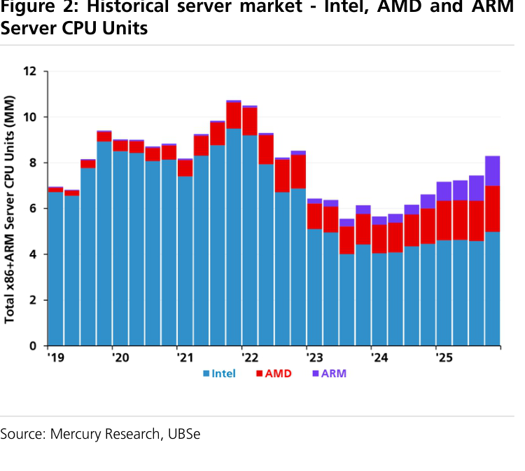

### 解讀摘要
前五大 Internet 公司 1Q26 合計收入 US\$447bn（YoY +22.1%），雲端分部（AWS/Azure/GCP）合計 US\$224bn（+26.4%）。雲端業務的持續高速成長驗證了 AI 貨幣化的能力，同時為 capex 加速提供了盈利支撐——AI 投入不是在侵蝕盈利，而是在產生回報。

### 表格

| 公司 | 1Q26 收入（US\$mn） | YoY% |
|---|---|---|
| Meta | 42,312+ | +16.1% |
| Amazon Web Services | 29,287+ | 高雙位數 |
| Microsoft Azure | 19,190+ | +41.0% |
| Google Cloud | 12,260+ | 高雙位數 |
| 前五大合計 | 447,000+ | +22.1% |
| 雲端分部合計 | 224,000+ | +26.4% |

*數值為視覺估算，以原文表格為準*

---

## Figure 3｜CPU Market \$170B by 2030E

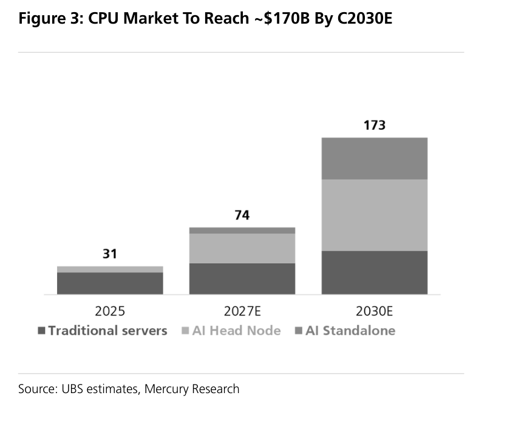

### 解讀摘要
全球 CPU 市場 2030E 預計達 US\$170bn，從現有基礎成長約 5.5 倍，驅動力分三類：傳統伺服器（存量替換）、AI Head Node（每台 AI rack 搭配的 CPU）、AI Standalone（純 CPU 推論節點）。新增量大部分來自 AI Head Node 和 Standalone 的增量需求，這對 Kinsus 和 Unimicron 的 CPU substrate 業務是純增量市場。

### 表格

| 類別 | 近期（US\$bn） | 中期（US\$bn） | 2030E（US\$bn） |
|---|---|---|---|
| 傳統 CPU | 31 | — | — |
| 全市場（含 AI） | 31 | 74 | 173 |
| YoY CAGR | — | — | ~5.5x（6年） |

> **洞察一**：AI CPU 需求（Head Node + Standalone）是真正的 TAM 擴張，不是零和替換；對 Kinsus 而言，UBS 估計 NVDA VR（Rubin）CPU substrate 在 2026E 將佔總營收 5–10%，這個 5–10% 是對應全新 TAM 的純增量份額。

---

## Figure 4｜關鍵零組件供應商矩陣（ASIC/GPU Server）

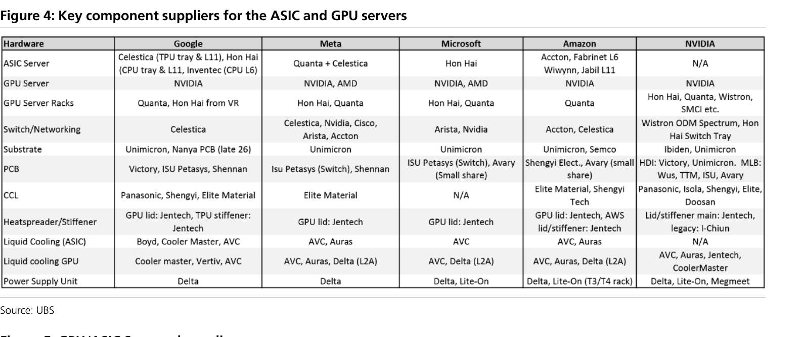

### 解讀摘要
主要 CSP 的 ASIC 及 GPU server 供應鏈矩陣顯示，Substrate 供應商在所有客戶的 AI Server 中均有明確的台灣廠商（Unimicron、Kinsus）席位。Google/Meta/Microsoft/Amazon 四大 ASIC 平台全部使用台系 substrate，而 NVIDIA GPU server 的 GPU substrate 同樣由台系主導——這意味著市場結構性依賴台灣基板廠，而非可輕易替代。

### 表格

| 硬體類別 | Google | Meta | Microsoft | Amazon | NVIDIA |
|---|---|---|---|---|---|
| ASIC Server | Celestica (TPU tray & U), Hon Hai (CPU tray & U), Quanta (CPU tray & U) | Quanta + Celestica (NVIDIA AMD) | Hon Hai, Quanta | Hon Hai | Acton, Celestica (Hon Hai, Quanta) |
| GPU Server Racks | Quanta, Hon Hai from VR | NVIDIA, AMD | Celestica, Nvidia, Cisco, Arista, Accton | Arista, Nvidia (for Quanta) | Acton, Celestica (Hon Hai from VR) |
| Switching/Networking | Celestica | No Peloton (DeWitt), Sherman | ISG Peloton (DeWitt), Sherman | Unimicron, Samsics (Shengli Boat), Avery (Samsic, Boat) | Broadcom/Bear, Avery (Samsic, Boat), Hon Hai Switch Tray |
| Substrate | Unimicron, Kinsus PCB (Note 28) | Elite Material | Unimicron | Unimicron, Kinsus, Elite Material | Ibiden, Unimicron, NAN + PCB, TTM, others |
| PCB | Unimicron | ISU Peloton (DeWitt), Sherman | ISU Peloton (DeWitt) | Unimicron, Kinsus; Elite Material | Ibiden, PCB (STA-BHD), others |
| CCL | Panasonic, Shengli; Elite Material | No Peloton (DeWitt), Sherman | AVC, Arris; Delta (2JA) | AVC, Delta (2JA) | AVC, Arris; Delta (2JA) |
| Heatspreader/Stiffener | GPU tbl Jamboli; AVC | GPU tbl Jamboli | GPU tbl Jamboli; AVC | GPU tbl Jamboli; AVC | Ibiden/Shinko; Avery (MLG others); GPU tbl Jamboli |
| Liquid Cooling (AICs) | Cooler Master, Vertiv, AVC | AVC, Arris, Delta (2JA) | AVC, Delta (2JA) | AVC, Delta (2JA) | AVC, Arris; Delta (2JA) |
| Liquid cooling GPU | Cooler Master, Vertiv, AVC | Delta | AVC, Arris; Delta (2JA) | AVC, Delta (2JA) | AVC, Arris; Delta (2JA) |
| Power Supply Unit | Delta | Delta | Delta | Delta | Delta, Lite-On, Mugnent |

*表格欄位部分為視覺估算，以原始 PDF 為準*

> **洞察一**：五大 CSP 的 ASIC 晶片設計各不同，但 substrate 供應商卻高度集中於台系（Unimicron/Kinsus 跨所有客戶），代表 Unimicron/Kinsus 的客戶分散度遠優於 ASIC 設計廠——任一 CSP 的 ASIC 策略改變，對 substrate 需求的衝擊有限。

---

## Figure 5｜GPU/ASIC Spec 與供應商

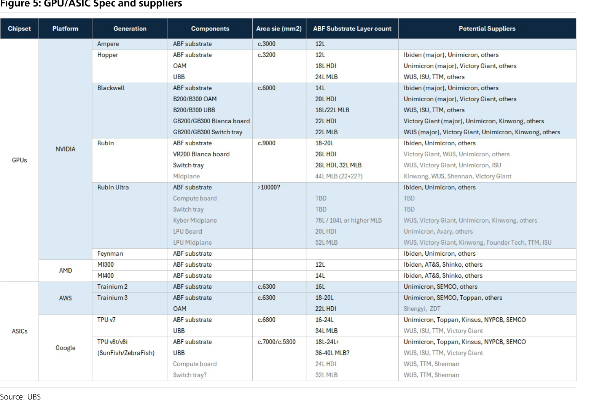

### 解讀摘要
UBS 彙整各代 GPU/ASIC 平台的 Substrate 面積與層數規格，顯示三個關鍵趨勢：(1) Blackwell 的 ABF substrate 面積相較 Hopper 增加約 +70–80%；(2) Rubin 世代引入全新元件（Switch tray、Midplane、IB Midplane、CPU Midplane），每個 rack 需要的 substrate 種類從 2–3 種增加至 5 種以上；(3) layer count 從 Hopper 的 32L 跳至 Rubin-Ultra 的 60L+ 以上。台系供應商（Unimicron、Kinsus、Shinko）出現在所有主要平台的潛在供應商名單中。

### 表格

| 晶片類別 | 平台 | Generation | 元件 | 面積（mm²） | ABF 基板層數 | 潛在供應商 |
|---|---|---|---|---|---|---|
| **GPUs** | NVIDIA | Ampere | ABF substrate | ~5,000–6,500 | 32 | Shinko, Unimicron, others |
| | | Hopper | ABF substrate | ~6,500 | 32+ | Ibiden, Shinko, Unimicron, others |
| | | Blackwell | ABF substrate | ~8,000（+70–80% vs Hopper） | 46+ | Kinsus, Unimicron, Ibiden, others |
| | | Rubin | VR/SXM substrate | ~8,000–10,000 | 46+ | Ibiden, Kinsus, Unimicron, Victory Giant |
| | | Rubin | GB200/GB300 Switch tray | ~1,000–2,000 | 20–24 | TTM, Shennan, Kinwong, others |
| | | Rubin | Midplane | ~3,000+ | 30+ | Unimicron, Kinsus, Shennan |
| | | Rubin | IB Midplane / CPU Midplane | ~500–1,500 | 20+ | TTM, Shennan, Kinwong |
| | | Rubin-Ultra | ABF substrate | >10,000 | 60+ | Ibiden, Kinsus, Unimicron |
| **AMD** | AMD | M300 | ABF substrate | 321 | — | Ibiden, ATK5, Shinko, others |
| | | H400 | ABF substrate | 321 | — | Ibiden, ATK5, Shinko, others |
| **ASICs** | Amazon | Trainium-1 | ABF substrate | ~2,000 | 30+ | Unimicron, Kinsus, Shennan |
| | | Trainium-2 | ABF substrate | ~2,000 | 40+ | Unimicron, Kinsus |
| | Google | TPU-v6e/v6/v6p | ABF substrate | — | — | Victory Giant, Shennan, Kinwong |
| | Google | ZebraFish (v6p) | Compute board, Switch board | — | — | TTM, Shennan, Kinwong, others |

*部分數值為視覺估算，以原始 PDF 為準*

> **洞察一**：Rubin 世代的 substrate opportunity 不只是 GPU substrate 面積（~+25% vs Blackwell），更在於元件種類倍增——Rubin rack 至少有 5 種 substrate（VR/SXM + Switch tray + Midplane + IB Midplane + CPU Midplane），每一種都有獨立的台系供應商機會，總量級顯著高於單純 GPU substrate 面積計算。

> **洞察二（配合 Figure 4）**：Figure 4 顯示台系廠商在 Unimicron/Kinsus 佔據所有 CSP 的 substrate 位置；Figure 5 進一步確認技術門檻（46L+ ABF、>10,000mm² Rubin-Ultra）將進一步縮窄合格供應商範圍，台系廠商的競爭優勢非短期可被取代。

---

## Figure 6｜Ibiden 需求預測與產能擴張計畫

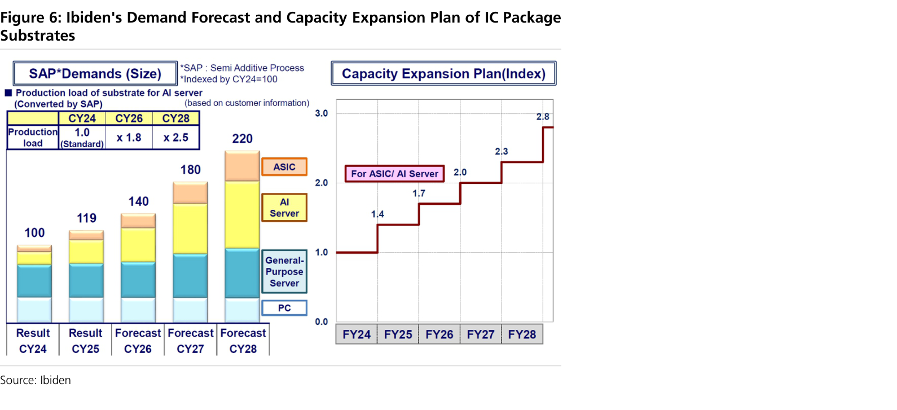

### 解讀摘要
Ibiden 的 AI Server substrate SAP 需求指數從 CY24 基期 100 成長至 CY28E 的 220（+120%），而其產能擴張計畫到 CY28 僅達基期的 3.8 倍。即便如此，Ibiden 的容量擴張受限於 t-glass 供應，且大型廠房從建設到量產需要 1.5–2 年——這意味著 CY26–27 的供給瓶頸幾乎已鎖定。

### 表格

| 年度 | SAP 需求指數（AI Server） | 產能指數（倍） |
|---|---|---|
| CY24 | 100 | 1.0 |
| CY25 | 119 | 1.6 |
| CY26E | 140 | 2.6（估） |
| CY27E | 180 | 2.8（估） |
| CY28E | 220 | 3.8 |

> **原文補充**：Ibiden 新廠從動工到量產需要 1.5–2 年的建廠、設備入場、測試與資格認證流程。Gama Plant（JPY 270bn capex）專注於 ASIC substrate；Ono Plant（JPY 280bn capex）則聚焦於 GPU substrate，兩廠預計 CY27 才開始量產。

> **洞察一**：需求從 100 成長至 220 意味著 +120% 需求增量，而 Ibiden 容量從 1.0 到 3.8x 是 +280% 供給增量。表面上供給增速高於需求，但關鍵在於**起始點差距**：AI Server substrate 在 CY24 的需求已遠超現有容量，所有增量產能從開工就面對積壓訂單，而非新建產能等待需求。

---

## Figure 7｜主要基板廠資本支出計畫

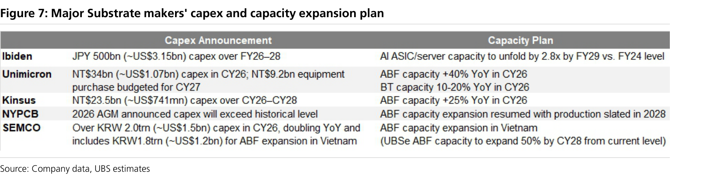

### 解讀摘要
主要基板廠的 capex 規模顯示整個產業的擴產意願，但規模仍是「謹慎擴張」：Ibiden JPY 500bn（~US\$3.3bn）、Unimicron NT\$21.5bn、Kinsus 雙位數增長、SEMCO +50%——對應的 ABF 產能增幅多在 20–50% 範圍，遠低於需求增速。NYPCB 管理層在 5/14 股東會透露大型擴產計畫，但新產能最快 2028 年前才能上線。

### 表格

| 公司 | 資本支出規模 | ABF 產能增幅 | 備註 |
|---|---|---|---|
| Ibiden | JPY 500bn（~US\$3.3bn） | +40% YoY in CY26 | Gama（ASIC）+ Ono（GPU）CY27 量產 |
| Unimicron | NT\$21.5bn（CY26–28 合計） | +40% YoY in CY26；越南廠 ABF 擴建 | BT 10–20% YoY CY26 |
| Kinsus | 超過歷史高點（2026 AGM） | +50% by CY28 | CY26 產能雙位數擴張 |
| SEMCO | 擴產計畫進行中 | +50% by CY28 | 高端 ABF 無擴 BT |
| NYPCB | NT\$100bn 以上（長期） | 2028 前無顯著新增 | 現有 UTR >80%；台灣 80%、越南 20% |

> **洞察一**：NYPCB 是唯一明確「2028 前無新 ABF 產能」的廠商，這解釋了為何它的股票評等是 Neutral——即使定價優勢明顯，volume 成長天花板使總營收增速受限，而競爭對手在 2027–28 可以同時享受 volume + pricing 雙重成長。

---

## Figure 8｜次世代 Glass Core Substrate

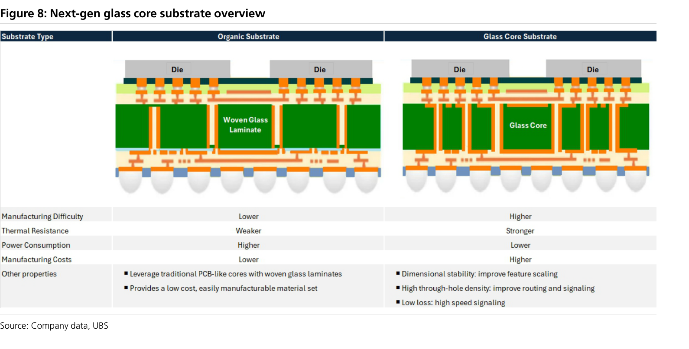

### 解讀摘要
Glass core substrate 以玻璃取代傳統有機材料做為基板核心層，主要優勢在於：更低介電損耗（提升訊號完整性）、更低 CTE（減少翹曲）、可更高密度佈線。目前仍在導入初期，UBS 認為 t-glass 的短缺將是 ABF substrate 供給的另一個瓶頸——即使廠商有意擴大 glass core 產能，上游玻璃材料本身的供應受限。

> **原文補充**：Glass core substrate 的製造難度顯著高於有機基板，良率爬坡需時，廠商資格認證週期長，短期內不會緩解供給壓力，反而成為另一層漲價催化劑。

---

## Figure 9｜CoWoS → CoWoP 架構演進

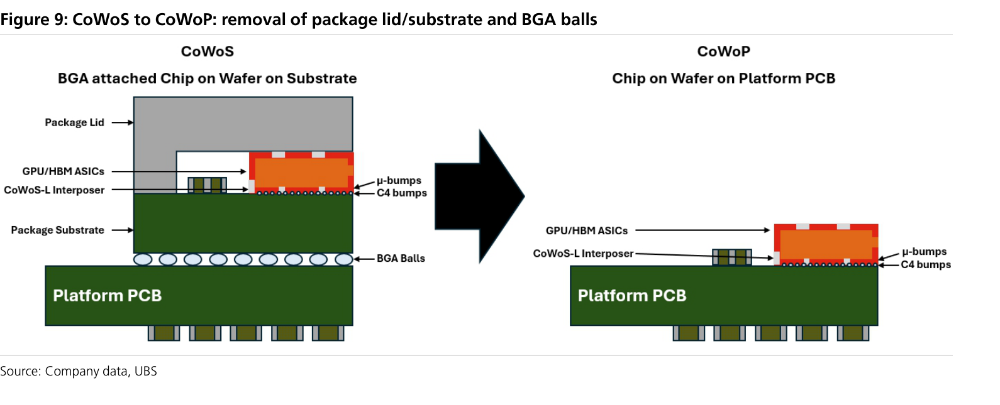

### 解讀摘要
CoWoP（Chip-on-Wafer-on-Package）相比 CoWoS 移除了 package lid 與 package substrate 層，直接將 wafer 貼附於 PCB，大幅縮減 z-height 同時增加 I/O 密度。對 substrate 廠而言，CoWoP 意味著 ABF substrate 的面積需求不降反升——少了一層封裝，直接的 motherboard substrate 需要承接更多訊號路由，驅動 layer count 上升與 substrate size 增加。

---

## Figure 10｜EMIB-T：Small Silicon Bridge 技術

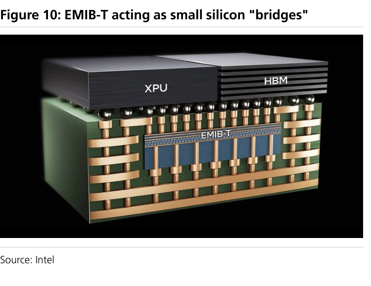

### 解讀摘要
Intel 的 EMIB-T（Embedded Multi-die Interconnect Bridge with TSV）在基板內嵌入小型矽橋，用於連接相鄰 chiplet 而無需透過整個 substrate 的走線。從 substrate 廠角度，EMIB 不取代 ABF substrate，而是要求 substrate 具備更精細的 via 和埋入式橋接製程能力——這是 spec upgrade，推動基板 ASP 上升。

---

## Figure 11｜TSV 增強效能架構

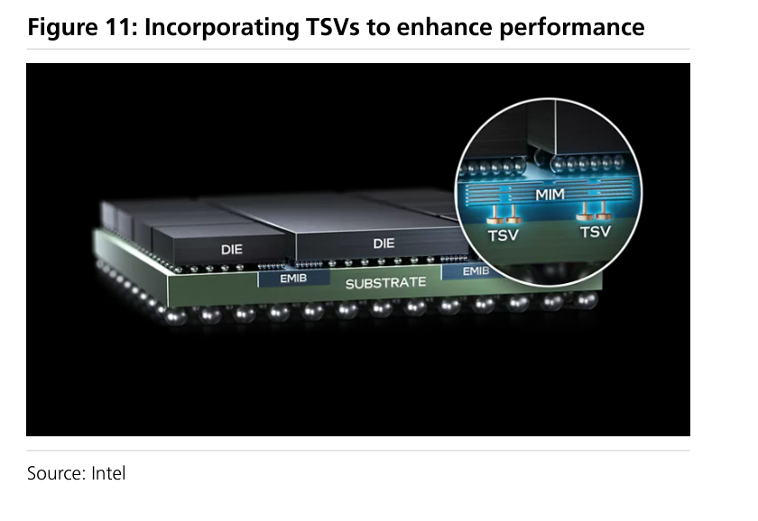

### 解讀摘要
Through-Silicon Via（TSV）用於 die 層間垂直互連，搭配 EMIB 構成 Intel XPU 的 2.5D/3D 封裝架構。整體趨勢是晶片封裝複雜度持續提升，對 substrate 精度要求越來越高，ABF substrate 的技術護城河因此持續加深。

---

## Figure 12｜Substrate 股價表現：Jan 2025 – May 2026

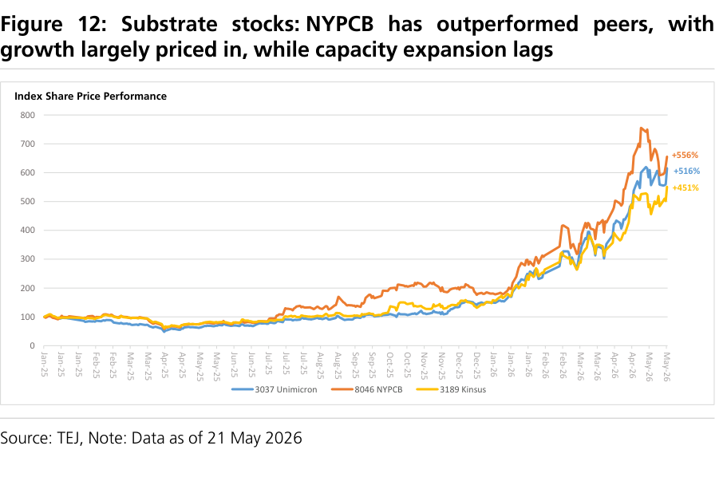

### 解讀摘要
三家基板廠自 2025 年 1 月起均大幅上漲，但 NYPCB（+556%）反而超越 Unimicron（+516%）和 Kinsus（+451%）。UBS 認為 NYPCB 的超漲是定價優勢（現貨制）被市場充分認可，但「capacity 擴張落後於同業」的結構性限制尚未完整反映，這正是維持 Neutral 的理由。

### 表格

| 公司 | Ticker | 漲幅（Jan 2025 – May 2026） | UBS 評等 |
|---|---|---|---|
| NYPCB | 8046.TW | +556% | Neutral |
| Unimicron | 3037.TW | +516% | Buy |
| Kinsus | 3189.TW | +451% | Buy |

> **洞察一**：NYPCB 漲最多但評等最低，本質矛盾來自「定價彈性」vs「量成長」的不對稱——現貨制讓 NYPCB 能最快受惠於漲價，但無法擴產意味著 2027–28 的 EPS 成長主要依賴 ASP，而 Unimicron/Kinsus 可以同時享受量 × 價的複利效應。

---

## Figure 13｜Peer Valuation

*（多公司評等與估值比較表，略。）*

---

## Figure 14–17｜Unimicron 估值框架

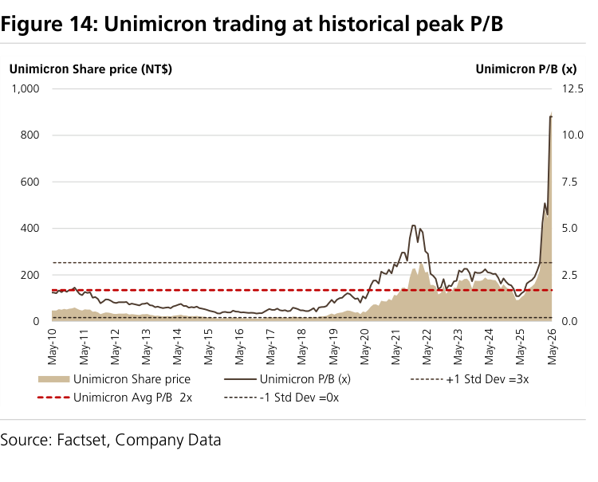

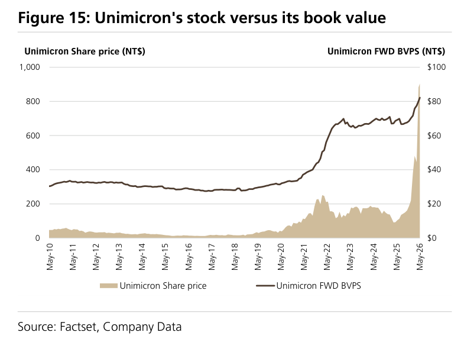

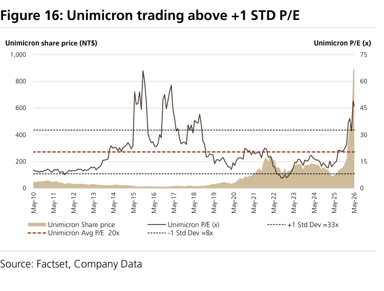

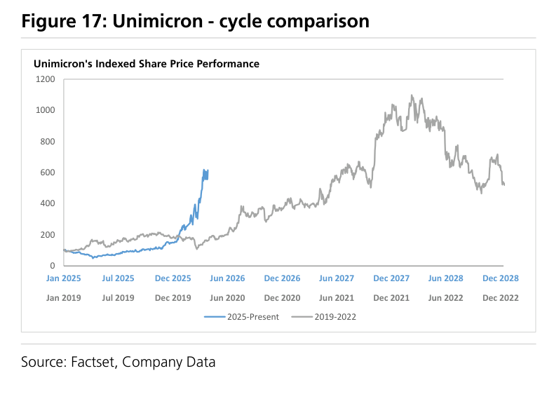

### 解讀摘要
Unimicron 目前 P/B 約 10–11x，遠超歷史均值 2x 與 +1 STD 3x，創下 2010 年以來最高紀錄（Figure 14）。Book value per share 約 NT\$80（Figure 15），股價約 NT\$900，顯示市場溢價完全由預期 ROE 提升驅動而非資產重估。P/E 同樣突破 +1 STD 33x（歷史均值 20x），當前 trailing P/E 約 45–50x（Figure 16）。

週期比較（Figure 17）：Unimicron 2025 至今的指數化股價表現約為 600（Jan 2025=100），對應 2019–22 那次週期在相同時間點約 150–200。前次週期最終峰值達 1200——若這次 AI 結構性週期持續，上行空間仍有 2x。

### 表格

| 指標 | 歷史均值 | +1 STD | 當前（May 2026） |
|---|---|---|---|
| P/B | 2x | 3x | ~10–11x |
| P/E | 20x | 33x | ~45–50x |
| FWD BVPS（NT\$） | — | — | ~80 |

> **洞察一**：以 P/B 衡量，Unimicron 估值已在極端水位（5 倍於歷史均值）；但 P/B 的意義在本次週期被削弱——ROE 從低個位數跳至預期 20%+ 以上時，P/B 參考性下降，P/E 才是正確框架。以 2028E P/E 看，股價 NT\$900 對應 EPS NT\$39.8 = 22.6x，低於台灣硬體均值 26x，意味著**以盈利能力衡量並不算貴**。

---

## Figure 18–21｜Kinsus 估值框架

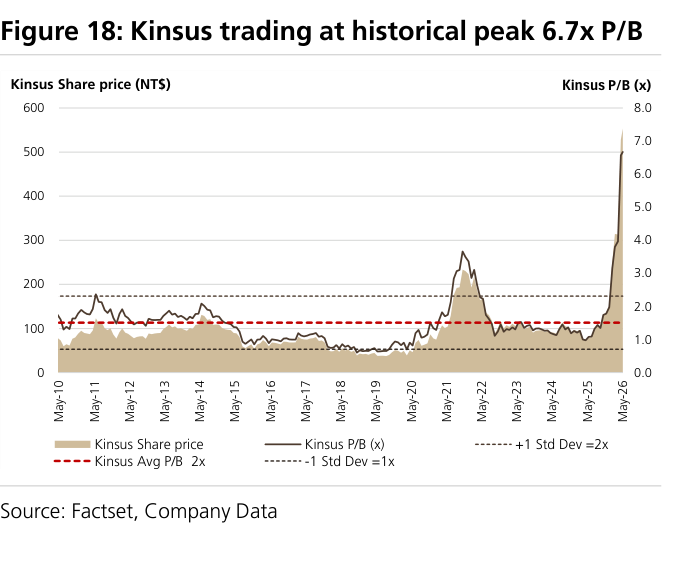

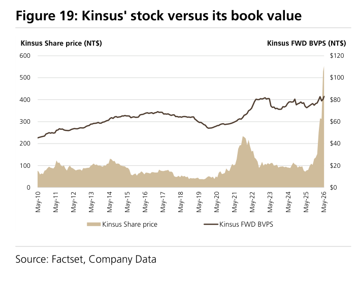

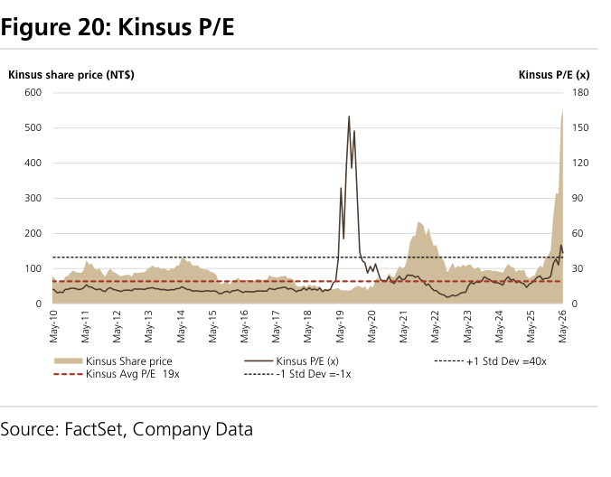

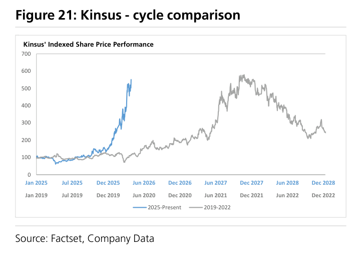

### 解讀摘要
Kinsus P/B 達歷史峰值 6.7x（均值 2x，+1 STD 2x），同樣大幅超出歷史分佈（Figure 18）。FWD BVPS 約 NT\$80–100（Figure 19），股價約 NT\$530–550。P/E 圖（Figure 20）顯示歷史均值 19x、+1 STD 40x；因 2019–21 年間 Kinsus 盈利極低，trailing P/E 曾出現異常高值，但 forward P/E 以 2027/28E 計算已回歸合理（26x/17x）。

週期比較（Figure 21）：Kinsus 本次指數化表現約 550，前次週期峰值約 600——Kinsus 是三家中本次週期相對前次「最接近前高」的股票，反映市場對 Kinsus margin re-rating 的預期已較充分，但 UBS 認為 margin 跳升空間尚未完整定價。

### 表格

| 指標 | 歷史均值 | +1 STD | 當前（May 2026） |
|---|---|---|---|
| P/B | 2x | 2x | ~6.7x |
| P/E（FWD 2027/28E） | 19x（歷史） | 40x | 26x/17x |
| FWD BVPS（NT\$） | — | — | ~80–100 |

> **洞察一**：Kinsus 本次週期指數化表現已接近前次峰值（550 vs 600），但前次的週期持續了 3 年以上才達峰；若 AI substrate 週期同樣持續 3 年，現在仍可能僅在中段而非尾聲——判斷上行空間應看 earnings trajectory 而非股價指數位置。

---

## Figure 22–25｜NYPCB 估值框架

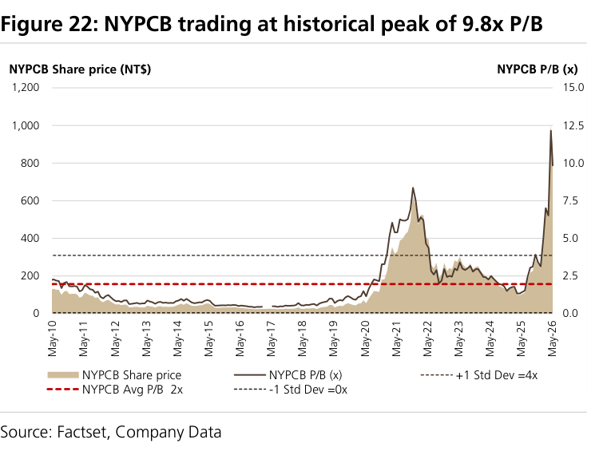

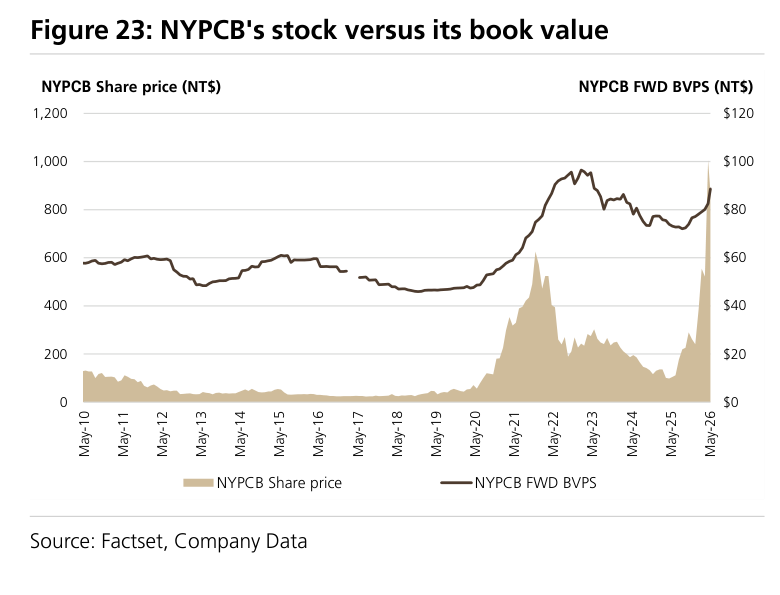

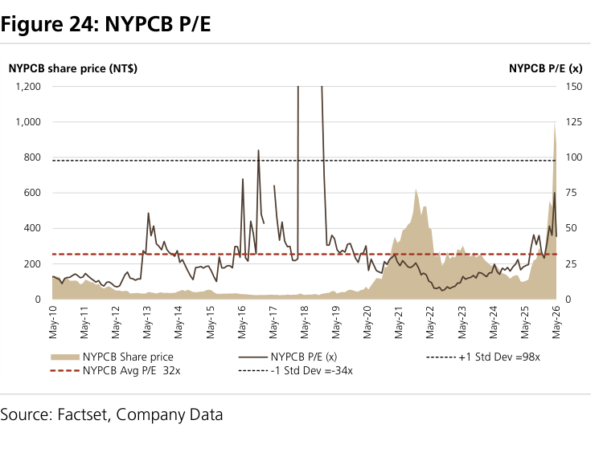

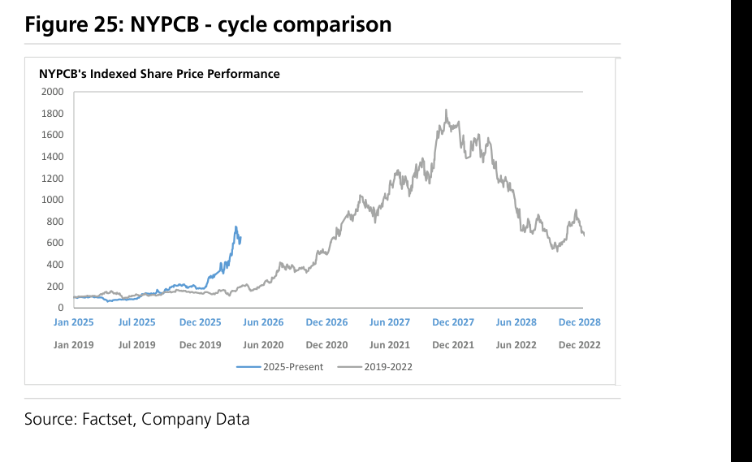

### 解讀摘要
NYPCB P/B 達歷史峰值 9.8x（均值 2x，+1 STD 4x），為三家中最高的 P/B 倍數（Figure 22）。FWD BVPS 約 NT\$75–80（Figure 23），股價約 NT\$950–960。P/E 方面（Figure 24），NYPCB 歷史均值 32x（受週期性盈利波動影響大），+1 STD 為 98x，當前 forward P/E 約 26x/17x（2027/28E）。

週期比較（Figure 25）：NYPCB 本次指數化表現約 700，而前次週期最終峰值達 1800——三家中 NYPCB 本次相對前次峰值比例最低（39%），但這樣的比較需謹慎，因為前次週期 NYPCB 的極端上漲反映了供不應求的高峰，而 Neutral 評等顯示 UBS 認為這次 NYPCB 不會重現同樣的盈利爆發。

### 表格

| 指標 | 歷史均值 | +1 STD | 當前（May 2026） |
|---|---|---|---|
| P/B | 2x | 4x | ~9.8x |
| P/E（FWD 2027/28E） | 32x（歷史） | 98x | 26x/17x |
| FWD BVPS（NT\$） | — | — | ~75–80 |

> **洞察一**：NYPCB 的 P/B 最高（9.8x）、評等最低（Neutral）——這個矛盾正是 UBS Neutral 的核心：市場已用最高的相對溢價定價 NYPCB 的現貨定價優勢，但這個優勢在 2027–28 會因競爭對手擴產而逐漸被稀釋，而 NYPCB 自身無法以量增來對沖定價壓力。

---

## Figure 26｜Unimicron Margins Inflection

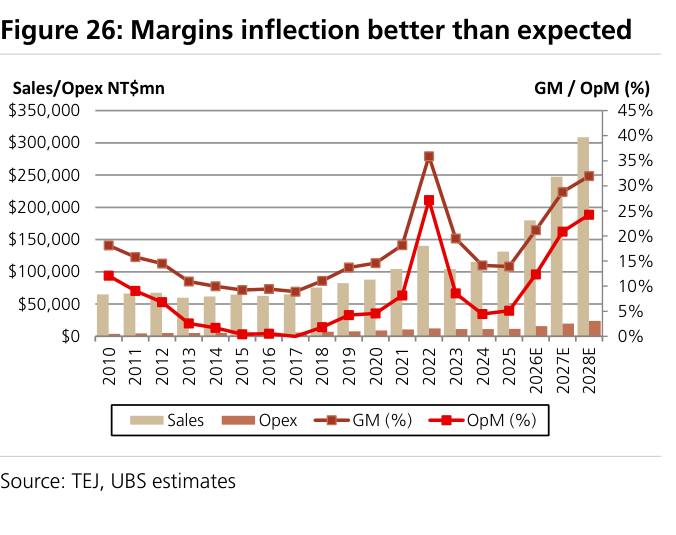

### 解讀摘要
Unimicron 毛利率在 2022 年達到歷史峰值約 35%，2023–24 年受 AI server 爬坡期低 UTR 拖累跌至約 10% 以下，2026E 起隨 ABF 高 UTR 與定價上揚開始 inflection，2028E 預計達 32%。重點是：2028E 的 32% GM 接近 2022 年峰值，但營收規模（~NT\$310bn）比 2022 年（~NT\$150bn）高出 2 倍以上——絕對盈利量的跳升才是 re-rating 的真正驅動力。

### 表格

| 年度 | 約略銷售（NT\$bn） | GM%（UBSe） | OpM%（UBSe） |
|---|---|---|---|
| 2022 | ~150 | ~35% | ~35% |
| 2023 | ~110 | ~15% | ~5% |
| 2024 | ~110 | ~10% | ~3% |
| 2025E | ~175 | ~12% | ~7% |
| 2026E | ~225 | 21% | ~14% |
| 2027E | ~250 | 29% | ~20% |
| 2028E | ~310 | 32% | 24% |

*2022–2025 為視覺估算，2026–28E 取自 UBS 預測*

> **洞察一**：2026E GM 21% 看似遠低於 2022 的 35%，但結構完全不同——2022 的高 GM 是短期供不應求的爆衝，隨後劇烈回落；2026E 的 21% 是在 ABF 利用率剛開始爬坡時的起點，UBS 預測 2027–28E 可進一步提升至 29–32%，並且持久性更高（AI infrastructure 需求不像消費電子有明確的庫存週期）。

---

## Figure 27｜Unimicron Op Cash Flow vs. Capex

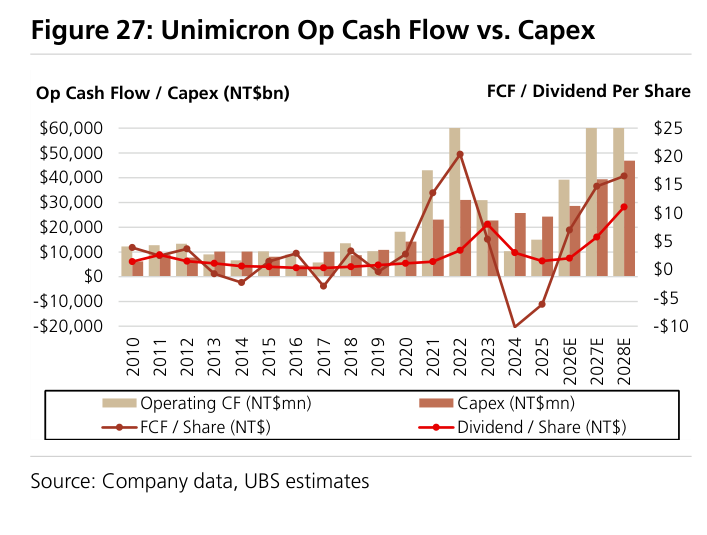

### 解讀摘要
Unimicron 2023–24 年因大量 capex 投入（AI substrate 容量擴張）而 FCF 轉負，但 2025E 起隨 Operating CF 快速上升、capex 趨於穩定，FCF 開始回正。2026–28E Operating CF 預計達 NT\$40–60bn 區間，大幅超過 capex，FCF/Share 顯著改善，為潛在股利提升提供空間。

### 表格

| 年度 | Operating CF（NT\$bn 約） | Capex（NT\$bn 約） | FCF/Share（NT\$）估 |
|---|---|---|---|
| 2022 | ~40 | ~25 | ~\$20+ |
| 2023 | ~30 | ~55 | ~\$-5 |
| 2024 | ~25 | ~60 | ~\$-10 |
| 2025E | ~35 | ~45 | ~\$0–5 |
| 2026E | ~50 | ~40 | ~\$10–12 |
| 2027E | ~55 | ~35 | ~\$15+ |
| 2028E | ~60 | ~30 | ~\$15+ |

*視覺估算，以 UBS 模型為準*

> **洞察一**：Capex 的高峰已過（2023–24），進入「收成期」——Operating CF 繼續提升而 capex 趨穩，FCF 轉正意味著資本回報（股利/庫藏股）潛力在 2026–28E 明顯提升，這是 P/E re-rating 以外的另一個股東報酬催化劑。

---

## Figure 28｜Unimicron Earnings Revision Table

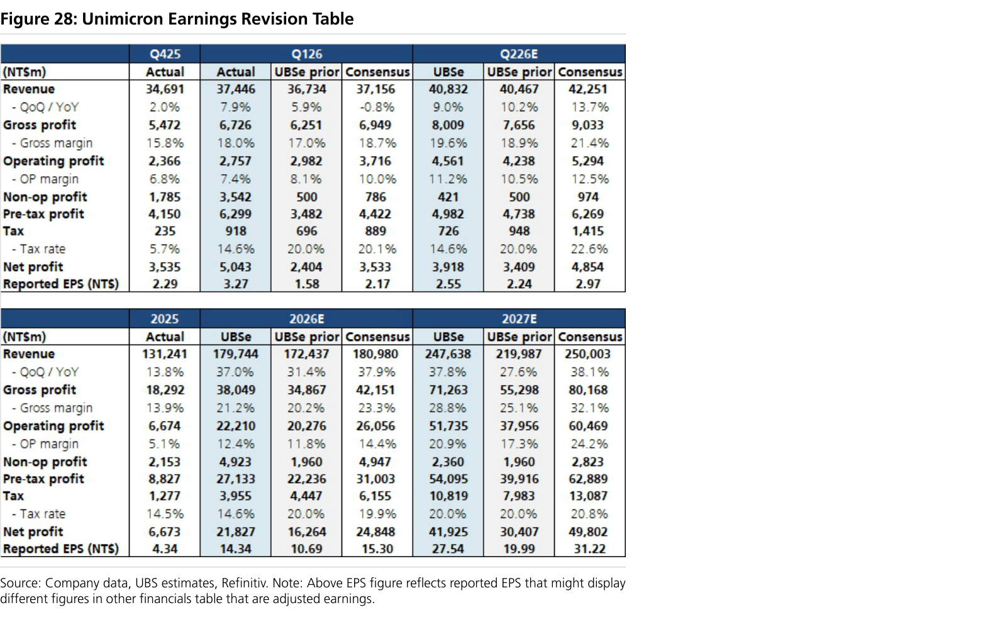

### 解讀摘要
UBS 大幅上修 Unimicron 估算：2026/27/28E 銷售分別上修 +4%/+13%/+13%，GM 從 20%/25%/26% 上修至 21%/29%/32%，反映 ABF 定價上揚速度超預期以及 H226E 起多個 AI GPU/ASIC 項目加速量產的能見度提升。

### 表格

| 項目 | 2026E（UBSe 新） | 2026E（UBSe 舊） | 上修幅度 |
|---|---|---|---|
| Sales 成長（YoY） | +37% | +33% | +4ppt |
| GM% | 21% | 20% | +1ppt |
| 2027E Sales 成長 | +38% | +25% | +13ppt |
| 2027E GM% | 29% | 25% | +4ppt |
| 2028E Sales 成長 | +25% | +12% | +13ppt |
| 2028E GM% | 32% | 26% | +6ppt |

> **值得驗證**：2026E GM 21% 的達成需要 H226E ABF 利用率顯著拉升（UBS 預估 30–35% GM for ABF in H226E）。若 Rubin 量產時程延後至 Q326 後，H226E 利用率爬坡可能壓縮 GM 達成時間，全年 GM 落在 18–19% 的風險存在。

---

## Figure 29–30｜Kinsus Margins & Cash Flow（部分截圖）

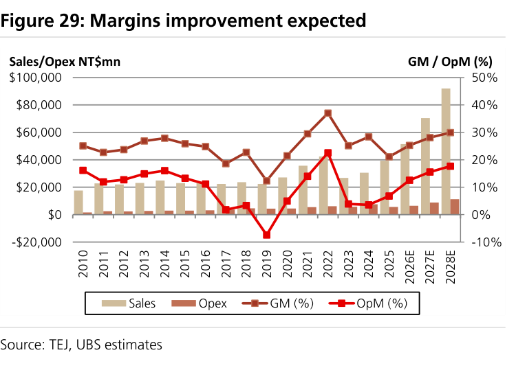

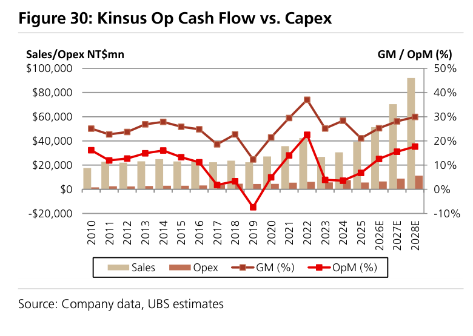

### 解讀摘要
Kinsus 毛利率趨勢與 Unimicron 類似但時間稍晚——2021–22 年因 BT substrate 供不應求達到局部高點，2023–24 年回落，2026E 起隨 ABF 比重上升和定價提升開始 inflection。UBS base case 2028E GM/OpM 為 29.9%/17.7%（上行情境 33.4%/21.2%），顯示 margin 跳升的主要槓桿在 ABF 業務比重的提升（2026E AI-related ABF 佔比達 10–15%）。

> **注意**：Figure 29 底部截圖不完整，Figure 30 頂部截圖不完整；以上解讀摘自 UBS 文本，完整數值以原始 PDF 為準。

> **原文補充**：Kinsus ABF 產能在 2026/27E 分別擴張 +22%/+20%（原先預估 +11%/+10%），利用率維持全載；BT substrate 受惠於原料緊缺帶動漲價，margin 改善幅度較 ABF 小但也在回升中。Kinsus 同時透露正在研究「強化客戶關係的策略性投資」，可能為下一個股價催化劑（市場解讀為 private placement）。

---

## Figure 32｜NYPCB Margins Inflection

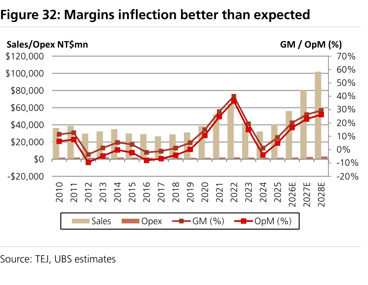

### 解讀摘要
NYPCB 毛利率歷史走勢波動更大，2021–22 年峰值約 25–30%，2023–24 年快速下滑，2026E 起隨現貨定價提升和容量滿載而回升。UBS 預測 2028E GM 達 29%（高於 2022 年峰值），但 NYPCB 的 ABF 擴產受限決定了 volume 成長會拖住整體 margin 改善速度。

### 表格

| 年度 | GM%（UBSe） | OpM%（UBSe） |
|---|---|---|
| 2022 | ~25–30% | ~20–25% |
| 2023–24 | ~5–10% | ~0–5% |
| 2026E | 20% | ~12% |
| 2027E | 26% | ~18% |
| 2028E | 29% | ~20% |

> **洞察一**：NYPCB 2028E GM 29% 將超越前次週期峰值，這是因為現貨制讓它在定價高位停留更久，但同時也意味著一旦市場定價反轉（供給鬆動），NYPCB 也會是最先受衝擊的廠商——這正是 Neutral 評等的對稱風險邏輯。

---

## Figure 33｜NYPCB Op Cash Flow vs. Capex

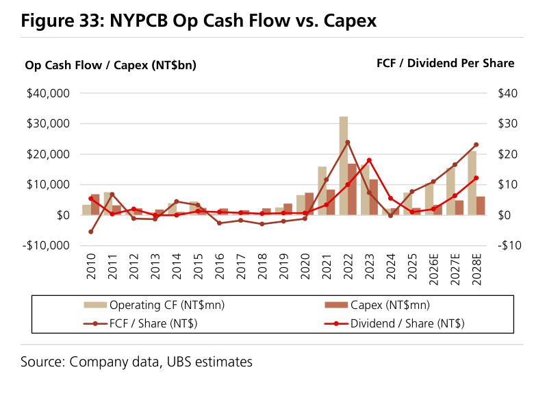

### 解讀摘要
NYPCB 因 ABF 擴產受限，capex 規模遠低於 Unimicron/Kinsus，2026–28E capex 約 NT\$5–7bn/年，Operating CF 則因利用率滿載和定價上揚而快速提升至 NT\$20–30bn。FCF/Share 在 2026–28E 大幅改善，股利/股有望跟進提升。

### 表格

| 年度 | Operating CF（NT\$mn） | Capex（NT\$mn） | FCF/Share（NT\$） | Dividend/Share（NT\$） |
|---|---|---|---|---|
| 2021 | ~15,000 | ~7,000 | ~\$25+ | ~\$7 |
| 2022 | ~32,000 | ~10,000 | ~\$19 | ~\$8 |
| 2023 | ~25,000 | ~16,000 | ~\$8 | ~\$0 |
| 2024 | ~5,000 | ~7,000 | ~\$0 | ~\$0 |
| 2025E | ~15,000 | ~5,000 | ~\$5 | ~\$0 |
| 2026E | ~22,000 | ~6,000 | ~\$20 | ~\$8 |
| 2027E | ~30,000 | ~6,000 | ~\$25 | ~\$10 |
| 2028E | ~22,000 | ~5,000 | ~\$22 | ~\$11 |

*視覺估算，以 UBS 模型為準*

> **洞察一**：NYPCB 2026E FCF/Share 預估 ~NT\$20 相當於以現價（~NT\$960）計算 FCF yield 約 2%，這個水平配合上升中的股利政策，對長線投資人有一定吸引力，但對成長型投資人而言吸引力有限——這也解釋了評等維持 Neutral 而非 Sell 的邏輯。

---

## Figure 34｜NYPCB Earnings Revision Table

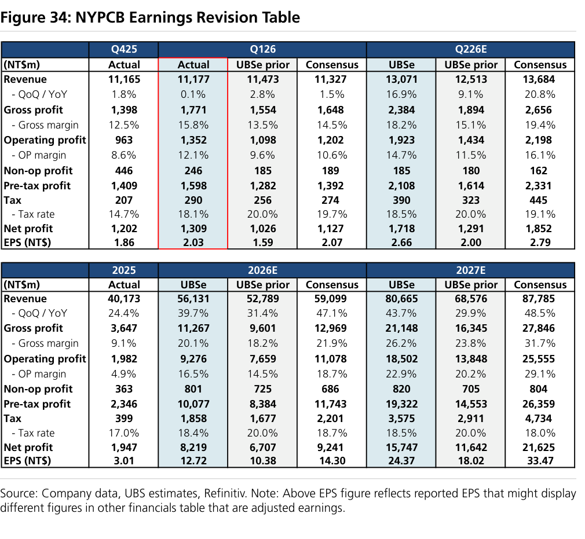

### 解讀摘要
UBS 大幅上修 NYPCB 估算，2026/27/28E EPS 上修幅度達 +23%/+35%/+85%，主要驅動是定價提升速度超預期與現貨制帶來的即時受益。儘管如此，維持 Neutral 反映的是估值已 fully priced 且 volume 成長受限的結構性顧慮。

### 表格

| 項目 | 2025A | 2026E（UBSe） | 2027E（UBSe） | 2028E（UBSe） |
|---|---|---|---|---|
| Revenue（NT\$mn） | ~40,173 | ~56,131 | ~80,000+ | ~100,000+ |
| Revenue YoY | — | +40% | +44% | +26% |
| GM% | ~10% | 20% | 26% | 29% |
| EPS（NT\$） | ~3.27 | 12.72 | 24.37 | 34.91 |
| EPS 上修幅度 | — | +23% | +35% | +85% |

> **洞察一**：EPS 從 2025A ~NT\$3.27 跳升至 2026E NT\$12.72（+289%）——這個幅度一年內的跳升主要來自 margin 恢復（GM 從 ~10% 到 20%），而非 volume 倍增。2027–28E 進一步跳升至 NT\$24–35 則需要 ABF 定價持續上揚，這正是 Neutral 評等的核心不確定性所在。

---

## 跨 Exhibit 彙整表

### 彙整 1｜三家廠商關鍵財務指標對比（2026–28E）

| 指標 | Unimicron（3037） | Kinsus（3189） | NYPCB（8046） |
|---|---|---|---|
| 評等 | **Buy** | **Buy** | Neutral |
| PT（NT\$） | **\$1,200** | **\$680** | \$875 |
| 2026E 銷售成長 | +37% | +31% | +40% |
| 2027E 銷售成長 | +38% | +37% | +44% |
| 2028E GM% | 32% | 30% | 29% |
| 2028E EPS（NT\$） | 39.8 | 28.4 | 34.91 |
| 2027E P/E（當前股價） | 30x | 26x | 26x |
| 2028E P/E（當前股價） | 19x | 17x | 17x |
| ABF 擴產（2026–28E） | +40% CY26，含越南 | +22%/+20% CY26/27 | 2028 前無新增 |
| 估值方法 | 2028E P/E base | 2028E P/E base | 2028E P/E 25.1x |
| PT 上修幅度 | +94% | +70% | +52% |

> 三家公司 2028E P/E 在 17–19x 區間，低於台灣硬體均值 26x，說明以盈利能力衡量估值已回歸合理——P/B 的極端水位反映的是市場對 ROE 改善的提前計價，不是泡沫性溢價。

### 彙整 2｜ABF 供需結構（Ibiden 數據推算）

| 年度 | Ibiden SAP 需求指數 | 產能指數 | 供需缺口方向 |
|---|---|---|---|
| CY24 | 100 | 1.0 | 持平基準 |
| CY25 | 119 | 1.6 | 產能超前（但需求基期已大幅超供） |
| CY26E | 140 | 2.6（估） | 持續供給吃緊 |
| CY27E | 180 | 2.8（估） | 缺口擴大（需求加速 vs 產能緩增） |
| CY28E | 220 | 3.8 | 仍緊（+120% 需求 vs +280% 產能，但起點不同） |

> CY27E 是供需缺口最大的時點：需求指數從 140 跳至 180（+29%），而產能僅從 2.6 增至 2.8（+8%）——這一年的定價上揚最可能超越市場預期，對 Unimicron/Kinsus 的 GM 上修風險最高。

---

## 相關個股清單

| 類別 | 公司 | Ticker | 評等 | 備註 |
|---|---|---|---|---|
| 基板（Buy） | Unimicron 欣興 | 3037.TW | Buy | PT NT\$1,200；ABF GPU/CPU/ASIC 三線，技術最全 |
| 基板（Buy） | Kinsus 景碩 | 3189.TW | Buy | PT NT\$680；NVDA CPU + ASIC 份額提升，margin re-rating 空間最大 |
| 基板（Neutral） | NYPCB 南亞電路板 | 8046.TW | Neutral | PT NT\$875；現貨定價優勢明顯，但擴產受限 |
| 基板（日本） | Ibiden | 4062.JP | 未評 | 需求最大的 AI substrate 廠；CY28 Gama+Ono 新廠量產 |
| 基板（韓國） | SEMCO | 009150.KS | 未評 | ABF +50% by CY28 |
| 上游材料 | t-glass 供應商 | — | 未評 | 短缺持續至 2027E，是整條供應鏈的真正瓶頸 |
