# SemiAnalysis｜Inside the 800VDC Revolution – Part 1

**來源**：SemiAnalysis / InferenceX（Substack 付費研報）  
**分析師**：Nicolas Bontigui、Jeremie Eliahou Ontiveros、Konrad Wang 及其他 3 位  
**日期**：2026-05-26  
**主題**：Four-Phase 800VDC Transition, Power Rack Economics, SST, Equipment Content/MW, Supplier Implications  
**感謝**：DG Matrix、Novos Power、Aran Industries 提供貢獻與洞察  
<a href="/dl?g=產業&b=SemiAnalysis&d=20260526&h=800VDC-Revolution-Part1">📎 下載 PDF</a>

---

## SemiAnalysis 完整論點鏈

| 論點層次 | 圖 | 內容 |
|---|---|---|
| 物理瓶頸確認 | 05 | 54V 電流是 800V 的 14.8 倍，I²R 損耗高 219 倍；Kyber 級 600kW rack 在 48–54V 需 \~12,500A，800V 降至 750A |
| 轉型路徑已定義 | 06 / 07 | 四個 Phase 涵蓋 White-space retrofit → 800V-native → Centralized rectifier → SST end-state，每 Phase 設備組合與效率均不同 |
| 近期需求已啟動 | 08 | 2027 penetration 38% → 2030 78%；Retrofit（Sidecar）先行，Facility-level 從 2029 開始接棒 |
| Phase 1–2 設備機會量化 | 18 / 19 | Power Rack ASP \~\$400K，TAM 峰值 \$11.3B（2028）；AC-DC Shelves 佔 BOM 58% |
| Phase 3–4 架構變革 | 27 / 48 | LV UPS 退出節省 \$1.2M/MW；總電氣內容維持 \$3.6–4.8M/MW，但 grey/white space 比重倒轉 |
| 效率改善是核心驅動 | 48 | Baseline 82.4% → Phase 4 87.4%；1GW IT load 下，Phase 2 已省 58MW 電力 |
| SST 市場另一個 TAM 波段 | 47 | SST TAM \$13.0B（2030），Phase 4 從 2029 起替代 Sidecar 與 LV 設備 |
| **結論** | 全文 | **800VDC 是物理驅動的系統性轉型；Sidecar 是 2026–2028 視窗，SST 是 2029+ 長期標的；中間的 Phase 3 是真正的架構革命** |

> **報告最大邏輯缺口**：SST 量產良率與可靠性資料幾乎缺失（目前最長部署為 2011 年 Swiss Federal Railways，無 datacenter scale 的 MTBF 數據）；以及 NEC 2029 能否如期達到 partial provision 仍是監管風險。

---

## 報告核心觀點

| 主題 | SemiAnalysis 觀點 | 市場共識 | 是否 Contra-Consensus |
|---|---|---|---|
| 800VDC 時程 | Phase 1 啟動 2026 年底，Phase 4 規模採用 2029+ | 業界普遍認為 2027–2028 | 略早於共識 |
| UPS 命運 | LV UPS 逐步退出，BBU + CBU 在 rack 層面取代 | UPS 廠商仍主張中心化 UPS 不可或缺 | 是，對 UPS 廠商偏空 |
| SST vs MV Rectifier | SST 將佔 Phase 4 大部分份額；MV rectifier 為過渡方案 | 市場尚未形成共識 | 偏多 SST |
| Sidecar ASP | \~\$400–500K/unit，\~\$500K/MW | 未有公開共識 | 首次量化 |
| 效率提升 | Phase 4 vs Baseline +5%，與 Nvidia 官方數字一致 | Nvidia 公開稱 \~5% | 一致 |
| 安全/法規 | NEC 2029 partial provision；full code 可能要等到 2032–2035 | 市場假設 NEC 2029 解決大部分問題 | 偏保守 |

**Phase 受益排序**：Phase 1–2 → HVDC Power Rack 供應商（AC-DC Shelves / BBU / DC-PDU）；Phase 3 → DC Busway / Battery Rack；Phase 4 → SST pure-play（DG Matrix、Amperesand、Heron Power、Novos Power）

---

## 圖表解讀

### 總覽：為什麼 800VDC 不可避免

---

#### 圖 05｜導線直徑：48V vs 400V vs ±400V

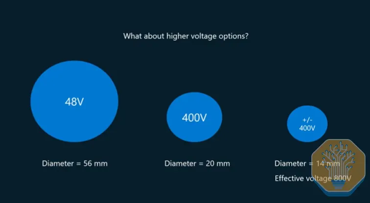

**解讀摘要**
從 48V 升至 ±400V（等效 800V），導線直徑從 56mm 縮至 14mm，截面積縮小約 16 倍。這不只是材料節省，而是讓 600kW 等級 rack 在物理上變得可行——48V 方案在 Kyber Ultra（660kW）需要 \~200kg copper busbar，整棟建築在 GW 規模需要數百噸銅，重量、成本與路由空間均不可行。

---

#### 圖 02｜NVIDIA：800VDC 的根本驅動力

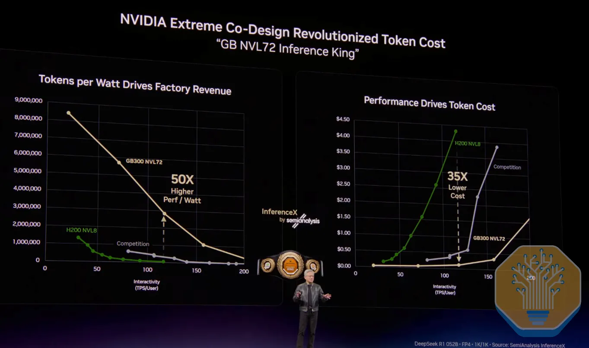

**解讀摘要**
GB NVL72「Inference King」將 token cost 設為競爭核心指標。Tokens per watt 決定 factory revenue，performance 決定 token cost。更高的運算密度（更大 scale-up domain）→ 更低 token cost → 這要求更密的 rack → 需要 800VDC 支撐 600kW+ 功率。800VDC 是 AI compute economics 的基礎設施前提，不是選項。

> **原文補充**：報告指出「bigger scale-up worlds mean denser racks, denser racks mean 600kW envelopes, and 800VDC is what makes those envelopes possible」。NVLink 的 all-to-all 一旦跨 rack 邊界，速度降至 scale-out fabric 的八分之一，因此 single-rack scale-up domain 是架構必然，不是設計選擇。

---

#### 圖 06｜800VDC Transition: 4 Phases 整體流程圖

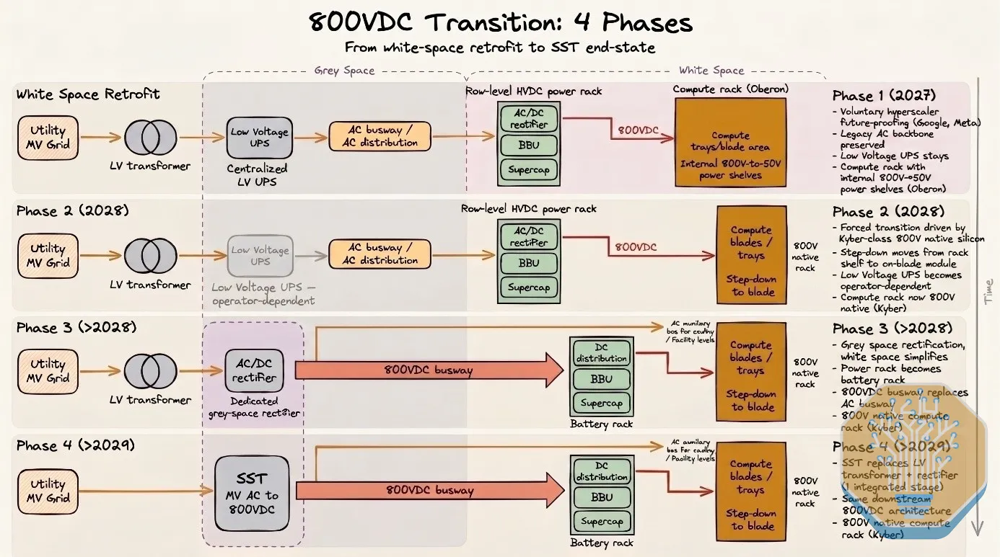

**解讀摘要**
四個 Phase 從左到右依序推進，每個 Phase 在 grey space（電力基礎設施）與 white space（IT 機房）的邊界發生不同程度的改變。Phase 1–2 只改 white space，grey space 的 UPS/變壓器維持不動；Phase 3 開始改寫 grey space；Phase 4 用 SST 取代 LV 變壓器。這張圖是整份報告最核心的架構藍圖。

---

#### 圖 07｜設備成本明細表（Baseline ~ Phase 4，\$M/MW）

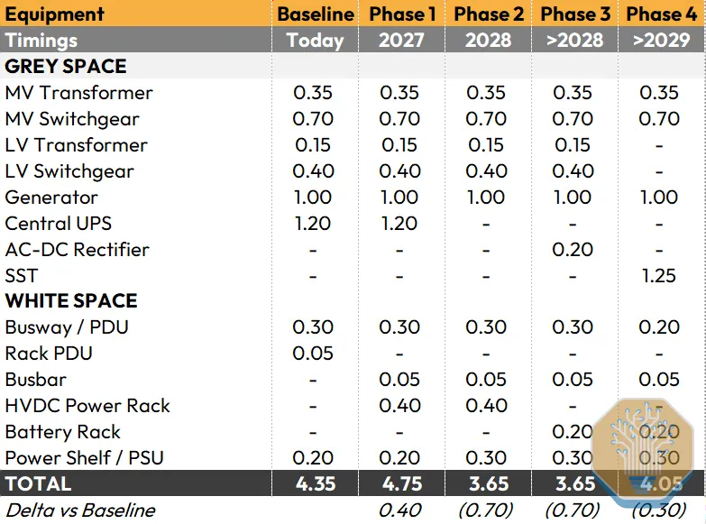

**解讀摘要**
Phase 1 總成本 \$4.75M/MW（vs Baseline \$4.35M），+\$0.40M 來自 HVDC Power Rack 新增；Phase 2 降至 \$3.65M，省掉 Central UPS（-\$1.20M）但加了 Power Shelf/PSU；Phase 3 維持 \$3.65M；Phase 4 跳至 \$4.05M 因 SST 成本（+\$1.25M）取代了被刪除的 LV Transformer 與 AC-DC Rectifier。

### 表格

| 設備 | Baseline | Phase 1 | Phase 2 | Phase 3 | Phase 4 |
|---|---|---|---|---|---|
| MV Transformer | 0.35 | 0.35 | 0.35 | 0.35 | 0.35 |
| MV Switchgear | 0.70 | 0.70 | 0.70 | 0.70 | 0.70 |
| LV Transformer | 0.15 | 0.15 | 0.15 | 0.15 | — |
| LV Switchgear | 0.40 | 0.40 | — | — | — |
| Generator | 1.00 | 1.00 | 1.00 | 1.00 | 1.00 |
| Central UPS | 1.20 | 1.20 | — | — | — |
| AC-DC Rectifier | — | — | — | 0.20 | — |
| SST | — | — | — | — | 1.25 |
| Busway / PDU | 0.30 | 0.30 | 0.30 | 0.30 | 0.20 |
| Rack PDU | 0.05 | — | — | — | — |
| Busbar | — | 0.05 | 0.05 | 0.05 | 0.05 |
| HVDC Power Rack | — | 0.40 | 0.40 | — | — |
| Battery Rack | — | — | — | 0.20 | 0.20 |
| Power Shelf / PSU | 0.20 | 0.20 | 0.30 | 0.30 | 0.30 |
| **TOTAL** | **4.35** | **4.75** | **3.65** | **3.65** | **4.05** |
| Delta vs Baseline | — | +0.40 | -0.70 | -0.70 | -0.30 |

單位：\$M/MW

> **洞察一**：Phase 3 vs Phase 2 的設備成本幾乎不變（同為 \$3.65M），但效率從 86.5% 升至 86.9%——Phase 3 的商業驅動力不是省設備成本，而是 OPEX（電費節省）。

---

#### 圖 03｜800VDC penetration of new datacenter capacity（2025–2030）

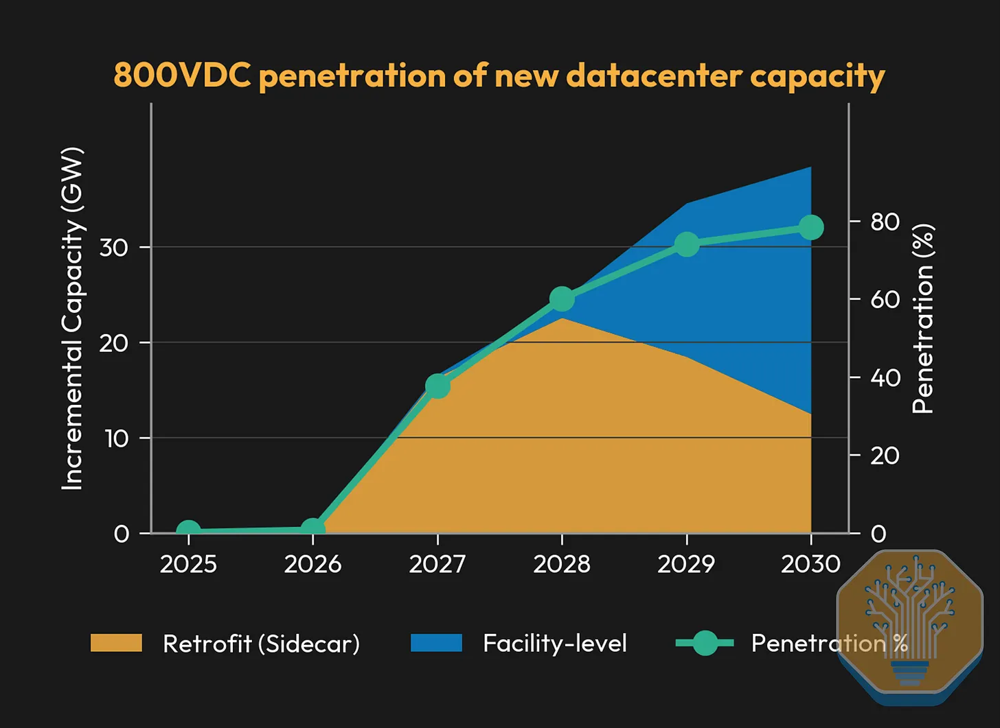

**解讀摘要**
800VDC 的新建資料中心滲透率從 2026 年接近 0 快速推進至 2030 年 \~78%。重要的是 Retrofit（Sidecar，橘色）在 2028 達峰後開始下降，Facility-level（藍色）從 2029 起承接增量——這兩個波段分別對應 Sidecar TAM 峰值（2028）與 SST TAM 起飛（2029+）。

### 表格（視覺估算）

| 年份 | Retrofit GW | Facility-level GW | 合計 GW | Penetration % |
|---|---|---|---|---|
| 2025 | \~0 | — | \~0 | \~0 |
| 2026 | \~1 | — | \~1 | \~3 |
| 2027 | \~16 | — | \~16 | \~38 |
| 2028 | \~22 | \~1 | \~23 | \~60 |
| 2029 | \~18 | \~16 | \~34 | \~74 |
| 2030 | \~12 | \~24 | \~36 | \~78 |

*以上為視覺估算

---

#### 圖 08｜800VDC adoption, 2025–2030（含 GW 數字）

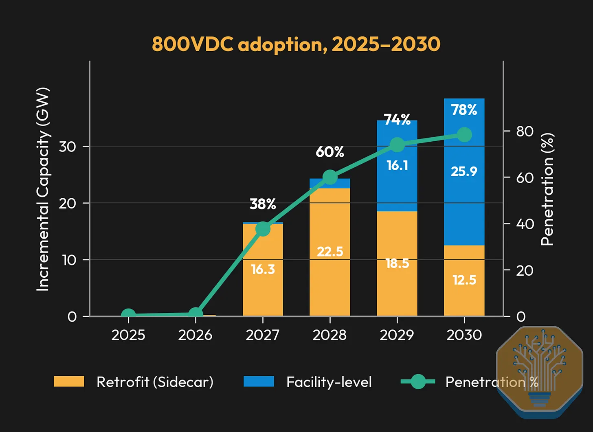

**解讀摘要**
有數字標示的版本。2027 開始明顯放量（16.3 GW Retrofit），2028 達到 Phase 1 的頂點（22.5 GW Retrofit + 1.5 GW Facility-level），2029–2030 Facility-level 快速擴張（16.1 GW / 25.9 GW），Retrofit 同步萎縮。

### 表格

| 年份 | Retrofit (Sidecar) GW | Facility-level GW | Penetration % |
|---|---|---|---|
| 2025 | \~0 | — | \~0 |
| 2026 | \~0 | — | \~0 |
| 2027 | 16.3 | — | 38 |
| 2028 | 22.5 | 1.5（估）| 60 |
| 2029 | 18.5（估）| 16.1 | 74 |
| 2030 | 12.5（估）| 25.9 | 78 |

---

### Phase 1（2026/2027）：White-Space Retrofit

---

#### 圖 09｜Phase 1: White-space retrofit 架構圖

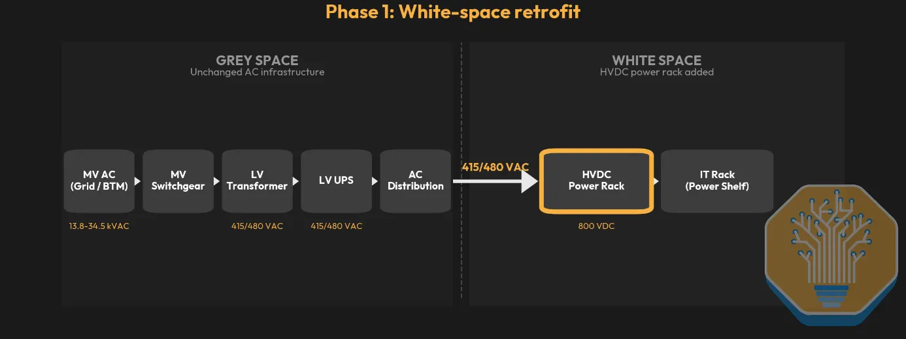

**解讀摘要**
Grey space（MV AC → MV Switchgear → LV Transformer → LV UPS → AC Distribution）完全不動；變化發生在 white space 最後一段：415/480 VAC 不再直接進入 IT Rack 的 PSU，而是先進 HVDC Power Rack，輸出 800VDC 後再接 IT Rack。這是最低風險的升級路徑，因為不碰現有電氣基礎設施。

> **原文補充**：Phase 1 在技術上仍是自願性升級，不是硬性要求。VR NVL72 的 rack density 在 180–220kW 範圍，三相 AC 仍可應付。Google 與 Meta 是主要先行者，透過 OCP working group 推動 Mt. Diablo 規格（OCP Diablo 400）。

---

#### 圖 10｜HVDC Power Rack with Oberon（semianalysis）

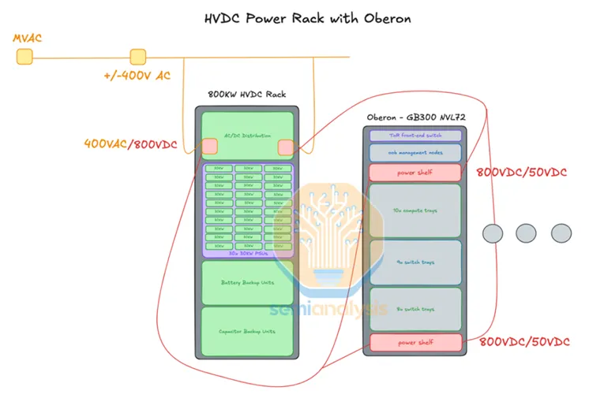

**解讀摘要**
800kW HVDC Rack 在左側執行 AC/DC 整流、BBU 備援、CBU 電容緩衝，透過 cable（右側）連接至 Oberon GB300 NVL72 IT Rack，輸出 800VDC/50VDC 兩路。DC-DC power shelf 在 IT Rack 內部將 800VDC 降為 50VDC，再由 VRM 降至 GPU 用電壓。

---

#### 圖 11｜HVDC Side-Car Debug/Bring up（硬體標示照）

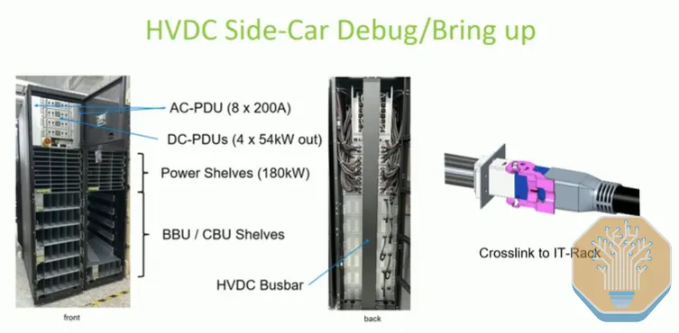

**解讀摘要**
實體機櫃拆解照，從前面板可見：AC-PDU（8×200A）、DC-PDU（4×54kW out）、Power Shelves（180kW）、BBU/CBU Shelves、HVDC Busbar，背面有 Crosslink to IT-Rack 的連接介面。這是 OCP Diablo 400 規格的具體實現形態。

---

#### 圖 12｜元件功能表

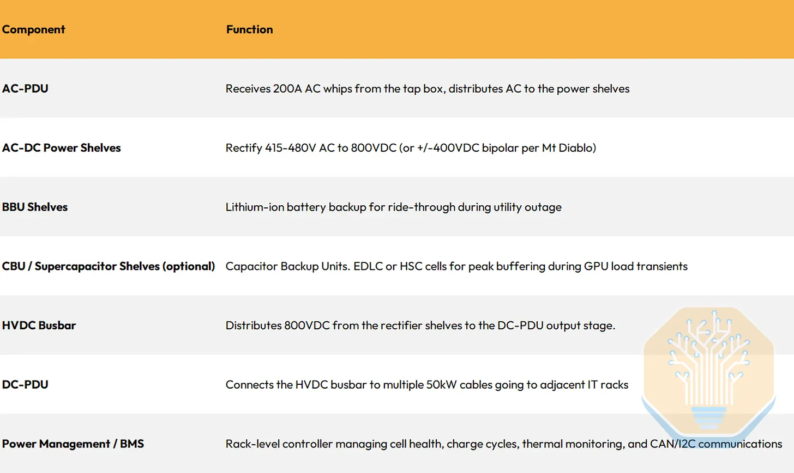

**解讀摘要**
七個核心元件的功能說明。關鍵點：CBU/Supercapacitor Shelves 標示為 optional，用於 GPU load transient（毫秒級）緩衝，補 BBU 反應速度不足的缺口；BMS 負責 CAN/I2C 通訊與健康監控，是智能化的關鍵。

### 表格

| 元件 | 功能 |
|---|---|
| AC-PDU | 接收來自 tap box 的 200A AC whips，分配 AC 至 power shelves |
| AC-DC Power Shelves | 整流 415–480V AC → 800VDC（或 ±400VDC bipolar，Mt Diablo 版本）|
| BBU Shelves | 鋰電池備援，提供 utility outage 期間的 ride-through |
| CBU / Supercapacitor Shelves（optional）| EDLC 或 HSC cells，吸收 GPU load transient 的峰值緩衝 |
| HVDC Busbar | 分配 800VDC 至 DC-PDU 輸出端 |
| DC-PDU | 連接 HVDC busbar 至鄰近 IT racks 的 50kW cables |
| Power Management / BMS | Rack 層級控制器，管理電芯健康、充放電、熱監控、CAN/I2C 通訊 |

---

#### 圖 13｜HVDC Power Rack BOM 三種配置

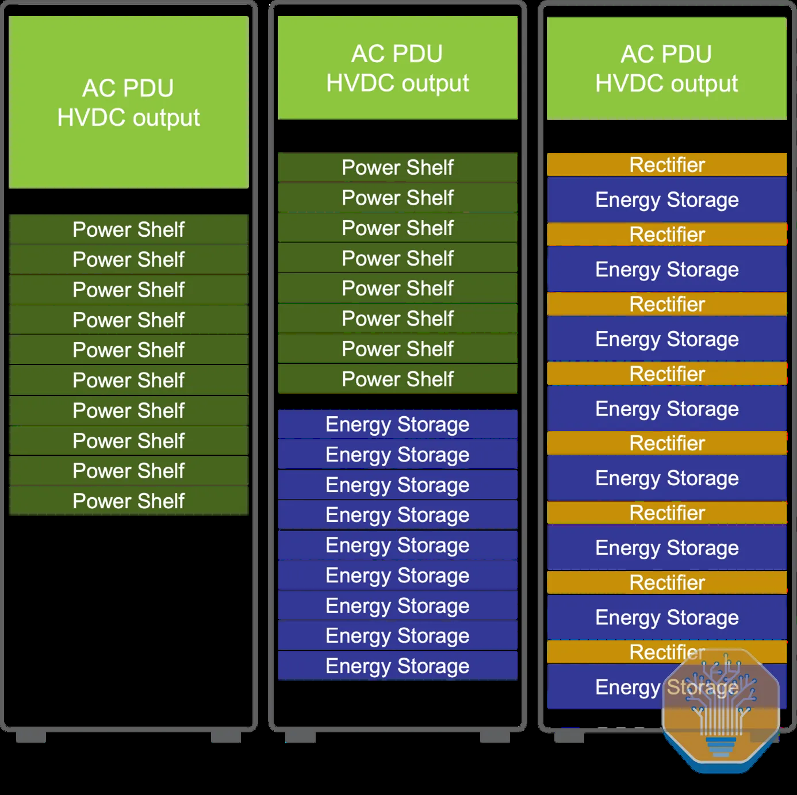

**解讀摘要**
三種配置對應不同 hyperscaler 需求：左欄純 Power Shelf（最大 PSU 密度）；中欄 Power Shelf + Energy Storage 分層（Google 模式，最大化整流容量後再放 BBU）；右欄 Rectifier 與 Energy Storage 交錯配置（Meta 模式，每個 Rectifier 後面緊接 BBU）。配置選擇影響 BBU 供應商的 slot 數量。

---

#### 圖 14｜HPRv3 Rack Key HW Component（Nvidia 官方）

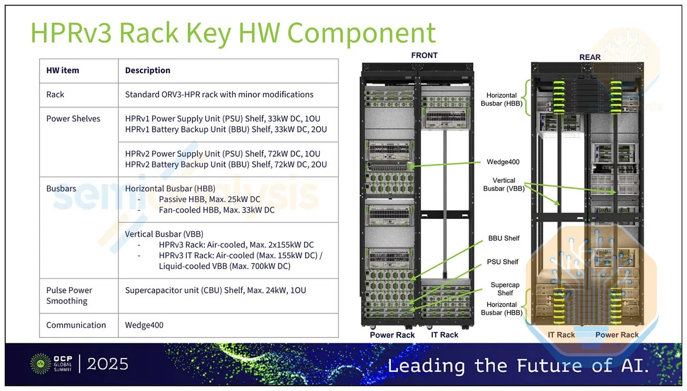

**解讀摘要**
Nvidia 官方 HPRv3 規格：Power Shelves（33kW）、BBU Shelves（33kW）、Vertical Busbar（max 256kW DC）、Pulse Power Smoothing 超電容（max 24kW, 10V），以及 Wedge400 管理模組。從 Nvidia 角度，HPRv3 是 50VDC sidecar（非 800VDC），連接 IT Rack 透過上下各一條水平 busbar。

> **原文補充**：報告指出 HPRv3 在 OCP 規格中是 50VDC sidecar（ORv3 HPR V3），最大 300kW，受限於 horizontal busbar crosslinks（6,000A at 300kW）。真正進入 800VDC 的是 HPR V4（±400VDC），最終標準化為 Diablo 400 規格。

---

#### 圖 15｜HPRv3 with VR NVL72 架構圖（semianalysis）

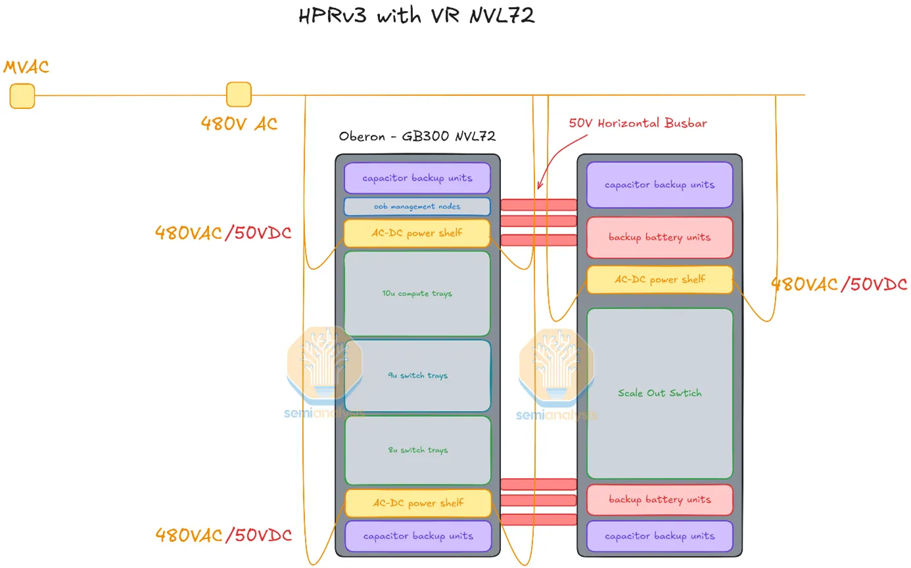

**解讀摘要**
VR NVL72 的實際供電路徑：MVAC → 480V AC → Oberon GB300 NVL72 IT Rack（含 AC-DC power shelf 與 capacitor backup units），透過 50V Horizontal Busbar 連接 Scale Out Switch（含 backup battery units 與 AC-DC power shelf），最終輸出 480VAC/50VDC。注意此架構仍為 50VDC 分配（非 800VDC 直達 blade）。

---

#### 圖 16｜AC Busway 480Vac 3P + HVDC Cabinet 接線圖

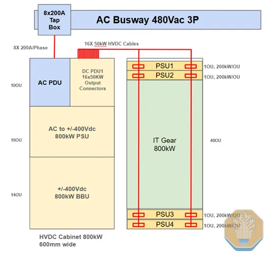

**解讀摘要**
8×200A Tap Box 接收 3 相 480Vac，通過 DC PDU（16×50kW HVDC cables）輸出至 HVDC Cabinet（800kW HVDC Rack）。Cabinet 內含：10U AC to ±400Vdc 800kW PSU + 14U ±400Vdc 800kW BBU，對 IT Gear（800kW）提供 4 路各 PSU 介面（1OU, 200kW/OU）。整個 Cabinet 寬 600mm，是 Phase 1 retrofit 的典型 grey-to-white 介面。

---

#### 圖 18｜HVDC Power Rack BOM 組成（~\$400K ASP）

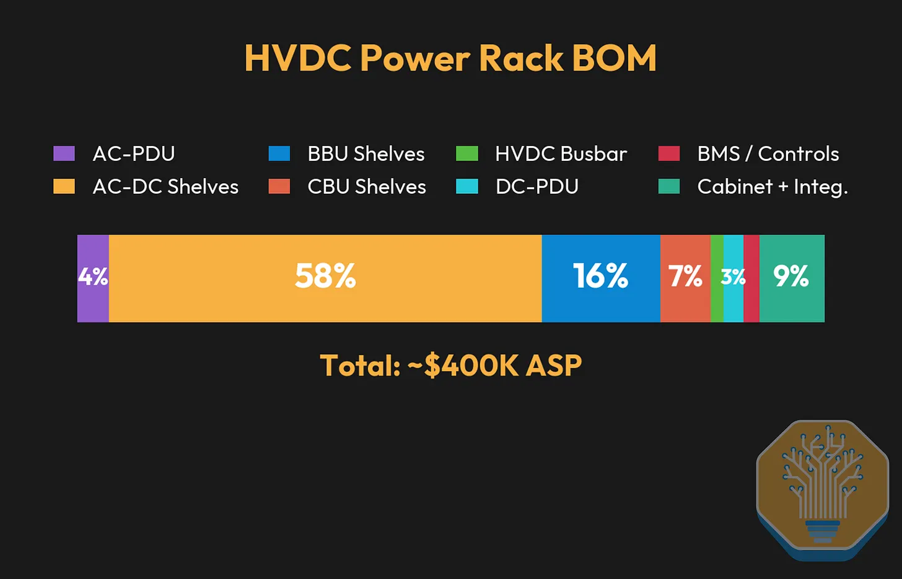

**解讀摘要**
AC-DC Shelves 佔 BOM 58%——這是最大的單一受益分項，對應的是電源轉換模組供應商（Delta、Murata、Aran 等）。DC-PDU 16%、Cabinet + Integration 9%、BBU Shelves 7%（圖中以 CBU 標示）、BMS/Controls 3%、AC-PDU 4%。

### 表格

| 元件 | 佔比 |
|---|---|
| AC-PDU | 4% |
| AC-DC Shelves | 58% |
| CBU Shelves | — |
| BBU Shelves | 7% |
| HVDC Busbar | — |
| DC-PDU | 16% |
| BMS / Controls | 3% |
| Cabinet + Integration | 9% |
| **Total ASP** | **~\$400K** |

> **洞察一**：AC-DC Shelves 佔 58%，以 \$400K × 58% ≈ \$232K/rack 計算，若 2028 年 Sidecar TAM 為 \$11.3B，則 AC-DC Shelves 潛在市場約 \$6.6B。這是 power shelf 供應商（Delta、Murata 旗下）的核心機會。

---

#### 圖 19｜Sidecar power rack TAM，2026–2030

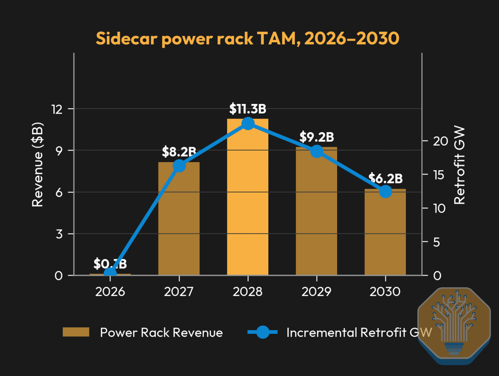

**解讀摘要**
TAM 從 2026 年 \$0.7B 快速攀升至 2028 年峰值 \$11.3B，之後隨 Facility-level 800VDC 取代 Sidecar 需求而下滑（2029 \$9.2B → 2030 \$6.2B）。這是一個有清楚「建造→過時」生命週期的市場，不是持續成長的結構性市場。

### 表格

| 年份 | Power Rack Revenue (\$B) | Incremental Retrofit GW |
|---|---|---|
| 2026 | 0.7 | \~1 |
| 2027 | 8.2 | \~16 |
| 2028 | 11.3 | \~22 |
| 2029 | 9.2 | \~18 |
| 2030 | 6.2 | \~13 |

> **洞察一**：TAM 在 2028 達峰後下滑，但這不是需求消失——而是建造標準轉型。進入 Phase 3 的資料中心不再買 Sidecar，改買 DC Busway + Battery Rack + MV Rectifier。Sidecar 供應商必須在 2028 前完成市場定位轉換。

> **值得驗證**：報告假設 \$0.5M/MW 的 power rack content。若 rack ASP 實際落在 \$400K 而非 \$500K（\$500K/MW 對應高效率部署），TAM 估算將低估約 20%。

---

#### 圖 20｜Phase 1 cost delta vs baseline（逐行明細）

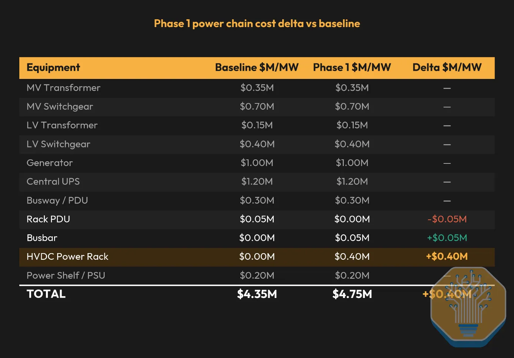

**解讀摘要**
Phase 1 與 Baseline 的關鍵差異只有三行：Rack PDU 消失（-\$0.05M）、Busbar 新增（+\$0.05M）、HVDC Power Rack 新增（+\$0.40M）。其餘設備完全不動。Phase 1 是「加法」：Grey space 毫無變化，白色空間僅插入一個新機櫃，因此建置風險最低，但設備成本最高（+\$0.40M/MW）。

### 表格

| 設備 | Baseline \$M/MW | Phase 1 \$M/MW | Delta \$M/MW |
|---|---|---|---|
| MV Transformer | 0.35 | 0.35 | — |
| MV Switchgear | 0.70 | 0.70 | — |
| LV Transformer | 0.15 | 0.15 | — |
| LV Switchgear | 0.40 | 0.40 | — |
| Generator | 1.00 | 1.00 | — |
| Central UPS | 1.20 | 1.20 | — |
| Busway / PDU | 0.30 | 0.30 | — |
| Rack PDU | 0.05 | 0.00 | -0.05 |
| Busbar | 0.00 | 0.05 | +0.05 |
| HVDC Power Rack | 0.00 | 0.40 | **+0.40** |
| Power Shelf / PSU | 0.20 | 0.20 | — |
| **TOTAL** | **4.35** | **4.75** | **+0.40** |

---

### Phase 2（2027/2028）：800V-Native Compute

---

#### 圖 21｜Phase 2: 800V-native compute 架構圖

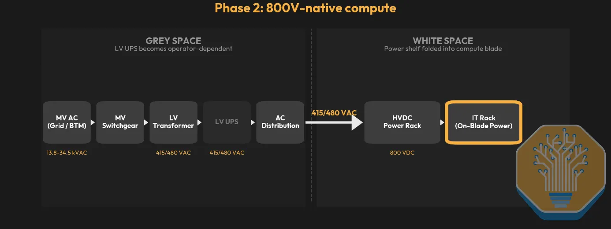

**解讀摘要**
架構與 Phase 1 幾乎相同，差異在 IT Rack 的白框標示：Phase 1 是「Power Shelf」（800VDC→50VDC 轉換在 rack 內），Phase 2 是「On-Blade Power」（轉換整合進 compute blade）。LV UPS 狀態變為「operator-dependent」——即有些 operator 開始拿掉，但不是強制。

> **原文補充**：Phase 2 的真正觸發點是 Kyber rack 開始出貨——800VDC-native 的 silicon 沒有 AC 備用路徑，operator 無選擇必須裝 HVDC Power Rack。這使滲透率在 2027–2028 急劇上升。報告認為 Kyber 最初規畫的 DC-DC PSU sidecar（獨立機櫃）不會被大規模採用，因為 on-blade 整合更省空間。

---

#### 圖 22｜A-3: HVDC Power Rack with Kyber（semianalysis）

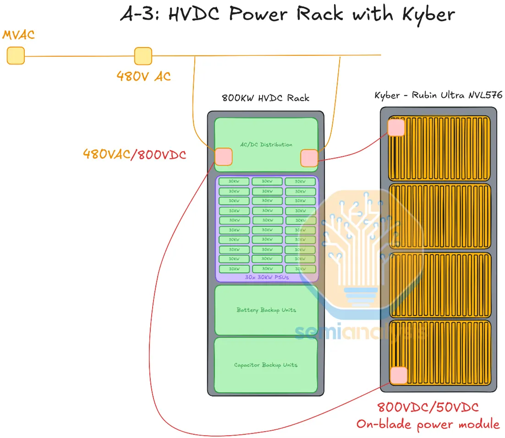

**解讀摘要**
Kyber（Rubin Ultra NVL576）的架構：HVDC Rack 輸出 800VDC 直接進入 Kyber-Rubin Ultra NVL576，IT Rack 採用「800VDC into the Compute Blade」（On-Blade Power Module），不再需要 rack 內的 DC-DC Power Shelf。

---

#### 圖 24｜Traditional（Central UPS）vs OCP rack path（no UPS）

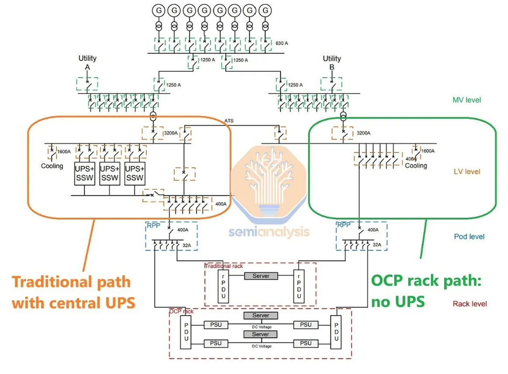

**解讀摘要**
左側傳統路徑：Utility → MV → LV → Central UPS → PDU → Rack PSU（雙邊 A/B 路徑，每側都有完整 UPS）。右側 OCP rack path：AC 直接分配至 rack 層，rack-level BBU 取代中央 UPS，移除 AC-DC-AC double conversion 損耗（\~3%）並節省一半電池容量（不需 A/B 兩套）。

> **原文補充**：Google 與 Meta 多年前已採用 distributed UPS 架構。對 colocation 業者而言，混合工作負載（CPU rack + 舊 GPU rack）使其保留 central UPS 的壓力更大，因為去掉 central UPS 需要整個設施統一 800VDC 架構。

---

#### 圖 25｜A-2: Current Oberon Design without UPS（semianalysis）

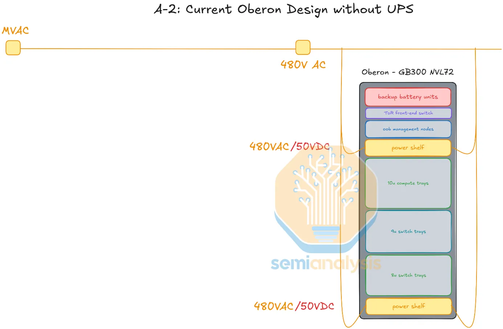

**解讀摘要**
去掉 LV UPS 的 Oberon 架構：MVAC → 480V AC 直接進 IT Rack（GB300 NVL72），rack 內含 backup battery units 與 AC-DC power shelf，輸出 480VAC/50VDC。這是 Phase 2 中 hyperscaler（Google/Meta 類型）的典型選擇——UPS 功能下放至 rack 層。

---

### Phase 3（2028/2029）：Centralized Rectifier + DC Distribution

---

#### 圖 27｜Phase 3: Centralized rectifier + DC distribution 架構圖

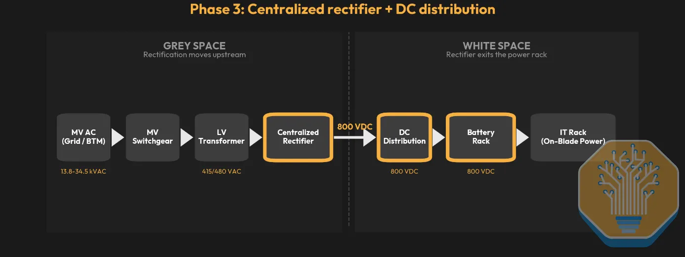

**解讀摘要**
這是整個轉型最重要的架構邊界：AC-DC 整流點從 row level（Power Rack）移至 grey space（Centralized Rectifier）。輸出 800VDC 直接進 DC Distribution → Battery Rack → IT Rack（On-Blade Power）。LV UPS、LV Switchgear、HVDC Power Rack 全部消失，Battery Rack 取代 Power Rack 在 row level 提供 BBU 功能。

> **原文補充**：Phase 3 使用 IGBT 或 thyristor 的成熟矽整流器（1200–1700V 額定），不是 SST。LV Transformer 仍保留（將 MV 降至 415V AC 後才整流）。Phase 3 是 LV 架構的最後一個版本。

---

#### 圖 28｜Phase 3: Where the AC Switchboard Function Lands（3 options）

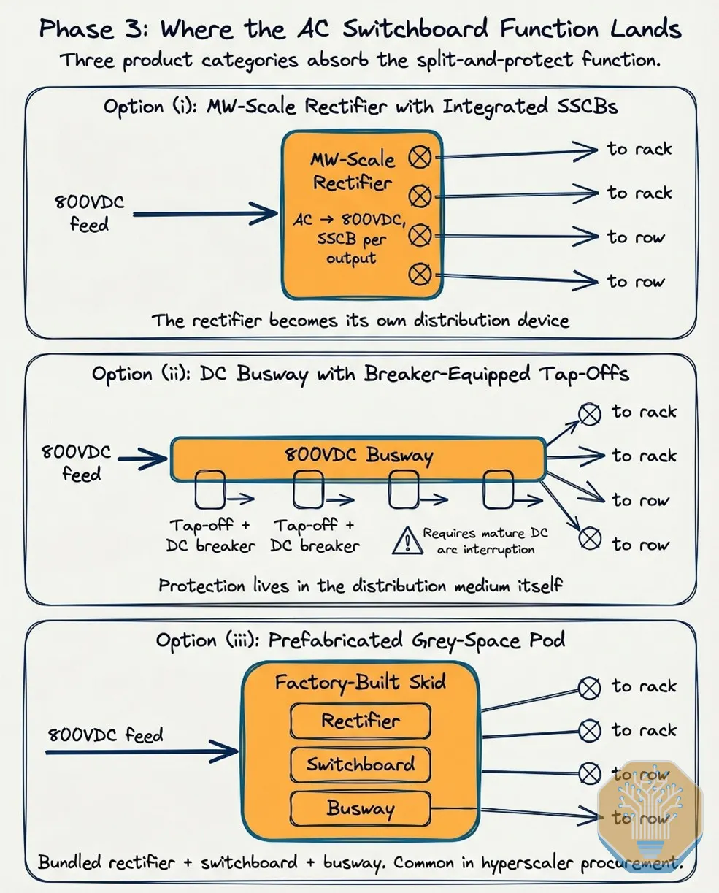

**解讀摘要**
Phase 3 中，AC switchboard 的「一輸入 → 多輸出 + 保護」功能必須在 DC 域重新實現，有三種路徑：(i) MW-Scale Rectifier 整合 SSCB 保護（rectifier 本身成為分配設備）；(ii) DC Busway 配備 breaker-equipped tap-offs（保護功能在分配介質中）；(iii) Factory-built Skid 將 Rectifier + Switchboard + Busway 打包（超大廠商採購模式）。

---

#### 圖 29｜Types of Busways（Feeder vs Plug-in Feeder）

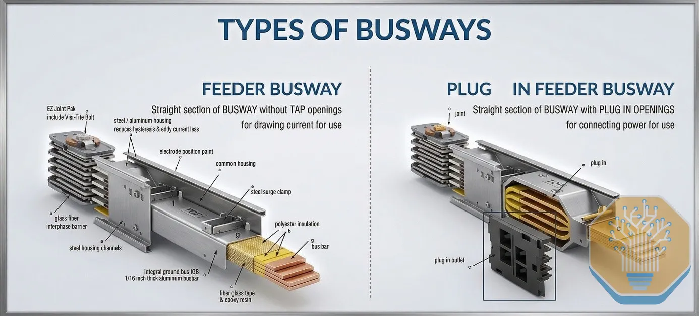

**解讀摘要**
Feeder Busway 無中間 tap-off（點對點）；Plug-in Feeder Busway 有可帶電插拔的 tap-off 連接口。Phase 3 初期只能用 Feeder Busway，因為 800VDC 斷弧難度遠高於 AC（DC 無零交叉點），帶電 tap-off 需要 SSCB 級別的保護元件，目前尚未商業化。

---

#### 圖 30｜AC vs DC Waveform Comparison（VIOX）

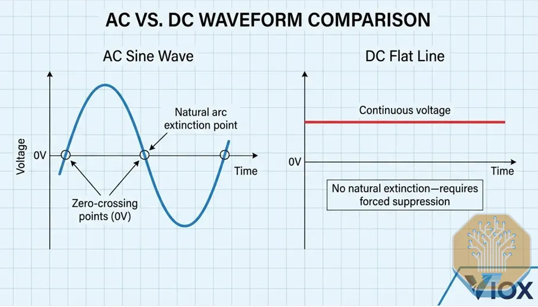

**解讀摘要**
AC 正弦波每秒自然過零交叉 100–120 次，弧光自然熄滅；DC 平線無零交叉，電弧必須強制熄滅（forced suppression）。這是 800VDC 斷路器研發難度遠高於 AC 的物理原因，也是為何 SSCB（固態斷路器用半導體直接截止電流，完全不產生電弧）是 Phase 3 的關鍵技術。

---

#### 圖 32｜Phase 3 Battery Rack 架構（semianalysis）

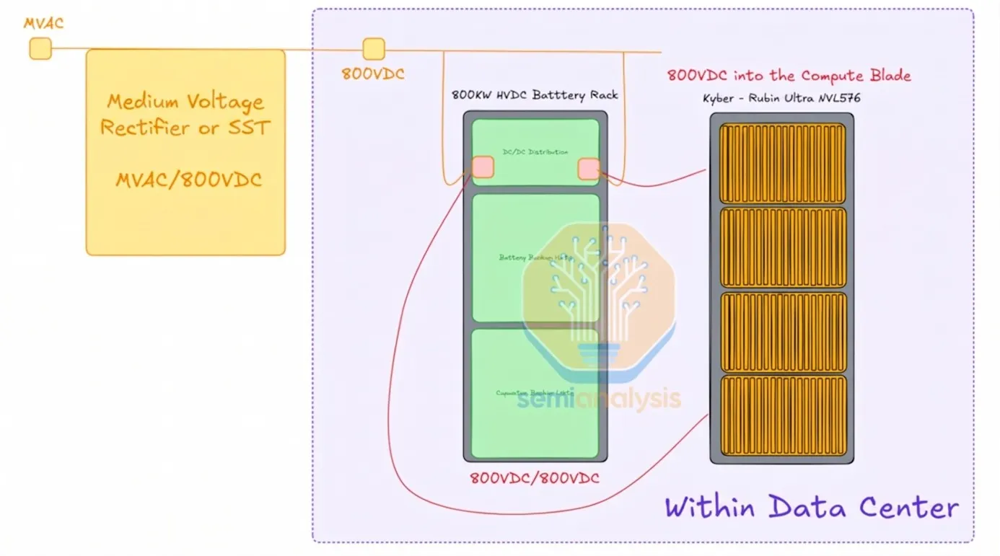

**解讀摘要**
MV Rectifier 或 SST 輸出 800VDC，直接進 800kW HVDC Battery Rack（含 battery backup modules），再經 800VDC/50VDC 路徑進入 Kyber（Rubin Ultra NVL576）Compute Blade。Battery Rack 不再做 AC-DC 轉換，只做 DC/DC 分配與 BBU 儲能。

---

#### 圖 33｜12kW BBU Functional Block Diagram（Infineon）

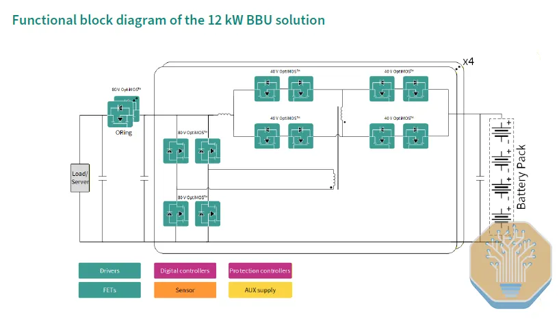

**解讀摘要**
Infineon 的 BBU 架構：使用 80V OptiMOS FET（ORing 保護）+ 40V FET（bidirectional DC-DC converter）連接 Battery Pack。模組化設計（×4 擴充），每 4kW Partial Power Converter card 並聯達 12kW，峰值效率 99.5%。這代表 BBU 模組朝向更高功率密度、更模組化的方向演進。

---

#### 圖 35｜NVIDIA 800 VDC Power Distribution：Today vs Future

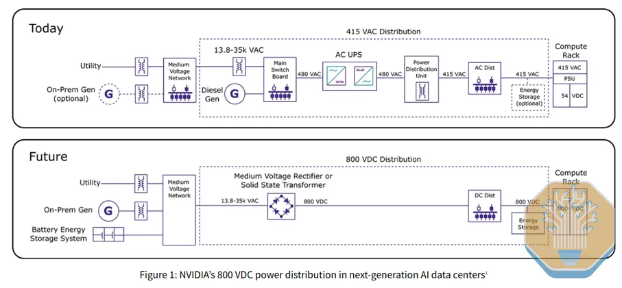

**解讀摘要**
Nvidia 官方的架構比對：今天（AC UPS 路徑，415V AC → UPS → 480V AC → PSU → 54VDC）vs 未來（MV AC → SST/MV Rectifier → 800VDC DC Distribution → DC Dist → Energy Storage → Compute Rack）。這確認 Nvidia 的長期目標是 Phase 4 SST 端態，與 SemiAnalysis 的預測一致。

---

### Phase 4（>2029）：SST End-State

---

#### 圖 36｜Infineon：SST vs 傳統變壓器（市場潛力）

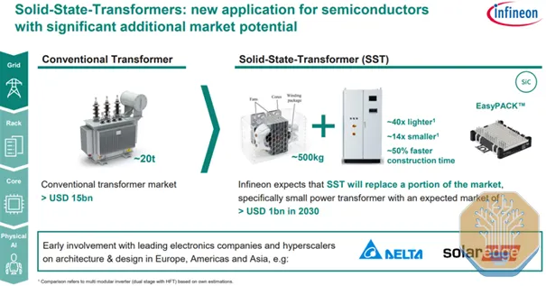

**解讀摘要**
傳統變壓器 \~20 噸、市場 >USD 15bn；SST \~500kg（**40x 更輕、14x 更小、50% 更快施工**），Infineon 預計到 2030 年 SST 市場 >USD 1bn。Infineon 早期介入超大廠商（Delta、SolarEdge）的架構設計，供應 SiC MOSFET 給 SST pure-play。

---

#### 圖 37｜Phase 4: SST end-state 架構圖

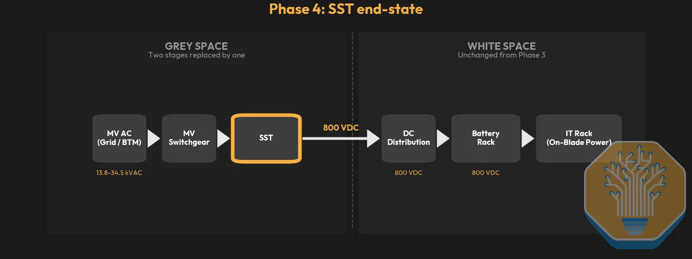

**解讀摘要**
Phase 4 與 Phase 3 的白色空間完全相同（DC Distribution → Battery Rack → IT Rack）；唯一改變是 grey space：LV Transformer + Centralized Rectifier 被一台 SST 取代，直接從 MV AC（13.8–34.5kV）轉換至 800VDC。Grey space「兩個階段合一」。

---

#### 圖 39｜Phase 3 vs Phase 4: What Actually Changes?（semianalysis）

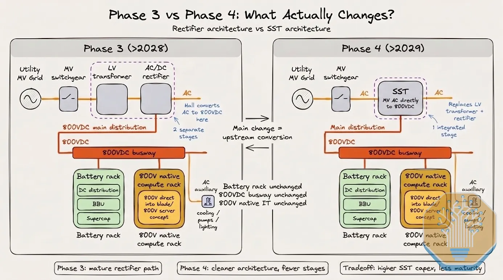

**解讀摘要**
左側 Phase 3（>2028）：AC/DC Transformer → 整流器 → 800VDC 分配，白色空間含多層 battery rack 與 800V native compute rack。右側 Phase 4（>2029）：SST 直接取代 Transformer + 整流器，白色空間不變。注意「Phase 3 is mature rectifier architecture」vs「Phase 4 is cleaner architecture, fewer stages；tradeoff: higher SST Capex, lower maturity」。

---

#### 圖 40｜SiC SST 電路拓撲（NPC AC-DC + LLC DC-DC）

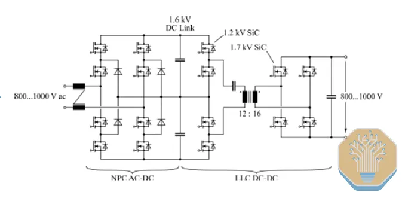

**解讀摘要**
學術標準 SST 電路：輸入 800–1000V AC → NPC（Neutral Point Clamped）AC-DC 整流段（用 1.2kV + 1.7kV SiC MOSFET）→ 1.6kV DC Link → LLC DC-DC 隔離段（高頻變壓器 12:16 匝數比）→ 輸出 800–1000V DC。SiC 電壓等級決定整流端的 MV 承受能力。

---

#### 圖 42｜ETH Zürich 400kW SST Gen#1 規格

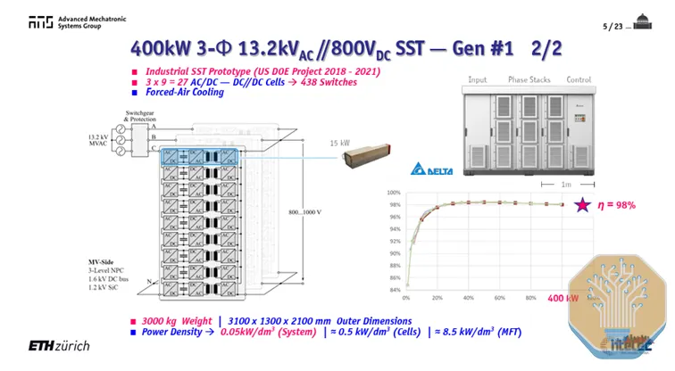

**解讀摘要**
目前最具公信力的 SST benchmarks：ETH Zürich 在 INTELEC 2025 發表的 400kW prototype，13.2kVAC→800VDC，效率 **98%**，重量 3,000 kg，尺寸 3,100×1,300×2,100mm，使用 3×9 組 AC/DC Cells + 438 個 Switches，強制風冷。這組數字設定了業界效率標桿——Johann Kolar 定義 98.0–98.5% 為當前 SOTA，99% 為下一個工程目標。

---

#### 圖 43｜SST Vendor Map

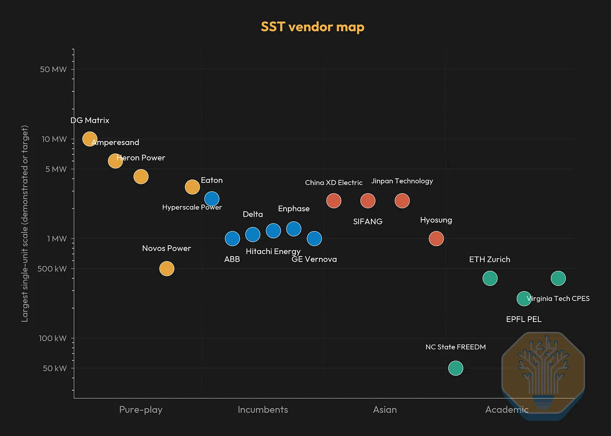

**解讀摘要**
四個分類：Pure-play（橘色）領先規模，DG Matrix 與 Amperesand 達 10MW 級；Incumbents（藍色）Delta/Eaton/ABB/Hitachi/GE Vernova 等在 1–5MW；Asian（紅色）中國廠商 China XD Electric / Jinpan Technology / SIFANG / Hyosung 在 3–4MW；Academic（綠色）ETH Zurich/EPFL/Virginia Tech 在 500kW 以下。

### 表格

| 類別 | 代表廠商 | 最大單機規模 |
|---|---|---|
| Pure-play | DG Matrix | \~10 MW |
| Pure-play | Amperesand | \~10 MW |
| Pure-play | Heron Power | \~5 MW |
| Incumbent | Eaton、Hyperscale Power | \~5 MW |
| Incumbent | Delta、ABB、Hitachi Energy | \~1 MW |
| Asian | China XD Electric、Jinpan Technology | \~3 MW |
| Asian | SIFANG、Hyosung | \~3 MW |
| Academic | ETH Zurich、EPFL PEL | \~500 kW |

> **洞察一**：Pure-play 廠商目前領先規模，但 Incumbent（Eaton 收購 Resilient Power Systems，Delta/ABB/Hitachi 均有計畫）將快速追趕，競爭格局在 2026–2027 可能快速改變。

---

#### 圖 46｜800V HVDC for Megawatt Racks：Gen 1–4 比較（Novos Power）

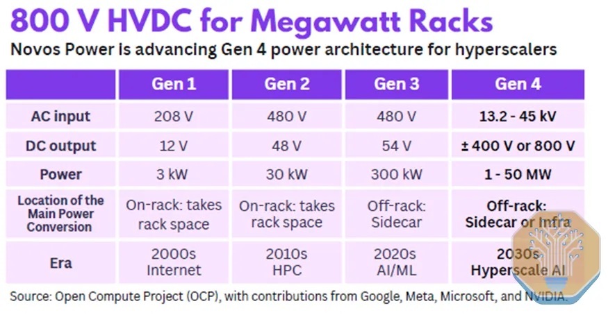

**解讀摘要**
四代演進清晰對應市場轉型：Gen1（2000s Internet，3kW/208V/12V，on-rack）→ Gen2（2010s HPC，30kW/480V/48V，on-rack）→ Gen3（2020s AI/ML，300kW/480V/54V，off-rack Sidecar）→ **Gen4（2030s Hyperscale AI，1–50MW/13.2–45kV/±400V or 800V，off-rack Sidecar or Infra）**。Gen4 跨度從 Sidecar 到整棟設施，代表 SST 的直接可服務市場。

### 表格

| 世代 | AC Input | DC Output | Power | 整流位置 | 時代 |
|---|---|---|---|---|---|
| Gen 1 | 208 V | 12 V | 3 kW | On-rack | 2000s Internet |
| Gen 2 | 480 V | 48 V | 30 kW | On-rack | 2010s HPC |
| Gen 3 | 480 V | 54 V | 300 kW | Off-rack Sidecar | 2020s AI/ML |
| Gen 4 | 13.2–45 kV | ±400V or 800V | 1–50 MW | Off-rack Sidecar or Infra | 2030s Hyperscale AI |

---

#### 圖 47｜SST Market Revenue，2026–2030

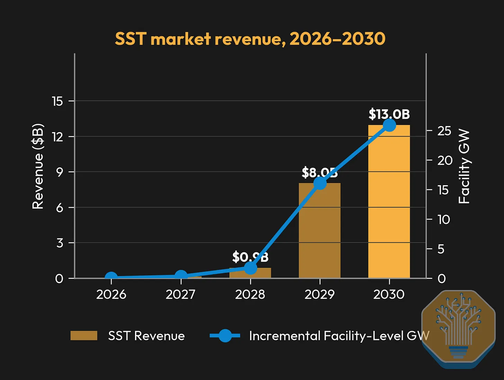

**解讀摘要**
SST TAM 幾乎從零起飛至 2030 年 \$13.0B，成長形態與 Sidecar TAM 相反——Sidecar 在 2028 達峰後下滑，SST 在 2029 才開始放量，兩個 TAM 波段前後銜接，而非同步競爭。

### 表格

| 年份 | SST Revenue (\$B) | Incremental Facility-level GW |
|---|---|---|
| 2026 | \~0 | \~0 |
| 2027 | \~0 | \~0 |
| 2028 | 0.98 | \~2 |
| 2029 | 8.05 | \~16 |
| 2030 | 13.0 | \~25 |

> **值得驗證**：報告設定 SST content \$1.25M/MW。若規模化後 SST ASP 下降至 \$1.0M/MW（SST 替代了 \$0.55M LV 設備 + \$0.20M Rectifier = \$0.75M，\$1.0M 仍有 \$0.25M 溢價），TAM 估算下修幅度約 20%。

---

#### 圖 48｜Total Electrical Content per MW by Architecture Phase（含效率）

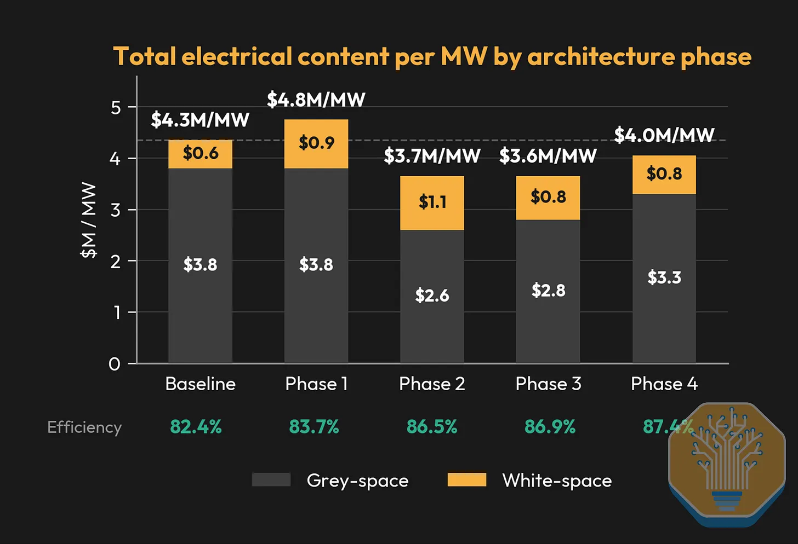

**解讀摘要**
這是整份報告最重要的一張圖：同時呈現設備成本結構與效率演進。Grey space（灰色）在 Phase 2–3 大幅下降（UPS 退出、LV Switchgear 移除），White space（橘色）在 Phase 1 達峰後維持穩定。效率從 Baseline 82.4% 提升至 Phase 4 87.4%，+5pp 全部來自減少 conversion stages。

### 表格

| 架構 | Grey Space (\$M/MW) | White Space (\$M/MW) | Total (\$M/MW) | 效率 |
|---|---|---|---|---|
| Baseline | 3.8 | 0.6 | 4.3 | 82.4% |
| Phase 1 | 3.8 | 0.9 | 4.8 | 83.7% |
| Phase 2 | 2.6 | 1.1 | 3.7 | 86.5% |
| Phase 3 | 2.8 | 0.8 | 3.6 | 86.9% |
| Phase 4 | 3.3 | 0.8 | 4.0 | 87.4% |

> **洞察一**：Phase 2 的效率跳升（82.4%→86.5%，+4.1pp）遠大於 Phase 1（+1.3pp），核心原因是 UPS 退出消除了 double-conversion 損耗（\~3pp）。這代表最大的效率回報發生在「拿掉 UPS」而非「裝 HVDC Power Rack」這個動作。

> **洞察二（配合圖 07）**：Phase 4 總設備成本 \$4.0M/MW 高於 Phase 3 的 \$3.6M，但效率更高（87.4% vs 86.9%）。以 1GW IT load 計算，+0.5pp 效率 = 5MW 省電 ≈ \~\$3.5M/年電費（at \$0.07/kWh），SST 的額外設備成本（Phase 4 vs Phase 3 = +\$0.4M/MW × 1,000 MW = +\$400M）回收期 \~114 年——顯然效率不是 SST 的主要商業驅動力，**更快施工（-50% 工期）、更小體積（-14x）、可程式化與雙向潮流**才是。

---

### 挑戰與技術背景

---

#### 圖 50｜800VDC 2-wire Grounding Schemes 比較表

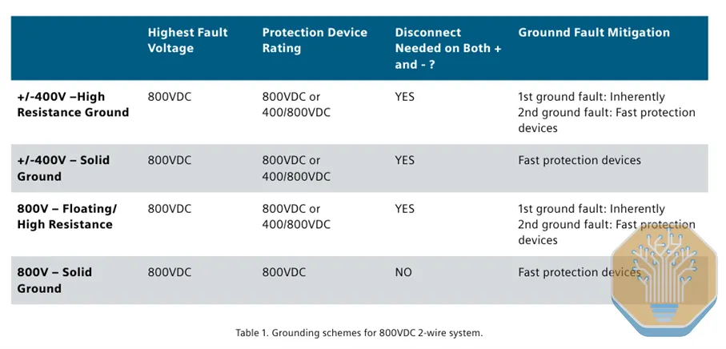

**解讀摘要**
四種接地方式的比較：±400V High Resistance Ground（首次接地故障自我保護，第二次才需快速保護裝置）；±400V Solid Ground（任何接地故障都需立即清除）；800V Floating/High Resistance；800V Solid Ground（最簡單：不需 disconnect on both poles，但無隔離保護）。

> **原文補充**：OCP Diablo 400 同時允許 ±400V bipolar 與 800V monopolar，接地策略由 operator 自行決定——這意味著目前業界沒有共識。SST 與 power electronics 廠商正各自優化不同的接地假設，選擇接地方式等同於選擇供應商生態系。

---

#### 圖 52｜UL 857：Busway 標準範疇（DC 尚未完整覆蓋）

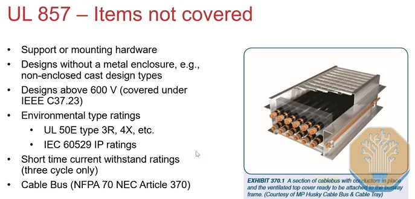

**解讀摘要**
UL 857 Edition 14（2025）將 busway 電壓上限從 600V 提升至 1000VDC，Edition 15（開發中）目標 1500VDC。但 800VDC busway 以外的大多數設備類別（斷路器、PDU、switchgear）仍缺乏 DC 認證路徑，每次安裝都是需要 AHJ 逐案核准的客製工程。

---

### 供應商動態

---

#### 圖 17｜DG Matrix Solutions：T1→T3 路線圖

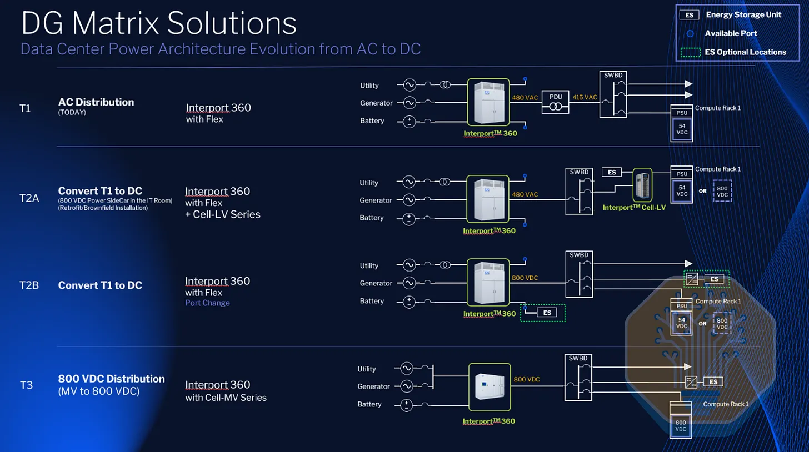

**解讀摘要**
DG Matrix 的四個技術層次：T1（AC Distribution，傳統）→ T2a（AC to DC，LV SST sidecar）→ T2b（AC to DC，更高功率 LV SST）→ T3（800VDC Distribution，MV SST）。DG Matrix 是唯一進入 Nvidia MGX reference architecture 的 SST 廠商，ABB 持股、Infineon 供應 SiC。

---

#### 圖 54｜OCP Power Delivery Architectures ±400Vdc（效率比較）

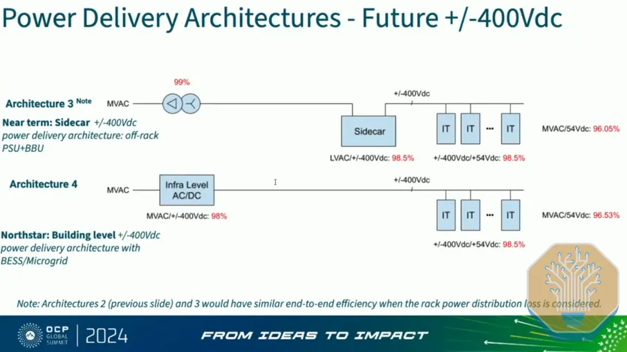

**解讀摘要**
Architecture 3（Near-term Sidecar，±400Vdc）：MVAC → Sidecar → IT，end-to-end 效率 96.05%；Architecture 4（Northstar Building-level，±400Vdc）：MVAC → Infra-level AC/DC → ±400Vdc → IT，效率 96.53%。Building-level 效率高 0.48pp，但需要更大的前期基礎設施投資。

---

#### 圖 55｜LITEON PSU 路線圖（800 VDC Solution）

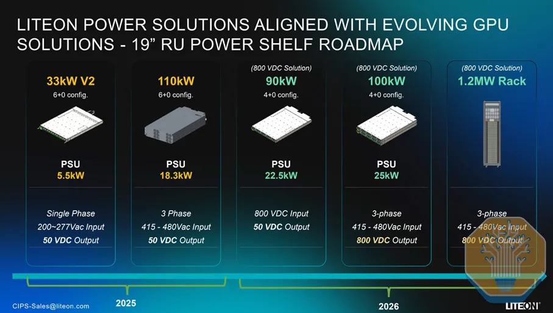

**解讀摘要**
LITEON 的 PSU 演進：33kW V2（6+0 config，Single Phase，50V）→ 110kW（3 Phase，50V）→ 90kW（800VDC Solution，50V）→ 100kW（3-phase，800VDC）→ **1.2MW Rack（800 VDC Solution）**。最終形態是整架 1.2MW 的 800VDC 電源解決方案，代表 PSU 供應商正在向 power rack 整合方向移動。

---

#### 圖 56｜Vertiv x NVIDIA Collaboration Spotlight

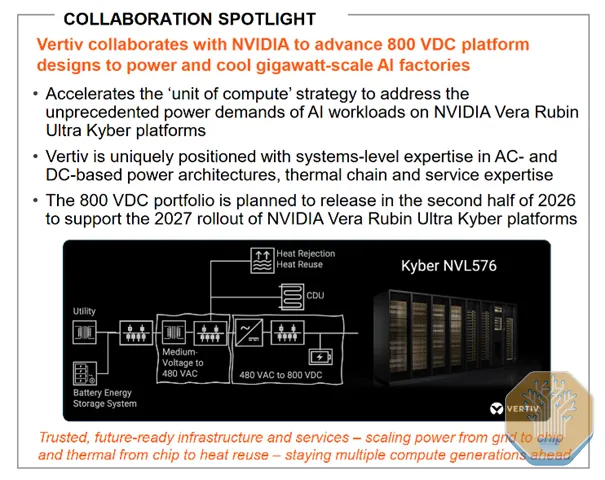

**解讀摘要**
Vertiv 與 NVIDIA 合作進階 800VDC 平台設計，目標是 gigawatt-scale AI factories（Kyber NVL576）。Vertiv 主打 AC-DC 與 DC-based power architecture 的系統級專業。800VDC 組合預計 2026 H2 推出，支援 2027 rollout 的 Vera Rubin Ultra Kyber platforms。

---

#### 圖 61｜Nvidia HPR Data Center Power Trend

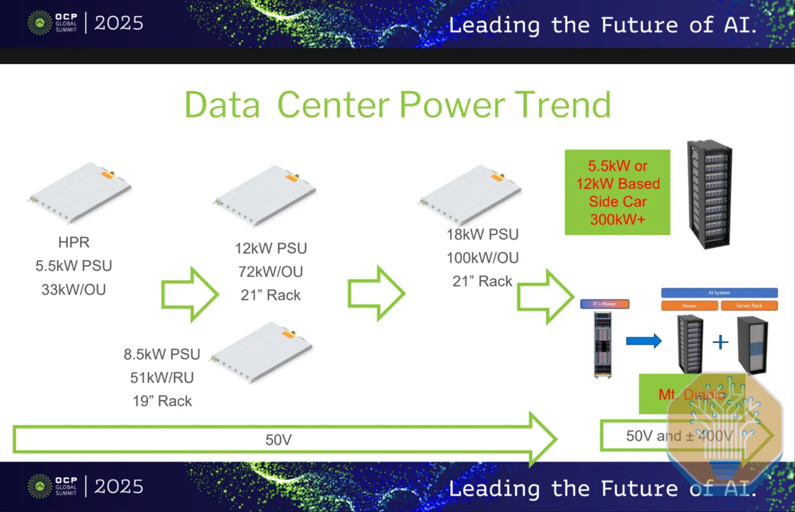

**解讀摘要**
Nvidia 官方 Power Trend：HPR（5.5kW PSU, 33kW/OU）→ 12kW Based（12kW PSU, 72kW/OU, 21" Rack）→ 18kW PSU（100kW/OU）→ 最終「5.6kW or 12kW Based Side Car 300kW+」。這個路線圖確認 Nvidia 的官方 Sidecar 策略，並隱含對 BBU/CBU 供應商（Murata/MUSASHI）的需求。

---

#### 圖 64｜Forgent：Recent Powertrain Solutions Win（180MW）

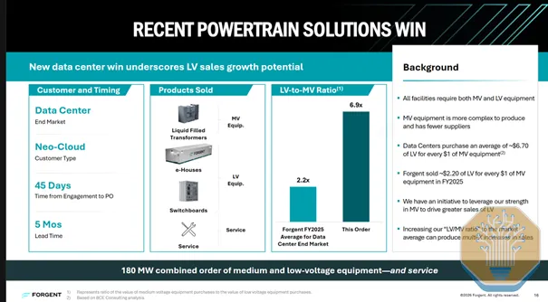

**解讀摘要**
Forgent 贏得 180MW 資料中心的 LV + MV 設備合併訂單，LV-to-MV ratio 達 6.9x（vs 業界平均 2.2x）。Forgent FY2025 的 LV 每 \$1 對應 \$2.20 MV 設備，這筆訂單達到 \$6.70——代表客戶在這個 order 中買了大量 MV 設備，強化 Forgent 提升 MV 銷售比例的策略。

> **洞察一**：6.9x LV-to-MV ratio 暗示這個資料中心正在做 MV 基礎設施的重大升級（Phase 3/4 準備？），不只是標準 LV 裝機。這是 800VDC Phase 3 MV 設備需求的早期跡象。

---

#### 圖 65｜Murata Medium-term Plan（FY3/25–29）

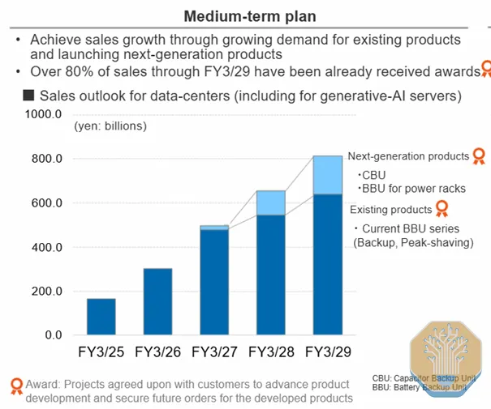

**解讀摘要**
Murata BBU/CBU 銷售展望：FY3/25 約 ¥180B → FY3/29 超過 ¥800B，**已有超過 80% 的銷售以 Award 形式確認**。Next-gen products（CBU + BBU for power racks）佔 FY3/29 增量的大部分，現有 BBU 系列（Backup/Peak-shaving）持續貢獻基礎量。

> **洞察一**：80%+ 已 Award 的能見度極高，代表 Murata 在 HVDC Power Rack BBU/CBU 領域已確立份額，而且客戶粘性強（Award = 進入供應鏈資格認證，換供應商成本高）。FY3/29 ¥800B 的目標換算約 \$5.5B，在 \$11.3B Sidecar TAM 峰值下佔比超過 48%——數字偏高，可能包含非 Sidecar 用途或 Murata 定義的 TAM 與 SemiAnalysis 不同。

---

#### 圖 66｜Murata Supply Capabilities（Japan + North America 擴產）

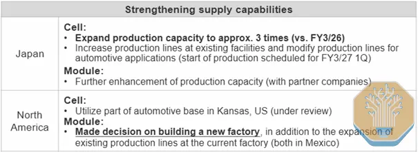

**解讀摘要**
Murata 雙地區擴產：日本（Cell: 擴至現有產能約 3 倍 vs FY3/26，FY3/27 Q1 開始量產；Module: 與 partner companies 進一步擴充）；北美（Cell: 評估利用 Kansas 汽車基地；Module: **決定在現有 Mexico 工廠擴增產線之外，新建工廠**）。新建工廠宣告代表 Murata 對長期需求的信心度顯著高於僅擴增現有產線。

---

#### 圖 67｜MUSASHI HSC 需要見込み（日文投影片）

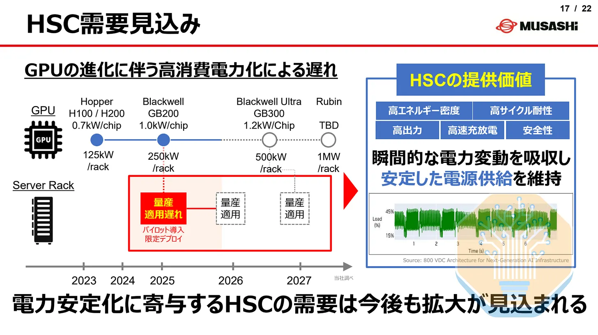

**解讀摘要**
MUSASHI（武蔵精密工業）HSC（Hybrid Supercapacitor）需求展望：GPU 世代演進帶動 rack 功耗從 H100（129kW/rack）→ Blackwell GB300（250kW/rack）→ Blackwell Ultra（1.2kW/rack，疑為 1.2MW）→ Rubin TBD，促使電力安定化需求持續增長。HSC 的提供價值：高エネルギー密度、高サイクル耐性、安全性，瞬間的な電力変動を吸収し安定した電源供給を維持。

> **洞察一**：MUSASHI 作為汽車零件廠跨入 data center HSC，技術基礎來自 EV 超電容——與 SemiAnalysis 報告中「±400VDC 選用 EV 供應鏈成熟零件」的論點直接呼應，顯示汽車 400V 生態系的確正在遷移至資料中心。

---

## 挑戰總結

| 挑戰 | 核心問題 | 當前狀態 | 影響評估 |
|---|---|---|---|
| 法規/安全 | NEC 2029 只有 partial provision；full code 2032–2035 | AHJ 逐案核准；IEEE 1584 不涵蓋 DC | 阻礙 colo 廠商採用，hyperscaler 自行工程解決 |
| 接地標準 | ±400V vs 800V floating vs solid ground 無共識 | OCP 允許多選，廠商各自優化不同假設 | 供應商生態系碎片化 |
| 冷卻 | 所有製冷設備仍為 AC 驅動，無 DC-native 完整生態 | Delta 2.4MW L2L CDU 是首個 800VDC 原生冷卻產品 | 需要保留 AC auxiliary bus，增加複雜度 |
| DC busway 標準 | UL 857 Edition 14 已涵蓋至 1000VDC，但 tap-off 帶電插拔不成熟 | Early Phase 3 只能用 feeder busway | 延緩 plug-in busway 的靈活部署 |
| 電網互聯 | SST 控制演算法使電網動態模型化複雜度大幅增加 | NERC Level 3 Alert（2026-05），ERCOT NOGRR282 | 超大廠商需新的 EPC 能力（Aran Industries 等） |
| SiC 3300V+ 供應 | MV-input SST 需要 3300V+ SiC MOSFET，仍在有限量產 | Wolfspeed 10kV bare die 2026-03 商業化 | 限制 MV SST 的量產時程 |

---

## 相關個股與供應商清單

| 類別 | 公司 | Ticker | 報告中的角色 | 備註 |
|---|---|---|---|---|
| **GPU / Platform** | NVIDIA | NVDA | 800VDC 架構定義者；HPRv3、Kyber、Diablo 400 合著者 | MGX reference 唯一 SST：DG Matrix |
| **SST Pure-play** | DG Matrix | 未上市 | ABB 持股；Infineon SiC；唯一進入 Nvidia MGX | 目標 Q2 2026 UL 認證 |
| **SST Pure-play** | Amperesand | 未上市 | Gen3 系統 >98.5% eff；2026 年 30MW 商業部署目標 | LV + MV 雙路徑 |
| **SST Pure-play** | Heron Power | 未上市 | 4.2MW Heron Link；美國 40GW 製造廠 | MV-input only |
| **SST Pure-play** | Novos Power | 未上市 | ≥98.5%，1–50MW，DC 400–1500V；空冷 | Gen4 比較表 |
| **Incumbent（SST）** | Eaton | ETN | 收購 Resilient Power Systems（2025-08）| DC breaker + SST 雙線 |
| **Incumbent（SST）** | Delta Electronics | 2308.TW | 800VDC air-cooled busway；AC-DC Shelves；2.4MW L2L CDU | 全組合佈局 |
| **Incumbent（SST）** | ABB | ABBN | SST 開發中；持股 DG Matrix；Emax 2 + SACE Infinitus DC breaker | Nvidia partnership（2025-10）|
| **Incumbent（SST）** | Hitachi Energy | 6501.T | 1MW 級 SST；與 ABB 共同歷史（PETT，Swiss Railways 2011）| |
| **Power Rack / BBU** | Murata Manufacturing | 6981.T | BBU/CBU；FY3/29 ¥800B 目標；>80% awarded | Mexico 新建工廠 |
| **Power Rack / BBU** | MUSASHI（武蔵精密）| 7220.T | HSC（Hybrid Supercapacitor）；GPU load transient 緩衝 | 從汽車跨入 DC |
| **Power Rack / PSU** | LITEON Technology | 2301.TW | PSU roadmap 800VDC；最終目標 1.2MW Rack | |
| **Power Rack / Infra** | Vertiv | VRT | 800VDC platform for Kyber NVL576；H2 2026 上市 | |
| **Busway / DC Dist** | Legrand | LR.PA | ORv3 DC Busbar（400A/700A/1400A）；NVIDIA MGX 架構 | |
| **Busway / DC Dist** | Schneider Electric | SU.PA | 傳統 AC 全組合；800VDC 產品尚未公開 | |
| **MV Equip** | Forgent | 未上市 | 180MW win；LV-to-MV 6.9x ratio | EPC 服務 |
| **SiC / 半導體** | Wolfspeed | WOLF | 10kV Bare Die MOSFET（2026-03 商業化）| MV-input SST 關鍵元件 |
| **SiC / 半導體** | Infineon | IFX | OptiMOS BBU FET；SST SiC 供應商；DG Matrix 合作夥伴 | |
| **EPC / 系統整合** | Aran Industries | 未上市 | AI-native EPC；800VDC 工程包；PE-stampable 設計 | |
