# MS｜2Q'26 WFE Update：記憶體錯配未解，LAM 升 OW，AMAT 降 EW

**券商**：Morgan Stanley & Co. LLC  
**分析師**：Shane Brett、Joseph Moore、Mason Wayne、Ella Tulchinsky、Nicole Kozhukhov  
**日期**：2026-05-27（報告發布：2026-05-18）  
**主題**：2Q'26 WFE 季度更新，2026/27 預測上修，LAM 升至 OW，AMAT 降至 EW，MKSI 升為 Top Pick  
**評級**：In-Line（Semiconductor Capital Equipment）  
<a href="https://layx.uk/dl?g=產業&b=MS&d=20260527&h=WFE-2Q26-Update">📎 下載 PDF</a>

---

## MS 完整投資邏輯鏈

| 論點層次 | Exhibit | 內容 |
|---|---|---|
| WFE 上修驅動 | 1、7 | 2026 預測 \$143bn → \$149bn（+27%），2027 \$182bn → \$191bn（+28%），2028 \$215bn（+13%）；DRAM/邏輯各上修 \$3/\$2bn（2026），NAND 上修 \$4bn（2027） |
| 記憶體供需錯配 | 3、4、11、22 | DRAM/NAND 2027 bit 供給分別只有 31%/32%，但無約束需求 40%+；clean room 先天瓶頸讓供不應求延至 2028+ |
| NAND 週期轉捩 | 18、19、20、22 | 2023-25 NAND 全靠 node upgrade 維持供給，無 greenfield；NAND WFE 2027 預測 \$24bn，超越 2021 高點 \$19bn |
| Intel 投資上行風險 | 6、25、26 | 若 Intel 2030 年爭奪 2/3 增量 CPU，需要 \$23.8bn WFE；每 5mn Xeon 6 = \$5.3bn WFE；KLA 最大受益 |
| 前段封裝搶份額 | 29、31、32 | 封裝設備 2026 +41%，但前段（AMAT/LAM/KLA/TEL）佔比升至 50%，成長率高於後段整合廠 |
| LAM > AMAT（2027 視角） | 33、34、36、37 | NAND WFE 佔 LAM 收入 20% vs AMAT 7%；LAM 2027 NAND 系統 +59% YoY；估值溢價從 10% 擴至 20% |
| **結論** | 封面 | **LAM 升 OW（PT \$331），AMAT 降 EW（PT \$502），MKSI 升 Top Pick** |

> **報告最大邏輯缺口**：NAND greenfield 自 2022 年後中國以外從未大規模啟動；LAM 在 greenfield 環境的市占率不如 brownfield 有保障，若 Samsung/Kioxia 採新設備供應商，NAND 復甦的 LAM 份額假設面臨下修風險。

---

## 報告核心觀點

| 主題 | MS 觀點 | 市場共識 | 是否 Contra-Consensus |
|---|---|---|---|
| 2026 WFE 預測 | \$149bn（+27%） | Gartner \$144bn | 略高於第三方 |
| 2027 WFE 預測 | \$191bn（+28%） | — | MS 高於 SEMI \$135bn（2025E） |
| NAND WFE 2027 | \$24bn，超越 2021 高點 | 市場普遍認為 NAND 復甦慢 | **Contra-consensus：更早、更強** |
| Intel 資本支出 | 上修必然；最少 \$23.8bn WFE | 市場保守；等待 10nm/18A 量產確認 | **Contra-consensus：提早入場** |
| LAM vs AMAT | 2027 首選 LAM | 多數偏好 AMAT（DRAM 暴露） | **反轉：2027 NAND > DRAM 增量** |
| 封裝 | 前段佔比達 50%，後段整合廠落後 | 市場認為 OSAT 是主要受益 | 部分 contra |

**偏好排序（2027 視角）**：NAND > 非 TSMC 晶圓廠 > TSMC > DRAM  
**個股偏好**：LAM（OW，Top）、MKSI（OW，Top Pick）、KLA（OW）> AMAT（EW，降級）

---

## Exhibit 1｜WFE 預測瀑布圖（2025→2028e）

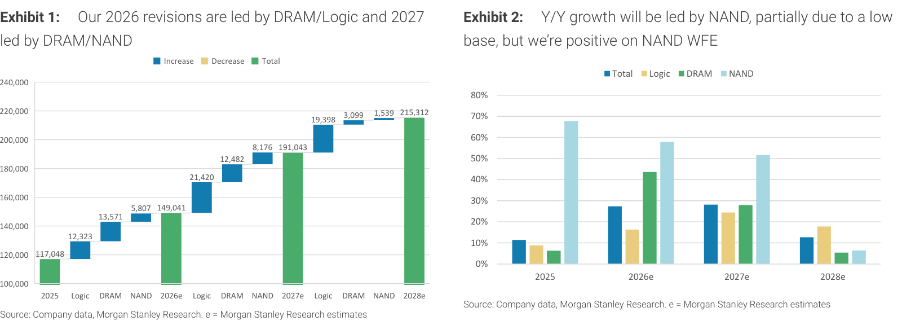

### 解讀摘要
2026 上修主要來自 DRAM（+\$3bn）和 Logic（+\$2bn），但 2027 的最大亮點是 NAND，上修幅度達 +\$4bn，超過 DRAM（+\$5bn 但 2027 已列入 base case）。2028 引入 +13% 成長預測，由 Logic 主導（+18%），Memory 僅 +6%，反映 clean room 瓶頸讓 Memory WFE 上行空間有限但延長周期。

### 表格

| 年份 | Total WFE (\$mn) | YoY | Logic 增量 | DRAM 增量 | NAND 增量 |
|---|---|---|---|---|---|
| 2025A | 117,048 | +11% | — | — | — |
| 2026e | 149,041 | +27% | +12,323 | +13,571 | +5,807 |
| 2027e | 191,043 | +28% | +21,420 | +12,482 | +8,176 |
| 2028e | 215,312 | +13% | +19,398 | +3,099 | +1,539 |

> **洞察一**：NAND 在 2027 才是主要成長動能（+52% YoY），但 2026 仍以 DRAM/Logic 主導——這說明 LAM 的 NAND 超額受益需要等到 2027 才完全兌現，2026 仍是 AMAT/DRAM 年。

---

## Exhibit 2｜各細分市場 YoY 成長率

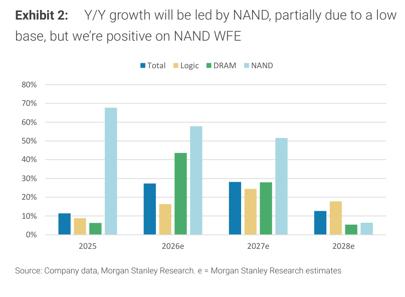

### 解讀摘要
NAND 在 2027 YoY 成長達 52%，遠超 DRAM（+28%）和 Logic（+24%）；2028 則趨向均衡（NAND +6%、DRAM +5%、Logic +18%）。NAND 的 2027 高成長部分反映 2026 低基期，但 MS 強調基本面（greenfield 啟動）支撐這個數字。

> **洞察二**：NAND 2027 +52% 成長創 2021 以來新高，若延伸至 2028 只剩 +6%，暗示市場窗口集中在 2027，LAM 的超額收益窗口可能只有一年。

---

## Exhibit 3｜DRAM WFE vs Bit 供給（2021-2028e）

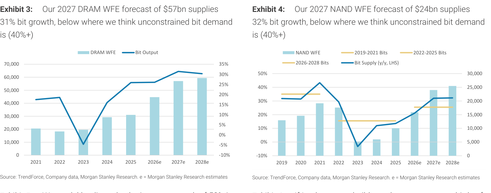

### 解讀摘要
MS 的 2027 DRAM WFE 預測 \$57bn 只能支撐 31% bit 成長，而無約束需求估計在 40%+，缺口達 9 ppt。這個缺口的存在使得 DRAM WFE 有進一步上修空間，但 MS 同時指出若進一步上修，將意味著 ASML EUV 大量分流，擠壓 Logic 需求。

> **值得驗證**：MS 估算「無約束 DRAM 需求 40%+」。若 AI server 的 DRAM bit 需求增速不如預期（例如因為 HBM 替換 DDR 比例低於預期），整體缺口縮小，DRAM WFE 上修空間也隨之縮小，影響 AMAT 估值。

---

## Exhibit 4｜NAND WFE vs Bit 供給（2019-2028e）

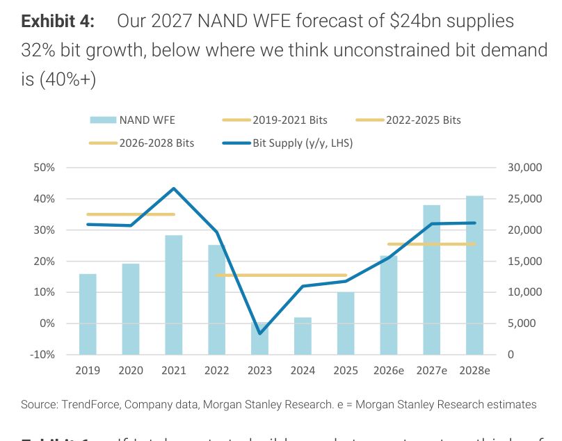

### 解讀摘要
NAND WFE 自 2022 年起急跌，2023-2025 年維持歷史低點；但 MS 預測 2027 將大幅反彈至 \$24bn，超過 2021 高點。Bit 供給成長率也從 2025 的 17% 加速至 2027 的 32%，仍低於 40%+ 無約束需求，確認供需缺口。

---

## Exhibit 5｜前沿邏輯半導體資本支出（2020-2028e）

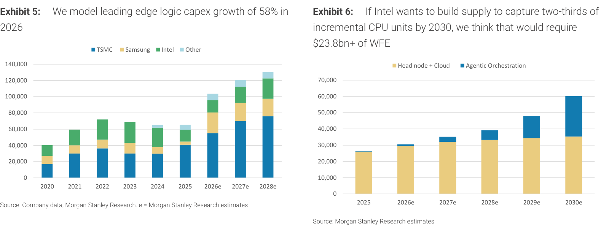

### 解讀摘要
2026 前沿邏輯 capex 預測成長 58%，由 TSMC 主導，Samsung 小幅貢獻，Intel 目前基數低但有顯著上行風險。MS 在此展示 TSMC-centric 的邏輯成長，同時視 Intel 為 2027 的潛在催化劑。

---

## Exhibit 6｜Intel CPU 需求 → WFE 需求（2030 年情境）

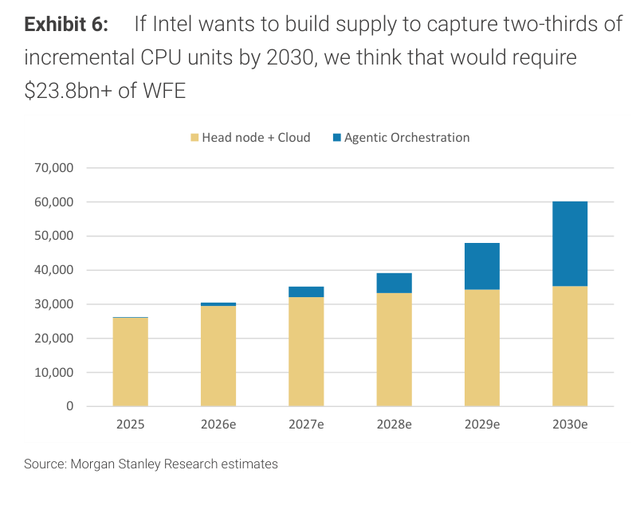

### 解讀摘要
若 Intel 爭取 2/3 的增量 Server CPU 至 2030 年（約 22.4mn 台），所需的邏輯晶圓產能需要 \$23.8bn WFE（Xeon 6 情境）到 \$27.9bn（Xeon 7 情境）。Server CPU 從 2025 年 26.2mn 台成長至 2030 年 60.1mn 台，增量超過 33mn 台，驅動資本支出不可避免。

> **洞察三**：Intel 的 WFE 需求論點本質上是個 option call——若 Intel IDM 戰略成立，\$24-28bn WFE 是確定性支出；若 Intel 輸掉市場份額，此 WFE 不存在。MS 的 base case 已含此假設，但市場未必完全訂價。

---

## Exhibit 7｜WFE 完整預測表（按細分市場）

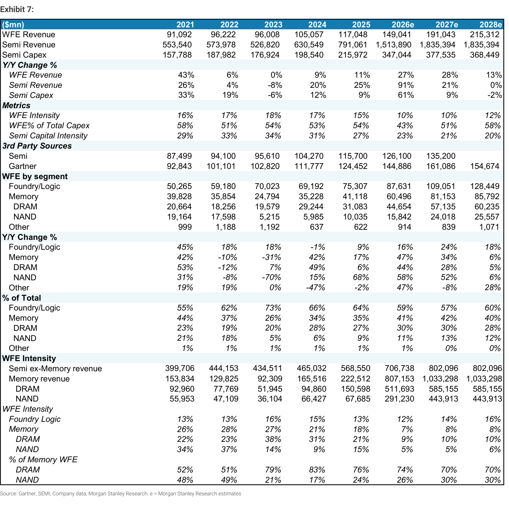

### 表格（\$mn）

| 指標 | 2021 | 2022 | 2023 | 2024 | 2025 | 2026e | 2027e | 2028e |
|---|---|---|---|---|---|---|---|---|
| **WFE 總計** | 91,092 | 96,222 | 96,008 | 105,057 | 117,048 | 149,041 | 191,043 | 215,312 |
| YoY | +43% | +6% | 0% | +9% | +11% | **+27%** | **+28%** | +13% |
| **Foundry/Logic** | 50,265 | 59,180 | 70,023 | 69,192 | 75,307 | 87,631 | 109,051 | 128,449 |
| YoY | +45% | +18% | +18% | -1% | +9% | +16% | +24% | +18% |
| % of Total | 55% | 62% | 73% | 66% | 64% | 59% | 57% | 60% |
| **Memory 合計** | 39,828 | 35,854 | 24,794 | 35,228 | 41,118 | 60,496 | 81,153 | 85,792 |
| YoY | +42% | -10% | -31% | +42% | +17% | **+47%** | **+34%** | +6% |
| % of Total | 44% | 37% | 26% | 34% | 35% | 41% | 42% | 40% |
| 　DRAM | 20,664 | 18,256 | 19,579 | 29,244 | 31,083 | 44,654 | 57,135 | 60,235 |
| 　YoY | +53% | -12% | +7% | +49% | +6% | +44% | +28% | +5% |
| 　NAND | 19,164 | 17,598 | 5,215 | 5,985 | 10,035 | 15,842 | 24,018 | 25,557 |
| 　YoY | +31% | -8% | -70% | +15% | +68% | **+58%** | **+52%** | +6% |
| Semi Capex | 157,788 | 187,982 | 176,924 | 198,540 | 215,972 | 347,044 | 377,535 | 368,449 |
| WFE Intensity | 16% | 17% | 18% | 17% | 15% | **10%** | **10%** | 12% |

> **洞察四**：2026/27 WFE Intensity（WFE 佔半導體營收）降至 10%，顯示 WFE 成長速度落後於半導體營收成長——這意味著設備商在 AI 超級週期中的受益是真實但相對有限的，AI 晶片設計商（如 Nvidia）才是最大受益。WFE intensity 一旦回升到歷史均值 15-18%，代表設備商有相當的估值重估空間。

---

## Exhibit 8｜WFE 按地區預測（2021-2028e）

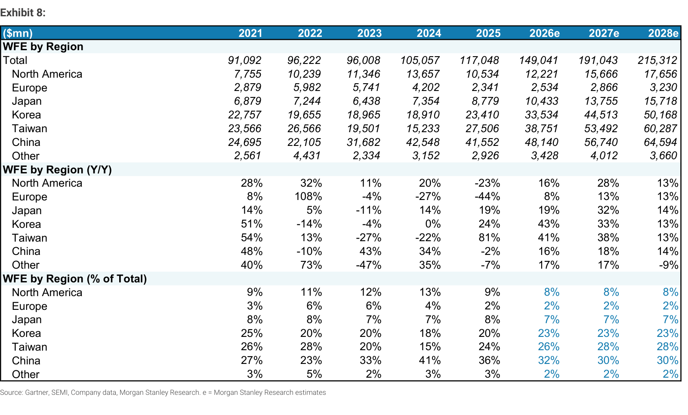

### 表格（\$mn）

| 地區 | 2021 | 2022 | 2023 | 2024 | 2025 | 2026e | 2027e | 2028e |
|---|---|---|---|---|---|---|---|---|
| **總計** | 91,092 | 96,222 | 96,008 | 105,057 | 117,048 | 149,041 | 191,043 | 215,312 |
| 北美 | 7,755 | 10,239 | 11,346 | 13,657 | 10,534 | 12,221 | 15,666 | 17,656 |
| 歐洲 | 2,879 | 5,982 | 5,741 | 4,202 | 2,341 | 2,534 | 2,866 | 3,230 |
| 日本 | 6,879 | 7,244 | 6,438 | 7,354 | 8,779 | 10,433 | 13,755 | 15,718 |
| 韓國 | 22,757 | 19,655 | 18,965 | 18,910 | 23,410 | 33,534 | 44,513 | 50,168 |
| 台灣 | 23,566 | 26,566 | 19,501 | 15,233 | 27,506 | 38,751 | 53,492 | 60,287 |
| 中國 | 24,695 | 22,105 | 31,682 | 42,548 | 41,552 | 48,140 | 56,740 | 64,594 |
| % of Total 台灣 | 26% | 28% | 20% | 15% | 24% | **26%** | **28%** | 28% |
| % of Total 中國 | 27% | 23% | 33% | 41% | **36%** | **32%** | 30% | 30% |

> **洞察五（配合 Exhibit 36-37）**：中國佔比從 2024 高峰 41% 下滑至 2026-28 的 30-32%，台灣則從 2024 低點 15% 大幅反彈至 28%（TSMC CoWoS/N2 主導）。中國比重下降對 LAM 的影響比 AMAT 更大（LAM China mix 2026e 32% vs AMAT 24%），是 LAM 的主要尾部風險。

---

## Exhibit 9｜DRAM 年度 Greenfield 新增（kwpm）

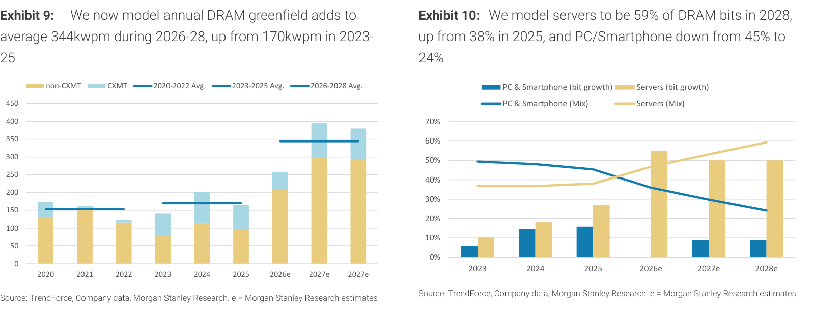

### 解讀摘要
MS 預測 2026-28 年 DRAM greenfield 平均每年新增 344kwpm，vs 2023-25 年平均 170kwpm，幾乎翻倍。2026 下修了 Hynix 過激預測（258→278kwpm），但 2027 全面上修（395kwpm）。CXMT 貢獻開始顯著，形成中國自主供應鏈的不確定性。

---

## Exhibit 10｜DRAM bits 中 Server 佔比趨勢

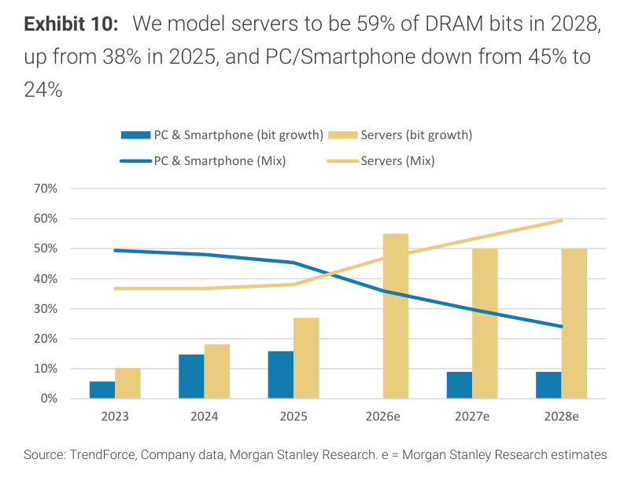

### 解讀摘要
Server DRAM bit 佔比從 2025 年 38% 上升至 2028 年 59%；PC/Smartphone 從 45% 降至 24%。驅動因素是 AI 推論伺服器對 HBM 和 DDR5 的需求爆炸式成長，使傳統消費端需求相對稀釋。

> **洞察六**：Server DRAM 佔比的結構性上升（+21ppt 至 2028）意味著 DRAM 需求的週期波動性下降——Server/AI 需求不像 PC/手機有季節性。對設備商而言，DRAM WFE 的能見度提高，降低了供過於求的風險。

---

## Exhibit 12｜NAND Bit 供給成長預測

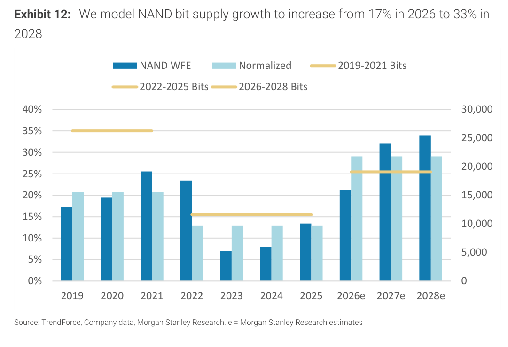

### 解讀摘要
NAND bit supply 成長在 2026 為 17%，2027 加速至 33%，2028 維持相近水平。這個成長軌跡完全依賴 greenfield 投資（而非 node upgrade），使 NAND WFE 的成長具有較強預測性。

---

## Exhibit 13｜前沿邏輯 Capex 成長（含 TSMC/Samsung/Intel）

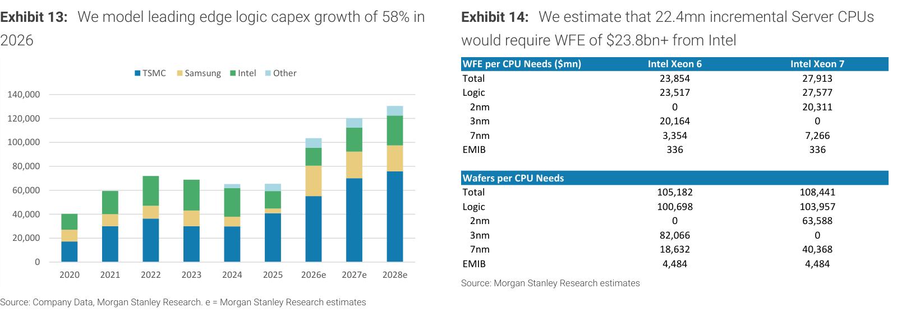

### 解讀摘要
與 Exhibit 5 類似（2026 +58%），但這張圖更清楚呈現 TSMC 主導地位，以及 Intel 目前貢獻仍小。若 Intel capex 按 Exhibit 25/26 情境上修，這張圖的 Intel 柱狀將大幅增加。

---

## Exhibit 14｜Intel 22.4mn CPU 情境所需 WFE（\$23.8bn+）

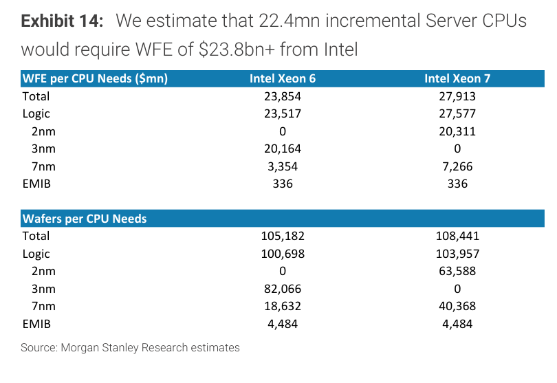

> **注意**：此 Exhibit 標記為 [XObject]，已以全欄寬輸出，內容為表格。

### 表格（22.4mn 增量 CPU，2/3 市占情境）

| 項目 | Intel Xeon 6（3nm） | Intel Xeon 7（2nm） |
|---|---|---|
| **WFE 總計（\$mn）** | **23,854** | **27,913** |
| 　Logic | 23,517 | 27,577 |
| 　　2nm（Intel 18A） | 0 | 20,311 |
| 　　3nm（Intel 3） | 20,164 | 0 |
| 　　7nm | 3,354 | 7,266 |
| 　EMIB | 336 | 336 |
| **Wafer 需求（萬片/月，kwpm）** | **105,182** | **108,441** |
| 　Logic | 100,698 | 103,957 |
| 　　2nm | 0 | 63,588 |
| 　　3nm | 82,066 | 0 |
| 　　7nm | 18,632 | 40,368 |
| 　EMIB | 4,484 | 4,484 |

> **洞察七**：Xeon 6（3nm）情境中，82,066 kwpm 的 3nm 需求是 Intel 目前 3nm 產能的數倍；即使只有 20% 的這個需求兌現，對 AMAT/LAM/KLA 也是巨大增量。KLA 作為 process control 廠的受益最為不對稱（見 Exhibit 27）。

---

## Exhibit 16｜Logic vs Memory WFE 佔比

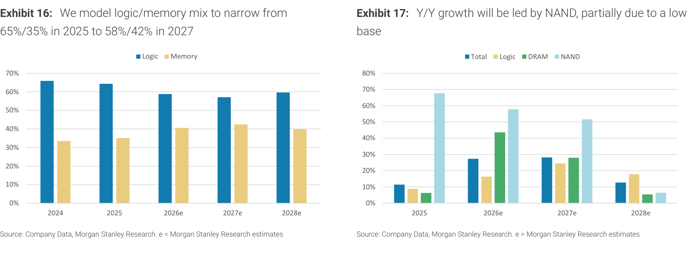

### 表格

| 年份 | Logic % | Memory % |
|---|---|---|
| 2024 | 66% | 34% |
| 2025 | 64% | 35% |
| 2026e | 59% | 41% |
| 2027e | 57% | 42% |
| 2028e | 60% | 40% |

> **洞察八**：Memory 佔比在 2027 達到 42% 高峰後在 2028 回落，暗示 Memory 投資周期在 2027 達到相對頂峰，2028 Logic（尤其 Intel/Analog）接棒驅動成長。

---

## Exhibit 18｜NAND bit 供給：Node Upgrade vs Wafer Starts 貢獻

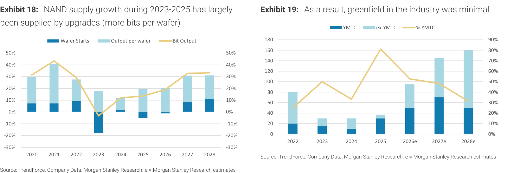

### 解讀摘要
2023-25 年 NAND bit 供給幾乎完全靠 node upgrade（每片晶圓產出更多 bit），wafer starts 幾乎零成長。這個結構說明為何 NAND WFE 維持低點——只需要 deposition/etch 升級而非新廠，對設備商需求有限。MS 預計從 2026 起，greenfield wafer starts 開始貢獻，驅動 NAND WFE 反轉。

---

## Exhibit 19｜NAND Greenfield 新增（YMTC vs 非 YMTC）

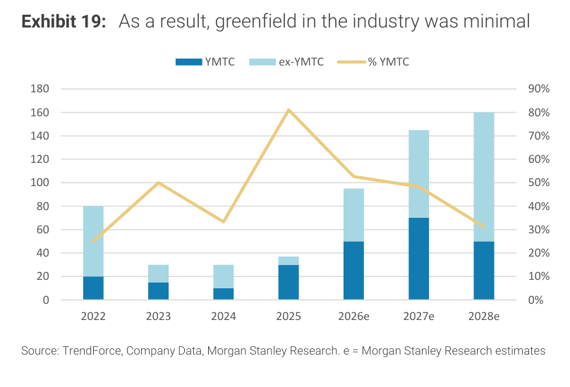

### 解讀摘要
2023-2025 年 YMTC 幾乎是唯一的 NAND greenfield 貢獻者，非中國廠商 greenfield 接近零。2026-27 非 YMTC greenfield 加速（Samsung、Kioxia），YMTC 佔比下降但仍顯著。這對設備商地緣政治風險有重要含義：若 YMTC 成為主要 greenfield 驅動力，受美國出口管制影響的設備商（AMAT、LAM）受益有限。

> **值得驗證**：MS 預測 2027 非 YMTC greenfield 主導，但 Samsung/Kioxia 的具體 capex 承諾尚未公開。若 Samsung 繼續推遲 NAND greenfield（聚焦 HBM），MS 的 NAND WFE \$24bn 預測面臨下行風險。

---

## Exhibit 20｜NAND 無約束需求 40%+（Server SSD 主導）

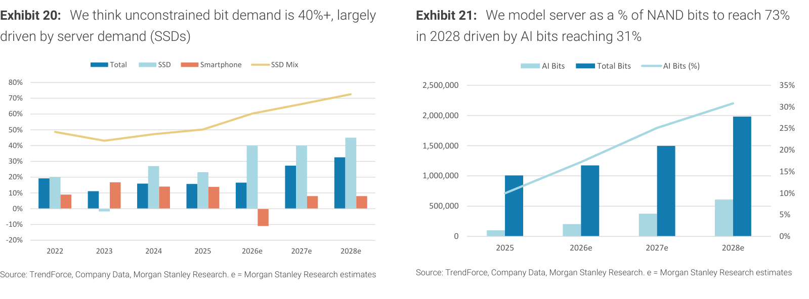

### 解讀摘要
Server SSD（AI training/inference 存儲）是 NAND 無約束需求的主要驅動力，MS 估算總無約束需求 40%+，遠超 2026e 17% 的供給成長。SSD 在 NAND bit 中的佔比持續攀升，強化長期供應缺口論述。

---

## Exhibit 21｜Server 佔 NAND bits 比例達 73%（2028e）

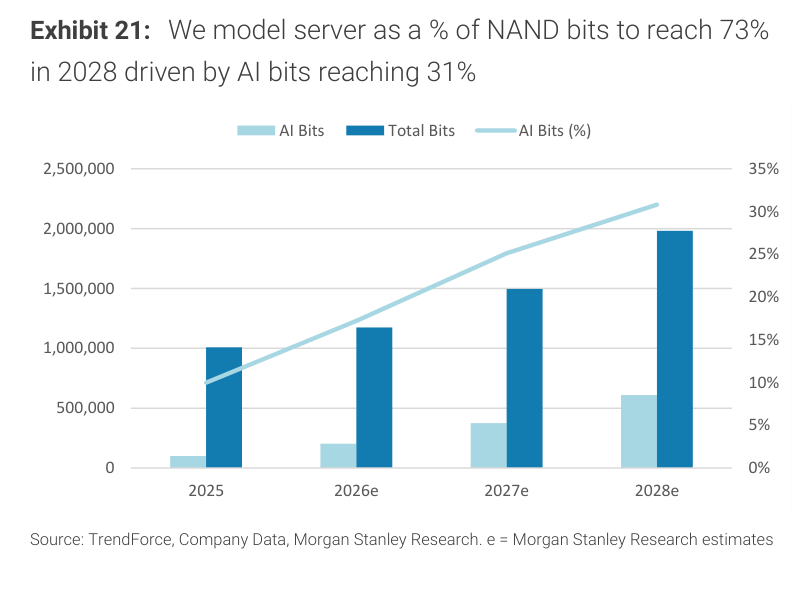

### 解讀摘要
AI bits（用於訓練/推論的 AI server SSD）在 2028 年達到 NAND 總量的 31%；Server 整體佔比 73%。這個結構轉變使 NAND 的需求彈性更接近 DRAM（AI 驅動），弱化了 NAND 的高周期性，長期來看提升 NAND WFE 的可預期性。

---

## Exhibit 23｜Server CPU 成長至 2030 年 60mn 台

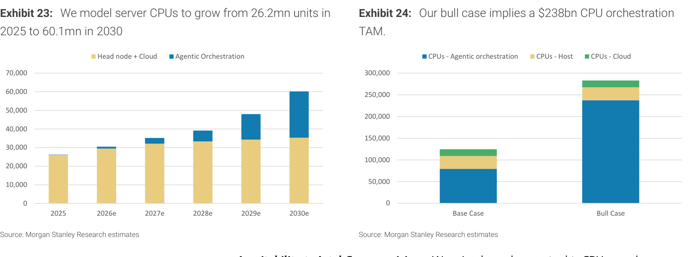

### 表格（mn units）

| 年份 | Head node + Cloud | Agentic Orchestration | 合計 |
|---|---|---|---|
| 2025 | ~26 | 0 | 26.2 |
| 2026e | — | — | ~32 |
| 2027e | — | — | ~42 |
| 2028e | — | — | ~51 |
| 2029e | — | — | ~57 |
| 2030e | ~45 | ~15 | 60.1 |

*數值為視覺估算

> **洞察九**：Agentic AI 增加了一個全新的 CPU 需求類別（orchestration 層），2030 年貢獻約 25%（~15mn 台）。這個類別 2025 年近乎為零，意味著 Intel 的成長不只是搶現有市場，而是市場本身在擴張。

---

## Exhibit 24｜Bull Case CPU orchestration TAM \$238bn

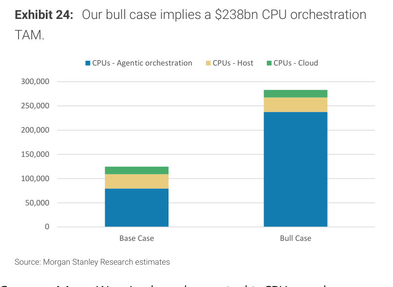

### 解讀摘要
Base case 為 \$125bn（2030 CPU TAM），Bull case 達 \$283bn，主要差異在於 Agentic CPU orchestration 需求的量級假設。Bull case 暗示 Intel 的市場機會比基礎假設大 2.3x，對應的 WFE 需求也相應放大。

---

## Exhibit 25｜5mn 增量 Xeon 6 所需 WFE（\$5.3bn）

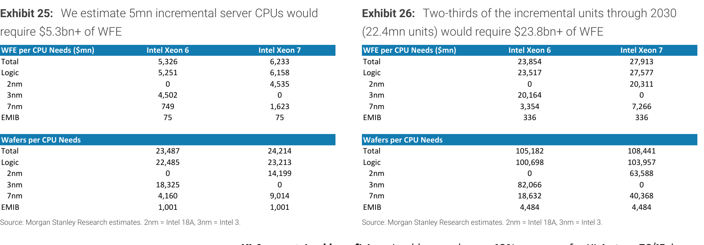

### 表格

| 項目 | Intel Xeon 6（3nm） | Intel Xeon 7（2nm） |
|---|---|---|
| **WFE 總計（\$mn）** | **5,326** | **6,233** |
| 　Logic | 5,251 | 6,158 |
| 　　3nm | 4,502 | 0 |
| 　　2nm（Intel 18A） | 0 | 4,535 |
| 　　7nm | 749 | 1,623 |
| 　EMIB | 75 | 75 |
| **Wafer 需求（片/月）** | 23,487 | 24,214 |

> **洞察十**：每增加 5mn Xeon 6 = \$5.3bn WFE ≈ Intel 目前年度 WFE 的 72%（2025 MSe \$7.3bn）。換言之，每 5mn 的增量 CPU 訂單就幾乎等於 Intel 再增加一年的資本支出預算，說明 CPU 需求復甦對 WFE 的 leverage 極高。

---

## Exhibit 27｜KLA Intel 收入 2025-2027 可達 6.4x

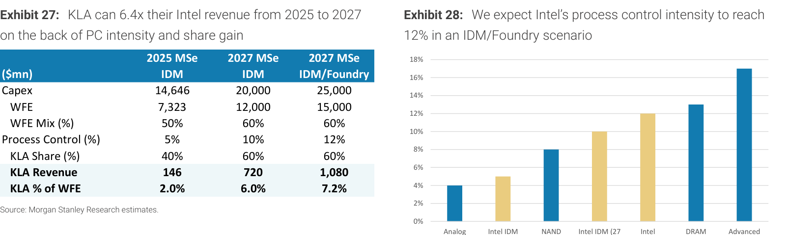

### 表格

| 指標 | 2025 MSe | 2027 MSe（IDM） | 2027 MSe（IDM/Foundry） |
|---|---|---|---|
| Intel Capex (\$mn) | 14,646 | 20,000 | 25,000 |
| WFE | 7,323 | 12,000 | 15,000 |
| WFE Mix% | 50% | 60% | 60% |
| Process Control% | 5% | 10% | 12% |
| KLA Share% | 40% | 60% | 60% |
| **KLA Revenue (\$mn)** | **146** | **720** | **1,080** |
| KLA% of WFE | 2.0% | 6.0% | 7.2% |

### 增量貢獻拆解
從 2025 \$146mn → 2027 IDM case \$720mn（+\$574mn，+393%）：
- WFE 金額 +\$4,677mn（×1.64）
- Process Control 強度 5%→10%（翻倍）
- KLA 份額 40%→60%（×1.5）
- 三因子相乘：\$12,000 × 10% × 60% = \$720mn

> **洞察十一**：KLA 的 Intel 受益是三重 leverage：WFE 增加 + 製程控制強度提升 + 份額提升，遠比 AMAT/LAM 更不對稱。若 Intel Foundry 情境成立（\$1,080mn），KLA Intel 收入 7.4x，成為 Intel 復甦最大受益股。

---

## Exhibit 28｜Intel 製程控制強度 vs 行業比較

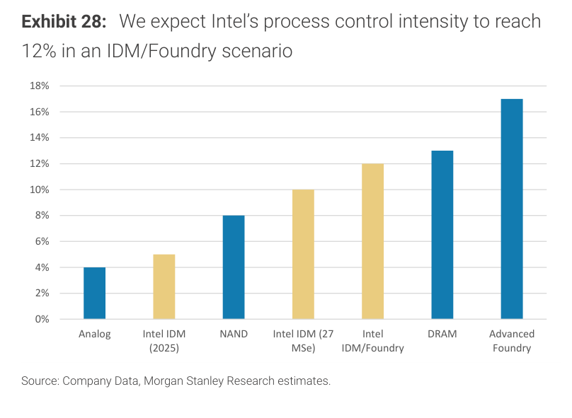

### 解讀摘要
2025 年 Intel IDM 製程控制強度僅 5%（vs 先進晶圓廠 15-18%），因為 Intel 歷來依賴 ramp-up 後才做 process control（"test-based"），而非 in-line 即時偵測。Intel 正轉向 in-line detection，MS 預測到 2027 強度上升至 10-12%，使 KLA 成為 Intel 轉型的直接受益者。

---

## Exhibit 29｜封裝設備市場成長（2022-2028e）

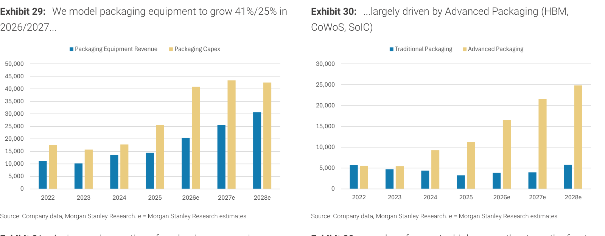

### 解讀摘要
封裝設備（含 Capex）在 2026 成長 41%，2027 +25%，成長速度超過 WFE（+27%/+28%），但 MS 強調整體封裝市場的成長不代表傳統後段廠商受益——Value 在前段。

---

## Exhibit 30｜先進封裝（HBM/CoWoS/SoIC）vs 傳統封裝

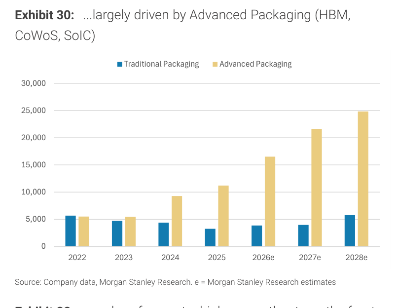

### 解讀摘要
2025 年後先進封裝（Advanced Packaging）的成長速度大幅超過傳統封裝，2028 年先進封裝佔比過半。HBM 需要的 CoWoS/SoIC 製程由 TSMC/Samsung 等前段廠執行，AMAT/LAM/KLA 而非傳統 OSAT 是主要受益者。

---

## Exhibit 31-32｜前段 vs 後段封裝收入及成長率

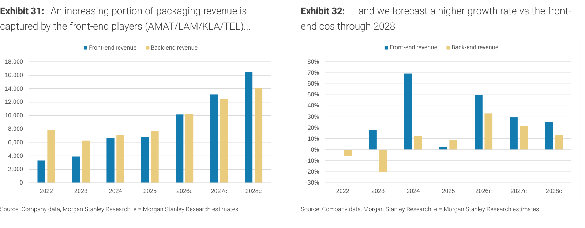

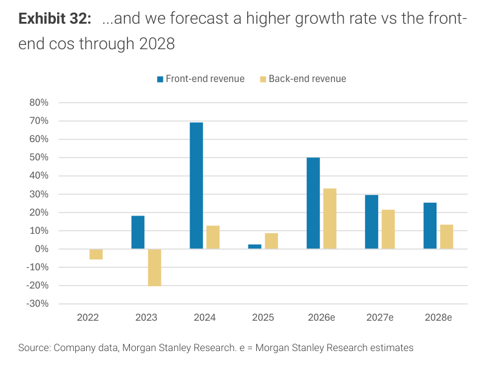

### 解讀摘要
前段封裝（AMAT/LAM/KLA/TEL）收入在 2026 成長 50% YoY，佔封裝市場比例升至 50%。後段封裝成長率低於前段，且 2028 年後趨於平緩。這直接支持 MS 對 AMAT/LAM 前段封裝業務的正面看法，但同時指出後段整合廠（ASE、Amkor）在這波週期中受益有限。

---

## Exhibit 33｜LAM vs AMAT 前瞻 P/E 溢價歷史

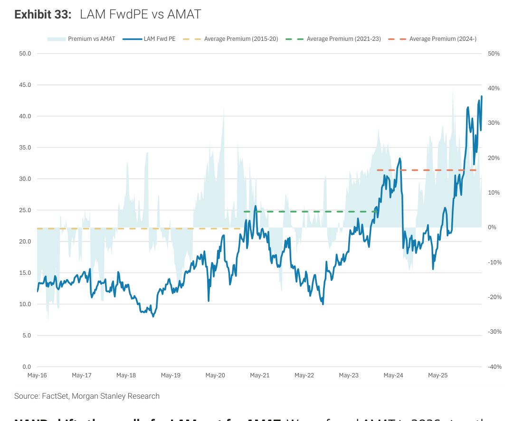

### 解讀摘要
LAM vs AMAT 的估值溢價分三階段：2015-20 年約 0%、2021-23 年約 5%（NAND 下行期 LAM 溢價收窄）、2024 年後 16%（NAND 復甦 + LAM China 受益）。MS 現在將溢價從 10% 擴展至 20%，反映 2027 NAND WFE 的加速對 LAM 的不對稱受益。

---

## Exhibit 34-35｜LAM vs AMAT 市占率變化

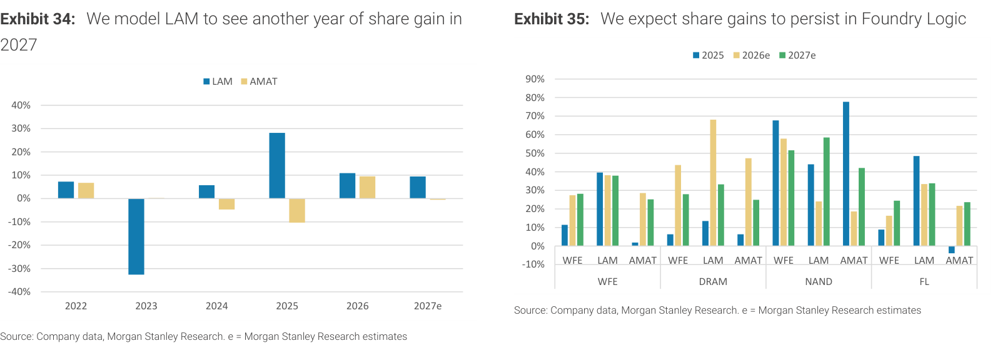

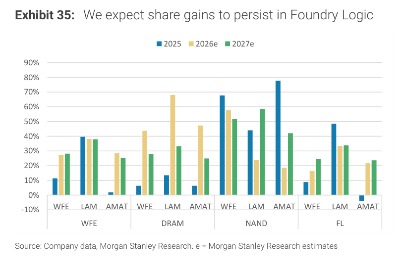

### 解讀摘要
LAM 在 2024/25 已相對 WFE 超額表現（2024 +8ppt，2025 +27ppt 估計），MS 預測 2026/27 連續第三、四年超額表現，由 NAND 和非中國 foundry logic 驅動。Exhibit 35 顯示按細分市場（DRAM/NAND/FL）的 LAM vs AMAT 相對份額，LAM 在 NAND 佔有決定性優勢。

---

## Exhibit 36-37｜LAM vs AMAT 按細分市場收入拆解

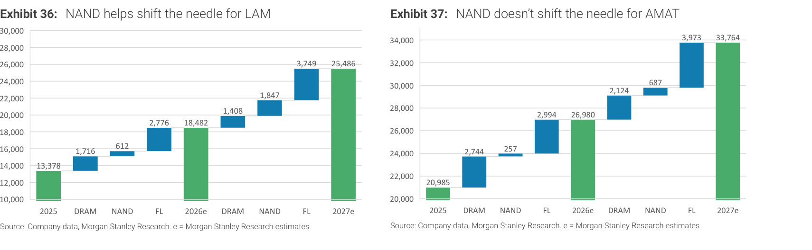

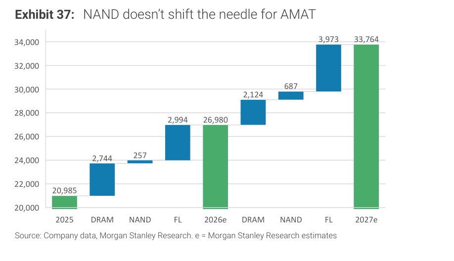

### 表格

**LAM Research（\$mn）**

| 年份 | DRAM | NAND | Foundry Logic | 合計 |
|---|---|---|---|---|
| 2025 | 13,378 | 1,716 | 612 | ~15,706（估） |
| 2026e | 18,482 | 1,408 | 1,847 | ~21,737 |
| 2027e | — | — | 3,749 | 25,486 |

*NAND 2026e 下降反映 brownfield 投資仍低

**Applied Materials（\$mn）**

| 年份 | DRAM | NAND | Foundry Logic | 合計 |
|---|---|---|---|---|
| 2025 | 20,985 | 2,744 | 257 | ~23,986（估） |
| 2026e | 26,980 | 2,124 | 687 | ~29,791 |
| 2027e | — | — | 3,973 | 33,764 |

> **洞察十二（配合 Exhibit 7）**：NAND WFE 2027 從 \$15.8bn → \$24.0bn，增量 \$8.2bn；LAM NAND mix 20% vs AMAT 7%——若 LAM NAND 份額維持 2025 水平，NAND 增量對 LAM 貢獻約 \$1.6bn，但若 LAM 在新 node 的份額下滑，這個假設就是最大風險點。

---

## Exhibit 38-40｜LAM/AMAT 預測財務報表

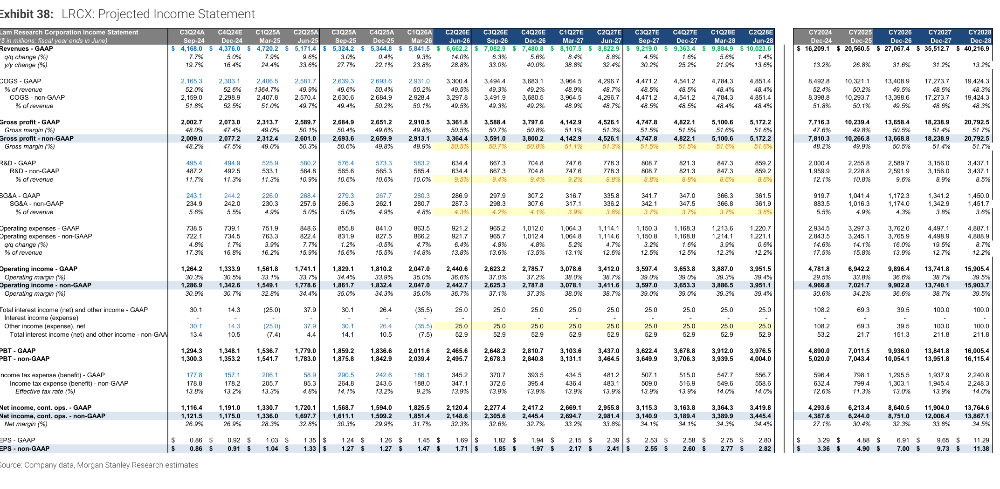

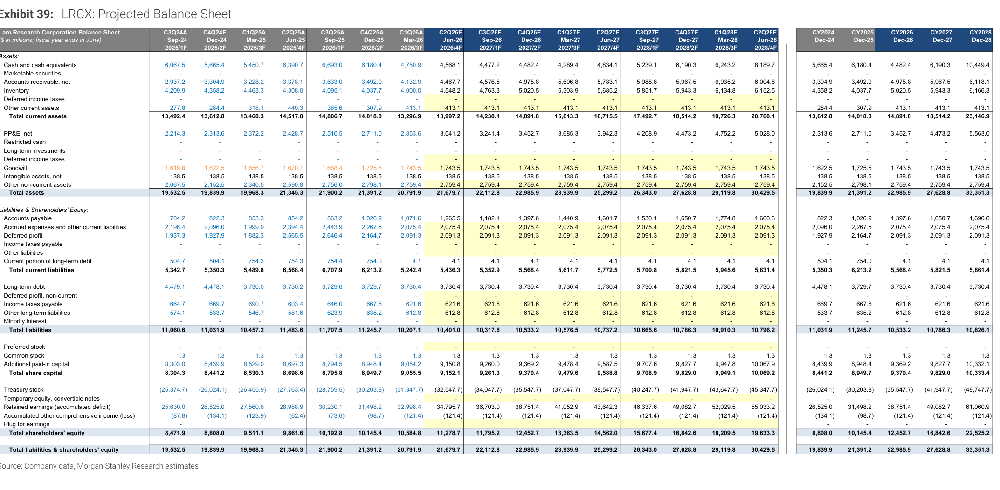

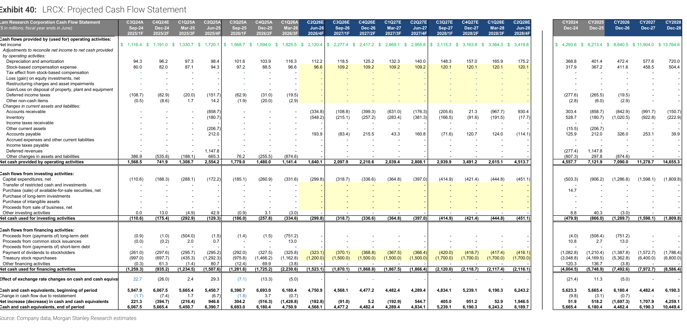

### LAM Research 關鍵指標

| 指標 | 2025A | 2026e | 2027e | 2028e |
|---|---|---|---|---|
| GAAP Revenue (\$mn) | 20,561 | 27,067 | 35,513 | 40,217 |
| YoY | +27% | **+32%** | **+31%** | +13% |
| Gross Margin（GAAP） | 49.8% | 50.5% | 51.4% | 51.7% |
| Non-GAAP EPS (\$) | — | 5.72 | 9.71（MS 估） | — |

### AMAT 關鍵指標

| 指標 | 2025A | 2026e | 2027e | 2028e |
|---|---|---|---|---|
| GAAP Revenue (\$mn) | 28,368 | 33,483 | 43,373 | 48,812 |
| YoY | — | +18% | +30% | +12% |
| Non-GAAP EPS (\$) | 9.42 | 12.31 | 17.02 | 19.71（MS 估） |
| PT 基礎 | — | — | 28x 2027e | \$502 |

---

## 跨 Exhibit 彙整表

### 彙整 1｜NAND WFE 受益拆解：LAM vs AMAT（來源：Exhibit 7、36、37）

| 指標 | LAM | AMAT |
|---|---|---|
| NAND WFE Mix（2026e） | 20% | 7% |
| NAND WFE 2026e→2027e 增量（\$mn） | +8,176 | 同 |
| NAND Revenue 2025→2027 變化（估） | \$1,716mn → \$3,200mn+（+86%） | \$2,744mn → \$3,200mn（+17%） |
| 2027 估值溢價 | 34x | 28x（-20%） |

> **彙整洞察**：MS 將 LAM/AMAT 估值溢價從 10% 擴展至 20% 的計算依據是 NAND mix 差異；但 LAM 的 NAND 受益高度依賴 Samsung/Kioxia 是否如期啟動 greenfield。若 greenfield 延後 1 年，LAM 的 2027 超額收益將壓縮，20% 溢價難以維持。

---

## 相關個股清單

| 類別 | 公司 | Ticker | 評等 | 備註 |
|---|---|---|---|---|
| Top Pick | MKS Instruments | MKSI.O | OW（Top Pick） | NAND 波段最大受益，升 Top Pick |
| 升級 | Lam Research | LRCX.O | OW（升） | PT \$331，34x 2027 EPS；NAND +20% premium vs AMAT |
| 降級 | Applied Materials | AMAT.O | EW（降） | PT \$502，28x 2027 EPS；2027 NAND mix 只有 7% |
| 維持 | KLA Corporation | KLAC.O | OW | Intel process control 最大受益；Intel revenue 可達 6.4x |
| 受益（非覆蓋） | ASML | ASML.AS | — | EUV 供給是 DRAM/Logic 上限瓶頸 |
| 受益（非覆蓋） | Tokyo Electron | TEL | — | 前段封裝受益 |
