# Citi｜鴻勁首評：AI 晶片測試設備龍頭的進化

**券商**：Citi Research  
**分析師**：Jack Chen、Michael Hung、Laura (Chia Yi) Chen、Nicholas Lai  
**日期**：2026-05-28  
**主題**：Initiate at Buy: Handling the Evolution in AI Chip Testing  
**評級**：Buy（首評）｜TP NT\$7,100（現價 NT\$5,905，+20.2%）  
<button type="button" onclick="fetch('https://ti-lei.github.io/foreign-reports/static/downloads/產業/20260528_Citi_7769-HonPrecision-Initiation.md').then(r=>r.text()).then(t=>{let a=document.createElement('a');a.href='data:text/plain;charset=utf-8,'+encodeURIComponent(t);a.download='20260528_Citi_7769-HonPrecision-Initiation.md';a.click()})">⬇ 下載 MD</button>

---

## Citi 完整投資邏輯鏈

| 論點層次 | Figure | 內容 |
|---|---|---|
| 市場地位確認 | Fig 5 | FT handler 全球市占 70%+，SLT 60-70%；AI/HPC 營收占比 78%（1Q26），600+ 專利形成技術壁壘 |
| 結構性需求加速 | Fig 30 | 每世代 AI GPU 的 FT 測試時間大幅延長：Hopper(1x)→Blackwell(~1.9x)→Rubin(~3.1x)→Rubin Ultra(~3.8x) |
| 供給端強制性擴張 | Fig 26 | TSMC 先進封裝產能 2024-27E CAGR 約 90%，帶動 OSAT handler 設備強制換新 |
| 熱控技術窗口期 | Fig 34 | ATC 功率密度從 30 到 210 W/cm²（Rubin 需求），技術門檻阻擋新進者複製 |
| 消耗品高毛利護城河 | Fig 8 | Cold plates 占收入比持續提升，2028E 達 NT\$40bn；消耗品性質提供週期性高毛利現金流 |
| 財務飛輪啟動 | Fig 45 | 2025-28E 毛利率 56.5%→61.1%，EPS CAGR ~77%；Citi 2028E 毛利率高於共識 4.8ppt |
| 估值仍偏低 | Fig 51 | Hon 2027E EPS 成長 80%，P/E 僅 36x，低於 Chang Chun（67x）和 Chroma（42x） |
| **結論** | 封面 | **首評 Buy，TP NT\$7,100（36x 2026/27E 均值 EPS NT\$214）；供需嚴重失衡，提價週期啟動** |

> **報告最大邏輯缺口**：Citi 對 CPO 貢獻的量化仍不足；若 Insertion 4 量產時程延後 1-2 年，2027E 以後的增量假設需要大幅修正。

---

## 報告核心觀點

| 主題 | Citi 觀點 | 市場共識 | 是否 Contra-Consensus |
|---|---|---|---|
| 2027E EPS | NT\$215.98 | NT\$204.70 | 是（+6%） |
| 2028E 營業利益率 | 56.5% | 51.7% | 是（+4.8ppt，最大分歧點） |
| FT 測試時間 | 每世代翻 1.5-2x，至 Rubin Ultra 達 3.8x 基準 | 市場多聚焦 volume，low awareness on time multiplier | 是 |
| Cold plates 角色 | 高毛利消耗品，結構性提升毛利率 | 視為配件，不含入主要估值驅動 | 是 |
| CPO 機會 | Insertion 4 已在量產；可帶來 20%+ ASP 溢價 | 多數視 CPO 為 2028+ 的長期故事 | 是 |

**偏好排序**：ATC handler system > Cold plates > Engineering handler/SLT  
**個股偏好**：鴻勁（7769）為 AI 後段測試的純粹受益股，無競爭對手同時擁有 FT handler + ATC + Cold plate + SLT 的完整生態系

---

## Figure 1｜Hon 營收（NT\$m）與年增率

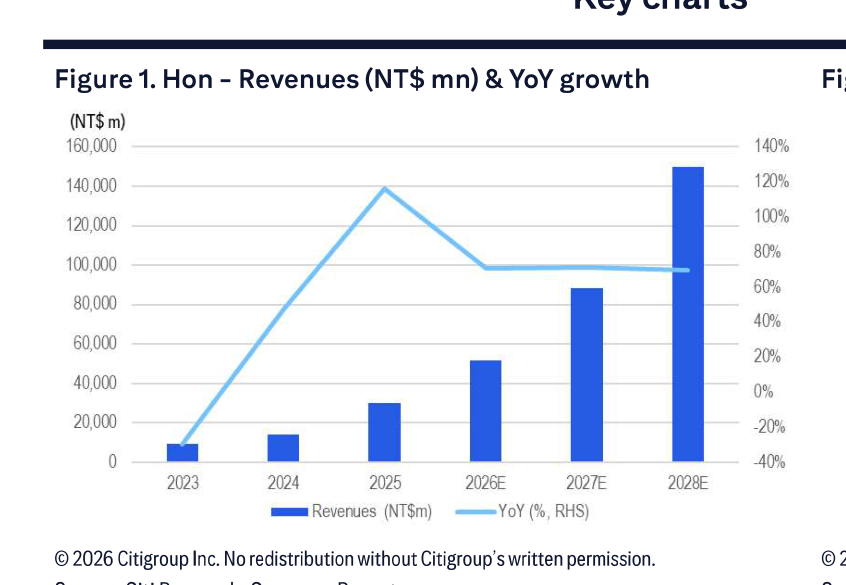

### 解讀摘要
營收從 2024 年的 NT\$13bn 飛躍至 2028E 的 NT\$149bn，4 年 CAGR 約 83%。2025 年增速達 ~120% YoY，是 AI GPU 滲透進入 ATC handler 的關鍵過渡年。2026E 起增速趨緩至 75-80%，但 Citi 認為這是高基期下的自然減速，而非需求趨勢改變——因 TSMC N2/A16 先進製程擴產計畫在 CY26-28 間導入 420k wpm 增量，FT 後段測試設備需求長期可見性已高。

### 表格（視覺估算，交叉驗證通過）

| 年度 | 營收（NT\$m） | YoY（%） |
|---|---|---|
| 2023 | 9,000 | — |
| 2024 | 13,000 | 44% |
| 2025 | 29,000 | 120% |
| 2026E | 51,000 | 75% |
| 2027E | 88,000 | 73% |
| 2028E | 149,000 | 69% |

> **洞察一**：2026E 以後增速仍維持 70%+，意味著 Hon 的市場機會不是一次性的 AI bubble 受惠，而是在 TSMC 先進製程複利擴張的長期結構下持續放大。若 TSMC N2/A16 擴產 420k wpm 的時程如期，此增速預期的合理性高。

---

## Figure 2｜Hon GM 與 OPM 趨勢

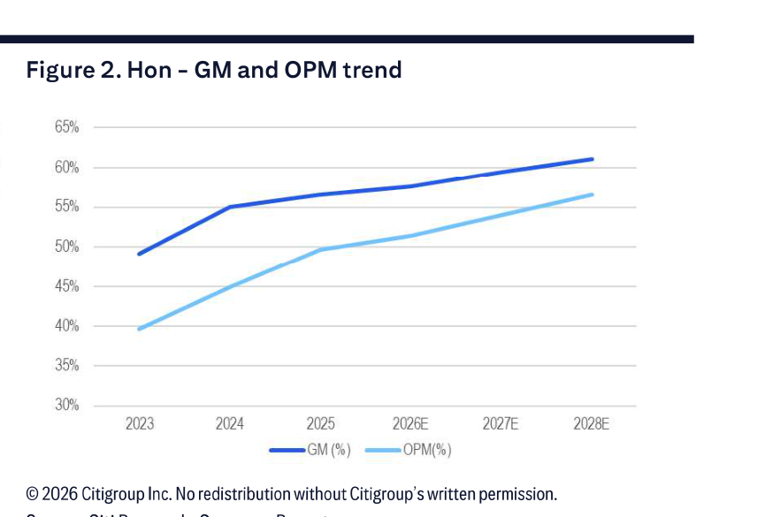

### 解讀摘要
毛利率從 2023 年 49% 持續攀升至 2028E 的 61%，驅動因素是 Citi 歸納的三個結構性機制：①客戶 mix 向 AI/HPC 高 ASP 機型轉移；②spec migration（每代測試規格大幅升級）帶動 ASP 上升而 COGS 增幅有限；③cold plates 消耗品週期性替換形成高毛利循環收入。OPM 從 39% 升至 57%，slot ratio（毛利率與 OPM 間的差距）維持約 4-5ppt，顯示費用控制穩定。

### 表格（視覺估算）

| 年度 | GM（%） | OPM（%） |
|---|---|---|
| 2023 | 49 | 39 |
| 2024 | 55 | 45 |
| 2025 | 56.5 | 49 |
| 2026E | 57.5 | 51 |
| 2027E | 59 | 54 |
| 2028E | 61 | 57 |

> **洞察一**：OPM 從 39% 升至 57%，絕對改善幅度達 18ppt。在固定費用結構不變的前提下，這完全是毛利率擴張的結果，說明 Hon 並非靠壓縮費用衝 EPS，而是產品組合改善帶動的真實獲利能力提升。
> **值得驗證**：Citi 假設冷板消耗品每 1-2 年替換一輪。若替換週期因客戶壓低成本而延長至 3 年，2028E 毛利率可能低估 2-3ppt。

---

## Figure 3｜Hon 設備容量擴張預測

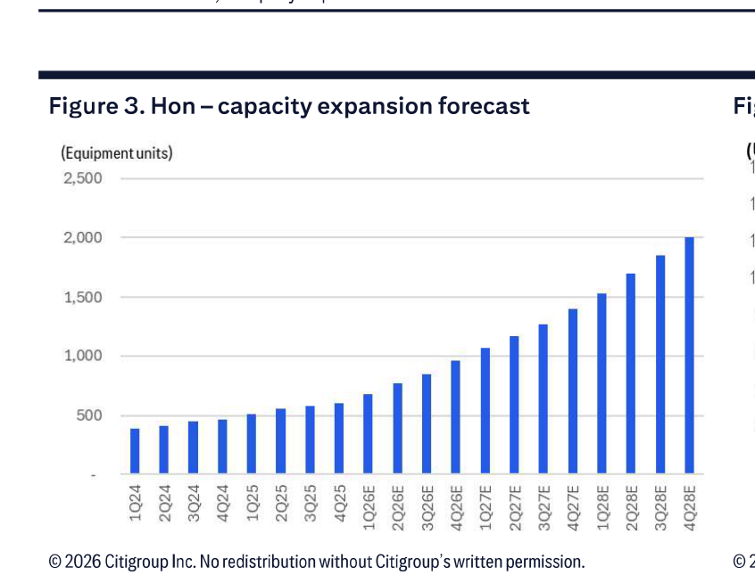

### 解讀摘要
設備台數從 1Q24 的 ~400 台季度性穩步爬升至 4Q28E 的 ~2,000 台，約 4 年 5 倍。Citi 指出 Hon 的內部目標為長期產能 CAGR ~50%；已取得台中大里新廠（NT\$790mn，9.7k sqm），Daya 廠亦可擴容 20-30%。但當前擴產計畫仍無法滿足客戶訂單需求，Citi 預期若有新廠地或設施收購公告，將帶來額外估值驚喜。

### 表格（視覺估算）

| 季度 | 設備台數（累積，視覺估算） |
|---|---|
| 1Q24 | 400 |
| 4Q24 | 480 |
| 4Q25 | 570 |
| 4Q26E | 960 |
| 4Q27E | 1,430 |
| 4Q28E | 2,000 |

> **洞察一**：2026E 起的產能斜率明顯加速，且這是在訂單仍溢出的情況下發生的。產能是約束而非意願，每一座新廠/新合約都能被市場直接視為業績提升的可量化催化劑。

---

## Figure 4｜全球主要 OSAT Capex 趨勢（2018–2027）

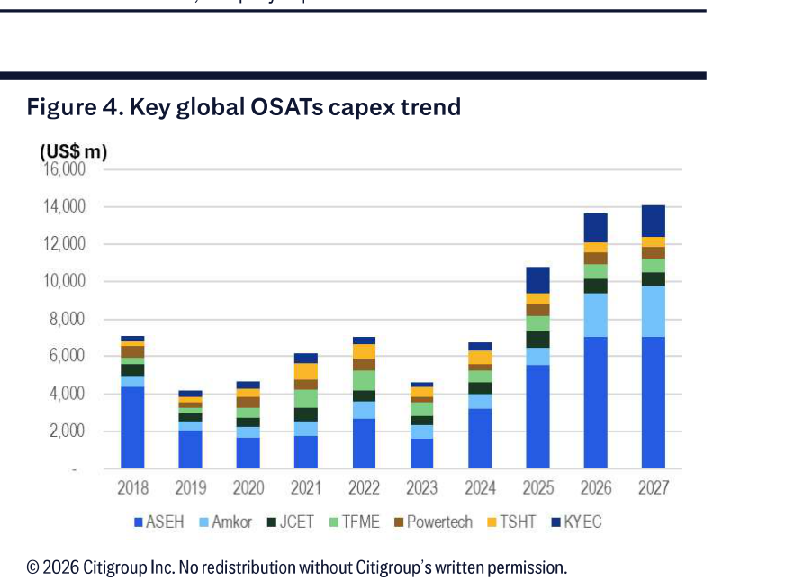

### 解讀摘要
全球主要 OSAT（ASE、Amkor、JCET、TFME、Powertech、TSHT、KYEC）的年度 capex 合計從 2024 年的 ~US\$6.5bn 跳升至 2025 年的 ~US\$11bn、2026E 的 ~US\$14bn。這是 AI 晶片測試設備最直接的需求代理指標：OSAT capex 代表測試機台（ATE）和 handler 的採購預算，而 Hon 是全球 FT handler 的主要供應商。2025-2027E 的 capex 加速代表 handler 訂單的多年能見度。

### 表格（視覺估算）

| 年度 | 全球 OSAT Capex（US\$m） |
|---|---|
| 2018 | 7,000 |
| 2019 | 4,000 |
| 2020 | 5,000 |
| 2021 | 6,500 |
| 2022 | 6,500 |
| 2023 | 4,500 |
| 2024 | 6,500 |
| 2025E | 11,000 |
| 2026E | 14,000 |
| 2027E | 14,000 |

> **洞察一**：2025-27E 三年 OSAT capex 合計約 US\$39bn，幾乎等於前七年（2018-2024）總和。這不是週期性反彈，而是 AI 晶片帶動的結構性資本深化。Advantest 已上修 FY26 業績指引 +25.8% YoY 印證此趨勢。
> **洞察二（配合 Fig 26）**：TSMC 先進封裝產能同期從 300k 擴至 2,050k wafers（+580%），驗證 OSAT 必須大幅增購設備的合理性。

---

## Figure 5｜AI GPU/ASIC/CPU 主要測試設備供應商矩陣

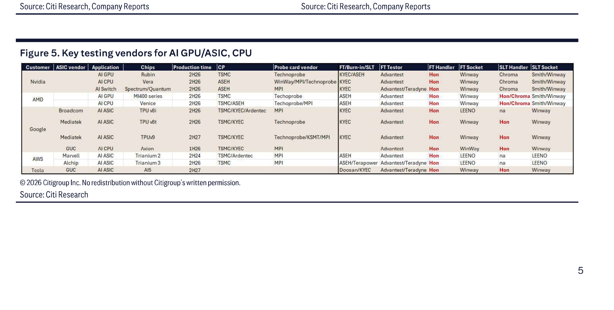

### 解讀摘要
這張矩陣表揭示了 Hon 在 AI/HPC 後段測試生態中的獨特定位：**幾乎所有 AI GPU/ASIC 平台的 FT handler 欄位都標記為 Hon（以紅色醒目顯示）**，而競爭對手（Winway、Smith-Weiner、LEENO）僅出現在 SLT Socket 或少數 FT Socket。這代表 Hon 的競爭優勢不是在個別客戶勝出，而是在整個 AI 晶片生態中形成壟斷性存在。ICP（探針卡）和 FT Tester 由 Advantest 主導，但 handler 作為「夾持精密度」和「熱控能力」的關鍵介面，目前只有 Hon 具備全平台覆蓋能力。

### 表格（精選關鍵行）

| 客戶 | 應用 | 晶片 | FT Handler |
|---|---|---|---|
| Nvidia | AI GPU | B300 | **Hon** |
| Nvidia | AI GPU | Rubin | **Hon** |
| Nvidia | Switch IC | Spectrum/Quantum | **Hon** |
| Nvidia | AI CPU | MJ3SOX | **Hon** |
| AMD | AI GPU | MI4000 series | **Hon** |
| Google | AI ASIC | TPUv9b | **Hon** |
| AWS | AI ASIC | Tranium 3/4 | **Hon** |
| Tesla | AI ASIC | A15 | **Hon** |

> **洞察一**：Citi 明確指出 Hon 是 >5kW 電子和冷板測試方案的唯一供應商（競爭對手尚無法複製整合 ATC 的 handler 生態）。這種客戶生態系鎖定的護城河——加上分析師在工廠嵌入式駐點服務模式——使競爭對手要進入需要 3 年以上的重複 OSAT 認證週期。

---

## Figure 8｜Hon 各產品線營收拆解（NT\$m）

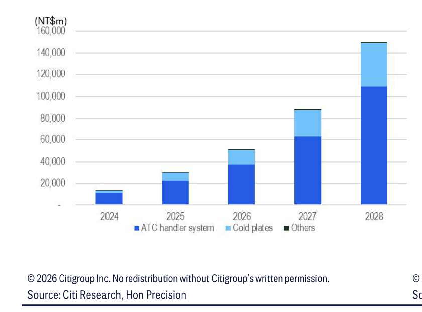

### 解讀摘要
Hon 的業務組成正在從單純 handler 製造商轉型為「ATC + Cold plate 捆綁解決方案提供商」。Cold plates 的占比從 2024 年的 ~15% 升至 2028E 的 ~27%，而 cold plates 的毛利率顯著高於 handler——因為它是消耗品（每 1-2 年更換），且技術規格高度客製化。此結構轉變是 Citi 對整體毛利率持續上行最重要的非共識假設之一。

### 表格（視覺估算）

| 年度 | ATC Handler（NT\$m） | Cold Plates（NT\$m） | 合計（NT\$m） | Cold Plates 占比 |
|---|---|---|---|---|
| 2024 | 11,000 | 2,000 | 13,000 | 15% |
| 2025 | 22,000 | 7,000 | 29,000 | 24% |
| 2026E | 37,000 | 13,000 | 50,000 | 26% |
| 2027E | 63,000 | 24,500 | 87,500 | 28% |
| 2028E | 109,000 | 40,000 | 149,000 | 27% |

> **洞察一**：Cold plates 從 NT\$2bn 跳升至 NT\$40bn，4 年成長 20 倍，高於整體業務成長速度（約 11 倍）。這代表 cold plates 正在成為一個獨立的高毛利事業部，而不只是 handler 的配件。
> **洞察二**：若冷板消耗品替換週期為每 18 個月，則到 2027E 存量 handler 對應的每年冷板更換需求預估可達 NT\$8-10bn，約等於 2025 年全年冷板業務規模。這一存量效應尚未在市場估值中充分反映。

---

## Figure 9｜Hon 各應用別營收拆解（2025）

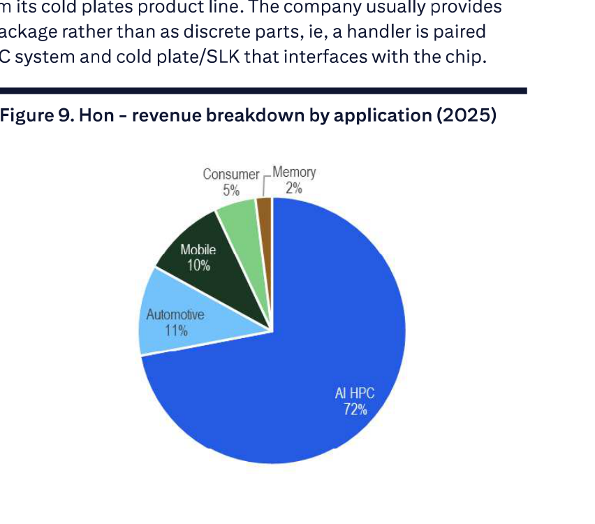

### 解讀摘要
AI HPC 占比在 2025 年達到 72%，較 2023 年的 low-20% 大幅躍升。這個轉變說明 Hon 並非傳統的「多元化測試設備商」，而是一家專注 AI/HPC 晶片後段測試的高度聚焦公司。Automotive（11%）和 Mobile（10%）的剩餘部分為低成長基底業務，主要維持既有客戶關係。Citi 預期 AI HPC 占比到 2028 年可能進一步升至 85%+。

### 表格

| 應用別 | 占比（2025） |
|---|---|
| AI HPC | 72% |
| Automotive | 11% |
| Mobile | 10% |
| Consumer | 5% |
| Memory | 2% |

---

## Figure 20｜主要 AI 客戶晶片出貨時程表

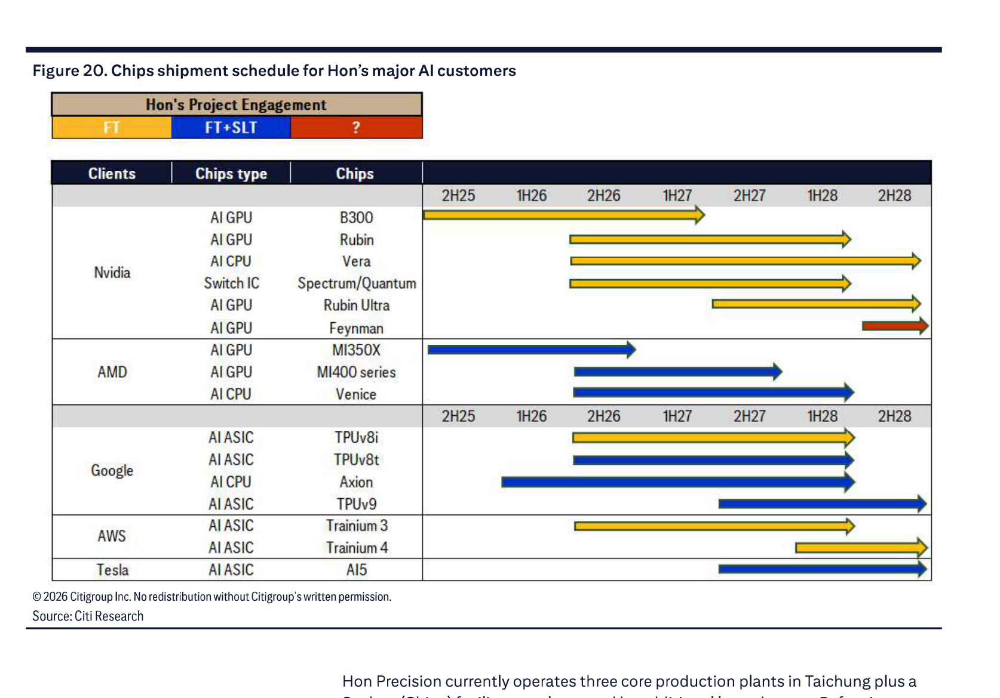

### 解讀摘要
這張甘特圖是整份報告中最具「訂單能見度」意義的圖表。Hon 的 FT+SLT 介入標記橫跨幾乎所有主要 AI 客戶的關鍵平台，且時間跨度延伸至 2H28，代表至少 2 年的交付確認訂單（而非意向）。特別值得注意的是 Nvidia 的 Rubin（2H26-1H27）和 AMD 的 MI4000（2H26），這兩個平台將是驅動 2026E 業績超預期的關鍵催化劑。Google TPUv9 的時程延伸至 2H28 也代表超長週期的 ASIC 合約。

> **原文補充**：Citi 將此圖標記為「Hon's Project Engagement」——意即這些時程代表 Hon 已被正式選定為供應商（而非仍在競標），進一步強化訂單能見度解讀。

### 表格

| 客戶 | 應用 | 晶片平台 | 大致時程 |
|---|---|---|---|
| Nvidia | AI GPU | B300 | 2H25–2H26 |
| Nvidia | AI GPU | Rubin | 2H26–1H27 |
| Nvidia | Switch IC | Spectrum/Quantum/Rubin Ultra | 2H26–2H28 |
| Nvidia | AI CPU | MJ3SOX、Feynman | 1H26–2H28 |
| AMD | AI GPU | MI4000 series | 2H26–2H28 |
| AMD | AI CPU | — | 2H26–2H28 |
| Google | AI ASIC | TPUv9b | 2H25–2H26 |
| Google | AI CPU | Axion | 2H26–2H27 |
| Google | AI ASIC | TPUv9 | 2H27–2H28 |
| AWS | AI ASIC | Tranium 3、Tranium 4 | 2H26–2H28 |
| Tesla | AI ASIC | A15 | 2H26–2H28 |

> **洞察一**：2H26 是訂單密度最高的時間點（Nvidia Rubin + AMD MI4000 + Google TPUv9b 同時進入量產）。若 TSMC 先進製程擴產進度稍有超前，2026H2 業績有機會顯著超出 Citi 估算的 NT\$51bn 全年目標。

---

## Figure 25｜2030 半導體市場機會地圖

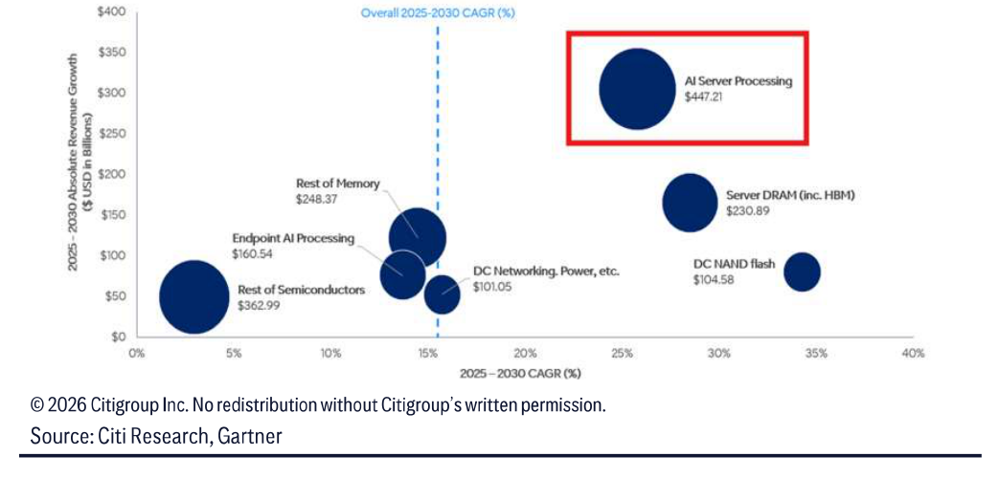

### 解讀摘要
Citi 使用第三方 CPU TAM 報告（引用但未具名）預估 CPU 市場到 2030 年的 CAGR 達 ~185%，且 AI 路徑圖清晰且視野延伸至 2028。對 Hon 的意義在於：每個 AI 晶片設計世代（包括 CPU chiplets 向 AI 特化）都需要重新認證 handler 設備，形成強制性更換需求而非可選性需求。Citi 認為此路徑圖「well-defined and well-anchored through 2028」。

---

## Figure 26｜TSMC 先進封裝產能預測（2024–2027E）

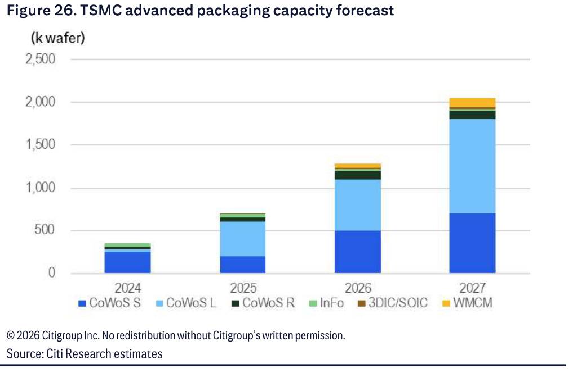

### 解讀摘要
CoWoS 總產能從 2024 年的 ~300k wafers 飆升至 2027E 的 ~2,050k wafers，3 年成長 ~6.8 倍。驅動因素是 CoWoS-L 的急速放量（Nvidia GPU 用的 large-die 版本），從 2024 年的 60k 跳至 2027E 的 1,130k。每片 CoWoS wafer 對應的後段測試工時比傳統晶片高出 3-4x（因多晶粒異質整合，每個 sub-die 需單獨測試），直接帶動 handler 需求的非線性成長。

### 表格（視覺估算）

| 年度 | CoWoS-S | CoWoS-L | CoWoS-R | InFo | 3DIC/SOIC | WMCM | 合計（k wafers） |
|---|---|---|---|---|---|---|---|
| 2024 | 230 | 60 | — | 10 | — | — | 300 |
| 2025 | 180 | 500 | 10 | — | — | — | 700 |
| 2026 | 480 | 790 | 20 | — | 10 | 30 | 1,300 |
| 2027E | 680 | 1,130 | 120 | — | 40 | 80 | 2,050 |

*以上為視覺估算

> **洞察一**：CoWoS-L 在 2024-27 間成長約 19 倍（60k→1,130k），而 Hon 的 FT handler 正是以 CoWoS-L 封裝的 AI GPU 為主要測試對象。這是 handler 需求非線性加速的直接對應數據。

---

## Figure 27｜單一晶片良率下降對整體良率的乘數效應

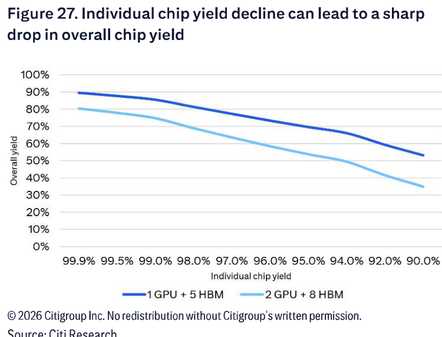

### 解讀摘要
異質整合封裝（如 Blackwell 的 2-die CoWoS）的整體良率等於各個 sub-die 良率的乘積。若每個 die 的良率為 99%，兩個 die 的整體良率為 98%；若降至 98.5%，整體良率降至 97%。對 FT 測試的意義是：整體良率下降代表每片晶圓需要更多時間進行篩選測試（不良品率上升 → 測試序列更長），進一步乘數放大 handler 需求。Citi 以此論點支持「FT 時間增加不只是規格造成，也有良率因素加持」。

---

## Figure 28｜先進封裝各段報廢成本急增

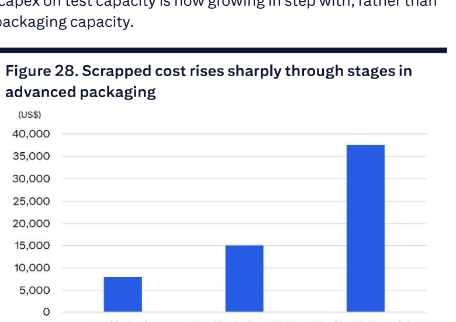

### 解讀摘要
每個 AI 晶片在各封裝階段的報廢成本：Wafer 階段 ~US\$8,000，中段（CoWoS 後）~US\$15,000，Final Package 階段 ~US\$37,000+。這說明為何 OSAT 願意為更高精度的 FT handler 支付溢價——每次測試失誤或漏測的代價已高達數萬美元，而 Hon 的高精度熱控 handler 能最大化測試良率，直接降低報廢損失。

### 表格（視覺估算）

| 測試階段 | 報廢成本（US\$） |
|---|---|
| Wafer（前段） | 8,000 |
| 中段封裝後 | 15,000 |
| Final Package | 37,000 |

> **洞察一**：Final Package 的報廢成本是 Wafer 的 4.6x。隨著每代 AI 晶片的封裝成本持續上升（Rubin 的 6-die CoWoS 成本估計更高），OSAT 對高品質測試設備的支付意願也同步上升，進一步支撐 Hon 的 ASP 提升能力。

---

## Figure 30｜各代 Nvidia AI GPU 的 FT 測試時間倍數

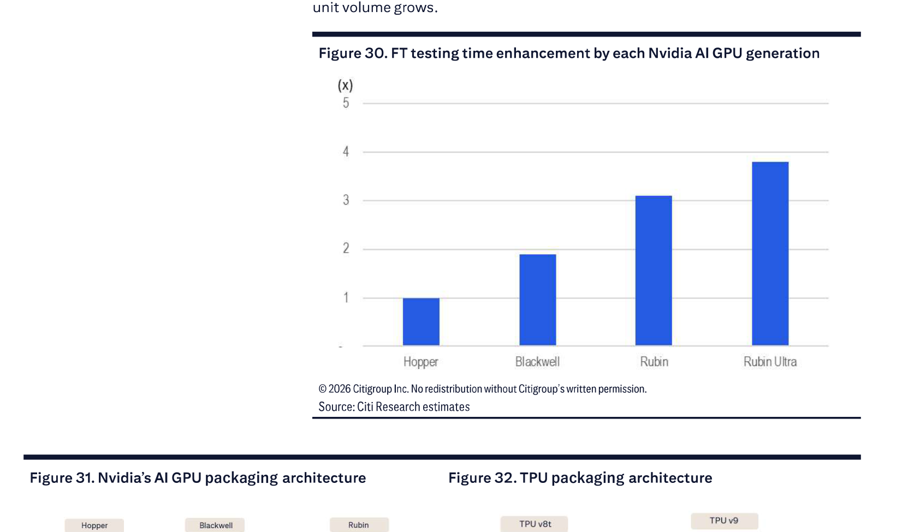

### 解讀摘要
這是整份報告中對 Hon 業績模型最關鍵的一張圖。FT 測試時間從 Hopper 的基準 1x 增至 Rubin Ultra 的 3.8x，代表在相同設備台數下，測試容量（晶片數/天）縮減至原來的 26%（1/3.8）。換句話說，為了維持相同的晶片出貨速度，OSAT 需要增購 3.8 倍的 FT handler 設備。這不是市場份額的競爭，而是一個強制性的設備容量補缺。

> **原文補充**：Citi 進一步說明，測試時間延長的原因是多層次的：①HBM die count 增加（多 die 逐一測試）；②更高的 logic transistor density；③更多 test insertion；④parallel test efficiency 受限（Blackwell 僅 2 die per standard tray，Rubin 僅 1-2 units per tray）。

### 表格

| GPU 世代 | FT 測試時間（x，Hopper = 1） |
|---|---|
| Hopper | 1 |
| Blackwell | 1.9 |
| Rubin | 3.1 |
| Rubin Ultra | 3.8 |

> **洞察一**：從 Blackwell 到 Rubin Ultra，FT 時間增加 2x（1.9→3.8）。若 Rubin 系列在 2026-27 的出貨量達到 Blackwell 同期水準，僅此一代升級就需要 OSAT 追加 ~100% 的 handler 設備。Citi 的 2028E 業績假設有相當大的安全邊際。

---

## Figure 33｜各代 Nvidia AI GPU 的 TDP 提升趨勢

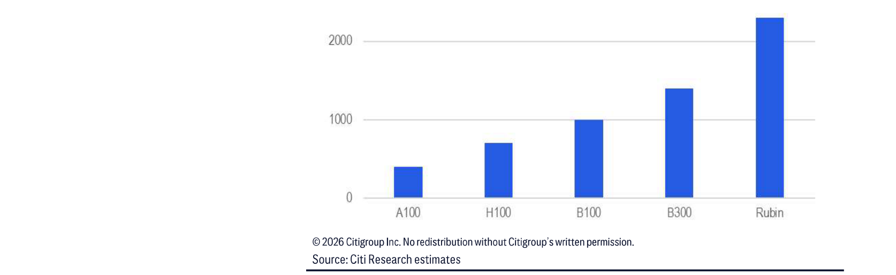

### 解讀摘要
晶片功耗（TDP）從 A100 的 ~400W 飛躍至 H100 的 ~700W、B100/B300 的 1,500-2,500W，Rubin 更超過 3,000W（圖表頂部已超出 3,000W 刻度）。這一趨勢直接推動 ATC（Active Thermal Control）handler 的技術要求：傳統的空冷 handler 無法維持測試穩定性，必須升級為配備冷板的 ATC 系統。Citi 強調這不是功能升級而是強制性替換，因為標準 handler 無法再通過 DUT 認證。

### 表格（視覺估算）

| GPU 世代 | TDP（W） |
|---|---|
| A100 | 400 |
| H100 | 700 |
| B100 | 1,500 |
| B300 | 2,500 |
| Rubin | >3,000（超出圖表上限） |

> **洞察一**：B300 的 2,500W 相當於 H100 的 3.6x，而 B300 於 2025 年開始量產，代表目前大部分在用的 H100 handler 設備已無法沿用到 B300 測試——這是 handler 設備存量的強制替換週期，而非新需求的邊際增量。

---

## Figure 34｜Hon ATC 技術路線圖（2020–2028E）

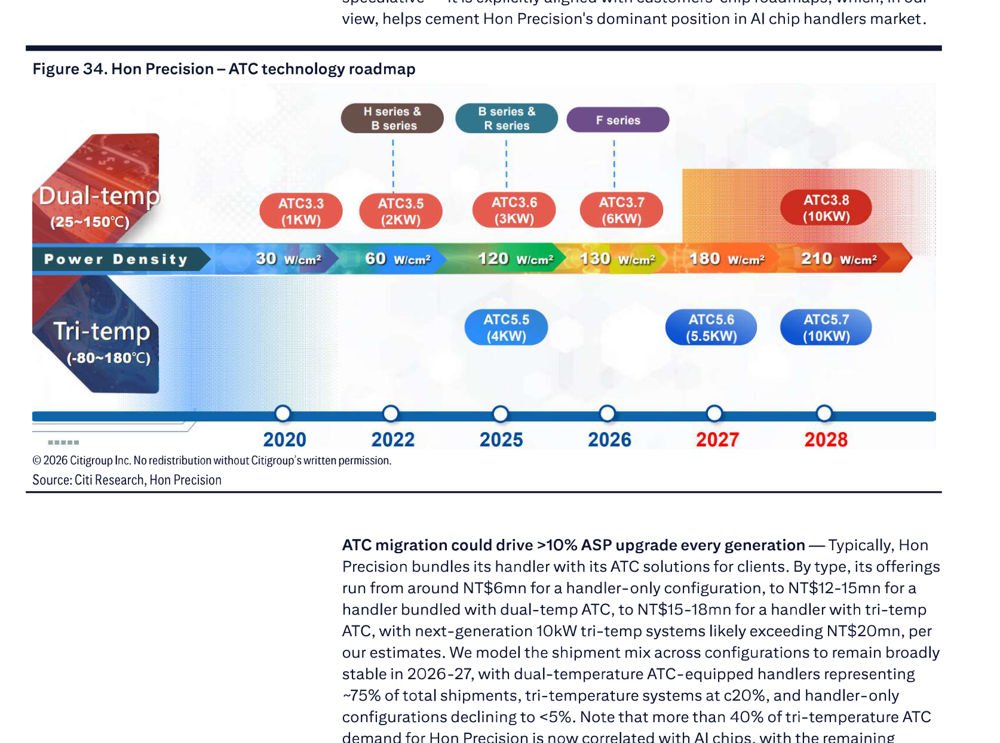

### 解讀摘要
Hon 的 ATC 路線圖顯示功率密度從 2020 年的 30 W/cm² 持續提升至 2028E 的 210 W/cm²，7 年提升 7 倍。溫度控制範圍也從 Dual-temp（25-150°C）擴展至 Tri-temp（-80~180°C），覆蓋從消費型到宇航級晶片的完整測試需求。Citi 特別指出：Hon 的 ATC 路線圖「explicitly synchronized with customers' chip roadmaps」（公司管理層明確披露），代表這是多年客戶合約綁定的產品共同開發，而非 Hon 單方面的預測。

> **原文補充**：按 Citi 估計，Dual-temp ATC（ATC3.X）handler 定價約 NT\$6-12mn；Tri-temp ATC（ATC5.X）定價約 NT\$15-18mn。客戶 mix 從 Dual-temp 向 Tri-temp 的轉移每台 ASP 可提升 25-50%，是 2027-28 毛利率繼續上行的主要動力。

### 表格

| 年份 | 產品 | 功率密度（W/cm²） | 溫度範圍 |
|---|---|---|---|
| 2020 | ATC3.3（3kW） | 30 | Dual-temp 25-150°C |
| 2022 | ATC3.5（6kW） | 60 | Dual-temp 25-150°C |
| 2025 | ATC4.0（8kW） | 120 | Dual-temp 25-150°C |
| 2026 | ATC4.5（10kW） | 130 | Dual-temp 25-150°C |
| 2027 | ATC5.0（10kW） | 150 | Dual-temp + Tri-temp -80~180°C |
| 2028 | ATC5.5（10kW） | 180 | Tri-temp |
| 2028+ | ATC5.7（10kW） | 210 | Tri-temp |

> **洞察一**：210 W/cm² 是目前汽車級晶片測試的最高需求標準，Hon 已將其納入量產路線圖。競爭對手若要追趕，需同時突破功率密度、精密機械（冷板製造）和熱控軟體三個維度，複製時間估計超過 3 年。

---

## Figure 40｜Handler Tray 規格比較

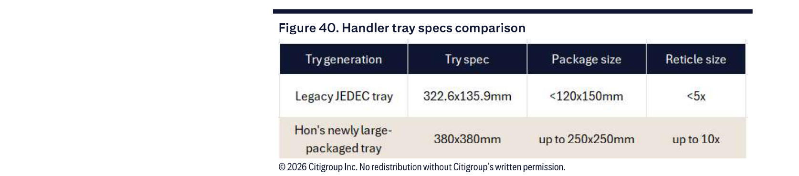

### 解讀摘要
新一代 AI 晶片的封裝尺寸（如 Blackwell/Rubin 的 CoWoS-L）已超出傳統 JEDEC tray（322.6×135.9mm）的容納上限（最大封裝 <120×150mm）。Hon 已開發出 380×380mm 的大型 tray，可容納最大 250×250mm 封裝，並承受 2,000kg 以上的接觸力（需要更精密的壓力均勻分布）。這個 tray 升級代表一個全新平台週期——OSAT 必須同時更換 handler 主體 + tray，且新 tray 需重新認證，進一步鎖定 Hon 的替換週期護城河。

### 表格

| 類型 | Tray 規格 | 最大封裝尺寸 | Reticle size 倍數 |
|---|---|---|---|
| Legacy JEDEC tray | 322.6×135.9mm | <120×150mm | <5x |
| Hon 新大型 tray | 380×380mm | up to 250×250mm | up to 10x |

> **洞察一**：從 JEDEC 到 Hon 新 tray 的面積擴增：322.6×135.9 ≈ 43,840 mm² → 380×380 = 144,400 mm²，面積約擴大 3.3 倍。Citi 估計新 tray handler 的 ASP 可比現有 Dual-temp ATC handler 高出 20-30%，是 2026-27 ASP 上行的新動力。

---

## Figure 43｜ATC Handler 系統營收（NT\$m）

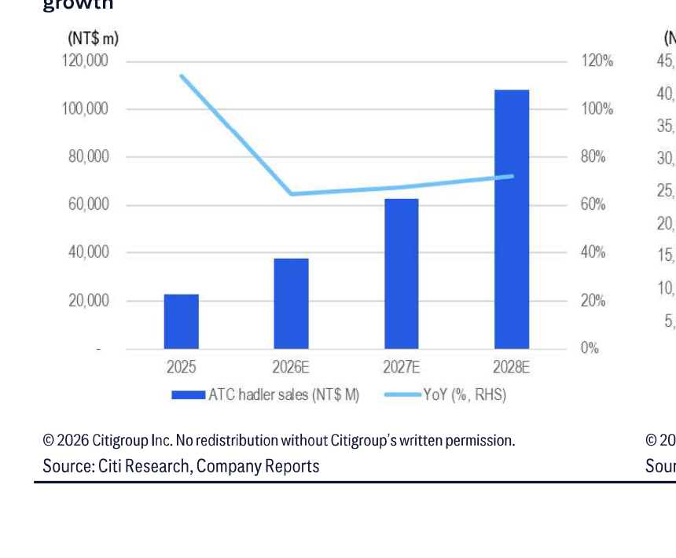

### 解讀摘要
ATC handler 系統（不含 cold plates）的年增率在 2025 年高達 ~115% YoY，隨後在 2026-28E 趨緩至 65-70%。這個减速不代表需求放緩，而是因為 cold plates 的成長速度更快（消耗品效應），使 ATC handler 的占比相對下降。絕對金額從 2025 年的 NT\$22bn 成長至 2028E 的 NT\$109bn，5 倍。

### 表格（視覺估算）

| 年度 | ATC Handler 系統（NT\$m） | YoY（%） |
|---|---|---|
| 2025 | 22,000 | 115% |
| 2026E | 37,000 | 68% |
| 2027E | 62,000 | 68% |
| 2028E | 109,000 | 76% |

---

## Figure 44｜Cold Plates 營收（NT\$m）

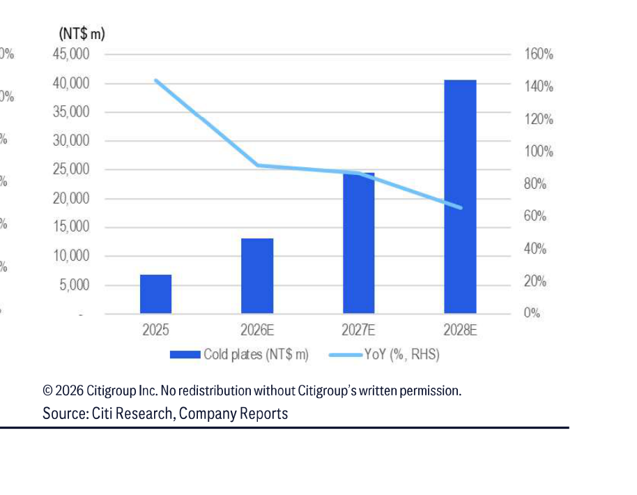

### 解讀摘要
Cold plates 在 2025 年的增速高達 ~143% YoY，雖然 2026-27E 增速降至 ~90%，但在 2028E 仍維持 ~65% 的高增速。關鍵驅動因素是雙重性：一方面是新 handler 出貨帶動的首次冷板配套需求（flow-through demand）；另一方面是存量 handler 的冷板消耗品週期性替換（recurring demand）。Citi 預估到 2028E，存量 handler 對應的週期性替換需求佔 cold plates 總收入的比例可能超過 40%。

### 表格（視覺估算）

| 年度 | Cold Plates（NT\$m） | YoY（%） |
|---|---|---|
| 2025 | 6,500 | 143% |
| 2026E | 12,500 | 92% |
| 2027E | 24,500 | 96% |
| 2028E | 40,000 | 63% |

> **洞察一**：Cold plates 2025-28E 的 CAGR 達 ~84%，高於 ATC handler 系統的 ~71%。這意味著隨著時間推移，cold plates 的邊際 margin 貢獻將比 handler 更高——因為消耗品的 COGS 結構（材料 + 精密製造）通常比整機設備的 COGS（機械 + 電子 + 軟體）更穩定可控。

---

## Figure 51｜Hon vs. Peers：EPS 成長 vs. P/E

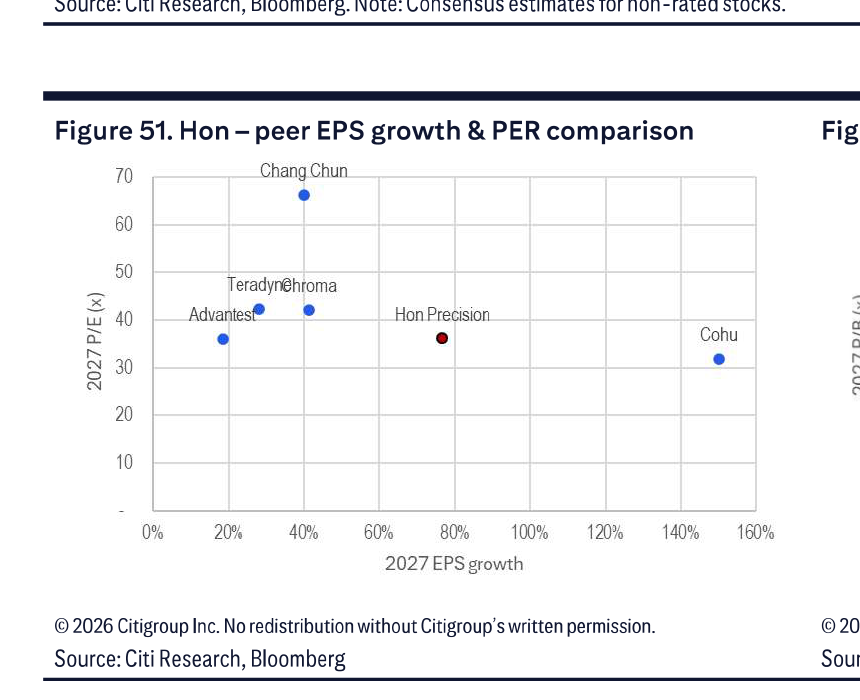

### 解讀摘要
Hon 以 80% 的 2027E EPS 成長率搭配僅 36x 的 P/E，位於所有可比同業中「最佳成長-估值比」的位置。相比之下，Chang Chun（67x P/E、40% 成長）和 Chroma（42x P/E、40% 成長）的成長率不及 Hon 一半，卻享有更高的估值倍數。Cohu（155% 成長、32x P/E）雖然成長率高，但Citi 認為品質不可比（Hon 的成長更可見、更耐久）。

### 表格

| 公司 | 2027E EPS 成長 | 2027E P/E（x） |
|---|---|---|
| **Hon Precision** | **80%** | **36** |
| Advantest | 18% | 36 |
| Teradyne | 25% | 42 |
| Chroma | 40% | 42 |
| Chang Chun | 40% | 67 |
| Cohu | 155% | 32 |

> **洞察一**：Hon 的 PEG（P/E ÷ EPS growth rate）= 36÷80 = 0.45，是所有同業中最低的。Chang Chun 的 PEG = 67÷40 = 1.68，是 Hon 的 3.7 倍。即使 Hon 的估值上調至 50x（接近 Chang Chun 的水平），股價對應的上行空間也超過 40%（50x × NT\$214 = NT\$10,700 vs. 現價 NT\$5,905）。

---

## Figure 52｜Hon vs. Peers：ROE vs. P/B

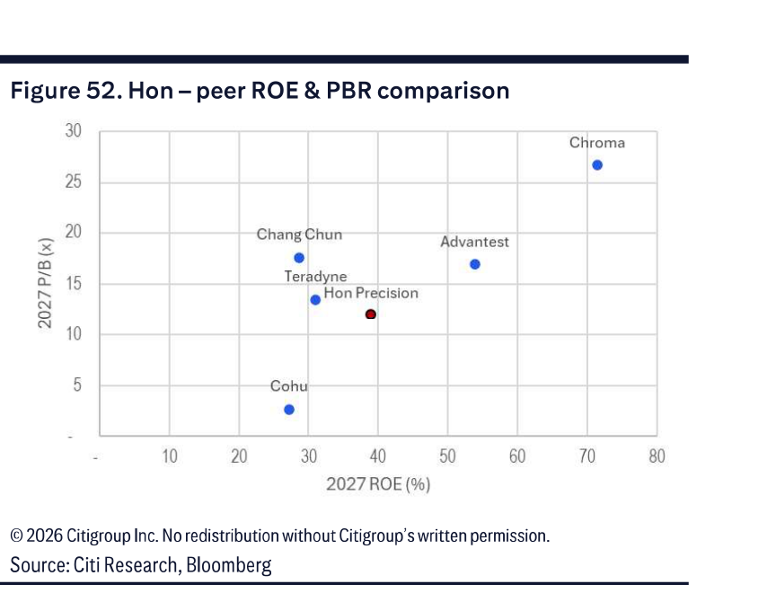

### 解讀摘要
Hon 的 2027E ROE 約 40%、P/B 約 12x，相較於同等 ROE 水平的同業（Teradyne 35% ROE、13x P/B），估值幾乎持平。但 Hon 的 ROE 仍在加速提升（2026E→2028E：ROE 持續擴張），而 Teradyne 等成熟企業的 ROE 趨於穩定，代表 Hon 的 P/B 溢價有充分理由。

### 表格

| 公司 | 2027E ROE（%） | 2027E P/B（x） |
|---|---|---|
| **Hon Precision** | **40** | **12** |
| Teradyne | 35 | 13 |
| Chang Chun | 30 | 18 |
| Cohu | 28 | 3 |
| Advantest | 55 | 17 |
| Chroma | 70 | 26 |

---

## 跨 Exhibit 彙整表

### 彙整 1｜需求倍數累積效應（Fig 26 × Fig 30）

| 驅動因素 | 數量 / 倍數 |
|---|---|
| TSMC CoWoS 產能（2024→2027E） | 300k → 2,050k wafers（+583%） |
| 每片 CoWoS wafer 的 FT 測試時間倍數（Hopper→Rubin） | ×3.1 |
| 等效 handler 需求倍數（產能 × 時間） | ~18x（+583% × 3.1） |

> 相同 GPU 出貨量下，Rubin 世代所需的 FT handler 資源是 Hopper 時代的 ~3.1x，疊加 TSMC 產能擴張，整體 handler 需求在 3 年間擴增近 18 倍。這是 Hon 能在 OSAT capex 僅增 2.1x（US\$6.5bn→US\$14bn）的前提下，實現 11.5x 業績成長（NT\$13bn→NT\$149bn）的乘數基礎。

### 彙整 2｜毛利率驅動因素量化（Fig 8 × Fig 45 × Fig 46）

| 驅動因素 | 2025→2028E 貢獻（估算） |
|---|---|
| Cold plates 消耗品比例提升（15%→27%） | +2.5ppt GM |
| Tri-temp / 大 tray handler ASP 升級 | +1.5ppt GM |
| 規模效應（固定費用攤薄） | +0.6ppt GM |
| 小計 | +4.6ppt GM（實際 +4.6ppt：56.5%→61.1%） |

---

## 相關個股清單

| 類別 | 公司 | Ticker | 評等 | 備註 |
|---|---|---|---|---|
| 核心受益 | 鴻勁精密 | 7769.TW | Buy（首評）TP NT\$7,100 | 本報告主體 |
| ATE 設備 | Advantest | 6857.JP | — | FY26 業績指引 +25.8% YoY，印證 OSAT 設備需求 |
| OSAT 受益 | 京元電 | 2449.TW | — | OSAT capex 受益，AI GPU 測試比例快速提升 |
| 同業比較 | Teradyne | TER.US | — | AI 測試市場，但 Handler 領域不與 Hon 直接競爭 |
| 同業比較 | Chroma | 2360.TW | — | 台灣測試設備，估值 42x P/E 相比 Hon 偏高 |
