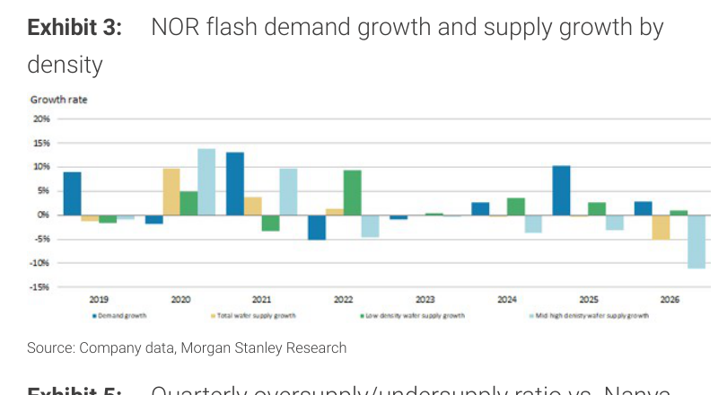
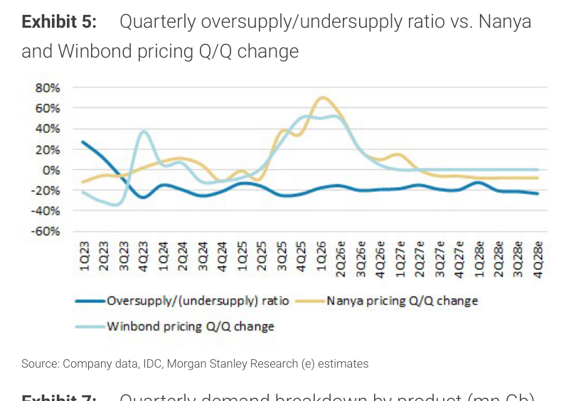
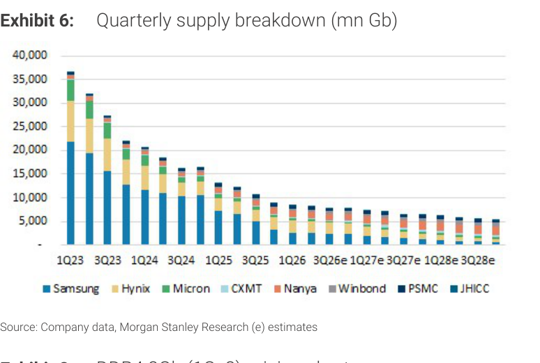
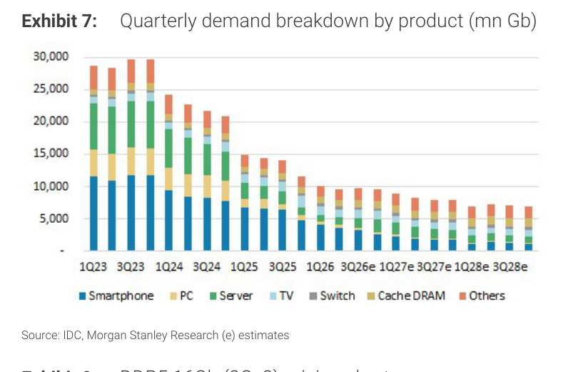
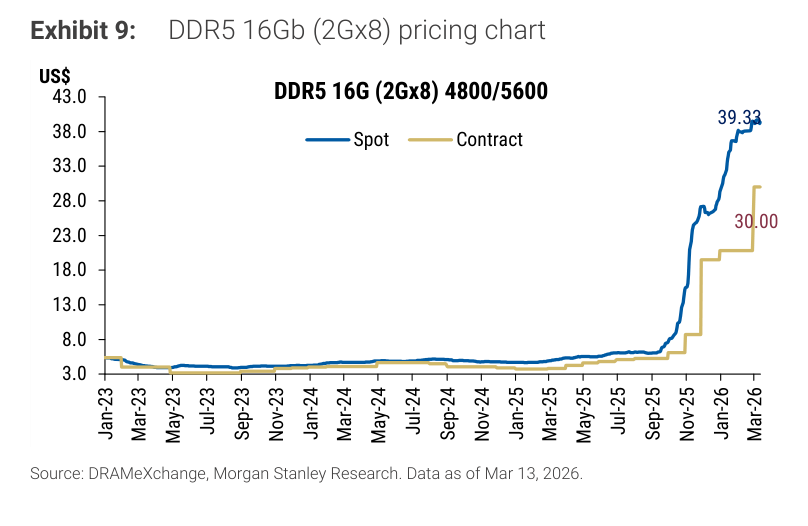

# MS｜Old Memory: Upside Surprise Ahead

**券商**：Morgan Stanley  
**分析師**：Daniel Yen, Charlie Chan, Daisy Dai, Tiffany Yeh, Ethan Jia  
**日期**：2026-05-28  
**主題**：DDR4 / NOR Flash / SLC NAND / SiCap 供需結構翻轉；升評 Winbond & Nanya  
**評級**：Industry View: Attractive  
<button type="button" onclick="fetch('https://ti-lei.github.io/foreign-reports/static/downloads/產業/20260528_MS_Old-Memory.md').then(r=>r.text()).then(t=>{let a=document.createElement('a');a.href='data:text/plain;charset=utf-8,'+encodeURIComponent(t);a.download='20260528_MS_Old-Memory.md';a.click()})">⬇ 下載 MD</button>

---

## MS 完整投資邏輯鏈

| 論點層次 | Exhibit | 內容 |
|---|---|---|
| 供給衝擊確立 | Ex 6 | Micron 設備移往美國（2-4Q 有效供給減少）+ Hynix Wuxi D4/LPD4 轉 DDR5 後端，兩大供應商同步退出 DDR4 |
| 需求下滑更慢 | Ex 7 | DDR4 需求由 Server/eSSD 支撐，降速慢於供給；整體缺口在 2H26 達 19-20% |
| 定價與缺口高度相關 | Ex 5 | 供需比每轉負 10ppt，Nanya/Winbond 季報價漲幅領先 1-2Q；3Q26 預計再漲 20% |
| NOR 同步偏緊 | Ex 2/3 | 需求成長持續高於供給；低密度 NOR 供給成長轉負，成熟代工瓶頸為主因 |
| 新催化劑浮現 | 封面 | SLC NAND 切入 server 快讀寫場景（TAM 擴大）；SiCap（Winbond × SEMCO）進入 2026 有意義收入 |
| **結論** | 封面 | **升評 Winbond (2344) & Nanya (2408) 至 OW；Winbond EPS 26/27/28E 分別上修 23%/65%/94%** |

> **報告最大邏輯缺口**：SiCap 及 SLC NAND server 認證時程不確定；若兩者均延後，Winbond 的大幅 EPS 上修將有下調風險。

---

## 報告核心觀點

| 主題 | MS 觀點 | 市場共識 | Contra-Consensus |
|---|---|---|---|
| DDR4 2H26 供需缺口 | 擴大至 -19% ~ -20% | 原預期縮小（MS 3 月曾降評即基於此）| ✅ 逆轉自身前次看法 |
| DDR4 3Q26 定價 | 再漲 +20% QoQ | 市場未充分計入 Micron 產線遷移影響 | ✅ 是 |
| SLC NAND server TAM | 快讀寫場景需求真實存在，GC 供應商受益 | 多數分析師視 SLC 為 consumer/IoT 品 | ✅ 是 |
| Winbond 2026E EPS | NT\$20.36（共識 NT\$11.73） | NT\$11.73 | ✅ 高出共識 +73% |
| NOR 供給壁壘 | 成熟代工短缺更難快速化解，漲價持續性高 | 視為一般 IDM 產能週期 | ✅ 是 |

**偏好排序**：Winbond (2344) > Nanya (2408) > GigaDevice (603986 SS)

---

## Exhibit 2｜NOR Flash 整體供需成長率

### 解讀摘要
NOR Flash 整體供需在 2024-2026 年出現顯著背離：需求成長率持續正值（+5% ~ +10%），而總 wafer 供給成長率已轉為負值（-5% ~ -7%）。這是 2012 年以來少見的供需缺口走勢——過去每次需求高峰，供給也同步加速擴充；但本輪供給端明顯不跟進，代表供給瓶頸不是 IDM 意願問題，而是產能天花板。

> **原文補充**：MS 點名成熟製程代工產能短缺（mature foundry shortages）為主驅動力，而非 IDM 自有產能週期。代工廠擴產需要設備交期與客戶認證，通常需 6-12 個月，使供給復甦速度遠慢於過往。

### 表格

| 時期 | 需求成長率 | 總供給成長率 | 供需方向 |
|---|---|---|---|
| 2012-2015 | -10% ~ +5% | +2% ~ +5% | 輕微過剩 |
| 2016-2018 | +5% ~ +10% | +5% ~ +8% | 大致均衡 |
| 2019-2020 | 0% ~ +5% | -2% ~ +3% | 轉輕微短缺 |
| 2021 | +12% | +5% | 短缺高峰 |
| 2022-2023 | -5% ~ 0% | +2% ~ +5% | 轉過剩 |
| 2024-2025 | +5% ~ +10% | 0% ~ +2% | 缺口再度擴大 |
| 2026E | +3% | -6% | 缺口持續深化 |

*以上為視覺估算，趨勢方向具信心

> **洞察一**：2026E 供給成長率轉負（-6%）是本輪 NOR 最特殊的地方——不是供給「增得慢」，而是供給「實際萎縮」，這直接意味著在需求任何正成長下，供需缺口都會進一步擴大。

---

## Exhibit 3｜NOR Flash 密度別供需拆解

### 解讀摘要
Exhibit 3 揭示 NOR Flash 供需惡化在密度維度上的不均衡：低密度 NOR wafer 供給成長在 2025-2026 年急速轉負（約 -10%），跌幅遠超高密度 NOR。這表示廠商在成熟代工產能受限時，優先保留高密度 NOR（毛利較高），犧牲低密度出貨；但汽車、工業等低密度 NOR 需求仍在正成長。

> **原文補充**：成熟代工短缺對低密度 NOR 打擊最重，因低密度 NOR 使用較老代製程，這些製程的代工廠比高密度更難找到替代來源。

### 表格

| 密度類型 | 2025 供給成長率 | 2026E 供給成長率 | 需求成長率（估） |
|---|---|---|---|
| 低密度 NOR | 0% | -10% | +3% ~ +5% |
| 中高密度 NOR | +2% | -3% ~ -5% | +2% ~ +3% |
| 整體 NOR | +1% | -6% | +3% |

*以上為視覺估算

> **洞察一**：低密度 NOR 供給萎縮 -10% vs 需求正成長，意味著車用/工業 NOR 客戶在 2026 年面臨更嚴峻的缺貨壓力，這對 GigaDevice 和 Macronix 的低密度 NOR 定價尤其有利。

> **洞察二（配合 Exhibit 2）**：整體 NOR 供給轉負（-6%）的成分，主要由低密度下滑拉動（-10%），高密度降幅相對溫和（-3~5%）。這意味 NOR 廠商的毛利結構將因 mix 向高密度移動而改善，同時低密度漲價空間更大。

---

## Exhibit 4｜DDR4 季度供需總覽

### 解讀摘要
Exhibit 4 是本報告最核心的數據圖。DDR4 總供給（藍色棒）從 2023 年約 31,000 mn Gb 急速萎縮，2026E 僅剩約 6,500 mn Gb，降幅超過 79%——這不是需求疲軟造成的，而是 Samsung、Hynix、Micron 集體轉向 DDR5/HBM 的結果。需求（黃色棒）下滑較慢，形成右軸比率線在 2H25 轉負並在 2026E 深入 -19~20%。

> **原文補充**：MS 3 月曾降評，原因是預期缺口縮小。此次升評的觸發點是 Micron 宣布設備從台灣移往美國（影響 2-4Q），加上 Hynix Wuxi 將 D4/LPD4 產能轉為 DDR5 後端封裝，使供給缺口比 3 月預期更大。

### 表格

| 季度 | 供給（mn Gb） | 需求（mn Gb） | 供需比 | 備註 |
|---|---|---|---|---|
| 1Q23 | 31,000 | 28,000 | +11% | 過剩高峰 |
| 2Q23 | 29,000 | 28,000 | +4% | 過剩縮小 |
| 4Q23 | 24,000 | 22,500 | +7% | 仍過剩 |
| 2Q24 | 21,000 | 21,000 | 0% | 轉平衡 |
| 4Q24 | 13,000 | 15,000 | -13% | 首次明顯短缺 |
| 2Q25 | 10,000 | 12,000 | -17% | 短缺擴大 |
| 4Q25 | 8,000 | 10,000 | -20% | 短缺深化 |
| 2Q26e | 6,500 | 8,000 | -19% | 短缺高原期 |
| 4Q26e | 5,200 | 6,400 | -19% | 維持短缺 |
| 2027e 均 | 5,500 | 6,700 | -18% | 短缺持續 |
| 2028e 均 | 4,800 | 5,900 | -19% | 短缺維持 |

*以上為視覺估算；交叉驗證與文字「19-20% gap in 2H26，18-20% in 2027/28」吻合

> **洞察一**：DDR4 供給從 31,000 萎縮至 6,500 mn Gb（-79%），降幅遠大於需求（約 -77%），供需缺口的本質是「供給下滑的速度稍快於需求」，而不是「需求反彈」。這對 Winbond 和 Nanya 特別重要——他們的絕對出貨量不需要成長，只要大廠退出速度夠快，定價就會漲。

> **值得驗證**：CXMT（中國 DRAM）是供給端最大的不確定因素。圖中 CXMT 貢獻仍小，但若 2027 年量產良率大幅提升，缺口可能比 MS 預估來得窄。

---

## Exhibit 5｜供需比 vs Nanya / Winbond 定價季增相關性

### 解讀摘要
Exhibit 5 建立了「供需比」與「定價季增幅」之間清晰的反向相關：2023 年供應過剩（+20~30%）時，Nanya 和 Winbond 定價季降幅高達 -40% 至 -60%；2024 年供需比趨近 0，定價跌幅縮小；2025 年轉入短缺（-15~-20%），定價季增幅反彈至 +40~+60%。這條相關性給出了明確的前瞻指引：只要 2026-2028E 供需比維持在 -18~20%，定價將持續正向。

### 表格

| 季度 | 供需比 | Nanya 定價 QoQ | Winbond 定價 QoQ |
|---|---|---|---|
| 1Q23 | +25% | -50% | -55% |
| 3Q23 | +8% | -20% | -20% |
| 1Q24 | +5% | -10% | -10% |
| 3Q24 | -8% | 0% | +5% |
| 1Q25 | -12% | +20% | +25% |
| 3Q25 | -16% | +40% | +45% |
| 1Q26e | -19% | +30% | +35% |
| 3Q26e | -20% | +20% | +20% |

*以上為視覺估算

> **洞察一**：從 Exhibit 5 的相關性推算，2H26 的 -19~20% 供需比，對應 Nanya/Winbond 定價 QoQ 約 +20~30%。這與 MS 預估的「DDR4 3Q26 定價再漲 +20%」在量級上完全吻合，提高了此預估的可信度。

> **洞察二（配合 Exhibit 4）**：供需缺口在 2027-2028E 並不會因為需求持續下滑而消失，因為供給也在同步萎縮，比率鎖定在 -18~20%。這為 Winbond 和 Nanya 的多年漲價週期提供量化支撐。

---

## Exhibit 6｜DDR4 季度供給廠商拆解

### 解讀摘要
Exhibit 6 清楚呈現 DDR4 供給縮減的「誰在退場」結構：Samsung（深藍，最大）和 Hynix（黃）供給從 1Q23 的各約 20,000 和 7,000 mn Gb 急速萎縮，是最大的退場力量。Micron（綠）本已在萎縮，2026 年後幾乎消失（設備遷美）。CXMT（橙）雖成長但絕對量仍小（約 1,000-2,000 mn Gb），遠不足以填補三大廠退出留下的缺口。Nanya 和 Winbond 在整體供給下降時相對份額上升，是最直接的定價受益者。

### 表格

| 季度 | Samsung | Hynix | Micron | CXMT | Nanya | Winbond | 其他 | 總計 |
|---|---|---|---|---|---|---|---|---|
| 1Q23 | 20,000 | 7,000 | 3,500 | 500 | 700 | 600 | 300 | 32,600 |
| 1Q24 | 12,000 | 5,000 | 2,500 | 800 | 600 | 500 | 300 | 21,700 |
| 1Q25 | 5,500 | 2,000 | 1,200 | 1,000 | 550 | 450 | 200 | 10,900 |
| 1Q26e | 3,000 | 1,200 | 400 | 1,200 | 500 | 400 | 200 | 6,900 |
| 1Q27e | 2,500 | 900 | 200 | 1,500 | 500 | 400 | 200 | 6,200 |
| 1Q28e | 2,000 | 700 | 100 | 1,600 | 500 | 400 | 200 | 5,500 |

*以上為視覺估算，單位 mn Gb，誤差範圍約 ±15%

> **洞察一**：CXMT 在 2026-2028E 的供給雖成長至約 1,500-1,600 mn Gb，但相較 Micron 在 2023 年貢獻的約 3,500 mn Gb，差距仍大。就算 CXMT 2028 年量翻倍至 3,200 mn Gb，也只恢復了 Micron 退出前的一半水準——而 Samsung 和 Hynix 退出的量遠更大。

> **洞察二**：Winbond + Nanya 合計供給從 2023 年的約 1,300 mn Gb 只是輕微下降至 2026E 的約 900 mn Gb（-30%），但在整體市場供給下降 79% 的背景下，他們的市場份額從約 4% 升至約 13%。這個份額提升是他們定價話語權提升的結構性基礎。

---

## Exhibit 7｜DDR4 季度需求產品拆解

### 解讀摘要
需求側的圖告訴我們「誰還在用 DDR4」：Smartphone（深藍，最大）和 PC（黃）的 DDR4 需求下滑最快（快速轉向 DDR5），而 Server（綠）和 Cache DRAM 的 DDR4 需求下滑最慢，甚至在 2026E 維持相對穩定。Server 之所以仍用 DDR4，是因為企業 SSD（eSSD）中有大量 DDR4 作為 buffer cache，這個用途對帶寬要求不如 AI server 高，不需要立即升級 DDR5。

> **原文補充**：MS 指出 rising CPU server demand 將在 2027 年推動 enterprise DDR4 需求成長，同時 eSSD 的 DDR4 buffer 需求隨著 SSD 出貨量增加而提升。

### 表格

| 季度 | Smartphone | PC | Server | TV | Cache/Others | 總計 |
|---|---|---|---|---|---|---|
| 1Q23 | 11,000 | 8,000 | 3,500 | 2,500 | 3,000 | 28,000 |
| 1Q24 | 7,000 | 5,500 | 3,000 | 2,000 | 2,500 | 20,000 |
| 1Q25 | 4,000 | 3,000 | 2,500 | 1,000 | 1,500 | 12,000 |
| 1Q26e | 2,500 | 2,000 | 2,200 | 700 | 1,300 | 8,700 |
| 1Q27e | 1,800 | 1,500 | 2,000 | 500 | 1,200 | 7,000 |
| 1Q28e | 1,300 | 1,200 | 1,800 | 400 | 1,100 | 5,800 |

*以上為視覺估算，單位 mn Gb

> **洞察一**：Server 的 DDR4 需求從 2023 年的約 3,500 mn Gb 下滑至 2028E 約 1,800 mn Gb，降幅 -49%，遠低於 Smartphone（-88%）和 PC（-85%）。Server 的韌性支撐了整體需求的「底部」，使需求線不會像供給線那樣急墜，從而維繫供需缺口。

> **洞察二（配合 Exhibit 6）**：到 2027-2028E，Server 需求（約 2,000 mn Gb）已佔整體 DDR4 需求的約 27-31%，接近第一大細分。這意味 enterprise/eSSD 客戶的議價能力相對下降，有利於 Nanya（對 enterprise 客戶有 LTA）和 Winbond（server buffer 需求受益者）。

---

## Exhibit 8｜DDR4 8Gb 定價走勢

### 解讀摘要
DDR4 8Gb 現貨在 2025 年中段開始急速攀升，至 2026 年 3 月已達 US\$27.25，而合約價仍在 US\$13.00——現貨與合約之間 US\$14.25 的溢差（+110%）是一個重要的前瞻指標：現貨搶購代表短期市場嚴重缺貨，而合約客戶在年中/年末換約時將面臨大幅補漲壓力。相較歷史，DDR4 8Gb 在 2019 年高點僅約 US\$7，本輪現貨已超過前高 2.9 倍。

### 表格

| 指標 | 數值 |
|---|---|
| 現貨價（2026-03-13） | US\$27.25 |
| 合約價（2026-03-13） | US\$13.00 |
| 現貨/合約溢差 | +US\$14.25（+110%） |
| 前次高點（2019） | 約 US\$7 |
| 2023 低點（估） | 約 US\$1.50 |
| 自低點漲幅（現貨） | +1,717% |

> **洞察一**：現貨 US\$27.25 vs 合約 US\$13.00 的 110% 溢差，在歷史上代表合約價尚在「追趕」現貨的過程中。合約換約通常滯後現貨 2-4 季，這意味 Winbond 和 Nanya 的合約 ASP 將在 3Q-4Q26 出現跳升式改善——這就是 EPS 大幅上修的直接機制。

> **洞察二（配合 Exhibit 5）**：若 2H26 供需缺口維持在 -19~20%，且 Exhibit 5 的歷史相關性成立，合約價有機會繼續向現貨靠攏，4Q26 合約價可能達到 US\$18-20（現貨的 65-75%），對應 Winbond DRAM 毛利率顯著改善。

---

## Exhibit 9｜DDR5 16Gb 定價走勢

### 解讀摘要
DDR5 16Gb 現貨從 2023 年約 US\$3-4 暴升至 2026 年 3 月 US\$39.33，合約同步升至 US\$30.00，現貨/合約溢差相對溫和（+31%）。這與 DDR4 的 +110% 溢差形成對比，說明 DDR5 市場整體較均衡——DDR5 供給側有 Samsung、Hynix 大力投入，供應不像 DDR4 那般短缺，但 AI server 的旺盛需求使 DDR5 仍維持高價。這對 Nanya 至關重要：其 3Q26 起轉移 5kwpm 至 DDR5，將直接享受 DDR5 高 ASP 的 mix 效益。

### 表格

| 指標 | 數值 |
|---|---|
| 現貨價（2026-03-13） | US\$39.33 |
| 合約價（2026-03-13） | US\$30.00 |
| 現貨/合約溢差 | +US\$9.33（+31%） |
| 2023 低點 | 約 US\$3.0 |
| 自低點漲幅（現貨） | +1,211% |

> **洞察一（配合 Exhibit 8）**：DDR5 現貨/合約溢差（+31%）遠低於 DDR4（+110%），代表 DDR5 定價雖高但結構穩定，合約客戶追趕壓力較小。Nanya 的 DDR4→DDR5 mix 轉換帶來的 ASP 提升（US\$13→US\$30 合約），是比 DDR4 漲價更確定的獲利來源。

---

## 跨 Exhibit 彙整表

### 彙整 1｜DDR4 供需缺口與定價傳導鏈（Exhibits 4 + 5 + 8）

| 步驟 | 數據 | 來源 |
|---|---|---|
| 2H26 供需比 | -19% ~ -20% | Ex 4 |
| 對應定價 QoQ（歷史相關性） | +20% ~ +30% | Ex 5 |
| 現貨已先行反映 | US\$27.25（+110% vs 合約） | Ex 8 |
| 合約追趕空間 | 今 US\$13 → 可能 US\$18-20 | Ex 8 推算 |
| 觸發合約補漲時機 | 3Q-4Q26 換約季 | Ex 5 滯後 1-2Q |

> **跨 Exhibit 洞察**：Ex 4 確認缺口 -19~20%；Ex 5 顯示此缺口對應定價 QoQ +20~30%；Ex 8 顯示現貨已先漲至 US\$27.25，合約尚在 US\$13。三圖合讀，合約補漲只是時間問題，且每一個季度的換約都是一次 EPS 跳升的機會，這是 Winbond 26E EPS 大幅高於共識的核心機制。

### 彙整 2｜DDR4 供需均跌但缺口持久（Exhibits 6 + 7）

| 時期 | 供給總計（mn Gb） | 需求總計（mn Gb） | 缺口 |
|---|---|---|---|
| 1Q23 | 32,600 | 28,000 | +16%（過剩） |
| 1Q25 | 10,900 | 12,000 | -9%（短缺） |
| 1Q26e | 6,900 | 8,700 | -21% |
| 1Q27e | 6,200 | 7,000 | -13% |
| 1Q28e | 5,500 | 5,800 | -5% |

*以上為視覺估算

> **跨 Exhibit 洞察**：即使需求和供給都在縮水，2026-2027 年的缺口仍最深（-20% ~ -13%）。到 2028E 缺口可能縮小至約 -5%，但 Winbond/Nanya 的 EPS 上行主要集中在 2026-2027 的定價高峰期——MS 的升評邏輯更多是 12-18 個月視角，而不是多年結構性 story。

---

## 相關個股清單

| 類別 | 公司 | Ticker | 評等 | 備註 |
|---|---|---|---|---|
| 主要受益（升評） | 華邦電 | 2344 TT | OW（↑ 從 EW） | TP NT\$222（5.5x 2026E P/B）；EPS 26/27/28E +23%/+65%/+94% |
| 主要受益（升評） | 南亞科 | 2408 TT | OW（↑ 從 EW） | TP NT\$380（3.22x 2026E BVPS）；EPS 26/27/28E +15%/+29%/+33% |
| 次要受益（TP 上調） | GigaDevice | 603986 SS | OW（維持） | TP Rmb585（↑ 68%，46x 2026E P/E）；EPS 26/27E +58%/+60% |
| NOR 間接受益 | 旺宏電子 | 2337 TT | 未調整 | 成熟代工短缺為同等受益者 |
