# TrendForce｜Post-OFC 2026：AI 驅動次世代高速光互連

**券商**：TrendForce（集邦科技股份有限公司）  
**分析師**：Roger Chu（儲于超，Semiconductor BU Vice President）  
**日期**：2026-05-28  
**主題**：Post-OFC 2026 Insights — 矽光子（SiPh）與 CPO 從技術突破到商機落地  
**評級**：N/A（產業趨勢研究簡報，非個股評等）  
<a href="https://layx.uk/dl?g=產業&b=TrendForce&d=20260528&h=Post-OFC2026-矽光子與CPO">📎 下載 PDF</a>

---

## 報告總結

本報告是 TrendForce 於 2026 年 3 月 OFC（Optical Fiber Communication）大會後的產業綜整，核心論點是：AI 叢集的 Scale-Up/Scale-Out/Scale-Across 三層互連正同步從銅纜與可插拔光模組轉向 CPO（共同封裝光學），而觸發時機是可插拔方案（LPO）已逼近約 5pJ/bit 的物理功耗極限，加上 OCI／Open CPX／XPO 三大多源標準聯盟於 2026 年 3 月甫成立，代表產業正式進入標準化早期階段。第二個結論是 CPO 放量時點比市場預期更慢——滲透率要到 2028 年後才明顯爬升（2026 年僅 0.53%，2030 年達 35.74%），近兩年出貨成長仍主要來自可插拔收發器；同時地緣政治管制正迫使中國以外供應鏈重組，而台灣廠商在磊晶、雷射/PD、封裝測試、耦合光纖等環節具備完整生態卡位。

---

## TrendForce 完整投資邏輯鏈

**框架**：瓶頸確認 → 需求結構 → 供給上限 → 標準演進 → 受益排序 → 結論

| 論點層次 | Exhibit | 內容 |
|---|---|---|
| **瓶頸確認** | Fig. 9 | 可插拔方案（LPO）功耗已逼近物理極限 |
| **需求結構** | Fig. 13 | AI 驅動高速收發器出貨結構性成長，逼近 800G 以上為主流 |
| **供給上限** | Fig. 14 | SiPh 晶圓代工產能（TSMC）為 CPO 放量最大瓶頸 |
| **標準演進** | Fig. 8、Fig. 10 | 三大 MSA 聯盟剛成立，規格仍在 Gen 1 階段 |
| **受益排序** | Fig. 7、Fig. 15、Fig. 18 | Scale-up／Scale-out／中國與台灣供應鏈的分層卡位 |
| **結論** | 報告封面 | CPO 是確定趨勢，但 2026-2027 仍是過渡期，真正拐點在 2028 年後 |

> **報告最大邏輯缺口**：報告未提供各廠 CPO 良率、成本曲線或個別公司營收貢獻的量化模型，僅為產業趨勢與生態圈定位層級的綜整，具體投資規模需另行以個股財報驗證。

---

## 報告核心觀點

| 主題 | TrendForce 觀點 | 市場共識 | 是否 Contra-Consensus |
|---|---|---|---|
| 可插拔光模組升級空間 | LPO 已逼近 ~5pJ/bit 物理極限，節能紅利見頂 | 普遍認為 LPO 仍可持續多代迭代降本 | 是（極限比市場預期更早浮現） |
| CPO 放量時點 | 2026 年 CPO 滲透率僅 0.53%，真正放量在 2028 年後（7%→22%→36%） | 部分投資人預期 CPO 於 2026-2027 快速放量 | 是（放量時點比樂觀預期慢 1-2 年） |
| 標準制定進度 | OCI／Open CPX／XPO 三大聯盟 2026 年 3 月才成立，規格僅到 Gen 1 | 部分投資人認為 CPO 互通性標準已成熟 | 是 |
| 中國供應鏈地位 | 傳統收發器與光纖中國市占均已過半，但地緣政治正迫使供應鏈外移 | 市場認知度已高 | 否 |
| 華為追趕速度 | 靈衢（UB）2.0 以 nD-FullMesh 拓樸擴展至 384 節點，規劃萬卡級 | 部分投資人低估華為自研光互連生態成熟度 | 是 |

**偏好排序**：Scale-up CPO/SiPh 先行者（Broadcom 已量產、NVIDIA 2026 年啟動）＞ Scale-out LPO/XPO 生態（Arista、Innolight、Eoptolink）＞ 同時卡位多個標準聯盟的核心零組件廠（Coherent Corp、Samtec、Marvell、Ciena、Molex）＞ 傳統可插拔中國廠商（面臨地緣政治供應鏈外移壓力）

**零件/個股偏好**：SiPh 晶圓代工產能（TSMC）為最直接受惠環節；CPO 光引擎（Coherent Corp、Broadcom）次之；台灣生態圈中 PIC/EIC、先進封裝、耦合光纖環節（MediaTek、ASE、Luxnet、WIN Semiconductors）可望受惠 CPO 在地化供應鏈需求。

---

## Fig. 1｜NVIDIA: Leading the Path of AI Architecture Development

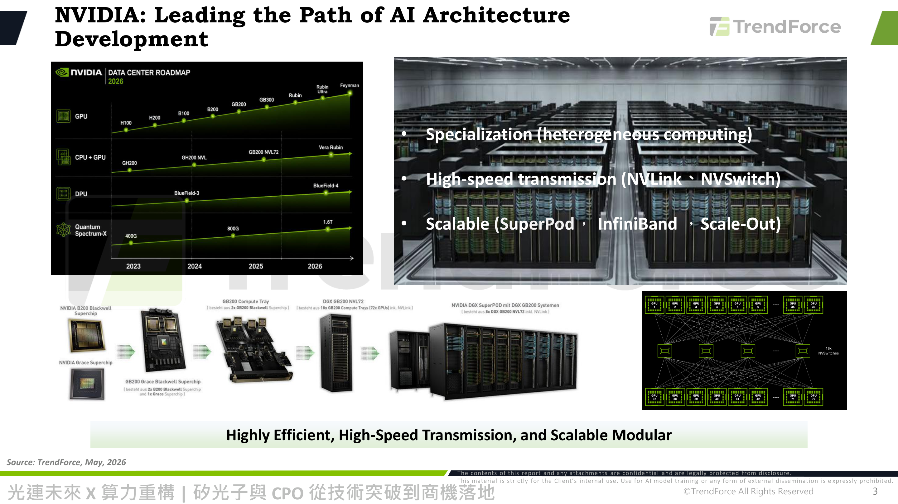

### 解讀摘要
NVIDIA Data Center Roadmap 2026 展示 GPU（H100→H200→B100→B200→GB200→GB300→Rubin→Rubin Ultra→Feynman）、CPU+GPU（GH200→GH200 NVL→GB200 NVL72→Vera Rubin）、DPU（BlueField-3→4）、Quantum Spectrum-X 網路（400G→800G→1.6T）四條產品線同步演進的時間軸，並以硬體堆疊圖說明從 B200 Blackwell Superchip 到 DGX SuperPOD 的組裝層級。這張圖建立全報告的分析框架：「異質運算專業化＋高速傳輸＋可擴展」三原則，後續所有 Exhibit 都是對這三原則在不同尺度（Scale-Up/Out/Across）下的具體展開。

### 表格
| 產品線 | 2023 | 2024 | 2025 | 2026 |
|---|---|---|---|---|
| GPU | H100 | H200 / B100 | B200 / GB200 | GB300 → Rubin |
| CPU+GPU | GH200 | GH200 NVL | GB200 NVL72 | Vera Rubin |
| DPU | — | BlueField-3 | — | BlueField-4 |
| Quantum Spectrum-X | 400G | 800G | — | 1.6T |

> **洞察一**：四條產品線的節奏並非同步——網路（Spectrum-X）與運算（GPU）的世代交替頻率相近（約一年一世代），代表 NVIDIA 刻意把網路頻寬升級與 GPU 算力升級綁定發布，避免網路成為運算力擴張的瓶頸。

---

## Fig. 2｜Architecture of Data Center Interconnect in the Age of AI

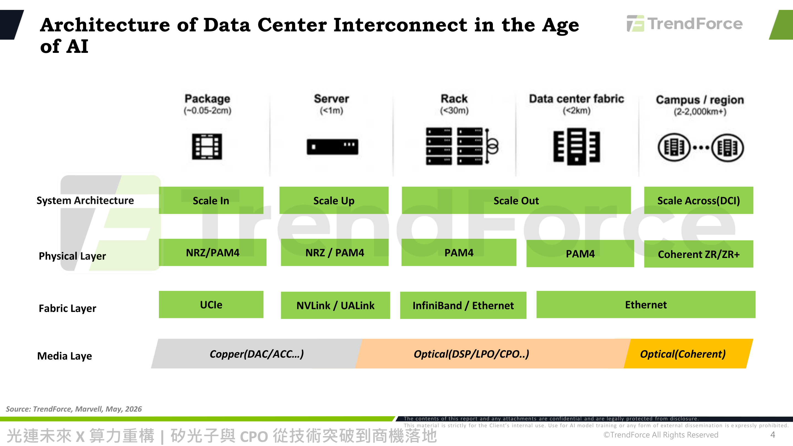

### 解讀摘要
本圖是全報告最核心的分類框架：依連接距離由近至遠分為 Package（0.05-2cm）／Server（<1m）／Rack（<30m）／Data center fabric（<2km）／Campus-region（2-2000km+），對應到系統架構 Scale In/Up/Out/Across(DCI)、實體層 NRZ/PAM4→PAM4→Coherent ZR/ZR+、以及媒介層 Copper(DAC/ACC)→Optical(DSP/LPO/CPO)→Optical(Coherent) 的漸進轉換。距離越遠，訊號衰減與功耗限制迫使媒介層從銅纜切換至光學方案，這正是後續 CPO 滲透討論的物理基礎。

### 表格
| 尺度 | 距離 | 系統架構 | 實體層 | 媒介層 |
|---|---|---|---|---|
| Package | ~0.05-2cm | Scale In | NRZ/PAM4 | Copper(DAC/ACC…) |
| Server | <1m | Scale Up | NRZ/PAM4 | Copper→Optical 過渡帶 |
| Rack | <30m | Scale Out | PAM4 | Optical(DSP/LPO/CPO..) |
| Data center fabric | <2km | Scale Out | PAM4 | Optical(DSP/LPO/CPO..) |
| Campus/region | 2-2,000km+ | Scale Across(DCI) | Coherent ZR/ZR+ | Optical(Coherent) |

> **洞察二**：Server 與 Rack 之間（<1m～<30m）正是「銅退光進」的交界帶——Fig. 4 的 NVL72→NVL576、NVL144→NVL1152 世代交替，正是這個交界帶因規模擴大而被迫從銅纜換成光學的具體案例。

---

## Fig. 3｜AI Scale-Up Networking

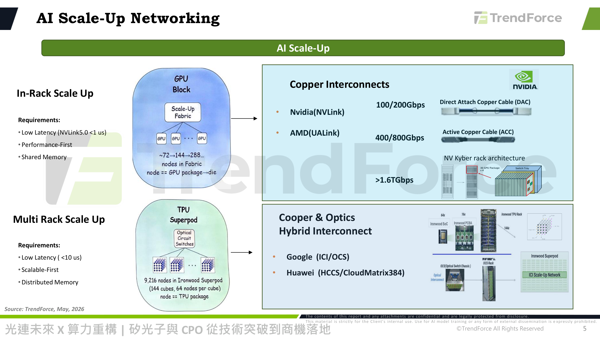

### 解讀摘要
Scale-Up 分為 In-Rack（GPU Block，NVLink5.0 低延遲 <1us、72→144→288 節點、共享記憶體）與 Multi-Rack（TPU Superpod，Google 光交換 OCS、延遲 <10us、9,216 節點分散式記憶體）兩種路線，代表 NVIDIA／AMD 陣營偏好高效能優先的銅纜互連，Google／Huawei 則走向可擴展優先的光電混合互連。右側對照 Nvidia(NVLink 100/200Gbps)、AMD(UALink 400/800Gbps) 的銅纜方案與 NV Kyber(>1.6Tbps) 、Google(ICI/OCS)、Huawei(HCCS/CloudMatrix384) 的光電混合方案。

> **洞察三**：Google 與 Huawei 被歸在同一類「Copper & Optics Hybrid」陣營，顯示兩家在架構哲學上更接近——都以分散式記憶體、可擴展優先為目標，而非 NVIDIA/AMD 的效能優先、共享記憶體路線；這呼應 Fig. 17 華為 nD-FullMesh 拓樸選擇分散式擴展而非 NVIDIA Clos 拓樸的設計邏輯。

---

## Fig. 4｜NVIDIA Employ Copper and Optical for Scale-up Expansions

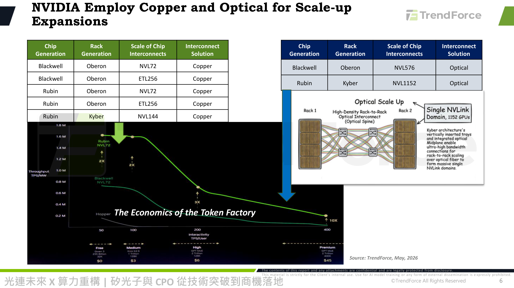

### 解讀摘要
兩張對照表格顯示 NVIDIA Scale-up 互連方案的世代分野：Blackwell/Rubin 世代在 NVL72、ETL256、NVL144 規模下均維持銅纜（Copper）互連；但當規模擴大至 NVL576（Blackwell/Oberon）與 NVL1152（Rubin/Kyber）時，互連解決方案必須切換為光學（Optical）。右側 Kyber 機架光學圖說明其原理：透過垂直插入式機箱與整合光學中背板（Optical Midplane），以光纖取代銅纜完成跨機架連接，形成單一 NVLink domain 涵蓋 1,152 顆 GPU。

### 表格
| 晶片世代 | 機架世代 | 互連規模 | 互連方案 |
|---|---|---|---|
| Blackwell | Oberon | NVL72 | Copper |
| Blackwell | Oberon | ETL256 | Copper |
| Rubin | Oberon | NVL72 | Copper |
| Rubin | Oberon | ETL256 | Copper |
| Rubin | Kyber | NVL144 | Copper |
| Blackwell | Oberon | NVL576 | **Optical** |
| Rubin | Kyber | NVL1152 | **Optical** |

> **洞察四**：NVL144→NVL1152 是 8 倍規模擴張（144×8=1,152），與 NVL72→NVL576 的 8 倍擴張（72×8=576）呈現相同倍率——顯示「規模擴大 8 倍」是觸發銅轉光的一致門檻，而非個案。這代表下一代若持續朝更大 NVLink domain 擴展（如萬卡級），光學互連將是唯一路徑，而非可選項。
> **值得驗證**：圖中「Economics of the Token Factory」曲線顯示 Rubin NVL72 在同等延遲下輸出量（TPS/MW）約為 Hopper 的 10 倍；若此假設的功耗效率提升未能兌現，Scale-up 光學化的成本效益將重新受到質疑。

---

## Fig. 5｜AI Scale-Out & Scale Across Networking

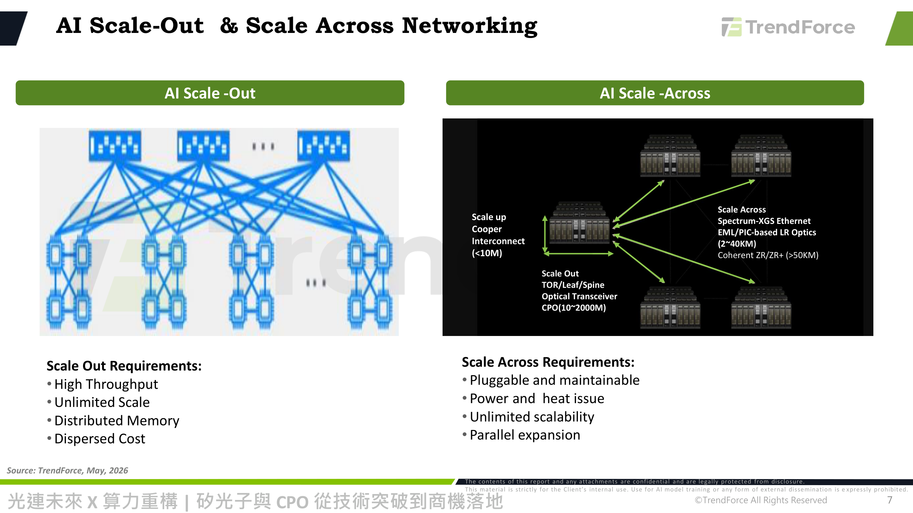

### 解讀摘要
Scale-Out 透過 TOR/Leaf/Spine 三層交換架構追求高吞吐量、無限擴展、分散式記憶體與分散成本；Scale-Across（跨資料中心/DCI）則依距離分層：<10m 用銅纜、10-2,000m 用 CPO 光收發器、2-40km 用 EML/PIC-based LR 光學（Spectrum-XGS Ethernet）、>50km 用 Coherent ZR/ZR+。這張圖把 CPO 的應用場景精確定位在「機架內到資料中心內」（10-2,000m）的中距離範圍，而非長途 DCI。

> **洞察五（配合 Fig. 2）**：CPO 的射程被限定在 10-2,000m，恰好對應 Fig. 2 的 Rack 與 Data center fabric 兩個尺度——這代表 CPO 廠商的可服務市場（TAM）邊界明確，不會延伸至跨校園/區域的長途 DCI 市場（該市場仍是 Coherent ZR/ZR+ 的天下）。

---

## Fig. 6｜OCS Tomorrow: Replacing Spine Switches

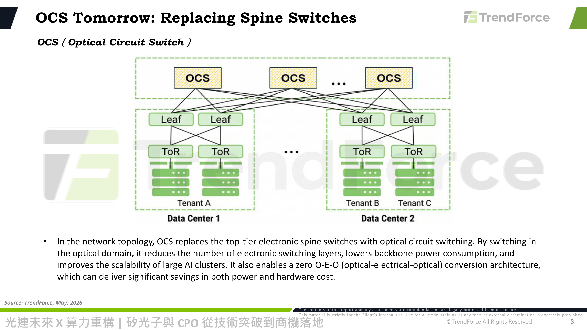

### 解讀摘要
光交換器（OCS, Optical Circuit Switch）架構圖顯示 OCS 取代傳統電子 Spine 交換層，直接在光域完成跨資料中心、跨租戶的交換，藉此減少電子交換層數、降低骨幹功耗，並實現零 O-E-O（光-電-光）轉換架構，同時節省功耗與硬體成本。

> **洞察六**：OCS 省去 O-E-O 轉換的關鍵意義在於「交換層本身不再需要收發器」，這與 Fig. 7 中 OCS 被列為「Inter-rack Scale-out」項下且「累計訂單 >\$4M」的早期商業化階段互相印證——OCS 目前仍是利基型的資本支出項目，而非全面取代傳統收發器的主流方案。

---

## Fig. 7｜OFC 2026: AI Optical Interconnect Panaroma

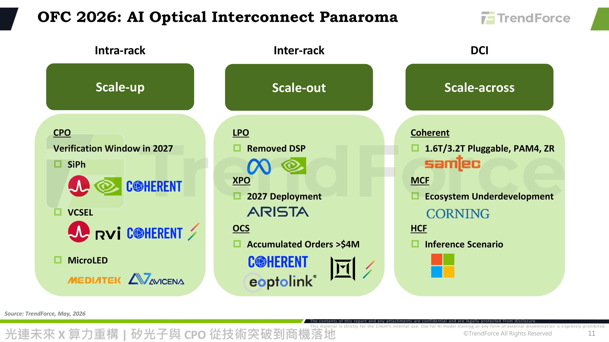

### 解讀摘要
本圖以 Intra-rack(Scale-up)／Inter-rack(Scale-out)／DCI(Scale-across) 三欄彙整 OFC 2026 呈現的完整廠商生態圖譜。Scale-up 欄下 CPO(SiPh，2027年進入驗證窗口)由 NVIDIA、Coherent Corp 領軍，VCSEL 由 Broadcom、Coherent 主導，MicroLED 由 MediaTek、Avicena 探索；Scale-out 欄下 LPO(移除 DSP) 由 Meta、NVIDIA 推動，XPO(2027年部署)由 Arista 主導，OCS(累計訂單>\$4M)由 Coherent、Eoptolink 供應；DCI 欄下 Coherent(1.6T/3.2T 可插拔 PAM4 ZR)由 Samtec 供應，MCF(多芯光纖)生態仍待發展、Corning 主攻，HCF(空芯光纖)則鎖定推論情境、Microsoft 佈局。

> **洞察七（配合 Fig. 9、Fig. 14）**：三欄的技術成熟度呈明顯梯度——CPO「2027年進入驗證窗口」、XPO「2027年部署」、OCS「已有商業訂單」，代表 Scale-out 層（可插拔升級路徑）的商業化進度領先 Scale-up 層（CPO），與 Fig. 14 中 CPO 滲透率要到 2028 年後才顯著攀升的時程完全吻合。

---

## Fig. 8｜OFC 2026: Multi-Source Agreement, Est. March 2026

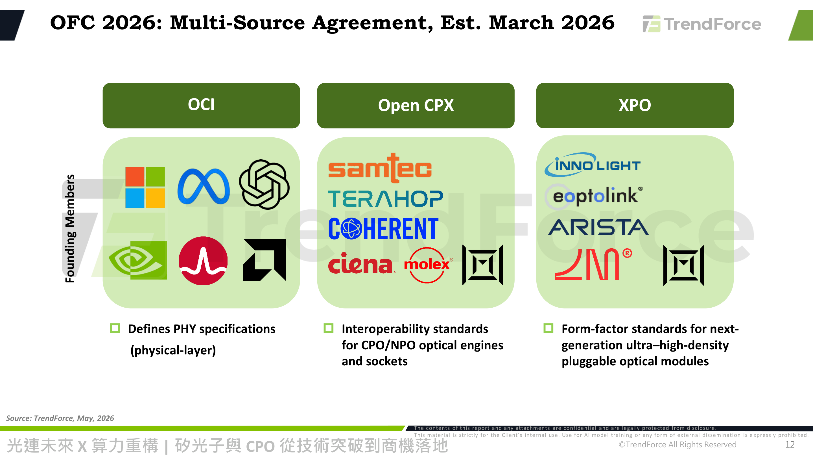

### 解讀摘要
2026 年 3 月新成立三大多源標準聯盟（MSA）：OCI（創始成員 Microsoft、Meta、OpenAI、NVIDIA、Broadcom、AMD，定義實體層 PHY 規格）、Open CPX（Samtec、Terahop、Coherent、Ciena、Molex 等，定義 CPO/NPO 光引擎與插座的互通標準）、XPO（Innolight、Eoptolink、Arista 等，定義次世代超高密度可插拔模組的形式規格）。三大聯盟分工明確對應 Fig. 2 的三個媒介層轉換點。

### 表格
| 聯盟 | 成立時間 | 核心創始成員 | 規範範疇 |
|---|---|---|---|
| OCI | 2026年3月 | Microsoft、Meta、OpenAI、NVIDIA、Broadcom、AMD | PHY 實體層規格 |
| Open CPX | 2026年3月 | Samtec、Terahop、Coherent、Ciena、Molex | CPO/NPO 光引擎與插座互通性 |
| XPO | 2026年3月 | Innolight、Eoptolink、Arista | 次世代超高密度可插拔模組形式規格 |

> **洞察八**：Coherent Corp、Samtec、Ciena、Molex 同時是多個聯盟的核心成員（Open CPX 創始成員，且 Samtec 亦現身 Fig. 7 的 DCI Coherent 供應商欄位），顯示這幾家零組件廠正在跨技術路徑（CPO、可插拔、DCI）同時卡位，降低單一技術路徑失敗的風險——這類「多重下注」廠商的投資風險相對分散。
> **值得驗證**：三大聯盟都「2026年3月才成立」，意味著標準化工作仍處於極早期；若後續規格制定進度落後（例如 OCI Gen2 延後），Fig. 14 預估的 CPO 2028 年後放量時程恐需進一步延後。

---

## Fig. 9｜Scale Up and Scale Out Network（功耗趨勢）

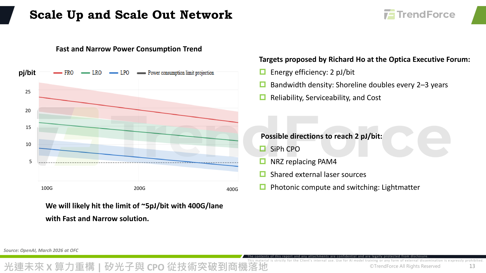

### 解讀摘要
FRO／LRO／LPO 三種可插拔光學方案的功耗（pJ/bit）隨資料速率（100G→400G/lane）增加而下降，但均逐漸逼近圖中虛線標示的「功耗極限預估」（約 5pJ/bit）；文字明確指出「400G/lane 下以 Fast and Narrow 方案將很可能觸及 ~5pJ/bit 的極限」。OpenAI 架構師 Richard Ho 在 Optica Executive Forum 提出目標：能效 2pJ/bit、頻寬密度（Shoreline 密度每 2-3 年翻倍）、可靠度/可維護性/成本；達成 2pJ/bit 的可能路徑包括 SiPh CPO、以 NRZ 取代 PAM4、共享外部雷射源、以及光子運算與交換（Lightmatter）。

### 表格
| 技術 | 100G/lane 功耗（視覺估算） | 400G/lane 功耗（視覺估算） |
|---|---|---|
| FRO | ~24 pJ/bit | ~17 pJ/bit |
| LRO | ~17 pJ/bit | ~11 pJ/bit |
| LPO | ~9 pJ/bit | ~4 pJ/bit |
| 功耗極限預估 | ~5 pJ/bit（水平線） | ~5 pJ/bit（水平線） |

*以上為視覺估算，無精確數據標籤*

> **洞察九**：LPO 在 400G/lane 時的功耗（視覺估算 ~4pJ/bit）已低於報告標示的「~5pJ/bit 極限」，代表可插拔方案在現有物理架構下幾乎已無再優化空間——這正是驅動全產業轉向 CPO（目標 2pJ/bit，較現有 LPO 再降低約 50%以上）的直接技術動機，而非單純的成本考量。

---

## Fig. 10｜OCI-MSA Implementation

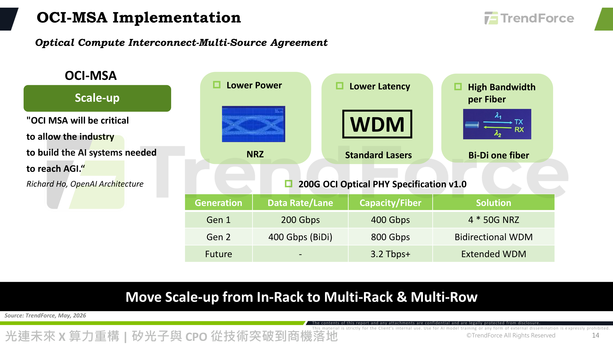

### 解讀摘要
Richard Ho 強調「OCI MSA 對整個產業建構通往 AGI 所需的 AI 系統至關重要」。OCI-MSA 聚焦三大目標：更低功耗（NRZ）、更低延遲（WDM 標準雷射）、更高單芯頻寬（Bi-Di 單纖雙向）。規格路徑清楚分三階段：Gen1（200Gbps/lane、400Gbps/fiber、4×50G NRZ）→Gen2（400Gbps(BiDi)/lane、800Gbps/fiber、雙向WDM）→Future（3.2Tbps+/fiber、擴展WDM）。banner 明確指出方向：「將 Scale-up 從機架內（In-Rack）推向跨機架、跨列（Multi-Rack & Multi-Row）」。

### 表格
| 世代 | 每通道速率 | 單纖容量 | 技術方案 |
|---|---|---|---|
| Gen 1 | 200 Gbps | 400 Gbps | 4×50G NRZ |
| Gen 2 | 400 Gbps (BiDi) | 800 Gbps | 雙向 WDM |
| Future | — | 3.2 Tbps+ | 擴展 WDM |

> **洞察十（配合 Fig. 4）**：單纖容量規劃從 400Gbps（Gen1）到 3.2Tbps+（Future）是 8 倍成長，恰好呼應 Fig. 4 中 NVLink domain 規模同樣以 8 倍（NVL72→576、NVL144→1152）擴張的模式——顯示 OCI 標準的頻寬路線圖是為了匹配 NVIDIA 下一代機架級擴展需求量身打造，而非通用光通訊規格。

---

## Fig. 11｜OCI PHY Scope vs. Adjacent Technologies

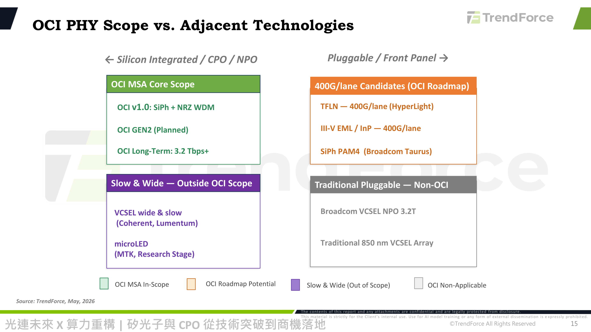

### 解讀摘要
2×2 矩陣依「矽整合/CPO/NPO」vs「可插拔/前面板」及「OCI 範疇內」vs「範疇外」分類技術路徑：OCI MSA 核心範疇（矽整合側）涵蓋 OCI v1.0(SiPh+NRZ WDM)、Gen2(規劃中)、長期目標(3.2Tbps+)；OCI Roadmap Potential（可插拔側）涵蓋 TFLN 400G/lane(HyperLight)、III-V EML/InP 400G/lane、SiPh PAM4(Broadcom Taurus)；範疇外的「慢寬」路線（VCSEL wide&slow：Coherent、Lumentum；MicroLED：MediaTek研究階段）；以及與 OCI 無關的傳統可插拔（Broadcom VCSEL NPO 3.2T、傳統850nm VCSEL陣列）。

> **洞察十一**：Broadcom 同時出現在「OCI Roadmap Potential」（Taurus SiPh PAM4）與「Traditional Pluggable — Non-OCI」（VCSEL NPO 3.2T）兩個象限，顯示 Broadcom 採取多技術路徑並行下注策略，而非單押 OCI 標準——這與 Fig. 8 洞察中 Coherent/Samtec 等零組件廠的「多重下注」模式一致，反映產業龍頭在標準未定案前普遍採取分散技術風險的策略。

---

## Fig. 12｜Summary of Trends at OFC 2026

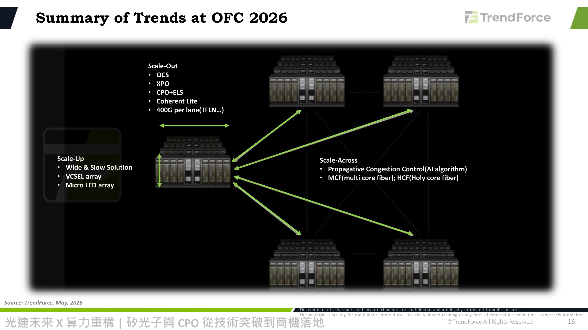

### 解讀摘要
本圖以四機架叢集示意圖彙總三層互連的技術選項：Scale-Up（慢寬方案：VCSEL 陣列、MicroLED 陣列）、Scale-Out（OCS、XPO、CPO+ELS、Coherent Lite、400G/lane TFLN 等）、Scale-Across（AI 演算法驅動的傳播壅塞控制、多芯光纖 MCF、空芯光纖 HCF）。此圖為 Section 1（技術突破）的收尾總結，將前述 Fig. 3-11 的個別技術點統整為單一架構視圖。

> **洞察十二**：值得注意的是 Scale-Up 欄位在此總結圖中僅列「慢寬方案」（VCSEL/MicroLED 陣列），並未提及 Fig. 4/Fig. 10 討論的 SiPh CPO——這代表 SiPh CPO 雖是長期目標，但截至 OFC 2026 當下，業界對 Scale-Up 短期內的務實共識仍是成熟的 VCSEL 陣列技術，與 Fig. 14 SiPh CPO(Scale-Up) 「目標 12-24 個月內部署」的保守時程互相呼應。

---

## Fig. 13｜High-Speed Transceiver Shipments are Surging, Driven by AI Demand

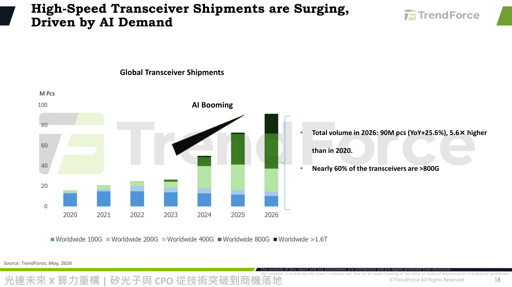

### 解讀摘要
全球收發器出貨量按速率別（100G/200G/400G/800G/>1.6T）從 2020 年到 2026 年持續成長，2026 年總出貨量達 90M pcs（YoY+25.6%），為 2020 年的 5.6 倍；且近 60% 的收發器規格已在 800G 以上，顯示出貨結構重心已從電信級低速產品轉向 AI 叢集所需的高速產品。此圖是全篇少數具備明確總量與成長率數字的量化圖表，也是支撐報告「AI 正在重塑光收發器需求結構」核心論點的關鍵證據。

> **洞察十三（配合 Fig. 14）**：90M pcs 的 2026 年總出貨中，近 60% 為 800G 以上——但對照 Fig. 14，CPO(800G+1.6T+3.2T) 佔全部收發器的滲透率僅 0.53%，代表這波「800G 以上」出貨量幾乎全數仍是可插拔（非 CPO）產品。換言之，AI 驅動的收發器需求爆發在 2026 年當下，紅利絕大部分仍落在傳統可插拔供應鏈，而非 CPO 供應鏈。

---

## Fig. 14｜Beyond 1.6T: Manufacturers Shift Focus to Next-Gen Optics

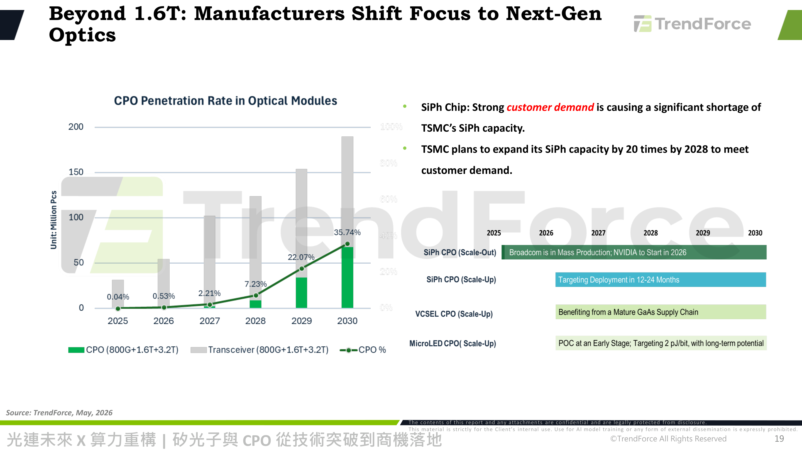

### 解讀摘要
CPO 滲透率（CPO/Transceiver, 800G+1.6T+3.2T 口徑）從 2025 年的 0.04% 逐年攀升：2026年0.53%→2027年2.21%→2028年7.23%→2029年22.07%→2030年35.74%，呈現明顯的非線性加速（2028-2030 三年間滲透率成長超過 4 倍）。文字說明矽光子晶片因客戶強勁需求造成 TSMC SiPh 產能顯著短缺，TSMC 計畫在 2028 年前將 SiPh 產能擴增 20 倍以滿足需求。技術路線時程：SiPh CPO(Scale-Out) — Broadcom 已量產、NVIDIA 2026 年啟動；SiPh CPO(Scale-Up) — 目標 12-24 個月內部署；VCSEL CPO(Scale-Up) — 受惠成熟 GaAs 供應鏈；MicroLED CPO(Scale-Up) — 早期概念驗證階段，長期目標 2pJ/bit。

### 表格
| 年度 | CPO 滲透率 |
|---|---|
| 2025 | 0.04% |
| 2026 | 0.53% |
| 2027 | 2.21% |
| 2028 | 7.23% |
| 2029 | 22.07% |
| 2030 | 35.74% |

> **洞察十四**：2028→2029 一年間滲透率從 7.23% 跳升至 22.07%（增加約 3 倍），是曲線上斜率最陡的一段，時間點恰好對應 TSMC「2028 年前完成 20 倍 SiPh 產能擴張」的目標——顯示 TSMC 的產能擴張進度是決定 CPO 放量斜率的關鑑變數，而非需求端限制。
> **值得驗證**：TSMC 20 倍產能擴張若延遲落地（例如良率爬坡不如預期），2029-2030 的滲透率加速曲線可能後移，這是本報告 CPO 投資時程假設中風險最集中的單一變數。

---

## Fig. 15｜China's Dominance in the Optical Interconnects Industry

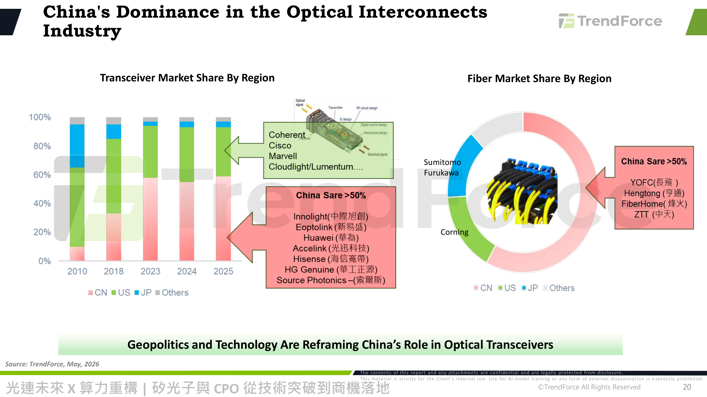

### 解讀摘要
收發器市占率按地區（CN/US/JP/Others）從 2010 年到 2025 年的變化顯示中國廠商市占持續攀升，2023-2025 年穩定在五成以上；主要中國廠商包括 Innolight(中際旭創)、Eoptolink(新易盛)、Huawei(華為)、Accelink(光迅科技)、Hisense(海信寬帶)、HG Genuine(華工正源)、Source Photonics(索爾斯)，對照美系(Coherent、Cisco、Marvell、Cloudlight/Lumentum)。光纖市占率同樣呈現中國過半格局，主要廠商為 YOFC(長飛)、Hengtong(亨通)、FiberHome(烽火)、ZTT(中天)，對照日系(Sumitomo、Furukawa)與美系(Corning)。banner 強調：「地緣政治與技術正重塑中國在光收發器產業中的角色」。

> **洞察十五（配合 Fig. 16）**：中國廠商在收發器與光纖兩端市占均已過半，但 Fig. 16 顯示的美國出口管制「附帶限制」（Collateral Restrictions）正迫使供應鏈買方因合規風險而轉移採購來源——這意味著中國廠商即使市占率數字亮眼，其可服務的（尤其是美系 CSP 客戶的）實際訂單能見度可能因地緣政治因素被侵蝕，市占數字與未來營收成長性未必同步。

---

## Fig. 16｜Optical/AI Interconnects: No Direct Ban, but under "Collateral Restrictions"

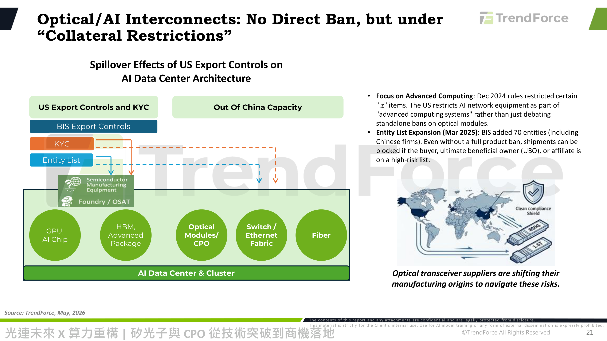

### 解讀摘要
美國出口管制的溢出效應圖顯示 BIS Export Controls 透過 KYC 與 Entity List 機制流向半導體製造設備／晶圓代工/OSAT，進而影響 AI 資料中心與叢集內的 GPU/AI晶片、HBM/先進封裝、光模組/CPO、交換器/Ethernet Fabric、光纖等全部環節。關鍵事實：2024年12月規則將特定".z"品項納入「先進運算系統」管制範疇，而非針對光模組單獨立法禁售；2025年3月 Entity List 擴大新增70個實體（含中國廠商），即使沒有針對特定產品的全面禁令，只要買方、實質受益人（UBO）或關係企業列入高風險名單，出貨仍可能被阻擋。世界地圖與「Clean compliance shield」圖示說明光收發器供應商正調整製造產地以規避此類合規風險。

> **洞察十六**：管制邏輯是「透過買方/UBO身分認定」而非「透過產品類別禁售」，代表光模組/CPO廠商即使產品本身不在管制清單上，仍可能因終端客戶身分而被阻擋出貨——這對供應鏈盡職調查（KYC）能力提出新要求，也是驅動供應商將產地移出中國的直接誘因（配合 Fig. 15 的供應鏈外移觀察）。

---

## Fig. 17｜Huawei's τ-Scaling & Optical Interconnects

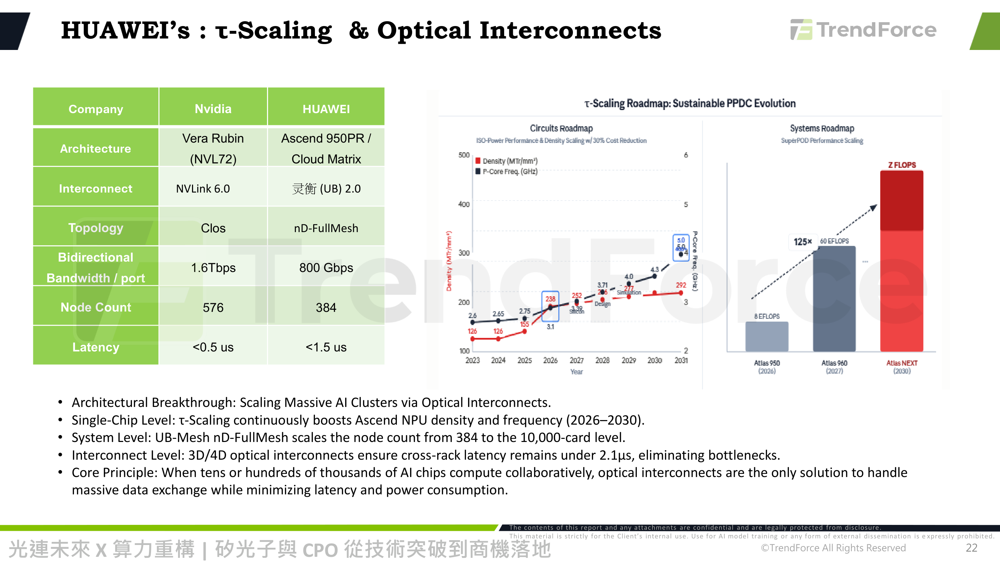

### 解讀摘要
Nvidia(Vera Rubin NVL72) 與 Huawei(Ascend 950PR/Cloud Matrix) 規格對照：互連協定 NVLink6.0 vs 靈衢(UB)2.0；拓樸 Clos vs nD-FullMesh；單埠雙向頻寬 1.6Tbps vs 800Gbps；節點數 576 vs 384；延遲 <0.5us vs <1.5us。右側 τ-Scaling 路線圖顯示電路密度（MTr/mm²）與核心頻率（GHz）自 2023 年至 2031 年持續攀升（126MTr/mm²@2.6GHz → 模擬值292MTr/mm²@5.0GHz），系統路線圖則規劃 SuperPOD 效能由 Atlas 950(2026, 8 EFLOPS) 擴展至 Atlas 960(2027, 60 EFLOPS) 再到 Atlas NEXT(2030, Z FLOPS 量級)。文字強調 UB-Mesh nD-FullMesh 拓樸規劃將節點數從 384 擴展至萬卡級，並以 3D/4D 光互連確保跨機架延遲低於 2.1us。

### 表格
| 項目 | NVIDIA（Vera Rubin NVL72） | Huawei（Ascend 950PR/Cloud Matrix） |
|---|---|---|
| 互連協定 | NVLink 6.0 | 靈衢(UB) 2.0 |
| 拓樸 | Clos | nD-FullMesh |
| 單埠雙向頻寬 | 1.6 Tbps | 800 Gbps |
| 節點數 | 576 | 384 |
| 延遲 | <0.5 us | <1.5 us |

> **洞察十七**：華為單埠頻寬（800Gbps）僅為 NVIDIA（1.6Tbps）的一半、節點數（384）也僅 NVIDIA（576）的三分之二，但文字明確指出其擴展目標是「萬卡級」——顯示華為選擇以拓樸廣度（nD-FullMesh）而非單埠頻寬深度來追趕算力規模，這種架構選擇對光互連元件的用量（埠數）需求可能反而高於 NVIDIA 路線，對中國本土光模組供應鏈（Fig. 15 所列廠商）是潛在的量增機會。

---

## Fig. 18｜Taiwan Reshaping the Value with Semiconductor & Integrated Ecosystems

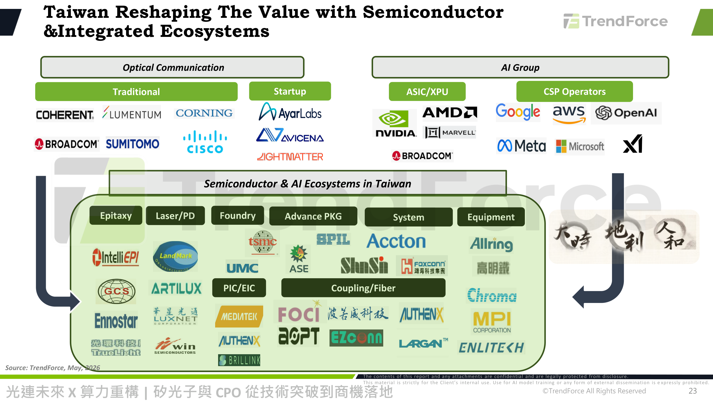

### 解讀摘要
本圖將上游光通訊廠商（傳統：Coherent、Lumentum、Corning、Broadcom、Sumitomo、Cisco；新創：AyarLabs、Avicena、Lightmatter）與 AI 陣營（ASIC/XPU：NVIDIA、AMD、Marvell、Broadcom；CSP：Google、AWS、OpenAI、Meta、Microsoft、xAI）匯流至「台灣半導體與 AI 生態系」，並依環節細分：磊晶（IntelliEPI、LandMark、GCS、Ennostar、TrueLight/光環科技）、雷射/PD（LandMark、Artilux、Luxnet/華星光通、WIN Semiconductors/全新）、晶圓代工（TSMC、UMC）、PIC/EIC（MediaTek、AuthenX、Brillink）、先進封裝（SPIL、ASE）、耦合/光纖（FOCI、波若威、AuthenX、EZconn）、系統（Accton/智邦、欣興、Foxconn/鴻海）、設備（Allring、高明鐵、Chroma/致茂、MPI Corporation、Largan/大立光、Enlitech）。

> **洞察十八（總結性洞察）**：對照 Fig. 7 的國際廠商生態圖，台灣供應鏈補齊了從磊晶到系統整合的完整中下游環節，尤其在「PIC/EIC」與「先進封裝」兩個 CPO 特有環節（MediaTek、ASE、SPIL）具備切入卡位——這代表若 Fig. 14 的 CPO 滲透率如期在 2028 年後加速，台灣供應鏈有機會從單純的可插拔模組代工，升級承接更高附加價值的 CPO 封裝與整合角色。

---

## 相關個股清單

| 類別 | 公司 | Ticker | 評等 | 備註 |
|---|---|---|---|---|
| 晶圓代工／SiPh產能瓶頸 | 台積電 TSMC | 2330 | — | SiPh 產能最大瓶頸，計畫2028年前擴產20倍 |
| 台灣半導體/封測 | 聯電 UMC | 2303 | — | Foundry環節 |
| 台灣封裝測試 | 日月光投控 ASE | 3711 | — | Advance PKG環節 |
| 台灣IC設計 | 聯發科 MediaTek | 2454 | — | MicroLED CPO、PIC/EIC環節 |
| 台灣系統整合 | 智邦 Accton | 2345 | — | System環節，交換器/白牌硬體 |
| 台灣系統整合 | 鴻海 Foxconn | 2317 | — | System環節 |
| 台灣光學元件 | 大立光 Largan | 3008 | — | Equipment/光學元件環節 |
| 台灣測試設備 | 致茂電子 Chroma | 2360 | — | Equipment環節 |
| 台灣磊晶/雷射 | 全新光電 WIN Semiconductors | 3105 | — | Laser/PD環節 |
| 台灣光通訊 | 華星光通 Luxnet | 4979 | — | Laser/PD環節 |
| 美股CPO/光學龍頭 | Coherent Corp | NASDAQ: COHR | — | SiPh CPO、VCSEL、Open CPX創始成員，多重下注 |
| 美股網通設備 | Broadcom | NASDAQ: AVGO | — | SiPh CPO Scale-Out已量產；VCSEL NPO 3.2T同時佈局 |
| 美股網通設備 | Arista Networks | NYSE: ANET | — | XPO創始成員，LPO/Scale-out生態 |
| 美股光通訊 | Lumentum | NASDAQ: LITE | — | VCSEL慢寬路線 |
| 美股半導體 | Marvell | NASDAQ: MRVL | — | OCI創始成員 |
| 美股網通設備 | Ciena | NYSE: CIEN | — | Open CPX創始成員 |
| 美股玻璃光纖 | Corning | NYSE: GLW | — | 光纖/MCF生態主力 |
| 中國光通訊 | 中際旭創 Innolight | SZ:300308 | — | 傳統收發器市占龍頭，XPO成員 |
| 中國光通訊 | 新易盛 Eoptolink | SZ:300502 | — | 傳統收發器市占前段班 |
| 中國光纖 | 長飛光纖 YOFC | SH:601869 / HK:6869 | — | 光纖市占中國龍頭之一 |
| 中國光纖 | 亨通光電 Hengtong | SH:600487 | — | 光纖供應鏈 |
| 中國光纖 | 烽火通信 FiberHome | SH:600498 | — | 光纖供應鏈 |
