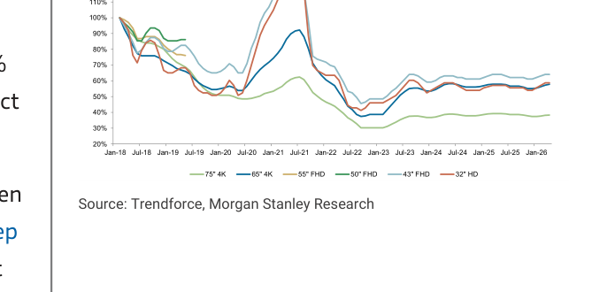
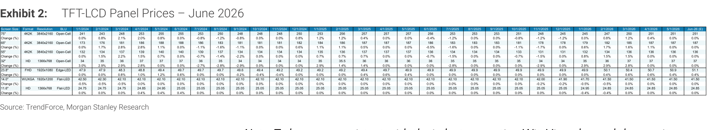
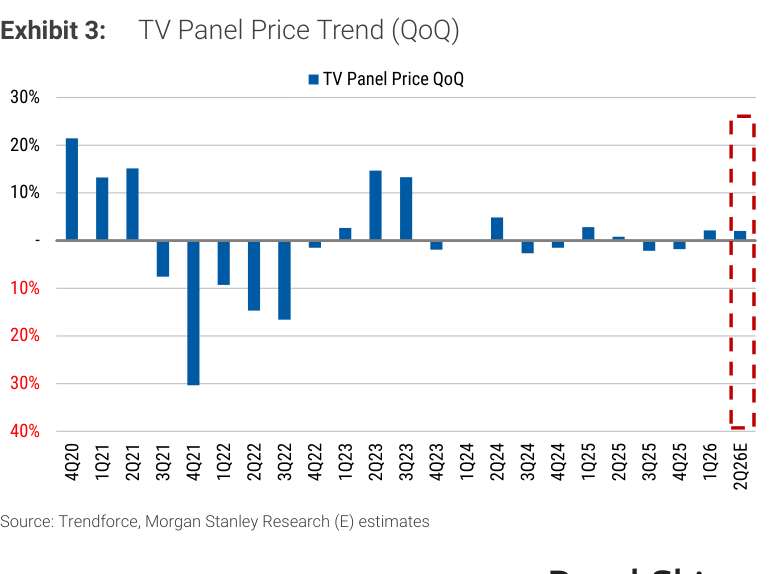
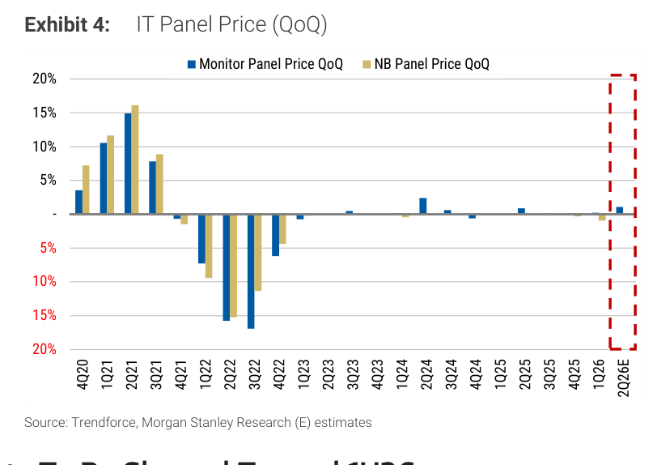
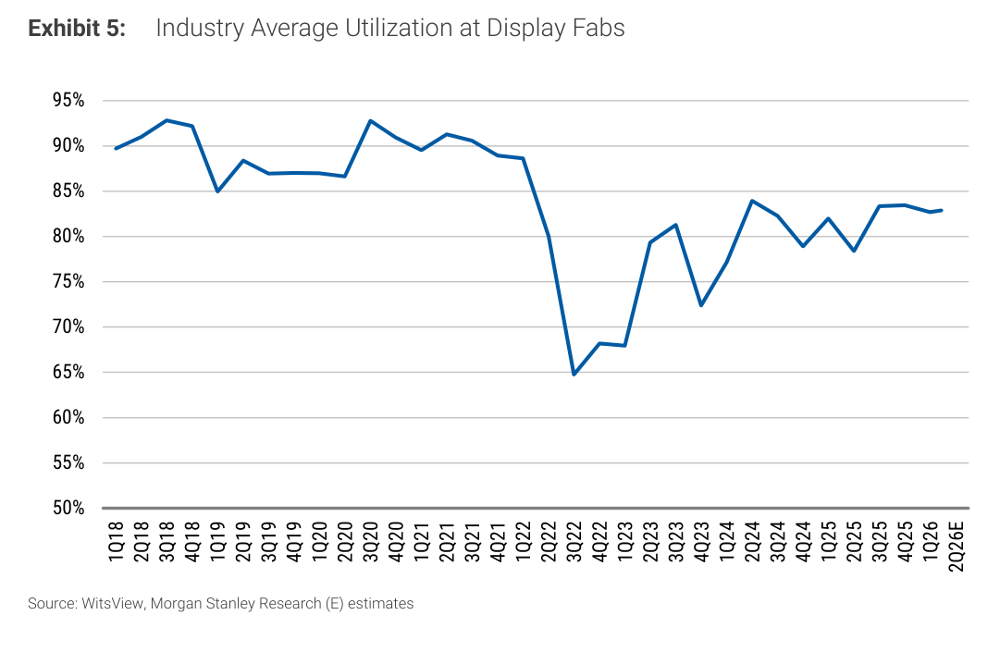
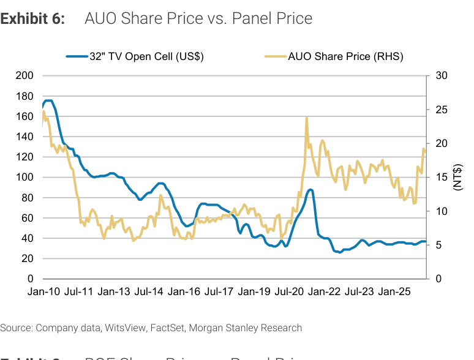
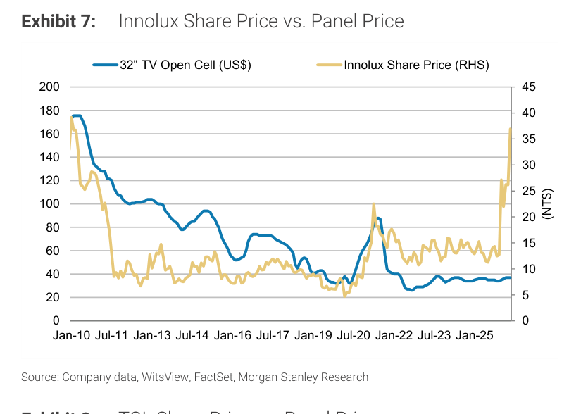
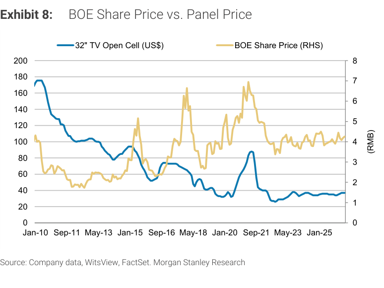
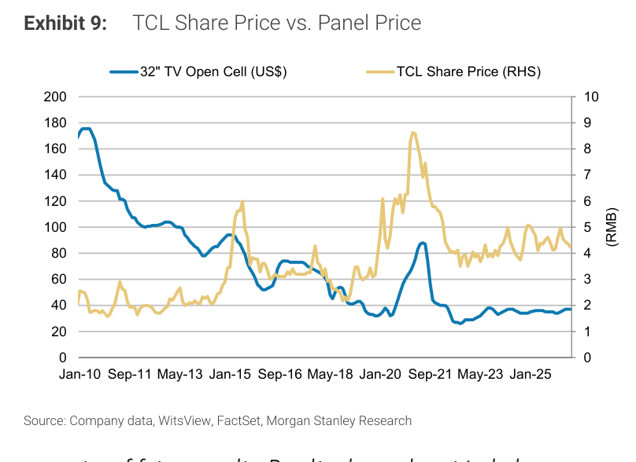

# MS｜TFT-LCD Panel Price Outlook for June 2026

**券商**：Morgan Stanley  
**分析師**：Derrick Yang、Shawn Kim、Vivi Huang、Sharon Shih  
**日期**：2026-06-07  
**主題**：TFT-LCD Panel Price Outlook for June 2026: TVs Flat, Monitors +0.2%, NBs Flat MoM  
**評級**：Greater China Technology Hardware：In-Line；S. Korea Technology：Attractive  
<button type="button" onclick="fetch('https://ti-lei.github.io/foreign-reports/static/downloads/產業/20260607_MS_TFT-LCD-Panel-Price.md').then(r=>r.text()).then(t=>{let a=document.createElement('a');a.href='data:text/plain;charset=utf-8,'+encodeURIComponent(t);a.download='20260607_MS_TFT-LCD-Panel-Price.md';a.click()})">⬇ 下載 MD</button>

---

## MS 完整投資邏輯鏈

| 論點層次 | Exhibit | 內容 |
|---|---|---|
| 價格高點確認 | Exhibit 3 | TV 面板漲價動能見頂：Q226E 預估季漲低個位數 %，3Q26 起轉跌 |
| 供給紀律確認 | Exhibit 5 | 面板廠稼動率維持 80-85%，中國廠商轉型「生產跟單」模式，週期縮短為季度級別 |
| 估值偏貴 | Exhibit 6-9 | 台股 AUO 1.4x P/B、Innolux 1.9x P/B 均超過近年峰值；股價已 price in 漲價利多 |
| 新業務貢獻時程延後 | 文字 | 玻璃基板用於先進封裝的產業鏈仍在優化流程，2026-27 貢獻不顯著 |
| 偏好排序 | 文字 | 中國內：BOE > TCL；台股：EW，無明顯買點 |
| **結論** | 封面 | **維持 EW；面板漲價週期見頂，估值已充分反映，玻璃封裝是中長期而非近期催化劑** |

> **報告最大邏輯缺口**：「3Q26 TV 面板價格轉跌」的幅度未量化，僅以「supply-side discipline 提供下行支撐」帶過，未給出跌幅預估範圍。

---

## 報告核心觀點

| 主題 | MS 觀點 | 市場共識 | 是否 Contra-Consensus |
|---|---|---|---|
| 6 月 TV 面板價格 | 持平 MoM，主流 32/43/55/65/75" 均平穩 | — | — |
| 6 月 IT 面板價格 | Monitor +0.2% MoM，NB 持平 | — | — |
| TV 面板轉折點 | 3Q26 開始轉跌，但幅度有限 | 部分樂觀預期漲價延續至年底 | 偏保守 |
| 稼動率 | 2Q26E 維持 80-85%，與 1Q26 持平 | — | — |
| 玻璃封裝（GLW 主題） | 技術路線正確，但 2026-27 尚無顯著貢獻 | 部分市場對玻璃封裝有較高期待 | Contra-Consensus，降低預期 |
| 台股估值 | AUO / Innolux 已超近年峰值，不具吸引力 | 多空不一 | 偏保守 |

**偏好排序**：BOE（規模優勢、估值合理）> TCL（EW，已 price in）；台股 AUO、Innolux 均 EW

---

## Exhibit 1｜TFT-LCD TV Panel Price Trends（Jan-18 至今）

### 解讀摘要

TV 面板絕對價格指數（Jan-18=100%）顯示，2020-21 年超級上行週期（+50-60%）之後，2022-23 年深度修正至 30-40% 歷史低位，2024-25 年初反彈至 60-65% 區間。目前 2026 年初各尺寸面板均回升至約 55-65% 指數水準，接近 2018-2019 年的穩定期水準。32" HD 受中國廠商競爭長期承壓，指數僅約 35%，明顯落後其他尺寸；大尺寸 65-75" 則因需求結構更穩定，維持相對高位。

> **洞察一**：各尺寸面板的指數收斂趨勢（2025-26 年已從過去 20-30ppt 差異縮窄至 10-15ppt 以內）反映大尺寸化拉動整體結構改善，32" 的持續弱勢是結構性而非週期性——這對以 32" 為主的廠商是長期毛利拖累。

---

## Exhibit 2｜TFT-LCD Panel Prices – June 2026（詳細月度報價表）

### 解讀摘要

Exhibit 2 是完整月度報價追蹤表，涵蓋 TV（32"-75"）、Monitor（23.8"/14.0"）、NB（11.6"/14.0"/15.6"）等主要面板規格，記錄 2024 年 1 月至 2026 年 6 月（估）的月度絕對價格（US\$）與 MoM 漲跌幅。6 月各規格 MoM 變化均為 0%（TV）或 +0.4%（23.8" Monitor），符合報告標題「TVs Flat, Monitors +0.2%, NBs Flat」。

### 表格（6 月 2026 報價摘要，視覺估算）

| 規格 | 尺寸 | 解析度 | Jun-26E 價格（US\$） | MoM 變化 |
|---|---|---|---|---|
| TV | 75" | 4K2K | 251 | 0.0% |
| TV | 65" | 4K2K | 187 | 0.0% |
| TV | 55" | 4K2K | 136 | 0.0% |
| TV | 32" | HD | 37 | 0.0% |
| Monitor | 23.8" | FHD | 51.1 | +0.4% |
| Monitor | 14.0" | WUXGA | 41.50 | 0.0% |
| NB | 11.6" | HD | 24.85 | 0.0% |

---

## Exhibit 3｜TV Panel Price Trend（QoQ）

### 解讀摘要

TV 面板 QoQ 漲幅在 2Q26E 仍為正值（低個位數 %），但明顯低於 2023 年 2-3Q 的 15% 高峰。MS 預估 2Q26E 為最後一個正 QoQ 季度，3Q26 起轉負。歷史上每次 QoQ 由正轉負的幅度在 -5% 至 -15% 之間；本次 MS 認為供給紀律可提供「下行支撐」，跌幅可能偏溫和。

> **值得驗證**：MS 預估「supply discipline 限制跌幅」的假設。若中國廠商因內需走弱而提前放量，實際跌幅可能達 -10% 以上，影響 3-4Q26 台股面板廠的毛利率超過 2ppt。

---

## Exhibit 4｜IT Panel Price（QoQ）

### 解讀摘要

IT 面板（Monitor 和 NB）的 QoQ 波幅一貫低於 TV 面板——TV 最大振幅逾 30%，IT 僅約 ±15%。2Q26E IT 面板 QoQ 預估接近 0%，與 TV 轉折的時間點不同（IT 預估 4Q26 才轉跌）。這一分化說明 IT 面板的需求相對穩定，PC 換機週期延長降低了季節性波動。

> **洞察二**：IT 面板比 TV 面板晚一個季度轉跌（4Q26 vs 3Q26），若成立，面板廠中以 IT 為主的 Innolux（IT 佔比 ~55%）在 3Q26 毛利表現應優於主打 TV 的 BOE，但這個優勢窗口僅一季——不足以翻轉估值論點。

---

## Exhibit 5｜Industry Average Utilization at Display Fabs

### 解讀摘要

顯示廠稼動率在 2022 年 3Q 跌至歷史低點約 65%（COVID 後去庫存+需求崩潰），2023-24 年底反彈至 80-85%，目前 1Q26 約 83%、2Q26E 持平。值得注意的是，2022-24 年的每次反彈均止步於 85% 以下——這與 2018-21 年動輒 90%+ 的高稼動率形成對比，反映中國廠商「非滿載生產」策略已內化為行業常態（而非受外部衝擊壓低）。

> **洞察三**：83-85% 的「新均衡稼動率」意味著每一波需求啟動，廠商可在不大幅擴產的情況下增加供給，面板漲價週期天花板比過去低——支持 MS「漲價幅度溫和」的整體論點。

---

## Exhibit 6-9｜各公司股價 vs 面板價格（AUO / Innolux / BOE / TCL）

### 解讀摘要

四張圖均以 32" TV Open-Cell 面板價格（左軸，US\$）對應各公司股價（右軸），追蹤至 Jan-25。從圖表可觀察到：1）2020-21 年超級週期時股價與面板價格同步上衝，AUO/Innolux 股價一度達 NT\$25-37；2）目前面板價格約 US\$37（僅略高於 2023 低點的 US\$32），但 AUO 股價約 NT\$20、Innolux 約 NT\$36，遠高於面板價格所隱含的歷史估值水準。BOE/TCL 的 RMB 股價亦類似——面板價格尚未回到 2021 高點，但股價已超前。

> **洞察四**：從歷史關係來看，當前台股 AUO 和 Innolux 的股價對應「面板價格需維持 US\$55+」的隱含水準，而目前面板價格僅約 US\$37 且即將轉跌。股價過度前跑的幅度約 40-50%（依歷史迴歸），這就是 MS 維持 EW 的核心估值依據。

---

## Exhibit 10｜GLW Display Volumes vs. Utilization

### 解讀摘要

Corning（GLW）玻璃出貨量與面板廠稼動率高度相關（GLW 是面板廠最大玻璃基板供應商）。圖表顯示 2Q26E 稼動率 QoQ 小幅下滑（約 -2%），GLW 玻璃出貨量 QoQ 預估持平至微增（約 +3-5%）。MS 用此圖作為 GLW 顯示業務展望的代理指標——顯示業務是 GLW 最大單一業務，且與稼動率同步；2Q26E 的溫和分歧（稼動率微降但玻璃出貨小升）反映客戶提前下單緩衝。

---

## 相關個股清單

| 類別 | 公司 | Ticker | 評等 | 目標價 | 備註 |
|---|---|---|---|---|---|
| 台灣面板 | AUO | 2409.TW | EW | NT\$14.00 | 0.7x 2026E P/B；現價 1.4x，估值超前 |
| 台灣面板 | Innolux | 3481.TW | EW | NT\$19.50 | 0.7x 2026E P/B；Pioneer 整合帶來混合業務改善 |
| 中國面板 | BOE | 000725.SZ | EW | Rmb5.20 | 1.4x 2026E P/B；優於 TCL，規模優勢 |
| 中國面板 | TCL | 000100.SZ | EW | Rmb4.70 | 1.7x 2026E P/B；已 price in 漲價 |
| 玻璃基板 | Corning | GLW.N | — | — | 顯示業務與稼動率高度連動，光纖業務回升 |
| 台灣 DDIC | Novatek | 3034.TW | UW | — | PC/手機/汽車需求弱，但 OLED DDI 份額提升（iPhone） |
| 南韓面板 | LG Display | 034220.KS | — | — | OLED 2H25 起貢獻增加，但終端需求仍有壓力 |
