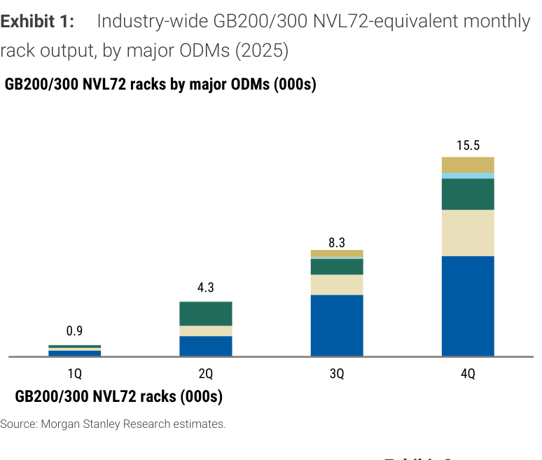
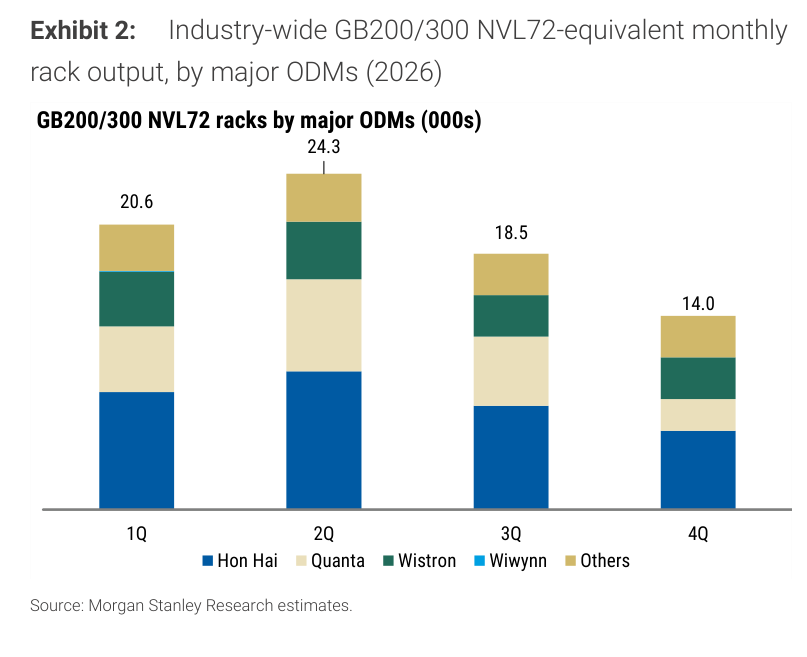
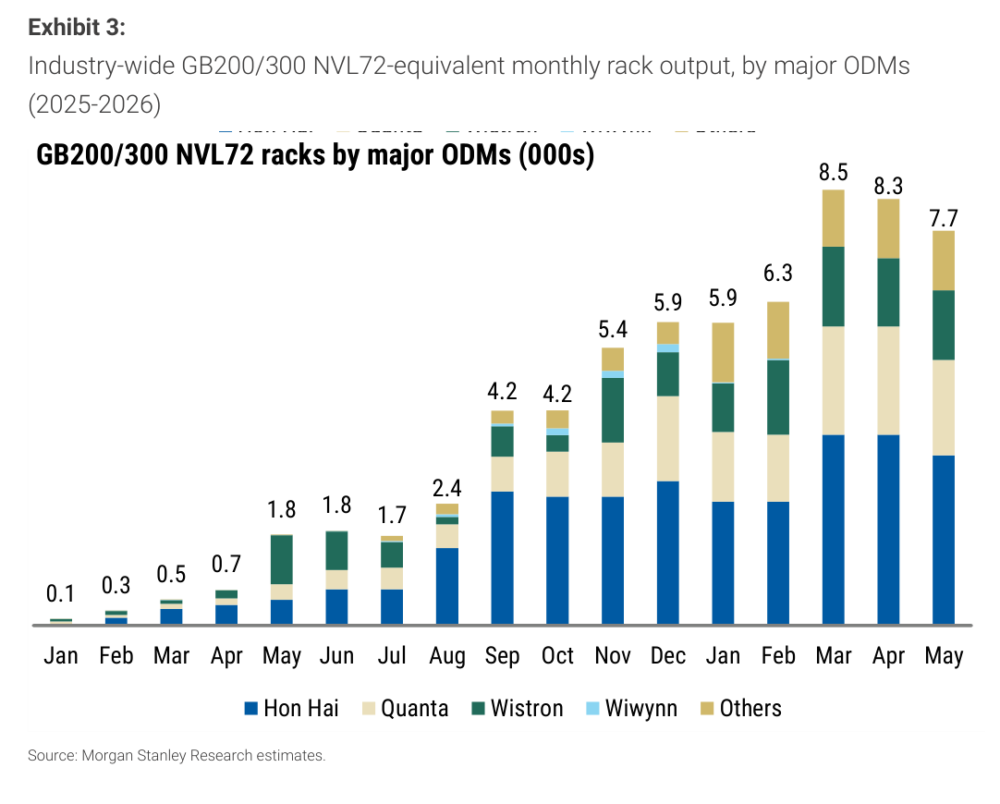
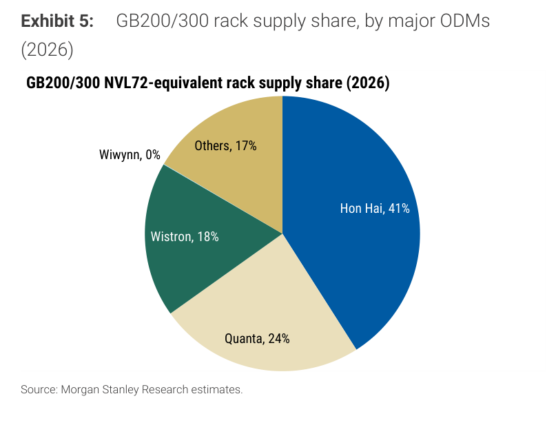

# MS｜GB200 / GB300 NVL72 Rack — 2026年5月出荷

**券商**：Morgan Stanley  
**分析師**：Howard Kao、Sharon Shih、Irene Yen  
**日期**：2026-06-08  
**主題**：GB200/GB300 NVL72 Rack ODM 出荷追蹤（月度更新）  
**評級**：Industry View In-Line  
<button type="button" onclick="fetch('https://ti-lei.github.io/foreign-reports/static/downloads/產業/20260608_MS_GB200-NVL72.md').then(r=>r.text()).then(t=>{let a=document.createElement('a');a.href='data:text/plain;charset=utf-8,'+encodeURIComponent(t);a.download='20260608_MS_GB200-NVL72.md';a.click()})">⬇ 下載 MD</button>

---

## MS 完整投資邏輯鏈

| 論點層次 | Exhibit | 內容 |
|---|---|---|
| 需求確認 | Ex1/2 | 2025 全年 ~29K、2026E 70-80K，YoY >100%；但 2H26 季度出貨從 2Q 高峰下滑（3Q 18.5K → 4Q 14.0K） |
| 供應集中度下降 | Ex4/5 | 鴻海市占從 51%→41%，Others 從 6%→17%，新進者切入分散供應鏈 |
| May 月出貨低於前月 | Ex3 | 5 月 7.7K（-7% MoM），為近 3 個月最低；Quanta 月出貨 1.8-1.9K 低於 4 月 ~2.1K |
| 偏好排序確立 | 封面 | Wistron > 鴻海 > 廣達（以目標價上行空間排序） |
| **結論** | 封面 | **70-80K 全年目標維持不變，但出貨分佈偏前，2H 下滑需注意；偏好 Wistron 作為差異化** |

> **報告最大邏輯缺口**：MS 包含 Wistron L10 computing tray 的「rack equivalent」換算，實際 L11 完整 rack 交貨數量低於此數字；L10→L11 的轉換比例假設未揭露。

---

## 報告核心觀點

| 主題 | MS 觀點 | 市場共識 | 是否 Contra-Consensus |
|---|---|---|---|
| 2026 全年 rack 出貨 | 70-80K（>100% YoY vs. 2025 ~29K） | 同方向，但 2H 下滑非主流預期 | — |
| 5 月出貨 | ~7.7K（-7% MoM） | 市場期待持平或上升 | ✅ 月出貨走低 |
| Wistron 2Q26 | ~4.2K（+4% QoQ），維持原預估 | 未有明確共識 | — |
| Quanta 2Q26 | 調降至 ~6.7K（原 ~7.5K），低於預期 | — | ✅ 下調 |
| 鴻海 2Q26 | ~10K（+18% QoQ），優於季度趨勢 | — | — |

**偏好排序**：Wistron（3231）> 鴻海（2317）> 廣達（2382）  
**零件/個股偏好**：Wistron 因目標價上行空間最大；鴻海維持 2Q 成長動能

---

## Exhibit 1｜GB200/300 NVL72 Rack ODM 季度出荷（2025）

### 解讀摘要

2025 年 GB200/300 rack 出荷呈顯著前低後高：1Q 僅 0.9K，4Q 飆升至 15.5K，全年合計 ~29K。這條斜率告訴我們 GB200 系列的量產爬坡週期約 6-9 個月，意味著以此為基礎的 2026 年預測需承接相當高的基期——尤其是下半年。

> **原文補充**：MS 指出這些數字包含 Wistron 的 L10 computing tray（rack equivalent），並非所有 rack 都是完整 L11 成品，因此實際交貨至終端客戶的數量可能低於圖示。

### 表格

| 季度 | GB200/300 NVL72 Rack 出荷（千台）|
|---|---|
| 1Q25 | 0.9 |
| 2Q25 | 4.3 |
| 3Q25 | 8.3 |
| 4Q25 | 15.5 |
| **全年 2025** | **29.0** |

> **洞察一**：4Q25（15.5K）佔全年 53%，顯示 GB200 量產在 4Q 才真正放量；如 GB300 複製此模式，2026 年的前置期對庫存管理要求更高。

---

## Exhibit 2｜GB200/300 NVL72 Rack ODM 季度出荷（2026E）

### 解讀摘要

2026 年模式與 2025 年截然不同——出貨呈倒 U 型：1Q 即已高達 20.6K，2Q 峰值 24.3K，此後 3Q 降至 18.5K、4Q 更降至 14.0K。全年合計 77.4K，YoY +167%，但後半年的下坡結構暗示 GB300 接替速度不及 GB200 退潮速度，或客戶拉貨集中在上半年。

### 表格

| 季度 | GB200/300 NVL72 Rack 出荷（千台）|
|---|---|
| 1Q26E | 20.6 |
| 2Q26E | 24.3 |
| 3Q26E | 18.5 |
| 4Q26E | 14.0 |
| **全年 2026E** | **77.4** |

> **洞察二**：2H26 出貨（18.5+14.0=32.5K）比 2H25（8.3+15.5=23.8K）仍成長 37%，但相較 1H26（20.6+24.3=44.9K）下滑 28%。這種前重後輕的節奏若 GB300/VR200 延誤（Daiwa 亦提到 VR200 可能延至 4Q26 末），2H26 缺口有上行風險。

> **值得驗證**：2H26 14-18.5K 的預測隱含 GB300 能在 3Q-4Q 順利出貨接替；若 GB300 系統整合問題延誤，2H 出貨可能持平 2Q 甚至超越，全年數字上修可能。

---

## Exhibit 3｜月度出荷時序（2025 年 1 月 — 2026 年 5 月）

### 解讀摘要

月度出荷從 2025 年 1 月的 0.1K 成長至 2026 年 3 月的 8.5K 峰值後小幅回落，5 月為 7.7K（-7% MoM）。MS 認為 5 月下滑主因 Quanta 月出貨降低（1.8-1.9K vs. 4 月 ~2.1K），但 Wistron 微增（1.3-1.4K，+2% MoM）、鴻海下降（~3.3K，-11% MoM）。

> **原文補充**：Wistron 的 May MoM 成長（+2%）部分來自 Wiwynn 拉貨（Wiwynn 5 月 +2% MoM 至 NT\$84.1B），而非純 GB200/300 tray 增量。

### 表格

| 月份 | 總出荷（千台）|
|---|---|
| 2025-01 | 0.1 |
| 2025-02 | 0.3 |
| 2025-03 | 0.5 |
| 2025-04 | 0.7 |
| 2025-05 | 1.8 |
| 2025-06 | 1.8 |
| 2025-07 | 1.7 |
| 2025-08 | 2.4 |
| 2025-09 | 4.2 |
| 2025-10 | 4.2 |
| 2025-11 | 5.4 |
| 2025-12 | 5.9 |
| 2026-01 | 5.9 |
| 2026-02 | 6.3 |
| 2026-03 | 8.5 |
| 2026-04 | 8.3 |
| 2026-05 | 7.7 |

---

## Exhibit 4｜GB200/300 Rack 市占（2025）

### 解讀摘要

2025 年鴻海以 51% 主導 GB200/300 rack 供應，廣達與緯創各佔 21%/20%，合計三家占 92%。高度集中意味供應彈性有限，任一廠產能或良率問題均直接衝擊整體出貨。

### 表格

| ODM | 2025 市占 | 推算年度出荷（千台，總 ~29K）|
|---|---|---|
| 鴻海（Hon Hai）| 51% | ~14.8 |
| 廣達（Quanta）| 21% | ~6.1 |
| 緯創（Wistron）| 20% | ~5.8 |
| Others | 6% | ~1.7 |
| 緯穎（Wiwynn）| 2% | ~0.6 |

*推算為視覺估算，交叉驗證通過（各份額×29K=合計）

---

## Exhibit 5｜GB200/300 Rack 市占（2026E）

### 解讀摘要

2026 年鴻海市占從 51% 降至 41%，Others（新進者）從 6% 暴增至 17%，顯示供應鏈多元化加速。廣達從 21% 升至 24%，緯創從 20% 降至 18%，緯穎退出（0%）。市占重組背後是客戶主動分散供應商風險的策略——尤其在 GB300 進入量產後，新廠商導入窗口打開。

### 表格

| ODM | 2026E 市占 | 推算年度出荷（千台，總 ~77K）| YoY 出荷成長 |
|---|---|---|---|
| 鴻海（Hon Hai）| 41% | ~31.6 | +114% |
| 廣達（Quanta）| 24% | ~18.5 | +203% |
| 緯創（Wistron）| 18% | ~13.9 | +140% |
| Others | 17% | ~13.1 | +671% |
| 緯穎（Wiwynn）| 0% | ~0 | — |

*推算為視覺估算，交叉驗證通過

> **洞察三（配合 Exhibit 4）**：Others 從 1.7K→13.1K，YoY +671%，為成長最快的「廠商群」。這不是市占被搶，而是整體餅變大後新進者切入（29K→77K，增量 48K；Others 吃了 ~11.4K 增量，佔 24%）。鴻海雖市占下降 10ppt，但絕對出貨仍成長 +114%。

---

## 跨 Exhibit 彙整表

### 彙整 1｜ODM 季度出貨趨勢（Exhibit 1+2）

| 年度 | 1Q | 2Q | 3Q | 4Q | **全年** |
|---|---|---|---|---|---|
| 2025 | 0.9 | 4.3 | 8.3 | 15.5 | **29.0** |
| 2026E | 20.6 | 24.3 | 18.5 | 14.0 | **77.4** |
| YoY | >100% | >100% | +123% | -10% | +167% |

（單位：千台）

> 2025 年是「爬坡年」（前低後高），2026 年是「拉貨年」（前重後輕）——4Q26 YoY 反而 -10%，顯示 2025 年 4Q 的高基期讓 2026 下半年比較效應轉差，需留意市場是否過度外推 2H26 成長動能。

---

## 相關個股清單

| 類別 | 公司 | Ticker | 評等 | 備註 |
|---|---|---|---|---|
| ODM（AI Rack）| 緯創（Wistron）| 3231 | OW | 優先偏好，目標價上行空間最大 |
| ODM（AI Rack）| 鴻海（Hon Hai）| 2317 | OW | 2Q26 ~10K 增速最強 |
| ODM（AI Rack）| 廣達（Quanta）| 2382 | OW | 2Q26 小幅下調至 ~6.7K |
| AI 伺服器組裝 | 緯穎（Wiwynn）| 6669 | — | 2026E 市占降至 0%（L11 非其主力）|
