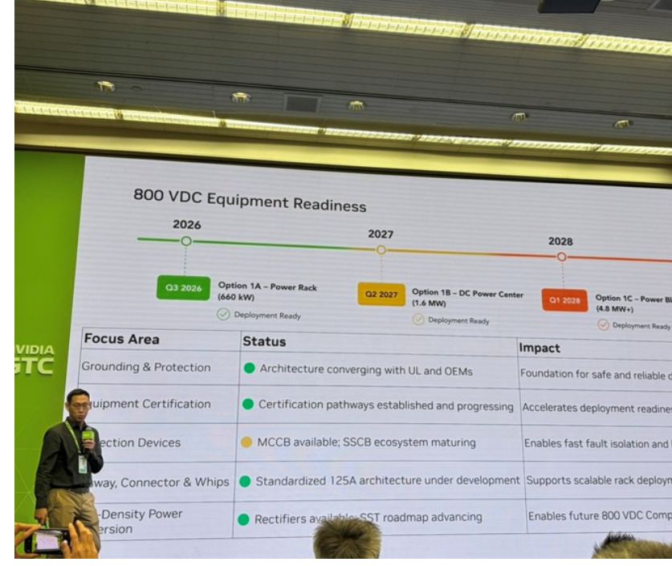

# MS｜800V DC 延遲傳聞回應

**券商**：Morgan Stanley  
**分析師**：Sharon Shih、Samantha Chen  
**日期**：2026-06-10  
**主題**：Power Solutions – Our Thoughts on Rumored 800V DC Delay  
**評級**：Industry View In-Line  
<button type="button" onclick="fetch('https://ti-lei.github.io/foreign-reports/static/downloads/產業/20260610_MS_800V-DC-Delay.md').then(r=>r.text()).then(t=>{let a=document.createElement('a');a.href='data:text/plain;charset=utf-8,'+encodeURIComponent(t);a.download='20260610_MS_800V-DC-Delay.md';a.click()})">⬇ 下載 MD</button>

---

## MS 完整投資邏輯鏈

| 論點層次 | Exhibit | 內容 |
|---|---|---|
| 傳聞觸發 | 報告封面 | SemiAnalysis 6/9 報導：Nvidia 800V DC 原生架構大規模出貨推遲至 2028；±400V 仍按計畫服務 ASIC hyperscaler |
| MS 反向供應鏈確認 | 報告封面 | Computex 通路調查顯示：Nvidia GTC Taipei 確認 800 VDC 開發持續，Power Rack 3Q26 準備量產 |
| 設備準備進度 | Exhibit 1 | NVIDIA 官方路線圖：660kW Rack Q3 2026 → 1.6MW DC Center Q2 2027 → 4.8MW+ Q1 2028；接地保護、認證、轉換器均為綠燈 |
| 首個量產訊號 | 報告封面 | 台達電 4Q26 率先為美國主要 hyperscaler 量產 800 VDC 獨立電源機架（initial volumes 有限） |
| **結論** | 報告封面 | **800 VDC 時程不變，但安規認證（UL）與工業安全標準仍在定義中，初期出貨量有限；中期趨勢完整** |

---

## 報告核心觀點

| 主題 | MS 觀點 | 市場共識（SemiAnalysis） | 是否 Contra-Consensus |
|---|---|---|---|
| 800V DC 時程 | 3Q26 Power Rack 量產，台達 4Q26 首批出貨，全路線圖按計畫 | 推遲至 2028 | ✅ 是 |
| ±400V 地位 | ±400V 被各 hyperscaler 重新導向 800V 優先開發 | ±400V 仍是主流（ASIC 路線） | 部分反向 |
| 初期出貨規模 | 4Q26 開始但量不大，UL 認證與工業安全標準仍在制定 | — | — |

**個股影響**：台達電（2308）為 800 VDC 電源機架首批量產供應商，直接受益。

---

## Exhibit 1｜800 VDC Equipment Readiness

### 解讀摘要
NVIDIA GTC Taipei 官方展示的設備就緒路線圖，以時間軸呈現三個選項：Q3 2026 的 660kW 標準 Power Rack（已就緒）、Q2 2027 的 1.6MW DC Power Center，以及 Q1 2028 的 4.8MW+ 大型系統。五大基礎建設面向（接地保護、認證、保護裝置、連接器、高密度電源轉換）中，四項為綠燈（架構收斂中/進展順利），僅保護裝置（SSCB 生態系統成熟中）顯示黃燈。這張來自 Nvidia 官方的幻燈片是 MS 駁斥「延遲至 2028」說法的直接依據。

> **原文補充**：Nvidia 否認了 SemiAnalysis 的報導。MS 報告是對市場傳聞的即時回應，不是定期研究更新。

### 表格

**800 VDC 部署時間軸**

| 時間 | 選項 | 容量 | 狀態 |
|---|---|---|---|
| Q3 2026 | Option 1A – Power Rack | 660 kW | Deployment Ready |
| Q2 2027 | Option 1B – DC Power Center | 1.6 MW | Deployment Ready |
| Q1 2028 | Option 1C – Power [Brick/Block] | 4.8 MW+ | Deployment Ready |

**800 VDC 五大基礎建設面向**

| Focus Area | Status | 燈號 | Impact |
|---|---|---|---|
| Grounding & Protection | Architecture converging with UL and OEMs | 🟢 | Foundation for safe and reliable deployment |
| Equipment Certification | Certification pathways established and progressing | 🟢 | Accelerates deployment readiness |
| Protection Devices | MCCB available, SSCB ecosystem maturing | 🟡 | Enables fast fault isolation |
| Gateway, Connector & Whips | Standardized 125A architecture under development | 🟢 | Supports scalable rack deployment |
| High-Density Power Conversion | Rectifiers available; SST roadmap advancing | 🟢 | Enables future 800 VDC computing |

> **洞察一**：SSCB（Solid State Circuit Breaker）是唯一黃燈項目，也是業界技術成熟度最低的環節。800V DC 的瞬間短路電流遠高於傳統 DC，SSCB 需在數微秒內斷路，技術難度高於傳統 MCCB；這是「量產就緒」與「全面商用部署」之間最後的主要技術瓶頸。

> **值得驗證**：MS 報告稱台達電 4Q26 量產首批，但 SemiAnalysis 方向與 Nvidia 官方說法均有矛盾。若 UL 認證與 SSCB 標準無法在 3Q26 底前確認，4Q26 量產時程有向後移的風險。

---

## 相關個股清單

| 類別 | 公司 | Ticker | 評等 | 備註 |
|---|---|---|---|---|
| 電源供應 | 台達電 | 2308 | OW | 800 VDC 電源機架首批量產供應商（4Q26） |
| 電源供應 | 貿聯KY | 3665 | OW | 電源互連受益（HVDC 架構） |
