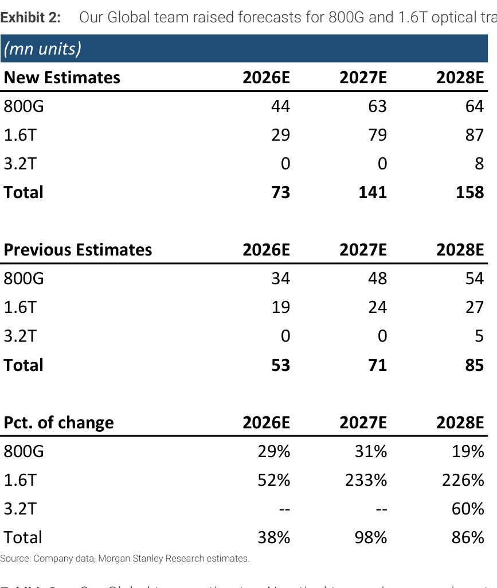
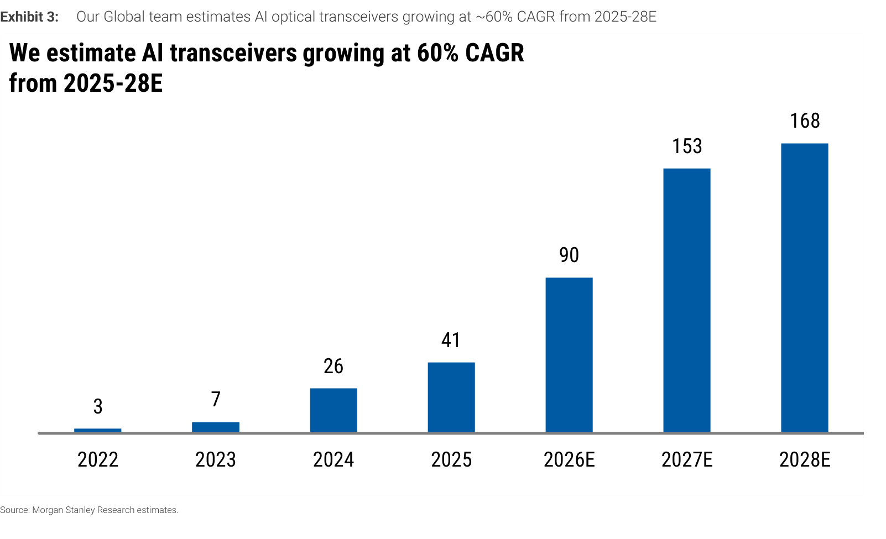
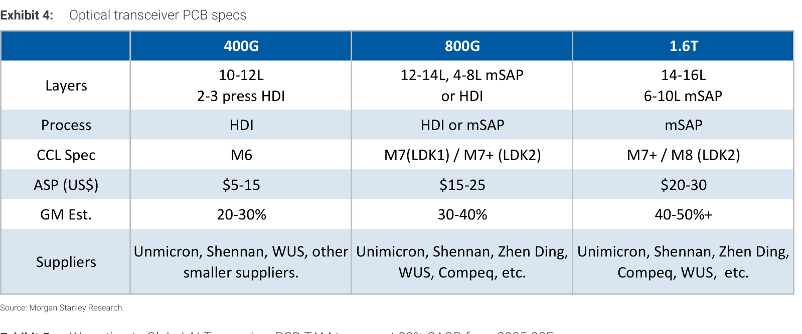
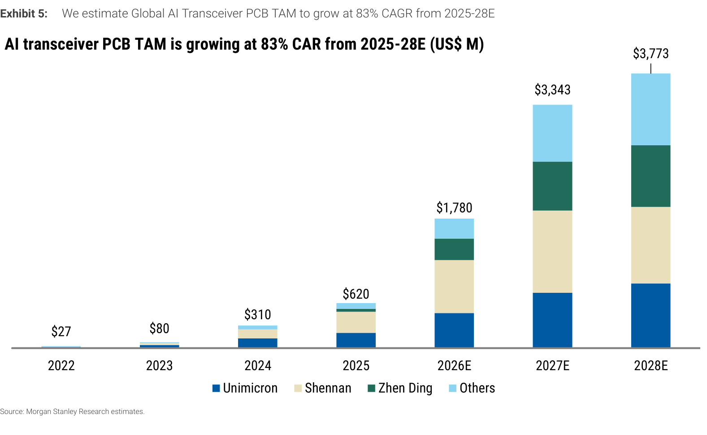
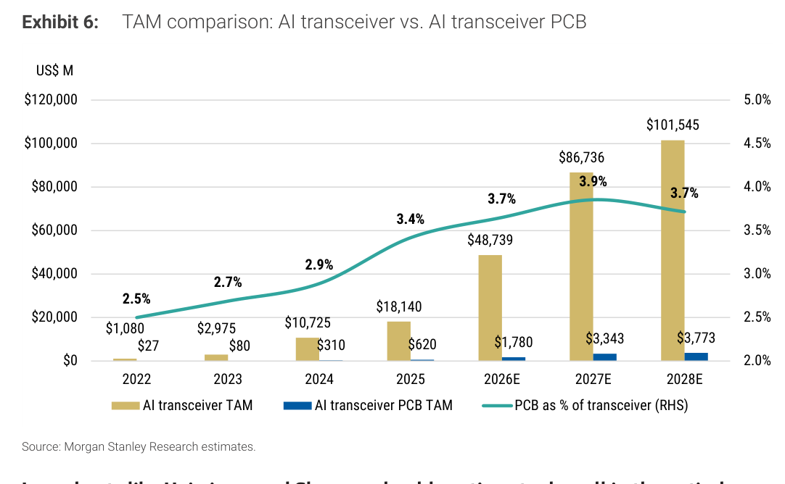
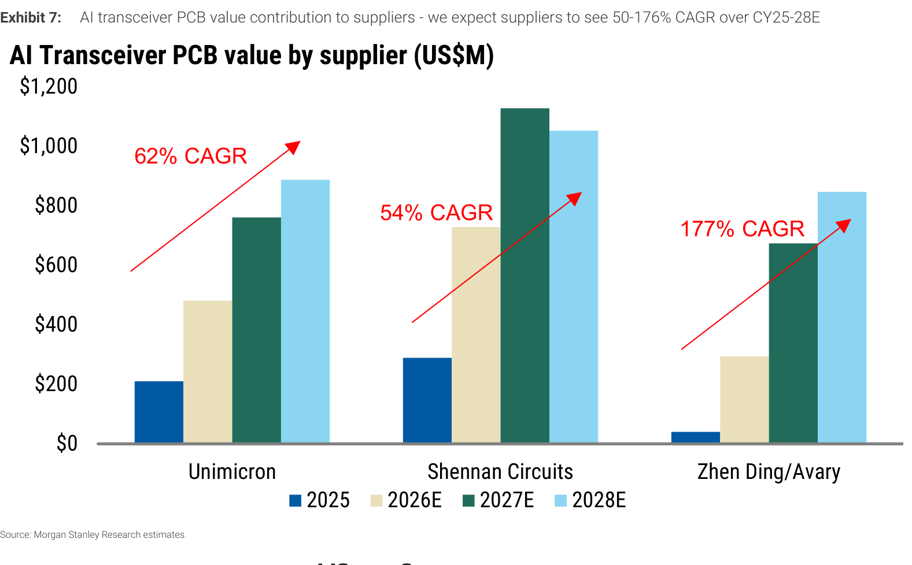

# MS｜Optics Drives the Board: PCB Beneficiaries of the AI Interconnect Build-out

**券商**：Morgan Stanley  
**分析師**：Howard Kao、Irene Yen、Sharon Shih  
**日期**：2026-06-11  
**主題**：光收發器 PCB 供應商受益 AI 互聯建置潮  
**評級**：Industry View In-Line  
<button type="button" onclick="fetch('https://ti-lei.github.io/foreign-reports/static/downloads/產業/20260611_MS_Optics-PCB-AI-Interconnect.md').then(r=>r.text()).then(t=>{let a=document.createElement('a');a.href='data:text/plain;charset=utf-8,'+encodeURIComponent(t);a.download='20260611_MS_Optics-PCB-AI-Interconnect.md';a.click()})">⬇ 下載 MD</button>

---

## MS 完整投資邏輯鏈

| 論點層次 | Exhibit | 內容 |
|---|---|---|
| 需求信號明確 | Exhibit 2、3 | MS 全球團隊大幅上調 AI 光收發器出貨量至 73/141/158M units（2026-28E），其中 1.6T 上調 52-233%；AI 收發器 CY25-28 CAGR 達 60% |
| 內容量升級放大 TAM | Exhibit 4、5 | 400G→1.6T 遷移驅動 PCB ASP 從 \$10 升至 \$25（+2.5x），層數 10L→16L，製程 HDI→mSAP，毛利率 20-30%→40-50%+；PCB TAM CAGR 83% vs 收發器出貨 60% CAGR |
| PCB TAM 規模突破 | Exhibit 5、6 | AI 收發器 PCB TAM 從 CY25 \$620M 擴張至 CY28 \$3.8bn，可比 Apple HDI PCB 年需求（\$3.0-3.5B），佔整體收發器 TAM 的 3.7-3.9% |
| 份額爭奪加速 | Exhibit 7 | ZDT CY25-28 CAGR 達 177%，遠高於 Unimicron 62%、Shennan 54%；mSAP 技術壁壘拉高進場門檻，有 Apple iPhone 供應鏈經驗的廠商具優勢 |
| 首選標的 | 報告封面 | **ZDT（4958）OW，PT 上調至 NT\$666（+17%），20x CY28 P/E）；Unimicron（3037）OW，PT NT\$1,285；Shennan（002916）EW，PT Rmb400，估值偏高** |

> **報告最大邏輯缺口**：Exhibit 7 各供應商絕對值為視覺估算；ZDT 的 177% CAGR 依賴 mSAP 資格取得順利及客戶認證時程，任何延遲將大幅壓縮份額假設。

---

## 報告核心觀點

| 主題 | MS 觀點 | 市場共識 | 是否 Contra-Consensus |
|---|---|---|---|
| AI PCB TAM 成長速度 | PCB TAM CAGR 83% > 收發器出貨 CAGR 60%，內容量升級是超額驅動力 | 市場主要聚焦 GPU、網路晶片、光模組廠商，PCB 供應鏈未充分反映 | ✅ 是 |
| ZDT 份額增速 | ZDT 從 CY25 7.5% 份額擴至 CY28 ~20%（1.6T 市場達 ~25%），CAGR 177% | 市場較低估 ZDT 的 mSAP 遷移受益程度 | ✅ 是 |
| 毛利率改善幅度 | 1.6T PCB 毛利率可達 40-50%+，接近 ABF 載板水準 | 傳統觀念認為 PCB 毛利率受限，難超過 30% | ✅ 是 |
| Shennan 估值 | 維持 EW：儘管受益最大但估值（25x CY28 P/E）偏貴 | — | — |
| CPO 風險 | CPO 大規模採用前不太可能發生在 2027-28 前，短中期影響有限 | CPO 是 pluggable transceiver 的長期威脅 | 中性至偏多 |

**偏好排序**：ZDT > Unimicron >> Shennan（估值因素）

**個股偏好**：ZDT（15x CY28 P/E）、Unimicron（17x CY28 P/E）為首選；Shennan（25x CY28 P/E）估值偏貴故 EW

---

## Exhibit 2｜AI 光收發器出貨預測大幅上調

### 解讀摘要

此次上調的核心驅動力在於 1.6T 速率的爆發性成長：1.6T CY26/27/28 分別上調 52%/233%/226%，從原本的 19/24/27M 大幅修至 29/79/87M 單位，三年合計上調近 3 倍。800G 雖也有 29-31% 的上調，但幅度遠低於 1.6T，顯示市場已快速進入比 800G 更高速的世代。對 PCB 供應商而言，1.6T 轉型的意義超過出貨量本身——它代表強制採用 mSAP 製程，製程壁壘從此打開差異化空間。

### 表格（百萬單位）

| 速率 | 新預估 2026E | 新預估 2027E | 新預估 2028E | 舊預估 2026E | 舊預估 2027E | 舊預估 2028E | 2026E 變化 | 2027E 變化 | 2028E 變化 |
|---|---|---|---|---|---|---|---|---|---|
| 800G | 44 | 63 | 64 | 34 | 48 | 54 | +29% | +31% | +19% |
| 1.6T | 29 | 79 | 87 | 19 | 24 | 27 | +52% | +233% | +226% |
| 3.2T | 0 | 0 | 8 | 0 | 0 | 5 | -- | -- | +60% |
| **Total** | **73** | **141** | **158** | **53** | **71** | **85** | **+38%** | **+98%** | **+86%** |

> **洞察一**：1.6T 在 CY27E 的上調幅度達 233%，遠超 800G 的 31%——意味著 MS 全球團隊認為 800G 週期比原先短得多，市場將在 CY27 直接跳入以 1.6T 為主的世代。對 PCB 供應商來說，越早完成 mSAP 認證（1.6T 必要條件），份額獲得的時間窗口越長。

---

## Exhibit 3｜AI 光收發器 CY25-28E 60% CAGR 成長

### 解讀摘要

AI 光收發器從 CY22 年僅 3M 單位到 CY28E 168M 單位，6 年間成長 56 倍。注意 CY25 至 CY28 三年 CAGR 達 60%，但其中 CY26→CY27 增幅最陡（90M→153M，+70%），這與 1.6T 的快速放量時程一致。整體出貨規模的 99% CAGR（CY25-28，其中含 1.6T 99% CAGR）代表的是整個 AI 互聯基礎設施的大規模建置，而非漸進式滲透。

> **原文補充**：MS 指出，此圖所示為 AI 光收發器總量（包含所有速率），與 Exhibit 2 中僅統計 800G+ 的 73/141/158M 單位數存在差異——後者為更嚴格的「AI 收發器」定義，前者推估含部分 400G AI 應用需求。

### 表格（百萬單位）

| 年份 | 出貨量 |
|---|---|
| 2022 | 3 |
| 2023 | 7 |
| 2024 | 26 |
| 2025 | 41 |
| 2026E | 90 |
| 2027E | 153 |
| 2028E | 168 |

*CY25-28E CAGR：60%*

> **洞察二**：CY24→CY25 的 41/26 比值（+58%）已是強勁基期，CY26E 的 90M 意味著在高基期上再成長 +120%。這種「加速中的加速」模式在硬體科技週期中罕見，通常需要多個需求觸媒同步爆發（超大規模建置 + 速率升級 + 新客戶），才能維持。

---

## Exhibit 4｜光收發器 PCB 規格演進

### 解讀摘要

從 400G 到 1.6T，PCB 規格出現三維同步升級：層數（10-12L→14-16L）、製程（HDI→mSAP）、CCL 材料（M6→M8），三者疊加導致 ASP 從 \$5-15 躍升至 \$20-30（中點 +2.5x）。其中最關鍵的變化是製程：mSAP 能在更小空間實現更密集的導線佈局，是訊號完整性在高速傳輸下的必要條件。毛利率也從 20-30% 升至 40-50%+，意味著 1.6T PCB 的經濟性將向 ABF 載板（傳統高毛利品項）靠攏。

### 表格

| 規格 | 400G | 800G | 1.6T |
|---|---|---|---|
| 層數 | 10-12L，2-3 press HDI | 12-14L，4-8L mSAP 或 HDI | 14-16L，6-10L mSAP |
| 製程 | HDI | HDI 或 mSAP | mSAP |
| CCL 規格 | M6 | M7(LDK1) / M7+(LDK2) | M7+ / M8(LDK2) |
| ASP（US\$） | \$5-15 | \$15-25 | \$20-30 |
| 毛利率估計 | 20-30% | 30-40% | 40-50%+ |
| 主要供應商 | Unimicron、Shennan、WUS、其他小廠 | Unimicron、Shennan、Zhen Ding、WUS、Compeq 等 | Unimicron、Shennan、Zhen Ding、Compeq、WUS 等 |

> **洞察三**：400G 到 1.6T，PCB ASP 中點從 \$10 到 \$25（+2.5x），而毛利率從 25%（中點）到 45%（中點），意味著每片 PCB 的毛利貢獻從 \$2.5 升至 \$11.25（+4.5x），遠超 ASP 本身的漲幅。這是「精品化」而非只是「量的成長」——即使出貨量持平，PCB 廠的獲利能力也會顯著改善。

> **值得驗證**：mSAP 製程的良率爬坡速度是最大的不確定性。若 ZDT 或 Compeq 等新進者在 1.6T 的良率爬坡比預期慢 2-3 季，主要受益將回到 Unimicron 和 Shennan 這兩家已有量產經驗的供應商。

---

## Exhibit 5｜全球 AI 收發器 PCB TAM：83% CAGR（CY25-28E）

### 解讀摘要

PCB TAM 的 83% CAGR 顯著快於收發器出貨的 60% CAGR，超額的 23 個百分點來自 ASP 升級（content growth）。從 CY25 \$620M 到 CY28E \$3.8bn，3 年內市場膨脹逾 6 倍，等同於從 Apple 全球 HDI PCB 需求的 20% 擴張至接近 Apple 的全部需求規模。從市占結構看，Shennan 在 CY26-27E 份額最大，但 ZDT 的比重快速擴張，Others（含 Compeq 等）在 CY27-28E 也顯著放大，反映市場從寡占走向多供應商格局。

### 表格（US\$ M）

| 年份 | TAM | Unimicron | Shennan | Zhen Ding | Others |
|---|---|---|---|---|---|
| 2022 | 27 | — | — | — | — |
| 2023 | 80 | — | — | — | — |
| 2024 | 310 | — | — | — | — |
| 2025 | 620 | — | — | — | — |
| 2026E | 1,780 | — | — | — | — |
| 2027E | 3,343 | — | — | — | — |
| 2028E | 3,773 | — | — | — | — |

*各廠份額細節見 Exhibit 7*

> **洞察四**：TAM 從 CY25 \$620M 到 CY26E \$1,780M，一年跳升近 3 倍（+187%），這幾乎不可能只靠量的成長達成（收發器 CY26E 出貨約 +119% YoY）。推算：若出貨 +119% 且 ASP 升至 \$15（800G 導入），則 \$620M × (1+1.19) × 1.5 = ~\$2.07bn，高於 \$1.78bn——意味著 MS 的 ASP 假設偏保守，或 800G 在 CY26 滲透率仍未全面超過 400G。

---

## Exhibit 6｜TAM 比較：AI 收發器 vs. AI 收發器 PCB

### 解讀摘要

PCB 佔收發器 TAM 的比例從 CY22 的 2.5% 穩步升至 CY27E 的 3.9%，之後在 CY28E 微降至 3.7%（因 Others 廠商產能追上，競爭拉低 ASP 增速）。絕對規模的對比更能說明問題：CY25 PCB \$620M vs 收發器 \$18,140M（3.4%）；CY28E PCB \$3,773M vs 收發器 \$101,545M（3.7%）——PCB 供應商的財務體量隨 AI 基礎設施投資同步膨脹，不是被稀釋。

### 表格（US\$ M）

| 年份 | AI 收發器 TAM | AI 收發器 PCB TAM | PCB 佔收發器比重 |
|---|---|---|---|
| 2022 | 1,080 | 27 | 2.5% |
| 2023 | 2,975 | 80 | 2.7% |
| 2024 | 10,725 | 310 | 2.9% |
| 2025 | 18,140 | 620 | 3.4% |
| 2026E | 48,739 | 1,780 | 3.7% |
| 2027E | 86,736 | 3,343 | 3.9% |
| 2028E | 101,545 | 3,773 | 3.7% |

> **洞察五（配合 Exhibit 5）**：PCB 佔比在 CY27E 達到 3.9% 的峰值後略微回落，這與 ZDT/Compeq 等新進者加入競爭、加速產能擴張的節奏吻合——市場供給追上需求後，ASP 上升斜率放緩。但這對 ZDT 是好消息：正是在這個窗口期之前（CY26-27）完成認證並拿下份額，才能享受高 ASP 紅利。

---

## Exhibit 7｜各供應商 AI 收發器 PCB 價值貢獻

### 解讀摘要

三家供應商的 CAGR 分化極為懸殊：ZDT 的 177% CAGR 是 Unimicron（62%）的 2.8 倍，是 Shennan（54%）的 3.3 倍。驅動 ZDT 超額成長的是份額從 CY25 約 7.5%（800G）、5%（1.6T）快速擴張至 CY28 約 20%（800G）、25%（1.6T），本質是 mSAP 技術從 Apple iPhone SLP 供應鏈「平移」至光收發器市場的優勢兌現。值得注意的是，Shennan 的 CY27E 絕對值看起來高於 CY28E——意味著 MS 預期 ZDT 在 1.6T 階段（CY27-28）蠶食了 Shennan 的部分份額。

> **原文補充**：MS 的供應商 CAGR 範圍（50-176%）中，「50%」對應 Shennan 的 54%（最穩健），「176%」對應 ZDT 的約 177%（最具爆發力），整個市場都在高速成長，但份額結構正在向技術壁壘更高的廠商重新分配。

### 表格（US\$ M，視覺估算）

| 供應商 | 2025 | 2026E | 2027E | 2028E | CY25-28 CAGR |
|---|---|---|---|---|---|
| Unimicron | ~205 | ~475 | ~760 | ~875 | 62% |
| Shennan Circuits | ~295 | ~725 | ~1,120 | ~1,000 | 54% |
| Zhen Ding/Avary | ~50 | ~295 | ~660 | ~835 | 177% |

*以上為視覺估算；各供應商 CY28E 合計約 \$2,710M，其餘約 \$1,063M 屬 Others（含 Compeq 等）*

> **洞察六**：ZDT 在 CY25 的基期僅約 \$50M，意味著其初期份額極低（佔 \$620M TAM 約 8%）。從 \$50M 到 CY28E ~\$835M 的絕對量成長中，約三分之二來自市場本身擴張（TAM ×6），三分之一來自份額提升——但若 mSAP 認證如預期進展，ZDT 在 1.6T 的份額擴張才是真正的 α，目前的估值（15x CY28 P/E）尚未充分反映此情景。

---

## 跨 Exhibit 彙整表

### 彙整 1｜PCB 市場成長的量 vs. 價拆解（CY25→CY28E）

| 驅動因子 | CY25 基點 | CY28E | 成長倍數 |
|---|---|---|---|
| AI 收發器出貨量（mn units） | 41 | 168 | 4.1x |
| PCB TAM（US\$ M） | 620 | 3,773 | 6.1x |
| 隱含 ASP 升幅（TAM / 出貨量） | \$15.1 | \$22.5 | 1.5x |

*來源：Exhibit 3、5*

> TAM 的 6.1x 成長 = 量成長 4.1x × ASP 升幅 1.5x（不含 Others 份額稀釋效果，近似計算）。這說明 PCB TAM 超額成長（83% vs 60% CAGR）的核心驅動確實是內容量升級，而非估算誤差。

### 彙整 2｜三家供應商 2025 → 2028E 市占結構變化

| 供應商 | CY25 份額 | CY28E 份額（估） | 份額變化 |
|---|---|---|---|
| Unimicron | ~33% | ~23% | ▼ 稀釋（絕對值仍成長） |
| Shennan Circuits | ~48% | ~26% | ▼ 稀釋（1.6T 被 ZDT 蠶食） |
| Zhen Ding/Avary | ~8% | ~22% | ▲ 大幅增加 |
| Others（含 Compeq） | ~11% | ~28% | ▲ 市場擴大帶動 |

*來源：Exhibit 5、7 視覺估算*

> 即使 Unimicron 和 Shennan 份額下滑，絕對收入仍以 62% 和 54% CAGR 成長——顯示市場「大到足以讓所有人都贏」。MS 的 ZDT OW 判斷是基於份額 α 而非依賴市場本身成長，這也是為何 ZDT 的 CAGR 能達 177%：它是份額 + 市場的雙重受益者。

---

## 相關個股清單

| 類別 | 公司 | Ticker | 評等 | 備註 |
|---|---|---|---|---|
| 首選 | 臻鼎 KY（Zhen Ding/Avary） | 4958.TW | OW | PT NT\$666（+17%），mSAP 先行者，1.6T 份額大幅擴增 |
| 次選 | 欣興電子（Unimicron） | 3037.TW | OW | PT NT\$1,285（+5%），既有份額領導者，ABF 基板額外支撐 |
| 中立 | Shennan Circuits | 002916.SZ | EW | PT Rmb400（+25%），受益最大但估值偏高（25x CY28 P/E） |
| 追蹤 | Compeq（楠梓電） | 2313.TW | Not Covered | 積極擴充 800G/1.6T 收發器 PCB 產能，潛在新進者 |
| 追蹤 | WUS Printed Circuit | — | Not Covered | 現有 400G 供應商，能否升級至 1.6T 是關鍵 |
