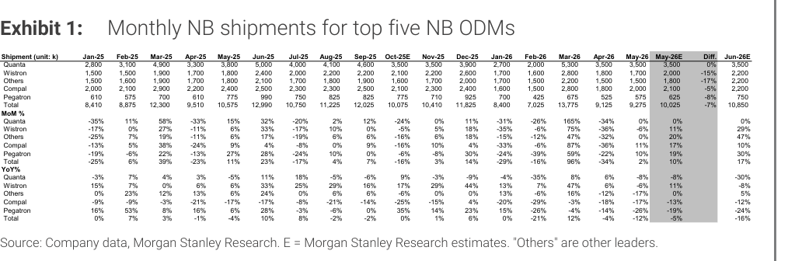
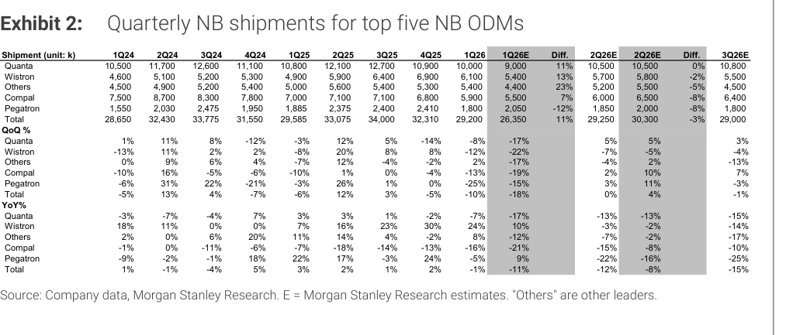

# MS｜NB Monthly Databook — May Miss -7%；2H Sub-Seasonal

**券商**：Morgan Stanley  
**分析師**：Howard Kao、Sharon Shih  
**日期**：2026-06-14  
**主題**：NB ODM 月度出貨數據更新（May-26 實際 vs 預估；2Q26E / 3Q26E 引導）  
**評級**：Industry View In-Line  
<a href="https://layx.uk/dl?g=產業&b=MS&d=20260614&h=NB-Monthly-Databook">📎 下載 PDF</a>

---

## MS 完整投資邏輯鏈

| 論點層次 | Exhibit | 內容 |
|---|---|---|
| 需求信號 | 1 | May-26 NB ODM 出貨 9,275K，miss MSe -7%；YoY -12%；Wistron/Others miss 最深（-15% / -17%） |
| 供應側瓶頸 | 封面 | 缺料（component constraints）是 miss 主因，非需求崩跌；ODM 被迫優先生產高端高利潤機型 |
| 季度修訂 | 2 | 2Q26E 下修 3% 至 29.3mn（flat QoQ，-12% YoY），較歷史同期季節性（+12% QoQ）低 12ppt |
| 下半年展望 | 2 | 3Q26E 引入 29mn（-1% QoQ，-15% YoY），低於歷史季節性（+5% QoQ）；依賴缺料緩解速度 |
| 結構轉變 | 封面 | OEM 在有限零件下優先塞入高端型號，帶動 ASP 走高；量弱利升的格局持續 |
| **結論** | 封面 | **NB 出貨量下修但缺料推動 premiumization；2H sub-seasonal，實際出貨取決於零件供應改善時序** |

> **報告最大邏輯缺口**：MS 坦承「難以預測確切時點（difficult to predict the exact timing）」缺料何時緩解；若零件供應意外改善，2H 出貨有向上彈性但當前估計未反映。

---

## 報告核心觀點

| 主題 | MS 觀點 | 市場共識 | 是否 Contra-Consensus |
|---|---|---|---|
| May-26 出貨 | 9,275K，miss MSe -7% | — | 低於預期 |
| 2Q26E NB build | 29.3mn（flat QoQ，-12% YoY），下修 3% | 歷史季節性 +12% QoQ | ✅ 大幅低於季節性 |
| 3Q26E NB build | 29mn（-1% QoQ，-15% YoY） | 歷史季節性 +5% QoQ | ✅ sub-seasonal |
| 出貨 miss 原因 | 缺料（component constraints） | 可能誤判為需求疲弱 | ✅ 供應 vs 需求區分重要 |
| OEM 策略 | 優先高端型號（premiumization），犧牲量保利 | — | 量弱利升 |

---

## Exhibit 1｜Monthly NB shipments for top five NB ODMs

### 解讀摘要

May-26 總出貨 9,275K，miss MSe 10,025K（-7%）。Wistron 和 Others 是主要 miss 來源（各 -15%、-17%），而 Quanta 完全 in-line（0%），反映各 ODM 面臨缺料壓力的程度不一——Quanta 客戶組合偏高端、缺料影響較小，Wistron 和 Others 標準品比重較高。Jun-26E 總量 10,850K（+17% MoM），反映季末客戶拉貨效應（quarter-end pull-in）。

> **原文補充**：MS 明確點出「component constraints remain the key bottlenecks, forcing ODMs to prioritize higher-end, more profitable models」——miss 的解讀框架是供應側而非需求側，ODM 並非拿不到訂單，而是缺零件做不出來。

### 表格（May-26 月出貨關鍵欄）

（單位：千台）

| ODM | Apr-26 | May-26 | May-26E | Diff | Jun-26E |
|---|---|---|---|---|---|
| Quanta | 3,500 | 3,500 | 3,500 | 0% | 3,500 |
| Wistron | 1,800 | 1,700 | 2,000 | -15% | 2,200 |
| Others | 1,500 | 1,500 | 1,800 | -17% | 2,200 |
| Compal | 1,800 | 2,000 | 2,100 | -5% | 2,200 |
| Pegatron | 525 | 575 | 625 | -8% | 750 |
| **Total** | **9,125** | **9,275** | **10,025** | **-7%** | **10,850** |

> **洞察一**：Quanta 完全 in-line 而 Wistron/Others 大幅 miss，說明缺料在 ODM 之間的衝擊不均——Quanta 高端客戶（Apple/HP Premium）優先取得零件，而標準商用機比重較高的 ODM 被犧牲。這是缺料週期中的典型現象，對供應鏈廠商意味著評估客戶結構比評估總量更重要。

---

## Exhibit 2｜Quarterly NB shipments for top five NB ODMs

### 解讀摘要

1Q26 實際總出貨 29,200K，beat 舊估 26,350K 達 +11%（Quanta +11%、Wistron +13%、Others +23%，僅 Pegatron -12%），顯示 1Q 缺料程度好於預期。但 MS 仍將 2Q26E 下修 3%（30,300K→29,250K）至 29.3mn，主因 ODM 最新指引偏保守，實際出貨仍取決於零件到貨。3Q26E 引入 29mn（-1% QoQ），低於歷史 3Q 季節性（+5% QoQ），顯示 MS 對 2H 持謹慎立場。

### 表格（重點欄位）

（單位：千台）

| ODM | 1Q26實際 | 1Q26E舊估 | 超出 | 2Q26E新 | 2Q26E舊 | 修正 | 3Q26E |
|---|---|---|---|---|---|---|---|
| Quanta | 10,000 | 9,000 | +11% | 10,500 | 10,500 | 0% | 10,800 |
| Wistron | 6,100 | 5,400 | +13% | 5,700 | 5,800 | -2% | 5,500 |
| Others | 5,400 | 4,400 | +23% | 5,200 | 5,500 | -5% | 4,500 |
| Compal | 5,900 | 5,500 | +7% | 6,000 | 6,500 | -8% | 6,400 |
| Pegatron | 1,800 | 2,050 | -12% | 1,850 | 2,000 | -8% | 1,800 |
| **Total** | **29,200** | **26,350** | **+11%** | **29,250** | **30,300** | **-3%** | **29,000** |
| Total QoQ | -10% | — | — | flat | — | — | -1% |
| Total YoY | -1% | — | — | -12% | — | — | -15% |

> **洞察二**：1Q26 beat +11% 但 2Q26E 仍被下修——這說明 1Q beat 主要是零件延遲到貨、ODM 趕工消化積單，而非需求強勁。若是需求驅動，2Q26E 應該同步上修；這次 2Q26E 反而下修，印證 MS 的缺料框架：beat 是補遺而非升溫。

> **洞察三（配合 Exhibit 1）**：2Q26 季節性歷史均值 +12% QoQ，MS 估 flat QoQ，偏差 -12ppt；3Q26 歷史均值 +5% QoQ，MS 估 -1%，偏差 -6ppt。兩季持續低於季節性，且 2Q 偏差幅度是 3Q 的兩倍——反映近端缺料衝擊比遠端更嚴峻，MS 預期缺料在 2H 逐步改善但不消退。

---

## 相關個股清單

| 類別 | 公司 | Ticker | 評等 | 備註 |
|---|---|---|---|---|
| NB ODM 最大 | 廣達 | 2382 | OW | May-26 in-line；高端客戶組合受缺料衝擊最小 |
| NB ODM | 仁寶 | 2324 | UW | May-26 -5% miss；標準品比重較高 |
| NB ODM | 緯創 | 3231 | EW | May-26 -15% miss；缺料衝擊較大 |
| NB ODM | 和碩 | 4938 | EW | May-26 -8% miss |
| NB 零件供應 | 廣宇（Others 類） | — | — | 出貨 -17% miss，受缺料衝擊最深 |
