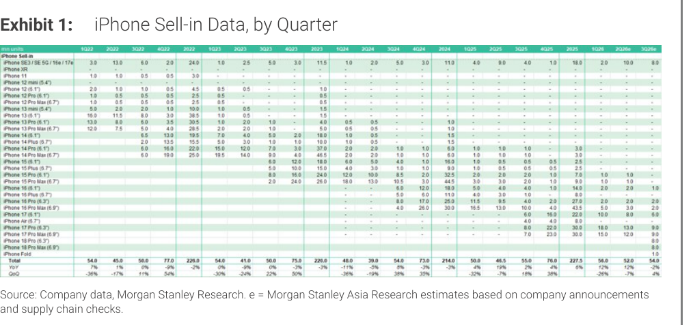
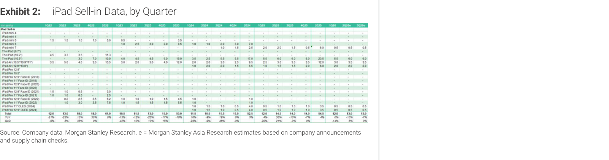

# MS｜iPhone Monthly Databook — 3Q26 Premium Mix Shift

**券商**：Morgan Stanley  
**分析師**：Sharon Shih、Derrick Yang、Howard Kao、Andy Meng  
**日期**：2026-06-14  
**主題**：iPhone & iPad 季度出貨量預估更新（2Q26E / 3Q26E）  
**評級**：Industry View In-Line  
<button type="button" onclick="fetch('https://ti-lei.github.io/foreign-reports/static/downloads/產業/20260614_MS_iPhone-Monthly-Databook.md').then(r=>r.text()).then(t=>{let a=document.createElement('a');a.href='data:text/plain;charset=utf-8,'+encodeURIComponent(t);a.download='20260614_MS_iPhone-Monthly-Databook.md';a.click()})">⬇ 下載 MD</button>

---

## MS 完整投資邏輯鏈

| 論點層次 | Exhibit | 內容 |
|---|---|---|
| 需求信號 | 1 | 2Q26 iPhone build 52mn（YoY +12%），優於歷史同期季節性（通常 -15-25% QoQ），5月出貨環增 |
| 產品結構 | 1 | 3Q26 build 54mn（QoQ +4%，YoY -2%）；非典型，因 iPhone 18 標準版延至 1H27，3Q 以 18 Pro/Pro Max 及 Fold 為主 |
| 新品催化劑 | 1 | iPhone Fold 2H26 預估 7-8mn units；Fold 為蘋果首款折疊屏，帶動供應鏈新需求 |
| iPad 佐證 | 2 | 2Q26 iPad build 13mn（QoQ +8%，YoY -10%，YoY 下降因 2Q25 有新品上市高基期） |
| **結論** | 封面 | **2Q26 iPhone 供應鏈優於季節性；3Q 主力由 Fold 及 Pro 撐起，標準款缺席拉低 YoY，但 Fold 為新增量** |

> **報告最大邏輯缺口**：iPhone Fold 7-8mn 的假設尚未受上游供應鏈確認（MS 表示「將密切監控放量進度」）；若 Fold 放量不達預期，3Q26 build 存在下行風險。

---

## 報告核心觀點

| 主題 | MS 觀點 | 市場共識 | 是否 Contra-Consensus |
|---|---|---|---|
| 2Q26 iPhone builds | 52mn（-7% QoQ，+12% YoY），維持前估 | 歷史 2Q 通常 -15-25% QoQ | ✅ 明顯好於季節性 |
| 3Q26 iPhone builds | 54mn（+4% QoQ，-2% YoY） | 初步引導，共識尚無 | 中性 |
| iPhone 18 上市時程 | 標準款延至 1H27，3Q 以 18 Pro/Pro Max 及 Fold 為主 | — | 值得注意 |
| iPhone Fold | 2H26 build 7-8mn | 市場初期評估偏保守 | ✅ 相對積極 |
| iPad 2Q26 | 13mn（+8% QoQ，-10% YoY） | — | 中性 |

**零件/個股關注**：Hon Hai（鴻海）為 iPhone 主要組裝夥伴，5月出貨 MoM 增加已獲 MS supply chain check 確認

---

## Exhibit 1｜iPhone Sell-in Data, by Quarter

### 解讀摘要

2Q26 iPhone build 維持 52mn 不變，對應 QoQ -7%，遠好於歷史 2Q 季節性（-15-25% QoQ），主要來自 Hon Hai 等主要組裝商 5 月出貨 MoM 增加，反映 iPhone 在記憶體漲價環境下的終端銷售韌性。3Q26 引入 54mn 初估，QoQ 小幅成長 4% 但 YoY -2%，原因是 iPhone 18 標準款被移至 1H27 上市，3Q 產品組合集中於 18 Pro/Pro Max（高 ASP）及 Fold（全新品類）。

> **原文補充**：MS 目前預估 2H26 iPhone Fold build 7-8mn units，並說明將密切追蹤放量進度（"will closely monitor the ramp-up progress"）；Fold 定位高端，SKU 策略聚焦 premium 市場，iPhone 18 普及款缺席 3Q 是刻意的 SKU 安排。

### 關鍵數字

（注：表格為 Form XObject，數字直接取自報告文字）

| 季度 | Build（mn） | QoQ | YoY | 備註 |
|---|---|---|---|---|
| 2Q26E | 52 | -7% | +12% | 優於歷史季節性（通常 -15-25% QoQ） |
| 3Q26E | 54 | +4% | -2% | 主力：18 Pro/Pro Max + iPhone Fold |
| 2H26 Fold | 7-8 | — | — | 全新品類，初步估算 |

> **洞察一**：3Q26 YoY -2% 並非需求疲軟信號，而是 SKU 意圖性缺席（iPhone 18 普及款延至 1H27）；實際上 Pro/Max + Fold 組合意味單台 ASP 大幅拉升，供應鏈中高單價零件（鈦框、ProMotion 螢幕、更大感光元件）的 $含量可能逆勢走高。

---

## Exhibit 2｜iPad Sell-in Data, by Quarter

### 解讀摘要

iPad 2Q26E 維持 13mn（QoQ +8%，YoY -10%），YoY 下滑主因 2Q25 有新品發布帶來高基期，非需求惡化。3Q26E 同樣引入 13mn（flat QoQ，YoY -7%），MS 指出記憶體及材料漲價可能對 iPad 備料量產生壓力，因此 3Q 備貨維持保守。

> **原文補充**："although memory and material price hikes could have an impact"——此為 iPad 3Q26 需求端的主要下行風險，與 iPhone 的強韌形成對比。

### 關鍵數字

（注：表格為 Form XObject，數字直接取自報告文字）

| 季度 | Build（mn） | QoQ | YoY | 備註 |
|---|---|---|---|---|
| 2Q26E | 13 | +8% | -10% | YoY 下滑因 2Q25 新品高基期 |
| 3Q26E | 13 | flat | -7% | 記憶體/材料漲價為潛在風險 |

> **洞察二**：iPhone 與 iPad 3Q26 走勢背離——iPhone QoQ 加速（+4%）、iPad 持平——反映蘋果在 3Q 消費電子備貨季將資源集中在更高毛利的 iPhone Pro 系列及 Fold，iPad 在材料成本壓力下顯得相對保守。

---

## 相關個股清單

| 類別 | 公司 | Ticker | 評等 | 備註 |
|---|---|---|---|---|
| iPhone 主裝 | 鴻海精密 | 2317 | OW | 5月出貨 MoM 增，為 2Q26 強勢主要貢獻 |
| iPhone 主裝 | 和碩 | 4938 | — | iPhone 組裝夥伴 |
| iPhone 主裝 | 立訊精密 | 002475.SZ | — | iPhone 組裝夥伴（中國） |
