# MS｜Power Semis – Supply Driven Upcycle

**券商**：Morgan Stanley  
**分析師**：Daisy Dai、Charlie Chan、Daniel Yen、Tiffany Yeh、Henry Zhao、Ethan Jia  
**日期**：2026-06-18  
**主題**：Greater China 功率分離元件 — 供給驅動的上行週期  
**評級**：Industry View — Attractive  
<button type="button" onclick="fetch('https://ti-lei.github.io/foreign-reports/static/downloads/產業/20260618_MS_Power-Semis.md').then(r=>r.text()).then(t=>{let a=document.createElement('a');a.href='data:text/plain;charset=utf-8,'+encodeURIComponent(t);a.download='20260618_MS_Power-Semis.md';a.click()})">⬇ 下載 MD</button>

---

## 報告總結

全球功率分離元件（power discrete）自 4Q25 起重回 YoY 正成長，4 月 +16% YoY，背後推力是二次資本支出循環後的供給受限，而非需求爆發。MS 定調此為**供給驅動的上行週期**，強調主要受益者是車用佔比高、效率佳的 Yangjie（揚傑），而對 Silan Micro、CR Micro 則維持 UW，認為市場對這兩家的復甦期待過熱。

三大產業力量：① 車用（41%）＋工業（31%）合計 72% 需求，受手機/PC 疲弱拖累有限；② 主要大廠資本支出連兩年下滑、2026E 僅溫和增 11%，中國廠商（Silan/UNT）更將產能轉向 AI 電源管理（PMIC），功率離散擴產幾乎停滯；③ 交期普遍拉長，部分品項（車用 IGBT 除外）已漲價，若需求不急遽惡化，漲價趨勢可延續至 2H26。

---

## MS 完整投資邏輯鏈

| 論點層次 | Exhibit | 內容 |
|---|---|---|
| 需求回升確認 | 1 | 4Q25 起 YoY 轉正，4 月 +16% YoY（3MMA） |
| 需求結構抗跌 | 2 | 車用 41%＋工業 31% = 72%，與手機/PC 相關性低 |
| 工業需求強勁 | 4 | 工業自動化龍頭 1Q26 營收 +21% YoY |
| EV 需求邊際改善 | 3 | 中國 EV 批發 YoY（3MMA）從 4 月 0% 回升至 5 月 +7% |
| 供給受限確認 | 5, 6 | 全球龍頭資本支出連兩年下滑（-27%, -29%），2026-28E 新增產能持續收縮 |
| 交期與報價上行 | 7, 8, 9, 10, 11 | MOSFET/IGBT 交期普遍拉長；ASP YoY 由負轉正（+1%）；出貨量 MOSFET +23%、IGBT +17% |
| **結論** | 封面 | **供給驅動上行；OW Yangjie（車用+越南），UW Silan/CR Micro（期待過熱）** |

> **報告最大邏輯缺口**：報告定調供給驅動，但 Exhibit 6 顯示 2025 年產能淨增創歷史高（153 kwpm）後 2026–28E 才開始下滑——若 2025 年大量擴出的新產能在 2026H2 集中投產，對報價的壓力可能比報告預期更大。

---

## 報告核心觀點

| 主題 | MS 觀點 | 市場共識 | 是否 Contra-Consensus |
|---|---|---|---|
| 此波漲價性質 | 供給驅動（而非需求驅動），定義為 supply-driven upcycle | 市場部分人士將漲價解讀為需求超預期 | 是（偏保守） |
| 漲價廣度 | 選擇性漲價（LV MOSFET、HV MOSFET 為主；STMicro/MCC/車用 IGBT 報價持平）| 市場期待全面漲 | 是（更精確細分） |
| Yangjie 評等 | OW，越南擴產 + 車用佔比提升是差異化 | 市場也多看好 | 否 |
| Silan / CR Micro | 持 UW，估值偏高/期待過熱 | 市場有買方評等 | 是（Contra） |

**偏好排序**：Yangjie (OW) > Starpower (EW) > Silan Micro (UW) ≈ CR Micro (UW)

---

## Exhibit 1｜Total Discrete Revenue YoY Growth Turned Positive since 4Q25

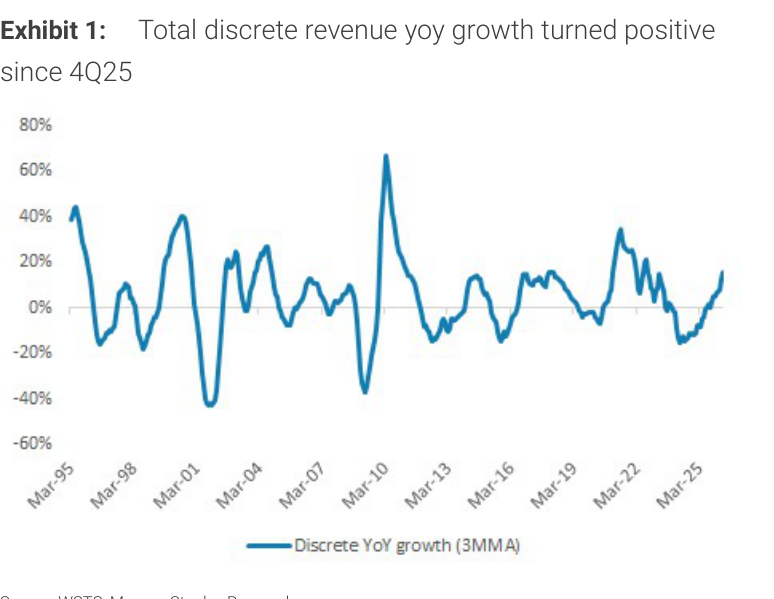

### 解讀摘要
功率分離元件總體營收 YoY 成長率（3MMA）自 4Q25 起轉正，至 4 月已達 +16%。從 30 年歷史看，此次復甦速度與 2016–2018 上行週期相似，但幅度仍遠低於 2020–2021 的疫情補庫高峰。本輪回正是後庫存去化、車用需求回暖、以及供給紀律共同作用的結果，而非終端需求爆發。

### 表格

| 觀察時間點 | 離散元件 YoY（3MMA） | 備註 |
|---|---|---|
| 4Q25 | 轉正 | 最低點脫離 |
| 2026 年 4 月 | +16% | 最新追蹤數據 |
| 2020–2021 峰值 | >40%（圖形估算） | 疫情補庫高點 |

---

## Exhibit 2｜Auto and Industrial Accounted for 72% of Demand (2025)

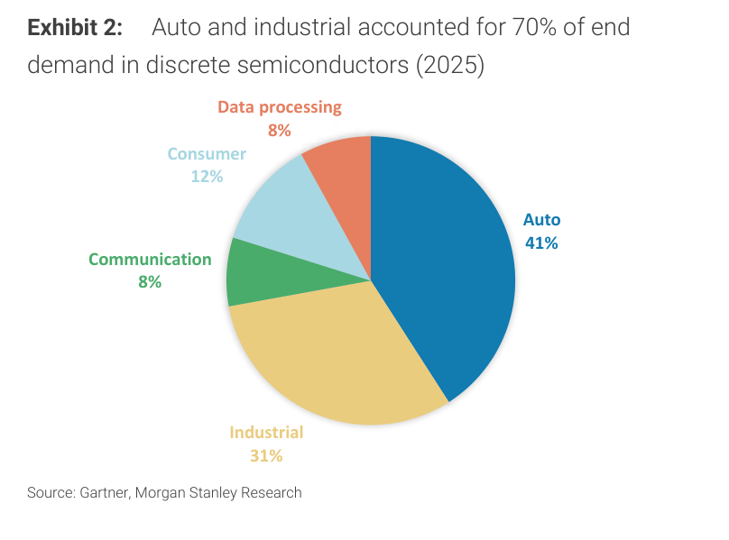

### 解讀摘要
車用（41%）＋工業（31%）合計佔功率分離元件需求 72%，使本輪需求韌性相對強於容易被手機/PC 週期拖累的 IC 產業。Data Processing（含 AI 伺服器）僅佔 8%，但增速最快；消費 12%、通訊 8%。

### 表格

| 終端市場 | 2025 需求占比 |
|---|---|
| Auto | 41% |
| Industrial | 31% |
| Consumer | 12% |
| Communication | 8% |
| Data processing | 8% |

> **洞察一**：車用＋工業合計 72%，恰好是 2025–2026 年兩個需求邊際回暖的領域（EV 批發轉正、工廠自動化 +21%），這使功率元件成為少數受惠「舊經濟復甦」而非「AI 新需求」的半導體品類，風險報酬與整體半導體分散化。

---

## Exhibit 3｜China EV Wholesale Growth Turning Incrementally Positive

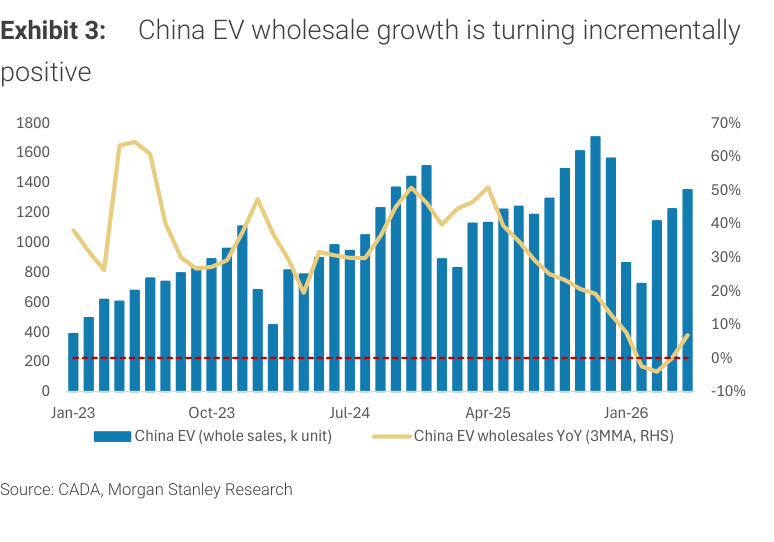

### 解讀摘要
中國 EV 批發絕對量（左軸）維持在月均 1,000–1,700k 台的高位，但 YoY 成長率（3MMA，右軸）2024 下半年急速滑落至接近零，至 2026 年 5 月回升至 +7%。這意味著比較基期已過低點，EV 相關功率元件（IGBT、SiC MOSFET）需求邊際轉好，但不是爆發性增長。

### 表格

| 時間 | EV 批發量（千台，月均） | YoY 3MMA |
|---|---|---|
| 2024 峰值（視覺估算） | ~1,600 | ~50% |
| 2025 底部（視覺估算） | ~800–1,000 | ~0% |
| 2026 年 4 月 | 約 900 | ~0% |
| 2026 年 5 月 | 約 1,350 | +7% |

*以上為視覺估算

---

## Exhibit 4｜Industrial Automation Companies' Revenue Grew 21% YoY in 1Q26

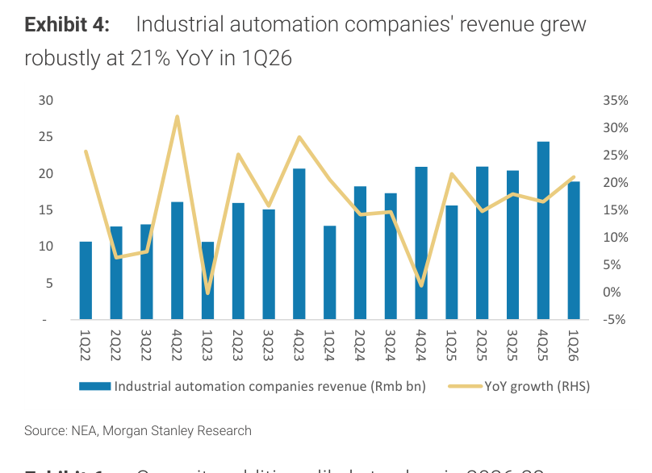

### 解讀摘要
中國工業自動化龍頭（NEA 口徑）1Q26 營收約 Rmb 19bn，YoY +21%，是 2022 以來最強的一季。這個數字直接支撐功率元件工業端需求，因為變頻器/伺服馬達等自動化設備是功率 MOSFET/IGBT 的主要下游應用。

### 表格

| 季度 | 工業自動化龍頭營收（Rmb bn，視覺估算） | YoY 成長率（RHS） |
|---|---|---|
| 3Q24 | ~16 | ~0% |
| 4Q24 | ~24 | ~25% |
| 1Q25 | ~21 | ~20% |
| 2Q25 | ~21 | ~20% |
| 3Q25 | ~21 | ~17% |
| 4Q25 | ~20 | ~17% |
| 1Q26 | ~19 | +21% |

*以上為視覺估算

> **洞察一**：工業自動化 1Q26 顯著加速到 +21%，但其 Rmb 19bn 的絕對量與 4Q24 的 ~24bn 相比仍低——這個矛盾顯示復甦是基期效應（2025 年底走弱後的反彈），而非系統性上行；觀察 2Q26 是否能維持 15%+ 才能確認趨勢。

---

## Exhibit 5｜Global Leading Power Semi Companies' Capex Declined for 2 Years

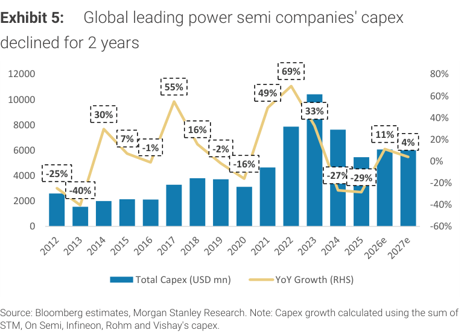

### 解讀摘要
STM、On Semi、Infineon、Rohm、Vishay 五家合計資本支出在 2022–2023 年達高峰（約 USD 10,000–10,500mn），隨後連續兩年大幅收縮（2024 -27%、2025 -29%），至 2026E 才微增 +11%、2027E 僅 +4%。「供給驅動漲價」的核心依據就在這裡：過去兩年的投資缺口，意味著 2026–2028 可用的新增功率元件產能遠低於需求可能的恢復速度。

> **原文補充**：MS 在報告中特別指出，在中國方面，Silan Micro 和 UNT 等廠商正將產能轉向 AI 電源管理（PMIC 等）應用，進一步限制功率分離元件的中國本土新增供給。

### 表格

| 年度 | 五家合計資本支出（USD mn，視覺估算） | YoY 增減 |
|---|---|---|
| 2021 | ~4,500 | +49% |
| 2022 | ~7,500 | +69% |
| 2023 | ~10,000 | +33% |
| 2024 | ~7,300 | -27% |
| 2025E | ~5,200 | -29% |
| 2026E | ~5,800 | +11% |
| 2027E | ~6,000 | +4% |

*以上為視覺估算（含報告標示 % 數字）  
來源：Bloomberg estimates, MS Research。樣本：STM、On Semi、Infineon、Rohm、Vishay 合計。

> **洞察一**：五大廠合計 2025E 資本支出約 USD 5,200mn，回到 2014–2015 年的水準。相對 2023 峰值縮水 ~48%，這不只是「緊縮」，更接近「資本撤退」。若 2026–2027 只有 +11%/+4% 的補充，新產能對供給的貢獻微乎其微，報價上行的地板較為牢固。

> **值得驗證**：MS 的報價預測高度依賴「這五家代表全球供給控制力」的假設。若中國廠商（Silan、華潤微）持續擴產，可能侵蝕定價能力；特別是中低壓 MOSFET 的競爭者更多。

---

## Exhibit 6｜Capacity Additions Likely to Slow in 2026-28

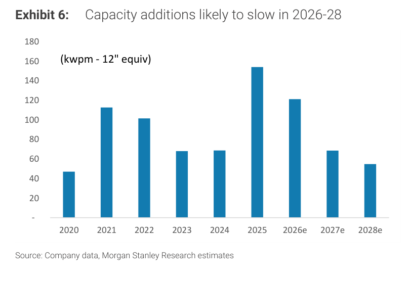

### 解讀摘要
全球功率元件新增晶圓產能（kwpm，12 吋等效）在 2025 年衝到約 153 kwpm 的高位，但 2026–2028E 逐年遞減至 121→67→55 kwpm。值得注意的是 2025 年的尖峰代表有一批新產能在當年陸續投產，這是 2022–2023 資本支出高峰的時間滯後效應（從資本支出到量產通常約 2–3 年）。

### 表格

| 年度 | 新增產能（kwpm，12"equiv，視覺估算） |
|---|---|
| 2020 | ~47 |
| 2021 | ~113 |
| 2022 | ~102 |
| 2023 | ~67 |
| 2024 | ~67 |
| 2025 | ~153（峰值） |
| 2026E | ~121 |
| 2027E | ~67 |
| 2028E | ~55 |

*以上為視覺估算

> **洞察一（配合 Exhibit 5）**：Exhibit 5 顯示資本支出 2024–2025 大幅縮減，但 Exhibit 6 顯示 2025 年新增產能反而創高——這是「2022 資本支出→2025 量產」的 2–3 年落差。換言之，2026H2 以後才是「緊縮投資效果」真正反映到供給端的時間點，這支撐了 MS「2H26 報價持續上行」的論點。

---

## Exhibit 7｜MOSFET Prices Up 1% Y/Y in Apr 2026

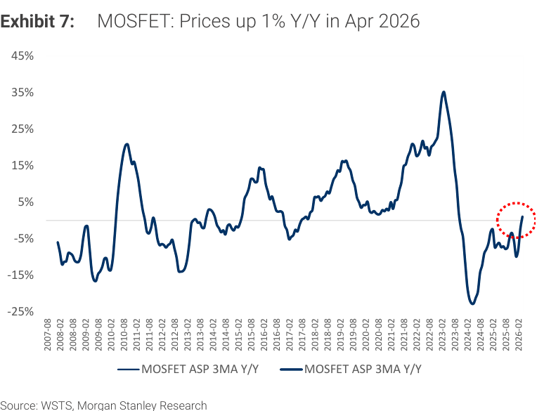

### 解讀摘要
MOSFET ASP（3MMA YoY）從 2024 年中的約 -5% 到 -10% 低谷，在 2026 年 4 月回升至 +1%——圖中以紅色虛線圓圈標記此轉折點。雖然幅度還小，但這是 30 年歷史上每一次上行週期的典型前兆：從稍微轉正開始，定價動能往往自我強化。

### 表格

| 時間 | MOSFET ASP 3MMA YoY |
|---|---|
| 2024 中段低谷 | 約 -7% ~ -10%（視覺估算） |
| 2025H1 | 約 -5%（視覺估算） |
| 2026 年 4 月 | +1%（標題） |

---

## Exhibit 8｜MOSFET Shipments Up 23% Y/Y in Apr 2026

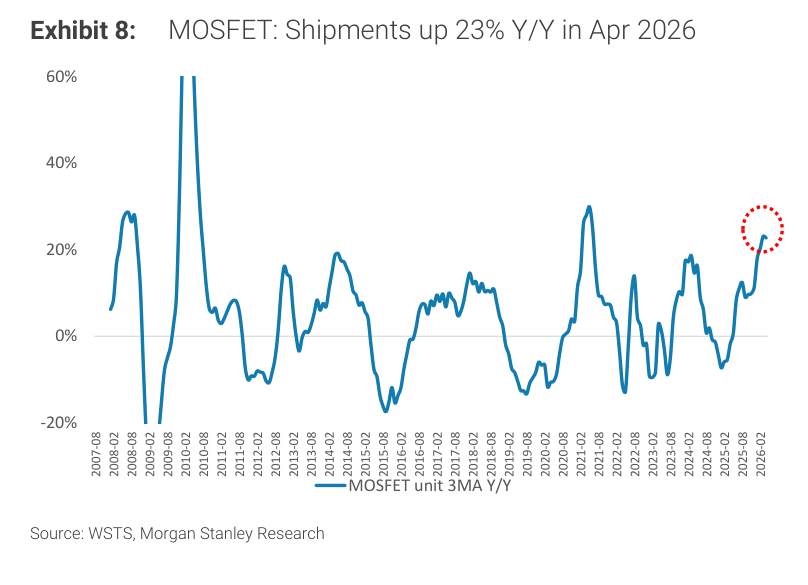

### 解讀摘要
MOSFET 出貨量（3MMA YoY）在 2026 年 4 月達 +23%，為 2020–2021 補庫後最強的出貨加速信號之一。量的快速增長與價格同期回正（Exhibit 7），共同構成「量價齊揚起步」的訊號；歷史上這個組合在後續 2–4 季通常對應價格的進一步走升。

> **洞察一（配合 Exhibit 7）**：MOSFET 量 +23% 且價 +1%，但以歷史週期來看，2010 年尖峰時量 +60%、價 +35% 以上。本輪量增幅度已強，但價格漲幅還微弱——表示上行週期剛起步，定價端滯後是正常現象，也代表 2H26 仍有漲價空間（若需求不惡化）。

---

## Exhibit 9｜IGBT Prices Up 1% Y/Y in Apr 2026

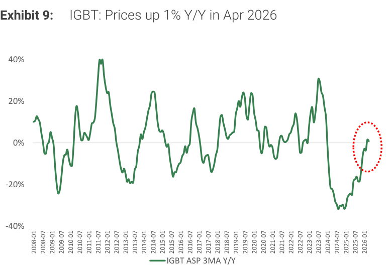

### 解讀摘要
IGBT ASP（3MMA YoY）從 2024 年中約 -30% 的歷史性低谷，在 2025 年末後快速反彈，至 2026 年 4 月達 +1%（圖中標記虛線圓圈）。IGBT 的下行幅度遠大於 MOSFET（-30% vs -10%），反彈強度也更顯著；主要驅動是 EV 需求邊際回暖（Exhibit 3）。

> **原文補充**：車用 IGBT 客戶例外——因為車廠的定價合約通常年度議定，MS 在 Exhibit 11 備注車用 IGBT 報價目前持平（"="），只有工業/消費用途的 IGBT 報價上揚（"+"）。

---

## Exhibit 10｜IGBT Shipments Increased 17% Y/Y in Apr 2026

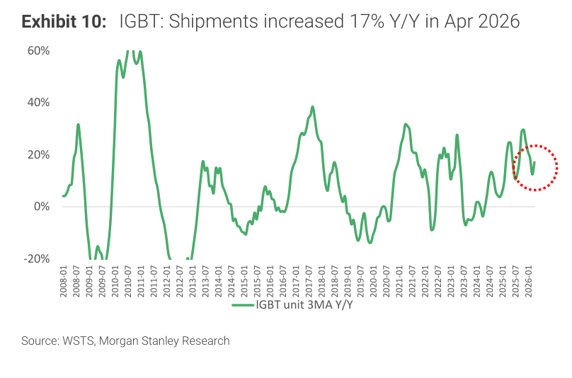

### 解讀摘要
IGBT 出貨量 +17% YoY（4 月，3MMA），雖低於 MOSFET 的 +23%，但結合 IGBT 報價同步回正（Exhibit 9），兩者合計說明 IGBT 市場也進入修復軌道。IGBT 主要受益於工廠自動化變頻器（Exhibit 4）和 EV 電控（Exhibit 3）需求的雙重支撐。

---

## Exhibit 11｜Power Semi Lead Time Extending; Selective Products' Pricing Up

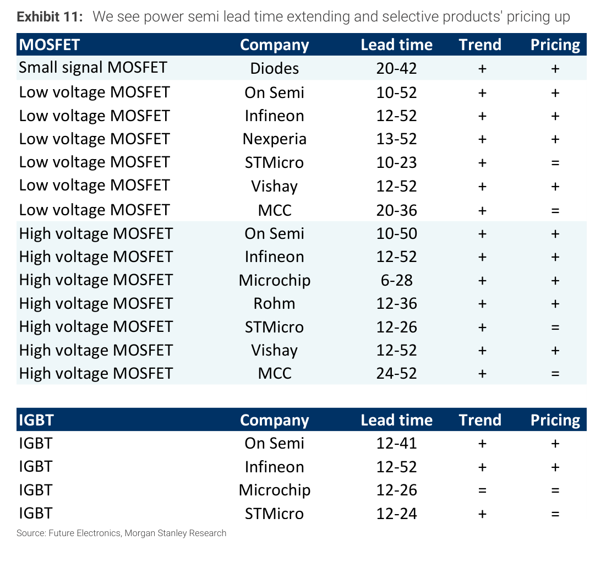

### 解讀摘要
Exhibit 11 是目前最直接的「定性」供需訊號表，涵蓋主要國際大廠對 MOSFET 與 IGBT 交期和報價的最新態度。幾乎所有品項的交期趨勢均為上揚（+），但報價分化明顯：高壓 MOSFET 多數為「+」，STMicro 和 MCC 的 MOSFET 以及 IGBT（除 On Semi、Infineon 外）報價仍持平（=）。這一分化印證了 MS「選擇性漲價、非全面漲」的核心論點。

> **原文補充**：MS 特別強調 automotive IGBT 客戶因年度定價合約難以立即調漲，體現在 STMicro/Microchip IGBT Pricing = 的結果。此限制在漲價全面性上形成明顯的缺口。

### 表格

| 品項 | 供應商 | 交期（週） | 交期趨勢 | 報價趨勢 |
|---|---|---|---|---|
| **MOSFET** | | | | |
| Small signal MOSFET | Diodes | 20–42 | + | + |
| Low voltage MOSFET | On Semi | 10–52 | + | + |
| Low voltage MOSFET | Infineon | 12–52 | + | + |
| Low voltage MOSFET | Nexperia | 13–52 | + | + |
| Low voltage MOSFET | STMicro | 10–23 | + | = |
| Low voltage MOSFET | Vishay | 12–52 | + | + |
| Low voltage MOSFET | MCC | 20–36 | + | = |
| High voltage MOSFET | On Semi | 10–50 | + | + |
| High voltage MOSFET | Infineon | 12–52 | + | + |
| High voltage MOSFET | Microchip | 6–28 | + | + |
| High voltage MOSFET | Rohm | 12–36 | + | + |
| High voltage MOSFET | STMicro | 12–26 | + | = |
| High voltage MOSFET | Vishay | 12–52 | + | + |
| High voltage MOSFET | MCC | 24–52 | + | = |
| **IGBT** | | | | |
| IGBT | On Semi | 12–41 | + | + |
| IGBT | Infineon | 12–52 | + | + |
| IGBT | Microchip | 12–26 | = | = |
| IGBT | STMicro | 12–24 | + | = |

*來源：Future Electronics, Morgan Stanley Research

> **洞察一**：MOSFET 報價「+」的廠商有 9/14，持平的有 5/14；IGBT 報價「+」的只有 2/4，「=」有 2/4。交期普遍拉長（14/14 MOSFET 為「+」），但漲價比例明顯落後——這是「交期先行、報價滯後」的典型週期初段特徵，意味著 2H26 報價補漲空間仍在。

---

## 相關個股清單

| 類別 | 公司 | Ticker | 評等 | 目標價（新/舊） | 備註 |
|---|---|---|---|---|---|
| 偏好 | Yangjie 揚傑科技 | 300373.SZ | OW | Rmb136 / 91 | EPS 上修 3%/6%/9%（2026/27/28）；車用＋越南封裝擴產；33x 2027E P/E |
| 中性 | Starpower 斯達半導 | — | EW | — | 折舊壓力 |
| 謹慎 | Silan Micro 士蘭微 | 600460.SS | UW | Rmb26.9 / 20 | EPS 上修 4%/6%/9%；但估值已超前，轉向 AI PMIC |
| 謹慎 | CR Micro 華潤微 | 688396.SS | UW | Rmb51.6 / 43 | EPS 上修 9%/14%/14%；Chongqing/Shenzhen 廠投資虧損拖累；Shenzhen 新產能以 YMTC 代工為主，非功率元件 |
