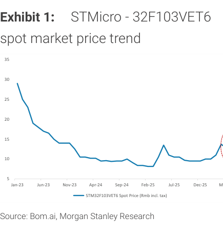
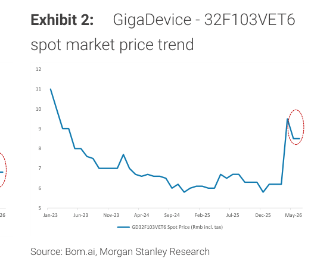

# MS｜MCU — Supply Tightness May Drive Prices Up Further

**券商**：Morgan Stanley  
**分析師**：Daniel Yen、Charlie Chan、Daisy Dai、Tiffany Yeh  
**日期**：2026-06-21  
**主題**：MCU — 供給吃緊或推升報價（月度現貨追蹤更新）  
**評級**：Industry View — Attractive  
<a href="/dl?g=產業&b=MS&d=20260621&h=MCU">📎 下載 PDF</a>

---

## 報告總結

本報告為 MS 的月度 MCU 現貨報價追蹤更新。觸發時機：STMicro 通知客戶將於 6/28 起實施今年**第二次**漲價（第一次 3 月公告、4 月實施），且 6 月現貨報價仍維持高位（STM Rmb12.8、GD Rmb8.5 MoM 持平）。

MS 判斷 2H26 現貨報價仍有上行空間，驅動力不是終端需求加速（6 月消費/工業終端需求與上月大致相同），而是**供給端收緊**：成熟製程晶圓代工廠將更多產能分配給 AI 電源相關應用，MCU 設計公司面臨的供給吃緊將延續。MS 偏好長期 edge AI 機會更清晰的大廠（GigaDevice）和 WiFi MCU 玩家（Espressif），對新唐（Nuvoton）維持 UW，等待毛利率回升。

---

## MS 完整投資邏輯鏈

| 論點層次 | Exhibit | 內容 |
|---|---|---|
| 報價觸媒確認 | 1 | STMicro 通知 6/28 起第二次漲價；現貨 Rmb12.8（MoM 持平） |
| 競品對比 | 2 | GigaDevice 等效品 Rmb8.5（MoM 持平）；較 STM 低約 33% |
| 供給收緊機制 | 封面 | 成熟製程代工廠轉配 AI 電源應用，MCU 供給進一步受限 |
| 需求面確認 | 封面 | 6 月終端需求與上月持平，漲價為供給而非需求驅動 |
| **結論** | 封面 | **2H26 現貨報價仍有上行空間；偏好 GigaDevice、Espressif；UW 新唐** |

> **報告最大邏輯缺口**：MS 定調「供給驅動漲價」，但若成熟製程代工廠優先順序在年底前回調（AI power 訂單修正），供給吃緊可能比預期提前緩解。報告未提此風險。

---

## 報告核心觀點

| 主題 | MS 觀點 | 市場共識 | 是否 Contra-Consensus |
|---|---|---|---|
| MCU 報價動能 | 供給驅動漲價，2H26 續揚 | 市場多聚焦需求面，對供給限制關注度較低 | 部分 |
| STMicro 漲價節奏 | 今年第二次漲；6/28 生效 | 市場知悉但尚未充分定價到下游 | 部分 |
| 新唐 | UW；等待毛利回升才轉積極 | 部分市場有 hold/buy | 是 |
| GigaDevice 偏好 | OW-equivalent；edge AI 長線 | 市場較少聚焦 GD 的 edge AI 機會 | 是 |

**偏好排序**：GigaDevice（603986.SS）≈ Espressif（688018.SS）> 新唐 Nuvoton（4919.TW，UW）

---

## Exhibit 1｜STMicro 32F103VET6 現貨報價走勢

### 解讀摘要
STMicro 的 32-bit MCU 代表品（STM32F103VET6）現貨報價從 2023 年初約 Rmb29 的高位，歷時兩年下滑至 2024 年底–2025 年初約 Rmb9–10 的低谷，近期回升至 Rmb12.8（5 月，MoM 持平，圖中標紅圈）。這波從谷底回升約 28–38%，反映的是通路庫存去化完畢後的補貨需求，以及 STM 第一次漲價（4 月）的效果顯現。第二次漲價（6/28）若落地，可能推動現貨進一步向 Rmb14–15 靠攏（類比第一次漲後的漲幅）。

> **原文補充**：STMicro 這是今年第二次通知客戶漲價，第一次是 3 月公告、4 月生效。MS 指出通路商（distributors）因庫存低 + 擔憂 2H26 持續漲價，正積極備貨，但消費/工業終端需求本身未加速。

### 表格

| 時間點 | STM32F103VET6 現貨報價（Rmb incl. tax） |
|---|---|
| Jan 2023（高點） | 約 29（視覺估算） |
| 2024 低谷 | 約 9–10（視覺估算） |
| 2025 H2 | 約 10（視覺估算） |
| 2026 年 5 月 | Rmb 12.8（MoM 持平，標題） |

*低谷與高點為視覺估算；5 月數字來自報告標題文字

> **洞察一**：現貨報價 Rmb12.8 仍遠低於 2023 年初的 Rmb29 峰值——從谷底計算漲幅僅約 33%，意味著即使 2H26 繼續漲，價格回到前高仍需翻倍以上的漲幅。這個對比說明本輪「漲價」是溫和修復而非大週期重現，印證 MS「供給驅動」而非「需求爆發」的定調。

---

## Exhibit 2｜GigaDevice 32F103VET6 現貨報價走勢

### 解讀摘要
GigaDevice 的等效品（GD32F103VET6）現貨報價從 2023 年初約 Rmb11 下行，底部落在 2025 上半年的約 Rmb6，近期急漲後回穩至 Rmb8.5（5 月，MoM 持平）。相較 STMicro 同規格產品（Rmb12.8），GD 便宜約 34%，顯示中國本土 MCU 供應商在相同功能下仍有明顯的價格優勢——這支撐了 MS 看好 GigaDevice 的論點：在 MCU 在地化趨勢下，GD 可同時受益於替代進口需求與報價上行。

> **原文補充**：MS 提及偏好 GigaDevice 和 Espressif 主要是因為它們長期的 edge AI 機會（非純粹短期漲價），而對新唐的不積極是因為等待毛利率回升才轉態度。

### 表格

| 時間點 | GD32F103VET6 現貨報價（Rmb incl. tax） |
|---|---|
| Jan 2023（高點） | 約 11（視覺估算） |
| 2025 H1 低谷 | 約 6（視覺估算） |
| 2025 H2–2026 H1 急漲後回穩 | 約 8.5 |
| 2026 年 5 月 | Rmb 8.5（MoM 持平，標題） |

*低谷與高點為視覺估算；5 月數字來自報告標題文字

> **洞察一（配合 Exhibit 1）**：STM Rmb12.8 vs GD Rmb8.5，差距約 Rmb4.3（GD 較 STM 低 34%）。若 STM 6/28 再漲價，且 GD 跟進同幅漲，差距將擴大至約 Rmb4.5–5，這意味著採購方（尤其是對品牌要求不高的消費/工業客戶）轉單至 GD 的誘因在強化，有利 GD 的市占提升。這是 MS 偏好 GD over STM 概念股（如新唐）的底層邏輯之一。

---

## 相關個股清單

| 類別 | 公司 | Ticker | 評等 | 備註 |
|---|---|---|---|---|
| 偏好 | GigaDevice 兆易創新 | 603986.SS | 偏好（類 OW） | 大型 MCU 廠、edge AI 長線機會；NOR Flash 亦受關注 |
| 偏好 | Espressif 樂鑫科技 | 688018.SS | 偏好 | WiFi MCU 龍頭、edge AI 長線機會 |
| 謹慎 | Nuvoton 新唐科技 | 4919.TW | UW | 等待毛利率回升才轉積極；auto/BMC 業務進展為上行風險；RI model（CoE 9.2%，terminal 3.5%） |
