# JPM｜創新服務 (Innostar Service) MEMS 探針卡設備與 GCS TGV 銅柱 Initiation

**券商**：J.P. Morgan  
**分析師**：William Yang、Megan Hsueh、Gokul Hariharan  
**日期**：2026-06-22  
**主題**：Innostar Service — The next shining star driven by innovation; initiate at OW  
**評級**：OW（初始覆蓋）  
<a href="https://layx.uk/dl?t=7828&b=JPM&d=20260622">📎 下載 PDF</a>

---

## 報告總結

JPM 以首評 OW 啟動對創新服務（7828）的覆蓋，目標價 NT\$4,000（Dec-27，+96%），基於 25x 2028E P/E。觸發點是 Technoprobe（全球第二大探針卡廠）對創新服務的策略投資（2025年取得 8.4% 股權），將創新服務從單純設備商提升為 TP 的台灣代理人，拉開 2026-2028 年的三波成長週期：探針卡設備訂單多倍增加（TP 積極擴產）、材料套件與 OEM 服務的 TAM 擴張（TP 聯盟客戶）、以及玻璃核心基板 TGV 銅柱業務的破浪期（2H27E 量產）。

JPM 建模 2025-28E EPS CAGR 200%，2027E NT\$63.97 vs 共識 NT\$43.18（+48%），2028E NT\$162.32 vs 共識 NT\$100.76（+61%）。JPM 認為市場嚴重低估了 TP 訂單的持續上調空間與 TGV 銅柱的營收貢獻，且創新服務 IPO 以來 12M fwd P/E 均值約 38x，25x 2028E 評價保守，提供足夠的安全邊際。

---

## JPM 完整投資邏輯鏈

| 論點層次 | Figure | 內容 |
|---|---|---|
| 技術護城河確認 | Fig 17, 25 | 全球 MEMS 探針卡自動化設備龍頭；2025 年 >90% 營收來自探針卡設備，針組裝市場主導地位無可挑戰 |
| 需求催化劑一 | Fig 19, 20 | TP 為因應 AI ASIC 新訂單與先進節點需求雙倍擴產，2025A→2026E 雙臂機台出貨量 4→40 台（×10），2027E 再 ×3.75 至 150 台 |
| 需求催化劑二 | Fig 21, 22 | TP 在 MEMS 探針卡市場（全記憶體+非記憶體）具領導地位，非記憶體市佔 35% 領先；高 pin count 先進節點探針卡需求擴大直接放大創新服務設備 TAM |
| TAM 擴張 | Fig 23, 24 | 通過 TP 投資成為台灣代理人，材料套件（針頭）與 OEM 服務 2026E 啟動，2027E 貢獻 NT\$1,000mn，2028E NT\$2,200mn（佔總營收 17%） |
| 新成長驅動 | Fig 13–16 | GCS TGV 銅柱：首個 US tier-1 switch ASIC 客戶，2H27E 量產；Innostar 為潛在 sole supplier；2027/28E 貢獻 8%/20% 總營收 |
| 財務爆發力 | Fig 2 | 三波成長：2025→2026 +126%（設備 2x）；2026→2027 +246%（設備 3x + 材料套件）；2027→2028 +129%（設備 2x + 銅柱佔比提升至 19%） |
| 估值低估 | 封面 | 25x 2028E P/E 低於 IPO 以來均值 38x，與探針卡/GCS 同業 20-30x 一致；若用 2027E EPS 折算，實際 P/E 更高，下修風險低 |
| **結論** | 封面 | **首評 OW，PT NT\$4,000（Dec-27），25x 2028E P/E；訂單持續上修 + TGV 銅柱滲透為雙重催化劑** |

> **報告最大邏輯缺口**：TGV 銅柱 sole supplier 假設未獲第三方確認，且 US tier-1 客戶名稱未披露；若同業（如 Amkor、Finecs）後進搶單，2027-28E 銅柱貢獻假設將大幅下修。此為 2028E EPS NT\$162 vs 共識 NT\$101 最大差距來源。

---

## 報告核心觀點

| 主題 | JPM 觀點 | 市場共識 | 是否 Contra-Consensus |
|---|---|---|---|
| 探針卡設備訂單 | TP 擴產驅動 2026/27/28 各 2x/3x/2x | 市場已預期強勁但幅度較保守 | 部分 Contra（JPM 2027E 設備收入 NT\$4,000mn vs 共識較低） |
| GCS TGV 銅柱 | 2H27E 量產，2028E 佔收入 20% | 市場幾乎未定價此業務 | ✓ Contra（JPM 2028E EPS NT\$162 vs 共識 NT\$101，差距主因） |
| 估值 | 25x 2028E 保守，IPO 均值 38x | 市場擔心估值偏高 | ✓ Contra（JPM 認為當前評價未反映三波成長） |
| 材料套件 TAM | 2027E NT\$1,000mn，2028E NT\$2,200mn | 市場尚未充分納入 TP 代理人效應 | ✓ Contra（JPM 2027E EPS 較共識高 48%，材料套件是重要因素） |
| 共識 EPS 方向 | JPM 2027-28 顯著高於共識 | 共識 2027E NT\$43.18、2028E NT\$100.76 | ✓ Contra（JPM 2027E +48%、2028E +61% over consensus） |

**偏好排序**：Initiation 報告，僅覆蓋創新服務 (7828) 單一個股。  
**零件/個股偏好**：7828 創新服務 OW（初始）；Technoprobe（TPRO IM）未覆蓋。

---

## Exhibit 1｜三大成長驅動力時程表（Fig 1）

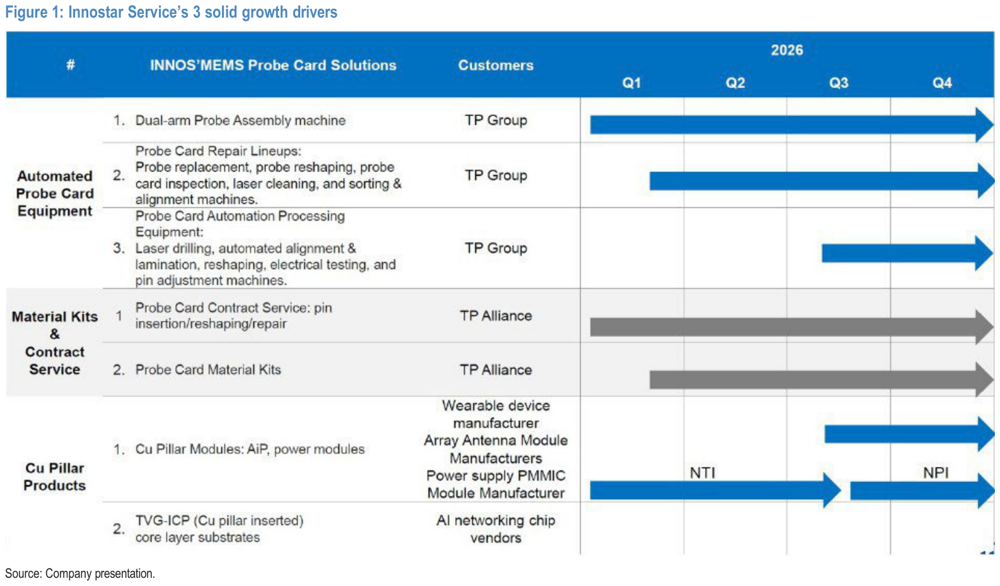

### 解讀摘要

創新服務的三大成長引擎在 2025-26 年分批登場，形成階梯式的訂單能見度。第一驅動力（探針卡設備）最成熟，單臂機台已規模出貨、雙臂機台從 2025 Q4 進入量產；第二驅動力（材料套件與 OEM 服務）從 2025 Q4 銷售開始，2026 年規模化——這是 TP 策略投資後授予代理資格的直接成果。第三驅動力（GCS TGV-ICP 銅柱）仍在 NPI 階段（Q4 2026），是 2027 年以後的期權，但與 US tier-1 客戶的合作已確認。

### 表格

| # | 業務 | 產品/服務 | 客戶 | 狀態（2026 年底） |
|---|---|---|---|---|
| 1 | 自動化探針卡設備 | 雙臂針組裝機 | TP Group | 量產出貨 |
| 2 | 自動化探針卡設備 | 探針卡維修設備（各類型） | TP Group | 量產出貨 |
| 3 | 自動化探針卡設備 | 探針卡製程自動化設備 | TP Group | 量產出貨 |
| 4 | 材料套件與合約服務 | Probe card contract service（針頭維修） | TP Alliance | 量產出貨 |
| 5 | 材料套件與合約服務 | Probe card material kits（針頭） | TP Alliance | 量產出貨 |
| 6 | 銅柱產品 | Cu Pillar Modules（AiP、功率模組） | 穿戴/天線廠商 | NTI → NPI 階段 |
| 7 | 銅柱產品 | TVG-ICP（銅柱嵌入玻璃核心基板） | AI 網路晶片廠商 | NPI 階段 |

---

## Exhibit 2｜2026-2028E 整體營收與成長（Fig 2）

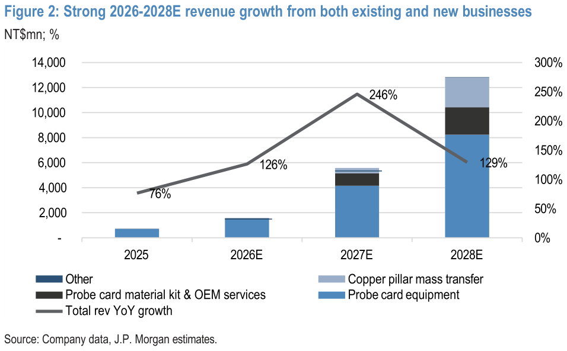

### 解讀摘要

三波成長各有不同驅動結構：2026E +126% 幾乎全靠探針卡設備（TP 雙倍擴產帶動雙臂機台出貨量 10 倍衝高）；2027E +246% 則是設備 3x 加上材料套件從 NT\$80mn 爆發至 NT\$1,000mn；2028E +129% 是探針卡設備再 2x（TP 持續擴產）加上 GCS TGV 銅柱首次規模貢獻（佔比從 3% 升至 19%）。這種「多引擎接力」的設計意味著即使其中一個引擎延遲，短期衝擊可被其他引擎部分對沖。

### 表格

| 年度 | 總營收（NT\$mn） | YoY | 探針卡設備 | 材料套件+OEM | 銅柱 | 其他 |
|---|---|---|---|---|---|---|
| 2025A | 716 | +76% | ~95%+ | — | <1% | 少許 |
| 2026E | 1,620 | +126% | 主導 | 5%（80mn） | 3% | 少許 |
| 2027E | 5,604 | +246% | ~70% | ~18%（1,000mn） | 8%（450mn） | 少許 |
| 2028E | 12,849 | +129% | ~62% | ~17%（2,200mn） | 19%（2,440mn） | 少許 |

> **洞察一**：2027E 是臨界年——探針卡設備、材料套件、GCS 銅柱三路同時發力。JPM vs 共識的估計差距最大的就在 2027E（NT\$63.97 vs NT\$43.18，+48%），說明市場尚未充分定價材料套件與 GCS 的雙重貢獻。

---

## Exhibit 3｜銅柱業務營收與 YoY 成長（Fig 11）

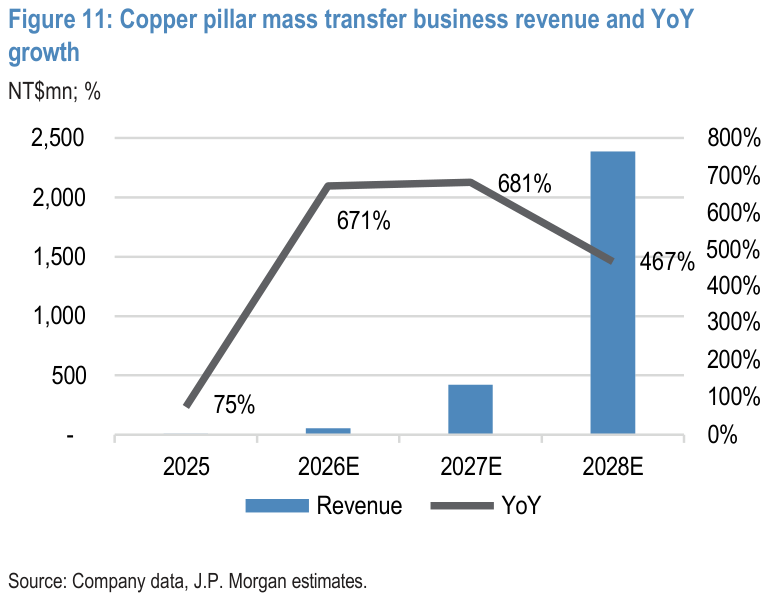

### 解讀摘要

GCS TGV 銅柱業務營收在 2026E 前幾乎是從零起步，2026E 才出現首筆可辨識規模（~50mn）。增長率的三位數（2026E +671%、2027E +681%）源於基期極低——實際上是從接近零開始的新業務爬坡，增長率本身意義有限，絕對金額的斜率才是關鍵：2027E 躍升至 ~450mn，2028E 再大跳至 ~2,440mn。

### 表格

| 年度 | 銅柱業務營收（NT\$mn） | YoY |
|---|---|---|
| 2024 | ~0 | — |
| 2025 | <30 | +75% |
| 2026E | ~50 | +671% |
| 2027E | ~450 | +681% |
| 2028E | ~2,440 | +467% |

*絕對值為視覺估算；YoY% 為 Fig 11 圖表折線資料標籤直讀。*

---

## Exhibit 4｜銅柱營收佔總營收比攀升至 19%（Fig 12）

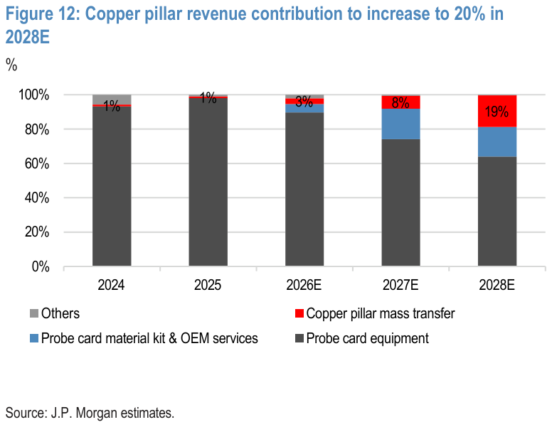

### 解讀摘要

銅柱業務佔總營收比重在 2024-2025 幾乎可忽略（~1%），2026E 微升至 ~3%，真正的體量轉折在 2027E（8%）和 2028E（19%）——三年間佔比從個位數躍升近 20 個百分點，顯示 JPM 預期這是繼探針卡設備之後第二個實質貢獻營收結構的業務線。

### 表格

| 年度 | 銅柱佔總營收比 |
|---|---|
| 2024 | ~1% |
| 2025 | ~1% |
| 2026E | ~3% |
| 2027E | 8% |
| 2028E | 19% |

*佔比為 Fig 12 圖表資料標籤直讀。*

> **洞察一（配合 Exhibit 3）**：2028E 銅柱 NT\$2,440mn = 12,849mn（Exhibit 2 總營收）× 19%（本表佔比）。這幾乎完全仰賴單一 US tier-1 switch ASIC 客戶的量產訂單。若該客戶量產時程從 2H27E 推遲至 2028E，則 2027E 銅柱貢獻歸零，JPM vs 共識的 +48% EPS gap 將大幅收窄甚至逆轉。

> **值得驗證**：JPM 假設創新服務是此 US tier-1 客戶 TGV 銅柱的 sole supplier。此假設若不成立（如 Amkor、Finecs 取得部分訂單），2028E 銅柱收入將低於 NT\$2,440mn，影響幅度可能達 30-50%。

---

## Exhibit 5｜TGV 玻璃核心基板 vs 傳統有機基板結構比較（Fig 13）

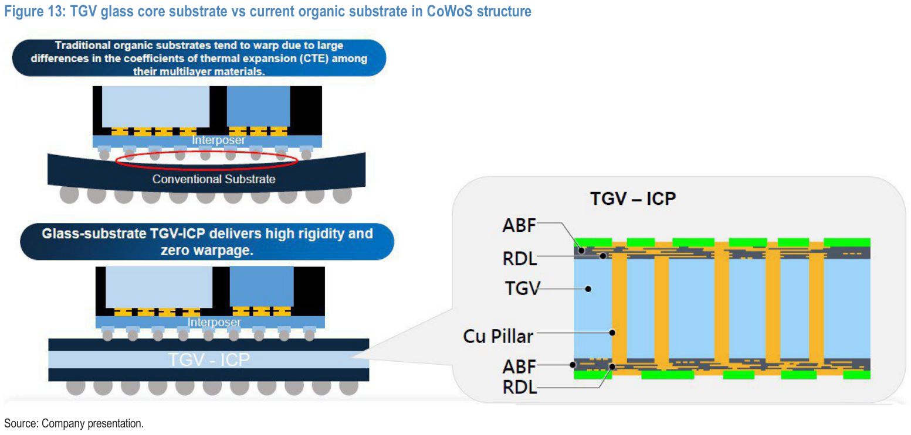

### 解讀摘要

傳統有機基板在 CoWoS 封裝中因多層材料 CTE 不匹配而翹曲（warpage），限制了更大 die 或更複雜 interposer 的整合。玻璃核心基板（TGV-ICP）利用玻璃的低 CTE 和高剛性消除翹曲，同時 TGV 銅柱提供垂直互連。創新服務的切入點正是 TGV 銅柱的大量轉移製程，這需要其在探針卡領域積累的高精密針組裝能力作為技術基礎。

### 表格

| 對比維度 | 傳統有機基板 | TGV 玻璃核心基板（TGV-ICP） |
|---|---|---|
| 翹曲（Warpage） | 嚴重（多層材料 CTE 差異大） | 零翹曲（玻璃剛性高） |
| 互連方式 | 傳統 bump / 有機疊層 | TGV + Cu Pillar + ABF/RDL |
| 應用場景 | 現有 CoWoS（包括 AI GPU） | 下一代 Switch ASIC / AI 網路晶片 |
| 創新服務角色 | 無特定優勢 | Cu Pillar mass transfer（sole supplier 候選） |

---

## Exhibit 6｜GCS TGV 供應鏈圖（Fig 14）

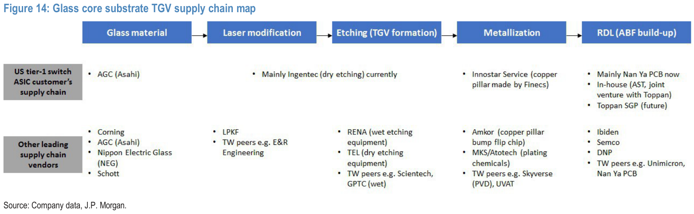

### 解讀摘要

GCS 的 5 步驟供應鏈（玻璃材料→雷射修改→蝕刻 TGV→金屬化→RDL）中，創新服務卡位在「金屬化」步驟（與 Finecs 合作提供銅柱），是整個供應鏈最接近 IC 封裝規格要求的高精密環節。US tier-1 switch ASIC 客戶的供應鏈已呈現早期成形跡象：玻璃材料 AGC、蝕刻 Ingentec、金屬化 Innostar/Finecs、RDL 南亞電路板及合資廠。

### 表格

| 製程步驟 | US tier-1 ASIC 客戶供應商 | 其他主要廠商 |
|---|---|---|
| 玻璃材料 | AGC（旭硝子） | Corning、NEG、Schott |
| 雷射修改 | — | LPKF、E&R Engineering（台廠） |
| 蝕刻（TGV formation） | Ingentec（乾蝕刻） | RENA（濕蝕）、TEL（乾蝕）、Scientech/GPTC（台廠，濕蝕） |
| 金屬化 | 創新服務（銅柱，由 Finecs 製造） | Amkor、MKS/Atotech（電鍍化學品）、Skyverse/UVAT（台廠） |
| RDL（ABF 疊層） | 南亞電路板（現在）、AST 合資廠（in-house）、Toppan SGP（未來） | Ibiden、Semco、DNP、Unimicron（台廠） |

---

## Exhibit 7｜GCS TGV 量產資格認證時程（Fig 15）

### 解讀摘要

TGV 銅柱的量產路徑已走過最困難的第一關（Before 1Q26 銅柱資格認證完成），目前處於 2Q-3Q26E 的基板廠 RDL/ABF 認證階段。JPM 預計 3Q-4Q26E 送往 CoWoS 封裝廠認證，2H27E 進入量產。整個認證鏈串聯多個獨立廠商（基板廠、CoWoS 廠），任何一環延誤都會推遲量產時程。

### 表格

| 里程碑 | 時間 | 狀態 |
|---|---|---|
| 創新服務 TGV 銅柱資格認證 | Before 1Q26 | ✓ 完成 |
| 基板廠 RDL/ABF 疊層認證 | 2Q-3Q26E | 進行中 |
| 送件至封裝廠（CoWoS 認證） | 3Q-4Q26E | 待進行 |
| 量產啟動 | 2H27E | 預估 |

---

## Exhibit 8｜TGV 銅柱產能擴張計畫（Fig 16）

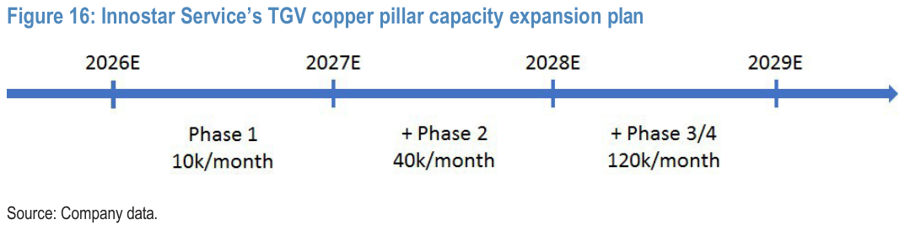

### 解讀摘要

產能規劃呈現 4 階段式擴張，從 2026E Phase 1 的 10k/月，到 2028E Phase 3/4 累計達 120k/月，12 倍的擴張幅度表明 JPM 預期有多個大型客戶訂單支撐。Phase 1 的 10k/月對應 2027E 初期量產所需；Phase 2+3/4 的擴張速度則與 2028E 多個客戶（除首個 US tier-1 外，還有可能的 US GPU 廠商）同步導入的假設掛鉤。

### 表格

| 時間 | 累計產能（k/月） | 增加 |
|---|---|---|
| 2026E | Phase 1：10 | 新建 |
| 2027E | +Phase 2：40 | +30 |
| 2028E | +Phase 3/4：120 | +80 |
| 2029E | 持續擴張（箭頭延伸） | 待定 |

> **洞察一**：2028E 120k/月的產能，若每顆 switch ASIC 需要 ~X 個銅柱（未披露），對應的年化出貨量數以億計。反推：若 2028E 銅柱營收 NT\$2,440mn 且單價為幾元至幾十元台幣，出貨量可達數億~數十億個。此規模隱含多個客戶同時認證並量產，遠超單一 US tier-1 ASIC 客戶，增加不確定性。

---

## Exhibit 9｜產業定位：中游探針卡自動化設備（Fig 17）

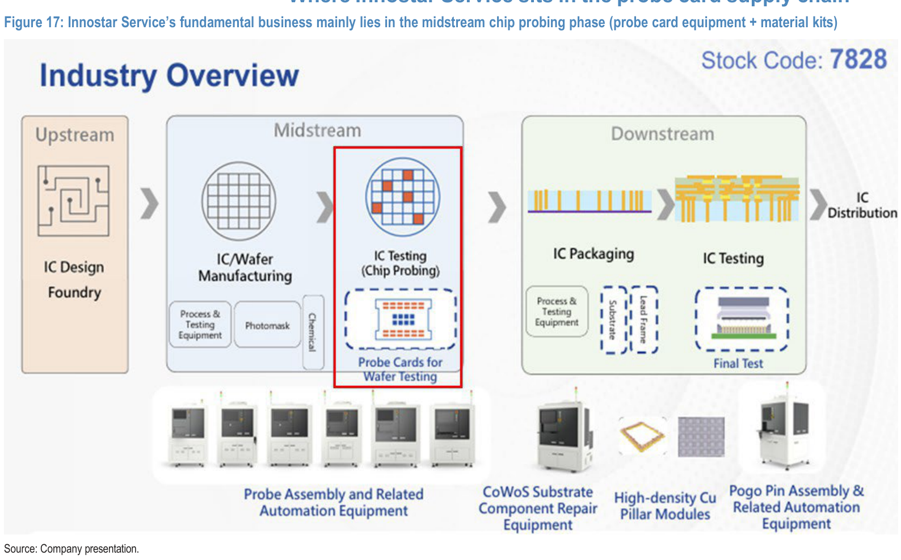

### 解讀摘要

創新服務的核心護城河在晶圓廠（IC Testing，中游 Chip Probing 環節）的供應鏈節點，提供探針卡組裝與維修設備，同時往後延伸至先進封裝（CoWoS substrate repair、Cu Pillar Modules），以及往前延伸至 Pogo Pin assembly。此圖說明創新服務並非探針卡廠（TP 才是），而是探針卡廠的設備與材料供應商，具有更靠近量產關鍵路徑但風險較低的定位。

---

## Exhibit 10｜探針卡 TAM 與供應鏈關係（Fig 18）

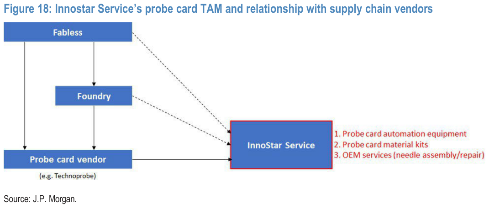

### 解讀摘要

Fabless/Foundry 的訂單流向 TP（探針卡廠），TP 再向創新服務採購三類服務：探針卡自動化設備、材料套件、OEM 服務（針頭組裝/維修）。這個架構意味著創新服務的收入完全依附在 TP 的競爭力與市佔率上，TP 失去 Fabless/Foundry 訂單等同直接削減創新服務的收入——報告明確將「TP 市佔流失」列為首要風險。

---

## Exhibit 11｜探針卡設備營收成長（Fig 19）

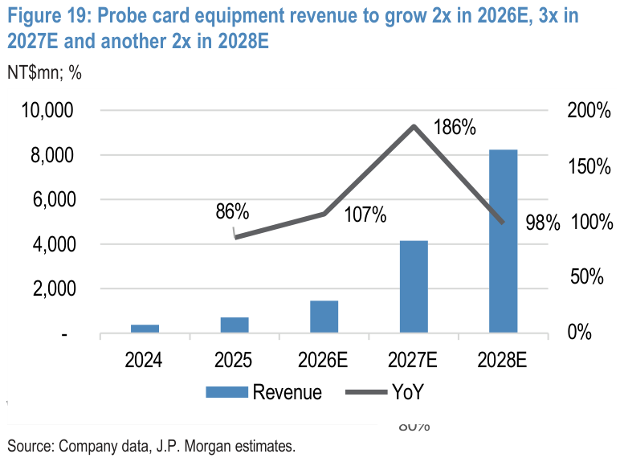

### 解讀摘要

探針卡設備營收 2024→2026E 約 ×4（NT\$350mn→NT\$1,400mn），YoY 增速在 2027E 達到峰值 +186%，隨後 2028E 回落至 +98%——曲線形狀顯示 2027E 是設備營收成長率的高點，2028E 雖絕對金額仍在擴大（~4,000mn→~8,000mn）但成長速度已放緩，與 Exhibit 12 雙臂機台出貨量持續加速形成對比。

### 表格

| 年度 | 探針卡設備總營收（NT\$mn） | YoY |
|---|---|---|
| 2024 | ~350 | — |
| 2025A | ~700 | +86% |
| 2026E | ~1,400 | +107% |
| 2027E | ~4,000 | +186% |
| 2028E | ~8,000 | +98% |

*絕對值為視覺估算（Fig 19 無資料標籤）；YoY% 為圖表折線資料標籤直讀。*

---

## Exhibit 12｜雙臂機台出貨量（Fig 20）

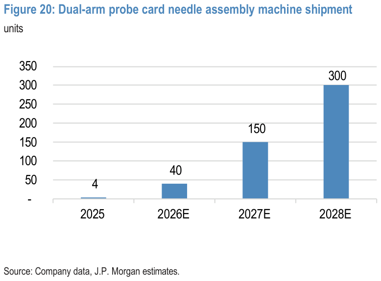

### 解讀摘要

雙臂機台是創新服務 2026-28 年探針卡設備成長的核心機種：出貨量從 2025A 僅 4 台跳升至 2026E 40 台（+10x），再到 2027E 150 台（+3.75x）、2028E 300 台（+2x）。雙臂機台單價遠高於單臂機台（未披露具體 ASP 差距），出貨量持續加速反映 TP 對雙臂機的採購深化。

### 表格

| 年度 | 雙臂機台出貨（台） |
|---|---|
| 2025A | 4 |
| 2026E | 40 |
| 2027E | 150 |
| 2028E | 300 |

*出貨量為 Fig 20 資料標籤直讀。*

> **洞察一（配合 Exhibit 11）**：雙臂機台 2025→2026E 出貨量 4→40 台，已是 10 倍增長，而 Exhibit 11 的探針卡設備收入僅增 107%（而非 10 倍），說明單臂機台依然有穩定出貨基量，雙臂機台的增量收入稀釋了整體 YoY 倍率。真正的 ASP 混合效果將在 2027E（雙臂機台佔比更高時）更顯著反映在毛利率（EBIT margin 從 42% 升至 56%）。

---

## Exhibit 13｜整體探針卡廠商市佔（Fig 21）

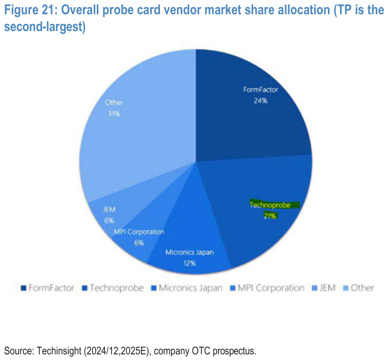

### 解讀摘要

在整體（含記憶體）探針卡市場，FormFactor 以 24% 居首，Technoprobe 以 21% 居次，Micronics Japan 12%——這是市佔的基準視角，但記憶體探針卡的技術門檻與 AI ASIC 需求脫鉤，真正決定創新服務訂單的是 Exhibit 14 的非記憶體細分市場。

### 表格

| 廠商 | 市佔 |
|---|---|
| FormFactor | 24% |
| Technoprobe | 21% |
| Micronics Japan | 12% |
| MPI Corporation | 6% |
| JEM | 6% |
| 其他 | 31% |

*Source: Techinsight (2024/12, 2025E), company OTC prospectus.*

---

## Exhibit 14｜非記憶體探針卡廠商市佔（Fig 22）

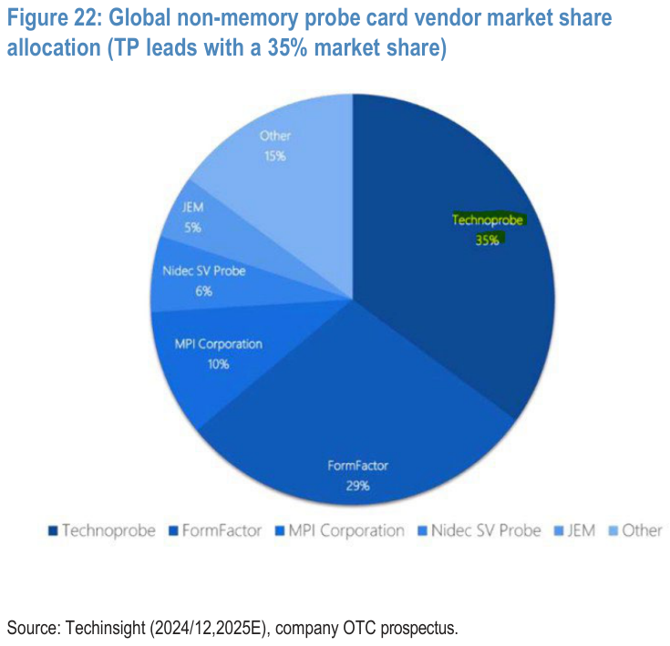

### 解讀摘要

在非記憶體（高 pin count、AI ASIC 集中的市場），TP 以 35% 大幅領先 FormFactor 29%，是 JPM 認為創新服務需求最關鍵的細分市場——對照 Exhibit 13 的整體市場排名（TP 僅第二，21%），TP 在非記憶體的領先優勢明顯更大。非記憶體探針卡將隨 AI ASIC 複雜度提升而擴大 TAM，TP 的領先地位直接轉化為創新服務的設備訂單。

### 表格

| 廠商 | 市佔 |
|---|---|
| Technoprobe | 35% |
| FormFactor | 29% |
| MPI Corporation | 10% |
| Nidec SV Probe | 6% |
| JEM | 5% |
| 其他 | 15% |

*Source: Techinsight (2024/12, 2025E), company OTC prospectus.*

---

## Exhibit 15｜探針卡 TAM 擴張至材料套件和 OEM 服務（Fig 23）

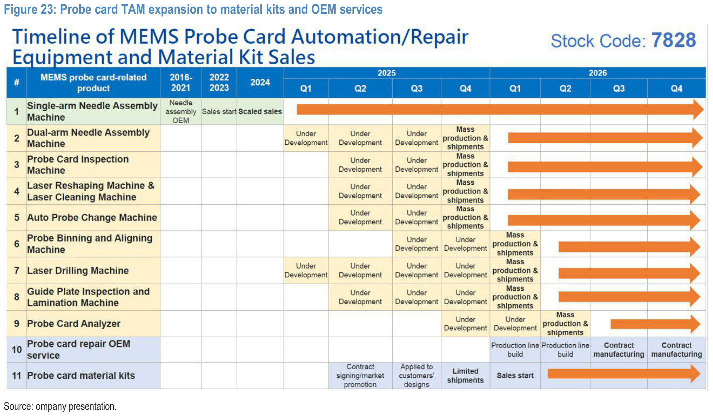

### 解讀摘要

這張 Gantt 表呈現創新服務從純設備商（1-2 項）延伸至材料套件與 OEM 服務（10-11 項）的完整路徑。關鍵觀察：7 類設備機型（第 2-8 項）在 2025 Q4 幾乎同步進入量產出貨，說明 TP 對整套自動化解決方案的需求已超越早期的旗艦機型（雙臂機）；而材料套件（第 11 項）從 2025 Q2 簽約到 2026 Q1 銷售啟動，是 TAM 擴張最快落地的新業務。

### 表格

| # | 產品 | 進入量產 | 2026 狀態 |
|---|---|---|---|
| 1 | 單臂針組裝機 | 2016-2021 | 規模出貨 |
| 2 | 雙臂針組裝機 | 2025 Q4 | 量產出貨 |
| 3 | 探針卡檢測機 | 2025 Q4 | 量產出貨 |
| 4 | 雷射整形+清洗機 | 2025 Q4 | 量產出貨 |
| 5 | 自動換針機 | 2025 Q4 | 量產出貨 |
| 6 | 探針分類對準機 | 2026 Q1 | 量產出貨 |
| 7 | 雷射鑽孔機 | 2025 Q4 | 量產出貨 |
| 8 | 導板檢測壓合機 | 2025 Q4 | 量產出貨 |
| 9 | 探針卡分析儀 | 2026 Q2-Q3 | 量產出貨 |
| 10 | 探針卡維修 OEM 服務 | 2026 Q3 | 合約製造 |
| 11 | 探針卡材料套件 | 2026 Q1 | 銷售啟動 |

---

## Exhibit 16｜材料套件 + OEM 服務營收（Fig 24）

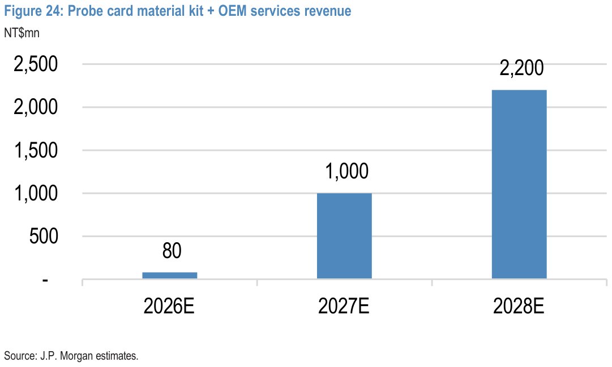

### 解讀摘要

材料套件業務 2026E NT\$80mn 為小規模試水（~5% 總營收），但 2027E 爆增至 NT\$1,000mn（+1,150%）、2028E 達 NT\$2,200mn（+120%）。這個增速隱含 2026 年底 TP 代理人模式全面展開、且 TP 的台灣客戶（如 KSMT 6683.TW）規模採購材料套件。JPM 預計 2027 年材料套件出貨量達~20k pins/needles/月，相當於~500 片探針卡當量。

### 表格

| 年度 | 材料套件+OEM 營收（NT\$mn） | YoY |
|---|---|---|
| 2026E | 80 | — |
| 2027E | 1,000 | +1,150% |
| 2028E | 2,200 | +120% |

> **洞察一**：材料套件 2027E NT\$1,000mn ÷ 2027E 總營收 NT\$5,604mn = 17.8%。這是繼探針卡設備之後的第二大收入來源，且具有更高的重複購買性質（材料套件為消耗品）——一旦成為 TP 台灣客戶的標準供應商，換供應商的轉換成本較高。

---

## Exhibit 17｜創新服務 2025 年收入結構（Fig 25）

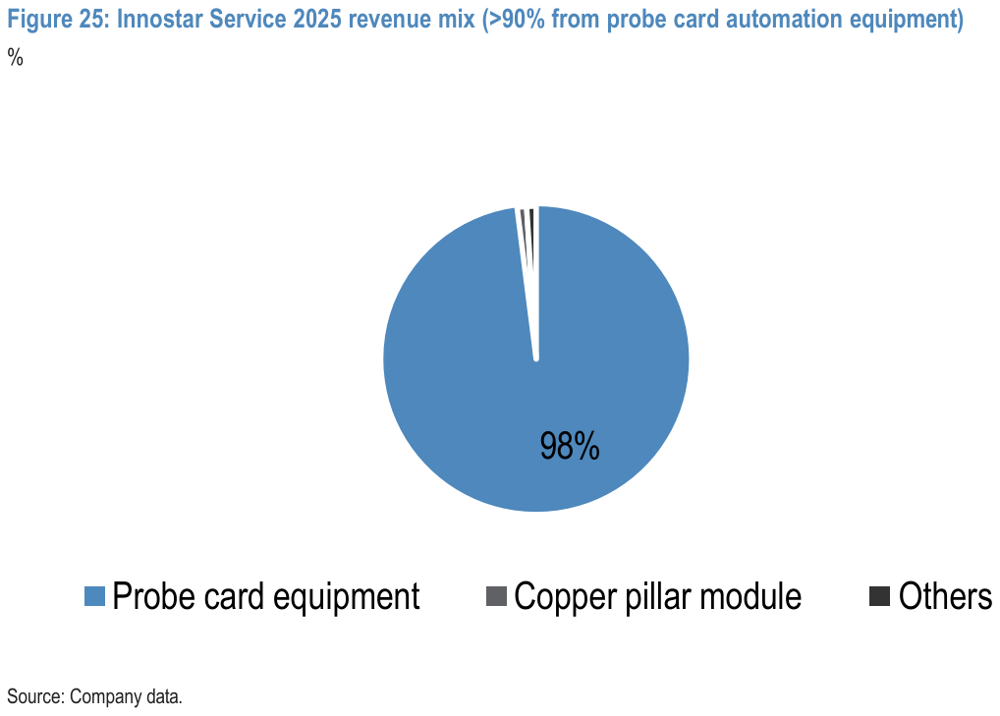

### 解讀摘要

2025 年 98% 的收入來自探針卡設備（幾乎是純設備公司），銅柱模組僅佔約 1-2%。這個起點是理解 2026-2028 年業務多元化轉型的基線——三年後預計探針卡設備佔比將降至 62%，而材料套件 17%、GCS 銅柱 19% 形成三足鼎立，但這個轉型本身也帶來執行風險（材料套件需 TP 授權確認、GCS 銅柱需客戶認證完成）。

---

## 跨 Exhibit 彙整表

### 彙整 1｜三大業務 2026-2028E 收入結構（來源：Exhibit 2、11、15、16）

| 年度 | 探針卡設備（NT\$mn） | 材料套件+OEM（NT\$mn） | GCS 銅柱（NT\$mn） | 其他 | 總營收（NT\$mn） |
|---|---|---|---|---|---|
| 2025A | ~700 | ~0 | ~16 | — | 716 |
| 2026E | ~1,400 | 80 | ~50 | ~90 | 1,620 |
| 2027E | ~4,000 | 1,000 | ~450 | ~154 | 5,604 |
| 2028E | ~8,000 | 2,200 | ~2,440 | ~209 | 12,849 |

*探針卡設備與其他欄為視覺估算 + 差額推算；材料套件來自 Fig 24；銅柱佔比來自 Fig 12；總收入來自 Fig 2 及財務摘要。*

> 合併視角下可見：2028E 探針卡設備仍是最大動力（NT\$8,000mn），但 GCS 銅柱（NT\$2,440mn）已是第二大業務，規模達材料套件的 1.1 倍——兩者加總的新業務佔比從 2025 年的<2% 升至 2028E 的 36%。

---

## 財務彙整

| 指標 | 2025A | 2026E | 2027E | 2028E |
|---|---|---|---|---|
| 總營收（NT\$mn） | 716 | 1,620 | 5,604 | 12,849 |
| Adj. EBIT（NT\$mn） | 278 | 683 | 3,133 | 7,903 |
| EBIT Margin | 38.9% | 42.1% | 55.9% | 61.5% |
| Adj. 淨利（NT\$mn） | 228 | 531 | 2,347 | 5,955 |
| Adj. EPS（NT\$） | 6.32 | 14.46 | 63.97 | 162.32 |
| BBG 共識 EPS（NT\$） | — | 18.08 | 43.18 | 100.76 |
| JPM vs 共識 | — | -20% | **+48%** | **+61%** |

*JPM 2026E EPS 低於共識（偏保守），但 2027-28E 大幅領先共識，反映對 TGV 銅柱與材料套件的差異化看法。*

---

## 相關個股清單

| 類別 | 公司 | Ticker | 評等 | 備註 |
|---|---|---|---|---|
| 主覆蓋 | 創新服務 | 7828 TT | OW（首評）| PT NT\$4,000，25x 2028E P/E |
| 關鍵客戶（未覆蓋） | Technoprobe | TPRO IM | N/C | 8.4% 股東；TP 擴產是創新服務最大驅動力 |
| 探針卡同業 | FormFactor | FORM US | — | 全球市佔 #1，非記憶體 #2 |
| GCS 玻璃材料 | Corning | GLW US | — | GCS 玻璃主要供應商之一 |
| GCS 金屬化同業 | Amkor Technology | AMKR US | — | CoWoS/GCS 先進封裝廠 |
| 台灣 RDL 廠商 | 南亞電路板 | 8046 TT | — | US tier-1 ASIC 客戶 GCS 供應鏈 RDL 環節現任供應商 |
