# MS｜MLCC Super Cycle — The Other AI Squeeze

**券商**：Morgan Stanley  
**分析師**：Shawn Kim、Duan Liu、Cindy Huang、Ryan Kim  
**日期**：2026-06-22  
**主題**：MLCC 超級循環 — AI 引發的另一場供需擠壓  
**評級**：Industry View — Attractive  
<a href="/dl?g=產業&b=MS&d=20260622&h=MLCC-Super-Cycle">📎 下載 PDF</a>

---

## 報告總結

MS 指出 AI 伺服器正在把 MLCC 從大宗零件推向「戰略性資源」：單台 AI 伺服器耗用 MLCC 約 8–13 倍於傳統伺服器；GB300 每機櫃使用約 32 萬顆（為高階手機的 30 倍），VR200 再往上 +80%（570K+）。關鍵在於高容值（47uF+）AI 級 MLCC 需要數百至千層以上的介電層，生產時「消耗的產能遠高於其單位數量」，使領先廠商在轉向 AI 應用後，傳統品項的供給結構性收緊。通路渠道漲價 200–300%（分銷商定價 2Q26 合約漲 20–30% QoQ）；現貨部分某些規格 YTD 漲 6 倍。

MS 全球 MLCC 出貨值預測 2025→2028E 從 US\$14.7bn 成長至 US\$24.3bn（CAGR 18%，十年趨勢 6.5%）；AI server MLCC TAM 2027E 約 US\$900M，2030E 可突破 US\$1bn。選股：上調 SEMCO（PT W2,560,000 from W920,000）；台灣偏好 **Yageo（OW）**；日本偏好 **Murata（OW）**；Taiyo Yuden 預期落後。

---

## MS 完整投資邏輯鏈

| 論點層次 | Exhibit | 內容 |
|---|---|---|
| 供給瓶頸確認 | 3 | Taiwan MLCC 月銷 5 月 +40% YoY，循環性漲幅從 10 年低谷反彈 |
| AI 帶來結構性需求躍升 | 11 | VR200 MLCC 用量 570K+（比 GB300 高 +80%） |
| 需求向高容值升級 | 12, 13 | 高容值佔比 VR200 31%（vs GB300 18%）；2027E 高容值需求 US\$491M（vs 低容值 US\$402M） |
| 供給無法快速補充 | 見覆封 | 高容值 MLCC 千層以上製程，容量不可互換，新建產能需 2 年；廠商年擴產 10–15% |
| 市場規模清晰 | 14, 15, 16 | 全球 MLCC 出貨值 2028E US\$24.3bn（CAGR 18%）；AI server 2027E US\$893M |
| 龍頭財務爆發 | 19, 20, 22, 28 | SEMCO MLCC OP 上修 FY27 +110%；ROIC SEMCO/Yageo 2027E 衝向 50%+ |
| 市場重新定價 | 7 | MLCC 板塊 P/B 9.6x，歷史均值 1.7x，但 EPS 上修動能持續 |
| **結論** | 封面 | **OW Yageo（台灣）、SEMCO（韓國）、Murata（日本）；Taiyo Yuden 落後** |

> **報告最大邏輯缺口**：AI server MLCC 需求預測高度依賴 MS 對 VR200 BOM 的供應鏈抽查（Exhibit 11），若 Rubin 架構量產時程延後（如 B200/GB300 的過渡），2027E 的 US\$893M 目標將有下修風險。報告也坦承部分華強北現貨漲 10–20 倍是囤貨行為、非真實終端需求。

---

## 報告核心觀點

| 主題 | MS 觀點 | 市場共識 | 是否 Contra-Consensus |
|---|---|---|---|
| 供需性質 | 結構性、非周期性（AI 規格不可替代） | 市場對 2017 重演存有疑慮 | 是（更樂觀） |
| 高容值 MLCC | VR200 用量佔比升至 31%，需求 2027 超過低容值 | 市場聚焦在量，少人關注 mix shift 的 ASP 槓桿 | 是（Contra） |
| SEMCO 評等 | PT 大幅上調 W2.56m（前 W920k，+178%） | 市場僅部分反映 MLCC 爆發 | 是 |
| Taiyo Yuden | 預期落後（elevated expectations） | 市場也看多 | 是（Contra） |
| 現貨漲價持久性 | 較 2025 關稅驅動更持久，但非全面缺貨 | 市場擔憂是通路囤貨假訊號 | 是（更積極） |

**偏好排序**：SEMCO（OW，最大受益）> Yageo（OW，台灣唯一）> Murata（OW，日本）> TDK（EW）> Taiyo Yuden（UW，落後）

---

## Exhibit 1｜Embedded MLCC Architecture

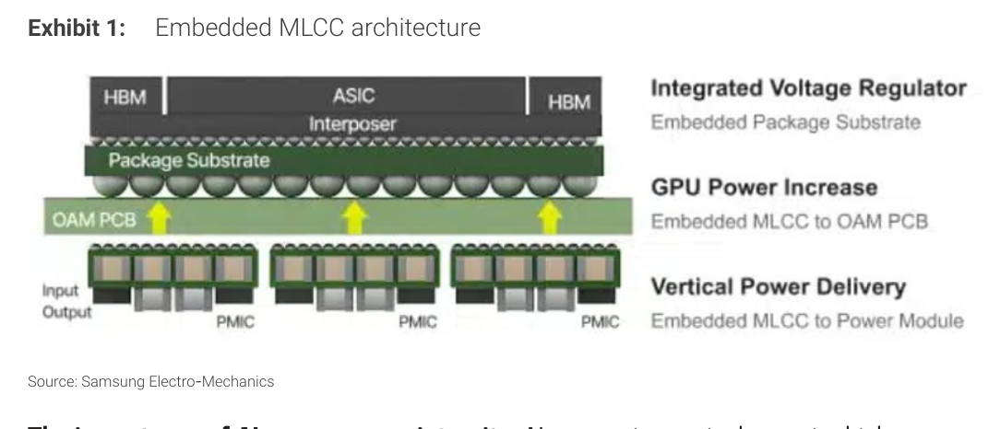

### 解讀摘要
Embedded MLCC（嵌入式電容）是 AI 伺服器的新趨勢：將電源供電電路整合至 ABF 基板內部，縮短到 chip 的距離，實現垂直供電、降低損耗、並釋放主板空間。AI 伺服器基板使用銅互連，embedded MLCC 需鍍銅，平坦表面提升基板整合可靠性。此設計代表 MLCC 從「主板上的零件」往「基板層的核心功能元件」升級，直接提升 MLCC 內容量且更難被替代。

---

## Exhibit 2｜MLCC Evolution in AI Servers

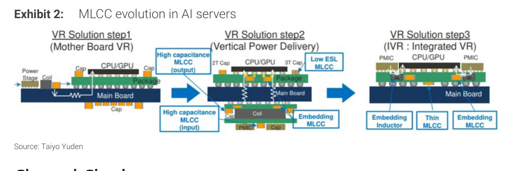

### 解讀摘要
AI 伺服器電源架構三階段演進：① VR step1（母板 VR）→ ② VR step2 垂直電源（高容值 MLCC 為核心）→ ③ IVR（整合式 VR，Embedded MLCC）。每一代升級都帶動高容值 MLCC 的用量與技術門檻提升，且愈到後期愈難被替代（Embedded 需通過封裝層認證）。

> **原文補充**：AI GPU 需要超低 ESR 和最低 ESL 以管理奈秒級暫態響應，避免高負載時系統不穩；這是 AI MLCC 規格遠高於傳統 MLCC 的根本原因，也是「容量不可互換」的技術邊界。

---

## Exhibit 3｜Taiwan Monthly MLCC Sales — Cycle Edging Up with May +40% YoY

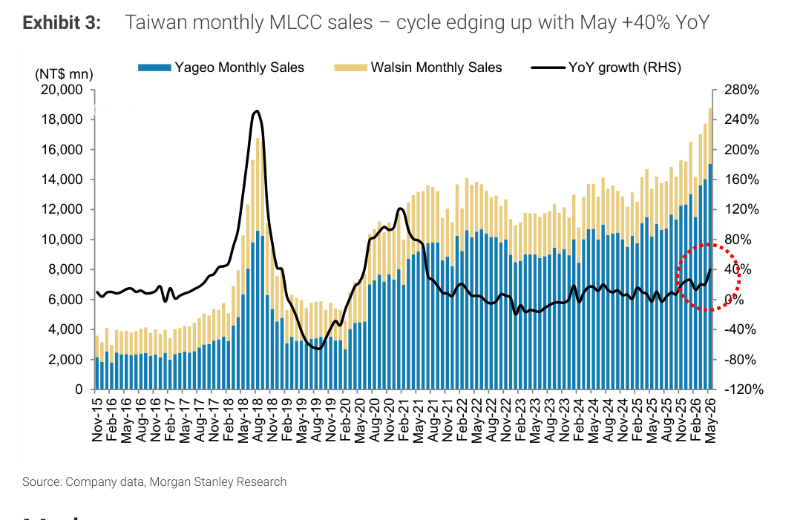

### 解讀摘要
國巨（Yageo）＋華新科（Walsin）合計台灣月銷 YoY（3MMA）在 5 月達 +40%，紅圈標記此突破點。與 2017–2018 超級循環（峰值 +240%+）相比，本輪漲幅仍在初段，但加速趨勢明顯——從 2025 年底的 ~0% 在 6 個月內漲至 40%。

### 表格

| 時間點 | 台灣 MLCC 月銷 YoY（3MMA）| 備註 |
|---|---|---|
| 2025 年初 | 約 0%（視覺估算） | 周期低谷 |
| 2025 年底 | 約 0–5%（視覺估算） | 剛轉正 |
| 2026 年 5 月 | +40%（報告文字） | 圖中紅圈標記 |
| 2017–2018 峰值（歷史） | +240%+（視覺估算） | 前次超級循環 |

> **洞察一**：本輪 5 月 +40% 對應 2017 循環時大約是在漲幅 +40–50% 的第一波加速段（後來再漲兩倍以上）。如果本次是「更結構性」的循環，以歷史路徑看，動能可能遠未到頂。

---

## Exhibit 4｜MLCC Bull-Base-Bear Risk Reward Analysis

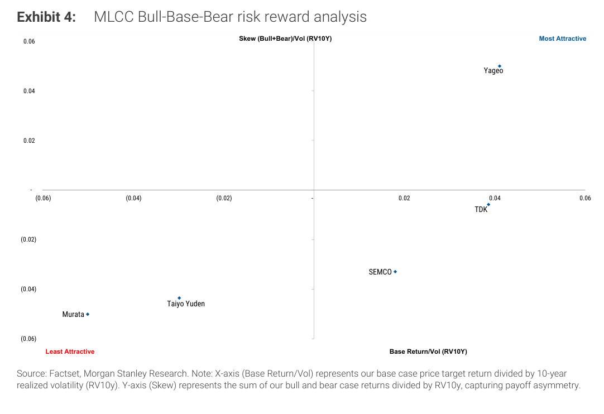

### 解讀摘要
散點圖：X 軸為「Base Return / RV10Y」（波動調整後的基準報酬），Y 軸為「Skew（Bull+Bear）/ RV10Y」（不對稱性，正值代表上行空間大於下行）。**Yageo 位居右上角（最佳）**，基準報酬強且上行偏向顯著；TDK 也在右邊但偏下（高報酬但不對稱性弱）；SEMCO 在右下（高基準報酬但偏負偏）；Taiyo Yuden 在左下（低報酬、負偏）；Murata 在最左下（最不佳位置）。

### 表格

| 公司 | 位置 | 含義 |
|---|---|---|
| Yageo | 右上 | 最佳（高報酬 + 上行偏向） |
| TDK | 右下 | 高基準報酬但不對稱性弱 |
| SEMCO | 右下（中） | 高基準報酬但 Skew 負 |
| Taiyo Yuden | 左下 | 低報酬 + 負偏（最不佳之一） |
| Murata | 最左下 | 基準報酬低 + 偏向最差 |

> **洞察一**：Yageo 在 Risk Reward 分析中排名最高，但在市場共識評等中不如 SEMCO 受關注——這是 MS 看好 Yageo 作為台灣最佳切入點的量化依據，也呼應 OW 評等。

---

## Exhibit 5｜MLCC Remains One of the Best Performing Segments within Asia Tech YTD

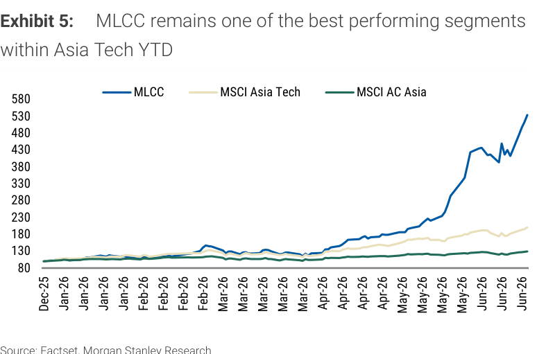

### 解讀摘要
MLCC 指數（以 Dec-25=100 為基準）YTD 已達約 530，而 MSCI Asia Tech 僅約 185、MSCI AC Asia 約 105。MLCC 族群 YTD 漲幅約 430%，遠超亞洲科技整體（約 +85%）。這個幅度代表市場已大幅重新評價 MLCC 族群，也解釋了為何 P/B 已飆至 9.6x（Exhibit 7）。

---

## Exhibit 6｜SEMCO Outperform MLCC Peers YTD

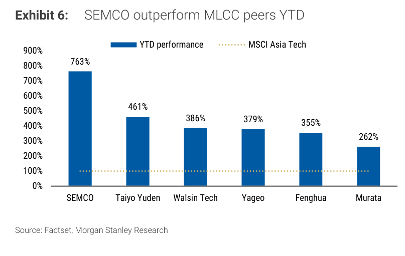

### 解讀摘要
MLCC 主要玩家 YTD 表現（以 Dec-25 為基準）：SEMCO 以 763% 領先，其次是 Taiyo Yuden 461%、Walsin Tech 386%、Yageo 379%、Fenghua 355%、Murata 262%。Murata 落後主要因其已是大市值龍頭、漲幅的基期較難低，而 SEMCO 的高敏感度反映了市場對其 AI MLCC 轉型最具動能的認知。

### 表格

| 公司 | YTD 表現（Dec-25=100 基準） |
|---|---|
| SEMCO | 763% |
| Taiyo Yuden | 461% |
| Walsin Tech | 386% |
| Yageo | 379% |
| Fenghua | 355% |
| Murata | 262% |
| MSCI Asia Tech（參考） | 約 85%（Exhibit 5） |

---

## Exhibit 7｜MLCC Group Now Trading at 9.6x NTM P/B vs. Historical Average of 1.7x

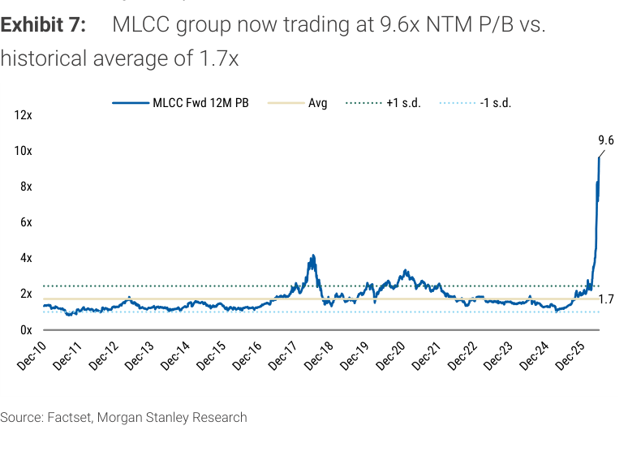

### 解讀摘要
MLCC 板塊 Forward 12M P/B 歷史均值僅 1.7x（±1 s.d. 約 1.2x–2.3x），過去最高峰在 2017–18 超級循環時約 4x。目前已飆至 **9.6x**，是歷史均值的 **5.6 倍**，是 2018 峰值的 **2.4 倍**。這不是估值便宜的 story——但 MS 的論點是若 EPS 上修持續（Exhibit 9、28），高估值有正當性。

> **洞察一**：P/B 9.6x vs 歷史均值 1.7x，意味著若 ROE 擴張未能兌現（例如 Rubin 延遲），估值修正空間極大。這是本輪最大的市場風險，也是 Exhibit 22（ROIC 預期）和 Exhibit 28（財測修正）最需要盯緊的觀察點。

---

## Exhibit 9｜Earnings Revision Breadth Bounced Back since Oct-25

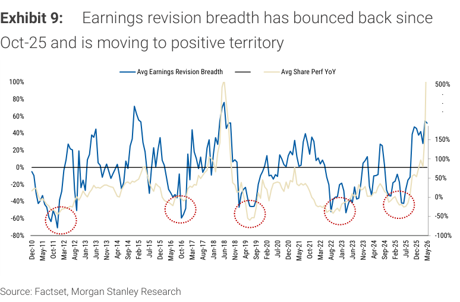

### 解讀摘要
MLCC 板塊平均 EPS 修正廣度（Avg Earnings Revision Breadth）在 2025 年 10 月後從 -40%（負修正）快速翻正，6 月已升至約 +40–50%，右軸顯示平均股價 YoY 也同步爆發（約 +500%）。圖中多個紅圈標記過去幾次廣度跌至 -60% 的低谷（2012、2015、2018–19、2022）——每次都是後來的買點。

> **洞察一**：每一次 EPS 修正廣度從 -60% 谷底反彈後，MLCC 股價都進入一輪多年多頭。2025 年 10 月的反彈深度（-40%）與 2022 年類似，提示本輪仍在修正廣度改善的初中段而非末段。

---

## Exhibit 10｜EPS Revision YTD

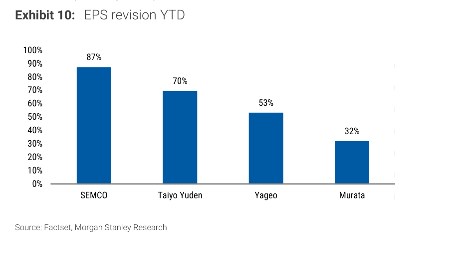

### 解讀摘要
YTD EPS 修正（2026E）：SEMCO +87%、Taiyo Yuden +70%、Yageo +53%、Murata +32%。SEMCO 的修正幅度遠超 Murata，反映市場對其 MLCC/AI 業務的樂觀情緒擴散速度最快。Yageo +53% 在台灣廠中最高，也呼應其在 Risk Reward 矩陣（Exhibit 4）中的首選地位。

### 表格

| 公司 | YTD EPS 修正 (2026E) |
|---|---|
| SEMCO | +87% |
| Taiyo Yuden | +70% |
| Yageo | +53% |
| Murata | +32% |

---

## Exhibit 11｜VR200 MLCC Unit Demand Rising to 570K+, Up ~80% vs GB300

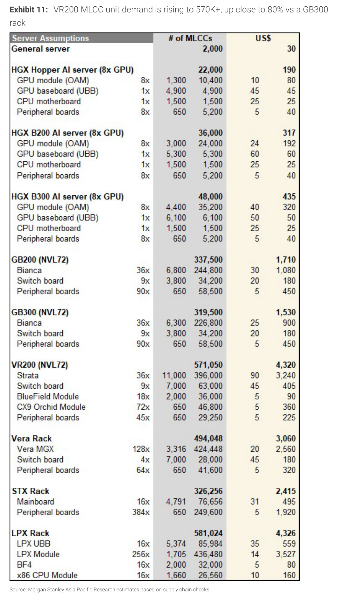

### 解讀摘要
這是報告最核心的 BOM 展示表。VR200（Rubin NVL72）每機架含 11 個模組（Switch board 9x + Strata 36x + BlueField 2,000x + CX9 Orchid 72x + Peripheral 45x），合計 MLCCs 達 **396,000 顆**、機架合計更高；搭配 Vera Rack 的整體合計達 494,048 顆、LPX Rack 則為 581,024 顆。整體較 GB300（337,500 顆）高出 **+48–72%**，報告標題取的是 570K+ 估計，可能含其他配置。AI MLCC 每台的美元貢獻 VR200 約 US\$4,320、LPX 約 US\$4,326，較 GB300 的 US\$1,710 高出 **2.5x**。

> **原文補充**：MS 的 BOM 來自供應鏈調查（supply chain checks），為估計值，非 NVIDIA 官方揭露。表中同時列出 US\$ 欄，以 ASP 呈現各模組的貨幣價值，方便評估 TAM 規模。

### 表格

| 機架平台 | 主要模組 | 總 MLCC 顆數 | US\$ 合計 |
|---|---|---|---|
| General server | — | 2,000 | 30 |
| HGX Hopper 8-GPU | GPU module + 周邊 | 22,000 | 190 |
| HGX B200 8-GPU | GPU module + 周邊 | 36,000 | 317 |
| HGX B300 8-GPU | GPU module + 周邊 | 48,000 | 435 |
| GB200 (NVL72) | Bianca 36x + Switch 9x + Peripheral 90x | 337,500 | 1,710 |
| GB300 (NVL72) | Bianca 36x + Switch 9x + Peripheral 90x | 337,500 | 1,710 |
| VR200 (NVL72) | Strata 36x + Switch 9x + BF 2k + CX9 72x + Periph 45x | 396,000 | 4,320 |
| Vera Rack | Vera MGX 128x + Switch 4x + Peripheral 64x | 494,048 | 3,060 |
| STX Rack | Mainboard 16x + Peripheral 384x | 326,256 | 2,415 |
| LPX Rack | LPX UBB 16x + LPX Module 256x + BF4x + x86 16x | 581,024 | 4,326 |

> **洞察一**：VR200 的 US\$ 含量 US\$4,320 是 General server（US\$30）的 **144 倍**，是 GB200/300（US\$1,710）的 **2.5 倍**。光是 AI 伺服器從 GB300 代際升至 VR200 這一步，每台的 MLCC 貨幣含量就翻了 2.5x——這是「Specs surge」論點的量化體現。

> **洞察二**：LPX Rack（US\$4,326，581,024 顆）是所有配置中最多的，暗示 LPX 在高密度部署中將成 MLCC 最大的增量需求方向。

> **值得驗證**：BOM 來自 MS 供應鏈抽查，非 NVIDIA 官方揭露。若 VR200 的 Switch board 或 BlueField 用量有修正，則 4,320 這個 US\$ 數字將直接影響 TAM 預測（Exhibit 16 的 2027E US\$893M 很大比例取決於此）。

---

## Exhibit 12｜High-Cap (47uF+) MLCC Usage to Increase to 30%+ in VR200

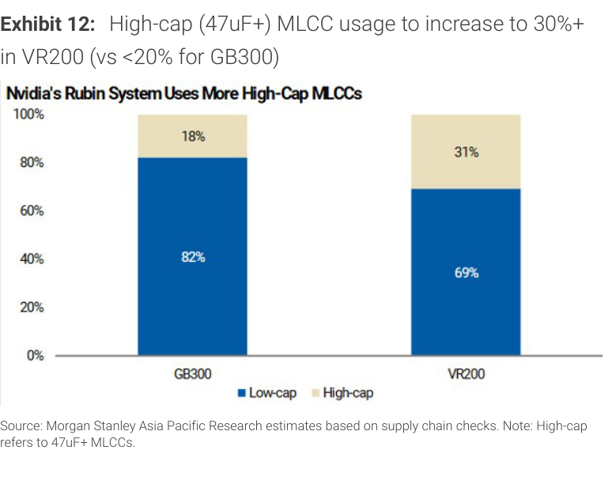

### 解讀摘要
GB300 的 MLCC 組成：低容值 82%、高容值（47uF+）18%；VR200 升至：低容值 69%、高容值 **31%**，Mix shift 幅度 +13 ppt。高容值 MLCC 是競爭門檻最高（需千層以上製程）、ASP 最高的品項，也是目前供需最緊張的區段。

### 表格

| 平台 | 高容值（47uF+）比例 | 低容值比例 |
|---|---|---|
| GB300 | 18% | 82% |
| VR200 | 31% | 69% |
| 變化 | +13 ppt | -13 ppt |

> **洞察一**：31% vs 18% 的 Mix shift 帶來雙重效果：① 高容值 ASP 比低容值高出數倍，MLCC 的每台美元含量因此超越顆數增長（顆數 +80%，但美元含量 +153%，兩者差距 = ASP 組合改善）；② 供給能力受限更顯著（高容值需專用產線），漲價能力更強。

---

## Exhibit 13｜Demand for High-Cap (47uF+) MLCC is Growing Faster

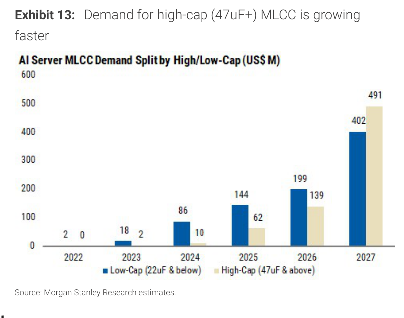

### 解讀摘要
MS 預測 AI 伺服器 MLCC 需求（US\$M）中，高容值（47uF+）的絕對金額從 2025 年 US\$62M 快速增長至 2027E US\$491M（+692%），首次超過低容值（US\$402M）。低容值增速也快（2025 US\$144M → 2027E US\$402M，+179%），但高容值更劇烈。

### 表格

| 年份 | 低容值（22uF 以下，US\$M）| 高容值（47uF 以上，US\$M）| 高容值比例 |
|---|---|---|---|
| 2022 | 2 | 0 | 0% |
| 2023 | 18 | 2 | 10% |
| 2024 | 86 | 10 | 10% |
| 2025 | 144 | 62 | 30% |
| 2026E | 199 | 139 | 41% |
| 2027E | 402 | 491 | 55% |

> **洞察一**：高容值佔比從 2025 年 30% 跳至 2027E 55%，這是 Mix-driven ASP 論點的核心量化依據。MS 預測「AI MLCC ASP 上升主要靠 Mix，而非通膨性漲價」——高容值佔比超過 50% 是一個臨界點，超過後整體 ASP 計算對高容值定價的敏感度超過低容值。

---

## Exhibit 14｜Global MLCC Market Forecasts

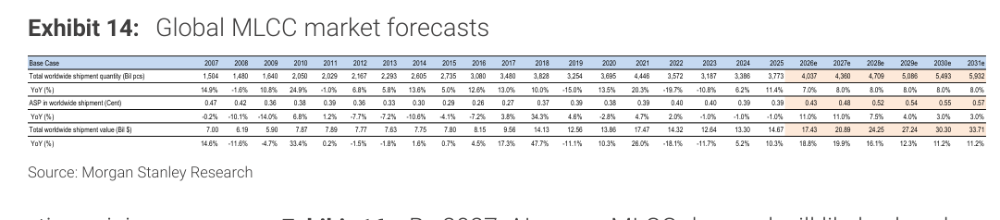

### 解讀摘要
MS 全球 MLCC 市場預測（基準情境）：出貨值從 2025E US\$14.67bn 成長至 2028E US\$24.25bn（CAGR 約 18%），出貨量從 3.77 兆片增至 4.71 兆片（CAGR 約 8%），ASP 從 0.39 分/片升至 0.52 分/片（CAGR 約 10%）。ASP 增長（10%）顯著快於數量增長（8%），印證 Mix-driven ASP 趨勢。

### 表格（出貨值，Bil US\$）

| 年度 | 出貨量（Bil pcs） | ASP（美分/片） | 出貨值（Bil US\$） | YoY |
|---|---|---|---|---|
| 2023 | 3,187 | 0.39 | 12.64 | -11.7% |
| 2024 | 3,386 | 0.39 | 13.30 | +5.2% |
| 2025E | 3,773 | 0.39 | 14.67 | +10.3% |
| 2026E | 4,037 | 0.43 | 17.43 | +18.8% |
| 2027E | 4,360 | 0.48 | 20.89 | +19.9% |
| 2028E | 4,709 | 0.52 | 24.25 | +16.1% |
| 2030E | 5,493 | 0.55 | 30.30 | — |

---

## Exhibit 15｜Global MLCC Shipment Value to Continue Rising, Driven by AI/DC

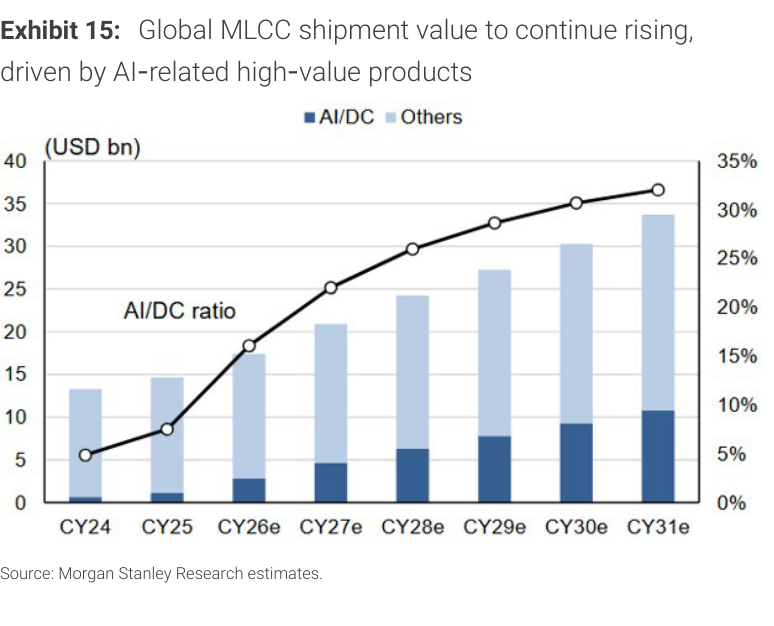

### 解讀摘要
AI/DC 佔全球 MLCC 出貨值比例（AI/DC ratio，右軸）從 CY25 約 10% 快速上升至 CY31E 約 30%+；絕對出貨值從 CY25 約 US\$15bn 升至 CY31E 約 US\$36bn。AI/DC 比例從 10% → 30%，意味著 AI 帶動的增量約佔未來 6 年新增 MLCC 市值的 40–50% 以上，這是「非線性成長」的核心依據。

---

## Exhibit 16｜By 2027, AI Server MLCC Demand Will Likely Reach Close to US\$1bn

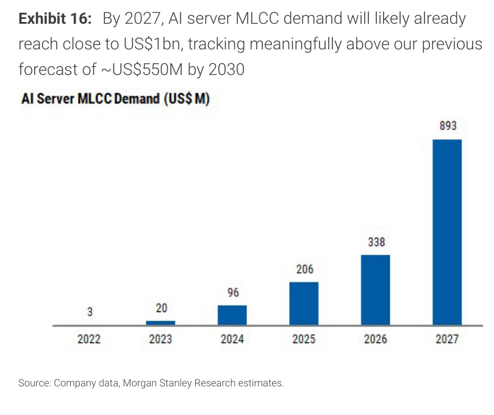

### 解讀摘要
AI server MLCC 市場從 2022 年 US\$3M 飆至 2027E US\$893M，6 年 CAGR 約 204%；MS 前次預測是 2030E 才到 US\$550M，如今 2027E 就已接近 US\$900M——**提前 3 年超越前次 2030 目標**。

### 表格

| 年份 | AI server MLCC 需求（US\$M） | YoY |
|---|---|---|
| 2022 | 3 | — |
| 2023 | 20 | +567% |
| 2024 | 96 | +380% |
| 2025 | 206 | +115% |
| 2026E | 338 | +64% |
| 2027E | 893 | +164% |

> **洞察一**：2027E 的 US\$893M 比 2025 實際值（US\$206M）高出 **3.3 倍**，且增速在 2027E 重新加速（+164%），MS 解釋為 VR200 等次世代平台從 2026 末放量的效果集中呈現。

> **值得驗證**：2027E 的加速（+164% vs 2026E 的 +64%）高度依賴 VR200 出貨如期。若 Rubin 延至 2028，本圖的 2027E 數字將面臨大幅下修。

---

## Exhibit 17｜MLCC Market Share (Historical)

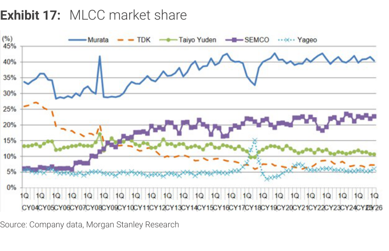

### 解讀摘要
MLCC 市佔歷史走勢（CY04–CY26 estimate）：Murata 長期維持約 35–40%+；SEMCO 近年快速從 ~10% 升至 ~22%；Taiyo Yuden 約 10–12%；TDK 約 10–12%；Yageo（台廠代表）約 5–7%，但為台灣唯一進入前五的廠商。市佔相對穩定，提示競爭格局較為固定。

---

## Exhibit 18｜MLCC Market Share (CY25)

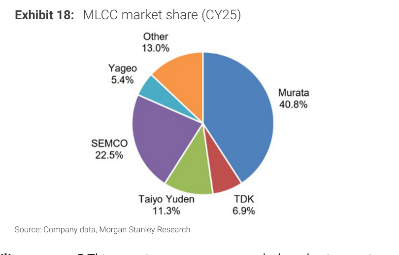

### 解讀摘要
CY25 MLCC 市佔餅圖：Murata 40.8%、SEMCO 22.5%、Taiyo Yuden 11.3%、TDK 6.9%、Yageo 5.4%、其他 13.0%。Murata 單家即佔 41%，前兩大合計逾 63%，具寡頭議價特性——這正是 MS 認為漲價可持續的結構性依據。

### 表格

| 公司 | 市佔率（CY25） |
|---|---|
| Murata | 40.8% |
| SEMCO | 22.5% |
| Taiyo Yuden | 11.3% |
| TDK | 6.9% |
| Yageo | 5.4% |
| 其他 | 13.0% |

---

## Exhibit 19｜MLCC Player EBITDA Margin

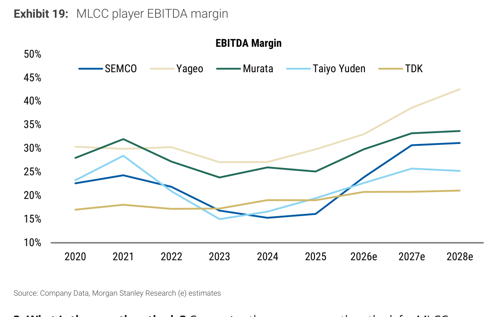

### 解讀摘要
MLCC 板塊 EBITDA margin 預計 2026–2028E 整體在 20–42% 之間，Yageo 預期最高（2028E ~42%），Murata 次之（~34%），SEMCO 追趕（2028E ~31%）；TDK 持續最低（~21%）。Yageo 的毛利擴張主要來自 MLCC 混合升級和全球產品組合改善，這是 MS 選 Yageo 而非 Murata 作為台灣首選的關鍵——漲幅更大（利潤彈性更高）且股本較小（每個 ppt 提升的 EPS 衝擊更顯著）。

---

## Exhibit 20｜SEMCO and Yageo Leading Growth into Next Upcycle

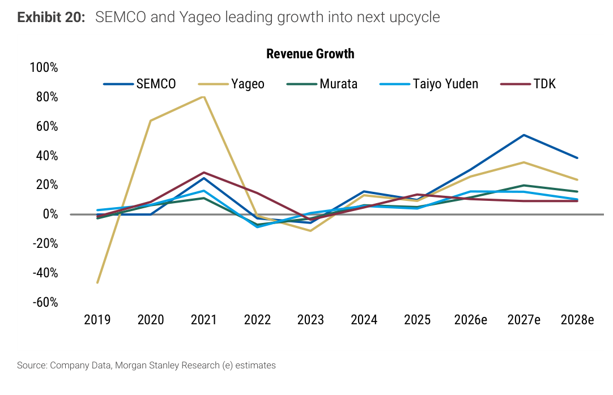

### 解讀摘要
營收成長率比較（2019–2028E）：Yageo 和 SEMCO 在 2027–28E 的成長率顯著高於同業，Yageo 2027E 約 +50%、SEMCO 約 +50%，而 Murata 約 +20%、TDK/Taiyo Yuden 約 10–20%。這個分化印證了「本輪 AI MLCC 超級循環的果實並非平均分配，高容值定位更有力的廠商會拿走大部分 upside」。

---

## Exhibit 21｜MLCC Players' FCF Conversion

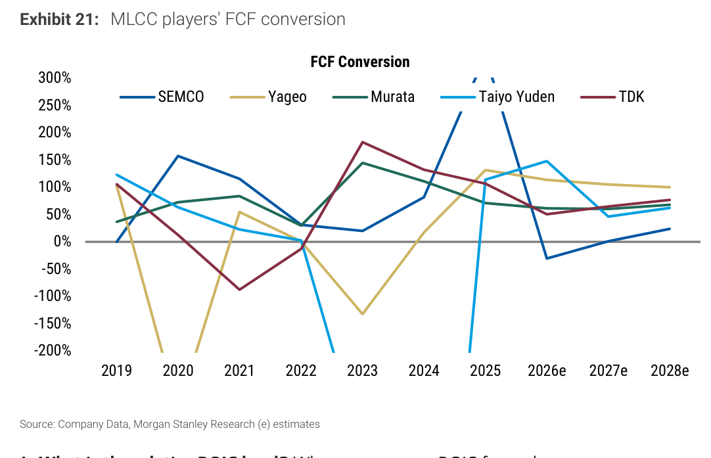

### 解讀摘要
FCF conversion 歷史波動大（因各家資本週期不同）。Yageo 2025 年曾跌至 -200%（大額收購 period），但 2026–28E 迅速修復到 80–100%+；SEMCO 在 2026E 跌至負值（AI MLCC 擴產 capex），但 2027–28E 回正；Murata 最穩定（維持正 FCF）。Yageo 的負 FCF 轉正代表資本投入高峰已過，進入收穫期，這將支撐股息和股價。

---

## Exhibit 22｜Improving ROIC into 2026-28e

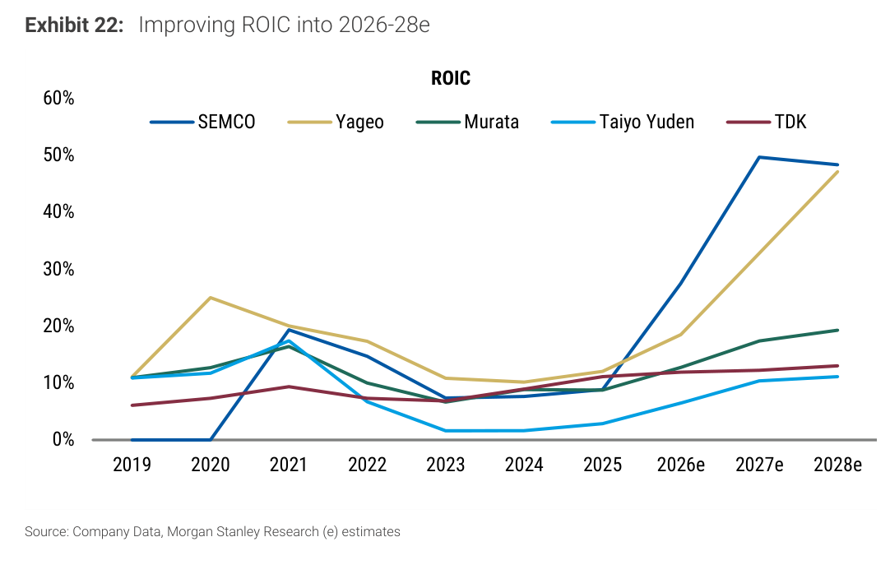

### 解讀摘要
ROIC 預測：SEMCO 和 Yageo 均有 2027–28E ROIC 衝向 50% 的路徑（從 2025 年的 5–10%），代表幾乎是「資本報酬翻十倍」的反彈軌跡。Murata 維持 15–20%（穩健但無爆發）；Taiyo Yuden 和 TDK 維持 10–13%。

> **洞察一（配合 Exhibit 7）**：若 SEMCO/Yageo 的 ROIC 真的達到 50%，在 ROE 相應高企的情況下，P/B 9.6x 具有合理性（以 Dupont 分析：高 ROE 支撐高 P/B）；但若 ROIC 未如預期，9.6x P/B 的下修風險非常顯著。這是本報告估值論點的關鍵驗證條件。

---

## Exhibit 24｜MLCC High-end (JP/KR) vs. Low-end (TW/CN) Relative Performance

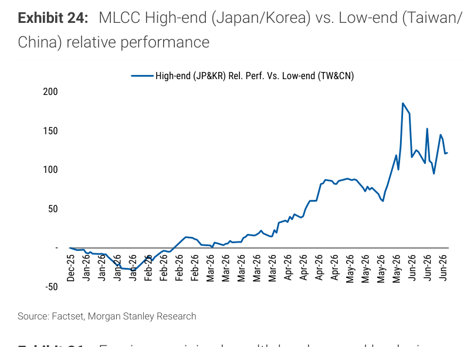

### 解讀摘要
高端（日韓：Murata/SEMCO/Taiyo Yuden/TDK）相對低端（台中：Yageo/Walsin/Fenghua 等）的相對報酬，Dec-25 為基準。高端 vs 低端 2026 年 5 月一度衝至 +180%（日韓大幅跑贏），隨後回落至 +130%。這個趨勢代表市場一度對「AI MLCC 高容值」溢價過度定價於日韓廠（SEMCO 高容值比例更高），但最近 1–2 個月已出現收斂——可能是市場認識到台廠（Yageo）的盈利彈性更高後資金再平衡。

> **洞察一**：高端/低端相對表現的見頂回落，結合 Exhibit 4 的 Risk Reward（Yageo 居首），暗示市場輪動方向可能從日韓往台廠轉。

---

## Exhibit 27｜Silicon Capacitor Mounting Locations

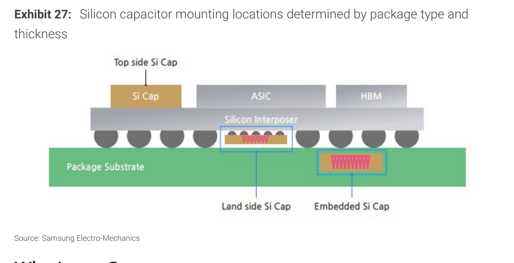

### 解讀摘要
矽電容（Silicon Capacitor）可裝設在三個位置：① Top side Si Cap（ASIC 頂部）、② Land side Si Cap（silicon interposer 底部）、③ Embedded Si Cap（package substrate 嵌入）。這是 MS 探討「MLCC 競爭者」的圖——矽電容是 MLCC 的潛在長期替代方案，三種安裝位置各有不同的技術門檻。Embedded Si Cap 是技術最複雜的，目前尚在開發。MS 指出矽電容在功率密度和諧振頻率上有優勢，但目前成本遠高於 MLCC，短期內不構成替代威脅。

---

## Exhibit 28｜SEMCO Earnings Revisions（核心財測修正）

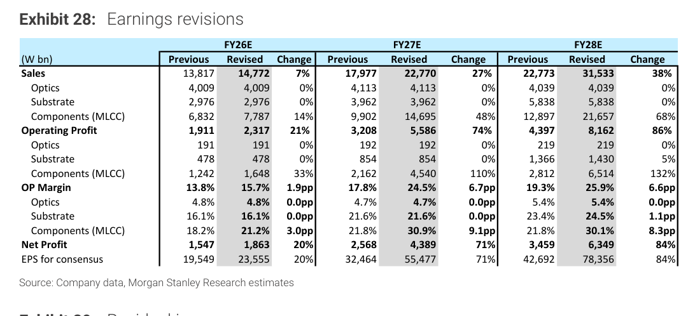

### 解讀摘要
SEMCO（三星電機）因 MLCC AI 需求上修的財測影響：Components（MLCC）業務 FY26E 銷售上修 +14%，FY27E +48%，FY28E +68%；OP 上修 FY26 +33%、FY27 +110%、FY28 +132%，OP margin 上修 FY27E 達 +9.1 ppt（21.8% → 30.9%）。整體 SEMCO FY27E 銷售 +27%、OP +74%、淨利 +71%，EPS（consensus 口徑）上修 +71%。

> **原文補充**：Optics 和 Substrate 兩個業務線的上修幅度為 0%——顯示本次財測修正完全來自 MLCC（Components），進一步確認 AI MLCC 是 SEMCO 投資論點的唯一核心驅動。

### 表格

| 業務 | FY26E 銷售（W bn）| 修正 | FY27E 銷售（W bn）| 修正 | FY28E 銷售（W bn）| 修正 |
|---|---|---|---|---|---|---|
| 光學（Optics） | 4,009 | 0% | 4,113 | 0% | 4,039 | 0% |
| 基板（Substrate） | 2,976 | 0% | 3,962 | 0% | 5,838 | 0% |
| MLCC（Components） | **7,787** | **+14%** | **14,695** | **+48%** | **21,657** | **+68%** |
| **整體銷售** | **14,772** | **+7%** | **22,770** | **+27%** | **31,533** | **+38%** |
| **整體 OP** | 2,317 | +21% | 5,586 | +74% | 8,162 | +86% |
| **整體 OP margin** | 15.7% | +1.9pp | 24.5% | +6.7pp | 25.9% | +6.6pp |
| **Net Profit** | 1,863 | +20% | 4,389 | +71% | 6,349 | +84% |

> **洞察一**：MLCC 業務 FY27E 銷售從修正前 W9.9tn → 修正後 W14.7tn（增量 W4.8tn），這 W4.8tn 的差距幾乎等於整個 Optics 業務（W4.1tn）的規模——也就是說，MS 的上修幅度相當於「憑空新增了一個 Optics 業務」。

---

## 跨 Exhibit 彙整表

### 彙整 1｜AI Server MLCC 需求：單機架含量 × 整體 TAM

| 來源 | 指標 | 數字 |
|---|---|---|
| Exhibit 11 | VR200 每機架 MLCC 美元含量 | US\$4,320 |
| Exhibit 11 | GB300 每機架 MLCC 美元含量 | US\$1,710 |
| Exhibit 13 | 2027E 高容值 AI MLCC 需求 | US\$491M |
| Exhibit 13 | 2027E 低容值 AI MLCC 需求 | US\$402M |
| Exhibit 16 | 2027E AI server MLCC 總需求 | US\$893M |
| Exhibit 12 | VR200 高容值佔比 | 31% |

> 從合併視角：2027E AI server MLCC US\$893M 中，高容值佔 55%（US\$491M / US\$893M）。與 VR200 架構中 31% 的用量比例相比，美元佔比更高（55% vs 31%），證明高容值 ASP 顯著高於低容值——大約 2–3 倍 per unit（(US\$491M/31%) / (US\$402M/69%) ≈ 2.7x ASP 差距）。

---

## 相關個股清單

| 類別 | 公司 | Ticker | 評等 | 備註 |
|---|---|---|---|---|
| 首選（韓） | SEMCO 三星電機 | 009150.KS | OW | PT W2,560,000（from W920,000）；Embedded MLCC + AI 高容值轉型最大受益；RI model |
| 首選（台） | Yageo 國巨 | 2327 TT | OW | Risk Reward 最佳；EBITDA 2028E ~42%；MLCC+鉭電容雙引擎 |
| 首選（日） | Murata 村田 | 6981 JP | OW | 市佔龍頭（40.8%）；AI 曝險上升 |
| 中性 | TDK | 6762 JP | EW | 折舊壓力；EBITDA margin 最低 |
| 謹慎 | Taiyo Yuden | 6976 JP | UW | 期待過高；Risk Reward 最差（Exhibit 4） |
