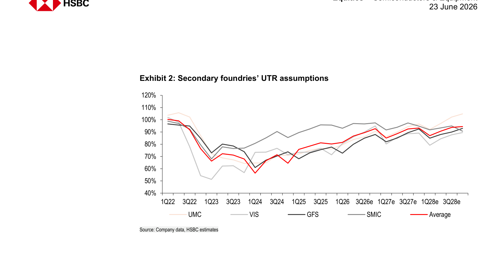
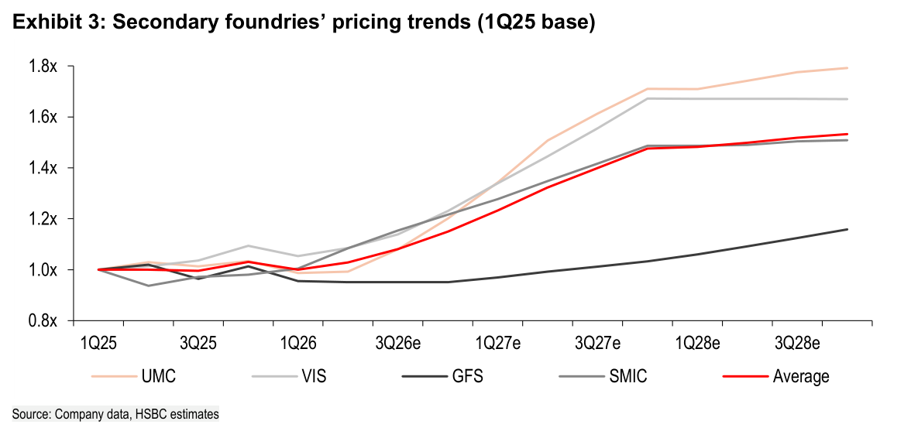
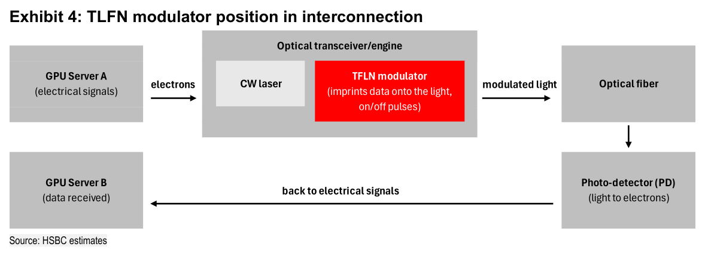
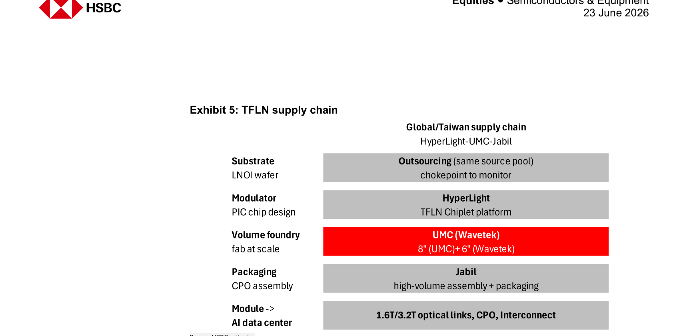

# HSBC｜Secondary Foundry — 利用率回升快於預期，定價能力超越共識

**券商**：HSBC Securities  
**分析師**：Ted Lin（台灣）、Frank Lee（香港，Global Tech Hardware & Semi Head）  
**日期**：2026-06-23  
**主題**：Secondary foundry 利用率快速回升 + 定價週期，TSMC 節點整合延伸至 12"  
**評級**：UMC/VIS 升級 Buy（from Hold）；GFS 維持 Hold；SMIC 維持 Buy  
<a href="/dl?g=產業&b=HSBC&d=20260623&h=Secondary-Foundry">📎 下載 PDF</a>

---

## 報告總結

HSBC 升級 UMC 和 VIS 至 Buy，核心論點是兩個相互強化的結構性驅動力：一、AI peripheral 需求（PMIC、MCU、DDIC 等）從 AI accelerator 溢出至 legacy node，拉動次級晶圓廠（secondary foundry）UTR 快速回升；二、TSMC 節點整合從 6"/8" 向上延伸至 legacy 12"（28-90nm），讓 UMC 成為最大的訂單承接受益者。HSBC 模型的 UTR 假設（2H26 91%/1H27 87%/2H27 93%）和 ASP 假設（2026 +11%/2027 +27%）均遠超市場共識（UTR 85%/84%/88%；ASP +1%/+7%）。

觸發點是 AI data centre 加速部署驅動 legacy node supply tightness 範圍從 AI chips 擴展至周邊元件，以及 VIS（旺宏）法說宣布 Singapore fab 增加 silicon interposer 產線，確認次級晶圓廠開始搭上 AI 價值鏈。HSBC 同時將 UMC 的 TFLN（薄膜鈮酸鋰）光子 IC 佈局列為長期新亮點，認為這是次級晶圓廠差異化的新路徑。

---

## HSBC 完整投資邏輯鏈

| 論點層次 | Exhibit | 內容 |
|---|---|---|
| AI 需求外溢 | Ex 2 | AI peripheral（PMIC、MCU）需求拉動 legacy node；UTR 從谷底 57% 回升至 2H26 91% |
| 定價轉折 | Ex 3 | 2H26 起 ASP 開始上漲，2027 累計漲幅 27%；遠超共識 +7% |
| 供給整合加速 | 封面 | TSMC 從 6"/8" 擴大整合至 12" legacy；UMC 為最大受益者 |
| 新業務長期亮點 | Ex 4, 5 | UMC TFLN 製造→光子 IC 進入 AI 互聯價值鏈；2027E 初始 20-30K wafer |
| **結論** | 封面 | **UMC TP TWD235（+194%）；VIS TP TWD220（+18%）；兩者均升級 Buy** |

> **報告最大邏輯缺口**：UTR 91%（2H26E）vs 共識 85% 的差距高達 6 ppt，是整個估值上調的核心驅動力。但模型高度依賴「AI peripheral 需求在 2H26 落地」的時程假設——若主要 CSP 資料中心項目延遲，UTR 拉升可能推遲至 1H27，影響整個定價節奏。

---

## 報告核心觀點

| 主題 | HSBC 觀點 | 市場共識 | 是否 Contra-Consensus |
|---|---|---|---|
| 2H26E 平均 UTR | 91% | 85% | 明顯 Contra，+6 ppt |
| 2027 ASP 漲幅 | +27% YoY | +7% YoY | 強烈 Contra，近 4 倍差距 |
| UMC TP | TWD235 | 市場多數 TWD80-120 | 最大 Contra，TP 幾乎翻倍 |
| TSMC 整合至 12" | 很可能 | 市場多數認為僅 8" | Contra，是 UMC 升評核心假設 |
| TFLN 對 UMC 的意義 | 長期新增值機會 | 市場幾乎未定價 | 長期 Contra |

**偏好排序**：UMC（最大受益 TSMC 整合 + TFLN）> VIS（silicon interposer 新業務）> SMIC（中國 AI 需求）> GFS（Hold，受益有限）

---

## Exhibit 2｜Secondary foundries' UTR assumptions

### 解讀摘要

這張圖追蹤 UMC、VIS、GFS、SMIC 四家次級晶圓廠 UTR 從 1Q22 到 3Q28E 的歷史走勢與預測。底部（1Q24）的 UTR 平均約 57%，反映 2023-24 年的嚴重庫存修正週期。2H26 的 UTR 預測快速回升至 91%，核心驅動力是 AI peripheral demand（主要是 PMIC 和 MCU）的 legacy node 需求，以及 TSMC 整合帶來的訂單外溢。HSBC 的 2H26 91% vs 市場共識 85% 的差距達 6 ppt，是本報告最關鍵的分歧假設。

> **原文補充**：HSBC 將 2H26/1H27/2H27 UTR 從 89%/84%/88% 上調至 91%/87%/93%（提升 2/3/5 ppt）。上調主因是「major IDMs turning positive on specific power semi products adopted in AI server racks」，以及 AI data centre 主要項目在 2H26 開始 ramp up。

### 表格

| 時期 | UMC | VIS | GFS | SMIC | Average（HSBC） | Average（共識） |
|---|---|---|---|---|---|---|
| 1Q22 | 105% | ~100% | ~98% | ~98% | ~100% | — |
| 1Q24（谷底） | ~60% | ~65% | ~75% | ~52% | ~57% | — |
| 1Q25 | ~70% | ~73% | ~82% | ~68% | ~73% | — |
| 1Q26 | ~85% | ~88% | ~90% | ~78% | ~85% | — |
| 2H26E | — | — | — | — | **91%** | 85% |
| 1H27E | — | — | — | — | **87%** | 84% |
| 2H27E | — | — | — | — | **93%** | 88% |

視覺估算，個別公司數值為近似值

> **洞察一**：SMIC 的 UTR 歷史最低（1Q24 約 52%），說明其中國市場的庫存修正最嚴重，但 HSBC 預期它在 2H26-2H27 的回升斜率最陡——這也解釋了為何 HSBC 維持 SMIC Buy，認為估值已充分反映前期壓力。

---

## Exhibit 3｜Secondary foundries' pricing trends（1Q25 base）

### 解讀摘要

這張定價趨勢圖以 1Q25 為基準（=1.0x），顯示四家次級晶圓廠 2025-28E 的 ASP 軌跡。HSBC 預估 Average ASP 在 2027E 累計漲到約 1.3-1.35x（vs 1Q25），意味著 +27% YoY 漲幅；而市場共識僅預期 +7% YoY。前一個上行週期（COVID upcycle，2021-22）的平均漲幅是 +14%/+19%，HSBC 認為這次幅度更大，原因是需求端從消費電子換成 AI（客戶定價彈性更高），加上 TSMC 整合改善供給端的 product mix 和 ASP 基礎。

### 表格

| 時期 | Average ASP（1Q25=1.0x，估） | YoY 漲幅假設 |
|---|---|---|
| 1Q25 | 1.0x（基準） | — |
| 3Q25 | ~0.95x | 持平至微降 |
| 1Q26 | ~0.97x | 觸底回升 |
| 3Q26E | ~1.05x | +11% 開始 |
| 1Q27E | ~1.18x | 漲幅加速 |
| 3Q27E | ~1.30x | 累計 +27% |
| 1Q28E | ~1.35x | 趨穩 |

視覺估算

> **洞察一**：HSBC 的 2027 ASP +27% 假設比共識高 20 ppt（vs +7%），是整個二次晶圓廠盈利預測大幅超預期的最大驅動力。若此假設成立，UMC 2027E EPS TWD9.31 vs 共識 TWD5.32（高出 75%）的差距就完全合理。這是高確信度的 contra-consensus，也是最大的估值上調風險。

---

## Exhibit 4｜TLFN modulator position in interconnection

### 解讀摘要

這張示意圖呈現 TFLN（thin-film lithium niobate）調製器在 AI 伺服器光子互聯中的功能定位。GPU Server A → 電信號 → CW laser + **TFLN modulator**（紅色，將數據編碼到光脈衝）→ 光纖傳輸 → Photo-detector → GPU Server B 接收。TFLN 的競爭優勢是速度/頻寬優於 silicon photonics（SiPh），且光損耗更低，適合 1.6T/3.2T 高速互聯。UMC 透過 HyperLight 的 TFLN chiplet 平台，掌握製造能力，是全球少數能量產 TFLN modulator 的晶圓廠之一。

### 說明

| 環節 | 技術 | 角色 |
|---|---|---|
| 電信號輸入 | GPU Server A | 資料來源 |
| 光信號調製 | CW laser + TFLN modulator | 核心製程（UMC 製造） |
| 傳輸 | 光纖 | 介質 |
| 光電轉換 | Photo-detector | 接收端 |
| 資料接收 | GPU Server B | 終端 |

---

## Exhibit 5｜TFLN supply chain

### 解讀摘要

TFLN 供應鏈由三個核心環節組成：HyperLight（TFLN chiplet 設計）→ UMC/Wavetek（量產代工，8"/6" wafer）→ Jabil（CPO 組裝與封裝）。LNOI（鈮酸鋰薄膜）wafer 的底材目前採「外部採購（同一供應池）」，被 HSBC 標記為 chokepoint to monitor。整個供應鏈的終端應用是 1.6T/3.2T 光互聯、CPO（co-packaged optics）和 AI data centre Interconnect。

### 說明

| 層級 | 台灣/全球供應商 | 環節 |
|---|---|---|
| Substrate（LNOI wafer） | 外部採購（供應集中，瓶頸風險） | 基底材料 |
| Modulator 設計 | HyperLight（TFLN Chiplet platform） | PIC chip design |
| Volume foundry | **UMC (Wavetek)** — 8"(UMC) + 6"(Wavetek) | 量產晶圓代工 |
| Packaging | Jabil — 高量組裝 + 封裝 | CPO assembly |
| 終端 | 1.6T/3.2T optical links, CPO, Interconnect | AI data centre |

> **洞察一**：LNOI wafer（底材）被 HSBC 標示為 chokepoint，因為目前 TFLN 供應鏈採用「same source pool」的外部採購，意味著若 TFLN 需求快速擴大，底材供應可能成為瓶頸。這是 UMC TFLN 業務能否按時 ramp 的最大不確定因素，比 UMC 本身的製程能力更值得追蹤。

---

## 相關個股清單

| 類別 | 公司 | Ticker | 評等 | 備註 |
|---|---|---|---|---|
| Secondary Foundry | UMC 聯電 | 2303 | Buy（升評） | TP TWD235（from TWD80）；TSMC 整合最大受益 + TFLN；25x 2027E P/E |
| Secondary Foundry | VIS 旺宏 | 5347 | Buy（升評） | TP TWD220（from TWD171）；Singapore fab 增加 silicon interposer |
| Secondary Foundry | GlobalFoundries | GFS US | Hold | TP USD92（from USD65）；受益有限 |
| Secondary Foundry | SMIC | 0981 HK | Buy | TP HKD93（from HKD89）；中國 AI 需求受益 |
