# Morgan Stanley｜AI Supply Chain — 2027 TSMC CoWoS Preliminary Allocation

**券商**：Morgan Stanley  
**分析師**：Charlie Chan、Daniel Yen、Daisy Dai、Tiffany Yeh、Lucas Wang、Ethan Jia、Henry Zhao  
**日期**：2026-06-23  
**主題**：2027 TSMC CoWoS allocation 初步拆解；wafer + HBM TAM；AI semi 估值  
**評級**：N/A（供應鏈追蹤報告）  
<a href="https://layx.uk/dl?g=產業&b=MS&d=20260623&h=AI-Supply-Chain">📎 下載 PDF</a>

---

## 報告總結

MS 根據台灣供應鏈調查，首次公布 2027 年 TSMC CoWoS 產能分配的初步拆解。核心發現是 CoWoS 總需求從 2026E 的 1,394k wafers 翻倍至 2027E 的 2,694k（+93% YoY），而 TSMC 自身的產能目標是 200kwpm（year-end 2027E），加上非 TSMC 陣營（ASE/SPIL 50kwpm、Amkor 30kwpm）合計 280kwpm。最大的驚喜是 AMD 爆發式成長（+308% YoY 至 530k），主要來自 Venice CPU 的 CoWoS-R 需求大幅拉升，呼應 Agentic AI 對高效能 CPU 的需求。另一個 contra-consensus 亮點是 MediaTek 的 CoWoS 需求從 40k 跳至 180k（+350%），反映 Google TPU v8t ZebraFish 的量產規模超出預期。

觸發點是 Computex（6月初）Nvidia CEO 確認已鎖定足夠 TSMC 2027 產能，MS 隨即透過供應鏈核查細化各客戶的具體分配。本報告同時發布 AI wafer TAM（\$47bn in 2027E）、HBM TAM（51bn Gb in 2027E）及 TSMC AI 相關收入 2024-29E CAGR 60% 預測。

---

## Morgan Stanley 完整投資邏輯鏈

| 論點層次 | Exhibit | 內容 |
|---|---|---|
| CoWoS 需求格局 | Ex 1, 2 | 2027E 總需求 2,694k，YoY +93%；AMD 爆增 308%，MediaTek +350% |
| 客戶分配細節 | Ex 3 | NVIDIA 1,222k；Broadcom 484k；AMD 530k；MediaTek 180k |
| 供給能力 | Ex 4 | TSMC 200kwpm + 非 TSMC 80kwpm，合計 280kwpm by 2027E |
| Wafer TAM | Ex 7, 9 | AI wafer \$47bn（2027E）/\$27bn（2026E）；NVIDIA Rubin 最大單一驅動 |
| HBM TAM | Ex 6, 8 | HBM 51bn Gb（2027E）/31bn Gb（2026E）；NVIDIA+GPU AI 主要消耗 |
| TSMC AI 收入 | Ex 12 | 2024-29E CAGR 60%；2029E 達 \$125bn；CoWoS+wafer test 是最大增量 |
| 估值 | Ex 10 | AI Semi enablers P/E 拉升至 47x；AI semis 輪動到 ASIC 設計夥伴 |
| **結論** | 封面 | **Top Pick MediaTek；OW TSMC、ASE、KYEC、Winway、MPI、Hon Precision** |

> **報告最大邏輯缺口**：MediaTek 的 180k CoWoS-S booking 對應 3.6mn TPU v8t ZebraFish 出貨，但 MS 在文中提到 ABF 基板供應可能是瓶頸（T-Glass 短缺），若無法緩解，實際出貨可能低於 180k。這是 MediaTek Top Pick 論點中最大的 downside risk。

---

## 報告核心觀點

| 主題 | MS 觀點 | 市場共識 | 是否 Contra-Consensus |
|---|---|---|---|
| 2027E 總 CoWoS 需求 | 2,694k wafers | 市場多數估 2,000-2,200k | 明顯偏高，+22% vs 共識 |
| AMD CoWoS 2027E | 530k（+308%） | 市場普遍估 300-350k | 強 Contra，Venice CPU 是關鍵 |
| MediaTek CoWoS 2027E | 180k（+350%） | 市場多數未特別估算 | Contra，Google TPU 深度合作規模超預期 |
| TSMC AI CAGR 2024-29E | 60% | 市場多數估 45-55% | 偏樂觀 |
| CPU 消耗 CoWoS 趨勢 | 快速增長（Venice CPU +5.4x） | 多數人聚焦 GPU，忽略 CPU | Contra，Agentic AI 帶動 CPU 需求 |

**偏好排序**：MediaTek（Top Pick）> TSMC、ASE、KYEC、Winway、MPI、Hon Precision（均 OW）> Aspeed（CPU BMC proxy）

---

## Exhibit 1｜Global CoWoS demand breakdown: 2026e vs. 2027e

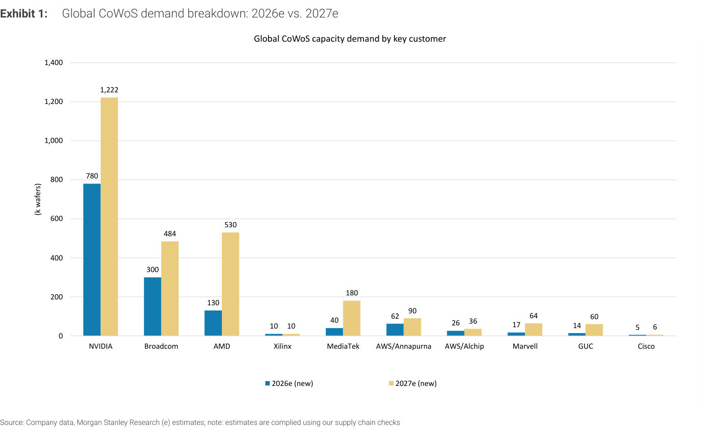

### 解讀摘要

這張圖清晰呈現 2026E 到 2027E 各客戶的 CoWoS 需求增幅。AMD 是最大的 YoY 增量（130k → 530k，+308%），超越了 Broadcom 的 +61% 和 NVIDIA 的 +57%，這是市場普遍低估的增量。MediaTek 從 40k 跳至 180k（+350%），在絕對量小的前提下成長倍率最驚人，反映 Google TPU 的委外代工決策已全面轉向 MediaTek。Marvell 從 17k 到 64k（+276%），主要受 Microsoft Maia 300 驅動。

### 表格

| 客戶 | 2026E（千片） | 2027E（千片） | YoY |
|---|---|---|---|
| NVIDIA | 780 | 1,222 | +57% |
| Broadcom | 300 | 484 | +61% |
| AMD | 130 | 530 | +308% |
| MediaTek | 40 | 180 | +350% |
| AWS/Annapurna | 62 | 90 | +45% |
| AWS/Alchip | 26 | 36 | +38% |
| Marvell | 17 | 64 | +276% |
| GUC | 14 | 60 | +329% |
| Xilinx | 10 | 10 | 0% |
| Cisco | 5 | 6 | +20% |
| **合計** | **~1,394** | **~2,694** | **+93%** |

> **洞察一**：AMD 從 130k 到 530k 的 +400k 增量中，大部分來自 Venice CPU（CoWoS-R）從 50k 增至 270k（+220k），而非 GPU。這代表 AMD 的 CoWoS 成長有一半是 CPU 而非 GPU 驅動——這個結構完全不同於市場對 AMD CoWoS 增長的理解，且直接支持「CPU 搶佔 CoWoS 產能」的論點。

---

## Exhibit 2｜Global CoWoS demand Y/Y growth profile

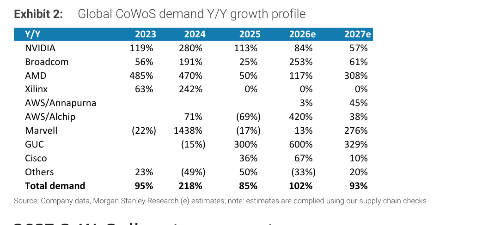

### 解讀摘要

歷史增速視角：2024 年的 CoWoS 總需求成長 218%，是迄今最高的一年，而 2025 年放緩至 +85%。2026-27E 的 102%/93% 代表產業在高基數上維持近翻倍的增速，說明 AI infrastructure buildout 仍在加速而非邊際減速。個別客戶中，Marvell 的 2024 年 +1438% 是歷史極端值（基數極低），而 GUC 的 2026/27E +600%/+329% 顯示台灣 IC 設計服務業在 AI ASIC 市場的新興地位。

### 表格

| 客戶 | 2023 | 2024 | 2025 | 2026E | 2027E |
|---|---|---|---|---|---|
| NVIDIA | 119% | 280% | 113% | 84% | 57% |
| Broadcom | 56% | 191% | 25% | 253% | 61% |
| AMD | 485% | 470% | 50% | 117% | 308% |
| MediaTek | — | — | — | — | +350% |
| AWS/Annapurna | — | — | — | 3% | 45% |
| AWS/Alchip | — | 71% | -69% | 420% | 38% |
| Marvell | -22% | 1,438% | -17% | 13% | 276% |
| GUC | — | -15% | 300% | 600% | 329% |
| **Total demand** | **95%** | **218%** | **85%** | **102%** | **93%** |

---

## Exhibit 3｜Global CoWoS demand breakdown with newly introduced 2027e numbers

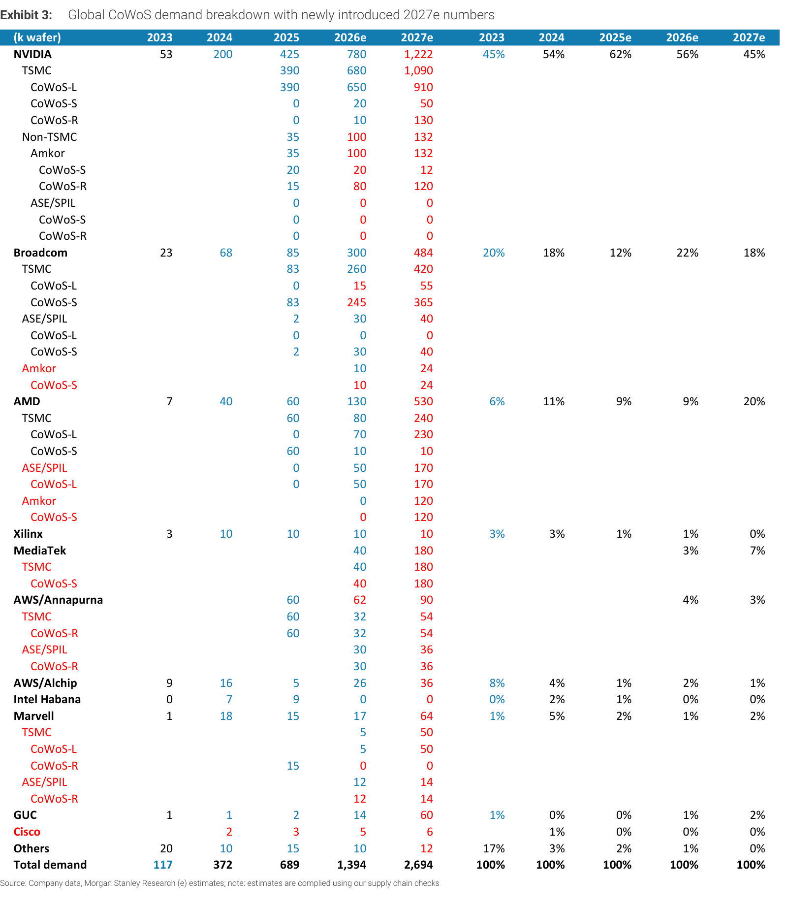

### 解讀摘要

這是本報告最核心的資料表，以 TSMC/ASE/SPIL/Amkor 為維度拆解每位客戶的 CoWoS 類型（CoWoS-L/S/R）分配。關鍵發現：NVIDIA 的 CoWoS-L 2027E 達 910k（Rubin 系列）；Broadcom 的 CoWoS-S 以 Google TPU v8i（SunFish）330k 為主；AMD 的 CoWoS-R（Venice CPU）大幅增至 270k；MediaTek 的 CoWoS-S 為 Google TPU v8t（ZebraFish）180k 全在 TSMC。

> **原文補充**：TSMC 正在將 Fab 15A 的 28nm/22nm 空間轉換為 55nm interposer 生產，以支持 AP7 fab 的 CoWoS 擴張。非 TSMC 陣營（ASE/SPIL FoCoS+CoWoS 30→50kwpm，Amkor 20→30kwpm）專注於 CoWoS-L 和 CoWoS-R。

### 2027E 主要分配（節選）

| 客戶 | 產品 | CoWoS 類型 | 代工 | 晶片（萬片） |
|---|---|---|---|---|
| NVIDIA | Rubin GPU | CoWoS-L | TSMC | 約 910k wafers |
| NVIDIA | Vera CPU | CoWoS-R | TSMC+Amkor | 575萬顆 |
| Google | TPU v8i SunFish（AVGO） | CoWoS-S | TSMC | 396萬顆 |
| Google | TPU v8t ZebraFish（MTK） | CoWoS-S | TSMC | 360萬顆 |
| Google | TPU v9 HumuFish（MTK） | EMIB-T | Intel | 40萬顆 |
| AWS | Trainium 3（Annapurna） | CoWoS-R | TSMC+ASE | 238萬顆 |
| AMD | MI455/GPU | CoWoS-L | TSMC | 約 240k wafers |
| AMD | Venice CPU | CoWoS-R | ASE/SPIL+Amkor | 675萬顆 |
| Microsoft | Maia 300（Marvell） | CoWoS-L | TSMC | 55萬顆 |
| Meta | MTIA 3 Iris（Broadcom） | CoWoS-L | TSMC | 55萬顆 |

---

## Exhibit 4｜Global CoWoS capacity expansion by year end and by vendor

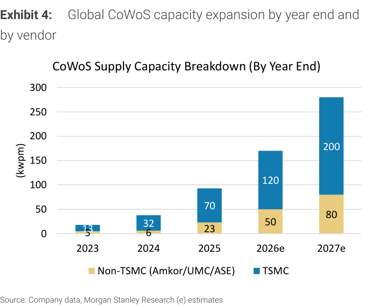

### 解讀摘要

CoWoS 供給端的擴張軌跡：2025 年總產能 93kwpm（TSMC 70 + 非 TSMC 23），2026E 擴至 170kwpm（TSMC 120 + 非 TSMC 50），2027E 達 280kwpm（TSMC 200 + 非 TSMC 80）。非 TSMC 陣營的比例從 2025 的 25% 提升至 2027E 的 29%，顯示 ASE/Amkor 的 CoWoS 擴張步伐在加速，但 TSMC 仍是主體。

### 表格

| 年份 | TSMC（kwpm） | 非 TSMC（Amkor/UMC/ASE）（kwpm） | 合計 |
|---|---|---|---|
| 2023 | 13 | 5 | 18 |
| 2024 | 32 | 6 | 38 |
| 2025 | 70 | 23 | 93 |
| 2026E | 120 | 50 | 170 |
| 2027E | 200 | 80 | 280 |

> **洞察一**：供需對比：2027E 需求 2,694k wafers vs 產能 280kwpm × 12 月 = 3,360k 理論年產能。若 utilization 維持 90%，有效產能為 3,024k，與需求 2,694k 相比仍有約 12% 的緩衝——但這假設所有產能完美調度，實際上訂單結構的不均衡（TSMC CoWoS-L 需求遠超 CoWoS-R）可能導致局部短缺。

---

## Exhibit 5｜Global CoWoS consumption, by customer

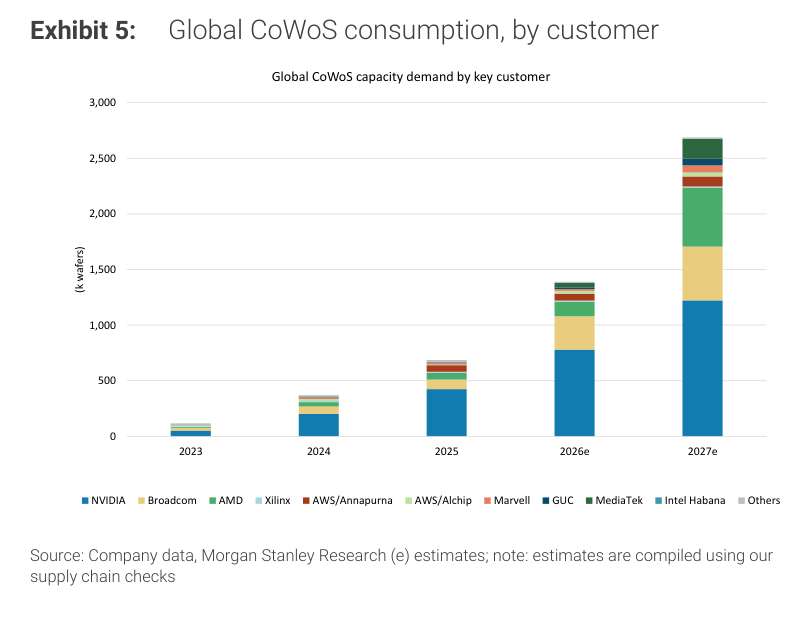

### 解讀摘要

堆疊柱狀圖呈現 2023-2027E 的總 CoWoS 消費結構演變。NVIDIA（深藍）在 2023-25 年佔比超過 80%，但到 2027E 降至約 45%，其餘客戶（AMD 黃色、Broadcom 淺藍、MediaTek 橙色等）顯著擴大，代表 CoWoS 生態系正在從「NVIDIA 一家獨大」轉向「多客戶並行」的結構——這對供應鏈意味著更穩定、更多元的需求基礎。

---

## Exhibit 6｜AI HBM consumption: up to 51bn Gb in 2027

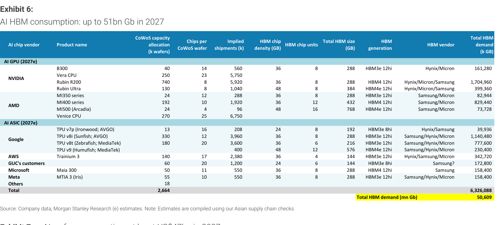

### 解讀摘要

2027E 全球 AI HBM 需求達 51bn Gb，以客戶和 HBM 規格拆解（HBM3e 12hi/8hi、HBM4 等）。NVIDIA 是最大消耗者（B300/Vera CPU/Rubin 系列合計超過 65% 的 HBM），HBM4 規格在 2027E 開始成為主流（Rubin GPU 採用 HBM4）。Samsung、Hynix、Micron 為主要 HBM vendor。

> **原文補充**：表格中出現 HBM4 12hi 規格對應 Rubin 系列，顯示 NVIDIA 在 2027E 已全面切換至 HBM4，這對 HBM 生產良率和 ASP 均有正面影響。

---

## Exhibit 7｜AI wafer consumption: at least US$47bn in 2027

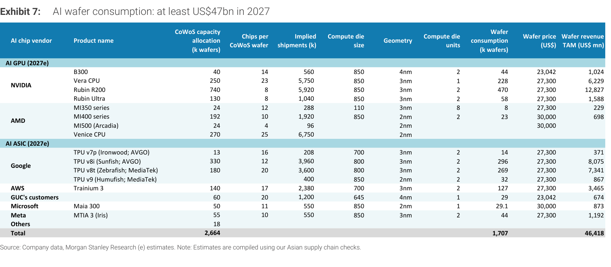

### 解讀摘要

2027E AI wafer TAM 達 \$47bn，其中 NVIDIA Rubin 系列（B300+Vera CPU+Rubin R200+Rubin Ultra）合計 wafer revenue 超過 \$22bn（佔比 47%），是最大單一貢獻者。Google TPU（v8i+v8t+v9 合計）貢獻約 \$17bn（36%），AWS Trainium 3 約 \$3.5bn，Microsoft Maia 300 約 \$0.9bn。ASIC 客戶的 wafer revenue 合計佔比超過 40%，再次驗證 AI ASIC 崛起的結構性趨勢。

### 表格（2027E，節選）

| 客戶 | 產品 | CoWoS 分配（千片） | Wafer 消耗（千片） | Wafer revenue（US\$mn） |
|---|---|---|---|---|
| NVIDIA | B300 | 40 | 44 | 1,024 |
| NVIDIA | Vera CPU | 250 | 228 | 6,229 |
| NVIDIA | Rubin R200 | 740 | 470 | 12,827 |
| NVIDIA | Rubin Ultra | 130 | 58 | 1,588 |
| AMD | MI350 series | 24 | 8 | 229 |
| AMD | MI400 series | 192 | 23 | 698 |
| Google | TPU v8i SunFish（AVGO） | 330 | 296 | 8,075 |
| Google | TPU v8t ZebraFish（MTK） | 180 | 269 | 7,341 |
| Google | TPU v9 HumuFish（MTK） | — | 32 | 867 |
| AWS | Trainium 3 | 140 | 127 | 3,465 |
| Microsoft | Maia 300 | 50 | 1 | 873 |
| Meta | MTIA 3 Iris | 55 | 44 | 1,192 |
| **Total** | — | **2,664** | **1,707** | **46,418** |

> **洞察一**：NVIDIA Rubin R200 單項（740k CoWoS, wafer revenue \$12.8bn）已佔 AI wafer TAM 的 27%，是最大單一 wafer 消耗項目。若 Rubin 進度超預期（或 Rubin Ultra 加速），AI wafer TAM 有相當大的上行空間。
> **洞察二（配合 Exhibit 12）**：\$47bn AI wafer revenue（2027E）中 TSMC 佔絕大多數（CoWoS 生產基本在 TSMC），這直接支持 TSMC AI-related revenue CAGR 60%（2024-29E）的假設。

---

## Exhibit 8｜AI HBM consumption: up to 31bn Gb in 2026

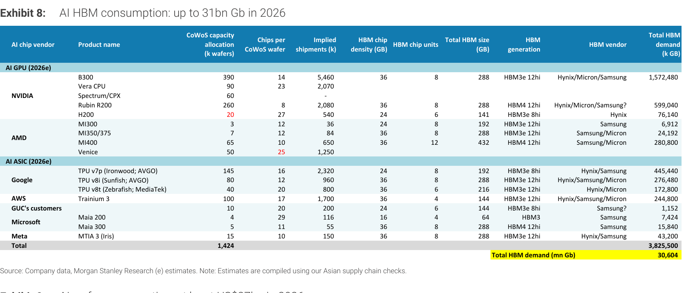

### 解讀摘要

2026E HBM 需求 31bn Gb，與 2027E 的 51bn Gb 相比成長 65%。結構上，2026E 仍以 HBM3e 為主（B300 系列），HBM4 尚未大量出現。這個 65% 的 YoY 增速是 HBM 廠商（Samsung、Hynix、Micron）2026-27E 利潤率擴張的核心驅動力。

---

## Exhibit 9｜AI wafer consumption: at least US$27bn in 2026

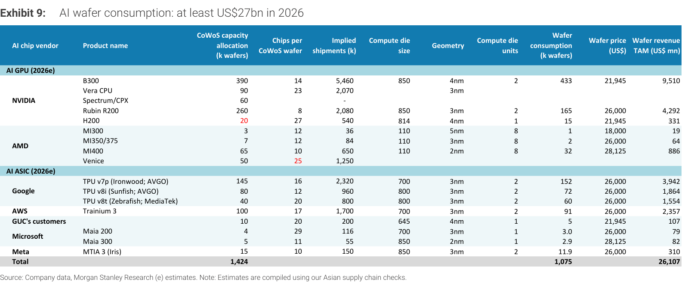

### 解讀摘要

2026E AI wafer TAM \$27bn（vs 2027E \$47bn，YoY +74%）。2026E 最大消耗仍是 NVIDIA B300（390k CoWoS-L，wafer revenue \$9.5bn，佔比 36%）。Google TPU（v7p+v8i+v8t 合計）貢獻約 \$7.4bn（27%）。顯著的是 AMD 在 2026E 的 AI wafer revenue 僅約 \$0.97bn（MI300/350/400 系列合計），相比 2027E 預期大幅提升，說明 AMD MI400 系列是 2026→2027 transition 的關鍵產品。

---

## Exhibit 10｜P/E multiple trend of AI semis

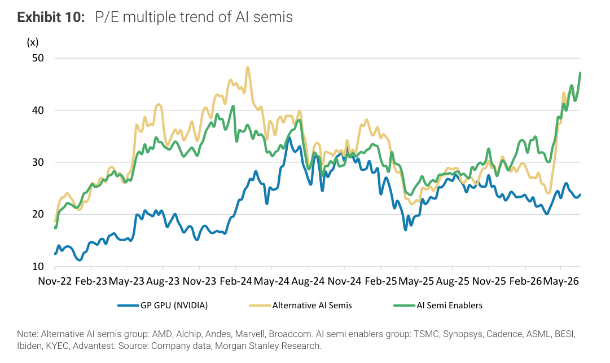

### 解讀摘要

三條線追蹤 2022 年 11 月至 2026 年 5 月的 AI semi 估值走勢：GP GPU（NVIDIA，藍）、Alternative AI Semis（AMD、Alchip、Marvell、Broadcom 等，金）、AI Semi Enablers（TSMC、Synopsys、ASML、BESI、Ibiden、KYEC 等，綠）。2024 年 Alternative AI Semis 一度達到 48x 的峰值（ASIC 熱潮），之後回落至 25-30x，2026 年 5 月再度大幅拉升至 45x+。AI Semi Enablers 的估值在 2026 年 5 月也上衝至 47x，首次超越 NVIDIA（約 24x），暗示市場開始重估供應鏈股票相對於 GPU 廠商的溢價。

> **洞察一**：AI Semi Enablers（包含 TSMC、KYEC 等台灣供應鏈）的 P/E 在 2026/5 達 47x，首次超越 NVIDIA 的 24x。這個估值倒掛在歷史上罕見，說明市場對台灣供應鏈的「稀缺性溢價」預期已超過 AI chip 設計本身。這可能是台灣 AI 供應鏈估值「見頂預警」或「新常態起點」，值得持續追蹤。

---

## Exhibit 11｜We still expect AI chip revenue to rise QoQ

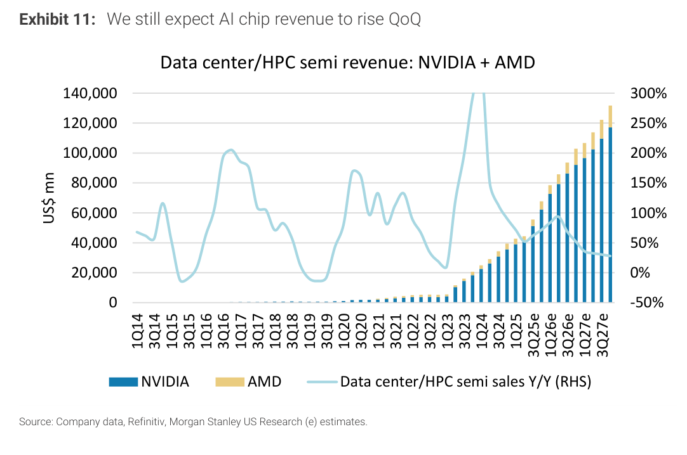

### 解讀摘要

NVIDIA + AMD 的 data center/HPC semi revenue 從 2014-2023 的幾乎為零，在 2023 年加速，2024 年 3Q24 出現最高 YoY（+300% 以上）之後，2025 年起 YoY 逐步下降但 QoQ 仍為正。MS 明確表示「仍預期 AI chip revenue QoQ 持續成長至 3Q27E」，隱含 NVIDIA + AMD data center revenue 在 2027E 達到 \$100,000mn+ 的季度水準。

---

## Exhibit 12｜TSMC's AI-related revenue 2024-29e CAGR could reach 60%

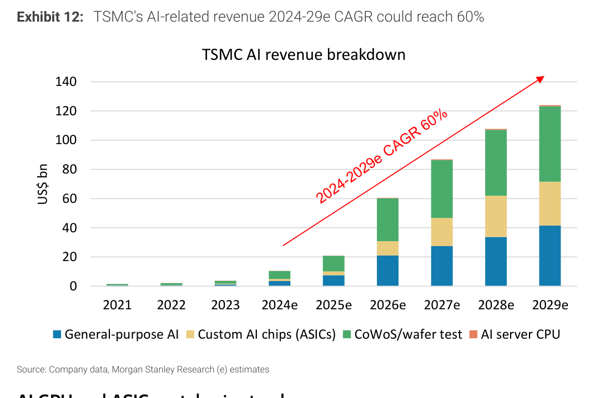

### 解讀摘要

TSMC AI 相關收入拆解為四個部分：General-purpose AI（GPU，藍）、Custom AI chips（ASIC，黃）、CoWoS/wafer test（綠，最大增量）、AI server CPU（粉）。2024-29E CAGR 60%，2029E 達約 \$125bn。最關鍵的是 CoWoS/wafer test（綠色部分）從 2025E 開始快速擴大，成為最主要的增量——這反映 CoWoS 的 ASP 本身（interposer manufacturing + wafer test）是 TSMC AI 收入的高速增長引擎，而非只是代工 wafer。

### 表格（視覺估算）

| 年份 | General AI（GPU） | ASIC | CoWoS/Test | CPU | 合計（US\$bn） |
|---|---|---|---|---|---|
| 2024E | ~3 | ~1 | ~5 | — | ~10 |
| 2025E | ~5 | ~3 | ~12 | — | ~21 |
| 2026E | ~21 | ~12 | ~26 | ~1 | ~60 |
| 2027E | ~27 | ~18 | ~43 | ~2 | ~90 |
| 2028E | ~34 | ~25 | ~45 | ~2 | ~106 |
| 2029E | ~42 | ~38 | ~42 | ~3 | ~125 |

視覺估算，部分數值為近似

---

## Exhibit 13｜AI GPU H100 per GPU per hour as of end-March

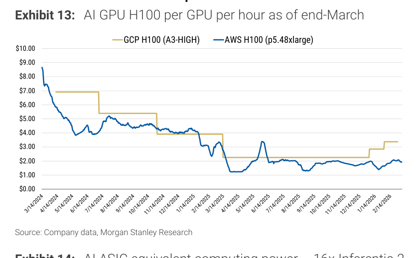

### 解讀摘要

H100 雲端租用價格從 2024 年 3 月的 \$8-9/GPU/hr（AWS），在 2025 年 4 月崩跌至約 \$1.2/GPU/hr 的低點，之後略為回升至 2026 年 3 月的約 \$2/GPU/hr（AWS）和 \$3.3/GPU/hr（GCP）。這個走勢說明 H100 的供給已充分釋放，市場正在轉向 B200/B300 世代，H100 的租賃定價已無法支撐投資回報——這支持了 AI 基礎設施持續升級的必要性，也說明為什麼 Rubin 時代的 CoWoS 需求仍能維持高增速。

---

## Exhibit 14｜AI ASIC equivalent computing power — 16x Inferentia 2 per hour

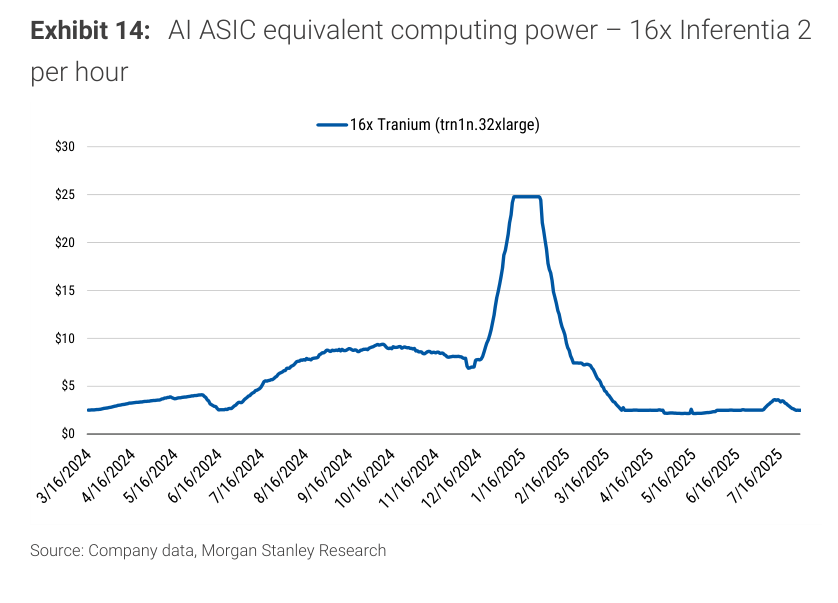

### 解讀摘要

AWS Trainium（16x Trainium 實例）的租用價在 2025 年初飆升至 \$25/hr 後急跌至 \$2-3/hr（2025 年 3-7 月）。這個異常峰值反映 1Q25 Trainium 3 pre-production 的稀缺性，之後隨供給放量快速正常化。從投資視角，Trainium 的租賃定價回到 \$2-3/hr 代表 AWS 已擁有足夠自有 ASIC 算力，不再依賴外部 GPU 市場，這是 ASIC 廠商（Alchip、GUC）訂單能見度提升的結構性信號。

---

## Exhibit 15｜NVIDIA 5090 graphic cards pricing has rebounded recently

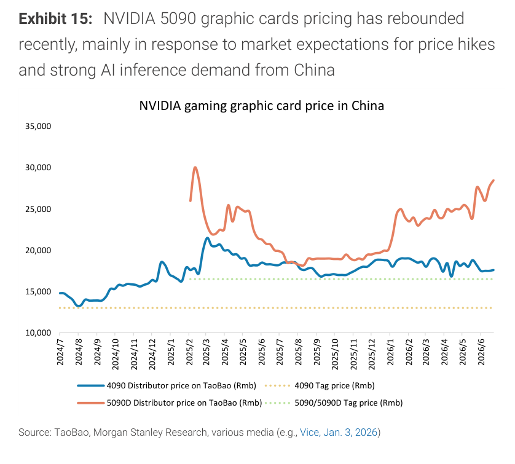

### 解讀摘要

中國市場的 NVIDIA 顯示卡定價追蹤（4090 深藍、5090D 橙色）。5090D 在 2025 年初一度在 Taobao 上漲至 RMB 30,000+（Tag price RMB 16,000），之後回落。2026 年 3 月後 5090D 重新上漲至 RMB 25,000-27,000，MS 認為這反映「市場預期漲價 + 中國 AI 推理需求強勁」。這個數據是衡量中國 AI 算力需求的高頻代理指標，5090D 溢價率維持高位代表中國對民間 AI inference 算力的需求仍在快速增長。

---

## 跨 Exhibit 彙整表

### 彙整 1｜CoWoS 供需平衡（Exhibit 4 × Exhibit 1/5）

| 年份 | 需求（k wafers） | 有效產能（kwpm×12×90%） | 利用率估算 | 供需缺口 |
|---|---|---|---|---|
| 2025 | 689 | 93×12×90% = 1,004 | 69% | 供過於求 |
| 2026E | 1,394 | 170×12×90% = 1,836 | 76% | 供過於求 |
| 2027E | 2,694 | 280×12×90% = 3,024 | 89% | 緊繃但未短缺 |

> 2027E 理論利用率 89%，接近臨界但尚有緩衝。然而 CoWoS-L（NVIDIA GPU 主用）的需求佔比超過 50%，若 TSMC CoWoS-L 產能不足，局部缺口仍可能出現。

### 彙整 2｜AI wafer + HBM TAM 對比（Exhibit 7/9 × Exhibit 6/8）

| 年份 | AI Wafer TAM | AI HBM（bn Gb） | 隱含 HBM/Wafer 比例 |
|---|---|---|---|
| 2026E | \$27bn | 31bn Gb | — |
| 2027E | \$47bn | 51bn Gb | — |
| YoY 增速 | +74% | +65% | HBM 增速略低於 wafer |

> HBM 增速（+65%）略低於 wafer TAM（+74%），反映 Rubin 時代的 HBM4 每 bit ASP 下降部分抵消了容量增長。對 HBM 廠商而言，關鍵在 HBM4 良率的提升速度。

---

## 相關個股清單

| 類別 | 公司 | Ticker | 評等 | 備註 |
|---|---|---|---|---|
| Foundry | TSMC | 2330 | OW | AI CAGR 60% 2024-29E；CoWoS 主要供給方 |
| IC Design | MediaTek | 2454 | OW（Top Pick） | Google TPU v8t ZebraFish 180k CoWoS；ABF 短缺為 downside risk |
| OSAT | ASE | 3711 | OW | AMD Venice CPU CoWoS-R + AWS Trainium 3 |
| Test | KYEC | 2230 | OW | NVIDIA GPU + Google TPU 測試供應鏈 |
| Socket | Winway | — | OW | — |
| Probe Card | MPI | 6223 | OW | — |
| FT Handler | Hon Precision | 7769 | OW | — |
| BMC | Aspeed | 5274 | OW | CPU server BMC 最佳 proxy |
| IC Design | GUC 創意 | 3443 | — | 多客戶 ASIC 設計，60k CoWoS 2027E |
| IC Design | Alchip 世芯 | 3661 | — | AWS/Alchip 36k CoWoS |
