# Goldman Sachs｜Global Server TAM Update — Raising AI & General Servers

**券商**：Goldman Sachs  
**分析師**：Allen Chang、Verena Jeng、James Schneider、Michael Ng、Katherine Murphy、Ronald Keung、Giuni Lee、Anmol Makkar、Daiki Takayama、Ting Song、Yifan Hu、Zorayda Montemayor、Evelyn Yu、Ryan Huang  
**日期**：2026-06-24  
**主題**：Global Server TAM — AI server racks, ASIC penetration, General servers, CSP capex  
**評級**：N/A（TAM update report）  
<button type="button" onclick="fetch('https://ti-lei.github.io/foreign-reports/static/downloads/產業/20260624_GS_Global-Server.md').then(r=>r.text()).then(t=>{let a=document.createElement('a');a.href='data:text/plain;charset=utf-8,'+encodeURIComponent(t);a.download='20260624_GS_Global-Server.md';a.click()})">⬇ 下載 MD</button>

---

## 報告總結

GS 在本份 TAM 更新中大幅上調 AI server rack 預測（2027/28E 各上調 16%/20%），核心驅動力為兩個同時發生的結構性改變：ASIC 滲透率顯著加速（2026E ASIC 佔 AI chips 由舊版 43% 上調至 50%），以及 HBM 記憶體成本推升 General server ASP（2026E YoY 從舊版 +15% 大幅上調至 +28%）。這份報告的觸發點是 Intel 在 Computex 2026 發表 Xeon 6+，確立了 CPU server 在 Agentic AI 工作負載中的控制平面角色，加速 General server 升級需求。

全球 server value TAM 預計在 2026-28E 達 \$604bn / \$850bn / \$1,102bn，CAGR 分解為 AI server racks 118% CAGR（\$561bn, 51% 佔比）、8-GPU AI servers 26% CAGR、General servers 18% CAGR。供應鏈受益排序：Hon Hai/FII（AI rack ODM 龍頭，份額 55%→69%）、TSMC（foundry）、HBM 相關記憶體供應商；CSP capex 最大受益來自 China（上調幅度 37~55%，遠大於 global 8~27%）。

---

## Goldman Sachs 完整投資邏輯鏈

| 論點層次 | Exhibit | 內容 |
|---|---|---|
| ASIC 加速 | Ex 1 | ASIC 佔 AI chips 由舊版 43% 上調至 50%（2026E），推高 8-GPU AI server 需求 18%/24%/11% |
| AI rack 量 | Ex 3 | NVL72 rack 2026-28E 55k/105k/163k，YoY +190%/+89%/+56% |
| ODM 格局 | Ex 4 | Hon Hai/FII 份額 55%→69%；Quanta 穩定；Wiwynn 小量 |
| Value TAM | Ex 2, 5 | AI server racks 佔 TAM 從 15%（2025）→51%（2028E），CAGR 118% |
| General server 上調 | Ex 7, 8 | HBM 成本 + Xeon 6+ 帶動 ASP +8~13% YoY，volume +14%/+6%/+6% |
| CSP capex | Ex 9, 10 | US CSP +76%/35%/8%（上調 8/27/25%）；China CSP +80%/20%/18%（上調 37/44/55%） |
| Capex 結構 | Ex 11 | 全球 GPU+HBM 佔 38%；中國 ASIC+HBM 佔 31%（vs 全球 6%），反映 domestic chip 布局 |
| **結論** | 封面 | **AI cycle 延伸至 2028E；Hon Hai/FII、Wiwynn、TSMC、LandMark、EMC 為首選** |

> **報告最大邏輯缺口**：ASIC 上調幅度（2027E AI chips 從 10,913k 上調至 13,787k，+26%）主要假設來自 CSP 自研 ASIC 新世代加速，但各 CSP ASIC 出貨時程存在不確定性，且 NVL72 rack 的 ASIC 內容尚未完全明確。

---

## 報告核心觀點

| 主題 | GS 觀點 | 市場共識 | 是否 Contra-Consensus |
|---|---|---|---|
| AI rack 量 2027E | 105k racks（vs 舊版 90k，+17%） | 市場普遍 90-100k 區間 | 偏樂觀 |
| ASIC 佔比 2026E | 50%（vs 舊版 43%） | 多數預期仍在 35-43% | Contra-Consensus，明確看多 ASIC |
| General server 2026E | +28% revenue YoY（vs 舊版 +15%） | 市場偏向 +10-15% | 明顯超預期，主因 HBM 記憶體成本 |
| China CSP capex | 2026E 上調 +37%，大幅超越全球平均上調幅度 | 市場對 China AI 投資估計保守 | Contra-Consensus，中國 AI 投入更積極 |
| Hon Hai/FII | AI rack 份額穩定走高至 2028E 69% | 多數預期份額拉鋸 | 樂觀，強調規格升級護城河 |

**偏好排序（AI servers）**：Buy Wiwynn / Wistron、Hon Hai / FII、LandMark、VPEC、AVC / Fositek、Auras、King Slide、Chenbro、EMC、GCE、Eoptolink、TSMC（CL）、MPI、WinWay、Aspeed、Hon Precision

---

## Exhibit 1｜AI servers implied GPU vs. ASIC volume

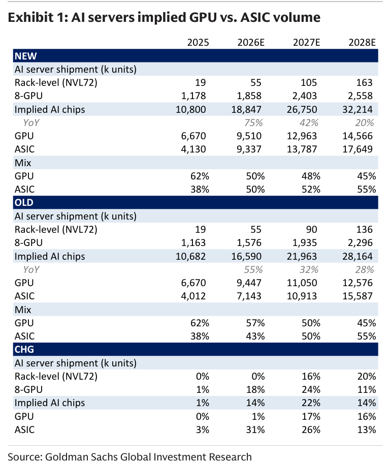

### 解讀摘要

這份修正表的核心信號在「CHG」列：2027E AI chips 總需求上調 22%（21,963k → 26,750k），其中 GPU 上調 17%（11,050k → 12,963k），ASIC 上調幅度更高達 26%（10,913k → 13,787k）。這意味著 GS 認為 ASIC 的加速不只是份額搶奪，而是需求本身在膨脹——ASIC 佔比從舊版 50% 提升至 52%，而 GPU 需求同樣在上調，代表整個 AI chip 市場在同步擴張，不是零和競爭。

> **原文補充**：AI servers (8-GPU) 上調主因為「custom-design provides ASIC-based AI servers optimized for AI computation with better efficiency, such as lower latency, or memory savings via reduced expensive read/write cycles」。CSP 新一代 ASIC 持續發布是主要催化劑。

### 表格

| 項目 | 2025 | 2026E NEW | 2026E OLD | CHG |
|---|---|---|---|---|
| Rack-level NVL72（千個） | 19 | 55 | 55 | 0% |
| 8-GPU servers（千個） | 1,178 | 1,858 | 1,576 | +18% |
| Implied AI chips（千個） | 10,800 | 18,847 | 16,590 | +14% |
| 　GPU | 6,670 | 9,510 | 9,447 | +1% |
| 　ASIC | 4,130 | 9,337 | 7,143 | +31% |
| GPU mix | 62% | 50% | 57% | — |
| ASIC mix | 38% | 50% | 43% | — |

| 項目 | 2027E NEW | 2027E OLD | CHG | 2028E NEW | 2028E OLD | CHG |
|---|---|---|---|---|---|---|
| Rack-level NVL72（千個） | 105 | 90 | +16% | 163 | 136 | +20% |
| 8-GPU servers（千個） | 2,403 | 1,935 | +24% | 2,558 | 2,296 | +11% |
| Implied AI chips（千個） | 26,750 | 21,963 | +22% | 32,214 | 28,164 | +14% |
| 　GPU | 12,963 | 11,050 | +17% | 14,566 | 12,576 | +16% |
| 　ASIC | 13,787 | 10,913 | +26% | 17,649 | 15,587 | +13% |
| GPU mix | 48% | 50% | — | 45% | 45% | — |
| ASIC mix | 52% | 50% | — | 55% | 55% | — |

> **洞察一**：ASIC 在 2026E 的上調幅度（+31%）遠超 GPU（+1%），但兩者在 2027-28E 都繼續上調，說明 GS 的核心論點不是「ASIC 搶 GPU」，而是「AI 投資規模遠超市場預期、GPU 和 ASIC 雙漲」。

---

## Exhibit 2｜Global servers value TAM revisions

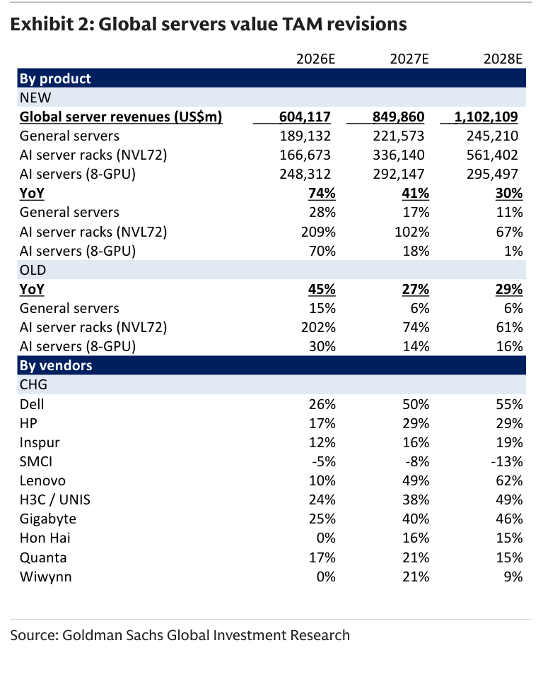

### 解讀摘要

本表呈現 GS 對 server value TAM 的修正幅度，最顯著的是 2026E 整體 YoY 從 45% 上調至 74%——幅度差異達 29 個百分點，主要來自 AI server racks 從 202% 上調至 209%，以及 8-GPU AI servers 從 30% 大幅上調至 70%。從 vendor 維度看，Dell（+26%/50%/55%）和 Lenovo（+10%/49%/62%）的上調幅度最顯著，反映這兩家傳統 OEM 在 AI server 領域的份額提升。

### 表格

**By product（Global server revenues, US\$m）**

| 分類 | 2026E NEW | 2026E YoY | 2027E NEW | 2027E YoY | 2028E NEW | 2028E YoY |
|---|---|---|---|---|---|---|
| 總計 | 604,117 | 74% | 849,860 | 41% | 1,102,109 | 30% |
| 　General servers | 189,132 | 28% | 221,573 | 17% | 245,210 | 11% |
| 　AI server racks (NVL72) | 166,673 | 209% | 336,140 | 102% | 561,402 | 67% |
| 　AI servers (8-GPU) | 248,312 | 70% | 292,147 | 18% | 295,497 | 1% |

OLD YoY：總計 45%/27%/29%；NVL72 racks 202%/74%/61%；8-GPU 30%/14%/16%；General servers 15%/6%/6%

**By vendors CHG（YoY 變化幅度修正）**

| 廠商 | 2026E | 2027E | 2028E |
|---|---|---|---|
| Dell | +26% | +50% | +55% |
| HP | +17% | +29% | +29% |
| Inspur | +12% | +16% | +19% |
| SMCI | -5% | -8% | -13% |
| Lenovo | +10% | +49% | +62% |
| H3C / UNIS | +24% | +38% | +49% |
| Gigabyte | +25% | +40% | +46% |
| Hon Hai | 0% | +16% | +15% |
| Quanta | +17% | +21% | +15% |
| Wiwynn | 0% | +21% | +9% |

> **洞察一**：SMCI 是唯一被下調的廠商（-5%/-8%/-13%），與市場對其執行力的疑慮一致。Dell 和 Lenovo 的上調幅度遠高於台灣 ODM（Hon Hai 0%、Quanta +17%），反映 GS 認為傳統 OEM 在 AI server 的客戶關係更深，但這與台灣 ODM 掌握直接大客戶合約的市場認知有所落差，值得關注。

---

## Exhibit 3｜AI server racks global shipment by chipset platforms

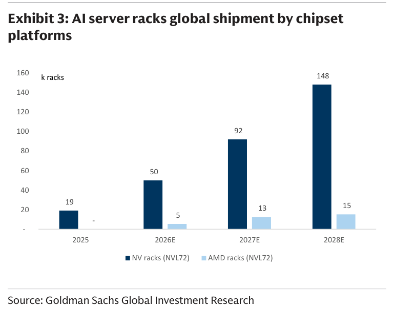

### 解讀摘要

NVL72-equivalent racks 在 2025-28E 的成長軌跡為 19k→55k→105k→163k，NVIDIA 佔主導（AMD 維持 5-15k 的小量），2027-28E 的大幅上調（+16%/+20%）背後是 GS 對 Nvidia 新 GPU 平台（Rubin 等）在 2027 年推出時連帶帶動 rack 需求升級的預期。AMD 的份額維持在約 8-10%，無顯著改變。

### 表格

| 年份 | NV racks（千個） | AMD racks（千個） | 合計 |
|---|---|---|---|
| 2025 | 19 | 0 | 19 |
| 2026E | 50 | 5 | 55 |
| 2027E | 92 | 13 | 105 |
| 2028E | 148 | 15 | 163 |

> **洞察一**：AMD 2027E 的 13k 佔 12.4%，但 2028E 僅 15k（9.2%），份額不升反降，暗示 GS 對 AMD MI400 系列在 rack 格式的市場穿透力相當保守。

---

## Exhibit 4｜AI server rack shipment by ODM / OEMs

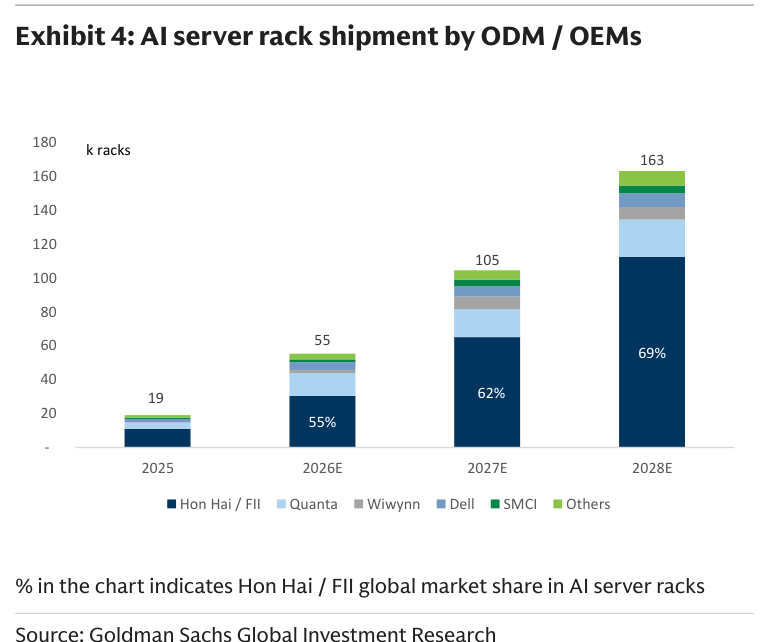

### 解讀摘要

Hon Hai/FII 在 AI server racks 的全球份額從 2025 年 55% 持續提升至 2028E 69%，對應絕對量從 11k→30k→65k→113k racks，這是整份報告對台灣供應鏈最重要的一個數字。份額集中化的驅動力是客戶（CSP）傾向與少數 ODM 深度合作降低整合風險，以及 Hon Hai 在液冷、功率管理等高規格 rack 的執行力。Quanta 維持約 20-25% 份額，Wiwynn 份額偏小（約 4-7%）。

### 表格

| 廠商 | 2025（千個） | 2026E（千個） | 2027E（千個） | 2028E（千個） |
|---|---|---|---|---|
| Hon Hai / FII | 11 | 30 | 65 | 113 |
| Quanta | 4 | 13 | 17 | 22 |
| Wiwynn | 0 | 2 | 8 | 7 |
| Dell | 2 | 5 | 6 | 8 |
| SMCI | 1 | 2 | 4 | 5 |
| Others | 1 | 2 | 2 | 3 |
| **合計** | **19** | **55** | **105** | **163** |
| Hon Hai 份額 | 55% | 55% | 62% | 69% |

*數值由 Exhibit 4 圖片視覺估算，Hon Hai 份額為圖中標示數字*

> **洞察一**：Hon Hai 從 2025 到 2028E 的 rack 出貨量 CAGR 達 118%（11k→113k），恰好與全球 NVL72 rack TAM 的 CAGR 一致，且份額同步提升——這意味著 Hon Hai 在搶份額的同時享受市場本身的高速增長，是罕見的雙重受益結構。

---

## Exhibit 5｜Global server value TAM

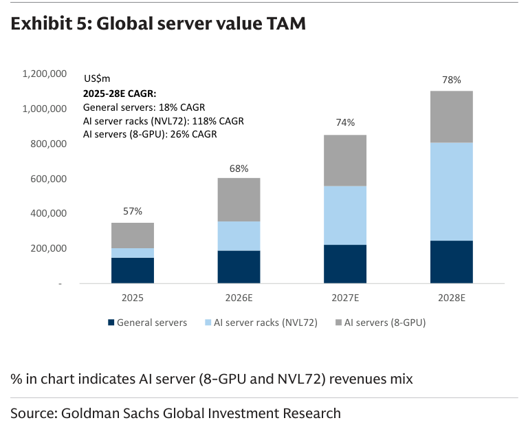

### 解讀摘要

2028E 全球 server TAM 達 \$1.1tn，AI server racks（NVL72）佔 51%，是最主要的增量來源。2025-28E 三大區段的 CAGR：AI server racks 118%（最高）、8-GPU AI servers 26%、General servers 18%。General server 的加速（從原本低個位數上調至 18% CAGR）是本次修正的意外亮點，反映 HBM 記憶體成本對 ASP 的拉動效果比預期顯著。

### 表格

| 分類 | 2025（\$USm） | 2026E | 2027E | 2028E | 2025-28E CAGR |
|---|---|---|---|---|---|
| General servers | 147,970 | 189,132 | 221,573 | 245,210 | 18% |
| AI server racks (NVL72) | 53,916 | 166,673 | 336,140 | 561,402 | 118% |
| AI servers (8-GPU) | 145,927 | 248,312 | 292,147 | 295,497 | 26% |
| **合計** | **347,913** | **604,117** | **849,860** | **1,102,109** | — |
| AI server racks 佔比 | 15% | 28% | 40% | 51% | — |

---

## Exhibit 6｜AI servers (8-GPU and NVL72) implied AI chips

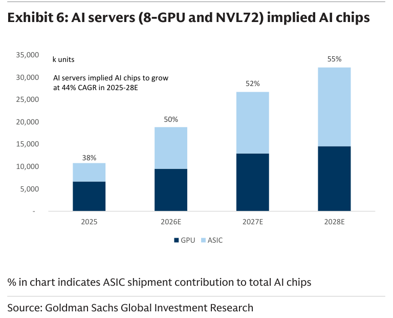

### 解讀摘要

AI chips 總需求 2025-28E CAGR 達 44%，且 ASIC 在 2026E 正式突破 50% 佔比（與 GPU 平起平坐），2028E 升至 55%。圖表傳達的最關鍵信息是：即使 ASIC 滲透率提升，GPU 需求的絕對量仍在成長（6,670k → 14,566k），說明這場 ASIC 崛起對 Nvidia 的影響是相對而非絕對的。

### 表格

| 年份 | GPU（千個） | ASIC（千個） | ASIC 佔比 |
|---|---|---|---|
| 2025 | 6,670 | 4,130 | 38% |
| 2026E | 9,510 | 9,337 | 50% |
| 2027E | 12,963 | 13,787 | 52% |
| 2028E | 14,566 | 17,649 | 55% |

> **洞察一（配合 Exhibit 1）**：2026E GPU 從舊版 9,447k 上調至 9,510k（+0.7%），ASIC 從 7,143k 上調至 9,337k（+31%）。這 +31% 的 ASIC 上調對應的供應商是 Broadcom（Google TPU）、Marvell、Alchip（Amazon Trainium）等，是本次報告對這些 ASIC 設計公司最大的利多信號。

---

## Exhibit 7｜General server shipment vs. ASP YoY in 2026-28E

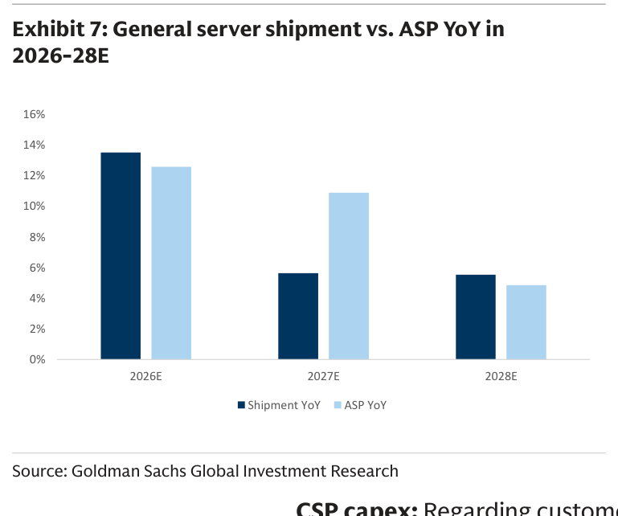

### 解讀摘要

2026E General server shipment YoY 約 +14%，ASP YoY 約 +13%，兩者共同驅動 revenue +28% YoY。值得注意的是 ASP 的增速在 2026-28E 系統性高於出貨量增速，代表這波 General server 的上行是 ASP 主導而非量主導——核心驅動是 Intel Xeon 6+ 帶來的規格升級（更多記憶體插槽、更高 DDR5 頻寬），以及 HBM 成本推高 AI workload 伺服器的配置需求。

### 表格

| 年份 | Shipment YoY | ASP YoY |
|---|---|---|
| 2026E | +14% | +13% |
| 2027E | +6% | +11% |
| 2028E | +6% | +5% |

視覺估算，交叉驗證：2026E revenue YoY ≈ 14% × 1.13 ≈ +28%，與 Exhibit 5 一致 ✓

---

## Exhibit 8｜x86 server shipment vs. ASP YoY in 2021-25A

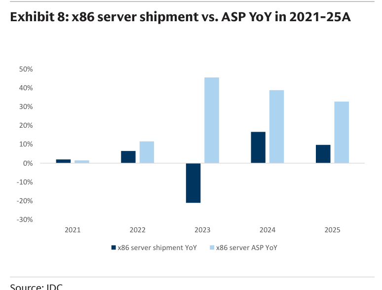

### 解讀摘要

這張歷史圖呈現 2021-25A 的 x86 server 週期：2022 年出貨量 +6% 但 ASP +11%，2023 年出貨量 -22% 而 ASP +45%（AI server 帶動 ASP 暴漲），2024-25 年出貨量回升（+17%/+10%），ASP 仍維持 +38%/+33% 正成長。這條歷史軌跡支持 GS 對 2026E ASP 繼續上行的假設，且說明目前正處於少見的「量價齊升」週期（不同於 2023 的純量縮 ASP 漲）。

### 表格

| 年份 | x86 shipment YoY | x86 ASP YoY |
|---|---|---|
| 2021 | +2% | +1% |
| 2022 | +6% | +11% |
| 2023 | -22% | +45% |
| 2024 | +17% | +39% |
| 2025 | +10% | +33% |

視覺估算

---

## Exhibit 9｜US CSP Capex trend

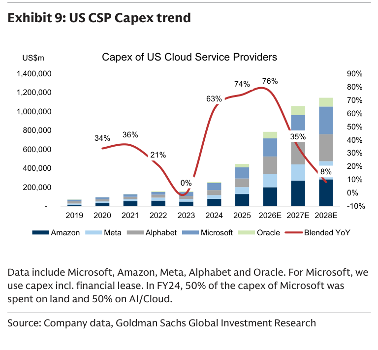

### 解讀摘要

US CSP（Amazon、Meta、Alphabet、Microsoft、Oracle）2026E blended capex YoY 達 76%，2026-28E 合計達 \$1.1tn+。2023 年的 0% 增長是本次上行週期的起點，2024-26E 的 63%/74%/76% 連續高增速說明這不是短暫脈衝而是多年結構性支出。值得注意的是 2027E YoY 已開始從 76% 下降至 35%，2028E 僅 8%——暗示 US CSP capex 的峰值可能在 2026-27E 之間。

### 表格

| 年份 | US CSP Capex（\$USm） | Blended YoY |
|---|---|---|
| 2019 | ~35,000 | 34% |
| 2020 | ~55,000 | 36% |
| 2021 | ~70,000 | 21% |
| 2022 | ~80,000 | 0% |
| 2023 | ~80,000 | 0% |
| 2024 | ~190,000 | 63% |
| 2025 | ~350,000 | 74% |
| 2026E | ~650,000 | 76% |
| 2027E | ~870,000 | 35% |
| 2028E | ~940,000 | 8% |

視覺估算

> **原文補充**：GS 將 US CSP capex 由舊版上調 8%/27%/25% 至 2026-28E，主因為高 memory 成本以及 AI workload 需求持續超預期。Microsoft capex 計入 financial lease，且 FY24 有 50% 花在 land/building 上（說明實際 compute capex 比帳面更高）。

---

## Exhibit 10｜China CSP capex trend

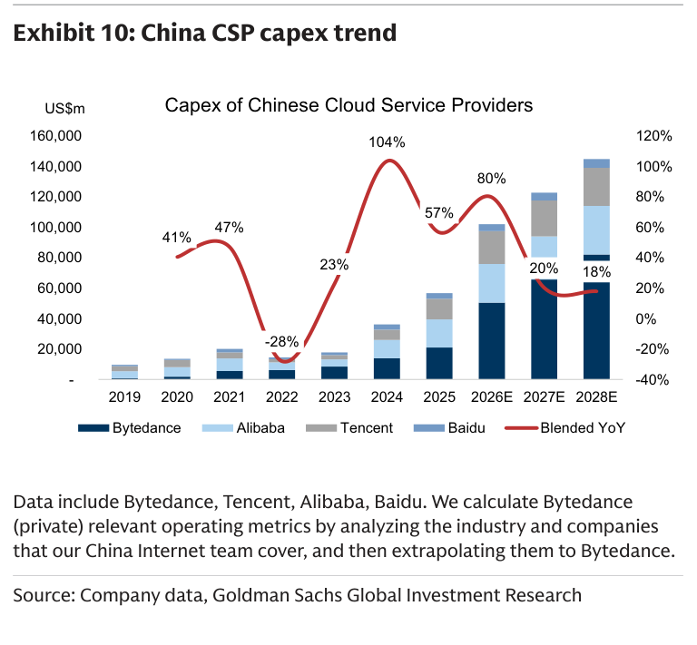

### 解讀摘要

中國 CSP（Bytedance、Alibaba、Tencent、Baidu）2026E capex YoY 達 80%，且 GS 的上調幅度（+37%/44%/55%）遠超 US CSP（+8%/27%/25%），代表中國 AI 投資的加速程度在本次報告中被視為更大的超預期驚喜。2028E 仍維持 18% YoY，相較 US CSP 的 8% 更具韌性。Bytedance 作為私人公司，其數字由 GS 中國互聯網團隊估算。

### 表格

| 年份 | China CSP Capex（\$USm） | Blended YoY |
|---|---|---|
| 2019 | ~10,000 | 41% |
| 2020 | ~20,000 | 47% |
| 2021 | ~25,000 | 23% |
| 2022 | ~18,000 | -28% |
| 2023 | ~25,000 | 23% |
| 2024 | ~55,000 | 104% |
| 2025 | ~85,000 | 57% |
| 2026E | ~102,000 | 80% |
| 2027E | ~122,000 | 20% |
| 2028E | ~145,000 | 18% |

視覺估算（部分數值為估算）

> **洞察一**：China CSP 的 2028E 增速（18%）比 US CSP（8%）高 10 個百分點，且上調幅度更大（+55% vs +25%）。這在市場普遍認為中國 AI 投資受出口管制制約的背景下是明顯的 contra-consensus 訊號——GS 認為中國正在以 domestic ASIC 路線繞過制約，加速投入。

---

## Exhibit 11｜CSP capex structure

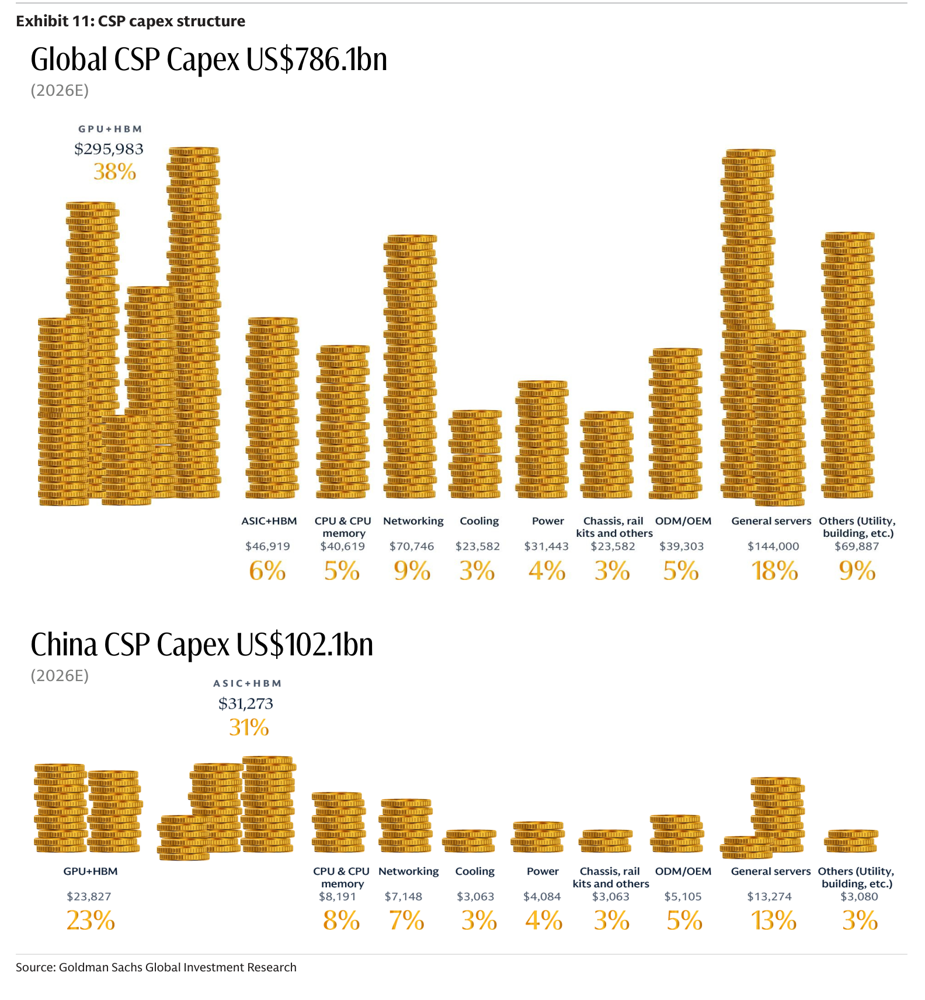

### 解讀摘要

這張圖呈現全球（\$786bn）vs. 中國（\$102bn）CSP capex 的結構差異，核心發現是 GPU+HBM 佔全球 38%（\$296bn）vs. 中國僅 23%（\$24bn），而中國的 ASIC+HBM 佔比高達 31%（\$31bn）遠超全球 6%（\$47bn）——這個結構差異直接說明了為什麼中國 CSP capex 對出口管制的敏感度低於市場預期：中國 CSP 支出組合已顯著往 domestic ASIC 轉移。

> **原文補充**：「China CSP spending on chipsets would be more diversified across GPU and ASICs considering various local fabless suppliers and customers' varying demand on AI scenarios / tasks.」明確承認中國 AI chip 生態的多元化。

### 表格

**Global CSP Capex \$786bn（2026E）**

| 品類 | 金額（\$USm） | 佔比 |
|---|---|---|
| GPU+HBM | 295,983 | 38% |
| ASIC+HBM | 46,919 | 6% |
| CPU & CPU memory | 40,619 | 5% |
| Networking | 70,746 | 9% |
| Cooling | 23,582 | 3% |
| Power | 31,443 | 4% |
| Chassis, rail kits & others | 39,303 | 5% |
| ODM/OEM | 144,000 | 18% |
| General servers | 68,887 | 9% |
| Others (Utility, building) | ~25,000 | 3% |

**China CSP Capex \$102bn（2026E）**

| 品類 | 金額（\$USm） | 佔比 |
|---|---|---|
| GPU+HBM | 23,827 | 23% |
| ASIC+HBM | 31,273 | 31% |
| CPU & CPU memory | 8,191 | 8% |
| Networking | 7,148 | 7% |
| Cooling | 3,063 | 3% |
| Power | 4,080 | 4% |
| Chassis & others | 5,105 | 5% |
| ODM/OEM | 13,274 | 13% |
| General servers | 5,880 | 3% |

> **洞察一（配合 Exhibit 9/10）**：中國 ASIC+HBM \$31bn / GPU+HBM \$24bn，ASIC 已超越 GPU 成為中國 CSP 最大 chip 開支。這個結構在全球 6% ASIC vs 38% GPU 的背景下極為突出，暗示 Huawei Ascend、Cambricon 等 domestic AI chip 廠商已獲得比市場估計更大的實際部署份額。

---

## 跨 Exhibit 彙整表

### 彙整 1｜AI chips 需求結構（來源 Exhibit 1、6）

| 年份 | GPU（千個） | ASIC（千個） | 合計 | ASIC% | GS 修正幅度 |
|---|---|---|---|---|---|
| 2025A | 6,670 | 4,130 | 10,800 | 38% | 基準 |
| 2026E | 9,510 | 9,337 | 18,847 | 50% | 總需求 +14% |
| 2027E | 12,963 | 13,787 | 26,750 | 52% | 總需求 +22% |
| 2028E | 14,566 | 17,649 | 32,214 | 55% | 總需求 +14% |

> 從合併視角看，ASIC 在 2026E 與 GPU 達到 50:50 平衡點後，2027E 開始持續領先（52%→55%）；而 GPU 的絕對量仍在增長（+37%/+36%/+12%），代表 Nvidia 並未失去成長，只是失去份額主導權。

---

## 相關個股清單

| 類別 | 公司 | Ticker | 評等 | 備註 |
|---|---|---|---|---|
| AI Server ODM | Hon Hai / FII | 2317 / 601138 | Buy | AI rack 份額 55%→69% |
| AI Server ODM | Wiwynn | 6669 | Buy | GS 首選 |
| AI Server ODM | Wistron | 3231 | Buy | — |
| Silicon Photonics | LandMark | 3081 | Buy | — |
| Silicon Photonics | VPEC | 6235 | Buy | — |
| Liquid Cooling | AVC / Fositek | — | Buy | — |
| Liquid Cooling | Auras | 3324 | Buy | — |
| Foundry | TSMC | 2330 | Buy（CL） | — |
| Probe Cards | MPI | 6223 | Buy | — |
| CCL | EMC (台光電) | 2383 | Buy | — |
| PCB | GCE (金像電) | 2368 | Buy | — |
| Optical | Eoptolink | — | Buy | — |
| Sockets | WinWay | — | Buy | — |
| Rail Kits | King Slide | 2059 | Buy | — |
| Chassis | Chenbro | — | Buy | — |
| Fabless | Aspeed | 5274 | Buy | — |
| FT Handler | Hon Precision | 7769 | Buy | — |
