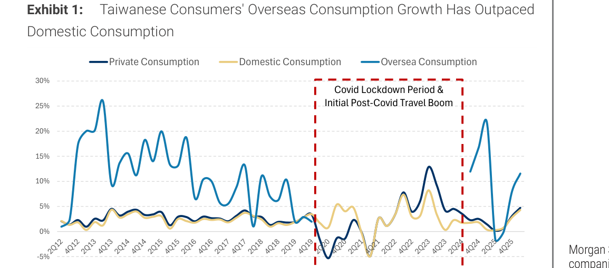

# Morgan Stanley｜Taiwan Retail Sales Tracker：Some Wealth Effect, But Not Much

**券商**：Morgan Stanley  
**分析師**：Terence Cheng、Jenny Ting  
**日期**：2026-06-24  
**主題**：Taiwan Retail Sales Tracker — Some Wealth Effect, But Not Much  
**評級**：Industry View In-Line  
<a href="https://layx.uk/dl?g=產業&b=MS&d=20260624&h=TW-Retail-Sales-Tracker">📎 下載 PDF</a>

---

## 報告總結

台灣 5 月零售銷售（不含餐飲服務）YoY +5%，符合 4 月水準，MoM +3%（去年五月基期偏低）。部分可選消費品項確實有財富效應跡象（服飾 +8%、百貨 +9%、文化休閒 +9%），但 MS 認為效應有限：（1）汽車銷售即使在低基期下仍 -7%，顯示大額耐久財消費意願疲弱；（2）海外消費成長持續超越國內消費（Exhibit 1），顯示台灣消費者將財富效應外溢至境外，進一步壓低國內消費成長動能。MS 指出具利基市場份額的業者（如 Poya 5904）相對較具韌性。

---

## Morgan Stanley 完整投資邏輯鏈

| 論點層次 | Exhibit | 內容 |
|---|---|---|
| 月度數據確認 | 封面 | 5 月零售 +5% YoY / +3% MoM，5M26 累計 +3% YoY；低基期效應顯著但不持續 |
| 財富效應存在但有限 | 封面 | 服飾、餐飲、百貨有加速，但汽車 -7% 顯示大額消費意願仍弱 |
| 海外消費分流 | Exhibit 1 | 海外消費成長（~11% YoY）大幅超越國內（~5%），財富效應正被境外消費吸走 |
| **結論** | 封面 | **台灣內需消費回升有限；偏好利基市場份額型業者（Poya）而非廣泛消費復甦** |

---

## 報告核心觀點

| 指標 | May-26 | YoY | MoM | 備註 |
|---|---|---|---|---|
| 零售銷售（不含餐飲）| — | +5% | +3% | 5M26 累計 +3% |
| 餐飲服務 | — | +5% | +11% | |
| 百貨公司 | — | +9% | — | 去年基期低（5/25 受關稅影響）|
| 服飾紡織 | — | +8% | — | 低基期 |
| 文化休閒用品 | — | +9% | — | |
| 燃料及相關產品 | — | +17% | — | 油價上漲推動 |
| 汽車（含機車）| — | -7% | — | 即使低基期仍為負 |

---

## Exhibit 1｜台灣消費者海外消費成長超越國內消費

### 解讀摘要

從 2012 年至今的長期趨勢來看，台灣的海外消費（亮藍線）波動性遠高於國內消費（淺黃線）與整體私人消費（深藍線）。Covid 後的旅遊反彈（2023 年海外消費短暫飆至 +22%）加速了消費外溢效應。截至最新數據（4Q25 附近），海外消費 YoY 仍在 +11% 左右，而國內消費僅 +5%，兩者差距再度擴大——這說明台積電等科技業帶來的財富效應，有相當比例被境外旅遊與消費吸收，未能完整回流國內零售。

> **洞察一**：汽車（含機車）銷售 -7% 是本月最意外的弱點。汽車是最能反映消費者信心的單一大型耐久財，在低基期下仍為負增長，說明財富效應的傳導鏈受阻——可能與利率水平、電動車選擇猶豫或停車成本上升等結構性因素有關。MS 沒有深究原因，但這個數據明顯打壓了「全面消費復甦」的樂觀預期。

---

## 相關個股清單

| 類別 | 公司 | Ticker | 評等 | 備註 |
|---|---|---|---|---|
| 零售（利基定位）| Poya International | 5904.TWO | — | MS 提及為具利基市場份額、可能在此環境下展現韌性；非 MS 主要覆蓋股 |
