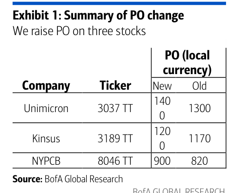
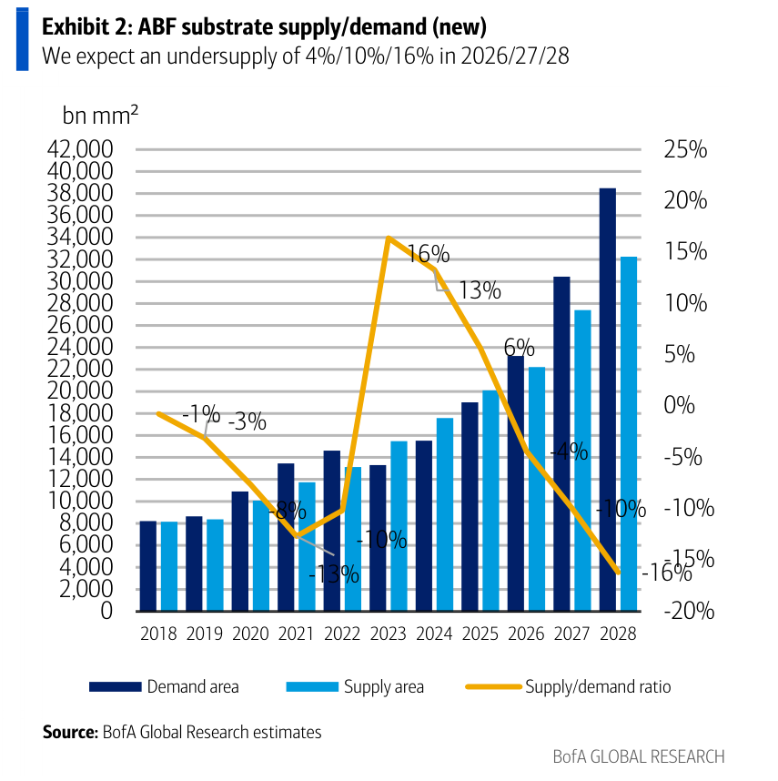
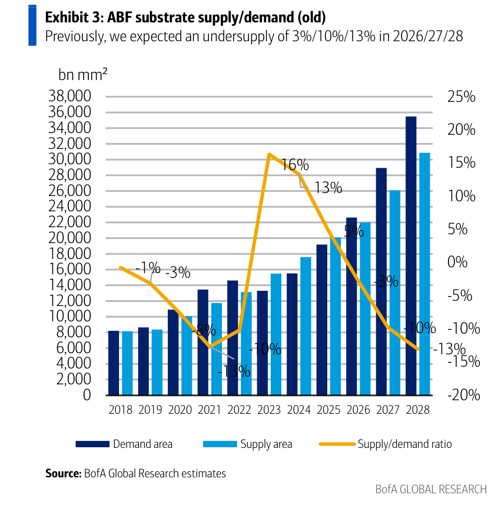
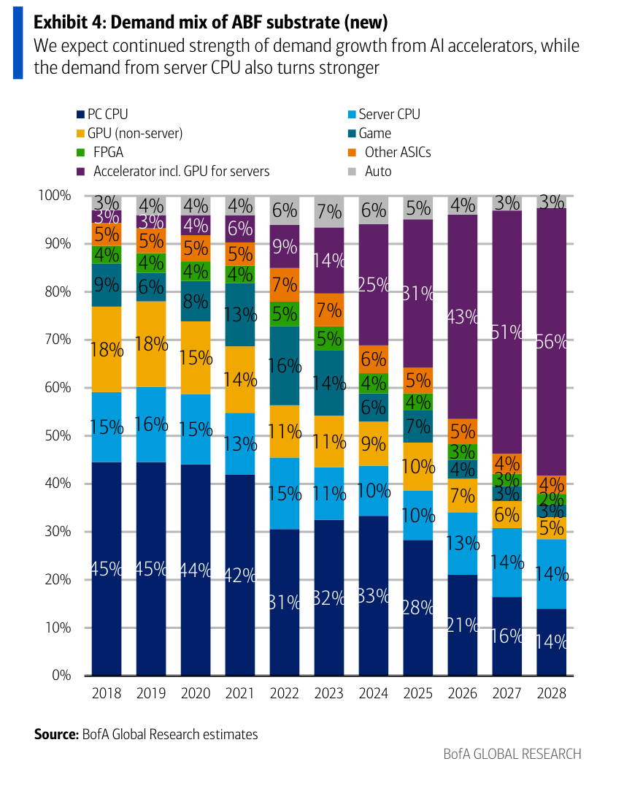
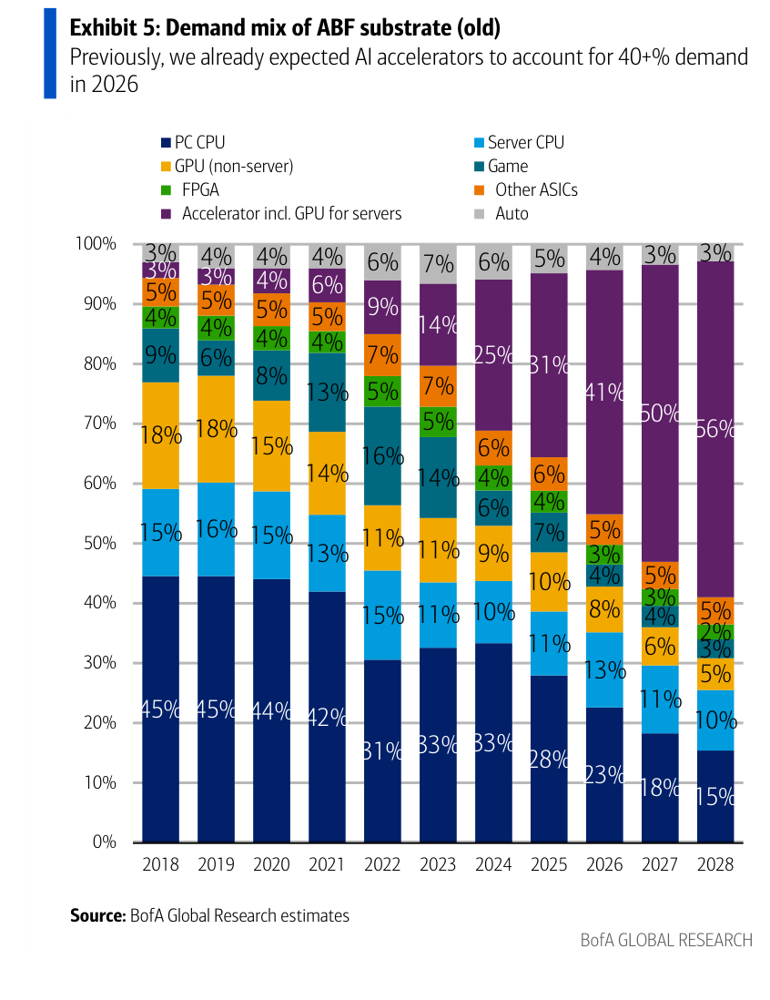
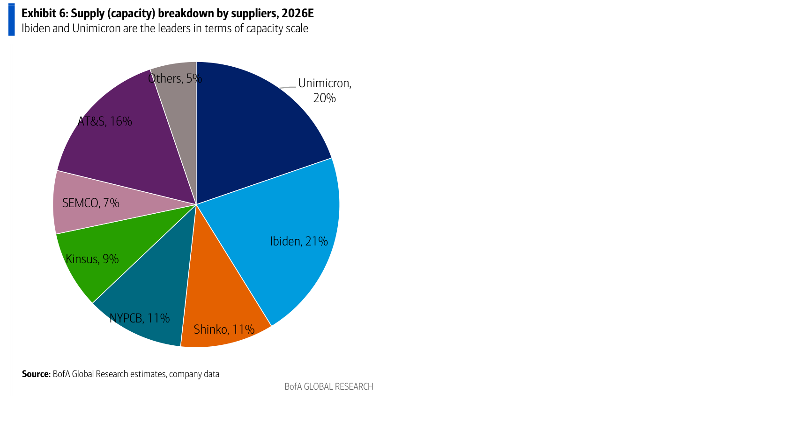
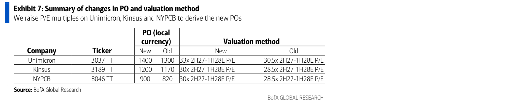

# BofA Securities｜ABF 基板：S/D 缺口進一步擴大，上調三檔 PO

**券商**：BofA Global Research (Merrill Lynch)  
**分析師**：Mike Yang、Masashi Kubota  
**日期**：2026-06-25  
**主題**：ABF substrate: further tightened S&D, led by CPU strength; lift POs of three names  
**評級**：Price Objective Change  
<button type="button" onclick="fetch('https://ti-lei.github.io/foreign-reports/static/downloads/產業/20260625_BofA_ABF-Substrates.md').then(r=>r.text()).then(t=>{let a=document.createElement('a');a.href='data:text/plain;charset=utf-8,'+encodeURIComponent(t);a.download='20260625_BofA_ABF-Substrates.md';a.click()})">⬇ 下載 MD</button>

---

## 報告總結

BofA 在 Ibiden 和 AT&S 發出正面展望訊號後更新 ABF 基板供需模型，同時納入 server CPU 需求意外走強的新數據。更新結果是供需缺口比原先更大：2026/27/28E 短缺分別為 4%/10%/16%（舊預測 3%/10%/13%），且即便同步上修供給成長預估（11%/23%/18% vs 舊 9%/19%/18%），需求升幅仍更大。Ibiden 宣示 4 年建廠周期確認結構性供給瓶頸，AT&S 大幅上調 FY26/27 收入指引（45-55% vs 舊 30-35%）則提供正面行業確認訊號。BofA 上調 Unimicron/NYPCB/Kinsus 目標價至 NT\$1,400/1,200/900，P/E 倍數擴大至 33x/30x/30x，維持全面 Buy 評等。

---

## BofA Securities 完整投資邏輯鏈

| 論點層次 | Exhibit | 內容 |
|---|---|---|
| 需求升溫 | Exhibit 4 vs 5 | Server CPU 佔比上修 2026-28E 共 +2-4 ppt；AI accelerator 亦微升（+2/+1/0 ppt） |
| 供給受限 | Exhibit 6 | Ibiden 4 年建廠周期鎖死短期供給彈性；前兩大（Ibiden+Unimicron）合計 41% 市佔形成高壁壘 |
| S/D 缺口擴大 | Exhibit 2 vs 3 | 2028E 短缺從 -13% 擴至 -16%；即便供給成長上修，需求升幅更大 |
| 行業正面確認 | 封面 | Ibiden 目標 FY30 OpM 30%（現 ~15%）；AT&S 上調 FY26/27 收入指引至 45-55% |
| 估值重估 | Exhibit 7 | P/E 倍數整體上移 1.5-2.5x；Unimicron 33x 為最高，體現技術溢價 |
| **結論** | 封面 | **全面維持 Buy；Unimicron PO 升幅最大（+7.7%），NYPCB 百分比升幅最大（+9.8%）** |

> **報告最大邏輯缺口**：T-glass cloth 上游原料供應風險對 NYPCB/Kinsus 的實際影響未量化，BofA 僅定性為「Unimicron 風險更低」。若原料瓶頸超預期，三家之間的盈利分化可能比模型顯示的更大。

---

## 報告核心觀點

| 主題 | BofA 觀點 | 市場共識 | 是否 Contra-Consensus |
|---|---|---|---|
| 2028E 供需缺口 | -16% 短缺 | 較溫和（舊模型 -13%） | ✓ 更悲觀於供給充裕度 |
| Unimicron EPS | 比共識高 2-14%（2026-28E） | 保守（假設 OpM 較低） | ✓ 積極於 Unimicron 槓桿 |
| NYPCB EPS | 比共識低 5%/19%（2027/28E） | 共識較樂觀 | ✓ 保守，但 PO 仍升（倍數驅動） |
| Kinsus GM | 落後共識 50-200bps（2026-28E） | 共識略樂觀 | 輕微 |
| Server CPU 需求 | 2026-28E 佔比上修至 13-14% | 原預測 11-10% | ✓ 新增多頭理由 |

**偏好排序**：Unimicron > NYPCB ≈ Kinsus（Unimicron 技術領先、上游風險最低、P/E 倍數最高）

---

## Exhibit 1｜PO 變動摘要

### 解讀摘要
三家台灣 ABF 廠目標價全面上調，幅度 2.6%（景碩）至 9.8%（南電）。主要動力來自 P/E 倍數擴張而非 EPS 大幅上修（EPS 僅調整 0-9%）。南電升幅最大，反映其在低基數倍數上的槓桿效果更顯著。

### 表格

| 公司 | Ticker | PO 新（NT\$） | PO 舊（NT\$） | 升幅 |
|---|---|---|---|---|
| Unimicron（欣興） | 3037 TT | 1,400 | 1,300 | +7.7% |
| Kinsus（景碩） | 3189 TT | 1,200 | 1,170 | +2.6% |
| NYPCB（南電） | 8046 TT | 900 | 820 | +9.8% |

> **洞察一**：PO 升幅主要由倍數擴張驅動（+1.5-2.5x P/E），EPS 修正是次要的。Unimicron EPS 僅調 0-1% 但 PO 升 7.7%——若共識最終向 BofA 靠攏（目前落後 2-14%），將出現第二層上行空間。

---

## Exhibit 2｜ABF 基板供需（新模型）

### 解讀摘要
新模型確認 2025 年是最後一個輕微過供年份（+6%），2026 年轉入短缺，缺口逐年擴大至 2028E -16%。需求面積（深藍）成長速度遠超供給面積（淺藍），供需比（橘線）在 2025 年見頂後加速向下，2028E 已超過 2021 年 -13% 的歷史峰值短缺。

### 表格

| 年度 | 供需比 | 狀態 |
|---|---|---|
| 2018 | -1% | 輕微短缺 |
| 2019 | -3% | 短缺 |
| 2020 | -8% | 中度短缺 |
| 2021 | -13% | 嚴重短缺 |
| 2022 | -10% | 中度短缺 |
| 2023 | +16% | 嚴重過供 |
| 2024 | +13% | 中度過供 |
| 2025E | +6% | 輕微過供 |
| 2026E | -4% | 輕微短缺 |
| 2027E | -10% | 中度短缺 |
| 2028E | -16% | 嚴重短缺 |

> **洞察二**：缺口從 -4%→-10%→-16% 呈加速擴大，代表每一年的需求增量都超過當年的供給增量。這不是「供給追不上」的一次性落差，而是需求複合成長（AI accelerator 滲透）持續壓過供給複合成長的結構性趨勢。

---

## Exhibit 3｜ABF 基板供需（舊模型）

### 解讀摘要
舊模型在 2026E 以前和新模型幾乎相同，差異集中在 2028E：舊模型 -13%，新版 -16%。BofA 同步上調了供給成長預估，但需求端的升幅（主要來自 server CPU 和 AI accelerator）仍大於供給端，淨結果是缺口更深。

### 表格（新舊供需比對比）

| 年度 | 舊供需比 | 新供需比 | 差異 |
|---|---|---|---|
| 2025E | +5% | +6% | +1 ppt |
| 2026E | -3% | -4% | -1 ppt |
| 2027E | -10% | -10% | 不變 |
| 2028E | -13% | -16% | -3 ppt |

> **洞察三（配合 Exhibit 2）**：BofA 多頭論點並非建立在「供給擴張不足」，而是「即便已將 Kinsus/NYPCB/AT&S 最新產能評論納入（供給成長上修），需求成長仍更快」。這讓 S/D 缺口邏輯更穩固——即便供給擴張超預期，也只是縮小缺口而非翻轉。

---

## Exhibit 4｜ABF 需求結構（新模型）

### 解讀摘要
AI accelerator（含 GPU for servers，紫色）從 2018 年 3% 爆增至 2028E 56%，絕對主導。更值得注意的是 server CPU（淺藍）的修復：從 2022-2023 低點 9-11% 回到 2026-2028E 的 13-14%，這是本次模型升版的核心增量，也是 PC CPU 長期下滑趨勢（45%→14%）中罕見的正向訊號。

> **原文補充**：Server CPU 回升反映「a further expanded TAM by server CPUs」（BofA 另有獨立報告），本報告以此作為新增需求驅動，未詳列具體 CPU 平台或客戶。

### 表格（關鍵用途 2024-2028E，新模型）

| 用途 | 2024E | 2025E | 2026E | 2027E | 2028E |
|---|---|---|---|---|---|
| AI Accelerator（GPU for servers） | 14% | 25% | 43% | 51% | 56% |
| PC CPU | 33% | 28% | 21% | 16% | 14% |
| Server CPU | 10% | 10% | 13% | 14% | 14% |
| GPU (non-server) | 9% | 10% | 6% | 5% | 5% |
| 其他合計 | 34% | 27% | 17% | 14% | 11% |

> **洞察四**：Server CPU 在絕對面積上的貢獻遠超百分比所示——ABF 市場到 2028E 總規模已比 2025E 擴大約 50%，server CPU 佔比 13-14% 所對應的絕對面積約為 2025E 的 2 倍以上。這段成長完全在 AI 需求以外，進一步壓縮供給緩衝空間。

---

## Exhibit 5｜ABF 需求結構（舊模型）

### 解讀摘要
舊模型 2026E AI accelerator 佔比 41%（新 43%），server CPU 佔比 11%（新 13%）。差異集中在 2026-2027E，2028E 大致趨同。舊模型已有明確的 AI 多頭論點，新版只是在此基礎上再向上修正。

### 表格（新舊需求結構對比）

| 用途 | 舊 2026E | 新 2026E | 舊 2027E | 新 2027E | 舊 2028E | 新 2028E |
|---|---|---|---|---|---|---|
| AI Accelerator | 41% | 43% | 50% | 51% | 56% | 56% |
| Server CPU | 11% | 13% | 10% | 14% | 10% | 14% |
| PC CPU | 23% | 21% | 18% | 16% | 15% | 14% |

---

## Exhibit 6｜供給（產能）廠商分佈，2026E

### 解讀摘要
ABF 基板產能集中在 Ibiden（21%）與 Unimicron（20%）兩大領袖，合計 41% 市佔。三家台股推薦（Unimicron、NYPCB、Kinsus）合計佔市場 40%，是最直接的受益標的群。AT&S（16%）是後進者中最具進取心的，但即便如此也無法快速改變格局。

> **原文補充**：BofA 指出上游原料（T-glass cloth）取得能力方面，Unimicron 的風險「更為可控」（more contained implied risk），理由是產業定位與客戶結構差異，以及 Ibiden、AT&S、Toppan 等同業的最新評論。NYPCB 和 Kinsus 在此議題上的風險較高，但報告未量化具體影響。

### 表格

| 廠商 | 2026E 產能佔比 |
|---|---|
| Ibiden | 21% |
| Unimicron | 20% |
| AT&S | 16% |
| Shinko | 11% |
| NYPCB | 11% |
| Kinsus | 9% |
| SEMCO | 7% |
| Others | 5% |

> **洞察五**：Ibiden 4 年建廠週期意味著即便今天宣布超出 ¥500bn 的新投資，最快也要 2030 年才能量產。前兩名（41% 市佔）的供給彈性接近零，短缺越深，這批資產的定價權越強。值得驗證：AT&S 的 16% 市佔若超預期交付，是唯一可能在 2027-28E 形成較大衝擊的供給變數。

---

## Exhibit 7｜PO 與估值方法變動

### 解讀摘要
P/E 倍數整體上移 1.5-2.5x，均以 2H27-1H28E 為基礎期。Unimicron 獲最高倍數 33x（較 NYPCB/Kinsus 高 3x），體現技術領先溢價。本次升值的本質是「把已知 S/D 缺口趨勢的更多可視性貼現進倍數」，而非依賴 EPS 大幅上修。

### 表格

| 公司 | Ticker | PO 新（NT\$） | PO 舊（NT\$） | 新倍數 | 舊倍數 | 倍數提升 |
|---|---|---|---|---|---|---|
| Unimicron | 3037 TT | 1,400 | 1,300 | 33x 2H27-1H28E P/E | 30.5x | +2.5x |
| Kinsus | 3189 TT | 1,200 | 1,170 | 30x 2H27-1H28E P/E | 28.5x | +1.5x |
| NYPCB | 8046 TT | 900 | 820 | 30x 2H27-1H28E P/E | 28.5x | +1.5x |

> **洞察六**：BofA 在 NYPCB 的 EPS 比共識保守 5%/19%（2027/28E），但仍上調 PO +9.8%。倍數擴張完全蓋過 EPS 保守估計——若市場共識過高（BofA 屬實），現在就有倍數支撐；若共識回落至 BofA 水準，股價也有 EPS 下修的保護層。反向思考：NYPCB 的風險更多在於倍數能否維持 30x，而非 EPS 是否兌現。

---

## 相關個股清單

| 類別 | 公司 | Ticker | 評等 | 備註 |
|---|---|---|---|---|
| 台股 | 欣興（Unimicron） | 3037 TT | Buy | PO NT\$1,400；33x P/E；T-glass 風險最低 |
| 台股 | 景碩（Kinsus） | 3189 TT | Buy | PO NT\$1,200；30x P/E |
| 台股 | 南電（NYPCB） | 8046 TT | Buy | PO NT\$900；30x P/E；EPS 較共識保守但 PO 升幅最大 |
| 日股 | Ibiden | 4062 JP | Buy | PO ¥29,800；本報告僅提及，詳見 BofA Japan 獨立報告 |
