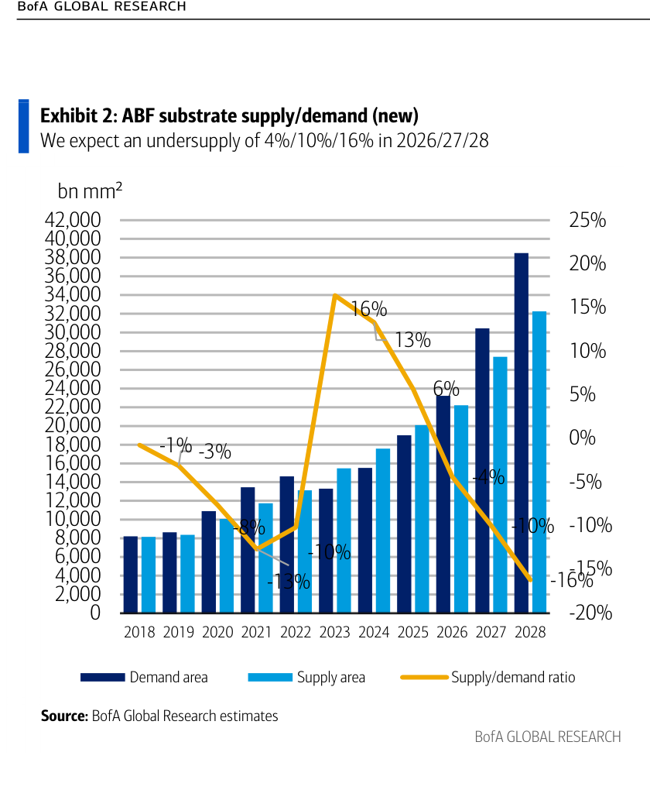
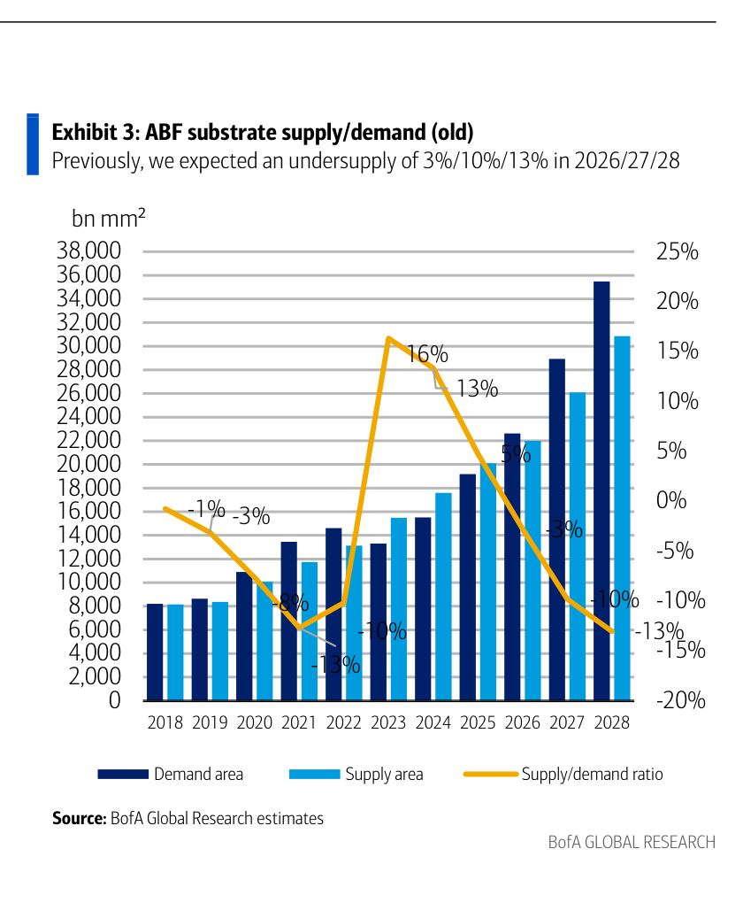
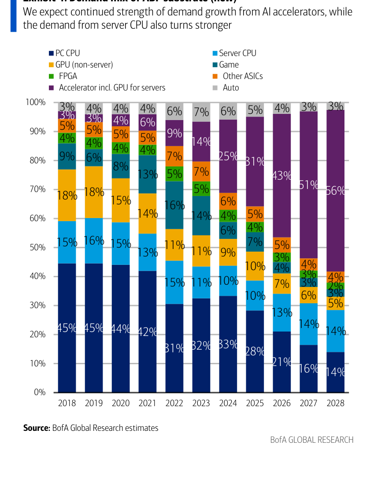
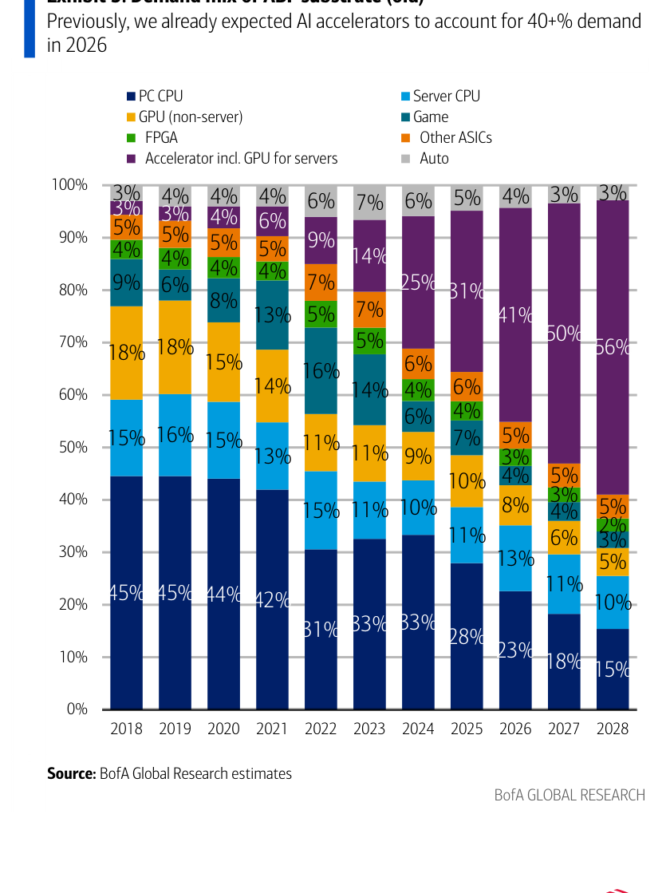
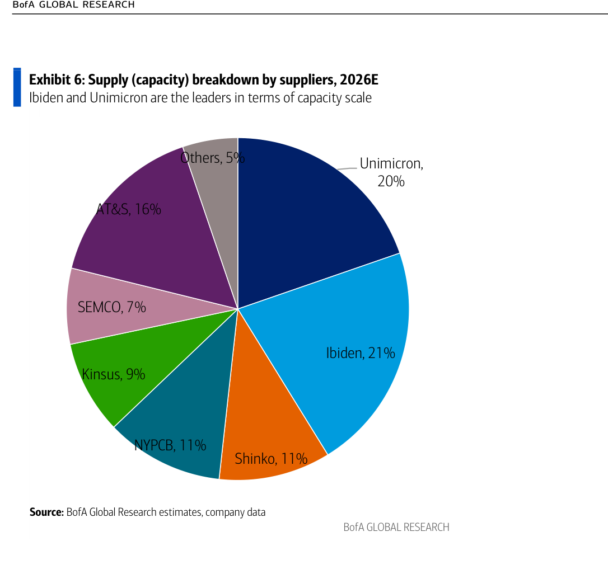

# BofA｜ABF Substrate S&D 進一步收緊，上調三家目標價

**券商**：BofA Securities（美林）  
**分析師**：Mike Yang（台灣）、Masashi Kubota（日本）  
**日期**：2026-06-25  
**主題**：ABF substrate supply/demand update；Unimicron / Kinsus / NYPCB PO raised  
**評級**：Buy（Unimicron 3037、Kinsus 3189、NYPCB 8046、Ibiden 4062）  
<button type="button" onclick="fetch('https://ti-lei.github.io/foreign-reports/static/downloads/產業/20260625_BofA_ABF.md').then(r=>r.text()).then(t=>{let a=document.createElement('a');a.href='data:text/plain;charset=utf-8,'+encodeURIComponent(t);a.download='20260625_BofA_ABF.md';a.click()})">⬇ 下載 MD</button>

---

## 報告總結

BofA 在本報告中更新 ABF substrate 供需模型，預估 undersupply 從舊版 3%/10%/13% 擴大至 4%/10%/16%（2026/27/28E），缺口持續擴大的主因是需求端雙重上修：AI accelerator 需求維持主導（43%/51%/56% 佔比），同時 server CPU 需求因 Intel Xeon 6+ 推出而意外上調（13%/14%/14% vs 舊版 13%/11%/10%）。這份報告的觸發點是 Ibiden 和 AT&S 兩家歐日供應商最新法說的正面指引——Ibiden 目標 FY30 OpM 達 30%（FY25 約 15%），AT&S 大幅上調 FY26/27 收入成長至 45-55%（舊版 30-35%）。

BofA 認為這些歐日供應商的正向更新替台灣供應商（Unimicron、NYPCB、Kinsus）的 margin 擴張假設提供額外信心，因此將三家 PO 上調並提升 P/E 倍數（Unimicron 33x、Kinsus/NYPCB 各 30x，均以 2H27-1H28E EPS 為基準）。上游 T-glass cloth 供應風險中，Unimicron 因客戶組合與產業定位較優，風險相對 NYPCB/Kinsus 更可控。

---

## BofA 完整投資邏輯鏈

| 論點層次 | Exhibit | 內容 |
|---|---|---|
| 需求加速 | Ex 4 | AI accelerator 佔比 2026-28E 升至 43%/51%/56%；server CPU 新增上調至 13%/14%/14% |
| 供給受限 | Ex 6 | Ibiden+Unimicron 合計 41% 產能，擴產需要 4 年規劃時間，短期難以大幅放量 |
| S&D 缺口擴大 | Ex 2 vs 3 | 新模型 undersupply -4%/-10%/-16% vs 舊版 -3%/-10%/-13%，2028E 缺口加深 3 ppt |
| 同業正向指引 | 封面 | Ibiden 目標 OpM 30%（FY30）；AT&S 收入指引上調至 45-55% |
| 上游 T-glass 風險 | 封面 | Unimicron 上游採購風險相對低；NYPCB/Kinsus 相對較高 |
| **結論** | 封面 | **維持四家 Buy；Unimicron/NYPCB/Kinsus PO 上調，P/E 倍數提升反映 S&D 缺口擴大** |

> **報告最大邏輯缺口**：Exhibit 2 的新模型供給端假設來自 NYPCB、Kinsus、AT&S 法說，但 Ibiden（佔 21% 產能）的擴產時程採用「4 年規劃」假設，若 Ibiden 超預期加速，2027-28E 的 undersupply 幅度可能被高估。

---

## 報告核心觀點

| 主題 | BofA 觀點 | 市場共識 | 是否 Contra-Consensus |
|---|---|---|---|
| ABF 2026E undersupply | -4%（缺 4%） | 市場多數預期 2026 仍小幅過剩或平衡 | 偏 Contra，BofA 看法更緊 |
| ABF 2028E undersupply | -16% | 市場通常看至 -10%~-12% | 明顯偏緊，是最大的估值上調驅動力 |
| Server CPU ABF 需求 | 2026-28E 維持 13-14% | 市場普遍認為 CPU 份額持平或微降 | Contra，Intel Xeon 6+ 是上調關鍵 |
| Unimicron T-glass 風險 | 相對低於 NYPCB/Kinsus | 市場未特別區分 | BofA 明確差異化看法 |

**個股偏好排序**：Unimicron（最高 P/E 33x，T-glass 風險低）> Kinsus / NYPCB（30x）> Ibiden（日本市場）

---

## Exhibit 2｜ABF substrate supply/demand（新模型）

### 解讀摘要

新模型的核心變化是 2026-28E undersupply 由 -3%/-10%/-13% 擴大至 -4%/-10%/-16%。特別是 2028E 的缺口從 -13% 擴大至 -16%，是最顯著的修正——代表 BofA 認為即使在供給端假設上調（11%/23%/18% 產能增幅）之後，需求端（AI accelerator + server CPU 雙升）的加速已超過供給擴充的速度，且缺口會在 2028 達到峰值而非收窄。

> **原文補充**：供給端的修正「primarily reflect the latest comments by NYPCB, Kinsus and AT&S regarding capacity expansion」，意即本模型的供給假設相對保守，未納入超預期擴產的情境。

### 表格

| 年份 | 需求面積（bn mm²，估） | 供給面積（bn mm²，估） | Supply/demand ratio |
|---|---|---|---|
| 2018-2020 | ~8,000 | ~8,000 | -1% 到 -3% |
| 2021 | ~11,000 | ~12,000 | -8% |
| 2022 | ~13,000 | ~14,500 | -13% |
| 2023（峰） | ~15,000 | ~13,000 | +16% 供給過剩 |
| 2024 | ~15,000 | ~14,000 | +13% 供給過剩 |
| 2025 | ~19,000 | ~19,700 | +6% 小幅過剩 |
| 2026E | ~24,000 | ~23,000 | **-4% 開始短缺** |
| 2027E | ~30,000 | ~27,000 | **-10%** |
| 2028E | ~38,000 | ~32,000 | **-16%** |

視覺估算，數值為近似值

> **洞察一**：2026E 正好是從供給過剩（+6% in 2025）翻轉為短缺（-4%）的臨界點，這個轉折若符合 BofA 預測，ABF 廠商的議價能力與 ASP 將在 2026 下半年產生結構性改善，遠早於市場多數預期的 2027。

---

## Exhibit 3｜ABF substrate supply/demand（舊模型）

### 解讀摘要

舊模型 2026/27/28E undersupply 為 -3%/-10%/-13%。與新模型比較，最大差異在 2028E（-13% vs -16%，擴大 3 ppt），而 2026/27E 的變動幅度（-1ppt 和 0ppt）相對小。這說明 BofA 此次上調的驅動力主要是 2027-28E 的中長期需求增量（ASIC、server CPU 加速），而非近期需求拉升。

---

## Exhibit 4｜ABF substrate 需求結構（新模型）

### 解讀摘要

這張圖是整份報告最關鍵的需求端拆解。AI accelerator（Accelerator incl. GPU for servers，紫色）從 2025 年的 31% 加速至 2026E 的 43%，2027E 的 51%，2028E 的 56%——三年內幾乎翻倍。同時 PC CPU（深藍，最大傳統需求）持續萎縮（45%→21%→16%→14%），Server CPU（淺藍）則意外回彈（13%→13%→14%→14%）。這個結構轉換的速度遠超以往半導體週期，且 56% 佔比已超過一半，意味著 ABF substrate 的需求性質已從消費電子周期轉型為 AI infrastructure 周期。

### 表格

| 需求類別 | 2025 | 2026E | 2027E | 2028E |
|---|---|---|---|---|
| PC CPU | 28% | 21% | 16% | 14% |
| Server CPU | 10% | 13% | 14% | 14% |
| GPU (non-server) | 10% | 7% | 6% | 5% |
| Game | 7% | 5% | 4% | 3% |
| FPGA | 4% | 3% | 3% | 2% |
| Other ASICs | 5% | 4% | 3% | 3% |
| Accelerator incl. GPU for servers | 31% | 43% | 51% | 56% |
| Auto | 5% | 4% | 3% | 3% |

> **洞察一**：Server CPU（Intel）的上調（13%→14% vs 舊版 13%→11%→10%）雖然數字不大，但方向完全反轉，是本次修正的核心 contra-consensus 觀點。市場普遍預期 CPU 在 GPU/ASIC 崛起下持續被稀釋，BofA 認為 Agentic AI 工作負載讓 CPU server 需求止跌回升，這值得特別追蹤。

---

## Exhibit 5｜ABF substrate 需求結構（舊模型）

### 解讀摘要

舊模型 2026-28E Accelerator 佔比為 41%/50%/56%，新模型提升至 43%/51%/56%。最顯著的差異在 2026E（+2 ppt）和 2027E（+1 ppt），2028E 相同。同時 Server CPU 舊版 2027/28E 為 11%/10%，新版為 14%/14%——這 3-4 ppt 的 server CPU 上調是此次需求模型修正最意外的地方，直接支撐了 2026-28E 整體 ABF 需求的上修。

---

## Exhibit 6｜ABF substrate 供應商產能分布（2026E）

### 解讀摘要

ABF substrate 市場是高度寡占的結構：前六大（Ibiden 21%、Unimicron 20%、AT&S 16%、NYPCB 11%、Shinko 11%、Kinsus 9%）合計 88% 市場份額。台灣廠商（Unimicron + NYPCB + Kinsus）合計 40%，與日本（Ibiden + Shinko）的 32% 並列最大陣營。AT&S（奧地利）以 16% 排第三，是歐洲唯一主要玩家。

### 表格

| 供應商 | 產能份額（2026E） | 國家 |
|---|---|---|
| Ibiden | 21% | 日本 |
| Unimicron（欣興） | 20% | 台灣 |
| AT&S | 16% | 奧地利 |
| NYPCB（南亞電路板） | 11% | 台灣 |
| Shinko | 11% | 日本 |
| Kinsus（景碩） | 9% | 台灣 |
| SEMCO | 7% | 韓國 |
| Others | 5% | — |

> **洞察一**：Ibiden（4 年擴產規劃）+ AT&S（FY26/27 收入 +45~55%）的正向指引，代表排名第一和第三的供應商均確認緊俏格局，替整個產業的 pricing power 論點提供外部佐證。這是比台灣廠商自身法說更有說服力的需求確認信號，因為 Ibiden/AT&S 的客戶主要是 Intel 和歐美 CSP，與台灣廠商的 Nvidia 生態有互補性。

---

## 相關個股清單

| 類別 | 公司 | Ticker | 評等 | 備註 |
|---|---|---|---|---|
| ABF 基板 | Unimicron 欣興 | 3037 | Buy | PO NT\$1,400（33x 2H27-1H28E P/E）；T-glass 風險相對低 |
| ABF 基板 | Kinsus 景碩 | 3189 | Buy | PO NT\$1,200（30x）|
| ABF 基板 | NYPCB 南亞電路板 | 8046 | Buy | PO NT\$900（30x）|
| ABF 基板 | Ibiden | 4062 JP | Buy | 日本；OpM 目標 FY30 達 30% |
