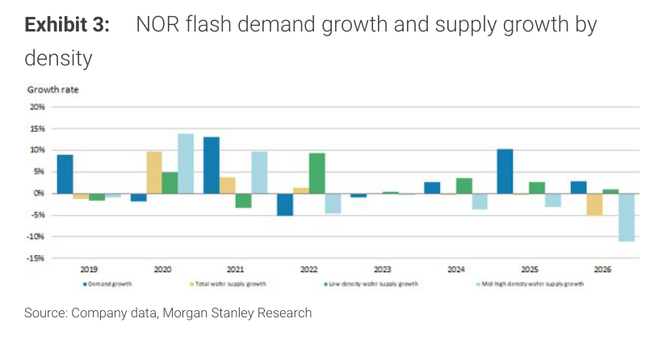
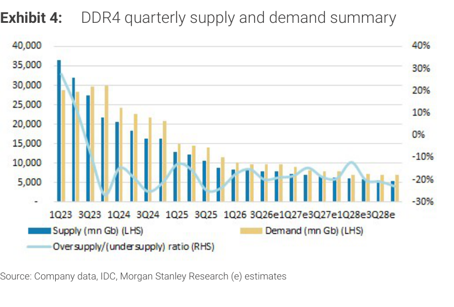
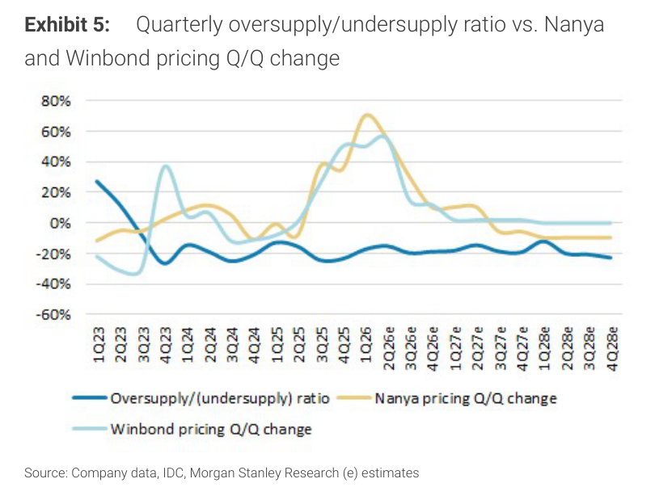
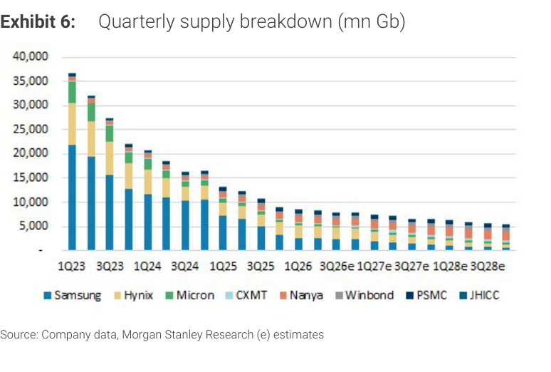
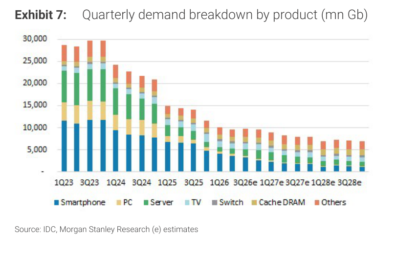
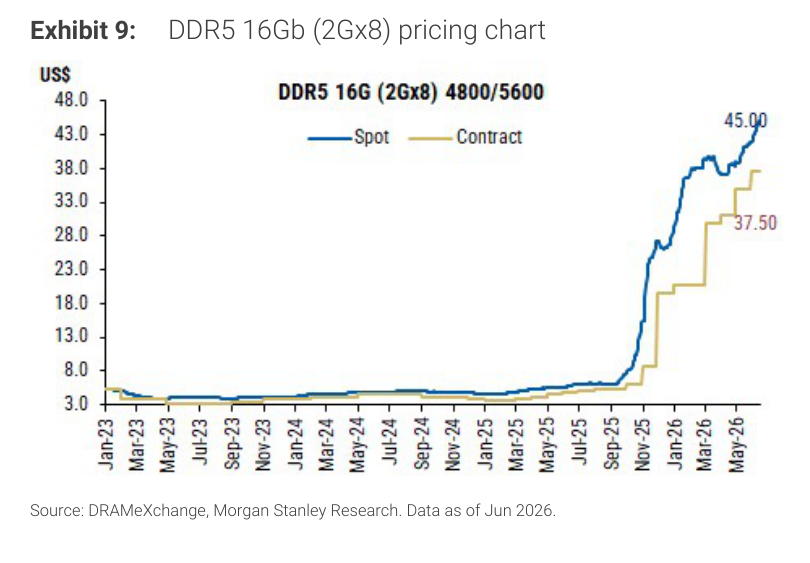

# Morgan Stanley｜Old Memory — 供給持續偏緊，企業恐慌性採購加速

**券商**：Morgan Stanley  
**分析師**：Daniel Yen、Charlie Chan、Daisy Dai、Tiffany Yeh、Ethan Jia  
**日期**：2026-06-25  
**主題**：Legacy memory（DDR4、NOR flash、SLC NAND）供需收緊；GigaDevice/Winbond/Nanya/Macronix/PSMC PT 上調  
**評級**：Industry View Attractive  
<button type="button" onclick="fetch('https://ti-lei.github.io/foreign-reports/static/downloads/產業/20260625_MS_Old-Memory.md').then(r=>r.text()).then(t=>{let a=document.createElement('a');a.href='data:text/plain;charset=utf-8,'+encodeURIComponent(t);a.download='20260625_MS_Old-Memory.md';a.click()})">⬇ 下載 MD</button>

---

## 報告總結

MS 在本報告中指出 legacy memory 供應持續意外偏緊，且已從 DDR4 擴展至 NOR flash 和 SLC NAND 三個市場同步收緊。觸發本報告的關鍵新信號是：企業客戶開始「恐慌性採購（panicked purchasing）」提前鎖定 DDR4 供貨，通路庫存降至不到兩週；MLC NAND 短缺迫使企業 HDD 改用高密度 SLC NAND；以及 Vera Rubin rack 在 2H26 ramp 將比 Grace Blackwell 需要 50%+ 更多的 NOR flash 內容。

這份報告的核心論點是：市場對 legacy memory 的理解停留在「AI 需求輪不到它」的舊框架，但實際上 AI 伺服器（NOR flash）和 AI data centre（SLC NAND）對 legacy memory 的拉力已突破市場預期。MS 上調全部 5 家公司 PT，並維持看多立場。

---

## Morgan Stanley 完整投資邏輯鏈

| 論點層次 | Exhibit | 內容 |
|---|---|---|
| NOR 供需翻轉 | Ex 2, 3 | 2026 供給成長轉負（-5%），需求成長維持正值；Mid/High density 供給尤其短缺 |
| DDR4 缺口持續 | Ex 4, 5 | 2026E 起 undersupply ratio 轉負；Nanya/Winbond 定價 QoQ 大漲 |
| 供給端結構 | Ex 6 | Samsung/Hynix/Micron 大廠持續縮減 DDR4 產能；台灣小廠相對受益 |
| DDR4 定價飆升 | Ex 8 | Spot \$29.08/Contract \$20.00（2026/6），從 2025 年初 \$1-2 暴漲近 15 倍 |
| DDR5 同步上漲 | Ex 9 | DDR5 spot \$45（2026/6），說明整個 DRAM 生態均受 AI server 拉動 |
| **結論** | 封面 | **NOR +30-40% 3Q；DDR4 持續漲；SLC NAND 4Q 繼續；PT 全面上調** |

> **報告最大邏輯缺口**：DDR4 spot price 從 \$1.5 暴漲至 \$29 是 7 個月內 19 倍的升幅，這個速度暗示短期需求端有異常拉貨（恐慌性採購）的成分。若 4Q 企業客戶消化現有庫存而不繼續拉貨，定價可能面臨快速修正風險。MS 未充分討論這個 cyclical reversion 的可能性。

---

## 報告核心觀點

| 主題 | MS 觀點 | 市場共識 | 是否 Contra-Consensus |
|---|---|---|---|
| DDR4 定價 4Q | 持續上漲 | 多數預期 3Q 見頂後回落 | Contra，MS 認為企業恐慌採購延伸 |
| NOR flash 3Q | +30-40% QoQ 漲價 | 多數估 +10-20% | Contra，Vera Rubin NOR 用量是驅動力 |
| SLC NAND 4Q | 持續上漲 | 市場多數聚焦 MLC NAND | Contra，MLC shortfall→SLC 替代是新信號 |
| Micron NOR 退場 | 2H26 持續縮減 NOR 供給 | 市場未特別關注 | Contra，供給更集中台灣 Macronix |

**個股偏好排序**（依封面 Exhibit 1）：GigaDevice > Winbond > Nanya Tech（共同看多 DDR4）；Macronix（NOR flash 漲價受益）；PSMC（foundry 訂單受益）

---

## Exhibit 2｜NOR flash demand and supply growth rates

### 解讀摘要

NOR flash 的供需歷史走勢顯示：2021 年需求成長達 +13%（COVID 供應鏈重組）後急速回落，2024-25 年需求成長轉正（+3-5%），但供給成長在 2025-26 年轉為負值（-5%）。2026 年的供給負成長（供應商減少投入）遇上需求端 Vera Rubin rack NOR 用量暴增，是本次 NOR 漲價的關鍵收斂點。Micron 在 2H26 主動縮減 NOR 供給（轉向 DRAM/NAND），讓供給集中度更往台灣廠商（Macronix 為主）集中。

### 表格（視覺估算）

| 年份 | 需求成長（YoY） | 供給成長（YoY） | 供需差 |
|---|---|---|---|
| 2017-2018 | +9-10% | +8-9% | 平衡 |
| 2021（峰值） | +13% | +10% | 需求略強 |
| 2022-2023 | -5% 到 -8% | +2-3% | 嚴重供過於求 |
| 2024-2025 | +3-5% | 0-1% | 趨於平衡 |
| **2026E** | **+3%** | **-5%** | **供給短缺加深** |

---

## Exhibit 3｜NOR flash demand growth and supply growth by density

### 解讀摘要

按密度分析 NOR flash 供需，顯示 2026 年的最大缺口出現在「Mid/High density」（高密度 NOR）這個細分市場。Low density NOR 供給成長維持輕微正值，但 Mid/High density NOR 的供給成長在 2026 年轉為 -10%+ 的大幅負值。這個密度分化很重要：Vera Rubin rack 需要 50%+ 更多的 NOR flash 是高密度規格，正好打在供給最緊的部分，直接讓 Macronix 等高密度 NOR 廠商受益最大。

> **原文補充**：「A shift toward NAND from NOR」是長期 secular trend，但短期內 Vera Rubin rack 的 NOR 需求增量（vs Grace Blackwell 高 50%+）是 Contra-consensus 的需求驚喜。

---

## Exhibit 4｜DDR4 quarterly supply and demand summary

### 解讀摘要

這張圖從 1Q23 到 3Q28E 的季度供需追蹤顯示：DDR4 供應量（深藍 bar）從 1Q23 的 35,000mn Gb 持續下降，2026E 時已縮減至約 8,000-10,000mn Gb（大廠持續轉產 DDR5）。需求（淺黃 bar）的下降斜率相對較緩，導致 2026E 起 oversupply/(undersupply) ratio（橙線，RHS）轉為負值，代表供給不足開始主導。2026-28E 的 undersupply 持續加深，是 DDR4 定價長期強勢的基礎。

### 表格（視覺估算）

| 時期 | 供給（mn Gb，估） | 需求（mn Gb，估） | 供需比 |
|---|---|---|---|
| 1Q23 | 35,000 | 28,000 | +25% 過剩 |
| 3Q24 | 18,000 | 14,000 | +29% 過剩 |
| 1Q26 | 10,000 | 10,500 | -5% 短缺 |
| 3Q26E | 8,500 | 9,500 | **-10% 短缺** |
| 3Q27E | 6,500 | 7,500 | **-15% 短缺** |

視覺估算

> **洞察一**：DDR4 供給下降速度（大廠轉產 DDR5 + CXMT 等中國廠減少 legacy 投入）遠超需求下降速度（企業端 DDR4 替換週期仍慢），這個不對稱正是 2026-28E 持續 undersupply 的根本原因，而非短暫的庫存補充。

---

## Exhibit 5｜Quarterly oversupply/undersupply ratio vs. Nanya and Winbond pricing Q/Q change

### 解讀摘要

這張圖疊合了 DDR4 供需比率（深藍線）與 Nanya（橙線）和 Winbond（淺藍線）的季度 ASP 變化。歷史規律清晰：每當 oversupply ratio 轉負，兩家廠商的定價 QoQ 就快速正轉——2021 年的 upcycle 時 Nanya/Winbond 季度漲幅達 +60-70%。2026E 的 undersupply 轉折點出現，Nanya 和 Winbond 的定價 QoQ 已在 2Q25-2Q26 開始大漲（+20-40%），且 MS 預期 3Q26 進一步加速，延伸至 4Q26。

> **洞察一**：從歷史看，DDR4 undersupply ratio 轉負後的定價修復週期長達 4-6 季。2026E 的缺口起點（-5% 到 -10%）比 2021 年的情況更早出現在更深的缺口，說明這次定價修復的持續性可能超過 2021 那輪。

---

## Exhibit 6｜Quarterly supply breakdown（mn Gb）

### 解讀摘要

DDR4 供給側分析：Samsung（深藍）和 Hynix（黃）是歷史最大供應商，但兩者在 2024-28E 持續縮減 DDR4 產能（優先遷移至 DDR5 和 HBM）。Micron（綠）也在減少。Nanya（淺藍）、Winbond（深藍小塊）、PSMC（微小）則因無法切換到先進製程，DDR4 是核心產品，供給量下降緩慢。這個結構說明 DDR4 供給的減少完全由大廠驅動，而受益方正是這些台灣中小廠——它們在供給緊縮中擁有相對更強的定價話語權。

### 供應商市占結構（2026E 估）

| 供應商 | 供給佔比（估） | 趨勢 |
|---|---|---|
| Samsung | ~40% | 持續縮減 ↓↓ |
| Hynix | ~25% | 縮減 ↓ |
| Micron | ~15% | 縮減 ↓ |
| CXMT（中芯存儲） | ~10% | 輕微增加 |
| Nanya | ~5% | 穩定 |
| Winbond | ~3% | 穩定 |
| PSMC/JHICC | ~2% | 穩定 |

視覺估算

---

## Exhibit 7｜Quarterly demand breakdown by product（mn Gb）

### 解讀摘要

DDR4 需求端按終端應用分類：Smartphone（深藍）和 PC（黃）是歷史最大需求端，但兩者已持續萎縮（換機週期延長 + 遷移至 LPDDR5）。Server（綠）的需求雖小但相對穩定（企業 server refresh 仍依賴 DDR4）。Switch/Cache DRAM 等小類需求保持穩定。整體需求從 1Q23 的 ~28,000mn Gb 下降至 2026E 的 ~11,000mn Gb，下降幅度雖大，但比供給（從 35,000 降至 8,000-10,000）的下降幅度小，支持持續的供需缺口。

---

## Exhibit 8｜DDR4 8Gb（1Gx8）pricing chart

### 解讀摘要

這是整份報告最直觀的數據：DDR4 8Gb spot price 從 2025 年初的 \$1.5 左右，到 2026 年 6 月飆升至 \$29.08（Spot），contract price 也達到 \$20.00。這是 19 倍的漲幅（7個月內）。對比 2021 年的最高點約 \$7-8，本次 spot 已超過 2021 cycle 高點 4 倍以上。MS 認為這不只是庫存補充，而是企業客戶的恐慌性採購（channel inventory < 2 週）推動。

### 表格

| 時期 | DDR4 Spot（US\$） | DDR4 Contract（US\$） |
|---|---|---|
| 2019-2020 | 2.5-6.0 | 3.0-5.5 |
| 2021 峰值 | ~7.0 | ~6.5 |
| 2023-2024（谷底） | ~1.0-1.5 | ~1.2-2.0 |
| 2025/1Q | ~1.5 | ~2.0 |
| 2026/6（最新） | **29.08** | **20.00** |

---

## Exhibit 9｜DDR5 16Gb（2Gx8）pricing chart

### 解讀摘要

DDR5 16Gb spot price 從 2023 年初 \$3-4，2024 年維持 \$6-10，2025 下半年開始加速上漲，2026 年 5-6 月達到 \$45（spot）/\$37.50（contract）。DDR5 同步大漲說明整個 DRAM 生態都在升溫，而非只是 DDR4 的特殊情況——這是因為大廠的 DDR5 產能也被 AI server（HBM 產線佔用）和 HPC 服務器需求鎖住，導致一般商用 DDR5 供給也偏緊。DDR5 漲至 \$45 同時也讓 DDR4 的 \$29 顯得「合理」，兩個市場相互支撐。

---

## 相關個股清單

| 類別 | 公司 | Ticker | 評等 | 備註 |
|---|---|---|---|---|
| DDR4/NOR/SLC NAND | Winbond 華邦 | 2344 | OW | PT NT\$288（from NT\$222）；DDR4+NOR+SLC NAND 三重受益 |
| DDR4 | Nanya Tech 南亞科 | 2408 | OW | PT NT\$550（from NT\$380）；DDR4 主力廠 |
| NOR flash | Macronix 旺宏 | 2337 | OW | PT NT\$220（from NT\$202）；NOR 漲價最直接受益者 |
| NOR/DDR4 | GigaDevice 兆易創新 | 603986 | OW | PT Rmb888（from Rmb585）；中國 NOR+DDR3/4 市占受益 |
| Foundry | PSMC 力晶 | 6770 | OW | PT NT\$111（from NT\$88）；DDR4/NOR 代工受益 |
