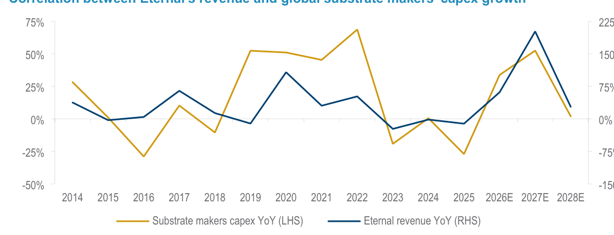
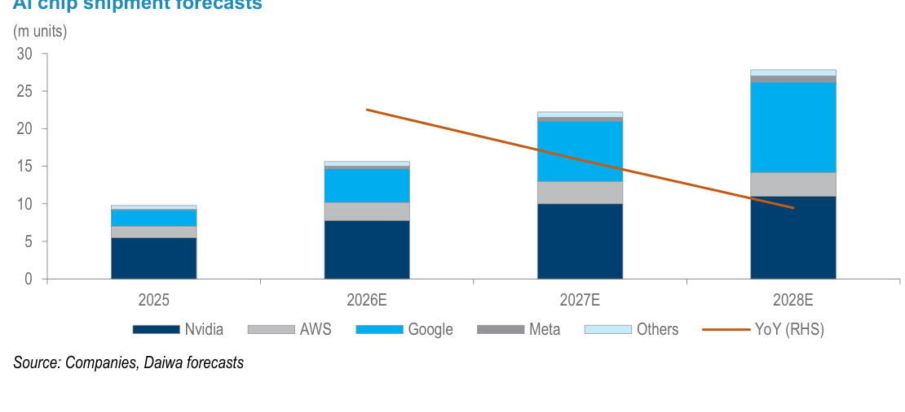
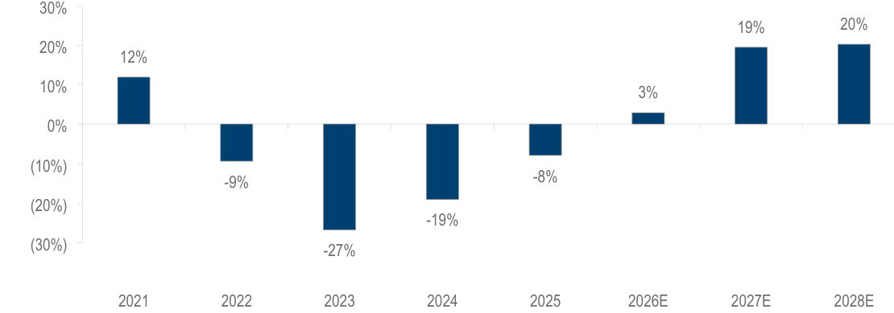
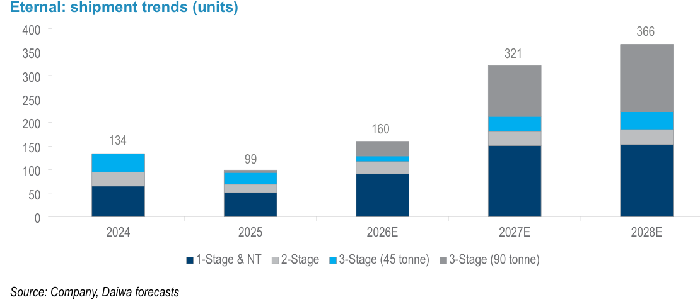
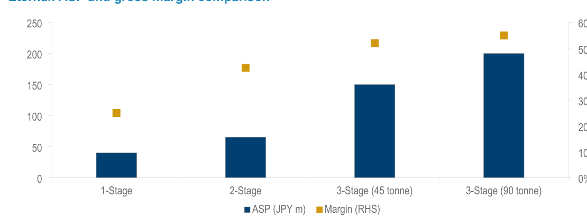
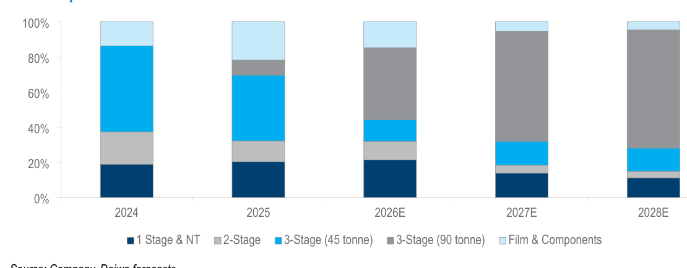
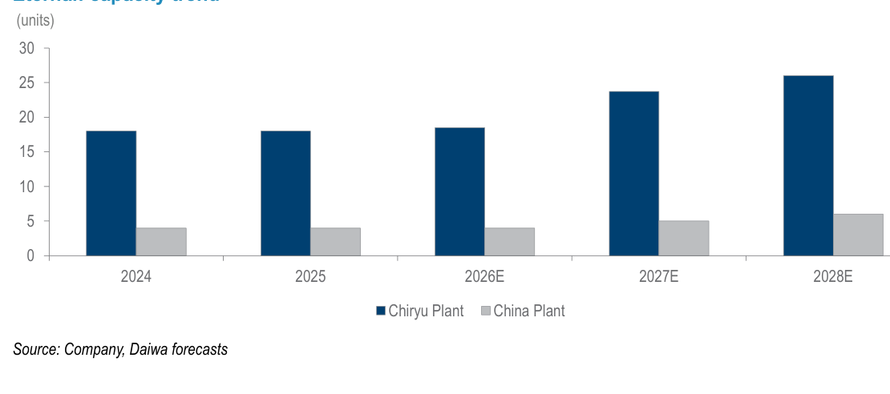
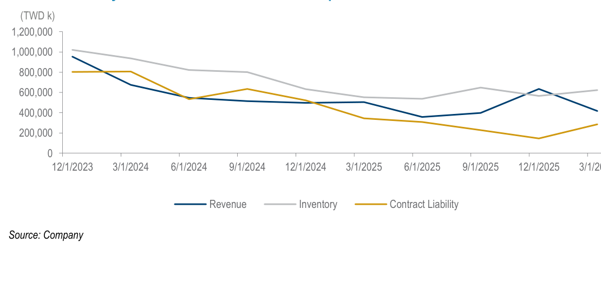

# Daiwa｜長廣精機 (7795) 首次覆蓋：ABF 上游設備的隱藏受益者

**券商**：Daiwa Capital Markets  
**分析師**：Stacy Lin、Leon Chen  
**日期**：2026-06-26  
**主題**：Initiation: a hidden gem in the ABF upcycle  
**評級**：Buy (1)，TP TWD600  
<a href="/dl?g=產業&b=Daiwa&d=20260626&h=EPM-ABF-Initiation">📎 下載 PDF</a>

---

## 報告總結

Daiwa 首次覆蓋長廣精機（7795 TT），以 Buy (1) 評等、TP TWD600（+30.3%）啟動。長廣是全球高端真空壓合機（vacuum laminator）市場龍頭，擁有約 95% 市佔，為 ABF 基板生產的關鍵設備供應商。觸發時機：全球 ABF 基板廠在 2026 年加速 capex 擴張，訂單能見度已延伸至 2028 年，長達 12 個月的交期確認供給嚴重短缺，而長廣的漲價（高端機型累計 >30%）、日本廠擴產（2027E 月產 24 台）、以及庫存與合約負債在 1Q26 見底回升，顯示從 3Q26 起的收入轉折點已近。Daiwa 預估 2026-28E 收入 CAGR 96%、EPS CAGR 126%，估值 40x 1-year forward PER 隱含 PEG 僅 0.3x。

---

## Daiwa 完整投資邏輯鏈

| 論點層次 | Exhibit | 內容 |
|---|---|---|
| 需求結構確認 | Exhibit 3 | ABF S/D 缺口 2026-28E 達 3%/19%/20%（正值=短缺），底層驅動是 AI chip 出貨量 +42%/25% YoY |
| 需求連結設備 | Exhibit 1 | Eternal 收入成長與 ABF 廠 capex 成長高度相關；capex 加速 → 訂單能見度延伸至 2028 |
| 設備升級推高 ASP | Exhibit 5、6 | 90 噸機 ASP 是 1-Stage 的 5 倍、毛利率 55% vs 27%；2028E 佔比升至 80% |
| 供給受限 + 議價能力 | Exhibit 7 | 日本廠月產從 18 台緩升至 26 台；交期超 12 個月讓客戶優先搶供，累計漲價 >30% |
| 訂單轉收入的 Timing | Exhibit 8 | 庫存+合約負債在 1Q26 見底，收入認列滯後訂單 6-8 個月，預期 3Q26 收入加速顯現 |
| 估值支撐 | 封面 | 40x 1-year forward PER，對應 2026-28E EPS CAGR 126%，PEG 僅 0.3x |
| **結論** | 封面 | **Buy (1)，TP TWD600；純正 ABF 設備受益標的，護城河深且無可替代** |

> **報告最大邏輯缺口**：90 噸壓合機的出貨時間表高度依賴 Ajinomoto GL107 材料量產進度。若 GL107 採用延遲，90 噸機需求將滯後，但報告未量化此風險概率。此外，新 Toyota 廠預計 2028 年完工，若建廠進度落後，2028E 的 366 台出貨預估將無法兌現。

---

## 報告核心觀點

| 主題 | Daiwa 觀點 | 市場共識 | 是否 Contra-Consensus |
|---|---|---|---|
| 公司定位 | 全球唯一 ABF 高端壓合機純正受益 | 市場覆蓋稀少（報告說 limited sell-side coverage） | ✓ 首次定價，無共識可比 |
| 2027E ABF 缺口 | -19%（短缺） | Daiwa vs BofA 略有差異（BofA 為 -10%） | 較 BofA 更悲觀於供給 |
| 收入 CAGR 96% | 2026-28E | 無 Bloomberg 共識 | N/A |
| PEG 0.3x | 極度低估 | N/A | ✓ Daiwa 認為投資者尚未充分反映 |
| 90 噸機主導 2027+ | 90 噸佔 2028E 收入約 68% | 市場未廣泛追蹤 | ✓ |

**偏好排序**：長廣（7795）為該領域唯一 Buy 評等個股，無其他競爭對手獲 Daiwa 評等。

---

## Exhibit 1｜長廣收入 vs 全球基板廠 Capex 成長相關性

### 解讀摘要
長廣收入 YoY（深藍，右軸）與全球 ABF 基板廠 capex YoY（金色，左軸）自 2014 年以來保持高度同步。2023-2025 年兩者同步下行（基板過供→廠商縮減 capex→長廣訂單萎縮）；Daiwa 預估 2026-2027E 基板廠 capex YoY 大幅反彈（+34%/+52%），對應長廣收入 2027E 大幅加速（+200% YoY）。這個相關性為長廣的收入預估提供了行業層面的驗證路徑——只要 ABF 廠持續擴產，長廣的設備訂單必然跟進。

> **原文補充**：Capex 統計涵蓋 Unimicron、Kinsus、NYPCB、Ibiden、Shinko、Toppan、Semco、AT&S。客戶自費購買設備（customer-funded equipment purchases）未計入此 chart，Daiwa 認為實際 capex 成長可能更高。

### 表格（基板廠 Capex YoY vs 長廣收入 YoY，視覺估算）

| 年度 | 基板廠 Capex YoY | 長廣收入 YoY |
|---|---|---|
| 2021 | +55% | +150% |
| 2022 | +70% | +225% |
| 2023 | -45% | -100% |
| 2024 | -30% | -80% |
| 2025 | -30% | -75% |
| 2026E | +34% | +60% |
| 2027E | +52% | +200% |
| 2028E | +2% | +27% |

*以上 YoY 為視覺估算；文字確認 2026-28E 長廣收入 YoY 為 +60%/+200%/+27%；基板廠 capex 數字來自 Bloomberg。

> **洞察一**：基板廠 capex 成長在 2028E 驟降至 +2%（capex 頂峰），但長廣收入仍有 +27%——這是因為 2027E 訂單大量積壓轉化為 2028 收入，加上漲價效應持續。長廣的收入峰值很可能滯後於 capex 峰值 1-2 年。

---

## Exhibit 2｜AI Chip 出貨量預估（2025-2028E）

### 解讀摘要
AI chip（GPU/ASIC）出貨量從 2025 年約 10m 台增至 2028E 約 27m 台，Nvidia 持續為最大份額（深藍），Google TPU（深灰）與 AWS Trainium（灰）也快速成長。2027E 是關鍵加速年（+42% YoY），2028E 成長放緩至 +25%。這是 ABF 基板需求的根本驅動力，也是 Daiwa 預估 ABF S/D 缺口在 2027-28E 達到 19-20% 的基礎。

### 表格（AI Chip 出貨量，m units，視覺估算）

| 客戶 | 2025 | 2026E | 2027E | 2028E |
|---|---|---|---|---|
| Nvidia | 6 | 8 | 10 | 11 |
| Google | 2 | 4 | 5 | 8 |
| AWS | 1 | 2 | 3 | 4 |
| Meta | 0.5 | 1 | 2 | 2 |
| Others | 0.5 | 1 | 2 | 2 |
| **合計** | **10** | **16** | **22** | **27** |
| YoY | - | +60% | +38% | +23% |

*視覺估算，Daiwa 文字確認 2027-28E YoY 為 +42%/+25%（略高於視覺估算，差異在精度範圍內）

> **洞察二**：Google 的 TPU 出貨（2025→2028E 從 2m 到 8m，+4倍）是增量最大的成長來源，這呼應了近期 Daiwa 長廣報告中對「Ajinomoto GL107 材料+90 噸壓合機」需求的預估——Google TPU 基板是 GL107 材料的核心應用。

---

## Exhibit 3｜ABF 基板供需缺口（2021-2028E）

### 解讀摘要
ABF 基板從 2021-2022 年的短缺轉入 2023-2025 年的嚴重過供（-27% 峰值），2026E 再度轉入短缺，且缺口持續擴大至 2028E 的 20%。Daiwa 的需求預估比 BofA 的 -16%（2028E）更為緊張，差異反映 Daiwa 對 AI chip 出貨量的更積極假設。正值代表需求超過供給（短缺）。

### 表格

| 年度 | 供需比 | 狀態 |
|---|---|---|
| 2021 | +12% | 短缺 |
| 2022 | -9% | 過供 |
| 2023 | -27% | 嚴重過供 |
| 2024 | -19% | 中度過供 |
| 2025 | -8% | 輕微過供 |
| 2026E | +3% | 輕微短缺 |
| 2027E | +19% | 中度短缺 |
| 2028E | +20% | 中度短缺 |

> **原文補充**：Daiwa 預估全球基板廠產能 2026-28E 每年成長 17-18%，但 ABF 需求（面積）成長 30%/37%/19%，需求持續超過供給擴張速度。

> **洞察三（配合 Exhibit 1）**：ABF S/D 缺口 19-20% 在 2027-28E 達到甚至超越 2021 年 12% 峰值，基板廠被迫持續擴產，對長廣而言意味著 2028 年後的訂單可見度仍高。Ibiden 等廠商已開始以「客戶自費購買設備」模式降低自身資本負擔，這反而讓設備需求更早顯現在長廣訂單中。

---

## Exhibit 4｜長廣出貨趨勢（台數，2024-2028E）

### 解讀摘要
總出貨量從 2025 年低點 99 台反彈至 2028E 的 366 台（+270% vs 2025）。關鍵驅動是 90 噸壓合機（深灰）在 2027E 超越 45 噸機（藍色）成為最大出貨品項，帶動 2027E 總出貨大幅跳升至 321 台（+101% YoY）。1-Stage 和 2-Stage 設備維持相對穩定，反映中國 PCB 廠的基本需求。

### 表格

| 產品類型 | 2024 | 2025 | 2026E | 2027E | 2028E |
|---|---|---|---|---|---|
| 1-Stage & NT | - | - | - | - | - |
| 2-Stage | - | - | - | - | - |
| 3-Stage (45 tonne) | - | - | - | - | - |
| 3-Stage (90 tonne) | - | - | - | - | - |
| **合計** | **134** | **99** | **160** | **321** | **366** |

*各產品類型細項為視覺估算（圖表未標示各類型數字），僅合計數字來自圖表標籤。

> **原文補充**：Daiwa 預估 90 噸機出貨 2027-28E YoY +248%/+32%；三段式壓合機整體 YoY +43%/+226%/+29%（2026-28E）。2025 年出貨僅 99 台是 ABF 過供周期的低點，初期 90 噸機出貨從 2H25 開始（4Q25 認列收入）。

> **洞察四**：2027E 的 321 台（+101% YoY）是最關鍵的執行驗證年——需要日本廠月產從 19 台提升至 24 台（+26%），同時 90 噸機必須在 1H27 完成大客戶 tier-1 認證。若認證延遲 1 季，2027E 出貨可能有 15-20% 的下修風險。

---

## Exhibit 5｜長廣各機型 ASP 與毛利率比較

### 解讀摘要
從 1-Stage 到 3-Stage 90 噸機，ASP 從約 40 JPY m 提升至約 200 JPY m（5 倍），毛利率從 27% 升至 55%（+28ppt）。這是長廣「量增+混合改善雙重驅動」利潤成長的核心：出貨量從低谷反彈的同時，高端機型佔比提升帶來的毛利率擴張效應比單純量增更大。

### 表格

| 機型 | ASP（JPY m，視覺估算） | 毛利率（%） |
|---|---|---|
| 1-Stage | 40 | 27% |
| 2-Stage | 68 | 44% |
| 3-Stage (45 tonne) | 152 | 53% |
| 3-Stage (90 tonne) | 205 | 55% |

*ASP 為視覺估算；Daiwa 文字確認「90 噸機 ASP 為 1-Stage 的約 5 倍」，40×5=200，與估算一致。毛利率：文字確認 1-Stage <30%，3-Stage 50-55%。

> **洞察五**：若 2028E 三段式機型佔收入 80%（其中 90 噸機主導），對應整體毛利率 ~52%（Daiwa 預估 2028E 毛利率 52%），vs 2025 年 45%。這 +7ppt 的毛利率擴張完全來自產品組合改善，而非規模效應——意味著即使出貨量低於預期，毛利率仍有支撐。

---

## Exhibit 6｜長廣產品組合趨勢（收入佔比，2024-2028E）

### 解讀摘要
90 噸壓合機（深灰）在 2026-2027E 快速崛起，從 2025 年幾乎可忽略的佔比躍升至 2027-28E 的約 65-68%。同期 45 噸機（藍色）和 2-Stage（淺灰）佔比快速下滑。整體三段式機型（45+90 噸）從 2025 年 ~45% 升至 2028E ~80%，確認 Daiwa 預估。這張圖的核心訊息是：長廣的收入結構正在從「多元化設備供應商」轉型為「AI 基板設備純正受益」。

### 表格（各機型收入佔比，視覺估算）

| 機型 | 2024 | 2025 | 2026E | 2027E | 2028E |
|---|---|---|---|---|---|
| 1 Stage & NT | 20% | 19% | 20% | 13% | 12% |
| 2-Stage | 15% | 16% | 12% | 5% | 5% |
| 3-Stage (45 tonne) | 50% | 50% | 35% | 12% | 10% |
| 3-Stage (90 tonne) | 5% | 5% | 25% | 65% | 68% |
| Film & Components | 10% | 10% | 8% | 5% | 5% |

*以上為視覺估算，Daiwa 文字確認三段式合計：2025年 ~45%，2028E ~80%。

> **洞察六（配合 Exhibit 5）**：若 2026E 三段式佔比 ~60%（45%+25%），且 90 噸機毛利 55% vs 45 噸機 53%，2026E 整體毛利率應從 2025 年 45% 升至約 50%（文字確認：Daiwa 預估 2026E 毛利率約 48-49%）。毛利率跳升集中在 2027E（當 90 噸佔比達 65%），是最大的毛利率改善年。

---

## Exhibit 7｜長廣月產能趨勢（台/月，2024-2028E）

### 解讀摘要
日本 Chiryu 廠月產能從 2024-2025 年的 18 台緩步提升至 2026E 的 19 台、2027E 的 24 台、2028E 的 26 台。擴產路徑清晰：短期租賃鄰近土地（2H26 達 20 台/月），中期繼續租地（2027 年達 24 台/月），長期新建 Toyota 廠（2028 年完工，規模為 Chiryu 廠 2-3 倍）。中國廣州廠維持低規模（4→6 台/月），負責 low-end 機型。

### 表格

| 廠區 | 2024 | 2025 | 2026E | 2027E | 2028E |
|---|---|---|---|---|---|
| 日本 Chiryu 廠（台/月） | 18 | 18 | 19 | 24 | 26 |
| 中國廣州廠（台/月） | 4 | 4 | 4 | 5 | 6 |
| **年化合計（台/年）** | **264** | **264** | **276** | **348** | **384** |

> **原文補充**：公司已確認中國 2026 年出貨將至少是 2025 年的兩倍（管理層說法）。Eternal Materials（母公司，持股 61.7%）提供廣州廠土地彈性，若日本供給不足可調用母公司廠房。

> **值得驗證**：2027E 日本月產 24 台需要「繼續租賃更多土地」，但此土地能否在 2H26-1H27 取得並裝修完成尚未確認。若土地取得延遲 2 個季度，2027E 年化產能僅能達到 ~288 台，出貨預估 321 台將超出理論產能，存在執行風險。

---

## Exhibit 8｜庫存與合約負債在 1Q26 見底

### 解讀摘要
Revenue（深藍）、Inventory（灰）、Contract Liability（金色）三者從 2023 年末的高點持續下滑至 2025Q3-Q4 低點，在 2026Q1 出現明顯反轉上升——這是長廣的領先訂單指標。合約負債（= 客戶預付款）從谷底回升，代表新訂單湧入；庫存回升代表備料啟動；而收入認列滯後訂單 6-8 個月，因此 3Q26（= 1Q26 訂單 + 6 個月）是收入加速的最可能時點。

> **原文補充**：收入認列條件為設備送達客戶廠、安裝並正式驗收後一次性認列 100% 合約金額。5-6 個月備料+製造，再加 1-2 個月安裝驗收，總滯後 6-8 個月。

> **洞察七**：Contract Liability 在 3/2026 的反彈幅度（相對谷底）是最直接的新訂單量信號。若 Contract Liability 到 6/2026 進一步顯著回升，3Q26 收入加速預期將大幅強化；若未能持續上升，Daiwa 的收入轉折預估可能需要往後推 1 季。這是短期最重要的月度追蹤指標。

---

## 相關個股清單

| 類別 | 公司 | Ticker | 評等 | 備註 |
|---|---|---|---|---|
| 台股 | 長廣精機 | 7795 TT | Buy (1) | TP TWD600；全球 ABF 高端壓合機 95% 市佔 |
| 台股 | 欣興（Unimicron） | 3037 TT | Buy (1) | Daiwa 分析師 Sheng Cheng 覆蓋，為長廣主要客戶 |
| 台股 | 景碩（Kinsus） | 3189 TT | Buy (1) | Daiwa 分析師 Sheng Cheng 覆蓋 |
| 台股 | 南電（NYPCB） | 8046 TT | Buy (1) | Daiwa 分析師 Sheng Cheng 覆蓋 |
| 日股 | Ibiden | 4062 JP | Outperform (2) | Daiwa Japan 分析師 Takumi Sado 覆蓋，長廣最大客戶之一 |
| 日股 | Ajinomoto | 2802 JP | Outperform (2) | Daiwa Japan 分析師 Shun Igarashi 覆蓋；ABF 材料供應商，與長廣聯合開發 90 噸機 |
| 韓股 | SEMCO | 009150 KS | Buy (1) | Daiwa 分析師 SK Kim 覆蓋 |
