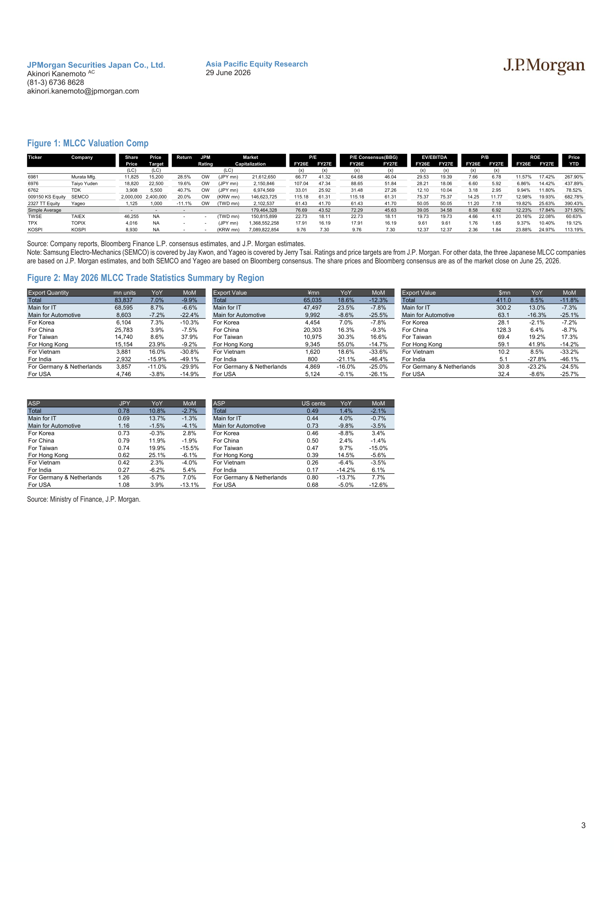

# JPMorgan｜MLCC eXchange：May 2026 Trade Data

**券商**：JPMorgan  
**分析師**：Akinori Kanemoto、Ikki Shibata  
**日期**：2026-06-29  
**主題**：MLCC eXchange：May 2026 trade data；May results in line with seasonal patterns；IT applications driven by Taiwan  
**評級**：Bullish on Murata / Taiyo Yuden  
<button type="button" onclick="fetch('https://ti-lei.github.io/foreign-reports/static/downloads/產業/20260629_JPM_MLCC-eXchange.md').then(r=>r.text()).then(t=>{let a=document.createElement('a');a.href='data:text/plain;charset=utf-8,'+encodeURIComponent(t);a.download='20260629_JPM_MLCC-eXchange.md';a.click()})">⬇ 下載 MD</button>

---

## 報告總結

日本 5 月 MLCC 出口量與出口金額均按季節性規律 MoM 下滑（-9.9% / -11.8%），主因 4 月強勁數據的反噬加上黃金週假期。然而，台灣出口異常強勁（量 +37.9% MoM、金額 +17.3% MoM），JPM 認為這是 AI 伺服器需求向前推進的明確訊號，代表台灣成為全球 MLCC 需求的新增驅動力。相比之下，汽車應用（歐美）在 3-4 月短暫復甦後顯著回落，3-4 月的強勁被認定為拉貨而非趨勢性回升。

JPM 維持 Murata（6981）、Taiyo Yuden（6976）為 MLCC 類股首選（均 OW），但認為 MLCC 股價 4-6 月已提前消化相當於 3-4 年的 AI 需求成長，短期進入箱型整理。7-9 月漲價可能性低；下一個轉折點預計在 10-12 月（AI 伺服器高端 MLCC 供需逐漸吃緊）。

---

## JPMorgan 完整投資邏輯鏈

| 論點層次 | Exhibit | 內容 |
|---|---|---|
| 台灣需求驗證 | Figure 2 | 台灣出口量 +37.9% MoM、金額 +19.2% YoY，是唯一 MoM 大幅增長的目的地，直接映射 AI 伺服器採購 |
| IT 應用趨勢穩健 | Figure 2 | IT 應用總量 -6.6% MoM 但 +8.7% YoY，季節性下滑中趨勢向上；ASP 僅 -0.7% MoM，結構穩定 |
| 汽車應用走弱 | Figure 2 | 汽車應用量 -22.4% MoM（超出季節性 8.4%），歐洲量 -30% MoM、美國量 -15% MoM；趨勢線或已向下 |
| 股價提前消化 AI | 封面論點 | 4-6 月 MLCC 股已將相當於 3-4 年 AI 需求成長消化入股價，短期缺乏進一步上行催化劑 |
| 7-9 月漲價機率低 | 封面論點 | 短期供需未達臨界點，漲價需等至 10-12 月；2027 供需趨緊將使漲價在供應鏈中顯現 |
| **結論** | 封面 | **短期箱型整理；維持 OW 但等待 4Q26 漲價催化劑；台灣/AI 是中期成長主軸** |

---

## 報告核心觀點

| 主題 | JPM 觀點 | 市場共識 | 是否 Contra-Consensus |
|---|---|---|---|
| 5 月季節性下滑 | 符合歷史規律，不是需求轉折 | 市場普遍解讀為需求放緩 | Contra（偏多） |
| 台灣出口強度 | AI 伺服器需求驅動，是新的中長期增量 | 未被充分關注 | 偏多 |
| 3Q26 漲價 | 機率低 | 部分市場預期 3Q 漲價 | Contra（偏保守）|
| 4Q26 漲價 / 2027 供需 | 預期漲價，供應鏈感受將在 4Q26 出現 | 不確定 | 略偏多 |
| 汽車應用 | 擔憂歐洲趨勢線可能向下，非單月回調 | 認為 4 月已觸底回升 | 偏保守（Contra）|

**首選股**：Murata Manufacturing（6981, OW, PT ¥15,200）> Taiyo Yuden（6976, OW, PT ¥22,500）  
**偏好原因**：Murata 生產技術更先進、質量能力強、AI 相關 MLCC 產品路線圖領先；TDK（6762）和 SEMCO（009150）、Yageo（2327）亦 OW

---

## Figure 1 + 2｜MLCC 估值比較表 ＋ 5 月出口統計

### 解讀摘要

估值比較表（Figure 1）顯示 MLCC 類股的現況估值：Murata FY26E P/E 29.5x（FY27E 19.4x），Taiyo Yuden FY26E P/E 28.2x（FY27E 18.1x），SEMCO FY26E EV/EBITDA 75.4x（韓元計價，量體最大市值 146,623,725 百萬韓元）。年初迄今回報均極高（Murata +268%、Taiyo Yuden +438%），印證「4-6 月已急劇消化未來成長」的判斷——從基期看下，若漲價晚於預期，短期修正風險不小。

出口統計表（Figure 2）的最大亮點是台灣：量 +37.9% MoM 逆季節性暴增，金額亦 +17.3% MoM；反觀中國 -7.5% MoM、韓國 -10.3% MoM，台灣完全獨立於其他 IT 市場的季節性調整。這一分化直接證明 AI 伺服器的 MLCC 採購節奏不受傳統旺季淡季影響——只要 AI 伺服器出貨持續，台灣 MLCC 需求就持續。

> **原文補充**：JPM 明確指出台灣出口（美元計）持續成長，是唯一在趨勢線上保持美元計持續增長的市場；韓國和中國（美元計）在 5 月呈現平台期。

### 表格

#### Figure 1：MLCC 類股估值比較（截至 2026-06-25）

| Ticker | 公司 | 股價（本幣）| JPM PT | 評等 | FY26E P/E | FY27E P/E | 年初迄今回報 |
|---|---|---|---|---|---|---|---|
| 6981 | Murata Manufacturing | JPY 11,825 | JPY 15,200 | OW | 29.5x | 19.4x | +268% |
| 6976 | Taiyo Yuden | JPY 18,820 | JPY 22,500 | OW | 28.2x | 18.1x | +438% |
| 6762 | TDK | JPY 3,908 | JPY 5,500 | OW | 12.1x | 10.0x | +79% |
| 009150 KS | SEMCO | KRW 2,000,000 | KRW 2,400,000 | OW | 75.4x | 75.4x | +683% |
| 2327 TT | Yageo | TWD 1,125 | TWD 1,000 | OW | 50.1x | 50.1x | +390% |

*Samsung Electro-Mechanics 由 Jay Kwon 覆蓋；Yageo 由 Jerry Tsai 覆蓋。Yageo PT 低於現價（隱含下行空間 -11.1%），但 OW 評等維持。*

#### Figure 2：2026 年 5 月 MLCC 出口統計（按目的地）

| 目的地 | 出口量（百萬個）| YoY | MoM | 出口金額（US\$mn）| YoY | MoM | ASP（US cents）| YoY | MoM |
|---|---|---|---|---|---|---|---|---|---|
| **總計** | **83,837** | **+7.0%** | **-9.9%** | **411.0** | **+8.5%** | **-11.8%** | **0.49** | **+1.4%** | **-2.1%** |
| IT 應用（主要市場）| 68,595 | +8.7% | -6.6% | 300.2 | +13.0% | -7.3% | 0.44 | +4.0% | -0.7% |
| 汽車應用（主要市場）| 8,603 | -7.2% | -22.4% | 63.1 | -16.3% | -25.1% | 0.73 | -9.8% | -3.5% |
| 台灣 | 14,740 | +8.6% | **+37.9%** | 69.4 | +19.2% | +17.3% | 0.47 | +9.7% | -15.0% |
| 中國 | 25,783 | +3.9% | -7.5% | 128.3 | +6.4% | -8.7% | 0.50 | +2.4% | -1.4% |
| 香港 | 15,154 | +23.9% | -9.2% | 59.1 | +41.9% | -14.2% | 0.39 | +14.5% | -5.6% |
| 韓國 | 6,104 | +7.3% | -10.3% | 28.1 | -2.1% | -7.2% | 0.46 | -8.8% | +3.4% |
| 越南 | 3,881 | +16.0% | -30.8% | 10.2 | +8.5% | -33.2% | 0.26 | -6.4% | -3.5% |
| 德國 + 荷蘭 | 3,857 | -11.0% | -29.9% | 30.8 | -23.2% | -24.5% | 0.80 | -13.7% | +7.7% |
| 美國 | 4,746 | -3.8% | -14.9% | 32.4 | -8.6% | -25.7% | 0.68 | -5.0% | -12.6% |
| 印度 | 2,932 | -15.9% | -49.1% | 5.1 | -27.8% | -46.1% | 0.17 | -14.2% | +6.1% |

> **洞察一**：台灣 5 月量 +37.9% MoM 是全表最大的正向異常值，且這是在其他主要 IT 市場均 MoM 下滑的背景下發生的。台灣 ASP 同時下降 15%（因混入較低單價品項的組合改變），但金額仍 +17.3% MoM——代表數量增幅已足夠覆蓋 ASP 下滑。若 6 月台灣出口繼續強勁，JPM 的「台灣是 AI 伺服器主軸」論點將獲進一步驗證，MLCC 高端產品需求的天花板比市場想像的更高。

> **洞察二**：德國 + 荷蘭（汽車 proxy）量 -29.9% MoM、金額 -24.5% MoM，均遠超過歷史季節性（-8.4% 量、-7.2% 金額）。JPM 直接指出「需要監控，因為趨勢線可能指向逐步下行而非單月回調」。若歐洲汽車持續走弱而台灣 AI 繼續增長，MLCC 整體結構性轉移（從汽車向 AI）將進一步加快，對高端 MLCC 的需求集中度上升，對 Murata 而言是正向組合改變。

---

## 相關個股清單

| 類別 | 公司 | Ticker | 評等 | 備註 |
|---|---|---|---|---|
| MLCC（日本）| Murata Manufacturing | 6981.T | OW | PT ¥15,200；AI MLCC 技術最領先；首選 |
| MLCC（日本）| Taiyo Yuden | 6976.T | OW | PT ¥22,500；第二選擇 |
| MLCC（日本）| TDK | 6762.T | OW | PT ¥5,500；估值最低（P/E 12x）|
| MLCC（韓國）| Samsung Electro-Mechanics | 009150.KS | OW | PT KRW 2,400,000；Jay Kwon 覆蓋 |
| MLCC（台灣）| Yageo | 2327.TW | OW | PT TWD 1,000（現價 TWD 1,125 隱含 -11%）；Jerry Tsai 覆蓋 |
