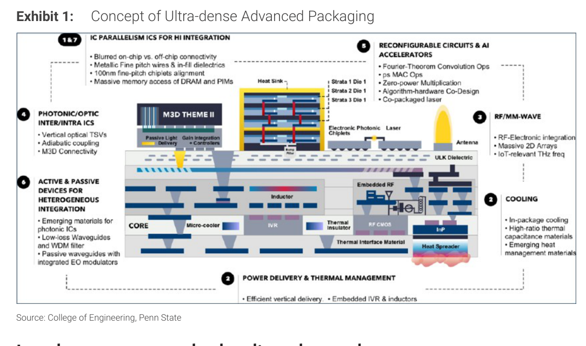
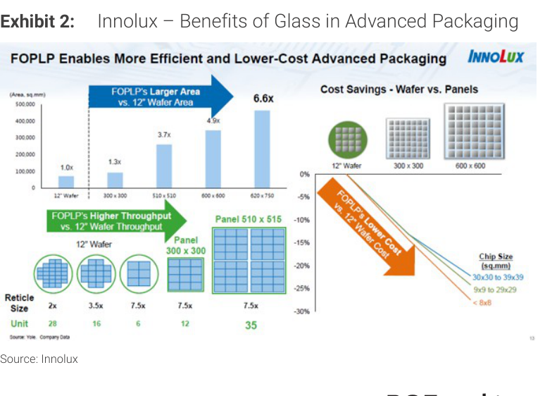
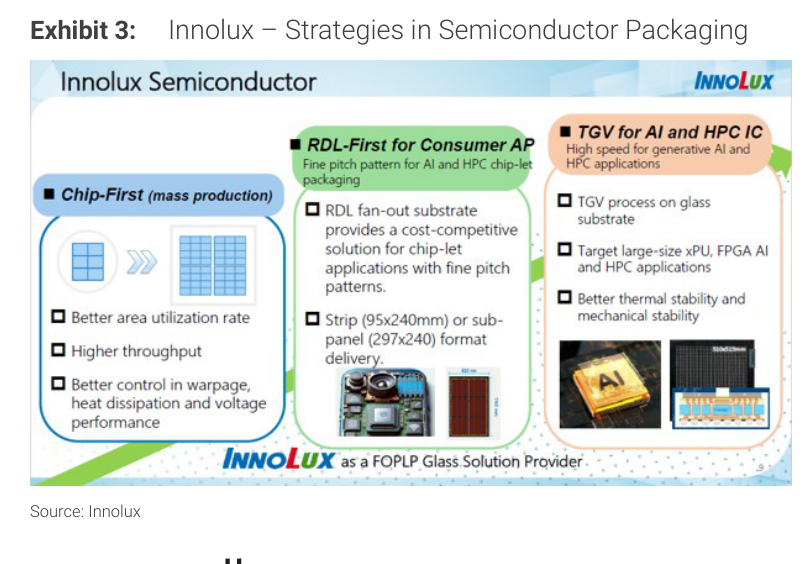
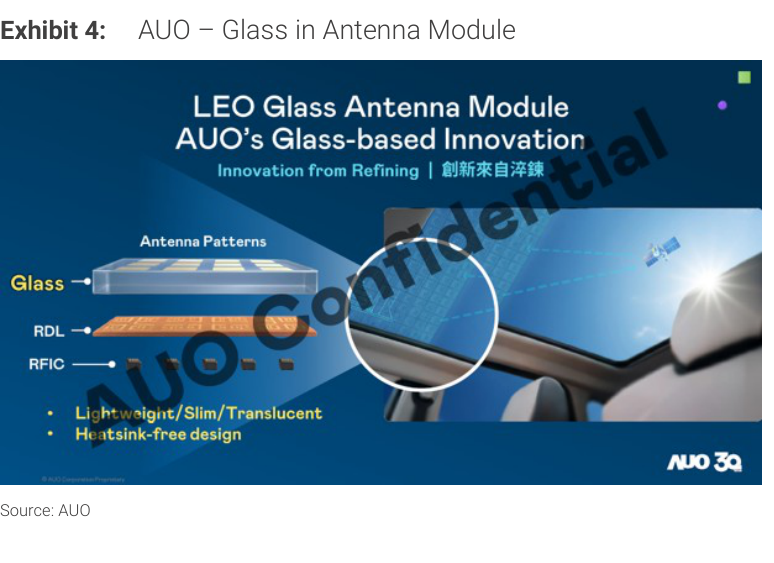
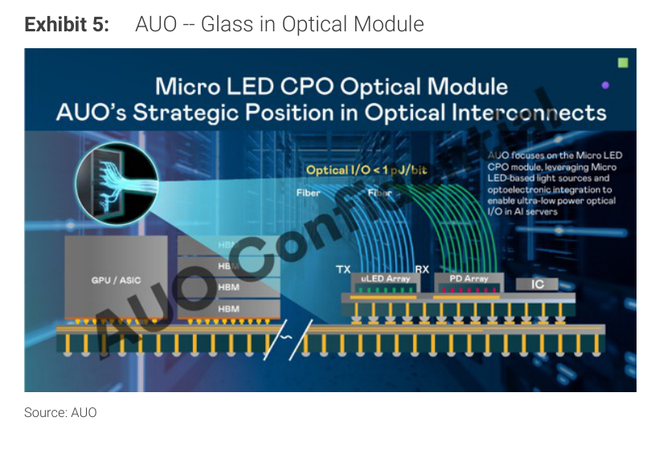

# Morgan Stanley｜Progress for Glass in Advanced Packaging among Panel Makers

**券商**：Morgan Stanley  
**分析師**：Derrick Yang、Shawn Kim、Sharon Shih、Vivi Huang  
**日期**：2026-06-29  
**主題**：Progress for Glass in Advanced Packaging among Panel Makers（Innolux / AUO / BOE Deep-Dive）  
**評級**：Industry View In-Line  
<button type="button" onclick="fetch('https://ti-lei.github.io/foreign-reports/static/downloads/產業/20260629_MS_Display.md').then(r=>r.text()).then(t=>{let a=document.createElement('a');a.href='data:text/plain;charset=utf-8,'+encodeURIComponent(t);a.download='20260629_MS_Display.md';a.click()})">⬇ 下載 MD</button>

---

## 報告總結

面板廠切入玻璃核心基板（Glass Core Substrate）先進封裝的機會確實存在，但有意義的營收貢獻最早在 2028 年，現在大部分仍是 POC 驗證階段。Innolux 進度最快（與台積電或聯電某晶圓廠合作、POC 完成），BOE 次之（有實驗線、尋求量產規劃），AUO 聚焦 LEO 天線與 Micro LED CPO、暫未切入 HPC 封裝。

MS 認為市場對面板股的本波熱情主要由玻璃封裝題材驅動，估值已提前反映 2028 的期望——Innolux 目前 2.1x 2026E P/B 已遠超歷史峰值 1.1x，而 BOE 的 2.1x 仍低於歷史峰值 2.7x。因此 MS 偏好排序為 BOE（OW）> Innolux（EW）> AUO（EW）。

---

## Morgan Stanley 完整投資邏輯鏈

| 論點層次 | Exhibit | 內容 |
|---|---|---|
| 技術可行性 | Exhibit 1、2、3 | 玻璃基板提供尺寸優勢（FOPLP 6.6x 面積於 12" wafer）、更低信號損耗、更小熱膨脹係數不匹配——技術優勢已被業界認可 |
| 進度差異 | Exhibit 3 | Innolux POC 完成，做 TGV 後送 Ibiden 做 ABF build-up；BOE 有實驗線、2028 目標量產；AUO 聚焦 LEO/CPO（非 HPC） |
| 營收時間線 | 封面論點 | 規模化最早 2028；核心面板（AUO/Innolux 40-50% 收入、BOE 70-80%）仍主導近期基本面 |
| 估值對比 | Exhibits 9、13、17（跳過）| Innolux 2.1x 2026E P/B >> 歷史峰值 1.1x；BOE 2.1x < 峰值 2.7x；AUO 1.4x 最低 |
| 偏好排序 | 封面論點 | BOE 風險報酬最佳（折讓於峰值）> Innolux（POC 最完整但估值最貴）> AUO（能見度最低） |
| **結論** | 封面 | **題材 2028 才有量，但估值已跑先；BOE 是現階段最具風險報酬吸引力的選擇** |

> **報告最大邏輯缺口**：MS 對 Innolux 的 2028 NT\$20bn 玻璃封裝收入估計佔比僅 6%，但 Innolux 股價已反映 2.1x 2028E P/B（隱含高估值）。如果玻璃封裝 2028 佔利潤 15-20%，究竟能撐起多少估值溢價仍不清晰——MS 自己也承認 2.1x 2028E P/B 並不便宜。

---

## 報告核心觀點

| 主題 | MS 觀點 | 市場共識 | 是否 Contra-Consensus |
|---|---|---|---|
| 玻璃基板量產時間 | 最早 2028，2026/27 貢獻幾乎為零 | 市場熱情似乎定價 2026/27 有量 | Contra（偏保守，看法比市場謹慎）|
| Innolux 估值 | EW；2.1x P/B 已在歷史峰值遠以上 | 市場追高買入 | Contra（偏保守）|
| BOE vs. Innolux | 偏好 BOE（估值折讓峰值） | 多數人偏好 Innolux（技術進度快） | 偏 Contra |
| AUO 玻璃封裝 | 能見度最低，LEO/CPO 路線非主流 | 投資人部分也買入 AUO 題材 | 偏保守 |

**偏好排序**：BOE（OW）> Innolux（EW）> AUO（EW）  
**PT 大幅上調**：Innolux NT\$19.50→NT\$60；AUO NT\$14→NT\$27；BOE Rmb5.20→Rmb9.30

---

## Exhibit 1｜Ultra-dense Advanced Packaging 概念圖

### 解讀摘要

這張由 Penn State 提供的概念圖說明下一世代 Ultra-dense Advanced Packaging 的七大技術主題，包括光子/光學 ICs（垂直光學 TSV、M3D 整合）、功率傳輸與散熱管理、Photonic Chiplets 與 AI 加速器協同設計等。玻璃作為核心基板材料的吸引力來自它同時具備：低信號損耗、與晶片材料接近的 CTE（減少翹曲）、高機械強度。這個圖是報告「為何玻璃」的底層邏輯，是面板廠切入半導體供應鏈的技術依據。

---

## Exhibit 2｜Innolux – FOPLP 的成本與面積優勢

### 解讀摘要

Innolux 的 FOPLP（Fan-Out Panel-Level Packaging）對比 12" 晶圓，面板尺寸 510×515mm 的面積是 12" 晶圓的 4.9x，620×750mm 更達 6.6x，而單位產能（Unit per reticle）也從 12" 的 6 個提升至 35 個。右側成本比較顯示，對小型晶片（<8×8mm），面板封裝成本可低於晶圓 25-30%；晶片越小，成本優勢越顯著。這是 Innolux 向客戶推銷 FOPLP 的核心經濟論點：面積越大、產能越高、成本越低。

> **洞察一**：成本優勢 25-30% 對小晶片成立，但對 HPC AI 加速器（大尺寸 xPU/FPGA）的成本影響需另外評估。大晶片的良率影響可能抵消面積優勢——這是 TGV 精度挑戰與良率管理的關鍵懸念。

### 表格

| 面板尺寸 | 面積（sq.mm）約估 | vs 12" Wafer | 單位產能 |
|---|---|---|---|
| 12" Wafer | ~72,966 | 1.0x | 6（參考基準）|
| 300×300 | ~90,000 | 1.3x | 16 |
| 510×510 | ~260,100 | 3.7x | 6 |
| 600×600 | ~360,000 | 4.9x | 12 |
| 620×750 | ~465,000 | 6.6x | 35（Panel 510×515 尺寸）|

---

## Exhibit 3｜Innolux – 半導體封裝策略

### 解讀摘要

Innolux 同時推進三條技術路線：Chip-First（量產導向，RDL fan-out，消費型 AP 應用，尺寸 95×240mm 或 sub-panel 297×240mm）、RDL-First（AI/HPC chip-let 細節距應用）、以及 TGV（Through Glass Via，AI/HPC 高速 IC 應用，目標 xPU/FPGA 大晶片）。TGV 路線是本報告的核心關注點，其技術特點是以 laser-induced etching 在玻璃上鑽孔再銅電鍍，Innolux 的挑戰在於這個流程與傳統面板製造截然不同，需要採購新設備（初期 NT\$20-30bn capex）。

> **洞察二**：Innolux 在 TGV 路線上的工作流程是：做完 TGV → 送 Ibiden 做 ABF build-up 層 → 送晶圓廠做先進封裝。這意味著 Innolux 的角色是玻璃基板供應商而非封裝整合商，對應的收入模型是「賣玻璃核心基板」，而非分享後端封裝的全部增值。

---

## Exhibit 4｜AUO – LEO 玻璃天線模組

### 解讀摘要

AUO 在玻璃基板的應用聚焦 LEO（低軌衛星）天線，以玻璃作為載具承載天線圖案與 RFIC，整合至車輛天窗（Sunroof）。優點是輕薄半透明、無散熱器設計。這個方向與 HPC 先進封裝完全不同，目標是衛星車載通訊市場而非 AI 伺服器。MS 認為此路線的市場接受度和量產時間仍不明確，因此 2028 前未納入 AUO 營收預測。

---

## Exhibit 5｜AUO – Micro LED CPO 光學模組

### 解讀摘要

AUO 與 Ennostar、Tyntek 合作推廣 Micro LED CPO 架構，聚焦 AI 伺服器短距離傳輸（GPU/ASIC 到 HBM），以 uLED Array + PD Array 取代傳統光源，目標 <1 pJ/bit 超低功耗光學 I/O。玻璃用作 uLED 基板，降低成本並支持精密整合。問題是這個架構能否被主流採用——目前 CPO 市場由 VCSEL/DFB 雷射主導，Micro LED CPO 能否取得規模化仍是開放問題。

> **洞察三**：AUO 的 Micro LED CPO 戰略如果成功，對應的是光通訊-CPO 而非傳統面板供應鏈，估值邏輯會完全不同。但這是極長期的押注（2028+ 且市場接受度不確定），目前股價反映的是面板基本面，不是這個選擇權。

---

## 相關個股清單

| 類別 | 公司 | Ticker | 評等 | 備註 |
|---|---|---|---|---|
| 面板/玻璃封裝 | Innolux | 3481.TW | EW | PT NT\$60（↑ NT\$19.5）；TGV POC 完成，2028 量產；估值過高 |
| 面板/玻璃封裝 | AU Optronics (AUO) | 2409.TW | EW | PT NT\$27（↑ NT\$14）；LEO/Micro LED CPO，HPC 能見度低 |
| 面板/玻璃封裝 | BOE Technology | 000725.SZ | OW | PT Rmb9.3（↑ Rmb5.2）；整合 TGV+build-up 雄心，2028 量產；估值最具吸引力 |
| ABF 基板 | Ibiden | — | — | Innolux TGV 後的 ABF build-up 合作夥伴，非本報告覆蓋股 |
