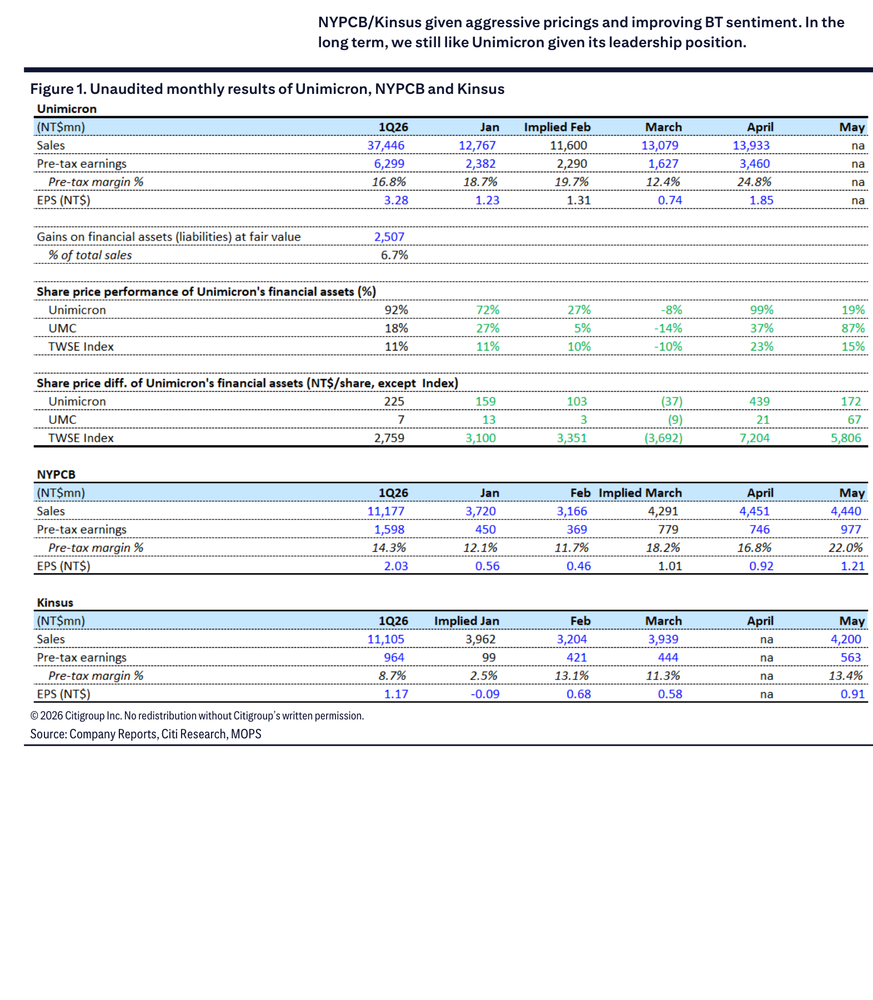
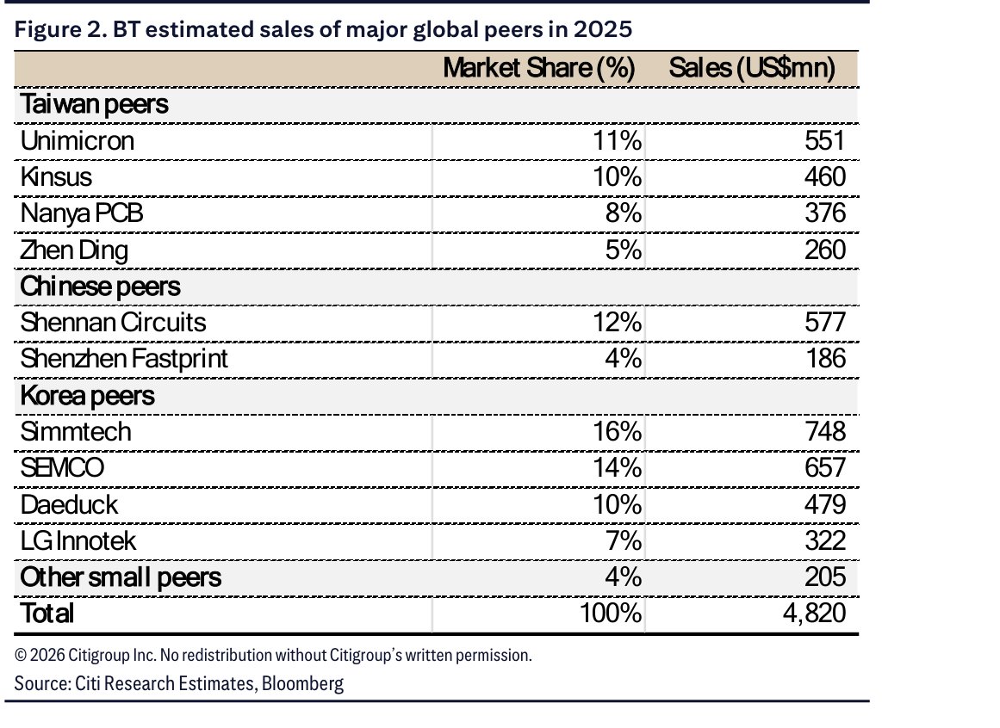

# Citi｜ABF/BT Sector：GM/Pricing Upcycle Underway

**券商**：Citi  
**分析師**：Jack Chen、Laura Chen、Nicholas Lai  
**日期**：2026-06-30  
**主題**：Taiwan PCB & Laminates — ABF/BT Sector: GM/pricing Upcycle Underway；Buy with Higher TPs  
**評級**：Sector Favorable（3 名全部 Buy）  
<button type="button" onclick="fetch('https://ti-lei.github.io/foreign-reports/static/downloads/產業/20260630_Citi_ABF-BT.md').then(r=>r.text()).then(t=>{let a=document.createElement('a');a.href='data:text/plain;charset=utf-8,'+encodeURIComponent(t);a.download='20260630_Citi_ABF-BT.md';a.click()})">⬇ 下載 MD</button>

---

## 報告總結

ABF 與 BT 基板同步進入漲價週期，驅動力分別是：（1）ABF：AI GPU/ASIC/CPU 需求強勁 + T glass 持續短缺 + 中國產能 UTR 回升（美系客戶被迫採用中國產能），Citi 預期 3Q26 ABF 再漲 15-20% QoQ、4Q26 再漲 10-15%；（2）BT：Unimicron 等廠商主動切換至 ABF（獲利更佳），BT 供需改善，GM 可望超越歷史水準達 20%+。Citi 大幅上調三家台灣基板廠 2027E 獲利（+37-100%），重申 Buy，PT 全線上調。短期偏好 NYPCB/Kinsus（定價更積極），長期仍看好 Unimicron（ABF 龍頭地位）。

---

## Citi 完整投資邏輯鏈

| 論點層次 | Exhibit | 內容 |
|---|---|---|
| ABF 供需確認 | Figure 1 | 中國 ABF 產能 UTR 持續回升（美系客戶被迫採用），加上國內 AI 需求競爭同一產能，ABF 供給無鬆弛跡象 |
| T glass 瓶頸 | 封面論點 | Nittobo 為主要供應商，新廠商（台玻）品質仍不足；T glass 短缺預計延續至 2027，客戶將以溢價支付 |
| 漲價路徑 | 封面論點 | 3Q26E ABF +15-20% QoQ（高需求旺季），4Q26E +10-15%；NYPCB 全面走現貨市場（不做長約），獲利彈性最大 |
| BT 供需改善 | Figure 2 | 同業逐步退出 BT（轉 ABF）；Unimicron 目標年底削減 ≥15% BT 產能，中期削減 40-50%；Kinsus 承接出走訂單，UTR 逐季上升 |
| 月度利潤改善 | Figure 1 | NYPCB May pre-tax margin 22.0%（vs. 1Q26 14.3%）；Kinsus May 13.4%（vs. 8.7%）；Unimicron April 24.8% |
| **結論** | 封面 | **ABF/BT 雙漲格局確立，PT 全線上調至 28-30x 2027E EPS；短期 NYPCB/Kinsus，長期 Unimicron** |

---

## 報告核心觀點

| 主題 | Citi 觀點 | 市場共識 | 是否 Contra-Consensus |
|---|---|---|---|
| ABF 漲價持續性 | 2027 全年持續，T glass 瓶頸不解除 | 擔憂 2H26 需求走弱 | 偏多（Contra） |
| BT 估值回升 | BT GM 可超越歷史峰值（20%+），類股重估 | 傳統看 BT 為低毛利 commodity | 顯著 Contra（偏多）|
| Kinsus Vera CPU 份額 | >50% 市佔，upside 取決於擴產節奏 | 市場尚未完全定價 | 偏多 |
| Unimicron 短期 vs 長期 | 短期現貨曝險低（長協多）→ 落後；長期 HDI + T glass 供給改善是催化劑 | 短期觀望 | 一致（短中期不如 NYPCB/Kinsus，長期最強）|

**偏好排序**：短期 NYPCB（8046）≥ Kinsus（3189）> Unimicron（3037）；長期反轉  
**PT 上調**：NYPCB NT\$1,100→NT\$1,550（30x 2027E EPS NT\$51.89）；Kinsus NT\$400→NT\$1,100（28x 2027E EPS NT\$38.61）；Unimicron NT\$1,080→NT\$1,500（30x 2027E EPS NT\$50.49）

---

## Figure 1｜Unimicron / NYPCB / Kinsus 月度未審計業績

### 解讀摘要

三家台灣基板廠的月度稅前利潤率呈現明顯上行趨勢，且 NYPCB 和 Kinsus 的改善幅度更大——這與 Citi「短期偏好 NYPCB/Kinsus 因漲價策略更積極」的論點高度一致。NYPCB 5 月稅前利潤率 22.0%，比 1Q26 平均 14.3% 高出 7.7ppt；Kinsus 5 月 13.4% 比 1Q26 的 8.7% 高出 4.7ppt。Unimicron 4 月達 24.8%（為四月單月最高），但 5 月數據尚未公布。

> **原文補充**：NYPCB 採積極現貨策略、不做長期合約，因此在漲價週期中邊際受益最大。Kinsus 則因承接 Unimicron 轉出的 BT 訂單，UTR 逐季提升。

### 表格

| 公司 | 1Q26 銷售（NT\$mn）| 1Q26 稅前 margin | Jan | Feb | March | April | May margin |
|---|---|---|---|---|---|---|---|
| Unimicron | 37,446 | 16.8% | 18.7% | 19.7% | 12.4% | 24.8% | na |
| NYPCB | 11,177 | 14.3% | 12.1% | 11.7% | 18.2% | 16.8% | **22.0%** |
| Kinsus | 11,105 | 8.7% | 2.5% | 13.1% | 11.3% | na | **13.4%** |

> **洞察一**：NYPCB 5 月稅前 margin 22.0% 是本表最高值，且在 NYPCB 面積最小（1Q26 銷售僅 Unimicron 的 30%）的前提下達到此水準，顯示其每單位產品的定價能力遠強於 Unimicron。若 Citi 預估的 3Q26 ABF +15-20% QoQ 漲幅實現，NYPCB 的利潤槓桿將比 Unimicron 大得多。

---

## Figure 2｜2025 年全球主要 BT 基板廠市場份額

### 解讀摘要

全球 BT 基板市場 2025 年估計規模 US\$4,820mn。韓國廠商（Simmtech 16%、SEMCO 14%、Daeduck 10%、LG Innotek 7%）合計市佔 47%，是最大陣營；台灣廠商（Unimicron 11%、Kinsus 10%、NYPCB 8%、Zhen Ding 5%）合計 34%。Unimicron 計劃削減 40-50% BT 產能（中期），對應 US\$529mn+ 的供給退出，轉由其他台灣廠商（尤其 Kinsus）承接，同時 BT 漲價空間也將擴大。

### 表格

| 廠商 | 市佔 | 銷售（US\$mn）|
|---|---|---|
| **台灣** | **34%** | **1,637** |
| 　Unimicron | 11% | 551 |
| 　Kinsus | 10% | 460 |
| 　Nanya PCB（8046）| 8% | 376 |
| 　Zhen Ding | 5% | 260 |
| **中國** | **16%** | **763** |
| 　Shennan Circuits | 12% | 577 |
| 　Shenzhen Fastprint | 4% | 186 |
| **韓國** | **47%** | **2,206** |
| 　Simmtech | 16% | 748 |
| 　SEMCO | 14% | 657 |
| 　Daeduck | 10% | 479 |
| 　LG Innotek | 7% | 322 |
| 其他 | 4% | 205 |
| **合計** | **100%** | **4,820** |

> **洞察二**：Unimicron 削減 40-50% BT（中期）= 釋放約 US\$220-275mn 供給退出市場（11% × US\$4,820mn × 40-50%），但 Unimicron 聲稱不會完全退出 BT——Apple 和中國客戶的 BT 需求仍將由其蘇州廠供應。實際退出量可能集中在台灣廠的 WBCSP 類產品，代表 Kinsus 是這波最直接的 BT 訂單受益者。

---

## 相關個股清單

| 類別 | 公司 | Ticker | 評等 | 備註 |
|---|---|---|---|---|
| ABF/BT 基板 | Nan Ya PCB（南電）| 8046.TW | Buy | PT NT\$1,550（↑ NT\$1,100）；30x 2027E EPS NT\$51.89；積極現貨策略；30-day CW |
| ABF/BT 基板 | Kinsus（景碩）| 3189.TW | Buy | PT NT\$1,100（↑ NT\$400）；28x 2027E EPS NT\$38.61；Vera CPU >50% 份額；30-day CW |
| ABF/BT 基板 | Unimicron（欣興）| 3037.TW | Buy | PT NT\$1,500（↑ NT\$1,080）；30x 2027E EPS NT\$50.49；長期 HDI + T glass 催化劑 |
| T glass 供應商 | Nittobo | — | — | ABF T glass 主導供應商，新廠商品質落差決定 T glass 短缺能否緩解 |
