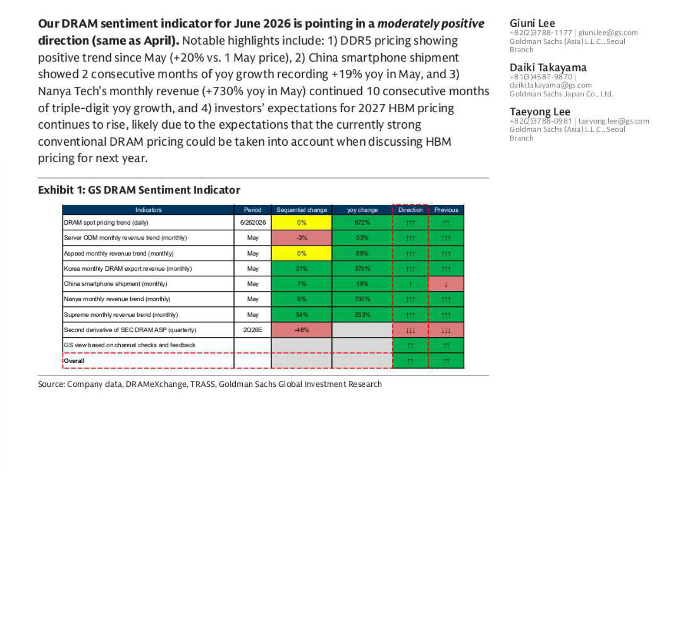
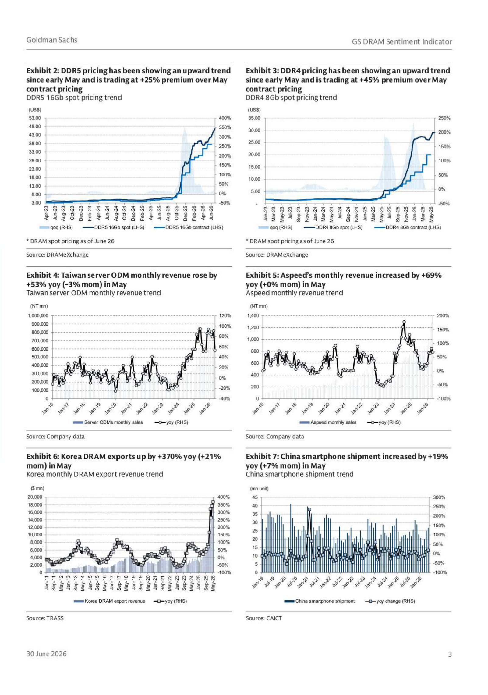
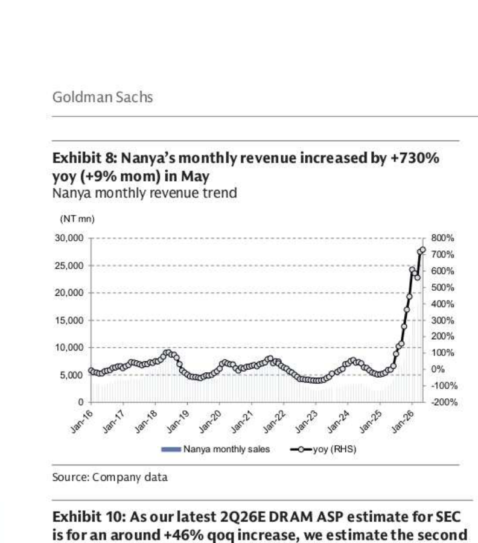
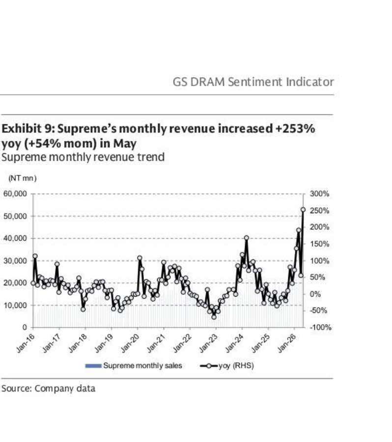
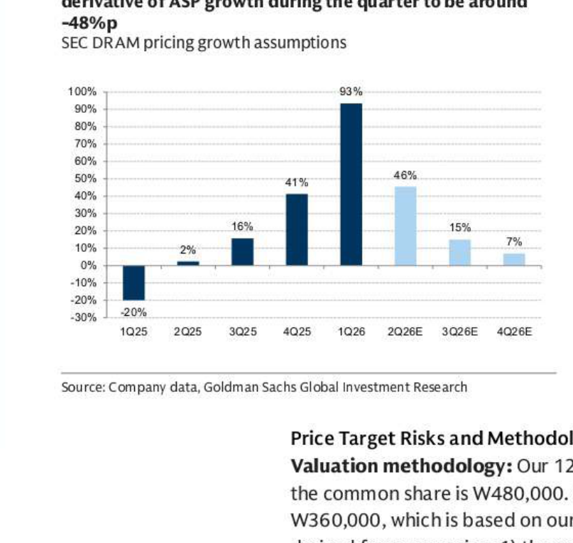

# Goldman Sachs｜GS DRAM Sentiment Indicator：June 2026

**券商**：Goldman Sachs  
**分析師**：Giuni Lee、Daiki Takayama、Taeyong Lee  
**日期**：2026-06-30  
**主題**：DRAM Sentiment Indicator — June 2026：Positive DDR5 pricing trends, while more constructive on 2027 HBM pricing  
**評級**：Moderately Positive（維持，同 April 2026）  
<button type="button" onclick="fetch('https://ti-lei.github.io/foreign-reports/static/downloads/產業/20260630_GS_DRAM-Sentiment-Indicator.md').then(r=>r.text()).then(t=>{let a=document.createElement('a');a.href='data:text/plain;charset=utf-8,'+encodeURIComponent(t);a.download='20260630_GS_DRAM-Sentiment-Indicator.md';a.click()})">⬇ 下載 MD</button>

---

## 報告總結

本月 DRAM 情緒指標維持四月的「溫和正向」評級。關鍵亮點有四：DDR5 現貨相對 5 月 1 日漲 20%（較合約溢價 25%）；Nanya 五月營收 +730% YoY 達連續十個月三位數成長；中國智慧手機出貨連兩個月 YoY 正增長（+19%）；以及 GS 大幅上修 SEC 2027 年 HBM 定價增速預測至 +44% YoY（原 +14%）。

SEC 2Q26E DRAM ASP 估計 QoQ +46%（較 1Q26 的 +93% 明顯放緩），但 GS 認為這是健康去加速，而非週期轉折——現貨溢價未收斂、出口數據維持強勁，投資人對 2027 年 HBM 定價的信心正在重評。

---

## Goldman Sachs 完整投資邏輯鏈

| 論點層次 | Exhibit | 內容 |
|---|---|---|
| 現貨訊號超前 | Exhibit 1、3 | DDR5 現貨 vs. 5/1 +20%，溢價合約 25%；DDR4 +11%，溢價 45%——現貨往往領先合約 1-2 季 |
| 供給端確認 | Exhibit 1、6 | Korea DRAM exports +370% YoY / +21% MoM（May），出口大增代表客戶庫存補貨需求實質存在 |
| 需求端多點開花 | Exhibit 1、4、5 | Taiwan server ODM -3% MoM 但 +53% YoY；Aspeed 0% MoM +69% YoY；中國智慧手機 +7% MoM +19% YoY |
| 利基供應商佐證 | Exhibit 8、9 | Nanya +730% YoY（連 10 個月三位數）、Supreme +253% YoY——表明即使非三星海力士也受惠 |
| ASP 走勢解讀 | Exhibit 10 | 2Q26E +46% QoQ（vs. 1Q26 +93%）；GS 認為去加速為健康正常化，非轉折訊號 |
| HBM 定價重估 | 封面論點 | GS 上修 SEC 2027E HBM 定價增速至 +44% YoY（from +14%），因市場發現強勁 conventional DRAM 定價可能被用來討論 HBM 定價 |
| **結論** | 封面 | **整體情緒維持 moderately positive；DDR5 現貨溢價未收斂+HBM 定價上修，為 DRAM 週期提供雙重正向催化** |

> **報告最大邏輯缺口**：Exhibit 10 僅為 SEC 的 DRAM ASP，沒有分拆 HBM vs. conventional DRAM 的 ASP 走勢；若 conventional DRAM 拉高對 HBM 定價的錨定假設站不住腳，2027 HBM +44% 估測的可信度則需重評。

---

## 報告核心觀點

| 主題 | GS 觀點 | 市場共識 | 是否 Contra-Consensus |
|---|---|---|---|
| DDR5 現貨溢價 | 現貨較合約溢價 25%，合約漲價空間仍大 | 擔憂下半年合約補漲有限 | 偏多 |
| 2027 HBM 定價（SEC） | +44% YoY（大幅升至 from +14%） | +14-20% | 顯著 Contra-Consensus（偏多） |
| DRAM 週期方向 | 升級週期仍在，多項供需訊號同步正向 | 擔憂 2H26 庫存積壓與定價頂部 | 偏多 |
| China smartphone | 連兩個月 YoY 正增長，消費需求回暖 | 疲弱/審慎 | 小幅偏多 |
| SEC 2Q26E ASP | QoQ +46%（健康去加速） | 季度方向正確，幅度存疑 | 略偏多 |

**偏好排序**：Samsung Electronics（HBM 最大受益，2027 定價上修最多）＞ SK Hynix（HBM 供給龍頭）  
**零件/個股偏好**：Samsung Electronics Buy（W323,000）、Samsung Electronics Pref Buy（W210,500）

---

## Exhibit 1｜GS DRAM Sentiment Indicator

### 解讀摘要

9 個追蹤指標中，8 個維持正向（↑↑↑ 或 ↑↑），唯一紅燈是「SEC DRAM ASP 二階導數」（-48%p）——這代表價格增速正在放緩，但 QoQ 價格仍在上漲（+46%），屬健康去加速而非轉跌訊號。China smartphone 的 Direction 從前期的 ↓ 升至 ↑，是本月最大方向性轉變，代表消費性 DRAM 需求也開始回暖。整體 Overall 維持 ↑↑（moderately positive），與四月持平，但個別指標的增速加快（Korea exports 從 ↑↑ 升至 ↑↑↑）。

### 表格

| 指標 | 期間 | 環比 | YoY | 方向 | 前期 |
|---|---|---|---|---|---|
| DRAM spot pricing trend（日頻） | 6/26/2026 | 0% | 672% | ↑↑↑ | ↑↑ |
| Server ODM monthly revenue（月頻） | May | -3% | 53% | ↑↑↑ | ↑↑↑ |
| Aspeed monthly revenue（月頻） | May | 0% | 69% | ↑↑↑ | ↑↑↑ |
| Korea DRAM export revenue（月頻） | May | +21% | 370% | ↑↑↑ | ↑↑↑ |
| China smartphone shipment（月頻） | May | +7% | 19% | ↑ | ↓ |
| Nanya monthly revenue（月頻） | May | +9% | 730% | ↑↑↑ | ↑↑↑ |
| Supreme monthly revenue（月頻） | May | +54% | 253% | ↑↑↑ | ↑↑↑ |
| SEC DRAM ASP 二階導數（季頻） | 2Q26E | -48%p | — | ↓↓↓ | ↓↓↓ |
| GS channel checks & feedback | — | — | — | ↑↑ | ↑↑ |
| **Overall** | — | — | — | **↑↑** | **↑↑** |

> **洞察一**：China smartphone direction 轉正（↓ → ↑）是本月最值得注意的邊際變化。若 5-6 月連兩個月 YoY 正增長延續至下半年旺季，conventional DRAM 需求端的補庫需求將與 AI 端的 HBM 需求形成疊加，壓縮現有定價頂部的不確定性。

---

## Exhibits 2-7｜DDR5/DDR4 現貨定價、Server ODM、Aspeed、Korea 出口、中國手機

### 解讀摘要

六張供需追蹤圖表顯示：DDR5 現貨價格自 5 月 1 日以來上漲 20%，較合約溢價 25%（Exhibit 2）；DDR4 現貨漲 11%，溢價合約 45%（Exhibit 3）。現貨溢價長期顯著高於合約，說明 DRAM 製造商仍有充足空間繼續調漲合約價。Taiwan server ODM 五月 MoM -3%（季節性），但 YoY +53% 仍強勁（Exhibit 4）；Aspeed 做為 BMC 晶片代理，五月 YoY +69% 印證 AI 伺服器出貨持續（Exhibit 5）。Korea DRAM exports +370% YoY / +21% MoM 是這批數據中最強的訊號，代表來自全球廠商的實際採購量顯著放大（Exhibit 6）。China smartphone +19% YoY（Exhibit 7）延續上月正增長，傳統 DRAM 需求端出現新的回暖點。

> **洞察二**：DDR4 現貨溢價（45%）顯著高於 DDR5（25%），反映 DDR4 供給更緊縮（三星/海力士持續切換產能至 DDR5/HBM），而 DDR4 下游客戶（預算型伺服器、消費電子）仍在積極補貨。這個反差對台灣 DRAM 模組廠（如 Nanya）有直接利多含義。

---

## Exhibit 8｜Nanya 月營收 +730% YoY / +9% MoM（May）

### 解讀摘要

Nanya 2026 年五月月營收達約 NT$27,000mn，連續第 10 個月三位數 YoY 成長（+730%），並較四月 MoM +9%。Nanya 作為台灣本土 DRAM 廠，主要聚焦 DDR4 等傳統規格，其收入高速成長直接驗證了傳統 DRAM 現貨供需正在快速收緊——這不只是 Samsung/Hynix 的 HBM 故事，連 Nanya 這種規模的廠商都同步受惠於需求回升與定價改善。

### 表格

| 月份 | 月營收（NT\$ mn，約估） | MoM | YoY |
|---|---|---|---|
| May 2026 | ~27,000 | +9% | +730% |

*以上月營收為圖表視覺估算

---

## Exhibit 9｜Supreme 月營收 +253% YoY / +54% MoM（May）

### 解讀摘要

Supreme 五月月營收達約 NT$50,000mn，YoY +253%，且 MoM 大幅跳升 +54%——MoM 成長率在本報告所有指標中最高。Supreme 是台灣獨立 DRAM 模組/分銷商，其月收入劇增代表下游客戶（企業 IT、ODM 等）在快速補倉，且採購意願超出季節性節奏。

### 表格

| 月份 | 月營收（NT\$ mn，約估） | MoM | YoY |
|---|---|---|---|
| May 2026 | ~50,000 | +54% | +253% |

*以上月營收為圖表視覺估算

> **洞察三（配合 Exhibit 8）**：Nanya（+9% MoM）vs. Supreme（+54% MoM）的差距，反映出下游分銷端的補庫需求比製造端的生產節奏更積極，即客戶現在是在抗跌前搶貨而非計劃性採購——這是需求側的積極訊號，但也帶有拉貨過頭後回落的風險。

---

## Exhibit 10｜SEC DRAM ASP 定價增速假設（季頻）

### 解讀摘要

GS 最新估計 SEC 2Q26E DRAM ASP QoQ +46%，相較 1Q26 的 +93% 大幅放緩，二階導數為 -48%p。這個放緩是預期中的正常化，而非需求轉弱訊號——1Q26 的 +93% 本身已是異常高基期，若 2Q26 仍能維持 +46%，代表定價仍在強勁上漲通道中。3Q26E/4Q26E 進一步放緩至 +15%/+7%，GS 基準情境是價格仍在漲但幅度縮小（不是價格下跌）。

### 表格

| 季度 | DRAM ASP QoQ 增速 |
|---|---|
| 1Q25 | -20% |
| 2Q25 | +2% |
| 3Q25 | +16% |
| 4Q25 | +41% |
| 1Q26 | +93% |
| 2Q26E | +46% |
| 3Q26E | +15% |
| 4Q26E | +7% |

> **洞察四**：從累積效應來看，SEC DRAM ASP 自 1Q25 谷底到 2Q26E，QoQ 增速已連五個季度為正，累積漲幅可觀（粗估：0.8 × 1.02 × 1.16 × 1.41 × 1.93 × 1.46 ≈ 3.7x ASP 回升）。即使 3Q26E/4Q26E 個位數增速，全年 ASP 基準大幅高於 2024 年，對 SEC DRAM 毛利率的支撐仍持續。

> **值得驗證**：GS 2027E HBM 定價增速上修至 +44% YoY 的核心假設是「強勁 conventional DRAM 定價將被用來討論 HBM 定價」，這是一個議題而非合約談判基礎。若 NVIDIA/雲端廠商認為 HBM 定價應獨立於 conventional DRAM，此邏輯鏈失效，+44% 估測偏樂觀。

---

## 相關個股清單

| 類別 | 公司 | Ticker | 評等 | 備註 |
|---|---|---|---|---|
| Korea DRAM | Samsung Electronics | 005930.KS | Buy | W323,000；HBM 2027 定價上修最大受益方 |
| Korea DRAM | Samsung Electronics Pref | 005935.KS | Buy | W210,500 |
| Korea DRAM | SK Hynix | — | — | HBM 供給龍頭，未在此報告明確評級 |
| Taiwan DRAM | Nanya Technology | 2408.TW | — | 營收驗證傳統 DRAM 回暖，非本報告覆蓋股 |
| Taiwan 分銷 | Supreme Electronics | — | — | 月收入 +253% YoY 驗證補庫需求 |
