# Nomura｜Asia AI Semi & Server Anchor Report：Is the Cycle Over?

**券商**：Nomura  
**分析師**：Aaron Jeng、Anne Lee、Donnie Teng、Vivian Yang、Eric Chen、Carol Hu  
**日期**：2026-06-30  
**主題**：Asia AI Semi & Server Anchor Report — Is the cycle over?  
**評級**：結構性偏多（Buy；9 檔 TP 上調）  
<button type="button" onclick="fetch('https://ti-lei.github.io/foreign-reports/static/downloads/產業/20260701_Nomura_Asia-AI-Semi-Server.md').then(r=>r.text()).then(t=>{let a=document.createElement('a');a.href='data:text/plain;charset=utf-8,'+encodeURIComponent(t);a.download='20260701_Nomura_Asia-AI-Semi-Server.md';a.click()})">⬇ 下載 MD</button>

---

## 報告總結

SOX 指數自 Nomura 三月更新報告以來已漲 85%（自 2025 年五月 AI 主題重估以來累漲 211%），近期股價回落，市場問：「週期頂部到了嗎？」Nomura 的答案是：還沒。回落是健康的獲利了結（需消化元件供需錯配、hyperscaler 2027F FCF 不足、2028F 後尖端技術執行風險、殖利率上行等風險），但 AI 基礎設施需求尚未見頂——Nomura 自有的全球新資料中心建設追蹤器（項目數 240→280、GW 級項目 40+→約 50）顯示需求持續上修，且 2025 年底才啟動的 Greenfield 產能（通常需 2 年建設）代表供給端 2027F 前仍偏緊。

本報告最大的 contrarian 觀點是：**WoS（Wafer-on-Substrate）及其他小型元件，而非 CoW（Chip-on-Wafer，TSMC 掌控）才是 2H26F–2027F 最大的供應瓶頸**——這對長期週期永續性是正面訊號，但將驅動短期股價波動。因為 CoW 不再是決定性因素，2027F CoWoS 分配將重組：「當大象（nVidia 與 Google）打架，草（其他 xPU/ASIC）會被踩爛」——nVidia 份額由 60% 降至約 55%、Google TPU 由 23% 升至 26%、AMD/AWS 被進一步擠壓，而 TPU 成長的大部分由 MediaTek 承接（TPU 份額由約 15% 倍增至 30%+）。Nomura 大幅上修伺服器市場預測（AI 伺服器收入 +78%/+76% y-y，總伺服器 +74%/+65%），並上調 9 家公司目標價；同時點名 Intel EMIB-T 為 TSMC 先進封裝最大威脅，而 TSMC 以 SoIC（Feynman GPU-on-GPU 堆疊）與 CoPoS 反制，並帶動 SiC carrier 需求啟動。

---

## Nomura 完整投資邏輯鏈

| 論點層次 | Fig. | 內容 |
|---|---|---|
| 需求真實性佐證 | Fig. 2, 5-6, 7-17 | DC 建設追蹤 280 項目/約 50 GW 級；ChatGPT 流量份額 75%→52%、Gemini 7%→27% 驗證需求非泡沫 |
| 需求信號明確 | Fig. 3-4 | 自有 DC 建設追蹤上修：2027F 增量產能 32GW（from 28GW），隱含每年 4-6mn AI 晶片需求 |
| 供給上限受限 | Fig. 20 | TSMC 前端產能下一次大跳躍要到 2028F（國內 fab module 淨增 5 座）；greenfield 需 2 年 |
| 瓶頸由 CoW 轉向 WoS | Fig. 18-19 | TSMC CoW 產能 2027F 目標 2,000kpcs，但 WoS/小元件卡住，實際 output 僅模型化 1,800kpcs |
| 分配重組（大象打架） | Fig. 24-29 | 2027F nVidia 份額 60%→55%、Google TPU 23%→26%、AMD/AWS 被擠壓；TPU 成長多由 MediaTek 承接 |
| 元件供需錯配 | Fig. 69 | 模組/GPU 供給缺口 2027F 擴大至 23%（from 16%）；PCB/CCL、基板、電容、PMIC、光元件全線短缺 |
| 伺服器市場大幅上修 | Fig. 68-69 | AI 伺服器收入 2026F/27F +78%/+76%；NVL72 rack 現實出貨 2026F 54.5k、2027F 62k |
| CPU 是 OSAT 自有 CoW 切入點 | Fig. 36-37, 57 | CPU 無昂貴 HBM、良率風險低，成為 OSAT CoWoS-like 製程起點；CPU TAM 各家喊到 USD100-200bn |
| SoIC/CoPoS 對抗 EMIB-T | Fig. 44, 50-52 | Intel EMIB-T（Google v9 TPU × MediaTek）是最大威脅；TSMC 以 SoIC（雙倍/年）+ SiC carrier 反制 |
| **結論** | 封面 | **週期未頂；仍逢弱買入；9 家 TP 上調；WoS/小元件短缺是風險但也是週期持久性信號** |

> **報告最大邏輯缺口**：2029F 所需 CoWoS 2,500-3,500kpcs（Fig. 21-22）與 2027F 實際模型 1,800kpcs 之間，需要 2028F 起 CoPoS/14x reticle/GPU-on-GPU SoIC 等一連串尚未量產的尖端技術如期落地——Nomura 自己列出 2028F 後「must happen」清單（EMIB-T、CoPoS、GPU-on-GPU SoIC、MCL、CPO、336G/448G SerDes、M9Q/M10Q PCB、PTFE），任一延遲都會壓縮長期斜率。

---

## 報告核心觀點

| 主題 | Nomura 觀點 | 市場共識 | 是否 Contra-Consensus |
|---|---|---|---|
| AI 週期位置 | 未頂，回調是健康獲利了結 | 部分擔憂週期即將見頂 | Contra（偏多）|
| CoWoS 瓶頸來源 | WoS 和小元件 > CoW（TSMC 管控）| 普遍認為 CoW 是主要瓶頸 | 顯著 Contra |
| 2027F CoWoS 實際出貨 | 1,800kpcs（vs TSMC 目標 2,000kpcs）| 多數跟隨 TSMC 2,000kpcs 目標 | 偏保守（空頭 Contra）|
| MediaTek TPU 成長 | 2027F TPU 份額倍增至 30%+ | 市場低估 | Contra（偏多）|
| 元件供需錯配 | 2H26F-2027F 前所未有的嚴重程度 | 部分認為 2H26 錯配緩解 | 偏多（更悲觀於短缺）|
| Hyperscalers FCF | 2027F FCF 剩約 USD41bn（銳減），但「大做或退出」競爭迫使續投 | FCF 不足 = 降低投資 | Contra（偏多）|
| 先進封裝威脅 | Intel EMIB-T 是最大威脅，TSMC 靠 SoIC/CoPoS 反制 | 多聚焦 CoWoS 產能競賽 | 差異化視角 |

**TP 上調（9 家）**：TSMC 3,425（from 2,820）、MediaTek 5,800（from 3,400）、ASPEED 19,100（from 11,500）、EMC 6,880（from 5,285）、TUC 2,115（from 1,710）、GWC 1,200（from 850）、ASE 730（from 575）、KYEC 390（from 360）、ZDT 720（from 510）

**零件/個股偏好**：晶圓/封裝 TSMC、ASE；CPU 直接受益 ASPEED；TPU upside MediaTek；SiC GWC；AI 測試 KYEC；CCL EMC/TUC；AI PCB/HDI ZDT/Unimicron；上游 BESI（CPO/SoIC）、Soitec（SOI）、Samsung（記憶體）；電源 Delta、散熱 AVC。

---

## Fig. 2｜全球主要資料中心基建建設總表（時程）

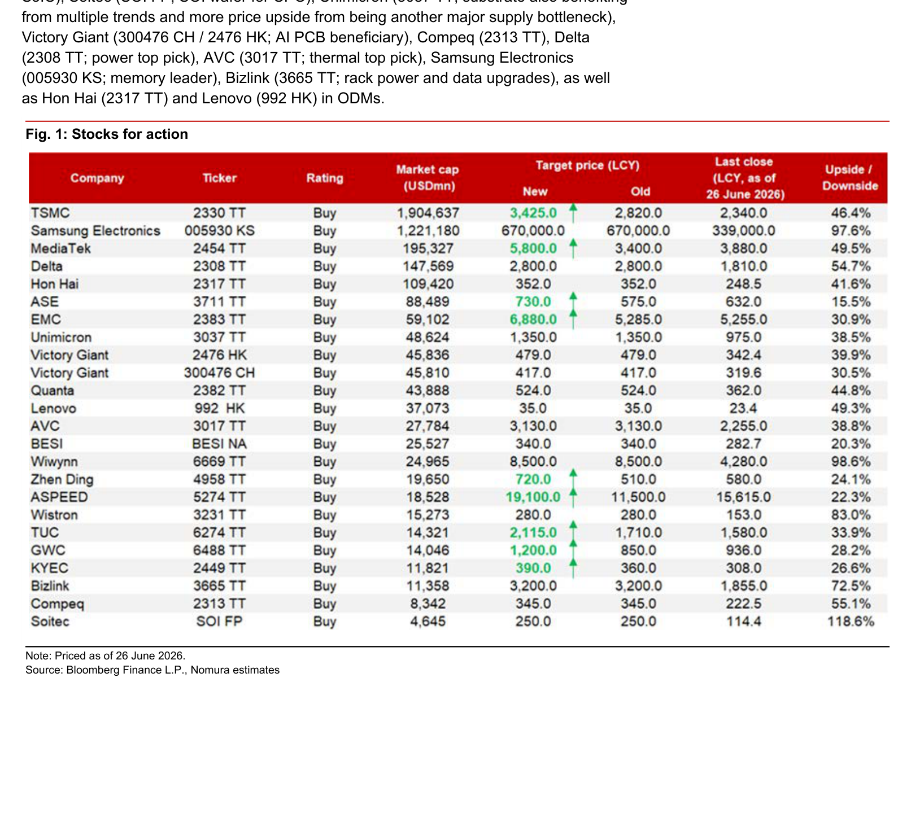

### 解讀摘要

這是 Nomura 自有「全球新資料中心建設追蹤器」的主時程表，把約 50 個 GW 級項目按公告日與部署時間軸（2024-2030）攤開，每一條長橫槓代表一個項目的建設/上線期間與規模。它是全報告需求端的「第一手證據」——不靠傳統的漲價/LTA/overbooking 見頂訊號，而是用「實體新建案是否持續落地、且往後年度（2028F）能見度是否補齊」當領先指標。從表中可見增量在 2026-2027 最密集、且 2028 之後的長槓數量正逐季增加，這正是 Nomura 判斷「週期未頂」的實證骨幹。

> **原文補充**：本次追蹤新增數個 GW 級大案——Nebius 賓州 1.2GW、Softbank 法國 5GW、SK Telecom 韓國 GW 級 AI cloud；同時 top-4 CSP 這次公告的 GW 級新案減少（多為未揭露產能或較小規模），但仍在全球布局（Microsoft 星/日/澳、Google 奧地利/密蘇里/瑞典、Meta 奧克拉荷馬、AWS 法國）。已剔除中止案：Crusoe 的 Project Jade（1.8GW，上限 10GW）、Microsoft × G42 肯亞 USD1bn 案。

### 表格

#### 表中代表性項目（節錄）

| 營運商 | 公告 | 地點 | 規模／備註 |
|---|---|---|---|
| Meta（Prometheus）| Apr-22 | New Albany, Ohio | 1GW |
| AWS（Project Rainier）| Apr-24 | Indiana, US | 2.2GW；約 500k Trainium 2 |
| xAI（Colossus 1&2）| May-24 | Memphis, US | 第三棟 Macrohard 使 xAI 達 2GW |
| HUMAIN | May-25 | Saudi Arabia | 2030 前上看 1GW，Phase 1 100MW（2026）|
| OpenAI | Oct-25 | Worldwide | 6GW；1GW MI450 自 2H26 |
| Microsoft（Fairwater）| Nov-25 | Wisconsin 等 | Gigawatt-class |
| Nscale（Monarch）| Mar-26 | West Virginia | 2GW（1H28），2031 達 8GW |
| Softbank | May-26 | France | 5GW+ by 2030 |
| SK Telecom | Jun-26 | South Korea | Gigawatt-scale |
| Nebius（Beacon Point）| Jun-26 | Pennsylvania | 初期 352MW，上看 1GW |

> **洞察一**：這張表的價值不在任何單一項目，而在「密度隨時間往右延伸」這個型態本身——當 2028 之後的長槓從稀疏變密集，代表需求能見度正往後補齊，而非集中在近端一次性透支。這也是為何 Nomura 明說「希望未來 3-6 個月看到更多 2028 能見度」：追蹤器往後補格的速度，就是判斷週期斜率能否延續的即時儀表板。

---

## Fig. 3｜GW 部署量 → AI 晶片 → CoWoS 需求的推算

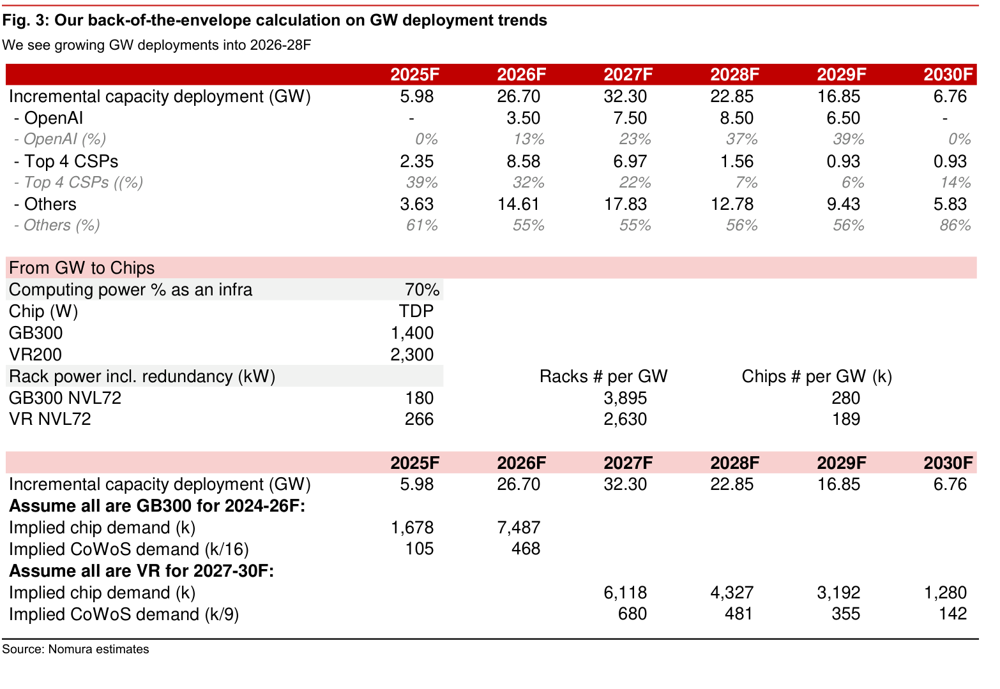

### 解讀摘要

這是全報告需求端的定量骨幹：把資料中心的增量 GW 部署量，經由「機櫃功耗 → 每 GW 機櫃數 → 每 GW 晶片數」換算成 AI 晶片與 CoWoS 需求。關鍵轉折是世代切換帶來的「單位 GW 晶片數下降」：GB300（NVL72 每櫃 180kW）每 GW 對應 3,895 櫃、280k 晶片；而 VR NVL72（每櫃 266kW）因單櫃功耗更高，每 GW 只需 2,630 櫃、189k 晶片。也就是說**同樣的 GW 成長，換到 Rubin 世代後所需晶片數會下降約三分之一**——這是為什麼 2027F 起增量 GW 雖仍在成長，但晶片與 CoWoS 的絕對增量會被功耗密度提升部分抵消。

> **原文補充**：Nomura 另估，樣本外約 40 個 <1GW 項目（平均 300MW）加上約 100 個未揭露功耗項目（假設各 100MW），可再貢獻 20GW+ 潛在需求；20GW 約等於 3-4mn 顆 Rubin 晶片、或整個部署期 420k 的 CoWoS 需求。此為 tracker 之外的「隱藏 upside」。

### 表格

#### 增量產能部署（GW）與 GW→晶片換算

| 項目 | 2025F | 2026F | 2027F | 2028F | 2029F | 2030F |
|---|---|---|---|---|---|---|
| 增量產能部署（GW）| 5.98 | 26.70 | 32.30 | 22.85 | 16.85 | 6.76 |
| 　OpenAI | – | 3.50 | 7.50 | 8.50 | 6.50 | – |
| 　Top 4 CSPs | 2.35 | 8.58 | 6.97 | 1.56 | 0.93 | 0.93 |
| 　Others | 3.63 | 14.61 | 17.83 | 12.78 | 9.43 | 5.83 |

| 換算參數 | 值 |
|---|---|
| 運算佔基建比重 | 70% |
| GB300 TDP / VR200 TDP | 1,400W / 2,300W |
| GB300 NVL72 每櫃功耗 | 180kW → 3,895 櫃/GW → 280k 晶片/GW |
| VR NVL72 每櫃功耗 | 266kW → 2,630 櫃/GW → 189k 晶片/GW |

#### 隱含晶片與 CoWoS 需求（千個）

| 情境 | 2025F | 2026F | 2027F | 2028F | 2029F | 2030F |
|---|---|---|---|---|---|---|
| 假設全為 GB300：隱含晶片需求 | 1,678 | 7,487 | | | | |
| 　隱含 CoWoS 需求（÷16）| 105 | 468 | | | | |
| 假設全為 VR：隱含晶片需求 | | | 6,118 | 4,327 | 3,192 | 1,280 |
| 　隱含 CoWoS 需求（÷9）| | | 680 | 481 | 355 | 142 |

> **洞察二**：CoWoS 除數從 GB300 的「÷16」變成 VR 的「÷9」是這張表最容易被忽略的槓桿。同一顆 CoWoS 晶圓，GB300 世代能切出 16 顆晶片、Rubin 世代只能切 9 顆（因 reticle 拼接尺寸放大）。這意味著**即使晶片需求下降，每顆晶片消耗的 CoWoS 面積上升，CoWoS 產能需求不會等比例下降**——2027F 隱含 CoWoS 需求 680kpcs 相對 2026F 的 468kpcs 仍成長 45%，這正是 Nomura 認為 CoWoS 供給持續偏緊的底層算術。

---

## Fig. 4｜增量產能部署（GW）— 三次追蹤版本比較

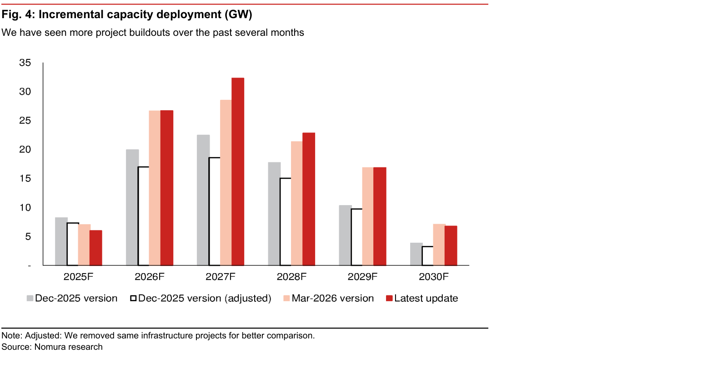

### 解讀摘要

同一張圖疊了四個版本（Dec-2025、Dec-2025 調整後、Mar-2026、最新），用意是證明「需求持續上修」而非一次性樂觀。最新版（紅）在每一年都高於或等於前一版：2027F 從 Mar 版的 28.5GW 升至 32.3GW、2028F 從 21GW 升至 23GW（對照圖上約 17.8→22.9）。**每季追蹤都往上，而且往後年度（2028F）能見度逐步補齊**，是 Nomura 判斷「週期未頂」最實證的一根支柱——相較於用漲價/LTA/overbooking 等傳統見頂訊號，Nomura 刻意改用「新建案落地」這個領先指標。

> **原文補充**：本次也反映了兩個中止項目——Crusoe 於 6/10 宣布應客戶要求停止 Project Jade（1.8GW，上限 10GW）擴張、Microsoft 與 G42 在肯亞的 USD1bn 項目因付款問題喊停，均已從計算基礎移除。中國國家級 AI 算力網（五年 USD295bn）與東數西算等項目因採用國產晶片、與 CoWoS 相關性低，未納入計算基礎。

---

## Fig. 5-6｜Gen AI 網站流量份額 — 需求真實性的第一手證據

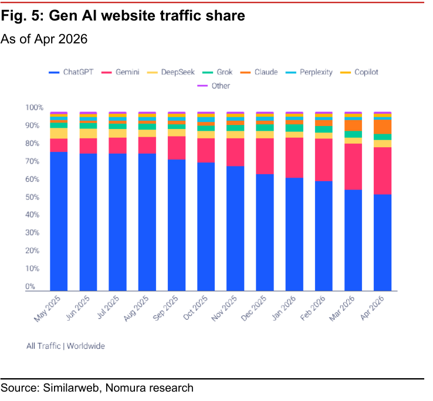

### 解讀摘要

這對圖用 Similarweb 的實際流量數據，直接回應「AI 需求是不是泡沫」這個最根本的問題。Fig. 5（堆疊柱）顯示 ChatGPT 的流量份額從 2025 年 5 月的約 75% 一路稀釋到 2026 年 4 月的約 52%，但這不是需求萎縮——而是 Gemini（紅）從約 7% 放大到約 27%、Claude/Grok/DeepSeek 等同步搶食，代表**整個 Gen AI 使用面在快速擴張且多元化**。Fig. 6（趨勢線）把非 ChatGPT 玩家單獨拉出：Gemini（灰）近乎直線上衝、Claude（黑虛線）在最近 3 個月加速。這是 Nomura 全報告需求論點的「使用端」佐證：token 消耗有真實流量支撐，不是靠補貼堆砌。

> **原文補充**：流量數據與 Anthropic 營收 run-rate 由 2025 年底 USD9bn 暴增至 2026 年 5 月 >USD47bn 相互印證。Anthropic 同時在 AWS（5GW/500k Trainium 2、承諾十年 >USD100bn）、Google（up to 1mn TPU、>1GW）、nVidia/Microsoft（up to 1GW GB/VR）三大平台同時鎖算力，是需求真實性的最強單一背書。

> **洞察三（配合 Fig. 24-29）**：Fig. 6 那條上衝的 Gemini 曲線，是 Fig. 24-29「Google TPU CoWoS 份額 2027 升至 26%」論點的需求端源頭——沒有 Gemini 的實際流量突破，就沒有 Google 加碼 TPU 的底氣，也就沒有 MediaTek 承接 TPU 設計服務的成長。換言之，這張看似「背景資料」的流量圖，其實是整條 TPU/MediaTek 投資鏈最上游的領先指標；流量份額若停止往 Gemini 傾斜，TPU 擴張的敘事就會先鬆動。

---

## Fig. 7-17｜各 Hyperscaler 資料中心建設公告時程

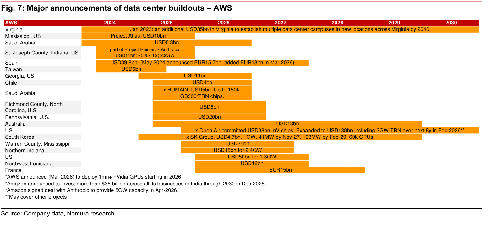
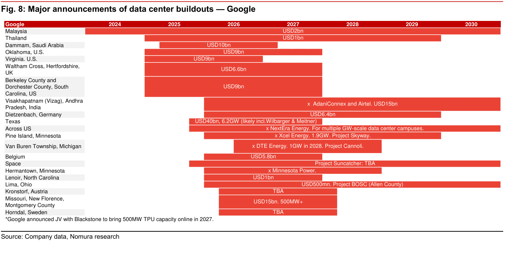
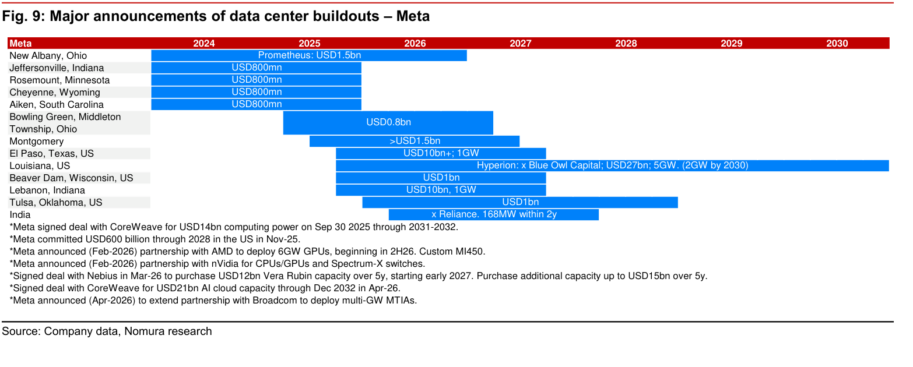
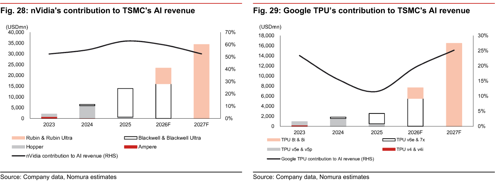
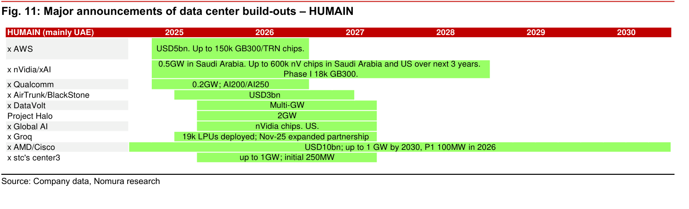
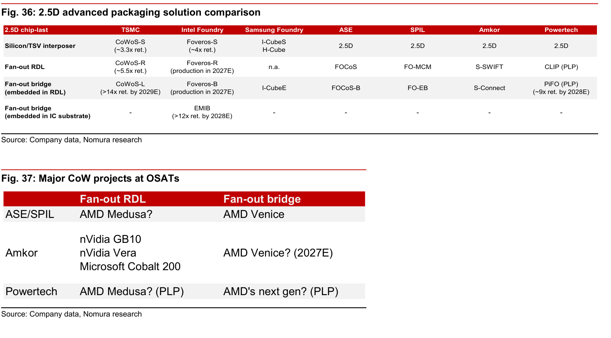
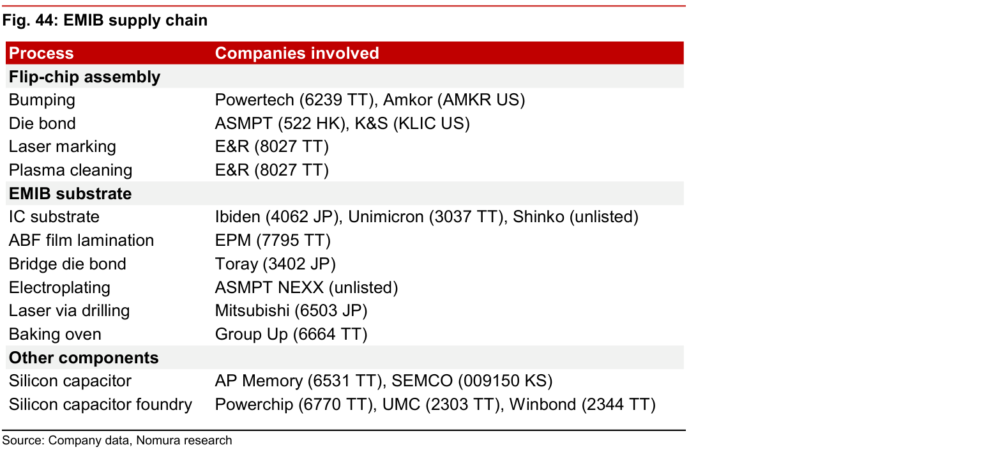
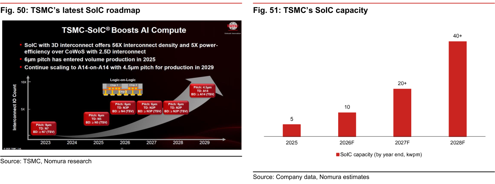
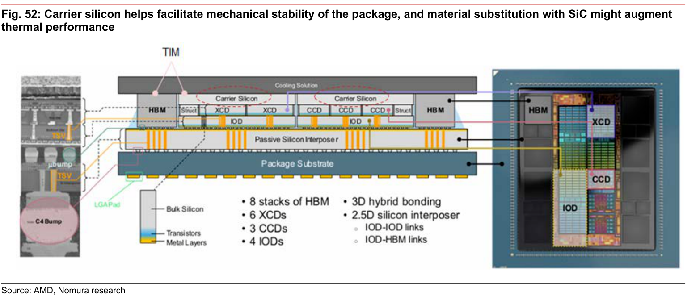
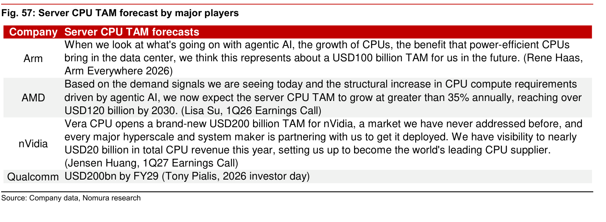
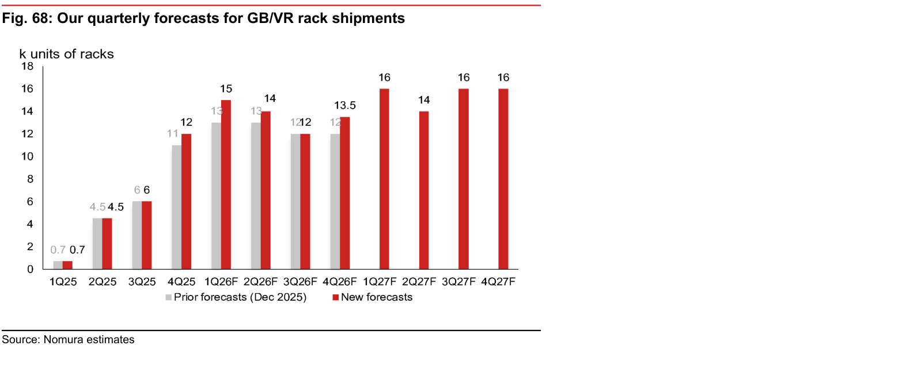

### 解讀摘要

這 11 張是 Fig. 2 主時程表的「逐營運商拆解」——把每一家 hyperscaler / neocloud 的資料中心建設公告依時間軸單獨展開（AWS、Google、Meta、Microsoft、HUMAIN、CoreWeave、Oracle、OpenAI、Nscale、Nebius、IREN）。它們共同構成 Nomura「280 個項目、約 50 個 GW 級」追蹤器的底層明細。分兩群看：**top-4 CSP（Fig. 7-10）** 這次 GW 級新案放緩、轉為全球多點小規模布局（星/日/澳、奧地利/瑞典、法國），代表超大廠的擴張進入「填格」而非「跳增」階段；**neocloud / 主權 AI（Fig. 11-17）** 則是這次增量的主要來源——HUMAIN（沙國主權）、Nscale（Monarch 2GW→8GW）、Nebius（1.2GW 賓州）、OpenAI（Stargate 6GW）接棒撐起 2027-2028 的長槓。這種「大廠放緩、新雲補位」的接力結構，正是需求能延續而非單極依賴的證據。

> **原文補充**：追蹤器彙整 2027F/2028F 增量部署 32GW/23GW（前次 28GW/21GW），對應每年 4-6mn 顆 AI 晶片需求。樣本外另有約 40 個 <1GW 項目（平均 300MW）+ 約 100 個未揭露功耗項目（假設各 100MW），可再貢獻 20GW+（≈3-4mn 顆 Rubin、或部署期 420k CoWoS）。

> **洞察四**：把 11 張逐一比對可看出一個對供應鏈更重要的訊號——**需求來源正在從「4 家超大 CSP」分散到「十幾家 neocloud/主權 AI」**。這對台廠是雙面刃：客戶分散降低單一 CSP 砍單的系統性風險（利多能見度），但 neocloud 的財務體質與履約能力遠不如 top-4，是 Fig. 74-75「FCF 見底」風險真正的脆弱點所在。追蹤時程表不只要看「增加多少 GW」，更要看「增量由誰認列」——這一批新玩家的付款能力，才是週期延續與否的隱藏變數。

---

## Fig. 18-19｜TSMC CoW 轉積極，但 output 被 WoS 卡住

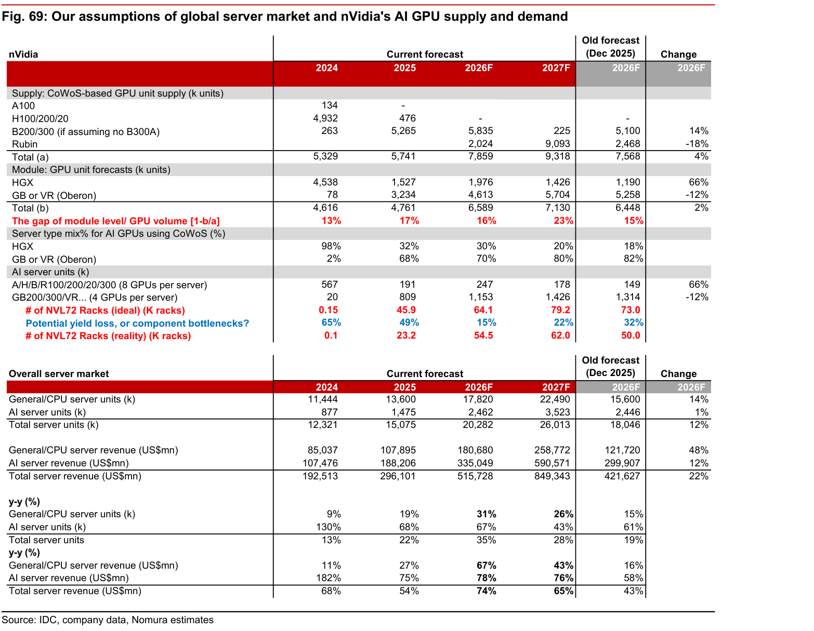
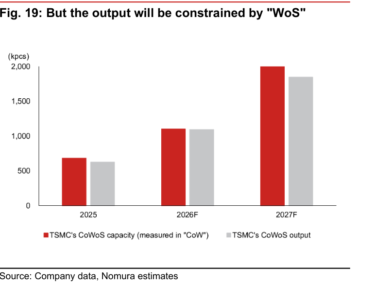

### 解讀摘要

這對圖是全報告 contrarian 論點的視覺化。Fig. 18 顯示 TSMC 的 CoWoS 季產能規劃（紅線）相對 Dec 2025 版本（灰線）大幅上修——尤其 2026 下半年到 2027 加速拉升，反映 TSMC 面對 EMIB-T 與 FOPLP 競爭轉為積極、「不把生意留在桌上」。但 Fig. 19 是關鍵：把「CoW 產能」（紅）和「CoWoS output」（灰）並排，2027F 兩者出現缺口——CoW 能力衝到約 2,000kpcs，但實際能組裝出貨的 CoWoS output 被 WoS（TSMC 不掌控、且外包 OSAT）與其他小元件卡在約 1,850kpcs。**產能不等於出貨，瓶頸已從 TSMC 手上（CoW）轉移到 TSMC 手外（WoS/基板/被動元件）。**

> **原文補充**：TSMC 目前 WoS 全數外包給 OSAT，因此 CoW 轉積極對 OSAT（ASE/SPIL、Amkor）是直接受益；但 WoS 供給限制也會限制 OSAT 的出貨 upside，真正的 upside 來自基板持續漲價帶動封裝報價、以及 OSAT 自有 CoWoS-like 全製程（由 CPU 帶動）。

> **洞察五**：這個「CoW≠output」的缺口是本報告所有個股邏輯的分水嶺。因為瓶頸不在 TSMC，2027F 誰能拿到 CoWoS 出貨，取決於誰能同時鎖住 WoS、基板、CCL、電容——這把估值權重從「製程龍頭」轉移到「小元件供給者」，也解釋了為何 TP 上調名單裡塞滿了 EMC/TUC（CCL）、GWC、KYEC 這類過去被視為配角的環節。

---

## Fig. 20｜TSMC 前端 fab 產能規劃 — 下一次大跳躍在 2028F

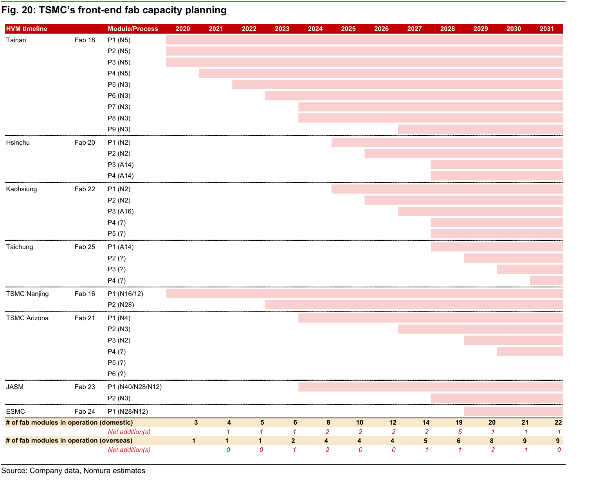

### 解讀摘要

這張 gantt 表列出 TSMC 各廠區各製程模組的量產時程與在營 fab 模組數。重點在最下方兩行：國內在營 fab 模組數 2024→2031 為 8→10→12→14→**19**→20→21→22，其中 **2028 年淨增 5 座**（其餘年份僅淨增 1-2 座）。這就是 Nomura 反覆強調的「TSMC 前端產能下一次大跳躍在 2028F」——在那之前（2026-2027F）前端擴張相對溫和，配合 greenfield 需 2 年建設，構成供給端 2027F 前偏緊的結構性理由。

> **洞察六（配合 Fig. 3、Fig. 21）**：Fig. 3 推算 2029F 需 CoWoS 2,500-3,500kpcs、Fig. 21 給出 2029F 隱含 output 2,854kpcs，而這裡顯示前端產能要 2028F 才大跳躍——三張圖交叉後的時序邏輯是：**2027F 前受制於既有產能只能「擠出」約 1,800kpcs，2028F 起前端大擴 + CoPoS/SoIC 技術到位才可能奔向 2,500kpcs+**。長期斜率的可信度因此高度綁定 2028F 這個節點能否如期執行。

---

## Fig. 21-22｜TSMC 長期 CoWoS 產能模擬與敏感度

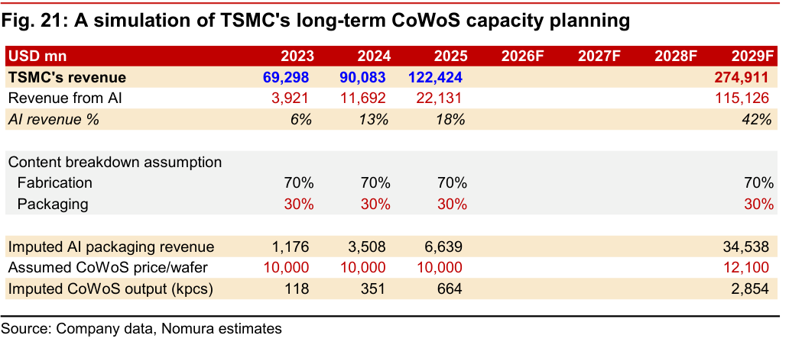
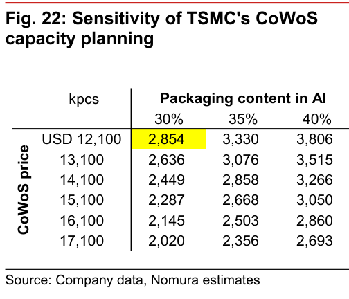

### 解讀摘要

Nomura 從 TSMC 的 AI 收入 CAGR 目標（2024-2029E「high-50%」）反推所需 CoWoS 產能。以 AI 封裝占 AI 收入 30%、CoWoS 晶圓均價 2029F USD12,100 的假設，2029F 隱含 CoWoS output 為 2,854kpcs。Fig. 22 的敏感度矩陣把兩個關鍵假設（CoWoS 單價 × AI 封裝內含比重）攤開：output 需求區間橫跨 2,020–3,806kpcs，也就是報告正文說的「2,500-3,500kpcs」區間來源。核心 contrarian 是：即使 CoW 端 2027F 達 2,000kpcs，WoS 瓶頸讓實際 output 受下游組裝限制。

### 表格

#### Fig. 21：TSMC AI 收入與 CoWoS output 模擬（US\$mn）

| 指標 | 2023 | 2024 | 2025 | 2029F |
|---|---|---|---|---|
| TSMC 總收入 | 69,298 | 90,083 | 122,424 | 274,911 |
| AI 收入 | 3,921 | 11,692 | 22,131 | 115,126 |
| AI 收入佔比 | 6% | 13% | 18% | 42% |
| Fabrication / Packaging | 70% / 30% | 70% / 30% | 70% / 30% | 70% / 30% |
| 隱含 AI 封裝收入 | 1,176 | 3,508 | 6,639 | 34,538 |
| 假設 CoWoS 晶圓均價（USD）| 10,000 | 10,000 | 10,000 | 12,100 |
| 隱含 CoWoS output（kpcs）| 118 | 351 | 664 | 2,854 |

#### Fig. 22：2029F CoWoS output 敏感度（kpcs）— AI 封裝內含比重 × CoWoS 單價

| CoWoS 單價（USD）| 30% | 35% | 40% |
|---|---|---|---|
| 12,100 | **2,854** | 3,330 | 3,806 |
| 13,100 | 2,636 | 3,076 | 3,515 |
| 14,100 | 2,449 | 2,858 | 3,266 |
| 15,100 | 2,287 | 2,668 | 3,050 |
| 16,100 | 2,145 | 2,503 | 2,860 |
| 17,100 | 2,020 | 2,356 | 2,693 |

> **值得驗證**：2029F output 2,854kpcs 完全建立在「AI 封裝占 AI 收入 30% + 單價 USD12,100」兩個假設上。從 Fig. 22 看，若封裝比重升到 40%，output 需求跳到 3,806kpcs（+33%）；若單價漲到 USD17,100（漲價劇烈），output 需求反而降到 2,020kpcs（-29%）。**單價與內含比重方向相反地影響 output 需求**——漲價越兇、達成同樣 AI 收入所需的實體 CoWoS 片數越少。這代表「CoWoS 產能缺口」的嚴重程度，其實高度取決於漲價幅度這個變數，而非只看需求。

---

## Fig. 23｜Hyperscaler 自研晶片藍圖

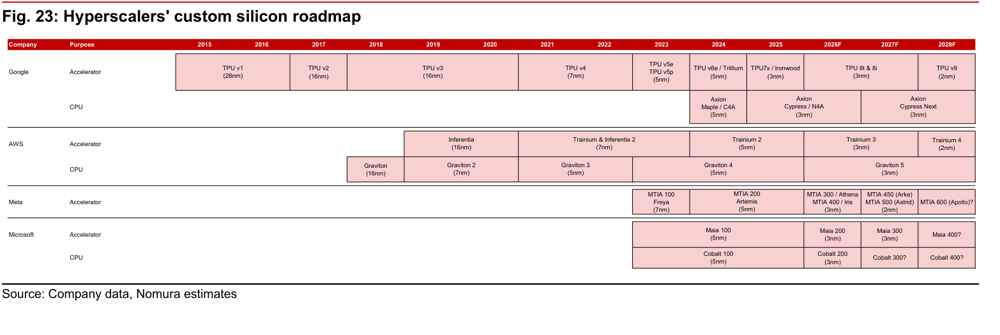

### 解讀摘要

四大 hyperscaler（Google、AWS、Meta、Microsoft）加速器與 CPU 的世代與製程節點總表。關鍵觀察：(1) 每一家都同時推 Accelerator + CPU 兩條線，且製程一路推進到 2028F 的 2nm（Google TPU v9、AWS Trainium 4、Meta MTIA 600）；(2) Google 進度最完整、節點最領先（TPU 8t&8i 用 3nm、v9 用 2nm；Axion CPU）；(3) CPU 自研全面化（Google Axion、AWS Graviton 5、Microsoft Cobalt、加上外部 Arm/Qualcomm）呼應了 Fig. 57 的 CPU TAM 爆發。這張圖是理解「ASIC 為何會擠壓 nVidia CoWoS 份額」的產業地圖。

> **原文補充**：報告點名最受關注的 EMIB-T 項目是 Google v9 TPU × MediaTek，因其複雜度高、量大，預計 2028 放量；其 >9x reticle-size 晶片級 footprint 是 TSMC 當時 CoWoS 藍圖無法涵蓋的，這也是 Google 當初選擇 EMIB-T 的原因。此圖右側 2028F 的 TPU v9（2nm）正是該項目。

---

## Fig. 24-25｜TSMC CoWoS output 拆分與客戶分配

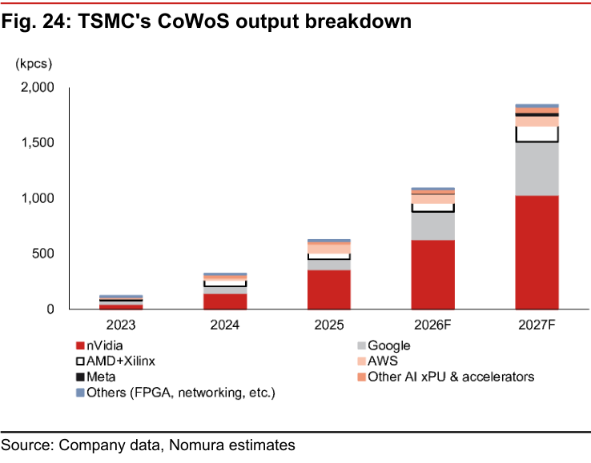
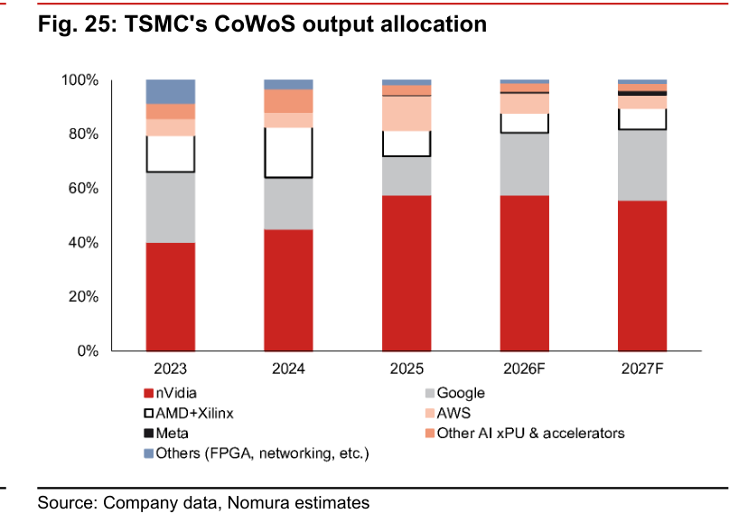

### 解讀摘要

Fig. 24（絕對量 kpcs）與 Fig. 25（百分比）呈現同一件事的兩個切面：CoWoS output 到 2027F 約 1,850kpcs，nVidia 仍是最大宗但份額由 2025 峰值往下走，Google（灰）明顯放大，AMD+Xilinx、AWS、其他 xPU 被壓縮。這是「大象打架、草被踩爛」的視覺證據——2027F CoWoS 這塊餅雖然變大，但增量主要被 nVidia 與 Google 兩隻大象瓜分，其餘 ASIC/GPU 廠的絕對配額成長有限甚至下滑。

### 表格

| CoWoS 分配（%）| 2023 | 2024 | 2025 | 2026F | 2027F |
|---|---|---|---|---|---|
| nVidia | 40% | 45% | 57% | 57% | 55% |
| Google | 　高 | 　 | 　 | 　 | 　升至 26%（2027）|
| AMD+Xilinx / AWS / 其他 | 　 | 　 | 　 | 　 | 　被擠壓 |

*以上百分比為圖表視覺估算；文字明確數字為 nVidia 2027F 約 55%、Google TPU 2027 為 26%（from 2026 23%）。*

> **原文補充**：Nomura 對 2027F CoWoS 分配的具體判斷——(1) CoW 配額不再是決定性，能否拿到基板/CCL/電容等小元件才是；(2) Google TPU 份額 2027 升至 26%（from 2026 23%，近乎倍增 y-y），靠 Gemini 實績、完整生態與份額擴張；(3) nVidia 雖仍力爭 60%，但模型內建其份額滑落至約 55%（被 TPU 擠壓）；(4) AMD 份額僅小幅改善、AWS 甚至可能 y-y 下滑。

---

## Fig. 26-27｜TSMC AI 收入拆分與客戶結構

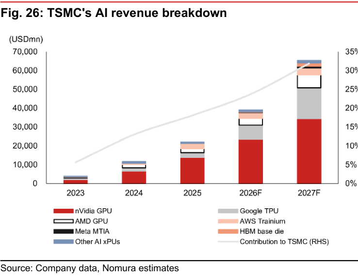
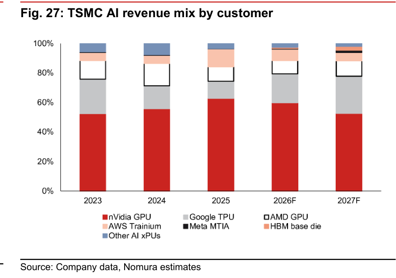

### 解讀摘要

Fig. 26 把 TSMC AI 收入（US\$mn，左軸）依客戶堆疊，並疊上「AI 佔 TSMC 總收入比重」（RHS，2027F 升至約 32%）；Fig. 27 是同資料的百分比結構。訊息有二：其一，TSMC AI 收入 2027F 逼近 US\$65bn 量級，nVidia GPU（紅）仍是最大塊但比重收斂，Google TPU（灰）快速放大；其二，AI 已從 2023 佔 TSMC 收入 6% 走到 2027F 約 32%，**TSMC 本身已成為 AI 週期最直接的槓桿標的**，這也支撐 Nomura 把 TSMC AI 收入成長估計上修到 77%/67%（2026F/27F，from 69%/24%）。

> **洞察七**：把 Fig. 27 的客戶比重和報告封面的 MediaTek TP（3,400→5,800，+70.6%）連起來看——Google TPU 在 TSMC AI 收入中的比重放大，而 TPU 成長的大部分由 MediaTek 承接（份額 15%→30%+）。也就是說 Fig. 26/27 中那條放大的「Google TPU 灰塊」，有相當比例會轉化成 MediaTek 的設計服務營收。這是本報告對 MediaTek 最獨特、也最容易被市場低估的論點：MediaTek 不只是 AP/modem 廠，正在成為 Google AI 晶片的設計服務商。

---

## Fig. 28-29｜nVidia 與 Google TPU 各自對 TSMC AI 收入的貢獻

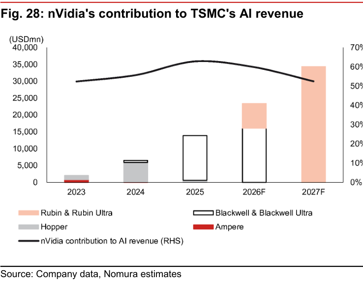
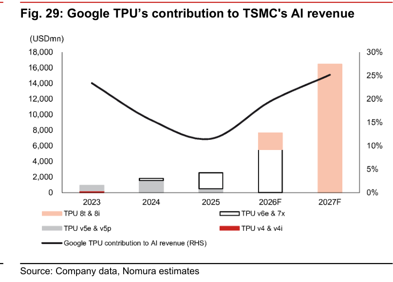

### 解讀摘要

兩隻大象的世代交棒圖。Fig. 28（nVidia）：貢獻金額 2027F 約 US\$34bn，但 nVidia 佔 TSMC AI 收入比重（RHS 黑線）在 2025 見頂約 60% 後回落至 2027F 約 52%——世代結構從 Hopper→Blackwell→Rubin 遞進，2027F 幾乎全由 Rubin & Rubin Ultra 撐起。Fig. 29（Google TPU）：貢獻金額 2027F 約 US\$16.5bn，比重（RHS 黑線）2025 觸底約 11% 後 V 型反彈至 2027F 約 25%，世代由 TPU v6e/7x 交棒到 TPU 8t & 8i。**一條下彎、一條上彎，兩條線在 2027F 收斂，正是「大象打架」的量化定義。**

> **洞察八**：nVidia 貢獻比重從 60%（2025）掉到 52%（2027F），但絕對金額仍從約 US\$23bn 成長到約 US\$34bn（+48%）——這說明 nVidia「份額下滑」不等於「金額下滑」，餅本身變大讓 nVidia 即使被稀釋仍在成長。反過來 Google TPU 兩年內比重翻倍（11%→25%）、金額從約 US\$7.7bn 到約 US\$16.5bn，成長斜率遠高於 nVidia。對供應鏈的意涵：押 nVidia 是押「量」，押 Google TPU 鏈（MediaTek/Alchip 生態）是押「斜率」。

---

## Fig. 36-37｜2.5D 先進封裝方案比較與 OSAT 的 CoW 項目

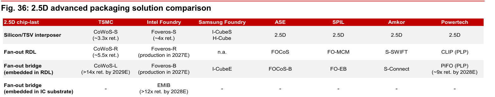
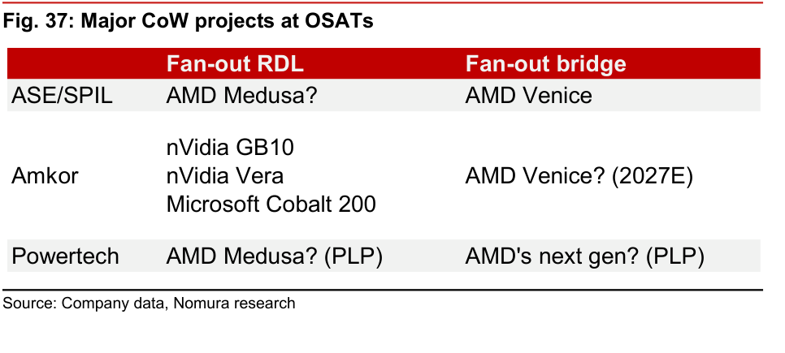

### 解讀摘要

Fig. 36 把各家（TSMC、Intel Foundry、Samsung、ASE、SPIL、Amkor、Powertech）的 2.5D 封裝方案按技術類型對照——TSMC 的 CoWoS-S/R/L 對上 Intel 的 Foveros-S/R/B 與 EMIB，OSAT 則有 FOCoS、S-SWIFT、CLIP 等對應方案。Fig. 37 列出 OSAT 實際在跑的 CoW 項目：ASE/SPIL 做 AMD Medusa/Venice、Amkor 做 nVidia GB10/Vera 與 Microsoft Cobalt 200、Powertech 做 AMD Medusa（PLP）。重點是**這些 OSAT 自有 CoW 量產項目「幾乎全是 CPU」**——因為 CPU 不帶昂貴 HBM，即使組裝良率不成熟，損失也遠小於 GPU，是 OSAT 切入 CoWoS-like 全製程風險最低的起點。

### 表格

#### Fig. 36：2.5D chip-last 方案對照（節錄）

| 技術類型 | TSMC | Intel Foundry | ASE | SPIL | Amkor | Powertech |
|---|---|---|---|---|---|---|
| Silicon/TSV interposer | CoWoS-S（約3.3x）| Foveros-S（約4x）| 2.5D | 2.5D | 2.5D | 2.5D |
| Fan-out RDL | CoWoS-R（約5.5x）| Foveros-R（2027E）| FOCoS | FO-MCM | S-SWIFT | CLIP（PLP）|
| Fan-out bridge（embedded in RDL）| CoWoS-L（>14x by 2029E）| Foveros-B（2027E）| FOCoS-B | FO-EB | S-Connect | PiFO（PLP, 約9x by 2028E）|
| Fan-out bridge（embedded in substrate）| – | EMIB（>12x by 2028E）| – | – | – | – |

#### Fig. 37：OSAT 主要 CoW 項目

| OSAT | Fan-out RDL | Fan-out bridge |
|---|---|---|
| ASE/SPIL | AMD Medusa? | AMD Venice |
| Amkor | nVidia GB10、nVidia Vera、Microsoft Cobalt 200 | AMD Venice?（2027E）|
| Powertech | AMD Medusa?（PLP）| AMD's next gen?（PLP）|

> **洞察九**：Fig. 37 是 ASE 邏輯的核心證據——OSAT 的 CoW 下一個成長催化劑不是搶 GPU（HBM 良率風險太高），而是 CPU。當 AMD Venice、nVidia Vera、Microsoft Cobalt 200 這些 CPU 從 2H26 用 OSAT 的 CoW 放量，ASE 拿到的是「風險可控、且會隨 CPU TAM（Fig. 57）一起放大」的訂單結構。

---

## Fig. 44｜EMIB-T 供應鏈受益者

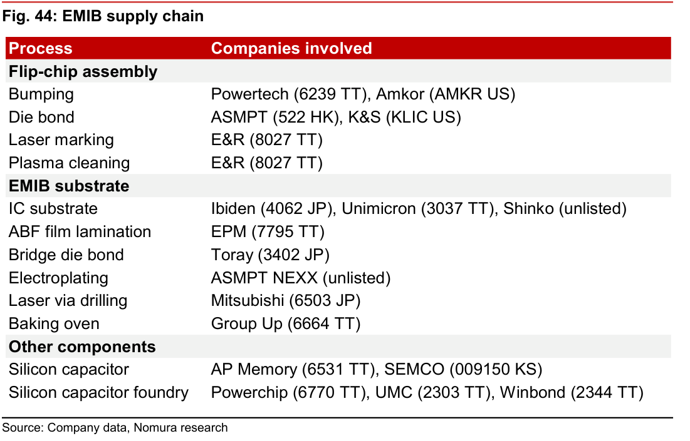

### 解讀摘要

若 Intel EMIB-T 真的成為 TSMC 先進封裝的最大威脅，這張表就是「威脅實現時誰受益」的對沖名單。EMIB-T 拆成 Flip-chip assembly、EMIB substrate、其他元件三段，對應的供應商橫跨台日：IC 基板 Ibiden/Unimicron/Shinko、ABF 膜 EPM、bridge die bond Toray、雷射鑽孔 Mitsubishi、矽電容 AP Memory/SEMCO/Powerchip/UMC/Winbond 等。重點是**Unimicron 同時出現在 EMIB substrate 環節**——代表 Unimicron 不論 TSMC CoWoS 或 Intel EMIB-T 勝出都受益，是先進封裝路線之爭的「兩邊押注」標的。

> **洞察十**：這張表的戰略價值在於「風險對沖」而非「主推邏輯」。Nomura 主論點押 TSMC 靠 SoIC/CoPoS 守住，但同時用 Fig. 44 告訴你：萬一 EMIB-T 勝出，Unimicron（基板）、AP Memory/Winbond（矽電容）等仍在受益鏈上。對 TSMC 供應鏈投資人，這是判斷「哪些標的抗路線風險」的清單。

---

## Fig. 50-51｜TSMC SoIC 藍圖與產能（雙倍成長）

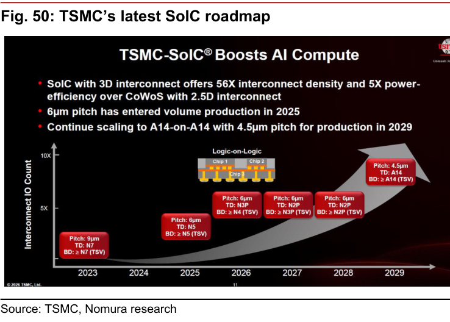
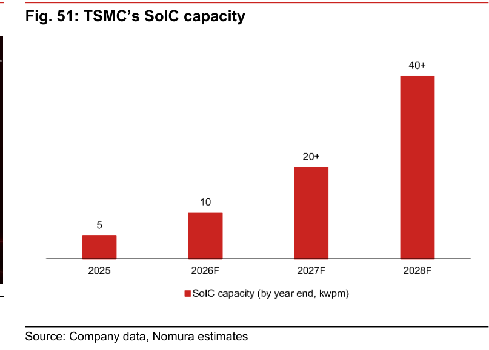

### 解讀摘要

Fig. 50（TSMC 官方投影片）點出 SoIC 相對 CoWoS 2.5D 有 56X 互連密度、5X 電源效率優勢，6μm pitch 已 2025 量產，將續縮到 2029 的 A14-on-A14（4.5μm pitch）。Fig. 51 是 Nomura 的產能估計：SoIC 年底產能 5→10→20+→40+ kwpm（2025→2028F），**連續兩年翻倍**——2027F 主要由 nVidia CPO 驅動、2028F 由 nVidia Feynman 驅動。SoIC 是 TSMC 反制 EMIB-T 的核心武器（Feynman 首度採 GPU-on-GPU SoIC 堆疊），這張產能曲線就是該武器的放量節奏。

### 表格

#### Fig. 51：TSMC SoIC 年底產能（kwpm）

| 2025 | 2026F | 2027F | 2028F |
|---|---|---|---|
| 5 | 10 | 20+ | 40+ |

> **洞察十一（配合 Fig. 23、Fig. 49）**：SoIC 產能 2027F→2028F 從 20+ 跳到 40+（+100%），Nomura 明指 2028F 增量「主要由 nVidia Feynman」驅動。而 Feynman（Fig. 23 藍圖 2028F 節點）採用首見的 GPU-on-GPU SoIC，可在 interposer reticle 拼接尺寸僅約 6x（vs Rubin 5x）的情況下拉高算力。意涵：SoIC 產能曲線是 Feynman 時程的領先指標，SoIC 若如期翻倍，代表 Feynman 2H28 量產可信；BESI（hybrid bonding）是這條曲線最直接的設備受益者。

---

## Fig. 52｜Carrier Silicon 與 SiC 材料替換（AMD MI300 剖面）

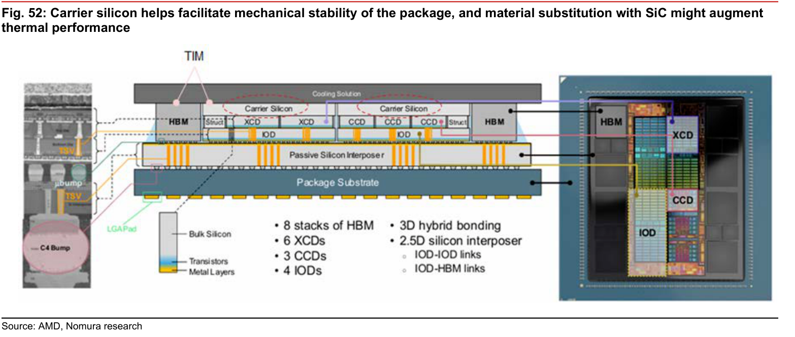

### 解讀摘要

以 AMD MI300 剖面圖示範 carrier silicon 的位置與功能：carrier silicon 位於 XCD/CCD 計算晶片上方、cooling solution 下方，作用是提供封裝機械穩定性。Nomura 的論點是——當 Feynman footprint 變大、TDP（熱設計功耗）升高，carrier 材料會從一般矽升級為 SiC（碳化矽），因 SiC 導熱更佳能augment 熱表現。這正是 GWC（環球晶）TP 上調（850→1,200）的核心邏輯：Feynman 帶動 SiC carrier 需求「啟動」，開出一個過去 SiC 在功率元件之外的全新 AI 封裝應用。

> **值得驗證**：SiC carrier 需求是 GWC 論點的單一支點，且時程綁定 Feynman（2H28）。這是「概念先行、量產在後」的早期主題——若 Feynman 延遲或最終未採 SiC carrier（改用其他散熱方案如 MCL），GWC 的 SiC 增量會落空。目前這仍是 Nomura 依 Feynman footprint/TDP 推論的前瞻假設，而非已確認的設計導入。

---

## Fig. 57｜Server CPU TAM — 各家喊到 USD100-200bn

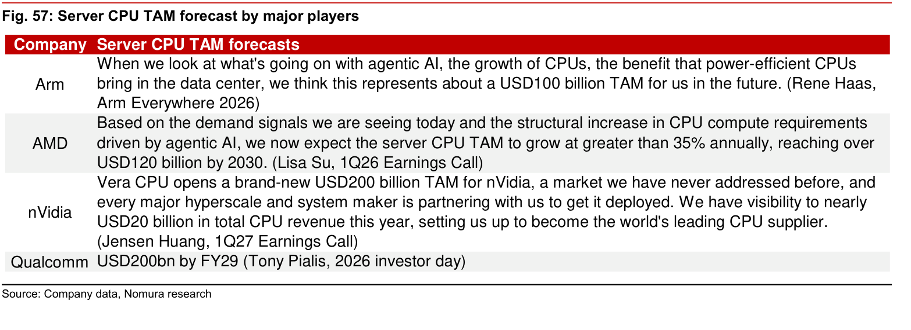

### 解讀摘要

用四家主要玩家的公開發言彙整 server CPU TAM 的爆發力度：Arm 喊 USD100bn TAM；AMD 稱 agentic AI 驅動 CPU compute 結構性增加、CPU TAM 年增 >35%、2030 達 USD120bn+；nVidia 稱 Vera CPU 開出 USD200bn 全新 TAM、今年 CPU 營收見到近 USD20bn；Qualcomm 喊 FY29 USD200bn。共同主線是 **agentic AI 不只拉動 GPU，也結構性放大 CPU 需求**——這是 Nomura 上修「一般/CPU 伺服器」收入成長（2026F/27F +67%/+43%，from +16%）的外部佐證，也是 ASPEED（BMC 隨 CPU 伺服器出貨量走）與 OSAT CPU CoW（Fig. 37）邏輯的需求端根基。

### 表格

| 玩家 | Server CPU TAM 發言 |
|---|---|
| Arm | 未來 TAM 約 USD100bn（Rene Haas, Arm Everywhere 2026）|
| AMD | agentic AI 驅動，CPU TAM 年增 >35%，2030 達 USD120bn+（Lisa Su, 1Q26）|
| nVidia | Vera CPU 開出 USD200bn 全新 TAM，今年 CPU 營收近 USD20bn（Jensen Huang, 1Q27）|
| Qualcomm | FY29 USD200bn（Tony Pialis, 2026 investor day）|

> **洞察十二**：把 Fig. 57（CPU TAM 爆發）、Fig. 37（OSAT 的 CoW 項目幾乎全是 CPU）、個股清單（ASPEED TP +66%）三者串起來，形成一條完整的「CPU 復甦受益鏈」：agentic AI → CPU 伺服器出貨量增 → ASPEED BMC（每台一顆）直接放量 + OSAT 用低風險 CPU 練 CoWoS-like 製程。ASPEED 被 Nomura 視為「早週期指標」正因 BMC 是伺服器最早下單的元件之一。

---

## Fig. 68｜GB/VR 機櫃季度出貨預測（新 vs 舊）

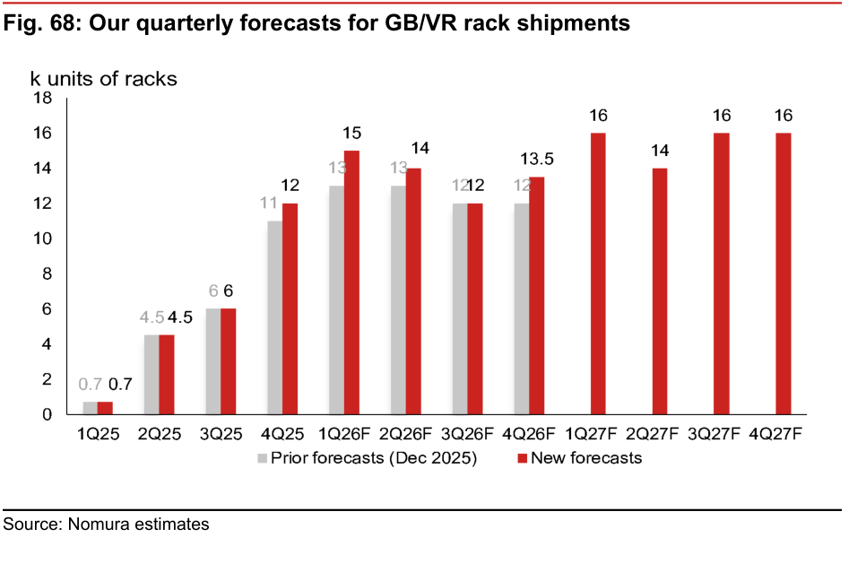

### 解讀摘要

季度顆粒度呈現機櫃出貨上修：2026 上半各季新預測普遍高於 Dec 2025 舊版（如 1Q26F 13→15k、4Q26F 12→13.5k），2027F 四季首度給出約 14-16k 的平滑高原。與 Fig. 69 的年度數字對應：GB/VR rack 2026F 從 50k 上調到 54.5k、2027F 首次引入 62k。季度圖的價值在於揭示**節奏**——2026 年中 GB300→VR200 的世代切換（Nomura 假設 VR200 佔 2026F 15-20%、集中 4Q26），以及切換期 neocloud 扮演補位角色買系統填 token 需求缺口。

> **原文補充**：Nomura 假設 GB300→VR200 轉換發生在 2Q26F 末至 3Q26F，因頂級 CSP 傾向等 VR200 而非續裝 GB300；轉換期 neocloud 會扮演更大角色買系統支撐 AI 公司持續的 token 需求成長。2027F 另假設 2Q27F 起可能發生 Rubin→Rubin Ultra 的再一次轉換。

---

## Fig. 69｜全球伺服器市場假設與 nVidia AI GPU 供需

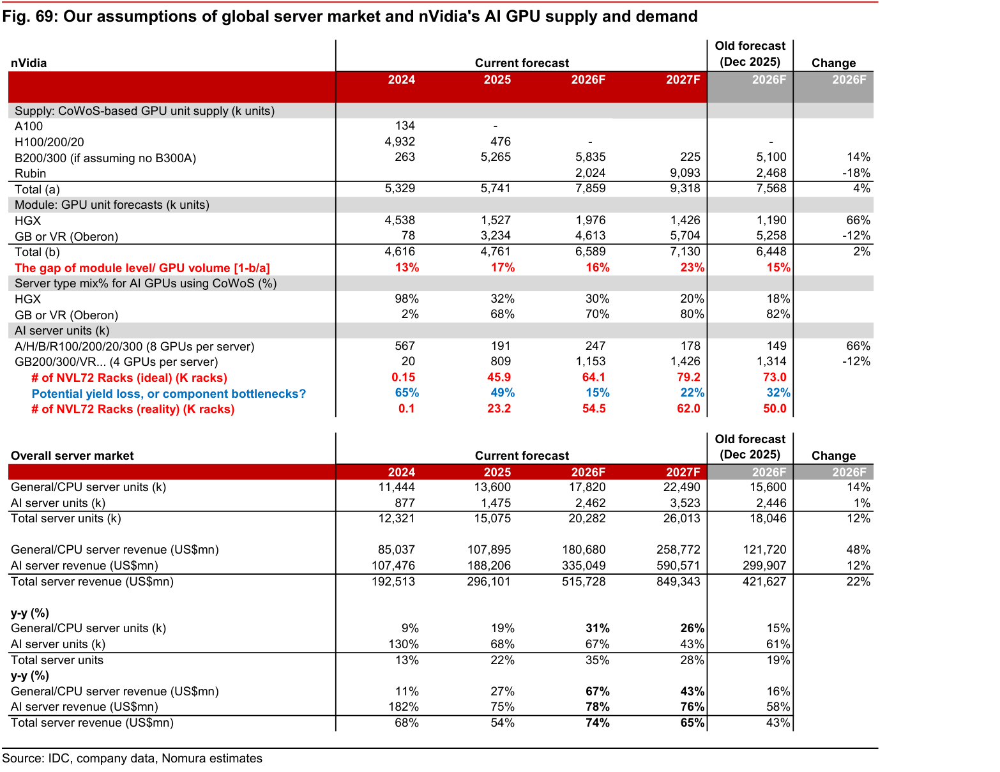

### 解讀摘要

全報告的數字總表。Nomura 將 2026F/27F AI 伺服器收入上調至 +78%/+76% y-y、總伺服器收入 +74%/+65%（一般/CPU 伺服器收入 +67%/+43%，from +16%）。最關鍵的一列是「模組層 GPU 數量 vs GPU 供給的缺口（1-b/a）」：2027F 擴大至 23%（from 2026F 16%）——代表有 23% 的 nVidia GPU 供給無法組裝成完整模組/系統，卡在 WoS/基板/其他元件短缺。這一列把「元件供需錯配」從定性說法變成可追蹤的定量指標。

### 表格

#### nVidia AI GPU 供需（k units）

| 項目 | 2024 | 2025 | 2026F | 2027F |
|---|---|---|---|---|
| CoWoS-based GPU 供給合計（a）| 5,329 | 5,741 | 7,859 | 9,318 |
| 　HGX（模組）| 4,538 | 1,527 | 1,976 | 1,426 |
| 　GB/VR Oberon（模組）| 78 | 3,234 | 4,613 | 5,704 |
| 模組合計（b）| 4,616 | 4,761 | 6,589 | 7,130 |
| **模組/GPU 供給缺口（1-b/a）** | **13%** | **17%** | **16%** | **23%** |
| NVL72 Rack（理想值，k racks）| 0.15 | 45.9 | 64.1 | 79.2 |
| 潛在良率損失/元件瓶頸 | 65% | 49% | 15% | 22% |
| **NVL72 Rack（現實值，k racks）** | **0.1** | **23.2** | **54.5** | **62.0** |

#### 全球伺服器市場

| 項目 | 2024 | 2025 | 2026F | 2027F |
|---|---|---|---|---|
| General/CPU server units（k）| 11,444 | 13,600 | 17,820 | 22,490 |
| AI server units（k）| 877 | 1,475 | 2,462 | 3,523 |
| Total units（k）| 12,321 | 15,075 | 20,282 | 26,013 |
| General/CPU server revenue（US\$mn）| 85,037 | 107,895 | 180,680 | 258,772 |
| AI server revenue（US\$mn）| 107,476 | 188,206 | 335,049 | 590,571 |
| Total server revenue（US\$mn）| 192,513 | 296,101 | 515,728 | 849,343 |
| — YoY AI server revenue | +182% | +75% | **+78%** | **+76%** |
| — YoY General/CPU server revenue | +11% | +27% | **+67%** | **+43%** |
| — YoY Total server revenue | +68% | +54% | **+74%** | **+65%** |

> **洞察十三**：模組/供給缺口 2027F 23% 是全報告最精煉的 contrarian 數字——nVidia 每出 4 顆 GPU，就有近 1 顆因缺 WoS/基板/元件而無法組成系統。這既解釋了為何「CoWoS output（Fig. 19）＜ CoW 產能」，也把定價權從 TSMC 移轉給短缺元件供應者（EMC/TUC、Unimicron、國巨等）。缺口越大，小元件的漲價週期越長——這正是把 CCL/基板類標的納入 TP 上調名單的量化理由。

---

## Fig. 74-75｜US CSP 資本支出與 Top 5 Hyperscaler FCF

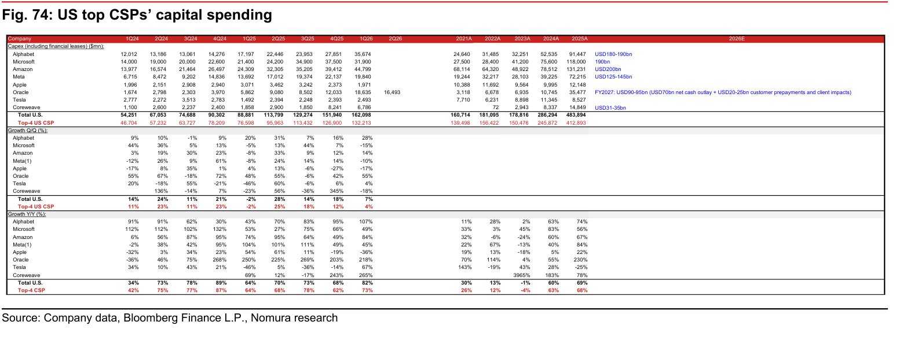
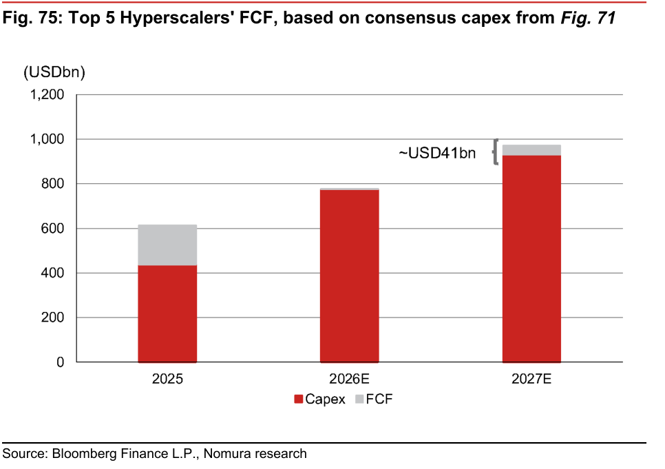

### 解讀摘要

Fig. 74 是各 CSP 逐季 capex 明細（Alphabet 2026E USD180-190bn、Microsoft USD190bn、Amazon USD200bn、Meta USD125-145bn、Oracle FY27 USD90-95bn 等）。Fig. 75 是重點：Top 5 hyperscaler 的 capex（紅）+ FCF（灰）堆疊——2025 總量約 USD610bn（capex 約430 + FCF 約180），到 2027E 升至約 USD965bn，但其中 **FCF 被壓縮到僅約 USD41bn**。這就是 Nomura 承認的最大風險之一：2027F hyperscaler FCF 因記憶體成本飆升而幾近見底。但 Nomura 的判斷是——這是「go big or go home」競爭，即使 FCF 不足，capex 仍需上修，因此把它列為「風險」而非「見頂訊號」。

> **原文補充**：Nomura 明言其最新 AI 伺服器銷售預測「隱含 hyperscaler capex 仍有 upside」——即 Fig. 74 的 2026E capex guidance 可能仍偏低。FCF 不足是投資人擔憂點，尤其疊加殖利率上行（通膨升溫但美國失業率仍穩）的總經風險。

> **洞察十四**：FCF 從 2025 的約 USD180bn 崩到 2027E 的約 USD41bn（-77%），是本報告「多頭中的空點」。這條 FCF 曲線是判斷 AI 週期何時真正見頂的關鍵領先變數——只要 hyperscaler 願意在 FCF 見底時仍加碼 capex（賭競爭優勢），週期就延續；一旦有人先眨眼縮手，Fig. 3-4 的 GW 追蹤就會反轉。對投資人這是最需要每季盯的一張圖。

---

## 相關個股清單

| 類別 | 公司 | Ticker | 評等 | TP（LCY）| 備註 |
|---|---|---|---|---|---|
| 晶圓代工/封裝 | TSMC | 2330.TW | Buy | NT\$3,425 ↑ | CoWoS 龍頭；AI 佔營收 2027F 升至約 32%；SoIC/CoPoS 反制 EMIB-T |
| 晶圓代工/封裝 | ASE（日月光）| 3711.TW | Buy | NT\$730 ↑ | WoS 外包 + 自有 CoW（CPU 起步）雙受益；漲價帶動封裝報價 |
| 記憶體 | Samsung Electronics | 005930.KS | Buy | KRW 670,000 | 記憶體龍頭；HBM 受益 |
| MCU/AP/TPU | MediaTek（聯發科）| 2454.TW | Buy | NT\$5,800 ↑ | Google TPU 設計服務份額 15%→30%+；EMIB-T v9 TPU 項目 |
| BMC 晶片 | ASPEED（信驊）| 5274.TW | Buy | NT\$19,100 ↑ | CPU 伺服器 BMC 每台一顆；早週期指標 |
| CCL/基板材料 | EMC（台光電）| 2383.TW | Buy | NT\$6,880 ↑ | CCL AI 升級 + 供給瓶頸定價能力 |
| CCL/基板材料 | TUC（台燿）| 6274.TW | Buy | NT\$2,115 ↑ | 同上；CCL 產能擴張競賽 |
| PCB/AI HDI | ZDT（臻鼎KY）| 4958.TW | Buy | NT\$720 ↑ | 新興 AI PCB/HDI；2H26F 切入 nVidia/Google/AWS |
| SiC 晶圓 | GWC（環球晶）| 6488.TW | Buy | NT\$1,200 ↑ | Feynman SiC carrier 需求啟動 |
| 半導體測試 | KYEC（京元電）| 2449.TW | Buy | NT\$390 ↑ | AI 晶片測試受益 |
| AI 基板 | Unimicron（欣興）| 3037.TW | Buy | NT\$1,350 | EMIB-T/CoPoS/CPO 多路線受益；路線之爭兩邊押注 |
| 半導體設備/封裝 | BESI | BESI.NA | Buy | EUR 340 | hybrid bonding；CPO 與 GPU-on-GPU SoIC |
| SOI 晶圓 | Soitec | SOI.FP | Buy | EUR 250 | CPO 用 SOI 晶圓；隱含上行最大（+119%）|
| AI 伺服器 ODM | Wiwynn（緯穎）| 6669.TW | Buy | NT\$8,500 | AI 伺服器 ODM；隱含上行 +99% |
| AI 伺服器 ODM | Hon Hai（鴻海）| 2317.TW | Buy | NT\$352 | ODM 主力 |
| AI 伺服器 ODM | Quanta（廣達）| 2382.TW | Buy | NT\$524 | ODM 主力 |
| AI 伺服器 ODM | Wistron（緯創）| 3231.TW | Buy | NT\$280 | ODM；隱含上行 +83% |
| AI 伺服器 ODM | Lenovo | 992.HK | Buy | HKD 35 | ODM |
| PCB | Compeq（華通）| 2313.TW | Buy | NT\$345 | 光模組 mSAP + AI PCB |
| AI PCB | Victory Giant | 2476.HK / 300476.CH | Buy | HKD 479 / RMB 417 | AI PCB 受益 |
| 電源 | Delta（台達電）| 2308.TW | Buy | NT\$2,800 | 電源首選；+/-400VDC 2H26F 放量 |
| 散熱 | AVC（奇鋐）| 3017.TW | Buy | NT\$3,130 | 散熱首選；VR200/Trainium 3 + Google TPU |
| 機架電源/數據 | Bizlink（貿聯KY）| 3665.TW | Buy | NT\$3,200 | 機架電源與數據升級 |
