# UBS｜Cloud AI：TSMC 與 ASE 加速 CoWoS 擴產，解鎖更大 TAM

**券商**：UBS  
**分析師**：Sunny Lin、Randy Abrams、Nicolas Gaudois、Timothy Arcuri、Jerry Su、Shingo Hirata、Diana Chang、Jimmy Yoon  
**日期**：2026-07-01  
**主題**：Cloud AI: TSMC and ASE driving faster CoWoS expansion, unlocking larger TAM  
<a href="/dl?g=產業&b=UBS&d=20260701&h=Cloud-AI">📎 下載 PDF</a>

---

## 報告總結

UBS 以 TSMC 和 ASE 的 CoWoS 實際擴產速度超出預期為催化劑，在法說季前大幅上修產能預測：TSMC CoWoS 從 120/150kwpm 上調至 130/180kwpm（end-2026/27），ASE 全製程 CoWoS 從 40kwpm 上調至 50kwpm（end-2027），使產業合計達 250kwpm。需求側的多元化比過去更顯著——AMD Venice CPU（1.3mn→4mn 單位）和 Google TPU-MediaTek（450k→4mn 單位）是 2026→2027 的主要增量，而非單純 Nvidia 外推，令 CoWoS 滿載更具結構性支撐。

報告的投資含義是：封裝供應鏈的 TAM 擴張持續超出街頭預期，受益排序首選 TSMC（全製程主導）和 MediaTek（Key Call，Google TPU v8t 供應商），ASE TP 上調至 NT\$835，GPTC TP 上調至 NT\$5,000，N3 wafer 由 2027 起以 Cloud AI 為主要需求拉力（佔比從 35% 升至 72%）。

---

## UBS 完整投資邏輯鏈

| 論點層次 | Figure | 內容 |
|---|---|---|
| 瓶頸確認 | 9、10 | 產業 CoWoS 產能端-2026 達 160kwpm，端-2027 預計 250kwpm；TSMC 獨占 72%，非 TSMC（ASE+Amkor）首度放量 |
| 需求結構 | 2、12 | CoWoS 需求 2027E 達 2,475kps；AMD/ASIC 貢獻的增量（+143%）已超越 Nvidia（+57%），需求基底多元化 |
| 供給加速信號 | 4、5、6 | Nvidia Rubin/Vera、AMD Venice、Google TPU-MTK、Amazon Trainium3 四條主力供應鏈同步建產 |
| N3 晶圓供需 | 13、14 | N3 全年利用率 107-110%，Cloud AI 佔比 2026→2027 從 35%→72%；TSMC 加速擴 N3 以滿足 AI 需求 |
| 設備受益 | 17 | Die attach/Wet process/Metrology 設備廠 YTD 漲幅 100-212%；GPTC 的 GM 結構改善+工具出貨 +50% 支持 5,000 目標價 |
| **結論** | 封面 | **TSMC（首選）、MediaTek（Key Call）、ASE（TP NT\$835）；CoWoS TAM 持續向上，設備及 OSAT 共同受益** |

> **報告最大邏輯缺口**：AMD Venice CPU 4mn 單位的假設為最關鍵單一推手（佔 ASE CoWoS 需求成長大部分），若 AMD 服務器 CPU 需求低於預期，ASE 的 50kwpm 目標和本報告多個受益標的的估值基礎均將受衝擊。

---

## 報告核心觀點

| 主題 | UBS 觀點 | 市場共識 | 是否 Contra-Consensus |
|---|---|---|---|
| TSMC CoWoS 端-2027 產能 | 180kwpm（↑前估 150kwpm） | 150-160kwpm | 是，再次上調 |
| ASE 全製程 CoWoS 端-2027 | 50kwpm（↑前估 40kwpm，較端-2026 的 20kwpm 翻倍以上） | 35-40kwpm | 是 |
| 產業 CoWoS 端-2027 總產能 | 250kwpm | 200kwpm 以下 | 是，大幅上調 |
| AMD Venice CPU 2027E | 4mn 台（CoWoS 需求 +232% YoY） | 1-2mn | 是，顯著高於多數預估 |
| Google TPU-MediaTek 2027E | 4mn 台（↑前 3.1mn；CoWoS 9x 年增） | 2-3mn | 是 |
| N3 Cloud AI 佔比 2027E | 72% | 55-65% | 是 |
| TSMC 後端佔總銷售比 2027E | 15.3% | 12-13% | 是，後端滲透率上行更快 |
| Intel EMIB-T 風險 | 2028 面臨資源和產能限制，優先 internal+Google/MTK | 市場高估 Intel 搶份額的速度 | 是 |

**偏好排序**：TSMC（首選，後端 TAM 擴張）> MediaTek（Key Call，AI ASIC 勝出）> ASE（TP 上調）  
**零件/個股偏好**：TSMC（2330）、MediaTek（2454）、ASE（3711）、GPTC（3131）、Chroma（2360）、KYEC（2449）、Aspeed（5274）、GUC（聯詠設計）、Alchip（3661）

---

## Figure 2｜Total CoWoS interposer wafer demand

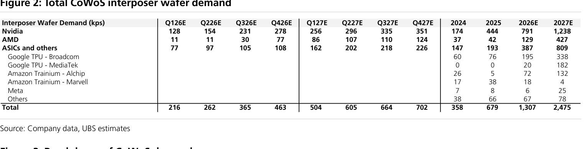

### 解讀摘要

CoWoS 互連晶圓需求從 2026E 1,307kps 成長至 2027E 2,475kps（+89% YoY），但結構重心正在轉移：Nvidia 的份額從 61% 降至 50%，而 ASIC 類（Google TPU + Amazon Trainium + Meta）從 30% 升至 33%，AMD 從 10% 升至 17%。AMD 的增量（+298kps）來自 Venice CPU 和 MI400，正是 ASE 全製程 CoWoS 的核心客戶——這是 ASE 產能擴張的真正基本面支撐，而非推測性需求。

> **原文補充**：Google TPU-MediaTek 的 CoWoS 互連晶圓需求在 2026E 僅 20kps，但 2027E 跳至 182kps（+810%）。這是一次結構性切入，而非線性成長，反映 TPU v8t 大規模量產首年的「從零到滿載」特性。

### 表格（kps，年度）

| 客戶 | 2024 | 2025 | 2026E | 2027E |
|---|---|---|---|---|
| **Nvidia** | 174 | 444 | 791 | 1,238 |
| **AMD** | 37 | 42 | 129 | 427 |
| **ASICs and others** | 147 | 193 | 387 | 809 |
| 　Google TPU - Broadcom | 60 | 76 | 195 | 338 |
| 　Google TPU - MediaTek | 0 | 0 | 20 | 182 |
| 　Amazon Trainium - Alchip | 26 | 5 | 72 | 132 |
| 　Amazon Trainium - Marvell | 17 | 38 | 18 | 4 |
| 　Meta | 7 | 8 | 6 | 25 |
| 　Others | 38 | 66 | 67 | 78 |
| **Total** | **358** | **679** | **1,307** | **2,475** |

### 表格（kps，季度）

| 客戶 | Q126E | Q226E | Q326E | Q426E | Q127E | Q227E | Q327E | Q427E |
|---|---|---|---|---|---|---|---|---|
| Nvidia | 128 | 154 | 231 | 278 | 256 | 296 | 335 | 351 |
| AMD | 11 | 11 | 30 | 77 | 86 | 107 | 110 | 124 |
| ASICs | 77 | 97 | 105 | 108 | 162 | 202 | 218 | 226 |
| **Total** | **216** | **262** | **365** | **463** | **504** | **605** | **664** | **702** |

> **洞察一**：MediaTek 的 CoWoS 晶圓需求從 2026E 20kps 跳至 2027E 182kps，代表 9.1 倍年增。即使以 2027E 全年需求 182kps ÷ 年化 4 季 = 45.5kps 季均計算，仍是 UBS 覆蓋的所有 ASIC 客戶中增速最快者。這個量級的單客戶拉動讓 MediaTek 的 Key Call 定位具備清晰的數量面佐證。

> **洞察二**：Amazon Trainium 的封裝商已明顯洗牌——Marvell 從 2025 的 38kps 驟降至 2027E 的 4kps，Alchip 則從 5kps 攀升至 132kps。Alchip 2026E/27E 的份額（72kps/132kps）幾乎等同於 MediaTek 2026E（20kps）+Amazon Marvell 2026E（18kps）的總和，顯示 Trainium 3 的主封裝設計勝出已高度確定。

---

## Figure 3｜Breakdown of CoWoS demand

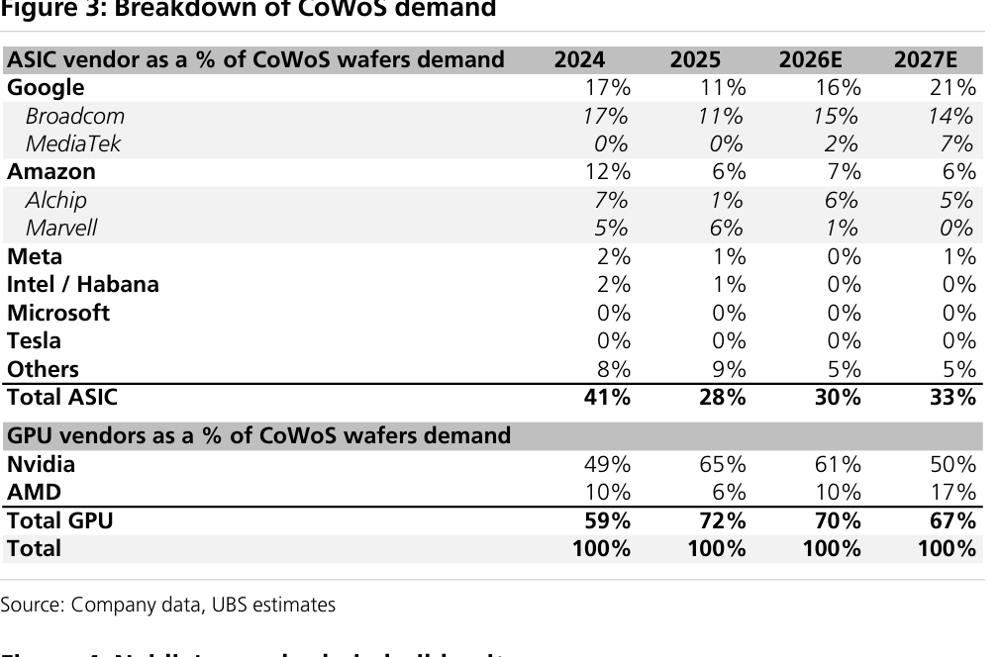

### 解讀摘要

GPU 廠商（Nvidia+AMD）佔 CoWoS 需求份額 2025→2027E 從 72% 降至 67%，ASIC 廠商同期從 28% 升至 33%。表面上 GPU 仍主導，但絕對量 GPU 2025→2027E 從 486kps 升至 1,665kps（+243%），ASIC 從 193kps 升至 809kps（+319%）——ASIC 增速更快，這是 CoWoS 需求底層結構從「Nvidia 單一引擎」轉向「GPU+ASIC 雙引擎」的縮影。

### 表格

| 類別 | 2024 | 2025 | 2026E | 2027E |
|---|---|---|---|---|
| **Google（ASIC）** | 17% | 11% | 16% | 21% |
| 　Broadcom | 17% | 11% | 15% | 14% |
| 　MediaTek | 0% | 0% | 2% | 7% |
| **Amazon（ASIC）** | 12% | 6% | 7% | 6% |
| 　Alchip | 7% | 1% | 6% | 5% |
| 　Marvell | 5% | 6% | 1% | 0% |
| **Meta** | 2% | 1% | 0% | 1% |
| **Others** | 8% | 9% | 5% | 5% |
| **Total ASIC** | **41%** | **28%** | **30%** | **33%** |
| **Nvidia** | 49% | 65% | 61% | 50% |
| **AMD** | 10% | 6% | 10% | 17% |
| **Total GPU** | **59%** | **72%** | **70%** | **67%** |

> **洞察一**：Nvidia 的 CoWoS 份額從 65%（2025）降至 50%（2027E），但不代表 Nvidia 需求放緩——2025→2027E Nvidia 的絕對量從 444kps 升至 1,238kps（+179%）。份額下降純粹是因為 AMD 和 ASIC 增速更快，CoWoS 市場正在從「Nvidia 一家獨大」轉型為多客戶均衡生態。

---

## Figure 4｜Nvidia 供應鏈建置單位

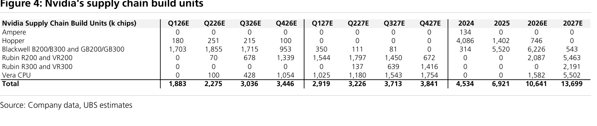

### 解讀摘要

Nvidia 2026 年出貨以 Blackwell（6,226k，佔 58%）為絕對主力，但 2027E 出現世代交替：Blackwell 驟降至 543k，Rubin（R200+R300 共 7,654k）成為主體，Vera CPU（5,502k）同步放量。這次 GPU 平台換代僅在 18 個月內完成，代表 TSMC N3 的客戶結構將快速重組（Blackwell 用 N4，Rubin 用 N3，如 Figure 13 所示），也意味著 CoWoS 封裝技術必須同步升級。

> **原文補充**：Rubin GPU 在 Q226 因設計修改（redesign）出貨放緩，UBS 預期 H226 將陡升，2026E 全年達 2.1mn 單位（R200/VR200 合計）。R300/VR300 從 Q227E 啟動，2027E 達 2,191k。

### 表格（k chips）

| 型號 | Q126E | Q226E | Q326E | Q426E | Q127E | Q227E | Q327E | Q427E | 2024 | 2025 | 2026E | 2027E |
|---|---|---|---|---|---|---|---|---|---|---|---|---|
| Hopper | 180 | 251 | 215 | 100 | 0 | 0 | 0 | 0 | 4,086 | 1,402 | 746 | 0 |
| Blackwell B/GB 200/300 | 1,703 | 1,855 | 1,715 | 953 | 350 | 111 | 81 | 0 | 314 | 5,520 | 6,226 | 543 |
| Rubin R200 / VR200 | 0 | 70 | 678 | 1,339 | 1,544 | 1,797 | 1,450 | 672 | 0 | 0 | 2,087 | 5,463 |
| Rubin R300 / VR300 | 0 | 0 | 0 | 0 | 0 | 137 | 639 | 1,416 | 0 | 0 | 0 | 2,191 |
| Vera CPU | 0 | 100 | 428 | 1,054 | 1,025 | 1,180 | 1,543 | 1,754 | 0 | 0 | 1,582 | 5,502 |
| **Total** | **1,883** | **2,275** | **3,036** | **3,446** | **2,919** | **3,226** | **3,713** | **3,841** | **4,534** | **6,921** | **10,641** | **13,699** |

> **洞察一**：Rubin GPU 2027E 合計 7,654k（R200/VR200 5,463k + R300/VR300 2,191k），vs Blackwell 2027E 543k——世代交替完成度達 93%。Vera CPU 5,502k 的出貨量幾乎等於 Rubin GPU 的 72%，代表 Nvidia 的 CPU 出貨已形成獨立的大規模採購流，對 TSMC N3 和 CoWoS 均是雙重需求來源。

> **洞察二**：2026E Nvidia 總建置量 10,641k 對比 2025E 6,921k，YoY +54%；2027E 對比 2026E，+29%。增速放緩不代表絕對量小——2027E 的 13,699k 是 2024 的 3 倍。支撐此增速的是製程（N3 Rubin）和封裝（CoWoS + CoPoS 組合）的平台換代，並非單純出貨量外推。

---

## Figure 5｜AMD 供應鏈建置單位

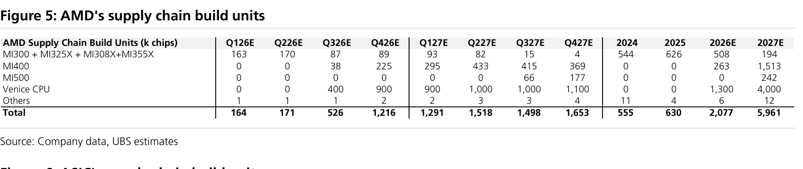

### 解讀摘要

AMD 2027E 建置量達 5,961k，是 2026E 2,077k 的 2.9 倍，幾乎全由兩個產品驅動：Venice CPU（1,300k→4,000k）和 MI400（263k→1,513k）。Venice CPU 是 ASE CoWoS 擴產的核心客戶，MI400 則使用 CoWoS 封裝，MI300 世代加速退出（2026E 508k→2027E 194k）。這種量級的單一封裝需求決定了 ASE 50kwpm 擴產目標是否能在 2027 支撐滿載。

> **原文補充**：AMD CoWoS 需求 2027E 相對 2026E 成長 +232%，UBS 明確指出 ASE 的全製程 CoWoS 擴產「主要由 AMD Venice 帶動」。MI500 從 Q327E 開始出貨（66k），2027E 合計僅 242k，仍屬早期爬坡。

### 表格（k chips）

| 型號 | Q126E | Q226E | Q326E | Q426E | Q127E | Q227E | Q327E | Q427E | 2024 | 2025 | 2026E | 2027E |
|---|---|---|---|---|---|---|---|---|---|---|---|---|
| MI300 / MI325X / MI308X / MI355X | 163 | 170 | 87 | 89 | 93 | 82 | 15 | 4 | 544 | 626 | 508 | 194 |
| MI400 | 0 | 0 | 38 | 225 | 295 | 433 | 415 | 369 | 0 | 0 | 263 | 1,513 |
| MI500 | 0 | 0 | 0 | 0 | 0 | 0 | 66 | 177 | 0 | 0 | 0 | 242 |
| Venice CPU | 0 | 0 | 400 | 900 | 900 | 1,000 | 1,000 | 1,100 | 0 | 0 | 1,300 | 4,000 |
| Others | 1 | 1 | 1 | 2 | 2 | 3 | 3 | 4 | 11 | 4 | 6 | 12 |
| **Total** | **164** | **171** | **526** | **1,216** | **1,291** | **1,518** | **1,498** | **1,653** | **555** | **630** | **2,077** | **5,961** |

> **洞察一**：Venice CPU 4,000k 單位在 2027E 佔 AMD 總建置量的 67%，成為 AMD 供應鏈最大量體。相比之下，MI400 1,513k 和 MI500 242k 合計不到 Venice 的 45%。這意味著投資 ASE 的核心假設並非 AMD GPU 而是 AMD 伺服器 CPU，是一個比市場直覺更 mundane 但更穩定的需求來源。

---

## Figure 6｜ASIC 供應鏈建置單位

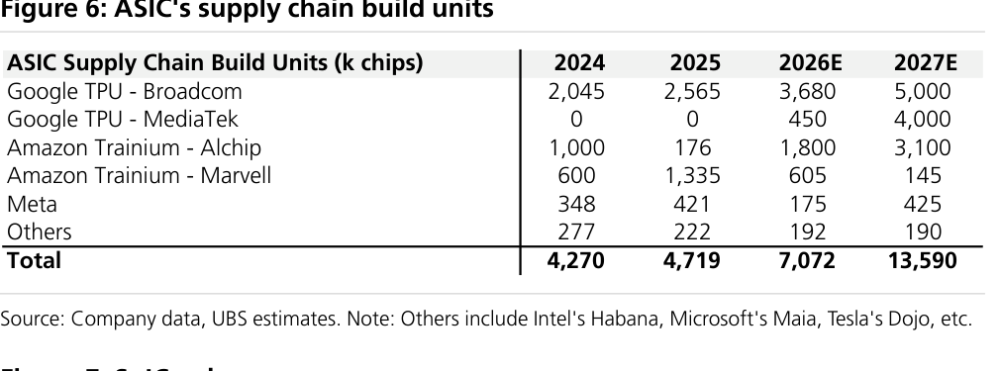

### 解讀摘要

ASIC 生態 2027E 總建置量達 13,590k，是 2026E 7,072k 的 1.92 倍。最大驅動力是 Google TPU-MediaTek 的爆發（450k→4,000k，+789%）和 Google TPU-Broadcom 的穩增（3,680k→5,000k，+36%）。Amazon Trainium 的封裝商洗牌清晰——Alchip 取代 Marvell，從 1,800k 升至 3,100k（+72%），Marvell 從 605k 驟降至 145k（-76%）。

### 表格（k chips，年度）

| 客戶 | 2024 | 2025 | 2026E | 2027E |
|---|---|---|---|---|
| Google TPU - Broadcom | 2,045 | 2,565 | 3,680 | 5,000 |
| Google TPU - MediaTek | 0 | 0 | 450 | 4,000 |
| Amazon Trainium - Alchip | 1,000 | 176 | 1,800 | 3,100 |
| Amazon Trainium - Marvell | 600 | 1,335 | 605 | 145 |
| Meta | 348 | 421 | 175 | 425 |
| Others（Intel Habana / Microsoft Maia / Tesla Dojo 等） | 277 | 222 | 192 | 190 |
| **Total** | **4,270** | **4,719** | **7,072** | **13,590** |

> **洞察一**：Google 的 TPU 生態（Broadcom+MediaTek 合計）2027E 達 9,000k 單位，佔 ASIC 總量的 66%。MediaTek 在其中的佔比從 6%（2026E）跳至 44%（2027E），代表 Google 正積極分散 ASIC 設計廠商集中度，MediaTek 是唯一具有從零到規模化的新切入者。

> **洞察二（配合 Figure 2）**：MediaTek TPU 的 CoWoS 晶圓消耗效率——2027E 4,000k 晶片對應 182kps CoWoS 晶圓，即每片晶圓約 22 個 TPU v8t 晶片。以 800mm² die size 換算，300mm 晶圓理論值約 88 個裸晶，考量良率和封裝良率後 22 個/wafer 完全合理，交叉驗證 UBS 模型內部一致性。

---

## Figure 7｜SoIC volume

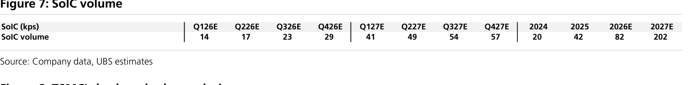

### 解讀摘要

SoIC（System on Integrated Chip，TSMC 的 3D 堆疊技術）出貨量從 2026E 82kps 跳升至 2027E 202kps（+146%），增速顯著快於 CoWoS 互連晶圓需求的 +89%。SoIC 的更快增長反映 AI 晶片設計往「2.5D 封裝 + 3D 堆疊」複合架構演進——CoWoS 負責水平互連，SoIC 負責垂直堆疊，兩者不是替代而是互補，共同推升 TSMC 後端每顆晶片的 ASP。

### 表格（kps）

| 指標 | Q126E | Q226E | Q326E | Q426E | Q127E | Q227E | Q327E | Q427E | 2024 | 2025 | 2026E | 2027E |
|---|---|---|---|---|---|---|---|---|---|---|---|---|
| SoIC volume | 14 | 17 | 23 | 29 | 41 | 49 | 54 | 57 | 20 | 42 | 82 | 202 |

> **洞察一**：SoIC 的季度增速呈現加速態勢——Q126E 到 Q426E 的增長率（14→29）約 107%，而 Q127E 到 Q427E（41→57）僅 +39%。這意味著 SoIC 爬坡在 2026 下半年已接近量產成熟期，2027 的量是穩定增長而非大起大落的爬坡期，從製造可預期性角度是正面訊號。

---

## Figure 8｜TSMC 後端業務銷售分析

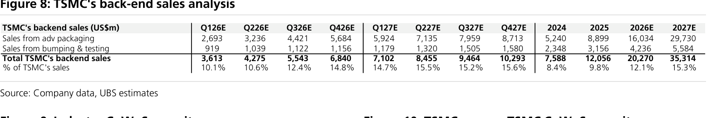

### 解讀摘要

TSMC 後端銷售（先進封裝 + 凸塊/測試）2027E 達 US\$35.3bn，佔公司總收入 15.3%，較 2024 的 8.4% 幾近翻倍滲透率。先進封裝（CoWoS 為主）的增速遠超凸塊/測試（2026E YoY +80% vs +34%），確認 CoWoS 是後端成長的核心驅動力而非一般封測業務。

### 表格（US\$m）

| 項目 | Q126E | Q226E | Q326E | Q426E | Q127E | Q227E | Q327E | Q427E | 2024 | 2025 | 2026E | 2027E |
|---|---|---|---|---|---|---|---|---|---|---|---|---|
| 先進封裝 | 2,693 | 3,236 | 4,421 | 5,684 | 5,924 | 7,135 | 7,959 | 8,713 | 5,240 | 8,899 | 16,034 | 29,730 |
| 凸塊 & 測試 | 919 | 1,039 | 1,122 | 1,156 | 1,179 | 1,320 | 1,505 | 1,580 | 2,348 | 3,156 | 4,236 | 5,584 |
| **TSMC 後端合計** | **3,613** | **4,275** | **5,543** | **6,840** | **7,102** | **8,455** | **9,464** | **10,293** | **7,588** | **12,056** | **20,270** | **35,314** |
| 佔 TSMC 總收入 | 10.1% | 10.6% | 12.4% | 14.8% | 14.7% | 15.5% | 15.2% | 15.6% | 8.4% | 9.8% | 12.1% | 15.3% |

> **洞察一**：TSMC 後端 2027E 的 US\$35.3bn 已超過 2026E 的先進封裝（US\$16.0bn）加凸塊測試（US\$4.2bn）合計的兩倍以上，意味著後端業務的體量在未來 18 個月形同「再造一個 TSMC 後端」。對於習慣以前端晶圓估算 TSMC 的投資者，後端已成為不可忽視的第二增長曲線。

---

## Figure 9｜產業 CoWoS 產能趨勢

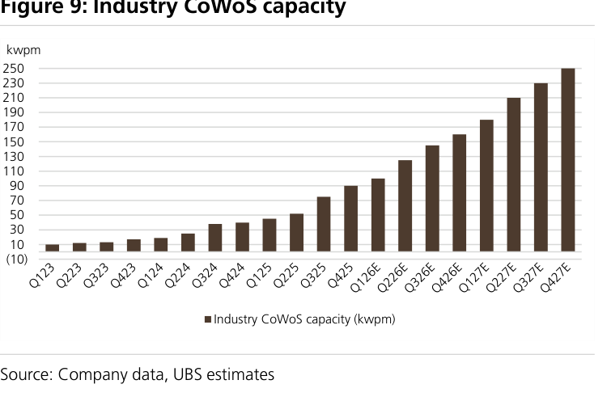

### 解讀摘要

產業 CoWoS 產能從 2023 年初的不足 10kwpm 成長至 2027E 末的 250kwpm，五年接近 25 倍。增速在 2026-27E 明顯加速，主要來自 TSMC 加速擴建（130kwpm end-2026→180kwpm end-2027）以及 ASE/Amkor 等 OSAT 從零起量的乘數效應。

> **原文補充**：UBS 指出 TSMC 的 CoWoS 擴產「re-accelerating」——這是相對於一個月前預估的上調，顯示 TSMC 正在加快原有擴產計畫。

---

## Figure 10｜TSMC vs. 非 TSMC CoWoS 產能

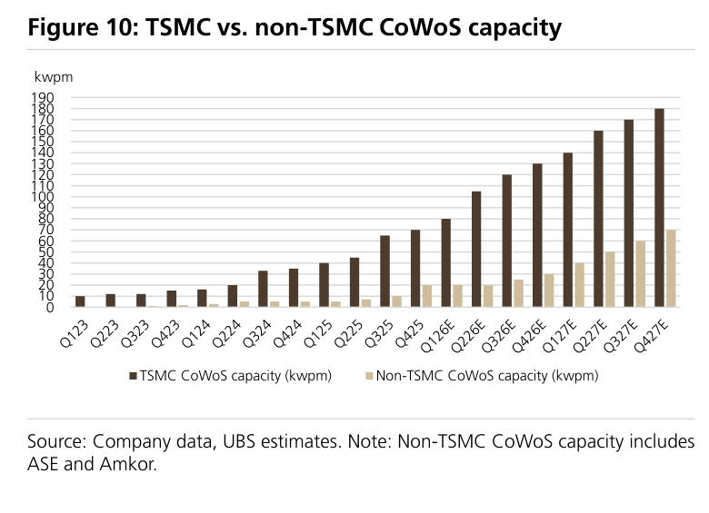

### 解讀摘要

2027E 末產業 250kwpm CoWoS 產能中，TSMC 約佔 180kwpm（72%），非 TSMC（ASE + Amkor）約 70kwpm（28%）。非 TSMC 的份額從 2025 年的不足 5% 迅速攀升，但 TSMC 仍主導高端 CoWoS（GPU 及複雜 ASIC），OSAT 主攻 CPU 及相對低複雜度設計。此分工格局短期難以改變——Intel EMIB-T 要到 2028 才有規模，且 UBS 認為 Intel 將優先服務內部產品。

---

## Figure 11｜產業 CoWoS 產能 vs. Nvidia 需求

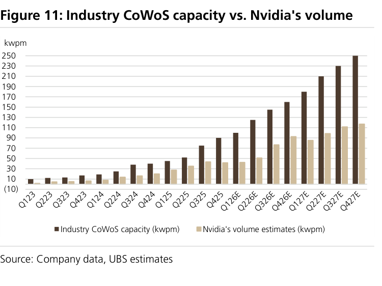

### 解讀摘要

即使不計 AMD 和 ASIC，Nvidia 單獨的 CoWoS 需求就能在 2025 年前撐滿當時產能；但到 2026-27E，產業產能的擴張幅度已大幅超越 Nvidia 的單一需求——超出部分就是 AMD Venice 和 ASIC（Google/Amazon）填補的空間。這張圖的意義在於：CoWoS 的擴產不是對 Nvidia 的單點押注，而是對整體雲端 AI 生態的系統性投資。

---

## Figure 12｜主要客戶 CoWoS 需求

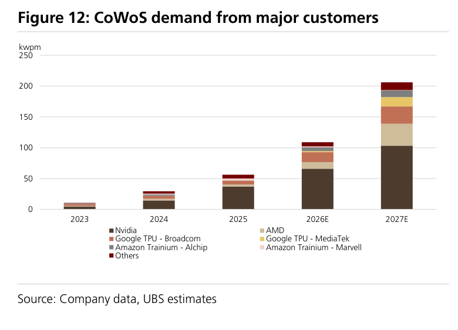

### 解讀摘要

2027E CoWoS 需求約 200kwpm（季均），Nvidia 仍是最大單一客戶（約 100kwpm），但非 Nvidia 的增量在 2026→2027E 成長更快：AMD + Google TPU-MediaTek + Amazon Trainium-Alchip 的合計 2026→2027E 成長超過 Nvidia 的同期增量。Google TPU-MediaTek 的色塊（淡黃）在 2026 開始可見，2027 明顯放大，與 Figure 6 的 4mn 單位 TPU v8t 爬坡一致。

---

## Figure 13｜N3 供需分析

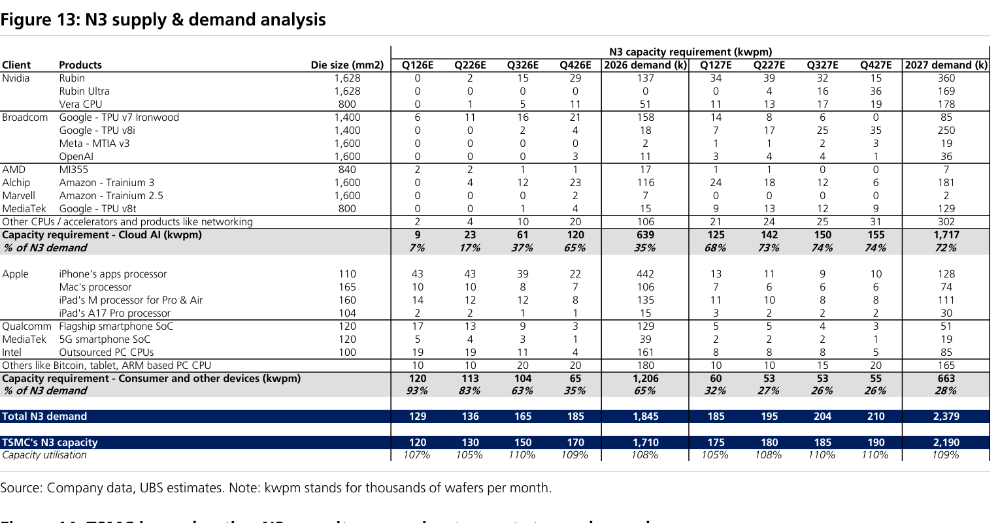

### 解讀摘要

N3 在 2026-27E 全年滿載（利用率 107-110%），而結構性驅動力從 Consumer/PC 切換至 Cloud AI：Cloud AI 佔 N3 需求從 2026E 35% 升至 2027E 72%，絕對值從 639kwpm 升至 1,717kwpm（+169%），而 Consumer（Apple / Qualcomm / MediaTek 手機等）的 N3 需求實際下降（1,206→663kwpm）。這一轉型不是蠶食，是替代——Consumer 設備商轉向 N2，釋出的 N3 產能全部被 Cloud AI 吸收，再加 TSMC 自身 N3 擴產 2027E 增至 2,190kwpm（+28%）。

### 表格：N3 需求 - Cloud AI 客戶（kwpm）

| 客戶 | 產品 | Die size (mm²) | 2026 demand (k) | 2027 demand (k) |
|---|---|---|---|---|
| Nvidia | Rubin | 1,628 | 137 | 360 |
| Nvidia | Rubin Ultra | 1,628 | 0 | 169 |
| Nvidia | Vera CPU | 800 | 51 | 178 |
| Broadcom | Google TPU v7 Ironwood | 1,400 | 158 | 85 |
| Broadcom | Google TPU v8i | 1,400 | 18 | 250 |
| Broadcom | Meta MTIA v3 | 1,600 | 2 | 19 |
| Broadcom | OpenAI | 1,600 | 11 | 36 |
| AMD | MI355 | 840 | 17 | 7 |
| Alchip | Amazon Trainium 3 | 1,600 | 116 | 181 |
| Marvell | Amazon Trainium 2.5 | 1,600 | 7 | 2 |
| MediaTek | Google TPU v8t | 800 | 15 | 129 |
| Others（網路、加速器等） | — | — | 106 | 302 |
| **Cloud AI 合計** | | | **639** | **1,717** |
| **佔 N3 需求 %** | | | **35%** | **72%** |

### 表格：N3 需求 - Consumer（kwpm）

| 客戶 | 產品 | 2026 demand (k) | 2027 demand (k) |
|---|---|---|---|
| Apple | iPhone apps processor | 442 | 128 |
| Apple | Mac processor | 106 | 74 |
| Apple | iPad M Pro/Air | 135 | 111 |
| Apple | iPad A17 Pro | 15 | 30 |
| Qualcomm | 旗艦 smartphone SoC | 129 | 51 |
| MediaTek | 5G smartphone SoC | 39 | 19 |
| Intel | Outsourced PC CPUs | 161 | 85 |
| Others（Bitcoin / tablet / ARM PC 等） | — | 180 | 165 |
| **Consumer 合計** | | **1,206** | **663** |
| **佔 N3 需求 %** | | **65%** | **28%** |

### 供需平衡

| 項目 | Q126E | Q226E | Q326E | Q426E | 2026 demand (k) | Q127E | Q227E | Q327E | Q427E | 2027 demand (k) |
|---|---|---|---|---|---|---|---|---|---|---|
| Cloud AI 需求（kwpm） | 9 | 23 | 61 | 120 | 639 | 125 | 142 | 150 | 155 | 1,717 |
| Consumer 需求（kwpm） | 120 | 113 | 104 | 65 | 1,206 | 60 | 53 | 53 | 55 | 663 |
| **Total N3 需求** | **129** | **136** | **165** | **185** | **1,845** | **185** | **195** | **204** | **210** | **2,379** |
| TSMC N3 產能 | 120 | 130 | 150 | 170 | 1,710 | 175 | 180 | 185 | 190 | 2,190 |
| 產能利用率 | 107% | 105% | 110% | 109% | 108% | 105% | 108% | 110% | 110% | 109% |

> **洞察一**：Google TPU v8i（Broadcom 設計，1,400mm²）的 2027E N3 需求從 18k 跳至 250k，是雲端 AI N3 增量中最大的單一產品貢獻者（+232k）。這款 chip 的 1,400mm² die size 是 TSMC N3 reticle 極限尺寸，每片晶圓良率極低，為 TSMC 帶來最高的每晶圓 ASP，也是 TSMC N3 利用率維持 100%+ 的核心支撐。

> **洞察二**：MediaTek Google TPU v8t（800mm²）2027E 的 N3 需求達 129k wafers，即 129k × 年換算。Figure 6 顯示 MTK 2027E 出貨 4,000k 晶片，推算每片 N3 晶圓約 31 個 die（4,000k ÷ 129k ≈ 31），考慮到 800mm² 在 300mm 晶圓的理論值約 88 個，良率約 35%，在 N3 量產早期屬合理範圍，且 UBS 預計隨良率提升，MTK 的成本競爭力可進一步改善。

---

## Figure 14｜TSMC 加速 N3 擴產

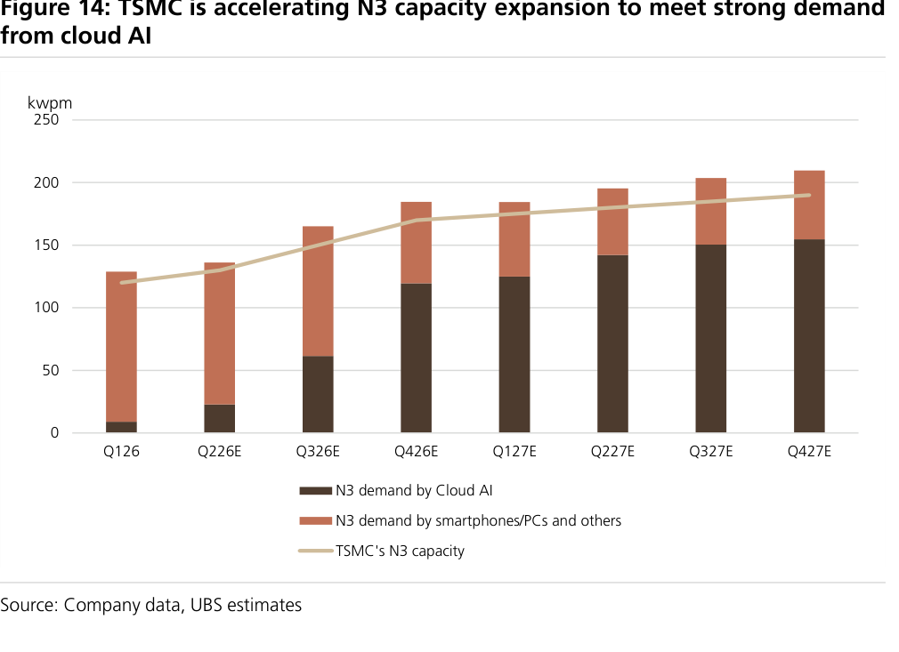

### 解讀摘要

圖表顯示 N3 總需求（Cloud AI + Consumer 堆疊）在 Q326E 前首次超過 TSMC N3 產能線，但到 Q127E TSMC 的擴產開始追上。2027E 末 TSMC N3 產能達 190kwpm，而 Q427E 的需求約 210kwpm，供給仍略緊。Consumer 需求（淡色）從 2026H1 的主導逐季收縮，Cloud AI（深色）相應填滿，呈現清晰的需求結構交棒。

---

## Figure 15｜2026E N3 產能份額（各客戶）

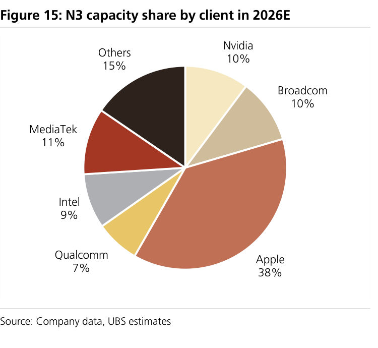

### 解讀摘要

2026E Apple 以 38% 主導 TSMC N3，但這是最後一年的絕對主導地位——2027 Apple 轉向 N2，其 N3 份額崩落至 14%（Figure 16）。MediaTek 在 2026E 佔 11%，令人意外地居第三（高於 Nvidia 10%），原因在於 MTK 同時供應 5G 手機（N3）和 Google TPU v8t（N3），兩條產品線重疊在同一製程節點。

### 表格

| 客戶 | 2026E N3 份額 |
|---|---|
| Apple | 38% |
| MediaTek | 11% |
| Nvidia | 10% |
| Broadcom | 10% |
| Intel | 9% |
| Qualcomm | 7% |
| Others | 15% |

---

## Figure 16｜2027E N3 產能份額（各客戶）

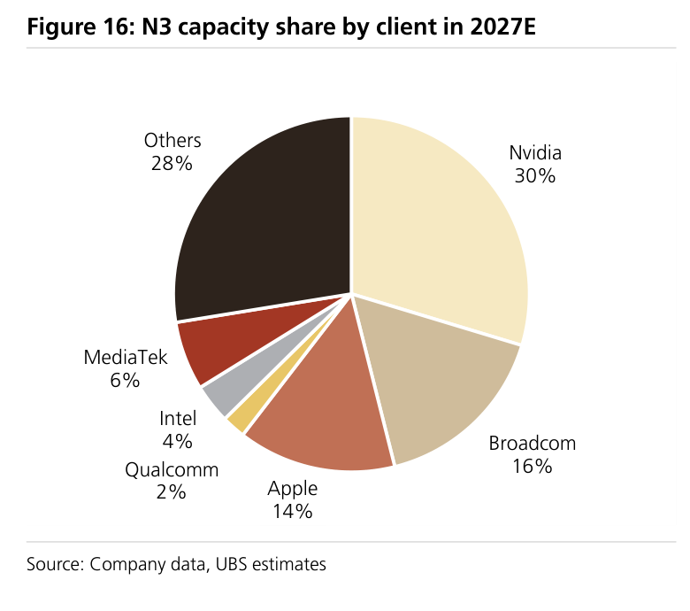

### 解讀摘要

N3 份額在 2027E 完成翻轉：Nvidia 從 10% 躍升至 30%，成為最大 N3 客戶；Broadcom（Google TPU v8i + 其他 ASIC）從 10% 升至 16%；Apple 從 38% 降至 14%。Cloud AI 合計（Nvidia + Broadcom + MediaTek + ASIC others）從 35% 升至 72%。「Others」（28%）包含大量新興 ASIC 設計案，暗示 TSMC N3 的客戶多元化正在深化，非單一雲端客戶主導。

### 表格

| 客戶 | 2026E | 2027E | 變化 |
|---|---|---|---|
| Nvidia | 10% | 30% | ↑ +20ppt |
| Broadcom | 10% | 16% | ↑ +6ppt |
| Apple | 38% | 14% | ↓ -24ppt |
| MediaTek | 11% | 6% | ↓ -5ppt |
| Intel | 9% | 4% | ↓ -5ppt |
| Qualcomm | 7% | 2% | ↓ -5ppt |
| Others | 15% | 28% | ↑ +13ppt |

> **洞察一**：Apple 的 N3 份額在 12 個月內從 38% 降至 14%，是 TSMC N3 歷史上最大單一客戶份額位移。這不是 Apple 出貨疲弱——而是 Apple 主動轉向 N2（iPhone 17 及後），騰出的 N3 產能被 Cloud AI 精準填滿。對 TSMC 而言，N3 ASP 的雲端化意味著每晶圓收入實際提升（AI die 尺寸更大、良率補貼更少）。

> **洞察二（配合 Figure 13）**：MediaTek 的 N3 份額 2027E 雖從 11% 降至 6%，但絕對 wafer 量從 54k（2026E 年均 39k/季）升至 148k，因為 Google TPU v8t（MTK）的 N3 wafer 需求本身在增加；份額下降純係因為分母（總 N3 需求）增長更快。

---

## Figure 17｜主要先進封裝設備廠商比較

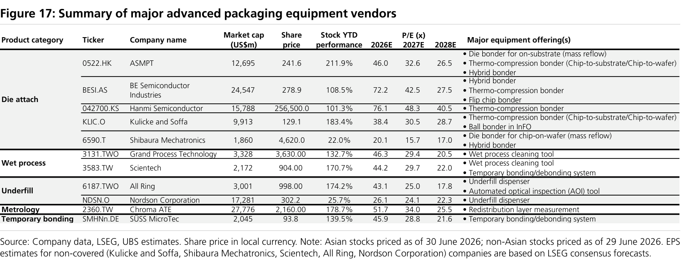

### 解讀摘要

12 家主要先進封裝設備廠商 YTD 表現亮眼（+22% 到 +212%），以 Die attach 設備商（ASMPT、BESI、Hanmi）領漲，反映 Thermo-compression bonding（TCB）和 hybrid bonding 需求的先行爆發。台灣廠商中，Wet process 設備的 GPTC（+133%）和 Scientech（+171%）、計量的 Chroma（+179%）均大幅超越大盤，但估值（2027E P/E 29-34x）仍低於 Die attach 的國際廠商（40-48x），存在評價收斂空間。

### 表格

| 類別 | Ticker | 公司 | 市值（US\$m） | 股價（本地幣） | YTD | P/E 2026E | P/E 2027E | P/E 2028E | 主要產品 |
|---|---|---|---|---|---|---|---|---|---|
| **Die attach** | 0522.HK | ASMPT | 12,695 | 241.6 | +212% | 46.0 | 32.6 | 26.5 | Die bonder（mass reflow）、TCB、hybrid bonder |
| | BESI.AS | BE Semiconductor | 24,547 | 278.9 | +109% | 72.2 | 42.5 | 27.5 | Hybrid bonder、TCB、flip chip bonder |
| | 042700.KS | Hanmi Semiconductor | 15,788 | 256,500 | +101% | 76.1 | 48.3 | 40.5 | Thermo-compression bonder |
| | KLIC.O | Kulicke & Soffa | 9,913 | 129.1 | +183% | 38.4 | 30.5 | 28.7 | TCB、ball bonder（InFO） |
| | 6590.T | Shibaura Mechatronics | 1,860 | 4,620 | +22% | 20.1 | 15.7 | 17.0 | Die bonder（chip-on-wafer）、hybrid bonder |
| **Wet process** | 3131.TWO | GPTC（大立光製） | 3,328 | 3,630 | +133% | 46.3 | 29.4 | 20.5 | Wet process 清洗工具 |
| | 3583.TW | Scientech | 2,172 | 904 | +171% | 44.2 | 29.7 | 22.0 | Wet process 清洗工具、暫時鍵合/剝離系統 |
| **Underfill** | 6187.TWO | All Ring | 3,001 | 998 | +174% | 43.1 | 25.0 | 17.8 | Underfill 點膠機、AOI 設備 |
| | NDSN.O | Nordson | 17,281 | 302.2 | +26% | 26.1 | 24.1 | 22.3 | Underfill 點膠機 |
| **Metrology** | 2360.TW | Chroma ATE | 27,776 | 2,160 | +179% | 51.7 | 34.0 | 25.5 | RDL 計量量測 |
| **Temporary bonding** | SMHNn.DE | SÜSS MicroTec | 2,045 | 93.8 | +140% | 45.9 | 28.8 | 21.6 | 暫時鍵合/剝離系統 |

資料截至 2026-06-30（亞股）/ 2026-06-29（非亞股）。非覆蓋公司（KLIC、Shibaura、Scientech、All Ring、Nordson）EPS 採 LSEG 共識。

> **洞察一**：台灣設備廠 GPTC（2027E 29.4x）和 Scientech（29.7x）的估值顯著低於 Die attach 廠商 BESI（42.5x）和 Hanmi（48.3x）。考慮到 GPTC 2027-28E 的獲利 CAGR 達 36%（UBS 估），其 PEG 約 0.8x，低於 BESI（42.5x ÷ 約 35% CAGR ≈ 1.2x），從 PEG 角度 GPTC 的估值折價難以用成長性解釋，可能存在流動性或市場知名度折扣。

---

## 跨 Exhibit 彙整表

### 彙整 1｜各客戶 CoWoS 需求（wafers, kps）× build units（k chips）概覽

來源：Figure 2、Figure 4、Figure 5、Figure 6

| 客戶 | 2026E build（k chips） | 2026E CoWoS wafer（kps） | 2027E build（k chips） | 2027E CoWoS wafer（kps） | wafer YoY |
|---|---|---|---|---|---|
| Nvidia（合計） | 10,641 | 791 | 13,699 | 1,238 | +57% |
| AMD（合計） | 2,077 | 129 | 5,961 | 427 | +231% |
| Google TPU-Broadcom | 3,680 | 195 | 5,000 | 338 | +73% |
| Google TPU-MediaTek | 450 | 20 | 4,000 | 182 | +810% |
| Amazon Trainium-Alchip | 1,800 | 72 | 3,100 | 132 | +83% |
| **CoWoS 總需求** | | **1,307** | | **2,475** | **+89%** |

> 從 wafer YoY 欄可見：Google TPU-MediaTek（+810%）和 AMD（+231%）是拉動整體 CoWoS 晶圓需求增速（+89%）遠超 Nvidia（+57%）的主因。任何使這兩個假設回調的情境（AMD Venice 交期滑移、MTK TPU v8t 客戶需求低於預期），將使整體 CoWoS 需求下修 15-25%。

### 彙整 2｜N3 客戶結構演變（配合 Figure 13、15、16）

| 客戶 | 2026E 份額 | 2026E demand（k） | 2027E 份額 | 2027E demand（k） | 需求 YoY |
|---|---|---|---|---|---|
| Apple（所有產品） | 38% | 698 | 14% | 343 | -51% |
| Nvidia（Rubin + Vera CPU） | 10% | 188 | 30% | 707 | +276% |
| Broadcom（Google + Meta + OpenAI） | 10% | 189 | 16% | 390 | +106% |
| MediaTek（5G + TPU v8t） | 11% | 54 | 6% | 148 | +174% |
| Intel | 9% | 161 | 4% | 85 | -47% |
| Qualcomm | 7% | 129 | 2% | 51 | -60% |
| Others（ASIC + others） | 15% | 277 | 28% | 666 | +140% |
| **Total N3 demand** | | **1,845** | | **2,379** | **+29%** |

> N3 的需求 YoY 僅 +29%，遠低於 CoWoS（+89%）或 build units（Nvidia +29%、AMD +187%），顯示 N3 製程節點本身不是本報告的主要增量論點——重點在於「N3 的客戶結構翻轉」，而非 N3 晶圓量的高速增長。Apple 的 N3 絕對量從 698k 降至 343k（-51%），是 N3 總量幾乎相抵消掉 Nvidia/Broadcom 增量後，供需依然緊張（利用率 109%）的主因。

---

## 相關個股清單

| 類別 | 公司 | Ticker | 評等 | 備註 |
|---|---|---|---|---|
| 晶圓代工 | 台積電 | 2330 | Buy（Key Pick） | CoWoS 主導者；後端 15.3% 銷售佔比 2027E；N3 滿載 109% |
| 封裝測試 | 日月光投控 | 3711 | Buy；TP NT\$835（↑NT\$660） | 全製程 CoWoS 20→50kwpm；AMD Venice 主要受益者 |
| IC 設計 | 聯發科 | 2454 | Buy（Key Call） | Google TPU v8t：450k→4mn 單位；CoWoS wafer +810% |
| 封裝設備 | 大立光製（GPTC） | 3131 | Buy；TP NT\$5,000（↑NT\$4,000） | Wet process；工具出貨 220→330 台；33x 2027-28E PE |
| 計量設備 | Chroma ATE | 2360 | 偏好（非正式評等） | RDL 計量；YTD +179%；2027E P/E 34.0x |
| 精密機構 | Hon Precision（致伸精密） | 未列 | 偏好 | 具體細節未在本報告展開 |
| 封裝設備 | ASMPT | 0522.HK | 非評等 | Die attach 設備龍頭；2027E P/E 32.6x；YTD +212% |
| Final Test | KYEC（京元電子） | 2449 | 偏好 | Final test：Amazon Trainium 3 + MTK TPU v8t 明年量產受益 |
| BMC 晶片 | Aspeed | 5274 | 偏好 | BMC 出貨量強勁 |
| IC 設計服務 | GUC（創意電子） | 3443 | 偏好 | Google CPU 上行潛力 |
| IC 設計服務 | Alchip（世芯） | 3661 | 偏好 | Amazon Trainium 3/4 主要受益者 |
