# MS｜NAND Industry Outlook: Diverging Trends

**券商**：Morgan Stanley  
**分析師**：Duan Liu、Shawn Kim、Cindy Huang、Charlie Chan、Joseph Moore、Kazuo Yoshikawa、Daniel Yen、Ryan Kim、Tiffany Yeh  
**日期**：2026-07-02  
**主題**：NAND Industry Outlook — Diverging Trends  
**評級**：Attractive（S. Korea Tech / Asia Pacific）  
<button type="button" onclick="fetch('https://ti-lei.github.io/foreign-reports/static/downloads/産業/20260702_MS_NAND-Diverging.md').then(r=>r.text()).then(t=>{let a=document.createElement('a');a.href='data:text/plain;charset=utf-8,'+encodeURIComponent(t);a.download='20260702_MS_NAND-Diverging.md';a.click()})">⬇ 下載 MD</button>

**目標價調整**：
- Longsys（301308.SZ）EW：PT Rmb300 → Rmb673（+124%）
- Silicon Motion（SIMO.O）OW：PT US\$155 → US\$400（+158%）
- Phison（8299.TWO）EW：PT NT\$2,248 → NT\$2,588（+15%）

---

## 報告總結

MS 更新全球 NAND 供需預估，2026e/2027e 供給短缺比率分別為 -15%/-9%，AI 需求持續佔據主導（佔總需求 32%/41%）；AI NAND 需求 2025-2027 從 205 EB 增至 609 EB（近 3 倍），主要由 Google TPU/Meta MTIA 高成長驅動，GPGPU 反而因 Rubin 架構 eSSD 含量低於 Blackwell 而呈下滑。2028 為關鍵轉折年：YMTC 擴產幅度（310–470kwpm）與 AI SSD 需求成長（30–60% YoY）共同決定是否由缺轉供過剩。消費端（PC/智慧型手機）因 2Q26 漲價後需求縮手，訂單開始出現削減，供應商正將產能轉向 AI 客戶，消費產品定價上行空間趨近上限。MS 策略偏好：DRAM 優於 NAND（LTA 條件更佳、EUV 供給受限）；NAND 內偏好原廠優於模組廠（利潤率持久性更強）。

---

## MS 完整投資邏輯鏈

| 論點層次 | Exhibit | 內容 |
|---|---|---|
| AI 需求爆發 | Exhibit 2 | AI NAND 需求 205→400→609 EB（2025-27），Google TPU 從 0→33 EB 為最大增量，Meta MTIA 從 1→9 EB |
| 供給無法跟上 | Exhibit 3 | 總需求 1,484 EB vs 供給 1,347 EB（2027e），缺口 -9%；2026e 缺口更達 -15% |
| 2028 最大變數 | Exhibit 4 | YMTC 擴至 470kwpm + AI SSD 成長 60% YoY → 仍可維持 +4% 過剩；若擴至 350kwpm + 60% 成長 → 仍缺 -3% |
| 消費端出現天花板 | Exhibit 5/6 | 模組廠/通路商 NAND 庫存顯著上升；消費型 PC/手機 NAND 訂單削減始於 2Q26 漲價後 |
| 模組廠估值已修正至合理 | Exhibit 8 | 模組廠 NTM P/E 自 80x（2025Q4 高峰）壓縮至 20x，EPS 大幅上修支撐 |
| Boot drive 為差異化成長引擎 | Exhibit 10-13 | Vera Rubin/CMS 帶動 SIMO boot drive 收入 \$256mn→\$541mn（2026e/27e），佔 SIMO 收入 15%/21% |
| **結論** | 封面 | **偏好 DRAM > NAND、原廠 > 模組廠；SIMO 目標價大幅上調至 US\$400（+158%），Phison/Longsys 維持 EW** |

> **報告最大邏輯缺口**：2028 情境分析假設 YMTC 不受進一步出口管制約束自行擴張，但地緣政治風險（新一輪制裁）未建入模型，是供需最大的外生不確定性。

---

## 報告核心觀點

| 主題 | MS 觀點 | 市場共識 | 是否 Contra-Consensus |
|---|---|---|---|
| 2027 NAND 供需 | 持續短缺（-9%），AI 佔 41% | 一般預期 2027 趨於平衡 | ✅ 是 |
| GPGPU eSSD 趨勢 | 2027 因 Rubin 低 eSSD 含量而下滑至 83 EB | 普遍認為 GPU 出貨增加 eSSD 需求也增 | ✅ 是 |
| 消費 NAND | 2Q26 漲價後訂單削減，定價天花板已現 | 部分市場仍預期全年持續漲價 | ✅ 是 |
| SIMO 評價 | 重大上調 PT +158%，eSSD/boot drive 為核心 | 普遍認為 SIMO 是傳統控制器廠 | ✅ 是 |
| Phison | EW，成長受限於 NAND 原廠 CSP 直供威脅 | 多數預期 Phison 持續受益上行週期 | ✅ 是 |

**偏好排序**：原廠（Kioxia/三星/SK hynix/SanDisk/Micron/Fadu）> SIMO（OW，eSSD 成長）> Macronix/Winbond/GigaDevice（SLC/MLC）> Phison/Longsys（EW）

---

## Exhibit 2｜AI NAND demand

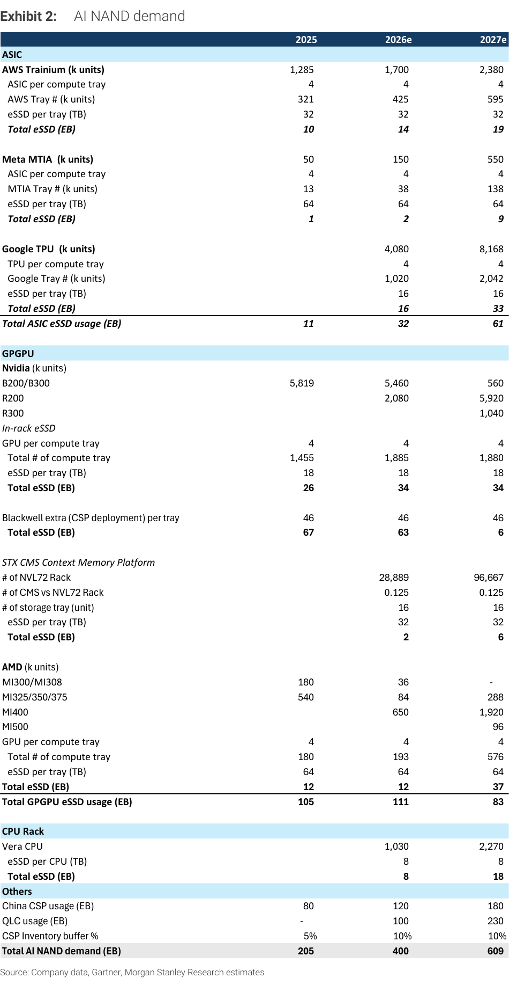

### 解讀摘要
AI NAND 需求 2025→2027 從 205 EB 成長至 609 EB（+3倍），結構變化顯著：2026e 起 Google TPU 成為最大新增貢獻（16 EB 增至 33 EB），Meta MTIA 爆發性成長（1→2→9 EB）。GPGPU 端雖 GPU 出貨持續，但 Rubin（R200/R300）架構 eSSD 含量遠低於 Blackwell（in-rack 18TB/tray vs Blackwell extra 46TB/tray），導致 GPGPU eSSD 從 105 EB 下滑至 83 EB——GPU 出貨量增加，eSSD 需求反而下降，這是市場最大的認知錯誤。

### 表格

| 類別 | 2025 | 2026e | 2027e |
|---|---|---|---|
| **ASIC** | | | |
| AWS Trainium（千台） | 1,285 | 1,700 | 2,380 |
| 　AWS Tray #（千個） | 321 | 425 | 595 |
| 　eSSD/tray（TB） | 32 | 32 | 32 |
| 　**Total eSSD（EB）** | **10** | **14** | **19** |
| Meta MTIA（千台） | 50 | 150 | 550 |
| 　MTIA Tray #（千個） | 13 | 38 | 138 |
| 　eSSD/tray（TB） | 64 | 64 | 64 |
| 　**Total eSSD（EB）** | **1** | **2** | **9** |
| Google TPU（千台） | — | 4,080 | 8,168 |
| 　Google Tray #（千個） | — | 1,020 | 2,042 |
| 　eSSD/tray（TB） | — | 16 | 16 |
| 　**Total eSSD（EB）** | — | **16** | **33** |
| **Total ASIC eSSD（EB）** | **11** | **32** | **61** |
| **GPGPU** | | | |
| Nvidia B200/B300（千台） | 5,819 | 5,460 | 560 |
| Nvidia R200（千台） | — | 2,080 | 5,920 |
| Nvidia R300（千台） | — | — | 1,040 |
| 　Total Compute Tray（千個） | 1,455 | 1,885 | 1,880 |
| 　In-rack eSSD/tray（TB） | 18 | 18 | 18 |
| 　Total eSSD—in-rack（EB） | 26 | 34 | 34 |
| 　Blackwell extra/tray（TB） | 46 | 46 | 46 |
| 　Total eSSD—Blackwell extra（EB） | 67 | 63 | 6 |
| STX CMS Platform eSSD（EB） | — | 2 | 6 |
| AMD MI series eSSD（EB） | 12 | 12 | 37 |
| **Total GPGPU eSSD（EB）** | **105** | **111** | **83** |
| **CPU Rack（Vera）eSSD（EB）** | — | **8** | **18** |
| China CSP（EB） | 80 | 120 | 180 |
| QLC usage（EB） | — | 100 | 230 |
| CSP inventory buffer | 5% | 10% | 10% |
| **Total AI NAND demand（EB）** | **205** | **400** | **609** |

> **洞察一**：GPGPU eSSD 2027e 下滑至 83 EB（vs 2025 的 105 EB），雖然 Nvidia R200/R300 出貨大增，但 Rubin 架構移除了 Blackwell 獨有的「Blackwell extra（CSP deployment）46TB/tray」配置，只剩 in-rack 18TB/tray，導致每台 GPU 的 eSSD content 大幅縮水。市場普遍誤將 GPU 出貨量增加等同 eSSD 需求增加，這是關鍵錯誤。

> **洞察二**：ASIC（Google TPU + Meta MTIA）成為 2026-27 AI NAND 增量的主力，從 11 EB 爆增至 61 EB（+5.5x），其中 Google TPU 2026e 首年即貢獻 16 EB（相當於 2025 全年 ASIC 總量的 1.5 倍）。此趨勢在 UBS CoWoS 報告（20260701）中亦有印證：Google TPU 4mn units end-2026。

---

## Exhibit 3｜Global NAND supply and demand still point to shortage in 2027

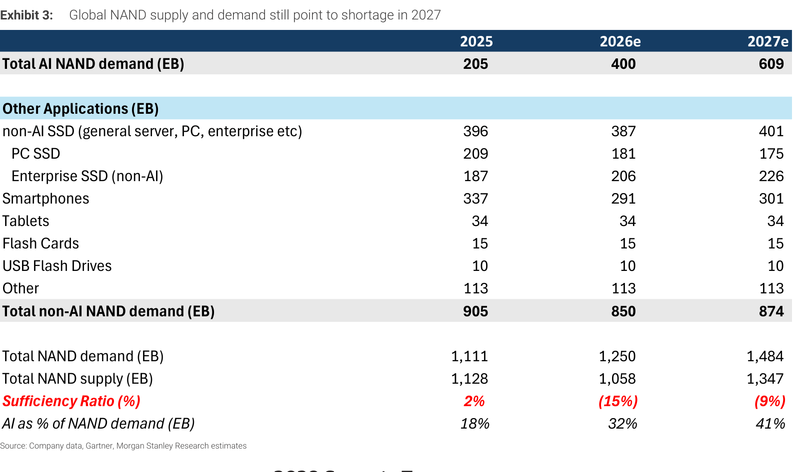

### 解讀摘要
全球 NAND 供需在 2026-27 維持明顯短缺：2026e 需求 1,250 EB vs 供給 1,058 EB，缺口高達 -15%；2027e 需求 1,484 EB vs 供給 1,347 EB，缺口收窄至 -9% 但仍顯著。消費端（PC SSD + 手機）合計需求從 2025 的 546 EB 下滑至 2026e 的 472 EB，負貢獻主要來自手機（-46 EB）與 PC SSD（-28 EB）——消費端萎縮在一定程度上吸收了 AI 需求增量，維持整體缺口未進一步惡化。

### 表格

| 類別 | 2025 | 2026e | 2027e |
|---|---|---|---|
| Total AI NAND demand（EB） | 205 | 400 | 609 |
| Non-AI SSD（一般伺服器/PC/企業） | 396 | 387 | 401 |
| 　PC SSD | 209 | 181 | 175 |
| 　Enterprise SSD（non-AI） | 187 | 206 | 226 |
| 智慧型手機 | 337 | 291 | 301 |
| 平板 | 34 | 34 | 34 |
| Flash Cards | 15 | 15 | 15 |
| USB | 10 | 10 | 10 |
| 其他 | 113 | 113 | 113 |
| **Total 非 AI NAND demand（EB）** | **905** | **850** | **874** |
| **Total NAND demand（EB）** | **1,111** | **1,250** | **1,484** |
| **Total NAND supply（EB）** | **1,128** | **1,058** | **1,347** |
| **Sufficiency Ratio（%）** | **+2%** | **-15%** | **-9%** |
| AI 佔 total NAND demand（%） | 18% | 32% | 41% |

> **洞察一**：供給端 2026e 相較 2025 反而下降（1,058 vs 1,128 EB），顯示原廠已積極將 wafer 轉向高密度 AI SSD（QLC/eSSD），造成傳統位元總量短暫下滑。這是結構性轉換，非需求崩塌。

> **洞察二**：AI 佔比從 18% 升至 41%，若 AI 需求稍有閃失（如 CSP capex 放緩），整體供需平衡可迅速從缺轉過剩，是最大的下行風險。

---

## Exhibit 4｜YMTC capacity expansion vs. AI SSD growth scenario test (2028)

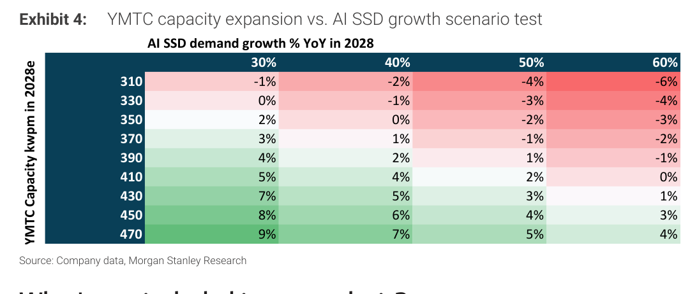

### 解讀摘要
此情境矩陣顯示 2028 年 NAND 供需充足率（sufficiency ratio），橫軸為 AI SSD 需求年增率（30–60% YoY），縱軸為 YMTC 產能（310–470kwpm）。基本情境（YMTC 310kwpm，AI 30%）→ 仍缺 -1%；若 AI 需求成長達 60% 且 YMTC 維持 310kwpm → 缺口擴至 -6%。若 YMTC 擴至 410kwpm（完成 Fab4）且 AI 40% 成長 → 微幅過剩 +4%。換言之，供需是否轉向完全取決於 YMTC 擴產紀律。

### 表格（Sufficiency Ratio %，2028e）

| YMTC（kwpm） | AI SSD +30% | AI SSD +40% | AI SSD +50% | AI SSD +60% |
|---|---|---|---|---|
| 310 | -1% | -2% | -4% | -6% |
| 330 | 0% | -1% | -3% | -4% |
| 350 | +2% | 0% | -2% | -3% |
| 370 | +3% | +1% | -1% | -2% |
| 390 | +4% | +2% | +1% | -1% |
| 410 | +5% | +4% | +2% | 0% |
| 430 | +7% | +5% | +3% | +1% |
| 450 | +8% | +6% | +4% | +3% |
| 470 | +9% | +7% | +5% | +4% |

> **值得驗證**：MS 模型假設 YMTC Fab4/5 全速建設，若美國新一輪制裁（設備/EDA 禁運）干擾擴產時程，YMTC 實際 2028 產能可能只有 310-350kwpm，供給短缺將延伸更久。

> **洞察**：此矩陣最重要的訊號是「即使 AI 需求成長達到最樂觀的 60% YoY，只要 YMTC 擴到 470kwpm（最大計劃），2028 仍有 +4% 供給過剩空間」——說明 YMTC 是唯一能打破供給紀律的變數，各大原廠 LTA 策略的核心就是為此建立緩衝。

---

## Exhibit 5｜DRAM Inventory Level

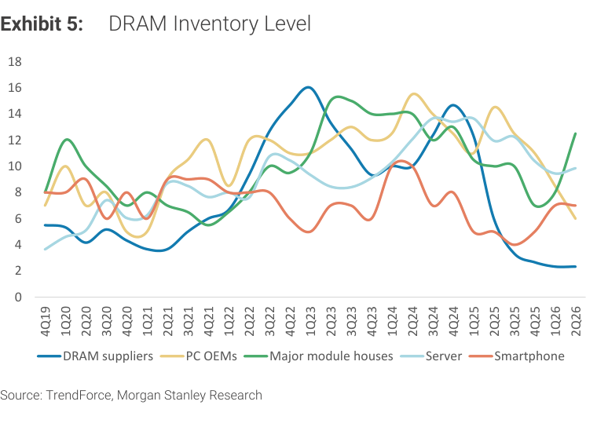

### 解讀摘要
DRAM 庫存層面顯示明顯分化：DRAM 原廠庫存持續壓縮至歷史低點（~2 週），伺服器/PC OEM 庫存同步緊縮；但 Module 廠庫存自 2Q26 起顯著上升（至 12-13 週水準），反映原廠加大 CSP 直供、削減模組廠配額，模組廠被迫自行備庫以維持客戶供應，庫存成本壓力上升。

> **原文補充**：MS 通路調查指出 3Q26 DRAM 定價追蹤 +20% QoQ（伺服器級），Legacy DDR3/4 更達 +30-40% QoQ；DRAM LTA 條款更優於 NAND（客戶更積極以價換量）。

---

## Exhibit 6｜NAND Inventory Level

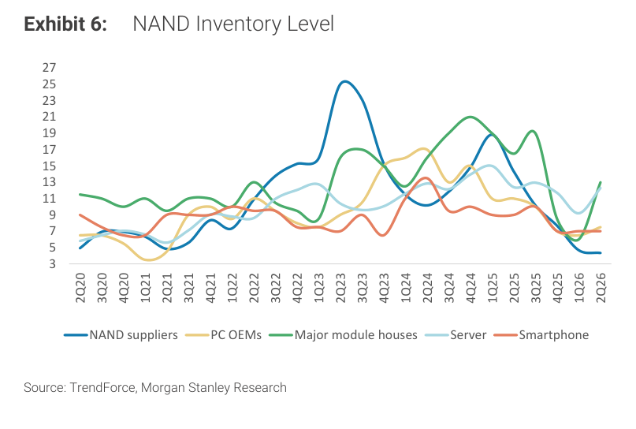

### 解讀摘要
NAND 庫存格局比 DRAM 更複雜：原廠庫存降至 ~4 週（2Q26 接近歷史最低），但模組廠庫存大幅攀升至 13 週（2Q26），且通路商（中國）消費型 NAND 庫存偏高。這個剪刀差反映結構性轉移：AI CSP 直接從原廠採購（LTA），傳統通路模組廠分配縮減，模組廠庫存積累是被迫行為而非主動囤貨。

> **原文補充**：MS 通路調查顯示 3Q26 TLC eSSD 定價追蹤 +30% QoQ，消費型 NAND 僅微漲；中國 distributor 消費型 NAND 庫存偏高，中小買家因成本高企觀望，需求未崩但量在縮。

> **洞察（配合 Exhibit 5）**：DRAM 與 NAND 原廠庫存同步低，但模組廠庫存雙雙上升，顯示記憶體超級週期的紅利正在向原廠集中（LTA 鎖定）、模組廠邊緣化的結構性轉變。

---

## Exhibit 7｜NAND suppliers have outperformed significantly in this supercycle

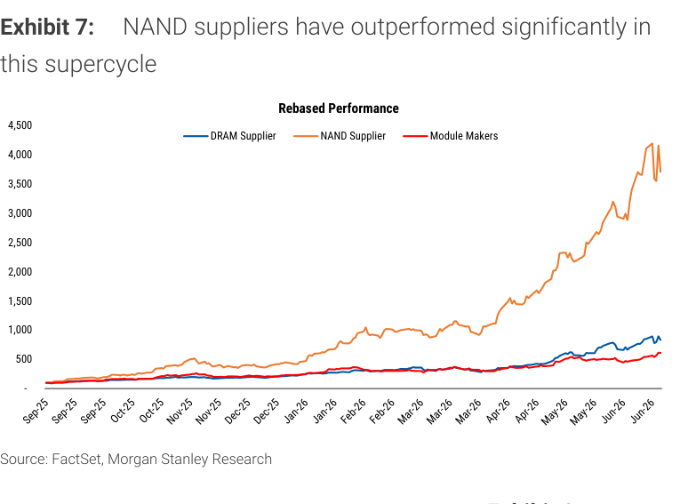

### 解讀摘要
從 Sep-25 至 Jun-26 的股價重新基礎績效來看，NAND 原廠指數回報約 40x（指數至 4,000 水準），DRAM 原廠約 8-9x，模組廠僅約 6x。原廠與模組廠之間存在 6-7 倍的報酬差距，核心原因是 LTA 定價機制將利潤大幅集中在原廠端。

> **洞察**：模組廠股價落後不代表業績差——Phison 2Q26 EPS 創高、Longsys 估算大幅上調——而是市場已充分預判利潤率峰值（低成本庫存耗盡後 margin 將正常化），估值倒退也反映投資人不願為週期性利潤支付持久倍數。

---

## Exhibit 8｜Module makers' valuation has contracted to a more reasonable level

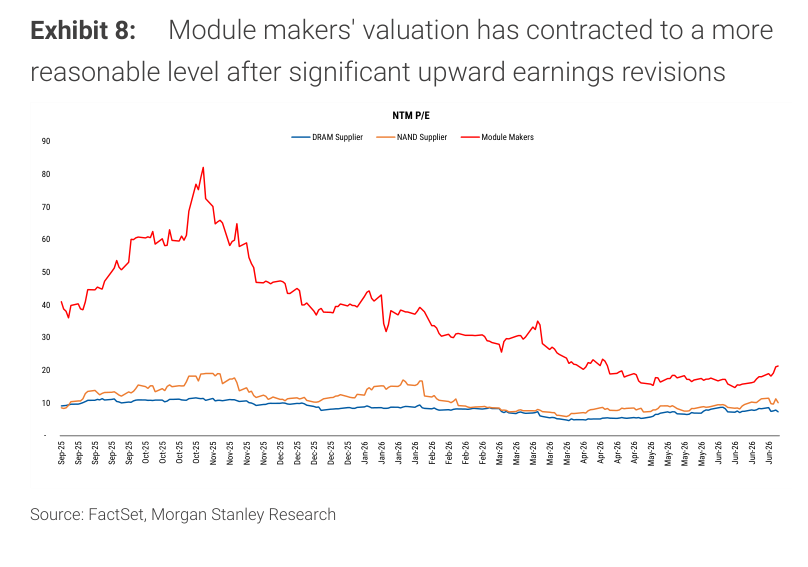

### 解讀摘要
模組廠 NTM P/E 自 2025 年 10-11 月高峰 80x 大幅壓縮至目前約 20x，而 NAND/DRAM 原廠 NTM P/E 維持在 10-11x——兩者估值首次接近。MS 認為這反映模組廠在「低成本庫存已耗盡」預期下的重新定價，而非基本面惡化。若 NAND 超級週期延伸，模組廠 EPS 持續上修，當前 20x 倍數下有估值修復機會。

---

## Exhibit 9｜Module makers relative performance vs. respective country index

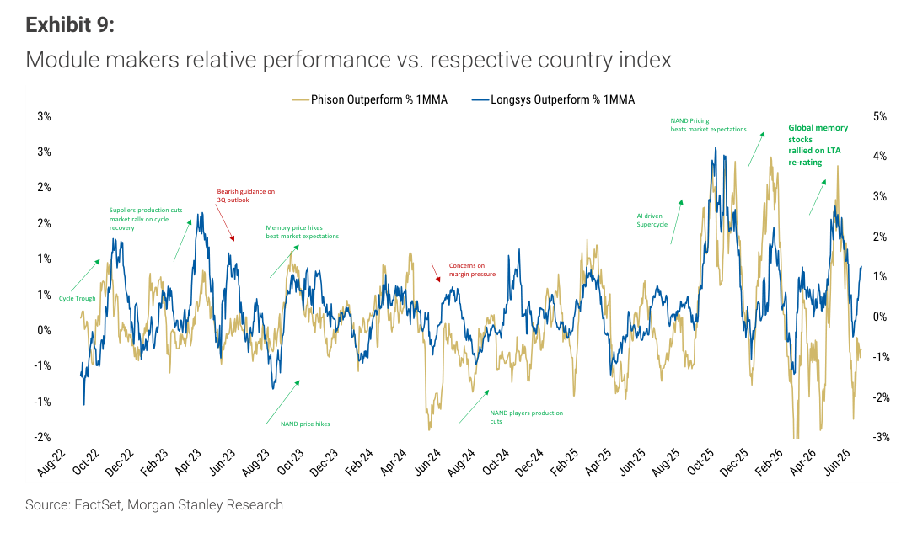

### 解讀摘要
Phison（TWO）與 Longsys（SZ）相對本地指數的 1MMA 超額報酬時序圖，標注了關鍵觸發事件：週期低點（Aug-22）、NAND 漲價（2024 初）、LTA 重新定價（2025 中）、AI 超級週期（2025 末）。2026 年 6 月出現最近一次超額報酬回落，與 MS 報告「模組廠受供給重新配置影響，成長動能轉向原廠」的核心論點一致。

---

## Exhibit 10｜Vera Rubin Rack boot drive TAM（Phison/SIMO）

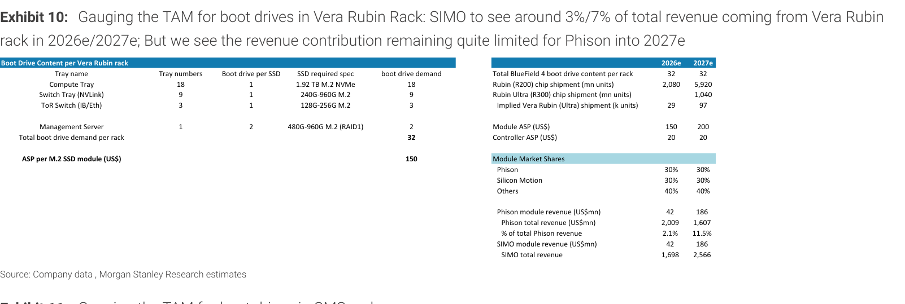

### 解讀摘要
Vera Rubin（NVL72）機架含 32 個 boot drive 位置（Compute×18、NVLink Switch×9、ToR Switch×3、Management Server×2），ASP \$150/module（M.2 NVMe）。Phison 與 SIMO 各佔 30% market share → 每家 2026e/2027e revenue \$42mn/\$186mn，SIMO 因同時服務 BlueField 4 而額外受益（含在 Exhibit 13 合計）。

### 表格

| 機架類型 | Tray 數 | Boot drive/tray | Boot drive/rack |
|---|---|---|---|
| Compute Tray | 18 | 1 | 18 |
| Switch Tray（NVLink） | 9 | 1 | 9 |
| ToR Switch（IB/Eth） | 3 | 1 | 3 |
| Management Server | 1 | 2 | 2 |
| **Total boot drive/rack** | | | **32** |

| 指標 | 2026e | 2027e |
|---|---|---|
| Rubin（R200）chip shipment（mn units） | 2,080 | 5,920 |
| Rubin Ultra（R300）chip shipment（mn units） | — | 1,040 |
| Implied Vera Rubin 機架出貨（千台） | 29 | 97 |
| Module ASP（US\$） | 150 | 200 |
| Controller ASP（US\$） | 20 | 20 |
| Phison 市佔（boot drive module） | 30% | 30% |
| SIMO 市佔（boot drive module） | 30% | 30% |
| Phison module revenue（US\$mn） | 42 | 186 |
| SIMO module revenue（US\$mn） | 42 | 186 |

> **洞察**：Rubin 機架數量從 2026e 的 29 千台跳升至 2027e 的 97 千台（+3.3x），推動 boot drive revenue 同步成長 4x，ASP 亦從 \$150 升至 \$200/module（+33%），複合推力下 SIMO/Phison Rubin 相關收入各增長 4.4x。

---

## Exhibit 11｜CMS rack boot drive TAM（SIMO）

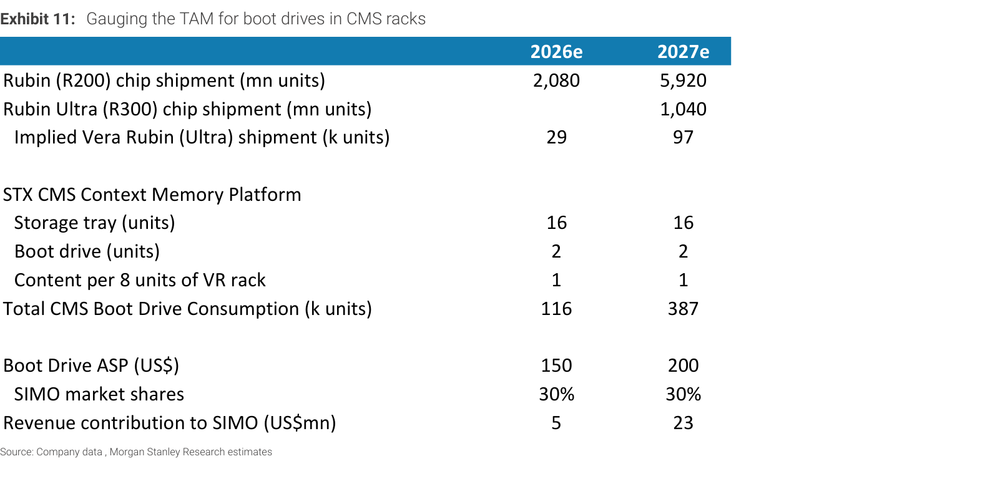

### 解讀摘要
STX CMS（Context Memory System）是針對 NVL72 機架的擴充記憶體平台，每 8 個 VR 機架配 1 個 CMS，每個 CMS 含 16 個 storage tray，每 tray 2 個 boot drive。SIMO 在 CMS boot drive 佔 30% 市佔，2027e 貢獻 \$23mn（vs 2026e \$5mn，+4.6x），隨 CMS 出貨加速。

### 表格

| 指標 | 2026e | 2027e |
|---|---|---|
| Implied VR 機架出貨（千台） | 29 | 97 |
| CMS 配置率（per 8 VR racks） | 0.125 | 0.125 |
| Storage tray/CMS | 16 | 16 |
| Boot drive/storage tray | 2 | 2 |
| Content per 8 VR racks | 1 | 1 |
| **Total CMS Boot Drive（千個）** | **116** | **387** |
| Boot Drive ASP（US\$） | 150 | 200 |
| SIMO 市佔 | 30% | 30% |
| **SIMO Revenue（US\$mn）** | **5** | **23** |

---

## Exhibit 12｜General server / ASIC boot drive TAM（Phison/SIMO）

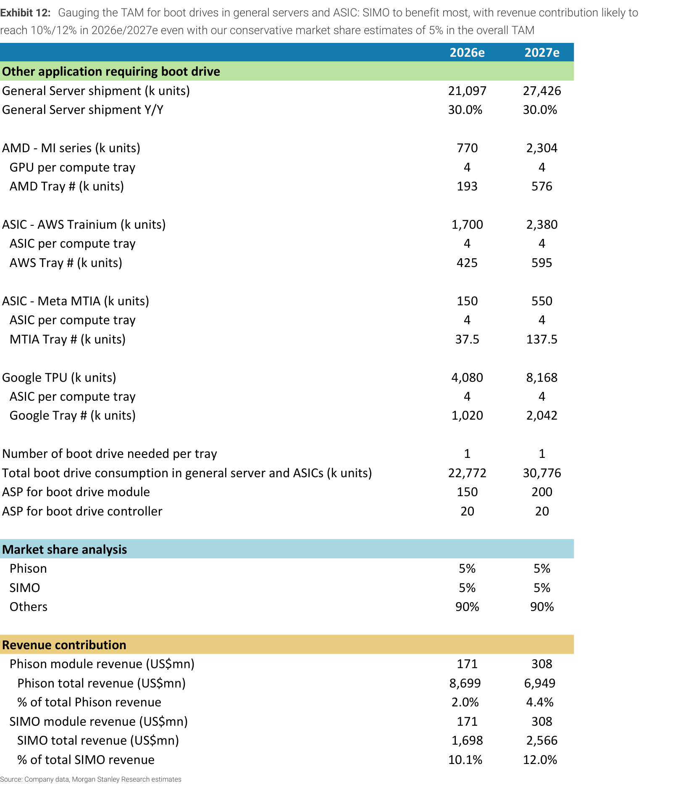

### 解讀摘要
一般伺服器與 ASIC（AWS Trainium、Meta MTIA、Google TPU）計算托盤均需 1 個 boot drive/tray。2026e 總 boot drive 需求 22,772 千個，2027e 成長至 30,776 千個（+35%），Phison 與 SIMO 各佔 5% 市佔，分別貢獻 \$171mn/\$308mn revenue（2026e/2027e）。

### 表格

| 類別 | 2026e 出貨（千個） | 2027e 出貨（千個） |
|---|---|---|
| General Server 計算托盤 | 21,097 | 27,426 |
| AMD MI series 托盤 | 193 | 576 |
| AWS Trainium 托盤 | 425 | 595 |
| Meta MTIA 托盤 | 37.5 | 137.5 |
| Google TPU 托盤 | 1,020 | 2,042 |
| **Total boot drive demand（千個）** | **22,772** | **30,776** |
| Module ASP（US\$） | 150 | 200 |
| Controller ASP（US\$） | 20 | 20 |
| Phison 市佔 | 5% | 5% |
| SIMO 市佔 | 5% | 5% |
| **Phison module revenue（US\$mn）** | **171** | **308** |
| **SIMO module revenue（US\$mn）** | **171** | **308** |

> **洞察**：ASIC 托盤（AWS+Meta+Google）合計 1,483（2026e）→ 2,775（2027e）千個，佔 general server/ASIC 需求 6.5%/9%，顯示 ASIC 正逐步取代部分 GPU 算力佈署，Google TPU 增量最大（+1,022 千個）。

---

## Exhibit 13｜AI boot drive revenue contribution（Phison vs. SIMO）

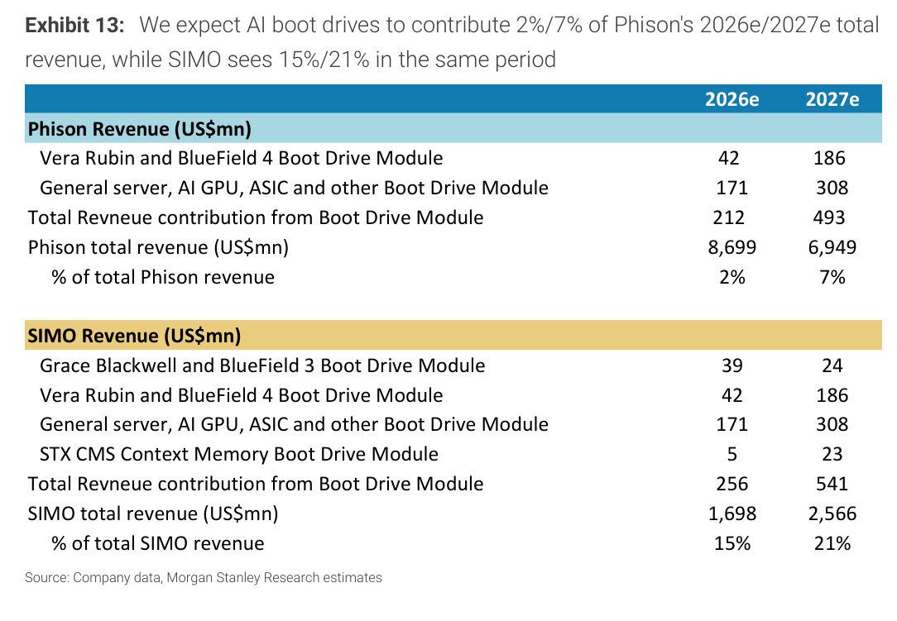

### 解讀摘要
彙整所有 AI boot drive 收入來源（Vera Rubin/BlueField4 + General server/ASIC + CMS Boot Drive），2026e/2027e：Phison 收入 \$212mn/\$493mn，佔總收入 2%/7%；SIMO 收入 \$256mn/\$541mn，佔總收入 15%/21%。差異源自 SIMO 同時涵蓋 VR boot drive、CMS boot drive 及 Grace Blackwell/BlueField3 過渡期供貨，而 Phison 在 Vera Rubin 與 CMS 市佔較低。

### 表格

| | Phison 2026e | Phison 2027e | SIMO 2026e | SIMO 2027e |
|---|---|---|---|---|
| VR & BlueField4 Boot Drive（US\$mn） | 42 | 186 | 42 | 186 |
| Grace Blackwell & BF3（US\$mn） | — | — | 39 | 24 |
| General server/ASIC（US\$mn） | 171 | 308 | 171 | 308 |
| STX CMS Boot Drive（US\$mn） | — | — | 5 | 23 |
| **Total Boot Drive Revenue（US\$mn）** | **212** | **493** | **256** | **541** |
| Total Revenue（US\$mn） | 8,699 | 6,949 | 1,698 | 2,566 |
| **佔總收入** | **2%** | **7%** | **15%** | **21%** |

> **洞察一**：Phison 2027e 總收入反而下降至 \$6,949mn（vs 2026e \$8,699mn），原因是消費 NAND 模組需求疲軟及原廠 CSP 直供擠壓，boot drive 增量僅能部分抵銷主業收縮，故 MS 維持 EW。

> **洞察二**：SIMO 為何能在同一結構中拿到 15%/21% 收入貢獻，而 Phison 只有 2%/7%？核心在於 SIMO 同時服務 DPU（BlueField）與 Ethernet Switch（NVLink）等非純 GPU 節點，而這些節點 Phison 的佈局較淺，是評估兩者估值差異的核心變數。

---

## 跨 Exhibit 彙整表

### 彙整 1｜AI NAND 需求來源總覽（來源：Exhibits 2、3）

| 需求來源 | 2025 EB | 2026e EB | 2027e EB | 26→27 增量 |
|---|---|---|---|---|
| ASIC（AWS/Meta/Google） | 11 | 32 | 61 | +29 |
| GPGPU（Nvidia/AMD） | 105 | 111 | 83 | -28 |
| CPU Rack（Vera） | — | 8 | 18 | +10 |
| China CSP | 80 | 120 | 180 | +60 |
| QLC usage | — | 100 | 230 | +130 |
| CSP Inventory buffer | 9 | 29 | 37 | +8 |
| **Total AI NAND（EB）** | **205** | **400** | **609** | **+209** |

> GPGPU 在 2027e 實為負貢獻（-28 EB），完全被 ASIC/QLC/China CSP 的增量覆蓋。QLC 是最大的新增變數（130 EB），若 QLC SSD 推廣延遲，整體 AI NAND 需求將顯著低於預期。

### 彙整 2｜SIMO vs Phison Boot Drive 競爭力對比（來源：Exhibits 10-13）

| 平台 | Phison 市佔 | SIMO 市佔 | 說明 |
|---|---|---|---|
| Vera Rubin 機架 | 30% | 30% | 對等競爭 |
| CMS（Context Memory） | — | 30% | SIMO 獨佔 |
| General Server/ASIC | 5% | 5% | 對等但量大 |
| Grace Blackwell/BF3 | — | 有 | SIMO 獨有（BlueField 3 DPU）|
| **2027e Total Revenue（US\$mn）** | **493（7%）** | **541（21%）** | SIMO 佔比遠高 |

> SIMO 優勢在於 DPU/Ethernet 節點布局（BlueField 系列），Phison 缺席此類節點，導致相同市場規模下 SIMO 絕對收入貢獻更高。PT 大幅上調（+158%）邏輯清晰。

---

## 相關個股清單

| 類別 | 公司 | Ticker | MS 評等 | 備註 |
|---|---|---|---|---|
| NAND 原廠 | SanDisk | SNDK.O | OW | LTA 支撐，明確買回計劃 |
| NAND 原廠 | Micron | MU.O | OW | LTA 支撐，明確買回計劃 |
| NAND 原廠 | SK hynix | 000660.KS | OW | Top Pick（Korea），LTA 重新定價 |
| NAND 原廠 | Samsung | 005930.KS | OW | Top Pick（Asia Tech），強力股東回報 |
| NAND 原廠 | KIOXIA | 285A.T | OW | Japan Top Pick，FCF 豐沛 |
| NAND 控制器 | Silicon Motion | SIMO.O | OW | PT US\$400↑（+158%），boot drive + MonTitan |
| NAND 控制器 | Fadu | 440110.KQ | OW | AI eSSD 控制器，逐步進入 hyperscaler |
| SLC NAND | Macronix | 2337.TW | OW | GC Top Pick，SLC/MLC 供給緊縮 |
| SLC NAND | Winbond | 2344.TW | OW | SLC NAND，HDD 固件需求升 |
| SLC NAND | GigaDevice | 603986.SS | OW | SLC NAND |
| 模組廠 | Phison | 8299.TWO | EW | PT NT\$2,588↑，但受 CSP 直供威脅 |
| 模組廠 | Longsys | 301308.SZ | EW | PT Rmb673↑，TCM 改善 margin 穩定性 |
