# SemiAnalysis｜ECTC 2026 先進封裝技術總覽——EMIB-T、HBM4 挑戰、微流體散熱、光學互連

**券商**：SemiAnalysis  
**分析師**：Afzal Ahmad、DC、Gerald Wong、Dylan Patel  
**日期**：2026-07-02  
**主題**：ECTC 2026（IEEE 電子封裝年會）技術總覽——Intel EMIB-T、Marvell/Samsung 客製化 HBM、TSMC/Microsoft 微流體直接液冷、Marvell/Lightmatter 光學互連、Hybrid Bonding、玻璃基板、RDL 微縮  
**評級**：N/A（技術會議報導，非個股投資評等）  
<a href="https://layx.uk/dl?g=產業&b=SemiAnalysis&d=20260702&h=EMIB-T-HBM4-Photonic-Interconnects">📎 下載 PDF</a>

---

## 報告總結

本文是 SemiAnalysis 對 2026 年 ECTC（封裝界最重要會議）的技術總覽，撰寫時機在於本屆揭露內容與即將量產的商用產品高度連動：Intel EMIB-T 對應 Google TPU v9、Marvell 客製化 HBM 對應 Nvidia Feynman 與 AMD MI450/MI500、TSMC 與 Microsoft 的微流體散熱回應多千瓦封裝的散熱瓶頸、Marvell 與 Lightmatter 的光學互連則指向 co-packaged optics 的商業化時程。

核心結論是先進封裝已從單一指標（凸塊間距）演變為訊號、電源、散熱、光學四線並進的系統級競賽：Intel EMIB-T 在 DC 壓降與 PDN 阻抗上追趕明顯，但仍落後 TSMC CoWoS 生態系在 DTC 與主動中介層的執行進度；TSMC 在微流體散熱僅發表 3 篇論文，遠少於 Intel 的 12 篇與 Samsung 的 11 篇，顯示 TSMC 在這塊相對保守；Marvell 藉由收購 Celestial AI 取得的 Photonic Fabric／OMIB，在光學封裝的揭露深度領先其他廠商。

---

## SemiAnalysis 完整投資邏輯鏈

**框架**：瓶頸確認 → 技術路線分流 → 競爭定位 → 受益排序 → 結論（本文為多技術路線的產業總覽，非單一個股論述，不套用個股估值框架）

| 論點層次 | Exhibit | 內容 |
|---|---|---|
| 瓶頸確認 | Fig 5、Fig 34 | 圓形矽中介層尺寸與散熱同時卡關，大封裝需要新架構 |
| 技術路線分流：橋接式互連 | Fig 1-9 | Intel EMIB-T 以 TSV＋MIM 電容衝刺 HBM4E 訊號與電源密度 |
| 技術路線分流：客製化記憶體 | Fig 10-19 | Marvell／Samsung 把 HBM PHY 邏輯搬進 base die 或優化中介層佈局，換取面積與頻寬 |
| 技術路線分流：直接液冷 | Fig 24-29 | TSMC micropillar／Microsoft microchannel 直接進矽，繞過 TIM 瓶頸 |
| 技術路線分流：光學互連 | Fig 30-39 | Marvell OMIB／Lightmatter Passage M1000 把光學 I/O 搬進封裝 |
| 受益排序 | 綜合 | TSMC 生態系仍領先，Intel EMIB-T 追趕中，Marvell 客製 HBM＋光學雙線下注 |
| **結論** | 報告封面 | **先進封裝已從單一指標（凸塊間距）演變為訊號、電源、散熱、光學四線並進的系統級競賽** |

> **報告最大邏輯缺口**：報告對 Intel EMIB-T、Marvell 客製 HBM、TSMC 微流體散熱等技術均給出具體數字，但未提供任一技術的量產時程或良率成本模型，讀者無法從本文推算商業化速度，只能定性排序技術成熟度。

---

## 報告核心觀點

| 主題 | SemiAnalysis 觀點 | 市場共識 | 是否 Contra-Consensus |
|---|---|---|---|
| EMIB-T 進度 | Intel DC 壓降改善 68-80%、PDN 阻抗改善 82%以上，技術上已具備 HBM4E 量產可行性 | 市場多聚焦 TSMC CoWoS 為唯一可行的大封裝方案 | 是 |
| TSMC 微流體散熱投入 | ECTC 僅發表 3 篇論文，遠少於 Intel 12 篇、Samsung 11 篇，TSMC 相對保守 | 市場預期 TSMC 在所有封裝技術均全面領先 | 是 |
| Marvell 客製 HBM 價值 | 讓 host ASIC 的 HBM 相關面積減少約 60%，是 Nvidia／AMD 之外的第二條客製記憶體路線 | 市場對客製 HBM 的討論仍集中在 Nvidia Feynman 本身 | 部分 |
| Hybrid Bonding 良率 | Applied Materials／EV Group 在 450nm pitch 已做到 98% 良率（2000 萬連結鏈） | 市場認為 Hybrid Bonding 量產仍需數年才能穩定 | 是 |

**偏好排序**：Intel（EMIB-T 追趕最快、揭露最完整）＞ Marvell（客製 HBM＋光學互連雙線布局）＞ Samsung（HBM 散熱與中介層優化）＞ TSMC（微流體散熱相對保守）  
**零件/個股偏好**：先進封裝設備（Applied Materials、EV Group）、OSAT（ASE、Amkor／STATS ChipPAC）、RDL／基板設計（GUC、Resonac、Unimicron）

---

## Intel EMIB-T

## Fig 1｜EMIB-T 2× 光罩測試載具外觀

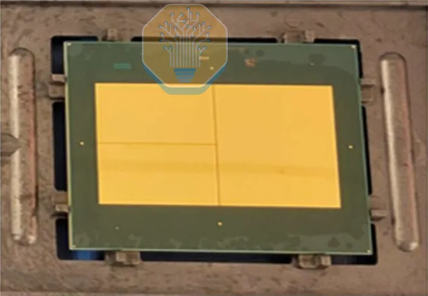

### 解讀摘要
這是 Intel 在 2× 光罩面積矽晶片上驗證 EMIB-T 的實體測試載具，凸塊間距已下探至 36/35µm，較 Granite Rapids-AP 使用的 45µm 縮小，凸塊密度提升 65%。Granite Rapids-AP 本身已是 70mm×105mm、近 9 個光罩面積的大封裝，而 Intel 現在把驗證範圍擴大到 4.5× 光罩面積，目標 2026 年底前完成認證——顯示 EMIB-T 的尺寸野心是直接對標 TSMC CoWoS 的大封裝市場，而非僅是 EMIB 的漸進升級。

> **原文補充**：Intel 特別強調 36/35µm 這個間距是「已驗證（validated）」而非模擬結果，且 4.5× 光罩驗證的認證時程明確訂在 2026 年底，顯示這不是實驗室展示品而是量產前哨。

---

## Fig 2｜EMIB-T 凸塊間距 SEM 俯視圖（110/55/36µm）

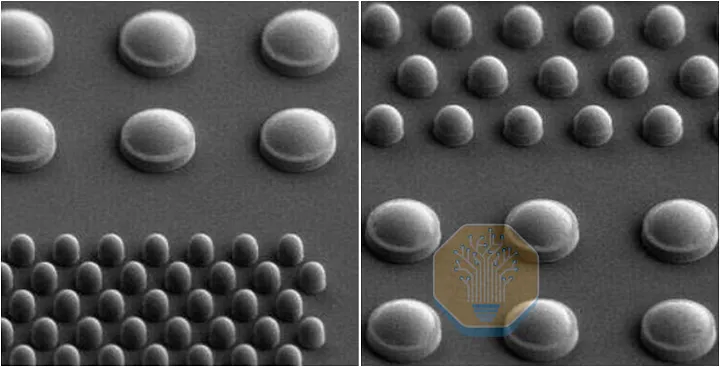

### 解讀摘要
三組 SEM 俯視圖並列呈現 110µm、55µm、36µm 三個世代的凸塊間距，直接證明 Intel 凸塊微縮的路徑是漸進式（約每代腰斬）而非一次到位。凸塊間距每次微縮都直接轉換成橋接可布線的訊號密度提升，是 EMIB-T 支援 HBM4E 更寬介面的物理前提。

> **洞察一**：36µm 凸塊間距對應 65% 凸塊密度提升（相對 45µm），若下一代延續同樣微縮節奏，Intel 有機會在 25µm 世代（Fig 3）前再取得一次密度躍升，但 Fig 3 顯示 25µm 已是良率轉折點，暗示 36µm 可能是近幾年最具量產效益的甜蜜點。

---

## Fig 3｜25µm 凸塊間距測試載具（雙 1 光罩晶粒＋橋接）

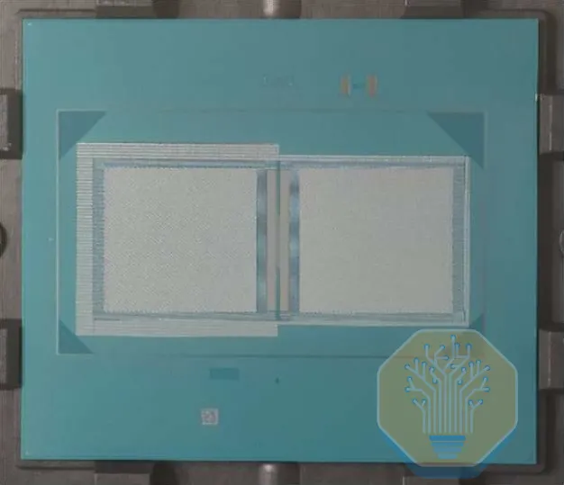

### 解讀摘要
這是下一階段的先期驗證：兩顆 1 光罩面積晶粒透過單一 3mm×18mm EMIB-T 橋接互連，凸塊間距壓到 25µm。但這同時是良率警戒線——25µm 以下每個凸塊的錫量已經很小，短路、開路與組裝良率損失的機率顯著上升。

> **原文補充**：報告明確指出，25µm 以下的限制因素會從「橋接布線密度」轉移到「凸塊成形、放置精度與組裝良率」，這是一個技術瓶頸性質的轉變，不只是漸進微縮的延續。

---

## Fig 4｜25µm 凸塊間距 SEM 剖面圖（組裝後凸塊與導孔結構）

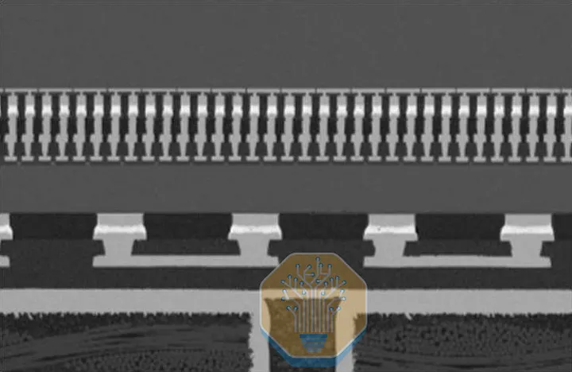

### 解讀摘要
剖面 SEM 直接展示組裝後的凸塊與導孔結構完整性，是 Fig 3 良率風險論述的實證支撐——用來證明即使在 25µm 這個良率轉折點，組裝後的結構仍然完整可靠，而非僅停留在設計模擬階段。

---

## Fig 5｜Intel 240mm×240mm 四分之一面板 EMIB-T 測試載具

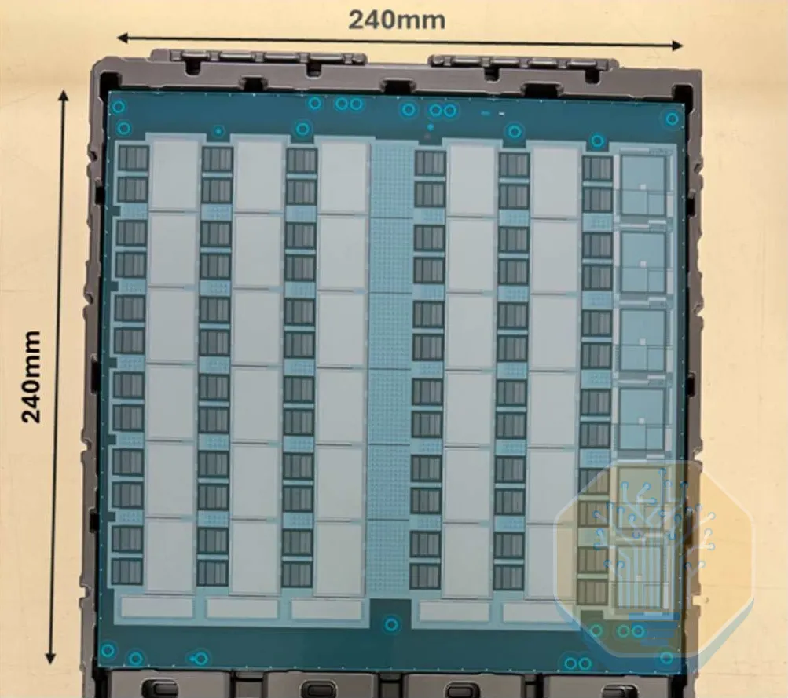

### 解讀摘要
Intel 把 EMIB-T 的封裝尺寸推向面板級：240mm×240mm 相當於約 67 個光罩面積，Intel 將四分之一面板定位為務實量產目標（而非全面板）。這代表橋接布線密度已經不是唯一瓶頸——基板處理、翹曲、疊對精度與面板級圖案化本身變成第一順位限制。

> **原文補充**：SemiAnalysis 在現場觀察到展示樣品有明顯翹曲問題，且 Intel 正評估先進微影方案以在四分之一乃至全面板尺度維持足夠疊對精度——這是原文對圖片本身看不出的風險揭露，翹曲問題並非 Intel 官方投影片內容。

> **值得驗證**：Intel 把「四分之一面板」定位為務實目標而非全面板，隱含全面板量產在翹曲與疊對上仍有實質障礙；若四分之一面板本身的翹曲問題無法在 2026 年底前解決，EMIB-T 的大封裝路線圖可能需要進一步下修尺寸目標。

---

## Fig 6｜EMIB-T 疊構圖（訊號布線、電源網格、TSV、MIM 電容層）

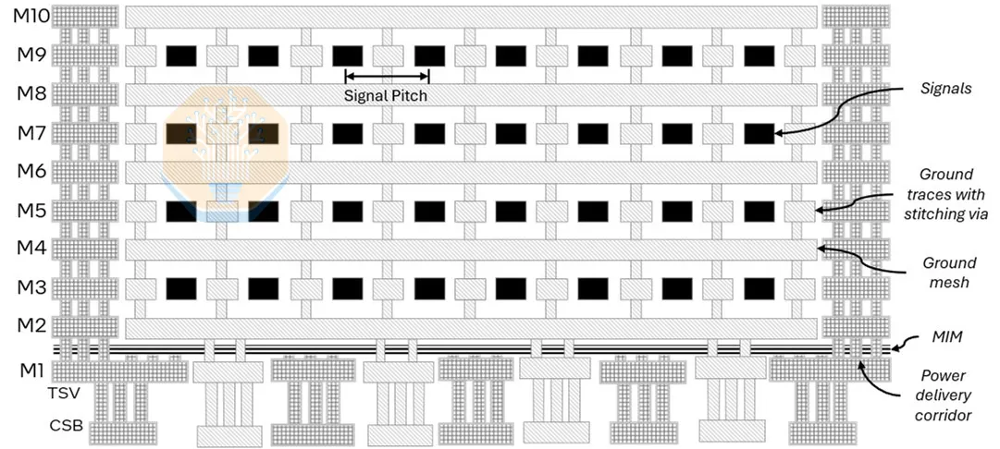

### 解讀摘要
這張疊構圖是 EMIB-T 相對於現行 EMIB 複雜度躍升的核心證據：新增 TSV、更多金屬層、電源網格與 MIM 電容層，讓橋接同時承載高密度訊號與垂直電源傳輸。剖面顯示 10 層金屬（含 4 層布線層），MIM 電容位於 M1／M2 之間。

> **原文補充**：報告特別點出這次揭露聚焦在 HBM4E 的改善，暗示 EMIB-T 的複雜度提升並非通用型升級，而是針對 HBM4E 這一代記憶體介面的專門優化。

---

## Fig 7｜封裝 DC 壓降比較：傳統 EMIB vs EMIB-T

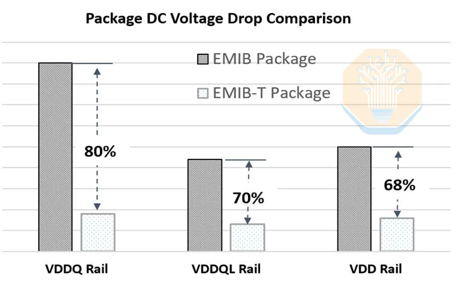

### 解讀摘要
「T」代表 TSV，其任務就是電源傳遞。傳統 EMIB 在非橋接區域垂直供電，但橋接區附近電源必須橫向擴散通過封裝與晶粒側布線；EMIB-T 用 TSV 直接貫穿橋接供電，大幅縮短電流路徑。三個電源軌（VDDQ／VDDQL／VDD）壓降分別改善 80%／70%／68%。

### 表格
| 電源軌 | DC 壓降改善 |
|---|---|
| VDDQ Rail | 80% |
| VDDQL Rail | 70% |
| VDD Rail | 68% |

> **洞察二**：三個電源軌的改善幅度並不均勻（80% vs 68%），VDDQ 改善最大，暗示原本非 TSV 架構下 VDDQ 的橫向壓降損失最嚴重，這與 HBM4E 新增 VDDQ／VDDQL 額外電源軌、擠壓訊號布線空間的背景（見 Fig 6 說明）相互印證——TSV 對「原本最擁擠的電源軌」邊際效益最大。

---

## Fig 8｜EMIB-T PDN AC 阻抗：有無橋接 MIM 電容比較

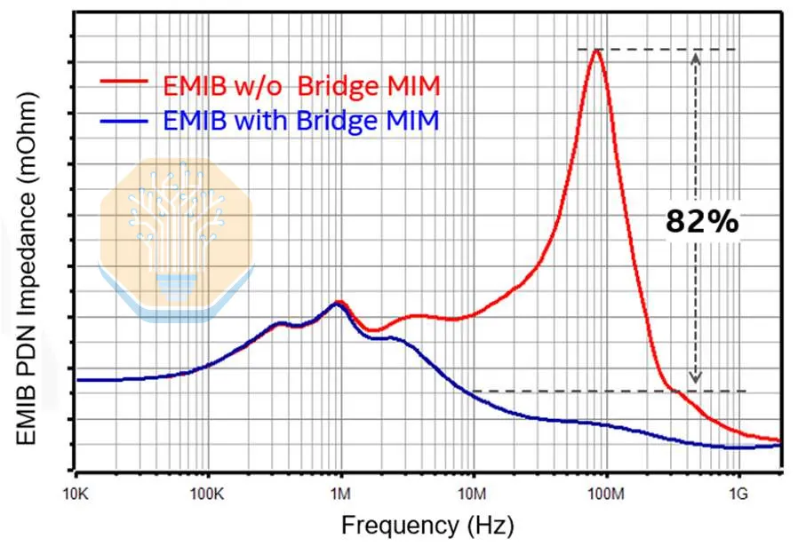

### 解讀摘要
EMIB-M 首次在 M1／M2 間導入 MIM 電容，EMIB-T 延續此設計，電容密度達 500nF/mm²，大致與 Intel 18A 製程的 MIM 相當。橋接 MIM 電容讓 PDN AC 阻抗改善超過 82%，峰值改善點在圖中明確標註。

> **值得驗證**：500nF/mm² 電容密度是與 Intel 18A 邏輯製程 MIM「大致相當」的定性描述，並非精確數字對比；若實際密度顯著低於 18A 水準，82% 的阻抗改善可能無法在更高速率（14-16Gb/s，見 Fig 9 補充）下維持。

---

## Fig 9｜HBM4E EMIB-T 通道 12Gb/s 訊號眼圖（有無 DFE）

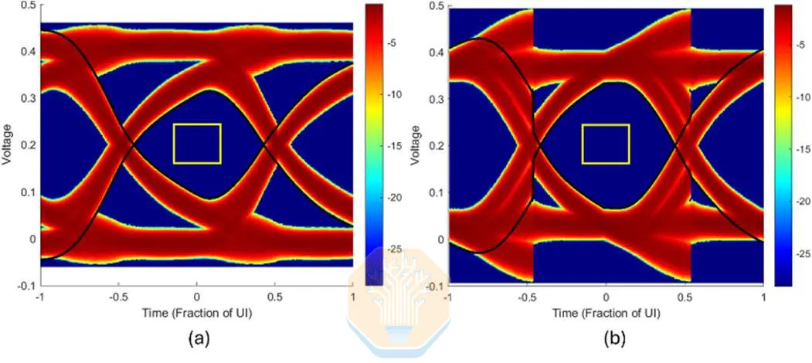

### 解讀摘要
(a)(b) 兩眼圖對比顯示，12Gb/s 下無接收端等化時眼寬約 67%，加入單分接頭 DFE（決策反饋等化器）後提升到約 72.5%。DFE 是接收端電路，用來消除訊號通過封裝通道後前位元造成的干擾。

> **原文補充**：Intel 同時模擬了 12.8Gb/s、14Gb/s、16Gb/s 更高速率，眼寬在所有測試速率下都維持 60% 以上，且僅需適度降低接墊電容——這代表 EMIB-T 的訊號餘裕不是只在 12Gb/s 這個單點達標，而是有向上延伸的空間。原文也揭露 Intel 未來路線圖包含更高密度橋上 MIM 電容、更大高深寬比橋接晶粒、25µm 以下凸塊間距、主動橋接與嵌入式穩壓器，以及 >2500nF/mm² 的 eMIM-T 電容（尚未見於量產產品）。

> **洞察三**：報告明白指出 EMIB-T 在 DTC／eDTC 整合、整合式穩壓器與主動局部矽互連（LSI）上仍落後 TSMC CoWoS 生態系——這代表 Fig 7-9 呈現的數字改善（DC壓降、PDN阻抗、眼寬）雖然亮眼，但只是縮小差距，並未反轉 Intel 與 TSMC 在封裝生態系執行力上的落差。

---

## Marvell Custom HBM

## Fig 10｜Marvell 客製化 HBM 總覽投影片（2024 Industry Analyst Day）

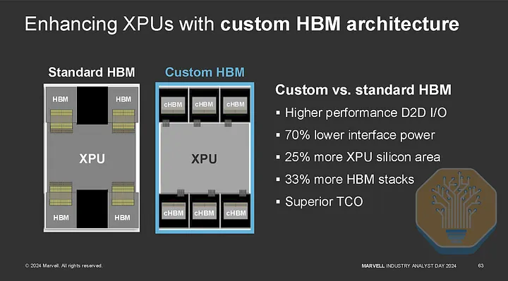

### 解讀摘要
2024 年 Marvell 首度提出客製化 HBM 概念時僅是模糊願景，缺乏技術細節；本圖是 Marvell 對外重申此路線的整體定位投影片，標誌著從概念到 Hot Chips 2025（base die 平面圖）再到本屆 ECTC（封裝級細節）的三階段揭露節奏。

---

## Fig 11｜Marvell 客製化 HBM 定義投影片（Base Die 邏輯核心配置）

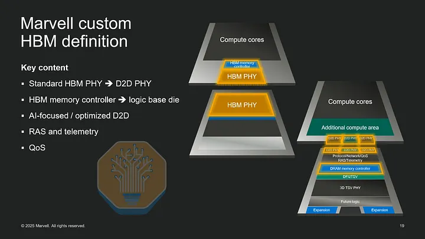

### 解讀摘要
JEDEC 標準把 HBM 堆疊與主機之間的介面固定死，這對互通性有利（任何記憶體廠的 HBM 都能配任何相容主機），但對功耗、效能與面積不利，因為主機 ASIC 必須實作標準 HBM PHY 並布線非常寬的並列介面。Marvell 的做法是保留 DRAM 核心晶粒不變，改用先進邏輯製程打造客製化 base die，整合 HBM 控制器、管理監控與客製邏輯。

> **原文補充**：報告強調客製化的關鍵不是改記憶體本身，而是把「介面優化」這件事從主機 ASIC 移到 HBM base die——這是理解後續 Fig 12-13 面積與頻寬數字的前提架構。

---

## Fig 12｜標準 HBM vs 客製化 HBM：Base Die 與主機平面圖對比

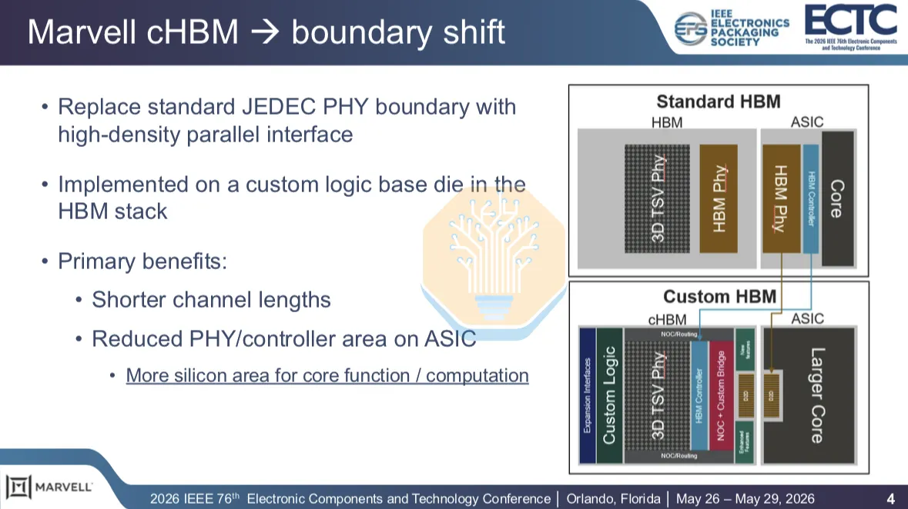

### 解讀摘要
客製化介面把大量原本在主機側的記憶體側介面邏輯搬進 HBM base die，直接壓縮主機 ASIC 上分配給 HBM PHY 與相關邏輯的面積，讓出的面積可用於更多運算、快取或 I/O。

### 表格
| 項目 | JEDEC HBM4E | Marvell 客製化 HBM |
|---|---|---|
| Host ASIC HBM 相關面積 | 基準 | 減少約 60% |
| 通道數 × 速率 | 2048-bit @ 16Gb/s | 1024 channels @ 32Gb/s |
| 等效頻寬 | 基準 | 4.1 TB/s |
| Interposer 通道長度 | 6.5mm | 1.5mm |
| 中介層材質 | 矽 | 有機 RDL |
| 布線層數／線寬 | 9 層／2/2µm | 維持 9 層／2/2µm（頻寬提升下不變） |

> **洞察四**：Marvell 客製介面同時做到「host ASIC 面積 -60%」與「中介層通道長度 6.5mm→1.5mm（-77%）」，且布線層數與線寬完全不變仍能提升頻寬——這代表面積與布線效益並非互相取捨，而是介面重新設計帶來的同步紅利，這也是為何 Marvell 敢於改用成本更低但線寬較粗的有機 RDL 中介層（見下方原文補充）仍能達標的原因。

> **原文補充**：Marvell 範例改用有機 RDL 中介層取代矽中介層以降低封裝成本，但有機 RDL 的線寬／間距遠比 CoWoS-S 矽中介層或 CoWoS-L／EMIB-T 矽橋接粗，因此版圖設計難度更高，Marvell 靠客製化屏蔽與布線圖案來兼顧頻寬密度與串音控制。

---

## Fig 13｜JEDEC HBM4E vs Marvell 客製化 HBM：布線架構比較表

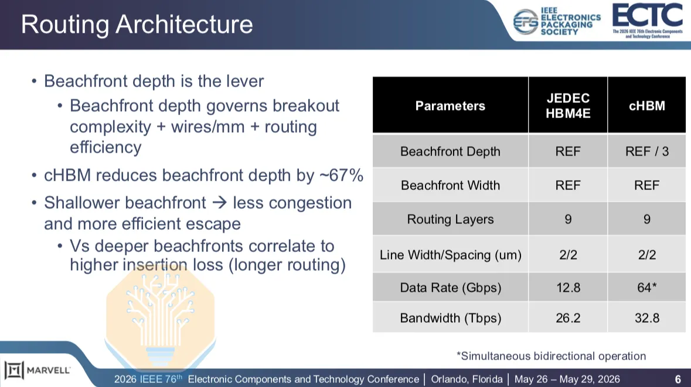

### 解讀摘要
表格直接對比兩種架構的關鍵物理與電性指標，是 Fig 12 定性論述的數字化版本，讓「Beachfront 深度、資料速率、頻寬」三項指標同時攤在同一張表中比較。

### 表格
| 指標 | JEDEC HBM4E | Marvell 客製化 HBM |
|---|---|---|
| Beachfront 深度 | REF（基準） | REF / 3 |
| 資料速率 | 12.8 Gbps | 64 Gbps* |
| 頻寬 | 26.2 Tbps | 32.8 Tbps |

*客製化架構的等效／彙總速率定義與 JEDEC 標準不同，兩者非同一計算基礎的直接比較。

---

## Fig 14｜Nvidia Rubin GPU 晶圓照片

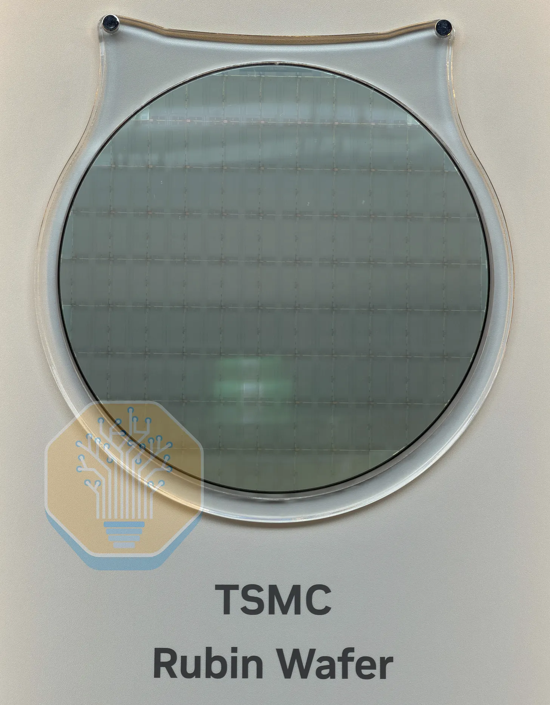

### 解讀摘要
這張晶圓照片（TSMC，Computex 2026，SemiAnalysis 拍攝）串起客製化 HBM 章節與 Nvidia 產品路線圖：Nvidia 已在 GTC 宣布下一代 Feynman 將採用客製化 HBM，理由與 Marvell 類似——更高頻寬、更低功耗、更少加速器晶粒面積被 HBM 相關邏輯佔用。

> **原文補充**：SemiAnalysis 自行估算 Rubin GPU 晶粒面積約 16% 用於 HBM 相關邏輯與 PHY，客製化 HBM 可將這部分負擔轉移到 HBM base die。這是報告作者的外部估算（非 Marvell／Nvidia 官方數字），需標註來源為 SemiAnalysis 自身估計。

> **洞察五（配合 Fig 12）**：若以 SemiAnalysis 估算的「Rubin 晶粒 16% 面積用於 HBM 邏輯」對照 Marvell 揭露的「host ASIC HBM 相關面積 -60%」，粗略推算客製化 HBM 有機會為 Nvidia 級 XPU 釋放約 9-10%（16%×60%）的晶粒面積用於運算或 I/O——這是換算 Marvell 論文百分比與 Nvidia 實際產品的量級橋樑，屬外部推算而非報告原文數字。

> **原文補充**：客製化 HBM 也能讓 base die 兼任次級記憶體控制器，向外擴充至更高容量、較低頻寬的 LPDDR，或第二層 HBM，讓加速器在不消耗寶貴外部 I/O 晶粒周長的前提下增加容量。這與 AMD 即將推出的 MI450 及未來 MI500 GPU 直接相關，兩者都將支援 LPDDR 以增加記憶體容量。

---

## Samsung HBM Interposer

## Fig 15｜HBM2 到 HBM4E 中介層層數縮放

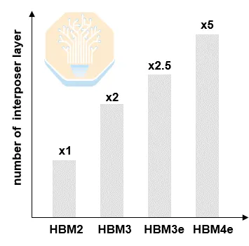

### 解讀摘要
HBM4E 把資料速率推到 12Gb/s 以上，且 I/O 針腳數翻倍，直接推升布線複雜度：Samsung 估計 HBM4E 所需中介層層數為 HBM3E 的 2 倍、HBM2 的 5 倍。

### 表格
| 世代 | 中介層層數（相對 HBM2） |
|---|---|
| HBM2 | x1 |
| HBM3 | x2 |
| HBM3e | x2.5 |
| HBM4e | x5 |

---

## Fig 16｜HBM2 到 HBM4E 功耗縮放

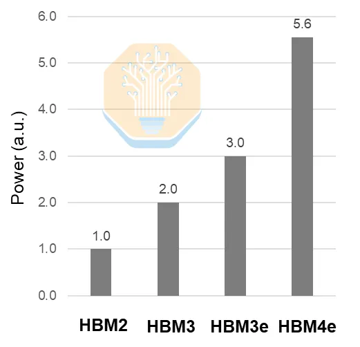

### 解讀摘要
I/O 數量增加與資料速率提升同時推升功耗：Samsung 估計 HBM4E 功耗較 HBM3E 增加 86%，較 HBM2 增加 5.6 倍。

### 表格
| 世代 | 功耗（相對值，HBM2=1.0） |
|---|---|
| HBM2 | 1.0 |
| HBM3 | 2.0 |
| HBM3e | 3.0 |
| HBM4e | 5.6 |

> **洞察六（配合 Fig 15）**：中介層層數從 HBM2 到 HBM4E 增加 5 倍，功耗增加 5.6 倍，兩者增幅高度同步——顯示 Samsung 面對的不是單一維度的擴展問題，而是布線複雜度與功耗密度同步惡化，這正是後續 Fig 20-23 「HBM 正成為熱瓶頸」論述的量化前提。

---

## Fig 17｜8 層矽中介層疊構（HBM4E，兩訊號一接地布線）

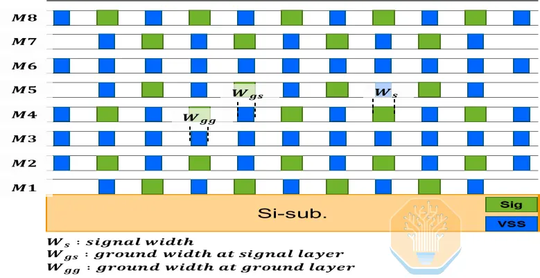

### 解讀摘要
面對 Fig 15 的層數膨脹壓力，Samsung 提出 8 層矽中介層方案，宣稱較原估計需求層數減少 20%。疊構採重複的兩訊號／一接地交錯排列來屏蔽高速訊號，75% 的層數分配給訊號布線。

> **原文補充**：中介層另一個關鍵是超高密度電容（UHC），Samsung 未說明確切電容結構，但推測與 Intel EMIB-T MIM 電容或 TSMC CoWoS DTC 類似；UHC 只能放在同樣被大量用於訊號布線的 M1 層，因此可用面積受限——這是 Fig 18-19 「不平衡 vs 平衡電容佈局」問題的根源。

---

## Fig 18｜8 層矽中介層：不平衡電容佈局

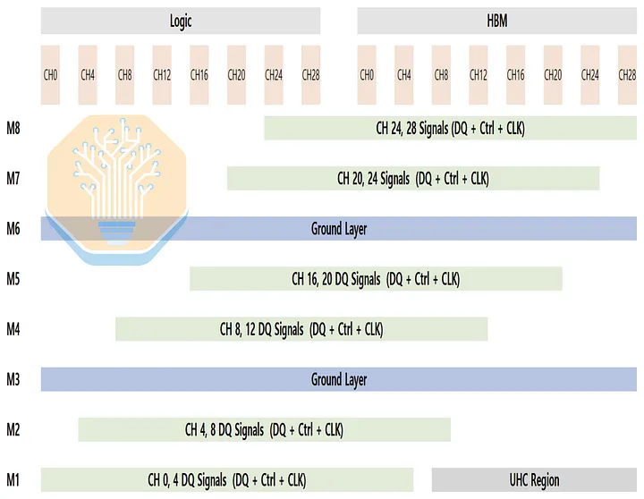

### 解讀摘要
若布線不平衡，電容會被擠到介面的一側，造成邏輯側與 HBM 側之間 PDN 表現不均勻。此圖呈現 CH0-CH28 各通道訊號集中在部分 M 層，電容區域（UHC Region）僅出現在 M1 底部一側。

---

## Fig 19｜8 層矽中介層：平衡電容佈局

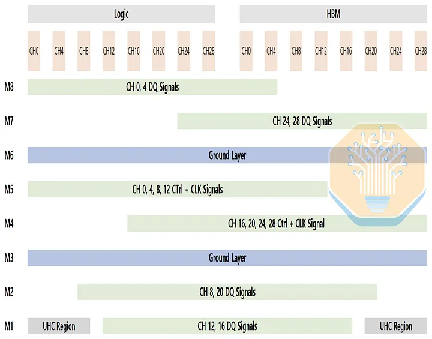

### 解讀摘要
Samsung 的改良布局把布線重新分配到 M1 與其他層之間，讓 UHC 能更均勻分布在整個介面，降低 PDN 阻抗與電壓雜訊，同時維持布線密度可控。對比 Fig 18，UHC Region 從單側集中改為兩側對稱分布。

> **洞察七（配合 Fig 18）**：Fig 18-19 的差異純粹是布局優化而非新增材料或製程，代表 Samsung 認為現有 8 層架構仍有「軟體/設計層面」的效能空間可挖，這對於已投產的中介層設計是低成本的性能提升路徑，優先順序應高於材料或層數變更。

---

## Samsung HBM Hybrid Bonding Thermals

## Fig 20｜2.5D 封裝熱阻貢獻拆解（ASIC vs HBM）

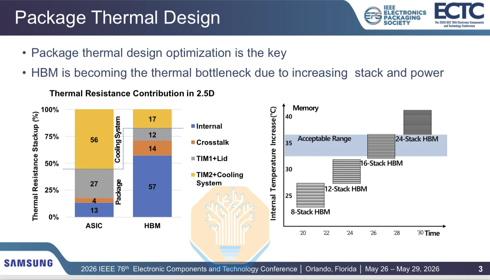

### 解讀摘要
Samsung 指出隨著 HBM 堆疊層數增加（邁向 20-hi、24-hi）與底層邏輯功耗上升，HBM 正在取代 ASIC 成為封裝熱阻的主要貢獻者。圖表把熱阻拆成 Internal／Crosstalk／TIM1+Lid／TIM2+Cooling System 四塊，ASIC 與 HBM 兩側佔比明顯不同：ASIC 側 Internal 僅 13%，HBM 側 Internal 高達 57%。

### 表格
| 熱阻來源 | ASIC 佔比 | HBM 佔比 |
|---|---|---|
| Internal | 13% | 57% |
| Crosstalk | 4% | 14% |
| TIM1+Lid | 27% | 12% |
| TIM2+Cooling System | 56% | 17% |

右側輔圖並顯示：8-Stack→24-Stack HBM 內部溫升從約 25°C 上升到超過 35°C（可接受範圍上緣），意味著堆疊層數持續增加將使既有散熱設計逼近溫度上限。

> **洞察八**：ASIC 熱阻主要卡在封裝外部（TIM2+Cooling System 佔 56%），而 HBM 熱阻主要卡在內部結構（Internal 佔 57%）——這代表兩者需要完全不同的解方：ASIC 靠更好的外部散熱系統即可大幅改善，但 HBM 必須從堆疊內部（例如 Fig 21-23 的 Hybrid Bonding）下手，外部散熱對 HBM 邊際效益有限。

---

## Fig 21｜Samsung HBM 熱阻：TCB vs HCB（氣冷／液冷）

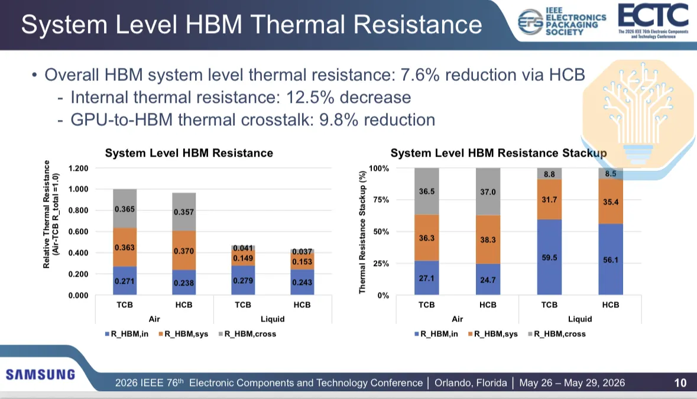

### 解讀摘要
Samsung 比較熱壓合（TCB）與混合銅接合（HCB）在 2.5D GPU 封裝（2 顆 GPU 晶粒＋8 顆 HBM 堆疊，類似 Nvidia Blackwell 架構）上的表現。整體系統層級 HBM 熱阻：氣冷下降 7.6%、液冷下降 7.6%（原文標示氣冷「system level」改善幅度略低於液冷，見下表）。

### 表格
| 指標 | 氣冷 TCB→HCB | 液冷 TCB→HCB |
|---|---|---|
| 系統層級 HBM 熱阻改善 | 7.6% | 7.6% |
| 內部熱阻改善 | 12.5% | 12.9% |
| GPU-HBM 串音改善 | 約 9.8% | — |

> **原文補充**：改善幅度並不均勻，因為 HCB 只解決部分熱網路問題。Samsung 把路徑拆成內部阻抗、系統層級阻抗與 GPU-HBM 串音三塊：內部阻抗與串音分別下降約 12.5% 與 9.8%，但系統層級阻抗（含散熱介面材料與冷卻系統）反而上升約 2.3%——這是圖片數字本身看不出的抵換關係，HCB 並非全面性改善。

> **值得驗證**：系統層級阻抗上升 2.3% 這個負面項目，若在實際量產封裝中因材料選擇不同而被放大，可能會侵蝕內部阻抗改善的淨效益；報告未說明這 2.3% 的具體成因，是評估 HCB 導入時機的關鍵缺口。

---

## Fig 22｜HBM 熱阻隨 Base Die 功耗增加的變化

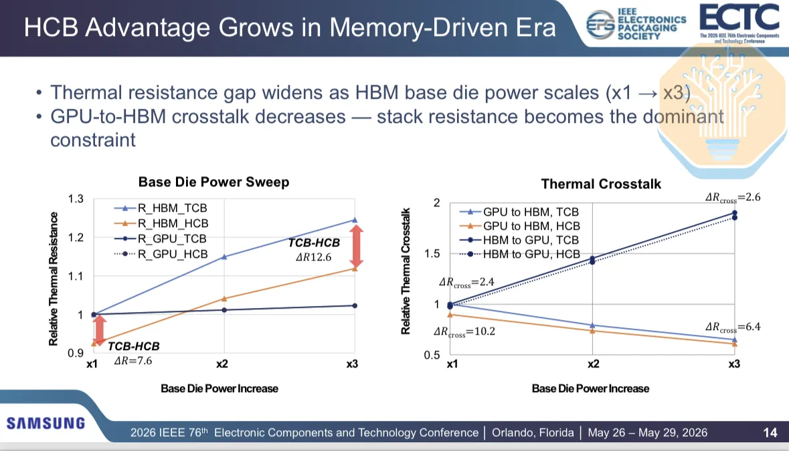

### 解讀摘要
隨著更多功耗移入 HBM base die（例如記憶體密集型工作負載，或客製化 HBM 把控制器邏輯搬進 base die 的情境），熱瓶頸位置也跟著轉移：GPU-HBM 串音佔總熱阻的比例從 base die 功耗 1 倍時的 13% 下降到 3 倍時的 5%。

### 表格
| Base Die 功耗倍數 | TCB-HCB 熱阻差 (ΔR) | TCB-HCB 串音差 (ΔR_cross，GPU→HBM) |
|---|---|---|
| x1 | 7.6 | 10.2 |
| x2 | — | — |
| x3 | 12.6 | 2.4（HBM→GPU方向則為 2.6） |

> **原文補充**：Samsung 估計改用 HCB 可讓進氣溫度提高 1-2°C（維持相同封裝功耗），或在相同溫度下讓封裝功耗提升約 4%，同時冷卻功耗下降約 7%——這三個換算選項（進氣溫度／封裝功耗／冷卻功耗）是原文對 HCB 實際部署效益的具體換算，圖片本身只呈現熱阻曲線看不出這些應用情境。

> **洞察九（配合 Fig 10-12 客製化 HBM）**：Marvell／Samsung 的客製化 HBM 路線把更多邏輯搬進 base die，等同於推升「base die 功耗倍數」這個變數；而 Fig 22 顯示 base die 功耗越高，TCB 與 HCB 的熱阻差距越大（ΔR 從 7.6 擴大到 12.6）——這代表客製化 HBM 對 HCB 的需求會比傳統 JEDEC HBM 更迫切，兩條技術路線（客製化＋Hybrid Bonding）存在互補加速效果，而非各自獨立的選項。

---

## Fig 23｜堆疊層級熱阻：TCB vs HCB（不同接合墊密度）

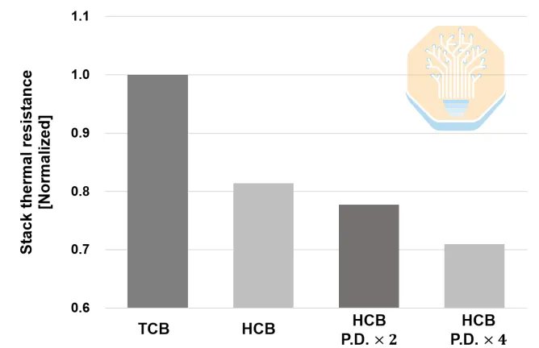

### 解讀摘要
Samsung 進一步單獨拆出堆疊層級（stack-level）的 HCB 效益，改善幅度遠大於系統層級：基準 HCB 較 TCB 降低約 19% 堆疊熱阻，提高接合墊密度後改善幅度可達 2 倍密度下 22.3%、4 倍密度下 29.1%。

### 表格
| 方案 | 堆疊熱阻（歸一化，TCB=1.0） |
|---|---|
| TCB | 1.00 |
| HCB | 0.81 |
| HCB（接合墊密度 x2） | 0.78 |
| HCB（接合墊密度 x4） | 0.71 |

> **洞察十（配合 Fig 21）**：堆疊層級 HCB 改善（19-29%）遠大於系統層級改善（7.6%），呼應 Fig 20 的洞察——HBM 熱阻瓶頸主要在內部結構，因此聚焦堆疊內部接合方式（提高 HCB 接合墊密度）比投資外部冷卻系統的邊際報酬高出數倍，這是 Samsung 三張圖（Fig 20/21/23）疊加後才能得出的資源分配結論。

---

## Microfluidic Cooling

## Fig 24｜直接進矽冷卻概念與 CoWoS-R 測試載具

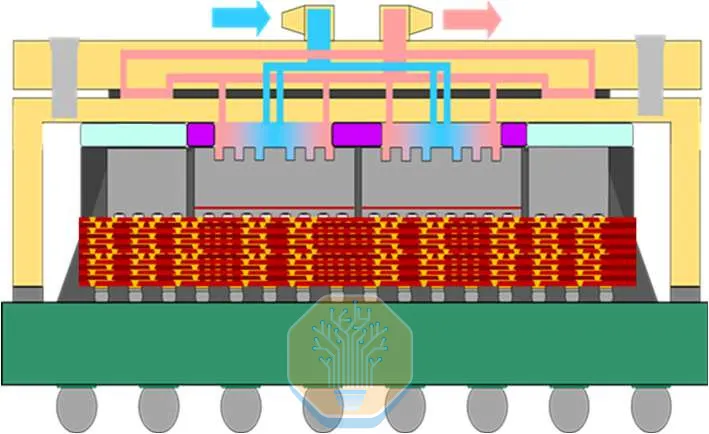

### 解讀摘要
TSMC 在大型類 GPU 測試載具上展示直接進矽冷卻，載具採用 CoWoS-R（有機而非矽中介層，翹曲容忍度與製程相容性較佳）。測試載具用 3.3× 光罩面積中介層，搭載 4 顆 SoC 晶粒與 8 顆 HBM 堆疊。

> **原文補充**：報告特別點出這是 ECTC 上 TSMC 僅有的 3 篇論文之一，相較 Intel 12 篇、Samsung 11 篇，顯示 TSMC 在微流體散熱這個主題的揭露深度明顯落後兩大競爭對手，儘管 TSMC 在封裝生態系整體仍居領先（見 Fig 9 洞察三）。

---

## Fig 25｜CoWoS-R 測試載具 SoC/HBM Heater Group 佈局圖

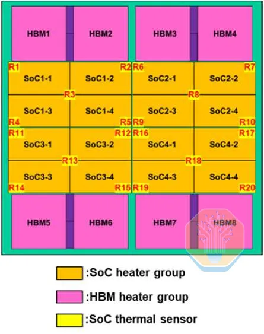

### 解讀摘要
此圖具體呈現 Fig 24 提到的 3.3× 光罩測試載具佈局：4 顆 SoC 晶粒（每顆再分為 4 個 SoC heater group，以 R1-R20 熱感測點標示）與 8 顆 HBM heater group 交錯排列，SoC 加熱區合計覆蓋約中介層面積的一半。這是模擬真實 GPU+HBM 功耗分布的熱測試載具設計，而非實際運算晶片。

---

## Fig 26｜SoC 背面矽微柱結構（結構圖＋熱模擬＋SEM）

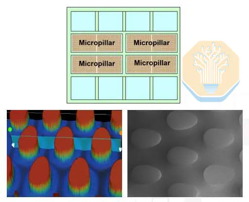

### 解讀摘要
TSMC 比較三種方案：傳統有蓋冷板封裝、無蓋冷板封裝，以及直接在 SoC 晶粒背面形成矽微柱的方案。此圖左上為微柱陣列結構示意，左下為熱模擬（紅色為高溫micropillar尖端），右下為實際微柱 SEM 照片，三者共同證明微柱結構已從設計走到實際製造與熱驗證。

---

## Fig 27｜熱設計功率 vs 流量：微柱／無蓋／有蓋冷板比較

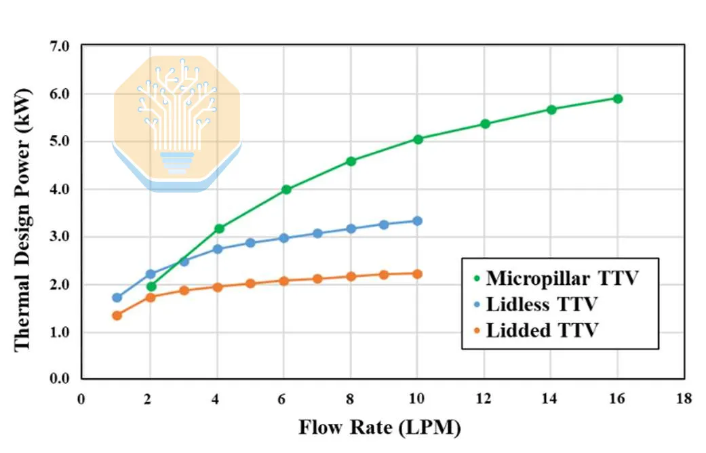

### 解讀摘要
傳統冷卻在 1-2LPM 流量、40°C 去離子水下，有蓋封裝可散熱 1.9-2.3kW，無蓋封裝可達 2.5-3.0kW，但兩者在超過 4LPM 後都會飽和，因為 TIM 成為瓶頸。微柱測試載具在 2LPM 追平無蓋冷板，之後在更高流量下持續拉開差距，4LPM 達 4kW、8LPM 達 5.3kW，且整個測試載具可均勻散熱超過 5kW。

### 表格
| 方案 | 飽和/代表功率 | 流量 |
|---|---|---|
| 有蓋冷板（Lidded TTV） | 1.9-2.3 kW | 1-2 LPM，>4LPM 飽和 |
| 無蓋冷板（Lidless TTV） | 2.5-3.0 kW | 1-2 LPM，>4LPM 飽和 |
| 微柱（Micropillar TTV） | 4.0 kW | 4 LPM |
| 微柱（Micropillar TTV） | 5.3 kW | 8 LPM |
| 微柱（Micropillar TTV，全載具均勻） | >5 kW | — |

> **原文補充**：微柱並非沒有代價——TSMC 必須在晶圓級封裝（CoW）製程完成後才形成微柱，且不能破壞既有 CoWoS-R 結構，還需開發新密封材料以應對封裝翹曲與熱膨脹失配下的冷卻液洩漏風險。測試載具通過 MSL4（潮濕敏感度等級4）測試，無氦氣洩漏或密封材料脫層。

> **洞察十一**：微柱方案在低流量（2LPM）時與無蓋冷板打平，代表其優勢並非「起始效能」而是「隨流量擴大的邊際效益」——在 8LPM 時微柱（5.3kW）比無蓋冷板同流量下的表現（約 3.3kW，見 Fig 27 圖表藍線終點）高出約 60%，顯示微柱方案更適合搭配高流量液冷系統部署，若資料中心液冷基礎設施流量受限，微柱的優勢會被大幅壓縮。

---

## Fig 28｜Microsoft 直接進矽微流體冷卻總成剖面（Nvidia GH200）

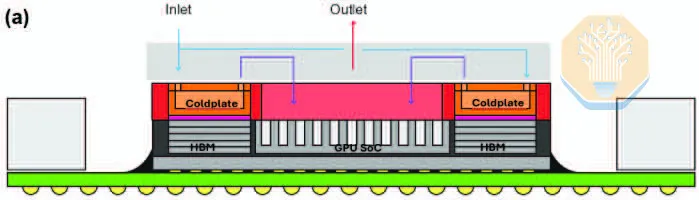

### 解讀摘要
與 TSMC 的矽微柱不同，Microsoft 採用直接蝕刻在 GPU 矽晶片上的直線微通道。Microsoft 沒有使用熱測試載具，而是直接在實際 Nvidia GH200 GPU 上測試，這可能讓量測結果更準確捕捉真實熱分布與熱點，而非理想化的均勻功耗模型。

> **原文補充**：Microsoft 測試了 HPCG、HPL 等多種工作負載，各自具備不同的運算與記憶體壓力特性——這代表 Fig 29 的改善數字是跨工作負載的統計範圍，而非單一理想條件下的最佳值。

---

## Fig 29｜Microsoft GH200 微流體冷卻跨工作負載結果（FOM）

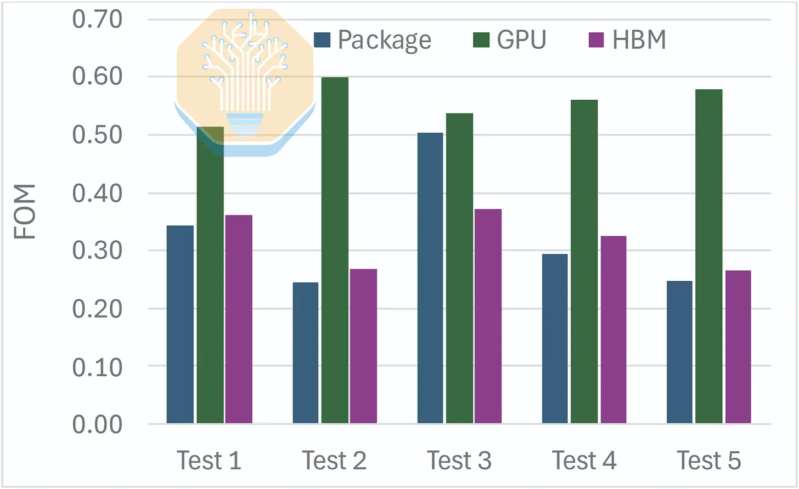

### 解讀摘要
跨多種工作負載，Microsoft 回報 GPU 接面到入口的熱阻在 1LPM 流量下降低 51-60%；HBM 改善幅度較小，僅 27-37%，因為 HBM 仍透過冷板與 TIM 散熱而非直接液冷。整體封裝熱阻降低約 50%。

### 表格
| 對象 | 熱阻改善（1LPM） |
|---|---|
| GPU（junction-to-inlet） | 51-60% |
| HBM | 27-37% |
| 整體封裝 | 約 50% |

> **原文補充**：Microsoft 也公布初步可靠性數據——6 個月期間，約 4370 次觀測中僅記錄 9 次潛在阻塞事件，且阻塞率隨時間下降（暗示安裝初期不穩定、之後趨於穩定運行），6 個月後矽微通道無可量測的矽侵蝕。節點層級測試上，GH200 完成 3 週反覆基準測試加 1 週連續穩定功耗運行，叢集層級 MTBF 與可用性測試仍在進行中。

> **洞察十二（配合 Fig 27）**：GPU 直接液冷改善（51-60%）明顯大於 HBM（27-37%），這與 TSMC 微柱方案（Fig 26-27，直接處理 SoC 背面）呈現相同的模式——兩家獨立廠商的數據都指向「直接液冷對運算晶粒的效益遠大於對記憶體堆疊」，意味著 HBM 熱瓶頸（見 Fig 20 洞察八）短期內恐怕無法單靠直接液冷解決，仍需搭配 Hybrid Bonding（Fig 21-23）等堆疊內部方案協同處理。

---

## Marvell Optical Interconnects

## Fig 30｜OMIB 封裝概念（EIC 疊在 PIC 上＋電性橋接嵌入有機中介層）

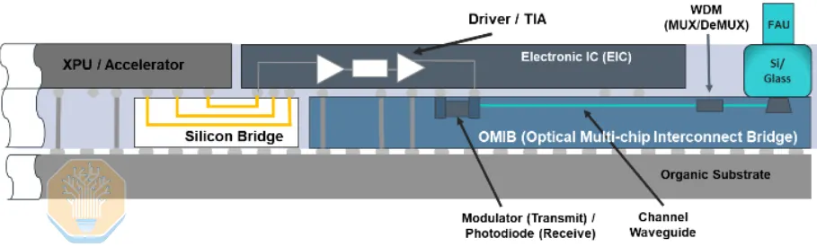

### 解讀摘要
Marvell 的做法是把光子積體電路（PIC）僅嵌入需要的區域，其餘不需要光學互連的區域改用電性橋接。由於 PIC 嵌入 RDL 後其光柵耦合器會被覆膜阻擋，Marvell 在覆膜前於光柵區域上方放置矽／玻璃光學塊，維持到頂部的光路，供光纖陣列單元（FAU）連接。

> **原文補充**：報告指出光子中介層若做成多光罩尺寸，將面臨光罩接縫（reticle stitching）造成的良率挑戰，且光子中介層可能缺乏傳統矽中介層具備的高密度電容等功能——這是 Marvell 選擇「局部化」PIC+電性橋接混合方案而非全光子中介層的根本原因，圖片本身看不出這個取捨邏輯。

---

## Fig 31｜OMIB 測試載具佈局圖（RDL 中介層，含 PIC/橋接/DTC）

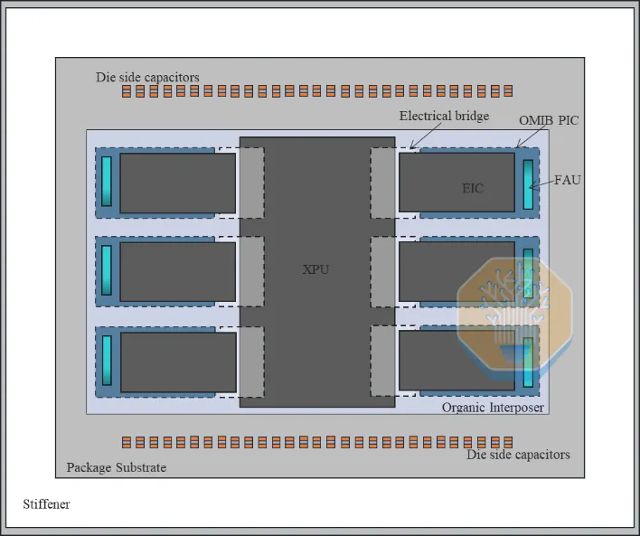

### 解讀摘要
Marvell 的 OMIB 測試載具有 1 顆主要 XPU 晶粒與 6 顆 EIC 晶粒堆疊其上；中介層內嵌 6 個 PIC（大藍色矩形）、6 個電性橋接（細長藍色矩形）與 12 顆 DTC 晶粒（小藍色方塊）。約 2× 光罩面積的 RDL 中介層採 4 層、2/2µm 線寬/間距。

### 表格
| 組件 | 數量 |
|---|---|
| XPU 晶粒 | 1 |
| EIC 晶粒 | 6 |
| PIC（嵌入） | 6 |
| 電性橋接（嵌入） | 6 |
| DTC 晶粒（嵌入） | 12 |
| RDL 中介層面積 | 約 2× 光罩 |
| RDL 層數／線寬 | 4 層／2/2µm |

---

## Fig 32｜OMIB 測試載具實體晶片照片

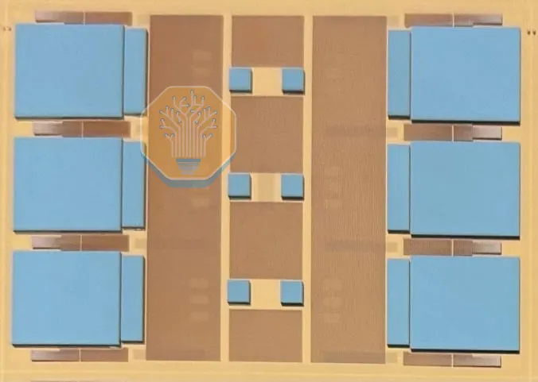

### 解讀摘要
實體晶片照片直接對應 Fig 31 的佈局說明——中央 XPU 晶粒周圍環繞 6 顆 EIC 晶粒，深藍色方形區塊清楚可辨，佐證 Marvell 已完成實體製造而非僅停留在版圖模擬階段。

---

## Fig 33｜OMIB 概念：XPU-XPU 光學互連＋外部 FAU（Photonic Fabric IP）

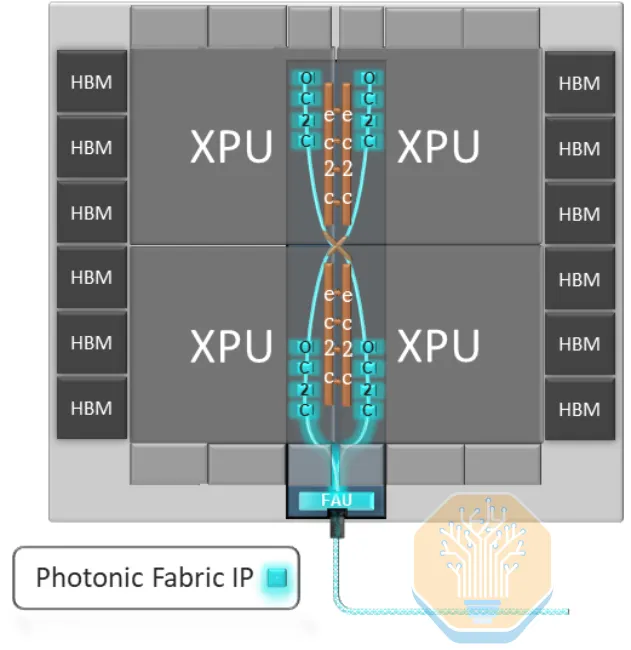

### 解讀摘要
Marvell 也展示了概念性多晶粒 XPU，透過光學晶片間互連降低延遲與跳躍次數。Marvell 宣稱 OMIB 消除了晶粒周長（shoreline）限制，因為同一橋接可同時路由封裝內晶粒對晶粒連結與對外光學互連，帶寬密度達 1.8Tbps/mm²。

### 表格
| 指標 | 數值 |
|---|---|
| 帶寬密度 | 1.8 Tbps/mm² |

> **洞察十三（配合 Fig 12 客製化 HBM 的面積邏輯）**：OMIB「消除晶粒周長限制」與 Marvell 客製化 HBM「釋放 host ASIC 面積」是同一家公司在兩個不同瓶頸（I/O 周長 vs 記憶體面積）上採取的對稱策略——顯示 Marvell 的封裝技術布局並非零散專案，而是圍繞「突破傳統封裝物理限制以換取更大 XPU 有效運算面積」這一致的公司級主軸。

---

## Fig 34｜2.5D OMIB 整合製程流程（Chip-Last，A-O 共 15 步）

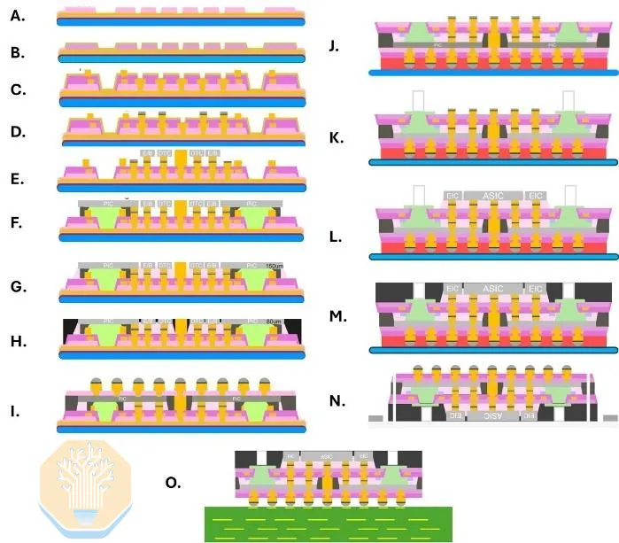

### 解讀摘要
Marvell 展示的製程流程為 chip-last，類似 TSMC 的 CoWoS-L。Marvell 先建構嵌入橋接、OMIB PIC、DTC 等組件的有機 RDL 中介層，以 C4 凸塊連接封裝基板，橋接 TSV 與高聳銅柱連到 RDL 後，才最後貼附 ASIC 晶粒與 EIC。

> **原文補充**：15 個製程步驟（A-O）逐一疊加不同材料層（PIC/EIC/ASIC/DTC 的顏色編碼在圖中清楚可辨），這是原文用來佐證「chip-last」工序邏輯的完整視覺化，圖片本身即為主要證據來源，無需額外文字補充。

---

## Fig 35｜封裝方案比較：基板光學引擎／OMIB／光子中介層（三種變體）

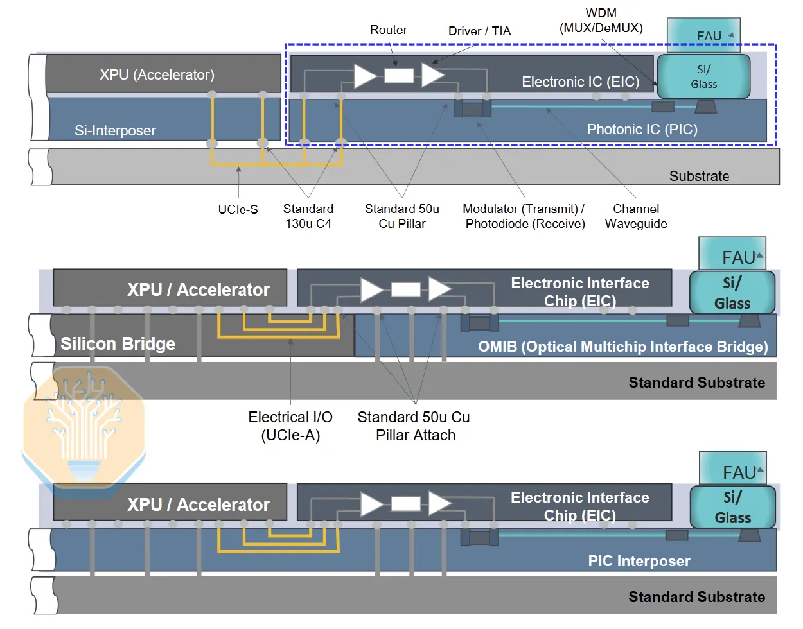

### 解讀摘要
短期內，類似 TSMC COUPE 的垂直堆疊光學引擎，比 OMIB 式連接或全光子中介層更容易實現。Marvell 用 50µm 間距微凸塊連接 EIC 與 PIC，再把組成的引擎安裝到封裝基板或中介層上。基板配置可用類 UCIe-S 的粗間距（130µm C4）並列匯流排，中介層配置則可用更緊密的 UCIe-A 介面（約 40-45µm 間距）。

> **原文補充**：Marvell 偏好基板方案，理由是設計簡單且熱隔離較佳——這個偏好判斷直接關聯到 Fig 37 的熱測試結果（基板配置下 PIC 溫升最小），顯示 Marvell 的架構選擇有紮實的熱數據支撐，而非單純的成本考量。

---

## Fig 36｜Photonic Fabric 光學連結測試晶片 EIC 佈局（4 組 TX-RX）

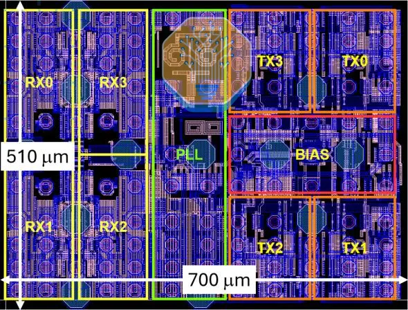

### 解讀摘要
Marvell 測試了一顆 5nm（推測為 TSMC N5）EIC，內建 4 組 56Gb/s TX-RX，每個方向合計 224Gb/s。晶片尺寸 700µm×510µm，內部劃分 RX0-3、TX0-3、PLL 與 BIAS 區塊。設計採用電吸收調變器（EAM）而非其他業者偏好的微環調變器（MRM），理由是熱穩定性更佳、工作波長範圍更寬。

### 表格
| 指標 | 數值 |
|---|---|
| 製程節點 | 5nm（推測 TSMC N5） |
| TX-RX 對數 | 4 |
| 單向速率 | 224 Gb/s（4×56Gb/s） |
| 晶片尺寸 | 700µm × 510µm |

> **值得驗證**：報告作者主動質疑 EAM 的量產可製造性（"we believe that EAMs will prove difficult to manufacture at scale"），這是與 Marvell 官方立場（強調 EAM 熱穩定性優勢）直接相反的判斷；若此疑慮屬實，Marvell 光學互連的量產時程可能比其他採用 MRM 的競爭對手更慢，這與報告整體「Marvell 光學揭露深度領先」的正面評價形成張力，需一併看待。

---

## Fig 37｜PIC 穩態溫度梯度：基板 vs 矽中介層 vs 矽橋接

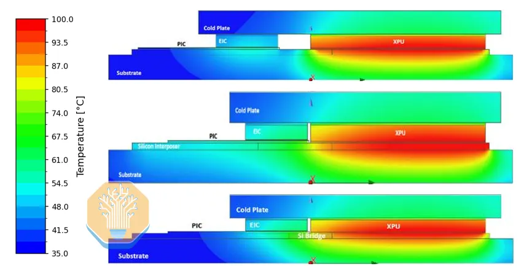

### 解讀摘要
Marvell 比較了透過 UCIe-S 連接在基板上、與透過 UCIe-A 分別連接在矽中介層與矽橋接上的光學引擎熱表現。滿載 XPU 負載下，PIC 溫升在基板上小於 5°C，中介層上約 25°C，橋接上約 20°C。

### 表格
| 連接方式 | PIC 溫升（滿載 XPU） |
|---|---|
| 基板（UCIe-S） | <5°C |
| 矽中介層（UCIe-A） | 約25°C |
| 矽橋接（UCIe-A） | 約20°C |

> **原文補充**：有機基板的低熱導率與相對較大的毫米級空氣間隙隔絕了 PIC；而兩種 UCIe-A 配置中，靠近 XPU 的細間距矽提供了低阻抗熱通道，且空氣間隙僅約 100µm，這是造成 PIC 升溫的原因——這解釋了為何 Fig 35 中 Marvell 明確偏好基板配置。

---

## Fig 38｜PIC 瞬態溫升：基板 vs 矽中介層 vs 矽橋接

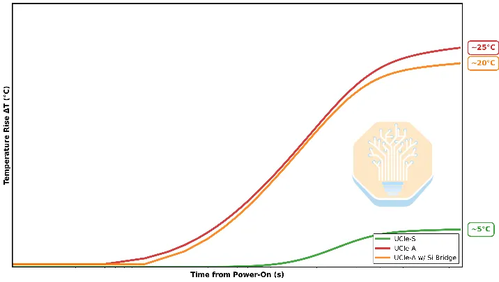

### 解讀摘要
熱瞬態發生在 XPU 電源狀態變化後約 30ms 內。PIC 在有機基板上升溫速率約 10°C/s，橋接上約 100°C/s，中介層上約 120°C/s。

### 表格
| 連接方式 | 瞬態升溫速率 |
|---|---|
| 基板 | 約10°C/s |
| 矽橋接 | 約100°C/s |
| 矽中介層 | 約120°C/s |
| 溫度到達穩態時間 | 約30ms |

> **原文補充**：Marvell 認為 EAM 的偏壓電壓可透過電子電路快速調整以跟上這些變化，而環形調變器需要加熱器＋反饋迴路，受限於較慢的時間常數——這是 Marvell 為 EAM 選擇辯護的技術論點，與 Fig 36 「值得驗證」提到的量產疑慮是同一個 EAM vs MRM 取捨的兩面。

> **洞察十四（配合 Fig 37）**：穩態溫升（基板<5°C vs 中介層25°C）與瞬態升溫速率（基板10°C/s vs 中介層120°C/s）呈現同方向但幅度不成比例的關係——中介層瞬態速率是基板的 12 倍，但穩態溫升只有 5 倍以上，顯示中介層配置不僅終態溫度較高，升溫「速度」相對終態幅度而言更快，這對調變器的動態響應設計（尤其是需要快速追蹤溫度的 EAM／MRM 選型）是比穩態數字更嚴苛的約束條件。

---

## Lightmatter Passage M1000

## Fig 39｜Passage M1000 示意圖（爆炸圖）

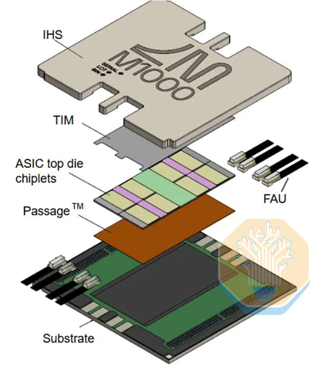

### 解讀摘要
測試載具採晶圓級封裝（chip-on-wafer）方式，將 15 顆 ASIC 小晶片貼附到四瓦片 M1000 中介層上。SemiAnalysis 估算此中介層約 2100mm²，約為 Hot Chips 2025 展示的八瓦片配置（4000mm²）的一半，顯示 M1000 具備依產品需求調整尺寸與瓦片數的高度可配置性。

> **原文補充**：每個瓦片有 32 條光波導、間距 127µm；電性訊號與電源透過約 176µm 間距 C4 凸塊、兩層背面 RDL 與 126µm 深、10µm 寬的 TSV，才到達透過微凸塊連接的 ASIC 小晶片。中介層（約2100mm²）占整個 7200mm² 有機基板不到三分之一，這個比例更接近邏輯面積對封裝尺寸之比，而非封裝級中介層的面積佔比——報告作者表示不確定這是光學架構本身的必然結果，還是這個測試載具的特定設計選擇。

---

## Fig 40｜Passage M1000 封裝翹曲：升溫至回流與冷卻過程（6 面板）

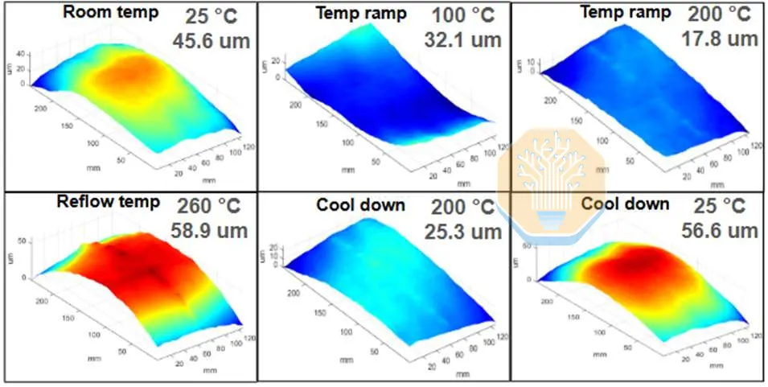

### 解讀摘要
把如此大尺寸的矽中介層貼附到有機基板上會產生嚴重翹曲：模組在 260°C 回流溫度下翹曲達約 59µm，冷卻回室溫後約 56µm。中介層厚度 118µm、C4 凸塊間距約 176µm，翹曲量已足以影響接點形成。

### 表格
| 階段 | 溫度 | 翹曲量 |
|---|---|---|
| 室溫 | 25°C | 45.6µm |
| 升溫 | 100°C | 32.1µm |
| 升溫 | 200°C | 17.8µm |
| 回流峰值 | 260°C | 58.9µm |
| 冷卻 | 200°C | 25.3µm |
| 冷卻回室溫 | 25°C | 56.6µm |

> **原文補充**：Lightmatter 使用磁性治具在貼附過程中固定基板平整，回報電性組裝良率超過 95%，微凸塊與 C4 接點狀態良好——這是翹曲問題的具體解決手段，圖片本身只呈現翹曲量測結果，看不出製程對策。

> **洞察十五**：翹曲量並非隨溫度單調變化，而是室溫（45.6µm）先降後在回流峰值（58.9µm）達到最大值再回升，冷卻回室溫後（56.6µm）幾乎回到峰值水準而非室溫初始值——這代表回流製程本身對翹曲狀態造成了不可逆的位移（初始45.6µm vs 最終56.6µm，差距約24%），暗示即使良率達 95% 以上，翹曲的永久性變化仍可能是長期可靠性（而非初始組裝良率）的潛在風險點，報告未對此做出評論。

---

## Fig 41｜170W／象限熱測試晶片溫度分布

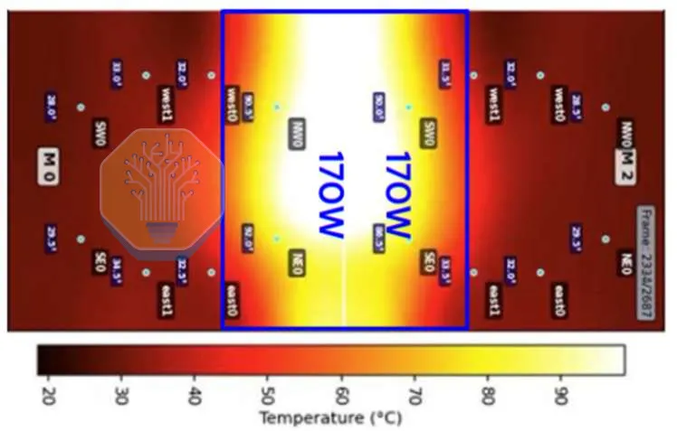

### 解讀摘要
Lightmatter 使用四象限獨立供電的熱測試晶片，每象限功耗 170W，換算成 369mm² 有效面積上功率密度 1.47W/mm²。此功率下，在 25°C 冷卻液、1.8LPM/kW 流量條件下，光子中介層溫度達約 100°C。

### 表格
| 指標 | 數值 |
|---|---|
| 每象限功耗 | 170 W |
| 有效面積 | 369 mm² |
| 功率密度 | 1.47 W/mm² |
| 冷卻液溫度／流量 | 25°C／1.8 LPM/kW |
| 中介層溫度 | 約100°C |

> **原文補充**：此結果驗證了在集中式測試晶片區域冷卻 680W 的能力，而實際封裝設計目標是在近 3 個光罩面積的 ASIC 矽晶片上支援超過 900W——這代表目前驗證的 680W 只是設計目標 900W 的約 76%，尚未完整驗證滿載情境，這是報告原文對測試範圍限制的重要揭露。

---

## Other Highlights：Hybrid Bonding

## Fig 42｜細晶粒銅退火 175°C／200°C 無空洞 C-SAM 接合圖

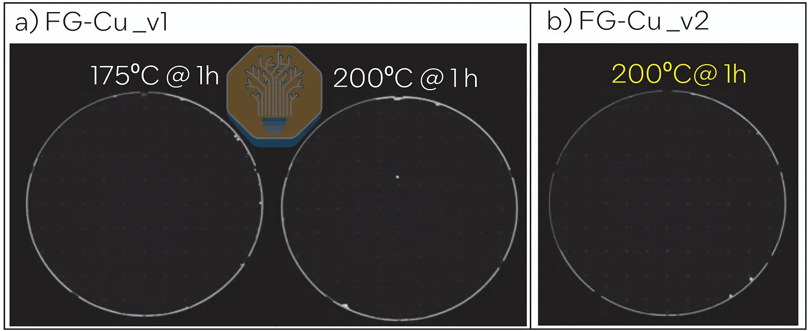

### 解讀摘要
混合銅接合仍是 HPC 應用中間距最細、I/O 密度最高的方案，核心難題是在降低接合溫度的同時保持介面極度平整潔淨。Intel 結合細晶粒銅與低溫介電材料疊層，在 175°C 與 200°C 退火後都達到均勻晶圓接合（圖中兩片晶圓 C-SAM 掃描均無明顯空洞）。

> **原文補充**：兩片測試中有一片電性良率約 60%，但 Intel 說明這是保守下限，因為測試載具與探測方式本身有限制；實驗使用晶圓對晶圓（W2W）測試載具，而非技術實際目標的晶粒對晶圓（D2W）製程——這代表 60% 良率不能直接視為 D2W 量產良率的預測值，報告特別點出此限制以避免讀者誤讀。

> **值得驗證**：60% 電性良率被報告定性為「保守下限」，但若 W2W 測試載具與實際 D2W 製程之間的良率差距方向相反（即 D2W 實際更難達成），這個「保守」假設可能是錯的；報告未提供 D2W 實測數據佐證這個方向性判斷。

> **原文補充（Applied Materials/EV Group 對照）**：報告同時提到 Applied Materials 與 EV Group 展示的最激進間距成果——450nm 間距晶圓對晶圓接合，在 2000 萬個連結鏈上達到 98% 良率。失效分析將開路連結歸因於銅介面含碳的苯并三唑（BTA）殘留，改用 PVD TaN/Ta 阻障層後良率顯著提升。CEA-Leti 另外在無電漿活化、僅 100°C 退火下達到超過 97% 良率。這組數據並無對應圖片，但與 Fig 42 同屬 Hybrid Bonding 章節的關鍵佐證，故於此併陳。

> **洞察十六**：Applied Materials/EV Group 的 98% 良率（450nm 間距，2000萬連結）與 Intel 的約 60% 電性良率（W2W 測試載具）雖然都屬於 Hybrid Bonding，但測試規模（2000萬連結 vs 未說明規模）與良率定義（連結鏈良率 vs 電性良率）並不相同，不能直接比較優劣；報告作者總結認為銅、介電材料、CMP、表面處理與退火必須協同優化，這代表 Hybrid Bonding 良率的瓶頸是多變數耦合問題，而非單一材料或設備供應商可獨立解決。

---

## Interposer Alternatives

## Fig 43｜FO-EB 嵌入式記憶體小晶片示意剖面圖

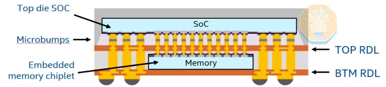

### 解讀摘要
Intel 與 SPIL 把 SRAM 小晶片放入扇出嵌入式橋接（FO-EB）封裝的嵌入橋接層，透過 25µm 間距微凸塊垂直連接到邏輯晶粒。測試晶片達到超過 265GB/s/mm²、0.24pJ/b 的效能。

### 表格
| 指標 | 數值 |
|---|---|
| 微凸塊間距 | 25µm |
| 頻寬密度 | >265 GB/s/mm² |
| 能耗效率 | 0.24 pJ/b |

> **原文補充**：報告點出面板級有機中介層是繞開矽尺寸限制的另一條路：Resonac 在 320mm×320mm 面板上展示乾膜嵌入式橋接中介層個別製程模組（含 5µm 微導孔與 2/2µm 線寬/間距），ASE 則在 600mm×600mm 面板上製作 RDL，再切割成四塊 300mm×300mm 面板以配合現有設備組裝，其測試載具使用 3 層 RDL、5/8µm 線寬/間距——這兩家 OSAT/材料廠的面板級方案並無對應獨立圖片，但屬同一「中介層替代方案」章節的重要佐證，故一併於此記錄。

---

## Fig 44｜IBM DBrM 30µm 間距矽橋接測試載具照片

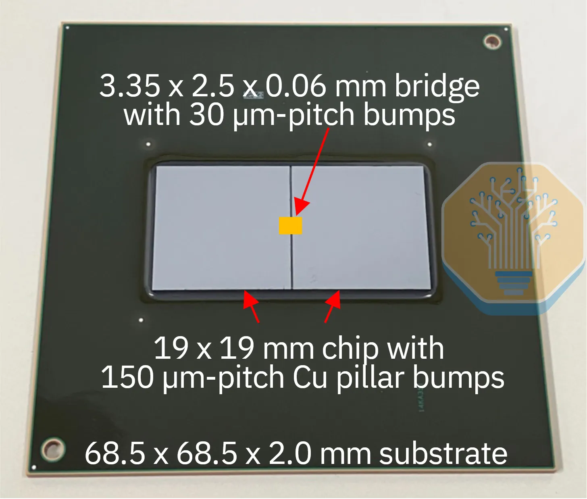

### 解讀摘要
IBM 採取更局部化的做法——直接橋接多晶粒（DBrM）：晶粒先沿邊緣接合，圍繞一個 30µm 間距矽橋接形成機械剛性子組件。子組件的彎曲測試耐受超過 30N，相較 IBM 先前僅用底部填充的結構僅 0.2N，翹曲控制效果顯著提升。

### 表格
| 指標 | 數值 |
|---|---|
| 矽橋接間距 | 30µm |
| 彎曲測試耐受（DBrM） | >30N |
| 彎曲測試耐受（先前底部填充結構） | 0.2N |
| 橋接尺寸 | 3.35×2.5×0.06mm |
| 晶片尺寸／凸塊間距 | 19×19mm／150µm Cu pillar |
| 基板尺寸 | 68.5×68.5×2.0mm |

> **洞察十七**：彎曲耐受從 0.2N 提升到 >30N，改善幅度超過 150 倍，遠大於本文其他技術路線的改善幅度（多為個位數倍數或百分比級）——這代表「邊緣先接合」這個機械結構性改變，對翹曲/可靠性問題的解決力道遠比材料或製程微調更直接，可能預示未來封裝可靠性的競爭重點會從材料科學轉向組裝順序與結構設計。

---

## Fig 45｜Unimicron：無中介層矽橋接晶片互連概念

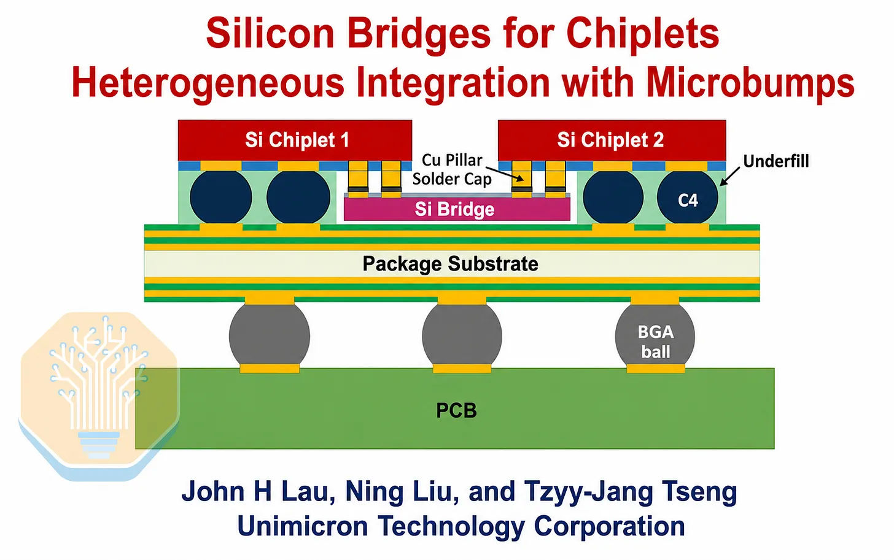

### 解讀摘要
Unimicron（欣興電子）提出更簡化的結構，既不需要中介層也不需要嵌入式橋接：兩顆小晶片透過安裝在其下方的薄矽橋接互連，同時直接貼附到基板。模擬顯示小晶片與橋接之間的底部填充是必要的，用以控制微凸塊應變。

> **原文補充**：報告總結指出，TSMC 的 CoWoS-R 與 CoWoS-L 仍受限於圓形晶圓上製作的 RDL，制約封裝尺寸與晶圓利用率；而本節介紹的幾種替代方案（FO-EB、面板級中介層、IBM DBrM、Unimicron 無中介層方案）則把整合轉移到面板級、重構晶圓格式，或完全去除中介層。SemiAnalysis 預期未來數年類似架構將開始出現在 ASIC 產品中。

> **洞察十八（配合 Fig 43-44）**：Fig 43（FO-EB）、Fig 44（IBM DBrM）、Fig 45（Unimicron）三種方案的共同邏輯是「去除或縮小中介層」，而非像 Intel EMIB-T（Fig 1-9）或 Samsung（Fig 15-19）那樣持續強化中介層本身——這代表封裝業界目前存在兩條並行但方向相反的技術路線（強化中介層 vs 繞開中介層），本文未明確判斷何者最終勝出，僅呈現兩條路線並存的現況，這是報告未下判斷的中性揭露。

---

## Other Highlights：Thermal Interface Materials

## Fig 46｜精選 TIM 材料特性表

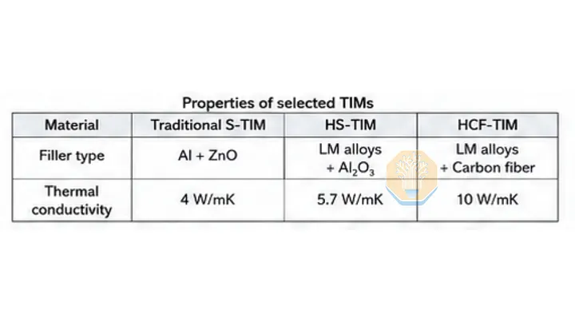

### 解讀摘要
TSMC 的直接進矽冷卻完全去除 TIM1，但多數近期系統仍需要矽與散熱蓋之間更好的材料。SPIL 在 55mm×55mm FO-EB 封裝上測試了鎵基液態金屬（LM）複合材料——矽膠基 HS-TIM 與碳纖維 HCF-TIM。

### 表格
| 材料 | 填料類型 | 熱導率 |
|---|---|---|
| 傳統 S-TIM | Al + ZnO | 4 W/m·K |
| HS-TIM | LM alloys + Al₂O₃ | 5.7 W/m·K |
| HCF-TIM | LM alloys + Carbon fiber | 10 W/m·K |

---

## Fig 47｜TIM 熱阻可靠性比較（30 天後）

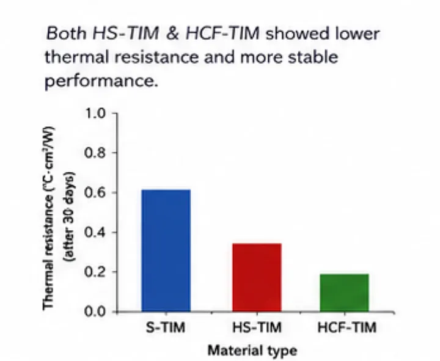

### 解讀摘要
兩種 TIM 呈現截然不同的可靠性結果：HCF-TIM 在 150°C／1000 小時後仍維持 95% 覆蓋率，而 HS-TIM 因矽膠基質硬化並部分脫層，覆蓋率降至僅 75%。兩種液態金屬基 TIM 的熱阻均優於傳統 S-TIM，其中 HCF-TIM 效能與可靠性兼具最佳。

### 表格
| 材料 | 熱阻（30天後，°C·cm²/W） | 1000hr@150°C 覆蓋率 |
|---|---|---|
| S-TIM | 約0.61 | — |
| HS-TIM | 約0.34 | 75% |
| HCF-TIM | 約0.19 | 95% |

> **原文補充**：Purdue、Aveiro 大學與 UCLA 採用不同方法——把 Cu/Sn 微凸塊嵌入奈米結晶鑽石中，所得互連層的等效平面內熱導率達到 500-600 W/m·K，約為傳統微凸塊的 20 倍。這並非 TIM1 替代品，而是透過 3D 堆疊互連層橫向散熱的手段。製程仍屬早期，論文僅使用單面測試結構而非組裝完成的 3D 堆疊。報告也提到 ECTC 上關於 SiC 作為 TIM1 或散熱方案的討論很少，暗示這條路線距離成熟還有相當長的路要走。

---

## Other Highlights：Glass Substrates

## Fig 48｜74mm×74mm 有機基板 vs 玻璃核心基板測試載具比較

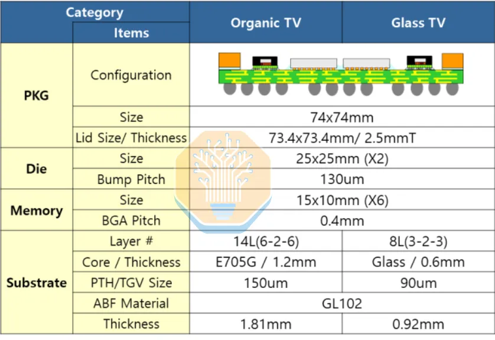

### 解讀摘要
STATS ChipPAC 研究大型玻璃核心封裝的組裝與可靠性。其 74mm×74mm 玻璃核心封裝在未做邊緣塗層時每個測試段都失敗，而邊緣塗層版本則完整通過組裝與可靠性測試，邊緣塗層同時降低翹曲 33.5%。

### 表格
| 項目 | Organic TV | Glass TV |
|---|---|---|
| 封裝尺寸 | 74×74mm | 74×74mm |
| 晶粒尺寸／凸塊間距 | 25×25mm(x2)／130µm | 25×25mm(x2)／130µm |
| 基板層數 | 14L(6-2-6) | 8L(3-2-3) |
| 核心材質／厚度 | E705G／1.2mm | Glass／0.6mm |
| PTH/TGV 尺寸 | 150µm | 90µm |
| 基板總厚度 | 1.81mm | 0.92mm |

> **原文補充**：不做邊緣塗層的玻璃核心封裝「每個測試段都失敗」，這是一個二元式（全有全無）的結果，而非漸進劣化——代表邊緣塗層對玻璃核心封裝而言不是效能優化選項，而是良率的必要條件，這個嚴重程度在圖表本身（僅呈現尺寸規格對比）看不出來，需要原文文字才能掌握。

> **值得驗證**：33.5% 翹曲改善僅來自邊緣塗層一項措施；若邊緣塗層製程本身在面板級量產（見 Fig 49-50 更大尺寸玻璃基板）中良率或成本不具規模化條件，玻璃核心基板的可靠性優勢可能無法從測試載具規模放大到量產規模。

---

## Fig 49｜玻璃核心基板邊緣特寫照片

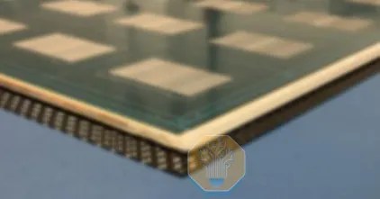

### 解讀摘要
特寫照片呈現玻璃核心基板的疊層邊緣結構，是 Fig 48 邊緣塗層論述與 SeWaRe（玻璃邊緣裂紋）問題的實體佐證。

> **原文補充**：報告指出玻璃邊緣裂紋（SeWaRe）仍是未解決的問題，這是從切割玻璃邊緣在 RDL 應力下開始的側向裂紋。Georgia Tech 以實驗方式表徵此失效模式，Corning 則用有限元素分析（FEA）、周動力學（peridynamics）與解析斷裂力學模擬其擴展路徑，發現剛性銅層會把裂紋推向玻璃中線，而順應性聚合物層會改變裂紋路徑；Corning 也發現低 CTE 聚合物搭配適當玻璃選擇可降低失效風險。

---

## Fig 50｜TGV（穿玻璃導孔）填銅比較照片

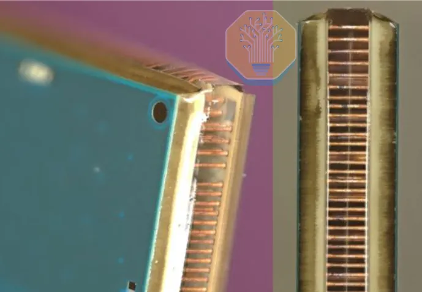

### 解讀摘要
照片對比呈現不同 TGV 填銅結構，是玻璃基板量產工藝細節的實物佐證。

> **原文補充**：Intel 展示了業界首見的 510mm×515mm、24 層（10-2-10）玻璃核心面板，具備完全銅填充的穿玻璃導孔（TGV）、兩個嵌入式 EMIB 橋接，以及與 TGV 共形成的光波導。此大型原型在 Intel 展位展示，並在既有有機基板產線上處理完成，切割後的單元在熱衝擊測試後未出現 SeWaRe。作為 OSAT 採用方，Amkor 與 STATS ChipPAC 量測到較薄玻璃核心相較有機參考基板可降低 30-40% 基板層級翹曲，但組裝缺陷與 TGV 填充問題顯示製程仍不成熟。SemiAnalysis 總結今年玻璃基板數據仍支持製程開發階段而非大量採用階段。

> **洞察十九（配合 Fig 48）**：Intel 的 510×515mm 面板級玻璃基板（無 SeWaRe）與 STATS ChipPAC 的 74×74mm 測試載具（邊緣塗層後可通過測試）雖然尺寸相差近 50 倍，但都指向同一個結論——玻璃核心可靠性問題（SeWaRe、翹曲）在「有適當工藝介入」（邊緣塗層或既有有機產線工序）下可被控制，然而兩者的良率與量產規模都尚未揭露，報告的保守結論（「支持製程開發而非量產」）與這兩個正面案例並不矛盾，只是強調規模化證據仍不足。

---

## Other Highlights：RDL Scaling

## Fig 51｜UCIe-A IP 與 CoWoS-R 矽驗證相關性（GUC Fig.6/7）

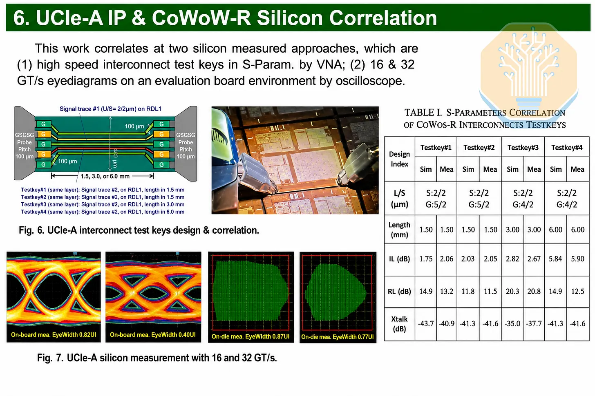

### 解讀摘要
GUC（世界先進／創意電子）作為最先進的 RDL 製造商之一，與 TSMC 合作展示 8 層 RDL 微縮，被認為是 CoWoS-R 平台近期的極限。此圖呈現 GUC 內部原始 Fig.6（UCIe-A 互連測試鍵設計與相關性，含 S 參數量測）與 Fig.7（16/32GT/s 矽驗證眼圖）。

### 表格
| Design Index | Testkey#1 (Sim/Mea) | Testkey#2 (Sim/Mea) | Testkey#3 (Sim/Mea) | Testkey#4 (Sim/Mea) |
|---|---|---|---|---|
| 長度 (mm) | 1.50 / 1.50 | 1.50 / 1.50 | 3.00 / 3.00 | 6.00 / 6.00 |
| IL (dB) | 1.75 / 2.06 | 2.03 / 2.05 | 2.82 / 2.67 | 5.84 / 5.90 |
| RL (dB) | 14.9 / 13.2 | 11.8 / 11.5 | 20.3 / 20.8 | 14.9 / 12.5 |
| Xtalk (dB) | -43.7 / -40.9 | -41.3 / -41.6 | -35.0 / -37.7 | -41.3 / -41.6 |

板上量測眼寬：0.82UI（Testkey較短）／0.40UI（較長）；晶片內量測眼寬：0.87UI／0.77UI。

> **原文補充**：GUC 的 STCO 框架採用接地-訊號-接地交錯傳輸線控制串音與偏斜，模擬顯示 C4 側 IPD 提供局部去耦並降低小晶片微凸塊處的電壓波動——這是圖片表格數字之外，關於「為何良率/訊號完整性能達標」的設計方法論說明。

> **洞察二十**：Testkey#3（3.00mm）的模擬與量測 IL 誤差最小（2.82 vs 2.67dB，差5.6%），但 Testkey#4（6.00mm，最長）誤差擴大（5.84 vs 5.90dB，差1%，實際上是四組中最小），而 RL 在 Testkey#4 反而模擬與量測差距最大（14.9 vs 12.5dB，差16%）——顯示模擬與矽驗證的一致性並非隨走線長度單調變化，RL（回波損耗）在最長走線上的預測準確度是四項指標中最弱的一環，這對更長走線（Fig 52 提到的 36GT/s 目標）的訊號完整性風險評估是值得留意的細節。

---

## Fig 52｜UCIe-A 整合設計流程與 STCO（8 層 CoWoS-R RDL）

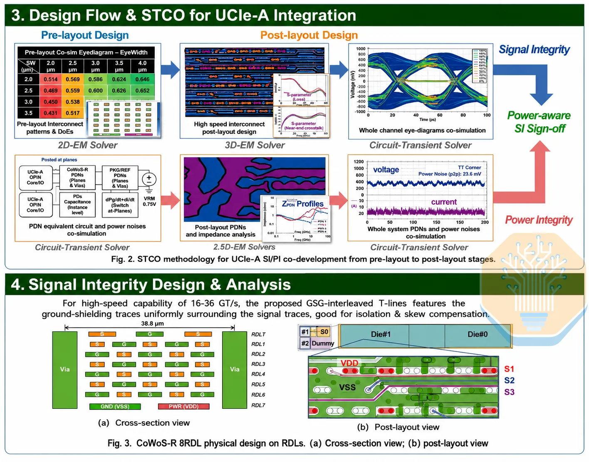

### 解讀摘要
GUC 展示了針對 64-bit UCIe-A 介面（TSMC N3 製造，整合於 8 層 CoWoS-R RDL）的 STCO 設計與驗證流程，涵蓋前佈局（2D EM Solver）與後佈局（3D EM Solver／電路暫態求解器／2.5D EM Solver）的訊號完整性與電源完整性協同設計。設計目標為 16-36GT/s、64-bit、10 欄位 UCIe-A 介面，45µm 凸塊間距，訊號走線在 6 層以 2/2µm 布線、第 7 層留給電源傳遞。

### 表格
| 指標 | 數值 |
|---|---|
| 目標速率 | 16-36 GT/s |
| 介面寬度 | 64-bit，10 欄 |
| 凸塊間距 | 45µm |
| 訊號走線層數／線寬 | 6 層／2/2µm |
| 晶片內量測眼寬 @32GT/s | 0.77 UI |
| 模擬眼寬 @36GT/s | 0.74 UI |

> **原文補充**：前佈局眼圖模擬表格（Fig 52 左上角）顯示，隨訊號走線間距（SW）從 2.0µm 增加到 4.0µm、走線寬度（SW）從 2.0µm 到 3.5µm，眼寬從 0.514 提升到 0.652——這是設計空間探索（DoE）的具體數字，證明 GUC 在定案 2/2µm 布線前已系統性掃過多組線寬間距組合。

> **洞察二十一（配合 Fig 51）**：Fig 51 顯示晶片內量測眼寬在 32GT/s 為 0.77UI，Fig 52 模擬 36GT/s 眼寬為 0.74UI——實測（較低速率）與模擬（較高速率）眼寬相差僅 0.03UI（約4%），顯示 GUC 的訊號完整性設計方法論（STCO）在往更高速率外推時，模擬與實測的落差控制得相當好，這是 8 層 CoWoS-R RDL 平台衝刺 36GT/s 目標可信度的正面佐證。

---

## Stacked Memory

## Fig 53｜傳統打線接合堆疊 vs 垂直銅柱堆疊（VCS）示意圖

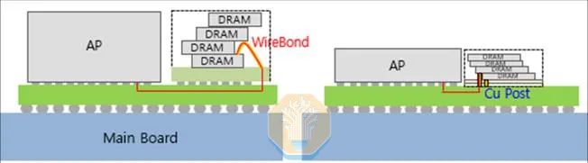

### 解讀摘要
Samsung 展示一種完全避開 TSV 的 DRAM 堆疊方案：垂直銅柱堆疊（VCS）用小於 56µm 間距、小於 30µm 寬的高深寬比銅柱嵌入模封材料中連接四顆堆疊記憶體晶粒，取代矽穿孔蝕刻，同時以 RDL 取代封裝基板。

### 表格
| 指標 | 傳統打線接合 | VCS |
|---|---|---|
| 功耗（等速） | 0.646 W | 0.384 W（-41%） |
| 最高資料速率 | 8.6 Gb/s | 11.8 Gb/s（+37%，功耗僅+8%） |

> **原文補充**：報告指出 Samsung 的重點應用是行動平台（如智慧型手機），但這個方法對更高功耗的工作負載也具潛力；SemiAnalysis 認為 VCS 及類似方案可協助未來 AI 加速器在更低功耗、更小外型下達到更高頻寬，同時也能催生 SOCAMM 等更高密度的伺服器 CPU 記憶體模組——這是報告作者對行動技術外溢至 AI 伺服器應用的前瞻判斷，非 Samsung 原始論文主張。

> **值得驗證**：VCS 的功耗與速率優勢數據來自行動導向的測試環境（小尺寸、低功耗基準），report 作者對 AI 加速器應用的展望屬外推假設；若 AI 加速器所需的堆疊層數（遠高於行動裝置的4層）或功耗密度超出 VCS 銅柱結構的散熱與電性餘裕，Fig 53 呈現的 -41% 功耗與 +37% 速率優勢可能無法線性外推到伺服器級應用。

---

## Fig 54｜四層 VCS DRAM 堆疊剖面圖（極高深寬比銅柱）

### 解讀摘要
剖面圖直接呈現四層堆疊記憶體晶粒透過極高深寬比銅柱連接的實際結構，是 Fig 53 功耗與頻寬數字的物理載體佐證。

### 表格
| 指標 | 數值 |
|---|---|
| 封裝高度／面積 | 各減少 40% |
| 頻寬 | 提升 2.6× |
| I/O 數量 | 提升 6× |

> **洞察二十二（配合 Fig 53）**：封裝高度與面積同時減少 40%、頻寬提升 2.6 倍、I/O 數量提升 6 倍——I/O 數量的增幅（6×）遠大於頻寬增幅（2.6×），代表單一 I/O 的等效頻寬其實是下降的，這與銅柱間距微縮（<56µm）帶來的「數量取勝」而非「速度取勝」策略一致；若未來需要更高單通道速率而非單純堆更多 I/O，VCS 架構可能需要額外的訊號完整性優化才能兼顧兩者。

---

## 跨 Exhibit 彙整表：三種直接液冷方案功率密度比較

**觸發原因**：Fig 24-29（TSMC 微柱）與 Fig 39-41（Lightmatter 熱測試晶片）雖分屬不同章節，但都提供了「散熱能力 vs 功率密度」的可比數字，適合並列檢視技術路線的相對定位。

### 彙整 1｜三種方案散熱能力對照（來源：Fig 27、Fig 29、Fig 41）

| 方案 | 廠商 | 散熱能力 | 條件 |
|---|---|---|---|
| 傳統有蓋冷板 | TSMC | 1.9-2.3 kW | 1-2LPM |
| 傳統無蓋冷板 | TSMC | 2.5-3.0 kW | 1-2LPM |
| 矽微柱直接液冷 | TSMC | 5.3 kW | 8LPM |
| GPU 直接液冷（微通道） | Microsoft | 熱阻降低51-60% | 1LPM，GH200 實機 |
| 光子中介層熱測試晶片 | Lightmatter | 680W（驗證值，設計目標900W+） | 25°C／1.8LPM/kW |

> 三家廠商雖採用不同的直接液冷結構（矽微柱 vs 矽微通道 vs 傳統冷板+液冷回路），但共同指向同一個產業訊號：散熱瓶頸已迫使封裝廠商把冷卻液帶到比傳統冷板更接近晶粒本體的位置，TIM1 正在從「必要材料」變成「效能瓶頸」，這與 Fig 46-47 討論的次世代 TIM 材料（液態金屬複合材料）改良形成互補而非替代關係——即便是直接液冷方案，HBM 側（Fig 20、29）仍高度依賴 TIM，代表 TIM 材料創新在可預見的未來仍是散熱總體方案不可或缺的一環。

---

## 相關個股清單

| 類別 | 公司 | Ticker | 評等 | 備註 |
|---|---|---|---|---|
| 晶圓代工／先進封裝 | 台積電 | 2330 (TW) | N/A | CoWoS-R 微流體散熱、CoWoS-L chip-last 流程、COUPE 光學引擎 |
| OSAT／封測 | 日月光投控 | 3711 (TW) | N/A | Mitsui/ASE 混合銅接合論文、600mm面板級RDL |
| RDL／中介層設計 | 眾晶科技(GUC) | 3443 (TW) | N/A | UCIe-A x64 chiplet／8層CoWoS-R RDL 設計與矽驗證 |
| 基板／橋接封裝 | 欣興電子 | 3037 (TW) | N/A | Unimicron 無中介層矽橋接封裝論文作者 |
| IDM／先進封裝 | Intel | INTC (US) | N/A | EMIB-T、玻璃核心基板、Hybrid Bonding、FO-EB(與SPIL合作) |
| Fabless／客製HBM+光學互連 | Marvell | MRVL (US) | N/A | Custom HBM、OMIB、Photonic Fabric(Celestial AI收購) |
| 記憶體 | Samsung Electronics | 005930 (KR) | N/A | HBM4E 中介層設計、Hybrid Bonding 熱驗證、VCS堆疊記憶體 |
| 雲端／自研散熱 | Microsoft | MSFT (US) | N/A | GH200 直接進矽微流體冷卻實測 |
| 運算/GPU | Nvidia | NVDA (US) | N/A | Rubin/Feynman 客製化HBM採用方 |
| IDM | IBM | IBM (US) | N/A | Direct Bridge Multi-die(DBrM) 矽橋接封裝 |
| 半導體設備 | Applied Materials | AMAT (US) | N/A | 450nm間距晶圓對晶圓混合銅接合(與EV Group合作) |
| 光學互連（私有） | Lightmatter | 未上市 | N/A | Passage M1000 光子中介層封裝 |
