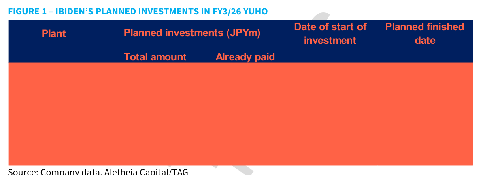
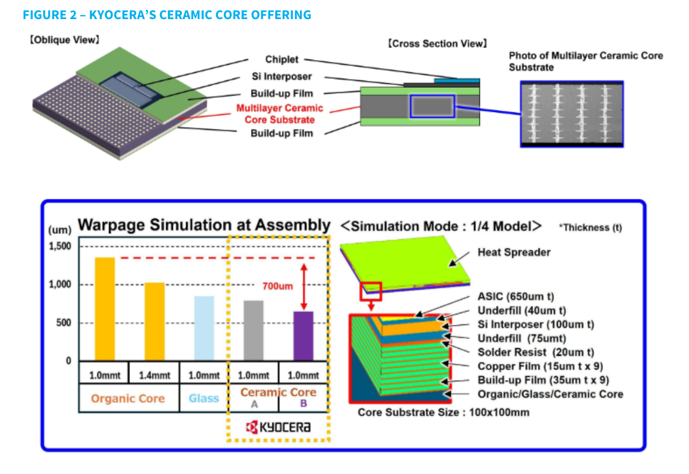
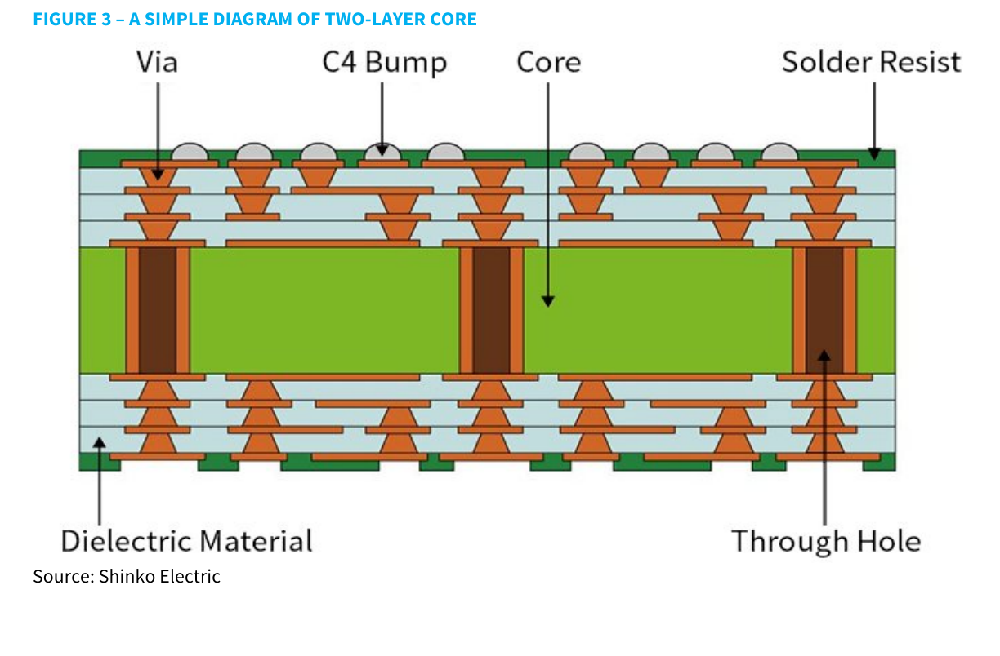
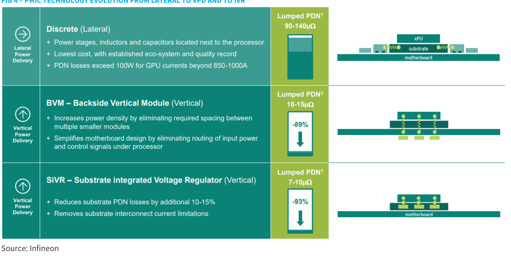
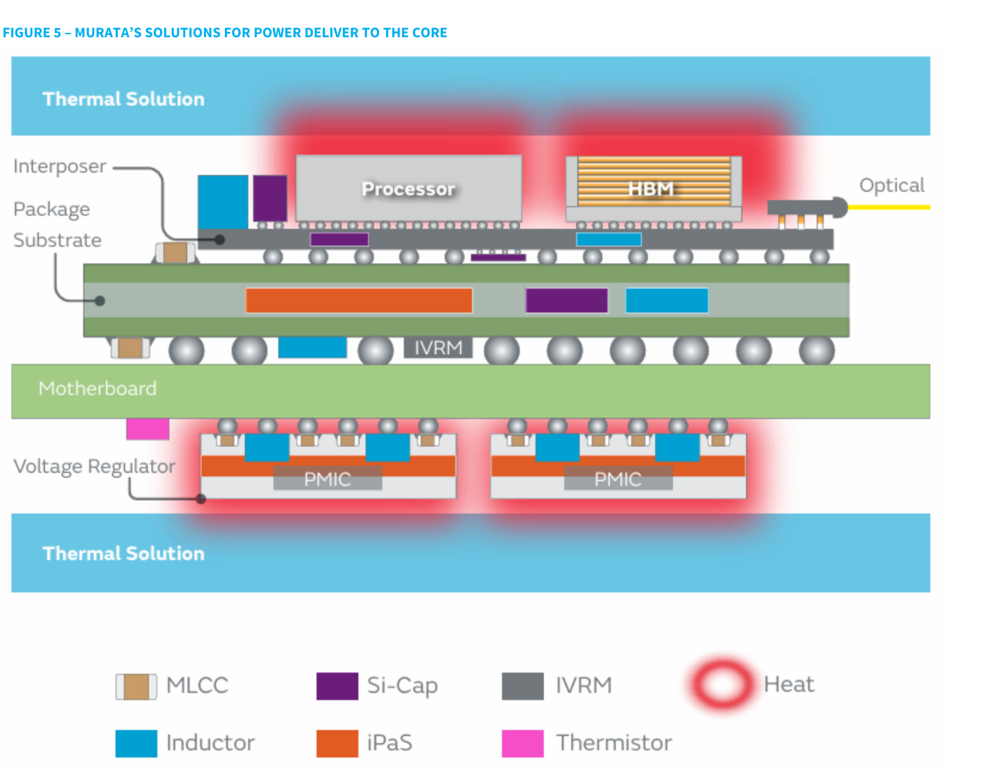
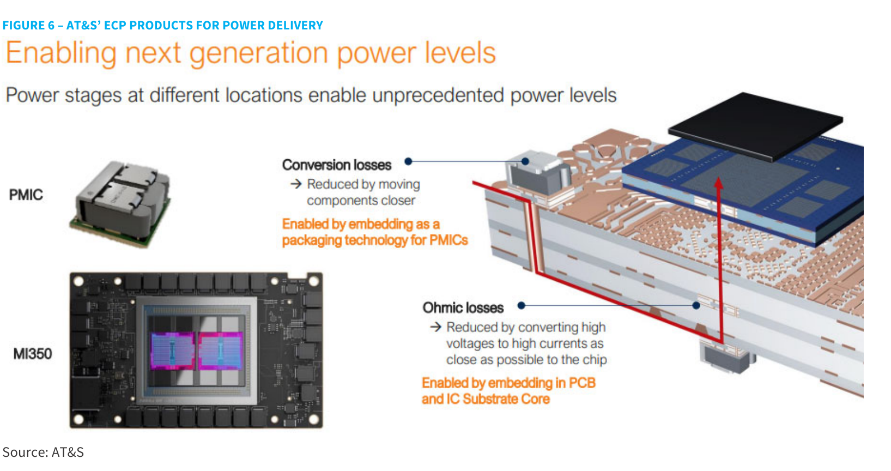

# Aletheia Capital｜ABF Substrate Core — A Core that Integrates All the "Hottest" Components

**券商**：Aletheia Capital  
**分析師**：George Chang、Skye Chen  
**日期**：2026-07-02  
**主題**：ABF 基板 Core 層技術演進與嵌入式功率組件整合  
**評級**：N/A（無整體 Industry View）  
<a href="https://layx.uk/dl?g=產業&b=Aletheia&d=20260703&h=ABF-Core">📎 下載 PDF</a>

---

## 報告總結

本報告以 Ibiden 在 FY3/26 YUHO 披露的 ¥500bn 龐大投資計畫（Gama ¥220bn + Ono ¥280bn，其中馬來西亞約 ¥120bn 為 Ono 的海外分支）為導火線，深入分析 ABF 基板 Core 層的技術演進——從現行主流兩層 T-glass CCL（Nittobo 主導）走向 6-8 層多層結構。Core 層雖僅佔基板成本約 10%，但多層化可大幅提升 ASP，且為嵌入式組件（PMIC、電感、電容、IVR）提供安置空間，直接呼應 AI GPU 的功率管理需求。

Aletheia 的核心論點是 AT&S 具備最強競爭護城河：其 20 年專利 ECP 技術使其成為 Infineon VPD 的唯一供應商，而 Ibiden Malaysia ¥120bn 核心投資（前身為 Apple SLP 廠）暗示 AT&S Kulim 的 €1.5-2bn capex 規劃存在上修空間。玻璃基板需求預計仍需 2-3 年；CCL 主導地位近期維持。

---

## Aletheia Capital 完整投資邏輯鏈

| 論點層次 | Exhibit | 內容 |
|---|---|---|
| 瓶頸確認 | Fig 4 | AI GPU PDN 損耗是核心瓶頸；Lateral 方案 90-140μΩ，SiVR 嵌入核心可壓至 7-10μΩ（-93%） |
| 需求規模 | Fig 1 | Ibiden ¥500bn YUHO 投資（Gama ¥220bn + Ono ¥280bn 含 Malaysia ¥120bn）驗證 Core 擴建的規模與迫切性 |
| 技術路徑 | Fig 2、Fig 3 | CCL（T-glass）二層主流維持；陶瓷核翹曲可壓至 650um（有機核 1,350um）但量產需求 2-3 年後 |
| 嵌入式整合 | Fig 5、Fig 6 | Murata 全系統方案（MLCC/iPaS/IVRM）+ AT&S ECP（-93% PDN）；ECP 已量產供 Infineon VPD |
| 供給上限 | Fig 1 | Ibiden Malaysia ¥120bn 前為 Apple SLP 廠轉換核心產能 → AT&S Kulim capex 可能低估 |
| 受益排序 | 封面 | **AT&S（Top Pick）** ECP 獨家護城河 + Kulim 上修空間；Unimicron EMIB-T \$42m 工具投資 |
| **結論** | 封面 | **Core 多層化 + 功率組件嵌入是 ABF 次世代 ASP 主驅力；AT&S ECP 技術壁壘最高** |

> **報告最大邏輯缺口**：嵌入組件為 consigned（客戶自帶），基板廠 ASP 無直接改善；報告未量化 2 層→6-8 層的 ASP 增幅絕對值。

---

## 報告核心觀點

| 主題 | Aletheia 觀點 | 市場共識 | 是否 Contra-Consensus |
|---|---|---|---|
| Core 材料 | CCL（T-glass/Nittobo）維持主導；玻璃核 2-3 年後 | 部分機構預期玻璃基板近期量產 | ✅ 偏保守 |
| Core 層數 | 2層→6-8層是 ASP 主驅力；核心成本僅佔基板 10% | 市場多關注 ABF 層數增加 | — |
| AT&S ECP | AT&S 是 Infineon VPD 唯一供應商，ECP 已量產 | 市場對 AT&S 核心製程認知度低 | ✅ |
| Ibiden Malaysia | ~¥120bn 核心投資（原 Apple SLP 廠轉換） | 多數關注 Gama/Ono，Malaysia 被忽略 | ✅ |
| 嵌入組件 ASP | Consigned 組件，基板廠 ASP 無直接改善 | 部分市場誤解嵌入組件對基板廠的 ASP 貢獻 | ✅ |

**偏好排序**：AT&S > Unimicron（EMIB-T）> Ibiden  
**核心材料偏好**：Nittobo T-glass CCL（主導）；Kyocera 陶瓷核（量產初期，需求 2-3 年後成熟）

---

## Fig 1｜Ibiden's Planned Investments in FY3/26 YUHO

### 解讀摘要

Ibiden 在 FY3/26 YUHO（等同 SEC Form 10-K）中披露三大廠址的投資計畫，但所有數值以橙色色塊全數覆蓋（非公開資料）。Aletheia 從公告中彙整：Gama ¥220bn（含海外）、Ono ¥280bn（含海外），兩者合計接近 ¥500bn；馬來西亞約 ¥120bn 是 Ono 的海外擴張分項，前身為 Apple SLP 產線，已轉換為 IC substrate core 生產。馬來西亞廠的角色是作為 Ono 與 Gama 未來產能的核心支援廠——這不是消費性轉 AI 的邊際增量，而是系統性 core 製程戰略重組。

> **原文補充**：報告指出三廠（Gama + Ono + Malaysia）合計「接近 ¥500bn，金額略有差異，Ono 廠差距最大」——正確理解是 Malaysia ¥120bn 為 Ono ¥280bn 的海外子項，非另計；合計應仍為 ¥500bn 左右。AT&S Kulim 2 建廠公告中附帶提及 IC substrate core 建設地點，Aletheia 認為這是獨立核心廠的訊號，暗示 €1.5-2bn capex 存在上修空間。

### 表格

| 廠址 | 規劃投資 | 說明 |
|---|---|---|
| Gama（含海外） | ¥220bn | 含海外擴張；具體數值以橙色覆蓋 |
| Ono（含海外） | ¥280bn | 含海外擴張（含 Malaysia ¥120bn 子項） |
| Malaysia | ~¥120bn | Ono 海外分項；前身 Apple SLP，轉換為 IC substrate core |
| **合計** | **~¥500bn** | 三廠合計接近 Ibiden 公告目標 |

*原始 YUHO 逐廠逐項數值以橙色覆蓋，上表數值來自報告文字說明

> **洞察一**：Malaysia ¥120bn 轉換自 Apple SLP 的訊號意義在於，若 Apple SLP 規模的廠都要轉成 IC substrate core，代表 core 需求的量已足夠支撐整條 SLP 產線的轉型成本——以此反推 AT&S Kulim 的 core 廠規模，€1.5-2bn 公告 capex 確實有上修空間。

---

## Fig 2｜Kyocera's Ceramic Core Offering

### 解讀摘要

Kyocera 的多層陶瓷核基板在 100×100mm 封裝尺寸下，組裝翹曲可壓至約 650-750μm（Ceramic Core A/B），相較有機核 ~1,350μm 改善 44-52%，且低於組裝所需的 700μm 目標線。上方圖示顯示陶瓷核位於 Si Interposer 下方（Chiplet → Si Interposer → Build-up Film → Multilayer Ceramic Core → Build-up Film），CTE 接近矽的材料特性是翹曲控制的根本優勢。玻璃核（1.4mmt）仍達 ~1,000μm、超過 700μm 目標，代表即使玻璃核問世，組裝工程仍需額外突破。

> **原文補充**：Kyocera 於 2026 年初宣布多層陶瓷核基板進入市場。玻璃核在翹曲、細線路、熱效率上優於陶瓷核，但生產工序更難（不一定由基板廠完成）；Aletheia 供應鏈調查顯示玻璃核在未來 2-3 年無顯著需求。

### 表格

翹曲模擬數值（視覺估算，1/4 Model，100×100mm 封裝）：

| 核材料 | 厚度 | 翹曲模擬（μm） | 達到 700μm 目標 |
|---|---|---|---|
| Organic Core | 1.0mmt | ~1,350 | ❌ |
| Glass | 1.4mmt | ~1,000 | ❌ |
| Ceramic Core A | 1.0mmt | ~750 | ❌（勉強超標） |
| Ceramic Core B | 1.0mmt | ~650 | ✅ |

*以上為視覺估算

組裝疊構（Cross Section，Core Substrate Size 100×100mm）：  
Heat Spreader → ASIC 650μm t → Underfill 40μm t → Si Interposer 100μm t → Underfill 75μm t → Solder Resist 20μm t → Copper Film 15μm t ×9 → Build-up Film 35μm t ×9 → Organic/Glass/Ceramic Core

> **洞察一**：Ceramic Core A（~750μm）勉強超過 700μm 目標，Ceramic Core B（~650μm）才達標——顯示陶瓷核也需要精細製程優化才能達到量產良率要求，這是「量產需求 2-3 年後」的技術層面根因。

> **洞察二（配合 Fig 3）**：Glass 以 1.4mmt 仍無法達到 700μm 目標，而有機核二層（Fig 3 所示的現有主流）翹曲高達 1,350μm——兩者之間是目前 AI GPU 封裝翹曲控制的主要挑戰，這個空缺正是 Kyocera 陶瓷核切入的窗口。

---

## Fig 3｜A Simple Diagram of Two-Layer Core

### 解讀摘要

標準兩層 ABF 基板核（>90% 現有市場）的截面結構：中央一層綠色 CCL 芯材為核心（Dielectric Material），上下各有多層 ABF build-up 層（橙色三角形代表 via），C4 Bump（焊球）在頂部連接封裝，Through Hole 負責核心層間訊號傳導，Solder Resist 保護線路。這張圖確立了報告的技術基線——超過 90% 的基板仍在這個起點，往 6-8 層多層核演進的 ASP 提升潛力是整份報告的核心敘事。

> **原文補充**：Ibiden 和 AT&S 的新核心產能擴建目標正是多層核（multi-layer structured substrate core），6-8 層甚至更多層是未來 3-5 年的主要 ASP 驅動力；多層結構也為主動組件嵌入（半導體）與被動組件嵌入提供安置空間。

### 表格

| 結構層 | 位置 | 功能 |
|---|---|---|
| Solder Resist | 最外層（上下） | 保護銅線路、防焊 |
| Build-up Film（ABF） | 核心上下各多層 | 細線路布線層 |
| Via | 穿越 build-up 層 | 垂直訊號傳導 |
| C4 Bump | 封裝頂部 | 晶片至基板接合 |
| Core（Dielectric Material） | 中央核心（CCL） | 機械支撐剛性 |
| Through Hole | 穿越核心 | 核心層間訊號傳導 |

---

## Fig 4｜PMIC Technology Evolution: Lateral → VPD → IVR

### 解讀摘要

Infineon 三代 PMIC 技術路線清楚呈現功率傳輸損耗的壓縮軌跡：Discrete（Lateral）90-140μΩ → BVM（Backside Vertical Module）10-15μΩ（-89%）→ SiVR（Substrate integrated Voltage Regulator，嵌入基板核）7-10μΩ（-93%）。每一代改善的機制是將電壓調節器移近 xPU，縮短電流路徑、降低電阻損耗。SiVR 對基板廠的意義直接且獨特：PMIC 需要嵌入核心層（ECP），而這正是 AT&S 的專利製程領域，形成技術壁壘。

> **原文補充**：Murata 有類似的功率傳輸損耗說明圖（更細節版本，見 Fig 5）。Infineon 的核心廠建設（AT&S Kulim 附近）正是為 SiVR/VPD 需求準備。

### 表格

| 方案 | 縮寫 | Lumped PDN 阻抗 | 相對 Lateral 改善 | 關鍵架構特徵 |
|---|---|---|---|---|
| Discrete（Lateral） | — | 90-140μΩ | 基準 | PMIC 在主板旁；PDN 損耗 >100W（GPU >850-1000A） |
| Backside Vertical Module | BVM | 10-15μΩ | -89% | PMIC 移至封裝背面，消除模組間距 |
| Substrate integrated VR | SiVR | 7-10μΩ | -93% | PMIC 嵌入封裝基板核心；需 ECP 製程（AT&S） |

> **洞察一**：從 Lateral 100W+ 降到 SiVR <7W 的 PDN 損耗，在 AI rack 尺度（數十至數百個 GPU）上節省的系統功耗具有決定性意義——這是客戶願意為更貴的嵌入式基板支付溢價的根本驅動，而不只是工程規格改善。

> **洞察二**：BVM 只是「把 PMIC 移到背面」，仍在封裝外部，基板廠不介入；SiVR 才是把 VR 嵌入基板核，需要基板廠的 ECP 製程——這是為什麼 SiVR 需求對 AT&S 是結構性獨占利好，而 BVM 則不是。

---

## Fig 5｜Murata's Solutions for Power Delivery to the Core

### 解讀摘要

Murata 展示全系統組件佈局：Package Substrate 層嵌入 MLCC、Si-Cap、IVRM 與電感（Inductor），主板下方 PMIC 區域配置 iPaS，頂底兩側為散熱方案（Thermal Solution）。Optical 連接器位於封裝側邊，Interposer 層在 Processor 與 HBM 下方。圖示顯示 Murata 提供從封裝基板（嵌入層）到主板（PMIC 周邊）的完整功率管理解決方案，涵蓋多種被動與主動組件類型。

> **原文補充**：多層核的主要功能是提供基板機械支撐剛性，以及讓訊號/電流垂直穿透；多層結構可嵌入有源組件（半導體），需要更複雜的電路連接；陶瓷核在高電流需求下因更多銅用量具有成本優勢（vs. 玻璃）。

### 表格

| 組件 | 縮寫 | 佈置位置 | 功能 |
|---|---|---|---|
| Multi-Layer Ceramic Capacitor | MLCC | Package Substrate 嵌入 | 去耦、濾波 |
| Silicon Capacitor | Si-Cap | Package Substrate 嵌入 | 高頻去耦 |
| Integrated Voltage Regulator Module | IVRM | Package Substrate 嵌入 | 嵌入式電壓調節 |
| Inductor | — | Package Substrate 嵌入 | 電感儲能 |
| Integrated Passive and Substrate | iPaS | 主板層 | 被動組件整合 |
| Power Management IC | PMIC | 主板下方（Voltage Regulator 區） | 主電壓轉換 |
| Thermistor | — | Package Substrate | 溫度感測 |

> **洞察一（配合 Fig 4）**：Murata 在 Package Substrate 層佈置 IVRM，對應 Fig 4 的 SiVR 概念——兩份圖示相互印證，「PMIC 整合進封裝基板核心」不只是 Infineon/AT&S 的技術路線，也是 Murata 正在商業化的方向，顯示這條路線已跨廠商確認。

---

## Fig 6｜AT&S' ECP Products for Power Delivery

### 解讀摘要

AT&S 的 ECP（Embedded Component Package）技術以雷射切割空腔方式將有源/被動組件嵌入 PCB 或 IC 基板核心。圖示以 PMIC 模組（左上）和 AMD MI350 GPU 板（左下，可見粉紅色嵌入式組件區域）為例，說明兩類損耗的解法：Conversion Losses 藉由 PMIC 嵌入封裝縮短電流路徑，Ohmic Losses 則靠在 PCB 及 IC substrate core 內嵌入組件、讓高電壓在最接近晶片處轉換為高電流。AT&S ECP 技術源自 20 年前 SSD 卡嵌入開發，後量產供 GaN Systems（現 Infineon），確立唯一供應商地位。

> **原文補充**：AT&S 是 Infineon VPD 的唯一 ECP 基板供應商；多層核的製程與 ECP 相似，AT&S 的技術積累形成護城河。嵌入組件為「consigned」（客戶提供組件，AT&S 負責嵌入製程）——基板廠不從組件本身獲益，只收製程費，但這是進入高 ASP 核心嵌入市場的敲門磚。

### 表格

| 損耗類型 | 問題根因 | AT&S ECP 解法 | 應用場景 |
|---|---|---|---|
| Conversion Losses（轉換損耗） | PMIC 距晶片遠，轉換路徑長 | PMIC 嵌入封裝基板（靠近晶片） | AI GPU Package Substrate |
| Ohmic Losses（歐姆損耗） | 高電壓→高電流轉換點距晶片遠 | 組件嵌入 PCB 及 IC Substrate Core | PCB + IC Substrate Core 雙層解法 |

> **洞察一**：AMD MI350 出現在 AT&S 官方投資者圖示中，強烈暗示 MI350 已採用或正評估 ECP 嵌入式基板——AT&S Kulim 1（AMD 專屬）與 ECP 需求的交叉是市場少數人追蹤的訊號，值得持續關注。

> **洞察二**：Aletheia 從 Ibiden Malaysia ¥120bn（Apple SLP 廠轉換）推算 AT&S Kulim 類似規模的核心廠 capex 可能被低估——兩者的類比前提是 SLP 廠的技術複雜度與 core 廠相近，轉換成本可作為 AT&S 自建 core 廠的成本下界估算參考。

---

## 相關個股清單

| 類別 | 公司 | Ticker | 評等 | 備註 |
|---|---|---|---|---|
| ABF Substrate | Ibiden | 4062.JP | — | ¥500bn 投資（Gama ¥220bn + Ono ¥280bn 含 Malaysia ¥120bn） |
| ABF Substrate | AT&S | ATS.VI | Top Pick | ECP 唯一供應商；Kulim 1（AMD）+ Kulim 2（Intel 60-70%） |
| ABF Substrate | Unimicron | 3037.TW | — | EMIB-T \$42m bonder 工具投資 |
| Power Semi | Infineon | IFX.DE | — | VPD 獨家採購 AT&S ECP；SiVR 技術主導者 |
| CCL | Nittobo | 3201.JP | — | T-glass CCL 主導核材料 |
