# Goldman Sachs｜AI tailwinds on MLCC and ABF

**券商**：Goldman Sachs  
**分析師**：Giuni Lee、Taeyong Lee（GS Asia, Seoul Branch）、Daiki Takayama（GS Japan）  
**日期**：2026-07-05  
**主題**：AI tailwinds on MLCC and ABF; raise earnings/TP for SEMCO and LG Innotek  
**評級**：Buy（SEMCO）、Neutral（LG Innotek）  
<a href="https://layx.uk/dl?g=產業&b=GS&d=20260705&h=MLCC-ABF">📎 下載 PDF</a>

---

## 報告總結

GS 以 AI 伺服器電力需求爆發為觸發，同時上調韓系 MLCC 龍頭 SEMCO 及 ABF 後進者 LG Innotek 的盈利預測與目標價。核心邏輯是雙軸共振：MLCC 端，AI server 高規格需求填補 IT 端下滑的稼動率空洞並帶動混合 ASP 提升，SEMCO MLCC OPM 2025→2028E 從 12%→34%；ABF 端，供應短缺比率 2025 轉正後加速至 2028E 的 +42%，SEMCO ABF OPM 同步從 9%→35%。SEMCO 是兩者最直接受益者，GS 上調目標價至 W2.6mn（↑ 160%）；LGI 則因相機模組利潤率受限維持 Neutral，目標價上調至 W1mn（↑ 82%），主要看 ABF 佔比從 0.2%→2.5% 的長期期權價值。

---

## Goldman Sachs 完整投資邏輯鏈

| 論點層次 | Exhibit | 內容 |
|---|---|---|
| IT 需求偏弱，傳統 MLCC 承壓 | 1 | 智慧型手機 2026E -10% YoY；傳統 IT MLCC 需求下滑 |
| AI server 稼動率填補空洞 | 2 | SEMCO MLCC UTR 2025 起維持 90%+，因 AI server 需求填補 IT 空缺 |
| AI server 驅動 MLCC 組合升級 | 3, 5, 6 | AI server MLCC mix 11%→37%（2025→2028E）；AI MLCC 收入 ×6.4；混合 ASP \$3.5→\$6.0、OPM 12%→34% |
| Silicon capacitor 補充而非取代 | 7, 8 | 兩者分層部署：silicon cap 在 interposer、MLCC 在 main board，互補不競爭 |
| ABF 供需 2025 轉正加速惡化 | 9, 10 | ABF 缺口 -1%（2025）→+42%（2028E）；AI IC substrate TAM 2025-28E CAGR 66% |
| ABF 新上行週期，盈利飛輪啟動 | 11, 12 | ABF 33% CAGR 週期與 2018-22 相似但持續性更強；SEMCO ABF OPM 9%→35% |
| LGI ABF 起步晚但空間大 | 14, 15, 16 | LGI 2025 ABF 收入幾乎零，2028E 目標 W700bn（2.5% of revenue）；相機模組 OPM 制約整體利潤率 |
| **結論** | 封面 | **SEMCO Buy TP W2.6mn（↑160%）、LGI Neutral TP W1mn（↑82%）** |

> **報告最大邏輯缺口**：ABF 供需模型假設需求端由 AI GPU/ASIC 主導（Exhibit 10），但未量化若 GPU 採用 bridge die 替代方案對 ABF TAM 的影響；LGI ABF 良率爬坡假設亦未揭露具體依據。

---

## 報告核心觀點

| 主題 | GS 觀點 | 市場共識 | 是否 Contra-Consensus |
|---|---|---|---|
| SEMCO MLCC OPM 2028E | 34% | 未揭露（估計偏低） | 潛在超預期，市場可能低估 AI MLCC ASP 提升幅度 |
| ABF 供應短缺 2028E | +42% | 偏保守 | Contra-consensus：GS 確認 2026 轉正並加速 |
| SEMCO ABF OPM 2028E | 35% | 未揭露 | 超乎歷史高峰，capex 擴張風險待觀察 |
| LGI ABF 收入 2028E | W700bn（2.5% of rev） | 偏樂觀 | LGI 仍為落後者，相對 incumbents 差距大 |
| LGI 相機模組 OPM | 維持 3-4%（有限提升） | 略偏樂觀 | GS 警告高記憶體成本壓制相機模組利潤率 |

**偏好排序**：SEMCO（ABF+MLCC 雙引擎）＞ LGI（ABF 是長期期權，相機模組拖累整體利潤率）  
**核心個股**：SEMCO 為 Buy；LGI 為 Neutral

---

## Exhibit 1｜MLCC 產業 IT 需求偏弱

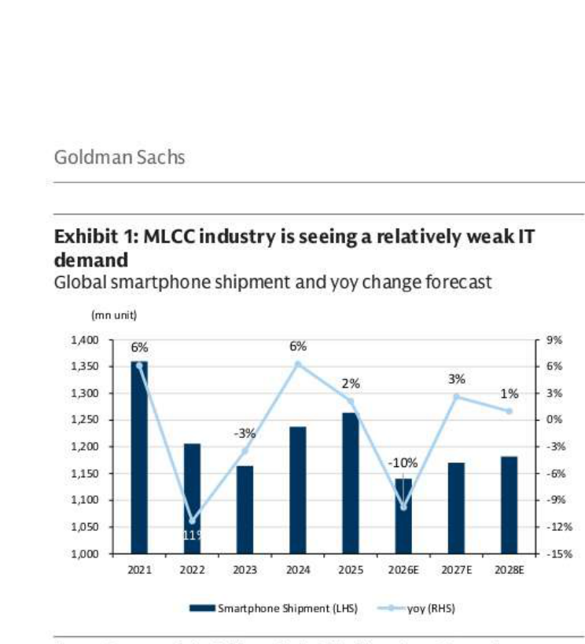

### 解讀摘要
智慧型手機出貨量在 2025 年小幅回升（+2%）後，2026E 預計再度下滑 10% 至約 1,150mn 台，顯示 IT 端 MLCC 傳統需求結構性偏弱。SEMCO UTR 之所以仍能維持 90%+（Exhibit 2），是因 AI server MLCC 高速成長填補了 IT 下滑留下的稼動率空洞，兩個趨勢互為表裡。

### 表格
| 年份 | 智慧型手機出貨（mn） | YoY |
|---|---|---|
| 2021 | ~1,350 | +6% |
| 2022 | ~1,200 | -11% |
| 2023 | ~1,165 | -3% |
| 2024 | ~1,235 | +6% |
| 2025 | ~1,260 | +2% |
| 2026E | ~1,150 | -10% |
| 2027E | ~1,170 | +3% |
| 2028E | ~1,185 | +1% |

*以上為視覺估算

> **洞察一**：2026E 的 -10% 轉折點恰好對應 AI server MLCC 在 SEMCO 收入中佔比從 11%→18%（Exhibit 3）。IT 下滑愈深，AI server 填補效果愈明顯，SEMCO 的組合轉型正在加速。

---

## Exhibit 2｜SEMCO MLCC 稼動率趨勢

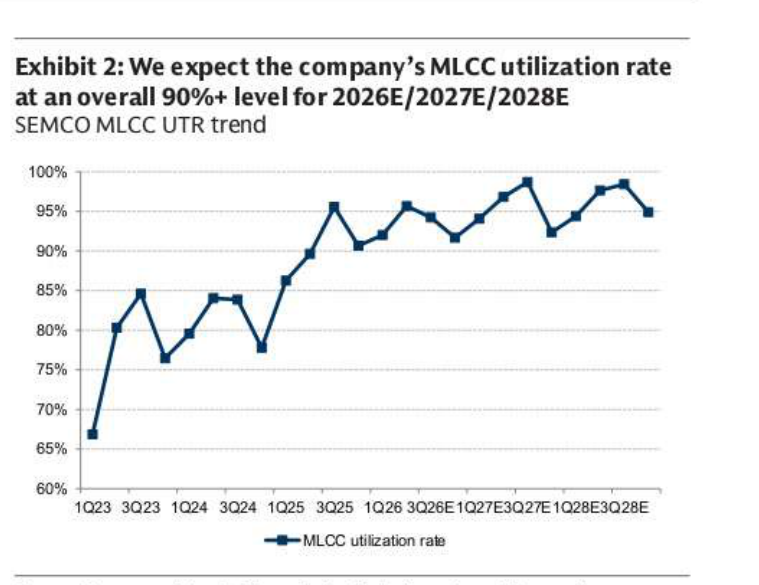

### 解讀摘要
SEMCO MLCC UTR 從 2023 年 1Q 低點 67% 持續攀升，2025 年 1Q 突破 90% 並維持至今，GS 預估 2026E/2027E/2028E 全年維持 90%+ 水準。高稼動率意味 SEMCO 無閒置產能壓力，是後續 ASP 提升（Exhibit 6）定價能力的前提條件。

### 表格
| 區間 | MLCC UTR 趨勢 |
|---|---|
| 1Q23 | ~67%（週期低點） |
| 2H24 | 回升至 85%+ |
| 1Q25 起 | 突破 90%，維持至今 |
| 2026E-2028E | GS 預期全年維持 90%+ |

---

## Exhibit 3｜SEMCO MLCC 應用組合轉移

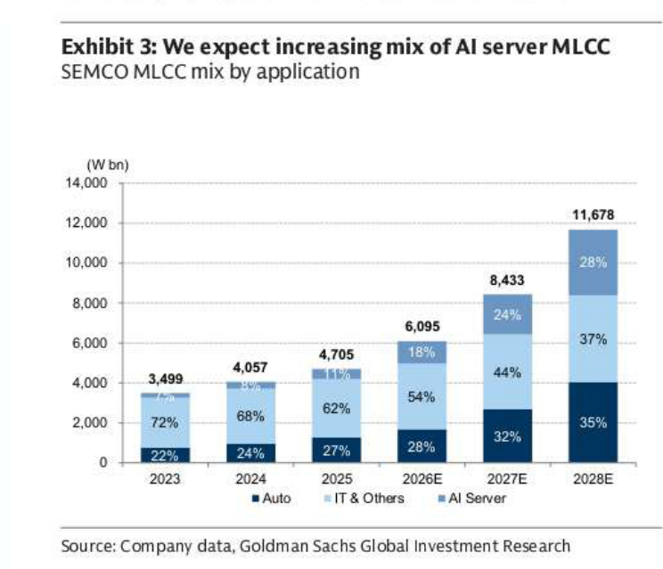

### 解讀摘要
AI server MLCC 佔 SEMCO 總 MLCC 收入從 2023 年 6% 躍升至 2028E 的 37%，絕對金額 W229bn→W3,291bn（×14）；IT 佔比同期從 72% 腰斬至 28%。這不只是結構轉型，更是 ASP 飛躍的機制——AI server MLCC 規格遠高於傳統 IT MLCC，帶動混合 ASP 從 \$3.5→\$6.0（Exhibit 6）。

### 表格
| 年份 | 總收入（W bn） | Auto % | IT % | AI Server % |
|---|---|---|---|---|
| 2023 | 3,499 | 22% | 72% | 6% |
| 2024 | 4,057 | 24% | 68% | 8% |
| 2025 | 4,705 | 27% | 62% | 11% |
| 2026E | 6,095 | 28% | 54% | 18% |
| 2027E | 8,433 | 32% | 44% | 24% |
| 2028E | 11,678 | 35% | 28% | 37% |

> **洞察一**：Auto 佔比也在穩步上升（22%→35%），意味 SEMCO 有兩個高 ASP 增長引擎（AI server + Auto）同步發力，而 IT 下滑正好在 mix 中被雙引擎完全吸收，最終總 MLCC 收入 2025→2028E 成長 +148%。
>
> **洞察二**：2028E AI Server MLCC 收入 W3,291bn = 2025 年 SEMCO 整體 MLCC 收入 W4,705bn 的 70%。這意味著 AI server MLCC 將近乎成為整個 MLCC 部門的核心，而非邊際業務。

---

## Exhibit 4｜AI 伺服器電力需求預測

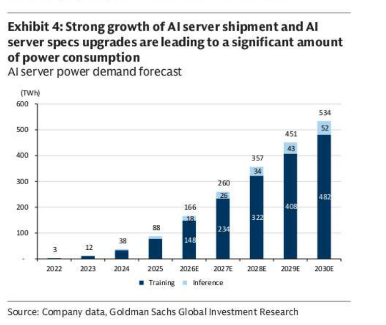

### 解讀摘要
AI 伺服器總電力需求 2025→2030E 五年 CAGR 約 57%（88TWh→534TWh），Training 佔主導但 Inference 佔比逐年提升。電力密度上升直接帶動每機架 MLCC 數量與規格升級，是高壓、高電容量 AI server MLCC 需求爆發的物理基礎。

### 表格
| 年份 | 總電力（TWh） | Training（TWh） | Inference（TWh） |
|---|---|---|---|
| 2022 | 3 | 3 | ~0 |
| 2023 | 12 | 12 | ~0 |
| 2024 | 38 | 38 | ~0 |
| 2025 | 88 | 88 | ~0 |
| 2026E | 166 | 148 | 18 |
| 2027E | 260 | 234 | 26 |
| 2028E | 357 | 322 | 34 |
| 2029E | 451 | 408 | 43 |
| 2030E | 534 | 482 | 52 |

---

## Exhibit 5｜SEMCO AI Server MLCC 收入成長

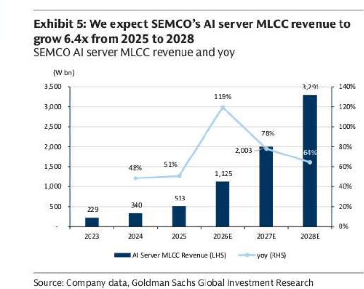

### 解讀摘要
SEMCO AI server MLCC 收入 2025→2028E 成長 6.4 倍（W513bn→W3,291bn），2026E 爆發性跳升 +119% YoY。W3,291bn 已接近 SEMCO 目前整體 MLCC 收入規模，意味著 AI server 將從邊際業務成長為部門核心。

### 表格
| 年份 | AI Server MLCC 收入（W bn） | YoY |
|---|---|---|
| 2023 | 229 | — |
| 2024 | 340 | +48% |
| 2025 | 513 | +51% |
| 2026E | 1,125 | +119% |
| 2027E | 2,003 | +78% |
| 2028E | 3,291 | +64% |

> **洞察一**：2026E 的 +119% 是最大單年跳升，推測由 Rubin 世代大量出貨驅動。若 AI 資本支出週期縮短，這個估計存在最大的下行修正風險。
>
> **值得驗證**：GS 對 Inference 電力需求成長較保守（2028E Inference 僅佔總電力 9.5%）。若推論/應用端 AI 爆發加速，實際 AI server MLCC 需求可能超越此預測。

---

## Exhibit 6｜SEMCO MLCC 混合 ASP 與 OPM 趨勢

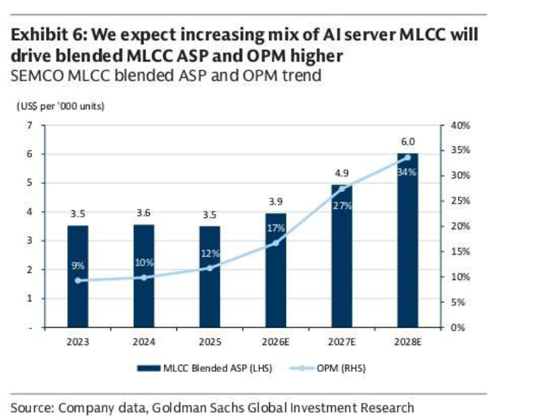

### 解讀摘要
SEMCO MLCC 混合 ASP 從 2025 年的 \$3.5/1000u 提升至 2028E 的 \$6.0（+71%），OPM 同步從 12% 升至 34%。ASP 提升完全由 AI server MLCC 佔比上升驅動（mix shift），而非對傳統 IT 客戶漲價，論點更具結構性支撐。

### 表格
| 年份 | 混合 ASP（US\$/1,000u） | OPM |
|---|---|---|
| 2023 | 3.5 | 9% |
| 2024 | 3.6 | 10% |
| 2025 | 3.5 | 12% |
| 2026E | 3.9 | 17% |
| 2027E | 4.9 | 27% |
| 2028E | 6.0 | 34% |

> **洞察一**：OPM 從 12%（2025）→34%（2028E）的提升幅度（+22ppt）遠大於 ASP 提升幅度（+71%），顯示固定成本槓桿效應顯著。ASP 拉高毛利，不需大量新增 capex，利潤率槓桿接近純增量。

---

## Exhibit 7｜MLCC vs. Silicon Capacitor 比較

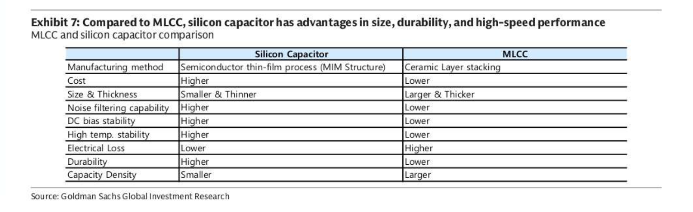

### 解讀摘要
Silicon capacitor 在尺寸、穩定性、電氣損耗上優於 MLCC，但成本更高且電容密度更低。GS 的論點是兩者並非零和競爭：silicon cap 部署在緊鄰 processor 的 interposer 層（高頻率去耦），MLCC 繼續部署在 main board（大電容量 decoupling）。MLCC 的電容密度優勢在大電容應用場景中無可取代。

### 表格
| 特性 | Silicon Capacitor | MLCC |
|---|---|---|
| 製程 | 半導體薄膜（MIM 結構） | 陶瓷層疊 |
| 成本 | Higher | Lower |
| 尺寸與厚度 | Smaller & Thinner | Larger & Thicker |
| 噪音濾除能力 | Higher | Lower |
| DC bias 穩定性 | Higher | Lower |
| 高溫穩定性 | Higher | Lower |
| 電氣損耗 | Lower | Higher |
| 耐久性 | Higher | Lower |
| 電容密度 | Smaller | Larger |

---

## Exhibit 8｜MLCC 與 Silicon Capacitor 架構示意

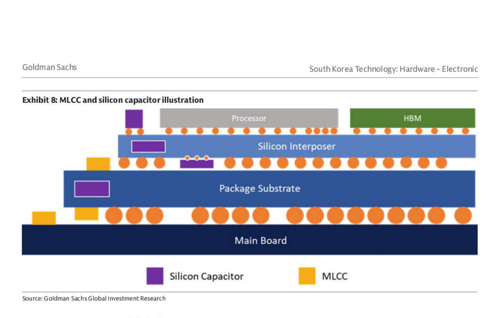

### 解讀摘要
架構圖顯示三層結構：Processor + HBM 位於 Silicon Interposer（頂層）→ Package Substrate（中層）→ Main Board（底層）。Silicon Capacitor（紫色）部署在 Silicon Interposer 旁側及 Package Substrate 側邊；MLCC（黃色）部署在 Main Board。分層部署確認兩者互補，Silicon cap 無法替代 MLCC 在 main board 的大電容需求。

---

## Exhibit 9｜ABF 供需缺口趨勢

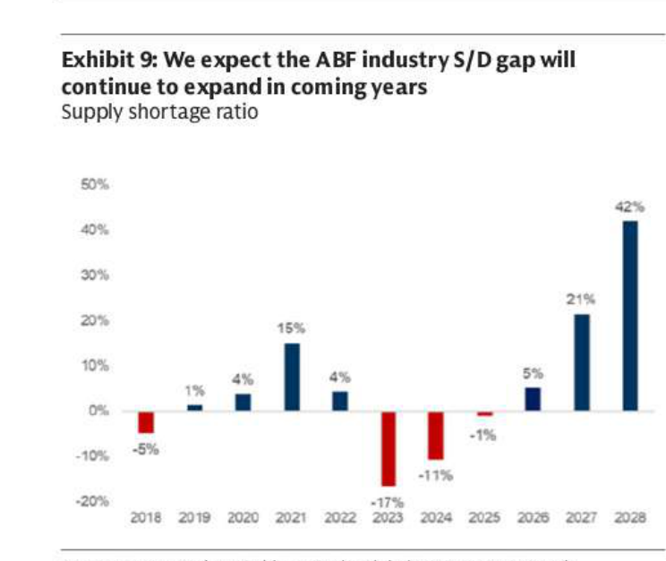

### 解讀摘要
ABF 供應短缺比率（需求超出供給的比率）在 2023-2024 年深度負值（-17%、-11%）後，2025 年接近平衡（-1%），2026E 起轉正（+5%），並加速至 2028E 的 +42%。這條 S 型曲線是 ABF 廠商定價能力的核心依據，缺口深度超越 2021 年高峰（+15%）。

### 表格
| 年份 | ABF 供應短缺比率 |
|---|---|
| 2018 | -5% |
| 2019 | +1% |
| 2020 | +4% |
| 2021 | +15% |
| 2022 | +4% |
| 2023 | -17% |
| 2024 | -11% |
| 2025 | -1% |
| 2026E | +5% |
| 2027E | +21% |
| 2028E | +42% |

> **洞察一**：2028E +42% 缺口若實現，將超越 2021 年高峰（+15%）近 3 倍，定價能力遠超上一輪 WFH 週期。但供給彈性取決於 ABF 廠商（Ibiden、Shinko 等）的 capex 決策，若日系廠大舉擴產，缺口可能被壓縮。

---

## Exhibit 10｜AI IC Substrate TAM

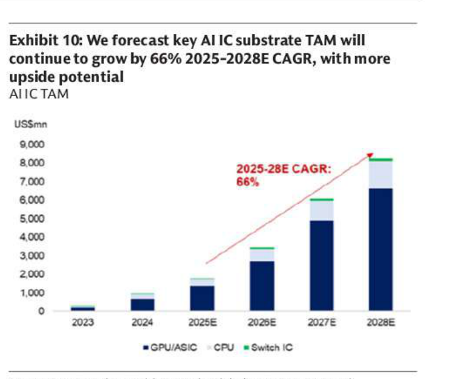

### 解讀摘要
AI IC substrate TAM（GPU/ASIC 主導，含 CPU、Switch IC）2025-2028E CAGR 66%，從約 \$1.9bn 成長至 \$8.2bn。TAM 擴張速度遠超供給端 capex 擴張速度，是 Exhibit 9 中供需缺口加速擴大的需求端量化依據。

### 表格
| 年份 | AI IC Substrate TAM（US\$mn） | 主要驅動 |
|---|---|---|
| 2023 | ~200 | GPU/ASIC |
| 2024 | ~1,000 | GPU/ASIC |
| 2025E | ~1,900 | GPU/ASIC + CPU |
| 2026E | ~2,800 | GPU/ASIC + CPU |
| 2027E | ~6,000 | GPU/ASIC + CPU + Switch IC |
| 2028E | ~8,200 | GPU/ASIC dominant |

*2025-28E CAGR 66%（GS 標注）；以上數值為視覺估算

> **洞察一（配合 Exhibit 9）**：TAM 2025→2028E 成長 4.3x，同期 ABF 缺口從 -1%→+42%。需求每成長 $1bn，對應的缺口擴大速度加速，因供給端 lead time 長（ABF 廠 build-out 需 3-4 年），短期內供給幾乎無法跟上。

---

## Exhibit 11｜ABF 產業週期分析

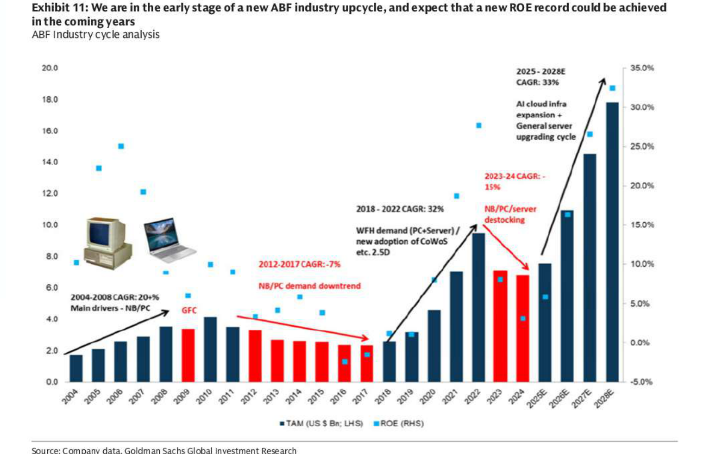

### 解讀摘要
ABF 產業 TAM 與 ROE 呈現多週期結構。GS 認為 2025 年起進入新上行週期早期，與 2018-2022 的 32% CAGR 週期相似（此次 33% CAGR），但驅動力從一次性 WFH 脈衝轉為結構性 AI cloud infra 投資，可持續性更長，ROE 有機會突破 2022 年高峰（~30-35%）。

### 表格
| 週期 | 驅動力 | TAM CAGR | 特徵 |
|---|---|---|---|
| 2004-2008 | NB/PC 普及 | 20+% | GFC 前高增長 |
| 2009 | GFC 衝擊 | 大幅負 | 週期性低谷 |
| 2012-2017 | NB/PC 需求下滑 | -7% | 長期去槓桿 |
| 2018-2022 | WFH + CoWoS 2.5D | 32% | 高峰 ROE ~30% |
| 2023-2024 | 去庫存 | -15% | ROE 幾乎歸零 |
| 2025-2028E | AI cloud infra + 伺服器升級 | 33% | ROE 重返 30%+ |

> **洞察一**：2018-2022 週期的 WFH 是一次性需求衝擊（疫情結束後自然消退），而 2025-2028E 的 AI cloud infra 是超大型科技公司的長週期資本投入，可持續性理論上更強，支撐 ROE 在此次週期中維持更高水準的可能性較前一輪更高。

---

## Exhibit 12｜SEMCO ABF 基板收入與 OPM

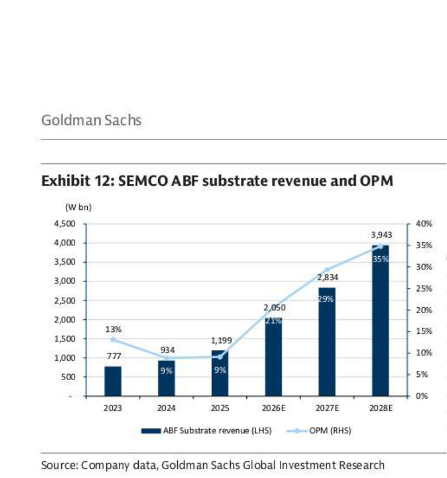

### 解讀摘要
SEMCO ABF substrate 收入 2025→2028E 成長 3.3x（W1,199bn→W3,943bn），OPM 從 9% 飛升至 35%，2026E 是轉折年（OPM 從 9%→21%）。固定成本槓桿效應顯著——收入僅增 71%，OPM 跳升 12ppt，印證 ABF 是高固定成本、高利潤槓桿的業務。

### 表格
| 年份 | ABF Substrate 收入（W bn） | OPM |
|---|---|---|
| 2023 | 777 | 13% |
| 2024 | 934 | 9% |
| 2025 | 1,199 | 9% |
| 2026E | 2,050 | 21% |
| 2027E | 2,834 | 29% |
| 2028E | 3,943 | 35% |

> **洞察一**：ABF OPM 從 9%（2025）→35%（2028E），同期 MLCC OPM 也從 12%→34%（Exhibit 6）。SEMCO 兩大業務的 OPM 幾乎同步飛躍，說明 SEMCO 2026-2028E 的利潤率故事是雙引擎驅動，GS 大幅上調 TP 有清晰的數字支撐。

---

## Exhibit 13｜SEMCO BT 基板收入與 OPM

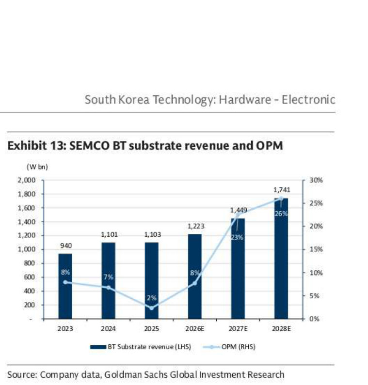

### 解讀摘要
SEMCO BT substrate 收入溫和成長（W1,103bn→W1,741bn），但 OPM 從 2025 年的低谷 2% 大幅回升至 2028E 的 26%。BT 基板主要用於手機和消費性電子，需求不如 ABF 爆發，但定價環境改善（受益 BT substrate S/D 趨緊，見 LGI 段落）。

### 表格
| 年份 | BT Substrate 收入（W bn） | OPM |
|---|---|---|
| 2023 | 940 | 8% |
| 2024 | 1,101 | 7% |
| 2025 | 1,103 | 2% |
| 2026E | 1,223 | 8% |
| 2027E | 1,449 | 23% |
| 2028E | 1,741 | 26% |

> **洞察一（配合 Exhibit 12）**：ABF OPM（2028E 35%）高於 BT（26%），且 ABF 收入規模（W3,943bn）已超 BT（W1,741bn），確認 ABF 是 SEMCO 基板部門未來的利潤核心。BT 是穩定現金流、ABF 是利潤槓桿。

---

## Exhibit 14｜2025 年 ABF 業務收入比較

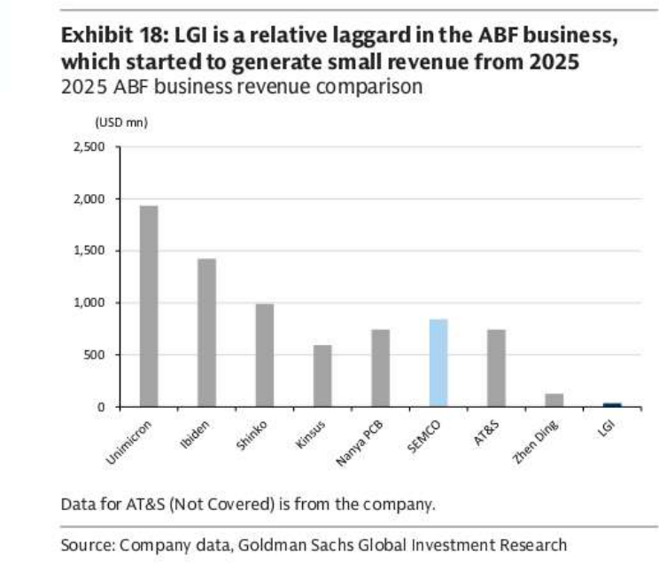

### 解讀摘要
2025 年 ABF 收入格局：Unimicron 龍頭（~\$1,950mn）、Ibiden 次之（~\$1,430mn）、Shinko 第三（~\$1,000mn）；SEMCO 排名第六（~\$860mn，藍色高亮），LGI 幾乎可忽略不計（~\$20mn）。LGI 相對 incumbents 的巨大差距，正是 Exhibit 15-16 中「低基期成長」論點的背景。

### 表格
| 公司 | 2025 ABF 收入（USD mn） | 備註 |
|---|---|---|
| Unimicron | ~1,950 | 台系龍頭 |
| Ibiden | ~1,430 | 日系 |
| Shinko | ~1,000 | 日系 |
| Kinsus | ~590 | 台系 |
| Nanya PCB | ~740 | 台系 |
| **SEMCO** | **~860** | **韓系，GS 高亮** |
| AT&S | ~740 | 歐系（Not Covered） |
| Zhen Ding | ~130 | 台系 |
| LGI | ~20 | 韓系，幾乎為零 |

*以上為視覺估算；AT&S 數據來自公司自行揭露

---

## Exhibit 15｜LGI ABF 收入與佔比趨勢

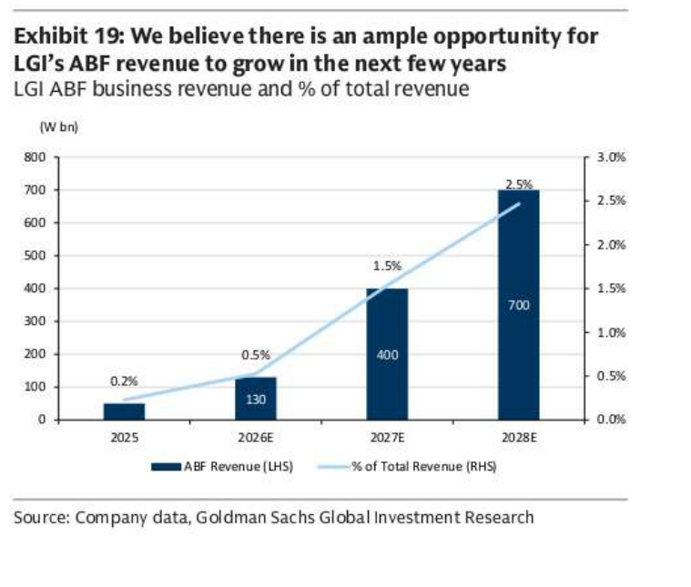

### 解讀摘要
LGI ABF 收入從 2025 年的幾乎零起步至 2028E 的 W700bn（2.5% of revenue），成長 14 倍，GS 認為 ABF TAM 空間足夠容納 LGI 這個「新玩家」。然而，即便到 2028E，LGI ABF 規模仍不如 SEMCO 2025 年水準（\$860mn ≈ W1,150bn > W700bn），LGI 仍是追趕者。

### 表格
| 年份 | LGI ABF 收入（W bn） | 佔總收入 % |
|---|---|---|
| 2025 | ~50 | 0.2% |
| 2026E | 130 | 0.5% |
| 2027E | 400 | 1.5% |
| 2028E | 700 | 2.5% |

> **洞察一**：W700bn（2.5%）相對總收入而言仍是邊際業務，但對 LGI 整體 OP 的邊際貢獻顯著——相機模組低利潤率拖累，而 ABF 高 OPM 是提升整體 OP mix 的關鍵（見 Exhibit 21）。

---

## Exhibit 16｜LGI 基板收入 Mix

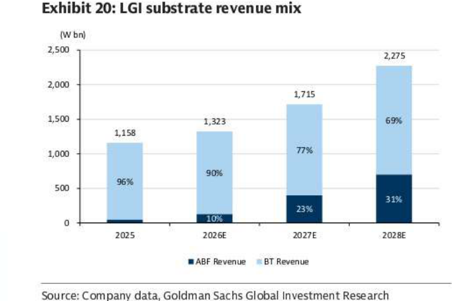

### 解讀摘要
LGI 基板收入穩步成長（W1,158bn→W2,275bn，2025→2028E），結構上 BT 佔比從 96%（2025）降至 69%（2028E），ABF 佔比從 4%→31%。這是 Exhibit 15 ABF 收入成長的基板部門全貌，顯示 LGI 基板部門的整體成長由 ABF 驅動，BT 是穩定基底。

### 表格
| 年份 | 總基板收入（W bn） | BT % | ABF % |
|---|---|---|---|
| 2025 | 1,158 | 96% | 4% |
| 2026E | 1,323 | 90% | 10% |
| 2027E | 1,715 | 77% | 23% |
| 2028E | 2,275 | 69% | 31% |

---

## Exhibit 17｜LGI 基板利潤率

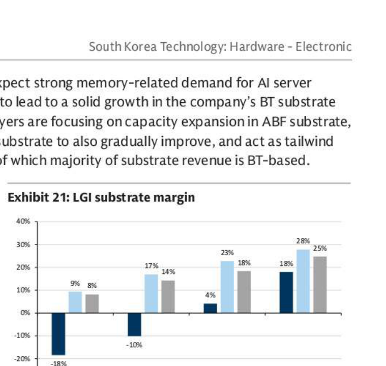

### 解讀摘要
LGI ABF margin 從 2025 年的 -18% 扭虧，至 2026E 的 -10%，2027E 轉正（+4%），2028E 達 18%。BT margin 也從 9% 提升至 28%。整體基板 margin 2025→2028E 從 8%→25%，ABF 由虧損拖累轉為利潤引擎，是 LGI 基板部門利潤率改善的核心機制。

### 表格
| 年份 | ABF Margin | BT Margin | 整體基板 Margin |
|---|---|---|---|
| 2025 | -18% | 9% | 8% |
| 2026E | -10% | 17% | 14% |
| 2027E | 4% | 23% | 18% |
| 2028E | 18% | 28% | 25% |

> **值得驗證**：LGI ABF margin 從 -18%→18% 的改善路徑，依賴良率爬坡速度。若良率提升慢於預期，2027E 轉正的時間點可能延後，影響整體 LGI OP 改善時程。

---

## Exhibit 18｜LGI 相機模組收入與 YoY 成長

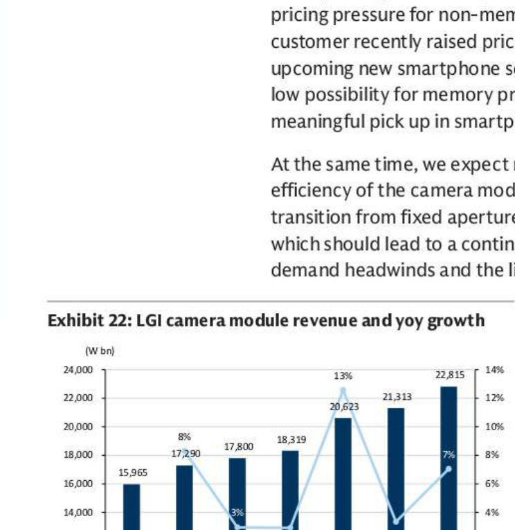

### 解讀摘要
LGI 相機模組收入 2022→2028E 從 W15,965bn 溫和成長至 W22,815bn（+43%），YoY 呈現不穩定模式。2026E 成長 +13% 是最高峰，之後回落至 3%、7%，顯示相機模組業務本質是成熟、穩定的大體量現金流業務，而非高成長業務。

### 表格
| 年份 | 相機模組收入（W bn） | YoY |
|---|---|---|
| 2022 | 15,965 | — |
| 2023 | 17,290 | +8% |
| 2024 | 17,800 | +3% |
| 2025 | 18,319 | +3% |
| 2026E | 20,623 | +13% |
| 2027E | 21,313 | +3% |
| 2028E | 22,815 | +7% |

---

## Exhibit 19｜LGI 相機模組收入與 OPM

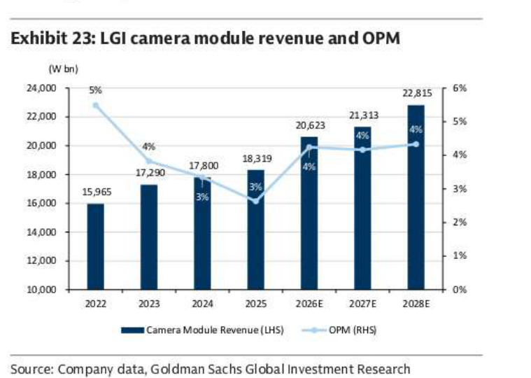

### 解讀摘要
LGI 相機模組 OPM 維持在 3-5% 的低水準（2022: 5%→2025: 3%→2028E: 4%），幾乎沒有改善空間。GS 認為高記憶體成本（GDDR、LPDDR）持續壓制 OPM 擴張，是 LGI 無法被評為 Buy 的核心障礙——即使 ABF 業務改善，整體 OPM 被相機模組的高佔比（84% of revenue）壓制。

### 表格
| 年份 | 相機模組收入（W bn） | OPM |
|---|---|---|
| 2022 | 15,965 | 5% |
| 2023 | 17,290 | 4% |
| 2024 | 17,800 | 3% |
| 2025 | 18,319 | 3% |
| 2026E | 20,623 | 4% |
| 2027E | 21,313 | 4% |
| 2028E | 22,815 | 4% |

> **洞察一**：相機模組 OPM 永久性維持 3-4% 低水準，而相機模組佔 LGI 總收入 80-84%（Exhibit 20），這意味 LGI 整體 OPM 很難超過 6-8%，即使 ABF 業務 OPM 達 18-25%（Exhibit 17）。這正是 GS 維持 Neutral 的根本原因。

---

## Exhibit 20｜LGI 各業務收入 Mix

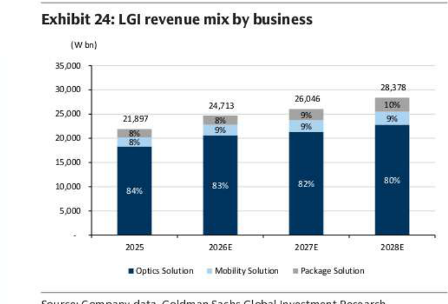

### 解讀摘要
LGI 總收入 2025→2028E 從 W21,897bn 成長至 W28,378bn（+30%），結構上 Optics Solution（相機模組）佔比從 84% 緩降至 80%，Package Solution（基板）佔比從 8%→10%，Mobility Solution 維持 8-9%。Package Solution 佔比雖提升，但絕對比重仍低。

### 表格
| 年份 | 總收入（W bn） | Optics Solution % | Mobility Solution % | Package Solution % |
|---|---|---|---|---|
| 2025 | 21,897 | 84% | 8% | 8% |
| 2026E | 24,713 | 83% | 8% | 9% |
| 2027E | 26,046 | 82% | 9% | 9% |
| 2028E | 28,378 | 80% | 9% | 10% |

> **洞察一（配合 Exhibit 21）**：Package Solution 在收入中佔比從 8%→10%（增幅有限），但在 OP 中佔比從 19%→36%（大幅提升）。這個「低收入佔比、高利潤貢獻」的結構，正是 ABF 成長對 LGI 估值改善的槓桿機制所在。

---

## Exhibit 21｜LGI 各業務 OP Mix

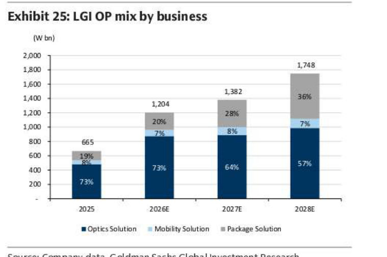

### 解讀摘要
LGI 總 OP 2025→2028E 從 W665bn 成長至 W1,748bn（+163%），Package Solution（基板）的 OP 佔比從 19%（2025）躍升至 36%（2028E），Optics Solution（相機模組）則從 73% 降至 57%。Package Solution 的 OP 佔比超越其收入佔比（10%），充分體現 ABF 高利潤率對整體 OP 結構的改善。

### 表格
| 年份 | 總 OP（W bn） | Optics Solution % | Mobility Solution % | Package Solution % |
|---|---|---|---|---|
| 2025 | 665 | 73% | 8% | 19% |
| 2026E | 1,204 | 73% | 7% | 20% |
| 2027E | 1,382 | 64% | 8% | 28% |
| 2028E | 1,748 | 57% | 7% | 36% |

> **洞察一**：Optics OP 佔比從 73%→57%（-16ppt），但 Package OP 佔比從 19%→36%（+17ppt）。OP 結構的重心正在向高利潤率的 Package Solution 轉移，這是 LGI 估值重評的核心敘事——但需要 ABF 良率如期爬坡（Exhibit 17）才能兌現。

---

## 相關個股清單

| 類別 | 公司 | Ticker | 評等 | 備註 |
|---|---|---|---|---|
| 韓系 MLCC + ABF | Samsung Electro-Mechanics（SEMCO） | KS: 009150 | Buy | TP W2.6mn（↑ from W1mn）；EPS 上調 10%/41%/96% (2026/27/28E) |
| 韓系 ABF + 相機模組 | LG Innotek（LGI） | KS: 011070 | Neutral | TP W1mn（↑ from W550,000）；EPS 上調 9%/21%/42% (2026/27/28E) |
| 台系 ABF 龍頭 | Unimicron | TW: 3037 | 未評等（參考） | 2025 ABF 收入最大（~\$1,950mn） |
| 日系 ABF | Ibiden | JP: 4062 | 未評等（參考） | 2025 ABF 收入第二（~\$1,430mn） |
