# Morgan Stanley｜CPO Supply Chain Updates

**券商**：Morgan Stanley  
**分析師**：Tiffany Yeh、Charlie Chan、Andy Meng CFA、Meta A Marshall、Daniel Yen CFA  
**日期**：2026-07-05  
**主題**：CPO Supply Chain Updates；More on GlassBridge  
**評級**：Attractive  
<a href="https://layx.uk/dl?g=產業&b=MS&d=20260705&h=CPO-Supply-Chain">📎 下載 PDF</a>

---

## 報告總結

本報告聚焦三大催化劑：（一）Corning 於 Computex 展示 GlassBridge 玻璃波導連接器，MS 評估後認定短期內不改變 FAU 格局——TSMC COUPE 平台近幾年仍以 grating coupling 為主，GlassBridge 目前僅支援一維光纖佈局且無 COUPE 採用案例；（二）TSMC PIC 產能 2Q26 已達 10 kwpm，4Q26 目標 15 kwpm，2028E 25 kwpm，但良率是核心變數（50% SoIC + 50% downstream 良率情境下，25 kwpm 僅實際交付 48.60mn OE/年）；（三）Ins2 測試效率從每天一片晶圓大幅提升至六小時一片，3-4 小時目標可望在 6-12 個月內達成。FOCI 7 月啟動 Spectrum CPO Switch 量產；AllRing 因 CoWoS 擴張加速，2026E EPS 上修 +15% 至 NT\$25.48。兩股維持 Overweight：FOCI 目標價 NT\$708、AllRing 目標價 NT\$1,580。

---

## Morgan Stanley 完整投資邏輯鏈

| 論點層次 | Exhibit | 內容 |
|---|---|---|
| GlassBridge 威脅評估 | 5、6、7 | 主要服務 edge coupling，僅支援一維光纖；TSMC COUPE 近期無採用案例，FAU 供應商中期無虞 |
| PIC 產能爬坡確認 | 8 | 0.5 kwpm（2026 初）→ 10 kwpm（2Q26）→ 15 kwpm（4Q26）→ 25 kwpm（2028E）；綠芽明確 |
| 良率限制 OE 實際產量 | 9 | 25 kwpm × 50% SoIC × 50% downstream → 48.60mn OE/年；20% downstream → 7.78mn OE/年 |
| 插入測試效率提升 | 10 | Ins2 測試從每天一片→六小時一片；3-4 小時目標可望 6-12 個月達成，降低量產門檻 |
| FOCI 進入量產 | 16、20、21、22 | 7 月供貨 Spectrum CPO Switch；2H27 追加 AMD MI500；2028 更多客戶 |
| AllRing 估值上修 | 23-25 | CoWoS 年底 130 kwpm（2026）、200 kwpm（2027）；AllRing 2026E EPS +15% |
| **結論** | 封面 | **FOCI OW（NT\$708）、AllRing OW（NT\$1,580）；投資人對 CPO 股預期已偏低，長期樂觀** |

> **報告最大邏輯缺口**：Exhibit 9 的 downstream 良率假設（50%）對最終 OE 產量影響極大——良率若維持 20%，年產 OE 從 48.60mn 暴跌至 7.78mn，FOCI 量產貢獻時程將推遲。此假設尚無量產驗證數據支撐。

---

## 報告核心觀點

| 主題 | Morgan Stanley 觀點 | 市場共識 | 是否 Contra-Consensus |
|---|---|---|---|
| GlassBridge 影響 | 短期不改變 FAU 格局；grating coupling 量產更易、COUPE 無採用案例 | 部分擔憂 GlassBridge 取代 FAU | 是（偏樂觀 FAU） |
| TSMC PIC 良率 | 良率是核心變數，50% vs 20% 使 OE 產量差 6 倍 | 普遍聚焦產能名義數字 | 是（提示良率風險） |
| Ins2 測試進展 | 六小時一片；3-4 小時可望 6-12 個月達成 | 部分視 Ins2 為可跳過環節 | 是（認為不可跳過） |
| FOCI 量產時程 | 7 月啟動；2026 虧損過渡，2027 大幅獲利 | 時程存疑 | 是（確認 3Q26） |
| AllRing CoWoS | 2026 年底 130 kwpm；EPS 上修 +15% | 普遍樂觀 | 同方向 |

**偏好排序**：FOCI（CPO 量產元年，結構性切入 Spectrum-X）> AllRing（CoWoS 設備寡占，CPO 長期增量）  
**個股偏好**：FOCI (3363.TWO) OW NT\$708、AllRing (6187.TWO) OW NT\$1,580

---

## Exhibit 1｜Corning FAU/CPO 展示（Computex 2026）

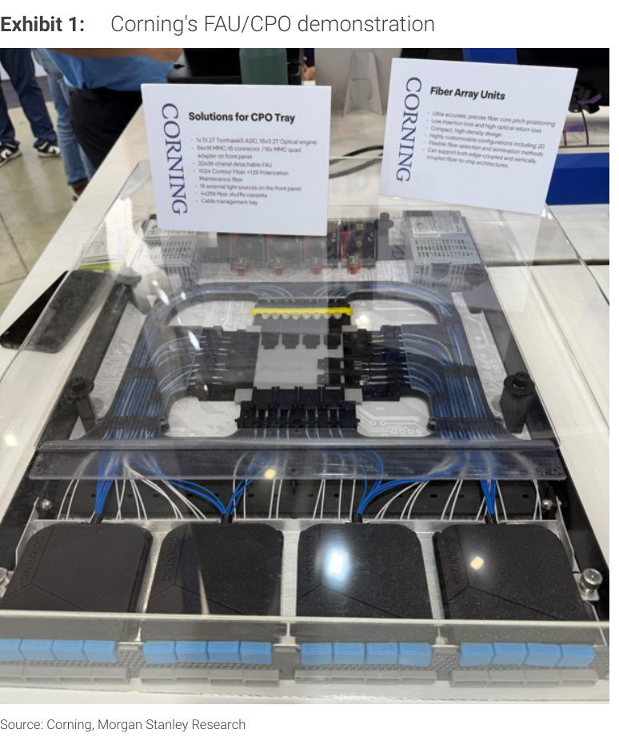

### 解讀摘要
Corning 在 Computex 2026 展示其 FAU 與 CPO 整合方案，顯示傳統光纖大廠已全面進入 CPO 供應鏈。Corning 的參與確認 CPO FAU 市場已進入大廠背書階段，但 MS 特別指出 Corning 同時在發展 GlassBridge（另一技術路線），意味著它對 FAU 的長期承諾仍存在不確定性。

---

## Exhibit 2｜Ayar Labs FAU Demo（Computex 2026，Scale-up 方向）

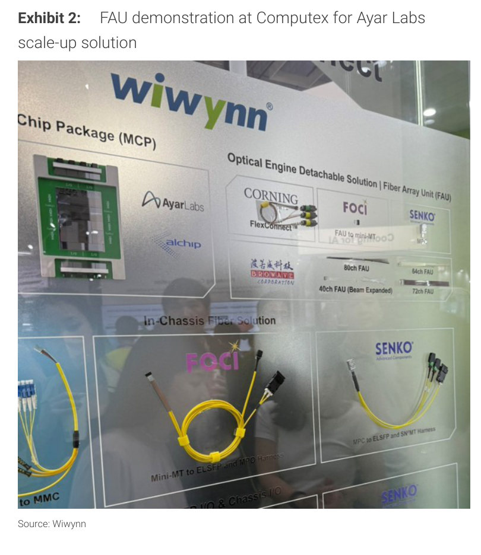

### 解讀摘要
Ayar Labs（美國矽光子新創，由 Wiwynn 代展）展示其 TeraPHY 光 I/O 晶片配套 FAU 方案，主攻 scale-up 晶片間互連（NVLink 方向）。Ayar Labs 定位與 FOCI 主攻的 scale-out（Spectrum-X CPO Switch）切入點不同；MS 指出 2026-27 年的 COUPE 量產主要客戶聚焦 NVIDIA、Broadcom、AMD，Ayar Labs 等其他客戶預計要到 2028 年後才能在 TSMC 量產 CPO 方案。

---

## Exhibit 3｜TFC FAU（台灣本土供應商）

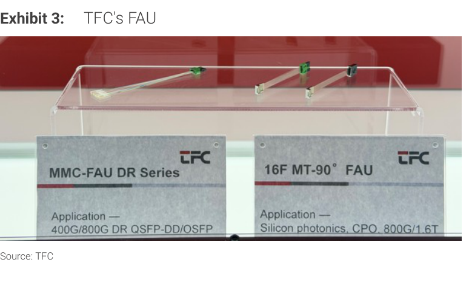

### 解讀摘要
TFC（TFC Communication，台灣本土 FAU 廠商）已有量產能力，是 FOCI 在 high-end FAU 以外的台灣第二選擇。MS 特別指出 TFC 在高端 FAU 具備競爭優勢（competitive edge in high-end FAU），且相比低端 FAU，TFC 較不易受 GlassBridge 初期導入的威脅——因為 GlassBridge 初期更可能替代的是低端 FAU，而非高端精密 FAU。

---

## Exhibit 4｜FOCI FAU 解決方案

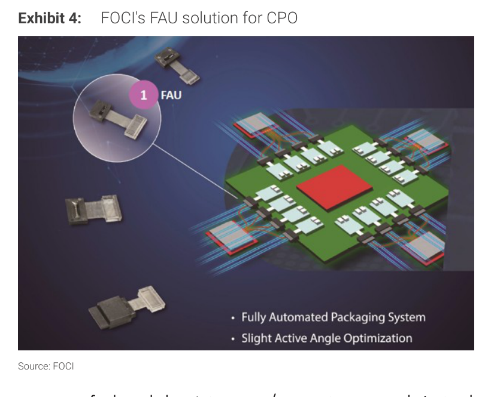

### 解讀摘要
FOCI（3363.TWO）的 FAU 產品採用自研 ReLFACon™ 技術（反射式透鏡光纖陣列連接器），以外部反射鏡結構取代傳統機械研磨對準，量產良率顯著高於一般 FAU。ReLFACon 與 TSMC COUPE 平台的 grating coupling 設計直接相容，是 FOCI 在 Spectrum-X CPO 採購中勝出的技術差異點。

---

## Exhibit 5｜Corning GlassBridge 連接器

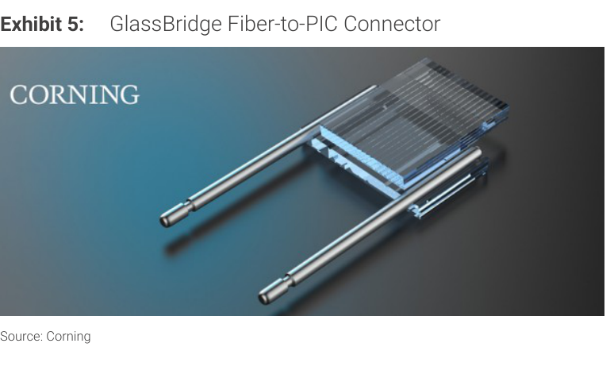

### 解讀摘要
Corning GlassBridge 採用玻璃離子交換波導（glass ion-exchange waveguide），以玻璃基板直接傳輸光信號至 PIC 端面（edge coupling），不同於傳統 FAU 的 grating coupling 方式。產品外觀為超薄玻璃基板，適合晶片間短距離光互連。MS 指出其主要局限：目前僅支援一維光纖佈局（one-dimension fiber layouts），而多維佈局在高密度 CPO 中是必要需求。

---

## Exhibit 6｜GlassBridge 核心優勢

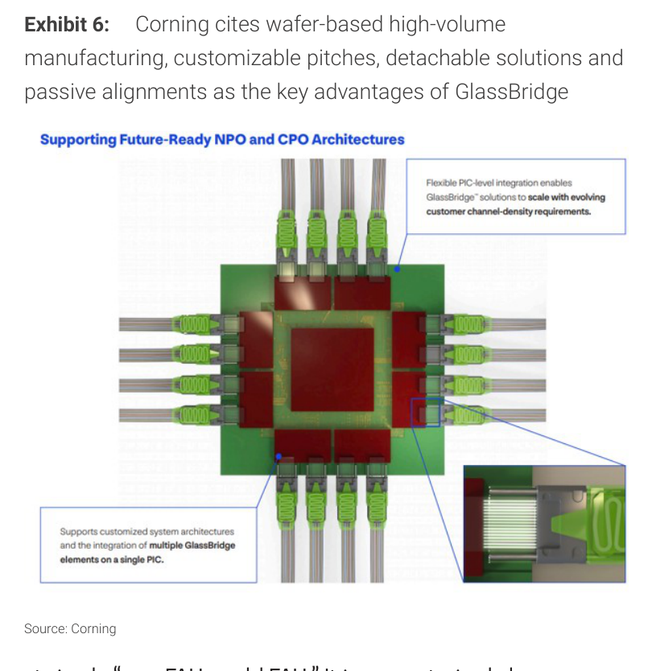

### 解讀摘要
GlassBridge 的主要技術優勢在於更低插入損耗（edge coupling 天然損耗低於 grating coupling）以及免除 V-groove 機械加工步驟。然而這些優勢的前提是 PIC 採用端面耦合設計，而 TSMC 現行 COUPE 平台以 grating coupling 為主——代表 GlassBridge 的優勢目前在 TSMC 生態系內無法直接發揮，需要 PIC 重新設計才能適用。

---

## Exhibit 7｜GlassBridge vs FAU 技術比較

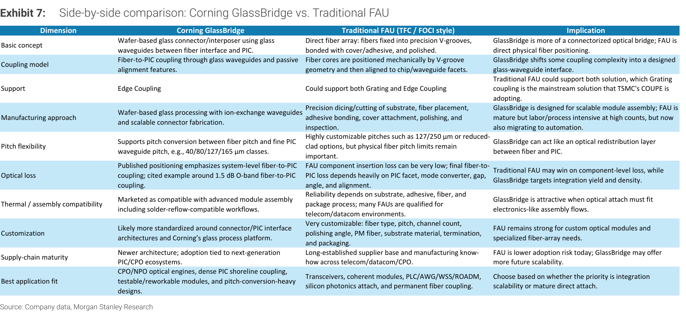

### 解讀摘要
MS 系統比較 GlassBridge（edge/butt-coupling）與傳統 FAU（grating coupling）的技術差異，核心結論是：TSMC COUPE 近幾年主流方案仍是 grating coupling，CPO 的完整設計需要整個生態系（foundry、chip designer、FAU、laser、系統整合商）協調，「無法一夕之間換設計」。GlassBridge 目前沒有任何 TSMC COUPE 採用案例，且 NVIDIA、AMD、Ayar Labs 在 2H26 量產方案均沿用 grating coupling。

### 表格
| 特性 | GlassBridge（edge coupling） | 傳統 FAU（grating coupling） |
|---|---|---|
| 耦合方式 | 玻璃波導端面直接接觸 PIC 邊緣 | 光柵蝕刻引導光束垂直射入 PIC |
| 插入損耗 | 較低（edge coupling 天然優勢） | 中等 |
| 光纖佈局維度 | 目前僅支援一維 | 多維（高密度 CPO 需求） |
| TSMC COUPE 相容性 | 需重新設計 PIC | 直接相容 |
| 採用案例 | 無 COUPE 案例 | NVIDIA、AMD、Ayar Labs 2H26 量產 |
| 量產成熟度 | 遠離量產 | 2H26 可見量產 |
| 代表供應商 | Corning | FOCI（ReLFACon）、TFC |

> **洞察一**：GlassBridge 的最大障礙不是技術本身，而是生態系切換成本——TSMC COUPE 已按 grating coupling 設計，任何切換需要整個生態系協調重新流片，時程至少 2-3 年。FOCI 與 TFC 的 FAU 供應地位中期無虞。

---

## Exhibit 8｜TSMC PIC 產能爬坡

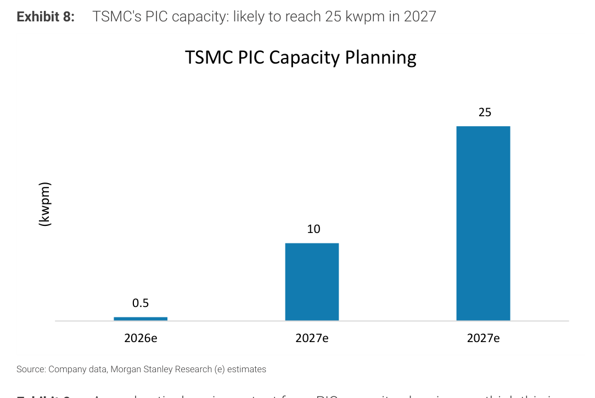

### 解讀摘要
TSMC PIC 產能從 2026 年初僅 0.5 kwpm 起步，2Q26 已爬升至 10 kwpm（確認），4Q26 目標 15 kwpm，2028E 至少 25 kwpm。MS 指出 2026-27 年 COUPE 量產重點客戶為 NVIDIA、Broadcom、AMD，其他客戶（MediaTek、Marvell、Ayar Labs）要到 2028 年產能更充裕時才能量產。爬坡速度具體、進度明確，是投資人「預期偏低」論點的核心支撐。

### 表格
| 時間點 | PIC 產能 | 狀態 |
|---|---|---|
| 2026 年初 | 0.5 kwpm | 試產 |
| 2Q26 | 10 kwpm | 已確認 |
| 4Q26 | 15 kwpm | 目標 |
| 2028E | 25 kwpm（以上） | 計畫 |

---

## Exhibit 9｜光引擎（OE）實際產量估算

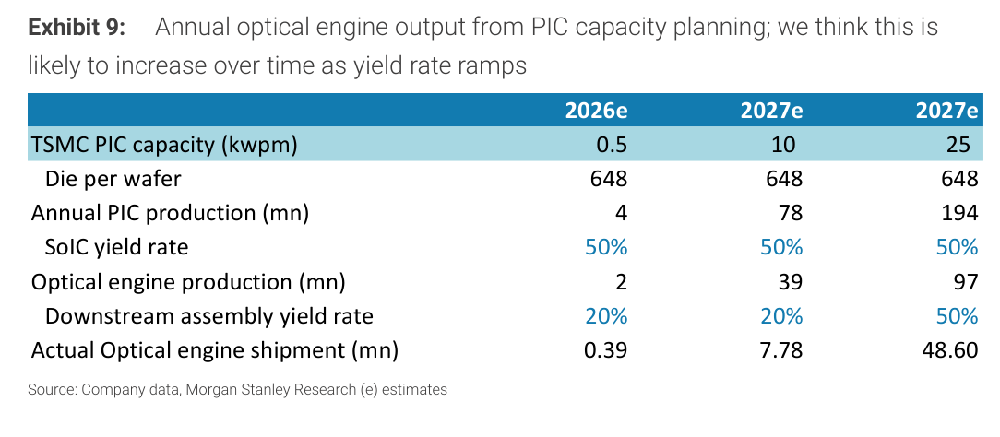

### 解讀摘要
MS 建立 PIC 名義產能 → 實際 OE 產量的完整換算模型，揭示兩層良率損失對最終供應量的巨大影響。25 kwpm 名義產能在 50%+50% 良率假設下僅交付 48.60mn OE/年，是名義值的 25%；若 downstream 良率降至 20%，年產 OE 僅 7.78mn，為前者的 16%。良率改善比產能爬坡更決定 CPO 實際可用量。

### 表格

#### 產量換算（25 kwpm，648 die/wafer）
| 步驟 | 計算 | 結果 |
|---|---|---|
| 名義 PIC 月產 | 25,000 × 648 | 16.2mn PIC/月 |
| 名義 PIC 年產 | 16.2mn × 12 | 194mn PIC/年 |
| 實際 OE（SoIC 良率 50%） | 194mn ÷ 2 | 97mn OE/年 |
| 實際 OE（downstream 良率 50%） | 97mn ÷ 2 | **48.60mn OE/年** |

#### 良率情境比較
| Downstream 良率 | 實際 OE/年 | vs 名義 |
|---|---|---|
| 50% | 48.60mn | 25% |
| 20% | 7.78mn | 4% |

> **洞察一**：良率從 50% 降至 20% 導致 OE 年產量縮水 84%（48.60mn → 7.78mn），遠超 TSMC 產能名義數字本身的影響。CPO 供應鏈的最大瓶頸是良率工程，而不是晶圓廠設備投資。

> **值得驗證**：Downstream 良率 50% 是否已有實際量產驗證數據？目前處於預量產/破壞性測試階段，若良率停在 20-30%，FOCI 2027E 收入貢獻將大幅低於 NT\$7,032mn 的預測。

---

## Exhibit 10｜CPO 插入測試（Ins2）流程

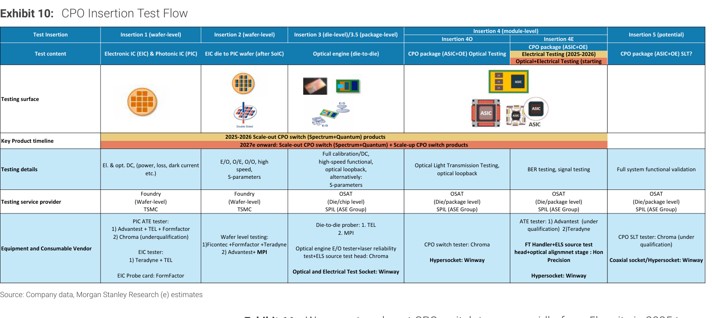

### 解讀摘要
CPO 插入測試（Insertion 2，Ins2）是量產品控的核心環節，MS 確認近期有重大進展：測試時間從 2H25 的每天一片晶圓大幅縮短至現在六小時一片，3-4 小時目標在 6-12 個月內可期。Ins2 是**不可跳過**的流程——它是首個可同時進行光電信號測試的工序（MS 特別反駁部分投資人「Ins2 可跳過」的假設）。FOCI 的 destructive testing 影響 2026H1 毛利率，正是 Ins2 量產準備成本的一部分。

> **原文補充**：MS 特別指出，不少投資人詢問 Ins2 是否可跳過，MS 的回應是「不太可能」，因為它是第一個可同步進行光電信號測試的節點；跳過將喪失早期品質把關的機會。

---

## Exhibit 11｜CPO Switch 出貨預測

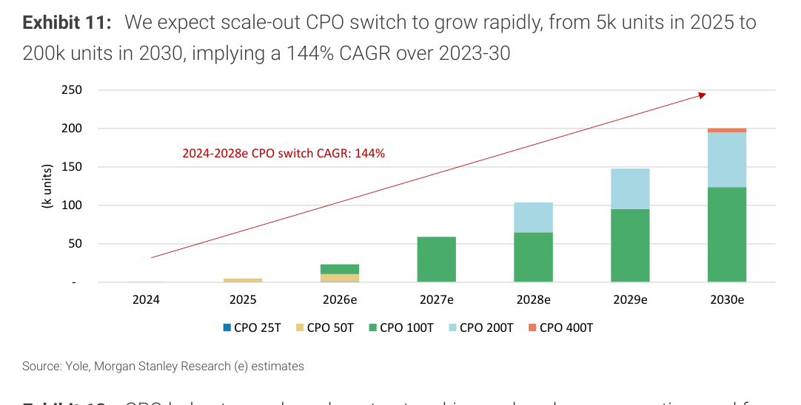

### 解讀摘要
CPO Switch（以 NVIDIA Spectrum-X 為代表）出貨量在 2026H2 開始放量，FOCI 為首批量產 FAU 供應商。從 FOCI 的業務段數字可反推規模：SiPh/CPO 業務段 2026E 約 NT\$650mn，2027E 跳至 NT\$7,032mn（YoY +981%），說明 Spectrum-X CPO 量產效益主要在 2027 年體現，2026 年仍是爬坡起始。

---

## Exhibit 12｜CPO Scale-out vs Scale-up 應用場景

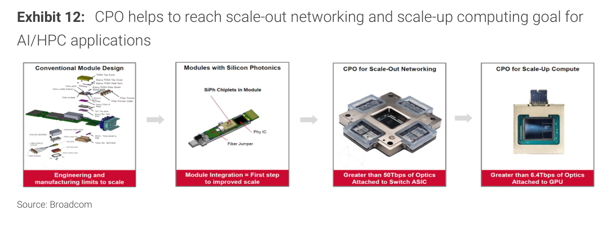

### 解讀摘要
CPO 適用兩種資料中心架構方向：scale-out（節點間乙太網路連接，即 Spectrum-X）與 scale-up（GPU 間高頻寬互連，即 NVLink/Quantum-X）。FOCI 目前聚焦 scale-out，scale-up 方向（Ayar Labs 主導）預計 2028 年後才在 TSMC 量產。兩個方向代表不同的 FAU 規格需求，也意味著 FOCI 的 TAM 未來有進入 scale-up 的上行機會。

---

## Exhibit 13｜TSMC COUPE 平台

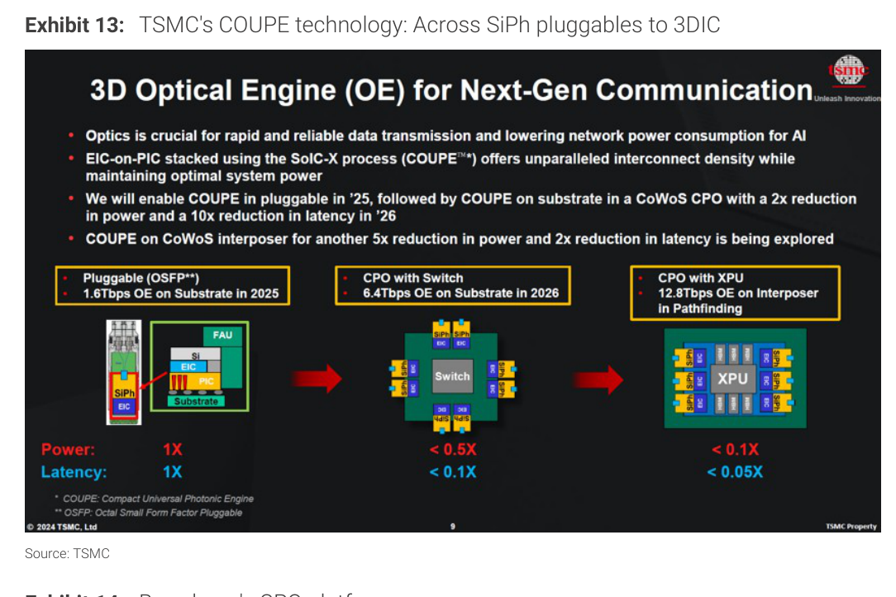

### 解讀摘要
TSMC COUPE（Compact Universal Photonic Engine）是 TSMC 官方 CPO 共封裝平台，整合 PIC 與電子 IC 的標準化設計。COUPE 採 grating coupling 架構，直接確立 FAU 在 TSMC 生態系的中期地位。GlassBridge 若要進入 COUPE，需要 TSMC 修改 PIC 設計標準，目前無此計畫。2026-27 年 COUPE 量產重心：NVIDIA、Broadcom、AMD。

---

## Exhibit 14｜Broadcom CPO 平台

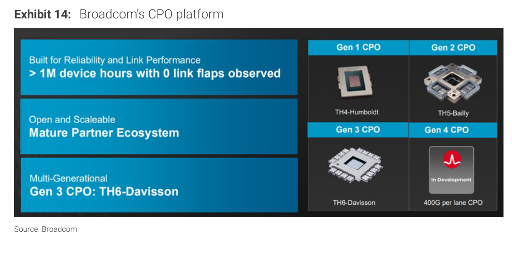

### 解讀摘要
Broadcom 基於自有 Switch ASIC（Tomahawk、Jericho 系列）開發 CPO 方案，是 NVIDIA 之外另一個重要 CPO 需求端。MS 列 Broadcom 為 2026-27 年 TSMC COUPE 量產重點客戶之一。若 FOCI 能同時供貨 NVIDIA 和 Broadcom 的 CPO FAU，客戶集中風險將大幅降低——目前 Broadcom 採用 FOCI FAU 的確認度仍低。

---

## Exhibit 15｜FAU 供應商比較表

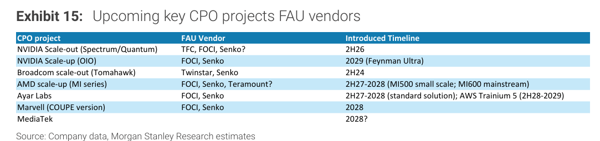

### 解讀摘要
MS 整理主要 FAU 供應商的技術能力與量產狀態：FOCI 量產進度最超前（3Q26 啟動），TFC 在高端 FAU 具競爭優勢（且較不受 GlassBridge 威脅），Corning GlassBridge 目前仍遠離量產，Ayar Labs 聚焦 scale-up 方向。其他提及廠商包括 Senko、Browave、Sumitomo Electric（日本廠商），代表日本供應鏈也在關注 CPO FAU 市場。

### 表格
| 廠商 | 技術路線 | 量產狀態（2026） | 主要方向 |
|---|---|---|---|
| FOCI (3363.TWO) | ReLFACon（grating coupling） | 3Q26 量產 | Spectrum-X scale-out |
| TFC Communication | V-groove FAU（高端） | 量產中 | 多元，high-end |
| Corning | GlassBridge（edge coupling） | 遠離量產 | 長期替代方案 |
| Ayar Labs | TeraPHY 光 I/O | 樣品/驗證 | Scale-up（2028+） |
| Senko | V-groove FAU | 量產中 | 傳統光纖 |
| Browave | V-groove FAU | 量產中 | 傳統光纖 |
| Sumitomo Electric | V-groove FAU | 量產中 | 傳統光纖 |

---

## Exhibit 16｜FOCI NVIDIA 相關業務收入

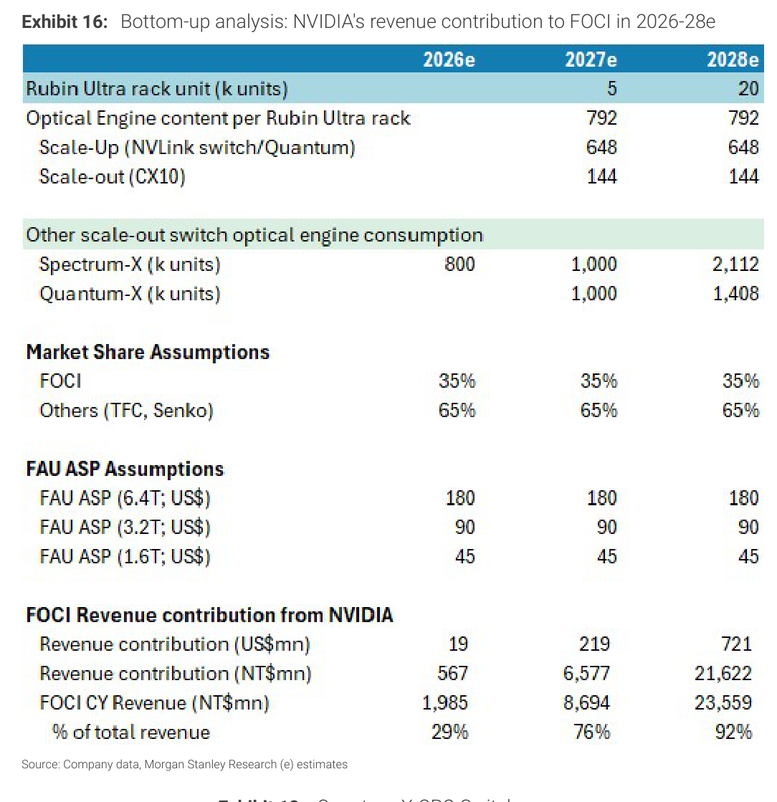

### 解讀摘要
FOCI SiPh/CPO 業務段（主要來自 NVIDIA Spectrum-X 相關訂單）是收入成長的核心驅動：2025 年約 NT\$109mn，2026E NT\$650mn（+496%），2027E NT\$7,032mn（+981%），2028E NT\$21,724mn（+209%）。整體公司收入也從 2025E NT\$1,892mn 跳升至 2027E NT\$8,694mn 和 2028E NT\$23,559mn，顯示商業模式正從傳統光纖元件廠快速轉型為 CPO 純玩家。

### 表格
| 年度 | SiPh/CPO 業務段（NT\$ mn） | 佔總收入比例（估算） |
|---|---|---|
| 2025 | 109 | 6% |
| 2026E | 650 | 33% |
| 2027E | 7,032 | 81% |
| 2028E | 21,724 | 92% |

> **洞察一**：SiPh/CPO 業務從 2026 年的 33% 跳至 2028 年的 92%，FOCI 2027 年後已是 CPO 純玩家——傳統光纖業務（Computing + Communication 兩段合計 NT\$1,423mn/NT\$1,810mn for 2026E/2028E）的重要性快速邊際化。

---

## Exhibit 17｜NVIDIA Spectrum-X CPO Switch

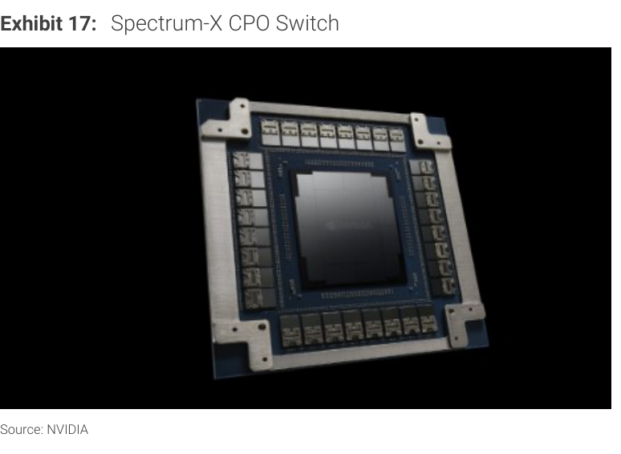

### 解讀摘要
NVIDIA Spectrum-X 是首款商業化 CPO Switch，整合 Spectrum-4 以太網 ASIC 與光引擎於同一封裝。FOCI 為 Spectrum-X FAU 的量產供應商（2026 年 7 月啟動），這是 CPO 從試產正式進入商業交付的里程碑。Spectrum-X CPO 版本面向大型語言模型推理叢集的 scale-out 組網需求，是 AI 資料中心的關鍵基礎設施。

---

## Exhibit 18｜NVIDIA Quantum-X CPO Switch

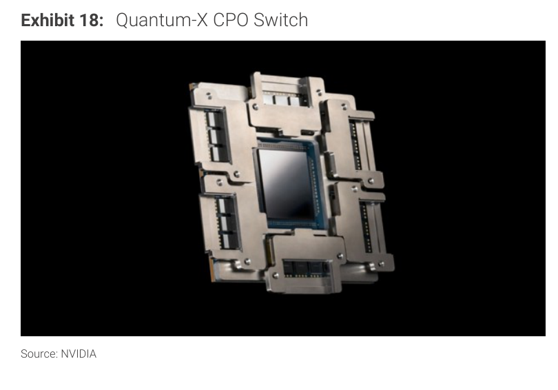

### 解讀摘要
NVIDIA Quantum-X 是 InfiniBand 版本的 CPO Switch，面向 AI 訓練叢集的高頻寬 scale-up 互連。Quantum-X 採用不同的封裝規格與光纖密度需求，目前尚未確認 FOCI 為供應商；MS 指出 FOCI 2H27 將開始供貨 AMD MI500 系列 FAU，但 NVIDIA Quantum-X 供應商身份仍待確認。

> **洞察一（配合 Exhibit 17）**：Spectrum-X（scale-out，FOCI 確認）→ AMD MI500（scale-out，2H27）→ Quantum-X（scale-up，待確認）三個訂單節點是 FOCI 收入上行的路徑圖。Quantum-X 訂單確認是下一個催化劑，也是 MS 牛市案例（NT\$920）的核心假設之一。

---

## Exhibit 20｜FOCI 矽光子技術路線圖

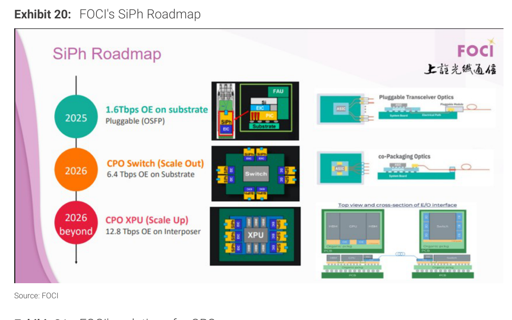

### 解讀摘要
FOCI 的 SiPh/CPO 技術路線圖顯示從傳統光纖元件 → FAU for CPO → 更高整合度模組的演進方向。2026 年是 FAU 量產元年；泰國新廠是承接此路線圖所需產能的基礎設施，從新竹廠轉移期間（2026 上半年）造成毛利率暫時下壓（1Q26 毛利率僅 1.9%），預計 3Q26 後隨量產成熟逐步恢復（MS 預測 4Q26 回升至 28%，2027 年均 37%）。

---

## Exhibit 21｜FOCI CPO 解決方案組合

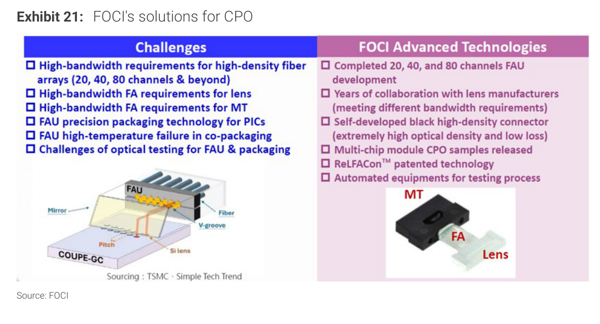

### 解讀摘要
FOCI 產品組合涵蓋多層次：（一）FAU 單品（供 CPO Switch OEM/ODM 組裝）；（二）FAU + CPO 插入測試服務（整合 Ins2 測試能力）；（三）未來更高整合度的 CoPoS 相關模組。多層次組合有助於 FOCI 沿 CPO 價值鏈延伸，規避純 FAU 供應商被商品化的中長期風險。

---

## Exhibit 22｜FOCI ReLFACon™ 技術圖解

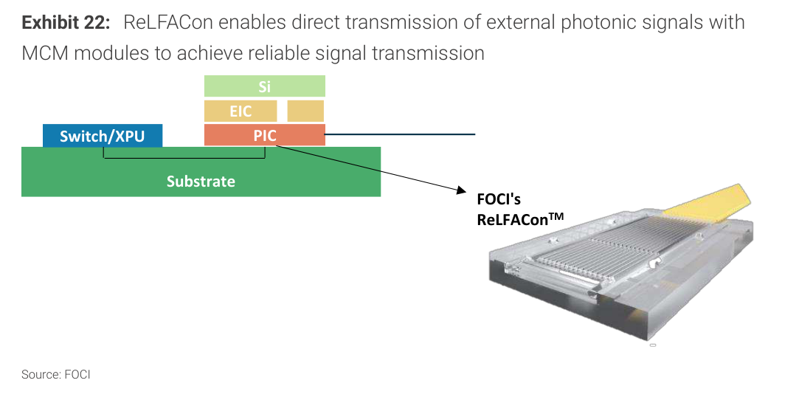

### 解讀摘要
ReLFACon（Reflective Lens Fiber Array Connector）是 FOCI 的核心專利技術：在光纖陣列末端加入反射鏡結構，將光束折射後與 PIC 的 grating coupler 對準，大幅降低機械對準容差需求，量產良率顯著優於傳統研磨拋光 FAU。與 Corning GlassBridge 相比，ReLFACon 與 TSMC 現行 grating coupling PIC 設計完全相容，不需更動 PIC 架構，是 FOCI 在 COUPE 生態系的競爭護城河。

---

## Exhibit 23｜AllRing 業務收入分析

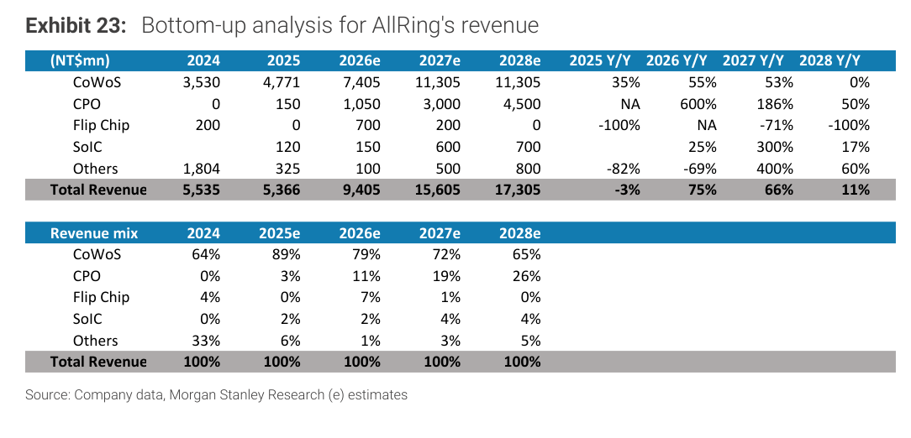

### 解讀摘要
AllRing 收入結構以 CoWoS 設備（WoS dispenser，WoS = Wafer on Substrate）為核心，CPO 與 SoIC 設備為成長期增量。MS 本次上修 AllRing 2026E EPS +15%（至 NT\$25.48，較共識 NT\$23.14 高出 10%）主要反映 TSMC CoWoS 擴張超預期，而非 CPO 業務提早貢獻——AllRing CPO 相關設備收入預計 2026 年僅約 2%，2027 年達 4%，長期更重要。AllRing 是 WoS dispenser 唯一供應商（獨家），訂單能見度高。

### 表格
| 指標 | MS 估計 | 市場共識 | 差距 |
|---|---|---|---|
| 2026E EPS（NT\$） | 25.48 | 23.14 | +10% |
| 2026E 收入（NT\$ mn） | 9,405 | 8,219 | +14% |
| 2027E EPS（NT\$） | 39.79 | N/A | N/A |
| 2028E EPS（NT\$） | 44.89 | N/A | N/A |

---

## Exhibit 24｜CoWoS 平均年產能

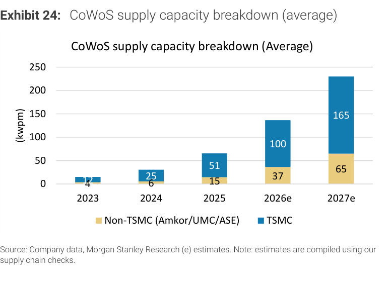

### 解讀摘要
TSMC CoWoS 年均產能走勢顯示 2026-27 年的擴張幅度。年均產能是 AllRing WoS dispenser 設備裝機量的直接對應指標；設備採購通常提前 12-18 個月，意味 AllRing 2027 年的設備收入在 2025-26 年下單時已部分鎖定。2026 年均約 100 kwpm，年底目標 130 kwpm。

---

## Exhibit 25｜CoWoS 年底峰值產能

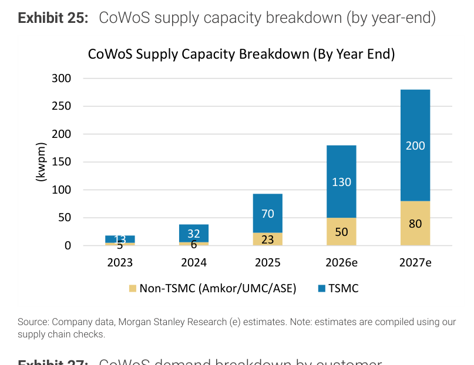

### 解讀摘要
CoWoS 年底峰值產能：2026 年底 130 kwpm，2027 年底 200 kwpm。年底數字代表下一年度的產能起點，對 AllRing 設備採購能見度而言是更關鍵的參考——TSMC 批核廠建計畫後通常前置 12-18 個月採購設備，AllRing 2027-28 年的訂單能見度可視為大致確認。

> **洞察一（配合 Exhibit 24）**：年均（Exhibit 24）vs 年底（Exhibit 25）的差距代表年中仍在爬坡的斜率——AllRing 設備訂單是 leading indicator，比 TSMC 實際達到目標產能提前 1-1.5 年認列，業績能見度比 CoWoS 利用率更高。

---

## Exhibit 26｜CoWoS 各供應商/製程分配

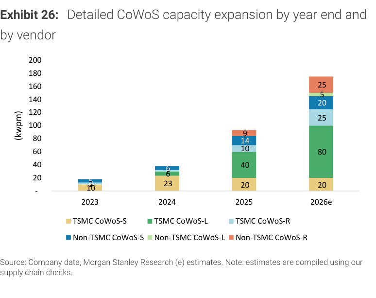

### 解讀摘要
TSMC CoWoS 內部製程（CoWoS-S、CoWoS-L、CoWoS-R）的產能比例，以及 OSAT 外包（ASE 等）部分的佔比。CoWoS-S（搭配 SoIC，高附加值製程）比重逐年提升，是 TSMC 自製率較高的製程，也是 AllRing WoS dispenser 的主要應用工序；CoWoS-S 佔比提升對 AllRing 的 ASP 與毛利率均有正面影響。

---

## Exhibit 27｜CoWoS 各客戶需求

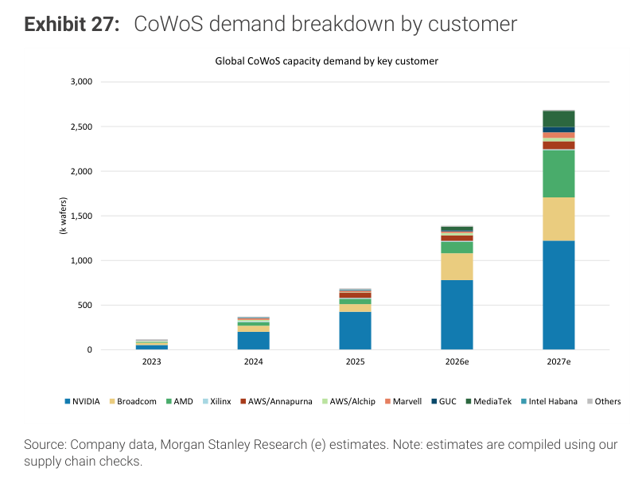

### 解讀摘要
TSMC CoWoS 需求端來自 NVIDIA GPU（主導）、AMD Instinct、Google TPU、Amazon Trainium 等各家 ASIC。NVIDIA 仍是最大單一客戶，但 ASIC 客戶比重逐年提升，使 AllRing 的 CoWoS 設備訂單逐漸分散化。從 AllRing 角度，需求多元化降低了「NVIDIA 砍單」的單一風險，中期業績穩定性提升。

---

## Exhibit 28｜TSMC 先進封裝廠規劃

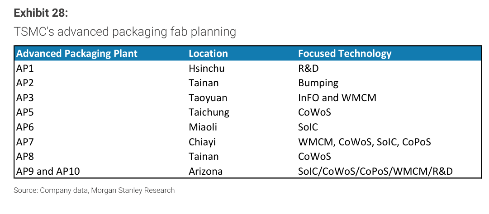

### 解讀摘要
TSMC 先進封裝（AP）廠擴建計畫（含新竹 AP4/AP5、台中 AP6）直接支撐 CoWoS 與 SoIC 產能目標。AP 廠 CAPEX 批核是 AllRing 設備訂單的 leading indicator，通常提前 12-18 個月啟動採購；2026 年的 AP 廠建計畫可延伸出 2027-28 年 AllRing 的訂單能見度。

---

## Exhibit 36｜FOCI 歷史 P/B 走勢

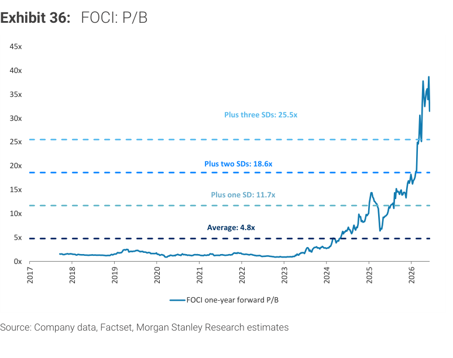

### 解讀摘要
FOCI 歷史 NTM P/B：平均 4.8x，+1SD 11.7x，+2SD 18.6x，+3SD 25.5x。CPO 題材發酵後（2025-26 年），FOCI 估值已升至 +2SD 以上，反映市場對 CPO 量產後 ROE 大幅提升的預期（MS 模型 2027E ROE = 55%）。MS 以 RI 模型而非 P/B 作為目標價基礎，原因是歷史 P/B 均值無法捕捉商業模式從傳統光纖向 CPO 純玩家轉型後的盈利能力質變。

### 表格
| 統計值 | P/B 倍數 |
|---|---|
| 歷史平均 | 4.8x |
| +1 SD | 11.7x |
| +2 SD | 18.6x |
| +3 SD | 25.5x |

> **洞察一**：P/B +2SD 以上說明市場已為 ROE 大幅提升定價——若 CPO 量產如期推進，高 P/B 有其基本面支撐（2027E ROE 55%）；量產延誤則 P/B 從 +2SD 回落至均值（4.8x），對應估值重估幅度達 75% 以上。

---

## Exhibit 37｜FOCI 歷史 P/S 走勢

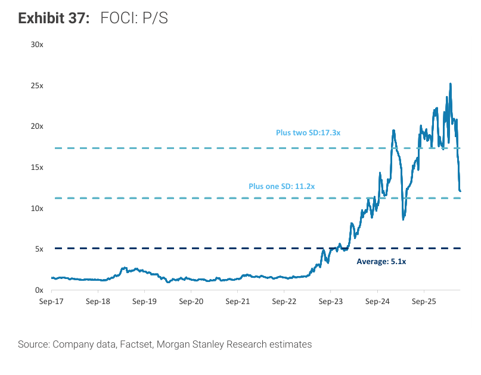

### 解讀摘要
FOCI NTM P/S 歷史平均 5.1x，+1SD 11.2x，+2SD 17.3x。P/S 估值對 2026 年 FOCI 虧損期（EPS -NT\$0.41）有更直接的參考意義。以現價 NT\$581 × 110mn 股推算市值約 NT\$63,910mn，對應 2026E 收入 NT\$1,985mn，NTM P/S 約 32x，已達 +2SD 以上——顯示市場估值已完全計入 2027 年量產大成長預期。

### 表格
| 統計值 | P/S 倍數 |
|---|---|
| 歷史平均 | 5.1x |
| +1 SD | 11.2x |
| +2 SD | 17.3x |

> **洞察一（配合 Exhibit 36）**：P/B 與 P/S 同步處於歷史 +2SD 以上，說明 FOCI 股票目前是 binary event 結構：量產順利（2027E NT\$8,694mn 收入、NT\$16.36 EPS）→ 估值壓縮但獲利高速增長支撐；量產延誤 → P/S、P/B 同步重估，下行目標價 NT\$330（20x 2027e P/E）意味相比現價 -43%。

---

## 跨 Exhibit 彙整表

### 彙整一｜TSMC PIC 產能 → 良率 → 實際 OE 供應量

（來源：Exhibit 8、Exhibit 9）

| 情境 | TSMC PIC 產能 | 年產 PIC | OE（50% SoIC 良率） | 實際 OE（downstream 50%） | 實際 OE（downstream 20%） |
|---|---|---|---|---|---|
| 牛市（2028E） | 25 kwpm | 194mn | 97mn | **48.60mn** | 7.78mn |
| 基本（2026-27E） | 10-15 kwpm | 78-117mn | 39-58mn | 19-29mn | 3-5mn |
| 現狀（2Q26） | 10 kwpm | 78mn | 39mn | 19.4mn | 3.1mn |

> TSMC PIC 名義產能從 0.5→25 kwpm 是 50 倍，但實際 OE 供應量受良率影響，50% downstream 良率情境下增幅僅 12-13 倍（1.0→48.60mn）。良率工程是 CPO 規模化最決定性的因子。

---

## 相關個股清單

| 類別 | 公司 | Ticker | 評等 | 備註 |
|---|---|---|---|---|
| CPO FAU | FOCI 光通訊 | 3363.TWO | OW | PT NT\$708（RI）；2026 虧損過渡，2027E EPS NT\$16.36，2028E NT\$47.68 |
| CPO 設備 | AllRing | 6187.TWO | OW | PT NT\$1,580（RI，40x 2027e）；CoWoS 寡占 + CPO/SoIC 增量 |
| CPO Switch | NVIDIA | NVDA | N/A | Spectrum-X（scale-out，FOCI 已確認）、Quantum-X（scale-up，待確認） |
| PIC 製造 | TSMC | 2330.TW | OW | PIC 產能瓶頸；COUPE 平台定義 CPO 生態系 |
| FAU（台灣） | TFC Communication | 未上市 | N/A | 高端 FAU 競爭優勢；受 GlassBridge 影響最小 |
| 光纖 | Corning | GLW US | N/A | GlassBridge 開發中；同時保留 FAU 業務 |
| 先進封裝 | ASE | 3711.TW | OW | 部分 CoWoS 外包產能；CPO 測試業務 |
| CPO 測試 | MPI | 6101.TW | OW | CPO 插入測試設備（Ins2） |
| CPO 測試 | Winway | 6290.TW | OW | CPO 測試配套 |
| 精密機構 | Hon Precision | 7769.TW | OW | CPO 精密零件 |
