# GS｜FOCI 上詮 Initiation — FAU for CPO Switch

**券商**：Goldman Sachs  
**分析師**：Allen Chang、Verena Jeng、Yifan Hu  
**日期**：2026-07-06  
**主題**：FOCI (3363) 啟動覆蓋 — CPO switch FAU 供應商，光通訊架構遷移核心受益  
**評級**：Buy（啟動）｜TP NT\$864（upside 50.5%）  
<a href="https://layx.uk/dl?g=產業&b=GS&d=20260706&h=FOCI-Initiation">📎 下載 PDF</a>

---

## 報告總結

Goldman Sachs 以 Buy / TP NT\$864 啟動覆蓋上詮 (FOCI, 3363)，核心論點是 CPO switch 商業化（Nvidia 2026 年、Broadcom Davisson 已交貨）帶動 FAU 需求爆發：FOCI 是全球 leading CPO switch 廠的主要 FAU 供應商，已搭建 ReLFACon 標準平台，且正透過 3.2T→6.4T 升級享受 ASP 提升。GS 預估 NI CAGR +250% 2025-30E，EPS 從 2026E NT\$0.84 跳升至 2027E NT\$17.83（+2,020% YoY）。市場最大爭議為 GlassBridge（Corning）是否取代 FAU，GS 認為兩者互補、FAU 仍是首選，但需密切追蹤客戶採用進展。

---

## GS 完整投資邏輯鏈

| 論點層次 | Exhibit | 內容 |
|---|---|---|
| 需求來源確認 | Exhibit 3 | US CSP Capex 2026E +76% YoY，AI infra upcycle 支撐 |
| 技術路徑確認 | Exhibits 13/15 | CPO 取代 pluggable；FAU 是 PIC-fiber coupling 唯一量產方案 |
| 市占地位穩固 | Exhibit 17 | Nvidia/Broadcom CPO switch 均已落地，FOCI 為主要 FAU 供應商 |
| 財務爆發路徑 | Exhibits 1/2/4 | 2026→2027E 收入 +264%，EPS +2,020%；GM 19%→34% |
| 估值有支撐 | Exhibits 27/29/30 | PEG 0.8x 在同業中位，48x 2027E P/E 有成長支撐 |
| **結論** | 報告封面 | **Buy TP NT\$864；NI CAGR +250% 2025-30E，upside 50.5%** |

> **報告最大邏輯缺口**：FAU 單價 US\$50（僅佔 BoM 5%）ASP 能否在 6.4T 升級時大幅提升是最核心假設；GlassBridge 是否超越 24+ channels 威脅高密度 FAU 仍待觀察。

---

## 報告核心觀點

| 主題 | GS 觀點 | 市場共識 | 是否 Contra-Consensus |
|---|---|---|---|
| GlassBridge vs FAU | 兩者互補，FAU 仍被客戶選用；FAU 持續升級（100+ ch、2D、耐熱材料） | 擔憂 GlassBridge 取代 FAU | ✅ 是 |
| CPO 時程 | Nvidia 2026 商業量產、Broadcom Davisson 已交貨 | CPO 延遲風險 | 略偏樂觀 |
| EPS 爆發 | 2027E EPS NT\$17.83（+2,020% YoY） | 市場估算大幅落後 GS | ✅ 是 |
| 估值 | TP NT\$864 = 48x 2027E P/E，PEG 0.8x | 多數尚未啟動覆蓋 | — |

**偏好排序**：FOCI FAU 業務 > SiPh/CPO packaging > 傳統光通訊元件  
**個股偏好**：FOCI (3363, Buy) 為主要受益標的

---

## Exhibit 1｜FOCI 營收與毛利率趨勢

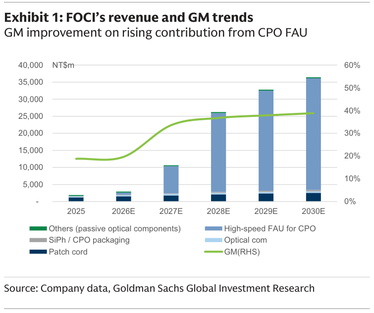

### 解讀摘要
2027E 是真正的爆發年：高速 FAU for CPO 從 2027E 起在收入結構中佔絕對主導，推動總營收從 2026E NT\$2,924mn 跳至 2027E NT\$10,649mn（+264% YoY），至 2030E 達 NT\$36,410mn。毛利率改善機制清晰：CPO FAU 的毛利率顯著高於傳統 patch cord 與 optical com，隨 CPO FAU 佔比提升，整體 GM 從 2025 年 19% 升至 2030E 39%。這是一個產品組合升級驅動的毛利率結構性改善，而非單純規模效應。

### 表格

| 年度 | High-speed FAU for CPO | SiPh/CPO pkg | Optical com | Patch cord | Others | 總收入 NT\$mn | GM% |
|---|---|---|---|---|---|---|---|
| 2025 | 極小 | — | 主要 | 次要 | — | 1,892 | 19% |
| 2026E | 小量起量 | — | — | — | — | 2,924 | 20% |
| 2027E | 主力 | — | — | — | — | 10,649 | 34% |
| 2028E | 主力+擴大 | — | — | — | — | 26,212 | 37% |
| 2029E | — | — | — | — | — | 32,793 | 38% |
| 2030E | — | — | — | — | — | 36,410 | 39% |

*條形圖為堆疊估算，各分項精確值需從 Exhibit 24 P&L 計算

> **洞察一**：2026→2027E 單年跳升 NT\$7,725mn（+264% YoY），幾乎完全來自 CPO FAU。這個爆發完全依賴 CPO switch 量產時程是否如 Nvidia/Broadcom 所承諾——任何延遲都會使這個峰值大幅右移。

---

## Exhibit 2｜FOCI NI 瀑布圖 2025-30E

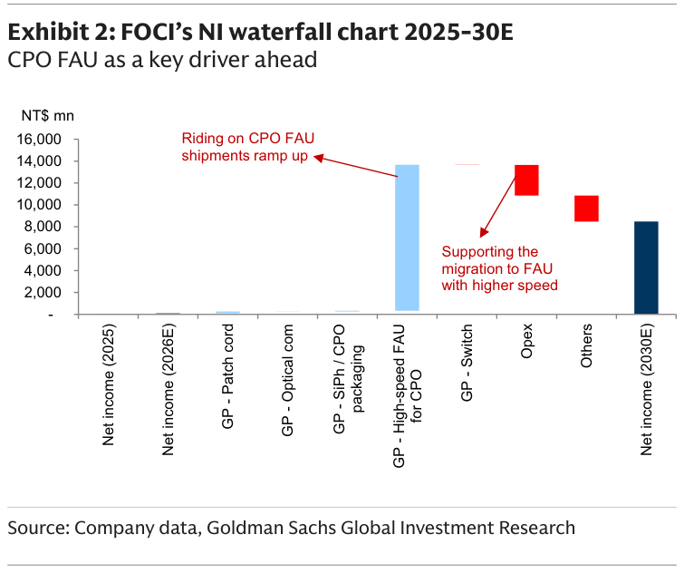

### 解讀摘要
瀑布圖直觀呈現淨利從 2025 年 NT\$16mn 到 2030E NT\$8,485mn 的增量來源：幾乎全部貢獻來自 CPO FAU 的毛利提升（GP - High-speed FAU for CPO 柱狀最大），而 GP - Switch、Opex、Others 都是負貢獻或很小。這說明 FOCI 在 2030E 的獲利能力高度集中在一個產品——高速 FAU，策略集中度極高，帶來高成長但也有集中度風險。

> **原文補充**：GS 標注「Riding on CPO FAU shipments ramp up」和「Supporting the migration to FAU with higher speed」兩個驅動——前者是量（shipments 增長），後者是價（3.2T→6.4T 帶動 ASP 提升），兩個因子都在 2027-28E 同時發力。

### 洞察

> **洞察一**：2030E NI NT\$8,485mn vs. 2025 NT\$16mn，成長倍數 530x。但若 CPO FAU 的量或價任一偏差 10%，2030E NI 就會顯著搖擺——因為 Opex、GP-Switch 等其他項目的貢獻非常小，獲利的「覆蓋率」很低。

---

## Exhibit 3｜美國 CSP Capex 趨勢

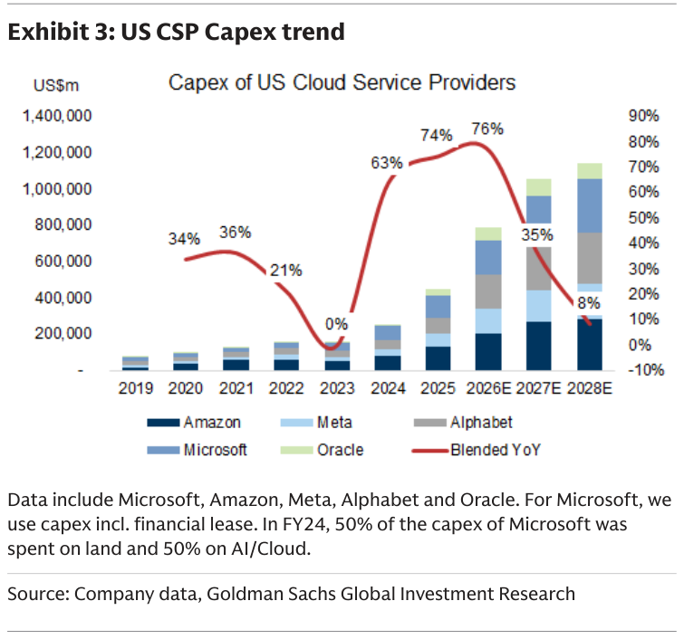

### 解讀摘要
5 大 US CSP（Amazon、Microsoft、Meta、Alphabet、Oracle）合計 Capex 2026E 約 US\$1.3T，YoY +76%，2027E +35%，顯示 AI infra 投資仍在加速期而非趨緩。2023 年短暫 0% 增速（後疫情調整期）是異常值，2024 年就恢復 +63% 增速。這是 CPO 需求的最終需求端佐證：CPO switch 需求直接關聯 hyperscaler Capex。

### 表格

| 年度 | 合計 Capex US\$bn（估算） | YoY% |
|---|---|---|
| 2019 | 約 100 | — |
| 2020 | 約 130 | +34% |
| 2021 | 約 180 | +36% |
| 2022 | 約 220 | +21% |
| 2023 | 約 220 | 0% |
| 2024 | 約 360 | +63% |
| 2025 | 約 600 | +74% |
| 2026E | 約 1,040 | +76% |
| 2027E | 約 1,400 | +35% |
| 2028E | 約 1,510 | +8% |

*以上為視覺估算

> **洞察一**：2026E +76% 是過去 10 年最高成長率，且基數已是 US\$600bn（2025）。絕對增量超過 US\$400bn，等於前五年總和。這對所有 AI infra 供應商都是正面信號，但也意味著 2027E 以後成長率會降回 30% 量級，需要確認 FAU 需求是否比 Capex 趨勢更持久。

---

## Exhibit 4｜FOCI FAU 出貨趨勢

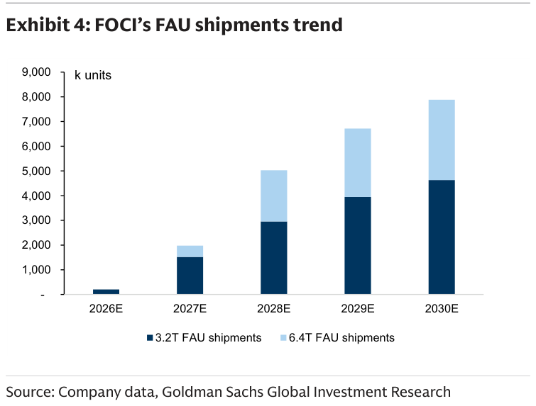

### 解讀摘要
3.2T FAU 從 2026E 起量，6.4T FAU 2027E 開始放量，兩者疊加使總 FAU 出貨從 2026E 約 300 k units 增至 2030E 約 7,800 k units（+25x in 4 years）。2028-29E 是 3.2T→6.4T 的交棒年，6.4T 佔比從 ~40% 升至 ~60%，由於 6.4T ASP 高於 3.2T，這個 mix shift 本身就是第二個 ASP 升級催化劑。

### 表格

| 年度 | 3.2T FAU（千單位） | 6.4T FAU（千單位） | 合計（千單位） |
|---|---|---|---|
| 2026E | 300 | — | 300 |
| 2027E | 1,500 | 500 | 2,000 |
| 2028E | 3,000 | 2,000 | 5,000 |
| 2029E | 4,000 | 2,700 | 6,700 |
| 2030E | 4,700 | 3,100 | 7,800 |

*視覺估算，交叉驗證通過（2030E 與 Exhibit 1 收入結構一致）

> **值得驗證**：6.4T FAU 的 ASP 是否高於 3.2T 的倍數。報告 BoM（Exhibit 18）顯示 FAU 單價 US\$50（3.2T 規格）；若 6.4T 升至 US\$80-100，2029E 以後的 ASP 提升效果很大——但若競爭拉平，FAU 的高成長就主要靠量。

---

## Exhibit 5｜FOCI 12M 遠期 P/S

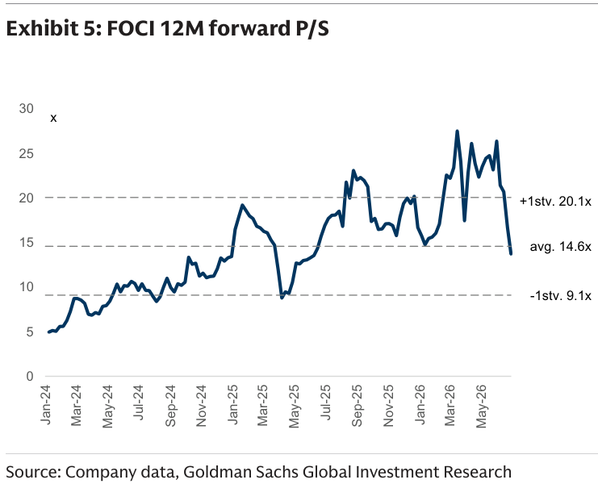

### 解讀摘要
現貨 P/S（截至 2026 年 7 月）約 14x，位於歷史平均 14.6x 附近，低於 +1STD（20.1x）。2025 年 9 月曾飆至 22x（CPO 題材高峰），2025 年底回落至 15x 後再次上升。報告發布時 P/S 在均值附近，估值並未特別昂貴——但這是 P/S，在 FOCI 未來 NI 大幅擴張的假設下，P/E 才是更合適的判斷指標（GS 用 discounted P/E 法）。

---

## Exhibit 6｜FOCI 40 通道 FAU（3.2T+ CPO switch 用）

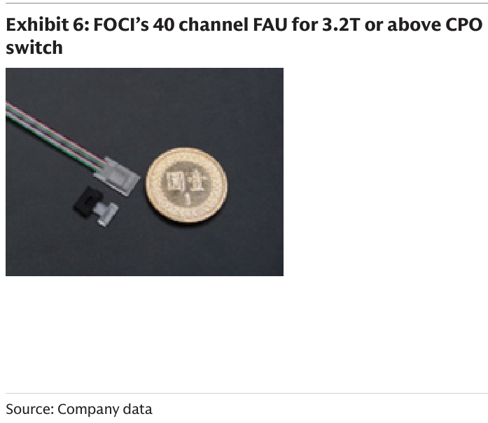

### 解讀摘要
40 通道高密度 FAU 實物照片，旁邊為一日圓硬幣作比例尺。體積極小——這體現了 FAU 的核心競爭力：在極小空間內精確排列多根光纖。這種精度需求（micron 級別對準）構成製造進入門檻，也解釋了為何 GlassBridge 目前只能做到 24+ 通道而 FAU 已達 40+ 通道，並朝 100+ 通道演進。

---

## Exhibit 7｜FOCI FAU 在 CPO switch 中的位置

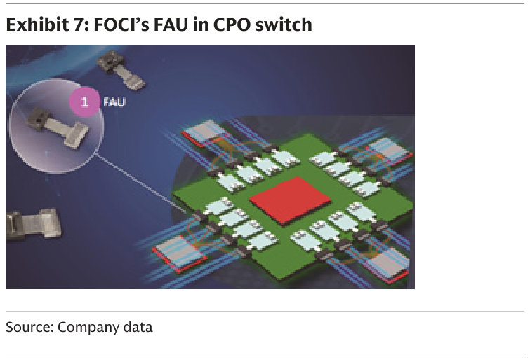

### 解讀摘要
架構圖顯示 FAU 在 CPO switch 中位於 Optical Engine（PIC+EIC 封裝體）的外側，作為光纖陣列與 PIC 之間的耦合介面。每個 Optical Engine 需要至少一個 FAU，且以 Nvidia Quantum-X 為例有 72 個 Optical Engine，意味著每台 CPO switch 需要 72 個 FAU（對應 Exhibit 18 的 BoM）。

---

## Exhibit 8｜FOCI 濾波器元件

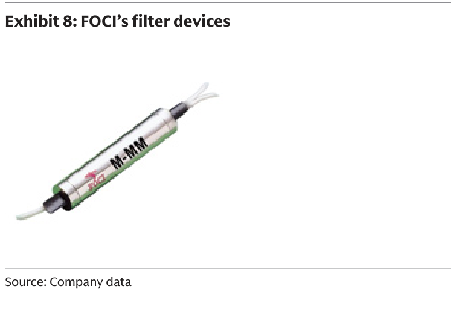

### 解讀摘要
傳統光通訊濾波器產品（telecom 市場）。這是 FOCI 舊有業務，貢獻 2025 年大部分收入，但在 GS 的 2030E 預測中這類「Others（passive optical components）」佔比會大幅萎縮——業務重心已移向 CPO FAU。

---

## Exhibit 9｜FOCI 100G LR4 TOSA

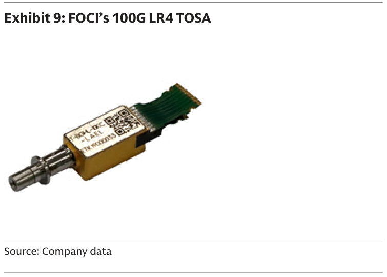

---

## Exhibit 10｜FOCI 100G LR4 ROSA

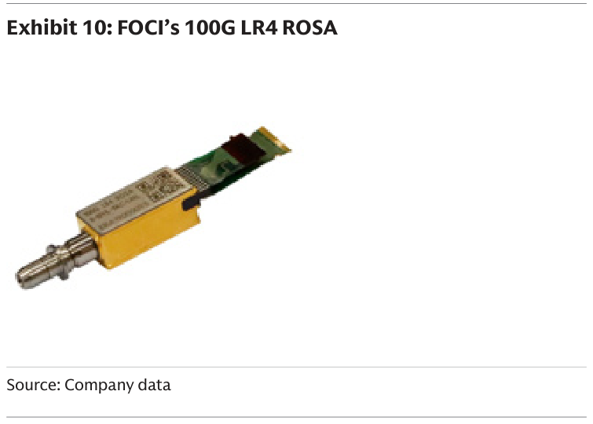

### 解讀摘要（Exhibit 9-10 合）
TOSA（Transmitter Optical Sub-Assembly）與 ROSA（Receiver Optical Sub-Assembly）是傳統光通訊收發器的核心元件，屬 FOCI 原有 Optical com 業務。在 CPO 架構下，這類分離元件逐步被整合至 Optical Engine，但過渡期內仍有需求；且 FOCI 的 TOSA/ROSA 製造能力是進入高精度光學產品的技術基礎。

---

## Exhibit 11｜FOCI 資料中心 AOC

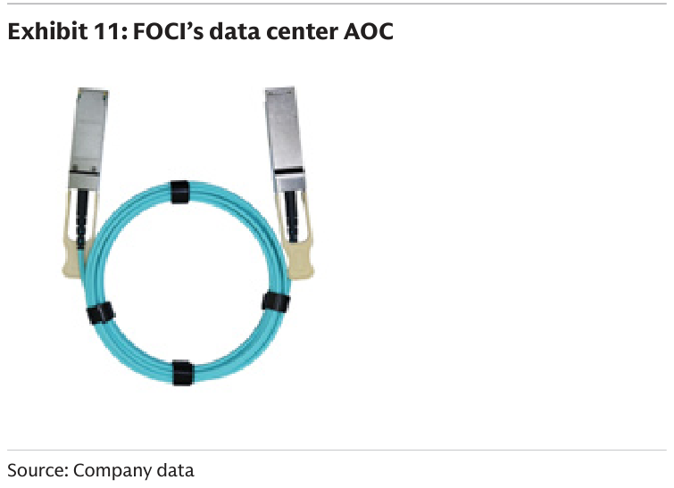

---

## Exhibit 12｜FOCI 保偏光纖跳線

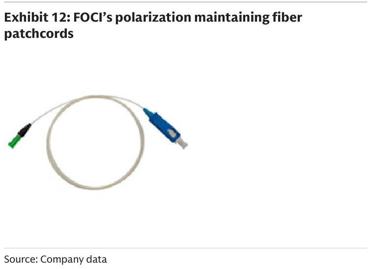

### 解讀摘要（Exhibit 11-12 合）
AOC（Active Optical Cable）用於資料中心短距互連，保偏光纖跳線（PM patchcord）用於需要偏振控制的光學系統（如 SiPh 測試）。兩者均是 FOCI 現有產品線，在 2030E 預測中屬「Others」類，為穩定但低增長業務。

---

## Exhibit 13｜CPO 在資料傳輸中的工作原理

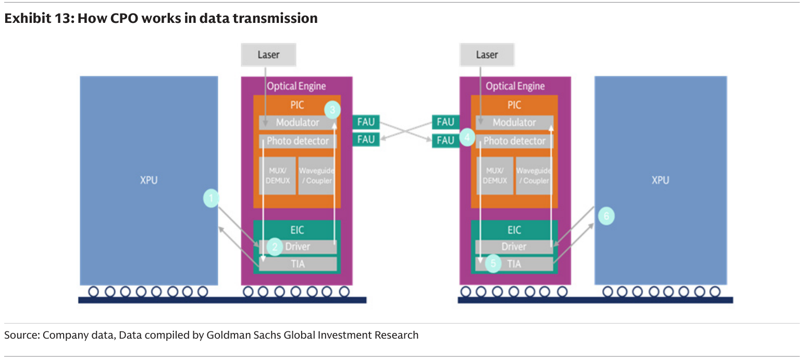

### 解讀摘要
架構圖清楚呈現 CPO 的信號流：電信號從 XPU 進入 EIC（Electronic IC），驅動 PIC（Photonic IC）中的 Modulator 把電信號轉為光信號，光信號透過 FAU 出去，對側 FAU 接入 PIC 的 Photo detector，完成光→電轉換回 XPU。FAU 出現在圖的正中央（編號 3 和 4）——這是信號「進出」光引擎的唯一通道，說明 FAU 在 CPO 中是不可繞過的結構性元件。

---

## Exhibit 14｜資料中心連接方式：Scale-up vs. Scale-out

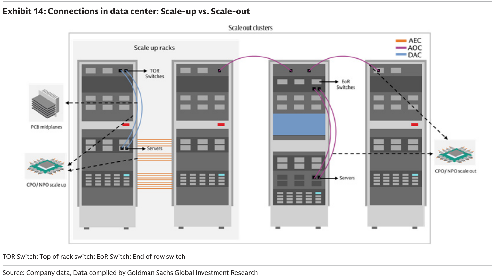

### 解讀摘要
左側 Scale-up（機架內 GPU 互連）使用 PCB midplane + CPO/NPO（scale up）；右側 Scale-out（跨機架）使用 AOC、DAC 或 AEC。CPO 目前主要切入 scale-out 的 EoR switch，Nvidia Spectrum-X 就是以太網 scale-out CPO switch。未來隨技術成熟再進入 scale-up（XPU 直接 co-packaged optics）。FAU 在 scale-up 和 scale-out 架構中都有應用，市場持續擴大。

> **原文補充**：TOR = Top of Rack switch，EoR = End of Row switch。Scale-out 的 EoR CPO switch 是現在的優先市場，scale-up 的 XPU CPO 時程「尚不明確」（見 Exhibit 15）。

---

## Exhibit 15｜光學技術遷移路徑

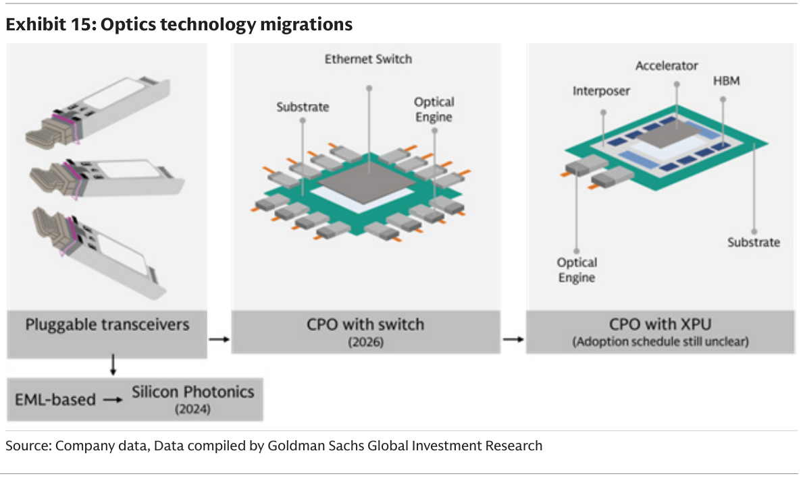

### 解讀摘要
三階段技術路線圖：①Pluggable transceiver（EML→Silicon Photonics，2024 年已完成）→②CPO with switch（2026 年商業化）→③CPO with XPU（時程不明確）。FOCI 的主要受益是第②階段：CPO switch 2026 年大量商業化，FAU 需求起飛。第③階段（XPU CPO）若加速推進，是進一步的 upside option；但報告明確指出「Adoption schedule still unclear」，GS 的財務模型並未包含 XPU CPO 的重大貢獻。

> **洞察一**：GS 的 NT\$864 TP 幾乎完全建立在 CPO-switch（第②階段）的規模化上。XPU CPO（第③階段）是免費選擇權，若 2028-29E 出現時間表，有顯著 upside。

---

## Exhibit 16｜CPO switch 規格比較

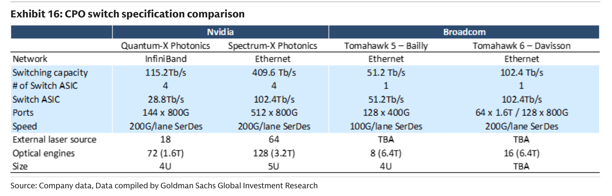

### 解讀摘要
Nvidia（Quantum-X、Spectrum-X）和 Broadcom（TH5 Bailly、TH6 Davisson）的 CPO switch 規格對比，是理解 FAU 需求量的關鍵輸入。Nvidia Spectrum-X 有 128 個 Optical Engines（3.2T），每個 Optical Engine 需要 FAU，總計 128 個 FAU per switch——比 Quantum-X 的 72 個多出 78%。Broadcom TH5 只有 8 個 Optical Engines（6.4T），但 TH6 有 16 個。

### 表格

| 規格 | Nvidia Quantum-X | Nvidia Spectrum-X | Broadcom TH5 Bailly | Broadcom TH6 Davisson |
|---|---|---|---|---|
| 網絡協議 | InfiniBand | Ethernet | Ethernet | Ethernet |
| 交換容量 | 115.2 Tb/s | 409.6 Tb/s | 51.2 Tb/s | 102.4 Tb/s |
| Switch ASIC 數 | 4 | 4 | 1 | 1 |
| Switch ASIC 容量 | 28.8 Tb/s | 102.4 Tb/s | 51.2 Tb/s | 102.4 Tb/s |
| 端口數 | 144 × 800G | 512 × 800G | 128 × 400G | 64 × 1.6T / 128 × 800G |
| SerDes 速率 | 200G/lane | 200G/lane | 100G/lane | 200G/lane |
| External laser source | 18 | 64 | TBA | TBA |
| Optical engines | 72（1.6T） | 128（3.2T） | 8（6.4T） | 16（6.4T） |
| 尺寸 | 4U | 5U | 4U | TBA |

> **洞察一**：Nvidia Spectrum-X 是目前 FAU 密度最高的 CPO switch（128 個 Optical Engines），且以太網市場規模遠大於 InfiniBand；若 Spectrum-X 大量出貨，對 FOCI 的 FAU 出貨量拉動最大。

---

## Exhibit 17｜CPO 主要廠商開發進展時程

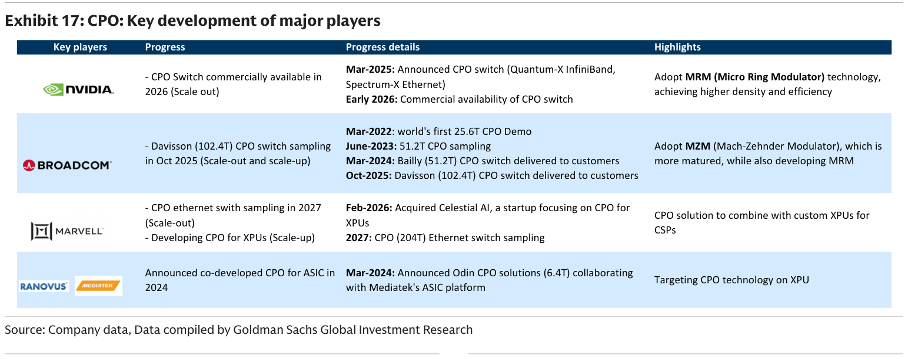

### 解讀摘要
四家 CPO 廠商的技術路線各異：Nvidia 採用 MRM（Micro Ring Modulator，高密度高效率），Broadcom 採用成熟的 MZM（Mach-Zehnder Modulator）同時開發 MRM，Marvell 2026 年 2 月收購 Celestial AI 切入 XPU CPO，Ranovus/Mediatek 聚焦 XPU。關鍵時程節點：Broadcom Davisson（102.4T）已於 Oct-2025 交貨、Nvidia CPO switch 2026 年初商業化——均已落地，是 FOCI 2026E 開始出貨的直接催化劑。

### 表格

| 廠商 | 進展狀態 | 關鍵時程 | 技術特色 |
|---|---|---|---|
| Nvidia | Scale-out CPO 2026 年商業化 | Mar-25 宣布；Early-2026 商業出貨 | MRM（高密度高效率） |
| Broadcom | Scale-out + scale-up Davisson 已交貨 | Mar-22 首demo；Oct-25 Davisson 交貨客戶 | MZM（成熟）+ 開發 MRM |
| Marvell | 2027 年 204T CPO 以太網 switch 取樣 | Feb-26 收購 Celestial AI；2027 取樣 | 結合 Custom XPU |
| Ranovus/Mediatek | ASIC CPO 2024 年宣布 | Mar-24 宣布 Odin 6.4T 方案 | 針對 XPU CPO |

> **洞察一**：Nvidia + Broadcom 已驗證 CPO switch 商業可行性，2026 年是量產元年而非概念期；Marvell/Ranovus 的 XPU CPO 是下一波——兩個成長引擎在時間上有錯開，給 FOCI 提供可視度較高的成長曲線。

---

## Exhibit 18｜CPO switch BoM 拆解（金額）

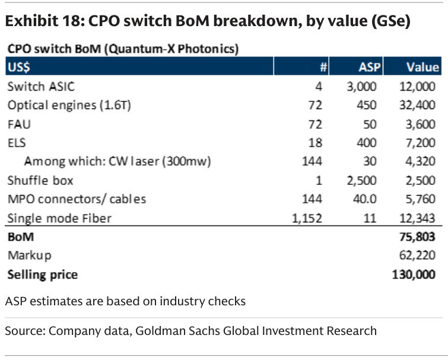

### 解讀摘要
以 Nvidia Quantum-X Photonics 為例，CPO switch BoM 總額 US\$75,803，售價 US\$130,000（毛利率 42%）。FAU 佔 BoM 的 5%（US\$3,600 = 72 個 × US\$50），是體積最小但功能最關鍵的元件之一。最大 BoM 元件是 Optical engines（43%，US\$32,400），其次是 Switch ASIC（16%）和 Single mode Fiber（16%）。

### 表格

| 元件 | 數量 | 單價 US\$ | 總值 US\$ | 佔 BoM% |
|---|---|---|---|---|
| Switch ASIC | 4 | 3,000 | 12,000 | 16% |
| Optical engines (1.6T) | 72 | 450 | 32,400 | 43% |
| FAU | 72 | 50 | 3,600 | 5% |
| ELS | 18 | 400 | 7,200 | 9% |
| 　CW laser (300mw) | 144 | 30 | 4,320 | — |
| Shuffle box | 1 | 2,500 | 2,500 | 3% |
| MPO connectors/cables | 144 | 40 | 5,760 | 8% |
| Single mode Fiber | 1,152 | 11 | 12,343 | 16% |
| **BoM 合計** | | | **75,803** | **100%** |
| Markup | | | 62,220 | — |
| **Selling price** | | | **130,000** | — |

> **洞察一**：FAU 僅 5% BoM，但每台 switch 72 個，且隨規格升級（3.2T→6.4T）數量不減甚至增加。FAU ASP US\$50 在 GS 的模型中若受競爭壓縮，影響有限；若隨通道數（24ch→40ch→100ch）顯著提升，則有超預期空間。  
> **值得驗證**：GS 備注「ASP estimates are based on industry checks」，FAU US\$50 是點估計而非合約價，若實際 ASP 受到競爭 or mix shift 影響，Exhibit 1 的收入模型都會改變。

---

## Exhibit 19｜CPO switch BoM 拆解（%）

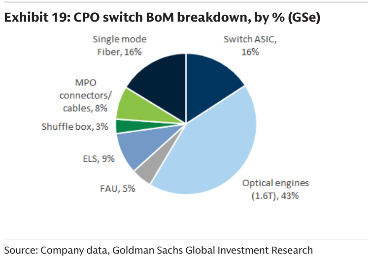

### 解讀摘要
圓餅圖視覺化確認 Optical engines（43%）的絕對主導地位。FAU 5%、ELS 9%、MPO 8%、SMF 16% 合計 38%，都是 FAU-adjacent 的光纖/連接元件——FOCI 除 FAU 外也供應其中若干。投資意涵：CPO switch 的價值鏈高度集中在光學引擎（OICR, Broadcom, Nvidia 等），FAU 供應商是「小而關鍵」的利基，定價能力取決於技術壁壘而非 BoM 佔比。

---

## Exhibit 20｜各 CSP 技術採用狀況

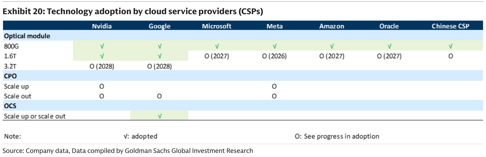

### 解讀摘要
現狀（截至 2026 年 7 月）：800G optical module 已全面採用（全部 ✓）；1.6T 已在 Nvidia 和 Google 部署，其他 CSP 預計 2026-27 年跟進；3.2T 需到 2028 年才有 Nvidia/Google 的 O 標記。CPO 部分：Scale-out CPO 目前只有 Nvidia、Google、Microsoft 有推進（O 標記），scale-up CPO 也是這三家。OCS（Optical Circuit Switching）目前只有 Google 採用。

### 表格

| 技術 | Nvidia | Google | Microsoft | Meta | Amazon | Oracle | Chinese CSP |
|---|---|---|---|---|---|---|---|
| 800G Optical Module | ✓ | ✓ | ✓ | ✓ | ✓ | ✓ | ✓ |
| 1.6T Optical Module | ✓ | ✓ | O(2027) | O(2026) | O(2027) | O(2027) | O |
| 3.2T Optical Module | O(2028) | O(2028) | — | — | — | — | — |
| CPO Scale-up | O | — | — | O | — | — | — |
| CPO Scale-out | O | O | O | O | — | — | — |
| OCS Scale-up/out | — | ✓ | — | — | — | — | — |

*✓ = 已採用；O = 規劃中或見進度；空白 = 無

> **洞察一**：Meta 1.6T 預計 2026 年採用，是最近期的催化劑之一；Amazon/Oracle 都在 2027E，增量需求在明後年。CPO Scale-out 只有 Nvidia/Google/Microsoft 三家有推進，其餘 CSP 仍觀望——但這三家的 Capex 合計佔 5 大 CSP 逾 70%，足以支撐 FOCI 的 FAU 出貨基數。

---

## Exhibit 21｜FOCI FA solution for SiPh chip（1）

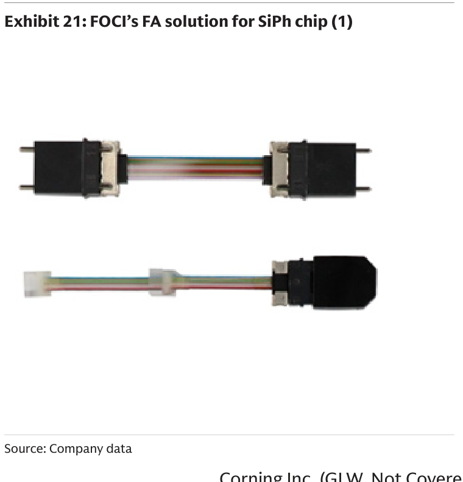

---

## Exhibit 22｜FOCI FA solution for SiPh chip（2）

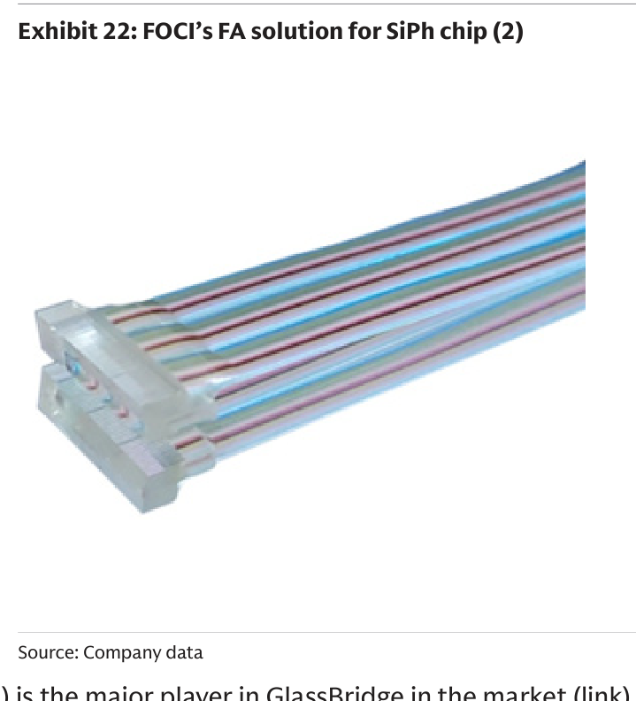

### 解讀摘要（Exhibit 21-22 合）
兩張圖展示 FOCI 的 FA（Fiber Attachment）方案用於 Silicon Photonics chip：一為 FAU to FAU 對插結構，另一為軟性光纖陣列帶（ribbon fiber）連接方式。FOCI 與全球 leading SiPh foundry 共同開發 ReLFACon（reflowable lensed fiber array connector），這個標準化平台能耐受 280°C 回流焊溫度，是進入 SiPh 封裝供應鏈的技術門票。

> **原文補充**：ReLFACon 是 FOCI 和晶圓廠共同開發的 IP platform，使 FOCI 的 FAU 具有 socket-compatible 特性（標準化接口），降低客戶切換到競爭對手的誘因。這是 GS 認為競爭格局相對有利的技術基礎。

---

## Exhibit 23｜FAU 與 GlassBridge 結構比較

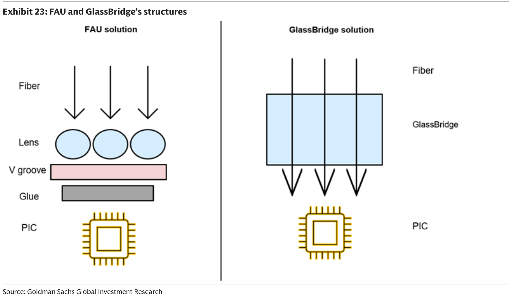

### 解讀摘要
左側 FAU 結構：光纖從上方插入 V-groove（V 型槽），Lens 聚焦對準，透過 Glue 固定，對接 PIC。右側 GlassBridge：利用 IOX（ion-exchange）波導的玻璃基板，光纖從上入射，透過玻璃波導導向 PIC——省略了 V-groove 和 Lens，但需要晶圓級製造精度。結構差異清楚呈現兩者的路徑：FAU 是機械精密組裝（FOCI 的核心能力），GlassBridge 是半導體製程（Corning 的核心能力）。

> **原文補充**：GS 的觀點是 GlassBridge「通道數目前為 24+」而 FAU 已達 40+，且 FAU 持續往 100+ channels 升級。GlassBridge 更適合作為 FAU 的補充方案（在某些 NPO 應用），而非 CPO switch 的直接替代。FAU 的大批量製造成熟度和供應鏈就緒度是 GlassBridge 短期難以複製的優勢。

> **洞察一**：投資者最擔心 GlassBridge 顛覆 FAU，但從技術結構看，兩者解決問題的方式根本不同——FAU 的 V-groove 精密組裝是多通道、量產、已驗證；GlassBridge 的晶圓級製程是新興、低通道數、尚在小批量驗證。若 AI 需求繼續以 512-port switch 為主，通道數要求只會繼續增加，反而利於 FAU。

---

## Exhibit 27｜目標 P/E 倍數來自同業 P/E vs. EPS 成長相關性

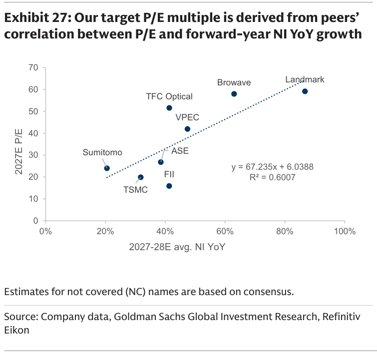

### 解讀摘要
GS 用 peers 的 P/E 對 forward-year NI YoY 成長的線性迴歸（y = 67.235x + 6.0388，R² = 0.60）決定 FOCI 的目標 P/E。FOCI 的 2030-31E 平均 NI YoY 為 15%，代入方程得 target 2030E P/E = 67.235 × 0.15 + 6.0388 ≈ 16.1x（報告取 15.9x）。同業中 Landmark（87% NI YoY，59x P/E）和 Browave（63%，58x）是高成長、高估值代表；FOCI 2030E 成長放緩後（15%），估值收斂至 15.9x 是合理的。

### 表格

| 公司 | 2027E P/E | 2027-28E NI YoY | 評等 |
|---|---|---|---|
| FII | 16 | 41% | Buy |
| TFC Optical | 52 | 41% | Buy |
| ASE | 27 | — | NC |
| TSMC | 20 | — | Buy |
| VPEC | 42 | 47% | Buy |
| Sumitomo | 24 | — | Buy |
| Browave | 58 | 63% | NC |
| Landmark | 59 | 87% | Buy |

> **洞察一**：迴歸 R² = 0.60，有 40% 的方差未被成長率解釋——說明估值還受到「市場對持續性的信心」等因素影響。FOCI 2030E 用 15.9x 定錨，若市場對其成長持續性更有信心，P/E 可能高於迴歸值；反之（GlassBridge 威脅加劇），可能低於此。

---

## Exhibit 29｜FOCI 與同業 PEG 比較

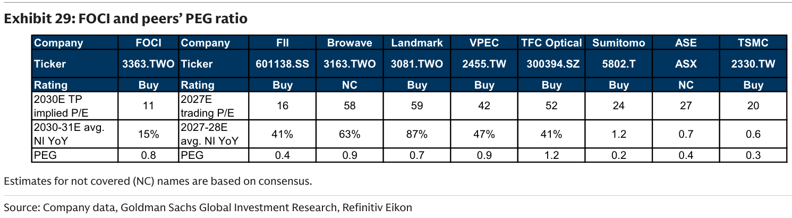

### 解讀摘要
FOCI 的 TP 隱含 2030E P/E = 11x（比 2030E 再往後的成長放緩下），2030-31E 平均 NI YoY = 15%，PEG = 0.8x。同業 PEG 範圍 0.3x（TSMC）到 1.2x（TFC Optical），FOCI 在中位偏低位置。這說明 GS 的估值相對保守——在同業估值框架中 FOCI 的 PEG 打了折扣，反映市場對 FAU 高成長持續性的不確定性。

---

## Exhibit 30｜FOCI 折現 P/E 估值模型

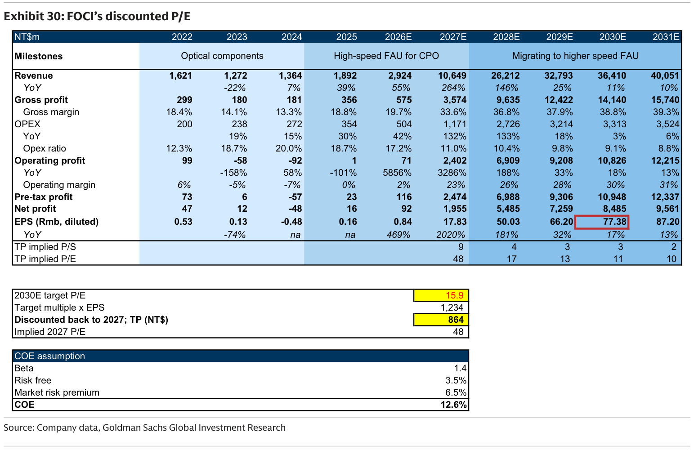

### 解讀摘要
估值推導過程：2030E EPS NT\$77.38 × 15.9x target P/E = NT\$1,234，以 COE 12.6%（Beta 1.4、risk-free 3.5%、MRP 6.5%）折現回 2027E → TP NT\$864（implied 2027E P/E = 48x）。紅框標示的 2030E EPS NT\$77.38 是關鍵錨點。2027E P/E = 48x 乍看高，但對應 2027E NI YoY +2,020%（= EPS 從 0.84→17.83），PEG = 48 / 2020% = 0.02——純成長估值視角下並不貴。

> **值得驗證**：COE 12.6%（Beta 1.4）是否適當？FOCI 是小型成長股（市值 US\$2bn），Beta 1.4 偏低；若用 Beta 1.6-1.7，COE 會升至 14%，TP 折現後約降至 NT\$820-840，影響 ~3-5%，尚在可接受範圍。但若 2030E EPS 本身偏差（最關鍵風險），估值會大幅改變。

---

## 相關個股清單

| 類別 | 公司 | Ticker | 評等 | 備註 |
|---|---|---|---|---|
| 主要受益 | 上詮 FOCI | 3363.TWO | Buy TP NT\$864 | CPO FAU 主要供應商，ReLFACon 平台 |
| CPO switch | Broadcom | AVGO | — | TH5 Bailly / TH6 Davisson 已交貨 |
| CPO switch | Nvidia | NVDA | — | Quantum-X / Spectrum-X 2026 年商業化 |
| CPO switch | Marvell | MRVL | — | 2027 年 204T CPO 取樣 |
| FAU 競爭 | TFC Optical | 300394.SZ | Buy | 同業，2027E P/E 52x |
| FAU 競爭 | Landmark | 3081.TWO | Buy | 2027-28E NI YoY +87% |
| GlassBridge 風險 | Corning | GLW | NC | GlassBridge 24+ channels |
| 光通訊 | Browave | 3163.TWO | NC | 同業，2027E P/E 58x |
