# Morgan Stanley｜ABF Substrates: Pricing Upcycle Is Accelerating

**券商**：Morgan Stanley  
**分析師**：Howard Kao、Irene Yen、Andy Meng, CFA  
**日期**：2026-07-06  
**主題**：ABF Substrates: Pricing Upcycle Is Accelerating  
**評級**：In-Line（Industry View）  
<a href="https://layx.uk/dl?g=產業&b=MS&d=20260706&h=ABF-Pricing-Upcycle">📎 下載 PDF</a>

---

## 報告總結

MS Idea note，以更強更早的ABF定價週期為主軸，同步上調Unimicron、NYPCB、Zhen Ding三家台廠估值。供應鏈調查顯示2Q BT基板漲價20-30%、ABF基板漲10%，遠超此前預期；MS預估2H26將再漲，CY27起進一步加速至25%+ y/y。觸發發報的直接催化劑是Unimicron與NYPCB公布的2Q初步獲利均高於預期，反映高稼動率、良好產品組合與強勁定價共同拉動。

在需求端，本報更新ASIC/GPU底層假設後，ABF S/D缺口從~22%擴大至2030年25%供不應求，尤其AMD GPU 2026e需求上修380%（0.5→2.4M units），是所有品項中幅度最大的修正。MS維持三家OW，首選Unimicron（NT\$1,465，50%上漲空間），其次NYPCB（NT\$1,550，35%），再次Zhen Ding（NT\$690，15%）。

---

## Morgan Stanley 完整投資邏輯鏈

| 論點層次 | Exhibit | 內容 |
|---|---|---|
| 需求全面上修 | 02-06 | Trainium 2027e +47%、Google TPU 2027/28e +30%+、AMD GPU 2026e +380%；所有ASIC/GPU品項均上調 |
| 供給瓶頸確認 | 07-08 | 新產能至少需2年才能上線，2H26前無實質新供給進入市場 |
| S/D缺口擴大 | 07-08 | 2030年ABF供需比達124.6%（前值122.3%）；自2027e起持續供不應求 |
| 定價週期加速 | 封面論點 | BT漲20-30% in 2Q、ABF漲10%；2H26繼續漲；CY27+預估25%+ y/y，CY28 NYPCB估達40%+ |
| 盈利修正 | 20/25/30 | Unimicron 2026/27/28E EPS +25/33/14%；NYPCB 2026/27/28E EPS +36/39/23% |
| **結論** | 封面 | **OW全三家；首選Unimicron（AI ASIC最大曝險）；NYPCB漲價最激進；ZDT估值最低** |

> **報告最大邏輯缺口**：AMD GPU大幅上修（+380%）的具體機制未詳述，MS半導體組來源未公開；若AMD Instinct實際出貨低於預期，S/D缺口擴大的幅度將縮減。

---

## 報告核心觀點

| 主題 | MS 觀點 | 市場共識 | 是否 Contra-Consensus |
|---|---|---|---|
| ABF定價時程 | BT 2Q已漲20-30%；2H26繼續漲；CY28 NYPCB估達40%+ | 市場多預期下半年才開始漲 | 是（更早、更強） |
| AMD GPU需求 | 2026e大幅上修至2.4M（前值0.5M，+380%） | 多數預估AMD AI GPU仍有限 | 是（大幅超市場） |
| 供需缺口 | 2030年25%供不應求，且新產能宣告影響最早CY29才生效 | 部分擔心中長期供給過剩 | 是（更悲觀於供給彈性） |
| 首選 | Unimicron > NYPCB > Zhen Ding | NYPCB漲價激進性或許更有利 | 略有（MS Unimicron first） |

**偏好排序**：Unimicron（50%上漲空間，AI ASIC/server CPU最大市占）> NYPCB（35%，BT漲價最激進）> Zhen Ding（15%）  
**個股偏好**：Unimicron OW PT NT\$1,465（25x CY28 P/E）；NYPCB OW PT NT\$1,550（25x CY28 P/E）；Zhen Ding OW PT NT\$690（20x CY28 P/E）

---

## Exhibit 2｜Amazon Trainium 需求修正

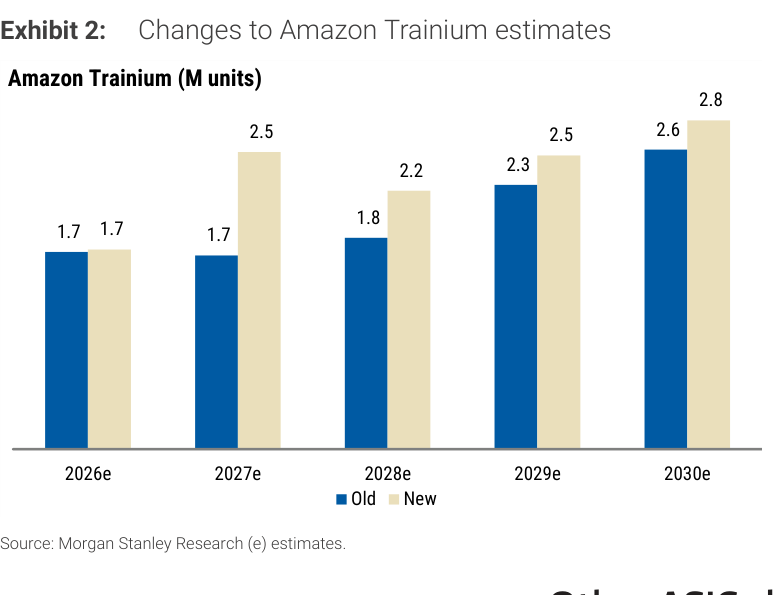

### 解讀摘要

最關鍵的修正集中在2027e（+47%：1.7→2.5M units），顯示Trainium平台的量產爬坡速度被大幅上修。2026e不變（1.7M），代表近端出貨已有能見度，而2-3年維度的加速來自Amazon AI基礎設施資本支出承諾的提前確認。Trainium作為AI ASIC，封裝尺寸大、層數高，單片ABF基板用量顯著高於一般CPU，因此這次修正對ABF基板需求的邊際影響超越單純的單位數變動。

### 表格

| 年度 | Old (M units) | New (M units) | 修正幅度 |
|---|---|---|---|
| 2026e | 1.7 | 1.7 | 0% |
| 2027e | 1.7 | 2.5 | +47% |
| 2028e | 1.8 | 2.2 | +22% |
| 2029e | 2.3 | 2.5 | +9% |
| 2030e | 2.6 | 2.8 | +8% |

> **洞察一**：2027e的大幅上修（+47%）集中在第二年而非第一年，符合「現有訂單已鎖定、新平台擴產確認」的模式——這類修正通常具有較高可信度，因為下游客戶已做出資本承諾。

---

## Exhibit 3｜Google TPU 需求修正

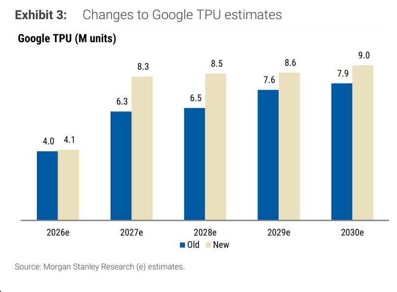

### 解讀摘要

Google TPU的修正較Amazon更全面，2027-2030e均有實質上修，其中2027e與2028e各+32%和+31%。這反映Google在Gemini系列模型訓練與推理端資本支出的加速確認。值得注意的是，2026e幾乎不變（4.0→4.1M），表示近端仍依照原計劃，而後期需求的大幅提升來自推理規模化的新假設。

### 表格

| 年度 | Old (M units) | New (M units) | 修正幅度 |
|---|---|---|---|
| 2026e | 4.0 | 4.1 | +3% |
| 2027e | 6.3 | 8.3 | +32% |
| 2028e | 6.5 | 8.5 | +31% |
| 2029e | 7.6 | 8.6 | +13% |
| 2030e | 7.9 | 9.0 | +14% |

> **洞察一**：Google TPU的修正在2027-28e幅度最大（+30%+），且持續到2029-30e（+13-14%）。這不是一次性上修而是整條曲線拉高，暗示MS半導體組對Google TPU生態系的長期規模有根本性的重新評估。

---

## Exhibit 4｜Other ASIC（含中國AI晶片）需求修正

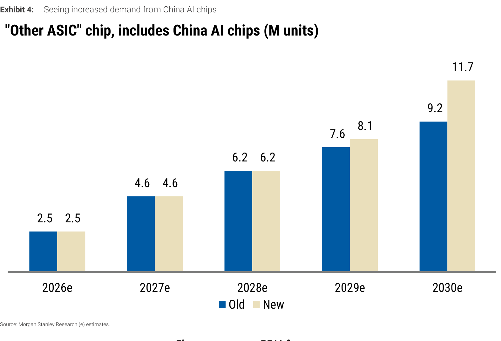

### 解讀摘要

「其他ASIC」類別涵蓋Microsoft、其他美系公司，以及中國AI晶片（華為、寒武紀、海光、平頭哥等）。2026-2028e維持不變，修正全部集中在2029-2030e（+7%和+27%）。根據原文，中國AI晶片TAM在2030年的新估計比前次假設高36%，使該類別2030e達11.7M units（前值9.2M）。這意味著MS已將中國AI算力建設列為ABF基板中長期需求的重要增量來源。

### 表格

| 年度 | Old (M units) | New (M units) | 修正幅度 |
|---|---|---|---|
| 2026e | 2.5 | 2.5 | 0% |
| 2027e | 4.6 | 4.6 | 0% |
| 2028e | 6.2 | 6.2 | 0% |
| 2029e | 7.6 | 8.1 | +7% |
| 2030e | 9.2 | 11.7 | +27% |

> **洞察一**：2026-28e修正為零，說明近中期中國AI晶片出貨量已有明確路徑；2030e的+27%修正主要來自對中國AI晶片長期需求的重新估算，這個數字的不確定性遠高於前三年，屬於「長尾可能性」而非確定性增量。

---

## Exhibit 5｜Nvidia GPU 需求修正

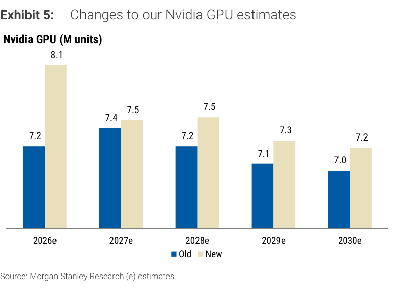

### 解讀摘要

Nvidia GPU的2026e上修最為近端（7.2→8.1M units，+12.5%），其餘年度修正幅度僅1-4%。MS本次同步將Nvidia伺服器CPU產品線（Grace、Vera及後續平台）納入需求模型，這意味著原本GPU的數字已部分反映混合計算需求，此次修正可能低估實際ABF用量增量。

### 表格

| 年度 | Old (M units) | New (M units) | 修正幅度 |
|---|---|---|---|
| 2026e | 7.2 | 8.1 | +13% |
| 2027e | 7.4 | 7.5 | +1% |
| 2028e | 7.2 | 7.5 | +4% |
| 2029e | 7.1 | 7.3 | +3% |
| 2030e | 7.0 | 7.2 | +3% |

> **洞察一**：Nvidia GPU需求曲線在2026e後趨於平穩（7.2-8.1M範圍），非線性成長——這暗示MS的假設是Nvidia GPU每片ABF基板面積持續增加（GB200→Blackwell Ultra→Rubin），而非靠出貨量倍增驅動。

---

## Exhibit 6｜AMD GPU 需求修正

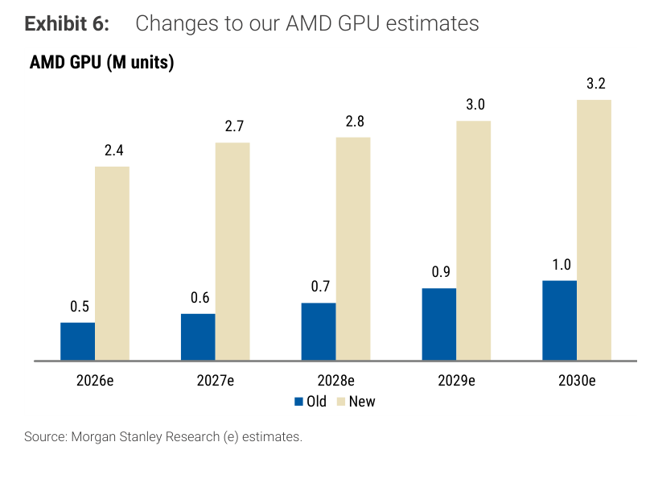

### 解讀摘要

本報最大幅度的需求修正：AMD GPU 2026e從0.5M大幅上修至2.4M units，增幅+380%，且修正延伸至2030e（+220%）。這代表MS對AMD Instinct（MI300/MI400系列）AI GPU市場份額的根本性重新評估，認為AMD在超大規模雲端客戶（尤其Meta、Microsoft Azure）的滲透率遠高於此前假設。AMD GPU單片ABF基板面積與Nvidia GPU相當，意味著此次修正對ABF總需求的邊際貢獻幾乎相當於新增一個中型ASIC類別。

### 表格

| 年度 | Old (M units) | New (M units) | 修正幅度 |
|---|---|---|---|
| 2026e | 0.5 | 2.4 | +380% |
| 2027e | 0.6 | 2.7 | +350% |
| 2028e | 0.7 | 2.8 | +300% |
| 2029e | 0.9 | 3.0 | +233% |
| 2030e | 1.0 | 3.2 | +220% |

> **洞察一**：AMD GPU的修正幅度在本報所有品項中最大，且橫跨2026-2030e全時段一致向上。這不是年度波動，而是一個假設體系的整體重置——從「AMD GPU可忽略不計」到「AMD GPU佔AI GPU的有效份額在15-25%區間」。此一修正若屬實，對Unimicron的正面效益最直接，因Unimicron是AMD AI GPU package substrate的主要供應商。
>
> **值得驗證**：+380%的修正若有誤差（AMD實際出貨僅達1.5M而非2.4M），對ABF S/D缺口的影響較小——因為AMD GPU仍是相對少數的出貨量（vs Nvidia 8.1M）。最大的風險是這個修正有多少已在定價中反映。

---

## Exhibit 7｜ABF 基板供需缺口擴大預測

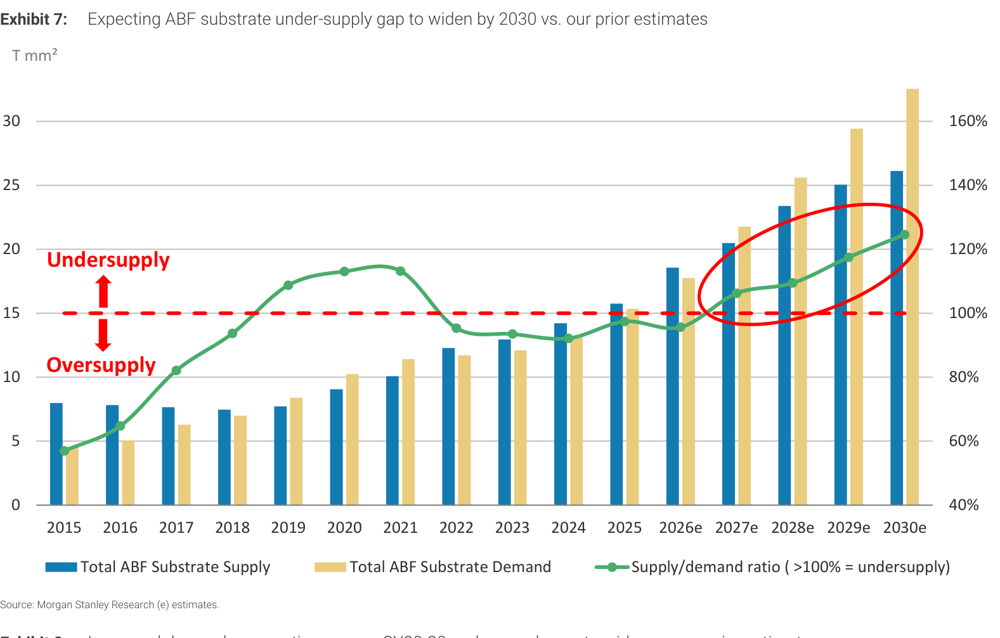

### 解讀摘要

這是本報的核心論點圖。2015-2024年的歷史供需波動印證了ABF基板市場具有明顯週期性：2020-22年COVID驅動的WFH需求造成嚴重供不應求，此後產能擴張導致2023-24年過供。從2026e起，需求（米色棒）將超越供給（藍棒），供需比（綠線）穿越100%線，顯示市場重回供不應求。MS預估2030年達124.6%（即供給僅能滿足80%的需求）。圖中紅圈標示2028-2030e的缺口擴大區域，是整份報告的視覺錨點。

### 表格

視覺估算（T mm²，以Y軸刻度對應）：

| 年度 | 供給（T mm²） | 需求（T mm²） | 供需比 |
|---|---|---|---|
| 2025 | ~18.5 | ~15.0 | <100%（過供） |
| 2026e | ~20.5 | ~21.5 | ~95.6% |
| 2027e | ~23.5 | ~25.0 | ~106.2% |
| 2028e | ~25.0 | ~27.0 | ~109.4% |
| 2029e | ~25.0 | ~29.5 | ~117.5% |
| 2030e | ~26.0 | ~32.5 | ~124.6% |

*以上供需量為視覺估算；供需比取自 Exhibit 8 精確值*

> **洞察一**：2030年需求達~32.5 T mm²，供給僅~26 T mm²，缺口絕對值~6.5 T mm²。即使未來宣告的新產能全數在2029年上線，規模也不足以填補這個缺口——因為ABF基板新產線建設周期至少2年，現在宣告的最快2027年才能生效。
>
> **洞察二（配合 Exhibit 8）**：New vs Old供需比在2029-30e拉開最大差距（New 117.5% vs Old 114.9%；New 124.6% vs Old 122.3%），增量幾乎全部來自需求面修正（AMD GPU、China AI chips），供給面假設未變。

---

## Exhibit 8｜ABF S/D 比值：New vs Old

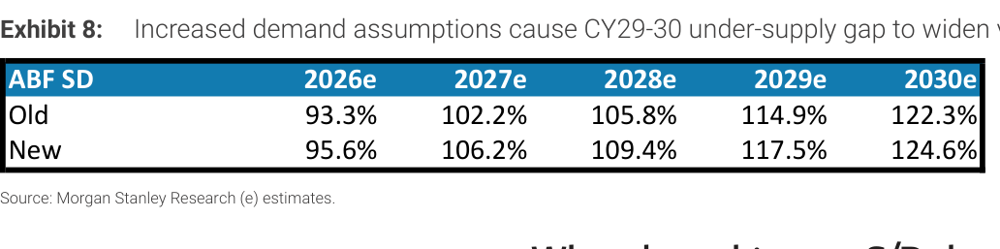

### 解讀摘要

精確的S/D比值對照表，確認2027e起持續供不應求（>100%），且新估值全面高於舊估值。2026e的95.6%（仍為輕微過供）支持定價上漲的市場環境——即便尚未到結構性短缺，供應鏈已開始預期未來缺貨而提前鎖定產能與合約。

### 表格

| 年度 | Old S/D | New S/D | 差異（ppt） |
|---|---|---|---|
| 2026e | 93.3% | 95.6% | +2.3 |
| 2027e | 102.2% | 106.2% | +4.0 |
| 2028e | 105.8% | 109.4% | +3.6 |
| 2029e | 114.9% | 117.5% | +2.6 |
| 2030e | 122.3% | 124.6% | +2.3 |

> **洞察一**：差異在2027-28e最大（+4.0 / +3.6 ppt），而非在離我們最近的2026e——說明本次需求修正（Trainium 2027e +47%、Google TPU 2027/28e +30%+）的影響在第2-3年最明顯，給定價週期帶來更長的可見度。

---

## Exhibit 9｜2Q26 法說日曆

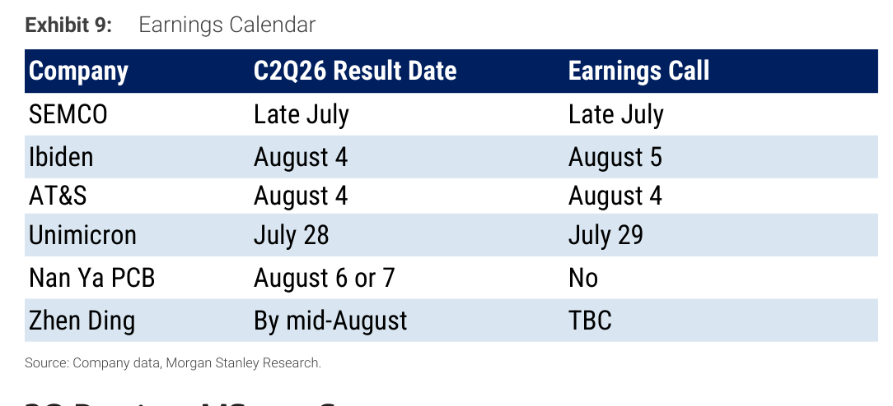

### 解讀摘要

ABF基板產業鏈各家2Q26業績發布時程。Unimicron最早（7月28/29日），SEMCO也在7月底，其餘集中在8月初至中旬。對市場而言，Unimicron的法說是最接近的催化劑，且MS的2Q GM預估比街道高80bps，若實際毛利率超預期，將進一步強化本報的定價加速論點。

> **原文補充**：NYPCB法說無earnings call（只公布結果），Zhen Ding時程TBC，法說時程的不確定性可能短期壓低ZDT相對表現。

### 表格

| 公司 | 2Q26 業績日 | 法說 |
|---|---|---|
| SEMCO | Late July | Late July |
| Ibiden | August 4 | August 5 |
| AT&S | August 4 | August 4 |
| Unimicron | July 28 | July 29 |
| Nan Ya PCB | August 6 or 7 | No |
| Zhen Ding | By mid-August | TBC |

> **洞察一**：Unimicron是本輪法說最早公告的主要ABF台廠，MS同時是最看好Unimicron的（首選），若Unimicron 2Q毛利率確認MS預估（22.1%，比街道高80bps），可望啟動整個ABF板塊的估值重估。

---

## Exhibit 17｜ABF 基板七個時代

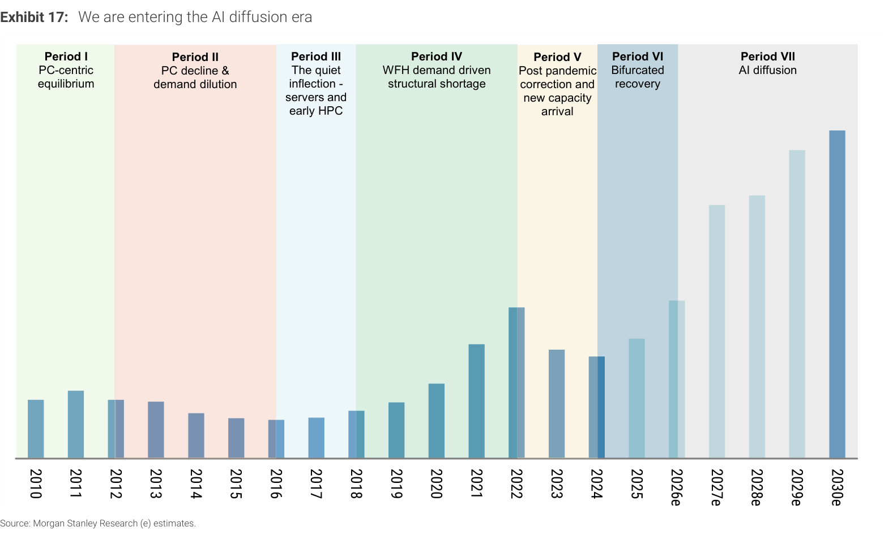

### 解讀摘要

MS以七個歷史時期框架解讀ABF基板市場，提供本輪多頭的結構性敘事：PC主導（Period I）→ PC衰退（II）→ 伺服器靜悄悄崛起（III）→ WFH爆發（IV）→ 疫後修正（V）→ 分岐復甦（VI）→ AI擴散（VII，2026-30e）。圖中Y軸無刻度標籤，為相對量的呈現，但搭配Exhibit 18的絕對量數字可完整還原每個時期的規模。Period VII的預測棒狀圖顯示2026e開始快速爬升，2030e接近歷史最高點的3倍以上。

> **原文補充**：Period VII的描述原文：「Demand for AI proliferates from training to inference, driving ABF substrate market growth to re-accelerate over the next five years after a two-year downcycle following the Covid-19 pandemic.」強調本輪上行的特殊性在於「training→inference擴散」這個新需求結構，而非僅是WFH需求的重演。

> **洞察一（配合 Exhibit 18）**：Period IV（2018-22）的WFH驅動週期讓市場從~US\$3.5bn成長至~US\$9.2bn（峰值），歷時4年、約2.6倍。Period VII（2026-30e）若24.4% CAGR成立，則從US\$7.3bn成長至US\$20bn，約2.7倍——規模與幅度相近，但驅動因子結構更穩固（AI推論需求vs WFH）。

---

## Exhibit 18｜ABF 基板總市場規模（2015-2030e）

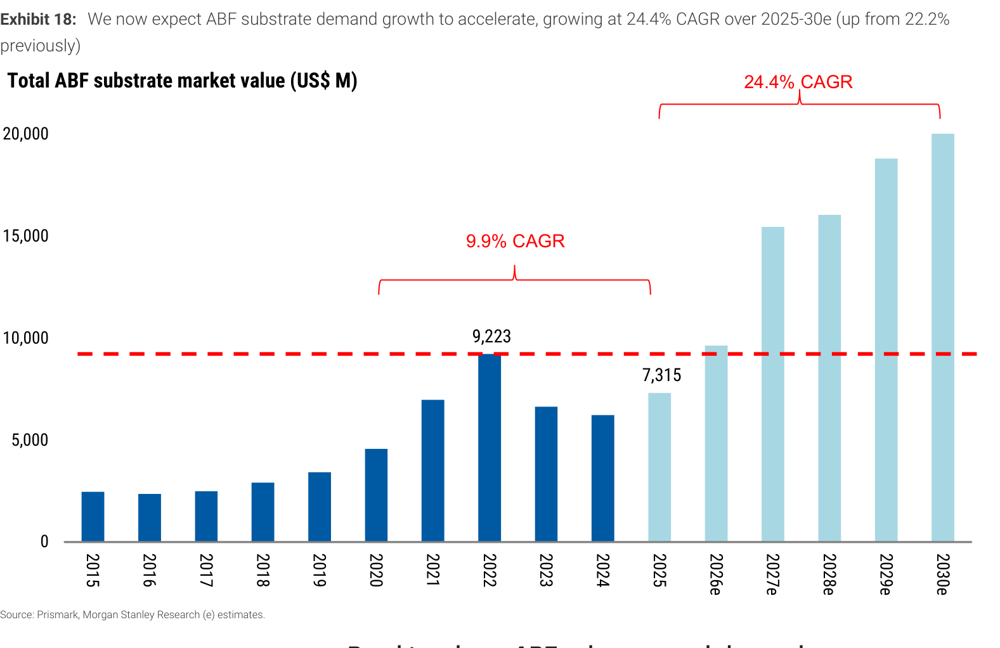

### 解讀摘要

ABF基板市場以US\$計的絕對規模走勢。2015-2025年的複合成長率僅9.9%（PC降權抵消了部分AI/server增量），而2025-2030e的預估CAGR跳升至24.4%（從前值22.2%上調）。市場從2025年的低谷US\$7,315M重回2026e的~US\$9,500M，並在2030e達~US\$20,000M，實現絕對金額史上新高。

### 表格

| 年度 | 市場規模（US\$ M） | 備注 |
|---|---|---|
| 2022 | 9,223 | 歷史峰值 |
| 2025 | 7,315 | 本輪低谷 |
| 2026e | ~9,500 | 重越峰值 |
| 2027e | ~15,500 | — |
| 2028e | ~16,000 | — |
| 2029e | ~19,000 | — |
| 2030e | ~20,000 | 峰值約2.7x |

*2026e-2030e為視覺估算*

> **洞察一**：CAGR從22.2%上調至24.4%，差距看似不大，但以5年複利計算，2030e市場規模差異達~US\$1.3-1.5bn（約US\$18.5bn vs US\$20bn），足以影響Unimicron/NYPCB/ZDT各一至兩個百分點的市占敏感性。
>
> **值得驗證**：US\$20bn的2030e預測是基於單價上漲（定價週期）+ 量增（AI/server需求）的雙重驅動。若ABF定價在2028年達到平衡後不再上漲，則規模目標需向下修正。

---

## Exhibit 19｜ABF 基板終端需求結構轉移

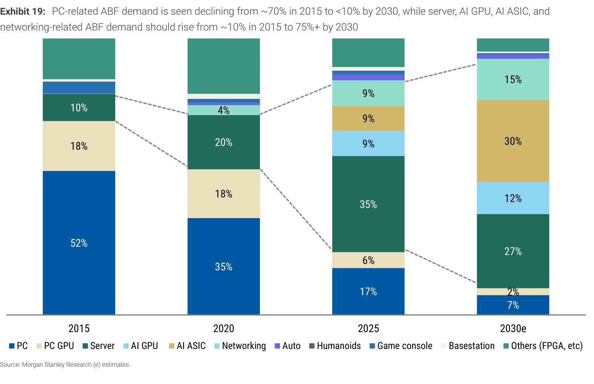

### 解讀摘要

最清晰呈現ABF基板結構性轉變的圖表：PC相關（PC CPU + PC GPU）從2015年的70%+驟降至2030e的<10%；Server + AI GPU + AI ASIC + Networking從2015年的~10%升至2030e的75%+。2025年已是轉折點後段——AI ASIC與Server各佔9%和35%，合計44%，超越PC（17%+6%=23%）。2030e的最大單一驅動是AI ASIC（30%），超過Server（27%），反映訓練/推論晶片封裝需求已成結構性主力。

### 表格

| 終端市場 | 2015 | 2020 | 2025 | 2030e |
|---|---|---|---|---|
| PC | 52% | 35% | 17% | 7% |
| PC GPU | 18% | 18% | 6% | 2% |
| Server | 10% | 20% | 35% | 27% |
| AI GPU | — | — | 9% | 12% |
| AI ASIC | — | — | 9% | 30% |
| Networking | — | 4% | 9% | 15% |
| Auto | — | — | — | — |
| Humanoids | — | — | — | — |
| Others | ~20% | ~23% | ~15% | ~7% |

*Auto/Humanoids/Game console/Basestation 佔比極小，合入 Others 估算；實際各項數字見原圖*

> **洞察一**：AI ASIC在2030e達30%，超越Server（27%），這是本報最重要的結構性預測。AI ASIC比Server CPU的package substrate面積更大、層數更高、良率更難，對ABF基板廠的技術壁壘要求更高——Unimicron現有最高的AI ASIC曝險，這是MS首選它的根本原因。
>
> **洞察二**：Networking從4%（2020）→9%（2025）→15%（2030e），成長軌跡與AI基礎設施建設高度連動，且往往被市場忽視——對有Networking substrate曝險的廠商是安靜的受益項。

---

## 跨 Exhibit 彙整表

### 彙整 1｜各終端需求修正對ABF S/D的貢獻

來源：Exhibit 02-06（需求修正），Exhibit 07-08（S/D模型）

| 品項 | 2026e修正 | 2030e修正 | 對S/D缺口影響時段 |
|---|---|---|---|
| Amazon Trainium | 0% | +8% | 2027e起 |
| Google TPU | +3% | +14% | 2027e起 |
| Other ASIC（含中國AI） | 0% | +27% | 2029e起 |
| Nvidia GPU | +13% | +3% | 2026e即時 |
| AMD GPU | +380% | +220% | 2026e起，全時段最大 |

> AMD GPU是本次S/D缺口擴大幅度最大的單一驅動因子：從Old 0.5M→New 2.4M（2026e），若AMD GPU與Nvidia GPU的ABF content相當（同為HPC級ASIC），則AMD修正等同於增加~1.9M片大型ABF基板需求，是其他任何單一品項修正量的數倍。

---

## 相關個股清單

| 公司 | Ticker | 評等 | 目標價 | 備注 |
|---|---|---|---|---|
| Unimicron | 3037.TW | OW | NT\$1,465 | 首選，AI ASIC/server CPU最大市占，25x CY28 P/E |
| Nan Ya PCB | 8046.TW | OW | NT\$1,550 | BT漲價最激進，NYPCB，25x CY28 P/E |
| Zhen Ding | 4958.TW | OW | NT\$690 | 第三順位，20x CY28 P/E |
| Ibiden | 4062.T | UW | JPY13,000 | 日本廠，MS看空 |
| SEMCO | 009150.KS | OW | KRW2,560,000 | 韓廠，覆蓋 |
| AT&S | ATSV.VI | NC | — | 歐廠，宣告在馬來西亞Kulim擴產，未被MS覆蓋 |
| Kinsus | 3189.TW | NC | — | 台廠，未被MS覆蓋 |
