# MS｜Connecting Dots in Tech Supply Chain: CoPoS, T-Glass/TPU, GlassBridge/FAU

**券商**：Morgan Stanley  
**分析師**：Charlie Chan、Andy Meng CFA、Derrick Yang、Howard Kao、Yoshihito Hasegawa、Shoji Sato、Shawn Kim、Tiffany Yeh、Daniel Yen CFA、Daisy Dai CFA  
**日期**：2026-07-06  
**主題**：跨供應鏈「連接點」分析：CoPoS 時程、T-Glass/TPU 需求、GlassBridge vs FAU  
**評級**：Attractive（科技供應鏈整體）  
<a href="https://layx.uk/dl?g=產業&b=MS&d=20260706&h=Tech-Supply-Chain">📎 下載 PDF</a>

---

## 報告總結

MS 此報告聚焦三個常被市場隔離看待、但互有關聯的問題：(1) T-Glass 短缺是否限制 MediaTek TPU 出貨？(2) TSMC CoPoS 是否提前至 2028？(3) Corning GlassBridge 是否威脅 FAU 廠？觸發點是 6 月 24 日 Corning 正式在首爾發表 GlassBridge，及近期媒體報導 TSMC CoPoS 可能提前。ABF 供需更新（2030E S/D ratio 從 114.6% 調升至 122.3%）顯示缺口比先前預期更深，係本報告最具數字更新意義的部分。三個問題的結論均偏建設性：T-Glass 由 Nitto Boseki 源頭突破解決（MediaTek 上調至 3mn units 2027E）；CoPoS 有一定提前可能但技術瓶頸在 Innolux TGV（2028 為小概率）；GlassBridge 補充而非取代 FAU，MS 維持 CPO enablers OW。

---

## MS 完整投資邏輯鏈

| 論點層次 | Exhibit | 內容 |
|---|---|---|
| 需求更新：ABF 缺口擴大 | Exhibit 3–4 | 2030E ABF S/D ratio 從 114.6% 上修至 122.3%，主因 AI GPU 組裝需求上調 |
| 結構突破：T-Glass 供應解鎖 | Exhibit 2 | Nitto Boseki 為 Google TPU T-Glass 主供，MediaTek 成功增加配給 → 3nm ZebraFish TPU 2027E 上修至 3mn units |
| 技術分水嶺：CoPoS vs CoWoS | Exhibit 5–7 | AP7（嘉義）為主 CoPoS 廠；2029 基案，Feynman 2028 有小概率提前；Innolux TGV 為關鍵瓶頸 |
| 競爭澄清：GlassBridge 補充非替代 | Exhibit 12–13 | TSMC COUPE 主流仍走 grating coupling；GlassBridge 目前僅支援 edge coupling + 1D fiber；FAU TAM 長期略有風險但 2H26 量產優先 |
| 偏好排序 | Exhibit 1 | FOCI / TSMC / Nitto Boseki / Unimicron / Zhen Ding / MediaTek 均 OW；Ibiden 維持 UW |
| **結論** | 封面 | **三個爭議澄清後均偏建設性，ABF 缺口擴大量化最具意義；CPO enablers 持續 OW** |

> **報告最大邏輯缺口**：CoPoS 2028 提前的技術瓶頸（TGV scrapping rate）未給量化數字；GlassBridge 在 TSMC COUPE platform 的採用時程亦無明確時間點。

---

## 報告核心觀點

| 主題 | MS 觀點 | 市場共識 | 是否 Contra-Consensus |
|---|---|---|---|
| T-Glass / MediaTek TPU | Nitto Boseki 解鎖供給 → 3mn units 2027E | 擔心 T-Glass 缺貨限制出貨 | 否（澄清非 bottleneck） |
| CoPoS 時程 | 基案 2029，Feynman 2028 只有小概率 | 媒體報導偏向 2028 樂觀 | 稍偏保守 |
| GlassBridge vs FAU | 補充而非取代，2026 CPO 量產 GlassBridge 尚遠 | 部分市場擔憂 FAU 被替代 | Contra（對 FAU 更友善） |
| ABF 供需 | 2030E 缺口擴大至 122.3% | 前次模型 114.6% | 上修（更缺） |

**偏好排序**：CPO enablers（FOCI OW）> ABF 基板（Unimicron/Zhen Ding/Nan Ya PCB OW）> CoPoS 相關（Innolux EW，等待 TGV 確認）  
**個股偏好**：FOCI (OW, 3363)、TSMC (OW, 2330)、MediaTek (OW, 2454)、Unimicron (OW, 3037)、Nan Ya PCB (OW, 8046)、Zhen Ding (OW, 4958)

---

## Exhibit 1｜Key Asian supply chain companies under our coverage

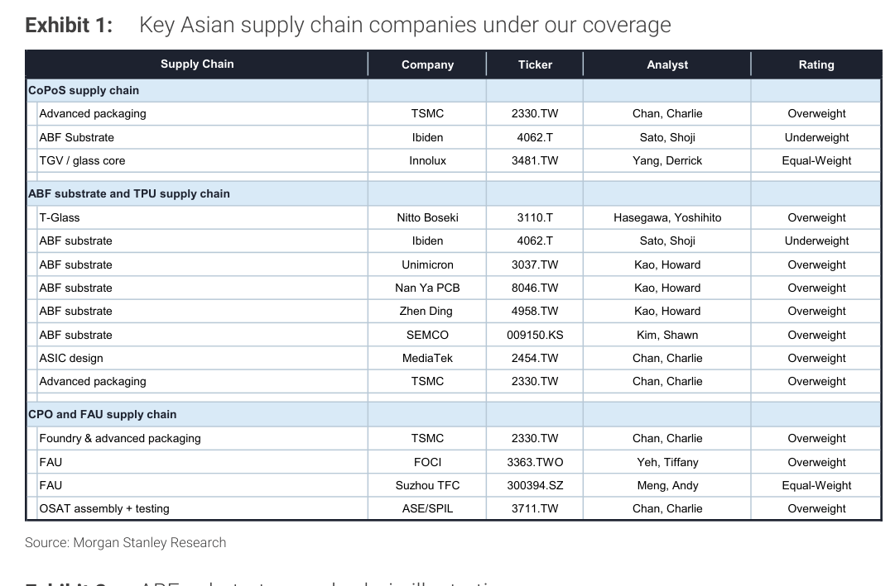

### 解讀摘要
MS 首次彙整三條供應鏈（CoPoS/ABF-TPU/CPO-FAU）的覆蓋個股，明確顯示評等立場差異：Ibiden 雖是 CoPoS ABF substrate 主力，評等 UW（反映近期無成長催化劑）；Innolux 負責 TGV，EW（執行風險高）；FAU 廠中 FOCI OW、Suzhou TFC EW。這個評等分布說明 MS 在 CoPoS 供應鏈上並非一刀切樂觀——ABF 基板上游因 2028-2029 才量產而現在未被充分定價。

### 表格

| 供應鏈 | 零件角色 | 公司 | Ticker | 分析師 | 評等 |
|---|---|---|---|---|---|
| **CoPoS** | 先進封裝 | TSMC | 2330.TW | Charlie Chan | OW |
| **CoPoS** | ABF 基板 | Ibiden | 4062.T | Shoji Sato | UW |
| **CoPoS** | TGV/glass core | Innolux | 3481.TW | Derrick Yang | EW |
| **ABF/TPU** | T-Glass | Nitto Boseki | 3110.T | Yoshihito Hasegawa | OW |
| **ABF/TPU** | ABF 基板 | Ibiden | 4062.T | Shoji Sato | UW |
| **ABF/TPU** | ABF 基板 | Unimicron | 3037.TW | Howard Kao | OW |
| **ABF/TPU** | ABF 基板 | Nan Ya PCB | 8046.TW | Howard Kao | OW |
| **ABF/TPU** | ABF 基板 | Zhen Ding | 4958.TW | Howard Kao | OW |
| **ABF/TPU** | ABF 基板 | SEMCO | 009150.KS | Shawn Kim | OW |
| **ABF/TPU** | ASIC 設計 | MediaTek | 2454.TW | Charlie Chan | OW |
| **ABF/TPU** | 先進封裝 | TSMC | 2330.TW | Charlie Chan | OW |
| **CPO/FAU** | 封裝+先進封裝 | TSMC | 2330.TW | Charlie Chan | OW |
| **CPO/FAU** | FAU | FOCI | 3363.TWO | Tiffany Yeh | OW |
| **CPO/FAU** | FAU | Suzhou TFC | 300394.SZ | Andy Meng | EW |
| **CPO/FAU** | OSAT 組裝/測試 | ASE/SPIL | 3711.TW | Charlie Chan | OW |

---

## Exhibit 2｜ABF substrate supply chain illustration

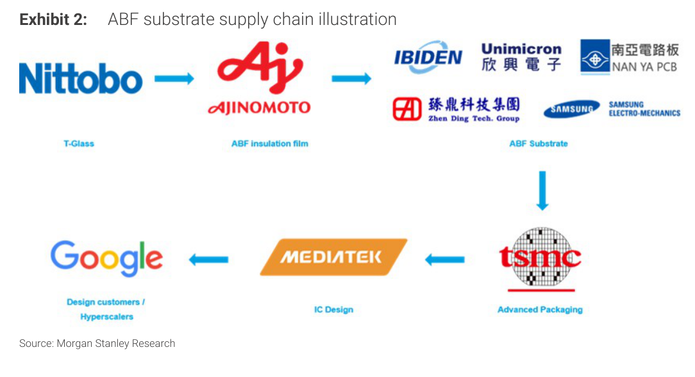

### 解讀摘要
這張供應鏈圖把 ABF 和 T-Glass 的角色串起來：Nittobo（T-Glass 原料）→ Ajinomoto（ABF 絕緣膜）→ 多家基板廠 → TSMC（先進封裝）→ MediaTek（IC 設計）→ Google/Hyperscalers。T-Glass 是 Nittobo 的核心業務，供給量直接決定整條 TPU 基板供應鏈的速度，這正是為什麼 MediaTek 需要主動與 Nittobo 協調配給。

---

## Exhibit 3｜Expecting ABF substrate under-supply gap to widen by 2030 vs. our prior estimates

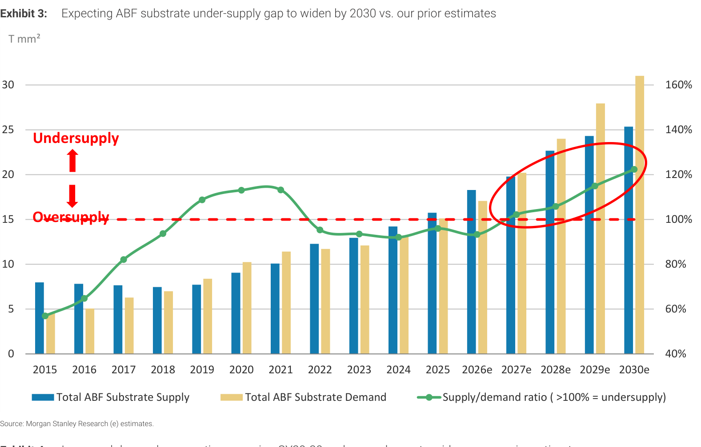

### 解讀摘要
2026-2027 年 ABF 供需比徘徊在 102-103%（輕微缺貨），2028 年開始加速擴大至 122.3%（2030E），比先前模型的 114.6% 深出近 8ppt。缺口擴大的機制是需求端上調（Nvidia GB300/Rubin rack 部署量增加 + MediaTek TPU 3mn units 上修）而非供給端縮減。這意味 Unimicron/Nan Ya PCB/Zhen Ding 等台灣 ABF 廠的定價權在 2028 年後有望逐步回升。

### 表格（視覺估算，已交叉驗證 Exhibit 4）

| 年份 | 供給（T mm²） | 需求（T mm²） | S/D 比率 | 狀態 |
|---|---|---|---|---|
| 2021 | 10 | 11 | 106% | 缺貨 |
| 2022 | 12 | 11 | 94% | 過剩 |
| 2023 | 13 | 12 | 92% | 過剩 |
| 2024 | 14 | 13 | 93% | 平衡 |
| 2025 | 16 | 15 | 94% | 平衡 |
| 2026e | 18 | 17 | 93% | 輕微過剩 |
| 2027e | 20 | 20 | 102% | 進入缺貨 |
| 2028e | 23 | 24 | 106% | 缺貨擴大 |
| 2029e | 24 | 28 | 115% | 明顯缺貨 |
| 2030e | 25 | 31 | 122% | 嚴重缺貨 |

*以上柱狀圖視覺估算，交叉驗證 Exhibit 4 表格數據

> **洞察一**：2027 年是供需翻轉的關鍵年（S/D 突破 100%），對應 Nvidia Rubin rack 量產元年；此後每年需求增速均超過供給，意味著 ABF 基板廠的議價能力將從 2027 年開始持續提升，這與現在市場認為 2026 年仍有庫存壓力的看法存在結構性差異。

---

## Exhibit 4｜Increased demand assumptions causing CY29-30 under-supply gap to widen

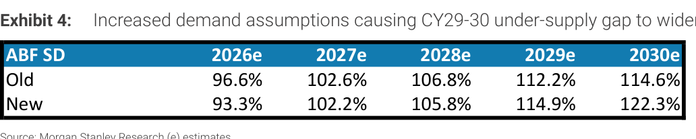

### 解讀摘要
本次上修的幅度在 2030E 最大（+7.7ppt：114.6% → 122.3%），2026-2028E 反而略微下修（反映短期需求微調），說明 MS 對近期需求確定性偏保守，但對 2029-2030 年的長期需求更樂觀。這種「近保守、遠樂觀」的模型結構意味著 ABF 基板的投資邏輯需要長線等待，不是一個今年就有強催化劑的主題。

### 表格

| ABF S/D（供需比） | 2026e | 2027e | 2028e | 2029e | 2030e |
|---|---|---|---|---|---|
| 舊估計 | 96.6% | 102.6% | 106.8% | 112.2% | 114.6% |
| 新估計 | 93.3% | 102.2% | 105.8% | 114.9% | 122.3% |
| 差異 | -3.3ppt | -0.4ppt | -1.0ppt | +2.7ppt | +7.7ppt |

> **洞察二（配合 Exhibit 3）**：2026-2028 近期下修 + 2029-2030 遠期上修的「V 型調整」結構，說明 MS 模型的上修並非線性需求提升，而是 2028 年後某一批大型 Nvidia/ASIC GPU 部署帶動的脈衝式需求——一旦這些專案落地，缺口將陡升。Ibiden UW 評等在這個框架下合理：長期缺口擴大但 2027 年前仍無明顯催化劑。

---

## Exhibit 5｜TSMC's advanced packaging fab planning

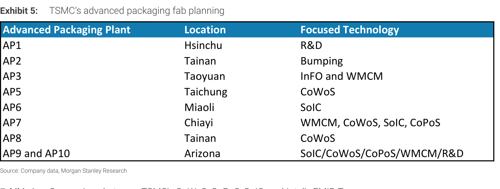

### 解讀摘要
AP7（嘉義）是唯一同時承載 WMCM + CoWoS + SoIC + CoPoS 的廠，是下一代先進封裝的核心節點；AP9/AP10（Arizona）則是海外備份，複製相同技術組合。AP5（台中）和 AP8（台南）則專注 CoWoS 擴產。CoPoS 在廠址規劃上已有明確佈局，AP7 地理位置緊鄰 Innolux 的 TGV 工廠（台南），符合緊密協作的需求。

### 表格

| 廠區 | 地點 | 聚焦技術 |
|---|---|---|
| AP1 | 新竹 | R&D |
| AP2 | 台南 | Bumping |
| AP3 | 桃園 | InFO + WMCM |
| AP5 | 台中 | CoWoS |
| AP6 | 苗栗 | SoIC |
| **AP7** | **嘉義** | **WMCM, CoWoS, SoIC, CoPoS** |
| AP8 | 台南 | CoWoS |
| AP9+AP10 | 亞利桑那 | SoIC/CoWoS/CoPoS/WMCM/R&D |

---

## Exhibit 6｜Comparison between TSMC's CoWoS, CoPoS, SoIC, and Intel's EMIB-T

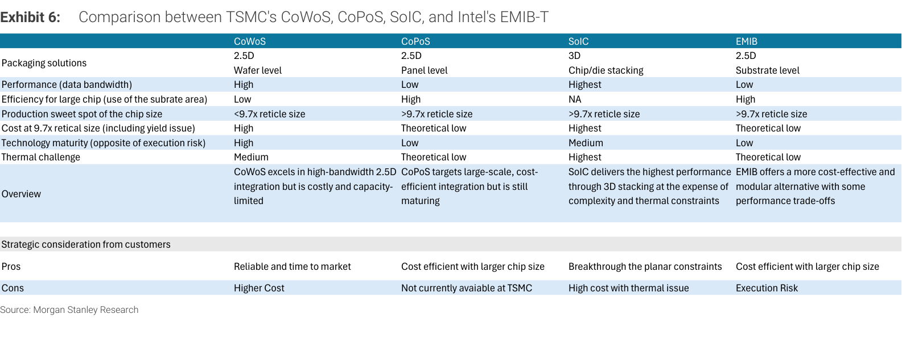

### 解讀摘要
CoWoS 的核心矛盾是「高性能但高成本且容量受限」，這正是 Intel EMIB-T 和 TSMC CoPoS 乘虛而入的空間——兩者都針對 >9.7x reticle 的大晶片。CoPoS 的成本理論上低於 CoWoS，但技術成熟度（低）和執行風險（高）是當前最大的不確定性。SoIC 3D 堆疊性能最高但成本最貴、熱管理最複雜，適合極高效能場景。Intel EMIB-T 提供類似 CoPoS 的成本效益但走基板路線。

### 表格

| 維度 | CoWoS | CoPoS | SoIC | Intel EMIB-T |
|---|---|---|---|---|
| 封裝層次 | 2.5D 晶圓級 | 2.5D 面板級 | 3D 晶片堆疊 | 2.5D 基板級 |
| 數據頻寬 | 高 | 低 | 最高 | 低 |
| 大晶片面積效率 | 低 | 高 | N/A | 高 |
| 適用晶片尺寸 | <9.7x reticle | >9.7x reticle | >9.7x reticle | >9.7x reticle |
| 9.7x 尺寸成本 | 高 | 理論低 | 最高 | 理論低 |
| 技術成熟度 | 高 | 低 | 中 | 低 |
| 熱挑戰 | 中 | 理論低 | 最高 | 理論低 |
| 目前 TSMC 可用？ | 是 | 否（開發中） | 是 | N/A |

> **洞察三**：CoPoS 在 >9.7x reticle 晶片（下一代 AI GPU/ASIC 的方向）上有明確的成本和面積優勢，但「Not currently available at TSMC」這條是關鍵限制。Intel EMIB-T 目前是 CoPoS 的最直接競品——且 Intel 已有現成商業化版本——這正是 TSMC 有動機提前 CoPoS 的壓力來源。

---

## Exhibit 7｜CoWoS, CoPoS and FoPLP comparison

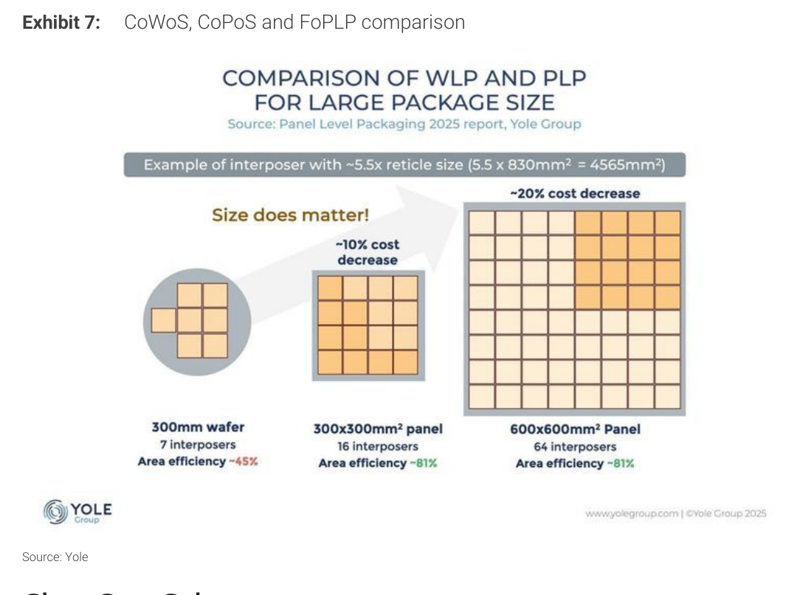

### 解讀摘要
面板製程的面積效率核心優勢：300mm 晶圓只能放 7 個 interposer（面積效率 45%），但切換到 300×300mm² 面板後放 16 個（效率 81%），再大到 600×600mm² 面板則放 64 個（效率同樣 81%）。面板尺寸 4 倍大 → interposer 數量 4 倍（因效率相同），這正是 FoPLP/CoPoS 的規模成本優勢來源——邊角浪費率從 55% 降至 19%。

### 表格

| 基材 | 尺寸 | Interposers 數 | 面積效率 | vs 晶圓 |
|---|---|---|---|---|
| 300mm 晶圓 | 圓形 | 7 | 45% | 基準 |
| 300×300mm² 面板 | 方形 | 16 | 81% | +2.3x |
| 600×600mm² 面板 | 方形 | 64 | 81% | +9.1x |

---

## Exhibit 8｜Glass Core Substrate vs. Traditional Organic Substrate

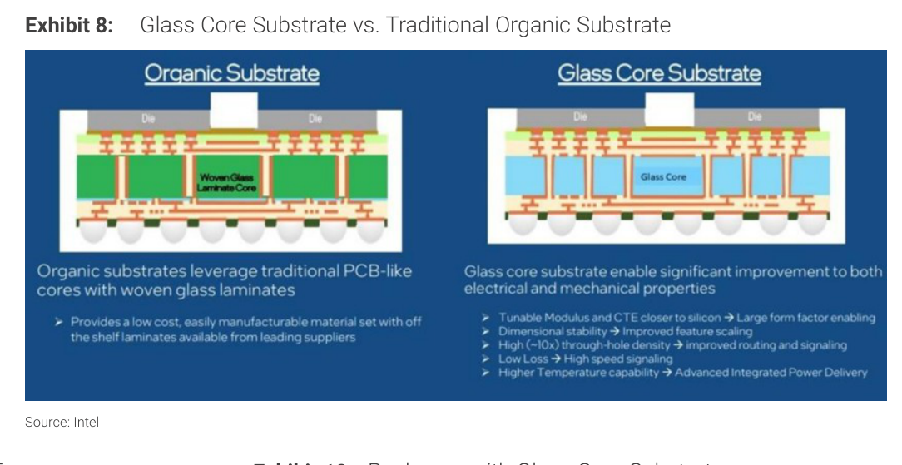

### 解讀摘要
玻璃核心基板（Glass Core Substrate）與傳統有機基板的關鍵差異在於「通孔密度 10 倍提升（TGV vs PTH）」和「CTE 更接近矽晶片」。TGV 密度提升意味著更多 I/O、更細的訊號路由；CTE 接近矽則解決高溫下封裝翹曲問題，這對大面積 GPU 封裝（>9.7x reticle）的良率至關重要。對 Innolux 而言，TGV 形成和銅電鍍是其需要新設備的技術挑戰。

---

## Exhibit 9｜Glass Core Substrates in Panel Form

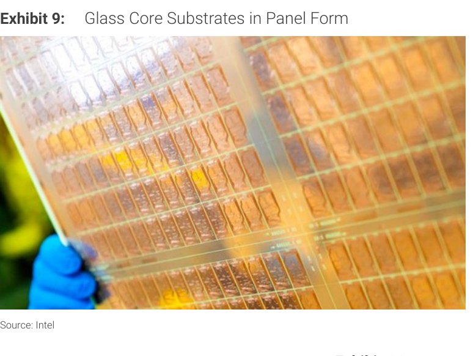

### 解讀摘要
Intel 的面板形式玻璃核心基板實物照片，展示大面積面板的可行性。這是工業規模製造的關鍵視覺證據——玻璃面板可以做到類似 LCD 面板的大尺寸，這正是 CoPoS 面板級封裝的材料基礎。Innolux 的顯示面板廠優勢（510mm×515mm 面板能力）為其承接 TSMC TGV 任務提供了製程基礎設施上的可行性。

---

## Exhibit 10｜Packages with Glass Core Substrates

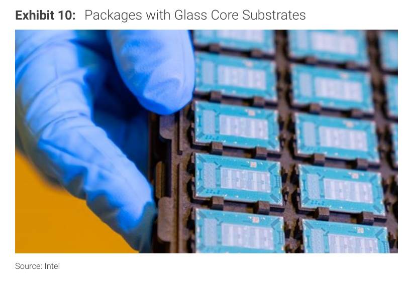

### 解讀摘要
Intel 展示的玻璃核心基板封裝成品，說明這項技術已有可見的量產形式（Intel 先於 TSMC 商業化）。這也是 MS 強調 TSMC 有動機提前 CoPoS 的外部壓力脈絡——競爭對手已有實體產品，TSMC 若持續延後，大型 AI ASIC 客戶可能轉向 Intel EMIB-T。

---

## Exhibit 11｜TGV on Glass Core Substrate

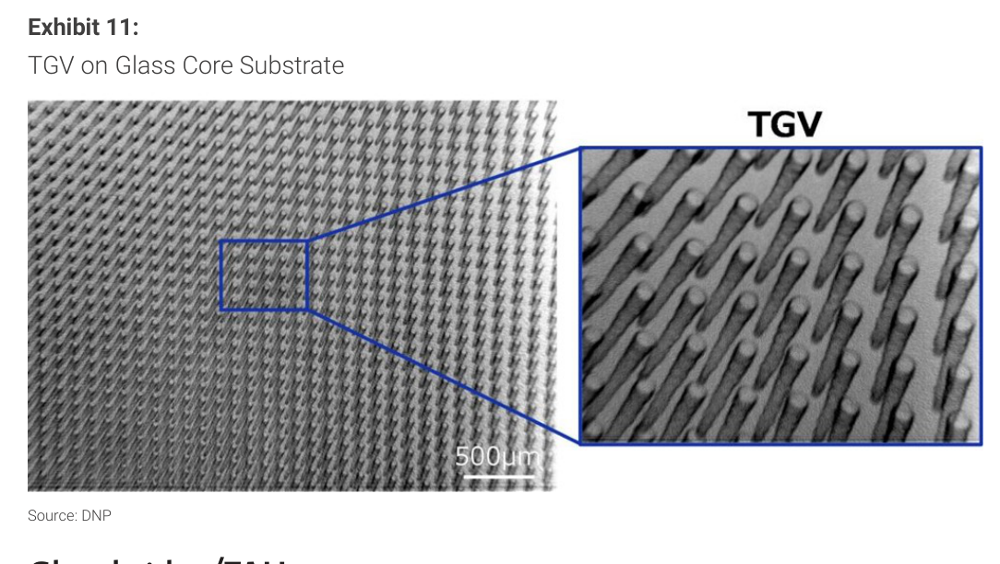

### 解讀摘要
DNP（大日本印刷）的 TGV SEM 顯微影像，顯示間距 500μm 的通孔陣列結構。TGV（Through Glass Via）是玻璃核心基板的核心製程——在玻璃板上鑽出精密通孔後再銅電鍍。這個步驟的良率決定 CoPoS 的成本競爭力，也是 MS 認為 Innolux 技術挑戰最大的環節（需採購新設備且玻璃易碎）。

---

## Exhibit 12｜GlassBridge core product features

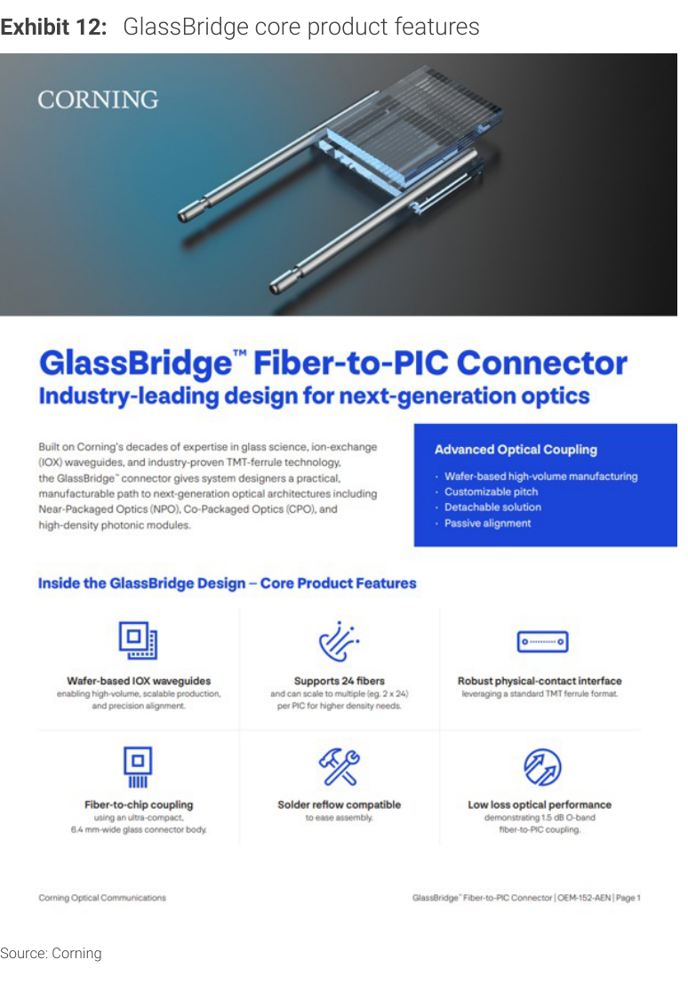

### 解讀摘要
Corning 6 月 24 日在首爾正式發表 GlassBridge，主要賣點：wafer-based IOX 波導、24 fibers/connector（可擴展至 2×24）、TMT ferrule 物理接觸介面、solder reflow 相容。與 FAU 的最大差異是「被動對準（passive alignment）」和「晶圓級製造」——FAU 需手工組裝，GlassBridge 的晶圓製造路線理論上可更便宜更精確。但 24 channels 仍低於 FOCI FAU 的 40+ channels。

> **原文補充**：Corning GlassBridge 在 NPO 和 CPO 均可使用，AI transceiver 廠商（如 Eoptolink）所受衝擊有限，因為 GlassBridge 是 Fiber-to-PIC，不取代光收發模組本身。

---

## Exhibit 13｜GlassBridge supports NPO and CPO architectures

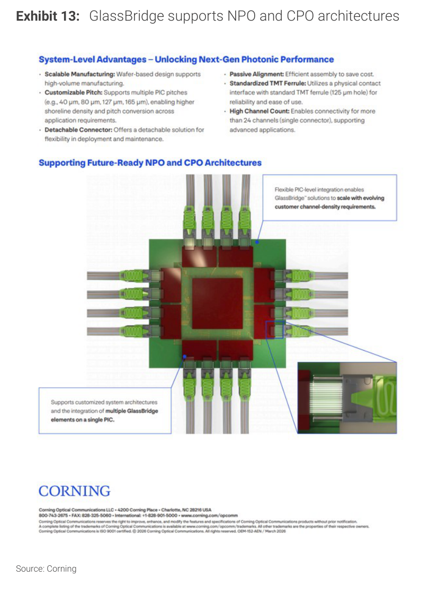

### 解讀摘要
GlassBridge 的系統架構優勢：可 customizable pitch（40/80/127/165 μm 多選）、支援 high channel count（>24 channels，單一 connector 可達更高密度）、detachable solution（可拆卸，運維友善）。但圖中也顯示 GlassBridge 目前的形態是「多個 GlassBridge element 在單一 PIC 上」，代表現在是面向單一 PIC 耦合而非整個 switch 系統——這限制了它與 FAU 直接競爭的場景。

---

## Exhibit 14｜"Optics on Interposer"

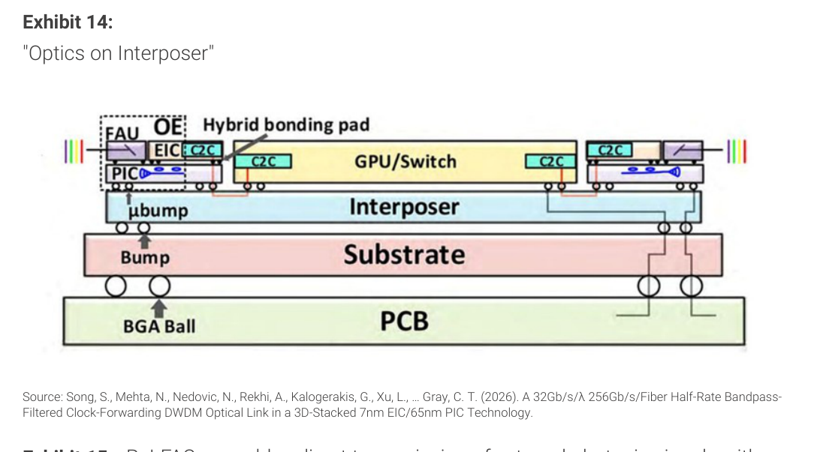

### 解讀摘要
「Optics on Interposer」架構圖顯示 CPO 系統的物理集成方式：FAU + 光學引擎（OE）透過 EIC 和 C2C 連接 GPU/Switch，整體封裝在 interposer 上，再透過 bump 連接至 substrate 和 PCB。這個架構的關鍵是 FAU 仍是 PIC-fiber coupling 的必要介面——無論是 FAU 連接還是 GlassBridge 連接，都要解決 fiber 到 PIC 的最後一哩路，兩者的競爭場景在這個架構中很清楚。

---

## Exhibit 15｜ReLFACon enables direct transmission of external photonic signals with MCM modules

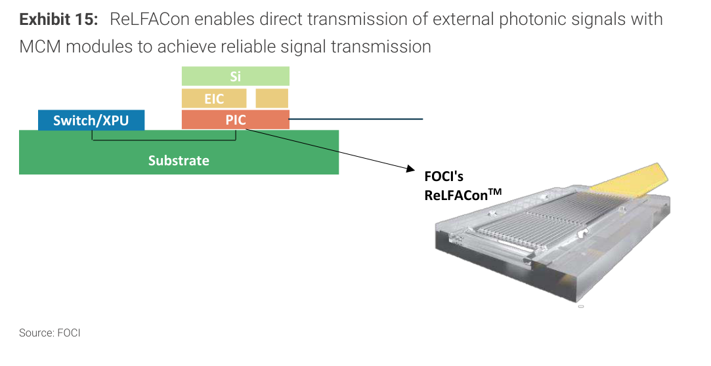

### 解讀摘要
FOCI 的 ReLFACon 是其 FAU 產品的核心平台——圖示顯示 Switch/XPU + Substrate + PIC + EIC + Si 的 MCM 堆疊中，ReLFACon 作為外部光纖與 PIC 之間的耦合介面。耐 280°C reflow（解決封裝製程相容性）是 FAU 的關鍵護城河，GlassBridge 也聲稱 solder reflow 相容，但量產規模和 ecosystem 確認仍是差異點。

> **原文補充**：MS 分析師 Tiffany Yeh 不排除 GlassBridge 長期壓縮 FAU TAM，但目前 TSMC COUPE platform 及主要客戶（Nvidia、AMD、Ayar Labs）仍採 grating coupling，預計 2H26 量產，不會在短期切換。

---

## 相關個股清單

| 類別 | 公司 | Ticker | 評等 | 備註 |
|---|---|---|---|---|
| CPO/FAU | FOCI 上詮 | 3363.TWO | OW | FAU 主力供應商，ReLFACon 平台，TSMC COUPE |
| CPO/FAU | ASE/SPIL | 3711.TW | OW | OSAT 組裝+測試 |
| ABF/CoPoS | TSMC | 2330.TW | OW | AP7 CoPoS 主廠；CoWoS 量產；PIC 25kwpm 2028 |
| ABF | Unimicron | 3037.TW | OW | ABF substrate，MediaTek TPU 主要供應商 |
| ABF | Nan Ya PCB | 8046.TW | OW | ABF substrate |
| ABF | Zhen Ding | 4958.TW | OW | ABF substrate；光收發 PCB；AI server PCB |
| ABF | SEMCO | 009150.KS | OW | ABF substrate |
| ABF | Ibiden | 4062.T | UW | ABF + CoPoS substrate；技術領先但 2029 前無催化劑 |
| T-Glass | Nitto Boseki | 3110.T | OW | T-Glass 領先供應商 |
| CoPoS/TGV | Innolux | 3481.TW | EW | TGV 製程開發，2028 量產為目標，執行風險高 |
| ASIC | MediaTek | 2454.TW | OW | Google 3nm ZebraFish TPU 2027E 3mn units |
